!!! abstract "Tóm tắt"

    Họ Chenopodiaceae gồm khoảng 13 chi và 33 loài được một số cộng đồng tại các quốc gia như Trinidad, Brazil, Mexico(Seri), Guatemala, French, Mexico, Europe, Haiti, Portuguese, China, Iraq, Dutch, Turkey, Panama, Sudan, German, US(Appalachia), ain, Venezuela, Elsewhere, Bahamas, anish, US(Amerindian), Dominican Republic, Pakistan, India, Mexico(Chinantec), US, Argentina, France, Sanscrit sử dụng trong một số trường hợp QUERY LENGTH LIMIT EXCEEDED. MAX ALLOWED QUERY : 500 CHARS MYMEMORY WARNING: YOU USED ALL AVAILABLE FREE TRANSLATIONS FOR TODAY. NEXT AVAILABLE IN  15 HOURS 00 MINUTES 47 SECONDS VISIT HTTPS://MYMEMORY.TRANSLATED.NET/DOC/USAGELIMITS.PHP TO TRANSLATE MORE.

!!! info "DrDuke"

    James A. Duke sinh năm 1929-2017 là một nhà thực vật học người Mỹ. Đây là một trong những tác giả hàng đầu trong lĩnh vực dược dân tộc học với cuốn *CRC Handbook of Medicinal Herbs* và chính là người xây dựng lên cơ sở dữ liệu về hợp chất tự nhiên và dược dân tộc học tại Bộ nông nghiệp Hoa Kỳ. Các thông tin được đăng tải tại website [Dr. Duke's Phytochemical and Ethnobotanical Databases](https://phytochem.nal.usda.gov/). 
    Trong suốt thập niên 1970, ông lãnh đạo the Plant Taxonomy Laboratory, Plant Genetics and Germplasm Institute of the Agricultural Research Service, U.S. Department of Agriculture.
    Trong tài liệu này, các thông tin về dược dân tộc của các dược liệu được trích dẫn từ tài liệu của James A. Ducke với sự trợ giúp của phần mềm dịch thuật từ tiếng Anh sang tiếng Việt.
   

# Chi Atriplex

??? note "Danh sách các dược liệu thuộc chi"
    
	 - *Atriplex canescens*
	 - *Atriplex hortensis*
	 - *Atriplex linearis*
	 - *Atriplex patula*

---
## Atriplex canescens
### Thông tin về thực vật

!!! info "Phân loại thực vật của *Atriplex canescens* từ GIBF:"
    - **Kingdom:** Plantae
    - **Phylum:** Tracheophyta
    - **Order:** Caryophyllales
    - **Family:** Amaranthaceae
    - **Genus:** Atriplex
    - **Species:** *Atriplex canescens*

 

| Label (VI)   | Label (EN)   | Scientific Name    | Descriptions (VI)   | Descriptions (EN)   | Also Known As (VI)   | Also Known As (EN)    |
|:-------------|:-------------|:-------------------|:--------------------|:--------------------|:---------------------|:----------------------|
| N/A          | N/A          | Atriplex canescens | loài thực vật       | species of plant    | ['']                 | ['Fourwing saltbush'] |

#### Phân bố trên thế giới

**Từ CSDL GIBF** Mexico, United States of America

#### Phân bố tại Việt Nam

**Từ CSDL GIBF**: Không có ghi nhận ở Việt Nam

---
### Thành phần hóa học
        
- Theo cơ sở dữ liệu lotus: Từ loài *Atriplex canescens* đã phân lập và xác định được Chưa có hoạt chất nào được phân lập. hoạt chất thuộc về các nhóm Không có hoạt chất nào được phân lập. 

Không có hình ảnh nào được tạo ra

---

### Dược dân tộc học

Danh sách các quốc gia có sử dụng *Atriplex canescens* trong điều trị các bệnh. 

| Country      | Disease   | Bệnh                                                                                                                                                                                                |
|:-------------|:----------|:----------------------------------------------------------------------------------------------------------------------------------------------------------------------------------------------------|
| Mexico(Seri) | Emetic    | MYMEMORY WARNING: YOU USED ALL AVAILABLE FREE TRANSLATIONS FOR TODAY. NEXT AVAILABLE IN  15 HOURS 00 MINUTES 44 SECONDS VISIT HTTPS://MYMEMORY.TRANSLATED.NET/DOC/USAGELIMITS.PHP TO TRANSLATE MORE |

---

---
## Atriplex hortensis
### Thông tin về thực vật

!!! info "Phân loại thực vật của *Atriplex hortensis* từ GIBF:"
    - **Kingdom:** Plantae
    - **Phylum:** Tracheophyta
    - **Order:** Caryophyllales
    - **Family:** Amaranthaceae
    - **Genus:** Atriplex
    - **Species:** *Atriplex hortensis*

 

| Label (VI)   | Label (EN)   | Scientific Name    | Descriptions (VI)   | Descriptions (EN)   | Also Known As (VI)   | Also Known As (EN)                                                                                 |
|:-------------|:-------------|:-------------------|:--------------------|:--------------------|:---------------------|:---------------------------------------------------------------------------------------------------|
| N/A          | N/A          | Atriplex hortensis | loài thực vật       | species of plant    | ['']                 | ['red orache', 'arrach', 'French spinach', 'garden orache', 'mountain spinach', 'orach', 'orache'] |

#### Phân bố trên thế giới

**Từ CSDL GIBF** Czechia, Sweden, Finland, New Zealand, Poland, Denmark, Netherlands, United States of America, Romania, Russian Federation, Croatia, Estonia, Belarus, Norway, United Kingdom of Great Britain and Northern Ireland, Belgium, Canada, Germany, Panama, Austria, Hungary, Ukraine, South Africa, Slovakia, Italy, Switzerland, India, France

#### Phân bố tại Việt Nam

**Từ CSDL GIBF**: Không có ghi nhận ở Việt Nam

---
### Thành phần hóa học
        
- Theo cơ sở dữ liệu lotus: Từ loài *Atriplex hortensis* đã phân lập và xác định được 4 hoạt chất thuộc về các nhóm Carboxylic acids and derivatives, Flavonoids. 

|    | chemicalTaxonomyClassyfireClass   |   smiles_count |
|---:|:----------------------------------|---------------:|
|  0 | Carboxylic acids and derivatives  |              2 |
|  1 | Flavonoids                        |              2 |

#### Nhóm Carboxylic acids and derivatives
<figure markdown="span">
    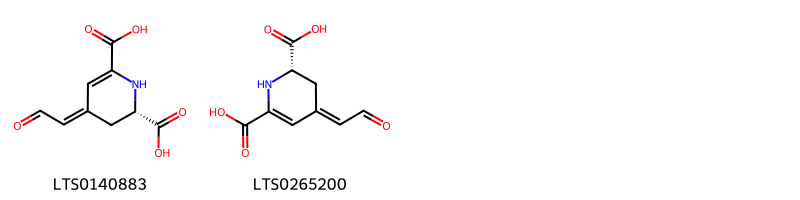{ width=100% }
    <figcaption>Hình ảnh cấu trúc hóa học của 2 hoạt chất thuộc nhóm Carboxylic acids and derivatives gồm ['(2s,4z)-4-(2-oxoethylidene)-2,3-dihydro-1h-pyridine-2,6-dicarboxylic acid (LTS0140883)', 'betalamic acid (LTS0265200)'].</figcaption>
</figure>
#### Nhóm Flavonoids
<figure markdown="span">
    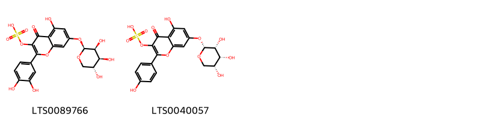{ width=100% }
    <figcaption>Hình ảnh cấu trúc hóa học của 2 hoạt chất thuộc nhóm Flavonoids gồm ['[2-(3,4-dihydroxyphenyl)-5-hydroxy-4-oxo-7-{[(2s,3s,4s,5r)-3,4,5-trihydroxyoxan-2-yl]oxy}chromen-3-yl]oxidanesulfonic acid (LTS0089766)', '[5-hydroxy-2-(4-hydroxyphenyl)-4-oxo-7-{[(2r,3r,4r,5r)-3,4,5-trihydroxyoxan-2-yl]oxy}chromen-3-yl]oxidanesulfonic acid (LTS0040057)'].</figcaption>
</figure>

---

### Dược dân tộc học

Danh sách các quốc gia có sử dụng *Atriplex hortensis* trong điều trị các bệnh. 

| Country    | Disease             | Bệnh                                                                                                                                                                                                |
|:-----------|:--------------------|:----------------------------------------------------------------------------------------------------------------------------------------------------------------------------------------------------|
| Iraq       | Diuretic, Emollient | MYMEMORY WARNING: YOU USED ALL AVAILABLE FREE TRANSLATIONS FOR TODAY. NEXT AVAILABLE IN  15 HOURS 00 MINUTES 13 SECONDS VISIT HTTPS://MYMEMORY.TRANSLATED.NET/DOC/USAGELIMITS.PHP TO TRANSLATE MORE |
| Portuguese | Diuretic            | MYMEMORY WARNING: YOU USED ALL AVAILABLE FREE TRANSLATIONS FOR TODAY. NEXT AVAILABLE IN  15 HOURS 00 MINUTES 09 SECONDS VISIT HTTPS://MYMEMORY.TRANSLATED.NET/DOC/USAGELIMITS.PHP TO TRANSLATE MORE |
| anish      | Emollient           | MYMEMORY WARNING: YOU USED ALL AVAILABLE FREE TRANSLATIONS FOR TODAY. NEXT AVAILABLE IN  15 HOURS 00 MINUTES 07 SECONDS VISIT HTTPS://MYMEMORY.TRANSLATED.NET/DOC/USAGELIMITS.PHP TO TRANSLATE MORE |

---

---
## Atriplex linearis
### Thông tin về thực vật

!!! info "Phân loại thực vật của *Atriplex linearis* từ GIBF:"
    - **Kingdom:** Plantae
    - **Phylum:** Tracheophyta
    - **Order:** Caryophyllales
    - **Family:** Amaranthaceae
    - **Genus:** Atriplex
    - **Species:** *Atriplex linearis*

 

| Label (VI)   | Label (EN)   | Scientific Name   | Descriptions (VI)   | Descriptions (EN)   | Also Known As (VI)   | Also Known As (EN)   |
|:-------------|:-------------|:------------------|:--------------------|:--------------------|:---------------------|:---------------------|
| N/A          | N/A          | Atriplex linearis | loài thực vật       | species of plant    | ['']                 | ['']                 |

#### Phân bố trên thế giới

**Từ CSDL GIBF** Mexico, United States of America

#### Phân bố tại Việt Nam

**Từ CSDL GIBF**: Không có ghi nhận ở Việt Nam

---
### Thành phần hóa học
        
- Theo cơ sở dữ liệu lotus: Từ loài *Atriplex linearis* đã phân lập và xác định được Chưa có hoạt chất nào được phân lập. hoạt chất thuộc về các nhóm Không có hoạt chất nào được phân lập. 

Không có hình ảnh nào được tạo ra

---

### Dược dân tộc học

Danh sách các quốc gia có sử dụng *Atriplex linearis* trong điều trị các bệnh. 

| Country      | Disease   | Bệnh                                                                                                                                                                                                |
|:-------------|:----------|:----------------------------------------------------------------------------------------------------------------------------------------------------------------------------------------------------|
| Mexico(Seri) | Emetic    | MYMEMORY WARNING: YOU USED ALL AVAILABLE FREE TRANSLATIONS FOR TODAY. NEXT AVAILABLE IN  14 HOURS 59 MINUTES 41 SECONDS VISIT HTTPS://MYMEMORY.TRANSLATED.NET/DOC/USAGELIMITS.PHP TO TRANSLATE MORE |

---

---
## Atriplex patula
### Thông tin về thực vật

!!! info "Phân loại thực vật của *Atriplex patula* từ GIBF:"
    - **Kingdom:** Plantae
    - **Phylum:** Tracheophyta
    - **Order:** Caryophyllales
    - **Family:** Amaranthaceae
    - **Genus:** Atriplex
    - **Species:** *Atriplex patula*

 

| Label (VI)   | Label (EN)   | Scientific Name   | Descriptions (VI)   | Descriptions (EN)   | Also Known As (VI)   | Also Known As (EN)   |
|:-------------|:-------------|:------------------|:--------------------|:--------------------|:---------------------|:---------------------|
| N/A          | N/A          | Atriplex patula   | loài thực vật       | species of plant    | ['']                 | ['']                 |

#### Phân bố trên thế giới

**Từ CSDL GIBF** Czechia, Sweden, Finland, New Zealand, Denmark, Netherlands, United States of America, Russian Federation, Estonia, Lithuania, Belarus, Norway, France, Belgium, Germany, Austria, Ukraine, South Africa, Switzerland, United Kingdom of Great Britain and Northern Ireland

#### Phân bố tại Việt Nam

**Từ CSDL GIBF**: Không có ghi nhận ở Việt Nam

---
### Thành phần hóa học
        
- Theo cơ sở dữ liệu lotus: Từ loài *Atriplex patula* đã phân lập và xác định được Chưa có hoạt chất nào được phân lập. hoạt chất thuộc về các nhóm Không có hoạt chất nào được phân lập. 

Không có hình ảnh nào được tạo ra

---

### Dược dân tộc học

Danh sách các quốc gia có sử dụng *Atriplex patula* trong điều trị các bệnh. 

| Country   | Disease     | Bệnh                                                                                                                                                                                                |
|:----------|:------------|:----------------------------------------------------------------------------------------------------------------------------------------------------------------------------------------------------|
| German    | Emmenagogue | MYMEMORY WARNING: YOU USED ALL AVAILABLE FREE TRANSLATIONS FOR TODAY. NEXT AVAILABLE IN  14 HOURS 59 MINUTES 12 SECONDS VISIT HTTPS://MYMEMORY.TRANSLATED.NET/DOC/USAGELIMITS.PHP TO TRANSLATE MORE |

---

# Chi Beta

??? note "Danh sách các dược liệu thuộc chi"
    
	 - *Beta vulgaris*

---
## Beta vulgaris
### Thông tin về thực vật

!!! info "Phân loại thực vật của *Beta vulgaris* từ GIBF:"
    - **Kingdom:** Plantae
    - **Phylum:** Tracheophyta
    - **Order:** Caryophyllales
    - **Family:** Amaranthaceae
    - **Genus:** Beta
    - **Species:** *Beta vulgaris*

 

| Label (VI)   | Label (EN)   | Scientific Name   | Descriptions (VI)   | Descriptions (EN)         | Also Known As (VI)   | Also Known As (EN)   |
|:-------------|:-------------|:------------------|:--------------------|:--------------------------|:---------------------|:---------------------|
| N/A          | N/A          | Beta vulgaris     | loài thực vật       | species of the genus beet | ['']                 | ['beet', 'Sea beet'] |

#### Phân bố trên thế giới

**Từ CSDL GIBF** Malta, Sweden, Israel, New Zealand, Spain, Denmark, Netherlands, United States of America, Croatia, Cyprus, Morocco, Mexico, Algeria, Benin, Gibraltar, United Kingdom of Great Britain and Northern Ireland, Belgium, Germany, Portugal, Australia, Italy, France, Ireland

#### Phân bố tại Việt Nam

**Từ CSDL GIBF**: Không có ghi nhận ở Việt Nam

---
### Thành phần hóa học
        
- Theo cơ sở dữ liệu lotus: Từ loài *Beta vulgaris* đã phân lập và xác định được 201 hoạt chất thuộc về các nhóm Fatty Acyls, Benzene and substituted derivatives, Flavonoids, Dibenzylbutane lignans, Carboxylic acids and derivatives, Cinnamic acids and derivatives, Steroids and steroid derivatives, Tetrapyrroles and derivatives, Phenols, Imidazopyrimidines, Organooxygen compounds, Isoflavonoids, Hydroxy acids and derivatives, Furanoid lignans, Prenol lipids, Betalains, Indoles and derivatives. 

|    | chemicalTaxonomyClassyfireClass     |   smiles_count |
|---:|:------------------------------------|---------------:|
|  0 | Benzene and substituted derivatives |              6 |
|  1 | Betalains                           |              6 |
|  2 | Carboxylic acids and derivatives    |             32 |
|  3 | Cinnamic acids and derivatives      |             14 |
|  4 | Dibenzylbutane lignans              |              2 |
|  5 | Fatty Acyls                         |              1 |
|  6 | Flavonoids                          |             27 |
|  7 | Furanoid lignans                    |              1 |
|  8 | Hydroxy acids and derivatives       |              1 |
|  9 | Imidazopyrimidines                  |              3 |
| 10 | Indoles and derivatives             |              5 |
| 11 | Isoflavonoids                       |              4 |
| 12 | Organooxygen compounds              |             22 |
| 13 | Phenols                             |              4 |
| 14 | Prenol lipids                       |             33 |
| 15 | Steroids and steroid derivatives    |             19 |
| 16 | Tetrapyrroles and derivatives       |              3 |

#### Nhóm Benzene and substituted derivatives
<figure markdown="span">
    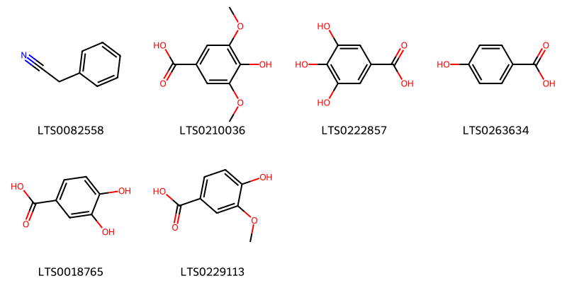{ width=100% }
    <figcaption>Hình ảnh cấu trúc hóa học của 6 hoạt chất thuộc nhóm Benzene and substituted derivatives gồm ['phenylacetonitrile (LTS0082558)', 'syringic acid (LTS0210036)', 'galop (LTS0222857)', 'p-hydroxybenzoic acid (LTS0263634)', '3,4-dihydroxybenzoic acid (LTS0018765)', 'vanillic acid (LTS0229113)'].</figcaption>
</figure>
#### Nhóm Betalains
<figure markdown="span">
    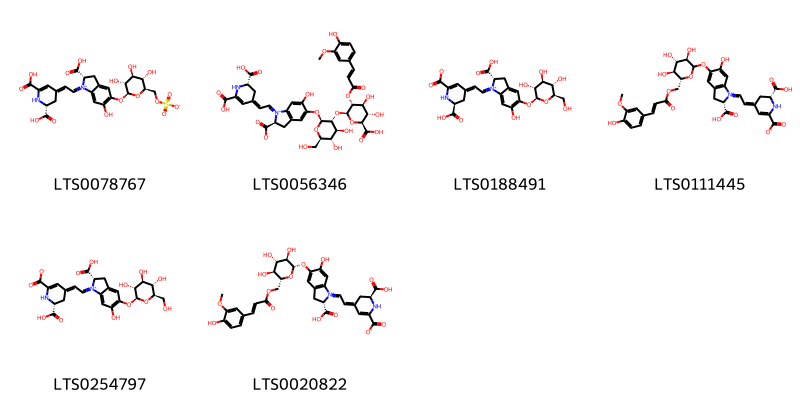{ width=100% }
    <figcaption>Hình ảnh cấu trúc hóa học của 6 hoạt chất thuộc nhóm Betalains gồm ['(2s)-2-carboxy-1-{2-[(2r)-2,6-dicarboxy-2,3-dihydro-1h-pyridin-4-ylidene]ethylidene}-6-hydroxy-5-{[(2s,3r,4s,5s,6r)-3,4,5-trihydroxy-6-[(sulfonatooxy)methyl]oxan-2-yl]oxy}-2,3-dihydro-1h-1λ⁵-indol-1-ylium (LTS0078767)', '(2s)-5-{[(2s,3r,4s,5s,6r)-3-{[(2r,3r,4s,5s,6s)-6-carboxy-4,5-dihydroxy-3-{[3-(4-hydroxy-3-methoxyphenyl)prop-2-enoyl]oxy}oxan-2-yl]oxy}-4,5-dihydroxy-6-(hydroxymethyl)oxan-2-yl]oxy}-1-{2-[(2s)-2,6-dicarboxy-2,3-dihydro-1h-pyridin-4-ylidene]ethylidene}-6-hydroxy-2,3-dihydro-1h-1λ⁵-indol-1-ylium-2-carboxylate (LTS0056346)', '(2s)-2-carboxy-1-{2-[(2s)-2-carboxy-6-carboxylato-2,3-dihydro-1h-pyridin-4-ylidene]ethylidene}-6-hydroxy-5-{[(2s,3r,4s,5s,6r)-3,4,5-trihydroxy-6-(hydroxymethyl)oxan-2-yl]oxy}-2,3-dihydro-1h-1λ⁵-indol-1-ylium (LTS0188491)', '(2s)-2-carboxy-1-{2-[(2r)-2-carboxy-6-carboxylato-2,3-dihydro-1h-pyridin-4-ylidene]ethylidene}-6-hydroxy-5-{[(3r,4s,5s,6r)-3,4,5-trihydroxy-6-({[3-(4-hydroxy-3-methoxyphenyl)prop-2-enoyl]oxy}methyl)oxan-2-yl]oxy}-2,3-dihydro-1h-1λ⁵-indol-1-ylium (LTS0111445)', '(2s)-2-carboxy-1-{2-[(2r)-2-carboxy-6-carboxylato-2,3-dihydro-1h-pyridin-4-ylidene]ethylidene}-6-hydroxy-5-{[(2s,3r,4s,5s,6r)-3,4,5-trihydroxy-6-(hydroxymethyl)oxan-2-yl]oxy}-2,3-dihydro-1h-1λ⁵-indol-1-ylium (LTS0254797)', '(2s)-2-carboxy-1-{2-[(2s)-2-carboxy-6-carboxylato-2,3-dihydro-1h-pyridin-4-ylidene]ethylidene}-6-hydroxy-5-{[(2s,3r,4s,5s,6r)-3,4,5-trihydroxy-6-({[3-(4-hydroxy-3-methoxyphenyl)prop-2-enoyl]oxy}methyl)oxan-2-yl]oxy}-2,3-dihydro-1h-1λ⁵-indol-1-ylium (LTS0020822)'].</figcaption>
</figure>
#### Nhóm Carboxylic acids and derivatives
<figure markdown="span">
    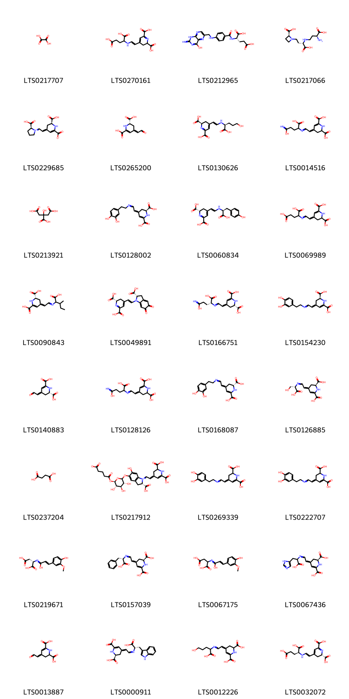{ width=100% }
    <figcaption>Hình ảnh cấu trúc hóa học của 32 hoạt chất thuộc nhóm Carboxylic acids and derivatives gồm ['oxalic acid (LTS0217707)', '4-[(1e)-2-[(1,3-dicarboxypropyl)amino]ethenyl]-2,3-dihydropyridine-2,6-dicarboxylic acid (LTS0270161)', 'acid, folic (LTS0212965)', 'nicotianamine (LTS0217066)', '(2s)-2-carboxy-1-{2-[(2s)-2-carboxy-6-carboxylato-2,3-dihydro-1h-pyridin-4-ylidene]ethylidene}-1λ⁵-pyrrolidin-1-ylium (LTS0229685)', 'betalamic acid (LTS0265200)', '(2r)-4-[(1e)-2-{[(1s)-1-carboxy-4-hydroxybutyl]amino}ethenyl]-2,3-dihydropyridine-2,6-dicarboxylic acid (LTS0130626)', '4-(2-{[1-carboxy-3-(c-hydroxycarbonimidoyl)propyl]imino}ethylidene)-2,3-dihydro-1h-pyridine-2,6-dicarboxylic acid (LTS0014516)', 'citric acid (LTS0213921)', '(2s,4e)-4-[(2z)-2-{[2-(3,4-dihydroxyphenyl)ethyl]imino}ethylidene]-2,3-dihydro-1h-pyridine-2,6-dicarboxylic acid (LTS0128002)', '(2s)-4-[(1e)-2-{[(1s)-1-carboxy-2-(4-hydroxyphenyl)ethyl]amino}ethenyl]-2,3-dihydropyridine-2,6-dicarboxylic acid (LTS0060834)', '(4z)-4-{2-[(1,3-dicarboxypropyl)imino]ethylidene}-2,3-dihydro-1h-pyridine-2,6-dicarboxylic acid (LTS0069989)', '(2s,4e)-4-{2-[(1-carboxy-2-methylbutyl)imino]ethylidene}-2,3-dihydro-1h-pyridine-2,6-dicarboxylic acid (LTS0090843)', '(2s)-4-[(1e)-2-[(2s)-2-carboxy-5,6-dioxo-2,3-dihydroindol-1-yl]ethenyl]-2,3-dihydropyridine-2,6-dicarboxylic acid (LTS0049891)', '(2s,4z)-4-[(2e)-2-{[(1r)-1-carboxy-3-(c-hydroxycarbonimidoyl)propyl]imino}ethylidene]-2,3-dihydro-1h-pyridine-2,6-dicarboxylic acid (LTS0166751)', '(2s,4e)-4-[(2e)-2-{[2-(3,4-dihydroxyphenyl)ethyl]imino}ethylidene]-2,3-dihydro-1h-pyridine-2,6-dicarboxylic acid (LTS0154230)', '(2s,4z)-4-(2-oxoethylidene)-2,3-dihydro-1h-pyridine-2,6-dicarboxylic acid (LTS0140883)', '(4z)-4-(2-{[1-carboxy-3-(c-hydroxycarbonimidoyl)propyl]imino}ethylidene)-2,3-dihydro-1h-pyridine-2,6-dicarboxylic acid (LTS0128126)', '(2r,4e)-4-[(2z)-2-{[2-(3,4-dihydroxyphenyl)ethyl]imino}ethylidene]-2,3-dihydro-1h-pyridine-2,6-dicarboxylic acid (LTS0168087)', '(2s,4e)-4-[(2z)-2-{[(1s)-1-carboxy-2-hydroxyethyl]imino}ethylidene]-2,3-dihydro-1h-pyridine-2,6-dicarboxylic acid (LTS0126885)', 'succinic acid (LTS0237204)', '(2s)-2-carboxy-5-{[(3r,4r,5s,6r)-6-[(4-carboxylatobutanoyl)oxy]-3,4,5-trihydroxyoxan-2-yl]oxy}-1-[2-(2,6-dicarboxy-2,3-dihydro-1h-pyridin-4-ylidene)ethylidene]-6-hydroxy-2,3-dihydro-1h-1λ⁵-indol-1-ylium (LTS0217912)', '4-[(2e)-2-{[2-(3,4-dihydroxyphenyl)ethyl]imino}ethylidene]-2,3-dihydro-1h-pyridine-2,6-dicarboxylic acid (LTS0269339)', '4-(2-{[2-(3,4-dihydroxyphenyl)ethyl]imino}ethylidene)-2,3-dihydro-1h-pyridine-2,6-dicarboxylic acid (LTS0222707)', '(2s)-2-{[(2e)-1-hydroxy-3-(4-hydroxy-3-methoxyphenyl)prop-2-en-1-ylidene]amino}butanedioic acid (LTS0219671)', '(2s,4e)-4-[(2z)-2-{[(1s)-1-carboxy-2-phenylethyl]imino}ethylidene]-2,3-dihydro-1h-pyridine-2,6-dicarboxylic acid (LTS0157039)', '2-{[1-hydroxy-3-(4-hydroxy-3-methoxyphenyl)prop-2-en-1-ylidene]amino}butanedioic acid (LTS0067175)', '(2s,4e)-4-[(2z)-2-{[1-carboxy-2-(3h-imidazol-4-yl)ethyl]imino}ethylidene]-2,3-dihydro-1h-pyridine-2,6-dicarboxylic acid (LTS0067436)', '4-(2-oxoethylidene)-2,3-dihydro-1h-pyridine-2,6-dicarboxylic acid (LTS0013887)', '(2s,4e)-4-[(2z)-2-{[(1s)-1-carboxy-2-(1h-indol-3-yl)ethyl]imino}ethylidene]-2,3-dihydro-1h-pyridine-2,6-dicarboxylic acid (LTS0000911)', '(4z)-4-{2-[(1-carboxy-4-hydroxybutyl)imino]ethylidene}-2,3-dihydro-1h-pyridine-2,6-dicarboxylic acid (LTS0012226)', '(2s)-4-[(1e)-2-{[(1s)-1,3-dicarboxypropyl]amino}ethenyl]-2,3-dihydropyridine-2,6-dicarboxylic acid (LTS0032072)'].</figcaption>
</figure>
#### Nhóm Cinnamic acids and derivatives
<figure markdown="span">
    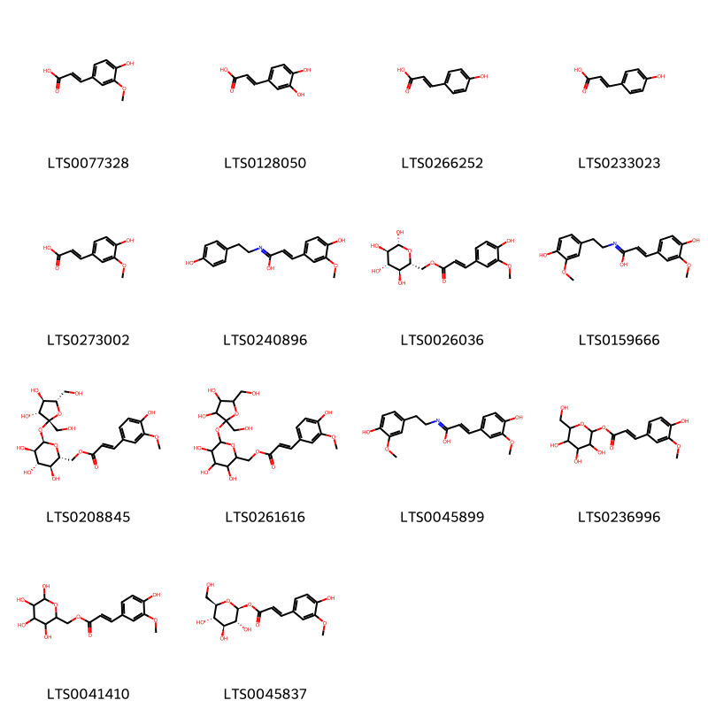{ width=100% }
    <figcaption>Hình ảnh cấu trúc hóa học của 14 hoạt chất thuộc nhóm Cinnamic acids and derivatives gồm ['ferulic acid (LTS0077328)', '3,4-dihydroxycinnamic acid (LTS0128050)', 'para-coumaric acid (LTS0266252)', 'hydroxycinnamic acid (LTS0233023)', 'ferulic acid (LTS0273002)', '3-(4-hydroxy-3-methoxyphenyl)-n-[2-(4-hydroxyphenyl)ethyl]prop-2-enimidic acid (LTS0240896)', '[(2r,3s,4s,5r,6r)-3,4,5,6-tetrahydroxyoxan-2-yl]methyl (2e)-3-(4-hydroxy-3-methoxyphenyl)prop-2-enoate (LTS0026036)', '3-(4-hydroxy-3-methoxyphenyl)-n-[2-(4-hydroxy-3-methoxyphenyl)ethyl]prop-2-enimidic acid (LTS0159666)', '[(2r,3s,4s,5r,6r)-6-{[(2r,3r,4r,5s)-3,4-dihydroxy-2,5-bis(hydroxymethyl)oxolan-2-yl]oxy}-3,4,5-trihydroxyoxan-2-yl]methyl (2e)-3-(4-hydroxy-3-methoxyphenyl)prop-2-enoate (LTS0208845)', '(6-{[3,4-dihydroxy-2,5-bis(hydroxymethyl)oxolan-2-yl]oxy}-3,4,5-trihydroxyoxan-2-yl)methyl 3-(4-hydroxy-3-methoxyphenyl)prop-2-enoate (LTS0261616)', '(2e)-3-(4-hydroxy-3-methoxyphenyl)-n-[2-(4-hydroxy-3-methoxyphenyl)ethyl]prop-2-enimidic acid (LTS0045899)', '3,4,5-trihydroxy-6-(hydroxymethyl)oxan-2-yl 3-(4-hydroxy-3-methoxyphenyl)prop-2-enoate (LTS0236996)', '(3,4,5,6-tetrahydroxyoxan-2-yl)methyl 3-(4-hydroxy-3-methoxyphenyl)prop-2-enoate (LTS0041410)', '1-o-feruloyl-β-d-glucose (LTS0045837)'].</figcaption>
</figure>
#### Nhóm Dibenzylbutane lignans
<figure markdown="span">
    { width=100% }
    <figcaption>Hình ảnh cấu trúc hóa học của 2 hoạt chất thuộc nhóm Dibenzylbutane lignans gồm ['(2s,3r)-2,3-bis[(4-hydroxy-3-methoxyphenyl)(¹³c)methyl](1-¹³c)butane-1,4-diol (LTS0268699)', 'secoisolariciresinol (LTS0086727)'].</figcaption>
</figure>
#### Nhóm Fatty Acyls
<figure markdown="span">
    { width=100% }
    <figcaption>Hình ảnh cấu trúc hóa học của 1 hoạt chất thuộc nhóm Fatty Acyls gồm ['2-carboxy-d-arabinitol (LTS0056947)'].</figcaption>
</figure>
#### Nhóm Flavonoids
<figure markdown="span">
    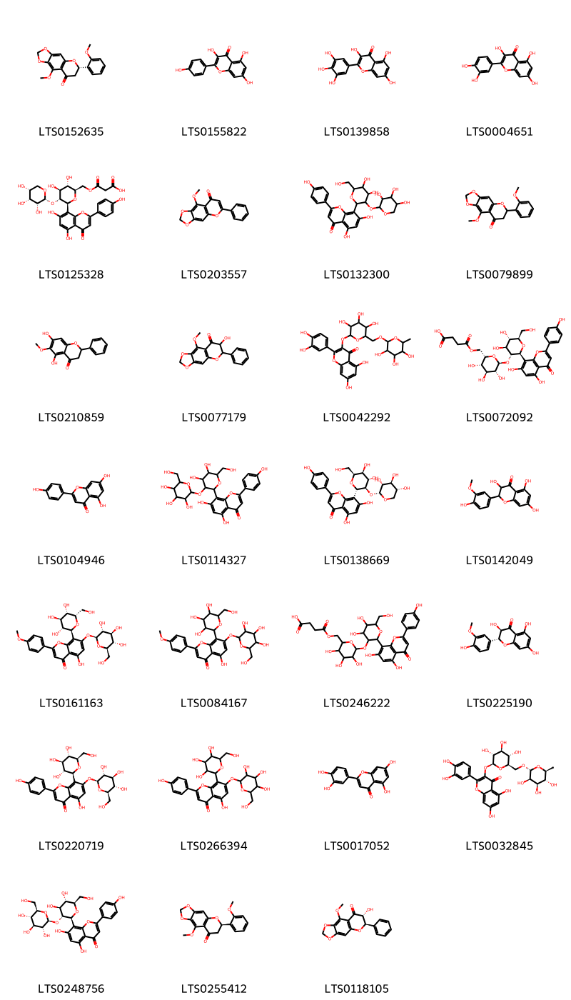{ width=100% }
    <figcaption>Hình ảnh cấu trúc hóa học của 27 hoạt chất thuộc nhóm Flavonoids gồm ['betagarin (LTS0152635)', 'kaempherol (LTS0155822)', 'myricetin (LTS0139858)', 'quercetin (LTS0004651)', '3-{[(2r,3s,4s,5r,6s)-6-[5,7-dihydroxy-2-(4-hydroxyphenyl)-4-oxochromen-8-yl]-3,4-dihydroxy-5-{[(2r,3r,4r,5r)-3,4,5-trihydroxyoxan-2-yl]oxy}oxan-2-yl]methoxy}-3-oxopropanoic acid (LTS0125328)', '9-methoxy-6-phenyl-2h-[1,3]dioxolo[4,5-g]chromen-8-one (LTS0203557)', '8-[4,5-dihydroxy-6-(hydroxymethyl)-3-[(3,4,5-trihydroxyoxan-2-yl)oxy]oxan-2-yl]-5,7-dihydroxy-2-(4-hydroxyphenyl)chromen-4-one (LTS0132300)', '2-methoxy-11-(2-methoxyphenyl)-4,6,10-trioxatricyclo[7.4.0.0³,⁷]trideca-1(9),2,7-trien-13-one (LTS0079899)', 'dihydrooroxylin a (LTS0210859)', '12-hydroxy-2-methoxy-11-phenyl-4,6,10-trioxatricyclo[7.4.0.0³,⁷]trideca-1(9),2,7-trien-13-one (LTS0077179)', 'rutin (LTS0042292)', '4-{[(2s,3s,4s,5r,6s)-6-{[(2s,3r,4s,5s,6r)-2-[5,7-dihydroxy-2-(4-hydroxyphenyl)-4-oxochromen-8-yl]-4,5-dihydroxy-6-(hydroxymethyl)oxan-3-yl]oxy}-3,4,5-trihydroxyoxan-2-yl]methoxy}-4-oxobutanoic acid (LTS0072092)', 'chamomile (LTS0104946)', '8-[4,5-dihydroxy-6-(hydroxymethyl)-3-{[3,4,5-trihydroxy-6-(hydroxymethyl)oxan-2-yl]oxy}oxan-2-yl]-5,7-dihydroxy-2-(4-hydroxyphenyl)chromen-4-one (LTS0114327)', '8-[(2s,3r,4s,5s,6s)-4,5-dihydroxy-6-(hydroxymethyl)-3-{[(2r,3r,4s,5r)-3,4,5-trihydroxyoxan-2-yl]oxy}oxan-2-yl]-5,7-dihydroxy-2-(4-hydroxyphenyl)chromen-4-one (LTS0138669)', '3,5,7-trihydroxy-2-(4-hydroxy-3-methoxyphenyl)-2,3-dihydro-1-benzopyran-4-one (LTS0142049)', '5-hydroxy-2-(4-methoxyphenyl)-8-[(2s,3r,4r,5s,6s)-3,4,5-trihydroxy-6-(hydroxymethyl)oxan-2-yl]-7-{[(2s,3r,4s,5s,6r)-3,4,5-trihydroxy-6-(hydroxymethyl)oxan-2-yl]oxy}chromen-4-one (LTS0161163)', '5-hydroxy-2-(4-methoxyphenyl)-8-[3,4,5-trihydroxy-6-(hydroxymethyl)oxan-2-yl]-7-{[3,4,5-trihydroxy-6-(hydroxymethyl)oxan-2-yl]oxy}chromen-4-one (LTS0084167)', '4-{[6-({2-[5,7-dihydroxy-2-(4-hydroxyphenyl)-4-oxochromen-8-yl]-4,5-dihydroxy-6-(hydroxymethyl)oxan-3-yl}oxy)-3,4,5-trihydroxyoxan-2-yl]methoxy}-4-oxobutanoic acid (LTS0246222)', '(2r,3r)-3,5,7-trihydroxy-2-(4-hydroxy-3-methoxyphenyl)-2,3-dihydro-1-benzopyran-4-one (LTS0225190)', '5-hydroxy-2-(4-hydroxyphenyl)-8-[(2s,3r,4r,5s,6r)-3,4,5-trihydroxy-6-(hydroxymethyl)oxan-2-yl]-7-{[(2s,3r,4s,5s,6r)-3,4,5-trihydroxy-6-(hydroxymethyl)oxan-2-yl]oxy}chromen-4-one (LTS0220719)', '5-hydroxy-2-(4-hydroxyphenyl)-8-[3,4,5-trihydroxy-6-(hydroxymethyl)oxan-2-yl]-7-{[3,4,5-trihydroxy-6-(hydroxymethyl)oxan-2-yl]oxy}chromen-4-one (LTS0266394)', 'luteolin (LTS0017052)', '3-rutinosyl quercetin (LTS0032845)', "2''-o-glucosylvitexin (LTS0248756)", '(11r)-2-methoxy-11-(2-methoxyphenyl)-4,6,10-trioxatricyclo[7.4.0.0³,⁷]trideca-1(9),2,7-trien-13-one (LTS0255412)', '(11r,12r)-12-hydroxy-2-methoxy-11-phenyl-4,6,10-trioxatricyclo[7.4.0.0³,⁷]trideca-1(9),2,7-trien-13-one (LTS0118105)'].</figcaption>
</figure>
#### Nhóm Furanoid lignans
<figure markdown="span">
    { width=100% }
    <figcaption>Hình ảnh cấu trúc hóa học của 1 hoạt chất thuộc nhóm Furanoid lignans gồm ['matairesinol (LTS0193475)'].</figcaption>
</figure>
#### Nhóm Hydroxy acids and derivatives
<figure markdown="span">
    { width=100% }
    <figcaption>Hình ảnh cấu trúc hóa học của 1 hoạt chất thuộc nhóm Hydroxy acids and derivatives gồm ['malic acid (LTS0216520)'].</figcaption>
</figure>
#### Nhóm Imidazopyrimidines
<figure markdown="span">
    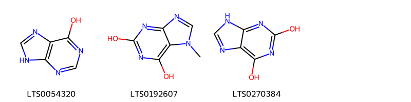{ width=100% }
    <figcaption>Hình ảnh cấu trúc hóa học của 3 hoạt chất thuộc nhóm Imidazopyrimidines gồm ['9h-purin-6-ol (LTS0054320)', '2,6-dihydroxy-7-methylpurine (LTS0192607)', '9h-purine-2,6-diol (LTS0270384)'].</figcaption>
</figure>
#### Nhóm Indoles and derivatives
<figure markdown="span">
    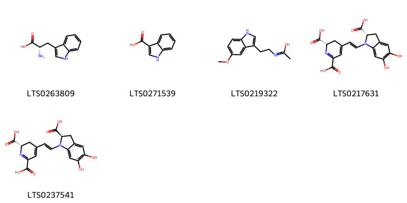{ width=100% }
    <figcaption>Hình ảnh cấu trúc hóa học của 5 hoạt chất thuộc nhóm Indoles and derivatives gồm ['l-tryptophan (LTS0263809)', 'indole - 3 carboxylic acid (LTS0271539)', 'n-[2-(5-methoxy-1h-indol-3-yl)ethyl]ethanimidic acid (LTS0219322)', 'betanidin (LTS0217631)', '(2s)-4-[(1e)-2-[(2r)-2-carboxy-5,6-dihydroxy-2,3-dihydroindol-1-yl]ethenyl]-2,3-dihydropyridine-2,6-dicarboxylic acid (LTS0237541)'].</figcaption>
</figure>
#### Nhóm Isoflavonoids
<figure markdown="span">
    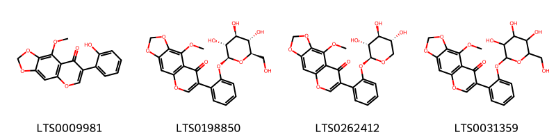{ width=100% }
    <figcaption>Hình ảnh cấu trúc hóa học của 4 hoạt chất thuộc nhóm Isoflavonoids gồm ['betavulgarin (LTS0009981)', '9-methoxy-7-(2-{[(2s,3r,4s,5s,6r)-3,4,5-trihydroxy-6-(hydroxymethyl)oxan-2-yl]oxy}phenyl)-2h-[1,3]dioxolo[4,5-g]chromen-8-one (LTS0198850)', '9-methoxy-7-(2-{[(2s,3r,4s,5r)-3,4,5-trihydroxyoxan-2-yl]oxy}phenyl)-2h-[1,3]dioxolo[4,5-g]chromen-8-one (LTS0262412)', '9-methoxy-7-(2-{[3,4,5-trihydroxy-6-(hydroxymethyl)oxan-2-yl]oxy}phenyl)-2h-[1,3]dioxolo[4,5-g]chromen-8-one (LTS0031359)'].</figcaption>
</figure>
#### Nhóm Organooxygen compounds
<figure markdown="span">
    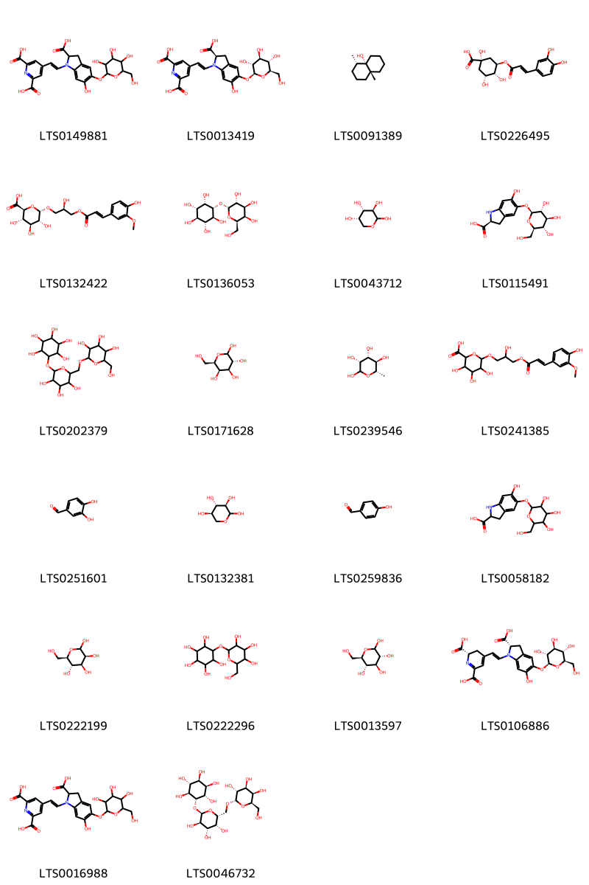{ width=100% }
    <figcaption>Hình ảnh cấu trúc hóa học của 22 hoạt chất thuộc nhóm Organooxygen compounds gồm ['4-[2-(2-carboxy-6-hydroxy-5-{[3,4,5-trihydroxy-6-(hydroxymethyl)oxan-2-yl]oxy}-2,3-dihydroindol-1-yl)ethenyl]pyridine-2,6-dicarboxylic acid (LTS0149881)', '4-{2-[(2r)-2-carboxy-6-hydroxy-5-{[(2s,3r,4s,5s,6r)-3,4,5-trihydroxy-6-(hydroxymethyl)oxan-2-yl]oxy}-2,3-dihydroindol-1-yl]ethenyl}pyridine-2,6-dicarboxylic acid (LTS0013419)', 'geosmin (LTS0091389)', 'chlorogenic acid (LTS0226495)', '(2s,3s,4s,5r,6s)-3,4,5-trihydroxy-6-[(2r)-2-hydroxy-3-{[(2e)-3-(4-hydroxy-3-methoxyphenyl)prop-2-enoyl]oxy}propoxy]oxane-2-carboxylic acid (LTS0132422)', 'galactinol (LTS0136053)', 'l-arabinopyranose (LTS0043712)', 'cyclo-dopa 5-o-glucoside (LTS0115491)', '6-{[3,4,5-trihydroxy-6-({[3,4,5-trihydroxy-6-(hydroxymethyl)oxan-2-yl]oxy}methyl)oxan-2-yl]oxy}cyclohexane-1,2,3,4,5-pentol (LTS0202379)', 'galactose (LTS0171628)', 'l-rhamnose (LTS0239546)', '3,4,5-trihydroxy-6-(2-hydroxy-3-{[3-(4-hydroxy-3-methoxyphenyl)prop-2-enoyl]oxy}propoxy)oxane-2-carboxylic acid (LTS0241385)', '3,4-dihydroxybenzaldehyde (LTS0251601)', 'd-xylose (LTS0132381)', 'p-hydroxybenzaldehyde (LTS0259836)', '6-hydroxy-5-{[3,4,5-trihydroxy-6-(hydroxymethyl)oxan-2-yl]oxy}-2,3-dihydro-1h-indole-2-carboxylic acid (LTS0058182)', 'β-glucose (LTS0222199)', '6-{[3,4,5-trihydroxy-6-(hydroxymethyl)oxan-2-yl]oxy}cyclohexane-1,2,3,4,5-pentol (LTS0222296)', 'glucose (LTS0013597)', 'betanin (LTS0106886)', '4-[(1e)-2-(2-carboxy-6-hydroxy-5-{[3,4,5-trihydroxy-6-(hydroxymethyl)oxan-2-yl]oxy}-2,3-dihydroindol-1-yl)ethenyl]pyridine-2,6-dicarboxylic acid (LTS0016988)', '(1s,2r,3r,4r,5s,6s)-6-{[(2r,3r,4s,5r,6r)-3,4,5-trihydroxy-6-({[(2s,3r,4s,5r,6r)-3,4,5-trihydroxy-6-(hydroxymethyl)oxan-2-yl]oxy}methyl)oxan-2-yl]oxy}cyclohexane-1,2,3,4,5-pentol (LTS0046732)'].</figcaption>
</figure>
#### Nhóm Phenols
<figure markdown="span">
    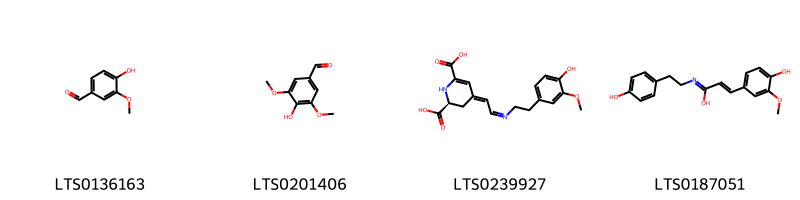{ width=100% }
    <figcaption>Hình ảnh cấu trúc hóa học của 4 hoạt chất thuộc nhóm Phenols gồm ['vanillin (LTS0136163)', 'syringaldehyde (LTS0201406)', '3-methoxytyramine-betaxanthin (LTS0239927)', '(2e)-3-(4-hydroxy-3-methoxyphenyl)-n-[2-(4-hydroxyphenyl)ethyl]prop-2-enimidic acid (LTS0187051)'].</figcaption>
</figure>
#### Nhóm Prenol lipids
<figure markdown="span">
    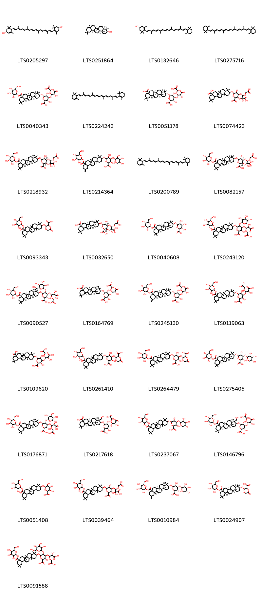{ width=100% }
    <figcaption>Hình ảnh cấu trúc hóa học của 33 hoạt chất thuộc nhóm Prenol lipids gồm ['carotenoid (LTS0205297)', 'β-amyrin (LTS0251864)', 'cryptoxanthin (LTS0132646)', 'β-carotene (LTS0275716)', '(2s,3s,4s,5r,6r)-6-{[(3s,4ar,6ar,6bs,8as,12as,14ar,14br)-4,4,6a,6b,11,11,14b-heptamethyl-8a-({[(2s,3r,4s,5s,6r)-3,4,5-trihydroxy-6-(hydroxymethyl)oxan-2-yl]oxy}carbonyl)-1,2,3,4a,5,6,7,8,9,10,12,12a,14,14a-tetradecahydropicen-3-yl]oxy}-4-[(1s,2r)-2-carboxy-1-(carboxymethoxy)-2-hydroxyethoxy]-3,5-dihydroxyoxane-2-carboxylic acid (LTS0040343)', 'α-carotene (LTS0224243)', '(2s,3s,4s,5r,6r)-6-{[(3s,4ar,6ar,6bs,8as,12as,14ar,14br)-8a-carboxy-4,4,6a,6b,11,11,14b-heptamethyl-1,2,3,4a,5,6,7,8,9,10,12,12a,14,14a-tetradecahydropicen-3-yl]oxy}-4-[(1s,2s)-2-carboxy-1-(carboxymethoxy)-2-hydroxyethoxy]-3,5-dihydroxyoxane-2-carboxylic acid (LTS0051178)', '7-[(8a-carboxy-4,4,6a,6b,11,11,14b-heptamethyl-1,2,3,4a,5,6,7,8,9,10,12,12a,14,14a-tetradecahydropicen-3-yl)oxy]-2-(carboxymethoxy)-3,8-dihydroxy-hexahydropyrano[3,4-b][1,4]dioxine-3,5-dicarboxylic acid (LTS0074423)', '(2s,3r,4as,5s,8r,8ar)-7-{[(3s,4ar,6ar,6bs,8as,12as,14ar,14br)-4,4,6a,6b,11,11,14b-heptamethyl-8a-({[(2s,3r,4s,5s,6r)-3,4,5-trihydroxy-6-(hydroxymethyl)oxan-2-yl]oxy}carbonyl)-1,2,3,4a,5,6,7,8,9,10,12,12a,14,14a-tetradecahydropicen-3-yl]oxy}-2-(carboxymethoxy)-3,8-dihydroxy-hexahydropyrano[3,4-b][1,4]dioxine-3,5-dicarboxylic acid (LTS0218932)', '6-{[4,4,6a,6b,14b-pentamethyl-11-methylidene-8a-({[3,4,5-trihydroxy-6-(hydroxymethyl)oxan-2-yl]oxy}carbonyl)-1,2,3,4a,5,6,7,8,9,10,12,12a,14,14a-tetradecahydropicen-3-yl]oxy}-3,5-dihydroxy-4-[(3,4,5-trihydroxyoxan-2-yl)oxy]oxane-2-carboxylic acid (LTS0214364)', '(+)-α-carotene (LTS0200789)', '(2s,3r,4as,5s,7r,8r,8ar)-7-{[(3s,4ar,6ar,6bs,8as,12as,14ar,14br)-4,4,6a,6b,11,11,14b-heptamethyl-8a-({[(2s,3r,4s,5s,6r)-3,4,5-trihydroxy-6-(hydroxymethyl)oxan-2-yl]oxy}carbonyl)-1,2,3,4a,5,6,7,8,9,10,12,12a,14,14a-tetradecahydropicen-3-yl]oxy}-2-(carboxymethoxy)-3,8-dihydroxy-hexahydropyrano[3,4-b][1,4]dioxine-3,5-dicarboxylic acid (LTS0082157)', '3-{[4,4,6a,6b,11,11,14b-heptamethyl-8a-({[3,4,5-trihydroxy-6-(hydroxymethyl)oxan-2-yl]oxy}carbonyl)-1,2,3,4a,5,6,7,8,9,10,12,12a,14,14a-tetradecahydropicen-3-yl]oxy}-6-oxo-1,4-dioxane-2-carboxylic acid (LTS0093343)', '(2s,3r,4as,5s,7r,8r,8ar)-7-{[(3s,4ar,6ar,6bs,8as,12as,14ar,14br)-8a-carboxy-4,4,6a,6b,11,11,14b-heptamethyl-1,2,3,4a,5,6,7,8,9,10,12,12a,14,14a-tetradecahydropicen-3-yl]oxy}-2-(carboxymethoxy)-3,8-dihydroxy-hexahydropyrano[3,4-b][1,4]dioxine-3,5-dicarboxylic acid (LTS0032650)', 'calenduloside f (LTS0040608)', '6-{[4,4,6a,6b,11,11,14b-heptamethyl-8a-({[3,4,5-trihydroxy-6-(hydroxymethyl)oxan-2-yl]oxy}carbonyl)-1,2,3,4a,5,6,7,8,9,10,12,12a,14,14a-tetradecahydropicen-3-yl]oxy}-4-[2-carboxy-1-(carboxymethoxy)-2-hydroxyethoxy]-3-hydroxy-5-[(3,4,5-trihydroxyoxan-2-yl)oxy]oxane-2-carboxylic acid (LTS0243120)', '(2s,3s,4s,5r,6r)-6-{[(3s,4ar,6ar,6bs,8as,12as,14ar,14br)-4,4,6a,6b,11,11,14b-heptamethyl-8a-({[(2s,3r,4s,5s,6r)-3,4,5-trihydroxy-6-(hydroxymethyl)oxan-2-yl]oxy}carbonyl)-1,2,3,4a,5,6,7,8,9,10,12,12a,14,14a-tetradecahydropicen-3-yl]oxy}-4-[(1s,2r)-2-carboxy-1-(carboxymethoxy)-2-hydroxyethoxy]-3-hydroxy-5-{[(2s,3r,4s,5s,6r)-3,4,5-trihydroxy-6-(hydroxymethyl)oxan-2-yl]oxy}oxane-2-carboxylic acid (LTS0090527)', '(2s,3s,4s,5r,6r)-6-{[(3s,4ar,6ar,6bs,8as,12as,14ar,14br)-8a-carboxy-4,4,6a,6b,11,11,14b-heptamethyl-1,2,3,4a,5,6,7,8,9,10,12,12a,14,14a-tetradecahydropicen-3-yl]oxy}-4-[(1s,2r)-2-carboxy-1-(carboxymethoxy)-2-hydroxyethoxy]-3,5-dihydroxyoxane-2-carboxylic acid (LTS0164769)', '(2s,3s,4s,5r,6r)-6-{[(3s,4ar,6ar,6bs,8as,12ar,14ar,14br)-4,4,6a,6b,14b-pentamethyl-11-methylidene-8a-({[(2s,3r,4s,5s,6r)-3,4,5-trihydroxy-6-(hydroxymethyl)oxan-2-yl]oxy}carbonyl)-1,2,3,4a,5,6,7,8,9,10,12,12a,14,14a-tetradecahydropicen-3-yl]oxy}-4-[(2r)-2-carboxy-1-(carboxymethoxy)-2-hydroxyethoxy]-3,5-dihydroxyoxane-2-carboxylic acid (LTS0245130)', '6-{[4,4,6a,6b,11,11,14b-heptamethyl-8a-({[3,4,5-trihydroxy-6-(hydroxymethyl)oxan-2-yl]oxy}carbonyl)-1,2,3,4a,5,6,7,8,9,10,12,12a,14,14a-tetradecahydropicen-3-yl]oxy}-4-[2-carboxy-1-(carboxymethoxy)-2-hydroxyethoxy]-3,5-dihydroxyoxane-2-carboxylic acid (LTS0119063)', '6-[(8a-carboxy-4,4,6a,6b,11,11,14b-heptamethyl-1,2,3,4a,5,6,7,8,9,10,12,12a,14,14a-tetradecahydropicen-3-yl)oxy]-4-[2-carboxy-1-(carboxymethoxy)-2-hydroxyethoxy]-3,5-dihydroxyoxane-2-carboxylic acid (LTS0109620)', '3-[(2-{[4,4,6a,6b,11,11,14b-heptamethyl-8a-({[3,4,5-trihydroxy-6-(hydroxymethyl)oxan-2-yl]oxy}carbonyl)-1,2,3,4a,5,6,7,8,9,10,12,12a,14,14a-tetradecahydropicen-3-yl]oxy}-6-carboxy-3,5-dihydroxyoxan-4-yl)oxy]-6-oxo-1,4-dioxane-2-carboxylic acid (LTS0261410)', '(2r,3s)-3-{[(2r,3r,4s,5s,6s)-2-{[(3s,4ar,6ar,6bs,8as,12as,14ar,14br)-4,4,6a,6b,11,11,14b-heptamethyl-8a-({[(2s,3r,4s,5s,6r)-3,4,5-trihydroxy-6-(hydroxymethyl)oxan-2-yl]oxy}carbonyl)-1,2,3,4a,5,6,7,8,9,10,12,12a,14,14a-tetradecahydropicen-3-yl]oxy}-6-carboxy-3,5-dihydroxyoxan-4-yl]oxy}-6-oxo-1,4-dioxane-2-carboxylic acid (LTS0264479)', '(2s,3s,4s,5r,6r)-6-{[(3s,4ar,6ar,6bs,8as,12as,14ar,14br)-4,4,6a,6b,11,11,14b-heptamethyl-8a-({[(2s,3r,4s,5s,6r)-3,4,5-trihydroxy-6-(hydroxymethyl)oxan-2-yl]oxy}carbonyl)-1,2,3,4a,5,6,7,8,9,10,12,12a,14,14a-tetradecahydropicen-3-yl]oxy}-3,5-dihydroxy-4-{[(2s,3r,4s,5r)-3,4,5-trihydroxyoxan-2-yl]oxy}oxane-2-carboxylic acid (LTS0275405)', '(2s,3s,4s,5r,6r)-6-{[(3s,4ar,6ar,6bs,8as,12as,14ar,14br)-4,4,6a,6b,11,11,14b-heptamethyl-8a-({[(2s,3r,4s,5s,6r)-3,4,5-trihydroxy-6-(hydroxymethyl)oxan-2-yl]oxy}carbonyl)-1,2,3,4a,5,6,7,8,9,10,12,12a,14,14a-tetradecahydropicen-3-yl]oxy}-4-[(1s,2r)-2-carboxy-1-(carboxymethoxy)-2-hydroxyethoxy]-3-hydroxy-5-{[(2s,3r,4s,5r)-3,4,5-trihydroxyoxan-2-yl]oxy}oxane-2-carboxylic acid (LTS0176871)', '(2s,3s,4s,5r,6r)-6-{[(3s,4r,4ar,6ar,6bs,8as,12ar,14ar,14br)-8a-carboxy-4-(hydroxymethyl)-4,6a,6b,11,11,14b-hexamethyl-1,2,3,4a,5,6,7,8,9,10,12,12a,14,14a-tetradecahydropicen-3-yl]oxy}-4-[(2r)-2-carboxy-1-(carboxymethoxy)-2-hydroxyethoxy]-3,5-dihydroxyoxane-2-carboxylic acid (LTS0217618)', '6-{[4,4,6a,6b,11,11,14b-heptamethyl-8a-({[3,4,5-trihydroxy-6-(hydroxymethyl)oxan-2-yl]oxy}carbonyl)-1,2,3,4a,5,6,7,8,9,10,12,12a,14,14a-tetradecahydropicen-3-yl]oxy}-3,5-dihydroxy-4-[(3,4,5-trihydroxyoxan-2-yl)oxy]oxane-2-carboxylic acid (LTS0237067)', '(2s,3s,4s,5r,6r)-6-{[(3s,4r,4ar,6ar,6bs,8as,12as,14ar,14br)-4-(hydroxymethyl)-4,6a,6b,11,11,14b-hexamethyl-8a-({[(2s,3r,4s,5s,6r)-3,4,5-trihydroxy-6-(hydroxymethyl)oxan-2-yl]oxy}carbonyl)-1,2,3,4a,5,6,7,8,9,10,12,12a,14,14a-tetradecahydropicen-3-yl]oxy}-4-[(1s,2r)-2-carboxy-1-(carboxymethoxy)-2-hydroxyethoxy]-3,5-dihydroxyoxane-2-carboxylic acid (LTS0146796)', '6-{[4,4,6a,6b,11,11,14b-heptamethyl-8a-({[3,4,5-trihydroxy-6-(hydroxymethyl)oxan-2-yl]oxy}carbonyl)-1,2,3,4a,5,6,7,8,9,10,12,12a,14,14a-tetradecahydropicen-3-yl]oxy}-3,4,5-trihydroxyoxane-2-carboxylic acid (LTS0051408)', '7-{[4,4,6a,6b,11,11,14b-heptamethyl-8a-({[3,4,5-trihydroxy-6-(hydroxymethyl)oxan-2-yl]oxy}carbonyl)-1,2,3,4a,5,6,7,8,9,10,12,12a,14,14a-tetradecahydropicen-3-yl]oxy}-2-(carboxymethoxy)-3,8-dihydroxy-hexahydropyrano[3,4-b][1,4]dioxine-3,5-dicarboxylic acid (LTS0039464)', '(2s,3s,4s,5r,6r)-6-{[(3s,4ar,6ar,6bs,8as,12as,14ar,14br)-4,4,6a,6b,14b-pentamethyl-11-methylidene-8a-({[(2s,3r,4s,5s,6r)-3,4,5-trihydroxy-6-(hydroxymethyl)oxan-2-yl]oxy}carbonyl)-1,2,3,4a,5,6,7,8,9,10,12,12a,14,14a-tetradecahydropicen-3-yl]oxy}-3,5-dihydroxy-4-{[(2s,3r,4s,5r)-3,4,5-trihydroxyoxan-2-yl]oxy}oxane-2-carboxylic acid (LTS0010984)', '(2r,3s)-3-{[(3s,4ar,6ar,6bs,8as,12as,14ar,14br)-4,4,6a,6b,11,11,14b-heptamethyl-8a-({[(2s,3r,4s,5s,6r)-3,4,5-trihydroxy-6-(hydroxymethyl)oxan-2-yl]oxy}carbonyl)-1,2,3,4a,5,6,7,8,9,10,12,12a,14,14a-tetradecahydropicen-3-yl]oxy}-6-oxo-1,4-dioxane-2-carboxylic acid (LTS0024907)', '6-{[4,4,6a,6b,11,11,14b-heptamethyl-8a-({[3,4,5-trihydroxy-6-(hydroxymethyl)oxan-2-yl]oxy}carbonyl)-1,2,3,4a,5,6,7,8,9,10,12,12a,14,14a-tetradecahydropicen-3-yl]oxy}-4-[2-carboxy-1-(carboxymethoxy)-2-hydroxyethoxy]-3-hydroxy-5-{[3,4,5-trihydroxy-6-(hydroxymethyl)oxan-2-yl]oxy}oxane-2-carboxylic acid (LTS0091588)'].</figcaption>
</figure>
#### Nhóm Steroids and steroid derivatives
<figure markdown="span">
    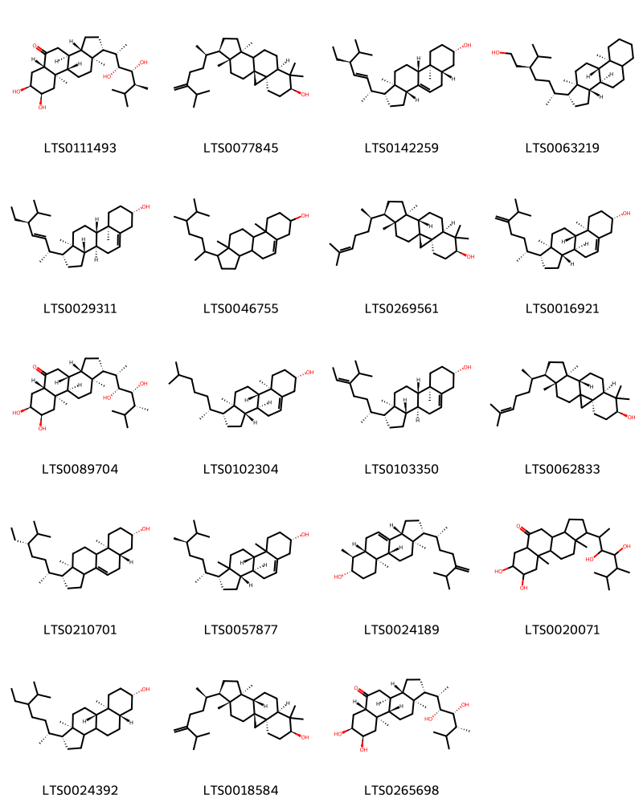{ width=100% }
    <figcaption>Hình ảnh cấu trúc hóa học của 19 hoạt chất thuộc nhóm Steroids and steroid derivatives gồm ['castasterone (LTS0111493)', '24-methylene-cycloartanol (LTS0077845)', 'chondrillasterol (LTS0142259)', '(3s,6r)-6-[(1r,3as,3br,9as,9bs,11ar)-9a,11a-dimethyl-tetradecahydro-1h-cyclopenta[a]phenanthren-1-yl]-3-isopropylheptan-1-ol (LTS0063219)', 'phytosterol (LTS0029311)', 'campesterol (LTS0046755)', 'cycloartenol (LTS0269561)', '24-methylenecholesterol (LTS0016921)', '(1r,3as,3br,5as,7s,8r,9ar,9br,11as)-1-[(2s,3r,4r,5r)-3,4-dihydroxy-5,6-dimethylheptan-2-yl]-7,8-dihydroxy-9a,11a-dimethyl-tetradecahydrocyclopenta[a]phenanthren-5-one (LTS0089704)', 'cholesterol (LTS0102304)', 'avenasterol (LTS0103350)', '(3r,6s,8r,11s,12s,15r,16r)-7,7,12,16-tetramethyl-15-[(2r)-6-methylhept-5-en-2-yl]pentacyclo[9.7.0.0¹,³.0³,⁸.0¹²,¹⁶]octadecan-6-ol (LTS0062833)', '(1r,5as,7s,9as,11ar)-1-[(2r,5s)-5-ethyl-6-methylheptan-2-yl]-9a,11a-dimethyl-1h,2h,3h,3ah,5h,5ah,6h,7h,8h,9h,9bh,10h,11h-cyclopenta[a]phenanthren-7-ol (LTS0210701)', '(1r,3as,3bs,7s,9bs)-1-[(2r,5r)-5,6-dimethylheptan-2-yl]-9a,11a-dimethyl-1h,2h,3h,3ah,3bh,4h,6h,7h,8h,9h,9bh,10h,11h-cyclopenta[a]phenanthren-7-ol (LTS0057877)', '24-methylidenelophenol (LTS0024189)', '1-(3,4-dihydroxy-5,6-dimethylheptan-2-yl)-7,8-dihydroxy-9a,11a-dimethyl-tetradecahydrocyclopenta[a]phenanthren-5-one (LTS0020071)', '(1r,5as,7s,9as,9bs,11ar)-1-[(2r)-5-ethyl-6-methylheptan-2-yl]-9a,11a-dimethyl-tetradecahydro-1h-cyclopenta[a]phenanthren-7-ol (LTS0024392)', '24-methylenecycloartanol (LTS0018584)', '(1r,3as,3bs,5as,7s,8r,9ar,9bs,11as)-1-[(2s,3r,4r,5r)-3,4-dihydroxy-5,6-dimethylheptan-2-yl]-7,8-dihydroxy-9a,11a-dimethyl-tetradecahydrocyclopenta[a]phenanthren-5-one (LTS0265698)'].</figcaption>
</figure>
#### Nhóm Tetrapyrroles and derivatives
<figure markdown="span">
    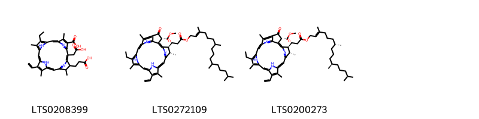{ width=100% }
    <figcaption>Hình ảnh cấu trúc hóa học của 3 hoạt chất thuộc nhóm Tetrapyrroles and derivatives gồm ['20-(2-carboxyethyl)-2-(carboxymethyl)-14-ethenyl-9-ethyl-5,10,15,19-tetramethyl-21,22,23,24-tetraazapentacyclo[16.2.1.1³,⁶.1⁸,¹¹.1¹³,¹⁶]tetracosa-1(21),2,4,6(24),7,9,11,13,15,17-decaene-4-carboxylic acid (LTS0208399)', 'methyl (3r,21s,22s)-16-ethenyl-11-ethyl-12,17,21,26-tetramethyl-4-oxo-22-(3-oxo-3-{[(2e)-3,7,11,15-tetramethylhexadec-2-en-1-yl]oxy}propyl)-7,23,24,25-tetraazahexacyclo[18.2.1.1⁵,⁸.1¹⁰,¹³.1¹⁵,¹⁸.0²,⁶]hexacosa-1(23),2(6),5(26),7,9,11,13,15,17,19-decaene-3-carboxylate (LTS0272109)', 'methyl (3r,21s,22s)-16-ethenyl-11-ethyl-12,17,21,26-tetramethyl-4-oxo-22-(3-oxo-3-{[(2e,7r,11r)-3,7,11,15-tetramethylhexadec-2-en-1-yl]oxy}propyl)-7,23,24,25-tetraazahexacyclo[18.2.1.1⁵,⁸.1¹⁰,¹³.1¹⁵,¹⁸.0²,⁶]hexacosa-1(23),2(6),5(26),7,9,11,13,15,17,19-decaene-3-carboxylate (LTS0200273)'].</figcaption>
</figure>

---

### Dược dân tộc học

Danh sách các quốc gia có sử dụng *Beta vulgaris* trong điều trị các bệnh. 

| Country            | Disease                                      | Bệnh                                                                                                                                                                                                |
|:-------------------|:---------------------------------------------|:----------------------------------------------------------------------------------------------------------------------------------------------------------------------------------------------------|
| Dominican Republic | Sedative                                     | MYMEMORY WARNING: YOU USED ALL AVAILABLE FREE TRANSLATIONS FOR TODAY. NEXT AVAILABLE IN  14 HOURS 58 MINUTES 49 SECONDS VISIT HTTPS://MYMEMORY.TRANSLATED.NET/DOC/USAGELIMITS.PHP TO TRANSLATE MORE |
| France             | Emollient                                    | MYMEMORY WARNING: YOU USED ALL AVAILABLE FREE TRANSLATIONS FOR TODAY. NEXT AVAILABLE IN  14 HOURS 58 MINUTES 46 SECONDS VISIT HTTPS://MYMEMORY.TRANSLATED.NET/DOC/USAGELIMITS.PHP TO TRANSLATE MORE |
| Haiti              | Refrigerant, Refrigerant, Sedative, Diuretic | MYMEMORY WARNING: YOU USED ALL AVAILABLE FREE TRANSLATIONS FOR TODAY. NEXT AVAILABLE IN  14 HOURS 58 MINUTES 44 SECONDS VISIT HTTPS://MYMEMORY.TRANSLATED.NET/DOC/USAGELIMITS.PHP TO TRANSLATE MORE |
| India              | Tonic, Laxative, Refrigerant                 | MYMEMORY WARNING: YOU USED ALL AVAILABLE FREE TRANSLATIONS FOR TODAY. NEXT AVAILABLE IN  14 HOURS 58 MINUTES 41 SECONDS VISIT HTTPS://MYMEMORY.TRANSLATED.NET/DOC/USAGELIMITS.PHP TO TRANSLATE MORE |

---

# Chi Kochia

??? note "Danh sách các dược liệu thuộc chi"
    
	 - *Kochia indica*
	 - *Kochia paniculata*
	 - *Kochia scoparia*

---
## Kochia indica
### Thông tin về thực vật

!!! info "Phân loại thực vật của *Bassia indica* từ GIBF:"
    - **Kingdom:** Plantae
    - **Phylum:** Tracheophyta
    - **Order:** Caryophyllales
    - **Family:** Amaranthaceae
    - **Genus:** Bassia
    - **Species:** *Bassia indica*

 

| Label (VI)   | Label (EN)   | Scientific Name   | Descriptions (VI)   | Descriptions (EN)   | Also Known As (VI)   | Also Known As (EN)   |
|:-------------|:-------------|:------------------|:--------------------|:--------------------|:---------------------|:---------------------|
| N/A          | N/A          | Kochia indica     | loài thực vật       | species of plant    | ['']                 | ['']                 |

#### Phân bố trên thế giới

**Từ CSDL GIBF** nan, Afghanistan, Kenya, Iran (Islamic Republic of), Pakistan, Israel, Palestine, State of, India, unknown or invalid, Egypt

#### Phân bố tại Việt Nam

**Từ CSDL GIBF**: Không có ghi nhận ở Việt Nam

---
### Thành phần hóa học
        
- Theo cơ sở dữ liệu lotus: Từ loài *Bassia indica* đã phân lập và xác định được Chưa có hoạt chất nào được phân lập. hoạt chất thuộc về các nhóm Không có hoạt chất nào được phân lập. 

Không có hình ảnh nào được tạo ra

---

### Dược dân tộc học

Danh sách các quốc gia có sử dụng *Bassia indica* trong điều trị các bệnh. 

| Country   | Disease     | Bệnh                                                                                                                                                                                                |
|:----------|:------------|:----------------------------------------------------------------------------------------------------------------------------------------------------------------------------------------------------|
| India     | Cardiotonic | MYMEMORY WARNING: YOU USED ALL AVAILABLE FREE TRANSLATIONS FOR TODAY. NEXT AVAILABLE IN  14 HOURS 57 MINUTES 53 SECONDS VISIT HTTPS://MYMEMORY.TRANSLATED.NET/DOC/USAGELIMITS.PHP TO TRANSLATE MORE |

---

---
## Kochia paniculata
### Thông tin về thực vật

!!! info "Phân loại thực vật của *N/A* từ GIBF:"
    - **Kingdom:** N/A
    - **Phylum:** N/A
    - **Order:** N/A
    - **Family:** N/A
    - **Genus:** N/A
    - **Species:** *N/A*

 

| Label (VI)   | Label (EN)   | Scientific Name   | Descriptions (VI)   | Descriptions (EN)   | Also Known As (VI)   | Also Known As (EN)   |
|:-------------|:-------------|:------------------|:--------------------|:--------------------|:---------------------|:---------------------|
| N/A          | N/A          | Kochia indica     | loài thực vật       | species of plant    | ['']                 | ['']                 |

#### Phân bố trên thế giới

**Từ CSDL GIBF** Không có kết quả phù hợp

#### Phân bố tại Việt Nam

**Từ CSDL GIBF**: Không có ghi nhận ở Việt Nam

---
### Thành phần hóa học
        
- Theo cơ sở dữ liệu lotus: Từ loài *N/A* đã phân lập và xác định được Chưa có hoạt chất nào được phân lập. hoạt chất thuộc về các nhóm Không có hoạt chất nào được phân lập. 

Không có hình ảnh nào được tạo ra

---

### Dược dân tộc học

Danh sách các quốc gia có sử dụng *N/A* trong điều trị các bệnh. 

| Country   | Disease   | Bệnh                                                                                                                                                                                                |
|:----------|:----------|:----------------------------------------------------------------------------------------------------------------------------------------------------------------------------------------------------|
| China     | Diuretic  | MYMEMORY WARNING: YOU USED ALL AVAILABLE FREE TRANSLATIONS FOR TODAY. NEXT AVAILABLE IN  14 HOURS 57 MINUTES 32 SECONDS VISIT HTTPS://MYMEMORY.TRANSLATED.NET/DOC/USAGELIMITS.PHP TO TRANSLATE MORE |

---

---
## Kochia scoparia
### Thông tin về thực vật

!!! info "Phân loại thực vật của *Bassia scoparia* từ GIBF:"
    - **Kingdom:** Plantae
    - **Phylum:** Tracheophyta
    - **Order:** Caryophyllales
    - **Family:** Amaranthaceae
    - **Genus:** Bassia
    - **Species:** *Bassia scoparia*

 

| Label (VI)   | Label (EN)   | Scientific Name   | Descriptions (VI)   | Descriptions (EN)   | Also Known As (VI)   | Also Known As (EN)                                 |
|:-------------|:-------------|:------------------|:--------------------|:--------------------|:---------------------|:---------------------------------------------------|
| N/A          | N/A          | Kochia scoparia   | loài thực vật       | species of plant    | ['']                 | ['Bassia sieversiana', 'kochia', 'summer cypress'] |

#### Phân bố trên thế giới

**Từ CSDL GIBF** nan, Austria, Mexico, Tajikistan, United States of America, Korea, Republic of, Czechia, Chinese Taipei, Ukraine, China, Russian Federation, Pakistan, Kyrgyzstan, Argentina, Canada, Germany, Spain, Poland

#### Phân bố tại Việt Nam

**Từ CSDL GIBF**: Không có ghi nhận ở Việt Nam

---
### Thành phần hóa học
        
- Theo cơ sở dữ liệu lotus: Từ loài *Bassia scoparia* đã phân lập và xác định được 40 hoạt chất thuộc về các nhóm Carboxylic acids and derivatives, Cinnamic acids and derivatives, Steroids and steroid derivatives, Isoflavonoids, Prenol lipids. 

|    | chemicalTaxonomyClassyfireClass   |   smiles_count |
|---:|:----------------------------------|---------------:|
|  0 | Carboxylic acids and derivatives  |              3 |
|  1 | Cinnamic acids and derivatives    |              1 |
|  2 | Isoflavonoids                     |              2 |
|  3 | Prenol lipids                     |             11 |
|  4 | Steroids and steroid derivatives  |              3 |

#### Nhóm Carboxylic acids and derivatives
<figure markdown="span">
    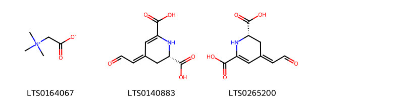{ width=100% }
    <figcaption>Hình ảnh cấu trúc hóa học của 3 hoạt chất thuộc nhóm Carboxylic acids and derivatives gồm ['bet (LTS0164067)', '(2s,4z)-4-(2-oxoethylidene)-2,3-dihydro-1h-pyridine-2,6-dicarboxylic acid (LTS0140883)', 'betalamic acid (LTS0265200)'].</figcaption>
</figure>
#### Nhóm Cinnamic acids and derivatives
<figure markdown="span">
    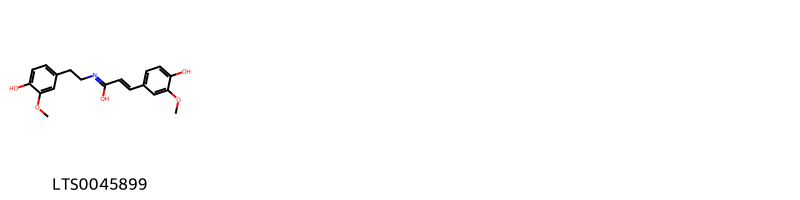{ width=100% }
    <figcaption>Hình ảnh cấu trúc hóa học của 1 hoạt chất thuộc nhóm Cinnamic acids and derivatives gồm ['(2e)-3-(4-hydroxy-3-methoxyphenyl)-n-[2-(4-hydroxy-3-methoxyphenyl)ethyl]prop-2-enimidic acid (LTS0045899)'].</figcaption>
</figure>
#### Nhóm Isoflavonoids
<figure markdown="span">
    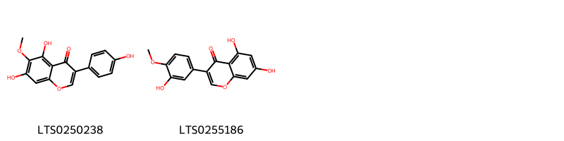{ width=100% }
    <figcaption>Hình ảnh cấu trúc hóa học của 2 hoạt chất thuộc nhóm Isoflavonoids gồm ['tectorigenin (LTS0250238)', 'pratensein (LTS0255186)'].</figcaption>
</figure>
#### Nhóm Prenol lipids
<figure markdown="span">
    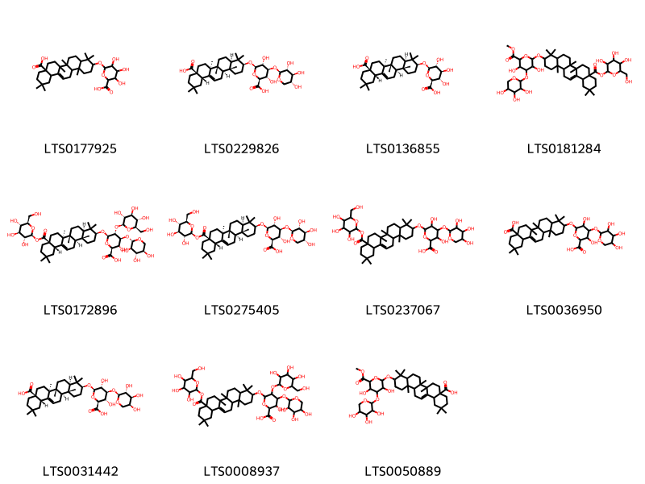{ width=100% }
    <figcaption>Hình ảnh cấu trúc hóa học của 11 hoạt chất thuộc nhóm Prenol lipids gồm ['6-[(8a-carboxy-4,4,6a,6b,11,11,14b-heptamethyl-1,2,3,4a,5,6,7,8,9,10,12,12a,14,14a-tetradecahydropicen-3-yl)oxy]-3,4,5-trihydroxyoxane-2-carboxylic acid (LTS0177925)', '(2s,3s,4s,5r,6r)-6-{[(3s,4ar,6ar,6bs,8as,12as,14ar,14br)-8a-carboxy-4,4,6a,6b,11,11,14b-heptamethyl-1,2,3,4a,5,6,7,8,9,10,12,12a,14,14a-tetradecahydropicen-3-yl]oxy}-3,5-dihydroxy-4-{[(2s,3r,4s,5r)-3,4,5-trihydroxyoxan-2-yl]oxy}oxane-2-carboxylic acid (LTS0229826)', 'oleanolic acid 3-o-glucuronide (LTS0136855)', 'methyl 6-{[4,4,6a,6b,11,11,14b-heptamethyl-8a-({[3,4,5-trihydroxy-6-(hydroxymethyl)oxan-2-yl]oxy}carbonyl)-1,2,3,4a,5,6,7,8,9,10,12,12a,14,14a-tetradecahydropicen-3-yl]oxy}-3,5-dihydroxy-4-[(3,4,5-trihydroxyoxan-2-yl)oxy]oxane-2-carboxylate (LTS0181284)', '(2s,3s,4s,5r,6r)-6-{[(3s,4ar,6ar,6bs,8as,12as,14ar,14br)-4,4,6a,6b,11,11,14b-heptamethyl-8a-({[(2s,3r,4s,5s,6r)-3,4,5-trihydroxy-6-(hydroxymethyl)oxan-2-yl]oxy}carbonyl)-1,2,3,4a,5,6,7,8,9,10,12,12a,14,14a-tetradecahydropicen-3-yl]oxy}-3-hydroxy-5-{[(2s,3r,4s,5s,6r)-3,4,5-trihydroxy-6-(hydroxymethyl)oxan-2-yl]oxy}-4-{[(2s,3r,4s,5r)-3,4,5-trihydroxyoxan-2-yl]oxy}oxane-2-carboxylic acid (LTS0172896)', '(2s,3s,4s,5r,6r)-6-{[(3s,4ar,6ar,6bs,8as,12as,14ar,14br)-4,4,6a,6b,11,11,14b-heptamethyl-8a-({[(2s,3r,4s,5s,6r)-3,4,5-trihydroxy-6-(hydroxymethyl)oxan-2-yl]oxy}carbonyl)-1,2,3,4a,5,6,7,8,9,10,12,12a,14,14a-tetradecahydropicen-3-yl]oxy}-3,5-dihydroxy-4-{[(2s,3r,4s,5r)-3,4,5-trihydroxyoxan-2-yl]oxy}oxane-2-carboxylic acid (LTS0275405)', '6-{[4,4,6a,6b,11,11,14b-heptamethyl-8a-({[3,4,5-trihydroxy-6-(hydroxymethyl)oxan-2-yl]oxy}carbonyl)-1,2,3,4a,5,6,7,8,9,10,12,12a,14,14a-tetradecahydropicen-3-yl]oxy}-3,5-dihydroxy-4-[(3,4,5-trihydroxyoxan-2-yl)oxy]oxane-2-carboxylic acid (LTS0237067)', '6-[(8a-carboxy-4,4,6a,6b,11,11,14b-heptamethyl-1,2,3,4a,5,6,7,8,9,10,12,12a,14,14a-tetradecahydropicen-3-yl)oxy]-3,5-dihydroxy-4-[(3,4,5-trihydroxyoxan-2-yl)oxy]oxane-2-carboxylic acid (LTS0036950)', '(2s,3s,4s,5r,6r)-6-{[(3s,4ar,6ar,6bs,8as,12as,14ar,14br)-8a-carboxy-4,4,6a,6b,11,11,14b-heptamethyl-1,2,3,4a,5,6,7,8,9,10,12,12a,14,14a-tetradecahydropicen-3-yl]oxy}-3,5-dihydroxy-4-{[(2s,3r,4s,5s)-3,4,5-trihydroxyoxan-2-yl]oxy}oxane-2-carboxylic acid (LTS0031442)', '6-{[4,4,6a,6b,11,11,14b-heptamethyl-8a-({[3,4,5-trihydroxy-6-(hydroxymethyl)oxan-2-yl]oxy}carbonyl)-1,2,3,4a,5,6,7,8,9,10,12,12a,14,14a-tetradecahydropicen-3-yl]oxy}-3-hydroxy-5-{[3,4,5-trihydroxy-6-(hydroxymethyl)oxan-2-yl]oxy}-4-[(3,4,5-trihydroxyoxan-2-yl)oxy]oxane-2-carboxylic acid (LTS0008937)', '10-{[3,5-dihydroxy-6-(methoxycarbonyl)-4-[(3,4,5-trihydroxyoxan-2-yl)oxy]oxan-2-yl]oxy}-2,2,6a,6b,9,9,12a-heptamethyl-1,3,4,5,6,7,8,8a,10,11,12,12b,13,14b-tetradecahydropicene-4a-carboxylic acid (LTS0050889)'].</figcaption>
</figure>
#### Nhóm Steroids and steroid derivatives
<figure markdown="span">
    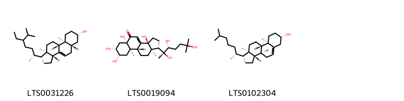{ width=100% }
    <figcaption>Hình ảnh cấu trúc hóa học của 3 hoạt chất thuộc nhóm Steroids and steroid derivatives gồm ['(1r,3ar,5as,7s,9as,9br,11ar)-1-[(2r)-5-ethyl-6-methylheptan-2-yl]-9a,11a-dimethyl-1h,2h,3h,3ah,5h,5ah,6h,7h,8h,9h,9bh,10h,11h-cyclopenta[a]phenanthren-7-ol (LTS0031226)', 'polypodine b (LTS0019094)', 'cholesterol (LTS0102304)'].</figcaption>
</figure>

---

### Dược dân tộc học

Danh sách các quốc gia có sử dụng *Bassia scoparia* trong điều trị các bệnh. 

| Country   | Disease                                                               | Bệnh                                                                                                                                                                                                |
|:----------|:----------------------------------------------------------------------|:----------------------------------------------------------------------------------------------------------------------------------------------------------------------------------------------------|
| China     | Diuretic, Diuretic, Cardiotonic, Antiphlogistic, Astringent, Diuretic | MYMEMORY WARNING: YOU USED ALL AVAILABLE FREE TRANSLATIONS FOR TODAY. NEXT AVAILABLE IN  14 HOURS 57 MINUTES 17 SECONDS VISIT HTTPS://MYMEMORY.TRANSLATED.NET/DOC/USAGELIMITS.PHP TO TRANSLATE MORE |
| Elsewhere | Tonic                                                                 | MYMEMORY WARNING: YOU USED ALL AVAILABLE FREE TRANSLATIONS FOR TODAY. NEXT AVAILABLE IN  14 HOURS 57 MINUTES 14 SECONDS VISIT HTTPS://MYMEMORY.TRANSLATED.NET/DOC/USAGELIMITS.PHP TO TRANSLATE MORE |
| Iraq      | Cardiotonic, Stimulant                                                | MYMEMORY WARNING: YOU USED ALL AVAILABLE FREE TRANSLATIONS FOR TODAY. NEXT AVAILABLE IN  14 HOURS 57 MINUTES 11 SECONDS VISIT HTTPS://MYMEMORY.TRANSLATED.NET/DOC/USAGELIMITS.PHP TO TRANSLATE MORE |

---

# Chi Haloxylon

??? note "Danh sách các dược liệu thuộc chi"
    
	 - *Haloxylon recurvum*

---
## Haloxylon recurvum
### Thông tin về thực vật

!!! info "Phân loại thực vật của *Soda stocksii* từ GIBF:"
    - **Kingdom:** Plantae
    - **Phylum:** Tracheophyta
    - **Order:** Caryophyllales
    - **Family:** Amaranthaceae
    - **Genus:** Soda
    - **Species:** *Soda stocksii*

 

| Label (VI)   | Label (EN)   | Scientific Name    | Descriptions (VI)   | Descriptions (EN)   | Also Known As (VI)   | Also Known As (EN)   |
|:-------------|:-------------|:-------------------|:--------------------|:--------------------|:---------------------|:---------------------|
| N/A          | N/A          | Haloxylon recurvum |                     |                     | ['']                 | ['']                 |

#### Phân bố trên thế giới

**Từ CSDL GIBF** nan, Afghanistan, Pakistan, Myanmar, India

#### Phân bố tại Việt Nam

**Từ CSDL GIBF**: Không có ghi nhận ở Việt Nam

---
### Thành phần hóa học
        
- Theo cơ sở dữ liệu lotus: Từ loài *Soda stocksii* đã phân lập và xác định được 35 hoạt chất thuộc về các nhóm Steroids and steroid derivatives. 

|    | chemicalTaxonomyClassyfireClass   |   smiles_count |
|---:|:----------------------------------|---------------:|
|  0 | Steroids and steroid derivatives  |             35 |

#### Nhóm Steroids and steroid derivatives
<figure markdown="span">
    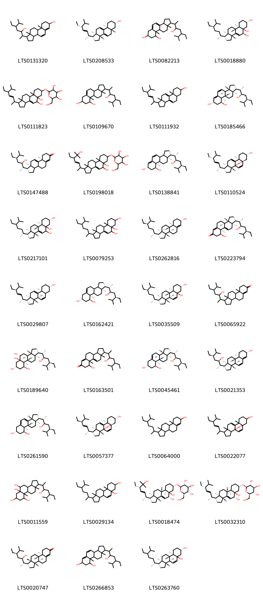{ width=100% }
    <figcaption>Hình ảnh cấu trúc hóa học của 35 hoạt chất thuộc nhóm Steroids and steroid derivatives gồm ['5-ethyl-2-{7-hydroxy-9a,11a-dimethyl-1h,2h,3h,3ah,3bh,7h,8h,9h,9bh,10h,11h-cyclopenta[a]phenanthren-1-yl}-6-methylheptan-3-ol (LTS0131320)', '(1r,3ar,5as,7s,9as,11ar)-1-[(2r,3e,5r)-5-ethyl-6-methylhept-3-en-2-yl]-9a,11a-dimethyl-1h,2h,3h,3ah,5h,5ah,6h,7h,8h,9h,11h-cyclopenta[a]phenanthren-7-ol (LTS0208533)', '1-(5-ethyl-3-hydroxy-6-methylheptan-2-yl)-9a,11a-dimethyl-1h,2h,3h,3ah,6h,7h,8h,9h,9bh,10h,11h-cyclopenta[a]phenanthrene-7,9-diol (LTS0082213)', '(1r,3ar,5s,5ar,7s,9ar,9bs,11ar)-1-[(2r,5r)-5-ethyl-6-methylheptan-2-yl]-9a,11a-dimethyl-1h,2h,3h,3ah,5h,6h,7h,8h,9h,9bh,10h,11h-cyclopenta[a]phenanthrene-5,5a,7-triol (LTS0018880)', '2-{[1-(5-ethyl-6-methylhept-3-en-2-yl)-5,5a-dihydroxy-9a,11a-dimethyl-1h,2h,3h,3ah,5h,6h,7h,8h,9h,9bh,10h,11h-cyclopenta[a]phenanthren-7-yl]oxy}-6-(hydroxymethyl)oxane-3,4,5-triol (LTS0111823)', '1-(5-ethyl-3-hydroxy-6-methylheptan-2-yl)-9a,11a-dimethyl-1h,2h,3h,3ah,3bh,4h,6h,7h,8h,9h,9bh,10h,11h-cyclopenta[a]phenanthrene-7,9-diol (LTS0109670)', '1-(5-ethyl-6-methylhept-3-en-2-yl)-9a,11a-dimethyl-1h,2h,3h,3ah,5h,5ah,6h,7h,8h,9h,11h-cyclopenta[a]phenanthren-7-ol (LTS0111932)', '(1r,3as,3bs,7s,9s,9ar,9bs,11as)-1-[(2s,3r,5r)-5-ethyl-3-hydroxy-6-methylheptan-2-yl]-9a,11a-dimethyl-1h,2h,3h,3ah,3bh,7h,8h,9h,9bh,10h,11h-cyclopenta[a]phenanthrene-7,9-diol (LTS0185466)', '(1r,9as,11as)-1-[(2s,3r,5r)-5-ethyl-3-hydroxy-6-methylheptan-2-yl]-9a,11a-dimethyl-1h,2h,3h,3ah,3bh,4h,5h,8h,9h,11h-cyclopenta[a]phenanthren-7-one (LTS0147488)', '2-{[1-(5-ethyl-6-hydroxy-6-methylhept-3-en-2-yl)-5,5a-dihydroxy-9a,11a-dimethyl-1h,2h,3h,3ah,5h,6h,7h,8h,9h,9bh,10h,11h-cyclopenta[a]phenanthren-7-yl]oxy}-6-(hydroxymethyl)oxane-3,4,5-triol (LTS0198018)', '(1r,7s,9s,9ar,11as)-1-[(2s,3r,5r)-5-ethyl-3-hydroxy-6-methylheptan-2-yl]-9a,11a-dimethyl-1h,2h,3h,3ah,3bh,7h,8h,9h,9bh,10h,11h-cyclopenta[a]phenanthrene-7,9-diol (LTS0138841)', '(1s,2r,5r,6r,10r,13s,15s)-5-[(2r,3e,5r)-5-ethyl-6-methylhept-3-en-2-yl]-6,10-dimethyl-16,17-dioxapentacyclo[13.2.2.0¹,⁹.0²,⁶.0¹⁰,¹⁵]nonadeca-8,18-dien-13-ol (LTS0110524)', '(1r,3ar,7s,9ar,9bs,11ar)-1-[(2r)-5-ethyl-6-methylheptan-2-yl]-9a,11a-dimethyl-1h,2h,3h,3ah,5h,6h,7h,8h,9h,9bh,10h,11h-cyclopenta[a]phenanthrene-5,5a,7-triol (LTS0217101)', '1-(5-ethyl-6-methylheptan-2-yl)-9a,11a-dimethyl-1h,2h,3h,3ah,5h,6h,7h,8h,9h,9bh,10h,11h-cyclopenta[a]phenanthrene-5,5a,7-triol (LTS0079253)', '(1r,3as,3bs,7s,9ar,9bs,11ar)-1-[(2r,5r)-5-ethyl-6-methylheptan-2-yl]-9a,11a-dimethyl-1h,2h,3h,3ah,3bh,4h,5h,7h,8h,9h,9bh,10h,11h-cyclopenta[a]phenanthren-7-ol (LTS0262816)', '(1r,3as,3bs,9s,9as,11as)-1-[(2s,3r,5r)-5-ethyl-3-hydroxy-6-methylheptan-2-yl]-9-hydroxy-9a,11a-dimethyl-1h,2h,3h,3ah,3bh,4h,5h,8h,9h,11h-cyclopenta[a]phenanthren-7-one (LTS0223794)', '(1r,3as,3bs,7s,9as,11ar)-1-[(2r,3e,5s)-5-ethyl-6-methylhept-3-en-2-yl]-9a,11a-dimethyl-1h,2h,3h,3ah,3bh,5ah,6h,7h,8h,9h,11h-cyclopenta[a]phenanthren-7-ol (LTS0029807)', '(1r,7r,9s,9ar,11as)-1-[(2s,3r,5r)-5-ethyl-3-hydroxy-6-methylheptan-2-yl]-9a,11a-dimethyl-1h,2h,3h,3ah,3bh,4h,6h,7h,8h,9h,9bh,10h,11h-cyclopenta[a]phenanthrene-7,9-diol (LTS0162421)', '(1r,3as,3bs,5as,7s,9ar,9bs,11ar)-1-[(2r,5r)-5-ethyl-6-methylheptan-2-yl]-9a,11a-dimethyl-1h,2h,3h,3ah,3bh,6h,7h,8h,9h,9bh,10h,11h-cyclopenta[a]phenanthrene-5a,7-diol (LTS0035509)', '1-(5-ethyl-3-hydroxy-6-methylheptan-2-yl)-9a,11a-dimethyl-1h,2h,3h,3ah,3bh,4h,5h,8h,9h,9bh,10h,11h-cyclopenta[a]phenanthren-7-one (LTS0065922)', '(1r,3as,3bs,5r,5ar,7s,9s,9as,9bs,11as)-1-[(2s,3r,5r)-5-ethyl-3-hydroxy-6-methylheptan-2-yl]-9a,11a-dimethyl-tetradecahydrocyclopenta[a]phenanthrene-5,5a,7,9-tetrol (LTS0189640)', '1-(5-ethyl-3-hydroxy-6-methylheptan-2-yl)-9-hydroxy-9a,11a-dimethyl-1h,2h,3h,3ah,3bh,4h,5h,8h,9h,11h-cyclopenta[a]phenanthren-7-one (LTS0163501)', '(1r,3as,3bs,7r,9s,9ar,9bs,11as)-1-[(2s,3r,5r)-5-ethyl-3-hydroxy-6-methylheptan-2-yl]-9a,11a-dimethyl-1h,2h,3h,3ah,3bh,4h,6h,7h,8h,9h,9bh,10h,11h-cyclopenta[a]phenanthrene-7,9-diol (LTS0045461)', 'halosterol b (LTS0021353)', '(1r,3ar,7r,9s,9ar,9bs,11ar)-1-[(2s,3r,5r)-5-ethyl-3-hydroxy-6-methylheptan-2-yl]-9a,11a-dimethyl-1h,2h,3h,3ah,6h,7h,8h,9h,9bh,10h,11h-cyclopenta[a]phenanthrene-7,9-diol (LTS0261590)', '(1s,2r,5r,6r,10r,13s,15s)-5-[(2r,3e,5s)-5-ethyl-6-methylhept-3-en-2-yl]-6,10-dimethyl-16,17-dioxapentacyclo[13.2.2.0¹,⁹.0²,⁶.0¹⁰,¹⁵]nonadeca-8,18-dien-13-ol (LTS0057377)', '1-(5-ethyl-6-methylheptan-2-yl)-9a,11a-dimethyl-1h,2h,3h,3ah,3bh,4h,5h,7h,8h,9h,9bh,10h,11h-cyclopenta[a]phenanthren-7-ol (LTS0064000)', '5-(5-ethyl-6-methylhept-3-en-2-yl)-6,10-dimethyl-16,17-dioxapentacyclo[13.2.2.0¹,⁹.0²,⁶.0¹⁰,¹⁵]nonadeca-8,18-dien-13-ol (LTS0022077)', '1-(5-ethyl-3-hydroxy-6-methylheptan-2-yl)-9a,11a-dimethyl-tetradecahydrocyclopenta[a]phenanthrene-5,5a,7,9-tetrol (LTS0011559)', '1-(5-ethyl-6-methylheptan-2-yl)-9a,11a-dimethyl-1h,2h,3h,3ah,3bh,6h,7h,8h,9h,9bh,10h,11h-cyclopenta[a]phenanthrene-5a,7-diol (LTS0029134)', '(2r,3r,4s,5s,6r)-2-{[(1r,3ar,5r,5ar,7s,9ar,9bs,11ar)-1-[(2r,3e,5s)-5-ethyl-6-hydroxy-6-methylhept-3-en-2-yl]-5,5a-dihydroxy-9a,11a-dimethyl-1h,2h,3h,3ah,5h,6h,7h,8h,9h,9bh,10h,11h-cyclopenta[a]phenanthren-7-yl]oxy}-6-(hydroxymethyl)oxane-3,4,5-triol (LTS0018474)', '(2r,3r,4s,5s,6r)-2-{[(1r,3ar,5r,5ar,7s,9ar,9bs,11ar)-1-[(2r,3e,5r)-5-ethyl-6-methylhept-3-en-2-yl]-5,5a-dihydroxy-9a,11a-dimethyl-1h,2h,3h,3ah,5h,6h,7h,8h,9h,9bh,10h,11h-cyclopenta[a]phenanthren-7-yl]oxy}-6-(hydroxymethyl)oxane-3,4,5-triol (LTS0032310)', '(1r,3as,3bs,9ar,9bs,11ar)-1-[(2s,3r,5r)-5-ethyl-3-hydroxy-6-methylheptan-2-yl]-9a,11a-dimethyl-1h,2h,3h,3ah,3bh,4h,5h,8h,9h,9bh,10h,11h-cyclopenta[a]phenanthren-7-one (LTS0020747)', '1-(5-ethyl-3-hydroxy-6-methylheptan-2-yl)-9a,11a-dimethyl-1h,2h,3h,3ah,3bh,7h,8h,9h,9bh,10h,11h-cyclopenta[a]phenanthrene-7,9-diol (LTS0266853)', '(1r,3as,3bs,7s,9ar,9bs,11ar)-1-[(2r)-5-ethyl-6-methylheptan-2-yl]-9a,11a-dimethyl-1h,2h,3h,3ah,3bh,6h,7h,8h,9h,9bh,10h,11h-cyclopenta[a]phenanthrene-5a,7-diol (LTS0263760)'].</figcaption>
</figure>

---

### Dược dân tộc học

Danh sách các quốc gia có sử dụng *Soda stocksii* trong điều trị các bệnh. 

| Country   | Disease      | Bệnh                                                                                                                                                                                                |
|:----------|:-------------|:----------------------------------------------------------------------------------------------------------------------------------------------------------------------------------------------------|
| India     | Poison, Soap | MYMEMORY WARNING: YOU USED ALL AVAILABLE FREE TRANSLATIONS FOR TODAY. NEXT AVAILABLE IN  14 HOURS 56 MINUTES 41 SECONDS VISIT HTTPS://MYMEMORY.TRANSLATED.NET/DOC/USAGELIMITS.PHP TO TRANSLATE MORE |

---

# Chi Salsola

??? note "Danh sách các dược liệu thuộc chi"
    
	 - *Salsola baryosma*
	 - *Salsola kali*
	 - *Salsola soda*

---
## Salsola baryosma
### Thông tin về thực vật

!!! info "Phân loại thực vật của *Caroxylon imbricatum* từ GIBF:"
    - **Kingdom:** Plantae
    - **Phylum:** Tracheophyta
    - **Order:** Caryophyllales
    - **Family:** Amaranthaceae
    - **Genus:** Caroxylon
    - **Species:** *Caroxylon imbricatum*

 

| Label (VI)   | Label (EN)   | Scientific Name   | Descriptions (VI)   | Descriptions (EN)   | Also Known As (VI)   | Also Known As (EN)   |
|:-------------|:-------------|:------------------|:--------------------|:--------------------|:---------------------|:---------------------|
| N/A          | N/A          | Salsola baryosma  |                     | species of plant    | ['']                 | ['']                 |

#### Phân bố trên thế giới

**Từ CSDL GIBF** nan, United Arab Emirates, Senegal, Bahrain, Israel, Türkiye, Yemen, Chad, Mauritania, Pakistan, unknown or invalid, Algeria, Libya, Saudi Arabia, Kuwait, Palestine, State of, Iraq, Syrian Arab Republic, Egypt, India, Jordan

#### Phân bố tại Việt Nam

**Từ CSDL GIBF**: Không có ghi nhận ở Việt Nam

---
### Thành phần hóa học
        
- Theo cơ sở dữ liệu lotus: Từ loài *Caroxylon imbricatum* đã phân lập và xác định được 13 hoạt chất thuộc về các nhóm Prenol lipids, Carboxylic acids and derivatives. 

|    | chemicalTaxonomyClassyfireClass   |   smiles_count |
|---:|:----------------------------------|---------------:|
|  0 | Carboxylic acids and derivatives  |              1 |
|  1 | Prenol lipids                     |             12 |

#### Nhóm Carboxylic acids and derivatives
<figure markdown="span">
    { width=100% }
    <figcaption>Hình ảnh cấu trúc hóa học của 1 hoạt chất thuộc nhóm Carboxylic acids and derivatives gồm ['bet (LTS0164067)'].</figcaption>
</figure>
#### Nhóm Prenol lipids
<figure markdown="span">
    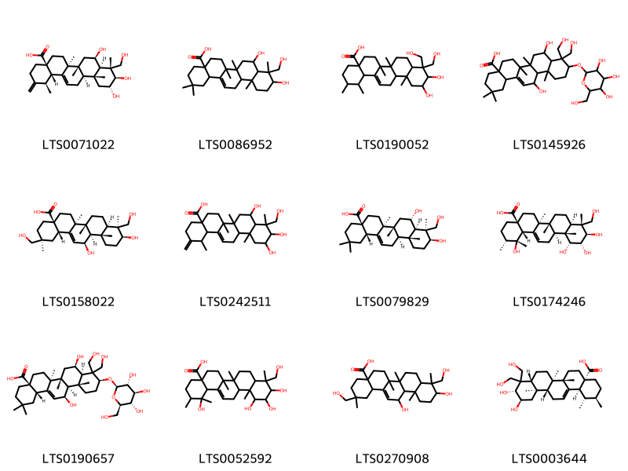{ width=100% }
    <figcaption>Hình ảnh cấu trúc hóa học của 12 hoạt chất thuộc nhóm Prenol lipids gồm ['(1r,4as,6as,6br,8r,8ar,9r,10r,11r,12ar,12br,14bs)-8,10,11-trihydroxy-9-(hydroxymethyl)-1,6a,6b,9,12a-pentamethyl-2-methylidene-1,3,4,5,6,7,8,8a,10,11,12,12b,13,14b-tetradecahydropicene-4a-carboxylic acid (LTS0071022)', '8,10-dihydroxy-9-(hydroxymethyl)-2,2,6a,6b,9,12a-hexamethyl-1,3,4,5,6,7,8,8a,10,11,12,12b,13,14b-tetradecahydropicene-4a-carboxylic acid (LTS0086952)', '10,11-dihydroxy-9,9-bis(hydroxymethyl)-1,2,6a,6b,12a-pentamethyl-2,3,4,5,6,7,8,8a,10,11,12,12b,13,14b-tetradecahydro-1h-picene-4a-carboxylic acid (LTS0190052)', '8,13-dihydroxy-9,9-bis(hydroxymethyl)-2,2,6a,6b,12a-pentamethyl-10-{[3,4,5-trihydroxy-6-(hydroxymethyl)oxan-2-yl]oxy}-1,3,4,5,6,7,8,8a,10,11,12,12b,13,14b-tetradecahydropicene-4a-carboxylic acid (LTS0145926)', '(2s,4ar,6as,6br,8ar,9s,10s,12as,12br,13s,14bs)-10,13-dihydroxy-2,9-bis(hydroxymethyl)-2,6a,6b,9,12a-pentamethyl-1,3,4,5,6,7,8,8a,10,11,12,12b,13,14b-tetradecahydropicene-4a-carboxylic acid (LTS0158022)', '8,10,11-trihydroxy-9-(hydroxymethyl)-1,6a,6b,9,12a-pentamethyl-2-methylidene-1,3,4,5,6,7,8,8a,10,11,12,12b,13,14b-tetradecahydropicene-4a-carboxylic acid (LTS0242511)', '(4as,6as,6br,8s,8ar,9s,10s,12ar,12br,14bs)-8,10-dihydroxy-9-(hydroxymethyl)-2,2,6a,6b,9,12a-hexamethyl-1,3,4,5,6,7,8,8a,10,11,12,12b,13,14b-tetradecahydropicene-4a-carboxylic acid (LTS0079829)', '(1r,2r,4as,6as,6br,8ar,9r,10r,11r,12r,12ar,12bs,14bs)-1,10,11,12-tetrahydroxy-9-(hydroxymethyl)-1,2,6a,6b,9,12a-hexamethyl-2,3,4,5,6,7,8,8a,10,11,12,12b,13,14b-tetradecahydropicene-4a-carboxylic acid (LTS0174246)', '(4as,6as,6br,8r,8ar,10s,12as,12br,13s,14bs)-8,13-dihydroxy-9,9-bis(hydroxymethyl)-2,2,6a,6b,12a-pentamethyl-10-{[(2r,3r,4s,5s,6r)-3,4,5-trihydroxy-6-(hydroxymethyl)oxan-2-yl]oxy}-1,3,4,5,6,7,8,8a,10,11,12,12b,13,14b-tetradecahydropicene-4a-carboxylic acid (LTS0190657)', '1,10,11,12-tetrahydroxy-9-(hydroxymethyl)-1,2,6a,6b,9,12a-hexamethyl-2,3,4,5,6,7,8,8a,10,11,12,12b,13,14b-tetradecahydropicene-4a-carboxylic acid (LTS0052592)', '10,13-dihydroxy-2,9-bis(hydroxymethyl)-2,6a,6b,9,12a-pentamethyl-1,3,4,5,6,7,8,8a,10,11,12,12b,13,14b-tetradecahydropicene-4a-carboxylic acid (LTS0270908)', '(1s,2r,4as,6as,6br,8ar,10r,11r,12ar,12br,14bs)-10,11-dihydroxy-9,9-bis(hydroxymethyl)-1,2,6a,6b,12a-pentamethyl-2,3,4,5,6,7,8,8a,10,11,12,12b,13,14b-tetradecahydro-1h-picene-4a-carboxylic acid (LTS0003644)'].</figcaption>
</figure>

---

### Dược dân tộc học

Danh sách các quốc gia có sử dụng *Caroxylon imbricatum* trong điều trị các bệnh. 

| Country   | Disease   | Bệnh                                                                                                                                                                                                |
|:----------|:----------|:----------------------------------------------------------------------------------------------------------------------------------------------------------------------------------------------------|
| Elsewhere | Vermifuge | MYMEMORY WARNING: YOU USED ALL AVAILABLE FREE TRANSLATIONS FOR TODAY. NEXT AVAILABLE IN  14 HOURS 56 MINUTES 17 SECONDS VISIT HTTPS://MYMEMORY.TRANSLATED.NET/DOC/USAGELIMITS.PHP TO TRANSLATE MORE |

---

---
## Salsola kali
### Thông tin về thực vật

!!! info "Phân loại thực vật của *Salsola kali* từ GIBF:"
    - **Kingdom:** Plantae
    - **Phylum:** Tracheophyta
    - **Order:** Caryophyllales
    - **Family:** Amaranthaceae
    - **Genus:** Salsola
    - **Species:** *Salsola kali*

 

| Label (VI)   | Label (EN)   | Scientific Name   | Descriptions (VI)   | Descriptions (EN)   | Also Known As (VI)   | Also Known As (EN)   |
|:-------------|:-------------|:------------------|:--------------------|:--------------------|:---------------------|:---------------------|
| N/A          | N/A          | Salsola kali      | loài thực vật       | species of plant    | ['']                 | ['saltwort']         |

#### Phân bố trên thế giới

**Từ CSDL GIBF** Finland, Chile, Spain, Poland, Denmark, Netherlands, United States of America, Argentina, Estonia, Lithuania, Morocco, Gibraltar, Algeria, Norway, France, Germany, Isle of Man, Namibia, Portugal, South Africa, United Kingdom of Great Britain and Northern Ireland

#### Phân bố tại Việt Nam

**Từ CSDL GIBF**: Không có ghi nhận ở Việt Nam

---
### Thành phần hóa học
        
- Theo cơ sở dữ liệu lotus: Từ loài *Salsola kali* đã phân lập và xác định được 4 hoạt chất thuộc về các nhóm Flavonoids. 

|    | chemicalTaxonomyClassyfireClass   |   smiles_count |
|---:|:----------------------------------|---------------:|
|  0 | Flavonoids                        |              4 |

#### Nhóm Flavonoids
<figure markdown="span">
    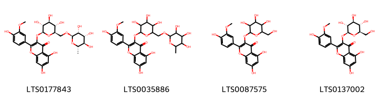{ width=100% }
    <figcaption>Hình ảnh cấu trúc hóa học của 4 hoạt chất thuộc nhóm Flavonoids gồm ['narcissin (LTS0177843)', '5,7-dihydroxy-2-(4-hydroxy-3-methoxyphenyl)-3-[(3,4,5-trihydroxy-6-{[(3,4,5-trihydroxy-6-methyloxan-2-yl)oxy]methyl}oxan-2-yl)oxy]chromen-4-one (LTS0035886)', 'isorhamnetin 3-galactoside (LTS0087575)', 'isorhamnetin 3-o-glucoside (LTS0137002)'].</figcaption>
</figure>

---

### Dược dân tộc học

Danh sách các quốc gia có sử dụng *Salsola kali* trong điều trị các bệnh. 

| Country   | Disease                                                        | Bệnh                                                                                                                                                                                                |
|:----------|:---------------------------------------------------------------|:----------------------------------------------------------------------------------------------------------------------------------------------------------------------------------------------------|
| Elsewhere | Cathartic, Diuretic, Emmenagogue, Poison, Stimulant, Vermifuge | MYMEMORY WARNING: YOU USED ALL AVAILABLE FREE TRANSLATIONS FOR TODAY. NEXT AVAILABLE IN  14 HOURS 55 MINUTES 51 SECONDS VISIT HTTPS://MYMEMORY.TRANSLATED.NET/DOC/USAGELIMITS.PHP TO TRANSLATE MORE |
| US        | Emmenagogue, Diuretic                                          | MYMEMORY WARNING: YOU USED ALL AVAILABLE FREE TRANSLATIONS FOR TODAY. NEXT AVAILABLE IN  14 HOURS 55 MINUTES 49 SECONDS VISIT HTTPS://MYMEMORY.TRANSLATED.NET/DOC/USAGELIMITS.PHP TO TRANSLATE MORE |

---

---
## Salsola soda
### Thông tin về thực vật

!!! info "Phân loại thực vật của *Salsola soda* từ GIBF:"
    - **Kingdom:** Plantae
    - **Phylum:** Tracheophyta
    - **Order:** Caryophyllales
    - **Family:** Amaranthaceae
    - **Genus:** Salsola
    - **Species:** *Salsola soda*

 

| Label (VI)   | Label (EN)   | Scientific Name   | Descriptions (VI)   | Descriptions (EN)   | Also Known As (VI)   | Also Known As (EN)   |
|:-------------|:-------------|:------------------|:--------------------|:--------------------|:---------------------|:---------------------|
| N/A          | N/A          | Salsola soda      | loài thực vật       | species of plant    | ['']                 | ['']                 |

#### Phân bố trên thế giới

**Từ CSDL GIBF** Hungary, United States of America, Portugal, Malta, Greece, Ukraine, Israel, Russian Federation, Italy, Croatia, Slovenia, France, Spain

#### Phân bố tại Việt Nam

**Từ CSDL GIBF**: Không có ghi nhận ở Việt Nam

---
### Thành phần hóa học
        
- Theo cơ sở dữ liệu lotus: Từ loài *Salsola soda* đã phân lập và xác định được Chưa có hoạt chất nào được phân lập. hoạt chất thuộc về các nhóm Không có hoạt chất nào được phân lập. 

Không có hình ảnh nào được tạo ra

---

### Dược dân tộc học

Danh sách các quốc gia có sử dụng *Salsola soda* trong điều trị các bệnh. 

| Country   | Disease   | Bệnh                                                                                                                                                                                                |
|:----------|:----------|:----------------------------------------------------------------------------------------------------------------------------------------------------------------------------------------------------|
| Europe    | Soap      | MYMEMORY WARNING: YOU USED ALL AVAILABLE FREE TRANSLATIONS FOR TODAY. NEXT AVAILABLE IN  14 HOURS 55 MINUTES 19 SECONDS VISIT HTTPS://MYMEMORY.TRANSLATED.NET/DOC/USAGELIMITS.PHP TO TRANSLATE MORE |

---

# Chi Eurotia

??? note "Danh sách các dược liệu thuộc chi"
    
	 - *Eurotia lanata*

---
## Eurotia lanata
### Thông tin về thực vật

!!! info "Phân loại thực vật của *Krascheninnikovia lanata* từ GIBF:"
    - **Kingdom:** Plantae
    - **Phylum:** Tracheophyta
    - **Order:** Caryophyllales
    - **Family:** Amaranthaceae
    - **Genus:** Krascheninnikovia
    - **Species:** *Krascheninnikovia lanata*

 

| Label (VI)   | Label (EN)   | Scientific Name   | Descriptions (VI)   | Descriptions (EN)   | Also Known As (VI)   | Also Known As (EN)   |
|:-------------|:-------------|:------------------|:--------------------|:--------------------|:---------------------|:---------------------|
| N/A          | N/A          | Eurotia lanata    |                     |                     | ['']                 | ['']                 |

#### Phân bố trên thế giới

**Từ CSDL GIBF** nan, Mexico, United States of America, Canada, Spain

#### Phân bố tại Việt Nam

**Từ CSDL GIBF**: Không có ghi nhận ở Việt Nam

---
### Thành phần hóa học
        
- Theo cơ sở dữ liệu lotus: Từ loài *Krascheninnikovia lanata* đã phân lập và xác định được Chưa có hoạt chất nào được phân lập. hoạt chất thuộc về các nhóm Không có hoạt chất nào được phân lập. 

Không có hình ảnh nào được tạo ra

---

### Dược dân tộc học

Danh sách các quốc gia có sử dụng *Krascheninnikovia lanata* trong điều trị các bệnh. 

| Country        | Disease      | Bệnh                                                                                                                                                                                                |
|:---------------|:-------------|:----------------------------------------------------------------------------------------------------------------------------------------------------------------------------------------------------|
| US(Amerindian) | Pediculicide | MYMEMORY WARNING: YOU USED ALL AVAILABLE FREE TRANSLATIONS FOR TODAY. NEXT AVAILABLE IN  14 HOURS 54 MINUTES 51 SECONDS VISIT HTTPS://MYMEMORY.TRANSLATED.NET/DOC/USAGELIMITS.PHP TO TRANSLATE MORE |

---

# Chi Suckleya

??? note "Danh sách các dược liệu thuộc chi"
    
	 - *Suckleya suckleyana*

---
## Suckleya suckleyana
### Thông tin về thực vật

!!! info "Phân loại thực vật của *Suckleya suckleyana* từ GIBF:"
    - **Kingdom:** Plantae
    - **Phylum:** Tracheophyta
    - **Order:** Caryophyllales
    - **Family:** Amaranthaceae
    - **Genus:** Suckleya
    - **Species:** *Suckleya suckleyana*

 

| Label (VI)   | Label (EN)   | Scientific Name     | Descriptions (VI)   | Descriptions (EN)   | Also Known As (VI)   | Also Known As (EN)   |
|:-------------|:-------------|:--------------------|:--------------------|:--------------------|:---------------------|:---------------------|
| N/A          | N/A          | Suckleya suckleyana | loài thực vật       | species of plant    | ['']                 | ['']                 |

#### Phân bố trên thế giới

**Từ CSDL GIBF** nan, Mexico, United States of America, Canada

#### Phân bố tại Việt Nam

**Từ CSDL GIBF**: Không có ghi nhận ở Việt Nam

---
### Thành phần hóa học
        
- Theo cơ sở dữ liệu lotus: Từ loài *Suckleya suckleyana* đã phân lập và xác định được 3 hoạt chất thuộc về các nhóm Organooxygen compounds. 

|    | chemicalTaxonomyClassyfireClass   |   smiles_count |
|---:|:----------------------------------|---------------:|
|  0 | Organooxygen compounds            |              3 |

#### Nhóm Organooxygen compounds
<figure markdown="span">
    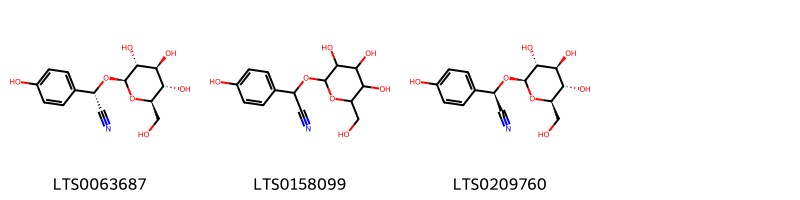{ width=100% }
    <figcaption>Hình ảnh cấu trúc hóa học của 3 hoạt chất thuộc nhóm Organooxygen compounds gồm ['dhurrin (LTS0063687)', 'dhurrin (LTS0158099)', 'taxiphyllin (LTS0209760)'].</figcaption>
</figure>

---

### Dược dân tộc học

Danh sách các quốc gia có sử dụng *Suckleya suckleyana* trong điều trị các bệnh. 

| Country   | Disease   | Bệnh                                                                                                                                                                                                |
|:----------|:----------|:----------------------------------------------------------------------------------------------------------------------------------------------------------------------------------------------------|
| US        | Poison    | MYMEMORY WARNING: YOU USED ALL AVAILABLE FREE TRANSLATIONS FOR TODAY. NEXT AVAILABLE IN  14 HOURS 54 MINUTES 20 SECONDS VISIT HTTPS://MYMEMORY.TRANSLATED.NET/DOC/USAGELIMITS.PHP TO TRANSLATE MORE |

---

# Chi Camphorosma

??? note "Danh sách các dược liệu thuộc chi"
    
	 - *Camphorosma moneliaca*

---
## Camphorosma moneliaca
### Thông tin về thực vật

!!! info "Phân loại thực vật của *Camphorosma monspeliaca* từ GIBF:"
    - **Kingdom:** Plantae
    - **Phylum:** Tracheophyta
    - **Order:** Caryophyllales
    - **Family:** Amaranthaceae
    - **Genus:** Camphorosma
    - **Species:** *Camphorosma monspeliaca*

 

| Label (VI)   | Label (EN)   | Scientific Name     | Descriptions (VI)   | Descriptions (EN)   | Also Known As (VI)   | Also Known As (EN)   |
|:-------------|:-------------|:--------------------|:--------------------|:--------------------|:---------------------|:---------------------|
| N/A          | N/A          | Suckleya suckleyana | loài thực vật       | species of plant    | ['']                 | ['']                 |

#### Phân bố trên thế giới

**Từ CSDL GIBF** Algeria, Greece, Ukraine, Russian Federation, Kazakhstan, Italy, Croatia, Bulgaria, France, Spain

#### Phân bố tại Việt Nam

**Từ CSDL GIBF**: Không có ghi nhận ở Việt Nam

---
### Thành phần hóa học
        
- Theo cơ sở dữ liệu lotus: Từ loài *Camphorosma monspeliaca* đã phân lập và xác định được Chưa có hoạt chất nào được phân lập. hoạt chất thuộc về các nhóm Không có hoạt chất nào được phân lập. 

Không có hình ảnh nào được tạo ra

---

### Dược dân tộc học

Danh sách các quốc gia có sử dụng *Camphorosma monspeliaca* trong điều trị các bệnh. 

| Country   | Disease                                                  | Bệnh                                                                                                                                                                                                |
|:----------|:---------------------------------------------------------|:----------------------------------------------------------------------------------------------------------------------------------------------------------------------------------------------------|
| Elsewhere | Emmenagogue, Expectorant, Sudorific, Diuretic, Stimulant | MYMEMORY WARNING: YOU USED ALL AVAILABLE FREE TRANSLATIONS FOR TODAY. NEXT AVAILABLE IN  14 HOURS 53 MINUTES 52 SECONDS VISIT HTTPS://MYMEMORY.TRANSLATED.NET/DOC/USAGELIMITS.PHP TO TRANSLATE MORE |

---

# Chi Chenopodium

??? note "Danh sách các dược liệu thuộc chi"
    
	 - *Chenopodium album*
	 - *Chenopodium ambrisioides*
	 - *Chenopodium ambrosioides*
	 - *Chenopodium bonus-henricus*
	 - *Chenopodium botrys*
	 - *Chenopodium californicum*
	 - *Chenopodium chilense*
	 - *Chenopodium foetidum*
	 - *Chenopodium graveolens*
	 - *Chenopodium multifidum*
	 - *Chenopodium murale*
	 - *Chenopodium quinoa*
	 - *Chenopodium vulvaria*

---
## Chenopodium album
### Thông tin về thực vật

!!! info "Phân loại thực vật của *Chenopodium album* từ GIBF:"
    - **Kingdom:** Plantae
    - **Phylum:** Tracheophyta
    - **Order:** Caryophyllales
    - **Family:** Amaranthaceae
    - **Genus:** Chenopodium
    - **Species:** *Chenopodium album*

 

| Label (VI)   | Label (EN)   | Scientific Name   | Descriptions (VI)   | Descriptions (EN)   | Also Known As (VI)   | Also Known As (EN)     |
|:-------------|:-------------|:------------------|:--------------------|:--------------------|:---------------------|:-----------------------|
| N/A          | N/A          | Chenopodium album | loài thực vật       | species of plant    | ['']                 | ['fat-hen', 'fat hen'] |

#### Phân bố trên thế giới

**Từ CSDL GIBF** Japan, Malta, Czechia, Uzbekistan, China, Israel, Chile, New Zealand, Ecuador, Spain, Netherlands, Poland, United States of America, Greece, Armenia, Russian Federation, Argentina, Mexico, Algeria, United Kingdom of Great Britain and Northern Ireland, Belgium, Chinese Taipei, Canada, Germany, Namibia, Austria, Hungary, Ukraine, South Africa, Australia, Italy, Switzerland, Bulgaria, Peru, France

#### Phân bố tại Việt Nam

**Từ CSDL GIBF**: Không có ghi nhận ở Việt Nam

---
### Thành phần hóa học
        
- Theo cơ sở dữ liệu lotus: Từ loài *Chenopodium album* đã phân lập và xác định được 84 hoạt chất thuộc về các nhóm Flavonoids, Carboxylic acids and derivatives, Cinnamic acids and derivatives, Steroids and steroid derivatives, Phenols, Organooxygen compounds, Prenol lipids. 

|    | chemicalTaxonomyClassyfireClass   |   smiles_count |
|---:|:----------------------------------|---------------:|
|  0 | Carboxylic acids and derivatives  |              1 |
|  1 | Cinnamic acids and derivatives    |             14 |
|  2 | Flavonoids                        |             22 |
|  3 | Organooxygen compounds            |              3 |
|  4 | Phenols                           |              4 |
|  5 | Prenol lipids                     |             39 |
|  6 | Steroids and steroid derivatives  |              1 |

#### Nhóm Carboxylic acids and derivatives
<figure markdown="span">
    { width=100% }
    <figcaption>Hình ảnh cấu trúc hóa học của 1 hoạt chất thuộc nhóm Carboxylic acids and derivatives gồm ['bet (LTS0164067)'].</figcaption>
</figure>
#### Nhóm Cinnamic acids and derivatives
<figure markdown="span">
    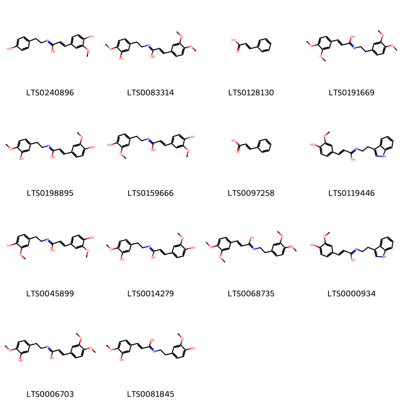{ width=100% }
    <figcaption>Hình ảnh cấu trúc hóa học của 14 hoạt chất thuộc nhóm Cinnamic acids and derivatives gồm ['3-(4-hydroxy-3-methoxyphenyl)-n-[2-(4-hydroxyphenyl)ethyl]prop-2-enimidic acid (LTS0240896)', '(2e)-3-(3,4-dimethoxyphenyl)-n-[2-(3-hydroxy-4-methoxyphenyl)ethyl]prop-2-enimidic acid (LTS0083314)', 'cinnamic acid (LTS0128130)', '(2e)-3-(3,4-dimethoxyphenyl)-n-[2-(3,4-dimethoxyphenyl)ethyl]prop-2-enimidic acid (LTS0191669)', '3-(4-hydroxy-3-methoxyphenyl)-n-[2-(3-hydroxy-4-methoxyphenyl)ethyl]prop-2-enimidic acid (LTS0198895)', '3-(4-hydroxy-3-methoxyphenyl)-n-[2-(4-hydroxy-3-methoxyphenyl)ethyl]prop-2-enimidic acid (LTS0159666)', 'phenylacrylic acid (LTS0097258)', '(2e)-3-(4-hydroxy-3-methoxyphenyl)-n-[2-(1h-indol-3-yl)ethyl]prop-2-enimidic acid (LTS0119446)', '(2e)-3-(4-hydroxy-3-methoxyphenyl)-n-[2-(4-hydroxy-3-methoxyphenyl)ethyl]prop-2-enimidic acid (LTS0045899)', '(2e)-3-(4-hydroxy-3-methoxyphenyl)-n-[2-(3-hydroxy-4-methoxyphenyl)ethyl]prop-2-enimidic acid (LTS0014279)', '3-(3,4-dimethoxyphenyl)-n-[2-(3,4-dimethoxyphenyl)ethyl]prop-2-enimidic acid (LTS0068735)', '3-(4-hydroxy-3-methoxyphenyl)-n-[2-(1h-indol-3-yl)ethyl]prop-2-enimidic acid (LTS0000934)', '3-(3,4-dimethoxyphenyl)-n-[2-(3-hydroxy-4-methoxyphenyl)ethyl]prop-2-enimidic acid (LTS0006703)', 'n-[2-(4-hydroxy-3-methoxyphenyl)ethyl]-3-(3-hydroxy-4-methoxyphenyl)prop-2-enimidic acid (LTS0081845)'].</figcaption>
</figure>
#### Nhóm Flavonoids
<figure markdown="span">
    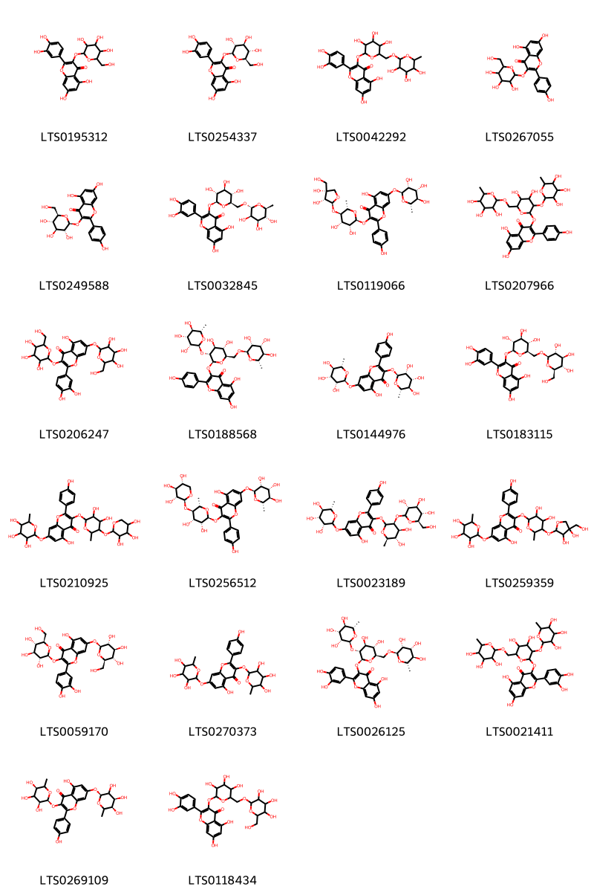{ width=100% }
    <figcaption>Hình ảnh cấu trúc hóa học của 22 hoạt chất thuộc nhóm Flavonoids gồm ['2-(3,4-dihydroxyphenyl)-5,7-dihydroxy-3-{[3,4,5-trihydroxy-6-(hydroxymethyl)oxan-2-yl]oxy}chromen-4-one (LTS0195312)', 'isoquercetin (LTS0254337)', 'rutin (LTS0042292)', 'trifolin (LTS0267055)', 'astragalin (LTS0249588)', '3-rutinosyl quercetin (LTS0032845)', '3-{[(2s,3r,4s,5r,6s)-5-{[(2s,3r,4r)-3,4-dihydroxy-4-(hydroxymethyl)oxolan-2-yl]oxy}-3,4-dihydroxy-6-methyloxan-2-yl]oxy}-5-hydroxy-2-(4-hydroxyphenyl)-7-{[(2s,3r,4r,5r,6s)-3,4,5-trihydroxy-6-methyloxan-2-yl]oxy}chromen-4-one (LTS0119066)', '3-({4,5-dihydroxy-3-[(3,4,5-trihydroxy-6-methyloxan-2-yl)oxy]-6-{[(3,4,5-trihydroxy-6-methyloxan-2-yl)oxy]methyl}oxan-2-yl}oxy)-5,7-dihydroxy-2-(4-hydroxyphenyl)chromen-4-one (LTS0207966)', '2-(3,4-dihydroxyphenyl)-5-hydroxy-3,7-bis({[3,4,5-trihydroxy-6-(hydroxymethyl)oxan-2-yl]oxy})chromen-4-one (LTS0206247)', '3-{[(2s,3r,4s,5s,6r)-4,5-dihydroxy-3-{[(2s,3r,4r,5r,6s)-3,4,5-trihydroxy-6-methyloxan-2-yl]oxy}-6-({[(2r,3r,4r,5r,6s)-3,4,5-trihydroxy-6-methyloxan-2-yl]oxy}methyl)oxan-2-yl]oxy}-5,7-dihydroxy-2-(4-hydroxyphenyl)chromen-4-one (LTS0188568)', 'lespedin (LTS0144976)', '2-(3,4-dihydroxyphenyl)-5,7-dihydroxy-3-{[(2s,3r,4s,5s,6r)-3,4,5-trihydroxy-6-({[(2r,3r,4s,5s,6r)-3,4,5-trihydroxy-6-(hydroxymethyl)oxan-2-yl]oxy}methyl)oxan-2-yl]oxy}chromen-4-one (LTS0183115)', '3-({3,4-dihydroxy-6-methyl-5-[(3,4,5-trihydroxyoxan-2-yl)oxy]oxan-2-yl}oxy)-5-hydroxy-2-(4-hydroxyphenyl)-7-[(3,4,5-trihydroxy-6-methyloxan-2-yl)oxy]chromen-4-one (LTS0210925)', '3-{[(2s,3r,4s,5r,6s)-3,4-dihydroxy-6-methyl-5-{[(2s,3r,4s,5r)-3,4,5-trihydroxyoxan-2-yl]oxy}oxan-2-yl]oxy}-5-hydroxy-2-(4-hydroxyphenyl)-7-{[(2s,3r,4r,5r,6s)-3,4,5-trihydroxy-6-methyloxan-2-yl]oxy}chromen-4-one (LTS0256512)', '3-{[(3s,4s,5s,6r)-4,5-dihydroxy-6-methyl-3-{[(3r,4s,5s,6r)-3,4,5-trihydroxy-6-(hydroxymethyl)oxan-2-yl]oxy}oxan-2-yl]oxy}-5-hydroxy-2-(4-hydroxyphenyl)-7-{[(3r,4r,5r,6s)-3,4,5-trihydroxy-6-methyloxan-2-yl]oxy}chromen-4-one (LTS0023189)', '3-[(5-{[3,4-dihydroxy-4-(hydroxymethyl)oxolan-2-yl]oxy}-3,4-dihydroxy-6-methyloxan-2-yl)oxy]-5-hydroxy-2-(4-hydroxyphenyl)-7-[(3,4,5-trihydroxy-6-methyloxan-2-yl)oxy]chromen-4-one (LTS0259359)', 'quercetin 3,7-diglucoside (LTS0059170)', 'kaempferitrin (LTS0270373)', '3-{[(2s,3r,4s,5s,6r)-4,5-dihydroxy-3-{[(2s,3r,4r,5r,6s)-3,4,5-trihydroxy-6-methyloxan-2-yl]oxy}-6-({[(2r,3r,4r,5r,6s)-3,4,5-trihydroxy-6-methyloxan-2-yl]oxy}methyl)oxan-2-yl]oxy}-2-(3,4-dihydroxyphenyl)-5,7-dihydroxychromen-4-one (LTS0026125)', '3-({4,5-dihydroxy-3-[(3,4,5-trihydroxy-6-methyloxan-2-yl)oxy]-6-{[(3,4,5-trihydroxy-6-methyloxan-2-yl)oxy]methyl}oxan-2-yl}oxy)-2-(3,4-dihydroxyphenyl)-5,7-dihydroxychromen-4-one (LTS0021411)', 'kaempferitrin (LTS0269109)', '2-(3,4-dihydroxyphenyl)-5,7-dihydroxy-3-{[3,4,5-trihydroxy-6-({[3,4,5-trihydroxy-6-(hydroxymethyl)oxan-2-yl]oxy}methyl)oxan-2-yl]oxy}chromen-4-one (LTS0118434)'].</figcaption>
</figure>
#### Nhóm Organooxygen compounds
<figure markdown="span">
    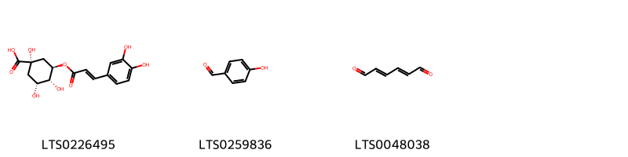{ width=100% }
    <figcaption>Hình ảnh cấu trúc hóa học của 3 hoạt chất thuộc nhóm Organooxygen compounds gồm ['chlorogenic acid (LTS0226495)', 'p-hydroxybenzaldehyde (LTS0259836)', 'e,e-2,4-hexadienedial (LTS0048038)'].</figcaption>
</figure>
#### Nhóm Phenols
<figure markdown="span">
    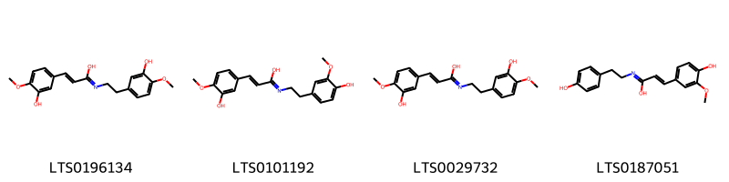{ width=100% }
    <figcaption>Hình ảnh cấu trúc hóa học của 4 hoạt chất thuộc nhóm Phenols gồm ['(2e)-3-(3-hydroxy-4-methoxyphenyl)-n-[2-(3-hydroxy-4-methoxyphenyl)ethyl]prop-2-enimidic acid (LTS0196134)', '(2e)-n-[2-(4-hydroxy-3-methoxyphenyl)ethyl]-3-(3-hydroxy-4-methoxyphenyl)prop-2-enimidic acid (LTS0101192)', '3-(3-hydroxy-4-methoxyphenyl)-n-[2-(3-hydroxy-4-methoxyphenyl)ethyl]prop-2-enimidic acid (LTS0029732)', '(2e)-3-(4-hydroxy-3-methoxyphenyl)-n-[2-(4-hydroxyphenyl)ethyl]prop-2-enimidic acid (LTS0187051)'].</figcaption>
</figure>
#### Nhóm Prenol lipids
<figure markdown="span">
    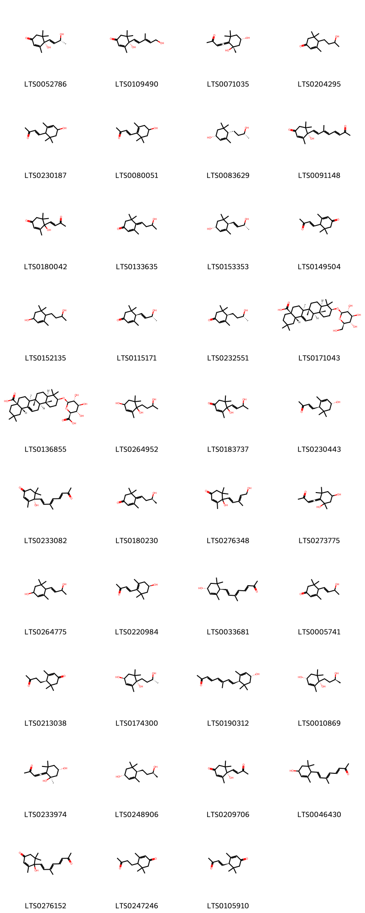{ width=100% }
    <figcaption>Hình ảnh cấu trúc hóa học của 39 hoạt chất thuộc nhóm Prenol lipids gồm ['(6s,9r)-vomifoliol (LTS0052786)', '(4s)-4-hydroxy-4-[(1e,3e)-5-hydroxy-3-methylpenta-1,3-dien-1-yl]-3,5,5-trimethylcyclohex-2-en-1-one (LTS0109490)', '4-[(2s,4s)-2,4-dihydroxy-2,6,6-trimethylcyclohexylidene]but-3-en-2-one (LTS0071035)', '4-(3-hydroxybutyl)-3,5,5-trimethylcyclohex-2-en-1-one (LTS0204295)', '4-(4-hydroxy-2,6,6-trimethylcyclohex-2-en-1-yl)but-3-en-2-one (LTS0230187)', '4-(4-hydroxy-2,6,6-trimethylcyclohex-1-en-1-yl)but-3-en-2-one (LTS0080051)', '(1r,4s)-4-[(3r)-3-hydroxybutyl]-3,5,5-trimethylcyclohex-2-en-1-ol (LTS0083629)', '(4s)-4-hydroxy-3,5,5-trimethyl-4-[(1e,3e,5e)-3-methyl-7-oxoocta-1,3,5-trien-1-yl]cyclohex-2-en-1-one (LTS0091148)', '4-hydroxy-3,5,5-trimethyl-4-(3-oxobut-1-en-1-yl)cyclohex-2-en-1-one (LTS0180042)', '4-(3-hydroxybutylidene)-3,5,5-trimethylcyclohex-2-en-1-one (LTS0133635)', '(1r,4r)-4-[(1e,3r)-3-hydroxybut-1-en-1-yl]-3,5,5-trimethylcyclohex-2-en-1-ol (LTS0153353)', '3,5,5-trimethyl-4-(3-oxobut-1-en-1-yl)cyclohex-2-en-1-one (LTS0149504)', '4-(3-hydroxybutyl)-3,5,5-trimethylcyclohex-2-en-1-ol (LTS0152135)', '(4r)-4-[(1e,3r)-3-hydroxybut-1-en-1-yl]-3,5,5-trimethylcyclohex-2-en-1-one (LTS0115171)', '(4r)-4-[(3r)-3-hydroxybutyl]-3,5,5-trimethylcyclohex-2-en-1-one (LTS0232551)', '(4as,6as,6br,8ar,10s,12ar,12br,14bs)-2,2,6a,6b,9,9,12a-heptamethyl-10-{[(2r,3r,4s,5s,6r)-3,4,5-trihydroxy-6-(hydroxymethyl)oxan-2-yl]oxy}-1,3,4,5,6,7,8,8a,10,11,12,12b,13,14b-tetradecahydropicene-4a-carboxylic acid (LTS0171043)', 'oleanolic acid 3-o-glucuronide (LTS0136855)', '1-(3-hydroxybutyl)-2,6,6-trimethylcyclohex-2-ene-1,4-diol (LTS0264952)', '4-hydroxy-4-(3-hydroxybut-1-en-1-yl)-3,5,5-trimethylcyclohex-2-en-1-one (LTS0183737)', '(3e)-4-[(1r,4r)-4-hydroxy-2,6,6-trimethylcyclohex-2-en-1-yl]but-3-en-2-one (LTS0230443)', '(4s)-4-hydroxy-3,5,5-trimethyl-4-[(1e)-3-methyl-7-oxoocta-1,3,5-trien-1-yl]cyclohex-2-en-1-one (LTS0233082)', '(4z)-4-[(3s)-3-hydroxybutylidene]-3,5,5-trimethylcyclohex-2-en-1-one (LTS0180230)', '4-hydroxy-4-(5-hydroxy-3-methylpenta-1,3-dien-1-yl)-3,5,5-trimethylcyclohex-2-en-1-one (LTS0276348)', '4-(2,4-dihydroxy-2,6,6-trimethylcyclohexylidene)but-3-en-2-one (LTS0273775)', '4-(3-hydroxybut-1-en-1-yl)-3,5,5-trimethylcyclohex-2-en-1-ol (LTS0264775)', '(3r)-hydroxy-β-ionone (LTS0220984)', '(7e)-8-[(1r,4r)-4-hydroxy-2,6,6-trimethylcyclohex-2-en-1-yl]-6-methylocta-3,5,7-trien-2-one (LTS0033681)', '4-(3-hydroxybut-1-en-1-yl)-3,5,5-trimethylcyclohex-2-en-1-one (LTS0005741)', '(4r)-3,5,5-trimethyl-4-(3-oxobutyl)cyclohex-2-en-1-one (LTS0213038)', '(1s,4s)-1-[(3r)-3-hydroxybutyl]-2,6,6-trimethylcyclohex-2-ene-1,4-diol (LTS0174300)', '(3e,5e,7e)-8-[(1r,4r)-4-hydroxy-2,6,6-trimethylcyclohex-2-en-1-yl]-6-methylocta-3,5,7-trien-2-one (LTS0190312)', '(1s,4r)-1-[(3s)-3-hydroxybutyl]-2,6,6-trimethylcyclohex-2-ene-1,4-diol (LTS0010869)', '4-[(2r,4s)-2,4-dihydroxy-2,6,6-trimethylcyclohexylidene]but-3-en-2-one (LTS0233974)', '(1r,4r)-4-[(3s)-3-hydroxybutyl]-3,5,5-trimethylcyclohex-2-en-1-ol (LTS0248906)', 'dehydrovomifoliol (LTS0209706)', '8-(4-hydroxy-2,6,6-trimethylcyclohex-2-en-1-yl)-6-methylocta-3,5,7-trien-2-one (LTS0046430)', '4-hydroxy-3,5,5-trimethyl-4-(3-methyl-7-oxoocta-1,3,5-trien-1-yl)cyclohex-2-en-1-one (LTS0276152)', '3,5,5-trimethyl-4-(3-oxobutyl)cyclohex-2-en-1-one (LTS0247246)', '(4r)-3,5,5-trimethyl-4-[(1e)-3-oxobut-1-en-1-yl]cyclohex-2-en-1-one (LTS0105910)'].</figcaption>
</figure>
#### Nhóm Steroids and steroid derivatives
<figure markdown="span">
    { width=100% }
    <figcaption>Hình ảnh cấu trúc hóa học của 1 hoạt chất thuộc nhóm Steroids and steroid derivatives gồm ['20-hydroxyecdysone (LTS0227025)'].</figcaption>
</figure>

---

### Dược dân tộc học

Danh sách các quốc gia có sử dụng *Chenopodium album* trong điều trị các bệnh. 

| Country   | Disease               | Bệnh                                                                                                                                                                                                |
|:----------|:----------------------|:----------------------------------------------------------------------------------------------------------------------------------------------------------------------------------------------------|
| China     | Insecticide, Laxative | MYMEMORY WARNING: YOU USED ALL AVAILABLE FREE TRANSLATIONS FOR TODAY. NEXT AVAILABLE IN  14 HOURS 53 MINUTES 26 SECONDS VISIT HTTPS://MYMEMORY.TRANSLATED.NET/DOC/USAGELIMITS.PHP TO TRANSLATE MORE |
| Dutch     | Aperient              | MYMEMORY WARNING: YOU USED ALL AVAILABLE FREE TRANSLATIONS FOR TODAY. NEXT AVAILABLE IN  14 HOURS 53 MINUTES 21 SECONDS VISIT HTTPS://MYMEMORY.TRANSLATED.NET/DOC/USAGELIMITS.PHP TO TRANSLATE MORE |
| Elsewhere | Stomachic, Tonic      | MYMEMORY WARNING: YOU USED ALL AVAILABLE FREE TRANSLATIONS FOR TODAY. NEXT AVAILABLE IN  14 HOURS 53 MINUTES 17 SECONDS VISIT HTTPS://MYMEMORY.TRANSLATED.NET/DOC/USAGELIMITS.PHP TO TRANSLATE MORE |
| French    | Sedative              | MYMEMORY WARNING: YOU USED ALL AVAILABLE FREE TRANSLATIONS FOR TODAY. NEXT AVAILABLE IN  14 HOURS 53 MINUTES 14 SECONDS VISIT HTTPS://MYMEMORY.TRANSLATED.NET/DOC/USAGELIMITS.PHP TO TRANSLATE MORE |
| German    | Vermifuge             | MYMEMORY WARNING: YOU USED ALL AVAILABLE FREE TRANSLATIONS FOR TODAY. NEXT AVAILABLE IN  14 HOURS 53 MINUTES 11 SECONDS VISIT HTTPS://MYMEMORY.TRANSLATED.NET/DOC/USAGELIMITS.PHP TO TRANSLATE MORE |
| Iraq      | Diuretic              | MYMEMORY WARNING: YOU USED ALL AVAILABLE FREE TRANSLATIONS FOR TODAY. NEXT AVAILABLE IN  14 HOURS 53 MINUTES 08 SECONDS VISIT HTTPS://MYMEMORY.TRANSLATED.NET/DOC/USAGELIMITS.PHP TO TRANSLATE MORE |
| Sanscrit  | Emollient             | MYMEMORY WARNING: YOU USED ALL AVAILABLE FREE TRANSLATIONS FOR TODAY. NEXT AVAILABLE IN  14 HOURS 53 MINUTES 04 SECONDS VISIT HTTPS://MYMEMORY.TRANSLATED.NET/DOC/USAGELIMITS.PHP TO TRANSLATE MORE |
| Sudan     | Laxative              | MYMEMORY WARNING: YOU USED ALL AVAILABLE FREE TRANSLATIONS FOR TODAY. NEXT AVAILABLE IN  14 HOURS 53 MINUTES 01 SECONDS VISIT HTTPS://MYMEMORY.TRANSLATED.NET/DOC/USAGELIMITS.PHP TO TRANSLATE MORE |
| US        | Diuretic, Laxative    | MYMEMORY WARNING: YOU USED ALL AVAILABLE FREE TRANSLATIONS FOR TODAY. NEXT AVAILABLE IN  14 HOURS 52 MINUTES 59 SECONDS VISIT HTTPS://MYMEMORY.TRANSLATED.NET/DOC/USAGELIMITS.PHP TO TRANSLATE MORE |
| ain       | Laxative              | MYMEMORY WARNING: YOU USED ALL AVAILABLE FREE TRANSLATIONS FOR TODAY. NEXT AVAILABLE IN  14 HOURS 52 MINUTES 55 SECONDS VISIT HTTPS://MYMEMORY.TRANSLATED.NET/DOC/USAGELIMITS.PHP TO TRANSLATE MORE |

---

---
## Chenopodium ambrisioides
### Thông tin về thực vật

!!! info "Phân loại thực vật của *N/A* từ GIBF:"
    - **Kingdom:** Plantae
    - **Phylum:** Tracheophyta
    - **Order:** Caryophyllales
    - **Family:** Amaranthaceae
    - **Genus:** N/A
    - **Species:** *N/A*

 

| Label (VI)   | Label (EN)   | Scientific Name   | Descriptions (VI)   | Descriptions (EN)   | Also Known As (VI)   | Also Known As (EN)     |
|:-------------|:-------------|:------------------|:--------------------|:--------------------|:---------------------|:-----------------------|
| N/A          | N/A          | Chenopodium album | loài thực vật       | species of plant    | ['']                 | ['fat-hen', 'fat hen'] |

#### Phân bố trên thế giới

**Từ CSDL GIBF** Brazil, Viet Nam, Japan, Israel, Chile, New Zealand, Ecuador, Uruguay, Spain, Thailand, Guinea-Bissau, Puerto Rico, United States of America, Indonesia, Russian Federation, Argentina, Morocco, Mexico, United Kingdom of Great Britain and Northern Ireland, Chinese Taipei, Curaçao, Namibia, Portugal, Ukraine, South Africa, Australia, Italy, India, France, Ireland

#### Phân bố tại Việt Nam

**Từ CSDL GIBF**: Hồ Chí Minh city, Hà Giang, Đà Nẵng

---
### Thành phần hóa học
        
- Theo cơ sở dữ liệu lotus: Từ loài *N/A* đã phân lập và xác định được Chưa có hoạt chất nào được phân lập. hoạt chất thuộc về các nhóm Không có hoạt chất nào được phân lập. 

Không có hình ảnh nào được tạo ra

---

### Dược dân tộc học

Danh sách các quốc gia có sử dụng *N/A* trong điều trị các bệnh. 

| Country        | Disease   | Bệnh                                                                                                                                                                                                |
|:---------------|:----------|:----------------------------------------------------------------------------------------------------------------------------------------------------------------------------------------------------|
| US(Appalachia) | Vermifuge | MYMEMORY WARNING: YOU USED ALL AVAILABLE FREE TRANSLATIONS FOR TODAY. NEXT AVAILABLE IN  14 HOURS 52 MINUTES 24 SECONDS VISIT HTTPS://MYMEMORY.TRANSLATED.NET/DOC/USAGELIMITS.PHP TO TRANSLATE MORE |

---

---
## Chenopodium ambrosioides
### Thông tin về thực vật

!!! info "Phân loại thực vật của *N/A* từ GIBF:"
    - **Kingdom:** Plantae
    - **Phylum:** Tracheophyta
    - **Order:** Caryophyllales
    - **Family:** Amaranthaceae
    - **Genus:** N/A
    - **Species:** *N/A*

 

| Label (VI)   | Label (EN)   | Scientific Name          | Descriptions (VI)   | Descriptions (EN)   | Also Known As (VI)   | Also Known As (EN)   |
|:-------------|:-------------|:-------------------------|:--------------------|:--------------------|:---------------------|:---------------------|
| N/A          | N/A          | Chenopodium ambrosioides | loài thực vật       | species of plant    | ['']                 | ['Mexican tea']      |

#### Phân bố trên thế giới

**Từ CSDL GIBF** Brazil, Viet Nam, Japan, Israel, Chile, New Zealand, Ecuador, Uruguay, Spain, Thailand, Guinea-Bissau, Puerto Rico, United States of America, Indonesia, Russian Federation, Argentina, Morocco, Mexico, United Kingdom of Great Britain and Northern Ireland, Chinese Taipei, Curaçao, Namibia, Portugal, Ukraine, South Africa, Australia, Italy, India, France, Ireland

#### Phân bố tại Việt Nam

**Từ CSDL GIBF**: Hồ Chí Minh city, Hà Giang, Đà Nẵng

---
### Thành phần hóa học
        
- Theo cơ sở dữ liệu lotus: Từ loài *N/A* đã phân lập và xác định được 38 hoạt chất thuộc về các nhóm Dihydrofurans, Oxepanes, Flavonoids, Dioxanes, Organooxygen compounds, Prenol lipids. 

|    | chemicalTaxonomyClassyfireClass   |   smiles_count |
|---:|:----------------------------------|---------------:|
|  0 | Dihydrofurans                     |              2 |
|  1 | Dioxanes                          |              1 |
|  2 | Flavonoids                        |             12 |
|  3 | Organooxygen compounds            |              2 |
|  4 | Oxepanes                          |              1 |
|  5 | Prenol lipids                     |             20 |

#### Nhóm Dihydrofurans
<figure markdown="span">
    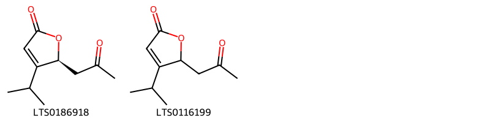{ width=100% }
    <figcaption>Hình ảnh cấu trúc hóa học của 2 hoạt chất thuộc nhóm Dihydrofurans gồm ['(5s)-4-isopropyl-5-(2-oxopropyl)-5h-furan-2-one (LTS0186918)', '4-isopropyl-5-(2-oxopropyl)-5h-furan-2-one (LTS0116199)'].</figcaption>
</figure>
#### Nhóm Dioxanes
<figure markdown="span">
    { width=100% }
    <figcaption>Hình ảnh cấu trúc hóa học của 1 hoạt chất thuộc nhóm Dioxanes gồm ['ascaridole (LTS0041598)'].</figcaption>
</figure>
#### Nhóm Flavonoids
<figure markdown="span">
    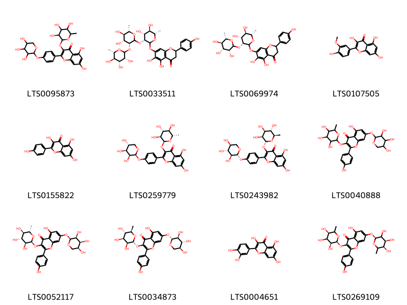{ width=100% }
    <figcaption>Hình ảnh cấu trúc hóa học của 12 hoạt chất thuộc nhóm Flavonoids gồm ['5,7-dihydroxy-3-[(3,4,5-trihydroxy-6-methyloxan-2-yl)oxy]-2-{4-[(3,4,5-trihydroxyoxan-2-yl)oxy]phenyl}chromen-4-one (LTS0095873)', '7-{[(3r,4r,5r,6s)-3-{[(3r,4r,5r,6s)-4,5-dihydroxy-6-methyl-3-{[(3r,4r,5r,6s)-3,4,5-trihydroxy-6-methyloxan-2-yl]oxy}oxan-2-yl]oxy}-4,5-dihydroxy-6-methyloxan-2-yl]oxy}-5,6-dihydroxy-2-(4-hydroxyphenyl)-2,3-dihydro-1-benzopyran-4-one (LTS0033511)', '7-{[(3r,4r,5r,6s)-4,5-dihydroxy-6-methyl-3-{[(3r,4r,5r,6s)-3,4,5-trihydroxy-6-methyloxan-2-yl]oxy}oxan-2-yl]oxy}-5,6-dihydroxy-2-(4-hydroxyphenyl)-2,3-dihydro-1-benzopyran-4-one (LTS0069974)', 'isorhamnetin (LTS0107505)', 'kaempherol (LTS0155822)', '5,7-dihydroxy-3-{[(2s,3s,4r,5r,6s)-3,4,5-trihydroxy-6-methyloxan-2-yl]oxy}-2-(4-{[(2s,3s,4s,5r)-3,4,5-trihydroxyoxan-2-yl]oxy}phenyl)chromen-4-one (LTS0259779)', '5,7-dihydroxy-3-{[(2r,3s,4s,5s,6r)-3,4,5-trihydroxy-6-methyloxan-2-yl]oxy}-2-(4-{[(2r,3s,4r,5s)-3,4,5-trihydroxyoxan-2-yl]oxy}phenyl)chromen-4-one (LTS0243982)', '5-hydroxy-2-(4-hydroxyphenyl)-3-[(3,4,5-trihydroxy-6-methyloxan-2-yl)oxy]-7-[(3,4,5-trihydroxyoxan-2-yl)oxy]chromen-4-one (LTS0040888)', '5-hydroxy-2-(4-hydroxyphenyl)-3-{[(2s,3s,4r,5r,6s)-3,4,5-trihydroxy-6-methyloxan-2-yl]oxy}-7-{[(2s,3s,4s,5s)-3,4,5-trihydroxyoxan-2-yl]oxy}chromen-4-one (LTS0052117)', '5-hydroxy-2-(4-hydroxyphenyl)-3-{[(2r,3s,4s,5s,6r)-3,4,5-trihydroxy-6-methyloxan-2-yl]oxy}-7-{[(2r,3s,4r,5s)-3,4,5-trihydroxyoxan-2-yl]oxy}chromen-4-one (LTS0034873)', 'quercetin (LTS0004651)', 'kaempferitrin (LTS0269109)'].</figcaption>
</figure>
#### Nhóm Organooxygen compounds
<figure markdown="span">
    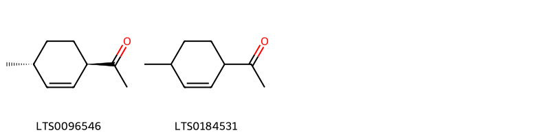{ width=100% }
    <figcaption>Hình ảnh cấu trúc hóa học của 2 hoạt chất thuộc nhóm Organooxygen compounds gồm ['1-[(1r,4r)-4-methylcyclohex-2-en-1-yl]ethanone (LTS0096546)', '1-(4-methylcyclohex-2-en-1-yl)ethanone (LTS0184531)'].</figcaption>
</figure>
#### Nhóm Oxepanes
<figure markdown="span">
    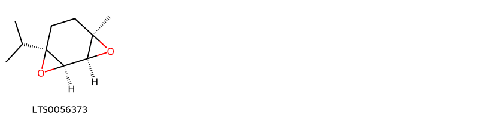{ width=100% }
    <figcaption>Hình ảnh cấu trúc hóa học của 1 hoạt chất thuộc nhóm Oxepanes gồm ['(1s,2r,4r,7r)-4-isopropyl-7-methyl-3,8-dioxatricyclo[5.1.0.0²,⁴]octane (LTS0056373)'].</figcaption>
</figure>
#### Nhóm Prenol lipids
<figure markdown="span">
    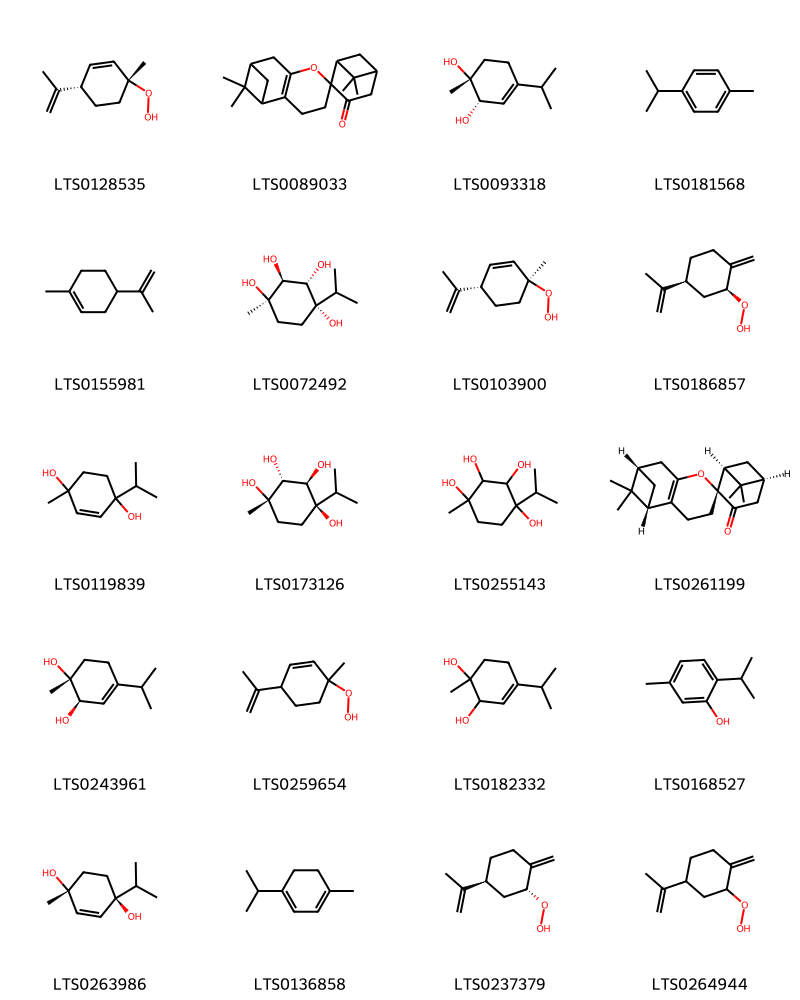{ width=100% }
    <figcaption>Hình ảnh cấu trúc hóa học của 20 hoạt chất thuộc nhóm Prenol lipids gồm ['(1r,4s)-1-methyl-4-(prop-1-en-2-yl)cyclohex-2-ene-1-peroxol (LTS0128535)', "6,6,10',10'-tetramethyl-6'-oxaspiro[bicyclo[3.1.1]heptane-2,5'-tricyclo[7.1.1.0²,⁷]undecan]-2'(7')-en-3-one (LTS0089033)", '(1r,2s)-4-isopropyl-1-methylcyclohex-3-ene-1,2-diol (LTS0093318)', 'cymene (LTS0181568)', 'limonene,  (LTS0155981)', '(1s,2s,3s,4r)-1-isopropyl-4-methylcyclohexane-1,2,3,4-tetrol (LTS0072492)', '(1s,4s)-1-methyl-4-(prop-1-en-2-yl)cyclohex-2-ene-1-peroxol (LTS0103900)', '(1s,5s)-2-methylidene-5-(prop-1-en-2-yl)cyclohexane-1-peroxol (LTS0186857)', '1-isopropyl-4-methylcyclohex-2-ene-1,4-diol (LTS0119839)', '(1r,2r,3r,4s)-1-isopropyl-4-methylcyclohexane-1,2,3,4-tetrol (LTS0173126)', '1-isopropyl-4-methylcyclohexane-1,2,3,4-tetrol (LTS0255143)', "(1s,1's,2r,5s,9's)-6,6,10',10'-tetramethyl-6'-oxaspiro[bicyclo[3.1.1]heptane-2,5'-tricyclo[7.1.1.0²,⁷]undecan]-2'(7')-en-3-one (LTS0261199)", '(1r,2r)-4-isopropyl-1-methylcyclohex-3-ene-1,2-diol (LTS0243961)', '1-methyl-4-(prop-1-en-2-yl)cyclohex-2-ene-1-peroxol (LTS0259654)', '4-isopropyl-1-methylcyclohex-3-ene-1,2-diol (LTS0182332)', 'thymol (LTS0168527)', '(1s,4r)-1-isopropyl-4-methylcyclohex-2-ene-1,4-diol (LTS0263986)', 'terpinene (LTS0136858)', '(1r,5s)-2-methylidene-5-(prop-1-en-2-yl)cyclohexane-1-peroxol (LTS0237379)', '2-methylidene-5-(prop-1-en-2-yl)cyclohexane-1-peroxol (LTS0264944)'].</figcaption>
</figure>

---

### Dược dân tộc học

Danh sách các quốc gia có sử dụng *N/A* trong điều trị các bệnh. 

| Country            | Disease                                                           | Bệnh                                                                                                                                                                                                |
|:-------------------|:------------------------------------------------------------------|:----------------------------------------------------------------------------------------------------------------------------------------------------------------------------------------------------|
| Bahamas            | Vermifuge                                                         | MYMEMORY WARNING: YOU USED ALL AVAILABLE FREE TRANSLATIONS FOR TODAY. NEXT AVAILABLE IN  14 HOURS 51 MINUTES 57 SECONDS VISIT HTTPS://MYMEMORY.TRANSLATED.NET/DOC/USAGELIMITS.PHP TO TRANSLATE MORE |
| Brazil             | Tonic, Stomachic                                                  | MYMEMORY WARNING: YOU USED ALL AVAILABLE FREE TRANSLATIONS FOR TODAY. NEXT AVAILABLE IN  14 HOURS 51 MINUTES 54 SECONDS VISIT HTTPS://MYMEMORY.TRANSLATED.NET/DOC/USAGELIMITS.PHP TO TRANSLATE MORE |
| China              | Analgesic, Carminative, Stomachic, Vermifuge                      | MYMEMORY WARNING: YOU USED ALL AVAILABLE FREE TRANSLATIONS FOR TODAY. NEXT AVAILABLE IN  14 HOURS 51 MINUTES 49 SECONDS VISIT HTTPS://MYMEMORY.TRANSLATED.NET/DOC/USAGELIMITS.PHP TO TRANSLATE MORE |
| Dominican Republic | Vermifuge                                                         | MYMEMORY WARNING: YOU USED ALL AVAILABLE FREE TRANSLATIONS FOR TODAY. NEXT AVAILABLE IN  14 HOURS 51 MINUTES 46 SECONDS VISIT HTTPS://MYMEMORY.TRANSLATED.NET/DOC/USAGELIMITS.PHP TO TRANSLATE MORE |
| Elsewhere          | Ascaricide, Stimulant, Vermifuge, Fungicide, Vermifuge, Vermifuge | MYMEMORY WARNING: YOU USED ALL AVAILABLE FREE TRANSLATIONS FOR TODAY. NEXT AVAILABLE IN  14 HOURS 51 MINUTES 44 SECONDS VISIT HTTPS://MYMEMORY.TRANSLATED.NET/DOC/USAGELIMITS.PHP TO TRANSLATE MORE |
| Guatemala          | Vermifuge                                                         | MYMEMORY WARNING: YOU USED ALL AVAILABLE FREE TRANSLATIONS FOR TODAY. NEXT AVAILABLE IN  14 HOURS 51 MINUTES 40 SECONDS VISIT HTTPS://MYMEMORY.TRANSLATED.NET/DOC/USAGELIMITS.PHP TO TRANSLATE MORE |
| Haiti              | Antiseptic, Vermifuge, Parasiticide                               | MYMEMORY WARNING: YOU USED ALL AVAILABLE FREE TRANSLATIONS FOR TODAY. NEXT AVAILABLE IN  14 HOURS 51 MINUTES 37 SECONDS VISIT HTTPS://MYMEMORY.TRANSLATED.NET/DOC/USAGELIMITS.PHP TO TRANSLATE MORE |
| Mexico             | Diaphoretic, Vermifuge, Diuretic, Emmenagogue                     | MYMEMORY WARNING: YOU USED ALL AVAILABLE FREE TRANSLATIONS FOR TODAY. NEXT AVAILABLE IN  14 HOURS 51 MINUTES 34 SECONDS VISIT HTTPS://MYMEMORY.TRANSLATED.NET/DOC/USAGELIMITS.PHP TO TRANSLATE MORE |
| Mexico(Chinantec)  | Vermifuge                                                         | MYMEMORY WARNING: YOU USED ALL AVAILABLE FREE TRANSLATIONS FOR TODAY. NEXT AVAILABLE IN  14 HOURS 51 MINUTES 31 SECONDS VISIT HTTPS://MYMEMORY.TRANSLATED.NET/DOC/USAGELIMITS.PHP TO TRANSLATE MORE |
| Panama             | Vermifuge                                                         | MYMEMORY WARNING: YOU USED ALL AVAILABLE FREE TRANSLATIONS FOR TODAY. NEXT AVAILABLE IN  14 HOURS 51 MINUTES 28 SECONDS VISIT HTTPS://MYMEMORY.TRANSLATED.NET/DOC/USAGELIMITS.PHP TO TRANSLATE MORE |
| Trinidad           | Fungicide, Vermifuge, Vermifuge, Stimulant, Vermifuge             | MYMEMORY WARNING: YOU USED ALL AVAILABLE FREE TRANSLATIONS FOR TODAY. NEXT AVAILABLE IN  14 HOURS 51 MINUTES 26 SECONDS VISIT HTTPS://MYMEMORY.TRANSLATED.NET/DOC/USAGELIMITS.PHP TO TRANSLATE MORE |
| Turkey             | Emmenagogue, Nervine, Poison, Stomachic, Vermifuge, Stimulant     | MYMEMORY WARNING: YOU USED ALL AVAILABLE FREE TRANSLATIONS FOR TODAY. NEXT AVAILABLE IN  14 HOURS 51 MINUTES 23 SECONDS VISIT HTTPS://MYMEMORY.TRANSLATED.NET/DOC/USAGELIMITS.PHP TO TRANSLATE MORE |
| US                 | Emmenagogue, Narcotic, Vermifuge                                  | MYMEMORY WARNING: YOU USED ALL AVAILABLE FREE TRANSLATIONS FOR TODAY. NEXT AVAILABLE IN  14 HOURS 51 MINUTES 19 SECONDS VISIT HTTPS://MYMEMORY.TRANSLATED.NET/DOC/USAGELIMITS.PHP TO TRANSLATE MORE |
| Venezuela          | Vermifuge, Stomachic                                              | MYMEMORY WARNING: YOU USED ALL AVAILABLE FREE TRANSLATIONS FOR TODAY. NEXT AVAILABLE IN  14 HOURS 51 MINUTES 15 SECONDS VISIT HTTPS://MYMEMORY.TRANSLATED.NET/DOC/USAGELIMITS.PHP TO TRANSLATE MORE |
| ain                | Vermifuge                                                         | MYMEMORY WARNING: YOU USED ALL AVAILABLE FREE TRANSLATIONS FOR TODAY. NEXT AVAILABLE IN  14 HOURS 51 MINUTES 12 SECONDS VISIT HTTPS://MYMEMORY.TRANSLATED.NET/DOC/USAGELIMITS.PHP TO TRANSLATE MORE |

---

---
## Chenopodium bonushenricus
### Thông tin về thực vật

!!! info "Phân loại thực vật của *Blitum bonus-henricus* từ GIBF:"
    - **Kingdom:** Plantae
    - **Phylum:** Tracheophyta
    - **Order:** Caryophyllales
    - **Family:** Amaranthaceae
    - **Genus:** Blitum
    - **Species:** *Blitum bonus-henricus*

 

| Label (VI)   | Label (EN)   | Scientific Name          | Descriptions (VI)   | Descriptions (EN)   | Also Known As (VI)   | Also Known As (EN)   |
|:-------------|:-------------|:-------------------------|:--------------------|:--------------------|:---------------------|:---------------------|
| N/A          | N/A          | Chenopodium ambrosioides | loài thực vật       | species of plant    | ['']                 | ['Mexican tea']      |

#### Phân bố trên thế giới

**Từ CSDL GIBF** Liechtenstein, Austria, France, Switzerland, Germany, United Kingdom of Great Britain and Northern Ireland

#### Phân bố tại Việt Nam

**Từ CSDL GIBF**: Không có ghi nhận ở Việt Nam

---
### Thành phần hóa học
        
- Theo cơ sở dữ liệu lotus: Từ loài *Blitum bonus-henricus* đã phân lập và xác định được Chưa có hoạt chất nào được phân lập. hoạt chất thuộc về các nhóm Không có hoạt chất nào được phân lập. 

Không có hình ảnh nào được tạo ra

---

### Dược dân tộc học

Danh sách các quốc gia có sử dụng *Blitum bonus-henricus* trong điều trị các bệnh. 

| Country   | Disease            | Bệnh                                                                                                                                                                                                |
|:----------|:-------------------|:----------------------------------------------------------------------------------------------------------------------------------------------------------------------------------------------------|
| Turkey    | Diuretic, Laxative | MYMEMORY WARNING: YOU USED ALL AVAILABLE FREE TRANSLATIONS FOR TODAY. NEXT AVAILABLE IN  14 HOURS 50 MINUTES 38 SECONDS VISIT HTTPS://MYMEMORY.TRANSLATED.NET/DOC/USAGELIMITS.PHP TO TRANSLATE MORE |

---

---
## Chenopodium botrys
### Thông tin về thực vật

!!! info "Phân loại thực vật của *Dysphania botrys* từ GIBF:"
    - **Kingdom:** Plantae
    - **Phylum:** Tracheophyta
    - **Order:** Caryophyllales
    - **Family:** Amaranthaceae
    - **Genus:** Dysphania
    - **Species:** *Dysphania botrys*

 

| Label (VI)   | Label (EN)   | Scientific Name    | Descriptions (VI)   | Descriptions (EN)   | Also Known As (VI)   | Also Known As (EN)   |
|:-------------|:-------------|:-------------------|:--------------------|:--------------------|:---------------------|:---------------------|
| N/A          | N/A          | Chenopodium botrys | loài thực vật       | species of plant    | ['']                 | ['']                 |

#### Phân bố trên thế giới

**Từ CSDL GIBF** Czechia, Mongolia, Kazakhstan, Türkiye, Spain, Netherlands, United States of America, Romania, Armenia, Pakistan, Albania, Belgium, Luxembourg, Canada, Germany, Austria, Portugal, Ukraine, Kyrgyzstan, Italy, Switzerland, France

#### Phân bố tại Việt Nam

**Từ CSDL GIBF**: Không có ghi nhận ở Việt Nam

---
### Thành phần hóa học
        
- Theo cơ sở dữ liệu lotus: Từ loài *Dysphania botrys* đã phân lập và xác định được Chưa có hoạt chất nào được phân lập. hoạt chất thuộc về các nhóm Không có hoạt chất nào được phân lập. 

Không có hình ảnh nào được tạo ra

---

### Dược dân tộc học

Danh sách các quốc gia có sử dụng *Dysphania botrys* trong điều trị các bệnh. 

| Country   | Disease   | Bệnh                                                                                                                                                                                                |
|:----------|:----------|:----------------------------------------------------------------------------------------------------------------------------------------------------------------------------------------------------|
| Elsewhere | Vermifuge | MYMEMORY WARNING: YOU USED ALL AVAILABLE FREE TRANSLATIONS FOR TODAY. NEXT AVAILABLE IN  14 HOURS 50 MINUTES 12 SECONDS VISIT HTTPS://MYMEMORY.TRANSLATED.NET/DOC/USAGELIMITS.PHP TO TRANSLATE MORE |

---

---
## Chenopodium californicum
### Thông tin về thực vật

!!! info "Phân loại thực vật của *Blitum californicum* từ GIBF:"
    - **Kingdom:** Plantae
    - **Phylum:** Tracheophyta
    - **Order:** Caryophyllales
    - **Family:** Amaranthaceae
    - **Genus:** Blitum
    - **Species:** *Blitum californicum*

 

| Label (VI)   | Label (EN)   | Scientific Name          | Descriptions (VI)   | Descriptions (EN)   | Also Known As (VI)   | Also Known As (EN)   |
|:-------------|:-------------|:-------------------------|:--------------------|:--------------------|:---------------------|:---------------------|
| N/A          | N/A          | Chenopodium californicum |                     | species of plant    | ['']                 | ['']                 |

#### Phân bố trên thế giới

**Từ CSDL GIBF** Mexico, United States of America, Poland

#### Phân bố tại Việt Nam

**Từ CSDL GIBF**: Không có ghi nhận ở Việt Nam

---
### Thành phần hóa học
        
- Theo cơ sở dữ liệu lotus: Từ loài *Blitum californicum* đã phân lập và xác định được Chưa có hoạt chất nào được phân lập. hoạt chất thuộc về các nhóm Không có hoạt chất nào được phân lập. 

Không có hình ảnh nào được tạo ra

---

### Dược dân tộc học

Danh sách các quốc gia có sử dụng *Blitum californicum* trong điều trị các bệnh. 

| Country   | Disease   | Bệnh                                                                                                                                                                                                |
|:----------|:----------|:----------------------------------------------------------------------------------------------------------------------------------------------------------------------------------------------------|
| Elsewhere | Soap      | MYMEMORY WARNING: YOU USED ALL AVAILABLE FREE TRANSLATIONS FOR TODAY. NEXT AVAILABLE IN  14 HOURS 49 MINUTES 49 SECONDS VISIT HTTPS://MYMEMORY.TRANSLATED.NET/DOC/USAGELIMITS.PHP TO TRANSLATE MORE |

---

---
## Chenopodium chilense
### Thông tin về thực vật

!!! info "Phân loại thực vật của *N/A* từ GIBF:"
    - **Kingdom:** Plantae
    - **Phylum:** Tracheophyta
    - **Order:** Caryophyllales
    - **Family:** Amaranthaceae
    - **Genus:** N/A
    - **Species:** *N/A*

 

| Label (VI)   | Label (EN)   | Scientific Name      | Descriptions (VI)   | Descriptions (EN)   | Also Known As (VI)   | Also Known As (EN)   |
|:-------------|:-------------|:---------------------|:--------------------|:--------------------|:---------------------|:---------------------|
| N/A          | N/A          | Chenopodium chilense | loài thực vật       | species of plant    | ['']                 | ['']                 |

#### Phân bố trên thế giới

**Từ CSDL GIBF** Brazil, Viet Nam, Japan, Israel, Chile, New Zealand, Ecuador, Uruguay, Spain, Thailand, Guinea-Bissau, Puerto Rico, United States of America, Indonesia, Russian Federation, Argentina, Morocco, Mexico, United Kingdom of Great Britain and Northern Ireland, Chinese Taipei, Curaçao, Namibia, Portugal, Ukraine, South Africa, Australia, Italy, India, France, Ireland

#### Phân bố tại Việt Nam

**Từ CSDL GIBF**: Hồ Chí Minh city, Hà Giang, Đà Nẵng

---
### Thành phần hóa học
        
- Theo cơ sở dữ liệu lotus: Từ loài *N/A* đã phân lập và xác định được 1 hoạt chất thuộc về các nhóm Dioxanes. 

|    | chemicalTaxonomyClassyfireClass   |   smiles_count |
|---:|:----------------------------------|---------------:|
|  0 | Dioxanes                          |              1 |

#### Nhóm Dioxanes
<figure markdown="span">
    { width=100% }
    <figcaption>Hình ảnh cấu trúc hóa học của 1 hoạt chất thuộc nhóm Dioxanes gồm ['ascaridole (LTS0041598)'].</figcaption>
</figure>

---

### Dược dân tộc học

Danh sách các quốc gia có sử dụng *N/A* trong điều trị các bệnh. 

| Country   | Disease   | Bệnh                                                                                                                                                                                                |
|:----------|:----------|:----------------------------------------------------------------------------------------------------------------------------------------------------------------------------------------------------|
| Elsewhere | Vermifuge | MYMEMORY WARNING: YOU USED ALL AVAILABLE FREE TRANSLATIONS FOR TODAY. NEXT AVAILABLE IN  14 HOURS 49 MINUTES 23 SECONDS VISIT HTTPS://MYMEMORY.TRANSLATED.NET/DOC/USAGELIMITS.PHP TO TRANSLATE MORE |

---

---
## Chenopodium foetidum
### Thông tin về thực vật

!!! info "Phân loại thực vật của *Chenopodium foetidum* từ GIBF:"
    - **Kingdom:** Plantae
    - **Phylum:** Tracheophyta
    - **Order:** Caryophyllales
    - **Family:** Amaranthaceae
    - **Genus:** Chenopodium
    - **Species:** *Chenopodium foetidum*

 

| Label (VI)   | Label (EN)   | Scientific Name      | Descriptions (VI)   | Descriptions (EN)   | Also Known As (VI)   | Also Known As (EN)   |
|:-------------|:-------------|:---------------------|:--------------------|:--------------------|:---------------------|:---------------------|
| N/A          | N/A          | Chenopodium chilense | loài thực vật       | species of plant    | ['']                 | ['']                 |

#### Phân bố trên thế giới

**Từ CSDL GIBF** Japan, Belgium, China, Türkiye, Poland

#### Phân bố tại Việt Nam

**Từ CSDL GIBF**: Không có ghi nhận ở Việt Nam

---
### Thành phần hóa học
        
- Theo cơ sở dữ liệu lotus: Từ loài *Chenopodium foetidum* đã phân lập và xác định được Chưa có hoạt chất nào được phân lập. hoạt chất thuộc về các nhóm Không có hoạt chất nào được phân lập. 

Không có hình ảnh nào được tạo ra

---

### Dược dân tộc học

Danh sách các quốc gia có sử dụng *Chenopodium foetidum* trong điều trị các bệnh. 

| Country   | Disease     | Bệnh                                                                                                                                                                                                |
|:----------|:------------|:----------------------------------------------------------------------------------------------------------------------------------------------------------------------------------------------------|
| Elsewhere | Insecticide | MYMEMORY WARNING: YOU USED ALL AVAILABLE FREE TRANSLATIONS FOR TODAY. NEXT AVAILABLE IN  14 HOURS 48 MINUTES 55 SECONDS VISIT HTTPS://MYMEMORY.TRANSLATED.NET/DOC/USAGELIMITS.PHP TO TRANSLATE MORE |

---

---
## Chenopodium graveolens
### Thông tin về thực vật

!!! info "Phân loại thực vật của *Dysphania graveolens* từ GIBF:"
    - **Kingdom:** Plantae
    - **Phylum:** Tracheophyta
    - **Order:** Caryophyllales
    - **Family:** Amaranthaceae
    - **Genus:** Dysphania
    - **Species:** *Dysphania graveolens*

 

| Label (VI)   | Label (EN)   | Scientific Name        | Descriptions (VI)   | Descriptions (EN)   | Also Known As (VI)   | Also Known As (EN)   |
|:-------------|:-------------|:-----------------------|:--------------------|:--------------------|:---------------------|:---------------------|
| N/A          | N/A          | Chenopodium graveolens | loài thực vật       | species of plant    | ['']                 | ['']                 |

#### Phân bố trên thế giới

**Từ CSDL GIBF** Mexico, Guatemala, United States of America, Argentina

#### Phân bố tại Việt Nam

**Từ CSDL GIBF**: Không có ghi nhận ở Việt Nam

---
### Thành phần hóa học
        
- Theo cơ sở dữ liệu lotus: Từ loài *Dysphania graveolens* đã phân lập và xác định được Chưa có hoạt chất nào được phân lập. hoạt chất thuộc về các nhóm Không có hoạt chất nào được phân lập. 

Không có hình ảnh nào được tạo ra

---

### Dược dân tộc học

Danh sách các quốc gia có sử dụng *Dysphania graveolens* trong điều trị các bệnh. 

| Country   | Disease              | Bệnh                                                                                                                                                                                                |
|:----------|:---------------------|:----------------------------------------------------------------------------------------------------------------------------------------------------------------------------------------------------|
| Mexico    | Stomachic, Vermifuge | MYMEMORY WARNING: YOU USED ALL AVAILABLE FREE TRANSLATIONS FOR TODAY. NEXT AVAILABLE IN  14 HOURS 48 MINUTES 27 SECONDS VISIT HTTPS://MYMEMORY.TRANSLATED.NET/DOC/USAGELIMITS.PHP TO TRANSLATE MORE |

---

---
## Chenopodium multifidum
### Thông tin về thực vật

!!! info "Phân loại thực vật của *Dysphania multifida* từ GIBF:"
    - **Kingdom:** Plantae
    - **Phylum:** Tracheophyta
    - **Order:** Caryophyllales
    - **Family:** Amaranthaceae
    - **Genus:** Dysphania
    - **Species:** *Dysphania multifida*

 

| Label (VI)   | Label (EN)   | Scientific Name        | Descriptions (VI)   | Descriptions (EN)   | Also Known As (VI)   | Also Known As (EN)   |
|:-------------|:-------------|:-----------------------|:--------------------|:--------------------|:---------------------|:---------------------|
| N/A          | N/A          | Chenopodium multifidum | loài thực vật       | species of plant    | ['']                 | ['']                 |

#### Phân bố trên thế giới

**Từ CSDL GIBF** Morocco, Brazil, United States of America, Portugal, Romania, Norway, Greece, South Africa, Australia, Chile, Italy, Bulgaria, Argentina, unknown or invalid, France, Spain, Bolivia (Plurinational State of)

#### Phân bố tại Việt Nam

**Từ CSDL GIBF**: Không có ghi nhận ở Việt Nam

---
### Thành phần hóa học
        
- Theo cơ sở dữ liệu lotus: Từ loài *Dysphania multifida* đã phân lập và xác định được Chưa có hoạt chất nào được phân lập. hoạt chất thuộc về các nhóm Không có hoạt chất nào được phân lập. 

Không có hình ảnh nào được tạo ra

---

### Dược dân tộc học

Danh sách các quốc gia có sử dụng *Dysphania multifida* trong điều trị các bệnh. 

| Country   | Disease                                                               | Bệnh                                                                                                                                                                                                |
|:----------|:----------------------------------------------------------------------|:----------------------------------------------------------------------------------------------------------------------------------------------------------------------------------------------------|
| Argentina | Carminative, Diaphoretic, Digestive, Diuretic, Emmenagogue, Vermifuge | MYMEMORY WARNING: YOU USED ALL AVAILABLE FREE TRANSLATIONS FOR TODAY. NEXT AVAILABLE IN  14 HOURS 47 MINUTES 56 SECONDS VISIT HTTPS://MYMEMORY.TRANSLATED.NET/DOC/USAGELIMITS.PHP TO TRANSLATE MORE |

---

---
## Chenopodium murale
### Thông tin về thực vật

!!! info "Phân loại thực vật của *Chenopodiastrum murale* từ GIBF:"
    - **Kingdom:** Plantae
    - **Phylum:** Tracheophyta
    - **Order:** Caryophyllales
    - **Family:** Amaranthaceae
    - **Genus:** Chenopodiastrum
    - **Species:** *Chenopodiastrum murale*

 

| Label (VI)   | Label (EN)   | Scientific Name    | Descriptions (VI)   | Descriptions (EN)   | Also Known As (VI)   | Also Known As (EN)       |
|:-------------|:-------------|:-------------------|:--------------------|:--------------------|:---------------------|:-------------------------|
| N/A          | N/A          | Chenopodium murale | loài thực vật       | species of plant    | ['']                 | ['Nettleleaf goosefoot'] |

#### Phân bố trên thế giới

**Từ CSDL GIBF** Austria, Brazil, Mexico, United States of America, Portugal, Czechia, Greece, France, Belgium, Norfolk Island, Australia, Colombia, Somalia, Switzerland, Croatia, Germany, United Kingdom of Great Britain and Northern Ireland, Spain

#### Phân bố tại Việt Nam

**Từ CSDL GIBF**: Không có ghi nhận ở Việt Nam

---
### Thành phần hóa học
        
- Theo cơ sở dữ liệu lotus: Từ loài *Chenopodiastrum murale* đã phân lập và xác định được 39 hoạt chất thuộc về các nhóm Coumarins and derivatives, Flavonoids. 

|    | chemicalTaxonomyClassyfireClass   |   smiles_count |
|---:|:----------------------------------|---------------:|
|  0 | Coumarins and derivatives         |              1 |
|  1 | Flavonoids                        |             38 |

#### Nhóm Coumarins and derivatives
<figure markdown="span">
    { width=100% }
    <figcaption>Hình ảnh cấu trúc hóa học của 1 hoạt chất thuộc nhóm Coumarins and derivatives gồm ['scopoletin (LTS0193112)'].</figcaption>
</figure>
#### Nhóm Flavonoids
<figure markdown="span">
    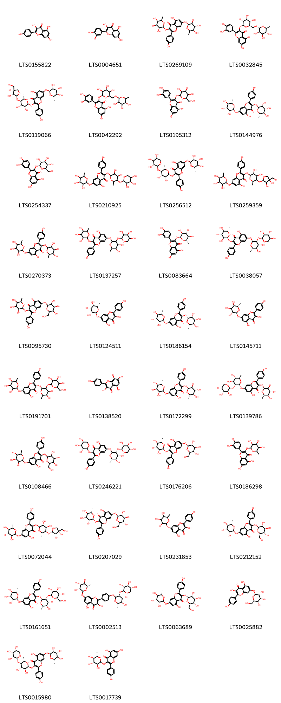{ width=100% }
    <figcaption>Hình ảnh cấu trúc hóa học của 38 hoạt chất thuộc nhóm Flavonoids gồm ['kaempherol (LTS0155822)', 'quercetin (LTS0004651)', 'kaempferitrin (LTS0269109)', '3-rutinosyl quercetin (LTS0032845)', '3-{[(2s,3r,4s,5r,6s)-5-{[(2s,3r,4r)-3,4-dihydroxy-4-(hydroxymethyl)oxolan-2-yl]oxy}-3,4-dihydroxy-6-methyloxan-2-yl]oxy}-5-hydroxy-2-(4-hydroxyphenyl)-7-{[(2s,3r,4r,5r,6s)-3,4,5-trihydroxy-6-methyloxan-2-yl]oxy}chromen-4-one (LTS0119066)', 'rutin (LTS0042292)', '2-(3,4-dihydroxyphenyl)-5,7-dihydroxy-3-{[3,4,5-trihydroxy-6-(hydroxymethyl)oxan-2-yl]oxy}chromen-4-one (LTS0195312)', 'lespedin (LTS0144976)', 'isoquercetin (LTS0254337)', '3-({3,4-dihydroxy-6-methyl-5-[(3,4,5-trihydroxyoxan-2-yl)oxy]oxan-2-yl}oxy)-5-hydroxy-2-(4-hydroxyphenyl)-7-[(3,4,5-trihydroxy-6-methyloxan-2-yl)oxy]chromen-4-one (LTS0210925)', '3-{[(2s,3r,4s,5r,6s)-3,4-dihydroxy-6-methyl-5-{[(2s,3r,4s,5r)-3,4,5-trihydroxyoxan-2-yl]oxy}oxan-2-yl]oxy}-5-hydroxy-2-(4-hydroxyphenyl)-7-{[(2s,3r,4r,5r,6s)-3,4,5-trihydroxy-6-methyloxan-2-yl]oxy}chromen-4-one (LTS0256512)', '3-[(5-{[3,4-dihydroxy-4-(hydroxymethyl)oxolan-2-yl]oxy}-3,4-dihydroxy-6-methyloxan-2-yl)oxy]-5-hydroxy-2-(4-hydroxyphenyl)-7-[(3,4,5-trihydroxy-6-methyloxan-2-yl)oxy]chromen-4-one (LTS0259359)', 'kaempferitrin (LTS0270373)', '7-({4,5-dihydroxy-6-methyl-3-[(3,4,5-trihydroxyoxan-2-yl)oxy]oxan-2-yl}oxy)-5-hydroxy-2-(4-hydroxyphenyl)-3-[(3,4,5-trihydroxy-6-methyloxan-2-yl)oxy]chromen-4-one (LTS0137257)', '2-(3,4-dihydroxyphenyl)-5,7-dihydroxy-3-{[(2s,3s,4r,5r,6s)-3,4,5-trihydroxy-6-methyloxan-2-yl]oxy}chromen-4-one (LTS0083664)', '7-{[(2s,3s,4r,5r,6s)-4,5-dihydroxy-6-methyl-3-{[(2s,3s,4r,5s)-3,4,5-trihydroxyoxan-2-yl]oxy}oxan-2-yl]oxy}-5-hydroxy-2-(4-hydroxyphenyl)-3-{[(2s,3s,4r,5r,6s)-3,4,5-trihydroxy-6-methyloxan-2-yl]oxy}chromen-4-one (LTS0038057)', '5-hydroxy-2-(4-hydroxyphenyl)-7-{[3,4,5-trihydroxy-6-(hydroxymethyl)oxan-2-yl]oxy}-3-[(3,4,5-trihydroxy-6-methyloxan-2-yl)oxy]chromen-4-one (LTS0095730)', 'kaempferol-7-rhamnoside (LTS0124511)', '5-hydroxy-2-(4-hydroxyphenyl)-3-{[(2r,3r,4r,5r,6s)-3,4,5-trihydroxy-6-methyloxan-2-yl]oxy}-7-{[(2s,3r,4r,5r,6s)-3,4,5-trihydroxy-6-methyloxan-2-yl]oxy}chromen-4-one (LTS0186154)', '3,5-dihydroxy-2-(4-hydroxyphenyl)-7-{[(2s,3r,4s,5r,6s)-3,4,5-trihydroxy-6-methyloxan-2-yl]oxy}chromen-4-one (LTS0145711)', '3-[(4,5-dihydroxy-6-methyl-3-{[3,4,5-trihydroxy-6-(hydroxymethyl)oxan-2-yl]oxy}oxan-2-yl)oxy]-5-hydroxy-2-(4-hydroxyphenyl)-7-[(3,4,5-trihydroxy-6-methyloxan-2-yl)oxy]chromen-4-one (LTS0191701)', 'herbacetin (LTS0138520)', '5-hydroxy-2-(4-hydroxyphenyl)-3-{[(2s,3s,4r,5r,6s)-3,4,5-trihydroxy-6-methyloxan-2-yl]oxy}-7-{[(2s,3s,4s,5r,6s)-3,4,5-trihydroxy-6-methyloxan-2-yl]oxy}chromen-4-one (LTS0172299)', '7-{[(2r,3r,4r,5s,6r)-4,5-dihydroxy-6-methyl-3-{[(2s,3s,4r,5r)-3,4,5-trihydroxyoxan-2-yl]oxy}oxan-2-yl]oxy}-5-hydroxy-2-(4-hydroxyphenyl)-3-{[(2s,3s,4r,5r,6r)-3,4,5-trihydroxy-6-methyloxan-2-yl]oxy}chromen-4-one (LTS0139786)', '5-hydroxy-2-(4-hydroxyphenyl)-3-{[3,4,5-trihydroxy-6-(hydroxymethyl)oxan-2-yl]oxy}-7-[(3,4,5-trihydroxy-6-methyloxan-2-yl)oxy]chromen-4-one (LTS0108466)', '7-{[(2s,3r,4r,5r,6s)-4,5-dihydroxy-6-methyl-3-{[(2s,3r,4s,5r)-3,4,5-trihydroxyoxan-2-yl]oxy}oxan-2-yl]oxy}-5-hydroxy-2-(4-hydroxyphenyl)-3-{[(2s,3r,4r,5r,6s)-3,4,5-trihydroxy-6-methyloxan-2-yl]oxy}chromen-4-one (LTS0246221)', '5-hydroxy-2-(4-hydroxyphenyl)-7-{[(2s,3r,4s,5s,6r)-3,4,5-trihydroxy-6-(hydroxymethyl)oxan-2-yl]oxy}-3-{[(2s,3s,4r,5r,6s)-3,4,5-trihydroxy-6-methyloxan-2-yl]oxy}chromen-4-one (LTS0176206)', 'quercitrin (LTS0186298)', '3-{[(2s,3s,4r,5r,6s)-5-{[(2s,3s,4s)-3,4-dihydroxy-4-(hydroxymethyl)oxolan-2-yl]oxy}-3,4-dihydroxy-6-methyloxan-2-yl]oxy}-5-hydroxy-2-(4-hydroxyphenyl)-7-{[(2s,3s,4r,5r,6s)-3,4,5-trihydroxy-6-methyloxan-2-yl]oxy}chromen-4-one (LTS0072044)', '5-hydroxy-2-(4-hydroxyphenyl)-7-{[(2s,3r,4s,5s,6r)-3,4,5-trihydroxy-6-(hydroxymethyl)oxan-2-yl]oxy}-3-{[(2s,3r,4r,5r,6s)-3,4,5-trihydroxy-6-methyloxan-2-yl]oxy}chromen-4-one (LTS0207029)', '3,5-dihydroxy-2-(4-hydroxyphenyl)-7-[(3,4,5-trihydroxy-6-methyloxan-2-yl)oxy]chromen-4-one (LTS0231853)', '5-hydroxy-2-(4-hydroxyphenyl)-3-{[(2s,3r,4s,5s,6r)-3,4,5-trihydroxy-6-(hydroxymethyl)oxan-2-yl]oxy}-7-{[(2s,3r,4r,5r,6s)-3,4,5-trihydroxy-6-methyloxan-2-yl]oxy}chromen-4-one (LTS0212152)', '3-{[(2s,3r,4r,5r,6s)-4,5-dihydroxy-6-methyl-3-{[(2s,3r,4s,5s,6r)-3,4,5-trihydroxy-6-(hydroxymethyl)oxan-2-yl]oxy}oxan-2-yl]oxy}-5-hydroxy-2-(4-hydroxyphenyl)-7-{[(2s,3r,4r,5r,6s)-3,4,5-trihydroxy-6-methyloxan-2-yl]oxy}chromen-4-one (LTS0161651)', '2-(4-{[(3r,4r,5r,6s)-4,5-dihydroxy-6-methyl-3-{[(3r,4s,5r)-3,4,5-trihydroxyoxan-2-yl]oxy}oxan-2-yl]oxy}phenyl)-3,5-dihydroxy-7-{[(3r,4r,5r,6s)-3,4,5-trihydroxy-6-methyloxan-2-yl]oxy}chromen-4-one (LTS0002513)', '5-hydroxy-2-(4-hydroxyphenyl)-3-{[(2r,3r,4s,5s,6r)-3,4,5-trihydroxy-6-(hydroxymethyl)oxan-2-yl]oxy}-7-{[(2s,3r,4r,5r,6s)-3,4,5-trihydroxy-6-methyloxan-2-yl]oxy}chromen-4-one (LTS0063689)', 'kaempferol 7-o-glucoside (LTS0025882)', '3-{[(2s,3s,4s,5r,6s)-3,4-dihydroxy-6-methyl-5-{[(2r,3r,4r,5s)-3,4,5-trihydroxyoxan-2-yl]oxy}oxan-2-yl]oxy}-5-hydroxy-2-(4-hydroxyphenyl)-7-{[(2s,3s,4r,5r,6s)-3,4,5-trihydroxy-6-methyloxan-2-yl]oxy}chromen-4-one (LTS0015980)', '5,7-dihydroxy-2-(4-hydroxyphenyl)-3-{[(2s,3s,4r,5r,6s)-3,4,5-trihydroxy-6-methyloxan-2-yl]oxy}chromen-4-one (LTS0017739)'].</figcaption>
</figure>

---

### Dược dân tộc học

Danh sách các quốc gia có sử dụng *Chenopodiastrum murale* trong điều trị các bệnh. 

| Country            | Disease   | Bệnh                                                                                                                                                                                                |
|:-------------------|:----------|:----------------------------------------------------------------------------------------------------------------------------------------------------------------------------------------------------|
| Dominican Republic | Vermifuge | MYMEMORY WARNING: YOU USED ALL AVAILABLE FREE TRANSLATIONS FOR TODAY. NEXT AVAILABLE IN  14 HOURS 47 MINUTES 29 SECONDS VISIT HTTPS://MYMEMORY.TRANSLATED.NET/DOC/USAGELIMITS.PHP TO TRANSLATE MORE |

---

---
## Chenopodium quinoa
### Thông tin về thực vật

!!! info "Phân loại thực vật của *Chenopodium quinoa* từ GIBF:"
    - **Kingdom:** Plantae
    - **Phylum:** Tracheophyta
    - **Order:** Caryophyllales
    - **Family:** Amaranthaceae
    - **Genus:** Chenopodium
    - **Species:** *Chenopodium quinoa*

 

| Label (VI)   | Label (EN)   | Scientific Name    | Descriptions (VI)   | Descriptions (EN)   | Also Known As (VI)   | Also Known As (EN)             |
|:-------------|:-------------|:-------------------|:--------------------|:--------------------|:---------------------|:-------------------------------|
| N/A          | N/A          | Chenopodium quinoa | loài thực vật       | species of plant    | ['']                 | ['Quinua', 'Quinoa', 'quinoa'] |

#### Phân bố trên thế giới

**Từ CSDL GIBF** United States of America, Norway, Estonia, Sweden, Belgium, Chile, Colombia, Switzerland, Ecuador, Peru, United Kingdom of Great Britain and Northern Ireland, Spain, Netherlands, Bolivia (Plurinational State of)

#### Phân bố tại Việt Nam

**Từ CSDL GIBF**: Không có ghi nhận ở Việt Nam

---
### Thành phần hóa học
        
- Theo cơ sở dữ liệu lotus: Từ loài *Chenopodium quinoa* đã phân lập và xác định được 161 hoạt chất thuộc về các nhóm Prenol lipids, Steroids and steroid derivatives, Flavonoids. 

|    | chemicalTaxonomyClassyfireClass   |   smiles_count |
|---:|:----------------------------------|---------------:|
|  0 | Flavonoids                        |             10 |
|  1 | Prenol lipids                     |            135 |
|  2 | Steroids and steroid derivatives  |             15 |

#### Nhóm Flavonoids
<figure markdown="span">
    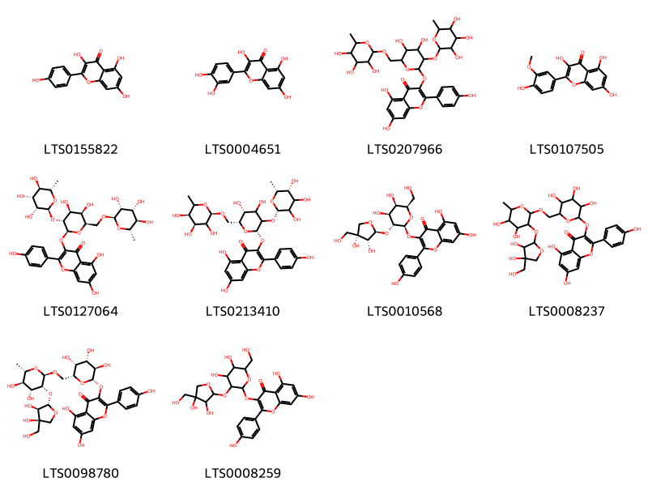{ width=100% }
    <figcaption>Hình ảnh cấu trúc hóa học của 10 hoạt chất thuộc nhóm Flavonoids gồm ['kaempherol (LTS0155822)', 'quercetin (LTS0004651)', '3-({4,5-dihydroxy-3-[(3,4,5-trihydroxy-6-methyloxan-2-yl)oxy]-6-{[(3,4,5-trihydroxy-6-methyloxan-2-yl)oxy]methyl}oxan-2-yl}oxy)-5,7-dihydroxy-2-(4-hydroxyphenyl)chromen-4-one (LTS0207966)', 'isorhamnetin (LTS0107505)', '3-{[(2s,3r,4s,5r,6r)-4,5-dihydroxy-3-{[(2s,3r,4r,5r,6s)-3,4,5-trihydroxy-6-methyloxan-2-yl]oxy}-6-({[(2r,3r,4r,5r,6s)-3,4,5-trihydroxy-6-methyloxan-2-yl]oxy}methyl)oxan-2-yl]oxy}-5,7-dihydroxy-2-(4-hydroxyphenyl)chromen-4-one (LTS0127064)', '3-{[(2s,5r,6r)-4,5-dihydroxy-3-{[(2s,5r,6r)-3,4,5-trihydroxy-6-methyloxan-2-yl]oxy}-6-({[(2r,4s,5r)-3,4,5-trihydroxy-6-methyloxan-2-yl]oxy}methyl)oxan-2-yl]oxy}-5,7-dihydroxy-2-(4-hydroxyphenyl)chromen-4-one (LTS0213410)', '3-{[(2s,3r,4s,5r,6r)-3-{[(2s,3r,4r)-3,4-dihydroxy-4-(hydroxymethyl)oxolan-2-yl]oxy}-4,5-dihydroxy-6-(hydroxymethyl)oxan-2-yl]oxy}-5,7-dihydroxy-2-(4-hydroxyphenyl)chromen-4-one (LTS0010568)', '3-[(6-{[(3-{[3,4-dihydroxy-4-(hydroxymethyl)oxolan-2-yl]oxy}-4,5-dihydroxy-6-methyloxan-2-yl)oxy]methyl}-3,4,5-trihydroxyoxan-2-yl)oxy]-5,7-dihydroxy-2-(4-hydroxyphenyl)chromen-4-one (LTS0008237)', '3-{[(2s,3r,4s,5r,6r)-6-({[(2r,3r,4r,5r,6s)-3-{[(2s,3r,4r)-3,4-dihydroxy-4-(hydroxymethyl)oxolan-2-yl]oxy}-4,5-dihydroxy-6-methyloxan-2-yl]oxy}methyl)-3,4,5-trihydroxyoxan-2-yl]oxy}-5,7-dihydroxy-2-(4-hydroxyphenyl)chromen-4-one (LTS0098780)', '3-[(3-{[3,4-dihydroxy-4-(hydroxymethyl)oxolan-2-yl]oxy}-4,5-dihydroxy-6-(hydroxymethyl)oxan-2-yl)oxy]-5,7-dihydroxy-2-(4-hydroxyphenyl)chromen-4-one (LTS0008259)'].</figcaption>
</figure>
#### Nhóm Prenol lipids
<figure markdown="span">
    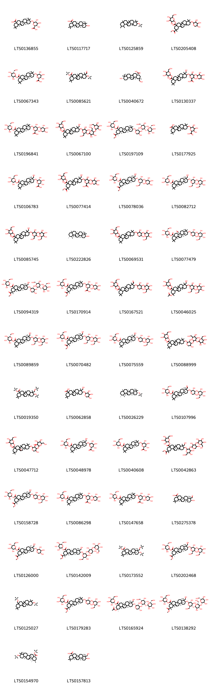{ width=100% }
    <figcaption>Hình ảnh cấu trúc hóa học của 135 hoạt chất thuộc nhóm Prenol lipids gồm ['oleanolic acid 3-o-glucuronide (LTS0136855)', 'oleanolic acid (LTS0117717)', '[(4,4,6a,6b,8a,11,12,14b-octamethyl-2,3,4a,5,6,7,8,9,10,11,12,12a,14,14a-tetradecahydro-1h-picen-3-yl)oxy]trimethylsilane (LTS0125859)', '2-methyl 4a-[3,4,5-trihydroxy-6-(hydroxymethyl)oxan-2-yl] 2,6a,6b,9,9,12a-hexamethyl-10-[(3,4,5-trihydroxyoxan-2-yl)oxy]-1,3,4,5,6,7,8,8a,10,11,12,12b,13,14b-tetradecahydropicene-2,4a-dicarboxylate (LTS0205408)', '(2s,3s,4s,5r,6r)-6-{[(3s,4ar,6ar,6bs,8as,12as,14ar,14br)-4,4,6a,6b,11,11,14b-heptamethyl-8a-({[(2s,3s,4r,5r,6s)-3,4,5-trihydroxy-6-(hydroxymethyl)oxan-2-yl]oxy}carbonyl)-1,2,3,4a,5,6,7,8,9,10,12,12a,14,14a-tetradecahydropicen-3-yl]oxy}-3,4,5-trihydroxyoxane-2-carboxylic acid (LTS0067343)', 'trimethylsilyl 9-formyl-2,2,6a,6b,9,12a-hexamethyl-10-[(trimethylsilyl)oxy]-1,3,4,5,6,7,8,8a,10,11,12,12b,13,14b-tetradecahydropicene-4a-carboxylate (LTS0085621)', '(2s,4ar,6as,6br,8ar,10s,12ar,12br,14bs)-10-hydroxy-2-(hydroxymethyl)-2,6a,6b,9,9,12a-hexamethyl-1,3,4,5,6,7,8,8a,10,11,12,12b,13,14b-tetradecahydropicene-4a-carboxylic acid (LTS0040672)', '3,5-dihydroxy-6-{[4-(hydroxymethyl)-4,6a,6b,11,11,14b-hexamethyl-8a-({[3,4,5-trihydroxy-6-(hydroxymethyl)oxan-2-yl]oxy}carbonyl)-1,2,3,4a,5,6,7,8,9,10,12,12a,14,14a-tetradecahydropicen-3-yl]oxy}-4-[(3,4,5-trihydroxyoxan-2-yl)oxy]oxane-2-carboxylic acid (LTS0130337)', '(2s,3s,4s,5r,6r)-6-{[(3s,4ar,6ar,6bs,8as,12as,14ar,14br)-4,4,6a,6b,11,11,14b-heptamethyl-8a-({[(2r,3s,4r,5r,6s)-3,4,5-trihydroxy-6-(hydroxymethyl)oxan-2-yl]oxy}carbonyl)-1,2,3,4a,5,6,7,8,9,10,12,12a,14,14a-tetradecahydropicen-3-yl]oxy}-3,5-dihydroxy-4-{[(2s,3r,4s,5s)-3,4,5-trihydroxyoxan-2-yl]oxy}oxane-2-carboxylic acid (LTS0196841)', '3,4,5-trihydroxy-6-(hydroxymethyl)oxan-2-yl 10-[(5-{[3,4-dihydroxy-6-(hydroxymethyl)-5-{[3,4,5-trihydroxy-6-(hydroxymethyl)oxan-2-yl]oxy}oxan-2-yl]oxy}-3,4-dihydroxy-6-(hydroxymethyl)oxan-2-yl)oxy]-9-(hydroxymethyl)-2,2,6a,6b,9,12a-hexamethyl-1,3,4,5,6,7,8,8a,10,11,12,12b,13,14b-tetradecahydropicene-4a-carboxylate (LTS0067100)', '2-methyl 4a-(2s,3r,4s,5s,6r)-3,4,5-trihydroxy-6-(hydroxymethyl)oxan-2-yl (2s,4ar,6as,6br,8ar,10s,12ar,12br,14br)-10-{[(2s,3r,4s,5s)-4-{[(2s,3r,4s,5s,6r)-4,5-dihydroxy-6-(hydroxymethyl)-3-{[(2s,3r,4s,5s,6r)-3,4,5-trihydroxy-6-(hydroxymethyl)oxan-2-yl]oxy}oxan-2-yl]oxy}-3,5-dihydroxyoxan-2-yl]oxy}-2,6a,6b,9,9,12a-hexamethyl-1,3,4,5,6,7,8,8a,10,11,12,12b,13,14b-tetradecahydropicene-2,4a-dicarboxylate (LTS0197109)', '6-[(8a-carboxy-4,4,6a,6b,11,11,14b-heptamethyl-1,2,3,4a,5,6,7,8,9,10,12,12a,14,14a-tetradecahydropicen-3-yl)oxy]-3,4,5-trihydroxyoxane-2-carboxylic acid (LTS0177925)', '(2s,3s,4s,5r,6r)-6-{[(3s,4r,4ar,6ar,6bs,8as,12ar,14ar,14br)-4-(hydroxymethyl)-4,6a,6b,11,11,14b-hexamethyl-8a-({[(2s,3r,4s,5s,6r)-3,4,5-trihydroxy-6-(hydroxymethyl)oxan-2-yl]oxy}carbonyl)-1,2,3,4a,5,6,7,8,9,10,12,12a,14,14a-tetradecahydropicen-3-yl]oxy}-3,4,5-trihydroxyoxane-2-carboxylic acid (LTS0106783)', '3,5-dihydroxy-6-{[4-(hydroxymethyl)-11-(methoxycarbonyl)-4,6a,6b,11,14b-pentamethyl-8a-({[3,4,5-trihydroxy-6-(hydroxymethyl)oxan-2-yl]oxy}carbonyl)-1,2,3,4a,5,6,7,8,9,10,12,12a,14,14a-tetradecahydropicen-3-yl]oxy}-4-[(3,4,5-trihydroxyoxan-2-yl)oxy]oxane-2-carboxylic acid (LTS0077414)', '2-methyl 4a-(2r,3r,4s,5r,6r)-3,4,5-trihydroxy-6-(hydroxymethyl)oxan-2-yl (2s,4ar,6as,6br,8ar,9r,10s,12ar,12br,14bs)-10-{[(2s,3r,4s,5r,6r)-3,5-dihydroxy-6-(hydroxymethyl)-4-{[(2s,3r,4s,5s)-3,4,5-trihydroxyoxan-2-yl]oxy}oxan-2-yl]oxy}-9-(hydroxymethyl)-2,6a,6b,9,12a-pentamethyl-1,3,4,5,6,7,8,8a,10,11,12,12b,13,14b-tetradecahydropicene-2,4a-dicarboxylate (LTS0078036)', '(2r,3r,4s,5s,6r)-3,4,5-trihydroxy-6-(hydroxymethyl)oxan-2-yl (4as,6as,6br,8ar,9r,10s,12ar,12br,14bs)-10-{[(2s,3r,4s,5r,6r)-3,5-dihydroxy-6-(hydroxymethyl)-4-{[(2s,3r,4s,5r,6r)-3,4,5-trihydroxy-6-(hydroxymethyl)oxan-2-yl]oxy}oxan-2-yl]oxy}-9-(hydroxymethyl)-2,2,6a,6b,9,12a-hexamethyl-1,3,4,5,6,7,8,8a,10,11,12,12b,13,14b-tetradecahydropicene-4a-carboxylate (LTS0082712)', '3,4,5-trihydroxy-6-(hydroxymethyl)oxan-2-yl 10-{[3,5-dihydroxy-6-(hydroxymethyl)-4-{[3,4,5-trihydroxy-6-(hydroxymethyl)oxan-2-yl]oxy}oxan-2-yl]oxy}-9-(hydroxymethyl)-2,2,6a,6b,9,12a-hexamethyl-1,3,4,5,6,7,8,8a,10,11,12,12b,13,14b-tetradecahydropicene-4a-carboxylate (LTS0085745)', 'amyrin (LTS0222826)', '3,4,5-trihydroxy-6-(hydroxymethyl)oxan-2-yl 10-[(3,5-dihydroxy-4-{[3,4,5-trihydroxy-6-(hydroxymethyl)oxan-2-yl]oxy}oxan-2-yl)oxy]-2,2,6a,6b,9,9,12a-heptamethyl-1,3,4,5,6,7,8,8a,10,11,12,12b,13,14b-tetradecahydropicene-4a-carboxylate (LTS0069531)', '(2s,3s,4r,5r,6s)-3,4,5-trihydroxy-6-(hydroxymethyl)oxan-2-yl (4as,6ar,6br,8ar,10s,12ar,12br,14bs)-10-{[(2s,3r,4s,5s)-3,5-dihydroxy-4-{[(2s,3r,4s,5s,6r)-3,4,5-trihydroxy-6-(hydroxymethyl)oxan-2-yl]oxy}oxan-2-yl]oxy}-6a-formyl-2,2,6b,9,9,12a-hexamethyl-1,3,4,5,6,7,8,8a,10,11,12,12b,13,14b-tetradecahydropicene-4a-carboxylate (LTS0077479)', '2-methyl 4a-(2r,3s,4r,5r,6s)-3,4,5-trihydroxy-6-(hydroxymethyl)oxan-2-yl (2r,4ar,6as,6br,8ar,9r,10s,12ar,12br,14bs)-10-{[(2s,3r,4s,5s)-4-{[(2s,3r,4s,5s,6r)-4,5-dihydroxy-6-(hydroxymethyl)-3-{[(2s,3r,4s,5s,6r)-3,4,5-trihydroxy-6-(hydroxymethyl)oxan-2-yl]oxy}oxan-2-yl]oxy}-3,5-dihydroxyoxan-2-yl]oxy}-9-(hydroxymethyl)-2,6a,6b,9,12a-pentamethyl-1,3,4,5,6,7,8,8a,10,11,12,12b,13,14b-tetradecahydropicene-2,4a-dicarboxylate (LTS0094319)', '(2s,3s,4s,5r,6r)-6-{[(3s,4ar,6ar,6bs,8ar,11r,12as,14ar,14br)-11-(methoxycarbonyl)-4,4,6a,6b,11,14b-hexamethyl-8a-({[(2s,3r,4s,5s,6r)-3,4,5-trihydroxy-6-(hydroxymethyl)oxan-2-yl]oxy}carbonyl)-1,2,3,4a,5,6,7,8,9,10,12,12a,14,14a-tetradecahydropicen-3-yl]oxy}-3,5-dihydroxy-4-{[(2s,3r,4s,5s)-3,4,5-trihydroxyoxan-2-yl]oxy}oxane-2-carboxylic acid (LTS0170914)', '3,4,5-trihydroxy-6-(hydroxymethyl)oxan-2-yl 10-[(3,5-dihydroxy-4-{[3,4,5-trihydroxy-6-(hydroxymethyl)oxan-2-yl]oxy}oxan-2-yl)oxy]-9-formyl-2,2,6a,6b,9,12a-hexamethyl-1,3,4,5,6,7,8,8a,10,11,12,12b,13,14b-tetradecahydropicene-4a-carboxylate (LTS0167521)', '3,4,5-trihydroxy-6-(hydroxymethyl)oxan-2-yl 2-(acetyloxy)-10-{[3,5-dihydroxy-6-(hydroxymethyl)-4-{[3,4,5-trihydroxy-6-(hydroxymethyl)oxan-2-yl]oxy}oxan-2-yl]oxy}-9-(hydroxymethyl)-2,6a,6b,9,12a-pentamethyl-1,3,4,5,6,7,8,8a,10,11,12,12b,13,14b-tetradecahydropicene-4a-carboxylate (LTS0046025)', '(2s,3s,4r,5r,6s)-3,4,5-trihydroxy-6-(hydroxymethyl)oxan-2-yl (4as,6as,6br,8ar,9r,10s,12ar,12br,14bs)-10-{[(2r,3r,4s,5s,6r)-3,5-dihydroxy-6-(hydroxymethyl)-4-{[(2s,3r,4s,5s,6r)-3,4,5-trihydroxy-6-(hydroxymethyl)oxan-2-yl]oxy}oxan-2-yl]oxy}-9-(hydroxymethyl)-2,2,6a,6b,9,12a-hexamethyl-1,3,4,5,6,7,8,8a,10,11,12,12b,13,14b-tetradecahydropicene-4a-carboxylate (LTS0089859)', '2-methyl 4a-(2s,3r,4s,5s,6r)-3,4,5-trihydroxy-6-(hydroxymethyl)oxan-2-yl (2r,4ar,6as,6br,8ar,9r,10s,12ar,12br,14bs)-10-{[(2r,3r,4s,5r,6r)-3,5-dihydroxy-6-(hydroxymethyl)-4-{[(2s,3r,4s,5r,6r)-3,4,5-trihydroxy-6-(hydroxymethyl)oxan-2-yl]oxy}oxan-2-yl]oxy}-9-(hydroxymethyl)-2,6a,6b,9,12a-pentamethyl-1,3,4,5,6,7,8,8a,10,11,12,12b,13,14b-tetradecahydropicene-2,4a-dicarboxylate (LTS0070482)', '(2s,3r,4s,5s,6r)-3,4,5-trihydroxy-6-(hydroxymethyl)oxan-2-yl (4ar,6as,6br,8ar,9r,10r,12ar,12br,14br)-10-{[(2s,3r,4s,5s)-3,5-dihydroxy-4-{[(2s,3r,4s,5s,6r)-3,4,5-trihydroxy-6-(hydroxymethyl)oxan-2-yl]oxy}oxan-2-yl]oxy}-9-(hydroxymethyl)-2,2,6a,6b,9,12a-hexamethyl-1,3,4,5,6,7,8,8a,10,11,12,12b,13,14b-tetradecahydropicene-4a-carboxylate (LTS0075559)', '3,4,5-trihydroxy-6-(hydroxymethyl)oxan-2-yl 10-[(4-{[4,5-dihydroxy-6-(hydroxymethyl)-3-{[3,4,5-trihydroxy-6-(hydroxymethyl)oxan-2-yl]oxy}oxan-2-yl]oxy}-3,5-dihydroxyoxan-2-yl)oxy]-2,2,6a,6b,9,9,12a-heptamethyl-1,3,4,5,6,7,8,8a,10,11,12,12b,13,14b-tetradecahydropicene-4a-carboxylate (LTS0088999)', 'trimethylsilyl 2,2,6a,6b,9,12a-hexamethyl-10-[(trimethylsilyl)oxy]-9-{[(trimethylsilyl)oxy]methyl}-1,3,4,5,6,7,8,8a,10,11,12,12b,13,14b-tetradecahydropicene-4a-carboxylate (LTS0019350)', '9-(hydroxymethyl)-2,2,6a,6b,9,12a-hexamethyl-10-[(3,4,5-trihydroxyoxan-2-yl)oxy]-1,3,4,5,6,7,8,8a,10,11,12,12b,13,14b-tetradecahydropicene-4a-carboxylic acid (LTS0062858)', '{[(3r,4ar,6ar,6bs,8ar,11r,12s,12ar,14ar,14br)-4,4,6a,6b,8a,11,12,14b-octamethyl-2,3,4a,5,6,7,8,9,10,11,12,12a,14,14a-tetradecahydro-1h-picen-3-yl]oxy}trimethylsilane (LTS0026229)', '(2s,3s,4r,5r,6s)-3,4,5-trihydroxy-6-(hydroxymethyl)oxan-2-yl (4as,6as,6br,8ar,9s,10s,12ar,12br,14bs)-10-{[(2s,3r,4s,5s)-3,5-dihydroxy-4-{[(2s,3r,4s,5s,6r)-3,4,5-trihydroxy-6-(hydroxymethyl)oxan-2-yl]oxy}oxan-2-yl]oxy}-9-formyl-2,2,6a,6b,9,12a-hexamethyl-1,3,4,5,6,7,8,8a,10,11,12,12b,13,14b-tetradecahydropicene-4a-carboxylate (LTS0107996)', '3,4,5-trihydroxy-6-(hydroxymethyl)oxan-2-yl 10-[(3,5-dihydroxy-4-{[3,4,5-trihydroxy-6-(hydroxymethyl)oxan-2-yl]oxy}oxan-2-yl)oxy]-6a-formyl-2,2,6b,9,9,12a-hexamethyl-1,3,4,5,6,7,8,8a,10,11,12,12b,13,14b-tetradecahydropicene-4a-carboxylate (LTS0047712)', '(2s,3s,4s,5r,6r)-6-{[(3s,4r,4ar,6ar,6bs,8as,12as,14ar,14br)-4-(hydroxymethyl)-4,6a,6b,11,11,14b-hexamethyl-8a-({[(2s,3r,4s,5s,6r)-3,4,5-trihydroxy-6-(hydroxymethyl)oxan-2-yl]oxy}carbonyl)-1,2,3,4a,5,6,7,8,9,10,12,12a,14,14a-tetradecahydropicen-3-yl]oxy}-3,4,5-trihydroxyoxane-2-carboxylic acid (LTS0048978)', 'calenduloside f (LTS0040608)', '2-methyl 4a-[3,4,5-trihydroxy-6-(hydroxymethyl)oxan-2-yl] 10-({3-[(3,5-dihydroxy-4-{[3,4,5-trihydroxy-6-(hydroxymethyl)oxan-2-yl]oxy}oxan-2-yl)oxy]-4,5-dihydroxy-6-(hydroxymethyl)oxan-2-yl}oxy)-9-(hydroxymethyl)-2,6a,6b,9,12a-pentamethyl-1,3,4,5,6,7,8,8a,10,11,12,12b,13,14b-tetradecahydropicene-2,4a-dicarboxylate (LTS0042863)', '2-methyl 4a-(2r,3s,4r,5r,6s)-3,4,5-trihydroxy-6-(hydroxymethyl)oxan-2-yl (2r,4ar,6as,6br,8ar,9r,10s,12ar,12br,14bs)-10-{[(2s,3r,4s,5s)-3,5-dihydroxy-4-{[(2s,3r,4s,5s,6r)-3,4,5-trihydroxy-6-(hydroxymethyl)oxan-2-yl]oxy}oxan-2-yl]oxy}-9-(hydroxymethyl)-2,6a,6b,9,12a-pentamethyl-1,3,4,5,6,7,8,8a,10,11,12,12b,13,14b-tetradecahydropicene-2,4a-dicarboxylate (LTS0158728)', '(2s,3s,4s,5r,6r)-6-{[(3s,4as,6ar,6bs,8as,12ar,14ar,14br)-4,4,6a,6b,11,11,14b-heptamethyl-8a-({[(2s,3r,4s,5s,6r)-3,4,5-trihydroxy-6-(hydroxymethyl)oxan-2-yl]oxy}carbonyl)-1,2,3,4a,5,6,7,8,9,10,12,12a,14,14a-tetradecahydropicen-3-yl]oxy}-3,5-dihydroxy-4-{[(2s,3r,4s,5r)-3,4,5-trihydroxyoxan-2-yl]oxy}oxane-2-carboxylic acid (LTS0086298)', '(2s,3s,4s,5r,6r)-6-{[(3s,4ar,6ar,6bs,8as,12as,14ar,14br)-4,4,6a,6b,11,11,14b-heptamethyl-8a-({[(2s,3s,4r,5r,6s)-3,4,5-trihydroxy-6-(hydroxymethyl)oxan-2-yl]oxy}carbonyl)-1,2,3,4a,5,6,7,8,9,10,12,12a,14,14a-tetradecahydropicen-3-yl]oxy}-3,5-dihydroxy-4-{[(2s,3r,4s,5r)-3,4,5-trihydroxyoxan-2-yl]oxy}oxane-2-carboxylic acid (LTS0147658)', 'gypsogenin (LTS0275378)', '2-methyl 4a-(2s,3r,4s,5s,6r)-3,4,5-trihydroxy-6-(hydroxymethyl)oxan-2-yl (2s,4ar,6as,6br,8ar,9s,10s,12ar,12br,14bs)-9-(hydroxymethyl)-2,6a,6b,9,12a-pentamethyl-10-{[(2s,3r,4s,5s)-3,4,5-trihydroxyoxan-2-yl]oxy}-1,3,4,5,6,7,8,8a,10,11,12,12b,13,14b-tetradecahydropicene-2,4a-dicarboxylate (LTS0126000)', '2-methyl 4a-(2r,3s,4r,5r,6s)-3,4,5-trihydroxy-6-(hydroxymethyl)oxan-2-yl (2r,4ar,6as,6br,8ar,9r,10s,12ar,12br,14bs)-10-{[(2r,3r,4s,5s,6r)-3-{[(2s,3r,4s,5r)-3,5-dihydroxy-4-{[(2s,3r,4s,5s,6r)-3,4,5-trihydroxy-6-(hydroxymethyl)oxan-2-yl]oxy}oxan-2-yl]oxy}-4,5-dihydroxy-6-(hydroxymethyl)oxan-2-yl]oxy}-9-(hydroxymethyl)-2,6a,6b,9,12a-pentamethyl-1,3,4,5,6,7,8,8a,10,11,12,12b,13,14b-tetradecahydropicene-2,4a-dicarboxylate (LTS0142009)', 'trimethylsilyl (4as,6as,6br,8ar,9r,10s,12ar,12br,14bs)-2,2,6a,6b,9,12a-hexamethyl-10-[(trimethylsilyl)oxy]-9-{[(trimethylsilyl)oxy]methyl}-1,3,4,5,6,7,8,8a,10,11,12,12b,13,14b-tetradecahydropicene-4a-carboxylate (LTS0173552)', '2-methyl 4a-(2s,3s,4r,5r,6s)-3,4,5-trihydroxy-6-(hydroxymethyl)oxan-2-yl (2s,4ar,6as,6br,8ar,9r,10s,12ar,12br,14bs)-10-{[(2r,3r,4s,5s,6r)-3,5-dihydroxy-6-(hydroxymethyl)-4-{[(2s,3r,4s,5s,6r)-3,4,5-trihydroxy-6-(hydroxymethyl)oxan-2-yl]oxy}oxan-2-yl]oxy}-9-(hydroxymethyl)-2,6a,6b,9,12a-pentamethyl-1,3,4,5,6,7,8,8a,10,11,12,12b,13,14b-tetradecahydropicene-2,4a-dicarboxylate (LTS0202468)', '[(4,4,6a,6b,11,11,14b-heptamethyl-8a-{[(trimethylsilyl)oxy]methyl}-1,2,3,4a,5,6,7,8,9,10,12,12a,14,14a-tetradecahydropicen-3-yl)oxy]trimethylsilane (LTS0125027)', '2-methyl 4a-(2s,3r,4s,5s,6r)-3,4,5-trihydroxy-6-(hydroxymethyl)oxan-2-yl (2r,4ar,6as,6br,8ar,10s,12ar,12br,14bs)-10-{[(2s,3r,4s,5s)-3,5-dihydroxy-4-{[(2s,3r,4s,5s,6r)-3,4,5-trihydroxy-6-(hydroxymethyl)oxan-2-yl]oxy}oxan-2-yl]oxy}-2,6a,6b,9,9,12a-hexamethyl-1,3,4,5,6,7,8,8a,10,11,12,12b,13,14b-tetradecahydropicene-2,4a-dicarboxylate (LTS0179283)', '(2r,3r,4s,5s,6r)-3,4,5-trihydroxy-6-(hydroxymethyl)oxan-2-yl (2s,4ar,6as,6br,8ar,9r,10s,12as,12br,14bs)-2-(acetyloxy)-10-{[(2r,3r,4s,5r)-4-{[(2s,3r,4s,5r,6r)-4,5-dihydroxy-6-(hydroxymethyl)-3-{[(2s,3r,4s,5s,6r)-3,4,5-trihydroxy-6-(hydroxymethyl)oxan-2-yl]oxy}oxan-2-yl]oxy}-3,5-dihydroxyoxan-2-yl]oxy}-9-(hydroxymethyl)-2,6a,6b,9,12a-pentamethyl-1,3,4,5,6,7,8,8a,10,11,12,12b,13,14b-tetradecahydropicene-4a-carboxylate (LTS0165924)', '2-methyl 4a-(2s,3r,4s,5s,6r)-3,4,5-trihydroxy-6-(hydroxymethyl)oxan-2-yl (2r,4ar,6as,6br,8ar,9r,10s,12ar,12br,14bs)-10-{[(2r,3r,4r,5s,6r)-5-{[(2s,3r,4r,5s,6r)-3,4-dihydroxy-6-(hydroxymethyl)-5-{[(2s,3r,4s,5s,6r)-3,4,5-trihydroxy-6-(hydroxymethyl)oxan-2-yl]oxy}oxan-2-yl]oxy}-3,4-dihydroxy-6-(hydroxymethyl)oxan-2-yl]oxy}-9-(hydroxymethyl)-2,6a,6b,9,12a-pentamethyl-1,3,4,5,6,7,8,8a,10,11,12,12b,13,14b-tetradecahydropicene-2,4a-dicarboxylate (LTS0138292)', 'trimethylsilyl (1s,2r,4as,6as,6br,8ar,10r,12ar,12br,14bs)-1,2,6a,6b,9,9,12a-heptamethyl-10-[(trimethylsilyl)oxy]-2,3,4,5,6,7,8,8a,10,11,12,12b,13,14b-tetradecahydro-1h-picene-4a-carboxylate (LTS0154970)', 'hederagenin (LTS0157813)', '(2s,3r,4s,5s,6r)-3,4,5-trihydroxy-6-(hydroxymethyl)oxan-2-yl (4as,6as,6br,8ar,10s,12ar,12br,14br)-10-{[(2s,3r,4s,5s)-4-{[(2s,3r,4s,5s,6r)-4,5-dihydroxy-6-(hydroxymethyl)-3-{[(2s,3r,4s,5s,6r)-3,4,5-trihydroxy-6-(hydroxymethyl)oxan-2-yl]oxy}oxan-2-yl]oxy}-3,5-dihydroxyoxan-2-yl]oxy}-2,2,6a,6b,9,9,12a-heptamethyl-1,3,4,5,6,7,8,8a,10,11,12,12b,13,14b-tetradecahydropicene-4a-carboxylate (LTS0124660)', '(2s,3r,4s,5s,6r)-3,4,5-trihydroxy-6-(hydroxymethyl)oxan-2-yl (4ar,6as,6br,8ar,9r,10r,12ar,12br,14br)-10-{[(2r,3r,4s,5s,6r)-3,5-dihydroxy-6-(hydroxymethyl)-4-{[(2s,3r,4s,5s,6r)-3,4,5-trihydroxy-6-(hydroxymethyl)oxan-2-yl]oxy}oxan-2-yl]oxy}-9-(hydroxymethyl)-2,2,6a,6b,9,12a-hexamethyl-1,3,4,5,6,7,8,8a,10,11,12,12b,13,14b-tetradecahydropicene-4a-carboxylate (LTS0152292)', '(2s,3s,4s,5r,6r)-6-{[(3s,4ar,6ar,6bs,8as,12ar,14ar,14br)-4,4,6a,6b,11,11,14b-heptamethyl-8a-({[(2s,3r,4s,5s,6r)-3,4,5-trihydroxy-6-(hydroxymethyl)oxan-2-yl]oxy}carbonyl)-1,2,3,4a,5,6,7,8,9,10,12,12a,14,14a-tetradecahydropicen-3-yl]oxy}-3,4,5-trihydroxyoxane-2-carboxylic acid (LTS0092205)', 'β-amyrin (LTS0251864)', 'ursolic acid (LTS0250838)', '(4ar,6as,6br,12ar,12br,14bs)-5,10-dihydroxy-2,2,6a,6b,9,9,12a-heptamethyl-1,3,4,5,6,7,8,8a,10,11,12,12b,13,14b-tetradecahydropicene-4a-carboxylic acid (LTS0224345)', '2-methyl 4a-(2s,3s,4r,5r,6s)-3,4,5-trihydroxy-6-(hydroxymethyl)oxan-2-yl (2s,4ar,6as,6br,8ar,10s,12ar,12br,14bs)-2,6a,6b,9,9,12a-hexamethyl-10-{[(2s,3r,4s,5s)-3,4,5-trihydroxyoxan-2-yl]oxy}-1,3,4,5,6,7,8,8a,10,11,12,12b,13,14b-tetradecahydropicene-2,4a-dicarboxylate (LTS0163512)', '2-methyl 4a-[3,4,5-trihydroxy-6-(hydroxymethyl)oxan-2-yl] 10-{[3,5-dihydroxy-6-(hydroxymethyl)-4-{[3,4,5-trihydroxy-6-(hydroxymethyl)oxan-2-yl]oxy}oxan-2-yl]oxy}-9-(hydroxymethyl)-2,6a,6b,9,12a-pentamethyl-1,3,4,5,6,7,8,8a,10,11,12,12b,13,14b-tetradecahydropicene-2,4a-dicarboxylate (LTS0214676)', '2-methyl 4a-(2s,3r,4s,5s,6r)-3,4,5-trihydroxy-6-(hydroxymethyl)oxan-2-yl (2r,4ar,6as,6br,8ar,9r,10s,12ar,12br,14bs)-10-{[(2s,3r,4s,5s)-4-{[(2s,3r,4s,5s,6r)-4,5-dihydroxy-6-(hydroxymethyl)-3-{[(2s,3r,4s,5s,6r)-3,4,5-trihydroxy-6-(hydroxymethyl)oxan-2-yl]oxy}oxan-2-yl]oxy}-3,5-dihydroxyoxan-2-yl]oxy}-9-(hydroxymethyl)-2,6a,6b,9,12a-pentamethyl-1,3,4,5,6,7,8,8a,10,11,12,12b,13,14b-tetradecahydropicene-2,4a-dicarboxylate (LTS0100217)', '2-methyl 4a-[3,4,5-trihydroxy-6-(hydroxymethyl)oxan-2-yl] 10-[(4-{[4,5-dihydroxy-6-(hydroxymethyl)-3-{[3,4,5-trihydroxy-6-(hydroxymethyl)oxan-2-yl]oxy}oxan-2-yl]oxy}-3,5-dihydroxyoxan-2-yl)oxy]-9-(hydroxymethyl)-2,6a,6b,9,12a-pentamethyl-1,3,4,5,6,7,8,8a,10,11,12,12b,13,14b-tetradecahydropicene-2,4a-dicarboxylate (LTS0269387)', '(2r,3r,4s,5s,6r)-3,4,5-trihydroxy-6-(hydroxymethyl)oxan-2-yl (2s,4ar,6as,6br,8ar,9r,10s,12as,12br,14bs)-2-(acetyloxy)-10-{[(2s,3r,4s,5r,6r)-3,5-dihydroxy-6-(hydroxymethyl)-4-{[(2s,3r,4s,5r,6r)-3,4,5-trihydroxy-6-(hydroxymethyl)oxan-2-yl]oxy}oxan-2-yl]oxy}-9-(hydroxymethyl)-2,6a,6b,9,12a-pentamethyl-1,3,4,5,6,7,8,8a,10,11,12,12b,13,14b-tetradecahydropicene-4a-carboxylate (LTS0171676)', '(2s,3r,4s,5s,6r)-3,4,5-trihydroxy-6-(hydroxymethyl)oxan-2-yl (4as,6as,6br,8ar,10s,12ar,12br,14bs)-10-{[(2s,3r,4s,5s)-4-{[(2s,3r,4s,5s,6r)-4,5-dihydroxy-6-(hydroxymethyl)-3-{[(2s,3r,4s,5s,6r)-3,4,5-trihydroxy-6-(hydroxymethyl)oxan-2-yl]oxy}oxan-2-yl]oxy}-3,5-dihydroxyoxan-2-yl]oxy}-2,2,6a,6b,9,9,12a-heptamethyl-1,3,4,5,6,7,8,8a,10,11,12,12b,13,14b-tetradecahydropicene-4a-carboxylate (LTS0177545)', '(2r,3r,4s,5s,6r)-3,4,5-trihydroxy-6-(hydroxymethyl)oxan-2-yl (4as,6as,6br,8ar,9r,10s,12ar,12br,14bs)-10-{[(2s,3r,4s,5r,6r)-3,5-dihydroxy-6-(hydroxymethyl)-4-{[(2s,3r,4s,5s)-3,4,5-trihydroxyoxan-2-yl]oxy}oxan-2-yl]oxy}-9-(hydroxymethyl)-2,2,6a,6b,9,12a-hexamethyl-1,3,4,5,6,7,8,8a,10,11,12,12b,13,14b-tetradecahydropicene-4a-carboxylate (LTS0103773)', '(2r,3s,4r,5r,6s)-3,4,5-trihydroxy-6-(hydroxymethyl)oxan-2-yl (4as,6as,6br,8ar,10s,12ar,12br,14bs)-10-{[(2s,3r,4s,5s)-3,5-dihydroxy-4-{[(2s,3r,4s,5s,6r)-3,4,5-trihydroxy-6-(hydroxymethyl)oxan-2-yl]oxy}oxan-2-yl]oxy}-2,2,6a,6b,9,9,12a-heptamethyl-1,3,4,5,6,7,8,8a,10,11,12,12b,13,14b-tetradecahydropicene-4a-carboxylate (LTS0184231)', '3,4,5-trihydroxy-6-(hydroxymethyl)oxan-2-yl 10-[(3,5-dihydroxy-4-{[3,4,5-trihydroxy-6-(hydroxymethyl)oxan-2-yl]oxy}oxan-2-yl)oxy]-2,9-bis(hydroxymethyl)-2,6a,6b,9,12a-pentamethyl-1,3,4,5,6,7,8,8a,10,11,12,12b,13,14b-tetradecahydropicene-4a-carboxylate (LTS0185286)', '(2s,4ar,6as,6br,8ar,9s,10s,12ar,12br,14bs)-10-{[(2s,3r,4s,5s)-3,5-dihydroxy-4-{[(2s,3r,4s,5s,6r)-3,4,5-trihydroxy-6-(hydroxymethyl)oxan-2-yl]oxy}oxan-2-yl]oxy}-9-(hydroxymethyl)-2-(methoxycarbonyl)-2,6a,6b,9,12a-pentamethyl-1,3,4,5,6,7,8,8a,10,11,12,12b,13,14b-tetradecahydropicene-4a-carboxylic acid (LTS0172911)', 'trimethylsilyl 1,2,6a,6b,9,9,12a-heptamethyl-10-[(trimethylsilyl)oxy]-2,3,4,5,6,7,8,8a,10,11,12,12b,13,14b-tetradecahydro-1h-picene-4a-carboxylate (LTS0269081)', '(2s,3s,4s,5r,6r)-6-{[(3s,4r,4ar,6ar,6bs,8as,12ar,14ar,14br)-4-(hydroxymethyl)-4,6a,6b,11,11,14b-hexamethyl-8a-({[(2s,3r,4s,5s,6r)-3,4,5-trihydroxy-6-(hydroxymethyl)oxan-2-yl]oxy}carbonyl)-1,2,3,4a,5,6,7,8,9,10,12,12a,14,14a-tetradecahydropicen-3-yl]oxy}-3,5-dihydroxy-4-{[(2s,3r,4s,5r)-3,4,5-trihydroxyoxan-2-yl]oxy}oxane-2-carboxylic acid (LTS0075799)', '3,4,5-trihydroxy-6-(hydroxymethyl)oxan-2-yl 10-[(3,5-dihydroxy-4-{[3,4,5-trihydroxy-6-(hydroxymethyl)oxan-2-yl]oxy}oxan-2-yl)oxy]-9-(hydroxymethyl)-2,2,6a,6b,9,12a-hexamethyl-1,3,4,5,6,7,8,8a,10,11,12,12b,13,14b-tetradecahydropicene-4a-carboxylate (LTS0208873)', '(2r,4ar,6as,6br,8ar,9r,10s,12ar,12br,14bs)-10-{[(2s,3r,4s,5s)-3,5-dihydroxy-4-{[(2s,3r,4s,5s,6r)-3,4,5-trihydroxy-6-(hydroxymethyl)oxan-2-yl]oxy}oxan-2-yl]oxy}-9-(hydroxymethyl)-2-(methoxycarbonyl)-2,6a,6b,9,12a-pentamethyl-1,3,4,5,6,7,8,8a,10,11,12,12b,13,14b-tetradecahydropicene-4a-carboxylic acid (LTS0062556)', '10-[(3,5-dihydroxy-4-{[3,4,5-trihydroxy-6-(hydroxymethyl)oxan-2-yl]oxy}oxan-2-yl)oxy]-9-(hydroxymethyl)-2,2,6a,6b,9,12a-hexamethyl-1,3,4,5,6,7,8,8a,10,11,12,12b,13,14b-tetradecahydropicene-4a-carboxylic acid (LTS0201102)', 'erythrodiol (LTS0057163)', 'trimethylsilyl (4as,6as,6br,8ar,10s,12ar,12br,14bs)-2,2,6a,6b,9,9,12a-heptamethyl-10-[(trimethylsilyl)oxy]-1,3,4,5,6,7,8,8a,10,11,12,12b,13,14b-tetradecahydropicene-4a-carboxylate (LTS0217459)', '10-[(3,5-dihydroxy-4-{[3,4,5-trihydroxy-6-(hydroxymethyl)oxan-2-yl]oxy}oxan-2-yl)oxy]-9-(hydroxymethyl)-2-(methoxycarbonyl)-2,6a,6b,9,12a-pentamethyl-1,3,4,5,6,7,8,8a,10,11,12,12b,13,14b-tetradecahydropicene-4a-carboxylic acid (LTS0102228)', '2-methyl 4a-(2s,3s,4r,5r,6s)-3,4,5-trihydroxy-6-(hydroxymethyl)oxan-2-yl (2s,4ar,6as,6br,8ar,9r,10s,12ar,12br,14bs)-9-(hydroxymethyl)-2,6a,6b,9,12a-pentamethyl-10-{[(2s,3r,4s,5s)-3,4,5-trihydroxyoxan-2-yl]oxy}-1,3,4,5,6,7,8,8a,10,11,12,12b,13,14b-tetradecahydropicene-2,4a-dicarboxylate (LTS0237427)', '2-methyl 4a-(2s,3r,4s,5s,6r)-3,4,5-trihydroxy-6-(hydroxymethyl)oxan-2-yl (2r,4ar,6as,6br,8ar,10s,12ar,12br,14bs)-2,6a,6b,9,9,12a-hexamethyl-10-{[(2s,3r,4s,5s)-3,4,5-trihydroxyoxan-2-yl]oxy}-1,3,4,5,6,7,8,8a,10,11,12,12b,13,14b-tetradecahydropicene-2,4a-dicarboxylate (LTS0232851)', '9-(hydroxymethyl)-2,6a,6b,9,12a-pentamethyl-10-[(3,4,5-trihydroxyoxan-2-yl)oxy]-1,3,4,5,6,7,8,8a,10,11,12,12b,13,14b-tetradecahydropicene-2,4a-dicarboxylic acid (LTS0162357)', '3,4,5-trihydroxy-6-{[11-(methoxycarbonyl)-4,4,6a,6b,11,14b-hexamethyl-8a-({[3,4,5-trihydroxy-6-(hydroxymethyl)oxan-2-yl]oxy}carbonyl)-1,2,3,4a,5,6,7,8,9,10,12,12a,14,14a-tetradecahydropicen-3-yl]oxy}oxane-2-carboxylic acid (LTS0229679)', 'trimethylsilyl (4ar,5r,6as,6br,8ar,10r,12ar,12br,14bs)-2,2,6a,6b,9,9,12a-heptamethyl-5,10-bis[(trimethylsilyl)oxy]-1,3,4,5,6,7,8,8a,10,11,12,12b,13,14b-tetradecahydropicene-4a-carboxylate (LTS0221754)', '6-{[4,4,6a,6b,11,11,14b-heptamethyl-8a-({[3,4,5-trihydroxy-6-(hydroxymethyl)oxan-2-yl]oxy}carbonyl)-1,2,3,4a,5,6,7,8,9,10,12,12a,14,14a-tetradecahydropicen-3-yl]oxy}-3,5-dihydroxy-4-[(3,4,5-trihydroxyoxan-2-yl)oxy]oxane-2-carboxylic acid (LTS0237067)', '(2s,3s,4s,5r,6r)-6-{[(3s,4ar,6ar,6bs,8ar,11s,12as,14ar,14br)-11-(methoxycarbonyl)-4,4,6a,6b,11,14b-hexamethyl-8a-({[(2s,3s,4r,5r,6s)-3,4,5-trihydroxy-6-(hydroxymethyl)oxan-2-yl]oxy}carbonyl)-1,2,3,4a,5,6,7,8,9,10,12,12a,14,14a-tetradecahydropicen-3-yl]oxy}-3,4,5-trihydroxyoxane-2-carboxylic acid (LTS0026237)', '2-methyl 4a-(2s,3r,4s,5r,6r)-3,4,5-trihydroxy-6-(hydroxymethyl)oxan-2-yl (2s,4ar,6as,6br,8ar,10s,12ar,12br,14bs)-2,6a,6b,9,9,12a-hexamethyl-10-{[(2s,3r,4s,5s)-3,4,5-trihydroxyoxan-2-yl]oxy}-1,3,4,5,6,7,8,8a,10,11,12,12b,13,14b-tetradecahydropicene-2,4a-dicarboxylate (LTS0186156)', '{[(3r,4ar,6ar,6bs,8ar,12ar,14ar,14br)-4,4,6a,6b,8a,11,11,14b-octamethyl-1,2,3,4a,5,6,7,8,9,10,12,12a,14,14a-tetradecahydropicen-3-yl]oxy}trimethylsilane (LTS0213065)', '(2s,3s,4s,5r,6r)-6-{[(3s,4r,4ar,6ar,6bs,8ar,11r,12as,14ar,14br)-4-(hydroxymethyl)-11-(methoxycarbonyl)-4,6a,6b,11,14b-pentamethyl-8a-({[(2s,3r,4s,5s,6r)-3,4,5-trihydroxy-6-(hydroxymethyl)oxan-2-yl]oxy}carbonyl)-1,2,3,4a,5,6,7,8,9,10,12,12a,14,14a-tetradecahydropicen-3-yl]oxy}-3,5-dihydroxy-4-{[(2s,3r,4s,5s)-3,4,5-trihydroxyoxan-2-yl]oxy}oxane-2-carboxylic acid (LTS0226181)', '2-methyl 4a-(2s,3r,4s,5s,6r)-3,4,5-trihydroxy-6-(hydroxymethyl)oxan-2-yl (2r,4ar,6as,6br,8ar,9r,10s,12ar,12br,14bs)-10-{[(2s,3r,4s,5s)-3,5-dihydroxy-4-{[(2s,3r,4s,5s,6r)-3,4,5-trihydroxy-6-(hydroxymethyl)oxan-2-yl]oxy}oxan-2-yl]oxy}-9-(hydroxymethyl)-2,6a,6b,9,12a-pentamethyl-1,3,4,5,6,7,8,8a,10,11,12,12b,13,14b-tetradecahydropicene-2,4a-dicarboxylate (LTS0029976)', 'echinocystic acid (LTS0208974)', '(2s,3s,4s,5r,6r)-6-{[(3s,4r,4ar,6ar,6bs,8as,12as,14ar,14br)-4-(hydroxymethyl)-4,6a,6b,11,11,14b-hexamethyl-8a-({[(2s,3s,4r,5r,6s)-3,4,5-trihydroxy-6-(hydroxymethyl)oxan-2-yl]oxy}carbonyl)-1,2,3,4a,5,6,7,8,9,10,12,12a,14,14a-tetradecahydropicen-3-yl]oxy}-3,4,5-trihydroxyoxane-2-carboxylic acid (LTS0017550)', '3,4,5-trihydroxy-6-{[4-(hydroxymethyl)-4,6a,6b,11,11,14b-hexamethyl-8a-({[3,4,5-trihydroxy-6-(hydroxymethyl)oxan-2-yl]oxy}carbonyl)-1,2,3,4a,5,6,7,8,9,10,12,12a,14,14a-tetradecahydropicen-3-yl]oxy}oxane-2-carboxylic acid (LTS0026605)', '2-methyl 4a-[3,4,5-trihydroxy-6-(hydroxymethyl)oxan-2-yl] 10-{[3,5-dihydroxy-6-(hydroxymethyl)-4-[(3,4,5-trihydroxyoxan-2-yl)oxy]oxan-2-yl]oxy}-9-(hydroxymethyl)-2,6a,6b,9,12a-pentamethyl-1,3,4,5,6,7,8,8a,10,11,12,12b,13,14b-tetradecahydropicene-2,4a-dicarboxylate (LTS0227474)', '2-methyl 4a-(2s,3r,4s,5s,6r)-3,4,5-trihydroxy-6-(hydroxymethyl)oxan-2-yl (2r,4ar,6as,6br,8ar,10s,12ar,12br,14bs)-10-{[(2s,3r,4s,5s)-4-{[(2s,3r,4s,5s,6r)-4,5-dihydroxy-6-(hydroxymethyl)-3-{[(2s,3r,4s,5s,6r)-3,4,5-trihydroxy-6-(hydroxymethyl)oxan-2-yl]oxy}oxan-2-yl]oxy}-3,5-dihydroxyoxan-2-yl]oxy}-2,6a,6b,9,9,12a-hexamethyl-1,3,4,5,6,7,8,8a,10,11,12,12b,13,14b-tetradecahydropicene-2,4a-dicarboxylate (LTS0044368)', '(4as,6as,6br,8ar,9s,10s,12ar,12br,14bs)-10-{[(2s,3r,4s,5s)-3,5-dihydroxy-4-{[(2s,3r,4s,5s,6r)-3,4,5-trihydroxy-6-(hydroxymethyl)oxan-2-yl]oxy}oxan-2-yl]oxy}-9-(hydroxymethyl)-2,2,6a,6b,9,12a-hexamethyl-1,3,4,5,6,7,8,8a,10,11,12,12b,13,14b-tetradecahydropicene-4a-carboxylic acid (LTS0257325)', '(2s,3r,4s,5s,6r)-3,4,5-trihydroxy-6-(hydroxymethyl)oxan-2-yl (4as,6as,6br,8ar,9s,10s,12ar,12br,14bs)-9-(hydroxymethyl)-2,2,6a,6b,9,12a-hexamethyl-10-{[(2s,3r,4s,5s)-3,4,5-trihydroxyoxan-2-yl]oxy}-1,3,4,5,6,7,8,8a,10,11,12,12b,13,14b-tetradecahydropicene-4a-carboxylate (LTS0243189)', '(2s,3s,4s,5r,6r)-6-{[(3s,4r,4ar,6ar,6bs,8ar,11r,12as,14ar,14br)-4-(hydroxymethyl)-11-(methoxycarbonyl)-4,6a,6b,11,14b-pentamethyl-8a-({[(2r,3s,4r,5r,6s)-3,4,5-trihydroxy-6-(hydroxymethyl)oxan-2-yl]oxy}carbonyl)-1,2,3,4a,5,6,7,8,9,10,12,12a,14,14a-tetradecahydropicen-3-yl]oxy}-3,5-dihydroxy-4-{[(2s,3r,4s,5s)-3,4,5-trihydroxyoxan-2-yl]oxy}oxane-2-carboxylic acid (LTS0203303)', '(4as,6as,6br,8ar,9s,10s,12ar,12br,14bs)-9-(hydroxymethyl)-2,2,6a,6b,9,12a-hexamethyl-10-{[(2s,3r,4s,5s)-3,4,5-trihydroxyoxan-2-yl]oxy}-1,3,4,5,6,7,8,8a,10,11,12,12b,13,14b-tetradecahydropicene-4a-carboxylic acid (LTS0162903)', '2-methyl 4a-[3,4,5-trihydroxy-6-(hydroxymethyl)oxan-2-yl] 10-[(5-{[3,4-dihydroxy-6-(hydroxymethyl)-5-{[3,4,5-trihydroxy-6-(hydroxymethyl)oxan-2-yl]oxy}oxan-2-yl]oxy}-3,4-dihydroxy-6-(hydroxymethyl)oxan-2-yl)oxy]-9-(hydroxymethyl)-2,6a,6b,9,12a-pentamethyl-1,3,4,5,6,7,8,8a,10,11,12,12b,13,14b-tetradecahydropicene-2,4a-dicarboxylate (LTS0256743)', 'trimethylsilyl 2,2,6a,6b,9,9,12a-heptamethyl-5,10-bis[(trimethylsilyl)oxy]-1,3,4,5,6,7,8,8a,10,11,12,12b,13,14b-tetradecahydropicene-4a-carboxylate (LTS0231279)', '2-methyl 4a-(2s,3r,4s,5s,6r)-3,4,5-trihydroxy-6-(hydroxymethyl)oxan-2-yl (2r,4ar,6as,6bs,8as,9r,10s,12ar,12br,14br)-10-{[(2s,3r,4s,5s)-3,5-dihydroxy-4-{[(2s,3r,4s,5s,6r)-3,4,5-trihydroxy-6-(hydroxymethyl)oxan-2-yl]oxy}oxan-2-yl]oxy}-9-(hydroxymethyl)-2,6a,6b,9,12a-pentamethyl-1,3,4,5,6,7,8,8a,10,11,12,12b,13,14b-tetradecahydropicene-2,4a-dicarboxylate (LTS0245217)', '(2s,3r,4s,5s,6r)-3,4,5-trihydroxy-6-(hydroxymethyl)oxan-2-yl (4as,6as,6br,8ar,9r,10s,12ar,12br,14bs)-10-{[(2s,3r,4s,5s)-3,5-dihydroxy-4-{[(2s,3r,4s,5s,6r)-3,4,5-trihydroxy-6-(hydroxymethyl)oxan-2-yl]oxy}oxan-2-yl]oxy}-9-(hydroxymethyl)-2,2,6a,6b,9,12a-hexamethyl-1,3,4,5,6,7,8,8a,10,11,12,12b,13,14b-tetradecahydropicene-4a-carboxylate (LTS0055595)', 'trimethylsilyl 2,2,6a,6b,9,9,12a-heptamethyl-10-[(trimethylsilyl)oxy]-1,3,4,5,6,7,8,8a,10,11,12,12b,13,14b-tetradecahydropicene-4a-carboxylate (LTS0187854)', 'trimethylsilyl (2s,4ar,6as,6br,8ar,10s,12ar,12br,14bs)-2,6a,6b,9,9,12a-hexamethyl-10-[(trimethylsilyl)oxy]-2-{[(trimethylsilyl)oxy]methyl}-1,3,4,5,6,7,8,8a,10,11,12,12b,13,14b-tetradecahydropicene-4a-carboxylate (LTS0184469)', '(4as,6as,6br,8ar,9r,10s,12ar,12br,14bs)-10-{[(2s,3r,4s,5s)-3,5-dihydroxy-4-{[(2s,3r,4s,5s,6r)-3,4,5-trihydroxy-6-(hydroxymethyl)oxan-2-yl]oxy}oxan-2-yl]oxy}-9-(hydroxymethyl)-2,2,6a,6b,9,12a-hexamethyl-1,3,4,5,6,7,8,8a,10,11,12,12b,13,14b-tetradecahydropicene-4a-carboxylic acid (LTS0009407)', '(2s,3s,4r,5r,6s)-3,4,5-trihydroxy-6-(hydroxymethyl)oxan-2-yl (4as,6as,6br,8ar,9r,10s,12ar,12br,14bs)-9-(hydroxymethyl)-2,2,6a,6b,9,12a-hexamethyl-10-{[(2s,3r,4s,5s)-3,4,5-trihydroxyoxan-2-yl]oxy}-1,3,4,5,6,7,8,8a,10,11,12,12b,13,14b-tetradecahydropicene-4a-carboxylate (LTS0130750)', '(2s,3s,4r,5r,6s)-3,4,5-trihydroxy-6-(hydroxymethyl)oxan-2-yl (4as,6as,6br,8ar,10s,12ar,12br,14bs)-10-{[(2s,3r,4s,5s)-3,5-dihydroxy-4-{[(2s,3r,4s,5s,6r)-3,4,5-trihydroxy-6-(hydroxymethyl)oxan-2-yl]oxy}oxan-2-yl]oxy}-2,2,6a,6b,9,9,12a-heptamethyl-1,3,4,5,6,7,8,8a,10,11,12,12b,13,14b-tetradecahydropicene-4a-carboxylate (LTS0062892)', '6-{[4,4,6a,6b,11,11,14b-heptamethyl-8a-({[3,4,5-trihydroxy-6-(hydroxymethyl)oxan-2-yl]oxy}carbonyl)-1,2,3,4a,5,6,7,8,9,10,12,12a,14,14a-tetradecahydropicen-3-yl]oxy}-3,4,5-trihydroxyoxane-2-carboxylic acid (LTS0051408)', '{[(3s,4ar,6ar,6bs,8as,12as,14ar,14br)-4,4,6a,6b,11,11,14b-heptamethyl-8a-{[(trimethylsilyl)oxy]methyl}-1,2,3,4a,5,6,7,8,9,10,12,12a,14,14a-tetradecahydropicen-3-yl]oxy}trimethylsilane (LTS0063045)', '3,4,5-trihydroxy-6-(hydroxymethyl)oxan-2-yl 2-(acetyloxy)-10-[(4-{[4,5-dihydroxy-6-(hydroxymethyl)-3-{[3,4,5-trihydroxy-6-(hydroxymethyl)oxan-2-yl]oxy}oxan-2-yl]oxy}-3,5-dihydroxyoxan-2-yl)oxy]-9-(hydroxymethyl)-2,6a,6b,9,12a-pentamethyl-1,3,4,5,6,7,8,8a,10,11,12,12b,13,14b-tetradecahydropicene-4a-carboxylate (LTS0114422)', '2-methyl 4a-(2s,3s,4r,5r,6s)-3,4,5-trihydroxy-6-(hydroxymethyl)oxan-2-yl (2s,4ar,6as,6br,8ar,10s,12ar,12br,14bs)-10-{[(2s,3r,4s,5s)-3,5-dihydroxy-4-{[(2s,3r,4s,5s,6r)-3,4,5-trihydroxy-6-(hydroxymethyl)oxan-2-yl]oxy}oxan-2-yl]oxy}-2,6a,6b,9,9,12a-hexamethyl-1,3,4,5,6,7,8,8a,10,11,12,12b,13,14b-tetradecahydropicene-2,4a-dicarboxylate (LTS0061376)', '3,5-dihydroxy-6-{[11-(methoxycarbonyl)-4,4,6a,6b,11,14b-hexamethyl-8a-({[3,4,5-trihydroxy-6-(hydroxymethyl)oxan-2-yl]oxy}carbonyl)-1,2,3,4a,5,6,7,8,9,10,12,12a,14,14a-tetradecahydropicen-3-yl]oxy}-4-[(3,4,5-trihydroxyoxan-2-yl)oxy]oxane-2-carboxylic acid (LTS0270258)', '2-methyl 4a-[3,4,5-trihydroxy-6-(hydroxymethyl)oxan-2-yl] 9-(hydroxymethyl)-2,6a,6b,9,12a-pentamethyl-10-[(3,4,5-trihydroxyoxan-2-yl)oxy]-1,3,4,5,6,7,8,8a,10,11,12,12b,13,14b-tetradecahydropicene-2,4a-dicarboxylate (LTS0052287)', 'trimethylsilyl (4as,6as,6br,8ar,9r,10r,12ar,12br,14bs)-9-formyl-2,2,6a,6b,9,12a-hexamethyl-10-[(trimethylsilyl)oxy]-1,3,4,5,6,7,8,8a,10,11,12,12b,13,14b-tetradecahydropicene-4a-carboxylate (LTS0033869)', '3,4,5-trihydroxy-6-(hydroxymethyl)oxan-2-yl 10-{[3,5-dihydroxy-6-(hydroxymethyl)-4-[(3,4,5-trihydroxyoxan-2-yl)oxy]oxan-2-yl]oxy}-9-(hydroxymethyl)-2,2,6a,6b,9,12a-hexamethyl-1,3,4,5,6,7,8,8a,10,11,12,12b,13,14b-tetradecahydropicene-4a-carboxylate (LTS0066081)', '2-methyl 4a-(2s,3s,4r,5r,6s)-3,4,5-trihydroxy-6-(hydroxymethyl)oxan-2-yl (2s,4ar,6as,6br,8ar,9r,10s,12ar,12br,14bs)-10-{[(2r,3r,4r,5s,6r)-5-{[(2s,3r,4r,5s,6r)-3,4-dihydroxy-6-(hydroxymethyl)-5-{[(2s,3r,4s,5s,6r)-3,4,5-trihydroxy-6-(hydroxymethyl)oxan-2-yl]oxy}oxan-2-yl]oxy}-3,4-dihydroxy-6-(hydroxymethyl)oxan-2-yl]oxy}-9-(hydroxymethyl)-2,6a,6b,9,12a-pentamethyl-1,3,4,5,6,7,8,8a,10,11,12,12b,13,14b-tetradecahydropicene-2,4a-dicarboxylate (LTS0265472)', '2-methyl 4a-[3,4,5-trihydroxy-6-(hydroxymethyl)oxan-2-yl] 10-[(4-{[4,5-dihydroxy-6-(hydroxymethyl)-3-{[3,4,5-trihydroxy-6-(hydroxymethyl)oxan-2-yl]oxy}oxan-2-yl]oxy}-3,5-dihydroxyoxan-2-yl)oxy]-2,6a,6b,9,9,12a-hexamethyl-1,3,4,5,6,7,8,8a,10,11,12,12b,13,14b-tetradecahydropicene-2,4a-dicarboxylate (LTS0008169)', '2-methyl 4a-(2s,3r,4s,5s,6r)-3,4,5-trihydroxy-6-(hydroxymethyl)oxan-2-yl (2r,4ar,6as,6bs,8as,9r,10r,12ar,12br,14br)-9-(hydroxymethyl)-2,6a,6b,9,12a-pentamethyl-10-{[(2s,3r,4s,5s)-3,4,5-trihydroxyoxan-2-yl]oxy}-1,3,4,5,6,7,8,8a,10,11,12,12b,13,14b-tetradecahydropicene-2,4a-dicarboxylate (LTS0056660)', '(2s,3r,4s,5s,6r)-3,4,5-trihydroxy-6-(hydroxymethyl)oxan-2-yl (4as,6as,6br,8ar,9s,10s,12ar,12br,14bs)-10-{[(2s,3r,4s,5s)-3,5-dihydroxy-4-{[(2s,3r,4s,5s,6r)-3,4,5-trihydroxy-6-(hydroxymethyl)oxan-2-yl]oxy}oxan-2-yl]oxy}-9-(hydroxymethyl)-2,2,6a,6b,9,12a-hexamethyl-1,3,4,5,6,7,8,8a,10,11,12,12b,13,14b-tetradecahydropicene-4a-carboxylate (LTS0016964)', '(2s,3s,4r,5r,6s)-3,4,5-trihydroxy-6-(hydroxymethyl)oxan-2-yl (4as,6as,6br,8ar,9r,10s,12ar,12br,14bs)-10-{[(2s,3r,4s,5s)-3,5-dihydroxy-4-{[(2s,3r,4s,5s,6r)-3,4,5-trihydroxy-6-(hydroxymethyl)oxan-2-yl]oxy}oxan-2-yl]oxy}-9-(hydroxymethyl)-2,2,6a,6b,9,12a-hexamethyl-1,3,4,5,6,7,8,8a,10,11,12,12b,13,14b-tetradecahydropicene-4a-carboxylate (LTS0007525)', '2-methyl 4a-(2s,3r,4s,5s,6r)-3,4,5-trihydroxy-6-(hydroxymethyl)oxan-2-yl (2s,4ar,6as,6br,8as,9r,10s,12ar,12br,14br)-10-{[(2s,3r,4s,5s)-4-{[(2s,3r,4s,5s,6r)-4,5-dihydroxy-6-(hydroxymethyl)-3-{[(2s,3r,4s,5s,6r)-3,4,5-trihydroxy-6-(hydroxymethyl)oxan-2-yl]oxy}oxan-2-yl]oxy}-3,5-dihydroxyoxan-2-yl]oxy}-9-(hydroxymethyl)-2,6a,6b,9,12a-pentamethyl-1,3,4,5,6,7,8,8a,10,11,12,12b,13,14b-tetradecahydropicene-2,4a-dicarboxylate (LTS0001117)', '(2s,4ar,6as,6br,8ar,9s,10s,12ar,12br,14bs)-9-(hydroxymethyl)-2,6a,6b,9,12a-pentamethyl-10-{[(2s,3r,4s,5s)-3,4,5-trihydroxyoxan-2-yl]oxy}-1,3,4,5,6,7,8,8a,10,11,12,12b,13,14b-tetradecahydropicene-2,4a-dicarboxylic acid (LTS0000955)', '(2s,3r,4s,5s,6r)-3,4,5-trihydroxy-6-(hydroxymethyl)oxan-2-yl (4as,6as,6br,8ar,9r,10s,12ar,12br,14bs)-10-{[(2r,3r,4s,5r,6r)-3,5-dihydroxy-6-(hydroxymethyl)-4-{[(2s,3r,4s,5r,6r)-3,4,5-trihydroxy-6-(hydroxymethyl)oxan-2-yl]oxy}oxan-2-yl]oxy}-9-(hydroxymethyl)-2,2,6a,6b,9,12a-hexamethyl-1,3,4,5,6,7,8,8a,10,11,12,12b,13,14b-tetradecahydropicene-4a-carboxylate (LTS0005392)', '(2s,4ar,6br,10s,12ar)-10-hydroxy-2-(hydroxymethyl)-2,6a,6b,9,9,12a-hexamethyl-1,3,4,5,6,7,8,8a,10,11,12,12b,13,14b-tetradecahydropicene-4a-carboxylic acid (LTS0020555)', '(2s,3s,4r,5r,6s)-3,4,5-trihydroxy-6-(hydroxymethyl)oxan-2-yl (2s,4ar,6as,6br,8ar,9r,10s,12ar,12br,14bs)-10-{[(2s,3r,4s,5s)-3,5-dihydroxy-4-{[(2s,3r,4s,5s,6r)-3,4,5-trihydroxy-6-(hydroxymethyl)oxan-2-yl]oxy}oxan-2-yl]oxy}-2,9-bis(hydroxymethyl)-2,6a,6b,9,12a-pentamethyl-1,3,4,5,6,7,8,8a,10,11,12,12b,13,14b-tetradecahydropicene-4a-carboxylate (LTS0056152)', 'trimethylsilyl 2,6a,6b,9,9,12a-hexamethyl-10-[(trimethylsilyl)oxy]-2-{[(trimethylsilyl)oxy]methyl}-1,3,4,5,6,7,8,8a,10,11,12,12b,13,14b-tetradecahydropicene-4a-carboxylate (LTS0093120)', '(2s,3s,4r,5r,6s)-3,4,5-trihydroxy-6-(hydroxymethyl)oxan-2-yl (4as,6as,6br,8ar,10s,12ar,12br,14bs)-10-{[(2s,3r,4s,5s)-4-{[(2s,3r,4s,5s,6r)-4,5-dihydroxy-6-(hydroxymethyl)-3-{[(2s,3r,4s,5s,6r)-3,4,5-trihydroxy-6-(hydroxymethyl)oxan-2-yl]oxy}oxan-2-yl]oxy}-3,5-dihydroxyoxan-2-yl]oxy}-2,2,6a,6b,9,9,12a-heptamethyl-1,3,4,5,6,7,8,8a,10,11,12,12b,13,14b-tetradecahydropicene-4a-carboxylate (LTS0096452)', '2-methyl 4a-(2s,3s,4r,5r,6s)-3,4,5-trihydroxy-6-(hydroxymethyl)oxan-2-yl (2s,4ar,6as,6br,8ar,9r,10s,12ar,12br,14bs)-10-{[(2s,3r,4s,5s)-3,5-dihydroxy-4-{[(2s,3r,4s,5s,6r)-3,4,5-trihydroxy-6-(hydroxymethyl)oxan-2-yl]oxy}oxan-2-yl]oxy}-9-(hydroxymethyl)-2,6a,6b,9,12a-pentamethyl-1,3,4,5,6,7,8,8a,10,11,12,12b,13,14b-tetradecahydropicene-2,4a-dicarboxylate (LTS0258902)', '2-methyl 4a-(2s,3r,4s,5s,6r)-3,4,5-trihydroxy-6-(hydroxymethyl)oxan-2-yl (2s,4ar,6as,6br,8ar,9s,10s,12ar,12br,14bs)-10-{[(2s,3r,4s,5s)-3,5-dihydroxy-4-{[(2s,3r,4s,5s,6r)-3,4,5-trihydroxy-6-(hydroxymethyl)oxan-2-yl]oxy}oxan-2-yl]oxy}-9-(hydroxymethyl)-2,6a,6b,9,12a-pentamethyl-1,3,4,5,6,7,8,8a,10,11,12,12b,13,14b-tetradecahydropicene-2,4a-dicarboxylate (LTS0216146)', '2-methyl 4a-(2s,3s,4r,5r,6s)-3,4,5-trihydroxy-6-(hydroxymethyl)oxan-2-yl (2s,4ar,6as,6br,8ar,10s,12ar,12br,14bs)-10-{[(2s,3r,4s,5s)-4-{[(2s,3r,4s,5s,6r)-4,5-dihydroxy-6-(hydroxymethyl)-3-{[(2s,3r,4s,5s,6r)-3,4,5-trihydroxy-6-(hydroxymethyl)oxan-2-yl]oxy}oxan-2-yl]oxy}-3,5-dihydroxyoxan-2-yl]oxy}-2,6a,6b,9,9,12a-hexamethyl-1,3,4,5,6,7,8,8a,10,11,12,12b,13,14b-tetradecahydropicene-2,4a-dicarboxylate (LTS0072254)', '3,4,5-trihydroxy-6-(hydroxymethyl)oxan-2-yl 9-(hydroxymethyl)-2,2,6a,6b,9,12a-hexamethyl-10-[(3,4,5-trihydroxyoxan-2-yl)oxy]-1,3,4,5,6,7,8,8a,10,11,12,12b,13,14b-tetradecahydropicene-4a-carboxylate (LTS0137322)', '(2s,3r,4s,5s,6r)-3,4,5-trihydroxy-6-(hydroxymethyl)oxan-2-yl (4as,6as,6br,8ar,9r,10s,12ar,12br,14bs)-10-{[(2r,3r,4r,5s,6r)-5-{[(2s,3r,4r,5s,6r)-3,4-dihydroxy-6-(hydroxymethyl)-5-{[(2s,3r,4s,5s,6r)-3,4,5-trihydroxy-6-(hydroxymethyl)oxan-2-yl]oxy}oxan-2-yl]oxy}-3,4-dihydroxy-6-(hydroxymethyl)oxan-2-yl]oxy}-9-(hydroxymethyl)-2,2,6a,6b,9,12a-hexamethyl-1,3,4,5,6,7,8,8a,10,11,12,12b,13,14b-tetradecahydropicene-4a-carboxylate (LTS0030666)', '2-methyl 4a-(2s,3r,4s,5r,6r)-3,4,5-trihydroxy-6-(hydroxymethyl)oxan-2-yl (2s,4ar,6as,6br,8ar,9r,10s,12ar,12br,14bs)-9-(hydroxymethyl)-2,6a,6b,9,12a-pentamethyl-10-{[(2s,3r,4s,5s)-3,4,5-trihydroxyoxan-2-yl]oxy}-1,3,4,5,6,7,8,8a,10,11,12,12b,13,14b-tetradecahydropicene-2,4a-dicarboxylate (LTS0102750)', '3,5-dihydroxy-4-{[3,4,5-trihydroxy-6-(hydroxymethyl)oxan-2-yl]oxy}oxan-2-yl 2,2,6a,6b,9,12a-hexamethyl-10-{[3,4,5-trihydroxy-6-(hydroxymethyl)oxan-2-yl]oxy}-9-({[3,4,5-trihydroxy-6-(hydroxymethyl)oxan-2-yl]oxy}methyl)-1,3,4,5,6,7,8,8a,10,11,12,12b,13,14b-tetradecahydropicene-4a-carboxylate (LTS0135487)', '2-methyl 4a-(2s,3s,4r,5r,6s)-3,4,5-trihydroxy-6-(hydroxymethyl)oxan-2-yl (2s,4ar,6as,6br,8ar,9r,10s,12ar,12br,14bs)-10-{[(2s,3r,4s,5s)-4-{[(2s,3r,4s,5s,6r)-4,5-dihydroxy-6-(hydroxymethyl)-3-{[(2s,3r,4s,5s,6r)-3,4,5-trihydroxy-6-(hydroxymethyl)oxan-2-yl]oxy}oxan-2-yl]oxy}-3,5-dihydroxyoxan-2-yl]oxy}-9-(hydroxymethyl)-2,6a,6b,9,12a-pentamethyl-1,3,4,5,6,7,8,8a,10,11,12,12b,13,14b-tetradecahydropicene-2,4a-dicarboxylate (LTS0256704)', '2-methyl 4a-[3,4,5-trihydroxy-6-(hydroxymethyl)oxan-2-yl] 10-[(3,5-dihydroxy-4-{[3,4,5-trihydroxy-6-(hydroxymethyl)oxan-2-yl]oxy}oxan-2-yl)oxy]-9-(hydroxymethyl)-2,6a,6b,9,12a-pentamethyl-1,3,4,5,6,7,8,8a,10,11,12,12b,13,14b-tetradecahydropicene-2,4a-dicarboxylate (LTS0125106)', '2-methyl 4a-(2s,3r,4s,5s,6r)-3,4,5-trihydroxy-6-(hydroxymethyl)oxan-2-yl (2r,4ar,6as,6bs,8as,9r,10s,12ar,12br,14br)-10-{[(2r,3r,4s,5s,6r)-3,5-dihydroxy-6-(hydroxymethyl)-4-{[(2s,3r,4s,5s,6r)-3,4,5-trihydroxy-6-(hydroxymethyl)oxan-2-yl]oxy}oxan-2-yl]oxy}-9-(hydroxymethyl)-2,6a,6b,9,12a-pentamethyl-1,3,4,5,6,7,8,8a,10,11,12,12b,13,14b-tetradecahydropicene-2,4a-dicarboxylate (LTS0109987)', '[(4,4,6a,6b,8a,11,11,14b-octamethyl-1,2,3,4a,5,6,7,8,9,10,12,12a,14,14a-tetradecahydropicen-3-yl)oxy]trimethylsilane (LTS0252044)', '2-methyl 4a-[3,4,5-trihydroxy-6-(hydroxymethyl)oxan-2-yl] 10-[(3,5-dihydroxy-4-{[3,4,5-trihydroxy-6-(hydroxymethyl)oxan-2-yl]oxy}oxan-2-yl)oxy]-2,6a,6b,9,9,12a-hexamethyl-1,3,4,5,6,7,8,8a,10,11,12,12b,13,14b-tetradecahydropicene-2,4a-dicarboxylate (LTS0048540)'].</figcaption>
</figure>
#### Nhóm Steroids and steroid derivatives
<figure markdown="span">
    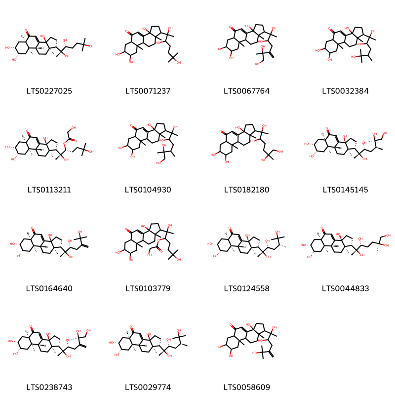{ width=100% }
    <figcaption>Hình ảnh cấu trúc hóa học của 15 hoạt chất thuộc nhóm Steroids and steroid derivatives gồm ['20-hydroxyecdysone (LTS0227025)', '3a,7,8-trihydroxy-9a,11a-dimethyl-1-(2,3,6-trihydroxy-6-methylheptan-2-yl)-1h,2h,3h,5ah,6h,7h,8h,9h,9bh,10h,11h-cyclopenta[a]phenanthren-5-one (LTS0071237)', '3a,7,8-trihydroxy-9a,11a-dimethyl-1-(2,3,6,7-tetrahydroxy-6-methyl-5-methylideneheptan-2-yl)-1h,2h,3h,5ah,6h,7h,8h,9h,9bh,10h,11h-cyclopenta[a]phenanthren-5-one (LTS0067764)', '3a,7,8-trihydroxy-9a,11a-dimethyl-1-(2,3,6-trihydroxy-5,6-dimethylheptan-2-yl)-1h,2h,3h,5ah,6h,7h,8h,9h,9bh,10h,11h-cyclopenta[a]phenanthren-5-one (LTS0032384)', '(2r,3r)-2-[(1s,3as,5ar,7r,8s,9ar,9br,11ar)-3a,7,8-trihydroxy-9a,11a-dimethyl-5-oxo-1h,2h,3h,5ah,6h,7h,8h,9h,9bh,10h,11h-cyclopenta[a]phenanthren-1-yl]-2,6-dihydroxy-6-methylheptan-3-yl 2-hydroxyacetate (LTS0113211)', '3a,7,8-trihydroxy-9a,11a-dimethyl-1-(2,3,6,7-tetrahydroxy-5,6-dimethylheptan-2-yl)-1h,2h,3h,5ah,6h,7h,8h,9h,9bh,10h,11h-cyclopenta[a]phenanthren-5-one (LTS0104930)', '3a,7,8-trihydroxy-9a,11a-dimethyl-1-(2,3,6,7-tetrahydroxy-6-methylheptan-2-yl)-1h,2h,3h,5ah,6h,7h,8h,9h,9bh,10h,11h-cyclopenta[a]phenanthren-5-one (LTS0182180)', '(1s,3as,5ar,7r,8s,9ar,9br,11ar)-3a,7,8-trihydroxy-9a,11a-dimethyl-1-[(2r,3r,5s,6r)-2,3,6,7-tetrahydroxy-5,6-dimethylheptan-2-yl]-1h,2h,3h,5ah,6h,7h,8h,9h,9bh,10h,11h-cyclopenta[a]phenanthren-5-one (LTS0145145)', '(1s,3as,5ar,7r,8s,9ar,9br,11ar)-3a,7,8-trihydroxy-9a,11a-dimethyl-1-[(2r,3r)-2,3,6-trihydroxy-6-methyl-5-methylideneheptan-2-yl]-1h,2h,3h,5ah,6h,7h,8h,9h,9bh,10h,11h-cyclopenta[a]phenanthren-5-one (LTS0164640)', '2-{3a,7,8-trihydroxy-9a,11a-dimethyl-5-oxo-1h,2h,3h,5ah,6h,7h,8h,9h,9bh,10h,11h-cyclopenta[a]phenanthren-1-yl}-2,6-dihydroxy-6-methylheptan-3-yl 2-hydroxyacetate (LTS0103779)', 'makisterone a (LTS0124558)', '(1s,3as,5ar,7r,8s,9ar,9br,11ar)-3a,7,8-trihydroxy-9a,11a-dimethyl-1-[(2r,3r,6s)-2,3,6,7-tetrahydroxy-6-methylheptan-2-yl]-1h,2h,3h,5ah,6h,7h,8h,9h,9bh,10h,11h-cyclopenta[a]phenanthren-5-one (LTS0044833)', '(1s,3as,5ar,7r,8s,9ar,9br,11ar)-3a,7,8-trihydroxy-9a,11a-dimethyl-1-[(2r,3r,6r)-2,3,6,7-tetrahydroxy-6-methyl-5-methylideneheptan-2-yl]-1h,2h,3h,5ah,6h,7h,8h,9h,9bh,10h,11h-cyclopenta[a]phenanthren-5-one (LTS0238743)', '(1s,3as,5ar,7r,8s,9ar,9br,11ar)-3a,7,8-trihydroxy-9a,11a-dimethyl-1-[(2r,3r,5s)-2,3,6-trihydroxy-5,6-dimethylheptan-2-yl]-1h,2h,3h,5ah,6h,7h,8h,9h,9bh,10h,11h-cyclopenta[a]phenanthren-5-one (LTS0029774)', '3a,7,8-trihydroxy-9a,11a-dimethyl-1-(2,3,6-trihydroxy-6-methyl-5-methylideneheptan-2-yl)-1h,2h,3h,5ah,6h,7h,8h,9h,9bh,10h,11h-cyclopenta[a]phenanthren-5-one (LTS0058609)'].</figcaption>
</figure>

---

### Dược dân tộc học

Danh sách các quốc gia có sử dụng *Chenopodium quinoa* trong điều trị các bệnh. 

| Country   | Disease   | Bệnh                                                                                                                                                                                                |
|:----------|:----------|:----------------------------------------------------------------------------------------------------------------------------------------------------------------------------------------------------|
| Elsewhere | Vermifuge | MYMEMORY WARNING: YOU USED ALL AVAILABLE FREE TRANSLATIONS FOR TODAY. NEXT AVAILABLE IN  14 HOURS 46 MINUTES 57 SECONDS VISIT HTTPS://MYMEMORY.TRANSLATED.NET/DOC/USAGELIMITS.PHP TO TRANSLATE MORE |

---

---
## Chenopodium vulvaria
### Thông tin về thực vật

!!! info "Phân loại thực vật của *Chenopodium vulvaria* từ GIBF:"
    - **Kingdom:** Plantae
    - **Phylum:** Tracheophyta
    - **Order:** Caryophyllales
    - **Family:** Amaranthaceae
    - **Genus:** Chenopodium
    - **Species:** *Chenopodium vulvaria*

 

| Label (VI)   | Label (EN)   | Scientific Name      | Descriptions (VI)   | Descriptions (EN)   | Also Known As (VI)   | Also Known As (EN)   |
|:-------------|:-------------|:---------------------|:--------------------|:--------------------|:---------------------|:---------------------|
| N/A          | N/A          | Chenopodium vulvaria | loài thực vật       | species of plant    | ['']                 | ['']                 |

#### Phân bố trên thế giới

**Từ CSDL GIBF** Czechia, Uzbekistan, Sweden, Israel, Kazakhstan, New Zealand, Chile, Spain, Netherlands, Poland, United States of America, Greece, Russian Federation, Croatia, Cyprus, Morocco, Algeria, France, Iraq, Georgia, Germany, Austria, Hungary, Portugal, Slovakia, Ukraine, Australia, Italy, Switzerland, Jordan, United Kingdom of Great Britain and Northern Ireland

#### Phân bố tại Việt Nam

**Từ CSDL GIBF**: Không có ghi nhận ở Việt Nam

---
### Thành phần hóa học
        
- Theo cơ sở dữ liệu lotus: Từ loài *Chenopodium vulvaria* đã phân lập và xác định được 13 hoạt chất thuộc về các nhóm Fatty Acyls, Prenol lipids, Steroids and steroid derivatives, Flavonoids. 

|    | chemicalTaxonomyClassyfireClass   |   smiles_count |
|---:|:----------------------------------|---------------:|
|  0 | Fatty Acyls                       |              1 |
|  1 | Flavonoids                        |              4 |
|  2 | Prenol lipids                     |              5 |
|  3 | Steroids and steroid derivatives  |              3 |

#### Nhóm Fatty Acyls
<figure markdown="span">
    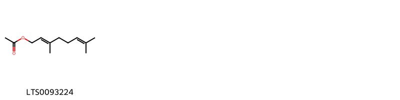{ width=100% }
    <figcaption>Hình ảnh cấu trúc hóa học của 1 hoạt chất thuộc nhóm Fatty Acyls gồm ['geranyl acetate (LTS0093224)'].</figcaption>
</figure>
#### Nhóm Flavonoids
<figure markdown="span">
    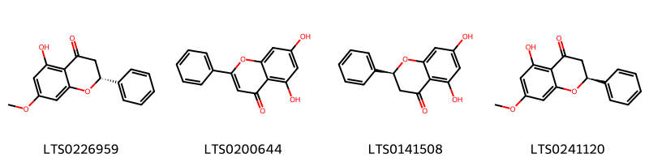{ width=100% }
    <figcaption>Hình ảnh cấu trúc hóa học của 4 hoạt chất thuộc nhóm Flavonoids gồm ['(2r)-5-hydroxy-7-methoxy-2-phenyl-2,3-dihydro-1-benzopyran-4-one (LTS0226959)', 'chrysin (LTS0200644)', 'pinocembrine (LTS0141508)', 'pinostrobin (LTS0241120)'].</figcaption>
</figure>
#### Nhóm Prenol lipids
<figure markdown="span">
    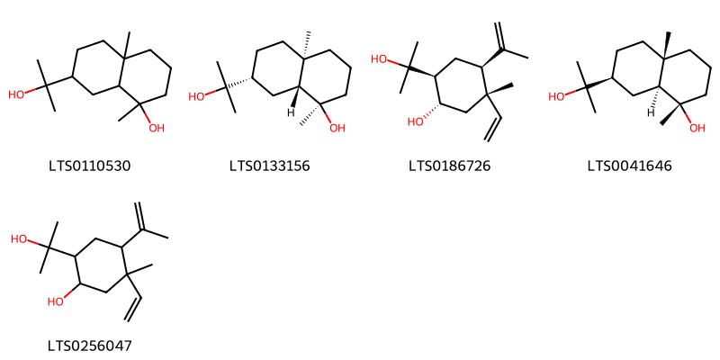{ width=100% }
    <figcaption>Hình ảnh cấu trúc hóa học của 5 hoạt chất thuộc nhóm Prenol lipids gồm ['7-(2-hydroxypropan-2-yl)-1,4a-dimethyl-octahydronaphthalen-1-ol (LTS0110530)', 'proximadiol (LTS0133156)', '(1s,2s,4s,5s)-5-ethenyl-2-(2-hydroxypropan-2-yl)-5-methyl-4-(prop-1-en-2-yl)cyclohexan-1-ol (LTS0186726)', '(+)-4-epi-cryptomeridiol (LTS0041646)', '5-ethenyl-2-(2-hydroxypropan-2-yl)-5-methyl-4-(prop-1-en-2-yl)cyclohexan-1-ol (LTS0256047)'].</figcaption>
</figure>
#### Nhóm Steroids and steroid derivatives
<figure markdown="span">
    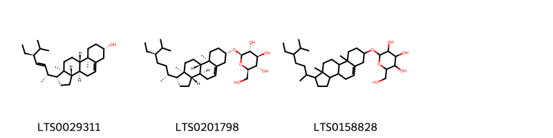{ width=100% }
    <figcaption>Hình ảnh cấu trúc hóa học của 3 hoạt chất thuộc nhóm Steroids and steroid derivatives gồm ['phytosterol (LTS0029311)', 'sitogluside (LTS0201798)', '2-{[1-(5-ethyl-6-methylheptan-2-yl)-9a,11a-dimethyl-1h,2h,3h,3ah,3bh,4h,6h,7h,8h,9h,9bh,10h,11h-cyclopenta[a]phenanthren-7-yl]oxy}-6-(hydroxymethyl)oxane-3,4,5-triol (LTS0158828)'].</figcaption>
</figure>

---

### Dược dân tộc học

Danh sách các quốc gia có sử dụng *Chenopodium vulvaria* trong điều trị các bệnh. 

| Country   | Disease                         | Bệnh                                                                                                                                                                                                |
|:----------|:--------------------------------|:----------------------------------------------------------------------------------------------------------------------------------------------------------------------------------------------------|
| Turkey    | Vermifuge, Emmenagogue, Nervine | MYMEMORY WARNING: YOU USED ALL AVAILABLE FREE TRANSLATIONS FOR TODAY. NEXT AVAILABLE IN  14 HOURS 46 MINUTES 15 SECONDS VISIT HTTPS://MYMEMORY.TRANSLATED.NET/DOC/USAGELIMITS.PHP TO TRANSLATE MORE |

---

# Chi inacia

??? note "Danh sách các dược liệu thuộc chi"
    
	 - *inacia oleracea*

---
## inacia oleracea
### Thông tin về thực vật

!!! info "Phân loại thực vật của *N/A* từ GIBF:"
    - **Kingdom:** N/A
    - **Phylum:** N/A
    - **Order:** N/A
    - **Family:** N/A
    - **Genus:** N/A
    - **Species:** *N/A*

 

| Label (VI)   | Label (EN)   | Scientific Name      | Descriptions (VI)   | Descriptions (EN)   | Also Known As (VI)   | Also Known As (EN)   |
|:-------------|:-------------|:---------------------|:--------------------|:--------------------|:---------------------|:---------------------|
| N/A          | N/A          | Chenopodium vulvaria | loài thực vật       | species of plant    | ['']                 | ['']                 |

#### Phân bố trên thế giới

**Từ CSDL GIBF** Không có kết quả phù hợp

#### Phân bố tại Việt Nam

**Từ CSDL GIBF**: Không có ghi nhận ở Việt Nam

---
### Thành phần hóa học
        
- Theo cơ sở dữ liệu lotus: Từ loài *N/A* đã phân lập và xác định được 134 hoạt chất thuộc về các nhóm Fatty Acyls, Dihydrofurans, Benzene and substituted derivatives, Dibenzylbutane lignans, Flavonoids, Diazines, Carboxylic acids and derivatives, Cinnamic acids and derivatives, Tetrapyrroles and derivatives, Steroids and steroid derivatives, Glycerolipids, Organooxygen compounds, Isoflavonoids, Furanoid lignans, Prenol lipids, Organonitrogen compounds. 

|    | chemicalTaxonomyClassyfireClass     |   smiles_count |
|---:|:------------------------------------|---------------:|
|  0 | Benzene and substituted derivatives |              2 |
|  1 | Carboxylic acids and derivatives    |              5 |
|  2 | Cinnamic acids and derivatives      |              4 |
|  3 | Diazines                            |              1 |
|  4 | Dibenzylbutane lignans              |              2 |
|  5 | Dihydrofurans                       |              1 |
|  6 | Fatty Acyls                         |             10 |
|  7 | Flavonoids                          |             57 |
|  8 | Furanoid lignans                    |              3 |
|  9 | Glycerolipids                       |              1 |
| 10 | Isoflavonoids                       |              1 |
| 11 | Organonitrogen compounds            |              1 |
| 12 | Organooxygen compounds              |              6 |
| 13 | Prenol lipids                       |             25 |
| 14 | Steroids and steroid derivatives    |             11 |
| 15 | Tetrapyrroles and derivatives       |              4 |

#### Nhóm Benzene and substituted derivatives
<figure markdown="span">
    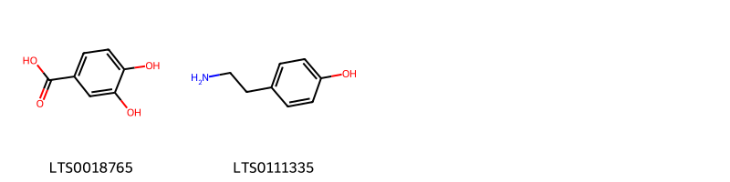{ width=100% }
    <figcaption>Hình ảnh cấu trúc hóa học của 2 hoạt chất thuộc nhóm Benzene and substituted derivatives gồm ['3,4-dihydroxybenzoic acid (LTS0018765)', 'tyramine (LTS0111335)'].</figcaption>
</figure>
#### Nhóm Carboxylic acids and derivatives
<figure markdown="span">
    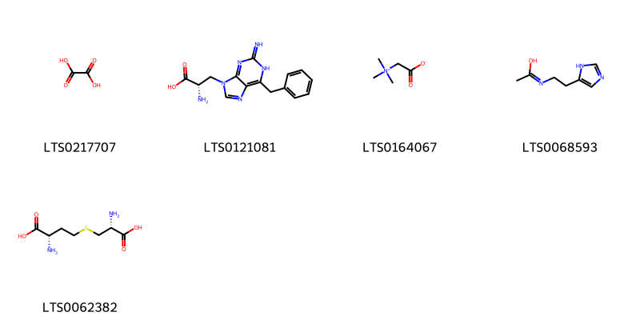{ width=100% }
    <figcaption>Hình ảnh cấu trúc hóa học của 5 hoạt chất thuộc nhóm Carboxylic acids and derivatives gồm ['oxalic acid (LTS0217707)', '(2s)-2-amino-3-(6-benzyl-2-imino-1h-purin-9-yl)propanoic acid (LTS0121081)', 'bet (LTS0164067)', 'n-[2-(3h-imidazol-4-yl)ethyl]ethanimidic acid (LTS0068593)', 'l-cystathionine (LTS0062382)'].</figcaption>
</figure>
#### Nhóm Cinnamic acids and derivatives
<figure markdown="span">
    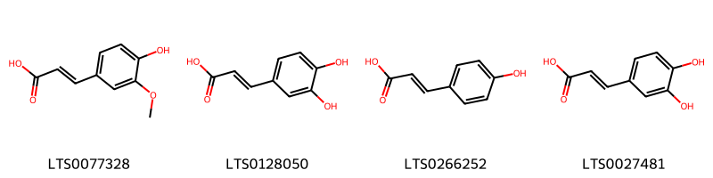{ width=100% }
    <figcaption>Hình ảnh cấu trúc hóa học của 4 hoạt chất thuộc nhóm Cinnamic acids and derivatives gồm ['ferulic acid (LTS0077328)', '3,4-dihydroxycinnamic acid (LTS0128050)', 'para-coumaric acid (LTS0266252)', 'caffeic acid (LTS0027481)'].</figcaption>
</figure>
#### Nhóm Diazines
<figure markdown="span">
    { width=100% }
    <figcaption>Hình ảnh cấu trúc hóa học của 1 hoạt chất thuộc nhóm Diazines gồm ['β-amin (LTS0030620)'].</figcaption>
</figure>
#### Nhóm Dibenzylbutane lignans
<figure markdown="span">
    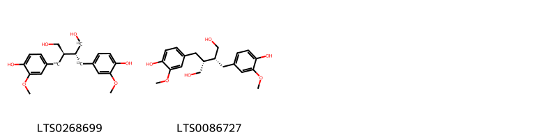{ width=100% }
    <figcaption>Hình ảnh cấu trúc hóa học của 2 hoạt chất thuộc nhóm Dibenzylbutane lignans gồm ['(2s,3r)-2,3-bis[(4-hydroxy-3-methoxyphenyl)(¹³c)methyl](1-¹³c)butane-1,4-diol (LTS0268699)', 'secoisolariciresinol (LTS0086727)'].</figcaption>
</figure>
#### Nhóm Dihydrofurans
<figure markdown="span">
    { width=100% }
    <figcaption>Hình ảnh cấu trúc hóa học của 1 hoạt chất thuộc nhóm Dihydrofurans gồm ['vitamin c (LTS0022555)'].</figcaption>
</figure>
#### Nhóm Fatty Acyls
<figure markdown="span">
    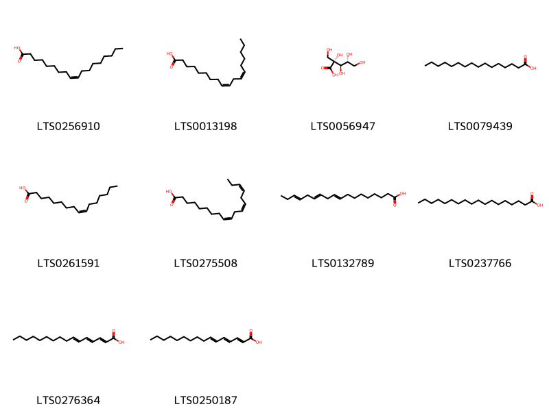{ width=100% }
    <figcaption>Hình ảnh cấu trúc hóa học của 10 hoạt chất thuộc nhóm Fatty Acyls gồm ['oleic acid (LTS0256910)', 'linoleic (LTS0013198)', '2-carboxy-d-arabinitol (LTS0056947)', 'palmitic acid (LTS0079439)', 'palmitoleic acid (LTS0261591)', 'α-linolenic acid (LTS0275508)', 'α linolenic acid (LTS0132789)', 'stearic acid (LTS0237766)', 'hexadeca-2,4,6-trienoic acid (LTS0276364)', '(2e,4e,6e)-hexadeca-2,4,6-trienoic acid (LTS0250187)'].</figcaption>
</figure>
#### Nhóm Flavonoids
<figure markdown="span">
    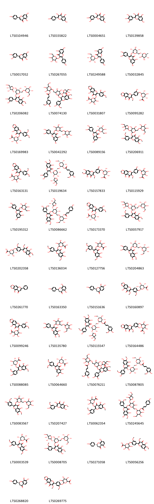{ width=100% }
    <figcaption>Hình ảnh cấu trúc hóa học của 57 hoạt chất thuộc nhóm Flavonoids gồm ['chamomile (LTS0104946)', 'kaempherol (LTS0155822)', 'quercetin (LTS0004651)', 'myricetin (LTS0139858)', 'luteolin (LTS0017052)', 'trifolin (LTS0267055)', 'astragalin (LTS0249588)', '3-rutinosyl quercetin (LTS0032845)', '3-{[(2s,3r,4s,5s,6r)-3-{[(2s,3r,4r)-3,4-dihydroxy-4-(hydroxymethyl)oxolan-2-yl]oxy}-4,5-dihydroxy-6-({[(2r,3r,4s,5s,6r)-3,4,5-trihydroxy-6-(hydroxymethyl)oxan-2-yl]oxy}methyl)oxan-2-yl]oxy}-2-(3,4-dihydroxyphenyl)-5,7-dihydroxy-6-methoxychromen-4-one (LTS0206082)', '2-[(6-{[5,7-dihydroxy-2-(4-hydroxy-3-methoxyphenyl)-6-methoxy-4-oxochromen-3-yl]oxy}-5-{[3,4-dihydroxy-4-(hydroxymethyl)oxolan-2-yl]oxy}-3,4-dihydroxyoxan-2-yl)methoxy]-4,5-dihydroxy-6-(hydroxymethyl)oxan-3-yl 3-(4-hydroxy-3-methoxyphenyl)prop-2-enoate (LTS0074130)', '6-{[6-(2,3-dihydroxy-4-methoxyphenyl)-9-hydroxy-8-oxo-2h-[1,3]dioxolo[4,5-g]chromen-7-yl]oxy}-3,4,5-trihydroxyoxane-2-carboxylic acid (LTS0031807)', '(2s,3s,4s,5r,6s)-3,4,5-trihydroxy-6-(2-hydroxy-4-{9-hydroxy-7-methoxy-8-oxo-2h-[1,3]dioxolo[4,5-g]chromen-6-yl}phenoxy)oxane-2-carboxylic acid (LTS0095282)', '(2s,3s,4s,5r,6s)-6-{[6-(3,4-dimethoxyphenyl)-9-hydroxy-8-oxo-2h-[1,3]dioxolo[4,5-g]chromen-7-yl]oxy}-3,4,5-trihydroxyoxane-2-carboxylic acid (LTS0169983)', 'rutin (LTS0042292)', 'hyperoside (LTS0089156)', '3-[(3-{[3,4-dihydroxy-4-(hydroxymethyl)oxolan-2-yl]oxy}-4,5-dihydroxy-6-({[3,4,5-trihydroxy-6-(hydroxymethyl)oxan-2-yl]oxy}methyl)oxan-2-yl)oxy]-5,7-dihydroxy-2-(4-hydroxy-3-methoxyphenyl)-6-methoxychromen-4-one (LTS0206911)', '6-{[6-(3,4-dimethoxyphenyl)-9-hydroxy-8-oxo-2h-[1,3]dioxolo[4,5-g]chromen-7-yl]oxy}-3,4,5-trihydroxyoxane-2-carboxylic acid (LTS0163131)', '(2r,3r,4s,5r,6r)-2-{[(2r,3r,4s,5r,6s)-5-{[(2s,3s,4r)-3,4-dihydroxy-4-(hydroxymethyl)oxolan-2-yl]oxy}-6-{[2-(3,4-dihydroxyphenyl)-5,7-dihydroxy-6-methoxy-4-oxochromen-3-yl]oxy}-3,4-dihydroxyoxan-2-yl]methoxy}-4,5-dihydroxy-6-(hydroxymethyl)oxan-3-yl (2e)-3-(4-hydroxy-3-methoxyphenyl)prop-2-enoate (LTS0119634)', '(2s,3s,4s,5r,6s)-6-[4-(5,7-dihydroxy-3,6-dimethoxy-4-oxochromen-2-yl)-2-hydroxyphenoxy]-3,4,5-trihydroxyoxane-2-carboxylic acid (LTS0157833)', '3,4,5-trihydroxy-6-(2-hydroxy-4-{9-hydroxy-7-methoxy-8-oxo-2h-[1,3]dioxolo[4,5-g]chromen-6-yl}phenoxy)oxane-2-carboxylic acid (LTS0115929)', '2-(3,4-dihydroxyphenyl)-5,7-dihydroxy-3-{[3,4,5-trihydroxy-6-(hydroxymethyl)oxan-2-yl]oxy}chromen-4-one (LTS0195312)', '(2r,3r,4s,5s,6r)-2-{[(2r,3s,4s,5r,6s)-6-{[5,7-dihydroxy-2-(4-hydroxy-3-methoxyphenyl)-6-methoxy-4-oxochromen-3-yl]oxy}-5-{[(2s,3r,4r)-3,4-dihydroxy-4-(hydroxymethyl)oxolan-2-yl]oxy}-3,4-dihydroxyoxan-2-yl]methoxy}-4,5-dihydroxy-6-(hydroxymethyl)oxan-3-yl (2e)-3-(4-hydroxyphenyl)prop-2-enoate (LTS0086662)', '(2s,3s,4s,5r,6s)-3,4,5-trihydroxy-6-{[9-hydroxy-6-(3-hydroxy-4-methoxyphenyl)-8-oxo-2h-[1,3]dioxolo[4,5-g]chromen-7-yl]oxy}oxane-2-carboxylic acid (LTS0173370)', '3-{[(2s,3s,4s,5r,6r)-3-{[(2s,3s,4s)-3,4-dihydroxy-4-(hydroxymethyl)oxolan-2-yl]oxy}-4,5-dihydroxy-6-({[(2r,3r,4s,5r,6r)-3,4,5-trihydroxy-6-(hydroxymethyl)oxan-2-yl]oxy}methyl)oxan-2-yl]oxy}-5,7-dihydroxy-2-(4-hydroxy-3-methoxyphenyl)-6-methoxychromen-4-one (LTS0057917)', '(2s,3s,4s,5r,6s)-6-[4-(5,7-dihydroxy-3,6-dimethoxy-4-oxochromen-2-yl)-2-methoxyphenoxy]-3,4,5-trihydroxyoxane-2-carboxylic acid (LTS0202358)', '6-{[5,6-dihydroxy-2-(3-hydroxy-4-methoxyphenyl)-7-methoxy-4-oxochromen-3-yl]oxy}-3,4,5-trihydroxyoxane-2-carboxylic acid (LTS0136034)', '6-{[2-(3,4-dimethoxyphenyl)-5,6-dihydroxy-7-methoxy-4-oxochromen-3-yl]oxy}-3,4,5-trihydroxyoxane-2-carboxylic acid (LTS0127756)', '2-(3,4-dihydroxyphenyl)-5,7-dihydroxy-6-methoxy-3-{[(2s,3r,4s,5s,6r)-3,4,5-trihydroxy-6-({[(2r,3r,4s,5s,6r)-3,4,5-trihydroxy-6-(hydroxymethyl)oxan-2-yl]oxy}methyl)oxan-2-yl]oxy}chromen-4-one (LTS0204863)', '9-hydroxy-6-phenyl-2h-[1,3]dioxolo[4,5-g]chromen-8-one (LTS0261770)', '5,8-dihydroxy-2-(4-hydroxyphenyl)-2,3-dihydro-1-benzopyran-4-one (LTS0163350)', '7,8-dihydroxy-2-(4-hydroxyphenyl)-2,3-dihydro-1-benzopyran-4-one (LTS0151636)', '(2s,3s,4s,5r,6s)-3,4,5-trihydroxy-6-(4-{9-hydroxy-7-methoxy-8-oxo-2h-[1,3]dioxolo[4,5-g]chromen-6-yl}-2-methoxyphenoxy)oxane-2-carboxylic acid (LTS0160897)', '3,4,5-trihydroxy-6-{[9-hydroxy-6-(3-hydroxy-4-methoxyphenyl)-8-oxo-2h-[1,3]dioxolo[4,5-g]chromen-7-yl]oxy}oxane-2-carboxylic acid (LTS0099246)', '2-(3,4-dihydroxyphenyl)-5,7-dihydroxy-6-methoxy-3-{[3,4,5-trihydroxy-6-({[3,4,5-trihydroxy-6-(hydroxymethyl)oxan-2-yl]oxy}methyl)oxan-2-yl]oxy}chromen-4-one (LTS0135780)', '(2r,3r,4s,5s,6r)-2-{[(2r,3s,4s,5r,6s)-6-{[5,7-dihydroxy-2-(4-hydroxy-3-methoxyphenyl)-6-methoxy-4-oxochromen-3-yl]oxy}-5-{[(2s,3r,4r)-3,4-dihydroxy-4-(hydroxymethyl)oxolan-2-yl]oxy}-3,4-dihydroxyoxan-2-yl]methoxy}-4,5-dihydroxy-6-(hydroxymethyl)oxan-3-yl (2e)-3-(4-hydroxy-3-methoxyphenyl)prop-2-enoate (LTS0115547)', 'methyl 3,4,5-trihydroxy-6-(2-hydroxy-4-{9-hydroxy-7-methoxy-8-oxo-2h-[1,3]dioxolo[4,5-g]chromen-6-yl}phenoxy)oxane-2-carboxylate (LTS0164486)', '(2s,3s,4s,5r,6s)-6-{[5,6-dihydroxy-2-(4-hydroxy-3-methoxyphenyl)-7-methoxy-4-oxochromen-3-yl]oxy}-3,4,5-trihydroxyoxane-2-carboxylic acid (LTS0088085)', '(2s,3s,4s,5r,6s)-6-{[2-(3,4-dimethoxyphenyl)-5,6-dihydroxy-7-methoxy-4-oxochromen-3-yl]oxy}-3,4,5-trihydroxyoxane-2-carboxylic acid (LTS0064660)', '2-[(5-{[3,4-dihydroxy-4-(hydroxymethyl)oxolan-2-yl]oxy}-6-{[2-(3,4-dihydroxyphenyl)-5,7-dihydroxy-6-methoxy-4-oxochromen-3-yl]oxy}-3,4-dihydroxyoxan-2-yl)methoxy]-4,5-dihydroxy-6-(hydroxymethyl)oxan-3-yl 3-(4-hydroxy-3-methoxyphenyl)prop-2-enoate (LTS0076211)', '(2r,3r,4s,5s,6r)-2-{[(2r,3s,4s,5r,6s)-6-{[5,7-dihydroxy-2-(4-hydroxy-3-methoxyphenyl)-6-methoxy-4-oxochromen-3-yl]oxy}-3,4,5-trihydroxyoxan-2-yl]methoxy}-4,5-dihydroxy-6-(hydroxymethyl)oxan-3-yl (2e)-3-(4-hydroxy-3-methoxyphenyl)prop-2-enoate (LTS0087805)', '5,7-dihydroxy-2-(4-hydroxy-3-methoxyphenyl)-6-methoxy-3-{[3,4,5-trihydroxy-6-({[3,4,5-trihydroxy-6-(hydroxymethyl)oxan-2-yl]oxy}methyl)oxan-2-yl]oxy}chromen-4-one (LTS0083567)', 'spinacetin (LTS0207427)', '6-{[5,6-dihydroxy-2-(4-hydroxy-3-methoxyphenyl)-7-methoxy-4-oxochromen-3-yl]oxy}-3,4,5-trihydroxyoxane-2-carboxylic acid (LTS0062354)', '2-[(6-{[5,7-dihydroxy-2-(4-hydroxy-3-methoxyphenyl)-6-methoxy-4-oxochromen-3-yl]oxy}-5-{[3,4-dihydroxy-4-(hydroxymethyl)oxolan-2-yl]oxy}-3,4-dihydroxyoxan-2-yl)methoxy]-4,5-dihydroxy-6-(hydroxymethyl)oxan-3-yl 3-(4-hydroxyphenyl)prop-2-enoate (LTS0245645)', '(2s,3s,4s,5r,6s)-6-{[5,6-dihydroxy-2-(3-hydroxy-4-methoxyphenyl)-7-methoxy-4-oxochromen-3-yl]oxy}-3,4,5-trihydroxyoxane-2-carboxylic acid (LTS0003539)', '3-{[(2s,3r,4s,5s,6r)-3-{[(2s,3r,4r)-3,4-dihydroxy-4-(hydroxymethyl)oxolan-2-yl]oxy}-4,5-dihydroxy-6-({[(2r,3r,4s,5s,6r)-3,4,5-trihydroxy-6-(hydroxymethyl)oxan-2-yl]oxy}methyl)oxan-2-yl]oxy}-5,7-dihydroxy-2-(4-hydroxy-3-methoxyphenyl)-6-methoxychromen-4-one (LTS0008705)', '(2r)-5,8-dihydroxy-2-(4-hydroxyphenyl)-2,3-dihydro-1-benzopyran-4-one (LTS0271058)', '6-[4-(5,7-dihydroxy-3,6-dimethoxy-4-oxochromen-2-yl)-2-methoxyphenoxy]-3,4,5-trihydroxyoxane-2-carboxylic acid (LTS0056256)', '(2s)-7,8-dihydroxy-2-(4-hydroxyphenyl)-2,3-dihydro-1-benzopyran-4-one (LTS0268820)', '3,4,5-trihydroxy-6-(4-{9-hydroxy-7-methoxy-8-oxo-2h-[1,3]dioxolo[4,5-g]chromen-6-yl}-2-methoxyphenoxy)oxane-2-carboxylic acid (LTS0269775)', '5,7-dihydroxy-2-(4-hydroxy-3-methoxyphenyl)-6-methoxy-3-{[(2s,3r,4s,5s,6r)-3,4,5-trihydroxy-6-({[(2r,3r,4s,5s,6r)-3,4,5-trihydroxy-6-(hydroxymethyl)oxan-2-yl]oxy}methyl)oxan-2-yl]oxy}chromen-4-one (LTS0028537)', '2-[(6-{[5,7-dihydroxy-2-(4-hydroxy-3-methoxyphenyl)-6-methoxy-4-oxochromen-3-yl]oxy}-3,4,5-trihydroxyoxan-2-yl)methoxy]-4,5-dihydroxy-6-(hydroxymethyl)oxan-3-yl 3-(4-hydroxy-3-methoxyphenyl)prop-2-enoate (LTS0033764)', '6-[4-(5,7-dihydroxy-3,6-dimethoxy-4-oxochromen-2-yl)-2-hydroxyphenoxy]-3,4,5-trihydroxyoxane-2-carboxylic acid (LTS0258867)', 'methyl (2s,3s,4s,5r,6s)-3,4,5-trihydroxy-6-(2-hydroxy-4-{9-hydroxy-7-methoxy-8-oxo-2h-[1,3]dioxolo[4,5-g]chromen-6-yl}phenoxy)oxane-2-carboxylate (LTS0018109)', '3-[(3-{[3,4-dihydroxy-4-(hydroxymethyl)oxolan-2-yl]oxy}-4,5-dihydroxy-6-({[3,4,5-trihydroxy-6-(hydroxymethyl)oxan-2-yl]oxy}methyl)oxan-2-yl)oxy]-2-(3,4-dihydroxyphenyl)-5,7-dihydroxy-6-methoxychromen-4-one (LTS0134671)', '(2s,3s,4s,5r,6s)-6-{[6-(2,3-dihydroxy-4-methoxyphenyl)-9-hydroxy-8-oxo-2h-[1,3]dioxolo[4,5-g]chromen-7-yl]oxy}-3,4,5-trihydroxyoxane-2-carboxylic acid (LTS0114332)', '(2r,3r,4s,5s,6r)-2-{[(2r,3s,4s,5r,6s)-5-{[(2s,3r,4r)-3,4-dihydroxy-4-(hydroxymethyl)oxolan-2-yl]oxy}-6-{[2-(3,4-dihydroxyphenyl)-5,7-dihydroxy-6-methoxy-4-oxochromen-3-yl]oxy}-3,4-dihydroxyoxan-2-yl]methoxy}-4,5-dihydroxy-6-(hydroxymethyl)oxan-3-yl (2e)-3-(4-hydroxy-3-methoxyphenyl)prop-2-enoate (LTS0270823)'].</figcaption>
</figure>
#### Nhóm Furanoid lignans
<figure markdown="span">
    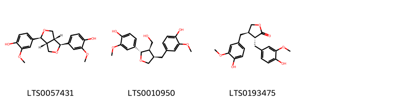{ width=100% }
    <figcaption>Hình ảnh cấu trúc hóa học của 3 hoạt chất thuộc nhóm Furanoid lignans gồm ['pinoresinol (LTS0057431)', 'lariciresinol (LTS0010950)', 'matairesinol (LTS0193475)'].</figcaption>
</figure>
#### Nhóm Glycerolipids
<figure markdown="span">
    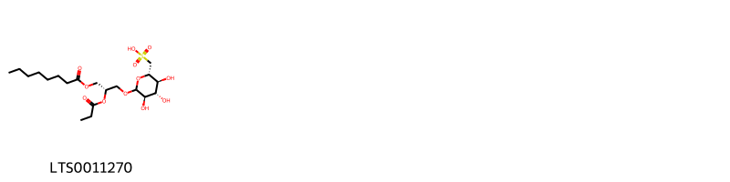{ width=100% }
    <figcaption>Hình ảnh cấu trúc hóa học của 1 hoạt chất thuộc nhóm Glycerolipids gồm ['[(2s,3s,4s,5r)-3,4,5-trihydroxy-6-[(2s)-3-(octanoyloxy)-2-(propanoyloxy)propoxy]oxan-2-yl]methanesulfonic acid (LTS0011270)'].</figcaption>
</figure>
#### Nhóm Isoflavonoids
<figure markdown="span">
    { width=100% }
    <figcaption>Hình ảnh cấu trúc hóa học của 1 hoạt chất thuộc nhóm Isoflavonoids gồm ['coumestrol (LTS0267535)'].</figcaption>
</figure>
#### Nhóm Organonitrogen compounds
<figure markdown="span">
    { width=100% }
    <figcaption>Hình ảnh cấu trúc hóa học của 1 hoạt chất thuộc nhóm Organonitrogen compounds gồm ['choline (LTS0170307)'].</figcaption>
</figure>
#### Nhóm Organooxygen compounds
<figure markdown="span">
    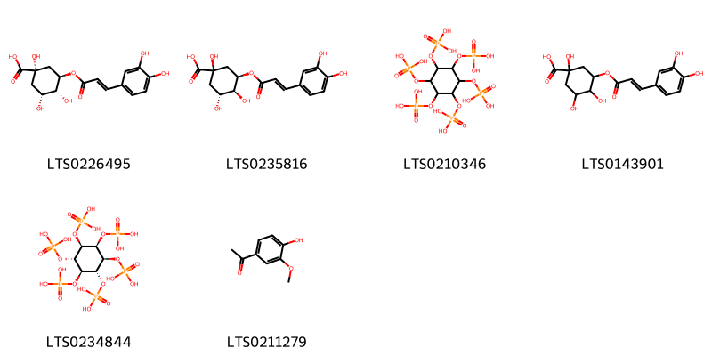{ width=100% }
    <figcaption>Hình ảnh cấu trúc hóa học của 6 hoạt chất thuộc nhóm Organooxygen compounds gồm ['chlorogenic acid (LTS0226495)', 'neochlorogenic acid (LTS0235816)', 'phytic acid (LTS0210346)', '3-{[3-(3,4-dihydroxyphenyl)prop-2-enoyl]oxy}-1,4,5-trihydroxycyclohexane-1-carboxylic acid (LTS0143901)', '[(1r,2r,3s,4r,5s,6s)-2,3,4,5,6-pentakis(phosphonooxy)cyclohexyl]oxyphosphonic acid (LTS0234844)', 'apocynin (LTS0211279)'].</figcaption>
</figure>
#### Nhóm Prenol lipids
<figure markdown="span">
    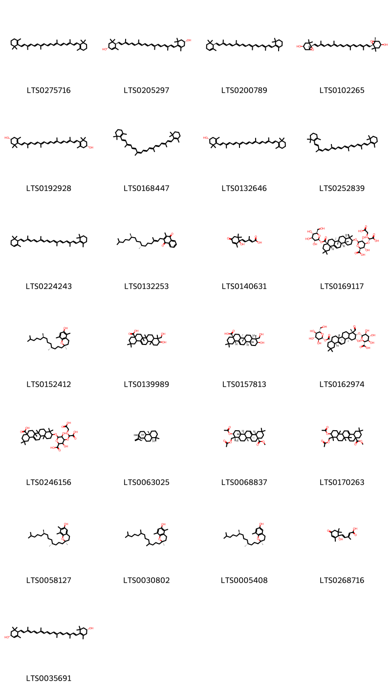{ width=100% }
    <figcaption>Hình ảnh cấu trúc hóa học của 25 hoạt chất thuộc nhóm Prenol lipids gồm ['β-carotene (LTS0275716)', 'carotenoid (LTS0205297)', '(+)-α-carotene (LTS0200789)', 'violaxanthin (LTS0102265)', 'zeaxanthin (LTS0192928)', 'β,β-carotene (LTS0168447)', 'cryptoxanthin (LTS0132646)', '(9z)-β-carotene (LTS0252839)', 'α-carotene (LTS0224243)', 'phytonadione (LTS0132253)', 'abscisic acid,  (LTS0140631)', '(2s,3s,4s,5r,6r)-6-{[(3s,4ar,6ar,6bs,8as,12as,14ar,14br)-4,4,6a,6b,11,11,14b-heptamethyl-8a-({[(2s,3r,4s,5s,6r)-3,4,5-trihydroxy-6-(hydroxymethyl)oxan-2-yl]oxy}carbonyl)-1,2,3,4a,5,6,7,8,9,10,12,12a,14,14a-tetradecahydropicen-3-yl]oxy}-4-[(s)-carboxy(carboxymethoxy)methoxy]-3,5-dihydroxyoxane-2-carboxylic acid (LTS0169117)', 'β-tocopherol (LTS0152412)', '10-hydroxy-9-(hydroxymethyl)-2,2,6a,6b,9,12a-hexamethyl-1,3,4,5,6,7,8,8a,10,11,12,12b,13,14b-tetradecahydropicene-4a-carboxylic acid (LTS0139989)', 'hederagenin (LTS0157813)', '(2r,3r,4r,5s,6s)-6-{[(2r,3s,4s,6as,6br,8ar,12ar,14bs)-4-formyl-2-hydroxy-4,6a,6b,11,11,14b-hexamethyl-8a-({[(2r,3s,4r,5r,6s)-3,4,5-trihydroxy-6-(hydroxymethyl)oxan-2-yl]oxy}carbonyl)-1,2,3,4a,5,6,7,8,9,10,12,12a,14,14a-tetradecahydropicen-3-yl]oxy}-3,4,5-trihydroxyoxane-2-carboxylic acid (LTS0162974)', '6-[(8a-carboxy-4,4,6a,6b,11,11,14b-heptamethyl-1,2,3,4a,5,6,7,8,9,10,12,12a,14,14a-tetradecahydropicen-3-yl)oxy]-4-[carboxy(carboxymethoxy)methoxy]-3,5-dihydroxyoxane-2-carboxylic acid (LTS0246156)', 'ent-kaurene (LTS0063025)', 'methyl (4as,6as,6br,8ar,9r,10s,12ar,12br,14bs)-10-(acetyloxy)-9-[(acetyloxy)methyl]-2,2,6a,6b,9,12a-hexamethyl-1,3,4,5,6,7,8,8a,10,11,12,12b,13,14b-tetradecahydropicene-4a-carboxylate (LTS0068837)', 'methyl 10-(acetyloxy)-9-[(acetyloxy)methyl]-2,2,6a,6b,9,12a-hexamethyl-1,3,4,5,6,7,8,8a,10,11,12,12b,13,14b-tetradecahydropicene-4a-carboxylate (LTS0170263)', 'gamma-tocopherol (LTS0058127)', '(2r)-2,5,8-trimethyl-2-(4,8,12-trimethyltridecyl)-3,4-dihydro-1-benzopyran-6-ol (LTS0030802)', 'delta-tocopherol (LTS0005408)', '(4e)-5-[(1s)-1-hydroxy-2,6,6-trimethyl-4-oxocyclohex-2-en-1-yl]-3-methylpenta-2,4-dienoic acid (LTS0268716)', '(1r)-4-[(1e,3e,5e,7e,9e,11e,13e,15e,17e)-18-[(4r)-4-hydroxy-2,6,6-trimethylcyclohex-1-en-1-yl]-3,7,12,16-tetramethyloctadeca-1,3,5,7,9,11,13,15,17-nonaen-1-yl]-3,5,5-trimethylcyclohex-2-en-1-ol (LTS0035691)'].</figcaption>
</figure>
#### Nhóm Steroids and steroid derivatives
<figure markdown="span">
    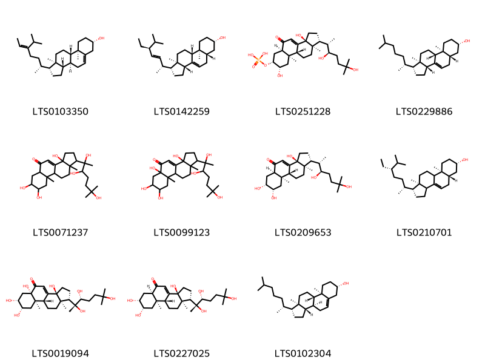{ width=100% }
    <figcaption>Hình ảnh cấu trúc hóa học của 11 hoạt chất thuộc nhóm Steroids and steroid derivatives gồm ['avenasterol (LTS0103350)', 'chondrillasterol (LTS0142259)', '[(1r,3as,5ar,7r,8s,9ar,9br,11ar)-1-[(2s,3r)-3,6-dihydroxy-6-methylheptan-2-yl]-3a,8-dihydroxy-9a,11a-dimethyl-5-oxo-1h,2h,3h,5ah,6h,7h,8h,9h,9bh,10h,11h-cyclopenta[a]phenanthren-7-yl]oxyphosphonic acid (LTS0251228)', 'lathosterol (LTS0229886)', '3a,7,8-trihydroxy-9a,11a-dimethyl-1-(2,3,6-trihydroxy-6-methylheptan-2-yl)-1h,2h,3h,5ah,6h,7h,8h,9h,9bh,10h,11h-cyclopenta[a]phenanthren-5-one (LTS0071237)', '3a,5a,7,8-tetrahydroxy-9a,11a-dimethyl-1-(2,3,6-trihydroxy-6-methylheptan-2-yl)-1h,2h,3h,6h,7h,8h,9h,9bh,10h,11h-cyclopenta[a]phenanthren-5-one (LTS0099123)', 'ecdysone (LTS0209653)', '(1r,5as,7s,9as,11ar)-1-[(2r,5s)-5-ethyl-6-methylheptan-2-yl]-9a,11a-dimethyl-1h,2h,3h,3ah,5h,5ah,6h,7h,8h,9h,9bh,10h,11h-cyclopenta[a]phenanthren-7-ol (LTS0210701)', 'polypodine b (LTS0019094)', '20-hydroxyecdysone (LTS0227025)', 'cholesterol (LTS0102304)'].</figcaption>
</figure>
#### Nhóm Tetrapyrroles and derivatives
<figure markdown="span">
    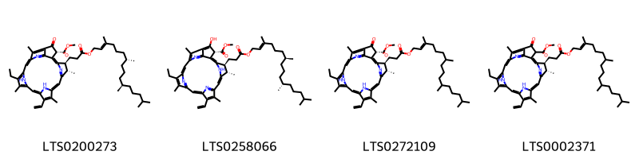{ width=100% }
    <figcaption>Hình ảnh cấu trúc hóa học của 4 hoạt chất thuộc nhóm Tetrapyrroles and derivatives gồm ['methyl (3r,21s,22s)-16-ethenyl-11-ethyl-12,17,21,26-tetramethyl-4-oxo-22-(3-oxo-3-{[(2e,7r,11r)-3,7,11,15-tetramethylhexadec-2-en-1-yl]oxy}propyl)-7,23,24,25-tetraazahexacyclo[18.2.1.1⁵,⁸.1¹⁰,¹³.1¹⁵,¹⁸.0²,⁶]hexacosa-1(23),2(6),5(26),7,9,11,13,15,17,19-decaene-3-carboxylate (LTS0200273)', 'methyl (3r,21s,22s)-16-ethenyl-11-ethyl-4-hydroxy-12,17,21,26-tetramethyl-22-(3-oxo-3-{[(2e,7s,11s)-3,7,11,15-tetramethylhexadec-2-en-1-yl]oxy}propyl)-7,23,24,25-tetraazahexacyclo[18.2.1.1⁵,⁸.1¹⁰,¹³.1¹⁵,¹⁸.0²,⁶]hexacosa-1,4,6,8(26),9,11,13(25),14,16,18(24),19-undecaene-3-carboxylate (LTS0258066)', 'methyl (3r,21s,22s)-16-ethenyl-11-ethyl-12,17,21,26-tetramethyl-4-oxo-22-(3-oxo-3-{[(2e)-3,7,11,15-tetramethylhexadec-2-en-1-yl]oxy}propyl)-7,23,24,25-tetraazahexacyclo[18.2.1.1⁵,⁸.1¹⁰,¹³.1¹⁵,¹⁸.0²,⁶]hexacosa-1(23),2(6),5(26),7,9,11,13,15,17,19-decaene-3-carboxylate (LTS0272109)', 'methyl (21s,22s)-16-ethenyl-11-ethyl-12,17,21,26-tetramethyl-4-oxo-22-(3-oxo-3-{[(2e)-3,7,11,15-tetramethylhexadec-2-en-1-yl]oxy}propyl)-7,23,24,25-tetraazahexacyclo[18.2.1.1⁵,⁸.1¹⁰,¹³.1¹⁵,¹⁸.0²,⁶]hexacosa-1(23),2(6),5(26),7,9,11,13,15,17,19-decaene-3-carboxylate (LTS0002371)'].</figcaption>
</figure>

---

### Dược dân tộc học

Danh sách các quốc gia có sử dụng *N/A* trong điều trị các bệnh. 

| Country   | Disease                                                | Bệnh                                                                                                                                                                                                |
|:----------|:-------------------------------------------------------|:----------------------------------------------------------------------------------------------------------------------------------------------------------------------------------------------------|
| China     | Refrigerant, Carminative, Antivinous                   | MYMEMORY WARNING: YOU USED ALL AVAILABLE FREE TRANSLATIONS FOR TODAY. NEXT AVAILABLE IN  14 HOURS 45 MINUTES 34 SECONDS VISIT HTTPS://MYMEMORY.TRANSLATED.NET/DOC/USAGELIMITS.PHP TO TRANSLATE MORE |
| Elsewhere | Demulcent, Diuretic, nan                               | MYMEMORY WARNING: YOU USED ALL AVAILABLE FREE TRANSLATIONS FOR TODAY. NEXT AVAILABLE IN  14 HOURS 45 MINUTES 30 SECONDS VISIT HTTPS://MYMEMORY.TRANSLATED.NET/DOC/USAGELIMITS.PHP TO TRANSLATE MORE |
| Turkey    | Astringent, Laxative, Diuretic, Refrigerant, Demulcent | MYMEMORY WARNING: YOU USED ALL AVAILABLE FREE TRANSLATIONS FOR TODAY. NEXT AVAILABLE IN  14 HOURS 45 MINUTES 27 SECONDS VISIT HTTPS://MYMEMORY.TRANSLATED.NET/DOC/USAGELIMITS.PHP TO TRANSLATE MORE |

---

# Chi Suaeda

??? note "Danh sách các dược liệu thuộc chi"
    
	 - *Suaeda fruticosa*

---
## Suaeda fruticosa
### Thông tin về thực vật

!!! info "Phân loại thực vật của *Suaeda fruticosa* từ GIBF:"
    - **Kingdom:** Plantae
    - **Phylum:** Tracheophyta
    - **Order:** Caryophyllales
    - **Family:** Amaranthaceae
    - **Genus:** Suaeda
    - **Species:** *Suaeda fruticosa*

 

| Label (VI)   | Label (EN)   | Scientific Name   | Descriptions (VI)   | Descriptions (EN)   | Also Known As (VI)   | Also Known As (EN)   |
|:-------------|:-------------|:------------------|:--------------------|:--------------------|:---------------------|:---------------------|
| N/A          | N/A          | Suaeda fruticosa  |                     | species of plant    | ['']                 | ['']                 |

#### Phân bố trên thế giới

**Từ CSDL GIBF** nan, United Arab Emirates, Botswana, Israel, Chile, Somalia, Western Sahara, Spain, Bolivia (Plurinational State of), Sri Lanka, United States of America, Korea, Republic of, Pakistan, Tunisia, Dominican Republic, unknown or invalid, Cyprus, Ethiopia, Morocco, Mexico, Afghanistan, Saudi Arabia, Palestine, State of, Angola, Bahamas, South Africa, Oman, Italy, India, Jordan, France

#### Phân bố tại Việt Nam

**Từ CSDL GIBF**: Không có ghi nhận ở Việt Nam

---
### Thành phần hóa học
        
- Theo cơ sở dữ liệu lotus: Từ loài *Suaeda fruticosa* đã phân lập và xác định được 1 hoạt chất thuộc về các nhóm Carboxylic acids and derivatives. 

|    | chemicalTaxonomyClassyfireClass   |   smiles_count |
|---:|:----------------------------------|---------------:|
|  0 | Carboxylic acids and derivatives  |              1 |

#### Nhóm Carboxylic acids and derivatives
<figure markdown="span">
    { width=100% }
    <figcaption>Hình ảnh cấu trúc hóa học của 1 hoạt chất thuộc nhóm Carboxylic acids and derivatives gồm ['bet (LTS0164067)'].</figcaption>
</figure>

---

### Dược dân tộc học

Danh sách các quốc gia có sử dụng *Suaeda fruticosa* trong điều trị các bệnh. 

| Country   | Disease   | Bệnh                                                                                                                                                                                                |
|:----------|:----------|:----------------------------------------------------------------------------------------------------------------------------------------------------------------------------------------------------|
| Pakistan  | Soap      | MYMEMORY WARNING: YOU USED ALL AVAILABLE FREE TRANSLATIONS FOR TODAY. NEXT AVAILABLE IN  14 HOURS 44 MINUTES 35 SECONDS VISIT HTTPS://MYMEMORY.TRANSLATED.NET/DOC/USAGELIMITS.PHP TO TRANSLATE MORE |

---

# Chi Bassia

??? note "Danh sách các dược liệu thuộc chi"
    
	 - *Bassia latifolia*

---
## Bassia latifolia
### Thông tin về thực vật

!!! info "Phân loại thực vật của *N/A* từ GIBF:"
    - **Kingdom:** Plantae
    - **Phylum:** Tracheophyta
    - **Order:** N/A
    - **Family:** N/A
    - **Genus:** N/A
    - **Species:** *N/A*

 

| Label (VI)   | Label (EN)   | Scientific Name   | Descriptions (VI)   | Descriptions (EN)   | Also Known As (VI)   | Also Known As (EN)   |
|:-------------|:-------------|:------------------|:--------------------|:--------------------|:---------------------|:---------------------|
| N/A          | N/A          | Bassia latifolia  | loài thực vật       | species of plant    | ['']                 | ['']                 |

#### Phân bố trên thế giới

**Từ CSDL GIBF** Mexico, Viet Nam, United States of America, Niue, Australia, Argentina, Germany, United Kingdom of Great Britain and Northern Ireland, Denmark

#### Phân bố tại Việt Nam

**Từ CSDL GIBF**: Quang Nam Province

---
### Thành phần hóa học
        
- Theo cơ sở dữ liệu lotus: Từ loài *N/A* đã phân lập và xác định được Chưa có hoạt chất nào được phân lập. hoạt chất thuộc về các nhóm Không có hoạt chất nào được phân lập. 

Không có hình ảnh nào được tạo ra

---

### Dược dân tộc học

Danh sách các quốc gia có sử dụng *N/A* trong điều trị các bệnh. 

| Country   | Disease   | Bệnh                                                                                                                                                                                                |
|:----------|:----------|:----------------------------------------------------------------------------------------------------------------------------------------------------------------------------------------------------|
| India     | Piscicide | MYMEMORY WARNING: YOU USED ALL AVAILABLE FREE TRANSLATIONS FOR TODAY. NEXT AVAILABLE IN  14 HOURS 44 MINUTES 01 SECONDS VISIT HTTPS://MYMEMORY.TRANSLATED.NET/DOC/USAGELIMITS.PHP TO TRANSLATE MORE |

---

# Chi Salicornia

??? note "Danh sách các dược liệu thuộc chi"
    
	 - *Salicornia brachiata*
	 - *Salicornia herbacea*

---
## Salicornia brachiata
### Thông tin về thực vật

!!! info "Phân loại thực vật của *Salicornia brachiata* từ GIBF:"
    - **Kingdom:** Plantae
    - **Phylum:** Tracheophyta
    - **Order:** Caryophyllales
    - **Family:** Amaranthaceae
    - **Genus:** Salicornia
    - **Species:** *Salicornia brachiata*

 

| Label (VI)   | Label (EN)   | Scientific Name      | Descriptions (VI)   | Descriptions (EN)   | Also Known As (VI)   | Also Known As (EN)   |
|:-------------|:-------------|:---------------------|:--------------------|:--------------------|:---------------------|:---------------------|
| N/A          | N/A          | Salicornia brachiata |                     | species of plant    | ['']                 | ['']                 |

#### Phân bố trên thế giới

**Từ CSDL GIBF** Sri Lanka, nan, Senegal, China, Tunisia, New Zealand, India, Tanzania, United Republic of

#### Phân bố tại Việt Nam

**Từ CSDL GIBF**: Không có ghi nhận ở Việt Nam

---
### Thành phần hóa học
        
- Theo cơ sở dữ liệu lotus: Từ loài *Salicornia brachiata* đã phân lập và xác định được Chưa có hoạt chất nào được phân lập. hoạt chất thuộc về các nhóm Không có hoạt chất nào được phân lập. 

Không có hình ảnh nào được tạo ra

---

### Dược dân tộc học

Danh sách các quốc gia có sử dụng *Salicornia brachiata* trong điều trị các bệnh. 

| Country   | Disease                    | Bệnh                                                                                                                                                                                                |
|:----------|:---------------------------|:----------------------------------------------------------------------------------------------------------------------------------------------------------------------------------------------------|
| Elsewhere | Emmenagogue, Abortifacient | MYMEMORY WARNING: YOU USED ALL AVAILABLE FREE TRANSLATIONS FOR TODAY. NEXT AVAILABLE IN  14 HOURS 43 MINUTES 32 SECONDS VISIT HTTPS://MYMEMORY.TRANSLATED.NET/DOC/USAGELIMITS.PHP TO TRANSLATE MORE |

---

---
## Salicornia herbacea
### Thông tin về thực vật

!!! info "Phân loại thực vật của *N/A* từ GIBF:"
    - **Kingdom:** Plantae
    - **Phylum:** Tracheophyta
    - **Order:** Caryophyllales
    - **Family:** Amaranthaceae
    - **Genus:** Salicornia
    - **Species:** *N/A*

 

| Label (VI)   | Label (EN)   | Scientific Name     | Descriptions (VI)   | Descriptions (EN)   | Also Known As (VI)   | Also Known As (EN)   |
|:-------------|:-------------|:--------------------|:--------------------|:--------------------|:---------------------|:---------------------|
| N/A          | N/A          | Salicornia herbacea |                     |                     | ['']                 | ['']                 |

#### Phân bố trên thế giới

**Từ CSDL GIBF** Brazil, Chile, New Zealand, Uruguay, Spain, Turks and Caicos Islands, Netherlands, Cayman Islands, United States of America, Cuba, Argentina, Mexico, United Kingdom of Great Britain and Northern Ireland, Canada, Namibia, Austria, South Africa, Australia, Peru, France

#### Phân bố tại Việt Nam

**Từ CSDL GIBF**: Không có ghi nhận ở Việt Nam

---
### Thành phần hóa học
        
- Theo cơ sở dữ liệu lotus: Từ loài *N/A* đã phân lập và xác định được 7 hoạt chất thuộc về các nhóm Prenol lipids, Organooxygen compounds, Flavonoids. 

|    | chemicalTaxonomyClassyfireClass   |   smiles_count |
|---:|:----------------------------------|---------------:|
|  0 | Flavonoids                        |              2 |
|  1 | Organooxygen compounds            |              1 |
|  2 | Prenol lipids                     |              4 |

#### Nhóm Flavonoids
<figure markdown="span">
    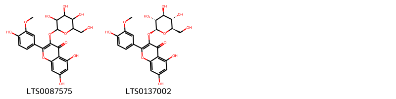{ width=100% }
    <figcaption>Hình ảnh cấu trúc hóa học của 2 hoạt chất thuộc nhóm Flavonoids gồm ['isorhamnetin 3-galactoside (LTS0087575)', 'isorhamnetin 3-o-glucoside (LTS0137002)'].</figcaption>
</figure>
#### Nhóm Organooxygen compounds
<figure markdown="span">
    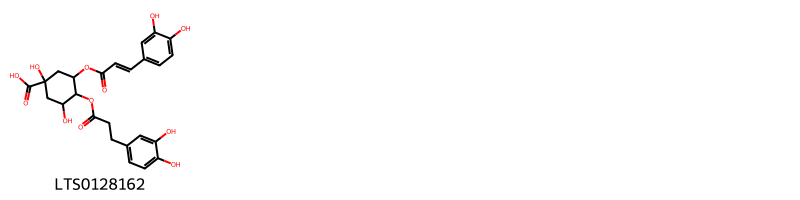{ width=100% }
    <figcaption>Hình ảnh cấu trúc hóa học của 1 hoạt chất thuộc nhóm Organooxygen compounds gồm ['tungtungmadic acid (LTS0128162)'].</figcaption>
</figure>
#### Nhóm Prenol lipids
<figure markdown="span">
    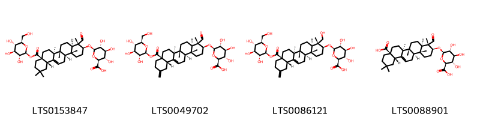{ width=100% }
    <figcaption>Hình ảnh cấu trúc hóa học của 4 hoạt chất thuộc nhóm Prenol lipids gồm ['(2s,3s,4s,5r,6r)-6-{[(3s,4s,4ar,6ar,6bs,8as,12as,14ar,14br)-4-formyl-4,6a,6b,11,11,14b-hexamethyl-8a-({[(2s,3r,4s,5s,6r)-3,4,5-trihydroxy-6-(hydroxymethyl)oxan-2-yl]oxy}carbonyl)-1,2,3,4a,5,6,7,8,9,10,12,12a,14,14a-tetradecahydropicen-3-yl]oxy}-3,4,5-trihydroxyoxane-2-carboxylic acid (LTS0153847)', '(2s,3s,4s,5r,6r)-6-{[(3s,4s,4ar,6ar,6bs,8as,12as,14ar,14br)-4-formyl-4,6a,6b,14b-tetramethyl-11-methylidene-8a-({[(2s,3r,4s,5s,6r)-3,4,5-trihydroxy-6-(hydroxymethyl)oxan-2-yl]oxy}carbonyl)-1,2,3,4a,5,6,7,8,9,10,12,12a,14,14a-tetradecahydropicen-3-yl]oxy}-3,4,5-trihydroxyoxane-2-carboxylic acid (LTS0049702)', '(2s,3s,4s,5r,6r)-6-{[(3s,4r,4ar,6ar,6bs,8as,12as,14ar,14br)-4-(hydroxymethyl)-4,6a,6b,14b-tetramethyl-11-methylidene-8a-({[(2s,3r,4s,5s,6r)-3,4,5-trihydroxy-6-(hydroxymethyl)oxan-2-yl]oxy}carbonyl)-1,2,3,4a,5,6,7,8,9,10,12,12a,14,14a-tetradecahydropicen-3-yl]oxy}-3,4,5-trihydroxyoxane-2-carboxylic acid (LTS0086121)', '(2s,3s,4s,5r,6r)-6-{[(3s,4s,4ar,6ar,6bs,8as,12as,14ar,14br)-8a-carboxy-4-formyl-4,6a,6b,11,11,14b-hexamethyl-1,2,3,4a,5,6,7,8,9,10,12,12a,14,14a-tetradecahydropicen-3-yl]oxy}-3,4,5-trihydroxyoxane-2-carboxylic acid (LTS0088901)'].</figcaption>
</figure>

---

### Dược dân tộc học

Danh sách các quốc gia có sử dụng *N/A* trong điều trị các bệnh. 

| Country   | Disease          | Bệnh                                                                                                                                                                                                |
|:----------|:-----------------|:----------------------------------------------------------------------------------------------------------------------------------------------------------------------------------------------------|
| Europe    | Soap             | MYMEMORY WARNING: YOU USED ALL AVAILABLE FREE TRANSLATIONS FOR TODAY. NEXT AVAILABLE IN  14 HOURS 43 MINUTES 01 SECONDS VISIT HTTPS://MYMEMORY.TRANSLATED.NET/DOC/USAGELIMITS.PHP TO TRANSLATE MORE |
| Turkey    | Digestive, Tonic | MYMEMORY WARNING: YOU USED ALL AVAILABLE FREE TRANSLATIONS FOR TODAY. NEXT AVAILABLE IN  14 HOURS 42 MINUTES 56 SECONDS VISIT HTTPS://MYMEMORY.TRANSLATED.NET/DOC/USAGELIMITS.PHP TO TRANSLATE MORE |

---

