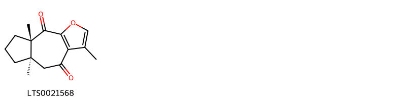
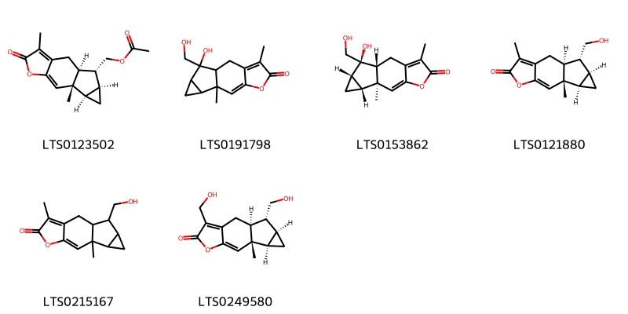
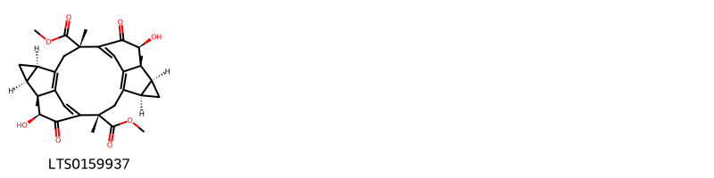
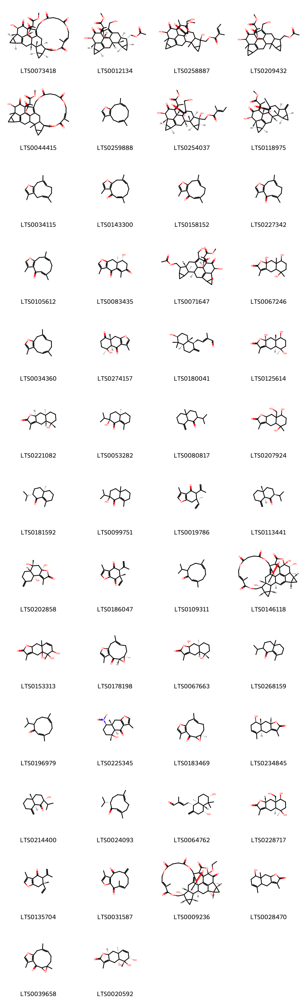
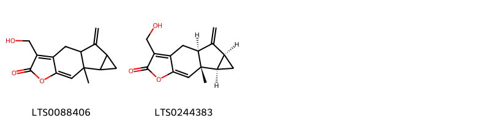

!!! abstract "Tóm tắt"

    Họ Chloranthaceae gồm khoảng 2 chi và 6 loài được một số cộng đồng tại các quốc gia như Venezuela, Elsewhere, Brazil, China sử dụng trong một số trường hợp MYMEMORY WARNING: YOU USED ALL AVAILABLE FREE TRANSLATIONS FOR TODAY. NEXT AVAILABLE IN  09 HOURS 22 MINUTES 21 SECONDS VISIT HTTPS://MYMEMORY.TRANSLATED.NET/DOC/USAGELIMITS.PHP TO TRANSLATE MORE.

!!! info "DrDuke"

    James A. Duke sinh năm 1929-2017 là một nhà thực vật học người Mỹ. Đây là một trong những tác giả hàng đầu trong lĩnh vực dược dân tộc học với cuốn *CRC Handbook of Medicinal Herbs* và chính là người xây dựng lên cơ sở dữ liệu về hợp chất tự nhiên và dược dân tộc học tại Bộ nông nghiệp Hoa Kỳ. Các thông tin được đăng tải tại website [Dr. Duke's Phytochemical and Ethnobotanical Databases](https://phytochem.nal.usda.gov/). 
    Trong suốt thập niên 1970, ông lãnh đạo the Plant Taxonomy Laboratory, Plant Genetics and Germplasm Institute of the Agricultural Research Service, U.S. Department of Agriculture.
    Trong tài liệu này, các thông tin về dược dân tộc của các dược liệu được trích dẫn từ tài liệu của James A. Ducke với sự trợ giúp của phần mềm dịch thuật từ tiếng Anh sang tiếng Việt.
   

# Chi Chloranthus

??? note "Danh sách các dược liệu thuộc chi"
    
	 - *Chloranthus inconicus*
	 - *Chloranthus inconicuus*
	 - *Chloranthus officinalis*
	 - *Chloranthus serratus*

---
## Chloranthus inconicus
### Thông tin về thực vật

!!! info "Phân loại thực vật của *N/A* từ GIBF:"
    - **Kingdom:** Plantae
    - **Phylum:** Tracheophyta
    - **Order:** Chloranthales
    - **Family:** Chloranthaceae
    - **Genus:** Chloranthus
    - **Species:** *N/A*

 

| Label (VI)   | Label (EN)   | Scientific Name        | Descriptions (VI)   | Descriptions (EN)   | Also Known As (VI)   | Also Known As (EN)   |
|:-------------|:-------------|:-----------------------|:--------------------|:--------------------|:---------------------|:---------------------|
| N/A          | N/A          | Argemone subfusiformis | loài thực vật       | species of plant    | ['']                 | ['']                 |

#### Phân bố trên thế giới

**Từ CSDL GIBF** Japan, United States of America, Korea, Republic of, Indonesia, Chinese Taipei, China, Russian Federation

#### Phân bố tại Việt Nam

**Từ CSDL GIBF**: Không có ghi nhận ở Việt Nam

---
### Thành phần hóa học
        
- Theo cơ sở dữ liệu lotus: Từ loài *N/A* đã phân lập và xác định được Chưa có hoạt chất nào được phân lập. hoạt chất thuộc về các nhóm Không có hoạt chất nào được phân lập. 

Không có hình ảnh nào được tạo ra

---

### Dược dân tộc học

Danh sách các quốc gia có sử dụng *N/A* trong điều trị các bệnh. 

| Country   | Disease   | Bệnh                                                                                                                                                                                                |
|:----------|:----------|:----------------------------------------------------------------------------------------------------------------------------------------------------------------------------------------------------|
| Elsewhere | Sudorific | MYMEMORY WARNING: YOU USED ALL AVAILABLE FREE TRANSLATIONS FOR TODAY. NEXT AVAILABLE IN  09 HOURS 22 MINUTES 17 SECONDS VISIT HTTPS://MYMEMORY.TRANSLATED.NET/DOC/USAGELIMITS.PHP TO TRANSLATE MORE |

---

---
## Chloranthus inconicuus
### Thông tin về thực vật

!!! info "Phân loại thực vật của *N/A* từ GIBF:"
    - **Kingdom:** Plantae
    - **Phylum:** Tracheophyta
    - **Order:** Chloranthales
    - **Family:** Chloranthaceae
    - **Genus:** Chloranthus
    - **Species:** *N/A*

 

| Label (VI)   | Label (EN)   | Scientific Name        | Descriptions (VI)   | Descriptions (EN)   | Also Known As (VI)   | Also Known As (EN)   |
|:-------------|:-------------|:-----------------------|:--------------------|:--------------------|:---------------------|:---------------------|
| N/A          | N/A          | Argemone subfusiformis | loài thực vật       | species of plant    | ['']                 | ['']                 |

#### Phân bố trên thế giới

**Từ CSDL GIBF** Japan, United States of America, Korea, Republic of, Indonesia, Chinese Taipei, China, Russian Federation

#### Phân bố tại Việt Nam

**Từ CSDL GIBF**: Không có ghi nhận ở Việt Nam

---
### Thành phần hóa học
        
- Theo cơ sở dữ liệu lotus: Từ loài *N/A* đã phân lập và xác định được Chưa có hoạt chất nào được phân lập. hoạt chất thuộc về các nhóm Không có hoạt chất nào được phân lập. 

Không có hình ảnh nào được tạo ra

---

### Dược dân tộc học

Danh sách các quốc gia có sử dụng *N/A* trong điều trị các bệnh. 

| Country   | Disease                        | Bệnh                                                                                                                                                                                                |
|:----------|:-------------------------------|:----------------------------------------------------------------------------------------------------------------------------------------------------------------------------------------------------|
| China     | Poultice, Sudorific, Stimulant | MYMEMORY WARNING: YOU USED ALL AVAILABLE FREE TRANSLATIONS FOR TODAY. NEXT AVAILABLE IN  09 HOURS 21 MINUTES 37 SECONDS VISIT HTTPS://MYMEMORY.TRANSLATED.NET/DOC/USAGELIMITS.PHP TO TRANSLATE MORE |

---

---
## Chloranthus officinalis
### Thông tin về thực vật

!!! info "Phân loại thực vật của *Chloranthus elatior* từ GIBF:"
    - **Kingdom:** Plantae
    - **Phylum:** Tracheophyta
    - **Order:** Chloranthales
    - **Family:** Chloranthaceae
    - **Genus:** Chloranthus
    - **Species:** *Chloranthus elatior*

 

| Label (VI)   | Label (EN)   | Scientific Name         | Descriptions (VI)   | Descriptions (EN)   | Also Known As (VI)   | Also Known As (EN)   |
|:-------------|:-------------|:------------------------|:--------------------|:--------------------|:---------------------|:---------------------|
| N/A          | N/A          | Chloranthus officinalis |                     |                     | ['']                 | ['']                 |

#### Phân bố trên thế giới

**Từ CSDL GIBF** nan, Singapore, Viet Nam, Japan, Mongolia, Indonesia, Philippines, Malaysia, China, India, unknown or invalid, Papua New Guinea, Guinea

#### Phân bố tại Việt Nam

**Từ CSDL GIBF**: Không có ghi nhận ở Việt Nam

---
### Thành phần hóa học
        
- Theo cơ sở dữ liệu lotus: Từ loài *Chloranthus elatior* đã phân lập và xác định được Chưa có hoạt chất nào được phân lập. hoạt chất thuộc về các nhóm Không có hoạt chất nào được phân lập. 

Không có hình ảnh nào được tạo ra

---

### Dược dân tộc học

Danh sách các quốc gia có sử dụng *Chloranthus elatior* trong điều trị các bệnh. 

| Country   | Disease              | Bệnh                                                                                                                                                                                                |
|:----------|:---------------------|:----------------------------------------------------------------------------------------------------------------------------------------------------------------------------------------------------|
| Elsewhere | Stimulant, Sudorific | MYMEMORY WARNING: YOU USED ALL AVAILABLE FREE TRANSLATIONS FOR TODAY. NEXT AVAILABLE IN  09 HOURS 21 MINUTES 11 SECONDS VISIT HTTPS://MYMEMORY.TRANSLATED.NET/DOC/USAGELIMITS.PHP TO TRANSLATE MORE |

---

---
## Chloranthus serratus
### Thông tin về thực vật

!!! info "Phân loại thực vật của *Chloranthus serratus* từ GIBF:"
    - **Kingdom:** Plantae
    - **Phylum:** Tracheophyta
    - **Order:** Chloranthales
    - **Family:** Chloranthaceae
    - **Genus:** Chloranthus
    - **Species:** *Chloranthus serratus*

 

| Label (VI)   | Label (EN)   | Scientific Name      | Descriptions (VI)   | Descriptions (EN)   | Also Known As (VI)   | Also Known As (EN)   |
|:-------------|:-------------|:---------------------|:--------------------|:--------------------|:---------------------|:---------------------|
| N/A          | N/A          | Chloranthus serratus | loài thực vật       | species of plant    | ['']                 | ['']                 |

#### Phân bố trên thế giới

**Từ CSDL GIBF** nan, Hong Kong, Japan, Korea, Republic of, China, Russian Federation

#### Phân bố tại Việt Nam

**Từ CSDL GIBF**: Không có ghi nhận ở Việt Nam

---
### Thành phần hóa học
        
- Theo cơ sở dữ liệu lotus: Từ loài *Chloranthus serratus* đã phân lập và xác định được 61 hoạt chất thuộc về các nhóm Naphthofurans, Cycloheptafurans, Organooxygen compounds, Prenol lipids. 

|    | chemicalTaxonomyClassyfireClass   |   smiles_count |
|---:|:----------------------------------|---------------:|
|  0 | Cycloheptafurans                  |              1 |
|  1 | Naphthofurans                     |              6 |
|  2 | Organooxygen compounds            |              1 |
|  3 | Prenol lipids                     |             51 |

#### Nhóm Cycloheptafurans
<figure markdown="span">
    { width=100% }
    <figcaption>Hình ảnh cấu trúc hóa học của 1 hoạt chất thuộc nhóm Cycloheptafurans gồm ['chlorantene a (LTS0021568)'].</figcaption>
</figure>
#### Nhóm Naphthofurans
<figure markdown="span">
    { width=100% }
    <figcaption>Hình ảnh cấu trúc hóa học của 6 hoạt chất thuộc nhóm Naphthofurans gồm ['chloranthalactone c (LTS0123502)', '13-hydroxy-13-(hydroxymethyl)-4,9-dimethyl-6-oxatetracyclo[7.4.0.0³,⁷.0¹⁰,¹²]trideca-3,7-dien-5-one (LTS0191798)', '(1r,9r,10r,12s,13r)-13-hydroxy-13-(hydroxymethyl)-4,9-dimethyl-6-oxatetracyclo[7.4.0.0³,⁷.0¹⁰,¹²]trideca-3,7-dien-5-one (LTS0153862)', 'shizukanolide c (LTS0121880)', '13-(hydroxymethyl)-4,9-dimethyl-6-oxatetracyclo[7.4.0.0³,⁷.0¹⁰,¹²]trideca-3,7-dien-5-one (LTS0215167)', '(1s,9s,10r,12s,13r)-4,13-bis(hydroxymethyl)-9-methyl-6-oxatetracyclo[7.4.0.0³,⁷.0¹⁰,¹²]trideca-3,7-dien-5-one (LTS0249580)'].</figcaption>
</figure>
#### Nhóm Organooxygen compounds
<figure markdown="span">
    { width=100% }
    <figcaption>Hình ảnh cấu trúc hóa học của 1 hoạt chất thuộc nhóm Organooxygen compounds gồm ['2,12-dimethyl (2s,5r,7s,8r,12s,15r,17s,18r,19s,24s)-19,24-dihydroxy-2,8,12,18-tetramethyl-20,23-dioxoheptacyclo[12.6.2.2⁸,¹¹.0⁴,⁹.0⁵,⁷.0¹⁵,¹⁷.0¹⁸,²²]tetracosa-1(21),4(9),10,14(22)-tetraene-2,12-dicarboxylate (LTS0159937)'].</figcaption>
</figure>
#### Nhóm Prenol lipids
<figure markdown="span">
    { width=100% }
    <figcaption>Hình ảnh cấu trúc hóa học của 51 hoạt chất thuộc nhóm Prenol lipids gồm ['shizukaol b (LTS0073418)', 'shizukaol d (LTS0012134)', '[9,21-dihydroxy-5-(hydroxymethyl)-23-(1-methoxy-1-oxopropan-2-ylidene)-13,20-dimethyl-4,22-dioxo-3-oxaoctacyclo[14.7.1.0²,⁶.0²,¹⁴.0⁸,¹³.0¹⁰,¹².0¹⁷,¹⁹.0²⁰,²⁴]tetracosa-5,16(24)-dien-9-yl]methyl 2-methylbut-2-enoate (LTS0258887)', 'methyl 2-{9-[(acetyloxy)methyl]-21-hydroxy-5-(hydroxymethyl)-13,20-dimethyl-4,22-dioxo-3-oxaoctacyclo[14.7.1.0²,⁶.0²,¹⁴.0⁸,¹³.0¹⁰,¹².0¹⁷,¹⁹.0²⁰,²⁴]tetracosa-5,16(24)-dien-23-ylidene}propanoate (LTS0209432)', 'methyl 2-{18,30-dihydroxy-14,22,29-trimethyl-3,7,10,15,31-pentaoxo-2,6,11,16-tetraoxanonacyclo[16.15.3.1²⁵,²⁹.0¹,²³.0⁴,³⁴.0¹⁹,²¹.0²²,³⁶.0²⁶,²⁸.0³³,³⁷]heptatriaconta-4(34),13,25(37)-trien-32-ylidene}propanoate (LTS0044415)', 'furanodiene (LTS0259888)', '[(1r,2s,8r,9s,10s,12r,13s,14s,17s,19r,20s,21r,23z)-9,21-dihydroxy-5-(hydroxymethyl)-23-(1-methoxy-1-oxopropan-2-ylidene)-13,20-dimethyl-4,22-dioxo-3-oxaoctacyclo[14.7.1.0²,⁶.0²,¹⁴.0⁸,¹³.0¹⁰,¹².0¹⁷,¹⁹.0²⁰,²⁴]tetracosa-5,16(24)-dien-9-yl]methyl (2e)-2-methylbut-2-enoate (LTS0254037)', 'methyl 2-[(1r,2s,8s,10s,12r,13s,14s,17s,19r,20s,21r,23z)-21-hydroxy-5,13,20-trimethyl-9-methylidene-4,22-dioxo-3-oxaoctacyclo[14.7.1.0²,⁶.0²,¹⁴.0⁸,¹³.0¹⁰,¹².0¹⁷,¹⁹.0²⁰,²⁴]tetracosa-5,16(24)-dien-23-ylidene]propanoate (LTS0118975)', 'furanodiene (LTS0034115)', 'furanodienone (LTS0143300)', 'furanodienone (LTS0158152)', 'furanodienone (LTS0227342)', 'furanodienone (LTS0105612)', 'chlorantene d (LTS0083435)', 'methyl 2-[(1r,2s,8s,13s,14s,20s)-9-[(acetyloxy)methyl]-21-hydroxy-5-(hydroxymethyl)-13,20-dimethyl-4,22-dioxo-3-oxaoctacyclo[14.7.1.0²,⁶.0²,¹⁴.0⁸,¹³.0¹⁰,¹².0¹⁷,¹⁹.0²⁰,²⁴]tetracosa-5,16(24)-dien-23-ylidene]propanoate (LTS0071647)', '5,8,9a-trihydroxy-3,5,8a-trimethyl-4h,4ah,6h,7h,8h,9h-naphtho[2,3-b]furan-2-one (LTS0067246)', 'furanodiene (LTS0034360)', 'chlorantene c (LTS0274157)', '(2e)-4-[(1s,4ar,6s,8ar)-6-hydroxy-5,5,8a-trimethyl-2-methylidene-hexahydro-1h-naphthalen-1-yl]-2-methylbut-2-enal (LTS0180041)', '(4as,5r,8s,8as,9ar)-5,8,9a-trihydroxy-3,5,8a-trimethyl-4h,4ah,6h,7h,8h,9h-naphtho[2,3-b]furan-2-one (LTS0125614)', '(4ar,5s,8ar,9as)-5-hydroxy-3,5,8a-trimethyl-4h,4ah,6h,7h,8h,9h,9ah-naphtho[2,3-b]furan-2-one (LTS0221082)', '(2r,4ar)-2-hydroxy-2-isopropyl-4a,8-dimethyl-4,5,6,7-tetrahydro-3h-naphthalen-1-one (LTS0053282)', '2-isopropyl-4a-methyl-8-methylidene-hexahydro-2h-naphthalen-1-one (LTS0080817)', '5,8-dihydroxy-8a-(hydroxymethyl)-3,5-dimethyl-4h,4ah,6h,7h,8h,9h,9ah-naphtho[2,3-b]furan-2-one (LTS0207924)', '(2s,4ar)-2-isopropyl-4a,8-dimethyl-2,3,4,5,6,7-hexahydronaphthalen-1-one (LTS0181592)', '2-hydroxy-2-isopropyl-4a,8-dimethyl-4,5,6,7-tetrahydro-3h-naphthalen-1-one (LTS0099751)', '(6r)-6-ethenyl-3,6-dimethyl-5-(prop-1-en-2-yl)-5,7-dihydro-1-benzofuran-4-one (LTS0019786)', 'acolamone (LTS0113441)', '(3ar,5r,5ar,9ar)-3a,5,9a-trihydroxy-1,5-dimethyl-8-methylidene-4h,5ah,6h,7h,9h-naphtho[2,1-b]furan-2-one (LTS0202858)', 'chlorantene f (LTS0186047)', '(2z,6z)-10-isopropyl-3,7-dimethylcyclodeca-2,6-dien-1-one (LTS0109311)', '(1s,2s,5s,7r,8s,9r,10s,16r,28e,33s,34s,36r,37r)-9,10,33-trihydroxy-1,8,13,29-tetramethyl-11,17,21,26,31-pentaoxadecacyclo[17.17.3.1⁴,⁸.0²,¹⁶.0⁵,⁷.0¹⁰,¹⁴.0¹⁶,³⁹.0³³,³⁷.0³⁴,³⁶.0¹⁵,⁴⁰]tetraconta-3,13,15(40),19(39),28-pentaene-12,18,22,25,30-pentone (LTS0146118)', '4a,5,6-trihydroxy-3,5,8a-trimethyl-4h,6h,9h,9ah-naphtho[2,3-b]furan-2-one (LTS0153313)', '(3s,5r,8e)-5,9,14-trimethyl-4,12-dioxatricyclo[9.3.0.0³,⁵]tetradeca-1(11),8,13-trien-2-one (LTS0178198)', '(4ar,5s,8ar,9as)-5,9a-dihydroxy-3,5,8a-trimethyl-4h,4ah,6h,7h,8h,9h-naphtho[2,3-b]furan-2-one (LTS0067663)', '2-isopropyl-4a,8-dimethyl-2,3,4,5,6,7-hexahydronaphthalen-1-one (LTS0268159)', '10-isopropyl-3,7-dimethylcyclodeca-2,6-dien-1-one (LTS0196979)', '(4ar,5r,8r,8ar)-5-hydroxy-3,5,8a-trimethyl-8-nitro-4ah,6h,7h,8h,9h-naphtho[2,3-b]furan-4-one (LTS0225345)', '(5r,8e)-5,9,14-trimethyl-4,12-dioxatricyclo[9.3.0.0³,⁵]tetradeca-1(11),8,13-trien-2-one (LTS0183469)', '(4as,8r,8ar,9as)-8-hydroxy-3,5,8a-trimethyl-4h,4ah,7h,8h,9h,9ah-naphtho[2,3-b]furan-2-one (LTS0234845)', 'chlorantene g (LTS0214400)', 'acoragermacrone (LTS0024093)', '(2e)-4-[(1s,4r,4ar,6s,8ar)-4,6-dihydroxy-5,5,8a-trimethyl-2-methylidene-hexahydro-1h-naphthalen-1-yl]-2-methylbut-2-enal (LTS0064762)', '(4as,5r,8s,8as,9ar)-5,8-dihydroxy-8a-(hydroxymethyl)-3,5-dimethyl-4h,4ah,6h,7h,8h,9h,9ah-naphtho[2,3-b]furan-2-one (LTS0228717)', '(6s)-6-ethenyl-3,6-dimethyl-5-(prop-1-en-2-yl)-5,7-dihydro-1-benzofuran-4-one (LTS0135704)', '3,10-dimethyl-6-methylidene-5h,7h,8h-cyclodeca[b]furan-4,11-dione (LTS0031587)', '(1s,2s,4s,5s,7r,8s,10s,16r,28e,33s,34s,36r,37r)-10-ethoxy-4,33-dihydroxy-1,8,13,29-tetramethyl-11,17,21,26,31-pentaoxadecacyclo[17.17.3.1⁴,⁸.0²,¹⁶.0⁵,⁷.0¹⁰,¹⁴.0¹⁶,³⁹.0³³,³⁷.0³⁴,³⁶.0¹⁵,⁴⁰]tetraconta-13,15(40),19(39),28-tetraene-9,12,18,22,25,30-hexone (LTS0009236)', '8-hydroxy-3,5,8a-trimethyl-4h,4ah,7h,8h,9h,9ah-naphtho[2,3-b]furan-2-one (LTS0028470)', 'zederone (LTS0039658)', '(4ar,5s,6s,8as,9as)-4a,5,6-trihydroxy-3,5,8a-trimethyl-4h,6h,9h,9ah-naphtho[2,3-b]furan-2-one (LTS0020592)', '[(1r,2s,8r,9s,10s,12r,13s,14s,17s,19r,20s,21r)-9,21-dihydroxy-5-(hydroxymethyl)-23-(1-methoxy-1-oxopropan-2-ylidene)-13,20-dimethyl-4,22-dioxo-3-oxaoctacyclo[14.7.1.0²,⁶.0²,¹⁴.0⁸,¹³.0¹⁰,¹².0¹⁷,¹⁹.0²⁰,²⁴]tetracosa-5,16(24)-dien-9-yl]methyl (2e)-2-methylbut-2-enoate (LTS0049897)'].</figcaption>
</figure>

---

### Dược dân tộc học

Danh sách các quốc gia có sử dụng *Chloranthus serratus* trong điều trị các bệnh. 

| Country   | Disease                         | Bệnh                                                                                                                                                                                                |
|:----------|:--------------------------------|:----------------------------------------------------------------------------------------------------------------------------------------------------------------------------------------------------|
| China     | Parasiticide, Poison, Vermifuge | MYMEMORY WARNING: YOU USED ALL AVAILABLE FREE TRANSLATIONS FOR TODAY. NEXT AVAILABLE IN  09 HOURS 20 MINUTES 46 SECONDS VISIT HTTPS://MYMEMORY.TRANSLATED.NET/DOC/USAGELIMITS.PHP TO TRANSLATE MORE |

---

# Chi Hedyosmum

??? note "Danh sách các dược liệu thuộc chi"
    
	 - *Hedyosmum bourgoini*
	 - *Hedyosmum brasiliense*

---
## Hedyosmum bourgoini
### Thông tin về thực vật

!!! info "Phân loại thực vật của *N/A* từ GIBF:"
    - **Kingdom:** Plantae
    - **Phylum:** Tracheophyta
    - **Order:** Chloranthales
    - **Family:** Chloranthaceae
    - **Genus:** Hedyosmum
    - **Species:** *N/A*

 

| Label (VI)   | Label (EN)   | Scientific Name      | Descriptions (VI)   | Descriptions (EN)   | Also Known As (VI)   | Also Known As (EN)   |
|:-------------|:-------------|:---------------------|:--------------------|:--------------------|:---------------------|:---------------------|
| N/A          | N/A          | Chloranthus serratus | loài thực vật       | species of plant    | ['']                 | ['']                 |

#### Phân bố trên thế giới

**Từ CSDL GIBF** Brazil, Guatemala, Nicaragua, Mexico, Panama, El Salvador, Guadeloupe, Indonesia, Colombia, Ecuador, Peru, Bolivia (Plurinational State of), Puerto Rico

#### Phân bố tại Việt Nam

**Từ CSDL GIBF**: Không có ghi nhận ở Việt Nam

---
### Thành phần hóa học
        
- Theo cơ sở dữ liệu lotus: Từ loài *N/A* đã phân lập và xác định được Chưa có hoạt chất nào được phân lập. hoạt chất thuộc về các nhóm Không có hoạt chất nào được phân lập. 

Không có hình ảnh nào được tạo ra

---

### Dược dân tộc học

Danh sách các quốc gia có sử dụng *N/A* trong điều trị các bệnh. 

| Country   | Disease   | Bệnh                                                                                                                                                                                                |
|:----------|:----------|:----------------------------------------------------------------------------------------------------------------------------------------------------------------------------------------------------|
| Venezuela | Tonic     | MYMEMORY WARNING: YOU USED ALL AVAILABLE FREE TRANSLATIONS FOR TODAY. NEXT AVAILABLE IN  09 HOURS 20 MINUTES 12 SECONDS VISIT HTTPS://MYMEMORY.TRANSLATED.NET/DOC/USAGELIMITS.PHP TO TRANSLATE MORE |

---

---
## Hedyosmum brasiliense
### Thông tin về thực vật

!!! info "Phân loại thực vật của *Hedyosmum brasiliense* từ GIBF:"
    - **Kingdom:** Plantae
    - **Phylum:** Tracheophyta
    - **Order:** Chloranthales
    - **Family:** Chloranthaceae
    - **Genus:** Hedyosmum
    - **Species:** *Hedyosmum brasiliense*

 

| Label (VI)   | Label (EN)   | Scientific Name       | Descriptions (VI)   | Descriptions (EN)   | Also Known As (VI)   | Also Known As (EN)   |
|:-------------|:-------------|:----------------------|:--------------------|:--------------------|:---------------------|:---------------------|
| N/A          | N/A          | Hedyosmum brasiliense | loài thực vật       | species of plant    | ['']                 | ['']                 |

#### Phân bố trên thế giới

**Từ CSDL GIBF** Brazil, Venezuela (Bolivarian Republic of)

#### Phân bố tại Việt Nam

**Từ CSDL GIBF**: Không có ghi nhận ở Việt Nam

---
### Thành phần hóa học
        
- Theo cơ sở dữ liệu lotus: Từ loài *Hedyosmum brasiliense* đã phân lập và xác định được 2 hoạt chất thuộc về các nhóm Naphthofurans. 

|    | chemicalTaxonomyClassyfireClass   |   smiles_count |
|---:|:----------------------------------|---------------:|
|  0 | Naphthofurans                     |              2 |

#### Nhóm Naphthofurans
<figure markdown="span">
    { width=100% }
    <figcaption>Hình ảnh cấu trúc hóa học của 2 hoạt chất thuộc nhóm Naphthofurans gồm ['4-(hydroxymethyl)-9-methyl-13-methylidene-6-oxatetracyclo[7.4.0.0³,⁷.0¹⁰,¹²]trideca-3,7-dien-5-one (LTS0088406)', '(1s,9s,10r,12s)-4-(hydroxymethyl)-9-methyl-13-methylidene-6-oxatetracyclo[7.4.0.0³,⁷.0¹⁰,¹²]trideca-3,7-dien-5-one (LTS0244383)'].</figcaption>
</figure>

---

### Dược dân tộc học

Danh sách các quốc gia có sử dụng *Hedyosmum brasiliense* trong điều trị các bệnh. 

| Country   | Disease                                  | Bệnh                                                                                                                                                                                                |
|:----------|:-----------------------------------------|:----------------------------------------------------------------------------------------------------------------------------------------------------------------------------------------------------|
| Brazil    | Aphrodisiac, Stomachic, Tonic, Sudorific | MYMEMORY WARNING: YOU USED ALL AVAILABLE FREE TRANSLATIONS FOR TODAY. NEXT AVAILABLE IN  09 HOURS 19 MINUTES 41 SECONDS VISIT HTTPS://MYMEMORY.TRANSLATED.NET/DOC/USAGELIMITS.PHP TO TRANSLATE MORE |

---

