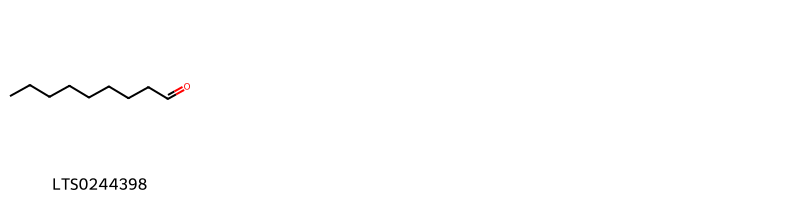
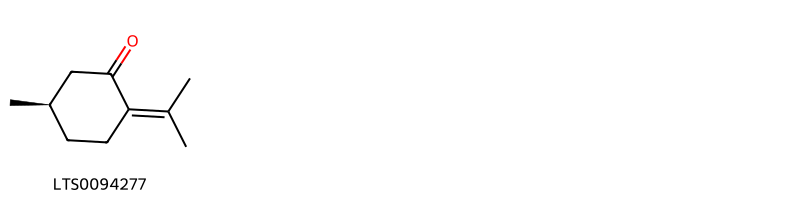

!!! abstract "Tóm tắt"

    Họ Cistaceae gồm khoảng 3 chi và 4 loài được một số cộng đồng tại các quốc gia như Turkey, Elsewhere, North America, ain sử dụng trong một số trường hợp Thuốc bổ, Chất làm se, Thuốc trừ sâu, Xà phòng, Chất làm se, Chất khử trùng, Thần kinh, Luyện ngục, Chất kích thích, Hemostat, Chất làm se, Thuốc bổ, Thuốc lợi tiểu.

!!! info "DrDuke"

    James A. Duke sinh năm 1929-2017 là một nhà thực vật học người Mỹ. Đây là một trong những tác giả hàng đầu trong lĩnh vực dược dân tộc học với cuốn *CRC Handbook of Medicinal Herbs* và chính là người xây dựng lên cơ sở dữ liệu về hợp chất tự nhiên và dược dân tộc học tại Bộ nông nghiệp Hoa Kỳ. Các thông tin được đăng tải tại website [Dr. Duke's Phytochemical and Ethnobotanical Databases](https://phytochem.nal.usda.gov/). 
    Trong suốt thập niên 1970, ông lãnh đạo the Plant Taxonomy Laboratory, Plant Genetics and Germplasm Institute of the Agricultural Research Service, U.S. Department of Agriculture.
    Trong tài liệu này, các thông tin về dược dân tộc của các dược liệu được trích dẫn từ tài liệu của James A. Ducke với sự trợ giúp của phần mềm dịch thuật từ tiếng Anh sang tiếng Việt.
   

# Chi Helianthemum

??? note "Danh sách các dược liệu thuộc chi"
    
	 - *Helianthemum canadense*

---
## Helianthemum canadense
### Thông tin về thực vật

!!! info "Phân loại thực vật của *Crocanthemum canadense* từ GIBF:"
    - **Kingdom:** Plantae
    - **Phylum:** Tracheophyta
    - **Order:** Malvales
    - **Family:** Cistaceae
    - **Genus:** Crocanthemum
    - **Species:** *Crocanthemum canadense*

 

| Label (VI)   | Label (EN)   | Scientific Name        | Descriptions (VI)   | Descriptions (EN)   | Also Known As (VI)   | Also Known As (EN)   |
|:-------------|:-------------|:-----------------------|:--------------------|:--------------------|:---------------------|:---------------------|
| N/A          | N/A          | Helianthemum canadense | loài thực vật       | species of plant    | ['']                 | ['']                 |

#### Phân bố trên thế giới

**Từ CSDL GIBF** United States of America, Canada

#### Phân bố tại Việt Nam

**Từ CSDL GIBF**: Không có ghi nhận ở Việt Nam

---
### Thành phần hóa học
        
- Theo cơ sở dữ liệu lotus: Từ loài *Crocanthemum canadense* đã phân lập và xác định được Chưa có hoạt chất nào được phân lập. hoạt chất thuộc về các nhóm Không có hoạt chất nào được phân lập. 

Không có hình ảnh nào được tạo ra

---

### Dược dân tộc học

Danh sách các quốc gia có sử dụng *Crocanthemum canadense* trong điều trị các bệnh. 

| Country       | Disease           | Bệnh                  |
|:--------------|:------------------|:----------------------|
| North America | Astringent, Tonic | Chất làm se, Thuốc bổ |
| Turkey        | Tonic, Astringent | Thuốc bổ, làm se      |

---

# Chi Cistus

??? note "Danh sách các dược liệu thuộc chi"
    
	 - *Cistus ladaniferus*

---
## Cistus ladaniferus
### Thông tin về thực vật

!!! info "Phân loại thực vật của *N/A* từ GIBF:"
    - **Kingdom:** Plantae
    - **Phylum:** Tracheophyta
    - **Order:** Malvales
    - **Family:** Cistaceae
    - **Genus:** Cistus
    - **Species:** *N/A*

 

| Label (VI)   | Label (EN)   | Scientific Name    | Descriptions (VI)   | Descriptions (EN)   | Also Known As (VI)   | Also Known As (EN)   |
|:-------------|:-------------|:-------------------|:--------------------|:--------------------|:---------------------|:---------------------|
| N/A          | N/A          | Cistus ladaniferus |                     |                     | ['']                 | ['']                 |

#### Phân bố trên thế giới

**Từ CSDL GIBF** Ukraine, Israel, Italy, Spain, Türkiye, Portugal, Morocco, United States of America, France, Greece, New Zealand

#### Phân bố tại Việt Nam

**Từ CSDL GIBF**: Không có ghi nhận ở Việt Nam

---
### Thành phần hóa học
        
- Theo cơ sở dữ liệu lotus: Từ loài *N/A* đã phân lập và xác định được Chưa có hoạt chất nào được phân lập. hoạt chất thuộc về các nhóm Không có hoạt chất nào được phân lập. 

Không có hình ảnh nào được tạo ra

---

### Dược dân tộc học

Danh sách các quốc gia có sử dụng *N/A* trong điều trị các bệnh. 

| Country   | Disease                                                       | Bệnh                                                                         |
|:----------|:--------------------------------------------------------------|:-----------------------------------------------------------------------------|
| Elsewhere | Insecticide, Soap                                             | Thuốc diệt côn trùng, xà phòng                                               |
| Turkey    | Astringent, Fumigant, Nervine, Purgative, Stimulant, Hemostat | Chất làm se, Chất khử trùng, Thần kinh, Luyện tập, Chất kích thích, Hemostat |

---

# Chi Fumana

??? note "Danh sách các dược liệu thuộc chi"
    
	 - *Fumana ericoides*
	 - *Fumana thymifolia*

---
## Fumana ericoides
### Thông tin về thực vật

!!! info "Phân loại thực vật của *Fumana ericoides* từ GIBF:"
    - **Kingdom:** Plantae
    - **Phylum:** Tracheophyta
    - **Order:** Malvales
    - **Family:** Cistaceae
    - **Genus:** Fumana
    - **Species:** *Fumana ericoides*

 

| Label (VI)   | Label (EN)   | Scientific Name   | Descriptions (VI)   | Descriptions (EN)   | Also Known As (VI)   | Also Known As (EN)   |
|:-------------|:-------------|:------------------|:--------------------|:--------------------|:---------------------|:---------------------|
| N/A          | N/A          | Fumana ericoides  | loài thực vật       | species of plant    | ['']                 | ['']                 |

#### Phân bố trên thế giới

**Từ CSDL GIBF** Italy, Spain, Portugal, Switzerland, Algeria, France, Croatia

#### Phân bố tại Việt Nam

**Từ CSDL GIBF**: Không có ghi nhận ở Việt Nam

---
### Thành phần hóa học
        
- Theo cơ sở dữ liệu lotus: Từ loài *Fumana ericoides* đã phân lập và xác định được Chưa có hoạt chất nào được phân lập. hoạt chất thuộc về các nhóm Không có hoạt chất nào được phân lập. 

Không có hình ảnh nào được tạo ra

---

### Dược dân tộc học

Danh sách các quốc gia có sử dụng *Fumana ericoides* trong điều trị các bệnh. 

| Country   | Disease   | Bệnh           |
|:----------|:----------|:---------------|
| ain       | Diuretic  | Thuốc lợi tiêu |

---

---
## Fumana thymifolia
### Thông tin về thực vật

!!! info "Phân loại thực vật của *Fumana thymifolia* từ GIBF:"
    - **Kingdom:** Plantae
    - **Phylum:** Tracheophyta
    - **Order:** Malvales
    - **Family:** Cistaceae
    - **Genus:** Fumana
    - **Species:** *Fumana thymifolia*

 

| Label (VI)   | Label (EN)   | Scientific Name   | Descriptions (VI)   | Descriptions (EN)   | Also Known As (VI)   | Also Known As (EN)   |
|:-------------|:-------------|:------------------|:--------------------|:--------------------|:---------------------|:---------------------|
| N/A          | N/A          | Fumana thymifolia | loài thực vật       | species of plant    | ['']                 | ['']                 |

#### Phân bố trên thế giới

**Từ CSDL GIBF** Italy, Cyprus, Malta, Spain, Palestine, State of, Türkiye, Portugal, Algeria, France, Croatia, Greece, Israel

#### Phân bố tại Việt Nam

**Từ CSDL GIBF**: Không có ghi nhận ở Việt Nam

---
### Thành phần hóa học
        
- Theo cơ sở dữ liệu lotus: Từ loài *Fumana thymifolia* đã phân lập và xác định được 2 hoạt chất thuộc về các nhóm Prenol lipids, Organooxygen compounds. 

|    | chemicalTaxonomyClassyfireClass   |   smiles_count |
|---:|:----------------------------------|---------------:|
|  0 | Organooxygen compounds            |              1 |
|  1 | Prenol lipids                     |              1 |

#### Nhóm Organooxygen compounds
<figure markdown="span">
    { width=100% }
    <figcaption>Hình ảnh cấu trúc hóa học của 1 hoạt chất thuộc nhóm Organooxygen compounds gồm ['nonanal (LTS0244398)'].</figcaption>
</figure>
#### Nhóm Prenol lipids
<figure markdown="span">
    { width=100% }
    <figcaption>Hình ảnh cấu trúc hóa học của 1 hoạt chất thuộc nhóm Prenol lipids gồm ['(+)-pulegone (LTS0094277)'].</figcaption>
</figure>

---

### Dược dân tộc học

Danh sách các quốc gia có sử dụng *Fumana thymifolia* trong điều trị các bệnh. 

| Country   | Disease   | Bệnh           |
|:----------|:----------|:---------------|
| ain       | Diuretic  | Thuốc lợi tiêu |

---

