!!! abstract "Tóm tắt"

    Họ Clusiaceae gồm khoảng 11 chi và 42 loài được một số cộng đồng tại các quốc gia như Trinidad, Thailand, Japan, Brazil, Indochina, Ghana, French, Philippines, Venezuela, Java, Chinese, English, Mexico, China, Malagasy, Europe, Haiti, Iran, Elsewhere, ain, Dominican Republic, Africa, Latin America, India, Samoa, US, New Caledonia, Turkey, Iraq, Panama(Choco) sử dụng trong một số trường hợp QUERY LENGTH LIMIT EXCEEDED. MAX ALLOWED QUERY : 500 CHARS Vermifuge, Vulnerary, Cholagogue, Diuretic, Digestive, Cicatrizant, Astringent, Carminative, Stimulant, Vulnerary, Poison, Stomachic, Acaricide, Acaricide, Insecticide, Insecticide, Emmenagogue, Vermifuge, Insecticide, Piscicide, Poison, Vulnerary, Hemostatic, Hemostat, Vulnerary, nan, Fungicide, Tonic, Parasiticide, Vermifuge, Purgative, Aphrodisiac.

!!! info "DrDuke"

    James A. Duke sinh năm 1929-2017 là một nhà thực vật học người Mỹ. Đây là một trong những tác giả hàng đầu trong lĩnh vực dược dân tộc học với cuốn *CRC Handbook of Medicinal Herbs* và chính là người xây dựng lên cơ sở dữ liệu về hợp chất tự nhiên và dược dân tộc học tại Bộ nông nghiệp Hoa Kỳ. Các thông tin được đăng tải tại website [Dr. Duke's Phytochemical and Ethnobotanical Databases](https://phytochem.nal.usda.gov/). 
    Trong suốt thập niên 1970, ông lãnh đạo the Plant Taxonomy Laboratory, Plant Genetics and Germplasm Institute of the Agricultural Research Service, U.S. Department of Agriculture.
    Trong tài liệu này, các thông tin về dược dân tộc của các dược liệu được trích dẫn từ tài liệu của James A. Ducke với sự trợ giúp của phần mềm dịch thuật từ tiếng Anh sang tiếng Việt.
   

# Chi Kayea

??? note "Danh sách các dược liệu thuộc chi"
    
	 - *Kayea assamica*

---
## Kayea assamica
### Thông tin về thực vật

!!! info "Phân loại thực vật của *Kayea assamica* từ GIBF:"
    - **Kingdom:** Plantae
    - **Phylum:** Tracheophyta
    - **Order:** Malpighiales
    - **Family:** Calophyllaceae
    - **Genus:** Kayea
    - **Species:** *Kayea assamica*

 

| Label (VI)   | Label (EN)   | Scientific Name   | Descriptions (VI)   | Descriptions (EN)   | Also Known As (VI)   | Also Known As (EN)   |
|:-------------|:-------------|:------------------|:--------------------|:--------------------|:---------------------|:---------------------|
| N/A          | N/A          | Kayea assamica    | loài thực vật       | species of plant    | ['']                 | ['']                 |

#### Phân bố trên thế giới

**Từ CSDL GIBF** nan, unknown or invalid, Myanmar, Malaysia, India

#### Phân bố tại Việt Nam

**Từ CSDL GIBF**: Không có ghi nhận ở Việt Nam

---
### Thành phần hóa học
        
- Theo cơ sở dữ liệu lotus: Từ loài *Kayea assamica* đã phân lập và xác định được 45 hoạt chất thuộc về các nhóm Neoflavonoids, Benzopyrans, Prenol lipids, Coumarins and derivatives. 

|    | chemicalTaxonomyClassyfireClass   |   smiles_count |
|---:|:----------------------------------|---------------:|
|  0 | Benzopyrans                       |              3 |
|  1 | Coumarins and derivatives         |             27 |
|  2 | Neoflavonoids                     |              7 |
|  3 | Prenol lipids                     |              8 |

#### Nhóm Benzopyrans
<figure markdown="span">
    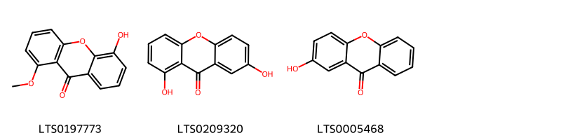{ width=100% }
    <figcaption>Hình ảnh cấu trúc hóa học của 3 hoạt chất thuộc nhóm Benzopyrans gồm ['5-hydroxy-1-methoxyxanthen-9-one (LTS0197773)', 'euxanthone (LTS0209320)', '2-hydroxy-9-xanthenone (LTS0005468)'].</figcaption>
</figure>
#### Nhóm Coumarins and derivatives
<figure markdown="span">
    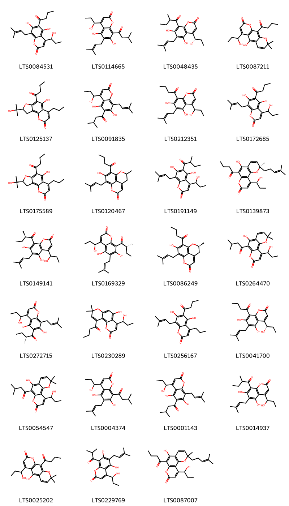{ width=100% }
    <figcaption>Hình ảnh cấu trúc hóa học của 27 hoạt chất thuộc nhóm Coumarins and derivatives gồm ['6-butanoyl-5,7-dihydroxy-4-[(1s)-1-hydroxypropyl]-8-(3-methylbut-2-en-1-yl)chromen-2-one (LTS0084531)', '5,7-dihydroxy-4-[(1s)-1-hydroxypropyl]-6-(3-methylbut-2-en-1-yl)-8-(3-methylbutanoyl)chromen-2-one (LTS0114665)', '5,7-dihydroxy-4-[(1s)-1-hydroxypropyl]-6-(3-methylbut-2-en-1-yl)-8-(2-methylbutanoyl)chromen-2-one (LTS0048435)', '10-butanoyl-5-hydroxy-4-[(1s)-1-hydroxypropyl]-8,8-dimethylpyrano[3,2-g]chromen-2-one (LTS0087211)', '6-butanoyl-5-hydroxy-8-(2-hydroxypropan-2-yl)-4-propyl-8h,9h-furo[2,3-h]chromen-2-one (LTS0125137)', '5,7-dihydroxy-4-(1-hydroxypropyl)-8-(3-methylbut-2-en-1-yl)-6-(3-methylbutanoyl)chromen-2-one (LTS0091835)', '8-butanoyl-5,7-dihydroxy-4-(1-hydroxypropyl)-6-(3-methylbut-2-en-1-yl)chromen-2-one (LTS0212351)', '6-butanoyl-5,7-dihydroxy-4-(1-hydroxypropyl)-8-(3-methylbut-2-en-1-yl)chromen-2-one (LTS0172685)', '(8s)-6-butanoyl-5-hydroxy-8-(2-hydroxypropan-2-yl)-4-propyl-8h,9h-furo[2,3-h]chromen-2-one (LTS0175589)', '10-butanoyl-11-hydroxy-7-methyl-12-(3-methylbut-2-en-1-yl)-2,8-dioxatricyclo[7.3.1.0⁵,¹³]trideca-1(12),4,9(13),10-tetraen-3-one (LTS0120467)', '5,7-dihydroxy-4-(1-hydroxypropyl)-8-(3-methylbut-2-en-1-yl)-6-(2-methylbutanoyl)chromen-2-one (LTS0191149)', '(2r)-6-butanoyl-5-hydroxy-10-[(1s)-1-hydroxypropyl]-2-methyl-2-(4-methylpent-3-en-1-yl)pyrano[2,3-h]chromen-8-one (LTS0139873)', '5,7-dihydroxy-4-[(1r)-1-hydroxypropyl]-6-(3-methylbut-2-en-1-yl)-8-[(2r)-2-methylbutanoyl]chromen-2-one (LTS0149141)', '5,7-dihydroxy-4-[(1s)-1-hydroxypropyl]-6-(3-methylbut-2-en-1-yl)-8-[(2r)-2-methylbutanoyl]chromen-2-one (LTS0169329)', '(7s)-10-butanoyl-11-hydroxy-7-methyl-12-(3-methylbut-2-en-1-yl)-2,8-dioxatricyclo[7.3.1.0⁵,¹³]trideca-1(12),4,9(13),10-tetraen-3-one (LTS0086249)', '5-hydroxy-10-(1-hydroxypropyl)-2,2-dimethyl-6-(3-methylbutanoyl)pyrano[2,3-f]chromen-8-one (LTS0264470)', '5,7-dihydroxy-4-[(1s)-1-hydroxypropyl]-8-(3-methylbut-2-en-1-yl)-6-[(2r)-2-methylbutanoyl]chromen-2-one (LTS0272715)', '10-butanoyl-5-hydroxy-4-[(1s)-1-hydroxypropyl]-8,8-dimethylpyrano[2,3-f]chromen-2-one (LTS0230289)', '6-butanoyl-5,7-dihydroxy-8-(3-methylbut-2-en-1-yl)-4-propylchromen-2-one (LTS0256167)', '8-butanoyl-5,7-dihydroxy-4-[(1s)-1-hydroxypropyl]-6-(3-methylbut-2-en-1-yl)chromen-2-one (LTS0041700)', '5-hydroxy-10-[(1s)-1-hydroxypropyl]-2,2-dimethyl-6-(3-methylbutanoyl)pyrano[2,3-f]chromen-8-one (LTS0054547)', '5,7-dihydroxy-4-(1-hydroxypropyl)-6-(3-methylbut-2-en-1-yl)-8-(3-methylbutanoyl)chromen-2-one (LTS0004374)', '5,7-dihydroxy-4-[(1s)-1-hydroxypropyl]-8-(3-methylbut-2-en-1-yl)-6-(3-methylbutanoyl)chromen-2-one (LTS0001143)', '5,7-dihydroxy-4-(1-hydroxypropyl)-6-(3-methylbut-2-en-1-yl)-8-(2-methylbutanoyl)chromen-2-one (LTS0014937)', '10-butanoyl-5-hydroxy-4-(1-hydroxypropyl)-8,8-dimethylpyrano[3,2-g]chromen-2-one (LTS0025202)', '5,7-dihydroxy-4-[(1s)-1-hydroxypropyl]-6-(3-methylbut-2-en-1-yl)-8-(2-methylpropanoyl)chromen-2-one (LTS0229769)', '6-butanoyl-5-hydroxy-10-(1-hydroxypropyl)-2-methyl-2-(4-methylpent-3-en-1-yl)pyrano[2,3-h]chromen-8-one (LTS0087007)'].</figcaption>
</figure>
#### Nhóm Neoflavonoids
<figure markdown="span">
    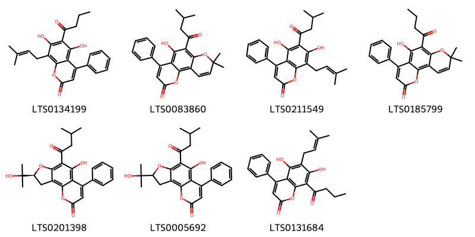{ width=100% }
    <figcaption>Hình ảnh cấu trúc hóa học của 7 hoạt chất thuộc nhóm Neoflavonoids gồm ['6-butanoyl-5,7-dihydroxy-8-(3-methylbut-2-en-1-yl)-4-phenylchromen-2-one (LTS0134199)', 'mammeigin (LTS0083860)', 'mammeisin (LTS0211549)', '6-butanoyl-5-hydroxy-8,8-dimethyl-4-phenylpyrano[2,3-f]chromen-2-one (LTS0185799)', '(8s)-5-hydroxy-8-(2-hydroxypropan-2-yl)-6-(3-methylbutanoyl)-4-phenyl-8h,9h-furo[2,3-h]chromen-2-one (LTS0201398)', '5-hydroxy-8-(2-hydroxypropan-2-yl)-6-(3-methylbutanoyl)-4-phenyl-8h,9h-furo[2,3-h]chromen-2-one (LTS0005692)', '8-butanoyl-5,7-dihydroxy-6-(3-methylbut-2-en-1-yl)-4-phenylchromen-2-one (LTS0131684)'].</figcaption>
</figure>
#### Nhóm Prenol lipids
<figure markdown="span">
    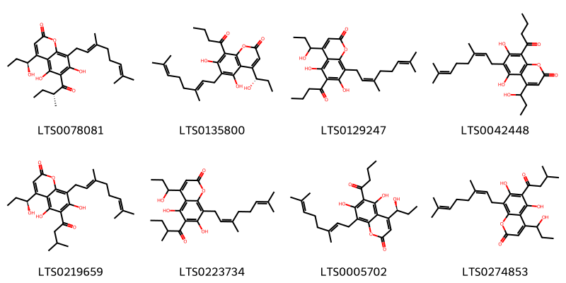{ width=100% }
    <figcaption>Hình ảnh cấu trúc hóa học của 8 hoạt chất thuộc nhóm Prenol lipids gồm ['8-[(2e)-3,7-dimethylocta-2,6-dien-1-yl]-5,7-dihydroxy-4-[(1s)-1-hydroxypropyl]-6-[(2r)-2-methylbutanoyl]chromen-2-one (LTS0078081)', '8-butanoyl-6-[(2e)-3,7-dimethylocta-2,6-dien-1-yl]-5,7-dihydroxy-4-[(1s)-1-hydroxypropyl]chromen-2-one (LTS0135800)', '6-butanoyl-8-(3,7-dimethylocta-2,6-dien-1-yl)-5,7-dihydroxy-4-(1-hydroxypropyl)chromen-2-one (LTS0129247)', '8-butanoyl-6-(3,7-dimethylocta-2,6-dien-1-yl)-5,7-dihydroxy-4-(1-hydroxypropyl)chromen-2-one (LTS0042448)', '8-[(2e)-3,7-dimethylocta-2,6-dien-1-yl]-5,7-dihydroxy-4-[(1s)-1-hydroxypropyl]-6-(3-methylbutanoyl)chromen-2-one (LTS0219659)', '8-(3,7-dimethylocta-2,6-dien-1-yl)-5,7-dihydroxy-4-(1-hydroxypropyl)-6-(2-methylbutanoyl)chromen-2-one (LTS0223734)', '6-butanoyl-8-[(2e)-3,7-dimethylocta-2,6-dien-1-yl]-5,7-dihydroxy-4-[(1s)-1-hydroxypropyl]chromen-2-one (LTS0005702)', '8-(3,7-dimethylocta-2,6-dien-1-yl)-5,7-dihydroxy-4-(1-hydroxypropyl)-6-(3-methylbutanoyl)chromen-2-one (LTS0274853)'].</figcaption>
</figure>

---

### Dược dân tộc học

Danh sách các quốc gia có sử dụng *Kayea assamica* trong điều trị các bệnh. 

| Country   | Disease   | Bệnh          |
|:----------|:----------|:--------------|
| Elsewhere | Piscicide | Thuốc diệt cá |

---

# Chi Hypericum

??? note "Danh sách các dược liệu thuộc chi"
    
	 - *Hypericum androsaemum*
	 - *Hypericum ascyron*
	 - *Hypericum chinense*
	 - *Hypericum connatum*
	 - *Hypericum crium*
	 - *Hypericum electum*
	 - *Hypericum erectum*
	 - *Hypericum humifusum*
	 - *Hypericum japonicum*
	 - *Hypericum laxiusculum*
	 - *Hypericum patulum*
	 - *Hypericum perforatum*
	 - *Hypericum sampsoni*
	 - *Hypericum sampsonii*
	 - *Hypericum struthiolaefolium*
	 - *Hypericum teretiusculum*

---
## Hypericum androsaemum
### Thông tin về thực vật

!!! info "Phân loại thực vật của *Hypericum androsaemum* từ GIBF:"
    - **Kingdom:** Plantae
    - **Phylum:** Tracheophyta
    - **Order:** Malpighiales
    - **Family:** Hypericaceae
    - **Genus:** Hypericum
    - **Species:** *Hypericum androsaemum*

 

| Label (VI)   | Label (EN)   | Scientific Name       | Descriptions (VI)   | Descriptions (EN)   | Also Known As (VI)   | Also Known As (EN)                                   |
|:-------------|:-------------|:----------------------|:--------------------|:--------------------|:---------------------|:-----------------------------------------------------|
| N/A          | N/A          | Hypericum androsaemum | loài thực vật       | species of plant    | ['']                 | ['sweet-amber', "shrubby St. John's wort", 'tutsan'] |

#### Phân bố trên thế giới

**Từ CSDL GIBF** Switzerland, United Kingdom of Great Britain and Northern Ireland, France, Spain, New Zealand, Germany, Canada, Chile, Ecuador, United States of America, Ireland, Russian Federation, Italy, Australia

#### Phân bố tại Việt Nam

**Từ CSDL GIBF**: Không có ghi nhận ở Việt Nam

---
### Thành phần hóa học
        
- Theo cơ sở dữ liệu lotus: Từ loài *Hypericum androsaemum* đã phân lập và xác định được 41 hoạt chất thuộc về các nhóm Organooxygen compounds, Benzopyrans, Flavonoids, Saturated hydrocarbons, Unsaturated hydrocarbons, Prenol lipids, Cinnamic acids and derivatives, Benzene and substituted derivatives. 

|    | chemicalTaxonomyClassyfireClass     |   smiles_count |
|---:|:------------------------------------|---------------:|
|  0 | Benzene and substituted derivatives |              1 |
|  1 | Benzopyrans                         |             10 |
|  2 | Cinnamic acids and derivatives      |              1 |
|  3 | Flavonoids                          |              9 |
|  4 | Organooxygen compounds              |              2 |
|  5 | Prenol lipids                       |             15 |
|  6 | Saturated hydrocarbons              |              2 |
|  7 | Unsaturated hydrocarbons            |              1 |

#### Nhóm Benzene and substituted derivatives
<figure markdown="span">
    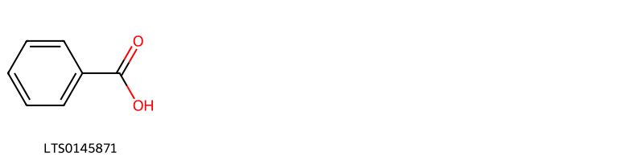{ width=100% }
    <figcaption>Hình ảnh cấu trúc hóa học của 1 hoạt chất thuộc nhóm Benzene and substituted derivatives gồm ['benzoic acid (LTS0145871)'].</figcaption>
</figure>
#### Nhóm Benzopyrans
<figure markdown="span">
    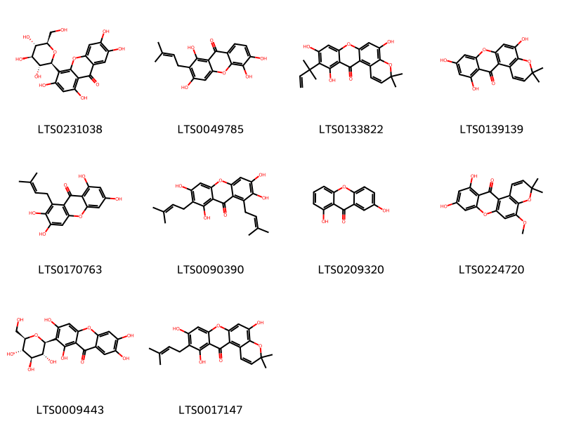{ width=100% }
    <figcaption>Hình ảnh cấu trúc hóa học của 10 hoạt chất thuộc nhóm Benzopyrans gồm ['isomangiferin (LTS0231038)', '1,3,5,6-tetrahydroxy-2-(3-methylbut-2-en-1-yl)xanthen-9-one (LTS0049785)', '6,8,12-trihydroxy-2,2-dimethyl-7-(2-methylbut-3-en-2-yl)-1,10-dioxatetraphen-5-one (LTS0133822)', '6,8,12-trihydroxy-2,2-dimethyl-1,10-dioxatetraphen-5-one (LTS0139139)', '2,3,6,8-tetrahydroxy-1-(3-methylbut-2-en-1-yl)xanthen-9-one (LTS0170763)', 'gamma-mangostin (LTS0090390)', 'euxanthone (LTS0209320)', '6,8-dihydroxy-12-methoxy-2,2-dimethyl-1,10-dioxatetraphen-5-one (LTS0224720)', 'mangiferin (LTS0009443)', '6,8,12-trihydroxy-2,2-dimethyl-7-(3-methylbut-2-en-1-yl)-1,10-dioxatetraphen-5-one (LTS0017147)'].</figcaption>
</figure>
#### Nhóm Cinnamic acids and derivatives
<figure markdown="span">
    { width=100% }
    <figcaption>Hình ảnh cấu trúc hóa học của 1 hoạt chất thuộc nhóm Cinnamic acids and derivatives gồm ['3,4-dihydroxycinnamic acid (LTS0128050)'].</figcaption>
</figure>
#### Nhóm Flavonoids
<figure markdown="span">
    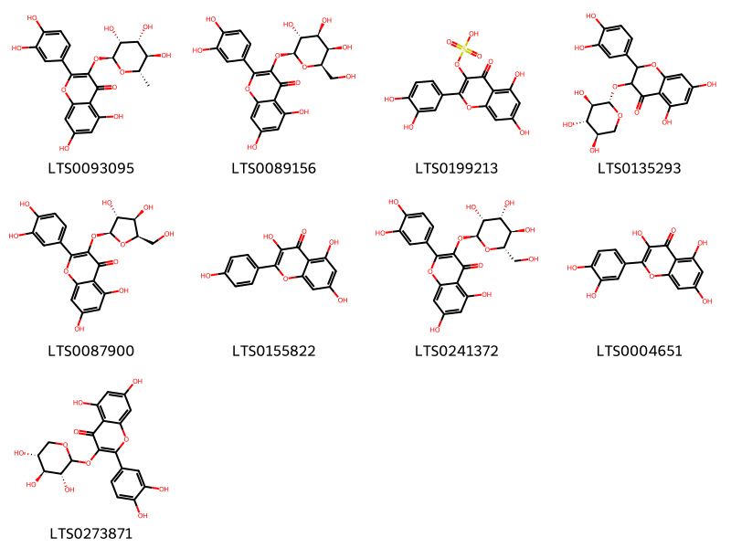{ width=100% }
    <figcaption>Hình ảnh cấu trúc hóa học của 9 hoạt chất thuộc nhóm Flavonoids gồm ['quercitrin (LTS0093095)', 'hyperoside (LTS0089156)', 'quercetin 3-sulfate (LTS0199213)', '2-(3,4-dihydroxyphenyl)-5,7-dihydroxy-3-{[(2s,3r,4s,5r)-3,4,5-trihydroxyoxan-2-yl]oxy}-2,3-dihydro-1-benzopyran-4-one (LTS0135293)', '3-{[(2s,3r,4r,5r)-3,4-dihydroxy-5-(hydroxymethyl)oxolan-2-yl]oxy}-2-(3,4-dihydroxyphenyl)-5,7-dihydroxychromen-4-one (LTS0087900)', 'kaempherol (LTS0155822)', '2-(3,4-dihydroxyphenyl)-5,7-dihydroxy-3-{[(2s,3r,4r,5r,6s)-3,4,5-trihydroxy-6-(hydroxymethyl)oxan-2-yl]oxy}chromen-4-one (LTS0241372)', 'quercetin (LTS0004651)', '2-(3,4-dihydroxyphenyl)-5,7-dihydroxy-3-{[(3r,4s,5r)-3,4,5-trihydroxyoxan-2-yl]oxy}chromen-4-one (LTS0273871)'].</figcaption>
</figure>
#### Nhóm Organooxygen compounds
<figure markdown="span">
    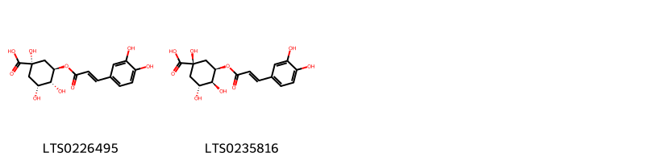{ width=100% }
    <figcaption>Hình ảnh cấu trúc hóa học của 2 hoạt chất thuộc nhóm Organooxygen compounds gồm ['chlorogenic acid (LTS0226495)', 'neochlorogenic acid (LTS0235816)'].</figcaption>
</figure>
#### Nhóm Prenol lipids
<figure markdown="span">
    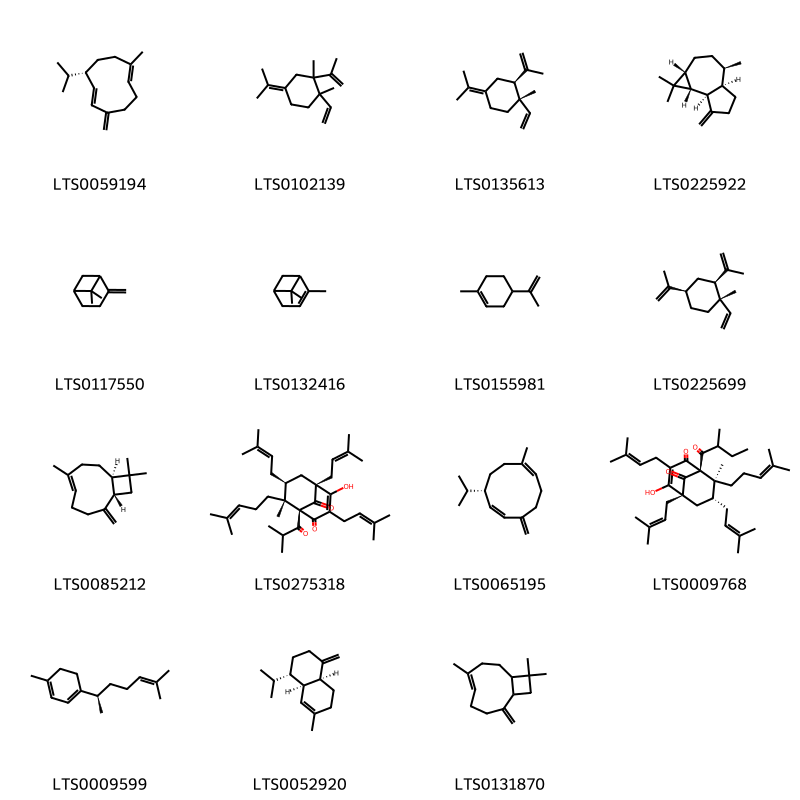{ width=100% }
    <figcaption>Hình ảnh cấu trúc hóa học của 15 hoạt chất thuộc nhóm Prenol lipids gồm ['(-)-germacrene d (LTS0059194)', '1-ethenyl-1,2-dimethyl-2-(prop-1-en-2-yl)-4-(propan-2-ylidene)cyclohexane (LTS0102139)', '(1s,2s)-1-ethenyl-1-methyl-2-(prop-1-en-2-yl)-4-(propan-2-ylidene)cyclohexane (LTS0135613)', 'β-gurjunene (LTS0225922)', 'β-pinene (LTS0117550)', 'α pinene (LTS0132416)', 'limonene,  (LTS0155981)', 'β-elemene (LTS0225699)', 'caryophyllene (LTS0085212)', 'hyperforin (LTS0275318)', '(1z,6z,8s)-8-isopropyl-1-methyl-5-methylidenecyclodeca-1,6-diene (LTS0065195)', '(1r,5r,7r,8s)-4-hydroxy-8-methyl-3,5,7-tris(3-methylbut-2-en-1-yl)-1-(2-methylbutanoyl)-8-(4-methylpent-3-en-1-yl)bicyclo[3.3.1]non-3-ene-2,9-dione (LTS0009768)', 'gamma-curcumene (LTS0009599)', 'gamma-muurolene (LTS0052920)', 'caryophyllene (LTS0131870)'].</figcaption>
</figure>
#### Nhóm Saturated hydrocarbons
<figure markdown="span">
    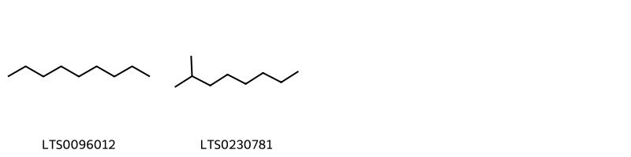{ width=100% }
    <figcaption>Hình ảnh cấu trúc hóa học của 2 hoạt chất thuộc nhóm Saturated hydrocarbons gồm ['nonane (LTS0096012)', '2-methyloctane (LTS0230781)'].</figcaption>
</figure>
#### Nhóm Unsaturated hydrocarbons
<figure markdown="span">
    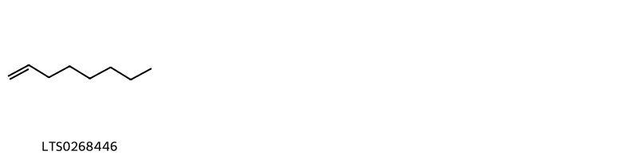{ width=100% }
    <figcaption>Hình ảnh cấu trúc hóa học của 1 hoạt chất thuộc nhóm Unsaturated hydrocarbons gồm ['1-octene (LTS0268446)'].</figcaption>
</figure>

---

### Dược dân tộc học

Danh sách các quốc gia có sử dụng *Hypericum androsaemum* trong điều trị các bệnh. 

| Country   | Disease             | Bệnh             |
|:----------|:--------------------|:-----------------|
| Elsewhere | Stomachic, Diuretic | Dạ dày, lợi tiểu |
| ain       | Vulnerary           | Vulnerary        |

---

---
## Hypericum ascyron
### Thông tin về thực vật

!!! info "Phân loại thực vật của *Hypericum ascyron* từ GIBF:"
    - **Kingdom:** Plantae
    - **Phylum:** Tracheophyta
    - **Order:** Malpighiales
    - **Family:** Hypericaceae
    - **Genus:** Hypericum
    - **Species:** *Hypericum ascyron*

 

| Label (VI)   | Label (EN)   | Scientific Name   | Descriptions (VI)   | Descriptions (EN)   | Also Known As (VI)   | Also Known As (EN)   |
|:-------------|:-------------|:------------------|:--------------------|:--------------------|:---------------------|:---------------------|
| N/A          | N/A          | Hypericum ascyron | loài thực vật       | species of plant    | ['']                 | ['']                 |

#### Phân bố trên thế giới

**Từ CSDL GIBF** Japan, Mongolia, Canada, Russian Federation, United States of America, China, Korea, Republic of

#### Phân bố tại Việt Nam

**Từ CSDL GIBF**: Không có ghi nhận ở Việt Nam

---
### Thành phần hóa học
        
- Theo cơ sở dữ liệu lotus: Từ loài *Hypericum ascyron* đã phân lập và xác định được 52 hoạt chất thuộc về các nhóm Organooxygen compounds, Benzopyrans, Flavonoids, Prenol lipids, Cinnamic acids and derivatives, Pyrenes, Steroids and steroid derivatives, Benzene and substituted derivatives. 

|    | chemicalTaxonomyClassyfireClass     |   smiles_count |
|---:|:------------------------------------|---------------:|
|  0 | Benzene and substituted derivatives |              1 |
|  1 | Benzopyrans                         |              9 |
|  2 | Cinnamic acids and derivatives      |              1 |
|  3 | Flavonoids                          |              8 |
|  4 | Organooxygen compounds              |             15 |
|  5 | Prenol lipids                       |             14 |
|  6 | Pyrenes                             |              2 |
|  7 | Steroids and steroid derivatives    |              2 |

#### Nhóm Benzene and substituted derivatives
<figure markdown="span">
    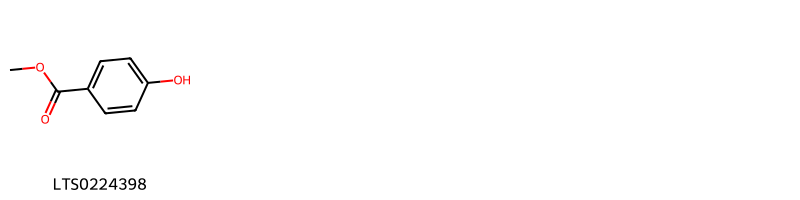{ width=100% }
    <figcaption>Hình ảnh cấu trúc hóa học của 1 hoạt chất thuộc nhóm Benzene and substituted derivatives gồm ['paraben (LTS0224398)'].</figcaption>
</figure>
#### Nhóm Benzopyrans
<figure markdown="span">
    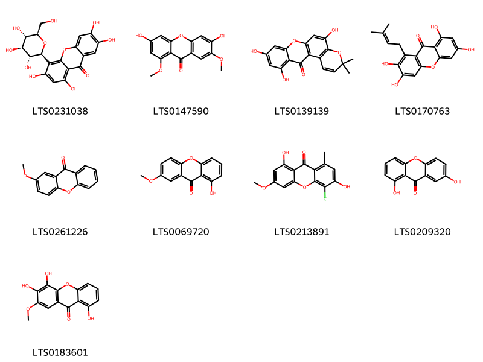{ width=100% }
    <figcaption>Hình ảnh cấu trúc hóa học của 9 hoạt chất thuộc nhóm Benzopyrans gồm ['isomangiferin (LTS0231038)', '3,6-dihydroxy-1,7-dimethoxyxanthen-9-one (LTS0147590)', '6,8,12-trihydroxy-2,2-dimethyl-1,10-dioxatetraphen-5-one (LTS0139139)', '2,3,6,8-tetrahydroxy-1-(3-methylbut-2-en-1-yl)xanthen-9-one (LTS0170763)', '2-methoxyxanthen-9-one (LTS0261226)', '1-hydroxy-7-methoxyxanthen-9-one (LTS0069720)', '4-chloro-3,8-dihydroxy-6-methoxy-1-methylxanthen-9-one (LTS0213891)', 'euxanthone (LTS0209320)', '1,5,6-trihydroxy-7-methoxyxanthen-9-one (LTS0183601)'].</figcaption>
</figure>
#### Nhóm Cinnamic acids and derivatives
<figure markdown="span">
    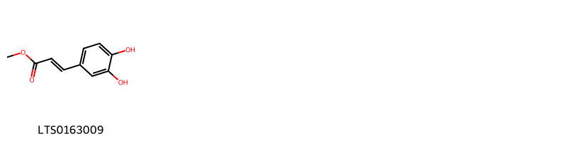{ width=100% }
    <figcaption>Hình ảnh cấu trúc hóa học của 1 hoạt chất thuộc nhóm Cinnamic acids and derivatives gồm ['methyl caffeate (LTS0163009)'].</figcaption>
</figure>
#### Nhóm Flavonoids
<figure markdown="span">
    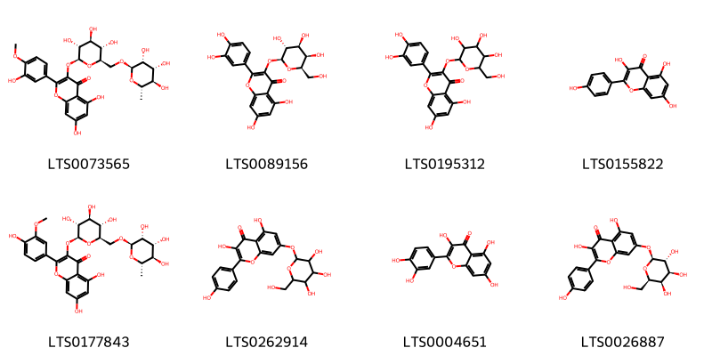{ width=100% }
    <figcaption>Hình ảnh cấu trúc hóa học của 8 hoạt chất thuộc nhóm Flavonoids gồm ['5,7-dihydroxy-2-(3-hydroxy-4-methoxyphenyl)-3-{[(2s,3r,4s,5s,6r)-3,4,5-trihydroxy-6-({[(2r,3r,4r,5r,6s)-3,4,5-trihydroxy-6-methyloxan-2-yl]oxy}methyl)oxan-2-yl]oxy}chromen-4-one (LTS0073565)', 'hyperoside (LTS0089156)', '2-(3,4-dihydroxyphenyl)-5,7-dihydroxy-3-{[3,4,5-trihydroxy-6-(hydroxymethyl)oxan-2-yl]oxy}chromen-4-one (LTS0195312)', 'kaempherol (LTS0155822)', 'narcissin (LTS0177843)', '3,5-dihydroxy-2-(4-hydroxyphenyl)-7-{[3,4,5-trihydroxy-6-(hydroxymethyl)oxan-2-yl]oxy}chromen-4-one (LTS0262914)', 'quercetin (LTS0004651)', '3,5-dihydroxy-2-(4-hydroxyphenyl)-7-{[(2s,3r,4s,5r,6r)-3,4,5-trihydroxy-6-(hydroxymethyl)oxan-2-yl]oxy}chromen-4-one (LTS0026887)'].</figcaption>
</figure>
#### Nhóm Organooxygen compounds
<figure markdown="span">
    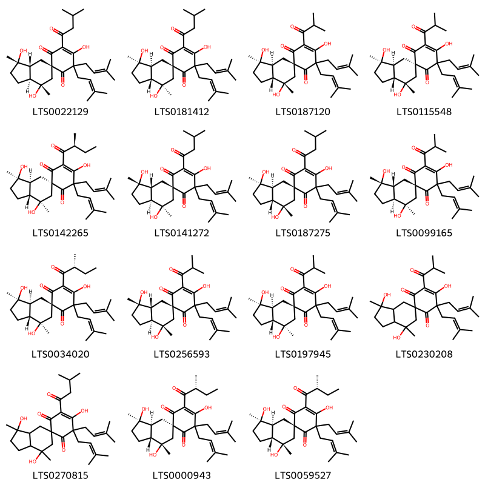{ width=100% }
    <figcaption>Hình ảnh cấu trúc hóa học của 15 hoạt chất thuộc nhóm Organooxygen compounds gồm ["(1s,3's,3'ar,7's,7'as)-3',4,7'-trihydroxy-3',7'-dimethyl-5,5-bis(3-methylbut-2-en-1-yl)-3-(3-methylbutanoyl)-1',2',3'a,4',6',7'a-hexahydrospiro[cyclohexane-1,5'-inden]-3-ene-2,6-dione (LTS0022129)", "(1s,3'r,3'as,7'r,7'ar)-3',4,7'-trihydroxy-3',7'-dimethyl-5,5-bis(3-methylbut-2-en-1-yl)-3-(3-methylbutanoyl)-1',2',3'a,4',6',7'a-hexahydrospiro[cyclohexane-1,5'-inden]-3-ene-2,6-dione (LTS0181412)", "(1s,3'r,3'as,7's,7'ar)-3',4,7'-trihydroxy-3',7'-dimethyl-5,5-bis(3-methylbut-2-en-1-yl)-3-(2-methylpropanoyl)-1',2',3'a,4',6',7'a-hexahydrospiro[cyclohexane-1,5'-inden]-3-ene-2,6-dione (LTS0187120)", "(1r,3'r,3'as,7's,7'ar)-3',4,7'-trihydroxy-3',7'-dimethyl-5,5-bis(3-methylbut-2-en-1-yl)-3-(2-methylpropanoyl)-1',2',3'a,4',6',7'a-hexahydrospiro[cyclohexane-1,5'-inden]-3-ene-2,6-dione (LTS0115548)", "(1r,3'r,3'as,7'r,7'ar)-3',4,7'-trihydroxy-3',7'-dimethyl-5,5-bis(3-methylbut-2-en-1-yl)-3-[(2s)-2-methylbutanoyl]-1',2',3'a,4',6',7'a-hexahydrospiro[cyclohexane-1,5'-inden]-3-ene-2,6-dione (LTS0142265)", "(1s,3's,3'ar,7'r,7'as)-3',4,7'-trihydroxy-3',7'-dimethyl-5,5-bis(3-methylbut-2-en-1-yl)-3-(3-methylbutanoyl)-1',2',3'a,4',6',7'a-hexahydrospiro[cyclohexane-1,5'-inden]-3-ene-2,6-dione (LTS0141272)", "(1s,3'r,3'as,7's,7'ar)-3',4,7'-trihydroxy-3',7'-dimethyl-5,5-bis(3-methylbut-2-en-1-yl)-3-(3-methylbutanoyl)-1',2',3'a,4',6',7'a-hexahydrospiro[cyclohexane-1,5'-inden]-3-ene-2,6-dione (LTS0187275)", "(1s,3's,3'ar,7'r,7'as)-3',4,7'-trihydroxy-3',7'-dimethyl-5,5-bis(3-methylbut-2-en-1-yl)-3-(2-methylpropanoyl)-1',2',3'a,4',6',7'a-hexahydrospiro[cyclohexane-1,5'-inden]-3-ene-2,6-dione (LTS0099165)", "(1s,3'r,3'as,7'r,7'ar)-3',4,7'-trihydroxy-3',7'-dimethyl-5,5-bis(3-methylbut-2-en-1-yl)-3-[(2r)-2-methylbutanoyl]-1',2',3'a,4',6',7'a-hexahydrospiro[cyclohexane-1,5'-inden]-3-ene-2,6-dione (LTS0034020)", "(1s,3's,3'ar,7's,7'as)-3',4,7'-trihydroxy-3',7'-dimethyl-5,5-bis(3-methylbut-2-en-1-yl)-3-(2-methylpropanoyl)-1',2',3'a,4',6',7'a-hexahydrospiro[cyclohexane-1,5'-inden]-3-ene-2,6-dione (LTS0256593)", "(1s,3'r,3'as,7'r,7'ar)-3',4,7'-trihydroxy-3',7'-dimethyl-5,5-bis(3-methylbut-2-en-1-yl)-3-(2-methylpropanoyl)-1',2',3'a,4',6',7'a-hexahydrospiro[cyclohexane-1,5'-inden]-3-ene-2,6-dione (LTS0197945)", "3',4,7'-trihydroxy-3',7'-dimethyl-5,5-bis(3-methylbut-2-en-1-yl)-3-(2-methylpropanoyl)-1',2',3'a,4',6',7'a-hexahydrospiro[cyclohexane-1,5'-inden]-3-ene-2,6-dione (LTS0230208)", "3',4,7'-trihydroxy-3',7'-dimethyl-5,5-bis(3-methylbut-2-en-1-yl)-3-(3-methylbutanoyl)-1',2',3'a,4',6',7'a-hexahydrospiro[cyclohexane-1,5'-inden]-3-ene-2,6-dione (LTS0270815)", "(1r,3'r,3'as,7's,7'ar)-3',4,7'-trihydroxy-3',7'-dimethyl-5,5-bis(3-methylbut-2-en-1-yl)-3-[(2r)-2-methylbutanoyl]-1',2',3'a,4',6',7'a-hexahydrospiro[cyclohexane-1,5'-inden]-3-ene-2,6-dione (LTS0000943)", "(1s,3'r,3'as,7's,7'ar)-3',4,7'-trihydroxy-3',7'-dimethyl-5,5-bis(3-methylbut-2-en-1-yl)-3-[(2r)-2-methylbutanoyl]-1',2',3'a,4',6',7'a-hexahydrospiro[cyclohexane-1,5'-inden]-3-ene-2,6-dione (LTS0059527)"].</figcaption>
</figure>
#### Nhóm Prenol lipids
<figure markdown="span">
    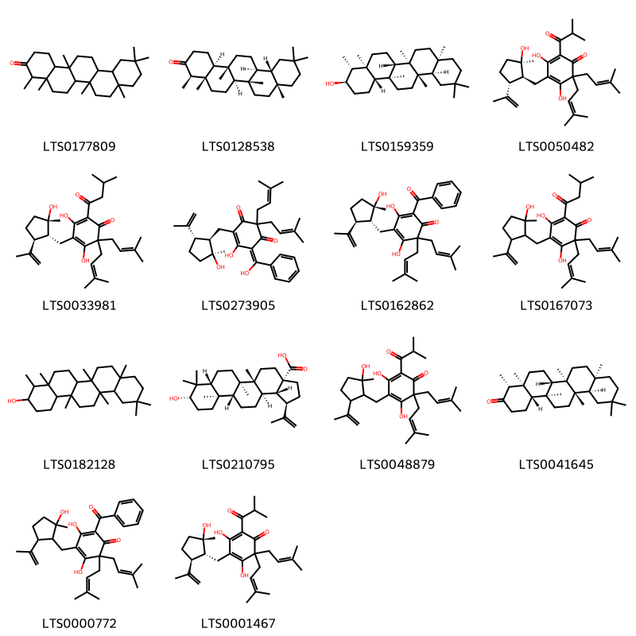{ width=100% }
    <figcaption>Hình ảnh cấu trúc hóa học của 14 hoạt chất thuộc nhóm Prenol lipids gồm ['4,4a,6b,8a,11,11,14a-heptamethyl-hexadecahydropicen-3-one (LTS0177809)', '(4r,4as,6ar,6bs,8ar,12as,12bs,14ar,14bs)-4,4a,6b,8a,11,11,14a-heptamethyl-hexadecahydropicen-3-one (LTS0128538)', '(3r,4r,4as,6as,6br,8ar,12ar,12bs,14as,14bs)-4,4a,6b,8a,11,11,12b,14a-octamethyl-hexadecahydropicen-3-ol (LTS0159359)', '3,5-dihydroxy-4-{[(1s,2r,5r)-2-hydroxy-2-methyl-5-(prop-1-en-2-yl)cyclopentyl]methyl}-6,6-bis(3-methylbut-2-en-1-yl)-2-(2-methylpropanoyl)cyclohexa-2,4-dien-1-one (LTS0050482)', '3,5-dihydroxy-4-{[(1r,2s,5s)-2-hydroxy-2-methyl-5-(prop-1-en-2-yl)cyclopentyl]methyl}-6,6-bis(3-methylbut-2-en-1-yl)-2-(3-methylbutanoyl)cyclohexa-2,4-dien-1-one (LTS0033981)', '(6e)-5-hydroxy-6-[hydroxy(phenyl)methylidene]-4-{[(1r,2s,5s)-2-hydroxy-2-methyl-5-(prop-1-en-2-yl)cyclopentyl]methyl}-2,2-bis(3-methylbut-2-en-1-yl)cyclohex-4-ene-1,3-dione (LTS0273905)', 'hypercalin b (LTS0162862)', '3,5-dihydroxy-4-{[2-hydroxy-2-methyl-5-(prop-1-en-2-yl)cyclopentyl]methyl}-6,6-bis(3-methylbut-2-en-1-yl)-2-(3-methylbutanoyl)cyclohexa-2,4-dien-1-one (LTS0167073)', '4,4a,6b,8a,11,11,12b,14a-octamethyl-hexadecahydropicen-3-ol (LTS0182128)', 'betulinic acid (LTS0210795)', '3,5-dihydroxy-4-{[2-hydroxy-2-methyl-5-(prop-1-en-2-yl)cyclopentyl]methyl}-6,6-bis(3-methylbut-2-en-1-yl)-2-(2-methylpropanoyl)cyclohexa-2,4-dien-1-one (LTS0048879)', '(-)-friedelin (LTS0041645)', '2-benzoyl-3,5-dihydroxy-4-{[2-hydroxy-2-methyl-5-(prop-1-en-2-yl)cyclopentyl]methyl}-6,6-bis(3-methylbut-2-en-1-yl)cyclohexa-2,4-dien-1-one (LTS0000772)', '3,5-dihydroxy-4-{[(1r,2s,5s)-2-hydroxy-2-methyl-5-(prop-1-en-2-yl)cyclopentyl]methyl}-6,6-bis(3-methylbut-2-en-1-yl)-2-(2-methylpropanoyl)cyclohexa-2,4-dien-1-one (LTS0001467)'].</figcaption>
</figure>
#### Nhóm Pyrenes
<figure markdown="span">
    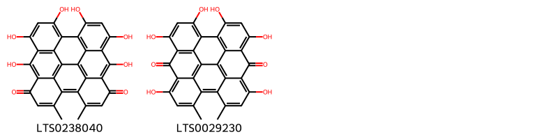{ width=100% }
    <figcaption>Hình ảnh cấu trúc hóa học của 2 hoạt chất thuộc nhóm Pyrenes gồm ['9,11,13,16,18,20-hexahydroxy-5,24-dimethyloctacyclo[13.11.1.1²,¹⁰.0³,⁸.0⁴,²⁵.0¹⁹,²⁷.0²¹,²⁶.0¹⁴,²⁸]octacosa-1(26),2,4(25),5,8,10,12,14(28),15,17,19(27),20,23-tridecaene-7,22-dione (LTS0238040)', 'hypericin (LTS0029230)'].</figcaption>
</figure>
#### Nhóm Steroids and steroid derivatives
<figure markdown="span">
    { width=100% }
    <figcaption>Hình ảnh cấu trúc hóa học của 2 hoạt chất thuộc nhóm Steroids and steroid derivatives gồm ['stigmast-5-en-3-ol (LTS0071224)', 'stigmast-5-en-3-ol, (3β)- (LTS0204616)'].</figcaption>
</figure>

---

### Dược dân tộc học

Danh sách các quốc gia có sử dụng *Hypericum ascyron* trong điều trị các bệnh. 

| Country   | Disease                 | Bệnh           |
|:----------|:------------------------|:---------------|
| China     | Suppurative, Alexiteric | Mủ, Alexiteric |

---

---
## Hypericum chinense
### Thông tin về thực vật

!!! info "Phân loại thực vật của *N/A* từ GIBF:"
    - **Kingdom:** Plantae
    - **Phylum:** Tracheophyta
    - **Order:** Malpighiales
    - **Family:** Hypericaceae
    - **Genus:** N/A
    - **Species:** *N/A*

 

| Label (VI)   | Label (EN)   | Scientific Name    | Descriptions (VI)   | Descriptions (EN)   | Also Known As (VI)   | Also Known As (EN)   |
|:-------------|:-------------|:-------------------|:--------------------|:--------------------|:---------------------|:---------------------|
| N/A          | N/A          | Hypericum chinense | loài thực vật       | species of plant    | ['']                 | ['']                 |

#### Phân bố trên thế giới

**Từ CSDL GIBF** nan, Denmark, Spain, Chile, Australia, Réunion, Canada, Türkiye, Belize, Ireland, Chinese Taipei, Uruguay, United Kingdom of Great Britain and Northern Ireland, Argentina, Portugal, South Africa, France, Czechia, New Zealand, Russian Federation, Ecuador, United States of America, Zimbabwe, Greece

#### Phân bố tại Việt Nam

**Từ CSDL GIBF**: Không có ghi nhận ở Việt Nam

---
### Thành phần hóa học
        
- Theo cơ sở dữ liệu lotus: Từ loài *N/A* đã phân lập và xác định được 134 hoạt chất thuộc về các nhóm Organooxygen compounds, Benzopyrans, Flavonoids, Lactones, Furanoid lignans, Tannins, Dibenzylbutane lignans, Prenol lipids, Benzodioxoles, Cinnamic acids and derivatives, Benzodioxanes, Steroids and steroid derivatives, Benzene and substituted derivatives. 

|    | chemicalTaxonomyClassyfireClass     |   smiles_count |
|---:|:------------------------------------|---------------:|
|  0 | Benzene and substituted derivatives |              5 |
|  1 | Benzodioxanes                       |             13 |
|  2 | Benzodioxoles                       |              3 |
|  3 | Benzopyrans                         |             53 |
|  4 | Cinnamic acids and derivatives      |              3 |
|  5 | Dibenzylbutane lignans              |              4 |
|  6 | Flavonoids                          |              6 |
|  7 | Furanoid lignans                    |              4 |
|  8 | Lactones                            |              6 |
|  9 | Organooxygen compounds              |             11 |
| 10 | Prenol lipids                       |             23 |
| 11 | Steroids and steroid derivatives    |              1 |
| 12 | Tannins                             |              2 |

#### Nhóm Benzene and substituted derivatives
<figure markdown="span">
    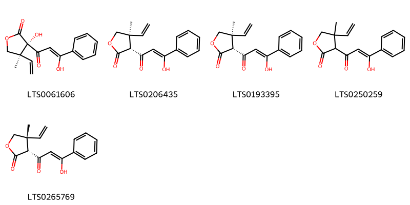{ width=100% }
    <figcaption>Hình ảnh cấu trúc hóa học của 5 hoạt chất thuộc nhóm Benzene and substituted derivatives gồm ['(3s,4s)-4-ethenyl-3-hydroxy-3-(3-hydroxy-3-phenylprop-2-enoyl)-4-methyloxolan-2-one (LTS0061606)', '(3r,4s)-4-ethenyl-3-(3-hydroxy-3-phenylprop-2-enoyl)-4-methyloxolan-2-one (LTS0206435)', '(3r,4s)-4-ethenyl-3-[(2z)-3-hydroxy-3-phenylprop-2-enoyl]-4-methyloxolan-2-one (LTS0193395)', '4-ethenyl-3-(3-hydroxy-3-phenylprop-2-enoyl)-4-methyloxolan-2-one (LTS0250259)', '(3r,4r)-4-ethenyl-3-[(2z)-3-hydroxy-3-phenylprop-2-enoyl]-4-methyloxolan-2-one (LTS0265769)'].</figcaption>
</figure>
#### Nhóm Benzodioxanes
<figure markdown="span">
    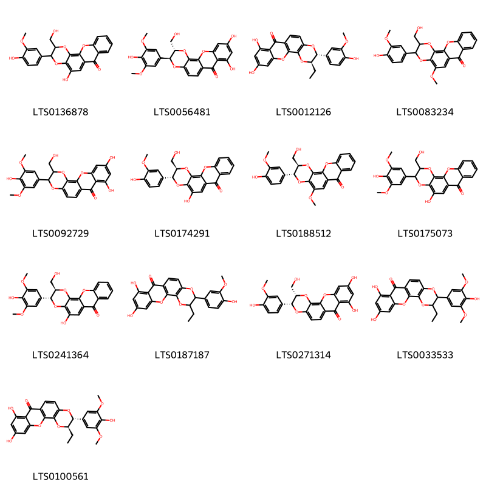{ width=100% }
    <figcaption>Hình ảnh cấu trúc hóa học của 13 hoạt chất thuộc nhóm Benzodioxanes gồm ['12-hydroxy-2-(4-hydroxy-3-methoxyphenyl)-3-(hydroxymethyl)-2,3-dihydro-1,4,5-trioxatetraphen-10-one (LTS0136878)', '(2s,3s)-7,9-dihydroxy-2-(4-hydroxy-3,5-dimethoxyphenyl)-3-(hydroxymethyl)-2,3-dihydro-1,4,5-trioxatetraphen-10-one (LTS0056481)', '(2r,3r)-3-ethyl-7,9-dihydroxy-2-(4-hydroxy-3-methoxyphenyl)-2,3-dihydro-1,4,5-trioxatetraphen-10-one (LTS0012126)', '2-(4-hydroxy-3-methoxyphenyl)-3-(hydroxymethyl)-12-methoxy-2,3-dihydro-1,4,5-trioxatetraphen-10-one (LTS0083234)', '7,9-dihydroxy-2-(4-hydroxy-3,5-dimethoxyphenyl)-3-(hydroxymethyl)-2,3-dihydro-1,4,5-trioxatetraphen-10-one (LTS0092729)', '(2r,3r)-12-hydroxy-2-(4-hydroxy-3-methoxyphenyl)-3-(hydroxymethyl)-2,3-dihydro-1,4,5-trioxatetraphen-10-one (LTS0174291)', '(2r,3r)-2-(4-hydroxy-3-methoxyphenyl)-3-(hydroxymethyl)-12-methoxy-2,3-dihydro-1,4,5-trioxatetraphen-10-one (LTS0188512)', '12-hydroxy-2-(4-hydroxy-3,5-dimethoxyphenyl)-3-(hydroxymethyl)-2,3-dihydro-1,4,5-trioxatetraphen-10-one (LTS0175073)', '(2r,3r)-12-hydroxy-2-(4-hydroxy-3,5-dimethoxyphenyl)-3-(hydroxymethyl)-2,3-dihydro-1,4,5-trioxatetraphen-10-one (LTS0241364)', '3-ethyl-7,9-dihydroxy-2-(4-hydroxy-3-methoxyphenyl)-2,3-dihydro-1,4,5-trioxatetraphen-10-one (LTS0187187)', '(2r,3s)-7,9-dihydroxy-2-(4-hydroxy-3-methoxyphenyl)-3-(hydroxymethyl)-2,3-dihydro-1,4,5-trioxatetraphen-10-one (LTS0271314)', '3-ethyl-7,9-dihydroxy-2-(4-hydroxy-3,5-dimethoxyphenyl)-2,3-dihydro-1,4,5-trioxatetraphen-10-one (LTS0033533)', '(2r,3r)-3-ethyl-7,9-dihydroxy-2-(4-hydroxy-3,5-dimethoxyphenyl)-2,3-dihydro-1,4,5-trioxatetraphen-10-one (LTS0100561)'].</figcaption>
</figure>
#### Nhóm Benzodioxoles
<figure markdown="span">
    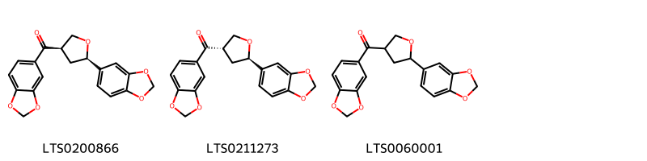{ width=100% }
    <figcaption>Hình ảnh cấu trúc hóa học của 3 hoạt chất thuộc nhóm Benzodioxoles gồm ['hyperione a, (rel)- (LTS0200866)', '5-[(2r,4s)-4-(2h-1,3-benzodioxole-5-carbonyl)oxolan-2-yl]-2h-1,3-benzodioxole (LTS0211273)', '5-[4-(2h-1,3-benzodioxole-5-carbonyl)oxolan-2-yl]-2h-1,3-benzodioxole (LTS0060001)'].</figcaption>
</figure>
#### Nhóm Benzopyrans
<figure markdown="span">
    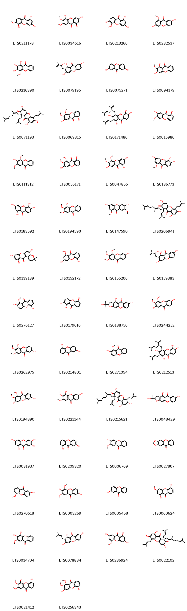{ width=100% }
    <figcaption>Hình ảnh cấu trúc hóa học của 53 hoạt chất thuộc nhóm Benzopyrans gồm ['1,3,5-trihydroxy-6-methoxyxanthen-9-one (LTS0211178)', '1,3,5-trihydroxy-6,7-dimethoxyxanthen-9-one (LTS0034516)', '1,3,6-trihydroxy-5-methoxyxanthen-9-one (LTS0213266)', '3,7-dihydroxy-1-methoxyxanthen-9-one (LTS0232537)', '1,3-dihydroxy-2,4-dimethoxyxanthen-9-one (LTS0216390)', '1,3,7-trihydroxy-2-[(2r)-2-hydroxy-3-methylbut-3-en-1-yl]xanthen-9-one (LTS0079195)', '2,7-dihydroxyxanthen-9-one (LTS0075271)', '1,3-dihydroxy-2-methoxyxanthen-9-one (LTS0094179)', '1-(3,7-dimethylocta-2,6-dien-1-yl)-3,8-dihydroxy-6-methoxy-1,5-bis(3-methylbut-2-en-1-yl)xanthene-2,9-dione (LTS0071193)', '1,7-dihydroxy-5,6-dimethoxyxanthen-9-one (LTS0069315)', '1,3,5,6-tetrahydroxy-4-[(2s)-5-methyl-2-(prop-1-en-2-yl)hex-4-en-1-yl]-2-(3-methylbut-2-en-1-yl)xanthen-9-one (LTS0171486)', '1,7-dihydroxy-6-methoxyxanthen-9-one (LTS0015986)', '3-hydroxy-2,4-dimethoxyxanthen-9-one (LTS0111312)', '3,8-dihydroxy-1,2-dimethoxyxanthen-9-one (LTS0055171)', '1,3,7-trihydroxy-5,6-dimethoxyxanthen-9-one (LTS0047865)', '3,5,6-trihydroxy-1-methoxyxanthen-9-one (LTS0186773)', '1,3,5,6-tetrahydroxyxanthen-9-one (LTS0183592)', '4-hydroxy-2,3-dimethoxyxanthen-9-one (LTS0194590)', '3,6-dihydroxy-1,7-dimethoxyxanthen-9-one (LTS0147590)', '(1r)-1-[(2e)-3,7-dimethylocta-2,6-dien-1-yl]-3,6,8-trihydroxy-1,5-bis(3-methylbut-2-en-1-yl)xanthene-2,9-dione (LTS0206941)', '6,8,12-trihydroxy-2,2-dimethyl-1,10-dioxatetraphen-5-one (LTS0139139)', '3,5-dihydroxy-1-methoxyxanthen-9-one (LTS0152172)', '6-hydroxy-2,3,4-trimethoxyxanthen-9-one (LTS0155206)', '1,3,7-trihydroxy-2-(2-hydroxy-3-methylbut-3-en-1-yl)xanthen-9-one (LTS0159383)', '2,5-dihydroxy-1-methoxyxanthen-9-one (LTS0276127)', '1,2,5-trihydroxyxanthone (LTS0179616)', '4,7-dihydroxy-2-(2-hydroxypropan-2-yl)-2h,3h-furo[3,2-b]xanthen-5-one (LTS0188756)', '2,6-dihydroxy-3,4-dimethoxyxanthen-9-one (LTS0244252)', '4,7-dihydroxy-2,3-dimethoxyxanthen-9-one (LTS0262975)', '2,5-dihydroxyxanthen-9-one (LTS0214801)', '2-hydroxy-1-methoxyxanthen-9-one (LTS0271054)', '1,3,5,6-tetrahydroxy-4-[5-methyl-2-(prop-1-en-2-yl)hex-4-en-1-yl]-2-(3-methylbut-2-en-1-yl)xanthen-9-one (LTS0212513)', '3,6-dihydroxy-1,2-dimethoxyxanthen-9-one (LTS0194890)', '4,6-dihydroxy-2,3-dimethoxyxanthen-9-one (LTS0221144)', '1-(3,7-dimethylocta-2,6-dien-1-yl)-3,6,8-trihydroxy-1,5-bis(3-methylbut-2-en-1-yl)xanthene-2,9-dione (LTS0215621)', '(2r)-4,7-dihydroxy-2-(2-hydroxypropan-2-yl)-2h,3h-furo[3,2-b]xanthen-5-one (LTS0048429)', '1,3,6,7-tetrahydroxyxanthone (LTS0031937)', 'euxanthone (LTS0209320)', '3-hydroxy-2-methoxyxanthen-9-one (LTS0006769)', '2h-[1,3]dioxolo[4,5-b]xanthen-10-one (LTS0027807)', '2-hydroxy-5-methoxyxanthen-9-one (LTS0270518)', '3,7-dihydroxy-2,4-dimethoxyxanthen-9-one (LTS0003269)', '2-hydroxy-9-xanthenone (LTS0005468)', 'mesuaxanthone a (LTS0060624)', '3,4-dihydroxy-2-methoxyxanthen-9-one (LTS0014704)', '1,3,7-trihydroxy-2-(3-methylbut-2-en-1-yl)xanthen-9-one (LTS0078884)', '1,3,7-trihydroxy-5-methoxyxanthen-9-one (LTS0236924)', '(1s)-1-[(2e)-3,7-dimethylocta-2,6-dien-1-yl]-3,8-dihydroxy-6-methoxy-1,5-bis(3-methylbut-2-en-1-yl)xanthene-2,9-dione (LTS0022102)', '4,5-dihydroxy-2,3-dimethoxyxanthen-9-one (LTS0021412)', '3,5-dihydroxy-1,2-dimethoxyxanthen-9-one (LTS0256343)', '1,3-dihydroxy-5-methoxyxanthen-9-one (LTS0050796)', '1,5-dihydroxy-6,7-dimethoxyxanthen-9-one (LTS0048500)', '1,5,6-trihydroxy-3-methoxyxanthen-9-one (LTS0050526)'].</figcaption>
</figure>
#### Nhóm Cinnamic acids and derivatives
<figure markdown="span">
    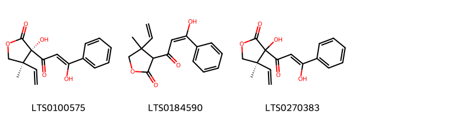{ width=100% }
    <figcaption>Hình ảnh cấu trúc hóa học của 3 hoạt chất thuộc nhóm Cinnamic acids and derivatives gồm ['(3s,4s)-4-ethenyl-3-hydroxy-3-[(2z)-3-hydroxy-3-phenylprop-2-enoyl]-4-methyloxolan-2-one (LTS0100575)', '4-ethenyl-3-[(2e)-3-hydroxy-3-phenylprop-2-enoyl]-4-methyloxolan-2-one (LTS0184590)', '(4s)-4-ethenyl-3-hydroxy-3-[(2z)-3-hydroxy-3-phenylprop-2-enoyl]-4-methyloxolan-2-one (LTS0270383)'].</figcaption>
</figure>
#### Nhóm Dibenzylbutane lignans
<figure markdown="span">
    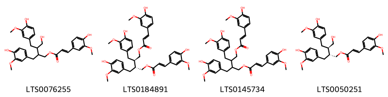{ width=100% }
    <figcaption>Hình ảnh cấu trúc hóa học của 4 hoạt chất thuộc nhóm Dibenzylbutane lignans gồm ['4-hydroxy-2,3-bis[(4-hydroxy-3-methoxyphenyl)methyl]butyl 3-(4-hydroxy-3-methoxyphenyl)prop-2-enoate (LTS0076255)', '(2r,3r)-2,3-bis[(4-hydroxy-3-methoxyphenyl)methyl]-4-{[(2e)-3-(4-hydroxy-3-methoxyphenyl)prop-2-enoyl]oxy}butyl (2e)-3-(4-hydroxy-3-methoxyphenyl)prop-2-enoate (LTS0184891)', '2,3-bis[(4-hydroxy-3-methoxyphenyl)methyl]-4-{[3-(4-hydroxy-3-methoxyphenyl)prop-2-enoyl]oxy}butyl 3-(4-hydroxy-3-methoxyphenyl)prop-2-enoate (LTS0145734)', '(2r,3r)-4-hydroxy-2,3-bis[(4-hydroxy-3-methoxyphenyl)methyl]butyl (2e)-3-(4-hydroxy-3-methoxyphenyl)prop-2-enoate (LTS0050251)'].</figcaption>
</figure>
#### Nhóm Flavonoids
<figure markdown="span">
    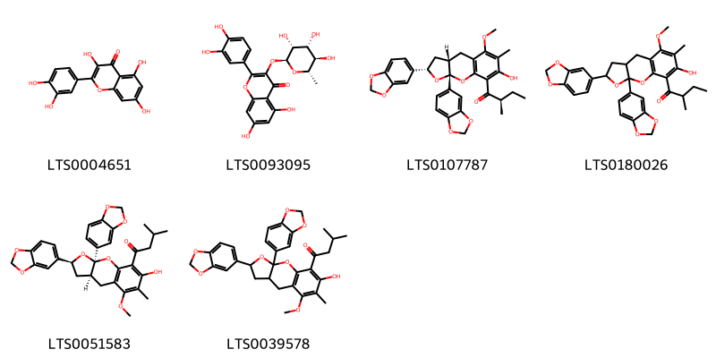{ width=100% }
    <figcaption>Hình ảnh cấu trúc hóa học của 6 hoạt chất thuộc nhóm Flavonoids gồm ['quercetin (LTS0004651)', 'quercitrin (LTS0093095)', '(2r)-1-[(3r,5s,7s)-3,5-bis(2h-1,3-benzodioxol-5-yl)-12-hydroxy-10-methoxy-11-methyl-2,4-dioxatricyclo[7.4.0.0³,⁷]trideca-1(9),10,12-trien-13-yl]-2-methylbutan-1-one (LTS0107787)', '1-[3,5-bis(2h-1,3-benzodioxol-5-yl)-12-hydroxy-10-methoxy-11-methyl-2,4-dioxatricyclo[7.4.0.0³,⁷]trideca-1(9),10,12-trien-13-yl]-2-methylbutan-1-one (LTS0180026)', '1-[(3r,5s,7s)-3,5-bis(2h-1,3-benzodioxol-5-yl)-12-hydroxy-10-methoxy-11-methyl-2,4-dioxatricyclo[7.4.0.0³,⁷]trideca-1(9),10,12-trien-13-yl]-3-methylbutan-1-one (LTS0051583)', '1-[3,5-bis(2h-1,3-benzodioxol-5-yl)-12-hydroxy-10-methoxy-11-methyl-2,4-dioxatricyclo[7.4.0.0³,⁷]trideca-1(9),10,12-trien-13-yl]-3-methylbutan-1-one (LTS0039578)'].</figcaption>
</figure>
#### Nhóm Furanoid lignans
<figure markdown="span">
    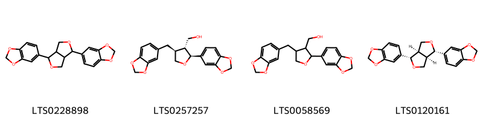{ width=100% }
    <figcaption>Hình ảnh cấu trúc hóa học của 4 hoạt chất thuộc nhóm Furanoid lignans gồm ['sesamin (LTS0228898)', '[(2s,3r,4s)-2-(2h-1,3-benzodioxol-5-yl)-4-(2h-1,3-benzodioxol-5-ylmethyl)oxolan-3-yl]methanol (LTS0257257)', '[2-(2h-1,3-benzodioxol-5-yl)-4-(2h-1,3-benzodioxol-5-ylmethyl)oxolan-3-yl]methanol (LTS0058569)', 'sesamin (LTS0120161)'].</figcaption>
</figure>
#### Nhóm Lactones
<figure markdown="span">
    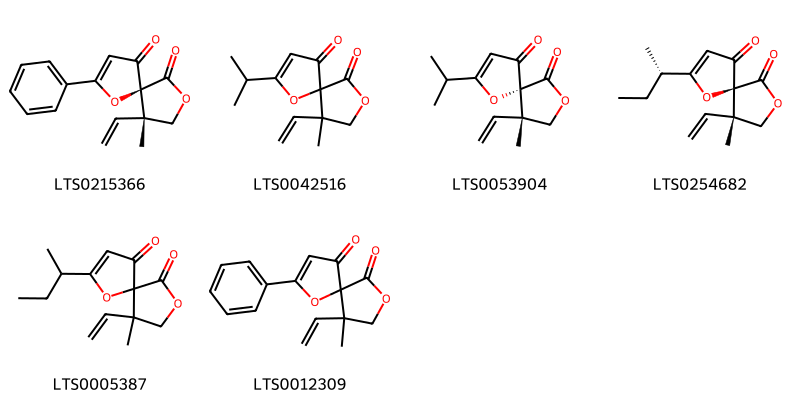{ width=100% }
    <figcaption>Hình ảnh cấu trúc hóa học của 6 hoạt chất thuộc nhóm Lactones gồm ['(5s,9s)-9-ethenyl-9-methyl-2-phenyl-1,7-dioxaspiro[4.4]non-2-ene-4,6-dione (LTS0215366)', '9-ethenyl-2-isopropyl-9-methyl-1,7-dioxaspiro[4.4]non-2-ene-4,6-dione (LTS0042516)', '(5r,9s)-9-ethenyl-2-isopropyl-9-methyl-1,7-dioxaspiro[4.4]non-2-ene-4,6-dione (LTS0053904)', '(5s,9s)-2-[(2s)-butan-2-yl]-9-ethenyl-9-methyl-1,7-dioxaspiro[4.4]non-2-ene-4,6-dione (LTS0254682)', '9-ethenyl-9-methyl-2-(sec-butyl)-1,7-dioxaspiro[4.4]non-2-ene-4,6-dione (LTS0005387)', '9-ethenyl-9-methyl-2-phenyl-1,7-dioxaspiro[4.4]non-2-ene-4,6-dione (LTS0012309)'].</figcaption>
</figure>
#### Nhóm Organooxygen compounds
<figure markdown="span">
    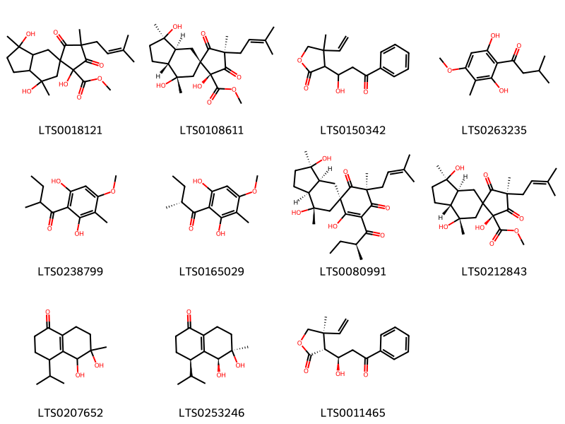{ width=100% }
    <figcaption>Hình ảnh cấu trúc hóa học của 11 hoạt chất thuộc nhóm Organooxygen compounds gồm ["methyl 3',5,7'-trihydroxy-3,3',7'-trimethyl-3-(3-methylbut-2-en-1-yl)-2,4-dioxo-hexahydrospiro[cyclopentane-1,5'-indene]-5-carboxylate (LTS0018121)", 'biyouyanagiol (LTS0108611)', '4-ethenyl-3-(1-hydroxy-3-oxo-3-phenylpropyl)-4-methyloxolan-2-one (LTS0150342)', 'aspidinol c (LTS0263235)', 'aspidinol d (LTS0238799)', '(2r)-1-(2,6-dihydroxy-4-methoxy-3-methylphenyl)-2-methylbutan-1-one (LTS0165029)', "(1r,3'r,3'as,5r,7's,7'as)-2,3',7'-trihydroxy-3',5,7'-trimethyl-5-(3-methylbut-2-en-1-yl)-3-[(2s)-2-methylbutanoyl]-1',2',3'a,4',6',7'a-hexahydrospiro[cyclohexane-1,5'-inden]-2-ene-4,6-dione (LTS0080991)", "methyl (3r,3'r,3'as,5s,7's,7'ar)-3',5,7'-trihydroxy-3,3',7'-trimethyl-3-(3-methylbut-2-en-1-yl)-2,4-dioxo-hexahydrospiro[cyclopentane-1,5'-indene]-5-carboxylate (LTS0212843)", '5,6-dihydroxy-4-isopropyl-6-methyl-2,3,4,5,7,8-hexahydronaphthalen-1-one (LTS0207652)', '(4r,5s,6r)-5,6-dihydroxy-4-isopropyl-6-methyl-2,3,4,5,7,8-hexahydronaphthalen-1-one (LTS0253246)', '(3r,4s)-4-ethenyl-3-[(1r)-1-hydroxy-3-oxo-3-phenylpropyl]-4-methyloxolan-2-one (LTS0011465)'].</figcaption>
</figure>
#### Nhóm Prenol lipids
<figure markdown="span">
    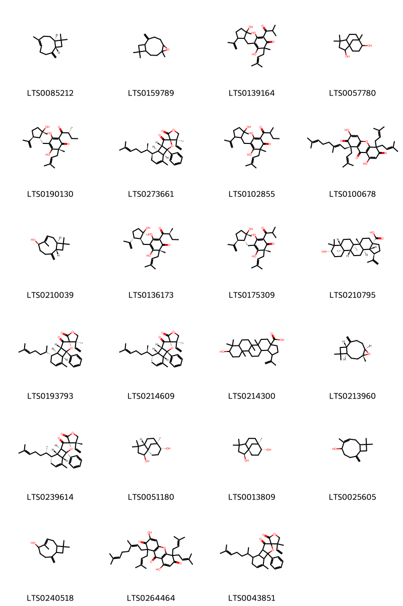{ width=100% }
    <figcaption>Hình ảnh cấu trúc hóa học của 23 hoạt chất thuộc nhóm Prenol lipids gồm ['caryophyllene (LTS0085212)', 'caryophyllene oxide (LTS0159789)', '3,5-dihydroxy-4-{[2-hydroxy-2-methyl-5-(prop-1-en-2-yl)cyclopentyl]methyl}-6-methyl-6-(3-methylbut-2-en-1-yl)-2-(2-methylpropanoyl)cyclohexa-2,4-dien-1-one (LTS0139164)', '4,4,8-trimethyltricyclo[6.3.1.0¹,⁵]dodecane-2,9-diol (LTS0057780)', '(6r)-3,5-dihydroxy-4-{[(1r,2s,5s)-2-hydroxy-2-methyl-5-(prop-1-en-2-yl)cyclopentyl]methyl}-6-methyl-6-(3-methylbut-2-en-1-yl)-2-[(2r)-2-methylbutanoyl]cyclohexa-2,4-dien-1-one (LTS0190130)', "(1'r,2'r,3s,4r,6's,7'r,8's)-4-ethenyl-4,11'-dimethyl-8'-[(2r)-6-methylhept-5-en-2-yl]-2'-phenyl-3'-oxaspiro[oxolane-3,4'-tricyclo[5.4.0.0²,⁶]undecan]-10'-ene-2,5'-dione (LTS0273661)", '3,5-dihydroxy-4-{[2-hydroxy-2-methyl-5-(prop-1-en-2-yl)cyclopentyl]methyl}-6-methyl-6-(3-methylbut-2-en-1-yl)-2-(2-methylbutanoyl)cyclohexa-2,4-dien-1-one (LTS0102855)', '(1r)-1-[(2e)-3,7-dimethylocta-2,6-dien-1-yl]-3,8-dihydroxy-1,5,5-tris(3-methylbut-2-en-1-yl)xanthene-2,6,9-trione (LTS0100678)', 'caryophyllenol ii (LTS0210039)', '(6r)-3,5-dihydroxy-4-{[(1s,2r,5r)-2-hydroxy-2-methyl-5-(prop-1-en-2-yl)cyclopentyl]methyl}-6-methyl-6-(3-methylbut-2-en-1-yl)-2-[(2s)-2-methylbutanoyl]cyclohexa-2,4-dien-1-one (LTS0136173)', '(6r)-3,5-dihydroxy-4-{[(1r,2s,5s)-2-hydroxy-2-methyl-5-(prop-1-en-2-yl)cyclopentyl]methyl}-6-methyl-6-(3-methylbut-2-en-1-yl)-2-(2-methylpropanoyl)cyclohexa-2,4-dien-1-one (LTS0175309)', 'betulinic acid (LTS0210795)', "(1'r,2'r,3r,4r,6's,7'r,8'r)-4-ethenyl-4,11'-dimethyl-8'-(6-methylhept-5-en-2-yl)-2'-phenyl-3'-oxaspiro[oxolane-3,4'-tricyclo[5.4.0.0²,⁶]undecan]-10'-ene-2,5'-dione (LTS0193793)", 'biyouyanagin a (LTS0214609)', '9-hydroxy-5a,5b,8,8,11a-pentamethyl-1-(prop-1-en-2-yl)-hexadecahydrocyclopenta[a]chrysene-3a-carboxylic acid (LTS0214300)', 'β-caryophyllene oxide (LTS0213960)', 'biyouyanagin b (LTS0239614)', '(1r,2s,5s,8r,9r)-4,4,8-trimethyltricyclo[6.3.1.0¹,⁵]dodecane-2,9-diol (LTS0051180)', '(1s,2s,8r,9r)-4,4,8-trimethyltricyclo[6.3.1.0¹,⁵]dodecane-2,9-diol (LTS0013809)', '4,11,11-trimethyl-8-methylidenebicyclo[7.2.0]undec-3-en-5-ol (LTS0025605)', 'α-multijugenol (LTS0240518)', '1-(3,7-dimethylocta-2,6-dien-1-yl)-3,8-dihydroxy-1,5,5-tris(3-methylbut-2-en-1-yl)xanthene-2,6,9-trione (LTS0264464)', "4-ethenyl-4,11'-dimethyl-8'-(6-methylhept-5-en-2-yl)-2'-phenyl-3'-oxaspiro[oxolane-3,4'-tricyclo[5.4.0.0²,⁶]undecan]-10'-ene-2,5'-dione (LTS0043851)"].</figcaption>
</figure>
#### Nhóm Steroids and steroid derivatives
<figure markdown="span">
    { width=100% }
    <figcaption>Hình ảnh cấu trúc hóa học của 1 hoạt chất thuộc nhóm Steroids and steroid derivatives gồm ['stigmast-5-en-3-ol, (3β)- (LTS0204616)'].</figcaption>
</figure>
#### Nhóm Tannins
<figure markdown="span">
    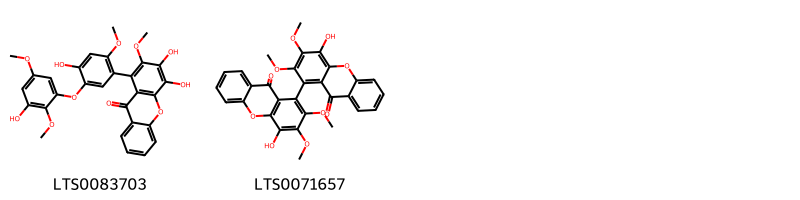{ width=100% }
    <figcaption>Hình ảnh cấu trúc hóa học của 2 hoạt chất thuộc nhóm Tannins gồm ['3,4-dihydroxy-1-[4-hydroxy-5-(3-hydroxy-2,5-dimethoxyphenoxy)-2-methoxyphenyl]-2-methoxyxanthen-9-one (LTS0083703)', 'hyperidixanthone (LTS0071657)'].</figcaption>
</figure>

---

### Dược dân tộc học

Danh sách các quốc gia có sử dụng *N/A* trong điều trị các bệnh. 

| Country   | Disease    | Bệnh      |
|:----------|:-----------|:----------|
| China     | Astringent | Lam se da |

---

---
## Hypericum connatum
### Thông tin về thực vật

!!! info "Phân loại thực vật của *Hypericum connatum* từ GIBF:"
    - **Kingdom:** Plantae
    - **Phylum:** Tracheophyta
    - **Order:** Malpighiales
    - **Family:** Hypericaceae
    - **Genus:** Hypericum
    - **Species:** *Hypericum connatum*

 

| Label (VI)   | Label (EN)   | Scientific Name    | Descriptions (VI)   | Descriptions (EN)   | Also Known As (VI)   | Also Known As (EN)   |
|:-------------|:-------------|:-------------------|:--------------------|:--------------------|:---------------------|:---------------------|
| N/A          | N/A          | Hypericum connatum | loài thực vật       | species of plant    | ['']                 | ['']                 |

#### Phân bố trên thế giới

**Từ CSDL GIBF** Uruguay, Argentina, Bolivia (Plurinational State of), Brazil

#### Phân bố tại Việt Nam

**Từ CSDL GIBF**: Không có ghi nhận ở Việt Nam

---
### Thành phần hóa học
        
- Theo cơ sở dữ liệu lotus: Từ loài *Hypericum connatum* đã phân lập và xác định được 5 hoạt chất thuộc về các nhóm Organooxygen compounds, Benzopyrans, Flavonoids. 

|    | chemicalTaxonomyClassyfireClass   |   smiles_count |
|---:|:----------------------------------|---------------:|
|  0 | Benzopyrans                       |              1 |
|  1 | Flavonoids                        |              3 |
|  2 | Organooxygen compounds            |              1 |

#### Nhóm Benzopyrans
<figure markdown="span">
    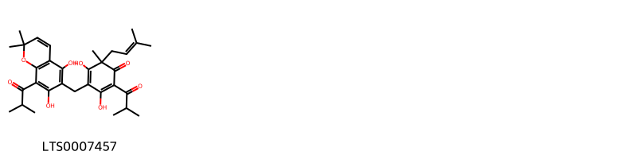{ width=100% }
    <figcaption>Hình ảnh cấu trúc hóa học của 1 hoạt chất thuộc nhóm Benzopyrans gồm ['4-{[5,7-dihydroxy-2,2-dimethyl-8-(2-methylpropanoyl)chromen-6-yl]methyl}-3,5-dihydroxy-6-methyl-6-(3-methylbut-2-en-1-yl)-2-(2-methylpropanoyl)cyclohexa-2,4-dien-1-one (LTS0007457)'].</figcaption>
</figure>
#### Nhóm Flavonoids
<figure markdown="span">
    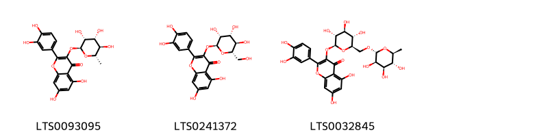{ width=100% }
    <figcaption>Hình ảnh cấu trúc hóa học của 3 hoạt chất thuộc nhóm Flavonoids gồm ['quercitrin (LTS0093095)', '2-(3,4-dihydroxyphenyl)-5,7-dihydroxy-3-{[(2s,3r,4r,5r,6s)-3,4,5-trihydroxy-6-(hydroxymethyl)oxan-2-yl]oxy}chromen-4-one (LTS0241372)', '3-rutinosyl quercetin (LTS0032845)'].</figcaption>
</figure>
#### Nhóm Organooxygen compounds
<figure markdown="span">
    { width=100% }
    <figcaption>Hình ảnh cấu trúc hóa học của 1 hoạt chất thuộc nhóm Organooxygen compounds gồm ['chlorogenic acid (LTS0226495)'].</figcaption>
</figure>

---

### Dược dân tộc học

Danh sách các quốc gia có sử dụng *Hypericum connatum* trong điều trị các bệnh. 

| Country   | Disease   | Bệnh               |
|:----------|:----------|:-------------------|
| Elsewhere | Tonic     | (thuộc) trương lực |

---

---
## Hypericum crium
### Thông tin về thực vật

!!! info "Phân loại thực vật của *Hypericum triquetrifolium* từ GIBF:"
    - **Kingdom:** Plantae
    - **Phylum:** Tracheophyta
    - **Order:** Malpighiales
    - **Family:** Hypericaceae
    - **Genus:** Hypericum
    - **Species:** *Hypericum triquetrifolium*

 

| Label (VI)   | Label (EN)   | Scientific Name    | Descriptions (VI)   | Descriptions (EN)   | Also Known As (VI)   | Also Known As (EN)   |
|:-------------|:-------------|:-------------------|:--------------------|:--------------------|:---------------------|:---------------------|
| N/A          | N/A          | Hypericum connatum | loài thực vật       | species of plant    | ['']                 | ['']                 |

#### Phân bố trên thế giới

**Từ CSDL GIBF** Türkiye, nan, unknown or invalid, Tunisia, Palestine, State of, Syrian Arab Republic, Spain, France, Lebanon, Cyprus, Italy, Israel, Algeria, Greece

#### Phân bố tại Việt Nam

**Từ CSDL GIBF**: Không có ghi nhận ở Việt Nam

---
### Thành phần hóa học
        
- Theo cơ sở dữ liệu lotus: Từ loài *Hypericum triquetrifolium* đã phân lập và xác định được Chưa có hoạt chất nào được phân lập. hoạt chất thuộc về các nhóm Không có hoạt chất nào được phân lập. 

Không có hình ảnh nào được tạo ra

---

### Dược dân tộc học

Danh sách các quốc gia có sử dụng *Hypericum triquetrifolium* trong điều trị các bệnh. 

| Country   | Disease              | Bệnh                     |
|:----------|:---------------------|:-------------------------|
| Iraq      | Disinfectant, Poison | Chất Khử Trùng, Chất Độc |
| Turkey    | Poison               | Chất độc                 |

---

---
## Hypericum electum
### Thông tin về thực vật

!!! info "Phân loại thực vật của *Hypericum erectum* từ GIBF:"
    - **Kingdom:** Plantae
    - **Phylum:** Tracheophyta
    - **Order:** Malpighiales
    - **Family:** Hypericaceae
    - **Genus:** Hypericum
    - **Species:** *Hypericum erectum*

 

| Label (VI)   | Label (EN)   | Scientific Name    | Descriptions (VI)   | Descriptions (EN)   | Also Known As (VI)   | Also Known As (EN)   |
|:-------------|:-------------|:-------------------|:--------------------|:--------------------|:---------------------|:---------------------|
| N/A          | N/A          | Hypericum connatum | loài thực vật       | species of plant    | ['']                 | ['']                 |

#### Phân bố trên thế giới

**Từ CSDL GIBF** Japan, Russian Federation, China, Korea, Republic of, Chinese Taipei

#### Phân bố tại Việt Nam

**Từ CSDL GIBF**: Không có ghi nhận ở Việt Nam

---
### Thành phần hóa học
        
- Theo cơ sở dữ liệu lotus: Từ loài *Hypericum erectum* đã phân lập và xác định được Chưa có hoạt chất nào được phân lập. hoạt chất thuộc về các nhóm Không có hoạt chất nào được phân lập. 

Không có hình ảnh nào được tạo ra

---

### Dược dân tộc học

Danh sách các quốc gia có sử dụng *Hypericum erectum* trong điều trị các bệnh. 

| Country   | Disease               | Bệnh             |
|:----------|:----------------------|:-----------------|
| Japan     | Vulnerary, Hemostatic | Lỗ hổng, cầm máu |

---

---
## Hypericum erectum
### Thông tin về thực vật

!!! info "Phân loại thực vật của *Hypericum erectum* từ GIBF:"
    - **Kingdom:** Plantae
    - **Phylum:** Tracheophyta
    - **Order:** Malpighiales
    - **Family:** Hypericaceae
    - **Genus:** Hypericum
    - **Species:** *Hypericum erectum*

 

| Label (VI)   | Label (EN)   | Scientific Name   | Descriptions (VI)   | Descriptions (EN)   | Also Known As (VI)   | Also Known As (EN)   |
|:-------------|:-------------|:------------------|:--------------------|:--------------------|:---------------------|:---------------------|
| N/A          | N/A          | Hypericum erectum | loài thực vật       | species of plant    | ['']                 | ['']                 |

#### Phân bố trên thế giới

**Từ CSDL GIBF** Japan, Russian Federation, China, Korea, Republic of, Chinese Taipei

#### Phân bố tại Việt Nam

**Từ CSDL GIBF**: Không có ghi nhận ở Việt Nam

---
### Thành phần hóa học
        
- Theo cơ sở dữ liệu lotus: Từ loài *Hypericum erectum* đã phân lập và xác định được 68 hoạt chất thuộc về các nhóm Organooxygen compounds, Benzopyrans, Flavonoids, Naphthofurans, Prenol lipids, Fatty Acyls, Isoflavonoids, Steroids and steroid derivatives, Benzene and substituted derivatives. 

|    | chemicalTaxonomyClassyfireClass     |   smiles_count |
|---:|:------------------------------------|---------------:|
|  0 | Benzene and substituted derivatives |              5 |
|  1 | Benzopyrans                         |              4 |
|  2 | Fatty Acyls                         |              1 |
|  3 | Flavonoids                          |             19 |
|  4 | Isoflavonoids                       |              2 |
|  5 | Naphthofurans                       |              1 |
|  6 | Organooxygen compounds              |             20 |
|  7 | Prenol lipids                       |             12 |
|  8 | Steroids and steroid derivatives    |              4 |

#### Nhóm Benzene and substituted derivatives
<figure markdown="span">
    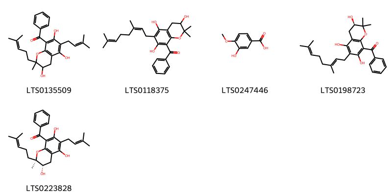{ width=100% }
    <figcaption>Hình ảnh cấu trúc hóa học của 5 hoạt chất thuộc nhóm Benzene and substituted derivatives gồm ['8-benzoyl-2-methyl-6-(3-methylbut-2-en-1-yl)-2-(4-methylpent-3-en-1-yl)-3,4-dihydro-1-benzopyran-3,5,7-triol (LTS0135509)', '8-benzoyl-6-(3,7-dimethylocta-2,6-dien-1-yl)-2,2-dimethyl-3,4-dihydro-1-benzopyran-3,5,7-triol (LTS0118375)', 'isovanillic acid (LTS0247446)', '(3r)-8-benzoyl-6-[(2e)-3,7-dimethylocta-2,6-dien-1-yl]-2,2-dimethyl-3,4-dihydro-1-benzopyran-3,5,7-triol (LTS0198723)', '(2r,3s)-8-benzoyl-2-methyl-6-(3-methylbut-2-en-1-yl)-2-(4-methylpent-3-en-1-yl)-3,4-dihydro-1-benzopyran-3,5,7-triol (LTS0223828)'].</figcaption>
</figure>
#### Nhóm Benzopyrans
<figure markdown="span">
    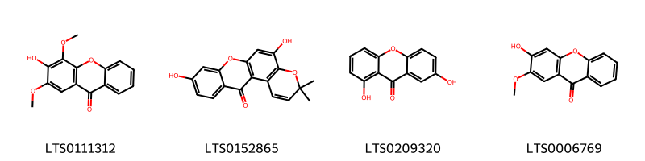{ width=100% }
    <figcaption>Hình ảnh cấu trúc hóa học của 4 hoạt chất thuộc nhóm Benzopyrans gồm ['3-hydroxy-2,4-dimethoxyxanthen-9-one (LTS0111312)', '8,12-dihydroxy-2,2-dimethyl-1,10-dioxatetraphen-5-one (LTS0152865)', 'euxanthone (LTS0209320)', '3-hydroxy-2-methoxyxanthen-9-one (LTS0006769)'].</figcaption>
</figure>
#### Nhóm Fatty Acyls
<figure markdown="span">
    { width=100% }
    <figcaption>Hình ảnh cấu trúc hóa học của 1 hoạt chất thuộc nhóm Fatty Acyls gồm ['octacosanol (LTS0049071)'].</figcaption>
</figure>
#### Nhóm Flavonoids
<figure markdown="span">
    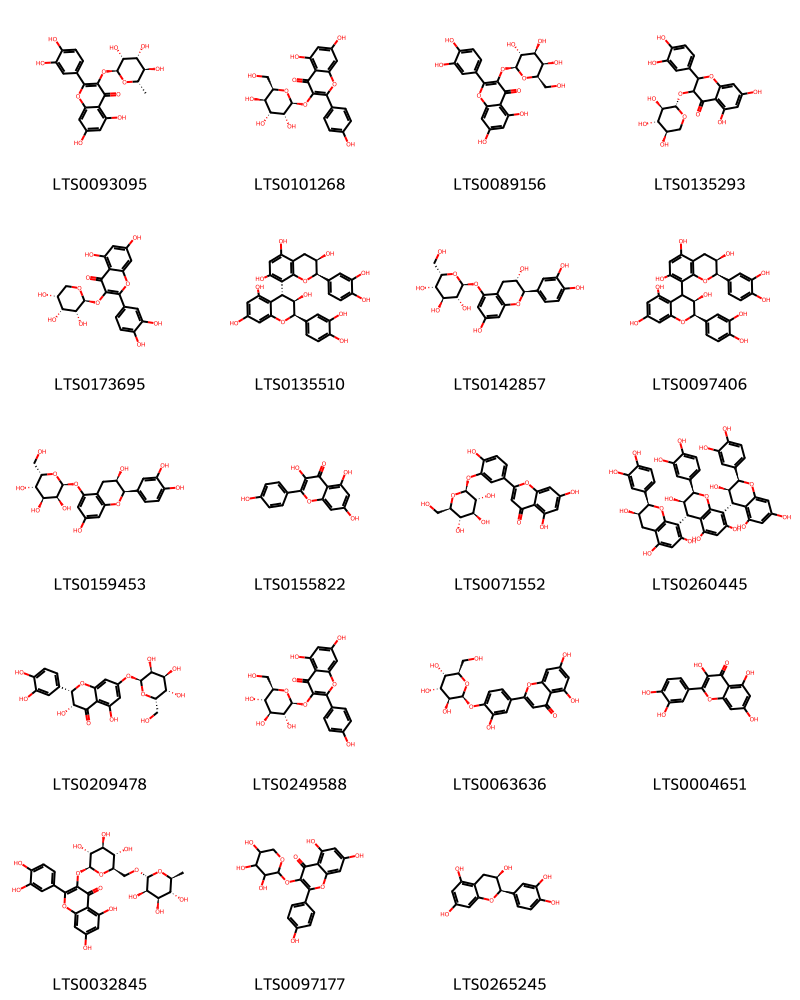{ width=100% }
    <figcaption>Hình ảnh cấu trúc hóa học của 19 hoạt chất thuộc nhóm Flavonoids gồm ['quercitrin (LTS0093095)', '5,7-dihydroxy-2-(4-hydroxyphenyl)-3-{[(2s,3r,4r,5r,6r)-3,4,5-trihydroxy-6-(hydroxymethyl)oxan-2-yl]oxy}chromen-4-one (LTS0101268)', 'hyperoside (LTS0089156)', '2-(3,4-dihydroxyphenyl)-5,7-dihydroxy-3-{[(2s,3r,4s,5r)-3,4,5-trihydroxyoxan-2-yl]oxy}-2,3-dihydro-1-benzopyran-4-one (LTS0135293)', '2-(3,4-dihydroxyphenyl)-5,7-dihydroxy-3-{[(2s,3r,4r,5r)-3,4,5-trihydroxyoxan-2-yl]oxy}chromen-4-one (LTS0173695)', '(2r,3r,4r)-2-(3,4-dihydroxyphenyl)-4-[(2r,3r)-2-(3,4-dihydroxyphenyl)-3,5,7-trihydroxy-3,4-dihydro-2h-1-benzopyran-8-yl]-3,4-dihydro-2h-1-benzopyran-3,5,7-triol (LTS0135510)', '(2s,3r,4s,5s,6s)-2-{[(2r,3s)-2-(3,4-dihydroxyphenyl)-3,7-dihydroxy-3,4-dihydro-2h-1-benzopyran-5-yl]oxy}-6-(hydroxymethyl)oxane-3,4,5-triol (LTS0142857)', '(2r,3r)-2-(3,4-dihydroxyphenyl)-4-[(2r,3r)-2-(3,4-dihydroxyphenyl)-3,5,7-trihydroxy-3,4-dihydro-2h-1-benzopyran-8-yl]-3,4-dihydro-2h-1-benzopyran-3,5,7-triol (LTS0097406)', '(2s,3s,4s,5s,6s)-2-{[(2r,3r)-2-(3,4-dihydroxyphenyl)-3,7-dihydroxy-3,4-dihydro-2h-1-benzopyran-5-yl]oxy}-6-(hydroxymethyl)oxane-3,4,5-triol (LTS0159453)', 'kaempherol (LTS0155822)', "luteolin 3'-glucoside (LTS0071552)", 'procyanidin c1 (LTS0260445)', '(2s,3r)-2-(3,4-dihydroxyphenyl)-3,5-dihydroxy-7-{[(2s,3s,4s,5s,6s)-3,4,5-trihydroxy-6-(hydroxymethyl)oxan-2-yl]oxy}-2,3-dihydro-1-benzopyran-4-one (LTS0209478)', 'astragalin (LTS0249588)', "luteolin 4'-glucoside (LTS0063636)", 'quercetin (LTS0004651)', '3-rutinosyl quercetin (LTS0032845)', '5,7-dihydroxy-2-(4-hydroxyphenyl)-3-[(3,4,5-trihydroxyoxan-2-yl)oxy]chromen-4-one (LTS0097177)', 'ent-epicatechin (LTS0265245)'].</figcaption>
</figure>
#### Nhóm Isoflavonoids
<figure markdown="span">
    { width=100% }
    <figcaption>Hình ảnh cấu trúc hóa học của 2 hoạt chất thuộc nhóm Isoflavonoids gồm ['demethylwedelolactone (LTS0150783)', 'wedelolactone (LTS0216902)'].</figcaption>
</figure>
#### Nhóm Naphthofurans
<figure markdown="span">
    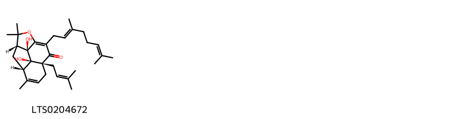{ width=100% }
    <figcaption>Hình ảnh cấu trúc hóa học của 1 hoạt chất thuộc nhóm Naphthofurans gồm ['(1s,7r,11s,12r,13r)-5-[(2e)-3,7-dimethylocta-2,6-dien-1-yl]-12,13-dihydroxy-2,2,10-trimethyl-7-(3-methylbut-2-en-1-yl)-3-oxatetracyclo[9.2.1.0⁴,¹³.0⁷,¹²]tetradeca-4,9-dien-6-one (LTS0204672)'].</figcaption>
</figure>
#### Nhóm Organooxygen compounds
<figure markdown="span">
    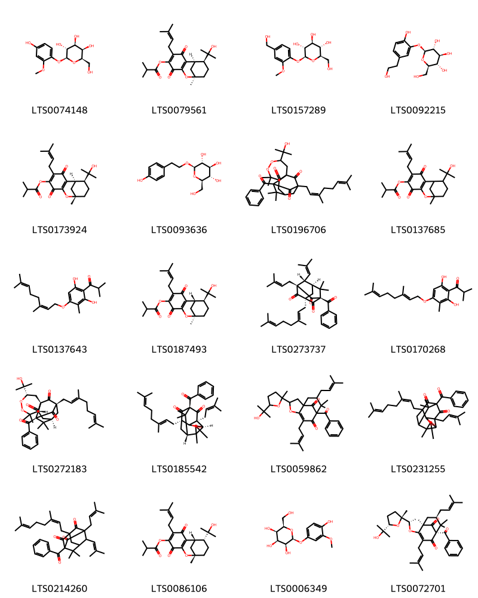{ width=100% }
    <figcaption>Hình ảnh cấu trúc hóa học của 20 hoạt chất thuộc nhóm Organooxygen compounds gồm ['(2s,3r,4s,5r,6r)-2-(4-hydroxy-2-methoxyphenoxy)-6-(hydroxymethyl)oxane-3,4,5-triol (LTS0074148)', '(1r,9r,12s)-12-(2-hydroxypropan-2-yl)-9-methyl-4-(3-methylbut-2-en-1-yl)-3,6-dioxo-8-oxatricyclo[7.3.1.0²,⁷]trideca-2(7),4-dien-5-yl 2-methylpropanoate (LTS0079561)', 'vanilloloside (LTS0157289)', '3-hydroxytyrosol 3-o-glucoside (LTS0092215)', '(1r,9s,12s)-12-(2-hydroxypropan-2-yl)-9-methyl-4-(3-methylbut-2-en-1-yl)-3,6-dioxo-8-oxatricyclo[7.3.1.0²,⁷]trideca-2(7),4-dien-5-yl 2-methylpropanoate (LTS0173924)', 'salidroside (LTS0093636)', '11-benzoyl-13-(3,7-dimethylocta-2,6-dien-1-yl)-3-(2-hydroxypropan-2-yl)-6,6,10,10-tetramethyl-4,5-dioxatetracyclo[9.3.1.1⁹,¹³.0¹,⁷]hexadecane-12,14,15-trione (LTS0196706)', '12-(2-hydroxypropan-2-yl)-9-methyl-4-(3-methylbut-2-en-1-yl)-3,6-dioxo-8-oxatricyclo[7.3.1.0²,⁷]trideca-2(7),4-dien-5-yl 2-methylpropanoate (LTS0137685)', '1-{4-[(3,7-dimethylocta-2,6-dien-1-yl)oxy]-2,6-dihydroxy-3-methylphenyl}-2-methylpropan-1-one (LTS0137643)', '(1s,9r,12s)-12-(2-hydroxypropan-2-yl)-9-methyl-4-(3-methylbut-2-en-1-yl)-3,6-dioxo-8-oxatricyclo[7.3.1.0²,⁷]trideca-2(7),4-dien-5-yl 2-methylpropanoate (LTS0187493)', '(1s,3r,5s,7s,8r)-5-benzoyl-3-[(2e)-3,7-dimethylocta-2,6-dien-1-yl]-6,6-dimethyl-1-(3-methylbut-2-en-1-yl)-8-(2-methylprop-1-en-1-yl)adamantane-2,4,9-trione (LTS0273737)', '1-(4-{[(2e)-3,7-dimethylocta-2,6-dien-1-yl]oxy}-2,6-dihydroxy-3-methylphenyl)-2-methylpropan-1-one (LTS0170268)', '(1r,3s,7s,9s,11r,13s)-11-benzoyl-13-[(2e)-3,7-dimethylocta-2,6-dien-1-yl]-3-(2-hydroxypropan-2-yl)-6,6,10,10-tetramethyl-4,5-dioxatetracyclo[9.3.1.1⁹,¹³.0¹,⁷]hexadecane-12,14,15-trione (LTS0272183)', '(1s,3r,4s,7r,9r,11s)-1-benzoyl-11-[(2e)-3,7-dimethylocta-2,6-dien-1-yl]-4-hydroxy-6,6,13,13-tetramethyl-3-(3-methylbut-2-en-1-yl)-5-oxatetracyclo[7.3.1.0³,⁷.0⁴,¹¹]tridecane-2,12-dione (LTS0185542)', '8-benzoyl-3-[5-(2-hydroxypropan-2-yl)-2-methyloxolan-2-yl]-9,9-dimethyl-6,10-bis(3-methylbut-2-en-1-yl)-4-oxatricyclo[6.3.1.0¹,⁵]dodec-5-ene-7,12-dione (LTS0059862)', '1-benzoyl-11-(3,7-dimethylocta-2,6-dien-1-yl)-4-hydroxy-6,6,13,13-tetramethyl-3-(3-methylbut-2-en-1-yl)-5-oxatetracyclo[7.3.1.0³,⁷.0⁴,¹¹]tridecane-2,12-dione (LTS0231255)', '5-benzoyl-3-(3,7-dimethylocta-2,6-dien-1-yl)-6,6-dimethyl-1-(3-methylbut-2-en-1-yl)-8-(2-methylprop-1-en-1-yl)adamantane-2,4,9-trione (LTS0214260)', '(1s,9s,12r)-12-(2-hydroxypropan-2-yl)-9-methyl-4-(3-methylbut-2-en-1-yl)-3,6-dioxo-8-oxatricyclo[7.3.1.0²,⁷]trideca-2(7),4-dien-5-yl 2-methylpropanoate (LTS0086106)', '(2s,3s,4s,5r,6r)-2-(4-hydroxy-3-methoxyphenoxy)-6-(hydroxymethyl)oxane-3,4,5-triol (LTS0006349)', '(1s,3s,8r,10r)-8-benzoyl-3-[(2r,5s)-5-(2-hydroxypropan-2-yl)-2-methyloxolan-2-yl]-9,9-dimethyl-6,10-bis(3-methylbut-2-en-1-yl)-4-oxatricyclo[6.3.1.0¹,⁵]dodec-5-ene-7,12-dione (LTS0072701)'].</figcaption>
</figure>
#### Nhóm Prenol lipids
<figure markdown="span">
    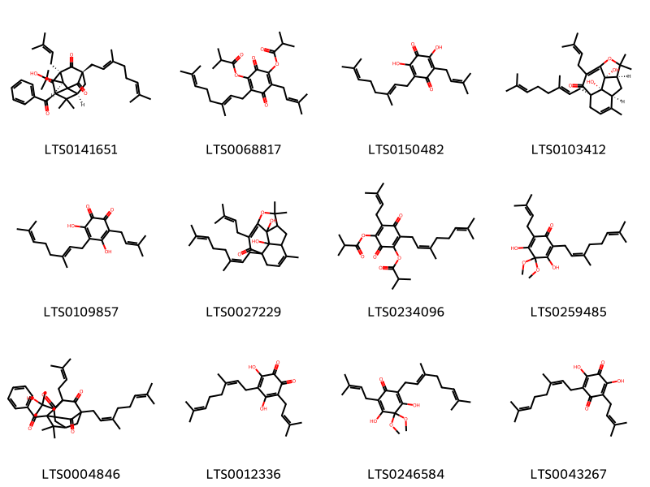{ width=100% }
    <figcaption>Hình ảnh cấu trúc hóa học của 12 hoạt chất thuộc nhóm Prenol lipids gồm ['(1s,3r,4r,6s,8r)-8-benzoyl-1-[(2e)-3,7-dimethylocta-2,6-dien-1-yl]-4-(2-hydroxypropan-2-yl)-7,7-dimethyl-3-(3-methylbut-2-en-1-yl)tricyclo[4.3.1.1³,⁸]undecane-2,9,11-trione (LTS0141651)', '2-[(2e)-3,7-dimethylocta-2,6-dien-1-yl]-4-(3-methylbut-2-en-1-yl)-5-[(2-methylpropanoyl)oxy]-3,6-dioxocyclohexa-1,4-dien-1-yl 2-methylpropanoate (LTS0068817)', '2-[(2e)-3,7-dimethylocta-2,6-dien-1-yl]-3,5-dihydroxy-6-(3-methylbut-2-en-1-yl)cyclohexa-2,5-diene-1,4-dione (LTS0150482)', '(1s,7r,11s,12r,13r)-7-[(2e)-3,7-dimethylocta-2,6-dien-1-yl]-12,13-dihydroxy-2,2,10-trimethyl-5-(3-methylbut-2-en-1-yl)-3-oxatetracyclo[9.2.1.0⁴,¹³.0⁷,¹²]tetradeca-4,9-dien-6-one (LTS0103412)', '4-[(2e)-3,7-dimethylocta-2,6-dien-1-yl]-3,5-dihydroxy-6-(3-methylbut-2-en-1-yl)cyclohexa-3,5-diene-1,2-dione (LTS0109857)', '7-(3,7-dimethylocta-2,6-dien-1-yl)-12,13-dihydroxy-2,2,10-trimethyl-5-(3-methylbut-2-en-1-yl)-3-oxatetracyclo[9.2.1.0⁴,¹³.0⁷,¹²]tetradeca-4,9-dien-6-one (LTS0027229)', '2-(3,7-dimethylocta-2,6-dien-1-yl)-4-(3-methylbut-2-en-1-yl)-5-[(2-methylpropanoyl)oxy]-3,6-dioxocyclohexa-1,4-dien-1-yl 2-methylpropanoate (LTS0234096)', '2-(3,7-dimethylocta-2,6-dien-1-yl)-3,5-dihydroxy-4,4-dimethoxy-6-(3-methylbut-2-en-1-yl)cyclohexa-2,5-dien-1-one (LTS0259485)', '8-benzoyl-1-(3,7-dimethylocta-2,6-dien-1-yl)-4-(2-hydroxypropan-2-yl)-7,7-dimethyl-3-(3-methylbut-2-en-1-yl)tricyclo[4.3.1.1³,⁸]undecane-2,9,11-trione (LTS0004846)', '4-(3,7-dimethylocta-2,6-dien-1-yl)-3,5-dihydroxy-6-(3-methylbut-2-en-1-yl)cyclohexa-3,5-diene-1,2-dione (LTS0012336)', '2-[(2e)-3,7-dimethylocta-2,6-dien-1-yl]-3,5-dihydroxy-4,4-dimethoxy-6-(3-methylbut-2-en-1-yl)cyclohexa-2,5-dien-1-one (LTS0246584)', '2-(3,7-dimethylocta-2,6-dien-1-yl)-3,5-dihydroxy-6-(3-methylbut-2-en-1-yl)cyclohexa-2,5-diene-1,4-dione (LTS0043267)'].</figcaption>
</figure>
#### Nhóm Steroids and steroid derivatives
<figure markdown="span">
    { width=100% }
    <figcaption>Hình ảnh cấu trúc hóa học của 4 hoạt chất thuộc nhóm Steroids and steroid derivatives gồm ['stigmast-5-en-3-ol (LTS0071224)', 'stigmast-5-en-3-ol, (3β)- (LTS0204616)', 'sitogluside (LTS0201798)', '2-{[1-(5-ethyl-6-methylheptan-2-yl)-9a,11a-dimethyl-1h,2h,3h,3ah,3bh,4h,6h,7h,8h,9h,9bh,10h,11h-cyclopenta[a]phenanthren-7-yl]oxy}-6-(hydroxymethyl)oxane-3,4,5-triol (LTS0158828)'].</figcaption>
</figure>

---

### Dược dân tộc học

Danh sách các quốc gia có sử dụng *Hypericum erectum* trong điều trị các bệnh. 

| Country   | Disease                | Bệnh                 |
|:----------|:-----------------------|:---------------------|
| Elsewhere | Astringent, Hemostatic | Chất làm se, cầm máu |

---

---
## Hypericum humifusum
### Thông tin về thực vật

!!! info "Phân loại thực vật của *Hypericum humifusum* từ GIBF:"
    - **Kingdom:** Plantae
    - **Phylum:** Tracheophyta
    - **Order:** Malpighiales
    - **Family:** Hypericaceae
    - **Genus:** Hypericum
    - **Species:** *Hypericum humifusum*

 

| Label (VI)   | Label (EN)   | Scientific Name     | Descriptions (VI)   | Descriptions (EN)   | Also Known As (VI)   | Also Known As (EN)   |
|:-------------|:-------------|:--------------------|:--------------------|:--------------------|:---------------------|:---------------------|
| N/A          | N/A          | Hypericum humifusum | loài thực vật       | species of plant    | ['']                 | ['']                 |

#### Phân bố trên thế giới

**Từ CSDL GIBF** Denmark, Luxembourg, Spain, Germany, Austria, Poland, Belgium, Netherlands, Slovakia, Hungary, Ireland, Switzerland, United Kingdom of Great Britain and Northern Ireland, Portugal, France, Czechia, New Zealand, Bolivia (Plurinational State of), Italy, Guernsey

#### Phân bố tại Việt Nam

**Từ CSDL GIBF**: Không có ghi nhận ở Việt Nam

---
### Thành phần hóa học
        
- Theo cơ sở dữ liệu lotus: Từ loài *Hypericum humifusum* đã phân lập và xác định được 27 hoạt chất thuộc về các nhóm Organooxygen compounds, Benzopyrans, Flavonoids, Saturated hydrocarbons, Prenol lipids, Perylenequinones, Pyrenes, Benzene and substituted derivatives. 

|    | chemicalTaxonomyClassyfireClass     |   smiles_count |
|---:|:------------------------------------|---------------:|
|  0 | Benzene and substituted derivatives |              1 |
|  1 | Benzopyrans                         |              1 |
|  2 | Flavonoids                          |              5 |
|  3 | Organooxygen compounds              |              8 |
|  4 | Perylenequinones                    |              2 |
|  5 | Prenol lipids                       |              4 |
|  6 | Pyrenes                             |              5 |
|  7 | Saturated hydrocarbons              |              1 |

#### Nhóm Benzene and substituted derivatives
<figure markdown="span">
    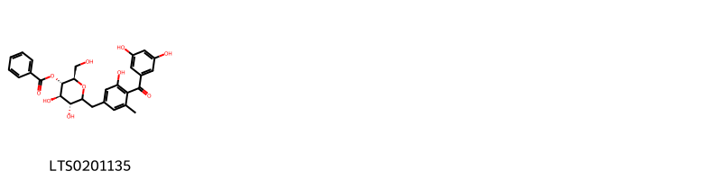{ width=100% }
    <figcaption>Hình ảnh cấu trúc hóa học của 1 hoạt chất thuộc nhóm Benzene and substituted derivatives gồm ['(2r,3s,4r,5r)-6-{[4-(3,5-dihydroxybenzoyl)-3-hydroxy-5-methylphenyl]methyl}-4,5-dihydroxy-2-(hydroxymethyl)oxan-3-yl benzoate (LTS0201135)'].</figcaption>
</figure>
#### Nhóm Benzopyrans
<figure markdown="span">
    { width=100% }
    <figcaption>Hình ảnh cấu trúc hóa học của 1 hoạt chất thuộc nhóm Benzopyrans gồm ['mangiferin (LTS0009443)'].</figcaption>
</figure>
#### Nhóm Flavonoids
<figure markdown="span">
    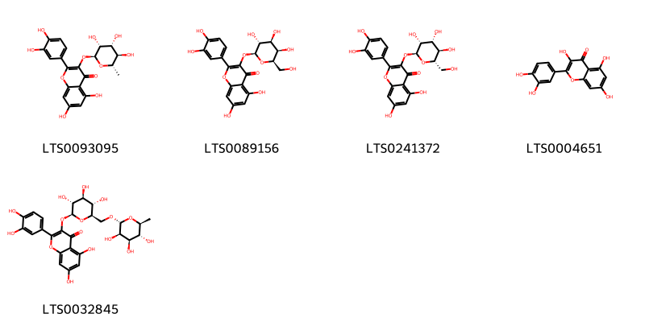{ width=100% }
    <figcaption>Hình ảnh cấu trúc hóa học của 5 hoạt chất thuộc nhóm Flavonoids gồm ['quercitrin (LTS0093095)', 'hyperoside (LTS0089156)', '2-(3,4-dihydroxyphenyl)-5,7-dihydroxy-3-{[(2s,3r,4r,5r,6s)-3,4,5-trihydroxy-6-(hydroxymethyl)oxan-2-yl]oxy}chromen-4-one (LTS0241372)', 'quercetin (LTS0004651)', '3-rutinosyl quercetin (LTS0032845)'].</figcaption>
</figure>
#### Nhóm Organooxygen compounds
<figure markdown="span">
    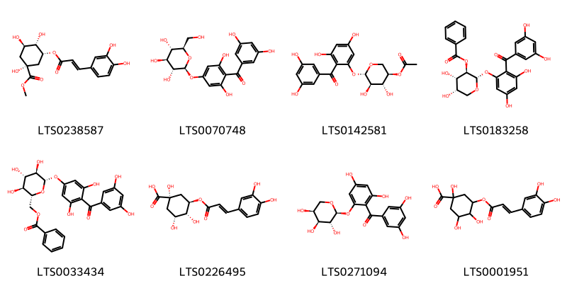{ width=100% }
    <figcaption>Hình ảnh cấu trúc hóa học của 8 hoạt chất thuộc nhóm Organooxygen compounds gồm ['methyl (1r,3r,4s,5r)-3-{[(2e)-3-(3,4-dihydroxyphenyl)prop-2-enoyl]oxy}-1,4,5-trihydroxycyclohexane-1-carboxylate (LTS0238587)', '(2s,3r,4s,5s,6r)-2-[4-(3,5-dihydroxybenzoyl)-3,5-dihydroxyphenoxy]-6-(hydroxymethyl)oxane-3,4,5-triol (LTS0070748)', '(3r,4r,5r,6s)-6-[2-(3,5-dihydroxybenzoyl)-3,5-dihydroxyphenoxy]-4,5-dihydroxyoxan-3-yl acetate (LTS0142581)', '(2s,3r,4s,5s)-2-[2-(3,5-dihydroxybenzoyl)-3,5-dihydroxyphenoxy]-4,5-dihydroxyoxan-3-yl benzoate (LTS0183258)', '[(2r,3s,4s,5r,6s)-6-[4-(3,5-dihydroxybenzoyl)-3,5-dihydroxyphenoxy]-3,4,5-trihydroxyoxan-2-yl]methyl benzoate (LTS0033434)', 'chlorogenic acid (LTS0226495)', '(2s,3r,4s,5s)-2-[2-(3,5-dihydroxybenzoyl)-3,5-dihydroxyphenoxy]oxane-3,4,5-triol (LTS0271094)', 'chlorogenic acid (LTS0001951)'].</figcaption>
</figure>
#### Nhóm Perylenequinones
<figure markdown="span">
    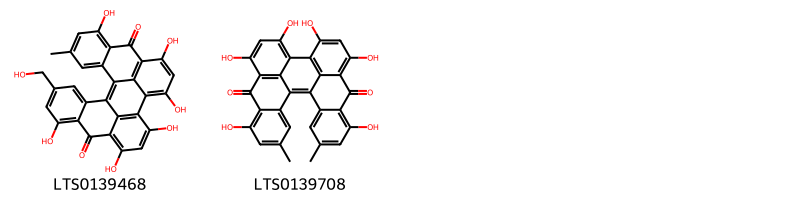{ width=100% }
    <figcaption>Hình ảnh cấu trúc hóa học của 2 hoạt chất thuộc nhóm Perylenequinones gồm ['7,11,13,16,18,22-hexahydroxy-5-(hydroxymethyl)-24-methylheptacyclo[13.11.1.1²,¹⁰.0³,⁸.0¹⁹,²⁷.0²¹,²⁶.0¹⁴,²⁸]octacosa-1,3(8),4,6,10,12,14(28),15,17,19(27),21(26),22,24-tridecaene-9,20-dione (LTS0139468)', '7,11,13,16,18,22-hexahydroxy-5,24-dimethylheptacyclo[13.11.1.1²,¹⁰.0³,⁸.0¹⁹,²⁷.0²¹,²⁶.0¹⁴,²⁸]octacosa-1,3(8),4,6,10,12,14(28),15,17,19(27),21(26),22,24-tridecaene-9,20-dione (LTS0139708)'].</figcaption>
</figure>
#### Nhóm Prenol lipids
<figure markdown="span">
    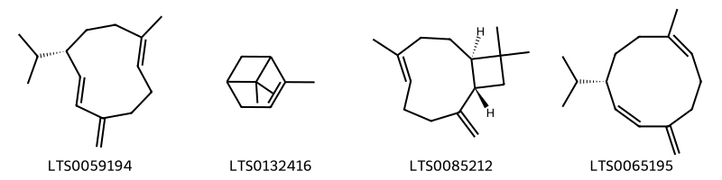{ width=100% }
    <figcaption>Hình ảnh cấu trúc hóa học của 4 hoạt chất thuộc nhóm Prenol lipids gồm ['(-)-germacrene d (LTS0059194)', 'α pinene (LTS0132416)', 'caryophyllene (LTS0085212)', '(1z,6z,8s)-8-isopropyl-1-methyl-5-methylidenecyclodeca-1,6-diene (LTS0065195)'].</figcaption>
</figure>
#### Nhóm Pyrenes
<figure markdown="span">
    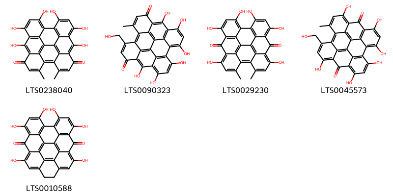{ width=100% }
    <figcaption>Hình ảnh cấu trúc hóa học của 5 hoạt chất thuộc nhóm Pyrenes gồm ['9,11,13,16,18,20-hexahydroxy-5,24-dimethyloctacyclo[13.11.1.1²,¹⁰.0³,⁸.0⁴,²⁵.0¹⁹,²⁷.0²¹,²⁶.0¹⁴,²⁸]octacosa-1(26),2,4(25),5,8,10,12,14(28),15,17,19(27),20,23-tridecaene-7,22-dione (LTS0238040)', '9,11,13,16,18,20-hexahydroxy-5-(hydroxymethyl)-24-methyloctacyclo[13.11.1.1²,¹⁰.0³,⁸.0⁴,²⁵.0¹⁹,²⁷.0²¹,²⁶.0¹⁴,²⁸]octacosa-1(26),2,4(25),5,8,10,12,14(28),15,17,19(27),20,23-tridecaene-7,22-dione (LTS0090323)', 'hypericin (LTS0029230)', '5,7,11,18,22,24-hexahydroxy-13-(hydroxymethyl)-16-methyloctacyclo[13.11.1.1²,¹⁰.0³,⁸.0⁴,²⁵.0¹⁹,²⁷.0²¹,²⁶.0¹⁴,²⁸]octacosa-1,3,5,7,10(28),11,13,15(27),16,18,21(26),22,24-tridecaene-9,20-dione (LTS0045573)', '7,9,13,20,24,26-hexahydroxynonacyclo[16.12.0.0²,¹⁵.0³,¹².0⁴,²⁹.0⁵,¹⁰.0⁶,²⁷.0²¹,³⁰.0²³,²⁸]triaconta-1(18),2,4(29),5(10),6,8,12,14,19,21(30),23,25,27-tridecaene-11,22-dione (LTS0010588)'].</figcaption>
</figure>
#### Nhóm Saturated hydrocarbons
<figure markdown="span">
    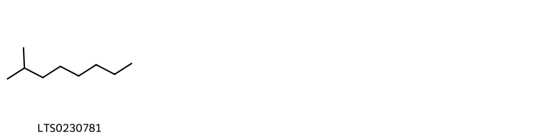{ width=100% }
    <figcaption>Hình ảnh cấu trúc hóa học của 1 hoạt chất thuộc nhóm Saturated hydrocarbons gồm ['2-methyloctane (LTS0230781)'].</figcaption>
</figure>

---

### Dược dân tộc học

Danh sách các quốc gia có sử dụng *Hypericum humifusum* trong điều trị các bệnh. 

| Country   | Disease   | Bệnh      |
|:----------|:----------|:----------|
| Europe    | Vulnerary | Vulnerary |

---

---
## Hypericum japonicum
### Thông tin về thực vật

!!! info "Phân loại thực vật của *Hypericum japonicum* từ GIBF:"
    - **Kingdom:** Plantae
    - **Phylum:** Tracheophyta
    - **Order:** Malpighiales
    - **Family:** Hypericaceae
    - **Genus:** Hypericum
    - **Species:** *Hypericum japonicum*

 

| Label (VI)   | Label (EN)   | Scientific Name     | Descriptions (VI)   | Descriptions (EN)   | Also Known As (VI)   | Also Known As (EN)   |
|:-------------|:-------------|:--------------------|:--------------------|:--------------------|:---------------------|:---------------------|
| N/A          | N/A          | Hypericum japonicum |                     | species of plant    | ['']                 | ['']                 |

#### Phân bố trên thế giới

**Từ CSDL GIBF** nan, Chinese Taipei, Japan, New Zealand, Indonesia, China, Australia, Hong Kong

#### Phân bố tại Việt Nam

**Từ CSDL GIBF**: Không có ghi nhận ở Việt Nam

---
### Thành phần hóa học
        
- Theo cơ sở dữ liệu lotus: Từ loài *Hypericum japonicum* đã phân lập và xác định được 82 hoạt chất thuộc về các nhóm Organooxygen compounds, Benzopyrans, Flavonoids, Coumarins and derivatives, Carboxylic acids and derivatives, Prenol lipids, Phenols, Cinnamic acids and derivatives, Benzene and substituted derivatives. 

|    | chemicalTaxonomyClassyfireClass     |   smiles_count |
|---:|:------------------------------------|---------------:|
|  0 | Benzene and substituted derivatives |              3 |
|  1 | Benzopyrans                         |             25 |
|  2 | Carboxylic acids and derivatives    |              3 |
|  3 | Cinnamic acids and derivatives      |              1 |
|  4 | Coumarins and derivatives           |              1 |
|  5 | Flavonoids                          |             27 |
|  6 | Organooxygen compounds              |             17 |
|  7 | Phenols                             |              2 |
|  8 | Prenol lipids                       |              3 |

#### Nhóm Benzene and substituted derivatives
<figure markdown="span">
    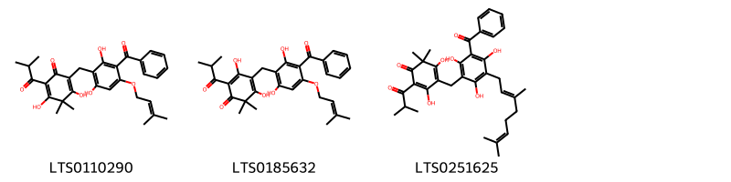{ width=100% }
    <figcaption>Hình ảnh cấu trúc hóa học của 3 hoạt chất thuộc nhóm Benzene and substituted derivatives gồm ['sarothralin (LTS0110290)', '4-({3-benzoyl-2,6-dihydroxy-4-[(3-methylbut-2-en-1-yl)oxy]phenyl}methyl)-3,5-dihydroxy-6,6-dimethyl-2-(2-methylpropanoyl)cyclohexa-2,4-dien-1-one (LTS0185632)', '4-({3-benzoyl-5-[(2e)-3,7-dimethylocta-2,6-dien-1-yl]-2,4,6-trihydroxyphenyl}methyl)-3,5-dihydroxy-6,6-dimethyl-2-(2-methylpropanoyl)cyclohexa-2,4-dien-1-one (LTS0251625)'].</figcaption>
</figure>
#### Nhóm Benzopyrans
<figure markdown="span">
    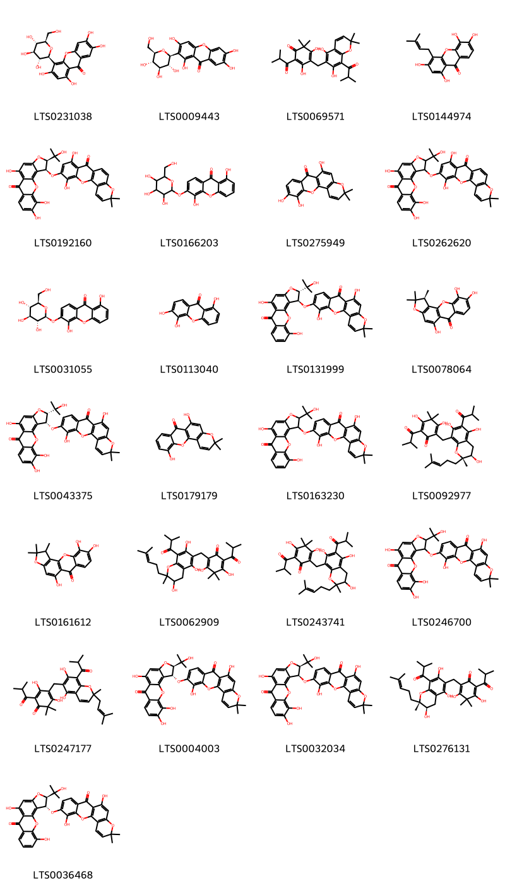{ width=100% }
    <figcaption>Hình ảnh cấu trúc hóa học của 25 hoạt chất thuộc nhóm Benzopyrans gồm ['isomangiferin (LTS0231038)', 'mangiferin (LTS0009443)', '4-{[5,7-dihydroxy-2,2-dimethyl-8-(2-methylpropanoyl)chromen-6-yl]methyl}-3,5-dihydroxy-6,6-dimethyl-2-(2-methylpropanoyl)cyclohexa-2,4-dien-1-one (LTS0069571)', '1,3,5,6-tetrahydroxy-4-(3-methylbut-2-en-1-yl)xanthen-9-one (LTS0144974)', '6,9-dihydroxy-2,2-dimethyl-7-{[(1s,2r)-5,9,10-trihydroxy-2-(2-hydroxypropan-2-yl)-6-oxo-1h,2h-furo[2,3-c]xanthen-1-yl]oxy}-1,5-dioxatetraphen-10-one (LTS0192160)', '1,5-dihydroxy-6-{[3,4,5-trihydroxy-6-(hydroxymethyl)oxan-2-yl]oxy}xanthen-9-one (LTS0166203)', '6,7,11-trihydroxy-2,2-dimethyl-1,5-dioxatetraphen-10-one (LTS0275949)', '6,9-dihydroxy-2,2-dimethyl-7-{[5,9,10-trihydroxy-2-(2-hydroxypropan-2-yl)-6-oxo-1h,2h-furo[2,3-c]xanthen-1-yl]oxy}-1,5-dioxatetraphen-10-one (LTS0262620)', '1,5-dihydroxy-6-{[(2s,3r,4s,5s,6r)-3,4,5-trihydroxy-6-(hydroxymethyl)oxan-2-yl]oxy}xanthen-9-one (LTS0031055)', 'mesuaxanthone b (LTS0113040)', '7-{[(1s,2s)-5,10-dihydroxy-2-(2-hydroxypropan-2-yl)-6-oxo-1h,2h-furo[2,3-c]xanthen-1-yl]oxy}-6,11-dihydroxy-2,2-dimethyl-1,5-dioxatetraphen-10-one (LTS0131999)', '(1s)-5,9,10-trihydroxy-1,2,2-trimethyl-1h-furo[2,3-c]xanthen-6-one (LTS0078064)', '6,11-dihydroxy-2,2-dimethyl-7-{[(1r,2s)-5,9,10-trihydroxy-2-(2-hydroxypropan-2-yl)-6-oxo-1h,2h-furo[2,3-c]xanthen-1-yl]oxy}-1,5-dioxatetraphen-10-one (LTS0043375)', '6,11-dihydroxy-2,2-dimethyl-1,5-dioxatetraphen-10-one (LTS0179179)', '7-{[5,10-dihydroxy-2-(2-hydroxypropan-2-yl)-6-oxo-1h,2h-furo[2,3-c]xanthen-1-yl]oxy}-6,11-dihydroxy-2,2-dimethyl-1,5-dioxatetraphen-10-one (LTS0163230)', '3,5-dihydroxy-4,4-dimethyl-2-(2-methylpropanoyl)-6-{[(2s,3r)-3,5,7-trihydroxy-2-methyl-2-(4-methylpent-3-en-1-yl)-6-(2-methylpropanoyl)-3,4-dihydro-1-benzopyran-8-yl]methyl}cyclohexa-2,5-dien-1-one (LTS0092977)', '5,9,10-trihydroxy-1,2,2-trimethyl-1h-furo[2,3-c]xanthen-6-one (LTS0161612)', '3,5-dihydroxy-4,4-dimethyl-2-(2-methylpropanoyl)-6-{[3,5,7-trihydroxy-2-methyl-2-(4-methylpent-3-en-1-yl)-8-(2-methylpropanoyl)-3,4-dihydro-1-benzopyran-6-yl]methyl}cyclohexa-2,5-dien-1-one (LTS0062909)', '3,5-dihydroxy-4,4-dimethyl-2-(2-methylpropanoyl)-6-{[3,5,7-trihydroxy-2-methyl-2-(4-methylpent-3-en-1-yl)-6-(2-methylpropanoyl)-3,4-dihydro-1-benzopyran-8-yl]methyl}cyclohexa-2,5-dien-1-one (LTS0243741)', '6,11-dihydroxy-2,2-dimethyl-7-{[5,9,10-trihydroxy-2-(2-hydroxypropan-2-yl)-6-oxo-1h,2h-furo[2,3-c]xanthen-1-yl]oxy}-1,5-dioxatetraphen-10-one (LTS0246700)', '4-{[5,7-dihydroxy-2-methyl-2-(3-methylbut-2-en-1-yl)-8-(2-methylpropanoyl)chromen-6-yl]methyl}-3,5-dihydroxy-6,6-dimethyl-2-(2-methylpropanoyl)cyclohexa-2,4-dien-1-one (LTS0247177)', 'jacarelhyperol a (LTS0004003)', '6,11-dihydroxy-2,2-dimethyl-7-{[(1s,2r)-5,9,10-trihydroxy-2-(2-hydroxypropan-2-yl)-6-oxo-1h,2h-furo[2,3-c]xanthen-1-yl]oxy}-1,5-dioxatetraphen-10-one (LTS0032034)', '3,5-dihydroxy-4,4-dimethyl-2-(2-methylpropanoyl)-6-{[(2s,3r)-3,5,7-trihydroxy-2-methyl-2-(4-methylpent-3-en-1-yl)-8-(2-methylpropanoyl)-3,4-dihydro-1-benzopyran-6-yl]methyl}cyclohexa-2,5-dien-1-one (LTS0276131)', 'jacarelhyperol b (LTS0036468)'].</figcaption>
</figure>
#### Nhóm Carboxylic acids and derivatives
<figure markdown="span">
    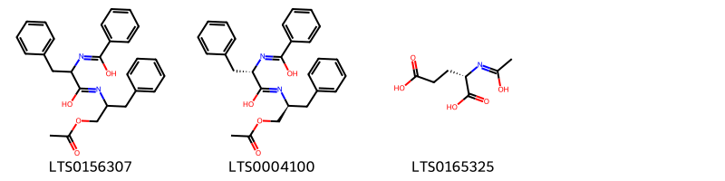{ width=100% }
    <figcaption>Hình ảnh cấu trúc hóa học của 3 hoạt chất thuộc nhóm Carboxylic acids and derivatives gồm ['n-[1-(acetyloxy)-3-phenylpropan-2-yl]-2-{[hydroxy(phenyl)methylidene]amino}-3-phenylpropanimidic acid (LTS0156307)', '(2s)-n-[(2s)-1-(acetyloxy)-3-phenylpropan-2-yl]-2-{[hydroxy(phenyl)methylidene]amino}-3-phenylpropanimidic acid (LTS0004100)', '(2s)-2-[(1-hydroxyethylidene)amino]pentanedioic acid (LTS0165325)'].</figcaption>
</figure>
#### Nhóm Cinnamic acids and derivatives
<figure markdown="span">
    { width=100% }
    <figcaption>Hình ảnh cấu trúc hóa học của 1 hoạt chất thuộc nhóm Cinnamic acids and derivatives gồm ['para-coumaric acid (LTS0266252)'].</figcaption>
</figure>
#### Nhóm Coumarins and derivatives
<figure markdown="span">
    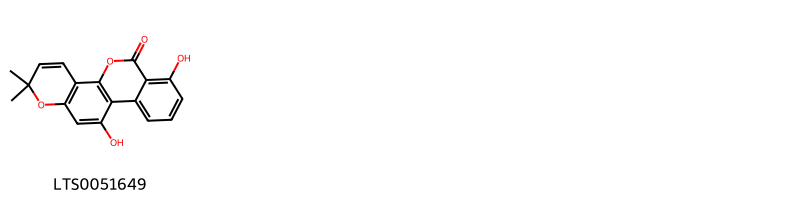{ width=100% }
    <figcaption>Hình ảnh cấu trúc hóa học của 1 hoạt chất thuộc nhóm Coumarins and derivatives gồm ['7,11-dihydroxy-2,2-dimethylisochromeno[3,4-f]chromen-6-one (LTS0051649)'].</figcaption>
</figure>
#### Nhóm Flavonoids
<figure markdown="span">
    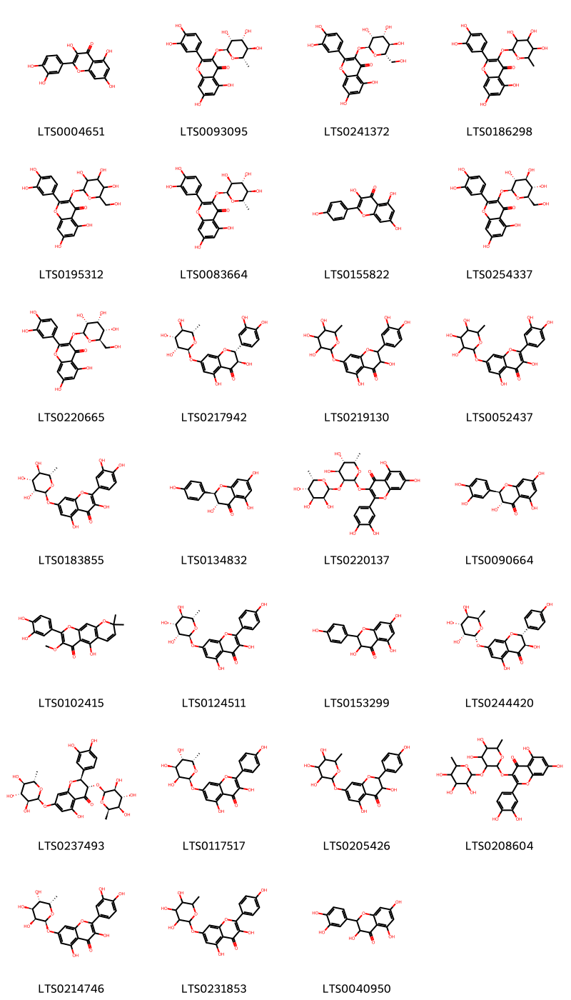{ width=100% }
    <figcaption>Hình ảnh cấu trúc hóa học của 27 hoạt chất thuộc nhóm Flavonoids gồm ['quercetin (LTS0004651)', 'quercitrin (LTS0093095)', '2-(3,4-dihydroxyphenyl)-5,7-dihydroxy-3-{[(2s,3r,4r,5r,6s)-3,4,5-trihydroxy-6-(hydroxymethyl)oxan-2-yl]oxy}chromen-4-one (LTS0241372)', 'quercitrin (LTS0186298)', '2-(3,4-dihydroxyphenyl)-5,7-dihydroxy-3-{[3,4,5-trihydroxy-6-(hydroxymethyl)oxan-2-yl]oxy}chromen-4-one (LTS0195312)', '2-(3,4-dihydroxyphenyl)-5,7-dihydroxy-3-{[(2s,3s,4r,5r,6s)-3,4,5-trihydroxy-6-methyloxan-2-yl]oxy}chromen-4-one (LTS0083664)', 'kaempherol (LTS0155822)', 'isoquercetin (LTS0254337)', '2-(3,4-dihydroxyphenyl)-5,7-dihydroxy-3-{[(2s,3r,4r,5s,6r)-3,4,5-trihydroxy-6-(hydroxymethyl)oxan-2-yl]oxy}chromen-4-one (LTS0220665)', '(2r,3r)-2-(3,4-dihydroxyphenyl)-3,5-dihydroxy-7-{[(2s,3r,4r,5r,6s)-3,4,5-trihydroxy-6-methyloxan-2-yl]oxy}-2,3-dihydro-1-benzopyran-4-one (LTS0217942)', '2-(3,4-dihydroxyphenyl)-3,5-dihydroxy-7-[(3,4,5-trihydroxy-6-methyloxan-2-yl)oxy]-2,3-dihydro-1-benzopyran-4-one (LTS0219130)', '2-(3,4-dihydroxyphenyl)-3,5-dihydroxy-7-[(3,4,5-trihydroxy-6-methyloxan-2-yl)oxy]chromen-4-one (LTS0052437)', '2-(3,4-dihydroxyphenyl)-3,5-dihydroxy-7-{[(2s,3r,4r,5r,6s)-3,4,5-trihydroxy-6-methyloxan-2-yl]oxy}chromen-4-one (LTS0183855)', '(+)-dihydrokaempferol (LTS0134832)', '3-{[(2s,3s,4s,5s,6s)-4,5-dihydroxy-6-methyl-3-{[(2s,3s,4s,5s,6s)-3,4,5-trihydroxy-6-methyloxan-2-yl]oxy}oxan-2-yl]oxy}-2-(3,4-dihydroxyphenyl)-5,7-dihydroxychromen-4-one (LTS0220137)', '(+)-taxifolin (LTS0090664)', 'sarothranol (LTS0102415)', 'kaempferol-7-rhamnoside (LTS0124511)', 'aromadendrin (LTS0153299)', '(2r,3r)-3,5-dihydroxy-2-(4-hydroxyphenyl)-7-{[(2r,3r,4r,5r,6r)-3,4,5-trihydroxy-6-methyloxan-2-yl]oxy}-2,3-dihydro-1-benzopyran-4-one (LTS0244420)', '(2s,3s)-2-(3,4-dihydroxyphenyl)-5-hydroxy-3-{[(2s,3s,4r,5r,6r)-3,4,5-trihydroxy-6-methyloxan-2-yl]oxy}-7-{[(2s,3s,4r,5r,6s)-3,4,5-trihydroxy-6-methyloxan-2-yl]oxy}-2,3-dihydro-1-benzopyran-4-one (LTS0237493)', '3,5-dihydroxy-2-(4-hydroxyphenyl)-7-{[(2s,3s,4s,5s,6s)-3,4,5-trihydroxy-6-methyloxan-2-yl]oxy}chromen-4-one (LTS0117517)', '3,5-dihydroxy-2-(4-hydroxyphenyl)-7-[(3,4,5-trihydroxy-6-methyloxan-2-yl)oxy]-2,3-dihydro-1-benzopyran-4-one (LTS0205426)', '3-({4,5-dihydroxy-6-methyl-3-[(3,4,5-trihydroxy-6-methyloxan-2-yl)oxy]oxan-2-yl}oxy)-2-(3,4-dihydroxyphenyl)-5,7-dihydroxychromen-4-one (LTS0208604)', '2-(3,4-dihydroxyphenyl)-3,5-dihydroxy-7-{[(2s,3s,4s,5s,6s)-3,4,5-trihydroxy-6-methyloxan-2-yl]oxy}chromen-4-one (LTS0214746)', '3,5-dihydroxy-2-(4-hydroxyphenyl)-7-[(3,4,5-trihydroxy-6-methyloxan-2-yl)oxy]chromen-4-one (LTS0231853)', '2,3-dihydroquercetin (LTS0040950)'].</figcaption>
</figure>
#### Nhóm Organooxygen compounds
<figure markdown="span">
    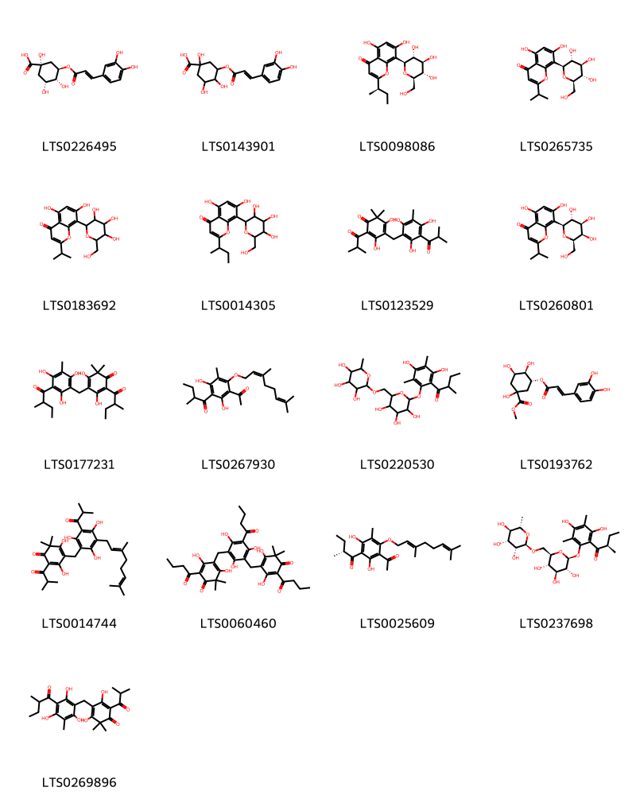{ width=100% }
    <figcaption>Hình ảnh cấu trúc hóa học của 17 hoạt chất thuộc nhóm Organooxygen compounds gồm ['chlorogenic acid (LTS0226495)', '3-{[3-(3,4-dihydroxyphenyl)prop-2-enoyl]oxy}-1,4,5-trihydroxycyclohexane-1-carboxylic acid (LTS0143901)', '2-[(2r)-butan-2-yl]-5,7-dihydroxy-8-[(2s,3r,4r,5s,6r)-3,4,5-trihydroxy-6-(hydroxymethyl)oxan-2-yl]chromen-4-one (LTS0098086)', '5,7-dihydroxy-2-isopropyl-8-[(2s,3r,4r,5s,6r)-3,4,5-trihydroxy-6-(hydroxymethyl)oxan-2-yl]chromen-4-one (LTS0265735)', '5,7-dihydroxy-2-isopropyl-8-[3,4,5-trihydroxy-6-(hydroxymethyl)oxan-2-yl]chromen-4-one (LTS0183692)', '5,7-dihydroxy-2-(sec-butyl)-8-[3,4,5-trihydroxy-6-(hydroxymethyl)oxan-2-yl]chromen-4-one (LTS0014305)', '3,5-dihydroxy-6,6-dimethyl-2-(2-methylpropanoyl)-4-{[2,4,6-trihydroxy-3-methyl-5-(2-methylpropanoyl)phenyl]methyl}cyclohexa-2,4-dien-1-one (LTS0123529)', '5,7-dihydroxy-2-isopropyl-8-[(2s,3r,4r,5r,6r)-3,4,5-trihydroxy-6-(hydroxymethyl)oxan-2-yl]chromen-4-one (LTS0260801)', '3,5-dihydroxy-6,6-dimethyl-2-(2-methylbutanoyl)-4-{[2,4,6-trihydroxy-3-methyl-5-(2-methylbutanoyl)phenyl]methyl}cyclohexa-2,4-dien-1-one (LTS0177231)', '1-{3-acetyl-4-[(3,7-dimethylocta-2,6-dien-1-yl)oxy]-2,6-dihydroxy-5-methylphenyl}-2-methylbutan-1-one (LTS0267930)', '1-{2,4-dihydroxy-3,5-dimethyl-6-[(3,4,5-trihydroxy-6-{[(3,4,5-trihydroxy-6-methyloxan-2-yl)oxy]methyl}oxan-2-yl)oxy]phenyl}-2-methylbutan-1-one (LTS0220530)', 'methyl (3r,4r,5r)-3-{[(2e)-3-(3,4-dihydroxyphenyl)prop-2-enoyl]oxy}-1,4,5-trihydroxycyclohexane-1-carboxylate (LTS0193762)', '4-({3-[(2e)-3,7-dimethylocta-2,6-dien-1-yl]-2,4,6-trihydroxy-5-(2-methylpropanoyl)phenyl}methyl)-3,5-dihydroxy-6,6-dimethyl-2-(2-methylpropanoyl)cyclohexa-2,4-dien-1-one (LTS0014744)', 'filicin (LTS0060460)', '(2r)-1-(3-acetyl-4-{[(2e)-3,7-dimethylocta-2,6-dien-1-yl]oxy}-2,6-dihydroxy-5-methylphenyl)-2-methylbutan-1-one (LTS0025609)', '(2r)-1-(2,4-dihydroxy-3,5-dimethyl-6-{[(2s,3r,4s,5s,6r)-3,4,5-trihydroxy-6-({[(2r,3r,4r,5r,6s)-3,4,5-trihydroxy-6-methyloxan-2-yl]oxy}methyl)oxan-2-yl]oxy}phenyl)-2-methylbutan-1-one (LTS0237698)', '3,5-dihydroxy-6,6-dimethyl-2-(2-methylpropanoyl)-4-{[2,4,6-trihydroxy-3-methyl-5-(2-methylbutanoyl)phenyl]methyl}cyclohexa-2,4-dien-1-one (LTS0269896)'].</figcaption>
</figure>
#### Nhóm Phenols
<figure markdown="span">
    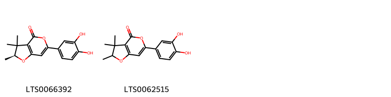{ width=100% }
    <figcaption>Hình ảnh cấu trúc hóa học của 2 hoạt chất thuộc nhóm Phenols gồm ['(2s)-6-(3,4-dihydroxyphenyl)-2,3,3-trimethyl-2h-furo[3,2-c]pyran-4-one (LTS0066392)', '6-(3,4-dihydroxyphenyl)-2,3,3-trimethyl-2h-furo[3,2-c]pyran-4-one (LTS0062515)'].</figcaption>
</figure>
#### Nhóm Prenol lipids
<figure markdown="span">
    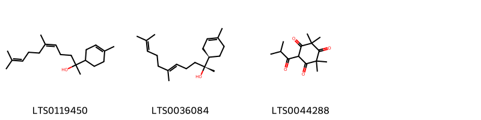{ width=100% }
    <figcaption>Hình ảnh cấu trúc hóa học của 3 hoạt chất thuộc nhóm Prenol lipids gồm ['6,10-dimethyl-2-(4-methylcyclohex-3-en-1-yl)undeca-5,9-dien-2-ol (LTS0119450)', '(2r,5e)-6,10-dimethyl-2-[(1r)-4-methylcyclohex-3-en-1-yl]undeca-5,9-dien-2-ol (LTS0036084)', 'flavesone (LTS0044288)'].</figcaption>
</figure>

---

### Dược dân tộc học

Danh sách các quốc gia có sử dụng *Hypericum japonicum* trong điều trị các bệnh. 

| Country   | Disease               | Bệnh                   |
|:----------|:----------------------|:-----------------------|
| China     | Astringent, Vulnerary | Tinh tế, dễ tổn thương |
| Chinese   | Astringent            | Lam se da              |
| Malagasy  | Styptic               | L.                     |

---

---
## Hypericum laxiusculum
### Thông tin về thực vật

!!! info "Phân loại thực vật của *Hypericum brasiliense* từ GIBF:"
    - **Kingdom:** Plantae
    - **Phylum:** Tracheophyta
    - **Order:** Malpighiales
    - **Family:** Hypericaceae
    - **Genus:** Hypericum
    - **Species:** *Hypericum brasiliense*

 

| Label (VI)   | Label (EN)   | Scientific Name     | Descriptions (VI)   | Descriptions (EN)   | Also Known As (VI)   | Also Known As (EN)   |
|:-------------|:-------------|:--------------------|:--------------------|:--------------------|:---------------------|:---------------------|
| N/A          | N/A          | Hypericum japonicum |                     | species of plant    | ['']                 | ['']                 |

#### Phân bố trên thế giới

**Từ CSDL GIBF** Argentina, Brazil

#### Phân bố tại Việt Nam

**Từ CSDL GIBF**: Không có ghi nhận ở Việt Nam

---
### Thành phần hóa học
        
- Theo cơ sở dữ liệu lotus: Từ loài *Hypericum brasiliense* đã phân lập và xác định được Chưa có hoạt chất nào được phân lập. hoạt chất thuộc về các nhóm Không có hoạt chất nào được phân lập. 

Không có hình ảnh nào được tạo ra

---

### Dược dân tộc học

Danh sách các quốc gia có sử dụng *Hypericum brasiliense* trong điều trị các bệnh. 

| Country   | Disease    | Bệnh      |
|:----------|:-----------|:----------|
| Brazil    | Astringent | Lam se da |

---

---
## Hypericum patulum
### Thông tin về thực vật

!!! info "Phân loại thực vật của *Hypericum patulum* từ GIBF:"
    - **Kingdom:** Plantae
    - **Phylum:** Tracheophyta
    - **Order:** Malpighiales
    - **Family:** Hypericaceae
    - **Genus:** Hypericum
    - **Species:** *Hypericum patulum*

 

| Label (VI)   | Label (EN)   | Scientific Name   | Descriptions (VI)   | Descriptions (EN)   | Also Known As (VI)   | Also Known As (EN)                               |
|:-------------|:-------------|:------------------|:--------------------|:--------------------|:---------------------|:-------------------------------------------------|
| N/A          | N/A          | Hypericum patulum | loài thực vật       | species of plant    | ['']                 | ["goldencup St. John's wort", 'yellow mosqueta'] |

#### Phân bố trên thế giới

**Từ CSDL GIBF** nan, Colombia, United Kingdom of Great Britain and Northern Ireland, Japan, South Africa, New Zealand, Hungary, Germany, Russian Federation, China, Australia, Belgium, Korea, Republic of, Chinese Taipei

#### Phân bố tại Việt Nam

**Từ CSDL GIBF**: Không có ghi nhận ở Việt Nam

---
### Thành phần hóa học
        
- Theo cơ sở dữ liệu lotus: Từ loài *Hypericum patulum* đã phân lập và xác định được 36 hoạt chất thuộc về các nhóm Benzopyrans, Flavonoids, Prenol lipids, Steroids and steroid derivatives, Benzene and substituted derivatives. 

|    | chemicalTaxonomyClassyfireClass     |   smiles_count |
|---:|:------------------------------------|---------------:|
|  0 | Benzene and substituted derivatives |              3 |
|  1 | Benzopyrans                         |             22 |
|  2 | Flavonoids                          |              5 |
|  3 | Prenol lipids                       |              3 |
|  4 | Steroids and steroid derivatives    |              3 |

#### Nhóm Benzene and substituted derivatives
<figure markdown="span">
    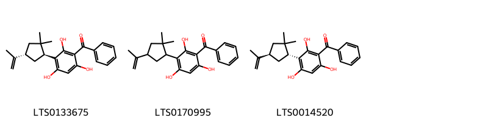{ width=100% }
    <figcaption>Hình ảnh cấu trúc hóa học của 3 hoạt chất thuộc nhóm Benzene and substituted derivatives gồm ['2-benzoyl-4-[(1s,4s)-2,2-dimethyl-4-(prop-1-en-2-yl)cyclopentyl]benzene-1,3,5-triol (LTS0133675)', '2-benzoyl-4-[2,2-dimethyl-4-(prop-1-en-2-yl)cyclopentyl]benzene-1,3,5-triol (LTS0170995)', '2-benzoyl-4-[(1r,4r)-2,2-dimethyl-4-(prop-1-en-2-yl)cyclopentyl]benzene-1,3,5-triol (LTS0014520)'].</figcaption>
</figure>
#### Nhóm Benzopyrans
<figure markdown="span">
    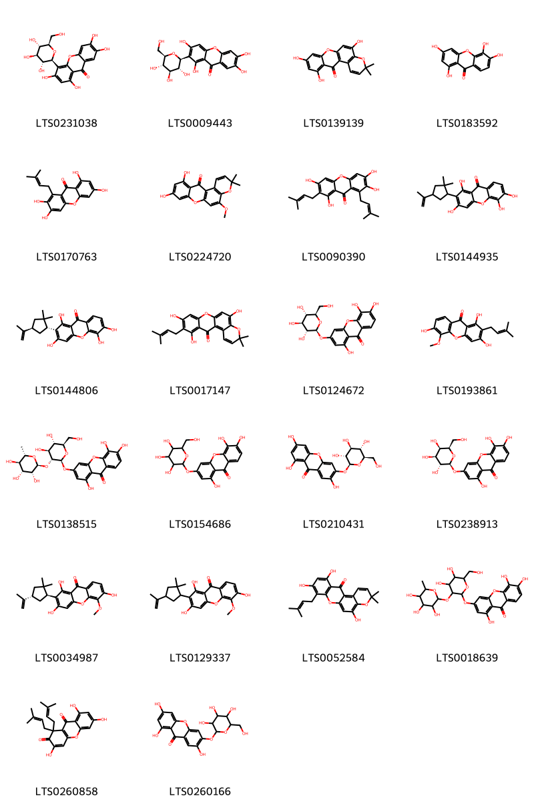{ width=100% }
    <figcaption>Hình ảnh cấu trúc hóa học của 22 hoạt chất thuộc nhóm Benzopyrans gồm ['isomangiferin (LTS0231038)', 'mangiferin (LTS0009443)', '6,8,12-trihydroxy-2,2-dimethyl-1,10-dioxatetraphen-5-one (LTS0139139)', '1,3,5,6-tetrahydroxyxanthen-9-one (LTS0183592)', '2,3,6,8-tetrahydroxy-1-(3-methylbut-2-en-1-yl)xanthen-9-one (LTS0170763)', '6,8-dihydroxy-12-methoxy-2,2-dimethyl-1,10-dioxatetraphen-5-one (LTS0224720)', 'gamma-mangostin (LTS0090390)', '2-[2,2-dimethyl-4-(prop-1-en-2-yl)cyclopentyl]-1,3,5,6-tetrahydroxyxanthen-9-one (LTS0144935)', '2-[(1r,4r)-2,2-dimethyl-4-(prop-1-en-2-yl)cyclopentyl]-1,3,5,6-tetrahydroxyxanthen-9-one (LTS0144806)', '6,8,12-trihydroxy-2,2-dimethyl-7-(3-methylbut-2-en-1-yl)-1,10-dioxatetraphen-5-one (LTS0017147)', '1,5,6-trihydroxy-3-{[(2s,3r,4s,5s,6r)-3,4,5-trihydroxy-6-(hydroxymethyl)oxan-2-yl]oxy}xanthen-9-one (LTS0124672)', '1,3,6-trihydroxy-5-methoxy-2-(3-methylbut-2-en-1-yl)xanthen-9-one (LTS0193861)', '3-{[(2s,3r,4s,5s,6r)-4,5-dihydroxy-6-(hydroxymethyl)-3-{[(2s,3r,4r,5r,6s)-3,4,5-trihydroxy-6-methyloxan-2-yl]oxy}oxan-2-yl]oxy}-1,5,6-trihydroxyxanthen-9-one (LTS0138515)', '1,5,6-trihydroxy-3-{[3,4,5-trihydroxy-6-(hydroxymethyl)oxan-2-yl]oxy}xanthen-9-one (LTS0154686)', 'tripteroside (LTS0210431)', '1,5,6-trihydroxy-3-{[(2s,3r,4s,5r,6r)-3,4,5-trihydroxy-6-(hydroxymethyl)oxan-2-yl]oxy}xanthen-9-one (LTS0238913)', 'paxanthonin (LTS0034987)', '2-[2,2-dimethyl-4-(prop-1-en-2-yl)cyclopentyl]-1,3,6-trihydroxy-5-methoxyxanthen-9-one (LTS0129337)', '6,8,12-trihydroxy-2,2-dimethyl-9-(3-methylbut-2-en-1-yl)-1,10-dioxatetraphen-5-one (LTS0052584)', '3-{[4,5-dihydroxy-6-(hydroxymethyl)-3-[(3,4,5-trihydroxy-6-methyloxan-2-yl)oxy]oxan-2-yl]oxy}-1,5,6-trihydroxyxanthen-9-one (LTS0018639)', '3,6,8-trihydroxy-1,1-bis(3-methylbut-2-en-1-yl)xanthene-2,9-dione (LTS0260858)', '1,3,7-trihydroxy-6-{[3,4,5-trihydroxy-6-(hydroxymethyl)oxan-2-yl]oxy}xanthen-9-one (LTS0260166)'].</figcaption>
</figure>
#### Nhóm Flavonoids
<figure markdown="span">
    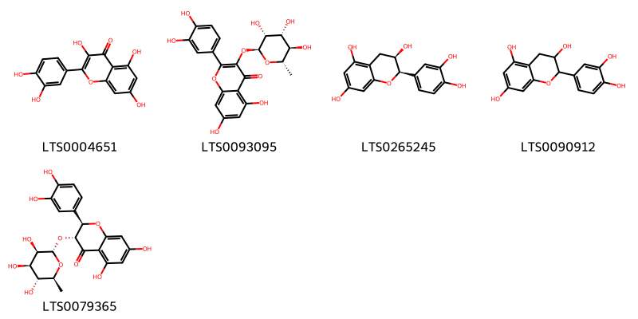{ width=100% }
    <figcaption>Hình ảnh cấu trúc hóa học của 5 hoạt chất thuộc nhóm Flavonoids gồm ['quercetin (LTS0004651)', 'quercitrin (LTS0093095)', 'ent-epicatechin (LTS0265245)', 'catechol (LTS0090912)', 'astilbin (LTS0079365)'].</figcaption>
</figure>
#### Nhóm Prenol lipids
<figure markdown="span">
    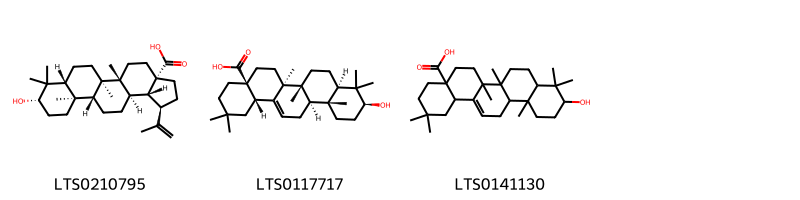{ width=100% }
    <figcaption>Hình ảnh cấu trúc hóa học của 3 hoạt chất thuộc nhóm Prenol lipids gồm ['betulinic acid (LTS0210795)', 'oleanolic acid (LTS0117717)', 'oleanolic acid (LTS0141130)'].</figcaption>
</figure>
#### Nhóm Steroids and steroid derivatives
<figure markdown="span">
    { width=100% }
    <figcaption>Hình ảnh cấu trúc hóa học của 3 hoạt chất thuộc nhóm Steroids and steroid derivatives gồm ['stigmast-5-en-3-ol, (3β)- (LTS0204616)', 'stigmast-5-en-3-ol (LTS0071224)', 'sitosterol (LTS0168132)'].</figcaption>
</figure>

---

### Dược dân tộc học

Danh sách các quốc gia có sử dụng *Hypericum patulum* trong điều trị các bệnh. 

| Country   | Disease   | Bệnh            |
|:----------|:----------|:----------------|
| India     | Stimulant | Chất kích thích |

---

---
## Hypericum perforatum
### Thông tin về thực vật

!!! info "Phân loại thực vật của *Hypericum perforatum* từ GIBF:"
    - **Kingdom:** Plantae
    - **Phylum:** Tracheophyta
    - **Order:** Malpighiales
    - **Family:** Hypericaceae
    - **Genus:** Hypericum
    - **Species:** *Hypericum perforatum*

 

| Label (VI)   | Label (EN)   | Scientific Name      | Descriptions (VI)   | Descriptions (EN)   | Also Known As (VI)   | Also Known As (EN)                                                        |
|:-------------|:-------------|:---------------------|:--------------------|:--------------------|:---------------------|:--------------------------------------------------------------------------|
| N/A          | N/A          | Hypericum perforatum | loài thực vật       | species of plant    | ['']                 | ["St. John's wort", "Common St. John's wort", 'perforate St. Johns-wort'] |

#### Phân bố trên thế giới

**Từ CSDL GIBF** Türkiye, nan, Argentina, Denmark, Portugal, South Africa, France, Spain, Czechia, New Zealand, Russian Federation, Chile, United States of America, Canada, Austria, Australia, Netherlands, Ukraine

#### Phân bố tại Việt Nam

**Từ CSDL GIBF**: Không có ghi nhận ở Việt Nam

---
### Thành phần hóa học
        
- Theo cơ sở dữ liệu lotus: Từ loài *Hypericum perforatum* đã phân lập và xác định được 247 hoạt chất thuộc về các nhóm Carboxylic acids and derivatives, Tetrapyrroles and derivatives, Hydroxy acids and derivatives, Benzopyrans, Anthracenes, Phenols, Cinnamic acids and derivatives, Organooxygen compounds, Saturated hydrocarbons, Fatty Acyls, Pyrenes, Flavonoids, Indoles and derivatives, Phenanthrenes and derivatives, Prenol lipids, Phenol ethers, Perylenequinones, Steroids and steroid derivatives, Benzene and substituted derivatives. 

|    | chemicalTaxonomyClassyfireClass     |   smiles_count |
|---:|:------------------------------------|---------------:|
|  0 | Anthracenes                         |              7 |
|  1 | Benzene and substituted derivatives |              5 |
|  2 | Benzopyrans                         |             16 |
|  3 | Carboxylic acids and derivatives    |              1 |
|  4 | Cinnamic acids and derivatives      |              1 |
|  5 | Fatty Acyls                         |             27 |
|  6 | Flavonoids                          |             55 |
|  7 | Hydroxy acids and derivatives       |              2 |
|  8 | Indoles and derivatives             |              2 |
|  9 | Organooxygen compounds              |             21 |
| 10 | Perylenequinones                    |              2 |
| 11 | Phenanthrenes and derivatives       |              1 |
| 12 | Phenol ethers                       |              1 |
| 13 | Phenols                             |              5 |
| 14 | Prenol lipids                       |             69 |
| 15 | Pyrenes                             |              5 |
| 16 | Saturated hydrocarbons              |             19 |
| 17 | Steroids and steroid derivatives    |              6 |
| 18 | Tetrapyrroles and derivatives       |              1 |

#### Nhóm Anthracenes
<figure markdown="span">
    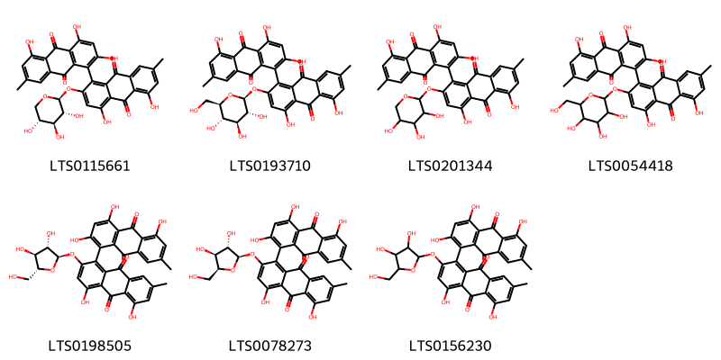{ width=100% }
    <figcaption>Hình ảnh cấu trúc hóa học của 7 hoạt chất thuộc nhóm Anthracenes gồm ["2,4,4',5,5'-pentahydroxy-7,7'-dimethyl-2'-{[(2s,3r,4s,5r)-3,4,5-trihydroxyoxan-2-yl]oxy}-[1,1'-bianthracene]-9,9',10,10'-tetrone (LTS0115661)", "2,4,4',5,5'-pentahydroxy-7,7'-dimethyl-2'-{[(2s,3r,4s,5s,6r)-3,4,5-trihydroxy-6-(hydroxymethyl)oxan-2-yl]oxy}-[1,1'-bianthracene]-9,9',10,10'-tetrone (LTS0193710)", "2,4,4',5,5'-pentahydroxy-7,7'-dimethyl-2'-[(3,4,5-trihydroxyoxan-2-yl)oxy]-[1,1'-bianthracene]-9,9',10,10'-tetrone (LTS0201344)", "2,4,4',5,5'-pentahydroxy-7,7'-dimethyl-2'-{[3,4,5-trihydroxy-6-(hydroxymethyl)oxan-2-yl]oxy}-[1,1'-bianthracene]-9,9',10,10'-tetrone (LTS0054418)", "2-{[(2r,3s,4s,5r)-3,4-dihydroxy-5-(hydroxymethyl)oxolan-2-yl]oxy}-2',4,4',5,5'-pentahydroxy-7,7'-dimethyl-[1,1'-bianthracene]-9,9',10,10'-tetrone (LTS0198505)", "2-{[(2r,3s,4s,5s)-3,4-dihydroxy-5-(hydroxymethyl)oxolan-2-yl]oxy}-2',4,4',5,5'-pentahydroxy-7,7'-dimethyl-[1,1'-bianthracene]-9,9',10,10'-tetrone (LTS0078273)", "2-{[3,4-dihydroxy-5-(hydroxymethyl)oxolan-2-yl]oxy}-2',4,4',5,5'-pentahydroxy-7,7'-dimethyl-[1,1'-bianthracene]-9,9',10,10'-tetrone (LTS0156230)"].</figcaption>
</figure>
#### Nhóm Benzene and substituted derivatives
<figure markdown="span">
    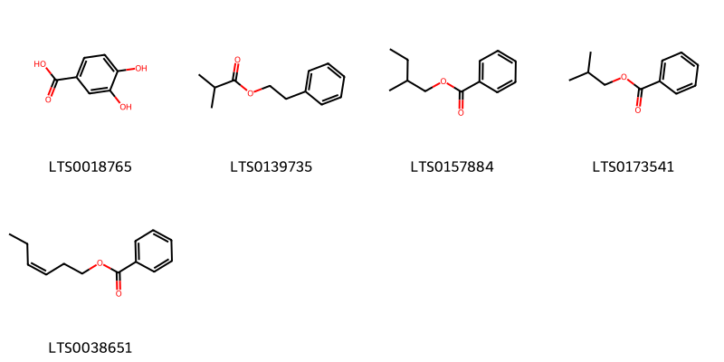{ width=100% }
    <figcaption>Hình ảnh cấu trúc hóa học của 5 hoạt chất thuộc nhóm Benzene and substituted derivatives gồm ['3,4-dihydroxybenzoic acid (LTS0018765)', 'phenethyl isobutyrate (LTS0139735)', '2-methylbutyl benzoate (LTS0157884)', 'isobutyl benzoate (LTS0173541)', 'cis-3-hexenyl benzoate (LTS0038651)'].</figcaption>
</figure>
#### Nhóm Benzopyrans
<figure markdown="span">
    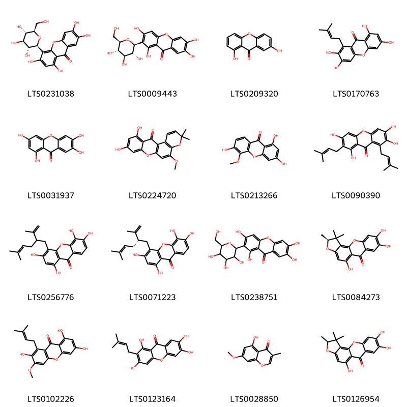{ width=100% }
    <figcaption>Hình ảnh cấu trúc hóa học của 16 hoạt chất thuộc nhóm Benzopyrans gồm ['isomangiferin (LTS0231038)', 'mangiferin (LTS0009443)', 'euxanthone (LTS0209320)', '2,3,6,8-tetrahydroxy-1-(3-methylbut-2-en-1-yl)xanthen-9-one (LTS0170763)', '1,3,6,7-tetrahydroxyxanthone (LTS0031937)', '6,8-dihydroxy-12-methoxy-2,2-dimethyl-1,10-dioxatetraphen-5-one (LTS0224720)', '1,3,6-trihydroxy-5-methoxyxanthen-9-one (LTS0213266)', 'gamma-mangostin (LTS0090390)', '1,3,5,6-tetrahydroxy-4-[5-methyl-2-(prop-1-en-2-yl)hex-4-en-1-yl]xanthen-9-one (LTS0256776)', '1,3,5,6-tetrahydroxy-4-[(2s)-5-methyl-2-(prop-1-en-2-yl)hex-4-en-1-yl]xanthen-9-one (LTS0071223)', 'mangiferin (LTS0238751)', '(2s)-5,8,9-trihydroxy-1,1,2-trimethyl-2h-furo[2,3-c]xanthen-6-one (LTS0084273)', '2,6,8-trihydroxy-3-methoxy-1-(3-methylbut-2-en-1-yl)xanthen-9-one (LTS0102226)', '1,3,6,7-tetrahydroxy-2-(3-methylbut-2-en-1-yl)xanthen-9-one (LTS0123164)', '5-hydroxy-7-methoxy-3-methylchromen-4-one (LTS0028850)', '5,8,9-trihydroxy-1,1,2-trimethyl-2h-furo[2,3-c]xanthen-6-one (LTS0126954)'].</figcaption>
</figure>
#### Nhóm Carboxylic acids and derivatives
<figure markdown="span">
    { width=100% }
    <figcaption>Hình ảnh cấu trúc hóa học của 1 hoạt chất thuộc nhóm Carboxylic acids and derivatives gồm ['citric acid (LTS0213921)'].</figcaption>
</figure>
#### Nhóm Cinnamic acids and derivatives
<figure markdown="span">
    { width=100% }
    <figcaption>Hình ảnh cấu trúc hóa học của 1 hoạt chất thuộc nhóm Cinnamic acids and derivatives gồm ['3,4-dihydroxycinnamic acid (LTS0128050)'].</figcaption>
</figure>
#### Nhóm Fatty Acyls
<figure markdown="span">
    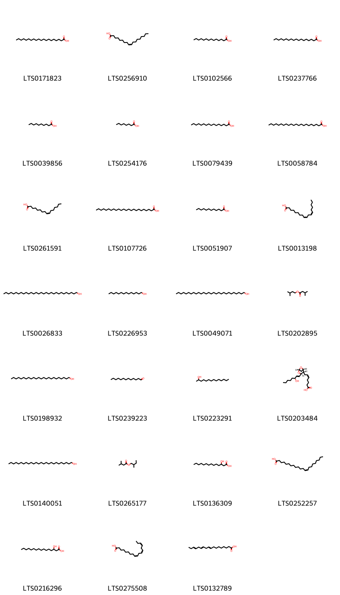{ width=100% }
    <figcaption>Hình ảnh cấu trúc hóa học của 27 hoạt chất thuộc nhóm Fatty Acyls gồm ['arachidic acid (LTS0171823)', 'oleic acid (LTS0256910)', 'myristic acid (LTS0102566)', 'stearic acid (LTS0237766)', 'capric acid (LTS0039856)', 'caprylic acid (LTS0254176)', 'palmitic acid (LTS0079439)', 'behenic acid (LTS0058784)', 'palmitoleic acid (LTS0261591)', 'lignoceric acid (LTS0107726)', 'lauric acid (LTS0051907)', 'linoleic (LTS0013198)', 'triacontanol (LTS0026833)', 'myristyl alcohol (LTS0226953)', 'octacosanol (LTS0049071)', 'apple oil (LTS0202895)', '1-tetracosanol (LTS0198932)', 'tridecanal (LTS0239223)', '2-tetradecanol (LTS0223291)', 'thromboxane a2 (LTS0203484)', 'ceryl alcohol (LTS0140051)', '2-methylbutyl isovalerate (LTS0265177)', '(+/-)-3-hydroxymyristic acid (LTS0136309)', 'erucic acid (LTS0252257)', 'β-hydroxyhexadecanoic acid (LTS0216296)', 'α-linolenic acid (LTS0275508)', 'α linolenic acid (LTS0132789)'].</figcaption>
</figure>
#### Nhóm Flavonoids
<figure markdown="span">
    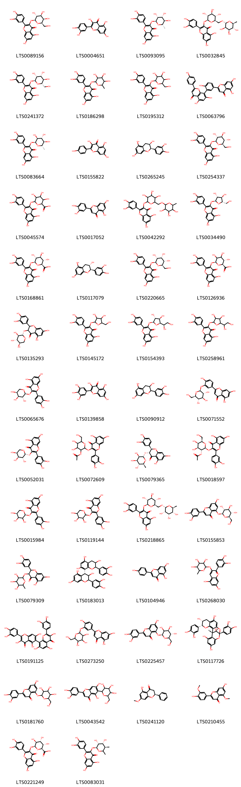{ width=100% }
    <figcaption>Hình ảnh cấu trúc hóa học của 55 hoạt chất thuộc nhóm Flavonoids gồm ['hyperoside (LTS0089156)', 'quercetin (LTS0004651)', 'quercitrin (LTS0093095)', '3-rutinosyl quercetin (LTS0032845)', '2-(3,4-dihydroxyphenyl)-5,7-dihydroxy-3-{[(2s,3r,4r,5r,6s)-3,4,5-trihydroxy-6-(hydroxymethyl)oxan-2-yl]oxy}chromen-4-one (LTS0241372)', 'quercitrin (LTS0186298)', '2-(3,4-dihydroxyphenyl)-5,7-dihydroxy-3-{[3,4,5-trihydroxy-6-(hydroxymethyl)oxan-2-yl]oxy}chromen-4-one (LTS0195312)', 'amentoflavone (LTS0063796)', '2-(3,4-dihydroxyphenyl)-5,7-dihydroxy-3-{[(2s,3s,4r,5r,6s)-3,4,5-trihydroxy-6-methyloxan-2-yl]oxy}chromen-4-one (LTS0083664)', 'kaempherol (LTS0155822)', 'ent-epicatechin (LTS0265245)', 'isoquercetin (LTS0254337)', 'miquelianin (LTS0045574)', 'luteolin (LTS0017052)', 'rutin (LTS0042292)', 'avicularin (LTS0034490)', 'querciturone (LTS0168861)', '(+)-catechol (LTS0117079)', '2-(3,4-dihydroxyphenyl)-5,7-dihydroxy-3-{[(2s,3r,4r,5s,6r)-3,4,5-trihydroxy-6-(hydroxymethyl)oxan-2-yl]oxy}chromen-4-one (LTS0220665)', 'miquelianin (LTS0126936)', '2-(3,4-dihydroxyphenyl)-5,7-dihydroxy-3-{[(2s,3r,4s,5r)-3,4,5-trihydroxyoxan-2-yl]oxy}-2,3-dihydro-1-benzopyran-4-one (LTS0135293)', '3-{[3,4-dihydroxy-5-(hydroxymethyl)oxolan-2-yl]oxy}-2-(3,4-dihydroxyphenyl)-5,7-dihydroxychromen-4-one (LTS0145172)', 'quercetin-3-glucoside (LTS0154393)', '3-{[5-(1,2-dihydroxyethyl)-3,4-dihydroxyoxolan-2-yl]oxy}-2-(3,4-dihydroxyphenyl)-5,7-dihydroxychromen-4-one (LTS0258961)', 'guaijaverin (LTS0065676)', 'myricetin (LTS0139858)', 'catechol (LTS0090912)', "luteolin 3'-glucoside (LTS0071552)", '2-(3,4-dihydroxyphenyl)-5,7-dihydroxy-3-{[(2r,3r,4s,5s)-3,4,5-trihydroxyoxan-2-yl]oxy}chromen-4-one (LTS0052031)', '2-{[2-(3,4-dihydroxyphenyl)-5,7-dihydroxy-4-oxochromen-3-yl]oxy}-4,5-dihydroxy-6-(hydroxymethyl)oxan-3-yl acetate (LTS0072609)', 'astilbin (LTS0079365)', '(2s,3r,4s,5r,6r)-2-{[2-(3,4-dihydroxyphenyl)-5,7-dihydroxy-4-oxochromen-3-yl]oxy}-4,5-dihydroxy-6-(hydroxymethyl)oxan-3-yl acetate (LTS0018597)', 'guaijaverin (LTS0015984)', 'guaijaverin (LTS0119144)', '2-(3,4-dihydroxyphenyl)-5,7-dihydroxy-3-{[(2s,3r,4s,5s,6r)-3,4,5-trihydroxy-6-({[(2r,3s,4s,5r,6s)-3,4,5-trihydroxy-6-methyloxan-2-yl]oxy}methyl)oxan-2-yl]oxy}chromen-4-one (LTS0218865)', '2-(3,4-dihydroxyphenyl)-7-hydroxy-5-{[(2s,3r,4s,5s,6r)-3,4,5-trihydroxy-6-(hydroxymethyl)oxan-2-yl]oxy}chromen-4-one (LTS0155853)', 'astilbin (LTS0079309)', '(4r)-2-(3,4-dihydroxyphenyl)-4-[2-(3,4-dihydroxyphenyl)-3,5,7-trihydroxy-3,4-dihydro-2h-1-benzopyran-8-yl]-3,4-dihydro-2h-1-benzopyran-3,5,7-triol (LTS0183013)', 'chamomile (LTS0104946)', '2-(3,4-dihydroxyphenyl)-5,7-dihydroxy-3-[(3,4,5-trihydroxy-6-methyloxan-2-yl)oxy]-1λ⁴-chromen-1-ylium (LTS0268030)', "2,2'-bis(3,4-dihydroxyphenyl)-3,3',5,5',7,7'-hexahydroxy-[6,8'-bichromene]-4,4'-dione (LTS0191125)", '5,7-dihydroxy-2-(4-hydroxy-3-{[3,4,5-trihydroxy-6-(hydroxymethyl)oxan-2-yl]oxy}phenyl)chromen-4-one (LTS0273250)', 'luteolin 5-glucoside (LTS0225457)', 'proanthocyanidin a2 (LTS0117726)', '2-(3,4-dihydroxyphenyl)-7-hydroxy-5-{[3,4,5-trihydroxy-6-(hydroxymethyl)oxan-2-yl]oxy}chromen-4-one (LTS0181760)', 'isoorientin (LTS0043542)', 'pinostrobin (LTS0241120)', "luteolin 5,3'-dimethyl ether (LTS0210455)", '(2s,3s,4r,5s,6s)-6-{[2-(3,4-dihydroxyphenyl)-5,7-dihydroxy-4-oxochromen-3-yl]oxy}-3,4,5-trihydroxyoxane-2-carboxylic acid (LTS0221249)', '3-{[(2s,3r,4r,5r)-3,4-dihydroxy-5,6-dimethyloxan-2-yl]oxy}-2-(3,4-dihydroxyphenyl)-5,7-dihydroxychromen-4-one (LTS0083031)', '(2r,3s)-2-(3,4-dihydroxyphenyl)-5,7-dihydroxy-3-{[(2s,3s,4r,5r,6s)-3,4,5-trihydroxy-6-methyloxan-2-yl]oxy}-2,3-dihydro-1-benzopyran-4-one (LTS0218167)', '2-(3,4-dihydroxyphenyl)-4-[2-(3,4-dihydroxyphenyl)-3,5,7-trihydroxy-3,4-dihydro-2h-1-benzopyran-8-yl]-3,4-dihydro-2h-1-benzopyran-3,5,7-triol (LTS0040252)', 'isoorientin (LTS0061958)', 'gancaonin o (LTS0026504)', '3-{[(2s,3s,4s,5r)-3,4-dihydroxy-5-(hydroxymethyl)oxolan-2-yl]oxy}-2-(3,4-dihydroxyphenyl)-5,7-dihydroxychromen-4-one (LTS0242881)'].</figcaption>
</figure>
#### Nhóm Hydroxy acids and derivatives
<figure markdown="span">
    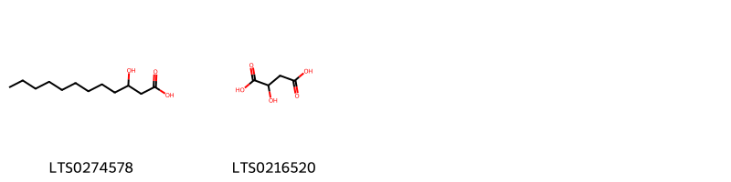{ width=100% }
    <figcaption>Hình ảnh cấu trúc hóa học của 2 hoạt chất thuộc nhóm Hydroxy acids and derivatives gồm ['3-hydroxydodecanoic acid (LTS0274578)', 'malic acid (LTS0216520)'].</figcaption>
</figure>
#### Nhóm Indoles and derivatives
<figure markdown="span">
    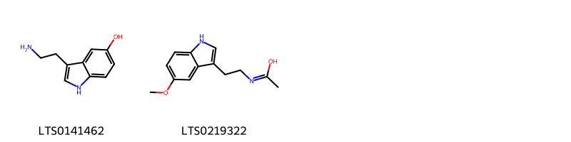{ width=100% }
    <figcaption>Hình ảnh cấu trúc hóa học của 2 hoạt chất thuộc nhóm Indoles and derivatives gồm ['serotonin (LTS0141462)', 'n-[2-(5-methoxy-1h-indol-3-yl)ethyl]ethanimidic acid (LTS0219322)'].</figcaption>
</figure>
#### Nhóm Organooxygen compounds
<figure markdown="span">
    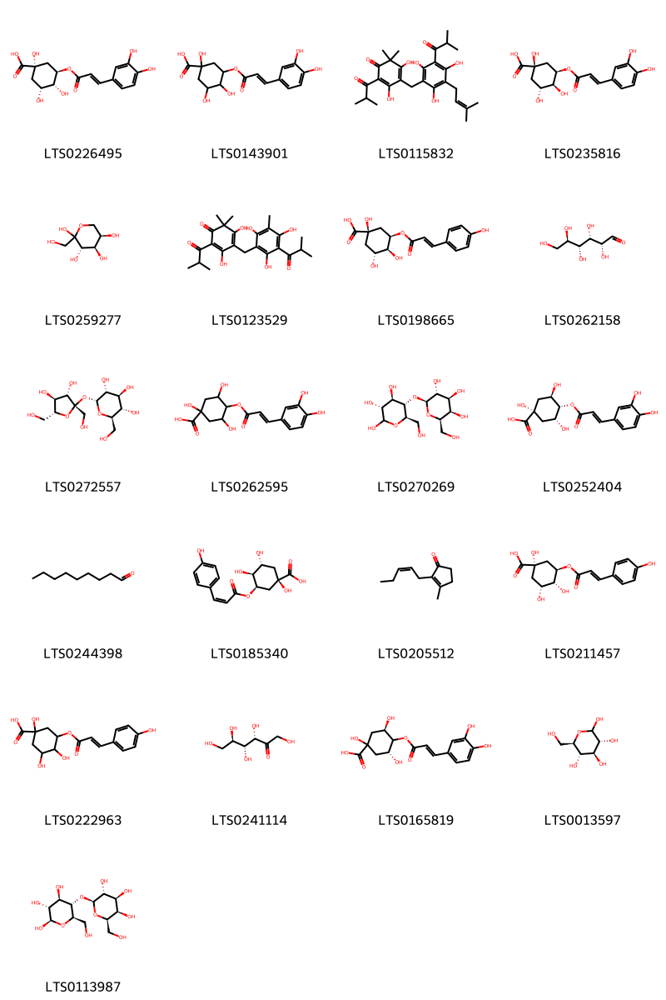{ width=100% }
    <figcaption>Hình ảnh cấu trúc hóa học của 21 hoạt chất thuộc nhóm Organooxygen compounds gồm ['chlorogenic acid (LTS0226495)', '3-{[3-(3,4-dihydroxyphenyl)prop-2-enoyl]oxy}-1,4,5-trihydroxycyclohexane-1-carboxylic acid (LTS0143901)', '3,5-dihydroxy-6,6-dimethyl-2-(2-methylpropanoyl)-4-{[2,4,6-trihydroxy-3-(3-methylbut-2-en-1-yl)-5-(2-methylpropanoyl)phenyl]methyl}cyclohexa-2,4-dien-1-one (LTS0115832)', 'neochlorogenic acid (LTS0235816)', 'd-fructopyranose (LTS0259277)', '3,5-dihydroxy-6,6-dimethyl-2-(2-methylpropanoyl)-4-{[2,4,6-trihydroxy-3-methyl-5-(2-methylpropanoyl)phenyl]methyl}cyclohexa-2,4-dien-1-one (LTS0123529)', '(1r,3r,4s,5r)-1,3,4-trihydroxy-5-{[(2e)-3-(4-hydroxyphenyl)prop-2-enoyl]oxy}cyclohexane-1-carboxylic acid (LTS0198665)', '(+)-glucose (LTS0262158)', 'sucrose (LTS0272557)', '4-{[3-(3,4-dihydroxyphenyl)prop-2-enoyl]oxy}-1,3,5-trihydroxycyclohexane-1-carboxylic acid (LTS0262595)', '(3r,4r,5s,6r)-6-(hydroxymethyl)-5-{[(2s,3r,4s,5r,6r)-3,4,5-trihydroxy-6-(hydroxymethyl)oxan-2-yl]oxy}oxane-2,3,4-triol (LTS0270269)', 'cryptochlorogenic acid (LTS0252404)', 'nonanal (LTS0244398)', '(z)-3-p-coumaroylquinic acid (LTS0185340)', 'jasmone (LTS0205512)', '(1s,3r,4r,5r)-1,3,4-trihydroxy-5-{[(2e)-3-(4-hydroxyphenyl)prop-2-enoyl]oxy}cyclohexane-1-carboxylic acid (LTS0211457)', '1,3,4-trihydroxy-5-{[3-(4-hydroxyphenyl)prop-2-enoyl]oxy}cyclohexane-1-carboxylic acid (LTS0222963)', 'keto-d-fructose (LTS0241114)', '(3r,5r)-4-{[(2e)-3-(3,4-dihydroxyphenyl)prop-2-enoyl]oxy}-1,3,5-trihydroxycyclohexane-1-carboxylic acid (LTS0165819)', 'glucose (LTS0013597)', '(2r,3r,4r,5s,6r)-6-(hydroxymethyl)-5-{[(2s,3r,4s,5r,6r)-3,4,5-trihydroxy-6-(hydroxymethyl)oxan-2-yl]oxy}oxane-2,3,4-triol (LTS0113987)'].</figcaption>
</figure>
#### Nhóm Perylenequinones
<figure markdown="span">
    { width=100% }
    <figcaption>Hình ảnh cấu trúc hóa học của 2 hoạt chất thuộc nhóm Perylenequinones gồm ['7,11,13,16,18,22-hexahydroxy-5-(hydroxymethyl)-24-methylheptacyclo[13.11.1.1²,¹⁰.0³,⁸.0¹⁹,²⁷.0²¹,²⁶.0¹⁴,²⁸]octacosa-1,3(8),4,6,10,12,14(28),15,17,19(27),21(26),22,24-tridecaene-9,20-dione (LTS0139468)', '7,11,13,16,18,22-hexahydroxy-5,24-dimethylheptacyclo[13.11.1.1²,¹⁰.0³,⁸.0¹⁹,²⁷.0²¹,²⁶.0¹⁴,²⁸]octacosa-1,3(8),4,6,10,12,14(28),15,17,19(27),21(26),22,24-tridecaene-9,20-dione (LTS0139708)'].</figcaption>
</figure>
#### Nhóm Phenanthrenes and derivatives
<figure markdown="span">
    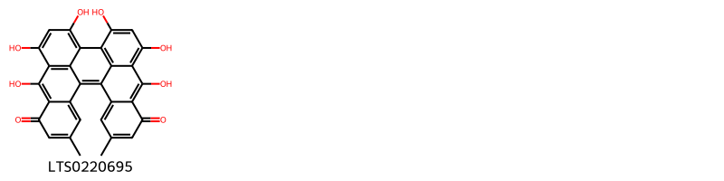{ width=100% }
    <figcaption>Hình ảnh cấu trúc hóa học của 1 hoạt chất thuộc nhóm Phenanthrenes and derivatives gồm ['9,11,13,16,18,20-hexahydroxy-5,24-dimethylheptacyclo[13.11.1.1²,¹⁰.0³,⁸.0¹⁹,²⁷.0²¹,²⁶.0¹⁴,²⁸]octacosa-1,3,5,8,10,12,14(28),15,17,19(27),20,23,25-tridecaene-7,22-dione (LTS0220695)'].</figcaption>
</figure>
#### Nhóm Phenol ethers
<figure markdown="span">
    { width=100% }
    <figcaption>Hình ảnh cấu trúc hóa học của 1 hoạt chất thuộc nhóm Phenol ethers gồm ['tarragon (LTS0245226)'].</figcaption>
</figure>
#### Nhóm Phenols
<figure markdown="span">
    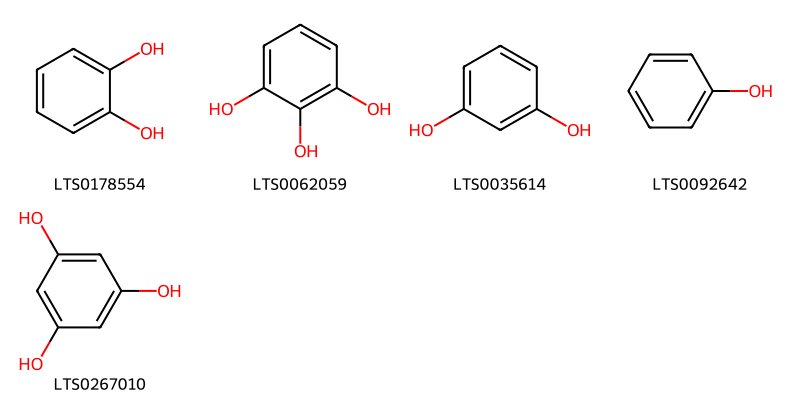{ width=100% }
    <figcaption>Hình ảnh cấu trúc hóa học của 5 hoạt chất thuộc nhóm Phenols gồm ['catechol (LTS0178554)', 'pyrogallol (LTS0062059)', 'resorcinol (LTS0035614)', 'phenol (LTS0092642)', 'phloroglucinol (LTS0267010)'].</figcaption>
</figure>
#### Nhóm Prenol lipids
<figure markdown="span">
    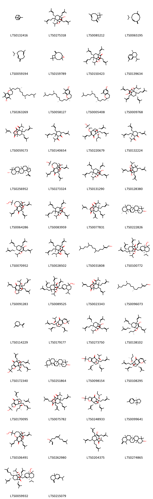{ width=100% }
    <figcaption>Hình ảnh cấu trúc hóa học của 69 hoạt chất thuộc nhóm Prenol lipids gồm ['α pinene (LTS0132416)', 'hyperforin (LTS0275318)', 'caryophyllene (LTS0085212)', '(1z,6z,8s)-8-isopropyl-1-methyl-5-methylidenecyclodeca-1,6-diene (LTS0065195)', '(-)-germacrene d (LTS0059194)', 'caryophyllene oxide (LTS0159789)', 'hyperforin (LTS0150423)', '(1s,4s)-4-isopropyl-1,6-dimethyl-1,2,3,4-tetrahydronaphthalene (LTS0139634)', 'vitamin e (LTS0263269)', 'gamma-tocopherol (LTS0058127)', 'delta-tocopherol (LTS0005408)', '(1r,5r,7r,8s)-4-hydroxy-8-methyl-3,5,7-tris(3-methylbut-2-en-1-yl)-1-(2-methylbutanoyl)-8-(4-methylpent-3-en-1-yl)bicyclo[3.3.1]non-3-ene-2,9-dione (LTS0009768)', '(1r,3r,4r,5s,7r,8s)-8-hydroxy-4,7-dimethyl-1,5-bis(3-methylbut-2-en-1-yl)-4-(4-methylpent-3-en-1-yl)-3-(2-methylpropanoyl)-9-oxatricyclo[5.2.1.0³,⁸]decane-2,10-dione (LTS0059173)', '3-methyl-4,6-bis(3-methylbut-2-en-1-yl)-3-(4-methylpent-3-en-1-yl)-2-(2-methylpropanoyl)cyclohexan-1-one (LTS0140654)', '(1s,3s,8r,9r,10s)-3-(2-hydroxypropan-2-yl)-9-methyl-6,10-bis(3-methylbut-2-en-1-yl)-8-(2-methylbutanoyl)-9-(4-methylpent-3-en-1-yl)-4-oxatricyclo[6.3.1.0¹,⁵]dodec-5-ene-7,12-dione (LTS0220679)', '(2r,3r,4s,6r)-3-methyl-4,6-bis(3-methylbut-2-en-1-yl)-3-(4-methylpent-3-en-1-yl)-2-(2-methylpropanoyl)cyclohexan-1-one (LTS0132224)', 'lupeol (LTS0256952)', '(1r,6s,9r,10s,13s)-6-(2-hydroxypropan-2-yl)-9-methyl-1,3,13-tris(3-methylbut-2-en-1-yl)-10-(2-methylpropanoyl)-5-oxatricyclo[7.2.2.0⁴,¹⁰]tridec-3-ene-2,11-dione (LTS0273324)', '(1s,5s,7s,8r)-4-hydroxy-8-methyl-3,5,7-tris(3-methylbut-2-en-1-yl)-8-(4-methylpent-3-en-1-yl)-1-(2-methylpropanoyl)bicyclo[3.3.1]non-3-ene-2,9-dione (LTS0131290)', '4-hydroxy-8,8-dimethyl-3,5,7-tris(3-methylbut-2-en-1-yl)-1-(2-methylpropanoyl)bicyclo[3.3.1]non-3-ene-2,9-dione (LTS0128380)', '(1r,6s,9r,10s,13s)-6-(2-hydroperoxypropan-2-yl)-9-methyl-1,3,13-tris(3-methylbut-2-en-1-yl)-10-(2-methylpropanoyl)-5-oxatricyclo[7.2.2.0⁴,¹⁰]tridec-3-ene-2,11-dione (LTS0064286)', '4-hydroxy-8-methyl-3,5,7-tris(3-methylbut-2-en-1-yl)-8-(4-methylpent-3-en-1-yl)-1-(2-methylpropanoyl)bicyclo[3.3.1]non-3-ene-2,9-dione (LTS0083959)', '(1r,3r,4r,5s,7r,8s)-8-hydroxy-4-methyl-1,5,7-tris(3-methylbut-2-en-1-yl)-4-(4-methylpent-3-en-1-yl)-3-(2-methylpropanoyl)-9-oxatricyclo[5.2.1.0³,⁸]decane-2,10-dione (LTS0077831)', 'amyrin (LTS0222826)', '(1r,5r,7s,8r)-4-hydroxy-3,5,7-tris(3-methylbut-2-en-1-yl)-8-(4-methylpent-3-en-1-yl)-1-(2-methylpropanoyl)bicyclo[3.3.1]non-3-en-2-one (LTS0070952)', '(1r,5s,6r,7s)-4-hydroxy-6-methyl-1,3,7-tris(3-methylbut-2-en-1-yl)-5-[(2s)-2-methylbutanoyl]-6-(4-methylpent-3-en-1-yl)bicyclo[3.3.1]non-3-ene-2,9-dione (LTS0028502)', 'phytol (LTS0031808)', '(1r,3s,5r,6r,7s)-3-{[(4as,5r,8r,8as)-5-hydroperoxy-8-isopropyl-5-methyl-4,4a,6,7,8,8a-hexahydro-3h-naphthalen-2-yl]methyl}-6-methyl-1,3,7-tris(3-methylbut-2-en-1-yl)-6-(4-methylpent-3-en-1-yl)-5-(2-methylpropanoyl)bicyclo[3.3.1]nonane-2,4,9-trione (LTS0100772)', '9-methyl-6,10-bis(3-methylbut-2-en-1-yl)-9-(4-methylpent-3-en-1-yl)-8-(2-methylpropanoyl)-4-oxatricyclo[6.3.1.0¹,⁵]dodec-5-ene-7,12-dione (LTS0091283)', '3-[(5-hydroperoxy-8-isopropyl-5-methyl-4,4a,6,7,8,8a-hexahydro-3h-naphthalen-2-yl)methyl]-6-methyl-1,3,7-tris(3-methylbut-2-en-1-yl)-6-(4-methylpent-3-en-1-yl)-5-(2-methylpropanoyl)bicyclo[3.3.1]nonane-2,4,9-trione (LTS0089525)', '8-hydroxy-4,7-dimethyl-1,5-bis(3-methylbut-2-en-1-yl)-4-(4-methylpent-3-en-1-yl)-3-(2-methylpropanoyl)-9-oxatricyclo[5.2.1.0³,⁸]decane-2,10-dione (LTS0023343)', 'phytol (LTS0096073)', '1-methyl-3-(prop-1-en-2-yl)cyclohex-1-ene (LTS0114229)', '(1r,9s,10r,11s)-4,4,10-trimethyl-1,11-bis(3-methylbut-2-en-1-yl)-10-(4-methylpent-3-en-1-yl)-9-(2-methylpropanoyl)-3-oxatricyclo[7.3.1.0²,⁷]trideca-2(7),5-diene-8,13-dione (LTS0179177)', '(1s,5s,7r,8s)-4-hydroxy-8-methyl-3,5,7-tris(3-methylbut-2-en-1-yl)-8-(4-methylpent-3-en-1-yl)-1-(2-methylpropanoyl)bicyclo[3.3.1]non-3-ene-2,9-dione (LTS0273750)', '(1r,5r,7s,8r)-4-hydroxy-3,5,7-tris(3-methylbut-2-en-1-yl)-1-[(2r)-2-methylbutanoyl]-8-(4-methylpent-3-en-1-yl)bicyclo[3.3.1]non-3-en-2-one (LTS0138102)', '4-(2-hydroxypropan-2-yl)-11-methyl-8,10-bis(3-methylbut-2-en-1-yl)-11-(4-methylpent-3-en-1-yl)-1-(2-methylpropanoyl)-3-oxatricyclo[6.3.1.0²,⁶]dodec-2(6)-ene-7,12-dione (LTS0172340)', 'β-amyrin (LTS0251864)', '(1s,4r,8s,9s,10r)-4-(2-hydroxypropan-2-yl)-9-methyl-1,10-bis(3-methylbut-2-en-1-yl)-9-(4-methylpent-3-en-1-yl)-8-(2-methylpropanoyl)-3-oxatricyclo[6.3.1.0²,⁶]dodec-2(6)-ene-7,12-dione (LTS0098154)', '(1r,9s,10r,11s)-4,4,10-trimethyl-1,11-bis(3-methylbut-2-en-1-yl)-9-[(2r)-2-methylbutanoyl]-10-(4-methylpent-3-en-1-yl)-3-oxatricyclo[7.3.1.0²,⁷]trideca-2(7),5-diene-8,13-dione (LTS0108295)', '(1s,4s,8r,10s,11r)-4-(2-hydroxypropan-2-yl)-11-methyl-8,10-bis(3-methylbut-2-en-1-yl)-1-[(2r)-2-methylbutanoyl]-11-(4-methylpent-3-en-1-yl)-3-oxatricyclo[6.3.1.0²,⁶]dodec-2(6)-ene-7,12-dione (LTS0170095)', '8-hydroxy-4-methyl-1,5,7-tris(3-methylbut-2-en-1-yl)-4-(4-methylpent-3-en-1-yl)-3-(2-methylpropanoyl)-9-oxatricyclo[5.2.1.0³,⁸]decane-2,10-dione (LTS0075782)', '(1s,4r,8s,9s,10r)-4-(2-hydroxypropan-2-yl)-9-methyl-1,10-bis(3-methylbut-2-en-1-yl)-8-[(2r)-2-methylbutanoyl]-9-(4-methylpent-3-en-1-yl)-3-oxatricyclo[6.3.1.0²,⁶]dodec-2(6)-ene-7,12-dione (LTS0248933)', '(-)-α-cuprenene (LTS0099641)', '6-(2-hydroperoxypropan-2-yl)-9-methyl-1,3,13-tris(3-methylbut-2-en-1-yl)-10-(2-methylpropanoyl)-5-oxatricyclo[7.2.2.0⁴,¹⁰]tridec-3-ene-2,11-dione (LTS0106491)', 'nerolidol (LTS0262980)', '4-hydroxy-3,5,7-tris(3-methylbut-2-en-1-yl)-8-(4-methylpent-3-en-1-yl)-1-(2-methylpropanoyl)bicyclo[3.3.1]non-3-en-2-one (LTS0204375)', '(6ar,6br,8ar,14br)-4,4,6a,6b,8a,12,14b-heptamethyl-11-methylidene-hexadecahydropicen-3-ol (LTS0274865)', '(1r,3r,5s,6r,7s)-3-{[(4as,5r,8r,8as)-5-hydroperoxy-8-isopropyl-5-methyl-4,4a,6,7,8,8a-hexahydro-3h-naphthalen-2-yl]methyl}-6-methyl-1,3,7-tris(3-methylbut-2-en-1-yl)-6-(4-methylpent-3-en-1-yl)-5-(2-methylpropanoyl)bicyclo[3.3.1]nonane-2,4,9-trione (LTS0059932)', 'sibirene (LTS0215079)', '3β-hydroxy-12-ursen-28-ic acid (LTS0080592)', '(1s,4s,8s,9s,10r)-4-(2-hydroxypropan-2-yl)-9-methyl-1,10-bis(3-methylbut-2-en-1-yl)-9-(4-methylpent-3-en-1-yl)-8-(2-methylpropanoyl)-3-oxatricyclo[6.3.1.0²,⁶]dodec-2(6)-ene-7,12-dione (LTS0185670)', 'taraxasterol (LTS0006950)', 'junenol (LTS0158581)', '4,4,10-trimethyl-1,11-bis(3-methylbut-2-en-1-yl)-9-(2-methylbutanoyl)-10-(4-methylpent-3-en-1-yl)-3-oxatricyclo[7.3.1.0²,⁷]trideca-2(7),5-diene-8,13-dione (LTS0025432)', '(1r,5r,7s)-4-hydroxy-8,8-dimethyl-3,5,7-tris(3-methylbut-2-en-1-yl)-1-(2-methylpropanoyl)bicyclo[3.3.1]non-3-ene-2,9-dione (LTS0188266)', '(z)-phytol (LTS0048597)', '(1s,8r,9r,10s)-9-methyl-6,10-bis(3-methylbut-2-en-1-yl)-9-(4-methylpent-3-en-1-yl)-8-(2-methylpropanoyl)-4-oxatricyclo[6.3.1.0¹,⁵]dodec-5-ene-7,12-dione (LTS0189795)', '4-hydroxy-3,5,7-tris(3-methylbut-2-en-1-yl)-1-(2-methylbutanoyl)-8-(4-methylpent-3-en-1-yl)bicyclo[3.3.1]non-3-en-2-one (LTS0271853)', '(1s,4s,8s,9s,10r)-4-(2-hydroxypropan-2-yl)-9-methyl-1,10-bis(3-methylbut-2-en-1-yl)-8-[(2r)-2-methylbutanoyl]-9-(4-methylpent-3-en-1-yl)-3-oxatricyclo[6.3.1.0²,⁶]dodec-2(6)-ene-7,12-dione (LTS0068516)', 'methyl 4-methyl-1,5-bis(3-methylbut-2-en-1-yl)-4-(4-methylpent-3-en-1-yl)-3-(2-methylpropanoyl)-2-oxocyclohexane-1-carboxylate (LTS0033341)', '4-(2-hydroxypropan-2-yl)-9-methyl-1,10-bis(3-methylbut-2-en-1-yl)-9-(4-methylpent-3-en-1-yl)-8-(2-methylpropanoyl)-3-oxatricyclo[6.3.1.0²,⁶]dodec-2(6)-ene-7,12-dione (LTS0014307)', 'leden (LTS0002793)', '5,6,9-trimethyltetracyclo[7.2.1.0¹,⁶.0⁸,¹⁰]dodecane (LTS0014612)', '4,4,10-trimethyl-1,11-bis(3-methylbut-2-en-1-yl)-10-(4-methylpent-3-en-1-yl)-9-(2-methylpropanoyl)-3-oxatricyclo[7.3.1.0²,⁷]trideca-2(7),5-diene-8,13-dione (LTS0054640)', 'methyl (1s,3r,4r,5s)-4-methyl-1,5-bis(3-methylbut-2-en-1-yl)-4-(4-methylpent-3-en-1-yl)-3-(2-methylpropanoyl)-2-oxocyclohexane-1-carboxylate (LTS0232658)', '4-(2-hydroxypropan-2-yl)-11-methyl-8,10-bis(3-methylbut-2-en-1-yl)-1-(2-methylbutanoyl)-11-(4-methylpent-3-en-1-yl)-3-oxatricyclo[6.3.1.0²,⁶]dodec-2(6)-ene-7,12-dione (LTS0273259)', '4-(2-hydroxypropan-2-yl)-9-methyl-1,10-bis(3-methylbut-2-en-1-yl)-8-(2-methylbutanoyl)-9-(4-methylpent-3-en-1-yl)-3-oxatricyclo[6.3.1.0²,⁶]dodec-2(6)-ene-7,12-dione (LTS0263628)', '3-(2-hydroxypropan-2-yl)-9-methyl-6,10-bis(3-methylbut-2-en-1-yl)-9-(4-methylpent-3-en-1-yl)-8-(2-methylpropanoyl)-4-oxatricyclo[6.3.1.0¹,⁵]dodec-5-ene-7,12-dione (LTS0227799)'].</figcaption>
</figure>
#### Nhóm Pyrenes
<figure markdown="span">
    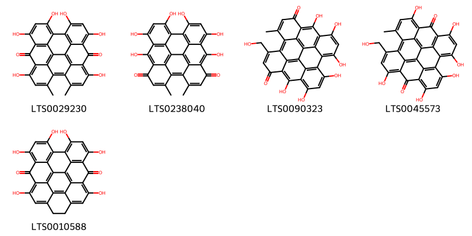{ width=100% }
    <figcaption>Hình ảnh cấu trúc hóa học của 5 hoạt chất thuộc nhóm Pyrenes gồm ['hypericin (LTS0029230)', '9,11,13,16,18,20-hexahydroxy-5,24-dimethyloctacyclo[13.11.1.1²,¹⁰.0³,⁸.0⁴,²⁵.0¹⁹,²⁷.0²¹,²⁶.0¹⁴,²⁸]octacosa-1(26),2,4(25),5,8,10,12,14(28),15,17,19(27),20,23-tridecaene-7,22-dione (LTS0238040)', '9,11,13,16,18,20-hexahydroxy-5-(hydroxymethyl)-24-methyloctacyclo[13.11.1.1²,¹⁰.0³,⁸.0⁴,²⁵.0¹⁹,²⁷.0²¹,²⁶.0¹⁴,²⁸]octacosa-1(26),2,4(25),5,8,10,12,14(28),15,17,19(27),20,23-tridecaene-7,22-dione (LTS0090323)', '5,7,11,18,22,24-hexahydroxy-13-(hydroxymethyl)-16-methyloctacyclo[13.11.1.1²,¹⁰.0³,⁸.0⁴,²⁵.0¹⁹,²⁷.0²¹,²⁶.0¹⁴,²⁸]octacosa-1,3,5,7,10(28),11,13,15(27),16,18,21(26),22,24-tridecaene-9,20-dione (LTS0045573)', '7,9,13,20,24,26-hexahydroxynonacyclo[16.12.0.0²,¹⁵.0³,¹².0⁴,²⁹.0⁵,¹⁰.0⁶,²⁷.0²¹,³⁰.0²³,²⁸]triaconta-1(18),2,4(29),5(10),6,8,12,14,19,21(30),23,25,27-tridecaene-11,22-dione (LTS0010588)'].</figcaption>
</figure>
#### Nhóm Saturated hydrocarbons
<figure markdown="span">
    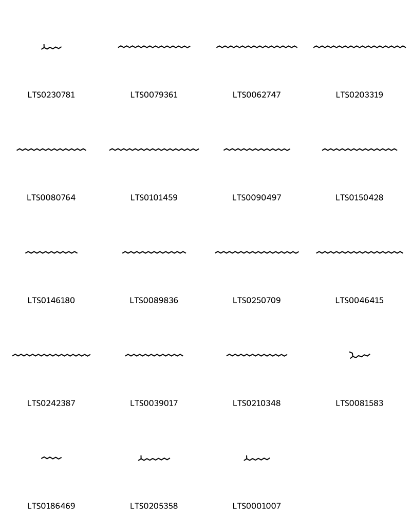{ width=100% }
    <figcaption>Hình ảnh cấu trúc hóa học của 19 hoạt chất thuộc nhóm Saturated hydrocarbons gồm ['2-methyloctane (LTS0230781)', 'hexacosane (LTS0079361)', 'nonacosane (LTS0062747)', 'tritriacontane (LTS0203319)', 'pentacosane (LTS0080764)', 'dotriacontane (LTS0101459)', 'tetracosane (LTS0090497)', 'heptacosane (LTS0150428)', 'nonadecane (LTS0146180)', 'tricosane (LTS0089836)', 'triacontane (LTS0250709)', 'hentriacontane (LTS0046415)', 'octacosane (LTS0242387)', 'heneicosane (LTS0039017)', 'docosane (LTS0210348)', '3-mrthylnonane (LTS0081583)', 'octane (LTS0186469)', '2-methyldodecane (LTS0205358)', '2-methyldecane (LTS0001007)'].</figcaption>
</figure>
#### Nhóm Steroids and steroid derivatives
<figure markdown="span">
    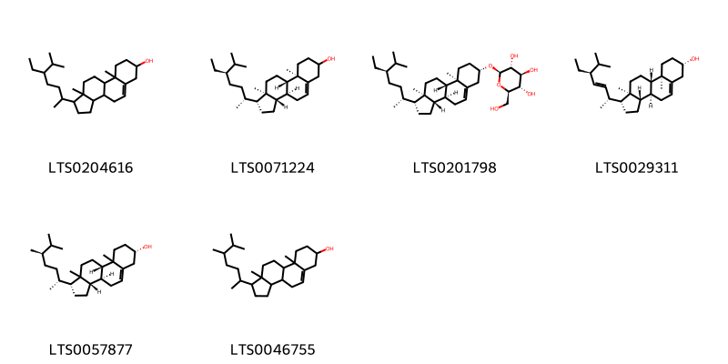{ width=100% }
    <figcaption>Hình ảnh cấu trúc hóa học của 6 hoạt chất thuộc nhóm Steroids and steroid derivatives gồm ['stigmast-5-en-3-ol, (3β)- (LTS0204616)', 'stigmast-5-en-3-ol (LTS0071224)', 'sitogluside (LTS0201798)', 'phytosterol (LTS0029311)', '(1r,3as,3bs,7s,9bs)-1-[(2r,5r)-5,6-dimethylheptan-2-yl]-9a,11a-dimethyl-1h,2h,3h,3ah,3bh,4h,6h,7h,8h,9h,9bh,10h,11h-cyclopenta[a]phenanthren-7-ol (LTS0057877)', 'campesterol (LTS0046755)'].</figcaption>
</figure>
#### Nhóm Tetrapyrroles and derivatives
<figure markdown="span">
    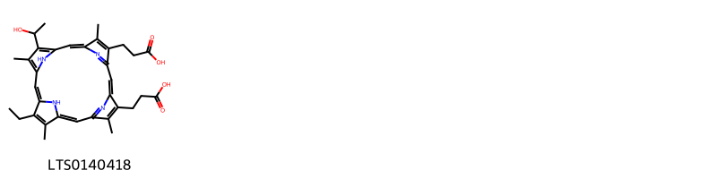{ width=100% }
    <figcaption>Hình ảnh cấu trúc hóa học của 1 hoạt chất thuộc nhóm Tetrapyrroles and derivatives gồm ['3-[20-(2-carboxyethyl)-10-ethyl-15-(1-hydroxyethyl)-5,9,14,19-tetramethyl-21,22,23,24-tetraazapentacyclo[16.2.1.1³,⁶.1⁸,¹¹.1¹³,¹⁶]tetracosa-1,3(24),4,6,8,10,12,14,16,18(21),19-undecaen-4-yl]propanoic acid (LTS0140418)'].</figcaption>
</figure>

---

### Dược dân tộc học

Danh sách các quốc gia có sử dụng *Hypericum perforatum* trong điều trị các bệnh. 

| Country   | Disease                                                                                                                    | Bệnh                                                                                                                       |
|:----------|:---------------------------------------------------------------------------------------------------------------------------|:---------------------------------------------------------------------------------------------------------------------------|
| Elsewhere | Abortifacient, Antibiotic, Astringent, nan, Diuretic, Nervine, Poison, Vermicide, Expectorant                              | Abortifacient, Kháng sinh, Chất làm se, nan, Thuốc lợi tiểu, Nervine, Chất độc, Thuốc diệt côn trùng, Thuốc diệt côn trùng |
| India     | Emmenagogue, Vermifuge                                                                                                     | Emmenagogue, Vermifuge                                                                                                     |
| Turkey    | Antiseptic, Astringent, Expectorant, Nervine, Stimulant, Uterotonic, Vermifuge, Vulnerary, Cholagogue, Diuretic, Digestive | Sát trùng, làm se, đờm, thần kinh, kích thích, tử cung, Vermifuge, Vulnerary, Cholagogue, lợi tiểu, tiêu hóa               |
| US        | Phototoxic                                                                                                                 | Độc hại do ánh sáng                                                                                                        |
| ain       | Vulnerary                                                                                                                  | Vulnerary                                                                                                                  |

---

---
## Hypericum sampsoni
### Thông tin về thực vật

!!! info "Phân loại thực vật của *Hypericum sampsonii* từ GIBF:"
    - **Kingdom:** Plantae
    - **Phylum:** Tracheophyta
    - **Order:** Malpighiales
    - **Family:** Hypericaceae
    - **Genus:** Hypericum
    - **Species:** *Hypericum sampsonii*

 

| Label (VI)   | Label (EN)   | Scientific Name      | Descriptions (VI)   | Descriptions (EN)   | Also Known As (VI)   | Also Known As (EN)                                                        |
|:-------------|:-------------|:---------------------|:--------------------|:--------------------|:---------------------|:--------------------------------------------------------------------------|
| N/A          | N/A          | Hypericum perforatum | loài thực vật       | species of plant    | ['']                 | ["St. John's wort", "Common St. John's wort", 'perforate St. Johns-wort'] |

#### Phân bố trên thế giới

**Từ CSDL GIBF** Viet Nam, nan, unknown or invalid, Japan, Andorra, China, Chinese Taipei

#### Phân bố tại Việt Nam

**Từ CSDL GIBF**: Hoa Binh

---
### Thành phần hóa học
        
- Theo cơ sở dữ liệu lotus: Từ loài *Hypericum sampsonii* đã phân lập và xác định được 118 hoạt chất thuộc về các nhóm Organooxygen compounds, Benzopyrans, Flavonoids, Prenol lipids, Anthracenes, Phenol ethers, Cinnamic acids and derivatives, Benzene and substituted derivatives. 

|    | chemicalTaxonomyClassyfireClass     |   smiles_count |
|---:|:------------------------------------|---------------:|
|  0 | Anthracenes                         |              5 |
|  1 | Benzene and substituted derivatives |              7 |
|  2 | Benzopyrans                         |             25 |
|  3 | Cinnamic acids and derivatives      |              4 |
|  4 | Flavonoids                          |             10 |
|  5 | Organooxygen compounds              |             52 |
|  6 | Phenol ethers                       |              1 |
|  7 | Prenol lipids                       |             14 |

#### Nhóm Anthracenes
<figure markdown="span">
    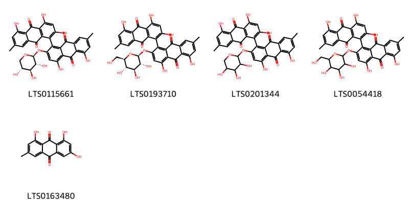{ width=100% }
    <figcaption>Hình ảnh cấu trúc hóa học của 5 hoạt chất thuộc nhóm Anthracenes gồm ["2,4,4',5,5'-pentahydroxy-7,7'-dimethyl-2'-{[(2s,3r,4s,5r)-3,4,5-trihydroxyoxan-2-yl]oxy}-[1,1'-bianthracene]-9,9',10,10'-tetrone (LTS0115661)", "2,4,4',5,5'-pentahydroxy-7,7'-dimethyl-2'-{[(2s,3r,4s,5s,6r)-3,4,5-trihydroxy-6-(hydroxymethyl)oxan-2-yl]oxy}-[1,1'-bianthracene]-9,9',10,10'-tetrone (LTS0193710)", "2,4,4',5,5'-pentahydroxy-7,7'-dimethyl-2'-[(3,4,5-trihydroxyoxan-2-yl)oxy]-[1,1'-bianthracene]-9,9',10,10'-tetrone (LTS0201344)", "2,4,4',5,5'-pentahydroxy-7,7'-dimethyl-2'-{[3,4,5-trihydroxy-6-(hydroxymethyl)oxan-2-yl]oxy}-[1,1'-bianthracene]-9,9',10,10'-tetrone (LTS0054418)", 'emodin (LTS0163480)'].</figcaption>
</figure>
#### Nhóm Benzene and substituted derivatives
<figure markdown="span">
    { width=100% }
    <figcaption>Hình ảnh cấu trúc hóa học của 7 hoạt chất thuộc nhóm Benzene and substituted derivatives gồm ['3,4-dihydroxybenzoic acid (LTS0018765)', '2-benzoyl-5-{[(2e)-3,7-dimethylocta-2,6-dien-1-yl]oxy}benzene-1,3-diol (LTS0211936)', '2-benzoyl-5-[(7-hydroxy-3,7-dimethyloct-2-en-1-yl)oxy]benzene-1,3-diol (LTS0117611)', '2-benzoyl-5-[(3,7-dimethylocta-2,6-dien-1-yl)oxy]benzene-1,3-diol (LTS0056889)', '2-benzoyl-5-{[(2e)-7-hydroxy-3,7-dimethyloct-2-en-1-yl]oxy}benzene-1,3-diol (LTS0265425)', '2-benzoyl-5-[(5-hydroxy-3,7-dimethylocta-2,7-dien-1-yl)oxy]benzene-1,3-diol (LTS0185999)', '2-benzoyl-5-{[(2e,5s)-5-hydroxy-3,7-dimethylocta-2,7-dien-1-yl]oxy}benzene-1,3-diol (LTS0058988)'].</figcaption>
</figure>
#### Nhóm Benzopyrans
<figure markdown="span">
    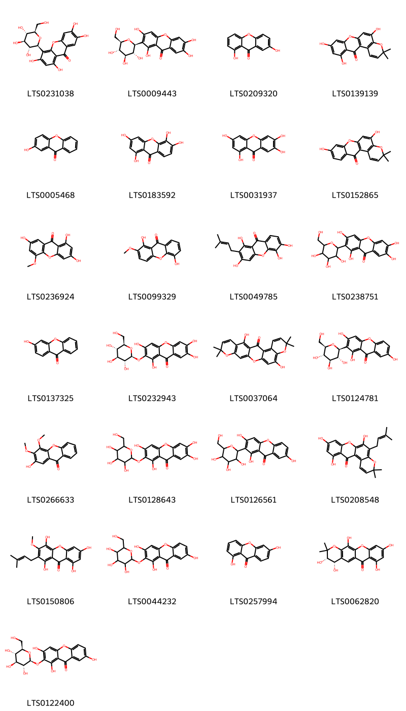{ width=100% }
    <figcaption>Hình ảnh cấu trúc hóa học của 25 hoạt chất thuộc nhóm Benzopyrans gồm ['isomangiferin (LTS0231038)', 'mangiferin (LTS0009443)', 'euxanthone (LTS0209320)', '6,8,12-trihydroxy-2,2-dimethyl-1,10-dioxatetraphen-5-one (LTS0139139)', '2-hydroxy-9-xanthenone (LTS0005468)', '1,3,5,6-tetrahydroxyxanthen-9-one (LTS0183592)', '1,3,6,7-tetrahydroxyxanthone (LTS0031937)', '8,12-dihydroxy-2,2-dimethyl-1,10-dioxatetraphen-5-one (LTS0152865)', '1,3,7-trihydroxy-5-methoxyxanthen-9-one (LTS0236924)', '1,5-dihydroxy-2-methoxyxanthen-9-one (LTS0099329)', '1,3,5,6-tetrahydroxy-2-(3-methylbut-2-en-1-yl)xanthen-9-one (LTS0049785)', 'mangiferin (LTS0238751)', '3-hydroxyxanthen-9-one (LTS0137325)', '1,3,6,7-tetrahydroxy-2-{[(2s,3r,4s,5s,6r)-3,4,5-trihydroxy-6-(hydroxymethyl)oxan-2-yl]oxy}xanthen-9-one (LTS0232943)', '10,22-dihydroxy-7,7,18,18-tetramethyl-8,13,17-trioxapentacyclo[12.8.0.0³,¹².0⁴,⁹.0¹⁶,²¹]docosa-1(22),3,5,9,11,14,16(21),19-octaen-2-one (LTS0037064)', '1,3,7-trihydroxy-2-[(2s,3r,4r,5s,6r)-3,4,5-trihydroxy-6-(hydroxymethyl)oxan-2-yl]xanthen-9-one (LTS0124781)', '2-hydroxy-3,4-dimethoxyxanthen-9-one (LTS0266633)', '1,3,6,7-tetrahydroxy-2-{[3,4,5-trihydroxy-6-(hydroxymethyl)oxan-2-yl]oxy}xanthen-9-one (LTS0128643)', '1,3,7-trihydroxy-2-[3,4,5-trihydroxy-6-(hydroxymethyl)oxan-2-yl]xanthen-9-one (LTS0126561)', '6,8,11-trihydroxy-2,2-dimethyl-12-(3-methylbut-2-en-1-yl)-1,10-dioxatetraphen-5-one (LTS0208548)', '1,4,6,8-tetrahydroxy-3-methoxy-2-(3-methylbut-2-en-1-yl)xanthen-9-one (LTS0150806)', '1,3,7-trihydroxy-2-{[3,4,5-trihydroxy-6-(hydroxymethyl)oxan-2-yl]oxy}xanthen-9-one (LTS0044232)', '1,6-dihydroxyxanthen-9-one (LTS0257994)', '(3s,4s)-3,4,7,9,12-pentahydroxy-2,2-dimethyl-3,4-dihydro-1,11-dioxatetracen-6-one (LTS0062820)', '1,3,7-trihydroxy-2-{[(2s,3r,4s,5s,6r)-3,4,5-trihydroxy-6-(hydroxymethyl)oxan-2-yl]oxy}xanthen-9-one (LTS0122400)'].</figcaption>
</figure>
#### Nhóm Cinnamic acids and derivatives
<figure markdown="span">
    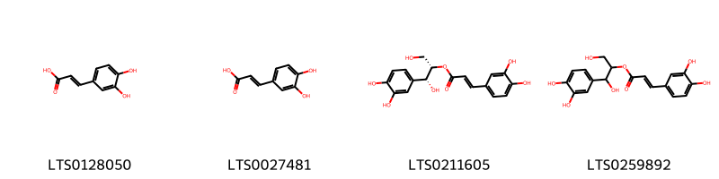{ width=100% }
    <figcaption>Hình ảnh cấu trúc hóa học của 4 hoạt chất thuộc nhóm Cinnamic acids and derivatives gồm ['3,4-dihydroxycinnamic acid (LTS0128050)', 'caffeic acid (LTS0027481)', '(1r,2s)-1-(3,4-dihydroxyphenyl)-1,3-dihydroxypropan-2-yl (2e)-3-(3,4-dihydroxyphenyl)prop-2-enoate (LTS0211605)', '1-(3,4-dihydroxyphenyl)-1,3-dihydroxypropan-2-yl 3-(3,4-dihydroxyphenyl)prop-2-enoate (LTS0259892)'].</figcaption>
</figure>
#### Nhóm Flavonoids
<figure markdown="span">
    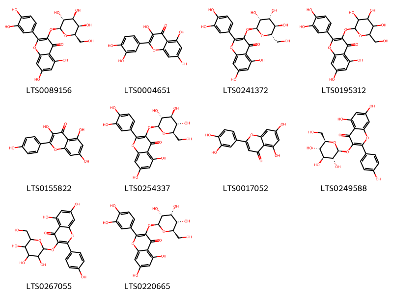{ width=100% }
    <figcaption>Hình ảnh cấu trúc hóa học của 10 hoạt chất thuộc nhóm Flavonoids gồm ['hyperoside (LTS0089156)', 'quercetin (LTS0004651)', '2-(3,4-dihydroxyphenyl)-5,7-dihydroxy-3-{[(2s,3r,4r,5r,6s)-3,4,5-trihydroxy-6-(hydroxymethyl)oxan-2-yl]oxy}chromen-4-one (LTS0241372)', '2-(3,4-dihydroxyphenyl)-5,7-dihydroxy-3-{[3,4,5-trihydroxy-6-(hydroxymethyl)oxan-2-yl]oxy}chromen-4-one (LTS0195312)', 'kaempherol (LTS0155822)', 'isoquercetin (LTS0254337)', 'luteolin (LTS0017052)', 'astragalin (LTS0249588)', 'trifolin (LTS0267055)', '2-(3,4-dihydroxyphenyl)-5,7-dihydroxy-3-{[(2s,3r,4r,5s,6r)-3,4,5-trihydroxy-6-(hydroxymethyl)oxan-2-yl]oxy}chromen-4-one (LTS0220665)'].</figcaption>
</figure>
#### Nhóm Organooxygen compounds
<figure markdown="span">
    { width=100% }
    <figcaption>Hình ảnh cấu trúc hóa học của 52 hoạt chất thuộc nhóm Organooxygen compounds gồm ['ochrocarpinone c (LTS0079477)', '(1s,3r,4s,7r,9r,11s)-1-benzoyl-11-[(2e)-3,7-dimethylocta-2,6-dien-1-yl]-4-hydroxy-6,6,13,13-tetramethyl-3-(3-methylbut-2-en-1-yl)-5-oxatetracyclo[7.3.1.0³,⁷.0⁴,¹¹]tridecane-2,12-dione (LTS0185542)', '(2s,3r,4s,5s,6r)-2-(2-benzoyl-3,5-dihydroxyphenoxy)-6-(hydroxymethyl)oxane-3,4,5-triol (LTS0270105)', '1-benzoyl-11-(3,7-dimethylocta-2,6-dien-1-yl)-4-hydroxy-6,6,13,13-tetramethyl-3-(3-methylbut-2-en-1-yl)-5-oxatetracyclo[7.3.1.0³,⁷.0⁴,¹¹]tridecane-2,12-dione (LTS0231255)', '2-(2-benzoyl-3,5-dihydroxyphenoxy)-6-(hydroxymethyl)oxane-3,4,5-triol (LTS0062524)', '8-benzoyl-3-(2-hydroxypropan-2-yl)-9,9-dimethyl-6,10-bis(3-methylbut-2-en-1-yl)-4-oxatricyclo[6.3.1.0¹,⁵]dodec-5-ene-7,12-dione (LTS0039851)', '(1s,3r,5s,7s,8s)-5-benzoyl-8-[(2r)-3,3-dimethyloxiran-2-yl]-6,6-dimethyl-1,3-bis(3-methylbut-2-en-1-yl)adamantane-2,4,9-trione (LTS0062372)', '(1s,3s,5r,7r,9s,11r)-9-benzoyl-11-[(2e)-3,7-dimethylocta-2,6-dien-1-yl]-3-(2-hydroxypropan-2-yl)-4,4,8,8-tetramethyltetracyclo[7.3.1.1⁷,¹¹.0¹,⁵]tetradecane-10,12,13-trione (LTS0061159)', '1-benzoyl-4,4,12-trimethyl-9,11-bis(3-methylbut-2-en-1-yl)-12-(4-methylpent-3-en-1-yl)-3-oxatricyclo[7.3.1.0²,⁷]trideca-2(7),5-diene-8,13-dione (LTS0067633)', '(1r,3s,7s,9s,11r,13s)-11-benzoyl-3-(2-hydroxypropan-2-yl)-6,6,10,10-tetramethyl-13-(3-methylbut-2-en-1-yl)-4,5-dioxatetracyclo[9.3.1.1⁹,¹³.0¹,⁷]hexadecane-12,14,15-trione (LTS0089752)', '(1s,3s,7r,9r,11r)-1-benzoyl-11-[(2e)-3,7-dimethylocta-2,6-dien-1-yl]-4-hydroxy-6,6,13,13-tetramethyl-3-(3-methylbut-2-en-1-yl)-5-oxatetracyclo[7.3.1.0³,⁷.0⁴,¹¹]tridecane-2,12-dione (LTS0095440)', '(1s,3r,5s,7s,8r)-5-benzoyl-3-[(2e)-3,7-dimethylocta-2,6-dien-1-yl]-8-[(2s)-3,3-dimethyloxiran-2-yl]-6,6-dimethyl-1-(3-methylbut-2-en-1-yl)adamantane-2,4,9-trione (LTS0109997)', '(1r,3s,7s,9s,11r,13s)-11-benzoyl-3-(2-hydroperoxypropan-2-yl)-6,6,10,10-tetramethyl-13-(3-methylbut-2-en-1-yl)-4,5-dioxatetracyclo[9.3.1.1⁹,¹³.0¹,⁷]hexadecane-12,14,15-trione (LTS0179838)', '(1s,3s,7r,9r,11r)-1-benzoyl-4-hydroxy-6,6,13,13-tetramethyl-3,11-bis(3-methylbut-2-en-1-yl)-5-oxatetracyclo[7.3.1.0³,⁷.0⁴,¹¹]tridecane-2,12-dione (LTS0191096)', '(1s,3s,8r,10r)-8-benzoyl-3-(2-hydroxypropan-2-yl)-9,9-dimethyl-6,10-bis(3-methylbut-2-en-1-yl)-4-oxatricyclo[6.3.1.0¹,⁵]dodec-5-ene-7,12-dione (LTS0197753)', '11-benzoyl-3-(2-hydroxypropan-2-yl)-6,6,10,10-tetramethyl-13-(3-methylbut-2-en-1-yl)-4,5-dioxatetracyclo[9.3.1.1⁹,¹³.0¹,⁷]hexadecane-12,14,15-trione (LTS0110593)', '8-benzoyl-3-(2-hydroxy-6-methylhept-5-en-2-yl)-9,9-dimethyl-6,10-bis(3-methylbut-2-en-1-yl)-4-oxatricyclo[6.3.1.0¹,⁵]dodec-5-ene-7,12-dione (LTS0140189)', 'ochrocarpinone b (LTS0263387)', '9-benzoyl-11-(3,7-dimethylocta-2,6-dien-1-yl)-3-isopropyl-4,4,8,8-tetramethyltetracyclo[7.3.1.1⁷,¹¹.0¹,⁵]tetradecane-10,12,13-trione (LTS0121120)', '(1s,5r,7r,9s,11r)-9-benzoyl-11-[(2e)-3,7-dimethylocta-2,6-dien-1-yl]-4,4,8,8-tetramethyltetracyclo[7.3.1.1⁷,¹¹.0¹,⁵]tetradecane-10,12,13-trione (LTS0146488)', '5-benzoyl-3-(3,7-dimethylocta-2,6-dien-1-yl)-8-(3,3-dimethyloxiran-2-yl)-6,6-dimethyl-1-(3-methylbut-2-en-1-yl)adamantane-2,4,9-trione (LTS0102662)', '9-benzoyl-11-(3,7-dimethylocta-2,6-dien-1-yl)-4,4,8,8-tetramethyltetracyclo[7.3.1.1⁷,¹¹.0¹,⁵]tetradecane-10,12,13-trione (LTS0172608)', '1-benzoyl-9-(3,7-dimethylocta-2,6-dien-1-yl)-4,4,12,12-tetramethyl-11-(3-methylbut-2-en-1-yl)-3-oxatricyclo[7.3.1.0²,⁷]tridec-2(7)-ene-8,13-dione (LTS0162701)', '(1r,3s,5r,7s,9r,11s)-9-benzoyl-11-[(2e)-3,7-dimethylocta-2,6-dien-1-yl]-3-isopropyl-4,4,8,8-tetramethyltetracyclo[7.3.1.1⁷,¹¹.0¹,⁵]tetradecane-10,12,13-trione (LTS0096586)', '1-benzoyl-8-(3,7-dimethylocta-2,6-dien-1-yl)-4-(2-hydroxypropan-2-yl)-11,11-dimethyl-10-(3-methylbut-2-en-1-yl)-3-oxatricyclo[6.3.1.0²,⁶]dodec-2(6)-ene-7,12-dione (LTS0244745)', '(1s,5s,7r,9s,11r)-9-benzoyl-11-[(2e)-3,7-dimethylocta-2,6-dien-1-yl]-4,4,8,8-tetramethyltetracyclo[7.3.1.1⁷,¹¹.0¹,⁵]tetradecane-3,10,12,13-tetrone (LTS0161952)', '(1s,9r,11s,12r)-1-benzoyl-4,4,12-trimethyl-9,11-bis(3-methylbut-2-en-1-yl)-12-(4-methylpent-3-en-1-yl)-3-oxatricyclo[7.3.1.0²,⁷]trideca-2(7),5-diene-8,13-dione (LTS0093195)', '9-benzoyl-11-(3,7-dimethylocta-2,6-dien-1-yl)-3-(2-hydroxypropan-2-yl)-4,4,8,8-tetramethyltetracyclo[7.3.1.1⁷,¹¹.0¹,⁵]tetradecane-10,12,13-trione (LTS0259099)', '(1s,3r,5s,7r,9s,11r)-9-benzoyl-11-[(2e)-3,7-dimethylocta-2,6-dien-1-yl]-3-(2-hydroxypropan-2-yl)-4,4,8,8-tetramethyltetracyclo[7.3.1.1⁷,¹¹.0¹,⁵]tetradecane-10,12,13-trione (LTS0247751)', '(1s,3s,5r,7r,9s,11r)-9-benzoyl-3-(2-hydroxypropan-2-yl)-4,4,8,8-tetramethyl-11-(3-methylbut-2-en-1-yl)tetracyclo[7.3.1.1⁷,¹¹.0¹,⁵]tetradecane-10,12,13-trione (LTS0275302)', '(1s,7s,9s,11r)-9-benzoyl-11-[(2e)-3,7-dimethylocta-2,6-dien-1-yl]-5-hydroxy-4,4,8,8-tetramethyl-3-(prop-1-en-2-yl)tetracyclo[7.3.1.1⁷,¹¹.0¹,⁶]tetradecane-10,12,13-trione (LTS0173193)', '(1s,3s,5s,7r,9s,11r)-9-benzoyl-11-[(2e)-3,7-dimethylocta-2,6-dien-1-yl]-3-isopropyl-4,4,8,8-tetramethyltetracyclo[7.3.1.1⁷,¹¹.0¹,⁵]tetradecane-10,12,13-trione (LTS0180579)', '(1r,3r,7r,9s,11r,13s)-11-benzoyl-3-(2-hydroxypropan-2-yl)-6,6,10,10-tetramethyl-13-(3-methylbut-2-en-1-yl)-4,5-dioxatetracyclo[9.3.1.1⁹,¹³.0¹,⁷]hexadecane-12,14,15-trione (LTS0269202)', '9-benzoyl-11-(3,7-dimethylocta-2,6-dien-1-yl)-5-hydroxy-4,4,8,8-tetramethyl-3-(prop-1-en-2-yl)tetracyclo[7.3.1.1⁷,¹¹.0¹,⁶]tetradecane-10,12,13-trione (LTS0232088)', '(1s,3r,5s,7s)-5-benzoyl-3-[(2e)-3,7-dimethylocta-2,6-dien-1-yl]-8-(3,3-dimethyloxiran-2-yl)-6,6-dimethyl-1-(3-methylbut-2-en-1-yl)adamantane-2,4,9-trione (LTS0082435)', '9-benzoyl-11-(3,7-dimethylocta-2,6-dien-1-yl)-4,4,8,8-tetramethyltetracyclo[7.3.1.1⁷,¹¹.0¹,⁵]tetradecane-3,10,12,13-tetrone (LTS0081268)', '(1s,4r,8r,10r)-1-benzoyl-4-(2-hydroxypropan-2-yl)-11,11-dimethyl-8,10-bis(3-methylbut-2-en-1-yl)-3-oxatricyclo[6.3.1.0²,⁶]dodec-2(6)-ene-7,12-dione (LTS0229653)', '(1r,4s,8s,10s)-1-benzoyl-8-[(2e)-3,7-dimethylocta-2,6-dien-1-yl]-4-(2-hydroxypropan-2-yl)-11,11-dimethyl-10-(3-methylbut-2-en-1-yl)-3-oxatricyclo[6.3.1.0²,⁶]dodec-2(6)-ene-7,12-dione (LTS0188103)', '(1s,2s,6s,7r,9s,11s)-9-benzoyl-2-hydroxy-5,5,10,10-tetramethyl-1,7-bis(3-methylbut-2-en-1-yl)-3-oxatetracyclo[7.3.1.0²,⁷.0⁶,¹¹]tridecane-8,13-dione (LTS0230956)', '(1s,3r,4s,7r,9r,11s)-1-benzoyl-4-hydroxy-6,6,13,13-tetramethyl-3,11-bis(3-methylbut-2-en-1-yl)-5-oxatetracyclo[7.3.1.0³,⁷.0⁴,¹¹]tridecane-2,12-dione (LTS0022354)', '(1s,3s,5s,6r,7s,9s,11r)-9-benzoyl-11-[(2e)-3,7-dimethylocta-2,6-dien-1-yl]-5-hydroxy-4,4,8,8-tetramethyl-3-(prop-1-en-2-yl)tetracyclo[7.3.1.1⁷,¹¹.0¹,⁶]tetradecane-10,12,13-trione (LTS0066208)', '(1s,3s,8r,10r)-8-benzoyl-3-[(2s)-2-hydroxy-6-methylhept-5-en-2-yl]-9,9-dimethyl-6,10-bis(3-methylbut-2-en-1-yl)-4-oxatricyclo[6.3.1.0¹,⁵]dodec-5-ene-7,12-dione (LTS0008949)', '1-benzoyl-4-hydroxy-6,6,13,13-tetramethyl-3,11-bis(3-methylbut-2-en-1-yl)-5-oxatetracyclo[7.3.1.0³,⁷.0⁴,¹¹]tridecane-2,12-dione (LTS0127370)', '(1r,9s,11r)-1-benzoyl-9-[(2e)-3,7-dimethylocta-2,6-dien-1-yl]-4,4,12,12-tetramethyl-11-(3-methylbut-2-en-1-yl)-3-oxatricyclo[7.3.1.0²,⁷]tridec-2(7)-ene-8,13-dione (LTS0007643)', '(1s,3s,8r,10s)-8-benzoyl-3-(2-hydroxypropan-2-yl)-9,9-dimethyl-6,10-bis(3-methylbut-2-en-1-yl)-4-oxatricyclo[6.3.1.0¹,⁵]dodec-5-ene-7,12-dione (LTS0244571)', '11-benzoyl-3-(2-hydroperoxypropan-2-yl)-6,6,10,10-tetramethyl-13-(3-methylbut-2-en-1-yl)-4,5-dioxatetracyclo[9.3.1.1⁹,¹³.0¹,⁷]hexadecane-12,14,15-trione (LTS0025496)', '1-benzoyl-8-[(2e)-3,7-dimethylocta-2,6-dien-1-yl]-4-(2-hydroxypropan-2-yl)-11,11-dimethyl-10-(3-methylbut-2-en-1-yl)-3-oxatricyclo[6.3.1.0²,⁶]dodec-2(6)-ene-7,12-dione (LTS0011768)', '(1s,3s,5s,7r,9s,11r)-9-benzoyl-11-[(2e)-3,7-dimethylocta-2,6-dien-1-yl]-4,4,8,8-tetramethyl-3-(prop-1-en-2-yl)tetracyclo[7.3.1.1⁷,¹¹.0¹,⁵]tetradecane-10,12,13-trione (LTS0003778)', '(1s,3r,5r,7r,9s,11r)-9-benzoyl-11-[(2e)-3,7-dimethylocta-2,6-dien-1-yl]-3-isopropyl-4,4,8,8-tetramethyltetracyclo[7.3.1.1⁷,¹¹.0¹,⁵]tetradecane-10,12,13-trione (LTS0240838)', '9-benzoyl-11-(3,7-dimethylocta-2,6-dien-1-yl)-4,4,8,8-tetramethyl-3-(prop-1-en-2-yl)tetracyclo[7.3.1.1⁷,¹¹.0¹,⁵]tetradecane-10,12,13-trione (LTS0045250)', '(1r,4s,8r,10r)-8-benzoyl-4-(2-hydroxypropan-2-yl)-9,9-dimethyl-1,10-bis(3-methylbut-2-en-1-yl)-3-oxatricyclo[6.3.1.0²,⁶]dodec-2(6)-ene-7,12-dione (LTS0036081)', '9-benzoyl-3-(2-hydroxypropan-2-yl)-4,4,8,8-tetramethyl-11-(3-methylbut-2-en-1-yl)tetracyclo[7.3.1.1⁷,¹¹.0¹,⁵]tetradecane-10,12,13-trione (LTS0246098)'].</figcaption>
</figure>
#### Nhóm Phenol ethers
<figure markdown="span">
    { width=100% }
    <figcaption>Hình ảnh cấu trúc hóa học của 1 hoạt chất thuộc nhóm Phenol ethers gồm ['(4ar,10ar)-3,4a,7,10a-tetramethoxy-4h-oxanthren-1-one (LTS0247725)'].</figcaption>
</figure>
#### Nhóm Prenol lipids
<figure markdown="span">
    { width=100% }
    <figcaption>Hình ảnh cấu trúc hóa học của 14 hoạt chất thuộc nhóm Prenol lipids gồm ['betulinic acid (LTS0210795)', '(1r,3z,5s,7s)-3-[hydroxy(phenyl)methylidene]-6,6-dimethyl-1,5,7-tris(3-methylbut-2-en-1-yl)bicyclo[3.3.1]nonane-2,4,9-trione (LTS0187009)', '3-benzoyl-4-hydroxy-6,6-dimethyl-1,5,7-tris(3-methylbut-2-en-1-yl)bicyclo[3.3.1]non-3-ene-2,9-dione (LTS0138127)', '6-epi-clusianone, (rel)- (LTS0071452)', '(1s,5r,7r,9s,11r)-11-[(2e)-3,7-dimethylocta-2,6-dien-1-yl]-4,4,8,8-tetramethyl-9-(2-methylpropanoyl)tetracyclo[7.3.1.1⁷,¹¹.0¹,⁵]tetradecane-10,12,13-trione (LTS0219845)', '(1s,3r,5r,7r,9s,11r)-11-[(2e)-3,7-dimethylocta-2,6-dien-1-yl]-3-isopropyl-4,4,8,8-tetramethyl-9-(2-methylpropanoyl)tetracyclo[7.3.1.1⁷,¹¹.0¹,⁵]tetradecane-10,12,13-trione (LTS0087477)', '11-(3,7-dimethylocta-2,6-dien-1-yl)-4,4,8,8-tetramethyl-9-(2-methylpropanoyl)-3-(prop-1-en-2-yl)tetracyclo[7.3.1.1⁷,¹¹.0¹,⁵]tetradecane-10,12,13-trione (LTS0135599)', '(1s,3s,5s,7r,9s,11r)-11-[(2e)-3,7-dimethylocta-2,6-dien-1-yl]-4,4,8,8-tetramethyl-9-(2-methylpropanoyl)-3-(prop-1-en-2-yl)tetracyclo[7.3.1.1⁷,¹¹.0¹,⁵]tetradecane-10,12,13-trione (LTS0130614)', '(1s,5s,7r)-3-benzoyl-4-hydroxy-6,6-dimethyl-1,5,7-tris(3-methylbut-2-en-1-yl)bicyclo[3.3.1]non-3-ene-2,9-dione (LTS0235027)', '11-(3,7-dimethylocta-2,6-dien-1-yl)-3-isopropyl-4,4,8,8-tetramethyl-9-(2-methylpropanoyl)tetracyclo[7.3.1.1⁷,¹¹.0¹,⁵]tetradecane-10,12,13-trione (LTS0238967)', '(6s,8s)-13,15-dihydroxy-4-methyl-8-(3-methylbut-2-en-1-yl)-6-(prop-1-en-2-yl)-5,10-dioxatricyclo[9.4.0.0³,⁸]pentadeca-1(15),3,11,13-tetraene-2,9-dione (LTS0163015)', '(1s,3s,8r,10r)-6-benzoyl-3-(2-hydroxypropan-2-yl)-9,9-dimethyl-8,10-bis(3-methylbut-2-en-1-yl)-4-oxatricyclo[6.3.1.0¹,⁵]dodec-5-ene-7,12-dione (LTS0018022)', '11-(3,7-dimethylocta-2,6-dien-1-yl)-4,4,8,8-tetramethyl-9-(2-methylpropanoyl)tetracyclo[7.3.1.1⁷,¹¹.0¹,⁵]tetradecane-10,12,13-trione (LTS0048745)', '6-benzoyl-3-(2-hydroxypropan-2-yl)-9,9-dimethyl-8,10-bis(3-methylbut-2-en-1-yl)-4-oxatricyclo[6.3.1.0¹,⁵]dodec-5-ene-7,12-dione (LTS0031891)'].</figcaption>
</figure>

---

### Dược dân tộc học

Danh sách các quốc gia có sử dụng *Hypericum sampsonii* trong điều trị các bệnh. 

| Country   | Disease   | Bệnh      |
|:----------|:----------|:----------|
| Indochina | Vulnerary | Vulnerary |

---

---
## Hypericum sampsonii
### Thông tin về thực vật

!!! info "Phân loại thực vật của *Hypericum sampsonii* từ GIBF:"
    - **Kingdom:** Plantae
    - **Phylum:** Tracheophyta
    - **Order:** Malpighiales
    - **Family:** Hypericaceae
    - **Genus:** Hypericum
    - **Species:** *Hypericum sampsonii*

 

| Label (VI)   | Label (EN)   | Scientific Name     | Descriptions (VI)   | Descriptions (EN)   | Also Known As (VI)   | Also Known As (EN)   |
|:-------------|:-------------|:--------------------|:--------------------|:--------------------|:---------------------|:---------------------|
| N/A          | N/A          | Hypericum sampsonii | loài thực vật       | species of plant    | ['']                 | ['']                 |

#### Phân bố trên thế giới

**Từ CSDL GIBF** Viet Nam, nan, unknown or invalid, Japan, Andorra, China, Chinese Taipei

#### Phân bố tại Việt Nam

**Từ CSDL GIBF**: Hoa Binh

---
### Thành phần hóa học
        
- Theo cơ sở dữ liệu lotus: Từ loài *Hypericum sampsonii* đã phân lập và xác định được 118 hoạt chất thuộc về các nhóm Organooxygen compounds, Benzopyrans, Flavonoids, Prenol lipids, Anthracenes, Phenol ethers, Cinnamic acids and derivatives, Benzene and substituted derivatives. 

|    | chemicalTaxonomyClassyfireClass     |   smiles_count |
|---:|:------------------------------------|---------------:|
|  0 | Anthracenes                         |              5 |
|  1 | Benzene and substituted derivatives |              7 |
|  2 | Benzopyrans                         |             25 |
|  3 | Cinnamic acids and derivatives      |              4 |
|  4 | Flavonoids                          |             10 |
|  5 | Organooxygen compounds              |             52 |
|  6 | Phenol ethers                       |              1 |
|  7 | Prenol lipids                       |             14 |

#### Nhóm Anthracenes
<figure markdown="span">
    { width=100% }
    <figcaption>Hình ảnh cấu trúc hóa học của 5 hoạt chất thuộc nhóm Anthracenes gồm ["2,4,4',5,5'-pentahydroxy-7,7'-dimethyl-2'-{[(2s,3r,4s,5r)-3,4,5-trihydroxyoxan-2-yl]oxy}-[1,1'-bianthracene]-9,9',10,10'-tetrone (LTS0115661)", "2,4,4',5,5'-pentahydroxy-7,7'-dimethyl-2'-{[(2s,3r,4s,5s,6r)-3,4,5-trihydroxy-6-(hydroxymethyl)oxan-2-yl]oxy}-[1,1'-bianthracene]-9,9',10,10'-tetrone (LTS0193710)", "2,4,4',5,5'-pentahydroxy-7,7'-dimethyl-2'-[(3,4,5-trihydroxyoxan-2-yl)oxy]-[1,1'-bianthracene]-9,9',10,10'-tetrone (LTS0201344)", "2,4,4',5,5'-pentahydroxy-7,7'-dimethyl-2'-{[3,4,5-trihydroxy-6-(hydroxymethyl)oxan-2-yl]oxy}-[1,1'-bianthracene]-9,9',10,10'-tetrone (LTS0054418)", 'emodin (LTS0163480)'].</figcaption>
</figure>
#### Nhóm Benzene and substituted derivatives
<figure markdown="span">
    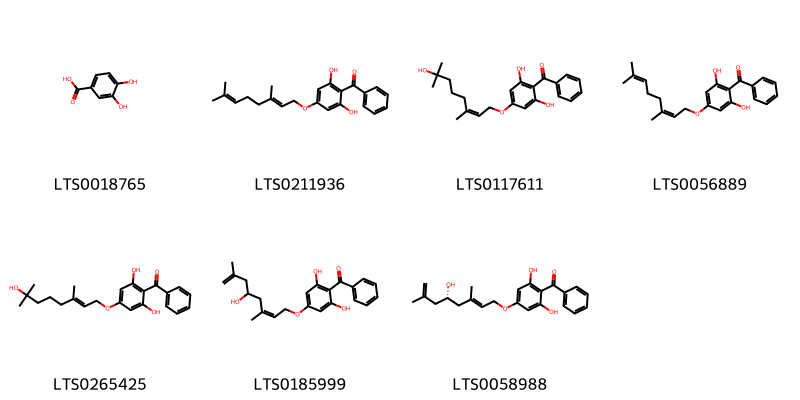{ width=100% }
    <figcaption>Hình ảnh cấu trúc hóa học của 7 hoạt chất thuộc nhóm Benzene and substituted derivatives gồm ['3,4-dihydroxybenzoic acid (LTS0018765)', '2-benzoyl-5-{[(2e)-3,7-dimethylocta-2,6-dien-1-yl]oxy}benzene-1,3-diol (LTS0211936)', '2-benzoyl-5-[(7-hydroxy-3,7-dimethyloct-2-en-1-yl)oxy]benzene-1,3-diol (LTS0117611)', '2-benzoyl-5-[(3,7-dimethylocta-2,6-dien-1-yl)oxy]benzene-1,3-diol (LTS0056889)', '2-benzoyl-5-{[(2e)-7-hydroxy-3,7-dimethyloct-2-en-1-yl]oxy}benzene-1,3-diol (LTS0265425)', '2-benzoyl-5-[(5-hydroxy-3,7-dimethylocta-2,7-dien-1-yl)oxy]benzene-1,3-diol (LTS0185999)', '2-benzoyl-5-{[(2e,5s)-5-hydroxy-3,7-dimethylocta-2,7-dien-1-yl]oxy}benzene-1,3-diol (LTS0058988)'].</figcaption>
</figure>
#### Nhóm Benzopyrans
<figure markdown="span">
    { width=100% }
    <figcaption>Hình ảnh cấu trúc hóa học của 25 hoạt chất thuộc nhóm Benzopyrans gồm ['isomangiferin (LTS0231038)', 'mangiferin (LTS0009443)', 'euxanthone (LTS0209320)', '6,8,12-trihydroxy-2,2-dimethyl-1,10-dioxatetraphen-5-one (LTS0139139)', '2-hydroxy-9-xanthenone (LTS0005468)', '1,3,5,6-tetrahydroxyxanthen-9-one (LTS0183592)', '1,3,6,7-tetrahydroxyxanthone (LTS0031937)', '8,12-dihydroxy-2,2-dimethyl-1,10-dioxatetraphen-5-one (LTS0152865)', '1,3,7-trihydroxy-5-methoxyxanthen-9-one (LTS0236924)', '1,5-dihydroxy-2-methoxyxanthen-9-one (LTS0099329)', '1,3,5,6-tetrahydroxy-2-(3-methylbut-2-en-1-yl)xanthen-9-one (LTS0049785)', 'mangiferin (LTS0238751)', '3-hydroxyxanthen-9-one (LTS0137325)', '1,3,6,7-tetrahydroxy-2-{[(2s,3r,4s,5s,6r)-3,4,5-trihydroxy-6-(hydroxymethyl)oxan-2-yl]oxy}xanthen-9-one (LTS0232943)', '10,22-dihydroxy-7,7,18,18-tetramethyl-8,13,17-trioxapentacyclo[12.8.0.0³,¹².0⁴,⁹.0¹⁶,²¹]docosa-1(22),3,5,9,11,14,16(21),19-octaen-2-one (LTS0037064)', '1,3,7-trihydroxy-2-[(2s,3r,4r,5s,6r)-3,4,5-trihydroxy-6-(hydroxymethyl)oxan-2-yl]xanthen-9-one (LTS0124781)', '2-hydroxy-3,4-dimethoxyxanthen-9-one (LTS0266633)', '1,3,6,7-tetrahydroxy-2-{[3,4,5-trihydroxy-6-(hydroxymethyl)oxan-2-yl]oxy}xanthen-9-one (LTS0128643)', '1,3,7-trihydroxy-2-[3,4,5-trihydroxy-6-(hydroxymethyl)oxan-2-yl]xanthen-9-one (LTS0126561)', '6,8,11-trihydroxy-2,2-dimethyl-12-(3-methylbut-2-en-1-yl)-1,10-dioxatetraphen-5-one (LTS0208548)', '1,4,6,8-tetrahydroxy-3-methoxy-2-(3-methylbut-2-en-1-yl)xanthen-9-one (LTS0150806)', '1,3,7-trihydroxy-2-{[3,4,5-trihydroxy-6-(hydroxymethyl)oxan-2-yl]oxy}xanthen-9-one (LTS0044232)', '1,6-dihydroxyxanthen-9-one (LTS0257994)', '(3s,4s)-3,4,7,9,12-pentahydroxy-2,2-dimethyl-3,4-dihydro-1,11-dioxatetracen-6-one (LTS0062820)', '1,3,7-trihydroxy-2-{[(2s,3r,4s,5s,6r)-3,4,5-trihydroxy-6-(hydroxymethyl)oxan-2-yl]oxy}xanthen-9-one (LTS0122400)'].</figcaption>
</figure>
#### Nhóm Cinnamic acids and derivatives
<figure markdown="span">
    { width=100% }
    <figcaption>Hình ảnh cấu trúc hóa học của 4 hoạt chất thuộc nhóm Cinnamic acids and derivatives gồm ['3,4-dihydroxycinnamic acid (LTS0128050)', 'caffeic acid (LTS0027481)', '(1r,2s)-1-(3,4-dihydroxyphenyl)-1,3-dihydroxypropan-2-yl (2e)-3-(3,4-dihydroxyphenyl)prop-2-enoate (LTS0211605)', '1-(3,4-dihydroxyphenyl)-1,3-dihydroxypropan-2-yl 3-(3,4-dihydroxyphenyl)prop-2-enoate (LTS0259892)'].</figcaption>
</figure>
#### Nhóm Flavonoids
<figure markdown="span">
    { width=100% }
    <figcaption>Hình ảnh cấu trúc hóa học của 10 hoạt chất thuộc nhóm Flavonoids gồm ['hyperoside (LTS0089156)', 'quercetin (LTS0004651)', '2-(3,4-dihydroxyphenyl)-5,7-dihydroxy-3-{[(2s,3r,4r,5r,6s)-3,4,5-trihydroxy-6-(hydroxymethyl)oxan-2-yl]oxy}chromen-4-one (LTS0241372)', '2-(3,4-dihydroxyphenyl)-5,7-dihydroxy-3-{[3,4,5-trihydroxy-6-(hydroxymethyl)oxan-2-yl]oxy}chromen-4-one (LTS0195312)', 'kaempherol (LTS0155822)', 'isoquercetin (LTS0254337)', 'luteolin (LTS0017052)', 'astragalin (LTS0249588)', 'trifolin (LTS0267055)', '2-(3,4-dihydroxyphenyl)-5,7-dihydroxy-3-{[(2s,3r,4r,5s,6r)-3,4,5-trihydroxy-6-(hydroxymethyl)oxan-2-yl]oxy}chromen-4-one (LTS0220665)'].</figcaption>
</figure>
#### Nhóm Organooxygen compounds
<figure markdown="span">
    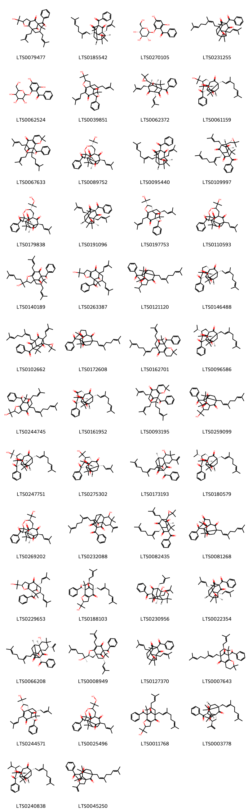{ width=100% }
    <figcaption>Hình ảnh cấu trúc hóa học của 52 hoạt chất thuộc nhóm Organooxygen compounds gồm ['ochrocarpinone c (LTS0079477)', '(1s,3r,4s,7r,9r,11s)-1-benzoyl-11-[(2e)-3,7-dimethylocta-2,6-dien-1-yl]-4-hydroxy-6,6,13,13-tetramethyl-3-(3-methylbut-2-en-1-yl)-5-oxatetracyclo[7.3.1.0³,⁷.0⁴,¹¹]tridecane-2,12-dione (LTS0185542)', '(2s,3r,4s,5s,6r)-2-(2-benzoyl-3,5-dihydroxyphenoxy)-6-(hydroxymethyl)oxane-3,4,5-triol (LTS0270105)', '1-benzoyl-11-(3,7-dimethylocta-2,6-dien-1-yl)-4-hydroxy-6,6,13,13-tetramethyl-3-(3-methylbut-2-en-1-yl)-5-oxatetracyclo[7.3.1.0³,⁷.0⁴,¹¹]tridecane-2,12-dione (LTS0231255)', '2-(2-benzoyl-3,5-dihydroxyphenoxy)-6-(hydroxymethyl)oxane-3,4,5-triol (LTS0062524)', '8-benzoyl-3-(2-hydroxypropan-2-yl)-9,9-dimethyl-6,10-bis(3-methylbut-2-en-1-yl)-4-oxatricyclo[6.3.1.0¹,⁵]dodec-5-ene-7,12-dione (LTS0039851)', '(1s,3r,5s,7s,8s)-5-benzoyl-8-[(2r)-3,3-dimethyloxiran-2-yl]-6,6-dimethyl-1,3-bis(3-methylbut-2-en-1-yl)adamantane-2,4,9-trione (LTS0062372)', '(1s,3s,5r,7r,9s,11r)-9-benzoyl-11-[(2e)-3,7-dimethylocta-2,6-dien-1-yl]-3-(2-hydroxypropan-2-yl)-4,4,8,8-tetramethyltetracyclo[7.3.1.1⁷,¹¹.0¹,⁵]tetradecane-10,12,13-trione (LTS0061159)', '1-benzoyl-4,4,12-trimethyl-9,11-bis(3-methylbut-2-en-1-yl)-12-(4-methylpent-3-en-1-yl)-3-oxatricyclo[7.3.1.0²,⁷]trideca-2(7),5-diene-8,13-dione (LTS0067633)', '(1r,3s,7s,9s,11r,13s)-11-benzoyl-3-(2-hydroxypropan-2-yl)-6,6,10,10-tetramethyl-13-(3-methylbut-2-en-1-yl)-4,5-dioxatetracyclo[9.3.1.1⁹,¹³.0¹,⁷]hexadecane-12,14,15-trione (LTS0089752)', '(1s,3s,7r,9r,11r)-1-benzoyl-11-[(2e)-3,7-dimethylocta-2,6-dien-1-yl]-4-hydroxy-6,6,13,13-tetramethyl-3-(3-methylbut-2-en-1-yl)-5-oxatetracyclo[7.3.1.0³,⁷.0⁴,¹¹]tridecane-2,12-dione (LTS0095440)', '(1s,3r,5s,7s,8r)-5-benzoyl-3-[(2e)-3,7-dimethylocta-2,6-dien-1-yl]-8-[(2s)-3,3-dimethyloxiran-2-yl]-6,6-dimethyl-1-(3-methylbut-2-en-1-yl)adamantane-2,4,9-trione (LTS0109997)', '(1r,3s,7s,9s,11r,13s)-11-benzoyl-3-(2-hydroperoxypropan-2-yl)-6,6,10,10-tetramethyl-13-(3-methylbut-2-en-1-yl)-4,5-dioxatetracyclo[9.3.1.1⁹,¹³.0¹,⁷]hexadecane-12,14,15-trione (LTS0179838)', '(1s,3s,7r,9r,11r)-1-benzoyl-4-hydroxy-6,6,13,13-tetramethyl-3,11-bis(3-methylbut-2-en-1-yl)-5-oxatetracyclo[7.3.1.0³,⁷.0⁴,¹¹]tridecane-2,12-dione (LTS0191096)', '(1s,3s,8r,10r)-8-benzoyl-3-(2-hydroxypropan-2-yl)-9,9-dimethyl-6,10-bis(3-methylbut-2-en-1-yl)-4-oxatricyclo[6.3.1.0¹,⁵]dodec-5-ene-7,12-dione (LTS0197753)', '11-benzoyl-3-(2-hydroxypropan-2-yl)-6,6,10,10-tetramethyl-13-(3-methylbut-2-en-1-yl)-4,5-dioxatetracyclo[9.3.1.1⁹,¹³.0¹,⁷]hexadecane-12,14,15-trione (LTS0110593)', '8-benzoyl-3-(2-hydroxy-6-methylhept-5-en-2-yl)-9,9-dimethyl-6,10-bis(3-methylbut-2-en-1-yl)-4-oxatricyclo[6.3.1.0¹,⁵]dodec-5-ene-7,12-dione (LTS0140189)', 'ochrocarpinone b (LTS0263387)', '9-benzoyl-11-(3,7-dimethylocta-2,6-dien-1-yl)-3-isopropyl-4,4,8,8-tetramethyltetracyclo[7.3.1.1⁷,¹¹.0¹,⁵]tetradecane-10,12,13-trione (LTS0121120)', '(1s,5r,7r,9s,11r)-9-benzoyl-11-[(2e)-3,7-dimethylocta-2,6-dien-1-yl]-4,4,8,8-tetramethyltetracyclo[7.3.1.1⁷,¹¹.0¹,⁵]tetradecane-10,12,13-trione (LTS0146488)', '5-benzoyl-3-(3,7-dimethylocta-2,6-dien-1-yl)-8-(3,3-dimethyloxiran-2-yl)-6,6-dimethyl-1-(3-methylbut-2-en-1-yl)adamantane-2,4,9-trione (LTS0102662)', '9-benzoyl-11-(3,7-dimethylocta-2,6-dien-1-yl)-4,4,8,8-tetramethyltetracyclo[7.3.1.1⁷,¹¹.0¹,⁵]tetradecane-10,12,13-trione (LTS0172608)', '1-benzoyl-9-(3,7-dimethylocta-2,6-dien-1-yl)-4,4,12,12-tetramethyl-11-(3-methylbut-2-en-1-yl)-3-oxatricyclo[7.3.1.0²,⁷]tridec-2(7)-ene-8,13-dione (LTS0162701)', '(1r,3s,5r,7s,9r,11s)-9-benzoyl-11-[(2e)-3,7-dimethylocta-2,6-dien-1-yl]-3-isopropyl-4,4,8,8-tetramethyltetracyclo[7.3.1.1⁷,¹¹.0¹,⁵]tetradecane-10,12,13-trione (LTS0096586)', '1-benzoyl-8-(3,7-dimethylocta-2,6-dien-1-yl)-4-(2-hydroxypropan-2-yl)-11,11-dimethyl-10-(3-methylbut-2-en-1-yl)-3-oxatricyclo[6.3.1.0²,⁶]dodec-2(6)-ene-7,12-dione (LTS0244745)', '(1s,5s,7r,9s,11r)-9-benzoyl-11-[(2e)-3,7-dimethylocta-2,6-dien-1-yl]-4,4,8,8-tetramethyltetracyclo[7.3.1.1⁷,¹¹.0¹,⁵]tetradecane-3,10,12,13-tetrone (LTS0161952)', '(1s,9r,11s,12r)-1-benzoyl-4,4,12-trimethyl-9,11-bis(3-methylbut-2-en-1-yl)-12-(4-methylpent-3-en-1-yl)-3-oxatricyclo[7.3.1.0²,⁷]trideca-2(7),5-diene-8,13-dione (LTS0093195)', '9-benzoyl-11-(3,7-dimethylocta-2,6-dien-1-yl)-3-(2-hydroxypropan-2-yl)-4,4,8,8-tetramethyltetracyclo[7.3.1.1⁷,¹¹.0¹,⁵]tetradecane-10,12,13-trione (LTS0259099)', '(1s,3r,5s,7r,9s,11r)-9-benzoyl-11-[(2e)-3,7-dimethylocta-2,6-dien-1-yl]-3-(2-hydroxypropan-2-yl)-4,4,8,8-tetramethyltetracyclo[7.3.1.1⁷,¹¹.0¹,⁵]tetradecane-10,12,13-trione (LTS0247751)', '(1s,3s,5r,7r,9s,11r)-9-benzoyl-3-(2-hydroxypropan-2-yl)-4,4,8,8-tetramethyl-11-(3-methylbut-2-en-1-yl)tetracyclo[7.3.1.1⁷,¹¹.0¹,⁵]tetradecane-10,12,13-trione (LTS0275302)', '(1s,7s,9s,11r)-9-benzoyl-11-[(2e)-3,7-dimethylocta-2,6-dien-1-yl]-5-hydroxy-4,4,8,8-tetramethyl-3-(prop-1-en-2-yl)tetracyclo[7.3.1.1⁷,¹¹.0¹,⁶]tetradecane-10,12,13-trione (LTS0173193)', '(1s,3s,5s,7r,9s,11r)-9-benzoyl-11-[(2e)-3,7-dimethylocta-2,6-dien-1-yl]-3-isopropyl-4,4,8,8-tetramethyltetracyclo[7.3.1.1⁷,¹¹.0¹,⁵]tetradecane-10,12,13-trione (LTS0180579)', '(1r,3r,7r,9s,11r,13s)-11-benzoyl-3-(2-hydroxypropan-2-yl)-6,6,10,10-tetramethyl-13-(3-methylbut-2-en-1-yl)-4,5-dioxatetracyclo[9.3.1.1⁹,¹³.0¹,⁷]hexadecane-12,14,15-trione (LTS0269202)', '9-benzoyl-11-(3,7-dimethylocta-2,6-dien-1-yl)-5-hydroxy-4,4,8,8-tetramethyl-3-(prop-1-en-2-yl)tetracyclo[7.3.1.1⁷,¹¹.0¹,⁶]tetradecane-10,12,13-trione (LTS0232088)', '(1s,3r,5s,7s)-5-benzoyl-3-[(2e)-3,7-dimethylocta-2,6-dien-1-yl]-8-(3,3-dimethyloxiran-2-yl)-6,6-dimethyl-1-(3-methylbut-2-en-1-yl)adamantane-2,4,9-trione (LTS0082435)', '9-benzoyl-11-(3,7-dimethylocta-2,6-dien-1-yl)-4,4,8,8-tetramethyltetracyclo[7.3.1.1⁷,¹¹.0¹,⁵]tetradecane-3,10,12,13-tetrone (LTS0081268)', '(1s,4r,8r,10r)-1-benzoyl-4-(2-hydroxypropan-2-yl)-11,11-dimethyl-8,10-bis(3-methylbut-2-en-1-yl)-3-oxatricyclo[6.3.1.0²,⁶]dodec-2(6)-ene-7,12-dione (LTS0229653)', '(1r,4s,8s,10s)-1-benzoyl-8-[(2e)-3,7-dimethylocta-2,6-dien-1-yl]-4-(2-hydroxypropan-2-yl)-11,11-dimethyl-10-(3-methylbut-2-en-1-yl)-3-oxatricyclo[6.3.1.0²,⁶]dodec-2(6)-ene-7,12-dione (LTS0188103)', '(1s,2s,6s,7r,9s,11s)-9-benzoyl-2-hydroxy-5,5,10,10-tetramethyl-1,7-bis(3-methylbut-2-en-1-yl)-3-oxatetracyclo[7.3.1.0²,⁷.0⁶,¹¹]tridecane-8,13-dione (LTS0230956)', '(1s,3r,4s,7r,9r,11s)-1-benzoyl-4-hydroxy-6,6,13,13-tetramethyl-3,11-bis(3-methylbut-2-en-1-yl)-5-oxatetracyclo[7.3.1.0³,⁷.0⁴,¹¹]tridecane-2,12-dione (LTS0022354)', '(1s,3s,5s,6r,7s,9s,11r)-9-benzoyl-11-[(2e)-3,7-dimethylocta-2,6-dien-1-yl]-5-hydroxy-4,4,8,8-tetramethyl-3-(prop-1-en-2-yl)tetracyclo[7.3.1.1⁷,¹¹.0¹,⁶]tetradecane-10,12,13-trione (LTS0066208)', '(1s,3s,8r,10r)-8-benzoyl-3-[(2s)-2-hydroxy-6-methylhept-5-en-2-yl]-9,9-dimethyl-6,10-bis(3-methylbut-2-en-1-yl)-4-oxatricyclo[6.3.1.0¹,⁵]dodec-5-ene-7,12-dione (LTS0008949)', '1-benzoyl-4-hydroxy-6,6,13,13-tetramethyl-3,11-bis(3-methylbut-2-en-1-yl)-5-oxatetracyclo[7.3.1.0³,⁷.0⁴,¹¹]tridecane-2,12-dione (LTS0127370)', '(1r,9s,11r)-1-benzoyl-9-[(2e)-3,7-dimethylocta-2,6-dien-1-yl]-4,4,12,12-tetramethyl-11-(3-methylbut-2-en-1-yl)-3-oxatricyclo[7.3.1.0²,⁷]tridec-2(7)-ene-8,13-dione (LTS0007643)', '(1s,3s,8r,10s)-8-benzoyl-3-(2-hydroxypropan-2-yl)-9,9-dimethyl-6,10-bis(3-methylbut-2-en-1-yl)-4-oxatricyclo[6.3.1.0¹,⁵]dodec-5-ene-7,12-dione (LTS0244571)', '11-benzoyl-3-(2-hydroperoxypropan-2-yl)-6,6,10,10-tetramethyl-13-(3-methylbut-2-en-1-yl)-4,5-dioxatetracyclo[9.3.1.1⁹,¹³.0¹,⁷]hexadecane-12,14,15-trione (LTS0025496)', '1-benzoyl-8-[(2e)-3,7-dimethylocta-2,6-dien-1-yl]-4-(2-hydroxypropan-2-yl)-11,11-dimethyl-10-(3-methylbut-2-en-1-yl)-3-oxatricyclo[6.3.1.0²,⁶]dodec-2(6)-ene-7,12-dione (LTS0011768)', '(1s,3s,5s,7r,9s,11r)-9-benzoyl-11-[(2e)-3,7-dimethylocta-2,6-dien-1-yl]-4,4,8,8-tetramethyl-3-(prop-1-en-2-yl)tetracyclo[7.3.1.1⁷,¹¹.0¹,⁵]tetradecane-10,12,13-trione (LTS0003778)', '(1s,3r,5r,7r,9s,11r)-9-benzoyl-11-[(2e)-3,7-dimethylocta-2,6-dien-1-yl]-3-isopropyl-4,4,8,8-tetramethyltetracyclo[7.3.1.1⁷,¹¹.0¹,⁵]tetradecane-10,12,13-trione (LTS0240838)', '9-benzoyl-11-(3,7-dimethylocta-2,6-dien-1-yl)-4,4,8,8-tetramethyl-3-(prop-1-en-2-yl)tetracyclo[7.3.1.1⁷,¹¹.0¹,⁵]tetradecane-10,12,13-trione (LTS0045250)', '(1r,4s,8r,10r)-8-benzoyl-4-(2-hydroxypropan-2-yl)-9,9-dimethyl-1,10-bis(3-methylbut-2-en-1-yl)-3-oxatricyclo[6.3.1.0²,⁶]dodec-2(6)-ene-7,12-dione (LTS0036081)', '9-benzoyl-3-(2-hydroxypropan-2-yl)-4,4,8,8-tetramethyl-11-(3-methylbut-2-en-1-yl)tetracyclo[7.3.1.1⁷,¹¹.0¹,⁵]tetradecane-10,12,13-trione (LTS0246098)'].</figcaption>
</figure>
#### Nhóm Phenol ethers
<figure markdown="span">
    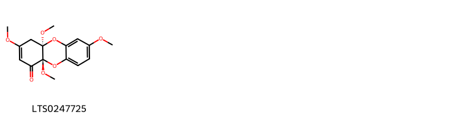{ width=100% }
    <figcaption>Hình ảnh cấu trúc hóa học của 1 hoạt chất thuộc nhóm Phenol ethers gồm ['(4ar,10ar)-3,4a,7,10a-tetramethoxy-4h-oxanthren-1-one (LTS0247725)'].</figcaption>
</figure>
#### Nhóm Prenol lipids
<figure markdown="span">
    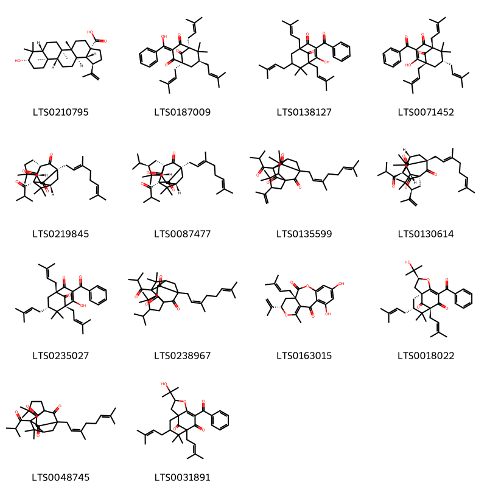{ width=100% }
    <figcaption>Hình ảnh cấu trúc hóa học của 14 hoạt chất thuộc nhóm Prenol lipids gồm ['betulinic acid (LTS0210795)', '(1r,3z,5s,7s)-3-[hydroxy(phenyl)methylidene]-6,6-dimethyl-1,5,7-tris(3-methylbut-2-en-1-yl)bicyclo[3.3.1]nonane-2,4,9-trione (LTS0187009)', '3-benzoyl-4-hydroxy-6,6-dimethyl-1,5,7-tris(3-methylbut-2-en-1-yl)bicyclo[3.3.1]non-3-ene-2,9-dione (LTS0138127)', '6-epi-clusianone, (rel)- (LTS0071452)', '(1s,5r,7r,9s,11r)-11-[(2e)-3,7-dimethylocta-2,6-dien-1-yl]-4,4,8,8-tetramethyl-9-(2-methylpropanoyl)tetracyclo[7.3.1.1⁷,¹¹.0¹,⁵]tetradecane-10,12,13-trione (LTS0219845)', '(1s,3r,5r,7r,9s,11r)-11-[(2e)-3,7-dimethylocta-2,6-dien-1-yl]-3-isopropyl-4,4,8,8-tetramethyl-9-(2-methylpropanoyl)tetracyclo[7.3.1.1⁷,¹¹.0¹,⁵]tetradecane-10,12,13-trione (LTS0087477)', '11-(3,7-dimethylocta-2,6-dien-1-yl)-4,4,8,8-tetramethyl-9-(2-methylpropanoyl)-3-(prop-1-en-2-yl)tetracyclo[7.3.1.1⁷,¹¹.0¹,⁵]tetradecane-10,12,13-trione (LTS0135599)', '(1s,3s,5s,7r,9s,11r)-11-[(2e)-3,7-dimethylocta-2,6-dien-1-yl]-4,4,8,8-tetramethyl-9-(2-methylpropanoyl)-3-(prop-1-en-2-yl)tetracyclo[7.3.1.1⁷,¹¹.0¹,⁵]tetradecane-10,12,13-trione (LTS0130614)', '(1s,5s,7r)-3-benzoyl-4-hydroxy-6,6-dimethyl-1,5,7-tris(3-methylbut-2-en-1-yl)bicyclo[3.3.1]non-3-ene-2,9-dione (LTS0235027)', '11-(3,7-dimethylocta-2,6-dien-1-yl)-3-isopropyl-4,4,8,8-tetramethyl-9-(2-methylpropanoyl)tetracyclo[7.3.1.1⁷,¹¹.0¹,⁵]tetradecane-10,12,13-trione (LTS0238967)', '(6s,8s)-13,15-dihydroxy-4-methyl-8-(3-methylbut-2-en-1-yl)-6-(prop-1-en-2-yl)-5,10-dioxatricyclo[9.4.0.0³,⁸]pentadeca-1(15),3,11,13-tetraene-2,9-dione (LTS0163015)', '(1s,3s,8r,10r)-6-benzoyl-3-(2-hydroxypropan-2-yl)-9,9-dimethyl-8,10-bis(3-methylbut-2-en-1-yl)-4-oxatricyclo[6.3.1.0¹,⁵]dodec-5-ene-7,12-dione (LTS0018022)', '11-(3,7-dimethylocta-2,6-dien-1-yl)-4,4,8,8-tetramethyl-9-(2-methylpropanoyl)tetracyclo[7.3.1.1⁷,¹¹.0¹,⁵]tetradecane-10,12,13-trione (LTS0048745)', '6-benzoyl-3-(2-hydroxypropan-2-yl)-9,9-dimethyl-8,10-bis(3-methylbut-2-en-1-yl)-4-oxatricyclo[6.3.1.0¹,⁵]dodec-5-ene-7,12-dione (LTS0031891)'].</figcaption>
</figure>

---

### Dược dân tộc học

Danh sách các quốc gia có sử dụng *Hypericum sampsonii* trong điều trị các bệnh. 

| Country   | Disease   | Bệnh        |
|:----------|:----------|:------------|
| China     | Hemostat  | Máy cầm máu |

---

---
## Hypericum struthiolaefolium
### Thông tin về thực vật

!!! info "Phân loại thực vật của *Hypericum struthiolifolium* từ GIBF:"
    - **Kingdom:** Plantae
    - **Phylum:** Tracheophyta
    - **Order:** Malpighiales
    - **Family:** Hypericaceae
    - **Genus:** Hypericum
    - **Species:** *Hypericum struthiolifolium*

 

| Label (VI)   | Label (EN)   | Scientific Name     | Descriptions (VI)   | Descriptions (EN)   | Also Known As (VI)   | Also Known As (EN)   |
|:-------------|:-------------|:--------------------|:--------------------|:--------------------|:---------------------|:---------------------|
| N/A          | N/A          | Hypericum sampsonii | loài thực vật       | species of plant    | ['']                 | ['']                 |

#### Phân bố trên thế giới

**Từ CSDL GIBF** nan, Colombia, Venezuela (Bolivarian Republic of), unknown or invalid, Peru, Bolivia (Plurinational State of), Costa Rica, Ecuador

#### Phân bố tại Việt Nam

**Từ CSDL GIBF**: Không có ghi nhận ở Việt Nam

---
### Thành phần hóa học
        
- Theo cơ sở dữ liệu lotus: Từ loài *Hypericum struthiolifolium* đã phân lập và xác định được Chưa có hoạt chất nào được phân lập. hoạt chất thuộc về các nhóm Không có hoạt chất nào được phân lập. 

Không có hình ảnh nào được tạo ra

---

### Dược dân tộc học

Danh sách các quốc gia có sử dụng *Hypericum struthiolifolium* trong điều trị các bệnh. 

| Country   | Disease     | Bệnh        |
|:----------|:------------|:------------|
| Venezuela | Emmenagogue | Emmenagogue |

---

---
## Hypericum teretiusculum
### Thông tin về thực vật

!!! info "Phân loại thực vật của *Hypericum teretiusculum* từ GIBF:"
    - **Kingdom:** Plantae
    - **Phylum:** Tracheophyta
    - **Order:** Malpighiales
    - **Family:** Hypericaceae
    - **Genus:** Hypericum
    - **Species:** *Hypericum teretiusculum*

 

| Label (VI)   | Label (EN)   | Scientific Name         | Descriptions (VI)   | Descriptions (EN)   | Also Known As (VI)   | Also Known As (EN)   |
|:-------------|:-------------|:------------------------|:--------------------|:--------------------|:---------------------|:---------------------|
| N/A          | N/A          | Hypericum teretiusculum | loài thực vật       | species of plant    | ['']                 | ['']                 |

#### Phân bố trên thế giới

**Từ CSDL GIBF** nan, Paraguay, Brazil

#### Phân bố tại Việt Nam

**Từ CSDL GIBF**: Không có ghi nhận ở Việt Nam

---
### Thành phần hóa học
        
- Theo cơ sở dữ liệu lotus: Từ loài *Hypericum teretiusculum* đã phân lập và xác định được Chưa có hoạt chất nào được phân lập. hoạt chất thuộc về các nhóm Không có hoạt chất nào được phân lập. 

Không có hình ảnh nào được tạo ra

---

### Dược dân tộc học

Danh sách các quốc gia có sử dụng *Hypericum teretiusculum* trong điều trị các bệnh. 

| Country   | Disease     | Bệnh        |
|:----------|:------------|:------------|
| Brazil    | Emmenagogue | Emmenagogue |

---

# Chi Vismia

??? note "Danh sách các dược liệu thuộc chi"
    
	 - *Vismia ferruginea*

---
## Vismia ferruginea
### Thông tin về thực vật

!!! info "Phân loại thực vật của *Vismia ferruginea* từ GIBF:"
    - **Kingdom:** Plantae
    - **Phylum:** Tracheophyta
    - **Order:** Malpighiales
    - **Family:** Hypericaceae
    - **Genus:** Vismia
    - **Species:** *Vismia ferruginea*

 

| Label (VI)   | Label (EN)   | Scientific Name   | Descriptions (VI)   | Descriptions (EN)   | Also Known As (VI)   | Also Known As (EN)   |
|:-------------|:-------------|:------------------|:--------------------|:--------------------|:---------------------|:---------------------|
| N/A          | N/A          | Vismia ferruginea | loài thực vật       | species of plant    | ['']                 | ['']                 |

#### Phân bố trên thế giới

**Từ CSDL GIBF** nan, Colombia, Venezuela (Bolivarian Republic of), Nicaragua, Brazil, Peru, French Guiana, Costa Rica, Ecuador, Mexico, Guyana

#### Phân bố tại Việt Nam

**Từ CSDL GIBF**: Không có ghi nhận ở Việt Nam

---
### Thành phần hóa học
        
- Theo cơ sở dữ liệu lotus: Từ loài *Vismia ferruginea* đã phân lập và xác định được Chưa có hoạt chất nào được phân lập. hoạt chất thuộc về các nhóm Không có hoạt chất nào được phân lập. 

Không có hình ảnh nào được tạo ra

---

### Dược dân tộc học

Danh sách các quốc gia có sử dụng *Vismia ferruginea* trong điều trị các bệnh. 

| Country   | Disease   | Bệnh           |
|:----------|:----------|:---------------|
| Elsewhere | Fungicide | Thuốc diệt nấm |

---

# Chi Rheedia

??? note "Danh sách các dược liệu thuộc chi"
    
	 - *Rheedia verticillata*

---
## Rheedia verticillata
### Thông tin về thực vật

!!! info "Phân loại thực vật của *Garcinia verticillata* từ GIBF:"
    - **Kingdom:** Plantae
    - **Phylum:** Tracheophyta
    - **Order:** Malpighiales
    - **Family:** Clusiaceae
    - **Genus:** Garcinia
    - **Species:** *Garcinia verticillata*

 

| Label (VI)   | Label (EN)   | Scientific Name   | Descriptions (VI)   | Descriptions (EN)   | Also Known As (VI)   | Also Known As (EN)   |
|:-------------|:-------------|:------------------|:--------------------|:--------------------|:---------------------|:---------------------|
| N/A          | N/A          | Vismia ferruginea | loài thực vật       | species of plant    | ['']                 | ['']                 |

#### Phân bố trên thế giới

**Từ CSDL GIBF** nan, Colombia, Venezuela (Bolivarian Republic of), Nicaragua, Brazil, Peru, French Guiana, Costa Rica, Ecuador, Mexico, Guyana

#### Phân bố tại Việt Nam

**Từ CSDL GIBF**: Không có ghi nhận ở Việt Nam

---
### Thành phần hóa học
        
- Theo cơ sở dữ liệu lotus: Từ loài *Garcinia verticillata* đã phân lập và xác định được Chưa có hoạt chất nào được phân lập. hoạt chất thuộc về các nhóm Không có hoạt chất nào được phân lập. 

Không có hình ảnh nào được tạo ra

---

### Dược dân tộc học

Danh sách các quốc gia có sử dụng *Garcinia verticillata* trong điều trị các bệnh. 

| Country   | Disease   | Bệnh        |
|:----------|:----------|:------------|
| Haiti     | Hemostat  | Máy cầm máu |

---

# Chi Symphonia

??? note "Danh sách các dược liệu thuộc chi"
    
	 - *Symphonia globulifera*

---
## Symphonia globulifera
### Thông tin về thực vật

!!! info "Phân loại thực vật của *Symphonia globulifera* từ GIBF:"
    - **Kingdom:** Plantae
    - **Phylum:** Tracheophyta
    - **Order:** Malpighiales
    - **Family:** Clusiaceae
    - **Genus:** Symphonia
    - **Species:** *Symphonia globulifera*

 

| Label (VI)   | Label (EN)   | Scientific Name       | Descriptions (VI)   | Descriptions (EN)   | Also Known As (VI)   | Also Known As (EN)   |
|:-------------|:-------------|:----------------------|:--------------------|:--------------------|:---------------------|:---------------------|
| N/A          | N/A          | Symphonia globulifera | loài thực vật       | species of plant    | ['']                 | ['']                 |

#### Phân bố trên thế giới

**Từ CSDL GIBF** Colombia, Suriname, Belize, Brazil, Guadeloupe, Ghana, Peru, French Guiana, Costa Rica, Cameroon, Liberia, Bolivia (Plurinational State of), Gabon, Ecuador, Mexico, Nigeria, Rwanda

#### Phân bố tại Việt Nam

**Từ CSDL GIBF**: Không có ghi nhận ở Việt Nam

---
### Thành phần hóa học
        
- Theo cơ sở dữ liệu lotus: Từ loài *Symphonia globulifera* đã phân lập và xác định được 53 hoạt chất thuộc về các nhóm Steroids and steroid derivatives, Benzopyrans, Prenol lipids. 

|    | chemicalTaxonomyClassyfireClass   |   smiles_count |
|---:|:----------------------------------|---------------:|
|  0 | Benzopyrans                       |             16 |
|  1 | Prenol lipids                     |             35 |
|  2 | Steroids and steroid derivatives  |              2 |

#### Nhóm Benzopyrans
<figure markdown="span">
    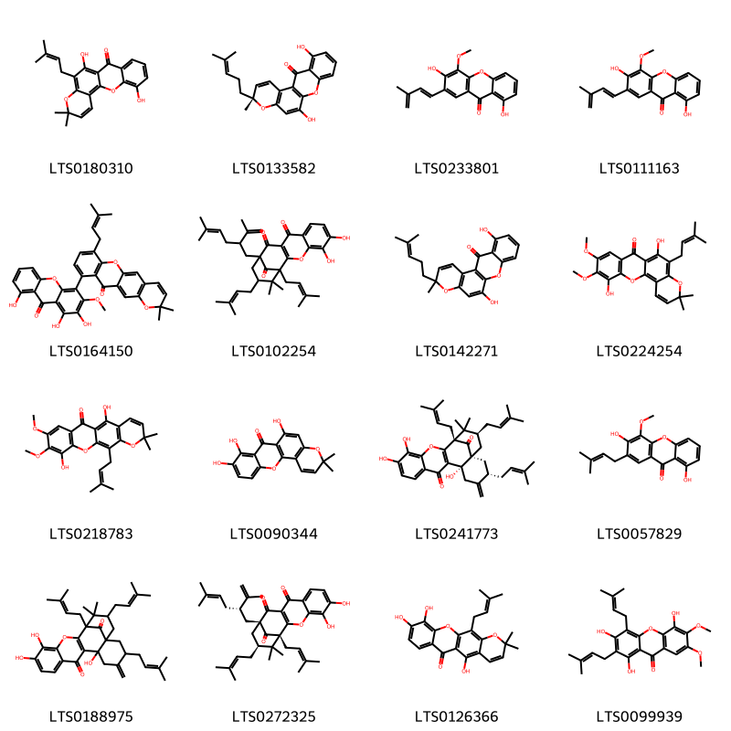{ width=100% }
    <figcaption>Hình ảnh cấu trúc hóa học của 16 hoạt chất thuộc nhóm Benzopyrans gồm ['6,11-dihydroxy-2,2-dimethyl-12-(3-methylbut-2-en-1-yl)-1,5-dioxatetraphen-10-one (LTS0180310)', '(2r)-6,11-dihydroxy-2-methyl-2-(4-methylpent-3-en-1-yl)-1,10-dioxatetraphen-5-one (LTS0133582)', '1,6-dihydroxy-5-methoxy-7-[(1e)-3-methylbuta-1,3-dien-1-yl]xanthen-9-one (LTS0233801)', '1,6-dihydroxy-5-methoxy-7-(3-methylbuta-1,3-dien-1-yl)xanthen-9-one (LTS0111163)', '2,2-dimethyl-7-(3-methylbut-2-en-1-yl)-10-(1,2,8-trihydroxy-3-methoxy-9-oxoxanthen-4-yl)-1,6-dioxatetracen-11-one (LTS0164150)', '5,6-dihydroxy-16,16-dimethyl-13-[5-methyl-2-(prop-1-en-2-yl)hex-4-en-1-yl]-1,15-bis(3-methylbut-2-en-1-yl)-3-oxatetracyclo[11.3.1.0²,¹¹.0⁴,⁹]heptadeca-2(11),4,6,8-tetraene-10,12,17-trione (LTS0102254)', '6,11-dihydroxy-2-methyl-2-(4-methylpent-3-en-1-yl)-1,10-dioxatetraphen-5-one (LTS0142271)', '6,11-dihydroxy-7,8-dimethoxy-2,2-dimethyl-12-(3-methylbut-2-en-1-yl)-1,5-dioxatetraphen-10-one (LTS0224254)', '5,10-dihydroxy-8,9-dimethoxy-2,2-dimethyl-12-(3-methylbut-2-en-1-yl)-1,11-dioxatetracen-6-one (LTS0218783)', '8,9,11-trihydroxy-2,2-dimethyl-1,5-dioxatetraphen-10-one (LTS0090344)', '(1s,3s,6s,17s,19s)-6,12,13-trihydroxy-18,18-dimethyl-3,17,19-tris(3-methylbut-2-en-1-yl)-4-methylidene-15-oxapentacyclo[15.3.1.0¹,⁶.0⁷,¹⁶.0⁹,¹⁴]henicosa-7(16),9,11,13-tetraene-8,21-dione (LTS0241773)', '1,6-dihydroxy-5-methoxy-7-(3-methylbut-2-en-1-yl)xanthen-9-one (LTS0057829)', '6,12,13-trihydroxy-18,18-dimethyl-3,17,19-tris(3-methylbut-2-en-1-yl)-4-methylidene-15-oxapentacyclo[15.3.1.0¹,⁶.0⁷,¹⁶.0⁹,¹⁴]henicosa-7(16),9,11,13-tetraene-8,21-dione (LTS0188975)', '(1s,13s,15s)-5,6-dihydroxy-16,16-dimethyl-13-[(2s)-5-methyl-2-(prop-1-en-2-yl)hex-4-en-1-yl]-1,15-bis(3-methylbut-2-en-1-yl)-3-oxatetracyclo[11.3.1.0²,¹¹.0⁴,⁹]heptadeca-2(11),4,6,8-tetraene-10,12,17-trione (LTS0272325)', '5,9,10-trihydroxy-2,2-dimethyl-12-(3-methylbut-2-en-1-yl)-1,11-dioxatetracen-6-one (LTS0126366)', '1,3,5-trihydroxy-6,7-dimethoxy-2,4-bis(3-methylbut-2-en-1-yl)xanthen-9-one (LTS0099939)'].</figcaption>
</figure>
#### Nhóm Prenol lipids
<figure markdown="span">
    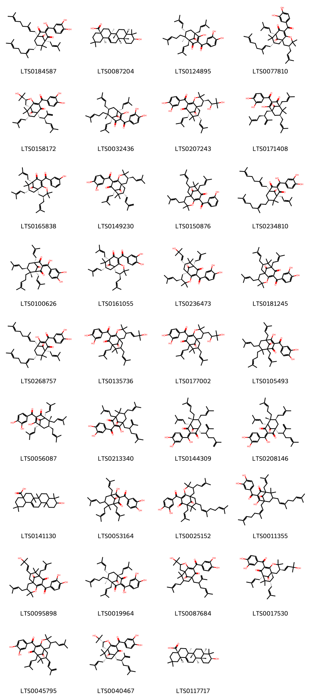{ width=100% }
    <figcaption>Hình ảnh cấu trúc hóa học của 35 hoạt chất thuộc nhóm Prenol lipids gồm ['(1r,5s,7r)-3-[(3,4-dihydroxyphenyl)(hydroxy)methylidene]-1,7-bis[(2e)-3,7-dimethylocta-2,6-dien-1-yl]-6,6-dimethyl-5-(3-methylbut-2-en-1-yl)bicyclo[3.3.1]nonane-2,4,9-trione (LTS0184587)', '(4as,6as,6br,8as,10s,12ar,12bs,14br)-10-hydroxy-2,2,6a,6b,9,9,12a-heptamethyl-1,3,4,5,6,7,8,8a,10,11,12,12b,13,14b-tetradecahydropicene-4a-carboxylic acid (LTS0087204)', 'guttiferone a, (rel-(+))- (LTS0124895)', '(1s,3s,9r,11s)-7-(3,4-dihydroxybenzoyl)-11-[(2e)-3,7-dimethylocta-2,6-dien-1-yl]-4,4,10,10-tetramethyl-3,9-bis(3-methylbut-2-en-1-yl)-5-oxatricyclo[7.3.1.0¹,⁶]tridec-6-ene-8,13-dione (LTS0077810)', '(1s,3s,8s,10s)-6-(3,4-dihydroxybenzoyl)-3-(2-hydroxypropan-2-yl)-11,11-dimethyl-8-[(2s)-5-methyl-2-(prop-1-en-2-yl)hex-4-en-1-yl]-10-(3-methylbut-2-en-1-yl)-4-oxatricyclo[6.3.1.0¹,⁵]dodec-5-ene-7,12-dione (LTS0158172)', 'guttiferone a (rel-(+)) (LTS0032436)', '(1s,3r,9r,11s)-3-[(2s)-2,3-dihydroxy-3-methylbutyl]-7-(3,4-dihydroxybenzoyl)-4,4,10,10-tetramethyl-9,11-bis(3-methylbut-2-en-1-yl)-5-oxatricyclo[7.3.1.0¹,⁶]tridec-6-ene-8,13-dione (LTS0207243)', '(1r,5r,7s)-3-(3,4-dihydroxybenzoyl)-4-hydroxy-8,8-dimethyl-5-[(2s)-5-methyl-2-(prop-1-en-2-yl)hex-4-en-1-yl]-1,7-bis(3-methylbut-2-en-1-yl)bicyclo[3.3.1]non-3-ene-2,9-dione (LTS0171408)', '(1s,3s,9r,11s)-7-(3-hydroxybenzoyl)-4,4,10,10-tetramethyl-3,9,11-tris(3-methylbut-2-en-1-yl)-5-oxatricyclo[7.3.1.0¹,⁶]tridec-6-ene-8,13-dione (LTS0165838)', '(1s,3s,9r,11r)-7-(3,4-dihydroxybenzoyl)-4,4,10,10-tetramethyl-3,9-bis(3-methylbut-2-en-1-yl)-11-[(1e)-3-methylbuta-1,3-dien-1-yl]-5-oxatricyclo[7.3.1.0¹,⁶]tridec-6-ene-8,13-dione (LTS0149230)', '7-(3-hydroxybenzoyl)-4,4,10,10-tetramethyl-3,9,11-tris(3-methylbut-2-en-1-yl)-5-oxatricyclo[7.3.1.0¹,⁶]tridec-6-ene-8,13-dione (LTS0150876)', '(1r,3e,5s)-3-[(3,4-dihydroxyphenyl)(hydroxy)methylidene]-1,7-bis[(2e)-3,7-dimethylocta-2,6-dien-1-yl]-6,6-dimethyl-5-(3-methylbut-2-en-1-yl)bicyclo[3.3.1]nonane-2,4,9-trione (LTS0234810)', '(1r,3e,5s,6r,7s)-3-[(3,4-dihydroxyphenyl)(hydroxy)methylidene]-6-methyl-1,5,7-tris(3-methylbut-2-en-1-yl)-6-(4-methylpent-3-en-1-yl)bicyclo[3.3.1]nonane-2,4,9-trione (LTS0100626)', '(1s,3s,9r,11s)-7-(3,4-dihydroxybenzoyl)-4,4,10,10-tetramethyl-3,9,11-tris(3-methylbut-2-en-1-yl)-5-oxatricyclo[7.3.1.0¹,⁶]tridec-6-ene-8,13-dione (LTS0161055)', '(1s,3s,9r,11r)-7-(3,4-dihydroxybenzoyl)-11-[(1e)-3-hydroxy-3-methylbut-1-en-1-yl]-4,4,10,10-tetramethyl-3,9-bis(3-methylbut-2-en-1-yl)-5-oxatricyclo[7.3.1.0¹,⁶]tridec-6-ene-8,13-dione (LTS0236473)', '7-(3,4-dihydroxybenzoyl)-4,4,10,10-tetramethyl-3,9,11-tris(3-methylbut-2-en-1-yl)-5-oxatricyclo[7.3.1.0¹,⁶]tridec-6-ene-8,13-dione (LTS0181245)', '(1s,5s,7r)-3-(3,4-dihydroxybenzoyl)-5,7-bis[(2e)-3,7-dimethylocta-2,6-dien-1-yl]-4-hydroxy-8,8-dimethyl-1-(3-methylbut-2-en-1-yl)bicyclo[3.3.1]non-3-ene-2,9-dione (LTS0268757)', '7-(3,4-dihydroxybenzoyl)-3-(3-hydroxy-3-methylbut-1-en-1-yl)-4,4,10,10-tetramethyl-9,11-bis(3-methylbut-2-en-1-yl)-5-oxatricyclo[7.3.1.0¹,⁶]tridec-6-ene-8,13-dione (LTS0135736)', '3-(2,3-dihydroxy-3-methylbutyl)-7-(3,4-dihydroxybenzoyl)-4,4,10,10-tetramethyl-9,11-bis(3-methylbut-2-en-1-yl)-5-oxatricyclo[7.3.1.0¹,⁶]tridec-6-ene-8,13-dione (LTS0177002)', '3-(3,4-dihydroxybenzoyl)-4-hydroxy-8-methyl-1,5,7-tris(3-methylbut-2-en-1-yl)-8-(4-methylpent-3-en-1-yl)bicyclo[3.3.1]non-3-ene-2,9-dione (LTS0105493)', '(1s,5s,7s,8r)-3-(3,4-dihydroxybenzoyl)-4-hydroxy-8-methyl-1,5,7,8-tetrakis(3-methylbut-2-en-1-yl)bicyclo[3.3.1]non-3-ene-2,9-dione (LTS0056087)', '3-(3,4-dihydroxybenzoyl)-4-hydroxy-8,8-dimethyl-5-[5-methyl-2-(prop-1-en-2-yl)hex-4-en-1-yl]-1,7-bis(3-methylbut-2-en-1-yl)bicyclo[3.3.1]non-3-ene-2,9-dione (LTS0213340)', '(1r,3e,5s,6r,7s)-3-[(3,4-dihydroxyphenyl)(hydroxy)methylidene]-6-methyl-1-[5-methyl-2-(prop-1-en-2-yl)hex-5-en-1-yl]-5,7-bis(3-methylbut-2-en-1-yl)-6-(4-methylpent-3-en-1-yl)bicyclo[3.3.1]nonane-2,4,9-trione (LTS0144309)', '(1r,3e,5s,6r,7s)-3-[(3,4-dihydroxyphenyl)(hydroxy)methylidene]-6-methyl-1-[5-methyl-2-(prop-1-en-2-yl)hex-4-en-1-yl]-5,7-bis(3-methylbut-2-en-1-yl)-6-(4-methylpent-3-en-1-yl)bicyclo[3.3.1]nonane-2,4,9-trione (LTS0208146)', 'oleanolic acid (LTS0141130)', '3-(3,4-dihydroxybenzoyl)-4-hydroxy-8-methyl-1,5,7,8-tetrakis(3-methylbut-2-en-1-yl)bicyclo[3.3.1]non-3-ene-2,9-dione (LTS0053164)', '7-(3,4-dihydroxybenzoyl)-11-(3,7-dimethylocta-2,6-dien-1-yl)-4,4,10,10-tetramethyl-3,9-bis(3-methylbut-2-en-1-yl)-5-oxatricyclo[7.3.1.0¹,⁶]tridec-6-ene-8,13-dione (LTS0025152)', '3-(3,4-dihydroxybenzoyl)-5,7-bis(3,7-dimethylocta-2,6-dien-1-yl)-4-hydroxy-8,8-dimethyl-1-(3-methylbut-2-en-1-yl)bicyclo[3.3.1]non-3-ene-2,9-dione (LTS0011355)', '7-(3,4-dihydroxybenzoyl)-11-(3-hydroxy-3-methylbut-1-en-1-yl)-4,4,10,10-tetramethyl-3,9-bis(3-methylbut-2-en-1-yl)-5-oxatricyclo[7.3.1.0¹,⁶]tridec-6-ene-8,13-dione (LTS0095898)', '(1s,3z,5r,6s,7r)-3-[(3,4-dihydroxyphenyl)(hydroxy)methylidene]-6-methyl-1,5,7-tris(3-methylbut-2-en-1-yl)-6-(4-methylpent-3-en-1-yl)bicyclo[3.3.1]nonane-2,4,9-trione (LTS0019964)', '6-(3,4-dihydroxybenzoyl)-3-(2-hydroxypropan-2-yl)-11,11-dimethyl-8-[5-methyl-2-(prop-1-en-2-yl)hex-4-en-1-yl]-10-(3-methylbut-2-en-1-yl)-4-oxatricyclo[6.3.1.0¹,⁵]dodec-5-ene-7,12-dione (LTS0087684)', '(1s,3r,9r,11s)-7-(3,4-dihydroxybenzoyl)-3-[(1e)-3-hydroxy-3-methylbut-1-en-1-yl]-4,4,10,10-tetramethyl-9,11-bis(3-methylbut-2-en-1-yl)-5-oxatricyclo[7.3.1.0¹,⁶]tridec-6-ene-8,13-dione (LTS0017530)', '7-(3,4-dihydroxybenzoyl)-4,4,10,10-tetramethyl-3,9-bis(3-methylbut-2-en-1-yl)-11-(3-methylbuta-1,3-dien-1-yl)-5-oxatricyclo[7.3.1.0¹,⁶]tridec-6-ene-8,13-dione (LTS0045795)', '(1s,3r,8s,10s)-6-(3,4-dihydroxybenzoyl)-3-(2-hydroxypropan-2-yl)-11,11-dimethyl-8-[(2s)-5-methyl-2-(prop-1-en-2-yl)hex-4-en-1-yl]-10-(3-methylbut-2-en-1-yl)-4-oxatricyclo[6.3.1.0¹,⁵]dodec-5-ene-7,12-dione (LTS0040467)', 'oleanolic acid (LTS0117717)'].</figcaption>
</figure>
#### Nhóm Steroids and steroid derivatives
<figure markdown="span">
    { width=100% }
    <figcaption>Hình ảnh cấu trúc hóa học của 2 hoạt chất thuộc nhóm Steroids and steroid derivatives gồm ['phytosterol (LTS0029311)', 'stigmasterol (LTS0024262)'].</figcaption>
</figure>

---

### Dược dân tộc học

Danh sách các quốc gia có sử dụng *Symphonia globulifera* trong điều trị các bệnh. 

| Country   | Disease   | Bệnh    |
|:----------|:----------|:--------|
| Elsewhere | Stomachic | Sững sờ |

---

# Chi Pentadesma

??? note "Danh sách các dược liệu thuộc chi"
    
	 - *Pentadesma butyracea*

---
## Pentadesma butyracea
### Thông tin về thực vật

!!! info "Phân loại thực vật của *Pentadesma butyracea* từ GIBF:"
    - **Kingdom:** Plantae
    - **Phylum:** Tracheophyta
    - **Order:** Malpighiales
    - **Family:** Clusiaceae
    - **Genus:** Pentadesma
    - **Species:** *Pentadesma butyracea*

 

| Label (VI)   | Label (EN)   | Scientific Name      | Descriptions (VI)   | Descriptions (EN)   | Also Known As (VI)   | Also Known As (EN)   |
|:-------------|:-------------|:---------------------|:--------------------|:--------------------|:---------------------|:---------------------|
| N/A          | N/A          | Pentadesma butyracea |                     | species of plant    | ['']                 | ['']                 |

#### Phân bố trên thế giới

**Từ CSDL GIBF** Côte d’Ivoire, Liberia, Seychelles, Gabon, Guinea, Benin

#### Phân bố tại Việt Nam

**Từ CSDL GIBF**: Không có ghi nhận ở Việt Nam

---
### Thành phần hóa học
        
- Theo cơ sở dữ liệu lotus: Từ loài *Pentadesma butyracea* đã phân lập và xác định được 31 hoạt chất thuộc về các nhóm Flavonoids, Benzopyrans, Prenol lipids. 

|    | chemicalTaxonomyClassyfireClass   |   smiles_count |
|---:|:----------------------------------|---------------:|
|  0 | Benzopyrans                       |             25 |
|  1 | Flavonoids                        |              2 |
|  2 | Prenol lipids                     |              4 |

#### Nhóm Benzopyrans
<figure markdown="span">
    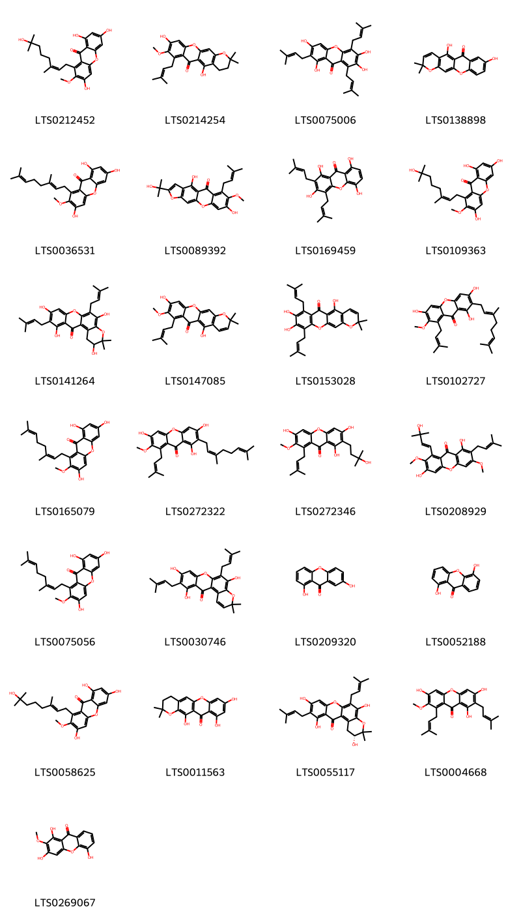{ width=100% }
    <figcaption>Hình ảnh cấu trúc hóa học của 25 hoạt chất thuộc nhóm Benzopyrans gồm ['3,6,8-trihydroxy-1-(7-hydroxy-3,7-dimethyloct-2-en-1-yl)-2-methoxyxanthen-9-one (LTS0212452)', '3-isomangostin (LTS0214254)', 'garcinone e (LTS0075006)', '5,8-dihydroxy-2,2-dimethyl-1,11-dioxatetracen-6-one (LTS0138898)', 'rubraxanthone (LTS0036531)', '4,8-dihydroxy-2-(2-hydroxypropan-2-yl)-7-methoxy-6-(3-methylbut-2-en-1-yl)furo[3,2-b]xanthen-5-one (LTS0089392)', 'gartanin (LTS0169459)', '3,6,8-trihydroxy-1-[(2z)-7-hydroxy-3,7-dimethyloct-2-en-1-yl]-2-methoxyxanthen-9-one (LTS0109363)', '3,6,8,12-tetrahydroxy-2,2-dimethyl-7,11-bis(3-methylbut-2-en-1-yl)-3,4-dihydro-1,10-dioxatetraphen-5-one (LTS0141264)', '9-hydroxycalabaxanthone (LTS0147085)', '5,8,9-trihydroxy-2,2-dimethyl-7,10-bis(3-methylbut-2-en-1-yl)-1,11-dioxatetracen-6-one (LTS0153028)', '2-[(2e)-3,7-dimethylocta-2,6-dien-1-yl]-1,3,6-trihydroxy-7-methoxy-8-(3-methylbut-2-en-1-yl)xanthen-9-one (LTS0102727)', '1-(3,7-dimethylocta-2,6-dien-1-yl)-3,6,8-trihydroxy-2-methoxyxanthen-9-one (LTS0165079)', '2-(3,7-dimethylocta-2,6-dien-1-yl)-1,3,6-trihydroxy-7-methoxy-8-(3-methylbut-2-en-1-yl)xanthen-9-one (LTS0272322)', '1,3,6-trihydroxy-2-(3-hydroxy-3-methylbutyl)-7-methoxy-8-(3-methylbut-2-en-1-yl)xanthen-9-one (LTS0272346)', '1,6-dihydroxy-8-[(1e)-3-hydroxy-3-methylbut-1-en-1-yl]-3,7-dimethoxy-2-(3-methylbut-2-en-1-yl)xanthen-9-one (LTS0208929)', '1-[(2z)-3,7-dimethylocta-2,6-dien-1-yl]-3,6,8-trihydroxy-2-methoxyxanthen-9-one (LTS0075056)', 'tovophylline a (LTS0030746)', 'euxanthone (LTS0209320)', '1,5-dihydroxyxanthen-9-one (LTS0052188)', '3,6,8-trihydroxy-1-[(2e)-7-hydroxy-3,7-dimethyloct-2-en-1-yl]-2-methoxyxanthen-9-one (LTS0058625)', '8,10,12-trihydroxy-2,2-dimethyl-3,4-dihydro-1,6-dioxatetracen-11-one (LTS0011563)', '(3r)-3,6,8,12-tetrahydroxy-2,2-dimethyl-7,11-bis(3-methylbut-2-en-1-yl)-3,4-dihydro-1,10-dioxatetraphen-5-one (LTS0055117)', 'mangostin (LTS0004668)', '1,3,5-trihydroxy-2-methoxyxanthen-9-one (LTS0269067)'].</figcaption>
</figure>
#### Nhóm Flavonoids
<figure markdown="span">
    { width=100% }
    <figcaption>Hình ảnh cấu trúc hóa học của 2 hoạt chất thuộc nhóm Flavonoids gồm ['catechol (LTS0090912)', 'ent-epicatechin (LTS0265245)'].</figcaption>
</figure>
#### Nhóm Prenol lipids
<figure markdown="span">
    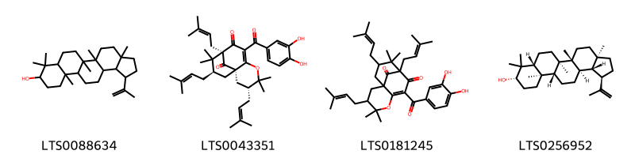{ width=100% }
    <figcaption>Hình ảnh cấu trúc hóa học của 4 hoạt chất thuộc nhóm Prenol lipids gồm ['lupeol (LTS0088634)', '(1s,3r,9r,11r)-7-(3,4-dihydroxybenzoyl)-4,4,10,10-tetramethyl-3,9,11-tris(3-methylbut-2-en-1-yl)-5-oxatricyclo[7.3.1.0¹,⁶]tridec-6-ene-8,13-dione (LTS0043351)', '7-(3,4-dihydroxybenzoyl)-4,4,10,10-tetramethyl-3,9,11-tris(3-methylbut-2-en-1-yl)-5-oxatricyclo[7.3.1.0¹,⁶]tridec-6-ene-8,13-dione (LTS0181245)', 'lupeol (LTS0256952)'].</figcaption>
</figure>

---

### Dược dân tộc học

Danh sách các quốc gia có sử dụng *Pentadesma butyracea* trong điều trị các bệnh. 

| Country   | Disease   | Bệnh     |
|:----------|:----------|:---------|
| Africa    | Soap      | Xà phòng |

---

# Chi Mammea

??? note "Danh sách các dược liệu thuộc chi"
    
	 - *Mammea americana*
	 - *Mammea longifolia*
	 - *Mammea siamensis*

---
## Mammea americana
### Thông tin về thực vật

!!! info "Phân loại thực vật của *Mammea americana* từ GIBF:"
    - **Kingdom:** Plantae
    - **Phylum:** Tracheophyta
    - **Order:** Malpighiales
    - **Family:** Calophyllaceae
    - **Genus:** Mammea
    - **Species:** *Mammea americana*

 

| Label (VI)   | Label (EN)   | Scientific Name   | Descriptions (VI)   | Descriptions (EN)   | Also Known As (VI)   | Also Known As (EN)                                                                     |
|:-------------|:-------------|:------------------|:--------------------|:--------------------|:---------------------|:---------------------------------------------------------------------------------------|
| N/A          | N/A          | Mammea americana  | loài thực vật       | species of plant    | ['']                 | ['mamey apple', 'Santo Domingo apricot', 'South American apricot', 'tropical apricot'] |

#### Phân bố trên thế giới

**Từ CSDL GIBF** El Salvador, Guadeloupe, French Guiana, Martinique, Jamaica, Guatemala, Haiti, Colombia, Dominican Republic, Puerto Rico, Saint Kitts and Nevis, Bonaire, Sint Eustatius and Saba, Virgin Islands (U.S.), Sint Maarten (Dutch part), Belgium, Nicaragua, Panama, Brazil, Montserrat, Mexico, Saint Martin (French part), Bolivia (Plurinational State of), Costa Rica, Ecuador, United States of America

#### Phân bố tại Việt Nam

**Từ CSDL GIBF**: Không có ghi nhận ở Việt Nam

---
### Thành phần hóa học
        
- Theo cơ sở dữ liệu lotus: Từ loài *Mammea americana* đã phân lập và xác định được 57 hoạt chất thuộc về các nhóm Organooxygen compounds, Benzopyrans, Flavonoids, Coumarins and derivatives, Prenol lipids, Carboxylic acids and derivatives, Neoflavonoids. 

|    | chemicalTaxonomyClassyfireClass   |   smiles_count |
|---:|:----------------------------------|---------------:|
|  0 | Benzopyrans                       |              5 |
|  1 | Carboxylic acids and derivatives  |              1 |
|  2 | Coumarins and derivatives         |             34 |
|  3 | Flavonoids                        |              3 |
|  4 | Neoflavonoids                     |             12 |
|  5 | Organooxygen compounds            |              1 |
|  6 | Prenol lipids                     |              1 |

#### Nhóm Benzopyrans
<figure markdown="span">
    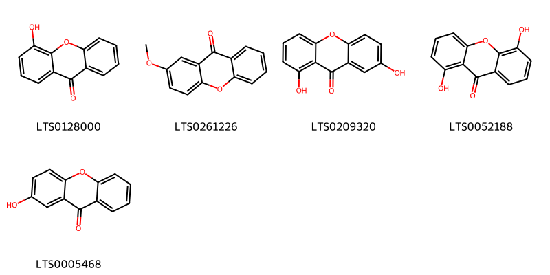{ width=100% }
    <figcaption>Hình ảnh cấu trúc hóa học của 5 hoạt chất thuộc nhóm Benzopyrans gồm ['4-hydroxyxanthen-9-one (LTS0128000)', '2-methoxyxanthen-9-one (LTS0261226)', 'euxanthone (LTS0209320)', '1,5-dihydroxyxanthen-9-one (LTS0052188)', '2-hydroxy-9-xanthenone (LTS0005468)'].</figcaption>
</figure>
#### Nhóm Carboxylic acids and derivatives
<figure markdown="span">
    { width=100% }
    <figcaption>Hình ảnh cấu trúc hóa học của 1 hoạt chất thuộc nhóm Carboxylic acids and derivatives gồm ['succinic acid (LTS0237204)'].</figcaption>
</figure>
#### Nhóm Coumarins and derivatives
<figure markdown="span">
    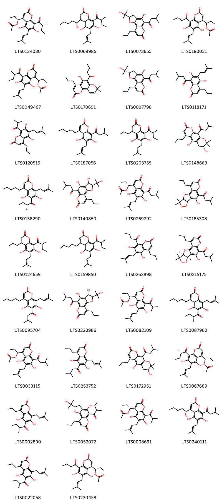{ width=100% }
    <figcaption>Hình ảnh cấu trúc hóa học của 34 hoạt chất thuộc nhóm Coumarins and derivatives gồm ['(1s)-1-[5,7-dihydroxy-6-(3-methylbut-2-en-1-yl)-8-[(2r)-2-methylbutanoyl]-2-oxochromen-4-yl]propyl acetate (LTS0134030)', 'mammea f/bb, (-)- (LTS0069985)', '4-hydroxy-2-(2-hydroxypropan-2-yl)-5-(3-methylbutanoyl)-9-propyl-2h,3h-furo[2,3-f]chromen-7-one (LTS0073655)', '1-[8-butanoyl-5,7-dihydroxy-6-(3-methylbut-2-en-1-yl)-2-oxochromen-4-yl]propyl acetate (LTS0180021)', '1-[5,7-dihydroxy-6-(3-methylbut-2-en-1-yl)-8-(2-methylbutanoyl)-2-oxochromen-4-yl]propyl acetate (LTS0049467)', '6-butanoyl-5-hydroxy-8,8-dimethyl-4-propylpyrano[2,3-f]chromen-2-one (LTS0170691)', '(2s)-4-hydroxy-2-(2-hydroxypropan-2-yl)-5-(3-methylbutanoyl)-9-propyl-2h,3h-furo[2,3-f]chromen-7-one (LTS0097798)', 'mammea b/ba (LTS0118171)', '5,7-dihydroxy-6-(3-methylbut-2-en-1-yl)-8-(2-methylpropanoyl)-4-propylchromen-2-one (LTS0120519)', '5,7-dihydroxy-6-(3-methylbut-2-en-1-yl)-8-(3-methylbutanoyl)-4-pentylchromen-2-one (LTS0187056)', 'mammea b/bb, (-)- (LTS0203755)', '(7r)-5,7-dihydroxy-8,8-dimethyl-10-(3-methylbutanoyl)-4-propyl-6h,7h-pyrano[3,2-g]chromen-2-one (LTS0148663)', 'mammea c/ab, (-)- (LTS0138290)', '3,4-dihydroxy-2-(2-hydroxypropan-2-yl)-5-(3-methylbutanoyl)-9-propyl-2h,3h-furo[2,3-f]chromen-7-one (LTS0140850)', '(1r)-1-[5,7-dihydroxy-6-(3-methylbut-2-en-1-yl)-8-(3-methylbutanoyl)-2-oxochromen-4-yl]propyl acetate (LTS0269292)', '9-hydroxy-14,14-dimethyl-8-(3-methylbutanoyl)-3-propyl-6,12,13,16-tetraoxatetracyclo[8.6.0.0²,⁷.0¹¹,¹⁵]hexadeca-1,3,7,9-tetraen-5-one (LTS0185308)', '5,7-dihydroxy-6-(3-methylbut-2-en-1-yl)-8-(2-methylbutanoyl)-4-propylchromen-2-one (LTS0124659)', 'mammea c/bb, (-)- (LTS0159850)', '8-butanoyl-5,7-dihydroxy-6-(3-methylbut-2-en-1-yl)-4-propylchromen-2-one (LTS0263898)', '(11r,15s)-9-hydroxy-14,14-dimethyl-8-(3-methylbutanoyl)-3-propyl-6,12,13,16-tetraoxatetracyclo[8.6.0.0²,⁷.0¹¹,¹⁵]hexadeca-1,3,7,9-tetraen-5-one (LTS0215175)', 'mammea c/aa (LTS0095704)', '(2s,3s)-3,4-dihydroxy-2-(2-hydroxypropan-2-yl)-5-(3-methylbutanoyl)-9-propyl-2h,3h-furo[2,3-f]chromen-7-one (LTS0220986)', '1-[5,7-dihydroxy-6-(3-methylbut-2-en-1-yl)-8-(2-methylpropanoyl)-2-oxochromen-4-yl]propyl acetate (LTS0082109)', '5,7-dihydroxy-8-(3-methylbut-2-en-1-yl)-6-[(2r)-2-methylbutanoyl]-4-pentylchromen-2-one (LTS0087962)', '1-[5,7-dihydroxy-6-(3-methylbut-2-en-1-yl)-8-(3-methylbutanoyl)-2-oxochromen-4-yl]propyl acetate (LTS0033115)', '5,7-dihydroxy-8-(3-methylbut-2-en-1-yl)-6-(3-methylbutanoyl)-4-propylchromen-2-one (LTS0253752)', '5,7-dihydroxy-8,8-dimethyl-10-(3-methylbutanoyl)-4-propyl-6h,7h-pyrano[3,2-g]chromen-2-one (LTS0172951)', 'mammea e/bb (LTS0067689)', '5,7-dihydroxy-8-(3-methylbut-2-en-1-yl)-6-[(2r)-2-methylbutanoyl]-4-propylchromen-2-one (LTS0002890)', '4-hydroxy-2-(2-hydroxypropan-2-yl)-5-(2-methylbutanoyl)-9-propyl-2h,3h-furo[2,3-f]chromen-7-one (LTS0052072)', '(1r)-1-[5,7-dihydroxy-6-(3-methylbut-2-en-1-yl)-8-(2-methylpropanoyl)-2-oxochromen-4-yl]propyl acetate (LTS0008691)', 'mammea f/ba, (-)- (LTS0240111)', 'mammea b/ab, (-)- (LTS0022058)', '(1s)-1-[8-butanoyl-5,7-dihydroxy-6-(3-methylbut-2-en-1-yl)-2-oxochromen-4-yl]propyl acetate (LTS0230458)'].</figcaption>
</figure>
#### Nhóm Flavonoids
<figure markdown="span">
    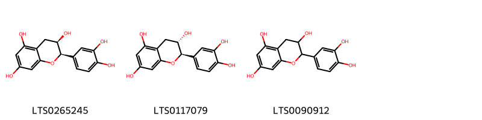{ width=100% }
    <figcaption>Hình ảnh cấu trúc hóa học của 3 hoạt chất thuộc nhóm Flavonoids gồm ['ent-epicatechin (LTS0265245)', '(+)-catechol (LTS0117079)', 'catechol (LTS0090912)'].</figcaption>
</figure>
#### Nhóm Neoflavonoids
<figure markdown="span">
    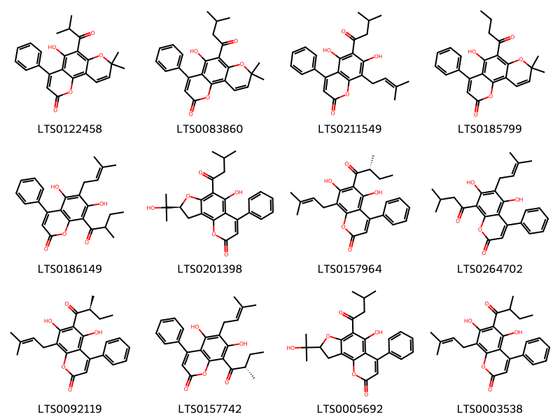{ width=100% }
    <figcaption>Hình ảnh cấu trúc hóa học của 12 hoạt chất thuộc nhóm Neoflavonoids gồm ['mesuagin (LTS0122458)', 'mammeigin (LTS0083860)', 'mammeisin (LTS0211549)', '6-butanoyl-5-hydroxy-8,8-dimethyl-4-phenylpyrano[2,3-f]chromen-2-one (LTS0185799)', 'mammea a/bb (LTS0186149)', '(8s)-5-hydroxy-8-(2-hydroxypropan-2-yl)-6-(3-methylbutanoyl)-4-phenyl-8h,9h-furo[2,3-h]chromen-2-one (LTS0201398)', '5,7-dihydroxy-8-(3-methylbut-2-en-1-yl)-6-[(2r)-2-methylbutanoyl]-4-phenylchromen-2-one (LTS0157964)', 'mammea a/ba (LTS0264702)', 'mammea a/ab, (-)- (LTS0092119)', 'mammea a/bb, (-)- (LTS0157742)', '5-hydroxy-8-(2-hydroxypropan-2-yl)-6-(3-methylbutanoyl)-4-phenyl-8h,9h-furo[2,3-h]chromen-2-one (LTS0005692)', '5,7-dihydroxy-8-(3-methylbut-2-en-1-yl)-6-(2-methylbutanoyl)-4-phenylchromen-2-one (LTS0003538)'].</figcaption>
</figure>
#### Nhóm Organooxygen compounds
<figure markdown="span">
    { width=100% }
    <figcaption>Hình ảnh cấu trúc hóa học của 1 hoạt chất thuộc nhóm Organooxygen compounds gồm ['sucrose (LTS0272557)'].</figcaption>
</figure>
#### Nhóm Prenol lipids
<figure markdown="span">
    { width=100% }
    <figcaption>Hình ảnh cấu trúc hóa học của 1 hoạt chất thuộc nhóm Prenol lipids gồm ['(-)-friedelin (LTS0041645)'].</figcaption>
</figure>

---

### Dược dân tộc học

Danh sách các quốc gia có sử dụng *Mammea americana* trong điều trị các bệnh. 

| Country            | Disease                                                                            | Bệnh                                                                          |
|:-------------------|:-----------------------------------------------------------------------------------|:------------------------------------------------------------------------------|
| Dominican Republic | Insecticide                                                                        | Thuốc trừ sâu                                                                 |
| Elsewhere          | Insecticide, Piscicide, Poison, Insecticide, Insecticide                           | Thuốc trừ sâu, Piscicide, Poison, Insecticide, Insecticide                    |
| Haiti              | Antiseptic, Discutient, Suppurative, Vulnerary, Acaricide, Antiseptic, Cicatrizant | Khử trùng, Khử trùng, Mủ, Dễ bị tổn thương, Acaricide, Khử trùng, Cicatrizant |
| Latin America      | Insecticide, Piscicide, Poison                                                     | Thuốc trừ sâu, Piscicide, Poison                                              |
| Mexico             | Acaricide, Acaricide, Insecticide, Insecticide                                     | Acaricide, Acaricide, Thuốc trừ sâu, Thuốc trừ sâu                            |
| Panama(Choco)      | Insecticide                                                                        | Thuốc trừ sâu                                                                 |
| Trinidad           | Insecticide, Pediculicide, Pediculicide                                            | Thuốc diệt côn trùng, Pediculicide, Pediculicide                              |
| Venezuela          | Parasiticide, Stomachic, Tonic                                                     | Thuốc diệt ký sinh trùng, Dạ dày, Thuốc bổ                                    |

---

---
## Mammea longifolia
### Thông tin về thực vật

!!! info "Phân loại thực vật của *Mammea suriga* từ GIBF:"
    - **Kingdom:** Plantae
    - **Phylum:** Tracheophyta
    - **Order:** Malpighiales
    - **Family:** Calophyllaceae
    - **Genus:** Mammea
    - **Species:** *Mammea suriga*

 

| Label (VI)   | Label (EN)   | Scientific Name   | Descriptions (VI)   | Descriptions (EN)   | Also Known As (VI)   | Also Known As (EN)   |
|:-------------|:-------------|:------------------|:--------------------|:--------------------|:---------------------|:---------------------|
| N/A          | N/A          | Mammea longifolia | loài thực vật       | species of plant    | ['']                 | ['']                 |

#### Phân bố trên thế giới

**Từ CSDL GIBF** nan, unknown or invalid, India, Costa Rica, United States of America, Madagascar

#### Phân bố tại Việt Nam

**Từ CSDL GIBF**: Không có ghi nhận ở Việt Nam

---
### Thành phần hóa học
        
- Theo cơ sở dữ liệu lotus: Từ loài *Mammea suriga* đã phân lập và xác định được Chưa có hoạt chất nào được phân lập. hoạt chất thuộc về các nhóm Không có hoạt chất nào được phân lập. 

Không có hình ảnh nào được tạo ra

---

### Dược dân tộc học

Danh sách các quốc gia có sử dụng *Mammea suriga* trong điều trị các bệnh. 

| Country   | Disease                            | Bệnh                                      |
|:----------|:-----------------------------------|:------------------------------------------|
| Elsewhere | Astringent, Carminative, Stimulant | Chất làm se, Carminative, Chất kích thích |

---

---
## Mammea siamensis
### Thông tin về thực vật

!!! info "Phân loại thực vật của *Mammea siamensis* từ GIBF:"
    - **Kingdom:** Plantae
    - **Phylum:** Tracheophyta
    - **Order:** Malpighiales
    - **Family:** Calophyllaceae
    - **Genus:** Mammea
    - **Species:** *Mammea siamensis*

 

| Label (VI)   | Label (EN)   | Scientific Name   | Descriptions (VI)   | Descriptions (EN)   | Also Known As (VI)   | Also Known As (EN)   |
|:-------------|:-------------|:------------------|:--------------------|:--------------------|:---------------------|:---------------------|
| N/A          | N/A          | Mammea siamensis  | loài thực vật       | species of plant    | ['']                 | ['']                 |

#### Phân bố trên thế giới

**Từ CSDL GIBF** Viet Nam, nan, unknown or invalid, Thailand, Myanmar, Guadeloupe, Malaysia, India, Congo, Democratic Republic of the, Lao People’s Democratic Republic, Cuba, Cambodia, Indonesia

#### Phân bố tại Việt Nam

**Từ CSDL GIBF**: Không có ghi nhận ở Việt Nam

---
### Thành phần hóa học
        
- Theo cơ sở dữ liệu lotus: Từ loài *Mammea siamensis* đã phân lập và xác định được 18 hoạt chất thuộc về các nhóm Neoflavonoids, Benzopyrans, Coumarins and derivatives. 

|    | chemicalTaxonomyClassyfireClass   |   smiles_count |
|---:|:----------------------------------|---------------:|
|  0 | Benzopyrans                       |              4 |
|  1 | Coumarins and derivatives         |             11 |
|  2 | Neoflavonoids                     |              3 |

#### Nhóm Benzopyrans
<figure markdown="span">
    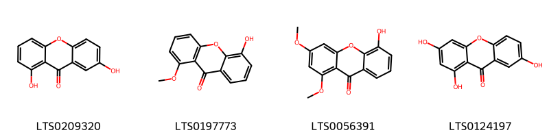{ width=100% }
    <figcaption>Hình ảnh cấu trúc hóa học của 4 hoạt chất thuộc nhóm Benzopyrans gồm ['euxanthone (LTS0209320)', '5-hydroxy-1-methoxyxanthen-9-one (LTS0197773)', '5-hydroxy-1,3-dimethoxyxanthen-9-one (LTS0056391)', 'gentisein (LTS0124197)'].</figcaption>
</figure>
#### Nhóm Coumarins and derivatives
<figure markdown="span">
    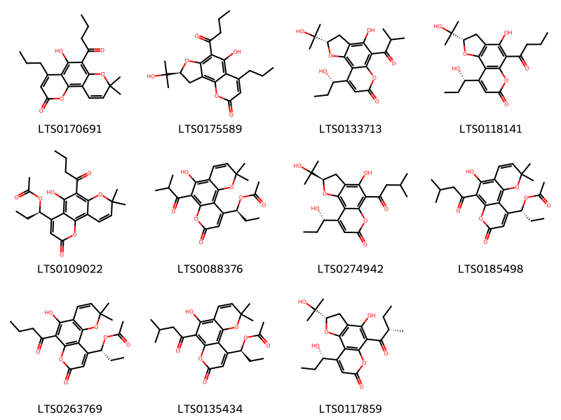{ width=100% }
    <figcaption>Hình ảnh cấu trúc hóa học của 11 hoạt chất thuộc nhóm Coumarins and derivatives gồm ['6-butanoyl-5-hydroxy-8,8-dimethyl-4-propylpyrano[2,3-f]chromen-2-one (LTS0170691)', '(8s)-6-butanoyl-5-hydroxy-8-(2-hydroxypropan-2-yl)-4-propyl-8h,9h-furo[2,3-h]chromen-2-one (LTS0175589)', '(2s)-4-hydroxy-2-(2-hydroxypropan-2-yl)-9-[(1s)-1-hydroxypropyl]-5-(2-methylpropanoyl)-2h,3h-furo[2,3-f]chromen-7-one (LTS0133713)', '(2s)-5-butanoyl-4-hydroxy-2-(2-hydroxypropan-2-yl)-9-[(1s)-1-hydroxypropyl]-2h,3h-furo[2,3-f]chromen-7-one (LTS0118141)', '(1r)-1-{6-butanoyl-5-hydroxy-8,8-dimethyl-2-oxopyrano[2,3-f]chromen-4-yl}propyl acetate (LTS0109022)', '(1s)-1-[5-hydroxy-2,2-dimethyl-6-(2-methylpropanoyl)-8-oxopyrano[2,3-f]chromen-10-yl]propyl acetate (LTS0088376)', '(2r)-4-hydroxy-2-(2-hydroxypropan-2-yl)-9-[(1s)-1-hydroxypropyl]-5-(3-methylbutanoyl)-2h,3h-furo[2,3-f]chromen-7-one (LTS0274942)', '(1r)-1-[5-hydroxy-2,2-dimethyl-6-(3-methylbutanoyl)-8-oxopyrano[2,3-f]chromen-10-yl]propyl acetate (LTS0185498)', '(1r)-1-{6-butanoyl-5-hydroxy-2,2-dimethyl-8-oxopyrano[2,3-h]chromen-10-yl}propyl acetate (LTS0263769)', '(1s)-1-[5-hydroxy-2,2-dimethyl-6-(3-methylbutanoyl)-8-oxopyrano[2,3-f]chromen-10-yl]propyl acetate (LTS0135434)', '(2s)-4-hydroxy-2-(2-hydroxypropan-2-yl)-9-[(1s)-1-hydroxypropyl]-5-[(2s)-2-methylbutanoyl]-2h,3h-furo[2,3-f]chromen-7-one (LTS0117859)'].</figcaption>
</figure>
#### Nhóm Neoflavonoids
<figure markdown="span">
    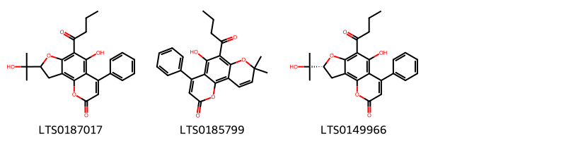{ width=100% }
    <figcaption>Hình ảnh cấu trúc hóa học của 3 hoạt chất thuộc nhóm Neoflavonoids gồm ['6-butanoyl-5-hydroxy-8-(2-hydroxypropan-2-yl)-4-phenyl-8h,9h-furo[2,3-h]chromen-2-one (LTS0187017)', '6-butanoyl-5-hydroxy-8,8-dimethyl-4-phenylpyrano[2,3-f]chromen-2-one (LTS0185799)', '(8r)-6-butanoyl-5-hydroxy-8-(2-hydroxypropan-2-yl)-4-phenyl-8h,9h-furo[2,3-h]chromen-2-one (LTS0149966)'].</figcaption>
</figure>

---

### Dược dân tộc học

Danh sách các quốc gia có sử dụng *Mammea siamensis* trong điều trị các bệnh. 

| Country   | Disease            | Bệnh             |
|:----------|:-------------------|:-----------------|
| Thailand  | Cosmetic, Cosmetic | Mỹ phẩm, Mỹ phẩm |

---

# Chi Mesua

??? note "Danh sách các dược liệu thuộc chi"
    
	 - *Mesua ferrea*

---
## Mesua ferrea
### Thông tin về thực vật

!!! info "Phân loại thực vật của *Mesua ferrea* từ GIBF:"
    - **Kingdom:** Plantae
    - **Phylum:** Tracheophyta
    - **Order:** Malpighiales
    - **Family:** Calophyllaceae
    - **Genus:** Mesua
    - **Species:** *Mesua ferrea*

 

| Label (VI)   | Label (EN)   | Scientific Name   | Descriptions (VI)   | Descriptions (EN)   | Also Known As (VI)   | Also Known As (EN)   |
|:-------------|:-------------|:------------------|:--------------------|:--------------------|:---------------------|:---------------------|
| N/A          | N/A          | Mesua ferrea      | loài thực vật       | species of plant    | ['']                 | ['']                 |

#### Phân bố trên thế giới

**Từ CSDL GIBF** Sri Lanka, Malaysia, India, Costa Rica, China, Singapore

#### Phân bố tại Việt Nam

**Từ CSDL GIBF**: Không có ghi nhận ở Việt Nam

---
### Thành phần hóa học
        
- Theo cơ sở dữ liệu lotus: Từ loài *Mesua ferrea* đã phân lập và xác định được 71 hoạt chất thuộc về các nhóm Benzopyrans, Flavonoids, Coumarins and derivatives, Prenol lipids, Neoflavonoids, Steroids and steroid derivatives. 

|    | chemicalTaxonomyClassyfireClass   |   smiles_count |
|---:|:----------------------------------|---------------:|
|  0 | Benzopyrans                       |             21 |
|  1 | Coumarins and derivatives         |              2 |
|  2 | Flavonoids                        |              2 |
|  3 | Neoflavonoids                     |             34 |
|  4 | Prenol lipids                     |              7 |
|  5 | Steroids and steroid derivatives  |              5 |

#### Nhóm Benzopyrans
<figure markdown="span">
    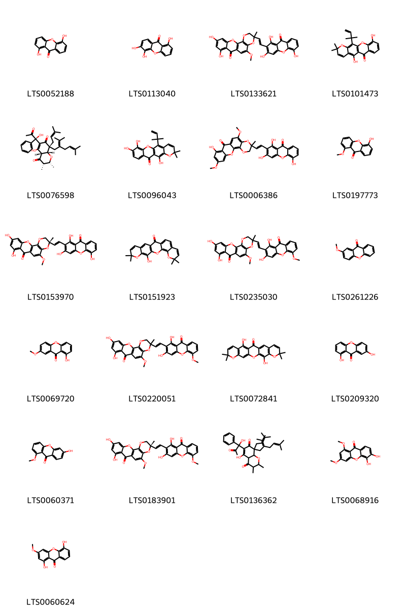{ width=100% }
    <figcaption>Hình ảnh cấu trúc hóa học của 21 hoạt chất thuộc nhóm Benzopyrans gồm ['1,5-dihydroxyxanthen-9-one (LTS0052188)', 'mesuaxanthone b (LTS0113040)', '7,9-dihydroxy-12-methoxy-2-methyl-2-[2-(1,3,5-trihydroxy-9-oxoxanthen-2-yl)ethenyl]-3h-1,4,5-trioxatetraphen-10-one (LTS0133621)', 'blancoxanthone (LTS0101473)', '(2r,3s,4as,8r,8ar)-5-hydroxy-6-[(1r)-1-hydroxy-2-oxo-1-phenylpropyl]-2,3-dimethyl-8-[5-methyl-2-(propan-2-ylidene)hex-4-en-1-yl]-8-(3-methylbut-2-en-1-yl)-2,3,4a,8a-tetrahydro-1-benzopyran-4,7-dione (LTS0076598)', '7,8,12-trihydroxy-2,2-dimethyl-5-(2-methylbut-3-en-2-yl)-1,6-dioxatetracen-11-one (LTS0096043)', '9-hydroxy-7,12-dimethoxy-2-methyl-2-[(1e)-2-(1,3,5-trihydroxy-9-oxoxanthen-2-yl)ethenyl]-3h-1,4,5-trioxatetraphen-10-one (LTS0006386)', '5-hydroxy-1-methoxyxanthen-9-one (LTS0197773)', '(2s)-7,9-dihydroxy-12-methoxy-2-methyl-2-[(1e)-2-(1,3,5-trihydroxy-9-oxoxanthen-2-yl)ethenyl]-3h-1,4,5-trioxatetraphen-10-one (LTS0153970)', '22-hydroxy-6,6,19,19-tetramethyl-2,5,20-trioxapentacyclo[12.8.0.0³,¹².0⁴,⁹.0¹⁶,²¹]docosa-1(22),3,7,9,11,14,16(21),17-octaen-13-one (LTS0151923)', '2-[2-(1,3-dihydroxy-5-methoxy-9-oxoxanthen-2-yl)ethenyl]-7,9-dihydroxy-12-methoxy-2-methyl-3h-1,4,5-trioxatetraphen-10-one (LTS0235030)', '2-methoxyxanthen-9-one (LTS0261226)', '1-hydroxy-7-methoxyxanthen-9-one (LTS0069720)', '2-[(1e)-2-(1,3-dihydroxy-5-methoxy-9-oxoxanthen-2-yl)ethenyl]-7,9-dihydroxy-12-methoxy-2-methyl-3h-1,4,5-trioxatetraphen-10-one (LTS0220051)', 'pyranojacareubin (LTS0072841)', 'euxanthone (LTS0209320)', '6-hydroxy-1-methoxyxanthen-9-one (LTS0060371)', '(2s)-2-[(1e)-2-(1,3-dihydroxy-5-methoxy-9-oxoxanthen-2-yl)ethenyl]-7,9-dihydroxy-12-methoxy-2-methyl-3h-1,4,5-trioxatetraphen-10-one (LTS0183901)', '5-hydroxy-6-(1-hydroxy-2-oxo-1-phenylpropyl)-2,3-dimethyl-8-[5-methyl-2-(propan-2-ylidene)hex-4-en-1-yl]-8-(3-methylbut-2-en-1-yl)-2,3,4a,8a-tetrahydro-1-benzopyran-4,7-dione (LTS0136362)', '5,6-dihydroxy-1,3-dimethoxyxanthen-9-one (LTS0068916)', 'mesuaxanthone a (LTS0060624)'].</figcaption>
</figure>
#### Nhóm Coumarins and derivatives
<figure markdown="span">
    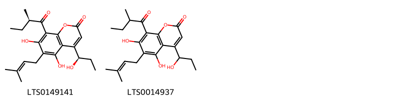{ width=100% }
    <figcaption>Hình ảnh cấu trúc hóa học của 2 hoạt chất thuộc nhóm Coumarins and derivatives gồm ['5,7-dihydroxy-4-[(1r)-1-hydroxypropyl]-6-(3-methylbut-2-en-1-yl)-8-[(2r)-2-methylbutanoyl]chromen-2-one (LTS0149141)', '5,7-dihydroxy-4-(1-hydroxypropyl)-6-(3-methylbut-2-en-1-yl)-8-(2-methylbutanoyl)chromen-2-one (LTS0014937)'].</figcaption>
</figure>
#### Nhóm Flavonoids
<figure markdown="span">
    { width=100% }
    <figcaption>Hình ảnh cấu trúc hóa học của 2 hoạt chất thuộc nhóm Flavonoids gồm ['catechol (LTS0090912)', 'ent-epicatechin (LTS0265245)'].</figcaption>
</figure>
#### Nhóm Neoflavonoids
<figure markdown="span">
    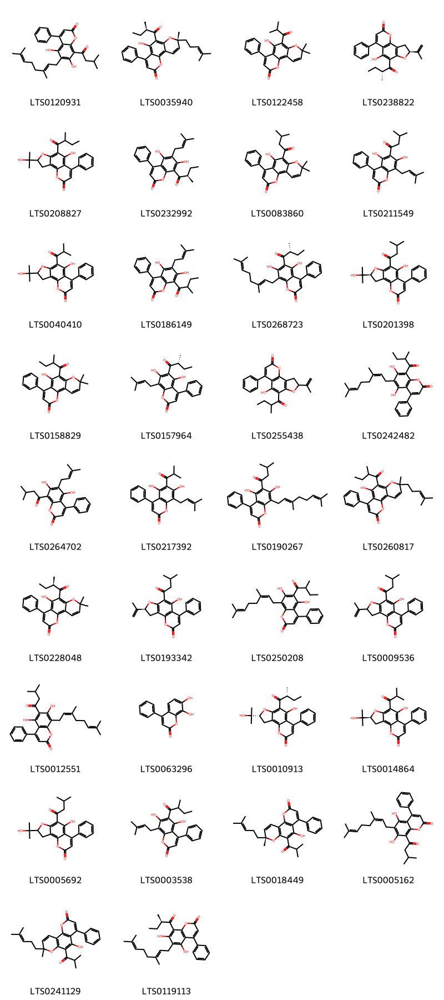{ width=100% }
    <figcaption>Hình ảnh cấu trúc hóa học của 34 hoạt chất thuộc nhóm Neoflavonoids gồm ['6-[(2e)-3,7-dimethylocta-2,6-dien-1-yl]-5,7-dihydroxy-8-(3-methylbutanoyl)-4-phenylchromen-2-one (LTS0120931)', '(8r)-5-hydroxy-8-methyl-6-[(2r)-2-methylbutanoyl]-8-(4-methylpent-3-en-1-yl)-4-phenylpyrano[2,3-f]chromen-2-one (LTS0035940)', 'mesuagin (LTS0122458)', '(8s)-5-hydroxy-6-[(2r)-2-methylbutanoyl]-4-phenyl-8-(prop-1-en-2-yl)-8h,9h-furo[2,3-h]chromen-2-one (LTS0238822)', '5-hydroxy-8-(2-hydroxypropan-2-yl)-6-(2-methylbutanoyl)-4-phenyl-8h,9h-furo[2,3-h]chromen-2-one (LTS0208827)', '5,7-dihydroxy-6-(3-methylbut-2-en-1-yl)-8-[(2r)-2-methylbutanoyl]-4-phenylchromen-2-one (LTS0232992)', 'mammeigin (LTS0083860)', 'mammeisin (LTS0211549)', '5-hydroxy-8-(2-hydroxypropan-2-yl)-6-(2-methylpropanoyl)-4-phenyl-8h,9h-furo[2,3-h]chromen-2-one (LTS0040410)', 'mammea a/bb (LTS0186149)', '8-[(2e)-3,7-dimethylocta-2,6-dien-1-yl]-5,7-dihydroxy-6-[(2r)-2-methylbutanoyl]-4-phenylchromen-2-one (LTS0268723)', '(8s)-5-hydroxy-8-(2-hydroxypropan-2-yl)-6-(3-methylbutanoyl)-4-phenyl-8h,9h-furo[2,3-h]chromen-2-one (LTS0201398)', '5-hydroxy-8,8-dimethyl-6-(2-methylbutanoyl)-4-phenylpyrano[2,3-f]chromen-2-one (LTS0158829)', '5,7-dihydroxy-8-(3-methylbut-2-en-1-yl)-6-[(2r)-2-methylbutanoyl]-4-phenylchromen-2-one (LTS0157964)', '5-hydroxy-6-(2-methylbutanoyl)-4-phenyl-8-(prop-1-en-2-yl)-8h,9h-furo[2,3-h]chromen-2-one (LTS0255438)', '6-(3,7-dimethylocta-2,6-dien-1-yl)-5,7-dihydroxy-8-(2-methylbutanoyl)-4-phenylchromen-2-one (LTS0242482)', 'mammea a/ba (LTS0264702)', 'mesuol (LTS0217392)', '8-[(2e)-3,7-dimethylocta-2,6-dien-1-yl]-5,7-dihydroxy-6-(3-methylbutanoyl)-4-phenylchromen-2-one (LTS0190267)', '5-hydroxy-8-methyl-6-(2-methylbutanoyl)-8-(4-methylpent-3-en-1-yl)-4-phenylpyrano[2,3-f]chromen-2-one (LTS0260817)', '5-hydroxy-8,8-dimethyl-6-[(2r)-2-methylbutanoyl]-4-phenylpyrano[2,3-f]chromen-2-one (LTS0228048)', '(8s)-5-hydroxy-6-(3-methylbutanoyl)-4-phenyl-8-(prop-1-en-2-yl)-8h,9h-furo[2,3-h]chromen-2-one (LTS0193342)', '8-(3,7-dimethylocta-2,6-dien-1-yl)-5,7-dihydroxy-6-(2-methylbutanoyl)-4-phenylchromen-2-one (LTS0250208)', '5-hydroxy-6-(3-methylbutanoyl)-4-phenyl-8-(prop-1-en-2-yl)-8h,9h-furo[2,3-h]chromen-2-one (LTS0009536)', '8-(3,7-dimethylocta-2,6-dien-1-yl)-5,7-dihydroxy-6-(3-methylbutanoyl)-4-phenylchromen-2-one (LTS0012551)', '7,8-dihydroxy-4-phenylchromen-2-one (LTS0063296)', '(8r)-5-hydroxy-8-(2-hydroxypropan-2-yl)-6-[(2r)-2-methylbutanoyl]-4-phenyl-8h,9h-furo[2,3-h]chromen-2-one (LTS0010913)', '(8s)-5-hydroxy-8-(2-hydroxypropan-2-yl)-6-(2-methylpropanoyl)-4-phenyl-8h,9h-furo[2,3-h]chromen-2-one (LTS0014864)', '5-hydroxy-8-(2-hydroxypropan-2-yl)-6-(3-methylbutanoyl)-4-phenyl-8h,9h-furo[2,3-h]chromen-2-one (LTS0005692)', '5,7-dihydroxy-8-(3-methylbut-2-en-1-yl)-6-(2-methylbutanoyl)-4-phenylchromen-2-one (LTS0003538)', '(8r)-5-hydroxy-8-methyl-8-(4-methylpent-3-en-1-yl)-6-(2-methylpropanoyl)-4-phenylpyrano[2,3-f]chromen-2-one (LTS0018449)', '6-(3,7-dimethylocta-2,6-dien-1-yl)-5,7-dihydroxy-8-(3-methylbutanoyl)-4-phenylchromen-2-one (LTS0005162)', '5-hydroxy-8-methyl-8-(4-methylpent-3-en-1-yl)-6-(2-methylpropanoyl)-4-phenylpyrano[2,3-f]chromen-2-one (LTS0241129)', '6-[(2e)-3,7-dimethylocta-2,6-dien-1-yl]-5,7-dihydroxy-8-[(2r)-2-methylbutanoyl]-4-phenylchromen-2-one (LTS0119113)'].</figcaption>
</figure>
#### Nhóm Prenol lipids
<figure markdown="span">
    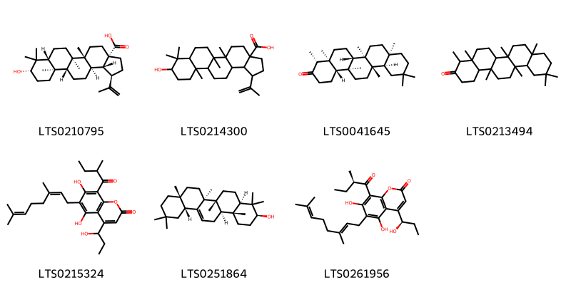{ width=100% }
    <figcaption>Hình ảnh cấu trúc hóa học của 7 hoạt chất thuộc nhóm Prenol lipids gồm ['betulinic acid (LTS0210795)', '9-hydroxy-5a,5b,8,8,11a-pentamethyl-1-(prop-1-en-2-yl)-hexadecahydrocyclopenta[a]chrysene-3a-carboxylic acid (LTS0214300)', '(-)-friedelin (LTS0041645)', 'friedelin (LTS0213494)', '6-(3,7-dimethylocta-2,6-dien-1-yl)-5,7-dihydroxy-4-(1-hydroxypropyl)-8-(2-methylbutanoyl)chromen-2-one (LTS0215324)', 'β-amyrin (LTS0251864)', '6-[(2e)-3,7-dimethylocta-2,6-dien-1-yl]-5,7-dihydroxy-4-[(1r)-1-hydroxypropyl]-8-[(2r)-2-methylbutanoyl]chromen-2-one (LTS0261956)'].</figcaption>
</figure>
#### Nhóm Steroids and steroid derivatives
<figure markdown="span">
    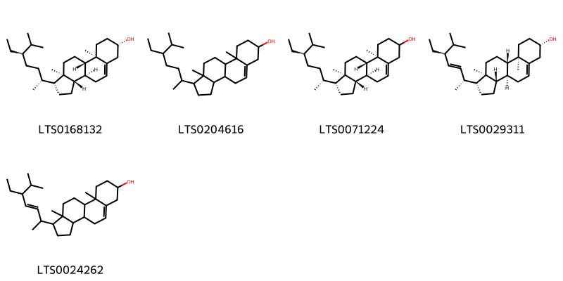{ width=100% }
    <figcaption>Hình ảnh cấu trúc hóa học của 5 hoạt chất thuộc nhóm Steroids and steroid derivatives gồm ['sitosterol (LTS0168132)', 'stigmast-5-en-3-ol, (3β)- (LTS0204616)', 'stigmast-5-en-3-ol (LTS0071224)', 'phytosterol (LTS0029311)', 'stigmasterol (LTS0024262)'].</figcaption>
</figure>

---

### Dược dân tộc học

Danh sách các quốc gia có sử dụng *Mesua ferrea* trong điều trị các bệnh. 

| Country   | Disease                                     | Bệnh                                         |
|:----------|:--------------------------------------------|:---------------------------------------------|
| Elsewhere | Astringent, Soap, Stomachic, Sudorific, nan | Chất làm se, xà phòng, dạ dày, gây ngạt, nan |
| India     | nan, Fungicide                              | nan, Thuốc diệt nấm                          |

---

# Chi Clusia

??? note "Danh sách các dược liệu thuộc chi"
    
	 - *Clusia minor*
	 - *Clusia rosea*

---
## Clusia minor
### Thông tin về thực vật

!!! info "Phân loại thực vật của *Clusia minor* từ GIBF:"
    - **Kingdom:** Plantae
    - **Phylum:** Tracheophyta
    - **Order:** Malpighiales
    - **Family:** Clusiaceae
    - **Genus:** Clusia
    - **Species:** *Clusia minor*

 

| Label (VI)   | Label (EN)   | Scientific Name   | Descriptions (VI)   | Descriptions (EN)   | Also Known As (VI)   | Also Known As (EN)   |
|:-------------|:-------------|:------------------|:--------------------|:--------------------|:---------------------|:---------------------|
| N/A          | N/A          | Clusia minor      | loài thực vật       | species of plant    | ['']                 | ['']                 |

#### Phân bố trên thế giới

**Từ CSDL GIBF** Colombia, Venezuela (Bolivarian Republic of), El Salvador, Nicaragua, Panama, Peru, French Guiana, Ecuador, Mexico

#### Phân bố tại Việt Nam

**Từ CSDL GIBF**: Không có ghi nhận ở Việt Nam

---
### Thành phần hóa học
        
- Theo cơ sở dữ liệu lotus: Từ loài *Clusia minor* đã phân lập và xác định được Chưa có hoạt chất nào được phân lập. hoạt chất thuộc về các nhóm Không có hoạt chất nào được phân lập. 

Không có hình ảnh nào được tạo ra

---

### Dược dân tộc học

Danh sách các quốc gia có sử dụng *Clusia minor* trong điều trị các bệnh. 

| Country   | Disease           | Bệnh              |
|:----------|:------------------|:------------------|
| Elsewhere | Vulnerary, Poison | Lỗ hổng, Chất độc |

---

---
## Clusia rosea
### Thông tin về thực vật

!!! info "Phân loại thực vật của *Clusia rosea* từ GIBF:"
    - **Kingdom:** Plantae
    - **Phylum:** Tracheophyta
    - **Order:** Malpighiales
    - **Family:** Clusiaceae
    - **Genus:** Clusia
    - **Species:** *Clusia rosea*

 

| Label (VI)   | Label (EN)   | Scientific Name   | Descriptions (VI)   | Descriptions (EN)   | Also Known As (VI)   | Also Known As (EN)   |
|:-------------|:-------------|:------------------|:--------------------|:--------------------|:---------------------|:---------------------|
| N/A          | N/A          | Clusia rosea      | loài thực vật       | species of plant    | ['']                 | ['']                 |
| N/A          | N/A          | Clusia rosea      |                     |                     | ['']                 | ['']                 |

#### Phân bố trên thế giới

**Từ CSDL GIBF** nan, Cayman Islands, Dominica, Trinidad and Tobago, Haiti, Colombia, Turks and Caicos Islands, Dominican Republic, Puerto Rico, Cuba, Anguilla, Virgin Islands (U.S.), Brazil, Aruba, Montserrat, Mexico, Curaçao, Saint Martin (French part), South Africa, Costa Rica, United States of America

#### Phân bố tại Việt Nam

**Từ CSDL GIBF**: Không có ghi nhận ở Việt Nam

---
### Thành phần hóa học
        
- Theo cơ sở dữ liệu lotus: Từ loài *Clusia rosea* đã phân lập và xác định được 16 hoạt chất thuộc về các nhóm Steroids and steroid derivatives, Organooxygen compounds, Prenol lipids, Fatty Acyls. 

|    | chemicalTaxonomyClassyfireClass   |   smiles_count |
|---:|:----------------------------------|---------------:|
|  0 | Fatty Acyls                       |              1 |
|  1 | Organooxygen compounds            |              3 |
|  2 | Prenol lipids                     |             10 |
|  3 | Steroids and steroid derivatives  |              2 |

#### Nhóm Fatty Acyls
<figure markdown="span">
    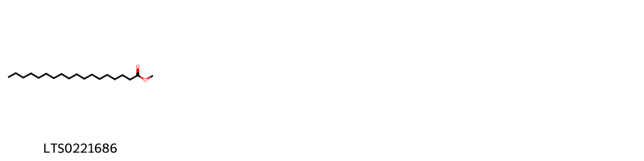{ width=100% }
    <figcaption>Hình ảnh cấu trúc hóa học của 1 hoạt chất thuộc nhóm Fatty Acyls gồm ['methyl stearate (LTS0221686)'].</figcaption>
</figure>
#### Nhóm Organooxygen compounds
<figure markdown="span">
    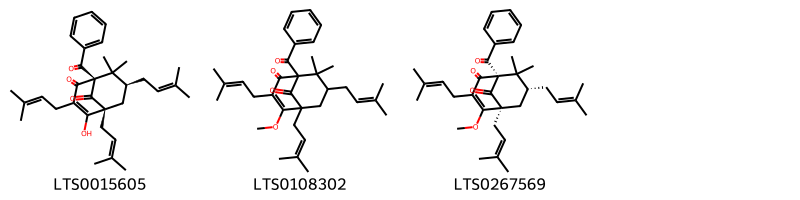{ width=100% }
    <figcaption>Hình ảnh cấu trúc hóa học của 3 hoạt chất thuộc nhóm Organooxygen compounds gồm ['(1r,5r,7s)-1-benzoyl-4-hydroxy-8,8-dimethyl-3,5,7-tris(3-methylbut-2-en-1-yl)bicyclo[3.3.1]non-3-ene-2,9-dione (LTS0015605)', '1-benzoyl-4-methoxy-8,8-dimethyl-3,5,7-tris(3-methylbut-2-en-1-yl)bicyclo[3.3.1]non-3-ene-2,9-dione (LTS0108302)', '(1s,5s,7r)-1-benzoyl-4-methoxy-8,8-dimethyl-3,5,7-tris(3-methylbut-2-en-1-yl)bicyclo[3.3.1]non-3-ene-2,9-dione (LTS0267569)'].</figcaption>
</figure>
#### Nhóm Prenol lipids
<figure markdown="span">
    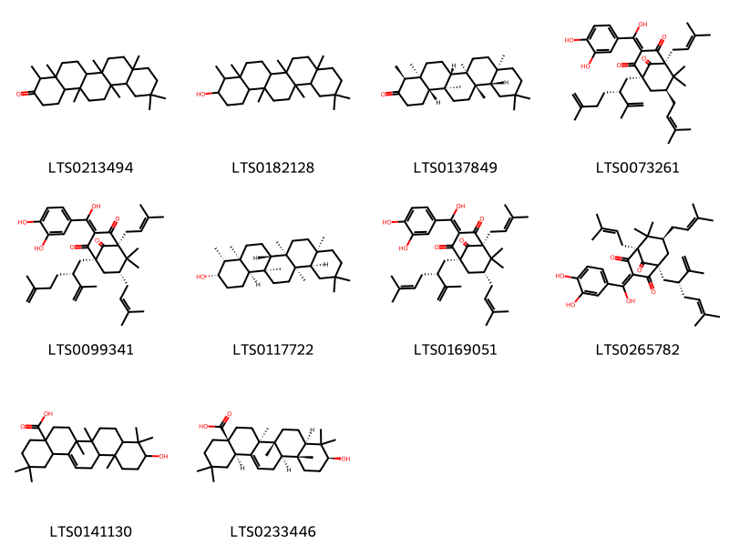{ width=100% }
    <figcaption>Hình ảnh cấu trúc hóa học của 10 hoạt chất thuộc nhóm Prenol lipids gồm ['friedelin (LTS0213494)', '4,4a,6b,8a,11,11,12b,14a-octamethyl-hexadecahydropicen-3-ol (LTS0182128)', '(4s,4as,6as,6br,8ar,12as,12bs,14as,14bs)-4,4a,6b,8a,11,11,12b,14a-octamethyl-tetradecahydro-1h-picen-3-one (LTS0137849)', '(1r,3z,5s,7s)-3-[(3,4-dihydroxyphenyl)(hydroxy)methylidene]-6,6-dimethyl-1-[(2r)-5-methyl-2-(prop-1-en-2-yl)hex-5-en-1-yl]-5,7-bis(3-methylbut-2-en-1-yl)bicyclo[3.3.1]nonane-2,4,9-trione (LTS0073261)', '(1r,5s,7r)-3-[(3,4-dihydroxyphenyl)(hydroxy)methylidene]-6,6-dimethyl-1-[(2r)-5-methyl-2-(prop-1-en-2-yl)hex-5-en-1-yl]-5,7-bis(3-methylbut-2-en-1-yl)bicyclo[3.3.1]nonane-2,4,9-trione (LTS0099341)', '(3s,4r,4as,6as,6br,8ar,12ar,12br,14as,14br)-4,4a,6b,8a,11,11,12b,14a-octamethyl-hexadecahydropicen-3-ol (LTS0117722)', '(1r,5s,7r)-3-[(3,4-dihydroxyphenyl)(hydroxy)methylidene]-6,6-dimethyl-1-[(2r)-5-methyl-2-(prop-1-en-2-yl)hex-4-en-1-yl]-5,7-bis(3-methylbut-2-en-1-yl)bicyclo[3.3.1]nonane-2,4,9-trione (LTS0169051)', '(1r,3e,5s,7s)-3-[(3,4-dihydroxyphenyl)(hydroxy)methylidene]-6,6-dimethyl-1-[(2r)-5-methyl-2-(prop-1-en-2-yl)hex-4-en-1-yl]-5,7-bis(3-methylbut-2-en-1-yl)bicyclo[3.3.1]nonane-2,4,9-trione (LTS0265782)', 'oleanolic acid (LTS0141130)', '(4as,6as,6br,8ar,10s,12ar,12br,14br)-10-hydroxy-2,2,6a,6b,9,9,12a-heptamethyl-1,3,4,5,6,7,8,8a,10,11,12,12b,13,14b-tetradecahydropicene-4a-carboxylic acid (LTS0233446)'].</figcaption>
</figure>
#### Nhóm Steroids and steroid derivatives
<figure markdown="span">
    { width=100% }
    <figcaption>Hình ảnh cấu trúc hóa học của 2 hoạt chất thuộc nhóm Steroids and steroid derivatives gồm ['stigmast-5-en-3-ol, (3β)- (LTS0204616)', '(1r,3ar,3br,7s,9ar,9br,11ar)-1-[(2r,5r)-5-ethyl-6-methylheptan-2-yl]-9a,11a-dimethyl-1h,2h,3h,3ah,3bh,4h,6h,7h,8h,9h,9bh,10h,11h-cyclopenta[a]phenanthren-7-ol (LTS0129695)'].</figcaption>
</figure>

---

### Dược dân tộc học

Danh sách các quốc gia có sử dụng *Clusia rosea* trong điều trị các bệnh. 

| Country            | Disease   | Bệnh     |
|:-------------------|:----------|:---------|
| Dominican Republic | Purgative | Thuốc xổ |
| Haiti              | Poison    | Chất độc |
| Latin America      | Poison    | Chất độc |

---

# Chi Calophyllum

??? note "Danh sách các dược liệu thuộc chi"
    
	 - *Calophyllum amoenum*
	 - *Calophyllum calaba*
	 - *Calophyllum elatum*
	 - *Calophyllum inophyllum*
	 - *Calophyllum soulattri*

---
## Calophyllum amoenum
### Thông tin về thực vật

!!! info "Phân loại thực vật của *Calophyllum amoenum* từ GIBF:"
    - **Kingdom:** Plantae
    - **Phylum:** Tracheophyta
    - **Order:** Malpighiales
    - **Family:** Calophyllaceae
    - **Genus:** Calophyllum
    - **Species:** *Calophyllum amoenum*

 

| Label (VI)   | Label (EN)   | Scientific Name     | Descriptions (VI)   | Descriptions (EN)   | Also Known As (VI)   | Also Known As (EN)   |
|:-------------|:-------------|:--------------------|:--------------------|:--------------------|:---------------------|:---------------------|
| N/A          | N/A          | Calophyllum amoenum |                     |                     | ['']                 | ['']                 |

#### Phân bố trên thế giới

**Từ CSDL GIBF** nan, Cayman Islands, Dominica, Trinidad and Tobago, Haiti, Colombia, Turks and Caicos Islands, Dominican Republic, Puerto Rico, Cuba, Anguilla, Virgin Islands (U.S.), Brazil, Aruba, Montserrat, Mexico, Curaçao, Saint Martin (French part), South Africa, Costa Rica, United States of America

#### Phân bố tại Việt Nam

**Từ CSDL GIBF**: Không có ghi nhận ở Việt Nam

---
### Thành phần hóa học
        
- Theo cơ sở dữ liệu lotus: Từ loài *Calophyllum amoenum* đã phân lập và xác định được Chưa có hoạt chất nào được phân lập. hoạt chất thuộc về các nhóm Không có hoạt chất nào được phân lập. 

Không có hình ảnh nào được tạo ra

---

### Dược dân tộc học

Danh sách các quốc gia có sử dụng *Calophyllum amoenum* trong điều trị các bệnh. 

| Country   | Disease   | Bệnh          |
|:----------|:----------|:--------------|
| Elsewhere | Piscicide | Thuốc diệt cá |

---

---
## Calophyllum calaba
### Thông tin về thực vật

!!! info "Phân loại thực vật của *Calophyllum calaba* từ GIBF:"
    - **Kingdom:** Plantae
    - **Phylum:** Tracheophyta
    - **Order:** Malpighiales
    - **Family:** Calophyllaceae
    - **Genus:** Calophyllum
    - **Species:** *Calophyllum calaba*

 

| Label (VI)   | Label (EN)   | Scientific Name    | Descriptions (VI)   | Descriptions (EN)   | Also Known As (VI)   | Also Known As (EN)   |
|:-------------|:-------------|:-------------------|:--------------------|:--------------------|:---------------------|:---------------------|
| N/A          | N/A          | Calophyllum calaba | loài thực vật       | species of plant    | ['']                 | ['']                 |

#### Phân bố trên thế giới

**Từ CSDL GIBF** nan, unknown or invalid, Thailand, Guadeloupe, Dominica, Trinidad and Tobago, Germany, Lao People’s Democratic Republic, Australia, Jamaica, Indonesia, Haiti, Colombia, Sri Lanka, Dominican Republic, Puerto Rico, Malaysia, India, Cuba, Bahamas, Cambodia, Brazil, Montserrat, France, United States of America

#### Phân bố tại Việt Nam

**Từ CSDL GIBF**: Không có ghi nhận ở Việt Nam

---
### Thành phần hóa học
        
- Theo cơ sở dữ liệu lotus: Từ loài *Calophyllum calaba* đã phân lập và xác định được 53 hoạt chất thuộc về các nhóm Benzopyrans, Flavonoids, Prenol lipids, Fatty Acyls, Steroids and steroid derivatives. 

|    | chemicalTaxonomyClassyfireClass   |   smiles_count |
|---:|:----------------------------------|---------------:|
|  0 | Benzopyrans                       |             20 |
|  1 | Fatty Acyls                       |             13 |
|  2 | Flavonoids                        |              1 |
|  3 | Prenol lipids                     |             16 |
|  4 | Steroids and steroid derivatives  |              2 |

#### Nhóm Benzopyrans
<figure markdown="span">
    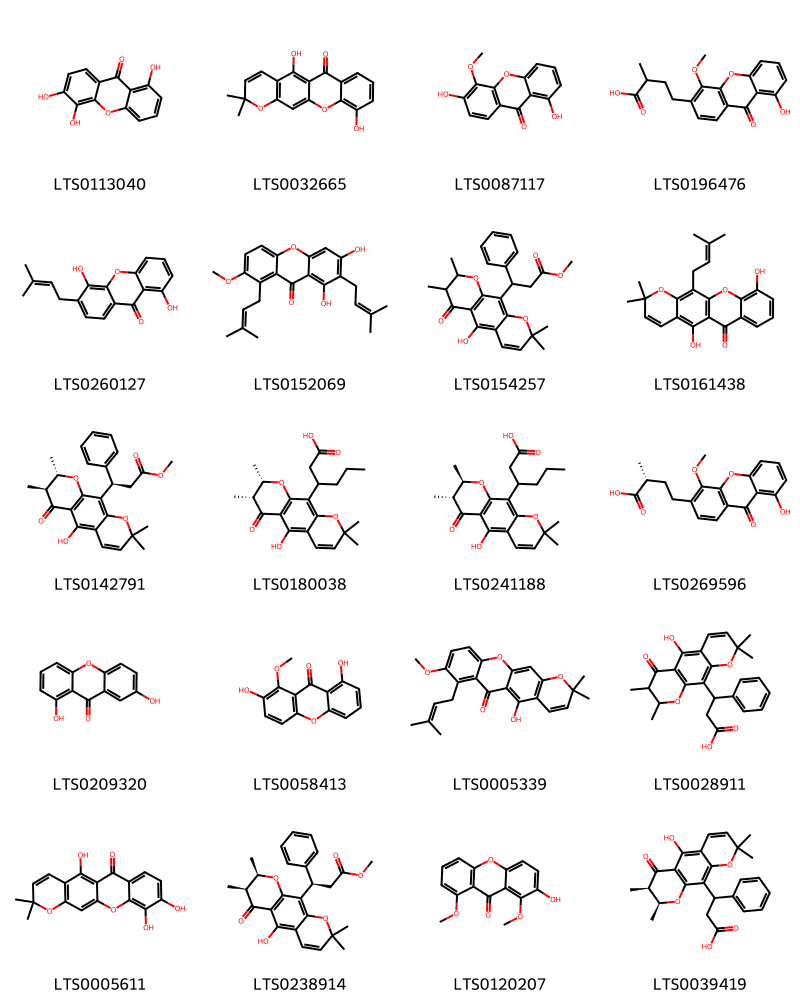{ width=100% }
    <figcaption>Hình ảnh cấu trúc hóa học của 20 hoạt chất thuộc nhóm Benzopyrans gồm ['mesuaxanthone b (LTS0113040)', '6-deoxyjacareubin (LTS0032665)', '1,6-dihydroxy-5-methoxyxanthen-9-one (LTS0087117)', '4-(8-hydroxy-4-methoxy-9-oxoxanthen-3-yl)-2-methylbutanoic acid (LTS0196476)', 'calophyllin b (LTS0260127)', '1,3-dihydroxy-7-methoxy-2,8-bis(3-methylbut-2-en-1-yl)xanthen-9-one (LTS0152069)', 'methyl 3-{5-hydroxy-2,2,7,8-tetramethyl-6-oxo-7h,8h-pyrano[3,2-g]chromen-10-yl}-3-phenylpropanoate (LTS0154257)', '5,10-dihydroxy-2,2-dimethyl-12-(3-methylbut-2-en-1-yl)-1,11-dioxatetracen-6-one (LTS0161438)', 'methyl (3r)-3-[(7s,8s)-5-hydroxy-2,2,7,8-tetramethyl-6-oxo-7h,8h-pyrano[3,2-g]chromen-10-yl]-3-phenylpropanoate (LTS0142791)', 'apetalic acid (LTS0180038)', '3-[(7r,8r)-5-hydroxy-2,2,7,8-tetramethyl-6-oxo-7h,8h-pyrano[3,2-g]chromen-10-yl]hexanoic acid (LTS0241188)', '(2r)-4-(8-hydroxy-4-methoxy-9-oxoxanthen-3-yl)-2-methylbutanoic acid (LTS0269596)', 'euxanthone (LTS0209320)', '2,8-dihydroxy-1-methoxyxanthen-9-one (LTS0058413)', '5-hydroxy-8-methoxy-2,2-dimethyl-7-(3-methylbut-2-en-1-yl)-1,11-dioxatetracen-6-one (LTS0005339)', '3-{5-hydroxy-2,2,7,8-tetramethyl-6-oxo-7h,8h-pyrano[3,2-g]chromen-10-yl}-3-phenylpropanoic acid (LTS0028911)', 'jacareubin (LTS0005611)', 'methyl (3r)-3-[(7s,8r)-5-hydroxy-2,2,7,8-tetramethyl-6-oxo-7h,8h-pyrano[3,2-g]chromen-10-yl]-3-phenylpropanoate (LTS0238914)', '2-hydroxy-1,8-dimethoxyxanthen-9-one (LTS0120207)', '3-[(7r,8s)-5-hydroxy-2,2,7,8-tetramethyl-6-oxo-7h,8h-pyrano[3,2-g]chromen-10-yl]-3-phenylpropanoic acid (LTS0039419)'].</figcaption>
</figure>
#### Nhóm Fatty Acyls
<figure markdown="span">
    { width=100% }
    <figcaption>Hình ảnh cấu trúc hóa học của 13 hoạt chất thuộc nhóm Fatty Acyls gồm ['cis-11-eicosenoic acid (LTS0121218)', 'palmitic acid (LTS0079439)', 'nervonic acid (LTS0204612)', 'behenic acid (LTS0058784)', '10-trans,12-cis-linoleic acid (LTS0266267)', 'palmitoleic acid (LTS0261591)', 'arachidic acid (LTS0171823)', 'erucic acid (LTS0252257)', 'lignoceric acid (LTS0107726)', 'oleic acid (LTS0256910)', 'myristic acid (LTS0102566)', '(2r)-2-[(1e)-dec-1-en-1-yl]tetradecanoic acid (LTS0048886)', 'stearic acid (LTS0237766)'].</figcaption>
</figure>
#### Nhóm Flavonoids
<figure markdown="span">
    { width=100% }
    <figcaption>Hình ảnh cấu trúc hóa học của 1 hoạt chất thuộc nhóm Flavonoids gồm ['amentoflavone (LTS0063796)'].</figcaption>
</figure>
#### Nhóm Prenol lipids
<figure markdown="span">
    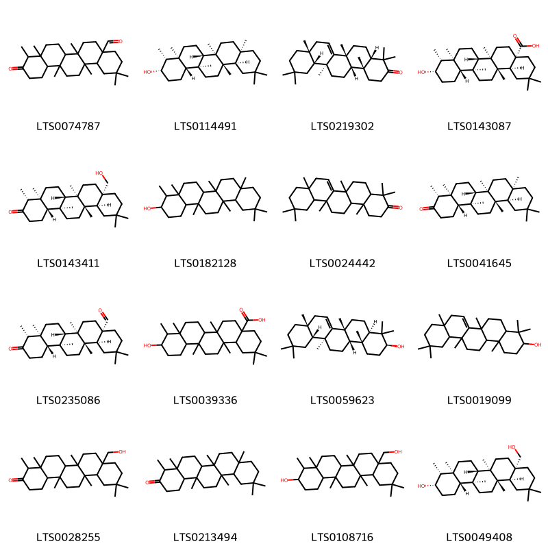{ width=100% }
    <figcaption>Hình ảnh cấu trúc hóa học của 16 hoạt chất thuộc nhóm Prenol lipids gồm ['2,2,6a,8a,9,12b,14a-heptamethyl-10-oxo-tetradecahydro-1h-picene-4a-carbaldehyde (LTS0074787)', 'epi-friedelanol (LTS0114491)', '(4as,6ar,8ar,12ar,12bs,14as,14br)-4,4,6a,8a,11,11,12b,14b-octamethyl-2,4a,5,6,8,9,10,12,12a,13,14,14a-dodecahydro-1h-picen-3-one (LTS0219302)', '(4as,6ar,6bs,8as,9r,10s,12as,12bs,14as,14bs)-10-hydroxy-2,2,6a,8a,9,12b,14a-heptamethyl-hexadecahydropicene-4a-carboxylic acid (LTS0143087)', '(4r,4as,6as,6br,8as,12as,12bs,14as,14bs)-8a-(hydroxymethyl)-4,4a,6b,11,11,12b,14a-heptamethyl-tetradecahydro-1h-picen-3-one (LTS0143411)', '4,4a,6b,8a,11,11,12b,14a-octamethyl-hexadecahydropicen-3-ol (LTS0182128)', '4,4,6a,8a,11,11,12b,14b-octamethyl-2,4a,5,6,8,9,10,12,12a,13,14,14a-dodecahydro-1h-picen-3-one (LTS0024442)', '(-)-friedelin (LTS0041645)', '(4as,6ar,6bs,8as,9r,12as,12bs,14as,14bs)-2,2,6a,8a,9,12b,14a-heptamethyl-10-oxo-tetradecahydro-1h-picene-4a-carbaldehyde (LTS0235086)', '10-hydroxy-2,2,6a,8a,9,12b,14a-heptamethyl-hexadecahydropicene-4a-carboxylic acid (LTS0039336)', '(3s,4ar,6ar,8ar,12ar,12bs,14as,14br)-4,4,6a,8a,11,11,12b,14b-octamethyl-1,2,3,4a,5,6,8,9,10,12,12a,13,14,14a-tetradecahydropicen-3-ol (LTS0059623)', 'taraxerol (LTS0019099)', 'canophyllol (LTS0028255)', 'friedelin (LTS0213494)', '8a-(hydroxymethyl)-4,4a,6b,11,11,12b,14a-heptamethyl-hexadecahydropicen-3-ol (LTS0108716)', '(3s,4r,4as,6as,6br,8as,12as,12bs,14as,14bs)-8a-(hydroxymethyl)-4,4a,6b,11,11,12b,14a-heptamethyl-hexadecahydropicen-3-ol (LTS0049408)'].</figcaption>
</figure>
#### Nhóm Steroids and steroid derivatives
<figure markdown="span">
    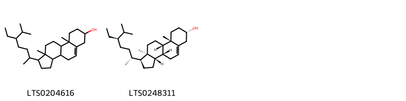{ width=100% }
    <figcaption>Hình ảnh cấu trúc hóa học của 2 hoạt chất thuộc nhóm Steroids and steroid derivatives gồm ['stigmast-5-en-3-ol, (3β)- (LTS0204616)', '(1s,3as,3br,7s,9as,9bs,11ar)-1-[(2r,5r)-5-ethyl-6-methylheptan-2-yl]-9a,11a-dimethyl-1h,2h,3h,3ah,3bh,4h,6h,7h,8h,9h,9bh,10h,11h-cyclopenta[a]phenanthren-7-ol (LTS0248311)'].</figcaption>
</figure>

---

### Dược dân tộc học

Danh sách các quốc gia có sử dụng *Calophyllum calaba* trong điều trị các bệnh. 

| Country            | Disease                                             | Bệnh                                                   |
|:-------------------|:----------------------------------------------------|:-------------------------------------------------------|
| Dominican Republic | Cicatrizant                                         | Cicatrizant                                            |
| Haiti              | Astringent, Digestive, Tonic, Digestive, Astringent | Chất làm se, Tiêu hóa, Thuốc bổ, Tiêu hóa, Chất làm se |
| Venezuela          | Vulnerary                                           | Vulnerary                                              |

---

---
## Calophyllum elatum
### Thông tin về thực vật

!!! info "Phân loại thực vật của *N/A* từ GIBF:"
    - **Kingdom:** Plantae
    - **Phylum:** Tracheophyta
    - **Order:** Malpighiales
    - **Family:** Calophyllaceae
    - **Genus:** Calophyllum
    - **Species:** *N/A*

 

| Label (VI)   | Label (EN)   | Scientific Name    | Descriptions (VI)   | Descriptions (EN)   | Also Known As (VI)   | Also Known As (EN)   |
|:-------------|:-------------|:-------------------|:--------------------|:--------------------|:---------------------|:---------------------|
| N/A          | N/A          | Calophyllum elatum | loài thực vật       | species of plant    | ['']                 | ['']                 |

#### Phân bố trên thế giới

**Từ CSDL GIBF** Thailand, Guinea, Guadeloupe, Philippines, French Polynesia, French Guiana, Northern Mariana Islands, Singapore, Australia, Guatemala, Haiti, Indonesia, Colombia, Sri Lanka, Dominican Republic, Maldives, Malaysia, Puerto Rico, India, Samoa, Seychelles, Guam, Virgin Islands (U.S.), Belize, Japan, Brazil, Palau, Mexico, Marshall Islands, Chinese Taipei, Argentina, Grenada, Bermuda, Niue, Cook Islands, Fiji, Costa Rica, New Caledonia, Papua New Guinea, United States of America, Madagascar

#### Phân bố tại Việt Nam

**Từ CSDL GIBF**: Không có ghi nhận ở Việt Nam

---
### Thành phần hóa học
        
- Theo cơ sở dữ liệu lotus: Từ loài *N/A* đã phân lập và xác định được Chưa có hoạt chất nào được phân lập. hoạt chất thuộc về các nhóm Không có hoạt chất nào được phân lập. 

Không có hình ảnh nào được tạo ra

---

### Dược dân tộc học

Danh sách các quốc gia có sử dụng *N/A* trong điều trị các bệnh. 

| Country   | Disease   | Bệnh     |
|:----------|:----------|:---------|
| Elsewhere | Poison    | Chất độc |

---

---
## Calophyllum inophyllum
### Thông tin về thực vật

!!! info "Phân loại thực vật của *Calophyllum inophyllum* từ GIBF:"
    - **Kingdom:** Plantae
    - **Phylum:** Tracheophyta
    - **Order:** Malpighiales
    - **Family:** Calophyllaceae
    - **Genus:** Calophyllum
    - **Species:** *Calophyllum inophyllum*

 

| Label (VI)   | Label (EN)   | Scientific Name        | Descriptions (VI)   | Descriptions (EN)                          | Also Known As (VI)         | Also Known As (EN)                                                                                                                                                                                               |
|:-------------|:-------------|:-----------------------|:--------------------|:-------------------------------------------|:---------------------------|:-----------------------------------------------------------------------------------------------------------------------------------------------------------------------------------------------------------------|
| N/A          | N/A          | Calophyllum inophyllum | loài thực vật       | species of plant living on tropical shores | ['Calophyllum inophyllum'] | ['Laurelwood', 'Indian laurel', 'Tamanu', 'Balltree', 'Beach calophyllum', 'Beach touriga', 'Beautyleaf', 'Borneo mahogany', 'Indian doomba oiltree', 'Mastwood', 'Red poon', 'Satin touriga', 'Tacamahac tree'] |

#### Phân bố trên thế giới

**Từ CSDL GIBF** Thailand, Philippines, French Polynesia, Northern Mariana Islands, Singapore, Martinique, Australia, Indonesia, Sri Lanka, Dominican Republic, Maldives, Malaysia, Puerto Rico, India, Samoa, Seychelles, Guam, Virgin Islands (U.S.), Japan, Myanmar, Brazil, Vanuatu, Palau, Tonga, Marshall Islands, Chinese Taipei, Niue, Cook Islands, Fiji, Papua New Guinea, New Caledonia, United States of America, Madagascar, Wallis and Futuna

#### Phân bố tại Việt Nam

**Từ CSDL GIBF**: Không có ghi nhận ở Việt Nam

---
### Thành phần hóa học
        
- Theo cơ sở dữ liệu lotus: Từ loài *Calophyllum inophyllum* đã phân lập và xác định được 165 hoạt chất thuộc về các nhóm Benzopyrans, Flavonoids, Coumarins and derivatives, Prenol lipids, Carboxylic acids and derivatives, Fatty Acyls, Neoflavonoids, Benzodiazepines, Benzodioxanes, Phenylpropanoic acids, Steroids and steroid derivatives, Pyrans. 

|    | chemicalTaxonomyClassyfireClass   |   smiles_count |
|---:|:----------------------------------|---------------:|
|  0 | Benzodiazepines                   |              1 |
|  1 | Benzodioxanes                     |              2 |
|  2 | Benzopyrans                       |             56 |
|  3 | Carboxylic acids and derivatives  |              2 |
|  4 | Coumarins and derivatives         |              5 |
|  5 | Fatty Acyls                       |             13 |
|  6 | Flavonoids                        |              6 |
|  7 | Neoflavonoids                     |             36 |
|  8 | Phenylpropanoic acids             |              4 |
|  9 | Prenol lipids                     |             30 |
| 10 | Pyrans                            |              3 |
| 11 | Steroids and steroid derivatives  |              6 |

#### Nhóm Benzodiazepines
<figure markdown="span">
    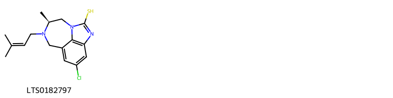{ width=100% }
    <figcaption>Hình ảnh cấu trúc hóa học của 1 hoạt chất thuộc nhóm Benzodiazepines gồm ['(11s)-6-chloro-11-methyl-10-(3-methylbut-2-en-1-yl)-1,3,10-triazatricyclo[6.4.1.0⁴,¹³]trideca-2,4,6,8(13)-tetraene-2-thiol (LTS0182797)'].</figcaption>
</figure>
#### Nhóm Benzodioxanes
<figure markdown="span">
    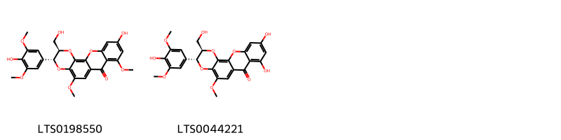{ width=100% }
    <figcaption>Hình ảnh cấu trúc hóa học của 2 hoạt chất thuộc nhóm Benzodioxanes gồm ['(2r,3r)-7-hydroxy-2-(4-hydroxy-3,5-dimethoxyphenyl)-3-(hydroxymethyl)-9,12-dimethoxy-2,3-dihydro-1,4,5-trioxatetraphen-10-one (LTS0198550)', '(2r,3r)-7,9-dihydroxy-2-(4-hydroxy-3,5-dimethoxyphenyl)-3-(hydroxymethyl)-12-methoxy-2,3-dihydro-1,4,5-trioxatetraphen-10-one (LTS0044221)'].</figcaption>
</figure>
#### Nhóm Benzopyrans
<figure markdown="span">
    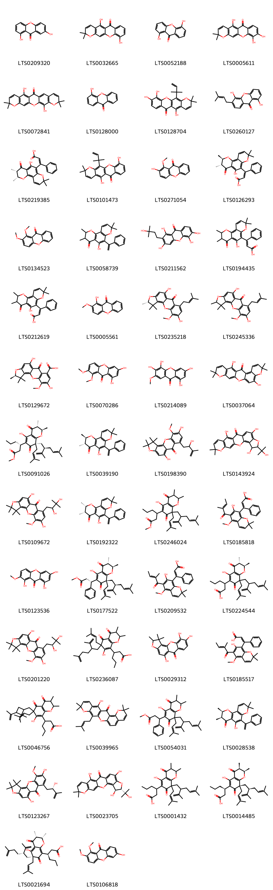{ width=100% }
    <figcaption>Hình ảnh cấu trúc hóa học của 56 hoạt chất thuộc nhóm Benzopyrans gồm ['euxanthone (LTS0209320)', '6-deoxyjacareubin (LTS0032665)', '1,5-dihydroxyxanthen-9-one (LTS0052188)', 'jacareubin (LTS0005611)', 'pyranojacareubin (LTS0072841)', '4-hydroxyxanthen-9-one (LTS0128000)', 'macluraxanthone (LTS0128704)', 'calophyllin b (LTS0260127)', 'isocalophyllic acid (LTS0219385)', 'blancoxanthone (LTS0101473)', '2-hydroxy-1-methoxyxanthen-9-one (LTS0271054)', '(2z)-3-[(2r,3r)-5-hydroxy-2,3,8,8-tetramethyl-4-oxo-2h,3h-pyrano[2,3-f]chromen-6-yl]-3-phenylprop-2-enoic acid (LTS0126293)', '1,2-dimethoxyxanthen-9-one (LTS0134523)', '5-hydroxy-2,3,8,8-tetramethyl-6-(1-phenylethenyl)-2h,3h-pyrano[2,3-f]chromen-4-one (LTS0058739)', '1,3,5,6-tetrahydroxy-2-(3-hydroxy-3-methylbutyl)xanthen-9-one (LTS0211562)', '3-{5-hydroxy-2,3,8,8-tetramethyl-4-oxo-2h,3h-pyrano[2,3-f]chromen-6-yl}-3-phenylprop-2-enoic acid (LTS0194435)', 'calophyllic acid (LTS0212619)', '1-hydroxy-2-methoxyxanthen-9-one (LTS0005561)', '(2s)-5,9-dihydroxy-10-methoxy-1,1,2-trimethyl-7-(3-methylbut-2-en-1-yl)-2h-furo[2,3-c]xanthen-6-one (LTS0235218)', '5,9-dihydroxy-10-methoxy-1,1,2-trimethyl-7-(3-methylbut-2-en-1-yl)-2h-furo[2,3-c]xanthen-6-one (LTS0245336)', '(2r)-5,9-dihydroxy-10-methoxy-1,1,2-trimethyl-6-oxo-2h-furo[2,3-c]xanthene-7-carboxylic acid (LTS0129672)', '6,8-dihydroxy-1,2-dimethoxyxanthen-9-one (LTS0070286)', '1,3,5,6-tetrahydroxy-7-methoxyxanthen-9-one (LTS0214089)', '10,22-dihydroxy-7,7,18,18-tetramethyl-8,13,17-trioxapentacyclo[12.8.0.0³,¹².0⁴,⁹.0¹⁶,²¹]docosa-1(22),3,5,9,11,14,16(21),19-octaen-2-one (LTS0037064)', 'methyl (3s)-3-[(2r,3r,8s)-5-hydroxy-2,3-dimethyl-8-[(2r)-5-methyl-2-(prop-1-en-2-yl)hex-4-en-1-yl]-8-(3-methylbut-2-en-1-yl)-4,7-dioxo-2,3-dihydro-1-benzopyran-6-yl]hexanoate (LTS0091026)', '(2r,3r)-5-hydroxy-2,3,8,8-tetramethyl-6-(1-phenylethenyl)-2h,3h-pyrano[2,3-f]chromen-4-one (LTS0039190)', '5,9-dihydroxy-7-(2-hydroxy-3-methylbut-3-en-1-yl)-10-methoxy-1,1,2,2-tetramethylfuro[2,3-c]xanthen-6-one (LTS0198390)', '5,9,14-trihydroxy-6-(2-hydroxypropan-2-yl)-18,18-dimethyl-2,7,19-trioxapentacyclo[11.8.0.0³,¹¹.0⁴,⁸.0¹⁵,²⁰]henicosa-1(21),3,8,10,13,15(20),16-heptaen-12-one (LTS0143924)', '7-(2,3-dihydroxy-3-methylbutyl)-5,9-dihydroxy-10-methoxy-1,1,2,2-tetramethylfuro[2,3-c]xanthen-6-one (LTS0109672)', '(2s,3r)-5-hydroxy-2,3,8,8-tetramethyl-6-(1-phenylethenyl)-2h,3h-pyrano[2,3-f]chromen-4-one (LTS0192322)', 'methyl 3-{5-hydroxy-2,3-dimethyl-8-[5-methyl-2-(prop-1-en-2-yl)hex-4-en-1-yl]-8-(3-methylbut-2-en-1-yl)-4,7-dioxo-2,3-dihydro-1-benzopyran-6-yl}hexanoate (LTS0246024)', '3-[7-hydroxy-5-methoxy-2,2-dimethyl-6-(2-methylbut-2-enoyl)chromen-8-yl]-3-phenylprop-2-enoic acid (LTS0185818)', '1,6,8-trihydroxy-2-methoxyxanthen-9-one (LTS0123536)', 'methyl (3s)-3-[(2r,3r,8r)-5-hydroxy-2,3-dimethyl-8-[(2r)-5-methyl-2-(prop-1-en-2-yl)hex-4-en-1-yl]-8-(3-methylbut-2-en-1-yl)-4,7-dioxo-2,3-dihydro-1-benzopyran-6-yl]-3-phenylpropanoate (LTS0177522)', '(2e)-3-{7-hydroxy-5-methoxy-2,2-dimethyl-6-[(2e)-2-methylbut-2-enoyl]chromen-8-yl}-3-phenylprop-2-enoic acid (LTS0209532)', '3-[(2r,3r)-5-hydroxy-2,3-dimethyl-8-[5-methyl-2-(prop-1-en-2-yl)hex-4-en-1-yl]-8-(3-methylbut-2-en-1-yl)-4,7-dioxo-2,3-dihydro-1-benzopyran-6-yl]hexanoic acid (LTS0224544)', '7-[(2s)-2,3-dihydroxy-3-methylbutyl]-5,9-dihydroxy-10-methoxy-1,1,2,2-tetramethylfuro[2,3-c]xanthen-6-one (LTS0201220)', '3-{7-hydroxy-2,3-dimethyl-6-[5-methyl-2-(prop-1-en-2-yl)hex-5-en-1-yl]-6-(3-methylbut-2-en-1-yl)-4,5-dioxo-2,3-dihydro-1-benzopyran-8-yl}hexanoic acid (LTS0236087)', '5,9,10-trihydroxy-1,1,2-trimethyl-2h-furo[2,3-c]xanthen-6-one (LTS0029312)', '(2z)-3-{7-hydroxy-5-methoxy-2,2-dimethyl-6-[(2e)-2-methylbut-2-enoyl]chromen-8-yl}-3-phenylprop-2-enoic acid (LTS0185517)', '3-(6-{[2,2-dimethyl-3-(prop-1-en-2-yl)cyclobutyl]methyl}-7-hydroxy-2,3-dimethyl-6-(3-methylbut-2-en-1-yl)-4,5-dioxo-2,3-dihydro-1-benzopyran-8-yl)hexanoic acid (LTS0046756)', '22-hydroxy-6,6,18,18-tetramethyl-15-(3-methylbut-2-en-1-yl)-5,13,17-trioxapentacyclo[12.8.0.0³,¹².0⁴,⁹.0¹⁶,²¹]docosa-1(22),3,7,9,11,14,16(21),19-octaen-2-one (LTS0039965)', 'methyl 3-{5-hydroxy-2,3-dimethyl-8-[5-methyl-2-(prop-1-en-2-yl)hex-4-en-1-yl]-8-(3-methylbut-2-en-1-yl)-4,7-dioxo-2,3-dihydro-1-benzopyran-6-yl}-3-phenylpropanoate (LTS0054031)', '(2r,3s)-5-hydroxy-2,3,8,8-tetramethyl-6-(1-phenylethenyl)-2h,3h-pyrano[2,3-f]chromen-4-one (LTS0028538)', '5,9-dihydroxy-7-[(2s)-2-hydroxy-3-methylbut-3-en-1-yl]-10-methoxy-1,1,2,2-tetramethylfuro[2,3-c]xanthen-6-one (LTS0123267)', '(5s,6s)-5,9,14-trihydroxy-6-(2-hydroxypropan-2-yl)-18,18-dimethyl-2,7,19-trioxapentacyclo[11.8.0.0³,¹¹.0⁴,⁸.0¹⁵,²⁰]henicosa-1(21),3,8,10,13,15(20),16-heptaen-12-one (LTS0023705)', '3-{5-hydroxy-2,3-dimethyl-8-[5-methyl-2-(prop-1-en-2-yl)hex-4-en-1-yl]-8-(3-methylbut-2-en-1-yl)-4,7-dioxo-2,3-dihydro-1-benzopyran-6-yl}hexanoic acid (LTS0001432)', '(3r)-3-[(2r,3s,8r)-5-hydroxy-2,3-dimethyl-8-[(2r)-5-methyl-2-(prop-1-en-2-yl)hex-4-en-1-yl]-8-(3-methylbut-2-en-1-yl)-4,7-dioxo-2,3-dihydro-1-benzopyran-6-yl]hexanoic acid (LTS0014485)', '(3r)-3-[(2s,3r,6r)-5-hydroxy-2,3-dimethyl-6-[(2s)-5-methyl-2-(prop-1-en-2-yl)hex-5-en-1-yl]-6-(3-methylbut-2-en-1-yl)-4,7-dioxo-2,3-dihydro-1-benzopyran-8-yl]hexanoic acid (LTS0021694)', '6-hydroxy-1,2-dimethoxyxanthen-9-one (LTS0106818)', '(2s)-5,9,10-trihydroxy-1,1,2-trimethyl-2h-furo[2,3-c]xanthen-6-one (LTS0100076)', '6,11-dihydroxy-2,2-dimethyl-12-(2-methylbut-3-en-2-yl)-1,5-dioxatetraphen-10-one (LTS0274825)', '1,3,6-trihydroxy-2-methoxyxanthen-9-one (LTS0046681)', '5,8,9-trihydroxy-2,2-dimethyl-10-(3-methylbut-2-en-1-yl)-1,11-dioxatetracen-6-one (LTS0043089)', '(3r)-3-[(2r,3r,6r)-6-{[(1s,3s)-2,2-dimethyl-3-(prop-1-en-2-yl)cyclobutyl]methyl}-5-hydroxy-2,3-dimethyl-6-(3-methylbut-3-en-1-yl)-4,7-dioxo-2,3-dihydro-1-benzopyran-8-yl]hexanoic acid (LTS0045755)', '(3s)-3-[(2r,3r,8s)-5-hydroxy-2,3-dimethyl-8-[(2r)-5-methyl-2-(prop-1-en-2-yl)hex-4-en-1-yl]-8-(3-methylbut-2-en-1-yl)-4,7-dioxo-2,3-dihydro-1-benzopyran-6-yl]hexanoic acid (LTS0045647)'].</figcaption>
</figure>
#### Nhóm Carboxylic acids and derivatives
<figure markdown="span">
    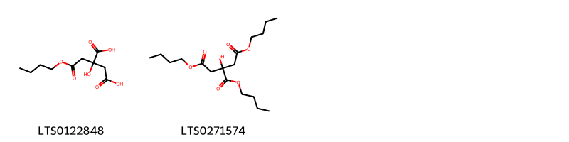{ width=100% }
    <figcaption>Hình ảnh cấu trúc hóa học của 2 hoạt chất thuộc nhóm Carboxylic acids and derivatives gồm ['2-(2-butoxy-2-oxoethyl)-2-hydroxybutanedioic acid (LTS0122848)', 'tributyl citrate (LTS0271574)'].</figcaption>
</figure>
#### Nhóm Coumarins and derivatives
<figure markdown="span">
    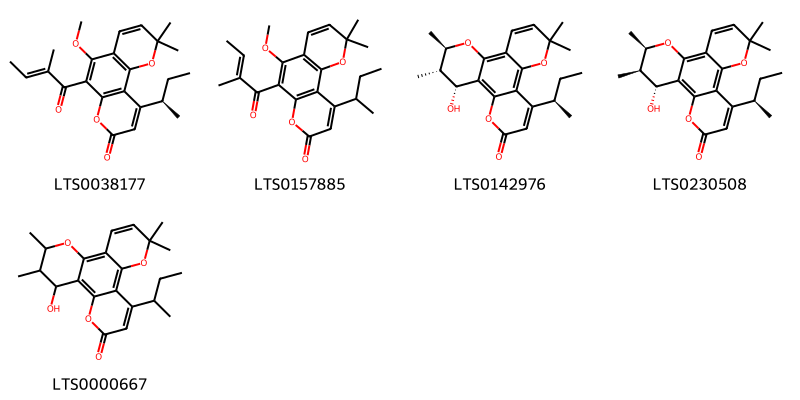{ width=100% }
    <figcaption>Hình ảnh cấu trúc hóa học của 5 hoạt chất thuộc nhóm Coumarins and derivatives gồm ['10-[(2r)-butan-2-yl]-5-methoxy-2,2-dimethyl-6-[(2e)-2-methylbut-2-enoyl]pyrano[2,3-h]chromen-8-one (LTS0038177)', '5-methoxy-2,2-dimethyl-6-(2-methylbut-2-enoyl)-10-(sec-butyl)pyrano[2,3-h]chromen-8-one (LTS0157885)', '(10r,11s,12r)-4-[(2r)-butan-2-yl]-12-hydroxy-6,6,10,11-tetramethyl-11,12-dihydro-10h-1,5,9-trioxatriphenylen-2-one (LTS0142976)', '(10r,11r,12r)-4-[(2r)-butan-2-yl]-12-hydroxy-6,6,10,11-tetramethyl-11,12-dihydro-10h-1,5,9-trioxatriphenylen-2-one (LTS0230508)', '12-hydroxy-6,6,10,11-tetramethyl-4-(sec-butyl)-11,12-dihydro-10h-1,5,9-trioxatriphenylen-2-one (LTS0000667)'].</figcaption>
</figure>
#### Nhóm Fatty Acyls
<figure markdown="span">
    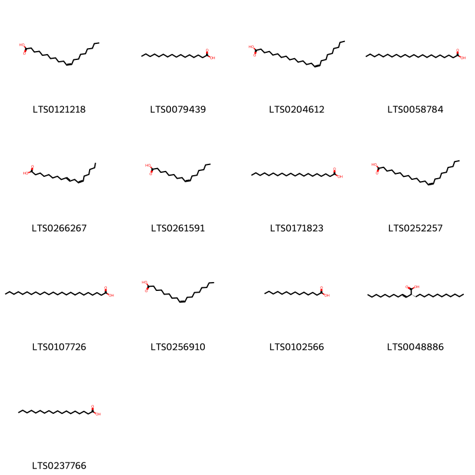{ width=100% }
    <figcaption>Hình ảnh cấu trúc hóa học của 13 hoạt chất thuộc nhóm Fatty Acyls gồm ['cis-11-eicosenoic acid (LTS0121218)', 'palmitic acid (LTS0079439)', 'nervonic acid (LTS0204612)', 'behenic acid (LTS0058784)', '10-trans,12-cis-linoleic acid (LTS0266267)', 'palmitoleic acid (LTS0261591)', 'arachidic acid (LTS0171823)', 'erucic acid (LTS0252257)', 'lignoceric acid (LTS0107726)', 'oleic acid (LTS0256910)', 'myristic acid (LTS0102566)', '(2r)-2-[(1e)-dec-1-en-1-yl]tetradecanoic acid (LTS0048886)', 'stearic acid (LTS0237766)'].</figcaption>
</figure>
#### Nhóm Flavonoids
<figure markdown="span">
    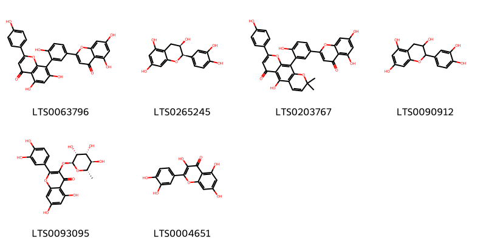{ width=100% }
    <figcaption>Hình ảnh cấu trúc hóa học của 6 hoạt chất thuộc nhóm Flavonoids gồm ['amentoflavone (LTS0063796)', 'ent-epicatechin (LTS0265245)', '5,7-dihydroxy-2-{4-hydroxy-3-[5-hydroxy-8-(4-hydroxyphenyl)-2,2-dimethyl-6-oxopyrano[3,2-g]chromen-10-yl]phenyl}chromen-4-one (LTS0203767)', 'catechol (LTS0090912)', 'quercitrin (LTS0093095)', 'quercetin (LTS0004651)'].</figcaption>
</figure>
#### Nhóm Neoflavonoids
<figure markdown="span">
    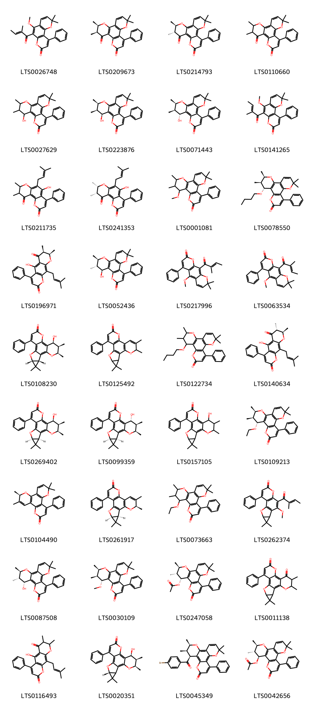{ width=100% }
    <figcaption>Hình ảnh cấu trúc hóa học của 36 hoạt chất thuộc nhóm Neoflavonoids gồm ['calophyllolide (LTS0026748)', '(10r,11s)-6,6,10,11-tetramethyl-4-phenyl-10,11-dihydro-1,5,9-trioxatriphenylene-2,12-dione (LTS0209673)', '(10r,11r)-6,6,10,11-tetramethyl-4-phenyl-10,11-dihydro-1,5,9-trioxatriphenylene-2,12-dione (LTS0214793)', 'cis-and-trans-inophyllolide (LTS0110660)', 'inophyllolide chromanol (LTS0027629)', '(10r,11r,12s)-12-hydroxy-6,6,10,11-tetramethyl-4-phenyl-11,12-dihydro-10h-1,5,9-trioxatriphenylen-2-one (LTS0223876)', '(10r,11r,12r)-12-hydroxy-6,6,10,11-tetramethyl-4-phenyl-11,12-dihydro-10h-1,5,9-trioxatriphenylen-2-one (LTS0071443)', '5-methoxy-2,2-dimethyl-6-(2-methylbut-2-enoyl)-10-phenylpyrano[2,3-h]chromen-8-one (LTS0141265)', '5-hydroxy-8,9-dimethyl-6-(3-methylbut-2-en-1-yl)-4-phenyl-8h,9h-pyrano[2,3-h]chromene-2,10-dione (LTS0211735)', '(8s,9r)-5-hydroxy-8,9-dimethyl-6-(3-methylbut-2-en-1-yl)-4-phenyl-8h,9h-pyrano[2,3-h]chromene-2,10-dione (LTS0241353)', '12-methoxy-6,6,10,11-tetramethyl-4-phenyl-11,12-dihydro-10h-1,5,9-trioxatriphenylen-2-one (LTS0001081)', '(10r,11s,12r)-12-butoxy-6,6,10,11-tetramethyl-4-phenyl-11,12-dihydro-10h-1,5,9-trioxatriphenylen-2-one (LTS0078550)', '(7s,8r)-5-hydroxy-7,8-dimethyl-10-(3-methylbut-2-en-1-yl)-4-phenyl-7h,8h-pyrano[3,2-g]chromene-2,6-dione (LTS0196971)', '(10r,11s,12s)-12-hydroxy-6,6,10,11-tetramethyl-4-phenyl-11,12-dihydro-10h-1,5,9-trioxatriphenylen-2-one (LTS0052436)', '5-methoxy-8,8-dimethyl-10-[(2e)-2-methylbut-2-enoyl]-4-phenylpyrano[3,2-g]chromen-2-one (LTS0217996)', '5-methoxy-8,8-dimethyl-10-(2-methylbut-2-enoyl)-4-phenylpyrano[3,2-g]chromen-2-one (LTS0063534)', '(3s,5r,15s,16r,17r)-15-hydroxy-4,4,16,17-tetramethyl-9-phenyl-6,12,18-trioxapentacyclo[12.4.0.0²,⁷.0³,⁵.0⁸,¹³]octadeca-1,7,9,13-tetraen-11-one (LTS0108230)', '4,4,16,17-tetramethyl-9-phenyl-6,12,18-trioxapentacyclo[12.4.0.0²,⁷.0³,⁵.0⁸,¹³]octadeca-1,7,9,13,15-pentaen-11-one (LTS0125492)', '12-butoxy-6,6,10,11-tetramethyl-4-phenyl-11,12-dihydro-10h-1,5,9-trioxatriphenylen-2-one (LTS0122734)', '(7r,8r)-5-hydroxy-7,8-dimethyl-10-(3-methylbut-2-en-1-yl)-4-phenyl-7h,8h-pyrano[3,2-g]chromene-2,6-dione (LTS0140634)', '(3r,5s,15s,16r,17r)-15-hydroxy-4,4,16,17-tetramethyl-9-phenyl-6,12,18-trioxapentacyclo[12.4.0.0²,⁷.0³,⁵.0⁸,¹³]octadeca-1,7,9,13-tetraen-11-one (LTS0269402)', '(3r,5s,15r,16r,17r)-15-hydroxy-4,4,16,17-tetramethyl-9-phenyl-6,12,18-trioxapentacyclo[12.4.0.0²,⁷.0³,⁵.0⁸,¹³]octadeca-1,7,9,13-tetraen-11-one (LTS0099359)', '15-hydroxy-4,4,16,17-tetramethyl-9-phenyl-6,12,18-trioxapentacyclo[12.4.0.0²,⁷.0³,⁵.0⁸,¹³]octadeca-1,7,9,13-tetraen-11-one (LTS0157105)', '(10r,11s,12r)-12-ethoxy-6,6,10,11-tetramethyl-4-phenyl-11,12-dihydro-10h-1,5,9-trioxatriphenylen-2-one (LTS0109213)', '(10r)-6,6,10,11-tetramethyl-4-phenyl-10h-1,5,9-trioxatriphenylen-2-one (LTS0104490)', '(3r,5s,17r)-4,4,16,17-tetramethyl-9-phenyl-6,12,18-trioxapentacyclo[12.4.0.0²,⁷.0³,⁵.0⁸,¹³]octadeca-1,7,9,13,15-pentaen-11-one (LTS0261917)', '12-ethoxy-6,6,10,11-tetramethyl-4-phenyl-11,12-dihydro-10h-1,5,9-trioxatriphenylen-2-one (LTS0073663)', '8-methoxy-5,5-dimethyl-9-[(2e)-2-methylbut-2-enoyl]-14-phenyl-3,11-dioxatetracyclo[8.4.0.0²,⁷.0⁴,⁶]tetradeca-1,7,9,13-tetraen-12-one (LTS0262374)', '(10r,11s,12r)-12-hydroxy-6,6,10,11-tetramethyl-4-phenyl-11,12-dihydro-10h-1,5,9-trioxatriphenylen-2-one (LTS0087508)', '(10r,11s,12r)-12-methoxy-6,6,10,11-tetramethyl-4-phenyl-11,12-dihydro-10h-1,5,9-trioxatriphenylen-2-one (LTS0030109)', '(2r,3r,4r)-2,3,10,10-tetramethyl-6-oxo-8-phenyl-3,4-dihydro-2h-1,5,9-trioxatriphenylen-4-yl acetate (LTS0247058)', '4,4,16,17-tetramethyl-9-phenyl-6,12,18-trioxapentacyclo[12.4.0.0²,⁷.0³,⁵.0⁸,¹³]octadeca-1,7,9,13-tetraene-11,15-dione (LTS0011138)', '5-hydroxy-7,8-dimethyl-10-(3-methylbut-2-en-1-yl)-4-phenyl-7h,8h-pyrano[3,2-g]chromene-2,6-dione (LTS0116493)', '(5r,15s,16r,17r)-15-hydroxy-4,4,16,17-tetramethyl-9-phenyl-6,12,18-trioxapentacyclo[12.4.0.0²,⁷.0³,⁵.0⁸,¹³]octadeca-1,7,9,13-tetraen-11-one (LTS0020351)', '(10r,11r,12s)-12-(4-bromobenzoyl)-6,6,10,11-tetramethyl-4-phenyl-11,12-dihydro-10h-1,5,9-trioxatriphenylen-2-one (LTS0045349)', '(2r,3r,4s)-2,3,10,10-tetramethyl-6-oxo-8-phenyl-3,4-dihydro-2h-1,5,9-trioxatriphenylen-4-yl acetate (LTS0042656)'].</figcaption>
</figure>
#### Nhóm Phenylpropanoic acids
<figure markdown="span">
    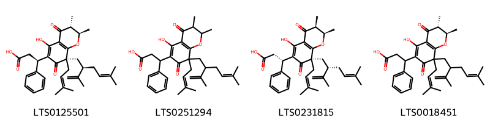{ width=100% }
    <figcaption>Hình ảnh cấu trúc hóa học của 4 hoạt chất thuộc nhóm Phenylpropanoic acids gồm ['(3r)-3-[(2r,3r,8s)-5-hydroxy-2,3-dimethyl-8-[(2r)-5-methyl-2-(prop-1-en-2-yl)hex-4-en-1-yl]-8-(3-methylbut-2-en-1-yl)-4,7-dioxo-2,3-dihydro-1-benzopyran-6-yl]-3-phenylpropanoic acid (LTS0125501)', '3-{5-hydroxy-2,3-dimethyl-8-[5-methyl-2-(prop-1-en-2-yl)hex-4-en-1-yl]-8-(3-methylbut-2-en-1-yl)-4,7-dioxo-2,3-dihydro-1-benzopyran-6-yl}-3-phenylpropanoic acid (LTS0251294)', '(3s)-3-[(2r,3s,8s)-5-hydroxy-2,3-dimethyl-8-[(2s)-5-methyl-2-(prop-1-en-2-yl)hex-4-en-1-yl]-8-(3-methylbut-2-en-1-yl)-4,7-dioxo-2,3-dihydro-1-benzopyran-6-yl]-3-phenylpropanoic acid (LTS0231815)', '3-[(2r,3r)-5-hydroxy-2,3-dimethyl-8-[5-methyl-2-(prop-1-en-2-yl)hex-4-en-1-yl]-8-(3-methylbut-2-en-1-yl)-4,7-dioxo-2,3-dihydro-1-benzopyran-6-yl]-3-phenylpropanoic acid (LTS0018451)'].</figcaption>
</figure>
#### Nhóm Prenol lipids
<figure markdown="span">
    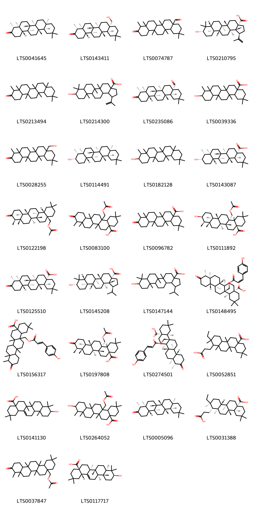{ width=100% }
    <figcaption>Hình ảnh cấu trúc hóa học của 30 hoạt chất thuộc nhóm Prenol lipids gồm ['(-)-friedelin (LTS0041645)', '(4r,4as,6as,6br,8as,12as,12bs,14as,14bs)-8a-(hydroxymethyl)-4,4a,6b,11,11,12b,14a-heptamethyl-tetradecahydro-1h-picen-3-one (LTS0143411)', '2,2,6a,8a,9,12b,14a-heptamethyl-10-oxo-tetradecahydro-1h-picene-4a-carbaldehyde (LTS0074787)', 'betulinic acid (LTS0210795)', 'friedelin (LTS0213494)', '9-hydroxy-5a,5b,8,8,11a-pentamethyl-1-(prop-1-en-2-yl)-hexadecahydrocyclopenta[a]chrysene-3a-carboxylic acid (LTS0214300)', '(4as,6ar,6bs,8as,9r,12as,12bs,14as,14bs)-2,2,6a,8a,9,12b,14a-heptamethyl-10-oxo-tetradecahydro-1h-picene-4a-carbaldehyde (LTS0235086)', '10-hydroxy-2,2,6a,8a,9,12b,14a-heptamethyl-hexadecahydropicene-4a-carboxylic acid (LTS0039336)', 'canophyllol (LTS0028255)', 'epi-friedelanol (LTS0114491)', '4,4a,6b,8a,11,11,12b,14a-octamethyl-hexadecahydropicen-3-ol (LTS0182128)', '(4as,6ar,6bs,8as,9r,10s,12as,12bs,14as,14bs)-10-hydroxy-2,2,6a,8a,9,12b,14a-heptamethyl-hexadecahydropicene-4a-carboxylic acid (LTS0143087)', '[(4as,6ar,6bs,8as,9r,12as,12bs,14as,14bs)-2,2,6a,8a,9,12b,14a-heptamethyl-10-oxo-tetradecahydro-1h-picen-4a-yl]methyl acetate (LTS0122198)', '14a-[(acetyloxy)methyl]-2,2,6a,8a,9,12b-hexamethyl-10-oxo-tetradecahydro-1h-picene-4a-carboxylic acid (LTS0083100)', '2,2,6a,8a,9,12b,14a-heptamethyl-10-oxo-tetradecahydro-1h-picene-4a-carboxylic acid (LTS0096782)', '(4as,6ar,6bs,8as,9r,10s,12as,12bs,14ar,14bs)-14a-[(acetyloxy)methyl]-10-hydroxy-2,2,6a,8a,9,12b-hexamethyl-hexadecahydropicene-4a-carboxylic acid (LTS0111892)', '(4as,6ar,6bs,8as,9r,12as,12bs,14as,14bs)-2,2,6a,8a,9,12b,14a-heptamethyl-10-oxo-tetradecahydro-1h-picene-4a-carboxylic acid (LTS0125510)', 'dihydrobetulinic acid (LTS0145208)', '9-hydroxy-1-isopropyl-5a,5b,8,8,11a-pentamethyl-hexadecahydrocyclopenta[a]chrysene-3a-carboxylic acid (LTS0147144)', '(4as,6ar,6bs,8as,9r,12as,12bs,14ar,14bs)-14a-({[(2z)-3-(4-hydroxyphenyl)prop-2-enoyl]oxy}methyl)-2,2,6a,8a,9,12b-hexamethyl-10-oxo-tetradecahydro-1h-picene-4a-carboxylic acid (LTS0148495)', '14a-({[3-(4-hydroxyphenyl)prop-2-enoyl]oxy}methyl)-2,2,6a,8a,9,12b-hexamethyl-10-oxo-tetradecahydro-1h-picene-4a-carboxylic acid (LTS0156317)', '(4as,6ar,6bs,8as,9r,12as,12bs,14ar,14bs)-14a-[(acetyloxy)methyl]-2,2,6a,8a,9,12b-hexamethyl-10-oxo-tetradecahydro-1h-picene-4a-carboxylic acid (LTS0197808)', '(4as,6ar,6bs,8as,9r,12as,12bs,14ar,14bs)-14a-({[(2e)-3-(4-hydroxyphenyl)prop-2-enoyl]oxy}methyl)-2,2,6a,8a,9,12b-hexamethyl-10-oxo-tetradecahydro-1h-picene-4a-carboxylic acid (LTS0274501)', '1-(2-carboxyethyl)-2-ethyl-2,4b,9,9,10b,12a-hexamethyl-dodecahydrochrysene-6a-carboxylic acid (LTS0052851)', 'oleanolic acid (LTS0141130)', '14a-[(acetyloxy)methyl]-10-hydroxy-2,2,6a,8a,9,12b-hexamethyl-hexadecahydropicene-4a-carboxylic acid (LTS0264052)', '(4r,4as,6as,6bs,8ar,12ar,12bs,14as,14bs)-4,4a,6b,8a,11,11,12b,14a-octamethyl-tetradecahydro-1h-picen-3-one (LTS0005096)', '(1r,2s,4as,4br,6as,10as,10bs,12as)-1-(2-carboxyethyl)-2-ethyl-2,4b,9,9,10b,12a-hexamethyl-dodecahydrochrysene-6a-carboxylic acid (LTS0031388)', '(2,2,6a,8a,9,12b,14a-heptamethyl-10-oxo-tetradecahydro-1h-picen-4a-yl)methyl acetate (LTS0037847)', 'oleanolic acid (LTS0117717)'].</figcaption>
</figure>
#### Nhóm Pyrans
<figure markdown="span">
    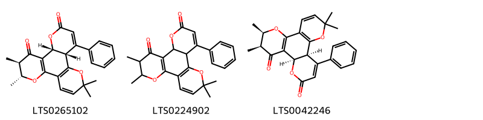{ width=100% }
    <figcaption>Hình ảnh cấu trúc hóa học của 3 hoạt chất thuộc nhóm Pyrans gồm ['(4as,10r,11r,12br)-6,6,10,11-tetramethyl-4-phenyl-4a,10,11,12b-tetrahydro-1,5,9-trioxatriphenylene-2,12-dione (LTS0265102)', '6,6,10,11-tetramethyl-4-phenyl-4a,10,11,12b-tetrahydro-1,5,9-trioxatriphenylene-2,12-dione (LTS0224902)', '(4as,10r,11s,12br)-6,6,10,11-tetramethyl-4-phenyl-4a,10,11,12b-tetrahydro-1,5,9-trioxatriphenylene-2,12-dione (LTS0042246)'].</figcaption>
</figure>
#### Nhóm Steroids and steroid derivatives
<figure markdown="span">
    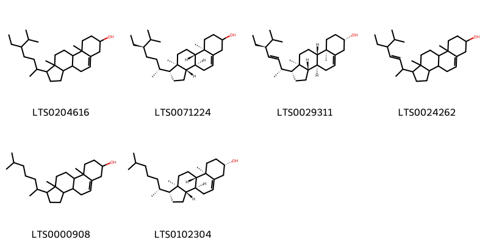{ width=100% }
    <figcaption>Hình ảnh cấu trúc hóa học của 6 hoạt chất thuộc nhóm Steroids and steroid derivatives gồm ['stigmast-5-en-3-ol, (3β)- (LTS0204616)', 'stigmast-5-en-3-ol (LTS0071224)', 'phytosterol (LTS0029311)', 'stigmasterol (LTS0024262)', 'epicholestrol (LTS0000908)', 'cholesterol (LTS0102304)'].</figcaption>
</figure>

---

### Dược dân tộc học

Danh sách các quốc gia có sử dụng *Calophyllum inophyllum* trong điều trị các bệnh. 

| Country       | Disease                                  | Bệnh                                               |
|:--------------|:-----------------------------------------|:---------------------------------------------------|
| Elsewhere     | Piscicide, Purgative, Emetic, Soap       | Thuốc diệt côn trùng, Luyện ngục, Emetic, Xà phòng |
| New Caledonia | Digestive                                | tiêu                                               |
| Samoa         | Emmenagogue, Diuretic, Vermifuge, Poison | Emmenagogue, lợi tiểu, Vermifuge, chất độc         |

---

---
## Calophyllum soulattri
### Thông tin về thực vật

!!! info "Phân loại thực vật của *Calophyllum soulattri* từ GIBF:"
    - **Kingdom:** Plantae
    - **Phylum:** Tracheophyta
    - **Order:** Malpighiales
    - **Family:** Calophyllaceae
    - **Genus:** Calophyllum
    - **Species:** *Calophyllum soulattri*

 

| Label (VI)   | Label (EN)   | Scientific Name       | Descriptions (VI)   | Descriptions (EN)   | Also Known As (VI)        | Also Known As (EN)   |
|:-------------|:-------------|:----------------------|:--------------------|:--------------------|:--------------------------|:---------------------|
| N/A          | N/A          | Calophyllum soulattri |                     | species of plant    | ['Calophyllum soulattri'] | ['']                 |

#### Phân bố trên thế giới

**Từ CSDL GIBF** Timor-Leste, Thailand, Philippines, Malaysia, Palau, Réunion, Papua New Guinea, Singapore, Australia, Solomon Islands, Cambodia, Indonesia

#### Phân bố tại Việt Nam

**Từ CSDL GIBF**: Không có ghi nhận ở Việt Nam

---
### Thành phần hóa học
        
- Theo cơ sở dữ liệu lotus: Từ loài *Calophyllum soulattri* đã phân lập và xác định được 15 hoạt chất thuộc về các nhóm Steroids and steroid derivatives, Neoflavonoids, Benzopyrans, Prenol lipids. 

|    | chemicalTaxonomyClassyfireClass   |   smiles_count |
|---:|:----------------------------------|---------------:|
|  0 | Benzopyrans                       |              6 |
|  1 | Neoflavonoids                     |              1 |
|  2 | Prenol lipids                     |              4 |
|  3 | Steroids and steroid derivatives  |              4 |

#### Nhóm Benzopyrans
<figure markdown="span">
    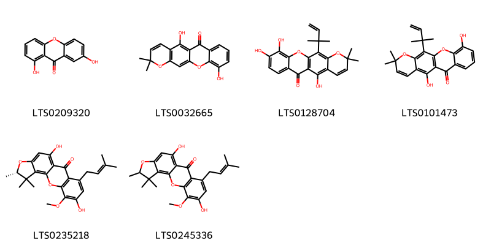{ width=100% }
    <figcaption>Hình ảnh cấu trúc hóa học của 6 hoạt chất thuộc nhóm Benzopyrans gồm ['euxanthone (LTS0209320)', '6-deoxyjacareubin (LTS0032665)', 'macluraxanthone (LTS0128704)', 'blancoxanthone (LTS0101473)', '(2s)-5,9-dihydroxy-10-methoxy-1,1,2-trimethyl-7-(3-methylbut-2-en-1-yl)-2h-furo[2,3-c]xanthen-6-one (LTS0235218)', '5,9-dihydroxy-10-methoxy-1,1,2-trimethyl-7-(3-methylbut-2-en-1-yl)-2h-furo[2,3-c]xanthen-6-one (LTS0245336)'].</figcaption>
</figure>
#### Nhóm Neoflavonoids
<figure markdown="span">
    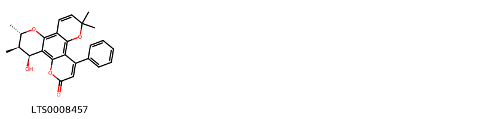{ width=100% }
    <figcaption>Hình ảnh cấu trúc hóa học của 1 hoạt chất thuộc nhóm Neoflavonoids gồm ['soulattrolide (LTS0008457)'].</figcaption>
</figure>
#### Nhóm Prenol lipids
<figure markdown="span">
    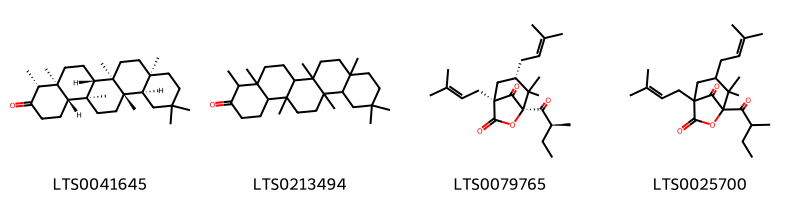{ width=100% }
    <figcaption>Hình ảnh cấu trúc hóa học của 4 hoạt chất thuộc nhóm Prenol lipids gồm ['(-)-friedelin (LTS0041645)', 'friedelin (LTS0213494)', '(1s,3s,5s)-4,4-dimethyl-1,3-bis(3-methylbut-2-en-1-yl)-5-[(2s)-2-methylbutanoyl]-6-oxabicyclo[3.2.1]octane-7,8-dione (LTS0079765)', '4,4-dimethyl-1,3-bis(3-methylbut-2-en-1-yl)-5-(2-methylbutanoyl)-6-oxabicyclo[3.2.1]octane-7,8-dione (LTS0025700)'].</figcaption>
</figure>
#### Nhóm Steroids and steroid derivatives
<figure markdown="span">
    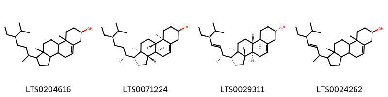{ width=100% }
    <figcaption>Hình ảnh cấu trúc hóa học của 4 hoạt chất thuộc nhóm Steroids and steroid derivatives gồm ['stigmast-5-en-3-ol, (3β)- (LTS0204616)', 'stigmast-5-en-3-ol (LTS0071224)', 'phytosterol (LTS0029311)', 'stigmasterol (LTS0024262)'].</figcaption>
</figure>

---

### Dược dân tộc học

Danh sách các quốc gia có sử dụng *Calophyllum soulattri* trong điều trị các bệnh. 

| Country   | Disease     | Bệnh          |
|:----------|:------------|:--------------|
| Java      | Insecticide | Thuốc trừ sâu |

---

# Chi Garcinia

??? note "Danh sách các dược liệu thuộc chi"
    
	 - *Garcinia afzelii*
	 - *Garcinia cambogia*
	 - *Garcinia echinocarpa*
	 - *Garcinia eounctata*
	 - *Garcinia hanburyi*
	 - *Garcinia indica*
	 - *Garcinia kola*
	 - *Garcinia lanessonii*
	 - *Garcinia mangostana*
	 - *Garcinia morella*

---
## Garcinia afzelii
### Thông tin về thực vật

!!! info "Phân loại thực vật của *Garcinia afzelii* từ GIBF:"
    - **Kingdom:** Plantae
    - **Phylum:** Tracheophyta
    - **Order:** Malpighiales
    - **Family:** Clusiaceae
    - **Genus:** Garcinia
    - **Species:** *Garcinia afzelii*

 

| Label (VI)   | Label (EN)   | Scientific Name   | Descriptions (VI)   | Descriptions (EN)   | Also Known As (VI)   | Also Known As (EN)   |
|:-------------|:-------------|:------------------|:--------------------|:--------------------|:---------------------|:---------------------|
| N/A          | N/A          | Garcinia afzelii  | loài thực vật       | species of plant    | ['']                 | ['']                 |

#### Phân bố trên thế giới

**Từ CSDL GIBF** nan, Sierra Leone, Togo, Côte d’Ivoire, Ghana, Central African Republic, French Guiana, Liberia, Cameroon, Gabon, Nigeria, Guinea, Mali

#### Phân bố tại Việt Nam

**Từ CSDL GIBF**: Không có ghi nhận ở Việt Nam

---
### Thành phần hóa học
        
- Theo cơ sở dữ liệu lotus: Từ loài *Garcinia afzelii* đã phân lập và xác định được 10 hoạt chất thuộc về các nhóm Benzopyrans, Steroids and steroid derivatives. 

|    | chemicalTaxonomyClassyfireClass   |   smiles_count |
|---:|:----------------------------------|---------------:|
|  0 | Benzopyrans                       |              6 |
|  1 | Steroids and steroid derivatives  |              4 |

#### Nhóm Benzopyrans
<figure markdown="span">
    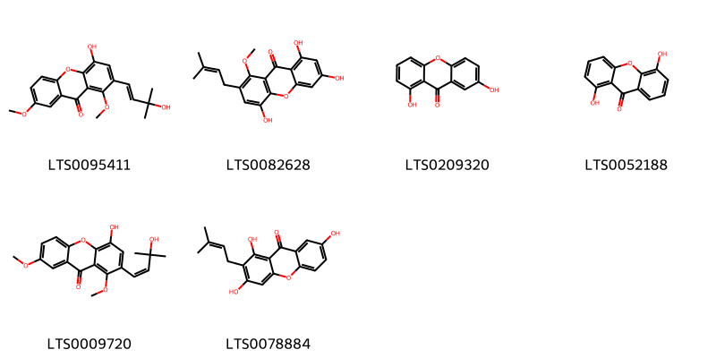{ width=100% }
    <figcaption>Hình ảnh cấu trúc hóa học của 6 hoạt chất thuộc nhóm Benzopyrans gồm ['4-hydroxy-2-(3-hydroxy-3-methylbut-1-en-1-yl)-1,7-dimethoxyxanthen-9-one (LTS0095411)', '4,6,8-trihydroxy-1-methoxy-2-(3-methylbut-2-en-1-yl)xanthen-9-one (LTS0082628)', 'euxanthone (LTS0209320)', '1,5-dihydroxyxanthen-9-one (LTS0052188)', '4-hydroxy-2-[(1z)-3-hydroxy-3-methylbut-1-en-1-yl]-1,7-dimethoxyxanthen-9-one (LTS0009720)', '1,3,7-trihydroxy-2-(3-methylbut-2-en-1-yl)xanthen-9-one (LTS0078884)'].</figcaption>
</figure>
#### Nhóm Steroids and steroid derivatives
<figure markdown="span">
    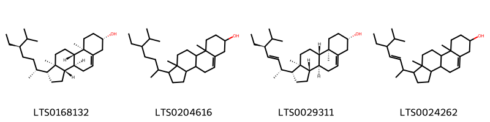{ width=100% }
    <figcaption>Hình ảnh cấu trúc hóa học của 4 hoạt chất thuộc nhóm Steroids and steroid derivatives gồm ['sitosterol (LTS0168132)', 'stigmast-5-en-3-ol, (3β)- (LTS0204616)', 'phytosterol (LTS0029311)', 'stigmasterol (LTS0024262)'].</figcaption>
</figure>

---

### Dược dân tộc học

Danh sách các quốc gia có sử dụng *Garcinia afzelii* trong điều trị các bệnh. 

| Country   | Disease    | Bệnh          |
|:----------|:-----------|:--------------|
| Ghana     | Dentifrice | Kem đánh răng |

---

---
## Garcinia cambogia
### Thông tin về thực vật

!!! info "Phân loại thực vật của *N/A* từ GIBF:"
    - **Kingdom:** Plantae
    - **Phylum:** Tracheophyta
    - **Order:** Malpighiales
    - **Family:** Clusiaceae
    - **Genus:** Garcinia
    - **Species:** *N/A*

 

| Label (VI)   | Label (EN)   | Scientific Name   | Descriptions (VI)   | Descriptions (EN)   | Also Known As (VI)   | Also Known As (EN)   |
|:-------------|:-------------|:------------------|:--------------------|:--------------------|:---------------------|:---------------------|
| N/A          | N/A          | Garcinia cambogia | loài thực vật       | species of plant    | ['']                 | ['']                 |

#### Phân bố trên thế giới

**Từ CSDL GIBF** nan, Thailand, El Salvador, Namibia, Philippines, Cameroon, Kenya, Gabon, Singapore, Indonesia, Colombia, Dominican Republic, Puerto Rico, Malaysia, India, Japan, Brazil, Peru, Eswatini, Mexico, Chinese Taipei, Hong Kong, South Africa, Botswana, Mozambique, Costa Rica, New Caledonia, United States of America

#### Phân bố tại Việt Nam

**Từ CSDL GIBF**: Không có ghi nhận ở Việt Nam

---
### Thành phần hóa học
        
- Theo cơ sở dữ liệu lotus: Từ loài *N/A* đã phân lập và xác định được Chưa có hoạt chất nào được phân lập. hoạt chất thuộc về các nhóm Không có hoạt chất nào được phân lập. 

Không có hình ảnh nào được tạo ra

---

### Dược dân tộc học

Danh sách các quốc gia có sử dụng *N/A* trong điều trị các bệnh. 

| Country   | Disease               | Bệnh                  |
|:----------|:----------------------|:----------------------|
| India     | Antiseptic, Purgative | Khử trùng, Luyện ngục |

---

---
## Garcinia echinocarpa
### Thông tin về thực vật

!!! info "Phân loại thực vật của *Garcinia echinocarpa* từ GIBF:"
    - **Kingdom:** Plantae
    - **Phylum:** Tracheophyta
    - **Order:** Malpighiales
    - **Family:** Clusiaceae
    - **Genus:** Garcinia
    - **Species:** *Garcinia echinocarpa*

 

| Label (VI)   | Label (EN)   | Scientific Name      | Descriptions (VI)   | Descriptions (EN)   | Also Known As (VI)   | Also Known As (EN)   |
|:-------------|:-------------|:---------------------|:--------------------|:--------------------|:---------------------|:---------------------|
| N/A          | N/A          | Garcinia echinocarpa | loài thực vật       | species of plant    | ['']                 | ['']                 |

#### Phân bố trên thế giới

**Từ CSDL GIBF** nan, unknown or invalid, Sri Lanka, India, United States of America

#### Phân bố tại Việt Nam

**Từ CSDL GIBF**: Không có ghi nhận ở Việt Nam

---
### Thành phần hóa học
        
- Theo cơ sở dữ liệu lotus: Từ loài *Garcinia echinocarpa* đã phân lập và xác định được 3 hoạt chất thuộc về các nhóm Flavonoids, Steroids and steroid derivatives. 

|    | chemicalTaxonomyClassyfireClass   |   smiles_count |
|---:|:----------------------------------|---------------:|
|  0 | Flavonoids                        |              2 |
|  1 | Steroids and steroid derivatives  |              1 |

#### Nhóm Flavonoids
<figure markdown="span">
    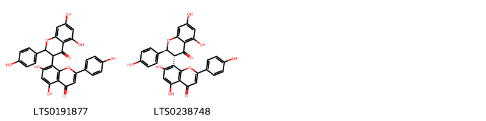{ width=100% }
    <figcaption>Hình ảnh cấu trúc hóa học của 2 hoạt chất thuộc nhóm Flavonoids gồm ['8-[5,7-dihydroxy-2-(4-hydroxyphenyl)-4-oxo-2,3-dihydro-1-benzopyran-3-yl]-5,7-dihydroxy-2-(4-hydroxyphenyl)chromen-4-one (LTS0191877)', '8-[(2s,3r)-5,7-dihydroxy-2-(4-hydroxyphenyl)-4-oxo-2,3-dihydro-1-benzopyran-3-yl]-5,7-dihydroxy-2-(4-hydroxyphenyl)chromen-4-one (LTS0238748)'].</figcaption>
</figure>
#### Nhóm Steroids and steroid derivatives
<figure markdown="span">
    { width=100% }
    <figcaption>Hình ảnh cấu trúc hóa học của 1 hoạt chất thuộc nhóm Steroids and steroid derivatives gồm ['sitosterol (LTS0168132)'].</figcaption>
</figure>

---

### Dược dân tộc học

Danh sách các quốc gia có sử dụng *Garcinia echinocarpa* trong điều trị các bệnh. 

| Country   | Disease   | Bệnh           |
|:----------|:----------|:---------------|
| India     | Vermifuge | Thuốc diệt sán |

---

---
## Garcinia eounctata
### Thông tin về thực vật

!!! info "Phân loại thực vật của *Garcinia epunctata* từ GIBF:"
    - **Kingdom:** Plantae
    - **Phylum:** Tracheophyta
    - **Order:** Malpighiales
    - **Family:** Clusiaceae
    - **Genus:** Garcinia
    - **Species:** *Garcinia epunctata*

 

| Label (VI)   | Label (EN)   | Scientific Name      | Descriptions (VI)   | Descriptions (EN)   | Also Known As (VI)   | Also Known As (EN)   |
|:-------------|:-------------|:---------------------|:--------------------|:--------------------|:---------------------|:---------------------|
| N/A          | N/A          | Garcinia echinocarpa | loài thực vật       | species of plant    | ['']                 | ['']                 |

#### Phân bố trên thế giới

**Từ CSDL GIBF** Sierra Leone, Côte d’Ivoire, Ghana, Malaysia, Liberia, Congo, Democratic Republic of the, Cameroon, Gabon, Equatorial Guinea, Congo, Guinea

#### Phân bố tại Việt Nam

**Từ CSDL GIBF**: Không có ghi nhận ở Việt Nam

---
### Thành phần hóa học
        
- Theo cơ sở dữ liệu lotus: Từ loài *Garcinia epunctata* đã phân lập và xác định được Chưa có hoạt chất nào được phân lập. hoạt chất thuộc về các nhóm Không có hoạt chất nào được phân lập. 

Không có hình ảnh nào được tạo ra

---

### Dược dân tộc học

Danh sách các quốc gia có sử dụng *Garcinia epunctata* trong điều trị các bệnh. 

| Country   | Disease    | Bệnh          |
|:----------|:-----------|:--------------|
| Ghana     | Dentifrice | Kem đánh răng |

---

---
## Garcinia hanburyi
### Thông tin về thực vật

!!! info "Phân loại thực vật của *Garcinia hanburyi* từ GIBF:"
    - **Kingdom:** Plantae
    - **Phylum:** Tracheophyta
    - **Order:** Malpighiales
    - **Family:** Clusiaceae
    - **Genus:** Garcinia
    - **Species:** *Garcinia hanburyi*

 

| Label (VI)   | Label (EN)   | Scientific Name   | Descriptions (VI)   | Descriptions (EN)   | Also Known As (VI)   | Also Known As (EN)   |
|:-------------|:-------------|:------------------|:--------------------|:--------------------|:---------------------|:---------------------|
| N/A          | N/A          | Garcinia hanburyi | loài thực vật       | species of plant    | ['']                 | ['']                 |

#### Phân bố trên thế giới

**Từ CSDL GIBF** Viet Nam, nan, unknown or invalid, Thailand, Ghana, Malaysia, India, United States of America, Singapore, Cambodia, Indonesia

#### Phân bố tại Việt Nam

**Từ CSDL GIBF**: Tay Ninh

---
### Thành phần hóa học
        
- Theo cơ sở dữ liệu lotus: Từ loài *Garcinia hanburyi* đã phân lập và xác định được 163 hoạt chất thuộc về các nhóm Benzopyrans, Prenol lipids. 

|    | chemicalTaxonomyClassyfireClass   |   smiles_count |
|---:|:----------------------------------|---------------:|
|  0 | Benzopyrans                       |            155 |
|  1 | Prenol lipids                     |              6 |

#### Nhóm Benzopyrans
<figure markdown="span">
    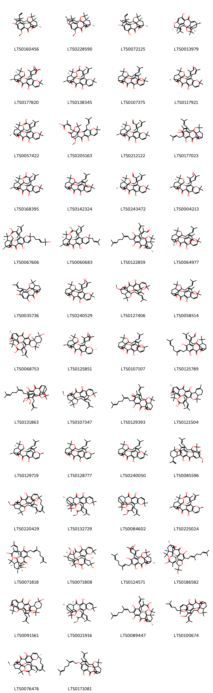{ width=100% }
    <figcaption>Hình ảnh cấu trúc hóa học của 155 hoạt chất thuộc nhóm Benzopyrans gồm ['(1s,2s,13s,15r)-6-hydroxy-8-methoxy-17,17-dimethyl-15-(3-methylbut-2-en-1-yl)-5-(2-methylbut-3-en-2-yl)-3,16-dioxapentacyclo[11.4.1.0²,¹¹.0²,¹⁵.0⁴,⁹]octadeca-4(9),5,7,11-tetraene-10,14-dione (LTS0160456)', '(1s,2s,7s,16s,18r)-11-methoxy-6,6,7,20,20-pentamethyl-18-(3-methylbut-2-en-1-yl)-3,8,19-trioxahexacyclo[14.4.1.0²,¹⁴.0²,¹⁸.0⁴,¹².0⁵,⁹]henicosa-4(12),5(9),10,14-tetraene-13,17-dione (LTS0228590)', '(1s,2s,13s,15r)-6,8-dihydroxy-17,17-dimethyl-15-(3-methylbut-2-en-1-yl)-5-(2-methylbut-3-en-2-yl)-3,16-dioxapentacyclo[11.4.1.0²,¹¹.0²,¹⁵.0⁴,⁹]octadeca-4(9),5,7,11-tetraene-10,14-dione (LTS0072125)', '(1s,2s,7s,16s,18r)-11-hydroxy-6,6,7,20,20-pentamethyl-18-(3-methylbut-2-en-1-yl)-3,8,19-trioxahexacyclo[14.4.1.0²,¹⁴.0²,¹⁸.0⁴,¹².0⁵,⁹]henicosa-4,9,11,14-tetraene-13,17-dione (LTS0013979)', '(2e)-4-[(1s,2s,17s,19r)-12-hydroxy-8,8,21,21-tetramethyl-5-(3-methylbut-2-en-1-yl)-14,18-dioxo-3,7,20-trioxahexacyclo[15.4.1.0²,¹⁵.0²,¹⁹.0⁴,¹³.0⁶,¹¹]docosa-4(13),5,9,11,15-pentaen-19-yl]-2-methylbut-2-enoic acid (LTS0177820)', '(2z)-4-[(1s,2s,17s,19r)-12-hydroxy-8,8,21,21-tetramethyl-5-(3-methylbut-2-en-1-yl)-14,18-dioxo-3,7,20-trioxahexacyclo[15.4.1.0²,¹⁵.0²,¹⁹.0⁴,¹³.0⁶,¹¹]docosa-4(13),5,9,11,15-pentaen-19-yl]-2-methylbut-2-enoic acid (LTS0138345)', '4-[12-hydroxy-8,8,21,21-tetramethyl-5-(3-methylbut-2-en-1-yl)-14,18-dioxo-3,7,20-trioxahexacyclo[15.4.1.0²,¹⁵.0²,¹⁹.0⁴,¹³.0⁶,¹¹]docosa-4(13),5,9,11,15-pentaen-19-yl]-2-methylbut-2-enoic acid (LTS0107375)', '(2e)-4-[(2r,17r,19s)-12-hydroxy-8,8,21,21-tetramethyl-5-(3-methylbut-2-en-1-yl)-14,18-dioxo-3,7,20-trioxahexacyclo[15.4.1.0²,¹⁵.0²,¹⁹.0⁴,¹³.0⁶,¹¹]docosa-4(13),5,9,11,15-pentaen-19-yl]-2-methylbut-2-enal (LTS0117921)', '(2z)-4-[(1r,2r,17r,19s)-12-hydroxy-8,8,21,21-tetramethyl-5-(3-methylbut-2-en-1-yl)-14,18-dioxo-3,7,20-trioxahexacyclo[15.4.1.0²,¹⁵.0²,¹⁹.0⁴,¹³.0⁶,¹¹]docosa-4(13),5,9,11,15-pentaen-19-yl]-2-methylbut-2-enoic acid (LTS0057422)', '4-[12-hydroxy-16-methoxy-8,8,21,21-tetramethyl-5-(3-methylbut-2-en-1-yl)-14,18-dioxo-3,7,20-trioxahexacyclo[15.4.1.0²,¹⁵.0²,¹⁹.0⁴,¹³.0⁶,¹¹]docosa-4,6(11),9,12-tetraen-19-yl]-2-methylbut-2-enoic acid (LTS0205163)', '(2z)-4-[(1s,2s,17s,19r)-12-hydroxy-8,8,21,21-tetramethyl-5-(3-methylbut-2-en-1-yl)-14,18-dioxo-3,7,20-trioxahexacyclo[15.4.1.0²,¹⁵.0²,¹⁹.0⁴,¹³.0⁶,¹¹]docosa-4(13),5,9,11,15-pentaen-19-yl]-2-methylbut-2-enal (LTS0212122)', '4-[6,8-dihydroxy-17,17-dimethyl-5,7-bis(3-methylbut-2-en-1-yl)-10,14-dioxo-3,16-dioxapentacyclo[11.4.1.0²,¹¹.0²,¹⁵.0⁴,⁹]octadeca-4,6,8,11-tetraen-15-yl]-2-methylbut-2-enoic acid (LTS0177023)', '(2z)-4-[(1r,2s,17s)-12-hydroxy-8,8,21,21-tetramethyl-5-(3-methylbut-2-en-1-yl)-14,18-dioxo-3,7,20-trioxahexacyclo[15.4.1.0²,¹⁵.0²,¹⁹.0⁴,¹³.0⁶,¹¹]docosa-4(13),5,9,11,15-pentaen-19-yl]-2-methylbut-2-enoic acid (LTS0168395)', '4-[12-hydroxy-8,8,21,21-tetramethyl-5-(3-methylbut-2-en-1-yl)-14,18-dioxo-3,7,20-trioxahexacyclo[15.4.1.0²,¹⁵.0²,¹⁹.0⁴,¹³.0⁶,¹¹]docosa-4(13),5,9,11,15-pentaen-19-yl]-2-methylbut-2-enal (LTS0142324)', '(2z)-4-[(1r,2r,17r,19s)-12-hydroxy-8,8,21,21-tetramethyl-5-(3-methylbut-2-en-1-yl)-14,18-dioxo-3,7,20-trioxahexacyclo[15.4.1.0²,¹⁵.0²,¹⁹.0⁴,¹³.0⁶,¹¹]docosa-4(13),5,9,11,15-pentaen-19-yl]-2-methylbut-2-enal (LTS0243472)', '(1s,2s,17s,19r)-12-hydroxy-19-[(2e)-4-hydroxy-3-methylbut-2-en-1-yl]-8,8,21,21-tetramethyl-5-(3-methylbut-2-en-1-yl)-3,7,20-trioxahexacyclo[15.4.1.0²,¹⁵.0²,¹⁹.0⁴,¹³.0⁶,¹¹]docosa-4(13),5,9,11,15-pentaene-14,18-dione (LTS0004213)', '(2z)-4-[(1s,2s,17s,19r)-12-hydroxy-8-[(3e)-5-hydroxy-5-methylhex-3-en-1-yl]-8,21,21-trimethyl-5-(3-methylbut-2-en-1-yl)-14,18-dioxo-3,7,20-trioxahexacyclo[15.4.1.0²,¹⁵.0²,¹⁹.0⁴,¹³.0⁶,¹¹]docosa-4(13),5,9,11,15-pentaen-19-yl]-2-methylbut-2-enoic acid (LTS0067606)', '(2z)-4-[(1s,2s,8r,17s,19r)-12-hydroxy-8,21,21-trimethyl-5,8-bis(3-methylbut-2-en-1-yl)-14,18-dioxo-3,7,20-trioxahexacyclo[15.4.1.0²,¹⁵.0²,¹⁹.0⁴,¹³.0⁶,¹¹]docosa-4(13),5,9,11,15-pentaen-19-yl]-2-methylbut-2-enoic acid (LTS0060683)', '(2z)-4-[(1s,2s,13s)-7-[(2z)-3,7-dimethylocta-2,6-dien-1-yl]-6,8-dihydroxy-17,17-dimethyl-5-(3-methylbut-2-en-1-yl)-10,14-dioxo-3,16-dioxapentacyclo[11.4.1.0²,¹¹.0²,¹⁵.0⁴,⁹]octadeca-4,6,8,11-tetraen-15-yl]-2-methylbut-2-enal (LTS0122859)', '4-[12,16-dihydroxy-8,8,21,21-tetramethyl-5-(3-methylbut-2-en-1-yl)-14,18-dioxo-3,7,20-trioxahexacyclo[15.4.1.0²,¹⁵.0²,¹⁹.0⁴,¹³.0⁶,¹¹]docosa-4(13),5,9,11-tetraen-19-yl]-2-methylbut-2-enoic acid (LTS0064977)', '6,8-dihydroxy-17,17-dimethyl-5,15-bis(3-methylbut-2-en-1-yl)-3,16-dioxapentacyclo[11.4.1.0²,¹¹.0²,¹⁵.0⁴,⁹]octadeca-4(9),5,7,11-tetraene-10,14-dione (LTS0035736)', '12-hydroxy-19-[(2e)-4-hydroxy-3-methylbut-2-en-1-yl]-8,8,21,21-tetramethyl-5-(3-methylbut-2-en-1-yl)-3,7,20-trioxahexacyclo[15.4.1.0²,¹⁵.0²,¹⁹.0⁴,¹³.0⁶,¹¹]docosa-4(13),5,9,11,15-pentaene-14,18-dione (LTS0240529)', '12-hydroxy-19-(4-hydroxy-3-methylbut-2-en-1-yl)-17-methoxy-8,8,21,21-tetramethyl-5-(3-methylbut-2-en-1-yl)-3,7,20-trioxahexacyclo[15.4.1.0²,¹⁵.0²,¹⁹.0⁴,¹³.0⁶,¹¹]docosa-4,6(11),9,12,15-pentaene-14,18-dione (LTS0127406)', '12-hydroxy-19-(4-hydroxy-3-methylbut-2-en-1-yl)-8,8,21,21-tetramethyl-5-(3-methylbut-2-en-1-yl)-3,7,20-trioxahexacyclo[15.4.1.0²,¹⁵.0²,¹⁹.0⁴,¹³.0⁶,¹¹]docosa-4(13),5,9,11,15-pentaene-14,18-dione (LTS0058514)', '(2z)-4-[(1s,2s,9r,12r,14r,21s,23r)-12,16-dihydroxy-8,8,12,25,25-pentamethyl-5-(3-methylbut-2-en-1-yl)-18,22-dioxo-3,7,24-trioxaheptacyclo[19.4.1.0²,¹⁹.0²,²³.0⁴,¹⁷.0⁶,¹⁵.0⁹,¹⁴]hexacosa-4,6(15),16,19-tetraen-23-yl]-2-methylbut-2-enoic acid (LTS0068753)', '(2e)-4-[(1s,2s,8r,17s,19r)-12-hydroxy-8,21,21-trimethyl-5-(3-methylbut-2-en-1-yl)-14,18-dioxo-3,7,20-trioxahexacyclo[15.4.1.0²,¹⁵.0²,¹⁹.0⁴,¹³.0⁶,¹¹]docosa-4(13),5,9,11,15-pentaen-19-yl]-2-methylbut-2-enoic acid (LTS0125851)', '4-[12-hydroxy-8,21,21-trimethyl-5-(3-methylbut-2-en-1-yl)-14,18-dioxo-3,7,20-trioxahexacyclo[15.4.1.0²,¹⁵.0²,¹⁹.0⁴,¹³.0⁶,¹¹]docosa-4(13),5,9,11,15-pentaen-19-yl]-2-methylbut-2-enoic acid (LTS0107107)', '(2z)-4-{7-[(2e)-3,7-dimethylocta-2,6-dien-1-yl]-6,8-dihydroxy-17,17-dimethyl-5-(3-methylbut-2-en-1-yl)-10,14-dioxo-3,16-dioxapentacyclo[11.4.1.0²,¹¹.0²,¹⁵.0⁴,⁹]octadeca-4,6,8,11-tetraen-15-yl}-2-methylbut-2-enal (LTS0125789)', '15-(4,4-dimethoxy-3-methylbut-2-en-1-yl)-7-(3,7-dimethylocta-2,6-dien-1-yl)-6,8-dihydroxy-17,17-dimethyl-5-(3-methylbut-2-en-1-yl)-3,16-dioxapentacyclo[11.4.1.0²,¹¹.0²,¹⁵.0⁴,⁹]octadeca-4,6,8,11-tetraene-10,14-dione (LTS0131863)', '7-methoxydeoxymorellin (LTS0107347)', '4-[7-(3,7-dimethylocta-2,6-dien-1-yl)-6,8-dihydroxy-17,17-dimethyl-5-(3-methylbut-2-en-1-yl)-10,14-dioxo-3,16-dioxapentacyclo[11.4.1.0²,¹¹.0²,¹⁵.0⁴,⁹]octadeca-4,6,8,11-tetraen-15-yl]-2-methylbut-2-enal (LTS0129393)', '(2z)-4-[(1s,2s,21s,23r)-16-hydroxy-8,8,12,25,25-pentamethyl-5-(3-methylbut-2-en-1-yl)-18,22-dioxo-3,7,24-trioxaheptacyclo[19.4.1.0²,¹⁹.0²,²³.0⁴,¹⁷.0⁶,¹⁵.0⁹,¹⁴]hexacosa-4,6(15),12,16,19-pentaen-23-yl]-2-methylbut-2-enoic acid (LTS0121504)', '(1s,2s,8s,17s,19r)-12-hydroxy-8,21,21-trimethyl-5,19-bis(3-methylbut-2-en-1-yl)-3,7,20-trioxahexacyclo[15.4.1.0²,¹⁵.0²,¹⁹.0⁴,¹³.0⁶,¹¹]docosa-4(13),5,9,11,15-pentaene-14,18-dione (LTS0129719)', '12-hydroxy-8,21,21-trimethyl-5,19-bis(3-methylbut-2-en-1-yl)-3,7,20-trioxahexacyclo[15.4.1.0²,¹⁵.0²,¹⁹.0⁴,¹³.0⁶,¹¹]docosa-4(13),5,9,11,15-pentaene-14,18-dione (LTS0128777)', '12-hydroxy-8,8,21,21-tetramethyl-5,19-bis(3-methylbut-2-en-1-yl)-3,7,20-trioxahexacyclo[15.4.1.0²,¹⁵.0²,¹⁹.0⁴,¹³.0⁶,¹¹]docosa-4(13),5,9,11,15-pentaene-14,18-dione (LTS0240050)', '4-[14-hydroxy-19-methoxy-8,23,23-trimethyl-5-(3-methylbut-2-en-1-yl)-16,20-dioxo-11-(prop-1-en-2-yl)-3,7,22-trioxaheptacyclo[17.4.1.1⁸,¹².0²,¹⁷.0²,²¹.0⁴,¹⁵.0⁶,¹³]pentacosa-4(15),5,13,17-tetraen-21-yl]-2-methylbut-2-enoic acid (LTS0085596)', '4-[12-hydroxy-17-methoxy-8,21,21-trimethyl-5-(3-methylbut-2-en-1-yl)-8-(4-methylpent-3-en-1-yl)-14,18-dioxo-3,7,20-trioxahexacyclo[15.4.1.0²,¹⁵.0²,¹⁹.0⁴,¹³.0⁶,¹¹]docosa-4,6(11),9,12,15-pentaen-19-yl]-2-methylbut-2-enoic acid (LTS0220429)', 'methyl (2z)-4-[(1s,2s,17s,19r)-12-hydroxy-8,8,21,21-tetramethyl-5-(3-methylbut-2-en-1-yl)-14,18-dioxo-3,7,20-trioxahexacyclo[15.4.1.0²,¹⁵.0²,¹⁹.0⁴,¹³.0⁶,¹¹]docosa-4,6(11),9,12-tetraen-19-yl]-2-methylbut-2-enoate (LTS0132729)', 'methyl 4-[12-hydroxy-8,8,21,21-tetramethyl-5-(3-methylbut-2-en-1-yl)-14,18-dioxo-3,7,20-trioxahexacyclo[15.4.1.0²,¹⁵.0²,¹⁹.0⁴,¹³.0⁶,¹¹]docosa-4,6(11),9,12-tetraen-19-yl]-2-methylbut-2-enoate (LTS0084602)', '(2z)-4-[(1s,2s,8s,17s,19r)-12-hydroxy-8,21,21-trimethyl-5-(3-methylbut-2-en-1-yl)-14,18-dioxo-3,7,20-trioxahexacyclo[15.4.1.0²,¹⁵.0²,¹⁹.0⁴,¹³.0⁶,¹¹]docosa-4(13),5,9,11,15-pentaen-19-yl]-2-methylbut-2-enoic acid (LTS0225024)', '(2z)-4-[(1s,2s,11r,12s,13s,15r)-7-[(2e)-3,7-dimethylocta-2,6-dien-1-yl]-6,8,12-trihydroxy-17,17-dimethyl-5-(3-methylbut-2-en-1-yl)-10,14-dioxo-3,16-dioxapentacyclo[11.4.1.0²,¹¹.0²,¹⁵.0⁴,⁹]octadeca-4,6,8-trien-15-yl]-2-methylbut-2-enoic acid (LTS0071818)', '(2z)-4-[(1r,2r,15s,16r,17r,19s)-5-[(2s)-2,3-dihydroxy-3-methylbutyl]-12-hydroxy-16-methoxy-8,8,21,21-tetramethyl-14,18-dioxo-3,7,20-trioxahexacyclo[15.4.1.0²,¹⁵.0²,¹⁹.0⁴,¹³.0⁶,¹¹]docosa-4,6(11),9,12-tetraen-19-yl]-2-methylbut-2-enoic acid (LTS0071808)', '(2e)-4-[(1s,2s,13s,15r)-7-[(2e)-3,7-dimethylocta-2,6-dien-1-yl]-6,8-dihydroxy-17,17-dimethyl-5-(3-methylbut-2-en-1-yl)-10,14-dioxo-3,16-dioxapentacyclo[11.4.1.0²,¹¹.0²,¹⁵.0⁴,⁹]octadeca-4,6,8,11-tetraen-15-yl]-2-methylbut-2-enoic acid (LTS0124571)', '(2z)-4-[(1s,2s,7r,16s,18r)-10-[(2e)-3,7-dimethylocta-2,6-dien-1-yl]-11-hydroxy-7-(2-hydroxypropan-2-yl)-20,20-dimethyl-13,17-dioxo-3,8,19-trioxahexacyclo[14.4.1.0²,¹⁴.0²,¹⁸.0⁴,¹².0⁵,⁹]henicosa-4(12),5(9),10,14-tetraen-18-yl]-2-methylbut-2-enoic acid (LTS0186582)', '4-[12,16-dihydroxy-8,8,12,25,25-pentamethyl-5-(3-methylbut-2-en-1-yl)-18,22-dioxo-3,7,24-trioxaheptacyclo[19.4.1.0²,¹⁹.0²,²³.0⁴,¹⁷.0⁶,¹⁵.0⁹,¹⁴]hexacosa-4,6(15),16,19-tetraen-23-yl]-2-methylbut-2-enoic acid (LTS0091561)', 'methyl (2z)-4-[(1s,2s,15r,17s,19r)-12-hydroxy-8,8,21,21-tetramethyl-5-(3-methylbut-2-en-1-yl)-14,18-dioxo-3,7,20-trioxahexacyclo[15.4.1.0²,¹⁵.0²,¹⁹.0⁴,¹³.0⁶,¹¹]docosa-4,6(11),9,12-tetraen-19-yl]-2-methylbut-2-enoate (LTS0021916)', '(2z)-4-[(1s,2s,13s,15s)-7-[(2z)-3,7-dimethylocta-2,6-dien-1-yl]-6,8-dihydroxy-17,17-dimethyl-5-(3-methylbut-2-en-1-yl)-10,14-dioxo-3,16-dioxapentacyclo[11.4.1.0²,¹¹.0²,¹⁵.0⁴,⁹]octadeca-4,6,8,11-tetraen-15-yl]-2-methylbut-2-enoic acid (LTS0089447)', '4-[12-hydroxy-8,21,21-trimethyl-5-(3-methylbut-2-en-1-yl)-8-(4-methylpent-3-en-1-yl)-14,18-dioxo-3,7,20-trioxahexacyclo[15.4.1.0²,¹⁵.0²,¹⁹.0⁴,¹³.0⁶,¹¹]docosa-4(13),5,9,11,15-pentaen-19-yl]-2-(hydroxymethyl)but-2-enoic acid (LTS0100674)', '(2z)-4-[(2s,8r,17r,19r)-12-hydroxy-17-methoxy-8,21,21-trimethyl-5-(3-methylbut-2-en-1-yl)-8-(4-methylpent-3-en-1-yl)-14,18-dioxo-3,7,20-trioxahexacyclo[15.4.1.0²,¹⁵.0²,¹⁹.0⁴,¹³.0⁶,¹¹]docosa-4,6(11),9,12,15-pentaen-19-yl]-2-methylbut-2-enoic acid (LTS0076476)', '6-[(3,7-dimethylocta-2,6-dien-1-yl)oxy]-8-hydroxy-17,17-dimethyl-5,15-bis(3-methylbut-2-en-1-yl)-3,16-dioxapentacyclo[11.4.1.0²,¹¹.0²,¹⁵.0⁴,⁹]octadeca-4,6,8,11-tetraene-10,14-dione (LTS0171081)', '4-[12-hydroxy-8,8,21,21-tetramethyl-5-(3-methylbut-2-en-1-yl)-14,18-dioxo-3,7,20-trioxahexacyclo[15.4.1.0²,¹⁵.0²,¹⁹.0⁴,¹³.0⁶,¹¹]docosa-4(13),5,9,11-tetraen-19-yl]-2-methylbut-2-enal (LTS0070033)', '4-[12-hydroxy-16-methoxy-8,21,21-trimethyl-5-(3-methylbut-2-en-1-yl)-8-(4-methylpent-3-en-1-yl)-14,18-dioxo-3,7,20-trioxahexacyclo[15.4.1.0²,¹⁵.0²,¹⁹.0⁴,¹³.0⁶,¹¹]docosa-4,6(11),9,12-tetraen-19-yl]-2-methylbut-2-enoic acid (LTS0160770)', '(2r,17r,19s)-12-hydroxy-19-[(2e)-4-hydroxy-3-methylbut-2-en-1-yl]-8,8,21,21-tetramethyl-5-(3-methylbut-2-en-1-yl)-3,7,20-trioxahexacyclo[15.4.1.0²,¹⁵.0²,¹⁹.0⁴,¹³.0⁶,¹¹]docosa-4(13),5,9,11,15-pentaene-14,18-dione (LTS0177383)', '(2s,8r,17s)-12-hydroxy-8,21,21-trimethyl-5,19-bis(3-methylbut-2-en-1-yl)-8-(4-methylpent-3-en-1-yl)-3,7,20-trioxahexacyclo[15.4.1.0²,¹⁵.0²,¹⁹.0⁴,¹³.0⁶,¹¹]docosa-4(13),5,9,11,15-pentaene-14,18-dione (LTS0036788)', '12-hydroxy-19-(4-hydroxy-3-methylbut-2-en-1-yl)-8,21,21-trimethyl-5-(3-methylbut-2-en-1-yl)-3,7,20-trioxahexacyclo[15.4.1.0²,¹⁵.0²,¹⁹.0⁴,¹³.0⁶,¹¹]docosa-4(13),5,9,11,15-pentaene-14,18-dione (LTS0199934)', '(2e)-4-[(1s,2s,8r,11s,12r,19s,21r)-14-hydroxy-8,23,23-trimethyl-5-(3-methylbut-2-en-1-yl)-16,20-dioxo-11-(prop-1-en-2-yl)-3,7,22-trioxaheptacyclo[17.4.1.1⁸,¹².0²,¹⁷.0²,²¹.0⁴,¹⁵.0⁶,¹³]pentacosa-4(15),5,13,17-tetraen-21-yl]-2-methylbut-2-enoic acid (LTS0058533)', '(2e)-4-[(1s,2s,17s,19r)-12-hydroxy-16-methoxy-8,8,21,21-tetramethyl-5-(3-methylbut-2-en-1-yl)-14,18-dioxo-3,7,20-trioxahexacyclo[15.4.1.0²,¹⁵.0²,¹⁹.0⁴,¹³.0⁶,¹¹]docosa-4,6(11),9,12-tetraen-19-yl]-2-methylbut-2-enal (LTS0120269)', '(1s,2s,8r,17s,19r)-12-hydroxy-8,21,21-trimethyl-5,19-bis(3-methylbut-2-en-1-yl)-8-(4-methylpent-3-en-1-yl)-3,7,20-trioxahexacyclo[15.4.1.0²,¹⁵.0²,¹⁹.0⁴,¹³.0⁶,¹¹]docosa-4(13),5,9,11,15-pentaene-14,18-dione (LTS0041255)', '(2z)-4-[(1s,2s,8s,17s,19r)-12-hydroxy-17-methoxy-8,21,21-trimethyl-5-(3-methylbut-2-en-1-yl)-8-(4-methylpent-3-en-1-yl)-14,18-dioxo-3,7,20-trioxahexacyclo[15.4.1.0²,¹⁵.0²,¹⁹.0⁴,¹³.0⁶,¹¹]docosa-4,6(11),9,12,15-pentaen-19-yl]-2-methylbut-2-enoic acid (LTS0114162)', '4-[12-hydroxy-8,8,22,22-tetramethyl-5-(3-methylbut-2-en-1-yl)-14,19-dioxo-3,7,16,21-tetraoxaheptacyclo[16.4.1.0²,¹⁵.0²,²⁰.0⁴,¹³.0⁶,¹¹.0¹⁵,¹⁷]tricosa-4(13),5,9,11-tetraen-20-yl]-2-methylbut-2-enoic acid (LTS0114503)', '7-(3,7-dimethylocta-2,6-dien-1-yl)-6,8-dihydroxy-17,17-dimethyl-5,15-bis(3-methylbut-2-en-1-yl)-3,16-dioxapentacyclo[11.4.1.0²,¹¹.0²,¹⁵.0⁴,⁹]octadeca-4,6,8,11-tetraene-10,14-dione (LTS0175351)', '(1s,2s,13s,15r)-6-{[(2e)-3,7-dimethylocta-2,6-dien-1-yl]oxy}-8-hydroxy-17,17-dimethyl-5,15-bis(3-methylbut-2-en-1-yl)-3,16-dioxapentacyclo[11.4.1.0²,¹¹.0²,¹⁵.0⁴,⁹]octadeca-4,6,8,11-tetraene-10,14-dione (LTS0090034)', '(2z)-4-[(1s,2s,13s)-7-[(2z)-3,7-dimethylocta-2,6-dien-1-yl]-6,8-dihydroxy-17,17-dimethyl-5-(3-methylbut-2-en-1-yl)-10,14-dioxo-3,16-dioxapentacyclo[11.4.1.0²,¹¹.0²,¹⁵.0⁴,⁹]octadeca-4,6,8,11-tetraen-15-yl]-2-methylbut-2-enoic acid (LTS0188264)', '(2z)-4-[16-hydroxy-8,8,12,25,25-pentamethyl-5-(3-methylbut-2-en-1-yl)-18,22-dioxo-3,7,24-trioxaheptacyclo[19.4.1.0²,¹⁹.0²,²³.0⁴,¹⁷.0⁶,¹⁵.0⁹,¹⁴]hexacosa-4,6(15),12,16,19-pentaen-23-yl]-2-methylbut-2-enoic acid (LTS0119312)', '(2e)-4-[(1s,2s,8s,17s,19r)-12-hydroxy-8,21,21-trimethyl-5-(3-methylbut-2-en-1-yl)-8-(4-methylpent-3-en-1-yl)-14,18-dioxo-3,7,20-trioxahexacyclo[15.4.1.0²,¹⁵.0²,¹⁹.0⁴,¹³.0⁶,¹¹]docosa-4(13),5,9,11,15-pentaen-19-yl]-2-methylbut-2-enoic acid (LTS0058516)', '(1s,2s,17s,19r)-19-[(2z)-4,4-dimethoxy-3-methylbut-2-en-1-yl]-12-hydroxy-8,8,21,21-tetramethyl-5-(3-methylbut-2-en-1-yl)-3,7,20-trioxahexacyclo[15.4.1.0²,¹⁵.0²,¹⁹.0⁴,¹³.0⁶,¹¹]docosa-4,6(11),9,12,15-pentaene-14,18-dione (LTS0174057)', '19-(4,4-dimethoxy-3-methylbut-2-en-1-yl)-12-hydroxy-8,8,21,21-tetramethyl-5-(3-methylbut-2-en-1-yl)-3,7,20-trioxahexacyclo[15.4.1.0²,¹⁵.0²,¹⁹.0⁴,¹³.0⁶,¹¹]docosa-4,6(11),9,12,15-pentaene-14,18-dione (LTS0186611)', '12-hydroxy-17-methoxy-8,8,21,21-tetramethyl-5,19-bis(3-methylbut-2-en-1-yl)-3,7,20-trioxahexacyclo[15.4.1.0²,¹⁵.0²,¹⁹.0⁴,¹³.0⁶,¹¹]docosa-4,6(11),9,12,15-pentaene-14,18-dione (LTS0118670)', '(2z)-4-[(2s,19r)-14-hydroxy-19-methoxy-8,23,23-trimethyl-5-(3-methylbut-2-en-1-yl)-16,20-dioxo-11-(prop-1-en-2-yl)-3,7,22-trioxaheptacyclo[17.4.1.1⁸,¹².0²,¹⁷.0²,²¹.0⁴,¹⁵.0⁶,¹³]pentacosa-4(15),5,13,17-tetraen-21-yl]-2-methylbut-2-enoic acid (LTS0274383)', '(2e)-4-[(1s,2s,9s,14r,21s,23r)-16-hydroxy-8,8,12,25,25-pentamethyl-5-(3-methylbut-2-en-1-yl)-18,22-dioxo-3,7,24-trioxaheptacyclo[19.4.1.0²,¹⁹.0²,²³.0⁴,¹⁷.0⁶,¹⁵.0⁹,¹⁴]hexacosa-4,6(15),12,16,19-pentaen-23-yl]-2-methylbut-2-enoic acid (LTS0147757)', '(1s,2s,8s,17s,19r)-12-hydroxy-19-[(2e)-4-hydroxy-3-methylbut-2-en-1-yl]-8,21,21-trimethyl-5-(3-methylbut-2-en-1-yl)-3,7,20-trioxahexacyclo[15.4.1.0²,¹⁵.0²,¹⁹.0⁴,¹³.0⁶,¹¹]docosa-4(13),5,9,11,15-pentaene-14,18-dione (LTS0270473)', '6,8-dihydroxy-17,17-dimethyl-5,13,15-tris(3-methylbut-2-en-1-yl)-3,16-dioxapentacyclo[11.4.1.0²,¹¹.0²,¹⁵.0⁴,⁹]octadeca-4(9),5,7,11-tetraene-10,14-dione (LTS0126270)', '4-[14-hydroxy-8,23,23-trimethyl-5-(3-methylbut-2-en-1-yl)-16,20-dioxo-11-(prop-1-en-2-yl)-3,7,22-trioxaheptacyclo[17.4.1.1⁸,¹².0²,¹⁷.0²,²¹.0⁴,¹⁵.0⁶,¹³]pentacosa-4(15),5,13,17-tetraen-21-yl]-2-methylbut-2-enoic acid (LTS0122416)', '(2z)-4-[(1s,2s,8r,17s,19r)-12-hydroxy-8,21,21-trimethyl-5-(3-methylbut-2-en-1-yl)-8-(4-methylpent-3-en-1-yl)-14,18-dioxo-3,7,20-trioxahexacyclo[15.4.1.0²,¹⁵.0²,¹⁹.0⁴,¹³.0⁶,¹¹]docosa-4(13),5,9,11,15-pentaen-19-yl]-2-(hydroxymethyl)but-2-enoic acid (LTS0270854)', '(2z)-4-[(1s,2s,17s,19r)-12-hydroxy-16-methoxy-8,8,21,21-tetramethyl-5-(3-methylbut-2-en-1-yl)-14,18-dioxo-3,7,20-trioxahexacyclo[15.4.1.0²,¹⁵.0²,¹⁹.0⁴,¹³.0⁶,¹¹]docosa-4,6(11),9,12-tetraen-19-yl]-2-methylbut-2-enoic acid (LTS0176901)', '4-[14,25-dihydroxy-8,23,23-trimethyl-5-(3-methylbut-2-en-1-yl)-16,20-dioxo-11-(prop-1-en-2-yl)-3,7,22-trioxaheptacyclo[17.4.1.1⁸,¹².0²,¹⁷.0²,²¹.0⁴,¹⁵.0⁶,¹³]pentacosa-4(15),5,13,17-tetraen-21-yl]-2-methylbut-2-enoic acid (LTS0138957)', '12-hydroxy-8,21,21-trimethyl-5,19-bis(3-methylbut-2-en-1-yl)-8-(4-methylpent-3-en-1-yl)-3,7,20-trioxahexacyclo[15.4.1.0²,¹⁵.0²,¹⁹.0⁴,¹³.0⁶,¹¹]docosa-4(13),5,9,11,15-pentaene-14,18-dione (LTS0269205)', '4-[12-hydroxy-16-methoxy-8,8,21,21-tetramethyl-5-(3-methylbut-2-en-1-yl)-14,18-dioxo-3,7,20-trioxahexacyclo[15.4.1.0²,¹⁵.0²,¹⁹.0⁴,¹³.0⁶,¹¹]docosa-4,6(11),9,12-tetraen-19-yl]-2-methylbut-2-enal (LTS0142282)', '(2z)-4-[(1s,2s,13s,15r)-7-[(2e)-3,7-dimethylocta-2,6-dien-1-yl]-6,8-dihydroxy-17,17-dimethyl-5-(3-methylbut-2-en-1-yl)-10,14-dioxo-3,16-dioxapentacyclo[11.4.1.0²,¹¹.0²,¹⁵.0⁴,⁹]octadeca-4,6,8,11-tetraen-15-yl]-2-methylbut-2-enoic acid (LTS0264349)', 'methyl (2z)-4-[(1s,2s,15s,17s,19r)-12-hydroxy-8,8,21,21-tetramethyl-5-(3-methylbut-2-en-1-yl)-14,18-dioxo-3,7,20-trioxahexacyclo[15.4.1.0²,¹⁵.0²,¹⁹.0⁴,¹³.0⁶,¹¹]docosa-4,6(11),9,12-tetraen-19-yl]-2-methylbut-2-enoate (LTS0273041)', '4-[(1s,2s,13r,15s)-7-(3,7-dimethylocta-2,6-dien-1-yl)-6,8-dihydroxy-17,17-dimethyl-5-(3-methylbut-2-en-1-yl)-10,14-dioxo-3,16-dioxapentacyclo[11.4.1.0²,¹¹.0²,¹⁵.0⁴,⁹]octadeca-4,6,8,11-tetraen-15-yl]-2-methylbut-2-enoic acid (LTS0159868)', "9'-[(2e)-3,7-dimethylocta-2,6-dien-1-yl]-8',10'-dihydroxy-3',3',4-trimethyl-11'-(3-methylbut-2-en-1-yl)-4',6'a-dihydro-3'ah-spiro[cyclohexane-1,1'-furo[3,4-e]xanthen]-3-ene-5,7'-dione (LTS0148424)", '(2z)-4-[(1s,2s,11s,12s,13s,15r)-7-[(2e)-3,7-dimethylocta-2,6-dien-1-yl]-6,8,12-trihydroxy-17,17-dimethyl-5-(3-methylbut-2-en-1-yl)-10,14-dioxo-3,16-dioxapentacyclo[11.4.1.0²,¹¹.0²,¹⁵.0⁴,⁹]octadeca-4,6,8-trien-15-yl]-2-methylbut-2-enoic acid (LTS0141332)', '(2e)-4-[(1s,2s,8r,17s,19r)-12-hydroxy-8,21,21-trimethyl-5,8-bis(3-methylbut-2-en-1-yl)-14,18-dioxo-3,7,20-trioxahexacyclo[15.4.1.0²,¹⁵.0²,¹⁹.0⁴,¹³.0⁶,¹¹]docosa-4(13),5,9,11,15-pentaen-19-yl]-2-methylbut-2-enoic acid (LTS0229420)', '(2z)-4-[(1s,2s,8s,17s,19r)-12-hydroxy-8,21,21-trimethyl-5-(3-methylbut-2-en-1-yl)-8-(4-methylpent-3-en-1-yl)-14,18-dioxo-3,7,20-trioxahexacyclo[15.4.1.0²,¹⁵.0²,¹⁹.0⁴,¹³.0⁶,¹¹]docosa-4(13),5,9,11,15-pentaen-19-yl]-2-methylbut-2-enoic acid (LTS0165329)', '(1s,2s,13s,15r)-6,8-dihydroxy-17,17-dimethyl-5,7,15-tris(3-methylbut-2-en-1-yl)-3,16-dioxapentacyclo[11.4.1.0²,¹¹.0²,¹⁵.0⁴,⁹]octadeca-4,6,8,11-tetraene-10,14-dione (LTS0165446)', '(2z)-4-[(1s,2s,13s,15r)-7-[(2e)-3,7-dimethylocta-2,6-dien-1-yl]-6,8,12-trihydroxy-17,17-dimethyl-5-(3-methylbut-2-en-1-yl)-10,14-dioxo-3,16-dioxapentacyclo[11.4.1.0²,¹¹.0²,¹⁵.0⁴,⁹]octadeca-4,6,8-trien-15-yl]-2-methylbut-2-enoic acid (LTS0074236)', '(2r,17r,19s)-12-hydroxy-8,8,21,21-tetramethyl-5,19-bis(3-methylbut-2-en-1-yl)-3,7,20-trioxahexacyclo[15.4.1.0²,¹⁵.0²,¹⁹.0⁴,¹³.0⁶,¹¹]docosa-4(13),5,9,11,15-pentaene-14,18-dione (LTS0224844)', '(2z)-4-[(1s,2s,8r,17r,19r)-12-hydroxy-17-methoxy-8,21,21-trimethyl-5-(3-methylbut-2-en-1-yl)-8-(4-methylpent-3-en-1-yl)-14,18-dioxo-3,7,20-trioxahexacyclo[15.4.1.0²,¹⁵.0²,¹⁹.0⁴,¹³.0⁶,¹¹]docosa-4,6(11),9,12,15-pentaen-19-yl]-2-methylbut-2-enoic acid (LTS0140394)', '(2z)-4-[(1s,2s,8r,11r,12r,19r,21r)-14-hydroxy-19-methoxy-8,23,23-trimethyl-5-(3-methylbut-2-en-1-yl)-16,20-dioxo-11-(prop-1-en-2-yl)-3,7,22-trioxaheptacyclo[17.4.1.1⁸,¹².0²,¹⁷.0²,²¹.0⁴,¹⁵.0⁶,¹³]pentacosa-4(15),5,13,17-tetraen-21-yl]-2-methylbut-2-enoic acid (LTS0096638)', '(2e)-4-[(1s,2s,7r,16s,18r)-10-[(2e)-3,7-dimethylocta-2,6-dien-1-yl]-11-hydroxy-7-(2-hydroxypropan-2-yl)-20,20-dimethyl-13,17-dioxo-3,8,19-trioxahexacyclo[14.4.1.0²,¹⁴.0²,¹⁸.0⁴,¹².0⁵,⁹]henicosa-4(12),5(9),10,14-tetraen-18-yl]-2-methylbut-2-enoic acid (LTS0166260)', '(1s,2s,13s,15r)-6-{[(1e)-2,6-dimethylhepta-1,5-dien-1-yl]oxy}-8-hydroxy-17,17-dimethyl-5,15-bis(3-methylbut-2-en-1-yl)-3,16-dioxapentacyclo[11.4.1.0²,¹¹.0²,¹⁵.0⁴,⁹]octadeca-4,6,8,11-tetraene-10,14-dione (LTS0257678)', '(2z)-4-[(1s,2s,8s,11s,12s,19r,21r)-14-hydroxy-19-methoxy-8,23,23-trimethyl-5-(3-methylbut-2-en-1-yl)-16,20-dioxo-11-(prop-1-en-2-yl)-3,7,22-trioxaheptacyclo[17.4.1.1⁸,¹².0²,¹⁷.0²,²¹.0⁴,¹⁵.0⁶,¹³]pentacosa-4(15),5,13,17-tetraen-21-yl]-2-methylbut-2-enoic acid (LTS0155466)', '(2z)-4-[(1s,2s,13s,15r)-7-[(2e)-3,7-dimethylocta-2,6-dien-1-yl]-6,8-dihydroxy-17,17-dimethyl-5-(3-methylbut-2-en-1-yl)-10,14-dioxo-3,16-dioxapentacyclo[11.4.1.0²,¹¹.0²,¹⁵.0⁴,⁹]octadeca-4,6,8,11-tetraen-15-yl]-2-methylbut-2-enal (LTS0188750)', '(2z)-4-[(1s,2s,19r)-12-hydroxy-8,8,21,21-tetramethyl-5-(3-methylbut-2-en-1-yl)-14,18-dioxo-3,7,20-trioxahexacyclo[15.4.1.0²,¹⁵.0²,¹⁹.0⁴,¹³.0⁶,¹¹]docosa-4(13),5,9,11,15-pentaen-19-yl]-2-methylbut-2-enal (LTS0244542)', '(2z)-4-[(1s,2s,15r,16s,17s,19r)-12,16-dihydroxy-8,8,21,21-tetramethyl-5-(3-methylbut-2-en-1-yl)-14,18-dioxo-3,7,20-trioxahexacyclo[15.4.1.0²,¹⁵.0²,¹⁹.0⁴,¹³.0⁶,¹¹]docosa-4(13),5,9,11-tetraen-19-yl]-2-methylbut-2-enoic acid (LTS0275190)', '(2z)-4-[(1s,2s,17s,19r)-12,16-dihydroxy-8,21,21-trimethyl-5-(3-methylbut-2-en-1-yl)-8-(4-methylpent-3-en-1-yl)-14,18-dioxo-3,7,20-trioxahexacyclo[15.4.1.0²,¹⁵.0²,¹⁹.0⁴,¹³.0⁶,¹¹]docosa-4(13),5,9,11-tetraen-19-yl]-2-methylbut-2-enoic acid (LTS0270058)', '(2e)-4-[(1s,2s,8r,15s,16s,17s,19r)-12,16-dihydroxy-8,21,21-trimethyl-5-(3-methylbut-2-en-1-yl)-8-(4-methylpent-3-en-1-yl)-14,18-dioxo-3,7,20-trioxahexacyclo[15.4.1.0²,¹⁵.0²,¹⁹.0⁴,¹³.0⁶,¹¹]docosa-4(13),5,9,11-tetraen-19-yl]-2-methylbut-2-enoic acid (LTS0072793)', '(2z)-4-[(1s,2s,8s,11r,12s,19s,21r,25s)-14,25-dihydroxy-8,23,23-trimethyl-5-(3-methylbut-2-en-1-yl)-16,20-dioxo-11-(prop-1-en-2-yl)-3,7,22-trioxaheptacyclo[17.4.1.1⁸,¹².0²,¹⁷.0²,²¹.0⁴,¹⁵.0⁶,¹³]pentacosa-4(15),5,13,17-tetraen-21-yl]-2-methylbut-2-enoic acid (LTS0266914)', '(1s,2s,13s,15r)-15-[(2z)-4,4-dimethoxy-3-methylbut-2-en-1-yl]-7-[(2e)-3,7-dimethylocta-2,6-dien-1-yl]-6,8-dihydroxy-17,17-dimethyl-5-(3-methylbut-2-en-1-yl)-3,16-dioxapentacyclo[11.4.1.0²,¹¹.0²,¹⁵.0⁴,⁹]octadeca-4,6,8,11-tetraene-10,14-dione (LTS0219678)', '(2z)-4-[(1r,2r,15s,16r,17r,19s)-5-[(2r)-2,3-dihydroxy-3-methylbutyl]-12-hydroxy-16-methoxy-8,8,21,21-tetramethyl-14,18-dioxo-3,7,20-trioxahexacyclo[15.4.1.0²,¹⁵.0²,¹⁹.0⁴,¹³.0⁶,¹¹]docosa-4,6(11),9,12-tetraen-19-yl]-2-methylbut-2-enoic acid (LTS0222057)', '(2e)-4-[(2s,13s)-7-[(2e)-3,7-dimethylocta-2,6-dien-1-yl]-6,8-dihydroxy-17,17-dimethyl-5-(3-methylbut-2-en-1-yl)-10,14-dioxo-3,16-dioxapentacyclo[11.4.1.0²,¹¹.0²,¹⁵.0⁴,⁹]octadeca-4,6,8,11-tetraen-15-yl]-2-methylbut-2-enal (LTS0056456)', '(2z)-4-[(1s,2s,13s,15r)-6,8-dihydroxy-17,17-dimethyl-5,7-bis(3-methylbut-2-en-1-yl)-10,14-dioxo-3,16-dioxapentacyclo[11.4.1.0²,¹¹.0²,¹⁵.0⁴,⁹]octadeca-4,6,8,11-tetraen-15-yl]-2-methylbut-2-enoic acid (LTS0221657)', '(1s,2s,13s,15r)-6,8-dihydroxy-17,17-dimethyl-5,13,15-tris(3-methylbut-2-en-1-yl)-3,16-dioxapentacyclo[11.4.1.0²,¹¹.0²,¹⁵.0⁴,⁹]octadeca-4(9),5,7,11-tetraene-10,14-dione (LTS0224002)', '(1s,2s,17s,19r)-12-hydroxy-8,8,21,21-tetramethyl-5,19-bis(3-methylbut-2-en-1-yl)-3,7,20-trioxahexacyclo[15.4.1.0²,¹⁵.0²,¹⁹.0⁴,¹³.0⁶,¹¹]docosa-4(13),5,9,11,15-pentaene-14,18-dione (LTS0026528)', '4-[12,16-dihydroxy-8,21,21-trimethyl-5-(3-methylbut-2-en-1-yl)-8-(4-methylpent-3-en-1-yl)-14,18-dioxo-3,7,20-trioxahexacyclo[15.4.1.0²,¹⁵.0²,¹⁹.0⁴,¹³.0⁶,¹¹]docosa-4(13),5,9,11-tetraen-19-yl]-2-methylbut-2-enoic acid (LTS0187032)', '(1s,2s,13s,15r)-6,8-dihydroxy-17,17-dimethyl-5,15-bis(3-methylbut-2-en-1-yl)-3,16-dioxapentacyclo[11.4.1.0²,¹¹.0²,¹⁵.0⁴,⁹]octadeca-4(9),5,7,11-tetraene-10,14-dione (LTS0231663)', '4-[16-ethoxy-12-hydroxy-8,21,21-trimethyl-5-(3-methylbut-2-en-1-yl)-8-(4-methylpent-3-en-1-yl)-14,18-dioxo-3,7,20-trioxahexacyclo[15.4.1.0²,¹⁵.0²,¹⁹.0⁴,¹³.0⁶,¹¹]docosa-4,6(11),9,12-tetraen-19-yl]-2-methylbut-2-enoic acid (LTS0236721)', '7-(3,7-dimethylocta-2,6-dien-1-yl)-6,8,14-trihydroxy-15-(hydroxymethyl)-20,20-dimethyl-5-(3-methylbut-2-en-1-yl)-3,19-dioxahexacyclo[11.7.1.0²,¹¹.0²,¹⁸.0⁴,⁹.0¹⁴,¹⁸]henicosa-4,6,8,11,15-pentaen-10-one (LTS0235987)', '4-[12-hydroxy-8,21,21-trimethyl-5-(3-methylbut-2-en-1-yl)-8-(4-methylpent-3-en-1-yl)-14,18-dioxo-3,7,20-trioxahexacyclo[15.4.1.0²,¹⁵.0²,¹⁹.0⁴,¹³.0⁶,¹¹]docosa-4(13),5,9,11,15-pentaen-19-yl]-2-methylbut-2-enoic acid (LTS0227771)', '(2z)-4-[(1s,2s,15r,16s,17s,19r)-12-hydroxy-16-methoxy-8,8,21,21-tetramethyl-5-(3-methylbut-2-en-1-yl)-14,18-dioxo-3,7,20-trioxahexacyclo[15.4.1.0²,¹⁵.0²,¹⁹.0⁴,¹³.0⁶,¹¹]docosa-4,6(11),9,12-tetraen-19-yl]-2-methylbut-2-enoic acid (LTS0040868)', '(2e)-4-[(1s,2s,17s,19r)-12-hydroxy-8,8,21,21-tetramethyl-5-(3-methylbut-2-en-1-yl)-14,18-dioxo-3,7,20-trioxahexacyclo[15.4.1.0²,¹⁵.0²,¹⁹.0⁴,¹³.0⁶,¹¹]docosa-4(13),5,9,11,15-pentaen-19-yl]-2-methylbut-2-enal (LTS0042132)', '(2z)-4-[(1s,2s,8r,15s,16s,17s,19r)-12-hydroxy-16-methoxy-8,21,21-trimethyl-5-(3-methylbut-2-en-1-yl)-8-(4-methylpent-3-en-1-yl)-14,18-dioxo-3,7,20-trioxahexacyclo[15.4.1.0²,¹⁵.0²,¹⁹.0⁴,¹³.0⁶,¹¹]docosa-4,6(11),9,12-tetraen-19-yl]-2-methylbut-2-enoic acid (LTS0240864)', '(2z)-4-[(1s,2s,19r,21r)-14-hydroxy-19-methoxy-8,23,23-trimethyl-5-(3-methylbut-2-en-1-yl)-16,20-dioxo-11-(prop-1-en-2-yl)-3,7,22-trioxaheptacyclo[17.4.1.1⁸,¹².0²,¹⁷.0²,²¹.0⁴,¹⁵.0⁶,¹³]pentacosa-4(15),5,13,17-tetraen-21-yl]-2-methylbut-2-enoic acid (LTS0061214)', '4-[12-hydroxy-8,21,21-trimethyl-5,8-bis(3-methylbut-2-en-1-yl)-14,18-dioxo-3,7,20-trioxahexacyclo[15.4.1.0²,¹⁵.0²,¹⁹.0⁴,¹³.0⁶,¹¹]docosa-4(13),5,9,11,15-pentaen-19-yl]-2-methylbut-2-enoic acid (LTS0188161)', '(2z)-4-[(1s,2s,13s,15s)-7-[(2z)-3,7-dimethylocta-2,6-dien-1-yl]-6,8-dihydroxy-17,17-dimethyl-5-(3-methylbut-2-en-1-yl)-10,14-dioxo-3,16-dioxapentacyclo[11.4.1.0²,¹¹.0²,¹⁵.0⁴,⁹]octadeca-4,6,8,11-tetraen-15-yl]-2-methylbut-2-enal (LTS0190043)', '(2z)-4-[(1s,2s,16s,17s,19r)-12,16-dihydroxy-8,8,21,21-tetramethyl-5-(3-methylbut-2-en-1-yl)-14,18-dioxo-3,7,20-trioxahexacyclo[15.4.1.0²,¹⁵.0²,¹⁹.0⁴,¹³.0⁶,¹¹]docosa-4(13),5,9,11-tetraen-19-yl]-2-methylbut-2-enoic acid (LTS0250243)', '(2e)-4-[(1r,2s,17s)-12-hydroxy-8,8,21,21-tetramethyl-5-(3-methylbut-2-en-1-yl)-14,18-dioxo-3,7,20-trioxahexacyclo[15.4.1.0²,¹⁵.0²,¹⁹.0⁴,¹³.0⁶,¹¹]docosa-4(13),5,9,11,15-pentaen-19-yl]-2-methylbut-2-enal (LTS0175110)', '4-[12-hydroxy-8-(4-hydroxy-4-methylpent-2-en-1-yl)-8,21,21-trimethyl-5-(3-methylbut-2-en-1-yl)-14,18-dioxo-3,7,20-trioxahexacyclo[15.4.1.0²,¹⁵.0²,¹⁹.0⁴,¹³.0⁶,¹¹]docosa-4(13),5,9,11,15-pentaen-19-yl]-2-methylbut-2-enoic acid (LTS0114043)', '4-[(1r,2s,8r,17s,19r)-12-hydroxy-8,21,21-trimethyl-5-(3-methylbut-2-en-1-yl)-8-(4-methylpent-3-en-1-yl)-14,18-dioxo-3,7,20-trioxahexacyclo[15.4.1.0²,¹⁵.0²,¹⁹.0⁴,¹³.0⁶,¹¹]docosa-4(13),5,9,11,15-pentaen-19-yl]-2-methylbut-2-enoic acid (LTS0130326)', '(2z)-4-[(1s,2s,8s,17r,19r)-12-hydroxy-17-methoxy-8,21,21-trimethyl-5-(3-methylbut-2-en-1-yl)-8-(4-methylpent-3-en-1-yl)-14,18-dioxo-3,7,20-trioxahexacyclo[15.4.1.0²,¹⁵.0²,¹⁹.0⁴,¹³.0⁶,¹¹]docosa-4,6(11),9,12,15-pentaen-19-yl]-2-methylbut-2-enoic acid (LTS0043193)', '4-[16-hydroxy-8,8,12,25,25-pentamethyl-5-(3-methylbut-2-en-1-yl)-18,22-dioxo-3,7,24-trioxaheptacyclo[19.4.1.0²,¹⁹.0²,²³.0⁴,¹⁷.0⁶,¹⁵.0⁹,¹⁴]hexacosa-4,6(15),12,16,19-pentaen-23-yl]-2-methylbut-2-enoic acid (LTS0129637)', '(1s,2s,13s,14r,18s)-7-[(2e)-3,7-dimethylocta-2,6-dien-1-yl]-6,8,14-trihydroxy-15-(hydroxymethyl)-20,20-dimethyl-5-(3-methylbut-2-en-1-yl)-3,19-dioxahexacyclo[11.7.1.0²,¹¹.0²,¹⁸.0⁴,⁹.0¹⁴,¹⁸]henicosa-4,6,8,11,15-pentaen-10-one (LTS0011477)', '(2e)-4-[(1r,2s,17s)-12-hydroxy-8,8,21,21-tetramethyl-5-(3-methylbut-2-en-1-yl)-14,18-dioxo-3,7,20-trioxahexacyclo[15.4.1.0²,¹⁵.0²,¹⁹.0⁴,¹³.0⁶,¹¹]docosa-4(13),5,9,11,15-pentaen-19-yl]-2-methylbut-2-enoic acid (LTS0057178)', '(2z)-4-[(1s,2s,15s,16s,17s,19r)-12,16-dihydroxy-8,8,21,21-tetramethyl-5-(3-methylbut-2-en-1-yl)-14,18-dioxo-3,7,20-trioxahexacyclo[15.4.1.0²,¹⁵.0²,¹⁹.0⁴,¹³.0⁶,¹¹]docosa-4(13),5,9,11-tetraen-19-yl]-2-methylbut-2-enoic acid (LTS0052858)', '(2z)-4-[(1s,2r,15s,17s,18s,20r)-12-hydroxy-8,8,22,22-tetramethyl-5-(3-methylbut-2-en-1-yl)-14,19-dioxo-3,7,16,21-tetraoxaheptacyclo[16.4.1.0²,¹⁵.0²,²⁰.0⁴,¹³.0⁶,¹¹.0¹⁵,¹⁷]tricosa-4(13),5,9,11-tetraen-20-yl]-2-methylbut-2-enoic acid (LTS0262047)', '(1s,2s,17r,19r)-12-hydroxy-19-[(2e)-4-hydroxy-3-methylbut-2-en-1-yl]-17-methoxy-8,8,21,21-tetramethyl-5-(3-methylbut-2-en-1-yl)-3,7,20-trioxahexacyclo[15.4.1.0²,¹⁵.0²,¹⁹.0⁴,¹³.0⁶,¹¹]docosa-4,6(11),9,12,15-pentaene-14,18-dione (LTS0273782)', '(2z)-4-[(1r,2r,15s,16r,17r,19s)-12-hydroxy-16-methoxy-8,8,21,21-tetramethyl-5-(3-methylbut-2-en-1-yl)-14,18-dioxo-3,7,20-trioxahexacyclo[15.4.1.0²,¹⁵.0²,¹⁹.0⁴,¹³.0⁶,¹¹]docosa-4,6(11),9,12-tetraen-19-yl]-2-methylbut-2-enoic acid (LTS0016463)', '4-[5-(2,3-dihydroxy-3-methylbutyl)-12-hydroxy-16-methoxy-8,8,21,21-tetramethyl-14,18-dioxo-3,7,20-trioxahexacyclo[15.4.1.0²,¹⁵.0²,¹⁹.0⁴,¹³.0⁶,¹¹]docosa-4,6(11),9,12-tetraen-19-yl]-2-methylbut-2-enoic acid (LTS0013393)', '(1s,2s,17s,19r)-12-hydroxy-19-(4-hydroxy-3-methylbut-2-en-1-yl)-17-methoxy-8,8,21,21-tetramethyl-5-(3-methylbut-2-en-1-yl)-3,7,20-trioxahexacyclo[15.4.1.0²,¹⁵.0²,¹⁹.0⁴,¹³.0⁶,¹¹]docosa-4,6(11),9,12,15-pentaene-14,18-dione (LTS0001061)', '(2z)-4-[(1s,2s,7r,16s,18r)-10-(3,7-dimethylocta-2,6-dien-1-yl)-11-hydroxy-7-(2-hydroxypropan-2-yl)-20,20-dimethyl-13,17-dioxo-3,8,19-trioxahexacyclo[14.4.1.0²,¹⁴.0²,¹⁸.0⁴,¹².0⁵,⁹]henicosa-4(12),5(9),10,14-tetraen-18-yl]-2-methylbut-2-enoic acid (LTS0014272)', '(2z)-4-[(1s,2s,8s,11s,12s,19s,21r)-14-hydroxy-8,23,23-trimethyl-5-(3-methylbut-2-en-1-yl)-16,20-dioxo-11-(prop-1-en-2-yl)-3,7,22-trioxaheptacyclo[17.4.1.1⁸,¹².0²,¹⁷.0²,²¹.0⁴,¹⁵.0⁶,¹³]pentacosa-4(15),5,13,17-tetraen-21-yl]-2-methylbut-2-enoic acid (LTS0003991)', '(2e)-4-[(8s)-12-hydroxy-8,21,21-trimethyl-5-(3-methylbut-2-en-1-yl)-8-(4-methylpent-3-en-1-yl)-14,18-dioxo-3,7,20-trioxahexacyclo[15.4.1.0²,¹⁵.0²,¹⁹.0⁴,¹³.0⁶,¹¹]docosa-4(13),5,9,11,15-pentaen-19-yl]-2-methylbut-2-enoic acid (LTS0068280)', '6,8-dihydroxy-17,17-dimethyl-5,7,15-tris(3-methylbut-2-en-1-yl)-3,16-dioxapentacyclo[11.4.1.0²,¹¹.0²,¹⁵.0⁴,⁹]octadeca-4,6,8,11-tetraene-10,14-dione (LTS0031987)', '(2z)-4-[(1s,2s,8r,17s,19r)-12-hydroxy-8-[(2e)-4-hydroxy-4-methylpent-2-en-1-yl]-8,21,21-trimethyl-5-(3-methylbut-2-en-1-yl)-14,18-dioxo-3,7,20-trioxahexacyclo[15.4.1.0²,¹⁵.0²,¹⁹.0⁴,¹³.0⁶,¹¹]docosa-4(13),5,9,11,15-pentaen-19-yl]-2-methylbut-2-enoic acid (LTS0066787)', '4-[10-(3,7-dimethylocta-2,6-dien-1-yl)-11-hydroxy-7-(2-hydroxypropan-2-yl)-20,20-dimethyl-13,17-dioxo-3,8,19-trioxahexacyclo[14.4.1.0²,¹⁴.0²,¹⁸.0⁴,¹².0⁵,⁹]henicosa-4(12),5(9),10,14-tetraen-18-yl]-2-methylbut-2-enoic acid (LTS0000500)', '(1s,2s,13s,15r)-7-[(2e)-3,7-dimethylocta-2,6-dien-1-yl]-6,8-dihydroxy-17,17-dimethyl-5,15-bis(3-methylbut-2-en-1-yl)-3,16-dioxapentacyclo[11.4.1.0²,¹¹.0²,¹⁵.0⁴,⁹]octadeca-4,6,8,11-tetraene-10,14-dione (LTS0017110)', 'gambogic acid (LTS0003303)', '4-[7-(3,7-dimethylocta-2,6-dien-1-yl)-6,8,12-trihydroxy-17,17-dimethyl-5-(3-methylbut-2-en-1-yl)-10,14-dioxo-3,16-dioxapentacyclo[11.4.1.0²,¹¹.0²,¹⁵.0⁴,⁹]octadeca-4,6,8-trien-15-yl]-2-methylbut-2-enoic acid (LTS0011246)', '(2e)-4-[(1s,2s,15s,17s,19r)-12-hydroxy-8,8,21,21-tetramethyl-5-(3-methylbut-2-en-1-yl)-14,18-dioxo-3,7,20-trioxahexacyclo[15.4.1.0²,¹⁵.0²,¹⁹.0⁴,¹³.0⁶,¹¹]docosa-4(13),5,9,11-tetraen-19-yl]-2-methylbut-2-enal (LTS0009198)', '(2r,13r,15s)-13-[(2e)-3,7-dimethylocta-2,6-dien-1-yl]-6,8-dihydroxy-17,17-dimethyl-5,15-bis(3-methylbut-2-en-1-yl)-3,16-dioxapentacyclo[11.4.1.0²,¹¹.0²,¹⁵.0⁴,⁹]octadeca-4,6,8,11-tetraene-10,14-dione (LTS0032838)', '4-[7-(3,7-dimethylocta-2,6-dien-1-yl)-6,8-dihydroxy-17,17-dimethyl-5-(3-methylbut-2-en-1-yl)-10,14-dioxo-3,16-dioxapentacyclo[11.4.1.0²,¹¹.0²,¹⁵.0⁴,⁹]octadeca-4,6,8,11-tetraen-15-yl]-2-methylbut-2-enoic acid (LTS0088173)', '(2e)-4-[(1r,2r,15s,16r,17r,19s)-12-hydroxy-16-methoxy-8,8,21,21-tetramethyl-5-(3-methylbut-2-en-1-yl)-14,18-dioxo-3,7,20-trioxahexacyclo[15.4.1.0²,¹⁵.0²,¹⁹.0⁴,¹³.0⁶,¹¹]docosa-4,6(11),9,12-tetraen-19-yl]-2-methylbut-2-enal (LTS0208343)', '(1s,2s,17s,19r)-12-hydroxy-19-[(2z)-4-hydroxy-3-methylbut-2-en-1-yl]-17-methoxy-8,8,21,21-tetramethyl-5-(3-methylbut-2-en-1-yl)-3,7,20-trioxahexacyclo[15.4.1.0²,¹⁵.0²,¹⁹.0⁴,¹³.0⁶,¹¹]docosa-4,6(11),9,12,15-pentaene-14,18-dione (LTS0229888)', '(2z)-4-[(1s,2s,8r,15s,16s,17s,19r)-16-ethoxy-12-hydroxy-8,21,21-trimethyl-5-(3-methylbut-2-en-1-yl)-8-(4-methylpent-3-en-1-yl)-14,18-dioxo-3,7,20-trioxahexacyclo[15.4.1.0²,¹⁵.0²,¹⁹.0⁴,¹³.0⁶,¹¹]docosa-4,6(11),9,12-tetraen-19-yl]-2-methylbut-2-enoic acid (LTS0129793)', '(2z)-4-[(1s,2s,8s,17s,19r)-12-hydroxy-8,21,21-trimethyl-5-(3-methylbut-2-en-1-yl)-8-(4-methylpent-3-en-1-yl)-14,18-dioxo-3,7,20-trioxahexacyclo[15.4.1.0²,¹⁵.0²,¹⁹.0⁴,¹³.0⁶,¹¹]docosa-4(13),5,9,11,15-pentaen-19-yl]-2-(hydroxymethyl)but-2-enoic acid (LTS0028581)', '(2z)-4-[(1s,2s,8r,17s,19r)-12-hydroxy-17-methoxy-8,21,21-trimethyl-5-(3-methylbut-2-en-1-yl)-8-(4-methylpent-3-en-1-yl)-14,18-dioxo-3,7,20-trioxahexacyclo[15.4.1.0²,¹⁵.0²,¹⁹.0⁴,¹³.0⁶,¹¹]docosa-4,6(11),9,12,15-pentaen-19-yl]-2-methylbut-2-enoic acid (LTS0127850)', '(2e)-4-[(1s,2s,15s,16r,17s,19r)-12-hydroxy-16-methoxy-8,8,21,21-tetramethyl-5-(3-methylbut-2-en-1-yl)-14,18-dioxo-3,7,20-trioxahexacyclo[15.4.1.0²,¹⁵.0²,¹⁹.0⁴,¹³.0⁶,¹¹]docosa-4,6(11),9,12-tetraen-19-yl]-2-methylbut-2-enoic acid (LTS0257624)', '(1r,2r,8s,17r,19s)-12-hydroxy-8,21,21-trimethyl-5,19-bis(3-methylbut-2-en-1-yl)-8-(4-methylpent-3-en-1-yl)-3,7,20-trioxahexacyclo[15.4.1.0²,¹⁵.0²,¹⁹.0⁴,¹³.0⁶,¹¹]docosa-4(13),5,9,11,15-pentaene-14,18-dione (LTS0042056)', '(2e)-4-[(1s,2s,8r,17s,19r)-12-hydroxy-8,21,21-trimethyl-5-(3-methylbut-2-en-1-yl)-8-(4-methylpent-3-en-1-yl)-14,18-dioxo-3,7,20-trioxahexacyclo[15.4.1.0²,¹⁵.0²,¹⁹.0⁴,¹³.0⁶,¹¹]docosa-4(13),5,9,11,15-pentaen-19-yl]-2-methylbut-2-enoic acid (LTS0257800)', '(2e)-4-[(2s,8r,19s)-14-hydroxy-8,23,23-trimethyl-5-(3-methylbut-2-en-1-yl)-16,20-dioxo-11-(prop-1-en-2-yl)-3,7,22-trioxaheptacyclo[17.4.1.1⁸,¹².0²,¹⁷.0²,²¹.0⁴,¹⁵.0⁶,¹³]pentacosa-4(15),5,13,17-tetraen-21-yl]-2-methylbut-2-enoic acid (LTS0048070)', 'gambogic acid (LTS0038445)', 'methyl 4-[(1s,2s,17s,19r)-12-hydroxy-8,8,21,21-tetramethyl-5-(3-methylbut-2-en-1-yl)-14,18-dioxo-3,7,20-trioxahexacyclo[15.4.1.0²,¹⁵.0²,¹⁹.0⁴,¹³.0⁶,¹¹]docosa-4,6(11),9,12-tetraen-19-yl]-2-methylbut-2-enoate (LTS0048691)', '(2e)-4-[(1s,2s,13s,15r)-7-[(2e)-3,7-dimethylocta-2,6-dien-1-yl]-6,8-dihydroxy-17,17-dimethyl-5-(3-methylbut-2-en-1-yl)-10,14-dioxo-3,16-dioxapentacyclo[11.4.1.0²,¹¹.0²,¹⁵.0⁴,⁹]octadeca-4,6,8,11-tetraen-15-yl]-2-methylbut-2-enal (LTS0109236)', '(2z)-4-[(1s,2s,9r,14r,21s,23r)-16-hydroxy-8,8,12,25,25-pentamethyl-5-(3-methylbut-2-en-1-yl)-18,22-dioxo-3,7,24-trioxaheptacyclo[19.4.1.0²,¹⁹.0²,²³.0⁴,¹⁷.0⁶,¹⁵.0⁹,¹⁴]hexacosa-4,6(15),12,16,19-pentaen-23-yl]-2-methylbut-2-enoic acid (LTS0258692)'].</figcaption>
</figure>
#### Nhóm Prenol lipids
<figure markdown="span">
    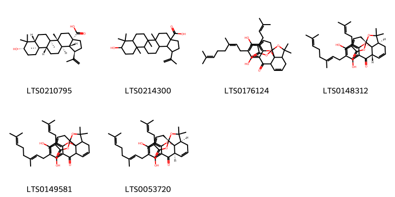{ width=100% }
    <figcaption>Hình ảnh cấu trúc hóa học của 6 hoạt chất thuộc nhóm Prenol lipids gồm ['betulinic acid (LTS0210795)', '9-hydroxy-5a,5b,8,8,11a-pentamethyl-1-(prop-1-en-2-yl)-hexadecahydrocyclopenta[a]chrysene-3a-carboxylic acid (LTS0214300)', "9-(3,7-dimethylocta-2,6-dien-1-yl)-8,10-dihydroxy-3,3,5'-trimethyl-11-(3-methylbut-2-en-1-yl)-4,6a-dihydro-3'h,3ah-spiro[furo[3,4-e]xanthene-1,2'-pyran]-6',7-dione (LTS0176124)", "(1s,3ar,6as,12ar)-9-[(2e)-3,7-dimethylocta-2,6-dien-1-yl]-8,10-dihydroxy-3,3,5'-trimethyl-11-(3-methylbut-2-en-1-yl)-4,6a-dihydro-3'h,3ah-spiro[furo[3,4-e]xanthene-1,2'-pyran]-6',7-dione (LTS0148312)", "9-[(2e)-3,7-dimethylocta-2,6-dien-1-yl]-8,10-dihydroxy-3,3,5'-trimethyl-11-(3-methylbut-2-en-1-yl)-4,6a-dihydro-3'h,3ah-spiro[furo[3,4-e]xanthene-1,2'-pyran]-6',7-dione (LTS0149581)", "(1s,3ar,6ar,12ar)-9-[(2e)-3,7-dimethylocta-2,6-dien-1-yl]-8,10-dihydroxy-3,3,5'-trimethyl-11-(3-methylbut-2-en-1-yl)-4,6a-dihydro-3'h,3ah-spiro[furo[3,4-e]xanthene-1,2'-pyran]-6',7-dione (LTS0053720)"].</figcaption>
</figure>

---

### Dược dân tộc học

Danh sách các quốc gia có sử dụng *Garcinia hanburyi* trong điều trị các bệnh. 

| Country   | Disease   | Bệnh           |
|:----------|:----------|:---------------|
| China     | Emetic    | Phôi           |
| English   | Purgative | Thuốc xổ       |
| French    | Vermifuge | Thuốc diệt sán |
| Iran      | Poison    | Chất độc       |

---

---
## Garcinia indica
### Thông tin về thực vật

!!! info "Phân loại thực vật của *Garcinia indica* từ GIBF:"
    - **Kingdom:** Plantae
    - **Phylum:** Tracheophyta
    - **Order:** Malpighiales
    - **Family:** Clusiaceae
    - **Genus:** Garcinia
    - **Species:** *Garcinia indica*

 

| Label (VI)   | Label (EN)   | Scientific Name   | Descriptions (VI)   | Descriptions (EN)              | Also Known As (VI)   | Also Known As (EN)   |
|:-------------|:-------------|:------------------|:--------------------|:-------------------------------|:---------------------|:---------------------|
| N/A          | N/A          | Garcinia indica   |                     | plant in the mangosteen family | ['']                 | ['kokum']            |

#### Phân bố trên thế giới

**Từ CSDL GIBF** nan, unknown or invalid, Pakistan, Philippines, Puerto Rico, French Polynesia, India, Trinidad and Tobago, Mauritius, Cameroon, United States of America, Cuba, Madagascar, Jamaica, Indonesia

#### Phân bố tại Việt Nam

**Từ CSDL GIBF**: Không có ghi nhận ở Việt Nam

---
### Thành phần hóa học
        
- Theo cơ sở dữ liệu lotus: Từ loài *Garcinia indica* đã phân lập và xác định được 13 hoạt chất thuộc về các nhóm Benzopyrans, Flavonoids, Prenol lipids, Carboxylic acids and derivatives. 

|    | chemicalTaxonomyClassyfireClass   |   smiles_count |
|---:|:----------------------------------|---------------:|
|  0 | Benzopyrans                       |              1 |
|  1 | Carboxylic acids and derivatives  |              1 |
|  2 | Flavonoids                        |              3 |
|  3 | Prenol lipids                     |              7 |

#### Nhóm Benzopyrans
<figure markdown="span">
    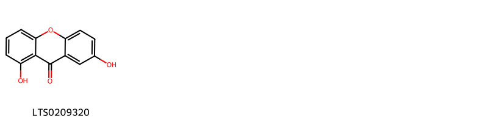{ width=100% }
    <figcaption>Hình ảnh cấu trúc hóa học của 1 hoạt chất thuộc nhóm Benzopyrans gồm ['euxanthone (LTS0209320)'].</figcaption>
</figure>
#### Nhóm Carboxylic acids and derivatives
<figure markdown="span">
    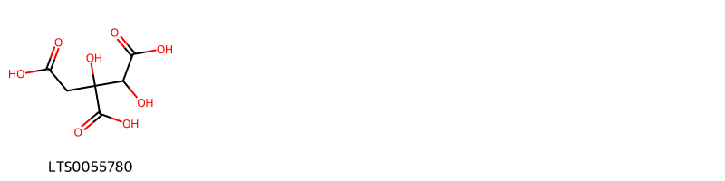{ width=100% }
    <figcaption>Hình ảnh cấu trúc hóa học của 1 hoạt chất thuộc nhóm Carboxylic acids and derivatives gồm ['hydroxycitric acid (LTS0055780)'].</figcaption>
</figure>
#### Nhóm Flavonoids
<figure markdown="span">
    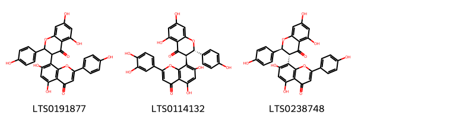{ width=100% }
    <figcaption>Hình ảnh cấu trúc hóa học của 3 hoạt chất thuộc nhóm Flavonoids gồm ['8-[5,7-dihydroxy-2-(4-hydroxyphenyl)-4-oxo-2,3-dihydro-1-benzopyran-3-yl]-5,7-dihydroxy-2-(4-hydroxyphenyl)chromen-4-one (LTS0191877)', 'morelloflavone (LTS0114132)', '8-[(2s,3r)-5,7-dihydroxy-2-(4-hydroxyphenyl)-4-oxo-2,3-dihydro-1-benzopyran-3-yl]-5,7-dihydroxy-2-(4-hydroxyphenyl)chromen-4-one (LTS0238748)'].</figcaption>
</figure>
#### Nhóm Prenol lipids
<figure markdown="span">
    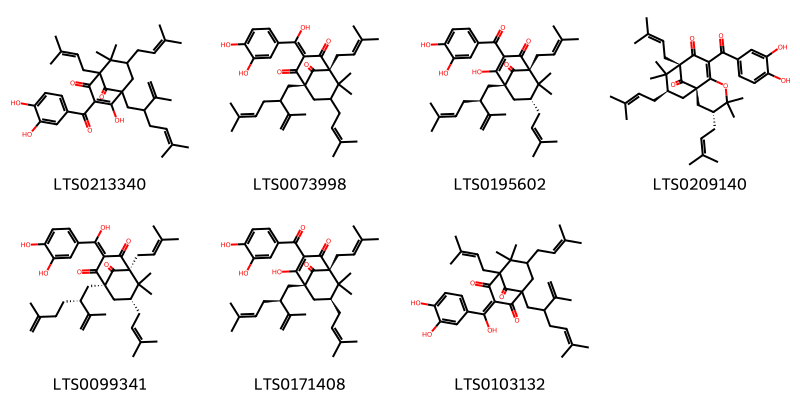{ width=100% }
    <figcaption>Hình ảnh cấu trúc hóa học của 7 hoạt chất thuộc nhóm Prenol lipids gồm ['3-(3,4-dihydroxybenzoyl)-4-hydroxy-8,8-dimethyl-5-[5-methyl-2-(prop-1-en-2-yl)hex-4-en-1-yl]-1,7-bis(3-methylbut-2-en-1-yl)bicyclo[3.3.1]non-3-ene-2,9-dione (LTS0213340)', '(1s,5r)-3-[(3,4-dihydroxyphenyl)(hydroxy)methylidene]-6,6-dimethyl-1-[5-methyl-2-(prop-1-en-2-yl)hex-4-en-1-yl]-5,7-bis(3-methylbut-2-en-1-yl)bicyclo[3.3.1]nonane-2,4,9-trione (LTS0073998)', '(1r,5r,7r)-3-(3,4-dihydroxybenzoyl)-4-hydroxy-8,8-dimethyl-5-[(2s)-5-methyl-2-(prop-1-en-2-yl)hex-4-en-1-yl]-1,7-bis(3-methylbut-2-en-1-yl)bicyclo[3.3.1]non-3-ene-2,9-dione (LTS0195602)', 'isoxanthochymol (LTS0209140)', '(1r,5s,7r)-3-[(3,4-dihydroxyphenyl)(hydroxy)methylidene]-6,6-dimethyl-1-[(2r)-5-methyl-2-(prop-1-en-2-yl)hex-5-en-1-yl]-5,7-bis(3-methylbut-2-en-1-yl)bicyclo[3.3.1]nonane-2,4,9-trione (LTS0099341)', '(1r,5r,7s)-3-(3,4-dihydroxybenzoyl)-4-hydroxy-8,8-dimethyl-5-[(2s)-5-methyl-2-(prop-1-en-2-yl)hex-4-en-1-yl]-1,7-bis(3-methylbut-2-en-1-yl)bicyclo[3.3.1]non-3-ene-2,9-dione (LTS0171408)', '3-[(3,4-dihydroxyphenyl)(hydroxy)methylidene]-6,6-dimethyl-1-[5-methyl-2-(prop-1-en-2-yl)hex-4-en-1-yl]-5,7-bis(3-methylbut-2-en-1-yl)bicyclo[3.3.1]nonane-2,4,9-trione (LTS0103132)'].</figcaption>
</figure>

---

### Dược dân tộc học

Danh sách các quốc gia có sử dụng *Garcinia indica* trong điều trị các bệnh. 

| Country   | Disease                           | Bệnh                              |
|:----------|:----------------------------------|:----------------------------------|
| India     | Cardiotonic, Demulcent, Vermifuge | Cardiotonic, Demulcent, Vermifuge |

---

---
## Garcinia kola
### Thông tin về thực vật

!!! info "Phân loại thực vật của *Garcinia kola* từ GIBF:"
    - **Kingdom:** Plantae
    - **Phylum:** Tracheophyta
    - **Order:** Malpighiales
    - **Family:** Clusiaceae
    - **Genus:** Garcinia
    - **Species:** *Garcinia kola*

 

| Label (VI)   | Label (EN)   | Scientific Name   | Descriptions (VI)   | Descriptions (EN)   | Also Known As (VI)   | Also Known As (EN)   |
|:-------------|:-------------|:------------------|:--------------------|:--------------------|:---------------------|:---------------------|
| N/A          | N/A          | Garcinia kola     |                     | species of plant    | ['']                 | ['Bitter kola']      |

#### Phân bố trên thế giới

**Từ CSDL GIBF** Angola, Côte d’Ivoire, Ghana, Liberia, Cameroon, Gabon, Nigeria, Guinea, Benin

#### Phân bố tại Việt Nam

**Từ CSDL GIBF**: Không có ghi nhận ở Việt Nam

---
### Thành phần hóa học
        
- Theo cơ sở dữ liệu lotus: Từ loài *Garcinia kola* đã phân lập và xác định được 44 hoạt chất thuộc về các nhóm Benzopyrans, Flavonoids, Benzofurans, Prenol lipids, Phenols, Brevetoxins and derivatives, Steroids and steroid derivatives. 

|    | chemicalTaxonomyClassyfireClass   |   smiles_count |
|---:|:----------------------------------|---------------:|
|  0 | Benzofurans                       |              2 |
|  1 | Benzopyrans                       |              4 |
|  2 | Brevetoxins and derivatives       |              1 |
|  3 | Flavonoids                        |             19 |
|  4 | Phenols                           |              2 |
|  5 | Prenol lipids                     |             11 |
|  6 | Steroids and steroid derivatives  |              3 |

#### Nhóm Benzofurans
<figure markdown="span">
    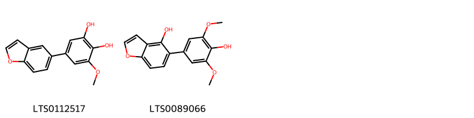{ width=100% }
    <figcaption>Hình ảnh cấu trúc hóa học của 2 hoạt chất thuộc nhóm Benzofurans gồm ['5-(1-benzofuran-5-yl)-3-methoxybenzene-1,2-diol (LTS0112517)', '5-(4-hydroxy-3,5-dimethoxyphenyl)-1-benzofuran-4-ol (LTS0089066)'].</figcaption>
</figure>
#### Nhóm Benzopyrans
<figure markdown="span">
    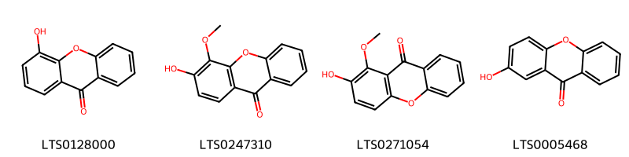{ width=100% }
    <figcaption>Hình ảnh cấu trúc hóa học của 4 hoạt chất thuộc nhóm Benzopyrans gồm ['4-hydroxyxanthen-9-one (LTS0128000)', '3-hydroxy-4-methoxyxanthen-9-one (LTS0247310)', '2-hydroxy-1-methoxyxanthen-9-one (LTS0271054)', '2-hydroxy-9-xanthenone (LTS0005468)'].</figcaption>
</figure>
#### Nhóm Brevetoxins and derivatives
<figure markdown="span">
    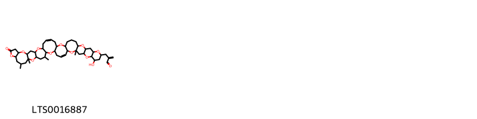{ width=100% }
    <figcaption>Hình ảnh cấu trúc hóa học của 1 hoạt chất thuộc nhóm Brevetoxins and derivatives gồm ['2-{[(24z,49z)-41-hydroxy-4,8,10,46-tetramethyl-14-oxo-2,7,13,17,21,28,34,38,43,47-decaoxadecacyclo[25.24.0.0³,²².0⁶,²⁰.0⁸,¹⁸.0¹²,¹⁶.0²⁹,⁴⁸.0³³,⁴⁶.0³⁵,⁴⁴.0³⁷,⁴²]henpentaconta-24,49-dien-39-yl]methyl}prop-2-enal (LTS0016887)'].</figcaption>
</figure>
#### Nhóm Flavonoids
<figure markdown="span">
    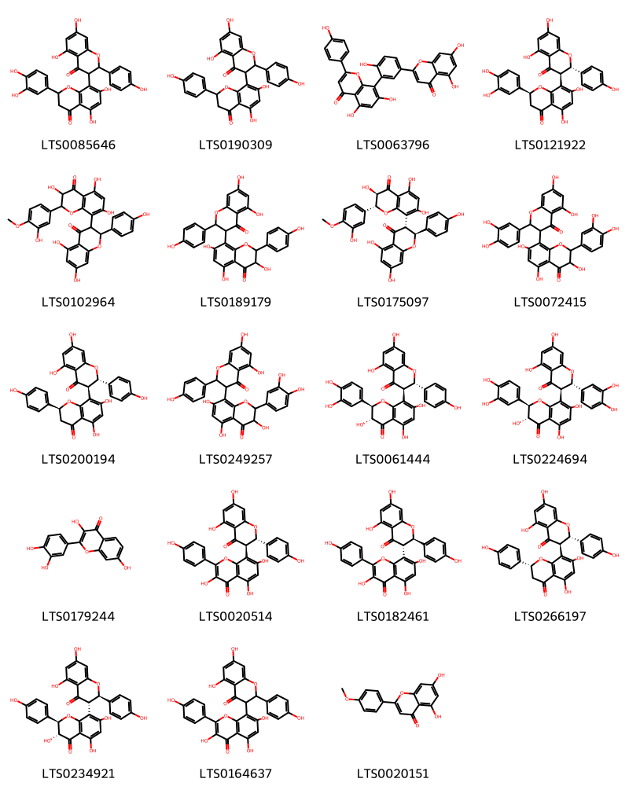{ width=100% }
    <figcaption>Hình ảnh cấu trúc hóa học của 19 hoạt chất thuộc nhóm Flavonoids gồm ['8-[5,7-dihydroxy-2-(4-hydroxyphenyl)-4-oxo-2,3-dihydro-1-benzopyran-3-yl]-2-(3,4-dihydroxyphenyl)-5,7-dihydroxy-2,3-dihydro-1-benzopyran-4-one (LTS0085646)', '8-[5,7-dihydroxy-2-(4-hydroxyphenyl)-4-oxo-2,3-dihydro-1-benzopyran-3-yl]-5,7-dihydroxy-2-(4-hydroxyphenyl)-2,3-dihydro-1-benzopyran-4-one (LTS0190309)', 'amentoflavone (LTS0063796)', '(2s)-8-[(2s,3r)-5,7-dihydroxy-2-(4-hydroxyphenyl)-4-oxo-2,3-dihydro-1-benzopyran-3-yl]-2-(3,4-dihydroxyphenyl)-5,7-dihydroxy-2,3-dihydro-1-benzopyran-4-one (LTS0121922)', '8-[5,7-dihydroxy-2-(4-hydroxyphenyl)-4-oxo-2,3-dihydro-1-benzopyran-3-yl]-3,5,7-trihydroxy-2-(3-hydroxy-4-methoxyphenyl)-2,3-dihydro-1-benzopyran-4-one (LTS0102964)', '8-[5,7-dihydroxy-2-(4-hydroxyphenyl)-4-oxo-2,3-dihydro-1-benzopyran-3-yl]-3,5,7-trihydroxy-2-(4-hydroxyphenyl)-2,3-dihydro-1-benzopyran-4-one (LTS0189179)', 'kolaflavanone (LTS0175097)', '2-(3,4-dihydroxyphenyl)-8-[2-(3,4-dihydroxyphenyl)-5,7-dihydroxy-4-oxo-2,3-dihydro-1-benzopyran-3-yl]-3,5,7-trihydroxy-2,3-dihydro-1-benzopyran-4-one (LTS0072415)', '(2s)-8-[(2s,3r)-5,7-dihydroxy-2-(4-hydroxyphenyl)-4-oxo-2,3-dihydro-1-benzopyran-3-yl]-5,7-dihydroxy-2-(4-hydroxyphenyl)-2,3-dihydro-1-benzopyran-4-one (LTS0200194)', '8-[5,7-dihydroxy-2-(4-hydroxyphenyl)-4-oxo-2,3-dihydro-1-benzopyran-3-yl]-2-(3,4-dihydroxyphenyl)-3,5,7-trihydroxy-2,3-dihydro-1-benzopyran-4-one (LTS0249257)', 'garcinia biflavonoid 2 (LTS0061444)', 'manniflavanone (LTS0224694)', "3,7,3',4'-tetrahydroxyflavone (LTS0179244)", '8-[(2s,3r)-5,7-dihydroxy-2-(4-hydroxyphenyl)-4-oxo-2,3-dihydro-1-benzopyran-3-yl]-3,5,7-trihydroxy-2-(4-hydroxyphenyl)chromen-4-one (LTS0020514)', '8-[(2r,3s)-5,7-dihydroxy-2-(4-hydroxyphenyl)-4-oxo-2,3-dihydro-1-benzopyran-3-yl]-3,5,7-trihydroxy-2-(4-hydroxyphenyl)chromen-4-one (LTS0182461)', '(2r)-8-[(2s,3r)-5,7-dihydroxy-2-(4-hydroxyphenyl)-4-oxo-2,3-dihydro-1-benzopyran-3-yl]-5,7-dihydroxy-2-(4-hydroxyphenyl)-2,3-dihydro-1-benzopyran-4-one (LTS0266197)', '(2r,3r)-8-[(2r,3s)-5,7-dihydroxy-2-(4-hydroxyphenyl)-4-oxo-2,3-dihydro-1-benzopyran-3-yl]-3,5,7-trihydroxy-2-(4-hydroxyphenyl)-2,3-dihydro-1-benzopyran-4-one (LTS0234921)', '8-[5,7-dihydroxy-2-(4-hydroxyphenyl)-4-oxo-2,3-dihydro-1-benzopyran-3-yl]-3,5,7-trihydroxy-2-(4-hydroxyphenyl)chromen-4-one (LTS0164637)', 'acacetin (LTS0020151)'].</figcaption>
</figure>
#### Nhóm Phenols
<figure markdown="span">
    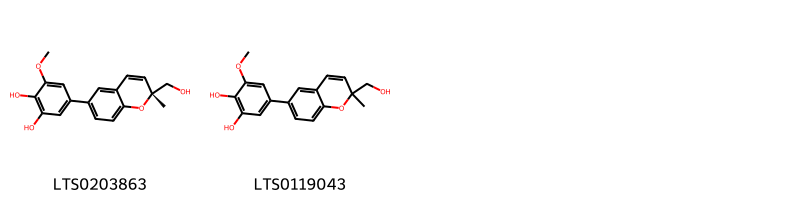{ width=100% }
    <figcaption>Hình ảnh cấu trúc hóa học của 2 hoạt chất thuộc nhóm Phenols gồm ['5-[(2r)-2-(hydroxymethyl)-2-methylchromen-6-yl]-3-methoxybenzene-1,2-diol (LTS0203863)', '5-[2-(hydroxymethyl)-2-methylchromen-6-yl]-3-methoxybenzene-1,2-diol (LTS0119043)'].</figcaption>
</figure>
#### Nhóm Prenol lipids
<figure markdown="span">
    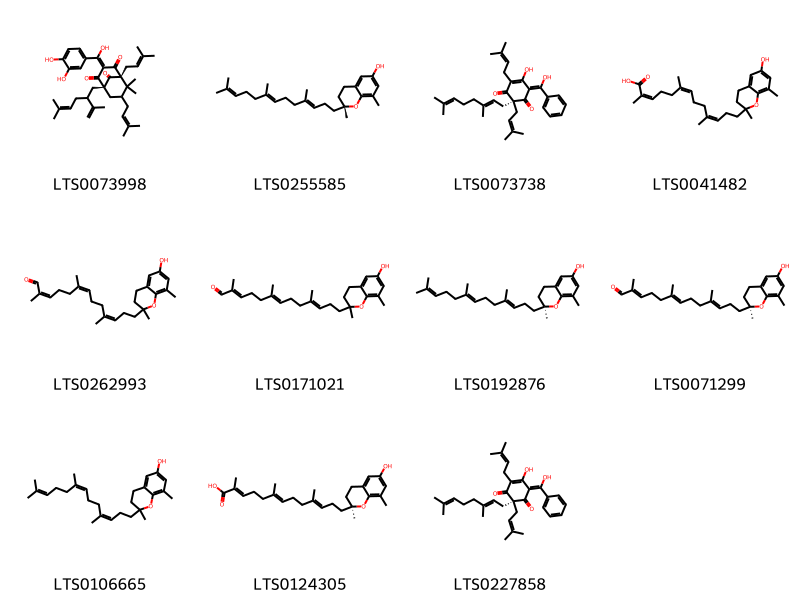{ width=100% }
    <figcaption>Hình ảnh cấu trúc hóa học của 11 hoạt chất thuộc nhóm Prenol lipids gồm ['(1s,5r)-3-[(3,4-dihydroxyphenyl)(hydroxy)methylidene]-6,6-dimethyl-1-[5-methyl-2-(prop-1-en-2-yl)hex-4-en-1-yl]-5,7-bis(3-methylbut-2-en-1-yl)bicyclo[3.3.1]nonane-2,4,9-trione (LTS0073998)', 'delta-tocotrienol (LTS0255585)', '(2r,6e)-2-[(2e)-3,7-dimethylocta-2,6-dien-1-yl]-5-hydroxy-6-[hydroxy(phenyl)methylidene]-2,4-bis(3-methylbut-2-en-1-yl)cyclohex-4-ene-1,3-dione (LTS0073738)', '13-(6-hydroxy-2,8-dimethyl-3,4-dihydro-1-benzopyran-2-yl)-2,6,10-trimethyltrideca-2,6,10-trienoic acid (LTS0041482)', '13-(6-hydroxy-2,8-dimethyl-3,4-dihydro-1-benzopyran-2-yl)-2,6,10-trimethyltrideca-2,6,10-trienal (LTS0262993)', '(2e,6e,10e)-13-(6-hydroxy-2,8-dimethyl-3,4-dihydro-1-benzopyran-2-yl)-2,6,10-trimethyltrideca-2,6,10-trienal (LTS0171021)', '(2s)-2,8-dimethyl-2-[(3e,7e)-4,8,12-trimethyltrideca-3,7,11-trien-1-yl]-3,4-dihydro-1-benzopyran-6-ol (LTS0192876)', '(2e,6e,10e)-13-[(2s)-6-hydroxy-2,8-dimethyl-3,4-dihydro-1-benzopyran-2-yl]-2,6,10-trimethyltrideca-2,6,10-trienal (LTS0071299)', '2,8-dimethyl-2-(4,8,12-trimethyltrideca-3,7,11-trien-1-yl)-3,4-dihydro-1-benzopyran-6-ol (LTS0106665)', '(2e,6e,10e)-13-[(2s)-6-hydroxy-2,8-dimethyl-3,4-dihydro-1-benzopyran-2-yl]-2,6,10-trimethyltrideca-2,6,10-trienoic acid (LTS0124305)', '(2r)-2-[(2e)-3,7-dimethylocta-2,6-dien-1-yl]-5-hydroxy-6-[hydroxy(phenyl)methylidene]-2,4-bis(3-methylbut-2-en-1-yl)cyclohex-4-ene-1,3-dione (LTS0227858)'].</figcaption>
</figure>
#### Nhóm Steroids and steroid derivatives
<figure markdown="span">
    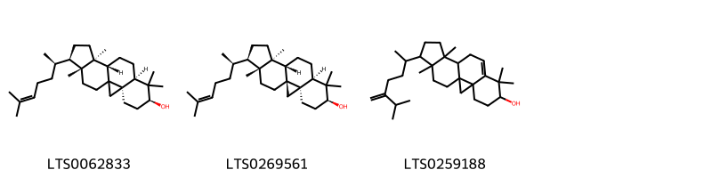{ width=100% }
    <figcaption>Hình ảnh cấu trúc hóa học của 3 hoạt chất thuộc nhóm Steroids and steroid derivatives gồm ['(3r,6s,8r,11s,12s,15r,16r)-7,7,12,16-tetramethyl-15-[(2r)-6-methylhept-5-en-2-yl]pentacyclo[9.7.0.0¹,³.0³,⁸.0¹²,¹⁶]octadecan-6-ol (LTS0062833)', 'cycloartenol (LTS0269561)', '7,7,12,16-tetramethyl-15-(6-methyl-5-methylideneheptan-2-yl)pentacyclo[9.7.0.0¹,³.0³,⁸.0¹²,¹⁶]octadec-8-en-6-ol (LTS0259188)'].</figcaption>
</figure>

---

### Dược dân tộc học

Danh sách các quốc gia có sử dụng *Garcinia kola* trong điều trị các bệnh. 

| Country   | Disease                                         | Bệnh                                                        |
|:----------|:------------------------------------------------|:------------------------------------------------------------|
| Africa    | Parasiticide, Vermifuge, Purgative, Aphrodisiac | Thuốc diệt ký sinh trùng, Vermifuge, Purgative, Aphrodisiac |
| Ghana     | Dentifrice                                      | Kem đánh răng                                               |

---

---
## Garcinia lanessonii
### Thông tin về thực vật

!!! info "Phân loại thực vật của *Garcinia lanessanii* từ GIBF:"
    - **Kingdom:** Plantae
    - **Phylum:** Tracheophyta
    - **Order:** Malpighiales
    - **Family:** Clusiaceae
    - **Genus:** Garcinia
    - **Species:** *Garcinia lanessanii*

 

| Label (VI)   | Label (EN)   | Scientific Name   | Descriptions (VI)   | Descriptions (EN)   | Also Known As (VI)   | Also Known As (EN)   |
|:-------------|:-------------|:------------------|:--------------------|:--------------------|:---------------------|:---------------------|
| N/A          | N/A          | Garcinia kola     |                     | species of plant    | ['']                 | ['Bitter kola']      |

#### Phân bố trên thế giới

**Từ CSDL GIBF** nan, Viet Nam, Lao People’s Democratic Republic, Cambodia

#### Phân bố tại Việt Nam

**Từ CSDL GIBF**: Không có ghi nhận ở Việt Nam

---
### Thành phần hóa học
        
- Theo cơ sở dữ liệu lotus: Từ loài *Garcinia lanessanii* đã phân lập và xác định được Chưa có hoạt chất nào được phân lập. hoạt chất thuộc về các nhóm Không có hoạt chất nào được phân lập. 

Không có hình ảnh nào được tạo ra

---

### Dược dân tộc học

Danh sách các quốc gia có sử dụng *Garcinia lanessanii* trong điều trị các bệnh. 

| Country   | Disease             | Bệnh                                     |
|:----------|:--------------------|:-----------------------------------------|
| Elsewhere | Purgative, Laxative | Phương pháp tẩy tế bào chết, nhuận tràng |

---

---
## Garcinia mangostana
### Thông tin về thực vật

!!! info "Phân loại thực vật của *Garcinia mangostana* từ GIBF:"
    - **Kingdom:** Plantae
    - **Phylum:** Tracheophyta
    - **Order:** Malpighiales
    - **Family:** Clusiaceae
    - **Genus:** Garcinia
    - **Species:** *Garcinia mangostana*

 

| Label (VI)   | Label (EN)   | Scientific Name     | Descriptions (VI)   | Descriptions (EN)   | Also Known As (VI)      | Also Known As (EN)                           |
|:-------------|:-------------|:--------------------|:--------------------|:--------------------|:------------------------|:---------------------------------------------|
| N/A          | N/A          | Garcinia mangostana | loài thực vật       | species of plant    | ['Garcinia mangostana'] | ['Garcinia mangostana', 'purple mangosteen'] |

#### Phân bố trên thế giới

**Từ CSDL GIBF** Honduras, Viet Nam, Colombia, Thailand, Panama, Brazil, Philippines, Malaysia, India, Réunion, Costa Rica, Seychelles, Ecuador, United States of America, China, Singapore, Indonesia

#### Phân bố tại Việt Nam

**Từ CSDL GIBF**: Tiền Giang

---
### Thành phần hóa học
        
- Theo cơ sở dữ liệu lotus: Từ loài *Garcinia mangostana* đã phân lập và xác định được 211 hoạt chất thuộc về các nhóm Organooxygen compounds, Benzopyrans, Flavonoids, Lactones, Saturated hydrocarbons, Dioxanes, Macrolides and analogues, 2-arylbenzofuran flavonoids, Prenol lipids, Carboxylic acids and derivatives, Pyridines and derivatives, Fatty Acyls, Pyrrolidines, Pyrans, Heteroaromatic compounds, Steroids and steroid derivatives, Benzene and substituted derivatives. 

|    | chemicalTaxonomyClassyfireClass     |   smiles_count |
|---:|:------------------------------------|---------------:|
|  0 | 2-arylbenzofuran flavonoids         |              1 |
|  1 | Benzene and substituted derivatives |             13 |
|  2 | Benzopyrans                         |            114 |
|  3 | Carboxylic acids and derivatives    |              1 |
|  4 | Dioxanes                            |              2 |
|  5 | Fatty Acyls                         |              4 |
|  6 | Flavonoids                          |             14 |
|  7 | Heteroaromatic compounds            |              1 |
|  8 | Lactones                            |             11 |
|  9 | Macrolides and analogues            |              7 |
| 10 | Organooxygen compounds              |             12 |
| 11 | Prenol lipids                       |             15 |
| 12 | Pyrans                              |              2 |
| 13 | Pyridines and derivatives           |              1 |
| 14 | Pyrrolidines                        |              1 |
| 15 | Saturated hydrocarbons              |              3 |
| 16 | Steroids and steroid derivatives    |              9 |

#### Nhóm 2-arylbenzofuran flavonoids
<figure markdown="span">
    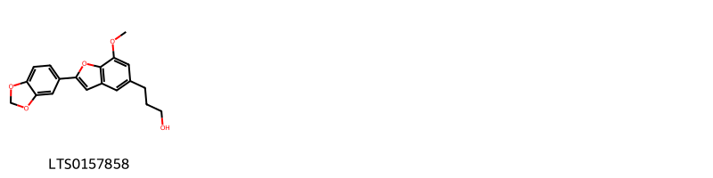{ width=100% }
    <figcaption>Hình ảnh cấu trúc hóa học của 1 hoạt chất thuộc nhóm 2-arylbenzofuran flavonoids gồm ['egonol (LTS0157858)'].</figcaption>
</figure>
#### Nhóm Benzene and substituted derivatives
<figure markdown="span">
    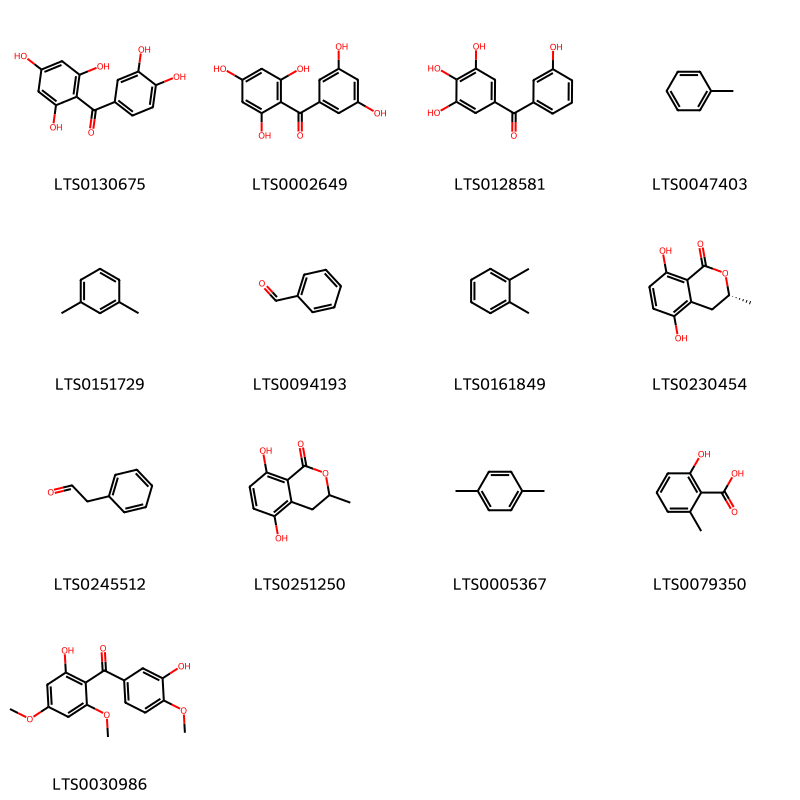{ width=100% }
    <figcaption>Hình ảnh cấu trúc hóa học của 13 hoạt chất thuộc nhóm Benzene and substituted derivatives gồm ['maclurin (LTS0130675)', '2-(3,5-dihydroxybenzoyl)benzene-1,3,5-triol (LTS0002649)', '5-(3-hydroxybenzoyl)benzene-1,2,3-triol (LTS0128581)', 'toluene (LTS0047403)', 'm-xylene (LTS0151729)', 'benzaldehyde (LTS0094193)', 'ortho-xylene (LTS0161849)', '(3r)-5,8-dihydroxy-3-methyl-3,4-dihydro-2-benzopyran-1-one (LTS0230454)', 'phenylacetaldehyde (LTS0245512)', '5,8-dihydroxy-3-methyl-3,4-dihydro-2-benzopyran-1-one (LTS0251250)', 'para-xylene (LTS0005367)', 'methylsalicylic acid (LTS0079350)', '2-(3-hydroxy-4-methoxybenzoyl)-3,5-dimethoxyphenol (LTS0030986)'].</figcaption>
</figure>
#### Nhóm Benzopyrans
<figure markdown="span">
    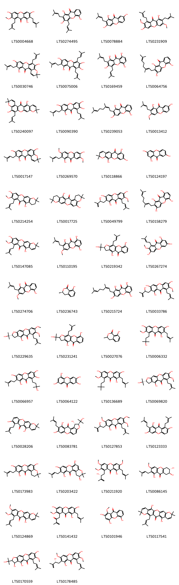{ width=100% }
    <figcaption>Hình ảnh cấu trúc hóa học của 114 hoạt chất thuộc nhóm Benzopyrans gồm ['mangostin (LTS0004668)', '8-deoxygartanin (LTS0274495)', '1,3,7-trihydroxy-2-(3-methylbut-2-en-1-yl)xanthen-9-one (LTS0078884)', '1,6-dihydroxy-3,7-dimethoxy-2,8-bis(3-methylbut-2-en-1-yl)xanthen-9-one (LTS0231909)', 'tovophylline a (LTS0030746)', 'garcinone e (LTS0075006)', 'gartanin (LTS0169459)', 'mangostinone (LTS0064756)', '10,22-dihydroxy-7,7,18,18-tetramethyl-11-(3-methylbut-2-en-1-yl)-8,13,17-trioxapentacyclo[12.8.0.0³,¹².0⁴,⁹.0¹⁶,²¹]docosa-1(22),3,5,9,11,14,16(21),19-octaen-2-one (LTS0240097)', 'gamma-mangostin (LTS0090390)', '2-(3,7-dimethylocta-2,6-dien-1-yl)-1,3,5-trihydroxyxanthen-9-one (LTS0239053)', '1,7-dihydroxy-3-methoxy-2-(3-methylbut-2-en-1-yl)xanthen-9-one (LTS0013412)', '6,8,12-trihydroxy-2,2-dimethyl-7-(3-methylbut-2-en-1-yl)-1,10-dioxatetraphen-5-one (LTS0017147)', '1,6-dihydroxy-3,7-dimethoxy-2-(3-methylbut-2-en-1-yl)xanthen-9-one (LTS0269570)', '7,9,12-trihydroxy-2,2-dimethyl-1,11-dioxatetracen-6-one (LTS0118866)', 'gentisein (LTS0124197)', '3-isomangostin (LTS0214254)', '10,22-dihydroxy-7,7,18,18-tetramethyl-8,13,17-trioxapentacyclo[12.8.0.0³,¹².0⁴,⁹.0¹⁶,²¹]docosa-1(22),3,9,11,14,16(21)-hexaen-2-one (LTS0017725)', '1,3,6-trihydroxy-2-[(2s)-2-hydroxy-3-methylbut-3-en-1-yl]-7-methoxy-8-(3-methylbut-2-en-1-yl)xanthen-9-one (LTS0049799)', 'smeathxanthone a (LTS0158279)', '9-hydroxycalabaxanthone (LTS0147085)', '1,5,8-trihydroxy-3-methoxy-2-(3-methylbut-2-en-1-yl)xanthen-9-one (LTS0110195)', '(2s)-4,9-dihydroxy-2-(2-hydroxypropan-2-yl)-11-(3-methylbut-2-en-1-yl)-2h,3h-furo[3,2-b]xanthen-5-one (LTS0219342)', '3,6,8-trihydroxy-2-methoxy-1-(3-methylbut-2-en-1-yl)xanthen-9-one (LTS0267274)', '1,5-dihydroxy-3-methoxy-2-(3-methylbut-2-en-1-yl)xanthen-9-one (LTS0274706)', 'mellein (LTS0236743)', '2-(3,7-dimethylocta-2,6-dien-1-yl)-1,3,5,8-tetrahydroxyxanthen-9-one (LTS0215724)', '1,3,6-trihydroxy-2-(2-hydroxy-3-methylbut-3-en-1-yl)-7-methoxy-8-(3-methylbut-2-en-1-yl)xanthen-9-one (LTS0033786)', '(2r)-4-hydroxy-2-(2-hydroxypropan-2-yl)-7,8-dimethoxy-6-(3-methylbut-2-en-1-yl)-2h,3h-furo[3,2-b]xanthen-5-one (LTS0229635)', '4,9-dihydroxy-2-(2-hydroxypropan-2-yl)-11-(3-methylbut-2-en-1-yl)-2h,3h-furo[3,2-b]xanthen-5-one (LTS0231241)', 'mellein (LTS0027076)', 'garcinone d (LTS0006332)', '1,3,6,7-tetrahydroxy-8-(3-hydroxy-3-methylbutyl)-2-(3-methylbut-2-en-1-yl)xanthen-9-one (LTS0066957)', '2,3,5,7-tetrahydroxyxanthen-9-one (LTS0064122)', '1-(3,3-dimethylbutyl)-3,6,8-trihydroxy-2-methoxy-7-(3-methylbut-2-en-1-yl)xanthen-9-one (LTS0136689)', '11α-mangostanin (LTS0069820)', '5,8-dihydroxy-2,2-dimethyl-7-(3-methylbut-2-en-1-yl)-1,11-dioxatetracen-6-one (LTS0028206)', '(1s,2s)-1,8,10-trihydroxy-2-(2-hydroxypropan-2-yl)-9-(3-methylbut-2-en-1-yl)-1h,2h-furo[3,2-a]xanthen-11-one (LTS0083781)', '1-hydroxy-2-(2-hydroxy-3-methylbut-3-en-1-yl)-3,6,7-trimethoxy-8-(3-methylbut-2-en-1-yl)xanthen-9-one (LTS0127853)', '1,3,7-trihydroxy-2,8-bis(3-methylbut-2-en-1-yl)xanthen-9-one (LTS0123333)', '6,8,12-trihydroxy-2,2-dimethyl-7-(3-methylbut-2-en-1-yl)-3,4-dihydro-1,10-dioxatetraphen-5-one (LTS0173983)', '(3s)-3,6,8,11-tetrahydroxy-2,2-dimethyl-7-(3-methylbut-2-en-1-yl)-3,4-dihydro-1,10-dioxatetraphen-5-one (LTS0203422)', '1-hydroxy-8-[(2r)-2-hydroxy-3-methylbut-3-en-1-yl]-3,6,7-trimethoxy-2-(3-methylbut-2-en-1-yl)xanthen-9-one (LTS0211920)', '(6s,7s)-1,6,7-trihydroxy-3-methoxy-2-(3-methylbut-2-en-1-yl)-5,6,7,8-tetrahydroxanthen-9-one (LTS0086145)', '5-hydroxy-8,9-dimethoxy-2,2-dimethyl-7-(3-methylbut-2-en-1-yl)-1,11-dioxatetracen-6-one (LTS0124869)', '1,3,6-trihydroxy-7-methoxy-8-(3-methyl-2-oxobut-3-en-1-yl)-2-(3-methylbut-2-en-1-yl)xanthen-9-one (LTS0141432)', '2,4,5-trihydroxy-1-methoxyxanthen-9-one (LTS0101946)', '5,12-dihydroxy-2,2,9,9-tetramethyl-14-(3-methylbut-2-en-1-yl)-1,6,8-trioxapentacen-13-one (LTS0117541)', '3,4,8-trihydroxy-2-(2-hydroxypropan-2-yl)-7-methoxy-6-(3-methylbut-2-en-1-yl)-2h,3h-furo[3,2-b]xanthen-5-one (LTS0170559)', '1,6-dihydroxy-2-[(2r)-2-hydroxy-3-methylbut-3-en-1-yl]-3,7-dimethoxy-8-(3-methylbut-2-en-1-yl)xanthen-9-one (LTS0178485)', '(3s)-3,5,9-trihydroxy-10-methoxy-2,2-dimethyl-11-(3-methylbut-2-en-1-yl)-3,4-dihydro-1,7-dioxatetraphen-12-one (LTS0179749)', '10,22-dihydroxy-7,7,18,18-tetramethyl-8,13,17-trioxapentacyclo[12.8.0.0³,¹².0⁴,⁹.0¹⁶,²¹]docosa-1(22),3,9,11,14,16(21),19-heptaen-2-one (LTS0116124)', '22-hydroxy-10-methoxy-7,7,18,18-tetramethyl-8,13,17-trioxapentacyclo[12.8.0.0³,¹².0⁴,⁹.0¹⁶,²¹]docosa-1(22),3,9,11,14,16(21),19-heptaen-2-one (LTS0116316)', '1-hydroxy-8-(3-hydroxy-3-methylbut-1-en-1-yl)-3,6,7-trimethoxy-2-(3-methylbut-2-en-1-yl)xanthen-9-one (LTS0151187)', '4,8,10-trihydroxy-9-(3-methylbut-2-en-1-yl)-2-(prop-1-en-2-yl)-1h,2h-furo[3,2-a]xanthen-11-one (LTS0134990)', '5,9-dihydroxy-7-(3-hydroxy-3-methylbutyl)-8-methoxy-2,2-dimethyl-1,11-dioxatetracen-6-one (LTS0193960)', '3,6,8,11-tetrahydroxy-2,2-dimethyl-7-(3-methylbut-2-en-1-yl)-3,4-dihydro-1,10-dioxatetraphen-5-one (LTS0201029)', '1,3,6-trihydroxy-2-[(2r)-2-hydroxy-3-methylbut-3-en-1-yl]-7-methoxy-8-(3-methylbut-2-en-1-yl)xanthen-9-one (LTS0246824)', '1,6-dihydroxy-2-[(2s)-2-hydroxy-3-methylbut-3-en-1-yl]-3,7-dimethoxy-8-(3-methylbut-2-en-1-yl)xanthen-9-one (LTS0148678)', '10,16-dihydroxy-6,6,19,19-tetramethyl-15-(3-methylbut-2-en-1-yl)-5,13,18-trioxapentacyclo[12.8.0.0³,¹².0⁴,⁹.0¹⁷,²²]docosa-1(22),3,7,9,11,14,16,20-octaen-2-one (LTS0151632)', '1-isomangostin (LTS0121436)', '5,10-dihydroxy-2,2-dimethyl-12-(3-methylbut-2-en-1-yl)-1,11-dioxatetracen-6-one (LTS0161438)', '3,5,9-trihydroxy-8-methoxy-2,2-dimethyl-7-(3-methylbut-2-en-1-yl)-3,4-dihydro-1,11-dioxatetracen-6-one (LTS0160807)', 'trans-4-hydroxymellein (LTS0166041)', '2,3,6,8-tetrahydroxy-1-(3-methylbut-2-en-1-yl)xanthen-9-one (LTS0170763)', '1-(2,3-dihydroxy-3-methylbutyl)-3,6,8-trihydroxy-2-methoxy-7-(3-methylbut-2-en-1-yl)xanthen-9-one (LTS0136054)', '3,5,9-trihydroxy-10-methoxy-2,2-dimethyl-11-(3-methylbut-2-en-1-yl)-3,4-dihydro-1,7-dioxatetraphen-12-one (LTS0095757)', '1,6-dihydroxy-3,7-dimethoxy-8-(3-methyl-2-oxobut-3-en-1-yl)-2-(3-methylbut-2-en-1-yl)xanthen-9-one (LTS0241561)', '(2s)-4,8,10-trihydroxy-9-(3-methylbut-2-en-1-yl)-2-(prop-1-en-2-yl)-1h,2h-furo[3,2-a]xanthen-11-one (LTS0096790)', '(1r,2r)-1,8,10-trihydroxy-2-(2-hydroxypropan-2-yl)-9-(3-methylbut-2-en-1-yl)-1h,2h-furo[3,2-a]xanthen-11-one (LTS0120943)', '4-hydroxy-7,8-dimethoxy-6-(3-methylbut-2-en-1-yl)furo[3,2-b]xanthen-5-one (LTS0117978)', '1,3,6-trihydroxy-2,4-bis(3-methylbut-2-en-1-yl)xanthen-9-one (LTS0183316)', '3,9-dihydroxy-5,10-dimethoxy-2,2-dimethyl-11-(3-methylbut-2-en-1-yl)-3,4-dihydro-1,7-dioxatetraphen-12-one (LTS0117102)', '4,8-dihydroxy-2-(2-hydroxypropan-2-yl)-7-methoxy-6-(3-methylbut-2-en-1-yl)-2h,3h-furo[3,2-b]xanthen-5-one (LTS0067475)', '(2s)-4,8-dihydroxy-7-methoxy-6-(3-methylbut-2-en-1-yl)-2-(prop-1-en-2-yl)-2h,3h-furo[3,2-b]xanthen-5-one (LTS0261717)', '4,8-dihydroxy-7-methoxy-6-(3-methylbut-2-en-1-yl)-2-(prop-1-en-2-yl)-2h,3h-furo[3,2-b]xanthen-5-one (LTS0209628)', '(2s,3r)-3,4,8-trihydroxy-2-(2-hydroxypropan-2-yl)-7-methoxy-6-(3-methylbut-2-en-1-yl)-2h,3h-furo[3,2-b]xanthen-5-one (LTS0052033)', '1,6-dihydroxy-3-methoxy-2-(3-methylbut-2-en-1-yl)xanthen-9-one (LTS0215756)', '1,5,8-trihydroxy-3-methoxy-2,4-bis(3-methylbut-2-en-1-yl)xanthen-9-one (LTS0222461)', '1,6-dihydroxy-8-[(1e)-3-hydroxy-3-methylbut-1-en-1-yl]-3,7-dimethoxy-2-(3-methylbut-2-en-1-yl)xanthen-9-one (LTS0208929)', '1-[(2s)-2,3-dihydroxy-3-methylbutyl]-3,6,8-trihydroxy-2-methoxy-7-(3-methylbut-2-en-1-yl)xanthen-9-one (LTS0081448)', '4,7-dihydroxy-2-(2-hydroxypropan-2-yl)-6-(3-methylbut-2-en-1-yl)-2h,3h-furo[3,2-b]xanthen-5-one (LTS0222283)', '1,6-dihydroxy-2-(2-hydroxy-3-methylbut-3-en-1-yl)-3,7-dimethoxy-8-(3-methylbut-2-en-1-yl)xanthen-9-one (LTS0188719)', '(2s)-4,8,10-trihydroxy-2-(2-hydroxypropan-2-yl)-9-(3-methylbut-2-en-1-yl)-1h,2h-furo[3,2-a]xanthen-11-one (LTS0164037)', '4,8-dihydroxy-3-methyl-3,4-dihydro-2-benzopyran-1-one (LTS0170094)', '(2s)-4,8-dihydroxy-2-(2-hydroxypropan-2-yl)-7-methoxy-6-(3-methylbut-2-en-1-yl)-2h,3h-furo[3,2-b]xanthen-5-one (LTS0169307)', '1,3,7-trihydroxy-2-methoxyxanthen-9-one (LTS0207686)', '1,6-dihydroxy-8-(3-hydroxy-3-methylbut-1-en-1-yl)-3,7-dimethoxy-2-(3-methylbut-2-en-1-yl)xanthen-9-one (LTS0250097)', '10,22-dihydroxy-7,7,18,18-tetramethyl-11-(3-methylbut-2-en-1-yl)-8,13,17-trioxapentacyclo[12.8.0.0³,¹².0⁴,⁹.0¹⁶,²¹]docosa-1(22),3,9,11,14,16(21),19-heptaen-2-one (LTS0243340)', '4,7-dihydroxy-2-(2-hydroxypropan-2-yl)-11-(3-methylbut-2-en-1-yl)-2h,3h-furo[3,2-b]xanthen-5-one (LTS0250985)', '1-hydroxy-2-[(2r)-2-hydroxy-3-methylbut-3-en-1-yl]-3,6,7-trimethoxy-8-(3-methylbut-2-en-1-yl)xanthen-9-one (LTS0063592)', '22-hydroxy-7,7,18,18-tetramethyl-8,13,17-trioxapentacyclo[12.8.0.0³,¹².0⁴,⁹.0¹⁶,²¹]docosa-1(22),3,5,9,11,14,16(21),19-octaen-2-one (LTS0125235)', 'cratoxyxanthone (LTS0130968)', '5-hydroxy-8-methoxy-2,2-dimethyl-7-(3-methylbut-2-en-1-yl)-1,11-dioxatetracen-6-one (LTS0005339)', '1,3-dihydroxy-2-(2-hydroxy-3-methylbut-3-en-1-yl)-6,7-dimethoxy-8-(3-methylbut-2-en-1-yl)xanthen-9-one (LTS0015155)', '4-hydroxy-2-(2-hydroxypropan-2-yl)-7,8-dimethoxy-6-(3-methylbut-2-en-1-yl)-2h,3h-furo[3,2-b]xanthen-5-one (LTS0129425)', '(3r)-3,6,8,11-tetrahydroxy-2,2-dimethyl-7-(3-methylbut-2-en-1-yl)-3,4-dihydro-1,10-dioxatetraphen-5-one (LTS0007290)', '1-hydroxy-8-(2-hydroxy-3-methylbut-3-en-1-yl)-3,6,7-trimethoxy-2-(3-methylbut-2-en-1-yl)xanthen-9-one (LTS0015615)', '1,6-dihydroxy-8-(2-hydroxy-3-methylbut-3-en-1-yl)-3,7-dimethoxy-2-(3-methylbut-2-en-1-yl)xanthen-9-one (LTS0001144)', '10,15-dihydroxy-7,7,19,19-tetramethyl-11-(3-methylbut-2-en-1-yl)-2,8,20-trioxapentacyclo[12.8.0.0³,¹².0⁴,⁹.0¹⁶,²¹]docosa-1(22),3,5,9,11,14,16(21),17-octaen-13-one (LTS0262247)', '(3r)-3,9-dihydroxy-5,10-dimethoxy-2,2-dimethyl-11-(3-methylbut-2-en-1-yl)-3,4-dihydro-1,7-dioxatetraphen-12-one (LTS0016522)', '(3s)-3,5,9-trihydroxy-8-methoxy-2,2-dimethyl-7-(3-methylbut-2-en-1-yl)-3,4-dihydro-1,11-dioxatetracen-6-one (LTS0056527)', '1,6-dihydroxy-8-[(2r)-2-hydroxy-3-methylbut-3-en-1-yl]-3,7-dimethoxy-2-(3-methylbut-2-en-1-yl)xanthen-9-one (LTS0034259)', '6,8,12-trihydroxy-2,2-dimethyl-7,11-bis(3-methylbut-2-en-1-yl)-3,4-dihydro-1,10-dioxatetraphen-5-one (LTS0242758)', '(2s)-4,7-dihydroxy-2-(2-hydroxypropan-2-yl)-11-(3-methylbut-2-en-1-yl)-2h,3h-furo[3,2-b]xanthen-5-one (LTS0005088)', '4-[(2s,3r)-4,8-dihydroxy-2-(2-hydroxypropan-2-yl)-7-methoxy-6-(3-methylbut-2-en-1-yl)-5-oxo-2h,3h-furo[3,2-b]xanthen-3-yl]-1,3,6-trihydroxy-7-methoxy-2,8-bis(3-methylbut-2-en-1-yl)xanthen-9-one (LTS0208522)', '(2s)-4,7-dihydroxy-2-(2-hydroxypropan-2-yl)-6-(3-methylbut-2-en-1-yl)-2h,3h-furo[3,2-b]xanthen-5-one (LTS0023328)', '1,8,10-trihydroxy-2-(2-hydroxypropan-2-yl)-9-(3-methylbut-2-en-1-yl)-1h,2h-furo[3,2-a]xanthen-11-one (LTS0127995)', '4-[4,8-dihydroxy-2-(2-hydroxypropan-2-yl)-7-methoxy-6-(3-methylbut-2-en-1-yl)-5-oxo-2h,3h-furo[3,2-b]xanthen-3-yl]-1,3,6-trihydroxy-7-methoxy-2,8-bis(3-methylbut-2-en-1-yl)xanthen-9-one (LTS0262429)', '4,8-dihydroxy-7-methoxy-6-(3-methylbut-2-en-1-yl)furo[3,2-b]xanthen-5-one (LTS0037501)', '1-hydroxy-8-[(1e)-3-hydroxy-3-methylbut-1-en-1-yl]-3,6,7-trimethoxy-2-(3-methylbut-2-en-1-yl)xanthen-9-one (LTS0039363)', 'cis-4-hydroxymellein (LTS0036641)', 'cudraxanthone g (LTS0045459)', '1,3-dihydroxy-2-[(2r)-2-hydroxy-3-methylbut-3-en-1-yl]-6,7-dimethoxy-8-(3-methylbut-2-en-1-yl)xanthen-9-one (LTS0043408)'].</figcaption>
</figure>
#### Nhóm Carboxylic acids and derivatives
<figure markdown="span">
    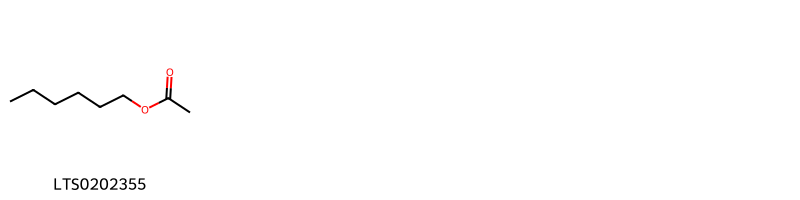{ width=100% }
    <figcaption>Hình ảnh cấu trúc hóa học của 1 hoạt chất thuộc nhóm Carboxylic acids and derivatives gồm ['hexyl acetate (LTS0202355)'].</figcaption>
</figure>
#### Nhóm Dioxanes
<figure markdown="span">
    { width=100% }
    <figcaption>Hình ảnh cấu trúc hóa học của 2 hoạt chất thuộc nhóm Dioxanes gồm ['(1r,3r,4r,9r,12r)-3,4,12-trimethyl-10,13-dioxatetracyclo[7.3.1.0¹,⁹.0³,⁷]trideca-5,7-diene (LTS0051889)', '3,4,12-trimethyl-10,13-dioxatetracyclo[7.3.1.0¹,⁹.0³,⁷]trideca-5,7-diene (LTS0093221)'].</figcaption>
</figure>
#### Nhóm Fatty Acyls
<figure markdown="span">
    { width=100% }
    <figcaption>Hình ảnh cấu trúc hóa học của 4 hoạt chất thuộc nhóm Fatty Acyls gồm ['3-ethyl-4-methyl-1-[3,4,5-trihydroxy-6-(hydroxymethyl)oxan-2-yl]pyrrole-2,5-dione (LTS0039383)', 'cis-3-hexenol (LTS0132156)', '3-ethyl-4-methyl-1-[(2r,3r,4s,5s,6r)-3,4,5-trihydroxy-6-(hydroxymethyl)oxan-2-yl]pyrrole-2,5-dione (LTS0252312)', 'hexanol (LTS0217299)'].</figcaption>
</figure>
#### Nhóm Flavonoids
<figure markdown="span">
    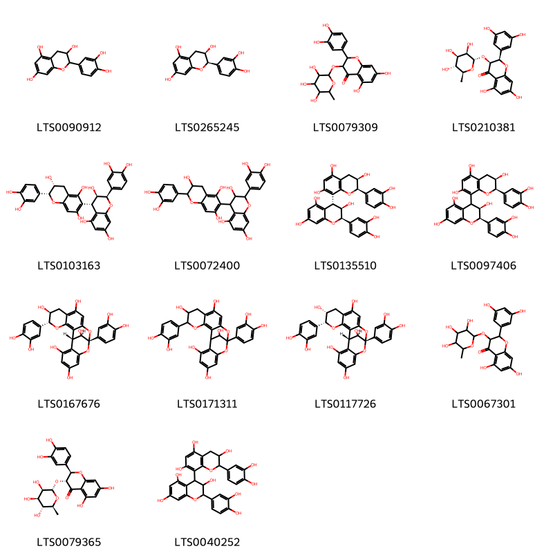{ width=100% }
    <figcaption>Hình ảnh cấu trúc hóa học của 14 hoạt chất thuộc nhóm Flavonoids gồm ['catechol (LTS0090912)', 'ent-epicatechin (LTS0265245)', 'astilbin (LTS0079309)', '(2r,3s)-2-(3,5-dihydroxyphenyl)-5,7-dihydroxy-3-{[(2s,3r,4r,5r,6s)-3,4,5-trihydroxy-6-methyloxan-2-yl]oxy}-2,3-dihydro-1-benzopyran-4-one (LTS0210381)', '(2r,3r,4s)-2-(3,4-dihydroxyphenyl)-4-[(2r,3r)-2-(3,4-dihydroxyphenyl)-3,5,7-trihydroxy-3,4-dihydro-2h-1-benzopyran-6-yl]-3,4-dihydro-2h-1-benzopyran-3,5,7-triol (LTS0103163)', '2-(3,4-dihydroxyphenyl)-4-[2-(3,4-dihydroxyphenyl)-3,5,7-trihydroxy-3,4-dihydro-2h-1-benzopyran-6-yl]-3,4-dihydro-2h-1-benzopyran-3,5,7-triol (LTS0072400)', '(2r,3r,4r)-2-(3,4-dihydroxyphenyl)-4-[(2r,3r)-2-(3,4-dihydroxyphenyl)-3,5,7-trihydroxy-3,4-dihydro-2h-1-benzopyran-8-yl]-3,4-dihydro-2h-1-benzopyran-3,5,7-triol (LTS0135510)', '(2r,3r)-2-(3,4-dihydroxyphenyl)-4-[(2r,3r)-2-(3,4-dihydroxyphenyl)-3,5,7-trihydroxy-3,4-dihydro-2h-1-benzopyran-8-yl]-3,4-dihydro-2h-1-benzopyran-3,5,7-triol (LTS0097406)', 'procyanidin a1 (LTS0167676)', 'procyanidin a1 (LTS0171311)', 'proanthocyanidin a2 (LTS0117726)', '2-(3,5-dihydroxyphenyl)-5,7-dihydroxy-3-[(3,4,5-trihydroxy-6-methyloxan-2-yl)oxy]-2,3-dihydro-1-benzopyran-4-one (LTS0067301)', 'astilbin (LTS0079365)', '2-(3,4-dihydroxyphenyl)-4-[2-(3,4-dihydroxyphenyl)-3,5,7-trihydroxy-3,4-dihydro-2h-1-benzopyran-8-yl]-3,4-dihydro-2h-1-benzopyran-3,5,7-triol (LTS0040252)'].</figcaption>
</figure>
#### Nhóm Heteroaromatic compounds
<figure markdown="span">
    { width=100% }
    <figcaption>Hình ảnh cấu trúc hóa học của 1 hoạt chất thuộc nhóm Heteroaromatic compounds gồm ['furfuryl methyl ketone (LTS0085535)'].</figcaption>
</figure>
#### Nhóm Lactones
<figure markdown="span">
    { width=100% }
    <figcaption>Hình ảnh cấu trúc hóa học của 11 hoạt chất thuộc nhóm Lactones gồm ['4-acetyl-3-methyloxolan-2-one (LTS0079634)', '(3s,4r,5r)-4-({[(2s,3s,4s)-4-acetyl-3-methyloxolan-2-yl]oxy}methyl)-3,5-dimethyloxolan-2-one (LTS0077101)', '(3s,4r,5r)-4-({[(2s,3s,4r,5r)-4-(hydroxymethyl)-3,5-dimethyloxolan-2-yl]oxy}methyl)-3,5-dimethyloxolan-2-one (LTS0088000)', '4-hydroxy-6-propyloxan-2-one (LTS0119647)', '4-({[4-(hydroxymethyl)-3,5-dimethyloxolan-2-yl]oxy}methyl)-3,5-dimethyloxolan-2-one (LTS0212914)', '(3s,4r,5r)-4-(hydroxymethyl)-3,5-dimethyloxolan-2-one (LTS0070024)', '4-(hydroxymethyl)-3,5-dimethyloxolan-2-one (LTS0236015)', '(3s,4r,5r)-4-({[(2r,3s,4r,5r)-4-(hydroxymethyl)-3,5-dimethyloxolan-2-yl]oxy}methyl)-3,5-dimethyloxolan-2-one (LTS0045140)', '(3s,4s)-4-acetyl-3-methyloxolan-2-one (LTS0254946)', '(4s,6r)-4-hydroxy-6-propyloxan-2-one (LTS0008995)', '4-{[(4-acetyl-3-methyloxolan-2-yl)oxy]methyl}-3,5-dimethyloxolan-2-one (LTS0099244)'].</figcaption>
</figure>
#### Nhóm Macrolides and analogues
<figure markdown="span">
    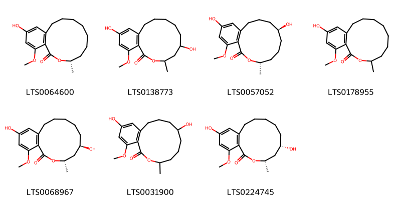{ width=100% }
    <figcaption>Hình ảnh cấu trúc hóa học của 7 hoạt chất thuộc nhóm Macrolides and analogues gồm ['lasiodiplodin (LTS0064600)', '5,12-dihydroxy-14-methoxy-3-methyl-3,4,5,6,7,8,9,10-octahydro-2-benzoxacyclododecin-1-one (LTS0138773)', '(3s,7r)-7,12-dihydroxy-14-methoxy-3-methyl-3,4,5,6,7,8,9,10-octahydro-2-benzoxacyclododecin-1-one (LTS0057052)', '12-hydroxy-14-methoxy-3-methyl-3,4,5,6,7,8,9,10-octahydro-2-benzoxacyclododecin-1-one (LTS0178955)', '(3s,5r)-5,12-dihydroxy-14-methoxy-3-methyl-3,4,5,6,7,8,9,10-octahydro-2-benzoxacyclododecin-1-one (LTS0068967)', '7,12-dihydroxy-14-methoxy-3-methyl-3,4,5,6,7,8,9,10-octahydro-2-benzoxacyclododecin-1-one (LTS0031900)', '(3s,5s)-5,12-dihydroxy-14-methoxy-3-methyl-3,4,5,6,7,8,9,10-octahydro-2-benzoxacyclododecin-1-one (LTS0224745)'].</figcaption>
</figure>
#### Nhóm Organooxygen compounds
<figure markdown="span">
    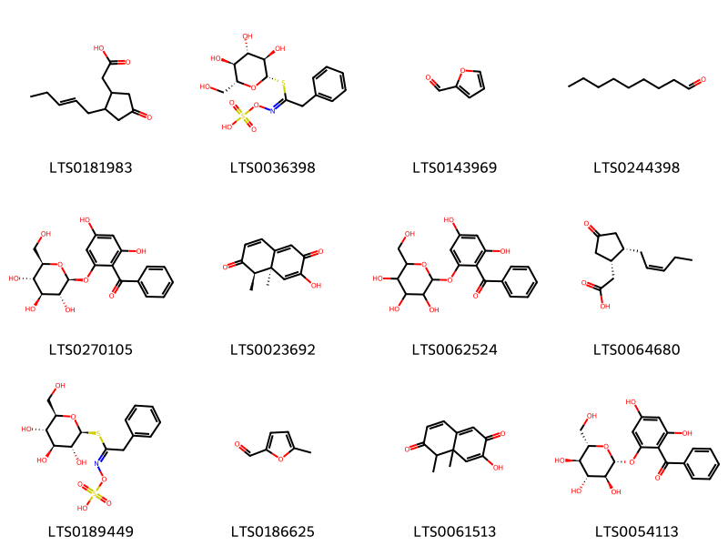{ width=100% }
    <figcaption>Hình ảnh cấu trúc hóa học của 12 hoạt chất thuộc nhóm Organooxygen compounds gồm ['[4-oxo-2-(pent-2-en-1-yl)cyclopentyl]acetic acid (LTS0181983)', 'glucotropeolin (LTS0036398)', 'bran oil (LTS0143969)', 'nonanal (LTS0244398)', '(2s,3r,4s,5s,6r)-2-(2-benzoyl-3,5-dihydroxyphenoxy)-6-(hydroxymethyl)oxane-3,4,5-triol (LTS0270105)', '(1r,8as)-7-hydroxy-1,8a-dimethyl-1h-naphthalene-2,6-dione (LTS0023692)', '2-(2-benzoyl-3,5-dihydroxyphenoxy)-6-(hydroxymethyl)oxane-3,4,5-triol (LTS0062524)', '[(1s,2s)-4-oxo-2-[(2z)-pent-2-en-1-yl]cyclopentyl]acetic acid (LTS0064680)', 'glucotropaeolin (LTS0189449)', '5-methylfurfural (LTS0186625)', '7-hydroxy-1,8a-dimethyl-1h-naphthalene-2,6-dione (LTS0061513)', '(2r,3s,4r,5r,6s)-2-(2-benzoyl-3,5-dihydroxyphenoxy)-6-(hydroxymethyl)oxane-3,4,5-triol (LTS0054113)'].</figcaption>
</figure>
#### Nhóm Prenol lipids
<figure markdown="span">
    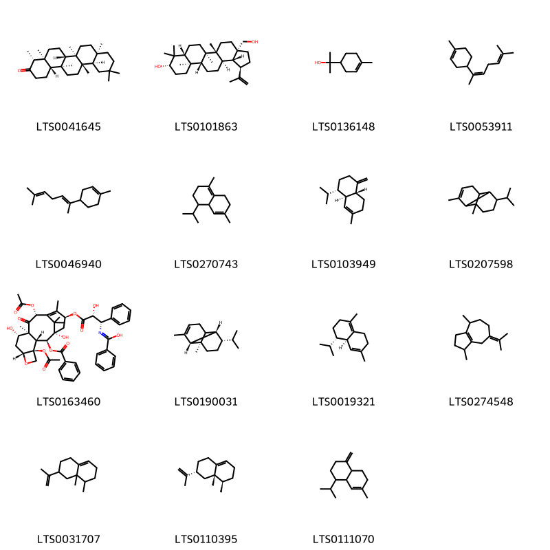{ width=100% }
    <figcaption>Hình ảnh cấu trúc hóa học của 15 hoạt chất thuộc nhóm Prenol lipids gồm ['(-)-friedelin (LTS0041645)', 'betulin (LTS0101863)', 'terpineol (LTS0136148)', '(z)-α-bisabolene (LTS0053911)', '(e)-α-bisabolene (LTS0046940)', '4-isopropyl-1,6-dimethyl-2,3,4,4a,7,8-hexahydronaphthalene (LTS0270743)', '(+)-gamma-cadinene (LTS0103949)', 'α-copaene (LTS0207598)', 'n-[(1s,2r)-3-{[(1s,2s,3r,4s,7r,9s,10s,12r,15s)-4,12-bis(acetyloxy)-2-(benzoyloxy)-1,9-dihydroxy-10,14,17,17-tetramethyl-11-oxo-6-oxatetracyclo[11.3.1.0³,¹⁰.0⁴,⁷]heptadec-13-en-15-yl]oxy}-2-hydroxy-3-oxo-1-phenylpropyl]benzenecarboximidic acid (LTS0163460)', '(1r,2s,7s,8s)-8-isopropyl-1,3-dimethyltricyclo[4.4.0.0²,⁷]dec-3-ene (LTS0190031)', 'delta-cadinene (LTS0019321)', 'guaiene (LTS0274548)', 'valencene (LTS0031707)', 'valencene (LTS0110395)', '4-isopropyl-6-methyl-1-methylidene-3,4,4a,7,8,8a-hexahydro-2h-naphthalene (LTS0111070)'].</figcaption>
</figure>
#### Nhóm Pyrans
<figure markdown="span">
    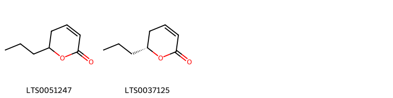{ width=100% }
    <figcaption>Hình ảnh cấu trúc hóa học của 2 hoạt chất thuộc nhóm Pyrans gồm ['6-propyl-5,6-dihydropyran-2-one (LTS0051247)', '(6r)-6-propyl-5,6-dihydropyran-2-one (LTS0037125)'].</figcaption>
</figure>
#### Nhóm Pyridines and derivatives
<figure markdown="span">
    { width=100% }
    <figcaption>Hình ảnh cấu trúc hóa học của 1 hoạt chất thuộc nhóm Pyridines and derivatives gồm ['pyridine (LTS0108275)'].</figcaption>
</figure>
#### Nhóm Pyrrolidines
<figure markdown="span">
    { width=100% }
    <figcaption>Hình ảnh cấu trúc hóa học của 1 hoạt chất thuộc nhóm Pyrrolidines gồm ['3-ethyl-5-hydroxy-4-methylpyrrol-2-one (LTS0094985)'].</figcaption>
</figure>
#### Nhóm Saturated hydrocarbons
<figure markdown="span">
    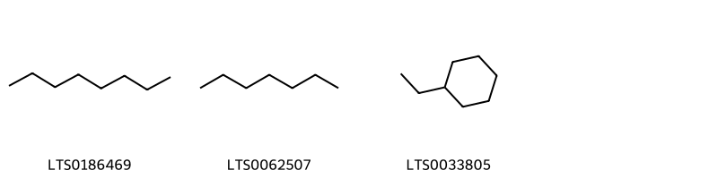{ width=100% }
    <figcaption>Hình ảnh cấu trúc hóa học của 3 hoạt chất thuộc nhóm Saturated hydrocarbons gồm ['octane (LTS0186469)', 'heptane (LTS0062507)', 'ethylcyclohexane (LTS0033805)'].</figcaption>
</figure>
#### Nhóm Steroids and steroid derivatives
<figure markdown="span">
    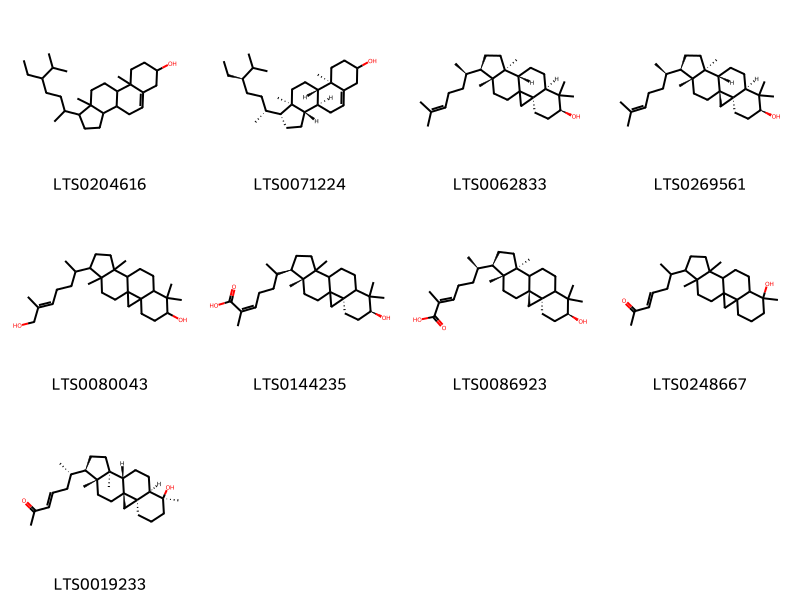{ width=100% }
    <figcaption>Hình ảnh cấu trúc hóa học của 9 hoạt chất thuộc nhóm Steroids and steroid derivatives gồm ['stigmast-5-en-3-ol, (3β)- (LTS0204616)', 'stigmast-5-en-3-ol (LTS0071224)', '(3r,6s,8r,11s,12s,15r,16r)-7,7,12,16-tetramethyl-15-[(2r)-6-methylhept-5-en-2-yl]pentacyclo[9.7.0.0¹,³.0³,⁸.0¹²,¹⁶]octadecan-6-ol (LTS0062833)', 'cycloartenol (LTS0269561)', '15-[(5e)-7-hydroxy-6-methylhept-5-en-2-yl]-7,7,12,16-tetramethylpentacyclo[9.7.0.0¹,³.0³,⁸.0¹²,¹⁶]octadecan-6-ol (LTS0080043)', '(2z)-6-[(3r,6s,15r,16r)-6-hydroxy-7,7,12,16-tetramethylpentacyclo[9.7.0.0¹,³.0³,⁸.0¹²,¹⁶]octadecan-15-yl]-2-methylhept-2-enoic acid (LTS0144235)', '(2e,6r)-6-[(1s,3r,6s,12s,15r,16r)-6-hydroxy-7,7,12,16-tetramethylpentacyclo[9.7.0.0¹,³.0³,⁸.0¹²,¹⁶]octadecan-15-yl]-2-methylhept-2-enoic acid (LTS0086923)', '6-{7-hydroxy-7,12,16-trimethylpentacyclo[9.7.0.0¹,³.0³,⁸.0¹²,¹⁶]octadecan-15-yl}hept-3-en-2-one (LTS0248667)', '(3e,6s)-6-[(1s,3r,7s,8r,11s,12s,15r,16r)-7-hydroxy-7,12,16-trimethylpentacyclo[9.7.0.0¹,³.0³,⁸.0¹²,¹⁶]octadecan-15-yl]hept-3-en-2-one (LTS0019233)'].</figcaption>
</figure>

---

### Dược dân tộc học

Danh sách các quốc gia có sử dụng *Garcinia mangostana* trong điều trị các bệnh. 

| Country     | Disease    | Bệnh      |
|:------------|:-----------|:----------|
| Philippines | Astringent | Lam se da |
| Turkey      | Astringent | Lam se da |

---

---
## Garcinia morella
### Thông tin về thực vật

!!! info "Phân loại thực vật của *Garcinia morella* từ GIBF:"
    - **Kingdom:** Plantae
    - **Phylum:** Tracheophyta
    - **Order:** Malpighiales
    - **Family:** Clusiaceae
    - **Genus:** Garcinia
    - **Species:** *Garcinia morella*

 

| Label (VI)   | Label (EN)   | Scientific Name   | Descriptions (VI)   | Descriptions (EN)   | Also Known As (VI)   | Also Known As (EN)   |
|:-------------|:-------------|:------------------|:--------------------|:--------------------|:---------------------|:---------------------|
| N/A          | N/A          | Garcinia morella  | loài thực vật       | species of plant    | ['']                 | ['']                 |

#### Phân bố trên thế giới

**Từ CSDL GIBF** nan, Sri Lanka, Thailand, El Salvador, Mauritius, India, United States of America, Singapore, Jamaica, Indonesia

#### Phân bố tại Việt Nam

**Từ CSDL GIBF**: Không có ghi nhận ở Việt Nam

---
### Thành phần hóa học
        
- Theo cơ sở dữ liệu lotus: Từ loài *Garcinia morella* đã phân lập và xác định được 12 hoạt chất thuộc về các nhóm Benzopyrans, Flavonoids. 

|    | chemicalTaxonomyClassyfireClass   |   smiles_count |
|---:|:----------------------------------|---------------:|
|  0 | Benzopyrans                       |             10 |
|  1 | Flavonoids                        |              2 |

#### Nhóm Benzopyrans
<figure markdown="span">
    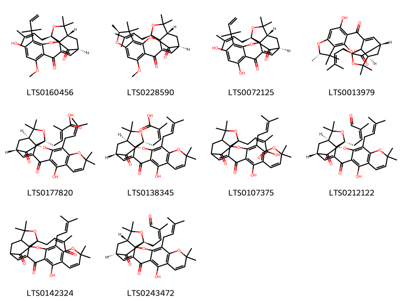{ width=100% }
    <figcaption>Hình ảnh cấu trúc hóa học của 10 hoạt chất thuộc nhóm Benzopyrans gồm ['(1s,2s,13s,15r)-6-hydroxy-8-methoxy-17,17-dimethyl-15-(3-methylbut-2-en-1-yl)-5-(2-methylbut-3-en-2-yl)-3,16-dioxapentacyclo[11.4.1.0²,¹¹.0²,¹⁵.0⁴,⁹]octadeca-4(9),5,7,11-tetraene-10,14-dione (LTS0160456)', '(1s,2s,7s,16s,18r)-11-methoxy-6,6,7,20,20-pentamethyl-18-(3-methylbut-2-en-1-yl)-3,8,19-trioxahexacyclo[14.4.1.0²,¹⁴.0²,¹⁸.0⁴,¹².0⁵,⁹]henicosa-4(12),5(9),10,14-tetraene-13,17-dione (LTS0228590)', '(1s,2s,13s,15r)-6,8-dihydroxy-17,17-dimethyl-15-(3-methylbut-2-en-1-yl)-5-(2-methylbut-3-en-2-yl)-3,16-dioxapentacyclo[11.4.1.0²,¹¹.0²,¹⁵.0⁴,⁹]octadeca-4(9),5,7,11-tetraene-10,14-dione (LTS0072125)', '(1s,2s,7s,16s,18r)-11-hydroxy-6,6,7,20,20-pentamethyl-18-(3-methylbut-2-en-1-yl)-3,8,19-trioxahexacyclo[14.4.1.0²,¹⁴.0²,¹⁸.0⁴,¹².0⁵,⁹]henicosa-4,9,11,14-tetraene-13,17-dione (LTS0013979)', '(2e)-4-[(1s,2s,17s,19r)-12-hydroxy-8,8,21,21-tetramethyl-5-(3-methylbut-2-en-1-yl)-14,18-dioxo-3,7,20-trioxahexacyclo[15.4.1.0²,¹⁵.0²,¹⁹.0⁴,¹³.0⁶,¹¹]docosa-4(13),5,9,11,15-pentaen-19-yl]-2-methylbut-2-enoic acid (LTS0177820)', '(2z)-4-[(1s,2s,17s,19r)-12-hydroxy-8,8,21,21-tetramethyl-5-(3-methylbut-2-en-1-yl)-14,18-dioxo-3,7,20-trioxahexacyclo[15.4.1.0²,¹⁵.0²,¹⁹.0⁴,¹³.0⁶,¹¹]docosa-4(13),5,9,11,15-pentaen-19-yl]-2-methylbut-2-enoic acid (LTS0138345)', '4-[12-hydroxy-8,8,21,21-tetramethyl-5-(3-methylbut-2-en-1-yl)-14,18-dioxo-3,7,20-trioxahexacyclo[15.4.1.0²,¹⁵.0²,¹⁹.0⁴,¹³.0⁶,¹¹]docosa-4(13),5,9,11,15-pentaen-19-yl]-2-methylbut-2-enoic acid (LTS0107375)', '(2z)-4-[(1s,2s,17s,19r)-12-hydroxy-8,8,21,21-tetramethyl-5-(3-methylbut-2-en-1-yl)-14,18-dioxo-3,7,20-trioxahexacyclo[15.4.1.0²,¹⁵.0²,¹⁹.0⁴,¹³.0⁶,¹¹]docosa-4(13),5,9,11,15-pentaen-19-yl]-2-methylbut-2-enal (LTS0212122)', '4-[12-hydroxy-8,8,21,21-tetramethyl-5-(3-methylbut-2-en-1-yl)-14,18-dioxo-3,7,20-trioxahexacyclo[15.4.1.0²,¹⁵.0²,¹⁹.0⁴,¹³.0⁶,¹¹]docosa-4(13),5,9,11,15-pentaen-19-yl]-2-methylbut-2-enal (LTS0142324)', '(2z)-4-[(1r,2r,17r,19s)-12-hydroxy-8,8,21,21-tetramethyl-5-(3-methylbut-2-en-1-yl)-14,18-dioxo-3,7,20-trioxahexacyclo[15.4.1.0²,¹⁵.0²,¹⁹.0⁴,¹³.0⁶,¹¹]docosa-4(13),5,9,11,15-pentaen-19-yl]-2-methylbut-2-enal (LTS0243472)'].</figcaption>
</figure>
#### Nhóm Flavonoids
<figure markdown="span">
    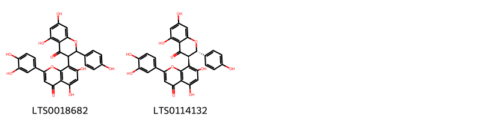{ width=100% }
    <figcaption>Hình ảnh cấu trúc hóa học của 2 hoạt chất thuộc nhóm Flavonoids gồm ['8-[5,7-dihydroxy-2-(4-hydroxyphenyl)-4-oxo-2,3-dihydro-1-benzopyran-3-yl]-2-(3,4-dihydroxyphenyl)-5,7-dihydroxychromen-4-one (LTS0018682)', 'morelloflavone (LTS0114132)'].</figcaption>
</figure>

---

### Dược dân tộc học

Danh sách các quốc gia có sử dụng *Garcinia morella* trong điều trị các bệnh. 

| Country   | Disease                                  | Bệnh                                     |
|:----------|:-----------------------------------------|:-----------------------------------------|
| China     | Purgative, Stimulant                     | Phương pháp thanh lọc, kích thích        |
| India     | Cathartic, Vermifuge, nan, Abortifacient | Cathartic, Vermifuge, nan, Abortifacient |

---

