!!! abstract "Tóm tắt"

    Họ Combretaceae gồm khoảng 6 chi và 35 loài được một số cộng đồng tại các quốc gia như Brazil, Ghana, Philippines, India(Santal), Venezuela, Java, Mexico, China, Nepal, Malaya, Borneo, India(Hindu), Gambia, Haiti, Iran, Elsewhere, Sierra Leone, Dominican Republic, Malaysia, India, Samoa, Sudan, Turkey, Cambodia sử dụng trong một số trường hợp QUERY LENGTH LIMIT EXCEEDED. MAX ALLOWED QUERY : 500 CHARS MYMEMORY WARNING: YOU USED ALL AVAILABLE FREE TRANSLATIONS FOR TODAY. NEXT AVAILABLE IN  15 HOURS 44 MINUTES 37 SECONDS VISIT HTTPS://MYMEMORY.TRANSLATED.NET/DOC/USAGELIMITS.PHP TO TRANSLATE MORE.

!!! info "DrDuke"

    James A. Duke sinh năm 1929-2017 là một nhà thực vật học người Mỹ. Đây là một trong những tác giả hàng đầu trong lĩnh vực dược dân tộc học với cuốn *CRC Handbook of Medicinal Herbs* và chính là người xây dựng lên cơ sở dữ liệu về hợp chất tự nhiên và dược dân tộc học tại Bộ nông nghiệp Hoa Kỳ. Các thông tin được đăng tải tại website [Dr. Duke's Phytochemical and Ethnobotanical Databases](https://phytochem.nal.usda.gov/). 
    Trong suốt thập niên 1970, ông lãnh đạo the Plant Taxonomy Laboratory, Plant Genetics and Germplasm Institute of the Agricultural Research Service, U.S. Department of Agriculture.
    Trong tài liệu này, các thông tin về dược dân tộc của các dược liệu được trích dẫn từ tài liệu của James A. Ducke với sự trợ giúp của phần mềm dịch thuật từ tiếng Anh sang tiếng Việt.
   

# Chi Quisqualis

??? note "Danh sách các dược liệu thuộc chi"
    
	 - *Quisqualis densiflora*
	 - *Quisqualis indica*

---
## Quisqualis densiflora
### Thông tin về thực vật

!!! info "Phân loại thực vật của *Combretum densiflorum* từ GIBF:"
    - **Kingdom:** Plantae
    - **Phylum:** Tracheophyta
    - **Order:** Myrtales
    - **Family:** Combretaceae
    - **Genus:** Combretum
    - **Species:** *Combretum densiflorum*

 

| Label (VI)   | Label (EN)   | Scientific Name       | Descriptions (VI)   | Descriptions (EN)   | Also Known As (VI)   | Also Known As (EN)   |
|:-------------|:-------------|:----------------------|:--------------------|:--------------------|:---------------------|:---------------------|
| N/A          | N/A          | Quisqualis densiflora | loài thực vật       | species of plant    | ['']                 | ['']                 |

#### Phân bố trên thế giới

**Từ CSDL GIBF** Georgia, Bosnia and Herzegovina, Thailand, El Salvador, Spain, Northern Mariana Islands, Chile, Kenya, United Arab Emirates, Australia, Jamaica, Albania, Indonesia, Guatemala, Colombia, Pakistan, Palestine, State of, Puerto Rico, India, Montenegro, Bahamas, Virgin Islands (U.S.), Cambodia, Barbados, Türkiye, Malta, Brazil, Mexico, China, Nepal, Benin, Curaçao, Hong Kong, Switzerland, Argentina, South Africa, Portugal, Morocco, France, New Zealand, Cyprus, Costa Rica, Russian Federation, Ecuador, United States of America, Italy, Algeria, Greece, Croatia

#### Phân bố tại Việt Nam

**Từ CSDL GIBF**: Không có ghi nhận ở Việt Nam

---
### Thành phần hóa học
        
- Theo cơ sở dữ liệu lotus: Từ loài *Combretum densiflorum* đã phân lập và xác định được Chưa có hoạt chất nào được phân lập. hoạt chất thuộc về các nhóm Không có hoạt chất nào được phân lập. 

Không có hình ảnh nào được tạo ra

---

### Dược dân tộc học

Danh sách các quốc gia có sử dụng *Combretum densiflorum* trong điều trị các bệnh. 

| Country   | Disease   | Bệnh                                                                                                                                                                                                |
|:----------|:----------|:----------------------------------------------------------------------------------------------------------------------------------------------------------------------------------------------------|
| Malaya    | Vermifuge | MYMEMORY WARNING: YOU USED ALL AVAILABLE FREE TRANSLATIONS FOR TODAY. NEXT AVAILABLE IN  15 HOURS 44 MINUTES 32 SECONDS VISIT HTTPS://MYMEMORY.TRANSLATED.NET/DOC/USAGELIMITS.PHP TO TRANSLATE MORE |

---

---
## Quisqualis indica
### Thông tin về thực vật

!!! info "Phân loại thực vật của *N/A* từ GIBF:"
    - **Kingdom:** Plantae
    - **Phylum:** Tracheophyta
    - **Order:** Myrtales
    - **Family:** Combretaceae
    - **Genus:** Combretum
    - **Species:** *N/A*

 

| Label (VI)   | Label (EN)   | Scientific Name   | Descriptions (VI)   | Descriptions (EN)   | Also Known As (VI)   | Also Known As (EN)   |
|:-------------|:-------------|:------------------|:--------------------|:--------------------|:---------------------|:---------------------|
| N/A          | N/A          | Quisqualis indica | loài thực vật       | species of plant    | ['']                 | ['']                 |

#### Phân bố trên thế giới

**Từ CSDL GIBF** Viet Nam, Thailand, El Salvador, Namibia, Ghana, French Guiana, Trinidad and Tobago, Cameroon, Lao People’s Democratic Republic, Gabon, United Arab Emirates, Australia, Sri Lanka, Malaysia, Puerto Rico, India, Nigeria, Cambodia, Belize, Nicaragua, Myanmar, Brazil, Saint Lucia, Mexico, Benin, Gambia, Uruguay, Argentina, South Africa, Botswana, Niue, Costa Rica, Congo, Democratic Republic of the, United States of America, Zambia, Congo

#### Phân bố tại Việt Nam

**Từ CSDL GIBF**: Hồ Chí Minh city

---
### Thành phần hóa học
        
- Theo cơ sở dữ liệu lotus: Từ loài *N/A* đã phân lập và xác định được Chưa có hoạt chất nào được phân lập. hoạt chất thuộc về các nhóm Không có hoạt chất nào được phân lập. 

Không có hình ảnh nào được tạo ra

---

### Dược dân tộc học

Danh sách các quốc gia có sử dụng *N/A* trong điều trị các bệnh. 

| Country   | Disease                                                                | Bệnh                                                                                                                                                                                                |
|:----------|:-----------------------------------------------------------------------|:----------------------------------------------------------------------------------------------------------------------------------------------------------------------------------------------------|
| China     | Parasiticide, Parasiticide, Vermifuge, Vermifuge, Vermifuge, Vermifuge | MYMEMORY WARNING: YOU USED ALL AVAILABLE FREE TRANSLATIONS FOR TODAY. NEXT AVAILABLE IN  15 HOURS 44 MINUTES 10 SECONDS VISIT HTTPS://MYMEMORY.TRANSLATED.NET/DOC/USAGELIMITS.PHP TO TRANSLATE MORE |
| Elsewhere | Cathartic, Parasiticide, Vermifuge, Carminative, Soporific, Vermifuge  | MYMEMORY WARNING: YOU USED ALL AVAILABLE FREE TRANSLATIONS FOR TODAY. NEXT AVAILABLE IN  15 HOURS 44 MINUTES 06 SECONDS VISIT HTTPS://MYMEMORY.TRANSLATED.NET/DOC/USAGELIMITS.PHP TO TRANSLATE MORE |
| Java      | Vermifuge                                                              | MYMEMORY WARNING: YOU USED ALL AVAILABLE FREE TRANSLATIONS FOR TODAY. NEXT AVAILABLE IN  15 HOURS 44 MINUTES 03 SECONDS VISIT HTTPS://MYMEMORY.TRANSLATED.NET/DOC/USAGELIMITS.PHP TO TRANSLATE MORE |
| Malaysia  | Vermifuge                                                              | MYMEMORY WARNING: YOU USED ALL AVAILABLE FREE TRANSLATIONS FOR TODAY. NEXT AVAILABLE IN  15 HOURS 44 MINUTES 00 SECONDS VISIT HTTPS://MYMEMORY.TRANSLATED.NET/DOC/USAGELIMITS.PHP TO TRANSLATE MORE |

---

# Chi Conocarpus

??? note "Danh sách các dược liệu thuộc chi"
    
	 - *Conocarpus erecta*
	 - *Conocarpus erectus*

---
## Conocarpus erecta
### Thông tin về thực vật

!!! info "Phân loại thực vật của *Conocarpus erectus* từ GIBF:"
    - **Kingdom:** Plantae
    - **Phylum:** Tracheophyta
    - **Order:** Myrtales
    - **Family:** Combretaceae
    - **Genus:** Conocarpus
    - **Species:** *Conocarpus erectus*

 

| Label (VI)   | Label (EN)   | Scientific Name   | Descriptions (VI)   | Descriptions (EN)   | Also Known As (VI)   | Also Known As (EN)   |
|:-------------|:-------------|:------------------|:--------------------|:--------------------|:---------------------|:---------------------|
| N/A          | N/A          | Quisqualis indica | loài thực vật       | species of plant    | ['']                 | ['']                 |

#### Phân bố trên thế giới

**Từ CSDL GIBF** Honduras, Cayman Islands, Guadeloupe, French Guiana, Martinique, Haiti, Turks and Caicos Islands, Dominican Republic, Puerto Rico, India, Bahamas, Saint Kitts and Nevis, Cuba, Bonaire, Sint Eustatius and Saba, Virgin Islands (U.S.), Sint Maarten (Dutch part), Antigua and Barbuda, Belize, Nicaragua, Brazil, Aruba, Mexico, Curaçao, Gambia, Costa Rica, Ecuador, United States of America, Guyana

#### Phân bố tại Việt Nam

**Từ CSDL GIBF**: Không có ghi nhận ở Việt Nam

---
### Thành phần hóa học
        
- Theo cơ sở dữ liệu lotus: Từ loài *Conocarpus erectus* đã phân lập và xác định được Chưa có hoạt chất nào được phân lập. hoạt chất thuộc về các nhóm Không có hoạt chất nào được phân lập. 

Không có hình ảnh nào được tạo ra

---

### Dược dân tộc học

Danh sách các quốc gia có sử dụng *Conocarpus erectus* trong điều trị các bệnh. 

| Country   | Disease           | Bệnh                                                                                                                                                                                                |
|:----------|:------------------|:----------------------------------------------------------------------------------------------------------------------------------------------------------------------------------------------------|
| Mexico    | Astringent, Tonic | MYMEMORY WARNING: YOU USED ALL AVAILABLE FREE TRANSLATIONS FOR TODAY. NEXT AVAILABLE IN  15 HOURS 43 MINUTES 33 SECONDS VISIT HTTPS://MYMEMORY.TRANSLATED.NET/DOC/USAGELIMITS.PHP TO TRANSLATE MORE |

---

---
## Conocarpus erectus
### Thông tin về thực vật

!!! info "Phân loại thực vật của *Conocarpus erectus* từ GIBF:"
    - **Kingdom:** Plantae
    - **Phylum:** Tracheophyta
    - **Order:** Myrtales
    - **Family:** Combretaceae
    - **Genus:** Conocarpus
    - **Species:** *Conocarpus erectus*

 

| Label (VI)   | Label (EN)   | Scientific Name    | Descriptions (VI)   | Descriptions (EN)   | Also Known As (VI)   | Also Known As (EN)   |
|:-------------|:-------------|:-------------------|:--------------------|:--------------------|:---------------------|:---------------------|
| N/A          | N/A          | Conocarpus erectus | loài thực vật       | species of plant    | ['']                 | ['buttonwood']       |

#### Phân bố trên thế giới

**Từ CSDL GIBF** Honduras, Cayman Islands, Guadeloupe, French Guiana, Martinique, Haiti, Turks and Caicos Islands, Dominican Republic, Puerto Rico, India, Bahamas, Saint Kitts and Nevis, Cuba, Bonaire, Sint Eustatius and Saba, Virgin Islands (U.S.), Sint Maarten (Dutch part), Antigua and Barbuda, Belize, Nicaragua, Brazil, Aruba, Mexico, Curaçao, Gambia, Costa Rica, Ecuador, United States of America, Guyana

#### Phân bố tại Việt Nam

**Từ CSDL GIBF**: Không có ghi nhận ở Việt Nam

---
### Thành phần hóa học
        
- Theo cơ sở dữ liệu lotus: Từ loài *Conocarpus erectus* đã phân lập và xác định được 2 hoạt chất thuộc về các nhóm Dibenzylbutane lignans. 

|    | chemicalTaxonomyClassyfireClass   |   smiles_count |
|---:|:----------------------------------|---------------:|
|  0 | Dibenzylbutane lignans            |              2 |

#### Nhóm Dibenzylbutane lignans
<figure markdown="span">
    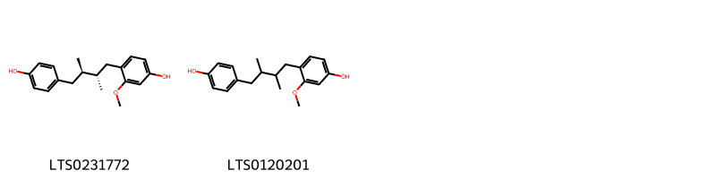{ width=100% }
    <figcaption>Hình ảnh cấu trúc hóa học của 2 hoạt chất thuộc nhóm Dibenzylbutane lignans gồm ['4-[(2s,3r)-4-(4-hydroxyphenyl)-2,3-dimethylbutyl]-3-methoxyphenol (LTS0231772)', '4-[4-(4-hydroxyphenyl)-2,3-dimethylbutyl]-3-methoxyphenol (LTS0120201)'].</figcaption>
</figure>

---

### Dược dân tộc học

Danh sách các quốc gia có sử dụng *Conocarpus erectus* trong điều trị các bệnh. 

| Country            | Disease             | Bệnh                                                                                                                                                                                                |
|:-------------------|:--------------------|:----------------------------------------------------------------------------------------------------------------------------------------------------------------------------------------------------|
| Dominican Republic | Tonic               | MYMEMORY WARNING: YOU USED ALL AVAILABLE FREE TRANSLATIONS FOR TODAY. NEXT AVAILABLE IN  15 HOURS 43 MINUTES 08 SECONDS VISIT HTTPS://MYMEMORY.TRANSLATED.NET/DOC/USAGELIMITS.PHP TO TRANSLATE MORE |
| Elsewhere          | Astringent, Styptic | MYMEMORY WARNING: YOU USED ALL AVAILABLE FREE TRANSLATIONS FOR TODAY. NEXT AVAILABLE IN  15 HOURS 43 MINUTES 05 SECONDS VISIT HTTPS://MYMEMORY.TRANSLATED.NET/DOC/USAGELIMITS.PHP TO TRANSLATE MORE |
| Haiti              | Tonic, Astringent   | MYMEMORY WARNING: YOU USED ALL AVAILABLE FREE TRANSLATIONS FOR TODAY. NEXT AVAILABLE IN  15 HOURS 43 MINUTES 02 SECONDS VISIT HTTPS://MYMEMORY.TRANSLATED.NET/DOC/USAGELIMITS.PHP TO TRANSLATE MORE |

---

# Chi Terminalia

??? note "Danh sách các dược liệu thuộc chi"
    
	 - *Terminalia alata*
	 - *Terminalia arjuna*
	 - *Terminalia belerica*
	 - *Terminalia bellerica*
	 - *Terminalia bellirica*
	 - *Terminalia bialata*
	 - *Terminalia calamansanay*
	 - *Terminalia catappa*
	 - *Terminalia chebula*
	 - *Terminalia citrina*
	 - *Terminalia comintana*
	 - *Terminalia coriacea*
	 - *Terminalia glabra*
	 - *Terminalia glaucescens*
	 - *Terminalia macroptera*
	 - *Terminalia myriocarpa*
	 - *Terminalia paniculata*
	 - *Terminalia tomentosa*
	 - *Terminalia travancorensis*

---
## Terminalia alata
### Thông tin về thực vật

!!! info "Phân loại thực vật của *N/A* từ GIBF:"
    - **Kingdom:** Plantae
    - **Phylum:** Tracheophyta
    - **Order:** Myrtales
    - **Family:** Combretaceae
    - **Genus:** Terminalia
    - **Species:** *N/A*

 

| Label (VI)   | Label (EN)   | Scientific Name   | Descriptions (VI)   | Descriptions (EN)   | Also Known As (VI)   | Also Known As (EN)   |
|:-------------|:-------------|:------------------|:--------------------|:--------------------|:---------------------|:---------------------|
| N/A          | N/A          | Terminalia alata  | loài thực vật       | species of plant    | ['']                 | ['']                 |

#### Phân bố trên thế giới

**Từ CSDL GIBF** Honduras, Thailand, Namibia, French Polynesia, Senegal, Singapore, Martinique, Australia, Jamaica, Indonesia, Sri Lanka, Dominican Republic, Maldives, Puerto Rico, Sao Tome and Principe, India, Nigeria, Virgin Islands (U.S.), Antigua and Barbuda, Nicaragua, Panama, Brazil, Belize, Palau, Aruba, Mexico, Benin, Chinese Taipei, Hong Kong, Argentina, South Africa, Botswana, Grenada, Micronesia (Federated States of), Mozambique, Fiji, Costa Rica, United States of America, Zimbabwe, Zambia

#### Phân bố tại Việt Nam

**Từ CSDL GIBF**: Không có ghi nhận ở Việt Nam

---
### Thành phần hóa học
        
- Theo cơ sở dữ liệu lotus: Từ loài *N/A* đã phân lập và xác định được 21 hoạt chất thuộc về các nhóm Tannins, Flavonoids, Steroids and steroid derivatives, Prenol lipids. 

|    | chemicalTaxonomyClassyfireClass   |   smiles_count |
|---:|:----------------------------------|---------------:|
|  0 | Flavonoids                        |              5 |
|  1 | Prenol lipids                     |             13 |
|  2 | Steroids and steroid derivatives  |              2 |
|  3 | Tannins                           |              1 |

#### Nhóm Flavonoids
<figure markdown="span">
    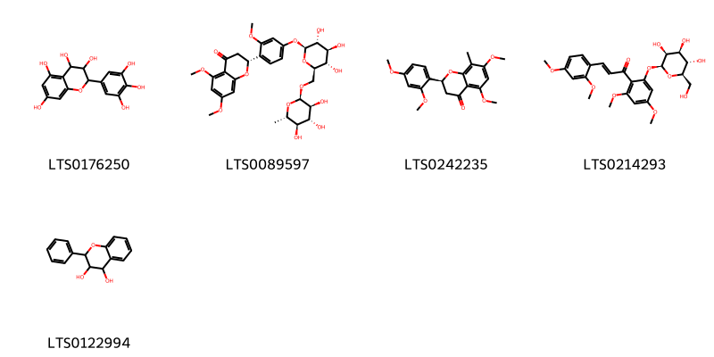{ width=100% }
    <figcaption>Hình ảnh cấu trúc hóa học của 5 hoạt chất thuộc nhóm Flavonoids gồm ['leucodelphinidin (LTS0176250)', '(2r)-5,7-dimethoxy-2-(2-methoxy-4-{[(2s,3r,4s,5s,6r)-3,4,5-trihydroxy-6-({[(2r,3s,4r,5r,6s)-3,4,5-trihydroxy-6-methyloxan-2-yl]oxy}methyl)oxan-2-yl]oxy}phenyl)-2,3-dihydro-1-benzopyran-4-one (LTS0089597)', '(2s)-2-(2,4-dimethoxyphenyl)-5,7-dimethoxy-8-methyl-2,3-dihydro-1-benzopyran-4-one (LTS0242235)', '(2e)-1-(2,4-dimethoxy-6-{[(2s,3s,4s,5s,6r)-3,4,5-trihydroxy-6-(hydroxymethyl)oxan-2-yl]oxy}phenyl)-3-(2,4-dimethoxyphenyl)prop-2-en-1-one (LTS0214293)', 'flavan-3,4-diol (LTS0122994)'].</figcaption>
</figure>
#### Nhóm Prenol lipids
<figure markdown="span">
    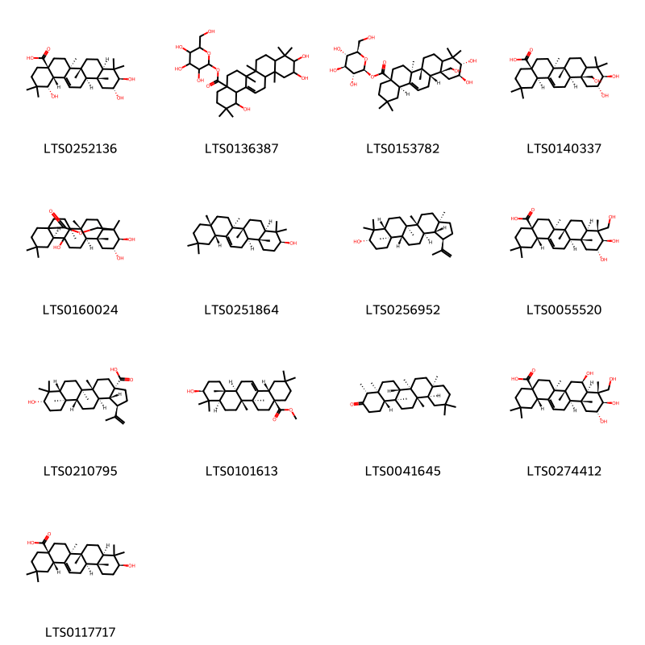{ width=100% }
    <figcaption>Hình ảnh cấu trúc hóa học của 13 hoạt chất thuộc nhóm Prenol lipids gồm ['(1s,4ar,6as,6br,8ar,10r,11r,12ar,12br,14bs)-1,10,11-trihydroxy-2,2,6a,6b,9,9,12a-heptamethyl-1,3,4,5,6,7,8,8a,10,11,12,12b,13,14b-tetradecahydropicene-4a-carboxylic acid (LTS0252136)', '3,4,5-trihydroxy-6-(hydroxymethyl)oxan-2-yl 1,10,11-trihydroxy-2,2,6a,6b,9,9,12a-heptamethyl-1,3,4,5,6,7,8,8a,10,11,12,12b,13,14b-tetradecahydropicene-4a-carboxylate (LTS0136387)', '(2s,3r,4s,5s,6r)-3,4,5-trihydroxy-6-(hydroxymethyl)oxan-2-yl (4as,6as,6br,10s,11s,12as,12br,14br)-10,11-dihydroxy-12a-(hydroxymethyl)-2,2,6a,6b,9,9-hexamethyl-1,3,4,5,6,7,8,8a,10,11,12,12b,13,14b-tetradecahydropicene-4a-carboxylate (LTS0153782)', '(4as,6as,6br,10r,11r,12as,12bs,14br)-10,11-dihydroxy-12a-(hydroxymethyl)-2,2,6a,6b,9,9-hexamethyl-1,3,4,5,6,7,8,8a,10,11,12,12b,13,14b-tetradecahydropicene-4a-carboxylic acid (LTS0140337)', '(6r,7r,9r,13r,14r,18s,25s)-6,7,17-trihydroxy-5,9,13,20,20,25-hexamethyl-3-oxahexacyclo[11.9.3.0¹,¹⁸.0⁵,¹⁰.0⁹,¹⁴.0¹⁷,²⁵]pentacosan-2-one (LTS0160024)', 'β-amyrin (LTS0251864)', 'lupeol (LTS0256952)', 'arjunolic acid (LTS0055520)', 'betulinic acid (LTS0210795)', 'methyl (4as,6as,6br,8ar,10s,12ar,12br,14bs)-10-hydroxy-2,2,6a,6b,9,9,12a-heptamethyl-1,3,4,5,6,7,8,8a,10,11,12,12b,13,14b-tetradecahydropicene-4a-carboxylate (LTS0101613)', '(-)-friedelin (LTS0041645)', 'terminolic acid (LTS0274412)', 'oleanolic acid (LTS0117717)'].</figcaption>
</figure>
#### Nhóm Steroids and steroid derivatives
<figure markdown="span">
    { width=100% }
    <figcaption>Hình ảnh cấu trúc hóa học của 2 hoạt chất thuộc nhóm Steroids and steroid derivatives gồm ['stigmast-5-en-3-ol, (3β)- (LTS0204616)', 'stigmast-5-en-3-ol (LTS0071224)'].</figcaption>
</figure>
#### Nhóm Tannins
<figure markdown="span">
    { width=100% }
    <figcaption>Hình ảnh cấu trúc hóa học của 1 hoạt chất thuộc nhóm Tannins gồm ['ellagic acid (LTS0037297)'].</figcaption>
</figure>

---

### Dược dân tộc học

Danh sách các quốc gia có sử dụng *N/A* trong điều trị các bệnh. 

| Country   | Disease                        | Bệnh                                                                                                                                                                                                |
|:----------|:-------------------------------|:----------------------------------------------------------------------------------------------------------------------------------------------------------------------------------------------------|
| Elsewhere | Cardiotonic, Styptic, Diuretic | MYMEMORY WARNING: YOU USED ALL AVAILABLE FREE TRANSLATIONS FOR TODAY. NEXT AVAILABLE IN  15 HOURS 42 MINUTES 33 SECONDS VISIT HTTPS://MYMEMORY.TRANSLATED.NET/DOC/USAGELIMITS.PHP TO TRANSLATE MORE |

---

---
## Terminalia arjuna
### Thông tin về thực vật

!!! info "Phân loại thực vật của *Terminalia arjuna* từ GIBF:"
    - **Kingdom:** Plantae
    - **Phylum:** Tracheophyta
    - **Order:** Myrtales
    - **Family:** Combretaceae
    - **Genus:** Terminalia
    - **Species:** *Terminalia arjuna*

 

| Label (VI)   | Label (EN)   | Scientific Name   | Descriptions (VI)   | Descriptions (EN)   | Also Known As (VI)   | Also Known As (EN)       |
|:-------------|:-------------|:------------------|:--------------------|:--------------------|:---------------------|:-------------------------|
| N/A          | N/A          | Terminalia arjuna | loài thực vật       | species of plant    | ['']                 | ['Arjuna', 'Arjun tree'] |

#### Phân bố trên thế giới

**Từ CSDL GIBF** Sri Lanka, Thailand, India

#### Phân bố tại Việt Nam

**Từ CSDL GIBF**: Không có ghi nhận ở Việt Nam

---
### Thành phần hóa học
        
- Theo cơ sở dữ liệu lotus: Từ loài *Terminalia arjuna* đã phân lập và xác định được 33 hoạt chất thuộc về các nhóm Flavonoids, Tannins, Prenol lipids, Carboxylic acids and derivatives, Fatty Acyls, Isoflavonoids, Steroids and steroid derivatives, Benzene and substituted derivatives. 

|    | chemicalTaxonomyClassyfireClass     |   smiles_count |
|---:|:------------------------------------|---------------:|
|  0 | Benzene and substituted derivatives |              2 |
|  1 | Carboxylic acids and derivatives    |              2 |
|  2 | Fatty Acyls                         |              1 |
|  3 | Flavonoids                          |              4 |
|  4 | Isoflavonoids                       |              1 |
|  5 | Prenol lipids                       |              8 |
|  6 | Steroids and steroid derivatives    |              2 |
|  7 | Tannins                             |             13 |

#### Nhóm Benzene and substituted derivatives
<figure markdown="span">
    { width=100% }
    <figcaption>Hình ảnh cấu trúc hóa học của 2 hoạt chất thuộc nhóm Benzene and substituted derivatives gồm ['galop (LTS0222857)', 'ethyl gallate (LTS0270645)'].</figcaption>
</figure>
#### Nhóm Carboxylic acids and derivatives
<figure markdown="span">
    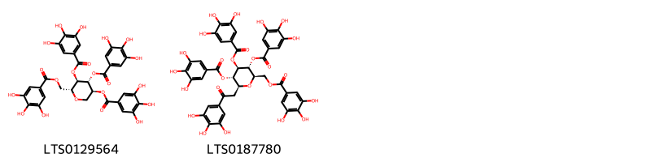{ width=100% }
    <figcaption>Hình ảnh cấu trúc hóa học của 2 hoạt chất thuộc nhóm Carboxylic acids and derivatives gồm ['(3s,4r,5r,6r)-4,5-bis(3,4,5-trihydroxybenzoyloxy)-6-[(3,4,5-trihydroxybenzoyloxy)methyl]oxan-3-yl 3,4,5-trihydroxybenzoate (LTS0129564)', '[(2r,3r,4r,5s,6s)-6-[2-oxo-2-(3,4,5-trihydroxyphenyl)ethyl]-3,4,5-tris(3,4,5-trihydroxybenzoyloxy)oxan-2-yl]methyl 3,4,5-trihydroxybenzoate (LTS0187780)'].</figcaption>
</figure>
#### Nhóm Fatty Acyls
<figure markdown="span">
    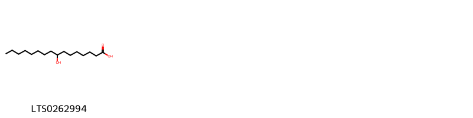{ width=100% }
    <figcaption>Hình ảnh cấu trúc hóa học của 1 hoạt chất thuộc nhóm Fatty Acyls gồm ['8-hydroxyhexadecanoic acid (LTS0262994)'].</figcaption>
</figure>
#### Nhóm Flavonoids
<figure markdown="span">
    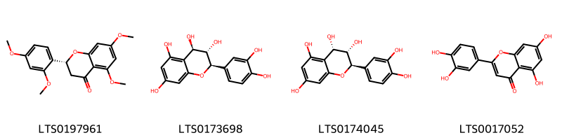{ width=100% }
    <figcaption>Hình ảnh cấu trúc hóa học của 4 hoạt chất thuộc nhóm Flavonoids gồm ['(2r)-2-(2,4-dimethoxyphenyl)-5,7-dimethoxy-2,3-dihydro-1-benzopyran-4-one (LTS0197961)', '(+)-leucocyanidin (LTS0173698)', 'procyanidol (LTS0174045)', 'luteolin (LTS0017052)'].</figcaption>
</figure>
#### Nhóm Isoflavonoids
<figure markdown="span">
    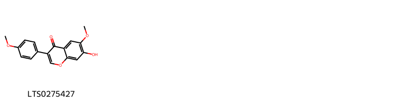{ width=100% }
    <figcaption>Hình ảnh cấu trúc hóa học của 1 hoạt chất thuộc nhóm Isoflavonoids gồm ['afrormosin (LTS0275427)'].</figcaption>
</figure>
#### Nhóm Prenol lipids
<figure markdown="span">
    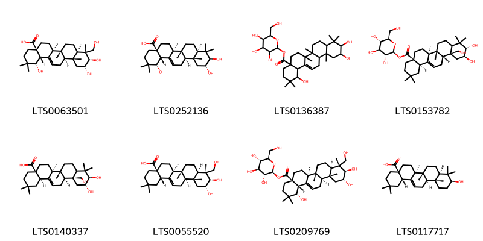{ width=100% }
    <figcaption>Hình ảnh cấu trúc hóa học của 8 hoạt chất thuộc nhóm Prenol lipids gồm ['(1s,4ar,6as,6br,8ar,9r,10r,11r,12ar,12br,14bs)-1,10,11-trihydroxy-9-(hydroxymethyl)-2,2,6a,6b,9,12a-hexamethyl-1,3,4,5,6,7,8,8a,10,11,12,12b,13,14b-tetradecahydropicene-4a-carboxylic acid (LTS0063501)', '(1s,4ar,6as,6br,8ar,10r,11r,12ar,12br,14bs)-1,10,11-trihydroxy-2,2,6a,6b,9,9,12a-heptamethyl-1,3,4,5,6,7,8,8a,10,11,12,12b,13,14b-tetradecahydropicene-4a-carboxylic acid (LTS0252136)', '3,4,5-trihydroxy-6-(hydroxymethyl)oxan-2-yl 1,10,11-trihydroxy-2,2,6a,6b,9,9,12a-heptamethyl-1,3,4,5,6,7,8,8a,10,11,12,12b,13,14b-tetradecahydropicene-4a-carboxylate (LTS0136387)', '(2s,3r,4s,5s,6r)-3,4,5-trihydroxy-6-(hydroxymethyl)oxan-2-yl (4as,6as,6br,10s,11s,12as,12br,14br)-10,11-dihydroxy-12a-(hydroxymethyl)-2,2,6a,6b,9,9-hexamethyl-1,3,4,5,6,7,8,8a,10,11,12,12b,13,14b-tetradecahydropicene-4a-carboxylate (LTS0153782)', '(4as,6as,6br,10r,11r,12as,12bs,14br)-10,11-dihydroxy-12a-(hydroxymethyl)-2,2,6a,6b,9,9-hexamethyl-1,3,4,5,6,7,8,8a,10,11,12,12b,13,14b-tetradecahydropicene-4a-carboxylic acid (LTS0140337)', 'arjunolic acid (LTS0055520)', '(2s,3r,4s,5s,6r)-3,4,5-trihydroxy-6-(hydroxymethyl)oxan-2-yl (1s,4ar,6as,6br,8ar,9r,10r,11r,12ar,12br,14bs)-1,10,11-trihydroxy-9-(hydroxymethyl)-2,2,6a,6b,9,12a-hexamethyl-1,3,4,5,6,7,8,8a,10,11,12,12b,13,14b-tetradecahydropicene-4a-carboxylate (LTS0209769)', 'oleanolic acid (LTS0117717)'].</figcaption>
</figure>
#### Nhóm Steroids and steroid derivatives
<figure markdown="span">
    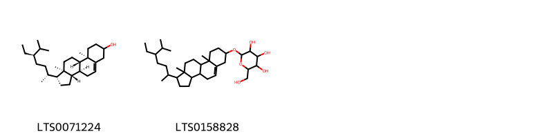{ width=100% }
    <figcaption>Hình ảnh cấu trúc hóa học của 2 hoạt chất thuộc nhóm Steroids and steroid derivatives gồm ['stigmast-5-en-3-ol (LTS0071224)', '2-{[1-(5-ethyl-6-methylheptan-2-yl)-9a,11a-dimethyl-1h,2h,3h,3ah,3bh,4h,6h,7h,8h,9h,9bh,10h,11h-cyclopenta[a]phenanthren-7-yl]oxy}-6-(hydroxymethyl)oxane-3,4,5-triol (LTS0158828)'].</figcaption>
</figure>
#### Nhóm Tannins
<figure markdown="span">
    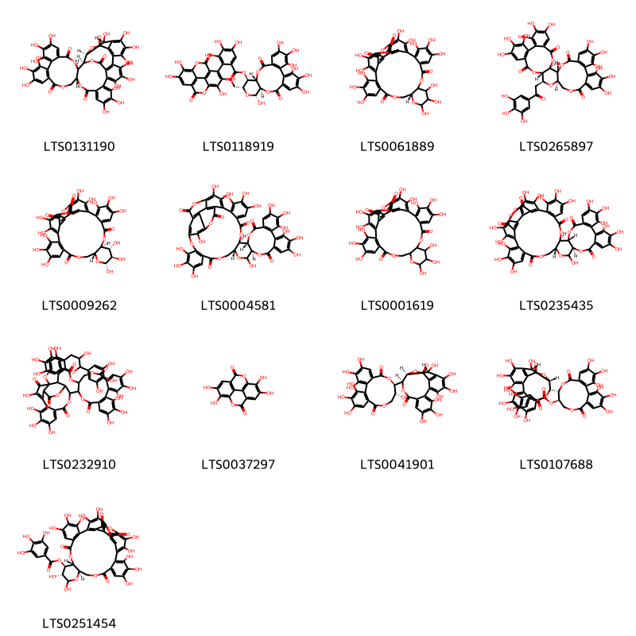{ width=100% }
    <figcaption>Hình ảnh cấu trúc hóa học của 13 hoạt chất thuộc nhóm Tannins gồm ['(1r,2r,20r,42s,46r)-7,8,9,12,13,14,25,26,27,30,31,32,35,36,37,46-hexadecahydroxy-3,18,21,41,43-pentaoxanonacyclo[27.13.3.1³⁸,⁴².0²,²⁰.0⁵,¹⁰.0¹¹,¹⁶.0²³,²⁸.0³³,⁴⁵.0³⁴,³⁹]hexatetraconta-5,7,9,11(16),12,14,23,25,27,29,31,33(45),34(39),35,37-pentadecaene-4,17,22,40,44-pentone (LTS0131190)', '(10r,11r,13r,14r,15s)-3,4,5,11,20,21,22-heptahydroxy-13-(hydroxymethyl)-8,17-dioxo-9,12,16-trioxatetracyclo[16.4.0.0²,⁷.0¹⁰,¹⁵]docosa-1(18),2,4,6,19,21-hexaen-14-yl 3,4,5-trihydroxy-2-{6,7,13,14-tetrahydroxy-3,10-dioxo-2,9-dioxatetracyclo[6.6.2.0⁴,¹⁶.0¹¹,¹⁵]hexadeca-1(14),4(16),5,7,11(15),12-hexaen-5-yl}benzoate (LTS0118919)', '(15r)-3,4,5,11,12,13,21,22,23,26,27,38,39-tridecahydroxy-9,14,17,29,36-pentaoxaoctacyclo[29.8.0.0²,⁷.0¹⁰,¹⁵.0¹⁹,²⁴.0²⁵,³⁴.0²⁸,³³.0³²,³⁷]nonatriaconta-1(39),2,4,6,19(24),20,22,25,27,31,33,37-dodecaene-8,18,30,35-tetrone (LTS0061889)', '(1r,2r,19s,20s,22r)-7,8,9,12,13,14,28,29,30,33,34,35-dodecahydroxy-20-[2-oxo-2-(3,4,5-trihydroxyphenyl)ethyl]-3,18,21,24,39-pentaoxaheptacyclo[20.17.0.0²,¹⁹.0⁵,¹⁰.0¹¹,¹⁶.0²⁶,³¹.0³²,³⁷]nonatriaconta-5,7,9,11(16),12,14,26,28,30,32(37),33,35-dodecaene-4,17,25,38-tetrone (LTS0265897)', '(10s,11r,12r,13r,15r)-3,4,5,11,12,13,21,22,23,26,27,38,39-tridecahydroxy-9,14,17,29,36-pentaoxaoctacyclo[29.8.0.0²,⁷.0¹⁰,¹⁵.0¹⁹,²⁴.0²⁵,³⁴.0²⁸,³³.0³²,³⁷]nonatriaconta-1(39),2,4,6,19(24),20,22,25,27,31,33,37-dodecaene-8,18,30,35-tetrone (LTS0009262)', '(12r,15r,32s,33r)-4,5,6,14,20,21,22,25,26,27,38,39,40,43,44,55-hexadecahydroxy-2,10,13,16,31,34,46,53-octaoxaundecacyclo[46.7.1.0³,⁸.0¹²,³³.0¹⁵,³².0¹⁸,²³.0²⁴,²⁹.0³⁶,⁴¹.0⁴²,⁵¹.0⁴⁵,⁵⁰.0⁴⁹,⁵⁴]hexapentaconta-1(56),3(8),4,6,18,20,22,24(29),25,27,36,38,40,42,44,48,50,54-octadecaene-9,17,30,35,47,52-hexone (LTS0004581)', '3,4,5,11,12,13,21,22,23,26,27,38,39-tridecahydroxy-9,14,17,29,36-pentaoxaoctacyclo[29.8.0.0²,⁷.0¹⁰,¹⁵.0¹⁹,²⁴.0²⁵,³⁴.0²⁸,³³.0³²,³⁷]nonatriaconta-1(39),2,4,6,19(24),20,22,25,27,31,33,37-dodecaene-8,18,30,35-tetrone (LTS0001619)', '(1r,35r,38r,55s)-6,7,8,11,12,23,24,27,28,29,37,43,44,45,48,49,50-heptadecahydroxy-2,14,21,33,36,39,54-heptaoxaundecacyclo[33.20.0.0⁴,⁹.0¹⁰,¹⁹.0¹³,¹⁸.0¹⁶,²⁵.0¹⁷,²².0²⁶,³¹.0³⁸,⁵⁵.0⁴¹,⁴⁶.0⁴⁷,⁵²]pentapentaconta-4(9),5,7,10,12,16,18,22,24,26,28,30,41,43,45,47(52),48,50-octadecaene-3,15,20,32,40,53-hexone (LTS0235435)', '12-[5,8,20,21,22,25-hexahydroxy-17,26,28-trioxo-9-(3,4,5-trihydroxyphenyl)-2,10,16,29-tetraoxaheptacyclo[12.12.3.0¹,¹³.0³,¹².0⁶,¹¹.0¹⁸,²³.0²⁴,²⁷]nonacosa-3,5,11,18,20,22,24-heptaen-15-yl]-3,4,5,17,18,19-hexahydroxy-8,14-dioxo-9,13-dioxatricyclo[13.4.0.0²,⁷]nonadeca-1(15),2,4,6,16,18-hexaen-11-yl 3,4,5-trihydroxybenzoate (LTS0232910)', 'ellagic acid (LTS0037297)', '(14r,15s,19r)-14-[(10r,11r)-3,4,5,11,17,18,19-heptahydroxy-8,14-dioxo-9,13-dioxatricyclo[13.4.0.0²,⁷]nonadeca-1(15),2,4,6,16,18-hexaen-10-yl]-2,3,4,7,8,9,19-heptahydroxy-13,16-dioxatetracyclo[13.3.1.0⁵,¹⁸.0⁶,¹¹]nonadeca-1(18),2,4,6,8,10-hexaene-12,17-dione (LTS0041901)', '(11r,12r)-12-[(15s,19s)-2,3,4,7,8,9,19-heptahydroxy-12,17-dioxo-13,16-dioxatetracyclo[13.3.1.0⁵,¹⁸.0⁶,¹¹]nonadeca-1(18),2,4,6,8,10-hexaen-14-yl]-3,4,5,17,18,19-hexahydroxy-8,14-dioxo-9,13-dioxatricyclo[13.4.0.0²,⁷]nonadeca-1(15),2,4,6,16,18-hexaen-11-yl 3,4,5-trihydroxybenzoate (LTS0107688)', '(10r,11r,12r,15r)-3,4,5,12,13,21,22,23,26,27,38,39-dodecahydroxy-8,18,30,35-tetraoxo-9,14,17,29,36-pentaoxaoctacyclo[29.8.0.0²,⁷.0¹⁰,¹⁵.0¹⁹,²⁴.0²⁵,³⁴.0²⁸,³³.0³²,³⁷]nonatriaconta-1(39),2(7),3,5,19,21,23,25,27,31,33,37-dodecaen-11-yl 3,4,5-trihydroxybenzoate (LTS0251454)'].</figcaption>
</figure>

---

### Dược dân tộc học

Danh sách các quốc gia có sử dụng *Terminalia arjuna* trong điều trị các bệnh. 

| Country   | Disease                  | Bệnh                                                                                                                                                                                                |
|:----------|:-------------------------|:----------------------------------------------------------------------------------------------------------------------------------------------------------------------------------------------------|
| Elsewhere | Diuretic, Tonic, Styptic | MYMEMORY WARNING: YOU USED ALL AVAILABLE FREE TRANSLATIONS FOR TODAY. NEXT AVAILABLE IN  15 HOURS 42 MINUTES 01 SECONDS VISIT HTTPS://MYMEMORY.TRANSLATED.NET/DOC/USAGELIMITS.PHP TO TRANSLATE MORE |
| India     | Cardiotonic, Stimulant   | MYMEMORY WARNING: YOU USED ALL AVAILABLE FREE TRANSLATIONS FOR TODAY. NEXT AVAILABLE IN  15 HOURS 41 MINUTES 57 SECONDS VISIT HTTPS://MYMEMORY.TRANSLATED.NET/DOC/USAGELIMITS.PHP TO TRANSLATE MORE |

---

---
## Terminalia belerica
### Thông tin về thực vật

!!! info "Phân loại thực vật của *Terminalia bellirica* từ GIBF:"
    - **Kingdom:** Plantae
    - **Phylum:** Tracheophyta
    - **Order:** Myrtales
    - **Family:** Combretaceae
    - **Genus:** Terminalia
    - **Species:** *Terminalia bellirica*

 

| Label (VI)   | Label (EN)   | Scientific Name   | Descriptions (VI)   | Descriptions (EN)   | Also Known As (VI)   | Also Known As (EN)       |
|:-------------|:-------------|:------------------|:--------------------|:--------------------|:---------------------|:-------------------------|
| N/A          | N/A          | Terminalia arjuna | loài thực vật       | species of plant    | ['']                 | ['Arjuna', 'Arjun tree'] |

#### Phân bố trên thế giới

**Từ CSDL GIBF** nan, Sri Lanka, India

#### Phân bố tại Việt Nam

**Từ CSDL GIBF**: Không có ghi nhận ở Việt Nam

---
### Thành phần hóa học
        
- Theo cơ sở dữ liệu lotus: Từ loài *Terminalia bellirica* đã phân lập và xác định được Chưa có hoạt chất nào được phân lập. hoạt chất thuộc về các nhóm Không có hoạt chất nào được phân lập. 

Không có hình ảnh nào được tạo ra

---

### Dược dân tộc học

Danh sách các quốc gia có sử dụng *Terminalia bellirica* trong điều trị các bệnh. 

| Country   | Disease                                      | Bệnh                                                                                                                                                                                                |
|:----------|:---------------------------------------------|:----------------------------------------------------------------------------------------------------------------------------------------------------------------------------------------------------|
| India     | Fungicide                                    | MYMEMORY WARNING: YOU USED ALL AVAILABLE FREE TRANSLATIONS FOR TODAY. NEXT AVAILABLE IN  15 HOURS 41 MINUTES 24 SECONDS VISIT HTTPS://MYMEMORY.TRANSLATED.NET/DOC/USAGELIMITS.PHP TO TRANSLATE MORE |
| Nepal     | Laxative, Antipyretic, Antipyretic, Laxative | MYMEMORY WARNING: YOU USED ALL AVAILABLE FREE TRANSLATIONS FOR TODAY. NEXT AVAILABLE IN  15 HOURS 41 MINUTES 21 SECONDS VISIT HTTPS://MYMEMORY.TRANSLATED.NET/DOC/USAGELIMITS.PHP TO TRANSLATE MORE |

---

---
## Terminalia bellerica
### Thông tin về thực vật

!!! info "Phân loại thực vật của *Terminalia bellirica* từ GIBF:"
    - **Kingdom:** Plantae
    - **Phylum:** Tracheophyta
    - **Order:** Myrtales
    - **Family:** Combretaceae
    - **Genus:** Terminalia
    - **Species:** *Terminalia bellirica*

 

| Label (VI)   | Label (EN)   | Scientific Name      | Descriptions (VI)   | Descriptions (EN)   | Also Known As (VI)   | Also Known As (EN)   |
|:-------------|:-------------|:---------------------|:--------------------|:--------------------|:---------------------|:---------------------|
| N/A          | N/A          | Terminalia bellerica |                     |                     | ['']                 | ['']                 |

#### Phân bố trên thế giới

**Từ CSDL GIBF** nan, Sri Lanka, India

#### Phân bố tại Việt Nam

**Từ CSDL GIBF**: Không có ghi nhận ở Việt Nam

---
### Thành phần hóa học
        
- Theo cơ sở dữ liệu lotus: Từ loài *Terminalia bellirica* đã phân lập và xác định được 15 hoạt chất thuộc về các nhóm Organooxygen compounds, Saturated hydrocarbons, Prenol lipids, Fatty Acyls, Phenols, Benzene and substituted derivatives. 

|    | chemicalTaxonomyClassyfireClass     |   smiles_count |
|---:|:------------------------------------|---------------:|
|  0 |                                     |              2 |
|  1 | Benzene and substituted derivatives |              1 |
|  2 | Fatty Acyls                         |              1 |
|  3 | Organooxygen compounds              |              1 |
|  4 | Phenols                             |              2 |
|  5 | Prenol lipids                       |              5 |
|  6 | Saturated hydrocarbons              |              2 |

#### Nhóm 
<figure markdown="span">
    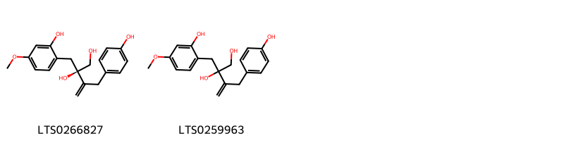{ width=100% }
    <figcaption>Hình ảnh cấu trúc hóa học của 2 hoạt chất thuộc nhóm  gồm ['(2r)-2-[(2-hydroxy-4-methoxyphenyl)methyl]-3-[(4-hydroxyphenyl)methyl]but-3-ene-1,2-diol (LTS0266827)', '2-[(2-hydroxy-4-methoxyphenyl)methyl]-3-[(4-hydroxyphenyl)methyl]but-3-ene-1,2-diol (LTS0259963)'].</figcaption>
</figure>
#### Nhóm Benzene and substituted derivatives
<figure markdown="span">
    { width=100% }
    <figcaption>Hình ảnh cấu trúc hóa học của 1 hoạt chất thuộc nhóm Benzene and substituted derivatives gồm ['galop (LTS0222857)'].</figcaption>
</figure>
#### Nhóm Fatty Acyls
<figure markdown="span">
    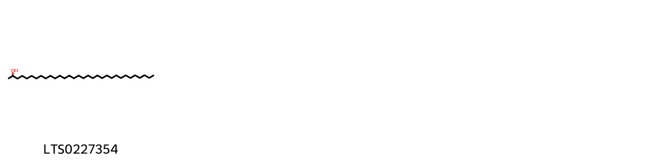{ width=100% }
    <figcaption>Hình ảnh cấu trúc hóa học của 1 hoạt chất thuộc nhóm Fatty Acyls gồm ['dotriacontan-2-ol (LTS0227354)'].</figcaption>
</figure>
#### Nhóm Organooxygen compounds
<figure markdown="span">
    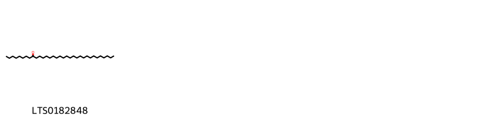{ width=100% }
    <figcaption>Hình ảnh cấu trúc hóa học của 1 hoạt chất thuộc nhóm Organooxygen compounds gồm ['tritriacontan-9-one (LTS0182848)'].</figcaption>
</figure>
#### Nhóm Phenols
<figure markdown="span">
    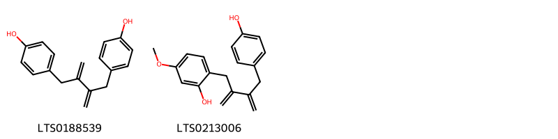{ width=100% }
    <figcaption>Hình ảnh cấu trúc hóa học của 2 hoạt chất thuộc nhóm Phenols gồm ['anolignan b (LTS0188539)', '2-{3-[(4-hydroxyphenyl)methyl]-2-methylidenebut-3-en-1-yl}-5-methoxyphenol (LTS0213006)'].</figcaption>
</figure>
#### Nhóm Prenol lipids
<figure markdown="span">
    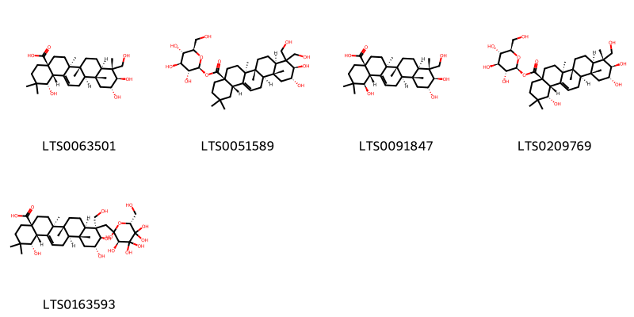{ width=100% }
    <figcaption>Hình ảnh cấu trúc hóa học của 5 hoạt chất thuộc nhóm Prenol lipids gồm ['(1s,4ar,6as,6br,8ar,9r,10r,11r,12ar,12br,14bs)-1,10,11-trihydroxy-9-(hydroxymethyl)-2,2,6a,6b,9,12a-hexamethyl-1,3,4,5,6,7,8,8a,10,11,12,12b,13,14b-tetradecahydropicene-4a-carboxylic acid (LTS0063501)', '(2s,3r,4s,5s,6r)-3,4,5-trihydroxy-6-(hydroxymethyl)oxan-2-yl (4as,6as,6br,8ar,10r,11r,12ar,12br,14bs)-10,11-dihydroxy-9,9-bis(hydroxymethyl)-2,2,6a,6b,12a-pentamethyl-1,3,4,5,6,7,8,8a,10,11,12,12b,13,14b-tetradecahydropicene-4a-carboxylate (LTS0051589)', '(1r,4ar,6as,6br,8ar,9r,10r,11r,12ar,12br,14bs)-1,10,11-trihydroxy-9-(hydroxymethyl)-2,2,6a,6b,9,12a-hexamethyl-1,3,4,5,6,7,8,8a,10,11,12,12b,13,14b-tetradecahydropicene-4a-carboxylic acid (LTS0091847)', '(2s,3r,4s,5s,6r)-3,4,5-trihydroxy-6-(hydroxymethyl)oxan-2-yl (1s,4ar,6as,6br,8ar,9r,10r,11r,12ar,12br,14bs)-1,10,11-trihydroxy-9-(hydroxymethyl)-2,2,6a,6b,9,12a-hexamethyl-1,3,4,5,6,7,8,8a,10,11,12,12b,13,14b-tetradecahydropicene-4a-carboxylate (LTS0209769)', '(1s,4ar,6as,6br,8ar,9r,10r,11r,12ar,12br,14bs)-9-{[(2s,3r,6r)-2,3,4,4,5,5-hexahydroxy-6-(hydroxymethyl)oxan-2-yl]methyl}-1,10,11-trihydroxy-9-(hydroxymethyl)-2,2,6a,6b,12a-pentamethyl-1,3,4,5,6,7,8,8a,10,11,12,12b,13,14b-tetradecahydropicene-4a-carboxylic acid (LTS0163593)'].</figcaption>
</figure>
#### Nhóm Saturated hydrocarbons
<figure markdown="span">
    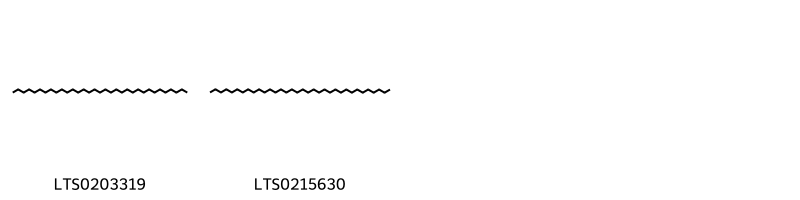{ width=100% }
    <figcaption>Hình ảnh cấu trúc hóa học của 2 hoạt chất thuộc nhóm Saturated hydrocarbons gồm ['tritriacontane (LTS0203319)', 'tetratriacontane (LTS0215630)'].</figcaption>
</figure>

---

### Dược dân tộc học

Danh sách các quốc gia có sử dụng *Terminalia bellirica* trong điều trị các bệnh. 

| Country   | Disease                                                   | Bệnh                                                                                                                                                                                                |
|:----------|:----------------------------------------------------------|:----------------------------------------------------------------------------------------------------------------------------------------------------------------------------------------------------|
| Elsewhere | Astringent, Narcotic, Soap                                | MYMEMORY WARNING: YOU USED ALL AVAILABLE FREE TRANSLATIONS FOR TODAY. NEXT AVAILABLE IN  15 HOURS 40 MINUTES 54 SECONDS VISIT HTTPS://MYMEMORY.TRANSLATED.NET/DOC/USAGELIMITS.PHP TO TRANSLATE MORE |
| India     | Demulcent, Diuretic, Purgative, Vermifuge, Collyrium, nan | MYMEMORY WARNING: YOU USED ALL AVAILABLE FREE TRANSLATIONS FOR TODAY. NEXT AVAILABLE IN  15 HOURS 40 MINUTES 51 SECONDS VISIT HTTPS://MYMEMORY.TRANSLATED.NET/DOC/USAGELIMITS.PHP TO TRANSLATE MORE |

---

---
## Terminalia bellirica
### Thông tin về thực vật

!!! info "Phân loại thực vật của *Terminalia bellirica* từ GIBF:"
    - **Kingdom:** Plantae
    - **Phylum:** Tracheophyta
    - **Order:** Myrtales
    - **Family:** Combretaceae
    - **Genus:** Terminalia
    - **Species:** *Terminalia bellirica*

 

| Label (VI)   | Label (EN)   | Scientific Name      | Descriptions (VI)   | Descriptions (EN)   | Also Known As (VI)   | Also Known As (EN)   |
|:-------------|:-------------|:---------------------|:--------------------|:--------------------|:---------------------|:---------------------|
| N/A          | N/A          | Terminalia bellirica | loài thực vật       | species of plant    | ['']                 | ['']                 |

#### Phân bố trên thế giới

**Từ CSDL GIBF** nan, Sri Lanka, India

#### Phân bố tại Việt Nam

**Từ CSDL GIBF**: Không có ghi nhận ở Việt Nam

---
### Thành phần hóa học
        
- Theo cơ sở dữ liệu lotus: Từ loài *Terminalia bellirica* đã phân lập và xác định được 2 hoạt chất thuộc về các nhóm Phenols. 

|    | chemicalTaxonomyClassyfireClass   |   smiles_count |
|---:|:----------------------------------|---------------:|
|  0 | Phenols                           |              1 |

#### Nhóm Phenols
<figure markdown="span">
    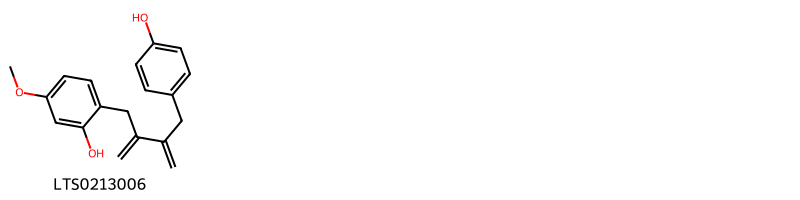{ width=100% }
    <figcaption>Hình ảnh cấu trúc hóa học của 1 hoạt chất thuộc nhóm Phenols gồm ['2-{3-[(4-hydroxyphenyl)methyl]-2-methylidenebut-3-en-1-yl}-5-methoxyphenol (LTS0213006)'].</figcaption>
</figure>

---

### Dược dân tộc học

Danh sách các quốc gia có sử dụng *Terminalia bellirica* trong điều trị các bệnh. 

| Country   | Disease              | Bệnh                                                                                                                                                                                                |
|:----------|:---------------------|:----------------------------------------------------------------------------------------------------------------------------------------------------------------------------------------------------|
| Java      | Narcotic, Astringent | MYMEMORY WARNING: YOU USED ALL AVAILABLE FREE TRANSLATIONS FOR TODAY. NEXT AVAILABLE IN  15 HOURS 40 MINUTES 19 SECONDS VISIT HTTPS://MYMEMORY.TRANSLATED.NET/DOC/USAGELIMITS.PHP TO TRANSLATE MORE |

---

---
## Terminalia bialata
### Thông tin về thực vật

!!! info "Phân loại thực vật của *Terminalia calamansanai* từ GIBF:"
    - **Kingdom:** Plantae
    - **Phylum:** Tracheophyta
    - **Order:** Myrtales
    - **Family:** Combretaceae
    - **Genus:** Terminalia
    - **Species:** *Terminalia calamansanai*

 

| Label (VI)   | Label (EN)   | Scientific Name    | Descriptions (VI)   | Descriptions (EN)   | Also Known As (VI)   | Also Known As (EN)   |
|:-------------|:-------------|:-------------------|:--------------------|:--------------------|:---------------------|:---------------------|
| N/A          | N/A          | Terminalia bialata | loài thực vật       | species of plant    | ['']                 | ['']                 |

#### Phân bố trên thế giới

**Từ CSDL GIBF** nan, unknown or invalid, Myanmar, Malaysia, India, United States of America, Cambodia, Indonesia

#### Phân bố tại Việt Nam

**Từ CSDL GIBF**: Không có ghi nhận ở Việt Nam

---
### Thành phần hóa học
        
- Theo cơ sở dữ liệu lotus: Từ loài *Terminalia calamansanai* đã phân lập và xác định được Chưa có hoạt chất nào được phân lập. hoạt chất thuộc về các nhóm Không có hoạt chất nào được phân lập. 

Không có hình ảnh nào được tạo ra

---

### Dược dân tộc học

Danh sách các quốc gia có sử dụng *Terminalia calamansanai* trong điều trị các bệnh. 

| Country   | Disease     | Bệnh                                                                                                                                                                                                |
|:----------|:------------|:----------------------------------------------------------------------------------------------------------------------------------------------------------------------------------------------------|
| Elsewhere | Cardiotonic | MYMEMORY WARNING: YOU USED ALL AVAILABLE FREE TRANSLATIONS FOR TODAY. NEXT AVAILABLE IN  15 HOURS 39 MINUTES 55 SECONDS VISIT HTTPS://MYMEMORY.TRANSLATED.NET/DOC/USAGELIMITS.PHP TO TRANSLATE MORE |

---

---
## Terminalia calamansanay
### Thông tin về thực vật

!!! info "Phân loại thực vật của *Terminalia calamansanai* từ GIBF:"
    - **Kingdom:** Plantae
    - **Phylum:** Tracheophyta
    - **Order:** Myrtales
    - **Family:** Combretaceae
    - **Genus:** Terminalia
    - **Species:** *Terminalia calamansanai*

 

| Label (VI)   | Label (EN)   | Scientific Name    | Descriptions (VI)   | Descriptions (EN)   | Also Known As (VI)   | Also Known As (EN)   |
|:-------------|:-------------|:-------------------|:--------------------|:--------------------|:---------------------|:---------------------|
| N/A          | N/A          | Terminalia bialata | loài thực vật       | species of plant    | ['']                 | ['']                 |

#### Phân bố trên thế giới

**Từ CSDL GIBF** Viet Nam, nan, unknown or invalid, Thailand, Myanmar, Philippines, Malaysia, India, Papua New Guinea, Indonesia, Seychelles, Nigeria, United States of America, Singapore, Solomon Islands, Cambodia, Chinese Taipei

#### Phân bố tại Việt Nam

**Từ CSDL GIBF**: Không có ghi nhận ở Việt Nam

---
### Thành phần hóa học
        
- Theo cơ sở dữ liệu lotus: Từ loài *Terminalia calamansanai* đã phân lập và xác định được Chưa có hoạt chất nào được phân lập. hoạt chất thuộc về các nhóm Không có hoạt chất nào được phân lập. 

Không có hình ảnh nào được tạo ra

---

### Dược dân tộc học

Danh sách các quốc gia có sử dụng *Terminalia calamansanai* trong điều trị các bệnh. 

| Country     | Disease                | Bệnh                                                                                                                                                                                                |
|:------------|:-----------------------|:----------------------------------------------------------------------------------------------------------------------------------------------------------------------------------------------------|
| Philippines | Astringent, Litholytic | MYMEMORY WARNING: YOU USED ALL AVAILABLE FREE TRANSLATIONS FOR TODAY. NEXT AVAILABLE IN  15 HOURS 39 MINUTES 23 SECONDS VISIT HTTPS://MYMEMORY.TRANSLATED.NET/DOC/USAGELIMITS.PHP TO TRANSLATE MORE |

---

---
## Terminalia catappa
### Thông tin về thực vật

!!! info "Phân loại thực vật của *Terminalia catappa* từ GIBF:"
    - **Kingdom:** Plantae
    - **Phylum:** Tracheophyta
    - **Order:** Myrtales
    - **Family:** Combretaceae
    - **Genus:** Terminalia
    - **Species:** *Terminalia catappa*

 

| Label (VI)   | Label (EN)   | Scientific Name    | Descriptions (VI)   | Descriptions (EN)   | Also Known As (VI)                 | Also Known As (EN)                              |
|:-------------|:-------------|:-------------------|:--------------------|:--------------------|:-----------------------------------|:------------------------------------------------|
| N/A          | N/A          | Terminalia catappa | loài thực vật       | species of plant    | ['Terminalia catappa', 'Cây bàng'] | ['Beach almond', 'Indian almond', 'Sea almond'] |

#### Phân bố trên thế giới

**Từ CSDL GIBF** Honduras, Thailand, Philippines, French Polynesia, Trinidad and Tobago, French Guiana, Senegal, Northern Mariana Islands, Singapore, Martinique, Australia, Jamaica, Indonesia, Sri Lanka, Dominican Republic, Maldives, Puerto Rico, Sao Tome and Principe, India, Réunion, Nigeria, Virgin Islands (U.S.), Barbados, Virgin Islands (British), Antigua and Barbuda, Nicaragua, Panama, Brazil, Belize, Yemen, Palau, Aruba, Saint Lucia, Montserrat, Mexico, China, Benin, Chinese Taipei, Hong Kong, Grenada, Micronesia (Federated States of), Tanzania, United Republic of, Fiji, Costa Rica, United States of America

#### Phân bố tại Việt Nam

**Từ CSDL GIBF**: Không có ghi nhận ở Việt Nam

---
### Thành phần hóa học
        
- Theo cơ sở dữ liệu lotus: Từ loài *Terminalia catappa* đã phân lập và xác định được 85 hoạt chất thuộc về các nhóm Organooxygen compounds, Flavonoids, Tannins, Prenol lipids, Steroids and steroid derivatives, Benzene and substituted derivatives. 

|    | chemicalTaxonomyClassyfireClass     |   smiles_count |
|---:|:------------------------------------|---------------:|
|  0 | Benzene and substituted derivatives |              1 |
|  1 | Flavonoids                          |             22 |
|  2 | Organooxygen compounds              |              4 |
|  3 | Prenol lipids                       |             11 |
|  4 | Steroids and steroid derivatives    |              2 |
|  5 | Tannins                             |             45 |

#### Nhóm Benzene and substituted derivatives
<figure markdown="span">
    { width=100% }
    <figcaption>Hình ảnh cấu trúc hóa học của 1 hoạt chất thuộc nhóm Benzene and substituted derivatives gồm ['galop (LTS0222857)'].</figcaption>
</figure>
#### Nhóm Flavonoids
<figure markdown="span">
    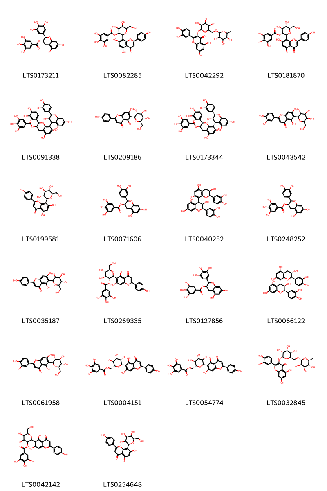{ width=100% }
    <figcaption>Hình ảnh cấu trúc hóa học của 22 hoạt chất thuộc nhóm Flavonoids gồm ['(-)-epigallocatechin gallate (LTS0173211)', '2-[5,7-dihydroxy-2-(4-hydroxyphenyl)-4-oxochromen-8-yl]-4,5-dihydroxy-6-(hydroxymethyl)oxan-3-yl 3,4,5-trihydroxybenzoate (LTS0082285)', 'rutin (LTS0042292)', '(2s,3r,4s,5s,6r)-2-[5,7-dihydroxy-2-(4-hydroxyphenyl)-4-oxochromen-8-yl]-4,5-dihydroxy-6-(hydroxymethyl)oxan-3-yl 3,4,5-trihydroxybenzoate (LTS0181870)', '2-(3,4-dihydroxyphenyl)-8-[2-(3,4-dihydroxyphenyl)-3,5,7-trihydroxy-3,4-dihydro-2h-1-benzopyran-4-yl]-5,7-dihydroxy-3,4-dihydro-2h-1-benzopyran-3-yl 3,4,5-trihydroxybenzoate (LTS0091338)', 'isovitexin (LTS0209186)', "procyanidin b2 3'-o-gallate (LTS0173344)", 'isoorientin (LTS0043542)', 'vitexin (LTS0199581)', 'epicatechin gallate (LTS0071606)', '2-(3,4-dihydroxyphenyl)-4-[2-(3,4-dihydroxyphenyl)-3,5,7-trihydroxy-3,4-dihydro-2h-1-benzopyran-8-yl]-3,4-dihydro-2h-1-benzopyran-3,5,7-triol (LTS0040252)', '2-(3,4-dihydroxyphenyl)-5,7-dihydroxy-3,4-dihydro-2h-1-benzopyran-3-yl 3,4,5-trihydroxybenzoate (LTS0248252)', 'isovitexin (LTS0035187)', '(2s,3r,4s,5s,6r)-2-[5,7-dihydroxy-2-(4-hydroxyphenyl)-4-oxochromen-6-yl]-4,5-dihydroxy-6-(hydroxymethyl)oxan-3-yl 3,4,5-trihydroxybenzoate (LTS0269335)', '5,7-dihydroxy-2-(3,4,5-trihydroxyphenyl)-3,4-dihydro-2h-1-benzopyran-3-yl 3,4,5-trihydroxybenzoate (LTS0127856)', '(2r,3r,4r)-2-(3,4-dihydroxyphenyl)-4-[(2r,3s)-2-(3,4-dihydroxyphenyl)-3,5,7-trihydroxy-3,4-dihydro-2h-1-benzopyran-8-yl]-3,4-dihydro-2h-1-benzopyran-3,5,7-triol (LTS0066122)', 'isoorientin (LTS0061958)', '[(2r,3s,4r,5s,6s)-6-[5,7-dihydroxy-2-(4-hydroxyphenyl)-4-oxochromen-6-yl]-3,4,5-trihydroxyoxan-2-yl]methyl 3,4,5-trihydroxybenzoate (LTS0004151)', '[(2r,3s,4r,6s)-6-[5,7-dihydroxy-2-(4-hydroxyphenyl)-4-oxochromen-6-yl]-3,4,5-trihydroxyoxan-2-yl]methyl 3,4,5-trihydroxybenzoate (LTS0054774)', '3-rutinosyl quercetin (LTS0032845)', '2-[5,7-dihydroxy-2-(4-hydroxyphenyl)-4-oxochromen-6-yl]-4,5-dihydroxy-6-(hydroxymethyl)oxan-3-yl 3,4,5-trihydroxybenzoate (LTS0042142)', 'vitexin (LTS0254648)'].</figcaption>
</figure>
#### Nhóm Organooxygen compounds
<figure markdown="span">
    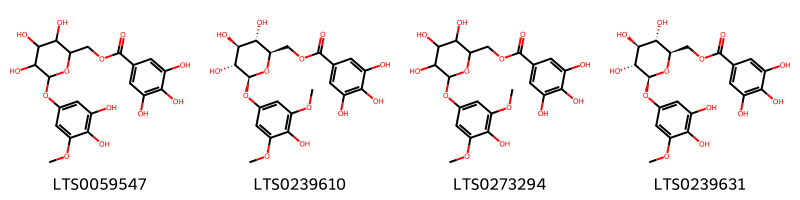{ width=100% }
    <figcaption>Hình ảnh cấu trúc hóa học của 4 hoạt chất thuộc nhóm Organooxygen compounds gồm ['[6-(3,4-dihydroxy-5-methoxyphenoxy)-3,4,5-trihydroxyoxan-2-yl]methyl 3,4,5-trihydroxybenzoate (LTS0059547)', '[(2r,3s,4s,5r,6s)-3,4,5-trihydroxy-6-(4-hydroxy-3,5-dimethoxyphenoxy)oxan-2-yl]methyl 3,4,5-trihydroxybenzoate (LTS0239610)', '[3,4,5-trihydroxy-6-(4-hydroxy-3,5-dimethoxyphenoxy)oxan-2-yl]methyl 3,4,5-trihydroxybenzoate (LTS0273294)', '[(2r,3s,4s,5r,6s)-6-(3,4-dihydroxy-5-methoxyphenoxy)-3,4,5-trihydroxyoxan-2-yl]methyl 3,4,5-trihydroxybenzoate (LTS0239631)'].</figcaption>
</figure>
#### Nhóm Prenol lipids
<figure markdown="span">
    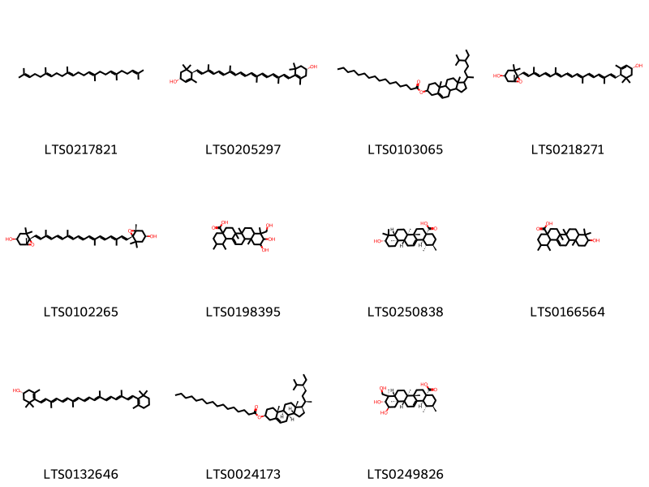{ width=100% }
    <figcaption>Hình ảnh cấu trúc hóa học của 11 hoạt chất thuộc nhóm Prenol lipids gồm ['squalene (LTS0217821)', 'carotenoid (LTS0205297)', '1-(5-ethyl-6-methylheptan-2-yl)-9a,11a-dimethyl-1h,2h,3h,3ah,3bh,4h,6h,7h,8h,9h,9bh,10h,11h-cyclopenta[a]phenanthren-7-yl hexadecanoate (LTS0103065)', 'taraxanthin (LTS0218271)', 'violaxanthin (LTS0102265)', 'asiatic acid (LTS0198395)', 'ursolic acid (LTS0250838)', '10-hydroxy-1,2,6a,6b,9,9,12a-heptamethyl-2,3,4,5,6,7,8,8a,10,11,12,12b,13,14b-tetradecahydro-1h-picene-4a-carboxylic acid (LTS0166564)', 'cryptoxanthin (LTS0132646)', '(1r,3ar,3br,7s,9ar,9bs,11ar)-1-[(2r,5s)-5-ethyl-6-methylheptan-2-yl]-9a,11a-dimethyl-1h,2h,3h,3ah,3bh,4h,6h,7h,8h,9h,9bh,10h,11h-cyclopenta[a]phenanthren-7-yl hexadecanoate (LTS0024173)', 'asiatic acid (LTS0249826)'].</figcaption>
</figure>
#### Nhóm Steroids and steroid derivatives
<figure markdown="span">
    { width=100% }
    <figcaption>Hình ảnh cấu trúc hóa học của 2 hoạt chất thuộc nhóm Steroids and steroid derivatives gồm ['stigmast-5-en-3-ol, (3β)- (LTS0204616)', '(1r,3ar,3br,7s,9ar,9br,11ar)-1-[(2r,5r)-5-ethyl-6-methylheptan-2-yl]-9a,11a-dimethyl-1h,2h,3h,3ah,3bh,4h,6h,7h,8h,9h,9bh,10h,11h-cyclopenta[a]phenanthren-7-ol (LTS0129695)'].</figcaption>
</figure>
#### Nhóm Tannins
<figure markdown="span">
    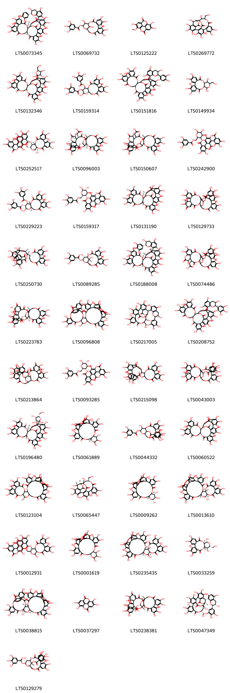{ width=100% }
    <figcaption>Hình ảnh cấu trúc hóa học của 45 hoạt chất thuộc nhóm Tannins gồm ['(1r,2r,20s,42s,46r)-46-[(2r,3s)-2-(3,4-dihydroxyphenyl)-3,5,7-trihydroxy-3,4-dihydro-2h-1-benzopyran-8-yl]-7,8,9,12,13,14,25,26,27,30,31,32,35,36,37-pentadecahydroxy-3,18,21,41,43-pentaoxanonacyclo[27.13.3.1³⁸,⁴².0²,²⁰.0⁵,¹⁰.0¹¹,¹⁶.0²³,²⁸.0³³,⁴⁵.0³⁴,³⁹]hexatetraconta-5,7,9,11(16),12,14,23,25,27,29,31,33(45),34(39),35,37-pentadecaene-4,17,22,40,44-pentone (LTS0073345)', '6,7,8,11,12,13,22,23-octahydroxy-3,16-dioxo-2,17,20-trioxatetracyclo[17.3.1.0⁴,⁹.0¹⁰,¹⁵]tricosa-4(9),5,7,10,12,14-hexaen-21-yl 3,4,5-trihydroxybenzoate (LTS0069732)', '6,7,13-trihydroxy-14-methoxy-2,9-dioxatetracyclo[6.6.2.0⁴,¹⁶.0¹¹,¹⁵]hexadeca-1(15),4,6,8(16),11,13-hexaene-3,10-dione (LTS0125222)', '7,8,9,12,13,14,17,18,19,25,29-undecahydroxy-24-(hydroxymethyl)-3,23,26-trioxahexacyclo[13.10.3.1²,⁶.0⁵,¹⁰.0¹¹,²⁸.0¹⁶,²¹]nonacosa-5,7,9,11,13,15(28),16(21),17,19-nonaene-4,22,27-trione (LTS0269772)', '7,8,9,12,13,14,25,26,27,30,31,32,35,36,37-pentadecahydroxy-46-[2,3,4-trihydroxy-5-(hydroxymethyl)oxolan-2-yl]-3,18,21,41,43-pentaoxanonacyclo[27.13.3.1³⁸,⁴².0²,²⁰.0⁵,¹⁰.0¹¹,¹⁶.0²³,²⁸.0³³,⁴⁵.0³⁴,³⁹]hexatetraconta-5,7,9,11(16),12,14,23,25,27,29,31,33(45),34(39),35,37-pentadecaene-4,17,22,40,44-pentone (LTS0132346)', '3,4,5,13,21,22,23-heptahydroxy-8,18-dioxo-12-(3,4,5-trihydroxybenzoyloxy)-9,14,17-trioxatetracyclo[17.4.0.0²,⁷.0¹⁰,¹⁵]tricosa-1(23),2(7),3,5,19,21-hexaen-11-yl 3,4,5-trihydroxybenzoate (LTS0159314)', '46-[2-(3,4-dihydroxyphenyl)-3,5,7-trihydroxy-3,4-dihydro-2h-1-benzopyran-8-yl]-7,8,9,12,13,14,25,26,27,30,31,32,35,36,37-pentadecahydroxy-3,18,21,41,43-pentaoxanonacyclo[27.13.3.1³⁸,⁴².0²,²⁰.0⁵,¹⁰.0¹¹,¹⁶.0²³,²⁸.0³³,⁴⁵.0³⁴,³⁹]hexatetraconta-5,7,9,11(16),12,14,23,25,27,29,31,33(45),34(39),35,37-pentadecaene-4,17,22,40,44-pentone (LTS0151816)', '3,4,5,11,14,20,21,22-octahydroxy-13-(hydroxymethyl)-9,12,16-trioxatetracyclo[16.4.0.0²,⁷.0¹⁰,¹⁵]docosa-1(22),2(7),3,5,18,20-hexaene-8,17-dione (LTS0149934)', '(10r,11r,13r,14r,15s)-3,4,5,11,20,21,22-heptahydroxy-8,17-dioxo-13-[(3,4,5-trihydroxybenzoyloxy)methyl]-9,12,16-trioxatetracyclo[16.4.0.0²,⁷.0¹⁰,¹⁵]docosa-1(18),2,4,6,19,21-hexaen-14-yl 3,4,5-trihydroxy-2-{6,7,13,14-tetrahydroxy-3,10-dioxo-2,9-dioxatetracyclo[6.6.2.0⁴,¹⁶.0¹¹,¹⁵]hexadeca-1(14),4(16),5,7,11(15),12-hexaen-5-yl}benzoate (LTS0252517)', '[(4r,5s,7r,25s,26r,29r,30s,31s)-13,14,15,18,19,20,31,35,36-nonahydroxy-2,10,23,28,32-pentaoxo-5-(3,4,5-trihydroxybenzoyloxy)-3,6,9,24,27,33-hexaoxaheptacyclo[28.7.1.0⁴,²⁵.0⁷,²⁶.0¹¹,¹⁶.0¹⁷,²².0³⁴,³⁸]octatriaconta-1(37),11(16),12,14,17,19,21,34(38),35-nonaen-29-yl]acetic acid (LTS0096003)', '[(5r,7r)-13,14,15,18,19,20,31,35,36-nonahydroxy-2,10,23,28,32-pentaoxo-5-(3,4,5-trihydroxybenzoyloxy)-3,6,9,24,27,33-hexaoxaheptacyclo[28.7.1.0⁴,²⁵.0⁷,²⁶.0¹¹,¹⁶.0¹⁷,²².0³⁴,³⁸]octatriaconta-1(37),11(16),12,14,17,19,21,34(38),35-nonaen-29-yl]acetic acid (LTS0150607)', 'terflavin b (LTS0242900)', '(10r,11s,12r,13r,15r)-3,4,5,13,21,22,23-heptahydroxy-8,18-dioxo-11-(3,4,5-trihydroxybenzoyloxy)-9,14,17-trioxatetracyclo[17.4.0.0²,⁷.0¹⁰,¹⁵]tricosa-1(23),2(7),3,5,19,21-hexaen-12-yl 3,4,5-trihydroxybenzoate (LTS0229223)', 'terflavin b (LTS0159317)', '(1r,2r,20r,42s,46r)-7,8,9,12,13,14,25,26,27,30,31,32,35,36,37,46-hexadecahydroxy-3,18,21,41,43-pentaoxanonacyclo[27.13.3.1³⁸,⁴².0²,²⁰.0⁵,¹⁰.0¹¹,¹⁶.0²³,²⁸.0³³,⁴⁵.0³⁴,³⁹]hexatetraconta-5,7,9,11(16),12,14,23,25,27,29,31,33(45),34(39),35,37-pentadecaene-4,17,22,40,44-pentone (LTS0131190)', '1,13,14,15,18,19,20,34,35,39,39-undecahydroxy-2,5,10,23,31-pentaoxo-6,9,24,27,30,40-hexaoxaoctacyclo[34.3.1.0⁴,³⁸.0⁷,²⁶.0⁸,²⁹.0¹¹,¹⁶.0¹⁷,²².0³²,³⁷]tetraconta-3,11(16),12,14,17,19,21,32,34,36-decaen-28-yl 3,4,5-trihydroxybenzoate (LTS0129733)', '(11s,12r)-12-[(14r,15s,19r)-2,3,4,7,8,9,19-heptahydroxy-12,17-dioxo-13,16-dioxatetracyclo[13.3.1.0⁵,¹⁸.0⁶,¹¹]nonadeca-1(18),2,4,6,8,10-hexaen-14-yl]-3,4,5,17,18,19-hexahydroxy-8,14-dioxo-9,13-dioxatricyclo[13.4.0.0²,⁷]nonadeca-1(15),2,4,6,16,18-hexaen-11-yl 3,4,5-trihydroxybenzoate (LTS0250730)', '(1s,19r,21s,22r,23r)-6,7,8,11,12,13,22,23-octahydroxy-3,16-dioxo-2,17,20-trioxatetracyclo[17.3.1.0⁴,⁹.0¹⁰,¹⁵]tricosa-4(9),5,7,10,12,14-hexaen-21-yl 3,4,5-trihydroxybenzoate (LTS0089285)', '(1r,2r,20r,42r,46r)-7,8,9,12,13,14,25,26,27,30,31,32,35,36,37-pentadecahydroxy-46-[(2r,3s)-3,5,7-trihydroxy-2-(3,4,5-trihydroxyphenyl)-3,4-dihydro-2h-1-benzopyran-8-yl]-3,18,21,41,43-pentaoxanonacyclo[27.13.3.1³⁸,⁴².0²,²⁰.0⁵,¹⁰.0¹¹,¹⁶.0²³,²⁸.0³³,⁴⁵.0³⁴,³⁹]hexatetraconta-5,7,9,11(16),12,14,23,25,27,29,31,33(45),34(39),35,37-pentadecaene-4,17,22,40,44-pentone (LTS0188008)', '[13,14,15,18,19,20,31,35,36-nonahydroxy-2,10,23,28,32-pentaoxo-5-(3,4,5-trihydroxybenzoyloxy)-3,6,9,24,27,33-hexaoxaheptacyclo[28.7.1.0⁴,²⁵.0⁷,²⁶.0¹¹,¹⁶.0¹⁷,²².0³⁴,³⁸]octatriaconta-1(37),11,13,15,17(22),18,20,34(38),35-nonaen-29-yl]acetic acid (LTS0074486)', '(1r,7r,8s,26r,28s,29r,38r)-1,13,14,15,18,19,20,34,35,39,39-undecahydroxy-2,5,10,23,31-pentaoxo-6,9,24,27,30,40-hexaoxaoctacyclo[34.3.1.0⁴,³⁸.0⁷,²⁶.0⁸,²⁹.0¹¹,¹⁶.0¹⁷,²².0³²,³⁷]tetraconta-3,11,13,15,17(22),18,20,32,34,36-decaen-28-yl 3,4,5-trihydroxybenzoate (LTS0223783)', '4,5,6,12,20,21,22,25,26,37,38,41,42,43,55,56,57,63-octadecahydroxy-2,10,13,16,28,35,47,50,61-nonaoxatridecacyclo[50.10.2.0³,⁸.0¹¹,⁴⁹.0¹⁴,⁴⁸.0¹⁸,²³.0²⁴,³³.0²⁷,³².0³⁰,³⁹.0³¹,³⁶.0⁴⁰,⁴⁵.0⁵³,⁶².0⁵⁴,⁵⁹]tetrahexaconta-1(63),3(8),4,6,18,20,22,24,26,30,32,36,38,40(45),41,43,52(64),53(62),54(59),55,57-henicosaene-9,17,29,34,46,51,60-heptone (LTS0096808)', '7,8,9,12,13,14,17,18,19,25-decahydroxy-24-(hydroxymethyl)-29-[3,5,7-trihydroxy-2-(3,4,5-trihydroxyphenyl)-3,4-dihydro-2h-1-benzopyran-8-yl]-3,23,26-trioxahexacyclo[13.10.3.1²,⁶.0⁵,¹⁰.0¹¹,²⁸.0¹⁶,²¹]nonacosa-5,7,9,11,13,15(28),16(21),17,19-nonaene-4,22,27-trione (LTS0217005)', '7,8,9,12,13,14,25,26,27,30,31,32,35,36,37-pentadecahydroxy-46-[3,5,7-trihydroxy-2-(3,4,5-trihydroxyphenyl)-3,4-dihydro-2h-1-benzopyran-8-yl]-3,18,21,41,43-pentaoxanonacyclo[27.13.3.1³⁸,⁴².0²,²⁰.0⁵,¹⁰.0¹¹,¹⁶.0²³,²⁸.0³³,⁴⁵.0³⁴,³⁹]hexatetraconta-5,7,9,11(16),12,14,23,25,27,29,31,33(45),34(39),35,37-pentadecaene-4,17,22,40,44-pentone (LTS0208752)', '1,16,17,18,21,22,23,34,35,39,39-undecahydroxy-2,5,13,26,31-pentaoxo-6,9,12,27,30,40-hexaoxaoctacyclo[34.3.1.0⁴,³⁸.0⁷,²⁸.0¹⁰,²⁹.0¹⁴,¹⁹.0²⁰,²⁵.0³²,³⁷]tetraconta-3,14,16,18,20(25),21,23,32,34,36-decaen-8-yl 3,4,5-trihydroxybenzoate (LTS0213864)', '(2r,3s,4r,5r,6r)-4,5,6-trihydroxy-2-[(3,4,5-trihydroxybenzoyloxy)methyl]oxan-3-yl 3,4,5-trihydroxy-2-{6,7,13,14-tetrahydroxy-3,10-dioxo-2,9-dioxatetracyclo[6.6.2.0⁴,¹⁶.0¹¹,¹⁵]hexadeca-1(14),4(16),5,7,11(15),12-hexaen-5-yl}benzoate (LTS0093285)', '12-{2,3,4,7,8,9,19-heptahydroxy-12,17-dioxo-13,16-dioxatetracyclo[13.3.1.0⁵,¹⁸.0⁶,¹¹]nonadeca-1(18),2,4,6,8,10-hexaen-14-yl}-3,4,5,17,18,19-hexahydroxy-8,14-dioxo-9,13-dioxatricyclo[13.4.0.0²,⁷]nonadeca-1(15),2,4,6,16,18-hexaen-11-yl 3,4,5-trihydroxybenzoate (LTS0215098)', '(1r,38r)-1,13,14,15,18,19,20,34,35,39,39-undecahydroxy-2,5,10,23,31-pentaoxo-6,9,24,27,30,40-hexaoxaoctacyclo[34.3.1.0⁴,³⁸.0⁷,²⁶.0⁸,²⁹.0¹¹,¹⁶.0¹⁷,²².0³²,³⁷]tetraconta-3,11(16),12,14,17,19,21,32,34,36-decaen-28-yl 3,4,5-trihydroxybenzoate (LTS0043003)', '(1r,2r,20r,42s,46s)-7,8,9,12,13,14,25,26,27,30,31,32,35,36,37-pentadecahydroxy-46-[(2r,3r,4s,5s)-2,3,4-trihydroxy-5-(hydroxymethyl)oxolan-2-yl]-3,18,21,41,43-pentaoxanonacyclo[27.13.3.1³⁸,⁴².0²,²⁰.0⁵,¹⁰.0¹¹,¹⁶.0²³,²⁸.0³³,⁴⁵.0³⁴,³⁹]hexatetraconta-5,7,9,11(16),12,14,23,25,27,29,31,33(45),34(39),35,37-pentadecaene-4,17,22,40,44-pentone (LTS0196480)', '(15r)-3,4,5,11,12,13,21,22,23,26,27,38,39-tridecahydroxy-9,14,17,29,36-pentaoxaoctacyclo[29.8.0.0²,⁷.0¹⁰,¹⁵.0¹⁹,²⁴.0²⁵,³⁴.0²⁸,³³.0³²,³⁷]nonatriaconta-1(39),2,4,6,19(24),20,22,25,27,31,33,37-dodecaene-8,18,30,35-tetrone (LTS0061889)', '6,7,8,11,12,13,22-heptahydroxy-3,16-dioxo-21-(3,4,5-trihydroxybenzoyloxy)-2,17,20-trioxatetracyclo[17.3.1.0⁴,⁹.0¹⁰,¹⁵]tricosa-4(9),5,7,10,12,14-hexaen-23-yl 3,4,5-trihydroxybenzoate (LTS0044332)', '7,8,9,12,13,14,25,26,27,30,31,32,35,36,37,46-hexadecahydroxy-3,18,21,41,43-pentaoxanonacyclo[27.13.3.1³⁸,⁴².0²,²⁰.0⁵,¹⁰.0¹¹,¹⁶.0²³,²⁸.0³³,⁴⁵.0³⁴,³⁹]hexatetraconta-5,7,9,11(16),12,14,23,25,27,29,31,33(45),34(39),35,37-pentadecaene-4,17,22,40,44-pentone (LTS0060522)', '6,7,8,11,12,23,24,27,28,29,37,43,44,45,48,49,50-heptadecahydroxy-2,14,21,33,36,39,54-heptaoxaundecacyclo[33.20.0.0⁴,⁹.0¹⁰,¹⁹.0¹³,¹⁸.0¹⁶,²⁵.0¹⁷,²².0²⁶,³¹.0³⁸,⁵⁵.0⁴¹,⁴⁶.0⁴⁷,⁵²]pentapentaconta-4(9),5,7,10,12,16,18,22,24,26,28,30,41(46),42,44,47,49,51-octadecaene-3,15,20,32,40,53-hexone (LTS0123104)', '(1s,2s,24r,25r,29s)-7,8,9,12,13,14,17,18,19,25,29-undecahydroxy-24-(hydroxymethyl)-3,23,26-trioxahexacyclo[13.10.3.1²,⁶.0⁵,¹⁰.0¹¹,²⁸.0¹⁶,²¹]nonacosa-5,7,9,11,13,15(28),16(21),17,19-nonaene-4,22,27-trione (LTS0065447)', '(10s,11r,12r,13r,15r)-3,4,5,11,12,13,21,22,23,26,27,38,39-tridecahydroxy-9,14,17,29,36-pentaoxaoctacyclo[29.8.0.0²,⁷.0¹⁰,¹⁵.0¹⁹,²⁴.0²⁵,³⁴.0²⁸,³³.0³²,³⁷]nonatriaconta-1(39),2,4,6,19(24),20,22,25,27,31,33,37-dodecaene-8,18,30,35-tetrone (LTS0009262)', '(1r,35r,37r,38r,55s)-6,7,8,11,12,23,24,27,28,29,37,43,44,45,48,49,50-heptadecahydroxy-2,14,21,33,36,39,54-heptaoxaundecacyclo[33.20.0.0⁴,⁹.0¹⁰,¹⁹.0¹³,¹⁸.0¹⁶,²⁵.0¹⁷,²².0²⁶,³¹.0³⁸,⁵⁵.0⁴¹,⁴⁶.0⁴⁷,⁵²]pentapentaconta-4(9),5,7,10,12,16,18,22,24,26,28,30,41,43,45,47(52),48,50-octadecaene-3,15,20,32,40,53-hexone (LTS0013610)', '3,4,5,11,20,21,22-heptahydroxy-8,17-dioxo-13-[(3,4,5-trihydroxybenzoyloxy)methyl]-9,12,16-trioxatetracyclo[16.4.0.0²,⁷.0¹⁰,¹⁵]docosa-1(18),2,4,6,19,21-hexaen-14-yl 3,4,5-trihydroxy-2-{6,7,13,14-tetrahydroxy-3,10-dioxo-2,9-dioxatetracyclo[6.6.2.0⁴,¹⁶.0¹¹,¹⁵]hexadeca-1(14),4(16),5,7,11(15),12-hexaen-5-yl}benzoate (LTS0012931)', '3,4,5,11,12,13,21,22,23,26,27,38,39-tridecahydroxy-9,14,17,29,36-pentaoxaoctacyclo[29.8.0.0²,⁷.0¹⁰,¹⁵.0¹⁹,²⁴.0²⁵,³⁴.0²⁸,³³.0³²,³⁷]nonatriaconta-1(39),2,4,6,19(24),20,22,25,27,31,33,37-dodecaene-8,18,30,35-tetrone (LTS0001619)', '(1r,35r,38r,55s)-6,7,8,11,12,23,24,27,28,29,37,43,44,45,48,49,50-heptadecahydroxy-2,14,21,33,36,39,54-heptaoxaundecacyclo[33.20.0.0⁴,⁹.0¹⁰,¹⁹.0¹³,¹⁸.0¹⁶,²⁵.0¹⁷,²².0²⁶,³¹.0³⁸,⁵⁵.0⁴¹,⁴⁶.0⁴⁷,⁵²]pentapentaconta-4(9),5,7,10,12,16,18,22,24,26,28,30,41,43,45,47(52),48,50-octadecaene-3,15,20,32,40,53-hexone (LTS0235435)', '(10r,11r,13r,14r,15s)-3,4,5,11,14,20,21,22-octahydroxy-13-(hydroxymethyl)-9,12,16-trioxatetracyclo[16.4.0.0²,⁷.0¹⁰,¹⁵]docosa-1(18),2,4,6,19,21-hexaene-8,17-dione (LTS0033259)', '(11r,12s,14r,48r,49s)-4,5,6,12,20,21,22,25,26,37,38,41,42,43,55,56,57,63-octadecahydroxy-2,10,13,16,28,35,47,50,61-nonaoxatridecacyclo[50.10.2.0³,⁸.0¹¹,⁴⁹.0¹⁴,⁴⁸.0¹⁸,²³.0²⁴,³³.0²⁷,³².0³⁰,³⁹.0³¹,³⁶.0⁴⁰,⁴⁵.0⁵³,⁶².0⁵⁴,⁵⁹]tetrahexaconta-1(63),3(8),4,6,18,20,22,24,26,30,32,36,38,40(45),41,43,52(64),53(62),54(59),55,57-henicosaene-9,17,29,34,46,51,60-heptone (LTS0038815)', 'ellagic acid (LTS0037297)', '(7r,8s,26r,28s,29s)-1,13,14,15,18,19,20,34,35,39,39-undecahydroxy-2,5,10,23,31-pentaoxo-6,9,24,27,30,40-hexaoxaoctacyclo[34.3.1.0⁴,³⁸.0⁷,²⁶.0⁸,²⁹.0¹¹,¹⁶.0¹⁷,²².0³²,³⁷]tetraconta-3,11,13,15,17(22),18,20,32,34,36-decaen-28-yl 3,4,5-trihydroxybenzoate (LTS0238381)', '(1s,2s,24s,25r,29r)-7,8,9,12,13,14,17,18,19,25-decahydroxy-24-(hydroxymethyl)-29-[(2r,3s)-3,5,7-trihydroxy-2-(3,4,5-trihydroxyphenyl)-3,4-dihydro-2h-1-benzopyran-8-yl]-3,23,26-trioxahexacyclo[13.10.3.1²,⁶.0⁵,¹⁰.0¹¹,²⁸.0¹⁶,²¹]nonacosa-5,7,9,11,13,15(28),16(21),17,19-nonaene-4,22,27-trione (LTS0047349)', '(1r,19r,21s,22r,23r)-6,7,8,11,12,13,22-heptahydroxy-3,16-dioxo-21-(3,4,5-trihydroxybenzoyloxy)-2,17,20-trioxatetracyclo[17.3.1.0⁴,⁹.0¹⁰,¹⁵]tricosa-4(9),5,7,10,12,14-hexaen-23-yl 3,4,5-trihydroxybenzoate (LTS0129279)'].</figcaption>
</figure>

---

### Dược dân tộc học

Danh sách các quốc gia có sử dụng *Terminalia catappa* trong điều trị các bệnh. 

| Country     | Disease                                | Bệnh                                                                                                                                                                                                |
|:------------|:---------------------------------------|:----------------------------------------------------------------------------------------------------------------------------------------------------------------------------------------------------|
| Elsewhere   | Astringent, Sudorific                  | MYMEMORY WARNING: YOU USED ALL AVAILABLE FREE TRANSLATIONS FOR TODAY. NEXT AVAILABLE IN  15 HOURS 38 MINUTES 59 SECONDS VISIT HTTPS://MYMEMORY.TRANSLATED.NET/DOC/USAGELIMITS.PHP TO TRANSLATE MORE |
| Haiti       | Astringent, Sedative, Stimulant, Tonic | MYMEMORY WARNING: YOU USED ALL AVAILABLE FREE TRANSLATIONS FOR TODAY. NEXT AVAILABLE IN  15 HOURS 38 MINUTES 56 SECONDS VISIT HTTPS://MYMEMORY.TRANSLATED.NET/DOC/USAGELIMITS.PHP TO TRANSLATE MORE |
| India       | Astringent, Cardiotonic                | MYMEMORY WARNING: YOU USED ALL AVAILABLE FREE TRANSLATIONS FOR TODAY. NEXT AVAILABLE IN  15 HOURS 38 MINUTES 53 SECONDS VISIT HTTPS://MYMEMORY.TRANSLATED.NET/DOC/USAGELIMITS.PHP TO TRANSLATE MORE |
| Java        | Sudorific                              | MYMEMORY WARNING: YOU USED ALL AVAILABLE FREE TRANSLATIONS FOR TODAY. NEXT AVAILABLE IN  15 HOURS 38 MINUTES 51 SECONDS VISIT HTTPS://MYMEMORY.TRANSLATED.NET/DOC/USAGELIMITS.PHP TO TRANSLATE MORE |
| Mexico      | Astringent, Tonic, Tonic, Astringent   | MYMEMORY WARNING: YOU USED ALL AVAILABLE FREE TRANSLATIONS FOR TODAY. NEXT AVAILABLE IN  15 HOURS 38 MINUTES 48 SECONDS VISIT HTTPS://MYMEMORY.TRANSLATED.NET/DOC/USAGELIMITS.PHP TO TRANSLATE MORE |
| Philippines | Purgative, Vermifuge                   | MYMEMORY WARNING: YOU USED ALL AVAILABLE FREE TRANSLATIONS FOR TODAY. NEXT AVAILABLE IN  15 HOURS 38 MINUTES 45 SECONDS VISIT HTTPS://MYMEMORY.TRANSLATED.NET/DOC/USAGELIMITS.PHP TO TRANSLATE MORE |
| Samoa       | Collyrium, Emetic                      | MYMEMORY WARNING: YOU USED ALL AVAILABLE FREE TRANSLATIONS FOR TODAY. NEXT AVAILABLE IN  15 HOURS 38 MINUTES 43 SECONDS VISIT HTTPS://MYMEMORY.TRANSLATED.NET/DOC/USAGELIMITS.PHP TO TRANSLATE MORE |

---

---
## Terminalia chebula
### Thông tin về thực vật

!!! info "Phân loại thực vật của *Terminalia chebula* từ GIBF:"
    - **Kingdom:** Plantae
    - **Phylum:** Tracheophyta
    - **Order:** Myrtales
    - **Family:** Combretaceae
    - **Genus:** Terminalia
    - **Species:** *Terminalia chebula*

 

| Label (VI)   | Label (EN)   | Scientific Name    | Descriptions (VI)   | Descriptions (EN)          | Also Known As (VI)   | Also Known As (EN)     |
|:-------------|:-------------|:-------------------|:--------------------|:---------------------------|:---------------------|:-----------------------|
| N/A          | N/A          | Terminalia chebula | loài thực vật       | species of flowering plant | ['']                 | ['chebulic myrobalan'] |

#### Phân bố trên thế giới

**Từ CSDL GIBF** nan, Thailand, Pakistan, Myanmar, Bhutan, Philippines, India, Lao People’s Democratic Republic, Bangladesh, United States of America, China, Nepal, Belgium, Cambodia

#### Phân bố tại Việt Nam

**Từ CSDL GIBF**: Không có ghi nhận ở Việt Nam

---
### Thành phần hóa học
        
- Theo cơ sở dữ liệu lotus: Từ loài *Terminalia chebula* đã phân lập và xác định được 144 hoạt chất thuộc về các nhóm Organooxygen compounds, Indenes and isoindenes, Flavonoids, Saturated hydrocarbons, Unsaturated hydrocarbons, Tannins, Prenol lipids, Carboxylic acids and derivatives, Fatty Acyls, Saccharolipids, Phenols, Cinnamic acids and derivatives, Alkyl halides, Dihydrofurans, Steroids and steroid derivatives, Benzene and substituted derivatives. 

|    | chemicalTaxonomyClassyfireClass     |   smiles_count |
|---:|:------------------------------------|---------------:|
|  0 | Alkyl halides                       |              8 |
|  1 | Benzene and substituted derivatives |              6 |
|  2 | Carboxylic acids and derivatives    |              5 |
|  3 | Cinnamic acids and derivatives      |              1 |
|  4 | Dihydrofurans                       |              1 |
|  5 | Fatty Acyls                         |             12 |
|  6 | Flavonoids                          |              3 |
|  7 | Indenes and isoindenes              |              1 |
|  8 | Organooxygen compounds              |              7 |
|  9 | Phenols                             |              1 |
| 10 | Prenol lipids                       |             18 |
| 11 | Saccharolipids                      |              4 |
| 12 | Saturated hydrocarbons              |             10 |
| 13 | Steroids and steroid derivatives    |              2 |
| 14 | Tannins                             |             60 |
| 15 | Unsaturated hydrocarbons            |              4 |

#### Nhóm Alkyl halides
<figure markdown="span">
    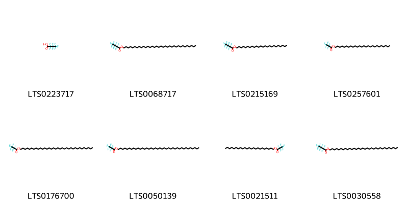{ width=100% }
    <figcaption>Hình ảnh cấu trúc hóa học của 8 hoạt chất thuộc nhóm Alkyl halides gồm ['heptafluorobutyric acid (LTS0223717)', 'tetratriacontyl 2,2,3,3,4,4,4-heptafluorobutanoate (LTS0068717)', 'tetracosyl 2,2,3,3,4,4,4-heptafluorobutanoate (LTS0215169)', 'hexacosyl 2,2,3,3,3-pentafluoropropanoate (LTS0257601)', 'tetratriacontyl 2,2,3,3,3-pentafluoropropanoate (LTS0176700)', 'octatriacontyl 2,2,3,3,3-pentafluoropropanoate (LTS0050139)', 'tricosyl 2,2,3,3,3-pentafluoropropanoate (LTS0021511)', 'dotriacontyl 2,2,3,3,4,4,4-heptafluorobutanoate (LTS0030558)'].</figcaption>
</figure>
#### Nhóm Benzene and substituted derivatives
<figure markdown="span">
    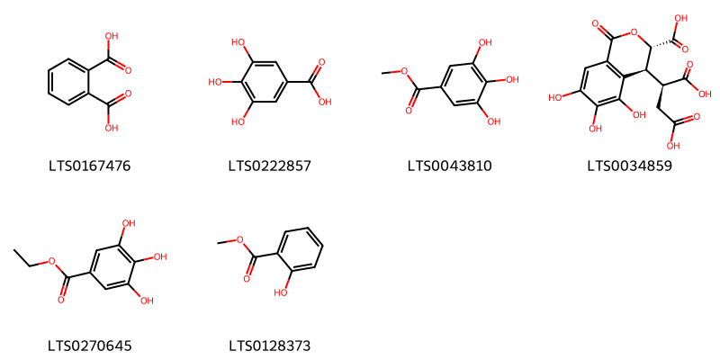{ width=100% }
    <figcaption>Hình ảnh cấu trúc hóa học của 6 hoạt chất thuộc nhóm Benzene and substituted derivatives gồm ['phthalic acid (LTS0167476)', 'galop (LTS0222857)', 'methyl gallate (LTS0043810)', 'chebulic acid (LTS0034859)', 'ethyl gallate (LTS0270645)', 'methyl salicylate (LTS0128373)'].</figcaption>
</figure>
#### Nhóm Carboxylic acids and derivatives
<figure markdown="span">
    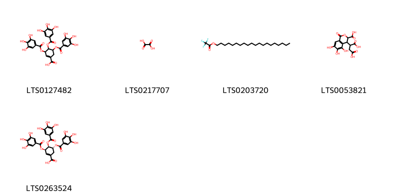{ width=100% }
    <figcaption>Hình ảnh cấu trúc hóa học của 5 hoạt chất thuộc nhóm Carboxylic acids and derivatives gồm ['3,4,5-tris(3,4,5-trihydroxybenzoyloxy)cyclohex-1-ene-1-carboxylic acid (LTS0127482)', 'oxalic acid (LTS0217707)', 'icosyl 2,2,2-trifluoroacetate (LTS0203720)', '2-(3-carboxy-5,6,7-trihydroxy-1-oxo-3,4-dihydro-2-benzopyran-4-yl)butanedioic acid (LTS0053821)', '(3r,4s,5r)-3,4,5-tris(3,4,5-trihydroxybenzoyloxy)cyclohex-1-ene-1-carboxylic acid (LTS0263524)'].</figcaption>
</figure>
#### Nhóm Cinnamic acids and derivatives
<figure markdown="span">
    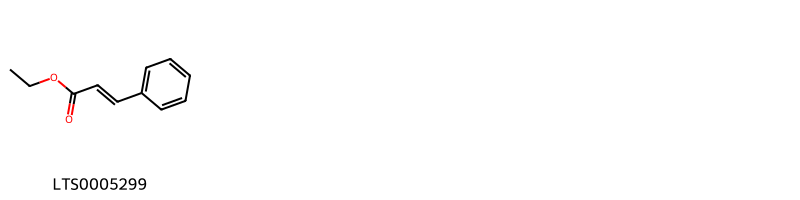{ width=100% }
    <figcaption>Hình ảnh cấu trúc hóa học của 1 hoạt chất thuộc nhóm Cinnamic acids and derivatives gồm ['ethyl 3-phenylprop-2-enoate (LTS0005299)'].</figcaption>
</figure>
#### Nhóm Dihydrofurans
<figure markdown="span">
    { width=100% }
    <figcaption>Hình ảnh cấu trúc hóa học của 1 hoạt chất thuộc nhóm Dihydrofurans gồm ['vitamin c (LTS0022555)'].</figcaption>
</figure>
#### Nhóm Fatty Acyls
<figure markdown="span">
    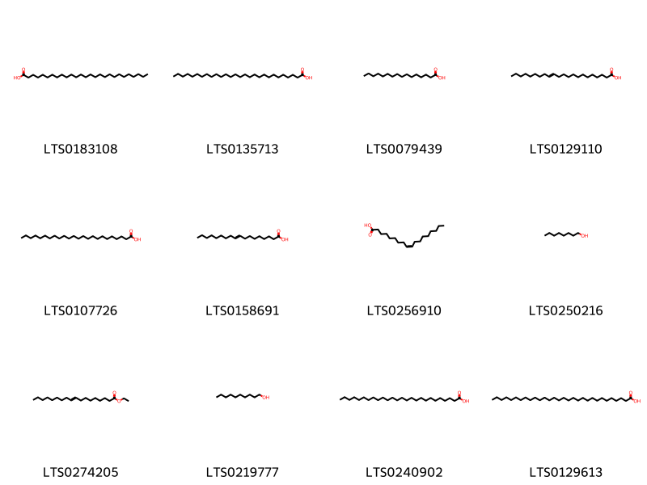{ width=100% }
    <figcaption>Hình ảnh cấu trúc hóa học của 12 hoạt chất thuộc nhóm Fatty Acyls gồm ['heptacosanoic acid (LTS0183108)', 'octacosanoic acid (LTS0135713)', 'palmitic acid (LTS0079439)', '13-docosenoic acid (LTS0129110)', 'lignoceric acid (LTS0107726)', '9 octadecenoic acid (LTS0158691)', 'oleic acid (LTS0256910)', 'octanol (LTS0250216)', 'ethyl octadec-9-enoate (LTS0274205)', 'decanol (LTS0219777)', 'hexacosanoic acid (LTS0240902)', 'triacontanoic acid (LTS0129613)'].</figcaption>
</figure>
#### Nhóm Flavonoids
<figure markdown="span">
    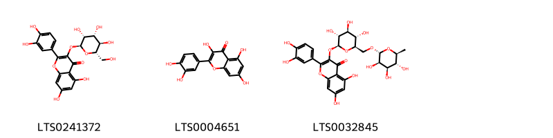{ width=100% }
    <figcaption>Hình ảnh cấu trúc hóa học của 3 hoạt chất thuộc nhóm Flavonoids gồm ['2-(3,4-dihydroxyphenyl)-5,7-dihydroxy-3-{[(2s,3r,4r,5r,6s)-3,4,5-trihydroxy-6-(hydroxymethyl)oxan-2-yl]oxy}chromen-4-one (LTS0241372)', 'quercetin (LTS0004651)', '3-rutinosyl quercetin (LTS0032845)'].</figcaption>
</figure>
#### Nhóm Indenes and isoindenes
<figure markdown="span">
    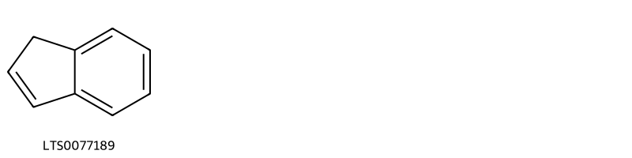{ width=100% }
    <figcaption>Hình ảnh cấu trúc hóa học của 1 hoạt chất thuộc nhóm Indenes and isoindenes gồm ['indene (LTS0077189)'].</figcaption>
</figure>
#### Nhóm Organooxygen compounds
<figure markdown="span">
    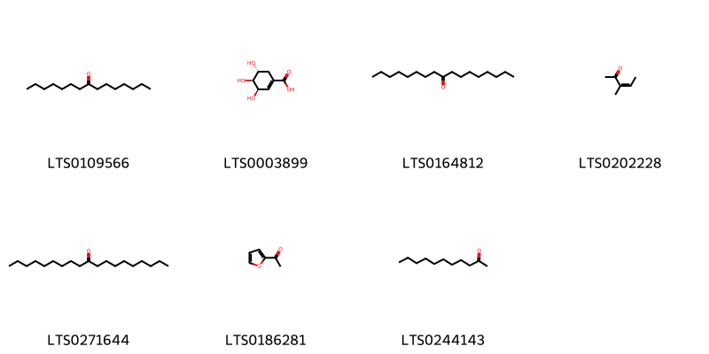{ width=100% }
    <figcaption>Hình ảnh cấu trúc hóa học của 7 hoạt chất thuộc nhóm Organooxygen compounds gồm ['8-pentadecanone (LTS0109566)', '(-)-shikimate (LTS0003899)', '9-heptadecanone (LTS0164812)', '3-methyl-3-penten-2-one (LTS0202228)', '10-nonadecanone (LTS0271644)', 'acetylfuran (LTS0186281)', 'undecan-2-one (LTS0244143)'].</figcaption>
</figure>
#### Nhóm Phenols
<figure markdown="span">
    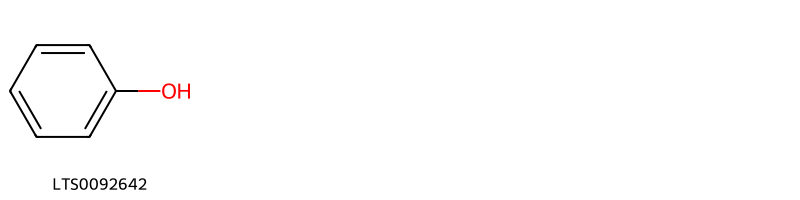{ width=100% }
    <figcaption>Hình ảnh cấu trúc hóa học của 1 hoạt chất thuộc nhóm Phenols gồm ['phenol (LTS0092642)'].</figcaption>
</figure>
#### Nhóm Prenol lipids
<figure markdown="span">
    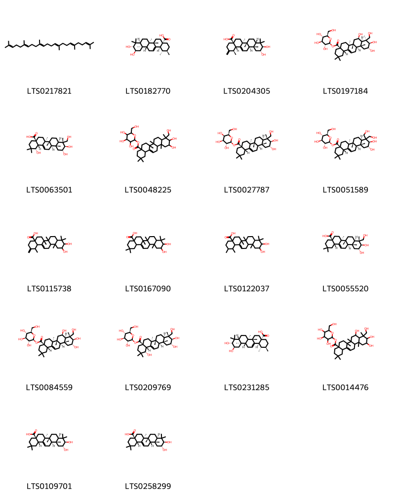{ width=100% }
    <figcaption>Hình ảnh cấu trúc hóa học của 18 hoạt chất thuộc nhóm Prenol lipids gồm ['squalene (LTS0217821)', '(1s,2r,4as,6as,6br,8as,10r,11r,12ar,12br,14bs)-10,11-dihydroxy-1,2,6a,6b,9,9,12a-heptamethyl-2,3,4,5,6,7,8,8a,10,11,12,12b,13,14b-tetradecahydro-1h-picene-4a-carboxylic acid (LTS0182770)', '(1r,4as,6as,6br,8as,10r,11r,12ar,12br,14bs)-10,11-dihydroxy-1,6a,6b,9,9,12a-hexamethyl-2-methylidene-1,3,4,5,6,7,8,8a,10,11,12,12b,13,14b-tetradecahydropicene-4a-carboxylic acid (LTS0204305)', '(2s,3r,4s,5s,6r)-3,4,5-trihydroxy-6-(hydroxymethyl)oxan-2-yl (4as,6as,6br,8r,8ar,9s,10r,11r,12ar,12br,14bs)-8,10,11-trihydroxy-9-(hydroxymethyl)-2,2,6a,6b,9,12a-hexamethyl-1,3,4,5,6,7,8,8a,10,11,12,12b,13,14b-tetradecahydropicene-4a-carboxylate (LTS0197184)', '(1s,4ar,6as,6br,8ar,9r,10r,11r,12ar,12br,14bs)-1,10,11-trihydroxy-9-(hydroxymethyl)-2,2,6a,6b,9,12a-hexamethyl-1,3,4,5,6,7,8,8a,10,11,12,12b,13,14b-tetradecahydropicene-4a-carboxylic acid (LTS0063501)', '3,4,5-trihydroxy-6-(hydroxymethyl)oxan-2-yl 10,11-dihydroxy-9-(hydroxymethyl)-2,2,6a,6b,9,12a-hexamethyl-1,3,4,5,6,7,8,8a,10,11,12,12b,13,14b-tetradecahydropicene-4a-carboxylate (LTS0048225)', '(2s,3r,4s,5r,6r)-3,4,5-trihydroxy-6-(hydroxymethyl)oxan-2-yl (4as,6as,6br,8ar,9r,10r,11r,12ar,12br,14bs)-10,11-dihydroxy-9-(hydroxymethyl)-2,2,6a,6b,9,12a-hexamethyl-1,3,4,5,6,7,8,8a,10,11,12,12b,13,14b-tetradecahydropicene-4a-carboxylate (LTS0027787)', '(2s,3r,4s,5s,6r)-3,4,5-trihydroxy-6-(hydroxymethyl)oxan-2-yl (4as,6as,6br,8ar,10r,11r,12ar,12br,14bs)-10,11-dihydroxy-9,9-bis(hydroxymethyl)-2,2,6a,6b,12a-pentamethyl-1,3,4,5,6,7,8,8a,10,11,12,12b,13,14b-tetradecahydropicene-4a-carboxylate (LTS0051589)', '10,11-dihydroxy-1,6a,6b,9,9,12a-hexamethyl-2-methylidene-1,3,4,5,6,7,8,8a,10,11,12,12b,13,14b-tetradecahydropicene-4a-carboxylic acid (LTS0115738)', '10,11-dihydroxy-2,2,6a,6b,9,9,12a-heptamethyl-1,3,4,5,6,7,8,8a,10,11,12,12b,13,14b-tetradecahydropicene-4a-carboxylic acid (LTS0167090)', '10,11-dihydroxy-1,2,6a,6b,9,9,12a-heptamethyl-2,3,4,5,6,7,8,8a,10,11,12,12b,13,14b-tetradecahydro-1h-picene-4a-carboxylic acid (LTS0122037)', 'arjunolic acid (LTS0055520)', '(2s,3r,4s,5s,6r)-3,4,5-trihydroxy-6-(hydroxymethyl)oxan-2-yl (4as,6as,6br,8r,8ar,9r,10r,11r,12ar,12br,14bs)-8,10,11-trihydroxy-9-(hydroxymethyl)-2,2,6a,6b,9,12a-hexamethyl-1,3,4,5,6,7,8,8a,10,11,12,12b,13,14b-tetradecahydropicene-4a-carboxylate (LTS0084559)', '(2s,3r,4s,5s,6r)-3,4,5-trihydroxy-6-(hydroxymethyl)oxan-2-yl (1s,4ar,6as,6br,8ar,9r,10r,11r,12ar,12br,14bs)-1,10,11-trihydroxy-9-(hydroxymethyl)-2,2,6a,6b,9,12a-hexamethyl-1,3,4,5,6,7,8,8a,10,11,12,12b,13,14b-tetradecahydropicene-4a-carboxylate (LTS0209769)', 'corosolic acid (LTS0231285)', '3,4,5-trihydroxy-6-(hydroxymethyl)oxan-2-yl 8,10,11-trihydroxy-9-(hydroxymethyl)-2,2,6a,6b,9,12a-hexamethyl-1,3,4,5,6,7,8,8a,10,11,12,12b,13,14b-tetradecahydropicene-4a-carboxylate (LTS0014476)', 'maslinic acid (LTS0109701)', '(4as,6as,6br,8ar,10r,11r,12ar,12bs,14bs)-10,11-dihydroxy-2,2,6a,6b,9,9,12a-heptamethyl-1,3,4,5,6,7,8,8a,10,11,12,12b,13,14b-tetradecahydropicene-4a-carboxylic acid (LTS0258299)'].</figcaption>
</figure>
#### Nhóm Saccharolipids
<figure markdown="span">
    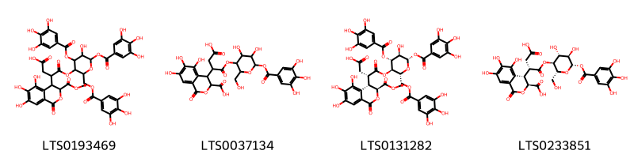{ width=100% }
    <figcaption>Hình ảnh cấu trúc hóa học của 4 hoạt chất thuộc nhóm Saccharolipids gồm ['4-{[5-hydroxy-4,6-bis(3,4,5-trihydroxybenzoyloxy)-2-[(3,4,5-trihydroxybenzoyloxy)methyl]oxan-3-yl]oxy}-4-oxo-3-[5,6,7-trihydroxy-3-(methoxycarbonyl)-1-oxo-3,4-dihydro-2-benzopyran-4-yl]butanoic acid (LTS0193469)', '4-(3-carboxy-1-{[4,5-dihydroxy-2-(hydroxymethyl)-6-(3,4,5-trihydroxybenzoyloxy)oxan-3-yl]oxy}-1-oxopropan-2-yl)-5,6,7-trihydroxy-1-oxo-3,4-dihydro-2-benzopyran-3-carboxylic acid (LTS0037134)', '(3s)-4-{[(2r,3r,4r,5r,6s)-5-hydroxy-4,6-bis(3,4,5-trihydroxybenzoyloxy)-2-[(3,4,5-trihydroxybenzoyloxy)methyl]oxan-3-yl]oxy}-4-oxo-3-[(3s,4s)-5,6,7-trihydroxy-3-(methoxycarbonyl)-1-oxo-3,4-dihydro-2-benzopyran-4-yl]butanoic acid (LTS0131282)', '(3s,4s)-4-[(2s)-3-carboxy-1-{[(2r,3s,4r,5r,6s)-4,5-dihydroxy-2-(hydroxymethyl)-6-(3,4,5-trihydroxybenzoyloxy)oxan-3-yl]oxy}-1-oxopropan-2-yl]-5,6,7-trihydroxy-1-oxo-3,4-dihydro-2-benzopyran-3-carboxylic acid (LTS0233851)'].</figcaption>
</figure>
#### Nhóm Saturated hydrocarbons
<figure markdown="span">
    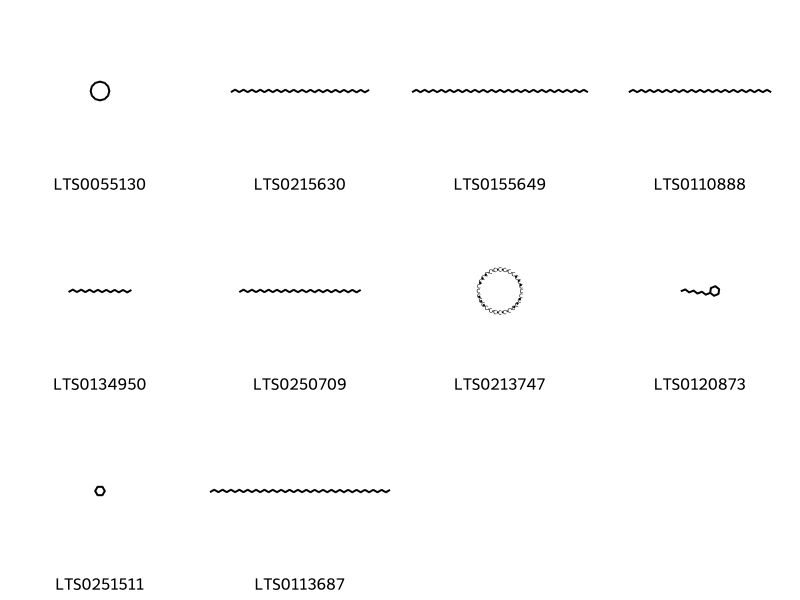{ width=100% }
    <figcaption>Hình ảnh cấu trúc hóa học của 10 hoạt chất thuộc nhóm Saturated hydrocarbons gồm ['cyclododecane (LTS0055130)', 'tetratriacontane (LTS0215630)', 'tritetracontane (LTS0155649)', 'pentatriacontane (LTS0110888)', 'cetane (LTS0134950)', 'triacontane (LTS0250709)', 'cyclooctacosane (LTS0213747)', 'heptylcyclohexane (LTS0120873)', 'cyclohexane (LTS0251511)', 'tetratetracontane (LTS0113687)'].</figcaption>
</figure>
#### Nhóm Steroids and steroid derivatives
<figure markdown="span">
    { width=100% }
    <figcaption>Hình ảnh cấu trúc hóa học của 2 hoạt chất thuộc nhóm Steroids and steroid derivatives gồm ['stigmast-5-en-3-ol, (3β)- (LTS0204616)', 'sitogluside (LTS0201798)'].</figcaption>
</figure>
#### Nhóm Tannins
<figure markdown="span">
    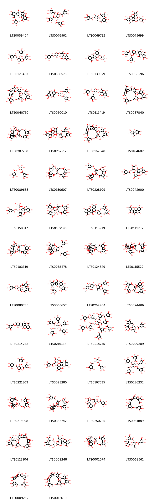{ width=100% }
    <figcaption>Hình ảnh cấu trúc hóa học của 60 hoạt chất thuộc nhóm Tannins gồm ['3,4,5,11,12,13,21,22,23,26,27-undecahydroxy-9,14,17,29,36-pentaoxaoctacyclo[29.8.0.0²,⁷.0¹⁰,¹⁵.0¹⁹,²⁴.0²⁵,³⁴.0²⁸,³³.0³²,³⁷]nonatriaconta-1(39),2(7),3,5,19,21,23,25,27,31,33,37-dodecaene-8,18,30,35-tetrone (LTS0059424)', '3-hydroxy-4,5-bis(3,4,5-trihydroxybenzoyloxy)-6-[(3,4,5-trihydroxybenzoyloxy)methyl]oxan-2-yl 3,4,5-trihydroxybenzoate (LTS0076562)', '6,7,8,11,12,13,22,23-octahydroxy-3,16-dioxo-2,17,20-trioxatetracyclo[17.3.1.0⁴,⁹.0¹⁰,¹⁵]tricosa-4(9),5,7,10,12,14-hexaen-21-yl 3,4,5-trihydroxybenzoate (LTS0069732)', '(2r,3s,4r,5r,6s)-4,5,6-trihydroxy-2-(hydroxymethyl)oxan-3-yl 3,4,5-trihydroxy-2-{6,7,13,14-tetrahydroxy-3,10-dioxo-2,9-dioxatetracyclo[6.6.2.0⁴,¹⁶.0¹¹,¹⁵]hexadeca-1(14),4(16),5,7,11(15),12-hexaen-5-yl}benzoate (LTS0075699)', '(2r,3r,4r,5r,6r)-2,3-dihydroxy-5-(3,4,5-trihydroxybenzoyloxy)-6-[(3,4,5-trihydroxybenzoyloxy)methyl]oxan-4-yl 3,4,5-trihydroxybenzoate (LTS0123463)', '(2s,3r,4s,5r,6s)-4,5-dihydroxy-2-methyl-6-({7,13,14-trihydroxy-3,10-dioxo-2,9-dioxatetracyclo[6.6.2.0⁴,¹⁶.0¹¹,¹⁵]hexadeca-1(15),4(16),5,7,11,13-hexaen-6-yl}oxy)oxan-3-yl 3,4,5-trihydroxybenzoate (LTS0186576)', '(2r,3s,4r,5r,6r)-4,5,6-trihydroxy-2-(hydroxymethyl)oxan-3-yl 3,4,5-trihydroxy-2-{6,7,13,14-tetrahydroxy-3,10-dioxo-2,9-dioxatetracyclo[6.6.2.0⁴,¹⁶.0¹¹,¹⁵]hexadeca-1(14),4(16),5,7,11(15),12-hexaen-5-yl}benzoate (LTS0139979)', '3-hydroxy-6-methyl-2-({7,13,14-trihydroxy-3,10-dioxo-2,9-dioxatetracyclo[6.6.2.0⁴,¹⁶.0¹¹,¹⁵]hexadeca-1(15),4(16),5,7,11,13-hexaen-6-yl}oxy)-5-(3,4,5-trihydroxybenzoyloxy)oxan-4-yl 3,4,5-trihydroxybenzoate (LTS0098596)', '(12r,14s,15r,32s,33r)-4,5,6,14,20,21,22,25,26,27,38,39,40,43,44,55-hexadecahydroxy-2,10,13,16,31,34,46,53-octaoxaundecacyclo[46.7.1.0³,⁸.0¹²,³³.0¹⁵,³².0¹⁸,²³.0²⁴,²⁹.0³⁶,⁴¹.0⁴²,⁵¹.0⁴⁵,⁵⁰.0⁴⁹,⁵⁴]hexapentaconta-1(56),3(8),4,6,18,20,22,24(29),25,27,36,38,40,42,44,48,50,54-octadecaene-9,17,30,35,47,52-hexone (LTS0040750)', '(2s,3s,4s,5r,6s)-6-({7,13-dihydroxy-14-methoxy-3,10-dioxo-2,9-dioxatetracyclo[6.6.2.0⁴,¹⁶.0¹¹,¹⁵]hexadeca-1(15),4,6,8(16),11,13-hexaen-6-yl}oxy)-5-hydroxy-2-methyl-4-(3,4,5-trihydroxybenzoyloxy)oxan-3-yl 3,4,5-trihydroxybenzoate (LTS0050010)', '(2s,3r,4s,5s,6s)-3-hydroxy-6-methyl-2-({7,13,14-trihydroxy-3,10-dioxo-2,9-dioxatetracyclo[6.6.2.0⁴,¹⁶.0¹¹,¹⁵]hexadeca-1(15),4(16),5,7,11,13-hexaen-6-yl}oxy)-5-(3,4,5-trihydroxybenzoyloxy)oxan-4-yl 3,4,5-trihydroxybenzoate (LTS0111419)', '3,4,5,16,17,18,21,22,23,29,37,38,39,43,55,56-hexadecahydroxy-9,12,27,30,33,41,47,52-octaoxaundecacyclo[46.6.2.0²,⁷.0¹⁰,³¹.0¹¹,²⁸.0¹⁴,¹⁹.0²⁰,²⁵.0³⁵,⁴⁰.0⁴²,⁵¹.0⁴⁵,⁵⁰.0⁴⁹,⁵⁴]hexapentaconta-1(55),2,4,6,14(19),15,17,20,22,24,35(40),36,38,42(51),43,45(50),48(56),49(54)-octadecaene-8,13,26,34,46,53-hexone (LTS0087840)', '[(4r,5s,7r,25s,26r,29s,30s,31r)-13,14,15,18,19,20,31,35,36-nonahydroxy-2,10,23,28,32-pentaoxo-5-(3,4,5-trihydroxybenzoyloxy)-3,6,9,24,27,33-hexaoxaheptacyclo[28.7.1.0⁴,²⁵.0⁷,²⁶.0¹¹,¹⁶.0¹⁷,²².0³⁴,³⁸]octatriaconta-1(37),11(16),12,14,17,19,21,34(38),35-nonaen-29-yl]acetic acid (LTS0207268)', '(10r,11r,13r,14r,15s)-3,4,5,11,20,21,22-heptahydroxy-8,17-dioxo-13-[(3,4,5-trihydroxybenzoyloxy)methyl]-9,12,16-trioxatetracyclo[16.4.0.0²,⁷.0¹⁰,¹⁵]docosa-1(18),2,4,6,19,21-hexaen-14-yl 3,4,5-trihydroxy-2-{6,7,13,14-tetrahydroxy-3,10-dioxo-2,9-dioxatetracyclo[6.6.2.0⁴,¹⁶.0¹¹,¹⁵]hexadeca-1(14),4(16),5,7,11(15),12-hexaen-5-yl}benzoate (LTS0252517)', '(10s,11s,28r,29r,31r)-3,4,5,16,17,18,21,22,23,29,37,38,39,43,55,56-hexadecahydroxy-9,12,27,30,33,41,47,52-octaoxaundecacyclo[46.6.2.0²,⁷.0¹⁰,³¹.0¹¹,²⁸.0¹⁴,¹⁹.0²⁰,²⁵.0³⁵,⁴⁰.0⁴²,⁵¹.0⁴⁵,⁵⁰.0⁴⁹,⁵⁴]hexapentaconta-1(55),2,4,6,14(19),15,17,20,22,24,35(40),36,38,42(51),43,45(50),48(56),49(54)-octadecaene-8,13,26,34,46,53-hexone (LTS0162548)', '3,4,8,9,10-pentahydroxybenzo[c]chromen-6-one (LTS0164602)', '3,4,5-trihydroxy-6-[(3,4,5-trihydroxybenzoyloxy)methyl]oxan-2-yl 3,4,5-trihydroxybenzoate (LTS0089653)', '[(5r,7r)-13,14,15,18,19,20,31,35,36-nonahydroxy-2,10,23,28,32-pentaoxo-5-(3,4,5-trihydroxybenzoyloxy)-3,6,9,24,27,33-hexaoxaheptacyclo[28.7.1.0⁴,²⁵.0⁷,²⁶.0¹¹,¹⁶.0¹⁷,²².0³⁴,³⁸]octatriaconta-1(37),11(16),12,14,17,19,21,34(38),35-nonaen-29-yl]acetic acid (LTS0150607)', '[(4r,5s,7r,8r,11s,12s,13r,21s)-13,17,18-trihydroxy-2,10,14-trioxo-5,21-bis(3,4,5-trihydroxybenzoyloxy)-7-[(3,4,5-trihydroxybenzoyloxy)methyl]-3,6,9,15-tetraoxatetracyclo[10.7.1.1⁴,⁸.0¹⁶,²⁰]henicosa-1(19),16(20),17-trien-11-yl]acetic acid (LTS0228109)', 'terflavin b (LTS0242900)', 'terflavin b (LTS0159317)', '(3s)-4-{[(1r,19r,21s,22r,23r)-6,7,8,11,12,13,22-heptahydroxy-3,16-dioxo-21-(3,4,5-trihydroxybenzoyloxy)-2,17,20-trioxatetracyclo[17.3.1.0⁴,⁹.0¹⁰,¹⁵]tricosa-4(9),5,7,10,12,14-hexaen-23-yl]oxy}-4-oxo-3-[(3s,4s)-5,6,7-trihydroxy-3-(methoxycarbonyl)-1-oxo-3,4-dihydro-2-benzopyran-4-yl]butanoic acid (LTS0182196)', '(10r,11r,13r,14r,15s)-3,4,5,11,20,21,22-heptahydroxy-13-(hydroxymethyl)-8,17-dioxo-9,12,16-trioxatetracyclo[16.4.0.0²,⁷.0¹⁰,¹⁵]docosa-1(18),2,4,6,19,21-hexaen-14-yl 3,4,5-trihydroxy-2-{6,7,13,14-tetrahydroxy-3,10-dioxo-2,9-dioxatetracyclo[6.6.2.0⁴,¹⁶.0¹¹,¹⁵]hexadeca-1(14),4(16),5,7,11(15),12-hexaen-5-yl}benzoate (LTS0118919)', '3,4,5-trihydroxy-2-{6,7,13,14-tetrahydroxy-3,10-dioxo-2,9-dioxatetracyclo[6.6.2.0⁴,¹⁶.0¹¹,¹⁵]hexadeca-1(14),4(16),5,7,11(15),12-hexaen-5-yl}benzoic acid (LTS0111232)', '[(4r,5s,7r,25s,26r,29s,30s,31s)-13,14,15,18,19,20,31,35,36-nonahydroxy-2,10,23,28,32-pentaoxo-5-(3,4,5-trihydroxybenzoyloxy)-3,6,9,24,27,33-hexaoxaheptacyclo[28.7.1.0⁴,²⁵.0⁷,²⁶.0¹¹,¹⁶.0¹⁷,²².0³⁴,³⁸]octatriaconta-1(37),11(16),12,14,17,19,21,34(38),35-nonaen-29-yl]acetic acid (LTS0103319)', '[(5s,8r,11s,12s,13r,21r)-13,17,18-trihydroxy-2,10,14-trioxo-5,21-bis(3,4,5-trihydroxybenzoyloxy)-7-[(3,4,5-trihydroxybenzoyloxy)methyl]-3,6,9,15-tetraoxatetracyclo[10.7.1.1⁴,⁸.0¹⁶,²⁰]henicosa-1(19),16(20),17-trien-11-yl]acetic acid (LTS0268478)', '(11r,12r)-12-[(14r,15s,19s)-2,3,4,7,8,9,19-heptahydroxy-12,17-dioxo-13,16-dioxatetracyclo[13.3.1.0⁵,¹⁸.0⁶,¹¹]nonadeca-1(18),2,4,6,8,10-hexaen-14-yl]-3,4,5,17,18,19-hexahydroxy-8,14-dioxo-9,13-dioxatricyclo[13.4.0.0²,⁷]nonadeca-1(15),2,4,6,16,18-hexaen-11-yl 3,4,5-trihydroxybenzoate (LTS0124879)', '4-{[6,7,8,11,12,13,22-heptahydroxy-3,16-dioxo-21-(3,4,5-trihydroxybenzoyloxy)-2,17,20-trioxatetracyclo[17.3.1.0⁴,⁹.0¹⁰,¹⁵]tricosa-4(9),5,7,10,12,14-hexaen-23-yl]oxy}-4-oxo-3-[5,6,7-trihydroxy-3-(methoxycarbonyl)-1-oxo-3,4-dihydro-2-benzopyran-4-yl]butanoic acid (LTS0115529)', '(1s,19r,21s,22r,23r)-6,7,8,11,12,13,22,23-octahydroxy-3,16-dioxo-2,17,20-trioxatetracyclo[17.3.1.0⁴,⁹.0¹⁰,¹⁵]tricosa-4(9),5,7,10,12,14-hexaen-21-yl 3,4,5-trihydroxybenzoate (LTS0089285)', '(10s,11r,12r,13r,15r)-3,4,5,11,12,13,21,22,23,26,27-undecahydroxy-9,14,17,29,36-pentaoxaoctacyclo[29.8.0.0²,⁷.0¹⁰,¹⁵.0¹⁹,²⁴.0²⁵,³⁴.0²⁸,³³.0³²,³⁷]nonatriaconta-1(39),2(7),3,5,19,21,23,25,27,31,33,37-dodecaene-8,18,30,35-tetrone (LTS0065652)', '6-({7,13-dihydroxy-14-methoxy-3,10-dioxo-2,9-dioxatetracyclo[6.6.2.0⁴,¹⁶.0¹¹,¹⁵]hexadeca-1(15),4,6,8(16),11,13-hexaen-6-yl}oxy)-5-hydroxy-2-methyl-4-(3,4,5-trihydroxybenzoyloxy)oxan-3-yl 3,4,5-trihydroxybenzoate (LTS0269904)', '[13,14,15,18,19,20,31,35,36-nonahydroxy-2,10,23,28,32-pentaoxo-5-(3,4,5-trihydroxybenzoyloxy)-3,6,9,24,27,33-hexaoxaheptacyclo[28.7.1.0⁴,²⁵.0⁷,²⁶.0¹¹,¹⁶.0¹⁷,²².0³⁴,³⁸]octatriaconta-1(37),11,13,15,17(22),18,20,34(38),35-nonaen-29-yl]acetic acid (LTS0074486)', '4,5-dihydroxy-2-methyl-6-({7,13,14-trihydroxy-3,10-dioxo-2,9-dioxatetracyclo[6.6.2.0⁴,¹⁶.0¹¹,¹⁵]hexadeca-1(15),4(16),5,7,11,13-hexaen-6-yl}oxy)oxan-3-yl 3,4,5-trihydroxybenzoate (LTS0214232)', '(2s,3r,4s,5r,6r)-3,4,5-tris(3,4,5-trihydroxybenzoyloxy)-6-[(3,4,5-trihydroxybenzoyloxy)methyl]oxan-2-yl 3,4,5-trihydroxybenzoate (LTS0216134)', '3,4,5-tris[3,4-dihydroxy-5-(3,4,5-trihydroxybenzoyloxy)benzoyloxy]-6-{[3,4-dihydroxy-5-(3,4,5-trihydroxybenzoyloxy)benzoyloxy]methyl}oxan-2-yl 3,4-dihydroxy-5-(3,4,5-trihydroxybenzoyloxy)benzoate (LTS0218755)', '[(4s,5r,7s,8r,13r,21r)-13,17,18,21-tetrahydroxy-7-(hydroxymethyl)-2,10,14-trioxo-5-(3,4,5-trihydroxybenzoyloxy)-3,6,9,15-tetraoxatetracyclo[10.7.1.1⁴,⁸.0¹⁶,²⁰]henicosa-1(19),16(20),17-trien-11-yl]acetic acid (LTS0209209)', '2,3-dihydroxy-5-(3,4,5-trihydroxybenzoyloxy)-6-[(3,4,5-trihydroxybenzoyloxy)methyl]oxan-4-yl 3,4,5-trihydroxybenzoate (LTS0221303)', '(2r,3s,4r,5r,6r)-4,5,6-trihydroxy-2-[(3,4,5-trihydroxybenzoyloxy)methyl]oxan-3-yl 3,4,5-trihydroxy-2-{6,7,13,14-tetrahydroxy-3,10-dioxo-2,9-dioxatetracyclo[6.6.2.0⁴,¹⁶.0¹¹,¹⁵]hexadeca-1(14),4(16),5,7,11(15),12-hexaen-5-yl}benzoate (LTS0093285)', '(2s,3r,4s,5s,6r)-3,4,5-trihydroxy-6-[(3,4,5-trihydroxybenzoyloxy)methyl]oxan-2-yl 3,4,5-trihydroxybenzoate (LTS0167635)', '3,4,5-tris(3,4,5-trihydroxybenzoyloxy)-6-[(3,4,5-trihydroxybenzoyloxy)methyl]oxan-2-yl 3,4,5-trihydroxybenzoate (LTS0226232)', '12-{2,3,4,7,8,9,19-heptahydroxy-12,17-dioxo-13,16-dioxatetracyclo[13.3.1.0⁵,¹⁸.0⁶,¹¹]nonadeca-1(18),2,4,6,8,10-hexaen-14-yl}-3,4,5,17,18,19-hexahydroxy-8,14-dioxo-9,13-dioxatricyclo[13.4.0.0²,⁷]nonadeca-1(15),2,4,6,16,18-hexaen-11-yl 3,4,5-trihydroxybenzoate (LTS0215098)', 'chebulinic acid (LTS0182742)', '[(4r,5s,7r,8s,11s,12s,13s,21s)-13,17,18,21-tetrahydroxy-7-(hydroxymethyl)-2,10,14-trioxo-5-(3,4,5-trihydroxybenzoyloxy)-3,6,9,15-tetraoxatetracyclo[10.7.1.1⁴,⁸.0¹⁶,²⁰]henicosa-1(19),16(20),17-trien-11-yl]acetic acid (LTS0250735)', '(15r)-3,4,5,11,12,13,21,22,23,26,27,38,39-tridecahydroxy-9,14,17,29,36-pentaoxaoctacyclo[29.8.0.0²,⁷.0¹⁰,¹⁵.0¹⁹,²⁴.0²⁵,³⁴.0²⁸,³³.0³²,³⁷]nonatriaconta-1(39),2,4,6,19(24),20,22,25,27,31,33,37-dodecaene-8,18,30,35-tetrone (LTS0061889)', '6,7,8,11,12,23,24,27,28,29,37,43,44,45,48,49,50-heptadecahydroxy-2,14,21,33,36,39,54-heptaoxaundecacyclo[33.20.0.0⁴,⁹.0¹⁰,¹⁹.0¹³,¹⁸.0¹⁶,²⁵.0¹⁷,²².0²⁶,³¹.0³⁸,⁵⁵.0⁴¹,⁴⁶.0⁴⁷,⁵²]pentapentaconta-4(9),5,7,10,12,16,18,22,24,26,28,30,41(46),42,44,47,49,51-octadecaene-3,15,20,32,40,53-hexone (LTS0123104)', '3,4,5,11,20,21,22-heptahydroxy-13-(hydroxymethyl)-8,17-dioxo-9,12,16-trioxatetracyclo[16.4.0.0²,⁷.0¹⁰,¹⁵]docosa-1(22),2(7),3,5,18,20-hexaen-14-yl 3,4,5-trihydroxy-2-{6,7,13,14-tetrahydroxy-3,10-dioxo-2,9-dioxatetracyclo[6.6.2.0⁴,¹⁶.0¹¹,¹⁵]hexadeca-1(14),4(16),5,7,11(15),12-hexaen-5-yl}benzoate (LTS0008248)', '(11s,12r)-12-[(14r,15r,19r)-2,3,4,7,8,9,19-heptahydroxy-12,17-dioxo-13,16-dioxatetracyclo[13.3.1.0⁵,¹⁸.0⁶,¹¹]nonadeca-1(18),2,4,6,8,10-hexaen-14-yl]-3,4,5,17,18,19-hexahydroxy-8,14-dioxo-9,13-dioxatricyclo[13.4.0.0²,⁷]nonadeca-1(15),2,4,6,16,18-hexaen-11-yl 3,4,5-trihydroxybenzoate (LTS0001074)', '[13,17,18,21-tetrahydroxy-7-(hydroxymethyl)-2,10,14-trioxo-5-(3,4,5-trihydroxybenzoyloxy)-3,6,9,15-tetraoxatetracyclo[10.7.1.1⁴,⁸.0¹⁶,²⁰]henicosa-1(19),16(20),17-trien-11-yl]acetic acid (LTS0068561)', '(10s,11r,12r,13r,15r)-3,4,5,11,12,13,21,22,23,26,27,38,39-tridecahydroxy-9,14,17,29,36-pentaoxaoctacyclo[29.8.0.0²,⁷.0¹⁰,¹⁵.0¹⁹,²⁴.0²⁵,³⁴.0²⁸,³³.0³²,³⁷]nonatriaconta-1(39),2,4,6,19(24),20,22,25,27,31,33,37-dodecaene-8,18,30,35-tetrone (LTS0009262)', '(1r,35r,37r,38r,55s)-6,7,8,11,12,23,24,27,28,29,37,43,44,45,48,49,50-heptadecahydroxy-2,14,21,33,36,39,54-heptaoxaundecacyclo[33.20.0.0⁴,⁹.0¹⁰,¹⁹.0¹³,¹⁸.0¹⁶,²⁵.0¹⁷,²².0²⁶,³¹.0³⁸,⁵⁵.0⁴¹,⁴⁶.0⁴⁷,⁵²]pentapentaconta-4(9),5,7,10,12,16,18,22,24,26,28,30,41,43,45,47(52),48,50-octadecaene-3,15,20,32,40,53-hexone (LTS0013610)', '3,4,5,11,20,21,22-heptahydroxy-8,17-dioxo-13-[(3,4,5-trihydroxybenzoyloxy)methyl]-9,12,16-trioxatetracyclo[16.4.0.0²,⁷.0¹⁰,¹⁵]docosa-1(18),2,4,6,19,21-hexaen-14-yl 3,4,5-trihydroxy-2-{6,7,13,14-tetrahydroxy-3,10-dioxo-2,9-dioxatetracyclo[6.6.2.0⁴,¹⁶.0¹¹,¹⁵]hexadeca-1(14),4(16),5,7,11(15),12-hexaen-5-yl}benzoate (LTS0012931)', '(12r,15r,32s,33r)-4,5,6,14,20,21,22,25,26,27,38,39,40,43,44,55-hexadecahydroxy-2,10,13,16,31,34,46,53-octaoxaundecacyclo[46.7.1.0³,⁸.0¹²,³³.0¹⁵,³².0¹⁸,²³.0²⁴,²⁹.0³⁶,⁴¹.0⁴²,⁵¹.0⁴⁵,⁵⁰.0⁴⁹,⁵⁴]hexapentaconta-1(56),3(8),4,6,18,20,22,24(29),25,27,36,38,40,42,44,48,50,54-octadecaene-9,17,30,35,47,52-hexone (LTS0004581)', '3,4,5,11,12,13,21,22,23,26,27,38,39-tridecahydroxy-9,14,17,29,36-pentaoxaoctacyclo[29.8.0.0²,⁷.0¹⁰,¹⁵.0¹⁹,²⁴.0²⁵,³⁴.0²⁸,³³.0³²,³⁷]nonatriaconta-1(39),2,4,6,19(24),20,22,25,27,31,33,37-dodecaene-8,18,30,35-tetrone (LTS0001619)', 'chebulinic acid (LTS0015844)', '(1r,35r,38r,55s)-6,7,8,11,12,23,24,27,28,29,37,43,44,45,48,49,50-heptadecahydroxy-2,14,21,33,36,39,54-heptaoxaundecacyclo[33.20.0.0⁴,⁹.0¹⁰,¹⁹.0¹³,¹⁸.0¹⁶,²⁵.0¹⁷,²².0²⁶,³¹.0³⁸,⁵⁵.0⁴¹,⁴⁶.0⁴⁷,⁵²]pentapentaconta-4(9),5,7,10,12,16,18,22,24,26,28,30,41,43,45,47(52),48,50-octadecaene-3,15,20,32,40,53-hexone (LTS0235435)', '(2s,3r,4r,5r,6r)-3-hydroxy-4,5-bis(3,4,5-trihydroxybenzoyloxy)-6-[(3,4,5-trihydroxybenzoyloxy)methyl]oxan-2-yl 3,4,5-trihydroxybenzoate (LTS0245464)', 'ellagic acid (LTS0037297)', '(11r,12r)-12-[(15s,19s)-2,3,4,7,8,9,19-heptahydroxy-12,17-dioxo-13,16-dioxatetracyclo[13.3.1.0⁵,¹⁸.0⁶,¹¹]nonadeca-1(18),2,4,6,8,10-hexaen-14-yl]-3,4,5,17,18,19-hexahydroxy-8,14-dioxo-9,13-dioxatricyclo[13.4.0.0²,⁷]nonadeca-1(15),2,4,6,16,18-hexaen-11-yl 3,4,5-trihydroxybenzoate (LTS0107688)', '4,5,6-trihydroxy-2-(hydroxymethyl)oxan-3-yl 3,4,5-trihydroxy-2-{6,7,13,14-tetrahydroxy-3,10-dioxo-2,9-dioxatetracyclo[6.6.2.0⁴,¹⁶.0¹¹,¹⁵]hexadeca-1(14),4(16),5,7,11(15),12-hexaen-5-yl}benzoate (LTS0051738)', '4,5,6,14,20,21,22,25,26,27,38,39,40,43,44,55-hexadecahydroxy-2,10,13,16,31,34,46,53-octaoxaundecacyclo[46.7.1.0³,⁸.0¹²,³³.0¹⁵,³².0¹⁸,²³.0²⁴,²⁹.0³⁶,⁴¹.0⁴²,⁵¹.0⁴⁵,⁵⁰.0⁴⁹,⁵⁴]hexapentaconta-1(56),3(8),4,6,18,20,22,24(29),25,27,36,38,40,42,44,48,50,54-octadecaene-9,17,30,35,47,52-hexone (LTS0116666)'].</figcaption>
</figure>
#### Nhóm Unsaturated hydrocarbons
<figure markdown="span">
    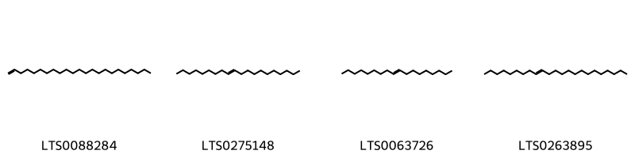{ width=100% }
    <figcaption>Hình ảnh cấu trúc hóa học của 4 hoạt chất thuộc nhóm Unsaturated hydrocarbons gồm ['1-tricosene (LTS0088284)', 'icos-9-ene (LTS0275148)', 'octadec-9-ene (LTS0063726)', 'tricos-9-ene (LTS0263895)'].</figcaption>
</figure>

---

### Dược dân tộc học

Danh sách các quốc gia có sử dụng *Terminalia chebula* trong điều trị các bệnh. 

| Country       | Disease                                                                      | Bệnh                                                                                                                                                                                                |
|:--------------|:-----------------------------------------------------------------------------|:----------------------------------------------------------------------------------------------------------------------------------------------------------------------------------------------------|
| China         | Astringent, Carminative, Laxative, Demulcent, Astringent, Carminative, Tonic | MYMEMORY WARNING: YOU USED ALL AVAILABLE FREE TRANSLATIONS FOR TODAY. NEXT AVAILABLE IN  15 HOURS 38 MINUTES 09 SECONDS VISIT HTTPS://MYMEMORY.TRANSLATED.NET/DOC/USAGELIMITS.PHP TO TRANSLATE MORE |
| India         | Collyrium, Fungicide                                                         | MYMEMORY WARNING: YOU USED ALL AVAILABLE FREE TRANSLATIONS FOR TODAY. NEXT AVAILABLE IN  15 HOURS 38 MINUTES 04 SECONDS VISIT HTTPS://MYMEMORY.TRANSLATED.NET/DOC/USAGELIMITS.PHP TO TRANSLATE MORE |
| India(Santal) | Laxative                                                                     | MYMEMORY WARNING: YOU USED ALL AVAILABLE FREE TRANSLATIONS FOR TODAY. NEXT AVAILABLE IN  15 HOURS 37 MINUTES 57 SECONDS VISIT HTTPS://MYMEMORY.TRANSLATED.NET/DOC/USAGELIMITS.PHP TO TRANSLATE MORE |
| Iran          | Tonic, Aperient                                                              | MYMEMORY WARNING: YOU USED ALL AVAILABLE FREE TRANSLATIONS FOR TODAY. NEXT AVAILABLE IN  15 HOURS 37 MINUTES 51 SECONDS VISIT HTTPS://MYMEMORY.TRANSLATED.NET/DOC/USAGELIMITS.PHP TO TRANSLATE MORE |
| Nepal         | Cardiotonic, Cardiotonic, Laxative, Laxative                                 | MYMEMORY WARNING: YOU USED ALL AVAILABLE FREE TRANSLATIONS FOR TODAY. NEXT AVAILABLE IN  15 HOURS 37 MINUTES 47 SECONDS VISIT HTTPS://MYMEMORY.TRANSLATED.NET/DOC/USAGELIMITS.PHP TO TRANSLATE MORE |
| Turkey        | Astringent, Laxative                                                         | MYMEMORY WARNING: YOU USED ALL AVAILABLE FREE TRANSLATIONS FOR TODAY. NEXT AVAILABLE IN  15 HOURS 37 MINUTES 44 SECONDS VISIT HTTPS://MYMEMORY.TRANSLATED.NET/DOC/USAGELIMITS.PHP TO TRANSLATE MORE |

---

---
## Terminalia citrina
### Thông tin về thực vật

!!! info "Phân loại thực vật của *Terminalia citrina* từ GIBF:"
    - **Kingdom:** Plantae
    - **Phylum:** Tracheophyta
    - **Order:** Myrtales
    - **Family:** Combretaceae
    - **Genus:** Terminalia
    - **Species:** *Terminalia citrina*

 

| Label (VI)   | Label (EN)   | Scientific Name    | Descriptions (VI)   | Descriptions (EN)   | Also Known As (VI)   | Also Known As (EN)   |
|:-------------|:-------------|:-------------------|:--------------------|:--------------------|:---------------------|:---------------------|
| N/A          | N/A          | Terminalia citrina | loài thực vật       | species of plant    | ['']                 | ['']                 |

#### Phân bố trên thế giới

**Từ CSDL GIBF** nan, Viet Nam, unknown or invalid, Thailand, Pakistan, Brazil, Philippines, Malaysia, Tanzania, United Republic of, India, Lao People’s Democratic Republic, Bangladesh, Singapore, Cambodia, Indonesia

#### Phân bố tại Việt Nam

**Từ CSDL GIBF**: Thua Thien Hue

---
### Thành phần hóa học
        
- Theo cơ sở dữ liệu lotus: Từ loài *Terminalia citrina* đã phân lập và xác định được 14 hoạt chất thuộc về các nhóm Tannins, Benzene and substituted derivatives. 

|    | chemicalTaxonomyClassyfireClass     |   smiles_count |
|---:|:------------------------------------|---------------:|
|  0 | Benzene and substituted derivatives |              5 |
|  1 | Tannins                             |              9 |

#### Nhóm Benzene and substituted derivatives
<figure markdown="span">
    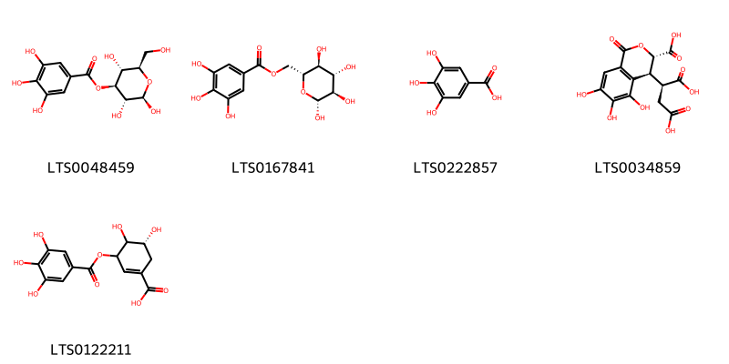{ width=100% }
    <figcaption>Hình ảnh cấu trúc hóa học của 5 hoạt chất thuộc nhóm Benzene and substituted derivatives gồm ['(2r,3r,4s,5r,6r)-2,3,5-trihydroxy-6-(hydroxymethyl)oxan-4-yl 3,4,5-trihydroxybenzoate (LTS0048459)', '6-o-galloyl-β-d-glucose (LTS0167841)', 'galop (LTS0222857)', 'chebulic acid (LTS0034859)', '(5r)-4,5-dihydroxy-3-(3,4,5-trihydroxybenzoyloxy)cyclohex-1-ene-1-carboxylic acid (LTS0122211)'].</figcaption>
</figure>
#### Nhóm Tannins
<figure markdown="span">
    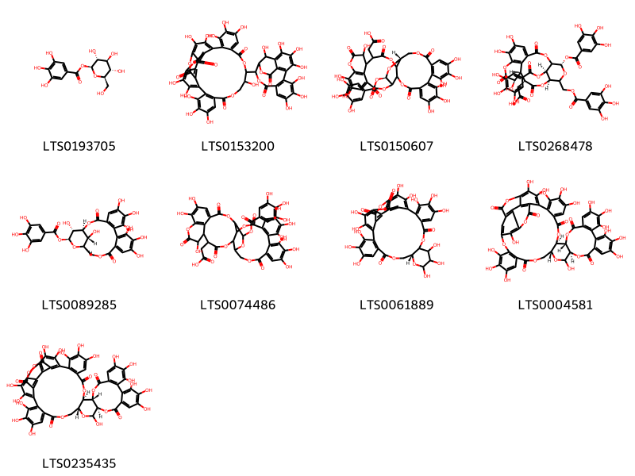{ width=100% }
    <figcaption>Hình ảnh cấu trúc hóa học của 9 hoạt chất thuộc nhóm Tannins gồm ['β-glucogallin (LTS0193705)', '10-{2,3,4,7,8,9,19-heptahydroxy-12,17-dioxo-13,16-dioxatetracyclo[13.3.1.0⁵,¹⁸.0⁶,¹¹]nonadeca-1,3,5(18),6(11),7,9-hexaen-14-yl}-3,4,5,11,17,18,19,22,23,34,35-undecahydroxy-9,13,25,32-tetraoxaheptacyclo[25.8.0.0²,⁷.0¹⁵,²⁰.0²¹,³⁰.0²⁴,²⁹.0²⁸,³³]pentatriaconta-1(35),2,4,6,15(20),16,18,21,23,27,29,33-dodecaene-8,14,26,31-tetrone (LTS0153200)', '[(5r,7r)-13,14,15,18,19,20,31,35,36-nonahydroxy-2,10,23,28,32-pentaoxo-5-(3,4,5-trihydroxybenzoyloxy)-3,6,9,24,27,33-hexaoxaheptacyclo[28.7.1.0⁴,²⁵.0⁷,²⁶.0¹¹,¹⁶.0¹⁷,²².0³⁴,³⁸]octatriaconta-1(37),11(16),12,14,17,19,21,34(38),35-nonaen-29-yl]acetic acid (LTS0150607)', '[(5s,8r,11s,12s,13r,21r)-13,17,18-trihydroxy-2,10,14-trioxo-5,21-bis(3,4,5-trihydroxybenzoyloxy)-7-[(3,4,5-trihydroxybenzoyloxy)methyl]-3,6,9,15-tetraoxatetracyclo[10.7.1.1⁴,⁸.0¹⁶,²⁰]henicosa-1(19),16(20),17-trien-11-yl]acetic acid (LTS0268478)', '(1s,19r,21s,22r,23r)-6,7,8,11,12,13,22,23-octahydroxy-3,16-dioxo-2,17,20-trioxatetracyclo[17.3.1.0⁴,⁹.0¹⁰,¹⁵]tricosa-4(9),5,7,10,12,14-hexaen-21-yl 3,4,5-trihydroxybenzoate (LTS0089285)', '[13,14,15,18,19,20,31,35,36-nonahydroxy-2,10,23,28,32-pentaoxo-5-(3,4,5-trihydroxybenzoyloxy)-3,6,9,24,27,33-hexaoxaheptacyclo[28.7.1.0⁴,²⁵.0⁷,²⁶.0¹¹,¹⁶.0¹⁷,²².0³⁴,³⁸]octatriaconta-1(37),11,13,15,17(22),18,20,34(38),35-nonaen-29-yl]acetic acid (LTS0074486)', '(15r)-3,4,5,11,12,13,21,22,23,26,27,38,39-tridecahydroxy-9,14,17,29,36-pentaoxaoctacyclo[29.8.0.0²,⁷.0¹⁰,¹⁵.0¹⁹,²⁴.0²⁵,³⁴.0²⁸,³³.0³²,³⁷]nonatriaconta-1(39),2,4,6,19(24),20,22,25,27,31,33,37-dodecaene-8,18,30,35-tetrone (LTS0061889)', '(12r,15r,32s,33r)-4,5,6,14,20,21,22,25,26,27,38,39,40,43,44,55-hexadecahydroxy-2,10,13,16,31,34,46,53-octaoxaundecacyclo[46.7.1.0³,⁸.0¹²,³³.0¹⁵,³².0¹⁸,²³.0²⁴,²⁹.0³⁶,⁴¹.0⁴²,⁵¹.0⁴⁵,⁵⁰.0⁴⁹,⁵⁴]hexapentaconta-1(56),3(8),4,6,18,20,22,24(29),25,27,36,38,40,42,44,48,50,54-octadecaene-9,17,30,35,47,52-hexone (LTS0004581)', '(1r,35r,38r,55s)-6,7,8,11,12,23,24,27,28,29,37,43,44,45,48,49,50-heptadecahydroxy-2,14,21,33,36,39,54-heptaoxaundecacyclo[33.20.0.0⁴,⁹.0¹⁰,¹⁹.0¹³,¹⁸.0¹⁶,²⁵.0¹⁷,²².0²⁶,³¹.0³⁸,⁵⁵.0⁴¹,⁴⁶.0⁴⁷,⁵²]pentapentaconta-4(9),5,7,10,12,16,18,22,24,26,28,30,41,43,45,47(52),48,50-octadecaene-3,15,20,32,40,53-hexone (LTS0235435)'].</figcaption>
</figure>

---

### Dược dân tộc học

Danh sách các quốc gia có sử dụng *Terminalia citrina* trong điều trị các bệnh. 

| Country   | Disease               | Bệnh                                                                                                                                                                                                |
|:----------|:----------------------|:----------------------------------------------------------------------------------------------------------------------------------------------------------------------------------------------------|
| Elsewhere | Cardiotonic, Diuretic | MYMEMORY WARNING: YOU USED ALL AVAILABLE FREE TRANSLATIONS FOR TODAY. NEXT AVAILABLE IN  15 HOURS 37 MINUTES 08 SECONDS VISIT HTTPS://MYMEMORY.TRANSLATED.NET/DOC/USAGELIMITS.PHP TO TRANSLATE MORE |

---

---
## Terminalia comintana
### Thông tin về thực vật

!!! info "Phân loại thực vật của *Terminalia citrina* từ GIBF:"
    - **Kingdom:** Plantae
    - **Phylum:** Tracheophyta
    - **Order:** Myrtales
    - **Family:** Combretaceae
    - **Genus:** Terminalia
    - **Species:** *Terminalia citrina*

 

| Label (VI)   | Label (EN)   | Scientific Name      | Descriptions (VI)   | Descriptions (EN)   | Also Known As (VI)   | Also Known As (EN)   |
|:-------------|:-------------|:---------------------|:--------------------|:--------------------|:---------------------|:---------------------|
| N/A          | N/A          | Terminalia comintana |                     |                     | ['']                 | ['']                 |

#### Phân bố trên thế giới

**Từ CSDL GIBF** nan, Philippines, unknown or invalid, Indonesia

#### Phân bố tại Việt Nam

**Từ CSDL GIBF**: Không có ghi nhận ở Việt Nam

---
### Thành phần hóa học
        
- Theo cơ sở dữ liệu lotus: Từ loài *Terminalia citrina* đã phân lập và xác định được Chưa có hoạt chất nào được phân lập. hoạt chất thuộc về các nhóm Không có hoạt chất nào được phân lập. 

Không có hình ảnh nào được tạo ra

---

### Dược dân tộc học

Danh sách các quốc gia có sử dụng *Terminalia citrina* trong điều trị các bệnh. 

| Country     | Disease    | Bệnh                                                                                                                                                                                                |
|:------------|:-----------|:----------------------------------------------------------------------------------------------------------------------------------------------------------------------------------------------------|
| Philippines | Astringent | MYMEMORY WARNING: YOU USED ALL AVAILABLE FREE TRANSLATIONS FOR TODAY. NEXT AVAILABLE IN  15 HOURS 36 MINUTES 29 SECONDS VISIT HTTPS://MYMEMORY.TRANSLATED.NET/DOC/USAGELIMITS.PHP TO TRANSLATE MORE |

---

---
## Terminalia coriacea
### Thông tin về thực vật

!!! info "Phân loại thực vật của *Terminalia coriacea* từ GIBF:"
    - **Kingdom:** Plantae
    - **Phylum:** Tracheophyta
    - **Order:** Myrtales
    - **Family:** Combretaceae
    - **Genus:** Terminalia
    - **Species:** *Terminalia coriacea*

 

| Label (VI)   | Label (EN)   | Scientific Name     | Descriptions (VI)   | Descriptions (EN)   | Also Known As (VI)   | Also Known As (EN)   |
|:-------------|:-------------|:--------------------|:--------------------|:--------------------|:---------------------|:---------------------|
| N/A          | N/A          | Terminalia coriacea | loài thực vật       | species of plant    | ['']                 | ['']                 |

#### Phân bố trên thế giới

**Từ CSDL GIBF** Sri Lanka, India, Zambia

#### Phân bố tại Việt Nam

**Từ CSDL GIBF**: Không có ghi nhận ở Việt Nam

---
### Thành phần hóa học
        
- Theo cơ sở dữ liệu lotus: Từ loài *Terminalia coriacea* đã phân lập và xác định được Chưa có hoạt chất nào được phân lập. hoạt chất thuộc về các nhóm Không có hoạt chất nào được phân lập. 

Không có hình ảnh nào được tạo ra

---

### Dược dân tộc học

Danh sách các quốc gia có sử dụng *Terminalia coriacea* trong điều trị các bệnh. 

| Country      | Disease     | Bệnh                                                                                                                                                                                                |
|:-------------|:------------|:----------------------------------------------------------------------------------------------------------------------------------------------------------------------------------------------------|
| Elsewhere    | Cardiotonic | MYMEMORY WARNING: YOU USED ALL AVAILABLE FREE TRANSLATIONS FOR TODAY. NEXT AVAILABLE IN  15 HOURS 36 MINUTES 09 SECONDS VISIT HTTPS://MYMEMORY.TRANSLATED.NET/DOC/USAGELIMITS.PHP TO TRANSLATE MORE |
| India(Hindu) | Cardiotonic | MYMEMORY WARNING: YOU USED ALL AVAILABLE FREE TRANSLATIONS FOR TODAY. NEXT AVAILABLE IN  15 HOURS 36 MINUTES 05 SECONDS VISIT HTTPS://MYMEMORY.TRANSLATED.NET/DOC/USAGELIMITS.PHP TO TRANSLATE MORE |

---

---
## Terminalia glabra
### Thông tin về thực vật

!!! info "Phân loại thực vật của *N/A* từ GIBF:"
    - **Kingdom:** Plantae
    - **Phylum:** Tracheophyta
    - **Order:** Myrtales
    - **Family:** Combretaceae
    - **Genus:** Terminalia
    - **Species:** *N/A*

 

| Label (VI)   | Label (EN)   | Scientific Name     | Descriptions (VI)   | Descriptions (EN)   | Also Known As (VI)   | Also Known As (EN)   |
|:-------------|:-------------|:--------------------|:--------------------|:--------------------|:---------------------|:---------------------|
| N/A          | N/A          | Terminalia coriacea | loài thực vật       | species of plant    | ['']                 | ['']                 |

#### Phân bố trên thế giới

**Từ CSDL GIBF** Honduras, Thailand, Namibia, French Polynesia, Senegal, Singapore, Martinique, Australia, Jamaica, Indonesia, Sri Lanka, Dominican Republic, Maldives, Puerto Rico, Sao Tome and Principe, India, Nigeria, Virgin Islands (U.S.), Antigua and Barbuda, Nicaragua, Panama, Brazil, Belize, Palau, Aruba, Mexico, Benin, Chinese Taipei, Hong Kong, Argentina, South Africa, Botswana, Grenada, Micronesia (Federated States of), Mozambique, Fiji, Costa Rica, United States of America, Zimbabwe, Zambia

#### Phân bố tại Việt Nam

**Từ CSDL GIBF**: Không có ghi nhận ở Việt Nam

---
### Thành phần hóa học
        
- Theo cơ sở dữ liệu lotus: Từ loài *N/A* đã phân lập và xác định được Chưa có hoạt chất nào được phân lập. hoạt chất thuộc về các nhóm Không có hoạt chất nào được phân lập. 

Không có hình ảnh nào được tạo ra

---

### Dược dân tộc học

Danh sách các quốc gia có sử dụng *N/A* trong điều trị các bệnh. 

| Country   | Disease           | Bệnh                                                                                                                                                                                                |
|:----------|:------------------|:----------------------------------------------------------------------------------------------------------------------------------------------------------------------------------------------------|
| Sudan     | Astringent, Tonic | MYMEMORY WARNING: YOU USED ALL AVAILABLE FREE TRANSLATIONS FOR TODAY. NEXT AVAILABLE IN  15 HOURS 35 MINUTES 45 SECONDS VISIT HTTPS://MYMEMORY.TRANSLATED.NET/DOC/USAGELIMITS.PHP TO TRANSLATE MORE |

---

---
## Terminalia glaucescens
### Thông tin về thực vật

!!! info "Phân loại thực vật của *Terminalia schimperiana* từ GIBF:"
    - **Kingdom:** Plantae
    - **Phylum:** Tracheophyta
    - **Order:** Myrtales
    - **Family:** Combretaceae
    - **Genus:** Terminalia
    - **Species:** *Terminalia schimperiana*

 

| Label (VI)   | Label (EN)   | Scientific Name        | Descriptions (VI)   | Descriptions (EN)   | Also Known As (VI)   | Also Known As (EN)   |
|:-------------|:-------------|:-----------------------|:--------------------|:--------------------|:---------------------|:---------------------|
| N/A          | N/A          | Terminalia glaucescens |                     | Planch. ex Benth.   | ['']                 | ['']                 |

#### Phân bố trên thế giới

**Từ CSDL GIBF** Togo, Ethiopia, Nigeria, Guinea, Benin

#### Phân bố tại Việt Nam

**Từ CSDL GIBF**: Không có ghi nhận ở Việt Nam

---
### Thành phần hóa học
        
- Theo cơ sở dữ liệu lotus: Từ loài *Terminalia schimperiana* đã phân lập và xác định được Chưa có hoạt chất nào được phân lập. hoạt chất thuộc về các nhóm Không có hoạt chất nào được phân lập. 

Không có hình ảnh nào được tạo ra

---

### Dược dân tộc học

Danh sách các quốc gia có sử dụng *Terminalia schimperiana* trong điều trị các bệnh. 

| Country      | Disease   | Bệnh                                                                                                                                                                                                |
|:-------------|:----------|:----------------------------------------------------------------------------------------------------------------------------------------------------------------------------------------------------|
| Sierra Leone | Purgative | MYMEMORY WARNING: YOU USED ALL AVAILABLE FREE TRANSLATIONS FOR TODAY. NEXT AVAILABLE IN  15 HOURS 35 MINUTES 10 SECONDS VISIT HTTPS://MYMEMORY.TRANSLATED.NET/DOC/USAGELIMITS.PHP TO TRANSLATE MORE |

---

---
## Terminalia macroptera
### Thông tin về thực vật

!!! info "Phân loại thực vật của *Terminalia macroptera* từ GIBF:"
    - **Kingdom:** Plantae
    - **Phylum:** Tracheophyta
    - **Order:** Myrtales
    - **Family:** Combretaceae
    - **Genus:** Terminalia
    - **Species:** *Terminalia macroptera*

 

| Label (VI)   | Label (EN)   | Scientific Name       | Descriptions (VI)   | Descriptions (EN)   | Also Known As (VI)   | Also Known As (EN)   |
|:-------------|:-------------|:----------------------|:--------------------|:--------------------|:---------------------|:---------------------|
| N/A          | N/A          | Terminalia macroptera |                     | species of plant    | ['']                 | ['']                 |

#### Phân bố trên thế giới

**Từ CSDL GIBF** Togo, Uganda, Mali, Côte d’Ivoire, Ethiopia, Senegal, Nigeria, Chad, Guinea, Benin, Gambia

#### Phân bố tại Việt Nam

**Từ CSDL GIBF**: Không có ghi nhận ở Việt Nam

---
### Thành phần hóa học
        
- Theo cơ sở dữ liệu lotus: Từ loài *Terminalia macroptera* đã phân lập và xác định được 17 hoạt chất thuộc về các nhóm Tannins, Prenol lipids. 

|    | chemicalTaxonomyClassyfireClass   |   smiles_count |
|---:|:----------------------------------|---------------:|
|  0 | Prenol lipids                     |             10 |
|  1 | Tannins                           |              7 |

#### Nhóm Prenol lipids
<figure markdown="span">
    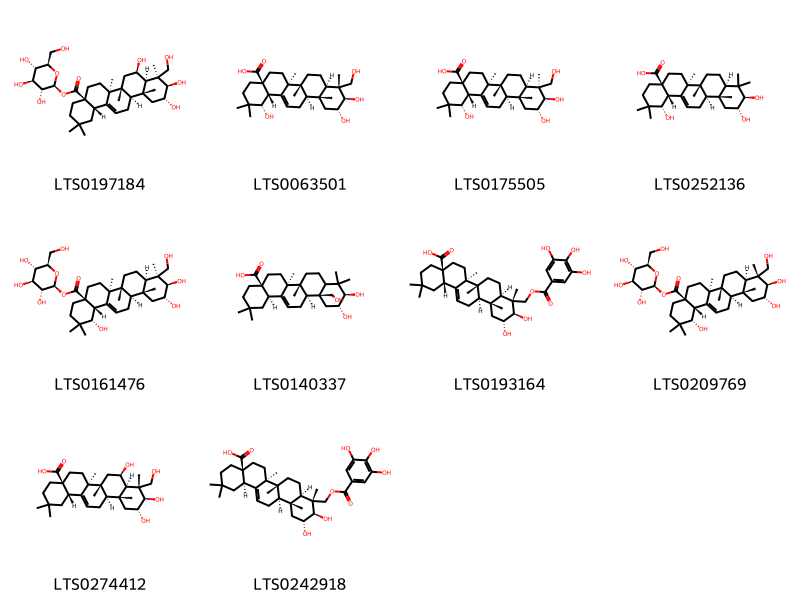{ width=100% }
    <figcaption>Hình ảnh cấu trúc hóa học của 10 hoạt chất thuộc nhóm Prenol lipids gồm ['(2s,3r,4s,5s,6r)-3,4,5-trihydroxy-6-(hydroxymethyl)oxan-2-yl (4as,6as,6br,8r,8ar,9s,10r,11r,12ar,12br,14bs)-8,10,11-trihydroxy-9-(hydroxymethyl)-2,2,6a,6b,9,12a-hexamethyl-1,3,4,5,6,7,8,8a,10,11,12,12b,13,14b-tetradecahydropicene-4a-carboxylate (LTS0197184)', '(1s,4ar,6as,6br,8ar,9r,10r,11r,12ar,12br,14bs)-1,10,11-trihydroxy-9-(hydroxymethyl)-2,2,6a,6b,9,12a-hexamethyl-1,3,4,5,6,7,8,8a,10,11,12,12b,13,14b-tetradecahydropicene-4a-carboxylic acid (LTS0063501)', '(1s,4ar,6as,6br,8ar,9s,10r,11r,12ar,12br,14bs)-1,10,11-trihydroxy-9-(hydroxymethyl)-2,2,6a,6b,9,12a-hexamethyl-1,3,4,5,6,7,8,8a,10,11,12,12b,13,14b-tetradecahydropicene-4a-carboxylic acid (LTS0175505)', '(1s,4ar,6as,6br,8ar,10r,11r,12ar,12br,14bs)-1,10,11-trihydroxy-2,2,6a,6b,9,9,12a-heptamethyl-1,3,4,5,6,7,8,8a,10,11,12,12b,13,14b-tetradecahydropicene-4a-carboxylic acid (LTS0252136)', 'sericoside (LTS0161476)', '(4as,6as,6br,10r,11r,12as,12bs,14br)-10,11-dihydroxy-12a-(hydroxymethyl)-2,2,6a,6b,9,9-hexamethyl-1,3,4,5,6,7,8,8a,10,11,12,12b,13,14b-tetradecahydropicene-4a-carboxylic acid (LTS0140337)', '(4as,6as,6br,8ar,9r,10r,11r,12ar,12br,14bs)-10,11-dihydroxy-2,2,6a,6b,9,12a-hexamethyl-9-[(3,4,5-trihydroxybenzoyloxy)methyl]-1,3,4,5,6,7,8,8a,10,11,12,12b,13,14b-tetradecahydropicene-4a-carboxylic acid (LTS0193164)', '(2s,3r,4s,5s,6r)-3,4,5-trihydroxy-6-(hydroxymethyl)oxan-2-yl (1s,4ar,6as,6br,8ar,9r,10r,11r,12ar,12br,14bs)-1,10,11-trihydroxy-9-(hydroxymethyl)-2,2,6a,6b,9,12a-hexamethyl-1,3,4,5,6,7,8,8a,10,11,12,12b,13,14b-tetradecahydropicene-4a-carboxylate (LTS0209769)', 'terminolic acid (LTS0274412)', '(4as,6as,6br,8ar,9r,10r,11r,12ar,12br,14br)-10,11-dihydroxy-2,2,6a,6b,9,12a-hexamethyl-9-[(3,4,5-trihydroxybenzoyloxy)methyl]-1,3,4,5,6,7,8,8a,10,11,12,12b,13,14b-tetradecahydropicene-4a-carboxylic acid (LTS0242918)'].</figcaption>
</figure>
#### Nhóm Tannins
<figure markdown="span">
    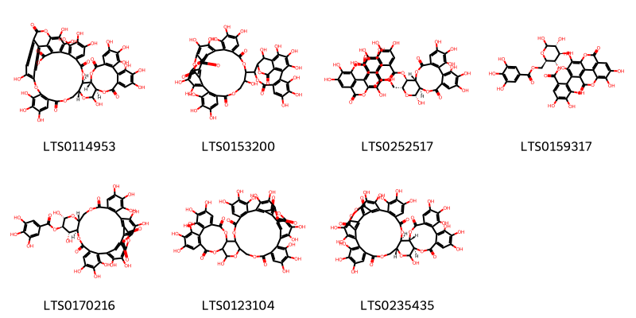{ width=100% }
    <figcaption>Hình ảnh cấu trúc hóa học của 7 hoạt chất thuộc nhóm Tannins gồm ['(10r,11s,28r,31r)-3,4,5,16,17,18,21,22,23,29,37,38,39,43,55,56-hexadecahydroxy-9,12,27,30,33,41,47,52-octaoxaundecacyclo[46.6.2.0²,⁷.0¹⁰,³¹.0¹¹,²⁸.0¹⁴,¹⁹.0²⁰,²⁵.0³⁵,⁴⁰.0⁴²,⁵¹.0⁴⁵,⁵⁰.0⁴⁹,⁵⁴]hexapentaconta-1(55),2,4,6,14(19),15,17,20,22,24,35(40),36,38,42(51),43,45(50),48(56),49(54)-octadecaene-8,13,26,34,46,53-hexone (LTS0114953)', '10-{2,3,4,7,8,9,19-heptahydroxy-12,17-dioxo-13,16-dioxatetracyclo[13.3.1.0⁵,¹⁸.0⁶,¹¹]nonadeca-1,3,5(18),6(11),7,9-hexaen-14-yl}-3,4,5,11,17,18,19,22,23,34,35-undecahydroxy-9,13,25,32-tetraoxaheptacyclo[25.8.0.0²,⁷.0¹⁵,²⁰.0²¹,³⁰.0²⁴,²⁹.0²⁸,³³]pentatriaconta-1(35),2,4,6,15(20),16,18,21,23,27,29,33-dodecaene-8,14,26,31-tetrone (LTS0153200)', '(10r,11r,13r,14r,15s)-3,4,5,11,20,21,22-heptahydroxy-8,17-dioxo-13-[(3,4,5-trihydroxybenzoyloxy)methyl]-9,12,16-trioxatetracyclo[16.4.0.0²,⁷.0¹⁰,¹⁵]docosa-1(18),2,4,6,19,21-hexaen-14-yl 3,4,5-trihydroxy-2-{6,7,13,14-tetrahydroxy-3,10-dioxo-2,9-dioxatetracyclo[6.6.2.0⁴,¹⁶.0¹¹,¹⁵]hexadeca-1(14),4(16),5,7,11(15),12-hexaen-5-yl}benzoate (LTS0252517)', 'terflavin b (LTS0159317)', '(10s,11s,12r,13r,15r)-3,4,5,11,13,21,22,23,26,27,38,39-dodecahydroxy-8,18,30,35-tetraoxo-9,14,17,29,36-pentaoxaoctacyclo[29.8.0.0²,⁷.0¹⁰,¹⁵.0¹⁹,²⁴.0²⁵,³⁴.0²⁸,³³.0³²,³⁷]nonatriaconta-1(39),2,4,6,19(24),20,22,25,27,31,33,37-dodecaen-12-yl 3,4,5-trihydroxybenzoate (LTS0170216)', '6,7,8,11,12,23,24,27,28,29,37,43,44,45,48,49,50-heptadecahydroxy-2,14,21,33,36,39,54-heptaoxaundecacyclo[33.20.0.0⁴,⁹.0¹⁰,¹⁹.0¹³,¹⁸.0¹⁶,²⁵.0¹⁷,²².0²⁶,³¹.0³⁸,⁵⁵.0⁴¹,⁴⁶.0⁴⁷,⁵²]pentapentaconta-4(9),5,7,10,12,16,18,22,24,26,28,30,41(46),42,44,47,49,51-octadecaene-3,15,20,32,40,53-hexone (LTS0123104)', '(1r,35r,38r,55s)-6,7,8,11,12,23,24,27,28,29,37,43,44,45,48,49,50-heptadecahydroxy-2,14,21,33,36,39,54-heptaoxaundecacyclo[33.20.0.0⁴,⁹.0¹⁰,¹⁹.0¹³,¹⁸.0¹⁶,²⁵.0¹⁷,²².0²⁶,³¹.0³⁸,⁵⁵.0⁴¹,⁴⁶.0⁴⁷,⁵²]pentapentaconta-4(9),5,7,10,12,16,18,22,24,26,28,30,41,43,45,47(52),48,50-octadecaene-3,15,20,32,40,53-hexone (LTS0235435)'].</figcaption>
</figure>

---

### Dược dân tộc học

Danh sách các quốc gia có sử dụng *Terminalia macroptera* trong điều trị các bệnh. 

| Country   | Disease   | Bệnh                                                                                                                                                                                                |
|:----------|:----------|:----------------------------------------------------------------------------------------------------------------------------------------------------------------------------------------------------|
| Sudan     | Perfume   | MYMEMORY WARNING: YOU USED ALL AVAILABLE FREE TRANSLATIONS FOR TODAY. NEXT AVAILABLE IN  15 HOURS 34 MINUTES 47 SECONDS VISIT HTTPS://MYMEMORY.TRANSLATED.NET/DOC/USAGELIMITS.PHP TO TRANSLATE MORE |

---

---
## Terminalia myriocarpa
### Thông tin về thực vật

!!! info "Phân loại thực vật của *Terminalia myriocarpa* từ GIBF:"
    - **Kingdom:** Plantae
    - **Phylum:** Tracheophyta
    - **Order:** Myrtales
    - **Family:** Combretaceae
    - **Genus:** Terminalia
    - **Species:** *Terminalia myriocarpa*

 

| Label (VI)   | Label (EN)   | Scientific Name       | Descriptions (VI)   | Descriptions (EN)   | Also Known As (VI)   | Also Known As (EN)   |
|:-------------|:-------------|:----------------------|:--------------------|:--------------------|:---------------------|:---------------------|
| N/A          | N/A          | Terminalia myriocarpa | loài thực vật       | species of plant    | ['']                 | ['']                 |

#### Phân bố trên thế giới

**Từ CSDL GIBF** Viet Nam, nan, unknown or invalid, Thailand, Bhutan, Myanmar, Panama, Puerto Rico, Malaysia, India, Lao People’s Democratic Republic, United States of America, Cuba, China, Nepal, Indonesia

#### Phân bố tại Việt Nam

**Từ CSDL GIBF**: Vinh Phúc, Thanh Hoa, Nghe An, Ninh Bình, Ha Tinh, Tonkin

---
### Thành phần hóa học
        
- Theo cơ sở dữ liệu lotus: Từ loài *Terminalia myriocarpa* đã phân lập và xác định được 18 hoạt chất thuộc về các nhóm Tannins, Flavonoids, Benzene and substituted derivatives. 

|    | chemicalTaxonomyClassyfireClass     |   smiles_count |
|---:|:------------------------------------|---------------:|
|  0 | Benzene and substituted derivatives |              4 |
|  1 | Flavonoids                          |              7 |
|  2 | Tannins                             |              7 |

#### Nhóm Benzene and substituted derivatives
<figure markdown="span">
    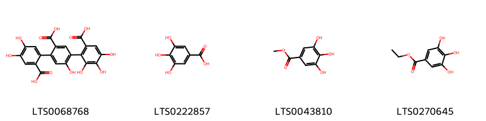{ width=100% }
    <figcaption>Hình ảnh cấu trúc hóa học của 4 hoạt chất thuộc nhóm Benzene and substituted derivatives gồm ['flavogallonic acid (LTS0068768)', 'galop (LTS0222857)', 'methyl gallate (LTS0043810)', 'ethyl gallate (LTS0270645)'].</figcaption>
</figure>
#### Nhóm Flavonoids
<figure markdown="span">
    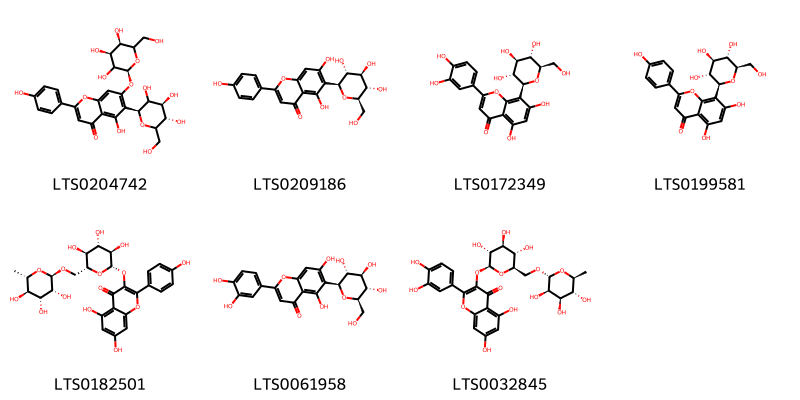{ width=100% }
    <figcaption>Hình ảnh cấu trúc hóa học của 7 hoạt chất thuộc nhóm Flavonoids gồm ['neosaponarin (LTS0204742)', 'isovitexin (LTS0209186)', 'orientin (LTS0172349)', 'vitexin (LTS0199581)', 'nictoflorin (LTS0182501)', 'isoorientin (LTS0061958)', '3-rutinosyl quercetin (LTS0032845)'].</figcaption>
</figure>
#### Nhóm Tannins
<figure markdown="span">
    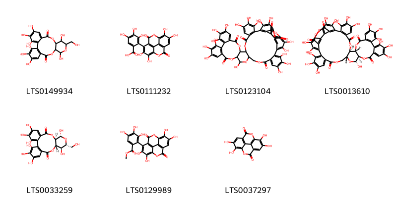{ width=100% }
    <figcaption>Hình ảnh cấu trúc hóa học của 7 hoạt chất thuộc nhóm Tannins gồm ['3,4,5,11,14,20,21,22-octahydroxy-13-(hydroxymethyl)-9,12,16-trioxatetracyclo[16.4.0.0²,⁷.0¹⁰,¹⁵]docosa-1(22),2(7),3,5,18,20-hexaene-8,17-dione (LTS0149934)', '3,4,5-trihydroxy-2-{6,7,13,14-tetrahydroxy-3,10-dioxo-2,9-dioxatetracyclo[6.6.2.0⁴,¹⁶.0¹¹,¹⁵]hexadeca-1(14),4(16),5,7,11(15),12-hexaen-5-yl}benzoic acid (LTS0111232)', '6,7,8,11,12,23,24,27,28,29,37,43,44,45,48,49,50-heptadecahydroxy-2,14,21,33,36,39,54-heptaoxaundecacyclo[33.20.0.0⁴,⁹.0¹⁰,¹⁹.0¹³,¹⁸.0¹⁶,²⁵.0¹⁷,²².0²⁶,³¹.0³⁸,⁵⁵.0⁴¹,⁴⁶.0⁴⁷,⁵²]pentapentaconta-4(9),5,7,10,12,16,18,22,24,26,28,30,41(46),42,44,47,49,51-octadecaene-3,15,20,32,40,53-hexone (LTS0123104)', '(1r,35r,37r,38r,55s)-6,7,8,11,12,23,24,27,28,29,37,43,44,45,48,49,50-heptadecahydroxy-2,14,21,33,36,39,54-heptaoxaundecacyclo[33.20.0.0⁴,⁹.0¹⁰,¹⁹.0¹³,¹⁸.0¹⁶,²⁵.0¹⁷,²².0²⁶,³¹.0³⁸,⁵⁵.0⁴¹,⁴⁶.0⁴⁷,⁵²]pentapentaconta-4(9),5,7,10,12,16,18,22,24,26,28,30,41,43,45,47(52),48,50-octadecaene-3,15,20,32,40,53-hexone (LTS0013610)', '(10r,11r,13r,14r,15s)-3,4,5,11,14,20,21,22-octahydroxy-13-(hydroxymethyl)-9,12,16-trioxatetracyclo[16.4.0.0²,⁷.0¹⁰,¹⁵]docosa-1(18),2,4,6,19,21-hexaene-8,17-dione (LTS0033259)', 'methyl 3,4,5-trihydroxy-2-{6,7,13,14-tetrahydroxy-3,10-dioxo-2,9-dioxatetracyclo[6.6.2.0⁴,¹⁶.0¹¹,¹⁵]hexadeca-1(14),4(16),5,7,11(15),12-hexaen-5-yl}benzoate (LTS0129989)', 'ellagic acid (LTS0037297)'].</figcaption>
</figure>

---

### Dược dân tộc học

Danh sách các quốc gia có sử dụng *Terminalia myriocarpa* trong điều trị các bệnh. 

| Country   | Disease               | Bệnh                                                                                                                                                                                                |
|:----------|:----------------------|:----------------------------------------------------------------------------------------------------------------------------------------------------------------------------------------------------|
| Elsewhere | Cardiotonic, Diuretic | MYMEMORY WARNING: YOU USED ALL AVAILABLE FREE TRANSLATIONS FOR TODAY. NEXT AVAILABLE IN  15 HOURS 34 MINUTES 21 SECONDS VISIT HTTPS://MYMEMORY.TRANSLATED.NET/DOC/USAGELIMITS.PHP TO TRANSLATE MORE |

---

---
## Terminalia paniculata
### Thông tin về thực vật

!!! info "Phân loại thực vật của *Terminalia paniculata* từ GIBF:"
    - **Kingdom:** Plantae
    - **Phylum:** Tracheophyta
    - **Order:** Myrtales
    - **Family:** Combretaceae
    - **Genus:** Terminalia
    - **Species:** *Terminalia paniculata*

 

| Label (VI)   | Label (EN)   | Scientific Name       | Descriptions (VI)   | Descriptions (EN)                         | Also Known As (VI)   | Also Known As (EN)   |
|:-------------|:-------------|:----------------------|:--------------------|:------------------------------------------|:---------------------|:---------------------|
| N/A          | N/A          | Terminalia paniculata |                     | species of tree native to southwest India | ['']                 | ['']                 |

#### Phân bố trên thế giới

**Từ CSDL GIBF** nan, Togo, Sri Lanka, unknown or invalid, India

#### Phân bố tại Việt Nam

**Từ CSDL GIBF**: Không có ghi nhận ở Việt Nam

---
### Thành phần hóa học
        
- Theo cơ sở dữ liệu lotus: Từ loài *Terminalia paniculata* đã phân lập và xác định được Chưa có hoạt chất nào được phân lập. hoạt chất thuộc về các nhóm Không có hoạt chất nào được phân lập. 

Không có hình ảnh nào được tạo ra

---

### Dược dân tộc học

Danh sách các quốc gia có sử dụng *Terminalia paniculata* trong điều trị các bệnh. 

| Country   | Disease               | Bệnh                                                                                                                                                                                                |
|:----------|:----------------------|:----------------------------------------------------------------------------------------------------------------------------------------------------------------------------------------------------|
| Elsewhere | Cardiotonic, Diuretic | MYMEMORY WARNING: YOU USED ALL AVAILABLE FREE TRANSLATIONS FOR TODAY. NEXT AVAILABLE IN  15 HOURS 33 MINUTES 50 SECONDS VISIT HTTPS://MYMEMORY.TRANSLATED.NET/DOC/USAGELIMITS.PHP TO TRANSLATE MORE |

---

---
## Terminalia tomentosa
### Thông tin về thực vật

!!! info "Phân loại thực vật của *N/A* từ GIBF:"
    - **Kingdom:** Plantae
    - **Phylum:** Tracheophyta
    - **Order:** Myrtales
    - **Family:** Combretaceae
    - **Genus:** N/A
    - **Species:** *N/A*

 

| Label (VI)   | Label (EN)   | Scientific Name       | Descriptions (VI)   | Descriptions (EN)                         | Also Known As (VI)   | Also Known As (EN)   |
|:-------------|:-------------|:----------------------|:--------------------|:------------------------------------------|:---------------------|:---------------------|
| N/A          | N/A          | Terminalia paniculata |                     | species of tree native to southwest India | ['']                 | ['']                 |

#### Phân bố trên thế giới

**Từ CSDL GIBF** Honduras, Cayman Islands, Thailand, El Salvador, Namibia, Guadeloupe, French Polynesia, Trinidad and Tobago, French Guiana, Senegal, Singapore, Australia, Jamaica, Indonesia, Haiti, Sierra Leone, Turks and Caicos Islands, Sri Lanka, Dominican Republic, Puerto Rico, Sao Tome and Principe, India, Nigeria, Bahamas, Saint Kitts and Nevis, Sint Maarten (Dutch part), Virgin Islands (U.S.), Cambodia, Antigua and Barbuda, Nicaragua, Panama, Brazil, Palau, Aruba, Mexico, Benin, Curaçao, Gambia, Chinese Taipei, Argentina, South Africa, Botswana, Grenada, Mozambique, Costa Rica, Ecuador, United States of America, Zimbabwe

#### Phân bố tại Việt Nam

**Từ CSDL GIBF**: Không có ghi nhận ở Việt Nam

---
### Thành phần hóa học
        
- Theo cơ sở dữ liệu lotus: Từ loài *N/A* đã phân lập và xác định được Chưa có hoạt chất nào được phân lập. hoạt chất thuộc về các nhóm Không có hoạt chất nào được phân lập. 

Không có hình ảnh nào được tạo ra

---

### Dược dân tộc học

Danh sách các quốc gia có sử dụng *N/A* trong điều trị các bệnh. 

| Country   | Disease              | Bệnh                                                                                                                                                                                                |
|:----------|:---------------------|:----------------------------------------------------------------------------------------------------------------------------------------------------------------------------------------------------|
| India     | Cosmetic, Astringent | MYMEMORY WARNING: YOU USED ALL AVAILABLE FREE TRANSLATIONS FOR TODAY. NEXT AVAILABLE IN  15 HOURS 33 MINUTES 22 SECONDS VISIT HTTPS://MYMEMORY.TRANSLATED.NET/DOC/USAGELIMITS.PHP TO TRANSLATE MORE |

---

---
## Terminalia travancorensis
### Thông tin về thực vật

!!! info "Phân loại thực vật của *Terminalia travancorensis* từ GIBF:"
    - **Kingdom:** Plantae
    - **Phylum:** Tracheophyta
    - **Order:** Myrtales
    - **Family:** Combretaceae
    - **Genus:** Terminalia
    - **Species:** *Terminalia travancorensis*

 

| Label (VI)   | Label (EN)   | Scientific Name           | Descriptions (VI)   | Descriptions (EN)   | Also Known As (VI)   | Also Known As (EN)   |
|:-------------|:-------------|:--------------------------|:--------------------|:--------------------|:---------------------|:---------------------|
| N/A          | N/A          | Terminalia travancorensis | loài thực vật       | species of plant    | ['']                 | ['']                 |

#### Phân bố trên thế giới

**Từ CSDL GIBF** India

#### Phân bố tại Việt Nam

**Từ CSDL GIBF**: Không có ghi nhận ở Việt Nam

---
### Thành phần hóa học
        
- Theo cơ sở dữ liệu lotus: Từ loài *Terminalia travancorensis* đã phân lập và xác định được Chưa có hoạt chất nào được phân lập. hoạt chất thuộc về các nhóm Không có hoạt chất nào được phân lập. 

Không có hình ảnh nào được tạo ra

---

### Dược dân tộc học

Danh sách các quốc gia có sử dụng *Terminalia travancorensis* trong điều trị các bệnh. 

| Country   | Disease                                                                             | Bệnh                                                                                                                                                                                                |
|:----------|:------------------------------------------------------------------------------------|:----------------------------------------------------------------------------------------------------------------------------------------------------------------------------------------------------|
| Elsewhere | Cardiotonic, Collyrium, Laxative, Tonic, Dentifrice, Diuretic, Stomachic, Vermifuge | MYMEMORY WARNING: YOU USED ALL AVAILABLE FREE TRANSLATIONS FOR TODAY. NEXT AVAILABLE IN  15 HOURS 32 MINUTES 51 SECONDS VISIT HTTPS://MYMEMORY.TRANSLATED.NET/DOC/USAGELIMITS.PHP TO TRANSLATE MORE |

---

# Chi Combretum

??? note "Danh sách các dược liệu thuộc chi"
    
	 - *Combretum acuminatum*
	 - *Combretum bracteatum*
	 - *Combretum cacoucia*
	 - *Combretum confertum*
	 - *Combretum hypotilinum*
	 - *Combretum pilosum*
	 - *Combretum racemosum*
	 - *Combretum raimbaultii*
	 - *Combretum tetralophum*
	 - *Combretum trifoliatum*

---
## Combretum acuminatum
### Thông tin về thực vật

!!! info "Phân loại thực vật của *Combretum acuminatum* từ GIBF:"
    - **Kingdom:** Plantae
    - **Phylum:** Tracheophyta
    - **Order:** Myrtales
    - **Family:** Combretaceae
    - **Genus:** Combretum
    - **Species:** *Combretum acuminatum*

 

| Label (VI)   | Label (EN)   | Scientific Name      | Descriptions (VI)   | Descriptions (EN)   | Also Known As (VI)   | Also Known As (EN)   |
|:-------------|:-------------|:---------------------|:--------------------|:--------------------|:---------------------|:---------------------|
| N/A          | N/A          | Combretum acuminatum |                     | species of plant    | ['']                 | ['']                 |

#### Phân bố trên thế giới

**Từ CSDL GIBF** Viet Nam, nan, unknown or invalid, Thailand, Sri Lanka, Christmas Island, Myanmar, Bhutan, Philippines, Malaysia, India, Papua New Guinea, Bangladesh, Zambia, China, Indonesia

#### Phân bố tại Việt Nam

**Từ CSDL GIBF**: Dong Nai

---
### Thành phần hóa học
        
- Theo cơ sở dữ liệu lotus: Từ loài *Combretum acuminatum* đã phân lập và xác định được Chưa có hoạt chất nào được phân lập. hoạt chất thuộc về các nhóm Không có hoạt chất nào được phân lập. 

Không có hình ảnh nào được tạo ra

---

### Dược dân tộc học

Danh sách các quốc gia có sử dụng *Combretum acuminatum* trong điều trị các bệnh. 

| Country   | Disease              | Bệnh                                                                                                                                                                                                |
|:----------|:---------------------|:----------------------------------------------------------------------------------------------------------------------------------------------------------------------------------------------------|
| Elsewhere | Taenifuge, Vermifuge | MYMEMORY WARNING: YOU USED ALL AVAILABLE FREE TRANSLATIONS FOR TODAY. NEXT AVAILABLE IN  15 HOURS 32 MINUTES 31 SECONDS VISIT HTTPS://MYMEMORY.TRANSLATED.NET/DOC/USAGELIMITS.PHP TO TRANSLATE MORE |
| Malaya    | Vermifuge            | MYMEMORY WARNING: YOU USED ALL AVAILABLE FREE TRANSLATIONS FOR TODAY. NEXT AVAILABLE IN  15 HOURS 32 MINUTES 28 SECONDS VISIT HTTPS://MYMEMORY.TRANSLATED.NET/DOC/USAGELIMITS.PHP TO TRANSLATE MORE |

---

---
## Combretum bracteatum
### Thông tin về thực vật

!!! info "Phân loại thực vật của *Combretum bracteatum* từ GIBF:"
    - **Kingdom:** Plantae
    - **Phylum:** Tracheophyta
    - **Order:** Myrtales
    - **Family:** Combretaceae
    - **Genus:** Combretum
    - **Species:** *Combretum bracteatum*

 

| Label (VI)   | Label (EN)   | Scientific Name      | Descriptions (VI)   | Descriptions (EN)   | Also Known As (VI)   | Also Known As (EN)   |
|:-------------|:-------------|:---------------------|:--------------------|:--------------------|:---------------------|:---------------------|
| N/A          | N/A          | Combretum bracteatum | loài thực vật       | species of plant    | ['']                 | ['']                 |

#### Phân bố trên thế giới

**Từ CSDL GIBF** South Africa, Cameroon, Congo, Democratic Republic of the, Gabon, Nigeria, Congo

#### Phân bố tại Việt Nam

**Từ CSDL GIBF**: Không có ghi nhận ở Việt Nam

---
### Thành phần hóa học
        
- Theo cơ sở dữ liệu lotus: Từ loài *Combretum bracteatum* đã phân lập và xác định được Chưa có hoạt chất nào được phân lập. hoạt chất thuộc về các nhóm Không có hoạt chất nào được phân lập. 

Không có hình ảnh nào được tạo ra

---

### Dược dân tộc học

Danh sách các quốc gia có sử dụng *Combretum bracteatum* trong điều trị các bệnh. 

| Country   | Disease    | Bệnh                                                                                                                                                                                                |
|:----------|:-----------|:----------------------------------------------------------------------------------------------------------------------------------------------------------------------------------------------------|
| Elsewhere | Tonic, nan | MYMEMORY WARNING: YOU USED ALL AVAILABLE FREE TRANSLATIONS FOR TODAY. NEXT AVAILABLE IN  15 HOURS 32 MINUTES 00 SECONDS VISIT HTTPS://MYMEMORY.TRANSLATED.NET/DOC/USAGELIMITS.PHP TO TRANSLATE MORE |

---

---
## Combretum cacoucia
### Thông tin về thực vật

!!! info "Phân loại thực vật của *Combretum cacoucia* từ GIBF:"
    - **Kingdom:** Plantae
    - **Phylum:** Tracheophyta
    - **Order:** Myrtales
    - **Family:** Combretaceae
    - **Genus:** Combretum
    - **Species:** *Combretum cacoucia*

 

| Label (VI)   | Label (EN)   | Scientific Name    | Descriptions (VI)   | Descriptions (EN)   | Also Known As (VI)   | Also Known As (EN)   |
|:-------------|:-------------|:-------------------|:--------------------|:--------------------|:---------------------|:---------------------|
| N/A          | N/A          | Combretum cacoucia | loài thực vật       | species of plant    | ['']                 | ['']                 |

#### Phân bố trên thế giới

**Từ CSDL GIBF** Honduras, nan, Venezuela (Bolivarian Republic of), Belize, Nicaragua, Panama, Brazil, Suriname, France, India, French Guiana, Costa Rica, Guyana, Mexico, Zambia, Madagascar, Guatemala

#### Phân bố tại Việt Nam

**Từ CSDL GIBF**: Không có ghi nhận ở Việt Nam

---
### Thành phần hóa học
        
- Theo cơ sở dữ liệu lotus: Từ loài *Combretum cacoucia* đã phân lập và xác định được Chưa có hoạt chất nào được phân lập. hoạt chất thuộc về các nhóm Không có hoạt chất nào được phân lập. 

Không có hình ảnh nào được tạo ra

---

### Dược dân tộc học

Danh sách các quốc gia có sử dụng *Combretum cacoucia* trong điều trị các bệnh. 

| Country   | Disease   | Bệnh                                                                                                                                                                                                |
|:----------|:----------|:----------------------------------------------------------------------------------------------------------------------------------------------------------------------------------------------------|
| Brazil    | Poison    | MYMEMORY WARNING: YOU USED ALL AVAILABLE FREE TRANSLATIONS FOR TODAY. NEXT AVAILABLE IN  15 HOURS 31 MINUTES 37 SECONDS VISIT HTTPS://MYMEMORY.TRANSLATED.NET/DOC/USAGELIMITS.PHP TO TRANSLATE MORE |

---

---
## Combretum confertum
### Thông tin về thực vật

!!! info "Phân loại thực vật của *Combretum confertum* từ GIBF:"
    - **Kingdom:** Plantae
    - **Phylum:** Tracheophyta
    - **Order:** Myrtales
    - **Family:** Combretaceae
    - **Genus:** Combretum
    - **Species:** *Combretum confertum*

 

| Label (VI)   | Label (EN)   | Scientific Name     | Descriptions (VI)   | Descriptions (EN)   | Also Known As (VI)   | Also Known As (EN)   |
|:-------------|:-------------|:--------------------|:--------------------|:--------------------|:---------------------|:---------------------|
| N/A          | N/A          | Combretum confertum | loài thực vật       | species of plant    | ['']                 | ['']                 |

#### Phân bố trên thế giới

**Từ CSDL GIBF** nan, Congo, Democratic Republic of the, Cameroon, Gabon, Nigeria, Congo

#### Phân bố tại Việt Nam

**Từ CSDL GIBF**: Không có ghi nhận ở Việt Nam

---
### Thành phần hóa học
        
- Theo cơ sở dữ liệu lotus: Từ loài *Combretum confertum* đã phân lập và xác định được Chưa có hoạt chất nào được phân lập. hoạt chất thuộc về các nhóm Không có hoạt chất nào được phân lập. 

Không có hình ảnh nào được tạo ra

---

### Dược dân tộc học

Danh sách các quốc gia có sử dụng *Combretum confertum* trong điều trị các bệnh. 

| Country   | Disease   | Bệnh                                                                                                                                                                                                |
|:----------|:----------|:----------------------------------------------------------------------------------------------------------------------------------------------------------------------------------------------------|
| Elsewhere | Poison    | MYMEMORY WARNING: YOU USED ALL AVAILABLE FREE TRANSLATIONS FOR TODAY. NEXT AVAILABLE IN  15 HOURS 31 MINUTES 07 SECONDS VISIT HTTPS://MYMEMORY.TRANSLATED.NET/DOC/USAGELIMITS.PHP TO TRANSLATE MORE |

---

---
## Combretum hypotilinum
### Thông tin về thực vật

!!! info "Phân loại thực vật của *Combretum collinum* từ GIBF:"
    - **Kingdom:** Plantae
    - **Phylum:** Tracheophyta
    - **Order:** Myrtales
    - **Family:** Combretaceae
    - **Genus:** Combretum
    - **Species:** *Combretum collinum*

 

| Label (VI)   | Label (EN)   | Scientific Name     | Descriptions (VI)   | Descriptions (EN)   | Also Known As (VI)   | Also Known As (EN)   |
|:-------------|:-------------|:--------------------|:--------------------|:--------------------|:---------------------|:---------------------|
| N/A          | N/A          | Combretum confertum | loài thực vật       | species of plant    | ['']                 | ['']                 |

#### Phân bố trên thế giới

**Từ CSDL GIBF** nan, unknown or invalid, Gambia, Ghana, Côte d’Ivoire, Burkina Faso, Senegal, Nigeria, Gabon, Chad, Guinea, Benin, Mali

#### Phân bố tại Việt Nam

**Từ CSDL GIBF**: Không có ghi nhận ở Việt Nam

---
### Thành phần hóa học
        
- Theo cơ sở dữ liệu lotus: Từ loài *Combretum collinum* đã phân lập và xác định được Chưa có hoạt chất nào được phân lập. hoạt chất thuộc về các nhóm Không có hoạt chất nào được phân lập. 

Không có hình ảnh nào được tạo ra

---

### Dược dân tộc học

Danh sách các quốc gia có sử dụng *Combretum collinum* trong điều trị các bệnh. 

| Country   | Disease   | Bệnh                                                                                                                                                                                                |
|:----------|:----------|:----------------------------------------------------------------------------------------------------------------------------------------------------------------------------------------------------|
| Gambia    | Purgative | MYMEMORY WARNING: YOU USED ALL AVAILABLE FREE TRANSLATIONS FOR TODAY. NEXT AVAILABLE IN  15 HOURS 30 MINUTES 41 SECONDS VISIT HTTPS://MYMEMORY.TRANSLATED.NET/DOC/USAGELIMITS.PHP TO TRANSLATE MORE |

---

---
## Combretum pilosum
### Thông tin về thực vật

!!! info "Phân loại thực vật của *Combretum pilosum* từ GIBF:"
    - **Kingdom:** Plantae
    - **Phylum:** Tracheophyta
    - **Order:** Myrtales
    - **Family:** Combretaceae
    - **Genus:** Combretum
    - **Species:** *Combretum pilosum*

 

| Label (VI)   | Label (EN)   | Scientific Name   | Descriptions (VI)   | Descriptions (EN)   | Also Known As (VI)   | Also Known As (EN)   |
|:-------------|:-------------|:------------------|:--------------------|:--------------------|:---------------------|:---------------------|
| N/A          | N/A          | Combretum pilosum |                     | species of plant    | ['']                 | ['']                 |

#### Phân bố trên thế giới

**Từ CSDL GIBF** Viet Nam, nan, unknown or invalid, Thailand, Myanmar, India, Réunion, Lao People’s Democratic Republic, China, Korea, Republic of, Cambodia

#### Phân bố tại Việt Nam

**Từ CSDL GIBF**: Khanh Hoa

---
### Thành phần hóa học
        
- Theo cơ sở dữ liệu lotus: Từ loài *Combretum pilosum* đã phân lập và xác định được Chưa có hoạt chất nào được phân lập. hoạt chất thuộc về các nhóm Không có hoạt chất nào được phân lập. 

Không có hình ảnh nào được tạo ra

---

### Dược dân tộc học

Danh sách các quốc gia có sử dụng *Combretum pilosum* trong điều trị các bệnh. 

| Country   | Disease               | Bệnh                                                                                                                                                                                                |
|:----------|:----------------------|:----------------------------------------------------------------------------------------------------------------------------------------------------------------------------------------------------|
| Elsewhere | Ascaricide, Vermifuge | MYMEMORY WARNING: YOU USED ALL AVAILABLE FREE TRANSLATIONS FOR TODAY. NEXT AVAILABLE IN  15 HOURS 30 MINUTES 12 SECONDS VISIT HTTPS://MYMEMORY.TRANSLATED.NET/DOC/USAGELIMITS.PHP TO TRANSLATE MORE |

---

---
## Combretum racemosum
### Thông tin về thực vật

!!! info "Phân loại thực vật của *Combretum racemosum* từ GIBF:"
    - **Kingdom:** Plantae
    - **Phylum:** Tracheophyta
    - **Order:** Myrtales
    - **Family:** Combretaceae
    - **Genus:** Combretum
    - **Species:** *Combretum racemosum*

 

| Label (VI)   | Label (EN)   | Scientific Name     | Descriptions (VI)   | Descriptions (EN)   | Also Known As (VI)   | Also Known As (EN)   |
|:-------------|:-------------|:--------------------|:--------------------|:--------------------|:---------------------|:---------------------|
| N/A          | N/A          | Combretum racemosum | loài thực vật       | species of plant    | ['']                 | ['']                 |

#### Phân bố trên thế giới

**Từ CSDL GIBF** Togo, Benin, Uganda, South Africa, Ghana, Guinea-Bissau, Liberia, Cameroon, Congo, Democratic Republic of the, Nigeria, Gabon, Guinea, Angola, Gambia

#### Phân bố tại Việt Nam

**Từ CSDL GIBF**: Không có ghi nhận ở Việt Nam

---
### Thành phần hóa học
        
- Theo cơ sở dữ liệu lotus: Từ loài *Combretum racemosum* đã phân lập và xác định được Chưa có hoạt chất nào được phân lập. hoạt chất thuộc về các nhóm Không có hoạt chất nào được phân lập. 

Không có hình ảnh nào được tạo ra

---

### Dược dân tộc học

Danh sách các quốc gia có sử dụng *Combretum racemosum* trong điều trị các bệnh. 

| Country   | Disease   | Bệnh                                                                                                                                                                                                |
|:----------|:----------|:----------------------------------------------------------------------------------------------------------------------------------------------------------------------------------------------------|
| Ghana     | Vermifuge | MYMEMORY WARNING: YOU USED ALL AVAILABLE FREE TRANSLATIONS FOR TODAY. NEXT AVAILABLE IN  15 HOURS 29 MINUTES 48 SECONDS VISIT HTTPS://MYMEMORY.TRANSLATED.NET/DOC/USAGELIMITS.PHP TO TRANSLATE MORE |

---

---
## Combretum raimbaultii
### Thông tin về thực vật

!!! info "Phân loại thực vật của *Combretum micranthum* từ GIBF:"
    - **Kingdom:** Plantae
    - **Phylum:** Tracheophyta
    - **Order:** Myrtales
    - **Family:** Combretaceae
    - **Genus:** Combretum
    - **Species:** *Combretum micranthum*

 

| Label (VI)   | Label (EN)   | Scientific Name     | Descriptions (VI)   | Descriptions (EN)   | Also Known As (VI)   | Also Known As (EN)   |
|:-------------|:-------------|:--------------------|:--------------------|:--------------------|:---------------------|:---------------------|
| N/A          | N/A          | Combretum racemosum | loài thực vật       | species of plant    | ['']                 | ['']                 |

#### Phân bố trên thế giới

**Từ CSDL GIBF** Togo, Benin, Uganda, South Africa, Ghana, Guinea-Bissau, Liberia, Cameroon, Congo, Democratic Republic of the, Nigeria, Gabon, Guinea, Angola, Gambia

#### Phân bố tại Việt Nam

**Từ CSDL GIBF**: Không có ghi nhận ở Việt Nam

---
### Thành phần hóa học
        
- Theo cơ sở dữ liệu lotus: Từ loài *Combretum micranthum* đã phân lập và xác định được Chưa có hoạt chất nào được phân lập. hoạt chất thuộc về các nhóm Không có hoạt chất nào được phân lập. 

Không có hình ảnh nào được tạo ra

---

### Dược dân tộc học

Danh sách các quốc gia có sử dụng *Combretum micranthum* trong điều trị các bệnh. 

| Country   | Disease    | Bệnh                                                                                                                                                                                                |
|:----------|:-----------|:----------------------------------------------------------------------------------------------------------------------------------------------------------------------------------------------------|
| India     | Astringent | MYMEMORY WARNING: YOU USED ALL AVAILABLE FREE TRANSLATIONS FOR TODAY. NEXT AVAILABLE IN  15 HOURS 29 MINUTES 21 SECONDS VISIT HTTPS://MYMEMORY.TRANSLATED.NET/DOC/USAGELIMITS.PHP TO TRANSLATE MORE |

---

---
## Combretum tetralophum
### Thông tin về thực vật

!!! info "Phân loại thực vật của *Combretum tetralophum* từ GIBF:"
    - **Kingdom:** Plantae
    - **Phylum:** Tracheophyta
    - **Order:** Myrtales
    - **Family:** Combretaceae
    - **Genus:** Combretum
    - **Species:** *Combretum tetralophum*

 

| Label (VI)   | Label (EN)   | Scientific Name       | Descriptions (VI)   | Descriptions (EN)   | Also Known As (VI)   | Also Known As (EN)   |
|:-------------|:-------------|:----------------------|:--------------------|:--------------------|:---------------------|:---------------------|
| N/A          | N/A          | Combretum tetralophum | loài thực vật       | species of plant    | ['']                 | ['']                 |

#### Phân bố trên thế giới

**Từ CSDL GIBF** nan, Viet Nam, Kiribati, Thailand, Brunei Darussalam, unknown or invalid, Malaysia, Palau, Cook Islands, Papua New Guinea, Singapore, China, Indonesia

#### Phân bố tại Việt Nam

**Từ CSDL GIBF**: Không có ghi nhận ở Việt Nam

---
### Thành phần hóa học
        
- Theo cơ sở dữ liệu lotus: Từ loài *Combretum tetralophum* đã phân lập và xác định được Chưa có hoạt chất nào được phân lập. hoạt chất thuộc về các nhóm Không có hoạt chất nào được phân lập. 

Không có hình ảnh nào được tạo ra

---

### Dược dân tộc học

Danh sách các quốc gia có sử dụng *Combretum tetralophum* trong điều trị các bệnh. 

| Country   | Disease   | Bệnh                                                                                                                                                                                                |
|:----------|:----------|:----------------------------------------------------------------------------------------------------------------------------------------------------------------------------------------------------|
| Borneo    | Vermifuge | MYMEMORY WARNING: YOU USED ALL AVAILABLE FREE TRANSLATIONS FOR TODAY. NEXT AVAILABLE IN  15 HOURS 28 MINUTES 53 SECONDS VISIT HTTPS://MYMEMORY.TRANSLATED.NET/DOC/USAGELIMITS.PHP TO TRANSLATE MORE |
| Elsewhere | Vermifuge | MYMEMORY WARNING: YOU USED ALL AVAILABLE FREE TRANSLATIONS FOR TODAY. NEXT AVAILABLE IN  15 HOURS 28 MINUTES 50 SECONDS VISIT HTTPS://MYMEMORY.TRANSLATED.NET/DOC/USAGELIMITS.PHP TO TRANSLATE MORE |

---

---
## Combretum trifoliatum
### Thông tin về thực vật

!!! info "Phân loại thực vật của *Combretum trifoliatum* từ GIBF:"
    - **Kingdom:** Plantae
    - **Phylum:** Tracheophyta
    - **Order:** Myrtales
    - **Family:** Combretaceae
    - **Genus:** Combretum
    - **Species:** *Combretum trifoliatum*

 

| Label (VI)   | Label (EN)   | Scientific Name       | Descriptions (VI)   | Descriptions (EN)   | Also Known As (VI)   | Also Known As (EN)   |
|:-------------|:-------------|:----------------------|:--------------------|:--------------------|:---------------------|:---------------------|
| N/A          | N/A          | Combretum trifoliatum | loài thực vật       | species of plant    | ['']                 | ['']                 |

#### Phân bố trên thế giới

**Từ CSDL GIBF** nan, Viet Nam, unknown or invalid, Thailand, Myanmar, France, Malaysia, India, Papua New Guinea, Lao People’s Democratic Republic, Australia, Cambodia, Indonesia

#### Phân bố tại Việt Nam

**Từ CSDL GIBF**: Dong Nai

---
### Thành phần hóa học
        
- Theo cơ sở dữ liệu lotus: Từ loài *Combretum trifoliatum* đã phân lập và xác định được Chưa có hoạt chất nào được phân lập. hoạt chất thuộc về các nhóm Không có hoạt chất nào được phân lập. 

Không có hình ảnh nào được tạo ra

---

### Dược dân tộc học

Danh sách các quốc gia có sử dụng *Combretum trifoliatum* trong điều trị các bệnh. 

| Country   | Disease               | Bệnh                                                                                                                                                                                                |
|:----------|:----------------------|:----------------------------------------------------------------------------------------------------------------------------------------------------------------------------------------------------|
| Elsewhere | Vermifuge, Ascaricide | MYMEMORY WARNING: YOU USED ALL AVAILABLE FREE TRANSLATIONS FOR TODAY. NEXT AVAILABLE IN  15 HOURS 28 MINUTES 24 SECONDS VISIT HTTPS://MYMEMORY.TRANSLATED.NET/DOC/USAGELIMITS.PHP TO TRANSLATE MORE |
| Malaya    | Ascaricide            | MYMEMORY WARNING: YOU USED ALL AVAILABLE FREE TRANSLATIONS FOR TODAY. NEXT AVAILABLE IN  15 HOURS 28 MINUTES 21 SECONDS VISIT HTTPS://MYMEMORY.TRANSLATED.NET/DOC/USAGELIMITS.PHP TO TRANSLATE MORE |

---

# Chi Calycopteris

??? note "Danh sách các dược liệu thuộc chi"
    
	 - *Calycopteris floribunda*

---
## Calycopteris floribunda
### Thông tin về thực vật

!!! info "Phân loại thực vật của *Getonia floribunda* từ GIBF:"
    - **Kingdom:** Plantae
    - **Phylum:** Tracheophyta
    - **Order:** Myrtales
    - **Family:** Combretaceae
    - **Genus:** Getonia
    - **Species:** *Getonia floribunda*

 

| Label (VI)   | Label (EN)   | Scientific Name         | Descriptions (VI)   | Descriptions (EN)   | Also Known As (VI)   | Also Known As (EN)   |
|:-------------|:-------------|:------------------------|:--------------------|:--------------------|:---------------------|:---------------------|
| N/A          | N/A          | Calycopteris floribunda | loài thực vật       | species of plant    | ['']                 | ['']                 |

#### Phân bố trên thế giới

**Từ CSDL GIBF** Viet Nam, nan, unknown or invalid, Thailand, Myanmar, Malaysia, India, Lao People’s Democratic Republic, Bangladesh, China, Cambodia

#### Phân bố tại Việt Nam

**Từ CSDL GIBF**: Dak Lak

---
### Thành phần hóa học
        
- Theo cơ sở dữ liệu lotus: Từ loài *Getonia floribunda* đã phân lập và xác định được 20 hoạt chất thuộc về các nhóm Flavonoids. 

|    | chemicalTaxonomyClassyfireClass   |   smiles_count |
|---:|:----------------------------------|---------------:|
|  0 | Flavonoids                        |             20 |

#### Nhóm Flavonoids
<figure markdown="span">
    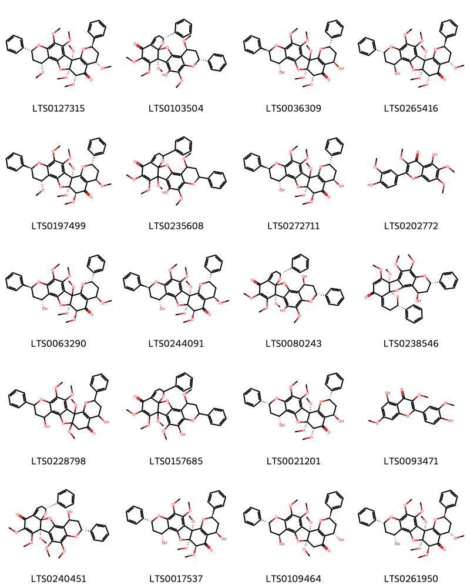{ width=100% }
    <figcaption>Hình ảnh cấu trúc hóa học của 20 hoạt chất thuộc nhóm Flavonoids gồm ['(2r,5r,7s,10s,11r,15r,17r)-2,7,10,11,15,20,21-heptamethoxy-5,17-diphenyl-4,12,18-trioxapentacyclo[11.8.0.0²,¹¹.0³,⁸.0¹⁴,¹⁹]henicosa-1(21),3(8),13,19-tetraen-9-one (LTS0127315)', '(1r,5s,7r,13r,20r)-11-hydroxy-5,10,13,14,15-pentamethoxy-7,20-diphenyl-2,8,21-trioxapentacyclo[11.8.0.0¹,¹⁷.0³,¹².0⁴,⁹]henicosa-3,9,11,14,17-pentaen-16-one (LTS0103504)', '(5s,7r,10s,11r,15r,17s)-7,15-dihydroxy-2,10,11,20,21-pentamethoxy-5,17-diphenyl-4,12,18-trioxapentacyclo[11.8.0.0²,¹¹.0³,⁸.0¹⁴,¹⁹]henicosa-1(21),3(8),13,19-tetraen-9-one (LTS0036309)', '(2r,5r,7s,10s,11r,15s,17r)-15-hydroxy-2,7,10,11,20,21-hexamethoxy-5,17-diphenyl-4,12,18-trioxapentacyclo[11.8.0.0²,¹¹.0³,⁸.0¹⁴,¹⁹]henicosa-1(21),3(8),13,19-tetraen-9-one (LTS0265416)', '(2r,5s,7r,10r,11r,15r,17s)-2,7,10,11,15,20,21-heptamethoxy-5,17-diphenyl-4,12,18-trioxapentacyclo[11.8.0.0²,¹¹.0³,⁸.0¹⁴,¹⁹]henicosa-1(21),3(8),13,19-tetraen-9-one (LTS0197499)', '11-hydroxy-5,10,13,14,15-pentamethoxy-7,20-diphenyl-2,8,21-trioxapentacyclo[11.8.0.0¹,¹⁷.0³,¹².0⁴,⁹]henicosa-3,9,11,14,17-pentaen-16-one (LTS0235608)', '(5s,7r,10r,11r,15r,17s)-7,15-dihydroxy-2,10,11,20,21-pentamethoxy-5,17-diphenyl-4,12,18-trioxapentacyclo[11.8.0.0²,¹¹.0³,⁸.0¹⁴,¹⁹]henicosa-1(21),3(8),13,19-tetraen-9-one (LTS0272711)', 'chrysosplenetin (LTS0202772)', '(5s,7r,10r,11r,15r,17s)-15-hydroxy-2,7,10,11,20,21-hexamethoxy-5,17-diphenyl-4,12,18-trioxapentacyclo[11.8.0.0²,¹¹.0³,⁸.0¹⁴,¹⁹]henicosa-1(21),3(8),13,19-tetraen-9-one (LTS0063290)', '(2r,5s,7r,10r,11r,15r,17s)-15-hydroxy-2,7,10,11,20,21-hexamethoxy-5,17-diphenyl-4,12,18-trioxapentacyclo[11.8.0.0²,¹¹.0³,⁸.0¹⁴,¹⁹]henicosa-1(21),3(8),13,19-tetraen-9-one (LTS0244091)', '(1r,5s,7r,13r,20r)-5,11-dihydroxy-10,13,14,15-tetramethoxy-7,20-diphenyl-2,8,21-trioxapentacyclo[11.8.0.0¹,¹⁷.0³,¹².0⁴,⁹]henicosa-3,9,11,14,17-pentaen-16-one (LTS0080243)', '(1s,5r,7s,13s,20s)-5-hydroxy-10,11,13,14-tetramethoxy-7,20-diphenyl-2,8,21-trioxapentacyclo[11.8.0.0¹,¹⁷.0³,¹².0⁴,⁹]henicosa-3,9,11,14,17-pentaen-16-one (LTS0238546)', '7,15-dihydroxy-2,11,20,21-tetramethoxy-5,17-diphenyl-4,12,18-trioxapentacyclo[11.8.0.0²,¹¹.0³,⁸.0¹⁴,¹⁹]henicosa-1(21),3(8),13,19-tetraen-9-one (LTS0228798)', '10-hydroxy-5,11,13,14,15-pentamethoxy-7,20-diphenyl-2,8,21-trioxapentacyclo[11.8.0.0¹,¹⁷.0³,¹².0⁴,⁹]henicosa-3,9,11,14,17-pentaen-16-one (LTS0157685)', '(2r,5s,7r,10s,11r,15r,17r)-7,15-dihydroxy-2,10,11,20,21-pentamethoxy-5,17-diphenyl-4,12,18-trioxapentacyclo[11.8.0.0²,¹¹.0³,⁸.0¹⁴,¹⁹]henicosa-1(21),3(8),13,19-tetraen-9-one (LTS0021201)', 'pachypodol (LTS0093471)', '(1r,5s,7r,13r,20r)-5-hydroxy-10,11,13,14,15-pentamethoxy-7,20-diphenyl-2,8,21-trioxapentacyclo[11.8.0.0¹,¹⁷.0³,¹².0⁴,⁹]henicosa-3,9,11,14,17-pentaen-16-one (LTS0240451)', '(2r,5r,7r,10r,11r,15r,17r)-7,15-dihydroxy-2,10,11,20,21-pentamethoxy-5,17-diphenyl-4,12,18-trioxapentacyclo[11.8.0.0²,¹¹.0³,⁸.0¹⁴,¹⁹]henicosa-1(21),3(8),13,19-tetraen-9-one (LTS0017537)', '(2r,5r,7s,11r,15s,17r)-7,15-dihydroxy-2,11,20,21-tetramethoxy-5,17-diphenyl-4,12,18-trioxapentacyclo[11.8.0.0²,¹¹.0³,⁸.0¹⁴,¹⁹]henicosa-1(21),3(8),13,19-tetraen-9-one (LTS0109464)', '(2r,5r,7s,10r,11r,15r,17r)-15-hydroxy-2,7,10,11,20,21-hexamethoxy-5,17-diphenyl-4,12,18-trioxapentacyclo[11.8.0.0²,¹¹.0³,⁸.0¹⁴,¹⁹]henicosa-1(21),3(8),13,19-tetraen-9-one (LTS0261950)'].</figcaption>
</figure>

---

### Dược dân tộc học

Danh sách các quốc gia có sử dụng *Getonia floribunda* trong điều trị các bệnh. 

| Country   | Disease   | Bệnh                                                                                                                                                                                                |
|:----------|:----------|:----------------------------------------------------------------------------------------------------------------------------------------------------------------------------------------------------|
| Cambodia  | Tonic     | MYMEMORY WARNING: YOU USED ALL AVAILABLE FREE TRANSLATIONS FOR TODAY. NEXT AVAILABLE IN  15 HOURS 27 MINUTES 53 SECONDS VISIT HTTPS://MYMEMORY.TRANSLATED.NET/DOC/USAGELIMITS.PHP TO TRANSLATE MORE |
| Elsewhere | Piscicide | MYMEMORY WARNING: YOU USED ALL AVAILABLE FREE TRANSLATIONS FOR TODAY. NEXT AVAILABLE IN  15 HOURS 27 MINUTES 49 SECONDS VISIT HTTPS://MYMEMORY.TRANSLATED.NET/DOC/USAGELIMITS.PHP TO TRANSLATE MORE |

---

# Chi Laguncularia

??? note "Danh sách các dược liệu thuộc chi"
    
	 - *Laguncularia racemosa*

---
## Laguncularia racemosa
### Thông tin về thực vật

!!! info "Phân loại thực vật của *Laguncularia racemosa* từ GIBF:"
    - **Kingdom:** Plantae
    - **Phylum:** Tracheophyta
    - **Order:** Myrtales
    - **Family:** Combretaceae
    - **Genus:** Laguncularia
    - **Species:** *Laguncularia racemosa*

 

| Label (VI)   | Label (EN)   | Scientific Name       | Descriptions (VI)   | Descriptions (EN)   | Also Known As (VI)   | Also Known As (EN)   |
|:-------------|:-------------|:----------------------|:--------------------|:--------------------|:---------------------|:---------------------|
| N/A          | N/A          | Laguncularia racemosa | loài thực vật       | species of plant    | ['']                 | ['']                 |

#### Phân bố trên thế giới

**Từ CSDL GIBF** Trinidad and Tobago, French Guiana, Sierra Leone, Saint Vincent and the Grenadines, Colombia, Puerto Rico, Nigeria, Cuba, Bahamas, Saint Kitts and Nevis, Sint Maarten (Dutch part), Virgin Islands (U.S.), Antigua and Barbuda, Brazil, Saint Lucia, Aruba, Mexico, Curaçao, Costa Rica, Ecuador, United States of America

#### Phân bố tại Việt Nam

**Từ CSDL GIBF**: Không có ghi nhận ở Việt Nam

---
### Thành phần hóa học
        
- Theo cơ sở dữ liệu lotus: Từ loài *Laguncularia racemosa* đã phân lập và xác định được 43 hoạt chất thuộc về các nhóm Organooxygen compounds, Flavonoids, Tannins, Fatty Acyls, Aryltetralin lignans, Phenols, Benzene and substituted derivatives. 

|    | chemicalTaxonomyClassyfireClass     |   smiles_count |
|---:|:------------------------------------|---------------:|
|  0 | Aryltetralin lignans                |              4 |
|  1 | Benzene and substituted derivatives |              2 |
|  2 | Fatty Acyls                         |              2 |
|  3 | Flavonoids                          |              7 |
|  4 | Organooxygen compounds              |             22 |
|  5 | Phenols                             |              3 |
|  6 | Tannins                             |              3 |

#### Nhóm Aryltetralin lignans
<figure markdown="span">
    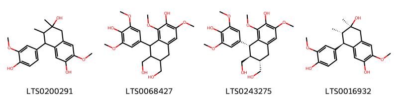{ width=100% }
    <figcaption>Hình ảnh cấu trúc hóa học của 4 hoạt chất thuộc nhóm Aryltetralin lignans gồm ['4-(4-hydroxy-3-methoxyphenyl)-7-methoxy-2,3-dimethyl-3,4-dihydro-1h-naphthalene-2,6-diol (LTS0200291)', '8-(4-hydroxy-3,5-dimethoxyphenyl)-6,7-bis(hydroxymethyl)-1,3-dimethoxy-5,6,7,8-tetrahydronaphthalen-2-ol (LTS0068427)', '(6s,7s,8r)-8-(4-hydroxy-3,5-dimethoxyphenyl)-6,7-bis(hydroxymethyl)-1,3-dimethoxy-5,6,7,8-tetrahydronaphthalen-2-ol (LTS0243275)', '(2s,3s,4r)-4-(4-hydroxy-3-methoxyphenyl)-7-methoxy-2,3-dimethyl-3,4-dihydro-1h-naphthalene-2,6-diol (LTS0016932)'].</figcaption>
</figure>
#### Nhóm Benzene and substituted derivatives
<figure markdown="span">
    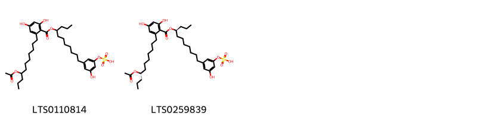{ width=100% }
    <figcaption>Hình ảnh cấu trúc hóa học của 2 hoạt chất thuộc nhóm Benzene and substituted derivatives gồm ['[3-(8-{2-[8-(acetyloxy)undecyl]-4,6-dihydroxybenzoyloxy}undecyl)-5-hydroxyphenyl]oxidanesulfonic acid (LTS0110814)', '{3-[(8s)-8-{2-[(8s)-8-(acetyloxy)undecyl]-4,6-dihydroxybenzoyloxy}undecyl]-5-hydroxyphenyl}oxidanesulfonic acid (LTS0259839)'].</figcaption>
</figure>
#### Nhóm Fatty Acyls
<figure markdown="span">
    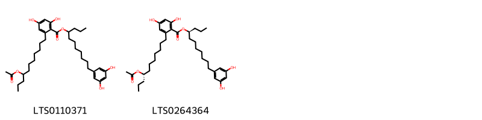{ width=100% }
    <figcaption>Hình ảnh cấu trúc hóa học của 2 hoạt chất thuộc nhóm Fatty Acyls gồm ['11-(3,5-dihydroxyphenyl)undecan-4-yl 2-[8-(acetyloxy)undecyl]-4,6-dihydroxybenzoate (LTS0110371)', '(4s)-11-(3,5-dihydroxyphenyl)undecan-4-yl 2-[(8s)-8-(acetyloxy)undecyl]-4,6-dihydroxybenzoate (LTS0264364)'].</figcaption>
</figure>
#### Nhóm Flavonoids
<figure markdown="span">
    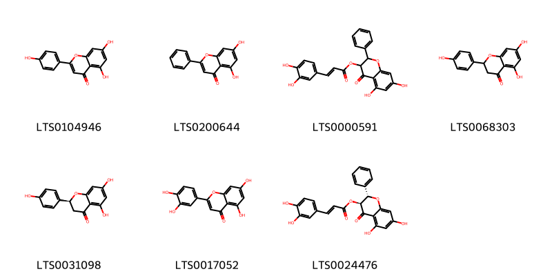{ width=100% }
    <figcaption>Hình ảnh cấu trúc hóa học của 7 hoạt chất thuộc nhóm Flavonoids gồm ['chamomile (LTS0104946)', 'chrysin (LTS0200644)', '5,7-dihydroxy-4-oxo-2-phenyl-2,3-dihydro-1-benzopyran-3-yl 3-(3,4-dihydroxyphenyl)prop-2-enoate (LTS0000591)', 'asahina (LTS0068303)', 'naringenin (LTS0031098)', 'luteolin (LTS0017052)', '(2s,3s)-5,7-dihydroxy-4-oxo-2-phenyl-2,3-dihydro-1-benzopyran-3-yl (2e)-3-(3,4-dihydroxyphenyl)prop-2-enoate (LTS0024476)'].</figcaption>
</figure>
#### Nhóm Organooxygen compounds
<figure markdown="span">
    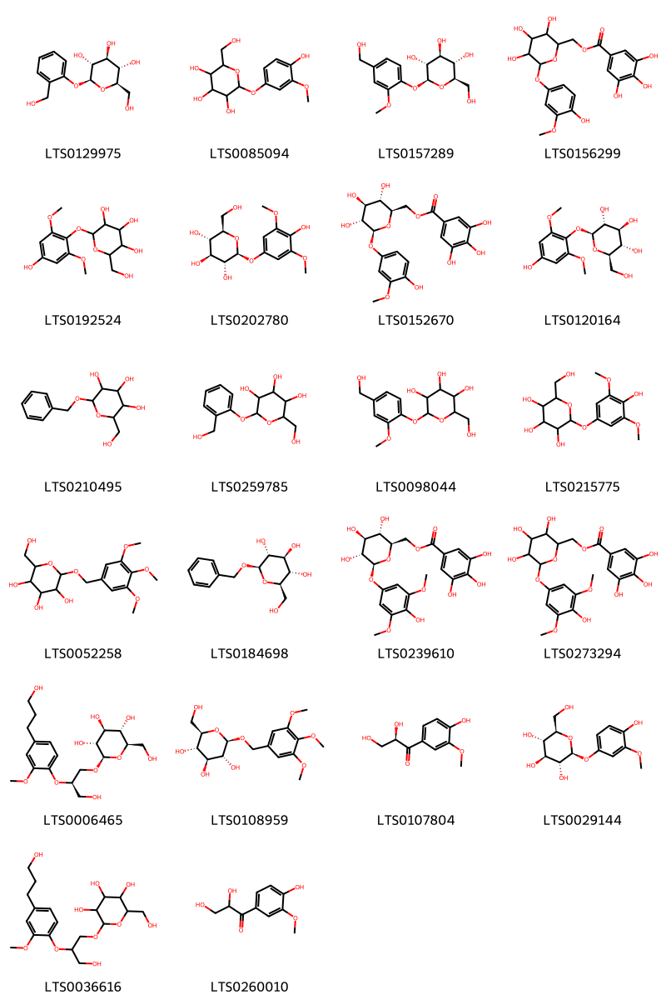{ width=100% }
    <figcaption>Hình ảnh cấu trúc hóa học của 22 hoạt chất thuộc nhóm Organooxygen compounds gồm ['salicin (LTS0129975)', '2-(4-hydroxy-3-methoxyphenoxy)-6-(hydroxymethyl)oxane-3,4,5-triol (LTS0085094)', 'vanilloloside (LTS0157289)', '[3,4,5-trihydroxy-6-(4-hydroxy-3-methoxyphenoxy)oxan-2-yl]methyl 3,4,5-trihydroxybenzoate (LTS0156299)', '2-(4-hydroxy-2,6-dimethoxyphenoxy)-6-(hydroxymethyl)oxane-3,4,5-triol (LTS0192524)', 'koaburaside (LTS0202780)', '[(2r,3s,4s,5r,6s)-3,4,5-trihydroxy-6-(4-hydroxy-3-methoxyphenoxy)oxan-2-yl]methyl 3,4,5-trihydroxybenzoate (LTS0152670)', '(2s,3r,4s,5s,6r)-2-(4-hydroxy-2,6-dimethoxyphenoxy)-6-(hydroxymethyl)oxane-3,4,5-triol (LTS0120164)', 'benzyl glucopyranoside (LTS0210495)', 'salicin (LTS0259785)', '2-(hydroxymethyl)-6-[4-(hydroxymethyl)-2-methoxyphenoxy]oxane-3,4,5-triol (LTS0098044)', 'koaburaside (LTS0215775)', '2-(hydroxymethyl)-6-[(3,4,5-trimethoxyphenyl)methoxy]oxane-3,4,5-triol (LTS0052258)', 'benzyl β-d-glucoside (LTS0184698)', '[(2r,3s,4s,5r,6s)-3,4,5-trihydroxy-6-(4-hydroxy-3,5-dimethoxyphenoxy)oxan-2-yl]methyl 3,4,5-trihydroxybenzoate (LTS0239610)', '[3,4,5-trihydroxy-6-(4-hydroxy-3,5-dimethoxyphenoxy)oxan-2-yl]methyl 3,4,5-trihydroxybenzoate (LTS0273294)', '(2r,3r,4s,5s,6r)-2-[(2r)-3-hydroxy-2-[4-(3-hydroxypropyl)-2-methoxyphenoxy]propoxy]-6-(hydroxymethyl)oxane-3,4,5-triol (LTS0006465)', '(2r,3s,4s,5r,6r)-2-(hydroxymethyl)-6-[(3,4,5-trimethoxyphenyl)methoxy]oxane-3,4,5-triol (LTS0108959)', '(2r)-2,3-dihydroxy-1-(4-hydroxy-3-methoxyphenyl)propan-1-one (LTS0107804)', '(2s,3r,4s,5s,6r)-2-(4-hydroxy-3-methoxyphenoxy)-6-(hydroxymethyl)oxane-3,4,5-triol (LTS0029144)', '2-{3-hydroxy-2-[4-(3-hydroxypropyl)-2-methoxyphenoxy]propoxy}-6-(hydroxymethyl)oxane-3,4,5-triol (LTS0036616)', '2,3-dihydroxy-1-(4-hydroxy-3-methoxyphenyl)propan-1-one (LTS0260010)'].</figcaption>
</figure>
#### Nhóm Phenols
<figure markdown="span">
    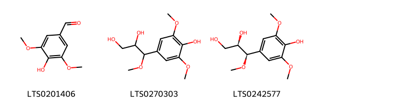{ width=100% }
    <figcaption>Hình ảnh cấu trúc hóa học của 3 hoạt chất thuộc nhóm Phenols gồm ['syringaldehyde (LTS0201406)', '3-(4-hydroxy-3,5-dimethoxyphenyl)-3-methoxypropane-1,2-diol (LTS0270303)', '(2r,3r)-3-(4-hydroxy-3,5-dimethoxyphenyl)-3-methoxypropane-1,2-diol (LTS0242577)'].</figcaption>
</figure>
#### Nhóm Tannins
<figure markdown="span">
    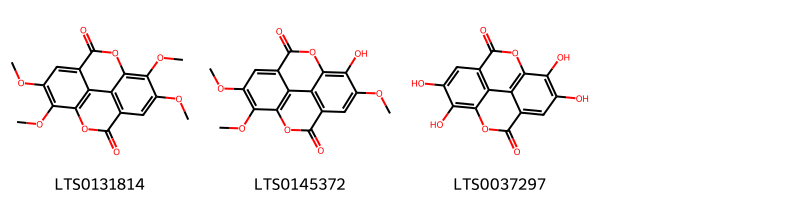{ width=100% }
    <figcaption>Hình ảnh cấu trúc hóa học của 3 hoạt chất thuộc nhóm Tannins gồm ['6,7,13,14-tetramethoxy-2,9-dioxatetracyclo[6.6.2.0⁴,¹⁶.0¹¹,¹⁵]hexadeca-1(15),4(16),5,7,11,13-hexaene-3,10-dione (LTS0131814)', '7-hydroxy-6,13,14-trimethoxy-2,9-dioxatetracyclo[6.6.2.0⁴,¹⁶.0¹¹,¹⁵]hexadeca-1(15),4(16),5,7,11,13-hexaene-3,10-dione (LTS0145372)', 'ellagic acid (LTS0037297)'].</figcaption>
</figure>

---

### Dược dân tộc học

Danh sách các quốc gia có sử dụng *Laguncularia racemosa* trong điều trị các bệnh. 

| Country            | Disease                              | Bệnh                                                                                                                                                                                                |
|:-------------------|:-------------------------------------|:----------------------------------------------------------------------------------------------------------------------------------------------------------------------------------------------------|
| Dominican Republic | Tonic                                | MYMEMORY WARNING: YOU USED ALL AVAILABLE FREE TRANSLATIONS FOR TODAY. NEXT AVAILABLE IN  15 HOURS 27 MINUTES 24 SECONDS VISIT HTTPS://MYMEMORY.TRANSLATED.NET/DOC/USAGELIMITS.PHP TO TRANSLATE MORE |
| Elsewhere          | Astringent, Tonic                    | MYMEMORY WARNING: YOU USED ALL AVAILABLE FREE TRANSLATIONS FOR TODAY. NEXT AVAILABLE IN  15 HOURS 27 MINUTES 21 SECONDS VISIT HTTPS://MYMEMORY.TRANSLATED.NET/DOC/USAGELIMITS.PHP TO TRANSLATE MORE |
| Haiti              | Astringent                           | MYMEMORY WARNING: YOU USED ALL AVAILABLE FREE TRANSLATIONS FOR TODAY. NEXT AVAILABLE IN  15 HOURS 27 MINUTES 18 SECONDS VISIT HTTPS://MYMEMORY.TRANSLATED.NET/DOC/USAGELIMITS.PHP TO TRANSLATE MORE |
| Mexico             | Astringent, Astringent, Tonic, Tonic | MYMEMORY WARNING: YOU USED ALL AVAILABLE FREE TRANSLATIONS FOR TODAY. NEXT AVAILABLE IN  15 HOURS 27 MINUTES 14 SECONDS VISIT HTTPS://MYMEMORY.TRANSLATED.NET/DOC/USAGELIMITS.PHP TO TRANSLATE MORE |
| Venezuela          | Astringent                           | MYMEMORY WARNING: YOU USED ALL AVAILABLE FREE TRANSLATIONS FOR TODAY. NEXT AVAILABLE IN  15 HOURS 27 MINUTES 11 SECONDS VISIT HTTPS://MYMEMORY.TRANSLATED.NET/DOC/USAGELIMITS.PHP TO TRANSLATE MORE |

---

