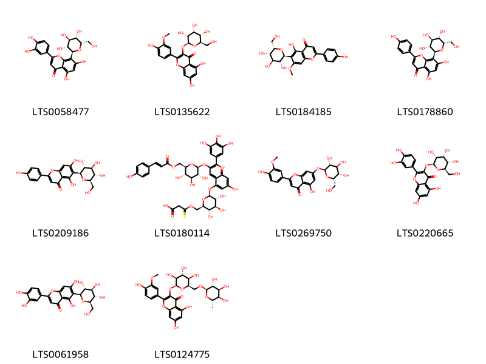
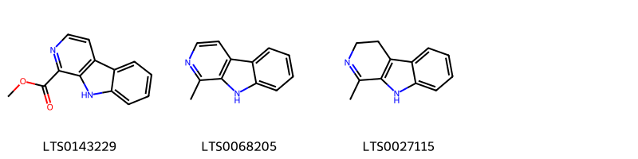
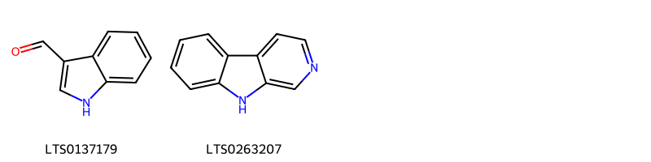
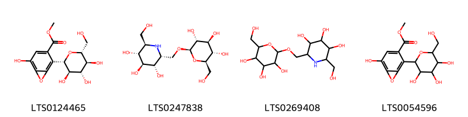
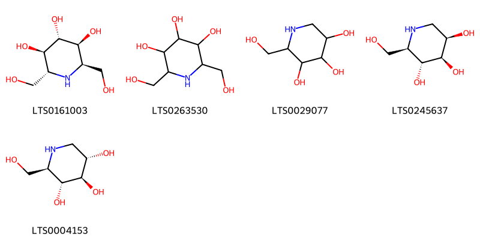
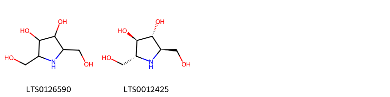

!!! abstract "Tóm tắt"

    Họ Commelinaceae gồm khoảng 7 chi và 16 loài được một số cộng đồng tại các quốc gia như Haiti, Elsewhere, Dominican Republic, Africa, Egypt, Samoa, Upper Volta, Mexico, China, Turkey, Malaya, Guatemala sử dụng trong một số trường hợp MYMEMORY WARNING: YOU USED ALL AVAILABLE FREE TRANSLATIONS FOR TODAY. NEXT AVAILABLE IN  17 HOURS 18 MINUTES 52 SECONDS VISIT HTTPS://MYMEMORY.TRANSLATED.NET/DOC/USAGELIMITS.PHP TO TRANSLATE MORE.

!!! info "DrDuke"

    James A. Duke sinh năm 1929-2017 là một nhà thực vật học người Mỹ. Đây là một trong những tác giả hàng đầu trong lĩnh vực dược dân tộc học với cuốn *CRC Handbook of Medicinal Herbs* và chính là người xây dựng lên cơ sở dữ liệu về hợp chất tự nhiên và dược dân tộc học tại Bộ nông nghiệp Hoa Kỳ. Các thông tin được đăng tải tại website [Dr. Duke's Phytochemical and Ethnobotanical Databases](https://phytochem.nal.usda.gov/). 
    Trong suốt thập niên 1970, ông lãnh đạo the Plant Taxonomy Laboratory, Plant Genetics and Germplasm Institute of the Agricultural Research Service, U.S. Department of Agriculture.
    Trong tài liệu này, các thông tin về dược dân tộc của các dược liệu được trích dẫn từ tài liệu của James A. Ducke với sự trợ giúp của phần mềm dịch thuật từ tiếng Anh sang tiếng Việt.
   

# Chi Palisota

??? note "Danh sách các dược liệu thuộc chi"
    
	 - *Palisota hirsuta*

---
## Palisota hirsuta
### Thông tin về thực vật

!!! info "Phân loại thực vật của *Palisota hirsuta* từ GIBF:"
    - **Kingdom:** Plantae
    - **Phylum:** Tracheophyta
    - **Order:** Commelinales
    - **Family:** Commelinaceae
    - **Genus:** Palisota
    - **Species:** *Palisota hirsuta*

 

| Label (VI)   | Label (EN)   | Scientific Name   | Descriptions (VI)   | Descriptions (EN)   | Also Known As (VI)   | Also Known As (EN)   |
|:-------------|:-------------|:------------------|:--------------------|:--------------------|:---------------------|:---------------------|
| N/A          | N/A          | Palisota hirsuta  | loài thực vật       | species of plant    | ['']                 | ['']                 |

#### Phân bố trên thế giới

**Từ CSDL GIBF** Togo, Angola, Côte d’Ivoire, Ghana, Liberia, Cameroon, Gabon, Nigeria, United States of America, Congo, Guinea, Benin, Belgium

#### Phân bố tại Việt Nam

**Từ CSDL GIBF**: Không có ghi nhận ở Việt Nam

---
### Thành phần hóa học
        
- Theo cơ sở dữ liệu lotus: Từ loài *Palisota hirsuta* đã phân lập và xác định được Chưa có hoạt chất nào được phân lập. hoạt chất thuộc về các nhóm Không có hoạt chất nào được phân lập. 

Không có hình ảnh nào được tạo ra

---

### Dược dân tộc học

Danh sách các quốc gia có sử dụng *Palisota hirsuta* trong điều trị các bệnh. 

| Country     | Disease               | Bệnh                                                                                                                                                                                                |
|:------------|:----------------------|:----------------------------------------------------------------------------------------------------------------------------------------------------------------------------------------------------|
| Upper Volta | Analgesic, Antiseptic | MYMEMORY WARNING: YOU USED ALL AVAILABLE FREE TRANSLATIONS FOR TODAY. NEXT AVAILABLE IN  17 HOURS 18 MINUTES 49 SECONDS VISIT HTTPS://MYMEMORY.TRANSLATED.NET/DOC/USAGELIMITS.PHP TO TRANSLATE MORE |

---

# Chi Aneilema

??? note "Danh sách các dược liệu thuộc chi"
    
	 - *Aneilema beninense*
	 - *Aneilema lineolatum*

---
## Aneilema beninense
### Thông tin về thực vật

!!! info "Phân loại thực vật của *Aneilema beniniense* từ GIBF:"
    - **Kingdom:** Plantae
    - **Phylum:** Tracheophyta
    - **Order:** Commelinales
    - **Family:** Commelinaceae
    - **Genus:** Aneilema
    - **Species:** *Aneilema beniniense*

 

| Label (VI)   | Label (EN)   | Scientific Name   | Descriptions (VI)   | Descriptions (EN)   | Also Known As (VI)   | Also Known As (EN)   |
|:-------------|:-------------|:------------------|:--------------------|:--------------------|:---------------------|:---------------------|
| N/A          | N/A          | Palisota hirsuta  | loài thực vật       | species of plant    | ['']                 | ['']                 |

#### Phân bố trên thế giới

**Từ CSDL GIBF** Cameroon, Gabon, United States of America, Nigeria, Guinea, Benin, Belgium

#### Phân bố tại Việt Nam

**Từ CSDL GIBF**: Không có ghi nhận ở Việt Nam

---
### Thành phần hóa học
        
- Theo cơ sở dữ liệu lotus: Từ loài *Aneilema beniniense* đã phân lập và xác định được Chưa có hoạt chất nào được phân lập. hoạt chất thuộc về các nhóm Không có hoạt chất nào được phân lập. 

Không có hình ảnh nào được tạo ra

---

### Dược dân tộc học

Danh sách các quốc gia có sử dụng *Aneilema beniniense* trong điều trị các bệnh. 

| Country   | Disease   | Bệnh                                                                                                                                                                                                |
|:----------|:----------|:----------------------------------------------------------------------------------------------------------------------------------------------------------------------------------------------------|
| Africa    | Laxative  | MYMEMORY WARNING: YOU USED ALL AVAILABLE FREE TRANSLATIONS FOR TODAY. NEXT AVAILABLE IN  17 HOURS 18 MINUTES 26 SECONDS VISIT HTTPS://MYMEMORY.TRANSLATED.NET/DOC/USAGELIMITS.PHP TO TRANSLATE MORE |

---

---
## Aneilema lineolatum
### Thông tin về thực vật

!!! info "Phân loại thực vật của *Murdannia japonica* từ GIBF:"
    - **Kingdom:** Plantae
    - **Phylum:** Tracheophyta
    - **Order:** Commelinales
    - **Family:** Commelinaceae
    - **Genus:** Murdannia
    - **Species:** *Murdannia japonica*

 

| Label (VI)   | Label (EN)   | Scientific Name   | Descriptions (VI)   | Descriptions (EN)   | Also Known As (VI)   | Also Known As (EN)   |
|:-------------|:-------------|:------------------|:--------------------|:--------------------|:---------------------|:---------------------|
| N/A          | N/A          | Palisota hirsuta  | loài thực vật       | species of plant    | ['']                 | ['']                 |

#### Phân bố trên thế giới

**Từ CSDL GIBF** Cameroon, Gabon, United States of America, Nigeria, Guinea, Benin, Belgium

#### Phân bố tại Việt Nam

**Từ CSDL GIBF**: Không có ghi nhận ở Việt Nam

---
### Thành phần hóa học
        
- Theo cơ sở dữ liệu lotus: Từ loài *Murdannia japonica* đã phân lập và xác định được Chưa có hoạt chất nào được phân lập. hoạt chất thuộc về các nhóm Không có hoạt chất nào được phân lập. 

Không có hình ảnh nào được tạo ra

---

### Dược dân tộc học

Danh sách các quốc gia có sử dụng *Murdannia japonica* trong điều trị các bệnh. 

| Country   | Disease       | Bệnh                                                                                                                                                                                                |
|:----------|:--------------|:----------------------------------------------------------------------------------------------------------------------------------------------------------------------------------------------------|
| Malaya    | Abortifacient | MYMEMORY WARNING: YOU USED ALL AVAILABLE FREE TRANSLATIONS FOR TODAY. NEXT AVAILABLE IN  17 HOURS 18 MINUTES 05 SECONDS VISIT HTTPS://MYMEMORY.TRANSLATED.NET/DOC/USAGELIMITS.PHP TO TRANSLATE MORE |

---

# Chi Rhoeo

??? note "Danh sách các dược liệu thuộc chi"
    
	 - *Rhoeo athacea*
	 - *Rhoeo discolor*

---
## Rhoeo athacea
### Thông tin về thực vật

!!! info "Phân loại thực vật của *N/A* từ GIBF:"
    - **Kingdom:** Plantae
    - **Phylum:** Tracheophyta
    - **Order:** Commelinales
    - **Family:** Commelinaceae
    - **Genus:** Tradescantia
    - **Species:** *N/A*

 

| Label (VI)   | Label (EN)   | Scientific Name   | Descriptions (VI)   | Descriptions (EN)   | Also Known As (VI)   | Also Known As (EN)   |
|:-------------|:-------------|:------------------|:--------------------|:--------------------|:---------------------|:---------------------|
| N/A          | N/A          | Palisota hirsuta  | loài thực vật       | species of plant    | ['']                 | ['']                 |

#### Phân bố trên thế giới

**Từ CSDL GIBF** nan, Brazil, Tanzania, United Republic of, Puerto Rico, United States of America, Mexico, Indonesia

#### Phân bố tại Việt Nam

**Từ CSDL GIBF**: Không có ghi nhận ở Việt Nam

---
### Thành phần hóa học
        
- Theo cơ sở dữ liệu lotus: Từ loài *N/A* đã phân lập và xác định được Chưa có hoạt chất nào được phân lập. hoạt chất thuộc về các nhóm Không có hoạt chất nào được phân lập. 

Không có hình ảnh nào được tạo ra

---

### Dược dân tộc học

Danh sách các quốc gia có sử dụng *N/A* trong điều trị các bệnh. 

| Country            | Disease     | Bệnh                                                                                                                                                                                                |
|:-------------------|:------------|:----------------------------------------------------------------------------------------------------------------------------------------------------------------------------------------------------|
| Dominican Republic | Refrigerant | MYMEMORY WARNING: YOU USED ALL AVAILABLE FREE TRANSLATIONS FOR TODAY. NEXT AVAILABLE IN  17 HOURS 17 MINUTES 49 SECONDS VISIT HTTPS://MYMEMORY.TRANSLATED.NET/DOC/USAGELIMITS.PHP TO TRANSLATE MORE |
| Haiti              | Diuretic    | MYMEMORY WARNING: YOU USED ALL AVAILABLE FREE TRANSLATIONS FOR TODAY. NEXT AVAILABLE IN  17 HOURS 17 MINUTES 46 SECONDS VISIT HTTPS://MYMEMORY.TRANSLATED.NET/DOC/USAGELIMITS.PHP TO TRANSLATE MORE |

---

---
## Rhoeo discolor
### Thông tin về thực vật

!!! info "Phân loại thực vật của *Tradescantia spathacea* từ GIBF:"
    - **Kingdom:** Plantae
    - **Phylum:** Tracheophyta
    - **Order:** Commelinales
    - **Family:** Commelinaceae
    - **Genus:** Tradescantia
    - **Species:** *Tradescantia spathacea*

 

| Label (VI)   | Label (EN)   | Scientific Name   | Descriptions (VI)   | Descriptions (EN)   | Also Known As (VI)   | Also Known As (EN)   |
|:-------------|:-------------|:------------------|:--------------------|:--------------------|:---------------------|:---------------------|
| N/A          | N/A          | Rhoeo discolor    | loài thực vật       | species of plant    | ['']                 | ['']                 |

#### Phân bố trên thế giới

**Từ CSDL GIBF** nan, Sierra Leone, unknown or invalid, Viet Nam, Belize, Brazil, Samoa, Nigeria, United States of America, Mexico, China, Tonga, Madagascar, Ukraine

#### Phân bố tại Việt Nam

**Từ CSDL GIBF**: 顺化

---
### Thành phần hóa học
        
- Theo cơ sở dữ liệu lotus: Từ loài *Tradescantia spathacea* đã phân lập và xác định được Chưa có hoạt chất nào được phân lập. hoạt chất thuộc về các nhóm Không có hoạt chất nào được phân lập. 

Không có hình ảnh nào được tạo ra

---

### Dược dân tộc học

Danh sách các quốc gia có sử dụng *Tradescantia spathacea* trong điều trị các bệnh. 

| Country   | Disease   | Bệnh                                                                                                                                                                                                |
|:----------|:----------|:----------------------------------------------------------------------------------------------------------------------------------------------------------------------------------------------------|
| Guatemala | Cosmetic  | MYMEMORY WARNING: YOU USED ALL AVAILABLE FREE TRANSLATIONS FOR TODAY. NEXT AVAILABLE IN  17 HOURS 17 MINUTES 28 SECONDS VISIT HTTPS://MYMEMORY.TRANSLATED.NET/DOC/USAGELIMITS.PHP TO TRANSLATE MORE |

---

# Chi Tradescantia

??? note "Danh sách các dược liệu thuộc chi"
    
	 - *Tradescantia erecta*

---
## Tradescantia erecta
### Thông tin về thực vật

!!! info "Phân loại thực vật của *Tinantia erecta* từ GIBF:"
    - **Kingdom:** Plantae
    - **Phylum:** Tracheophyta
    - **Order:** Commelinales
    - **Family:** Commelinaceae
    - **Genus:** Tinantia
    - **Species:** *Tinantia erecta*

 

| Label (VI)   | Label (EN)   | Scientific Name     | Descriptions (VI)   | Descriptions (EN)   | Also Known As (VI)   | Also Known As (EN)   |
|:-------------|:-------------|:--------------------|:--------------------|:--------------------|:---------------------|:---------------------|
| N/A          | N/A          | Tradescantia erecta | loài thực vật       | species of plant    | ['']                 | ['']                 |

#### Phân bố trên thế giới

**Từ CSDL GIBF** nan, Spain, Poland, Germany, United States of America, Mexico

#### Phân bố tại Việt Nam

**Từ CSDL GIBF**: Không có ghi nhận ở Việt Nam

---
### Thành phần hóa học
        
- Theo cơ sở dữ liệu lotus: Từ loài *Tinantia erecta* đã phân lập và xác định được Chưa có hoạt chất nào được phân lập. hoạt chất thuộc về các nhóm Không có hoạt chất nào được phân lập. 

Không có hình ảnh nào được tạo ra

---

### Dược dân tộc học

Danh sách các quốc gia có sử dụng *Tinantia erecta* trong điều trị các bệnh. 

| Country   | Disease   | Bệnh                                                                                                                                                                                                |
|:----------|:----------|:----------------------------------------------------------------------------------------------------------------------------------------------------------------------------------------------------|
| Turkey    | Hemostat  | MYMEMORY WARNING: YOU USED ALL AVAILABLE FREE TRANSLATIONS FOR TODAY. NEXT AVAILABLE IN  17 HOURS 17 MINUTES 09 SECONDS VISIT HTTPS://MYMEMORY.TRANSLATED.NET/DOC/USAGELIMITS.PHP TO TRANSLATE MORE |

---

# Chi Callisia

??? note "Danh sách các dược liệu thuộc chi"
    
	 - *Callisia repens*

---
## Callisia repens
### Thông tin về thực vật

!!! info "Phân loại thực vật của *Callisia repens* từ GIBF:"
    - **Kingdom:** Plantae
    - **Phylum:** Tracheophyta
    - **Order:** Commelinales
    - **Family:** Commelinaceae
    - **Genus:** Callisia
    - **Species:** *Callisia repens*

 

| Label (VI)   | Label (EN)   | Scientific Name   | Descriptions (VI)   | Descriptions (EN)   | Also Known As (VI)   | Also Known As (EN)                                                                 |
|:-------------|:-------------|:------------------|:--------------------|:--------------------|:---------------------|:-----------------------------------------------------------------------------------|
| N/A          | N/A          | Callisia repens   | loài thực vật       | species of plant    | ['']                 | ['creeping inchplant', 'Bolivian Jew', 'chain plant', 'inch plant', 'turtle vine'] |

#### Phân bố trên thế giới

**Từ CSDL GIBF** Guadeloupe, French Guiana, Martinique, Australia, Guatemala, Indonesia, Dominican Republic, Puerto Rico, Guam, Antigua and Barbuda, Brazil, Saint Lucia, Mexico, China, Curaçao, Hong Kong, Chinese Taipei, Argentina, South Africa, Grenada, Bolivia (Plurinational State of), Ecuador, United States of America

#### Phân bố tại Việt Nam

**Từ CSDL GIBF**: Không có ghi nhận ở Việt Nam

---
### Thành phần hóa học
        
- Theo cơ sở dữ liệu lotus: Từ loài *Callisia repens* đã phân lập và xác định được Chưa có hoạt chất nào được phân lập. hoạt chất thuộc về các nhóm Không có hoạt chất nào được phân lập. 

Không có hình ảnh nào được tạo ra

---

### Dược dân tộc học

Danh sách các quốc gia có sử dụng *Callisia repens* trong điều trị các bệnh. 

| Country   | Disease            | Bệnh                                                                                                                                                                                                |
|:----------|:-------------------|:----------------------------------------------------------------------------------------------------------------------------------------------------------------------------------------------------|
| Haiti     | Diuretic, Diuretic | MYMEMORY WARNING: YOU USED ALL AVAILABLE FREE TRANSLATIONS FOR TODAY. NEXT AVAILABLE IN  17 HOURS 16 MINUTES 52 SECONDS VISIT HTTPS://MYMEMORY.TRANSLATED.NET/DOC/USAGELIMITS.PHP TO TRANSLATE MORE |

---

# Chi Pollia

??? note "Danh sách các dược liệu thuộc chi"
    
	 - *Pollia japonica*

---
## Pollia japonica
### Thông tin về thực vật

!!! info "Phân loại thực vật của *Pollia japonica* từ GIBF:"
    - **Kingdom:** Plantae
    - **Phylum:** Tracheophyta
    - **Order:** Commelinales
    - **Family:** Commelinaceae
    - **Genus:** Pollia
    - **Species:** *Pollia japonica*

 

| Label (VI)   | Label (EN)   | Scientific Name   | Descriptions (VI)   | Descriptions (EN)   | Also Known As (VI)   | Also Known As (EN)   |
|:-------------|:-------------|:------------------|:--------------------|:--------------------|:---------------------|:---------------------|
| N/A          | N/A          | Pollia japonica   | loài thực vật       | species of plant    | ['']                 | ['']                 |

#### Phân bố trên thế giới

**Từ CSDL GIBF** Korea, Republic of, Japan, China, Chinese Taipei

#### Phân bố tại Việt Nam

**Từ CSDL GIBF**: Không có ghi nhận ở Việt Nam

---
### Thành phần hóa học
        
- Theo cơ sở dữ liệu lotus: Từ loài *Pollia japonica* đã phân lập và xác định được Chưa có hoạt chất nào được phân lập. hoạt chất thuộc về các nhóm Không có hoạt chất nào được phân lập. 

Không có hình ảnh nào được tạo ra

---

### Dược dân tộc học

Danh sách các quốc gia có sử dụng *Pollia japonica* trong điều trị các bệnh. 

| Country   | Disease                          | Bệnh                                                                                                                                                                                                |
|:----------|:---------------------------------|:----------------------------------------------------------------------------------------------------------------------------------------------------------------------------------------------------|
| China     | Carminative, Stimulant, Sedative | MYMEMORY WARNING: YOU USED ALL AVAILABLE FREE TRANSLATIONS FOR TODAY. NEXT AVAILABLE IN  17 HOURS 16 MINUTES 22 SECONDS VISIT HTTPS://MYMEMORY.TRANSLATED.NET/DOC/USAGELIMITS.PHP TO TRANSLATE MORE |

---

# Chi Commelina

??? note "Danh sách các dược liệu thuộc chi"
    
	 - *Commelina coelestis*
	 - *Commelina communis*
	 - *Commelina diffusa*
	 - *Commelina erecta*
	 - *Commelina forsskalei*
	 - *Commelina nudiflora*
	 - *Commelina obliqua*
	 - *Commelina polygama*
	 - *Commelina virginica*

---
## Commelina coelestis
### Thông tin về thực vật

!!! info "Phân loại thực vật của *Commelina tuberosa* từ GIBF:"
    - **Kingdom:** Plantae
    - **Phylum:** Tracheophyta
    - **Order:** Commelinales
    - **Family:** Commelinaceae
    - **Genus:** Commelina
    - **Species:** *Commelina tuberosa*

 

| Label (VI)   | Label (EN)   | Scientific Name     | Descriptions (VI)   | Descriptions (EN)   | Also Known As (VI)   | Also Known As (EN)   |
|:-------------|:-------------|:--------------------|:--------------------|:--------------------|:---------------------|:---------------------|
| N/A          | N/A          | Commelina coelestis | loài thực vật       | species of plant    | ['']                 | ['']                 |

#### Phân bố trên thế giới

**Từ CSDL GIBF** Brazil, France, Croatia, New Zealand, Bolivia (Plurinational State of), United States of America, Mexico, Norway, Belgium, Guatemala

#### Phân bố tại Việt Nam

**Từ CSDL GIBF**: Không có ghi nhận ở Việt Nam

---
### Thành phần hóa học
        
- Theo cơ sở dữ liệu lotus: Từ loài *Commelina tuberosa* đã phân lập và xác định được Chưa có hoạt chất nào được phân lập. hoạt chất thuộc về các nhóm Không có hoạt chất nào được phân lập. 

Không có hình ảnh nào được tạo ra

---

### Dược dân tộc học

Danh sách các quốc gia có sử dụng *Commelina tuberosa* trong điều trị các bệnh. 

| Country   | Disease                 | Bệnh                                                                                                                                                                                                |
|:----------|:------------------------|:----------------------------------------------------------------------------------------------------------------------------------------------------------------------------------------------------|
| Mexico    | Abortifacient, Hemostat | MYMEMORY WARNING: YOU USED ALL AVAILABLE FREE TRANSLATIONS FOR TODAY. NEXT AVAILABLE IN  17 HOURS 15 MINUTES 57 SECONDS VISIT HTTPS://MYMEMORY.TRANSLATED.NET/DOC/USAGELIMITS.PHP TO TRANSLATE MORE |

---

---
## Commelina communis
### Thông tin về thực vật

!!! info "Phân loại thực vật của *Commelina communis* từ GIBF:"
    - **Kingdom:** Plantae
    - **Phylum:** Tracheophyta
    - **Order:** Commelinales
    - **Family:** Commelinaceae
    - **Genus:** Commelina
    - **Species:** *Commelina communis*

 

| Label (VI)   | Label (EN)   | Scientific Name    | Descriptions (VI)   | Descriptions (EN)   | Also Known As (VI)   | Also Known As (EN)                                     |
|:-------------|:-------------|:-------------------|:--------------------|:--------------------|:---------------------|:-------------------------------------------------------|
| N/A          | N/A          | Commelina communis | loài thực vật       | species of plant    | ['']                 | ['dayflower', 'common dayflower', 'bearded commelina'] |

#### Phân bố trên thế giới

**Từ CSDL GIBF** Switzerland, Georgia, Japan, Spain, Czechia, Hungary, Russian Federation, Canada, United States of America, Italy, China, Austria, Croatia, Korea, Republic of, Chinese Taipei

#### Phân bố tại Việt Nam

**Từ CSDL GIBF**: Không có ghi nhận ở Việt Nam

---
### Thành phần hóa học
        
- Theo cơ sở dữ liệu lotus: Từ loài *Commelina communis* đã phân lập và xác định được 26 hoạt chất thuộc về các nhóm Organooxygen compounds, Indoles and derivatives, Flavonoids, Piperidines, Pyrrolidines, Harmala alkaloids. 

|    | chemicalTaxonomyClassyfireClass   |   smiles_count |
|---:|:----------------------------------|---------------:|
|  0 | Flavonoids                        |             10 |
|  1 | Harmala alkaloids                 |              3 |
|  2 | Indoles and derivatives           |              2 |
|  3 | Organooxygen compounds            |              4 |
|  4 | Piperidines                       |              5 |
|  5 | Pyrrolidines                      |              2 |

#### Nhóm Flavonoids
<figure markdown="span">
    { width=100% }
    <figcaption>Hình ảnh cấu trúc hóa học của 10 hoạt chất thuộc nhóm Flavonoids gồm ['2-(3,4-dihydroxyphenyl)-5,7-dihydroxy-8-[(2s,3r,4r,5s,6s)-3,4,5-trihydroxy-6-(hydroxymethyl)oxan-2-yl]chromen-4-one (LTS0058477)', 'isorhamnetin 3-glucoside (LTS0135622)', '5-hydroxy-2-(4-hydroxyphenyl)-7-methoxy-6-[(2s,3r,4r,5s,6s)-3,4,5-trihydroxy-6-(hydroxymethyl)oxan-2-yl]chromen-4-one (LTS0184185)', '5,7-dihydroxy-2-(4-hydroxyphenyl)-8-[(2s,3r,4r,5s,6s)-3,4,5-trihydroxy-6-(hydroxymethyl)oxan-2-yl]chromen-4-one (LTS0178860)', 'isovitexin (LTS0209186)', '5-{[(2s,3r,4s,5s,6r)-6-{[(2-carboxyethanethioyl)oxy]methyl}-3,4,5-trihydroxyoxan-2-yl]oxy}-7-hydroxy-3-{[(2s,3r,4s,5s,6r)-3,4,5-trihydroxy-6-({[3-(4-hydroxyphenyl)prop-2-enoyl]oxy}methyl)oxan-2-yl]oxy}-2-(3,4,5-trihydroxyphenyl)-1λ⁴-chromen-1-ylium (LTS0180114)', '5-hydroxy-2-(4-hydroxy-3-methoxyphenyl)-7-{[(2s,3r,4s,5s,6s)-3,4,5-trihydroxy-6-(hydroxymethyl)oxan-2-yl]oxy}chromen-4-one (LTS0269750)', '2-(3,4-dihydroxyphenyl)-5,7-dihydroxy-3-{[(2s,3r,4r,5s,6r)-3,4,5-trihydroxy-6-(hydroxymethyl)oxan-2-yl]oxy}chromen-4-one (LTS0220665)', 'isoorientin (LTS0061958)', '5,7-dihydroxy-2-(4-hydroxy-3-methoxyphenyl)-3-{[(2s,3s,4r,5r,6r)-3,4,5-trihydroxy-6-({[(2r,3r,4s,5r,6s)-3,4,5-trihydroxy-6-methyloxan-2-yl]oxy}methyl)oxan-2-yl]oxy}chromen-4-one (LTS0124775)'].</figcaption>
</figure>
#### Nhóm Harmala alkaloids
<figure markdown="span">
    { width=100% }
    <figcaption>Hình ảnh cấu trúc hóa học của 3 hoạt chất thuộc nhóm Harmala alkaloids gồm ['methyl 9h-pyrido[3,4-b]indole-1-carboxylate (LTS0143229)', 'harmane (LTS0068205)', '1-methyl-3h,4h,9h-pyrido[3,4-b]indole (LTS0027115)'].</figcaption>
</figure>
#### Nhóm Indoles and derivatives
<figure markdown="span">
    { width=100% }
    <figcaption>Hình ảnh cấu trúc hóa học của 2 hoạt chất thuộc nhóm Indoles and derivatives gồm ['indole-3-carboxaldehyde (LTS0137179)', 'β-carboline (LTS0263207)'].</figcaption>
</figure>
#### Nhóm Organooxygen compounds
<figure markdown="span">
    { width=100% }
    <figcaption>Hình ảnh cấu trúc hóa học của 4 hoạt chất thuộc nhóm Organooxygen compounds gồm ['methyl 5-hydroxy-2-[(2s,3r,4r,5s,6r)-3,4,5-trihydroxy-6-(hydroxymethyl)oxan-2-yl]-7-oxabicyclo[4.1.0]hepta-1,3,5-triene-3-carboxylate (LTS0124465)', '(2r,3r,4s,5s,6r)-2-(hydroxymethyl)-6-({[(2r,3r,4s,5s,6r)-3,4,5-trihydroxy-6-(hydroxymethyl)oxan-2-yl]oxy}methyl)piperidine-3,4,5-triol (LTS0247838)', '2-(hydroxymethyl)-6-({[3,4,5-trihydroxy-6-(hydroxymethyl)oxan-2-yl]oxy}methyl)piperidine-3,4,5-triol (LTS0269408)', 'methyl 5-hydroxy-2-[3,4,5-trihydroxy-6-(hydroxymethyl)oxan-2-yl]-7-oxabicyclo[4.1.0]hepta-1,3,5-triene-3-carboxylate (LTS0054596)'].</figcaption>
</figure>
#### Nhóm Piperidines
<figure markdown="span">
    { width=100% }
    <figcaption>Hình ảnh cấu trúc hóa học của 5 hoạt chất thuộc nhóm Piperidines gồm ['(2r,3r,4r,5s,6r)-2,6-bis(hydroxymethyl)piperidine-3,4,5-triol (LTS0161003)', '2,6-bis(hydroxymethyl)piperidine-3,4,5-triol (LTS0263530)', '1 deoxynojirimycin (LTS0029077)', 'deoxymannojirimycin (LTS0245637)', '1-deoxynojirimycin (LTS0004153)'].</figcaption>
</figure>
#### Nhóm Pyrrolidines
<figure markdown="span">
    { width=100% }
    <figcaption>Hình ảnh cấu trúc hóa học của 2 hoạt chất thuộc nhóm Pyrrolidines gồm ['2,5-bis(hydroxymethyl)pyrrolidine-3,4-diol (LTS0126590)', 'dmdp (LTS0012425)'].</figcaption>
</figure>

---

### Dược dân tộc học

Danh sách các quốc gia có sử dụng *Commelina communis* trong điều trị các bệnh. 

| Country   | Disease              | Bệnh                                                                                                                                                                                                |
|:----------|:---------------------|:----------------------------------------------------------------------------------------------------------------------------------------------------------------------------------------------------|
| China     | Alexiteric, Diuretic | MYMEMORY WARNING: YOU USED ALL AVAILABLE FREE TRANSLATIONS FOR TODAY. NEXT AVAILABLE IN  17 HOURS 15 MINUTES 35 SECONDS VISIT HTTPS://MYMEMORY.TRANSLATED.NET/DOC/USAGELIMITS.PHP TO TRANSLATE MORE |
| Elsewhere | nan                  | MYMEMORY WARNING: YOU USED ALL AVAILABLE FREE TRANSLATIONS FOR TODAY. NEXT AVAILABLE IN  17 HOURS 15 MINUTES 32 SECONDS VISIT HTTPS://MYMEMORY.TRANSLATED.NET/DOC/USAGELIMITS.PHP TO TRANSLATE MORE |

---

---
## Commelina diffusa
### Thông tin về thực vật

!!! info "Phân loại thực vật của *Commelina diffusa* từ GIBF:"
    - **Kingdom:** Plantae
    - **Phylum:** Tracheophyta
    - **Order:** Commelinales
    - **Family:** Commelinaceae
    - **Genus:** Commelina
    - **Species:** *Commelina diffusa*

 

| Label (VI)   | Label (EN)   | Scientific Name   | Descriptions (VI)   | Descriptions (EN)                                               | Also Known As (VI)   | Also Known As (EN)                            |
|:-------------|:-------------|:------------------|:--------------------|:----------------------------------------------------------------|:---------------------|:----------------------------------------------|
| N/A          | N/A          | Commelina diffusa |                     | species of pantropical herbaceous plant in the dayflower family | ['']                 | ['Climbing dayflower', 'Spreading dayflower'] |

#### Phân bố trên thế giới

**Từ CSDL GIBF** Thailand, Spain, Guadeloupe, French Guiana, Singapore, Martinique, Australia, Jamaica, Indonesia, Colombia, Venezuela (Bolivarian Republic of), Dominican Republic, Puerto Rico, India, Réunion, Virgin Islands (British), Antigua and Barbuda, Belize, Panama, Brazil, Japan, Mexico, Chinese Taipei, Uruguay, Argentina, Portugal, South Africa, Bermuda, Tanzania, United Republic of, Costa Rica, Ecuador, United States of America

#### Phân bố tại Việt Nam

**Từ CSDL GIBF**: Không có ghi nhận ở Việt Nam

---
### Thành phần hóa học
        
- Theo cơ sở dữ liệu lotus: Từ loài *Commelina diffusa* đã phân lập và xác định được Chưa có hoạt chất nào được phân lập. hoạt chất thuộc về các nhóm Không có hoạt chất nào được phân lập. 

Không có hình ảnh nào được tạo ra

---

### Dược dân tộc học

Danh sách các quốc gia có sử dụng *Commelina diffusa* trong điều trị các bệnh. 

| Country   | Disease                 | Bệnh                                                                                                                                                                                                |
|:----------|:------------------------|:----------------------------------------------------------------------------------------------------------------------------------------------------------------------------------------------------|
| Mexico    | Abortifacient, Hemostat | MYMEMORY WARNING: YOU USED ALL AVAILABLE FREE TRANSLATIONS FOR TODAY. NEXT AVAILABLE IN  17 HOURS 15 MINUTES 02 SECONDS VISIT HTTPS://MYMEMORY.TRANSLATED.NET/DOC/USAGELIMITS.PHP TO TRANSLATE MORE |

---

---
## Commelina erecta
### Thông tin về thực vật

!!! info "Phân loại thực vật của *Commelina erecta* từ GIBF:"
    - **Kingdom:** Plantae
    - **Phylum:** Tracheophyta
    - **Order:** Commelinales
    - **Family:** Commelinaceae
    - **Genus:** Commelina
    - **Species:** *Commelina erecta*

 

| Label (VI)   | Label (EN)   | Scientific Name   | Descriptions (VI)   | Descriptions (EN)   | Also Known As (VI)   | Also Known As (EN)   |
|:-------------|:-------------|:------------------|:--------------------|:--------------------|:---------------------|:---------------------|
| N/A          | N/A          | Commelina erecta  | loài thực vật       | species of plant    | ['']                 | ['Commelina erecta'] |

#### Phân bố trên thế giới

**Từ CSDL GIBF** Cayman Islands, French Guiana, Trinidad and Tobago, Martinique, Jamaica, Guatemala, Saint Vincent and the Grenadines, Colombia, Dominican Republic, Puerto Rico, Cuba, Virgin Islands (U.S.), Antigua and Barbuda, Belize, Panama, Brazil, Montserrat, Mexico, Curaçao, Chinese Taipei, Uruguay, Argentina, South Africa, Costa Rica, Ecuador, United States of America, Israel

#### Phân bố tại Việt Nam

**Từ CSDL GIBF**: Không có ghi nhận ở Việt Nam

---
### Thành phần hóa học
        
- Theo cơ sở dữ liệu lotus: Từ loài *Commelina erecta* đã phân lập và xác định được Chưa có hoạt chất nào được phân lập. hoạt chất thuộc về các nhóm Không có hoạt chất nào được phân lập. 

Không có hình ảnh nào được tạo ra

---

### Dược dân tộc học

Danh sách các quốc gia có sử dụng *Commelina erecta* trong điều trị các bệnh. 

| Country   | Disease   | Bệnh                                                                                                                                                                                                |
|:----------|:----------|:----------------------------------------------------------------------------------------------------------------------------------------------------------------------------------------------------|
| Haiti     | Diuretic  | MYMEMORY WARNING: YOU USED ALL AVAILABLE FREE TRANSLATIONS FOR TODAY. NEXT AVAILABLE IN  17 HOURS 14 MINUTES 39 SECONDS VISIT HTTPS://MYMEMORY.TRANSLATED.NET/DOC/USAGELIMITS.PHP TO TRANSLATE MORE |

---

---
## Commelina forsskalei
### Thông tin về thực vật

!!! info "Phân loại thực vật của *Commelina forsskalii* từ GIBF:"
    - **Kingdom:** Plantae
    - **Phylum:** Tracheophyta
    - **Order:** Commelinales
    - **Family:** Commelinaceae
    - **Genus:** Commelina
    - **Species:** *Commelina forsskalii*

 

| Label (VI)   | Label (EN)   | Scientific Name   | Descriptions (VI)   | Descriptions (EN)   | Also Known As (VI)   | Also Known As (EN)   |
|:-------------|:-------------|:------------------|:--------------------|:--------------------|:---------------------|:---------------------|
| N/A          | N/A          | Commelina erecta  | loài thực vật       | species of plant    | ['']                 | ['Commelina erecta'] |

#### Phân bố trên thế giới

**Từ CSDL GIBF** Cayman Islands, French Guiana, Trinidad and Tobago, Martinique, Jamaica, Guatemala, Saint Vincent and the Grenadines, Colombia, Dominican Republic, Puerto Rico, Cuba, Virgin Islands (U.S.), Antigua and Barbuda, Belize, Panama, Brazil, Montserrat, Mexico, Curaçao, Chinese Taipei, Uruguay, Argentina, South Africa, Costa Rica, Ecuador, United States of America, Israel

#### Phân bố tại Việt Nam

**Từ CSDL GIBF**: Không có ghi nhận ở Việt Nam

---
### Thành phần hóa học
        
- Theo cơ sở dữ liệu lotus: Từ loài *Commelina forsskalii* đã phân lập và xác định được Chưa có hoạt chất nào được phân lập. hoạt chất thuộc về các nhóm Không có hoạt chất nào được phân lập. 

Không có hình ảnh nào được tạo ra

---

### Dược dân tộc học

Danh sách các quốc gia có sử dụng *Commelina forsskalii* trong điều trị các bệnh. 

| Country   | Disease       | Bệnh                                                                                                                                                                                                |
|:----------|:--------------|:----------------------------------------------------------------------------------------------------------------------------------------------------------------------------------------------------|
| Egypt     | Poison, Tonic | MYMEMORY WARNING: YOU USED ALL AVAILABLE FREE TRANSLATIONS FOR TODAY. NEXT AVAILABLE IN  17 HOURS 14 MINUTES 17 SECONDS VISIT HTTPS://MYMEMORY.TRANSLATED.NET/DOC/USAGELIMITS.PHP TO TRANSLATE MORE |

---

---
## Commelina nudiflora
### Thông tin về thực vật

!!! info "Phân loại thực vật của *N/A* từ GIBF:"
    - **Kingdom:** Plantae
    - **Phylum:** Tracheophyta
    - **Order:** Commelinales
    - **Family:** Commelinaceae
    - **Genus:** N/A
    - **Species:** *N/A*

 

| Label (VI)   | Label (EN)   | Scientific Name     | Descriptions (VI)   | Descriptions (EN)   | Also Known As (VI)   | Also Known As (EN)   |
|:-------------|:-------------|:--------------------|:--------------------|:--------------------|:---------------------|:---------------------|
| N/A          | N/A          | Commelina nudiflora | loài thực vật       | species of plant    | ['']                 | ['']                 |

#### Phân bố trên thế giới

**Từ CSDL GIBF** Georgia, Thailand, Spain, French Guiana, Senegal, Kenya, Singapore, Australia, Jamaica, Guatemala, Colombia, Puerto Rico, Virgin Islands (U.S.), Cambodia, Virgin Islands (British), Japan, Panama, Brazil, Mexico, China, Chinese Taipei, Uruguay, Argentina, South Africa, Portugal, Botswana, New Zealand, Papua New Guinea, Costa Rica, Ecuador, United States of America, Israel, Madagascar

#### Phân bố tại Việt Nam

**Từ CSDL GIBF**: Không có ghi nhận ở Việt Nam

---
### Thành phần hóa học
        
- Theo cơ sở dữ liệu lotus: Từ loài *N/A* đã phân lập và xác định được 20 hoạt chất thuộc về các nhóm Indoles and derivatives, Carboxylic acids and derivatives. 

|    | chemicalTaxonomyClassyfireClass   |   smiles_count |
|---:|:----------------------------------|---------------:|
|  0 | Carboxylic acids and derivatives  |             19 |
|  1 | Indoles and derivatives           |              1 |

#### Nhóm Carboxylic acids and derivatives
<figure markdown="span">
    { width=100% }
    <figcaption>Hình ảnh cấu trúc hóa học của 19 hoạt chất thuộc nhóm Carboxylic acids and derivatives gồm ['l-threonine (LTS0184056)', 'l-serine (LTS0106692)', 'l-alanine (LTS0042208)', 'l-lysine (LTS0068734)', 'd-methionine (LTS0108782)', 'l-aspartic acid (LTS0205466)', 'l-proline (LTS0090383)', 'd-phenylalanine (LTS0048920)', 'l-methionine (LTS0196746)', 'l-isoleucine (LTS0249538)', '(2s)-2-(phenylamino)propanoic acid (LTS0199539)', 'l-valine (LTS0231703)', 'd-aspartic acid (LTS0144001)', 'd-alanine (LTS0272178)', 'l-glutamic acid (LTS0037133)', 'l-arginine (LTS0064737)', 'l-tyrosine (LTS0029981)', 'l-leucine (LTS0113423)', 'l-histidine (LTS0094081)'].</figcaption>
</figure>
#### Nhóm Indoles and derivatives
<figure markdown="span">
    { width=100% }
    <figcaption>Hình ảnh cấu trúc hóa học của 1 hoạt chất thuộc nhóm Indoles and derivatives gồm ['l-tryptophan (LTS0263809)'].</figcaption>
</figure>

---

### Dược dân tộc học

Danh sách các quốc gia có sử dụng *N/A* trong điều trị các bệnh. 

| Country   | Disease          | Bệnh                                                                                                                                                                                                |
|:----------|:-----------------|:----------------------------------------------------------------------------------------------------------------------------------------------------------------------------------------------------|
| Samoa     | Emetic, Laxative | MYMEMORY WARNING: YOU USED ALL AVAILABLE FREE TRANSLATIONS FOR TODAY. NEXT AVAILABLE IN  17 HOURS 13 MINUTES 56 SECONDS VISIT HTTPS://MYMEMORY.TRANSLATED.NET/DOC/USAGELIMITS.PHP TO TRANSLATE MORE |

---

---
## Commelina obliqua
### Thông tin về thực vật

!!! info "Phân loại thực vật của *Commelina obliqua* từ GIBF:"
    - **Kingdom:** Plantae
    - **Phylum:** Tracheophyta
    - **Order:** Commelinales
    - **Family:** Commelinaceae
    - **Genus:** Commelina
    - **Species:** *Commelina obliqua*

 

| Label (VI)   | Label (EN)   | Scientific Name   | Descriptions (VI)   | Descriptions (EN)   | Also Known As (VI)   | Also Known As (EN)   |
|:-------------|:-------------|:------------------|:--------------------|:--------------------|:---------------------|:---------------------|
| N/A          | N/A          | Commelina obliqua | loài thực vật       | species of plant    | ['']                 | ['']                 |

#### Phân bố trên thế giới

**Từ CSDL GIBF** Argentina, El Salvador, Brazil, India, Costa Rica, Ecuador, Belgium

#### Phân bố tại Việt Nam

**Từ CSDL GIBF**: Không có ghi nhận ở Việt Nam

---
### Thành phần hóa học
        
- Theo cơ sở dữ liệu lotus: Từ loài *Commelina obliqua* đã phân lập và xác định được Chưa có hoạt chất nào được phân lập. hoạt chất thuộc về các nhóm Không có hoạt chất nào được phân lập. 

Không có hình ảnh nào được tạo ra

---

### Dược dân tộc học

Danh sách các quốc gia có sử dụng *Commelina obliqua* trong điều trị các bệnh. 

| Country   | Disease   | Bệnh                                                                                                                                                                                                |
|:----------|:----------|:----------------------------------------------------------------------------------------------------------------------------------------------------------------------------------------------------|
| Elsewhere | Laxative  | MYMEMORY WARNING: YOU USED ALL AVAILABLE FREE TRANSLATIONS FOR TODAY. NEXT AVAILABLE IN  17 HOURS 13 MINUTES 22 SECONDS VISIT HTTPS://MYMEMORY.TRANSLATED.NET/DOC/USAGELIMITS.PHP TO TRANSLATE MORE |

---

---
## Commelina polygama
### Thông tin về thực vật

!!! info "Phân loại thực vật của *Commelina communis* từ GIBF:"
    - **Kingdom:** Plantae
    - **Phylum:** Tracheophyta
    - **Order:** Commelinales
    - **Family:** Commelinaceae
    - **Genus:** Commelina
    - **Species:** *Commelina communis*

 

| Label (VI)   | Label (EN)   | Scientific Name   | Descriptions (VI)   | Descriptions (EN)   | Also Known As (VI)   | Also Known As (EN)   |
|:-------------|:-------------|:------------------|:--------------------|:--------------------|:---------------------|:---------------------|
| N/A          | N/A          | Commelina obliqua | loài thực vật       | species of plant    | ['']                 | ['']                 |

#### Phân bố trên thế giới

**Từ CSDL GIBF** Argentina, El Salvador, Brazil, India, Costa Rica, Ecuador, Belgium

#### Phân bố tại Việt Nam

**Từ CSDL GIBF**: Không có ghi nhận ở Việt Nam

---
### Thành phần hóa học
        
- Theo cơ sở dữ liệu lotus: Từ loài *Commelina communis* đã phân lập và xác định được Chưa có hoạt chất nào được phân lập. hoạt chất thuộc về các nhóm Không có hoạt chất nào được phân lập. 

Không có hình ảnh nào được tạo ra

---

### Dược dân tộc học

Danh sách các quốc gia có sử dụng *Commelina communis* trong điều trị các bệnh. 

| Country   | Disease             | Bệnh                                                                                                                                                                                                |
|:----------|:--------------------|:----------------------------------------------------------------------------------------------------------------------------------------------------------------------------------------------------|
| China     | Diuretic, Demulcent | MYMEMORY WARNING: YOU USED ALL AVAILABLE FREE TRANSLATIONS FOR TODAY. NEXT AVAILABLE IN  17 HOURS 13 MINUTES 00 SECONDS VISIT HTTPS://MYMEMORY.TRANSLATED.NET/DOC/USAGELIMITS.PHP TO TRANSLATE MORE |

---

---
## Commelina virginica
### Thông tin về thực vật

!!! info "Phân loại thực vật của *Commelina virginica* từ GIBF:"
    - **Kingdom:** Plantae
    - **Phylum:** Tracheophyta
    - **Order:** Commelinales
    - **Family:** Commelinaceae
    - **Genus:** Commelina
    - **Species:** *Commelina virginica*

 

| Label (VI)   | Label (EN)   | Scientific Name     | Descriptions (VI)   | Descriptions (EN)   | Also Known As (VI)   | Also Known As (EN)   |
|:-------------|:-------------|:--------------------|:--------------------|:--------------------|:---------------------|:---------------------|
| N/A          | N/A          | Commelina virginica | loài thực vật       | species of plant    | ['']                 | ['']                 |

#### Phân bố trên thế giới

**Từ CSDL GIBF** nan, United States of America

#### Phân bố tại Việt Nam

**Từ CSDL GIBF**: Không có ghi nhận ở Việt Nam

---
### Thành phần hóa học
        
- Theo cơ sở dữ liệu lotus: Từ loài *Commelina virginica* đã phân lập và xác định được Chưa có hoạt chất nào được phân lập. hoạt chất thuộc về các nhóm Không có hoạt chất nào được phân lập. 

Không có hình ảnh nào được tạo ra

---

### Dược dân tộc học

Danh sách các quốc gia có sử dụng *Commelina virginica* trong điều trị các bệnh. 

| Country   | Disease   | Bệnh                                                                                                                                                                                                |
|:----------|:----------|:----------------------------------------------------------------------------------------------------------------------------------------------------------------------------------------------------|
| Haiti     | Diuretic  | MYMEMORY WARNING: YOU USED ALL AVAILABLE FREE TRANSLATIONS FOR TODAY. NEXT AVAILABLE IN  17 HOURS 12 MINUTES 43 SECONDS VISIT HTTPS://MYMEMORY.TRANSLATED.NET/DOC/USAGELIMITS.PHP TO TRANSLATE MORE |

---

