!!! abstract "Tóm tắt"

    Họ Convolvulaceae gồm khoảng 16 chi và 65 loài được một số cộng đồng tại các quốc gia như Philippines, Afghanistan, Java, Hawaii, Malaya, Australia, Haiti, ain, Sri Lanka, Dominican Republic, Burma, Africa, Kurdistan, Malaysia, India, Samoa, US, Sudan, India*, Italian, Turkey, Iraq, Bali, Dutch, India(Munda), Belize, Brazil, Syria, UK, Venezuela, Japan*, Mexico, China, Tonga, anish, Brasil, Africa(Zulu), Elsewhere, South Africa, Fiji, Mexico(Maya) sử dụng trong một số trường hợp QUERY LENGTH LIMIT EXCEEDED. MAX ALLOWED QUERY : 500 CHARS MYMEMORY WARNING: YOU USED ALL AVAILABLE FREE TRANSLATIONS FOR TODAY. NEXT AVAILABLE IN  16 HOURS 33 MINUTES 15 SECONDS VISIT HTTPS://MYMEMORY.TRANSLATED.NET/DOC/USAGELIMITS.PHP TO TRANSLATE MORE.

!!! info "DrDuke"

    James A. Duke sinh năm 1929-2017 là một nhà thực vật học người Mỹ. Đây là một trong những tác giả hàng đầu trong lĩnh vực dược dân tộc học với cuốn *CRC Handbook of Medicinal Herbs* và chính là người xây dựng lên cơ sở dữ liệu về hợp chất tự nhiên và dược dân tộc học tại Bộ nông nghiệp Hoa Kỳ. Các thông tin được đăng tải tại website [Dr. Duke's Phytochemical and Ethnobotanical Databases](https://phytochem.nal.usda.gov/). 
    Trong suốt thập niên 1970, ông lãnh đạo the Plant Taxonomy Laboratory, Plant Genetics and Germplasm Institute of the Agricultural Research Service, U.S. Department of Agriculture.
    Trong tài liệu này, các thông tin về dược dân tộc của các dược liệu được trích dẫn từ tài liệu của James A. Ducke với sự trợ giúp của phần mềm dịch thuật từ tiếng Anh sang tiếng Việt.
   

# Chi Merremia

??? note "Danh sách các dược liệu thuộc chi"
    
	 - *Merremia alata*
	 - *Merremia dissecta*
	 - *Merremia emarginata*
	 - *Merremia mammosa*
	 - *Merremia peltata*
	 - *Merremia tridentata*
	 - *Merremia tuberosa*
	 - *Merremia umbellata*
	 - *Merremia vitifolia*

---
## Merremia alata
### Thông tin về thực vật

!!! info "Phân loại thực vật của *Operculina macrocarpa* từ GIBF:"
    - **Kingdom:** Plantae
    - **Phylum:** Tracheophyta
    - **Order:** Solanales
    - **Family:** Convolvulaceae
    - **Genus:** Operculina
    - **Species:** *Operculina macrocarpa*

 

| Label (VI)   | Label (EN)   | Scientific Name   | Descriptions (VI)   | Descriptions (EN)   | Also Known As (VI)   | Also Known As (EN)   |
|:-------------|:-------------|:------------------|:--------------------|:--------------------|:---------------------|:---------------------|
| N/A          | N/A          | Merremia alata    |                     |                     | ['']                 | ['']                 |

#### Phân bố trên thế giới

**Từ CSDL GIBF** nan, Argentina, Brazil, Bolivia (Plurinational State of), Paraguay

#### Phân bố tại Việt Nam

**Từ CSDL GIBF**: Không có ghi nhận ở Việt Nam

---
### Thành phần hóa học
        
- Theo cơ sở dữ liệu lotus: Từ loài *Operculina macrocarpa* đã phân lập và xác định được Chưa có hoạt chất nào được phân lập. hoạt chất thuộc về các nhóm Không có hoạt chất nào được phân lập. 

Không có hình ảnh nào được tạo ra

---

### Dược dân tộc học

Danh sách các quốc gia có sử dụng *Operculina macrocarpa* trong điều trị các bệnh. 

| Country   | Disease   | Bệnh                                                                                                                                                                                                |
|:----------|:----------|:----------------------------------------------------------------------------------------------------------------------------------------------------------------------------------------------------|
| Brazil    | Purgative | MYMEMORY WARNING: YOU USED ALL AVAILABLE FREE TRANSLATIONS FOR TODAY. NEXT AVAILABLE IN  16 HOURS 33 MINUTES 12 SECONDS VISIT HTTPS://MYMEMORY.TRANSLATED.NET/DOC/USAGELIMITS.PHP TO TRANSLATE MORE |

---

---
## Merremia dissecta
### Thông tin về thực vật

!!! info "Phân loại thực vật của *Distimake dissectus* từ GIBF:"
    - **Kingdom:** Plantae
    - **Phylum:** Tracheophyta
    - **Order:** Solanales
    - **Family:** Convolvulaceae
    - **Genus:** Distimake
    - **Species:** *Distimake dissectus*

 

| Label (VI)   | Label (EN)   | Scientific Name   | Descriptions (VI)   | Descriptions (EN)   | Also Known As (VI)   | Also Known As (EN)   |
|:-------------|:-------------|:------------------|:--------------------|:--------------------|:---------------------|:---------------------|
| N/A          | N/A          | Merremia dissecta |                     | species of plant    | ['']                 | ['']                 |

#### Phân bố trên thế giới

**Từ CSDL GIBF** Guadeloupe, Gabon, Guatemala, Colombia, Togo, Venezuela (Bolivarian Republic of), Puerto Rico, India, Réunion, Cuba, Bonaire, Sint Eustatius and Saba, Brazil, Mexico, Benin, Chinese Taipei, Argentina, Bolivia (Plurinational State of), Costa Rica, Paraguay, Congo, Democratic Republic of the, United States of America

#### Phân bố tại Việt Nam

**Từ CSDL GIBF**: Không có ghi nhận ở Việt Nam

---
### Thành phần hóa học
        
- Theo cơ sở dữ liệu lotus: Từ loài *Distimake dissectus* đã phân lập và xác định được Chưa có hoạt chất nào được phân lập. hoạt chất thuộc về các nhóm Không có hoạt chất nào được phân lập. 

Không có hình ảnh nào được tạo ra

---

### Dược dân tộc học

Danh sách các quốc gia có sử dụng *Distimake dissectus* trong điều trị các bệnh. 

| Country   | Disease   | Bệnh                                                                                                                                                                                                |
|:----------|:----------|:----------------------------------------------------------------------------------------------------------------------------------------------------------------------------------------------------|
| Elsewhere | Poison    | MYMEMORY WARNING: YOU USED ALL AVAILABLE FREE TRANSLATIONS FOR TODAY. NEXT AVAILABLE IN  16 HOURS 32 MINUTES 56 SECONDS VISIT HTTPS://MYMEMORY.TRANSLATED.NET/DOC/USAGELIMITS.PHP TO TRANSLATE MORE |

---

---
## Merremia emarginata
### Thông tin về thực vật

!!! info "Phân loại thực vật của *Merremia emarginata* từ GIBF:"
    - **Kingdom:** Plantae
    - **Phylum:** Tracheophyta
    - **Order:** Solanales
    - **Family:** Convolvulaceae
    - **Genus:** Merremia
    - **Species:** *Merremia emarginata*

 

| Label (VI)   | Label (EN)   | Scientific Name     | Descriptions (VI)   | Descriptions (EN)   | Also Known As (VI)   | Also Known As (EN)   |
|:-------------|:-------------|:--------------------|:--------------------|:--------------------|:---------------------|:---------------------|
| N/A          | N/A          | Merremia emarginata | loài thực vật       | species of plant    | ['']                 | ['']                 |

#### Phân bố trên thế giới

**Từ CSDL GIBF** nan, unknown or invalid, Thailand, Somalia, Philippines, Burkina Faso, Cameroon, Lao People’s Democratic Republic, Indonesia, Togo, Sri Lanka, Côte d’Ivoire, Mongolia, India, Sudan, Nigeria, Burundi, Myanmar, Ethiopia, Angola, Timor-Leste, Tanzania, United Republic of, Madagascar

#### Phân bố tại Việt Nam

**Từ CSDL GIBF**: Không có ghi nhận ở Việt Nam

---
### Thành phần hóa học
        
- Theo cơ sở dữ liệu lotus: Từ loài *Merremia emarginata* đã phân lập và xác định được Chưa có hoạt chất nào được phân lập. hoạt chất thuộc về các nhóm Không có hoạt chất nào được phân lập. 

Không có hình ảnh nào được tạo ra

---

### Dược dân tộc học

Danh sách các quốc gia có sử dụng *Merremia emarginata* trong điều trị các bệnh. 

| Country     | Disease   | Bệnh                                                                                                                                                                                                |
|:------------|:----------|:----------------------------------------------------------------------------------------------------------------------------------------------------------------------------------------------------|
| Elsewhere   | Diuretic  | MYMEMORY WARNING: YOU USED ALL AVAILABLE FREE TRANSLATIONS FOR TODAY. NEXT AVAILABLE IN  16 HOURS 32 MINUTES 34 SECONDS VISIT HTTPS://MYMEMORY.TRANSLATED.NET/DOC/USAGELIMITS.PHP TO TRANSLATE MORE |
| Philippines | Diuretic  | MYMEMORY WARNING: YOU USED ALL AVAILABLE FREE TRANSLATIONS FOR TODAY. NEXT AVAILABLE IN  16 HOURS 32 MINUTES 32 SECONDS VISIT HTTPS://MYMEMORY.TRANSLATED.NET/DOC/USAGELIMITS.PHP TO TRANSLATE MORE |

---

---
## Merremia mammosa
### Thông tin về thực vật

!!! info "Phân loại thực vật của *Decalobanthus mammosus* từ GIBF:"
    - **Kingdom:** Plantae
    - **Phylum:** Tracheophyta
    - **Order:** Solanales
    - **Family:** Convolvulaceae
    - **Genus:** Decalobanthus
    - **Species:** *Decalobanthus mammosus*

 

| Label (VI)   | Label (EN)   | Scientific Name   | Descriptions (VI)   | Descriptions (EN)   | Also Known As (VI)   | Also Known As (EN)   |
|:-------------|:-------------|:------------------|:--------------------|:--------------------|:---------------------|:---------------------|
| N/A          | N/A          | Merremia mammosa  | loài thực vật       | species of plant    | ['']                 | ['']                 |

#### Phân bố trên thế giới

**Từ CSDL GIBF** nan, unknown or invalid, Thailand, Myanmar, Malaysia, India, Indonesia

#### Phân bố tại Việt Nam

**Từ CSDL GIBF**: Không có ghi nhận ở Việt Nam

---
### Thành phần hóa học
        
- Theo cơ sở dữ liệu lotus: Từ loài *Decalobanthus mammosus* đã phân lập và xác định được 28 hoạt chất thuộc về các nhóm Organooxygen compounds. 

|    | chemicalTaxonomyClassyfireClass   |   smiles_count |
|---:|:----------------------------------|---------------:|
|  0 | Organooxygen compounds            |             28 |

#### Nhóm Organooxygen compounds
<figure markdown="span">
    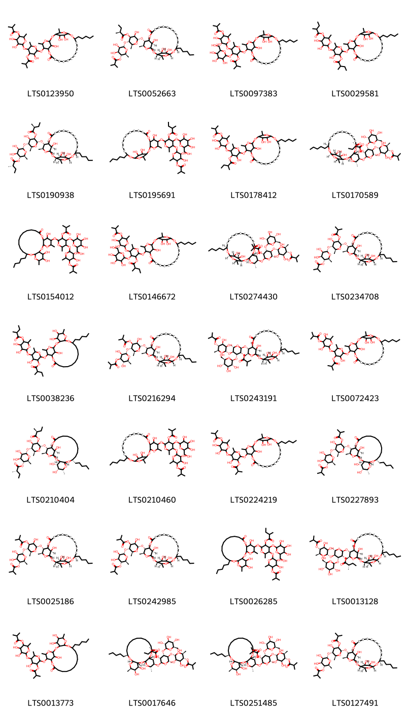{ width=100% }
    <figcaption>Hình ảnh cấu trúc hóa học của 28 hoạt chất thuộc nhóm Organooxygen compounds gồm ['3-({3,4-dihydroxy-6-methyl-5-[(2-methylpropanoyl)oxy]oxan-2-yl}oxy)-5-hydroxy-2-methyl-6-({24,25,26-trihydroxy-5,23-dimethyl-9-oxo-19-pentyl-2,4,8,20,22-pentaoxatricyclo[19.2.2.1³,⁷]hexacosan-6-yl}oxy)oxan-4-yl 2-methylpropanoate (LTS0123950)', '(2s,3s,4s,5r,6s)-3-{[(2s,3r,4s,5r,6s)-3,4-dihydroxy-6-methyl-5-[(2-methylpropanoyl)oxy]oxan-2-yl]oxy}-5-hydroxy-2-methyl-6-{[(1r,3s,5s,6s,7s,19s,21r,23s,24s,25r,26r)-24,25,26-trihydroxy-5,23-dimethyl-9-oxo-19-pentyl-2,4,8,20,22-pentaoxatricyclo[19.2.2.1³,⁷]hexacosan-6-yl]oxy}oxan-4-yl (2s)-2-methylbutanoate (LTS0052663)', '5-({3,4-dihydroxy-6-methyl-5-[(2-methylpropanoyl)oxy]oxan-2-yl}oxy)-6-methyl-2-({24,25,26-trihydroxy-5,23-dimethyl-9-oxo-19-pentyl-2,4,8,20,22-pentaoxatricyclo[19.2.2.1³,⁷]hexacosan-6-yl}oxy)-4-{[3,4,5-trihydroxy-6-(hydroxymethyl)oxan-2-yl]oxy}oxan-3-yl 2-methylpropanoate (LTS0097383)', '5-({3,4-dihydroxy-6-methyl-5-[(2-methylbutanoyl)oxy]oxan-2-yl}oxy)-4-hydroxy-6-methyl-2-({24,25,26-trihydroxy-5,23-dimethyl-9-oxo-19-pentyl-2,4,8,20,22-pentaoxatricyclo[19.2.2.1³,⁷]hexacosan-6-yl}oxy)oxan-3-yl 2-methylbutanoate (LTS0029581)', '(2s,3r,4r,5r,6s)-5-{[(2s,3r,4s,5r,6s)-3,4-dihydroxy-6-methyl-5-{[(2s)-2-methylbutanoyl]oxy}oxan-2-yl]oxy}-4-hydroxy-6-methyl-2-{[(1r,3s,5s,6s,7s,19s,21r,23s,24s,25r,26r)-24,25,26-trihydroxy-5,23-dimethyl-9-oxo-19-pentyl-2,4,8,20,22-pentaoxatricyclo[19.2.2.1³,⁷]hexacosan-6-yl]oxy}oxan-3-yl (2s)-2-methylbutanoate (LTS0190938)', '5-({3,4-dihydroxy-6-methyl-5-[(2-methylpropanoyl)oxy]oxan-2-yl}oxy)-6-methyl-2-({7,25,26-trihydroxy-5,24-dimethyl-10-oxo-20-pentyl-2,4,9,21,23-pentaoxatricyclo[20.2.2.0³,⁸]hexacosan-6-yl}oxy)-4-{[3,4,5-trihydroxy-6-(hydroxymethyl)oxan-2-yl]oxy}oxan-3-yl 2-methylbutanoate (LTS0195691)', '3-({3,4-dihydroxy-6-methyl-5-[(2-methylpropanoyl)oxy]oxan-2-yl}oxy)-5-hydroxy-2-methyl-6-({24,25,26-trihydroxy-5,23-dimethyl-9-oxo-19-pentyl-2,4,8,20,22-pentaoxatricyclo[19.2.2.1³,⁷]hexacosan-6-yl}oxy)oxan-4-yl 2-methylbutanoate (LTS0178412)', '(2s,3r,4r,5s,6s)-5-{[(2s,3r,4s,5r,6s)-3,4-dihydroxy-6-methyl-5-[(2-methylpropanoyl)oxy]oxan-2-yl]oxy}-6-methyl-2-{[(1r,3s,5s,6r,7r,8r,20s,22r,24s,25s,26r)-7,25,26-trihydroxy-5,24-dimethyl-10-oxo-20-pentyl-2,4,9,21,23-pentaoxatricyclo[20.2.2.0³,⁸]hexacosan-6-yl]oxy}-4-{[(2s,3r,4s,5s,6r)-3,4,5-trihydroxy-6-(hydroxymethyl)oxan-2-yl]oxy}oxan-3-yl (2s)-2-methylbutanoate (LTS0170589)', '5-({3,4-dihydroxy-6-methyl-5-[(2-methylpropanoyl)oxy]oxan-2-yl}oxy)-6-methyl-2-({7,25,26-trihydroxy-5,24-dimethyl-10-oxo-20-pentyl-2,4,9,21,23-pentaoxatricyclo[20.4.0.0³,⁸]hexacosan-6-yl}oxy)-4-{[3,4,5-trihydroxy-6-(hydroxymethyl)oxan-2-yl]oxy}oxan-3-yl 2-methylpropanoate (LTS0154012)', '5-({3,4-dihydroxy-6-methyl-5-[(2-methylpropanoyl)oxy]oxan-2-yl}oxy)-6-methyl-2-({24,25,26-trihydroxy-5,23-dimethyl-9-oxo-19-pentyl-2,4,8,20,22-pentaoxatricyclo[19.2.2.1³,⁷]hexacosan-6-yl}oxy)-4-{[3,4,5-trihydroxy-6-(hydroxymethyl)oxan-2-yl]oxy}oxan-3-yl 2-methylbutanoate (LTS0146672)', '(2s,3r,4r,5s,6s)-5-{[(2s,3r,4s,5r,6s)-3,4-dihydroxy-6-methyl-5-[(2-methylpropanoyl)oxy]oxan-2-yl]oxy}-6-methyl-2-{[(1r,3s,5s,6r,7r,8r,20s,22r,24s,25s,26r)-7,25,26-trihydroxy-5,24-dimethyl-10-oxo-20-pentyl-2,4,9,21,23-pentaoxatricyclo[20.2.2.0³,⁸]hexacosan-6-yl]oxy}-4-{[(2s,3r,4s,5s,6r)-3,4,5-trihydroxy-6-(hydroxymethyl)oxan-2-yl]oxy}oxan-3-yl 2-methylpropanoate (LTS0274430)', '(2s,3r,4r,5r,6s)-5-{[(2s,3r,4s,5r,6s)-3,4-dihydroxy-6-methyl-5-[(2-methylpropanoyl)oxy]oxan-2-yl]oxy}-4-hydroxy-6-methyl-2-{[(1r,3s,5s,6s,7s,19s,21r,23s,24s,25r,26r)-24,25,26-trihydroxy-5,23-dimethyl-9-oxo-19-pentyl-2,4,8,20,22-pentaoxatricyclo[19.2.2.1³,⁷]hexacosan-6-yl]oxy}oxan-3-yl 2-methylpropanoate (LTS0234708)', '5-({3,4-dihydroxy-6-methyl-5-[(2-methylbutanoyl)oxy]oxan-2-yl}oxy)-4-hydroxy-6-methyl-2-({4,5,26-trihydroxy-6,24-dimethyl-20-oxo-10-pentyl-2,7,9,21,25-pentaoxatricyclo[20.3.1.0³,⁸]hexacosan-23-yl}oxy)oxan-3-yl 2-methylbutanoate (LTS0038236)', '(2s,3s,4s,5r,6s)-3-{[(2s,3r,4r,5s,6s)-3,5-dihydroxy-6-methyl-4-[(2-methylpropanoyl)oxy]oxan-2-yl]oxy}-5-hydroxy-2-methyl-6-{[(1r,3s,5s,6s,7s,19s,21r,23s,24s,25r,26r)-24,25,26-trihydroxy-5,23-dimethyl-9-oxo-19-pentyl-2,4,8,20,22-pentaoxatricyclo[19.2.2.1³,⁷]hexacosan-6-yl]oxy}oxan-4-yl 2-methylpropanoate (LTS0216294)', '(2s,3r,4r,5s,6s)-5-{[(2s,3r,4s,5r,6s)-3,4-dihydroxy-6-methyl-5-[(2-methylpropanoyl)oxy]oxan-2-yl]oxy}-6-methyl-2-{[(1r,3s,5s,6s,7s,19s,21r,23s,24s,25r,26r)-24,25,26-trihydroxy-5,23-dimethyl-9-oxo-19-pentyl-2,4,8,20,22-pentaoxatricyclo[19.2.2.1³,⁷]hexacosan-6-yl]oxy}-4-{[(2s,3r,4s,5s,6r)-3,4,5-trihydroxy-6-(hydroxymethyl)oxan-2-yl]oxy}oxan-3-yl 2-methylpropanoate (LTS0243191)', '3-({3,5-dihydroxy-6-methyl-4-[(2-methylpropanoyl)oxy]oxan-2-yl}oxy)-5-hydroxy-2-methyl-6-({24,25,26-trihydroxy-5,23-dimethyl-9-oxo-19-pentyl-2,4,8,20,22-pentaoxatricyclo[19.2.2.1³,⁷]hexacosan-6-yl}oxy)oxan-4-yl 2-methylpropanoate (LTS0072423)', '(2s,3r,4r,5r,6s)-5-{[(2s,3r,4s,5r,6s)-3,4-dihydroxy-6-methyl-5-{[(2s)-2-methylbutanoyl]oxy}oxan-2-yl]oxy}-4-hydroxy-6-methyl-2-{[(1s,3r,4s,5r,6r,8r,10s,22s,23s,24s,26r)-4,5,26-trihydroxy-6,24-dimethyl-20-oxo-10-pentyl-2,7,9,21,25-pentaoxatricyclo[20.3.1.0³,⁸]hexacosan-23-yl]oxy}oxan-3-yl (2s)-2-methylbutanoate (LTS0210404)', '5-({3,4-dihydroxy-6-methyl-5-[(2-methylpropanoyl)oxy]oxan-2-yl}oxy)-6-methyl-2-({7,25,26-trihydroxy-5,24-dimethyl-10-oxo-20-pentyl-2,4,9,21,23-pentaoxatricyclo[20.2.2.0³,⁸]hexacosan-6-yl}oxy)-4-{[3,4,5-trihydroxy-6-(hydroxymethyl)oxan-2-yl]oxy}oxan-3-yl 2-methylpropanoate (LTS0210460)', '5-({3,4-dihydroxy-6-methyl-5-[(2-methylpropanoyl)oxy]oxan-2-yl}oxy)-4-hydroxy-6-methyl-2-({24,25,26-trihydroxy-5,23-dimethyl-9-oxo-19-pentyl-2,4,8,20,22-pentaoxatricyclo[19.2.2.1³,⁷]hexacosan-6-yl}oxy)oxan-3-yl 2-methylpropanoate (LTS0224219)', '(2s,3r,4r,5r,6s)-5-{[(2s,3r,4s,5r,6s)-3,4-dihydroxy-6-methyl-5-[(2-methylpropanoyl)oxy]oxan-2-yl]oxy}-4-hydroxy-6-methyl-2-{[(1s,3r,4s,5r,6r,8r,10s,22s,23s,24s,26r)-4,5,26-trihydroxy-6,24-dimethyl-20-oxo-10-pentyl-2,7,9,21,25-pentaoxatricyclo[20.3.1.0³,⁸]hexacosan-23-yl]oxy}oxan-3-yl 2-methylpropanoate (LTS0227893)', '(2s,3s,4s,5r,6s)-3-{[(2s,3r,4s,5r,6s)-3,4-dihydroxy-6-methyl-5-[(2-methylpropanoyl)oxy]oxan-2-yl]oxy}-5-hydroxy-2-methyl-6-{[(1r,3s,5s,6s,7s,19r,21r,23s,24s,25r,26r)-24,25,26-trihydroxy-5,23-dimethyl-9-oxo-19-pentyl-2,4,8,20,22-pentaoxatricyclo[19.2.2.1³,⁷]hexacosan-6-yl]oxy}oxan-4-yl 2-methylpropanoate (LTS0025186)', '(2s,3s,4s,5r,6s)-3-{[(2s,3r,4s,5r,6s)-3,4-dihydroxy-6-methyl-5-[(2-methylpropanoyl)oxy]oxan-2-yl]oxy}-5-hydroxy-2-methyl-6-{[(1r,3s,5s,6s,7s,19s,21r,23s,24s,25r,26r)-24,25,26-trihydroxy-5,23-dimethyl-9-oxo-19-pentyl-2,4,8,20,22-pentaoxatricyclo[19.2.2.1³,⁷]hexacosan-6-yl]oxy}oxan-4-yl 2-methylpropanoate (LTS0242985)', '5-({3,4-dihydroxy-6-methyl-5-[(2-methylpropanoyl)oxy]oxan-2-yl}oxy)-6-methyl-2-({7,25,26-trihydroxy-5,24-dimethyl-10-oxo-20-pentyl-2,4,9,21,23-pentaoxatricyclo[20.4.0.0³,⁸]hexacosan-6-yl}oxy)-4-{[3,4,5-trihydroxy-6-(hydroxymethyl)oxan-2-yl]oxy}oxan-3-yl 2-methylbutanoate (LTS0026285)', '(2s,3r,4r,5s,6s)-5-{[(2s,3r,4s,5r,6s)-3,4-dihydroxy-6-methyl-5-[(2-methylpropanoyl)oxy]oxan-2-yl]oxy}-6-methyl-2-{[(1r,3s,5s,6s,7s,19s,21r,23s,24s,25r,26r)-24,25,26-trihydroxy-5,23-dimethyl-9-oxo-19-pentyl-2,4,8,20,22-pentaoxatricyclo[19.2.2.1³,⁷]hexacosan-6-yl]oxy}-4-{[(2s,3r,4s,5s,6r)-3,4,5-trihydroxy-6-(hydroxymethyl)oxan-2-yl]oxy}oxan-3-yl (2s)-2-methylbutanoate (LTS0013128)', '5-({3,4-dihydroxy-6-methyl-5-[(2-methylpropanoyl)oxy]oxan-2-yl}oxy)-4-hydroxy-6-methyl-2-({4,5,26-trihydroxy-6,24-dimethyl-20-oxo-10-pentyl-2,7,9,21,25-pentaoxatricyclo[20.3.1.0³,⁸]hexacosan-23-yl}oxy)oxan-3-yl 2-methylpropanoate (LTS0013773)', '(2s,3r,4r,5s,6s)-5-{[(2s,3r,4s,5r,6s)-3,4-dihydroxy-6-methyl-5-[(2-methylpropanoyl)oxy]oxan-2-yl]oxy}-6-methyl-2-{[(1r,3s,5s,6r,7r,8r,20s,22r,24r,25r,26s)-7,25,26-trihydroxy-5,24-dimethyl-10-oxo-20-pentyl-2,4,9,21,23-pentaoxatricyclo[20.4.0.0³,⁸]hexacosan-6-yl]oxy}-4-{[(2s,3r,4s,5s,6r)-3,4,5-trihydroxy-6-(hydroxymethyl)oxan-2-yl]oxy}oxan-3-yl (2s)-2-methylbutanoate (LTS0017646)', '(2s,3r,4r,5s,6s)-5-{[(2s,3r,4s,5r,6s)-3,4-dihydroxy-6-methyl-5-[(2-methylpropanoyl)oxy]oxan-2-yl]oxy}-6-methyl-2-{[(1r,3s,5s,6r,7r,8r,20s,22r,24r,25r,26s)-7,25,26-trihydroxy-5,24-dimethyl-10-oxo-20-pentyl-2,4,9,21,23-pentaoxatricyclo[20.4.0.0³,⁸]hexacosan-6-yl]oxy}-4-{[(2s,3r,4s,5s,6r)-3,4,5-trihydroxy-6-(hydroxymethyl)oxan-2-yl]oxy}oxan-3-yl 2-methylpropanoate (LTS0251485)', '(2s,3r,4r,5r,6s)-5-{[(2s,3r,4s,5r,6s)-3,4-dihydroxy-6-methyl-5-[(2-methylpropanoyl)oxy]oxan-2-yl]oxy}-4-hydroxy-6-methyl-2-{[(1r,3s,5s,6s,7s,19r,21r,23s,24s,25r,26r)-24,25,26-trihydroxy-5,23-dimethyl-9-oxo-19-pentyl-2,4,8,20,22-pentaoxatricyclo[19.2.2.1³,⁷]hexacosan-6-yl]oxy}oxan-3-yl 2-methylpropanoate (LTS0127491)'].</figcaption>
</figure>

---

### Dược dân tộc học

Danh sách các quốc gia có sử dụng *Decalobanthus mammosus* trong điều trị các bệnh. 

| Country   | Disease   | Bệnh                                                                                                                                                                                                |
|:----------|:----------|:----------------------------------------------------------------------------------------------------------------------------------------------------------------------------------------------------|
| Elsewhere | Purgative | MYMEMORY WARNING: YOU USED ALL AVAILABLE FREE TRANSLATIONS FOR TODAY. NEXT AVAILABLE IN  16 HOURS 32 MINUTES 11 SECONDS VISIT HTTPS://MYMEMORY.TRANSLATED.NET/DOC/USAGELIMITS.PHP TO TRANSLATE MORE |
| Java      | Antidote  | MYMEMORY WARNING: YOU USED ALL AVAILABLE FREE TRANSLATIONS FOR TODAY. NEXT AVAILABLE IN  16 HOURS 32 MINUTES 09 SECONDS VISIT HTTPS://MYMEMORY.TRANSLATED.NET/DOC/USAGELIMITS.PHP TO TRANSLATE MORE |

---

---
## Merremia peltata
### Thông tin về thực vật

!!! info "Phân loại thực vật của *Decalobanthus peltatus* từ GIBF:"
    - **Kingdom:** Plantae
    - **Phylum:** Tracheophyta
    - **Order:** Solanales
    - **Family:** Convolvulaceae
    - **Genus:** Decalobanthus
    - **Species:** *Decalobanthus peltatus*

 

| Label (VI)   | Label (EN)   | Scientific Name   | Descriptions (VI)   | Descriptions (EN)   | Also Known As (VI)   | Also Known As (EN)   |
|:-------------|:-------------|:------------------|:--------------------|:--------------------|:---------------------|:---------------------|
| N/A          | N/A          | Merremia peltata  | loài thực vật       | species of plant    | ['']                 | ['']                 |

#### Phân bố trên thế giới

**Từ CSDL GIBF** nan, Thailand, Philippines, French Polynesia, Australia, Indonesia, Dominican Republic, Malaysia, Réunion, Mayotte, Samoa, Seychelles, Vanuatu, Palau, Tonga, Micronesia (Federated States of), Cook Islands, Papua New Guinea, Fiji, Ecuador, United States of America, Madagascar, Solomon Islands

#### Phân bố tại Việt Nam

**Từ CSDL GIBF**: Không có ghi nhận ở Việt Nam

---
### Thành phần hóa học
        
- Theo cơ sở dữ liệu lotus: Từ loài *Decalobanthus peltatus* đã phân lập và xác định được Chưa có hoạt chất nào được phân lập. hoạt chất thuộc về các nhóm Không có hoạt chất nào được phân lập. 

Không có hình ảnh nào được tạo ra

---

### Dược dân tộc học

Danh sách các quốc gia có sử dụng *Decalobanthus peltatus* trong điều trị các bệnh. 

| Country   | Disease   | Bệnh                                                                                                                                                                                                |
|:----------|:----------|:----------------------------------------------------------------------------------------------------------------------------------------------------------------------------------------------------|
| Malaya    | Vermifuge | MYMEMORY WARNING: YOU USED ALL AVAILABLE FREE TRANSLATIONS FOR TODAY. NEXT AVAILABLE IN  16 HOURS 31 MINUTES 50 SECONDS VISIT HTTPS://MYMEMORY.TRANSLATED.NET/DOC/USAGELIMITS.PHP TO TRANSLATE MORE |

---

---
## Merremia tridentata
### Thông tin về thực vật

!!! info "Phân loại thực vật của *Xenostegia tridentata* từ GIBF:"
    - **Kingdom:** Plantae
    - **Phylum:** Tracheophyta
    - **Order:** Solanales
    - **Family:** Convolvulaceae
    - **Genus:** Xenostegia
    - **Species:** *Xenostegia tridentata*

 

| Label (VI)   | Label (EN)   | Scientific Name     | Descriptions (VI)   | Descriptions (EN)   | Also Known As (VI)   | Also Known As (EN)   |
|:-------------|:-------------|:--------------------|:--------------------|:--------------------|:---------------------|:---------------------|
| N/A          | N/A          | Merremia tridentata | loài thực vật       | species of plant    | ['']                 | ['']                 |

#### Phân bố trên thế giới

**Từ CSDL GIBF** Malawi, Namibia, Burkina Faso, Senegal, Lao People’s Democratic Republic, Gabon, Niger, Indonesia, Togo, Côte d’Ivoire, Guinea-Bissau, Malaysia, India, Liberia, Benin, Botswana, Mozambique, Tanzania, United Republic of, Madagascar

#### Phân bố tại Việt Nam

**Từ CSDL GIBF**: Không có ghi nhận ở Việt Nam

---
### Thành phần hóa học
        
- Theo cơ sở dữ liệu lotus: Từ loài *Xenostegia tridentata* đã phân lập và xác định được Chưa có hoạt chất nào được phân lập. hoạt chất thuộc về các nhóm Không có hoạt chất nào được phân lập. 

Không có hình ảnh nào được tạo ra

---

### Dược dân tộc học

Danh sách các quốc gia có sử dụng *Xenostegia tridentata* trong điều trị các bệnh. 

| Country   | Disease           | Bệnh                                                                                                                                                                                                |
|:----------|:------------------|:----------------------------------------------------------------------------------------------------------------------------------------------------------------------------------------------------|
| Elsewhere | Tonic, Astringent | MYMEMORY WARNING: YOU USED ALL AVAILABLE FREE TRANSLATIONS FOR TODAY. NEXT AVAILABLE IN  16 HOURS 31 MINUTES 31 SECONDS VISIT HTTPS://MYMEMORY.TRANSLATED.NET/DOC/USAGELIMITS.PHP TO TRANSLATE MORE |

---

---
## Merremia tuberosa
### Thông tin về thực vật

!!! info "Phân loại thực vật của *Distimake tuberosus* từ GIBF:"
    - **Kingdom:** Plantae
    - **Phylum:** Tracheophyta
    - **Order:** Solanales
    - **Family:** Convolvulaceae
    - **Genus:** Distimake
    - **Species:** *Distimake tuberosus*

 

| Label (VI)   | Label (EN)   | Scientific Name   | Descriptions (VI)   | Descriptions (EN)   | Also Known As (VI)   | Also Known As (EN)   |
|:-------------|:-------------|:------------------|:--------------------|:--------------------|:---------------------|:---------------------|
| N/A          | N/A          | Merremia tuberosa | loài thực vật       | species of plant    | ['']                 | ['']                 |

#### Phân bố trên thế giới

**Từ CSDL GIBF** Colombia, Suriname, Belize, Brazil, Spain, Réunion, Costa Rica, Congo, Democratic Republic of the, United States of America, Mexico, Cuba, Chinese Taipei

#### Phân bố tại Việt Nam

**Từ CSDL GIBF**: Không có ghi nhận ở Việt Nam

---
### Thành phần hóa học
        
- Theo cơ sở dữ liệu lotus: Từ loài *Distimake tuberosus* đã phân lập và xác định được 13 hoạt chất thuộc về các nhóm Organooxygen compounds, Prenol lipids, Fatty Acyls, Steroids and steroid derivatives, Cinnamic acids and derivatives. 

|    | chemicalTaxonomyClassyfireClass   |   smiles_count |
|---:|:----------------------------------|---------------:|
|  0 | Cinnamic acids and derivatives    |              4 |
|  1 | Fatty Acyls                       |              2 |
|  2 | Organooxygen compounds            |              3 |
|  3 | Prenol lipids                     |              1 |
|  4 | Steroids and steroid derivatives  |              3 |

#### Nhóm Cinnamic acids and derivatives
<figure markdown="span">
    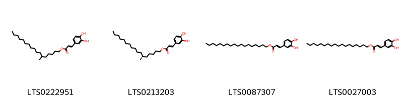{ width=100% }
    <figcaption>Hình ảnh cấu trúc hóa học của 4 hoạt chất thuộc nhóm Cinnamic acids and derivatives gồm ['6-methylheptadecyl 3-(3,4-dihydroxyphenyl)prop-2-enoate (LTS0222951)', '(6s)-6-methylheptadecyl (2e)-3-(3,4-dihydroxyphenyl)prop-2-enoate (LTS0213203)', 'octadecyl (2e)-3-(3,4-dihydroxyphenyl)prop-2-enoate (LTS0087307)', 'octadecyl 3-(3,4-dihydroxyphenyl)prop-2-enoate (LTS0027003)'].</figcaption>
</figure>
#### Nhóm Fatty Acyls
<figure markdown="span">
    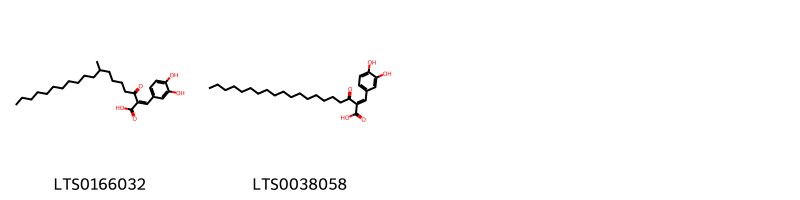{ width=100% }
    <figcaption>Hình ảnh cấu trúc hóa học của 2 hoạt chất thuộc nhóm Fatty Acyls gồm ['(2e)-2-[(3,4-dihydroxyphenyl)methylidene]-8-methyl-3-oxononadecanoic acid (LTS0166032)', '(2e)-2-[(3,4-dihydroxyphenyl)methylidene]-3-oxoicosanoic acid (LTS0038058)'].</figcaption>
</figure>
#### Nhóm Organooxygen compounds
<figure markdown="span">
    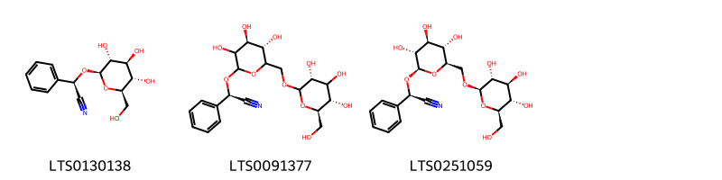{ width=100% }
    <figcaption>Hình ảnh cấu trúc hóa học của 3 hoạt chất thuộc nhóm Organooxygen compounds gồm ['prunasin (LTS0130138)', '(2r)-2-phenyl-2-{[(4s,5s)-3,4,5-trihydroxy-6-({[(3r,5s,6r)-3,4,5-trihydroxy-6-(hydroxymethyl)oxan-2-yl]oxy}methyl)oxan-2-yl]oxy}acetonitrile (LTS0091377)', 'laetrile (LTS0251059)'].</figcaption>
</figure>
#### Nhóm Prenol lipids
<figure markdown="span">
    { width=100% }
    <figcaption>Hình ảnh cấu trúc hóa học của 1 hoạt chất thuộc nhóm Prenol lipids gồm ['lupeol (LTS0256952)'].</figcaption>
</figure>
#### Nhóm Steroids and steroid derivatives
<figure markdown="span">
    { width=100% }
    <figcaption>Hình ảnh cấu trúc hóa học của 3 hoạt chất thuộc nhóm Steroids and steroid derivatives gồm ['stigmast-5-en-3-ol (LTS0071224)', 'stigmast-5-en-3-ol, (3β)- (LTS0204616)', 'phytosterol (LTS0029311)'].</figcaption>
</figure>

---

### Dược dân tộc học

Danh sách các quốc gia có sử dụng *Distimake tuberosus* trong điều trị các bệnh. 

| Country   | Disease   | Bệnh                                                                                                                                                                                                |
|:----------|:----------|:----------------------------------------------------------------------------------------------------------------------------------------------------------------------------------------------------|
| Elsewhere | Purgative | MYMEMORY WARNING: YOU USED ALL AVAILABLE FREE TRANSLATIONS FOR TODAY. NEXT AVAILABLE IN  16 HOURS 31 MINUTES 11 SECONDS VISIT HTTPS://MYMEMORY.TRANSLATED.NET/DOC/USAGELIMITS.PHP TO TRANSLATE MORE |

---

---
## Merremia umbellata
### Thông tin về thực vật

!!! info "Phân loại thực vật của *Merremia umbellata* từ GIBF:"
    - **Kingdom:** Plantae
    - **Phylum:** Tracheophyta
    - **Order:** Solanales
    - **Family:** Convolvulaceae
    - **Genus:** Merremia
    - **Species:** *Merremia umbellata*

 

| Label (VI)   | Label (EN)   | Scientific Name    | Descriptions (VI)   | Descriptions (EN)   | Also Known As (VI)   | Also Known As (EN)   |
|:-------------|:-------------|:-------------------|:--------------------|:--------------------|:---------------------|:---------------------|
| N/A          | N/A          | Merremia umbellata | loài thực vật       | species of plant    | ['']                 | ['']                 |

#### Phân bố trên thế giới

**Từ CSDL GIBF** nan, Cayman Islands, Honduras, Thailand, French Guiana, Lao People’s Democratic Republic, Australia, Indonesia, Colombia, Venezuela (Bolivarian Republic of), Dominican Republic, Côte d’Ivoire, Puerto Rico, Nigeria, Cuba, Belize, Nicaragua, Panama, Brazil, Peru, Mexico, China, Grenada, Bolivia (Plurinational State of), Costa Rica, Ecuador, United States of America, Guyana

#### Phân bố tại Việt Nam

**Từ CSDL GIBF**: Không có ghi nhận ở Việt Nam

---
### Thành phần hóa học
        
- Theo cơ sở dữ liệu lotus: Từ loài *Merremia umbellata* đã phân lập và xác định được Chưa có hoạt chất nào được phân lập. hoạt chất thuộc về các nhóm Không có hoạt chất nào được phân lập. 

Không có hình ảnh nào được tạo ra

---

### Dược dân tộc học

Danh sách các quốc gia có sử dụng *Merremia umbellata* trong điều trị các bệnh. 

| Country   | Disease   | Bệnh                                                                                                                                                                                                |
|:----------|:----------|:----------------------------------------------------------------------------------------------------------------------------------------------------------------------------------------------------|
| Elsewhere | Aperient  | MYMEMORY WARNING: YOU USED ALL AVAILABLE FREE TRANSLATIONS FOR TODAY. NEXT AVAILABLE IN  16 HOURS 30 MINUTES 44 SECONDS VISIT HTTPS://MYMEMORY.TRANSLATED.NET/DOC/USAGELIMITS.PHP TO TRANSLATE MORE |

---

---
## Merremia vitifolia
### Thông tin về thực vật

!!! info "Phân loại thực vật của *Camonea vitifolia* từ GIBF:"
    - **Kingdom:** Plantae
    - **Phylum:** Tracheophyta
    - **Order:** Solanales
    - **Family:** Convolvulaceae
    - **Genus:** Camonea
    - **Species:** *Camonea vitifolia*

 

| Label (VI)   | Label (EN)   | Scientific Name    | Descriptions (VI)   | Descriptions (EN)   | Also Known As (VI)   | Also Known As (EN)              |
|:-------------|:-------------|:-------------------|:--------------------|:--------------------|:---------------------|:--------------------------------|
| N/A          | N/A          | Merremia vitifolia | loài thực vật       | species of plant    | ['']                 | ['Bombay Nawal', 'Grape Glory'] |

#### Phân bố trên thế giới

**Từ CSDL GIBF** Viet Nam, nan, unknown or invalid, Thailand, Philippines, Lao People’s Democratic Republic, Indonesia, Sri Lanka, Bhutan, Malaysia, India, Bangladesh, Cambodia, Myanmar, Japan, Brazil, China, Nepal, Chinese Taipei, Cook Islands

#### Phân bố tại Việt Nam

**Từ CSDL GIBF**: Ninh Binh, Hoa Binh

---
### Thành phần hóa học
        
- Theo cơ sở dữ liệu lotus: Từ loài *Camonea vitifolia* đã phân lập và xác định được Chưa có hoạt chất nào được phân lập. hoạt chất thuộc về các nhóm Không có hoạt chất nào được phân lập. 

Không có hình ảnh nào được tạo ra

---

### Dược dân tộc học

Danh sách các quốc gia có sử dụng *Camonea vitifolia* trong điều trị các bệnh. 

| Country      | Disease     | Bệnh                                                                                                                                                                                                |
|:-------------|:------------|:----------------------------------------------------------------------------------------------------------------------------------------------------------------------------------------------------|
| Elsewhere    | Refrigerant | MYMEMORY WARNING: YOU USED ALL AVAILABLE FREE TRANSLATIONS FOR TODAY. NEXT AVAILABLE IN  16 HOURS 30 MINUTES 23 SECONDS VISIT HTTPS://MYMEMORY.TRANSLATED.NET/DOC/USAGELIMITS.PHP TO TRANSLATE MORE |
| India(Munda) | Stomachic   | MYMEMORY WARNING: YOU USED ALL AVAILABLE FREE TRANSLATIONS FOR TODAY. NEXT AVAILABLE IN  16 HOURS 30 MINUTES 21 SECONDS VISIT HTTPS://MYMEMORY.TRANSLATED.NET/DOC/USAGELIMITS.PHP TO TRANSLATE MORE |

---

# Chi Rivea

??? note "Danh sách các dược liệu thuộc chi"
    
	 - *Rivea corymbosa*
	 - *Rivea ornata*

---
## Rivea corymbosa
### Thông tin về thực vật

!!! info "Phân loại thực vật của *Ipomoea corymbosa* từ GIBF:"
    - **Kingdom:** Plantae
    - **Phylum:** Tracheophyta
    - **Order:** Solanales
    - **Family:** Convolvulaceae
    - **Genus:** Ipomoea
    - **Species:** *Ipomoea corymbosa*

 

| Label (VI)   | Label (EN)   | Scientific Name   | Descriptions (VI)   | Descriptions (EN)   | Also Known As (VI)   | Also Known As (EN)   |
|:-------------|:-------------|:------------------|:--------------------|:--------------------|:---------------------|:---------------------|
| N/A          | N/A          | Rivea corymbosa   |                     | species of plant    | ['']                 | ['']                 |

#### Phân bố trên thế giới

**Từ CSDL GIBF** Honduras, nan, unknown or invalid, Dominican Republic, Brazil, Philippines, Cuba, Mexico

#### Phân bố tại Việt Nam

**Từ CSDL GIBF**: Không có ghi nhận ở Việt Nam

---
### Thành phần hóa học
        
- Theo cơ sở dữ liệu lotus: Từ loài *Ipomoea corymbosa* đã phân lập và xác định được Chưa có hoạt chất nào được phân lập. hoạt chất thuộc về các nhóm Không có hoạt chất nào được phân lập. 

Không có hình ảnh nào được tạo ra

---

### Dược dân tộc học

Danh sách các quốc gia có sử dụng *Ipomoea corymbosa* trong điều trị các bệnh. 

| Country      | Disease                                         | Bệnh                                                                                                                                                                                                |
|:-------------|:------------------------------------------------|:----------------------------------------------------------------------------------------------------------------------------------------------------------------------------------------------------|
| Elsewhere    | Contraceptive, Hallucinogen, Narcotic, Narcotic | MYMEMORY WARNING: YOU USED ALL AVAILABLE FREE TRANSLATIONS FOR TODAY. NEXT AVAILABLE IN  16 HOURS 30 MINUTES 02 SECONDS VISIT HTTPS://MYMEMORY.TRANSLATED.NET/DOC/USAGELIMITS.PHP TO TRANSLATE MORE |
| Mexico       | Carminative, Narcotic, Hallucinogen, Narcotic   | MYMEMORY WARNING: YOU USED ALL AVAILABLE FREE TRANSLATIONS FOR TODAY. NEXT AVAILABLE IN  16 HOURS 30 MINUTES 00 SECONDS VISIT HTTPS://MYMEMORY.TRANSLATED.NET/DOC/USAGELIMITS.PHP TO TRANSLATE MORE |
| Mexico(Maya) | Diuretic                                        | MYMEMORY WARNING: YOU USED ALL AVAILABLE FREE TRANSLATIONS FOR TODAY. NEXT AVAILABLE IN  16 HOURS 29 MINUTES 57 SECONDS VISIT HTTPS://MYMEMORY.TRANSLATED.NET/DOC/USAGELIMITS.PHP TO TRANSLATE MORE |

---

---
## Rivea ornata
### Thông tin về thực vật

!!! info "Phân loại thực vật của *Rivea ornata* từ GIBF:"
    - **Kingdom:** Plantae
    - **Phylum:** Tracheophyta
    - **Order:** Solanales
    - **Family:** Convolvulaceae
    - **Genus:** Rivea
    - **Species:** *Rivea ornata*

 

| Label (VI)   | Label (EN)   | Scientific Name   | Descriptions (VI)   | Descriptions (EN)   | Also Known As (VI)   | Also Known As (EN)   |
|:-------------|:-------------|:------------------|:--------------------|:--------------------|:---------------------|:---------------------|
| N/A          | N/A          | Rivea ornata      | loài thực vật       | species of plant    | ['']                 | ['']                 |

#### Phân bố trên thế giới

**Từ CSDL GIBF** nan, Sri Lanka, Thailand, Myanmar, Bhutan, Mongolia, Malaysia, India, Lao People’s Democratic Republic, Nepal

#### Phân bố tại Việt Nam

**Từ CSDL GIBF**: Không có ghi nhận ở Việt Nam

---
### Thành phần hóa học
        
- Theo cơ sở dữ liệu lotus: Từ loài *Rivea ornata* đã phân lập và xác định được Chưa có hoạt chất nào được phân lập. hoạt chất thuộc về các nhóm Không có hoạt chất nào được phân lập. 

Không có hình ảnh nào được tạo ra

---

### Dược dân tộc học

Danh sách các quốc gia có sử dụng *Rivea ornata* trong điều trị các bệnh. 

| Country   | Disease            | Bệnh                                                                                                                                                                                                |
|:----------|:-------------------|:----------------------------------------------------------------------------------------------------------------------------------------------------------------------------------------------------|
| Sri Lanka | Tonic, Refrigerant | MYMEMORY WARNING: YOU USED ALL AVAILABLE FREE TRANSLATIONS FOR TODAY. NEXT AVAILABLE IN  16 HOURS 29 MINUTES 38 SECONDS VISIT HTTPS://MYMEMORY.TRANSLATED.NET/DOC/USAGELIMITS.PHP TO TRANSLATE MORE |

---

# Chi Pharbitis

??? note "Danh sách các dược liệu thuộc chi"
    
	 - *Pharbitis nil*

---
## Pharbitis nil
### Thông tin về thực vật

!!! info "Phân loại thực vật của *Ipomoea nil* từ GIBF:"
    - **Kingdom:** Plantae
    - **Phylum:** Tracheophyta
    - **Order:** Solanales
    - **Family:** Convolvulaceae
    - **Genus:** Ipomoea
    - **Species:** *Ipomoea nil*

 

| Label (VI)   | Label (EN)   | Scientific Name   | Descriptions (VI)   | Descriptions (EN)   | Also Known As (VI)   | Also Known As (EN)   |
|:-------------|:-------------|:------------------|:--------------------|:--------------------|:---------------------|:---------------------|
| N/A          | N/A          | Pharbitis nil     | loài thực vật       | species of plant    | ['']                 | ['']                 |

#### Phân bố trên thế giới

**Từ CSDL GIBF** nan, Japan, China, Korea, Republic of, Chinese Taipei

#### Phân bố tại Việt Nam

**Từ CSDL GIBF**: Không có ghi nhận ở Việt Nam

---
### Thành phần hóa học
        
- Theo cơ sở dữ liệu lotus: Từ loài *Ipomoea nil* đã phân lập và xác định được Chưa có hoạt chất nào được phân lập. hoạt chất thuộc về các nhóm Không có hoạt chất nào được phân lập. 

Không có hình ảnh nào được tạo ra

---

### Dược dân tộc học

Danh sách các quốc gia có sử dụng *Ipomoea nil* trong điều trị các bệnh. 

| Country   | Disease                                            | Bệnh                                                                                                                                                                                                |
|:----------|:---------------------------------------------------|:----------------------------------------------------------------------------------------------------------------------------------------------------------------------------------------------------|
| China     | Diuretic, Expectorant, Laxative, Poison, Vermifuge | MYMEMORY WARNING: YOU USED ALL AVAILABLE FREE TRANSLATIONS FOR TODAY. NEXT AVAILABLE IN  16 HOURS 29 MINUTES 20 SECONDS VISIT HTTPS://MYMEMORY.TRANSLATED.NET/DOC/USAGELIMITS.PHP TO TRANSLATE MORE |
| Japan*    | Purgative                                          | MYMEMORY WARNING: YOU USED ALL AVAILABLE FREE TRANSLATIONS FOR TODAY. NEXT AVAILABLE IN  16 HOURS 29 MINUTES 18 SECONDS VISIT HTTPS://MYMEMORY.TRANSLATED.NET/DOC/USAGELIMITS.PHP TO TRANSLATE MORE |

---

# Chi Turbina

??? note "Danh sách các dược liệu thuộc chi"
    
	 - *Turbina corymbosa*

---
## Turbina corymbosa
### Thông tin về thực vật

!!! info "Phân loại thực vật của *Ipomoea corymbosa* từ GIBF:"
    - **Kingdom:** Plantae
    - **Phylum:** Tracheophyta
    - **Order:** Solanales
    - **Family:** Convolvulaceae
    - **Genus:** Ipomoea
    - **Species:** *Ipomoea corymbosa*

 

| Label (VI)   | Label (EN)   | Scientific Name   | Descriptions (VI)   | Descriptions (EN)   | Also Known As (VI)   | Also Known As (EN)   |
|:-------------|:-------------|:------------------|:--------------------|:--------------------|:---------------------|:---------------------|
| N/A          | N/A          | Turbina corymbosa | loài thực vật       | species of plant    | ['']                 | ['']                 |

#### Phân bố trên thế giới

**Từ CSDL GIBF** Belize, Nicaragua, El Salvador, Brazil, Puerto Rico, Peru, Bolivia (Plurinational State of), Costa Rica, United States of America, Mexico, Cuba, Australia, Jamaica, Guatemala

#### Phân bố tại Việt Nam

**Từ CSDL GIBF**: Không có ghi nhận ở Việt Nam

---
### Thành phần hóa học
        
- Theo cơ sở dữ liệu lotus: Từ loài *Ipomoea corymbosa* đã phân lập và xác định được 17 hoạt chất thuộc về các nhóm Flavonoids, Prenol lipids, Ergoline and derivatives. 

|    | chemicalTaxonomyClassyfireClass   |   smiles_count |
|---:|:----------------------------------|---------------:|
|  0 | Ergoline and derivatives          |             10 |
|  1 | Flavonoids                        |              1 |
|  2 | Prenol lipids                     |              6 |

#### Nhóm Ergoline and derivatives
<figure markdown="span">
    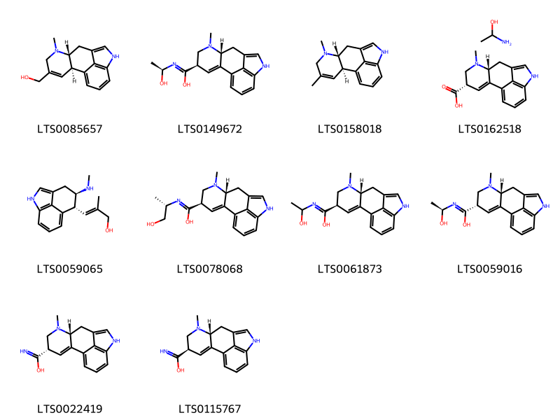{ width=100% }
    <figcaption>Hình ảnh cấu trúc hóa học của 10 hoạt chất thuộc nhóm Ergoline and derivatives gồm ['elymoclavine (LTS0085657)', '(4r,7r)-n-[(1s)-1-hydroxyethyl]-6-methyl-6,11-diazatetracyclo[7.6.1.0²,⁷.0¹²,¹⁶]hexadeca-1(16),2,9,12,14-pentaene-4-carboximidic acid (LTS0149672)', 'agroclavine (LTS0158018)', 'acetaldehyde ammonia; isolysergic acid (LTS0162518)', 'chanoclavine (LTS0059065)', '(4r,7r)-n-[(2s)-1-hydroxypropan-2-yl]-6-methyl-6,11-diazatetracyclo[7.6.1.0²,⁷.0¹²,¹⁶]hexadeca-1(16),2,9,12,14-pentaene-4-carboximidic acid (LTS0078068)', '(4r,7r)-n-(1-hydroxyethyl)-6-methyl-6,11-diazatetracyclo[7.6.1.0²,⁷.0¹²,¹⁶]hexadeca-1(16),2,9,12,14-pentaene-4-carboximidic acid (LTS0061873)', '(4s,7r)-n-[(1s)-1-hydroxyethyl]-6-methyl-6,11-diazatetracyclo[7.6.1.0²,⁷.0¹²,¹⁶]hexadeca-1(16),2,9,12,14-pentaene-4-carboximidic acid (LTS0059016)', '(4s,7r)-6-methyl-6,11-diazatetracyclo[7.6.1.0²,⁷.0¹²,¹⁶]hexadeca-1(16),2,9,12,14-pentaene-4-carboximidic acid (LTS0022419)', 'd-lysergic acid amide (LTS0115767)'].</figcaption>
</figure>
#### Nhóm Flavonoids
<figure markdown="span">
    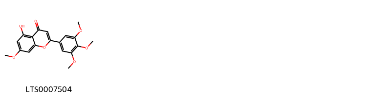{ width=100% }
    <figcaption>Hình ảnh cấu trúc hóa học của 1 hoạt chất thuộc nhóm Flavonoids gồm ['corymbosin (LTS0007504)'].</figcaption>
</figure>
#### Nhóm Prenol lipids
<figure markdown="span">
    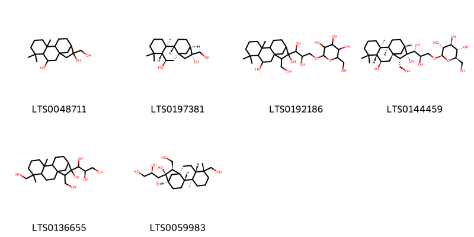{ width=100% }
    <figcaption>Hình ảnh cấu trúc hóa học của 6 hoạt chất thuộc nhóm Prenol lipids gồm ['14-(hydroxymethyl)-5,5,9-trimethyltetracyclo[11.2.1.0¹,¹⁰.0⁴,⁹]hexadecane-3,14-diol (LTS0048711)', '(1r,3r,4r,9s,10r,13r,14r)-14-(hydroxymethyl)-5,5,9-trimethyltetracyclo[11.2.1.0¹,¹⁰.0⁴,⁹]hexadecane-3,14-diol (LTS0197381)', '2-{3-[3,14-dihydroxy-15-(hydroxymethyl)-5,5,9-trimethyltetracyclo[11.2.1.0¹,¹⁰.0⁴,⁹]hexadecan-14-yl]-2,3-dihydroxypropoxy}-6-(hydroxymethyl)oxane-3,4,5-triol (LTS0192186)', '(2r,3r,4s,5s,6r)-2-[(2r,3r)-3-[(1r,3r,4r,9s,10r,13s,14s,15s)-3,14-dihydroxy-15-(hydroxymethyl)-5,5,9-trimethyltetracyclo[11.2.1.0¹,¹⁰.0⁴,⁹]hexadecan-14-yl]-2,3-dihydroxypropoxy]-6-(hydroxymethyl)oxane-3,4,5-triol (LTS0144459)', '1-[14-hydroxy-5,15-bis(hydroxymethyl)-5,9-dimethyltetracyclo[11.2.1.0¹,¹⁰.0⁴,⁹]hexadecan-14-yl]propane-1,2,3-triol (LTS0136655)', '(1r,2r)-1-[(1r,4s,5r,9s,10s,13r,14r,15r)-14-hydroxy-5,15-bis(hydroxymethyl)-5,9-dimethyltetracyclo[11.2.1.0¹,¹⁰.0⁴,⁹]hexadecan-14-yl]propane-1,2,3-triol (LTS0059983)'].</figcaption>
</figure>

---

### Dược dân tộc học

Danh sách các quốc gia có sử dụng *Ipomoea corymbosa* trong điều trị các bệnh. 

| Country            | Disease      | Bệnh                                                                                                                                                                                                |
|:-------------------|:-------------|:----------------------------------------------------------------------------------------------------------------------------------------------------------------------------------------------------|
| Dominican Republic | Narcotic     | MYMEMORY WARNING: YOU USED ALL AVAILABLE FREE TRANSLATIONS FOR TODAY. NEXT AVAILABLE IN  16 HOURS 28 MINUTES 58 SECONDS VISIT HTTPS://MYMEMORY.TRANSLATED.NET/DOC/USAGELIMITS.PHP TO TRANSLATE MORE |
| Mexico             | Hallucinogen | MYMEMORY WARNING: YOU USED ALL AVAILABLE FREE TRANSLATIONS FOR TODAY. NEXT AVAILABLE IN  16 HOURS 28 MINUTES 56 SECONDS VISIT HTTPS://MYMEMORY.TRANSLATED.NET/DOC/USAGELIMITS.PHP TO TRANSLATE MORE |

---

# Chi Argyreia

??? note "Danh sách các dược liệu thuộc chi"
    
	 - *Argyreia capitata*
	 - *Argyreia eciosa*
	 - *Argyreia fulgens*
	 - *Argyreia malabarica*
	 - *Argyreia mollis*
	 - *Argyreia nervosa*

---
## Argyreia capitata
### Thông tin về thực vật

!!! info "Phân loại thực vật của *N/A* từ GIBF:"
    - **Kingdom:** Plantae
    - **Phylum:** Tracheophyta
    - **Order:** Solanales
    - **Family:** Convolvulaceae
    - **Genus:** Argyreia
    - **Species:** *N/A*

 

| Label (VI)   | Label (EN)   | Scientific Name   | Descriptions (VI)   | Descriptions (EN)   | Also Known As (VI)   | Also Known As (EN)   |
|:-------------|:-------------|:------------------|:--------------------|:--------------------|:---------------------|:---------------------|
| N/A          | N/A          | Argyreia capitata |                     | species of plant    | ['']                 | ['']                 |

#### Phân bố trên thế giới

**Từ CSDL GIBF** Viet Nam, Thailand, Germany, Burkina Faso, Lao People’s Democratic Republic, Singapore, Australia, Indonesia, Sri Lanka, Malaysia, Mauritius, India, Réunion, Nigeria, Cambodia, Brazil, China, Nepal, Chinese Taipei, South Africa, United States of America

#### Phân bố tại Việt Nam

**Từ CSDL GIBF**: Vĩnh Phúc

---
### Thành phần hóa học
        
- Theo cơ sở dữ liệu lotus: Từ loài *N/A* đã phân lập và xác định được Chưa có hoạt chất nào được phân lập. hoạt chất thuộc về các nhóm Không có hoạt chất nào được phân lập. 

Không có hình ảnh nào được tạo ra

---

### Dược dân tộc học

Danh sách các quốc gia có sử dụng *N/A* trong điều trị các bệnh. 

| Country   | Disease   | Bệnh                                                                                                                                                                                                |
|:----------|:----------|:----------------------------------------------------------------------------------------------------------------------------------------------------------------------------------------------------|
| Burma     | Purgative | MYMEMORY WARNING: YOU USED ALL AVAILABLE FREE TRANSLATIONS FOR TODAY. NEXT AVAILABLE IN  16 HOURS 28 MINUTES 28 SECONDS VISIT HTTPS://MYMEMORY.TRANSLATED.NET/DOC/USAGELIMITS.PHP TO TRANSLATE MORE |

---

---
## Argyreia eciosa
### Thông tin về thực vật

!!! info "Phân loại thực vật của *N/A* từ GIBF:"
    - **Kingdom:** Plantae
    - **Phylum:** Tracheophyta
    - **Order:** Solanales
    - **Family:** Convolvulaceae
    - **Genus:** Argyreia
    - **Species:** *N/A*

 

| Label (VI)   | Label (EN)   | Scientific Name   | Descriptions (VI)   | Descriptions (EN)   | Also Known As (VI)   | Also Known As (EN)   |
|:-------------|:-------------|:------------------|:--------------------|:--------------------|:---------------------|:---------------------|
| N/A          | N/A          | Argyreia capitata |                     | species of plant    | ['']                 | ['']                 |

#### Phân bố trên thế giới

**Từ CSDL GIBF** Viet Nam, Thailand, Germany, Burkina Faso, Lao People’s Democratic Republic, Singapore, Australia, Indonesia, Sri Lanka, Malaysia, Mauritius, India, Réunion, Nigeria, Cambodia, Brazil, China, Nepal, Chinese Taipei, South Africa, United States of America

#### Phân bố tại Việt Nam

**Từ CSDL GIBF**: Vĩnh Phúc

---
### Thành phần hóa học
        
- Theo cơ sở dữ liệu lotus: Từ loài *N/A* đã phân lập và xác định được Chưa có hoạt chất nào được phân lập. hoạt chất thuộc về các nhóm Không có hoạt chất nào được phân lập. 

Không có hình ảnh nào được tạo ra

---

### Dược dân tộc học

Danh sách các quốc gia có sử dụng *N/A* trong điều trị các bệnh. 

| Country   | Disease                         | Bệnh                                                                                                                                                                                                |
|:----------|:--------------------------------|:----------------------------------------------------------------------------------------------------------------------------------------------------------------------------------------------------|
| Elsewhere | Suppurative, Tonic, Rubefacient | MYMEMORY WARNING: YOU USED ALL AVAILABLE FREE TRANSLATIONS FOR TODAY. NEXT AVAILABLE IN  16 HOURS 28 MINUTES 06 SECONDS VISIT HTTPS://MYMEMORY.TRANSLATED.NET/DOC/USAGELIMITS.PHP TO TRANSLATE MORE |
| Haiti     | Sudorific                       | MYMEMORY WARNING: YOU USED ALL AVAILABLE FREE TRANSLATIONS FOR TODAY. NEXT AVAILABLE IN  16 HOURS 28 MINUTES 03 SECONDS VISIT HTTPS://MYMEMORY.TRANSLATED.NET/DOC/USAGELIMITS.PHP TO TRANSLATE MORE |
| Malaysia  | Poultice                        | MYMEMORY WARNING: YOU USED ALL AVAILABLE FREE TRANSLATIONS FOR TODAY. NEXT AVAILABLE IN  16 HOURS 28 MINUTES 01 SECONDS VISIT HTTPS://MYMEMORY.TRANSLATED.NET/DOC/USAGELIMITS.PHP TO TRANSLATE MORE |

---

---
## Argyreia fulgens
### Thông tin về thực vật

!!! info "Phân loại thực vật của *Argyreia fulgens* từ GIBF:"
    - **Kingdom:** Plantae
    - **Phylum:** Tracheophyta
    - **Order:** Solanales
    - **Family:** Convolvulaceae
    - **Genus:** Argyreia
    - **Species:** *Argyreia fulgens*

 

| Label (VI)   | Label (EN)   | Scientific Name   | Descriptions (VI)   | Descriptions (EN)   | Also Known As (VI)   | Also Known As (EN)   |
|:-------------|:-------------|:------------------|:--------------------|:--------------------|:---------------------|:---------------------|
| N/A          | N/A          | Argyreia fulgens  | loài thực vật       | species of plant    | ['']                 | ['']                 |

#### Phân bố trên thế giới

**Từ CSDL GIBF** Viet Nam, Thailand, Germany, Burkina Faso, Lao People’s Democratic Republic, Singapore, Australia, Indonesia, Sri Lanka, Malaysia, Mauritius, India, Réunion, Nigeria, Cambodia, Brazil, China, Nepal, Chinese Taipei, South Africa, United States of America

#### Phân bố tại Việt Nam

**Từ CSDL GIBF**: Vĩnh Phúc

---
### Thành phần hóa học
        
- Theo cơ sở dữ liệu lotus: Từ loài *Argyreia fulgens* đã phân lập và xác định được Chưa có hoạt chất nào được phân lập. hoạt chất thuộc về các nhóm Không có hoạt chất nào được phân lập. 

Không có hình ảnh nào được tạo ra

---

### Dược dân tộc học

Danh sách các quốc gia có sử dụng *Argyreia fulgens* trong điều trị các bệnh. 

| Country   | Disease                  | Bệnh                                                                                                                                                                                                |
|:----------|:-------------------------|:----------------------------------------------------------------------------------------------------------------------------------------------------------------------------------------------------|
| Elsewhere | Rubefacient, Suppurative | MYMEMORY WARNING: YOU USED ALL AVAILABLE FREE TRANSLATIONS FOR TODAY. NEXT AVAILABLE IN  16 HOURS 27 MINUTES 40 SECONDS VISIT HTTPS://MYMEMORY.TRANSLATED.NET/DOC/USAGELIMITS.PHP TO TRANSLATE MORE |

---

---
## Argyreia malabarica
### Thông tin về thực vật

!!! info "Phân loại thực vật của *Hewittia malabarica* từ GIBF:"
    - **Kingdom:** Plantae
    - **Phylum:** Tracheophyta
    - **Order:** Solanales
    - **Family:** Convolvulaceae
    - **Genus:** Hewittia
    - **Species:** *Hewittia malabarica*

 

| Label (VI)   | Label (EN)   | Scientific Name     | Descriptions (VI)   | Descriptions (EN)   | Also Known As (VI)   | Also Known As (EN)   |
|:-------------|:-------------|:--------------------|:--------------------|:--------------------|:---------------------|:---------------------|
| N/A          | N/A          | Argyreia malabarica | loài thực vật       | species of plant    | ['']                 | ['']                 |

#### Phân bố trên thế giới

**Từ CSDL GIBF** Viet Nam, Thailand, Germany, Burkina Faso, Lao People’s Democratic Republic, Singapore, Australia, Indonesia, Sri Lanka, Malaysia, Mauritius, India, Réunion, Nigeria, Cambodia, Brazil, China, Nepal, Chinese Taipei, South Africa, United States of America

#### Phân bố tại Việt Nam

**Từ CSDL GIBF**: Vĩnh Phúc

---
### Thành phần hóa học
        
- Theo cơ sở dữ liệu lotus: Từ loài *Hewittia malabarica* đã phân lập và xác định được Chưa có hoạt chất nào được phân lập. hoạt chất thuộc về các nhóm Không có hoạt chất nào được phân lập. 

Không có hình ảnh nào được tạo ra

---

### Dược dân tộc học

Danh sách các quốc gia có sử dụng *Hewittia malabarica* trong điều trị các bệnh. 

| Country   | Disease                                    | Bệnh                                                                                                                                                                                                |
|:----------|:-------------------------------------------|:----------------------------------------------------------------------------------------------------------------------------------------------------------------------------------------------------|
| Elsewhere | Cathartic, Rubefacient, Tonic, Suppurative | MYMEMORY WARNING: YOU USED ALL AVAILABLE FREE TRANSLATIONS FOR TODAY. NEXT AVAILABLE IN  16 HOURS 27 MINUTES 24 SECONDS VISIT HTTPS://MYMEMORY.TRANSLATED.NET/DOC/USAGELIMITS.PHP TO TRANSLATE MORE |

---

---
## Argyreia mollis
### Thông tin về thực vật

!!! info "Phân loại thực vật của *Argyreia mollis* từ GIBF:"
    - **Kingdom:** Plantae
    - **Phylum:** Tracheophyta
    - **Order:** Solanales
    - **Family:** Convolvulaceae
    - **Genus:** Argyreia
    - **Species:** *Argyreia mollis*

 

| Label (VI)   | Label (EN)   | Scientific Name   | Descriptions (VI)   | Descriptions (EN)   | Also Known As (VI)   | Also Known As (EN)   |
|:-------------|:-------------|:------------------|:--------------------|:--------------------|:---------------------|:---------------------|
| N/A          | N/A          | Argyreia mollis   |                     | species of plant    | ['']                 | ['']                 |

#### Phân bố trên thế giới

**Từ CSDL GIBF** Viet Nam, nan, unknown or invalid, Thailand, El Salvador, Myanmar, Switzerland, Brazil, Hong Kong, Spain, Philippines, Malaysia, Egypt, India, Lao People’s Democratic Republic, China, Cambodia, Indonesia

#### Phân bố tại Việt Nam

**Từ CSDL GIBF**: Kiên Giang, Tây Ninh

---
### Thành phần hóa học
        
- Theo cơ sở dữ liệu lotus: Từ loài *Argyreia mollis* đã phân lập và xác định được 18 hoạt chất thuộc về các nhóm Loline alkaloids and derivatives, Pyridines and derivatives, Tropane alkaloids. 

|    | chemicalTaxonomyClassyfireClass   |   smiles_count |
|---:|:----------------------------------|---------------:|
|  0 |                                   |              5 |
|  1 | Loline alkaloids and derivatives  |              9 |
|  2 | Pyridines and derivatives         |              2 |
|  3 | Tropane alkaloids                 |              2 |

#### Nhóm 
<figure markdown="span">
    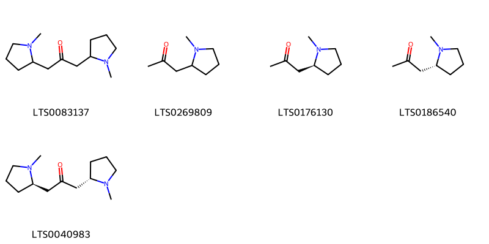{ width=100% }
    <figcaption>Hình ảnh cấu trúc hóa học của 5 hoạt chất thuộc nhóm  gồm ['cuskhygrine (LTS0083137)', 'hygrine (LTS0269809)', '(-)-hygrine (LTS0176130)', '(+)-hygrine (LTS0186540)', 'cuscohygrine (LTS0040983)'].</figcaption>
</figure>
#### Nhóm Loline alkaloids and derivatives
<figure markdown="span">
    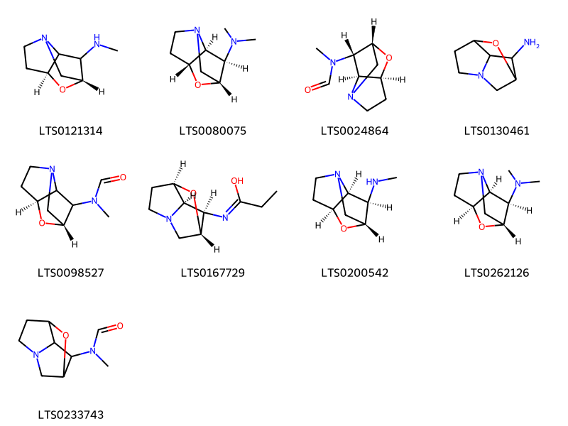{ width=100% }
    <figcaption>Hình ảnh cấu trúc hóa học của 9 hoạt chất thuộc nhóm Loline alkaloids and derivatives gồm ['(1r,3s)-n-methyl-2-oxa-6-azatricyclo[4.2.1.0³,⁷]nonan-8-amine (LTS0121314)', '(1r,3r,7s,8r)-n,n-dimethyl-2-oxa-6-azatricyclo[4.2.1.0³,⁷]nonan-8-amine (LTS0080075)', 'n-methyl-n-[(1r,3s,7s,8s)-2-oxa-6-azatricyclo[4.2.1.0³,⁷]nonan-8-yl]formamide (LTS0024864)', '2-oxa-6-azatricyclo[4.2.1.0³,⁷]nonan-8-amine (LTS0130461)', 'n-methyl-n-[(1r,3s)-2-oxa-6-azatricyclo[4.2.1.0³,⁷]nonan-8-yl]formamide (LTS0098527)', 'n-[(1s,3r,7r,8r)-2-oxa-6-azatricyclo[4.2.1.0³,⁷]nonan-8-yl]propanimidic acid (LTS0167729)', 'loline (LTS0200542)', '(1r,3s,7s,8r)-n,n-dimethyl-2-oxa-6-azatricyclo[4.2.1.0³,⁷]nonan-8-amine (LTS0262126)', 'n-methyl-n-{2-oxa-6-azatricyclo[4.2.1.0³,⁷]nonan-8-yl}formamide (LTS0233743)'].</figcaption>
</figure>
#### Nhóm Pyridines and derivatives
<figure markdown="span">
    { width=100% }
    <figcaption>Hình ảnh cấu trúc hóa học của 2 hoạt chất thuộc nhóm Pyridines and derivatives gồm ['(-)-nicotine (LTS0184620)', 'nicotine (LTS0177379)'].</figcaption>
</figure>
#### Nhóm Tropane alkaloids
<figure markdown="span">
    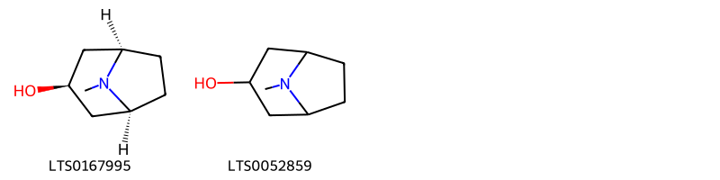{ width=100% }
    <figcaption>Hình ảnh cấu trúc hóa học của 2 hoạt chất thuộc nhóm Tropane alkaloids gồm ['tropine (LTS0167995)', 'tropin (LTS0052859)'].</figcaption>
</figure>

---

### Dược dân tộc học

Danh sách các quốc gia có sử dụng *Argyreia mollis* trong điều trị các bệnh. 

| Country   | Disease   | Bệnh                                                                                                                                                                                                |
|:----------|:----------|:----------------------------------------------------------------------------------------------------------------------------------------------------------------------------------------------------|
| Bali      | Stomachic | MYMEMORY WARNING: YOU USED ALL AVAILABLE FREE TRANSLATIONS FOR TODAY. NEXT AVAILABLE IN  16 HOURS 27 MINUTES 07 SECONDS VISIT HTTPS://MYMEMORY.TRANSLATED.NET/DOC/USAGELIMITS.PHP TO TRANSLATE MORE |

---

---
## Argyreia nervosa
### Thông tin về thực vật

!!! info "Phân loại thực vật của *Argyreia nervosa* từ GIBF:"
    - **Kingdom:** Plantae
    - **Phylum:** Tracheophyta
    - **Order:** Solanales
    - **Family:** Convolvulaceae
    - **Genus:** Argyreia
    - **Species:** *Argyreia nervosa*

 

| Label (VI)   | Label (EN)   | Scientific Name   | Descriptions (VI)   | Descriptions (EN)   | Also Known As (VI)   | Also Known As (EN)                                                     |
|:-------------|:-------------|:------------------|:--------------------|:--------------------|:---------------------|:-----------------------------------------------------------------------|
| N/A          | N/A          | Argyreia nervosa  | loài thực vật       | species of plant    | ['']                 | ['elephant creeper', 'Hawaiian baby woodrose', 'woolly morning glory'] |

#### Phân bố trên thế giới

**Từ CSDL GIBF** Malawi, Thailand, Burkina Faso, Singapore, Australia, Sri Lanka, Pakistan, Malaysia, Mauritius, India, Réunion, Nigeria, Bangladesh, Belgium, Brazil, Benin, South Africa, France, New Caledonia, United States of America

#### Phân bố tại Việt Nam

**Từ CSDL GIBF**: Không có ghi nhận ở Việt Nam

---
### Thành phần hóa học
        
- Theo cơ sở dữ liệu lotus: Từ loài *Argyreia nervosa* đã phân lập và xác định được 9 hoạt chất thuộc về các nhóm Coumarins and derivatives, Prenol lipids, Fatty Acyls, Ergoline and derivatives, Steroids and steroid derivatives, Cinnamic acids and derivatives. 

|    | chemicalTaxonomyClassyfireClass   |   smiles_count |
|---:|:----------------------------------|---------------:|
|  0 | Cinnamic acids and derivatives    |              1 |
|  1 | Coumarins and derivatives         |              1 |
|  2 | Ergoline and derivatives          |              1 |
|  3 | Fatty Acyls                       |              1 |
|  4 | Prenol lipids                     |              1 |
|  5 | Steroids and steroid derivatives  |              4 |

#### Nhóm Cinnamic acids and derivatives
<figure markdown="span">
    { width=100% }
    <figcaption>Hình ảnh cấu trúc hóa học của 1 hoạt chất thuộc nhóm Cinnamic acids and derivatives gồm ['hydroxycinnamic acid (LTS0233023)'].</figcaption>
</figure>
#### Nhóm Coumarins and derivatives
<figure markdown="span">
    { width=100% }
    <figcaption>Hình ảnh cấu trúc hóa học của 1 hoạt chất thuộc nhóm Coumarins and derivatives gồm ['scopoletin (LTS0193112)'].</figcaption>
</figure>
#### Nhóm Ergoline and derivatives
<figure markdown="span">
    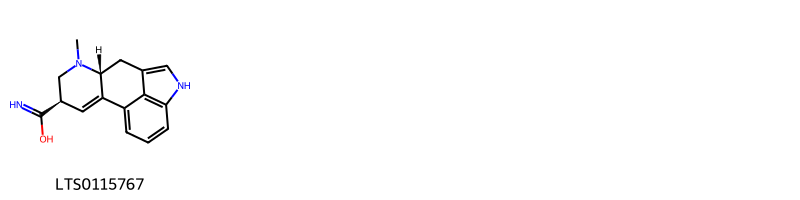{ width=100% }
    <figcaption>Hình ảnh cấu trúc hóa học của 1 hoạt chất thuộc nhóm Ergoline and derivatives gồm ['d-lysergic acid amide (LTS0115767)'].</figcaption>
</figure>
#### Nhóm Fatty Acyls
<figure markdown="span">
    { width=100% }
    <figcaption>Hình ảnh cấu trúc hóa học của 1 hoạt chất thuộc nhóm Fatty Acyls gồm ['triacontanol (LTS0026833)'].</figcaption>
</figure>
#### Nhóm Prenol lipids
<figure markdown="span">
    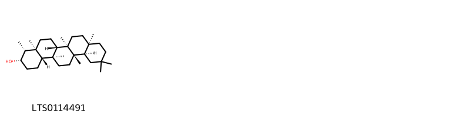{ width=100% }
    <figcaption>Hình ảnh cấu trúc hóa học của 1 hoạt chất thuộc nhóm Prenol lipids gồm ['epi-friedelanol (LTS0114491)'].</figcaption>
</figure>
#### Nhóm Steroids and steroid derivatives
<figure markdown="span">
    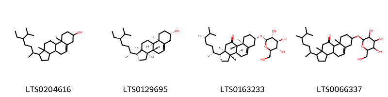{ width=100% }
    <figcaption>Hình ảnh cấu trúc hóa học của 4 hoạt chất thuộc nhóm Steroids and steroid derivatives gồm ['stigmast-5-en-3-ol, (3β)- (LTS0204616)', '(1r,3ar,3br,7s,9ar,9br,11ar)-1-[(2r,5r)-5-ethyl-6-methylheptan-2-yl]-9a,11a-dimethyl-1h,2h,3h,3ah,3bh,4h,6h,7h,8h,9h,9bh,10h,11h-cyclopenta[a]phenanthren-7-ol (LTS0129695)', '(1r,3as,3bs,7s,9ar,9bs,11ar)-1-[(2r,5s)-5,6-dimethylheptan-2-yl]-9a,11a-dimethyl-7-{[(2s,3r,4s,5s,6r)-3,4,5-trihydroxy-6-(hydroxymethyl)oxan-2-yl]oxy}-1h,2h,3h,3ah,3bh,4h,6h,7h,8h,9h,9bh,11h-cyclopenta[a]phenanthren-10-one (LTS0163233)', '1-(5,6-dimethylheptan-2-yl)-9a,11a-dimethyl-7-{[3,4,5-trihydroxy-6-(hydroxymethyl)oxan-2-yl]oxy}-1h,2h,3h,3ah,3bh,4h,6h,7h,8h,9h,9bh,11h-cyclopenta[a]phenanthren-10-one (LTS0066337)'].</figcaption>
</figure>

---

### Dược dân tộc học

Danh sách các quốc gia có sử dụng *Argyreia nervosa* trong điều trị các bệnh. 

| Country   | Disease   | Bệnh                                                                                                                                                                                                |
|:----------|:----------|:----------------------------------------------------------------------------------------------------------------------------------------------------------------------------------------------------|
| Haiti     | Sudorific | MYMEMORY WARNING: YOU USED ALL AVAILABLE FREE TRANSLATIONS FOR TODAY. NEXT AVAILABLE IN  16 HOURS 26 MINUTES 40 SECONDS VISIT HTTPS://MYMEMORY.TRANSLATED.NET/DOC/USAGELIMITS.PHP TO TRANSLATE MORE |

---

# Chi Dichondra

??? note "Danh sách các dược liệu thuộc chi"
    
	 - *Dichondra repens*

---
## Dichondra repens
### Thông tin về thực vật

!!! info "Phân loại thực vật của *Dichondra repens* từ GIBF:"
    - **Kingdom:** Plantae
    - **Phylum:** Tracheophyta
    - **Order:** Solanales
    - **Family:** Convolvulaceae
    - **Genus:** Dichondra
    - **Species:** *Dichondra repens*

 

| Label (VI)   | Label (EN)   | Scientific Name   | Descriptions (VI)   | Descriptions (EN)   | Also Known As (VI)   | Also Known As (EN)   |
|:-------------|:-------------|:------------------|:--------------------|:--------------------|:---------------------|:---------------------|
| N/A          | N/A          | Dichondra repens  | loài thực vật       | species of plant    | ['']                 | ['']                 |

#### Phân bố trên thế giới

**Từ CSDL GIBF** Australia, New Zealand, United States of America, Argentina

#### Phân bố tại Việt Nam

**Từ CSDL GIBF**: Không có ghi nhận ở Việt Nam

---
### Thành phần hóa học
        
- Theo cơ sở dữ liệu lotus: Từ loài *Dichondra repens* đã phân lập và xác định được Chưa có hoạt chất nào được phân lập. hoạt chất thuộc về các nhóm Không có hoạt chất nào được phân lập. 

Không có hình ảnh nào được tạo ra

---

### Dược dân tộc học

Danh sách các quốc gia có sử dụng *Dichondra repens* trong điều trị các bệnh. 

| Country   | Disease            | Bệnh                                                                                                                                                                                                |
|:----------|:-------------------|:----------------------------------------------------------------------------------------------------------------------------------------------------------------------------------------------------|
| China     | Hemostat, Diuretic | MYMEMORY WARNING: YOU USED ALL AVAILABLE FREE TRANSLATIONS FOR TODAY. NEXT AVAILABLE IN  16 HOURS 26 MINUTES 07 SECONDS VISIT HTTPS://MYMEMORY.TRANSLATED.NET/DOC/USAGELIMITS.PHP TO TRANSLATE MORE |

---

# Chi Cressa

??? note "Danh sách các dược liệu thuộc chi"
    
	 - *Cressa cretica*

---
## Cressa cretica
### Thông tin về thực vật

!!! info "Phân loại thực vật của *Cressa cretica* từ GIBF:"
    - **Kingdom:** Plantae
    - **Phylum:** Tracheophyta
    - **Order:** Solanales
    - **Family:** Convolvulaceae
    - **Genus:** Cressa
    - **Species:** *Cressa cretica*

 

| Label (VI)   | Label (EN)   | Scientific Name   | Descriptions (VI)   | Descriptions (EN)   | Also Known As (VI)   | Also Known As (EN)   |
|:-------------|:-------------|:------------------|:--------------------|:--------------------|:---------------------|:---------------------|
| N/A          | N/A          | Cressa cretica    | loài thực vật       | species of plant    | ['']                 | ['']                 |

#### Phân bố trên thế giới

**Từ CSDL GIBF** Spain, Senegal, United Arab Emirates, Saudi Arabia, Tunisia, Pakistan, Uzbekistan, India, Iraq, Bahrain, Yemen, Qatar, Gambia, Iran (Islamic Republic of), Portugal, Morocco, France, Egypt, Italy, Israel, Madagascar, Greece, Croatia, Oman

#### Phân bố tại Việt Nam

**Từ CSDL GIBF**: Không có ghi nhận ở Việt Nam

---
### Thành phần hóa học
        
- Theo cơ sở dữ liệu lotus: Từ loài *Cressa cretica* đã phân lập và xác định được 16 hoạt chất thuộc về các nhóm Organooxygen compounds, Flavonoids, Lignan glycosides, Coumarins and derivatives. 

|    | chemicalTaxonomyClassyfireClass   |   smiles_count |
|---:|:----------------------------------|---------------:|
|  0 | Coumarins and derivatives         |              1 |
|  1 | Flavonoids                        |              9 |
|  2 | Lignan glycosides                 |              2 |
|  3 | Organooxygen compounds            |              4 |

#### Nhóm Coumarins and derivatives
<figure markdown="span">
    { width=100% }
    <figcaption>Hình ảnh cấu trúc hóa học của 1 hoạt chất thuộc nhóm Coumarins and derivatives gồm ['scopoletin (LTS0193112)'].</figcaption>
</figure>
#### Nhóm Flavonoids
<figure markdown="span">
    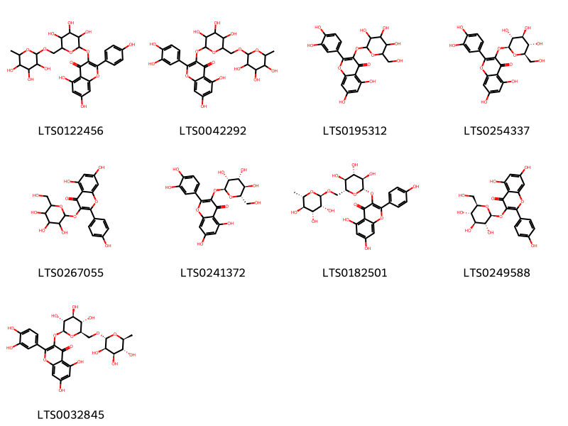{ width=100% }
    <figcaption>Hình ảnh cấu trúc hóa học của 9 hoạt chất thuộc nhóm Flavonoids gồm ['5,7-dihydroxy-2-(4-hydroxyphenyl)-3-[(3,4,5-trihydroxy-6-{[(3,4,5-trihydroxy-6-methyloxan-2-yl)oxy]methyl}oxan-2-yl)oxy]chromen-4-one (LTS0122456)', 'rutin (LTS0042292)', '2-(3,4-dihydroxyphenyl)-5,7-dihydroxy-3-{[3,4,5-trihydroxy-6-(hydroxymethyl)oxan-2-yl]oxy}chromen-4-one (LTS0195312)', 'isoquercetin (LTS0254337)', 'trifolin (LTS0267055)', '2-(3,4-dihydroxyphenyl)-5,7-dihydroxy-3-{[(2s,3r,4r,5r,6s)-3,4,5-trihydroxy-6-(hydroxymethyl)oxan-2-yl]oxy}chromen-4-one (LTS0241372)', 'nictoflorin (LTS0182501)', 'astragalin (LTS0249588)', '3-rutinosyl quercetin (LTS0032845)'].</figcaption>
</figure>
#### Nhóm Lignan glycosides
<figure markdown="span">
    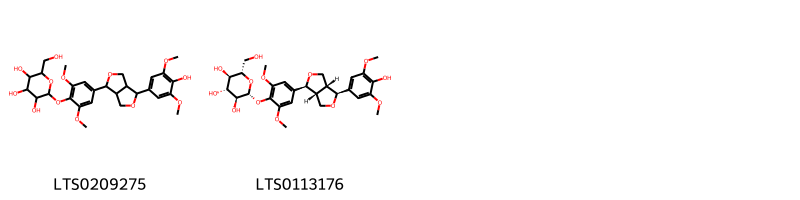{ width=100% }
    <figcaption>Hình ảnh cấu trúc hóa học của 2 hoạt chất thuộc nhóm Lignan glycosides gồm ['2-{4-[4-(4-hydroxy-3,5-dimethoxyphenyl)-hexahydrofuro[3,4-c]furan-1-yl]-2,6-dimethoxyphenoxy}-6-(hydroxymethyl)oxane-3,4,5-triol (LTS0209275)', '(2r,3s,4r,5r,6s)-2-{4-[(1s,3ar,4s,6ar)-4-(4-hydroxy-3,5-dimethoxyphenyl)-hexahydrofuro[3,4-c]furan-1-yl]-2,6-dimethoxyphenoxy}-6-(hydroxymethyl)oxane-3,4,5-triol (LTS0113176)'].</figcaption>
</figure>
#### Nhóm Organooxygen compounds
<figure markdown="span">
    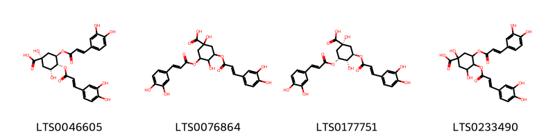{ width=100% }
    <figcaption>Hình ảnh cấu trúc hóa học của 4 hoạt chất thuộc nhóm Organooxygen compounds gồm ['4,5-dicaffeoylquinic acid (LTS0046605)', '3,5-bis({[3-(3,4-dihydroxyphenyl)prop-2-enoyl]oxy})-1,4-dihydroxycyclohexane-1-carboxylic acid (LTS0076864)', '3,5-dicaffeoylquinic acid (LTS0177751)', '3,4-bis({[3-(3,4-dihydroxyphenyl)prop-2-enoyl]oxy})-1,5-dihydroxycyclohexane-1-carboxylic acid (LTS0233490)'].</figcaption>
</figure>

---

### Dược dân tộc học

Danh sách các quốc gia có sử dụng *Cressa cretica* trong điều trị các bệnh. 

| Country   | Disease                       | Bệnh                                                                                                                                                                                                |
|:----------|:------------------------------|:----------------------------------------------------------------------------------------------------------------------------------------------------------------------------------------------------|
| Iraq      | Aphrodisiac, Stomachic, Tonic | MYMEMORY WARNING: YOU USED ALL AVAILABLE FREE TRANSLATIONS FOR TODAY. NEXT AVAILABLE IN  16 HOURS 25 MINUTES 46 SECONDS VISIT HTTPS://MYMEMORY.TRANSLATED.NET/DOC/USAGELIMITS.PHP TO TRANSLATE MORE |
| Sudan     | Tonic                         | MYMEMORY WARNING: YOU USED ALL AVAILABLE FREE TRANSLATIONS FOR TODAY. NEXT AVAILABLE IN  16 HOURS 25 MINUTES 43 SECONDS VISIT HTTPS://MYMEMORY.TRANSLATED.NET/DOC/USAGELIMITS.PHP TO TRANSLATE MORE |

---

# Chi Jacquemontia

??? note "Danh sách các dược liệu thuộc chi"
    
	 - *Jacquemontia sandwicensis*

---
## Jacquemontia sandwicensis
### Thông tin về thực vật

!!! info "Phân loại thực vật của *Jacquemontia sandwicensis* từ GIBF:"
    - **Kingdom:** Plantae
    - **Phylum:** Tracheophyta
    - **Order:** Solanales
    - **Family:** Convolvulaceae
    - **Genus:** Jacquemontia
    - **Species:** *Jacquemontia sandwicensis*

 

| Label (VI)   | Label (EN)   | Scientific Name           | Descriptions (VI)   | Descriptions (EN)   | Also Known As (VI)   | Also Known As (EN)        |
|:-------------|:-------------|:--------------------------|:--------------------|:--------------------|:---------------------|:--------------------------|
| N/A          | N/A          | Jacquemontia sandwicensis | loài thực vật       | species of plant    | ['']                 | ['oval-leaf clustervine'] |

#### Phân bố trên thế giới

**Từ CSDL GIBF** United States of America

#### Phân bố tại Việt Nam

**Từ CSDL GIBF**: Không có ghi nhận ở Việt Nam

---
### Thành phần hóa học
        
- Theo cơ sở dữ liệu lotus: Từ loài *Jacquemontia sandwicensis* đã phân lập và xác định được Chưa có hoạt chất nào được phân lập. hoạt chất thuộc về các nhóm Không có hoạt chất nào được phân lập. 

Không có hình ảnh nào được tạo ra

---

### Dược dân tộc học

Danh sách các quốc gia có sử dụng *Jacquemontia sandwicensis* trong điều trị các bệnh. 

| Country   | Disease   | Bệnh                                                                                                                                                                                                |
|:----------|:----------|:----------------------------------------------------------------------------------------------------------------------------------------------------------------------------------------------------|
| Hawaii    | Cathartic | MYMEMORY WARNING: YOU USED ALL AVAILABLE FREE TRANSLATIONS FOR TODAY. NEXT AVAILABLE IN  16 HOURS 25 MINUTES 11 SECONDS VISIT HTTPS://MYMEMORY.TRANSLATED.NET/DOC/USAGELIMITS.PHP TO TRANSLATE MORE |

---

# Chi Convolvulus

??? note "Danh sách các dược liệu thuộc chi"
    
	 - *Convolvulus arvensis*
	 - *Convolvulus scammonia*
	 - *Convolvulus scoparius*
	 - *Convolvulus sepium*
	 - *Convolvulus soldanella*

---
## Convolvulus arvensis
### Thông tin về thực vật

!!! info "Phân loại thực vật của *Convolvulus arvensis* từ GIBF:"
    - **Kingdom:** Plantae
    - **Phylum:** Tracheophyta
    - **Order:** Solanales
    - **Family:** Convolvulaceae
    - **Genus:** Convolvulus
    - **Species:** *Convolvulus arvensis*

 

| Label (VI)   | Label (EN)   | Scientific Name      | Descriptions (VI)   | Descriptions (EN)   | Also Known As (VI)   | Also Known As (EN)                                                                                                                                                                                                    |
|:-------------|:-------------|:---------------------|:--------------------|:--------------------|:---------------------|:----------------------------------------------------------------------------------------------------------------------------------------------------------------------------------------------------------------------|
| N/A          | N/A          | Convolvulus arvensis | loài thực vật       | species of plant    | ['']                 | ['common bindweed', 'creeping jenny', 'European bindweed', 'Field Bindweed', 'lesser bindweed', 'perennial morningglory', 'small bindweed', 'smallflowered morning glory', 'white convolvulus', 'wild morning-glory'] |

#### Phân bố trên thế giới

**Từ CSDL GIBF** Denmark, Spain, Germany, Chile, Austria, United Arab Emirates, Australia, Pakistan, Serbia, Kuwait, Poland, India, Kazakhstan, Netherlands, Malta, Qatar, Hungary, Bulgaria, Greece, Mexico, Switzerland, Uruguay, Argentina, United Kingdom of Great Britain and Northern Ireland, South Africa, Morocco, France, Czechia, New Zealand, Armenia, Russian Federation, United States of America, Italy, Algeria, Israel, Saudi Arabia, Croatia, Ukraine

#### Phân bố tại Việt Nam

**Từ CSDL GIBF**: Không có ghi nhận ở Việt Nam

---
### Thành phần hóa học
        
- Theo cơ sở dữ liệu lotus: Từ loài *Convolvulus arvensis* đã phân lập và xác định được 29 hoạt chất thuộc về các nhóm Organooxygen compounds, Saturated hydrocarbons, Tropane alkaloids, Prenol lipids, Carboxylic acids and derivatives, Fatty Acyls, Steroids and steroid derivatives. 

|    | chemicalTaxonomyClassyfireClass   |   smiles_count |
|---:|:----------------------------------|---------------:|
|  0 |                                   |              4 |
|  1 | Carboxylic acids and derivatives  |              1 |
|  2 | Fatty Acyls                       |              6 |
|  3 | Organooxygen compounds            |              1 |
|  4 | Prenol lipids                     |              2 |
|  5 | Saturated hydrocarbons            |              7 |
|  6 | Steroids and steroid derivatives  |              5 |
|  7 | Tropane alkaloids                 |              3 |

#### Nhóm 
<figure markdown="span">
    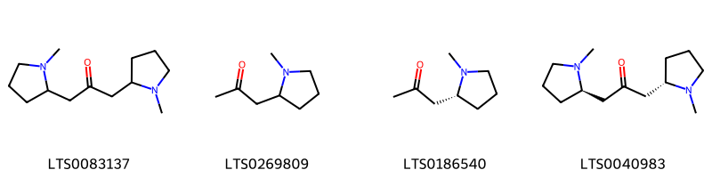{ width=100% }
    <figcaption>Hình ảnh cấu trúc hóa học của 4 hoạt chất thuộc nhóm  gồm ['cuskhygrine (LTS0083137)', 'hygrine (LTS0269809)', '(+)-hygrine (LTS0186540)', 'cuscohygrine (LTS0040983)'].</figcaption>
</figure>
#### Nhóm Carboxylic acids and derivatives
<figure markdown="span">
    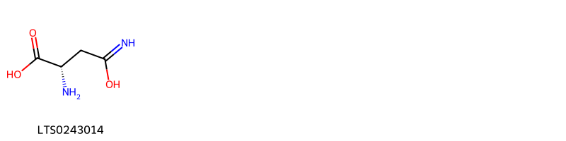{ width=100% }
    <figcaption>Hình ảnh cấu trúc hóa học của 1 hoạt chất thuộc nhóm Carboxylic acids and derivatives gồm ['aspartamate (LTS0243014)'].</figcaption>
</figure>
#### Nhóm Fatty Acyls
<figure markdown="span">
    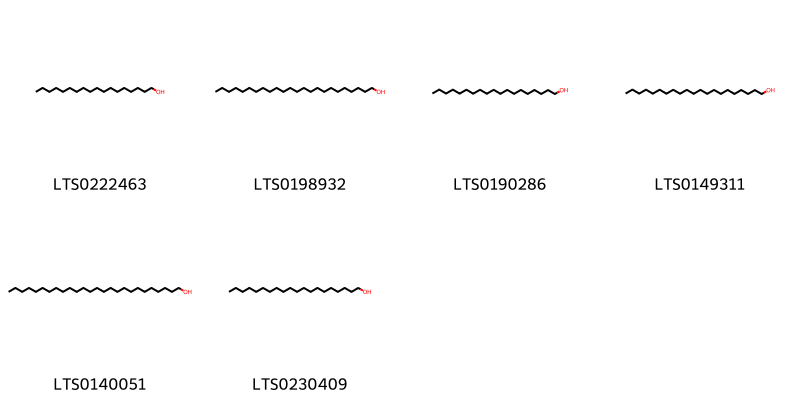{ width=100% }
    <figcaption>Hình ảnh cấu trúc hóa học của 6 hoạt chất thuộc nhóm Fatty Acyls gồm ['stearyl alcohol (LTS0222463)', '1-tetracosanol (LTS0198932)', 'nonadecanol (LTS0190286)', 'henicosan-1-ol (LTS0149311)', 'ceryl alcohol (LTS0140051)', 'arachidyl alcohol (LTS0230409)'].</figcaption>
</figure>
#### Nhóm Organooxygen compounds
<figure markdown="span">
    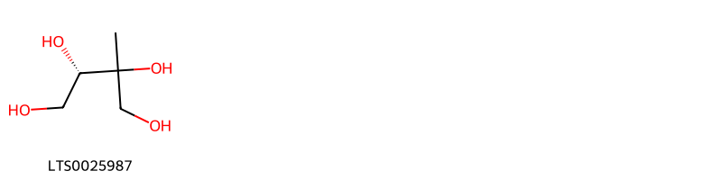{ width=100% }
    <figcaption>Hình ảnh cấu trúc hóa học của 1 hoạt chất thuộc nhóm Organooxygen compounds gồm ['(3s)-2-methylbutane-1,2,3,4-tetrol (LTS0025987)'].</figcaption>
</figure>
#### Nhóm Prenol lipids
<figure markdown="span">
    { width=100% }
    <figcaption>Hình ảnh cấu trúc hóa học của 2 hoạt chất thuộc nhóm Prenol lipids gồm ['amyrin (LTS0222826)', 'α-amyrin (LTS0088267)'].</figcaption>
</figure>
#### Nhóm Saturated hydrocarbons
<figure markdown="span">
    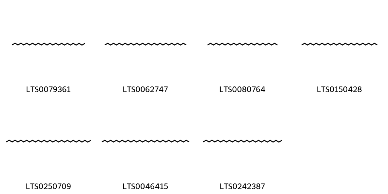{ width=100% }
    <figcaption>Hình ảnh cấu trúc hóa học của 7 hoạt chất thuộc nhóm Saturated hydrocarbons gồm ['hexacosane (LTS0079361)', 'nonacosane (LTS0062747)', 'pentacosane (LTS0080764)', 'heptacosane (LTS0150428)', 'triacontane (LTS0250709)', 'hentriacontane (LTS0046415)', 'octacosane (LTS0242387)'].</figcaption>
</figure>
#### Nhóm Steroids and steroid derivatives
<figure markdown="span">
    { width=100% }
    <figcaption>Hình ảnh cấu trúc hóa học của 5 hoạt chất thuộc nhóm Steroids and steroid derivatives gồm ['stigmast-5-en-3-ol, (3β)- (LTS0204616)', 'stigmast-5-en-3-ol (LTS0071224)', 'phytosterol (LTS0029311)', 'campesterol (LTS0046755)', '(1r,3as,3bs,7s,9bs)-1-[(2r,5r)-5,6-dimethylheptan-2-yl]-9a,11a-dimethyl-1h,2h,3h,3ah,3bh,4h,6h,7h,8h,9h,9bh,10h,11h-cyclopenta[a]phenanthren-7-ol (LTS0057877)'].</figcaption>
</figure>
#### Nhóm Tropane alkaloids
<figure markdown="span">
    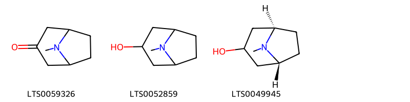{ width=100% }
    <figcaption>Hình ảnh cấu trúc hóa học của 3 hoạt chất thuộc nhóm Tropane alkaloids gồm ['tropanone (LTS0059326)', 'tropin (LTS0052859)', '(1r,5r)-8-methyl-8-azabicyclo[3.2.1]octan-3-ol (LTS0049945)'].</figcaption>
</figure>

---

### Dược dân tộc học

Danh sách các quốc gia có sử dụng *Convolvulus arvensis* trong điều trị các bệnh. 

| Country     | Disease                                     | Bệnh                                                                                                                                                                                                |
|:------------|:--------------------------------------------|:----------------------------------------------------------------------------------------------------------------------------------------------------------------------------------------------------|
| Afghanistan | Laxative                                    | MYMEMORY WARNING: YOU USED ALL AVAILABLE FREE TRANSLATIONS FOR TODAY. NEXT AVAILABLE IN  16 HOURS 24 MINUTES 50 SECONDS VISIT HTTPS://MYMEMORY.TRANSLATED.NET/DOC/USAGELIMITS.PHP TO TRANSLATE MORE |
| Elsewhere   | Cathartic                                   | MYMEMORY WARNING: YOU USED ALL AVAILABLE FREE TRANSLATIONS FOR TODAY. NEXT AVAILABLE IN  16 HOURS 24 MINUTES 47 SECONDS VISIT HTTPS://MYMEMORY.TRANSLATED.NET/DOC/USAGELIMITS.PHP TO TRANSLATE MORE |
| Haiti       | Vulnerary                                   | MYMEMORY WARNING: YOU USED ALL AVAILABLE FREE TRANSLATIONS FOR TODAY. NEXT AVAILABLE IN  16 HOURS 24 MINUTES 45 SECONDS VISIT HTTPS://MYMEMORY.TRANSLATED.NET/DOC/USAGELIMITS.PHP TO TRANSLATE MORE |
| Iraq        | Laxative                                    | MYMEMORY WARNING: YOU USED ALL AVAILABLE FREE TRANSLATIONS FOR TODAY. NEXT AVAILABLE IN  16 HOURS 24 MINUTES 43 SECONDS VISIT HTTPS://MYMEMORY.TRANSLATED.NET/DOC/USAGELIMITS.PHP TO TRANSLATE MORE |
| Kurdistan   | Vulnerary                                   | MYMEMORY WARNING: YOU USED ALL AVAILABLE FREE TRANSLATIONS FOR TODAY. NEXT AVAILABLE IN  16 HOURS 24 MINUTES 40 SECONDS VISIT HTTPS://MYMEMORY.TRANSLATED.NET/DOC/USAGELIMITS.PHP TO TRANSLATE MORE |
| Turkey      | Cholagogue, Cholagogue, Laxative, Vulnerary | MYMEMORY WARNING: YOU USED ALL AVAILABLE FREE TRANSLATIONS FOR TODAY. NEXT AVAILABLE IN  16 HOURS 24 MINUTES 38 SECONDS VISIT HTTPS://MYMEMORY.TRANSLATED.NET/DOC/USAGELIMITS.PHP TO TRANSLATE MORE |
| ain         | Purgative                                   | MYMEMORY WARNING: YOU USED ALL AVAILABLE FREE TRANSLATIONS FOR TODAY. NEXT AVAILABLE IN  16 HOURS 24 MINUTES 36 SECONDS VISIT HTTPS://MYMEMORY.TRANSLATED.NET/DOC/USAGELIMITS.PHP TO TRANSLATE MORE |

---

---
## Convolvulus scammonia
### Thông tin về thực vật

!!! info "Phân loại thực vật của *Convolvulus scammonia* từ GIBF:"
    - **Kingdom:** Plantae
    - **Phylum:** Tracheophyta
    - **Order:** Solanales
    - **Family:** Convolvulaceae
    - **Genus:** Convolvulus
    - **Species:** *Convolvulus scammonia*

 

| Label (VI)   | Label (EN)   | Scientific Name       | Descriptions (VI)   | Descriptions (EN)                 | Also Known As (VI)   | Also Known As (EN)   |
|:-------------|:-------------|:----------------------|:--------------------|:----------------------------------|:---------------------|:---------------------|
| N/A          | N/A          | Convolvulus scammonia | loài thực vật       | species of plant. a morning glory | ['']                 | ['Scammony']         |

#### Phân bố trên thế giới

**Từ CSDL GIBF** nan, unknown or invalid, Spain, Sri Lanka, Palestine, State of, Pakistan, India, Iraq, Belgium, Türkiye, Lebanon, Switzerland, Jordan, Iran (Islamic Republic of), United Kingdom of Great Britain and Northern Ireland, Syrian Arab Republic, France, Egypt, Italy, Israel, Greece, Ukraine

#### Phân bố tại Việt Nam

**Từ CSDL GIBF**: Không có ghi nhận ở Việt Nam

---
### Thành phần hóa học
        
- Theo cơ sở dữ liệu lotus: Từ loài *Convolvulus scammonia* đã phân lập và xác định được 19 hoạt chất thuộc về các nhóm Organooxygen compounds, Saccharolipids. 

|    | chemicalTaxonomyClassyfireClass   |   smiles_count |
|---:|:----------------------------------|---------------:|
|  0 | Organooxygen compounds            |             14 |
|  1 | Saccharolipids                    |              5 |

#### Nhóm Organooxygen compounds
<figure markdown="span">
    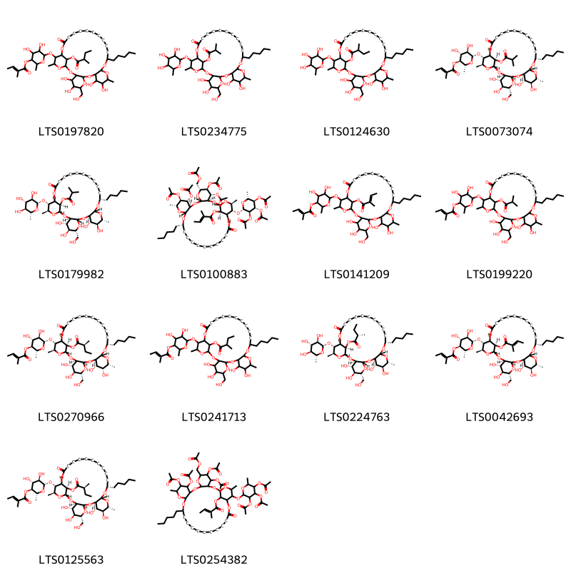{ width=100% }
    <figcaption>Hình ảnh cấu trúc hóa học của 14 hoạt chất thuộc nhóm Organooxygen compounds gồm ['4,5-dihydroxy-2-methyl-6-{[4,5,11,12-tetrahydroxy-6-(hydroxymethyl)-13,31-dimethyl-33-[(2-methylbutanoyl)oxy]-27-oxo-17-pentyl-2,7,9,14,16,28,32-heptaoxatetracyclo[27.3.1.0³,⁸.0¹⁰,¹⁵]tritriacontan-30-yl]oxy}oxan-3-yl 2-methylbut-2-enoate (LTS0197820)', '4,5,11,12-tetrahydroxy-6-(hydroxymethyl)-13,31-dimethyl-27-oxo-17-pentyl-30-[(3,4,5-trihydroxy-6-methyloxan-2-yl)oxy]-2,7,9,14,16,28,32-heptaoxatetracyclo[27.3.1.0³,⁸.0¹⁰,¹⁵]tritriacontan-33-yl 2-methylpropanoate (LTS0234775)', '4,5,11,12-tetrahydroxy-6-(hydroxymethyl)-13,31-dimethyl-27-oxo-17-pentyl-30-[(3,4,5-trihydroxy-6-methyloxan-2-yl)oxy]-2,7,9,14,16,28,32-heptaoxatetracyclo[27.3.1.0³,⁸.0¹⁰,¹⁵]tritriacontan-33-yl 2-methylbutanoate (LTS0124630)', '(2r,3s,4r,5r,6s)-4,5-dihydroxy-2-methyl-6-{[(1s,3r,4s,5s,6r,8s,10r,11s,12s,13r,15r,17s,29r,30s,31s,33r)-4,5,11,12-tetrahydroxy-6-(hydroxymethyl)-13,31-dimethyl-33-[(2-methylpropanoyl)oxy]-27-oxo-17-pentyl-2,7,9,14,16,28,32-heptaoxatetracyclo[27.3.1.0³,⁸.0¹⁰,¹⁵]tritriacontan-30-yl]oxy}oxan-3-yl (2e)-2-methylbut-2-enoate (LTS0073074)', '(1s,3r,4s,5s,6r,8s,10r,11s,12s,13r,15r,17s,29r,30s,31s,33r)-4,5,11,12-tetrahydroxy-6-(hydroxymethyl)-13,31-dimethyl-27-oxo-17-pentyl-30-{[(2s,3r,4s,5s,6r)-3,4,5-trihydroxy-6-methyloxan-2-yl]oxy}-2,7,9,14,16,28,32-heptaoxatetracyclo[27.3.1.0³,⁸.0¹⁰,¹⁵]tritriacontan-33-yl 2-methylpropanoate (LTS0179982)', '(1s,3r,4s,5r,6r,8s,10r,11s,12r,13r,15r,17s,29r,30s,31s,33r)-4,5,11,12-tetrakis(acetyloxy)-6-[(acetyloxy)methyl]-13,31-dimethyl-27-oxo-17-pentyl-30-{[(2s,3r,4s,5r,6r)-3,4,5-tris(acetyloxy)-6-methyloxan-2-yl]oxy}-2,7,9,14,16,28,32-heptaoxatetracyclo[27.3.1.0³,⁸.0¹⁰,¹⁵]tritriacontan-33-yl (2e)-2-methylbut-2-enoate (LTS0100883)', '4,5-dihydroxy-2-methyl-6-{[4,5,11,12-tetrahydroxy-6-(hydroxymethyl)-13,31-dimethyl-33-[(2-methylbut-2-enoyl)oxy]-27-oxo-17-pentyl-2,7,9,14,16,28,32-heptaoxatetracyclo[27.3.1.0³,⁸.0¹⁰,¹⁵]tritriacontan-30-yl]oxy}oxan-3-yl 2-methylbut-2-enoate (LTS0141209)', '4,5-dihydroxy-2-methyl-6-{[4,5,11,12-tetrahydroxy-6-(hydroxymethyl)-13,31-dimethyl-33-[(2-methylpropanoyl)oxy]-27-oxo-17-pentyl-2,7,9,14,16,28,32-heptaoxatetracyclo[27.3.1.0³,⁸.0¹⁰,¹⁵]tritriacontan-30-yl]oxy}oxan-3-yl 2-methylbut-2-enoate (LTS0199220)', '(2r,3s,4r,5r,6s)-4,5-dihydroxy-2-methyl-6-{[(1s,3r,4s,5s,6r,8s,10r,11s,12r,13r,15r,17s,29r,30s,31s,33r)-4,5,11,12-tetrahydroxy-6-(hydroxymethyl)-13,31-dimethyl-33-{[(2s)-2-methylbutanoyl]oxy}-27-oxo-17-pentyl-2,7,9,14,16,28,32-heptaoxatetracyclo[27.3.1.0³,⁸.0¹⁰,¹⁵]tritriacontan-30-yl]oxy}oxan-3-yl (2e)-2-methylbut-2-enoate (LTS0270966)', 'scammonin (LTS0241713)', '(1s,3r,4s,5s,6r,8s,10r,11s,12s,13r,15r,17s,29r,30s,31s,33r)-4,5,11,12-tetrahydroxy-6-(hydroxymethyl)-13,31-dimethyl-27-oxo-17-pentyl-30-{[(2s,3r,4s,5s,6r)-3,4,5-trihydroxy-6-methyloxan-2-yl]oxy}-2,7,9,14,16,28,32-heptaoxatetracyclo[27.3.1.0³,⁸.0¹⁰,¹⁵]tritriacontan-33-yl (2s)-2-methylbutanoate (LTS0224763)', '(2r,3s,4r,5r,6s)-4,5-dihydroxy-2-methyl-6-{[(1s,3r,4s,5s,6r,8s,10r,11s,12s,13r,15r,17s,29r,30s,31s,33r)-4,5,11,12-tetrahydroxy-6-(hydroxymethyl)-13,31-dimethyl-33-{[(2e)-2-methylbut-2-enoyl]oxy}-27-oxo-17-pentyl-2,7,9,14,16,28,32-heptaoxatetracyclo[27.3.1.0³,⁸.0¹⁰,¹⁵]tritriacontan-30-yl]oxy}oxan-3-yl (2e)-2-methylbut-2-enoate (LTS0042693)', 'scammonin i (LTS0125563)', '4,5,11,12-tetrakis(acetyloxy)-6-[(acetyloxy)methyl]-13,31-dimethyl-27-oxo-17-pentyl-30-{[3,4,5-tris(acetyloxy)-6-methyloxan-2-yl]oxy}-2,7,9,14,16,28,32-heptaoxatetracyclo[27.3.1.0³,⁸.0¹⁰,¹⁵]tritriacontan-33-yl 2-methylbut-2-enoate (LTS0254382)'].</figcaption>
</figure>
#### Nhóm Saccharolipids
<figure markdown="span">
    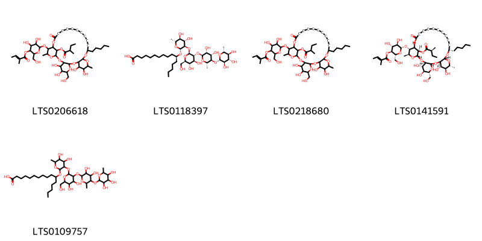{ width=100% }
    <figcaption>Hình ảnh cấu trúc hóa học của 5 hoạt chất thuộc nhóm Saccharolipids gồm ['4,5-dihydroxy-2-(hydroxymethyl)-6-{[4,5,11,12-tetrahydroxy-6-(hydroxymethyl)-13,31-dimethyl-33-[(2-methylbutanoyl)oxy]-27-oxo-17-pentyl-2,7,9,14,16,28,32-heptaoxatetracyclo[27.3.1.0³,⁸.0¹⁰,¹⁵]tritriacontan-30-yl]oxy}oxan-3-yl (2e)-2-methylbut-2-enoate (LTS0206618)', '(11s)-11-{[(2r,3r,4s,5s,6r)-3-{[(2s,3r,4s,5s,6r)-3-{[(2s,3r,4s,5r,6s)-3,4-dihydroxy-6-methyl-5-{[(2s,3r,4s,5s,6r)-3,4,5-trihydroxy-6-methyloxan-2-yl]oxy}oxan-2-yl]oxy}-4,5-dihydroxy-6-(hydroxymethyl)oxan-2-yl]oxy}-4,5-dihydroxy-6-methyloxan-2-yl]oxy}hexadecanoic acid (LTS0118397)', '4,5-dihydroxy-2-(hydroxymethyl)-6-{[4,5,11,12-tetrahydroxy-6-(hydroxymethyl)-13,31-dimethyl-33-[(2-methylbutanoyl)oxy]-27-oxo-17-pentyl-2,7,9,14,16,28,32-heptaoxatetracyclo[27.3.1.0³,⁸.0¹⁰,¹⁵]tritriacontan-30-yl]oxy}oxan-3-yl 2-methylbut-2-enoate (LTS0218680)', '(2r,3s,4r,5r,6s)-4,5-dihydroxy-2-(hydroxymethyl)-6-{[(1s,3r,4s,5s,6r,8s,10r,11s,12s,13r,15r,17s,29r,30s,31s,33r)-4,5,11,12-tetrahydroxy-6-(hydroxymethyl)-13,31-dimethyl-33-{[(2s)-2-methylbutanoyl]oxy}-27-oxo-17-pentyl-2,7,9,14,16,28,32-heptaoxatetracyclo[27.3.1.0³,⁸.0¹⁰,¹⁵]tritriacontan-30-yl]oxy}oxan-3-yl (2e)-2-methylbut-2-enoate (LTS0141591)', '11-[(3-{[3-({3,4-dihydroxy-6-methyl-5-[(3,4,5-trihydroxy-6-methyloxan-2-yl)oxy]oxan-2-yl}oxy)-4,5-dihydroxy-6-(hydroxymethyl)oxan-2-yl]oxy}-4,5-dihydroxy-6-methyloxan-2-yl)oxy]hexadecanoic acid (LTS0109757)'].</figcaption>
</figure>

---

### Dược dân tộc học

Danh sách các quốc gia có sử dụng *Convolvulus scammonia* trong điều trị các bệnh. 

| Country   | Disease           | Bệnh                                                                                                                                                                                                |
|:----------|:------------------|:----------------------------------------------------------------------------------------------------------------------------------------------------------------------------------------------------|
| Elsewhere | Cathartic         | MYMEMORY WARNING: YOU USED ALL AVAILABLE FREE TRANSLATIONS FOR TODAY. NEXT AVAILABLE IN  16 HOURS 24 MINUTES 00 SECONDS VISIT HTTPS://MYMEMORY.TRANSLATED.NET/DOC/USAGELIMITS.PHP TO TRANSLATE MORE |
| Syria     | Cathartic         | MYMEMORY WARNING: YOU USED ALL AVAILABLE FREE TRANSLATIONS FOR TODAY. NEXT AVAILABLE IN  16 HOURS 23 MINUTES 58 SECONDS VISIT HTTPS://MYMEMORY.TRANSLATED.NET/DOC/USAGELIMITS.PHP TO TRANSLATE MORE |
| Turkey    | Cathartic, Poison | MYMEMORY WARNING: YOU USED ALL AVAILABLE FREE TRANSLATIONS FOR TODAY. NEXT AVAILABLE IN  16 HOURS 23 MINUTES 55 SECONDS VISIT HTTPS://MYMEMORY.TRANSLATED.NET/DOC/USAGELIMITS.PHP TO TRANSLATE MORE |

---

---
## Convolvulus scoparius
### Thông tin về thực vật

!!! info "Phân loại thực vật của *Convolvulus scoparius* từ GIBF:"
    - **Kingdom:** Plantae
    - **Phylum:** Tracheophyta
    - **Order:** Solanales
    - **Family:** Convolvulaceae
    - **Genus:** Convolvulus
    - **Species:** *Convolvulus scoparius*

 

| Label (VI)   | Label (EN)   | Scientific Name       | Descriptions (VI)   | Descriptions (EN)   | Also Known As (VI)   | Also Known As (EN)   |
|:-------------|:-------------|:----------------------|:--------------------|:--------------------|:---------------------|:---------------------|
| N/A          | N/A          | Convolvulus scoparius | loài thực vật       | species of plant    | ['']                 | ['']                 |

#### Phân bố trên thế giới

**Từ CSDL GIBF** nan, Spain, Italy

#### Phân bố tại Việt Nam

**Từ CSDL GIBF**: Không có ghi nhận ở Việt Nam

---
### Thành phần hóa học
        
- Theo cơ sở dữ liệu lotus: Từ loài *Convolvulus scoparius* đã phân lập và xác định được Chưa có hoạt chất nào được phân lập. hoạt chất thuộc về các nhóm Không có hoạt chất nào được phân lập. 

Không có hình ảnh nào được tạo ra

---

### Dược dân tộc học

Danh sách các quốc gia có sử dụng *Convolvulus scoparius* trong điều trị các bệnh. 

| Country   | Disease   | Bệnh                                                                                                                                                                                                |
|:----------|:----------|:----------------------------------------------------------------------------------------------------------------------------------------------------------------------------------------------------|
| Turkey    | Perfume   | MYMEMORY WARNING: YOU USED ALL AVAILABLE FREE TRANSLATIONS FOR TODAY. NEXT AVAILABLE IN  16 HOURS 23 MINUTES 04 SECONDS VISIT HTTPS://MYMEMORY.TRANSLATED.NET/DOC/USAGELIMITS.PHP TO TRANSLATE MORE |

---

---
## Convolvulus sepium
### Thông tin về thực vật

!!! info "Phân loại thực vật của *Convolvulus sepium* từ GIBF:"
    - **Kingdom:** Plantae
    - **Phylum:** Tracheophyta
    - **Order:** Solanales
    - **Family:** Convolvulaceae
    - **Genus:** Convolvulus
    - **Species:** *Convolvulus sepium*

 

| Label (VI)   | Label (EN)   | Scientific Name    | Descriptions (VI)   | Descriptions (EN)              | Also Known As (VI)   | Also Known As (EN)   |
|:-------------|:-------------|:-------------------|:--------------------|:-------------------------------|:---------------------|:---------------------|
| N/A          | N/A          | Convolvulus sepium |                     | species of morning glory plant | ['']                 | ['hedge bindweed']   |

#### Phân bố trên thế giới

**Từ CSDL GIBF** Germany, Netherlands, Austria, Italy

#### Phân bố tại Việt Nam

**Từ CSDL GIBF**: Không có ghi nhận ở Việt Nam

---
### Thành phần hóa học
        
- Theo cơ sở dữ liệu lotus: Từ loài *Convolvulus sepium* đã phân lập và xác định được Chưa có hoạt chất nào được phân lập. hoạt chất thuộc về các nhóm Không có hoạt chất nào được phân lập. 

Không có hình ảnh nào được tạo ra

---

### Dược dân tộc học

Danh sách các quốc gia có sử dụng *Convolvulus sepium* trong điều trị các bệnh. 

| Country   | Disease                     | Bệnh                                                                                                                                                                                                |
|:----------|:----------------------------|:----------------------------------------------------------------------------------------------------------------------------------------------------------------------------------------------------|
| Turkey    | Cholagogue, Laxative, Tonic | MYMEMORY WARNING: YOU USED ALL AVAILABLE FREE TRANSLATIONS FOR TODAY. NEXT AVAILABLE IN  16 HOURS 22 MINUTES 28 SECONDS VISIT HTTPS://MYMEMORY.TRANSLATED.NET/DOC/USAGELIMITS.PHP TO TRANSLATE MORE |

---

---
## Convolvulus soldanella
### Thông tin về thực vật

!!! info "Phân loại thực vật của *N/A* từ GIBF:"
    - **Kingdom:** Plantae
    - **Phylum:** Tracheophyta
    - **Order:** Solanales
    - **Family:** Convolvulaceae
    - **Genus:** N/A
    - **Species:** *N/A*

 

| Label (VI)   | Label (EN)   | Scientific Name        | Descriptions (VI)   | Descriptions (EN)              | Also Known As (VI)   | Also Known As (EN)                         |
|:-------------|:-------------|:-----------------------|:--------------------|:-------------------------------|:---------------------|:-------------------------------------------|
| N/A          | N/A          | Convolvulus soldanella |                     | species of morning glory plant | ['']                 | ['kidney shaped bindweed', 'sea bindweed'] |

#### Phân bố trên thế giới

**Từ CSDL GIBF** Viet Nam, Thailand, Namibia, Spain, French Guiana, Chile, Australia, Indonesia, Colombia, Sri Lanka, Puerto Rico, Malaysia, India, Guam, Uganda, Belize, Nicaragua, Panama, Brazil, Peru, Mexico, Chinese Taipei, Uruguay, Argentina, United Kingdom of Great Britain and Northern Ireland, Portugal, South Africa, New Zealand, Costa Rica, Russian Federation, United States of America

#### Phân bố tại Việt Nam

**Từ CSDL GIBF**: Lâm Đồng, Hồ Chí Minh city

---
### Thành phần hóa học
        
- Theo cơ sở dữ liệu lotus: Từ loài *N/A* đã phân lập và xác định được Chưa có hoạt chất nào được phân lập. hoạt chất thuộc về các nhóm Không có hoạt chất nào được phân lập. 

Không có hình ảnh nào được tạo ra

---

### Dược dân tộc học

Danh sách các quốc gia có sử dụng *N/A* trong điều trị các bệnh. 

| Country   | Disease             | Bệnh                                                                                                                                                                                                |
|:----------|:--------------------|:----------------------------------------------------------------------------------------------------------------------------------------------------------------------------------------------------|
| Elsewhere | Purgative, Diuretic | MYMEMORY WARNING: YOU USED ALL AVAILABLE FREE TRANSLATIONS FOR TODAY. NEXT AVAILABLE IN  16 HOURS 21 MINUTES 54 SECONDS VISIT HTTPS://MYMEMORY.TRANSLATED.NET/DOC/USAGELIMITS.PHP TO TRANSLATE MORE |

---

# Chi Evolvulus

??? note "Danh sách các dược liệu thuộc chi"
    
	 - *Evolvulus alsinoides*

---
## Evolvulus alsinoides
### Thông tin về thực vật

!!! info "Phân loại thực vật của *Evolvulus alsinoides* từ GIBF:"
    - **Kingdom:** Plantae
    - **Phylum:** Tracheophyta
    - **Order:** Solanales
    - **Family:** Convolvulaceae
    - **Genus:** Evolvulus
    - **Species:** *Evolvulus alsinoides*

 

| Label (VI)   | Label (EN)   | Scientific Name      | Descriptions (VI)   | Descriptions (EN)   | Also Known As (VI)   | Also Known As (EN)   |
|:-------------|:-------------|:---------------------|:--------------------|:--------------------|:---------------------|:---------------------|
| N/A          | N/A          | Evolvulus alsinoides | loài thực vật       | species of plant    | ['']                 | ['']                 |

#### Phân bố trên thế giới

**Từ CSDL GIBF** Namibia, French Guiana, Australia, Colombia, Sri Lanka, India, Belize, Japan, Panama, Brazil, Yemen, Eswatini, Mexico, Benin, Hong Kong, Chinese Taipei, South Africa, Costa Rica, United States of America, Madagascar

#### Phân bố tại Việt Nam

**Từ CSDL GIBF**: Không có ghi nhận ở Việt Nam

---
### Thành phần hóa học
        
- Theo cơ sở dữ liệu lotus: Từ loài *Evolvulus alsinoides* đã phân lập và xác định được 35 hoạt chất thuộc về các nhóm Organooxygen compounds, Flavonoids, Coumarins and derivatives, Prenol lipids, Fatty Acyls, Cinnamic acids and derivatives. 

|    | chemicalTaxonomyClassyfireClass   |   smiles_count |
|---:|:----------------------------------|---------------:|
|  0 | Cinnamic acids and derivatives    |              4 |
|  1 | Coumarins and derivatives         |              3 |
|  2 | Fatty Acyls                       |              1 |
|  3 | Flavonoids                        |             21 |
|  4 | Organooxygen compounds            |              4 |
|  5 | Prenol lipids                     |              2 |

#### Nhóm Cinnamic acids and derivatives
<figure markdown="span">
    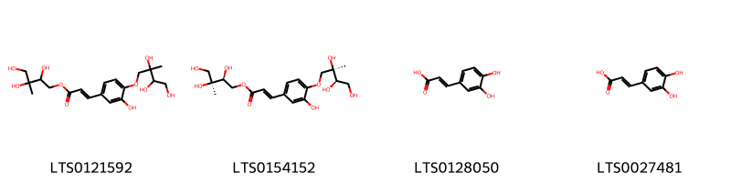{ width=100% }
    <figcaption>Hình ảnh cấu trúc hóa học của 4 hoạt chất thuộc nhóm Cinnamic acids and derivatives gồm ['2,3,4-trihydroxy-3-methylbutyl 3-[3-hydroxy-4-(2,3,4-trihydroxy-2-methylbutoxy)phenyl]prop-2-enoate (LTS0121592)', 'evolvoid a (LTS0154152)', '3,4-dihydroxycinnamic acid (LTS0128050)', 'caffeic acid (LTS0027481)'].</figcaption>
</figure>
#### Nhóm Coumarins and derivatives
<figure markdown="span">
    { width=100% }
    <figcaption>Hình ảnh cấu trúc hóa học của 3 hoạt chất thuộc nhóm Coumarins and derivatives gồm ['scopolin (LTS0061811)', '6-methoxy-7-{[3,4,5-trihydroxy-6-(hydroxymethyl)oxan-2-yl]oxy}chromen-2-one (LTS0042457)', 'scopoletin (LTS0193112)'].</figcaption>
</figure>
#### Nhóm Fatty Acyls
<figure markdown="span">
    { width=100% }
    <figcaption>Hình ảnh cấu trúc hóa học của 1 hoạt chất thuộc nhóm Fatty Acyls gồm ['hexanol (LTS0217299)'].</figcaption>
</figure>
#### Nhóm Flavonoids
<figure markdown="span">
    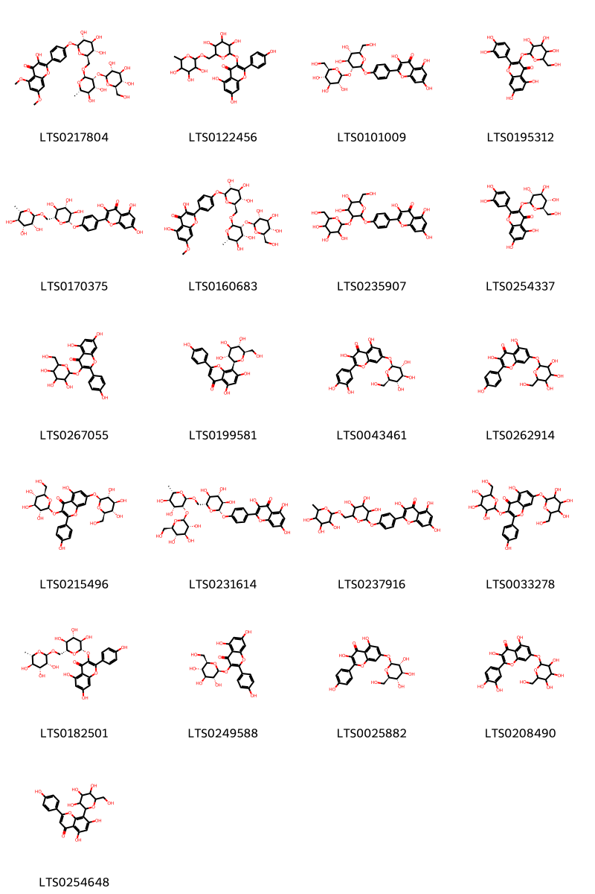{ width=100% }
    <figcaption>Hình ảnh cấu trúc hóa học của 21 hoạt chất thuộc nhóm Flavonoids gồm ['2-(4-{[(2s,3r,4s,5s,6r)-6-({[(2r,3r,4r,5r,6s)-4,5-dihydroxy-6-methyl-3-{[(2s,3r,4s,5s,6r)-3,4,5-trihydroxy-6-(hydroxymethyl)oxan-2-yl]oxy}oxan-2-yl]oxy}methyl)-3,4,5-trihydroxyoxan-2-yl]oxy}phenyl)-3-hydroxy-5,7-dimethoxychromen-4-one (LTS0217804)', '5,7-dihydroxy-2-(4-hydroxyphenyl)-3-[(3,4,5-trihydroxy-6-{[(3,4,5-trihydroxy-6-methyloxan-2-yl)oxy]methyl}oxan-2-yl)oxy]chromen-4-one (LTS0122456)', '2-(4-{[(2s,3r,4s,5s,6r)-4,5-dihydroxy-6-(hydroxymethyl)-3-{[(2s,3r,4s,5s,6r)-3,4,5-trihydroxy-6-(hydroxymethyl)oxan-2-yl]oxy}oxan-2-yl]oxy}phenyl)-3,5,7-trihydroxychromen-4-one (LTS0101009)', '2-(3,4-dihydroxyphenyl)-5,7-dihydroxy-3-{[3,4,5-trihydroxy-6-(hydroxymethyl)oxan-2-yl]oxy}chromen-4-one (LTS0195312)', '3,5,7-trihydroxy-2-(4-{[(2s,3r,4s,5s,6r)-3,4,5-trihydroxy-6-({[(2r,3r,4r,5r,6s)-3,4,5-trihydroxy-6-methyloxan-2-yl]oxy}methyl)oxan-2-yl]oxy}phenyl)chromen-4-one (LTS0170375)', '2-(4-{[(2s,3r,4s,5s,6r)-6-({[(2r,3r,4r,5r,6s)-4,5-dihydroxy-6-methyl-3-{[(2s,3r,4s,5s,6r)-3,4,5-trihydroxy-6-(hydroxymethyl)oxan-2-yl]oxy}oxan-2-yl]oxy}methyl)-3,4,5-trihydroxyoxan-2-yl]oxy}phenyl)-3,5-dihydroxy-7-methoxychromen-4-one (LTS0160683)', '2-(4-{[4,5-dihydroxy-6-(hydroxymethyl)-3-{[3,4,5-trihydroxy-6-(hydroxymethyl)oxan-2-yl]oxy}oxan-2-yl]oxy}phenyl)-3,5,7-trihydroxychromen-4-one (LTS0235907)', 'isoquercetin (LTS0254337)', 'trifolin (LTS0267055)', 'vitexin (LTS0199581)', 'quercimeritrin (LTS0043461)', '3,5-dihydroxy-2-(4-hydroxyphenyl)-7-{[3,4,5-trihydroxy-6-(hydroxymethyl)oxan-2-yl]oxy}chromen-4-one (LTS0262914)', '5-hydroxy-2-(4-hydroxyphenyl)-3,7-bis({[(2s,3r,4s,5s,6r)-3,4,5-trihydroxy-6-(hydroxymethyl)oxan-2-yl]oxy})chromen-4-one (LTS0215496)', '2-(4-{[(2s,3r,4s,5s,6r)-6-({[(2r,3r,4r,5r,6s)-4,5-dihydroxy-6-methyl-3-{[(2s,3r,4s,5s,6r)-3,4,5-trihydroxy-6-(hydroxymethyl)oxan-2-yl]oxy}oxan-2-yl]oxy}methyl)-3,4,5-trihydroxyoxan-2-yl]oxy}phenyl)-3,5,7-trihydroxychromen-4-one (LTS0231614)', '3,5,7-trihydroxy-2-{4-[(3,4,5-trihydroxy-6-{[(3,4,5-trihydroxy-6-methyloxan-2-yl)oxy]methyl}oxan-2-yl)oxy]phenyl}chromen-4-one (LTS0237916)', '5-hydroxy-2-(4-hydroxyphenyl)-3,7-bis({[3,4,5-trihydroxy-6-(hydroxymethyl)oxan-2-yl]oxy})chromen-4-one (LTS0033278)', 'nictoflorin (LTS0182501)', 'astragalin (LTS0249588)', 'kaempferol 7-o-glucoside (LTS0025882)', 'quercimeritrin (LTS0208490)', 'vitexin (LTS0254648)'].</figcaption>
</figure>
#### Nhóm Organooxygen compounds
<figure markdown="span">
    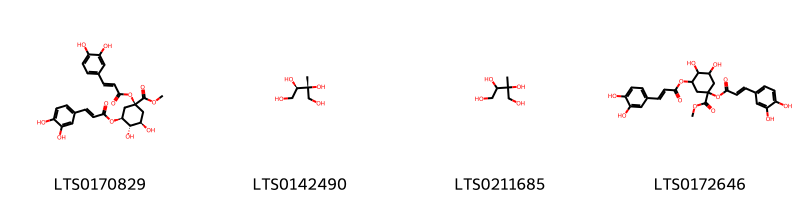{ width=100% }
    <figcaption>Hình ảnh cấu trúc hóa học của 4 hoạt chất thuộc nhóm Organooxygen compounds gồm ['methyl (1s,3s,4s,5r)-1,3-bis({[(2e)-3-(3,4-dihydroxyphenyl)prop-2-enoyl]oxy})-4,5-dihydroxycyclohexane-1-carboxylate (LTS0170829)', '(2r,3r)-2-methylbutane-1,2,3,4-tetrol (LTS0142490)', '2-methylbutane-1,2,3,4-tetrol (LTS0211685)', 'methyl 1,3-bis({[3-(3,4-dihydroxyphenyl)prop-2-enoyl]oxy})-4,5-dihydroxycyclohexane-1-carboxylate (LTS0172646)'].</figcaption>
</figure>
#### Nhóm Prenol lipids
<figure markdown="span">
    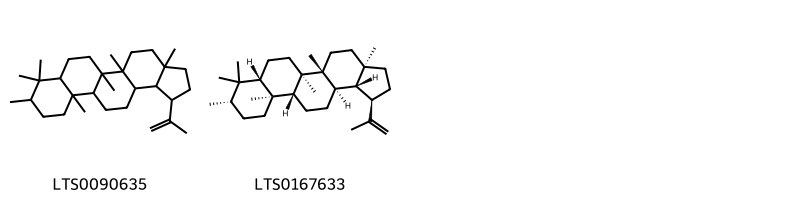{ width=100% }
    <figcaption>Hình ảnh cấu trúc hóa học của 2 hoạt chất thuộc nhóm Prenol lipids gồm ['3a,5a,5b,8,8,9,11a-heptamethyl-1-(prop-1-en-2-yl)-hexadecahydrocyclopenta[a]chrysene (LTS0090635)', '(1r,3ar,5ar,5br,7as,9s,11as,11br,13ar,13br)-3a,5a,5b,8,8,9,11a-heptamethyl-1-(prop-1-en-2-yl)-hexadecahydrocyclopenta[a]chrysene (LTS0167633)'].</figcaption>
</figure>

---

### Dược dân tộc học

Danh sách các quốc gia có sử dụng *Evolvulus alsinoides* trong điều trị các bệnh. 

| Country   | Disease          | Bệnh                                                                                                                                                                                                |
|:----------|:-----------------|:----------------------------------------------------------------------------------------------------------------------------------------------------------------------------------------------------|
| India     | Tonic, Vermifuge | MYMEMORY WARNING: YOU USED ALL AVAILABLE FREE TRANSLATIONS FOR TODAY. NEXT AVAILABLE IN  16 HOURS 21 MINUTES 24 SECONDS VISIT HTTPS://MYMEMORY.TRANSLATED.NET/DOC/USAGELIMITS.PHP TO TRANSLATE MORE |

---

# Chi Stictocardia

??? note "Danh sách các dược liệu thuộc chi"
    
	 - *Stictocardia campanulata*

---
## Stictocardia campanulata
### Thông tin về thực vật

!!! info "Phân loại thực vật của *N/A* từ GIBF:"
    - **Kingdom:** Plantae
    - **Phylum:** Tracheophyta
    - **Order:** Solanales
    - **Family:** Convolvulaceae
    - **Genus:** N/A
    - **Species:** *N/A*

 

| Label (VI)   | Label (EN)   | Scientific Name          | Descriptions (VI)   | Descriptions (EN)   | Also Known As (VI)   | Also Known As (EN)   |
|:-------------|:-------------|:-------------------------|:--------------------|:--------------------|:---------------------|:---------------------|
| N/A          | N/A          | Stictocardia campanulata | loài thực vật       | species of plant    | ['']                 | ['']                 |

#### Phân bố trên thế giới

**Từ CSDL GIBF** Viet Nam, Thailand, Namibia, Spain, French Guiana, Chile, Australia, Indonesia, Colombia, Sri Lanka, Puerto Rico, Malaysia, India, Guam, Uganda, Belize, Nicaragua, Panama, Brazil, Peru, Mexico, Chinese Taipei, Uruguay, Argentina, United Kingdom of Great Britain and Northern Ireland, Portugal, South Africa, New Zealand, Costa Rica, Russian Federation, United States of America

#### Phân bố tại Việt Nam

**Từ CSDL GIBF**: Lâm Đồng, Hồ Chí Minh city

---
### Thành phần hóa học
        
- Theo cơ sở dữ liệu lotus: Từ loài *N/A* đã phân lập và xác định được Chưa có hoạt chất nào được phân lập. hoạt chất thuộc về các nhóm Không có hoạt chất nào được phân lập. 

Không có hình ảnh nào được tạo ra

---

### Dược dân tộc học

Danh sách các quốc gia có sử dụng *N/A* trong điều trị các bệnh. 

| Country   | Disease   | Bệnh                                                                                                                                                                                                |
|:----------|:----------|:----------------------------------------------------------------------------------------------------------------------------------------------------------------------------------------------------|
| Hawaii    | Laxative  | MYMEMORY WARNING: YOU USED ALL AVAILABLE FREE TRANSLATIONS FOR TODAY. NEXT AVAILABLE IN  16 HOURS 20 MINUTES 42 SECONDS VISIT HTTPS://MYMEMORY.TRANSLATED.NET/DOC/USAGELIMITS.PHP TO TRANSLATE MORE |

---

# Chi Operculina

??? note "Danh sách các dược liệu thuộc chi"
    
	 - *Operculina pisonis*
	 - *Operculina turpethum*

---
## Operculina pisonis
### Thông tin về thực vật

!!! info "Phân loại thực vật của *N/A* từ GIBF:"
    - **Kingdom:** N/A
    - **Phylum:** N/A
    - **Order:** N/A
    - **Family:** N/A
    - **Genus:** N/A
    - **Species:** *N/A*

 

| Label (VI)   | Label (EN)   | Scientific Name          | Descriptions (VI)   | Descriptions (EN)   | Also Known As (VI)   | Also Known As (EN)   |
|:-------------|:-------------|:-------------------------|:--------------------|:--------------------|:---------------------|:---------------------|
| N/A          | N/A          | Stictocardia campanulata | loài thực vật       | species of plant    | ['']                 | ['']                 |

#### Phân bố trên thế giới

**Từ CSDL GIBF** Không có kết quả phù hợp

#### Phân bố tại Việt Nam

**Từ CSDL GIBF**: Không có ghi nhận ở Việt Nam

---
### Thành phần hóa học
        
- Theo cơ sở dữ liệu lotus: Từ loài *N/A* đã phân lập và xác định được Chưa có hoạt chất nào được phân lập. hoạt chất thuộc về các nhóm Không có hoạt chất nào được phân lập. 

Không có hình ảnh nào được tạo ra

---

### Dược dân tộc học

Danh sách các quốc gia có sử dụng *N/A* trong điều trị các bệnh. 

| Country   | Disease   | Bệnh                                                                                                                                                                                                |
|:----------|:----------|:----------------------------------------------------------------------------------------------------------------------------------------------------------------------------------------------------|
| Brazil    | Purgative | MYMEMORY WARNING: YOU USED ALL AVAILABLE FREE TRANSLATIONS FOR TODAY. NEXT AVAILABLE IN  16 HOURS 19 MINUTES 56 SECONDS VISIT HTTPS://MYMEMORY.TRANSLATED.NET/DOC/USAGELIMITS.PHP TO TRANSLATE MORE |

---

---
## Operculina turpethum
### Thông tin về thực vật

!!! info "Phân loại thực vật của *Operculina turpethum* từ GIBF:"
    - **Kingdom:** Plantae
    - **Phylum:** Tracheophyta
    - **Order:** Solanales
    - **Family:** Convolvulaceae
    - **Genus:** Operculina
    - **Species:** *Operculina turpethum*

 

| Label (VI)   | Label (EN)   | Scientific Name      | Descriptions (VI)   | Descriptions (EN)   | Also Known As (VI)   | Also Known As (EN)       |
|:-------------|:-------------|:---------------------|:--------------------|:--------------------|:---------------------|:-------------------------|
| N/A          | N/A          | Operculina turpethum |                     | species of plant    | ['']                 | ['Indian Jalap Turpeth'] |

#### Phân bố trên thế giới

**Từ CSDL GIBF** Viet Nam, Thailand, Myanmar, Philippines, India, Cook Islands, Indonesia, China, Cambodia, Chinese Taipei

#### Phân bố tại Việt Nam

**Từ CSDL GIBF**: Đồng Tháp, Long An, Hòa Bình, Hồ Chí Minh city

---
### Thành phần hóa học
        
- Theo cơ sở dữ liệu lotus: Từ loài *Operculina turpethum* đã phân lập và xác định được 4 hoạt chất thuộc về các nhóm Prenol lipids. 

|    | chemicalTaxonomyClassyfireClass   |   smiles_count |
|---:|:----------------------------------|---------------:|
|  0 | Prenol lipids                     |              4 |

#### Nhóm Prenol lipids
<figure markdown="span">
    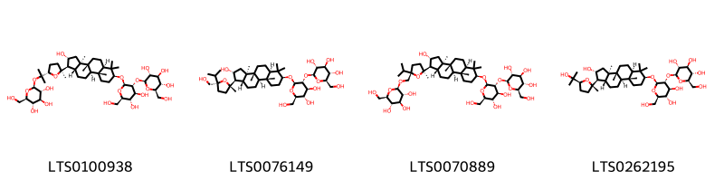{ width=100% }
    <figcaption>Hình ảnh cấu trúc hóa học của 4 hoạt chất thuộc nhóm Prenol lipids gồm ['operculinoside d (LTS0100938)', 'operculinoside a (LTS0076149)', 'operculinoside b (LTS0070889)', 'operculinoside c (LTS0262195)'].</figcaption>
</figure>

---

### Dược dân tộc học

Danh sách các quốc gia có sử dụng *Operculina turpethum* trong điều trị các bệnh. 

| Country   | Disease   | Bệnh                                                                                                                                                                                                |
|:----------|:----------|:----------------------------------------------------------------------------------------------------------------------------------------------------------------------------------------------------|
| Elsewhere | nan       | MYMEMORY WARNING: YOU USED ALL AVAILABLE FREE TRANSLATIONS FOR TODAY. NEXT AVAILABLE IN  16 HOURS 19 MINUTES 28 SECONDS VISIT HTTPS://MYMEMORY.TRANSLATED.NET/DOC/USAGELIMITS.PHP TO TRANSLATE MORE |
| Fiji      | Tonic     | MYMEMORY WARNING: YOU USED ALL AVAILABLE FREE TRANSLATIONS FOR TODAY. NEXT AVAILABLE IN  16 HOURS 19 MINUTES 18 SECONDS VISIT HTTPS://MYMEMORY.TRANSLATED.NET/DOC/USAGELIMITS.PHP TO TRANSLATE MORE |
| India     | Purgative | MYMEMORY WARNING: YOU USED ALL AVAILABLE FREE TRANSLATIONS FOR TODAY. NEXT AVAILABLE IN  16 HOURS 19 MINUTES 15 SECONDS VISIT HTTPS://MYMEMORY.TRANSLATED.NET/DOC/USAGELIMITS.PHP TO TRANSLATE MORE |
| Java      | Purgative | MYMEMORY WARNING: YOU USED ALL AVAILABLE FREE TRANSLATIONS FOR TODAY. NEXT AVAILABLE IN  16 HOURS 19 MINUTES 09 SECONDS VISIT HTTPS://MYMEMORY.TRANSLATED.NET/DOC/USAGELIMITS.PHP TO TRANSLATE MORE |

---

# Chi Porana

??? note "Danh sách các dược liệu thuộc chi"
    
	 - *Porana paniculata*
	 - *Porana volubilis*

---
## Porana paniculata
### Thông tin về thực vật

!!! info "Phân loại thực vật của *Poranopsis paniculata* từ GIBF:"
    - **Kingdom:** Plantae
    - **Phylum:** Tracheophyta
    - **Order:** Solanales
    - **Family:** Convolvulaceae
    - **Genus:** Poranopsis
    - **Species:** *Poranopsis paniculata*

 

| Label (VI)   | Label (EN)   | Scientific Name   | Descriptions (VI)   | Descriptions (EN)   | Also Known As (VI)   | Also Known As (EN)   |
|:-------------|:-------------|:------------------|:--------------------|:--------------------|:---------------------|:---------------------|
| N/A          | N/A          | Porana paniculata | loài thực vật       | species of plant    | ['']                 | ['']                 |

#### Phân bố trên thế giới

**Từ CSDL GIBF** nan, unknown or invalid, Jamaica, Indonesia, Haiti, Colombia, Pakistan, Venezuela (Bolivarian Republic of), Puerto Rico, India, Virgin Islands (U.S.), Sint Maarten (Dutch part), Myanmar, Mexico, China, Nepal, South Africa, United States of America, Madagascar

#### Phân bố tại Việt Nam

**Từ CSDL GIBF**: Không có ghi nhận ở Việt Nam

---
### Thành phần hóa học
        
- Theo cơ sở dữ liệu lotus: Từ loài *Poranopsis paniculata* đã phân lập và xác định được Chưa có hoạt chất nào được phân lập. hoạt chất thuộc về các nhóm Không có hoạt chất nào được phân lập. 

Không có hình ảnh nào được tạo ra

---

### Dược dân tộc học

Danh sách các quốc gia có sử dụng *Poranopsis paniculata* trong điều trị các bệnh. 

| Country   | Disease      | Bệnh                                                                                                                                                                                                |
|:----------|:-------------|:----------------------------------------------------------------------------------------------------------------------------------------------------------------------------------------------------|
| Haiti     | Decongestant | MYMEMORY WARNING: YOU USED ALL AVAILABLE FREE TRANSLATIONS FOR TODAY. NEXT AVAILABLE IN  16 HOURS 18 MINUTES 40 SECONDS VISIT HTTPS://MYMEMORY.TRANSLATED.NET/DOC/USAGELIMITS.PHP TO TRANSLATE MORE |

---

---
## Porana volubilis
### Thông tin về thực vật

!!! info "Phân loại thực vật của *Porana volubilis* từ GIBF:"
    - **Kingdom:** Plantae
    - **Phylum:** Tracheophyta
    - **Order:** Solanales
    - **Family:** Convolvulaceae
    - **Genus:** Porana
    - **Species:** *Porana volubilis*

 

| Label (VI)   | Label (EN)   | Scientific Name   | Descriptions (VI)   | Descriptions (EN)   | Also Known As (VI)   | Also Known As (EN)   |
|:-------------|:-------------|:------------------|:--------------------|:--------------------|:---------------------|:---------------------|
| N/A          | N/A          | Porana volubilis  | loài thực vật       | species of plant    | ['']                 | ['']                 |

#### Phân bố trên thế giới

**Từ CSDL GIBF** Viet Nam, nan, unknown or invalid, Thailand, Christmas Island, Myanmar, Philippines, Ghana, Malaysia, India, Réunion, Seychelles, Nigeria, Singapore, Timor-Leste, Indonesia

#### Phân bố tại Việt Nam

**Từ CSDL GIBF**: Nha Trang, Khanh Hoa, Bien Hoa

---
### Thành phần hóa học
        
- Theo cơ sở dữ liệu lotus: Từ loài *Porana volubilis* đã phân lập và xác định được Chưa có hoạt chất nào được phân lập. hoạt chất thuộc về các nhóm Không có hoạt chất nào được phân lập. 

Không có hình ảnh nào được tạo ra

---

### Dược dân tộc học

Danh sách các quốc gia có sử dụng *Porana volubilis* trong điều trị các bệnh. 

| Country   | Disease   | Bệnh                                                                                                                                                                                                |
|:----------|:----------|:----------------------------------------------------------------------------------------------------------------------------------------------------------------------------------------------------|
| Elsewhere | Tonic     | MYMEMORY WARNING: YOU USED ALL AVAILABLE FREE TRANSLATIONS FOR TODAY. NEXT AVAILABLE IN  16 HOURS 18 MINUTES 16 SECONDS VISIT HTTPS://MYMEMORY.TRANSLATED.NET/DOC/USAGELIMITS.PHP TO TRANSLATE MORE |
| Java      | Tonic     | MYMEMORY WARNING: YOU USED ALL AVAILABLE FREE TRANSLATIONS FOR TODAY. NEXT AVAILABLE IN  16 HOURS 18 MINUTES 12 SECONDS VISIT HTTPS://MYMEMORY.TRANSLATED.NET/DOC/USAGELIMITS.PHP TO TRANSLATE MORE |

---

# Chi Calonyction

??? note "Danh sách các dược liệu thuộc chi"
    
	 - *Calonyction aculeatum*
	 - *Calonyction muricatum*

---
## Calonyction aculeatum
### Thông tin về thực vật

!!! info "Phân loại thực vật của *Ipomoea alba* từ GIBF:"
    - **Kingdom:** Plantae
    - **Phylum:** Tracheophyta
    - **Order:** Solanales
    - **Family:** Convolvulaceae
    - **Genus:** Ipomoea
    - **Species:** *Ipomoea alba*

 

| Label (VI)   | Label (EN)   | Scientific Name   | Descriptions (VI)   | Descriptions (EN)   | Also Known As (VI)   | Also Known As (EN)   |
|:-------------|:-------------|:------------------|:--------------------|:--------------------|:---------------------|:---------------------|
| N/A          | N/A          | Porana volubilis  | loài thực vật       | species of plant    | ['']                 | ['']                 |

#### Phân bố trên thế giới

**Từ CSDL GIBF** Honduras, nan, unknown or invalid, El Salvador, Spain, Philippines, Guatemala, Sweden, Cuba, Japan, Panama, Brazil, Peru, Mexico, China, Chinese Taipei, Argentina, Bolivia (Plurinational State of), Costa Rica, Congo, Democratic Republic of the, Ecuador, United States of America

#### Phân bố tại Việt Nam

**Từ CSDL GIBF**: Không có ghi nhận ở Việt Nam

---
### Thành phần hóa học
        
- Theo cơ sở dữ liệu lotus: Từ loài *Ipomoea alba* đã phân lập và xác định được Chưa có hoạt chất nào được phân lập. hoạt chất thuộc về các nhóm Không có hoạt chất nào được phân lập. 

Không có hình ảnh nào được tạo ra

---

### Dược dân tộc học

Danh sách các quốc gia có sử dụng *Ipomoea alba* trong điều trị các bệnh. 

| Country   | Disease   | Bệnh                                                                                                                                                                                                |
|:----------|:----------|:----------------------------------------------------------------------------------------------------------------------------------------------------------------------------------------------------|
| Elsewhere | Purgative | MYMEMORY WARNING: YOU USED ALL AVAILABLE FREE TRANSLATIONS FOR TODAY. NEXT AVAILABLE IN  16 HOURS 17 MINUTES 38 SECONDS VISIT HTTPS://MYMEMORY.TRANSLATED.NET/DOC/USAGELIMITS.PHP TO TRANSLATE MORE |

---

---
## Calonyction muricatum
### Thông tin về thực vật

!!! info "Phân loại thực vật của *Ipomoea muricata* từ GIBF:"
    - **Kingdom:** Plantae
    - **Phylum:** Tracheophyta
    - **Order:** Solanales
    - **Family:** Convolvulaceae
    - **Genus:** Ipomoea
    - **Species:** *Ipomoea muricata*

 

| Label (VI)   | Label (EN)   | Scientific Name   | Descriptions (VI)   | Descriptions (EN)   | Also Known As (VI)   | Also Known As (EN)   |
|:-------------|:-------------|:------------------|:--------------------|:--------------------|:---------------------|:---------------------|
| N/A          | N/A          | Porana volubilis  | loài thực vật       | species of plant    | ['']                 | ['']                 |

#### Phân bố trên thế giới

**Từ CSDL GIBF** nan, Japan, United States of America, Mexico, China

#### Phân bố tại Việt Nam

**Từ CSDL GIBF**: Không có ghi nhận ở Việt Nam

---
### Thành phần hóa học
        
- Theo cơ sở dữ liệu lotus: Từ loài *Ipomoea muricata* đã phân lập và xác định được Chưa có hoạt chất nào được phân lập. hoạt chất thuộc về các nhóm Không có hoạt chất nào được phân lập. 

Không có hình ảnh nào được tạo ra

---

### Dược dân tộc học

Danh sách các quốc gia có sử dụng *Ipomoea muricata* trong điều trị các bệnh. 

| Country   | Disease                | Bệnh                                                                                                                                                                                                |
|:----------|:-----------------------|:----------------------------------------------------------------------------------------------------------------------------------------------------------------------------------------------------|
| Elsewhere | Cathartic, Insecticide | MYMEMORY WARNING: YOU USED ALL AVAILABLE FREE TRANSLATIONS FOR TODAY. NEXT AVAILABLE IN  16 HOURS 17 MINUTES 16 SECONDS VISIT HTTPS://MYMEMORY.TRANSLATED.NET/DOC/USAGELIMITS.PHP TO TRANSLATE MORE |

---

# Chi Calystegia

??? note "Danh sách các dược liệu thuộc chi"
    
	 - *Calystegia japonica*
	 - *Calystegia sepium*
	 - *Calystegia soldanella*

---
## Calystegia japonica
### Thông tin về thực vật

!!! info "Phân loại thực vật của *Calystegia pubescens* từ GIBF:"
    - **Kingdom:** Plantae
    - **Phylum:** Tracheophyta
    - **Order:** Solanales
    - **Family:** Convolvulaceae
    - **Genus:** Calystegia
    - **Species:** *Calystegia pubescens*

 

| Label (VI)   | Label (EN)   | Scientific Name     | Descriptions (VI)   | Descriptions (EN)   | Also Known As (VI)   | Also Known As (EN)   |
|:-------------|:-------------|:--------------------|:--------------------|:--------------------|:---------------------|:---------------------|
| N/A          | N/A          | Calystegia japonica | loài thực vật       | species of plant    | ['']                 | ['']                 |

#### Phân bố trên thế giới

**Từ CSDL GIBF** Korea (Democratic People’s Republic of), United States of America, Japan, China

#### Phân bố tại Việt Nam

**Từ CSDL GIBF**: Không có ghi nhận ở Việt Nam

---
### Thành phần hóa học
        
- Theo cơ sở dữ liệu lotus: Từ loài *Calystegia pubescens* đã phân lập và xác định được Chưa có hoạt chất nào được phân lập. hoạt chất thuộc về các nhóm Không có hoạt chất nào được phân lập. 

Không có hình ảnh nào được tạo ra

---

### Dược dân tộc học

Danh sách các quốc gia có sử dụng *Calystegia pubescens* trong điều trị các bệnh. 

| Country   | Disease            | Bệnh                                                                                                                                                                                                |
|:----------|:-------------------|:----------------------------------------------------------------------------------------------------------------------------------------------------------------------------------------------------|
| Elsewhere | Aperient, Diuretic | MYMEMORY WARNING: YOU USED ALL AVAILABLE FREE TRANSLATIONS FOR TODAY. NEXT AVAILABLE IN  16 HOURS 16 MINUTES 40 SECONDS VISIT HTTPS://MYMEMORY.TRANSLATED.NET/DOC/USAGELIMITS.PHP TO TRANSLATE MORE |

---

---
## Calystegia sepium
### Thông tin về thực vật

!!! info "Phân loại thực vật của *Calystegia sepium* từ GIBF:"
    - **Kingdom:** Plantae
    - **Phylum:** Tracheophyta
    - **Order:** Solanales
    - **Family:** Convolvulaceae
    - **Genus:** Calystegia
    - **Species:** *Calystegia sepium*

 

| Label (VI)   | Label (EN)   | Scientific Name   | Descriptions (VI)   | Descriptions (EN)   | Also Known As (VI)   | Also Known As (EN)   |
|:-------------|:-------------|:------------------|:--------------------|:--------------------|:---------------------|:---------------------|
| N/A          | N/A          | Calystegia sepium | loài thực vật       | species of plant    | ['']                 | ['Hedge Bindweed']   |

#### Phân bố trên thế giới

**Từ CSDL GIBF** nan, Denmark, Spain, Germany, Chile, Austria, Australia, Sweden, Poland, Canada, Belgium, Finland, Hungary, Ireland, Switzerland, Uruguay, Argentina, United Kingdom of Great Britain and Northern Ireland, France, New Zealand, Romania, Russian Federation, United States of America, Italy, Croatia, Ukraine

#### Phân bố tại Việt Nam

**Từ CSDL GIBF**: Không có ghi nhận ở Việt Nam

---
### Thành phần hóa học
        
- Theo cơ sở dữ liệu lotus: Từ loài *Calystegia sepium* đã phân lập và xác định được 7 hoạt chất thuộc về các nhóm Tropane alkaloids. 

|    | chemicalTaxonomyClassyfireClass   |   smiles_count |
|---:|:----------------------------------|---------------:|
|  0 |                                   |              1 |
|  1 | Tropane alkaloids                 |              6 |

#### Nhóm 
<figure markdown="span">
    { width=100% }
    <figcaption>Hình ảnh cấu trúc hóa học của 1 hoạt chất thuộc nhóm  gồm ['cuscohygrine (LTS0040983)'].</figcaption>
</figure>
#### Nhóm Tropane alkaloids
<figure markdown="span">
    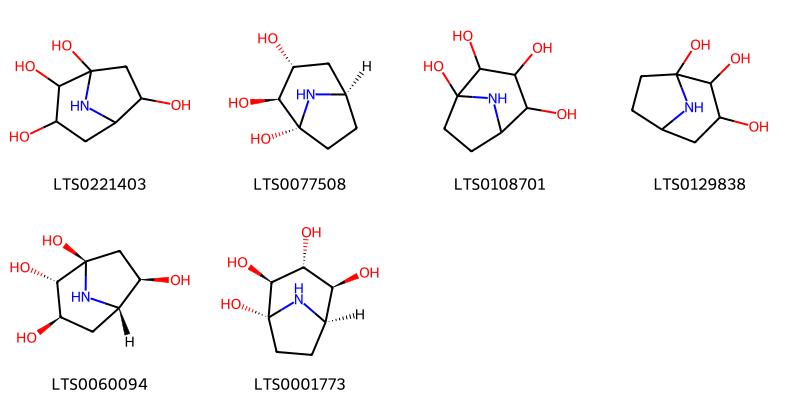{ width=100% }
    <figcaption>Hình ảnh cấu trúc hóa học của 6 hoạt chất thuộc nhóm Tropane alkaloids gồm ['8-azabicyclo[3.2.1]octane-1,2,3,6-tetrol (LTS0221403)', '(1r,2s,3r,5r)-8-azabicyclo[3.2.1]octane-1,2,3-triol (LTS0077508)', '8-azabicyclo[3.2.1]octane-1,2,3,4-tetrol (LTS0108701)', '8-azabicyclo[3.2.1]octane-1,2,3-triol (LTS0129838)', '(1r,2s,3r,5s,6r)-8-azabicyclo[3.2.1]octane-1,2,3,6-tetrol (LTS0060094)', '(1r,2s,3r,4s,5r)-8-azabicyclo[3.2.1]octane-1,2,3,4-tetrol (LTS0001773)'].</figcaption>
</figure>

---

### Dược dân tộc học

Danh sách các quốc gia có sử dụng *Calystegia sepium* trong điều trị các bệnh. 

| Country   | Disease                              | Bệnh                                                                                                                                                                                                |
|:----------|:-------------------------------------|:----------------------------------------------------------------------------------------------------------------------------------------------------------------------------------------------------|
| China     | Diuretic, Demulcent, Poultice, Tonic | MYMEMORY WARNING: YOU USED ALL AVAILABLE FREE TRANSLATIONS FOR TODAY. NEXT AVAILABLE IN  16 HOURS 16 MINUTES 13 SECONDS VISIT HTTPS://MYMEMORY.TRANSLATED.NET/DOC/USAGELIMITS.PHP TO TRANSLATE MORE |
| ain       | Purgative                            | MYMEMORY WARNING: YOU USED ALL AVAILABLE FREE TRANSLATIONS FOR TODAY. NEXT AVAILABLE IN  16 HOURS 16 MINUTES 10 SECONDS VISIT HTTPS://MYMEMORY.TRANSLATED.NET/DOC/USAGELIMITS.PHP TO TRANSLATE MORE |

---

---
## Calystegia soldanella
### Thông tin về thực vật

!!! info "Phân loại thực vật của *Calystegia soldanella* từ GIBF:"
    - **Kingdom:** Plantae
    - **Phylum:** Tracheophyta
    - **Order:** Solanales
    - **Family:** Convolvulaceae
    - **Genus:** Calystegia
    - **Species:** *Calystegia soldanella*

 

| Label (VI)   | Label (EN)   | Scientific Name       | Descriptions (VI)   | Descriptions (EN)   | Also Known As (VI)   | Also Known As (EN)   |
|:-------------|:-------------|:----------------------|:--------------------|:--------------------|:---------------------|:---------------------|
| N/A          | N/A          | Calystegia soldanella | loài thực vật       | species of plant    | ['']                 | ['Sea Bindweed']     |

#### Phân bố trên thế giới

**Từ CSDL GIBF** Uruguay, Argentina, United Kingdom of Great Britain and Northern Ireland, Portugal, Japan, France, Spain, New Zealand, Chile, United States of America, Italy, China, Greece, Australia, Korea, Republic of, Chinese Taipei

#### Phân bố tại Việt Nam

**Từ CSDL GIBF**: Không có ghi nhận ở Việt Nam

---
### Thành phần hóa học
        
- Theo cơ sở dữ liệu lotus: Từ loài *Calystegia soldanella* đã phân lập và xác định được 8 hoạt chất thuộc về các nhóm Saccharolipids. 

|    | chemicalTaxonomyClassyfireClass   |   smiles_count |
|---:|:----------------------------------|---------------:|
|  0 | Saccharolipids                    |              8 |

#### Nhóm Saccharolipids
<figure markdown="span">
    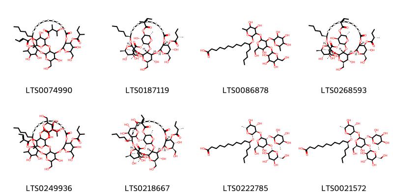{ width=100% }
    <figcaption>Hình ảnh cấu trúc hóa học của 8 hoạt chất thuộc nhóm Saccharolipids gồm ['4-hydroxy-5-[(3-hydroxy-2-methylbutanoyl)oxy]-2-methyl-6-{[6,25,26,32-tetrahydroxy-5,31-bis(hydroxymethyl)-24-methyl-7-[(2-methylbutanoyl)oxy]-10-oxo-20-pentyl-2,4,9,21,23,28,30-heptaoxatetracyclo[27.3.1.0³,⁸.0²²,²⁷]tritriacontan-33-yl]oxy}oxan-3-yl but-2-enoate (LTS0074990)', 'soldanelline b (LTS0187119)', '11-[(4,5-dihydroxy-3-{[5-hydroxy-6-(hydroxymethyl)-4-{[3,4,5-trihydroxy-6-(hydroxymethyl)oxan-2-yl]oxy}-3-[(3,4,5-trihydroxy-6-methyloxan-2-yl)oxy]oxan-2-yl]oxy}-6-methyloxan-2-yl)oxy]hexadecanoic acid (LTS0086878)', '(2s,3r,4s,5r,6s)-4-hydroxy-5-{[(2s,3r)-3-hydroxy-2-methylbutanoyl]oxy}-2-methyl-6-{[(1s,3s,5r,6r,7s,8r,20s,22r,24r,25s,26s,27r,29s,31r,32r,33r)-6,25,26,32-tetrahydroxy-5,31-bis(hydroxymethyl)-24-methyl-7-{[(2s)-2-methylbutanoyl]oxy}-10-oxo-20-pentyl-2,4,9,21,23,28,30-heptaoxatetracyclo[27.3.1.0³,⁸.0²²,²⁷]tritriacontan-33-yl]oxy}oxan-3-yl (2z)-but-2-enoate (LTS0268593)', '5-[(3-hydroxy-2-methylbutanoyl)oxy]-2-methyl-6-{[6,25,26,32-tetrahydroxy-5,31-bis(hydroxymethyl)-24-methyl-7-[(2-methylbutanoyl)oxy]-10-oxo-20-pentyl-2,4,9,21,23,28,30-heptaoxatetracyclo[27.3.1.0³,⁸.0²²,²⁷]tritriacontan-33-yl]oxy}-4-{[3,4,5-trihydroxy-6-(hydroxymethyl)oxan-2-yl]oxy}oxan-3-yl 2-methylbut-2-enoate (LTS0249936)', '(2s,3s,4r,5r,6s)-5-{[(2s,3r)-3-hydroxy-2-methylbutanoyl]oxy}-2-methyl-6-{[(1s,3s,5r,6r,7s,8r,20s,22r,24r,25s,26s,27r,29s,31r,32r,33r)-6,25,26,32-tetrahydroxy-5,31-bis(hydroxymethyl)-24-methyl-7-{[(2s)-2-methylbutanoyl]oxy}-10-oxo-20-pentyl-2,4,9,21,23,28,30-heptaoxatetracyclo[27.3.1.0³,⁸.0²²,²⁷]tritriacontan-33-yl]oxy}-4-{[(2s,3r,4s,5s,6r)-3,4,5-trihydroxy-6-(hydroxymethyl)oxan-2-yl]oxy}oxan-3-yl (2e)-2-methylbut-2-enoate (LTS0218667)', '(11s)-11-{[(2r,3r,4s,5s,6r)-4,5-dihydroxy-3-{[(2s,3r,4s,5r,6r)-5-hydroxy-6-(hydroxymethyl)-4-{[(2s,3r,4s,5s,6r)-3,4,5-trihydroxy-6-(hydroxymethyl)oxan-2-yl]oxy}-3-{[(2s,3r,4r,5r,6s)-3,4,5-trihydroxy-6-methyloxan-2-yl]oxy}oxan-2-yl]oxy}-6-methyloxan-2-yl]oxy}hexadecanoic acid (LTS0222785)', '(11s)-11-{[(2r,3r,4s,5s,6r)-4,5-dihydroxy-3-{[(2s,3r,4s,5r,6r)-5-hydroxy-6-(hydroxymethyl)-4-{[(2s,3r,4s,5s,6r)-3,4,5-trihydroxy-6-(hydroxymethyl)oxan-2-yl]oxy}-3-{[(2s,3r,4s,5r,6s)-3,4,5-trihydroxy-6-methyloxan-2-yl]oxy}oxan-2-yl]oxy}-6-methyloxan-2-yl]oxy}hexadecanoic acid (LTS0021572)'].</figcaption>
</figure>

---

### Dược dân tộc học

Danh sách các quốc gia có sử dụng *Calystegia soldanella* trong điều trị các bệnh. 

| Country   | Disease   | Bệnh                                                                                                                                                                                                |
|:----------|:----------|:----------------------------------------------------------------------------------------------------------------------------------------------------------------------------------------------------|
| Dutch     | Diuretic  | MYMEMORY WARNING: YOU USED ALL AVAILABLE FREE TRANSLATIONS FOR TODAY. NEXT AVAILABLE IN  16 HOURS 15 MINUTES 44 SECONDS VISIT HTTPS://MYMEMORY.TRANSLATED.NET/DOC/USAGELIMITS.PHP TO TRANSLATE MORE |
| Italian   | Vermifuge | MYMEMORY WARNING: YOU USED ALL AVAILABLE FREE TRANSLATIONS FOR TODAY. NEXT AVAILABLE IN  16 HOURS 15 MINUTES 41 SECONDS VISIT HTTPS://MYMEMORY.TRANSLATED.NET/DOC/USAGELIMITS.PHP TO TRANSLATE MORE |
| US        | Laxative  | MYMEMORY WARNING: YOU USED ALL AVAILABLE FREE TRANSLATIONS FOR TODAY. NEXT AVAILABLE IN  16 HOURS 15 MINUTES 38 SECONDS VISIT HTTPS://MYMEMORY.TRANSLATED.NET/DOC/USAGELIMITS.PHP TO TRANSLATE MORE |
| ain       | Purgative | MYMEMORY WARNING: YOU USED ALL AVAILABLE FREE TRANSLATIONS FOR TODAY. NEXT AVAILABLE IN  16 HOURS 15 MINUTES 36 SECONDS VISIT HTTPS://MYMEMORY.TRANSLATED.NET/DOC/USAGELIMITS.PHP TO TRANSLATE MORE |
| anish     | Irritant  | MYMEMORY WARNING: YOU USED ALL AVAILABLE FREE TRANSLATIONS FOR TODAY. NEXT AVAILABLE IN  16 HOURS 15 MINUTES 32 SECONDS VISIT HTTPS://MYMEMORY.TRANSLATED.NET/DOC/USAGELIMITS.PHP TO TRANSLATE MORE |

---

# Chi Ipomoea

??? note "Danh sách các dược liệu thuộc chi"
    
	 - *Ipomoea acuminata*
	 - *Ipomoea alba*
	 - *Ipomoea aquatica*
	 - *Ipomoea arborescens*
	 - *Ipomoea batatas*
	 - *Ipomoea bonanox*
	 - *Ipomoea carnea*
	 - *Ipomoea congesta*
	 - *Ipomoea crassicaulis*
	 - *Ipomoea crassifolia*
	 - *Ipomoea dichroa*
	 - *Ipomoea digitata*
	 - *Ipomoea ficifolia*
	 - *Ipomoea hederacea*
	 - *Ipomoea hederifolia*
	 - *Ipomoea maxima*
	 - *Ipomoea murucoides*
	 - *Ipomoea nil*
	 - *Ipomoea orizabensis*
	 - *Ipomoea palmato-pinnata*
	 - *Ipomoea pedicellaris*
	 - *Ipomoea pes-caprae*
	 - *Ipomoea pes-tigridis*
	 - *Ipomoea pescaprae*
	 - *Ipomoea phoenicea*
	 - *Ipomoea purga*
	 - *Ipomoea purpurea*
	 - *Ipomoea quamoclit*
	 - *Ipomoea reptans*
	 - *Ipomoea stans*
	 - *Ipomoea tuberosa*
	 - *Ipomoea turpethum*
	 - *Ipomoea uniflora*

---
## Ipomoea acuminata
### Thông tin về thực vật

!!! info "Phân loại thực vật của *N/A* từ GIBF:"
    - **Kingdom:** Plantae
    - **Phylum:** Tracheophyta
    - **Order:** Solanales
    - **Family:** Convolvulaceae
    - **Genus:** Ipomoea
    - **Species:** *N/A*

 

| Label (VI)   | Label (EN)   | Scientific Name       | Descriptions (VI)   | Descriptions (EN)   | Also Known As (VI)   | Also Known As (EN)   |
|:-------------|:-------------|:----------------------|:--------------------|:--------------------|:---------------------|:---------------------|
| N/A          | N/A          | Calystegia soldanella | loài thực vật       | species of plant    | ['']                 | ['Sea Bindweed']     |

#### Phân bố trên thế giới

**Từ CSDL GIBF** Viet Nam, Thailand, Namibia, Spain, Chile, Australia, Indonesia, Colombia, Sri Lanka, Puerto Rico, Malaysia, India, Guam, Türkiye, Uganda, Belize, Nicaragua, Panama, Brazil, Japan, Peru, Mexico, China, Chinese Taipei, Hong Kong, Uruguay, Argentina, Portugal, South Africa, New Zealand, Costa Rica, Ecuador, United States of America

#### Phân bố tại Việt Nam

**Từ CSDL GIBF**: Lâm Đồng, Hồ Chí Minh city

---
### Thành phần hóa học
        
- Theo cơ sở dữ liệu lotus: Từ loài *N/A* đã phân lập và xác định được Chưa có hoạt chất nào được phân lập. hoạt chất thuộc về các nhóm Không có hoạt chất nào được phân lập. 

Không có hình ảnh nào được tạo ra

---

### Dược dân tộc học

Danh sách các quốc gia có sử dụng *N/A* trong điều trị các bệnh. 

| Country            | Disease   | Bệnh                                                                                                                                                                                                |
|:-------------------|:----------|:----------------------------------------------------------------------------------------------------------------------------------------------------------------------------------------------------|
| Dominican Republic | Purgative | MYMEMORY WARNING: YOU USED ALL AVAILABLE FREE TRANSLATIONS FOR TODAY. NEXT AVAILABLE IN  16 HOURS 15 MINUTES 07 SECONDS VISIT HTTPS://MYMEMORY.TRANSLATED.NET/DOC/USAGELIMITS.PHP TO TRANSLATE MORE |

---

---
## Ipomoea alba
### Thông tin về thực vật

!!! info "Phân loại thực vật của *Ipomoea alba* từ GIBF:"
    - **Kingdom:** Plantae
    - **Phylum:** Tracheophyta
    - **Order:** Solanales
    - **Family:** Convolvulaceae
    - **Genus:** Ipomoea
    - **Species:** *Ipomoea alba*

 

| Label (VI)   | Label (EN)   | Scientific Name   | Descriptions (VI)   | Descriptions (EN)   | Also Known As (VI)       | Also Known As (EN)   |
|:-------------|:-------------|:------------------|:--------------------|:--------------------|:-------------------------|:---------------------|
| N/A          | N/A          | Ipomoea alba      | loài thực vật       | species of plant    | ['tịch nhan', 'dạ nhan'] | ['moonflower']       |

#### Phân bố trên thế giới

**Từ CSDL GIBF** Honduras, Uruguay, Colombia, Argentina, Belize, Nicaragua, South Africa, Brazil, Puerto Rico, Peru, Ecuador, United States of America, Mexico, United Arab Emirates, Australia, Chinese Taipei

#### Phân bố tại Việt Nam

**Từ CSDL GIBF**: Không có ghi nhận ở Việt Nam

---
### Thành phần hóa học
        
- Theo cơ sở dữ liệu lotus: Từ loài *Ipomoea alba* đã phân lập và xác định được 26 hoạt chất thuộc về các nhóm Organooxygen compounds, Prenol lipids, Tropane alkaloids, Saccharolipids. 

|    | chemicalTaxonomyClassyfireClass   |   smiles_count |
|---:|:----------------------------------|---------------:|
|  0 | Organooxygen compounds            |              2 |
|  1 | Prenol lipids                     |             18 |
|  2 | Saccharolipids                    |              1 |
|  3 | Tropane alkaloids                 |              5 |

#### Nhóm Organooxygen compounds
<figure markdown="span">
    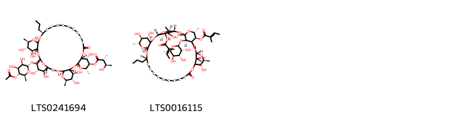{ width=100% }
    <figcaption>Hình ảnh cấu trúc hóa học của 2 hoạt chất thuộc nhóm Organooxygen compounds gồm ['(1s,3r,4s,5s,6r,8r,10s,22r,23r,24r,25s,27s,29r,30s,31s,32r,34r,37r,38s,39s,40r)-40-{[(2s,3r,4s,5r,6s)-5-(acetyloxy)-3,4-dihydroxy-6-methyloxan-2-yl]oxy}-4,5,23,30,31,38,39-heptahydroxy-6,25,32-trimethyl-20-oxo-10-propyl-2,7,9,21,26,28,33,35,41-nonaoxapentacyclo[35.3.1.0³,⁸.0²²,²⁷.0²⁹,³⁴]hentetracontan-24-yl (2r,3r)-3-hydroxy-2-methylbutanoate (LTS0241694)', '(1r,3s,5r,6r,7s,9s,11s,12s,13r,25s,27r,29r,30s,31s,32r,34s,36s,37r,38r,39r,40r)-12,30,31,37,39-pentahydroxy-5,11,29,36-tetramethyl-38-{[(2e)-2-methylbut-2-enoyl]oxy}-15-oxo-25-propyl-40-{[(2s,3r,4r,5r,6s)-3,4,5-trihydroxy-6-methyloxan-2-yl]oxy}-2,4,8,10,14,26,28,33,35-nonaoxapentacyclo[32.2.2.1³,⁷.1⁹,¹³.0²⁷,³²]tetracontan-6-yl (2e)-2-methylbut-2-enoate (LTS0016115)'].</figcaption>
</figure>
#### Nhóm Prenol lipids
<figure markdown="span">
    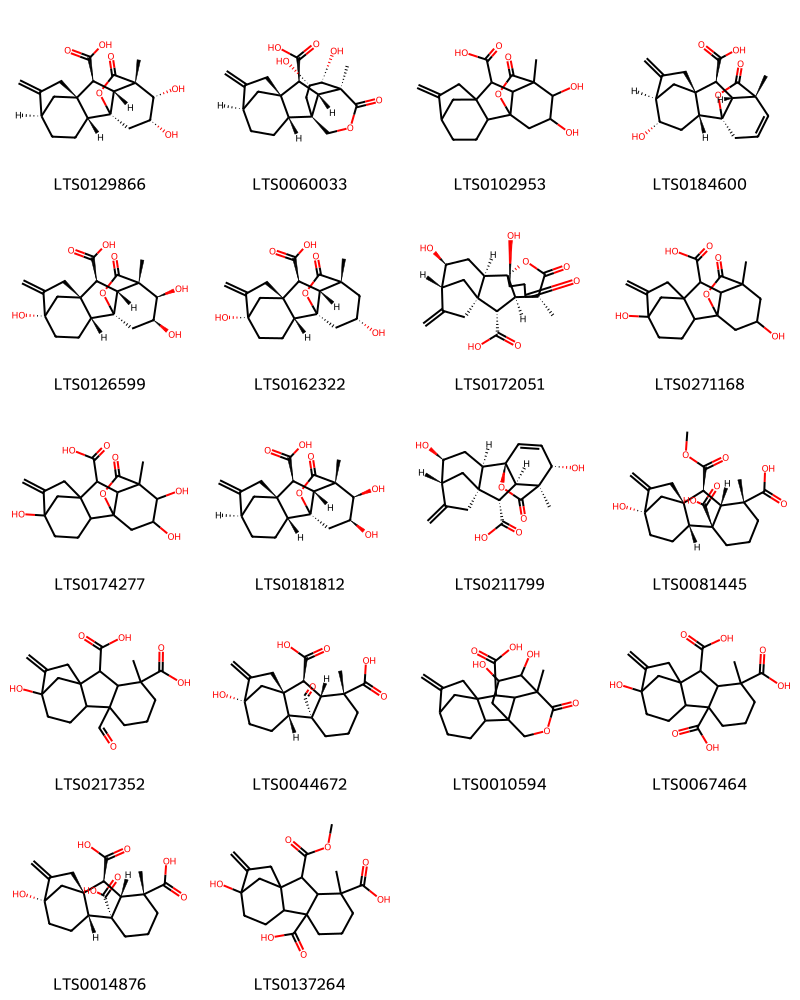{ width=100% }
    <figcaption>Hình ảnh cấu trúc hóa học của 18 hoạt chất thuộc nhóm Prenol lipids gồm ['(1r,2r,5r,8r,9s,10r,11s,12s,13r)-12,13-dihydroxy-11-methyl-6-methylidene-16-oxo-15-oxapentacyclo[9.3.2.1⁵,⁸.0¹,¹⁰.0²,⁸]heptadecane-9-carboxylic acid (LTS0129866)', '(1r,2r,5r,8r,9s,10s,11s,16s,17r)-16,17-dihydroxy-11-methyl-6-methylidene-12-oxo-13-oxapentacyclo[9.3.3.1⁵,⁸.0¹,¹⁰.0²,⁸]octadecane-9-carboxylic acid (LTS0060033)', '12,13-dihydroxy-11-methyl-6-methylidene-16-oxo-15-oxapentacyclo[9.3.2.1⁵,⁸.0¹,¹⁰.0²,⁸]heptadecane-9-carboxylic acid (LTS0102953)', '(1r,2r,4s,5r,8r,9s,10r,11r)-4-hydroxy-11-methyl-6-methylidene-16-oxo-15-oxapentacyclo[9.3.2.1⁵,⁸.0¹,¹⁰.0²,⁸]heptadec-12-ene-9-carboxylic acid (LTS0184600)', 'gibberellin a8 (LTS0126599)', '(1r,2r,5s,8s,9s,10r,11r,13s)-5,13-dihydroxy-11-methyl-6-methylidene-16-oxo-15-oxapentacyclo[9.3.2.1⁵,⁸.0¹,¹⁰.0²,⁸]heptadecane-9-carboxylic acid (LTS0162322)', '(1r,2r,4s,5r,8r,9s,10r,11s,14r)-4,14-dihydroxy-11-methyl-6-methylidene-12,16-dioxo-15-oxapentacyclo[9.3.2.1⁵,⁸.0¹,¹⁰.0²,⁸]heptadecane-9-carboxylic acid (LTS0172051)', '5,13-dihydroxy-11-methyl-6-methylidene-16-oxo-15-oxapentacyclo[9.3.2.1⁵,⁸.0¹,¹⁰.0²,⁸]heptadecane-9-carboxylic acid (LTS0271168)', '5,12,13-trihydroxy-11-methyl-6-methylidene-16-oxo-15-oxapentacyclo[9.3.2.1⁵,⁸.0¹,¹⁰.0²,⁸]heptadecane-9-carboxylic acid (LTS0174277)', 'gibberellin a34 (LTS0181812)', '(1r,2r,4s,5r,8r,9s,10r,11s,12s)-4,12-dihydroxy-11-methyl-6-methylidene-16-oxo-15-oxapentacyclo[9.3.2.1⁵,⁸.0¹,¹⁰.0²,⁸]heptadec-13-ene-9-carboxylic acid (LTS0211799)', '(1s,2s,3r,4r,8s,9r,12s)-12-hydroxy-2-(methoxycarbonyl)-4-methyl-13-methylidenetetracyclo[10.2.1.0¹,⁹.0³,⁸]pentadecane-4,8-dicarboxylic acid (LTS0081445)', '8-formyl-12-hydroxy-4-methyl-13-methylidenetetracyclo[10.2.1.0¹,⁹.0³,⁸]pentadecane-2,4-dicarboxylic acid (LTS0217352)', 'gibberellin a19 (LTS0044672)', '16,17-dihydroxy-11-methyl-6-methylidene-12-oxo-13-oxapentacyclo[9.3.3.1⁵,⁸.0¹,¹⁰.0²,⁸]octadecane-9-carboxylic acid (LTS0010594)', '12-hydroxy-4-methyl-13-methylidenetetracyclo[10.2.1.0¹,⁹.0³,⁸]pentadecane-2,4,8-tricarboxylic acid (LTS0067464)', 'gibberellin a17 (LTS0014876)', '12-hydroxy-2-(methoxycarbonyl)-4-methyl-13-methylidenetetracyclo[10.2.1.0¹,⁹.0³,⁸]pentadecane-4,8-dicarboxylic acid (LTS0137264)'].</figcaption>
</figure>
#### Nhóm Saccharolipids
<figure markdown="span">
    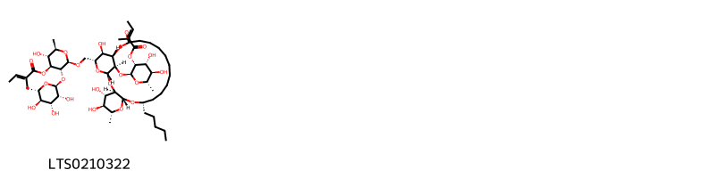{ width=100% }
    <figcaption>Hình ảnh cấu trúc hóa học của 1 hoạt chất thuộc nhóm Saccharolipids gồm ['(2r,3r,4s,5r,6r)-2-{[(1s,3r,4s,5s,6r,8r,10s,22s,23r,24r,26r)-26-{[(2s,3r,4r,5r,6s)-4,5-dihydroxy-6-methyl-3-{[(2e)-2-methylbut-2-enoyl]oxy}oxan-2-yl]oxy}-4,5,23-trihydroxy-6-methyl-20-oxo-10-pentyl-2,7,9,21,25-pentaoxatricyclo[20.3.1.0³,⁸]hexacosan-24-yl]methoxy}-5-hydroxy-6-methyl-3-{[(2s,3r,4r,5r,6s)-3,4,5-trihydroxy-6-methyloxan-2-yl]oxy}oxan-4-yl (2e)-2-methylbut-2-enoate (LTS0210322)'].</figcaption>
</figure>
#### Nhóm Tropane alkaloids
<figure markdown="span">
    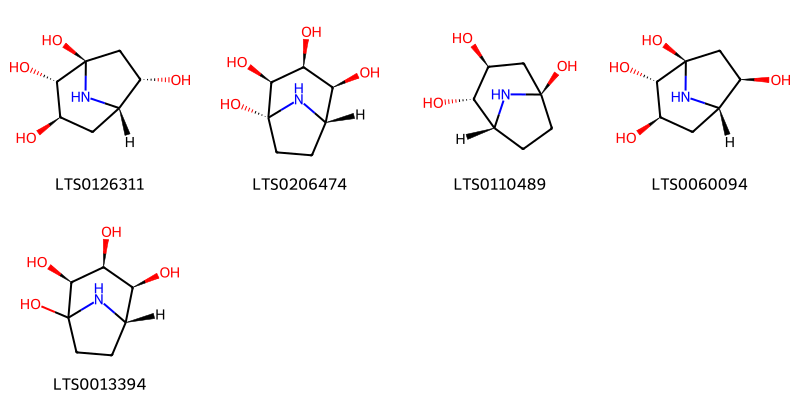{ width=100% }
    <figcaption>Hình ảnh cấu trúc hóa học của 5 hoạt chất thuộc nhóm Tropane alkaloids gồm ['(1r,2s,3r,5s,6s)-8-azabicyclo[3.2.1]octane-1,2,3,6-tetrol (LTS0126311)', '(1r,2s,3s,4s,5s)-8-azabicyclo[3.2.1]octane-1,2,3,4-tetrol (LTS0206474)', '(1r,3s,4s,5r)-8-azabicyclo[3.2.1]octane-1,3,4-triol (LTS0110489)', '(1r,2s,3r,5s,6r)-8-azabicyclo[3.2.1]octane-1,2,3,6-tetrol (LTS0060094)', '(2s,3s,4s,5s)-8-azabicyclo[3.2.1]octane-1,2,3,4-tetrol (LTS0013394)'].</figcaption>
</figure>

---

### Dược dân tộc học

Danh sách các quốc gia có sử dụng *Ipomoea alba* trong điều trị các bệnh. 

| Country   | Disease             | Bệnh                                                                                                                                                                                                |
|:----------|:--------------------|:----------------------------------------------------------------------------------------------------------------------------------------------------------------------------------------------------|
| Samoa     | Collyrium, Laxative | MYMEMORY WARNING: YOU USED ALL AVAILABLE FREE TRANSLATIONS FOR TODAY. NEXT AVAILABLE IN  16 HOURS 14 MINUTES 37 SECONDS VISIT HTTPS://MYMEMORY.TRANSLATED.NET/DOC/USAGELIMITS.PHP TO TRANSLATE MORE |

---

---
## Ipomoea aquatica
### Thông tin về thực vật

!!! info "Phân loại thực vật của *Ipomoea aquatica* từ GIBF:"
    - **Kingdom:** Plantae
    - **Phylum:** Tracheophyta
    - **Order:** Solanales
    - **Family:** Convolvulaceae
    - **Genus:** Ipomoea
    - **Species:** *Ipomoea aquatica*

 

| Label (VI)   | Label (EN)   | Scientific Name   | Descriptions (VI)   | Descriptions (EN)   | Also Known As (VI)            | Also Known As (EN)                                                                                                                                                                         |
|:-------------|:-------------|:------------------|:--------------------|:--------------------|:------------------------------|:-------------------------------------------------------------------------------------------------------------------------------------------------------------------------------------------|
| N/A          | N/A          | Ipomoea aquatica  | loài thực vật       | species of plant    | ['Muống', 'Ipomoea aquatica'] | ['Chinese convolvulus', 'Chinese spinach', 'Chinese watercress', 'Ipomoea aquatica', 'Kangkong', 'Ong Choy', 'River spinach', 'Swamp cabbage', 'Water convolvulus', 'Water morning glory'] |

#### Phân bố trên thế giới

**Từ CSDL GIBF** Viet Nam, Thailand, Philippines, Trinidad and Tobago, Singapore, United Arab Emirates, Australia, Indonesia, Sierra Leone, Colombia, Sri Lanka, Malaysia, India, Réunion, Liberia, Nigeria, Cambodia, Uganda, Myanmar, Qatar, China, Benin, Chinese Taipei, Hong Kong, Brunei Darussalam, Tanzania, United Republic of, Mozambique, Macao, Costa Rica, United States of America

#### Phân bố tại Việt Nam

**Từ CSDL GIBF**: Quảng Nam, An Giang, Hòa Bình, Hồ Chí Minh city, Nam Định, Bến Tre, Long An

---
### Thành phần hóa học
        
- Theo cơ sở dữ liệu lotus: Từ loài *Ipomoea aquatica* đã phân lập và xác định được 24 hoạt chất thuộc về các nhóm Organooxygen compounds, Coumarins and derivatives, Tropane alkaloids, Prenol lipids, Pyrrolidines, Phenols, Cinnamic acids and derivatives. 

|    | chemicalTaxonomyClassyfireClass   |   smiles_count |
|---:|:----------------------------------|---------------:|
|  0 | Cinnamic acids and derivatives    |              1 |
|  1 | Coumarins and derivatives         |              2 |
|  2 | Organooxygen compounds            |              7 |
|  3 | Phenols                           |              1 |
|  4 | Prenol lipids                     |              5 |
|  5 | Pyrrolidines                      |              3 |
|  6 | Tropane alkaloids                 |              5 |

#### Nhóm Cinnamic acids and derivatives
<figure markdown="span">
    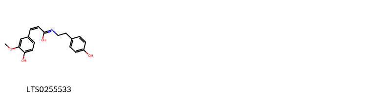{ width=100% }
    <figcaption>Hình ảnh cấu trúc hóa học của 1 hoạt chất thuộc nhóm Cinnamic acids and derivatives gồm ['(2z)-3-(4-hydroxy-3-methoxyphenyl)-n-[2-(4-hydroxyphenyl)ethyl]prop-2-enimidic acid (LTS0255533)'].</figcaption>
</figure>
#### Nhóm Coumarins and derivatives
<figure markdown="span">
    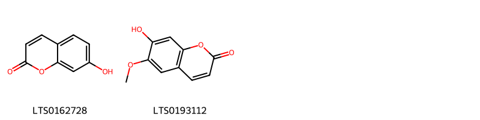{ width=100% }
    <figcaption>Hình ảnh cấu trúc hóa học của 2 hoạt chất thuộc nhóm Coumarins and derivatives gồm ['umbelliferone (LTS0162728)', 'scopoletin (LTS0193112)'].</figcaption>
</figure>
#### Nhóm Organooxygen compounds
<figure markdown="span">
    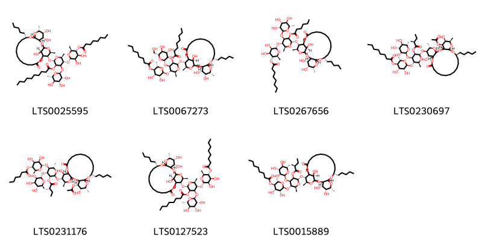{ width=100% }
    <figcaption>Hình ảnh cấu trúc hóa học của 7 hoạt chất thuộc nhóm Organooxygen compounds gồm ['(2s,3r,4r,5s,6s)-5-{[(2s,3r,4s,5r,6s)-3,4-dihydroxy-6-methyl-5-(octanoyloxy)oxan-2-yl]oxy}-6-methyl-2-{[(1s,3r,4s,5r,6r,8r,10s,22s,23s,24s,26r)-4,5,26-trihydroxy-6,24-dimethyl-20-oxo-10-pentyl-2,7,9,21,25-pentaoxatricyclo[20.3.1.0³,⁸]hexacosan-23-yl]oxy}-4-{[(2s,3r,4r,5r,6s)-3,4,5-trihydroxy-6-methyloxan-2-yl]oxy}oxan-3-yl decanoate (LTS0025595)', '(2s,3r,4s,5r,6s)-4,5-dihydroxy-2-methyl-6-{[(2s,3s,4r,5r,6s)-2-methyl-5-(octanoyloxy)-6-{[(1s,3r,4s,5r,6r,8r,10s,22s,23s,24s,26r)-4,5,26-trihydroxy-6,24-dimethyl-20-oxo-10-pentyl-2,7,9,21,25-pentaoxatricyclo[20.3.1.0³,⁸]hexacosan-23-yl]oxy}-4-{[(2s,3r,4s,5s,6r)-3,4,5-trihydroxy-6-(hydroxymethyl)oxan-2-yl]oxy}oxan-3-yl]oxy}oxan-3-yl octanoate (LTS0067273)', '(2s,3r,4s,5r,6s)-6-{[(2s,3s,4r,5r,6s)-5-(hexanoyloxy)-2-methyl-6-{[(1s,3r,4s,5r,6r,8r,10s,22s,23s,24s,26r)-4,5,26-trihydroxy-6,24-dimethyl-20-oxo-10-pentyl-2,7,9,21,25-pentaoxatricyclo[20.3.1.0³,⁸]hexacosan-23-yl]oxy}-4-{[(2s,3r,4r,5r,6s)-3,4,5-trihydroxy-6-methyloxan-2-yl]oxy}oxan-3-yl]oxy}-4,5-dihydroxy-2-methyloxan-3-yl octanoate (LTS0267656)', '(2s,3r,4s,5r,6s)-6-{[(2s,3s,4r,5r,6s)-6-{[(1r,3s,5s,6r,7r,8r,20s,22r,24r,25s,26s)-26-(acetyloxy)-7,25-dihydroxy-5,24-dimethyl-10-oxo-20-pentyl-2,4,9,21,23-pentaoxatricyclo[20.4.0.0³,⁸]hexacosan-6-yl]oxy}-2-methyl-5-{[(2s)-2-methylbutanoyl]oxy}-4-{[(2s,3r,4r,5r,6s)-3,4,5-trihydroxy-6-methyloxan-2-yl]oxy}oxan-3-yl]oxy}-4,5-dihydroxy-2-methyloxan-3-yl octanoate (LTS0230697)', '(2s,3r,4s,5r,6s)-6-{[(2s,3s,4r,5r,6s)-6-{[(1r,3s,5s,6r,7r,8r,20s,22r,24r,25s,26s)-26-(acetyloxy)-7,25-dihydroxy-5,24-dimethyl-10-oxo-20-pentyl-2,4,9,21,23-pentaoxatricyclo[20.4.0.0³,⁸]hexacosan-6-yl]oxy}-2-methyl-5-{[(2s)-2-methylbutanoyl]oxy}-4-{[(2s,3r,4r,5r,6s)-3,4,5-trihydroxy-6-methyloxan-2-yl]oxy}oxan-3-yl]oxy}-4,5-dihydroxy-2-methyloxan-3-yl hexanoate (LTS0231176)', '(2s,3r,4s,5r,6s)-4,5-dihydroxy-2-methyl-6-{[(2s,3s,4r,5r,6s)-2-methyl-5-(octanoyloxy)-6-{[(1s,3r,4s,5r,6r,8r,10s,22s,23s,24s,26r)-4,5,26-trihydroxy-6,24-dimethyl-20-oxo-10-pentyl-2,7,9,21,25-pentaoxatricyclo[20.3.1.0³,⁸]hexacosan-23-yl]oxy}-4-{[(2s,3r,4r,5r,6s)-3,4,5-trihydroxy-6-methyloxan-2-yl]oxy}oxan-3-yl]oxy}oxan-3-yl octanoate (LTS0127523)', '(2s,3r,4s,5r,6s)-4,5-dihydroxy-2-methyl-6-{[(2s,3s,4r,5r,6s)-2-methyl-5-{[(2s)-2-methylbutanoyl]oxy}-6-{[(1s,3r,4s,5r,6r,8r,10s,22s,23s,24s,26r)-4,5,26-trihydroxy-6,24-dimethyl-20-oxo-10-pentyl-2,7,9,21,25-pentaoxatricyclo[20.3.1.0³,⁸]hexacosan-23-yl]oxy}-4-{[(2s,3r,4r,5r,6s)-3,4,5-trihydroxy-6-methyloxan-2-yl]oxy}oxan-3-yl]oxy}oxan-3-yl octanoate (LTS0015889)'].</figcaption>
</figure>
#### Nhóm Phenols
<figure markdown="span">
    { width=100% }
    <figcaption>Hình ảnh cấu trúc hóa học của 1 hoạt chất thuộc nhóm Phenols gồm ['(2e)-3-(4-hydroxy-3-methoxyphenyl)-n-[2-(4-hydroxyphenyl)ethyl]prop-2-enimidic acid (LTS0187051)'].</figcaption>
</figure>
#### Nhóm Prenol lipids
<figure markdown="span">
    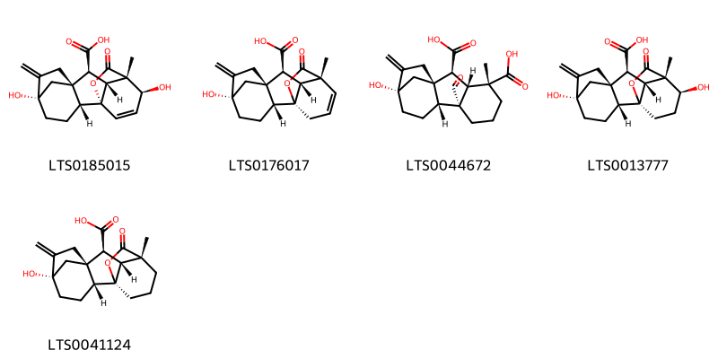{ width=100% }
    <figcaption>Hình ảnh cấu trúc hóa học của 5 hoạt chất thuộc nhóm Prenol lipids gồm ['gibberellin a3 (LTS0185015)', 'gibberellin a5 (LTS0176017)', 'gibberellin a19 (LTS0044672)', 'gibberellin a1 (LTS0013777)', 'gibberellin a20 (LTS0041124)'].</figcaption>
</figure>
#### Nhóm Pyrrolidines
<figure markdown="span">
    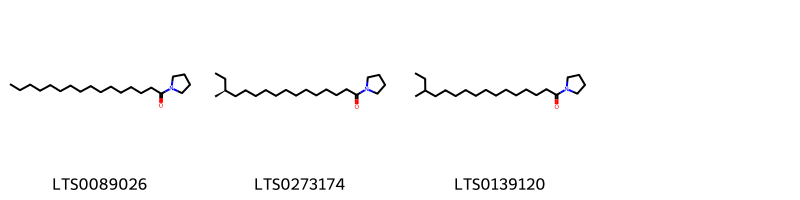{ width=100% }
    <figcaption>Hình ảnh cấu trúc hóa học của 3 hoạt chất thuộc nhóm Pyrrolidines gồm ['1-(pyrrolidin-1-yl)hexadecan-1-one (LTS0089026)', '(14s)-14-methyl-1-(pyrrolidin-1-yl)hexadecan-1-one (LTS0273174)', '14-methyl-1-(pyrrolidin-1-yl)hexadecan-1-one (LTS0139120)'].</figcaption>
</figure>
#### Nhóm Tropane alkaloids
<figure markdown="span">
    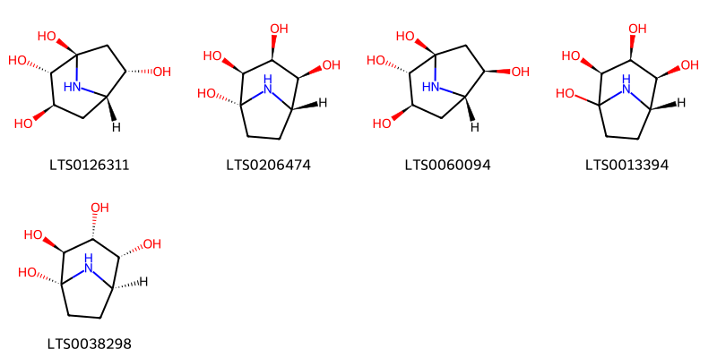{ width=100% }
    <figcaption>Hình ảnh cấu trúc hóa học của 5 hoạt chất thuộc nhóm Tropane alkaloids gồm ['(1r,2s,3r,5s,6s)-8-azabicyclo[3.2.1]octane-1,2,3,6-tetrol (LTS0126311)', '(1r,2s,3s,4s,5s)-8-azabicyclo[3.2.1]octane-1,2,3,4-tetrol (LTS0206474)', '(1r,2s,3r,5s,6r)-8-azabicyclo[3.2.1]octane-1,2,3,6-tetrol (LTS0060094)', '(2s,3s,4s,5s)-8-azabicyclo[3.2.1]octane-1,2,3,4-tetrol (LTS0013394)', '(1r,2s,3r,4r,5r)-8-azabicyclo[3.2.1]octane-1,2,3,4-tetrol (LTS0038298)'].</figcaption>
</figure>

---

### Dược dân tộc học

Danh sách các quốc gia có sử dụng *Ipomoea aquatica* trong điều trị các bệnh. 

| Country   | Disease                                   | Bệnh                                                                                                                                                                                                |
|:----------|:------------------------------------------|:----------------------------------------------------------------------------------------------------------------------------------------------------------------------------------------------------|
| Burma     | Emetic                                    | MYMEMORY WARNING: YOU USED ALL AVAILABLE FREE TRANSLATIONS FOR TODAY. NEXT AVAILABLE IN  16 HOURS 14 MINUTES 13 SECONDS VISIT HTTPS://MYMEMORY.TRANSLATED.NET/DOC/USAGELIMITS.PHP TO TRANSLATE MORE |
| China     | Antidote                                  | MYMEMORY WARNING: YOU USED ALL AVAILABLE FREE TRANSLATIONS FOR TODAY. NEXT AVAILABLE IN  16 HOURS 14 MINUTES 06 SECONDS VISIT HTTPS://MYMEMORY.TRANSLATED.NET/DOC/USAGELIMITS.PHP TO TRANSLATE MORE |
| India     | Purgative, Purgative, Refrigerant, Emetic | MYMEMORY WARNING: YOU USED ALL AVAILABLE FREE TRANSLATIONS FOR TODAY. NEXT AVAILABLE IN  16 HOURS 14 MINUTES 01 SECONDS VISIT HTTPS://MYMEMORY.TRANSLATED.NET/DOC/USAGELIMITS.PHP TO TRANSLATE MORE |

---

---
## Ipomoea arborescens
### Thông tin về thực vật

!!! info "Phân loại thực vật của *Ipomoea arborescens* từ GIBF:"
    - **Kingdom:** Plantae
    - **Phylum:** Tracheophyta
    - **Order:** Solanales
    - **Family:** Convolvulaceae
    - **Genus:** Ipomoea
    - **Species:** *Ipomoea arborescens*

 

| Label (VI)   | Label (EN)   | Scientific Name     | Descriptions (VI)   | Descriptions (EN)   | Also Known As (VI)   | Also Known As (EN)   |
|:-------------|:-------------|:--------------------|:--------------------|:--------------------|:---------------------|:---------------------|
| N/A          | N/A          | Ipomoea arborescens | loài thực vật       | species of plant    | ['']                 | ['']                 |

#### Phân bố trên thế giới

**Từ CSDL GIBF** South Africa, Mexico

#### Phân bố tại Việt Nam

**Từ CSDL GIBF**: Không có ghi nhận ở Việt Nam

---
### Thành phần hóa học
        
- Theo cơ sở dữ liệu lotus: Từ loài *Ipomoea arborescens* đã phân lập và xác định được 12 hoạt chất thuộc về các nhóm Organooxygen compounds. 

|    | chemicalTaxonomyClassyfireClass   |   smiles_count |
|---:|:----------------------------------|---------------:|
|  0 | Organooxygen compounds            |             12 |

#### Nhóm Organooxygen compounds
<figure markdown="span">
    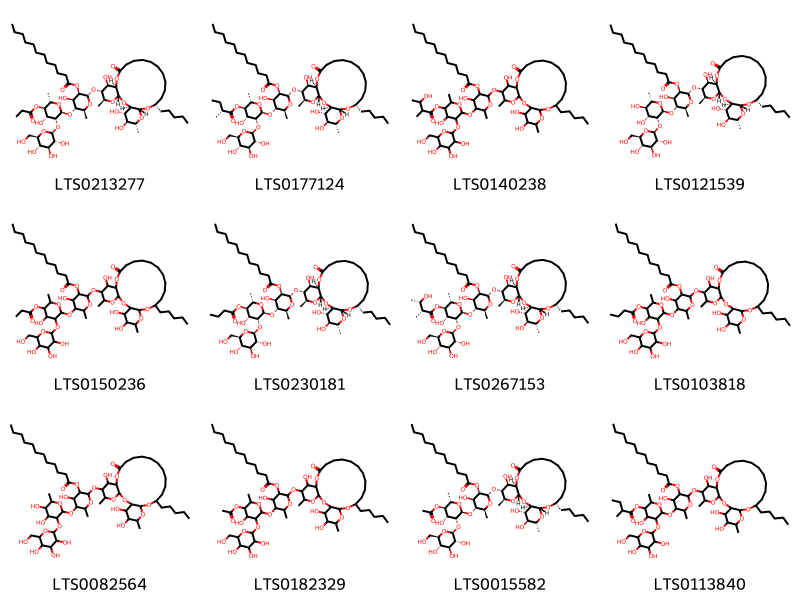{ width=100% }
    <figcaption>Hình ảnh cấu trúc hóa học của 12 hoạt chất thuộc nhóm Organooxygen compounds gồm ['(2s,3r,4r,5r,6s)-4-hydroxy-5-{[(2s,3r,4r,5r,6s)-4-hydroxy-6-methyl-5-(propanoyloxy)-3-{[(2s,3r,4s,5s,6r)-3,4,5-trihydroxy-6-(hydroxymethyl)oxan-2-yl]oxy}oxan-2-yl]oxy}-6-methyl-2-{[(1r,3s,5s,6r,7r,8r,20s,22r,24r,25s,26s)-7,25,26-trihydroxy-5,24-dimethyl-10-oxo-20-pentyl-2,4,9,21,23-pentaoxatricyclo[20.4.0.0³,⁸]hexacosan-6-yl]oxy}oxan-3-yl dodecanoate (LTS0213277)', '(2s,3r,4r,5r,6s)-4-hydroxy-5-{[(2s,3r,4r,5r,6s)-4-hydroxy-6-methyl-5-{[(2r)-2-methylbutanoyl]oxy}-3-{[(2s,3r,4s,5s,6r)-3,4,5-trihydroxy-6-(hydroxymethyl)oxan-2-yl]oxy}oxan-2-yl]oxy}-6-methyl-2-{[(1r,3s,5s,6r,7r,8r,20s,22r,24r,25s,26s)-7,25,26-trihydroxy-5,24-dimethyl-10-oxo-20-pentyl-2,4,9,21,23-pentaoxatricyclo[20.4.0.0³,⁸]hexacosan-6-yl]oxy}oxan-3-yl dodecanoate (LTS0177124)', '4-hydroxy-5-({4-hydroxy-5-[(3-hydroxy-2-methylbutanoyl)oxy]-6-methyl-3-{[3,4,5-trihydroxy-6-(hydroxymethyl)oxan-2-yl]oxy}oxan-2-yl}oxy)-6-methyl-2-({7,25,26-trihydroxy-5,24-dimethyl-10-oxo-20-pentyl-2,4,9,21,23-pentaoxatricyclo[20.4.0.0³,⁸]hexacosan-6-yl}oxy)oxan-3-yl dodecanoate (LTS0140238)', '(2s,3r,4r,5r,6s)-5-{[(2s,3r,4r,5r,6s)-4,5-dihydroxy-6-methyl-3-{[(2s,3r,4s,5s,6r)-3,4,5-trihydroxy-6-(hydroxymethyl)oxan-2-yl]oxy}oxan-2-yl]oxy}-4-hydroxy-6-methyl-2-{[(1r,3s,5s,6r,7r,8r,20s,22r,24r,25s,26s)-7,25,26-trihydroxy-5,24-dimethyl-10-oxo-20-pentyl-2,4,9,21,23-pentaoxatricyclo[20.4.0.0³,⁸]hexacosan-6-yl]oxy}oxan-3-yl dodecanoate (LTS0121539)', '4-hydroxy-5-{[4-hydroxy-6-methyl-5-(propanoyloxy)-3-{[3,4,5-trihydroxy-6-(hydroxymethyl)oxan-2-yl]oxy}oxan-2-yl]oxy}-6-methyl-2-({7,25,26-trihydroxy-5,24-dimethyl-10-oxo-20-pentyl-2,4,9,21,23-pentaoxatricyclo[20.4.0.0³,⁸]hexacosan-6-yl}oxy)oxan-3-yl dodecanoate (LTS0150236)', '(2s,3r,4r,5r,6s)-5-{[(2s,3r,4r,5r,6s)-5-(butanoyloxy)-4-hydroxy-6-methyl-3-{[(2s,3r,4s,5s,6r)-3,4,5-trihydroxy-6-(hydroxymethyl)oxan-2-yl]oxy}oxan-2-yl]oxy}-4-hydroxy-6-methyl-2-{[(1r,3s,5s,6r,7r,8r,20s,22r,24r,25s,26s)-7,25,26-trihydroxy-5,24-dimethyl-10-oxo-20-pentyl-2,4,9,21,23-pentaoxatricyclo[20.4.0.0³,⁸]hexacosan-6-yl]oxy}oxan-3-yl dodecanoate (LTS0230181)', '(2s,3r,4r,5r,6s)-4-hydroxy-5-{[(2s,3r,4r,5r,6s)-4-hydroxy-5-{[(2r,3s)-3-hydroxy-2-methylbutanoyl]oxy}-6-methyl-3-{[(2s,3r,4s,5s,6r)-3,4,5-trihydroxy-6-(hydroxymethyl)oxan-2-yl]oxy}oxan-2-yl]oxy}-6-methyl-2-{[(1r,3s,5s,6r,7r,8r,20s,22r,24r,25s,26s)-7,25,26-trihydroxy-5,24-dimethyl-10-oxo-20-pentyl-2,4,9,21,23-pentaoxatricyclo[20.4.0.0³,⁸]hexacosan-6-yl]oxy}oxan-3-yl dodecanoate (LTS0267153)', '5-{[5-(butanoyloxy)-4-hydroxy-6-methyl-3-{[3,4,5-trihydroxy-6-(hydroxymethyl)oxan-2-yl]oxy}oxan-2-yl]oxy}-4-hydroxy-6-methyl-2-({7,25,26-trihydroxy-5,24-dimethyl-10-oxo-20-pentyl-2,4,9,21,23-pentaoxatricyclo[20.4.0.0³,⁸]hexacosan-6-yl}oxy)oxan-3-yl dodecanoate (LTS0103818)', '5-[(4,5-dihydroxy-6-methyl-3-{[3,4,5-trihydroxy-6-(hydroxymethyl)oxan-2-yl]oxy}oxan-2-yl)oxy]-4-hydroxy-6-methyl-2-({7,25,26-trihydroxy-5,24-dimethyl-10-oxo-20-pentyl-2,4,9,21,23-pentaoxatricyclo[20.4.0.0³,⁸]hexacosan-6-yl}oxy)oxan-3-yl dodecanoate (LTS0082564)', '5-{[5-(acetyloxy)-4-hydroxy-6-methyl-3-{[3,4,5-trihydroxy-6-(hydroxymethyl)oxan-2-yl]oxy}oxan-2-yl]oxy}-4-hydroxy-6-methyl-2-({7,25,26-trihydroxy-5,24-dimethyl-10-oxo-20-pentyl-2,4,9,21,23-pentaoxatricyclo[20.4.0.0³,⁸]hexacosan-6-yl}oxy)oxan-3-yl dodecanoate (LTS0182329)', '(2s,3r,4r,5r,6s)-5-{[(2s,3r,4r,5r,6s)-5-(acetyloxy)-4-hydroxy-6-methyl-3-{[(2s,3r,4s,5s,6r)-3,4,5-trihydroxy-6-(hydroxymethyl)oxan-2-yl]oxy}oxan-2-yl]oxy}-4-hydroxy-6-methyl-2-{[(1r,3s,5s,6r,7r,8r,20s,22r,24r,25s,26s)-7,25,26-trihydroxy-5,24-dimethyl-10-oxo-20-pentyl-2,4,9,21,23-pentaoxatricyclo[20.4.0.0³,⁸]hexacosan-6-yl]oxy}oxan-3-yl dodecanoate (LTS0015582)', '4-hydroxy-5-({4-hydroxy-6-methyl-5-[(2-methylbutanoyl)oxy]-3-{[3,4,5-trihydroxy-6-(hydroxymethyl)oxan-2-yl]oxy}oxan-2-yl}oxy)-6-methyl-2-({7,25,26-trihydroxy-5,24-dimethyl-10-oxo-20-pentyl-2,4,9,21,23-pentaoxatricyclo[20.4.0.0³,⁸]hexacosan-6-yl}oxy)oxan-3-yl dodecanoate (LTS0113840)'].</figcaption>
</figure>

---

### Dược dân tộc học

Danh sách các quốc gia có sử dụng *Ipomoea arborescens* trong điều trị các bệnh. 

| Country   | Disease              | Bệnh                                                                                                                                                                                                |
|:----------|:---------------------|:----------------------------------------------------------------------------------------------------------------------------------------------------------------------------------------------------|
| Mexico    | Hallucinogen, Poison | MYMEMORY WARNING: YOU USED ALL AVAILABLE FREE TRANSLATIONS FOR TODAY. NEXT AVAILABLE IN  16 HOURS 13 MINUTES 32 SECONDS VISIT HTTPS://MYMEMORY.TRANSLATED.NET/DOC/USAGELIMITS.PHP TO TRANSLATE MORE |

---

---
## Ipomoea batatas
### Thông tin về thực vật

!!! info "Phân loại thực vật của *Ipomoea batatas* từ GIBF:"
    - **Kingdom:** Plantae
    - **Phylum:** Tracheophyta
    - **Order:** Solanales
    - **Family:** Convolvulaceae
    - **Genus:** Ipomoea
    - **Species:** *Ipomoea batatas*

 

| Label (VI)   | Label (EN)   | Scientific Name   | Descriptions (VI)   | Descriptions (EN)   | Also Known As (VI)   | Also Known As (EN)   |
|:-------------|:-------------|:------------------|:--------------------|:--------------------|:---------------------|:---------------------|
| N/A          | N/A          | Ipomoea batatas   | loài thực vật       | species of plant    | ['Ipomoea batatas']  | ['Ipomoea batatas']  |

#### Phân bố trên thế giới

**Từ CSDL GIBF** Honduras, El Salvador, Spain, Philippines, French Guiana, Singapore, United Arab Emirates, Australia, Korea, Republic of, Indonesia, Haiti, Guatemala, Colombia, Sweden, Malaysia, Puerto Rico, India, Canada, Nigeria, Bahamas, Cuba, Iraq, Guam, Japan, Panama, Peru, Ethiopia, Montserrat, Mexico, China, Benin, Chinese Taipei, Hong Kong, Iran (Islamic Republic of), Argentina, South Africa, Portugal, New Zealand, Bolivia (Plurinational State of), Costa Rica, Ecuador, United States of America

#### Phân bố tại Việt Nam

**Từ CSDL GIBF**: Không có ghi nhận ở Việt Nam

---
### Thành phần hóa học
        
- Theo cơ sở dữ liệu lotus: Từ loài *Ipomoea batatas* đã phân lập và xác định được 185 hoạt chất thuộc về các nhóm Furanoid lignans, Tropane alkaloids, Dibenzylbutane lignans, Carboxylic acids and derivatives, Saccharolipids, Hydroxy acids and derivatives, Imidazopyrimidines, Tannins, Cinnamic acids and derivatives, Organooxygen compounds, Coumarins and derivatives, Fatty Acyls, Flavonoids, Indoles and derivatives, Prenol lipids, Glycerolipids, Purine nucleosides, Heteroaromatic compounds, Steroids and steroid derivatives. 

|    | chemicalTaxonomyClassyfireClass   |   smiles_count |
|---:|:----------------------------------|---------------:|
|  0 | Carboxylic acids and derivatives  |             14 |
|  1 | Cinnamic acids and derivatives    |              6 |
|  2 | Coumarins and derivatives         |              1 |
|  3 | Dibenzylbutane lignans            |              2 |
|  4 | Fatty Acyls                       |              1 |
|  5 | Flavonoids                        |             11 |
|  6 | Furanoid lignans                  |              1 |
|  7 | Glycerolipids                     |             38 |
|  8 | Heteroaromatic compounds          |              2 |
|  9 | Hydroxy acids and derivatives     |              1 |
| 10 | Imidazopyrimidines                |              2 |
| 11 | Indoles and derivatives           |              2 |
| 12 | Organooxygen compounds            |             49 |
| 13 | Prenol lipids                     |             35 |
| 14 | Purine nucleosides                |              5 |
| 15 | Saccharolipids                    |              4 |
| 16 | Steroids and steroid derivatives  |              8 |
| 17 | Tannins                           |              1 |
| 18 | Tropane alkaloids                 |              2 |

#### Nhóm Carboxylic acids and derivatives
<figure markdown="span">
    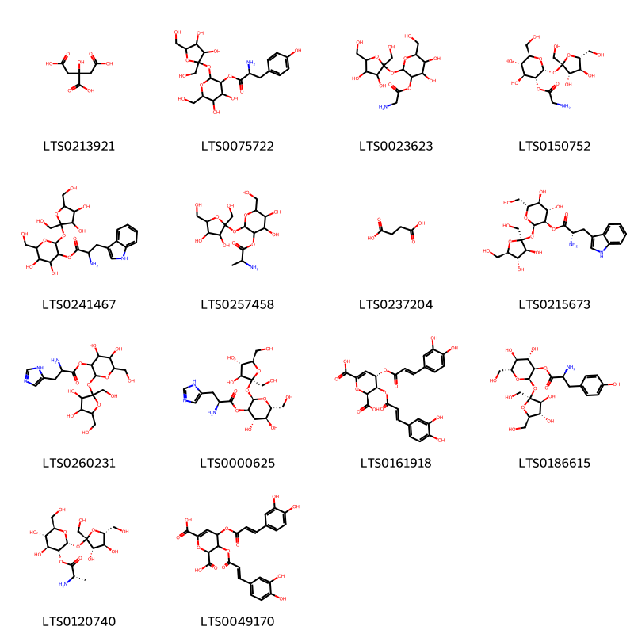{ width=100% }
    <figcaption>Hình ảnh cấu trúc hóa học của 14 hoạt chất thuộc nhóm Carboxylic acids and derivatives gồm ['citric acid (LTS0213921)', '2-{[3,4-dihydroxy-2,5-bis(hydroxymethyl)oxolan-2-yl]oxy}-4,5-dihydroxy-6-(hydroxymethyl)oxan-3-yl 2-amino-3-(4-hydroxyphenyl)propanoate (LTS0075722)', '2-{[3,4-dihydroxy-2,5-bis(hydroxymethyl)oxolan-2-yl]oxy}-4,5-dihydroxy-6-(hydroxymethyl)oxan-3-yl 2-aminoacetate (LTS0023623)', '(2r,3r,4s,5s,6r)-2-{[(2s,3s,4s,5r)-3,4-dihydroxy-2,5-bis(hydroxymethyl)oxolan-2-yl]oxy}-4,5-dihydroxy-6-(hydroxymethyl)oxan-3-yl 2-aminoacetate (LTS0150752)', '2-{[3,4-dihydroxy-2,5-bis(hydroxymethyl)oxolan-2-yl]oxy}-4,5-dihydroxy-6-(hydroxymethyl)oxan-3-yl 2-amino-3-(1h-indol-3-yl)propanoate (LTS0241467)', '2-{[3,4-dihydroxy-2,5-bis(hydroxymethyl)oxolan-2-yl]oxy}-4,5-dihydroxy-6-(hydroxymethyl)oxan-3-yl 2-aminopropanoate (LTS0257458)', 'succinic acid (LTS0237204)', '(2r,3r,4s,5s,6r)-2-{[(2s,3s,4s,5r)-3,4-dihydroxy-2,5-bis(hydroxymethyl)oxolan-2-yl]oxy}-4,5-dihydroxy-6-(hydroxymethyl)oxan-3-yl (2s)-2-amino-3-(1h-indol-3-yl)propanoate (LTS0215673)', '2-{[3,4-dihydroxy-2,5-bis(hydroxymethyl)oxolan-2-yl]oxy}-4,5-dihydroxy-6-(hydroxymethyl)oxan-3-yl 2-amino-3-(3h-imidazol-4-yl)propanoate (LTS0260231)', '(2r,3r,4s,5s,6r)-2-{[(2s,3s,4s,5r)-3,4-dihydroxy-2,5-bis(hydroxymethyl)oxolan-2-yl]oxy}-4,5-dihydroxy-6-(hydroxymethyl)oxan-3-yl (2s)-2-amino-3-(3h-imidazol-4-yl)propanoate (LTS0000625)', '(2s,3r,4s)-3,4-bis({[(2e)-3-(3,4-dihydroxyphenyl)prop-2-enoyl]oxy})-3,4-dihydro-2h-pyran-2,6-dicarboxylic acid (LTS0161918)', '(2r,3r,4s,5s,6r)-2-{[(2s,3s,4s,5r)-3,4-dihydroxy-2,5-bis(hydroxymethyl)oxolan-2-yl]oxy}-4,5-dihydroxy-6-(hydroxymethyl)oxan-3-yl (2s)-2-amino-3-(4-hydroxyphenyl)propanoate (LTS0186615)', '(2r,3r,4s,5s,6r)-2-{[(2s,3s,4s,5r)-3,4-dihydroxy-2,5-bis(hydroxymethyl)oxolan-2-yl]oxy}-4,5-dihydroxy-6-(hydroxymethyl)oxan-3-yl (2s)-2-aminopropanoate (LTS0120740)', '3,4-bis({[3-(3,4-dihydroxyphenyl)prop-2-enoyl]oxy})-3,4-dihydro-2h-pyran-2,6-dicarboxylic acid (LTS0049170)'].</figcaption>
</figure>
#### Nhóm Cinnamic acids and derivatives
<figure markdown="span">
    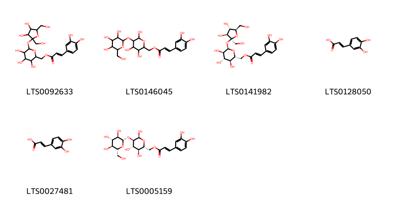{ width=100% }
    <figcaption>Hình ảnh cấu trúc hóa học của 6 hoạt chất thuộc nhóm Cinnamic acids and derivatives gồm ['(6-{[3,4-dihydroxy-2,5-bis(hydroxymethyl)oxolan-2-yl]oxy}-3,4,5-trihydroxyoxan-2-yl)methyl 3-(3,4-dihydroxyphenyl)prop-2-enoate (LTS0092633)', '(3,4,6-trihydroxy-5-{[3,4,5-trihydroxy-6-(hydroxymethyl)oxan-2-yl]oxy}oxan-2-yl)methyl 3-(3,4-dihydroxyphenyl)prop-2-enoate (LTS0146045)', '[(2r,3s,4s,5r,6r)-6-{[(2s,3s,4s,5r)-3,4-dihydroxy-2,5-bis(hydroxymethyl)oxolan-2-yl]oxy}-3,4,5-trihydroxyoxan-2-yl]methyl (2e)-3-(3,4-dihydroxyphenyl)prop-2-enoate (LTS0141982)', '3,4-dihydroxycinnamic acid (LTS0128050)', 'caffeic acid (LTS0027481)', '[(2r,3s,4s,5r,6s)-3,4,6-trihydroxy-5-{[(2s,3r,4s,5s,6r)-3,4,5-trihydroxy-6-(hydroxymethyl)oxan-2-yl]oxy}oxan-2-yl]methyl (2e)-3-(3,4-dihydroxyphenyl)prop-2-enoate (LTS0005159)'].</figcaption>
</figure>
#### Nhóm Coumarins and derivatives
<figure markdown="span">
    { width=100% }
    <figcaption>Hình ảnh cấu trúc hóa học của 1 hoạt chất thuộc nhóm Coumarins and derivatives gồm ['scopoletin (LTS0193112)'].</figcaption>
</figure>
#### Nhóm Dibenzylbutane lignans
<figure markdown="span">
    { width=100% }
    <figcaption>Hình ảnh cấu trúc hóa học của 2 hoạt chất thuộc nhóm Dibenzylbutane lignans gồm ['(2s,3r)-2,3-bis[(4-hydroxy-3-methoxyphenyl)(¹³c)methyl](1-¹³c)butane-1,4-diol (LTS0268699)', 'secoisolariciresinol (LTS0086727)'].</figcaption>
</figure>
#### Nhóm Fatty Acyls
<figure markdown="span">
    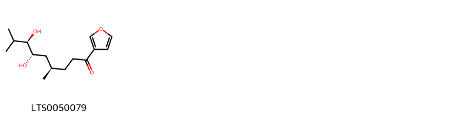{ width=100% }
    <figcaption>Hình ảnh cấu trúc hóa học của 1 hoạt chất thuộc nhóm Fatty Acyls gồm ['(4r,6s,7r)-1-(furan-3-yl)-6,7-dihydroxy-4,8-dimethylnonan-1-one (LTS0050079)'].</figcaption>
</figure>
#### Nhóm Flavonoids
<figure markdown="span">
    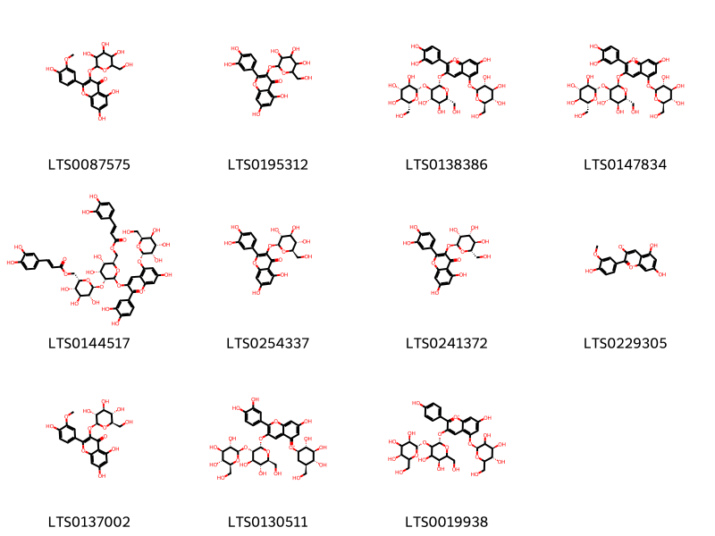{ width=100% }
    <figcaption>Hình ảnh cấu trúc hóa học của 11 hoạt chất thuộc nhóm Flavonoids gồm ['isorhamnetin 3-galactoside (LTS0087575)', '2-(3,4-dihydroxyphenyl)-5,7-dihydroxy-3-{[3,4,5-trihydroxy-6-(hydroxymethyl)oxan-2-yl]oxy}chromen-4-one (LTS0195312)', '3-{[(2s,3r,4s,5s,6r)-4,5-dihydroxy-6-(hydroxymethyl)-3-{[(2s,3r,4s,5s,6r)-3,4,5-trihydroxy-6-(hydroxymethyl)oxan-2-yl]oxy}oxan-2-yl]oxy}-2-(3,4-dihydroxyphenyl)-7-hydroxy-5-{[(2s,3r,4s,5s,6r)-3,4,5-trihydroxy-6-(hydroxymethyl)oxan-2-yl]oxy}-1λ⁴-chromen-1-ylium (LTS0138386)', '3-{[(2r,3r,4s,5s,6r)-4,5-dihydroxy-6-(hydroxymethyl)-3-{[(2s,3r,4s,5s,6r)-3,4,5-trihydroxy-6-(hydroxymethyl)oxan-2-yl]oxy}oxan-2-yl]oxy}-2-(3,4-dihydroxyphenyl)-7-hydroxy-5-{[(2s,3r,4s,5s,6r)-3,4,5-trihydroxy-6-(hydroxymethyl)oxan-2-yl]oxy}-1λ⁴-chromen-1-ylium (LTS0147834)', '2-(3,4-dihydroxyphenyl)-3-{[(2s,3r,4r,5s,6r)-6-({[3-(3,4-dihydroxyphenyl)prop-2-enoyl]oxy}methyl)-3-{[(2s,3r,4s,5s,6s)-6-({[3-(3,4-dihydroxyphenyl)prop-2-enoyl]oxy}methyl)-3,4,5-trihydroxyoxan-2-yl]oxy}-4,5-dihydroxyoxan-2-yl]oxy}-7-hydroxy-5-{[(2s,3s,4s,5s,6s)-3,4,5-trihydroxy-6-(hydroxymethyl)oxan-2-yl]oxy}-1λ⁴-chromen-1-ylium (LTS0144517)', 'isoquercetin (LTS0254337)', '2-(3,4-dihydroxyphenyl)-5,7-dihydroxy-3-{[(2s,3r,4r,5r,6s)-3,4,5-trihydroxy-6-(hydroxymethyl)oxan-2-yl]oxy}chromen-4-one (LTS0241372)', '5,7-dihydroxy-2-(4-hydroxy-3-methoxyphenyl)-1λ⁴-chromen-1-ylium-3-olate (LTS0229305)', 'isorhamnetin 3-o-glucoside (LTS0137002)', '(3-{[(2s,3s,4r,5r,6s)-4,5-dihydroxy-6-(hydroxymethyl)-3-{[(2r,3s,4r,5r,6s)-3,4,5-trihydroxy-6-(hydroxymethyl)oxan-2-yl]oxy}oxan-2-yl]oxy}-2-(3,4-dihydroxyphenyl)-7-hydroxychromen-5-ylidene)[(1r,2r,3s,4r,5r)-2,3,4-trihydroxy-5-(hydroxymethyl)cyclohexyl]oxidanium (LTS0130511)', 'rubrobrassicin (LTS0019938)'].</figcaption>
</figure>
#### Nhóm Furanoid lignans
<figure markdown="span">
    { width=100% }
    <figcaption>Hình ảnh cấu trúc hóa học của 1 hoạt chất thuộc nhóm Furanoid lignans gồm ['matairesinol (LTS0193475)'].</figcaption>
</figure>
#### Nhóm Glycerolipids
<figure markdown="span">
    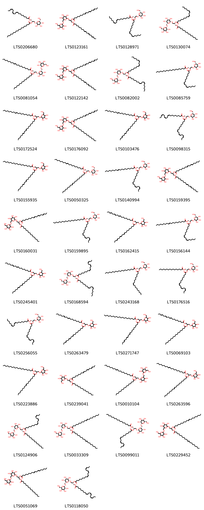{ width=100% }
    <figcaption>Hình ảnh cấu trúc hóa học của 38 hoạt chất thuộc nhóm Glycerolipids gồm ['(2s)-2-(octadecanoyloxy)-3-{[(2r,3r,4s,5r,6r)-3,4,5-trihydroxy-6-(hydroxymethyl)oxan-2-yl]oxy}propyl (9z,12z,15z)-octadeca-9,12,15-trienoate (LTS0206680)', '1-(octadeca-9,12,15-trienoyloxy)-3-{[3,4,5-trihydroxy-6-({[3,4,5-trihydroxy-6-(hydroxymethyl)oxan-2-yl]oxy}methyl)oxan-2-yl]oxy}propan-2-yl octadeca-9,12,15-trienoate (LTS0123161)', '(2s)-1-[(9z,12z)-octadeca-9,12-dienoyloxy]-3-{[(2r,3r,4s,5r,6r)-3,4,5-trihydroxy-6-(hydroxymethyl)oxan-2-yl]oxy}propan-2-yl (9z,12z)-octadeca-9,12-dienoate (LTS0128971)', '(2s)-1-(hexadecanoyloxy)-3-{[(2r,3r,4s,5r,6r)-3,4,5-trihydroxy-6-({[(2s,3r,4s,5r,6r)-3,4,5-trihydroxy-6-(hydroxymethyl)oxan-2-yl]oxy}methyl)oxan-2-yl]oxy}propan-2-yl (9z,12z)-octadeca-9,12-dienoate (LTS0130074)', '(2s)-2-(hexadecanoyloxy)-3-{[(2r,3r,4s,5r,6r)-3,4,5-trihydroxy-6-({[(2s,3r,4s,5r,6r)-3,4,5-trihydroxy-6-(hydroxymethyl)oxan-2-yl]oxy}methyl)oxan-2-yl]oxy}propyl (11e)-icos-11-enoate (LTS0081054)', '1-(octadeca-9,12-dienoyloxy)-3-{[3,4,5-trihydroxy-6-({[3,4,5-trihydroxy-6-(hydroxymethyl)oxan-2-yl]oxy}methyl)oxan-2-yl]oxy}propan-2-yl octadeca-9,12,15-trienoate (LTS0122142)', '(2s)-1-[(9z,12z)-octadeca-9,12-dienoyloxy]-3-{[(2r,3r,4s,5r,6r)-3,4,5-trihydroxy-6-({[(2s,3r,4s,5r,6r)-3,4,5-trihydroxy-6-(hydroxymethyl)oxan-2-yl]oxy}methyl)oxan-2-yl]oxy}propan-2-yl (9z,12z)-octadeca-9,12-dienoate (LTS0082002)', '(2s)-2-[(9z,12z)-octadeca-9,12-dienoyloxy]-3-{[(2r,3r,4s,5r,6r)-3,4,5-trihydroxy-6-(hydroxymethyl)oxan-2-yl]oxy}propyl icosanoate (LTS0085759)', '2-(octadeca-9,12-dienoyloxy)-3-{[3,4,5-trihydroxy-6-(hydroxymethyl)oxan-2-yl]oxy}propyl icos-11-enoate (LTS0172524)', '1-(octadecanoyloxy)-3-{[3,4,5-trihydroxy-6-({[3,4,5-trihydroxy-6-(hydroxymethyl)oxan-2-yl]oxy}methyl)oxan-2-yl]oxy}propan-2-yl octadeca-9,12,15-trienoate (LTS0176092)', '2-(octadeca-9,12,15-trienoyloxy)-3-{[3,4,5-trihydroxy-6-(hydroxymethyl)oxan-2-yl]oxy}propyl icos-11-enoate (LTS0103476)', '(2s)-1-[(9z,12z,15z)-octadeca-9,12,15-trienoyloxy]-3-{[(2r,3r,4s,5r,6r)-3,4,5-trihydroxy-6-(hydroxymethyl)oxan-2-yl]oxy}propan-2-yl (9z,12z,15z)-octadeca-9,12,15-trienoate (LTS0098315)', '2-(octadeca-9,12-dienoyloxy)-3-{[3,4,5-trihydroxy-6-(hydroxymethyl)oxan-2-yl]oxy}propyl icosanoate (LTS0155935)', '(2s)-1-[(11e)-icos-11-enoyloxy]-3-{[(2r,3r,4s,5r,6r)-3,4,5-trihydroxy-6-(hydroxymethyl)oxan-2-yl]oxy}propan-2-yl (11e)-icos-11-enoate (LTS0050325)', '(2s)-2-[(9z,12z,15z)-octadeca-9,12,15-trienoyloxy]-3-{[(2r,3r,4s,5r,6r)-3,4,5-trihydroxy-6-(hydroxymethyl)oxan-2-yl]oxy}propyl (11e)-icos-11-enoate (LTS0140994)', '1-(octadeca-9,12-dienoyloxy)-3-{[3,4,5-trihydroxy-6-({[3,4,5-trihydroxy-6-(hydroxymethyl)oxan-2-yl]oxy}methyl)oxan-2-yl]oxy}propan-2-yl octadeca-9,12-dienoate (LTS0159395)', '1-(hexadecanoyloxy)-3-{[3,4,5-trihydroxy-6-({[3,4,5-trihydroxy-6-(hydroxymethyl)oxan-2-yl]oxy}methyl)oxan-2-yl]oxy}propan-2-yl octadeca-9,12,15-trienoate (LTS0160031)', '(2s)-2-[(9z,12z,15z)-octadeca-9,12,15-trienoyloxy]-3-{[(2r,3r,4s,5r,6r)-3,4,5-trihydroxy-6-(hydroxymethyl)oxan-2-yl]oxy}propyl henicosanoate (LTS0159895)', '1-(octadeca-9,12,15-trienoyloxy)-3-{[3,4,5-trihydroxy-6-(hydroxymethyl)oxan-2-yl]oxy}propan-2-yl octadeca-9,12,15-trienoate (LTS0162415)', '(2s)-2-[(9z,12z)-octadeca-9,12-dienoyloxy]-3-{[(2r,3r,4s,5r,6r)-3,4,5-trihydroxy-6-(hydroxymethyl)oxan-2-yl]oxy}propyl (11e)-icos-11-enoate (LTS0156144)', '1-(octadeca-9,12-dienoyloxy)-3-{[3,4,5-trihydroxy-6-(hydroxymethyl)oxan-2-yl]oxy}propan-2-yl octadeca-9,12-dienoate (LTS0245401)', '(2s)-1-[(9z,12z)-octadeca-9,12-dienoyloxy]-3-{[(2r,3r,4s,5r,6r)-3,4,5-trihydroxy-6-({[(2s,3r,4s,5r,6r)-3,4,5-trihydroxy-6-(hydroxymethyl)oxan-2-yl]oxy}methyl)oxan-2-yl]oxy}propan-2-yl (9z,12z,15z)-octadeca-9,12,15-trienoate (LTS0168594)', '(2s)-2-[(9z)-octadec-9-enoyloxy]-3-{[(2r,3r,4s,5r,6r)-3,4,5-trihydroxy-6-(hydroxymethyl)oxan-2-yl]oxy}propyl icosanoate (LTS0243168)', '(2s)-1-(hexadecanoyloxy)-3-{[(2r,3r,4s,5r,6r)-3,4,5-trihydroxy-6-(hydroxymethyl)oxan-2-yl]oxy}propan-2-yl (9z,12z,15z)-octadeca-9,12,15-trienoate (LTS0176516)', '(2s)-1-[(9z,12z)-octadeca-9,12-dienoyloxy]-3-{[(2r,3r,4s,5r,6r)-3,4,5-trihydroxy-6-(hydroxymethyl)oxan-2-yl]oxy}propan-2-yl (9z,12z,15z)-octadeca-9,12,15-trienoate (LTS0256055)', '1-(octadeca-9,12-dienoyloxy)-3-{[3,4,5-trihydroxy-6-(hydroxymethyl)oxan-2-yl]oxy}propan-2-yl octadeca-9,12,15-trienoate (LTS0263479)', '2-(octadeca-9,12,15-trienoyloxy)-3-{[3,4,5-trihydroxy-6-(hydroxymethyl)oxan-2-yl]oxy}propyl henicosanoate (LTS0271747)', '2-(octadecanoyloxy)-3-{[3,4,5-trihydroxy-6-(hydroxymethyl)oxan-2-yl]oxy}propyl octadeca-9,12,15-trienoate (LTS0069103)', '2-(octadec-9-enoyloxy)-3-{[3,4,5-trihydroxy-6-(hydroxymethyl)oxan-2-yl]oxy}propyl icosanoate (LTS0223886)', '1-(hexadecanoyloxy)-3-{[3,4,5-trihydroxy-6-(hydroxymethyl)oxan-2-yl]oxy}propan-2-yl octadeca-9,12,15-trienoate (LTS0239041)', '2-(hexadecanoyloxy)-3-{[3,4,5-trihydroxy-6-({[3,4,5-trihydroxy-6-(hydroxymethyl)oxan-2-yl]oxy}methyl)oxan-2-yl]oxy}propyl icos-11-enoate (LTS0010104)', '1-(icos-11-enoyloxy)-3-{[3,4,5-trihydroxy-6-(hydroxymethyl)oxan-2-yl]oxy}propan-2-yl icos-11-enoate (LTS0263596)', '(2s)-1-(hexadecanoyloxy)-3-{[(2r,3r,4s,5r,6r)-3,4,5-trihydroxy-6-({[(2s,3r,4s,5r,6r)-3,4,5-trihydroxy-6-(hydroxymethyl)oxan-2-yl]oxy}methyl)oxan-2-yl]oxy}propan-2-yl (9z,12z,15z)-octadeca-9,12,15-trienoate (LTS0124906)', '(2s)-1-[(11e)-icos-11-enoyloxy]-3-{[(2r,3r,4s,5r,6r)-3,4,5-trihydroxy-6-({[(2s,3r,4s,5r,6r)-3,4,5-trihydroxy-6-(hydroxymethyl)oxan-2-yl]oxy}methyl)oxan-2-yl]oxy}propan-2-yl (11e)-icos-11-enoate (LTS0033309)', '(2s)-1-(octadecanoyloxy)-3-{[(2r,3r,4s,5r,6r)-3,4,5-trihydroxy-6-({[(2s,3r,4s,5r,6r)-3,4,5-trihydroxy-6-(hydroxymethyl)oxan-2-yl]oxy}methyl)oxan-2-yl]oxy}propan-2-yl (9z,12z,15z)-octadeca-9,12,15-trienoate (LTS0099011)', '1-(icos-11-enoyloxy)-3-{[3,4,5-trihydroxy-6-({[3,4,5-trihydroxy-6-(hydroxymethyl)oxan-2-yl]oxy}methyl)oxan-2-yl]oxy}propan-2-yl icos-11-enoate (LTS0229452)', '1-(hexadecanoyloxy)-3-{[3,4,5-trihydroxy-6-({[3,4,5-trihydroxy-6-(hydroxymethyl)oxan-2-yl]oxy}methyl)oxan-2-yl]oxy}propan-2-yl octadeca-9,12-dienoate (LTS0051069)', '(2s)-1-[(9z,12z,15z)-octadeca-9,12,15-trienoyloxy]-3-{[(2r,3r,4s,5r,6r)-3,4,5-trihydroxy-6-({[(2s,3r,4s,5r,6r)-3,4,5-trihydroxy-6-(hydroxymethyl)oxan-2-yl]oxy}methyl)oxan-2-yl]oxy}propan-2-yl (9z,12z,15z)-octadeca-9,12,15-trienoate (LTS0118050)'].</figcaption>
</figure>
#### Nhóm Heteroaromatic compounds
<figure markdown="span">
    { width=100% }
    <figcaption>Hình ảnh cấu trúc hóa học của 2 hoạt chất thuộc nhóm Heteroaromatic compounds gồm ['1-[5-(furan-3-yl)-2-methyloxolan-2-yl]-4-methylpentan-2-one (LTS0135493)', '1-[(2s,5s)-5-(furan-3-yl)-2-methyloxolan-2-yl]-4-methylpentan-2-one (LTS0010931)'].</figcaption>
</figure>
#### Nhóm Hydroxy acids and derivatives
<figure markdown="span">
    { width=100% }
    <figcaption>Hình ảnh cấu trúc hóa học của 1 hoạt chất thuộc nhóm Hydroxy acids and derivatives gồm ['malic acid (LTS0216520)'].</figcaption>
</figure>
#### Nhóm Imidazopyrimidines
<figure markdown="span">
    { width=100% }
    <figcaption>Hình ảnh cấu trúc hóa học của 2 hoạt chất thuộc nhóm Imidazopyrimidines gồm ['cis-zeatin (LTS0193609)', 'zeatine (LTS0032706)'].</figcaption>
</figure>
#### Nhóm Indoles and derivatives
<figure markdown="span">
    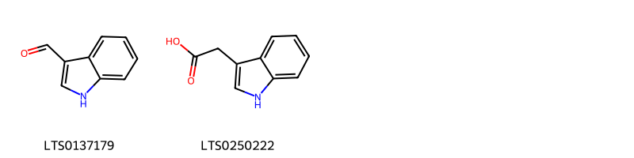{ width=100% }
    <figcaption>Hình ảnh cấu trúc hóa học của 2 hoạt chất thuộc nhóm Indoles and derivatives gồm ['indole-3-carboxaldehyde (LTS0137179)', 'β-indole-3-acetic acid (LTS0250222)'].</figcaption>
</figure>
#### Nhóm Organooxygen compounds
<figure markdown="span">
    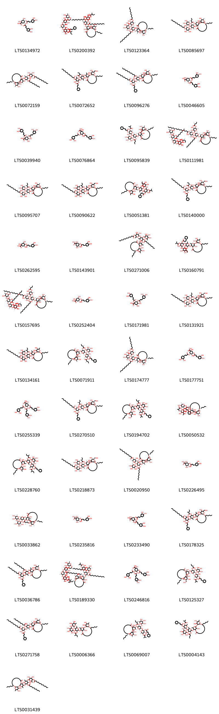{ width=100% }
    <figcaption>Hình ảnh cấu trúc hóa học của 49 hoạt chất thuộc nhóm Organooxygen compounds gồm ['3,4-dicaffeoylquinic acid (LTS0134972)', '(2s,3r,4r,5r,6s)-2-{[(2s,3s,4r,5r,6s)-3-{[(2s,3r,4s,5s,6s)-3,4-dihydroxy-6-methyl-5-[(2-methylbutanoyl)oxy]oxan-2-yl]oxy}-5-(dodecanoyloxy)-2-methyl-6-{[(1r,3s,5s,6r,7r,8r,20s,22r,24r,25r,26s)-7,25,26-trihydroxy-5,24-dimethyl-10-oxo-20-pentyl-2,4,9,21,23-pentaoxatricyclo[20.4.0.0³,⁸]hexacosan-6-yl]oxy}oxan-4-yl]oxy}-4,5-dihydroxy-6-methyloxan-3-yl (11s)-11-{[(2r,3r,4s,5r,6r)-3-{[(2s,3r,4s,5r,6s)-3,4-dihydroxy-5-{[(2s,3r,4s,5s,6s)-3-hydroxy-5-{[(2s,3r,4s,5s,6s)-3-hydroxy-6-methyl-5-[(2-methylbutanoyl)oxy]-4-{[(2e)-3-phenylprop-2-enoyl]oxy}oxan-2-yl]oxy}-6-methyl-4-{[(1r,2r,3r,4s,5r)-2,3,4-trihydroxy-5-methylcyclohexyl]oxy}oxan-2-yl]oxy}-6-methyloxan-2-yl]oxy}-4,5-dihydroxy-6-methyloxan-2-yl]oxy}hexadecanoate (LTS0200392)', '(2r,3s,4s,5s,6s)-5-{[(2s,3r,4r,6s)-5-(decanoyloxy)-3,4-dihydroxy-6-methyloxan-2-yl]oxy}-6-methyl-2-{[(1r,3s,5s,6r,7s,8r,20s,22s,24r,25s,26s)-7,25,26-trihydroxy-5,24-dimethyl-10-oxo-20-pentyl-2,4,9,21,23-pentaoxatricyclo[20.4.0.0³,⁸]hexacosan-6-yl]oxy}-4-{[(2r,3s,4s,5r,6r)-3,4,5-trihydroxy-6-(hydroxymethyl)oxan-2-yl]oxy}oxan-3-yl dodecanoate (LTS0123364)', '(2s,3r,4s,5r,6s)-4,5-dihydroxy-2-methyl-6-{[(2s,3s,4r,5r,6s)-2-methyl-5-{[(2r)-2-methylbutanoyl]oxy}-6-{[(1r,3s,5s,6r,7r,8r,20s,22r,24r,25r,26s)-7,25,26-trihydroxy-5,24-dimethyl-10-oxo-20-pentyl-2,4,9,21,23-pentaoxatricyclo[20.4.0.0³,⁸]hexacosan-6-yl]oxy}-4-{[(2s,3r,4r,5r,6s)-3,4,5-trihydroxy-6-methyloxan-2-yl]oxy}oxan-3-yl]oxy}oxan-3-yl dodecanoate (LTS0085697)', '(2s,3r,4s,5r,6s)-6-{[(2s,3r,4r,5r,6s)-5-(decanoyloxy)-4-hydroxy-2-methyl-6-{[(1r,3s,5s,6r,7r,8r,20s,22r,24r,25r,26s)-7,25,26-trihydroxy-5,24-dimethyl-10-oxo-20-pentyl-2,4,9,21,23-pentaoxatricyclo[20.4.0.0³,⁸]hexacosan-6-yl]oxy}oxan-3-yl]oxy}-4,5-dihydroxy-2-methyloxan-3-yl dodecanoate (LTS0072159)', '4-hydroxy-6-({5-hydroxy-2-methyl-4-[(2-methylbutanoyl)oxy]-6-{[7,25,26-trihydroxy-24-(hydroxymethyl)-5-methyl-10-oxo-20-pentyl-2,4,9,21,23-pentaoxatricyclo[20.4.0.0³,⁸]hexacosan-6-yl]oxy}oxan-3-yl}oxy)-2-methyl-5-[(3-phenylprop-2-enoyl)oxy]oxan-3-yl dodecanoate (LTS0072652)', 'ipomotaoside b (LTS0096276)', '4,5-dicaffeoylquinic acid (LTS0046605)', 'cynarine (LTS0039940)', '3,5-bis({[3-(3,4-dihydroxyphenyl)prop-2-enoyl]oxy})-1,4-dihydroxycyclohexane-1-carboxylic acid (LTS0076864)', '(2s,3r,4r,5s,6s)-5-{[(2s,3r,4s,5s,6s)-3-hydroxy-6-methyl-5-[(2-methylpropanoyl)oxy]-4-{[(2e)-3-phenylprop-2-enoyl]oxy}oxan-2-yl]oxy}-6-methyl-2-{[(1s,3r,4s,5r,6r,8r,10s,22s,23s,24s,26r)-4,5,26-trihydroxy-6,24-dimethyl-20-oxo-10-pentyl-2,7,9,21,25-pentaoxatricyclo[20.3.1.0³,⁸]hexacosan-23-yl]oxy}-4-{[(2s,3r,4r,5r,6s)-3,4,5-trihydroxy-6-methyloxan-2-yl]oxy}oxan-3-yl butanoate (LTS0095839)', '(2s,3r,4s,5r,6s)-6-{[(2s,3r,4r,5s,6s)-3-(decanoyloxy)-5-{[(2s,3r,4s,5s,6s)-3,4-dihydroxy-6-methyl-5-{[(2r)-2-methylbutanoyl]oxy}oxan-2-yl]oxy}-6-methyl-2-{[(1s,3r,4s,5r,6r,8r,10s,22s,23s,24s,26r)-4,5,26-trihydroxy-6,24-dimethyl-20-oxo-10-pentyl-2,7,9,21,25-pentaoxatricyclo[20.3.1.0³,⁸]hexacosan-23-yl]oxy}oxan-4-yl]oxy}-4,5-dihydroxy-2-methyloxan-3-yl (11s)-11-{[(2r,3r,4s,5r,6r)-3-{[(2s,3r,4s,5r,6s)-5-{[(2s,3r,4r,5s,6s)-3-(decanoyloxy)-5-{[(2s,3r,4s,5r,6s)-3,4-dihydroxy-6-methyl-5-{[(2r)-2-methylbutanoyl]oxy}oxan-2-yl]oxy}-6-methyl-4-{[(1r,2r,3r,4s,5r)-2,3,4-trihydroxy-5-methylcyclohexyl]oxy}oxan-2-yl]oxy}-3,4-dihydroxy-6-methyloxan-2-yl]oxy}-4,5-dihydroxy-6-methyloxan-2-yl]oxy}hexadecanoate (LTS0111981)', '(2s,3r,4s,5r,6s)-4,5-dihydroxy-2-methyl-6-{[(2s,3s,4r,5r,6s)-2-methyl-5-{[(2s)-2-methylbutanoyl]oxy}-6-{[(1r,3s,5s,6r,7r,8r,20s,22r,24r,25r,26s)-7,25,26-trihydroxy-5,24-dimethyl-10-oxo-20-pentyl-2,4,9,21,23-pentaoxatricyclo[20.4.0.0³,⁸]hexacosan-6-yl]oxy}-4-{[(2s,3r,4r,5r,6s)-3,4,5-trihydroxy-6-methyloxan-2-yl]oxy}oxan-3-yl]oxy}oxan-3-yl dodecanoate (LTS0095707)', '4,5-dihydroxy-2-methyl-6-({2-methyl-5-[(2-methylbutanoyl)oxy]-6-{[7,25,26-trihydroxy-24-(hydroxymethyl)-5-methyl-10-oxo-20-pentyl-2,4,9,21,23-pentaoxatricyclo[20.4.0.0³,⁸]hexacosan-6-yl]oxy}-4-[(3,4,5-trihydroxy-6-methyloxan-2-yl)oxy]oxan-3-yl}oxy)oxan-3-yl dodecanoate (LTS0090622)', '5-({4-hydroxy-6-methyl-5-[(2-methylpropanoyl)oxy]-3-[(3-phenylprop-2-enoyl)oxy]oxan-2-yl}oxy)-6-methyl-2-({7,25,26-trihydroxy-5,24-dimethyl-10-oxo-20-pentyl-2,4,9,21,23-pentaoxatricyclo[20.4.0.0³,⁸]hexacosan-6-yl}oxy)-4-[(3,4,5-trihydroxy-6-methyloxan-2-yl)oxy]oxan-3-yl 2-methylbutanoate (LTS0051381)', '(2s,3r,4r,5r,6s)-4-hydroxy-6-{[(2s,3s,4s,5r,6s)-5-hydroxy-2-methyl-4-{[(2s)-2-methylbutanoyl]oxy}-6-{[(1r,3s,5s,6r,7r,8r,20s,22r,24r,25s,26s)-7,25,26-trihydroxy-24-(hydroxymethyl)-5-methyl-10-oxo-20-pentyl-2,4,9,21,23-pentaoxatricyclo[20.4.0.0³,⁸]hexacosan-6-yl]oxy}oxan-3-yl]oxy}-2-methyl-5-{[(2e)-3-phenylprop-2-enoyl]oxy}oxan-3-yl dodecanoate (LTS0140000)', '4-{[3-(3,4-dihydroxyphenyl)prop-2-enoyl]oxy}-1,3,5-trihydroxycyclohexane-1-carboxylic acid (LTS0262595)', '3-{[3-(3,4-dihydroxyphenyl)prop-2-enoyl]oxy}-1,4,5-trihydroxycyclohexane-1-carboxylic acid (LTS0143901)', '6-{[5-(decanoyloxy)-2-methyl-6-({7,25,26-trihydroxy-5,24-dimethyl-10-oxo-20-pentyl-2,4,9,21,23-pentaoxatricyclo[20.4.0.0³,⁸]hexacosan-6-yl}oxy)-4-[(3,4,5-trihydroxy-6-methyloxan-2-yl)oxy]oxan-3-yl]oxy}-4,5-dihydroxy-2-methyloxan-3-yl dodecanoate (LTS0271006)', '5-({5-hydroxy-6-methyl-4-[(2-methylpropanoyl)oxy]-3-[(3-phenylprop-2-enoyl)oxy]oxan-2-yl}oxy)-6-methyl-2-({4,5,26-trihydroxy-6,24-dimethyl-20-oxo-10-pentyl-2,7,9,21,25-pentaoxatricyclo[20.3.1.0³,⁸]hexacosan-23-yl}oxy)-4-[(3,4,5-trihydroxy-6-methyloxan-2-yl)oxy]oxan-3-yl 2-methylbutanoate (LTS0160791)', '(2s,3r,4s,5r,6s)-6-{[(2s,3s,4r,5r,6s)-3-{[(2s,3r,4s,5s,6s)-3,4-dihydroxy-6-methyl-5-{[(2r)-2-methylbutanoyl]oxy}oxan-2-yl]oxy}-5-(dodecanoyloxy)-2-methyl-6-{[(1s,3r,4s,5r,6r,8r,10s,22s,23s,24s,26r)-4,5,26-trihydroxy-6,24-dimethyl-20-oxo-10-pentyl-2,7,9,21,25-pentaoxatricyclo[20.3.1.0³,⁸]hexacosan-23-yl]oxy}oxan-4-yl]oxy}-4,5-dihydroxy-2-methyloxan-3-yl (11s)-11-{[(2r,3r,4s,5r,6r)-3-{[(2s,3r,4s,5r,6s)-5-{[(2s,3r,4r,5s,6s)-5-{[(2s,3r,4s,5r,6s)-3,4-dihydroxy-6-methyl-5-{[(2r)-2-methylbutanoyl]oxy}oxan-2-yl]oxy}-3-(dodecanoyloxy)-6-methyl-4-{[(1r,2r,3r,4s,5r)-2,3,4-trihydroxy-5-methylcyclohexyl]oxy}oxan-2-yl]oxy}-3,4-dihydroxy-6-methyloxan-2-yl]oxy}-4,5-dihydroxy-6-methyloxan-2-yl]oxy}hexadecanoate (LTS0157695)', 'cryptochlorogenic acid (LTS0252404)', '1,3-bis({[3-(3,4-dihydroxyphenyl)prop-2-enoyl]oxy})-4,5-dihydroxycyclohexane-1-carboxylic acid (LTS0171981)', '(2s,3r,4s,5r,6s)-4,5-dihydroxy-2-methyl-6-{[(2s,3s,4r,5r,6s)-2-methyl-5-{[(2s)-2-methylbutanoyl]oxy}-6-{[(1r,3s,5s,6r,7r,8r,20s,22r,24r,25r,26s)-7,25,26-trihydroxy-24-(hydroxymethyl)-5-methyl-10-oxo-20-pentyl-2,4,9,21,23-pentaoxatricyclo[20.4.0.0³,⁸]hexacosan-6-yl]oxy}-4-{[(2s,3r,4r,5r,6s)-3,4,5-trihydroxy-6-methyloxan-2-yl]oxy}oxan-3-yl]oxy}oxan-3-yl dodecanoate (LTS0131921)', '4,5-dihydroxy-2-methyl-6-({2-methyl-5-[(2-methylbutanoyl)oxy]-6-({7,25,26-trihydroxy-5,24-dimethyl-10-oxo-20-pentyl-2,4,9,21,23-pentaoxatricyclo[20.4.0.0³,⁸]hexacosan-6-yl}oxy)-4-[(3,4,5-trihydroxy-6-methyloxan-2-yl)oxy]oxan-3-yl}oxy)oxan-3-yl dodecanoate (LTS0134161)', '(2s,3r,4r,5s,6s)-5-{[(2s,3r,4s,5s,6s)-3-hydroxy-6-methyl-5-{[(2s)-2-methylbutanoyl]oxy}-4-{[(2e)-3-phenylprop-2-enoyl]oxy}oxan-2-yl]oxy}-6-methyl-2-{[(1r,3s,5s,6r,7r,8r,20s,22r,24r,25r,26s)-7,25,26-trihydroxy-5,24-dimethyl-10-oxo-20-pentyl-2,4,9,21,23-pentaoxatricyclo[20.4.0.0³,⁸]hexacosan-6-yl]oxy}-4-{[(2s,3r,4r,5r,6s)-3,4,5-trihydroxy-6-methyloxan-2-yl]oxy}oxan-3-yl (2s)-2-methylbutanoate (LTS0071911)', '(2r,3s,4s,5s,6s)-5-{[(2s,3r,4r,5r,6s)-5-(decanoyloxy)-3,4-dihydroxy-6-methyloxan-2-yl]oxy}-6-methyl-2-{[(1r,3s,5s,6r,7s,8r,20s,22s,24r,25s,26s)-7,25,26-trihydroxy-5,24-dimethyl-10-oxo-20-pentyl-2,4,9,21,23-pentaoxatricyclo[20.4.0.0³,⁸]hexacosan-6-yl]oxy}-4-{[(2r,3s,4s,5r,6r)-3,4,5-trihydroxy-6-(hydroxymethyl)oxan-2-yl]oxy}oxan-3-yl dodecanoate (LTS0174777)', '3,5-dicaffeoylquinic acid (LTS0177751)', '(1s,3r,4s,5r)-3,4,5-tris({[(2e)-3-(3,4-dihydroxyphenyl)prop-2-enoyl]oxy})-1-hydroxycyclohexane-1-carboxylic acid (LTS0255339)', '(2s,3r,4r,5r,6s)-4-hydroxy-6-{[(2s,3r,4r,5r,6s)-4-hydroxy-2-methyl-5-{[(2s)-2-methylbutanoyl]oxy}-6-{[(1r,3s,5s,6r,7r,8r,20s,22r,24r,25s,26s)-7,25,26-trihydroxy-24-(hydroxymethyl)-5-methyl-10-oxo-20-pentyl-2,4,9,21,23-pentaoxatricyclo[20.4.0.0³,⁸]hexacosan-6-yl]oxy}oxan-3-yl]oxy}-2-methyl-5-{[(2e)-3-phenylprop-2-enoyl]oxy}oxan-3-yl dodecanoate (LTS0270510)', '5-({3-hydroxy-6-methyl-5-[(2-methylpropanoyl)oxy]-4-[(3-phenylprop-2-enoyl)oxy]oxan-2-yl}oxy)-6-methyl-2-{[7,25,26-trihydroxy-24-(hydroxymethyl)-5-methyl-10-oxo-20-pentyl-2,4,9,21,23-pentaoxatricyclo[20.4.0.0³,⁸]hexacosan-6-yl]oxy}-4-[(3,4,5-trihydroxy-6-methyloxan-2-yl)oxy]oxan-3-yl 2-methylbutanoate (LTS0194702)', '(2s,3r,4r,5s,6s)-5-{[(2s,3r,4r,5s,6s)-5-hydroxy-6-methyl-4-[(2-methylpropanoyl)oxy]-3-{[(2e)-3-phenylprop-2-enoyl]oxy}oxan-2-yl]oxy}-6-methyl-2-{[(1s,3r,4s,5r,6r,8r,10s,22s,23s,24s,26r)-4,5,26-trihydroxy-6,24-dimethyl-20-oxo-10-pentyl-2,7,9,21,25-pentaoxatricyclo[20.3.1.0³,⁸]hexacosan-23-yl]oxy}-4-{[(2s,3r,4r,5r,6s)-3,4,5-trihydroxy-6-methyloxan-2-yl]oxy}oxan-3-yl (2s)-2-methylbutanoate (LTS0050532)', '5-({3-hydroxy-6-methyl-5-[(2-methylbutanoyl)oxy]-4-[(3-phenylprop-2-enoyl)oxy]oxan-2-yl}oxy)-6-methyl-2-({7,25,26-trihydroxy-5,24-dimethyl-10-oxo-20-pentyl-2,4,9,21,23-pentaoxatricyclo[20.4.0.0³,⁸]hexacosan-6-yl}oxy)-4-[(3,4,5-trihydroxy-6-methyloxan-2-yl)oxy]oxan-3-yl 2-methylbutanoate (LTS0228760)', '(2s,3r,4s,5r,6s)-4,5-dihydroxy-2-methyl-6-{[(2s,3s,4r,5r,6s)-2-methyl-5-{[(2s)-2-methylbutanoyl]oxy}-6-{[(1r,3s,5s,6r,7r,8r,20s,22r,24r,25s,26s)-7,25,26-trihydroxy-24-(hydroxymethyl)-5-methyl-10-oxo-20-pentyl-2,4,9,21,23-pentaoxatricyclo[20.4.0.0³,⁸]hexacosan-6-yl]oxy}-4-{[(2s,3r,4r,5r,6s)-3,4,5-trihydroxy-6-methyloxan-2-yl]oxy}oxan-3-yl]oxy}oxan-3-yl dodecanoate (LTS0218873)', '(2r,3s,4r,5s,6s)-6-{[(2r,3r,4s,5r,6s)-5-(decanoyloxy)-2-methyl-6-{[(1r,3r,5s,6r,7r,8s,20s,22s,24s,25r,26r)-7,25,26-trihydroxy-5,24-dimethyl-10-oxo-20-pentyl-2,4,9,21,23-pentaoxatricyclo[20.4.0.0³,⁸]hexacosan-6-yl]oxy}-4-{[(2s,3s,4s,5r,6s)-3,4,5-trihydroxy-6-methyloxan-2-yl]oxy}oxan-3-yl]oxy}-4,5-dihydroxy-2-methyloxan-3-yl dodecanoate (LTS0020950)', 'chlorogenic acid (LTS0226495)', '(2s,3r,4r,5s,6s)-6-methyl-2-{[(1s,3r,4s,5r,6r,8r,10s,22s,23s,24s,26r)-4,5,26-trihydroxy-6,24-dimethyl-20-oxo-10-pentyl-2,7,9,21,25-pentaoxatricyclo[20.3.1.0³,⁸]hexacosan-23-yl]oxy}-4,5-bis({[(2s,3r,4r,5r,6s)-3,4,5-trihydroxy-6-methyloxan-2-yl]oxy})oxan-3-yl (2s)-2-methylbutanoate (LTS0033862)', 'neochlorogenic acid (LTS0235816)', '3,4-bis({[3-(3,4-dihydroxyphenyl)prop-2-enoyl]oxy})-1,5-dihydroxycyclohexane-1-carboxylic acid (LTS0233490)', '4-hydroxy-6-({4-hydroxy-2-methyl-5-[(2-methylbutanoyl)oxy]-6-{[7,25,26-trihydroxy-24-(hydroxymethyl)-5-methyl-10-oxo-20-pentyl-2,4,9,21,23-pentaoxatricyclo[20.4.0.0³,⁸]hexacosan-6-yl]oxy}oxan-3-yl}oxy)-2-methyl-5-[(3-phenylprop-2-enoyl)oxy]oxan-3-yl dodecanoate (LTS0178325)', '6-{[5-(decanoyloxy)-4-hydroxy-2-methyl-6-({7,25,26-trihydroxy-5,24-dimethyl-10-oxo-20-pentyl-2,4,9,21,23-pentaoxatricyclo[20.4.0.0³,⁸]hexacosan-6-yl}oxy)oxan-3-yl]oxy}-4-hydroxy-2-methyl-5-{[(2e)-3-phenylprop-2-enoyl]oxy}oxan-3-yl decanoate (LTS0036786)', '(2s,3r,4r,5r,6s)-2-{[(2s,3s,4r,5r,6s)-3-{[(2s,3r,4s,5s,6s)-3,4-dihydroxy-6-methyl-5-[(2-methylpropanoyl)oxy]oxan-2-yl]oxy}-5-(dodecanoyloxy)-2-methyl-6-{[(1r,3s,5s,6r,7r,8r,20s,22r,24r,25r,26s)-7,25,26-trihydroxy-5,24-dimethyl-10-oxo-20-pentyl-2,4,9,21,23-pentaoxatricyclo[20.4.0.0³,⁸]hexacosan-6-yl]oxy}oxan-4-yl]oxy}-4,5-dihydroxy-6-methyloxan-3-yl (11s)-11-{[(2r,3r,4s,5r,6r)-3-{[(2s,3r,4s,5r,6s)-5-{[(2s,3r,4r,5s,6s)-5-{[(2s,3r,4s,5r,6s)-3,4-dihydroxy-6-methyl-5-[(2-methylpropanoyl)oxy]oxan-2-yl]oxy}-3-(dodecanoyloxy)-6-methyl-4-{[(1r,2r,3r,4s,5r)-2,3,4-trihydroxy-5-methylcyclohexyl]oxy}oxan-2-yl]oxy}-3,4-dihydroxy-6-methyloxan-2-yl]oxy}-4,5-dihydroxy-6-methyloxan-2-yl]oxy}hexadecanoate (LTS0189330)', '3,4,5-tris({[3-(3,4-dihydroxyphenyl)prop-2-enoyl]oxy})-1-hydroxycyclohexane-1-carboxylic acid (LTS0246816)', '(2s,3r,4r,5s,6s)-5-{[(2s,3r,4s,5s,6s)-3-hydroxy-6-methyl-5-[(2-methylpropanoyl)oxy]-4-{[(2e)-3-phenylprop-2-enoyl]oxy}oxan-2-yl]oxy}-6-methyl-2-{[(1r,3s,5s,6r,7r,8r,20s,22r,24r,25s,26s)-7,25,26-trihydroxy-24-(hydroxymethyl)-5-methyl-10-oxo-20-pentyl-2,4,9,21,23-pentaoxatricyclo[20.4.0.0³,⁸]hexacosan-6-yl]oxy}-4-{[(2s,3r,4r,5r,6s)-3,4,5-trihydroxy-6-methyloxan-2-yl]oxy}oxan-3-yl (2s)-2-methylbutanoate (LTS0125327)', 'ipomotaoside a (LTS0271758)', '6-methyl-2-({4,5,26-trihydroxy-6,24-dimethyl-20-oxo-10-pentyl-2,7,9,21,25-pentaoxatricyclo[20.3.1.0³,⁸]hexacosan-23-yl}oxy)-4,5-bis[(3,4,5-trihydroxy-6-methyloxan-2-yl)oxy]oxan-3-yl 2-methylbutanoate (LTS0006366)', '(2s,3r,4r,5s,6s)-5-{[(2s,3r,4r,5r,6s)-4-hydroxy-6-methyl-5-[(2-methylpropanoyl)oxy]-3-{[(2e)-3-phenylprop-2-enoyl]oxy}oxan-2-yl]oxy}-6-methyl-2-{[(1r,3s,5s,6r,7r,8r,20s,22r,24r,25r,26s)-7,25,26-trihydroxy-5,24-dimethyl-10-oxo-20-pentyl-2,4,9,21,23-pentaoxatricyclo[20.4.0.0³,⁸]hexacosan-6-yl]oxy}-4-{[(2s,3r,4r,5r,6s)-3,4,5-trihydroxy-6-methyloxan-2-yl]oxy}oxan-3-yl (2r)-2-methylbutanoate (LTS0069007)', '5-({3-hydroxy-6-methyl-5-[(2-methylpropanoyl)oxy]-4-[(3-phenylprop-2-enoyl)oxy]oxan-2-yl}oxy)-6-methyl-2-({4,5,26-trihydroxy-6,24-dimethyl-20-oxo-10-pentyl-2,7,9,21,25-pentaoxatricyclo[20.3.1.0³,⁸]hexacosan-23-yl}oxy)-4-[(3,4,5-trihydroxy-6-methyloxan-2-yl)oxy]oxan-3-yl butanoate (LTS0004143)', '6-{[5-(decanoyloxy)-4-hydroxy-2-methyl-6-({7,25,26-trihydroxy-5,24-dimethyl-10-oxo-20-pentyl-2,4,9,21,23-pentaoxatricyclo[20.4.0.0³,⁸]hexacosan-6-yl}oxy)oxan-3-yl]oxy}-4,5-dihydroxy-2-methyloxan-3-yl dodecanoate (LTS0031439)'].</figcaption>
</figure>
#### Nhóm Prenol lipids
<figure markdown="span">
    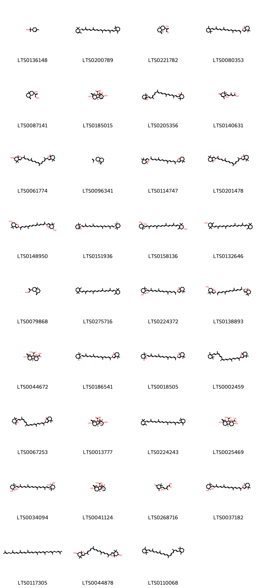{ width=100% }
    <figcaption>Hình ảnh cấu trúc hóa học của 35 hoạt chất thuộc nhóm Prenol lipids gồm ['terpineol (LTS0136148)', '(+)-α-carotene (LTS0200789)', '2-[(2s,4ar,8as)-2-hydroxy-4a-methyl-8-methylidene-hexahydro-1h-naphthalen-2-yl]prop-2-enal (LTS0221782)', '(2r,7ar)-4,4,7a-trimethyl-2-[(2e,4e,6e,8e,10e,12e,14e,16e)-6,11,15-trimethyl-17-(2,6,6-trimethylcyclohex-1-en-1-yl)heptadeca-2,4,6,8,10,12,14,16-octaen-2-yl]-2,5,6,7-tetrahydro-1-benzofuran (LTS0080353)', '2-(3-hydroxyprop-1-en-2-yl)-4a-methyl-8-methylidene-hexahydro-1h-naphthalen-2-ol (LTS0087141)', 'gibberellin a3 (LTS0185015)', '2,2,6-trimethyl-1-[(9e,11e,13e,15e,17e)-3,7,12,16-tetramethyl-18-{2,2,6-trimethyl-7-oxabicyclo[4.1.0]heptan-1-yl}octadeca-1,3,5,7,9,11,13,15,17-nonaen-1-yl]-7-oxabicyclo[4.1.0]heptane (LTS0205356)', 'abscisic acid,  (LTS0140631)', '2-[(2e,4e,6e,8e)-15-(4,4,7a-trimethyl-2,5,6,7-tetrahydro-1-benzofuran-2-yl)-6,11-dimethylhexadeca-2,4,6,8,10,12,14-heptaen-2-yl]-4,4,7a-trimethyl-2,5,6,7-tetrahydro-1-benzofuran-6-ol (LTS0061774)', 'β-selinene (LTS0096341)', '(2s,7as)-2-[(2e,4e,6e,8e,10e,12e,14e)-15-[(2r,7ar)-4,4,7a-trimethyl-2,5,6,7-tetrahydro-1-benzofuran-2-yl]-6,11-dimethylhexadeca-2,4,6,8,10,12,14-heptaen-2-yl]-4,4,7a-trimethyl-2,5,6,7-tetrahydro-1-benzofuran (LTS0114747)', '2-[(8e,10e,12e,14e)-15-(4,4,7a-trimethyl-2,5,6,7-tetrahydro-1-benzofuran-2-yl)-6,11-dimethylhexadeca-2,4,6,8,10,12,14-heptaen-2-yl]-4,4,7a-trimethyl-2,5,6,7-tetrahydro-1-benzofuran (LTS0201478)', '(2r,6r,7ar)-2-[(2e,4e,6e,8e,10e,12e,14e)-15-[(2r,6r,7ar)-6-hydroxy-4,4,7a-trimethyl-2,5,6,7-tetrahydro-1-benzofuran-2-yl]-6,11-dimethylhexadeca-2,4,6,8,10,12,14-heptaen-2-yl]-4,4,7a-trimethyl-2,5,6,7-tetrahydro-1-benzofuran-6-ol (LTS0148950)', '(1s,6r)-2,2,6-trimethyl-1-[(1e,3e,5e,7e,9e,11e,13e,15e,17e)-3,7,12,16-tetramethyl-18-[(1s,6r)-2,2,6-trimethyl-7-oxabicyclo[4.1.0]heptan-1-yl]octadeca-1,3,5,7,9,11,13,15,17-nonaen-1-yl]-7-oxabicyclo[4.1.0]heptane (LTS0151936)', '(1r,2s)-2-[(1e,3e,5e,7e,9e,11e,13e,15e,17e)-18-[(4r)-4-hydroxy-2,6,6-trimethylcyclohex-1-en-1-yl]-3,7,12,16-tetramethyloctadeca-1,3,5,7,9,11,13,15,17-nonaen-1-yl]-1,3,3-trimethylcyclohexane-1,2-diol (LTS0158136)', 'cryptoxanthin (LTS0132646)', '2-(4a-methyl-8-methylidene-octahydronaphthalen-2-yl)prop-2-en-1-ol (LTS0079868)', 'β-carotene (LTS0275716)', '(1r,2s)-2-[(1e,3e,5e,7e,9e,11e,13e,15e)-16-[(2r,7ar)-4,4,7a-trimethyl-2,5,6,7-tetrahydro-1-benzofuran-2-yl]-3,7,12-trimethylheptadeca-1,3,5,7,9,11,13,15-octaen-1-yl]-1,3,3-trimethylcyclohexane-1,2-diol (LTS0224372)', '(2s,6s,7ar)-2-[(2e,4e,6e,8e,10e,12e,14e)-15-[(2r,7ar)-4,4,7a-trimethyl-2,5,6,7-tetrahydro-1-benzofuran-2-yl]-6,11-dimethylhexadeca-2,4,6,8,10,12,14-heptaen-2-yl]-4,4,7a-trimethyl-2,5,6,7-tetrahydro-1-benzofuran-6-ol (LTS0138893)', 'gibberellin a19 (LTS0044672)', '(2s,7ar)-4,4,7a-trimethyl-2-[(2e,4e,6e,8e,10e,12e,14e,16e)-6,11,15-trimethyl-17-[(1s,6r)-2,2,6-trimethyl-7-oxabicyclo[4.1.0]heptan-1-yl]heptadeca-2,4,6,8,10,12,14,16-octaen-2-yl]-2,5,6,7-tetrahydro-1-benzofuran (LTS0186541)', '(2r,7ar)-4,4,7a-trimethyl-2-[(2e,4e,6e,8e,10e,12e,14e,16e)-6,11,15-trimethyl-17-[(1s,6r)-2,2,6-trimethyl-7-oxabicyclo[4.1.0]heptan-1-yl]heptadeca-2,4,6,8,10,12,14,16-octaen-2-yl]-2,5,6,7-tetrahydro-1-benzofuran (LTS0018505)', '4,4,7a-trimethyl-2-[(2e,4e,6e,8e)-6,11,15-trimethyl-17-(2,6,6-trimethylcyclohex-1-en-1-yl)heptadeca-2,4,6,8,10,12,14,16-octaen-2-yl]-2,5,6,7-tetrahydro-1-benzofuran (LTS0002459)', '4,4,7a-trimethyl-2-[(2e,4e,6e,8e)-6,11,15-trimethyl-17-{2,2,6-trimethyl-7-oxabicyclo[4.1.0]heptan-1-yl}heptadeca-2,4,6,8,10,12,14,16-octaen-2-yl]-2,5,6,7-tetrahydro-1-benzofuran (LTS0067253)', 'gibberellin a1 (LTS0013777)', 'α-carotene (LTS0224243)', '(1s,2s,3s,4s,5s,8r,9r,12s)-8-formyl-5,12-dihydroxy-4-methyl-13-methylidenetetracyclo[10.2.1.0¹,⁹.0³,⁸]pentadecane-2,4-dicarboxylic acid (LTS0025469)', '(1r,2s)-2-[(1e,3e,5e,7e,9e,11e,13e,15e,17e)-18-[(1s,2r)-1,2-dihydroxy-2,6,6-trimethylcyclohexyl]-3,7,12,16-tetramethyloctadeca-1,3,5,7,9,11,13,15,17-nonaen-1-yl]-1,3,3-trimethylcyclohexane-1,2-diol (LTS0034094)', 'gibberellin a20 (LTS0041124)', '(4e)-5-[(1s)-1-hydroxy-2,6,6-trimethyl-4-oxocyclohex-2-en-1-yl]-3-methylpenta-2,4-dienoic acid (LTS0268716)', '(1r,2s)-2-[(1e,3e,5e,7e,9e,11e,13e,15e)-16-[(2s,7ar)-4,4,7a-trimethyl-2,5,6,7-tetrahydro-1-benzofuran-2-yl]-3,7,12-trimethylheptadeca-1,3,5,7,9,11,13,15-octaen-1-yl]-1,3,3-trimethylcyclohexane-1,2-diol (LTS0037182)', 'neurosporene (LTS0117305)', '2-[(8e,10e,12e,14e)-15-(6-hydroxy-4,4,7a-trimethyl-2,5,6,7-tetrahydro-1-benzofuran-2-yl)-6,11-dimethylhexadeca-2,4,6,8,10,12,14-heptaen-2-yl]-4,4,7a-trimethyl-2,5,6,7-tetrahydro-1-benzofuran-6-ol (LTS0044878)', '1,3,3-trimethyl-2-[(9e,11e,13e,15e,17e)-3,7,12,16-tetramethyl-18-(2,6,6-trimethylcyclohex-1-en-1-yl)octadeca-1,3,5,7,9,11,13,15,17-nonaen-1-yl]cyclohex-1-ene (LTS0110068)'].</figcaption>
</figure>
#### Nhóm Purine nucleosides
<figure markdown="span">
    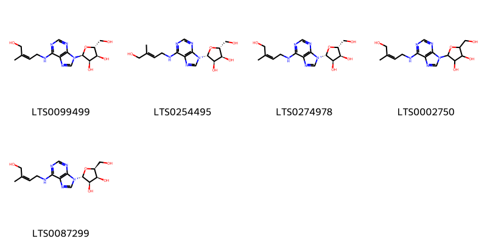{ width=100% }
    <figcaption>Hình ảnh cấu trúc hóa học của 5 hoạt chất thuộc nhóm Purine nucleosides gồm ['(2s,3r,4s,5r)-2-(6-{[(2z)-4-hydroxy-3-methylbut-2-en-1-yl]amino}purin-9-yl)-5-(hydroxymethyl)oxolane-3,4-diol (LTS0099499)', 'zeatin riboside (LTS0254495)', 'cis-zeatin riboside (LTS0274978)', '2-{6-[(4-hydroxy-3-methylbut-2-en-1-yl)amino]purin-9-yl}-5-(hydroxymethyl)oxolane-3,4-diol (LTS0002750)', '(2r,3r,4s,5s)-2-(6-{[(2z)-4-hydroxy-3-methylbut-2-en-1-yl]amino}purin-9-yl)-5-(hydroxymethyl)oxolane-3,4-diol (LTS0087299)'].</figcaption>
</figure>
#### Nhóm Saccharolipids
<figure markdown="span">
    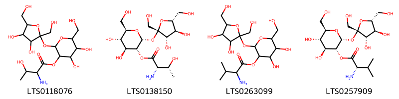{ width=100% }
    <figcaption>Hình ảnh cấu trúc hóa học của 4 hoạt chất thuộc nhóm Saccharolipids gồm ['2-{[3,4-dihydroxy-2,5-bis(hydroxymethyl)oxolan-2-yl]oxy}-4,5-dihydroxy-6-(hydroxymethyl)oxan-3-yl 2-amino-3-hydroxybutanoate (LTS0118076)', '(2r,3r,4s,5s,6r)-2-{[(2s,3s,4s,5r)-3,4-dihydroxy-2,5-bis(hydroxymethyl)oxolan-2-yl]oxy}-4,5-dihydroxy-6-(hydroxymethyl)oxan-3-yl (2s,3r)-2-amino-3-hydroxybutanoate (LTS0138150)', '2-{[3,4-dihydroxy-2,5-bis(hydroxymethyl)oxolan-2-yl]oxy}-4,5-dihydroxy-6-(hydroxymethyl)oxan-3-yl 2-amino-3-methylbutanoate (LTS0263099)', '(2r,3r,4s,5s,6r)-2-{[(2s,3s,4s,5r)-3,4-dihydroxy-2,5-bis(hydroxymethyl)oxolan-2-yl]oxy}-4,5-dihydroxy-6-(hydroxymethyl)oxan-3-yl (2s)-2-amino-3-methylbutanoate (LTS0257909)'].</figcaption>
</figure>
#### Nhóm Steroids and steroid derivatives
<figure markdown="span">
    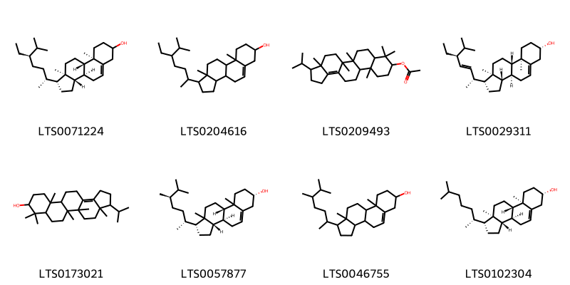{ width=100% }
    <figcaption>Hình ảnh cấu trúc hóa học của 8 hoạt chất thuộc nhóm Steroids and steroid derivatives gồm ['stigmast-5-en-3-ol (LTS0071224)', 'stigmast-5-en-3-ol, (3β)- (LTS0204616)', '3-isopropyl-3a,5a,5b,8,8,11a-hexamethyl-1h,2h,3h,4h,5h,6h,7h,7ah,9h,10h,11h,11bh,12h,13h-cyclopenta[a]chrysen-9-yl acetate (LTS0209493)', 'phytosterol (LTS0029311)', '3-isopropyl-3a,5a,5b,8,8,11a-hexamethyl-1h,2h,3h,4h,5h,6h,7h,7ah,9h,10h,11h,11bh,12h,13h-cyclopenta[a]chrysen-9-ol (LTS0173021)', '(1r,3as,3bs,7s,9bs)-1-[(2r,5r)-5,6-dimethylheptan-2-yl]-9a,11a-dimethyl-1h,2h,3h,3ah,3bh,4h,6h,7h,8h,9h,9bh,10h,11h-cyclopenta[a]phenanthren-7-ol (LTS0057877)', 'campesterol (LTS0046755)', 'cholesterol (LTS0102304)'].</figcaption>
</figure>
#### Nhóm Tannins
<figure markdown="span">
    { width=100% }
    <figcaption>Hình ảnh cấu trúc hóa học của 1 hoạt chất thuộc nhóm Tannins gồm ['ellagic acid (LTS0037297)'].</figcaption>
</figure>
#### Nhóm Tropane alkaloids
<figure markdown="span">
    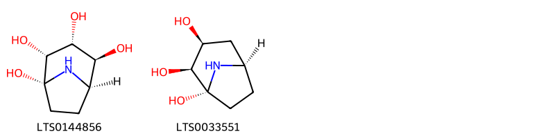{ width=100% }
    <figcaption>Hình ảnh cấu trúc hóa học của 2 hoạt chất thuộc nhóm Tropane alkaloids gồm ['(1r,2r,3r,4s,5r)-8-azabicyclo[3.2.1]octane-1,2,3,4-tetrol (LTS0144856)', '(1r,2s,3s,5r)-8-azabicyclo[3.2.1]octane-1,2,3-triol (LTS0033551)'].</figcaption>
</figure>

---

### Dược dân tộc học

Danh sách các quốc gia có sử dụng *Ipomoea batatas* trong điều trị các bệnh. 

| Country   | Disease                       | Bệnh                                                                                                                                                                                                |
|:----------|:------------------------------|:----------------------------------------------------------------------------------------------------------------------------------------------------------------------------------------------------|
| China     | Astringent, Aphrodisiac       | MYMEMORY WARNING: YOU USED ALL AVAILABLE FREE TRANSLATIONS FOR TODAY. NEXT AVAILABLE IN  16 HOURS 13 MINUTES 04 SECONDS VISIT HTTPS://MYMEMORY.TRANSLATED.NET/DOC/USAGELIMITS.PHP TO TRANSLATE MORE |
| Elsewhere | Fungicide                     | MYMEMORY WARNING: YOU USED ALL AVAILABLE FREE TRANSLATIONS FOR TODAY. NEXT AVAILABLE IN  16 HOURS 13 MINUTES 02 SECONDS VISIT HTTPS://MYMEMORY.TRANSLATED.NET/DOC/USAGELIMITS.PHP TO TRANSLATE MORE |
| Malaya    | Poultice                      | MYMEMORY WARNING: YOU USED ALL AVAILABLE FREE TRANSLATIONS FOR TODAY. NEXT AVAILABLE IN  16 HOURS 12 MINUTES 59 SECONDS VISIT HTTPS://MYMEMORY.TRANSLATED.NET/DOC/USAGELIMITS.PHP TO TRANSLATE MORE |
| Turkey    | Aphrodisiac, Demulcent, Tonic | MYMEMORY WARNING: YOU USED ALL AVAILABLE FREE TRANSLATIONS FOR TODAY. NEXT AVAILABLE IN  16 HOURS 12 MINUTES 56 SECONDS VISIT HTTPS://MYMEMORY.TRANSLATED.NET/DOC/USAGELIMITS.PHP TO TRANSLATE MORE |
| UK        | Aphrodisiac                   | MYMEMORY WARNING: YOU USED ALL AVAILABLE FREE TRANSLATIONS FOR TODAY. NEXT AVAILABLE IN  16 HOURS 12 MINUTES 53 SECONDS VISIT HTTPS://MYMEMORY.TRANSLATED.NET/DOC/USAGELIMITS.PHP TO TRANSLATE MORE |

---

---
## Ipomoea bonanox
### Thông tin về thực vật

!!! info "Phân loại thực vật của *Ipomoea violacea* từ GIBF:"
    - **Kingdom:** Plantae
    - **Phylum:** Tracheophyta
    - **Order:** Solanales
    - **Family:** Convolvulaceae
    - **Genus:** Ipomoea
    - **Species:** *Ipomoea violacea*

 

| Label (VI)   | Label (EN)   | Scientific Name   | Descriptions (VI)   | Descriptions (EN)   | Also Known As (VI)   | Also Known As (EN)   |
|:-------------|:-------------|:------------------|:--------------------|:--------------------|:---------------------|:---------------------|
| N/A          | N/A          | Ipomoea batatas   | loài thực vật       | species of plant    | ['Ipomoea batatas']  | ['Ipomoea batatas']  |

#### Phân bố trên thế giới

**Từ CSDL GIBF** Honduras, El Salvador, Spain, Philippines, French Guiana, Singapore, United Arab Emirates, Australia, Korea, Republic of, Indonesia, Haiti, Guatemala, Colombia, Sweden, Malaysia, Puerto Rico, India, Canada, Nigeria, Bahamas, Cuba, Iraq, Guam, Japan, Panama, Peru, Ethiopia, Montserrat, Mexico, China, Benin, Chinese Taipei, Hong Kong, Iran (Islamic Republic of), Argentina, South Africa, Portugal, New Zealand, Bolivia (Plurinational State of), Costa Rica, Ecuador, United States of America

#### Phân bố tại Việt Nam

**Từ CSDL GIBF**: Không có ghi nhận ở Việt Nam

---
### Thành phần hóa học
        
- Theo cơ sở dữ liệu lotus: Từ loài *Ipomoea violacea* đã phân lập và xác định được Chưa có hoạt chất nào được phân lập. hoạt chất thuộc về các nhóm Không có hoạt chất nào được phân lập. 

Không có hình ảnh nào được tạo ra

---

### Dược dân tộc học

Danh sách các quốc gia có sử dụng *Ipomoea violacea* trong điều trị các bệnh. 

| Country   | Disease   | Bệnh                                                                                                                                                                                                |
|:----------|:----------|:----------------------------------------------------------------------------------------------------------------------------------------------------------------------------------------------------|
| Venezuela | Purgative | MYMEMORY WARNING: YOU USED ALL AVAILABLE FREE TRANSLATIONS FOR TODAY. NEXT AVAILABLE IN  16 HOURS 12 MINUTES 01 SECONDS VISIT HTTPS://MYMEMORY.TRANSLATED.NET/DOC/USAGELIMITS.PHP TO TRANSLATE MORE |

---

---
## Ipomoea carnea
### Thông tin về thực vật

!!! info "Phân loại thực vật của *Ipomoea carnea* từ GIBF:"
    - **Kingdom:** Plantae
    - **Phylum:** Tracheophyta
    - **Order:** Solanales
    - **Family:** Convolvulaceae
    - **Genus:** Ipomoea
    - **Species:** *Ipomoea carnea*

 

| Label (VI)   | Label (EN)   | Scientific Name   | Descriptions (VI)   | Descriptions (EN)   | Also Known As (VI)   | Also Known As (EN)   |
|:-------------|:-------------|:------------------|:--------------------|:--------------------|:---------------------|:---------------------|
| N/A          | N/A          | Ipomoea carnea    | loài thực vật       | species of plant    | ['']                 | ['Hedge Glory']      |

#### Phân bố trên thế giới

**Từ CSDL GIBF** Viet Nam, Thailand, El Salvador, Ghana, French Guiana, Australia, Indonesia, Sierra Leone, Colombia, Puerto Rico, India, Réunion, Seychelles, Nigeria, Bahamas, Nicaragua, Panama, Brazil, Peru, Ethiopia, Mexico, China, Nepal, Benin, Chinese Taipei, Argentina, South Africa, Botswana, Bolivia (Plurinational State of), Costa Rica, Paraguay, Ecuador, United States of America, Zimbabwe, Madagascar, Cabo Verde

#### Phân bố tại Việt Nam

**Từ CSDL GIBF**: Long An

---
### Thành phần hóa học
        
- Theo cơ sở dữ liệu lotus: Từ loài *Ipomoea carnea* đã phân lập và xác định được 21 hoạt chất thuộc về các nhóm Organooxygen compounds, Flavonoids, Tropane alkaloids, Indolizidines, Carboxylic acids and derivatives, Fatty Acyls, Steroids and steroid derivatives. 

|    | chemicalTaxonomyClassyfireClass   |   smiles_count |
|---:|:----------------------------------|---------------:|
|  0 | Carboxylic acids and derivatives  |              2 |
|  1 | Fatty Acyls                       |              2 |
|  2 | Flavonoids                        |              3 |
|  3 | Indolizidines                     |              4 |
|  4 | Organooxygen compounds            |              2 |
|  5 | Steroids and steroid derivatives  |              1 |
|  6 | Tropane alkaloids                 |              7 |

#### Nhóm Carboxylic acids and derivatives
<figure markdown="span">
    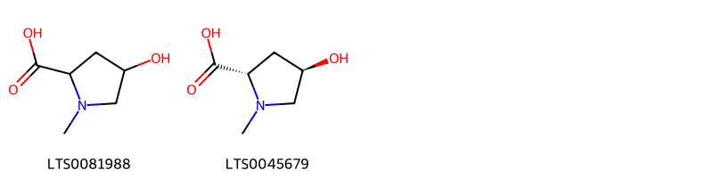{ width=100% }
    <figcaption>Hình ảnh cấu trúc hóa học của 2 hoạt chất thuộc nhóm Carboxylic acids and derivatives gồm ['4-hydroxy-1-methylpyrrolidine-2-carboxylic acid (LTS0081988)', '(2s,4r)-4-hydroxy-1-methylpyrrolidine-2-carboxylic acid (LTS0045679)'].</figcaption>
</figure>
#### Nhóm Fatty Acyls
<figure markdown="span">
    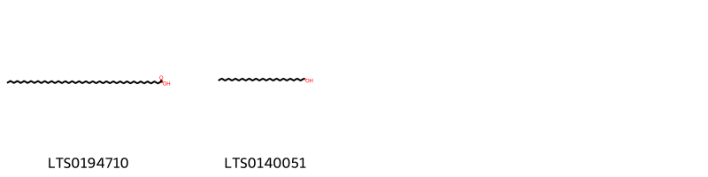{ width=100% }
    <figcaption>Hình ảnh cấu trúc hóa học của 2 hoạt chất thuộc nhóm Fatty Acyls gồm ['hexatetracontanoic acid (LTS0194710)', 'ceryl alcohol (LTS0140051)'].</figcaption>
</figure>
#### Nhóm Flavonoids
<figure markdown="span">
    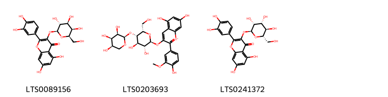{ width=100% }
    <figcaption>Hình ảnh cấu trúc hóa học của 3 hoạt chất thuộc nhóm Flavonoids gồm ['hyperoside (LTS0089156)', '3-{[(2s,3r,4r,5s,6s)-3,4-dihydroxy-6-(hydroxymethyl)-5-{[(2r,3r,4r,5r)-3,4,5-trihydroxyoxan-2-yl]oxy}oxan-2-yl]oxy}-5,7-dihydroxy-2-(4-hydroxy-3-methoxyphenyl)-1λ⁴-chromen-1-ylium (LTS0203693)', '2-(3,4-dihydroxyphenyl)-5,7-dihydroxy-3-{[(2s,3r,4r,5r,6s)-3,4,5-trihydroxy-6-(hydroxymethyl)oxan-2-yl]oxy}chromen-4-one (LTS0241372)'].</figcaption>
</figure>
#### Nhóm Indolizidines
<figure markdown="span">
    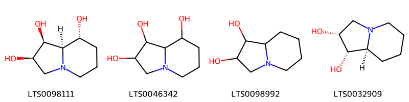{ width=100% }
    <figcaption>Hình ảnh cấu trúc hóa học của 4 hoạt chất thuộc nhóm Indolizidines gồm ['swainsonine (LTS0098111)', 'octahydroindolizine-1,2,8-triol (LTS0046342)', 'octahydroindolizine-1,2-diol (LTS0098992)', '2-epilentiginosine (LTS0032909)'].</figcaption>
</figure>
#### Nhóm Organooxygen compounds
<figure markdown="span">
    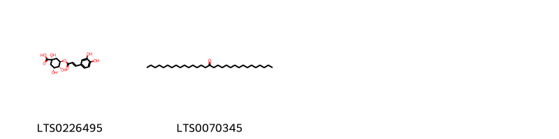{ width=100% }
    <figcaption>Hình ảnh cấu trúc hóa học của 2 hoạt chất thuộc nhóm Organooxygen compounds gồm ['chlorogenic acid (LTS0226495)', 'palmitone (LTS0070345)'].</figcaption>
</figure>
#### Nhóm Steroids and steroid derivatives
<figure markdown="span">
    { width=100% }
    <figcaption>Hình ảnh cấu trúc hóa học của 1 hoạt chất thuộc nhóm Steroids and steroid derivatives gồm ['sitogluside (LTS0201798)'].</figcaption>
</figure>
#### Nhóm Tropane alkaloids
<figure markdown="span">
    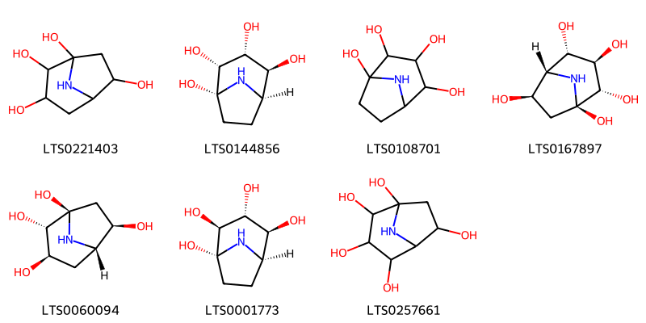{ width=100% }
    <figcaption>Hình ảnh cấu trúc hóa học của 7 hoạt chất thuộc nhóm Tropane alkaloids gồm ['8-azabicyclo[3.2.1]octane-1,2,3,6-tetrol (LTS0221403)', '(1r,2r,3r,4s,5r)-8-azabicyclo[3.2.1]octane-1,2,3,4-tetrol (LTS0144856)', '8-azabicyclo[3.2.1]octane-1,2,3,4-tetrol (LTS0108701)', '(1r,2s,3r,4s,5r,6r)-8-azabicyclo[3.2.1]octane-1,2,3,4,6-pentol (LTS0167897)', '(1r,2s,3r,5s,6r)-8-azabicyclo[3.2.1]octane-1,2,3,6-tetrol (LTS0060094)', '(1r,2s,3r,4s,5r)-8-azabicyclo[3.2.1]octane-1,2,3,4-tetrol (LTS0001773)', '8-azabicyclo[3.2.1]octane-1,2,3,4,6-pentol (LTS0257661)'].</figcaption>
</figure>

---

### Dược dân tộc học

Danh sách các quốc gia có sử dụng *Ipomoea carnea* trong điều trị các bệnh. 

| Country   | Disease   | Bệnh                                                                                                                                                                                                |
|:----------|:----------|:----------------------------------------------------------------------------------------------------------------------------------------------------------------------------------------------------|
| India     | Poison    | MYMEMORY WARNING: YOU USED ALL AVAILABLE FREE TRANSLATIONS FOR TODAY. NEXT AVAILABLE IN  16 HOURS 11 MINUTES 43 SECONDS VISIT HTTPS://MYMEMORY.TRANSLATED.NET/DOC/USAGELIMITS.PHP TO TRANSLATE MORE |

---

---
## Ipomoea congesta
### Thông tin về thực vật

!!! info "Phân loại thực vật của *Ipomoea indica* từ GIBF:"
    - **Kingdom:** Plantae
    - **Phylum:** Tracheophyta
    - **Order:** Solanales
    - **Family:** Convolvulaceae
    - **Genus:** Ipomoea
    - **Species:** *Ipomoea indica*

 

| Label (VI)   | Label (EN)   | Scientific Name   | Descriptions (VI)   | Descriptions (EN)   | Also Known As (VI)   | Also Known As (EN)   |
|:-------------|:-------------|:------------------|:--------------------|:--------------------|:---------------------|:---------------------|
| N/A          | N/A          | Ipomoea congesta  | loài thực vật       | species of plant    | ['']                 | ['']                 |

#### Phân bố trên thế giới

**Từ CSDL GIBF** nan, unknown or invalid, Philippines, French Polynesia, Australia, Jamaica, Indonesia, Colombia, India, Japan, Brazil, Ethiopia, Mexico, China, Tonga, Chinese Taipei, Argentina, South Africa, Portugal, New Zealand, Fiji, Bolivia (Plurinational State of), United States of America, Greece

#### Phân bố tại Việt Nam

**Từ CSDL GIBF**: Không có ghi nhận ở Việt Nam

---
### Thành phần hóa học
        
- Theo cơ sở dữ liệu lotus: Từ loài *Ipomoea indica* đã phân lập và xác định được Chưa có hoạt chất nào được phân lập. hoạt chất thuộc về các nhóm Không có hoạt chất nào được phân lập. 

Không có hình ảnh nào được tạo ra

---

### Dược dân tộc học

Danh sách các quốc gia có sử dụng *Ipomoea indica* trong điều trị các bệnh. 

| Country   | Disease   | Bệnh                                                                                                                                                                                                |
|:----------|:----------|:----------------------------------------------------------------------------------------------------------------------------------------------------------------------------------------------------|
| Tonga     | Aperient  | MYMEMORY WARNING: YOU USED ALL AVAILABLE FREE TRANSLATIONS FOR TODAY. NEXT AVAILABLE IN  16 HOURS 11 MINUTES 10 SECONDS VISIT HTTPS://MYMEMORY.TRANSLATED.NET/DOC/USAGELIMITS.PHP TO TRANSLATE MORE |

---

---
## Ipomoea crassicaulis
### Thông tin về thực vật

!!! info "Phân loại thực vật của *Ipomoea carnea* từ GIBF:"
    - **Kingdom:** Plantae
    - **Phylum:** Tracheophyta
    - **Order:** Solanales
    - **Family:** Convolvulaceae
    - **Genus:** Ipomoea
    - **Species:** *Ipomoea carnea*

 

| Label (VI)   | Label (EN)   | Scientific Name      | Descriptions (VI)   | Descriptions (EN)   | Also Known As (VI)   | Also Known As (EN)   |
|:-------------|:-------------|:---------------------|:--------------------|:--------------------|:---------------------|:---------------------|
| N/A          | N/A          | Ipomoea crassicaulis | loài thực vật       | species of plant    | ['']                 | ['']                 |

#### Phân bố trên thế giới

**Từ CSDL GIBF** nan, Chinese Taipei, Colombia, Argentina, unknown or invalid, Dominican Republic, Brazil, Philippines, Puerto Rico, India, Cameroon, Chile, United States of America, Mexico, Guyana, Singapore, Cuba, Indonesia

#### Phân bố tại Việt Nam

**Từ CSDL GIBF**: Không có ghi nhận ở Việt Nam

---
### Thành phần hóa học
        
- Theo cơ sở dữ liệu lotus: Từ loài *Ipomoea carnea* đã phân lập và xác định được Chưa có hoạt chất nào được phân lập. hoạt chất thuộc về các nhóm Không có hoạt chất nào được phân lập. 

Không có hình ảnh nào được tạo ra

---

### Dược dân tộc học

Danh sách các quốc gia có sử dụng *Ipomoea carnea* trong điều trị các bệnh. 

| Country   | Disease   | Bệnh                                                                                                                                                                                                |
|:----------|:----------|:----------------------------------------------------------------------------------------------------------------------------------------------------------------------------------------------------|
| Brasil    | Poison    | MYMEMORY WARNING: YOU USED ALL AVAILABLE FREE TRANSLATIONS FOR TODAY. NEXT AVAILABLE IN  16 HOURS 10 MINUTES 48 SECONDS VISIT HTTPS://MYMEMORY.TRANSLATED.NET/DOC/USAGELIMITS.PHP TO TRANSLATE MORE |

---

---
## Ipomoea crassifolia
### Thông tin về thực vật

!!! info "Phân loại thực vật của *N/A* từ GIBF:"
    - **Kingdom:** Plantae
    - **Phylum:** Tracheophyta
    - **Order:** Solanales
    - **Family:** Convolvulaceae
    - **Genus:** Ipomoea
    - **Species:** *N/A*

 

| Label (VI)   | Label (EN)   | Scientific Name     | Descriptions (VI)   | Descriptions (EN)   | Also Known As (VI)   | Also Known As (EN)   |
|:-------------|:-------------|:--------------------|:--------------------|:--------------------|:---------------------|:---------------------|
| N/A          | N/A          | Ipomoea crassifolia |                     |                     | ['']                 | ['']                 |

#### Phân bố trên thế giới

**Từ CSDL GIBF** Viet Nam, Thailand, Namibia, Spain, Chile, Australia, Indonesia, Colombia, Sri Lanka, Puerto Rico, Malaysia, India, Guam, Türkiye, Uganda, Belize, Nicaragua, Panama, Brazil, Japan, Peru, Mexico, China, Chinese Taipei, Hong Kong, Uruguay, Argentina, Portugal, South Africa, New Zealand, Costa Rica, Ecuador, United States of America

#### Phân bố tại Việt Nam

**Từ CSDL GIBF**: Lâm Đồng, Hồ Chí Minh city

---
### Thành phần hóa học
        
- Theo cơ sở dữ liệu lotus: Từ loài *N/A* đã phân lập và xác định được Chưa có hoạt chất nào được phân lập. hoạt chất thuộc về các nhóm Không có hoạt chất nào được phân lập. 

Không có hình ảnh nào được tạo ra

---

### Dược dân tộc học

Danh sách các quốc gia có sử dụng *N/A* trong điều trị các bệnh. 

| Country   | Disease   | Bệnh                                                                                                                                                                                                |
|:----------|:----------|:----------------------------------------------------------------------------------------------------------------------------------------------------------------------------------------------------|
| Brazil    | Tonic     | MYMEMORY WARNING: YOU USED ALL AVAILABLE FREE TRANSLATIONS FOR TODAY. NEXT AVAILABLE IN  16 HOURS 10 MINUTES 26 SECONDS VISIT HTTPS://MYMEMORY.TRANSLATED.NET/DOC/USAGELIMITS.PHP TO TRANSLATE MORE |

---

---
## Ipomoea dichroa
### Thông tin về thực vật

!!! info "Phân loại thực vật của *Ipomoea arachnosperma* từ GIBF:"
    - **Kingdom:** Plantae
    - **Phylum:** Tracheophyta
    - **Order:** Solanales
    - **Family:** Convolvulaceae
    - **Genus:** Ipomoea
    - **Species:** *Ipomoea arachnosperma*

 

| Label (VI)   | Label (EN)   | Scientific Name   | Descriptions (VI)   | Descriptions (EN)   | Also Known As (VI)   | Also Known As (EN)   |
|:-------------|:-------------|:------------------|:--------------------|:--------------------|:---------------------|:---------------------|
| N/A          | N/A          | Ipomoea dichroa   | loài thực vật       | species of plant    | ['']                 | ['']                 |

#### Phân bố trên thế giới

**Từ CSDL GIBF** nan, unknown or invalid, Eritrea, Somalia, Namibia, Senegal, Cameroon, Kenya, Burkina Faso, Niger, Côte d’Ivoire, India, Sudan, Burundi, Uganda, Yemen, Eswatini, Ethiopia, Nepal, Benin, Angola, Botswana, South Africa, Mali, Mozambique, Tanzania, United Republic of, Mauritania, Congo, Democratic Republic of the, Zimbabwe, Zambia, Chad, Guinea, Cabo Verde, Oman

#### Phân bố tại Việt Nam

**Từ CSDL GIBF**: Không có ghi nhận ở Việt Nam

---
### Thành phần hóa học
        
- Theo cơ sở dữ liệu lotus: Từ loài *Ipomoea arachnosperma* đã phân lập và xác định được Chưa có hoạt chất nào được phân lập. hoạt chất thuộc về các nhóm Không có hoạt chất nào được phân lập. 

Không có hình ảnh nào được tạo ra

---

### Dược dân tộc học

Danh sách các quốc gia có sử dụng *Ipomoea arachnosperma* trong điều trị các bệnh. 

| Country   | Disease   | Bệnh                                                                                                                                                                                                |
|:----------|:----------|:----------------------------------------------------------------------------------------------------------------------------------------------------------------------------------------------------|
| Africa    | Purgative | MYMEMORY WARNING: YOU USED ALL AVAILABLE FREE TRANSLATIONS FOR TODAY. NEXT AVAILABLE IN  16 HOURS 09 MINUTES 55 SECONDS VISIT HTTPS://MYMEMORY.TRANSLATED.NET/DOC/USAGELIMITS.PHP TO TRANSLATE MORE |

---

---
## Ipomoea digitata
### Thông tin về thực vật

!!! info "Phân loại thực vật của *Ipomoea digitata* từ GIBF:"
    - **Kingdom:** Plantae
    - **Phylum:** Tracheophyta
    - **Order:** Solanales
    - **Family:** Convolvulaceae
    - **Genus:** Ipomoea
    - **Species:** *Ipomoea digitata*

 

| Label (VI)   | Label (EN)   | Scientific Name   | Descriptions (VI)   | Descriptions (EN)   | Also Known As (VI)   | Also Known As (EN)   |
|:-------------|:-------------|:------------------|:--------------------|:--------------------|:---------------------|:---------------------|
| N/A          | N/A          | Ipomoea digitata  | loài thực vật       | species of plant    | ['']                 | ['']                 |

#### Phân bố trên thế giới

**Từ CSDL GIBF** nan, Honduras, Viet Nam, Philippines, Afghanistan, Trinidad and Tobago, French Guiana, Australia, Jamaica, Indonesia, Haiti, Suriname, Dominican Republic, Venezuela (Bolivarian Republic of), Côte d’Ivoire, Malaysia, Puerto Rico, India, Liberia, Sudan, Nigeria, Japan, Brazil, Peru, Equatorial Guinea, Mexico, China, Angola, Chinese Taipei, Uruguay, Argentina, South Africa, France, Micronesia (Federated States of), Tanzania, United Republic of, Papua New Guinea, Costa Rica, Congo, Democratic Republic of the, United States of America, Congo, Guinea, Cabo Verde, Guyana

#### Phân bố tại Việt Nam

**Từ CSDL GIBF**: Ninh Binh

---
### Thành phần hóa học
        
- Theo cơ sở dữ liệu lotus: Từ loài *Ipomoea digitata* đã phân lập và xác định được 8 hoạt chất thuộc về các nhóm Coumarins and derivatives, Prenol lipids, Saccharolipids. 

|    | chemicalTaxonomyClassyfireClass   |   smiles_count |
|---:|:----------------------------------|---------------:|
|  0 | Coumarins and derivatives         |              3 |
|  1 | Prenol lipids                     |              2 |
|  2 | Saccharolipids                    |              3 |

#### Nhóm Coumarins and derivatives
<figure markdown="span">
    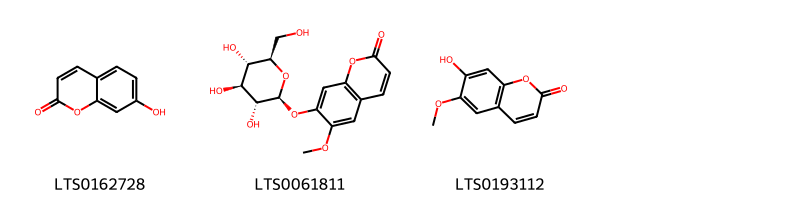{ width=100% }
    <figcaption>Hình ảnh cấu trúc hóa học của 3 hoạt chất thuộc nhóm Coumarins and derivatives gồm ['umbelliferone (LTS0162728)', 'scopolin (LTS0061811)', 'scopoletin (LTS0193112)'].</figcaption>
</figure>
#### Nhóm Prenol lipids
<figure markdown="span">
    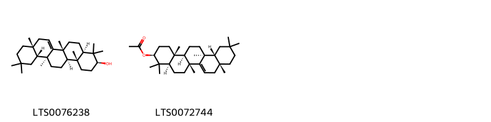{ width=100% }
    <figcaption>Hình ảnh cấu trúc hóa học của 2 hoạt chất thuộc nhóm Prenol lipids gồm ['alnulin (LTS0076238)', '(3s,4ar,6ar,8ar,12ar,12bs,14ar,14br)-4,4,6a,8a,11,11,12b,14b-octamethyl-1,2,3,4a,5,6,8,9,10,12,12a,13,14,14a-tetradecahydropicen-3-yl acetate (LTS0072744)'].</figcaption>
</figure>
#### Nhóm Saccharolipids
<figure markdown="span">
    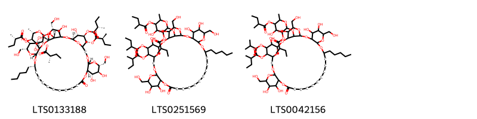{ width=100% }
    <figcaption>Hình ảnh cấu trúc hóa học của 3 hoạt chất thuộc nhóm Saccharolipids gồm ['(1s,3s,4r,5r,7s,9r,10s,11s,12r,14r,16s,28r,29s,30s,31r,33r,36r,37r,38r,39r,41r)-4,10,11,29,30,39-hexahydroxy-41-{[(2s,3r,4r,5r,6s)-4-hydroxy-6-methyl-3,5-bis({[(2s)-2-methylbutanoyl]oxy})oxan-2-yl]oxy}-5,12,31-tris(hydroxymethyl)-37-{[(2s)-2-methylbutanoyl]oxy}-26-oxo-16-pentyl-2,6,8,13,15,27,32,34,40-nonaoxapentacyclo[34.3.1.1³,⁷.0⁹,¹⁴.0²⁸,³³]hentetracontan-38-yl (2s)-2-methylbutanoate (LTS0133188)', '4,10,11,29,30,39-hexahydroxy-41-({4-hydroxy-6-methyl-3,5-bis[(2-methylbutanoyl)oxy]oxan-2-yl}oxy)-5,12,31-tris(hydroxymethyl)-37-[(2-methylbutanoyl)oxy]-26-oxo-16-pentyl-2,6,8,13,15,27,32,34,40-nonaoxapentacyclo[34.3.1.1³,⁷.0⁹,¹⁴.0²⁸,³³]hentetracontan-38-yl 2-methylbutanoate (LTS0251569)', '4,10,11,29,30,39-hexahydroxy-41-({4-hydroxy-6-methyl-3,5-bis[(2-methylbutanoyl)oxy]oxan-2-yl}oxy)-5,12,31-tris(hydroxymethyl)-38-[(2-methylpropanoyl)oxy]-26-oxo-16-pentyl-2,6,8,13,15,27,32,34,40-nonaoxapentacyclo[34.3.1.1³,⁷.0⁹,¹⁴.0²⁸,³³]hentetracontan-37-yl 2-methylbutanoate (LTS0042156)'].</figcaption>
</figure>

---

### Dược dân tộc học

Danh sách các quốc gia có sử dụng *Ipomoea digitata* trong điều trị các bệnh. 

| Country   | Disease                                                   | Bệnh                                                                                                                                                                                                |
|:----------|:----------------------------------------------------------|:----------------------------------------------------------------------------------------------------------------------------------------------------------------------------------------------------|
| Belize    | Poison                                                    | MYMEMORY WARNING: YOU USED ALL AVAILABLE FREE TRANSLATIONS FOR TODAY. NEXT AVAILABLE IN  16 HOURS 09 MINUTES 26 SECONDS VISIT HTTPS://MYMEMORY.TRANSLATED.NET/DOC/USAGELIMITS.PHP TO TRANSLATE MORE |
| Elsewhere | Aphrodisiac, Cholagogue, Demulcent, Diuretic, Expectorant | MYMEMORY WARNING: YOU USED ALL AVAILABLE FREE TRANSLATIONS FOR TODAY. NEXT AVAILABLE IN  16 HOURS 09 MINUTES 23 SECONDS VISIT HTTPS://MYMEMORY.TRANSLATED.NET/DOC/USAGELIMITS.PHP TO TRANSLATE MORE |
| India     | Cholagogue, Tonic, Lactagogue, Rennet                     | MYMEMORY WARNING: YOU USED ALL AVAILABLE FREE TRANSLATIONS FOR TODAY. NEXT AVAILABLE IN  16 HOURS 09 MINUTES 19 SECONDS VISIT HTTPS://MYMEMORY.TRANSLATED.NET/DOC/USAGELIMITS.PHP TO TRANSLATE MORE |

---

---
## Ipomoea ficifolia
### Thông tin về thực vật

!!! info "Phân loại thực vật của *Ipomoea ficifolia* từ GIBF:"
    - **Kingdom:** Plantae
    - **Phylum:** Tracheophyta
    - **Order:** Solanales
    - **Family:** Convolvulaceae
    - **Genus:** Ipomoea
    - **Species:** *Ipomoea ficifolia*

 

| Label (VI)   | Label (EN)   | Scientific Name   | Descriptions (VI)   | Descriptions (EN)   | Also Known As (VI)   | Also Known As (EN)   |
|:-------------|:-------------|:------------------|:--------------------|:--------------------|:---------------------|:---------------------|
| N/A          | N/A          | Ipomoea ficifolia | loài thực vật       | species of plant    | ['']                 | ['']                 |

#### Phân bố trên thế giới

**Từ CSDL GIBF** unknown or invalid, Uganda, South Africa, Somalia, Tanzania, United Republic of, Yemen, New Zealand, Mozambique, Eswatini, Kenya, Zambia, Guinea

#### Phân bố tại Việt Nam

**Từ CSDL GIBF**: Không có ghi nhận ở Việt Nam

---
### Thành phần hóa học
        
- Theo cơ sở dữ liệu lotus: Từ loài *Ipomoea ficifolia* đã phân lập và xác định được Chưa có hoạt chất nào được phân lập. hoạt chất thuộc về các nhóm Không có hoạt chất nào được phân lập. 

Không có hình ảnh nào được tạo ra

---

### Dược dân tộc học

Danh sách các quốc gia có sử dụng *Ipomoea ficifolia* trong điều trị các bệnh. 

| Country      | Disease   | Bệnh                                                                                                                                                                                                |
|:-------------|:----------|:----------------------------------------------------------------------------------------------------------------------------------------------------------------------------------------------------|
| South Africa | Purgative | MYMEMORY WARNING: YOU USED ALL AVAILABLE FREE TRANSLATIONS FOR TODAY. NEXT AVAILABLE IN  16 HOURS 08 MINUTES 51 SECONDS VISIT HTTPS://MYMEMORY.TRANSLATED.NET/DOC/USAGELIMITS.PHP TO TRANSLATE MORE |

---

---
## Ipomoea hederacea
### Thông tin về thực vật

!!! info "Phân loại thực vật của *Ipomoea hederacea* từ GIBF:"
    - **Kingdom:** Plantae
    - **Phylum:** Tracheophyta
    - **Order:** Solanales
    - **Family:** Convolvulaceae
    - **Genus:** Ipomoea
    - **Species:** *Ipomoea hederacea*

 

| Label (VI)   | Label (EN)   | Scientific Name   | Descriptions (VI)   | Descriptions (EN)   | Also Known As (VI)   | Also Known As (EN)   |
|:-------------|:-------------|:------------------|:--------------------|:--------------------|:---------------------|:---------------------|
| N/A          | N/A          | Ipomoea hederacea | loài thực vật       | species of plant    | ['']                 | ['']                 |

#### Phân bố trên thế giới

**Từ CSDL GIBF** Argentina, Japan, Brazil, Canada, United States of America, Mexico, China, Belgium, Korea, Republic of, Chinese Taipei

#### Phân bố tại Việt Nam

**Từ CSDL GIBF**: Không có ghi nhận ở Việt Nam

---
### Thành phần hóa học
        
- Theo cơ sở dữ liệu lotus: Từ loài *Ipomoea hederacea* đã phân lập và xác định được 6 hoạt chất thuộc về các nhóm Ergoline and derivatives. 

|    | chemicalTaxonomyClassyfireClass   |   smiles_count |
|---:|:----------------------------------|---------------:|
|  0 | Ergoline and derivatives          |              6 |

#### Nhóm Ergoline and derivatives
<figure markdown="span">
    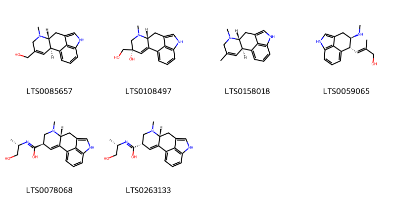{ width=100% }
    <figcaption>Hình ảnh cấu trúc hóa học của 6 hoạt chất thuộc nhóm Ergoline and derivatives gồm ['elymoclavine (LTS0085657)', 'penniclavine (LTS0108497)', 'agroclavine (LTS0158018)', 'chanoclavine (LTS0059065)', '(4r,7r)-n-[(2s)-1-hydroxypropan-2-yl]-6-methyl-6,11-diazatetracyclo[7.6.1.0²,⁷.0¹²,¹⁶]hexadeca-1(16),2,9,12,14-pentaene-4-carboximidic acid (LTS0078068)', '(4s,7r)-n-[(2s)-1-hydroxypropan-2-yl]-6-methyl-6,11-diazatetracyclo[7.6.1.0²,⁷.0¹²,¹⁶]hexadeca-1(16),2,9,12,14-pentaene-4-carboximidic acid (LTS0263133)'].</figcaption>
</figure>

---

### Dược dân tộc học

Danh sách các quốc gia có sử dụng *Ipomoea hederacea* trong điều trị các bệnh. 

| Country   | Disease                                                 | Bệnh                                                                                                                                                                                                |
|:----------|:--------------------------------------------------------|:----------------------------------------------------------------------------------------------------------------------------------------------------------------------------------------------------|
| China     | Cathartic, Diuretic, Diuretic, Vermifuge, Abortifacient | MYMEMORY WARNING: YOU USED ALL AVAILABLE FREE TRANSLATIONS FOR TODAY. NEXT AVAILABLE IN  16 HOURS 08 MINUTES 26 SECONDS VISIT HTTPS://MYMEMORY.TRANSLATED.NET/DOC/USAGELIMITS.PHP TO TRANSLATE MORE |
| India     | Purgative                                               | MYMEMORY WARNING: YOU USED ALL AVAILABLE FREE TRANSLATIONS FOR TODAY. NEXT AVAILABLE IN  16 HOURS 08 MINUTES 23 SECONDS VISIT HTTPS://MYMEMORY.TRANSLATED.NET/DOC/USAGELIMITS.PHP TO TRANSLATE MORE |
| Sudan     | Purgative                                               | MYMEMORY WARNING: YOU USED ALL AVAILABLE FREE TRANSLATIONS FOR TODAY. NEXT AVAILABLE IN  16 HOURS 08 MINUTES 20 SECONDS VISIT HTTPS://MYMEMORY.TRANSLATED.NET/DOC/USAGELIMITS.PHP TO TRANSLATE MORE |

---

---
## Ipomoea hederifolia
### Thông tin về thực vật

!!! info "Phân loại thực vật của *Ipomoea hederifolia* từ GIBF:"
    - **Kingdom:** Plantae
    - **Phylum:** Tracheophyta
    - **Order:** Solanales
    - **Family:** Convolvulaceae
    - **Genus:** Ipomoea
    - **Species:** *Ipomoea hederifolia*

 

| Label (VI)   | Label (EN)   | Scientific Name     | Descriptions (VI)   | Descriptions (EN)   | Also Known As (VI)   | Also Known As (EN)   |
|:-------------|:-------------|:--------------------|:--------------------|:--------------------|:---------------------|:---------------------|
| N/A          | N/A          | Ipomoea hederifolia | loài thực vật       | species of plant    | ['']                 | ['Red Star Glory']   |

#### Phân bố trên thế giới

**Từ CSDL GIBF** nan, Thailand, Ghana, Australia, Guatemala, Colombia, Dominican Republic, Puerto Rico, India, Réunion, Saint Kitts and Nevis, Panama, Brazil, Peru, Mexico, Angola, Argentina, South Africa, Bolivia (Plurinational State of), Ecuador, United States of America

#### Phân bố tại Việt Nam

**Từ CSDL GIBF**: Không có ghi nhận ở Việt Nam

---
### Thành phần hóa học
        
- Theo cơ sở dữ liệu lotus: Từ loài *Ipomoea hederifolia* đã phân lập và xác định được 13 hoạt chất thuộc về các nhóm Pyrrolizidines, Benzene and substituted derivatives, Tropane alkaloids. 

|    | chemicalTaxonomyClassyfireClass     |   smiles_count |
|---:|:------------------------------------|---------------:|
|  0 | Benzene and substituted derivatives |              4 |
|  1 | Pyrrolizidines                      |              4 |
|  2 | Tropane alkaloids                   |              5 |

#### Nhóm Benzene and substituted derivatives
<figure markdown="span">
    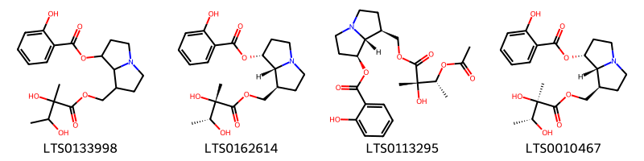{ width=100% }
    <figcaption>Hình ảnh cấu trúc hóa học của 4 hoạt chất thuộc nhóm Benzene and substituted derivatives gồm ['7-{[(2,3-dihydroxy-2-methylbutanoyl)oxy]methyl}-hexahydro-1h-pyrrolizin-1-yl 2-hydroxybenzoate (LTS0133998)', '(1r,7r,7ar)-7-({[(2s,3r)-2,3-dihydroxy-2-methylbutanoyl]oxy}methyl)-hexahydro-1h-pyrrolizin-1-yl 2-hydroxybenzoate (LTS0162614)', '(1s,7r,7ar)-7-({[(2s,3r)-3-(acetyloxy)-2-hydroxy-2-methylbutanoyl]oxy}methyl)-hexahydro-1h-pyrrolizin-1-yl 2-hydroxybenzoate (LTS0113295)', '(1r,7r,7ar)-7-({[(2r,3r)-2,3-dihydroxy-2-methylbutanoyl]oxy}methyl)-hexahydro-1h-pyrrolizin-1-yl 2-hydroxybenzoate (LTS0010467)'].</figcaption>
</figure>
#### Nhóm Pyrrolizidines
<figure markdown="span">
    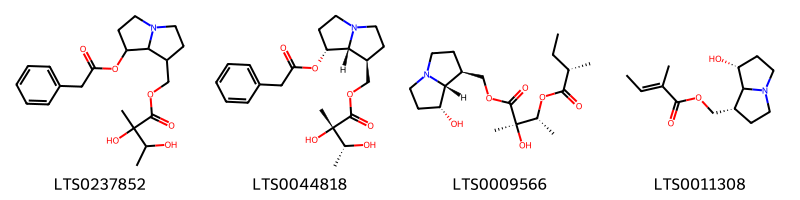{ width=100% }
    <figcaption>Hình ảnh cấu trúc hóa học của 4 hoạt chất thuộc nhóm Pyrrolizidines gồm ['{7-[(2-phenylacetyl)oxy]-hexahydro-1h-pyrrolizin-1-yl}methyl 2,3-dihydroxy-2-methylbutanoate (LTS0237852)', '[(1r,7r,7ar)-7-[(2-phenylacetyl)oxy]-hexahydro-1h-pyrrolizin-1-yl]methyl (2s,3r)-2,3-dihydroxy-2-methylbutanoate (LTS0044818)', '[(1r,7r,7ar)-7-hydroxy-hexahydro-1h-pyrrolizin-1-yl]methyl (2r,3r)-2-hydroxy-2-methyl-3-{[(2s)-2-methylbutanoyl]oxy}butanoate (LTS0009566)', '[(1s,7r)-7-hydroxy-hexahydro-1h-pyrrolizin-1-yl]methyl (2e)-2-methylbut-2-enoate (LTS0011308)'].</figcaption>
</figure>
#### Nhóm Tropane alkaloids
<figure markdown="span">
    { width=100% }
    <figcaption>Hình ảnh cấu trúc hóa học của 5 hoạt chất thuộc nhóm Tropane alkaloids gồm ['(1r,2s,3r,5s,6s)-8-azabicyclo[3.2.1]octane-1,2,3,6-tetrol (LTS0126311)', '(1r,2s,3s,4s,5s)-8-azabicyclo[3.2.1]octane-1,2,3,4-tetrol (LTS0206474)', '(1r,3s,4s,5r)-8-azabicyclo[3.2.1]octane-1,3,4-triol (LTS0110489)', '(1r,2s,3r,5s,6r)-8-azabicyclo[3.2.1]octane-1,2,3,6-tetrol (LTS0060094)', '(2s,3s,4s,5s)-8-azabicyclo[3.2.1]octane-1,2,3,4-tetrol (LTS0013394)'].</figcaption>
</figure>

---

### Dược dân tộc học

Danh sách các quốc gia có sử dụng *Ipomoea hederifolia* trong điều trị các bệnh. 

| Country            | Disease      | Bệnh                                                                                                                                                                                                |
|:-------------------|:-------------|:----------------------------------------------------------------------------------------------------------------------------------------------------------------------------------------------------|
| Dominican Republic | Sternutatory | MYMEMORY WARNING: YOU USED ALL AVAILABLE FREE TRANSLATIONS FOR TODAY. NEXT AVAILABLE IN  16 HOURS 07 MINUTES 52 SECONDS VISIT HTTPS://MYMEMORY.TRANSLATED.NET/DOC/USAGELIMITS.PHP TO TRANSLATE MORE |

---

---
## Ipomoea maxima
### Thông tin về thực vật

!!! info "Phân loại thực vật của *N/A* từ GIBF:"
    - **Kingdom:** Plantae
    - **Phylum:** Tracheophyta
    - **Order:** Solanales
    - **Family:** Convolvulaceae
    - **Genus:** Ipomoea
    - **Species:** *N/A*

 

| Label (VI)   | Label (EN)   | Scientific Name   | Descriptions (VI)   | Descriptions (EN)   | Also Known As (VI)   | Also Known As (EN)   |
|:-------------|:-------------|:------------------|:--------------------|:--------------------|:---------------------|:---------------------|
| N/A          | N/A          | Ipomoea maxima    | loài thực vật       | species of plant    | ['']                 | ['']                 |

#### Phân bố trên thế giới

**Từ CSDL GIBF** Viet Nam, Thailand, Namibia, Spain, Chile, Australia, Indonesia, Colombia, Sri Lanka, Puerto Rico, Malaysia, India, Guam, Türkiye, Uganda, Belize, Nicaragua, Panama, Brazil, Japan, Peru, Mexico, China, Chinese Taipei, Hong Kong, Uruguay, Argentina, Portugal, South Africa, New Zealand, Costa Rica, Ecuador, United States of America

#### Phân bố tại Việt Nam

**Từ CSDL GIBF**: Lâm Đồng, Hồ Chí Minh city

---
### Thành phần hóa học
        
- Theo cơ sở dữ liệu lotus: Từ loài *N/A* đã phân lập và xác định được Chưa có hoạt chất nào được phân lập. hoạt chất thuộc về các nhóm Không có hoạt chất nào được phân lập. 

Không có hình ảnh nào được tạo ra

---

### Dược dân tộc học

Danh sách các quốc gia có sử dụng *N/A* trong điều trị các bệnh. 

| Country   | Disease            | Bệnh                                                                                                                                                                                                |
|:----------|:-------------------|:----------------------------------------------------------------------------------------------------------------------------------------------------------------------------------------------------|
| India     | Diuretic, Antidote | MYMEMORY WARNING: YOU USED ALL AVAILABLE FREE TRANSLATIONS FOR TODAY. NEXT AVAILABLE IN  16 HOURS 07 MINUTES 25 SECONDS VISIT HTTPS://MYMEMORY.TRANSLATED.NET/DOC/USAGELIMITS.PHP TO TRANSLATE MORE |

---

---
## Ipomoea murucoides
### Thông tin về thực vật

!!! info "Phân loại thực vật của *Ipomoea murucoides* từ GIBF:"
    - **Kingdom:** Plantae
    - **Phylum:** Tracheophyta
    - **Order:** Solanales
    - **Family:** Convolvulaceae
    - **Genus:** Ipomoea
    - **Species:** *Ipomoea murucoides*

 

| Label (VI)   | Label (EN)   | Scientific Name    | Descriptions (VI)   | Descriptions (EN)   | Also Known As (VI)   | Also Known As (EN)   |
|:-------------|:-------------|:-------------------|:--------------------|:--------------------|:---------------------|:---------------------|
| N/A          | N/A          | Ipomoea murucoides | loài thực vật       | species of plant    | ['']                 | ['']                 |

#### Phân bố trên thế giới

**Từ CSDL GIBF** Mexico, Guatemala

#### Phân bố tại Việt Nam

**Từ CSDL GIBF**: Không có ghi nhận ở Việt Nam

---
### Thành phần hóa học
        
- Theo cơ sở dữ liệu lotus: Từ loài *Ipomoea murucoides* đã phân lập và xác định được 62 hoạt chất thuộc về các nhóm Fatty Acyls, Organooxygen compounds, Saccharolipids. 

|    | chemicalTaxonomyClassyfireClass   |   smiles_count |
|---:|:----------------------------------|---------------:|
|  0 | Fatty Acyls                       |              1 |
|  1 | Organooxygen compounds            |             60 |
|  2 | Saccharolipids                    |              1 |

#### Nhóm Fatty Acyls
<figure markdown="span">
    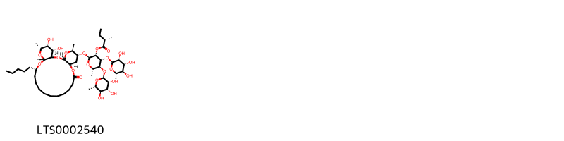{ width=100% }
    <figcaption>Hình ảnh cấu trúc hóa học của 1 hoạt chất thuộc nhóm Fatty Acyls gồm ['(2s,3r,4r,5s,6s)-2-{[(1r,3s,5s,6r,8r,20s,22r,24r,25r,26s)-25,26-dihydroxy-5,24-dimethyl-10-oxo-20-pentyl-2,4,9,21,23-pentaoxatricyclo[20.4.0.0³,⁸]hexacosan-6-yl]oxy}-6-methyl-4,5-bis({[(2s,3r,4r,5r,6s)-3,4,5-trihydroxy-6-methyloxan-2-yl]oxy})oxan-3-yl (2s)-2-methylbutanoate (LTS0002540)'].</figcaption>
</figure>
#### Nhóm Organooxygen compounds
<figure markdown="span">
    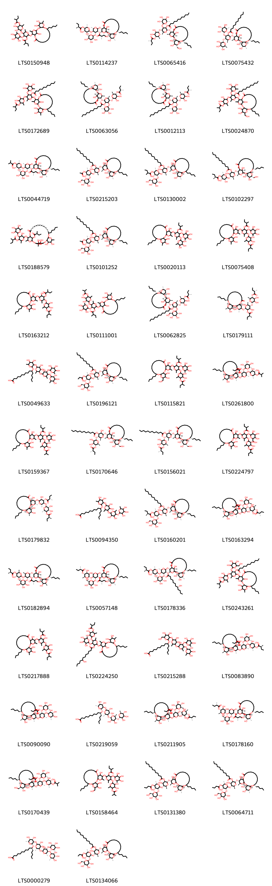{ width=100% }
    <figcaption>Hình ảnh cấu trúc hóa học của 60 hoạt chất thuộc nhóm Organooxygen compounds gồm ['5-({3,4-dihydroxy-6-methyl-5-[(2-methylbutanoyl)oxy]oxan-2-yl}oxy)-6-methyl-2-({4,5,26-trihydroxy-6,24-dimethyl-20-oxo-10-pentyl-2,7,9,21,25-pentaoxatricyclo[20.3.1.0³,⁸]hexacosan-23-yl}oxy)-4-[(3,4,5-trihydroxy-6-methyloxan-2-yl)oxy]oxan-3-yl 2-methylbutanoate (LTS0150948)', '(2s,3r,4r,5s,6s)-5-{[(2s,3r,4s,5r,6s)-3,4-dihydroxy-6-methyl-5-{[(2s)-2-methylbutanoyl]oxy}oxan-2-yl]oxy}-6-methyl-2-{[(1s,3r,4s,5r,6r,8r,10s,22s,23s,24s,26r)-4,5,26-trihydroxy-6,24-dimethyl-20-oxo-10-pentyl-2,7,9,21,25-pentaoxatricyclo[20.3.1.0³,⁸]hexacosan-23-yl]oxy}-4-{[(2s,3r,4r,5r,6s)-3,4,5-trihydroxy-6-methyloxan-2-yl]oxy}oxan-3-yl (2s)-2-methylbutanoate (LTS0114237)', '(2s,3r,4r,5s,6s)-5-{[(2s,3r,4s,5r,6s)-3,4-dihydroxy-6-methyl-5-{[(2s)-2-methylbutanoyl]oxy}oxan-2-yl]oxy}-6-methyl-2-{[(1s,3r,4s,5s,6r,8r,10s,22s,23s,24s,26r)-4,5,26-trihydroxy-6-(hydroxymethyl)-24-methyl-20-oxo-10-pentyl-2,7,9,21,25-pentaoxatricyclo[20.3.1.0³,⁸]hexacosan-23-yl]oxy}-4-{[(2s,3r,4r,5r,6s)-3,4,5-trihydroxy-6-methyloxan-2-yl]oxy}oxan-3-yl dodecanoate (LTS0065416)', '(2s,3r,4r,5s,6s)-6-methyl-2-{[(1s,3r,4s,5r,6r,8s,10s,22r,23s,24s,26r)-4,5,26-trihydroxy-6,24-dimethyl-20-oxo-10-pentyl-2,7,9,21,25-pentaoxatricyclo[20.3.1.0³,⁸]hexacosan-23-yl]oxy}-4-{[(2r,3r,4r,5r,6s)-3,4,5-trihydroxy-6-methyloxan-2-yl]oxy}-5-{[(2s,3r,4r,5r,6s)-3,4,5-trihydroxy-6-methyloxan-2-yl]oxy}oxan-3-yl dodecanoate (LTS0075432)', '5-({3,4-dihydroxy-6-methyl-5-[(2-methylbutanoyl)oxy]oxan-2-yl}oxy)-6-methyl-2-({4,5,26-trihydroxy-6,24-dimethyl-20-oxo-10-pentyl-2,7,9,21,25-pentaoxatricyclo[20.3.1.0³,⁸]hexacosan-23-yl}oxy)-4-[(3,4,5-trihydroxy-6-methyloxan-2-yl)oxy]oxan-3-yl dodecanoate (LTS0172689)', '(2s,3r,4r,5s,6s)-5-{[(2s,3r,4s,5r,6s)-3,4-dihydroxy-6-methyl-5-{[(2s)-2-methylbutanoyl]oxy}oxan-2-yl]oxy}-6-methyl-2-{[(1s,3r,4s,5r,6r,8r,10s,22s,23s,24s,26s)-4,5,26-trihydroxy-6,24-dimethyl-20-oxo-10-pentyl-2,7,9,21,25-pentaoxatricyclo[20.3.1.0³,⁸]hexacosan-23-yl]oxy}-4-{[(2s,3r,4r,5r,6s)-3,4,5-trihydroxy-6-methyloxan-2-yl]oxy}oxan-3-yl dodecanoate (LTS0063056)', '(2s,3r,4r,5s,6s)-5-{[(2s,3r,4s,5r,6s)-3,4-dihydroxy-6-methyl-5-{[(2s)-2-methylbutanoyl]oxy}oxan-2-yl]oxy}-6-methyl-2-{[(1s,3r,4s,5r,6r,8r,10s,22s,23s,24s,26r)-4,5,26-trihydroxy-6,24-dimethyl-20-oxo-10-pentyl-2,7,9,21,25-pentaoxatricyclo[20.3.1.0³,⁸]hexacosan-23-yl]oxy}-4-{[(2s,3r,4r,5r,6s)-3,4,5-trihydroxy-6-methyloxan-2-yl]oxy}oxan-3-yl dodecanoate (LTS0012113)', '5-({3,4-dihydroxy-6-methyl-5-[(2-methylbutanoyl)oxy]oxan-2-yl}oxy)-6-methyl-2-{[4,5,26-trihydroxy-6-(hydroxymethyl)-24-methyl-20-oxo-10-pentyl-2,7,9,21,25-pentaoxatricyclo[20.3.1.0³,⁸]hexacosan-23-yl]oxy}-4-[(3,4,5-trihydroxy-6-methyloxan-2-yl)oxy]oxan-3-yl dodecanoate (LTS0024870)', '(2s,3r,4r,5s,6s)-5-{[(2s,3r,4s,5r,6s)-3,4-dihydroxy-6-methyl-5-[(2-methylpropanoyl)oxy]oxan-2-yl]oxy}-6-methyl-2-{[(1s,3r,4s,5r,6r,8r,10s,22s,23s,24s,26r)-4,5,26-trihydroxy-6,24-dimethyl-20-oxo-10-pentyl-2,7,9,21,25-pentaoxatricyclo[20.3.1.0³,⁸]hexacosan-23-yl]oxy}-4-{[(2s,3r,4r,5r,6s)-3,4,5-trihydroxy-6-methyloxan-2-yl]oxy}oxan-3-yl (2s)-2-methylbutanoate (LTS0044719)', '(2s,3r,4r,5r,6s)-5-{[(2s,3r,4r,5r,6s)-5-(acetyloxy)-4-hydroxy-6-methyl-3-{[(2s,3r,4s,5s,6r)-3,4,5-trihydroxy-6-(hydroxymethyl)oxan-2-yl]oxy}oxan-2-yl]oxy}-4-hydroxy-6-methyl-2-{[(1r,5s,6r,7r,8r,22r,24r,25s,26s)-7,25,26-trihydroxy-5,24-dimethyl-10-oxo-20-pentyl-2,4,9,21,23-pentaoxatricyclo[20.4.0.0³,⁸]hexacosan-6-yl]oxy}oxan-3-yl dodecanoate (LTS0215203)', '(2s,3r,4r,5r,6s)-4-hydroxy-5-{[(2s,3r,4r,5r,6s)-4-hydroxy-6-methyl-5-[(2-methylbutanoyl)oxy]-3-{[(2s,3r,4s,5s,6r)-3,4,5-trihydroxy-6-(hydroxymethyl)oxan-2-yl]oxy}oxan-2-yl]oxy}-6-methyl-2-{[(1r,5s,6r,7r,8r,22r,24r,25s,26s)-7,25,26-trihydroxy-5,24-dimethyl-10-oxo-20-pentyl-2,4,9,21,23-pentaoxatricyclo[20.4.0.0³,⁸]hexacosan-6-yl]oxy}oxan-3-yl dodecanoate (LTS0130002)', '(2s,3r,4r,5r,6s)-5-{[(2s,3r,4s,5r,6s)-3,4-dihydroxy-6-methyl-5-{[(2s)-2-methylbutanoyl]oxy}oxan-2-yl]oxy}-4-hydroxy-6-methyl-2-{[(1s,3r,4s,5s,6r,8r,10s,22s,23s,24s,26r)-4,5,26-trihydroxy-6-(hydroxymethyl)-24-methyl-20-oxo-10-pentyl-2,7,9,21,25-pentaoxatricyclo[20.3.1.0³,⁸]hexacosan-23-yl]oxy}oxan-3-yl dodecanoate (LTS0102297)', '24,25,31,32-tetrahydroxy-6-({3-hydroxy-6-methyl-5-[(2-methylbutanoyl)oxy]-4-[(3,4,5-trihydroxy-6-methyloxan-2-yl)oxy]oxan-2-yl}oxy)-5,23,30-trimethyl-9-oxo-19-pentyl-2,4,8,20,22,27,29-heptaoxatetracyclo[26.2.2.1³,⁷.0²¹,²⁶]tritriacontan-33-yl 2-methylbutanoate (LTS0188579)', '(2s,3r,4r,5r,6s)-5-{[(2s,3r,4r,5r,6s)-5-(acetyloxy)-4-hydroxy-6-methyl-3-{[(2s,3r,4s,5r,6r)-3,4,5-trihydroxy-6-(hydroxymethyl)oxan-2-yl]oxy}oxan-2-yl]oxy}-4-hydroxy-6-methyl-2-{[(1r,3s,5s,6r,7r,8r,20s,22r,24r,25s,26s)-7,25,26-trihydroxy-5,24-dimethyl-10-oxo-20-pentyl-2,4,9,21,23-pentaoxatricyclo[20.4.0.0³,⁸]hexacosan-6-yl]oxy}oxan-3-yl dodecanoate (LTS0101252)', '6-methyl-2-({7,25,26-trihydroxy-5,24-dimethyl-10-oxo-20-pentyl-2,4,9,21,23-pentaoxatricyclo[20.4.0.0³,⁸]hexacosan-6-yl}oxy)-4,5-bis[(3,4,5-trihydroxy-6-methyloxan-2-yl)oxy]oxan-3-yl 2-methylbutanoate (LTS0020113)', '5-({3,4-dihydroxy-6-methyl-5-[(2-methylbutanoyl)oxy]oxan-2-yl}oxy)-6-methyl-2-({7,25,26-trihydroxy-5,24-dimethyl-10-oxo-20-pentyl-2,4,9,21,23-pentaoxatricyclo[20.4.0.0³,⁸]hexacosan-6-yl}oxy)-4-[(3,4,5-trihydroxy-6-methyloxan-2-yl)oxy]oxan-3-yl 2-methylbutanoate (LTS0075408)', '3-({3,4-dihydroxy-6-methyl-5-[(2-methylbutanoyl)oxy]oxan-2-yl}oxy)-5-hydroxy-2-methyl-6-({7,25,26-trihydroxy-5,24-dimethyl-10-oxo-20-pentyl-2,4,9,21,23-pentaoxatricyclo[20.4.0.0³,⁸]hexacosan-6-yl}oxy)oxan-4-yl 2-methylbutanoate (LTS0163212)', '5-({3,4-dihydroxy-6-methyl-5-[(2-methylpropanoyl)oxy]oxan-2-yl}oxy)-6-methyl-2-({4,5,26-trihydroxy-6,24-dimethyl-20-oxo-10-pentyl-2,7,9,21,25-pentaoxatricyclo[20.3.1.0³,⁸]hexacosan-23-yl}oxy)-4-[(3,4,5-trihydroxy-6-methyloxan-2-yl)oxy]oxan-3-yl 2-methylbutanoate (LTS0111001)', '(2s,3r,4r,5s,6s)-5-{[(2s,3r,4s,5r,6s)-3,4-dihydroxy-6-methyl-5-{[(2s)-2-methylbutanoyl]oxy}oxan-2-yl]oxy}-6-methyl-2-{[(1s,3r,4s,5r,6r,8r,10s,22s,23s,24s,26r)-4,5,26-trihydroxy-6,24-dimethyl-20-oxo-10-pentyl-2,7,9,21,25-pentaoxatricyclo[20.3.1.0³,⁸]hexacosan-23-yl]oxy}-4-{[(2s,3r,4s,5s,6r)-3,4,5-trihydroxy-6-(hydroxymethyl)oxan-2-yl]oxy}oxan-3-yl dodecanoate (LTS0062825)', '(2s,3r,4r,5r,6s)-5-{[(2s,3r,4s,5r,6s)-3,4-dihydroxy-6-methyl-5-{[(2s)-2-methylbutanoyl]oxy}oxan-2-yl]oxy}-4-hydroxy-6-methyl-2-{[(1r,3s,5s,6r,7r,8r,20s,22r,24r,25r,26s)-7,25,26-trihydroxy-5,24-dimethyl-10-oxo-20-pentyl-2,4,9,21,23-pentaoxatricyclo[20.4.0.0³,⁸]hexacosan-6-yl]oxy}oxan-3-yl (2s)-2-methylbutanoate (LTS0179111)', '11-[(3-{[3,4-dihydroxy-5-({3-hydroxy-6-methyl-4,5-bis[(3,4,5-trihydroxy-6-methyloxan-2-yl)oxy]oxan-2-yl}oxy)-6-methyloxan-2-yl]oxy}-4,5-dihydroxy-6-methyloxan-2-yl)oxy]hexadecanoic acid (LTS0049633)', '(2s,3r,4r,5r,6s)-4-hydroxy-5-{[(2s,3r,4r,5r,6s)-4-hydroxy-6-methyl-5-(propanoyloxy)-3-{[(2s,3r,4s,5r,6r)-3,4,5-trihydroxy-6-(hydroxymethyl)oxan-2-yl]oxy}oxan-2-yl]oxy}-6-methyl-2-{[(1r,3s,5s,6r,7r,8r,20s,22r,24r,25s,26s)-7,25,26-trihydroxy-5,24-dimethyl-10-oxo-20-pentyl-2,4,9,21,23-pentaoxatricyclo[20.4.0.0³,⁸]hexacosan-6-yl]oxy}oxan-3-yl dodecanoate (LTS0196121)', '5-({3,4-dihydroxy-6-methyl-5-[(2-methylbutanoyl)oxy]oxan-2-yl}oxy)-6-methyl-2-{[7,25,26-trihydroxy-24-(hydroxymethyl)-5-methyl-10-oxo-20-pentyl-2,4,9,21,23-pentaoxatricyclo[20.4.0.0³,⁸]hexacosan-6-yl]oxy}-4-[(3,4,5-trihydroxy-6-methyloxan-2-yl)oxy]oxan-3-yl 2-methylbutanoate (LTS0115821)', '(2s,3r,4r,5s,6s)-5-{[(2s,3r,4s,5r,6s)-3,4-dihydroxy-6-methyl-5-[(2-methylpropanoyl)oxy]oxan-2-yl]oxy}-6-methyl-2-{[(1r,3s,5s,6r,7r,8r,20s,22r,24r,25r,26s)-7,25,26-trihydroxy-5,24-dimethyl-10-oxo-20-pentyl-2,4,9,21,23-pentaoxatricyclo[20.4.0.0³,⁸]hexacosan-6-yl]oxy}-4-{[(2s,3r,4r,5r,6s)-3,4,5-trihydroxy-6-methyloxan-2-yl]oxy}oxan-3-yl (2s)-2-methylbutanoate (LTS0261800)', '5-({3,4-dihydroxy-6-methyl-5-[(2-methylpropanoyl)oxy]oxan-2-yl}oxy)-6-methyl-2-({7,25,26-trihydroxy-5,24-dimethyl-10-oxo-20-pentyl-2,4,9,21,23-pentaoxatricyclo[20.4.0.0³,⁸]hexacosan-6-yl}oxy)-4-[(3,4,5-trihydroxy-6-methyloxan-2-yl)oxy]oxan-3-yl 2-methylbutanoate (LTS0159367)', '(2s,3s,4s,5r,6s)-3-{[(2s,3r,4s,5r,6s)-3,4-dihydroxy-6-methyl-5-{[(2s)-2-methylbutanoyl]oxy}oxan-2-yl]oxy}-5-hydroxy-2-methyl-6-{[(1s,3r,4s,5s,6r,8r,10s,22s,23s,24s,26r)-4,5,26-trihydroxy-6-(hydroxymethyl)-24-methyl-20-oxo-10-pentyl-2,7,9,21,25-pentaoxatricyclo[20.3.1.0³,⁸]hexacosan-23-yl]oxy}oxan-4-yl dodecanoate (LTS0170646)', '(2s,3s,4s,5r,6s)-3-{[(2s,3r,4s,5r,6s)-3,4-dihydroxy-6-methyl-5-{[(2s)-2-methylbutanoyl]oxy}oxan-2-yl]oxy}-5-hydroxy-2-methyl-6-{[(1s,3r,4s,5r,6r,8r,10s,22s,23s,24s,26r)-4,5,26-trihydroxy-6-(hydroxymethyl)-24-methyl-20-oxo-10-pentyl-2,7,9,21,25-pentaoxatricyclo[20.3.1.0³,⁸]hexacosan-23-yl]oxy}oxan-4-yl dodecanoate (LTS0156021)', '5-({3,4-dihydroxy-6-methyl-5-[(2-methylbutanoyl)oxy]oxan-2-yl}oxy)-6-methyl-2-({7,25,26-trihydroxy-5,24-dimethyl-10-oxo-20-pentyl-2,4,9,21,23-pentaoxatricyclo[20.4.0.0³,⁸]hexacosan-6-yl}oxy)-4-{[3,4,5-trihydroxy-6-(hydroxymethyl)oxan-2-yl]oxy}oxan-3-yl 2-methylbutanoate (LTS0224797)', '(2s,3s,4s,5r,6s)-3-{[(2s,3r,4s,5r,6s)-3,4-dihydroxy-6-methyl-5-{[(2s)-2-methylbutanoyl]oxy}oxan-2-yl]oxy}-5-hydroxy-2-methyl-6-{[(1r,3s,5s,6r,7r,8r,20s,22r,24r,25r,26s)-7,25,26-trihydroxy-5,24-dimethyl-10-oxo-20-pentyl-2,4,9,21,23-pentaoxatricyclo[20.4.0.0³,⁸]hexacosan-6-yl]oxy}oxan-4-yl (2s)-2-methylbutanoate (LTS0179832)', '11-[(3-{[5-({3,4-dihydroxy-6-methyl-5-[(3,4,5-trihydroxy-6-methyloxan-2-yl)oxy]oxan-2-yl}oxy)-3,4-dihydroxy-6-methyloxan-2-yl]oxy}-4,5-dihydroxy-6-methyloxan-2-yl)oxy]hexadecanoic acid (LTS0094350)', '(2s,3r,4r,5r,6s)-4-hydroxy-5-{[(2s,3r,4r,5r,6s)-4-hydroxy-6-methyl-5-{[(2s)-2-methylbutanoyl]oxy}-3-{[(2s,3r,4s,5r,6r)-3,4,5-trihydroxy-6-(hydroxymethyl)oxan-2-yl]oxy}oxan-2-yl]oxy}-6-methyl-2-{[(1r,3s,5s,6r,7r,8r,20s,22r,24r,25s,26s)-7,25,26-trihydroxy-5,24-dimethyl-10-oxo-20-pentyl-2,4,9,21,23-pentaoxatricyclo[20.4.0.0³,⁸]hexacosan-6-yl]oxy}oxan-3-yl dodecanoate (LTS0160201)', '(2s,3r,4r,5s,6s)-5-{[(2s,3r,4s,5r,6s)-3,4-dihydroxy-6-methyl-5-{[(2s)-2-methylbutanoyl]oxy}oxan-2-yl]oxy}-6-methyl-2-{[(1r,3s,5s,6r,7r,8r,20s,22r,24r,25r,26s)-7,25,26-trihydroxy-5,24-dimethyl-10-oxo-20-pentyl-2,4,9,21,23-pentaoxatricyclo[20.4.0.0³,⁸]hexacosan-6-yl]oxy}-4-{[(2s,3r,4s,5r,6r)-3,4,5-trihydroxy-6-(hydroxymethyl)oxan-2-yl]oxy}oxan-3-yl (2s)-2-methylbutanoate (LTS0163294)', '(2r,3s,4r,5s,6r)-5-{[(2s,3r,4s,5r,6r)-3,4-dihydroxy-6-methyl-5-{[(2s)-2-methylbutanoyl]oxy}oxan-2-yl]oxy}-6-methyl-2-{[(1r,3r,4r,5s,6s,8r,10s,22s,23s,24r,26r)-4,5,26-trihydroxy-6,24-dimethyl-20-oxo-10-pentyl-2,7,9,21,25-pentaoxatricyclo[20.3.1.0³,⁸]hexacosan-23-yl]oxy}-4-{[(2s,3s,4r,5r,6r)-3,4,5-trihydroxy-6-methyloxan-2-yl]oxy}oxan-3-yl (2s)-2-methylbutanoate (LTS0182894)', '(2s,3r,4r,5s,6s)-5-{[(2s,3r,4s,5r,6s)-3,4-dihydroxy-6-methyl-5-{[(2s)-2-methylbutanoyl]oxy}oxan-2-yl]oxy}-6-methyl-2-{[(1s,3r,4s,5r,6r,8r,10s,22s,23s,24s,26r)-4,5,26-trihydroxy-6,24-dimethyl-20-oxo-10-pentyl-2,7,9,21,25-pentaoxatricyclo[20.3.1.0³,⁸]hexacosan-23-yl]oxy}-4-{[(2s,3r,4s,5s,6r)-3,4,5-trihydroxy-6-(hydroxymethyl)oxan-2-yl]oxy}oxan-3-yl (2s)-2-methylbutanoate (LTS0057148)', '(2s,3r,4r,5s,6s)-5-{[(2s,3r,4s,5r,6s)-3,4-dihydroxy-6-methyl-5-{[(2s)-2-methylbutanoyl]oxy}oxan-2-yl]oxy}-6-methyl-2-{[(1s,3r,4s,5r,6r,8r,10s,22s,23s,24s,26r)-4,5,26-trihydroxy-6,24-dimethyl-20-oxo-10-pentyl-2,7,9,21,25-pentaoxatricyclo[20.3.1.0³,⁸]hexacosan-23-yl]oxy}-4-{[(2s,3r,4r,5r,6s)-3,4,5-trihydroxy-6-methyloxan-2-yl]oxy}oxan-3-yl (8r)-8-hydroxydodecanoate (LTS0178336)', '5-({3,4-dihydroxy-6-methyl-5-[(2-methylbutanoyl)oxy]oxan-2-yl}oxy)-6-methyl-2-({4,5,26-trihydroxy-6,24-dimethyl-20-oxo-10-pentyl-2,7,9,21,25-pentaoxatricyclo[20.3.1.0³,⁸]hexacosan-23-yl}oxy)-4-{[3,4,5-trihydroxy-6-(hydroxymethyl)oxan-2-yl]oxy}oxan-3-yl dodecanoate (LTS0243261)', '5-({3,4-dihydroxy-6-methyl-5-[(2-methylbutanoyl)oxy]oxan-2-yl}oxy)-4-hydroxy-6-methyl-2-({7,25,26-trihydroxy-5,24-dimethyl-10-oxo-20-pentyl-2,4,9,21,23-pentaoxatricyclo[20.4.0.0³,⁸]hexacosan-6-yl}oxy)oxan-3-yl 2-methylbutanoate (LTS0217888)', '5-({3,4-dihydroxy-6-methyl-5-[(2-methylbutanoyl)oxy]oxan-2-yl}oxy)-6-methyl-2-({4,5,26-trihydroxy-6,24-dimethyl-20-oxo-10-pentyl-2,7,9,21,25-pentaoxatricyclo[20.3.1.0³,⁸]hexacosan-23-yl}oxy)-4-[(3,4,5-trihydroxy-6-methyloxan-2-yl)oxy]oxan-3-yl 8-hydroxydodecanoate (LTS0224250)', '11-[(3-{[3,4-dihydroxy-5-({3-hydroxy-6-methyl-4,5-bis[(3,4,5-trihydroxy-6-methyloxan-2-yl)oxy]oxan-2-yl}oxy)-6-methyloxan-2-yl]oxy}-4,5-dihydroxy-6-(hydroxymethyl)oxan-2-yl)oxy]hexadecanoic acid (LTS0215288)', '(2s,3r,4r,5s,6s)-5-{[(2s,3r,4s,5r,6s)-3,4-dihydroxy-6-methyl-5-{[(2s)-2-methylbutanoyl]oxy}oxan-2-yl]oxy}-6-methyl-2-{[(1r,3s,5s,6r,7r,8r,20s,22r,24r,25r,26s)-7,25,26-trihydroxy-5,24-dimethyl-10-oxo-20-pentyl-2,4,9,21,23-pentaoxatricyclo[20.4.0.0³,⁸]hexacosan-6-yl]oxy}-4-{[(2s,3r,4r,5r,6s)-3,4,5-trihydroxy-6-methyloxan-2-yl]oxy}oxan-3-yl (2s)-2-methylbutanoate (LTS0083890)', '(2s,3r,4r,5s,6s)-6-methyl-2-{[(1r,3s,5s,6r,7r,8r,20s,22r,24r,25r,26s)-7,25,26-trihydroxy-5,24-dimethyl-10-oxo-20-pentyl-2,4,9,21,23-pentaoxatricyclo[20.4.0.0³,⁸]hexacosan-6-yl]oxy}-4,5-bis({[(2s,3r,4r,5r,6s)-3,4,5-trihydroxy-6-methyloxan-2-yl]oxy})oxan-3-yl (2s)-2-methylbutanoate (LTS0090090)', 'operculinic acid c (LTS0219059)', '(2s,3r,4r,5s,6s)-5-{[(2s,3r,4s,5r,6s)-3,4-dihydroxy-6-methyl-5-{[(2s)-2-methylbutanoyl]oxy}oxan-2-yl]oxy}-6-methyl-2-{[(1r,3s,5s,6r,7r,8r,20s,22r,24r,25r,26s)-7,25,26-trihydroxy-5,24-dimethyl-10-oxo-20-pentyl-2,4,9,21,23-pentaoxatricyclo[20.4.0.0³,⁸]hexacosan-6-yl]oxy}-4-{[(2s,3r,4s,5s,6r)-3,4,5-trihydroxy-6-(hydroxymethyl)oxan-2-yl]oxy}oxan-3-yl (2s)-2-methylbutanoate (LTS0211905)', '(2s,3r,4r,5s,6s)-5-{[(2s,3r,4s,5r,6s)-3,4-dihydroxy-6-methyl-5-{[(2s)-2-methylbutanoyl]oxy}oxan-2-yl]oxy}-6-methyl-2-{[(1s,3r,4s,5r,6r,8r,10s,21s,22s,23s,25r)-4,5,25-trihydroxy-6,23-dimethyl-19-oxo-10-pentyl-2,7,9,20,24-pentaoxatricyclo[19.3.1.0³,⁸]pentacosan-22-yl]oxy}-4-{[(2s,3r,4s,5s,6r)-3,4,5-trihydroxy-6-(hydroxymethyl)oxan-2-yl]oxy}oxan-3-yl (2s)-2-methylbutanoate (LTS0178160)', '(2s,3r,4r,5s,6s)-5-{[(2s,3r,4s,5r,6s)-3,4-dihydroxy-6-methyl-5-[(2-methylpropanoyl)oxy]oxan-2-yl]oxy}-6-methyl-2-{[(1r,3s,5s,6r,7r,8r,20s,22r,24r,25s,26s)-7,25,26-trihydroxy-24-(hydroxymethyl)-5-methyl-10-oxo-20-pentyl-2,4,9,21,23-pentaoxatricyclo[20.4.0.0³,⁸]hexacosan-6-yl]oxy}-4-{[(2s,3r,4r,5r,6s)-3,4,5-trihydroxy-6-methyloxan-2-yl]oxy}oxan-3-yl (2s)-2-methylbutanoate (LTS0170439)', '5-({3,4-dihydroxy-6-methyl-5-[(2-methylpropanoyl)oxy]oxan-2-yl}oxy)-6-methyl-2-{[7,25,26-trihydroxy-24-(hydroxymethyl)-5-methyl-10-oxo-20-pentyl-2,4,9,21,23-pentaoxatricyclo[20.4.0.0³,⁸]hexacosan-6-yl]oxy}-4-[(3,4,5-trihydroxy-6-methyloxan-2-yl)oxy]oxan-3-yl 2-methylbutanoate (LTS0158464)', '(2s,3r,4r,5r,6s)-5-{[(2s,3r,4r,5r,6s)-5-(butanoyloxy)-4-hydroxy-6-methyl-3-{[(2s,3r,4s,5s,6r)-3,4,5-trihydroxy-6-(hydroxymethyl)oxan-2-yl]oxy}oxan-2-yl]oxy}-4-hydroxy-6-methyl-2-{[(1r,5s,6r,7r,8r,22r,24r,25s,26s)-7,25,26-trihydroxy-5,24-dimethyl-10-oxo-20-pentyl-2,4,9,21,23-pentaoxatricyclo[20.4.0.0³,⁸]hexacosan-6-yl]oxy}oxan-3-yl dodecanoate (LTS0131380)', '(2s,3r,4r,5r,6s)-5-{[(2s,3r,4r,5r,6s)-5-(butanoyloxy)-4-hydroxy-6-methyl-3-{[(2s,3r,4s,5r,6r)-3,4,5-trihydroxy-6-(hydroxymethyl)oxan-2-yl]oxy}oxan-2-yl]oxy}-4-hydroxy-6-methyl-2-{[(1r,3s,5s,6r,7r,8r,20s,22r,24r,25s,26s)-7,25,26-trihydroxy-5,24-dimethyl-10-oxo-20-pentyl-2,4,9,21,23-pentaoxatricyclo[20.4.0.0³,⁸]hexacosan-6-yl]oxy}oxan-3-yl dodecanoate (LTS0064711)', '(11s)-11-{[(2r,3r,4s,5r,6r)-3-{[(2s,3r,4s,5r,6s)-3,4-dihydroxy-5-{[(2s,3r,4s,5s,6s)-3-hydroxy-6-methyl-4,5-bis({[(2s,3r,4r,5r,6s)-3,4,5-trihydroxy-6-methyloxan-2-yl]oxy})oxan-2-yl]oxy}-6-methyloxan-2-yl]oxy}-4,5-dihydroxy-6-methyloxan-2-yl]oxy}hexadecanoic acid (LTS0000279)', '(2s,3r,4r,5r,6s)-4-hydroxy-5-{[(2s,3r,4r,5r,6s)-4-hydroxy-6-methyl-5-(propanoyloxy)-3-{[(2s,3r,4s,5s,6r)-3,4,5-trihydroxy-6-(hydroxymethyl)oxan-2-yl]oxy}oxan-2-yl]oxy}-6-methyl-2-{[(1r,5s,6r,7r,8r,22r,24r,25s,26s)-7,25,26-trihydroxy-5,24-dimethyl-10-oxo-20-pentyl-2,4,9,21,23-pentaoxatricyclo[20.4.0.0³,⁸]hexacosan-6-yl]oxy}oxan-3-yl dodecanoate (LTS0134066)', '(11s)-11-{[(2r,3r,4s,5s,6r)-3-{[(2s,3r,4s,5r,6s)-3,4-dihydroxy-5-{[(2s,3r,4s,5s,6s)-3-hydroxy-6-methyl-4,5-bis({[(2s,3r,4r,5r,6s)-3,4,5-trihydroxy-6-methyloxan-2-yl]oxy})oxan-2-yl]oxy}-6-methyloxan-2-yl]oxy}-4,5-dihydroxy-6-(hydroxymethyl)oxan-2-yl]oxy}hexadecanoic acid (LTS0008313)', '(2s,3r,4r,5r,6s)-4-hydroxy-5-{[(2s,3r,4r,5r,6s)-4-hydroxy-5-{[(2r,3r)-3-hydroxy-2-methylbutanoyl]oxy}-6-methyl-3-{[(2s,3r,4s,5r,6r)-3,4,5-trihydroxy-6-(hydroxymethyl)oxan-2-yl]oxy}oxan-2-yl]oxy}-6-methyl-2-{[(1r,3s,5s,6r,7r,8r,20s,22r,24r,25s,26s)-7,25,26-trihydroxy-5,24-dimethyl-10-oxo-20-pentyl-2,4,9,21,23-pentaoxatricyclo[20.4.0.0³,⁸]hexacosan-6-yl]oxy}oxan-3-yl dodecanoate (LTS0009814)', '5-({3,4-dihydroxy-6-methyl-5-[(2-methylbutanoyl)oxy]oxan-2-yl}oxy)-6-methyl-2-({4,5,25-trihydroxy-6,23-dimethyl-19-oxo-10-pentyl-2,7,9,20,24-pentaoxatricyclo[19.3.1.0³,⁸]pentacosan-22-yl}oxy)-4-{[3,4,5-trihydroxy-6-(hydroxymethyl)oxan-2-yl]oxy}oxan-3-yl 2-methylbutanoate (LTS0006919)', '(1r,3s,5s,6s,7r,19s,21r,23r,24r,25s,26r,28s,30s,31s,32r,33r)-24,25,31,32-tetrahydroxy-6-{[(2s,3r,4s,5s,6s)-3-hydroxy-6-methyl-5-{[(2s)-2-methylbutanoyl]oxy}-4-{[(2s,3r,4r,5r,6s)-3,4,5-trihydroxy-6-methyloxan-2-yl]oxy}oxan-2-yl]oxy}-5,23,30-trimethyl-9-oxo-19-pentyl-2,4,8,20,22,27,29-heptaoxatetracyclo[26.2.2.1³,⁷.0²¹,²⁶]tritriacontan-33-yl (2s)-2-methylbutanoate (LTS0113169)', '(11s)-11-{[(2s,3s,4s,5s,6r)-3-{[(2r,3r,4s,5s,6s)-3,4-dihydroxy-5-{[(2r,3s,4s,5r,6s)-3-hydroxy-6-methyl-4-{[(2s,3r,4s,5s,6s)-3,4,5-trihydroxy-6-methyloxan-2-yl]oxy}-5-{[(2s,3s,4r,5r,6r)-3,4,5-trihydroxy-6-methyloxan-2-yl]oxy}oxan-2-yl]oxy}-6-methyloxan-2-yl]oxy}-4,5-dihydroxy-6-methyloxan-2-yl]oxy}hexadecanoic acid (LTS0034252)', '5-({3,4-dihydroxy-6-methyl-5-[(2-methylbutanoyl)oxy]oxan-2-yl}oxy)-6-methyl-2-({4,5,26-trihydroxy-6,24-dimethyl-20-oxo-10-pentyl-2,7,9,21,25-pentaoxatricyclo[20.3.1.0³,⁸]hexacosan-23-yl}oxy)-4-{[3,4,5-trihydroxy-6-(hydroxymethyl)oxan-2-yl]oxy}oxan-3-yl 2-methylbutanoate (LTS0225722)', '(2s,3r,4r,5s,6s)-5-{[(2s,3r,4s,5r,6s)-3,4-dihydroxy-6-methyl-5-{[(2s)-2-methylbutanoyl]oxy}oxan-2-yl]oxy}-6-methyl-2-{[(1r,3s,5s,6r,7r,8r,20s,22r,24r,25s,26s)-7,25,26-trihydroxy-24-(hydroxymethyl)-5-methyl-10-oxo-20-pentyl-2,4,9,21,23-pentaoxatricyclo[20.4.0.0³,⁸]hexacosan-6-yl]oxy}-4-{[(2s,3r,4r,5r,6s)-3,4,5-trihydroxy-6-methyloxan-2-yl]oxy}oxan-3-yl (2s)-2-methylbutanoate (LTS0048027)', '5-({3,4-dihydroxy-6-methyl-5-[(2-methylbutanoyl)oxy]oxan-2-yl}oxy)-4-hydroxy-6-methyl-2-{[4,5,26-trihydroxy-6-(hydroxymethyl)-24-methyl-20-oxo-10-pentyl-2,7,9,21,25-pentaoxatricyclo[20.3.1.0³,⁸]hexacosan-23-yl]oxy}oxan-3-yl dodecanoate (LTS0109589)', '(2s,3r,4r,5r,6s)-4-hydroxy-5-{[(2s,3r,4r,5r,6s)-4-hydroxy-5-[(3-hydroxy-2-methylbutanoyl)oxy]-6-methyl-3-{[(2s,3r,4s,5s,6r)-3,4,5-trihydroxy-6-(hydroxymethyl)oxan-2-yl]oxy}oxan-2-yl]oxy}-6-methyl-2-{[(1r,5s,6r,7r,8r,22r,24r,25s,26s)-7,25,26-trihydroxy-5,24-dimethyl-10-oxo-20-pentyl-2,4,9,21,23-pentaoxatricyclo[20.4.0.0³,⁸]hexacosan-6-yl]oxy}oxan-3-yl dodecanoate (LTS0030857)', '3-({3,4-dihydroxy-6-methyl-5-[(2-methylbutanoyl)oxy]oxan-2-yl}oxy)-5-hydroxy-2-methyl-6-{[4,5,26-trihydroxy-6-(hydroxymethyl)-24-methyl-20-oxo-10-pentyl-2,7,9,21,25-pentaoxatricyclo[20.3.1.0³,⁸]hexacosan-23-yl]oxy}oxan-4-yl dodecanoate (LTS0023240)'].</figcaption>
</figure>
#### Nhóm Saccharolipids
<figure markdown="span">
    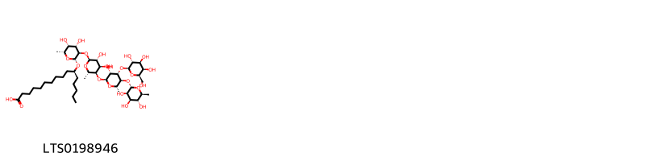{ width=100% }
    <figcaption>Hình ảnh cấu trúc hóa học của 1 hoạt chất thuộc nhóm Saccharolipids gồm ['(11s)-11-{[(2r,3r,4s,5r,6r)-3-{[(2s,3r,4r,5r,6s)-3,4-dihydroxy-5-{[(2s,3r,4s,5s,6s)-3-hydroxy-6-methyl-4-{[(2s,3r,4s,5r,6r)-3,4,5-trihydroxy-6-(hydroxymethyl)oxan-2-yl]oxy}-5-{[(2s,3r,4r,5r,6s)-3,4,5-trihydroxy-6-methyloxan-2-yl]oxy}oxan-2-yl]oxy}-6-methyloxan-2-yl]oxy}-4,5-dihydroxy-6-methyloxan-2-yl]oxy}hexadecanoic acid (LTS0198946)'].</figcaption>
</figure>

---

### Dược dân tộc học

Danh sách các quốc gia có sử dụng *Ipomoea murucoides* trong điều trị các bệnh. 

| Country   | Disease   | Bệnh                                                                                                                                                                                                |
|:----------|:----------|:----------------------------------------------------------------------------------------------------------------------------------------------------------------------------------------------------|
| Elsewhere | Soap      | MYMEMORY WARNING: YOU USED ALL AVAILABLE FREE TRANSLATIONS FOR TODAY. NEXT AVAILABLE IN  16 HOURS 06 MINUTES 57 SECONDS VISIT HTTPS://MYMEMORY.TRANSLATED.NET/DOC/USAGELIMITS.PHP TO TRANSLATE MORE |

---

---
## Ipomoea nil
### Thông tin về thực vật

!!! info "Phân loại thực vật của *Ipomoea nil* từ GIBF:"
    - **Kingdom:** Plantae
    - **Phylum:** Tracheophyta
    - **Order:** Solanales
    - **Family:** Convolvulaceae
    - **Genus:** Ipomoea
    - **Species:** *Ipomoea nil*

 

| Label (VI)   | Label (EN)   | Scientific Name   | Descriptions (VI)   | Descriptions (EN)                                                                                                                         | Also Known As (VI)   | Also Known As (EN)                                                       |
|:-------------|:-------------|:------------------|:--------------------|:------------------------------------------------------------------------------------------------------------------------------------------|:---------------------|:-------------------------------------------------------------------------|
| N/A          | N/A          | Ipomoea nil       |                     | species of plant commonly known as Japanese morning glory, native to most of the tropical Americas and widely cultivated around the world | ['']                 | ['ivy morning glory', 'Japanese morning glory', 'picotee morning glory'] |

#### Phân bố trên thế giới

**Từ CSDL GIBF** nan, Honduras, Thailand, Spain, Australia, Korea, Republic of, Colombia, Puerto Rico, India, Nigeria, Nicaragua, Panama, Brazil, Japan, Peru, Mexico, China, Curaçao, Hong Kong, Chinese Taipei, Argentina, Bolivia (Plurinational State of), Paraguay, Ecuador, United States of America

#### Phân bố tại Việt Nam

**Từ CSDL GIBF**: Không có ghi nhận ở Việt Nam

---
### Thành phần hóa học
        
- Theo cơ sở dữ liệu lotus: Từ loài *Ipomoea nil* đã phân lập và xác định được 170 hoạt chất thuộc về các nhóm Organooxygen compounds, Furanoid lignans, Indoles and derivatives, Flavonoids, Coumarins and derivatives, Aurone flavonoids, Prenol lipids, Lignan glycosides, Ergoline and derivatives, Fatty Acyls, Fluorenes, Linear 1,3-diarylpropanoids, Phenols, Cinnamic acids and derivatives, Steroids and steroid derivatives, Benzene and substituted derivatives. 

|    | chemicalTaxonomyClassyfireClass     |   smiles_count |
|---:|:------------------------------------|---------------:|
|  0 | Aurone flavonoids                   |              1 |
|  1 | Benzene and substituted derivatives |              3 |
|  2 | Cinnamic acids and derivatives      |             17 |
|  3 | Coumarins and derivatives           |              6 |
|  4 | Ergoline and derivatives            |              6 |
|  5 | Fatty Acyls                         |             23 |
|  6 | Flavonoids                          |             11 |
|  7 | Fluorenes                           |              1 |
|  8 | Furanoid lignans                    |              4 |
|  9 | Indoles and derivatives             |              2 |
| 10 | Lignan glycosides                   |              4 |
| 11 | Linear 1,3-diarylpropanoids         |              1 |
| 12 | Organooxygen compounds              |             29 |
| 13 | Phenols                             |              1 |
| 14 | Prenol lipids                       |             56 |
| 15 | Steroids and steroid derivatives    |              5 |

#### Nhóm Aurone flavonoids
<figure markdown="span">
    { width=100% }
    <figcaption>Hình ảnh cấu trúc hóa học của 1 hoạt chất thuộc nhóm Aurone flavonoids gồm ['aureusidin (LTS0260686)'].</figcaption>
</figure>
#### Nhóm Benzene and substituted derivatives
<figure markdown="span">
    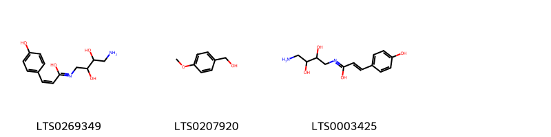{ width=100% }
    <figcaption>Hình ảnh cấu trúc hóa học của 3 hoạt chất thuộc nhóm Benzene and substituted derivatives gồm ['(2z)-n-(4-amino-2,3-dihydroxybutyl)-3-(4-hydroxyphenyl)prop-2-enimidic acid (LTS0269349)', 'anise alcohol (LTS0207920)', '(2e)-n-(4-amino-2,3-dihydroxybutyl)-3-(4-hydroxyphenyl)prop-2-enimidic acid (LTS0003425)'].</figcaption>
</figure>
#### Nhóm Cinnamic acids and derivatives
<figure markdown="span">
    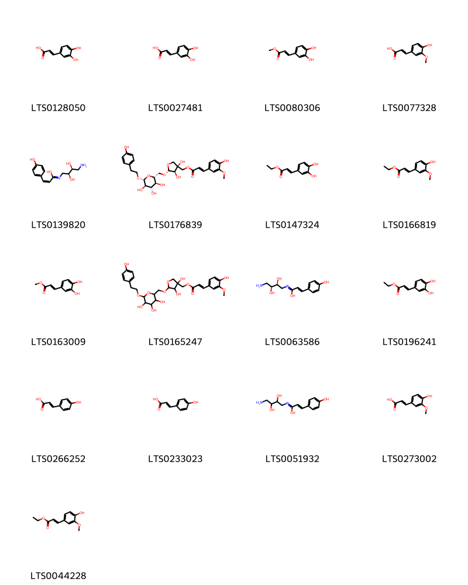{ width=100% }
    <figcaption>Hình ảnh cấu trúc hóa học của 17 hoạt chất thuộc nhóm Cinnamic acids and derivatives gồm ['3,4-dihydroxycinnamic acid (LTS0128050)', 'caffeic acid (LTS0027481)', 'methyl 3-(3,4-dihydroxyphenyl)prop-2-enoate (LTS0080306)', 'ferulic acid (LTS0077328)', '(2z)-n-[(2s,3s)-4-amino-2,3-dihydroxybutyl]-3-(4-hydroxyphenyl)prop-2-enimidic acid (LTS0139820)', '[(3s,4r,5r)-3,4-dihydroxy-5-{[(2r,3s,4s,5r,6r)-3,4,5-trihydroxy-6-[2-(4-hydroxyphenyl)ethoxy]oxan-2-yl]methoxy}oxolan-3-yl]methyl (2e)-3-(4-hydroxy-3-methoxyphenyl)prop-2-enoate (LTS0176839)', 'ethyl caffeate (LTS0147324)', 'ethyl ferulate (LTS0166819)', 'methyl caffeate (LTS0163009)', '[3,4-dihydroxy-5-({3,4,5-trihydroxy-6-[2-(4-hydroxyphenyl)ethoxy]oxan-2-yl}methoxy)oxolan-3-yl]methyl 3-(4-hydroxy-3-methoxyphenyl)prop-2-enoate (LTS0165247)', '(2e)-n-[(2s,3s)-4-amino-2,3-dihydroxybutyl]-3-(4-hydroxyphenyl)prop-2-enimidic acid (LTS0063586)', 'ethyl 3-(3,4-dihydroxyphenyl)prop-2-enoate (LTS0196241)', 'para-coumaric acid (LTS0266252)', 'hydroxycinnamic acid (LTS0233023)', 'n-(4-amino-2,3-dihydroxybutyl)-3-(4-hydroxyphenyl)prop-2-enimidic acid (LTS0051932)', 'ferulic acid (LTS0273002)', 'ethyl ferulate (LTS0044228)'].</figcaption>
</figure>
#### Nhóm Coumarins and derivatives
<figure markdown="span">
    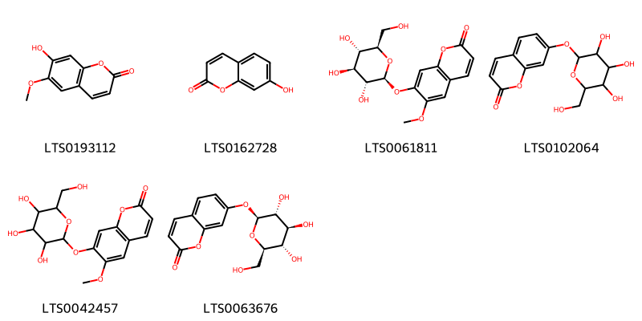{ width=100% }
    <figcaption>Hình ảnh cấu trúc hóa học của 6 hoạt chất thuộc nhóm Coumarins and derivatives gồm ['scopoletin (LTS0193112)', 'umbelliferone (LTS0162728)', 'scopolin (LTS0061811)', 'skimmin (LTS0102064)', '6-methoxy-7-{[3,4,5-trihydroxy-6-(hydroxymethyl)oxan-2-yl]oxy}chromen-2-one (LTS0042457)', 'skimmin (LTS0063676)'].</figcaption>
</figure>
#### Nhóm Ergoline and derivatives
<figure markdown="span">
    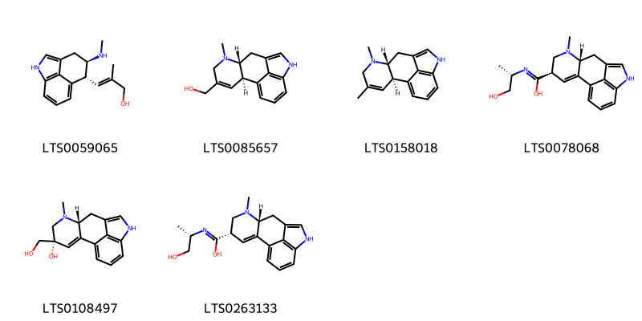{ width=100% }
    <figcaption>Hình ảnh cấu trúc hóa học của 6 hoạt chất thuộc nhóm Ergoline and derivatives gồm ['chanoclavine (LTS0059065)', 'elymoclavine (LTS0085657)', 'agroclavine (LTS0158018)', '(4r,7r)-n-[(2s)-1-hydroxypropan-2-yl]-6-methyl-6,11-diazatetracyclo[7.6.1.0²,⁷.0¹²,¹⁶]hexadeca-1(16),2,9,12,14-pentaene-4-carboximidic acid (LTS0078068)', 'penniclavine (LTS0108497)', '(4s,7r)-n-[(2s)-1-hydroxypropan-2-yl]-6-methyl-6,11-diazatetracyclo[7.6.1.0²,⁷.0¹²,¹⁶]hexadeca-1(16),2,9,12,14-pentaene-4-carboximidic acid (LTS0263133)'].</figcaption>
</figure>
#### Nhóm Fatty Acyls
<figure markdown="span">
    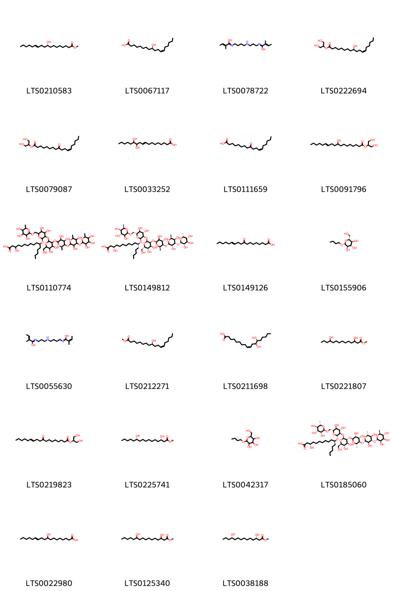{ width=100% }
    <figcaption>Hình ảnh cấu trúc hóa học của 23 hoạt chất thuộc nhóm Fatty Acyls gồm ['methyl (9r)-9-hydroxyoctadec-12-enoate (LTS0210583)', '(9r,12z)-9-hydroxyoctadec-12-enoic acid (LTS0067117)', '(2e)-n-{3-[(4-{[(2e)-1-hydroxy-2-methylbut-2-en-1-ylidene]amino}butyl)amino]propyl}-2-methylbut-2-enimidic acid (LTS0078722)', '1,3-dihydroxypropan-2-yl (9r,12z)-9-hydroxyoctadec-12-enoate (LTS0222694)', '1,3-dihydroxypropan-2-yl (12z)-9-oxooctadec-12-enoate (LTS0079087)', '12,13-dihydroxyoctadec-9-enoic acid (LTS0033252)', '(12z)-9-oxooctadec-12-enoic acid (LTS0111659)', '1,3-dihydroxypropan-2-yl 9-hydroxyoctadec-12-enoate (LTS0091796)', '11-({3-[(3-{[5-({3,5-dihydroxy-6-methyl-4-[(3,4,5-trihydroxy-6-methyloxan-2-yl)oxy]oxan-2-yl}oxy)-3,4-dihydroxy-6-methyloxan-2-yl]oxy}-4,5-dihydroxy-6-(hydroxymethyl)oxan-2-yl)oxy]-4,5-dihydroxy-6-{[(3,4,5-trihydroxy-6-methyloxan-2-yl)oxy]methyl}oxan-2-yl}oxy)-3-hydroxyhexadecanoic acid (LTS0110774)', '(3s,11r)-11-{[(2s,3r,4s,5s,6r)-3-{[(2s,3s,4s,5s,6s)-3-{[(2s,4s,5r,6r)-5-{[(2s,3s,4s,5r,6s)-3,5-dihydroxy-6-methyl-4-{[(2s,3s,4r,5r,6r)-3,4,5-trihydroxy-6-methyloxan-2-yl]oxy}oxan-2-yl]oxy}-3,4-dihydroxy-6-methyloxan-2-yl]oxy}-4,5-dihydroxy-6-(hydroxymethyl)oxan-2-yl]oxy}-4,5-dihydroxy-6-({[(2r,4r,5r,6r)-3,4,5-trihydroxy-6-methyloxan-2-yl]oxy}methyl)oxan-2-yl]oxy}-3-hydroxyhexadecanoic acid (LTS0149812)', '9-oxooctadec-12-enoic acid (LTS0149126)', 'butyl β-d-glucopyranoside (LTS0155906)', 'n-[3-({4-[(1-hydroxy-2-methylbut-2-en-1-ylidene)amino]butyl}amino)propyl]-2-methylbut-2-enimidic acid (LTS0055630)', 'methyl (9r,12z)-9-hydroxyoctadec-12-enoate (LTS0212271)', '(9z,12s,13s)-12,13-dihydroxyoctadec-9-enoic acid (LTS0211698)', 'methyl 3,11-dihydroxytetradecanoate (LTS0221807)', '1,3-dihydroxypropan-2-yl 9-oxooctadec-12-enoate (LTS0219823)', 'methyl (3s,11s)-3,11-dihydroxyhexadecanoate (LTS0225741)', '1-butylgalactopyranoside (LTS0042317)', '(3s,11s)-11-{[(2r,3r,4s,5s,6r)-3-{[(2s,3r,4s,5s,6r)-3-{[(2s,3r,4s,5r,6s)-5-{[(2s,3r,4s,5r,6r)-3,5-dihydroxy-6-methyl-4-{[(2s,3r,4r,5r,6s)-3,4,5-trihydroxy-6-methyloxan-2-yl]oxy}oxan-2-yl]oxy}-3,4-dihydroxy-6-methyloxan-2-yl]oxy}-4,5-dihydroxy-6-(hydroxymethyl)oxan-2-yl]oxy}-4,5-dihydroxy-6-({[(2r,3r,4r,5r,6s)-3,4,5-trihydroxy-6-methyloxan-2-yl]oxy}methyl)oxan-2-yl]oxy}-3-hydroxyhexadecanoic acid (LTS0185060)', '9-hydroxyoctadec-12-enoic acid (LTS0022980)', 'methyl 3,11-dihydroxyhexadecanoate (LTS0125340)', 'methyl (3s,11s)-3,11-dihydroxytetradecanoate (LTS0038188)'].</figcaption>
</figure>
#### Nhóm Flavonoids
<figure markdown="span">
    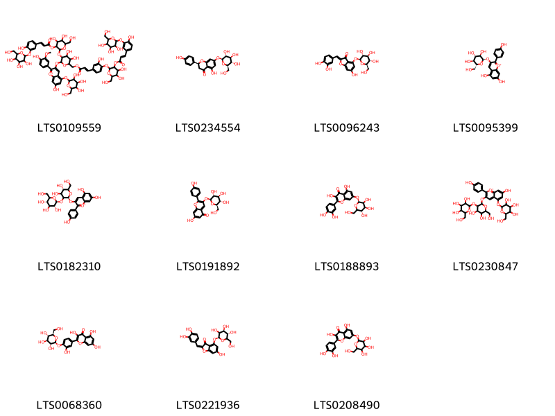{ width=100% }
    <figcaption>Hình ảnh cấu trúc hóa học của 11 hoạt chất thuộc nhóm Flavonoids gồm ['3-({3-[(4,5-dihydroxy-3-{[3-(4-hydroxy-3-{[3,4,5-trihydroxy-6-(hydroxymethyl)oxan-2-yl]oxy}phenyl)prop-2-enoyl]oxy}-6-(hydroxymethyl)oxan-2-yl)oxy]-6-{[(3-{4-[(4,5-dihydroxy-3-{[3-(4-hydroxy-3-{[3,4,5-trihydroxy-6-(hydroxymethyl)oxan-2-yl]oxy}phenyl)prop-2-enoyl]oxy}-6-(hydroxymethyl)oxan-2-yl)oxy]-3-hydroxyphenyl}prop-2-enoyl)oxy]methyl}-4,5-dihydroxyoxan-2-yl}oxy)-7-hydroxy-2-(4-hydroxy-3-methoxyphenyl)-5-{[3,4,5-trihydroxy-6-(hydroxymethyl)oxan-2-yl]oxy}-1λ⁴-chromen-1-ylium (LTS0109559)', 'prunin (LTS0234554)', '(2z)-2-[(3,4-dihydroxyphenyl)methylidene]-6-hydroxy-4-{[(2s,3r,4s,5s,6r)-3,4,5-trihydroxy-6-(hydroxymethyl)oxan-2-yl]oxy}-1-benzofuran-3-one (LTS0096243)', 'pelargonidin 3-glucoside (LTS0095399)', '3-{[(2s,5s)-4,5-dihydroxy-6-(hydroxymethyl)-3-{[(2s,3r,5s)-3,4,5-trihydroxy-6-(hydroxymethyl)oxan-2-yl]oxy}oxan-2-yl]oxy}-5,7-dihydroxy-2-(4-hydroxyphenyl)-1λ⁴-chromen-1-ylium (LTS0182310)', '7-hydroxy-2-(4-hydroxyphenyl)-3-{[(2s,3r,4s,5s,6r)-3,4,5-trihydroxy-6-(hydroxymethyl)oxan-2-yl]oxy}chromen-5-one (LTS0191892)', 'quercimeritrin (LTS0188893)', '3-{[4,5-dihydroxy-6-(hydroxymethyl)-3-{[3,4,5-trihydroxy-6-(hydroxymethyl)oxan-2-yl]oxy}oxan-2-yl]oxy}-7-hydroxy-2-(4-hydroxyphenyl)-5-{[3,4,5-trihydroxy-6-(hydroxymethyl)oxan-2-yl]oxy}-1λ⁴-chromen-1-ylium (LTS0230847)', 'spiraeoside (LTS0068360)', 'cernuoside (LTS0221936)', 'quercimeritrin (LTS0208490)'].</figcaption>
</figure>
#### Nhóm Fluorenes
<figure markdown="span">
    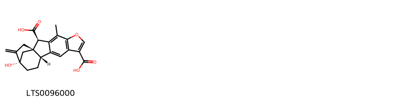{ width=100% }
    <figcaption>Hình ảnh cấu trúc hóa học của 1 hoạt chất thuộc nhóm Fluorenes gồm ['(1s,2r,12r,15s)-15-hydroxy-4-methyl-16-methylidene-6-oxapentacyclo[13.2.1.0¹,¹².0³,¹¹.0⁵,⁹]octadeca-3(11),4,7,9-tetraene-2,8-dicarboxylic acid (LTS0096000)'].</figcaption>
</figure>
#### Nhóm Furanoid lignans
<figure markdown="span">
    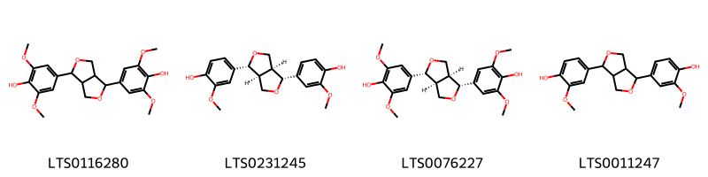{ width=100% }
    <figcaption>Hình ảnh cấu trúc hóa học của 4 hoạt chất thuộc nhóm Furanoid lignans gồm ['syringaresinol (LTS0116280)', '(-)-pinoresinol (LTS0231245)', '(-)-syringaresinol (LTS0076227)', 'pinoresinol (LTS0011247)'].</figcaption>
</figure>
#### Nhóm Indoles and derivatives
<figure markdown="span">
    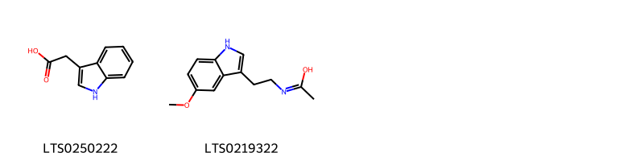{ width=100% }
    <figcaption>Hình ảnh cấu trúc hóa học của 2 hoạt chất thuộc nhóm Indoles and derivatives gồm ['β-indole-3-acetic acid (LTS0250222)', 'n-[2-(5-methoxy-1h-indol-3-yl)ethyl]ethanimidic acid (LTS0219322)'].</figcaption>
</figure>
#### Nhóm Lignan glycosides
<figure markdown="span">
    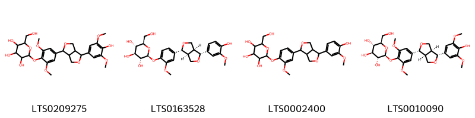{ width=100% }
    <figcaption>Hình ảnh cấu trúc hóa học của 4 hoạt chất thuộc nhóm Lignan glycosides gồm ['2-{4-[4-(4-hydroxy-3,5-dimethoxyphenyl)-hexahydrofuro[3,4-c]furan-1-yl]-2,6-dimethoxyphenoxy}-6-(hydroxymethyl)oxane-3,4,5-triol (LTS0209275)', '(-)-pinoresinol glucoside (LTS0163528)', '2-{4-[4-(4-hydroxy-3-methoxyphenyl)-hexahydrofuro[3,4-c]furan-1-yl]-2-methoxyphenoxy}-6-(hydroxymethyl)oxane-3,4,5-triol (LTS0002400)', '(2s,3r,4s,5s,6r)-2-{4-[(1r,3as,4r,6as)-4-(4-hydroxy-3,5-dimethoxyphenyl)-hexahydrofuro[3,4-c]furan-1-yl]-2,6-dimethoxyphenoxy}-6-(hydroxymethyl)oxane-3,4,5-triol (LTS0010090)'].</figcaption>
</figure>
#### Nhóm Linear 1_3-diarylpropanoids
<figure markdown="span">
    { width=100% }
    <figcaption>Hình ảnh cấu trúc hóa học của Không tìm thấy chú thích hoạt chất thuộc nhóm Linear 1_3-diarylpropanoids gồm Không tìm thấy chú thích.</figcaption>
</figure>
#### Nhóm Organooxygen compounds
<figure markdown="span">
    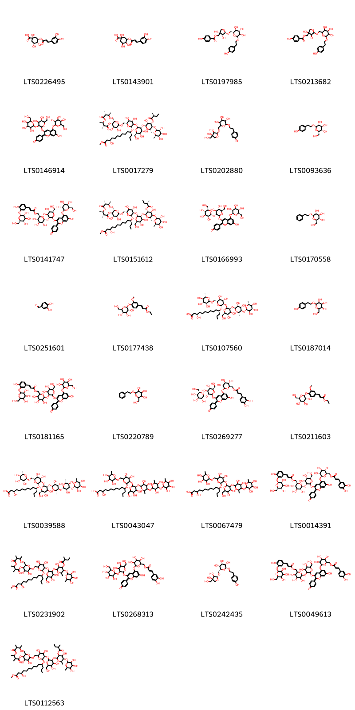{ width=100% }
    <figcaption>Hình ảnh cấu trúc hóa học của 29 hoạt chất thuộc nhóm Organooxygen compounds gồm ['chlorogenic acid (LTS0226495)', '3-{[3-(3,4-dihydroxyphenyl)prop-2-enoyl]oxy}-1,4,5-trihydroxycyclohexane-1-carboxylic acid (LTS0143901)', '[(3s,4r,5r)-3,4-dihydroxy-5-{[(2r,3s,4s,5r,6r)-3,4,5-trihydroxy-6-[2-(4-hydroxyphenyl)ethoxy]oxan-2-yl]methoxy}oxolan-3-yl]methyl 4-hydroxybenzoate (LTS0197985)', '[3,4-dihydroxy-5-({3,4,5-trihydroxy-6-[2-(4-hydroxyphenyl)ethoxy]oxan-2-yl}methoxy)oxolan-3-yl]methyl 4-hydroxybenzoate (LTS0213682)', '4-(3-{[4,5-dihydroxy-6-(hydroxymethyl)-3-{[3,4,5-trihydroxy-6-(hydroxymethyl)oxan-2-yl]oxy}oxan-2-yl]oxy}-7-hydroxy-5-{[3,4,5-trihydroxy-6-(hydroxymethyl)oxan-2-yl]oxy}chromen-2-ylidene)cyclohexa-2,5-dien-1-one (LTS0146914)', 'methyl (3s,11s)-11-{[(2r,3r,4s,5s,6r)-3-{[(2s,3r,4s,5s,6r)-4,5-dihydroxy-3-{[(2s,3r,4s,5s,6s)-3-hydroxy-6-methyl-4-{[(2s)-2-methylbutanoyl]oxy}-5-{[(2s,3r,4s,5s,6r)-3,4,5-trihydroxy-6-methyloxan-2-yl]oxy}oxan-2-yl]oxy}-6-(hydroxymethyl)oxan-2-yl]oxy}-6-({[(2r,3r,4s,5r,6s)-3,4-dihydroxy-5-{[(2r,3r)-3-{[(2r,3r)-3-hydroxy-2-methylbutanoyl]oxy}-2-methylbutanoyl]oxy}-6-methyloxan-2-yl]oxy}methyl)-4,5-dihydroxyoxan-2-yl]oxy}-3-hydroxytetradecanoate (LTS0017279)', '2-({[3,4-dihydroxy-4-(hydroxymethyl)oxolan-2-yl]oxy}methyl)-6-[2-(4-hydroxyphenyl)ethoxy]oxane-3,4,5-triol (LTS0202880)', 'salidroside (LTS0093636)', '[(2r,3s,4s,5r,6r)-6-{[(2s,3r,4s,5s,6r)-4,5-dihydroxy-2-{[7-hydroxy-2-(4-oxocyclohexa-2,5-dien-1-ylidene)-5-{[(2s,3r,4s,5s,6r)-3,4,5-trihydroxy-6-(hydroxymethyl)oxan-2-yl]oxy}chromen-3-yl]oxy}-6-(hydroxymethyl)oxan-3-yl]oxy}-3,4,5-trihydroxyoxan-2-yl]methyl (2e)-3-(4-hydroxy-3-{[(2s,3r,4s,5s,6r)-3,4,5-trihydroxy-6-(hydroxymethyl)oxan-2-yl]oxy}phenyl)prop-2-enoate (LTS0141747)', 'methyl (3s,11s)-11-{[(2r,3r,4s,5s,6r)-3-{[(2s,3r,4s,5s,6r)-4,5-dihydroxy-3-{[(2s,3r,4r,5r,6s)-4-hydroxy-6-methyl-3-{[(2s)-2-methylbutanoyl]oxy}-5-{[(2s,3r,4s,5s,6r)-3,4,5-trihydroxy-6-methyloxan-2-yl]oxy}oxan-2-yl]oxy}-6-(hydroxymethyl)oxan-2-yl]oxy}-6-({[(2r,3r,4s,5r,6s)-3,4-dihydroxy-5-{[(2r,3r)-3-{[(2r,3r)-3-hydroxy-2-methylbutanoyl]oxy}-2-methylbutanoyl]oxy}-6-methyloxan-2-yl]oxy}methyl)-4,5-dihydroxyoxan-2-yl]oxy}-3-hydroxytetradecanoate (LTS0151612)', '4-(3-{[(2s,3r,4s,5s,6r)-4,5-dihydroxy-6-(hydroxymethyl)-3-{[(2r,3r,4s,5s,6r)-3,4,5-trihydroxy-6-(hydroxymethyl)oxan-2-yl]oxy}oxan-2-yl]oxy}-7-hydroxy-5-{[(2s,3r,4s,5s,6r)-3,4,5-trihydroxy-6-(hydroxymethyl)oxan-2-yl]oxy}chromen-2-ylidene)cyclohexa-2,5-dien-1-one (LTS0166993)', '(2r,3s,4s,5r,6r)-2-(hydroxymethyl)-6-(2-phenylethoxy)oxane-3,4,5-triol (LTS0170558)', '3,4-dihydroxybenzaldehyde (LTS0251601)', 'ethyl 3-(3-methoxy-4-{[(2s,3r,4s,5s,6r)-3,4,5-trihydroxy-6-(hydroxymethyl)oxan-2-yl]oxy}phenyl)prop-2-enoate (LTS0177438)', '(3s,11s)-11-{[(2r,3r,4s,5s,6r)-3-{[(2s,3r,4s,5s,6r)-3-{[(2s,3r,4s,5r,6s)-3,4-dihydroxy-6-methyl-5-{[(2s,3r,4s,5s,6r)-3,4,5-trihydroxy-6-methyloxan-2-yl]oxy}oxan-2-yl]oxy}-4,5-dihydroxy-6-(hydroxymethyl)oxan-2-yl]oxy}-4,5-dihydroxy-6-({[(2r,3r,4r,5r,6s)-3,4,5-trihydroxy-6-methyloxan-2-yl]oxy}methyl)oxan-2-yl]oxy}-3-hydroxytetradecanoic acid (LTS0107560)', '2-(hydroxymethyl)-6-[2-(4-hydroxyphenyl)ethoxy]oxane-3,4,5-triol (LTS0187014)', '{6-[(4,5-dihydroxy-2-{[7-hydroxy-2-(4-oxocyclohexa-2,5-dien-1-ylidene)-5-{[3,4,5-trihydroxy-6-(hydroxymethyl)oxan-2-yl]oxy}chromen-3-yl]oxy}-6-(hydroxymethyl)oxan-3-yl)oxy]-3,4,5-trihydroxyoxan-2-yl}methyl 3-(4-hydroxy-3-{[3,4,5-trihydroxy-6-(hydroxymethyl)oxan-2-yl]oxy}phenyl)prop-2-enoate (LTS0181165)', '2-(hydroxymethyl)-6-(2-phenylethoxy)oxane-3,4,5-triol (LTS0220789)', '[(2r,3s,4s,5r,6s)-6-[(3-{[(2s,3r,4s,5s,6r)-4,5-dihydroxy-6-(hydroxymethyl)-3-{[(2r,3r,4s,5s,6r)-3,4,5-trihydroxy-6-(hydroxymethyl)oxan-2-yl]oxy}oxan-2-yl]oxy}-7-hydroxy-2-(4-oxocyclohexa-2,5-dien-1-ylidene)chromen-5-yl)oxy]-3,4,5-trihydroxyoxan-2-yl]methyl (2e)-3-(3,4-dihydroxyphenyl)prop-2-enoate (LTS0269277)', 'ethyl (2e)-3-(3-methoxy-4-{[(2s,3r,4s,5s,6r)-3,4,5-trihydroxy-6-(hydroxymethyl)oxan-2-yl]oxy}phenyl)prop-2-enoate (LTS0211603)', '(3s,11s)-11-{[(2r,3r,4s,5s,6r)-3-{[(2s,3r,4s,5s,6r)-3-{[(2s,3r,4s,5r,6s)-5-{[(2s,3r,4s,5r,6r)-3,5-dihydroxy-6-methyl-4-{[(2s,3r,4r,5r,6s)-3,4,5-trihydroxy-6-methyloxan-2-yl]oxy}oxan-2-yl]oxy}-3,4-dihydroxy-6-methyloxan-2-yl]oxy}-4,5-dihydroxy-6-(hydroxymethyl)oxan-2-yl]oxy}-4,5-dihydroxy-6-({[(2r,3r,4r,5r,6s)-3,4,5-trihydroxy-6-methyloxan-2-yl]oxy}methyl)oxan-2-yl]oxy}-3-hydroxytetradecanoic acid (LTS0039588)', '11-({3-[(3-{[5-({3,5-dihydroxy-6-methyl-4-[(3,4,5-trihydroxy-6-methyloxan-2-yl)oxy]oxan-2-yl}oxy)-3,4-dihydroxy-6-methyloxan-2-yl]oxy}-4,5-dihydroxy-6-(hydroxymethyl)oxan-2-yl)oxy]-4,5-dihydroxy-6-{[(3,4,5-trihydroxy-6-methyloxan-2-yl)oxy]methyl}oxan-2-yl}oxy)-3-hydroxytetradecanoic acid (LTS0043047)', '11-[(3-{[3-({3,4-dihydroxy-6-methyl-5-[(3,4,5-trihydroxy-6-methyloxan-2-yl)oxy]oxan-2-yl}oxy)-4,5-dihydroxy-6-(hydroxymethyl)oxan-2-yl]oxy}-4,5-dihydroxy-6-{[(3,4,5-trihydroxy-6-methyloxan-2-yl)oxy]methyl}oxan-2-yl)oxy]-3-hydroxytetradecanoic acid (LTS0067479)', '[(2r,3s,4s,5r,6s)-6-[(3-{[(2s,3r,4s,5s,6r)-4,5-dihydroxy-6-(hydroxymethyl)-3-{[(2r,3r,4s,5s,6r)-3,4,5-trihydroxy-6-({[(2e)-3-(4-hydroxy-3-{[(2s,3r,4s,5s,6r)-3,4,5-trihydroxy-6-(hydroxymethyl)oxan-2-yl]oxy}phenyl)prop-2-enoyl]oxy}methyl)oxan-2-yl]oxy}oxan-2-yl]oxy}-7-hydroxy-2-(4-oxocyclohexa-2,5-dien-1-ylidene)chromen-5-yl)oxy]-3,4,5-trihydroxyoxan-2-yl]methyl (2e)-3-(3,4-dihydroxyphenyl)prop-2-enoate (LTS0014391)', 'methyl 11-[(3-{[4,5-dihydroxy-3-({3-hydroxy-6-methyl-4-[(2-methylbutanoyl)oxy]-5-[(3,4,5-trihydroxy-6-methyloxan-2-yl)oxy]oxan-2-yl}oxy)-6-(hydroxymethyl)oxan-2-yl]oxy}-6-({[3,4-dihydroxy-5-({3-[(3-hydroxy-2-methylbutanoyl)oxy]-2-methylbutanoyl}oxy)-6-methyloxan-2-yl]oxy}methyl)-4,5-dihydroxyoxan-2-yl)oxy]-3-hydroxytetradecanoate (LTS0231902)', '{6-[(3-{[4,5-dihydroxy-6-(hydroxymethyl)-3-{[3,4,5-trihydroxy-6-(hydroxymethyl)oxan-2-yl]oxy}oxan-2-yl]oxy}-7-hydroxy-2-(4-oxocyclohexa-2,5-dien-1-ylidene)chromen-5-yl)oxy]-3,4,5-trihydroxyoxan-2-yl}methyl 3-(3,4-dihydroxyphenyl)prop-2-enoate (LTS0268313)', '(2r,3s,4s,5r,6r)-2-({[(2r,3r,4r)-3,4-dihydroxy-4-(hydroxymethyl)oxolan-2-yl]oxy}methyl)-6-[2-(4-hydroxyphenyl)ethoxy]oxane-3,4,5-triol (LTS0242435)', '{6-[(3-{[4,5-dihydroxy-6-(hydroxymethyl)-3-{[3,4,5-trihydroxy-6-({[3-(4-hydroxy-3-{[3,4,5-trihydroxy-6-(hydroxymethyl)oxan-2-yl]oxy}phenyl)prop-2-enoyl]oxy}methyl)oxan-2-yl]oxy}oxan-2-yl]oxy}-7-hydroxy-2-(4-oxocyclohexa-2,5-dien-1-ylidene)chromen-5-yl)oxy]-3,4,5-trihydroxyoxan-2-yl}methyl 3-(3,4-dihydroxyphenyl)prop-2-enoate (LTS0049613)', 'methyl 11-[(3-{[4,5-dihydroxy-3-({4-hydroxy-6-methyl-3-[(2-methylbutanoyl)oxy]-5-[(3,4,5-trihydroxy-6-methyloxan-2-yl)oxy]oxan-2-yl}oxy)-6-(hydroxymethyl)oxan-2-yl]oxy}-6-({[3,4-dihydroxy-5-({3-[(3-hydroxy-2-methylbutanoyl)oxy]-2-methylbutanoyl}oxy)-6-methyloxan-2-yl]oxy}methyl)-4,5-dihydroxyoxan-2-yl)oxy]-3-hydroxytetradecanoate (LTS0112563)'].</figcaption>
</figure>
#### Nhóm Phenols
<figure markdown="span">
    { width=100% }
    <figcaption>Hình ảnh cấu trúc hóa học của 1 hoạt chất thuộc nhóm Phenols gồm ['tyrosol (LTS0132195)'].</figcaption>
</figure>
#### Nhóm Prenol lipids
<figure markdown="span">
    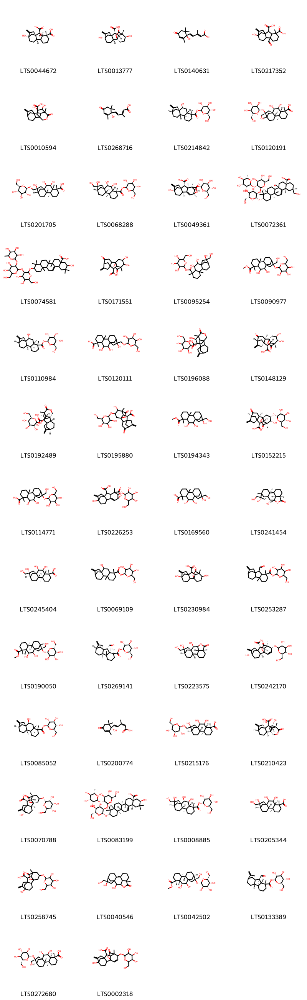{ width=100% }
    <figcaption>Hình ảnh cấu trúc hóa học của 56 hoạt chất thuộc nhóm Prenol lipids gồm ['gibberellin a19 (LTS0044672)', 'gibberellin a1 (LTS0013777)', 'abscisic acid,  (LTS0140631)', '8-formyl-12-hydroxy-4-methyl-13-methylidenetetracyclo[10.2.1.0¹,⁹.0³,⁸]pentadecane-2,4-dicarboxylic acid (LTS0217352)', '16,17-dihydroxy-11-methyl-6-methylidene-12-oxo-13-oxapentacyclo[9.3.3.1⁵,⁸.0¹,¹⁰.0²,⁸]octadecane-9-carboxylic acid (LTS0010594)', '(4e)-5-[(1s)-1-hydroxy-2,6,6-trimethyl-4-oxocyclohex-2-en-1-yl]-3-methylpenta-2,4-dienoic acid (LTS0268716)', '(2s,3r,4s,5s,6r)-3,4,5-trihydroxy-6-(hydroxymethyl)oxan-2-yl (1r,2s,4s,5r,9s,10s,13s)-2-hydroxy-5,9-dimethyl-14-methylidenetetracyclo[11.2.1.0¹,¹⁰.0⁴,⁹]hexadecane-5-carboxylate (LTS0214842)', '(1r,2r,3s,4s,5r,9s,10s,13s,14r)-2,3-dihydroxy-14-(hydroxymethyl)-5,9-dimethyl-14-{[(2s,3r,4s,5s,6r)-3,4,5-trihydroxy-6-(hydroxymethyl)oxan-2-yl]oxy}tetracyclo[11.2.1.0¹,¹⁰.0⁴,⁹]hexadecane-5-carboxylic acid (LTS0120191)', '(1r,2r,3s,4s,5r,9s,10s,13s,14s)-2,3,14-trihydroxy-5,9-dimethyl-14-({[(2r,3r,4s,5s,6r)-3,4,5-trihydroxy-6-(hydroxymethyl)oxan-2-yl]oxy}methyl)tetracyclo[11.2.1.0¹,¹⁰.0⁴,⁹]hexadecane-5-carboxylic acid (LTS0201705)', '(2s,3r,4s,5s,6r)-3,4,5-trihydroxy-6-(hydroxymethyl)oxan-2-yl (1r,2r,3s,4s,5r,9s,10s,13s,14s)-2,3,14-trihydroxy-14-(hydroxymethyl)-5,9-dimethyltetracyclo[11.2.1.0¹,¹⁰.0⁴,⁹]hexadecane-5-carboxylate (LTS0068288)', '(1s,2r,3r,4r,7s,10s,13s,17r)-13-hydroxy-4-methyl-14-methylidene-5-oxo-17-{[(2r,3r,4s,5s,6r)-3,4,5-trihydroxy-6-(hydroxymethyl)oxan-2-yl]oxy}-6-oxapentacyclo[11.2.1.1⁴,⁷.0¹,¹⁰.0³,⁹]heptadec-8-ene-2-carboxylic acid (LTS0049361)', '(2s,4ar,6as,6br,8ar,10s,12ar,12br,14bs)-10-{[(2r,3r,4s,5s,6r)-3-{[(2s,3r,4s,5s,6r)-4,5-dihydroxy-6-(hydroxymethyl)-3-{[(2s,3r,4r,5r,6s)-3,4,5-trihydroxy-6-methyloxan-2-yl]oxy}oxan-2-yl]oxy}-4,5-dihydroxy-6-(hydroxymethyl)oxan-2-yl]oxy}-2-(hydroxymethyl)-2,6a,6b,9,9,12a-hexamethyl-1,3,4,5,6,7,8,8a,10,11,12,12b,13,14b-tetradecahydropicene-4a-carboxylic acid (LTS0072361)', '10-[(3-{[4,5-dihydroxy-6-(hydroxymethyl)-3-[(3,4,5-trihydroxy-6-methyloxan-2-yl)oxy]oxan-2-yl]oxy}-4,5-dihydroxy-6-(hydroxymethyl)oxan-2-yl)oxy]-3-hydroxy-2,2,6a,6b,9,9,12a-heptamethyl-1,3,4,5,6,7,8,8a,10,11,12,12b,13,14b-tetradecahydropicene-4a-carboxylic acid (LTS0074581)', '12,13-dihydroxy-11-methyl-6-methylidene-4,16-dioxo-15-oxapentacyclo[9.3.2.1⁵,⁸.0¹,¹⁰.0²,⁸]heptadecane-9-carboxylic acid (LTS0171551)', '3,4,5-trihydroxy-6-(hydroxymethyl)oxan-2-yl 2,3,14-trihydroxy-14-(hydroxymethyl)-5,9-dimethyltetracyclo[11.2.1.0¹,¹⁰.0⁴,⁹]hexadecane-5-carboxylate (LTS0095254)', 'methyl 2,3-dihydroxy-14-(hydroxymethyl)-5,9-dimethyl-14-{[3,4,5-trihydroxy-6-(hydroxymethyl)oxan-2-yl]oxy}tetracyclo[11.2.1.0¹,¹⁰.0⁴,⁹]hexadecane-5-carboxylate (LTS0090977)', '(2s,3r,4s,5s,6r)-3,4,5-trihydroxy-6-(hydroxymethyl)oxan-2-yl (1r,2r,4s,5r,9s,10s,13s)-2-hydroxy-5,9-dimethyl-14-methylidenetetracyclo[11.2.1.0¹,¹⁰.0⁴,⁹]hexadecane-5-carboxylate (LTS0110984)', '2,3,14-trihydroxy-5,9-dimethyl-14-({[3,4,5-trihydroxy-6-(hydroxymethyl)oxan-2-yl]oxy}methyl)tetracyclo[11.2.1.0¹,¹⁰.0⁴,⁹]hexadecane-5-carboxylic acid (LTS0120111)', '17-hydroxy-11-methyl-6-methylidene-12-oxo-16-{[3,4,5-trihydroxy-6-(hydroxymethyl)oxan-2-yl]oxy}-13-oxapentacyclo[9.3.3.1⁵,⁸.0¹,¹⁰.0²,⁸]octadecane-9-carboxylic acid (LTS0196088)', '(1s,2r,5r,8r,9r,10s,11r,12s,13r)-12,13-dihydroxy-11-methyl-6-methylidene-4,16-dioxo-15-oxapentacyclo[9.3.2.1⁵,⁸.0¹,¹⁰.0²,⁸]heptadecane-9-carboxylic acid (LTS0148129)', '(1s,2r,5r,8r,9s,10s,11r,16r,17r)-17-hydroxy-11-methyl-6-methylidene-12-oxo-16-{[(2r,3r,4s,5s,6r)-3,4,5-trihydroxy-6-(hydroxymethyl)oxan-2-yl]oxy}-13-oxapentacyclo[9.3.3.1⁵,⁸.0¹,¹⁰.0²,⁸]octadecane-9-carboxylic acid (LTS0192489)', '12-hydroxy-11-methyl-6-methylidene-4,16-dioxo-13-{[3,4,5-trihydroxy-6-(hydroxymethyl)oxan-2-yl]oxy}-15-oxapentacyclo[9.3.2.1⁵,⁸.0¹,¹⁰.0²,⁸]heptadecane-9-carboxylic acid (LTS0195880)', 'methyl 2,3,14-trihydroxy-14-(hydroxymethyl)-5,9-dimethyltetracyclo[11.2.1.0¹,¹⁰.0⁴,⁹]hexadecane-5-carboxylate (LTS0194343)', '(1r,2r,5s,8s,9r,10s,11s,12r,13s)-12-hydroxy-11-methyl-6-methylidene-4,16-dioxo-13-{[(2s,3r,4s,5s,6r)-3,4,5-trihydroxy-6-(hydroxymethyl)oxan-2-yl]oxy}-15-oxapentacyclo[9.3.2.1⁵,⁸.0¹,¹⁰.0²,⁸]heptadecane-9-carboxylic acid (LTS0152215)', '2,3-dihydroxy-14-(hydroxymethyl)-5,9-dimethyl-14-{[3,4,5-trihydroxy-6-(hydroxymethyl)oxan-2-yl]oxy}tetracyclo[11.2.1.0¹,¹⁰.0⁴,⁹]hexadecane-5-carboxylic acid (LTS0114771)', '13-hydroxy-4-methyl-14-methylidene-5-oxo-17-{[3,4,5-trihydroxy-6-(hydroxymethyl)oxan-2-yl]oxy}-6-oxapentacyclo[11.2.1.1⁴,⁷.0¹,¹⁰.0³,⁹]heptadec-8-ene-2-carboxylic acid (LTS0226253)', '2,3,14-trihydroxy-14-(hydroxymethyl)-5,9-dimethyltetracyclo[11.2.1.0¹,¹⁰.0⁴,⁹]hexadecane-5-carboxylic acid (LTS0169560)', '(1s,2s,5r,6s,8r,9r,10s,13s,17s)-6,9-dihydroxy-6-(hydroxymethyl)-1,13-dimethyl-11-oxapentacyclo[8.6.1.1⁵,⁸.0²,⁸.0¹³,¹⁷]octadecan-12-one (LTS0241454)', '(1r,2r,3s,4s,5r,9s,10s,13r,14r)-2,3,14-trihydroxy-14-(hydroxymethyl)-5,9-dimethyltetracyclo[11.2.1.0¹,¹⁰.0⁴,⁹]hexadecane-5-carboxylic acid (LTS0245404)', 'phorbaside a (LTS0069109)', '5,12-dihydroxy-11-methyl-6-methylidene-16-oxo-15-oxapentacyclo[9.3.2.1⁵,⁸.0¹,¹⁰.0²,⁸]heptadecane-9-carboxylic acid (LTS0230984)', '3,4,5-trihydroxy-6-(hydroxymethyl)oxan-2-yl 2-formyl-4,8-dimethyl-13-methylidenetetracyclo[10.2.1.0¹,⁹.0³,⁸]pentadecane-4-carboxylate (LTS0253287)', 'methyl (1r,2r,3s,4s,5r,9s,10s,13s,14r)-2,3-dihydroxy-14-(hydroxymethyl)-5,9-dimethyl-14-{[(2s,3r,4s,5s,6r)-3,4,5-trihydroxy-6-(hydroxymethyl)oxan-2-yl]oxy}tetracyclo[11.2.1.0¹,¹⁰.0⁴,⁹]hexadecane-5-carboxylate (LTS0190050)', '(2s,3r,4s,5s,6r)-3,4,5-trihydroxy-6-(hydroxymethyl)oxan-2-yl (1s,2r,3r,4s,8r,9r,12s)-2-formyl-4,8-dimethyl-13-methylidenetetracyclo[10.2.1.0¹,⁹.0³,⁸]pentadecane-4-carboxylate (LTS0269141)', '(1s,2s,5r,6s,8r,9r,10r,13r,17s)-6,9-dihydroxy-6-(hydroxymethyl)-1,13-dimethyl-11-oxapentacyclo[8.6.1.1⁵,⁸.0²,⁸.0¹³,¹⁷]octadecan-12-one (LTS0223575)', '(1s,2s,5s,8s,9r,10s,11r,12r)-5-hydroxy-11-methyl-6-methylidene-16-oxo-12-{[(2r,3r,4s,5s,6r)-3,4,5-trihydroxy-6-(hydroxymethyl)oxan-2-yl]oxy}-15-oxapentacyclo[9.3.2.1⁵,⁸.0¹,¹⁰.0²,⁸]heptadec-13-ene-9-carboxylic acid (LTS0242170)', '(2s,3r,4s,5s,6r)-3,4,5-trihydroxy-6-(hydroxymethyl)oxan-2-yl (1r,2s,4s,5r,9s,10s,13r)-2-hydroxy-5,9-dimethyl-14-methylidenetetracyclo[11.2.1.0¹,¹⁰.0⁴,⁹]hexadecane-5-carboxylate (LTS0085052)', 'abscisic acid (LTS0200774)', '(1r,2r,3s,4s,5r,9s,10s,13r,14s)-2,3,14-trihydroxy-5,9-dimethyl-14-({[(2r,3r,4s,5s,6r)-3,4,5-trihydroxy-6-(hydroxymethyl)oxan-2-yl]oxy}methyl)tetracyclo[11.2.1.0¹,¹⁰.0⁴,⁹]hexadecane-5-carboxylic acid (LTS0215176)', '(1s,2s,5s,8s,9s,10s,11r,16s,17r)-16,17-dihydroxy-11-methyl-6-methylidene-12-oxo-13-oxapentacyclo[9.3.3.1⁵,⁸.0¹,¹⁰.0²,⁸]octadecane-9-carboxylic acid (LTS0210423)', '(1r,2s,5s,8s,9s,10r,11r,13r)-5-hydroxy-11-methyl-6-methylidene-16-oxo-13-{[(2s,3r,4s,5s,6r)-3,4,5-trihydroxy-6-(hydroxymethyl)oxan-2-yl]oxy}-15-oxapentacyclo[9.3.2.1⁵,⁸.0¹,¹⁰.0²,⁸]heptadecane-9-carboxylic acid (LTS0070788)', '(3r,4ar,6as,6br,8ar,10s,12ar,12br,14bs)-10-{[(2r,3r,4s,5s,6r)-3-{[(2s,3r,4s,5s,6r)-4,5-dihydroxy-6-(hydroxymethyl)-3-{[(2s,3r,4r,5r,6s)-3,4,5-trihydroxy-6-methyloxan-2-yl]oxy}oxan-2-yl]oxy}-4,5-dihydroxy-6-(hydroxymethyl)oxan-2-yl]oxy}-3-hydroxy-2,2,6a,6b,9,9,12a-heptamethyl-1,3,4,5,6,7,8,8a,10,11,12,12b,13,14b-tetradecahydropicene-4a-carboxylic acid (LTS0083199)', '(2s,3r,4s,5s,6r)-3,4,5-trihydroxy-6-(hydroxymethyl)oxan-2-yl (1r,2r,3s,4s,5r,9s,10s,13r,14s)-2,3,14-trihydroxy-14-(hydroxymethyl)-5,9-dimethyltetracyclo[11.2.1.0¹,¹⁰.0⁴,⁹]hexadecane-5-carboxylate (LTS0008885)', '(1r,2r,3s,4s,5r,9s,10s,13r,14s)-2,3,14-trihydroxy-14-(hydroxymethyl)-5,9-dimethyltetracyclo[11.2.1.0¹,¹⁰.0⁴,⁹]hexadecane-5-carboxylic acid (LTS0205344)', '5-hydroxy-11-methyl-6-methylidene-16-oxo-13-{[3,4,5-trihydroxy-6-(hydroxymethyl)oxan-2-yl]oxy}-15-oxapentacyclo[9.3.2.1⁵,⁸.0¹,¹⁰.0²,⁸]heptadecane-9-carboxylic acid (LTS0258745)', '6,9-dihydroxy-6-(hydroxymethyl)-1,13-dimethyl-11-oxapentacyclo[8.6.1.1⁵,⁸.0²,⁸.0¹³,¹⁷]octadecan-12-one (LTS0040546)', 'methyl (1r,2r,3s,4s,5r,9s,10s,13r,14r)-2,3-dihydroxy-14-(hydroxymethyl)-5,9-dimethyl-14-{[(2s,3r,4s,5s,6r)-3,4,5-trihydroxy-6-(hydroxymethyl)oxan-2-yl]oxy}tetracyclo[11.2.1.0¹,¹⁰.0⁴,⁹]hexadecane-5-carboxylate (LTS0042502)', '(2s,3r,4s,5s,6r)-3,4,5-trihydroxy-6-(hydroxymethyl)oxan-2-yl (1s,2s,3s,4r,8s,9s)-2-formyl-4,8-dimethyl-13-methylidenetetracyclo[10.2.1.0¹,⁹.0³,⁸]pentadecane-4-carboxylate (LTS0133389)', '(1r,2r,3s,4s,5r,9s,10s,13r,14r)-2,3-dihydroxy-14-(hydroxymethyl)-5,9-dimethyl-14-{[(2s,3r,4s,5s,6r)-3,4,5-trihydroxy-6-(hydroxymethyl)oxan-2-yl]oxy}tetracyclo[11.2.1.0¹,¹⁰.0⁴,⁹]hexadecane-5-carboxylic acid (LTS0272680)', '5-hydroxy-11-methyl-6-methylidene-16-oxo-12-{[3,4,5-trihydroxy-6-(hydroxymethyl)oxan-2-yl]oxy}-15-oxapentacyclo[9.3.2.1⁵,⁸.0¹,¹⁰.0²,⁸]heptadec-13-ene-9-carboxylic acid (LTS0002318)', '(1r,2r,3s,4s,5s,9s,10s,13r,14s)-2,3,14-trihydroxy-14-(hydroxymethyl)-5,9-dimethyltetracyclo[11.2.1.0¹,¹⁰.0⁴,⁹]hexadecane-5-carboxylic acid (LTS0248026)', 'methyl (1r,2r,3s,4s,5s,9s,10s,13r,14s)-2,3,14-trihydroxy-14-(hydroxymethyl)-5,9-dimethyltetracyclo[11.2.1.0¹,¹⁰.0⁴,⁹]hexadecane-5-carboxylate (LTS0236225)', '(2s,3r,4s,5s,6r)-3,4,5-trihydroxy-6-(hydroxymethyl)oxan-2-yl (1r,2r,4s,5r,9s,10s,13r)-2-hydroxy-5,9-dimethyl-14-methylidenetetracyclo[11.2.1.0¹,¹⁰.0⁴,⁹]hexadecane-5-carboxylate (LTS0112423)', '(2r,3s,4s,5r,9s,10s,13r,14s)-2,3,14-trihydroxy-5,9-dimethyl-14-({[(2r,3r,4s,5s,6r)-3,4,5-trihydroxy-6-(hydroxymethyl)oxan-2-yl]oxy}methyl)tetracyclo[11.2.1.0¹,¹⁰.0⁴,⁹]hexadecane-5-carboxylic acid (LTS0017900)', '(2s,3r,4s,5s,6r)-3,4,5-trihydroxy-6-(hydroxymethyl)oxan-2-yl (1s,2s,3s,4r,8s,9s,12r)-2-formyl-4,8-dimethyl-13-methylidenetetracyclo[10.2.1.0¹,⁹.0³,⁸]pentadecane-4-carboxylate (LTS0047705)', '5-(1-hydroxy-2,6,6-trimethyl-4-oxocyclohex-2-en-1-yl)-3-methylpenta-2,4-dienoic acid (LTS0021517)'].</figcaption>
</figure>
#### Nhóm Steroids and steroid derivatives
<figure markdown="span">
    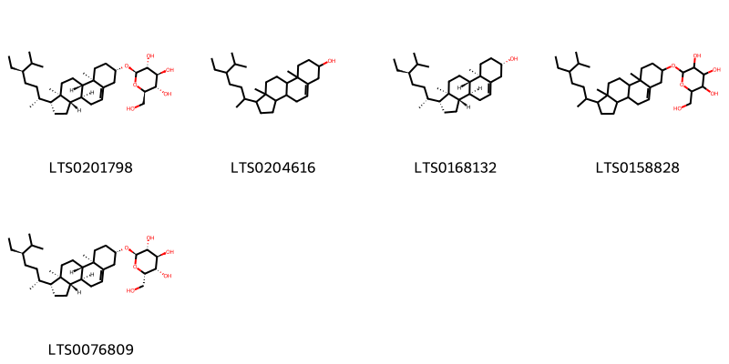{ width=100% }
    <figcaption>Hình ảnh cấu trúc hóa học của 5 hoạt chất thuộc nhóm Steroids and steroid derivatives gồm ['sitogluside (LTS0201798)', 'stigmast-5-en-3-ol, (3β)- (LTS0204616)', 'sitosterol (LTS0168132)', '2-{[1-(5-ethyl-6-methylheptan-2-yl)-9a,11a-dimethyl-1h,2h,3h,3ah,3bh,4h,6h,7h,8h,9h,9bh,10h,11h-cyclopenta[a]phenanthren-7-yl]oxy}-6-(hydroxymethyl)oxane-3,4,5-triol (LTS0158828)', '(2r,3r,4s,5s,6s)-2-{[(1r,3as,3bs,7s,9ar,9bs,11ar)-1-[(2r,5r)-5-ethyl-6-methylheptan-2-yl]-9a,11a-dimethyl-1h,2h,3h,3ah,3bh,4h,6h,7h,8h,9h,9bh,10h,11h-cyclopenta[a]phenanthren-7-yl]oxy}-6-(hydroxymethyl)oxane-3,4,5-triol (LTS0076809)'].</figcaption>
</figure>

---

### Dược dân tộc học

Danh sách các quốc gia có sử dụng *Ipomoea nil* trong điều trị các bệnh. 

| Country   | Disease              | Bệnh                                                                                                                                                                                                |
|:----------|:---------------------|:----------------------------------------------------------------------------------------------------------------------------------------------------------------------------------------------------|
| India     | Purgative, Purgative | MYMEMORY WARNING: YOU USED ALL AVAILABLE FREE TRANSLATIONS FOR TODAY. NEXT AVAILABLE IN  16 HOURS 06 MINUTES 27 SECONDS VISIT HTTPS://MYMEMORY.TRANSLATED.NET/DOC/USAGELIMITS.PHP TO TRANSLATE MORE |
| India*    | Cathartic            | MYMEMORY WARNING: YOU USED ALL AVAILABLE FREE TRANSLATIONS FOR TODAY. NEXT AVAILABLE IN  16 HOURS 06 MINUTES 24 SECONDS VISIT HTTPS://MYMEMORY.TRANSLATED.NET/DOC/USAGELIMITS.PHP TO TRANSLATE MORE |
| Java      | Purgative            | MYMEMORY WARNING: YOU USED ALL AVAILABLE FREE TRANSLATIONS FOR TODAY. NEXT AVAILABLE IN  16 HOURS 06 MINUTES 20 SECONDS VISIT HTTPS://MYMEMORY.TRANSLATED.NET/DOC/USAGELIMITS.PHP TO TRANSLATE MORE |

---

---
## Ipomoea orizabensis
### Thông tin về thực vật

!!! info "Phân loại thực vật của *Ipomoea orizabensis* từ GIBF:"
    - **Kingdom:** Plantae
    - **Phylum:** Tracheophyta
    - **Order:** Solanales
    - **Family:** Convolvulaceae
    - **Genus:** Ipomoea
    - **Species:** *Ipomoea orizabensis*

 

| Label (VI)   | Label (EN)   | Scientific Name     | Descriptions (VI)   | Descriptions (EN)   | Also Known As (VI)   | Also Known As (EN)   |
|:-------------|:-------------|:--------------------|:--------------------|:--------------------|:---------------------|:---------------------|
| N/A          | N/A          | Ipomoea orizabensis | loài thực vật       | species of plant    | ['']                 | ['']                 |

#### Phân bố trên thế giới

**Từ CSDL GIBF** Honduras, nan, El Salvador, Romania, Mexico, Guatemala

#### Phân bố tại Việt Nam

**Từ CSDL GIBF**: Không có ghi nhận ở Việt Nam

---
### Thành phần hóa học
        
- Theo cơ sở dữ liệu lotus: Từ loài *Ipomoea orizabensis* đã phân lập và xác định được 71 hoạt chất thuộc về các nhóm Organooxygen compounds, Coumarins and derivatives, Saturated hydrocarbons, Fatty Acyls, Saccharolipids, Cinnamic acids and derivatives. 

|    | chemicalTaxonomyClassyfireClass   |   smiles_count |
|---:|:----------------------------------|---------------:|
|  0 | Cinnamic acids and derivatives    |              2 |
|  1 | Coumarins and derivatives         |              1 |
|  2 | Fatty Acyls                       |              3 |
|  3 | Organooxygen compounds            |             39 |
|  4 | Saccharolipids                    |             25 |
|  5 | Saturated hydrocarbons            |              1 |

#### Nhóm Cinnamic acids and derivatives
<figure markdown="span">
    { width=100% }
    <figcaption>Hình ảnh cấu trúc hóa học của 2 hoạt chất thuộc nhóm Cinnamic acids and derivatives gồm ['3,4-dihydroxycinnamic acid (LTS0128050)', 'caffeic acid (LTS0027481)'].</figcaption>
</figure>
#### Nhóm Coumarins and derivatives
<figure markdown="span">
    { width=100% }
    <figcaption>Hình ảnh cấu trúc hóa học của 1 hoạt chất thuộc nhóm Coumarins and derivatives gồm ['scopoletin (LTS0193112)'].</figcaption>
</figure>
#### Nhóm Fatty Acyls
<figure markdown="span">
    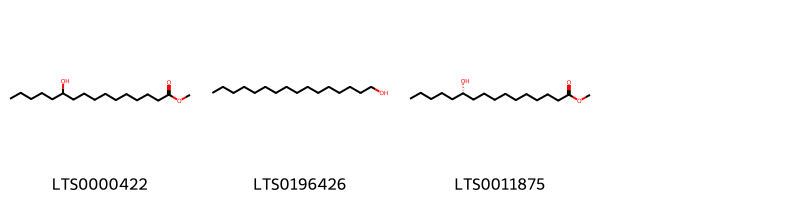{ width=100% }
    <figcaption>Hình ảnh cấu trúc hóa học của 3 hoạt chất thuộc nhóm Fatty Acyls gồm ['methyl 11-hydroxyhexadecanoate (LTS0000422)', 'cetyl alcohol (LTS0196426)', 'methyl (11s)-11-hydroxyhexadecanoate (LTS0011875)'].</figcaption>
</figure>
#### Nhóm Organooxygen compounds
<figure markdown="span">
    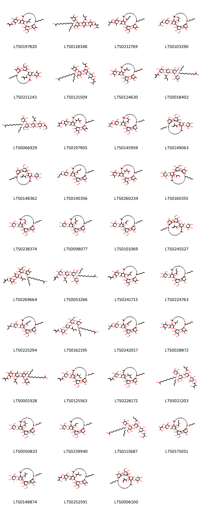{ width=100% }
    <figcaption>Hình ảnh cấu trúc hóa học của 39 hoạt chất thuộc nhóm Organooxygen compounds gồm ['4,5-dihydroxy-2-methyl-6-{[4,5,11,12-tetrahydroxy-6-(hydroxymethyl)-13,31-dimethyl-33-[(2-methylbutanoyl)oxy]-27-oxo-17-pentyl-2,7,9,14,16,28,32-heptaoxatetracyclo[27.3.1.0³,⁸.0¹⁰,¹⁵]tritriacontan-30-yl]oxy}oxan-3-yl 2-methylbut-2-enoate (LTS0197820)', '11-({3-[(3-{[4-({3,4-dihydroxy-5-[(3-hydroxy-2-methylbutanoyl)oxy]-6-methyloxan-2-yl}oxy)-5-hydroxy-6-methyl-3-[(2-methylbutanoyl)oxy]oxan-2-yl]oxy}-4,5-dihydroxy-6-(hydroxymethyl)oxan-2-yl)oxy]-4,5-dihydroxy-6-methyloxan-2-yl}oxy)hexadecanoic acid (LTS0118348)', '6-{[33-(butanoyloxy)-4,5,11,12-tetrahydroxy-6-(hydroxymethyl)-13,31-dimethyl-27-oxo-17-pentyl-2,7,9,14,16,28,32-heptaoxatetracyclo[27.3.1.0³,⁸.0¹⁰,¹⁵]tritriacontan-30-yl]oxy}-4,5-dihydroxy-2-methyloxan-3-yl 2-methylbutanoate (LTS0212769)', '(1s,3r,4s,5s,6r,8s,10r,11s,12s,13r,15r,17r,29r,30s,31s,33r)-30-{[(2s,3r,4r,5s,6r)-3,4-dihydroxy-5-{[(2s,3s)-3-hydroxy-2-methylbutanoyl]oxy}-6-methyloxan-2-yl]oxy}-4,5,11,12-tetrahydroxy-6-(hydroxymethyl)-13,31-dimethyl-27-oxo-17-pentyl-2,7,9,14,16,28,32-heptaoxatetracyclo[27.3.1.0³,⁸.0¹⁰,¹⁵]tritriacontan-33-yl (2s,3r)-3-hydroxy-2-methylbutanoate (LTS0103290)', '4,5,11,12-tetrahydroxy-6-(hydroxymethyl)-13,31-dimethyl-27-oxo-17-pentyl-30-[(3,4,5-trihydroxy-6-methyloxan-2-yl)oxy]-2,7,9,14,16,28,32-heptaoxatetracyclo[27.3.1.0³,⁸.0¹⁰,¹⁵]tritriacontan-33-yl 2-methylbut-2-enoate (LTS0211243)', '11-({3-[(3-{[5-({3,4-dihydroxy-5-[(3-hydroxy-2-methylbutanoyl)oxy]-6-methyloxan-2-yl}oxy)-4-hydroxy-6-methyl-3-[(2-methylbutanoyl)oxy]oxan-2-yl]oxy}-4,5-dihydroxy-6-(hydroxymethyl)oxan-2-yl)oxy]-4,5-dihydroxy-6-methyloxan-2-yl}oxy)hexadecanoic acid (LTS0121509)', '4,5,11,12-tetrahydroxy-6-(hydroxymethyl)-13,31-dimethyl-27-oxo-17-pentyl-30-[(3,4,5-trihydroxy-6-methyloxan-2-yl)oxy]-2,7,9,14,16,28,32-heptaoxatetracyclo[27.3.1.0³,⁸.0¹⁰,¹⁵]tritriacontan-33-yl 2-methylbutanoate (LTS0124630)', '(11r)-11-{[(2r,3r,4s,5s,6r)-3-{[(2s,3r,4s,5s,6r)-3-{[(2s,3r,4r,5r,6s)-5-{[(2s,3r,4r,5s,6r)-3,4-dihydroxy-6-methyl-5-{[(2e)-2-methylbut-2-enoyl]oxy}oxan-2-yl]oxy}-4-hydroxy-6-methyl-3-[(2-methylbutanoyl)oxy]oxan-2-yl]oxy}-4,5-dihydroxy-6-(hydroxymethyl)oxan-2-yl]oxy}-4,5-dihydroxy-6-methyloxan-2-yl]oxy}hexadecanoic acid (LTS0018402)', '(11r)-11-{[(2r,3r,4s,5s,6r)-3-{[(2s,3r,4s,5s,6r)-3-{[(2s,3r,4r,5s,6s)-4-{[(2s,3r,4r,5s,6r)-3,4-dihydroxy-5-{[(2r,3s)-3-hydroxy-2-methylbutanoyl]oxy}-6-methyloxan-2-yl]oxy}-5-hydroxy-6-methyl-3-{[(2r)-2-methylbutanoyl]oxy}oxan-2-yl]oxy}-4,5-dihydroxy-6-(hydroxymethyl)oxan-2-yl]oxy}-4,5-dihydroxy-6-methyloxan-2-yl]oxy}hexadecanoic acid (LTS0066929)', '30-({3,4-dihydroxy-5-[(3-hydroxy-2-methylbutanoyl)oxy]-6-methyloxan-2-yl}oxy)-4,5,11,12-tetrahydroxy-6-(hydroxymethyl)-13,31-dimethyl-27-oxo-17-pentyl-2,7,9,14,16,28,32-heptaoxatetracyclo[27.3.1.0³,⁸.0¹⁰,¹⁵]tritriacontan-33-yl 3-hydroxy-2-methylbutanoate (LTS0197905)', '(1s,3r,4s,5s,6r,8s,10r,11s,12s,13r,15r,17s,29r,30s,31s,33r)-30-{[(2s,3r,4r,5s,6r)-3,4-dihydroxy-5-{[(2r,3s)-3-hydroxy-2-methylbutanoyl]oxy}-6-methyloxan-2-yl]oxy}-4,5,11,12-tetrahydroxy-6-(hydroxymethyl)-13,31-dimethyl-27-oxo-17-pentyl-2,7,9,14,16,28,32-heptaoxatetracyclo[27.3.1.0³,⁸.0¹⁰,¹⁵]tritriacontan-33-yl (2r,3s)-3-hydroxy-2-methylbutanoate (LTS0145959)', '(1s,3r,4s,5r,6r,8s,10r,11s,12s,13r,15r,17s,29r,30s,31s,33s)-4,5,11,12-tetrahydroxy-6-(hydroxymethyl)-13,31-dimethyl-27-oxo-17-pentyl-30-{[(2s,3r,4s,5s,6r)-3,4,5-trihydroxy-6-methyloxan-2-yl]oxy}-2,7,9,14,16,28,32-heptaoxatetracyclo[27.3.1.0³,⁸.0¹⁰,¹⁵]tritriacontan-33-yl (2e)-2-methylbut-2-enoate (LTS0149063)', '(1s,3r,4r,5r,6r,8s,10r,11r,12r,13r,15r,29r,30r,31r,33r)-4,5,11,12-tetrahydroxy-6-(hydroxymethyl)-13,31-dimethyl-27-oxo-17-pentyl-30-{[(2r,3r,4r,5r,6r)-3,4,5-trihydroxy-6-methyloxan-2-yl]oxy}-2,7,9,14,16,28,32-heptaoxatetracyclo[27.3.1.0³,⁸.0¹⁰,¹⁵]tritriacontan-33-yl (2e)-2-methylbut-2-enoate (LTS0148362)', '(2r,3s,4r,5r,6s)-6-{[(1s,3r,4s,5s,6r,8s,10r,11s,12s,13r,15r,17r,29r,30s,31s,33r)-33-(butanoyloxy)-4,5,11,12-tetrahydroxy-6-(hydroxymethyl)-13,31-dimethyl-27-oxo-17-pentyl-2,7,9,14,16,28,32-heptaoxatetracyclo[27.3.1.0³,⁸.0¹⁰,¹⁵]tritriacontan-30-yl]oxy}-4,5-dihydroxy-2-methyloxan-3-yl (2s)-2-methylbutanoate (LTS0140356)', '4,5,11,12-tetrahydroxy-6-(hydroxymethyl)-13,31-dimethyl-27-oxo-17-pentyl-30-[(3,4,5-trihydroxy-6-methyloxan-2-yl)oxy]-2,7,9,14,16,28,32-heptaoxatetracyclo[27.3.1.0³,⁸.0¹⁰,¹⁵]tritriacontan-33-yl 3-hydroxy-2-methylbutanoate (LTS0260234)', '(1s,3r,4r,5r,6r,8s,10r,11r,12r,13r,15r,29r,30r,31r,33r)-4,5,11,12-tetrahydroxy-6-(hydroxymethyl)-13,31-dimethyl-27-oxo-17-pentyl-30-{[(2r,3r,4r,5r,6r)-3,4,5-trihydroxy-6-methyloxan-2-yl]oxy}-2,7,9,14,16,28,32-heptaoxatetracyclo[27.3.1.0³,⁸.0¹⁰,¹⁵]tritriacontan-33-yl propanoate (LTS0160355)', '(1s,3r,4s,5s,6r,8s,10r,11s,12s,13r,15r,17r,29r,30s,31s,33r)-4,5,11,12-tetrahydroxy-6-(hydroxymethyl)-13,31-dimethyl-27-oxo-17-pentyl-30-{[(2s,3r,4s,5s,6r)-3,4,5-trihydroxy-6-methyloxan-2-yl]oxy}-2,7,9,14,16,28,32-heptaoxatetracyclo[27.3.1.0³,⁸.0¹⁰,¹⁵]tritriacontan-33-yl (2s,3r)-3-hydroxy-2-methylbutanoate (LTS0238374)', '(1s,3r,4s,5s,6r,8s,10r,11s,12s,13r,15r,29r,30s,31s,33r)-4,5,11,12-tetrahydroxy-6-(hydroxymethyl)-13,31-dimethyl-27-oxo-17-pentyl-30-{[(2s,3r,4s,5s,6r)-3,4,5-trihydroxy-6-methyloxan-2-yl]oxy}-2,7,9,14,16,28,32-heptaoxatetracyclo[27.3.1.0³,⁸.0¹⁰,¹⁵]tritriacontan-33-yl 2-methylbutanoate (LTS0098077)', '(1s,3r,4s,5s,6r,8s,10r,11s,12s,13r,15r,17r,29r,30s,31s,33r)-4,5,11,12-tetrahydroxy-6-(hydroxymethyl)-13,31-dimethyl-27-oxo-17-pentyl-30-{[(2s,3r,4s,5s,6r)-3,4,5-trihydroxy-6-methyloxan-2-yl]oxy}-2,7,9,14,16,28,32-heptaoxatetracyclo[27.3.1.0³,⁸.0¹⁰,¹⁵]tritriacontan-33-yl propanoate (LTS0101069)', '(1s,3r,4s,5s,6r,8s,10r,11s,12s,13r,15r,17r,29r,30s,31s,33r)-4,5,11,12-tetrahydroxy-6-(hydroxymethyl)-13,31-dimethyl-27-oxo-17-pentyl-30-{[(2s,3r,4s,5s,6r)-3,4,5-trihydroxy-6-methyloxan-2-yl]oxy}-2,7,9,14,16,28,32-heptaoxatetracyclo[27.3.1.0³,⁸.0¹⁰,¹⁵]tritriacontan-33-yl (2e)-2-methylbut-2-enoate (LTS0245527)', '11-({3-[(3-{[4-({3,4-dihydroxy-6-methyl-5-[(2-methylbut-2-enoyl)oxy]oxan-2-yl}oxy)-5-hydroxy-6-methyl-3-[(2-methylbutanoyl)oxy]oxan-2-yl]oxy}-4,5-dihydroxy-6-(hydroxymethyl)oxan-2-yl)oxy]-4,5-dihydroxy-6-methyloxan-2-yl}oxy)hexadecanoic acid (LTS0269664)', '(11r)-11-{[(2r,3r,4s,5s,6r)-3-{[(2s,3r,4s,5s,6r)-3-{[(2s,3r,4r,5r,6s)-5-{[(2s,3r,4r,5s,6r)-3,4-dihydroxy-6-methyl-5-{[(2e)-2-methylbut-2-enoyl]oxy}oxan-2-yl]oxy}-4-hydroxy-6-methyl-3-{[(2r)-2-methylbutanoyl]oxy}oxan-2-yl]oxy}-4,5-dihydroxy-6-(hydroxymethyl)oxan-2-yl]oxy}-4,5-dihydroxy-6-methyloxan-2-yl]oxy}hexadecanoic acid (LTS0053266)', 'scammonin (LTS0241713)', '(1s,3r,4s,5s,6r,8s,10r,11s,12s,13r,15r,17s,29r,30s,31s,33r)-4,5,11,12-tetrahydroxy-6-(hydroxymethyl)-13,31-dimethyl-27-oxo-17-pentyl-30-{[(2s,3r,4s,5s,6r)-3,4,5-trihydroxy-6-methyloxan-2-yl]oxy}-2,7,9,14,16,28,32-heptaoxatetracyclo[27.3.1.0³,⁸.0¹⁰,¹⁵]tritriacontan-33-yl (2s)-2-methylbutanoate (LTS0224763)', '(2r,3s,4r,5r,6s)-6-{[(1s,3r,4s,5s,6r,8s,10r,11s,12s,13r,15r,29r,30s,31s,33r)-33-(butanoyloxy)-4,5,11,12-tetrahydroxy-6-(hydroxymethyl)-13,31-dimethyl-27-oxo-17-pentyl-2,7,9,14,16,28,32-heptaoxatetracyclo[27.3.1.0³,⁸.0¹⁰,¹⁵]tritriacontan-30-yl]oxy}-4,5-dihydroxy-2-methyloxan-3-yl 2-methylbutanoate (LTS0225294)', '(11r)-11-{[(2r,3r,4s,5s,6r)-3-{[(2s,3r,4s,5s,6r)-3-{[(2s,3r,4r,5s,6s)-4-{[(2s,3r,4r,5s,6r)-3,4-dihydroxy-6-methyl-5-{[(2e)-2-methylbut-2-enoyl]oxy}oxan-2-yl]oxy}-5-hydroxy-6-methyl-3-{[(2r)-2-methylbutanoyl]oxy}oxan-2-yl]oxy}-4,5-dihydroxy-6-(hydroxymethyl)oxan-2-yl]oxy}-4,5-dihydroxy-6-methyloxan-2-yl]oxy}hexadecanoic acid (LTS0162195)', '(2r,3s,4r,5r,6s)-6-{[(1s,3r,4s,5s,6r,8s,10r,11s,12s,13r,15r,17s,29r,30s,31s,33r)-33-(butanoyloxy)-4,5,11,12-tetrahydroxy-6-(hydroxymethyl)-13,31-dimethyl-27-oxo-17-pentyl-2,7,9,14,16,28,32-heptaoxatetracyclo[27.3.1.0³,⁸.0¹⁰,¹⁵]tritriacontan-30-yl]oxy}-4,5-dihydroxy-2-methyloxan-3-yl (2r)-2-methylbutanoate (LTS0242017)', '4,5,11,12-tetrahydroxy-6-(hydroxymethyl)-13,31-dimethyl-27-oxo-17-pentyl-30-[(3,4,5-trihydroxy-6-methyloxan-2-yl)oxy]-2,7,9,14,16,28,32-heptaoxatetracyclo[27.3.1.0³,⁸.0¹⁰,¹⁵]tritriacontan-33-yl propanoate (LTS0028872)', '11-({3-[(3-{[5-({3,4-dihydroxy-6-methyl-5-[(2-methylbut-2-enoyl)oxy]oxan-2-yl}oxy)-4-hydroxy-6-methyl-3-[(2-methylbutanoyl)oxy]oxan-2-yl]oxy}-4,5-dihydroxy-6-(hydroxymethyl)oxan-2-yl)oxy]-4,5-dihydroxy-6-methyloxan-2-yl}oxy)hexadecanoic acid (LTS0001928)', 'scammonin i (LTS0125563)', '(2r,3s,4r,5r,6s)-4,5-dihydroxy-2-methyl-6-{[(1s,3r,4s,5s,6r,8s,10r,11s,12s,13r,15r,29r,30s,31s,33r)-4,5,11,12-tetrahydroxy-6-(hydroxymethyl)-13,31-dimethyl-33-[(2-methylbutanoyl)oxy]-27-oxo-17-pentyl-2,7,9,14,16,28,32-heptaoxatetracyclo[27.3.1.0³,⁸.0¹⁰,¹⁵]tritriacontan-30-yl]oxy}oxan-3-yl (2e)-2-methylbut-2-enoate (LTS0228172)', '(11r)-11-{[(2r,3r,4s,5s,6r)-3-{[(2s,3r,4s,5s,6r)-3-{[(2s,3r,4r,5r,6s)-5-{[(2s,3r,4r,5s,6r)-3,4-dihydroxy-5-[(3-hydroxy-2-methylbutanoyl)oxy]-6-methyloxan-2-yl]oxy}-4-hydroxy-6-methyl-3-[(2-methylbutanoyl)oxy]oxan-2-yl]oxy}-4,5-dihydroxy-6-(hydroxymethyl)oxan-2-yl]oxy}-4,5-dihydroxy-6-methyloxan-2-yl]oxy}hexadecanoic acid (LTS0021203)', '(1s,3r,4s,5s,6r,8s,10r,11s,12s,13r,15r,17s,29r,30s,31s,33r)-4,5,11,12-tetrahydroxy-6-(hydroxymethyl)-13,31-dimethyl-27-oxo-17-pentyl-30-{[(2s,3r,4s,5s,6r)-3,4,5-trihydroxy-6-methyloxan-2-yl]oxy}-2,7,9,14,16,28,32-heptaoxatetracyclo[27.3.1.0³,⁸.0¹⁰,¹⁵]tritriacontan-33-yl (2r,3s)-3-hydroxy-2-methylbutanoate (LTS0050833)', '(1s,3r,4s,5r,6r,8s,10r,11s,12s,13r,15r,17s,29r,30s,31s,33s)-4,5,11,12-tetrahydroxy-6-(hydroxymethyl)-13,31-dimethyl-27-oxo-17-pentyl-30-{[(2s,3r,4s,5s,6r)-3,4,5-trihydroxy-6-methyloxan-2-yl]oxy}-2,7,9,14,16,28,32-heptaoxatetracyclo[27.3.1.0³,⁸.0¹⁰,¹⁵]tritriacontan-33-yl propanoate (LTS0239940)', '(11r)-11-{[(2r,3r,4s,5s,6r)-3-{[(2s,3r,4s,5r,6r)-3-{[(2s,3r,4r,5r,6s)-5-{[(2s,3r,4r,5s,6r)-3,4-dihydroxy-5-{[(2s,3s)-3-hydroxy-2-methylbutanoyl]oxy}-6-methyloxan-2-yl]oxy}-4-hydroxy-6-methyl-3-{[(2s)-2-methylbutanoyl]oxy}oxan-2-yl]oxy}-4,5-dihydroxy-6-(hydroxymethyl)oxan-2-yl]oxy}-4,5-dihydroxy-6-methyloxan-2-yl]oxy}hexadecanoic acid (LTS0115687)', '(2r,3s,4r,5r,6s)-4,5-dihydroxy-2-methyl-6-{[(1s,3r,4s,5s,6r,8s,10r,11s,12s,13r,15r,17s,29r,30s,31s,33r)-4,5,11,12-tetrahydroxy-6-(hydroxymethyl)-13,31-dimethyl-33-{[(2s)-2-methylbutanoyl]oxy}-27-oxo-17-pentyl-2,7,9,14,16,28,32-heptaoxatetracyclo[27.3.1.0³,⁸.0¹⁰,¹⁵]tritriacontan-30-yl]oxy}oxan-3-yl (2r,3r)-3-hydroxy-2-methylbutanoate (LTS0175051)', '(1r,3r,4s,5s,6r,8s,10s,11s,12r,13s,15r,17s,29r,30s,31s,33r)-4,5,11,12-tetrahydroxy-6-(hydroxymethyl)-13,31-dimethyl-27-oxo-17-pentyl-30-{[(2r,3r,4s,5r,6r)-3,4,5-trihydroxy-6-methyloxan-2-yl]oxy}-2,7,9,14,16,28,32-heptaoxatetracyclo[27.3.1.0³,⁸.0¹⁰,¹⁵]tritriacontan-33-yl 2-methylpropanoate (LTS0148874)', '4,5-dihydroxy-2-methyl-6-{[4,5,11,12-tetrahydroxy-6-(hydroxymethyl)-13,31-dimethyl-33-[(2-methylbutanoyl)oxy]-27-oxo-17-pentyl-2,7,9,14,16,28,32-heptaoxatetracyclo[27.3.1.0³,⁸.0¹⁰,¹⁵]tritriacontan-30-yl]oxy}oxan-3-yl 3-hydroxy-2-methylbutanoate (LTS0252591)', '(1s,3s,4r,5r,6s,8r,10r,11s,12r,13s,15r,17r,29s,30r,31s,33r)-4,5,11,12-tetrahydroxy-6-(hydroxymethyl)-13,31-dimethyl-27-oxo-17-pentyl-30-{[(2r,3r,4s,5s,6r)-3,4,5-trihydroxy-6-methyloxan-2-yl]oxy}-2,7,9,14,16,28,32-heptaoxatetracyclo[27.3.1.0³,⁸.0¹⁰,¹⁵]tritriacontan-33-yl (2z)-2-methylbut-2-enoate (LTS0006100)'].</figcaption>
</figure>
#### Nhóm Saccharolipids
<figure markdown="span">
    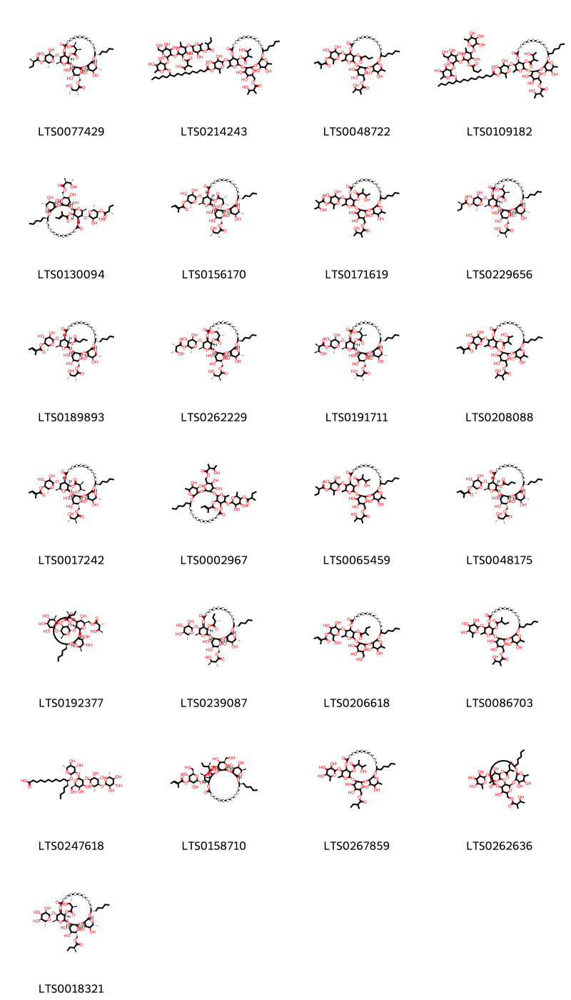{ width=100% }
    <figcaption>Hình ảnh cấu trúc hóa học của 25 hoạt chất thuộc nhóm Saccharolipids gồm ['[(1s,3r,4s,5s,6r,8s,10r,11s,12s,13r,15r,17s,29r,30s,31s,33r)-30-{[(2s,3r,4r,5s,6r)-3,4-dihydroxy-6-methyl-5-{[(2r)-2-methylbutanoyl]oxy}oxan-2-yl]oxy}-4,5,11,12-tetrahydroxy-33-{[(2r,3s)-3-hydroxy-2-methylbutanoyl]oxy}-13,31-dimethyl-27-oxo-17-pentyl-2,7,9,14,16,28,32-heptaoxatetracyclo[27.3.1.0³,⁸.0¹⁰,¹⁵]tritriacontan-6-yl]methyl (2r,3s)-3-hydroxy-2-methylbutanoate (LTS0077429)', '4,5-dihydroxy-2-methyl-6-({4,5,11,12-tetrahydroxy-33-[(3-hydroxy-2-methylbutanoyl)oxy]-6-{[(3-hydroxy-2-methylbutanoyl)oxy]methyl}-13,31-dimethyl-27-oxo-17-pentyl-2,7,9,14,16,28,32-heptaoxatetracyclo[27.3.1.0³,⁸.0¹⁰,¹⁵]tritriacontan-30-yl}oxy)oxan-3-yl 11-({3-[(3-{[5-({3,4-dihydroxy-6-methyl-5-[(2-methylbutanoyl)oxy]oxan-2-yl}oxy)-4-hydroxy-3-[(3-hydroxy-2-methylbutanoyl)oxy]-6-methyloxan-2-yl]oxy}-4,5-dihydroxy-6-(hydroxymethyl)oxan-2-yl)oxy]-4,5-dihydroxy-6-methyloxan-2-yl}oxy)hexadecanoate (LTS0214243)', '6-{[33-(butanoyloxy)-4,5,11,12-tetrahydroxy-6-{[(3-hydroxy-2-methylbutanoyl)oxy]methyl}-13,31-dimethyl-27-oxo-17-pentyl-2,7,9,14,16,28,32-heptaoxatetracyclo[27.3.1.0³,⁸.0¹⁰,¹⁵]tritriacontan-30-yl]oxy}-4,5-dihydroxy-2-methyloxan-3-yl 2-methylbut-2-enoate (LTS0048722)', '4,5-dihydroxy-2-methyl-6-({4,5,11,12-tetrahydroxy-33-[(3-hydroxy-2-methylbutanoyl)oxy]-6-{[(3-hydroxy-2-methylbutanoyl)oxy]methyl}-13,31-dimethyl-27-oxo-17-pentyl-2,7,9,14,16,28,32-heptaoxatetracyclo[27.3.1.0³,⁸.0¹⁰,¹⁵]tritriacontan-30-yl}oxy)oxan-3-yl 11-({3-[(3-{[3-(butanoyloxy)-4-hydroxy-6-methyl-5-[(3,4,5-trihydroxy-6-methyloxan-2-yl)oxy]oxan-2-yl]oxy}-4,5-dihydroxy-6-(hydroxymethyl)oxan-2-yl)oxy]-4,5-dihydroxy-6-methyloxan-2-yl}oxy)hexadecanoate (LTS0109182)', '(1s,3r,4s,5s,6r,8s,10r,11s,12r,13r,15r,17r,29r,30s,31s,33r)-30-{[(2s,3r,4r,5s,6r)-3,4-dihydroxy-6-methyl-5-{[(2s)-2-methylbutanoyl]oxy}oxan-2-yl]oxy}-4,5,11,12-tetrahydroxy-6-({[(2s,3s)-3-hydroxy-2-methylbutanoyl]oxy}methyl)-13,31-dimethyl-27-oxo-17-pentyl-2,7,9,14,16,28,32-heptaoxatetracyclo[27.3.1.0³,⁸.0¹⁰,¹⁵]tritriacontan-33-yl (2e)-2-methylbut-2-enoate (LTS0130094)', '(2r,3s,4r,5r,6s)-4,5-dihydroxy-2-methyl-6-{[(1s,3r,4s,5s,6r,8s,10r,11s,12s,13r,15r,17s,29r,30s,31s,33r)-4,5,11,12-tetrahydroxy-33-{[(2r,3s)-3-hydroxy-2-methylbutanoyl]oxy}-6-({[(2r,3s)-3-hydroxy-2-methylbutanoyl]oxy}methyl)-13,31-dimethyl-27-oxo-17-pentyl-2,7,9,14,16,28,32-heptaoxatetracyclo[27.3.1.0³,⁸.0¹⁰,¹⁵]tritriacontan-30-yl]oxy}oxan-3-yl (2e)-2-methylbut-2-enoate (LTS0156170)', '[30-({3,4-dihydroxy-5-[(3-hydroxy-2-methylbutanoyl)oxy]-6-methyloxan-2-yl}oxy)-4,5,11,12-tetrahydroxy-33-[(3-hydroxy-2-methylbutanoyl)oxy]-13,31-dimethyl-27-oxo-17-pentyl-2,7,9,14,16,28,32-heptaoxatetracyclo[27.3.1.0³,⁸.0¹⁰,¹⁵]tritriacontan-6-yl]methyl 3-hydroxy-2-methylbutanoate (LTS0171619)', '[(1s,3r,4s,5s,6r,8s,10r,11s,12s,13r,15r,17r,29r,30s,31s,33s)-30-{[(2s,3r,4r,5s,6r)-3,4-dihydroxy-6-methyl-5-{[(2r)-2-methylbutanoyl]oxy}oxan-2-yl]oxy}-4,5,11,12-tetrahydroxy-33-{[(2r,3s)-3-hydroxy-2-methylbutanoyl]oxy}-13,31-dimethyl-27-oxo-17-pentyl-2,7,9,14,16,28,32-heptaoxatetracyclo[27.3.1.0³,⁸.0¹⁰,¹⁵]tritriacontan-6-yl]methyl (2s,3s)-3-hydroxy-2-methylbutanoate (LTS0229656)', '(2r,3s,4r,5r,6s)-6-{[(1s,3r,4s,5s,6r,8s,10r,11s,12s,13r,15r,17s,29r,30s,31s,33s)-33-(butanoyloxy)-4,5,11,12-tetrahydroxy-6-({[(2r,3s)-3-hydroxy-2-methylbutanoyl]oxy}methyl)-13,31-dimethyl-27-oxo-17-pentyl-2,7,9,14,16,28,32-heptaoxatetracyclo[27.3.1.0³,⁸.0¹⁰,¹⁵]tritriacontan-30-yl]oxy}-4,5-dihydroxy-2-methyloxan-3-yl (2e)-2-methylbut-2-enoate (LTS0189893)', '[(1s,3r,4s,5s,6r,8s,10r,11s,12s,13r,15r,17r,29r,30s,31s,33s)-30-{[(2s,3r,4r,5s,6r)-3,4-dihydroxy-5-{[(2s,3r)-3-hydroxy-2-methylbutanoyl]oxy}-6-methyloxan-2-yl]oxy}-4,5,11,12-tetrahydroxy-33-{[(2s,3r)-3-hydroxy-2-methylbutanoyl]oxy}-13,31-dimethyl-27-oxo-17-pentyl-2,7,9,14,16,28,32-heptaoxatetracyclo[27.3.1.0³,⁸.0¹⁰,¹⁵]tritriacontan-6-yl]methyl (2s,3s)-3-hydroxy-2-methylbutanoate (LTS0262229)', '[(1s,3r,4s,5s,6r,8s,10r,11s,12s,13r,15r,17s,29r,30s,31s,33r)-30-{[(2s,3r,4r,5s,6r)-3,4-dihydroxy-5-{[(2r,3s)-3-hydroxy-2-methylbutanoyl]oxy}-6-methyloxan-2-yl]oxy}-4,5,11,12-tetrahydroxy-33-{[(2r,3s)-3-hydroxy-2-methylbutanoyl]oxy}-13,31-dimethyl-27-oxo-17-pentyl-2,7,9,14,16,28,32-heptaoxatetracyclo[27.3.1.0³,⁸.0¹⁰,¹⁵]tritriacontan-6-yl]methyl (2r,3s)-3-hydroxy-2-methylbutanoate (LTS0191711)', '4,5-dihydroxy-2-methyl-6-({4,5,11,12-tetrahydroxy-33-[(3-hydroxy-2-methylbutanoyl)oxy]-6-{[(3-hydroxy-2-methylbutanoyl)oxy]methyl}-13,31-dimethyl-27-oxo-17-pentyl-2,7,9,14,16,28,32-heptaoxatetracyclo[27.3.1.0³,⁸.0¹⁰,¹⁵]tritriacontan-30-yl}oxy)oxan-3-yl 2-methylbut-2-enoate (LTS0208088)', '(2r,3s,4r,5r,6s)-4,5-dihydroxy-2-methyl-6-{[(1s,3r,4s,5s,6r,8s,10r,11s,12s,13r,15r,17r,29r,30s,31s,33r)-4,5,11,12-tetrahydroxy-33-{[(2s,3r)-3-hydroxy-2-methylbutanoyl]oxy}-6-({[(2s,3s)-3-hydroxy-2-methylbutanoyl]oxy}methyl)-13,31-dimethyl-27-oxo-17-pentyl-2,7,9,14,16,28,32-heptaoxatetracyclo[27.3.1.0³,⁸.0¹⁰,¹⁵]tritriacontan-30-yl]oxy}oxan-3-yl (2e)-2-methylbut-2-enoate (LTS0017242)', '30-({3,4-dihydroxy-6-methyl-5-[(2-methylbutanoyl)oxy]oxan-2-yl}oxy)-4,5,11,12-tetrahydroxy-6-{[(3-hydroxy-2-methylbutanoyl)oxy]methyl}-13,31-dimethyl-27-oxo-17-pentyl-2,7,9,14,16,28,32-heptaoxatetracyclo[27.3.1.0³,⁸.0¹⁰,¹⁵]tritriacontan-33-yl 2-methylbut-2-enoate (LTS0002967)', '[30-({3,4-dihydroxy-6-methyl-5-[(2-methylbutanoyl)oxy]oxan-2-yl}oxy)-4,5,11,12-tetrahydroxy-33-[(3-hydroxy-2-methylbutanoyl)oxy]-13,31-dimethyl-27-oxo-17-pentyl-2,7,9,14,16,28,32-heptaoxatetracyclo[27.3.1.0³,⁸.0¹⁰,¹⁵]tritriacontan-6-yl]methyl 3-hydroxy-2-methylbutanoate (LTS0065459)', '(2r,3s,4r,5r,6s)-6-{[(1s,3r,4s,5s,6r,8s,10r,11s,12s,13r,15r,17s,29r,30s,31s,33r)-33-(butanoyloxy)-4,5,11,12-tetrahydroxy-6-({[(2r,3s)-3-hydroxy-2-methylbutanoyl]oxy}methyl)-13,31-dimethyl-27-oxo-17-pentyl-2,7,9,14,16,28,32-heptaoxatetracyclo[27.3.1.0³,⁸.0¹⁰,¹⁵]tritriacontan-30-yl]oxy}-4,5-dihydroxy-2-methyloxan-3-yl (2e)-2-methylbut-2-enoate (LTS0048175)', '[(1s,3r,4s,5s,6r,8r,10s,22s,23r,24r,26r)-4,5,23-trihydroxy-26-{[(2s,3r,4r,5r,6s)-4-hydroxy-6-methyl-3-{[(2s)-2-methylbutanoyl]oxy}-5-{[(2s,3r,4s,5s,6r)-3,4,5-trihydroxy-6-methyloxan-2-yl]oxy}oxan-2-yl]oxy}-6-methyl-20-oxo-10-pentyl-2,7,9,21,25-pentaoxatricyclo[20.3.1.0³,⁸]hexacosan-24-yl]methyl (2r,3r)-3-hydroxy-2-methylbutanoate (LTS0192377)', '[(1s,3r,4s,5s,6r,8s,10r,11s,12s,13r,15r,17s,29r,30s,31s,33r)-4,5,11,12-tetrahydroxy-13,31-dimethyl-33-{[(2s)-2-methylbutanoyl]oxy}-27-oxo-17-pentyl-30-{[(2s,3r,4s,5s,6r)-3,4,5-trihydroxy-6-methyloxan-2-yl]oxy}-2,7,9,14,16,28,32-heptaoxatetracyclo[27.3.1.0³,⁸.0¹⁰,¹⁵]tritriacontan-6-yl]methyl (2r,3r)-3-hydroxy-2-methylbutanoate (LTS0239087)', '4,5-dihydroxy-2-(hydroxymethyl)-6-{[4,5,11,12-tetrahydroxy-6-(hydroxymethyl)-13,31-dimethyl-33-[(2-methylbutanoyl)oxy]-27-oxo-17-pentyl-2,7,9,14,16,28,32-heptaoxatetracyclo[27.3.1.0³,⁸.0¹⁰,¹⁵]tritriacontan-30-yl]oxy}oxan-3-yl (2e)-2-methylbut-2-enoate (LTS0206618)', '{4,5,11,12-tetrahydroxy-13,31-dimethyl-33-[(2-methylbutanoyl)oxy]-27-oxo-17-pentyl-30-[(3,4,5-trihydroxy-6-methyloxan-2-yl)oxy]-2,7,9,14,16,28,32-heptaoxatetracyclo[27.3.1.0³,⁸.0¹⁰,¹⁵]tritriacontan-6-yl}methyl 3-hydroxy-2-methylbutanoate (LTS0086703)', '(11s)-11-{[(2r,3r,4s,5s,6r)-3-{[(2s,3r,4s,5r,6r)-3-{[(2s,3r,4s,5r,6s)-3,4-dihydroxy-6-methyl-5-{[(2s,3r,4s,5s,6r)-3,4,5-trihydroxy-6-methyloxan-2-yl]oxy}oxan-2-yl]oxy}-4,5-dihydroxy-6-(hydroxymethyl)oxan-2-yl]oxy}-4,5-dihydroxy-6-methyloxan-2-yl]oxy}hexadecanoic acid (LTS0247618)', '(2r,3r,4s,5r,6s)-3,5-dihydroxy-2-(hydroxymethyl)-6-{[(1r,3r,4s,5r,6r,8s,10s,11r,12r,13r,15s,17s,29s,30s,31r,33s)-4,5,11,12-tetrahydroxy-6-(hydroxymethyl)-13,31-dimethyl-33-{[(2r)-2-methylbutanoyl]oxy}-27-oxo-17-pentyl-2,7,9,14,16,28,32-heptaoxatetracyclo[27.3.1.0³,⁸.0¹⁰,¹⁵]tritriacontan-30-yl]oxy}oxan-4-yl (2e)-2-methylbut-2-enoate (LTS0158710)', '4,5,11,12-tetrahydroxy-13,31-dimethyl-6-{[(2-methylbutanoyl)oxy]methyl}-27-oxo-17-pentyl-30-[(3,4,5-trihydroxy-6-methyloxan-2-yl)oxy]-2,7,9,14,16,28,32-heptaoxatetracyclo[27.3.1.0³,⁸.0¹⁰,¹⁵]tritriacontan-33-yl 3-hydroxy-2-methylbutanoate (LTS0267859)', '[4,5,23-trihydroxy-26-({4-hydroxy-6-methyl-3-[(2-methylbutanoyl)oxy]-5-[(3,4,5-trihydroxy-6-methyloxan-2-yl)oxy]oxan-2-yl}oxy)-6-methyl-20-oxo-10-pentyl-2,7,9,21,25-pentaoxatricyclo[20.3.1.0³,⁸]hexacosan-24-yl]methyl 3-hydroxy-2-methylbutanoate (LTS0262636)', '(1s,3r,4s,5s,6r,8s,10r,11s,12s,13r,15r,17s,29r,30s,31s,33r)-4,5,11,12-tetrahydroxy-13,31-dimethyl-6-({[(2s)-2-methylbutanoyl]oxy}methyl)-27-oxo-17-pentyl-30-{[(2s,3r,4s,5s,6r)-3,4,5-trihydroxy-6-methyloxan-2-yl]oxy}-2,7,9,14,16,28,32-heptaoxatetracyclo[27.3.1.0³,⁸.0¹⁰,¹⁵]tritriacontan-33-yl (2r,3r)-3-hydroxy-2-methylbutanoate (LTS0018321)'].</figcaption>
</figure>
#### Nhóm Saturated hydrocarbons
<figure markdown="span">
    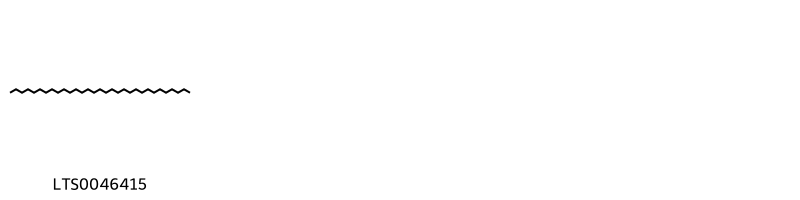{ width=100% }
    <figcaption>Hình ảnh cấu trúc hóa học của 1 hoạt chất thuộc nhóm Saturated hydrocarbons gồm ['hentriacontane (LTS0046415)'].</figcaption>
</figure>

---

### Dược dân tộc học

Danh sách các quốc gia có sử dụng *Ipomoea orizabensis* trong điều trị các bệnh. 

| Country   | Disease                      | Bệnh                                                                                                                                                                                                |
|:----------|:-----------------------------|:----------------------------------------------------------------------------------------------------------------------------------------------------------------------------------------------------|
| Elsewhere | Cathartic                    | MYMEMORY WARNING: YOU USED ALL AVAILABLE FREE TRANSLATIONS FOR TODAY. NEXT AVAILABLE IN  16 HOURS 05 MINUTES 34 SECONDS VISIT HTTPS://MYMEMORY.TRANSLATED.NET/DOC/USAGELIMITS.PHP TO TRANSLATE MORE |
| Turkey    | Purgative, Cathartic, Poison | MYMEMORY WARNING: YOU USED ALL AVAILABLE FREE TRANSLATIONS FOR TODAY. NEXT AVAILABLE IN  16 HOURS 05 MINUTES 31 SECONDS VISIT HTTPS://MYMEMORY.TRANSLATED.NET/DOC/USAGELIMITS.PHP TO TRANSLATE MORE |

---

---
## Ipomoea palmatopinnata
### Thông tin về thực vật

!!! info "Phân loại thực vật của *Ipomoea gigantea* từ GIBF:"
    - **Kingdom:** Plantae
    - **Phylum:** Tracheophyta
    - **Order:** Solanales
    - **Family:** Convolvulaceae
    - **Genus:** Ipomoea
    - **Species:** *Ipomoea gigantea*

 

| Label (VI)   | Label (EN)   | Scientific Name     | Descriptions (VI)   | Descriptions (EN)   | Also Known As (VI)   | Also Known As (EN)   |
|:-------------|:-------------|:--------------------|:--------------------|:--------------------|:---------------------|:---------------------|
| N/A          | N/A          | Ipomoea orizabensis | loài thực vật       | species of plant    | ['']                 | ['']                 |

#### Phân bố trên thế giới

**Từ CSDL GIBF** Honduras, nan, El Salvador, Romania, Mexico, Guatemala

#### Phân bố tại Việt Nam

**Từ CSDL GIBF**: Không có ghi nhận ở Việt Nam

---
### Thành phần hóa học
        
- Theo cơ sở dữ liệu lotus: Từ loài *Ipomoea gigantea* đã phân lập và xác định được Chưa có hoạt chất nào được phân lập. hoạt chất thuộc về các nhóm Không có hoạt chất nào được phân lập. 

Không có hình ảnh nào được tạo ra

---

### Dược dân tộc học

Danh sách các quốc gia có sử dụng *Ipomoea gigantea* trong điều trị các bệnh. 

| Country   | Disease              | Bệnh                                                                                                                                                                                                |
|:----------|:---------------------|:----------------------------------------------------------------------------------------------------------------------------------------------------------------------------------------------------|
| Elsewhere | Cathartic, Purgative | MYMEMORY WARNING: YOU USED ALL AVAILABLE FREE TRANSLATIONS FOR TODAY. NEXT AVAILABLE IN  16 HOURS 04 MINUTES 53 SECONDS VISIT HTTPS://MYMEMORY.TRANSLATED.NET/DOC/USAGELIMITS.PHP TO TRANSLATE MORE |

---

---
## Ipomoea pedicellaris
### Thông tin về thực vật

!!! info "Phân loại thực vật của *Ipomoea pedicellaris* từ GIBF:"
    - **Kingdom:** Plantae
    - **Phylum:** Tracheophyta
    - **Order:** Solanales
    - **Family:** Convolvulaceae
    - **Genus:** Ipomoea
    - **Species:** *Ipomoea pedicellaris*

 

| Label (VI)   | Label (EN)   | Scientific Name      | Descriptions (VI)   | Descriptions (EN)   | Also Known As (VI)   | Also Known As (EN)   |
|:-------------|:-------------|:---------------------|:--------------------|:--------------------|:---------------------|:---------------------|
| N/A          | N/A          | Ipomoea pedicellaris | loài thực vật       | species of plant    | ['']                 | ['']                 |

#### Phân bố trên thế giới

**Từ CSDL GIBF** Honduras, Mexico

#### Phân bố tại Việt Nam

**Từ CSDL GIBF**: Không có ghi nhận ở Việt Nam

---
### Thành phần hóa học
        
- Theo cơ sở dữ liệu lotus: Từ loài *Ipomoea pedicellaris* đã phân lập và xác định được Chưa có hoạt chất nào được phân lập. hoạt chất thuộc về các nhóm Không có hoạt chất nào được phân lập. 

Không có hình ảnh nào được tạo ra

---

### Dược dân tộc học

Danh sách các quốc gia có sử dụng *Ipomoea pedicellaris* trong điều trị các bệnh. 

| Country   | Disease   | Bệnh                                                                                                                                                                                                |
|:----------|:----------|:----------------------------------------------------------------------------------------------------------------------------------------------------------------------------------------------------|
| Mexico    | Purgative | MYMEMORY WARNING: YOU USED ALL AVAILABLE FREE TRANSLATIONS FOR TODAY. NEXT AVAILABLE IN  16 HOURS 04 MINUTES 24 SECONDS VISIT HTTPS://MYMEMORY.TRANSLATED.NET/DOC/USAGELIMITS.PHP TO TRANSLATE MORE |

---

---
## Ipomoea pescaprae
### Thông tin về thực vật

!!! info "Phân loại thực vật của *Ipomoea pes-caprae* từ GIBF:"
    - **Kingdom:** Plantae
    - **Phylum:** Tracheophyta
    - **Order:** Solanales
    - **Family:** Convolvulaceae
    - **Genus:** Ipomoea
    - **Species:** *Ipomoea pes-caprae*

 

| Label (VI)   | Label (EN)   | Scientific Name      | Descriptions (VI)   | Descriptions (EN)   | Also Known As (VI)   | Also Known As (EN)   |
|:-------------|:-------------|:---------------------|:--------------------|:--------------------|:---------------------|:---------------------|
| N/A          | N/A          | Ipomoea pedicellaris | loài thực vật       | species of plant    | ['']                 | ['']                 |

#### Phân bố trên thế giới

**Từ CSDL GIBF** Viet Nam, Thailand, El Salvador, Northern Mariana Islands, United Arab Emirates, Australia, Indonesia, Guatemala, Turks and Caicos Islands, Sri Lanka, Dominican Republic, Maldives, Puerto Rico, Mauritius, India, Sao Tome and Principe, Réunion, Cuba, Saint Kitts and Nevis, Bahamas, Guam, Virgin Islands (U.S.), Barbados, Antigua and Barbuda, Japan, Nicaragua, Brazil, Belize, Aruba, Mexico, China, Tonga, Angola, Chinese Taipei, South Africa, Costa Rica, New Caledonia, Ecuador, United States of America

#### Phân bố tại Việt Nam

**Từ CSDL GIBF**: Kiên Giang, Quảng Nam, Thừa Thiên - Huế

---
### Thành phần hóa học
        
- Theo cơ sở dữ liệu lotus: Từ loài *Ipomoea pes-caprae* đã phân lập và xác định được 1 hoạt chất thuộc về các nhóm Organooxygen compounds. 

|    | chemicalTaxonomyClassyfireClass   |   smiles_count |
|---:|:----------------------------------|---------------:|
|  0 | Organooxygen compounds            |              1 |

#### Nhóm Organooxygen compounds
<figure markdown="span">
    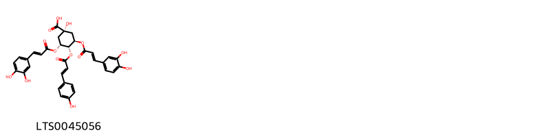{ width=100% }
    <figcaption>Hình ảnh cấu trúc hóa học của 1 hoạt chất thuộc nhóm Organooxygen compounds gồm ['(1s,3r,4s,5r)-3,5-bis({[(2e)-3-(3,4-dihydroxyphenyl)prop-2-enoyl]oxy})-1-hydroxy-4-{[(2e)-3-(4-hydroxyphenyl)prop-2-enoyl]oxy}cyclohexane-1-carboxylic acid (LTS0045056)'].</figcaption>
</figure>

---

### Dược dân tộc học

Danh sách các quốc gia có sử dụng *Ipomoea pes-caprae* trong điều trị các bệnh. 

| Country            | Disease                                                     | Bệnh                                                                                                                                                                                                |
|:-------------------|:------------------------------------------------------------|:----------------------------------------------------------------------------------------------------------------------------------------------------------------------------------------------------|
| Dominican Republic | Purgative                                                   | MYMEMORY WARNING: YOU USED ALL AVAILABLE FREE TRANSLATIONS FOR TODAY. NEXT AVAILABLE IN  16 HOURS 03 MINUTES 58 SECONDS VISIT HTTPS://MYMEMORY.TRANSLATED.NET/DOC/USAGELIMITS.PHP TO TRANSLATE MORE |
| Elsewhere          | Astringent, Laxative, Purgative, Tonic, Diuretic, Stomachic | MYMEMORY WARNING: YOU USED ALL AVAILABLE FREE TRANSLATIONS FOR TODAY. NEXT AVAILABLE IN  16 HOURS 03 MINUTES 53 SECONDS VISIT HTTPS://MYMEMORY.TRANSLATED.NET/DOC/USAGELIMITS.PHP TO TRANSLATE MORE |
| Haiti              | Sternutatory, Vermifuge, Emetic                             | MYMEMORY WARNING: YOU USED ALL AVAILABLE FREE TRANSLATIONS FOR TODAY. NEXT AVAILABLE IN  16 HOURS 03 MINUTES 48 SECONDS VISIT HTTPS://MYMEMORY.TRANSLATED.NET/DOC/USAGELIMITS.PHP TO TRANSLATE MORE |

---

---
## Ipomoea pestigridis
### Thông tin về thực vật

!!! info "Phân loại thực vật của *Ipomoea pes-tigridis* từ GIBF:"
    - **Kingdom:** Plantae
    - **Phylum:** Tracheophyta
    - **Order:** Solanales
    - **Family:** Convolvulaceae
    - **Genus:** Ipomoea
    - **Species:** *Ipomoea pes-tigridis*

 

| Label (VI)   | Label (EN)   | Scientific Name      | Descriptions (VI)   | Descriptions (EN)   | Also Known As (VI)   | Also Known As (EN)   |
|:-------------|:-------------|:---------------------|:--------------------|:--------------------|:---------------------|:---------------------|
| N/A          | N/A          | Ipomoea pedicellaris | loài thực vật       | species of plant    | ['']                 | ['']                 |

#### Phân bố trên thế giới

**Từ CSDL GIBF** Viet Nam, nan, Thailand, Namibia, Philippines, Singapore, Australia, Indonesia, Sri Lanka, Maldives, Malaysia, India, Bangladesh, China, Nepal, Chinese Taipei, South Africa, Mozambique, Tanzania, United Republic of, Zimbabwe

#### Phân bố tại Việt Nam

**Từ CSDL GIBF**: Bình Thuận, Long An, Khánh Hòa, Lâm Đồng, Bà Rịa - Vũng Tàu, Đà Nẵng

---
### Thành phần hóa học
        
- Theo cơ sở dữ liệu lotus: Từ loài *Ipomoea pes-tigridis* đã phân lập và xác định được Chưa có hoạt chất nào được phân lập. hoạt chất thuộc về các nhóm Không có hoạt chất nào được phân lập. 

Không có hình ảnh nào được tạo ra

---

### Dược dân tộc học

Danh sách các quốc gia có sử dụng *Ipomoea pes-tigridis* trong điều trị các bệnh. 

| Country   | Disease             | Bệnh                                                                                                                                                                                                |
|:----------|:--------------------|:----------------------------------------------------------------------------------------------------------------------------------------------------------------------------------------------------|
| Elsewhere | Antidote, Purgative | MYMEMORY WARNING: YOU USED ALL AVAILABLE FREE TRANSLATIONS FOR TODAY. NEXT AVAILABLE IN  16 HOURS 03 MINUTES 22 SECONDS VISIT HTTPS://MYMEMORY.TRANSLATED.NET/DOC/USAGELIMITS.PHP TO TRANSLATE MORE |

---

---
## Ipomoea pescaprae
### Thông tin về thực vật

!!! info "Phân loại thực vật của *Ipomoea pes-caprae* từ GIBF:"
    - **Kingdom:** Plantae
    - **Phylum:** Tracheophyta
    - **Order:** Solanales
    - **Family:** Convolvulaceae
    - **Genus:** Ipomoea
    - **Species:** *Ipomoea pes-caprae*

 

| Label (VI)   | Label (EN)   | Scientific Name      | Descriptions (VI)   | Descriptions (EN)   | Also Known As (VI)   | Also Known As (EN)   |
|:-------------|:-------------|:---------------------|:--------------------|:--------------------|:---------------------|:---------------------|
| N/A          | N/A          | Ipomoea pedicellaris | loài thực vật       | species of plant    | ['']                 | ['']                 |

#### Phân bố trên thế giới

**Từ CSDL GIBF** Viet Nam, Thailand, El Salvador, Northern Mariana Islands, United Arab Emirates, Australia, Indonesia, Guatemala, Turks and Caicos Islands, Sri Lanka, Dominican Republic, Maldives, Puerto Rico, Mauritius, India, Sao Tome and Principe, Réunion, Cuba, Saint Kitts and Nevis, Bahamas, Guam, Virgin Islands (U.S.), Barbados, Antigua and Barbuda, Japan, Nicaragua, Brazil, Belize, Aruba, Mexico, China, Tonga, Angola, Chinese Taipei, South Africa, Costa Rica, New Caledonia, Ecuador, United States of America

#### Phân bố tại Việt Nam

**Từ CSDL GIBF**: Kiên Giang, Quảng Nam, Thừa Thiên - Huế

---
### Thành phần hóa học
        
- Theo cơ sở dữ liệu lotus: Từ loài *Ipomoea pes-caprae* đã phân lập và xác định được 1 hoạt chất thuộc về các nhóm Organooxygen compounds. 

|    | chemicalTaxonomyClassyfireClass   |   smiles_count |
|---:|:----------------------------------|---------------:|
|  0 | Organooxygen compounds            |              1 |

#### Nhóm Organooxygen compounds
<figure markdown="span">
    { width=100% }
    <figcaption>Hình ảnh cấu trúc hóa học của 1 hoạt chất thuộc nhóm Organooxygen compounds gồm ['(1s,3r,4s,5r)-3,5-bis({[(2e)-3-(3,4-dihydroxyphenyl)prop-2-enoyl]oxy})-1-hydroxy-4-{[(2e)-3-(4-hydroxyphenyl)prop-2-enoyl]oxy}cyclohexane-1-carboxylic acid (LTS0045056)'].</figcaption>
</figure>

---

### Dược dân tộc học

Danh sách các quốc gia có sử dụng *Ipomoea pes-caprae* trong điều trị các bệnh. 

| Country   | Disease             | Bệnh                                                                                                                                                                                                |
|:----------|:--------------------|:----------------------------------------------------------------------------------------------------------------------------------------------------------------------------------------------------|
| Samoa     | Collyrium, Hemostat | MYMEMORY WARNING: YOU USED ALL AVAILABLE FREE TRANSLATIONS FOR TODAY. NEXT AVAILABLE IN  16 HOURS 02 MINUTES 50 SECONDS VISIT HTTPS://MYMEMORY.TRANSLATED.NET/DOC/USAGELIMITS.PHP TO TRANSLATE MORE |

---

---
## Ipomoea phoenicea
### Thông tin về thực vật

!!! info "Phân loại thực vật của *Ipomoea hederifolia* từ GIBF:"
    - **Kingdom:** Plantae
    - **Phylum:** Tracheophyta
    - **Order:** Solanales
    - **Family:** Convolvulaceae
    - **Genus:** Ipomoea
    - **Species:** *Ipomoea hederifolia*

 

| Label (VI)   | Label (EN)   | Scientific Name      | Descriptions (VI)   | Descriptions (EN)   | Also Known As (VI)   | Also Known As (EN)   |
|:-------------|:-------------|:---------------------|:--------------------|:--------------------|:---------------------|:---------------------|
| N/A          | N/A          | Ipomoea pedicellaris | loài thực vật       | species of plant    | ['']                 | ['']                 |

#### Phân bố trên thế giới

**Từ CSDL GIBF** Viet Nam, Thailand, El Salvador, Northern Mariana Islands, United Arab Emirates, Australia, Indonesia, Guatemala, Turks and Caicos Islands, Sri Lanka, Dominican Republic, Maldives, Puerto Rico, Mauritius, India, Sao Tome and Principe, Réunion, Cuba, Saint Kitts and Nevis, Bahamas, Guam, Virgin Islands (U.S.), Barbados, Antigua and Barbuda, Japan, Nicaragua, Brazil, Belize, Aruba, Mexico, China, Tonga, Angola, Chinese Taipei, South Africa, Costa Rica, New Caledonia, Ecuador, United States of America

#### Phân bố tại Việt Nam

**Từ CSDL GIBF**: Kiên Giang, Quảng Nam, Thừa Thiên - Huế

---
### Thành phần hóa học
        
- Theo cơ sở dữ liệu lotus: Từ loài *Ipomoea hederifolia* đã phân lập và xác định được Chưa có hoạt chất nào được phân lập. hoạt chất thuộc về các nhóm Không có hoạt chất nào được phân lập. 

Không có hình ảnh nào được tạo ra

---

### Dược dân tộc học

Danh sách các quốc gia có sử dụng *Ipomoea hederifolia* trong điều trị các bệnh. 

| Country      | Disease      | Bệnh                                                                                                                                                                                                |
|:-------------|:-------------|:----------------------------------------------------------------------------------------------------------------------------------------------------------------------------------------------------|
| India(Munda) | Sternutatory | MYMEMORY WARNING: YOU USED ALL AVAILABLE FREE TRANSLATIONS FOR TODAY. NEXT AVAILABLE IN  16 HOURS 02 MINUTES 24 SECONDS VISIT HTTPS://MYMEMORY.TRANSLATED.NET/DOC/USAGELIMITS.PHP TO TRANSLATE MORE |

---

---
## Ipomoea purga
### Thông tin về thực vật

!!! info "Phân loại thực vật của *Ipomoea purga* từ GIBF:"
    - **Kingdom:** Plantae
    - **Phylum:** Tracheophyta
    - **Order:** Solanales
    - **Family:** Convolvulaceae
    - **Genus:** Ipomoea
    - **Species:** *Ipomoea purga*

 

| Label (VI)   | Label (EN)   | Scientific Name   | Descriptions (VI)   | Descriptions (EN)        | Also Known As (VI)   | Also Known As (EN)   |
|:-------------|:-------------|:------------------|:--------------------|:-------------------------|:---------------------|:---------------------|
| N/A          | N/A          | Ipomoea purga     |                     | species of morning glory | ['']                 | ['']                 |

#### Phân bố trên thế giới

**Từ CSDL GIBF** nan, Colombia, unknown or invalid, El Salvador, United Kingdom of Great Britain and Northern Ireland, Panama, Brazil, France, India, Bolivia (Plurinational State of), Costa Rica, United States of America, Mexico, Jamaica, Guatemala

#### Phân bố tại Việt Nam

**Từ CSDL GIBF**: Không có ghi nhận ở Việt Nam

---
### Thành phần hóa học
        
- Theo cơ sở dữ liệu lotus: Từ loài *Ipomoea purga* đã phân lập và xác định được 19 hoạt chất thuộc về các nhóm Fatty Acyls, Organooxygen compounds, Saccharolipids. 

|    | chemicalTaxonomyClassyfireClass   |   smiles_count |
|---:|:----------------------------------|---------------:|
|  0 | Fatty Acyls                       |              1 |
|  1 | Organooxygen compounds            |              8 |
|  2 | Saccharolipids                    |             10 |

#### Nhóm Fatty Acyls
<figure markdown="span">
    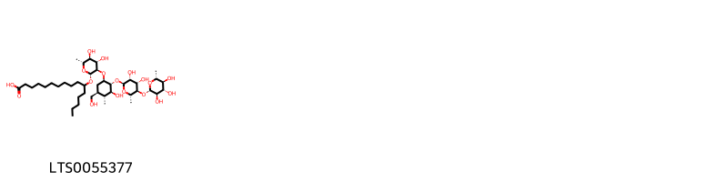{ width=100% }
    <figcaption>Hình ảnh cấu trúc hóa học của 1 hoạt chất thuộc nhóm Fatty Acyls gồm ['11-{[(2r,3r,4s,5s,6r)-3-{[(1r,2r,3s,4r,5s)-2-{[(2s,3r,4s,5r,6s)-3,4-dihydroxy-6-methyl-5-{[(2s,3r,4s,5s,6r)-3,4,5-trihydroxy-6-methyloxan-2-yl]oxy}oxan-2-yl]oxy}-3-hydroxy-5-(hydroxymethyl)-4-methylcyclohexyl]oxy}-4,5-dihydroxy-6-methyloxan-2-yl]oxy}hexadecanoic acid (LTS0055377)'].</figcaption>
</figure>
#### Nhóm Organooxygen compounds
<figure markdown="span">
    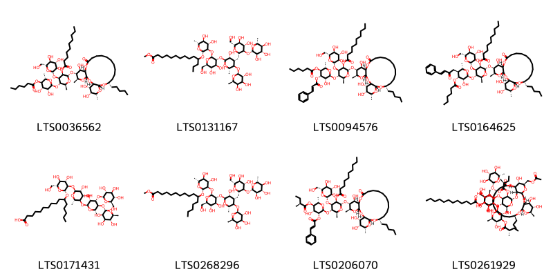{ width=100% }
    <figcaption>Hình ảnh cấu trúc hóa học của 8 hoạt chất thuộc nhóm Organooxygen compounds gồm ['(2s,3r,4r,5s,6s)-5-{[(2s,3r,4s,5r,6s)-5-(hexanoyloxy)-3,4-dihydroxy-6-methyloxan-2-yl]oxy}-6-methyl-2-{[(1r,3s,5s,6r,7r,8r,20s,22r,24r,25r,26s)-7,25,26-trihydroxy-5,24-dimethyl-10-oxo-20-pentyl-2,4,9,21,23-pentaoxatricyclo[20.4.0.0³,⁸]hexacosan-6-yl]oxy}-4-{[(2s,3r,4s,5s,6r)-3,4,5-trihydroxy-6-(hydroxymethyl)oxan-2-yl]oxy}oxan-3-yl decanoate (LTS0036562)', 'methyl 11-{[(2r,3r,4s,5s,6r)-3-{[(2s,3r,4s,5s,6r)-3-{[(2s,3r,4s,5r,6s)-4-{[(2s,3r,4s,5s,6r)-4,5-dihydroxy-6-(hydroxymethyl)-3-{[(2s,3r,4s,5s,6r)-3,4,5-trihydroxy-6-methyloxan-2-yl]oxy}oxan-2-yl]methyl}-3-hydroxy-6-methyl-5-{[(2s,3r,4s,5r,6r)-3,4,5-trihydroxy-6-methyloxan-2-yl]oxy}oxan-2-yl]oxy}-4,5-dihydroxy-6-(hydroxymethyl)oxan-2-yl]oxy}-4,5-dihydroxy-6-methyloxan-2-yl]oxy}tetradecanoate (LTS0131167)', 'purginoside ii (LTS0094576)', '(2s,3r,4r,5s,6s)-5-{[(2s,3r,4r,5s,6s)-4-(hexanoyloxy)-3-hydroxy-6-methyl-5-[(3e)-2-oxo-4-phenylbut-3-en-1-yl]oxan-2-yl]oxy}-6-methyl-2-{[(1r,3s,5s,6r,7r,8r,20s,22r,24r,25r,26s)-7,25,26-trihydroxy-5,24-dimethyl-10-oxo-20-pentyl-2,4,9,21,23-pentaoxatricyclo[20.4.0.0³,⁸]hexacosan-6-yl]oxy}-4-{[(2s,3r,4s,5s,6r)-3,4,5-trihydroxy-6-(hydroxymethyl)oxan-2-yl]oxy}oxan-3-yl decanoate (LTS0164625)', '11-{[(2r,3r,4s,5s,6r)-3-{[(2s,3r,4s,5r,6s)-3,4-dihydroxy-5-{[(2s,3r,4s,5s,6s)-3-hydroxy-6-methyl-4-{[(2s,3r,4s,5s,6r)-3,4,5-trihydroxy-6-(hydroxymethyl)oxan-2-yl]oxy}-5-{[(2s,3r,4r,5r,6s)-3,4,5-trihydroxy-6-methyloxan-2-yl]oxy}oxan-2-yl]oxy}-6-methyloxan-2-yl]oxy}-4,5-dihydroxy-6-(hydroxymethyl)oxan-2-yl]oxy}hexadecanoic acid (LTS0171431)', 'methyl 11-{[(2r,3r,4s,5s,6r)-3-{[(2s,3r,4s,5s,6r)-3-{[(2s,3r,4s,5r,6s)-4-{[(2s,3r,4s,5s,6r)-4,5-dihydroxy-6-(hydroxymethyl)-3-{[(2s,3r,4s,5s,6r)-3,4,5-trihydroxy-6-methyloxan-2-yl]oxy}oxan-2-yl]methyl}-3-hydroxy-6-methyl-5-{[(2s,3r,4s,5r,6r)-3,4,5-trihydroxy-6-methyloxan-2-yl]oxy}oxan-2-yl]oxy}-4,5-dihydroxy-6-(hydroxymethyl)oxan-2-yl]oxy}-4,5-dihydroxy-6-methyloxan-2-yl]oxy}hexadecanoate (LTS0268296)', 'purginoside i (LTS0206070)', '(2s,3r,4s,5s,6r)-2-{[(2s,3s,4r,5r,6s)-6-{[(1s,3r,4s,5s,6r,8r,10s,18s,22s,23r,24r,26r)-24-[(acetyloxy)methyl]-4,5,23-trihydroxy-6-methyl-20-oxo-10-propyl-18-{[(2s,3s,4r,5r,6s)-3,4,5-trihydroxy-6-methyloxan-2-yl]oxy}-2,7,9,21,25-pentaoxatricyclo[20.3.1.0³,⁸]hexacosan-26-yl]oxy}-4-{[(2s,3r,4s,5s,6r)-3-{[(2s,3r,4s,5r,6r)-3,5-dihydroxy-6-methyl-4-{[(2s)-2-methylbutanoyl]oxy}oxan-2-yl]oxy}-4,5-dihydroxy-6-(hydroxymethyl)oxan-2-yl]oxy}-2-methyl-5-{[(2s)-2-methylbutanoyl]oxy}oxan-3-yl]oxy}-3,5-dihydroxy-6-methyloxan-4-yl dodecanoate (LTS0261929)'].</figcaption>
</figure>
#### Nhóm Saccharolipids
<figure markdown="span">
    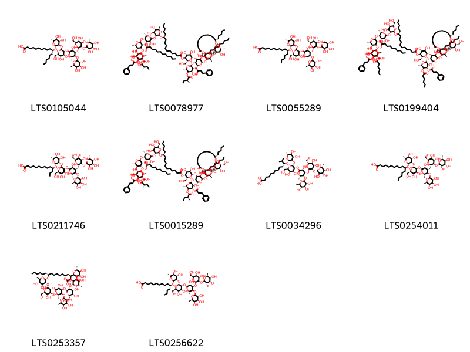{ width=100% }
    <figcaption>Hình ảnh cấu trúc hóa học của 10 hoạt chất thuộc nhóm Saccharolipids gồm ['(11r)-11-{[(2r,3r,4s,5s,6r)-3-{[(2s,3r,4s,5s,6r)-3-{[(2s,3r,4s,5s,6s)-4-{[(2r,3s,4r,5r,6s)-4,5-dihydroxy-6-(hydroxymethyl)-3-{[(2r,3s,4r,5r,6s)-3,4,5-trihydroxy-6-methyloxan-2-yl]oxy}oxan-2-yl]oxy}-3-hydroxy-6-methyl-5-{[(2s,3r,4s,5r,6r)-3,4,5-trihydroxy-6-methyloxan-2-yl]oxy}oxan-2-yl]oxy}-4,5-dihydroxy-6-(hydroxymethyl)oxan-2-yl]oxy}-4,5-dihydroxy-6-methyloxan-2-yl]oxy}heptadecanoic acid (LTS0105044)', '(2r,3s,4r,5r,6s)-6-{[(2s,3r,4r,5s,6s)-3-(dodecanoyloxy)-5-{[(2s,3r,4r,5r,6s)-4-hydroxy-6-methyl-5-{[(2s)-2-methylbutanoyl]oxy}-3-{[(2e)-3-phenylprop-2-enoyl]oxy}oxan-2-yl]oxy}-6-methyl-2-{[(1r,3s,5s,6r,7r,8r,20s,22r,24r,25r,26s)-7,25,26-trihydroxy-5,24-dimethyl-10-oxo-20-pentyl-2,4,9,21,23-pentaoxatricyclo[20.4.0.0³,⁸]hexacosan-6-yl]oxy}oxan-4-yl]oxy}-4,5-dihydroxy-2-(hydroxymethyl)oxan-3-yl (11s)-11-{[(2r,3r,4s,5r,6r)-3-{[(2s,3r,4s,5r,6s)-5-{[(2s,3r,4r,5s,6s)-3-(dodecanoyloxy)-5-{[(2s,3r,4s,5s,6s)-3-hydroxy-6-methyl-5-{[(2s)-2-methylbutanoyl]oxy}-4-{[(2e)-3-phenylprop-2-enoyl]oxy}oxan-2-yl]oxy}-6-methyl-4-{[(2s,3r,4s,5s,6r)-3,4,5-trihydroxy-6-(hydroxymethyl)oxan-2-yl]oxy}oxan-2-yl]oxy}-3,4-dihydroxy-6-methyloxan-2-yl]oxy}-4,5-dihydroxy-6-methyloxan-2-yl]oxy}hexadecanoate (LTS0078977)', '(11s)-11-{[(2r,3r,4s,5s,6r)-3-{[(2s,3r,4s,5r,6r)-3-{[(2s,3r,4s,5s,6s)-4-{[(2s,3r,4s,5r,6r)-4,5-dihydroxy-6-(hydroxymethyl)-3-{[(2s,3r,4s,5s,6r)-3,4,5-trihydroxy-6-methyloxan-2-yl]oxy}oxan-2-yl]oxy}-3-hydroxy-6-methyl-5-{[(2s,3r,4s,5r,6r)-3,4,5-trihydroxy-6-methyloxan-2-yl]oxy}oxan-2-yl]oxy}-4,5-dihydroxy-6-(hydroxymethyl)oxan-2-yl]oxy}-4,5-dihydroxy-6-methyloxan-2-yl]oxy}hexadecanoic acid (LTS0055289)', '(2r,3s,4r,5r,6s)-6-{[(2s,3r,4r,5s,6s)-3-(decanoyloxy)-5-{[(2s,3r,4s,5s,6s)-5-(hexanoyloxy)-3-hydroxy-6-methyl-4-{[(2e)-3-phenylprop-2-enoyl]oxy}oxan-2-yl]oxy}-6-methyl-2-{[(1r,3s,5s,6r,7r,8r,20s,22r,24r,25s,26s)-7,25,26-trihydroxy-24-(hydroxymethyl)-5-methyl-10-oxo-20-pentyl-2,4,9,21,23-pentaoxatricyclo[20.4.0.0³,⁸]hexacosan-6-yl]oxy}oxan-4-yl]oxy}-4,5-dihydroxy-2-(hydroxymethyl)oxan-3-yl (11s)-11-{[(2r,3r,4s,5s,6r)-3-{[(2s,3r,4s,5r,6s)-5-{[(2s,3r,4r,5s,6s)-3-(decanoyloxy)-5-{[(2s,3r,4s,5s,6s)-5-(hexanoyloxy)-3-hydroxy-6-methyl-4-{[(2e)-3-phenylprop-2-enoyl]oxy}oxan-2-yl]oxy}-6-methyl-4-{[(2s,3r,4s,5s,6r)-3,4,5-trihydroxy-6-(hydroxymethyl)oxan-2-yl]oxy}oxan-2-yl]oxy}-3,4-dihydroxy-6-methyloxan-2-yl]oxy}-4,5-dihydroxy-6-(hydroxymethyl)oxan-2-yl]oxy}hexadecanoate (LTS0199404)', '11-{[(2r,3r,4s,5s,6r)-3-{[(2s,3r,4s,5s,6r)-3-{[(2s,3r,4s,5r,6s)-4-{[(2s,3r,4s,5s,6r)-4,5-dihydroxy-6-(hydroxymethyl)-3-{[(2s,3r,4s,5s,6r)-3,4,5-trihydroxy-6-methyloxan-2-yl]oxy}oxan-2-yl]methyl}-3-hydroxy-6-methyl-5-{[(2s,3r,4s,5r,6r)-3,4,5-trihydroxy-6-methyloxan-2-yl]oxy}oxan-2-yl]oxy}-4,5-dihydroxy-6-(hydroxymethyl)oxan-2-yl]oxy}-4,5-dihydroxy-6-methyloxan-2-yl]oxy}tetradecanoic acid (LTS0211746)', '(2r,3s,4r,5r,6s)-6-{[(2s,3r,4r,5s,6s)-3-(decanoyloxy)-5-{[(2s,3r,4s,5s,6s)-3-hydroxy-6-methyl-5-{[(2s)-2-methylbutanoyl]oxy}-4-{[(2e)-3-phenylprop-2-enoyl]oxy}oxan-2-yl]oxy}-6-methyl-2-{[(1r,3s,5s,6r,7r,8r,20s,22r,24r,25s,26s)-7,25,26-trihydroxy-24-(hydroxymethyl)-5-methyl-10-oxo-20-pentyl-2,4,9,21,23-pentaoxatricyclo[20.4.0.0³,⁸]hexacosan-6-yl]oxy}oxan-4-yl]oxy}-4,5-dihydroxy-2-(hydroxymethyl)oxan-3-yl (11s)-11-{[(2r,3r,4s,5s,6r)-3-{[(2s,3r,4s,5r,6s)-5-{[(2s,3r,4r,5s,6s)-3-(decanoyloxy)-5-{[(2s,3r,4s,5s,6s)-3-hydroxy-6-methyl-5-{[(2s)-2-methylbutanoyl]oxy}-4-{[(2e)-3-phenylprop-2-enoyl]oxy}oxan-2-yl]oxy}-6-methyl-4-{[(2s,3r,4s,5s,6r)-3,4,5-trihydroxy-6-(hydroxymethyl)oxan-2-yl]oxy}oxan-2-yl]oxy}-3,4-dihydroxy-6-methyloxan-2-yl]oxy}-4,5-dihydroxy-6-(hydroxymethyl)oxan-2-yl]oxy}hexadecanoate (LTS0015289)', '(11r)-11-{[(2r,3r,4s,5s,6r)-3-{[(2s,3r,4s,5s,6r)-3-{[(2s,3r,4s,5s,6s)-4-{[(2s,3r,4s,5r,6r)-4,5-dihydroxy-6-(hydroxymethyl)-3-{[(2s,3r,4s,5s,6r)-3,4,5-trihydroxy-6-methyloxan-2-yl]oxy}oxan-2-yl]oxy}-3-hydroxy-6-methyl-5-{[(2s,3r,4s,5r,6r)-3,4,5-trihydroxy-6-methyloxan-2-yl]oxy}oxan-2-yl]oxy}-4,5-dihydroxy-6-(hydroxymethyl)oxan-2-yl]oxy}-4,5-dihydroxy-6-methyloxan-2-yl]oxy}-12-methyltridecanoic acid (LTS0034296)', '11-{[(2r,3r,4s,5s,6r)-3-{[(2s,3r,4s,5s,6r)-3-{[(2s,3r,4s,5r,6s)-4-{[(2s,3r,4s,5s,6r)-4,5-dihydroxy-6-(hydroxymethyl)-3-{[(2s,3r,4s,5s,6r)-3,4,5-trihydroxy-6-methyloxan-2-yl]oxy}oxan-2-yl]methyl}-3-hydroxy-6-methyl-5-{[(2s,3r,4s,5r,6r)-3,4,5-trihydroxy-6-methyloxan-2-yl]oxy}oxan-2-yl]oxy}-4,5-dihydroxy-6-(hydroxymethyl)oxan-2-yl]oxy}-4,5-dihydroxy-6-methyloxan-2-yl]oxy}hexadecanoic acid (LTS0254011)', '(3r,11r)-11-{[(2r,3r,4s,5s,6r)-3-{[(2s,3r,4s,5s,6r)-3-{[(2s,3r,4s,5s,6s)-4-{[(2r,3s,4r,5r,6s)-4,5-dihydroxy-6-(hydroxymethyl)-3-{[(2r,3s,4r,5r,6s)-3,4,5-trihydroxy-6-methyloxan-2-yl]oxy}oxan-2-yl]oxy}-3-hydroxy-6-methyl-5-{[(2s,3r,4s,5r,6r)-3,4,5-trihydroxy-6-methyloxan-2-yl]oxy}oxan-2-yl]oxy}-4,5-dihydroxy-6-(hydroxymethyl)oxan-2-yl]oxy}-4,5-dihydroxy-6-methyloxan-2-yl]oxy}-3-[(2r,3r,4s,5s,6r)-3,4,5-trihydroxy-6-methyloxan-2-yl]heptadecanoic acid (LTS0253357)', '(11r)-11-{[(2r,3r,4s,5s,6r)-3-{[(2s,3r,4s,5s,6r)-3-{[(2s,3r,4s,5s,6s)-4-{[(2r,3s,4r,5r,6s)-4,5-dihydroxy-6-(hydroxymethyl)-3-{[(2r,3s,4r,5r,6s)-3,4,5-trihydroxy-6-methyloxan-2-yl]oxy}oxan-2-yl]oxy}-3-hydroxy-6-methyl-5-{[(2s,3r,4s,5r,6r)-3,4,5-trihydroxy-6-methyloxan-2-yl]oxy}oxan-2-yl]oxy}-4,5-dihydroxy-6-(hydroxymethyl)oxan-2-yl]oxy}-4,5-dihydroxy-6-methyloxan-2-yl]oxy}pentadecanoic acid (LTS0256622)'].</figcaption>
</figure>

---

### Dược dân tộc học

Danh sách các quốc gia có sử dụng *Ipomoea purga* trong điều trị các bệnh. 

| Country   | Disease              | Bệnh                                                                                                                                                                                                |
|:----------|:---------------------|:----------------------------------------------------------------------------------------------------------------------------------------------------------------------------------------------------|
| Elsewhere | Cathartic, Purgative | MYMEMORY WARNING: YOU USED ALL AVAILABLE FREE TRANSLATIONS FOR TODAY. NEXT AVAILABLE IN  16 HOURS 02 MINUTES 02 SECONDS VISIT HTTPS://MYMEMORY.TRANSLATED.NET/DOC/USAGELIMITS.PHP TO TRANSLATE MORE |
| Mexico    | Diuretic             | MYMEMORY WARNING: YOU USED ALL AVAILABLE FREE TRANSLATIONS FOR TODAY. NEXT AVAILABLE IN  16 HOURS 01 MINUTES 59 SECONDS VISIT HTTPS://MYMEMORY.TRANSLATED.NET/DOC/USAGELIMITS.PHP TO TRANSLATE MORE |
| Turkey    | Cathartic            | MYMEMORY WARNING: YOU USED ALL AVAILABLE FREE TRANSLATIONS FOR TODAY. NEXT AVAILABLE IN  16 HOURS 01 MINUTES 55 SECONDS VISIT HTTPS://MYMEMORY.TRANSLATED.NET/DOC/USAGELIMITS.PHP TO TRANSLATE MORE |

---

---
## Ipomoea purpurea
### Thông tin về thực vật

!!! info "Phân loại thực vật của *Ipomoea purpurea* từ GIBF:"
    - **Kingdom:** Plantae
    - **Phylum:** Tracheophyta
    - **Order:** Solanales
    - **Family:** Convolvulaceae
    - **Genus:** Ipomoea
    - **Species:** *Ipomoea purpurea*

 

| Label (VI)   | Label (EN)   | Scientific Name   | Descriptions (VI)   | Descriptions (EN)   | Also Known As (VI)   | Also Known As (EN)     |
|:-------------|:-------------|:------------------|:--------------------|:--------------------|:---------------------|:-----------------------|
| N/A          | N/A          | Ipomoea purpurea  |                     | species of plant    | ['']                 | ['tall morning-glory'] |

#### Phân bố trên thế giới

**Từ CSDL GIBF** Spain, Rwanda, Australia, Colombia, Venezuela (Bolivarian Republic of), India, Canada, Bahamas, Brazil, Peru, Mexico, Argentina, Portugal, South Africa, New Zealand, Bolivia (Plurinational State of), Costa Rica, Russian Federation, Ecuador, United States of America, Madagascar, Cabo Verde

#### Phân bố tại Việt Nam

**Từ CSDL GIBF**: Không có ghi nhận ở Việt Nam

---
### Thành phần hóa học
        
- Theo cơ sở dữ liệu lotus: Từ loài *Ipomoea purpurea* đã phân lập và xác định được 51 hoạt chất thuộc về các nhóm Organooxygen compounds, Flavonoids, Prenol lipids, Ergoline and derivatives, Fatty Acyls, Steroids and steroid derivatives, Benzene and substituted derivatives. 

|    | chemicalTaxonomyClassyfireClass     |   smiles_count |
|---:|:------------------------------------|---------------:|
|  0 | Benzene and substituted derivatives |              1 |
|  1 | Ergoline and derivatives            |              8 |
|  2 | Fatty Acyls                         |              1 |
|  3 | Flavonoids                          |              4 |
|  4 | Organooxygen compounds              |             18 |
|  5 | Prenol lipids                       |             12 |
|  6 | Steroids and steroid derivatives    |              7 |

#### Nhóm Benzene and substituted derivatives
<figure markdown="span">
    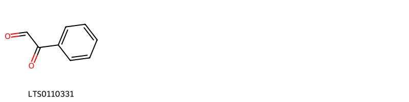{ width=100% }
    <figcaption>Hình ảnh cấu trúc hóa học của 1 hoạt chất thuộc nhóm Benzene and substituted derivatives gồm ['phenylglyoxal (LTS0110331)'].</figcaption>
</figure>
#### Nhóm Ergoline and derivatives
<figure markdown="span">
    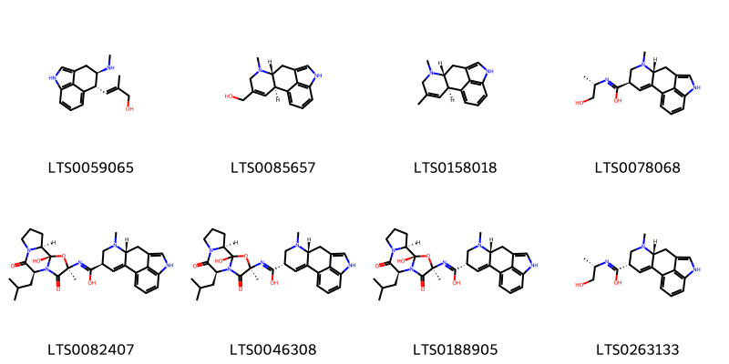{ width=100% }
    <figcaption>Hình ảnh cấu trúc hóa học của 8 hoạt chất thuộc nhóm Ergoline and derivatives gồm ['chanoclavine (LTS0059065)', 'elymoclavine (LTS0085657)', 'agroclavine (LTS0158018)', '(4r,7r)-n-[(2s)-1-hydroxypropan-2-yl]-6-methyl-6,11-diazatetracyclo[7.6.1.0²,⁷.0¹²,¹⁶]hexadeca-1(16),2,9,12,14-pentaene-4-carboximidic acid (LTS0078068)', '(4r,7r)-n-[(1s,2s,4r,7s)-2-hydroxy-4-methyl-7-(2-methylpropyl)-5,8-dioxo-3-oxa-6,9-diazatricyclo[7.3.0.0²,⁶]dodecan-4-yl]-6-methyl-6,11-diazatetracyclo[7.6.1.0²,⁷.0¹²,¹⁶]hexadeca-1(16),2,9,12,14-pentaene-4-carboximidic acid (LTS0082407)', '(4s,7r)-n-[(1s,4r,7s)-2-hydroxy-4-methyl-7-(2-methylpropyl)-5,8-dioxo-3-oxa-6,9-diazatricyclo[7.3.0.0²,⁶]dodecan-4-yl]-6-methyl-6,11-diazatetracyclo[7.6.1.0²,⁷.0¹²,¹⁶]hexadeca-1(16),2,9,12,14-pentaene-4-carboximidic acid (LTS0046308)', '(4s,7r)-n-[(1s,2s,4r,7s)-2-hydroxy-4-methyl-7-(2-methylpropyl)-5,8-dioxo-3-oxa-6,9-diazatricyclo[7.3.0.0²,⁶]dodecan-4-yl]-6-methyl-6,11-diazatetracyclo[7.6.1.0²,⁷.0¹²,¹⁶]hexadeca-1(16),2,9,12,14-pentaene-4-carboximidic acid (LTS0188905)', '(4s,7r)-n-[(2s)-1-hydroxypropan-2-yl]-6-methyl-6,11-diazatetracyclo[7.6.1.0²,⁷.0¹²,¹⁶]hexadeca-1(16),2,9,12,14-pentaene-4-carboximidic acid (LTS0263133)'].</figcaption>
</figure>
#### Nhóm Fatty Acyls
<figure markdown="span">
    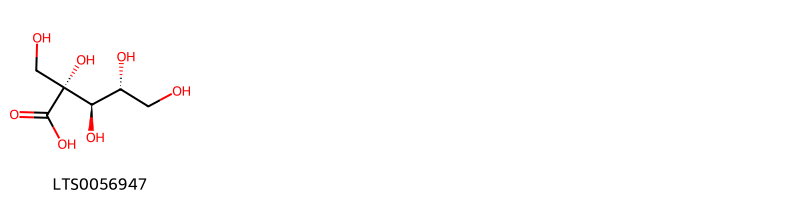{ width=100% }
    <figcaption>Hình ảnh cấu trúc hóa học của 1 hoạt chất thuộc nhóm Fatty Acyls gồm ['2-carboxy-d-arabinitol (LTS0056947)'].</figcaption>
</figure>
#### Nhóm Flavonoids
<figure markdown="span">
    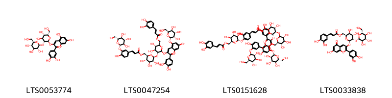{ width=100% }
    <figcaption>Hình ảnh cấu trúc hóa học của 4 hoạt chất thuộc nhóm Flavonoids gồm ['3-{[(2s,3r,4s,5s,6s)-4,5-dihydroxy-6-(hydroxymethyl)-3-{[(2s,3r,4s,5s,6r)-3,4,5-trihydroxy-6-(hydroxymethyl)oxan-2-yl]oxy}oxan-2-yl]oxy}-2-(3,4-dihydroxyphenyl)-5,7-dihydroxy-1λ⁴-chromen-1-ylium (LTS0053774)', '2-(3,4-dihydroxyphenyl)-3-{[(2s,3r,4s,5s,6r)-6-({[3-(3,4-dihydroxyphenyl)prop-2-enoyl]oxy}methyl)-4,5-dihydroxy-3-{[(2s,3r,4s,5s,6r)-3,4,5-trihydroxy-6-({[3-(4-hydroxy-3-{[(2s,3r,4s,5s,6r)-3,4,5-trihydroxy-6-(hydroxymethyl)oxan-2-yl]oxy}phenyl)prop-2-enoyl]oxy}methyl)oxan-2-yl]oxy}oxan-2-yl]oxy}-7-hydroxy-5-{[(2s,3s,4s,5s,6s)-3,4,5-trihydroxy-6-(hydroxymethyl)oxan-2-yl]oxy}-1λ⁴-chromen-1-ylium (LTS0047254)', '2-(3,4-dihydroxyphenyl)-3-{[(2s,3r,4s,5s,6s)-6-({[(2e)-3-(4-{[(2s,3r,4s,5s,6s)-6-({[3-(3,4-dihydroxyphenyl)prop-2-enoyl]oxy}methyl)-3,4,5-trihydroxyoxan-2-yl]oxy}-3-hydroxyphenyl)prop-2-enoyl]oxy}methyl)-4,5-dihydroxy-3-{[(2s,3r,4s,5s,6r)-3,4,5-trihydroxy-6-({[3-(4-hydroxy-3-{[(2s,3r,4s,5s,6r)-3,4,5-trihydroxy-6-(hydroxymethyl)oxan-2-yl]oxy}phenyl)prop-2-enoyl]oxy}methyl)oxan-2-yl]oxy}oxan-2-yl]oxy}-7-hydroxy-5-{[(2s,3r,4s,5s,6r)-3,4,5-trihydroxy-6-(hydroxymethyl)oxan-2-yl]oxy}-1λ⁴-chromen-1-ylium (LTS0151628)', '[(2s,3s,4s,5s,6s)-6-{[2-(3,4-dihydroxyphenyl)-7-hydroxy-5-oxochromen-3-yl]oxy}-3,4-dihydroxy-5-{[(2s,3r,4s,5s,6r)-3,4,5-trihydroxy-6-(hydroxymethyl)oxan-2-yl]oxy}oxan-2-yl]methyl 3-(3,4-dihydroxyphenyl)prop-2-enoate (LTS0033838)'].</figcaption>
</figure>
#### Nhóm Organooxygen compounds
<figure markdown="span">
    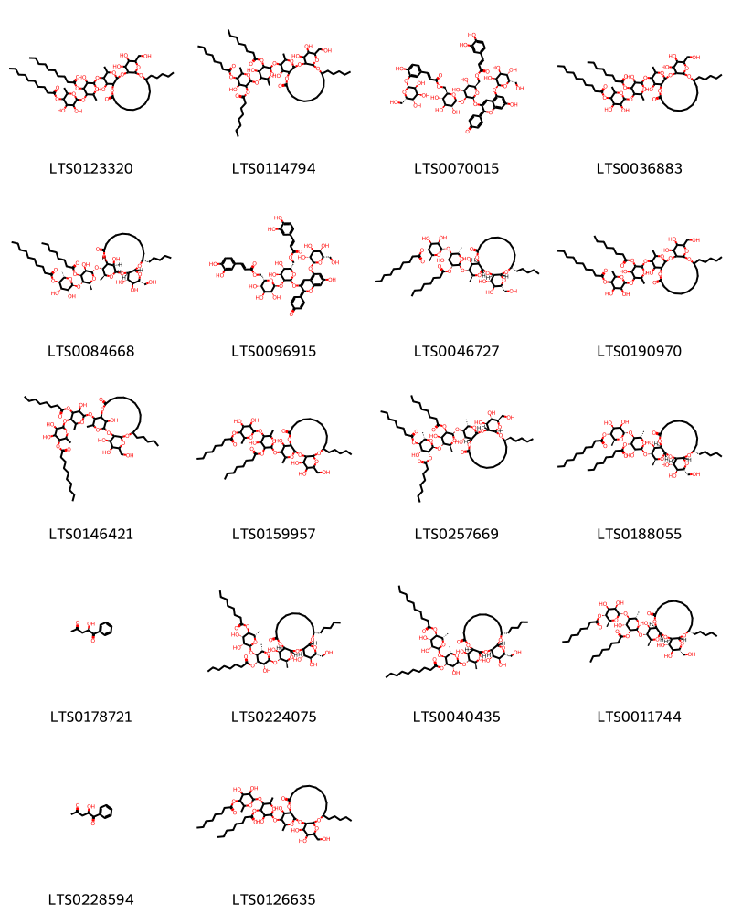{ width=100% }
    <figcaption>Hình ảnh cấu trúc hóa học của 18 hoạt chất thuộc nhóm Organooxygen compounds gồm ['6-{[4-(decanoyloxy)-5-hydroxy-2-methyl-6-{[7,25,26-trihydroxy-24-(hydroxymethyl)-5-methyl-10-oxo-20-pentyl-2,4,9,21,23-pentaoxatricyclo[20.4.0.0³,⁸]hexacosan-6-yl]oxy}oxan-3-yl]oxy}-4,5-dihydroxy-2-methyloxan-3-yl decanoate (LTS0123320)', '4-hydroxy-2-{[4-hydroxy-2-methyl-5-(octanoyloxy)-6-{[7,25,26-trihydroxy-24-(hydroxymethyl)-5-methyl-10-oxo-20-pentyl-2,4,9,21,23-pentaoxatricyclo[20.4.0.0³,⁸]hexacosan-6-yl]oxy}oxan-3-yl]oxy}-6-methyl-5-(octanoyloxy)oxan-3-yl octanoate (LTS0114794)', '[(2r,3s,4s,5s,6s)-3,4-dihydroxy-6-{[7-hydroxy-2-(4-oxocyclohexa-2,5-dien-1-ylidene)-5-{[(2s,3s,4s,5s,6s)-3,4,5-trihydroxy-6-(hydroxymethyl)oxan-2-yl]oxy}chromen-3-yl]oxy}-5-{[(2s,3r,4s,5s,6r)-3,4,5-trihydroxy-6-({[3-(4-hydroxy-3-{[(2s,3s,4s,5s,6s)-3,4,5-trihydroxy-6-(hydroxymethyl)oxan-2-yl]oxy}phenyl)prop-2-enoyl]oxy}methyl)oxan-2-yl]oxy}oxan-2-yl]methyl 3-(3,4-dihydroxyphenyl)prop-2-enoate (LTS0070015)', '4,5-dihydroxy-6-{[5-hydroxy-2-methyl-4-(octanoyloxy)-6-{[7,25,26-trihydroxy-24-(hydroxymethyl)-5-methyl-10-oxo-20-pentyl-2,4,9,21,23-pentaoxatricyclo[20.4.0.0³,⁸]hexacosan-6-yl]oxy}oxan-3-yl]oxy}-2-methyloxan-3-yl decanoate (LTS0036883)', '(2s,3r,4s,5r,6s)-4,5-dihydroxy-6-{[(2s,3s,4s,5r,6s)-5-hydroxy-2-methyl-4-(octanoyloxy)-6-{[(1s,3r,4s,5s,6r,8r,10s,22s,23s,24s,26r)-4,5,26-trihydroxy-6-(hydroxymethyl)-24-methyl-20-oxo-10-pentyl-2,7,9,21,25-pentaoxatricyclo[20.3.1.0³,⁸]hexacosan-23-yl]oxy}oxan-3-yl]oxy}-2-methyloxan-3-yl decanoate (LTS0084668)', '[(2s,3s,4s,5s,6s)-5-{[(2s,3r,4s,5s,6s)-6-({[3-(3,4-dihydroxyphenyl)prop-2-enoyl]oxy}methyl)-3,4,5-trihydroxyoxan-2-yl]oxy}-3,4-dihydroxy-6-{[7-hydroxy-2-(4-oxocyclohexa-2,5-dien-1-ylidene)-5-{[(2s,3r,4s,5s,6s)-3,4,5-trihydroxy-6-(hydroxymethyl)oxan-2-yl]oxy}chromen-3-yl]oxy}oxan-2-yl]methyl 3-(3,4-dihydroxyphenyl)prop-2-enoate (LTS0096915)', '(2s,3r,4s,5r,6s)-4,5-dihydroxy-6-{[(2s,3r,4r,5r,6s)-4-hydroxy-2-methyl-5-(octanoyloxy)-6-{[(1r,3s,5s,6r,7r,8r,20s,22r,24r,25s,26s)-7,25,26-trihydroxy-24-(hydroxymethyl)-5-methyl-10-oxo-20-pentyl-2,4,9,21,23-pentaoxatricyclo[20.4.0.0³,⁸]hexacosan-6-yl]oxy}oxan-3-yl]oxy}-2-methyloxan-3-yl decanoate (LTS0046727)', '4,5-dihydroxy-6-{[4-hydroxy-2-methyl-5-(octanoyloxy)-6-{[7,25,26-trihydroxy-24-(hydroxymethyl)-5-methyl-10-oxo-20-pentyl-2,4,9,21,23-pentaoxatricyclo[20.4.0.0³,⁸]hexacosan-6-yl]oxy}oxan-3-yl]oxy}-2-methyloxan-3-yl decanoate (LTS0190970)', '4,5-dihydroxy-6-{[5-hydroxy-2-methyl-4-(octanoyloxy)-6-{[4,5,26-trihydroxy-6-(hydroxymethyl)-24-methyl-20-oxo-10-pentyl-2,7,9,21,25-pentaoxatricyclo[20.3.1.0³,⁸]hexacosan-23-yl]oxy}oxan-3-yl]oxy}-2-methyloxan-3-yl decanoate (LTS0146421)', '4,5-dihydroxy-6-{[4-hydroxy-2-methyl-5-(octanoyloxy)-6-{[7,25,26-trihydroxy-24-(hydroxymethyl)-5-methyl-10-oxo-20-pentyl-2,4,9,21,23-pentaoxatricyclo[20.4.0.0³,⁸]hexacosan-6-yl]oxy}oxan-3-yl]oxy}-2-methyloxan-3-yl octanoate (LTS0159957)', '(2s,3r,4r,5r,6s)-4-hydroxy-2-{[(2s,3r,4r,5r,6s)-4-hydroxy-2-methyl-5-(octanoyloxy)-6-{[(1r,3s,5s,6r,7r,8r,20s,22r,24r,25s,26s)-7,25,26-trihydroxy-24-(hydroxymethyl)-5-methyl-10-oxo-20-pentyl-2,4,9,21,23-pentaoxatricyclo[20.4.0.0³,⁸]hexacosan-6-yl]oxy}oxan-3-yl]oxy}-6-methyl-5-(octanoyloxy)oxan-3-yl octanoate (LTS0257669)', '(2s,3r,4s,5r,6s)-4,5-dihydroxy-6-{[(2s,3s,4s,5r,6s)-5-hydroxy-2-methyl-4-(octanoyloxy)-6-{[(1r,3s,5s,6r,7r,8r,20s,22r,24r,25s,26s)-7,25,26-trihydroxy-24-(hydroxymethyl)-5-methyl-10-oxo-20-pentyl-2,4,9,21,23-pentaoxatricyclo[20.4.0.0³,⁸]hexacosan-6-yl]oxy}oxan-3-yl]oxy}-2-methyloxan-3-yl decanoate (LTS0188055)', '(2r)-2-hydroxy-1-phenylpentane-1,4-dione (LTS0178721)', '(2s,3s,4s,5r,6s)-3-{[(2s,3r,4s,5r,6s)-3,4-dihydroxy-6-methyl-5-(octanoyloxy)oxan-2-yl]oxy}-5-hydroxy-2-methyl-6-{[(1r,3s,5s,6r,7r,8r,20s,22r,24r,25s,26s)-7,25,26-trihydroxy-24-(hydroxymethyl)-5-methyl-10-oxo-20-pentyl-2,4,9,21,23-pentaoxatricyclo[20.4.0.0³,⁸]hexacosan-6-yl]oxy}oxan-4-yl octanoate (LTS0224075)', '(2s,3s,4s,5r,6s)-3-{[(2s,3r,4s,5r,6s)-5-(decanoyloxy)-3,4-dihydroxy-6-methyloxan-2-yl]oxy}-5-hydroxy-2-methyl-6-{[(1r,3s,5s,6r,7r,8r,20s,22r,24r,25s,26s)-7,25,26-trihydroxy-24-(hydroxymethyl)-5-methyl-10-oxo-20-pentyl-2,4,9,21,23-pentaoxatricyclo[20.4.0.0³,⁸]hexacosan-6-yl]oxy}oxan-4-yl decanoate (LTS0040435)', '(2s,3r,4s,5r,6s)-4,5-dihydroxy-6-{[(2s,3r,4r,5r,6s)-4-hydroxy-2-methyl-5-(octanoyloxy)-6-{[(1r,3s,5s,6r,7r,8r,20s,22r,24r,25s,26s)-7,25,26-trihydroxy-24-(hydroxymethyl)-5-methyl-10-oxo-20-pentyl-2,4,9,21,23-pentaoxatricyclo[20.4.0.0³,⁸]hexacosan-6-yl]oxy}oxan-3-yl]oxy}-2-methyloxan-3-yl octanoate (LTS0011744)', '2-hydroxy-1-phenylpentane-1,4-dione (LTS0228594)', '4,5-dihydroxy-6-{[5-hydroxy-2-methyl-4-(octanoyloxy)-6-{[7,25,26-trihydroxy-24-(hydroxymethyl)-5-methyl-10-oxo-20-pentyl-2,4,9,21,23-pentaoxatricyclo[20.4.0.0³,⁸]hexacosan-6-yl]oxy}oxan-3-yl]oxy}-2-methyloxan-3-yl octanoate (LTS0126635)'].</figcaption>
</figure>
#### Nhóm Prenol lipids
<figure markdown="span">
    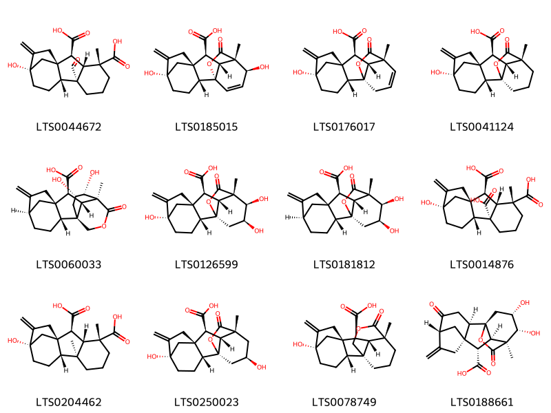{ width=100% }
    <figcaption>Hình ảnh cấu trúc hóa học của 12 hoạt chất thuộc nhóm Prenol lipids gồm ['gibberellin a19 (LTS0044672)', 'gibberellin a3 (LTS0185015)', 'gibberellin a5 (LTS0176017)', 'gibberellin a20 (LTS0041124)', '(1r,2r,5r,8r,9s,10s,11s,16s,17r)-16,17-dihydroxy-11-methyl-6-methylidene-12-oxo-13-oxapentacyclo[9.3.3.1⁵,⁸.0¹,¹⁰.0²,⁸]octadecane-9-carboxylic acid (LTS0060033)', 'gibberellin a8 (LTS0126599)', 'gibberellin a34 (LTS0181812)', 'gibberellin a17 (LTS0014876)', 'gibberellin a53 (LTS0204462)', 'gibberellin a29 (LTS0250023)', 'gibberellin a44 (LTS0078749)', '(1r,2r,5r,8r,9s,10r,11s,12r,13s)-12,13-dihydroxy-11-methyl-6-methylidene-4,16-dioxo-15-oxapentacyclo[9.3.2.1⁵,⁸.0¹,¹⁰.0²,⁸]heptadecane-9-carboxylic acid (LTS0188661)'].</figcaption>
</figure>
#### Nhóm Steroids and steroid derivatives
<figure markdown="span">
    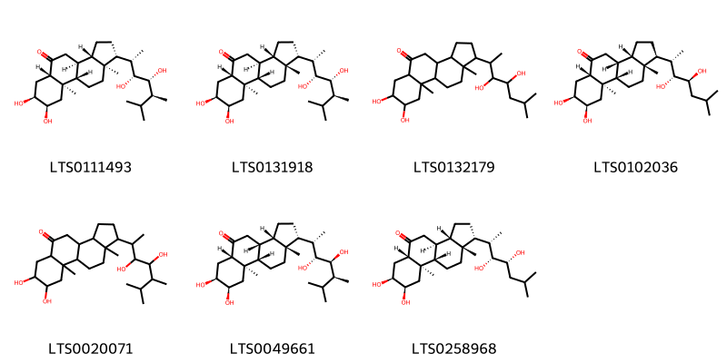{ width=100% }
    <figcaption>Hình ảnh cấu trúc hóa học của 7 hoạt chất thuộc nhóm Steroids and steroid derivatives gồm ['castasterone (LTS0111493)', '(1r,3as,3bs,5as,7s,8r,9ar,9bs,11ar)-1-[(2s,3r,4r,5s)-3,4-dihydroxy-5,6-dimethylheptan-2-yl]-7,8-dihydroxy-9a,11a-dimethyl-tetradecahydrocyclopenta[a]phenanthren-5-one (LTS0131918)', '1-(3,4-dihydroxy-6-methylheptan-2-yl)-7,8-dihydroxy-9a,11a-dimethyl-tetradecahydrocyclopenta[a]phenanthren-5-one (LTS0132179)', '(1s,3as,3br,5as,7s,8r,9ar,9bs,11ar)-1-[(2s,3r,4s)-3,4-dihydroxy-6-methylheptan-2-yl]-7,8-dihydroxy-9a,11a-dimethyl-tetradecahydrocyclopenta[a]phenanthren-5-one (LTS0102036)', '1-(3,4-dihydroxy-5,6-dimethylheptan-2-yl)-7,8-dihydroxy-9a,11a-dimethyl-tetradecahydrocyclopenta[a]phenanthren-5-one (LTS0020071)', '(1r,3as,3br,5as,7s,8r,9ar,9bs,11ar)-1-[(2s,3r,4s,5s)-3,4-dihydroxy-5,6-dimethylheptan-2-yl]-7,8-dihydroxy-9a,11a-dimethyl-tetradecahydrocyclopenta[a]phenanthren-5-one (LTS0049661)', '(1r,3as,3bs,5as,7s,8r,9ar,9bs,11ar)-1-[(2s,3r,4r)-3,4-dihydroxy-6-methylheptan-2-yl]-7,8-dihydroxy-9a,11a-dimethyl-tetradecahydrocyclopenta[a]phenanthren-5-one (LTS0258968)'].</figcaption>
</figure>

---

### Dược dân tộc học

Danh sách các quốc gia có sử dụng *Ipomoea purpurea* trong điều trị các bệnh. 

| Country      | Disease                | Bệnh                                                                                                                                                                                                |
|:-------------|:-----------------------|:----------------------------------------------------------------------------------------------------------------------------------------------------------------------------------------------------|
| Africa(Zulu) | Purgative              | MYMEMORY WARNING: YOU USED ALL AVAILABLE FREE TRANSLATIONS FOR TODAY. NEXT AVAILABLE IN  16 HOURS 01 MINUTES 27 SECONDS VISIT HTTPS://MYMEMORY.TRANSLATED.NET/DOC/USAGELIMITS.PHP TO TRANSLATE MORE |
| US           | Hallucinogen, Laxative | MYMEMORY WARNING: YOU USED ALL AVAILABLE FREE TRANSLATIONS FOR TODAY. NEXT AVAILABLE IN  16 HOURS 01 MINUTES 24 SECONDS VISIT HTTPS://MYMEMORY.TRANSLATED.NET/DOC/USAGELIMITS.PHP TO TRANSLATE MORE |

---

---
## Ipomoea quamoclit
### Thông tin về thực vật

!!! info "Phân loại thực vật của *Ipomoea quamoclit* từ GIBF:"
    - **Kingdom:** Plantae
    - **Phylum:** Tracheophyta
    - **Order:** Solanales
    - **Family:** Convolvulaceae
    - **Genus:** Ipomoea
    - **Species:** *Ipomoea quamoclit*

 

| Label (VI)   | Label (EN)   | Scientific Name   | Descriptions (VI)                       | Descriptions (EN)                             | Also Known As (VI)   | Also Known As (EN)   |
|:-------------|:-------------|:------------------|:----------------------------------------|:----------------------------------------------|:---------------------|:---------------------|
| N/A          | N/A          | Ipomoea quamoclit | Thực vật có hoa thuộc họ Convolvulaceae | species of plant in the family Convolvulaceae | ['']                 | ['Cypress vine']     |

#### Phân bố trên thế giới

**Từ CSDL GIBF** Honduras, Viet Nam, Thailand, French Guiana, Singapore, Australia, Guatemala, Indonesia, Colombia, Sri Lanka, Dominican Republic, Bhutan, Malaysia, India, Samoa, Kazakhstan, Sint Maarten (Dutch part), Nicaragua, Panama, Brazil, Montserrat, Mexico, China, Nepal, Benin, Chinese Taipei, Hong Kong, Papua New Guinea, Costa Rica, Bolivia (Plurinational State of), Ecuador, United States of America, Madagascar, Wallis and Futuna

#### Phân bố tại Việt Nam

**Từ CSDL GIBF**: Bình Dương, Long An

---
### Thành phần hóa học
        
- Theo cơ sở dữ liệu lotus: Từ loài *Ipomoea quamoclit* đã phân lập và xác định được 12 hoạt chất thuộc về các nhóm Organooxygen compounds, Prenol lipids, Saccharolipids. 

|    | chemicalTaxonomyClassyfireClass   |   smiles_count |
|---:|:----------------------------------|---------------:|
|  0 | Organooxygen compounds            |              8 |
|  1 | Prenol lipids                     |              2 |
|  2 | Saccharolipids                    |              2 |

#### Nhóm Organooxygen compounds
<figure markdown="span">
    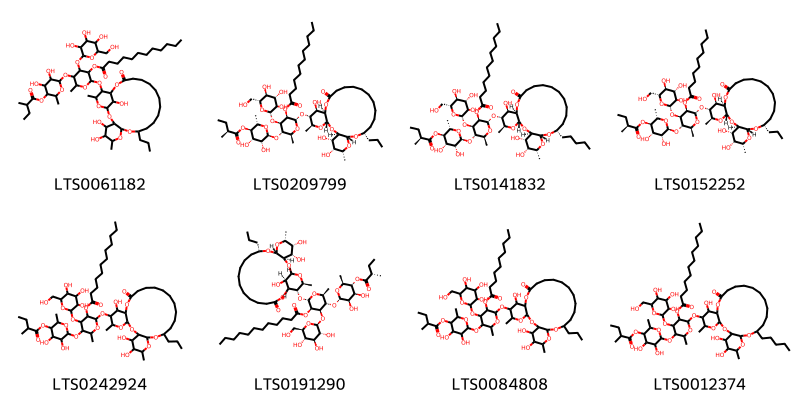{ width=100% }
    <figcaption>Hình ảnh cấu trúc hóa học của 8 hoạt chất thuộc nhóm Organooxygen compounds gồm ['5-({3,4-dihydroxy-6-methyl-5-[(2-methylbutanoyl)oxy]oxan-2-yl}oxy)-6-methyl-2-({4,5,26-trihydroxy-6,24-dimethyl-20-oxo-10-propyl-2,7,9,21,25-pentaoxatricyclo[20.3.1.0³,⁸]hexacosan-23-yl}oxy)-4-{[3,4,5-trihydroxy-6-(hydroxymethyl)oxan-2-yl]oxy}oxan-3-yl dodecanoate (LTS0061182)', '(2s,3r,4r,5s,6s)-5-{[(2s,3r,4s,5r,6s)-3,4-dihydroxy-6-methyl-5-{[(2s)-2-methylbutanoyl]oxy}oxan-2-yl]oxy}-6-methyl-2-{[(1r,3s,5s,6r,7r,8r,20s,22r,24r,25r,26s)-7,25,26-trihydroxy-5,24-dimethyl-10-oxo-20-propyl-2,4,9,21,23-pentaoxatricyclo[20.4.0.0³,⁸]hexacosan-6-yl]oxy}-4-{[(2s,3r,4s,5s,6r)-3,4,5-trihydroxy-6-(hydroxymethyl)oxan-2-yl]oxy}oxan-3-yl dodecanoate (LTS0209799)', '(2s,3r,4r,5s,6s)-5-{[(2s,3r,4s,5r,6s)-3,4-dihydroxy-6-methyl-5-{[(2s)-2-methylbutanoyl]oxy}oxan-2-yl]oxy}-6-methyl-2-{[(1r,3s,5s,6r,7r,8r,20s,22r,24r,25r,26s)-7,25,26-trihydroxy-5,24-dimethyl-10-oxo-20-pentyl-2,4,9,21,23-pentaoxatricyclo[20.4.0.0³,⁸]hexacosan-6-yl]oxy}-4-{[(2s,3r,4s,5s,6r)-3,4,5-trihydroxy-6-(hydroxymethyl)oxan-2-yl]oxy}oxan-3-yl dodecanoate (LTS0141832)', '(2s,3r,4r,5s,6s)-5-{[(2s,3r,4s,5r,6s)-3,4-dihydroxy-6-methyl-5-{[(2s)-2-methylbutanoyl]oxy}oxan-2-yl]oxy}-6-methyl-2-{[(1r,3s,5s,6r,7r,8r,20s,22r,24r,25r,26s)-7,25,26-trihydroxy-5,24-dimethyl-10-oxo-20-propyl-2,4,9,21,23-pentaoxatricyclo[20.4.0.0³,⁸]hexacosan-6-yl]oxy}-4-{[(2s,3r,4s,5s,6r)-3,4,5-trihydroxy-6-(hydroxymethyl)oxan-2-yl]oxy}oxan-3-yl decanoate (LTS0152252)', '5-({3,4-dihydroxy-6-methyl-5-[(2-methylbutanoyl)oxy]oxan-2-yl}oxy)-6-methyl-2-({7,25,26-trihydroxy-5,24-dimethyl-10-oxo-20-propyl-2,4,9,21,23-pentaoxatricyclo[20.4.0.0³,⁸]hexacosan-6-yl}oxy)-4-{[3,4,5-trihydroxy-6-(hydroxymethyl)oxan-2-yl]oxy}oxan-3-yl dodecanoate (LTS0242924)', '(2s,3r,4r,5s,6s)-5-{[(2s,3r,4s,5r,6s)-3,4-dihydroxy-6-methyl-5-{[(2s)-2-methylbutanoyl]oxy}oxan-2-yl]oxy}-6-methyl-2-{[(1s,3r,4s,5r,6r,8r,10s,22s,23s,24s,26r)-4,5,26-trihydroxy-6,24-dimethyl-20-oxo-10-propyl-2,7,9,21,25-pentaoxatricyclo[20.3.1.0³,⁸]hexacosan-23-yl]oxy}-4-{[(2s,3r,4s,5s,6r)-3,4,5-trihydroxy-6-(hydroxymethyl)oxan-2-yl]oxy}oxan-3-yl dodecanoate (LTS0191290)', '5-({3,4-dihydroxy-6-methyl-5-[(2-methylbutanoyl)oxy]oxan-2-yl}oxy)-6-methyl-2-({7,25,26-trihydroxy-5,24-dimethyl-10-oxo-20-propyl-2,4,9,21,23-pentaoxatricyclo[20.4.0.0³,⁸]hexacosan-6-yl}oxy)-4-{[3,4,5-trihydroxy-6-(hydroxymethyl)oxan-2-yl]oxy}oxan-3-yl decanoate (LTS0084808)', '5-({3,4-dihydroxy-6-methyl-5-[(2-methylbutanoyl)oxy]oxan-2-yl}oxy)-6-methyl-2-({7,25,26-trihydroxy-5,24-dimethyl-10-oxo-20-pentyl-2,4,9,21,23-pentaoxatricyclo[20.4.0.0³,⁸]hexacosan-6-yl}oxy)-4-{[3,4,5-trihydroxy-6-(hydroxymethyl)oxan-2-yl]oxy}oxan-3-yl dodecanoate (LTS0012374)'].</figcaption>
</figure>
#### Nhóm Prenol lipids
<figure markdown="span">
    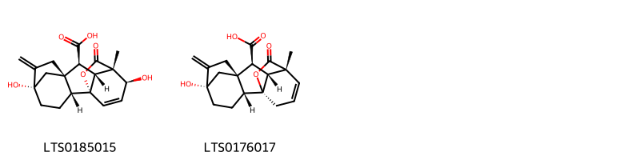{ width=100% }
    <figcaption>Hình ảnh cấu trúc hóa học của 2 hoạt chất thuộc nhóm Prenol lipids gồm ['gibberellin a3 (LTS0185015)', 'gibberellin a5 (LTS0176017)'].</figcaption>
</figure>
#### Nhóm Saccharolipids
<figure markdown="span">
    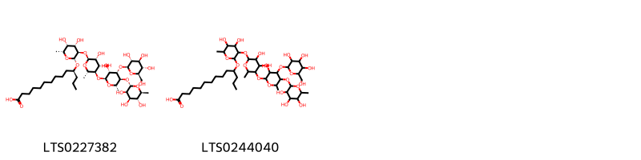{ width=100% }
    <figcaption>Hình ảnh cấu trúc hóa học của 2 hoạt chất thuộc nhóm Saccharolipids gồm ['(11s)-11-{[(2r,3r,4s,5r,6r)-3-{[(2s,3r,4s,5r,6s)-3,4-dihydroxy-5-{[(2s,3r,4s,5s,6s)-3-hydroxy-6-methyl-4-{[(2s,3r,4s,5s,6r)-3,4,5-trihydroxy-6-(hydroxymethyl)oxan-2-yl]oxy}-5-{[(2s,3r,4r,5r,6s)-3,4,5-trihydroxy-6-methyloxan-2-yl]oxy}oxan-2-yl]oxy}-6-methyloxan-2-yl]oxy}-4,5-dihydroxy-6-methyloxan-2-yl]oxy}tetradecanoic acid (LTS0227382)', '11-{[3-({3,4-dihydroxy-5-[(3-hydroxy-6-methyl-4-{[3,4,5-trihydroxy-6-(hydroxymethyl)oxan-2-yl]oxy}-5-[(3,4,5-trihydroxy-6-methyloxan-2-yl)oxy]oxan-2-yl)oxy]-6-methyloxan-2-yl}oxy)-4,5-dihydroxy-6-methyloxan-2-yl]oxy}tetradecanoic acid (LTS0244040)'].</figcaption>
</figure>

---

### Dược dân tộc học

Danh sách các quốc gia có sử dụng *Ipomoea quamoclit* trong điều trị các bệnh. 

| Country            | Disease      | Bệnh                                                                                                                                                                                                |
|:-------------------|:-------------|:----------------------------------------------------------------------------------------------------------------------------------------------------------------------------------------------------|
| Australia          | Purgative    | MYMEMORY WARNING: YOU USED ALL AVAILABLE FREE TRANSLATIONS FOR TODAY. NEXT AVAILABLE IN  16 HOURS 00 MINUTES 49 SECONDS VISIT HTTPS://MYMEMORY.TRANSLATED.NET/DOC/USAGELIMITS.PHP TO TRANSLATE MORE |
| Dominican Republic | Purgative    | MYMEMORY WARNING: YOU USED ALL AVAILABLE FREE TRANSLATIONS FOR TODAY. NEXT AVAILABLE IN  16 HOURS 00 MINUTES 46 SECONDS VISIT HTTPS://MYMEMORY.TRANSLATED.NET/DOC/USAGELIMITS.PHP TO TRANSLATE MORE |
| Elsewhere          | Refrigerant  | MYMEMORY WARNING: YOU USED ALL AVAILABLE FREE TRANSLATIONS FOR TODAY. NEXT AVAILABLE IN  16 HOURS 00 MINUTES 43 SECONDS VISIT HTTPS://MYMEMORY.TRANSLATED.NET/DOC/USAGELIMITS.PHP TO TRANSLATE MORE |
| Haiti              | Sternutatory | MYMEMORY WARNING: YOU USED ALL AVAILABLE FREE TRANSLATIONS FOR TODAY. NEXT AVAILABLE IN  16 HOURS 00 MINUTES 40 SECONDS VISIT HTTPS://MYMEMORY.TRANSLATED.NET/DOC/USAGELIMITS.PHP TO TRANSLATE MORE |
| ain                | Sternutatory | MYMEMORY WARNING: YOU USED ALL AVAILABLE FREE TRANSLATIONS FOR TODAY. NEXT AVAILABLE IN  16 HOURS 00 MINUTES 37 SECONDS VISIT HTTPS://MYMEMORY.TRANSLATED.NET/DOC/USAGELIMITS.PHP TO TRANSLATE MORE |

---

---
## Ipomoea reptans
### Thông tin về thực vật

!!! info "Phân loại thực vật của *N/A* từ GIBF:"
    - **Kingdom:** Plantae
    - **Phylum:** Tracheophyta
    - **Order:** Solanales
    - **Family:** Convolvulaceae
    - **Genus:** N/A
    - **Species:** *N/A*

 

| Label (VI)   | Label (EN)   | Scientific Name   | Descriptions (VI)                       | Descriptions (EN)                             | Also Known As (VI)   | Also Known As (EN)   |
|:-------------|:-------------|:------------------|:----------------------------------------|:----------------------------------------------|:---------------------|:---------------------|
| N/A          | N/A          | Ipomoea quamoclit | Thực vật có hoa thuộc họ Convolvulaceae | species of plant in the family Convolvulaceae | ['']                 | ['Cypress vine']     |

#### Phân bố trên thế giới

**Từ CSDL GIBF** Viet Nam, Thailand, Namibia, Spain, French Guiana, Chile, Australia, Indonesia, Colombia, Sri Lanka, Puerto Rico, Malaysia, India, Guam, Uganda, Belize, Nicaragua, Panama, Brazil, Peru, Mexico, Chinese Taipei, Uruguay, Argentina, United Kingdom of Great Britain and Northern Ireland, Portugal, South Africa, New Zealand, Costa Rica, Russian Federation, United States of America

#### Phân bố tại Việt Nam

**Từ CSDL GIBF**: Lâm Đồng, Hồ Chí Minh city

---
### Thành phần hóa học
        
- Theo cơ sở dữ liệu lotus: Từ loài *N/A* đã phân lập và xác định được Chưa có hoạt chất nào được phân lập. hoạt chất thuộc về các nhóm Không có hoạt chất nào được phân lập. 

Không có hình ảnh nào được tạo ra

---

### Dược dân tộc học

Danh sách các quốc gia có sử dụng *N/A* trong điều trị các bệnh. 

| Country   | Disease   | Bệnh                                                                                                                                                                                                |
|:----------|:----------|:----------------------------------------------------------------------------------------------------------------------------------------------------------------------------------------------------|
| Java      | Laxative  | MYMEMORY WARNING: YOU USED ALL AVAILABLE FREE TRANSLATIONS FOR TODAY. NEXT AVAILABLE IN  16 HOURS 00 MINUTES 08 SECONDS VISIT HTTPS://MYMEMORY.TRANSLATED.NET/DOC/USAGELIMITS.PHP TO TRANSLATE MORE |

---

---
## Ipomoea stans
### Thông tin về thực vật

!!! info "Phân loại thực vật của *Ipomoea stans* từ GIBF:"
    - **Kingdom:** Plantae
    - **Phylum:** Tracheophyta
    - **Order:** Solanales
    - **Family:** Convolvulaceae
    - **Genus:** Ipomoea
    - **Species:** *Ipomoea stans*

 

| Label (VI)   | Label (EN)   | Scientific Name   | Descriptions (VI)   | Descriptions (EN)   | Also Known As (VI)   | Also Known As (EN)   |
|:-------------|:-------------|:------------------|:--------------------|:--------------------|:---------------------|:---------------------|
| N/A          | N/A          | Ipomoea stans     | loài thực vật       | species of plant    | ['']                 | ['']                 |

#### Phân bố trên thế giới

**Từ CSDL GIBF** Mexico

#### Phân bố tại Việt Nam

**Từ CSDL GIBF**: Không có ghi nhận ở Việt Nam

---
### Thành phần hóa học
        
- Theo cơ sở dữ liệu lotus: Từ loài *Ipomoea stans* đã phân lập và xác định được 21 hoạt chất thuộc về các nhóm Fatty Acyls, Organooxygen compounds, Saccharolipids. 

|    | chemicalTaxonomyClassyfireClass   |   smiles_count |
|---:|:----------------------------------|---------------:|
|  0 | Fatty Acyls                       |              1 |
|  1 | Organooxygen compounds            |              7 |
|  2 | Saccharolipids                    |             13 |

#### Nhóm Fatty Acyls
<figure markdown="span">
    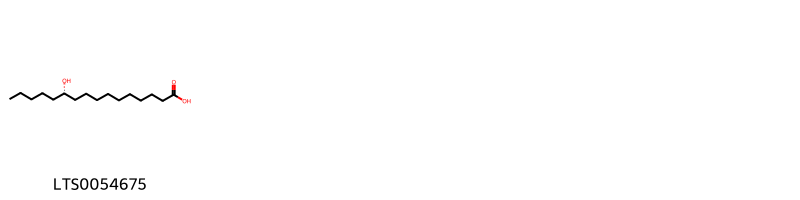{ width=100% }
    <figcaption>Hình ảnh cấu trúc hóa học của 1 hoạt chất thuộc nhóm Fatty Acyls gồm ['jalapinolic acid (LTS0054675)'].</figcaption>
</figure>
#### Nhóm Organooxygen compounds
<figure markdown="span">
    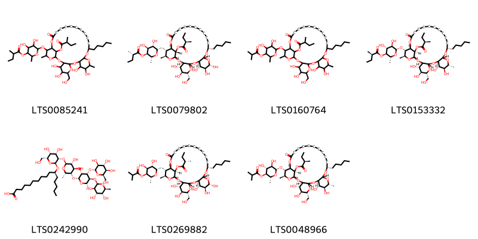{ width=100% }
    <figcaption>Hình ảnh cấu trúc hóa học của 7 hoạt chất thuộc nhóm Organooxygen compounds gồm ['30-({3,4-dihydroxy-6-methyl-5-[(2-methylbutanoyl)oxy]oxan-2-yl}oxy)-4,5,11,12-tetrahydroxy-6-(hydroxymethyl)-13,31-dimethyl-27-oxo-17-pentyl-2,7,9,14,16,28,32-heptaoxatetracyclo[27.3.1.0³,⁸.0¹⁰,¹⁵]tritriacontan-33-yl 2-methylbutanoate (LTS0085241)', '(1s,3r,4s,5s,6r,8s,10r,11s,12s,13s,15r,17s,29r,30s,31s,33s)-30-{[(2s,3s,4s,5s,6r)-3,4-dihydroxy-6-methyl-5-{[(2s)-2-methylbutanoyl]oxy}oxan-2-yl]methyl}-4,5,11,12,13-pentahydroxy-6-(hydroxymethyl)-31-methyl-27-oxo-17-pentyl-2,7,9,14,16,28,32-heptaoxatetracyclo[27.3.1.0³,⁸.0¹⁰,¹⁵]tritriacontan-33-yl (2r)-2-methylbutanoate (LTS0079802)', '30-({3,4-dihydroxy-6-methyl-5-[(2-methylpropanoyl)oxy]oxan-2-yl}oxy)-4,5,11,12-tetrahydroxy-6-(hydroxymethyl)-13,31-dimethyl-27-oxo-17-pentyl-2,7,9,14,16,28,32-heptaoxatetracyclo[27.3.1.0³,⁸.0¹⁰,¹⁵]tritriacontan-33-yl 2-methylbutanoate (LTS0160764)', '(1s,3r,4s,5s,6r,8s,10r,11s,12s,13r,15r,17s,29r,30s,31s,33r)-30-{[(2s,3r,4r,5s,6r)-3,4-dihydroxy-6-methyl-5-{[(2r)-2-methylbutanoyl]oxy}oxan-2-yl]oxy}-4,5,11,12-tetrahydroxy-6-(hydroxymethyl)-13,31-dimethyl-27-oxo-17-pentyl-2,7,9,14,16,28,32-heptaoxatetracyclo[27.3.1.0³,⁸.0¹⁰,¹⁵]tritriacontan-33-yl (2r)-2-methylbutanoate (LTS0153332)', '(11s)-11-{[(2s,3s,4s,5r,6r)-3-{[(2s,3r,4r,5s,6s)-3,4-dihydroxy-5-{[(2r,3r,4s,5s,6s)-3-hydroxy-6-methyl-4-{[(2r,3s,4r,5r,6r)-3,4,5-trihydroxy-6-(hydroxymethyl)oxan-2-yl]oxy}-5-{[(2r,3r,4s,5r,6s)-3,4,5-trihydroxy-6-methyloxan-2-yl]oxy}oxan-2-yl]oxy}-6-methyloxan-2-yl]oxy}-4,5-dihydroxy-6-(hydroxymethyl)oxan-2-yl]oxy}hexadecanoic acid (LTS0242990)', '(1s,3r,4s,5s,6r,8s,10r,11s,12s,13s,15r,17s,29r,30s,31s,33r)-30-{[(2s,3s,4s,5s,6r)-3,4-dihydroxy-6-methyl-5-[(2-methylpropanoyl)oxy]oxan-2-yl]methyl}-4,5,11,12,13-pentahydroxy-6-(hydroxymethyl)-31-methyl-27-oxo-17-pentyl-2,7,9,14,16,28,32-heptaoxatetracyclo[27.3.1.0³,⁸.0¹⁰,¹⁵]tritriacontan-33-yl (2s)-2-methylbutanoate (LTS0269882)', '(1s,3r,4s,5s,6r,8s,10r,11s,12s,13r,15r,17s,29r,30s,31s,33r)-30-{[(2s,3r,4r,5s,6r)-3,4-dihydroxy-6-methyl-5-[(2-methylpropanoyl)oxy]oxan-2-yl]oxy}-4,5,11,12-tetrahydroxy-6-(hydroxymethyl)-13,31-dimethyl-27-oxo-17-pentyl-2,7,9,14,16,28,32-heptaoxatetracyclo[27.3.1.0³,⁸.0¹⁰,¹⁵]tritriacontan-33-yl (2r)-2-methylbutanoate (LTS0048966)'].</figcaption>
</figure>
#### Nhóm Saccharolipids
<figure markdown="span">
    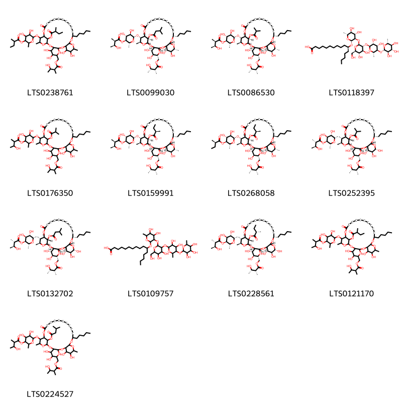{ width=100% }
    <figcaption>Hình ảnh cấu trúc hóa học của 13 hoạt chất thuộc nhóm Saccharolipids gồm ['[30-({3,4-dihydroxy-6-methyl-5-[(2-methylbutanoyl)oxy]oxan-2-yl}oxy)-4,5,11,12-tetrahydroxy-13,31-dimethyl-33-[(2-methylbutanoyl)oxy]-27-oxo-17-pentyl-2,7,9,14,16,28,32-heptaoxatetracyclo[27.3.1.0³,⁸.0¹⁰,¹⁵]tritriacontan-6-yl]methyl 3-hydroxy-2-methylbutanoate (LTS0238761)', '[(1s,3r,4s,5s,6r,8s,10r,11s,12s,13r,15r,17s,29r,30s,31s,33r)-30-{[(2s,3r,4r,5s,6r)-3,4-dihydroxy-5-{[(2r,3s)-3-hydroxy-2-methylbutanoyl]oxy}-6-methyloxan-2-yl]oxy}-4,5,11,12-tetrahydroxy-13,31-dimethyl-33-[(3-methylbutanoyl)oxy]-27-oxo-17-pentyl-2,7,9,14,16,28,32-heptaoxatetracyclo[27.3.1.0³,⁸.0¹⁰,¹⁵]tritriacontan-6-yl]methyl (2r,3s)-3-hydroxy-2-methylbutanoate (LTS0099030)', '[(1s,3r,4s,5s,6r,8s,10r,11s,12s,13r,15r,17s,29r,30s,31s,33r)-30-{[(2s,3r,4r,5s,6r)-3,4-dihydroxy-5-{[(2r,3s)-3-hydroxy-2-methylbutanoyl]oxy}-6-methyloxan-2-yl]oxy}-4,5,11,12-tetrahydroxy-13,31-dimethyl-33-[(2-methylpropanoyl)oxy]-27-oxo-17-pentyl-2,7,9,14,16,28,32-heptaoxatetracyclo[27.3.1.0³,⁸.0¹⁰,¹⁵]tritriacontan-6-yl]methyl (2r,3s)-3-hydroxy-2-methylbutanoate (LTS0086530)', '(11s)-11-{[(2r,3r,4s,5s,6r)-3-{[(2s,3r,4s,5s,6r)-3-{[(2s,3r,4s,5r,6s)-3,4-dihydroxy-6-methyl-5-{[(2s,3r,4s,5s,6r)-3,4,5-trihydroxy-6-methyloxan-2-yl]oxy}oxan-2-yl]oxy}-4,5-dihydroxy-6-(hydroxymethyl)oxan-2-yl]oxy}-4,5-dihydroxy-6-methyloxan-2-yl]oxy}hexadecanoic acid (LTS0118397)', '[30-({3,4-dihydroxy-5-[(3-hydroxy-2-methylbutanoyl)oxy]-6-methyloxan-2-yl}oxy)-4,5,11,12-tetrahydroxy-13,31-dimethyl-33-[(2-methylpropanoyl)oxy]-27-oxo-17-pentyl-2,7,9,14,16,28,32-heptaoxatetracyclo[27.3.1.0³,⁸.0¹⁰,¹⁵]tritriacontan-6-yl]methyl 3-hydroxy-2-methylbutanoate (LTS0176350)', '[(1s,3r,4s,5s,6r,8s,10r,11s,12s,13r,15r,17s,29r,30s,31s,33r)-30-{[(2s,3r,4r,5s,6r)-3,4-dihydroxy-5-{[(2r,3s)-3-hydroxy-2-methylbutanoyl]oxy}-6-methyloxan-2-yl]oxy}-4,5,11,12-tetrahydroxy-13,31-dimethyl-33-{[(2r)-2-methylbutanoyl]oxy}-27-oxo-17-pentyl-2,7,9,14,16,28,32-heptaoxatetracyclo[27.3.1.0³,⁸.0¹⁰,¹⁵]tritriacontan-6-yl]methyl (2r,3s)-3-hydroxy-2-methylbutanoate (LTS0159991)', '[(1s,3r,4s,5s,6r,8s,10r,11s,12s,13r,15r,17r,29r,30s,31s,33r)-30-{[(2s,3r,4r,5s,6r)-3,4-dihydroxy-6-methyl-5-{[(2r)-2-methylbutanoyl]oxy}oxan-2-yl]oxy}-4,5,11,12-tetrahydroxy-13,31-dimethyl-33-{[(2r)-2-methylbutanoyl]oxy}-27-oxo-17-pentyl-2,7,9,14,16,28,32-heptaoxatetracyclo[27.3.1.0³,⁸.0¹⁰,¹⁵]tritriacontan-6-yl]methyl (2r,3s)-3-hydroxy-2-methylbutanoate (LTS0268058)', '[(1s,3r,4s,5s,6r,8s,10r,11s,12s,13s,15r,17s,29r,30s,31s,33s)-30-{[(2s,3s,4s,5s,6r)-3,4-dihydroxy-5-{[(2s,3s)-3-hydroxy-2-methylbutanoyl]oxy}-6-methyloxan-2-yl]methyl}-4,5,11,12,13-pentahydroxy-31-methyl-33-[(2-methylpropanoyl)oxy]-27-oxo-17-pentyl-2,7,9,14,16,28,32-heptaoxatetracyclo[27.3.1.0³,⁸.0¹⁰,¹⁵]tritriacontan-6-yl]methyl (2r,3s)-3-hydroxy-2-methylbutanoate (LTS0252395)', '[(1s,3r,4s,5s,6r,8s,10r,11s,12s,13s,15r,17s,29r,30s,31s,33s)-30-{[(2s,3s,4s,5s,6r)-3,4-dihydroxy-5-{[(2s,3s)-3-hydroxy-2-methylbutanoyl]oxy}-6-methyloxan-2-yl]methyl}-4,5,11,12,13-pentahydroxy-31-methyl-33-[(3-methylbutanoyl)oxy]-27-oxo-17-pentyl-2,7,9,14,16,28,32-heptaoxatetracyclo[27.3.1.0³,⁸.0¹⁰,¹⁵]tritriacontan-6-yl]methyl (2r,3s)-3-hydroxy-2-methylbutanoate (LTS0132702)', '11-[(3-{[3-({3,4-dihydroxy-6-methyl-5-[(3,4,5-trihydroxy-6-methyloxan-2-yl)oxy]oxan-2-yl}oxy)-4,5-dihydroxy-6-(hydroxymethyl)oxan-2-yl]oxy}-4,5-dihydroxy-6-methyloxan-2-yl)oxy]hexadecanoic acid (LTS0109757)', '[(1s,3r,4s,5s,6r,8s,10r,11s,12s,13s,15r,17s,29r,30s,31s,33s)-30-{[(2s,3s,4s,5s,6r)-3,4-dihydroxy-5-{[(2s,3s)-3-hydroxy-2-methylbutanoyl]oxy}-6-methyloxan-2-yl]methyl}-4,5,11,12,13-pentahydroxy-31-methyl-33-{[(2s)-2-methylbutanoyl]oxy}-27-oxo-17-pentyl-2,7,9,14,16,28,32-heptaoxatetracyclo[27.3.1.0³,⁸.0¹⁰,¹⁵]tritriacontan-6-yl]methyl (2r,3s)-3-hydroxy-2-methylbutanoate (LTS0228561)', '[30-({3,4-dihydroxy-5-[(3-hydroxy-2-methylbutanoyl)oxy]-6-methyloxan-2-yl}oxy)-4,5,11,12-tetrahydroxy-13,31-dimethyl-33-[(2-methylbutanoyl)oxy]-27-oxo-17-pentyl-2,7,9,14,16,28,32-heptaoxatetracyclo[27.3.1.0³,⁸.0¹⁰,¹⁵]tritriacontan-6-yl]methyl 3-hydroxy-2-methylbutanoate (LTS0121170)', '[30-({3,4-dihydroxy-5-[(3-hydroxy-2-methylbutanoyl)oxy]-6-methyloxan-2-yl}oxy)-4,5,11,12-tetrahydroxy-13,31-dimethyl-33-[(3-methylbutanoyl)oxy]-27-oxo-17-pentyl-2,7,9,14,16,28,32-heptaoxatetracyclo[27.3.1.0³,⁸.0¹⁰,¹⁵]tritriacontan-6-yl]methyl 3-hydroxy-2-methylbutanoate (LTS0224527)'].</figcaption>
</figure>

---

### Dược dân tộc học

Danh sách các quốc gia có sử dụng *Ipomoea stans* trong điều trị các bệnh. 

| Country   | Disease   | Bệnh                                                                                                                                                                                                |
|:----------|:----------|:----------------------------------------------------------------------------------------------------------------------------------------------------------------------------------------------------|
| Mexico    | Purgative | MYMEMORY WARNING: YOU USED ALL AVAILABLE FREE TRANSLATIONS FOR TODAY. NEXT AVAILABLE IN  15 HOURS 59 MINUTES 39 SECONDS VISIT HTTPS://MYMEMORY.TRANSLATED.NET/DOC/USAGELIMITS.PHP TO TRANSLATE MORE |

---

---
## Ipomoea tuberosa
### Thông tin về thực vật

!!! info "Phân loại thực vật của *N/A* từ GIBF:"
    - **Kingdom:** Plantae
    - **Phylum:** Tracheophyta
    - **Order:** Solanales
    - **Family:** Convolvulaceae
    - **Genus:** N/A
    - **Species:** *N/A*

 

| Label (VI)   | Label (EN)   | Scientific Name   | Descriptions (VI)   | Descriptions (EN)   | Also Known As (VI)   | Also Known As (EN)   |
|:-------------|:-------------|:------------------|:--------------------|:--------------------|:---------------------|:---------------------|
| N/A          | N/A          | Ipomoea tuberosa  |                     | species of plant    | ['']                 | ['']                 |

#### Phân bố trên thế giới

**Từ CSDL GIBF** Viet Nam, Thailand, Namibia, Spain, French Guiana, Chile, Australia, Indonesia, Colombia, Sri Lanka, Puerto Rico, Malaysia, India, Guam, Uganda, Belize, Nicaragua, Panama, Brazil, Peru, Mexico, Chinese Taipei, Uruguay, Argentina, United Kingdom of Great Britain and Northern Ireland, Portugal, South Africa, New Zealand, Costa Rica, Russian Federation, United States of America

#### Phân bố tại Việt Nam

**Từ CSDL GIBF**: Lâm Đồng, Hồ Chí Minh city

---
### Thành phần hóa học
        
- Theo cơ sở dữ liệu lotus: Từ loài *N/A* đã phân lập và xác định được Chưa có hoạt chất nào được phân lập. hoạt chất thuộc về các nhóm Không có hoạt chất nào được phân lập. 

Không có hình ảnh nào được tạo ra

---

### Dược dân tộc học

Danh sách các quốc gia có sử dụng *N/A* trong điều trị các bệnh. 

| Country   | Disease   | Bệnh                                                                                                                                                                                                |
|:----------|:----------|:----------------------------------------------------------------------------------------------------------------------------------------------------------------------------------------------------|
| Hawaii    | Laxative  | MYMEMORY WARNING: YOU USED ALL AVAILABLE FREE TRANSLATIONS FOR TODAY. NEXT AVAILABLE IN  15 HOURS 59 MINUTES 09 SECONDS VISIT HTTPS://MYMEMORY.TRANSLATED.NET/DOC/USAGELIMITS.PHP TO TRANSLATE MORE |

---

---
## Ipomoea turpethum
### Thông tin về thực vật

!!! info "Phân loại thực vật của *Operculina turpethum* từ GIBF:"
    - **Kingdom:** Plantae
    - **Phylum:** Tracheophyta
    - **Order:** Solanales
    - **Family:** Convolvulaceae
    - **Genus:** Operculina
    - **Species:** *Operculina turpethum*

 

| Label (VI)   | Label (EN)   | Scientific Name   | Descriptions (VI)   | Descriptions (EN)   | Also Known As (VI)   | Also Known As (EN)   |
|:-------------|:-------------|:------------------|:--------------------|:--------------------|:---------------------|:---------------------|
| N/A          | N/A          | Ipomoea turpethum |                     | species of plant    | ['']                 | ['']                 |

#### Phân bố trên thế giới

**Từ CSDL GIBF** nan, Argentina, Myanmar, Micronesia (Federated States of), Maldives, Philippines, Mongolia, India, Mauritius, United States of America, Timor-Leste, Chinese Taipei

#### Phân bố tại Việt Nam

**Từ CSDL GIBF**: Không có ghi nhận ở Việt Nam

---
### Thành phần hóa học
        
- Theo cơ sở dữ liệu lotus: Từ loài *Operculina turpethum* đã phân lập và xác định được Chưa có hoạt chất nào được phân lập. hoạt chất thuộc về các nhóm Không có hoạt chất nào được phân lập. 

Không có hình ảnh nào được tạo ra

---

### Dược dân tộc học

Danh sách các quốc gia có sử dụng *Operculina turpethum* trong điều trị các bệnh. 

| Country   | Disease                        | Bệnh                                                                                                                                                                                                |
|:----------|:-------------------------------|:----------------------------------------------------------------------------------------------------------------------------------------------------------------------------------------------------|
| Elsewhere | Purgative                      | MYMEMORY WARNING: YOU USED ALL AVAILABLE FREE TRANSLATIONS FOR TODAY. NEXT AVAILABLE IN  15 HOURS 58 MINUTES 44 SECONDS VISIT HTTPS://MYMEMORY.TRANSLATED.NET/DOC/USAGELIMITS.PHP TO TRANSLATE MORE |
| Turkey    | Vermifuge, Cathartic, Laxative | MYMEMORY WARNING: YOU USED ALL AVAILABLE FREE TRANSLATIONS FOR TODAY. NEXT AVAILABLE IN  15 HOURS 58 MINUTES 41 SECONDS VISIT HTTPS://MYMEMORY.TRANSLATED.NET/DOC/USAGELIMITS.PHP TO TRANSLATE MORE |

---

---
## Ipomoea uniflora
### Thông tin về thực vật

!!! info "Phân loại thực vật của *N/A* từ GIBF:"
    - **Kingdom:** Plantae
    - **Phylum:** Tracheophyta
    - **Order:** Solanales
    - **Family:** Convolvulaceae
    - **Genus:** N/A
    - **Species:** *N/A*

 

| Label (VI)   | Label (EN)   | Scientific Name   | Descriptions (VI)   | Descriptions (EN)   | Also Known As (VI)   | Also Known As (EN)   |
|:-------------|:-------------|:------------------|:--------------------|:--------------------|:---------------------|:---------------------|
| N/A          | N/A          | Ipomoea turpethum |                     | species of plant    | ['']                 | ['']                 |

#### Phân bố trên thế giới

**Từ CSDL GIBF** Viet Nam, Thailand, Namibia, Spain, French Guiana, Chile, Australia, Indonesia, Colombia, Sri Lanka, Puerto Rico, Malaysia, India, Guam, Uganda, Belize, Nicaragua, Panama, Brazil, Peru, Mexico, Chinese Taipei, Uruguay, Argentina, United Kingdom of Great Britain and Northern Ireland, Portugal, South Africa, New Zealand, Costa Rica, Russian Federation, United States of America

#### Phân bố tại Việt Nam

**Từ CSDL GIBF**: Lâm Đồng, Hồ Chí Minh city

---
### Thành phần hóa học
        
- Theo cơ sở dữ liệu lotus: Từ loài *N/A* đã phân lập và xác định được Chưa có hoạt chất nào được phân lập. hoạt chất thuộc về các nhóm Không có hoạt chất nào được phân lập. 

Không có hình ảnh nào được tạo ra

---

### Dược dân tộc học

Danh sách các quốc gia có sử dụng *N/A* trong điều trị các bệnh. 

| Country   | Disease   | Bệnh                                                                                                                                                                                                |
|:----------|:----------|:----------------------------------------------------------------------------------------------------------------------------------------------------------------------------------------------------|
| Elsewhere | Purgative | MYMEMORY WARNING: YOU USED ALL AVAILABLE FREE TRANSLATIONS FOR TODAY. NEXT AVAILABLE IN  15 HOURS 58 MINUTES 22 SECONDS VISIT HTTPS://MYMEMORY.TRANSLATED.NET/DOC/USAGELIMITS.PHP TO TRANSLATE MORE |

---

