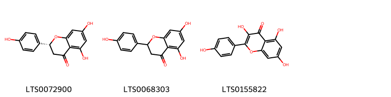
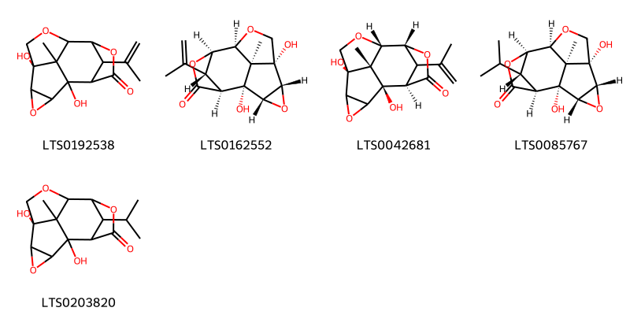
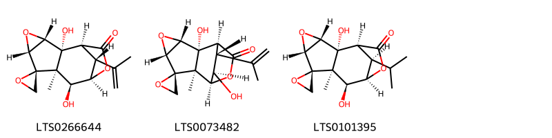
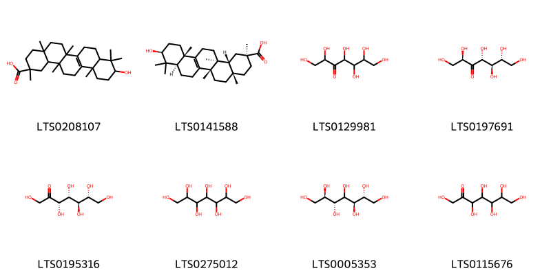
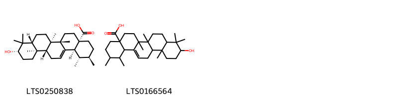
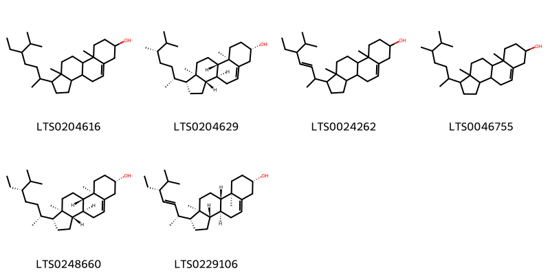
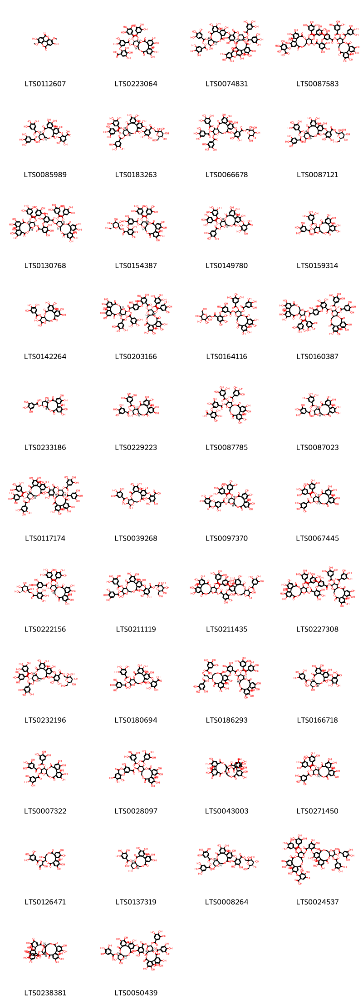
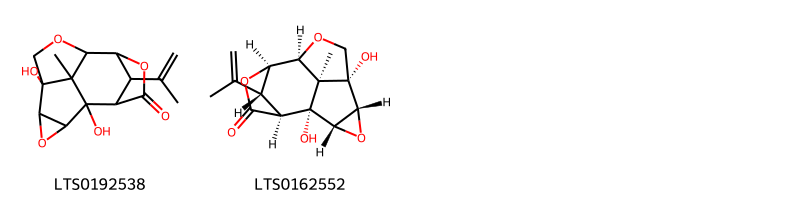
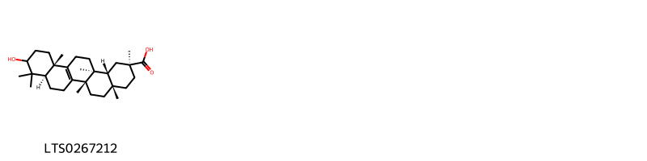
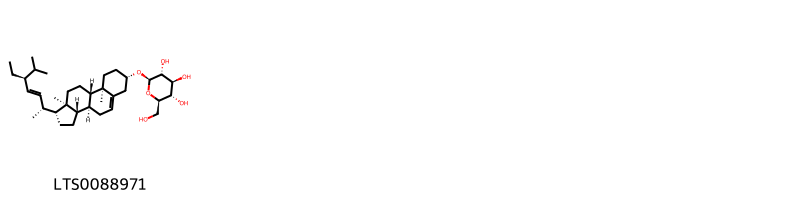

!!! abstract "Tóm tắt"

    Họ Coriariaceae gồm khoảng 1 chi và 6 loài được một số cộng đồng tại các quốc gia như Elsewhere, anish, ain, Mexico, China, Guatemala, New Zealand sử dụng trong một số trường hợp MYMEMORY WARNING: YOU USED ALL AVAILABLE FREE TRANSLATIONS FOR TODAY. NEXT AVAILABLE IN  00 HOURS 23 MINUTES 56 SECONDS VISIT HTTPS://MYMEMORY.TRANSLATED.NET/DOC/USAGELIMITS.PHP TO TRANSLATE MORE.

!!! info "DrDuke"

    James A. Duke sinh năm 1929-2017 là một nhà thực vật học người Mỹ. Đây là một trong những tác giả hàng đầu trong lĩnh vực dược dân tộc học với cuốn *CRC Handbook of Medicinal Herbs* và chính là người xây dựng lên cơ sở dữ liệu về hợp chất tự nhiên và dược dân tộc học tại Bộ nông nghiệp Hoa Kỳ. Các thông tin được đăng tải tại website [Dr. Duke's Phytochemical and Ethnobotanical Databases](https://phytochem.nal.usda.gov/). 
    Trong suốt thập niên 1970, ông lãnh đạo the Plant Taxonomy Laboratory, Plant Genetics and Germplasm Institute of the Agricultural Research Service, U.S. Department of Agriculture.
    Trong tài liệu này, các thông tin về dược dân tộc của các dược liệu được trích dẫn từ tài liệu của James A. Ducke với sự trợ giúp của phần mềm dịch thuật từ tiếng Anh sang tiếng Việt.
   

# Chi Coriaria

??? note "Danh sách các dược liệu thuộc chi"
    
	 - *Coriaria japonica*
	 - *Coriaria myrtifolia*
	 - *Coriaria nepalensis*
	 - *Coriaria sarmentosa*
	 - *Coriaria sinica*
	 - *Coriaria thymifolia*

---
## Coriaria japonica
### Thông tin về thực vật

!!! info "Phân loại thực vật của *Coriaria japonica* từ GIBF:"
    - **Kingdom:** Plantae
    - **Phylum:** Tracheophyta
    - **Order:** Cucurbitales
    - **Family:** Coriariaceae
    - **Genus:** Coriaria
    - **Species:** *Coriaria japonica*

 

| Label (VI)   | Label (EN)   | Scientific Name   | Descriptions (VI)   | Descriptions (EN)   | Also Known As (VI)   | Also Known As (EN)   |
|:-------------|:-------------|:------------------|:--------------------|:--------------------|:---------------------|:---------------------|
| N/A          | N/A          | Coriaria japonica | loài thực vật       | species of plant    | ['']                 | ['']                 |

#### Phân bố trên thế giới

**Từ CSDL GIBF** United States of America, Chinese Taipei, Japan

#### Phân bố tại Việt Nam

**Từ CSDL GIBF**: Không có ghi nhận ở Việt Nam

---
### Thành phần hóa học
        
- Theo cơ sở dữ liệu lotus: Từ loài *Coriaria japonica* đã phân lập và xác định được 70 hoạt chất thuộc về các nhóm Flavonoids, Prenol lipids, Steroids and steroid derivatives, Benzene and substituted derivatives, Furopyrans, Organooxygen compounds, Tannins, Lactones. 

|    | chemicalTaxonomyClassyfireClass     |   smiles_count |
|---:|:------------------------------------|---------------:|
|  0 | Benzene and substituted derivatives |              1 |
|  1 | Flavonoids                          |              3 |
|  2 | Furopyrans                          |              5 |
|  3 | Lactones                            |              3 |
|  4 | Organooxygen compounds              |              8 |
|  5 | Prenol lipids                       |              2 |
|  6 | Steroids and steroid derivatives    |              6 |
|  7 | Tannins                             |             42 |

#### Nhóm Benzene and substituted derivatives
<figure markdown="span">
    { width=100% }
    <figcaption>Hình ảnh cấu trúc hóa học của 1 hoạt chất thuộc nhóm Benzene and substituted derivatives gồm ['galop (LTS0222857)'].</figcaption>
</figure>
#### Nhóm Flavonoids
<figure markdown="span">
    { width=100% }
    <figcaption>Hình ảnh cấu trúc hóa học của 3 hoạt chất thuộc nhóm Flavonoids gồm ['(-)-naringenin (LTS0072900)', 'asahina (LTS0068303)', 'kaempherol (LTS0155822)'].</figcaption>
</figure>
#### Nhóm Furopyrans
<figure markdown="span">
    { width=100% }
    <figcaption>Hình ảnh cấu trúc hóa học của 5 hoạt chất thuộc nhóm Furopyrans gồm ['1,5-dihydroxy-13-methyl-14-(prop-1-en-2-yl)-3,7,10-trioxapentacyclo[6.4.1.1⁹,¹².0²,⁴.0⁵,¹³]tetradecan-11-one (LTS0192538)', '(1r,2s,4r,5r,8s,9r,12s,13r,14r)-1,5-dihydroxy-13-methyl-14-(prop-1-en-2-yl)-3,7,10-trioxapentacyclo[6.4.1.1⁹,¹².0²,⁴.0⁵,¹³]tetradecan-11-one (LTS0162552)', '(1r,5r,8s,9r,12r,13r)-1,5-dihydroxy-13-methyl-14-(prop-1-en-2-yl)-3,7,10-trioxapentacyclo[6.4.1.1⁹,¹².0²,⁴.0⁵,¹³]tetradecan-11-one (LTS0042681)', '(1r,2s,4r,5r,8s,9r,12s,13r,14s)-1,5-dihydroxy-14-isopropyl-13-methyl-3,7,10-trioxapentacyclo[6.4.1.1⁹,¹².0²,⁴.0⁵,¹³]tetradecan-11-one (LTS0085767)', '1,5-dihydroxy-14-isopropyl-13-methyl-3,7,10-trioxapentacyclo[6.4.1.1⁹,¹².0²,⁴.0⁵,¹³]tetradecan-11-one (LTS0203820)'].</figcaption>
</figure>
#### Nhóm Lactones
<figure markdown="span">
    { width=100% }
    <figcaption>Hình ảnh cấu trúc hóa học của 3 hoạt chất thuộc nhóm Lactones gồm ['tutin (toxin) (LTS0266644)', "(1's,2r,2'r,3's,5'r,7'r,8's,11'r,12'r)-2',12'-dihydroxy-7'-methyl-11'-(prop-1-en-2-yl)-4',9'-dioxaspiro[oxirane-2,6'-tetracyclo[6.2.2.0²,⁷.0³,⁵]dodecan]-10'-one (LTS0073482)", "(1's,2r,2'r,3's,5'r,7'r,8's,9'r,12'r)-2',8'-dihydroxy-12'-isopropyl-7'-methyl-4',10'-dioxaspiro[oxirane-2,6'-tetracyclo[7.2.1.0²,⁷.0³,⁵]dodecan]-11'-one (LTS0101395)"].</figcaption>
</figure>
#### Nhóm Organooxygen compounds
<figure markdown="span">
    { width=100% }
    <figcaption>Hình ảnh cấu trúc hóa học của 8 hoạt chất thuộc nhóm Organooxygen compounds gồm ['10-hydroxy-2,4a,6a,9,9,12a,14a-heptamethyl-1,3,4,5,6,7,8,8a,10,11,12,13,14,14b-tetradecahydropicene-2-carboxylic acid (LTS0208107)', 'bryonolic acid (LTS0141588)', '1,2,4,5,6,7-hexahydroxyheptan-3-one (LTS0129981)', '(2r,4r,5r,6r)-1,2,4,5,6,7-hexahydroxyheptan-3-one (LTS0197691)', 'sedoheptulose (LTS0195316)', 'perseitol (LTS0275012)', 'volemitol (LTS0005353)', 'd-manno-heptulose (LTS0115676)'].</figcaption>
</figure>
#### Nhóm Prenol lipids
<figure markdown="span">
    { width=100% }
    <figcaption>Hình ảnh cấu trúc hóa học của 2 hoạt chất thuộc nhóm Prenol lipids gồm ['ursolic acid (LTS0250838)', '10-hydroxy-1,2,6a,6b,9,9,12a-heptamethyl-2,3,4,5,6,7,8,8a,10,11,12,12b,13,14b-tetradecahydro-1h-picene-4a-carboxylic acid (LTS0166564)'].</figcaption>
</figure>
#### Nhóm Steroids and steroid derivatives
<figure markdown="span">
    { width=100% }
    <figcaption>Hình ảnh cấu trúc hóa học của 6 hoạt chất thuộc nhóm Steroids and steroid derivatives gồm ['stigmast-5-en-3-ol, (3β)- (LTS0204616)', '22,23-dihydrobrassicasterol (LTS0204629)', 'stigmasterol (LTS0024262)', 'campesterol (LTS0046755)', 'clionasterol (LTS0248660)', 'poriferasterol (LTS0229106)'].</figcaption>
</figure>
#### Nhóm Tannins
<figure markdown="span">
    { width=100% }
    <figcaption>Hình ảnh cấu trúc hóa học của 42 hoạt chất thuộc nhóm Tannins gồm ['6,13-dihydroxy-7,14-dimethoxy-2,9-dioxatetracyclo[6.6.2.0⁴,¹⁶.0¹¹,¹⁵]hexadeca-1(15),4,6,8(16),11,13-hexaene-3,10-dione (LTS0112607)', '2-[5-({[(10r,11s,12r,13s,15r)-3,4,5,21,22,23-hexahydroxy-8,18-dioxo-11,12-bis(3,4,5-trihydroxybenzoyloxy)-9,14,17-trioxatetracyclo[17.4.0.0²,⁷.0¹⁰,¹⁵]tricosa-1(23),2(7),3,5,19,21-hexaen-13-yl]oxy}carbonyl)-2,3-dihydroxyphenoxy]-3,4,5-trihydroxybenzoic acid (LTS0223064)', '2-{[(10r,11s,12r,13s,15r)-13-(2-{[(10r,11s,12r,13r,15r)-3,4,5,13,22,23-hexahydroxy-8,18-dioxo-11,12-bis(3,4,5-trihydroxybenzoyloxy)-9,14,17-trioxatetracyclo[17.4.0.0²,⁷.0¹⁰,¹⁵]tricosa-1(19),2(7),3,5,20,22-hexaen-21-yl]oxy}-3,4,5-trihydroxybenzoyloxy)-3,4,5,22,23-pentahydroxy-8,18-dioxo-11,12-bis(3,4,5-trihydroxybenzoyloxy)-9,14,17-trioxatetracyclo[17.4.0.0²,⁷.0¹⁰,¹⁵]tricosa-1(23),2(7),3,5,19,21-hexaen-21-yl]oxy}-3,4,5-trihydroxybenzoic acid (LTS0074831)', '6-[(13-{2-[5-({[3,4,5,21,22,23-hexahydroxy-8,18-dioxo-11,12-bis(3,4,5-trihydroxybenzoyloxy)-9,14,17-trioxatetracyclo[17.4.0.0²,⁷.0¹⁰,¹⁵]tricosa-1(23),2(7),3,5,19,21-hexaen-13-yl]oxy}carbonyl)-2,3-dihydroxyphenoxy]-3,4,5-trihydroxybenzoyloxy}-3,4,5,22,23-pentahydroxy-8,18-dioxo-11,12-bis(3,4,5-trihydroxybenzoyloxy)-9,14,17-trioxatetracyclo[17.4.0.0²,⁷.0¹⁰,¹⁵]tricosa-1(23),2(7),3,5,19,21-hexaen-21-yl)oxy]-2,3,4-trihydroxybenzoic acid (LTS0087583)', '2-{[(10r,11s,12r,13r,15r)-3,4,5,13,22,23-hexahydroxy-8,18-dioxo-11,12-bis(3,4,5-trihydroxybenzoyloxy)-9,14,17-trioxatetracyclo[17.4.0.0²,⁷.0¹⁰,¹⁵]tricosa-1(23),2(7),3,5,19,21-hexaen-21-yl]oxy}-3,4,5-trihydroxybenzoic acid (LTS0085989)', '[(3s,4r,5s,6r)-2,3,4,5-tetrahydroxy-6-(hydroxymethyl)oxan-2-yl]methyl 3,4,5-trihydroxy-2-{[(10r,11s,12r,13s,15r)-3,4,5,22,23-pentahydroxy-8,18-dioxo-11,12,13-tris(3,4,5-trihydroxybenzoyloxy)-9,14,17-trioxatetracyclo[17.4.0.0²,⁷.0¹⁰,¹⁵]tricosa-1(23),2(7),3,5,19,21-hexaen-21-yl]oxy}benzoate (LTS0183263)', '[2,3,4,5-tetrahydroxy-6-(hydroxymethyl)oxan-2-yl]methyl 3,4,5-trihydroxy-2-{[3,4,5,22,23-pentahydroxy-8,18-dioxo-11,12,13-tris(3,4,5-trihydroxybenzoyloxy)-9,14,17-trioxatetracyclo[17.4.0.0²,⁷.0¹⁰,¹⁵]tricosa-1(23),2(7),3,5,19,21-hexaen-21-yl]oxy}benzoate (LTS0066678)', '[(2r,3s,4r,5s,6r)-2,3,4,5-tetrahydroxy-6-(hydroxymethyl)oxan-2-yl]methyl 2-{[(10r,11s,12r,13r,15r)-3,4,5,13,22,23-hexahydroxy-8,18-dioxo-11,12-bis(3,4,5-trihydroxybenzoyloxy)-9,14,17-trioxatetracyclo[17.4.0.0²,⁷.0¹⁰,¹⁵]tricosa-1(23),2(7),3,5,19,21-hexaen-21-yl]oxy}-3,4,5-trihydroxybenzoate (LTS0087121)', '(10r,11s,12r,13s,15r)-3,4,5,21,22,23-hexahydroxy-8,18-dioxo-11,12-bis(3,4,5-trihydroxybenzoyloxy)-9,14,17-trioxatetracyclo[17.4.0.0²,⁷.0¹⁰,¹⁵]tricosa-1(23),2(7),3,5,19,21-hexaen-13-yl 2-[5-({[(10r,11s,12r,13s,15r)-3,4,5,21,22,23-hexahydroxy-8,18-dioxo-11,12-bis(3,4,5-trihydroxybenzoyloxy)-9,14,17-trioxatetracyclo[17.4.0.0²,⁷.0¹⁰,¹⁵]tricosa-1(23),2(7),3,5,19,21-hexaen-13-yl]oxy}carbonyl)-2,3-dihydroxyphenoxy]-3,4,5-trihydroxybenzoate (LTS0130768)', '[(2r,3s,4r,5s,6r)-2,3,4,5-tetrahydroxy-6-(hydroxymethyl)oxan-2-yl]methyl 2-[5-({[(10r,11s,12r,13s,15r)-3,4,5,21,22,23-hexahydroxy-8,18-dioxo-11,12-bis(3,4,5-trihydroxybenzoyloxy)-9,14,17-trioxatetracyclo[17.4.0.0²,⁷.0¹⁰,¹⁵]tricosa-1(23),2(7),3,5,19,21-hexaen-13-yl]oxy}carbonyl)-2,3-dihydroxyphenoxy]-3,4,5-trihydroxybenzoate (LTS0154387)', '3,4,5-trihydroxy-2-{[(10r,11s,12r,13s,15r)-3,4,5,22,23-pentahydroxy-8,18-dioxo-11,12,13-tris(3,4,5-trihydroxybenzoyloxy)-9,14,17-trioxatetracyclo[17.4.0.0²,⁷.0¹⁰,¹⁵]tricosa-1(23),2(7),3,5,19,21-hexaen-21-yl]oxy}benzoic acid (LTS0149780)', '3,4,5,13,21,22,23-heptahydroxy-8,18-dioxo-12-(3,4,5-trihydroxybenzoyloxy)-9,14,17-trioxatetracyclo[17.4.0.0²,⁷.0¹⁰,¹⁵]tricosa-1(23),2(7),3,5,19,21-hexaen-11-yl 3,4,5-trihydroxybenzoate (LTS0159314)', '3,4,5,12,13,21,22,23-octahydroxy-8,18-dioxo-9,14,17-trioxatetracyclo[17.4.0.0²,⁷.0¹⁰,¹⁵]tricosa-1(23),2(7),3,5,19,21-hexaen-11-yl 3,4,5-trihydroxybenzoate (LTS0142264)', '(10r,11s,12r,13s,15r)-3,4,5,21,22,23-hexahydroxy-8,18-dioxo-11,12-bis(3,4,5-trihydroxybenzoyloxy)-9,14,17-trioxatetracyclo[17.4.0.0²,⁷.0¹⁰,¹⁵]tricosa-1(23),2(7),3,5,19,21-hexaen-13-yl 2-[4-({[(10r,11s,12r,13s,15r)-3,4,5,21,22,23-hexahydroxy-8,18-dioxo-11,12-bis(3,4,5-trihydroxybenzoyloxy)-9,14,17-trioxatetracyclo[17.4.0.0²,⁷.0¹⁰,¹⁵]tricosa-1(23),2(7),3,5,19,21-hexaen-13-yl]oxy}carbonyl)-2,3-dihydroxyphenoxy]-3,4,5-trihydroxybenzoate (LTS0203166)', '[2,3,4,5-tetrahydroxy-6-(hydroxymethyl)oxan-2-yl]methyl 2-[5-({[3,4,5,21,22,23-hexahydroxy-8,18-dioxo-11,12-bis(3,4,5-trihydroxybenzoyloxy)-9,14,17-trioxatetracyclo[17.4.0.0²,⁷.0¹⁰,¹⁵]tricosa-1(23),2(7),3,5,19,21-hexaen-13-yl]oxy}carbonyl)-2,3-dihydroxyphenoxy]-3,4,5-trihydroxybenzoate (LTS0164116)', '3,4,5,21,22,23-hexahydroxy-8,18-dioxo-11,12-bis(3,4,5-trihydroxybenzoyloxy)-9,14,17-trioxatetracyclo[17.4.0.0²,⁷.0¹⁰,¹⁵]tricosa-1(23),2(7),3,5,19,21-hexaen-13-yl 2-[4-({[3,4,5,21,22,23-hexahydroxy-8,18-dioxo-11,12-bis(3,4,5-trihydroxybenzoyloxy)-9,14,17-trioxatetracyclo[17.4.0.0²,⁷.0¹⁰,¹⁵]tricosa-1(23),2(7),3,5,19,21-hexaen-13-yl]oxy}carbonyl)-2,3-dihydroxyphenoxy]-3,4,5-trihydroxybenzoate (LTS0160387)', '(10s,11r,12r,13s,15r)-3,4,5,11,12,21,22,23-octahydroxy-8,18-dioxo-9,14,17-trioxatetracyclo[17.4.0.0²,⁷.0¹⁰,¹⁵]tricosa-1(23),2(7),3,5,19,21-hexaen-13-yl 3,4,5-trihydroxybenzoate (LTS0233186)', '(10r,11s,12r,13r,15r)-3,4,5,13,21,22,23-heptahydroxy-8,18-dioxo-11-(3,4,5-trihydroxybenzoyloxy)-9,14,17-trioxatetracyclo[17.4.0.0²,⁷.0¹⁰,¹⁵]tricosa-1(23),2(7),3,5,19,21-hexaen-12-yl 3,4,5-trihydroxybenzoate (LTS0229223)', '2-[5-({[3,4,5,21,22,23-hexahydroxy-8,18-dioxo-11,12-bis(3,4,5-trihydroxybenzoyloxy)-9,14,17-trioxatetracyclo[17.4.0.0²,⁷.0¹⁰,¹⁵]tricosa-1(23),2(7),3,5,19,21-hexaen-13-yl]oxy}carbonyl)-2,3-dihydroxyphenoxy]-3,4,5-trihydroxybenzoic acid (LTS0087785)', '(10r,11s,12r,15r)-3,4,5,13,21,22,23-heptahydroxy-8,18-dioxo-11-(3,4,5-trihydroxybenzoyloxy)-9,14,17-trioxatetracyclo[17.4.0.0²,⁷.0¹⁰,¹⁵]tricosa-1(23),2(7),3,5,19,21-hexaen-12-yl 3,4,5-trihydroxybenzoate (LTS0087023)', '(10r,11s,12r,13s,15r)-3,4,5,21,22,23-hexahydroxy-8,18-dioxo-11,12-bis(3,4,5-trihydroxybenzoyloxy)-9,14,17-trioxatetracyclo[17.4.0.0²,⁷.0¹⁰,¹⁵]tricosa-1(23),2(7),3,5,19,21-hexaen-13-yl 3,4,5-trihydroxy-2-{[(10r,11s,12r,13s,15r)-3,4,5,22,23-pentahydroxy-8,18-dioxo-11,12,13-tris(3,4,5-trihydroxybenzoyloxy)-9,14,17-trioxatetracyclo[17.4.0.0²,⁷.0¹⁰,¹⁵]tricosa-1(23),2(7),3,5,19,21-hexaen-21-yl]oxy}benzoate (LTS0117174)', '2-{[3,4,5,12,13,22,23-heptahydroxy-8,18-dioxo-11-(3,4,5-trihydroxybenzoyloxy)-9,14,17-trioxatetracyclo[17.4.0.0²,⁷.0¹⁰,¹⁵]tricosa-1(23),2(7),3,5,19,21-hexaen-21-yl]oxy}-3,4,5-trihydroxybenzoic acid (LTS0039268)', '(10r,11s,12r,13s,15r)-3,4,5,21,22,23-hexahydroxy-8,18-dioxo-11,12-bis(3,4,5-trihydroxybenzoyloxy)-9,14,17-trioxatetracyclo[17.4.0.0²,⁷.0¹⁰,¹⁵]tricosa-1(23),2(7),3,5,19,21-hexaen-13-yl 7,13,14,15-tetrahydroxy-10-oxo-2,9-dioxatricyclo[9.4.0.0³,⁸]pentadeca-1(11),3,5,7,12,14-hexaene-5-carboxylate (LTS0097370)', '(10r,11s,12r,13s,15r)-3,4,5,21,22,23-hexahydroxy-8,18-dioxo-12,13-bis(3,4,5-trihydroxybenzoyloxy)-9,14,17-trioxatetracyclo[17.4.0.0²,⁷.0¹⁰,¹⁵]tricosa-1(23),2(7),3,5,19,21-hexaen-11-yl 3,4,5-trihydroxybenzoate (LTS0067445)', '[(3s,4r,5s,6r)-2,3,4,5-tetrahydroxy-6-(hydroxymethyl)oxan-2-yl]methyl 2-[5-({[(10r,11s,12r,13s,15r)-3,4,5,21,22,23-hexahydroxy-8,18-dioxo-11,12-bis(3,4,5-trihydroxybenzoyloxy)-9,14,17-trioxatetracyclo[17.4.0.0²,⁷.0¹⁰,¹⁵]tricosa-1(23),2(7),3,5,19,21-hexaen-13-yl]oxy}carbonyl)-2,3-dihydroxyphenoxy]-3,4,5-trihydroxybenzoate (LTS0222156)', '[2,3,4,5-tetrahydroxy-6-(hydroxymethyl)oxan-2-yl]methyl 2-{[3,4,5,13,22,23-hexahydroxy-8,18-dioxo-11,12-bis(3,4,5-trihydroxybenzoyloxy)-9,14,17-trioxatetracyclo[17.4.0.0²,⁷.0¹⁰,¹⁵]tricosa-1(23),2(7),3,5,19,21-hexaen-21-yl]oxy}-3,4,5-trihydroxybenzoate (LTS0211119)', '3,4,5,21,22,23-hexahydroxy-8,18-dioxo-11,12-bis(3,4,5-trihydroxybenzoyloxy)-9,14,17-trioxatetracyclo[17.4.0.0²,⁷.0¹⁰,¹⁵]tricosa-1(23),2(7),3,5,19,21-hexaen-13-yl 2-{[3,4,5,12,13,22,23-heptahydroxy-8,18-dioxo-11-(3,4,5-trihydroxybenzoyloxy)-9,14,17-trioxatetracyclo[17.4.0.0²,⁷.0¹⁰,¹⁵]tricosa-1(19),2(7),3,5,20,22-hexaen-21-yl]oxy}-3,4,5-trihydroxybenzoate (LTS0211435)', '3,4,5,21,22,23-hexahydroxy-8,18-dioxo-11,12-bis(3,4,5-trihydroxybenzoyloxy)-9,14,17-trioxatetracyclo[17.4.0.0²,⁷.0¹⁰,¹⁵]tricosa-1(23),2(7),3,5,19,21-hexaen-13-yl 2-[5-({[3,4,5,21,22,23-hexahydroxy-8,18-dioxo-11,12-bis(3,4,5-trihydroxybenzoyloxy)-9,14,17-trioxatetracyclo[17.4.0.0²,⁷.0¹⁰,¹⁵]tricosa-1(23),2(7),3,5,19,21-hexaen-13-yl]oxy}carbonyl)-2,3-dihydroxyphenoxy]-3,4,5-trihydroxybenzoate (LTS0227308)', '[(2r,3s,4r,5s,6r)-2,3,4,5-tetrahydroxy-6-(hydroxymethyl)oxan-2-yl]methyl 3,4,5-trihydroxy-2-{[(10r,11s,12r,13s,15r)-3,4,5,22,23-pentahydroxy-8,18-dioxo-11,12,13-tris(3,4,5-trihydroxybenzoyloxy)-9,14,17-trioxatetracyclo[17.4.0.0²,⁷.0¹⁰,¹⁵]tricosa-1(23),2(7),3,5,19,21-hexaen-21-yl]oxy}benzoate (LTS0232196)', '2-{[3,4,5,13,22,23-hexahydroxy-8,18-dioxo-11,12-bis(3,4,5-trihydroxybenzoyloxy)-9,14,17-trioxatetracyclo[17.4.0.0²,⁷.0¹⁰,¹⁵]tricosa-1(23),2(7),3,5,19,21-hexaen-21-yl]oxy}-3,4,5-trihydroxybenzoic acid (LTS0180694)', '(10r,11s,12r,13s,15r)-3,4,5,21,22,23-hexahydroxy-8,18-dioxo-11,12-bis(3,4,5-trihydroxybenzoyloxy)-9,14,17-trioxatetracyclo[17.4.0.0²,⁷.0¹⁰,¹⁵]tricosa-1(23),2(7),3,5,19,21-hexaen-13-yl 2-{[(11r,12r)-3,4,11,17,18,19-hexahydroxy-8,14-dioxo-12-[(1s,2r)-3-oxo-1,2-bis(3,4,5-trihydroxybenzoyloxy)propyl]-9,13-dioxatricyclo[13.4.0.0²,⁷]nonadeca-1(19),2(7),3,5,15,17-hexaen-5-yl]oxy}-3,4,5-trihydroxybenzoate (LTS0186293)', '2-{[(10r,11r,12r,13r,15r)-3,4,5,12,13,22,23-heptahydroxy-8,18-dioxo-11-(3,4,5-trihydroxybenzoyloxy)-9,14,17-trioxatetracyclo[17.4.0.0²,⁷.0¹⁰,¹⁵]tricosa-1(23),2(7),3,5,19,21-hexaen-21-yl]oxy}-3,4,5-trihydroxybenzoic acid (LTS0166718)', '3,4,5,21,22,23-hexahydroxy-8,18-dioxo-12,13-bis(3,4,5-trihydroxybenzoyloxy)-9,14,17-trioxatetracyclo[17.4.0.0²,⁷.0¹⁰,¹⁵]tricosa-1(23),2(7),3,5,19,21-hexaen-11-yl 3,4,5-trihydroxybenzoate (LTS0007322)', '3,4,5,21,22,23-hexahydroxy-8,18-dioxo-11,12-bis(3,4,5-trihydroxybenzoyloxy)-9,14,17-trioxatetracyclo[17.4.0.0²,⁷.0¹⁰,¹⁵]tricosa-1(23),2(7),3,5,19,21-hexaen-13-yl 7,13,14,15-tetrahydroxy-10-oxo-2,9-dioxatricyclo[9.4.0.0³,⁸]pentadeca-1(11),3,5,7,12,14-hexaene-5-carboxylate (LTS0028097)', '(1r,38r)-1,13,14,15,18,19,20,34,35,39,39-undecahydroxy-2,5,10,23,31-pentaoxo-6,9,24,27,30,40-hexaoxaoctacyclo[34.3.1.0⁴,³⁸.0⁷,²⁶.0⁸,²⁹.0¹¹,¹⁶.0¹⁷,²².0³²,³⁷]tetraconta-3,11(16),12,14,17,19,21,32,34,36-decaen-28-yl 3,4,5-trihydroxybenzoate (LTS0043003)', '(10r,11s,12r,15r)-3,4,5,21,22,23-hexahydroxy-8,18-dioxo-12,13-bis(3,4,5-trihydroxybenzoyloxy)-9,14,17-trioxatetracyclo[17.4.0.0²,⁷.0¹⁰,¹⁵]tricosa-1(23),2(7),3,5,19,21-hexaen-11-yl 3,4,5-trihydroxybenzoate (LTS0271450)', '1-{3,4,5,11,17,18,19-heptahydroxy-8,14-dioxo-9,13-dioxatricyclo[13.4.0.0²,⁷]nonadeca-1(15),2,4,6,16,18-hexaen-10-yl}-2-hydroxy-3-oxopropyl 3,4,5-trihydroxybenzoate (LTS0126471)', '(10r,11r,12r,13s,15r)-3,4,5,12,13,21,22,23-octahydroxy-8,18-dioxo-9,14,17-trioxatetracyclo[17.4.0.0²,⁷.0¹⁰,¹⁵]tricosa-1(23),2(7),3,5,19,21-hexaen-11-yl 3,4,5-trihydroxybenzoate (LTS0137319)', '[(3s,4r,5s,6r)-2,3,4,5-tetrahydroxy-6-(hydroxymethyl)oxan-2-yl]methyl 2-{[(10r,11s,12r,13r,15r)-3,4,5,13,22,23-hexahydroxy-8,18-dioxo-11,12-bis(3,4,5-trihydroxybenzoyloxy)-9,14,17-trioxatetracyclo[17.4.0.0²,⁷.0¹⁰,¹⁵]tricosa-1(23),2(7),3,5,19,21-hexaen-21-yl]oxy}-3,4,5-trihydroxybenzoate (LTS0008264)', '2-{[13-(2-{[3,4,5,13,22,23-hexahydroxy-8,18-dioxo-11,12-bis(3,4,5-trihydroxybenzoyloxy)-9,14,17-trioxatetracyclo[17.4.0.0²,⁷.0¹⁰,¹⁵]tricosa-1(23),2(7),3,5,19,21-hexaen-21-yl]oxy}-3,4,5-trihydroxybenzoyloxy)-3,4,5,22,23-pentahydroxy-8,18-dioxo-11,12-bis(3,4,5-trihydroxybenzoyloxy)-9,14,17-trioxatetracyclo[17.4.0.0²,⁷.0¹⁰,¹⁵]tricosa-1(23),2(7),3,5,19,21-hexaen-21-yl]oxy}-3,4,5-trihydroxybenzoic acid (LTS0024537)', '(7r,8s,26r,28s,29s)-1,13,14,15,18,19,20,34,35,39,39-undecahydroxy-2,5,10,23,31-pentaoxo-6,9,24,27,30,40-hexaoxaoctacyclo[34.3.1.0⁴,³⁸.0⁷,²⁶.0⁸,²⁹.0¹¹,¹⁶.0¹⁷,²².0³²,³⁷]tetraconta-3,11,13,15,17(22),18,20,32,34,36-decaen-28-yl 3,4,5-trihydroxybenzoate (LTS0238381)', '(10r,11s,12r,13s,15r)-3,4,5,21,22,23-hexahydroxy-8,18-dioxo-11,12-bis(3,4,5-trihydroxybenzoyloxy)-9,14,17-trioxatetracyclo[17.4.0.0²,⁷.0¹⁰,¹⁵]tricosa-1(23),2(7),3,5,19,21-hexaen-13-yl 2-{[(10r,11r,12r,13r,15r)-3,4,5,12,13,22,23-heptahydroxy-8,18-dioxo-11-(3,4,5-trihydroxybenzoyloxy)-9,14,17-trioxatetracyclo[17.4.0.0²,⁷.0¹⁰,¹⁵]tricosa-1(19),2(7),3,5,20,22-hexaen-21-yl]oxy}-3,4,5-trihydroxybenzoate (LTS0050439)'].</figcaption>
</figure>

---

### Dược dân tộc học

Danh sách các quốc gia có sử dụng *Coriaria japonica* trong điều trị các bệnh. 

| Country   | Disease   | Bệnh                                                                                                                                                                                                |
|:----------|:----------|:----------------------------------------------------------------------------------------------------------------------------------------------------------------------------------------------------|
| Elsewhere | Poison    | MYMEMORY WARNING: YOU USED ALL AVAILABLE FREE TRANSLATIONS FOR TODAY. NEXT AVAILABLE IN  00 HOURS 23 MINUTES 54 SECONDS VISIT HTTPS://MYMEMORY.TRANSLATED.NET/DOC/USAGELIMITS.PHP TO TRANSLATE MORE |

---

---
## Coriaria myrtifolia
### Thông tin về thực vật

!!! info "Phân loại thực vật của *Coriaria myrtifolia* từ GIBF:"
    - **Kingdom:** Plantae
    - **Phylum:** Tracheophyta
    - **Order:** Cucurbitales
    - **Family:** Coriariaceae
    - **Genus:** Coriaria
    - **Species:** *Coriaria myrtifolia*

 

| Label (VI)   | Label (EN)   | Scientific Name     | Descriptions (VI)   | Descriptions (EN)   | Also Known As (VI)   | Also Known As (EN)   |
|:-------------|:-------------|:--------------------|:--------------------|:--------------------|:---------------------|:---------------------|
| N/A          | N/A          | Coriaria myrtifolia | loài thực vật       | species of plant    | ['']                 | ["tanners' tree"]    |

#### Phân bố trên thế giới

**Từ CSDL GIBF** Italy, Spain, Ireland, Algeria, France

#### Phân bố tại Việt Nam

**Từ CSDL GIBF**: Không có ghi nhận ở Việt Nam

---
### Thành phần hóa học
        
- Theo cơ sở dữ liệu lotus: Từ loài *Coriaria myrtifolia* đã phân lập và xác định được Chưa có hoạt chất nào được phân lập. hoạt chất thuộc về các nhóm Không có hoạt chất nào được phân lập. 

Không có hình ảnh nào được tạo ra

---

### Dược dân tộc học

Danh sách các quốc gia có sử dụng *Coriaria myrtifolia* trong điều trị các bệnh. 

| Country   | Disease    | Bệnh                                                                                                                                                                                                |
|:----------|:-----------|:----------------------------------------------------------------------------------------------------------------------------------------------------------------------------------------------------|
| ain       | Intoxicant | MYMEMORY WARNING: YOU USED ALL AVAILABLE FREE TRANSLATIONS FOR TODAY. NEXT AVAILABLE IN  00 HOURS 23 MINUTES 30 SECONDS VISIT HTTPS://MYMEMORY.TRANSLATED.NET/DOC/USAGELIMITS.PHP TO TRANSLATE MORE |
| anish     | Narcotic   | MYMEMORY WARNING: YOU USED ALL AVAILABLE FREE TRANSLATIONS FOR TODAY. NEXT AVAILABLE IN  00 HOURS 23 MINUTES 28 SECONDS VISIT HTTPS://MYMEMORY.TRANSLATED.NET/DOC/USAGELIMITS.PHP TO TRANSLATE MORE |

---

---
## Coriaria nepalensis
### Thông tin về thực vật

!!! info "Phân loại thực vật của *Coriaria nepalensis* từ GIBF:"
    - **Kingdom:** Plantae
    - **Phylum:** Tracheophyta
    - **Order:** Cucurbitales
    - **Family:** Coriariaceae
    - **Genus:** Coriaria
    - **Species:** *Coriaria nepalensis*

 

| Label (VI)   | Label (EN)   | Scientific Name     | Descriptions (VI)   | Descriptions (EN)   | Also Known As (VI)   | Also Known As (EN)   |
|:-------------|:-------------|:--------------------|:--------------------|:--------------------|:---------------------|:---------------------|
| N/A          | N/A          | Coriaria nepalensis |                     | species of plant    | ['']                 | ['']                 |

#### Phân bố trên thế giới

**Từ CSDL GIBF** nan, Pakistan, Belgium, Bhutan, India, Portugal, China, Nepal

#### Phân bố tại Việt Nam

**Từ CSDL GIBF**: Không có ghi nhận ở Việt Nam

---
### Thành phần hóa học
        
- Theo cơ sở dữ liệu lotus: Từ loài *Coriaria nepalensis* đã phân lập và xác định được 6 hoạt chất thuộc về các nhóm Organooxygen compounds, Prenol lipids, Steroids and steroid derivatives, Furopyrans. 

|    | chemicalTaxonomyClassyfireClass   |   smiles_count |
|---:|:----------------------------------|---------------:|
|  0 | Furopyrans                        |              2 |
|  1 | Organooxygen compounds            |              1 |
|  2 | Prenol lipids                     |              2 |
|  3 | Steroids and steroid derivatives  |              1 |

#### Nhóm Furopyrans
<figure markdown="span">
    { width=100% }
    <figcaption>Hình ảnh cấu trúc hóa học của 2 hoạt chất thuộc nhóm Furopyrans gồm ['1,5-dihydroxy-13-methyl-14-(prop-1-en-2-yl)-3,7,10-trioxapentacyclo[6.4.1.1⁹,¹².0²,⁴.0⁵,¹³]tetradecan-11-one (LTS0192538)', '(1r,2s,4r,5r,8s,9r,12s,13r,14r)-1,5-dihydroxy-13-methyl-14-(prop-1-en-2-yl)-3,7,10-trioxapentacyclo[6.4.1.1⁹,¹².0²,⁴.0⁵,¹³]tetradecan-11-one (LTS0162552)'].</figcaption>
</figure>
#### Nhóm Organooxygen compounds
<figure markdown="span">
    { width=100% }
    <figcaption>Hình ảnh cấu trúc hóa học của 1 hoạt chất thuộc nhóm Organooxygen compounds gồm ['(2s,4as,6as,8ar,12as,14as,14br)-10-hydroxy-2,4a,6a,9,9,12a,14a-heptamethyl-1,3,4,5,6,7,8,8a,10,11,12,13,14,14b-tetradecahydropicene-2-carboxylic acid (LTS0267212)'].</figcaption>
</figure>
#### Nhóm Prenol lipids
<figure markdown="span">
    { width=100% }
    <figcaption>Hình ảnh cấu trúc hóa học của 2 hoạt chất thuộc nhóm Prenol lipids gồm ['ursolic acid (LTS0250838)', 'oleanolic acid (LTS0117717)'].</figcaption>
</figure>
#### Nhóm Steroids and steroid derivatives
<figure markdown="span">
    { width=100% }
    <figcaption>Hình ảnh cấu trúc hóa học của 1 hoạt chất thuộc nhóm Steroids and steroid derivatives gồm ['(2r,3r,4s,5s,6r)-2-{[(1r,3as,3bs,7s,9ar,9bs,11ar)-1-[(2r,3e,5s)-5-ethyl-6-methylhept-3-en-2-yl]-9a,11a-dimethyl-1h,2h,3h,3ah,3bh,4h,6h,7h,8h,9h,9bh,10h,11h-cyclopenta[a]phenanthren-7-yl]oxy}-6-(hydroxymethyl)oxane-3,4,5-triol (LTS0088971)'].</figcaption>
</figure>

---

### Dược dân tộc học

Danh sách các quốc gia có sử dụng *Coriaria nepalensis* trong điều trị các bệnh. 

| Country   | Disease   | Bệnh                                                                                                                                                                                                |
|:----------|:----------|:----------------------------------------------------------------------------------------------------------------------------------------------------------------------------------------------------|
| Elsewhere | Poison    | MYMEMORY WARNING: YOU USED ALL AVAILABLE FREE TRANSLATIONS FOR TODAY. NEXT AVAILABLE IN  00 HOURS 23 MINUTES 06 SECONDS VISIT HTTPS://MYMEMORY.TRANSLATED.NET/DOC/USAGELIMITS.PHP TO TRANSLATE MORE |

---

---
## Coriaria sarmentosa
### Thông tin về thực vật

!!! info "Phân loại thực vật của *Coriaria sarmentosa* từ GIBF:"
    - **Kingdom:** Plantae
    - **Phylum:** Tracheophyta
    - **Order:** Cucurbitales
    - **Family:** Coriariaceae
    - **Genus:** Coriaria
    - **Species:** *Coriaria sarmentosa*

 

| Label (VI)   | Label (EN)   | Scientific Name     | Descriptions (VI)   | Descriptions (EN)   | Also Known As (VI)   | Also Known As (EN)   |
|:-------------|:-------------|:--------------------|:--------------------|:--------------------|:---------------------|:---------------------|
| N/A          | N/A          | Coriaria sarmentosa | loài thực vật       | species of plant    | ['']                 | ['']                 |

#### Phân bố trên thế giới

**Từ CSDL GIBF** New Zealand

#### Phân bố tại Việt Nam

**Từ CSDL GIBF**: Không có ghi nhận ở Việt Nam

---
### Thành phần hóa học
        
- Theo cơ sở dữ liệu lotus: Từ loài *Coriaria sarmentosa* đã phân lập và xác định được Chưa có hoạt chất nào được phân lập. hoạt chất thuộc về các nhóm Không có hoạt chất nào được phân lập. 

Không có hình ảnh nào được tạo ra

---

### Dược dân tộc học

Danh sách các quốc gia có sử dụng *Coriaria sarmentosa* trong điều trị các bệnh. 

| Country     | Disease   | Bệnh                                                                                                                                                                                                |
|:------------|:----------|:----------------------------------------------------------------------------------------------------------------------------------------------------------------------------------------------------|
| New Zealand | Poison    | MYMEMORY WARNING: YOU USED ALL AVAILABLE FREE TRANSLATIONS FOR TODAY. NEXT AVAILABLE IN  00 HOURS 22 MINUTES 44 SECONDS VISIT HTTPS://MYMEMORY.TRANSLATED.NET/DOC/USAGELIMITS.PHP TO TRANSLATE MORE |

---

---
## Coriaria sinica
### Thông tin về thực vật

!!! info "Phân loại thực vật của *Coriaria napalensis* từ GIBF:"
    - **Kingdom:** Plantae
    - **Phylum:** Tracheophyta
    - **Order:** Cucurbitales
    - **Family:** Coriariaceae
    - **Genus:** Coriaria
    - **Species:** *Coriaria napalensis*

 

| Label (VI)   | Label (EN)   | Scientific Name   | Descriptions (VI)   | Descriptions (EN)   | Also Known As (VI)   | Also Known As (EN)   |
|:-------------|:-------------|:------------------|:--------------------|:--------------------|:---------------------|:---------------------|
| N/A          | N/A          | Coriaria sinica   |                     | species of plant    | ['']                 | ['']                 |

#### Phân bố trên thế giới

**Từ CSDL GIBF** Chinese Taipei, Russian Federation, China, Nepal

#### Phân bố tại Việt Nam

**Từ CSDL GIBF**: Không có ghi nhận ở Việt Nam

---
### Thành phần hóa học
        
- Theo cơ sở dữ liệu lotus: Từ loài *Coriaria napalensis* đã phân lập và xác định được Chưa có hoạt chất nào được phân lập. hoạt chất thuộc về các nhóm Không có hoạt chất nào được phân lập. 

Không có hình ảnh nào được tạo ra

---

### Dược dân tộc học

Danh sách các quốc gia có sử dụng *Coriaria napalensis* trong điều trị các bệnh. 

| Country   | Disease                                   | Bệnh                                                                                                                                                                                                |
|:----------|:------------------------------------------|:----------------------------------------------------------------------------------------------------------------------------------------------------------------------------------------------------|
| China     | Poison, Vermifuge, Vulnerary, Refrigerant | MYMEMORY WARNING: YOU USED ALL AVAILABLE FREE TRANSLATIONS FOR TODAY. NEXT AVAILABLE IN  00 HOURS 22 MINUTES 22 SECONDS VISIT HTTPS://MYMEMORY.TRANSLATED.NET/DOC/USAGELIMITS.PHP TO TRANSLATE MORE |

---

---
## Coriaria thymifolia
### Thông tin về thực vật

!!! info "Phân loại thực vật của *Coriaria microphylla* từ GIBF:"
    - **Kingdom:** Plantae
    - **Phylum:** Tracheophyta
    - **Order:** Cucurbitales
    - **Family:** Coriariaceae
    - **Genus:** Coriaria
    - **Species:** *Coriaria microphylla*

 

| Label (VI)   | Label (EN)   | Scientific Name     | Descriptions (VI)   | Descriptions (EN)   | Also Known As (VI)   | Also Known As (EN)   |
|:-------------|:-------------|:--------------------|:--------------------|:--------------------|:---------------------|:---------------------|
| N/A          | N/A          | Coriaria thymifolia | loài thực vật       | species of plant    | ['']                 | ['']                 |

#### Phân bố trên thế giới

**Từ CSDL GIBF** nan, Ecuador, Colombia, Guatemala, Costa Rica, United States of America, Peru, Mexico, Canada, Venezuela (Bolivarian Republic of), New Zealand, Panama

#### Phân bố tại Việt Nam

**Từ CSDL GIBF**: Không có ghi nhận ở Việt Nam

---
### Thành phần hóa học
        
- Theo cơ sở dữ liệu lotus: Từ loài *Coriaria microphylla* đã phân lập và xác định được Chưa có hoạt chất nào được phân lập. hoạt chất thuộc về các nhóm Không có hoạt chất nào được phân lập. 

Không có hình ảnh nào được tạo ra

---

### Dược dân tộc học

Danh sách các quốc gia có sử dụng *Coriaria microphylla* trong điều trị các bệnh. 

| Country   | Disease                              | Bệnh                                                                                                                                                                                                |
|:----------|:-------------------------------------|:----------------------------------------------------------------------------------------------------------------------------------------------------------------------------------------------------|
| Guatemala | Poison                               | MYMEMORY WARNING: YOU USED ALL AVAILABLE FREE TRANSLATIONS FOR TODAY. NEXT AVAILABLE IN  00 HOURS 22 MINUTES 00 SECONDS VISIT HTTPS://MYMEMORY.TRANSLATED.NET/DOC/USAGELIMITS.PHP TO TRANSLATE MORE |
| Mexico    | Canicide, Canicide, Poison, Raticide | MYMEMORY WARNING: YOU USED ALL AVAILABLE FREE TRANSLATIONS FOR TODAY. NEXT AVAILABLE IN  00 HOURS 21 MINUTES 58 SECONDS VISIT HTTPS://MYMEMORY.TRANSLATED.NET/DOC/USAGELIMITS.PHP TO TRANSLATE MORE |

---

