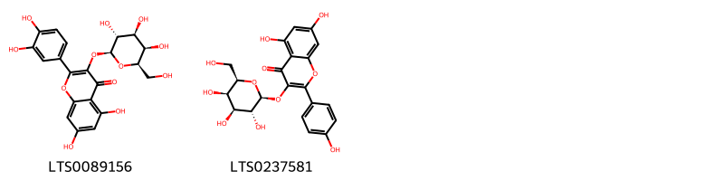
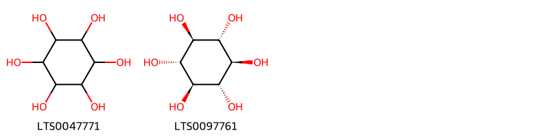
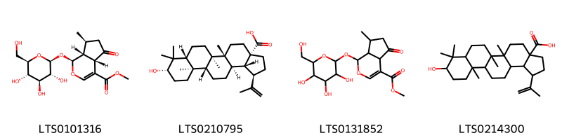
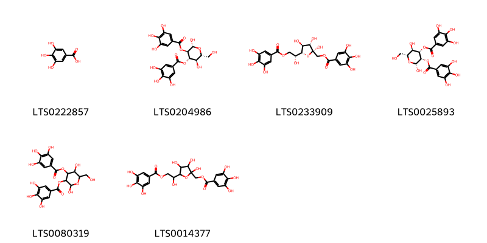
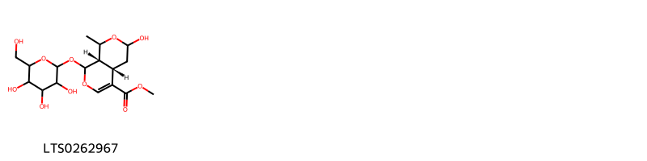
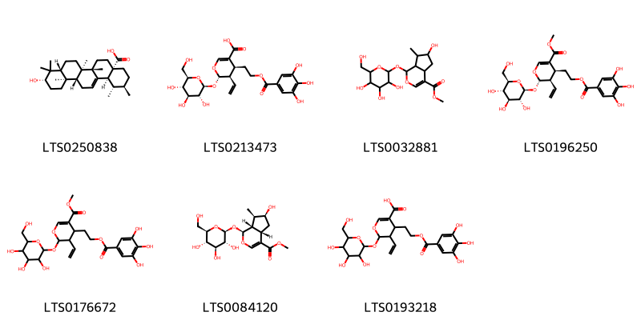
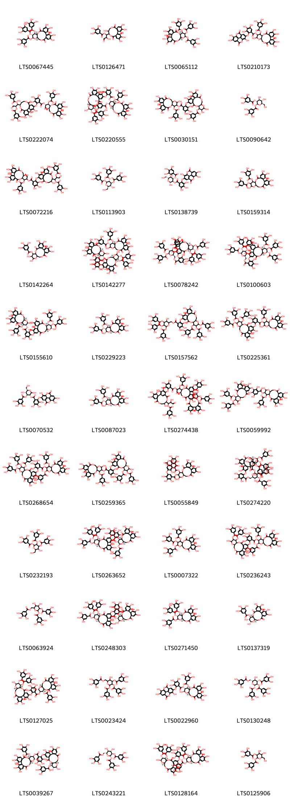

!!! abstract "Tóm tắt"

    Họ Cornaceae gồm khoảng 1 chi và 6 loài được một số cộng đồng tại các quốc gia như Japan*, Elsewhere, Mexico, Canada(Salish), China, US(Amerindian), US sử dụng trong một số trường hợp Chất làm se, Thuốc làm se, Chất làm se, Thuốc chống định kỳ, Thuốc làm se, Thuốc làm se, Thuốc làm se, Thuốc làm se, Thuốc làm se, Thuốc làm se, Thuốc làm se, Thuốc làm se, Thuốc làm se, thuốc làm lợi tiểu, Thuốc làm tan sỏi, Thuốc làm se, Thuốc lợi tiểu, Thuốc làm se, Thuốc làm se, Thuốc làm se, Thuốc làm se, Thuốc làm se, Thuốc làm se.

!!! info "DrDuke"

    James A. Duke sinh năm 1929-2017 là một nhà thực vật học người Mỹ. Đây là một trong những tác giả hàng đầu trong lĩnh vực dược dân tộc học với cuốn *CRC Handbook of Medicinal Herbs* và chính là người xây dựng lên cơ sở dữ liệu về hợp chất tự nhiên và dược dân tộc học tại Bộ nông nghiệp Hoa Kỳ. Các thông tin được đăng tải tại website [Dr. Duke's Phytochemical and Ethnobotanical Databases](https://phytochem.nal.usda.gov/). 
    Trong suốt thập niên 1970, ông lãnh đạo the Plant Taxonomy Laboratory, Plant Genetics and Germplasm Institute of the Agricultural Research Service, U.S. Department of Agriculture.
    Trong tài liệu này, các thông tin về dược dân tộc của các dược liệu được trích dẫn từ tài liệu của James A. Ducke với sự trợ giúp của phần mềm dịch thuật từ tiếng Anh sang tiếng Việt.
   

# Chi Cornus

??? note "Danh sách các dược liệu thuộc chi"
    
	 - *Cornus amomum*
	 - *Cornus excelsa*
	 - *Cornus florida*
	 - *Cornus nuttallii*
	 - *Cornus officinalis*
	 - *Cornus stolonifera*

---
## Cornus excelsa
### Thông tin về thực vật

!!! info "Phân loại thực vật của *Cornus excelsa* từ GIBF:"
    - **Kingdom:** Plantae
    - **Phylum:** Tracheophyta
    - **Order:** Cornales
    - **Family:** Cornaceae
    - **Genus:** Cornus
    - **Species:** *Cornus excelsa*

 

| Label (VI)   | Label (EN)   | Scientific Name   | Descriptions (VI)   | Descriptions (EN)   | Also Known As (VI)   | Also Known As (EN)   |
|:-------------|:-------------|:------------------|:--------------------|:--------------------|:---------------------|:---------------------|
| N/A          | N/A          | Cornus excelsa    | loài thực vật       | species of plant    | ['']                 | ['']                 |

#### Phân bố trên thế giới

**Từ CSDL GIBF** New Zealand, El Salvador, Mexico, Guatemala

#### Phân bố tại Việt Nam

**Từ CSDL GIBF**: Không có ghi nhận ở Việt Nam

---
### Thành phần hóa học
        
- Theo cơ sở dữ liệu lotus: Từ loài *Cornus excelsa* đã phân lập và xác định được Chưa có hoạt chất nào được phân lập. hoạt chất thuộc về các nhóm Không có hoạt chất nào được phân lập. 

Không có hình ảnh nào được tạo ra

---

### Dược dân tộc học

Danh sách các quốc gia có sử dụng *Cornus excelsa* trong điều trị các bệnh. 

| Country   | Disease                  | Bệnh                            |
|:----------|:-------------------------|:--------------------------------|
| Mexico    | Astringent, Tonic, Tonic | Chất làm se, Thuốc bổ, Thuốc bổ |

---

---
## Cornus florida
### Thông tin về thực vật

!!! info "Phân loại thực vật của *Cornus florida* từ GIBF:"
    - **Kingdom:** Plantae
    - **Phylum:** Tracheophyta
    - **Order:** Cornales
    - **Family:** Cornaceae
    - **Genus:** Cornus
    - **Species:** *Cornus florida*

 

| Label (VI)   | Label (EN)   | Scientific Name   | Descriptions (VI)   | Descriptions (EN)   | Also Known As (VI)   | Also Known As (EN)    |
|:-------------|:-------------|:------------------|:--------------------|:--------------------|:---------------------|:----------------------|
| N/A          | N/A          | Cornus florida    | loài thực vật       | species of plant    | ['']                 | ['flowering dogwood'] |

#### Phân bố trên thế giới

**Từ CSDL GIBF** United States of America, Mexico

#### Phân bố tại Việt Nam

**Từ CSDL GIBF**: Không có ghi nhận ở Việt Nam

---
### Thành phần hóa học
        
- Theo cơ sở dữ liệu lotus: Từ loài *Cornus florida* đã phân lập và xác định được 9 hoạt chất thuộc về các nhóm Organooxygen compounds, Prenol lipids, Flavonoids, Fatty Acyls. 

|    | chemicalTaxonomyClassyfireClass   |   smiles_count |
|---:|:----------------------------------|---------------:|
|  0 | Fatty Acyls                       |              1 |
|  1 | Flavonoids                        |              2 |
|  2 | Organooxygen compounds            |              2 |
|  3 | Prenol lipids                     |              4 |

#### Nhóm Fatty Acyls
<figure markdown="span">
    { width=100% }
    <figcaption>Hình ảnh cấu trúc hóa học của 1 hoạt chất thuộc nhóm Fatty Acyls gồm ['2-carboxy-d-arabinitol (LTS0056947)'].</figcaption>
</figure>
#### Nhóm Flavonoids
<figure markdown="span">
    { width=100% }
    <figcaption>Hình ảnh cấu trúc hóa học của 2 hoạt chất thuộc nhóm Flavonoids gồm ['hyperoside (LTS0089156)', 'trifolin (LTS0237581)'].</figcaption>
</figure>
#### Nhóm Organooxygen compounds
<figure markdown="span">
    { width=100% }
    <figcaption>Hình ảnh cấu trúc hóa học của 2 hoạt chất thuộc nhóm Organooxygen compounds gồm ['(-)-inositol (LTS0047771)', 'scyllo-inositol (LTS0097761)'].</figcaption>
</figure>
#### Nhóm Prenol lipids
<figure markdown="span">
    { width=100% }
    <figcaption>Hình ảnh cấu trúc hóa học của 4 hoạt chất thuộc nhóm Prenol lipids gồm ['cornin (LTS0101316)', 'betulinic acid (LTS0210795)', 'methyl 7-methyl-5-oxo-1-{[3,4,5-trihydroxy-6-(hydroxymethyl)oxan-2-yl]oxy}-1h,4ah,6h,7h,7ah-cyclopenta[c]pyran-4-carboxylate (LTS0131852)', '9-hydroxy-5a,5b,8,8,11a-pentamethyl-1-(prop-1-en-2-yl)-hexadecahydrocyclopenta[a]chrysene-3a-carboxylic acid (LTS0214300)'].</figcaption>
</figure>

---

### Dược dân tộc học

Danh sách các quốc gia có sử dụng *Cornus florida* trong điều trị các bệnh. 

| Country        | Disease                                            | Bệnh                                                              |
|:---------------|:---------------------------------------------------|:------------------------------------------------------------------|
| Elsewhere      | Astringent, Tonic, Astringent, Antiperiodic, Tonic | Chất làm se, Thuốc bổ, Chất làm se, Thuốc chống định kỳ, Thuốc bổ |
| US             | Vermifuge                                          | Thuốc diệt sán                                                    |
| US(Amerindian) | Dentifrice, Tonic, Cathartic, Astringent           | Dentifrice, Tonic, Cathartic, Chất làm se                         |

---

---
## Cornus nuttallii
### Thông tin về thực vật

!!! info "Phân loại thực vật của *Cornus nuttallii* từ GIBF:"
    - **Kingdom:** Plantae
    - **Phylum:** Tracheophyta
    - **Order:** Cornales
    - **Family:** Cornaceae
    - **Genus:** Cornus
    - **Species:** *Cornus nuttallii*

 

| Label (VI)   | Label (EN)   | Scientific Name   | Descriptions (VI)   | Descriptions (EN)   | Also Known As (VI)   | Also Known As (EN)                                         |
|:-------------|:-------------|:------------------|:--------------------|:--------------------|:---------------------|:-----------------------------------------------------------|
| N/A          | N/A          | Cornus nuttallii  | loài thực vật       | species of plant    | ['']                 | ['mountain dogwood', 'Pacific dogwood', 'western dogwood'] |

#### Phân bố trên thế giới

**Từ CSDL GIBF** Canada, United States of America

#### Phân bố tại Việt Nam

**Từ CSDL GIBF**: Không có ghi nhận ở Việt Nam

---
### Thành phần hóa học
        
- Theo cơ sở dữ liệu lotus: Từ loài *Cornus nuttallii* đã phân lập và xác định được Chưa có hoạt chất nào được phân lập. hoạt chất thuộc về các nhóm Không có hoạt chất nào được phân lập. 

Không có hình ảnh nào được tạo ra

---

### Dược dân tộc học

Danh sách các quốc gia có sử dụng *Cornus nuttallii* trong điều trị các bệnh. 

| Country        | Disease   | Bệnh               |
|:---------------|:----------|:-------------------|
| Canada(Salish) | Tonic     | (thuộc) trương lực |

---

---
## Cornus officinalis
### Thông tin về thực vật

!!! info "Phân loại thực vật của *Cornus officinalis* từ GIBF:"
    - **Kingdom:** Plantae
    - **Phylum:** Tracheophyta
    - **Order:** Cornales
    - **Family:** Cornaceae
    - **Genus:** Cornus
    - **Species:** *Cornus officinalis*

 

| Label (VI)   | Label (EN)   | Scientific Name    | Descriptions (VI)   | Descriptions (EN)   | Also Known As (VI)   | Also Known As (EN)   |
|:-------------|:-------------|:-------------------|:--------------------|:--------------------|:---------------------|:---------------------|
| N/A          | N/A          | Cornus officinalis |                     | species of plant    | ['']                 | ['']                 |

#### Phân bố trên thế giới

**Từ CSDL GIBF** nan, Japan, Sweden, Poland, Russian Federation, Canada, United States of America, Italy, China, Belgium, Korea, Republic of

#### Phân bố tại Việt Nam

**Từ CSDL GIBF**: Không có ghi nhận ở Việt Nam

---
### Thành phần hóa học
        
- Theo cơ sở dữ liệu lotus: Từ loài *Cornus officinalis* đã phân lập và xác định được 61 hoạt chất thuộc về các nhóm Organooxygen compounds, Indoles and derivatives, Flavonoids, Tannins, Prenol lipids, Benzene and substituted derivatives. 

|    | chemicalTaxonomyClassyfireClass     |   smiles_count |
|---:|:------------------------------------|---------------:|
|  0 | Benzene and substituted derivatives |              6 |
|  1 | Flavonoids                          |              2 |
|  2 | Indoles and derivatives             |              1 |
|  3 | Organooxygen compounds              |              1 |
|  4 | Prenol lipids                       |              7 |
|  5 | Tannins                             |             44 |

#### Nhóm Benzene and substituted derivatives
<figure markdown="span">
    { width=100% }
    <figcaption>Hình ảnh cấu trúc hóa học của 6 hoạt chất thuộc nhóm Benzene and substituted derivatives gồm ['galop (LTS0222857)', '(2r,3r,4s,5r,6r)-2,5-dihydroxy-6-(hydroxymethyl)-4-(3,4,5-trihydroxybenzoyloxy)oxan-3-yl 3,4,5-trihydroxybenzoate (LTS0204986)', '[(2r,3s,4s,5r)-2,3,4-trihydroxy-5-[(1r)-1-hydroxy-2-(3,4,5-trihydroxybenzoyloxy)ethyl]oxolan-2-yl]methyl 3,4,5-trihydroxybenzoate (LTS0233909)', '(2r,3s,4s,5r,6r)-2,5-dihydroxy-6-(hydroxymethyl)-3-(3,4,5-trihydroxybenzoyloxy)oxan-4-yl 3,4,5-trihydroxybenzoate (LTS0025893)', '2,5-dihydroxy-6-(hydroxymethyl)-3-(3,4,5-trihydroxybenzoyloxy)oxan-4-yl 3,4,5-trihydroxybenzoate (LTS0080319)', '{2,3,4-trihydroxy-5-[1-hydroxy-2-(3,4,5-trihydroxybenzoyloxy)ethyl]oxolan-2-yl}methyl 3,4,5-trihydroxybenzoate (LTS0014377)'].</figcaption>
</figure>
#### Nhóm Flavonoids
<figure markdown="span">
    { width=100% }
    <figcaption>Hình ảnh cấu trúc hóa học của 2 hoạt chất thuộc nhóm Flavonoids gồm ['quercetin (LTS0004651)', 'kaempherol (LTS0155822)'].</figcaption>
</figure>
#### Nhóm Indoles and derivatives
<figure markdown="span">
    { width=100% }
    <figcaption>Hình ảnh cấu trúc hóa học của 1 hoạt chất thuộc nhóm Indoles and derivatives gồm ['n-[2-(5-methoxy-1h-indol-3-yl)ethyl]ethanimidic acid (LTS0219322)'].</figcaption>
</figure>
#### Nhóm Organooxygen compounds
<figure markdown="span">
    { width=100% }
    <figcaption>Hình ảnh cấu trúc hóa học của 1 hoạt chất thuộc nhóm Organooxygen compounds gồm ['methyl (4as,8as)-6-hydroxy-8-methyl-1-{[3,4,5-trihydroxy-6-(hydroxymethyl)oxan-2-yl]oxy}-1h,4ah,5h,6h,8h,8ah-pyrano[3,4-c]pyran-4-carboxylate (LTS0262967)'].</figcaption>
</figure>
#### Nhóm Prenol lipids
<figure markdown="span">
    { width=100% }
    <figcaption>Hình ảnh cấu trúc hóa học của 7 hoạt chất thuộc nhóm Prenol lipids gồm ['ursolic acid (LTS0250838)', '(4s,5r,6s)-5-ethenyl-6-{[(2s,3r,4s,5s,6r)-3,4,5-trihydroxy-6-(hydroxymethyl)oxan-2-yl]oxy}-4-[2-(3,4,5-trihydroxybenzoyloxy)ethyl]-5,6-dihydro-4h-pyran-3-carboxylic acid (LTS0213473)', 'methyl 6-hydroxy-7-methyl-1-{[3,4,5-trihydroxy-6-(hydroxymethyl)oxan-2-yl]oxy}-1h,4ah,5h,6h,7h,7ah-cyclopenta[c]pyran-4-carboxylate (LTS0032881)', 'methyl (4s,5r,6s)-5-ethenyl-6-{[(2s,3r,4s,5s,6r)-3,4,5-trihydroxy-6-(hydroxymethyl)oxan-2-yl]oxy}-4-[2-(3,4,5-trihydroxybenzoyloxy)ethyl]-5,6-dihydro-4h-pyran-3-carboxylate (LTS0196250)', 'methyl 5-ethenyl-6-{[3,4,5-trihydroxy-6-(hydroxymethyl)oxan-2-yl]oxy}-4-[2-(3,4,5-trihydroxybenzoyloxy)ethyl]-5,6-dihydro-4h-pyran-3-carboxylate (LTS0176672)', 'loganin (LTS0084120)', '5-ethenyl-6-{[3,4,5-trihydroxy-6-(hydroxymethyl)oxan-2-yl]oxy}-4-[2-(3,4,5-trihydroxybenzoyloxy)ethyl]-5,6-dihydro-4h-pyran-3-carboxylic acid (LTS0193218)'].</figcaption>
</figure>
#### Nhóm Tannins
<figure markdown="span">
    { width=100% }
    <figcaption>Hình ảnh cấu trúc hóa học của 44 hoạt chất thuộc nhóm Tannins gồm ['(10r,11s,12r,13s,15r)-3,4,5,21,22,23-hexahydroxy-8,18-dioxo-12,13-bis(3,4,5-trihydroxybenzoyloxy)-9,14,17-trioxatetracyclo[17.4.0.0²,⁷.0¹⁰,¹⁵]tricosa-1(23),2(7),3,5,19,21-hexaen-11-yl 3,4,5-trihydroxybenzoate (LTS0067445)', '1-{3,4,5,11,17,18,19-heptahydroxy-8,14-dioxo-9,13-dioxatricyclo[13.4.0.0²,⁷]nonadeca-1(15),2,4,6,16,18-hexaen-10-yl}-2-hydroxy-3-oxopropyl 3,4,5-trihydroxybenzoate (LTS0126471)', '(1s,8r,13r)-1,18,19,23,23-pentahydroxy-2,5,15-trioxo-11,12-bis(3,4,5-trihydroxybenzoyloxy)-6,9,14,24-tetraoxapentacyclo[18.3.1.0⁴,²².0⁸,¹³.0¹⁶,²¹]tetracosa-3,16,18,20-tetraen-10-yl 3,4,5-trihydroxybenzoate (LTS0065112)', '3,4,5,13,21,22,23-heptahydroxy-8,18-dioxo-11-(3,4,5-trihydroxybenzoyloxy)-9,14,17-trioxatetracyclo[17.4.0.0²,⁷.0¹⁰,¹⁵]tricosa-1(23),2(7),3,5,19,21-hexaen-12-yl 3,4,5-trihydroxy-2-({7,13,14-trihydroxy-3,10-dioxo-2,9-dioxatetracyclo[6.6.2.0⁴,¹⁶.0¹¹,¹⁵]hexadeca-1(15),4(16),5,7,11,13-hexaen-6-yl}oxy)benzoate (LTS0210173)', '(1s,2r)-1-[(10r,11r)-3,4,5,11,17,18,19-heptahydroxy-8,14-dioxo-9,13-dioxatricyclo[13.4.0.0²,⁷]nonadeca-1(15),2,4,6,16,18-hexaen-10-yl]-3-oxo-1-(3,4,5-trihydroxybenzoyloxy)propan-2-yl 2-{[(11r,12r)-3,4,11,17,18,19-hexahydroxy-8,14-dioxo-12-[(1s,2r)-3-oxo-1,2-bis(3,4,5-trihydroxybenzoyloxy)propyl]-9,13-dioxatricyclo[13.4.0.0²,⁷]nonadeca-1(19),2(7),3,5,15,17-hexaen-5-yl]oxy}-3,4,5-trihydroxybenzoate (LTS0222074)', '(11r,12r,13r,14r,16r)-3,4,5,23,24,25-hexahydroxy-8,20-dioxo-12,14-bis(3,4,5-trihydroxybenzoyloxy)-9,10,15,18,19-pentaoxatetracyclo[19.4.0.0²,⁷.0¹¹,¹⁶]pentacosa-1(25),2(7),3,5,21,23-hexaen-13-yl 2-{[(11r,12s,13s,14s,16r)-3,4,14,23,24,25-hexahydroxy-8,20-dioxo-12,13-bis(3,4,5-trihydroxybenzoyloxy)-9,10,15,18,19-pentaoxatetracyclo[19.4.0.0²,⁷.0¹¹,¹⁶]pentacosa-1(25),2(7),3,5,21,23-hexaen-5-yl]oxy}-3,4,5-trihydroxybenzoate (LTS0220555)', '3,4,5,13,21,22,23-heptahydroxy-8,18-dioxo-11-(3,4,5-trihydroxybenzoyloxy)-9,14,17-trioxatetracyclo[17.4.0.0²,⁷.0¹⁰,¹⁵]tricosa-1(23),2(7),3,5,19,21-hexaen-12-yl 2-{[3,4,12,13,21,22,23-heptahydroxy-8,18-dioxo-11-(3,4,5-trihydroxybenzoyloxy)-9,14,17-trioxatetracyclo[17.4.0.0²,⁷.0¹⁰,¹⁵]tricosa-1(23),2(7),3,5,19,21-hexaen-5-yl]oxy}-3,4,5-trihydroxybenzoate (LTS0030151)', '(2s,3r,4s,5s,6r)-4,5-dihydroxy-6-(hydroxymethyl)-2-(3,4,5-trihydroxybenzoyloxy)oxan-3-yl 3,4,5-trihydroxybenzoate (LTS0090642)', '1-{3,4,5,11,17,18,19-heptahydroxy-8,14-dioxo-9,13-dioxatricyclo[13.4.0.0²,⁷]nonadeca-1(15),2,4,6,16,18-hexaen-10-yl}-3-oxo-1-(3,4,5-trihydroxybenzoyloxy)propan-2-yl 2-({3,4,11,17,18,19-hexahydroxy-8,14-dioxo-12-[3-oxo-1,2-bis(3,4,5-trihydroxybenzoyloxy)propyl]-9,13-dioxatricyclo[13.4.0.0²,⁷]nonadeca-1(15),2(7),3,5,16,18-hexaen-5-yl}oxy)-3,4,5-trihydroxybenzoate (LTS0072216)', '(2r,3r,4s,5r,6s)-3-hydroxy-2-(hydroxymethyl)-5,6-bis(3,4,5-trihydroxybenzoyloxy)oxan-4-yl 3,4,5-trihydroxybenzoate (LTS0113903)', '(2r,3r,4s,5r,6r)-2,5-dihydroxy-6-(hydroxymethyl)-4-(3,4,5-trihydroxybenzoyloxy)oxan-3-yl 3,4,5-trihydroxy-2-({7,13,14-trihydroxy-3,10-dioxo-2,9-dioxatetracyclo[6.6.2.0⁴,¹⁶.0¹¹,¹⁵]hexadeca-1(15),4(16),5,7,11,13-hexaen-6-yl}oxy)benzoate (LTS0138739)', '3,4,5,13,21,22,23-heptahydroxy-8,18-dioxo-12-(3,4,5-trihydroxybenzoyloxy)-9,14,17-trioxatetracyclo[17.4.0.0²,⁷.0¹⁰,¹⁵]tricosa-1(23),2(7),3,5,19,21-hexaen-11-yl 3,4,5-trihydroxybenzoate (LTS0159314)', '3,4,5,12,13,21,22,23-octahydroxy-8,18-dioxo-9,14,17-trioxatetracyclo[17.4.0.0²,⁷.0¹⁰,¹⁵]tricosa-1(23),2(7),3,5,19,21-hexaen-11-yl 3,4,5-trihydroxybenzoate (LTS0142264)', '(10r,11s,12r,15r)-3,4,5,13,21,22,23-heptahydroxy-8,18-dioxo-11-(3,4,5-trihydroxybenzoyloxy)-9,14,17-trioxatetracyclo[17.4.0.0²,⁷.0¹⁰,¹⁵]tricosa-1(23),2(7),3,5,19,21-hexaen-12-yl 2-{[(10r,11s,12r,15r)-12-(3-{[(10r,11s,12r)-3,4,5,13,22,23-hexahydroxy-8,18-dioxo-11,12-bis(3,4,5-trihydroxybenzoyloxy)-9,14,17-trioxatetracyclo[17.4.0.0²,⁷.0¹⁰,¹⁵]tricosa-1(23),2(7),3,5,19,21-hexaen-21-yl]oxy}-4,5-dihydroxybenzoyloxy)-3,4,5,13,22,23-hexahydroxy-8,18-dioxo-11-(3,4,5-trihydroxybenzoyloxy)-9,14,17-trioxatetracyclo[17.4.0.0²,⁷.0¹⁰,¹⁵]tricosa-1(23),2(7),3,5,19,21-hexaen-21-yl]oxy}-3,4,5-trihydroxybenzoate (LTS0142277)', '[(2r,3r,4s,5r,6s)-3-hydroxy-4,5,6-tris(3,4,5-trihydroxybenzoyloxy)oxan-2-yl]methyl 3,4,5-trihydroxy-2-{[(10r,11s,12r,13s,15r)-3,4,21,22,23-pentahydroxy-8,18-dioxo-11,12,13-tris(3,4,5-trihydroxybenzoyloxy)-9,14,17-trioxatetracyclo[17.4.0.0²,⁷.0¹⁰,¹⁵]tricosa-1(19),2(7),3,5,20,22-hexaen-5-yl]oxy}benzoate (LTS0078242)', '[(2r,3r,4s,5r,6s)-3-hydroxy-4,5,6-tris(3,4,5-trihydroxybenzoyloxy)oxan-2-yl]methyl 3,4,5-trihydroxy-2-{[(10r,11s,12r,13s,15r)-3,4,5,22,23-pentahydroxy-8,18-dioxo-11,12,13-tris(3,4,5-trihydroxybenzoyloxy)-9,14,17-trioxatetracyclo[17.4.0.0²,⁷.0¹⁰,¹⁵]tricosa-1(19),2(7),3,5,20,22-hexaen-21-yl]oxy}benzoate (LTS0100603)', '(10r,11s,12r,13r,15r)-3,4,5,13,21,22,23-heptahydroxy-8,18-dioxo-11-(3,4,5-trihydroxybenzoyloxy)-9,14,17-trioxatetracyclo[17.4.0.0²,⁷.0¹⁰,¹⁵]tricosa-1(23),2(7),3,5,19,21-hexaen-12-yl 3-{[(10r,11s,12r,13r,15r)-3,4,5,13,22,23-hexahydroxy-8,18-dioxo-11,12-bis(3,4,5-trihydroxybenzoyloxy)-9,14,17-trioxatetracyclo[17.4.0.0²,⁷.0¹⁰,¹⁵]tricosa-1(19),2(7),3,5,20,22-hexaen-21-yl]oxy}-2,4,5-trihydroxybenzoate (LTS0155610)', '(10r,11s,12r,13r,15r)-3,4,5,13,21,22,23-heptahydroxy-8,18-dioxo-11-(3,4,5-trihydroxybenzoyloxy)-9,14,17-trioxatetracyclo[17.4.0.0²,⁷.0¹⁰,¹⁵]tricosa-1(23),2(7),3,5,19,21-hexaen-12-yl 3,4,5-trihydroxybenzoate (LTS0229223)', '[3-hydroxy-4,5,6-tris(3,4,5-trihydroxybenzoyloxy)oxan-2-yl]methyl 3,4,5-trihydroxy-2-{[3,4,21,22,23-pentahydroxy-8,18-dioxo-11,12,13-tris(3,4,5-trihydroxybenzoyloxy)-9,14,17-trioxatetracyclo[17.4.0.0²,⁷.0¹⁰,¹⁵]tricosa-1(19),2(7),3,5,20,22-hexaen-5-yl]oxy}benzoate (LTS0157562)', '3,4,5,13,21,22,23-heptahydroxy-8,18-dioxo-11-(3,4,5-trihydroxybenzoyloxy)-9,14,17-trioxatetracyclo[17.4.0.0²,⁷.0¹⁰,¹⁵]tricosa-1(23),2(7),3,5,19,21-hexaen-12-yl 3,4,5-trihydroxy-2-{[3,4,21,22,23-pentahydroxy-8,18-dioxo-11,12,13-tris(3,4,5-trihydroxybenzoyloxy)-9,14,17-trioxatetracyclo[17.4.0.0²,⁷.0¹⁰,¹⁵]tricosa-1(23),2(7),3,5,19,21-hexaen-5-yl]oxy}benzoate (LTS0225361)', '(3r,4s,5r,6r)-2,5-dihydroxy-6-(hydroxymethyl)-4-(3,4,5-trihydroxybenzoyloxy)oxan-3-yl 3,4,5-trihydroxy-2-({7,13,14-trihydroxy-3,10-dioxo-2,9-dioxatetracyclo[6.6.2.0⁴,¹⁶.0¹¹,¹⁵]hexadeca-1(15),4(16),5,7,11,13-hexaen-6-yl}oxy)benzoate (LTS0070532)', '(10r,11s,12r,15r)-3,4,5,13,21,22,23-heptahydroxy-8,18-dioxo-11-(3,4,5-trihydroxybenzoyloxy)-9,14,17-trioxatetracyclo[17.4.0.0²,⁷.0¹⁰,¹⁵]tricosa-1(23),2(7),3,5,19,21-hexaen-12-yl 3,4,5-trihydroxybenzoate (LTS0087023)', '1-[5-(6-{[(1-{3,4,5,11,17,18,19-heptahydroxy-8,14-dioxo-9,13-dioxatricyclo[13.4.0.0²,⁷]nonadeca-1(15),2,4,6,16,18-hexaen-10-yl}-3-oxo-1-(3,4,5-trihydroxybenzoyloxy)propan-2-yl)oxy]carbonyl}-2,3,4-trihydroxyphenoxy)-3,4,11,17,18,19-hexahydroxy-8,14-dioxo-9,13-dioxatricyclo[13.4.0.0²,⁷]nonadeca-1(15),2,4,6,16,18-hexaen-10-yl]-3-oxo-1-(3,4,5-trihydroxybenzoyloxy)propan-2-yl 2-({3,4,5,11,17,18-hexahydroxy-12-[2-hydroxy-3-oxo-1-(3,4,5-trihydroxybenzoyloxy)propyl]-8,14-dioxo-9,13-dioxatricyclo[13.3.1.0²,⁷]nonadeca-1(18),2(7),3,5,15(19),16-hexaen-16-yl}oxy)-3,4,5-trihydroxybenzoate (LTS0274438)', '3,4,5,13,21,22,23-heptahydroxy-8,18-dioxo-11-(3,4,5-trihydroxybenzoyloxy)-9,14,17-trioxatetracyclo[17.4.0.0²,⁷.0¹⁰,¹⁵]tricosa-1(23),2(7),3,5,19,21-hexaen-12-yl 3-{[3,4,5,13,22,23-hexahydroxy-8,18-dioxo-11,12-bis(3,4,5-trihydroxybenzoyloxy)-9,14,17-trioxatetracyclo[17.4.0.0²,⁷.0¹⁰,¹⁵]tricosa-1(23),2(7),3,5,19,21-hexaen-21-yl]oxy}-2,4,5-trihydroxybenzoate (LTS0059992)', '3,4,5,21,22,23-hexahydroxy-8,18-dioxo-11,13-bis(3,4,5-trihydroxybenzoyloxy)-9,14,17-trioxatetracyclo[17.4.0.0²,⁷.0¹⁰,¹⁵]tricosa-1(23),2(7),3,5,19,21-hexaen-12-yl 3,4,5-trihydroxy-2-{[3,4,21,22,23-pentahydroxy-8,18-dioxo-11,12,13-tris(3,4,5-trihydroxybenzoyloxy)-9,14,17-trioxatetracyclo[17.4.0.0²,⁷.0¹⁰,¹⁵]tricosa-1(23),2(7),3,5,19,21-hexaen-5-yl]oxy}benzoate (LTS0268654)', '3,4,5,13,21,22,23-heptahydroxy-8,18-dioxo-11-(3,4,5-trihydroxybenzoyloxy)-9,14,17-trioxatetracyclo[17.4.0.0²,⁷.0¹⁰,¹⁵]tricosa-1(23),2(7),3,5,19,21-hexaen-12-yl 2-{[3,4,13,21,22,23-hexahydroxy-8,18-dioxo-11,12-bis(3,4,5-trihydroxybenzoyloxy)-9,14,17-trioxatetracyclo[17.4.0.0²,⁷.0¹⁰,¹⁵]tricosa-1(23),2(7),3,5,19,21-hexaen-5-yl]oxy}-3,4,5-trihydroxybenzoate (LTS0259365)', '3,4,5,13,21,22,23-heptahydroxy-8,18-dioxo-11-(3,4,5-trihydroxybenzoyloxy)-9,14,17-trioxatetracyclo[17.4.0.0²,⁷.0¹⁰,¹⁵]tricosa-1(23),2(7),3,5,19,21-hexaen-12-yl 2,3,4-trihydroxy-5-({7,13,14-trihydroxy-3,10-dioxo-2,9-dioxatetracyclo[6.6.2.0⁴,¹⁶.0¹¹,¹⁵]hexadeca-1(15),4(16),5,7,11,13-hexaen-6-yl}oxy)benzoate (LTS0055849)', '[(2r,3r,4s,5r,6s)-3-hydroxy-4,5,6-tris(3,4,5-trihydroxybenzoyloxy)oxan-2-yl]methyl 2,3,4-trihydroxy-6-{[(10r,11s,12r,13s,15r)-3,4,21,22,23-pentahydroxy-8,18-dioxo-11,12,13-tris(3,4,5-trihydroxybenzoyloxy)-9,14,17-trioxatetracyclo[17.4.0.0²,⁷.0¹⁰,¹⁵]tricosa-1(19),2(7),3,5,20,22-hexaen-5-yl]oxy}benzoate (LTS0274220)', '3-hydroxy-2-(hydroxymethyl)-5,6-bis(3,4,5-trihydroxybenzoyloxy)oxan-4-yl 3,4,5-trihydroxybenzoate (LTS0232193)', '(10r,11s,12r,13s,15r)-3,4,5,21,22,23-hexahydroxy-8,18-dioxo-11,13-bis(3,4,5-trihydroxybenzoyloxy)-9,14,17-trioxatetracyclo[17.4.0.0²,⁷.0¹⁰,¹⁵]tricosa-1(23),2(7),3,5,19,21-hexaen-12-yl 3,4,5-trihydroxy-2-{[(10r,11s,12r,13s,15r)-3,4,21,22,23-pentahydroxy-8,18-dioxo-11,12,13-tris(3,4,5-trihydroxybenzoyloxy)-9,14,17-trioxatetracyclo[17.4.0.0²,⁷.0¹⁰,¹⁵]tricosa-1(23),2(7),3,5,19,21-hexaen-5-yl]oxy}benzoate (LTS0263652)', '3,4,5,21,22,23-hexahydroxy-8,18-dioxo-12,13-bis(3,4,5-trihydroxybenzoyloxy)-9,14,17-trioxatetracyclo[17.4.0.0²,⁷.0¹⁰,¹⁵]tricosa-1(23),2(7),3,5,19,21-hexaen-11-yl 3,4,5-trihydroxybenzoate (LTS0007322)', '3,4,5,21,22,23-hexahydroxy-8,18-dioxo-11,13-bis(3,4,5-trihydroxybenzoyloxy)-9,14,17-trioxatetracyclo[17.4.0.0²,⁷.0¹⁰,¹⁵]tricosa-1(23),2(7),3,5,19,21-hexaen-12-yl 2-{[3,4,13,21,22,23-hexahydroxy-8,18-dioxo-11,12-bis(3,4,5-trihydroxybenzoyloxy)-9,14,17-trioxatetracyclo[17.4.0.0²,⁷.0¹⁰,¹⁵]tricosa-1(19),2(7),3,5,20,22-hexaen-5-yl]oxy}-3,4,5-trihydroxybenzoate (LTS0236243)', '4,5-dihydroxy-3-(3,4,5-trihydroxybenzoyloxy)-6-[(3,4,5-trihydroxybenzoyloxy)methyl]oxan-2-yl 3,4,5-trihydroxybenzoate (LTS0063924)', '(10r,11s,12r,13r,15r)-3,4,5,13,21,22,23-heptahydroxy-8,18-dioxo-11-(3,4,5-trihydroxybenzoyloxy)-9,14,17-trioxatetracyclo[17.4.0.0²,⁷.0¹⁰,¹⁵]tricosa-1(19),2,4,6,20,22-hexaen-12-yl 3,4,5-trihydroxy-2-{[(10r,11s,12r,13s,15r)-3,4,21,22,23-pentahydroxy-8,18-dioxo-11,12,13-tris(3,4,5-trihydroxybenzoyloxy)-9,14,17-trioxatetracyclo[17.4.0.0²,⁷.0¹⁰,¹⁵]tricosa-1(23),2(7),3,5,19,21-hexaen-5-yl]oxy}benzoate (LTS0248303)', '(10r,11s,12r,15r)-3,4,5,21,22,23-hexahydroxy-8,18-dioxo-12,13-bis(3,4,5-trihydroxybenzoyloxy)-9,14,17-trioxatetracyclo[17.4.0.0²,⁷.0¹⁰,¹⁵]tricosa-1(23),2(7),3,5,19,21-hexaen-11-yl 3,4,5-trihydroxybenzoate (LTS0271450)', '(10r,11r,12r,13s,15r)-3,4,5,12,13,21,22,23-octahydroxy-8,18-dioxo-9,14,17-trioxatetracyclo[17.4.0.0²,⁷.0¹⁰,¹⁵]tricosa-1(23),2(7),3,5,19,21-hexaen-11-yl 3,4,5-trihydroxybenzoate (LTS0137319)', '(10r,11s,12r,13r,15r)-3,4,5,13,21,22,23-heptahydroxy-8,18-dioxo-11-(3,4,5-trihydroxybenzoyloxy)-9,14,17-trioxatetracyclo[17.4.0.0²,⁷.0¹⁰,¹⁵]tricosa-1(23),2(7),3,5,19,21-hexaen-12-yl 2-{[(10r,11s,12r,13r,15r)-3,4,13,21,22,23-hexahydroxy-8,18-dioxo-11,12-bis(3,4,5-trihydroxybenzoyloxy)-9,14,17-trioxatetracyclo[17.4.0.0²,⁷.0¹⁰,¹⁵]tricosa-1(19),2(7),3,5,20,22-hexaen-5-yl]oxy}-3,4,5-trihydroxybenzoate (LTS0127025)', '5-hydroxy-3,4-bis(3,4,5-trihydroxybenzoyloxy)-6-[(3,4,5-trihydroxybenzoyloxy)methyl]oxan-2-yl 3,4,5-trihydroxybenzoate (LTS0023424)', '(10r,11s,12r,13r,15r)-3,4,5,13,21,22,23-heptahydroxy-8,18-dioxo-11-(3,4,5-trihydroxybenzoyloxy)-9,14,17-trioxatetracyclo[17.4.0.0²,⁷.0¹⁰,¹⁵]tricosa-1(23),2(7),3,5,19,21-hexaen-12-yl 3,4,5-trihydroxy-2-({7,13,14-trihydroxy-3,10-dioxo-2,9-dioxatetracyclo[6.6.2.0⁴,¹⁶.0¹¹,¹⁵]hexadeca-1(15),4(16),5,7,11,13-hexaen-6-yl}oxy)benzoate (LTS0022960)', '(2s,3r,4s,5r,6r)-5-hydroxy-3,4-bis(3,4,5-trihydroxybenzoyloxy)-6-[(3,4,5-trihydroxybenzoyloxy)methyl]oxan-2-yl 3,4,5-trihydroxybenzoate (LTS0130248)', '(10r,11s,12r,13r,15r)-3,4,5,13,21,22,23-heptahydroxy-8,18-dioxo-11-(3,4,5-trihydroxybenzoyloxy)-9,14,17-trioxatetracyclo[17.4.0.0²,⁷.0¹⁰,¹⁵]tricosa-1(23),2(7),3,5,19,21-hexaen-12-yl 2-{[(10r,11r,12r,13r,15r)-3,4,12,13,21,22,23-heptahydroxy-8,18-dioxo-11-(3,4,5-trihydroxybenzoyloxy)-9,14,17-trioxatetracyclo[17.4.0.0²,⁷.0¹⁰,¹⁵]tricosa-1(19),2(7),3,5,20,22-hexaen-5-yl]oxy}-3,4,5-trihydroxybenzoate (LTS0039267)', '(2s,3r,4s,5s,6r)-4,5-dihydroxy-3-(3,4,5-trihydroxybenzoyloxy)-6-[(3,4,5-trihydroxybenzoyloxy)methyl]oxan-2-yl 3,4,5-trihydroxybenzoate (LTS0243221)', '(10r,11s,12r,13s,15r)-3,4,5,21,22,23-hexahydroxy-8,18-dioxo-11,13-bis(3,4,5-trihydroxybenzoyloxy)-9,14,17-trioxatetracyclo[17.4.0.0²,⁷.0¹⁰,¹⁵]tricosa-1(23),2(7),3,5,19,21-hexaen-12-yl 2-{[(10r,11s,12r,13r,15r)-3,4,13,21,22,23-hexahydroxy-8,18-dioxo-11,12-bis(3,4,5-trihydroxybenzoyloxy)-9,14,17-trioxatetracyclo[17.4.0.0²,⁷.0¹⁰,¹⁵]tricosa-1(19),2(7),3,5,20,22-hexaen-5-yl]oxy}-3,4,5-trihydroxybenzoate (LTS0128164)', '4,5-dihydroxy-6-(hydroxymethyl)-2-(3,4,5-trihydroxybenzoyloxy)oxan-3-yl 3,4,5-trihydroxybenzoate (LTS0125906)'].</figcaption>
</figure>

---

### Dược dân tộc học

Danh sách các quốc gia có sử dụng *Cornus officinalis* trong điều trị các bệnh. 

| Country   | Disease                                                           | Bệnh                                                               |
|:----------|:------------------------------------------------------------------|:-------------------------------------------------------------------|
| China     | Astringent, nan, Diuretic, Litholytic, Vermifuge, Diuretic, Tonic | Chất làm se, nan, lợi tiểu, tán sỏi, Vermifuge, lợi tiểu, thuốc bổ |
| Elsewhere | nan                                                               | Ở đây                                                              |
| Japan*    | Astringent, Tonic, Hemostatic                                     | Làm se, bổ, cầm máu                                                |

---

---
## Cornus stolonifera
### Thông tin về thực vật

!!! info "Phân loại thực vật của *Cornus sericea* từ GIBF:"
    - **Kingdom:** Plantae
    - **Phylum:** Tracheophyta
    - **Order:** Cornales
    - **Family:** Cornaceae
    - **Genus:** Cornus
    - **Species:** *Cornus sericea*

 

| Label (VI)   | Label (EN)   | Scientific Name    | Descriptions (VI)   | Descriptions (EN)   | Also Known As (VI)   | Also Known As (EN)   |
|:-------------|:-------------|:-------------------|:--------------------|:--------------------|:---------------------|:---------------------|
| N/A          | N/A          | Cornus stolonifera | loài thực vật       | species of plant    | ['']                 | ['']                 |

#### Phân bố trên thế giới

**Từ CSDL GIBF** Poland, New Zealand, Germany, Canada, United States of America, Mexico, Belgium, Korea, Republic of

#### Phân bố tại Việt Nam

**Từ CSDL GIBF**: Không có ghi nhận ở Việt Nam

---
### Thành phần hóa học
        
- Theo cơ sở dữ liệu lotus: Từ loài *Cornus sericea* đã phân lập và xác định được Chưa có hoạt chất nào được phân lập. hoạt chất thuộc về các nhóm Không có hoạt chất nào được phân lập. 

Không có hình ảnh nào được tạo ra

---

### Dược dân tộc học

Danh sách các quốc gia có sử dụng *Cornus sericea* trong điều trị các bệnh. 

| Country        | Disease   | Bệnh   |
|:---------------|:----------|:-------|
| Canada(Salish) | Emetic    | Phôi   |

---

