!!! abstract "Tóm tắt"

    Họ Cucurbitaceae gồm khoảng 29 chi và 73 loài được một số cộng đồng tại các quốc gia như Trinidad, Japan*, Brazil, Asia, French, Indochina, Japan, China, Java, Malaya (Import), Turkey, US(Salish), Ghana, German, Canada(Salish), Perak, Kelantan, Dominican Republic, Africa, Yucatan, Europe, India(Santal), Lesotho, Sanscrit, Latin America, Mexico, West Indies, Iran, Haiti, Philippines, Hawaii, Iraq, Panama, Egypt, Salvador, Sudan, Kurdistan, ain, US(Tewa), Venezuela, Africa(Suto), Elsewhere, Paraguay, Bahamas, US(Amerindian), Malaya, India, US, Samoa sử dụng trong một số trường hợp QUERY LENGTH LIMIT EXCEEDED. MAX ALLOWED QUERY : 500 CHARS QUERY LENGTH LIMIT EXCEEDED. MAX ALLOWED QUERY : 500 CHARS QUERY LENGTH LIMIT EXCEEDED. MAX ALLOWED QUERY : 500 CHARS.

!!! info "DrDuke"

    James A. Duke sinh năm 1929-2017 là một nhà thực vật học người Mỹ. Đây là một trong những tác giả hàng đầu trong lĩnh vực dược dân tộc học với cuốn *CRC Handbook of Medicinal Herbs* và chính là người xây dựng lên cơ sở dữ liệu về hợp chất tự nhiên và dược dân tộc học tại Bộ nông nghiệp Hoa Kỳ. Các thông tin được đăng tải tại website [Dr. Duke's Phytochemical and Ethnobotanical Databases](https://phytochem.nal.usda.gov/). 
    Trong suốt thập niên 1970, ông lãnh đạo the Plant Taxonomy Laboratory, Plant Genetics and Germplasm Institute of the Agricultural Research Service, U.S. Department of Agriculture.
    Trong tài liệu này, các thông tin về dược dân tộc của các dược liệu được trích dẫn từ tài liệu của James A. Ducke với sự trợ giúp của phần mềm dịch thuật từ tiếng Anh sang tiếng Việt.
   

# Chi Luffa

??? note "Danh sách các dược liệu thuộc chi"
    
	 - *Luffa acutangula*
	 - *Luffa aegyptiaca*
	 - *Luffa cylindrica*
	 - *Luffa echinata*
	 - *Luffa operculata*

---
## Luffa acutangula
### Thông tin về thực vật

!!! info "Phân loại thực vật của *Luffa acutangula* từ GIBF:"
    - **Kingdom:** Plantae
    - **Phylum:** Tracheophyta
    - **Order:** Cucurbitales
    - **Family:** Cucurbitaceae
    - **Genus:** Luffa
    - **Species:** *Luffa acutangula*

 

| Label (VI)   | Label (EN)   | Scientific Name   | Descriptions (VI)   | Descriptions (EN)   | Also Known As (VI)   | Also Known As (EN)   |
|:-------------|:-------------|:------------------|:--------------------|:--------------------|:---------------------|:---------------------|
| N/A          | N/A          | Luffa acutangula  | loài thực vật       | species of plant    | ['']                 | ['']                 |

#### Phân bố trên thế giới

**Từ CSDL GIBF** nan, Brazil, Viet Nam, Japan, Senegal, Central African Republic, Guadeloupe, Sweden, Nepal, China, Tanzania, United Republic of, French Polynesia, Yemen, Trinidad and Tobago, Papua New Guinea, Thailand, Madagascar, Guinea, Ghana, Sri Lanka, Puerto Rico, Réunion, United States of America, Jamaica, Greece, Indonesia, Pakistan, Costa Rica, Dominican Republic, Nigeria, Cuba, Burkina Faso, unknown or invalid, Aruba, Equatorial Guinea, Fiji, Mexico, Benin, Congo, Democratic Republic of the, Kenya, Algeria, Malaysia, Kuwait, Palau, Canada, Germany, Panama, Hungary, Cambodia, Portugal, Cook Islands, Ukraine, Australia, Oman, Côte d’Ivoire, Italy, India, Micronesia (Federated States of), Myanmar, Peru, Bolivia (Plurinational State of)

#### Phân bố tại Việt Nam

**Từ CSDL GIBF**: Lai Chau

---
### Thành phần hóa học
        
- Theo cơ sở dữ liệu lotus: Từ loài *Luffa acutangula* đã phân lập và xác định được 21 hoạt chất thuộc về các nhóm Fatty Acyls, Prenol lipids, Diazines. 

|    | chemicalTaxonomyClassyfireClass   |   smiles_count |
|---:|:----------------------------------|---------------:|
|  0 | Diazines                          |              1 |
|  1 | Fatty Acyls                       |              6 |
|  2 | Prenol lipids                     |             14 |

#### Nhóm Diazines
<figure markdown="span">
    { width=100% }
    <figcaption>Hình ảnh cấu trúc hóa học của 1 hoạt chất thuộc nhóm Diazines gồm ['5-methylcytosine>96 (LTS0015367)'].</figcaption>
</figure>
#### Nhóm Fatty Acyls
<figure markdown="span">
    { width=100% }
    <figcaption>Hình ảnh cấu trúc hóa học của 6 hoạt chất thuộc nhóm Fatty Acyls gồm ['palmitic acid (LTS0079439)', 'oleic acid (LTS0256910)', 'α-linolenic acid (LTS0275508)', 'α linolenic acid (LTS0132789)', 'linoleic (LTS0013198)', 'stearic acid (LTS0237766)'].</figcaption>
</figure>
#### Nhóm Prenol lipids
<figure markdown="span">
    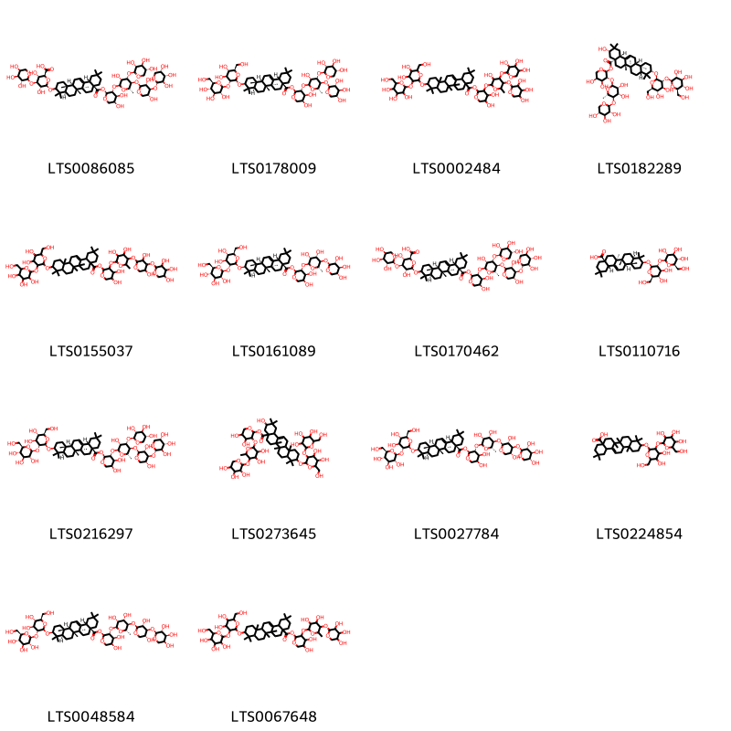{ width=100% }
    <figcaption>Hình ảnh cấu trúc hóa học của 14 hoạt chất thuộc nhóm Prenol lipids gồm ['(2s,3s,4s,5r,6r)-6-{[(4ar,6ar,6bs,8as,12as,14ar,14br)-8a-({[(2s,3r,4s,5s)-3-{[(2s,3r,4s,5s,6s)-5-{[(2s,3r,4s,5r)-3,5-dihydroxy-4-{[(2s,3r,4s,5s)-3,4,5-trihydroxyoxan-2-yl]oxy}oxan-2-yl]oxy}-3-hydroxy-6-methyl-4-{[(2s,3r,4s,5r)-3,4,5-trihydroxyoxan-2-yl]oxy}oxan-2-yl]oxy}-4,5-dihydroxyoxan-2-yl]oxy}carbonyl)-4,4,6a,6b,11,11,14b-heptamethyl-1,2,3,4a,5,6,7,8,9,10,12,12a,14,14a-tetradecahydropicen-3-yl]oxy}-3,5-dihydroxy-4-{[(2s,3r,4s,5s)-3,4,5-trihydroxyoxan-2-yl]oxy}oxane-2-carboxylic acid (LTS0086085)', '(2s,3r,4s,5s)-4,5-dihydroxy-3-{[(2s,3r,4s,5s,6s)-3-hydroxy-6-methyl-4,5-bis({[(2s,3r,4s,5r)-3,4,5-trihydroxyoxan-2-yl]oxy})oxan-2-yl]oxy}oxan-2-yl (4as,6as,6br,8ar,10s,12ar,12br,14bs)-10-{[(2r,3r,4s,5s,6r)-4,5-dihydroxy-6-(hydroxymethyl)-3-{[(2s,3r,4s,5s,6r)-3,4,5-trihydroxy-6-(hydroxymethyl)oxan-2-yl]oxy}oxan-2-yl]oxy}-2,2,6a,6b,9,9,12a-heptamethyl-1,3,4,5,6,7,8,8a,10,11,12,12b,13,14b-tetradecahydropicene-4a-carboxylate (LTS0178009)', '4,5-dihydroxy-3-({3-hydroxy-6-methyl-4,5-bis[(3,4,5-trihydroxyoxan-2-yl)oxy]oxan-2-yl}oxy)oxan-2-yl 10-{[4,5-dihydroxy-6-(hydroxymethyl)-3-{[3,4,5-trihydroxy-6-(hydroxymethyl)oxan-2-yl]oxy}oxan-2-yl]oxy}-2,2,6a,6b,9,9,12a-heptamethyl-1,3,4,5,6,7,8,8a,10,11,12,12b,13,14b-tetradecahydropicene-4a-carboxylate (LTS0002484)', '(2s,3r,4s,5s)-3-{[(2s,3r,4s,5r,6s)-3,4-dihydroxy-6-methyl-5-{[(2s,3r,4s,5r)-3,4,5-trihydroxyoxan-2-yl]oxy}oxan-2-yl]oxy}-4,5-dihydroxyoxan-2-yl (3s,4ar,6as,6br,8ar,10s,12ar,12br,14bs)-10-{[(2r,3r,4s,5s,6r)-4,5-dihydroxy-6-(hydroxymethyl)-3-{[(2s,3r,4s,5s,6r)-3,4,5-trihydroxy-6-(hydroxymethyl)oxan-2-yl]oxy}oxan-2-yl]oxy}-3-hydroxy-2,2,6a,6b,9,9,12a-heptamethyl-1,3,4,5,6,7,8,8a,10,11,12,12b,13,14b-tetradecahydropicene-4a-carboxylate (LTS0182289)', '3-{[5-({3,5-dihydroxy-4-[(3,4,5-trihydroxyoxan-2-yl)oxy]oxan-2-yl}oxy)-3,4-dihydroxy-6-methyloxan-2-yl]oxy}-4,5-dihydroxyoxan-2-yl 10-{[4,5-dihydroxy-6-(hydroxymethyl)-3-{[3,4,5-trihydroxy-6-(hydroxymethyl)oxan-2-yl]oxy}oxan-2-yl]oxy}-2,2,6a,6b,9,9,12a-heptamethyl-1,3,4,5,6,7,8,8a,10,11,12,12b,13,14b-tetradecahydropicene-4a-carboxylate (LTS0155037)', '(2s,3r,4s,5s)-3-{[(2s,3r,4s,5r,6s)-3,4-dihydroxy-6-methyl-5-{[(2s,3r,4s,5r)-3,4,5-trihydroxyoxan-2-yl]oxy}oxan-2-yl]oxy}-4,5-dihydroxyoxan-2-yl (4as,6as,6br,8ar,10s,12ar,12br,14bs)-10-{[(2r,3r,4s,5s,6r)-4,5-dihydroxy-6-(hydroxymethyl)-3-{[(2s,3r,4s,5s,6r)-3,4,5-trihydroxy-6-(hydroxymethyl)oxan-2-yl]oxy}oxan-2-yl]oxy}-2,2,6a,6b,9,9,12a-heptamethyl-1,3,4,5,6,7,8,8a,10,11,12,12b,13,14b-tetradecahydropicene-4a-carboxylate (LTS0161089)', '(2s,3s,4s,5r,6r)-6-{[(4ar,6ar,6bs,8as,12as,14ar,14br)-8a-({[(2s,3r,4s,5s)-3-{[(2s,3r,4s,5s,6s)-5-{[(2s,3r,4s,5r)-3,5-dihydroxy-4-{[(2s,3r,4s,5r)-3,4,5-trihydroxyoxan-2-yl]oxy}oxan-2-yl]oxy}-3-hydroxy-6-methyl-4-{[(2s,3r,4s,5r)-3,4,5-trihydroxyoxan-2-yl]oxy}oxan-2-yl]oxy}-4,5-dihydroxyoxan-2-yl]oxy}carbonyl)-4,4,6a,6b,11,11,14b-heptamethyl-1,2,3,4a,5,6,7,8,9,10,12,12a,14,14a-tetradecahydropicen-3-yl]oxy}-3,5-dihydroxy-4-{[(2s,3r,4s,5s)-3,4,5-trihydroxyoxan-2-yl]oxy}oxane-2-carboxylic acid (LTS0170462)', 'acutoside a (LTS0110716)', '(2s,3r,4s,5s)-3-{[(2s,3r,4s,5s,6s)-5-{[(2s,3r,4s,5r)-3,5-dihydroxy-4-{[(2s,3r,4s,5s)-3,4,5-trihydroxyoxan-2-yl]oxy}oxan-2-yl]oxy}-3-hydroxy-6-methyl-4-{[(2s,3r,4s,5r)-3,4,5-trihydroxyoxan-2-yl]oxy}oxan-2-yl]oxy}-4,5-dihydroxyoxan-2-yl (4as,6as,6br,8ar,10s,12ar,12br,14bs)-10-{[(2r,3r,4s,5s,6r)-4,5-dihydroxy-6-(hydroxymethyl)-3-{[(2s,3r,4s,5s,6r)-3,4,5-trihydroxy-6-(hydroxymethyl)oxan-2-yl]oxy}oxan-2-yl]oxy}-2,2,6a,6b,9,9,12a-heptamethyl-1,3,4,5,6,7,8,8a,10,11,12,12b,13,14b-tetradecahydropicene-4a-carboxylate (LTS0216297)', '3-({3,4-dihydroxy-6-methyl-5-[(3,4,5-trihydroxyoxan-2-yl)oxy]oxan-2-yl}oxy)-4,5-dihydroxyoxan-2-yl 10-{[4,5-dihydroxy-6-(hydroxymethyl)-3-{[3,4,5-trihydroxy-6-(hydroxymethyl)oxan-2-yl]oxy}oxan-2-yl]oxy}-3-hydroxy-2,2,6a,6b,9,9,12a-heptamethyl-1,3,4,5,6,7,8,8a,10,11,12,12b,13,14b-tetradecahydropicene-4a-carboxylate (LTS0273645)', '(2s,3r,4s,5s)-3-{[(2s,3r,4s,5r,6s)-5-{[(2s,3r,4s,5r)-3,5-dihydroxy-4-{[(2s,3r,4s,5r)-3,4,5-trihydroxyoxan-2-yl]oxy}oxan-2-yl]oxy}-3,4-dihydroxy-6-methyloxan-2-yl]oxy}-4,5-dihydroxyoxan-2-yl (4as,6as,6br,8ar,10s,12ar,12br,14bs)-10-{[(2r,3r,4s,5s,6r)-4,5-dihydroxy-6-(hydroxymethyl)-3-{[(2s,3r,4s,5s,6r)-3,4,5-trihydroxy-6-(hydroxymethyl)oxan-2-yl]oxy}oxan-2-yl]oxy}-2,2,6a,6b,9,9,12a-heptamethyl-1,3,4,5,6,7,8,8a,10,11,12,12b,13,14b-tetradecahydropicene-4a-carboxylate (LTS0027784)', '10-{[4,5-dihydroxy-6-(hydroxymethyl)-3-{[3,4,5-trihydroxy-6-(hydroxymethyl)oxan-2-yl]oxy}oxan-2-yl]oxy}-2,2,6a,6b,9,9,12a-heptamethyl-1,3,4,5,6,7,8,8a,10,11,12,12b,13,14b-tetradecahydropicene-4a-carboxylic acid (LTS0224854)', '(2s,3r,4s,5s)-3-{[(2s,3r,4s,5r,6s)-5-{[(2s,3r,4s,5r)-3,5-dihydroxy-4-{[(2s,3r,4s,5s)-3,4,5-trihydroxyoxan-2-yl]oxy}oxan-2-yl]oxy}-3,4-dihydroxy-6-methyloxan-2-yl]oxy}-4,5-dihydroxyoxan-2-yl (4as,6as,6br,8ar,10s,12ar,12br,14bs)-10-{[(2r,3r,4s,5s,6r)-4,5-dihydroxy-6-(hydroxymethyl)-3-{[(2s,3r,4s,5s,6r)-3,4,5-trihydroxy-6-(hydroxymethyl)oxan-2-yl]oxy}oxan-2-yl]oxy}-2,2,6a,6b,9,9,12a-heptamethyl-1,3,4,5,6,7,8,8a,10,11,12,12b,13,14b-tetradecahydropicene-4a-carboxylate (LTS0048584)', '3-({3,4-dihydroxy-6-methyl-5-[(3,4,5-trihydroxyoxan-2-yl)oxy]oxan-2-yl}oxy)-4,5-dihydroxyoxan-2-yl 10-{[4,5-dihydroxy-6-(hydroxymethyl)-3-{[3,4,5-trihydroxy-6-(hydroxymethyl)oxan-2-yl]oxy}oxan-2-yl]oxy}-2,2,6a,6b,9,9,12a-heptamethyl-1,3,4,5,6,7,8,8a,10,11,12,12b,13,14b-tetradecahydropicene-4a-carboxylate (LTS0067648)'].</figcaption>
</figure>

---

### Dược dân tộc học

Danh sách các quốc gia có sử dụng *Luffa acutangula* trong điều trị các bệnh. 

| Country            | Disease                                                                  | Bệnh                                                                                                    |
|:-------------------|:-------------------------------------------------------------------------|:--------------------------------------------------------------------------------------------------------|
| Dominican Republic | Emetic, Tonic                                                            | Emetic, Tonic                                                                                           |
| Elsewhere          | Diuretic, Emetic, Expectorant, Laxative, Purgative, Demulcent, Purgative | Thuốc lợi tiểu, thuốc lợi tiểu, thuốc long đờm, thuốc nhuận tràng, thuốc tẩy, thuốc giảm đau, thuốc tẩy |
| Haiti              | Diuretic, Purgative, Purgative                                           | Thuốc lợi tiểu, Luyện ngục, Luyện ngục                                                                  |
| Iraq               | Emetic, Purgative                                                        | Emetic, Purgative                                                                                       |
| Kelantan           | Purgative, Diuretic                                                      | Luyện thẩm, lợi tiểu                                                                                    |

---

---
## Luffa aegyptiaca
### Thông tin về thực vật

!!! info "Phân loại thực vật của *Luffa aegyptiaca* từ GIBF:"
    - **Kingdom:** Plantae
    - **Phylum:** Tracheophyta
    - **Order:** Cucurbitales
    - **Family:** Cucurbitaceae
    - **Genus:** Luffa
    - **Species:** *Luffa aegyptiaca*

 

| Label (VI)   | Label (EN)   | Scientific Name   | Descriptions (VI)   | Descriptions (EN)   | Also Known As (VI)   | Also Known As (EN)                                                                                                       |
|:-------------|:-------------|:------------------|:--------------------|:--------------------|:---------------------|:-------------------------------------------------------------------------------------------------------------------------|
| N/A          | N/A          | Luffa aegyptiaca  | loài thực vật       | species of plant    | ['']                 | ['Momordica cylindrica', 'Luffa pentandra', 'Luffa cylindrica', 'Momordica luffa', 'Cucurbita luffa', 'Luffa aegyptica'] |

#### Phân bố trên thế giới

**Từ CSDL GIBF** Brazil, United Arab Emirates, Viet Nam, Bangladesh, New Caledonia, China, Gambia, Antigua and Barbuda, New Zealand, Honduras, Tanzania, United Republic of, Ecuador, Mozambique, Trinidad and Tobago, Thailand, Spain, Madagascar, Guinea, United States of America, Jamaica, Korea, Republic of, Indonesia, Costa Rica, Dominican Republic, Nigeria, Colombia, Argentina, Malawi, Hong Kong, Mexico, Benin, Guam, Chinese Taipei, Philippines, Malaysia, Panama, Egypt, Nicaragua, Singapore, Portugal, Niger, South Africa, Australia, India, Northern Mariana Islands, Peru, Bolivia (Plurinational State of)

#### Phân bố tại Việt Nam

**Từ CSDL GIBF**: Lâm Đồng, Đồng Nai, Tiền Giang

---
### Thành phần hóa học
        
- Theo cơ sở dữ liệu lotus: Từ loài *Luffa aegyptiaca* đã phân lập và xác định được 38 hoạt chất thuộc về các nhóm Flavonoids, Diazines, Steroids and steroid derivatives, Organooxygen compounds, Prenol lipids. 

|    | chemicalTaxonomyClassyfireClass   |   smiles_count |
|---:|:----------------------------------|---------------:|
|  0 | Diazines                          |              1 |
|  1 | Flavonoids                        |              2 |
|  2 | Organooxygen compounds            |              2 |
|  3 | Prenol lipids                     |             24 |
|  4 | Steroids and steroid derivatives  |              9 |

#### Nhóm Diazines
<figure markdown="span">
    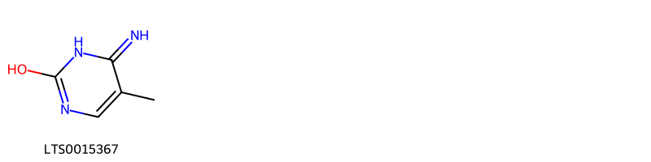{ width=100% }
    <figcaption>Hình ảnh cấu trúc hóa học của 1 hoạt chất thuộc nhóm Diazines gồm ['5-methylcytosine>96 (LTS0015367)'].</figcaption>
</figure>
#### Nhóm Flavonoids
<figure markdown="span">
    { width=100% }
    <figcaption>Hình ảnh cấu trúc hóa học của 2 hoạt chất thuộc nhóm Flavonoids gồm ['methyl 3,4,5-trihydroxy-6-{[5-hydroxy-2-(3-hydroxy-4-methoxyphenyl)-4-oxochromen-7-yl]oxy}oxane-2-carboxylate (LTS0061079)', 'methyl (2s,3s,4s,5r,6s)-3,4,5-trihydroxy-6-{[5-hydroxy-2-(3-hydroxy-4-methoxyphenyl)-4-oxochromen-7-yl]oxy}oxane-2-carboxylate (LTS0241382)'].</figcaption>
</figure>
#### Nhóm Organooxygen compounds
<figure markdown="span">
    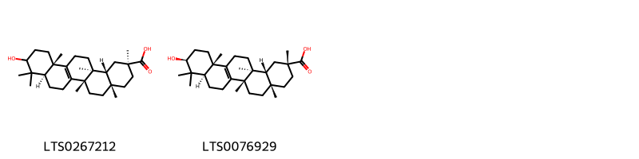{ width=100% }
    <figcaption>Hình ảnh cấu trúc hóa học của 2 hoạt chất thuộc nhóm Organooxygen compounds gồm ['(2s,4as,6as,8ar,12as,14as,14br)-10-hydroxy-2,4a,6a,9,9,12a,14a-heptamethyl-1,3,4,5,6,7,8,8a,10,11,12,13,14,14b-tetradecahydropicene-2-carboxylic acid (LTS0267212)', '(2r,4as,6as,8ar,10s,12as,14as,14br)-10-hydroxy-2,4a,6a,9,9,12a,14a-heptamethyl-1,3,4,5,6,7,8,8a,10,11,12,13,14,14b-tetradecahydropicene-2-carboxylic acid (LTS0076929)'].</figcaption>
</figure>
#### Nhóm Prenol lipids
<figure markdown="span">
    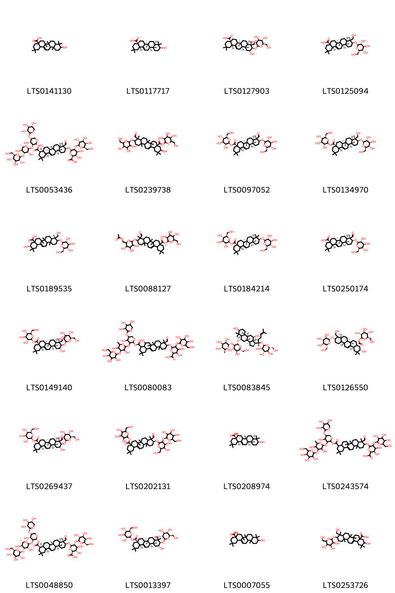{ width=100% }
    <figcaption>Hình ảnh cấu trúc hóa học của 24 hoạt chất thuộc nhóm Prenol lipids gồm ['oleanolic acid (LTS0141130)', 'oleanolic acid (LTS0117717)', '(4as,6as,6br,8ar,9r,10r,11r,12ar,12br,14bs)-11-hydroxy-9-(hydroxymethyl)-2,2,6a,6b,9,12a-hexamethyl-10-{[(2r,3r,4s,5s,6r)-3,4,5-trihydroxy-6-(hydroxymethyl)oxan-2-yl]oxy}-1,3,4,5,6,7,8,8a,10,11,12,12b,13,14b-tetradecahydropicene-4a-carboxylic acid (LTS0127903)', '(4as,6as,6br,8ar,9r,10s,12ar,12br,14bs)-9-(hydroxymethyl)-2,2,6a,6b,9,12a-hexamethyl-10-{[(2r,3r,4s,5s,6r)-3,4,5-trihydroxy-6-(hydroxymethyl)oxan-2-yl]oxy}-1,3,4,5,6,7,8,8a,10,11,12,12b,13,14b-tetradecahydropicene-4a-carboxylic acid (LTS0125094)', '(2s,3s,4s,5r,6r)-6-{[(3s,4s,4as,6ar,6bs,8r,8as,9r,12ar,14ar,14br)-9-({[(2r,3s,4r,5r)-3-{[(2s,3r,4r,5s,6s)-3,5-dihydroxy-6-methyl-4-{[(2s,3r,4s,5s,6r)-3,4,5-trihydroxy-6-(hydroxymethyl)oxan-2-yl]oxy}oxan-2-yl]oxy}-4-hydroxy-5-{[(2s,3r,4s,5r)-3,4,5-trihydroxyoxan-2-yl]oxy}oxan-2-yl]oxy}carbonyl)-4-formyl-8-hydroxy-4,6a,6b,11,11,14b-hexamethyl-2,3,4a,5,6,7,8,8a,9,10,12,12a,14,14a-tetradecahydro-1h-picen-3-yl]oxy}-3,4-dihydroxy-5-{[(2s,3r,4s,5r,6r)-3,4,5-trihydroxy-6-(hydroxymethyl)oxan-2-yl]oxy}oxane-2-carboxylic acid (LTS0053436)', '3,4,5-trihydroxy-6-(hydroxymethyl)oxan-2-yl 9-formyl-3-hydroxy-2,2,6a,6b,9,12a-hexamethyl-10-{[3,4,5-trihydroxy-6-(hydroxymethyl)oxan-2-yl]oxy}-1,3,4,5,6,7,8,8a,10,11,12,12b,13,14b-tetradecahydropicene-4a-carboxylate (LTS0239738)', '(2s,3r,4s,5s,6r)-3,4,5-trihydroxy-6-(hydroxymethyl)oxan-2-yl (4as,6as,6br,8ar,9s,10s,12ar,12br,14bs)-9-formyl-2,2,6a,6b,9,12a-hexamethyl-10-{[(2r,3r,4s,5s,6r)-3,4,5-trihydroxy-6-(hydroxymethyl)oxan-2-yl]oxy}-1,3,4,5,6,7,8,8a,10,11,12,12b,13,14b-tetradecahydropicene-4a-carboxylate (LTS0097052)', '(2s,3r,4s,5s,6r)-3,4,5-trihydroxy-6-(hydroxymethyl)oxan-2-yl (4as,6as,6br,8ar,9r,10s,12ar,12br,14bs)-9-(hydroxymethyl)-2,2,6a,6b,9,12a-hexamethyl-10-{[(2r,3r,4s,5s,6r)-3,4,5-trihydroxy-6-(hydroxymethyl)oxan-2-yl]oxy}-1,3,4,5,6,7,8,8a,10,11,12,12b,13,14b-tetradecahydropicene-4a-carboxylate (LTS0134970)', '(3s,9r)-3-hydroxy-9-(hydroxymethyl)-2,2,6a,6b,9,12a-hexamethyl-10-{[(2r,3r,4s,5s,6r)-3,4,5-trihydroxy-6-(hydroxymethyl)oxan-2-yl]oxy}-1,3,4,5,6,7,8,8a,10,11,12,12b,13,14b-tetradecahydropicene-4a-carboxylic acid (LTS0189535)', '3,4,5-trihydroxy-6-(hydroxymethyl)oxan-2-yl 10-({6-[(acetyloxy)methyl]-3,4,5-trihydroxyoxan-2-yl}oxy)-9-formyl-2,2,6a,6b,9,12a-hexamethyl-1,3,4,5,6,7,8,8a,10,11,12,12b,13,14b-tetradecahydropicene-4a-carboxylate (LTS0088127)', '(2s,3r,4s,5s,6r)-3,4,5-trihydroxy-6-(hydroxymethyl)oxan-2-yl (4as,6as,6br,8ar,10s,12ar,12br,14bs)-2,2,6a,6b,9,9,12a-heptamethyl-10-{[(2r,3r,4s,5s,6r)-3,4,5-trihydroxy-6-(hydroxymethyl)oxan-2-yl]oxy}-1,3,4,5,6,7,8,8a,10,11,12,12b,13,14b-tetradecahydropicene-4a-carboxylate (LTS0184214)', '(4as,6as,6br,8ar,9s,10s,12ar,12br,14bs)-9-formyl-2,2,6a,6b,9,12a-hexamethyl-10-{[(2r,3r,4s,5s,6r)-3,4,5-trihydroxy-6-(hydroxymethyl)oxan-2-yl]oxy}-1,3,4,5,6,7,8,8a,10,11,12,12b,13,14b-tetradecahydropicene-4a-carboxylic acid (LTS0250174)', '(2s,3r,4s,5s,6r)-3,4,5-trihydroxy-6-(hydroxymethyl)oxan-2-yl (4as,6as,6br,8ar,9r,10r,11r,12ar,12br,14bs)-11-hydroxy-9-(hydroxymethyl)-2,2,6a,6b,9,12a-hexamethyl-10-{[(2r,3r,4s,5s,6r)-3,4,5-trihydroxy-6-(hydroxymethyl)oxan-2-yl]oxy}-1,3,4,5,6,7,8,8a,10,11,12,12b,13,14b-tetradecahydropicene-4a-carboxylate (LTS0149140)', '6-({9-[({3-[(3,5-dihydroxy-6-methyl-4-{[3,4,5-trihydroxy-6-(hydroxymethyl)oxan-2-yl]oxy}oxan-2-yl)oxy]-4-hydroxy-5-[(3,4,5-trihydroxyoxan-2-yl)oxy]oxan-2-yl}oxy)carbonyl]-4-formyl-8-hydroxy-4,6a,6b,11,11,14b-hexamethyl-2,3,4a,5,6,7,8,8a,9,10,12,12a,14,14a-tetradecahydro-1h-picen-3-yl}oxy)-3,4-dihydroxy-5-{[3,4,5-trihydroxy-6-(hydroxymethyl)oxan-2-yl]oxy}oxane-2-carboxylic acid (LTS0080083)', '(2s,3r,4s,5s,6r)-2-{[(2s)-2-[(1s,3ar,3br,5s,5ar,7s,9ar,9br,11r,11ar)-5-{[(2r,3r,4s,5s,6r)-4,5-dihydroxy-6-(hydroxymethyl)-3-{[(2s,3r,4r,5r,6s)-3,4,5-trihydroxy-6-methyloxan-2-yl]oxy}oxan-2-yl]oxy}-7,11-dihydroxy-3a,3b,6,6,9a-pentamethyl-dodecahydro-1h-cyclopenta[a]phenanthren-1-yl]-6-methylhept-5-en-2-yl]oxy}-6-(hydroxymethyl)oxane-3,4,5-triol (LTS0083845)', '(2s,3r,4s,5s,6r)-3,4,5-trihydroxy-6-(hydroxymethyl)oxan-2-yl (3s,4ar,6as,6br,8ar,9r,10s,12ar,12br,14bs)-3-hydroxy-9-(hydroxymethyl)-2,2,6a,6b,9,12a-hexamethyl-10-{[(2r,3r,4s,5s,6r)-3,4,5-trihydroxy-6-(hydroxymethyl)oxan-2-yl]oxy}-1,3,4,5,6,7,8,8a,10,11,12,12b,13,14b-tetradecahydropicene-4a-carboxylate (LTS0126550)', '(2s,3r,4s,5s,6r)-3,4,5-trihydroxy-6-(hydroxymethyl)oxan-2-yl (4as,6as,6br,8ar,9s,10r,11r,12ar,12br,14bs)-9-formyl-11-hydroxy-2,2,6a,6b,9,12a-hexamethyl-10-{[(2r,3r,4s,5s,6r)-3,4,5-trihydroxy-6-(hydroxymethyl)oxan-2-yl]oxy}-1,3,4,5,6,7,8,8a,10,11,12,12b,13,14b-tetradecahydropicene-4a-carboxylate (LTS0269437)', '3,4,5-trihydroxy-6-(hydroxymethyl)oxan-2-yl 10-{[4,5-dihydroxy-6-(hydroxymethyl)-3-{[3,4,5-trihydroxy-6-(hydroxymethyl)oxan-2-yl]oxy}oxan-2-yl]oxy}-9-formyl-2,2,6a,6b,9,12a-hexamethyl-1,3,4,5,6,7,8,8a,10,11,12,12b,13,14b-tetradecahydropicene-4a-carboxylate (LTS0202131)', 'echinocystic acid (LTS0208974)', '6-({9-[({3-[(3,5-dihydroxy-6-methyl-4-{[3,4,5-trihydroxy-6-(hydroxymethyl)oxan-2-yl]oxy}oxan-2-yl)oxy]-4-hydroxy-5-[(3,4,5-trihydroxyoxan-2-yl)oxy]oxan-2-yl}oxy)carbonyl]-4-formyl-4,6a,6b,11,11,14b-hexamethyl-2,3,4a,5,6,7,8,8a,9,10,12,12a,14,14a-tetradecahydro-1h-picen-3-yl}oxy)-3,4-dihydroxy-5-{[3,4,5-trihydroxy-6-(hydroxymethyl)oxan-2-yl]oxy}oxane-2-carboxylic acid (LTS0243574)', '(2s,3s,4s,5r,6r)-6-{[(3s,4s,4ar,6ar,6bs,8as,9r,12ar,14ar,14br)-9-({[(2r,3s,4r,5r)-3-{[(2s,3r,4r,5s,6s)-3,5-dihydroxy-6-methyl-4-{[(2s,3r,4s,5s,6r)-3,4,5-trihydroxy-6-(hydroxymethyl)oxan-2-yl]oxy}oxan-2-yl]oxy}-4-hydroxy-5-{[(2s,3r,4s,5r)-3,4,5-trihydroxyoxan-2-yl]oxy}oxan-2-yl]oxy}carbonyl)-4-formyl-4,6a,6b,11,11,14b-hexamethyl-2,3,4a,5,6,7,8,8a,9,10,12,12a,14,14a-tetradecahydro-1h-picen-3-yl]oxy}-3,4-dihydroxy-5-{[(2s,3r,4s,5r,6r)-3,4,5-trihydroxy-6-(hydroxymethyl)oxan-2-yl]oxy}oxane-2-carboxylic acid (LTS0048850)', '(2s,3r,4s,5s,6r)-3,4,5-trihydroxy-6-(hydroxymethyl)oxan-2-yl (4as,6as,6br,8ar,10r,11r,12ar,12br,14bs)-11-hydroxy-2,2,6a,6b,9,9,12a-heptamethyl-10-{[(2r,3r,4s,5s,6r)-3,4,5-trihydroxy-6-(hydroxymethyl)oxan-2-yl]oxy}-1,3,4,5,6,7,8,8a,10,11,12,12b,13,14b-tetradecahydropicene-4a-carboxylate (LTS0013397)', '5,10-dihydroxy-2,2,6a,6b,9,9,12a-heptamethyl-1,3,4,5,6,7,8,8a,10,11,12,12b,13,14b-tetradecahydropicene-4a-carboxylic acid (LTS0007055)', '3-hydroxy-9-(hydroxymethyl)-2,2,6a,6b,9,12a-hexamethyl-10-{[3,4,5-trihydroxy-6-(hydroxymethyl)oxan-2-yl]oxy}-1,3,4,5,6,7,8,8a,10,11,12,12b,13,14b-tetradecahydropicene-4a-carboxylic acid (LTS0253726)'].</figcaption>
</figure>
#### Nhóm Steroids and steroid derivatives
<figure markdown="span">
    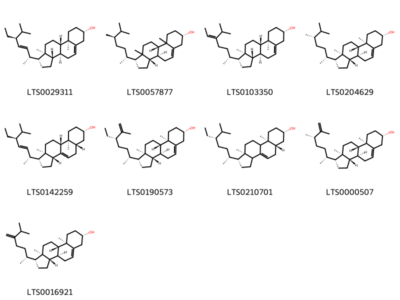{ width=100% }
    <figcaption>Hình ảnh cấu trúc hóa học của 9 hoạt chất thuộc nhóm Steroids and steroid derivatives gồm ['phytosterol (LTS0029311)', '(1r,3as,3bs,7s,9bs)-1-[(2r,5r)-5,6-dimethylheptan-2-yl]-9a,11a-dimethyl-1h,2h,3h,3ah,3bh,4h,6h,7h,8h,9h,9bh,10h,11h-cyclopenta[a]phenanthren-7-ol (LTS0057877)', 'avenasterol (LTS0103350)', '22,23-dihydrobrassicasterol (LTS0204629)', 'chondrillasterol (LTS0142259)', '(1r,3as,3bs,7s,9ar,9bs,11ar)-1-[(2r,5s)-5-ethyl-6-methylhept-6-en-2-yl]-9a,11a-dimethyl-1h,2h,3h,3ah,3bh,4h,6h,7h,8h,9h,9bh,10h,11h-cyclopenta[a]phenanthren-7-ol (LTS0190573)', '(1r,5as,7s,9as,11ar)-1-[(2r,5s)-5-ethyl-6-methylheptan-2-yl]-9a,11a-dimethyl-1h,2h,3h,3ah,5h,5ah,6h,7h,8h,9h,9bh,10h,11h-cyclopenta[a]phenanthren-7-ol (LTS0210701)', '(1r,3as,3bs,7s,9ar,9bs,11ar)-1-[(2r,5s)-5,6-dimethylhept-6-en-2-yl]-9a,11a-dimethyl-1h,2h,3h,3ah,3bh,4h,6h,7h,8h,9h,9bh,10h,11h-cyclopenta[a]phenanthren-7-ol (LTS0000507)', '24-methylenecholesterol (LTS0016921)'].</figcaption>
</figure>

---

### Dược dân tộc học

Danh sách các quốc gia có sử dụng *Luffa aegyptiaca* trong điều trị các bệnh. 

| Country            | Disease                                                                                                | Bệnh                                                                                                       |
|:-------------------|:-------------------------------------------------------------------------------------------------------|:-----------------------------------------------------------------------------------------------------------|
| China              | Analgesic, Antiseptic, Carminative, Hemostat, Parasiticide, Tonic, Vermifuge, Emmenagogue, Refrigerant | Thuốc giảm đau, sát trùng, Carminative, Hemostat, Parasiticide, Tonic, Vermifuge, Emmenagogue, Refrigerant |
| Dominican Republic | Emetic, Purgative                                                                                      | Emetic, Purgative                                                                                          |
| Haiti              | Emetic                                                                                                 | Phôi                                                                                                       |
| Iraq               | Cathartic                                                                                              | thuốc tẩy nhẹ                                                                                              |
| Kurdistan          | Emetic                                                                                                 | Phôi                                                                                                       |

---

---
## Luffa cylindrica
### Thông tin về thực vật

!!! info "Phân loại thực vật của *N/A* từ GIBF:"
    - **Kingdom:** Plantae
    - **Phylum:** Tracheophyta
    - **Order:** Cucurbitales
    - **Family:** Cucurbitaceae
    - **Genus:** N/A
    - **Species:** *N/A*

 

| Label (VI)   | Label (EN)   | Scientific Name   | Descriptions (VI)   | Descriptions (EN)   | Also Known As (VI)   | Also Known As (EN)   |
|:-------------|:-------------|:------------------|:--------------------|:--------------------|:---------------------|:---------------------|
| N/A          | N/A          | Luffa cylindrica  | loài thực vật       | species of plant    | ['']                 | ['']                 |

#### Phân bố trên thế giới

**Từ CSDL GIBF** Brazil, Guatemala, Viet Nam, Japan, Botswana, China, Israel, Gambia, Chile, Tanzania, United Republic of, Ecuador, Thailand, Spain, Puerto Rico, Sri Lanka, United States of America, Tonga, Greece, Indonesia, Costa Rica, Russian Federation, Dominican Republic, Nigeria, Colombia, Argentina, Hong Kong, Mexico, Kenya, Guam, Chinese Taipei, Malaysia, Kuwait, Iraq, Canada, Panama, Namibia, Portugal, Ukraine, South Africa, Australia, India

#### Phân bố tại Việt Nam

**Từ CSDL GIBF**: Hồ Chí Minh city

---
### Thành phần hóa học
        
- Theo cơ sở dữ liệu lotus: Từ loài *N/A* đã phân lập và xác định được 12 hoạt chất thuộc về các nhóm Prenol lipids, Organooxygen compounds, Flavonoids. 

|    | chemicalTaxonomyClassyfireClass   |   smiles_count |
|---:|:----------------------------------|---------------:|
|  0 | Flavonoids                        |              2 |
|  1 | Organooxygen compounds            |              2 |
|  2 | Prenol lipids                     |              8 |

#### Nhóm Flavonoids
<figure markdown="span">
    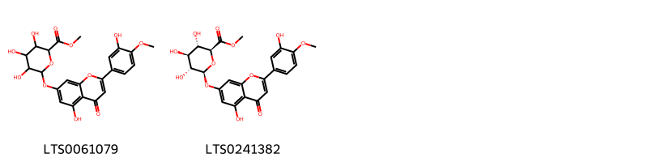{ width=100% }
    <figcaption>Hình ảnh cấu trúc hóa học của 2 hoạt chất thuộc nhóm Flavonoids gồm ['methyl 3,4,5-trihydroxy-6-{[5-hydroxy-2-(3-hydroxy-4-methoxyphenyl)-4-oxochromen-7-yl]oxy}oxane-2-carboxylate (LTS0061079)', 'methyl (2s,3s,4s,5r,6s)-3,4,5-trihydroxy-6-{[5-hydroxy-2-(3-hydroxy-4-methoxyphenyl)-4-oxochromen-7-yl]oxy}oxane-2-carboxylate (LTS0241382)'].</figcaption>
</figure>
#### Nhóm Organooxygen compounds
<figure markdown="span">
    { width=100% }
    <figcaption>Hình ảnh cấu trúc hóa học của 2 hoạt chất thuộc nhóm Organooxygen compounds gồm ['(2s,4as,6as,8ar,12as,14as,14br)-10-hydroxy-2,4a,6a,9,9,12a,14a-heptamethyl-1,3,4,5,6,7,8,8a,10,11,12,13,14,14b-tetradecahydropicene-2-carboxylic acid (LTS0267212)', '(2r,4as,6as,8ar,10s,12as,14as,14br)-10-hydroxy-2,4a,6a,9,9,12a,14a-heptamethyl-1,3,4,5,6,7,8,8a,10,11,12,13,14,14b-tetradecahydropicene-2-carboxylic acid (LTS0076929)'].</figcaption>
</figure>
#### Nhóm Prenol lipids
<figure markdown="span">
    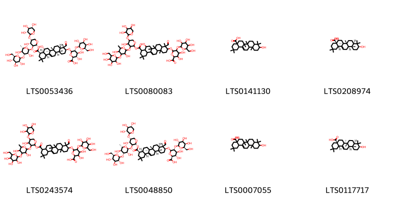{ width=100% }
    <figcaption>Hình ảnh cấu trúc hóa học của 8 hoạt chất thuộc nhóm Prenol lipids gồm ['(2s,3s,4s,5r,6r)-6-{[(3s,4s,4as,6ar,6bs,8r,8as,9r,12ar,14ar,14br)-9-({[(2r,3s,4r,5r)-3-{[(2s,3r,4r,5s,6s)-3,5-dihydroxy-6-methyl-4-{[(2s,3r,4s,5s,6r)-3,4,5-trihydroxy-6-(hydroxymethyl)oxan-2-yl]oxy}oxan-2-yl]oxy}-4-hydroxy-5-{[(2s,3r,4s,5r)-3,4,5-trihydroxyoxan-2-yl]oxy}oxan-2-yl]oxy}carbonyl)-4-formyl-8-hydroxy-4,6a,6b,11,11,14b-hexamethyl-2,3,4a,5,6,7,8,8a,9,10,12,12a,14,14a-tetradecahydro-1h-picen-3-yl]oxy}-3,4-dihydroxy-5-{[(2s,3r,4s,5r,6r)-3,4,5-trihydroxy-6-(hydroxymethyl)oxan-2-yl]oxy}oxane-2-carboxylic acid (LTS0053436)', '6-({9-[({3-[(3,5-dihydroxy-6-methyl-4-{[3,4,5-trihydroxy-6-(hydroxymethyl)oxan-2-yl]oxy}oxan-2-yl)oxy]-4-hydroxy-5-[(3,4,5-trihydroxyoxan-2-yl)oxy]oxan-2-yl}oxy)carbonyl]-4-formyl-8-hydroxy-4,6a,6b,11,11,14b-hexamethyl-2,3,4a,5,6,7,8,8a,9,10,12,12a,14,14a-tetradecahydro-1h-picen-3-yl}oxy)-3,4-dihydroxy-5-{[3,4,5-trihydroxy-6-(hydroxymethyl)oxan-2-yl]oxy}oxane-2-carboxylic acid (LTS0080083)', 'oleanolic acid (LTS0141130)', 'echinocystic acid (LTS0208974)', '6-({9-[({3-[(3,5-dihydroxy-6-methyl-4-{[3,4,5-trihydroxy-6-(hydroxymethyl)oxan-2-yl]oxy}oxan-2-yl)oxy]-4-hydroxy-5-[(3,4,5-trihydroxyoxan-2-yl)oxy]oxan-2-yl}oxy)carbonyl]-4-formyl-4,6a,6b,11,11,14b-hexamethyl-2,3,4a,5,6,7,8,8a,9,10,12,12a,14,14a-tetradecahydro-1h-picen-3-yl}oxy)-3,4-dihydroxy-5-{[3,4,5-trihydroxy-6-(hydroxymethyl)oxan-2-yl]oxy}oxane-2-carboxylic acid (LTS0243574)', '(2s,3s,4s,5r,6r)-6-{[(3s,4s,4ar,6ar,6bs,8as,9r,12ar,14ar,14br)-9-({[(2r,3s,4r,5r)-3-{[(2s,3r,4r,5s,6s)-3,5-dihydroxy-6-methyl-4-{[(2s,3r,4s,5s,6r)-3,4,5-trihydroxy-6-(hydroxymethyl)oxan-2-yl]oxy}oxan-2-yl]oxy}-4-hydroxy-5-{[(2s,3r,4s,5r)-3,4,5-trihydroxyoxan-2-yl]oxy}oxan-2-yl]oxy}carbonyl)-4-formyl-4,6a,6b,11,11,14b-hexamethyl-2,3,4a,5,6,7,8,8a,9,10,12,12a,14,14a-tetradecahydro-1h-picen-3-yl]oxy}-3,4-dihydroxy-5-{[(2s,3r,4s,5r,6r)-3,4,5-trihydroxy-6-(hydroxymethyl)oxan-2-yl]oxy}oxane-2-carboxylic acid (LTS0048850)', '5,10-dihydroxy-2,2,6a,6b,9,9,12a-heptamethyl-1,3,4,5,6,7,8,8a,10,11,12,12b,13,14b-tetradecahydropicene-4a-carboxylic acid (LTS0007055)', 'oleanolic acid (LTS0117717)'].</figcaption>
</figure>

---

### Dược dân tộc học

Danh sách các quốc gia có sử dụng *N/A* trong điều trị các bệnh. 

| Country   | Disease                                           | Bệnh                                              |
|:----------|:--------------------------------------------------|:--------------------------------------------------|
| China     | Carminative, Purgative, Vermifuge                 | Carminative, Purgative, Vermifuge                 |
| Elsewhere | Cathartic, Diuretic, Diuretic, Lactagogue, Emetic | Cathartic, lợi tiểu, lợi tiểu, lactagogue, emetic |
| Samoa     | Emetic, Purgative                                 | Emetic, Purgative                                 |
| Sudan     | Emetic, Cathartic                                 | Emetic, Cathartic                                 |

---

---
## Luffa echinata
### Thông tin về thực vật

!!! info "Phân loại thực vật của *Luffa echinata* từ GIBF:"
    - **Kingdom:** Plantae
    - **Phylum:** Tracheophyta
    - **Order:** Cucurbitales
    - **Family:** Cucurbitaceae
    - **Genus:** Luffa
    - **Species:** *Luffa echinata*

 

| Label (VI)   | Label (EN)   | Scientific Name   | Descriptions (VI)   | Descriptions (EN)   | Also Known As (VI)   | Also Known As (EN)                             |
|:-------------|:-------------|:------------------|:--------------------|:--------------------|:---------------------|:-----------------------------------------------|
| N/A          | N/A          | Luffa echinata    | loài thực vật       | species of plant    | ['']                 | ['bitter sponge', 'bristly luffa', 'devadali'] |

#### Phân bố trên thế giới

**Từ CSDL GIBF** nan, Niger, Chad, Bhutan, Cameroon, Pakistan, Nigeria, India, unknown or invalid, Ethiopia, Egypt, Sudan

#### Phân bố tại Việt Nam

**Từ CSDL GIBF**: Không có ghi nhận ở Việt Nam

---
### Thành phần hóa học
        
- Theo cơ sở dữ liệu lotus: Từ loài *Luffa echinata* đã phân lập và xác định được Chưa có hoạt chất nào được phân lập. hoạt chất thuộc về các nhóm Không có hoạt chất nào được phân lập. 

Không có hình ảnh nào được tạo ra

---

### Dược dân tộc học

Danh sách các quốc gia có sử dụng *Luffa echinata* trong điều trị các bệnh. 

| Country   | Disease   | Bệnh     |
|:----------|:----------|:---------|
| Elsewhere | Purgative | Thuốc xổ |
| Sudan     | Purgative | Thuốc xổ |

---

---
## Luffa operculata
### Thông tin về thực vật

!!! info "Phân loại thực vật của *Luffa operculata* từ GIBF:"
    - **Kingdom:** Plantae
    - **Phylum:** Tracheophyta
    - **Order:** Cucurbitales
    - **Family:** Cucurbitaceae
    - **Genus:** Luffa
    - **Species:** *Luffa operculata*

 

| Label (VI)   | Label (EN)   | Scientific Name   | Descriptions (VI)   | Descriptions (EN)   | Also Known As (VI)   | Also Known As (EN)   |
|:-------------|:-------------|:------------------|:--------------------|:--------------------|:---------------------|:---------------------|
| N/A          | N/A          | Luffa operculata  | loài thực vật       | species of plant    | ['']                 | ['']                 |

#### Phân bố trên thế giới

**Từ CSDL GIBF** nan, Mexico, Brazil, Nicaragua, United States of America, El Salvador, Senegal, Costa Rica, Colombia, Ecuador, Peru, Panama, Venezuela (Bolivarian Republic of)

#### Phân bố tại Việt Nam

**Từ CSDL GIBF**: Không có ghi nhận ở Việt Nam

---
### Thành phần hóa học
        
- Theo cơ sở dữ liệu lotus: Từ loài *Luffa operculata* đã phân lập và xác định được 38 hoạt chất thuộc về các nhóm Prenol lipids, Steroids and steroid derivatives. 

|    | chemicalTaxonomyClassyfireClass   |   smiles_count |
|---:|:----------------------------------|---------------:|
|  0 | Prenol lipids                     |             16 |
|  1 | Steroids and steroid derivatives  |             22 |

#### Nhóm Prenol lipids
<figure markdown="span">
    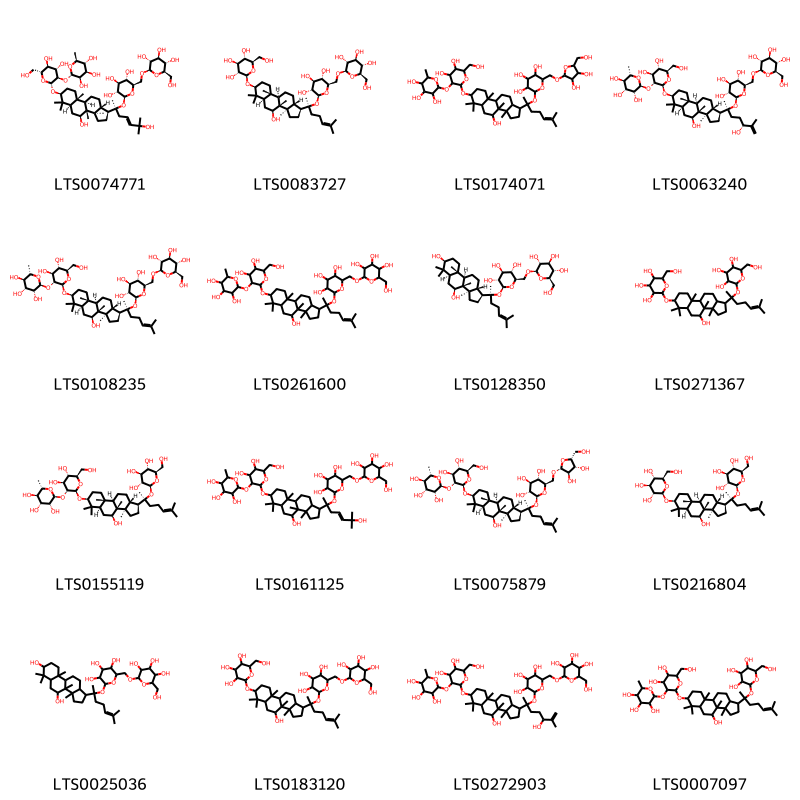{ width=100% }
    <figcaption>Hình ảnh cấu trúc hóa học của 16 hoạt chất thuộc nhóm Prenol lipids gồm ['(2s,3r,4r,5r,6s)-2-{[(2r,3r,4s,5s,6r)-2-{[(1s,3ar,3br,4s,5ar,7s,9as,9br,11ar)-4-hydroxy-1-[(2s,4e)-6-hydroxy-6-methyl-2-{[(2s,3r,4s,5s,6r)-3,4,5-trihydroxy-6-({[(2r,3r,4s,5s,6r)-3,4,5-trihydroxy-6-(hydroxymethyl)oxan-2-yl]oxy}methyl)oxan-2-yl]oxy}hept-4-en-2-yl]-3a,3b,6,6,9a-pentamethyl-dodecahydro-1h-cyclopenta[a]phenanthren-7-yl]oxy}-4,5-dihydroxy-6-(hydroxymethyl)oxan-3-yl]oxy}-6-methyloxane-3,4,5-triol (LTS0074771)', '(2s,3r,4s,5s,6r)-2-{[(2s)-2-[(1s,3ar,3br,4s,5ar,7s,9as,9br,11ar)-4-hydroxy-3a,3b,6,6,9a-pentamethyl-7-{[(2r,3r,4s,5s,6r)-3,4,5-trihydroxy-6-(hydroxymethyl)oxan-2-yl]oxy}-dodecahydro-1h-cyclopenta[a]phenanthren-1-yl]-6-methylhept-5-en-2-yl]oxy}-6-({[(2r,3r,4s,5s,6r)-3,4,5-trihydroxy-6-(hydroxymethyl)oxan-2-yl]oxy}methyl)oxane-3,4,5-triol (LTS0083727)', '2-({[3,4-dihydroxy-5-(hydroxymethyl)oxolan-2-yl]oxy}methyl)-6-{[2-(7-{[4,5-dihydroxy-6-(hydroxymethyl)-3-[(3,4,5-trihydroxy-6-methyloxan-2-yl)oxy]oxan-2-yl]oxy}-4-hydroxy-3a,3b,6,6,9a-pentamethyl-dodecahydro-1h-cyclopenta[a]phenanthren-1-yl)-6-methylhept-5-en-2-yl]oxy}oxane-3,4,5-triol (LTS0174071)', '(2s,3r,4s,5s,6r)-2-{[(2s,5r)-2-[(1s,3ar,3br,4s,5ar,7s,9as,9br,11ar)-7-{[(2r,3r,4s,5s,6r)-4,5-dihydroxy-6-(hydroxymethyl)-3-{[(2s,3r,4r,5r,6s)-3,4,5-trihydroxy-6-methyloxan-2-yl]oxy}oxan-2-yl]oxy}-4-hydroxy-3a,3b,6,6,9a-pentamethyl-dodecahydro-1h-cyclopenta[a]phenanthren-1-yl]-5-hydroxy-6-methylhept-6-en-2-yl]oxy}-6-({[(2r,3r,4s,5s,6r)-3,4,5-trihydroxy-6-(hydroxymethyl)oxan-2-yl]oxy}methyl)oxane-3,4,5-triol (LTS0063240)', '(2s,3r,4s,5s,6r)-2-{[(2s)-2-[(1s,3ar,3br,4s,5ar,7s,9as,9br,11ar)-7-{[(2r,3r,4s,5s,6r)-4,5-dihydroxy-6-(hydroxymethyl)-3-{[(2s,3r,4r,5r,6s)-3,4,5-trihydroxy-6-methyloxan-2-yl]oxy}oxan-2-yl]oxy}-4-hydroxy-3a,3b,6,6,9a-pentamethyl-dodecahydro-1h-cyclopenta[a]phenanthren-1-yl]-6-methylhept-5-en-2-yl]oxy}-6-({[(2r,3r,4s,5s,6r)-3,4,5-trihydroxy-6-(hydroxymethyl)oxan-2-yl]oxy}methyl)oxane-3,4,5-triol (LTS0108235)', '2-{[2-(7-{[4,5-dihydroxy-6-(hydroxymethyl)-3-[(3,4,5-trihydroxy-6-methyloxan-2-yl)oxy]oxan-2-yl]oxy}-4-hydroxy-3a,3b,6,6,9a-pentamethyl-dodecahydro-1h-cyclopenta[a]phenanthren-1-yl)-6-methylhept-5-en-2-yl]oxy}-6-({[3,4,5-trihydroxy-6-(hydroxymethyl)oxan-2-yl]oxy}methyl)oxane-3,4,5-triol (LTS0261600)', '(2s,3r,4s,5s,6r)-2-{[(2s)-2-[(1s,3ar,3br,4s,5ar,7s,9as,9br,11ar)-4,7-dihydroxy-3a,3b,6,6,9a-pentamethyl-dodecahydro-1h-cyclopenta[a]phenanthren-1-yl]-6-methylhept-5-en-2-yl]oxy}-6-({[(2r,3r,4s,5s,6r)-3,4,5-trihydroxy-6-(hydroxymethyl)oxan-2-yl]oxy}methyl)oxane-3,4,5-triol (LTS0128350)', '2-{[2-(4-hydroxy-3a,3b,6,6,9a-pentamethyl-7-{[3,4,5-trihydroxy-6-(hydroxymethyl)oxan-2-yl]oxy}-dodecahydro-1h-cyclopenta[a]phenanthren-1-yl)-6-methylhept-5-en-2-yl]oxy}-6-(hydroxymethyl)oxane-3,4,5-triol (LTS0271367)', '(2s,3r,4s,5s,6r)-2-{[(2s)-2-[(1s,3ar,3br,4s,5ar,7s,9as,9br,11ar)-7-{[(2r,3r,4s,5s,6r)-4,5-dihydroxy-6-(hydroxymethyl)-3-{[(2s,3r,4r,5r,6s)-3,4,5-trihydroxy-6-methyloxan-2-yl]oxy}oxan-2-yl]oxy}-4-hydroxy-3a,3b,6,6,9a-pentamethyl-dodecahydro-1h-cyclopenta[a]phenanthren-1-yl]-6-methylhept-5-en-2-yl]oxy}-6-(hydroxymethyl)oxane-3,4,5-triol (LTS0155119)', '2-[(4,5-dihydroxy-2-{[4-hydroxy-1-(6-hydroxy-6-methyl-2-{[3,4,5-trihydroxy-6-({[3,4,5-trihydroxy-6-(hydroxymethyl)oxan-2-yl]oxy}methyl)oxan-2-yl]oxy}hept-4-en-2-yl)-3a,3b,6,6,9a-pentamethyl-dodecahydro-1h-cyclopenta[a]phenanthren-7-yl]oxy}-6-(hydroxymethyl)oxan-3-yl)oxy]-6-methyloxane-3,4,5-triol (LTS0161125)', '(2s,3r,4s,5s,6r)-2-{[(2s)-2-[(1s,3ar,3br,4s,5ar,7s,9as,9br,11ar)-7-{[(2r,3r,4s,5s,6r)-4,5-dihydroxy-6-(hydroxymethyl)-3-{[(2s,3r,4r,5r,6s)-3,4,5-trihydroxy-6-methyloxan-2-yl]oxy}oxan-2-yl]oxy}-4-hydroxy-3a,3b,6,6,9a-pentamethyl-dodecahydro-1h-cyclopenta[a]phenanthren-1-yl]-6-methylhept-5-en-2-yl]oxy}-6-({[(2r,3r,4r,5r)-3,4-dihydroxy-5-(hydroxymethyl)oxolan-2-yl]oxy}methyl)oxane-3,4,5-triol (LTS0075879)', '(2s,3r,4s,5s,6r)-2-{[(2s)-2-[(1s,3ar,3br,4s,5ar,7s,9as,9br,11ar)-4-hydroxy-3a,3b,6,6,9a-pentamethyl-7-{[(2r,3r,4s,5s,6r)-3,4,5-trihydroxy-6-(hydroxymethyl)oxan-2-yl]oxy}-dodecahydro-1h-cyclopenta[a]phenanthren-1-yl]-6-methylhept-5-en-2-yl]oxy}-6-(hydroxymethyl)oxane-3,4,5-triol (LTS0216804)', '2-[(2-{4,7-dihydroxy-3a,3b,6,6,9a-pentamethyl-dodecahydro-1h-cyclopenta[a]phenanthren-1-yl}-6-methylhept-5-en-2-yl)oxy]-6-({[3,4,5-trihydroxy-6-(hydroxymethyl)oxan-2-yl]oxy}methyl)oxane-3,4,5-triol (LTS0025036)', '2-{[2-(4-hydroxy-3a,3b,6,6,9a-pentamethyl-7-{[3,4,5-trihydroxy-6-(hydroxymethyl)oxan-2-yl]oxy}-dodecahydro-1h-cyclopenta[a]phenanthren-1-yl)-6-methylhept-5-en-2-yl]oxy}-6-({[3,4,5-trihydroxy-6-(hydroxymethyl)oxan-2-yl]oxy}methyl)oxane-3,4,5-triol (LTS0183120)', '2-{[2-(7-{[4,5-dihydroxy-6-(hydroxymethyl)-3-[(3,4,5-trihydroxy-6-methyloxan-2-yl)oxy]oxan-2-yl]oxy}-4-hydroxy-3a,3b,6,6,9a-pentamethyl-dodecahydro-1h-cyclopenta[a]phenanthren-1-yl)-5-hydroxy-6-methylhept-6-en-2-yl]oxy}-6-({[3,4,5-trihydroxy-6-(hydroxymethyl)oxan-2-yl]oxy}methyl)oxane-3,4,5-triol (LTS0272903)', '2-{[2-(7-{[4,5-dihydroxy-6-(hydroxymethyl)-3-[(3,4,5-trihydroxy-6-methyloxan-2-yl)oxy]oxan-2-yl]oxy}-4-hydroxy-3a,3b,6,6,9a-pentamethyl-dodecahydro-1h-cyclopenta[a]phenanthren-1-yl)-6-methylhept-5-en-2-yl]oxy}-6-(hydroxymethyl)oxane-3,4,5-triol (LTS0007097)'].</figcaption>
</figure>
#### Nhóm Steroids and steroid derivatives
<figure markdown="span">
    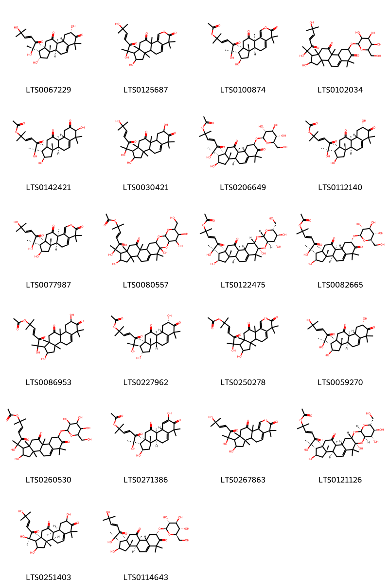{ width=100% }
    <figcaption>Hình ảnh cấu trúc hóa học của 22 hoạt chất thuộc nhóm Steroids and steroid derivatives gồm ['(1r,2s,3as,3bs,8s,9ar,9br,11ar)-1-[(2s,4e)-2,6-dihydroxy-6-methyl-3-oxohept-4-en-2-yl]-2,8-dihydroxy-3a,6,6,9b,11a-pentamethyl-1h,2h,3h,3bh,4h,8h,9h,9ah,11h-cyclopenta[a]phenanthrene-7,10-dione (LTS0067229)', '14-(2,6-dihydroxy-6-methyl-3-oxohept-4-en-2-yl)-13-hydroxy-1,6,6,11,15-pentamethyl-4-oxatetracyclo[8.7.0.0²,⁷.0¹¹,¹⁵]heptadeca-2,7-diene-5,17-dione (LTS0125687)', '(3e,6r)-6-hydroxy-6-[(1r,10s,11s,13r,14r,15r)-13-hydroxy-1,6,6,11,15-pentamethyl-5,17-dioxo-4-oxatetracyclo[8.7.0.0²,⁷.0¹¹,¹⁵]heptadeca-2,7-dien-14-yl]-2-methyl-5-oxohept-3-en-2-yl acetate (LTS0100874)', '1-(2,6-dihydroxy-6-methyl-3-oxohept-4-en-2-yl)-2-hydroxy-3a,6,6,9b,11a-pentamethyl-8-{[3,4,5-trihydroxy-6-(hydroxymethyl)oxan-2-yl]oxy}-1h,2h,3h,3bh,4h,8h,9h,9ah,11h-cyclopenta[a]phenanthrene-7,10-dione (LTS0102034)', '(3e,6r)-6-[(1r,2r,3as,3bs,7s,9ar,9br,11ar)-2,7-dihydroxy-3a,6,6,9b,11a-pentamethyl-8,10-dioxo-1h,2h,3h,3bh,4h,7h,9h,9ah,11h-cyclopenta[a]phenanthren-1-yl]-6-hydroxy-2-methyl-5-oxohept-3-en-2-yl acetate (LTS0142421)', '1-(2,6-dihydroxy-6-methyl-3-oxohept-4-en-2-yl)-2,8-dihydroxy-3a,6,6,9b,11a-pentamethyl-1h,2h,3h,3bh,4h,8h,9h,9ah,11h-cyclopenta[a]phenanthrene-7,10-dione (LTS0030421)', '(3e,6r)-6-[(1r,2r,3as,3bs,8r,9ar,9br,11ar)-2-hydroxy-3a,6,6,9b,11a-pentamethyl-7,10-dioxo-8-{[(2s,3r,4s,5s,6r)-3,4,5-trihydroxy-6-(hydroxymethyl)oxan-2-yl]oxy}-1h,2h,3h,3bh,4h,8h,9h,9ah,11h-cyclopenta[a]phenanthren-1-yl]-6-hydroxy-2-methyl-5-oxohept-3-en-2-yl acetate (LTS0206649)', 'cucurbitacin b (LTS0112140)', '(1r,10s,11s,13r,14r,15r)-14-[(2r,4e)-2,6-dihydroxy-6-methyl-3-oxohept-4-en-2-yl]-13-hydroxy-1,6,6,11,15-pentamethyl-4-oxatetracyclo[8.7.0.0²,⁷.0¹¹,¹⁵]heptadeca-2,7-diene-5,17-dione (LTS0077987)', '6-hydroxy-2-methyl-5-oxo-6-[3,6,7,20-tetrahydroxy-8-(hydroxymethyl)-2,2,15,18,22-pentamethyl-16-oxo-4,9,11-trioxahexacyclo[12.11.0.0³,¹².0⁵,¹⁰.0¹⁵,²³.0¹⁸,²²]pentacos-1(25)-en-19-yl]hept-3-en-2-yl acetate (LTS0080557)', '(3e,6r)-6-hydroxy-2-methyl-5-oxo-6-[(3s,5r,6s,7s,8r,10s,12s,14r,15r,18r,19r,20r,22s,23s)-3,6,7,20-tetrahydroxy-8-(hydroxymethyl)-2,2,15,18,22-pentamethyl-16-oxo-4,9,11-trioxahexacyclo[12.11.0.0³,¹².0⁵,¹⁰.0¹⁵,²³.0¹⁸,²²]pentacos-1(25)-en-19-yl]hept-3-en-2-yl acetate (LTS0122475)', '(3e,6r)-6-[(1r,2r,3as,3bs,8s,9ar,9br,11ar)-2-hydroxy-3a,6,6,9b,11a-pentamethyl-7,10-dioxo-8-{[(2s,3r,4s,5s,6r)-3,4,5-trihydroxy-6-(hydroxymethyl)oxan-2-yl]oxy}-1h,2h,3h,3bh,4h,8h,9h,9ah,11h-cyclopenta[a]phenanthren-1-yl]-6-hydroxy-2-methyl-5-oxohept-3-en-2-yl acetate (LTS0082665)', '6-{2,8-dihydroxy-3a,6,6,9b,11a-pentamethyl-7,10-dioxo-1h,2h,3h,3bh,4h,8h,9h,9ah,11h-cyclopenta[a]phenanthren-1-yl}-6-hydroxy-2-methyl-5-oxohept-3-en-2-yl acetate (LTS0086953)', '(3e,6s)-6-[(1s,2s,3as,3br,8s,9ar,9br,11ar)-2,8-dihydroxy-3a,6,6,9b,11a-pentamethyl-7,10-dioxo-1h,2h,3h,3bh,4h,8h,9h,9ah,11h-cyclopenta[a]phenanthren-1-yl]-6-hydroxy-2-methyl-5-oxohept-3-en-2-yl acetate (LTS0227962)', '6-hydroxy-6-{13-hydroxy-1,6,6,11,15-pentamethyl-5,17-dioxo-4-oxatetracyclo[8.7.0.0²,⁷.0¹¹,¹⁵]heptadeca-2,7-dien-14-yl}-2-methyl-5-oxohept-3-en-2-yl acetate (LTS0250278)', 'cucurbitacin d (LTS0059270)', '6-hydroxy-6-(2-hydroxy-3a,6,6,9b,11a-pentamethyl-7,10-dioxo-8-{[3,4,5-trihydroxy-6-(hydroxymethyl)oxan-2-yl]oxy}-1h,2h,3h,3bh,4h,8h,9h,9ah,11h-cyclopenta[a]phenanthren-1-yl)-2-methyl-5-oxohept-3-en-2-yl acetate (LTS0260530)', 'α-elaterin (LTS0271386)', '14-[(4e)-2,6-dihydroxy-6-methyl-3-oxohept-4-en-2-yl]-13-hydroxy-1,6,6,11,15-pentamethyl-4-oxatetracyclo[8.7.0.0²,⁷.0¹¹,¹⁵]heptadeca-2,7-diene-5,17-dione (LTS0267863)', '(3e,6r)-6-hydroxy-2-methyl-5-oxo-6-[(3s,5r,6s,7s,8r,10r,12s,14r,15r,18r,19r,20r,22s,23s)-3,6,7,20-tetrahydroxy-8-(hydroxymethyl)-2,2,15,18,22-pentamethyl-16-oxo-4,9,11-trioxahexacyclo[12.11.0.0³,¹².0⁵,¹⁰.0¹⁵,²³.0¹⁸,²²]pentacos-1(25)-en-19-yl]hept-3-en-2-yl acetate (LTS0121126)', '(3as,3bs,9as,9br,11ar)-1-[(2r)-2,6-dihydroxy-6-methyl-3-oxohept-4-en-2-yl]-2,8-dihydroxy-3a,6,6,9b,11a-pentamethyl-1h,2h,3h,3bh,4h,8h,9h,9ah,11h-cyclopenta[a]phenanthrene-7,10-dione (LTS0251403)', '(1r,2r,3as,3bs,8s,9ar,9br,11ar)-1-[(2r,4e)-2,6-dihydroxy-6-methyl-3-oxohept-4-en-2-yl]-2-hydroxy-3a,6,6,9b,11a-pentamethyl-8-{[(2s,3r,4s,5s,6r)-3,4,5-trihydroxy-6-(hydroxymethyl)oxan-2-yl]oxy}-1h,2h,3h,3bh,4h,8h,9h,9ah,11h-cyclopenta[a]phenanthrene-7,10-dione (LTS0114643)'].</figcaption>
</figure>

---

### Dược dân tộc học

Danh sách các quốc gia có sử dụng *Luffa operculata* trong điều trị các bệnh. 

| Country   | Disease   | Bệnh     |
|:----------|:----------|:---------|
| Elsewhere | Purgative | Thuốc xổ |
| Venezuela | Purgative | Thuốc xổ |

---

# Chi Bryonia

??? note "Danh sách các dược liệu thuộc chi"
    
	 - *Bryonia alba*
	 - *Bryonia cretica*
	 - *Bryonia dioica*

---
## Bryonia alba
### Thông tin về thực vật

!!! info "Phân loại thực vật của *Bryonia alba* từ GIBF:"
    - **Kingdom:** Plantae
    - **Phylum:** Tracheophyta
    - **Order:** Cucurbitales
    - **Family:** Cucurbitaceae
    - **Genus:** Bryonia
    - **Species:** *Bryonia alba*

 

| Label (VI)   | Label (EN)   | Scientific Name   | Descriptions (VI)   | Descriptions (EN)   | Also Known As (VI)   | Also Known As (EN)   |
|:-------------|:-------------|:------------------|:--------------------|:--------------------|:---------------------|:---------------------|
| N/A          | N/A          | Bryonia alba      |                     | species of plant    | ['']                 | ['white bryony']     |

#### Phân bố trên thế giới

**Từ CSDL GIBF** nan, Czechia, Uzbekistan, Sweden, Kazakhstan, Denmark, Poland, United States of America, Russian Federation, Lithuania, Belarus, Norway, Georgia, Germany, Austria, Hungary, Ukraine, Slovakia, Kyrgyzstan, Italy

#### Phân bố tại Việt Nam

**Từ CSDL GIBF**: Không có ghi nhận ở Việt Nam

---
### Thành phần hóa học
        
- Theo cơ sở dữ liệu lotus: Từ loài *Bryonia alba* đã phân lập và xác định được 46 hoạt chất thuộc về các nhóm Fatty Acyls, Organic phosphoric acids and derivatives, Flavonoids, Steroids and steroid derivatives, Organooxygen compounds, Glycerophospholipids. 

|    | chemicalTaxonomyClassyfireClass          |   smiles_count |
|---:|:-----------------------------------------|---------------:|
|  0 | Fatty Acyls                              |              7 |
|  1 | Flavonoids                               |              9 |
|  2 | Glycerophospholipids                     |              1 |
|  3 | Organic phosphoric acids and derivatives |              1 |
|  4 | Organooxygen compounds                   |              9 |
|  5 | Steroids and steroid derivatives         |             19 |

#### Nhóm Fatty Acyls
<figure markdown="span">
    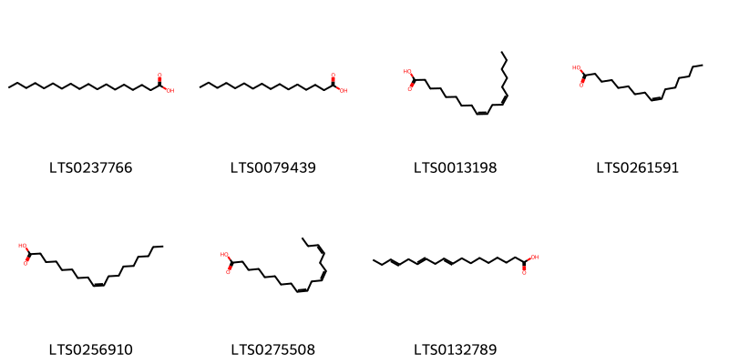{ width=100% }
    <figcaption>Hình ảnh cấu trúc hóa học của 7 hoạt chất thuộc nhóm Fatty Acyls gồm ['stearic acid (LTS0237766)', 'palmitic acid (LTS0079439)', 'linoleic (LTS0013198)', 'palmitoleic acid (LTS0261591)', 'oleic acid (LTS0256910)', 'α-linolenic acid (LTS0275508)', 'α linolenic acid (LTS0132789)'].</figcaption>
</figure>
#### Nhóm Flavonoids
<figure markdown="span">
    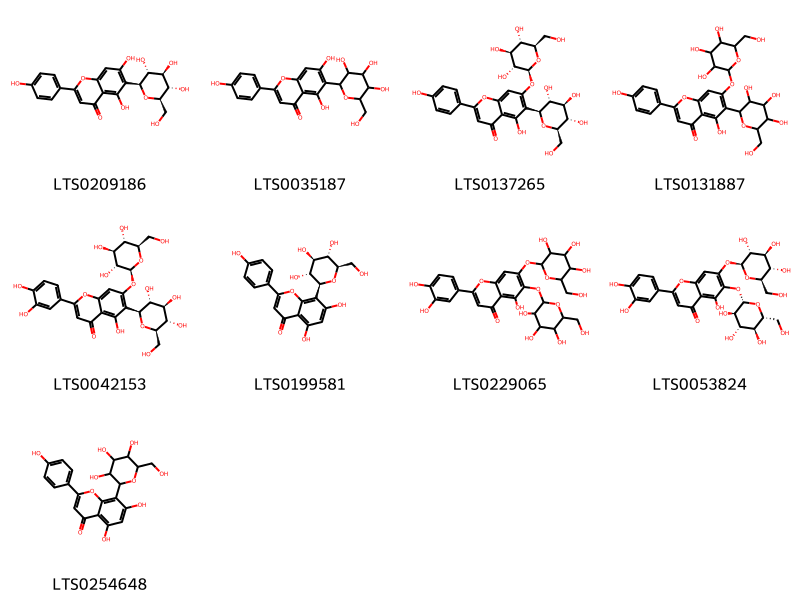{ width=100% }
    <figcaption>Hình ảnh cấu trúc hóa học của 9 hoạt chất thuộc nhóm Flavonoids gồm ['isovitexin (LTS0209186)', 'isovitexin (LTS0035187)', 'saponarin (LTS0137265)', 'saponarin (LTS0131887)', '2-(3,4-dihydroxyphenyl)-5-hydroxy-6-[(2s,3r,4r,5s,6r)-3,4,5-trihydroxy-6-(hydroxymethyl)oxan-2-yl]-7-{[(2s,3r,4s,5s,6r)-3,4,5-trihydroxy-6-(hydroxymethyl)oxan-2-yl]oxy}chromen-4-one (LTS0042153)', 'vitexin (LTS0199581)', '2-(3,4-dihydroxyphenyl)-5-hydroxy-6,7-bis({[3,4,5-trihydroxy-6-(hydroxymethyl)oxan-2-yl]oxy})chromen-4-one (LTS0229065)', '2-(3,4-dihydroxyphenyl)-5-hydroxy-6,7-bis({[(2s,3r,4s,5s,6r)-3,4,5-trihydroxy-6-(hydroxymethyl)oxan-2-yl]oxy})chromen-4-one (LTS0053824)', 'vitexin (LTS0254648)'].</figcaption>
</figure>
#### Nhóm Glycerophospholipids
<figure markdown="span">
    { width=100% }
    <figcaption>Hình ảnh cấu trúc hóa học của 1 hoạt chất thuộc nhóm Glycerophospholipids gồm ['2,3-dihydroxypropoxy(3-(hexadecanoyloxy)-2-[(9e,12e)-octadeca-9,12-dienoyloxy]propoxy)phosphinic acid (LTS0232487)'].</figcaption>
</figure>
#### Nhóm Organic phosphoric acids and derivatives
<figure markdown="span">
    { width=100% }
    <figcaption>Hình ảnh cấu trúc hóa học của 1 hoạt chất thuộc nhóm Organic phosphoric acids and derivatives gồm ['o-phosphoethanolamine; bis(nonane) (LTS0249963)'].</figcaption>
</figure>
#### Nhóm Organooxygen compounds
<figure markdown="span">
    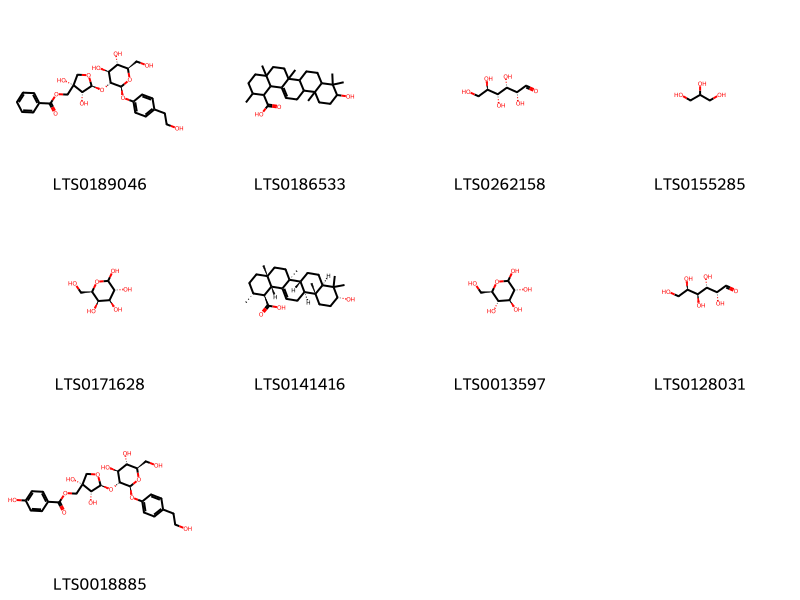{ width=100% }
    <figcaption>Hình ảnh cấu trúc hóa học của 9 hoạt chất thuộc nhóm Organooxygen compounds gồm ['[(3s,4r,5s)-5-{[(2s,3r,4s,5s,6r)-4,5-dihydroxy-2-[4-(2-hydroxyethyl)phenoxy]-6-(hydroxymethyl)oxan-3-yl]oxy}-3,4-dihydroxyoxolan-3-yl]methyl benzoate (LTS0189046)', '10-hydroxy-2,4a,6a,9,9,12a-hexamethyl-1,2,3,4,5,6,6b,7,8,8a,10,11,12,12b,13,14b-hexadecahydropicene-1-carboxylic acid (LTS0186533)', '(+)-glucose (LTS0262158)', 'glycerol (LTS0155285)', 'galactose (LTS0171628)', '(1s,2r,4ar,6as,6br,8ar,10r,12ar,12bs,14br)-10-hydroxy-2,4a,6a,9,9,12a-hexamethyl-1,2,3,4,5,6,6b,7,8,8a,10,11,12,12b,13,14b-hexadecahydropicene-1-carboxylic acid (LTS0141416)', 'glucose (LTS0013597)', 'aldehydo-d-galactose (LTS0128031)', '[(3s,4r,5s)-5-{[(2s,3r,4s,5s,6r)-4,5-dihydroxy-2-[4-(2-hydroxyethyl)phenoxy]-6-(hydroxymethyl)oxan-3-yl]oxy}-3,4-dihydroxyoxolan-3-yl]methyl 4-hydroxybenzoate (LTS0018885)'].</figcaption>
</figure>
#### Nhóm Steroids and steroid derivatives
<figure markdown="span">
    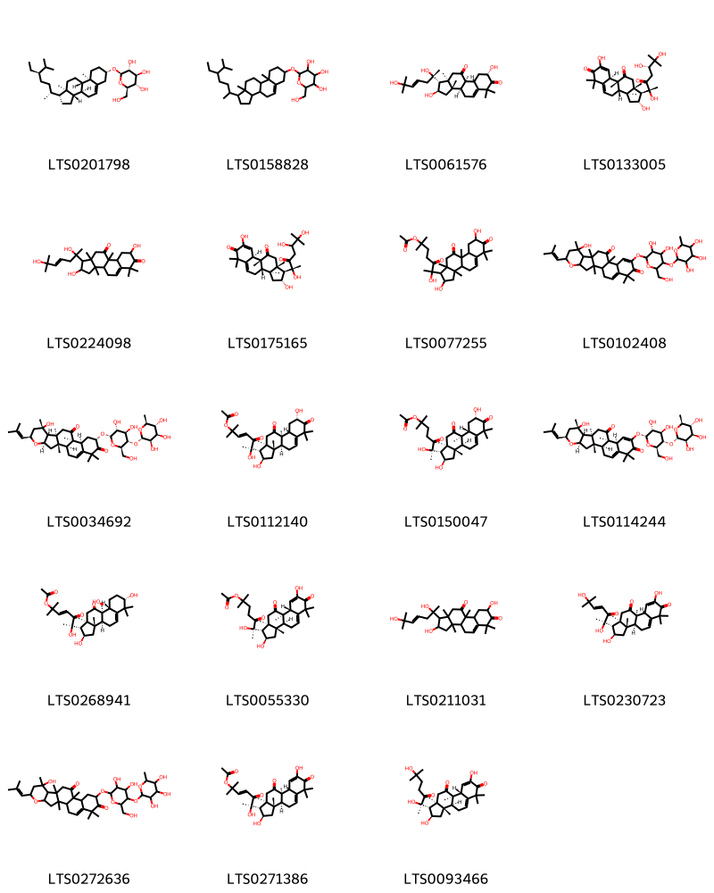{ width=100% }
    <figcaption>Hình ảnh cấu trúc hóa học của 19 hoạt chất thuộc nhóm Steroids and steroid derivatives gồm ['sitogluside (LTS0201798)', '2-{[1-(5-ethyl-6-methylheptan-2-yl)-9a,11a-dimethyl-1h,2h,3h,3ah,3bh,4h,6h,7h,8h,9h,9bh,10h,11h-cyclopenta[a]phenanthren-7-yl]oxy}-6-(hydroxymethyl)oxane-3,4,5-triol (LTS0158828)', '(1r,2r,3as,3bs,8s,9ar,9br,11ar)-1-[(2s,4e)-2,6-dihydroxy-6-methylhept-4-en-2-yl]-2,8-dihydroxy-3a,6,6,9b,11a-pentamethyl-1h,2h,3h,3bh,4h,8h,9h,9ah,11h-cyclopenta[a]phenanthrene-7,10-dione (LTS0061576)', '(1r,2r,3as,3bs,9ar,9br,11ar)-2,8-dihydroxy-3a,6,6,9b,11a-pentamethyl-1-[(2r,5s)-2,5,6-trihydroxy-6-methyl-3-oxoheptan-2-yl]-1h,2h,3h,3bh,4h,9ah,11h-cyclopenta[a]phenanthrene-7,10-dione (LTS0133005)', '1-[(4e)-2,6-dihydroxy-6-methylhept-4-en-2-yl]-2,8-dihydroxy-3a,6,6,9b,11a-pentamethyl-1h,2h,3h,3bh,4h,8h,9h,9ah,11h-cyclopenta[a]phenanthrene-7,10-dione (LTS0224098)', 'cucurbitacin j (LTS0175165)', '6-{2,8-dihydroxy-3a,6,6,9b,11a-pentamethyl-7,10-dioxo-1h,2h,3h,3bh,4h,8h,9h,9ah,11h-cyclopenta[a]phenanthren-1-yl}-6-hydroxy-2-methyl-5-oxoheptan-2-yl acetate (LTS0077255)', '16-{[3,4-dihydroxy-6-(hydroxymethyl)-5-[(3,4,5-trihydroxy-6-methyloxan-2-yl)oxy]oxan-2-yl]oxy}-8-hydroxy-2,8,10,13,18,18-hexamethyl-6-(2-methylprop-1-en-1-yl)-5-oxapentacyclo[11.8.0.0²,¹⁰.0⁴,⁹.0¹⁴,¹⁹]henicosa-15,19-diene-12,17-dione (LTS0102408)', '(1s,2s,4r,6r,8s,9s,10r,13r,14s,16s)-16-{[(2r,3r,4r,5s,6r)-3,4-dihydroxy-6-(hydroxymethyl)-5-{[(2s,3r,4r,5r,6s)-3,4,5-trihydroxy-6-methyloxan-2-yl]oxy}oxan-2-yl]oxy}-8-hydroxy-2,8,10,13,18,18-hexamethyl-6-(2-methylprop-1-en-1-yl)-5-oxapentacyclo[11.8.0.0²,¹⁰.0⁴,⁹.0¹⁴,¹⁹]henicos-19-ene-12,17-dione (LTS0034692)', 'cucurbitacin b (LTS0112140)', 'dihydrocucurbitacin b (LTS0150047)', '(1s,2s,4r,6r,8s,9s,10r,13r,14s)-16-{[(2r,3r,4r,5s,6r)-3,4-dihydroxy-6-(hydroxymethyl)-5-{[(2s,3r,4r,5r,6s)-3,4,5-trihydroxy-6-methyloxan-2-yl]oxy}oxan-2-yl]oxy}-8-hydroxy-2,8,10,13,18,18-hexamethyl-6-(2-methylprop-1-en-1-yl)-5-oxapentacyclo[11.8.0.0²,¹⁰.0⁴,⁹.0¹⁴,¹⁹]henicosa-15,19-diene-12,17-dione (LTS0114244)', 'cucurbitacin c (LTS0268941)', '23,24-dihydrocucurbitacin e (LTS0055330)', '1-(2,6-dihydroxy-6-methylhept-4-en-2-yl)-2,8-dihydroxy-3a,6,6,9b,11a-pentamethyl-1h,2h,3h,3bh,4h,8h,9h,9ah,11h-cyclopenta[a]phenanthrene-7,10-dione (LTS0211031)', 'cucurbitacin (LTS0230723)', '16-{[3,4-dihydroxy-6-(hydroxymethyl)-5-[(3,4,5-trihydroxy-6-methyloxan-2-yl)oxy]oxan-2-yl]oxy}-8-hydroxy-2,8,10,13,18,18-hexamethyl-6-(2-methylprop-1-en-1-yl)-5-oxapentacyclo[11.8.0.0²,¹⁰.0⁴,⁹.0¹⁴,¹⁹]henicos-19-ene-12,17-dione (LTS0272636)', 'α-elaterin (LTS0271386)', 'cucurbitacin l (LTS0093466)'].</figcaption>
</figure>

---

### Dược dân tộc học

Danh sách các quốc gia có sử dụng *Bryonia alba* trong điều trị các bệnh. 

| Country   | Disease                                                                  | Bệnh                                                                           |
|:----------|:-------------------------------------------------------------------------|:-------------------------------------------------------------------------------|
| Turkey    | Diuretic, Emetic, Emmenagogue, Expectorant, Poison, Purgative, Vermifuge | Thuốc lợi tiểu, Emetic, Emmenagogue, Expectorant, Poison, Purgative, Vermifuge |

---

---
## Bryonia cretica
### Thông tin về thực vật

!!! info "Phân loại thực vật của *Bryonia cretica* từ GIBF:"
    - **Kingdom:** Plantae
    - **Phylum:** Tracheophyta
    - **Order:** Cucurbitales
    - **Family:** Cucurbitaceae
    - **Genus:** Bryonia
    - **Species:** *Bryonia cretica*

 

| Label (VI)   | Label (EN)   | Scientific Name   | Descriptions (VI)   | Descriptions (EN)   | Also Known As (VI)   | Also Known As (EN)   |
|:-------------|:-------------|:------------------|:--------------------|:--------------------|:---------------------|:---------------------|
| N/A          | N/A          | Bryonia cretica   | loài thực vật       | species of plant    | ['']                 | ['']                 |

#### Phân bố trên thế giới

**Từ CSDL GIBF** Austria, Algeria, Portugal, Greece, United Kingdom of Great Britain and Northern Ireland, Belgium, Israel, Italy, Croatia, Switzerland, Germany, France, Spain

#### Phân bố tại Việt Nam

**Từ CSDL GIBF**: Không có ghi nhận ở Việt Nam

---
### Thành phần hóa học
        
- Theo cơ sở dữ liệu lotus: Từ loài *Bryonia cretica* đã phân lập và xác định được 49 hoạt chất thuộc về các nhóm Steroids and steroid derivatives. 

|    | chemicalTaxonomyClassyfireClass   |   smiles_count |
|---:|:----------------------------------|---------------:|
|  0 | Steroids and steroid derivatives  |             49 |

#### Nhóm Steroids and steroid derivatives
<figure markdown="span">
    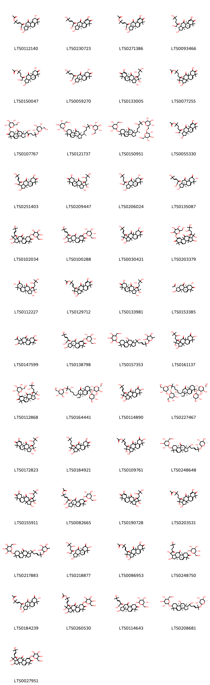{ width=100% }
    <figcaption>Hình ảnh cấu trúc hóa học của 49 hoạt chất thuộc nhóm Steroids and steroid derivatives gồm ['cucurbitacin b (LTS0112140)', 'cucurbitacin (LTS0230723)', 'α-elaterin (LTS0271386)', 'cucurbitacin l (LTS0093466)', 'dihydrocucurbitacin b (LTS0150047)', 'cucurbitacin d (LTS0059270)', '(1r,2r,3as,3bs,9ar,9br,11ar)-2,8-dihydroxy-3a,6,6,9b,11a-pentamethyl-1-[(2r,5s)-2,5,6-trihydroxy-6-methyl-3-oxoheptan-2-yl]-1h,2h,3h,3bh,4h,9ah,11h-cyclopenta[a]phenanthrene-7,10-dione (LTS0133005)', '6-{2,8-dihydroxy-3a,6,6,9b,11a-pentamethyl-7,10-dioxo-1h,2h,3h,3bh,4h,8h,9h,9ah,11h-cyclopenta[a]phenanthren-1-yl}-6-hydroxy-2-methyl-5-oxoheptan-2-yl acetate (LTS0077255)', '(1s,3as,3bs,8s,9ar,9br,11ar)-1-[(2r)-2-hydroxy-6-methyl-3-oxo-6-{[(2s,3r,4s,5s,6r)-3,4,5-trihydroxy-6-(hydroxymethyl)oxan-2-yl]oxy}heptan-2-yl]-3a,6,6,9b,11a-pentamethyl-8-{[(2s,3r,4s,5s,6r)-3,4,5-trihydroxy-6-(hydroxymethyl)oxan-2-yl]oxy}-1h,2h,3h,3bh,4h,8h,9h,9ah,11h-cyclopenta[a]phenanthrene-7,10-dione (LTS0107767)', '(1r,3as,3bs,7s,9ar,9br,11ar)-1-[(2r,5r)-5-hydroxy-6-methyl-6-{[(2s,3r,4s,5s,6r)-3,4,5-trihydroxy-6-(hydroxymethyl)oxan-2-yl]oxy}heptan-2-yl]-3a,6,6,9b,11a-pentamethyl-7-{[(2r,3r,4s,5s,6r)-3,4,5-trihydroxy-6-(hydroxymethyl)oxan-2-yl]oxy}-1h,2h,3h,3bh,4h,7h,8h,9h,9ah,11h-cyclopenta[a]phenanthren-10-one (LTS0121737)', '(1r,3as,3bs,7s,9ar,9br,11ar)-1-[(2r,5r)-5-hydroxy-6-methyl-6-{[(2s,3r,4s,5s,6r)-3,4,5-trihydroxy-6-({[(2r,3r,4s,5s,6r)-3,4,5-trihydroxy-6-(hydroxymethyl)oxan-2-yl]oxy}methyl)oxan-2-yl]oxy}heptan-2-yl]-3a,6,6,9b,11a-pentamethyl-7-{[(2r,3r,4s,5s,6r)-3,4,5-trihydroxy-6-(hydroxymethyl)oxan-2-yl]oxy}-1h,2h,3h,3bh,4h,7h,8h,9h,9ah,11h-cyclopenta[a]phenanthren-10-one (LTS0150951)', '23,24-dihydrocucurbitacin e (LTS0055330)', '(3as,3bs,9as,9br,11ar)-1-[(2r)-2,6-dihydroxy-6-methyl-3-oxohept-4-en-2-yl]-2,8-dihydroxy-3a,6,6,9b,11a-pentamethyl-1h,2h,3h,3bh,4h,8h,9h,9ah,11h-cyclopenta[a]phenanthrene-7,10-dione (LTS0251403)', '(1r,2r,3as,3bs,8s,9ar,9br,11ar)-2,8-dihydroxy-3a,6,6,9b,11a-pentamethyl-1-[(2r,5r)-2,5,6-trihydroxy-6-methyl-3-oxoheptan-2-yl]-1h,2h,3h,3bh,4h,8h,9h,9ah,11h-cyclopenta[a]phenanthrene-7,10-dione (LTS0209447)', '23,24-dihydrocucurbitacin d (LTS0206024)', '(1r,2r,3as,3bs,7r,9ar,9br,11ar)-1-[(2r,4e)-2,6-dihydroxy-6-methyl-3-oxohept-4-en-2-yl]-2,7-dihydroxy-3a,6,6,9b,11a-pentamethyl-1h,2h,3h,3bh,4h,7h,9h,9ah,11h-cyclopenta[a]phenanthrene-8,10-dione (LTS0135087)', '1-(2,6-dihydroxy-6-methyl-3-oxohept-4-en-2-yl)-2-hydroxy-3a,6,6,9b,11a-pentamethyl-8-{[3,4,5-trihydroxy-6-(hydroxymethyl)oxan-2-yl]oxy}-1h,2h,3h,3bh,4h,8h,9h,9ah,11h-cyclopenta[a]phenanthrene-7,10-dione (LTS0102034)', '(2r,3as,9br,11ar)-1-[(2r,4e)-2,6-dihydroxy-6-methyl-3-oxohept-4-en-2-yl]-2-hydroxy-3a,6,6,9b,11a-pentamethyl-8-{[(2s,3r,4s,5s,6r)-3,4,5-trihydroxy-6-(hydroxymethyl)oxan-2-yl]oxy}-1h,2h,3h,3bh,4h,9ah,11h-cyclopenta[a]phenanthrene-7,10-dione (LTS0100288)', '1-(2,6-dihydroxy-6-methyl-3-oxohept-4-en-2-yl)-2,8-dihydroxy-3a,6,6,9b,11a-pentamethyl-1h,2h,3h,3bh,4h,8h,9h,9ah,11h-cyclopenta[a]phenanthrene-7,10-dione (LTS0030421)', '2-hydroxy-3a,6,6,9b,11a-pentamethyl-8-{[3,4,5-trihydroxy-6-(hydroxymethyl)oxan-2-yl]oxy}-1-(2,5,6-trihydroxy-6-methyl-3-oxoheptan-2-yl)-1h,2h,3h,3bh,4h,9ah,11h-cyclopenta[a]phenanthrene-7,10-dione (LTS0203379)', '(1r,2r,3as,3bs,7s,9ar,9br,11ar)-2,7-dihydroxy-3a,6,6,9b,11a-pentamethyl-1-[(2r,5r)-2,5,6-trihydroxy-6-methyl-3-oxoheptan-2-yl]-1h,2h,3h,3bh,4h,7h,9h,9ah,11h-cyclopenta[a]phenanthrene-8,10-dione (LTS0112227)', '6-{2,8-dihydroxy-3a,6,6,9b,11a-pentamethyl-7,10-dioxo-1h,2h,3h,3bh,4h,9ah,11h-cyclopenta[a]phenanthren-1-yl}-6-hydroxy-2-methyl-5-oxohept-3-en-2-yl acetate (LTS0129712)', '(1r,2r,3as,3bs,8s,9ar,9br,11ar)-2,8-dihydroxy-3a,6,6,9b,11a-pentamethyl-1-[(2r,5s)-2,5,6-trihydroxy-6-methyl-3-oxoheptan-2-yl]-1h,2h,3h,3bh,4h,8h,9h,9ah,11h-cyclopenta[a]phenanthrene-7,10-dione (LTS0133981)', '(1r,2r,3as,3bs,8s,9ar,9br,11ar)-1-acetyl-2,8-dihydroxy-3a,6,6,9b,11a-pentamethyl-1h,2h,3h,3bh,4h,8h,9h,9ah,11h-cyclopenta[a]phenanthrene-7,10-dione (LTS0153385)', '1-acetyl-2,8-dihydroxy-3a,6,6,9b,11a-pentamethyl-1h,2h,3h,3bh,4h,8h,9h,9ah,11h-cyclopenta[a]phenanthrene-7,10-dione (LTS0147599)', '(1r,2r,3as,3bs,9ar,9br,11ar)-1-[(2r,4e)-2,6-dihydroxy-6-methyl-3-oxohept-4-en-2-yl]-2-hydroxy-3a,6,6,9b,11a-pentamethyl-8-{[(2s,3r,4s,5s,6r)-3,4,5-trihydroxy-6-(hydroxymethyl)oxan-2-yl]oxy}-1h,2h,3h,3bh,4h,9ah,11h-cyclopenta[a]phenanthrene-7,10-dione (LTS0138798)', '2-{[6-hydroxy-6-(10-hydroxy-3a,6,6,9b,11a-pentamethyl-7-{[3,4,5-trihydroxy-6-(hydroxymethyl)oxan-2-yl]oxy}-1h,2h,3h,3bh,4h,7h,8h,9h,9ah,10h,11h-cyclopenta[a]phenanthren-1-yl)-2-methylhept-3-en-2-yl]oxy}-6-methyloxane-3,4,5-triol (LTS0157353)', '2,7-dihydroxy-3a,6,6,9b,11a-pentamethyl-1-(2,5,6-trihydroxy-6-methyl-3-oxoheptan-2-yl)-1h,2h,3h,3bh,4h,7h,9h,9ah,11h-cyclopenta[a]phenanthrene-8,10-dione (LTS0161137)', '(1r,2r,3as,3bs,9ar,9br,11ar)-2-hydroxy-3a,6,6,9b,11a-pentamethyl-8-{[(2s,3r,4s,5s,6r)-3,4,5-trihydroxy-6-(hydroxymethyl)oxan-2-yl]oxy}-1-[(2r,5s)-2,5,6-trihydroxy-6-methyl-3-oxoheptan-2-yl]-1h,2h,3h,3bh,4h,9ah,11h-cyclopenta[a]phenanthrene-7,10-dione (LTS0112868)', '(1r,3as,3bs,7s,9ar,9br,11ar)-7-{[(2r,3r,4s,5s,6r)-4,5-dihydroxy-6-(hydroxymethyl)-3-{[(2s,3r,4r,5r,6s)-3,4,5-trihydroxy-6-methyloxan-2-yl]oxy}oxan-2-yl]oxy}-1-[(2r,5r)-5-hydroxy-6-methyl-6-{[(2s,3r,4s,5s,6r)-3,4,5-trihydroxy-6-(hydroxymethyl)oxan-2-yl]oxy}heptan-2-yl]-3a,6,6,9b,11a-pentamethyl-1h,2h,3h,3bh,4h,7h,8h,9h,9ah,11h-cyclopenta[a]phenanthren-10-one (LTS0164441)', '1-(2,6-dihydroxy-6-methyl-3-oxohept-4-en-2-yl)-2,7-dihydroxy-3a,6,6,9b,11a-pentamethyl-1h,2h,3h,3bh,4h,7h,9h,9ah,11h-cyclopenta[a]phenanthrene-8,10-dione (LTS0114890)', '(1r,3as,3bs,7s,9ar,9br,11ar)-7-{[(2r,3r,4s,5s,6r)-4,5-dihydroxy-6-(hydroxymethyl)-3-{[(2s,3r,4r,5r,6s)-3,4,5-trihydroxy-6-methyloxan-2-yl]oxy}oxan-2-yl]oxy}-1-[(2r,5r)-6-{[(2s,3r,4s,5s,6r)-4,5-dihydroxy-6-(hydroxymethyl)-3-{[(2s,3r,4s,5s,6r)-3,4,5-trihydroxy-6-(hydroxymethyl)oxan-2-yl]oxy}oxan-2-yl]oxy}-5-hydroxy-6-methylheptan-2-yl]-3a,6,6,9b,11a-pentamethyl-1h,2h,3h,3bh,4h,7h,8h,9h,9ah,11h-cyclopenta[a]phenanthren-10-one (LTS0227467)', 'cucurbitacin j (LTS0172823)', '1-(2,6-dihydroxy-6-methyl-3-oxoheptan-2-yl)-2,8-dihydroxy-3a,6,6,9b,11a-pentamethyl-1h,2h,3h,3bh,4h,8h,9h,9ah,11h-cyclopenta[a]phenanthrene-7,10-dione (LTS0184921)', '6-{2,7-dihydroxy-3a,6,6,9b,11a-pentamethyl-8,10-dioxo-1h,2h,3h,3bh,4h,7h,9h,9ah,11h-cyclopenta[a]phenanthren-1-yl}-6-hydroxy-2-methyl-5-oxohept-3-en-2-yl acetate (LTS0109761)', '(1s,3as,3bs,7s,9ar,9br,11ar)-1-[(2s,4e)-2-hydroxy-6-methyl-6-{[(2s,3r,4r,5r,6s)-3,4,5-trihydroxy-6-methyloxan-2-yl]oxy}hept-4-en-2-yl]-3a,6,6,9b,11a-pentamethyl-7-{[(2r,3r,4s,5s,6r)-3,4,5-trihydroxy-6-(hydroxymethyl)oxan-2-yl]oxy}-1h,2h,3h,3bh,4h,7h,8h,9h,9ah,11h-cyclopenta[a]phenanthren-10-one (LTS0248648)', '2,8-dihydroxy-3a,6,6,9b,11a-pentamethyl-1-(2,5,6-trihydroxy-6-methyl-3-oxoheptan-2-yl)-1h,2h,3h,3bh,4h,8h,9h,9ah,11h-cyclopenta[a]phenanthrene-7,10-dione (LTS0155911)', '(3e,6r)-6-[(1r,2r,3as,3bs,8s,9ar,9br,11ar)-2-hydroxy-3a,6,6,9b,11a-pentamethyl-7,10-dioxo-8-{[(2s,3r,4s,5s,6r)-3,4,5-trihydroxy-6-(hydroxymethyl)oxan-2-yl]oxy}-1h,2h,3h,3bh,4h,8h,9h,9ah,11h-cyclopenta[a]phenanthren-1-yl]-6-hydroxy-2-methyl-5-oxohept-3-en-2-yl acetate (LTS0082665)', '2,8-dihydroxy-3a,6,6,9b,11a-pentamethyl-1-(2,5,6-trihydroxy-6-methyl-3-oxoheptan-2-yl)-1h,2h,3h,3bh,4h,9ah,11h-cyclopenta[a]phenanthrene-7,10-dione (LTS0190728)', '6-{2,8-dihydroxy-3a,6,6,9b,11a-pentamethyl-7,10-dioxo-1h,2h,3h,3bh,4h,9ah,11h-cyclopenta[a]phenanthren-1-yl}-6-hydroxy-2-methyl-5-oxoheptan-2-yl acetate (LTS0203531)', '1-{2-hydroxy-6-methyl-6-[(3,4,5-trihydroxy-6-methyloxan-2-yl)oxy]hept-4-en-2-yl}-3a,6,6,9b,11a-pentamethyl-7-{[3,4,5-trihydroxy-6-(hydroxymethyl)oxan-2-yl]oxy}-1h,2h,3h,3bh,4h,7h,8h,9h,9ah,11h-cyclopenta[a]phenanthren-10-one (LTS0217883)', '(1r,2r,3as,3bs,7s,9ar,9br,11ar)-2,7-dihydroxy-3a,6,6,9b,11a-pentamethyl-1-[(2r,5s)-2,5,6-trihydroxy-6-methyl-3-oxoheptan-2-yl]-1h,2h,3h,3bh,4h,7h,9h,9ah,11h-cyclopenta[a]phenanthrene-8,10-dione (LTS0218877)', '6-{2,8-dihydroxy-3a,6,6,9b,11a-pentamethyl-7,10-dioxo-1h,2h,3h,3bh,4h,8h,9h,9ah,11h-cyclopenta[a]phenanthren-1-yl}-6-hydroxy-2-methyl-5-oxohept-3-en-2-yl acetate (LTS0086953)', '(2r,3as,3bs,8s,9ar,9br,11ar)-1-[(2r)-2,6-dihydroxy-6-methyl-3-oxoheptan-2-yl]-2-hydroxy-3a,6,6,9b,11a-pentamethyl-8-{[(2s,3r,4s,5s,6r)-3,4,5-trihydroxy-6-(hydroxymethyl)oxan-2-yl]oxy}-1h,2h,3h,3bh,4h,8h,9h,9ah,11h-cyclopenta[a]phenanthrene-7,10-dione (LTS0248750)', '(3e,6r)-6-[(1r,2r,3as,3bs,7r,9ar,9br,11ar)-2,7-dihydroxy-3a,6,6,9b,11a-pentamethyl-8,10-dioxo-1h,2h,3h,3bh,4h,7h,9h,9ah,11h-cyclopenta[a]phenanthren-1-yl]-6-hydroxy-2-methyl-5-oxohept-3-en-2-yl acetate (LTS0184239)', '6-hydroxy-6-(2-hydroxy-3a,6,6,9b,11a-pentamethyl-7,10-dioxo-8-{[3,4,5-trihydroxy-6-(hydroxymethyl)oxan-2-yl]oxy}-1h,2h,3h,3bh,4h,8h,9h,9ah,11h-cyclopenta[a]phenanthren-1-yl)-2-methyl-5-oxohept-3-en-2-yl acetate (LTS0260530)', '(1r,2r,3as,3bs,8s,9ar,9br,11ar)-1-[(2r,4e)-2,6-dihydroxy-6-methyl-3-oxohept-4-en-2-yl]-2-hydroxy-3a,6,6,9b,11a-pentamethyl-8-{[(2s,3r,4s,5s,6r)-3,4,5-trihydroxy-6-(hydroxymethyl)oxan-2-yl]oxy}-1h,2h,3h,3bh,4h,8h,9h,9ah,11h-cyclopenta[a]phenanthrene-7,10-dione (LTS0114643)', '(2s,3r,4r,5r,6s)-2-{[(3e,6s)-6-[(1s,3as,3bs,7s,9ar,9br,10s,11ar)-10-hydroxy-3a,6,6,9b,11a-pentamethyl-7-{[(2r,3r,4s,5s,6r)-3,4,5-trihydroxy-6-(hydroxymethyl)oxan-2-yl]oxy}-1h,2h,3h,3bh,4h,7h,8h,9h,9ah,10h,11h-cyclopenta[a]phenanthren-1-yl]-6-hydroxy-2-methylhept-3-en-2-yl]oxy}-6-methyloxane-3,4,5-triol (LTS0208681)', '1-(2,6-dihydroxy-6-methyl-3-oxohept-4-en-2-yl)-2-hydroxy-3a,6,6,9b,11a-pentamethyl-8-{[3,4,5-trihydroxy-6-(hydroxymethyl)oxan-2-yl]oxy}-1h,2h,3h,3bh,4h,9ah,11h-cyclopenta[a]phenanthrene-7,10-dione (LTS0027951)'].</figcaption>
</figure>

---

### Dược dân tộc học

Danh sách các quốc gia có sử dụng *Bryonia cretica* trong điều trị các bệnh. 

| Country   | Disease   | Bệnh     |
|:----------|:----------|:---------|
| Europe    | Poison    | Chất độc |

---

---
## Bryonia dioica
### Thông tin về thực vật

!!! info "Phân loại thực vật của *Bryonia dioica* từ GIBF:"
    - **Kingdom:** Plantae
    - **Phylum:** Tracheophyta
    - **Order:** Cucurbitales
    - **Family:** Cucurbitaceae
    - **Genus:** Bryonia
    - **Species:** *Bryonia dioica*

 

| Label (VI)   | Label (EN)   | Scientific Name   | Descriptions (VI)   | Descriptions (EN)   | Also Known As (VI)   | Also Known As (EN)                                            |
|:-------------|:-------------|:------------------|:--------------------|:--------------------|:---------------------|:--------------------------------------------------------------|
| N/A          | N/A          | Bryonia dioica    | loài thực vật       | species of plant    | ['']                 | ['Bryonia cretica dioica', 'bryony black', 'Bryonea Dioicia'] |

#### Phân bố trên thế giới

**Từ CSDL GIBF** nan, Austria, Portugal, United Kingdom of Great Britain and Northern Ireland, Italy, Switzerland, Luxembourg, Germany, France, Spain, Netherlands

#### Phân bố tại Việt Nam

**Từ CSDL GIBF**: Không có ghi nhận ở Việt Nam

---
### Thành phần hóa học
        
- Theo cơ sở dữ liệu lotus: Từ loài *Bryonia dioica* đã phân lập và xác định được 65 hoạt chất thuộc về các nhóm Flavonoids, Steroids and steroid derivatives, Organooxygen compounds, Prenol lipids. 

|    | chemicalTaxonomyClassyfireClass   |   smiles_count |
|---:|:----------------------------------|---------------:|
|  0 | Flavonoids                        |              6 |
|  1 | Organooxygen compounds            |              4 |
|  2 | Prenol lipids                     |             11 |
|  3 | Steroids and steroid derivatives  |             40 |

#### Nhóm Flavonoids
<figure markdown="span">
    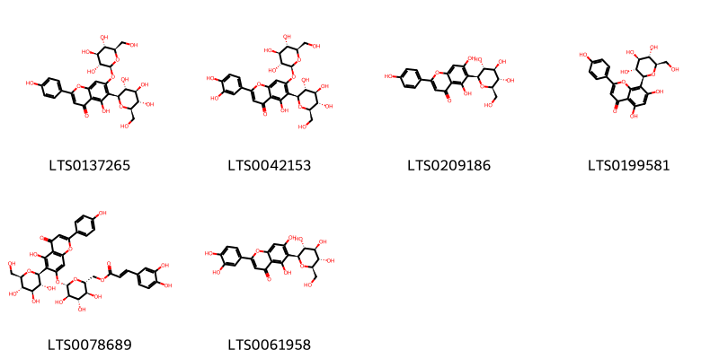{ width=100% }
    <figcaption>Hình ảnh cấu trúc hóa học của 6 hoạt chất thuộc nhóm Flavonoids gồm ['saponarin (LTS0137265)', '2-(3,4-dihydroxyphenyl)-5-hydroxy-6-[(2s,3r,4r,5s,6r)-3,4,5-trihydroxy-6-(hydroxymethyl)oxan-2-yl]-7-{[(2s,3r,4s,5s,6r)-3,4,5-trihydroxy-6-(hydroxymethyl)oxan-2-yl]oxy}chromen-4-one (LTS0042153)', 'isovitexin (LTS0209186)', 'vitexin (LTS0199581)', '[(2r,3s,4s,5r,6s)-3,4,5-trihydroxy-6-{[5-hydroxy-2-(4-hydroxyphenyl)-4-oxo-6-[(2s,3r,4r,5s,6r)-3,4,5-trihydroxy-6-(hydroxymethyl)oxan-2-yl]chromen-7-yl]oxy}oxan-2-yl]methyl (2e)-3-(3,4-dihydroxyphenyl)prop-2-enoate (LTS0078689)', 'isoorientin (LTS0061958)'].</figcaption>
</figure>
#### Nhóm Organooxygen compounds
<figure markdown="span">
    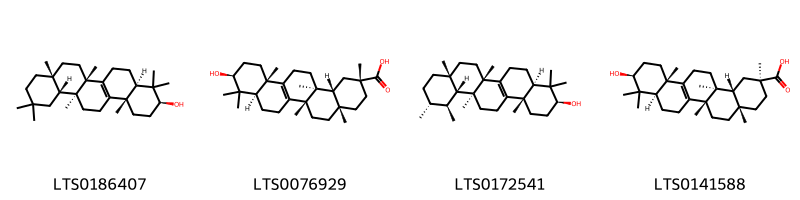{ width=100% }
    <figcaption>Hình ảnh cấu trúc hóa học của 4 hoạt chất thuộc nhóm Organooxygen compounds gồm ['isomultiflorenol (LTS0186407)', '(2r,4as,6as,8ar,10s,12as,14as,14br)-10-hydroxy-2,4a,6a,9,9,12a,14a-heptamethyl-1,3,4,5,6,7,8,8a,10,11,12,13,14,14b-tetradecahydropicene-2-carboxylic acid (LTS0076929)', 'isobauerenol (LTS0172541)', 'bryonolic acid (LTS0141588)'].</figcaption>
</figure>
#### Nhóm Prenol lipids
<figure markdown="span">
    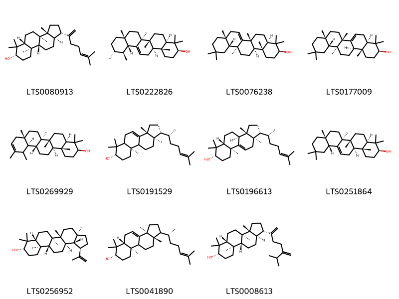{ width=100% }
    <figcaption>Hình ảnh cấu trúc hóa học của 11 hoạt chất thuộc nhóm Prenol lipids gồm ['dammaradienol (LTS0080913)', 'amyrin (LTS0222826)', 'alnulin (LTS0076238)', 'multiflorenol (LTS0177009)', '(4ar,6ar,6br,8as,12ar,12br,14ar,14br)-4,4,6a,6b,8a,11,12,14b-octamethyl-2,3,4a,5,6,7,8,9,12,12a,12b,13,14,14a-tetradecahydro-1h-picen-3-ol (LTS0269929)', '(1r,3ar,7s,9ar,11ar)-3a,6,6,9a,11a-pentamethyl-1-[(2r)-6-methylhept-5-en-2-yl]-1h,2h,3h,5h,5ah,7h,8h,9h,9bh,10h,11h-cyclopenta[a]phenanthren-7-ol (LTS0191529)', 'parkeol (LTS0196613)', 'β-amyrin (LTS0251864)', 'lupeol (LTS0256952)', '(3as,5ar,7s,9ar,11as)-3a,6,6,9a,11a-pentamethyl-1-[(2r)-6-methylhept-5-en-2-yl]-1h,2h,3h,5h,5ah,7h,8h,9h,9bh,10h,11h-cyclopenta[a]phenanthren-7-ol (LTS0041890)', '(1s,3ar,3br,5ar,7s,9ar,9br,11ar)-3a,3b,6,6,9a-pentamethyl-1-(6-methyl-5-methylidenehept-1-en-2-yl)-dodecahydro-1h-cyclopenta[a]phenanthren-7-ol (LTS0008613)'].</figcaption>
</figure>
#### Nhóm Steroids and steroid derivatives
<figure markdown="span">
    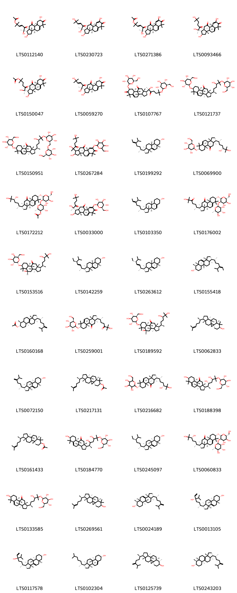{ width=100% }
    <figcaption>Hình ảnh cấu trúc hóa học của 40 hoạt chất thuộc nhóm Steroids and steroid derivatives gồm ['cucurbitacin b (LTS0112140)', 'cucurbitacin (LTS0230723)', 'α-elaterin (LTS0271386)', 'cucurbitacin l (LTS0093466)', 'dihydrocucurbitacin b (LTS0150047)', 'cucurbitacin d (LTS0059270)', '(1s,3as,3bs,8s,9ar,9br,11ar)-1-[(2r)-2-hydroxy-6-methyl-3-oxo-6-{[(2s,3r,4s,5s,6r)-3,4,5-trihydroxy-6-(hydroxymethyl)oxan-2-yl]oxy}heptan-2-yl]-3a,6,6,9b,11a-pentamethyl-8-{[(2s,3r,4s,5s,6r)-3,4,5-trihydroxy-6-(hydroxymethyl)oxan-2-yl]oxy}-1h,2h,3h,3bh,4h,8h,9h,9ah,11h-cyclopenta[a]phenanthrene-7,10-dione (LTS0107767)', '(1r,3as,3bs,7s,9ar,9br,11ar)-1-[(2r,5r)-5-hydroxy-6-methyl-6-{[(2s,3r,4s,5s,6r)-3,4,5-trihydroxy-6-(hydroxymethyl)oxan-2-yl]oxy}heptan-2-yl]-3a,6,6,9b,11a-pentamethyl-7-{[(2r,3r,4s,5s,6r)-3,4,5-trihydroxy-6-(hydroxymethyl)oxan-2-yl]oxy}-1h,2h,3h,3bh,4h,7h,8h,9h,9ah,11h-cyclopenta[a]phenanthren-10-one (LTS0121737)', '(1r,3as,3bs,7s,9ar,9br,11ar)-1-[(2r,5r)-5-hydroxy-6-methyl-6-{[(2s,3r,4s,5s,6r)-3,4,5-trihydroxy-6-({[(2r,3r,4s,5s,6r)-3,4,5-trihydroxy-6-(hydroxymethyl)oxan-2-yl]oxy}methyl)oxan-2-yl]oxy}heptan-2-yl]-3a,6,6,9b,11a-pentamethyl-7-{[(2r,3r,4s,5s,6r)-3,4,5-trihydroxy-6-(hydroxymethyl)oxan-2-yl]oxy}-1h,2h,3h,3bh,4h,7h,8h,9h,9ah,11h-cyclopenta[a]phenanthren-10-one (LTS0150951)', '(2r,3as,9ar,9br,11ar)-1-(2,6-dihydroxy-6-methyl-3-oxoheptan-2-yl)-2-hydroxy-3a,6,6,9b,11a-pentamethyl-8-{[3,4,5-trihydroxy-6-(hydroxymethyl)oxan-2-yl]oxy}-1h,2h,3h,3bh,4h,9ah,11h-cyclopenta[a]phenanthrene-7,10-dione (LTS0267284)', 'delta7-avenasterol (LTS0199292)', '(1r,3as,3bs,7s,9ar,9br,11ar)-1-[(2r,5r)-5,6-dihydroxy-6-methylheptan-2-yl]-3a,6,6,9b,11a-pentamethyl-7-{[(2r,3r,4s,5s,6r)-3,4,5-trihydroxy-6-(hydroxymethyl)oxan-2-yl]oxy}-1h,2h,3h,3bh,4h,7h,8h,9h,9ah,11h-cyclopenta[a]phenanthren-10-one (LTS0069900)', '(2s,3r,4s,5r,6s)-6-{[(2r,3r,4s,5s,6r)-2-{[(1r,3as,3bs,7s,9ar,9br,11ar)-1-[(2r,5r)-5,6-dihydroxy-6-methylheptan-2-yl]-3a,6,6,9b,11a-pentamethyl-10-oxo-1h,2h,3h,3bh,4h,7h,8h,9h,9ah,11h-cyclopenta[a]phenanthren-7-yl]oxy}-4,5-dihydroxy-6-(hydroxymethyl)oxan-3-yl]oxy}-4,5-dihydroxy-2-methyloxan-3-yl acetate (LTS0172212)', 'bryoamaride (LTS0033000)', 'avenasterol (LTS0103350)', '(1r,3as,3bs,7s,9ar,9br,11ar)-7-{[(2r,3r,4s,5s,6r)-4,5-dihydroxy-6-(hydroxymethyl)-3-{[(2s,3r,4r,5r,6s)-3,4,5-trihydroxy-6-methyloxan-2-yl]oxy}oxan-2-yl]oxy}-1-[(2r)-6-hydroxy-6-methyl-5-oxoheptan-2-yl]-3a,6,6,9b,11a-pentamethyl-1h,2h,3h,3bh,4h,7h,8h,9h,9ah,11h-cyclopenta[a]phenanthren-10-one (LTS0176002)', '(1r,2s,5s,7s,9s,11s,12s,15r,16r)-15-[(2r,5r)-5,6-dihydroxy-6-methylheptan-2-yl]-1,6,6,12,16-pentamethyl-5-{[(2s,3r,4s,5r,6r)-3,4,5-trihydroxy-6-(hydroxymethyl)oxan-2-yl]oxy}-8-oxapentacyclo[9.7.0.0²,⁷.0⁷,⁹.0¹²,¹⁶]octadecan-18-one (LTS0153516)', 'chondrillasterol (LTS0142259)', 'spinasterol (LTS0263612)', '(z)-24-ethylidenelophenol (LTS0155418)', '(1r,3ar,6s,7s,9as,11ar)-3a,6,9a,11a-tetramethyl-1-[(2r)-6-methyl-5-methylideneheptan-2-yl]-1h,2h,3h,4h,5h,5ah,6h,7h,8h,9h,10h,11h-cyclopenta[a]phenanthren-7-yl acetate (LTS0160168)', '(1r,3as,3bs,7s,9ar,9br,11ar)-1-[(2r)-6-hydroxy-6-methyl-5-oxoheptan-2-yl]-3a,6,6,9b,11a-pentamethyl-7-{[(2r,3r,4s,5s,6r)-3,4,5-trihydroxy-6-(hydroxymethyl)oxan-2-yl]oxy}-1h,2h,3h,3bh,4h,7h,8h,9h,9ah,11h-cyclopenta[a]phenanthren-10-one (LTS0259001)', '(1r,2s,5s,7s,9s,11s,12s,15r,16r)-15-[(2r,5r)-5,6-dihydroxy-6-methylheptan-2-yl]-1,6,6,12,16-pentamethyl-5-{[(2r,3r,4s,5s,6r)-3,4,5-trihydroxy-6-(hydroxymethyl)oxan-2-yl]oxy}-8-oxapentacyclo[9.7.0.0²,⁷.0⁷,⁹.0¹²,¹⁶]octadecan-18-one (LTS0189592)', '(3r,6s,8r,11s,12s,15r,16r)-7,7,12,16-tetramethyl-15-[(2r)-6-methylhept-5-en-2-yl]pentacyclo[9.7.0.0¹,³.0³,⁸.0¹²,¹⁶]octadecan-6-ol (LTS0062833)', 'episterol (LTS0072150)', '(1s,3r,6s,8r,11s,12s,15r,16r)-7,7,12,16-tetramethyl-15-[(2r)-6-methylhept-5-en-2-yl]pentacyclo[9.7.0.0¹,³.0³,⁸.0¹²,¹⁶]octadecan-6-yl acetate (LTS0217131)', '(1r,3as,3bs,7s,9ar,9br,11ar)-1-[(2r,5r)-5,6-dihydroxy-6-methylheptan-2-yl]-3a,6,6,9b,11a-pentamethyl-7-{[3,4,5-trihydroxy-6-(hydroxymethyl)oxan-2-yl]oxy}-1h,2h,3h,3bh,4h,7h,8h,9h,9ah,11h-cyclopenta[a]phenanthren-10-one (LTS0216682)', '(1r,3as,3bs,7s,9ar,9br,11ar)-1-[(2s,3r,5r)-3,5-dihydroxy-6-methyl-6-{[(2s,3r,4s,5s,6r)-3,4,5-trihydroxy-6-(hydroxymethyl)oxan-2-yl]oxy}heptan-2-yl]-7-hydroxy-3a,6,6,9b,11a-pentamethyl-1h,2h,3h,3bh,4h,7h,8h,9h,9ah,11h-cyclopenta[a]phenanthren-10-one (LTS0188398)', '(1r,3r,6s,8r,11s,12s,15r,16r)-7,7,12,16-tetramethyl-15-[(2r)-6-methylhept-5-en-2-yl]pentacyclo[9.7.0.0¹,³.0³,⁸.0¹²,¹⁶]octadecan-6-yl acetate (LTS0161433)', '(1r,3as,3bs,7s,9ar,9br,11ar)-1-[(2s)-3,5-dihydroxy-6-methyl-6-{[(2s,3r,4s,5s,6r)-3,4,5-trihydroxy-6-(hydroxymethyl)oxan-2-yl]oxy}heptan-2-yl]-7-hydroxy-3a,6,6,9b,11a-pentamethyl-1h,2h,3h,3bh,4h,7h,8h,9h,9ah,11h-cyclopenta[a]phenanthren-10-one (LTS0184770)', '(3β,5α)-stigmast-7-en-3-ol (LTS0245097)', '(1r,3as,3bs,7s,9ar,9br,11ar)-7-{[(2r,3r,4s,5s,6r)-4,5-dihydroxy-6-(hydroxymethyl)-3-{[(2s,3r,4r,5r,6s)-3,4,5-trihydroxy-6-methyloxan-2-yl]oxy}oxan-2-yl]oxy}-1-[(2r,5r)-5,6-dihydroxy-6-methylheptan-2-yl]-3a,6,6,9b,11a-pentamethyl-1h,2h,3h,3bh,4h,7h,8h,9h,9ah,11h-cyclopenta[a]phenanthren-10-one (LTS0060833)', '(1r,3as,3bs,7s,9ar,9br,11ar)-7-hydroxy-1-[(2r,5r)-5-hydroxy-6-methyl-6-{[(2s,3r,4s,5s,6r)-3,4,5-trihydroxy-6-(hydroxymethyl)oxan-2-yl]oxy}heptan-2-yl]-3a,6,6,9b,11a-pentamethyl-1h,2h,3h,3bh,4h,7h,8h,9h,9ah,11h-cyclopenta[a]phenanthren-10-one (LTS0133585)', 'cycloartenol (LTS0269561)', '24-methylidenelophenol (LTS0024189)', '(1r,3ar,5as,7s,9as,9br,11ar)-1-[(2r,5s)-5-hydroxy-5-isopropylhept-6-en-2-yl]-9a,11a-dimethyl-1h,2h,3h,3ah,5h,5ah,6h,7h,8h,9h,9bh,10h,11h-cyclopenta[a]phenanthren-7-ol (LTS0013105)', '(1r,3ar,5as,7s,9as,9br,11ar)-1-[(2r,5r)-5-hydroxy-5-isopropylhept-6-en-2-yl]-9a,11a-dimethyl-1h,2h,3h,3ah,5h,5ah,6h,7h,8h,9h,9bh,10h,11h-cyclopenta[a]phenanthren-7-ol (LTS0117578)', 'cholesterol (LTS0102304)', 'cycloeucalenol (LTS0125739)', '(1r,3ar,5as,6s,7s,9as,11ar)-3a,6,9a,11a-tetramethyl-1-[(2r)-6-methyl-5-methylideneheptan-2-yl]-1h,2h,3h,4h,5h,5ah,6h,7h,8h,9h,10h,11h-cyclopenta[a]phenanthren-7-ol (LTS0243203)'].</figcaption>
</figure>

---

### Dược dân tộc học

Danh sách các quốc gia có sử dụng *Bryonia dioica* trong điều trị các bệnh. 

| Country   | Disease             | Bệnh                       |
|:----------|:--------------------|:---------------------------|
| Elsewhere | Diuretic, Purgative | Thuốc lợi tiểu, Luyện thẩm |
| ain       | Purgative           | Thuốc xổ                   |

---

# Chi Cucurbita

??? note "Danh sách các dược liệu thuộc chi"
    
	 - *Cucurbita foetidissima*
	 - *Cucurbita lagenaria*
	 - *Cucurbita maxima*
	 - *Cucurbita moschata*
	 - *Cucurbita pepo*

---
## Cucurbita foetidissima
### Thông tin về thực vật

!!! info "Phân loại thực vật của *Cucurbita foetidissima* từ GIBF:"
    - **Kingdom:** Plantae
    - **Phylum:** Tracheophyta
    - **Order:** Cucurbitales
    - **Family:** Cucurbitaceae
    - **Genus:** Cucurbita
    - **Species:** *Cucurbita foetidissima*

 

| Label (VI)   | Label (EN)   | Scientific Name        | Descriptions (VI)   | Descriptions (EN)   | Also Known As (VI)   | Also Known As (EN)   |
|:-------------|:-------------|:-----------------------|:--------------------|:--------------------|:---------------------|:---------------------|
| N/A          | N/A          | Cucurbita foetidissima | loài thực vật       | species of plant    | ['']                 | ['buffalo gourd']    |

#### Phân bố trên thế giới

**Từ CSDL GIBF** nan, Mexico, United States of America

#### Phân bố tại Việt Nam

**Từ CSDL GIBF**: Không có ghi nhận ở Việt Nam

---
### Thành phần hóa học
        
- Theo cơ sở dữ liệu lotus: Từ loài *Cucurbita foetidissima* đã phân lập và xác định được 55 hoạt chất thuộc về các nhóm Fatty Acyls, Carboxylic acids and derivatives, Steroids and steroid derivatives, Organooxygen compounds, Prenol lipids. 

|    | chemicalTaxonomyClassyfireClass   |   smiles_count |
|---:|:----------------------------------|---------------:|
|  0 | Carboxylic acids and derivatives  |             16 |
|  1 | Fatty Acyls                       |              8 |
|  2 | Organooxygen compounds            |              6 |
|  3 | Prenol lipids                     |             12 |
|  4 | Steroids and steroid derivatives  |             13 |

#### Nhóm Carboxylic acids and derivatives
<figure markdown="span">
    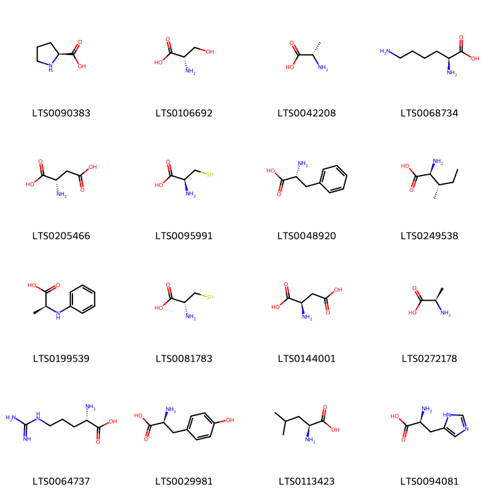{ width=100% }
    <figcaption>Hình ảnh cấu trúc hóa học của 16 hoạt chất thuộc nhóm Carboxylic acids and derivatives gồm ['l-proline (LTS0090383)', 'l-serine (LTS0106692)', 'l-alanine (LTS0042208)', 'l-lysine (LTS0068734)', 'l-aspartic acid (LTS0205466)', 'd-cysteine (LTS0095991)', 'd-phenylalanine (LTS0048920)', 'l-isoleucine (LTS0249538)', '(2s)-2-(phenylamino)propanoic acid (LTS0199539)', 'l-cysteine (LTS0081783)', 'd-aspartic acid (LTS0144001)', 'd-alanine (LTS0272178)', 'l-arginine (LTS0064737)', 'l-tyrosine (LTS0029981)', 'l-leucine (LTS0113423)', 'l-histidine (LTS0094081)'].</figcaption>
</figure>
#### Nhóm Fatty Acyls
<figure markdown="span">
    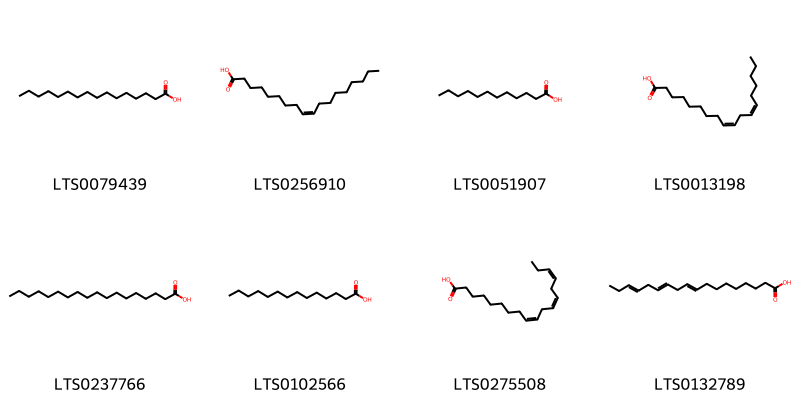{ width=100% }
    <figcaption>Hình ảnh cấu trúc hóa học của 8 hoạt chất thuộc nhóm Fatty Acyls gồm ['palmitic acid (LTS0079439)', 'oleic acid (LTS0256910)', 'lauric acid (LTS0051907)', 'linoleic (LTS0013198)', 'stearic acid (LTS0237766)', 'myristic acid (LTS0102566)', 'α-linolenic acid (LTS0275508)', 'α linolenic acid (LTS0132789)'].</figcaption>
</figure>
#### Nhóm Organooxygen compounds
<figure markdown="span">
    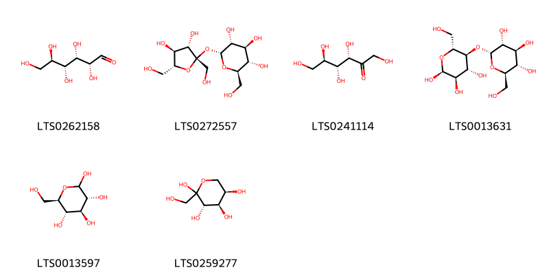{ width=100% }
    <figcaption>Hình ảnh cấu trúc hóa học của 6 hoạt chất thuộc nhóm Organooxygen compounds gồm ['(+)-glucose (LTS0262158)', 'sucrose (LTS0272557)', 'keto-d-fructose (LTS0241114)', 'α-maltose (LTS0013631)', 'glucose (LTS0013597)', 'd-fructopyranose (LTS0259277)'].</figcaption>
</figure>
#### Nhóm Prenol lipids
<figure markdown="span">
    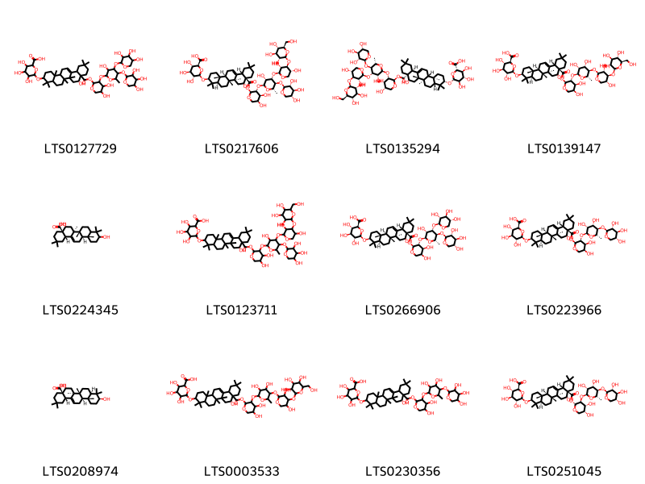{ width=100% }
    <figcaption>Hình ảnh cấu trúc hóa học của 12 hoạt chất thuộc nhóm Prenol lipids gồm ['6-{[8a-({[4,5-dihydroxy-3-({3-hydroxy-6-methyl-4,5-bis[(3,4,5-trihydroxyoxan-2-yl)oxy]oxan-2-yl}oxy)oxan-2-yl]oxy}carbonyl)-8-hydroxy-4,4,6a,6b,11,11,14b-heptamethyl-1,2,3,4a,5,6,7,8,9,10,12,12a,14,14a-tetradecahydropicen-3-yl]oxy}-3,4,5-trihydroxyoxane-2-carboxylic acid (LTS0127729)', '(2s,3s,4s,5r,6r)-6-{[(3s,4ar,6ar,6bs,8r,8ar,12as,14ar,14br)-8a-({[(2s,3r,4s,5s)-3-{[(2s,3r,4s,5s,6s)-4-{[(2s,3r,4s,5r)-3,5-dihydroxy-4-{[(2s,3r,4s,5s,6r)-3,4,5-trihydroxy-6-(hydroxymethyl)oxan-2-yl]oxy}oxan-2-yl]oxy}-3-hydroxy-6-methyl-5-{[(2s,3r,4s,5r)-3,4,5-trihydroxyoxan-2-yl]oxy}oxan-2-yl]oxy}-4,5-dihydroxyoxan-2-yl]oxy}carbonyl)-8-hydroxy-4,4,6a,6b,11,11,14b-heptamethyl-1,2,3,4a,5,6,7,8,9,10,12,12a,14,14a-tetradecahydropicen-3-yl]oxy}-3,4,5-trihydroxyoxane-2-carboxylic acid (LTS0217606)', '(2s,3s,4s,5r,6r)-6-{[(3s,4ar,6ar,6bs,8r,8ar,12as,14ar,14br)-8a-({[(2r,3s,4s,5s)-3-{[(2s,3r,4s,5s,6s)-4-{[(2s,3r,4s,5r)-3,5-dihydroxy-4-{[(2s,3r,4s,5s,6r)-3,4,5-trihydroxy-6-(hydroxymethyl)oxan-2-yl]oxy}oxan-2-yl]oxy}-3-hydroxy-6-methyl-5-{[(2s,3r,4s,5r)-3,4,5-trihydroxyoxan-2-yl]oxy}oxan-2-yl]oxy}-4,5-dihydroxyoxan-2-yl]oxy}carbonyl)-8-hydroxy-4,4,6a,6b,11,11,14b-heptamethyl-1,2,3,4a,5,6,7,8,9,10,12,12a,14,14a-tetradecahydropicen-3-yl]oxy}-3,4,5-trihydroxyoxane-2-carboxylic acid (LTS0135294)', '(2s,3s,4s,5r,6r)-6-{[(3s,4ar,6ar,6bs,8r,8ar,12as,14ar,14br)-8a-({[(2s,3r,4s,5s)-3-{[(2s,3r,4s,5r,6s)-5-{[(2s,3r,4s,5r)-3,5-dihydroxy-4-{[(2s,3r,4s,5s,6r)-3,4,5-trihydroxy-6-(hydroxymethyl)oxan-2-yl]oxy}oxan-2-yl]oxy}-3,4-dihydroxy-6-methyloxan-2-yl]oxy}-4,5-dihydroxyoxan-2-yl]oxy}carbonyl)-8-hydroxy-4,4,6a,6b,11,11,14b-heptamethyl-1,2,3,4a,5,6,7,8,9,10,12,12a,14,14a-tetradecahydropicen-3-yl]oxy}-3,4,5-trihydroxyoxane-2-carboxylic acid (LTS0139147)', '(4ar,6as,6br,12ar,12br,14bs)-5,10-dihydroxy-2,2,6a,6b,9,9,12a-heptamethyl-1,3,4,5,6,7,8,8a,10,11,12,12b,13,14b-tetradecahydropicene-4a-carboxylic acid (LTS0224345)', '6-{[8a-({[3-({4-[(3,5-dihydroxy-4-{[3,4,5-trihydroxy-6-(hydroxymethyl)oxan-2-yl]oxy}oxan-2-yl)oxy]-3-hydroxy-6-methyl-5-[(3,4,5-trihydroxyoxan-2-yl)oxy]oxan-2-yl}oxy)-4,5-dihydroxyoxan-2-yl]oxy}carbonyl)-8-hydroxy-4,4,6a,6b,11,11,14b-heptamethyl-1,2,3,4a,5,6,7,8,9,10,12,12a,14,14a-tetradecahydropicen-3-yl]oxy}-3,4,5-trihydroxyoxane-2-carboxylic acid (LTS0123711)', '(2s,3s,4s,5r,6r)-6-{[(3s,4ar,6ar,6bs,8r,8ar,12as,14ar,14br)-8a-({[(2s,3r,4s,5s)-4,5-dihydroxy-3-{[(2s,3r,4s,5s,6s)-3-hydroxy-6-methyl-4,5-bis({[(2s,3r,4s,5r)-3,4,5-trihydroxyoxan-2-yl]oxy})oxan-2-yl]oxy}oxan-2-yl]oxy}carbonyl)-8-hydroxy-4,4,6a,6b,11,11,14b-heptamethyl-1,2,3,4a,5,6,7,8,9,10,12,12a,14,14a-tetradecahydropicen-3-yl]oxy}-3,4,5-trihydroxyoxane-2-carboxylic acid (LTS0266906)', '(2s,3s,4s,5r,6r)-6-{[(3s,4ar,6ar,6bs,8r,8ar,12as,14ar,14br)-8a-({[(2s,3r,4s,5s)-3-{[(2s,3r,4s,5r,6s)-3,4-dihydroxy-6-methyl-5-{[(2s,3r,4s,5r)-3,4,5-trihydroxyoxan-2-yl]oxy}oxan-2-yl]oxy}-4,5-dihydroxyoxan-2-yl]oxy}carbonyl)-8-hydroxy-4,4,6a,6b,11,11,14b-heptamethyl-1,2,3,4a,5,6,7,8,9,10,12,12a,14,14a-tetradecahydropicen-3-yl]oxy}-3,4,5-trihydroxyoxane-2-carboxylic acid (LTS0223966)', 'echinocystic acid (LTS0208974)', '6-{[8a-({[3-({5-[(3,5-dihydroxy-4-{[3,4,5-trihydroxy-6-(hydroxymethyl)oxan-2-yl]oxy}oxan-2-yl)oxy]-3,4-dihydroxy-6-methyloxan-2-yl}oxy)-4,5-dihydroxyoxan-2-yl]oxy}carbonyl)-8-hydroxy-4,4,6a,6b,11,11,14b-heptamethyl-1,2,3,4a,5,6,7,8,9,10,12,12a,14,14a-tetradecahydropicen-3-yl]oxy}-3,4,5-trihydroxyoxane-2-carboxylic acid (LTS0003533)', '6-{[8a-({[3-({3,4-dihydroxy-6-methyl-5-[(3,4,5-trihydroxyoxan-2-yl)oxy]oxan-2-yl}oxy)-4,5-dihydroxyoxan-2-yl]oxy}carbonyl)-8-hydroxy-4,4,6a,6b,11,11,14b-heptamethyl-1,2,3,4a,5,6,7,8,9,10,12,12a,14,14a-tetradecahydropicen-3-yl]oxy}-3,4,5-trihydroxyoxane-2-carboxylic acid (LTS0230356)', '(2s,3s,4s,5r,6r)-6-{[(3s,4ar,6ar,6bs,8r,8ar,12as,14ar,14br)-8a-({[(2r,3s,4r,5r)-3-{[(2s,3r,4s,5r,6s)-3,4-dihydroxy-6-methyl-5-{[(2s,3r,4s,5r)-3,4,5-trihydroxyoxan-2-yl]oxy}oxan-2-yl]oxy}-4,5-dihydroxyoxan-2-yl]oxy}carbonyl)-8-hydroxy-4,4,6a,6b,11,11,14b-heptamethyl-1,2,3,4a,5,6,7,8,9,10,12,12a,14,14a-tetradecahydropicen-3-yl]oxy}-3,4,5-trihydroxyoxane-2-carboxylic acid (LTS0251045)'].</figcaption>
</figure>
#### Nhóm Steroids and steroid derivatives
<figure markdown="span">
    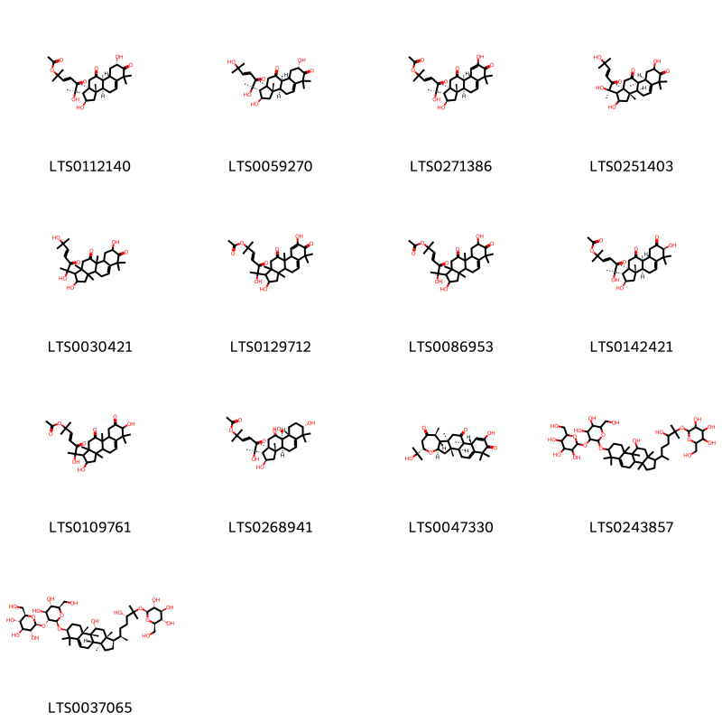{ width=100% }
    <figcaption>Hình ảnh cấu trúc hóa học của 13 hoạt chất thuộc nhóm Steroids and steroid derivatives gồm ['cucurbitacin b (LTS0112140)', 'cucurbitacin d (LTS0059270)', 'α-elaterin (LTS0271386)', '(3as,3bs,9as,9br,11ar)-1-[(2r)-2,6-dihydroxy-6-methyl-3-oxohept-4-en-2-yl]-2,8-dihydroxy-3a,6,6,9b,11a-pentamethyl-1h,2h,3h,3bh,4h,8h,9h,9ah,11h-cyclopenta[a]phenanthrene-7,10-dione (LTS0251403)', '1-(2,6-dihydroxy-6-methyl-3-oxohept-4-en-2-yl)-2,8-dihydroxy-3a,6,6,9b,11a-pentamethyl-1h,2h,3h,3bh,4h,8h,9h,9ah,11h-cyclopenta[a]phenanthrene-7,10-dione (LTS0030421)', '6-{2,8-dihydroxy-3a,6,6,9b,11a-pentamethyl-7,10-dioxo-1h,2h,3h,3bh,4h,9ah,11h-cyclopenta[a]phenanthren-1-yl}-6-hydroxy-2-methyl-5-oxohept-3-en-2-yl acetate (LTS0129712)', '6-{2,8-dihydroxy-3a,6,6,9b,11a-pentamethyl-7,10-dioxo-1h,2h,3h,3bh,4h,8h,9h,9ah,11h-cyclopenta[a]phenanthren-1-yl}-6-hydroxy-2-methyl-5-oxohept-3-en-2-yl acetate (LTS0086953)', '(3e,6r)-6-[(1r,2r,3as,3bs,7s,9ar,9br,11ar)-2,7-dihydroxy-3a,6,6,9b,11a-pentamethyl-8,10-dioxo-1h,2h,3h,3bh,4h,7h,9h,9ah,11h-cyclopenta[a]phenanthren-1-yl]-6-hydroxy-2-methyl-5-oxohept-3-en-2-yl acetate (LTS0142421)', '6-{2,7-dihydroxy-3a,6,6,9b,11a-pentamethyl-8,10-dioxo-1h,2h,3h,3bh,4h,7h,9h,9ah,11h-cyclopenta[a]phenanthren-1-yl}-6-hydroxy-2-methyl-5-oxohept-3-en-2-yl acetate (LTS0109761)', 'cucurbitacin c (LTS0268941)', 'cucurbitacin s (LTS0047330)', '2-{[6-(7-{[4,5-dihydroxy-6-(hydroxymethyl)-3-{[3,4,5-trihydroxy-6-(hydroxymethyl)oxan-2-yl]oxy}oxan-2-yl]oxy}-10-hydroxy-3a,6,6,9a,9b,11a-hexamethyl-1h,2h,3h,3bh,4h,7h,8h,9h,10h,11h-cyclopenta[a]phenanthren-1-yl)-3-hydroxy-2-methylheptan-2-yl]oxy}-6-(hydroxymethyl)oxane-3,4,5-triol (LTS0243857)', '(2s,3r,4s,5s,6r)-2-{[(3s,6r)-6-[(1r,3as,3bs,7s,9as,9br,10r,11ar)-7-{[(2r,3r,4s,5s,6r)-4,5-dihydroxy-6-(hydroxymethyl)-3-{[(2s,3r,4s,5s,6r)-3,4,5-trihydroxy-6-(hydroxymethyl)oxan-2-yl]oxy}oxan-2-yl]oxy}-10-hydroxy-3a,6,6,9a,9b,11a-hexamethyl-1h,2h,3h,3bh,4h,7h,8h,9h,10h,11h-cyclopenta[a]phenanthren-1-yl]-3-hydroxy-2-methylheptan-2-yl]oxy}-6-(hydroxymethyl)oxane-3,4,5-triol (LTS0037065)'].</figcaption>
</figure>

---

### Dược dân tộc học

Danh sách các quốc gia có sử dụng *Cucurbita foetidissima* trong điều trị các bệnh. 

| Country   | Disease   | Bệnh         |
|:----------|:----------|:-------------|
| Elsewhere | Soap      | Xà phòng     |
| US(Tewa)  | Laxative  | Nhuận trường |

---

---
## Cucurbita lagenaria
### Thông tin về thực vật

!!! info "Phân loại thực vật của *Lagenaria siceraria* từ GIBF:"
    - **Kingdom:** Plantae
    - **Phylum:** Tracheophyta
    - **Order:** Cucurbitales
    - **Family:** Cucurbitaceae
    - **Genus:** Lagenaria
    - **Species:** *Lagenaria siceraria*

 

| Label (VI)   | Label (EN)   | Scientific Name     | Descriptions (VI)   | Descriptions (EN)   | Also Known As (VI)   | Also Known As (EN)   |
|:-------------|:-------------|:--------------------|:--------------------|:--------------------|:---------------------|:---------------------|
| N/A          | N/A          | Cucurbita lagenaria |                     | species of plant    | ['']                 | ['']                 |

#### Phân bố trên thế giới

**Từ CSDL GIBF** nan, Mexico, United States of America

#### Phân bố tại Việt Nam

**Từ CSDL GIBF**: Không có ghi nhận ở Việt Nam

---
### Thành phần hóa học
        
- Theo cơ sở dữ liệu lotus: Từ loài *Lagenaria siceraria* đã phân lập và xác định được Chưa có hoạt chất nào được phân lập. hoạt chất thuộc về các nhóm Không có hoạt chất nào được phân lập. 

Không có hình ảnh nào được tạo ra

---

### Dược dân tộc học

Danh sách các quốc gia có sử dụng *Lagenaria siceraria* trong điều trị các bệnh. 

| Country   | Disease           | Bệnh             |
|:----------|:------------------|:-----------------|
| US        | Vermifuge, Poison | Sâu bọ, chất độc |

---

---
## Cucurbita maxima
### Thông tin về thực vật

!!! info "Phân loại thực vật của *Cucurbita maxima* từ GIBF:"
    - **Kingdom:** Plantae
    - **Phylum:** Tracheophyta
    - **Order:** Cucurbitales
    - **Family:** Cucurbitaceae
    - **Genus:** Cucurbita
    - **Species:** *Cucurbita maxima*

 

| Label (VI)   | Label (EN)   | Scientific Name   | Descriptions (VI)   | Descriptions (EN)       | Also Known As (VI)   | Also Known As (EN)   |
|:-------------|:-------------|:------------------|:--------------------|:------------------------|:---------------------|:---------------------|
| N/A          | N/A          | Cucurbita maxima  |                     | family of winter squash | ['']                 | ['']                 |

#### Phân bố trên thế giới

**Từ CSDL GIBF** nan, Brazil, Czechia, Sweden, Uzbekistan, New Zealand, Ecuador, Uruguay, Spain, Poland, Netherlands, Denmark, United States of America, Romania, Iran (Islamic Republic of), Russian Federation, Albania, Colombia, Dominican Republic, Argentina, Ethiopia, Belarus, United Kingdom of Great Britain and Northern Ireland, Belgium, Luxembourg, Canada, Germany, Austria, Ukraine, Slovakia, Australia, Italy, Switzerland, India, Peru, France

#### Phân bố tại Việt Nam

**Từ CSDL GIBF**: Không có ghi nhận ở Việt Nam

---
### Thành phần hóa học
        
- Theo cơ sở dữ liệu lotus: Từ loài *Cucurbita maxima* đã phân lập và xác định được 130 hoạt chất thuộc về các nhóm Fatty Acyls, Benzene and substituted derivatives, Organic oxides, Dibenzylbutane lignans, Flavonoids, Cinnamyl alcohols, Steroids and steroid derivatives, Phenols, Organooxygen compounds, Cinnamaldehydes, Furanoid lignans, Prenol lipids, Indoles and derivatives. 

|    | chemicalTaxonomyClassyfireClass     |   smiles_count |
|---:|:------------------------------------|---------------:|
|  0 |                                     |              1 |
|  1 | Benzene and substituted derivatives |              5 |
|  2 | Cinnamaldehydes                     |              4 |
|  3 | Cinnamyl alcohols                   |              1 |
|  4 | Dibenzylbutane lignans              |              2 |
|  5 | Fatty Acyls                         |              3 |
|  6 | Flavonoids                          |              5 |
|  7 | Furanoid lignans                    |              3 |
|  8 | Indoles and derivatives             |              3 |
|  9 | Organic oxides                      |              1 |
| 10 | Organooxygen compounds              |              5 |
| 11 | Phenols                             |              1 |
| 12 | Prenol lipids                       |             54 |
| 13 | Steroids and steroid derivatives    |             41 |

#### Nhóm 
<figure markdown="span">
    { width=100% }
    <figcaption>Hình ảnh cấu trúc hóa học của 1 hoạt chất thuộc nhóm  gồm ['trigonelline (LTS0040106)'].</figcaption>
</figure>
#### Nhóm Benzene and substituted derivatives
<figure markdown="span">
    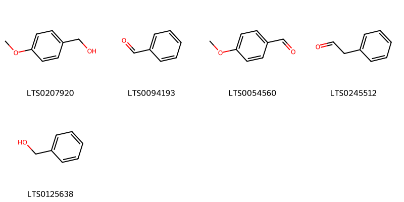{ width=100% }
    <figcaption>Hình ảnh cấu trúc hóa học của 5 hoạt chất thuộc nhóm Benzene and substituted derivatives gồm ['anise alcohol (LTS0207920)', 'benzaldehyde (LTS0094193)', 'anisaldehyde (LTS0054560)', 'phenylacetaldehyde (LTS0245512)', 'benzyl alcohol (LTS0125638)'].</figcaption>
</figure>
#### Nhóm Cinnamaldehydes
<figure markdown="span">
    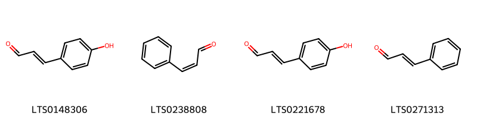{ width=100% }
    <figcaption>Hình ảnh cấu trúc hóa học của 4 hoạt chất thuộc nhóm Cinnamaldehydes gồm ['3-(4-hydroxyphenyl)prop-2-enal (LTS0148306)', '(z)-3-phenyl-2-propenal (LTS0238808)', 'p-coumaraldehyde (LTS0221678)', 'cinnamal (LTS0271313)'].</figcaption>
</figure>
#### Nhóm Cinnamyl alcohols
<figure markdown="span">
    { width=100% }
    <figcaption>Hình ảnh cấu trúc hóa học của 1 hoạt chất thuộc nhóm Cinnamyl alcohols gồm ['cinnamyl alcohol (LTS0010678)'].</figcaption>
</figure>
#### Nhóm Dibenzylbutane lignans
<figure markdown="span">
    { width=100% }
    <figcaption>Hình ảnh cấu trúc hóa học của 2 hoạt chất thuộc nhóm Dibenzylbutane lignans gồm ['(2s,3r)-2,3-bis[(4-hydroxy-3-methoxyphenyl)(¹³c)methyl](1-¹³c)butane-1,4-diol (LTS0268699)', 'secoisolariciresinol (LTS0086727)'].</figcaption>
</figure>
#### Nhóm Fatty Acyls
<figure markdown="span">
    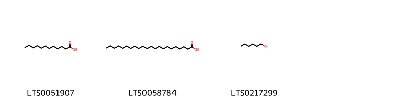{ width=100% }
    <figcaption>Hình ảnh cấu trúc hóa học của 3 hoạt chất thuộc nhóm Fatty Acyls gồm ['lauric acid (LTS0051907)', 'behenic acid (LTS0058784)', 'hexanol (LTS0217299)'].</figcaption>
</figure>
#### Nhóm Flavonoids
<figure markdown="span">
    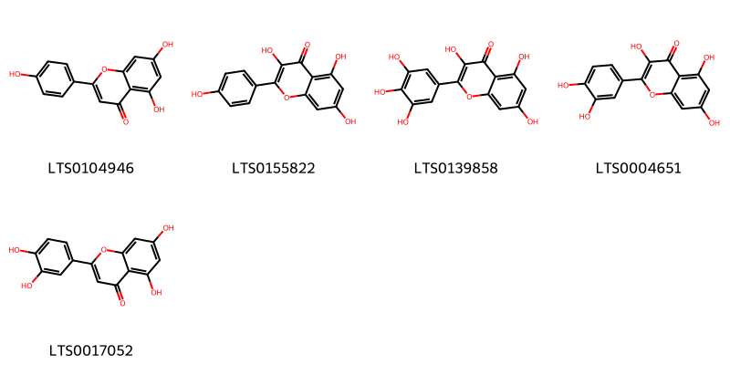{ width=100% }
    <figcaption>Hình ảnh cấu trúc hóa học của 5 hoạt chất thuộc nhóm Flavonoids gồm ['chamomile (LTS0104946)', 'kaempherol (LTS0155822)', 'myricetin (LTS0139858)', 'quercetin (LTS0004651)', 'luteolin (LTS0017052)'].</figcaption>
</figure>
#### Nhóm Furanoid lignans
<figure markdown="span">
    { width=100% }
    <figcaption>Hình ảnh cấu trúc hóa học của 3 hoạt chất thuộc nhóm Furanoid lignans gồm ['pinoresinol (LTS0057431)', 'matairesinol (LTS0193475)', 'lariciresinol (LTS0010950)'].</figcaption>
</figure>
#### Nhóm Indoles and derivatives
<figure markdown="span">
    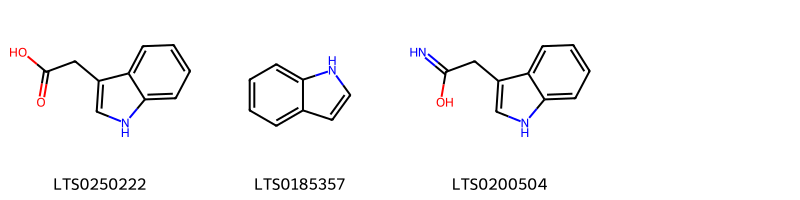{ width=100% }
    <figcaption>Hình ảnh cấu trúc hóa học của 3 hoạt chất thuộc nhóm Indoles and derivatives gồm ['β-indole-3-acetic acid (LTS0250222)', 'indole (LTS0185357)', '2-(1h-indol-3-yl)acetamide (LTS0200504)'].</figcaption>
</figure>
#### Nhóm Organic oxides
<figure markdown="span">
    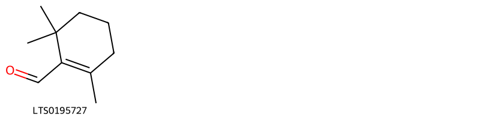{ width=100% }
    <figcaption>Hình ảnh cấu trúc hóa học của 1 hoạt chất thuộc nhóm Organic oxides gồm ['β-cyclocitral (LTS0195727)'].</figcaption>
</figure>
#### Nhóm Organooxygen compounds
<figure markdown="span">
    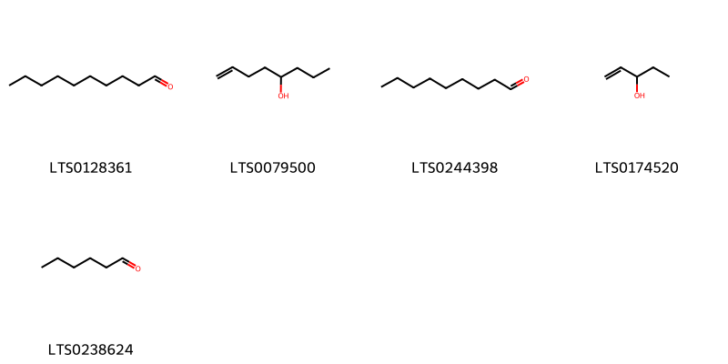{ width=100% }
    <figcaption>Hình ảnh cấu trúc hóa học của 5 hoạt chất thuộc nhóm Organooxygen compounds gồm ['decanal (LTS0128361)', 'oct-7-en-4-ol (LTS0079500)', 'nonanal (LTS0244398)', '1-penten-3-ol (LTS0174520)', 'hexanal (LTS0238624)'].</figcaption>
</figure>
#### Nhóm Phenols
<figure markdown="span">
    { width=100% }
    <figcaption>Hình ảnh cấu trúc hóa học của 1 hoạt chất thuộc nhóm Phenols gồm ['p-cresol (LTS0208715)'].</figcaption>
</figure>
#### Nhóm Prenol lipids
<figure markdown="span">
    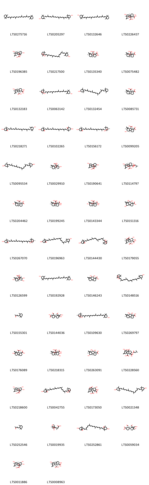{ width=100% }
    <figcaption>Hình ảnh cấu trúc hóa học của 54 hoạt chất thuộc nhóm Prenol lipids gồm ['β-carotene (LTS0275716)', 'carotenoid (LTS0205297)', 'cryptoxanthin (LTS0132646)', '(1r,2s,3s,4s,5s,8r,9r,11s,12r)-5,11-dihydroxy-4-methyl-13-methylidenetetracyclo[10.2.1.0¹,⁹.0³,⁸]pentadecane-2,4,8-tricarboxylic acid (LTS0226437)', '(1r,2r,4s,5r,8r,9s,10r,11s,12s)-4,12-dihydroxy-11-methyl-6-methylidene-16-oxo-15-oxapentacyclo[9.3.2.1⁵,⁸.0¹,¹⁰.0²,⁸]heptadecane-9-carboxylic acid (LTS0196385)', '1-[(1e,3e,5e,7e,9e)-18-(4-hydroxy-2,6,6-trimethylcyclohex-1-en-1-yl)-3,7,12,16-tetramethyloctadeca-1,3,5,7,9,11,13,15,17-nonaen-1-yl]-2,6,6-trimethyl-7-oxabicyclo[2.2.1]heptan-2-ol (LTS0217500)', 'gibberellin a36 (LTS0135340)', 'gibberellin a25 (LTS0075482)', '(1r,2s,3s,4s,5s,8s,9s,11s,12r)-5,11-dihydroxy-4,8-dimethyl-13-methylidenetetracyclo[10.2.1.0¹,⁹.0³,⁸]pentadecane-2,4-dicarboxylic acid (LTS0132183)', '(1r,2r,4s)-1-[(1e,3e,5e,7e,9e,11e,13e,15e,17e)-18-[(4r)-4-hydroxy-2,6,6-trimethylcyclohex-1-en-1-yl]-3,7,12,16-tetramethyloctadeca-1,3,5,7,9,11,13,15,17-nonaen-1-yl]-2,6,6-trimethyl-7-oxabicyclo[2.2.1]heptan-2-ol (LTS0063142)', '3,5,5-trimethyl-4-[(1e,3e,5e,7e,9e)-3,7,12,16-tetramethyl-18-(2,6,6-trimethylcyclohex-1-en-1-yl)octadeca-1,3,5,7,9,11,13,15,17-nonaen-1-yl]cyclohex-3-en-1-ol (LTS0132454)', 'gibberellin a12 (LTS0085731)', 'taraxanthin (LTS0218271)', 'violaxanthin (LTS0102265)', '(1r,2r,4s)-1-[(1e,3e,5e,7e,9e,11e,13e,15e,17e)-18-[(1s,4s,6r)-4-hydroxy-2,2,6-trimethyl-7-oxabicyclo[4.1.0]heptan-1-yl]-3,7,12,16-tetramethyloctadeca-1,3,5,7,9,11,13,15,17-nonaen-1-yl]-2,6,6-trimethyl-7-oxabicyclo[2.2.1]heptan-2-ol (LTS0156172)', '(1s,2s,3s,4r,8s,9s,11s,12r)-11-hydroxy-4,8-dimethyl-13-methylidenetetracyclo[10.2.1.0¹,⁹.0³,⁸]pentadecane-2,4-dicarboxylic acid (LTS0099205)', '4-[(9e,11e,13e,15e,17e)-18-(4-hydroxy-2,6,6-trimethylcyclohex-1-en-1-yl)-3,7,12,16-tetramethyloctadeca-1,3,5,7,9,11,13,15,17-nonaen-1-yl]-3,5,5-trimethylcyclohex-3-en-1-ol (LTS0095534)', 'gibberellin a4 (LTS0029910)', '4,12-dihydroxy-11-methyl-6-methylidene-16-oxo-15-oxapentacyclo[9.3.2.1⁵,⁸.0¹,¹⁰.0²,⁸]heptadecane-9-carboxylic acid (LTS0190641)', '(1r,2s,3s,4s,5s,8r,9r,11s,12r)-11-hydroxy-4-methyl-5-[(3-methylbutanoyl)oxy]-13-methylidenetetracyclo[10.2.1.0¹,⁹.0³,⁸]pentadecane-2,4,8-tricarboxylic acid (LTS0114797)', 'gibberellin a53 (LTS0204462)', 'gibberellin a13 (LTS0199245)', 'gibberellin 28 (LTS0143344)', '2,3,12-trihydroxy-5,9-dimethyl-14-methylidenetetracyclo[11.2.1.0¹,¹⁰.0⁴,⁹]hexadecane-5-carboxylic acid (LTS0151316)', '(2r,4s)-1-[(1e,3e,5e,7e,9e,11e,13e,15e,17e)-18-[(1s,4s,6r)-4-hydroxy-2,2,6-trimethyl-7-oxabicyclo[4.1.0]heptan-1-yl]-3,7,12,16-tetramethyloctadeca-1,3,5,7,9,11,13,15,17-nonaen-1-yl]-2,6,6-trimethyl-7-oxabicyclo[2.2.1]heptan-2-ol (LTS0267070)', '6-[(1e,3e,5e,7e,9e)-18-(4-hydroxy-2,6,6-trimethylcyclohex-2-en-1-yl)-3,7,12,16-tetramethyloctadeca-1,3,5,7,9,11,13,15,17-nonaen-1-yl]-1,5,5-trimethyl-7-oxabicyclo[4.1.0]heptan-3-ol (LTS0196963)', '1-[(1e,3z,5e,7z,9z,11e,13e,15e,17e)-18-{4-hydroxy-2,2,6-trimethyl-7-oxabicyclo[4.1.0]heptan-1-yl}-3,7,12,16-tetramethyloctadeca-1,3,5,7,9,11,13,15,17-nonaen-1-yl]-2,6,6-trimethyl-7-oxabicyclo[2.2.1]heptan-2-ol (LTS0144430)', '(1r,2s,3s,4s,5r,6s,8r,11s,12r,15r)-5,6-dihydroxy-4-methyl-13-methylidene-9-oxo-10-oxapentacyclo[9.3.2.1¹,¹².0³,⁸.0⁸,¹⁵]heptadecane-2,4-dicarboxylic acid (LTS0179055)', 'gibberellin a8 (LTS0126599)', 'zeaxanthin (LTS0192928)', '2,3-dihydroxy-5,9-dimethyl-14-methylidenetetracyclo[11.2.1.0¹,¹⁰.0⁴,⁹]hexadecane-5-carboxylic acid (LTS0146243)', '1-[(1e,3z,5e,7z,9z,11e,13e,15e,17e)-18-(4-hydroxy-2,6,6-trimethylcyclohex-1-en-1-yl)-3,7,12,16-tetramethyloctadeca-1,3,5,7,9,11,13,15,17-nonaen-1-yl]-2,6,6-trimethyl-7-oxabicyclo[2.2.1]heptan-2-ol (LTS0148516)', 'β-ionone (LTS0155301)', '2-formyl-3-[1-formyl-6-hydroxy-6-(hydroxymethyl)bicyclo[3.2.1]octan-2-yl]-1,3-dimethylcyclohexane-1-carboxylic acid (LTS0144036)', '(2r,4s)-1-[(1e,3e,5e,7e,9e,11e,13e,15e,17e)-18-[(4r)-4-hydroxy-2,6,6-trimethylcyclohex-1-en-1-yl]-3,7,12,16-tetramethyloctadeca-1,3,5,7,9,11,13,15,17-nonaen-1-yl]-2,6,6-trimethyl-7-oxabicyclo[2.2.1]heptan-2-ol (LTS0109630)', '(1r,2r,3s,4s,5r,9s,10s,13r)-2,3-dihydroxy-5,9-dimethyl-14-methylidenetetracyclo[11.2.1.0¹,¹⁰.0⁴,⁹]hexadecane-5-carboxylic acid (LTS0269797)', '12-hydroxy-4,8-dimethyl-13-methylidenetetracyclo[10.2.1.0¹,⁹.0³,⁸]pentadecane-2,4-dicarboxylic acid (LTS0176089)', '(1r,2s,3s,4s,5r,6s,8r,9r,12r)-5,6-dihydroxy-4-methyl-13-methylidenetetracyclo[10.2.1.0¹,⁹.0³,⁸]pentadecane-2,4,8-tricarboxylic acid (LTS0218315)', '(1r,2r,3s,4s,5r,9s,10s,12r,13r)-2,3,12-trihydroxy-5,9-dimethyl-14-methylidenetetracyclo[11.2.1.0¹,¹⁰.0⁴,⁹]hexadecane-5-carboxylic acid (LTS0263091)', '11-hydroxy-4-methyl-5-[(3-methylbutanoyl)oxy]-13-methylidenetetracyclo[10.2.1.0¹,⁹.0³,⁸]pentadecane-2,4,8-tricarboxylic acid (LTS0228560)', '(1r,2r,4r,5r,8s,9s,10r,11s,12r,13s)-4,12,13-trihydroxy-11-methyl-6-methylidene-16-oxo-15-oxapentacyclo[9.3.2.1⁵,⁸.0¹,¹⁰.0²,⁸]heptadecane-9-carboxylic acid (LTS0218600)', '1-[(9e,11e,13e,15e,17e)-18-{4-hydroxy-2,2,6-trimethyl-7-oxabicyclo[4.1.0]heptan-1-yl}-3,7,12,16-tetramethyloctadeca-1,3,5,7,9,11,13,15,17-nonaen-1-yl]-2,6,6-trimethyl-7-oxabicyclo[2.2.1]heptan-2-ol (LTS0042755)', '5,6-dihydroxy-4-methyl-13-methylidene-9-oxo-10-oxapentacyclo[9.3.2.1¹,¹².0³,⁸.0⁸,¹⁵]heptadecane-2,4-dicarboxylic acid (LTS0173050)', '4-[(9e,11e,13e,15e,17e)-18-(4-hydroxy-2,6,6-trimethylcyclohex-1-en-1-yl)-3,7,12,16-tetramethyloctadeca-1,3,5,7,9,11,13,15,17-nonaen-1-yl]-3,5,5-trimethylcyclohex-2-en-1-ol (LTS0021348)', 'ionone (LTS0252546)', 'dihydrophaseic acid (LTS0019935)', '6-[(9e,11e,13e,15e,17e)-18-{4-hydroxy-2,2,6-trimethyl-7-oxabicyclo[4.1.0]heptan-1-yl}-3,7,12,16-tetramethyloctadeca-1,3,5,7,9,11,13,15,17-nonaen-1-yl]-1,5,5-trimethyl-7-oxabicyclo[4.1.0]heptan-3-ol (LTS0252861)', '(1r,2s,3s)-2-formyl-3-[(1r,2s,5r,6r)-1-formyl-6-hydroxy-6-(hydroxymethyl)bicyclo[3.2.1]octan-2-yl]-1,3-dimethylcyclohexane-1-carboxylic acid (LTS0059034)', '(1r,2r,4s,5r,8r,9s,10r,11s,12r,13s)-4,12,13-trihydroxy-11-methyl-6-methylidene-16-oxo-15-oxapentacyclo[9.3.2.1⁵,⁸.0¹,¹⁰.0²,⁸]heptadecane-9-carboxylic acid (LTS0011886)', '(1r,2s,3s,4s,5s,9r,11s,12r)-5,11-dihydroxy-4-methyl-13-methylidenetetracyclo[10.2.1.0¹,⁹.0³,⁸]pentadec-7-ene-2,4-dicarboxylic acid (LTS0008963)', '5,11-dihydroxy-4-methyl-13-methylidenetetracyclo[10.2.1.0¹,⁹.0³,⁸]pentadec-7-ene-2,4-dicarboxylic acid (LTS0029330)', 'gibberellin a1 (LTS0013777)', '(1s,2s,3s,4r,8s,9s,11s)-11-hydroxy-4,8-dimethyl-13-methylidenetetracyclo[10.2.1.0¹,⁹.0³,⁸]pentadecane-2,4-dicarboxylic acid (LTS0250942)', '1,3,3-trimethyl-2-[(9e,11e,13e,15e,17e)-3,7,12,16-tetramethyl-18-(2,6,6-trimethylcyclohex-1-en-1-yl)octadeca-1,3,5,7,9,11,13,15,17-nonaen-1-yl]cyclohex-1-ene (LTS0110068)'].</figcaption>
</figure>
#### Nhóm Steroids and steroid derivatives
<figure markdown="span">
    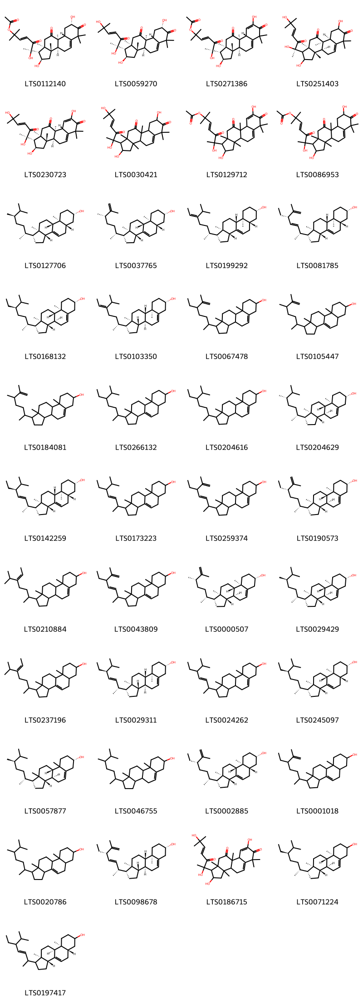{ width=100% }
    <figcaption>Hình ảnh cấu trúc hóa học của 41 hoạt chất thuộc nhóm Steroids and steroid derivatives gồm ['cucurbitacin b (LTS0112140)', 'cucurbitacin d (LTS0059270)', 'α-elaterin (LTS0271386)', '(3as,3bs,9as,9br,11ar)-1-[(2r)-2,6-dihydroxy-6-methyl-3-oxohept-4-en-2-yl]-2,8-dihydroxy-3a,6,6,9b,11a-pentamethyl-1h,2h,3h,3bh,4h,8h,9h,9ah,11h-cyclopenta[a]phenanthrene-7,10-dione (LTS0251403)', 'cucurbitacin (LTS0230723)', '1-(2,6-dihydroxy-6-methyl-3-oxohept-4-en-2-yl)-2,8-dihydroxy-3a,6,6,9b,11a-pentamethyl-1h,2h,3h,3bh,4h,8h,9h,9ah,11h-cyclopenta[a]phenanthrene-7,10-dione (LTS0030421)', '6-{2,8-dihydroxy-3a,6,6,9b,11a-pentamethyl-7,10-dioxo-1h,2h,3h,3bh,4h,9ah,11h-cyclopenta[a]phenanthren-1-yl}-6-hydroxy-2-methyl-5-oxohept-3-en-2-yl acetate (LTS0129712)', '6-{2,8-dihydroxy-3a,6,6,9b,11a-pentamethyl-7,10-dioxo-1h,2h,3h,3bh,4h,8h,9h,9ah,11h-cyclopenta[a]phenanthren-1-yl}-6-hydroxy-2-methyl-5-oxohept-3-en-2-yl acetate (LTS0086953)', '(1r,3ar,5as,7s,9as,9br,11ar)-1-[(2r,5r)-5,6-dimethylheptan-2-yl]-9a,11a-dimethyl-1h,2h,3h,3ah,5h,5ah,6h,7h,8h,9h,9bh,10h,11h-cyclopenta[a]phenanthren-7-ol (LTS0127706)', '(1r,3ar,5as,7s,9as,9br,11ar)-1-[(2r,5s)-5,6-dimethylhept-6-en-2-yl]-9a,11a-dimethyl-1h,2h,3h,3ah,5h,5ah,6h,7h,8h,9h,9bh,10h,11h-cyclopenta[a]phenanthren-7-ol (LTS0037765)', 'delta7-avenasterol (LTS0199292)', '(1r,3ar,5as,7s,9as,9br,11ar)-1-[(2r,3e,5s)-5-ethyl-6-methylhepta-3,6-dien-2-yl]-9a,11a-dimethyl-1h,2h,3h,3ah,5h,5ah,6h,7h,8h,9h,9bh,10h,11h-cyclopenta[a]phenanthren-7-ol (LTS0081785)', 'sitosterol (LTS0168132)', 'avenasterol (LTS0103350)', '1-(5-ethyl-6-methylhept-6-en-2-yl)-9a,11a-dimethyl-1h,2h,3h,3ah,3bh,4h,6h,7h,8h,9h,9bh,10h,11h-cyclopenta[a]phenanthren-7-ol (LTS0067478)', '1-(5,6-dimethylhept-6-en-2-yl)-9a,11a-dimethyl-1h,2h,3h,3ah,5h,5ah,6h,7h,8h,9h,9bh,10h,11h-cyclopenta[a]phenanthren-7-ol (LTS0105447)', '1-(5,6-dimethylhept-6-en-2-yl)-9a,11a-dimethyl-1h,2h,3h,3ah,3bh,4h,6h,7h,8h,9h,9bh,10h,11h-cyclopenta[a]phenanthren-7-ol (LTS0184081)', '1-(5-ethyl-6-methylheptan-2-yl)-9a,11a-dimethyl-1h,2h,3h,3ah,5h,5ah,6h,7h,8h,9h,9bh,10h,11h-cyclopenta[a]phenanthren-7-ol (LTS0266132)', 'stigmast-5-en-3-ol, (3β)- (LTS0204616)', '22,23-dihydrobrassicasterol (LTS0204629)', 'chondrillasterol (LTS0142259)', '1-(5-ethyl-6-methylhept-3-en-2-yl)-9a,11a-dimethyl-1h,2h,3h,3ah,5h,5ah,6h,7h,8h,9h,9bh,10h,11h-cyclopenta[a]phenanthren-7-ol (LTS0173223)', '1-(5-ethyl-6-methylhepta-3,6-dien-2-yl)-9a,11a-dimethyl-1h,2h,3h,3ah,3bh,4h,6h,7h,8h,9h,9bh,10h,11h-cyclopenta[a]phenanthren-7-ol (LTS0259374)', '(1r,3as,3bs,7s,9ar,9bs,11ar)-1-[(2r,5s)-5-ethyl-6-methylhept-6-en-2-yl]-9a,11a-dimethyl-1h,2h,3h,3ah,3bh,4h,6h,7h,8h,9h,9bh,10h,11h-cyclopenta[a]phenanthren-7-ol (LTS0190573)', '1-(5-isopropylhept-5-en-2-yl)-9a,11a-dimethyl-1h,2h,3h,3ah,3bh,4h,6h,7h,8h,9h,9bh,10h,11h-cyclopenta[a]phenanthren-7-ol (LTS0210884)', '1-(5-ethyl-6-methylhepta-3,6-dien-2-yl)-9a,11a-dimethyl-1h,2h,3h,3ah,5h,5ah,6h,7h,8h,9h,9bh,10h,11h-cyclopenta[a]phenanthren-7-ol (LTS0043809)', '(1r,3as,3bs,7s,9ar,9bs,11ar)-1-[(2r,5s)-5,6-dimethylhept-6-en-2-yl]-9a,11a-dimethyl-1h,2h,3h,3ah,3bh,4h,6h,7h,8h,9h,9bh,10h,11h-cyclopenta[a]phenanthren-7-ol (LTS0000507)', 'campesterol (LTS0029429)', 'avenasterol (LTS0237196)', 'phytosterol (LTS0029311)', 'stigmasterol (LTS0024262)', '(3β,5α)-stigmast-7-en-3-ol (LTS0245097)', '(1r,3as,3bs,7s,9bs)-1-[(2r,5r)-5,6-dimethylheptan-2-yl]-9a,11a-dimethyl-1h,2h,3h,3ah,3bh,4h,6h,7h,8h,9h,9bh,10h,11h-cyclopenta[a]phenanthren-7-ol (LTS0057877)', 'campesterol (LTS0046755)', '(1r,3ar,5as,7s,9as,9br,11ar)-1-[(2r,5s)-5-ethyl-6-methylhept-6-en-2-yl]-9a,11a-dimethyl-1h,2h,3h,3ah,5h,5ah,6h,7h,8h,9h,9bh,10h,11h-cyclopenta[a]phenanthren-7-ol (LTS0002885)', '1-(5-ethyl-6-methylhept-6-en-2-yl)-9a,11a-dimethyl-1h,2h,3h,3ah,5h,5ah,6h,7h,8h,9h,9bh,10h,11h-cyclopenta[a]phenanthren-7-ol (LTS0001018)', 'fungisterol (LTS0020786)', '(1r,3as,3bs,7s,9ar,9bs,11ar)-1-[(2r,3e,5s)-5-ethyl-6-methylhepta-3,6-dien-2-yl]-9a,11a-dimethyl-1h,2h,3h,3ah,3bh,4h,6h,7h,8h,9h,9bh,10h,11h-cyclopenta[a]phenanthren-7-ol (LTS0098678)', '1-(2,6-dihydroxy-6-methyl-3-oxohept-4-en-2-yl)-2,8-dihydroxy-3a,6,6,9b,11a-pentamethyl-1h,2h,3h,3bh,4h,9ah,11h-cyclopenta[a]phenanthrene-7,10-dione (LTS0186715)', 'stigmast-5-en-3-ol (LTS0071224)', '(3ar,5as,9as,9bs,11ar)-1-(5-ethyl-6-methylhept-3-en-2-yl)-9a,11a-dimethyl-1h,2h,3h,3ah,5h,5ah,6h,7h,8h,9h,9bh,10h,11h-cyclopenta[a]phenanthren-7-ol (LTS0197417)'].</figcaption>
</figure>

---

### Dược dân tộc học

Danh sách các quốc gia có sử dụng *Cucurbita maxima* trong điều trị các bệnh. 

| Country   | Disease                             | Bệnh                                |
|:----------|:------------------------------------|:------------------------------------|
| Elsewhere | Diuretic, Tonic, Vermifuge          | Thuốc lợi tiểu, Tonic, Vermifuge    |
| Iraq      | Nervine, Poultice, Tonic, Vermifuge | Nervine, Poultice, Tonic, Vermifuge |
| Kurdistan | Taenicide                           | Thuốc diệt cỏ                       |
| Malaya    | Vermifuge                           | Thuốc diệt sán                      |
| Venezuela | Refrigerant                         | Chất làm lạnh                       |

---

---
## Cucurbita moschata
### Thông tin về thực vật

!!! info "Phân loại thực vật của *Cucurbita moschata* từ GIBF:"
    - **Kingdom:** Plantae
    - **Phylum:** Tracheophyta
    - **Order:** Cucurbitales
    - **Family:** Cucurbitaceae
    - **Genus:** Cucurbita
    - **Species:** *Cucurbita moschata*

 

| Label (VI)   | Label (EN)   | Scientific Name    | Descriptions (VI)   | Descriptions (EN)   | Also Known As (VI)   | Also Known As (EN)   |
|:-------------|:-------------|:-------------------|:--------------------|:--------------------|:---------------------|:---------------------|
| N/A          | N/A          | Cucurbita moschata | loài thực vật       | species of plant    | ['']                 | ['']                 |

#### Phân bố trên thế giới

**Từ CSDL GIBF** Brazil, Guatemala, Viet Nam, Uganda, Mongolia, Guadeloupe, China, Chile, New Zealand, Saint Lucia, Ecuador, Trinidad and Tobago, Thailand, Spain, Netherlands, Puerto Rico, Bolivia (Plurinational State of), United States of America, Jamaica, Korea, Republic of, Indonesia, Armenia, Costa Rica, Russian Federation, Dominican Republic, Colombia, Nigeria, Cuba, Argentina, Aruba, French Guiana, Cabo Verde, Dominica, Mexico, Benin, United Kingdom of Great Britain and Northern Ireland, Belgium, Chinese Taipei, Philippines, Kuwait, Malaysia, Haiti, Germany, Panama, Austria, Portugal, Paraguay, Ukraine, South Africa, Australia, India, Peru, France

#### Phân bố tại Việt Nam

**Từ CSDL GIBF**: Hồ Chí Minh city

---
### Thành phần hóa học
        
- Theo cơ sở dữ liệu lotus: Từ loài *Cucurbita moschata* đã phân lập và xác định được 41 hoạt chất thuộc về các nhóm Benzene and substituted derivatives, Carboxylic acids and derivatives, Glycerolipids, Organooxygen compounds, Prenol lipids. 

|    | chemicalTaxonomyClassyfireClass     |   smiles_count |
|---:|:------------------------------------|---------------:|
|  0 | Benzene and substituted derivatives |              2 |
|  1 | Carboxylic acids and derivatives    |              4 |
|  2 | Glycerolipids                       |              4 |
|  3 | Organooxygen compounds              |             19 |
|  4 | Prenol lipids                       |             12 |

#### Nhóm Benzene and substituted derivatives
<figure markdown="span">
    { width=100% }
    <figcaption>Hình ảnh cấu trúc hóa học của 2 hoạt chất thuộc nhóm Benzene and substituted derivatives gồm ['11-[(acetyloxy)methyl]-4,4,6b,8a,11,12b,14b-heptamethyl-6-oxo-2,3,4a,5,7,8,9,10,12,12a,13,14-dodecahydro-1h-picen-3-yl benzoate (LTS0244645)', '(3r,4ar,6bs,8as,11r,12ar,12bs,14bs)-11-[(acetyloxy)methyl]-4,4,6b,8a,11,12b,14b-heptamethyl-6-oxo-2,3,4a,5,7,8,9,10,12,12a,13,14-dodecahydro-1h-picen-3-yl benzoate (LTS0237249)'].</figcaption>
</figure>
#### Nhóm Carboxylic acids and derivatives
<figure markdown="span">
    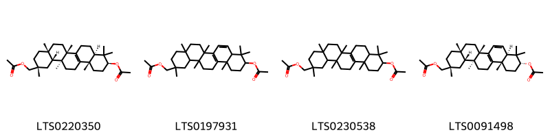{ width=100% }
    <figcaption>Hình ảnh cấu trúc hóa học của 4 hoạt chất thuộc nhóm Carboxylic acids and derivatives gồm ['[(2r,4as,6as,8ar,10s,12as,14as,14br)-10-(acetyloxy)-2,4a,6a,9,9,12a,14a-heptamethyl-1,3,4,5,6,7,8,8a,10,11,12,13,14,14b-tetradecahydropicen-2-yl]methyl acetate (LTS0220350)', '[10-(acetyloxy)-2,4a,6a,9,9,12a,14a-heptamethyl-1,3,4,5,6,8a,10,11,12,13,14,14b-dodecahydropicen-2-yl]methyl acetate (LTS0197931)', '[10-(acetyloxy)-2,4a,6a,9,9,12a,14a-heptamethyl-1,3,4,5,6,7,8,8a,10,11,12,13,14,14b-tetradecahydropicen-2-yl]methyl acetate (LTS0230538)', '[(2r,4as,6as,8ar,10r,12as,14as,14br)-10-(acetyloxy)-2,4a,6a,9,9,12a,14a-heptamethyl-1,3,4,5,6,8a,10,11,12,13,14,14b-dodecahydropicen-2-yl]methyl acetate (LTS0091498)'].</figcaption>
</figure>
#### Nhóm Glycerolipids
<figure markdown="span">
    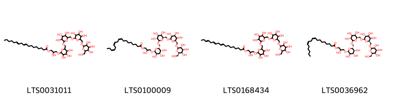{ width=100% }
    <figcaption>Hình ảnh cấu trúc hóa học của 4 hoạt chất thuộc nhóm Glycerolipids gồm ['2-hydroxy-3-{[3,4,5-trihydroxy-6-({[3,4,5-trihydroxy-6-({[3,4,5-trihydroxy-6-({[3,4,5-trihydroxy-6-(hydroxymethyl)oxan-2-yl]oxy}methyl)oxan-2-yl]oxy}methyl)oxan-2-yl]oxy}methyl)oxan-2-yl]oxy}propyl octadeca-9,12-dienoate (LTS0031011)', '(2r)-2-hydroxy-3-{[(2r,3r,4s,5r,6r)-3,4,5-trihydroxy-6-({[(2r,3r,4s,5r,6r)-3,4,5-trihydroxy-6-({[(2r,3r,4s,5r,6r)-3,4,5-trihydroxy-6-({[(2r,3r,4s,5r,6r)-3,4,5-trihydroxy-6-(hydroxymethyl)oxan-2-yl]oxy}methyl)oxan-2-yl]oxy}methyl)oxan-2-yl]oxy}methyl)oxan-2-yl]oxy}propyl (9z,12z,15z)-octadeca-9,12,15-trienoate (LTS0100009)', '2-hydroxy-3-{[3,4,5-trihydroxy-6-({[3,4,5-trihydroxy-6-({[3,4,5-trihydroxy-6-({[3,4,5-trihydroxy-6-(hydroxymethyl)oxan-2-yl]oxy}methyl)oxan-2-yl]oxy}methyl)oxan-2-yl]oxy}methyl)oxan-2-yl]oxy}propyl octadeca-9,12,15-trienoate (LTS0168434)', '(2r)-2-hydroxy-3-{[(2r,3r,4s,5r,6r)-3,4,5-trihydroxy-6-({[(2r,3r,4s,5r,6r)-3,4,5-trihydroxy-6-({[(2r,3r,4s,5r,6r)-3,4,5-trihydroxy-6-({[(2r,3r,4s,5r,6r)-3,4,5-trihydroxy-6-(hydroxymethyl)oxan-2-yl]oxy}methyl)oxan-2-yl]oxy}methyl)oxan-2-yl]oxy}methyl)oxan-2-yl]oxy}propyl (9z,12z)-octadeca-9,12-dienoate (LTS0036962)'].</figcaption>
</figure>
#### Nhóm Organooxygen compounds
<figure markdown="span">
    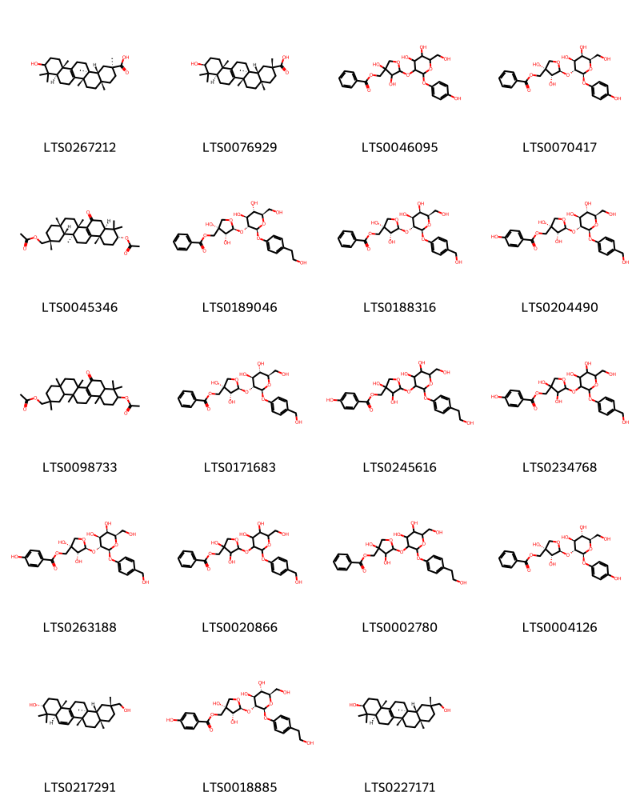{ width=100% }
    <figcaption>Hình ảnh cấu trúc hóa học của 19 hoạt chất thuộc nhóm Organooxygen compounds gồm ['(2s,4as,6as,8ar,12as,14as,14br)-10-hydroxy-2,4a,6a,9,9,12a,14a-heptamethyl-1,3,4,5,6,7,8,8a,10,11,12,13,14,14b-tetradecahydropicene-2-carboxylic acid (LTS0267212)', '(2r,4as,6as,8ar,10s,12as,14as,14br)-10-hydroxy-2,4a,6a,9,9,12a,14a-heptamethyl-1,3,4,5,6,7,8,8a,10,11,12,13,14,14b-tetradecahydropicene-2-carboxylic acid (LTS0076929)', '(5-{[4,5-dihydroxy-6-(hydroxymethyl)-2-(4-hydroxyphenoxy)oxan-3-yl]oxy}-3,4-dihydroxyoxolan-3-yl)methyl benzoate (LTS0046095)', '[(3s,4r,5s)-5-{[(2s,3r,4s,5r,6r)-4,5-dihydroxy-6-(hydroxymethyl)-2-(4-hydroxyphenoxy)oxan-3-yl]oxy}-3,4-dihydroxyoxolan-3-yl]methyl benzoate (LTS0070417)', '[(2r,4as,6as,8ar,10r,12as,14as,14br)-10-(acetyloxy)-2,4a,6a,9,9,12a,14a-heptamethyl-7-oxo-3,4,5,6,8,8a,10,11,12,13,14,14b-dodecahydro-1h-picen-2-yl]methyl acetate (LTS0045346)', '[(3s,4r,5s)-5-{[(2s,3r,4s,5s,6r)-4,5-dihydroxy-2-[4-(2-hydroxyethyl)phenoxy]-6-(hydroxymethyl)oxan-3-yl]oxy}-3,4-dihydroxyoxolan-3-yl]methyl benzoate (LTS0189046)', '[(3s,4r,5s)-5-{[(2s,3r,4s,5r,6r)-4,5-dihydroxy-6-(hydroxymethyl)-2-[4-(hydroxymethyl)phenoxy]oxan-3-yl]oxy}-3,4-dihydroxyoxolan-3-yl]methyl benzoate (LTS0188316)', '[(3s,4r,5s)-5-{[(2s,3r,4s,5s,6r)-4,5-dihydroxy-6-(hydroxymethyl)-2-[4-(hydroxymethyl)phenoxy]oxan-3-yl]oxy}-3,4-dihydroxyoxolan-3-yl]methyl 4-hydroxybenzoate (LTS0204490)', '[10-(acetyloxy)-2,4a,6a,9,9,12a,14a-heptamethyl-7-oxo-3,4,5,6,8,8a,10,11,12,13,14,14b-dodecahydro-1h-picen-2-yl]methyl acetate (LTS0098733)', '[(3s,4r,5s)-5-{[(2s,3r,4s,5s,6r)-4,5-dihydroxy-6-(hydroxymethyl)-2-[4-(hydroxymethyl)phenoxy]oxan-3-yl]oxy}-3,4-dihydroxyoxolan-3-yl]methyl benzoate (LTS0171683)', '[5-({4,5-dihydroxy-2-[4-(2-hydroxyethyl)phenoxy]-6-(hydroxymethyl)oxan-3-yl}oxy)-3,4-dihydroxyoxolan-3-yl]methyl 4-hydroxybenzoate (LTS0245616)', '(5-{[4,5-dihydroxy-6-(hydroxymethyl)-2-[4-(hydroxymethyl)phenoxy]oxan-3-yl]oxy}-3,4-dihydroxyoxolan-3-yl)methyl 4-hydroxybenzoate (LTS0234768)', '[(3s,4r,5s)-5-{[(2s,3r,4s,5r,6r)-4,5-dihydroxy-6-(hydroxymethyl)-2-[4-(hydroxymethyl)phenoxy]oxan-3-yl]oxy}-3,4-dihydroxyoxolan-3-yl]methyl 4-hydroxybenzoate (LTS0263188)', '(5-{[4,5-dihydroxy-6-(hydroxymethyl)-2-[4-(hydroxymethyl)phenoxy]oxan-3-yl]oxy}-3,4-dihydroxyoxolan-3-yl)methyl benzoate (LTS0020866)', '[5-({4,5-dihydroxy-2-[4-(2-hydroxyethyl)phenoxy]-6-(hydroxymethyl)oxan-3-yl}oxy)-3,4-dihydroxyoxolan-3-yl]methyl benzoate (LTS0002780)', '[(3s,4r,5s)-5-{[(2s,3r,4s,5s,6r)-4,5-dihydroxy-6-(hydroxymethyl)-2-(4-hydroxyphenoxy)oxan-3-yl]oxy}-3,4-dihydroxyoxolan-3-yl]methyl benzoate (LTS0004126)', '(3r,4ar,6bs,8as,11r,12ar,12bs,14bs)-11-(hydroxymethyl)-4,4,6b,8a,11,12b,14b-heptamethyl-1,2,3,4a,7,8,9,10,12,12a,13,14-dodecahydropicen-3-ol (LTS0217291)', '[(3s,4r,5s)-5-{[(2s,3r,4s,5s,6r)-4,5-dihydroxy-2-[4-(2-hydroxyethyl)phenoxy]-6-(hydroxymethyl)oxan-3-yl]oxy}-3,4-dihydroxyoxolan-3-yl]methyl 4-hydroxybenzoate (LTS0018885)', '(3s,4ar,6bs,8as,11r,12ar,12bs,14bs)-11-(hydroxymethyl)-4,4,6b,8a,11,12b,14b-heptamethyl-1,2,3,4a,5,6,7,8,9,10,12,12a,13,14-tetradecahydropicen-3-ol (LTS0227171)'].</figcaption>
</figure>
#### Nhóm Prenol lipids
<figure markdown="span">
    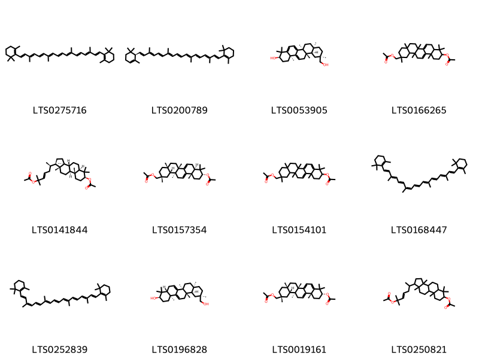{ width=100% }
    <figcaption>Hình ảnh cấu trúc hóa học của 12 hoạt chất thuộc nhóm Prenol lipids gồm ['β-carotene (LTS0275716)', '(+)-α-carotene (LTS0200789)', '(3r,6bs,8as,11r,12ar,12bs,14br)-11-(hydroxymethyl)-4,4,6b,8a,11,12b,14b-heptamethyl-1,2,3,7,8,9,10,12,12a,13-decahydropicen-3-ol (LTS0053905)', '[10-(acetyloxy)-2,4a,6a,9,9,12a,14a-heptamethyl-1,3,4,5,6,8,8a,10,11,12,14,14b-dodecahydropicen-2-yl]methyl acetate (LTS0166265)', '(3e,6r)-6-[(1r,3as,3br,5ar,7s,9ar,9bs,11ar)-7-(acetyloxy)-3a,6,6,9a,11a-pentamethyl-dodecahydro-1h-cyclopenta[a]phenanthren-1-yl]-2-methylhept-3-en-2-yl acetate (LTS0141844)', '[(2r,4as,6as,8ar,10r,12as,14as,14br)-10-(acetyloxy)-2,4a,6a,9,9,12a,14a-heptamethyl-1,3,4,5,6,8,8a,10,11,12,14,14b-dodecahydropicen-2-yl]methyl acetate (LTS0157354)', '[10-(acetyloxy)-2,4a,6a,9,9,12a,14a-heptamethyl-1,3,4,5,6,10,11,12,14,14b-decahydropicen-2-yl]methyl acetate (LTS0154101)', 'β,β-carotene (LTS0168447)', '(9z)-β-carotene (LTS0252839)', 'karounidiol (LTS0196828)', '[(2r,4as,6as,10r,12ar,14as,14br)-10-(acetyloxy)-2,4a,6a,9,9,12a,14a-heptamethyl-1,3,4,5,6,10,11,12,14,14b-decahydropicen-2-yl]methyl acetate (LTS0019161)', '6-[7-(acetyloxy)-3a,6,6,9a,11a-pentamethyl-dodecahydro-1h-cyclopenta[a]phenanthren-1-yl]-2-methylhept-3-en-2-yl acetate (LTS0250821)'].</figcaption>
</figure>

---

### Dược dân tộc học

Danh sách các quốc gia có sử dụng *Cucurbita moschata* trong điều trị các bệnh. 

| Country            | Disease                         | Bệnh                            |
|:-------------------|:--------------------------------|:--------------------------------|
| China              | Taenifuge, Vermifuge, Vermifuge | Taenifuge, Vermifuge, Vermifuge |
| Dominican Republic | Vermifuge                       | Thuốc diệt sán                  |
| Haiti              | Laxative, Taenifuge             | Thuốc nhuận tràng, Taenifuge    |
| Java               | Vermifuge                       | Thuốc diệt sán                  |
| Kurdistan          | Taenifuge                       | Taenifuge                       |
| Mexico             | Vermifuge                       | Thuốc diệt sán                  |
| Turkey             | Taenifuge                       | Taenifuge                       |

---

---
## Cucurbita pepo
### Thông tin về thực vật

!!! info "Phân loại thực vật của *Cucurbita pepo* từ GIBF:"
    - **Kingdom:** Plantae
    - **Phylum:** Tracheophyta
    - **Order:** Cucurbitales
    - **Family:** Cucurbitaceae
    - **Genus:** Cucurbita
    - **Species:** *Cucurbita pepo*

 

| Label (VI)   | Label (EN)   | Scientific Name   | Descriptions (VI)   | Descriptions (EN)   | Also Known As (VI)   | Also Known As (EN)   |
|:-------------|:-------------|:------------------|:--------------------|:--------------------|:---------------------|:---------------------|
| N/A          | N/A          | Cucurbita pepo    | loài thực vật       | species of plant    | ['']                 | ['field pumpkin']    |

#### Phân bố trên thế giới

**Từ CSDL GIBF** Brazil, Guatemala, Czechia, Sweden, Finland, New Zealand, Ecuador, Spain, Netherlands, Poland, Denmark, Montenegro, Bolivia (Plurinational State of), United States of America, Iran (Islamic Republic of), Russian Federation, Dominican Republic, Colombia, Argentina, Estonia, Belarus, Mexico, Norway, France, Belgium, Chinese Taipei, Malaysia, Canada, Germany, Austria, Hungary, Portugal, Ukraine, Slovakia, Australia, India, Switzerland, Peru, United Kingdom of Great Britain and Northern Ireland

#### Phân bố tại Việt Nam

**Từ CSDL GIBF**: Không có ghi nhận ở Việt Nam

---
### Thành phần hóa học
        
- Theo cơ sở dữ liệu lotus: Từ loài *Cucurbita pepo* đã phân lập và xác định được 144 hoạt chất thuộc về các nhóm Fatty Acyls, Benzene and substituted derivatives, Dibenzylbutane lignans, Flavonoids, Carboxylic acids and derivatives, Cinnamic acids and derivatives, Steroids and steroid derivatives, Phenols, Organooxygen compounds, Phenylpropanoic acids, Furanoid lignans, Prenol lipids, Indoles and derivatives. 

|    | chemicalTaxonomyClassyfireClass     |   smiles_count |
|---:|:------------------------------------|---------------:|
|  0 | Benzene and substituted derivatives |              5 |
|  1 | Carboxylic acids and derivatives    |              2 |
|  2 | Cinnamic acids and derivatives      |              2 |
|  3 | Dibenzylbutane lignans              |              2 |
|  4 | Fatty Acyls                         |             12 |
|  5 | Flavonoids                          |             24 |
|  6 | Furanoid lignans                    |              3 |
|  7 | Indoles and derivatives             |              2 |
|  8 | Organooxygen compounds              |             28 |
|  9 | Phenols                             |              1 |
| 10 | Phenylpropanoic acids               |              1 |
| 11 | Prenol lipids                       |             15 |
| 12 | Steroids and steroid derivatives    |             47 |

#### Nhóm Benzene and substituted derivatives
<figure markdown="span">
    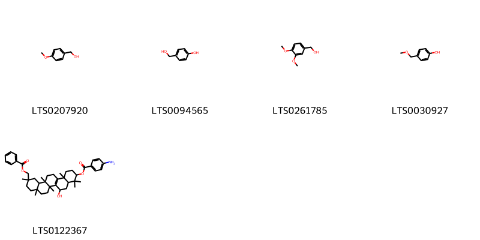{ width=100% }
    <figcaption>Hình ảnh cấu trúc hóa học của 5 hoạt chất thuộc nhóm Benzene and substituted derivatives gồm ['anise alcohol (LTS0207920)', 'gastrodigenin (LTS0094565)', 'veratryl alcohol (LTS0261785)', 'p-(methoxymethyl)phenol (LTS0030927)', '11-[(benzoyloxy)methyl]-6-hydroxy-4,4,6b,8a,11,12b,14b-heptamethyl-1,2,3,4a,5,6,7,8,9,10,12,12a,13,14-tetradecahydropicen-3-yl 4-aminobenzoate (LTS0122367)'].</figcaption>
</figure>
#### Nhóm Carboxylic acids and derivatives
<figure markdown="span">
    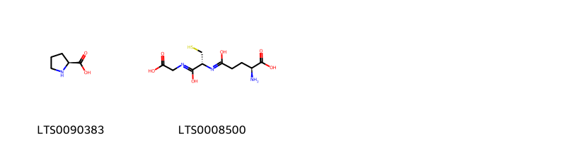{ width=100% }
    <figcaption>Hình ảnh cấu trúc hóa học của 2 hoạt chất thuộc nhóm Carboxylic acids and derivatives gồm ['l-proline (LTS0090383)', '(2s)-2-amino-4-{[(1r)-1-(carboxymethyl-c-hydroxycarbonimidoyl)-2-sulfanylethyl]-c-hydroxycarbonimidoyl}butanoic acid (LTS0008500)'].</figcaption>
</figure>
#### Nhóm Cinnamic acids and derivatives
<figure markdown="span">
    { width=100% }
    <figcaption>Hình ảnh cấu trúc hóa học của 2 hoạt chất thuộc nhóm Cinnamic acids and derivatives gồm ['para-coumaric acid (LTS0266252)', 'hydroxycinnamic acid (LTS0233023)'].</figcaption>
</figure>
#### Nhóm Dibenzylbutane lignans
<figure markdown="span">
    { width=100% }
    <figcaption>Hình ảnh cấu trúc hóa học của 2 hoạt chất thuộc nhóm Dibenzylbutane lignans gồm ['(2s,3r)-2,3-bis[(4-hydroxy-3-methoxyphenyl)(¹³c)methyl](1-¹³c)butane-1,4-diol (LTS0268699)', 'secoisolariciresinol (LTS0086727)'].</figcaption>
</figure>
#### Nhóm Fatty Acyls
<figure markdown="span">
    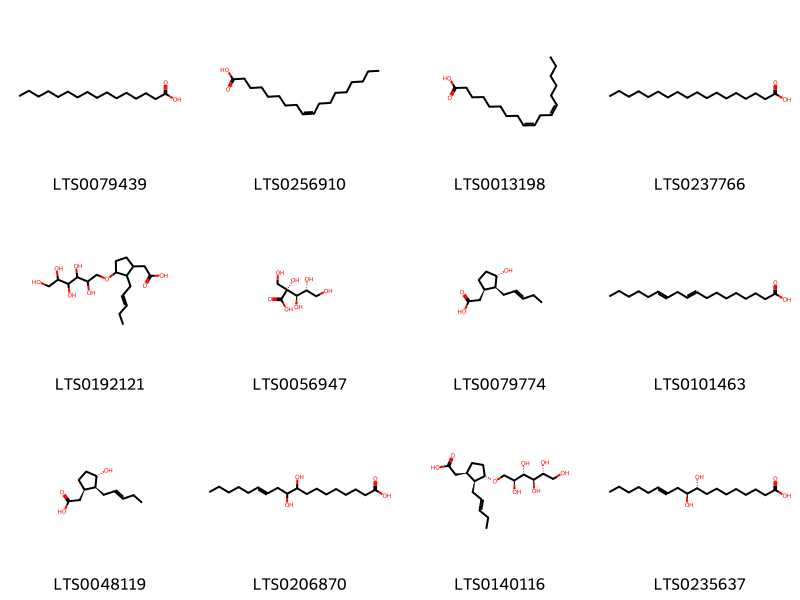{ width=100% }
    <figcaption>Hình ảnh cấu trúc hóa học của 12 hoạt chất thuộc nhóm Fatty Acyls gồm ['palmitic acid (LTS0079439)', 'oleic acid (LTS0256910)', 'linoleic (LTS0013198)', 'stearic acid (LTS0237766)', '[2-(pent-2-en-1-yl)-3-[(2,3,4,5,6-pentahydroxyhexyl)oxy]cyclopentyl]acetic acid (LTS0192121)', '2-carboxy-d-arabinitol (LTS0056947)', '[(1r,2s,3s)-3-hydroxy-2-(pent-2-en-1-yl)cyclopentyl]acetic acid (LTS0079774)', '9,12-octadecadienoic acid (LTS0101463)', 'cucurbic acid (LTS0048119)', '9,10-dihydroxyoctadec-12-enoic acid (LTS0206870)', '[(1r,2s,3s)-2-[(2e)-pent-2-en-1-yl]-3-{[(2s,3s,4r,5r)-2,3,4,5,6-pentahydroxyhexyl]oxy}cyclopentyl]acetic acid (LTS0140116)', '(9r,10s,12e)-9,10-dihydroxyoctadec-12-enoic acid (LTS0235637)'].</figcaption>
</figure>
#### Nhóm Flavonoids
<figure markdown="span">
    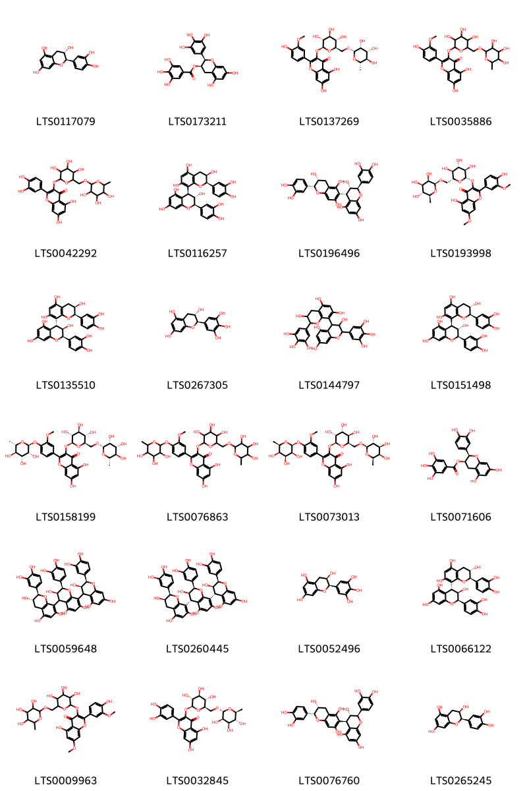{ width=100% }
    <figcaption>Hình ảnh cấu trúc hóa học của 24 hoạt chất thuộc nhóm Flavonoids gồm ['(+)-catechol (LTS0117079)', '(-)-epigallocatechin gallate (LTS0173211)', '5,7-dihydroxy-2-(4-hydroxy-3-methoxyphenyl)-3-{[(2s,3r,4s,5s,6r)-3,4,5-trihydroxy-6-({[(2s,3r,4r,5r,6s)-3,4,5-trihydroxy-6-methyloxan-2-yl]oxy}methyl)oxan-2-yl]oxy}chromen-4-one (LTS0137269)', '5,7-dihydroxy-2-(4-hydroxy-3-methoxyphenyl)-3-[(3,4,5-trihydroxy-6-{[(3,4,5-trihydroxy-6-methyloxan-2-yl)oxy]methyl}oxan-2-yl)oxy]chromen-4-one (LTS0035886)', 'rutin (LTS0042292)', '(2r,3s,4s)-2-(3,4-dihydroxyphenyl)-4-[(2r,3r)-2-(3,4-dihydroxyphenyl)-3,5,7-trihydroxy-3,4-dihydro-2h-1-benzopyran-8-yl]-3,4-dihydro-2h-1-benzopyran-3,5,7-triol (LTS0116257)', '(2r,3s,4s)-2-(3,4-dihydroxyphenyl)-4-[(2r,3r)-2-(3,4-dihydroxyphenyl)-3,5,7-trihydroxy-3,4-dihydro-2h-1-benzopyran-6-yl]-3,4-dihydro-2h-1-benzopyran-3,5,7-triol (LTS0196496)', '5-hydroxy-2-(4-hydroxy-3-methoxyphenyl)-7-methoxy-3-{[(2s,3r,4s,5s,6r)-3,4,5-trihydroxy-6-({[(2s,3r,4r,5r,6s)-3,4,5-trihydroxy-6-methyloxan-2-yl]oxy}methyl)oxan-2-yl]oxy}chromen-4-one (LTS0193998)', '(2r,3r,4r)-2-(3,4-dihydroxyphenyl)-4-[(2r,3r)-2-(3,4-dihydroxyphenyl)-3,5,7-trihydroxy-3,4-dihydro-2h-1-benzopyran-8-yl]-3,4-dihydro-2h-1-benzopyran-3,5,7-triol (LTS0135510)', 'gallocatechol (LTS0267305)', '4-[3,5,7-trihydroxy-2-(3,4,5-trihydroxyphenyl)-3,4-dihydro-2h-1-benzopyran-8-yl]-2-(3,4,5-trihydroxyphenyl)-3,4-dihydro-2h-1-benzopyran-3,5,7-triol (LTS0144797)', '(2r,3s,4s)-2-(3,4-dihydroxyphenyl)-4-[(2r,3s)-2-(3,4-dihydroxyphenyl)-3,5,7-trihydroxy-3,4-dihydro-2h-1-benzopyran-8-yl]-3,4-dihydro-2h-1-benzopyran-3,5,7-triol (LTS0151498)', '5,7-dihydroxy-2-(3-methoxy-4-{[(2s,3r,4r,5r,6s)-3,4,5-trihydroxy-6-methyloxan-2-yl]oxy}phenyl)-3-{[(2s,3r,4s,5s,6r)-3,4,5-trihydroxy-6-({[(2s,3r,4r,5r,6s)-3,4,5-trihydroxy-6-methyloxan-2-yl]oxy}methyl)oxan-2-yl]oxy}chromen-4-one (LTS0158199)', '5,7-dihydroxy-2-{3-methoxy-4-[(3,4,5-trihydroxy-6-methyloxan-2-yl)oxy]phenyl}-3-[(3,4,5-trihydroxy-6-{[(3,4,5-trihydroxy-6-methyloxan-2-yl)oxy]methyl}oxan-2-yl)oxy]chromen-4-one (LTS0076863)', '5,7-dihydroxy-2-(3-methoxy-4-{[(2s,3s,4s,5r,6r)-3,4,5-trihydroxy-6-methyloxan-2-yl]oxy}phenyl)-3-{[(2s,3r,4r,5r,6r)-3,4,5-trihydroxy-6-({[(2r,3r,4s,5r,6r)-3,4,5-trihydroxy-6-methyloxan-2-yl]oxy}methyl)oxan-2-yl]oxy}chromen-4-one (LTS0073013)', 'epicatechin gallate (LTS0071606)', '(2r,3r)-2-(3,4-dihydroxyphenyl)-8-[(2r,3r)-2-(3,4-dihydroxyphenyl)-3,5,7-trihydroxy-3,4-dihydro-2h-1-benzopyran-4-yl]-4-[(2r,3s)-2-(3,4-dihydroxyphenyl)-3,5,7-trihydroxy-3,4-dihydro-2h-1-benzopyran-8-yl]-3,4-dihydro-2h-1-benzopyran-3,5,7-triol (LTS0059648)', 'procyanidin c1 (LTS0260445)', 'epigallocatechin (LTS0052496)', '(2r,3r,4r)-2-(3,4-dihydroxyphenyl)-4-[(2r,3s)-2-(3,4-dihydroxyphenyl)-3,5,7-trihydroxy-3,4-dihydro-2h-1-benzopyran-8-yl]-3,4-dihydro-2h-1-benzopyran-3,5,7-triol (LTS0066122)', '5-hydroxy-2-(4-hydroxy-3-methoxyphenyl)-7-methoxy-3-[(3,4,5-trihydroxy-6-{[(3,4,5-trihydroxy-6-methyloxan-2-yl)oxy]methyl}oxan-2-yl)oxy]chromen-4-one (LTS0009963)', '3-rutinosyl quercetin (LTS0032845)', '(2r,3s,4r)-2-(3,4-dihydroxyphenyl)-4-[(2r,3r)-2-(3,4-dihydroxyphenyl)-3,5,7-trihydroxy-3,4-dihydro-2h-1-benzopyran-6-yl]-3,4-dihydro-2h-1-benzopyran-3,5,7-triol (LTS0076760)', 'ent-epicatechin (LTS0265245)'].</figcaption>
</figure>
#### Nhóm Furanoid lignans
<figure markdown="span">
    { width=100% }
    <figcaption>Hình ảnh cấu trúc hóa học của 3 hoạt chất thuộc nhóm Furanoid lignans gồm ['pinoresinol (LTS0057431)', 'matairesinol (LTS0193475)', 'lariciresinol (LTS0010950)'].</figcaption>
</figure>
#### Nhóm Indoles and derivatives
<figure markdown="span">
    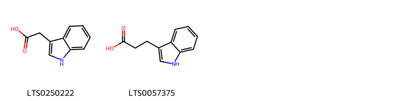{ width=100% }
    <figcaption>Hình ảnh cấu trúc hóa học của 2 hoạt chất thuộc nhóm Indoles and derivatives gồm ['β-indole-3-acetic acid (LTS0250222)', 'indolylpropionic acid (LTS0057375)'].</figcaption>
</figure>
#### Nhóm Organooxygen compounds
<figure markdown="span">
    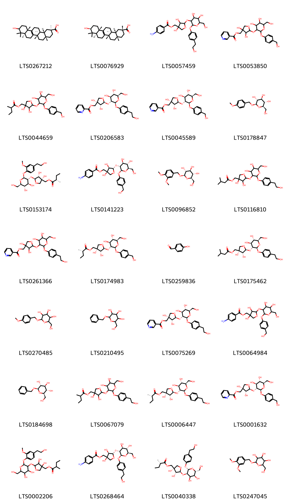{ width=100% }
    <figcaption>Hình ảnh cấu trúc hóa học của 28 hoạt chất thuộc nhóm Organooxygen compounds gồm ['(2s,4as,6as,8ar,12as,14as,14br)-10-hydroxy-2,4a,6a,9,9,12a,14a-heptamethyl-1,3,4,5,6,7,8,8a,10,11,12,13,14,14b-tetradecahydropicene-2-carboxylic acid (LTS0267212)', '(2r,4as,6as,8ar,10s,12as,14as,14br)-10-hydroxy-2,4a,6a,9,9,12a,14a-heptamethyl-1,3,4,5,6,7,8,8a,10,11,12,13,14,14b-tetradecahydropicene-2-carboxylic acid (LTS0076929)', '[5-({4,5-dihydroxy-2-[4-(2-hydroxyethyl)phenoxy]-6-(hydroxymethyl)oxan-3-yl}oxy)-3,4-dihydroxyoxolan-3-yl]methyl 4-aminobenzoate (LTS0057459)', '(5-{[4,5-dihydroxy-6-(hydroxymethyl)-2-[4-(hydroxymethyl)phenoxy]oxan-3-yl]oxy}-3,4-dihydroxyoxolan-3-yl)methyl pyridine-3-carboxylate (LTS0053850)', '(5-{[4,5-dihydroxy-6-(hydroxymethyl)-2-[4-(hydroxymethyl)phenoxy]oxan-3-yl]oxy}-3,4-dihydroxyoxolan-3-yl)methyl 2-methylbutanoate (LTS0044659)', '[(3s,4r,5s)-5-{[(2s,3r,4s,5s,6r)-4,5-dihydroxy-2-[4-(2-hydroxyethyl)phenoxy]-6-(hydroxymethyl)oxan-3-yl]oxy}-3,4-dihydroxyoxolan-3-yl]methyl pyridine-2-carboxylate (LTS0206583)', '[(3s,4r,5s)-5-{[(2s,3r,4s,5s,6r)-4,5-dihydroxy-6-(hydroxymethyl)-2-[4-(hydroxymethyl)phenoxy]oxan-3-yl]oxy}-3,4-dihydroxyoxolan-3-yl]methyl pyridine-3-carboxylate (LTS0045589)', '(2r,3s,4s,5r,6r)-2-(hydroxymethyl)-6-[(4-methoxyphenyl)methoxy]oxane-3,4,5-triol (LTS0178847)', '[(3s,4r,5s)-5-{[(2s,3r,4s,5s,6r)-4,5-dihydroxy-2-[4-(2-hydroxyethyl)-2-methoxyphenoxy]-6-(hydroxymethyl)oxan-3-yl]oxy}-3,4-dihydroxyoxolan-3-yl]methyl (2s)-2-methylbutanoate (LTS0153174)', '[(3s,4r,5s)-5-{[(2s,3r,4s,5s,6r)-4,5-dihydroxy-6-(hydroxymethyl)-2-[4-(hydroxymethyl)phenoxy]oxan-3-yl]oxy}-3,4-dihydroxyoxolan-3-yl]methyl 4-aminobenzoate (LTS0141223)', '(2r,3r,4s,5s,6r)-2-[(3,4-dimethoxyphenyl)methoxy]-6-(hydroxymethyl)oxane-3,4,5-triol (LTS0096852)', '[5-({4,5-dihydroxy-2-[4-(2-hydroxyethyl)phenoxy]-6-(hydroxymethyl)oxan-3-yl}oxy)-3,4-dihydroxyoxolan-3-yl]methyl 3-methylbutanoate (LTS0116810)', '[5-({4,5-dihydroxy-2-[4-(2-hydroxyethyl)phenoxy]-6-(hydroxymethyl)oxan-3-yl}oxy)-3,4-dihydroxyoxolan-3-yl]methyl pyridine-3-carboxylate (LTS0261366)', '[(3s,4r,5s)-5-{[(2s,3r,4s,5s,6r)-4,5-dihydroxy-6-(hydroxymethyl)-2-[4-(hydroxymethyl)phenoxy]oxan-3-yl]oxy}-3,4-dihydroxyoxolan-3-yl]methyl (2s)-2-methylbutanoate (LTS0174983)', 'p-hydroxybenzaldehyde (LTS0259836)', '[(3s,4r,5s)-5-{[(2s,3r,4s,5s,6r)-4,5-dihydroxy-2-[4-(2-hydroxyethyl)phenoxy]-6-(hydroxymethyl)oxan-3-yl]oxy}-3,4-dihydroxyoxolan-3-yl]methyl 3-methylbutanoate (LTS0175462)', '2-(hydroxymethyl)-6-[(4-methoxyphenyl)methoxy]oxane-3,4,5-triol (LTS0270485)', 'benzyl glucopyranoside (LTS0210495)', '[(3s,4r,5s)-5-{[(2s,3r,4s,5s,6r)-4,5-dihydroxy-2-[4-(2-hydroxyethyl)phenoxy]-6-(hydroxymethyl)oxan-3-yl]oxy}-3,4-dihydroxyoxolan-3-yl]methyl pyridine-3-carboxylate (LTS0075269)', '(5-{[4,5-dihydroxy-6-(hydroxymethyl)-2-[4-(hydroxymethyl)phenoxy]oxan-3-yl]oxy}-3,4-dihydroxyoxolan-3-yl)methyl 4-aminobenzoate (LTS0064984)', 'benzyl β-d-glucoside (LTS0184698)', '[5-({4,5-dihydroxy-2-[4-(2-hydroxyethyl)phenoxy]-6-(hydroxymethyl)oxan-3-yl}oxy)-3,4-dihydroxyoxolan-3-yl]methyl 2-methylbutanoate (LTS0067079)', '[(3s,4r,5s)-5-{[(2s,3r,4s,5s,6r)-4,5-dihydroxy-2-[4-(2-hydroxyethyl)phenoxy]-6-(hydroxymethyl)oxan-3-yl]oxy}-3,4-dihydroxyoxolan-3-yl]methyl (2s)-2-methylbutanoate (LTS0006447)', '[(3s,4r,5s)-5-{[(2s,3r,4s,5s,6r)-4,5-dihydroxy-6-(hydroxymethyl)-2-[4-(hydroxymethyl)phenoxy]oxan-3-yl]oxy}-3,4-dihydroxyoxolan-3-yl]methyl pyridine-2-carboxylate (LTS0001632)', '[5-({4,5-dihydroxy-2-[4-(2-hydroxyethyl)-2-methoxyphenoxy]-6-(hydroxymethyl)oxan-3-yl}oxy)-3,4-dihydroxyoxolan-3-yl]methyl 2-methylbutanoate (LTS0002206)', '[(3s,4r,5s)-5-{[(2s,3r,4s,5s,6r)-4,5-dihydroxy-2-[4-(2-hydroxyethyl)phenoxy]-6-(hydroxymethyl)oxan-3-yl]oxy}-3,4-dihydroxyoxolan-3-yl]methyl 4-aminobenzoate (LTS0268464)', '[(3s,4r,5s)-5-{[(2s,3r,5s,6r)-4,5-dihydroxy-2-[4-(2-hydroxyethyl)phenoxy]-6-(hydroxymethyl)oxan-3-yl]oxy}-3,4-dihydroxyoxolan-3-yl]methyl (2s)-2-methylbutanoate (LTS0040338)', '2-[(3,4-dimethoxyphenyl)methoxy]-6-(hydroxymethyl)oxane-3,4,5-triol (LTS0247045)'].</figcaption>
</figure>
#### Nhóm Phenols
<figure markdown="span">
    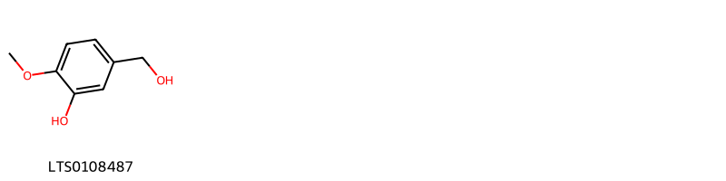{ width=100% }
    <figcaption>Hình ảnh cấu trúc hóa học của 1 hoạt chất thuộc nhóm Phenols gồm ['5-(hydroxymethyl)-2-methoxyphenol (LTS0108487)'].</figcaption>
</figure>
#### Nhóm Phenylpropanoic acids
<figure markdown="span">
    { width=100% }
    <figcaption>Hình ảnh cấu trúc hóa học của 1 hoạt chất thuộc nhóm Phenylpropanoic acids gồm ['hydroxyphenyl propionic acid (LTS0119368)'].</figcaption>
</figure>
#### Nhóm Prenol lipids
<figure markdown="span">
    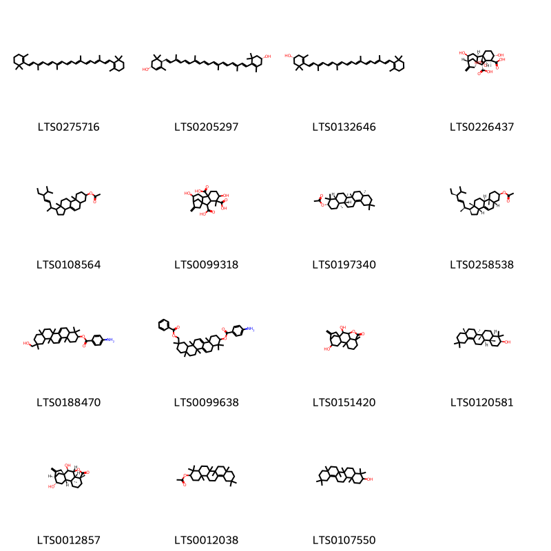{ width=100% }
    <figcaption>Hình ảnh cấu trúc hóa học của 15 hoạt chất thuộc nhóm Prenol lipids gồm ['β-carotene (LTS0275716)', 'carotenoid (LTS0205297)', 'cryptoxanthin (LTS0132646)', '(1r,2s,3s,4s,5s,8r,9r,11s,12r)-5,11-dihydroxy-4-methyl-13-methylidenetetracyclo[10.2.1.0¹,⁹.0³,⁸]pentadecane-2,4,8-tricarboxylic acid (LTS0226437)', '1-(5-ethyl-6-methylhept-3-en-2-yl)-9a,11a-dimethyl-1h,2h,3h,3ah,5h,5ah,6h,7h,8h,9h,9bh,10h,11h-cyclopenta[a]phenanthren-7-yl acetate (LTS0108564)', '5,11-dihydroxy-4-methyl-13-methylidenetetracyclo[10.2.1.0¹,⁹.0³,⁸]pentadecane-2,4,8-tricarboxylic acid (LTS0099318)', '(3s,4ar,6ar,6bs,8ar,14ar,14br)-4,4,6a,6b,8a,11,11,14b-octamethyl-1,2,3,4a,5,6,7,8,9,10,12,13,14,14a-tetradecahydropicen-3-yl acetate (LTS0197340)', '(1s,3ar,5as,7r,9ar,9bs,11as)-1-[(2s,3e,5s)-5-ethyl-6-methylhept-3-en-2-yl]-9a,11a-dimethyl-1h,2h,3h,3ah,5h,5ah,6h,7h,8h,9h,9bh,10h,11h-cyclopenta[a]phenanthren-7-yl acetate (LTS0258538)', '11-(hydroxymethyl)-4,4,6b,8a,11,12b,14b-heptamethyl-1,2,3,4a,5,7,8,9,10,12,12a,13-dodecahydropicen-3-yl 4-aminobenzoate (LTS0188470)', '11-[(benzoyloxy)methyl]-4,4,6b,8a,11,12b,14b-heptamethyl-1,2,3,4a,5,7,8,9,10,12,12a,13-dodecahydropicen-3-yl 4-aminobenzoate (LTS0099638)', '4,9-dihydroxy-1,13-dimethyl-6-methylidene-11-oxapentacyclo[8.6.1.1⁵,⁸.0²,⁸.0¹³,¹⁷]octadecan-12-one (LTS0151420)', 'delta-amyrin (LTS0120581)', '(1s,2s,4s,5r,8r,9r,10r,13r,17s)-4,9-dihydroxy-1,13-dimethyl-6-methylidene-11-oxapentacyclo[8.6.1.1⁵,⁸.0²,⁸.0¹³,¹⁷]octadecan-12-one (LTS0012857)', '4,4,6a,6b,8a,11,11,14b-octamethyl-1,2,3,4a,5,6,7,8,9,10,12,13,14,14a-tetradecahydropicen-3-yl acetate (LTS0012038)', '4,4,6a,6b,8a,11,11,14b-octamethyl-1,2,3,4a,5,6,7,8,9,10,12,13,14,14a-tetradecahydropicen-3-ol (LTS0107550)'].</figcaption>
</figure>
#### Nhóm Steroids and steroid derivatives
<figure markdown="span">
    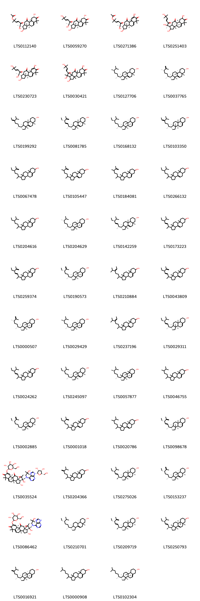{ width=100% }
    <figcaption>Hình ảnh cấu trúc hóa học của 47 hoạt chất thuộc nhóm Steroids and steroid derivatives gồm ['cucurbitacin b (LTS0112140)', 'cucurbitacin d (LTS0059270)', 'α-elaterin (LTS0271386)', '(3as,3bs,9as,9br,11ar)-1-[(2r)-2,6-dihydroxy-6-methyl-3-oxohept-4-en-2-yl]-2,8-dihydroxy-3a,6,6,9b,11a-pentamethyl-1h,2h,3h,3bh,4h,8h,9h,9ah,11h-cyclopenta[a]phenanthrene-7,10-dione (LTS0251403)', 'cucurbitacin (LTS0230723)', '1-(2,6-dihydroxy-6-methyl-3-oxohept-4-en-2-yl)-2,8-dihydroxy-3a,6,6,9b,11a-pentamethyl-1h,2h,3h,3bh,4h,8h,9h,9ah,11h-cyclopenta[a]phenanthrene-7,10-dione (LTS0030421)', '(1r,3ar,5as,7s,9as,9br,11ar)-1-[(2r,5r)-5,6-dimethylheptan-2-yl]-9a,11a-dimethyl-1h,2h,3h,3ah,5h,5ah,6h,7h,8h,9h,9bh,10h,11h-cyclopenta[a]phenanthren-7-ol (LTS0127706)', '(1r,3ar,5as,7s,9as,9br,11ar)-1-[(2r,5s)-5,6-dimethylhept-6-en-2-yl]-9a,11a-dimethyl-1h,2h,3h,3ah,5h,5ah,6h,7h,8h,9h,9bh,10h,11h-cyclopenta[a]phenanthren-7-ol (LTS0037765)', 'delta7-avenasterol (LTS0199292)', '(1r,3ar,5as,7s,9as,9br,11ar)-1-[(2r,3e,5s)-5-ethyl-6-methylhepta-3,6-dien-2-yl]-9a,11a-dimethyl-1h,2h,3h,3ah,5h,5ah,6h,7h,8h,9h,9bh,10h,11h-cyclopenta[a]phenanthren-7-ol (LTS0081785)', 'sitosterol (LTS0168132)', 'avenasterol (LTS0103350)', '1-(5-ethyl-6-methylhept-6-en-2-yl)-9a,11a-dimethyl-1h,2h,3h,3ah,3bh,4h,6h,7h,8h,9h,9bh,10h,11h-cyclopenta[a]phenanthren-7-ol (LTS0067478)', '1-(5,6-dimethylhept-6-en-2-yl)-9a,11a-dimethyl-1h,2h,3h,3ah,5h,5ah,6h,7h,8h,9h,9bh,10h,11h-cyclopenta[a]phenanthren-7-ol (LTS0105447)', '1-(5,6-dimethylhept-6-en-2-yl)-9a,11a-dimethyl-1h,2h,3h,3ah,3bh,4h,6h,7h,8h,9h,9bh,10h,11h-cyclopenta[a]phenanthren-7-ol (LTS0184081)', '1-(5-ethyl-6-methylheptan-2-yl)-9a,11a-dimethyl-1h,2h,3h,3ah,5h,5ah,6h,7h,8h,9h,9bh,10h,11h-cyclopenta[a]phenanthren-7-ol (LTS0266132)', 'stigmast-5-en-3-ol, (3β)- (LTS0204616)', '22,23-dihydrobrassicasterol (LTS0204629)', 'chondrillasterol (LTS0142259)', '1-(5-ethyl-6-methylhept-3-en-2-yl)-9a,11a-dimethyl-1h,2h,3h,3ah,5h,5ah,6h,7h,8h,9h,9bh,10h,11h-cyclopenta[a]phenanthren-7-ol (LTS0173223)', '1-(5-ethyl-6-methylhepta-3,6-dien-2-yl)-9a,11a-dimethyl-1h,2h,3h,3ah,3bh,4h,6h,7h,8h,9h,9bh,10h,11h-cyclopenta[a]phenanthren-7-ol (LTS0259374)', '(1r,3as,3bs,7s,9ar,9bs,11ar)-1-[(2r,5s)-5-ethyl-6-methylhept-6-en-2-yl]-9a,11a-dimethyl-1h,2h,3h,3ah,3bh,4h,6h,7h,8h,9h,9bh,10h,11h-cyclopenta[a]phenanthren-7-ol (LTS0190573)', '1-(5-isopropylhept-5-en-2-yl)-9a,11a-dimethyl-1h,2h,3h,3ah,3bh,4h,6h,7h,8h,9h,9bh,10h,11h-cyclopenta[a]phenanthren-7-ol (LTS0210884)', '1-(5-ethyl-6-methylhepta-3,6-dien-2-yl)-9a,11a-dimethyl-1h,2h,3h,3ah,5h,5ah,6h,7h,8h,9h,9bh,10h,11h-cyclopenta[a]phenanthren-7-ol (LTS0043809)', '(1r,3as,3bs,7s,9ar,9bs,11ar)-1-[(2r,5s)-5,6-dimethylhept-6-en-2-yl]-9a,11a-dimethyl-1h,2h,3h,3ah,3bh,4h,6h,7h,8h,9h,9bh,10h,11h-cyclopenta[a]phenanthren-7-ol (LTS0000507)', 'campesterol (LTS0029429)', 'avenasterol (LTS0237196)', 'phytosterol (LTS0029311)', 'stigmasterol (LTS0024262)', '(3β,5α)-stigmast-7-en-3-ol (LTS0245097)', '(1r,3as,3bs,7s,9bs)-1-[(2r,5r)-5,6-dimethylheptan-2-yl]-9a,11a-dimethyl-1h,2h,3h,3ah,3bh,4h,6h,7h,8h,9h,9bh,10h,11h-cyclopenta[a]phenanthren-7-ol (LTS0057877)', 'campesterol (LTS0046755)', '(1r,3ar,5as,7s,9as,9br,11ar)-1-[(2r,5s)-5-ethyl-6-methylhept-6-en-2-yl]-9a,11a-dimethyl-1h,2h,3h,3ah,5h,5ah,6h,7h,8h,9h,9bh,10h,11h-cyclopenta[a]phenanthren-7-ol (LTS0002885)', '1-(5-ethyl-6-methylhept-6-en-2-yl)-9a,11a-dimethyl-1h,2h,3h,3ah,5h,5ah,6h,7h,8h,9h,9bh,10h,11h-cyclopenta[a]phenanthren-7-ol (LTS0001018)', 'fungisterol (LTS0020786)', '(1r,3as,3bs,7s,9ar,9bs,11ar)-1-[(2r,3e,5s)-5-ethyl-6-methylhepta-3,6-dien-2-yl]-9a,11a-dimethyl-1h,2h,3h,3ah,3bh,4h,6h,7h,8h,9h,9bh,10h,11h-cyclopenta[a]phenanthren-7-ol (LTS0098678)', '(1r,2r,3as,3bs,9ar,9br,11ar)-1-[(2r,5r)-5-({9-[(2s,3r,4s,5s)-3,4-dihydroxy-5-(hydroxymethyl)oxolan-2-yl]purin-6-yl}amino)-2,6-dihydroxy-6-methyl-3-oxoheptan-2-yl]-2-hydroxy-3a,6,6,9b,11a-pentamethyl-8-{[(2s,3r,4s,5r,6r)-3,4,5-trihydroxy-6-(hydroxymethyl)oxan-2-yl]oxy}-1h,2h,3h,3bh,4h,9ah,11h-cyclopenta[a]phenanthrene-7,10-dione (LTS0035524)', '9a,11a-dimethyl-1-(6-methyl-5-methylideneheptan-2-yl)-1h,2h,3h,3ah,3bh,4h,6h,7h,8h,9h,9bh,10h,11h-cyclopenta[a]phenanthren-7-ol (LTS0204366)', '(1r,3ar,5ar,7s,9as,9br,11ar)-1-[(2s,3e,5s)-5-ethyl-6-methylhept-3-en-2-yl]-9a,11a-dimethyl-1h,2h,3h,3ah,5h,5ah,6h,7h,8h,9h,9bh,10h,11h-cyclopenta[a]phenanthren-7-ol (LTS0275026)', '(1r,3ar,5ar,7s,9as,9br,11ar)-1-[(2r,5s)-5-ethyl-6-methylhept-6-en-2-yl]-9a,11a-dimethyl-1h,2h,3h,3ah,5h,5ah,6h,7h,8h,9h,9bh,10h,11h-cyclopenta[a]phenanthren-7-ol (LTS0153237)', '(1r,2r,3as,3bs,9ar,9br,11ar)-1-[(2r,5r)-2,6-dihydroxy-6-methyl-3-oxo-5-(9h-purin-6-ylamino)heptan-2-yl]-2-hydroxy-3a,6,6,9b,11a-pentamethyl-8-{[(2s,3r,4s,5r,6r)-3,4,5-trihydroxy-6-(hydroxymethyl)oxan-2-yl]oxy}-1h,2h,3h,3bh,4h,9ah,11h-cyclopenta[a]phenanthrene-7,10-dione (LTS0086462)', '(1r,5as,7s,9as,11ar)-1-[(2r,5s)-5-ethyl-6-methylheptan-2-yl]-9a,11a-dimethyl-1h,2h,3h,3ah,5h,5ah,6h,7h,8h,9h,9bh,10h,11h-cyclopenta[a]phenanthren-7-ol (LTS0210701)', '(1r,3ar,5ar,7s,9as,9br,11ar)-1-[(2s,3e,5s)-5-ethyl-6-methylhepta-3,6-dien-2-yl]-9a,11a-dimethyl-1h,2h,3h,3ah,5h,5ah,6h,7h,8h,9h,9bh,10h,11h-cyclopenta[a]phenanthren-7-ol (LTS0209719)', '(1s,3ar,5as,7r,9ar,9bs,11as)-1-[(2s,3e,5s)-5-ethyl-6-methylhept-3-en-2-yl]-9a,11a-dimethyl-1h,2h,3h,3ah,5h,5ah,6h,7h,8h,9h,9bh,10h,11h-cyclopenta[a]phenanthren-7-ol (LTS0250793)', '24-methylenecholesterol (LTS0016921)', 'epicholestrol (LTS0000908)', 'cholesterol (LTS0102304)'].</figcaption>
</figure>

---

### Dược dân tộc học

Danh sách các quốc gia có sử dụng *Cucurbita pepo* trong điều trị các bệnh. 

| Country   | Disease                                                                | Bệnh                                                                                                           |
|:----------|:-----------------------------------------------------------------------|:---------------------------------------------------------------------------------------------------------------|
| China     | Vermifuge                                                              | Thuốc diệt sán                                                                                                 |
| Elsewhere | Vermifuge, Taenifuge                                                   | Vermifuge, Taenifuge                                                                                           |
| Turkey    | Diuretic, Refrigerant, Taenicide, Tonic, Vermifuge, Demulcent, Nervine | Thuốc lợi tiểu, Chất làm lạnh, Thuốc diệt côn trùng, Thuốc bổ, Thuốc diệt côn trùng, Thuốc giảm đau, Thần kinh |
| ain       | Taenifuge                                                              | Taenifuge                                                                                                      |

---

# Chi Echinocystis

??? note "Danh sách các dược liệu thuộc chi"
    
	 - *Echinocystis lobata*

---
## Echinocystis lobata
### Thông tin về thực vật

!!! info "Phân loại thực vật của *Echinocystis lobata* từ GIBF:"
    - **Kingdom:** Plantae
    - **Phylum:** Tracheophyta
    - **Order:** Cucurbitales
    - **Family:** Cucurbitaceae
    - **Genus:** Echinocystis
    - **Species:** *Echinocystis lobata*

 

| Label (VI)   | Label (EN)   | Scientific Name     | Descriptions (VI)   | Descriptions (EN)   | Also Known As (VI)   | Also Known As (EN)   |
|:-------------|:-------------|:--------------------|:--------------------|:--------------------|:---------------------|:---------------------|
| N/A          | N/A          | Echinocystis lobata | loài thực vật       | species of plant    | ['']                 | ['']                 |

#### Phân bố trên thế giới

**Từ CSDL GIBF** Belarus, Austria, Hungary, United States of America, Romania, Czechia, Ukraine, Slovakia, Russian Federation, Kazakhstan, Croatia, Slovenia, Canada, Lithuania, Bosnia and Herzegovina, Poland

#### Phân bố tại Việt Nam

**Từ CSDL GIBF**: Không có ghi nhận ở Việt Nam

---
### Thành phần hóa học
        
- Theo cơ sở dữ liệu lotus: Từ loài *Echinocystis lobata* đã phân lập và xác định được 2 hoạt chất thuộc về các nhóm Prenol lipids. 

|    | chemicalTaxonomyClassyfireClass   |   smiles_count |
|---:|:----------------------------------|---------------:|
|  0 | Prenol lipids                     |              2 |

#### Nhóm Prenol lipids
<figure markdown="span">
    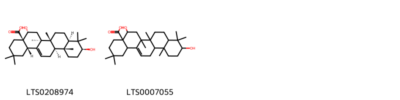{ width=100% }
    <figcaption>Hình ảnh cấu trúc hóa học của 2 hoạt chất thuộc nhóm Prenol lipids gồm ['echinocystic acid (LTS0208974)', '5,10-dihydroxy-2,2,6a,6b,9,9,12a-heptamethyl-1,3,4,5,6,7,8,8a,10,11,12,12b,13,14b-tetradecahydropicene-4a-carboxylic acid (LTS0007055)'].</figcaption>
</figure>

---

### Dược dân tộc học

Danh sách các quốc gia có sử dụng *Echinocystis lobata* trong điều trị các bệnh. 

| Country        | Disease   | Bệnh                     |
|:---------------|:----------|:-------------------------|
| US(Amerindian) | Poultice  | thuốc đắp, đắp thuốc cao |

---

# Chi Thladiantha

??? note "Danh sách các dược liệu thuộc chi"
    
	 - *Thladiantha dubia*

---
## Thladiantha dubia
### Thông tin về thực vật

!!! info "Phân loại thực vật của *Thladiantha dubia* từ GIBF:"
    - **Kingdom:** Plantae
    - **Phylum:** Tracheophyta
    - **Order:** Cucurbitales
    - **Family:** Cucurbitaceae
    - **Genus:** Thladiantha
    - **Species:** *Thladiantha dubia*

 

| Label (VI)   | Label (EN)   | Scientific Name   | Descriptions (VI)   | Descriptions (EN)   | Also Known As (VI)   | Also Known As (EN)   |
|:-------------|:-------------|:------------------|:--------------------|:--------------------|:---------------------|:---------------------|
| N/A          | N/A          | Thladiantha dubia | loài thực vật       | species of plant    | ['']                 | ['']                 |

#### Phân bố trên thế giới

**Từ CSDL GIBF** Belarus, Austria, Hungary, Czechia, Sweden, Ukraine, China, Russian Federation, Slovakia, Slovenia, Canada, Germany, Lithuania, Poland

#### Phân bố tại Việt Nam

**Từ CSDL GIBF**: Không có ghi nhận ở Việt Nam

---
### Thành phần hóa học
        
- Theo cơ sở dữ liệu lotus: Từ loài *Thladiantha dubia* đã phân lập và xác định được 13 hoạt chất thuộc về các nhóm Prenol lipids. 

|    | chemicalTaxonomyClassyfireClass   |   smiles_count |
|---:|:----------------------------------|---------------:|
|  0 | Prenol lipids                     |             13 |

#### Nhóm Prenol lipids
<figure markdown="span">
    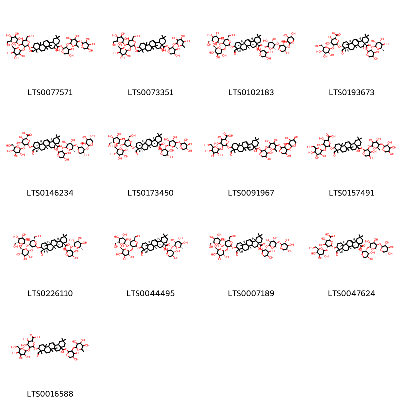{ width=100% }
    <figcaption>Hình ảnh cấu trúc hóa học của 13 hoạt chất thuộc nhóm Prenol lipids gồm ['3-({3,4-dihydroxy-6-methyl-5-[(3,4,5-trihydroxyoxan-2-yl)oxy]oxan-2-yl}oxy)-4,5-dihydroxyoxan-2-yl 9-formyl-5-hydroxy-10-{[5-hydroxy-6-(hydroxymethyl)-3,4-bis({[3,4,5-trihydroxy-6-(hydroxymethyl)oxan-2-yl]oxy})oxan-2-yl]oxy}-2,2,6a,6b,9,12a-hexamethyl-1,3,4,5,6,7,8,8a,10,11,12,12b,13,14b-tetradecahydropicene-4a-carboxylate (LTS0077571)', '4,5-dihydroxy-3-[(3,4,5-trihydroxy-6-methyloxan-2-yl)oxy]oxan-2-yl 9-formyl-5-hydroxy-10-{[5-hydroxy-6-(hydroxymethyl)-3,4-bis({[3,4,5-trihydroxy-6-(hydroxymethyl)oxan-2-yl]oxy})oxan-2-yl]oxy}-2,2,6a,6b,9,12a-hexamethyl-1,3,4,5,6,7,8,8a,10,11,12,12b,13,14b-tetradecahydropicene-4a-carboxylate (LTS0073351)', '(2s,3r,4s,5s)-3-{[(2s,3r,4s,5r,6s)-5-{[(2s,3r,4s,5r)-3,5-dihydroxy-4-{[(2s,3r,4s,5r)-3,4,5-trihydroxyoxan-2-yl]oxy}oxan-2-yl]oxy}-3,4-dihydroxy-6-methyloxan-2-yl]oxy}-4,5-dihydroxyoxan-2-yl (4ar,5r,6as,6br,8ar,9s,10s,12ar,12br,14bs)-9-formyl-5-hydroxy-10-{[(2r,3r,4s,5r,6r)-5-hydroxy-6-(hydroxymethyl)-3-{[(2s,3r,4s,5r,6r)-3,4,5-trihydroxy-6-(hydroxymethyl)oxan-2-yl]oxy}-4-{[(2s,3r,4s,5s,6r)-3,4,5-trihydroxy-6-(hydroxymethyl)oxan-2-yl]oxy}oxan-2-yl]oxy}-2,2,6a,6b,9,12a-hexamethyl-1,3,4,5,6,7,8,8a,10,11,12,12b,13,14b-tetradecahydropicene-4a-carboxylate (LTS0102183)', '(2s,3s,4s,5r,6r)-6-{[(3s,4s,4ar,6ar,6bs,8r,8ar,12as,14ar,14br)-8a-({[(2s,3r,4s,5s)-4,5-dihydroxy-3-{[(2s,3r,4r,5r,6s)-3,4,5-trihydroxy-6-methyloxan-2-yl]oxy}oxan-2-yl]oxy}carbonyl)-4-formyl-8-hydroxy-4,6a,6b,11,11,14b-hexamethyl-1,2,3,4a,5,6,7,8,9,10,12,12a,14,14a-tetradecahydropicen-3-yl]oxy}-3,4-dihydroxy-5-{[(2s,3r,4s,5r,6r)-3,4,5-trihydroxy-6-(hydroxymethyl)oxan-2-yl]oxy}oxane-2-carboxylic acid (LTS0193673)', '(2s,3s,4s,5r,6r)-6-{[(3s,4s,4ar,6ar,6bs,8r,8ar,12as,14ar,14br)-8a-({[(2s,3r,4s,5s)-3-{[(2s,3r,4s,5r,6s)-5-{[(2s,3r,4s,5r)-3,5-dihydroxy-4-{[(2s,3r,4s,5r)-3,4,5-trihydroxyoxan-2-yl]oxy}oxan-2-yl]oxy}-3,4-dihydroxy-6-methyloxan-2-yl]oxy}-4,5-dihydroxyoxan-2-yl]oxy}carbonyl)-4-formyl-8-hydroxy-4,6a,6b,11,11,14b-hexamethyl-1,2,3,4a,5,6,7,8,9,10,12,12a,14,14a-tetradecahydropicen-3-yl]oxy}-3,4-dihydroxy-5-{[(2s,3r,4s,5r,6r)-3,4,5-trihydroxy-6-(hydroxymethyl)oxan-2-yl]oxy}oxane-2-carboxylic acid (LTS0146234)', '(2s,3r,4s,5s)-3-{[(2s,3r,4s,5r,6s)-3,4-dihydroxy-6-methyl-5-{[(2s,3r,4s,5r)-3,4,5-trihydroxyoxan-2-yl]oxy}oxan-2-yl]oxy}-4,5-dihydroxyoxan-2-yl (4ar,5r,6as,6br,8ar,9s,10s,12ar,12br,14bs)-9-formyl-5-hydroxy-10-{[(2r,3r,4s,5r,6r)-5-hydroxy-6-(hydroxymethyl)-3,4-bis({[(2s,3r,4s,5s,6r)-3,4,5-trihydroxy-6-(hydroxymethyl)oxan-2-yl]oxy})oxan-2-yl]oxy}-2,2,6a,6b,9,12a-hexamethyl-1,3,4,5,6,7,8,8a,10,11,12,12b,13,14b-tetradecahydropicene-4a-carboxylate (LTS0173450)', '6-[(8a-{[(3-{[5-({3,5-dihydroxy-4-[(3,4,5-trihydroxyoxan-2-yl)oxy]oxan-2-yl}oxy)-3,4-dihydroxy-6-methyloxan-2-yl]oxy}-4,5-dihydroxyoxan-2-yl)oxy]carbonyl}-4-formyl-8-hydroxy-4,6a,6b,11,11,14b-hexamethyl-1,2,3,4a,5,6,7,8,9,10,12,12a,14,14a-tetradecahydropicen-3-yl)oxy]-3,4-dihydroxy-5-{[3,4,5-trihydroxy-6-(hydroxymethyl)oxan-2-yl]oxy}oxane-2-carboxylic acid (LTS0091967)', '6-{[8a-({[3-({3,4-dihydroxy-6-methyl-5-[(3,4,5-trihydroxyoxan-2-yl)oxy]oxan-2-yl}oxy)-4,5-dihydroxyoxan-2-yl]oxy}carbonyl)-4-formyl-8-hydroxy-4,6a,6b,11,11,14b-hexamethyl-1,2,3,4a,5,6,7,8,9,10,12,12a,14,14a-tetradecahydropicen-3-yl]oxy}-3,4-dihydroxy-5-{[3,4,5-trihydroxy-6-(hydroxymethyl)oxan-2-yl]oxy}oxane-2-carboxylic acid (LTS0157491)', '(2s,3r,4s,5s)-4,5-dihydroxy-3-{[(2s,3r,4r,5r,6s)-3,4,5-trihydroxy-6-methyloxan-2-yl]oxy}oxan-2-yl (4ar,5r,6as,6br,8ar,9s,10s,12ar,12bs,14bs)-9-formyl-5-hydroxy-10-{[(2r,3r,4s,5r,6r)-5-hydroxy-6-(hydroxymethyl)-3,4-bis({[(2s,3r,4s,5s,6r)-3,4,5-trihydroxy-6-(hydroxymethyl)oxan-2-yl]oxy})oxan-2-yl]oxy}-2,2,6a,6b,9,12a-hexamethyl-1,3,4,5,6,7,8,8a,10,11,12,12b,13,14b-tetradecahydropicene-4a-carboxylate (LTS0226110)', '(2s,3r,4s,5s)-4,5-dihydroxy-3-{[(2s,3r,4r,5r,6s)-3,4,5-trihydroxy-6-methyloxan-2-yl]oxy}oxan-2-yl (4ar,5r,6as,6br,8ar,9s,10s,12ar,12br,14bs)-9-formyl-5-hydroxy-10-{[(2r,3r,4s,5r,6r)-5-hydroxy-6-(hydroxymethyl)-3-{[(2s,3r,4s,5r,6r)-3,4,5-trihydroxy-6-(hydroxymethyl)oxan-2-yl]oxy}-4-{[(2s,3r,4s,5s,6r)-3,4,5-trihydroxy-6-(hydroxymethyl)oxan-2-yl]oxy}oxan-2-yl]oxy}-2,2,6a,6b,9,12a-hexamethyl-1,3,4,5,6,7,8,8a,10,11,12,12b,13,14b-tetradecahydropicene-4a-carboxylate (LTS0044495)', '(2s,3r,4s,5s)-3-{[(2s,3r,4s,5r,6s)-3,4-dihydroxy-6-methyl-5-{[(2s,3r,4s,5r)-3,4,5-trihydroxyoxan-2-yl]oxy}oxan-2-yl]oxy}-4,5-dihydroxyoxan-2-yl (4ar,5r,6as,6br,8ar,9s,10s,12ar,12br,14bs)-9-formyl-5-hydroxy-10-{[(2r,3r,4s,5r,6r)-5-hydroxy-6-(hydroxymethyl)-3-{[(2s,3r,4s,5r,6r)-3,4,5-trihydroxy-6-(hydroxymethyl)oxan-2-yl]oxy}-4-{[(2s,3r,4s,5s,6r)-3,4,5-trihydroxy-6-(hydroxymethyl)oxan-2-yl]oxy}oxan-2-yl]oxy}-2,2,6a,6b,9,12a-hexamethyl-1,3,4,5,6,7,8,8a,10,11,12,12b,13,14b-tetradecahydropicene-4a-carboxylate (LTS0007189)', '(2s,3s,4s,5r,6r)-6-{[(3s,4s,4ar,6ar,6bs,8r,8ar,12as,14ar,14br)-8a-({[(2s,3r,4s,5s)-3-{[(2s,3r,4s,5r,6s)-3,4-dihydroxy-6-methyl-5-{[(2s,3r,4s,5r)-3,4,5-trihydroxyoxan-2-yl]oxy}oxan-2-yl]oxy}-4,5-dihydroxyoxan-2-yl]oxy}carbonyl)-4-formyl-8-hydroxy-4,6a,6b,11,11,14b-hexamethyl-1,2,3,4a,5,6,7,8,9,10,12,12a,14,14a-tetradecahydropicen-3-yl]oxy}-3,4-dihydroxy-5-{[(2s,3r,4s,5r,6r)-3,4,5-trihydroxy-6-(hydroxymethyl)oxan-2-yl]oxy}oxane-2-carboxylic acid (LTS0047624)', '6-({8a-[({4,5-dihydroxy-3-[(3,4,5-trihydroxy-6-methyloxan-2-yl)oxy]oxan-2-yl}oxy)carbonyl]-4-formyl-8-hydroxy-4,6a,6b,11,11,14b-hexamethyl-1,2,3,4a,5,6,7,8,9,10,12,12a,14,14a-tetradecahydropicen-3-yl}oxy)-3,4-dihydroxy-5-{[3,4,5-trihydroxy-6-(hydroxymethyl)oxan-2-yl]oxy}oxane-2-carboxylic acid (LTS0016588)'].</figcaption>
</figure>

---

### Dược dân tộc học

Danh sách các quốc gia có sử dụng *Thladiantha dubia* trong điều trị các bệnh. 

| Country   | Disease                                       | Bệnh                                          |
|:----------|:----------------------------------------------|:----------------------------------------------|
| China     | Cardiotonic, Cholagogue, Astringent, Diuretic | Cardiotonic, Cholagogue, Astringent, lợi tiểu |

---

# Chi Microsechium

??? note "Danh sách các dược liệu thuộc chi"
    
	 - *Microsechium helleri*

---
## Microsechium helleri
### Thông tin về thực vật

!!! info "Phân loại thực vật của *Microsechium palmatum* từ GIBF:"
    - **Kingdom:** Plantae
    - **Phylum:** Tracheophyta
    - **Order:** Cucurbitales
    - **Family:** Cucurbitaceae
    - **Genus:** Microsechium
    - **Species:** *Microsechium palmatum*

 

| Label (VI)   | Label (EN)   | Scientific Name      | Descriptions (VI)   | Descriptions (EN)   | Also Known As (VI)   | Also Known As (EN)   |
|:-------------|:-------------|:---------------------|:--------------------|:--------------------|:---------------------|:---------------------|
| N/A          | N/A          | Microsechium helleri | loài thực vật       | species of plant    | ['']                 | ['']                 |

#### Phân bố trên thế giới

**Từ CSDL GIBF** Mexico, Guatemala, Honduras

#### Phân bố tại Việt Nam

**Từ CSDL GIBF**: Không có ghi nhận ở Việt Nam

---
### Thành phần hóa học
        
- Theo cơ sở dữ liệu lotus: Từ loài *Microsechium palmatum* đã phân lập và xác định được Chưa có hoạt chất nào được phân lập. hoạt chất thuộc về các nhóm Không có hoạt chất nào được phân lập. 

Không có hình ảnh nào được tạo ra

---

### Dược dân tộc học

Danh sách các quốc gia có sử dụng *Microsechium palmatum* trong điều trị các bệnh. 

| Country   | Disease             | Bệnh                 |
|:----------|:--------------------|:---------------------|
| Mexico    | Purgative, Diuretic | Luyện thẩm, lợi tiểu |

---

# Chi Elaterium

??? note "Danh sách các dược liệu thuộc chi"
    
	 - *Elaterium gracile*

---
## Elaterium gracile
### Thông tin về thực vật

!!! info "Phân loại thực vật của *Cyclanthera filiformis* từ GIBF:"
    - **Kingdom:** Plantae
    - **Phylum:** Tracheophyta
    - **Order:** Cucurbitales
    - **Family:** Cucurbitaceae
    - **Genus:** Cyclanthera
    - **Species:** *Cyclanthera filiformis*

 

| Label (VI)   | Label (EN)   | Scientific Name      | Descriptions (VI)   | Descriptions (EN)   | Also Known As (VI)   | Also Known As (EN)   |
|:-------------|:-------------|:---------------------|:--------------------|:--------------------|:---------------------|:---------------------|
| N/A          | N/A          | Microsechium helleri | loài thực vật       | species of plant    | ['']                 | ['']                 |

#### Phân bố trên thế giới

**Từ CSDL GIBF** Brazil, Belize, Mexico, Ecuador

#### Phân bố tại Việt Nam

**Từ CSDL GIBF**: Không có ghi nhận ở Việt Nam

---
### Thành phần hóa học
        
- Theo cơ sở dữ liệu lotus: Từ loài *Cyclanthera filiformis* đã phân lập và xác định được Chưa có hoạt chất nào được phân lập. hoạt chất thuộc về các nhóm Không có hoạt chất nào được phân lập. 

Không có hình ảnh nào được tạo ra

---

### Dược dân tộc học

Danh sách các quốc gia có sử dụng *Cyclanthera filiformis* trong điều trị các bệnh. 

| Country   | Disease   | Bệnh     |
|:----------|:----------|:---------|
| Salvador  | Poison    | Chất độc |

---

# Chi Momordica

??? note "Danh sách các dược liệu thuộc chi"
    
	 - *Momordica balsamina*
	 - *Momordica charantia*
	 - *Momordica cochinchinensis*
	 - *Momordica cymbalaria*
	 - *Momordica dioica*
	 - *Momordica schimperiana*
	 - *Momordica tuberosa*

---
## Momordica balsamina
### Thông tin về thực vật

!!! info "Phân loại thực vật của *Momordica balsamina* từ GIBF:"
    - **Kingdom:** Plantae
    - **Phylum:** Tracheophyta
    - **Order:** Cucurbitales
    - **Family:** Cucurbitaceae
    - **Genus:** Momordica
    - **Species:** *Momordica balsamina*

 

| Label (VI)   | Label (EN)   | Scientific Name     | Descriptions (VI)   | Descriptions (EN)   | Also Known As (VI)   | Also Known As (EN)                                                                       |
|:-------------|:-------------|:--------------------|:--------------------|:--------------------|:---------------------|:-----------------------------------------------------------------------------------------|
| N/A          | N/A          | Momordica balsamina | loài thực vật       | species of plant    | ['']                 | ['balsam apple', 'balsam pear', 'African cucumber', 'balsamina', 'southern balsam pear'] |

#### Phân bố trên thế giới

**Từ CSDL GIBF** nan, Senegal, Botswana, Zimbabwe, Mozambique, Puerto Rico, United States of America, Jamaica, Chad, Zambia, Seychelles, Nigeria, Mexico, Benin, Eswatini, Saudi Arabia, Namibia, Niger, South Africa, Australia, India, Angola

#### Phân bố tại Việt Nam

**Từ CSDL GIBF**: Không có ghi nhận ở Việt Nam

---
### Thành phần hóa học
        
- Theo cơ sở dữ liệu lotus: Từ loài *Momordica balsamina* đã phân lập và xác định được 34 hoạt chất thuộc về các nhóm Steroids and steroid derivatives. 

|    | chemicalTaxonomyClassyfireClass   |   smiles_count |
|---:|:----------------------------------|---------------:|
|  0 | Steroids and steroid derivatives  |             34 |

#### Nhóm Steroids and steroid derivatives
<figure markdown="span">
    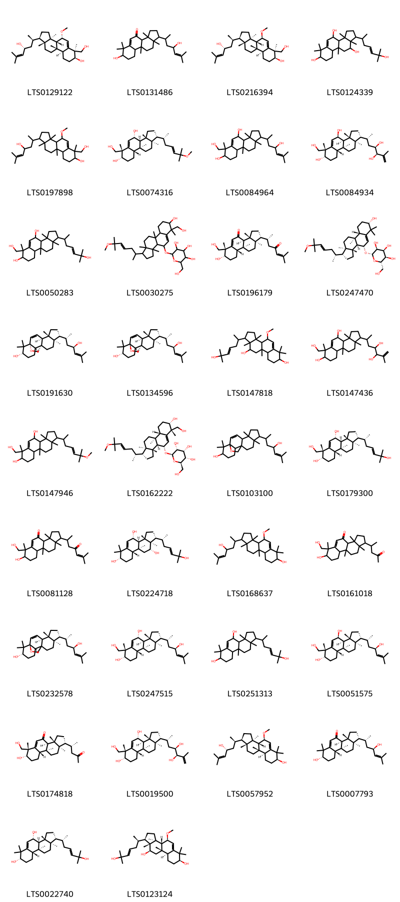{ width=100% }
    <figcaption>Hình ảnh cấu trúc hóa học của 34 hoạt chất thuộc nhóm Steroids and steroid derivatives gồm ['(1r,3as,3br,4r,6s,7s,9as,9bs,11ar)-1-[(2r,4r)-4-hydroxy-6-methylhept-5-en-2-yl]-6-(hydroxymethyl)-4-methoxy-3a,6,9b,11a-tetramethyl-1h,2h,3h,3bh,4h,7h,8h,9h,9ah,10h,11h-cyclopenta[a]phenanthren-7-ol (LTS0129122)', '7-hydroxy-1-(4-hydroxy-6-methylhept-5-en-2-yl)-3a,6,6,9b,11a-pentamethyl-1h,2h,3h,3bh,7h,8h,9h,9ah,10h,11h-cyclopenta[a]phenanthren-4-one (LTS0131486)', 'balsaminol b (LTS0216394)', 'cucurbalsaminol a (LTS0124339)', 'balsaminol b (LTS0197898)', '(1r,3as,3br,4s,6s,7s,9as,9bs,11ar)-6-(hydroxymethyl)-1-[(2r,4e)-6-methoxy-6-methylhept-4-en-2-yl]-3a,6,9b,11a-tetramethyl-1h,2h,3h,3bh,4h,7h,8h,9h,9ah,10h,11h-cyclopenta[a]phenanthrene-4,7-diol (LTS0074316)', 'balsaminol a (LTS0084964)', '(1r,3as,3br,4r,6s,7s,9as,9bs,11ar)-1-[(2r,4r,5r)-4,5-dihydroxy-6-methylhept-6-en-2-yl]-6-(hydroxymethyl)-3a,6,9b,11a-tetramethyl-1h,2h,3h,3bh,4h,7h,8h,9h,9ah,10h,11h-cyclopenta[a]phenanthrene-4,7-diol (LTS0084934)', '1-(6-hydroxy-6-methylhept-4-en-2-yl)-6-(hydroxymethyl)-3a,6,9b,11a-tetramethyl-1h,2h,3h,3bh,4h,7h,8h,9h,9ah,10h,11h-cyclopenta[a]phenanthrene-4,7-diol (LTS0050283)', '2-{[7-hydroxy-6-(hydroxymethyl)-1-(6-methoxy-6-methylhept-4-en-2-yl)-3a,6,9b,11a-tetramethyl-1h,2h,3h,3bh,4h,7h,8h,9h,9ah,10h,11h-cyclopenta[a]phenanthren-4-yl]oxy}-6-(hydroxymethyl)oxane-3,4,5-triol (LTS0030275)', '(1r,3as,3br,6s,7s,9as,9bs,11ar)-7-hydroxy-6-(hydroxymethyl)-3a,6,9b,11a-tetramethyl-1-[(2r)-6-methyl-4-oxohept-5-en-2-yl]-1h,2h,3h,3bh,7h,8h,9h,9ah,10h,11h-cyclopenta[a]phenanthren-4-one (LTS0196179)', '(2s,3s,4s,5r,6s)-2-{[(1r,3as,3br,4s,7s,9as,9bs,11ar)-7-hydroxy-1-[(2r,4e)-6-methoxy-6-methylhept-4-en-2-yl]-3a,6,6,9b,11a-pentamethyl-1h,2h,3h,3bh,4h,7h,8h,9h,9ah,10h,11h-cyclopenta[a]phenanthren-4-yl]oxy}-6-(hydroxymethyl)oxane-3,4,5-triol (LTS0247470)', '(1r,4s,5s,8r,9r,12s,13s,16s)-8-[(2r,4r)-4-hydroxy-6-methylhept-5-en-2-yl]-5,9,17,17-tetramethyl-18-oxapentacyclo[10.5.2.0¹,¹³.0⁴,¹².0⁵,⁹]nonadec-2-en-16-ol (LTS0191630)', '(1s,4s,5s,8r,9r,12s,13s,16s)-8-[(2r,4r)-4-hydroxy-6-methylhept-5-en-2-yl]-5,9,17,17-tetramethyl-18-oxapentacyclo[10.5.2.0¹,¹³.0⁴,¹².0⁵,⁹]nonadec-2-en-16-ol (LTS0134596)', 'cucurbalsaminol b (LTS0147818)', 'balsaminapentaol (LTS0147436)', '6-(hydroxymethyl)-1-(6-methoxy-6-methylhept-4-en-2-yl)-3a,6,9b,11a-tetramethyl-1h,2h,3h,3bh,4h,7h,8h,9h,9ah,10h,11h-cyclopenta[a]phenanthrene-4,7-diol (LTS0147946)', '(2r,3r,4r,5s,6r)-2-{[(1r,3as,3br,4s,6s,7s,9as,9bs,11ar)-7-hydroxy-6-(hydroxymethyl)-1-[(2r,4e)-6-methoxy-6-methylhept-4-en-2-yl]-3a,6,9b,11a-tetramethyl-1h,2h,3h,3bh,4h,7h,8h,9h,9ah,10h,11h-cyclopenta[a]phenanthren-4-yl]oxy}-6-(hydroxymethyl)oxane-3,4,5-triol (LTS0162222)', 'karavilagenin e (LTS0103100)', '(1r,3as,3br,4s,6s,7s,9as,9bs,11ar)-1-[(2r,4e)-6-hydroxy-6-methylhept-4-en-2-yl]-6-(hydroxymethyl)-3a,6,9b,11a-tetramethyl-1h,2h,3h,3bh,4h,7h,8h,9h,9ah,10h,11h-cyclopenta[a]phenanthrene-4,7-diol (LTS0179300)', '7-hydroxy-6-(hydroxymethyl)-3a,6,9b,11a-tetramethyl-1-(6-methyl-4-oxohept-5-en-2-yl)-1h,2h,3h,3bh,7h,8h,9h,9ah,10h,11h-cyclopenta[a]phenanthren-4-one (LTS0081128)', 'cucurbalsaminol a (LTS0224718)', '1-(4-hydroxy-6-methylhept-5-en-2-yl)-4-methoxy-3a,6,6,9b,11a-pentamethyl-1h,2h,3h,3bh,4h,7h,8h,9h,9ah,10h,11h-cyclopenta[a]phenanthren-7-ol (LTS0168637)', '7-hydroxy-6-(hydroxymethyl)-3a,6,9b,11a-tetramethyl-1-(4-oxopentan-2-yl)-1h,2h,3h,3bh,7h,8h,9h,9ah,10h,11h-cyclopenta[a]phenanthren-4-one (LTS0161018)', '(1s,4s,5s,8r,9r,13s,16s)-8-[(2r,4r)-4-hydroxy-6-methylhept-5-en-2-yl]-5,9,17,17-tetramethyl-18-oxapentacyclo[10.5.2.0¹,¹³.0⁴,¹².0⁵,⁹]nonadec-2-en-16-ol (LTS0232578)', 'balsaminol a (LTS0247515)', '1-(6-hydroxy-6-methylhept-4-en-2-yl)-3a,6,6,9b,11a-pentamethyl-1h,2h,3h,3bh,4h,7h,8h,9h,9ah,10h,11h-cyclopenta[a]phenanthrene-4,7-diol (LTS0251313)', '(1r,3as,3br,4r,6s,7s,9as,9bs,11ar)-1-[(2r,4r)-4-hydroxy-6-methylhept-5-en-2-yl]-6-(hydroxymethyl)-3a,6,9b,11a-tetramethyl-1h,2h,3h,3bh,4h,7h,8h,9h,9ah,10h,11h-cyclopenta[a]phenanthrene-4,7-diol (LTS0051575)', '(1r,3as,3br,6s,7s,9as,9bs,11ar)-7-hydroxy-6-(hydroxymethyl)-3a,6,9b,11a-tetramethyl-1-[(2r)-4-oxopentan-2-yl]-1h,2h,3h,3bh,7h,8h,9h,9ah,10h,11h-cyclopenta[a]phenanthren-4-one (LTS0174818)', 'balsaminapentaol (LTS0019500)', '(1r,3as,3br,4s,7s,9as,9bs,11ar)-1-[(2r,4r)-4-hydroxy-6-methylhept-5-en-2-yl]-4-methoxy-3a,6,6,9b,11a-pentamethyl-1h,2h,3h,3bh,4h,7h,8h,9h,9ah,10h,11h-cyclopenta[a]phenanthren-7-ol (LTS0057952)', '(1r,3as,3br,7s,9as,9bs,11ar)-7-hydroxy-1-[(2r,4r)-4-hydroxy-6-methylhept-5-en-2-yl]-3a,6,6,9b,11a-pentamethyl-1h,2h,3h,3bh,7h,8h,9h,9ah,10h,11h-cyclopenta[a]phenanthren-4-one (LTS0007793)', '(1r,3as,3br,4s,7s,9as,9bs,11ar)-1-[(2r,4e)-6-hydroxy-6-methylhept-4-en-2-yl]-3a,6,6,9b,11a-pentamethyl-1h,2h,3h,3bh,4h,7h,8h,9h,9ah,10h,11h-cyclopenta[a]phenanthrene-4,7-diol (LTS0022740)', 'cucurbalsaminol b (LTS0123124)'].</figcaption>
</figure>

---

### Dược dân tộc học

Danh sách các quốc gia có sử dụng *Momordica balsamina* trong điều trị các bệnh. 

| Country            | Disease                                                  | Bệnh                                                     |
|:-------------------|:---------------------------------------------------------|:---------------------------------------------------------|
| Dominican Republic | Apertif, Emmenagogue, Vermicide                          | Apertif, Emmenagogue, Vermicide                          |
| Elsewhere          | Tonic, Stomachic                                         | Tonic, Dạ dày                                            |
| Turkey             | Emetic, Laxative, Stomachic, Tonic, Stimulant, Purgative | Emetic, Laxative, Stomachic, Tonic, Stimulant, Purgative |

---

---
## Momordica charantia
### Thông tin về thực vật

!!! info "Phân loại thực vật của *Momordica charantia* từ GIBF:"
    - **Kingdom:** Plantae
    - **Phylum:** Tracheophyta
    - **Order:** Cucurbitales
    - **Family:** Cucurbitaceae
    - **Genus:** Momordica
    - **Species:** *Momordica charantia*

 

| Label (VI)   | Label (EN)   | Scientific Name     | Descriptions (VI)   | Descriptions (EN)                            | Also Known As (VI)   | Also Known As (EN)                                                                          |
|:-------------|:-------------|:--------------------|:--------------------|:---------------------------------------------|:---------------------|:--------------------------------------------------------------------------------------------|
| N/A          | N/A          | Momordica charantia | loài thực vật       | species of plant in the family Cucurbitaceae | ['Ổ qua', 'Khổ qua'] | ['balsam-pear', 'bitter gourd', 'bitter melon', 'bitter squash', 'goya', 'karela', 'peria'] |

#### Phân bố trên thế giới

**Từ CSDL GIBF** nan, Brazil, Guatemala, Saint Kitts and Nevis, Viet Nam, Guadeloupe, Barbados, China, Antigua and Barbuda, New Zealand, Saint Lucia, Honduras, Ecuador, French Polynesia, Thailand, Spain, Cayman Islands, Puerto Rico, Sri Lanka, Ghana, Réunion, United States of America, Jamaica, Virgin Islands (U.S.), Indonesia, Costa Rica, Dominican Republic, Colombia, Nigeria, Argentina, French Guiana, Cabo Verde, Lao People’s Democratic Republic, Malawi, Hong Kong, Mexico, Kenya, Vanuatu, American Samoa, Chinese Taipei, Philippines, Montserrat, Panama, Nicaragua, Bahamas, South Africa, Australia, India, Northern Mariana Islands, Peru, Belize

#### Phân bố tại Việt Nam

**Từ CSDL GIBF**: Đồng Tháp

---
### Thành phần hóa học
        
- Theo cơ sở dữ liệu lotus: Từ loài *Momordica charantia* đã phân lập và xác định được 359 hoạt chất thuộc về các nhóm Fatty Acyls, Lactones, Benzene and substituted derivatives, Oxepanes, Oxolanes, Diazines, Carboxylic acids and derivatives, Cinnamic acids and derivatives, Steroids and steroid derivatives, Organooxygen compounds, Tetrahydrofurans, Prenol lipids. 

|    | chemicalTaxonomyClassyfireClass     |   smiles_count |
|---:|:------------------------------------|---------------:|
|  0 | Benzene and substituted derivatives |              1 |
|  1 | Carboxylic acids and derivatives    |              1 |
|  2 | Cinnamic acids and derivatives      |              4 |
|  3 | Diazines                            |              1 |
|  4 | Fatty Acyls                         |             15 |
|  5 | Lactones                            |              3 |
|  6 | Organooxygen compounds              |              6 |
|  7 | Oxepanes                            |              2 |
|  8 | Oxolanes                            |              1 |
|  9 | Prenol lipids                       |             37 |
| 10 | Steroids and steroid derivatives    |            287 |
| 11 | Tetrahydrofurans                    |              1 |

#### Nhóm Benzene and substituted derivatives
<figure markdown="span">
    { width=100% }
    <figcaption>Hình ảnh cấu trúc hóa học của 1 hoạt chất thuộc nhóm Benzene and substituted derivatives gồm ['p-anisic acid (LTS0123492)'].</figcaption>
</figure>
#### Nhóm Carboxylic acids and derivatives
<figure markdown="span">
    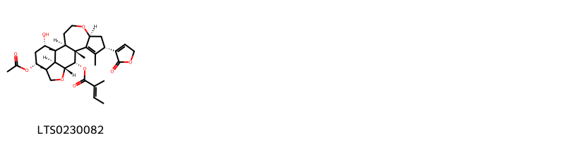{ width=100% }
    <figcaption>Hình ảnh cấu trúc hóa học của 1 hoạt chất thuộc nhóm Carboxylic acids and derivatives gồm ['(1r,2r,6s,8s,11r,12s,13r,16r,17r,19s,20r)-17-(acetyloxy)-19-hydroxy-1,9,11,16-tetramethyl-8-(2-oxo-5h-furan-3-yl)-5,14-dioxapentacyclo[11.6.1.0²,¹¹.0⁶,¹⁰.0¹⁶,²⁰]icos-9-en-12-yl (2e)-2-methylbut-2-enoate (LTS0230082)'].</figcaption>
</figure>
#### Nhóm Cinnamic acids and derivatives
<figure markdown="span">
    { width=100% }
    <figcaption>Hình ảnh cấu trúc hóa học của 4 hoạt chất thuộc nhóm Cinnamic acids and derivatives gồm ['(3r,4r,6r)-6-[2-(3,4-dihydroxyphenyl)ethoxy]-5-hydroxy-2-(hydroxymethyl)-4-{[(2s,3s,5r)-3,4,5-trihydroxy-6-methyloxan-2-yl]oxy}oxan-3-yl (2e)-3-(3,4-dihydroxyphenyl)prop-2-enoate (LTS0063526)', 'verbascoside (LTS0168159)', '4-{[3,4-dihydroxy-4-(hydroxymethyl)oxolan-2-yl]oxy}-6-[2-(3,4-dihydroxyphenyl)ethoxy]-5-hydroxy-2-(hydroxymethyl)oxan-3-yl 3-(3,4-dihydroxyphenyl)prop-2-enoate (LTS0139753)', 'rosemary acid (LTS0207820)'].</figcaption>
</figure>
#### Nhóm Diazines
<figure markdown="span">
    { width=100% }
    <figcaption>Hình ảnh cấu trúc hóa học của 1 hoạt chất thuộc nhóm Diazines gồm ['pirod (LTS0008205)'].</figcaption>
</figure>
#### Nhóm Fatty Acyls
<figure markdown="span">
    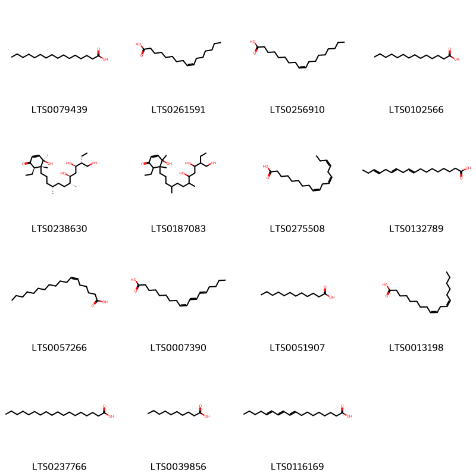{ width=100% }
    <figcaption>Hình ảnh cấu trúc hóa học của 15 hoạt chất thuộc nhóm Fatty Acyls gồm ['palmitic acid (LTS0079439)', 'palmitoleic acid (LTS0261591)', 'oleic acid (LTS0256910)', 'myristic acid (LTS0102566)', '(4r,5r,6r)-6-ethyl-5-[(4r,7r,8s,10r,11r)-11-ethyl-8,10,12-trihydroxy-4,7-dimethyldodecyl]-4-hydroxy-4,5-dimethylcyclohex-2-en-1-one (LTS0238630)', 'momordol (LTS0187083)', 'α-linolenic acid (LTS0275508)', 'α linolenic acid (LTS0132789)', 'petroselinic acid (LTS0057266)', 'elaeostearic acid (LTS0007390)', 'lauric acid (LTS0051907)', 'linoleic (LTS0013198)', 'stearic acid (LTS0237766)', 'capric acid (LTS0039856)', 'eleostearic acid (LTS0116169)'].</figcaption>
</figure>
#### Nhóm Lactones
<figure markdown="span">
    { width=100% }
    <figcaption>Hình ảnh cấu trúc hóa học của 3 hoạt chất thuộc nhóm Lactones gồm ['(1r,4s,5s,9s,12s,13s)-5,9,17,17-tetramethyl-18-oxapentacyclo[10.5.2.0¹,¹³.0⁴,¹².0⁵,⁹]nonadec-2-ene-8,16,19-trione (LTS0113810)', '(1r,5s,9s,12s)-5,9,17,17-tetramethyl-18-oxapentacyclo[10.5.2.0¹,¹³.0⁴,¹².0⁵,⁹]nonadec-2-ene-8,16,19-trione (LTS0247116)', '5,9,17,17-tetramethyl-18-oxapentacyclo[10.5.2.0¹,¹³.0⁴,¹².0⁵,⁹]nonadec-2-ene-8,16,19-trione (LTS0005755)'].</figcaption>
</figure>
#### Nhóm Organooxygen compounds
<figure markdown="span">
    { width=100% }
    <figcaption>Hình ảnh cấu trúc hóa học của 6 hoạt chất thuộc nhóm Organooxygen compounds gồm ['2-[(4-amino-6-hydroxy-2-imino-3h-pyrimidin-5-yl)oxy]oxane-3,4,5-triol (LTS0121669)', 'vicine (van) (8ci) (LTS0146565)', '2-[(4-amino-6-hydroxy-2-imino-3h-pyrimidin-5-yl)oxy]-6-(hydroxymethyl)oxane-3,4,5-triol (LTS0056193)', "α,α'-trehalose (LTS0256842)", 'trehalose (LTS0060329)', '(3r,4ar,6bs,8as,11r,12ar,12bs,14bs)-11-(hydroxymethyl)-4,4,6b,8a,11,12b,14b-heptamethyl-1,2,3,4a,7,8,9,10,12,12a,13,14-dodecahydropicen-3-ol (LTS0217291)'].</figcaption>
</figure>
#### Nhóm Oxepanes
<figure markdown="span">
    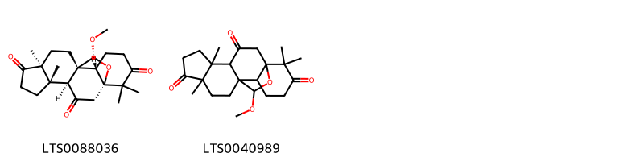{ width=100% }
    <figcaption>Hình ảnh cấu trúc hóa học của 2 hoạt chất thuộc nhóm Oxepanes gồm ['(1r,4s,5s,9s,12r,13s,19r)-19-methoxy-5,9,17,17-tetramethyl-18-oxapentacyclo[10.5.2.0¹,¹³.0⁴,¹².0⁵,⁹]nonadecane-3,8,16-trione (LTS0088036)', '19-methoxy-5,9,17,17-tetramethyl-18-oxapentacyclo[10.5.2.0¹,¹³.0⁴,¹².0⁵,⁹]nonadecane-3,8,16-trione (LTS0040989)'].</figcaption>
</figure>
#### Nhóm Oxolanes
<figure markdown="span">
    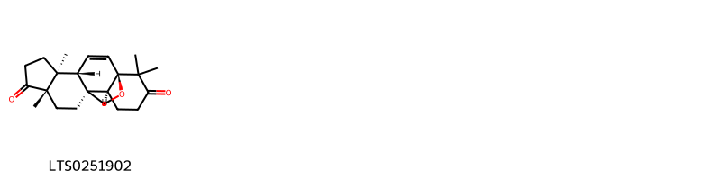{ width=100% }
    <figcaption>Hình ảnh cấu trúc hóa học của 1 hoạt chất thuộc nhóm Oxolanes gồm ['(1r,4s,5s,9s,12s,13s)-5,9,17,17-tetramethyl-18-oxapentacyclo[10.5.2.0¹,¹³.0⁴,¹².0⁵,⁹]nonadec-2-ene-8,16-dione (LTS0251902)'].</figcaption>
</figure>
#### Nhóm Prenol lipids
<figure markdown="span">
    { width=100% }
    <figcaption>Hình ảnh cấu trúc hóa học của 37 hoạt chất thuộc nhóm Prenol lipids gồm ['(1r,5s,8r,9r,12r)-5,9,17,17-tetramethyl-8-[(2r)-4-oxopentan-2-yl]-18-oxapentacyclo[10.5.2.0¹,¹³.0⁴,¹².0⁵,⁹]nonadecane-3,16-dione (LTS0187511)', 'momordicin-28 (LTS0174789)', '(+)-α-carotene (LTS0200789)', 'alnulin (LTS0076238)', '4,5,9,9,13,19,20-heptamethyl-24-oxahexacyclo[15.5.2.0¹,¹⁸.0⁴,¹⁷.0⁵,¹⁴.0⁸,¹³]tetracos-15-en-10-one (LTS0053752)', 'violaxanthin (LTS0102265)', 'momordicin-28 (LTS0068666)', '(1s,4s,5r,8r,13s,14r,17s,18r,19s,20r)-4,5,9,9,13,19,20-heptamethyl-24-oxahexacyclo[15.5.2.0¹,¹⁸.0⁴,¹⁷.0⁵,¹⁴.0⁸,¹³]tetracos-15-en-10-one (LTS0038802)', '10-{[3-(4-hydroxy-3-methoxyphenyl)prop-2-enoyl]oxy}-2,4a,6a,9,9,12a,14a-heptamethyl-1,3,4,5,6,8,8a,10,11,12,14,14b-dodecahydropicene-2-carboxylic acid (LTS0027655)', 'multiflorenol (LTS0177009)', 'lycopene (LTS0116567)', '(4ar,6ar,6bs,8as,11r,12s,12ar,12br,14ar,14bs)-12b-hydroxy-8a-(methoxymethyl)-4,4,6a,6b,11,12,14b-heptamethyl-2,4a,5,6,7,8,9,10,11,12,12a,14a-dodecahydro-1h-picen-3-one (LTS0113602)', 'zeaxanthin (LTS0192928)', '(1r,4s,5s,8r,9r,12r,13s,16s)-16-hydroxy-5,9,17,17-tetramethyl-8-[(2r)-4-oxopentan-2-yl]-18-oxapentacyclo[10.5.2.0¹,¹³.0⁴,¹².0⁵,⁹]nonadecan-3-one (LTS0190931)', 'β-amyrin (LTS0251864)', 'momordicilin (LTS0165901)', '6-[(8a-{[(3-{[5-({3,5-dihydroxy-4-[(3,4,5-trihydroxyoxan-2-yl)oxy]oxan-2-yl}oxy)-3,4-dihydroxy-6-methyloxan-2-yl]oxy}-5-hydroxy-6-methyl-4-[(3,4,5-trihydroxy-6-methyloxan-2-yl)oxy]oxan-2-yl)oxy]carbonyl}-4-formyl-4,6a,6b,11,11,14b-hexamethyl-1,2,3,4a,5,6,7,8,9,10,12,12a,14,14a-tetradecahydropicen-3-yl)oxy]-3,4-dihydroxy-5-{[3,4,5-trihydroxy-6-(hydroxymethyl)oxan-2-yl]oxy}oxane-2-carboxylic acid (LTS0112525)', 'cryptoxanthin (LTS0132646)', '(3r,4ar,6bs,8as,11r,12ar,12bs,14bs)-11-(hydroxymethyl)-4,4,6b,8a,11,12b,14b-heptamethyl-1,2,3,4a,5,7,8,9,10,12,12a,13-dodecahydropicen-3-yl benzoate (LTS0041226)', 'β-carotene (LTS0275716)', 'erythrodiol (LTS0057163)', '(2s,3s,4s,5r,6r)-6-{[(3s,4s,4ar,6ar,6bs,8as,12as,14ar,14br)-8a-({[(2s,3r,4s,5s,6r)-3-{[(2s,3r,4s,5r,6s)-3,4-dihydroxy-6-methyl-5-{[(2s,3r,4s,5r)-3,4,5-trihydroxyoxan-2-yl]oxy}oxan-2-yl]oxy}-5-hydroxy-6-methyl-4-{[(2s,3r,4r,5r,6s)-3,4,5-trihydroxy-6-methyloxan-2-yl]oxy}oxan-2-yl]oxy}carbonyl)-4-formyl-4,6a,6b,11,11,14b-hexamethyl-1,2,3,4a,5,6,7,8,9,10,12,12a,14,14a-tetradecahydropicen-3-yl]oxy}-3,4-dihydroxy-5-{[(2s,3r,4s,5r,6r)-3,4,5-trihydroxy-6-(hydroxymethyl)oxan-2-yl]oxy}oxane-2-carboxylic acid (LTS0144371)', '6-[(8a-carboxy-4,4,6a,6b,11,11,14b-heptamethyl-1,2,3,4a,5,6,7,8,9,10,12,12a,14,14a-tetradecahydropicen-3-yl)oxy]-4-(acetyloxy)-3-{[3,4,5-trihydroxy-6-(hydroxymethyl)oxan-2-yl]oxy}-5-[(3,4,5-trihydroxyoxan-2-yl)oxy]oxane-2-carboxylic acid (LTS0237791)', '(2r,4as,6as,8ar,10r,12as,14as,14br)-10-{[(2e)-3-(4-hydroxy-3-methoxyphenyl)prop-2-enoyl]oxy}-2,4a,6a,9,9,12a,14a-heptamethyl-1,3,4,5,6,8,8a,10,11,12,14,14b-dodecahydropicene-2-carboxylic acid (LTS0224636)', '(2s,3s,4s,5r,6r)-6-{[(3s,4ar,6ar,6bs,8as,12as,14ar,14br)-8a-carboxy-4,4,6a,6b,11,11,14b-heptamethyl-1,2,3,4a,5,6,7,8,9,10,12,12a,14,14a-tetradecahydropicen-3-yl]oxy}-4-(acetyloxy)-3-{[(2s,3r,4s,5s,6r)-3,4,5-trihydroxy-6-(hydroxymethyl)oxan-2-yl]oxy}-5-{[(2s,3r,4s,5r)-3,4,5-trihydroxyoxan-2-yl]oxy}oxane-2-carboxylic acid (LTS0240662)', '(1r,5s,8r,9r,12s)-8-[(2s)-1-hydroxypropan-2-yl]-5,9,17,17-tetramethyl-18-oxapentacyclo[10.5.2.0¹,¹³.0⁴,¹².0⁵,⁹]nonadec-2-ene-16,19-dione (LTS0170408)', 'karounidiol (LTS0196828)', 'zeinoxanthin (LTS0058984)', '1-(5-ethyl-6-methylhept-6-en-2-yl)-9a,11a-dimethyl-1h,2h,3h,3ah,3bh,4h,6h,7h,8h,9h,9bh,10h,11h-cyclopenta[a]phenanthren-7-yl acetate (LTS0050233)', '(2r,4as,6as,8ar,12as,14as,14br)-2,4a,6a,9,9,12a,14a-heptamethyl-10-oxo-3,4,5,6,8,8a,11,12,14,14b-decahydro-1h-picene-2-carboxylic acid (LTS0268316)', '(2r,4as,6as,8ar,10s,12as,14as,14br)-10-{[(2e)-3-(4-hydroxy-3-methoxyphenyl)prop-2-enoyl]oxy}-2,4a,6a,9,9,12a,14a-heptamethyl-1,3,4,5,6,8,8a,10,11,12,14,14b-dodecahydropicene-2-carboxylic acid (LTS0038590)', '16-hydroxy-5,9,17,17-tetramethyl-8-(4-oxopentan-2-yl)-18-oxapentacyclo[10.5.2.0¹,¹³.0⁴,¹².0⁵,⁹]nonadecan-3-one (LTS0029209)', '6-{[8a-({[3-({3,4-dihydroxy-6-methyl-5-[(3,4,5-trihydroxyoxan-2-yl)oxy]oxan-2-yl}oxy)-5-hydroxy-6-methyl-4-[(3,4,5-trihydroxy-6-methyloxan-2-yl)oxy]oxan-2-yl]oxy}carbonyl)-4-formyl-4,6a,6b,11,11,14b-hexamethyl-1,2,3,4a,5,6,7,8,9,10,12,12a,14,14a-tetradecahydropicen-3-yl]oxy}-3,4-dihydroxy-5-{[3,4,5-trihydroxy-6-(hydroxymethyl)oxan-2-yl]oxy}oxane-2-carboxylic acid (LTS0015641)', 'α-carotene (LTS0224243)', '(1r,5s,8r,9r,12r,19r)-19-ethoxy-5,9,17,17-tetramethyl-8-[(2r)-4-oxopentan-2-yl]-18-oxapentacyclo[10.5.2.0¹,¹³.0⁴,¹².0⁵,⁹]nonadecane-3,16-dione (LTS0118142)', '2,4a,6a,9,9,12a,14a-heptamethyl-10-oxo-3,4,5,6,8,8a,11,12,14,14b-decahydro-1h-picene-2-carboxylic acid (LTS0091686)', '(1r,3as,3bs,7s,9ar,9bs,11ar)-1-[(2r,5r)-5-ethyl-6-methylhept-6-en-2-yl]-9a,11a-dimethyl-1h,2h,3h,3ah,3bh,4h,6h,7h,8h,9h,9bh,10h,11h-cyclopenta[a]phenanthren-7-yl acetate (LTS0264523)'].</figcaption>
</figure>
#### Nhóm Steroids and steroid derivatives
<figure markdown="span">
    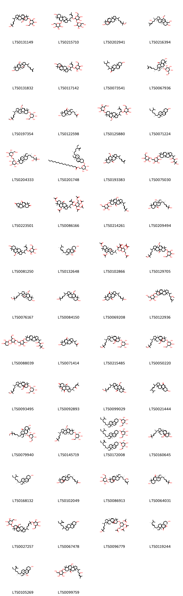{ width=100% }
    <figcaption>Hình ảnh cấu trúc hóa học của 287 hoạt chất thuộc nhóm Steroids and steroid derivatives gồm ['2-{[8-(6-hydroxy-6-methylhept-4-en-2-yl)-19-methoxy-5,9,17,17-tetramethyl-18-oxapentacyclo[10.5.2.0¹,¹³.0⁴,¹².0⁵,⁹]nonadec-2-en-16-yl]oxy}-6-(hydroxymethyl)oxane-3,4,5-triol (LTS0131149)', '2-{[1-(4-{[4,5-dihydroxy-6-(hydroxymethyl)-3-{[3,4,5-trihydroxy-6-(hydroxymethyl)oxan-2-yl]oxy}oxan-2-yl]oxy}-6-methylhept-5-en-2-yl)-7-hydroxy-3a,6,6,9b,11a-pentamethyl-1h,2h,3h,3bh,4h,7h,8h,9h,9ah,10h,11h-cyclopenta[a]phenanthren-4-yl]oxy}-6-(hydroxymethyl)oxane-3,4,5-triol (LTS0215710)', '8-(6-methoxy-6-methylhept-4-en-2-yl)-5,9,17,17-tetramethyl-18-oxapentacyclo[10.5.2.0¹,¹³.0⁴,¹².0⁵,⁹]nonadec-2-en-16-ol (LTS0202941)', 'balsaminol b (LTS0216394)', '(3as,3br,9ar,9br,11ar)-4,7-dihydroxy-3a,6,6,11a-tetramethyl-1-(6-methylhepta-4,6-dien-2-yl)-1h,2h,3h,3bh,4h,7h,8h,9h,9ah,10h,11h-cyclopenta[a]phenanthrene-9b-carbaldehyde (LTS0131832)', '2-[(5-hydroxy-6-{16-hydroxy-5,9,17,17-tetramethyl-18-oxapentacyclo[10.5.2.0¹,¹³.0⁴,¹².0⁵,⁹]nonadec-2-en-8-yl}-2-methylhept-2-en-4-yl)oxy]-6-(hydroxymethyl)oxane-3,4,5-triol (LTS0117142)', '1-(5-ethyl-6-methylheptan-2-yl)-7-hydroxy-9a,11a-dimethyl-1h,3bh,4h,6h,7h,8h,9h,9bh,10h,11h-cyclopenta[a]phenanthren-2-one (LTS0073541)', '(1r,3as,3bs,4s,7s,9ar,9br,11ar)-7-hydroxy-3a,6,6,11a-tetramethyl-1-[(2r,4e)-6-methylhepta-4,6-dien-2-yl]-4-{[(2r,3r,4s,5s,6r)-3,4,5-trihydroxy-6-(hydroxymethyl)oxan-2-yl]oxy}-1h,2h,3h,3bh,4h,7h,8h,9h,9ah,10h,11h-cyclopenta[a]phenanthrene-9b-carbaldehyde (LTS0067936)', '(2r,3r,4r,5s,6r)-2-{[(1r,3as,3br,4s,7s,9as,9bs,11ar)-4-methoxy-1-[(2r,4e)-6-methoxy-6-methylhept-4-en-2-yl]-3a,6,6,9b,11a-pentamethyl-1h,2h,3h,3bh,4h,7h,8h,9h,9ah,10h,11h-cyclopenta[a]phenanthren-7-yl]oxy}-6-(hydroxymethyl)oxane-3,4,5-triol (LTS0197354)', '(1r,3as,3br,7s,9as,9bs,11ar)-7-hydroxy-3a,6,6,9b,11a-pentamethyl-1-[(2r)-4-oxopentan-2-yl]-1h,2h,3h,3bh,7h,8h,9h,9ah,10h,11h-cyclopenta[a]phenanthren-4-one (LTS0122598)', '2-(hydroxymethyl)-6-{[4-methoxy-3a,6,6,9b,11a-pentamethyl-1-(6-methyl-4-{[3,4,5-trihydroxy-6-(hydroxymethyl)oxan-2-yl]oxy}hept-5-en-2-yl)-1h,2h,3h,3bh,4h,7h,8h,9h,9ah,10h,11h-cyclopenta[a]phenanthren-7-yl]oxy}oxane-3,4,5-triol (LTS0125880)', 'stigmast-5-en-3-ol (LTS0071224)', '(2r,3r,4s,5s,6r)-2-{[(1r,3as,3br,7s,9as,9br,11ar)-3a,6,6,9b,11a-pentamethyl-1-[(2r,4s,5s)-4,5,6-trihydroxy-6-methylheptan-2-yl]-1h,2h,3h,3bh,4h,7h,8h,9h,9ah,10h,11h-cyclopenta[a]phenanthren-7-yl]oxy}-6-({[(2r,3r,4s,5s,6r)-3,4,5-trihydroxy-6-(hydroxymethyl)oxan-2-yl]oxy}methyl)oxane-3,4,5-triol (LTS0204333)', '[(2r,3s,4s,5r,6r)-6-{[(1r,3as,3bs,7r,9ar,9bs,11ar)-1-[(2r,5r)-5-ethyl-6-methylhept-6-en-2-yl]-9a,11a-dimethyl-1h,2h,3h,3ah,3bh,4h,6h,7h,8h,9h,9bh,10h,11h-cyclopenta[a]phenanthren-7-yl]oxy}-3,4,5-trihydroxyoxan-2-yl]methyl octadecanoate (LTS0201748)', '7-hydroxy-4-methoxy-3a,6,6,11a-tetramethyl-1-(6-methylhepta-4,6-dien-2-yl)-1h,2h,3h,3bh,4h,7h,8h,9h,9ah,10h,11h-cyclopenta[a]phenanthrene-9b-carbaldehyde (LTS0193383)', '6-(3a,6,6,9b,11a-pentamethyl-7-{[3,4,5-trihydroxy-6-({[3,4,5-trihydroxy-6-(hydroxymethyl)oxan-2-yl]oxy}methyl)oxan-2-yl]oxy}-1h,2h,3h,3bh,4h,7h,8h,9h,9ah,10h,11h-cyclopenta[a]phenanthren-1-yl)-2-methylheptane-2,3,4,5-tetrol (LTS0075030)', '3a,6,6,9b,11a-pentamethyl-1h,3h,3bh,8h,9h,9ah,10h,11h-cyclopenta[a]phenanthrene-2,4,7-trione (LTS0223501)', '[3,4,5-tris(acetyloxy)-6-({6-[4,7-bis(acetyloxy)-9b-formyl-3a,6,6,11a-tetramethyl-1h,2h,3h,3bh,4h,7h,8h,9h,9ah,10h,11h-cyclopenta[a]phenanthren-1-yl]-2-methyl-3-oxohept-1-en-4-yl}oxy)oxan-2-yl]methyl acetate (LTS0086166)', '4-hydroxy-1-(6-hydroxy-6-methylhept-4-en-2-yl)-3a,6,6,11a-tetramethyl-7-{[3,4,5-trihydroxy-6-(hydroxymethyl)oxan-2-yl]oxy}-1h,2h,3h,3bh,4h,7h,8h,9h,9ah,10h,11h-cyclopenta[a]phenanthrene-9b-carbaldehyde (LTS0214261)', '(1r,3as,3bs,4s,7s,9ar,9br,11ar)-4,7-dihydroxy-1-[(2r,4e)-6-hydroxy-6-methylhept-4-en-2-yl]-3a,6,6,11a-tetramethyl-1h,2h,3h,3bh,4h,7h,8h,9h,9ah,10h,11h-cyclopenta[a]phenanthrene-9b-carbaldehyde (LTS0209494)', '2-[(6-{7-hydroxy-4-methoxy-3a,6,6,9b,11a-pentamethyl-1h,2h,3h,3bh,4h,7h,8h,9h,9ah,10h,11h-cyclopenta[a]phenanthren-1-yl}-2-methylhept-2-en-4-yl)oxy]-6-(hydroxymethyl)oxane-3,4,5-triol (LTS0081250)', '(2r,5s,7r,9s,10s,12r,15r,16r)-15-[(2r,3e,5r)-5,6-dimethylhept-3-en-2-yl]-2,16-dimethyl-8-oxapentacyclo[9.7.0.0²,⁷.0⁷,⁹.0¹²,¹⁶]octadec-1(11)-ene-5,10-diol (LTS0132648)', '[(2r,3r,4s,5r,6s)-6-{[(4r,6r)-6-[(1r,3as,3bs,4s,7s,9as,9br,11ar)-4,7-bis(acetyloxy)-9b-formyl-3a,6,6,11a-tetramethyl-1h,2h,3h,3bh,4h,7h,8h,9h,9ah,10h,11h-cyclopenta[a]phenanthren-1-yl]-2-methyl-3-oxohept-1-en-4-yl]oxy}-3,4,5-tris(acetyloxy)oxan-2-yl]methyl acetate (LTS0102866)', '4-methoxy-1-(6-methoxy-6-methylhept-4-en-2-yl)-3a,6,6,11a-tetramethyl-7-{[3,4,5-trihydroxy-6-(hydroxymethyl)oxan-2-yl]oxy}-1h,2h,3h,3bh,4h,7h,8h,9h,9ah,10h,11h-cyclopenta[a]phenanthrene-9b-carbaldehyde (LTS0129705)', '(1r,3as,3bs,4s,7s,9ar,9br,11ar)-7-hydroxy-4-methoxy-1-[(2r,4e)-6-methoxy-6-methylhept-4-en-2-yl]-3a,6,6,11a-tetramethyl-1h,2h,3h,3bh,4h,7h,8h,9h,9ah,10h,11h-cyclopenta[a]phenanthrene-9b-carbaldehyde (LTS0076167)', '1-(6-hydroxy-6-methylhept-4-en-2-yl)-4-methoxy-3a,6,6,9b,11a-pentamethyl-1h,2h,3h,3bh,4h,7h,8h,9h,9ah,10h,11h-cyclopenta[a]phenanthren-7-ol (LTS0084150)', '7-hydroxy-1-(6-hydroxy-6-methylhept-4-en-2-yl)-3a,6,6,11a-tetramethyl-4-oxo-1h,2h,3h,3bh,7h,8h,9h,9ah,10h,11h-cyclopenta[a]phenanthrene-9b-carbaldehyde (LTS0069208)', '2-(hydroxymethyl)-6-{[8-(4-methoxy-6-methylhept-5-en-2-yl)-5,9,17,17-tetramethyl-18-oxapentacyclo[10.5.2.0¹,¹³.0⁴,¹².0⁵,⁹]nonadec-2-en-16-yl]oxy}oxane-3,4,5-triol (LTS0122936)', '6-[7-({6-[({5-[(3,4-dihydroxyoxan-2-yl)oxy]-3,4-dihydroxy-6-(hydroxymethyl)oxan-2-yl}oxy)methyl]-3,4,5-trihydroxyoxan-2-yl}oxy)-3a,6,6,9b,11a-pentamethyl-1h,2h,3h,3bh,4h,7h,8h,9h,9ah,10h,11h-cyclopenta[a]phenanthren-1-yl]-2-methylheptane-2,3,4,5-tetrol (LTS0088039)', '7-hydroxy-3a,6,6,9b,11a-pentamethyl-1-(4-oxopentan-2-yl)-1h,2h,3h,3bh,7h,8h,9h,9ah,10h,11h-cyclopenta[a]phenanthren-4-one (LTS0071414)', '(2r,3s,4s,5r,6r)-2-(hydroxymethyl)-6-{[(1s,4s,5s,8r,9r,12s,13s,16s,19r)-19-methoxy-8-[(2r,4e)-6-methoxy-6-methylhept-4-en-2-yl]-5,9,17,17-tetramethyl-18-oxapentacyclo[10.5.2.0¹,¹³.0⁴,¹².0⁵,⁹]nonadec-2-en-16-yl]oxy}oxane-3,4,5-triol (LTS0215485)', '(2r,3s,4s,5r,6r)-2-(hydroxymethyl)-6-{[(1r,4s,5s,8r,9r,12s,13s,16s,19r)-19-methoxy-8-[(2r,4e)-6-methoxy-6-methylhept-4-en-2-yl]-5,9,17,17-tetramethyl-18-oxapentacyclo[10.5.2.0¹,¹³.0⁴,¹².0⁵,⁹]nonadec-2-en-16-yl]oxy}oxane-3,4,5-triol (LTS0050220)', '(2r,3s,4r,5r,6r)-2-(hydroxymethyl)-6-{[(1r,4s,5s,8r,9r,12s,13s,16s)-19-methoxy-8-[(2r,4e)-6-methoxy-6-methylhept-4-en-2-yl]-5,9,17,17-tetramethyl-18-oxapentacyclo[10.5.2.0¹,¹³.0⁴,¹².0⁵,⁹]nonadec-2-en-16-yl]oxy}oxane-3,4,5-triol (LTS0093495)', '(1r,7s,9r,12s,15r,16r)-6,6,12,16-tetramethyl-15-[(2r)-6-methyl-4-oxohept-5-en-2-yl]-5,10-dioxo-8-oxapentacyclo[9.7.0.0²,⁷.0⁷,⁹.0¹²,¹⁶]octadecane-1-carbaldehyde (LTS0092893)', '7-hydroxy-4-methoxy-1-(6-methoxy-6-methylhept-4-en-2-yl)-3a,6,6,11a-tetramethyl-1h,2h,3h,3bh,4h,7h,8h,9h,9ah,10h,11h-cyclopenta[a]phenanthrene-9b-carbaldehyde (LTS0099029)', '1-(5,6-dimethylhept-3-en-2-yl)-7-hydroxy-9a,11a-dimethyl-1h,2h,3h,3ah,6h,7h,8h,9h,10h,11h-cyclopenta[a]phenanthren-4-one (LTS0021444)', '(1r,3as,3bs,4r,7s,9ar,9br,11ar)-7-hydroxy-1-[(2r,4e)-6-methoxy-6-methylhept-4-en-2-yl]-3a,6,6,11a-tetramethyl-4-{[(2r,3r,4s,5s,6r)-3,4,5-trihydroxy-6-(hydroxymethyl)oxan-2-yl]oxy}-1h,2h,3h,3bh,4h,7h,8h,9h,9ah,10h,11h-cyclopenta[a]phenanthrene-9b-carbaldehyde (LTS0079940)', '(2r,3r,4r,5s,6r)-2-{[(1r,3as,3br,4s,7s,9as,9bs,11ar)-1-[(2r,4e)-6-hydroxy-6-methylhept-4-en-2-yl]-4-methoxy-3a,6,6,9b,11a-pentamethyl-1h,2h,3h,3bh,4h,7h,8h,9h,9ah,10h,11h-cyclopenta[a]phenanthren-7-yl]oxy}-6-(hydroxymethyl)oxane-3,4,5-triol (LTS0145719)', '(3r,4s,5s,6r)-2-{[(1r,3as,3bs,7s,9ar,9bs,11ar)-1-[(2r,5r)-5-ethyl-6-methylhept-6-en-2-yl]-9a,11a-dimethyl-1h,2h,3h,3ah,3bh,4h,6h,7h,8h,9h,9bh,10h,11h-cyclopenta[a]phenanthren-7-yl]oxy}-6-(hydroxymethyl)oxane-3,4,5-triol; bis((3r,4s,5s,6r)-2-{[(1r,3as,3bs,7s,9ar,9bs,11ar)-1-[(2r,5r)-5-ethyl-6-methylheptan-2-yl]-9a,11a-dimethyl-1h,2h,3h,3ah,3bh,4h,6h,7h,8h,9h,9bh,10h,11h-cyclopenta[a]phenanthren-7-yl]oxy}-6-(hydroxymethyl)oxane-3,4,5-triol) (LTS0172008)', '(1s,4s,5s,8r,9r,12s,13s,16s,19r)-8-[(2r,4e)-6-hydroxy-6-methylhept-4-en-2-yl]-19-methoxy-5,9,17,17-tetramethyl-18-oxapentacyclo[10.5.2.0¹,¹³.0⁴,¹².0⁵,⁹]nonadec-2-en-16-ol (LTS0160645)', 'sitosterol (LTS0168132)', '(1s,4s,5s,8r,9r,13s,16r)-8-[(2r,4e)-6-hydroxy-6-methylhept-4-en-2-yl]-5,9,17,17-tetramethyl-18-oxapentacyclo[10.5.2.0¹,¹³.0⁴,¹².0⁵,⁹]nonadec-2-en-16-ol (LTS0102049)', '(2r,3s,4s,5r,6r)-2-(hydroxymethyl)-6-{[(4s,5s,8r,9r,12s,13s,16s)-8-[(2r,4r)-4-methoxy-6-methylhept-5-en-2-yl]-5,9,17,17-tetramethyl-18-oxapentacyclo[10.5.2.0¹,¹³.0⁴,¹².0⁵,⁹]nonadec-2-en-16-yl]oxy}oxane-3,4,5-triol (LTS0086913)', '(1r,3as,3br,7s,9bs,11ar)-7-hydroxy-1-[(2r,4e)-6-hydroxy-6-methylhept-4-en-2-yl]-3a,6,6,9b,11a-pentamethyl-1h,2h,3h,3bh,7h,8h,9h,9ah,10h,11h-cyclopenta[a]phenanthren-4-one (LTS0064031)', '2-(hydroxymethyl)-6-{[6-(19-methoxy-5,9,17,17-tetramethyl-16-{[3,4,5-trihydroxy-6-(hydroxymethyl)oxan-2-yl]oxy}-18-oxapentacyclo[10.5.2.0¹,¹³.0⁴,¹².0⁵,⁹]nonadec-2-en-8-yl)-2-methylhept-3-en-2-yl]oxy}oxane-3,4,5-triol (LTS0027257)', '1-(5-ethyl-6-methylhept-6-en-2-yl)-9a,11a-dimethyl-1h,2h,3h,3ah,3bh,4h,6h,7h,8h,9h,9bh,10h,11h-cyclopenta[a]phenanthren-7-ol (LTS0067478)', '[(2r,3r,4s,5r,6r)-3,4,5-tris(acetyloxy)-6-{[(1r,4s,5s,8r,9r,12s,13s,16s)-8-[(2r,4e)-6-hydroxy-6-methylhept-4-en-2-yl]-5,9,17,17-tetramethyl-18-oxapentacyclo[10.5.2.0¹,¹³.0⁴,¹².0⁵,⁹]nonadec-2-en-16-yl]oxy}oxan-2-yl]methyl acetate (LTS0096779)', '(2r,5s,7r,9r,12r,15r,16r)-15-[(2r,3e,5r)-5,6-dimethylhept-3-en-2-yl]-5-hydroxy-2,16-dimethyl-8-oxapentacyclo[9.7.0.0²,⁷.0⁷,⁹.0¹²,¹⁶]octadec-1(11)-en-10-one (LTS0119244)', '(1r,3as,3bs,4s,7s,9ar,9bs,11ar)-1-[(2r,5r)-5-ethyl-6-methylhept-6-en-2-yl]-9a,11a-dimethyl-1h,2h,3h,3ah,3bh,4h,6h,7h,8h,9h,9bh,10h,11h-cyclopenta[a]phenanthrene-4,7-diol (LTS0105269)', '4-hydroxy-1-(4-hydroxy-6-methylhept-5-en-2-yl)-3a,6,6,11a-tetramethyl-7-{[3,4,5-trihydroxy-6-(hydroxymethyl)oxan-2-yl]oxy}-1h,2h,3h,3bh,4h,7h,8h,9h,9ah,10h,11h-cyclopenta[a]phenanthrene-9b-carbaldehyde (LTS0099759)', '(2r,3s,4s,5r,6r)-2-(hydroxymethyl)-6-{[(1s,4s,5s,8r,9r,13s,16s,19r)-19-methoxy-8-[(2r,4e)-6-methoxy-6-methylhept-4-en-2-yl]-5,9,17,17-tetramethyl-18-oxapentacyclo[10.5.2.0¹,¹³.0⁴,¹².0⁵,⁹]nonadec-2-en-16-yl]oxy}oxane-3,4,5-triol (LTS0117261)', '[(2r,3r,4s,5r,6r)-6-{[(4r,6r)-6-[(1r,3as,3bs,4s,7s,9as,9br,11ar)-4,7-bis(acetyloxy)-9b-formyl-3a,6,6,11a-tetramethyl-1h,2h,3h,3bh,4h,7h,8h,9h,9ah,10h,11h-cyclopenta[a]phenanthren-1-yl]-2-methylhept-2-en-4-yl]oxy}-3,4,5-tris(acetyloxy)oxan-2-yl]methyl acetate (LTS0115833)', '(1r,4s,5s,8r,9r,12s,13s,16s,19r)-8-[(2r,4e)-6-hydroxy-6-methylhept-4-en-2-yl]-5,9,17,17-tetramethyl-18-oxapentacyclo[10.5.2.0¹,¹³.0⁴,¹².0⁵,⁹]nonadec-2-ene-16,19-diol (LTS0039425)', '(1r,3as,3br,4s,7s,9ar,9br,11ar)-7-hydroxy-1-[(2r,4e)-6-hydroxy-6-methylhept-4-en-2-yl]-4-methoxy-3a,6,6,11a-tetramethyl-1h,2h,3h,3bh,4h,7h,8h,9h,9ah,10h,11h-cyclopenta[a]phenanthrene-9b-carbaldehyde (LTS0019145)', '(2r,3s,4s,5r,6r)-2-(hydroxymethyl)-6-{[(1s,4s,5s,8r,9r,12s,13s,16s)-8-[(2r,4r)-4-methoxy-6-methylhept-5-en-2-yl]-5,9,17,17-tetramethyl-18-oxapentacyclo[10.5.2.0¹,¹³.0⁴,¹².0⁵,⁹]nonadec-2-en-16-yl]oxy}oxane-3,4,5-triol (LTS0173059)', '(2r,3r,4s,5s,6r)-2-{[(4s,5r,6s)-6-[(1r,3as,3br,4r,7s,9as,9bs,11ar)-7-hydroxy-4-methoxy-3a,6,6,9b,11a-pentamethyl-1h,2h,3h,3bh,4h,7h,8h,9h,9ah,10h,11h-cyclopenta[a]phenanthren-1-yl]-5-hydroxy-2-methylhept-2-en-4-yl]oxy}-6-(hydroxymethyl)oxane-3,4,5-triol (LTS0034523)', '(2r,3r,4r,5s,6r)-2-{[(4s,5s,6s)-6-[(1r,3as,3br,4r,7s,9as,9bs,11ar)-4-hydroxy-3a,6,6,9b,11a-pentamethyl-7-{[(2r,3r,4r,5s,6r)-3,4,5-trihydroxy-6-(hydroxymethyl)oxan-2-yl]oxy}-1h,2h,3h,3bh,4h,7h,8h,9h,9ah,10h,11h-cyclopenta[a]phenanthren-1-yl]-5-hydroxy-2-methylhept-2-en-4-yl]oxy}-6-(hydroxymethyl)oxane-3,4,5-triol (LTS0190492)', '1-(5-ethyl-6-methylhept-6-en-2-yl)-9a,11a-dimethyl-1h,2h,3h,3ah,3bh,4h,6h,7h,8h,9h,9bh,10h,11h-cyclopenta[a]phenanthrene-4,7-diol (LTS0045802)', '(2r,3s,4s,5r,6r)-2-(hydroxymethyl)-6-{[(1r,4s,5s,8r,9r,12s,13s,16s)-5,9,17,17-tetramethyl-8-[(2r,4r)-6-methyl-4-{[(2r,3r,4r,5s,6r)-3,4,5-trihydroxy-6-(hydroxymethyl)oxan-2-yl]oxy}hept-5-en-2-yl]-18-oxapentacyclo[10.5.2.0¹,¹³.0⁴,¹².0⁵,⁹]nonadec-2-en-16-yl]oxy}oxane-3,4,5-triol (LTS0046160)', '(2r,3r,4s,5s,6r)-2-{[(1r,3as,3br,4r,7s,9as,9bs,11ar)-4-methoxy-1-[(2r,4e)-6-methoxy-6-methylhept-4-en-2-yl]-3a,6,6,9b,11a-pentamethyl-1h,2h,3h,3bh,4h,7h,8h,9h,9ah,10h,11h-cyclopenta[a]phenanthren-7-yl]oxy}-6-(hydroxymethyl)oxane-3,4,5-triol (LTS0116404)', '(4s,5s,8r,9r,12s,13s,16s,19r)-8-[(2r,4e)-6-hydroxy-6-methylhept-4-en-2-yl]-19-methoxy-5,9,17,17-tetramethyl-18-oxapentacyclo[10.5.2.0¹,¹³.0⁴,¹².0⁵,⁹]nonadec-2-en-16-ol (LTS0191965)', '7-hydroxy-1-(6-hydroxy-6-methylhept-4-en-2-yl)-4-methoxy-3a,6,6,11a-tetramethyl-1h,2h,3h,3bh,4h,7h,8h,9h,9ah,10h,11h-cyclopenta[a]phenanthrene-9b-carbaldehyde (LTS0107535)', '7-hydroxy-1-(6-hydroxy-6-methylhept-4-en-2-yl)-3a,6,6,11a-tetramethyl-4-{[3,4,5-trihydroxy-6-(hydroxymethyl)oxan-2-yl]oxy}-1h,2h,3h,3bh,4h,7h,8h,9h,9ah,10h,11h-cyclopenta[a]phenanthrene-9b-carbaldehyde (LTS0048241)', '(2r,3r,4r,5s,6r)-2-{[(4s,5s,8r,9r,12s,13s,16s)-8-[(2r,4e)-6-hydroxy-6-methylhept-4-en-2-yl]-5,9,17,17-tetramethyl-18-oxapentacyclo[10.5.2.0¹,¹³.0⁴,¹².0⁵,⁹]nonadec-2-en-16-yl]oxy}-6-(hydroxymethyl)oxane-3,4,5-triol (LTS0108812)', '(2r,3s,4s,5r,6r)-2-(hydroxymethyl)-6-{[(1r,4s,5s,8r,9r,12s,13s,16s,19r)-19-methoxy-5,9,17,17-tetramethyl-8-[(2r,4e)-6-methylhepta-4,6-dien-2-yl]-18-oxapentacyclo[10.5.2.0¹,¹³.0⁴,¹².0⁵,⁹]nonadec-2-en-16-yl]oxy}oxane-3,4,5-triol (LTS0186419)', '(2r,3s,4s,5r,6r)-2-(hydroxymethyl)-6-{[(1r,4s,5s,8r,9r,12s,13s,16s)-8-[(2r,4e)-6-methoxy-6-methylhept-4-en-2-yl]-5,9,17,17-tetramethyl-18-oxapentacyclo[10.5.2.0¹,¹³.0⁴,¹².0⁵,⁹]nonadec-2-en-16-yl]oxy}oxane-3,4,5-triol (LTS0181077)', 'stigmasterol (LTS0150357)', '(2r,3r,4r,5s,6r)-2-{[(1r,3as,3br,4r,7s,9as,9bs,11ar)-4-methoxy-1-[(2r,4e)-6-methoxy-6-methylhept-4-en-2-yl]-3a,6,6,9b,11a-pentamethyl-1h,2h,3h,3bh,4h,7h,8h,9h,9ah,10h,11h-cyclopenta[a]phenanthren-7-yl]oxy}-6-(hydroxymethyl)oxane-3,4,5-triol (LTS0271764)', 'stigmast-5-en-3-ol, (3β)- (LTS0204616)', '8-(6-hydroxy-6-methylhept-4-en-2-yl)-5,9,17,17-tetramethyl-18-oxapentacyclo[10.5.2.0¹,¹³.0⁴,¹².0⁵,⁹]nonadec-2-en-16-ol (LTS0255887)', '(2r,3s,4s,5r,6s)-2-(hydroxymethyl)-6-{[(3e,6r)-6-[(1r,4s,5s,8r,9r,12s,13s,16s,19r)-19-methoxy-5,9,17,17-tetramethyl-16-{[(2r,3r,4r,5s,6r)-3,4,5-trihydroxy-6-(hydroxymethyl)oxan-2-yl]oxy}-18-oxapentacyclo[10.5.2.0¹,¹³.0⁴,¹².0⁵,⁹]nonadec-2-en-8-yl]-2-methylhept-3-en-2-yl]oxy}oxane-3,4,5-triol (LTS0172579)', '(1r,3as,3bs,4s,7s,9ar,9br,11ar)-7-hydroxy-1-[(2r,4e)-6-hydroxy-6-methylhept-4-en-2-yl]-3a,6,6,11a-tetramethyl-4-{[(2r,3r,4s,5s,6r)-3,4,5-trihydroxy-6-(hydroxymethyl)oxan-2-yl]oxy}-1h,2h,3h,3bh,4h,7h,8h,9h,9ah,10h,11h-cyclopenta[a]phenanthrene-9b-carbaldehyde (LTS0206587)', '(1r,4s,5s,8r,9r,12s,13s,16s,19r)-8-[(2r,4e)-6-hydroxy-6-methylhept-4-en-2-yl]-19-methoxy-5,9,17,17-tetramethyl-18-oxapentacyclo[10.5.2.0¹,¹³.0⁴,¹².0⁵,⁹]nonadec-2-en-16-ol (LTS0105599)', '7-hydroxy-3a,6,6,11a-tetramethyl-1-(6-methylhepta-4,6-dien-2-yl)-4-{[3,4,5-trihydroxy-6-(hydroxymethyl)oxan-2-yl]oxy}-1h,2h,3h,3bh,4h,7h,8h,9h,9ah,10h,11h-cyclopenta[a]phenanthrene-9b-carbaldehyde (LTS0139990)', '(1r,4s,5s,8r,9r,12s,13s,16s)-8-[(2r,4r)-4-hydroxy-6-methylhept-5-en-2-yl]-5,9,17,17-tetramethyl-18-oxapentacyclo[10.5.2.0¹,¹³.0⁴,¹².0⁵,⁹]nonadec-2-en-16-ol (LTS0191630)', '(1r,3as,3bs,4s,7s,9ar,9br,11ar)-4,7-dihydroxy-1-[(2r,4r)-4-hydroxy-6-methylhept-5-en-2-yl]-3a,6,6,11a-tetramethyl-1h,2h,3h,3bh,4h,7h,8h,9h,9ah,10h,11h-cyclopenta[a]phenanthrene-9b-carbaldehyde (LTS0201837)', '2-{[7-hydroxy-3a,6,6,9b,11a-pentamethyl-1-(6-methyl-4-{[3,4,5-trihydroxy-6-(hydroxymethyl)oxan-2-yl]oxy}hept-5-en-2-yl)-1h,2h,3h,3bh,4h,7h,8h,9h,9ah,10h,11h-cyclopenta[a]phenanthren-4-yl]oxy}-6-(hydroxymethyl)oxane-3,4,5-triol (LTS0204337)', '3a,6,6,9b,11a-pentamethyl-2h,3h,3bh,8h,9h,9ah,10h,11h-cyclopenta[a]phenanthrene-1,4,7-trione (LTS0131968)', '(1r,3as,3bs,4s,7s,9ar,9br,11ar)-4,7-dihydroxy-1-[(2r)-4-hydroxy-6-methylhept-5-en-2-yl]-3a,6,6,11a-tetramethyl-1h,2h,3h,3bh,4h,7h,8h,9h,9ah,10h,11h-cyclopenta[a]phenanthrene-9b-carbaldehyde (LTS0245312)', '(1r,4s,5s,8r,9r,12s,13s,16s)-8-[(2r,4e)-6-methoxy-6-methylhept-4-en-2-yl]-5,9,17,17-tetramethyl-16-{[(2r,3r,4s,5s,6r)-3,4,5-trihydroxy-6-(hydroxymethyl)oxan-2-yl]oxy}-18-oxapentacyclo[10.5.2.0¹,¹³.0⁴,¹².0⁵,⁹]nonadec-2-en-19-one (LTS0103708)', '(1r,3as,3bs,4s,7s,9as,9bs,11ar)-3a,6,6,9b,11a-pentamethyl-1-[(2r,4e)-6-methylhepta-4,6-dien-2-yl]-1h,2h,3h,3bh,4h,7h,8h,9h,9ah,10h,11h-cyclopenta[a]phenanthrene-4,7-diol (LTS0165382)', '(2r,3r,4r,5s,6r)-2-{[(1r,3as,3bs,7s,9ar,9bs,11ar)-9b-(hydroxymethyl)-1-[(2r,4e)-6-methoxy-6-methylhept-4-en-2-yl]-3a,6,6,11a-tetramethyl-1h,2h,3h,3bh,4h,7h,8h,9h,9ah,10h,11h-cyclopenta[a]phenanthren-7-yl]oxy}-6-(hydroxymethyl)oxane-3,4,5-triol (LTS0199886)', '(1s,4s,5s,8r,9r,12s,13s,16r)-8-[(2r,4e)-6-hydroxy-6-methylhept-4-en-2-yl]-5,9,17,17-tetramethyl-18-oxapentacyclo[10.5.2.0¹,¹³.0⁴,¹².0⁵,⁹]nonadec-2-en-16-ol (LTS0267584)', '2-[(5-hydroxy-6-{7-hydroxy-4-methoxy-3a,6,6,9b,11a-pentamethyl-1h,2h,3h,3bh,4h,7h,8h,9h,9ah,10h,11h-cyclopenta[a]phenanthren-1-yl}-2-methylhept-2-en-4-yl)oxy]-6-(hydroxymethyl)oxane-3,4,5-triol (LTS0200297)', '(1r,3as,3bs,7s,9ar,9br,11ar)-7-hydroxy-3a,6,6,11a-tetramethyl-4-oxo-1-[(2s)-4-oxopentan-2-yl]-1h,2h,3h,3bh,7h,8h,9h,9ah,10h,11h-cyclopenta[a]phenanthrene-9b-carbaldehyde (LTS0140523)', '(1r,3as,3bs,4s,7s,9ar,9br,11ar)-7-hydroxy-1-[(2r,4e)-6-methoxy-6-methylhept-4-en-2-yl]-3a,6,6,11a-tetramethyl-4-{[(2r,3r,4s,5s,6r)-3,4,5-trihydroxy-6-(hydroxymethyl)oxan-2-yl]oxy}-1h,2h,3h,3bh,4h,7h,8h,9h,9ah,10h,11h-cyclopenta[a]phenanthrene-9b-carbaldehyde (LTS0149519)', '(3r,4r,5s,6s)-6-[(1r,3as,3br,7s,9as,9br,11ar)-3a,6,6,9b,11a-pentamethyl-7-{[(2r,3r,4s,5s,6r)-3,4,5-trihydroxy-6-({[(2r,3r,4s,5s,6r)-3,4,5-trihydroxy-6-(hydroxymethyl)oxan-2-yl]oxy}methyl)oxan-2-yl]oxy}-1h,2h,3h,3bh,4h,7h,8h,9h,9ah,10h,11h-cyclopenta[a]phenanthren-1-yl]-2-methylheptane-2,3,4,5-tetrol (LTS0154042)', '(1s,4s,5s,8r,9r,13s,16s)-5,9,17,17-tetramethyl-8-[(2r,4e)-6-methylhepta-4,6-dien-2-yl]-16-{[(2r,3r,4s,5s,6r)-3,4,5-trihydroxy-6-(hydroxymethyl)oxan-2-yl]oxy}-18-oxapentacyclo[10.5.2.0¹,¹³.0⁴,¹².0⁵,⁹]nonadec-2-en-19-one (LTS0153737)', '2-{[1-(6-hydroxy-6-methylhept-4-en-2-yl)-4-methoxy-3a,6,6,9b,11a-pentamethyl-1h,2h,3h,3bh,4h,7h,8h,9h,9ah,10h,11h-cyclopenta[a]phenanthren-7-yl]oxy}-6-(hydroxymethyl)oxane-3,4,5-triol (LTS0153434)', '(2s,3r,4s,5s,6r)-2-{[(3s,4r,6r)-6-[(1r,3as,3br,7s,9as,9br,11ar)-3a,6,6,9b,11a-pentamethyl-7-{[(2r,3r,4s,5s,6r)-3,4,5-trihydroxy-6-({[(2r,3r,4s,5s,6r)-3,4,5-trihydroxy-6-(hydroxymethyl)oxan-2-yl]oxy}methyl)oxan-2-yl]oxy}-1h,2h,3h,3bh,4h,7h,8h,9h,9ah,10h,11h-cyclopenta[a]phenanthren-1-yl]-3,4-dihydroxy-2-methylheptan-2-yl]oxy}-6-(hydroxymethyl)oxane-3,4,5-triol (LTS0128005)', '2-{[7-hydroxy-1-(4-hydroxy-6-methylhept-5-en-2-yl)-3a,6,6,9b,11a-pentamethyl-1h,2h,3h,3bh,4h,7h,8h,9h,9ah,10h,11h-cyclopenta[a]phenanthren-4-yl]oxy}-6-(hydroxymethyl)oxane-3,4,5-triol (LTS0153977)', '(1r,3as,3br,4r,7s,9as,9bs,11ar)-1-[(2r,4r)-4-hydroxy-6-methylhept-5-en-2-yl]-4-methoxy-3a,6,6,9b,11a-pentamethyl-1h,2h,3h,3bh,4h,7h,8h,9h,9ah,10h,11h-cyclopenta[a]phenanthren-7-ol (LTS0138393)', '(1r,4s,5s,8r,9r,12s,13s,16s)-16-hydroxy-8-[(2r,4e)-6-hydroxy-6-methylhept-4-en-2-yl]-5,9,17,17-tetramethyl-18-oxapentacyclo[10.5.2.0¹,¹³.0⁴,¹².0⁵,⁹]nonadec-2-en-19-one (LTS0139757)', '(1r,4s,5s,8r,9r,12s,13s,16s,19r)-5,9,17,17-tetramethyl-8-[(2r,4e)-6-methylhepta-4,6-dien-2-yl]-18-oxapentacyclo[10.5.2.0¹,¹³.0⁴,¹².0⁵,⁹]nonadec-2-ene-16,19-diol (LTS0191984)', '(1r,3as,3bs,4s,7s,9ar,9br,11ar)-1-[(2r,4e)-6-hydroxy-6-methylhept-4-en-2-yl]-4-methoxy-3a,6,6,11a-tetramethyl-7-{[(2r,3r,4r,5s,6r)-3,4,5-trihydroxy-6-(hydroxymethyl)oxan-2-yl]oxy}-1h,2h,3h,3bh,4h,7h,8h,9h,9ah,10h,11h-cyclopenta[a]phenanthrene-9b-carbaldehyde (LTS0153238)', '(1r,3as,9br,11ar)-3a,6,6,11a-tetramethyl-1-[(2r)-6-methyl-4-oxohept-5-en-2-yl]-4,7-dioxo-1h,2h,3h,3bh,8h,9h,9ah,10h,11h-cyclopenta[a]phenanthrene-9b-carbaldehyde (LTS0140600)', '(1s,4s,5r,8r,9s,12r,13s,16s,19s)-19-methoxy-8-[(2s,4r)-4-methoxy-6-methylhept-5-en-2-yl]-5,9,17,17-tetramethyl-18-oxapentacyclo[10.5.2.0¹,¹³.0⁴,¹².0⁵,⁹]nonadec-2-en-16-ol (LTS0150699)', '7-hydroxy-1-(6-hydroxy-6-methylhept-4-en-2-yl)-3a,6,6,9b,11a-pentamethyl-1h,2h,3h,3bh,7h,8h,9h,9ah,10h,11h-cyclopenta[a]phenanthren-4-one (LTS0142838)', 'spinasterol (LTS0263612)', '2-(hydroxymethyl)-6-{[2-methyl-6-(5,9,17,17-tetramethyl-16-{[3,4,5-trihydroxy-6-(hydroxymethyl)oxan-2-yl]oxy}-18-oxapentacyclo[10.5.2.0¹,¹³.0⁴,¹².0⁵,⁹]nonadec-2-en-8-yl)hept-3-en-2-yl]oxy}oxane-3,4,5-triol (LTS0160842)', '(2r,3s,4r,5r,6r)-2-(hydroxymethyl)-6-{[(1r,4s,5s,8r,9r,12s,13s,16s)-5,9,17,17-tetramethyl-8-[(2r,4e)-6-methylhepta-4,6-dien-2-yl]-18-oxapentacyclo[10.5.2.0¹,¹³.0⁴,¹².0⁵,⁹]nonadec-2-en-16-yl]oxy}oxane-3,4,5-triol (LTS0145012)', '(1s,4s,5s,8r,9r,13s,16s,19r)-19-methoxy-5,9,17,17-tetramethyl-8-[(2r,4e)-6-methylhepta-4,6-dien-2-yl]-18-oxapentacyclo[10.5.2.0¹,¹³.0⁴,¹².0⁵,⁹]nonadec-2-en-16-ol (LTS0148835)', '(1r,3as,3bs,7s,9ar,9br,11ar)-7-hydroxy-3a,6,6,11a-tetramethyl-4-oxo-1-[(2r)-4-oxopentan-2-yl]-1h,2h,3h,3bh,7h,8h,9h,9ah,10h,11h-cyclopenta[a]phenanthrene-9b-carbaldehyde (LTS0233089)', '(2r,3r,4s,5s,6r)-2-{[(1r,3as,3br,4s,7s,9as,9bs,11ar)-7-hydroxy-1-[(2r,4r)-4-hydroxy-6-methylhept-5-en-2-yl]-3a,6,6,9b,11a-pentamethyl-1h,2h,3h,3bh,4h,7h,8h,9h,9ah,10h,11h-cyclopenta[a]phenanthren-4-yl]oxy}-6-(hydroxymethyl)oxane-3,4,5-triol (LTS0151514)', '8-(6-hydroxy-6-methylhept-4-en-2-yl)-5,9,17,17-tetramethyl-18-oxapentacyclo[10.5.2.0¹,¹³.0⁴,¹².0⁵,⁹]nonadec-2-ene-16,19-diol (LTS0075200)', '(1r,3as,3bs,4r,7s,9ar,9br,11ar)-4,7-dihydroxy-1-[(2r,4r)-4-hydroxy-6-methylhept-5-en-2-yl]-3a,6,6,11a-tetramethyl-1h,2h,3h,3bh,4h,7h,8h,9h,9ah,10h,11h-cyclopenta[a]phenanthrene-9b-carbaldehyde (LTS0101223)', '(1r,3as,3bs,4s,7s,9as,9br,11ar)-4,7-dihydroxy-3a,6,6,11a-tetramethyl-1-[(2r,4r)-6-methyl-4-{[(2r,3r,4s,5s,6r)-3,4,5-trihydroxy-6-(hydroxymethyl)oxan-2-yl]oxy}hept-5-en-2-yl]-1h,2h,3h,3bh,4h,7h,8h,9h,9ah,10h,11h-cyclopenta[a]phenanthrene-9b-carbaldehyde (LTS0116189)', '2-{[1-(3,4-dihydroxy-6-methylhept-5-en-2-yl)-3a,6,6,9b,11a-pentamethyl-1h,2h,3h,3bh,4h,7h,8h,9h,9ah,10h,11h-cyclopenta[a]phenanthren-7-yl]oxy}-6-({[3,4,5-trihydroxy-6-(hydroxymethyl)oxan-2-yl]oxy}methyl)oxane-3,4,5-triol (LTS0100265)', '(2r,3r,4s,5s,6r)-2-{[(1r,3as,3br,7s,9as,9br,11ar)-1-[(2s,3s,4s)-3,4-dihydroxy-6-methylhept-5-en-2-yl]-3a,6,6,9b,11a-pentamethyl-1h,2h,3h,3bh,4h,7h,8h,9h,9ah,10h,11h-cyclopenta[a]phenanthren-7-yl]oxy}-6-({[(2r,3r,4s,5s,6r)-3,4,5-trihydroxy-6-(hydroxymethyl)oxan-2-yl]oxy}methyl)oxane-3,4,5-triol (LTS0232995)', '(1s,4r,5r,8s,9s,13r,16r,19r)-8-[(2s,4e)-6-hydroxy-6-methylhept-4-en-2-yl]-5,9,17,17-tetramethyl-18-oxapentacyclo[10.5.2.0¹,¹³.0⁴,¹².0⁵,⁹]nonadec-2-ene-16,19-diol (LTS0169834)', '[(2r,3s,4s,5r,6r)-6-{[(1r,3as,3bs,7r,9ar,9bs,11ar)-1-[(2r,5r)-5-ethyl-6-methylhept-6-en-2-yl]-9a,11a-dimethyl-1h,2h,3h,3ah,3bh,4h,6h,7h,8h,9h,9bh,10h,11h-cyclopenta[a]phenanthren-7-yl]oxy}-3,4,5-trihydroxyoxan-2-yl]methyl hexadecanoate (LTS0171302)', '(2r,5s,7r,9s,10r,12r,15r,16r)-15-[(2r,3e,5r)-5,6-dimethylhept-3-en-2-yl]-2,16-dimethyl-8-oxapentacyclo[9.7.0.0²,⁷.0⁷,⁹.0¹²,¹⁶]octadec-1(11)-ene-5,10-diol (LTS0144928)', 'karavilagenin e (LTS0103100)', '(1r,3as,3br,4s,7s,9as,9bs,11ar)-4-methoxy-1-[(2r,4e)-6-methoxy-6-methylhept-4-en-2-yl]-3a,6,6,9b,11a-pentamethyl-1h,2h,3h,3bh,4h,7h,8h,9h,9ah,10h,11h-cyclopenta[a]phenanthren-7-ol (LTS0225710)', '4-hydroxy-1-(3-hydroxy-6-methyl-4-{[3,4,5-trihydroxy-6-(hydroxymethyl)oxan-2-yl]oxy}hept-5-en-2-yl)-3a,6,6,11a-tetramethyl-7-{[3,4,5-trihydroxy-6-(hydroxymethyl)oxan-2-yl]oxy}-1h,2h,3h,3bh,4h,7h,8h,9h,9ah,10h,11h-cyclopenta[a]phenanthrene-9b-carbaldehyde (LTS0170737)', '(1r,3as,9br,11ar)-1-[(2r)-6-hydroxy-6-methyl-4-oxoheptan-2-yl]-3a,6,6,11a-tetramethyl-4,7-dioxo-1h,2h,3h,3bh,8h,9h,9ah,10h,11h-cyclopenta[a]phenanthrene-9b-carbaldehyde (LTS0244449)', '6-(3a,6,6,9b,11a-pentamethyl-7-{[3,4,5-trihydroxy-6-({[3,4,5-trihydroxy-6-(hydroxymethyl)oxan-2-yl]oxy}methyl)oxan-2-yl]oxy}-1h,2h,3h,3bh,4h,7h,8h,9h,9ah,10h,11h-cyclopenta[a]phenanthren-1-yl)-2,4,5-trihydroxy-2-methylheptan-3-one (LTS0156536)', '(2r,3s,4r,5r,6r)-2-(hydroxymethyl)-6-{[(1r,4s,5s,8r,9r,12s,13s,16s,19r)-19-methoxy-8-[(2r,4r)-4-methoxy-6-methylhept-5-en-2-yl]-5,9,17,17-tetramethyl-18-oxapentacyclo[10.5.2.0¹,¹³.0⁴,¹².0⁵,⁹]nonadec-2-en-16-yl]oxy}oxane-3,4,5-triol (LTS0250252)', '(2s)-2-[(1r,7s,9s,12s,15r,16r)-1-formyl-6,6,12,16-tetramethyl-5,10-dioxo-8-oxapentacyclo[9.7.0.0²,⁷.0⁷,⁹.0¹²,¹⁶]octadecan-15-yl]propanoic acid (LTS0249415)', '(1r,4s,5s,8r,9r,12s,13s,16s,19r)-19-methoxy-5,9,17,17-tetramethyl-8-[(2r,4e)-6-methylhepta-4,6-dien-2-yl]-18-oxapentacyclo[10.5.2.0¹,¹³.0⁴,¹².0⁵,⁹]nonadec-2-en-16-ol (LTS0233969)', '(2r,3s,4s,5r,6r)-2-(hydroxymethyl)-6-{[(4s,5s,8r,9r,12s,13s,16s)-5,9,17,17-tetramethyl-8-[(2r,4e)-6-methylhepta-4,6-dien-2-yl]-18-oxapentacyclo[10.5.2.0¹,¹³.0⁴,¹².0⁵,⁹]nonadec-2-en-16-yl]oxy}oxane-3,4,5-triol (LTS0138121)', '(2r,3s,4r,5r,6r)-2-(hydroxymethyl)-6-{[(1s,4s,5s,8r,9r,12s,13s,16s,19r)-19-methoxy-8-[(2r,4e)-6-methoxy-6-methylhept-4-en-2-yl]-5,9,17,17-tetramethyl-18-oxapentacyclo[10.5.2.0¹,¹³.0⁴,¹².0⁵,⁹]nonadec-2-en-16-yl]oxy}oxane-3,4,5-triol (LTS0178156)', '3-{[(1r,3as,3bs,4s,7s,9ar,9br,11ar)-9b-formyl-4-hydroxy-1-[(2r,4r)-4-hydroxy-6-methylhept-5-en-2-yl]-3a,6,6,11a-tetramethyl-1h,2h,3h,3bh,4h,7h,8h,9h,9ah,10h,11h-cyclopenta[a]phenanthren-7-yl]oxy}-3-oxopropanoic acid (LTS0137869)', '(2r,3s,4r,5r,6r)-2-(hydroxymethyl)-6-{[(1s,4s,5s,8r,9r,13s,16s)-5,9,17,17-tetramethyl-8-[(2r,4e)-6-methylhepta-4,6-dien-2-yl]-18-oxapentacyclo[10.5.2.0¹,¹³.0⁴,¹².0⁵,⁹]nonadec-2-en-16-yl]oxy}oxane-3,4,5-triol (LTS0269474)', '2-(hydroxymethyl)-6-{[19-methoxy-8-(6-methoxy-6-methylhept-4-en-2-yl)-5,9,17,17-tetramethyl-18-oxapentacyclo[10.5.2.0¹,¹³.0⁴,¹².0⁵,⁹]nonadec-2-en-16-yl]oxy}oxane-3,4,5-triol (LTS0243300)', '(3r,4r,5s,6s)-6-[(1r,3as,3br,7s,9as,9br,11ar)-7-{[(2r,3r,4r,5s,6r)-3,4-dihydroxy-6-({[(2r,3r,4s,5s,6r)-3,4,5-trihydroxy-6-(hydroxymethyl)oxan-2-yl]oxy}methyl)-5-{[(2s,3r,4s,5r)-3,4,5-trihydroxyoxan-2-yl]oxy}oxan-2-yl]oxy}-3a,6,6,9b,11a-pentamethyl-1h,2h,3h,3bh,4h,7h,8h,9h,9ah,10h,11h-cyclopenta[a]phenanthren-1-yl]-2-methylheptane-2,3,4,5-tetrol (LTS0262233)', '(2r,3r,4s,5s,6r)-2-{[(1r,3as,3br,7s,9as,9br,11ar)-1-[(2r,4r,5s)-4,5-dihydroxy-6-methylheptan-2-yl]-3a,6,6,9b,11a-pentamethyl-1h,2h,3h,3bh,4h,7h,8h,9h,9ah,10h,11h-cyclopenta[a]phenanthren-7-yl]oxy}-6-({[(2r,3r,4s,5s,6r)-3,4,5-trihydroxy-6-(hydroxymethyl)oxan-2-yl]oxy}methyl)oxane-3,4,5-triol (LTS0131788)', '3-{[9b-formyl-4-hydroxy-1-(4-hydroxy-6-methylhept-5-en-2-yl)-3a,6,6,11a-tetramethyl-1h,2h,3h,3bh,4h,7h,8h,9h,9ah,10h,11h-cyclopenta[a]phenanthren-7-yl]oxy}-3-oxopropanoic acid (LTS0247353)', '(2r,3s,4s,5r,6r)-2-(hydroxymethyl)-6-{[(1s,4s,5s,8r,9r,12s,13s,16s)-5,9,17,17-tetramethyl-8-[(2r,4e)-6-methylhepta-4,6-dien-2-yl]-18-oxapentacyclo[10.5.2.0¹,¹³.0⁴,¹².0⁵,⁹]nonadec-2-en-16-yl]oxy}oxane-3,4,5-triol (LTS0181016)', '(1r,3as,3br,7s,9as,9bs,11ar)-7-hydroxy-1-[(2r,4e)-6-hydroxy-6-methylhept-4-en-2-yl]-3a,6,6,9b,11a-pentamethyl-1h,2h,3h,3bh,7h,8h,9h,9ah,10h,11h-cyclopenta[a]phenanthren-4-one (LTS0111532)', '1-(5-ethyl-6-methylhept-3-en-2-yl)-9a,11a-dimethyl-1h,2h,3h,3ah,5h,5ah,6h,7h,8h,9h,9bh,10h,11h-cyclopenta[a]phenanthren-7-ol (LTS0173223)', '2-(hydroxymethyl)-6-({19-methoxy-8-[(4e)-6-methoxy-6-methylhept-4-en-2-yl]-5,9,17,17-tetramethyl-18-oxapentacyclo[10.5.2.0¹,¹³.0⁴,¹².0⁵,⁹]nonadec-2-en-16-yl}oxy)oxane-3,4,5-triol (LTS0123217)', '1-(6-methoxy-6-methylhept-4-en-2-yl)-3a,6,6,9b,11a-pentamethyl-1h,2h,3h,3bh,4h,7h,8h,9h,9ah,10h,11h-cyclopenta[a]phenanthrene-4,7-diol (LTS0114549)', '7,7,12,16-tetramethyl-15-(6-methyl-5-methylideneheptan-2-yl)pentacyclo[9.7.0.0¹,³.0³,⁸.0¹²,¹⁶]octadec-8-en-6-ol (LTS0259188)', '(3r,4r,5s,6s)-6-[(1r,3as,3br,7s,9as,9br,11ar)-7-{[(2r,3r,4s,5s,6r)-6-({[(2r,3r,4r,5s,6r)-5-{[(2s,3r,4s)-3,4-dihydroxyoxan-2-yl]oxy}-3,4-dihydroxy-6-(hydroxymethyl)oxan-2-yl]oxy}methyl)-3,4,5-trihydroxyoxan-2-yl]oxy}-3a,6,6,9b,11a-pentamethyl-1h,2h,3h,3bh,4h,7h,8h,9h,9ah,10h,11h-cyclopenta[a]phenanthren-1-yl]-2-methylheptane-2,3,4,5-tetrol (LTS0255388)', '6-(7-{[3,4-dihydroxy-6-({[3,4,5-trihydroxy-6-(hydroxymethyl)oxan-2-yl]oxy}methyl)-5-[(3,4,5-trihydroxyoxan-2-yl)oxy]oxan-2-yl]oxy}-3a,6,6,9b,11a-pentamethyl-1h,2h,3h,3bh,4h,7h,8h,9h,9ah,10h,11h-cyclopenta[a]phenanthren-1-yl)-2-methylheptane-2,3,4,5-tetrol (LTS0265659)', '[3,4,5-tris(acetyloxy)-6-{[8-(6-methoxy-6-methylhept-4-en-2-yl)-5,9,17,17-tetramethyl-18-oxapentacyclo[10.5.2.0¹,¹³.0⁴,¹².0⁵,⁹]nonadec-2-en-16-yl]oxy}oxan-2-yl]methyl acetate (LTS0062327)', '(3as,3br,9as,9bs,11ar)-3a,6,6,9b,11a-pentamethyl-1h,3h,3bh,8h,9h,9ah,10h,11h-cyclopenta[a]phenanthrene-2,4,7-trione (LTS0061509)', '(2r,3r,4s,5s,6r)-2-{[(1r,3as,3bs,4s,7s,9ar,9br,11ar)-7-hydroxy-1-[(2r,4r)-4-hydroxy-6-methylhept-5-en-2-yl]-9b-(hydroxymethyl)-3a,6,6,11a-tetramethyl-1h,2h,3h,3bh,4h,7h,8h,9h,9ah,10h,11h-cyclopenta[a]phenanthren-4-yl]oxy}-6-(hydroxymethyl)oxane-3,4,5-triol (LTS0065600)', '2-{[5-hydroxy-2-methyl-6-(5,9,17,17-tetramethyl-16-{[3,4,5-trihydroxy-6-(hydroxymethyl)oxan-2-yl]oxy}-18-oxapentacyclo[10.5.2.0¹,¹³.0⁴,¹².0⁵,⁹]nonadec-2-en-8-yl)hept-2-en-4-yl]oxy}-6-(hydroxymethyl)oxane-3,4,5-triol (LTS0081081)', '(2r,3r,4s,5s,6r)-2-{[(4r,6r)-6-[(1r,3as,3br,4s,7s,9as,9bs,11ar)-7-hydroxy-4-methoxy-3a,6,6,9b,11a-pentamethyl-1h,2h,3h,3bh,4h,7h,8h,9h,9ah,10h,11h-cyclopenta[a]phenanthren-1-yl]-2-methylhept-2-en-4-yl]oxy}-6-(hydroxymethyl)oxane-3,4,5-triol (LTS0079443)', '(2r,3s,4r,5r,6r)-2-(hydroxymethyl)-6-{[(1r,4s,5s,8r,9r,12s,13s,16s)-5,9,17,17-tetramethyl-8-[(2r,4s,5s)-4,5,6-trihydroxy-6-methylheptan-2-yl]-18-oxapentacyclo[10.5.2.0¹,¹³.0⁴,¹².0⁵,⁹]nonadec-2-en-16-yl]oxy}oxane-3,4,5-triol (LTS0196309)', '16-hydroxy-8-(6-hydroxy-6-methylhept-4-en-2-yl)-5,9,17,17-tetramethyl-18-oxapentacyclo[10.5.2.0¹,¹³.0⁴,¹².0⁵,⁹]nonadec-2-en-19-one (LTS0271133)', '[(2r,3r,4r,5r,6r)-3,4,5-tris(acetyloxy)-6-{[(1r,4s,5s,8r,9r,12s,13s,16s)-8-[(2r,4e)-6-hydroxy-6-methylhept-4-en-2-yl]-5,9,17,17-tetramethyl-18-oxapentacyclo[10.5.2.0¹,¹³.0⁴,¹².0⁵,⁹]nonadec-2-en-16-yl]oxy}oxan-2-yl]methyl acetate (LTS0261900)', '2-{[6-(3a,6,6,9b,11a-pentamethyl-7-{[3,4,5-trihydroxy-6-({[3,4,5-trihydroxy-6-(hydroxymethyl)oxan-2-yl]oxy}methyl)oxan-2-yl]oxy}-1h,2h,3h,3bh,4h,7h,8h,9h,9ah,10h,11h-cyclopenta[a]phenanthren-1-yl)-3,4-dihydroxy-2-methylheptan-2-yl]oxy}-6-(hydroxymethyl)oxane-3,4,5-triol (LTS0271194)', '(2r,3s,4s,5r,6r)-2-(hydroxymethyl)-6-{[(1r,4s,5s,8r,9r,12s,13s,16s)-19-methoxy-8-[(2r,4e)-6-methoxy-6-methylhept-4-en-2-yl]-5,9,17,17-tetramethyl-18-oxapentacyclo[10.5.2.0¹,¹³.0⁴,¹².0⁵,⁹]nonadec-2-en-16-yl]oxy}oxane-3,4,5-triol (LTS0272718)', '2-(hydroxymethyl)-6-{[8-(6-methoxy-6-methylhept-4-en-2-yl)-5,9,17,17-tetramethyl-18-oxapentacyclo[10.5.2.0¹,¹³.0⁴,¹².0⁵,⁹]nonadec-2-en-16-yl]oxy}oxane-3,4,5-triol (LTS0190489)', '(1r,3as,3bs,7s,9ar,9bs,11ar)-1-[(2r,5s)-5-ethyl-6-methylhept-6-en-2-yl]-9a,11a-dimethyl-1h,2h,3h,3ah,3bh,4h,6h,7h,8h,9h,9bh,10h,11h-cyclopenta[a]phenanthren-7-ol (LTS0190573)', '2-(hydroxymethyl)-6-{[5,9,17,17-tetramethyl-8-(4,5,6-trihydroxy-6-methylheptan-2-yl)-18-oxapentacyclo[10.5.2.0¹,¹³.0⁴,¹².0⁵,⁹]nonadec-2-en-16-yl]oxy}oxane-3,4,5-triol (LTS0260841)', '2-{[3a,6,6,9b,11a-pentamethyl-1-(4,5,6-trihydroxy-6-methylheptan-2-yl)-1h,2h,3h,3bh,4h,7h,8h,9h,9ah,10h,11h-cyclopenta[a]phenanthren-7-yl]oxy}-6-({[3,4,5-trihydroxy-6-(hydroxymethyl)oxan-2-yl]oxy}methyl)oxane-3,4,5-triol (LTS0071861)', '1-(6-hydroxy-6-methylhept-4-en-2-yl)-3a,6,6,9b,11a-pentamethyl-1h,2h,3h,3bh,8h,9h,9ah,10h,11h-cyclopenta[a]phenanthrene-4,7-dione (LTS0053493)', '(3r,6s,8r,11s,12s,15r,16r)-7,7,12,16-tetramethyl-15-[(2r)-6-methylhept-5-en-2-yl]pentacyclo[9.7.0.0¹,³.0³,⁸.0¹²,¹⁶]octadecan-6-ol (LTS0062833)', '(1r,3as,3bs,4s,7s,9ar,9br,11ar)-7-hydroxy-4-methoxy-3a,6,6,11a-tetramethyl-1-[(2r,4e)-6-methylhepta-4,6-dien-2-yl]-1h,2h,3h,3bh,4h,7h,8h,9h,9ah,10h,11h-cyclopenta[a]phenanthrene-9b-carbaldehyde (LTS0263536)', '(2r,3r,4s,5s,6r)-2-{[(1r,3as,3br,4s,7s,9as,9bs,11ar)-1-[(2r,4r)-4-{[(2r,3r,4s,5s,6r)-4,5-dihydroxy-6-(hydroxymethyl)-3-{[(2s,3r,4s,5s,6r)-3,4,5-trihydroxy-6-(hydroxymethyl)oxan-2-yl]oxy}oxan-2-yl]oxy}-6-methylhept-5-en-2-yl]-7-hydroxy-3a,6,6,9b,11a-pentamethyl-1h,2h,3h,3bh,4h,7h,8h,9h,9ah,10h,11h-cyclopenta[a]phenanthren-4-yl]oxy}-6-(hydroxymethyl)oxane-3,4,5-triol (LTS0210620)', '(2r,3r,4s,5s,6r)-2-{[(1r,3as,3bs,4s,7s,9ar,9br,11ar)-7-hydroxy-9b-(hydroxymethyl)-3a,6,6,11a-tetramethyl-1-[(2r,4r)-6-methyl-4-{[(2r,3r,4s,5s,6r)-3,4,5-trihydroxy-6-(hydroxymethyl)oxan-2-yl]oxy}hept-5-en-2-yl]-1h,2h,3h,3bh,4h,7h,8h,9h,9ah,10h,11h-cyclopenta[a]phenanthren-4-yl]oxy}-6-(hydroxymethyl)oxane-3,4,5-triol (LTS0266765)', '6-(3a,6,6,9b,11a-pentamethyl-7-{[3,4,5-trihydroxy-6-(hydroxymethyl)oxan-2-yl]oxy}-1h,2h,3h,3bh,4h,7h,8h,9h,9ah,10h,11h-cyclopenta[a]phenanthren-1-yl)-2-methylheptane-2,3,4,5-tetrol (LTS0193093)', '(2r,3r,4s,5s,6r)-2-{[(1s,4s,5s,8r,9r,13s,16s)-8-[(2r,4e)-6-hydroxy-6-methylhept-4-en-2-yl]-5,9,17,17-tetramethyl-18-oxapentacyclo[10.5.2.0¹,¹³.0⁴,¹².0⁵,⁹]nonadec-2-en-16-yl]oxy}-6-(hydroxymethyl)oxane-3,4,5-triol (LTS0177873)', '(2r,3s,4s,5r,6r)-2-(hydroxymethyl)-6-{[(1r,4s,5s,8r,9r,12s,13s,16s)-8-[(2r,4s)-4-methoxy-6-methylhept-5-en-2-yl]-5,9,17,17-tetramethyl-18-oxapentacyclo[10.5.2.0¹,¹³.0⁴,¹².0⁵,⁹]nonadec-2-en-16-yl]oxy}oxane-3,4,5-triol (LTS0205034)', '(1r,7s,9r,12s,15r,16r)-15-[(2r)-6-hydroxy-6-methyl-4-oxoheptan-2-yl]-6,6,12,16-tetramethyl-5,10-dioxo-8-oxapentacyclo[9.7.0.0²,⁷.0⁷,⁹.0¹²,¹⁶]octadecane-1-carbaldehyde (LTS0267676)', '(2r,3r,4s,5s,6r)-2-{[(1r,3as,3br,4s,7s,9as,9bs,11ar)-7-hydroxy-3a,6,6,9b,11a-pentamethyl-1-[(2r,4r)-6-methyl-4-{[(2r,3r,4s,5s,6r)-3,4,5-trihydroxy-6-(hydroxymethyl)oxan-2-yl]oxy}hept-5-en-2-yl]-1h,2h,3h,3bh,4h,7h,8h,9h,9ah,10h,11h-cyclopenta[a]phenanthren-4-yl]oxy}-6-(hydroxymethyl)oxane-3,4,5-triol (LTS0085399)', '7-hydroxy-1-(6-methoxy-6-methylhept-4-en-2-yl)-3a,6,6,11a-tetramethyl-4-{[3,4,5-trihydroxy-6-(hydroxymethyl)oxan-2-yl]oxy}-1h,2h,3h,3bh,4h,7h,8h,9h,9ah,10h,11h-cyclopenta[a]phenanthrene-9b-carbaldehyde (LTS0237032)', '2-{[5-hydroxy-6-(4-hydroxy-3a,6,6,9b,11a-pentamethyl-7-{[3,4,5-trihydroxy-6-(hydroxymethyl)oxan-2-yl]oxy}-1h,2h,3h,3bh,4h,7h,8h,9h,9ah,10h,11h-cyclopenta[a]phenanthren-1-yl)-2-methylhept-2-en-4-yl]oxy}-6-(hydroxymethyl)oxane-3,4,5-triol (LTS0217668)', '2-(hydroxymethyl)-6-{[(3e)-2-methyl-6-(5,9,17,17-tetramethyl-16-{[3,4,5-trihydroxy-6-(hydroxymethyl)oxan-2-yl]oxy}-18-oxapentacyclo[10.5.2.0¹,¹³.0⁴,¹².0⁵,⁹]nonadec-2-en-8-yl)hept-3-en-2-yl]oxy}oxane-3,4,5-triol (LTS0219262)', '(1r,4s,5s,8r,9r,12s,13s,16s)-8-[(2r,4e)-6-hydroxy-6-methylhept-4-en-2-yl]-5,9,17,17-tetramethyl-18-oxapentacyclo[10.5.2.0¹,¹³.0⁴,¹².0⁵,⁹]nonadec-2-en-16-ol (LTS0273478)', '(2r,3r,4s,5s,6r)-2-{[(1r,4s,5s,8r,9r,12s,13s,16s,19r)-19-butoxy-8-[(2r,4e)-6-hydroxy-6-methylhept-4-en-2-yl]-5,9,17,17-tetramethyl-18-oxapentacyclo[10.5.2.0¹,¹³.0⁴,¹².0⁵,⁹]nonadec-2-en-16-yl]oxy}-6-(hydroxymethyl)oxane-3,4,5-triol (LTS0053685)', '(2r,3r,4s,5s,6r)-2-{[(1r,3as,3br,7s,9as,9br,11ar)-3a,6,6,9b,11a-pentamethyl-1-[(2r)-4,5,6-trihydroxy-6-methylheptan-2-yl]-1h,2h,3h,3bh,4h,7h,8h,9h,9ah,10h,11h-cyclopenta[a]phenanthren-7-yl]oxy}-6-({[(2r,3r,4s,5s,6r)-3,4,5-trihydroxy-6-(hydroxymethyl)oxan-2-yl]oxy}methyl)oxane-3,4,5-triol (LTS0069337)', '(2r,3r,4r,5s,6r)-2-{[(1r,3as,3br,4s,7s,9as,9bs,11ar)-1-[(2s,3s,4s)-3-hydroxy-6-methyl-4-{[(2r,3r,4r,5s,6r)-3,4,5-trihydroxy-6-(hydroxymethyl)oxan-2-yl]oxy}hept-5-en-2-yl]-4-methoxy-3a,6,6,9b,11a-pentamethyl-1h,2h,3h,3bh,4h,7h,8h,9h,9ah,10h,11h-cyclopenta[a]phenanthren-7-yl]oxy}-6-(hydroxymethyl)oxane-3,4,5-triol (LTS0085769)', '2-(hydroxymethyl)-6-{[4-methoxy-1-(6-methoxy-6-methylhept-4-en-2-yl)-3a,6,6,9b,11a-pentamethyl-1h,2h,3h,3bh,4h,7h,8h,9h,9ah,10h,11h-cyclopenta[a]phenanthren-7-yl]oxy}oxane-3,4,5-triol (LTS0267071)', '1-(5-ethyl-6-methylhept-6-en-2-yl)-7-hydroxy-9a,11a-dimethyl-1h,2h,3h,3ah,3bh,6h,7h,8h,9h,9bh,10h,11h-cyclopenta[a]phenanthren-4-one (LTS0092322)', '(1r,3as,3br,4s,7s,9as,9bs,11ar)-1-[(2r,4e)-6-methoxy-6-methylhept-4-en-2-yl]-3a,6,6,9b,11a-pentamethyl-1h,2h,3h,3bh,4h,7h,8h,9h,9ah,10h,11h-cyclopenta[a]phenanthrene-4,7-diol (LTS0221058)', '(2r,3s,4r,5r,6r)-2-(hydroxymethyl)-6-{[(1s,4s,5s,8r,9r,13s,16s)-8-[(2r,4s)-4-methoxy-6-methylhept-5-en-2-yl]-5,9,17,17-tetramethyl-18-oxapentacyclo[10.5.2.0¹,¹³.0⁴,¹².0⁵,⁹]nonadec-2-en-16-yl]oxy}oxane-3,4,5-triol (LTS0214728)', '(1s,3ar,3br,4r,7r,9bs,11as)-7-hydroxy-1-[(2s,4e)-6-hydroxy-6-methylhept-4-en-2-yl]-3a,6,6,11a-tetramethyl-4-{[(2s,3s,4r,5r,6s)-3,4,5-trihydroxy-6-(hydroxymethyl)oxan-2-yl]oxy}-1h,2h,3h,3bh,4h,7h,8h,9h,9ah,10h,11h-cyclopenta[a]phenanthrene-9b-carbaldehyde (LTS0042114)', '8-(6-methoxy-6-methylhept-4-en-2-yl)-5,9,17,17-tetramethyl-16-{[3,4,5-trihydroxy-6-(hydroxymethyl)oxan-2-yl]oxy}-18-oxapentacyclo[10.5.2.0¹,¹³.0⁴,¹².0⁵,⁹]nonadec-2-en-19-one (LTS0182004)', '(2r,3s,4r,5r,6r)-2-(hydroxymethyl)-6-{[(4s,5s,8r,9r,12s,13s,16s,19r)-19-methoxy-8-[(2r,4e)-6-methoxy-6-methylhept-4-en-2-yl]-5,9,17,17-tetramethyl-18-oxapentacyclo[10.5.2.0¹,¹³.0⁴,¹².0⁵,⁹]nonadec-2-en-16-yl]oxy}oxane-3,4,5-triol (LTS0211380)', '[(2r,3r,4r,5r,6r)-3,4,5-tris(acetyloxy)-6-{[(1r,4s,5s,8r,9r,12s,13s,16s)-8-[(2r,4e)-6-methoxy-6-methylhept-4-en-2-yl]-5,9,17,17-tetramethyl-18-oxapentacyclo[10.5.2.0¹,¹³.0⁴,¹².0⁵,⁹]nonadec-2-en-16-yl]oxy}oxan-2-yl]methyl acetate (LTS0234310)', '(1r,3as,3bs,7s,9ar,9br,11ar)-7-hydroxy-1-[(2r,4e)-6-hydroxy-6-methylhept-4-en-2-yl]-3a,6,6,11a-tetramethyl-4-oxo-1h,2h,3h,3bh,7h,8h,9h,9ah,10h,11h-cyclopenta[a]phenanthrene-9b-carbaldehyde (LTS0240147)', '(1s,3ar,3br,4r,7r,9as,9bs,11as)-7-hydroxy-1-[(2s,4e)-6-methoxy-6-methylhept-4-en-2-yl]-3a,6,6,11a-tetramethyl-4-{[(2s,3s,4r,5r,6s)-3,4,5-trihydroxy-6-(hydroxymethyl)oxan-2-yl]oxy}-1h,2h,3h,3bh,4h,7h,8h,9h,9ah,10h,11h-cyclopenta[a]phenanthrene-9b-carbaldehyde (LTS0240291)', 'cucurbalsaminol a (LTS0224718)', '(2r,3s,4r,5r,6r)-2-(hydroxymethyl)-6-{[(4s,5s,8r,9r,13s,16s)-8-[(2r,4e)-6-methoxy-6-methylhept-4-en-2-yl]-5,9,17,17-tetramethyl-18-oxapentacyclo[10.5.2.0¹,¹³.0⁴,¹².0⁵,⁹]nonadec-2-en-16-yl]oxy}oxane-3,4,5-triol (LTS0224793)', '1-(4-hydroxy-6-methylhept-5-en-2-yl)-4-methoxy-3a,6,6,9b,11a-pentamethyl-1h,2h,3h,3bh,4h,7h,8h,9h,9ah,10h,11h-cyclopenta[a]phenanthren-7-ol (LTS0168637)', '(2r,5s,7r,9r,12r,15r,16r)-15-[(2r,5r)-5,6-dimethylhept-3-en-2-yl]-5-hydroxy-2,16-dimethyl-8-oxapentacyclo[9.7.0.0²,⁷.0⁷,⁹.0¹²,¹⁶]octadec-1(11)-en-10-one (LTS0234055)', '15-(5,6-dimethylhept-3-en-2-yl)-2,16-dimethyl-8-oxapentacyclo[9.7.0.0²,⁷.0⁷,⁹.0¹²,¹⁶]octadec-1(11)-ene-5,10-diol (LTS0068076)', '(1r,3as,3bs,7s,9ar,9bs,11ar)-1-[(2r,5r)-5-ethyl-6-methylhept-6-en-2-yl]-7-hydroxy-9a,11a-dimethyl-1h,2h,3h,3ah,3bh,6h,7h,8h,9h,9bh,10h,11h-cyclopenta[a]phenanthren-4-one (LTS0169006)', '[3,4,5-tris(acetyloxy)-6-{[8-(6-hydroxy-6-methylhept-4-en-2-yl)-5,9,17,17-tetramethyl-18-oxapentacyclo[10.5.2.0¹,¹³.0⁴,¹².0⁵,⁹]nonadec-2-en-16-yl]oxy}oxan-2-yl]methyl acetate (LTS0040625)', '(2r,3s,4r,5r,6r)-2-(hydroxymethyl)-6-{[(1s,4s,5s,8r,9r,12s,13s,16s)-8-[(2r,4s)-4-methoxy-6-methylhept-5-en-2-yl]-5,9,17,17-tetramethyl-18-oxapentacyclo[10.5.2.0¹,¹³.0⁴,¹².0⁵,⁹]nonadec-2-en-16-yl]oxy}oxane-3,4,5-triol (LTS0017542)', '(2r,3r,4r,5s,6r)-2-{[(1s,4s,5s,8r,9r,12s,13s,16s)-8-[(2r,4e)-6-hydroxy-6-methylhept-4-en-2-yl]-5,9,17,17-tetramethyl-18-oxapentacyclo[10.5.2.0¹,¹³.0⁴,¹².0⁵,⁹]nonadec-2-en-16-yl]oxy}-6-(hydroxymethyl)oxane-3,4,5-triol (LTS0239403)', '7-hydroxy-3a,6,6,11a-tetramethyl-4-oxo-1-(4-oxopentan-2-yl)-1h,2h,3h,3bh,7h,8h,9h,9ah,10h,11h-cyclopenta[a]phenanthrene-9b-carbaldehyde (LTS0177771)', '(1r,4s,5s,8r,9r,12s,13s,16s)-8-[(2r,4e)-6-hydroxy-6-methylhept-4-en-2-yl]-19-methoxy-5,9,17,17-tetramethyl-18-oxapentacyclo[10.5.2.0¹,¹³.0⁴,¹².0⁵,⁹]nonadec-2-en-16-ol (LTS0164855)', 'karavilagenin e (LTS0182529)', 'balsaminol a (LTS0247515)', '2-({8-[(4e)-6-hydroxy-6-methylhept-4-en-2-yl]-19-methoxy-5,9,17,17-tetramethyl-18-oxapentacyclo[10.5.2.0¹,¹³.0⁴,¹².0⁵,⁹]nonadec-2-en-16-yl}oxy)-6-(hydroxymethyl)oxane-3,4,5-triol (LTS0180049)', '(1r,3ar,7s,9as,11ar)-1-[(2r,3e,5r)-5,6-dimethylhept-3-en-2-yl]-7-hydroxy-9a,11a-dimethyl-1h,2h,3h,3ah,6h,7h,8h,9h,10h,11h-cyclopenta[a]phenanthren-4-one (LTS0047257)', '(1r,3as,3bs,4s,7s,9ar,9br,11ar)-4-hydroxy-1-[(2r,4r)-4-hydroxy-6-methylhept-5-en-2-yl]-3a,6,6,11a-tetramethyl-7-{[(2r,3r,4r,5s,6r)-3,4,5-trihydroxy-6-(hydroxymethyl)oxan-2-yl]oxy}-1h,2h,3h,3bh,4h,7h,8h,9h,9ah,10h,11h-cyclopenta[a]phenanthrene-9b-carbaldehyde (LTS0233702)', '1-(6-hydroxy-6-methylhept-4-en-2-yl)-4-methoxy-3a,6,6,11a-tetramethyl-7-{[3,4,5-trihydroxy-6-(hydroxymethyl)oxan-2-yl]oxy}-1h,2h,3h,3bh,4h,7h,8h,9h,9ah,10h,11h-cyclopenta[a]phenanthrene-9b-carbaldehyde (LTS0037779)', 'phytosterol (LTS0029311)', '4,7-dihydroxy-3a,6,6,11a-tetramethyl-1-(6-methyl-4-{[3,4,5-trihydroxy-6-(hydroxymethyl)oxan-2-yl]oxy}hept-5-en-2-yl)-1h,2h,3h,3bh,4h,7h,8h,9h,9ah,10h,11h-cyclopenta[a]phenanthrene-9b-carbaldehyde (LTS0188895)', '(2r,3r,4s,5s,6r)-2-{[(1r,4s,5s,8r,9r,12s,13s,16s)-8-[(2r,4e)-6-hydroxy-6-methylhept-4-en-2-yl]-5,9,17,17-tetramethyl-18-oxapentacyclo[10.5.2.0¹,¹³.0⁴,¹².0⁵,⁹]nonadec-2-en-16-yl]oxy}-6-(hydroxymethyl)oxane-3,4,5-triol (LTS0062823)', '2-{[7-hydroxy-1-(4-hydroxy-6-methylhept-5-en-2-yl)-9b-(hydroxymethyl)-3a,6,6,11a-tetramethyl-1h,2h,3h,3bh,4h,7h,8h,9h,9ah,10h,11h-cyclopenta[a]phenanthren-4-yl]oxy}-6-(hydroxymethyl)oxane-3,4,5-triol (LTS0186386)', '8-(6-hydroxy-6-methylhept-4-en-2-yl)-19-methoxy-5,9,17,17-tetramethyl-18-oxapentacyclo[10.5.2.0¹,¹³.0⁴,¹².0⁵,⁹]nonadec-2-en-16-ol (LTS0250982)', '(2r,3r,4r,5r,6r)-2-{[(1r,3as,3br,4r,7s,9as,9bs,11ar)-1-[(2s,3s,4r)-3-hydroxy-6-methyl-4-{[(2r,3r,4s,5r,6r)-3,4,5-trihydroxy-6-(hydroxymethyl)oxan-2-yl]oxy}hept-5-en-2-yl]-4-methoxy-3a,6,6,9b,11a-pentamethyl-1h,2h,3h,3bh,4h,7h,8h,9h,9ah,10h,11h-cyclopenta[a]phenanthren-7-yl]oxy}-6-(hydroxymethyl)oxane-3,4,5-triol (LTS0259333)', '(2r,3r,4r,5s,6r)-2-{[(1r,4s,5s,8r,9r,12s,13s,16s)-8-[(2r,4e)-6-hydroxy-6-methylhept-4-en-2-yl]-5,9,17,17-tetramethyl-18-oxapentacyclo[10.5.2.0¹,¹³.0⁴,¹².0⁵,⁹]nonadec-2-en-16-yl]oxy}-6-(hydroxymethyl)oxane-3,4,5-triol (LTS0226611)', '(1r,3as,9br,11ar)-1-[(2r,4e)-6-hydroxy-6-methylhept-4-en-2-yl]-3a,6,6,11a-tetramethyl-4,7-dioxo-1h,2h,3h,3bh,8h,9h,9ah,10h,11h-cyclopenta[a]phenanthrene-9b-carbaldehyde (LTS0186216)', '(2r,3r,4s,5s,6r)-2-{[(1r,3as,3br,4s,7s,9as,9bs,11ar)-7-hydroxy-1-[(2r,4e)-6-methoxy-6-methylhept-4-en-2-yl]-3a,6,6,9b,11a-pentamethyl-1h,2h,3h,3bh,4h,7h,8h,9h,9ah,10h,11h-cyclopenta[a]phenanthren-4-yl]oxy}-6-(hydroxymethyl)oxane-3,4,5-triol (LTS0174476)', '2-{[7-hydroxy-1-(6-methoxy-6-methylhept-4-en-2-yl)-3a,6,6,9b,11a-pentamethyl-1h,2h,3h,3bh,4h,7h,8h,9h,9ah,10h,11h-cyclopenta[a]phenanthren-4-yl]oxy}-6-(hydroxymethyl)oxane-3,4,5-triol (LTS0247366)', 'balsaminapentaol (LTS0019500)', '(2r,3r,4r,5s,6r)-2-{[(4s,5s,6s)-5-hydroxy-2-methyl-6-[(1r,4s,5s,8r,9r,12s,13s,16s)-5,9,17,17-tetramethyl-16-{[(2r,3r,4s,5s,6r)-3,4,5-trihydroxy-6-(hydroxymethyl)oxan-2-yl]oxy}-18-oxapentacyclo[10.5.2.0¹,¹³.0⁴,¹².0⁵,⁹]nonadec-2-en-8-yl]hept-2-en-4-yl]oxy}-6-(hydroxymethyl)oxane-3,4,5-triol (LTS0185546)', '3a,6,6,9b,11a-pentamethyl-1-(6-methylhepta-4,6-dien-2-yl)-1h,2h,3h,3bh,4h,7h,8h,9h,9ah,10h,11h-cyclopenta[a]phenanthrene-4,7-diol (LTS0247823)', '2-{[9b-(hydroxymethyl)-1-(6-methoxy-6-methylhept-4-en-2-yl)-3a,6,6,11a-tetramethyl-1h,2h,3h,3bh,4h,7h,8h,9h,9ah,10h,11h-cyclopenta[a]phenanthren-7-yl]oxy}-6-(hydroxymethyl)oxane-3,4,5-triol (LTS0048360)', '(1r,3as,3bs,4s,7s,9ar,9br,11ar)-4-hydroxy-1-[(2r,4e)-6-hydroxy-6-methylhept-4-en-2-yl]-3a,6,6,11a-tetramethyl-7-{[(2r,3r,4r,5s,6r)-3,4,5-trihydroxy-6-(hydroxymethyl)oxan-2-yl]oxy}-1h,2h,3h,3bh,4h,7h,8h,9h,9ah,10h,11h-cyclopenta[a]phenanthrene-9b-carbaldehyde (LTS0194831)', '(2r,3s,4s,5r,6s)-2-(hydroxymethyl)-6-{[(3e,6r)-2-methyl-6-[(1r,4s,5s,8r,9r,12s,13s,16s)-5,9,17,17-tetramethyl-16-{[(2r,3r,4r,5s,6r)-3,4,5-trihydroxy-6-(hydroxymethyl)oxan-2-yl]oxy}-18-oxapentacyclo[10.5.2.0¹,¹³.0⁴,¹².0⁵,⁹]nonadec-2-en-8-yl]hept-3-en-2-yl]oxy}oxane-3,4,5-triol (LTS0014134)', '2-{[3a,6,6,9b,11a-pentamethyl-1-(3,4,5-trihydroxy-6-methylheptan-2-yl)-1h,2h,3h,3bh,4h,7h,8h,9h,9ah,10h,11h-cyclopenta[a]phenanthren-7-yl]oxy}-6-({[3,4,5-trihydroxy-6-(hydroxymethyl)oxan-2-yl]oxy}methyl)oxane-3,4,5-triol (LTS0061198)', '(1r,3ar,3br,7s,9ar,9br,11ar)-1-[(2r,5r)-5-ethyl-6-methylheptan-2-yl]-9a,11a-dimethyl-1h,2h,3h,3ah,3bh,4h,6h,7h,8h,9h,9bh,10h,11h-cyclopenta[a]phenanthren-7-ol (LTS0129695)', '2-{[1-(3-hydroxy-6-methyl-4-{[3,4,5-trihydroxy-6-(hydroxymethyl)oxan-2-yl]oxy}hept-5-en-2-yl)-4-methoxy-3a,6,6,9b,11a-pentamethyl-1h,2h,3h,3bh,4h,7h,8h,9h,9ah,10h,11h-cyclopenta[a]phenanthren-7-yl]oxy}-6-(hydroxymethyl)oxane-3,4,5-triol (LTS0268345)', '2-{[1-(5-ethyl-6-methylhept-6-en-2-yl)-5,5a-dihydroxy-9a,11a-dimethyl-tetradecahydrocyclopenta[a]phenanthren-7-yl]oxy}-6-(hydroxymethyl)oxane-3,4,5-triol (LTS0013993)', '(1r,3as,3br,4r,7s,9as,9bs,11ar)-1-[(2r,4e)-6-hydroxy-6-methylhept-4-en-2-yl]-4-methoxy-3a,6,6,9b,11a-pentamethyl-1h,2h,3h,3bh,4h,7h,8h,9h,9ah,10h,11h-cyclopenta[a]phenanthren-7-ol (LTS0271661)', '(1r,3as,3br,4r,7s,9as,9bs,11ar)-4-methoxy-1-[(2r,4e)-6-methoxy-6-methylhept-4-en-2-yl]-3a,6,6,9b,11a-pentamethyl-1h,2h,3h,3bh,4h,7h,8h,9h,9ah,10h,11h-cyclopenta[a]phenanthren-7-ol (LTS0124335)', '(2r,3r,4s,5s,6r)-2-{[(1r,3as,3bs,5r,5ar,7s,9ar,9bs,11ar)-1-[(2r,5r)-5-ethyl-6-methylhept-6-en-2-yl]-5,5a-dihydroxy-9a,11a-dimethyl-tetradecahydrocyclopenta[a]phenanthren-7-yl]oxy}-6-(hydroxymethyl)oxane-3,4,5-triol (LTS0128240)', '(1s,4s,5r,8r,9s,12r,13s,16s,19r)-19-methoxy-8-[(2s,4r)-4-methoxy-6-methylhept-5-en-2-yl]-5,9,17,17-tetramethyl-18-oxapentacyclo[10.5.2.0¹,¹³.0⁴,¹².0⁵,⁹]nonadec-2-en-16-ol (LTS0057255)', '(1r,3as,3bs,4r,7s,9ar,9br,11ar)-4-methoxy-1-[(2r,4e)-6-methoxy-6-methylhept-4-en-2-yl]-3a,6,6,11a-tetramethyl-7-{[(2r,3r,4s,5s,6r)-3,4,5-trihydroxy-6-(hydroxymethyl)oxan-2-yl]oxy}-1h,2h,3h,3bh,4h,7h,8h,9h,9ah,10h,11h-cyclopenta[a]phenanthrene-9b-carbaldehyde (LTS0042409)', '(1r,4s,5s,8r,9r,12s,13s,16s,19r)-19-methoxy-8-[(2r,4r)-4-methoxy-6-methylhept-5-en-2-yl]-5,9,17,17-tetramethyl-18-oxapentacyclo[10.5.2.0¹,¹³.0⁴,¹².0⁵,⁹]nonadec-2-en-16-ol (LTS0037224)', 'cycloartenol (LTS0269561)', '(1s,4s,5s,8r,9r,12s,13s,16s,19r)-19-methoxy-8-[(2r,4e)-6-methoxy-6-methylhept-4-en-2-yl]-5,9,17,17-tetramethyl-18-oxapentacyclo[10.5.2.0¹,¹³.0⁴,¹².0⁵,⁹]nonadec-2-en-16-ol (LTS0270759)', '(1r,3as,3br,9as,9bs,11ar)-1-[(2r,4e)-6-hydroxy-6-methylhept-4-en-2-yl]-3a,6,6,9b,11a-pentamethyl-1h,2h,3h,3bh,8h,9h,9ah,10h,11h-cyclopenta[a]phenanthrene-4,7-dione (LTS0066682)', '(1r,5s,8r,9r,12r,19r)-19-methoxy-5,9,17,17-tetramethyl-8-[(2r)-6-methyl-4-oxohept-5-en-2-yl]-18-oxapentacyclo[10.5.2.0¹,¹³.0⁴,¹².0⁵,⁹]nonadecane-3,16-dione (LTS0029675)', '(2r,3r,4s,5s,6r)-2-{[(1s,4s,5s,8r,9r,13s,16s,19r)-8-[(2r,4e)-6-hydroxy-6-methylhept-4-en-2-yl]-19-methoxy-5,9,17,17-tetramethyl-18-oxapentacyclo[10.5.2.0¹,¹³.0⁴,¹².0⁵,⁹]nonadec-2-en-16-yl]oxy}-6-(hydroxymethyl)oxane-3,4,5-triol (LTS0008511)', '(2r,3s,4s,5r,6r)-2-(hydroxymethyl)-6-{[(1s,4s,5s,8r,9r,12r,13s,16s)-8-[(2r,4e)-6-methoxy-6-methylhept-4-en-2-yl]-5,9,17,17-tetramethyl-18-oxapentacyclo[10.5.2.0¹,¹³.0⁴,¹².0⁵,⁹]nonadec-2-en-16-yl]oxy}oxane-3,4,5-triol (LTS0009518)', '(2r,3s,4r,5r,6r)-2-(hydroxymethyl)-6-{[(1s,4s,5s,8r,9r,12s,13s,16s)-5,9,17,17-tetramethyl-8-[(2r,4e)-6-methylhepta-4,6-dien-2-yl]-18-oxapentacyclo[10.5.2.0¹,¹³.0⁴,¹².0⁵,⁹]nonadec-2-en-16-yl]oxy}oxane-3,4,5-triol (LTS0001826)', '2-(hydroxymethyl)-6-{[5,9,17,17-tetramethyl-8-(6-methyl-4-{[3,4,5-trihydroxy-6-(hydroxymethyl)oxan-2-yl]oxy}hept-5-en-2-yl)-18-oxapentacyclo[10.5.2.0¹,¹³.0⁴,¹².0⁵,⁹]nonadec-2-en-16-yl]oxy}oxane-3,4,5-triol (LTS0004047)', '2-{[19-butoxy-8-(6-hydroxy-6-methylhept-4-en-2-yl)-5,9,17,17-tetramethyl-18-oxapentacyclo[10.5.2.0¹,¹³.0⁴,¹².0⁵,⁹]nonadec-2-en-16-yl]oxy}-6-(hydroxymethyl)oxane-3,4,5-triol (LTS0063263)', '(1r,3as,3bs,4r,7s,9ar,9br,11ar)-7-hydroxy-1-[(2r,4e)-6-hydroxy-6-methylhept-4-en-2-yl]-3a,6,6,11a-tetramethyl-4-{[(2r,3r,4s,5s,6r)-3,4,5-trihydroxy-6-(hydroxymethyl)oxan-2-yl]oxy}-1h,2h,3h,3bh,4h,7h,8h,9h,9ah,10h,11h-cyclopenta[a]phenanthrene-9b-carbaldehyde (LTS0056031)', '(4r,5s,6s)-6-[(1r,3as,3br,7s,9as,9br,11ar)-3a,6,6,9b,11a-pentamethyl-7-{[(2r,3r,4s,5s,6r)-3,4,5-trihydroxy-6-({[(2r,3r,4s,5s,6r)-3,4,5-trihydroxy-6-(hydroxymethyl)oxan-2-yl]oxy}methyl)oxan-2-yl]oxy}-1h,2h,3h,3bh,4h,7h,8h,9h,9ah,10h,11h-cyclopenta[a]phenanthren-1-yl]-2,4,5-trihydroxy-2-methylheptan-3-one (LTS0125307)', '(2r,3r,4s,5s,6r)-2-{[(1r,4s,5s,8r,9r,12s,13s,16s,19r)-8-[(2r,4e)-6-hydroxy-6-methylhept-4-en-2-yl]-19-methoxy-5,9,17,17-tetramethyl-18-oxapentacyclo[10.5.2.0¹,¹³.0⁴,¹².0⁵,⁹]nonadec-2-en-16-yl]oxy}-6-(hydroxymethyl)oxane-3,4,5-triol (LTS0025856)', '(2r,3s,4s,5r,6r)-2-(hydroxymethyl)-6-{[(1r,4s,5s,8r,9r,12s,13s,16s)-8-[(2r,4r)-4-methoxy-6-methylhept-5-en-2-yl]-5,9,17,17-tetramethyl-18-oxapentacyclo[10.5.2.0¹,¹³.0⁴,¹².0⁵,⁹]nonadec-2-en-16-yl]oxy}oxane-3,4,5-triol (LTS0034264)', '(1r,3as,3br,4s,7s,9as,9bs,11ar)-1-[(2r,4r)-4-hydroxy-6-methylhept-5-en-2-yl]-4-methoxy-3a,6,6,9b,11a-pentamethyl-1h,2h,3h,3bh,4h,7h,8h,9h,9ah,10h,11h-cyclopenta[a]phenanthren-7-ol (LTS0057952)', '(1r,3as,3bs,4s,7s,9ar,9br,11ar)-4,7-dihydroxy-3a,6,6,11a-tetramethyl-1-[(2r)-6-methyl-4-oxohept-5-en-2-yl]-1h,2h,3h,3bh,4h,7h,8h,9h,9ah,10h,11h-cyclopenta[a]phenanthrene-9b-carbaldehyde (LTS0003886)', '(2r,3r,4r,5s,6r)-2-{[(1r,4s,5s,8r,9r,12s,13s,16s,19r)-8-[(2r,4e)-6-hydroxy-6-methylhept-4-en-2-yl]-19-methoxy-5,9,17,17-tetramethyl-18-oxapentacyclo[10.5.2.0¹,¹³.0⁴,¹².0⁵,⁹]nonadec-2-en-16-yl]oxy}-6-(hydroxymethyl)oxane-3,4,5-triol (LTS0020472)', '(6-{[1-(5-ethyl-6-methylhept-6-en-2-yl)-9a,11a-dimethyl-1h,2h,3h,3ah,3bh,4h,6h,7h,8h,9h,9bh,10h,11h-cyclopenta[a]phenanthren-7-yl]oxy}-3,4,5-trihydroxyoxan-2-yl)methyl hexadecanoate (LTS0011333)', '(2r,3r,4s,5s,6r)-2-{[(1r,3as,3br,4s,7s,9as,9bs,11ar)-4-methoxy-1-[(2r,4s)-4-methoxy-6-methylhept-5-en-2-yl]-3a,6,6,9b,11a-pentamethyl-1h,2h,3h,3bh,4h,7h,8h,9h,9ah,10h,11h-cyclopenta[a]phenanthren-7-yl]oxy}-6-(hydroxymethyl)oxane-3,4,5-triol (LTS0011342)', '(2r,3r,4s,5s,6r)-2-{[(1r,3as,3br,7s,9as,9br,11ar)-3a,6,6,9b,11a-pentamethyl-1-[(2s,3s,4s,5s)-3,4,5-trihydroxy-6-methylheptan-2-yl]-1h,2h,3h,3bh,4h,7h,8h,9h,9ah,10h,11h-cyclopenta[a]phenanthren-7-yl]oxy}-6-({[(2r,3r,4s,5s,6r)-3,4,5-trihydroxy-6-(hydroxymethyl)oxan-2-yl]oxy}methyl)oxane-3,4,5-triol (LTS0005656)', '4,7-dihydroxy-1-(4-hydroxy-6-methylhept-5-en-2-yl)-3a,6,6,11a-tetramethyl-1h,2h,3h,3bh,4h,7h,8h,9h,9ah,10h,11h-cyclopenta[a]phenanthrene-9b-carbaldehyde (LTS0114245)', '8-(4,6-dihydroxy-6-methyl-5-oxoheptan-2-yl)-5,9,17,17-tetramethyl-18-oxapentacyclo[10.5.2.0¹,¹³.0⁴,¹².0⁵,⁹]nonadec-2-en-16-one (LTS0009011)', '(1r,4s,5s,8r,9r,12s,13s,16s)-8-[(2r,4e)-6-methoxy-6-methylhept-4-en-2-yl]-5,9,17,17-tetramethyl-18-oxapentacyclo[10.5.2.0¹,¹³.0⁴,¹².0⁵,⁹]nonadec-2-en-16-ol (LTS0079790)', '(1r,4s,5s,8r,9r,12s,13s,16s)-5,9,17,17-tetramethyl-8-[(2r,4e)-6-methylhepta-4,6-dien-2-yl]-16-{[(2r,3r,4s,5s,6r)-3,4,5-trihydroxy-6-(hydroxymethyl)oxan-2-yl]oxy}-18-oxapentacyclo[10.5.2.0¹,¹³.0⁴,¹².0⁵,⁹]nonadec-2-en-19-one (LTS0110420)', '(1r,3as,3bs,4s,7s,9ar,9br,11ar)-4-hydroxy-1-[(2s,3s,4s)-3-hydroxy-6-methyl-4-{[(2r,3r,4r,5s,6r)-3,4,5-trihydroxy-6-(hydroxymethyl)oxan-2-yl]oxy}hept-5-en-2-yl]-3a,6,6,11a-tetramethyl-7-{[(2r,3r,4s,5s,6r)-3,4,5-trihydroxy-6-(hydroxymethyl)oxan-2-yl]oxy}-1h,2h,3h,3bh,4h,7h,8h,9h,9ah,10h,11h-cyclopenta[a]phenanthrene-9b-carbaldehyde (LTS0254000)', '2-(hydroxymethyl)-6-{[(3e)-6-(19-methoxy-5,9,17,17-tetramethyl-16-{[3,4,5-trihydroxy-6-(hydroxymethyl)oxan-2-yl]oxy}-18-oxapentacyclo[10.5.2.0¹,¹³.0⁴,¹².0⁵,⁹]nonadec-2-en-8-yl)-2-methylhept-3-en-2-yl]oxy}oxane-3,4,5-triol (LTS0029162)', '(1s,4s,5s,8r,9r,12r,13s,16s)-5,9,17,17-tetramethyl-8-[(2r,4e)-6-methylhepta-4,6-dien-2-yl]-16-{[(2r,3r,4s,5s,6r)-3,4,5-trihydroxy-6-(hydroxymethyl)oxan-2-yl]oxy}-18-oxapentacyclo[10.5.2.0¹,¹³.0⁴,¹².0⁵,⁹]nonadec-2-en-19-one (LTS0219349)', '(2r,3r,4s,5s,6r)-2-{[(4s,5s,6s)-6-[(1r,3as,3br,4s,7s,9as,9bs,11ar)-7-hydroxy-4-methoxy-3a,6,6,9b,11a-pentamethyl-1h,2h,3h,3bh,4h,7h,8h,9h,9ah,10h,11h-cyclopenta[a]phenanthren-1-yl]-5-hydroxy-2-methylhept-2-en-4-yl]oxy}-6-(hydroxymethyl)oxane-3,4,5-triol (LTS0095267)', '(1r,3as,3bs,4s,7s,9as,9bs,11ar)-1-[(2r,4e)-6-hydroxy-6-methylhept-4-en-2-yl]-4-methoxy-3a,6,6,9b,11a-pentamethyl-1h,2h,3h,3bh,4h,7h,8h,9h,9ah,10h,11h-cyclopenta[a]phenanthren-7-ol (LTS0096914)', '(1r,4s,5s,8r,9r,12s,13s,16s)-8-[(2r,4e)-6-methoxy-6-methylhept-4-en-2-yl]-5,9,17,17-tetramethyl-16-{[(2r,3r,4r,5s,6r)-3,4,5-trihydroxy-6-(hydroxymethyl)oxan-2-yl]oxy}-18-oxapentacyclo[10.5.2.0¹,¹³.0⁴,¹².0⁵,⁹]nonadec-2-en-19-one (LTS0097367)', '(1r,4s,5s,8r,9r,12s,13s)-8-[(2r,4r)-4,6-dihydroxy-6-methyl-5-oxoheptan-2-yl]-5,9,17,17-tetramethyl-18-oxapentacyclo[10.5.2.0¹,¹³.0⁴,¹².0⁵,⁹]nonadec-2-en-16-one (LTS0028314)', '15-(5,6-dimethylhept-3-en-2-yl)-2,16-dimethyl-8-oxapentacyclo[9.7.0.0²,⁷.0⁷,⁹.0¹²,¹⁶]octadec-11-ene-5,10-diol (LTS0031313)', '(2r,3s,4r,5r,6r)-2-(hydroxymethyl)-6-{[(1s,4s,5s,8r,9r,12r,13s,16s)-8-[(2r,4e)-6-methoxy-6-methylhept-4-en-2-yl]-5,9,17,17-tetramethyl-18-oxapentacyclo[10.5.2.0¹,¹³.0⁴,¹².0⁵,⁹]nonadec-2-en-16-yl]oxy}oxane-3,4,5-triol (LTS0250460)', '(2r,3s,4s,5r,6r)-2-(hydroxymethyl)-6-{[(1r,4s,5s,8r,9r,12s,13s,16s)-5,9,17,17-tetramethyl-8-[(2r,4e)-6-methylhepta-4,6-dien-2-yl]-18-oxapentacyclo[10.5.2.0¹,¹³.0⁴,¹².0⁵,⁹]nonadec-2-en-16-yl]oxy}oxane-3,4,5-triol (LTS0024950)', '(1r,3as,3bs,4s,7s,9ar,9br,11ar)-4-methoxy-1-[(2r,4e)-6-methoxy-6-methylhept-4-en-2-yl]-3a,6,6,11a-tetramethyl-7-{[(2r,3r,4r,5s,6r)-3,4,5-trihydroxy-6-(hydroxymethyl)oxan-2-yl]oxy}-1h,2h,3h,3bh,4h,7h,8h,9h,9ah,10h,11h-cyclopenta[a]phenanthrene-9b-carbaldehyde (LTS0003723)', '(1s,4s,5s,8r,9r,13s,16s,19r)-19-methoxy-8-[(2r,4e)-6-methoxy-6-methylhept-4-en-2-yl]-5,9,17,17-tetramethyl-18-oxapentacyclo[10.5.2.0¹,¹³.0⁴,¹².0⁵,⁹]nonadec-2-en-16-ol (LTS0100307)', '4-methoxy-3a,6,6,9b,11a-pentamethyl-1-(6-methylhepta-4,6-dien-2-yl)-1h,2h,3h,3bh,4h,7h,8h,9h,9ah,10h,11h-cyclopenta[a]phenanthren-7-ol (LTS0018750)', '4-methoxy-1-(6-methoxy-6-methylhept-4-en-2-yl)-3a,6,6,9b,11a-pentamethyl-1h,2h,3h,3bh,4h,7h,8h,9h,9ah,10h,11h-cyclopenta[a]phenanthren-7-ol (LTS0089910)', '(1r,4s,5s,8r,9r,12s,13s,16s,19r)-19-methoxy-8-[(2r,4e)-6-methoxy-6-methylhept-4-en-2-yl]-5,9,17,17-tetramethyl-18-oxapentacyclo[10.5.2.0¹,¹³.0⁴,¹².0⁵,⁹]nonadec-2-en-16-ol (LTS0029409)', '(2r,3r,4s,5s,6r)-2-{[(1r,3as,3br,4s,7s,9as,9bs,11ar)-4-methoxy-1-[(2r,4e)-6-methoxy-6-methylhept-4-en-2-yl]-3a,6,6,9b,11a-pentamethyl-1h,2h,3h,3bh,4h,7h,8h,9h,9ah,10h,11h-cyclopenta[a]phenanthren-7-yl]oxy}-6-(hydroxymethyl)oxane-3,4,5-triol (LTS0109636)', '(2r,3r,4r,5s,6r)-2-{[(1r,3as,3br,4r,7s,9as,9bs,11ar)-1-[(2r,4e)-6-hydroxy-6-methylhept-4-en-2-yl]-4-methoxy-3a,6,6,9b,11a-pentamethyl-1h,2h,3h,3bh,4h,7h,8h,9h,9ah,10h,11h-cyclopenta[a]phenanthren-7-yl]oxy}-6-(hydroxymethyl)oxane-3,4,5-triol (LTS0033499)', '(6-{[1-(5-ethyl-6-methylhept-6-en-2-yl)-9a,11a-dimethyl-1h,2h,3h,3ah,3bh,4h,6h,7h,8h,9h,9bh,10h,11h-cyclopenta[a]phenanthren-7-yl]oxy}-3,4,5-trihydroxyoxan-2-yl)methyl octadecanoate (LTS0239601)', '(2r,3s,4r,5r,6r)-2-(hydroxymethyl)-6-{[(1r,4s,5s,8r,9r,12s,13s,16s)-8-[(2r,4e)-6-methoxy-6-methylhept-4-en-2-yl]-5,9,17,17-tetramethyl-18-oxapentacyclo[10.5.2.0¹,¹³.0⁴,¹².0⁵,⁹]nonadec-2-en-16-yl]oxy}oxane-3,4,5-triol (LTS0023106)', '(2r,3r,4r,5s,6r)-2-{[(4s,5s,6s)-5-hydroxy-6-[(1r,4s,5s,8r,9r,12s,13s,16s)-16-hydroxy-5,9,17,17-tetramethyl-18-oxapentacyclo[10.5.2.0¹,¹³.0⁴,¹².0⁵,⁹]nonadec-2-en-8-yl]-2-methylhept-2-en-4-yl]oxy}-6-(hydroxymethyl)oxane-3,4,5-triol (LTS0041181)', '(1r,3as,3br,4s,7s,9as,9bs,11ar)-4-methoxy-3a,6,6,9b,11a-pentamethyl-1-[(2r,4e)-6-methylhepta-4,6-dien-2-yl]-1h,2h,3h,3bh,4h,7h,8h,9h,9ah,10h,11h-cyclopenta[a]phenanthren-7-ol (LTS0029380)', '(1r,3br,7s,9ar,9bs,11ar)-1-[(2r,5r)-5-ethyl-6-methylheptan-2-yl]-7-hydroxy-9a,11a-dimethyl-1h,3bh,4h,6h,7h,8h,9h,9bh,10h,11h-cyclopenta[a]phenanthren-2-one (LTS0022758)', '(1s,4s,5s,8r,9r,12s,13s,16s,19r)-19-methoxy-5,9,17,17-tetramethyl-8-[(2r,4e)-6-methylhepta-4,6-dien-2-yl]-18-oxapentacyclo[10.5.2.0¹,¹³.0⁴,¹².0⁵,⁹]nonadec-2-en-16-ol (LTS0244273)', '(1r,3as,3bs,4s,7s,9as,9br,11ar)-4,7-dihydroxy-1-[(2r,4r)-4-hydroxy-6-methylhept-5-en-2-yl]-3a,6,6,11a-tetramethyl-1h,2h,3h,3bh,4h,7h,8h,9h,9ah,10h,11h-cyclopenta[a]phenanthrene-9b-carbaldehyde (LTS0027897)', '2-{[1-(4,5-dihydroxy-6-methylheptan-2-yl)-3a,6,6,9b,11a-pentamethyl-1h,2h,3h,3bh,4h,7h,8h,9h,9ah,10h,11h-cyclopenta[a]phenanthren-7-yl]oxy}-6-({[3,4,5-trihydroxy-6-(hydroxymethyl)oxan-2-yl]oxy}methyl)oxane-3,4,5-triol (LTS0108689)', '(2r,3r,4s,5s,6r)-2-{[(1s,4s,5s,8r,9r,12s,13s,16s)-8-[(2r,4e)-6-hydroxy-6-methylhept-4-en-2-yl]-5,9,17,17-tetramethyl-18-oxapentacyclo[10.5.2.0¹,¹³.0⁴,¹².0⁵,⁹]nonadec-2-en-16-yl]oxy}-6-(hydroxymethyl)oxane-3,4,5-triol (LTS0126274)', '[3,4,5-tris(acetyloxy)-6-({6-[4,7-bis(acetyloxy)-9b-formyl-3a,6,6,11a-tetramethyl-1h,2h,3h,3bh,4h,7h,8h,9h,9ah,10h,11h-cyclopenta[a]phenanthren-1-yl]-2-methylhept-2-en-4-yl}oxy)oxan-2-yl]methyl acetate (LTS0129816)', '2-{[8-(6-hydroxy-6-methylhept-4-en-2-yl)-5,9,17,17-tetramethyl-18-oxapentacyclo[10.5.2.0¹,¹³.0⁴,¹².0⁵,⁹]nonadec-2-en-16-yl]oxy}-6-(hydroxymethyl)oxane-3,4,5-triol (LTS0265446)', '(1r,3as,3br,9as,9bs,11ar)-3a,6,6,9b,11a-pentamethyl-1-[(2r,4e)-6-methylhepta-4,6-dien-2-yl]-1h,2h,3h,3bh,8h,9h,9ah,10h,11h-cyclopenta[a]phenanthrene-4,7-dione (LTS0046819)', '3a,6,6,9b,11a-pentamethyl-1-(6-methylhepta-4,6-dien-2-yl)-1h,2h,3h,3bh,8h,9h,9ah,10h,11h-cyclopenta[a]phenanthrene-4,7-dione (LTS0101295)', '(1r,3as,3bs,4s,7s,9ar,9br,11ar)-4-methoxy-1-[(2r,4e)-6-methoxy-6-methylhept-4-en-2-yl]-3a,6,6,11a-tetramethyl-7-{[(2r,3r,4s,5s,6r)-3,4,5-trihydroxy-6-(hydroxymethyl)oxan-2-yl]oxy}-1h,2h,3h,3bh,4h,7h,8h,9h,9ah,10h,11h-cyclopenta[a]phenanthrene-9b-carbaldehyde (LTS0265131)', '4,7-dihydroxy-1-(6-hydroxy-6-methylhept-4-en-2-yl)-3a,6,6,11a-tetramethyl-1h,2h,3h,3bh,4h,7h,8h,9h,9ah,10h,11h-cyclopenta[a]phenanthrene-9b-carbaldehyde (LTS0018551)', '(2r,3s,4r,5r,6r)-2-(hydroxymethyl)-6-{[(1r,4s,5s,8r,9r,12s,13s,16s,19r)-19-methoxy-8-[(2r,4e)-6-methoxy-6-methylhept-4-en-2-yl]-5,9,17,17-tetramethyl-18-oxapentacyclo[10.5.2.0¹,¹³.0⁴,¹².0⁵,⁹]nonadec-2-en-16-yl]oxy}oxane-3,4,5-triol (LTS0036137)', '(3as,3br,9as,9bs,11as)-3a,6,6,9b,11a-pentamethyl-2h,3h,3bh,8h,9h,9ah,10h,11h-cyclopenta[a]phenanthrene-1,4,7-trione (LTS0260673)', '(1r,4s,5s,8r,9r,12s,13s,16s,19s)-19-methoxy-8-[(2r,4r)-4-methoxy-6-methylhept-5-en-2-yl]-5,9,17,17-tetramethyl-18-oxapentacyclo[10.5.2.0¹,¹³.0⁴,¹².0⁵,⁹]nonadec-2-en-16-ol (LTS0041170)', '(1r,3as,3br,4s,7s,9as,9bs,11ar)-1-[(2r,4e)-6-hydroxy-6-methylhept-4-en-2-yl]-4-methoxy-3a,6,6,9b,11a-pentamethyl-1h,2h,3h,3bh,4h,7h,8h,9h,9ah,10h,11h-cyclopenta[a]phenanthren-7-ol (LTS0242916)', '(2r,3r,4r,5s,6r)-2-{[(4s,5s,6s)-5-hydroxy-2-methyl-6-[(1r,4s,5s,8r,9r,12s,13s,16s)-5,9,17,17-tetramethyl-16-{[(2r,3r,4r,5s,6r)-3,4,5-trihydroxy-6-(hydroxymethyl)oxan-2-yl]oxy}-18-oxapentacyclo[10.5.2.0¹,¹³.0⁴,¹².0⁵,⁹]nonadec-2-en-8-yl]hept-2-en-4-yl]oxy}-6-(hydroxymethyl)oxane-3,4,5-triol (LTS0260172)', '(2r,3r,4s,5s,6r)-2-{[(1s,4s,5s,8r,9r,12s,13s,16s,19r)-8-[(2r,4e)-6-hydroxy-6-methylhept-4-en-2-yl]-19-methoxy-5,9,17,17-tetramethyl-18-oxapentacyclo[10.5.2.0¹,¹³.0⁴,¹².0⁵,⁹]nonadec-2-en-16-yl]oxy}-6-(hydroxymethyl)oxane-3,4,5-triol (LTS0045939)', '(1r,3as,3br,4s,7s,9as,9bs,11ar)-3a,6,6,9b,11a-pentamethyl-1-[(2r,4e)-6-methylhepta-4,6-dien-2-yl]-1h,2h,3h,3bh,4h,7h,8h,9h,9ah,10h,11h-cyclopenta[a]phenanthrene-4,7-diol (LTS0244149)', '(1s,2r,5s,7r,9s,10s,15r,16r)-15-[(2r,3e,5r)-5,6-dimethylhept-3-en-2-yl]-2,16-dimethyl-8-oxapentacyclo[9.7.0.0²,⁷.0⁷,⁹.0¹²,¹⁶]octadec-11-ene-5,10-diol (LTS0049464)', '2-{[7-hydroxy-9b-(hydroxymethyl)-3a,6,6,11a-tetramethyl-1-(6-methyl-4-{[3,4,5-trihydroxy-6-(hydroxymethyl)oxan-2-yl]oxy}hept-5-en-2-yl)-1h,2h,3h,3bh,4h,7h,8h,9h,9ah,10h,11h-cyclopenta[a]phenanthren-4-yl]oxy}-6-(hydroxymethyl)oxane-3,4,5-triol (LTS0245125)', 'cucurbalsaminol b (LTS0123124)', '(2r,3r,4r,5s,6r)-2-{[(1r,3as,3br,4s,7s,9as,9bs,11ar)-4-methoxy-3a,6,6,9b,11a-pentamethyl-1-[(2r,4r)-6-methyl-4-{[(2r,3r,4s,5s,6r)-3,4,5-trihydroxy-6-(hydroxymethyl)oxan-2-yl]oxy}hept-5-en-2-yl]-1h,2h,3h,3bh,4h,7h,8h,9h,9ah,10h,11h-cyclopenta[a]phenanthren-7-yl]oxy}-6-(hydroxymethyl)oxane-3,4,5-triol (LTS0120349)', '(2r,3s,4r,5r,6r)-2-(hydroxymethyl)-6-{[(1r,4s,5s,8r,9r,12s,13s,16s)-8-[(2r,4s)-4-methoxy-6-methylhept-5-en-2-yl]-5,9,17,17-tetramethyl-18-oxapentacyclo[10.5.2.0¹,¹³.0⁴,¹².0⁵,⁹]nonadec-2-en-16-yl]oxy}oxane-3,4,5-triol (LTS0257199)'].</figcaption>
</figure>
#### Nhóm Tetrahydrofurans
<figure markdown="span">
    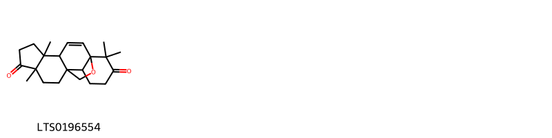{ width=100% }
    <figcaption>Hình ảnh cấu trúc hóa học của 1 hoạt chất thuộc nhóm Tetrahydrofurans gồm ['5,9,17,17-tetramethyl-18-oxapentacyclo[10.5.2.0¹,¹³.0⁴,¹².0⁵,⁹]nonadec-2-ene-8,16-dione (LTS0196554)'].</figcaption>
</figure>

---

### Dược dân tộc học

Danh sách các quốc gia có sử dụng *Momordica charantia* trong điều trị các bệnh. 

| Country       | Disease                                                                                                                                                                             | Bệnh                                                                                                                                                                                |
|:--------------|:------------------------------------------------------------------------------------------------------------------------------------------------------------------------------------|:------------------------------------------------------------------------------------------------------------------------------------------------------------------------------------|
| Africa        | Laxative                                                                                                                                                                            | Nhuận trường                                                                                                                                                                        |
| Brazil        | Vermifuge                                                                                                                                                                           | Thuốc diệt sán                                                                                                                                                                      |
| China         | Refrigerant, Aphrodisiac                                                                                                                                                            | Môi chất lạnh, kích thích tình dục                                                                                                                                                  |
| Elsewhere     | Abortifacient, Antibiotic, Astringent, Emetic, Poison, Purgative, Purgative, Refrigerant, Soap, Styptic, Tonic, Vermifuge, Vermifuge, Stomachic, Abortifacient, Carminative, Poison | Abortifacient, Antibiotic, Astringent, Emetic, Poison, Purgative, Purgative, Refrigerant, Soap, Styptic, Tonic, Vermifuge, Vermifuge, Stomachic, Abortifacient, Carminative, Poison |
| Ghana         | Aphrodisiac                                                                                                                                                                         | Thuốc kích dục                                                                                                                                                                      |
| Haiti         | Laxative                                                                                                                                                                            | Nhuận trường                                                                                                                                                                        |
| Kurdistan     | Vermifuge, Refrigerant                                                                                                                                                              | Vermifuge, Refrigerant                                                                                                                                                              |
| Latin America | Poison                                                                                                                                                                              | Chất độc                                                                                                                                                                            |
| Malaya        | Vermifuge                                                                                                                                                                           | Thuốc diệt sán                                                                                                                                                                      |
| Mexico        | Purgative, Vermifuge, Aphrodisiac                                                                                                                                                   | Purgative, Vermifuge, Aphrodisiac                                                                                                                                                   |
| Panama        | Emmenagogue, Insecticide                                                                                                                                                            | Emmenagogue, Thuốc diệt côn trùng                                                                                                                                                   |
| Trinidad      | Vermifuge, Vermifuge                                                                                                                                                                | Vermifuge, Vermifuge                                                                                                                                                                |
| US            | Canicide                                                                                                                                                                            | Thuốc diệt côn trùng                                                                                                                                                                |
| West Indies   | Abortifacient, Digestive, Apertif                                                                                                                                                   | Abortifacient, Digestive, Apertif                                                                                                                                                   |
| Yucatan       | Aphrodisiac                                                                                                                                                                         | Thuốc kích dục                                                                                                                                                                      |

---

---
## Momordica cochinchinensis
### Thông tin về thực vật

!!! info "Phân loại thực vật của *Momordica cochinchinensis* từ GIBF:"
    - **Kingdom:** Plantae
    - **Phylum:** Tracheophyta
    - **Order:** Cucurbitales
    - **Family:** Cucurbitaceae
    - **Genus:** Momordica
    - **Species:** *Momordica cochinchinensis*

 

| Label (VI)   | Label (EN)   | Scientific Name           | Descriptions (VI)   | Descriptions (EN)   | Also Known As (VI)                       | Also Known As (EN)   |
|:-------------|:-------------|:--------------------------|:--------------------|:--------------------|:-----------------------------------------|:---------------------|
| N/A          | N/A          | Momordica cochinchinensis | loài thực vật       | species of plant    | ['Momordica cochinchinensis', 'cây gấc'] | ['Gac']              |

#### Phân bố trên thế giới

**Từ CSDL GIBF** nan, Hong Kong, Viet Nam, United States of America, Indonesia, Chinese Taipei, Malaysia, China, Australia, Philippines, India, Thailand

#### Phân bố tại Việt Nam

**Từ CSDL GIBF**: Lào Cai, Bến Tre, Hà Nội, Tiền Giang, Ninh Bình

---
### Thành phần hóa học
        
- Theo cơ sở dữ liệu lotus: Từ loài *Momordica cochinchinensis* đã phân lập và xác định được 35 hoạt chất thuộc về các nhóm Naphthopyrans, Steroids and steroid derivatives, Organooxygen compounds, Prenol lipids. 

|    | chemicalTaxonomyClassyfireClass   |   smiles_count |
|---:|:----------------------------------|---------------:|
|  0 | Naphthopyrans                     |              2 |
|  1 | Organooxygen compounds            |              6 |
|  2 | Prenol lipids                     |             25 |
|  3 | Steroids and steroid derivatives  |              1 |

#### Nhóm Naphthopyrans
<figure markdown="span">
    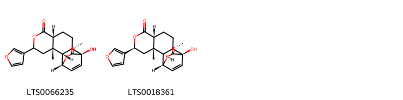{ width=100% }
    <figcaption>Hình ảnh cấu trúc hóa học của 2 hoạt chất thuộc nhóm Naphthopyrans gồm ['(1r,2r,3s,8r,11r,12r)-5-(furan-3-yl)-12-hydroxy-3,11-dimethyl-6,14-dioxatetracyclo[10.2.2.0²,¹¹.0³,⁸]hexadec-15-ene-7,13-dione (LTS0066235)', 'columbin (LTS0018361)'].</figcaption>
</figure>
#### Nhóm Organooxygen compounds
<figure markdown="span">
    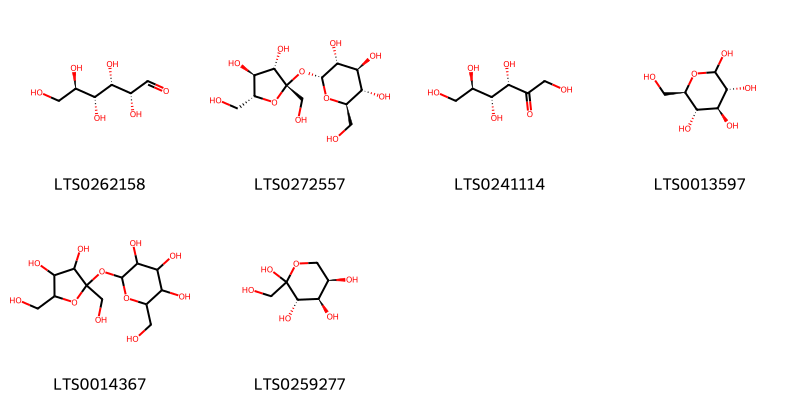{ width=100% }
    <figcaption>Hình ảnh cấu trúc hóa học của 6 hoạt chất thuộc nhóm Organooxygen compounds gồm ['(+)-glucose (LTS0262158)', 'sucrose (LTS0272557)', 'keto-d-fructose (LTS0241114)', 'glucose (LTS0013597)', 'granulated sugar (LTS0014367)', 'd-fructopyranose (LTS0259277)'].</figcaption>
</figure>
#### Nhóm Prenol lipids
<figure markdown="span">
    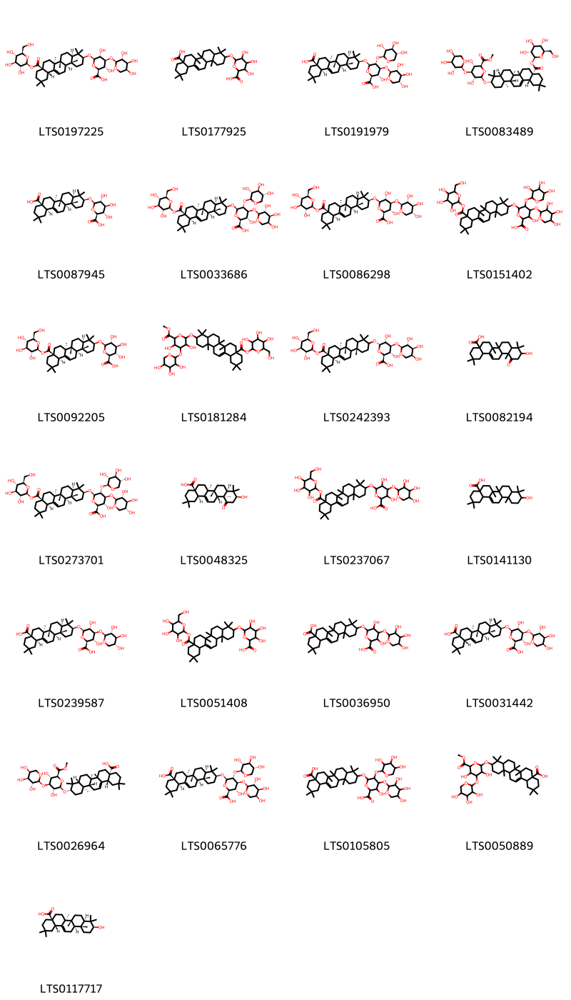{ width=100% }
    <figcaption>Hình ảnh cấu trúc hóa học của 25 hoạt chất thuộc nhóm Prenol lipids gồm ['(2s,3s,4s,5r,6r)-6-{[(3s,4ar,6ar,6bs,8as,12as,14ar,14br)-4,4,6a,6b,11,11,14b-heptamethyl-8a-({[(2s,3r,4s,5s,6r)-3,4,5-trihydroxy-6-(hydroxymethyl)oxan-2-yl]oxy}carbonyl)-1,2,3,4a,5,6,7,8,9,10,12,12a,14,14a-tetradecahydropicen-3-yl]oxy}-3,5-dihydroxy-4-{[(2s,3r,4s,5s)-3,4,5-trihydroxyoxan-2-yl]oxy}oxane-2-carboxylic acid (LTS0197225)', '6-[(8a-carboxy-4,4,6a,6b,11,11,14b-heptamethyl-1,2,3,4a,5,6,7,8,9,10,12,12a,14,14a-tetradecahydropicen-3-yl)oxy]-3,4,5-trihydroxyoxane-2-carboxylic acid (LTS0177925)', '(2s,3s,4s,5r,6r)-6-{[(3s,4ar,6ar,6bs,8as,12ar,14ar,14br)-8a-carboxy-4,4,6a,6b,11,11,14b-heptamethyl-1,2,3,4a,5,6,7,8,9,10,12,12a,14,14a-tetradecahydropicen-3-yl]oxy}-3-hydroxy-4,5-bis({[(2s,3r,4s,5r)-3,4,5-trihydroxyoxan-2-yl]oxy})oxane-2-carboxylic acid (LTS0191979)', 'methyl (2s,3s,4s,5r,6r)-6-{[(3s,4ar,6ar,6bs,8as,12ar,14ar,14br)-4,4,6a,6b,11,11,14b-heptamethyl-8a-({[(2s,3r,4s,5s,6r)-3,4,5-trihydroxy-6-(hydroxymethyl)oxan-2-yl]oxy}carbonyl)-1,2,3,4a,5,6,7,8,9,10,12,12a,14,14a-tetradecahydropicen-3-yl]oxy}-3,5-dihydroxy-4-{[(2s,3r,4s,5s)-3,4,5-trihydroxyoxan-2-yl]oxy}oxane-2-carboxylate (LTS0083489)', '(2s,3s,4s,5r,6r)-6-{[(3s,4ar,6ar,6bs,8as,12ar,14ar,14br)-8a-carboxy-4,4,6a,6b,11,11,14b-heptamethyl-1,2,3,4a,5,6,7,8,9,10,12,12a,14,14a-tetradecahydropicen-3-yl]oxy}-3,4,5-trihydroxyoxane-2-carboxylic acid (LTS0087945)', '(2s,3s,4s,5r,6r)-6-{[(3s,4ar,6ar,6bs,8as,12ar,14ar,14br)-4,4,6a,6b,11,11,14b-heptamethyl-8a-({[(2s,3r,4s,5s,6r)-3,4,5-trihydroxy-6-(hydroxymethyl)oxan-2-yl]oxy}carbonyl)-1,2,3,4a,5,6,7,8,9,10,12,12a,14,14a-tetradecahydropicen-3-yl]oxy}-3-hydroxy-5-{[(2s,3r,4s,5r)-3,4,5-trihydroxyoxan-2-yl]oxy}-4-{[(2s,3r,4s,5s)-3,4,5-trihydroxyoxan-2-yl]oxy}oxane-2-carboxylic acid (LTS0033686)', '(2s,3s,4s,5r,6r)-6-{[(3s,4as,6ar,6bs,8as,12ar,14ar,14br)-4,4,6a,6b,11,11,14b-heptamethyl-8a-({[(2s,3r,4s,5s,6r)-3,4,5-trihydroxy-6-(hydroxymethyl)oxan-2-yl]oxy}carbonyl)-1,2,3,4a,5,6,7,8,9,10,12,12a,14,14a-tetradecahydropicen-3-yl]oxy}-3,5-dihydroxy-4-{[(2s,3r,4s,5r)-3,4,5-trihydroxyoxan-2-yl]oxy}oxane-2-carboxylic acid (LTS0086298)', '6-{[4,4,6a,6b,11,11,14b-heptamethyl-8a-({[3,4,5-trihydroxy-6-(hydroxymethyl)oxan-2-yl]oxy}carbonyl)-1,2,3,4a,5,6,7,8,9,10,12,12a,14,14a-tetradecahydropicen-3-yl]oxy}-3-hydroxy-4,5-bis[(3,4,5-trihydroxyoxan-2-yl)oxy]oxane-2-carboxylic acid (LTS0151402)', '(2s,3s,4s,5r,6r)-6-{[(3s,4ar,6ar,6bs,8as,12ar,14ar,14br)-4,4,6a,6b,11,11,14b-heptamethyl-8a-({[(2s,3r,4s,5s,6r)-3,4,5-trihydroxy-6-(hydroxymethyl)oxan-2-yl]oxy}carbonyl)-1,2,3,4a,5,6,7,8,9,10,12,12a,14,14a-tetradecahydropicen-3-yl]oxy}-3,4,5-trihydroxyoxane-2-carboxylic acid (LTS0092205)', 'methyl 6-{[4,4,6a,6b,11,11,14b-heptamethyl-8a-({[3,4,5-trihydroxy-6-(hydroxymethyl)oxan-2-yl]oxy}carbonyl)-1,2,3,4a,5,6,7,8,9,10,12,12a,14,14a-tetradecahydropicen-3-yl]oxy}-3,5-dihydroxy-4-[(3,4,5-trihydroxyoxan-2-yl)oxy]oxane-2-carboxylate (LTS0181284)', '(2s,3s,4s,5r,6s)-6-{[(6ar,6bs,8as,12ar,14br)-4,4,6a,6b,11,11,14b-heptamethyl-8a-({[(2s,3r,4s,5s,6r)-3,4,5-trihydroxy-6-(hydroxymethyl)oxan-2-yl]oxy}carbonyl)-1,2,3,4a,5,6,7,8,9,10,12,12a,14,14a-tetradecahydropicen-3-yl]oxy}-3,5-dihydroxy-4-{[(2s,3r,4s,5s)-3,4,5-trihydroxyoxan-2-yl]oxy}oxane-2-carboxylic acid (LTS0242393)', '10-hydroxy-2,2,6a,6b,9,9,12a-heptamethyl-12-oxo-3,4,5,6,7,8,8a,10,11,12b,13,14b-dodecahydro-1h-picene-4a-carboxylic acid (LTS0082194)', '(2s,3s,4s,5r,6r)-6-{[(3s,4ar,6ar,6bs,8as,12ar,14ar,14br)-4,4,6a,6b,11,11,14b-heptamethyl-8a-({[(2s,3r,4s,5s,6r)-3,4,5-trihydroxy-6-(hydroxymethyl)oxan-2-yl]oxy}carbonyl)-1,2,3,4a,5,6,7,8,9,10,12,12a,14,14a-tetradecahydropicen-3-yl]oxy}-3-hydroxy-4,5-bis({[(2s,3r,4s,5r)-3,4,5-trihydroxyoxan-2-yl]oxy})oxane-2-carboxylic acid (LTS0273701)', '(4as,6as,6br,8as,10s,12as,12br,14br)-10-hydroxy-2,2,6a,6b,9,9,12a-heptamethyl-12-oxo-3,4,5,6,7,8,8a,10,11,12b,13,14b-dodecahydro-1h-picene-4a-carboxylic acid (LTS0048325)', '6-{[4,4,6a,6b,11,11,14b-heptamethyl-8a-({[3,4,5-trihydroxy-6-(hydroxymethyl)oxan-2-yl]oxy}carbonyl)-1,2,3,4a,5,6,7,8,9,10,12,12a,14,14a-tetradecahydropicen-3-yl]oxy}-3,5-dihydroxy-4-[(3,4,5-trihydroxyoxan-2-yl)oxy]oxane-2-carboxylic acid (LTS0237067)', 'oleanolic acid (LTS0141130)', '(2s,3s,4s,5r,6r)-6-{[(3s,4ar,6ar,6bs,8as,12ar,14ar,14br)-8a-carboxy-4,4,6a,6b,11,11,14b-heptamethyl-1,2,3,4a,5,6,7,8,9,10,12,12a,14,14a-tetradecahydropicen-3-yl]oxy}-3,5-dihydroxy-4-{[(2s,3r,4s,5r)-3,4,5-trihydroxyoxan-2-yl]oxy}oxane-2-carboxylic acid (LTS0239587)', '6-{[4,4,6a,6b,11,11,14b-heptamethyl-8a-({[3,4,5-trihydroxy-6-(hydroxymethyl)oxan-2-yl]oxy}carbonyl)-1,2,3,4a,5,6,7,8,9,10,12,12a,14,14a-tetradecahydropicen-3-yl]oxy}-3,4,5-trihydroxyoxane-2-carboxylic acid (LTS0051408)', '6-[(8a-carboxy-4,4,6a,6b,11,11,14b-heptamethyl-1,2,3,4a,5,6,7,8,9,10,12,12a,14,14a-tetradecahydropicen-3-yl)oxy]-3,5-dihydroxy-4-[(3,4,5-trihydroxyoxan-2-yl)oxy]oxane-2-carboxylic acid (LTS0036950)', '(2s,3s,4s,5r,6r)-6-{[(3s,4ar,6ar,6bs,8as,12as,14ar,14br)-8a-carboxy-4,4,6a,6b,11,11,14b-heptamethyl-1,2,3,4a,5,6,7,8,9,10,12,12a,14,14a-tetradecahydropicen-3-yl]oxy}-3,5-dihydroxy-4-{[(2s,3r,4s,5s)-3,4,5-trihydroxyoxan-2-yl]oxy}oxane-2-carboxylic acid (LTS0031442)', '(4as,6as,6br,8ar,10s,12ar,12br,14br)-10-{[(2r,3r,4s,5s,6s)-3,5-dihydroxy-6-(methoxycarbonyl)-4-{[(2s,3r,4s,5s)-3,4,5-trihydroxyoxan-2-yl]oxy}oxan-2-yl]oxy}-2,2,6a,6b,9,9,12a-heptamethyl-1,3,4,5,6,7,8,8a,10,11,12,12b,13,14b-tetradecahydropicene-4a-carboxylic acid (LTS0026964)', '(2s,3s,4s,5r,6r)-6-{[(3s,4ar,6ar,6bs,8as,12ar,14ar,14br)-8a-carboxy-4,4,6a,6b,11,11,14b-heptamethyl-1,2,3,4a,5,6,7,8,9,10,12,12a,14,14a-tetradecahydropicen-3-yl]oxy}-3-hydroxy-5-{[(2s,3r,4s,5r)-3,4,5-trihydroxyoxan-2-yl]oxy}-4-{[(2s,3r,4s,5s)-3,4,5-trihydroxyoxan-2-yl]oxy}oxane-2-carboxylic acid (LTS0065776)', '6-[(8a-carboxy-4,4,6a,6b,11,11,14b-heptamethyl-1,2,3,4a,5,6,7,8,9,10,12,12a,14,14a-tetradecahydropicen-3-yl)oxy]-3-hydroxy-4,5-bis[(3,4,5-trihydroxyoxan-2-yl)oxy]oxane-2-carboxylic acid (LTS0105805)', '10-{[3,5-dihydroxy-6-(methoxycarbonyl)-4-[(3,4,5-trihydroxyoxan-2-yl)oxy]oxan-2-yl]oxy}-2,2,6a,6b,9,9,12a-heptamethyl-1,3,4,5,6,7,8,8a,10,11,12,12b,13,14b-tetradecahydropicene-4a-carboxylic acid (LTS0050889)', 'oleanolic acid (LTS0117717)'].</figcaption>
</figure>
#### Nhóm Steroids and steroid derivatives
<figure markdown="span">
    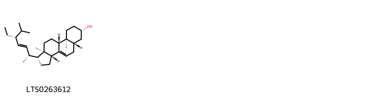{ width=100% }
    <figcaption>Hình ảnh cấu trúc hóa học của 1 hoạt chất thuộc nhóm Steroids and steroid derivatives gồm ['spinasterol (LTS0263612)'].</figcaption>
</figure>

---

### Dược dân tộc học

Danh sách các quốc gia có sử dụng *Momordica cochinchinensis* trong điều trị các bệnh. 

| Country   | Disease                                           | Bệnh                                              |
|:----------|:--------------------------------------------------|:--------------------------------------------------|
| Asia      | Soap                                              | Xà phòng                                          |
| China     | Apertif, Digestive, Poison, Vermifuge, Alexiteric | Apertif, Digestive, Poison, Vermifuge, Alexiteric |
| Elsewhere | Aperient, Expectorant                             | Có kinh nghiệm, long đờm                          |

---

---
## Momordica cymbalaria
### Thông tin về thực vật

!!! info "Phân loại thực vật của *Momordica cymbalaria* từ GIBF:"
    - **Kingdom:** Plantae
    - **Phylum:** Tracheophyta
    - **Order:** Cucurbitales
    - **Family:** Cucurbitaceae
    - **Genus:** Momordica
    - **Species:** *Momordica cymbalaria*

 

| Label (VI)   | Label (EN)   | Scientific Name      | Descriptions (VI)   | Descriptions (EN)   | Also Known As (VI)   | Also Known As (EN)   |
|:-------------|:-------------|:---------------------|:--------------------|:--------------------|:---------------------|:---------------------|
| N/A          | N/A          | Momordica cymbalaria |                     | species of plant    | ['']                 | ['']                 |

#### Phân bố trên thế giới

**Từ CSDL GIBF** nan, Kenya, Somalia, India, Angola, Ethiopia, Cameroon, Sudan

#### Phân bố tại Việt Nam

**Từ CSDL GIBF**: Không có ghi nhận ở Việt Nam

---
### Thành phần hóa học
        
- Theo cơ sở dữ liệu lotus: Từ loài *Momordica cymbalaria* đã phân lập và xác định được Chưa có hoạt chất nào được phân lập. hoạt chất thuộc về các nhóm Không có hoạt chất nào được phân lập. 

Không có hình ảnh nào được tạo ra

---

### Dược dân tộc học

Danh sách các quốc gia có sử dụng *Momordica cymbalaria* trong điều trị các bệnh. 

| Country   | Disease       | Bệnh               |
|:----------|:--------------|:-------------------|
| Sudan     | Abortifacient | Thuốc gây sẩy thai |

---

---
## Momordica dioica
### Thông tin về thực vật

!!! info "Phân loại thực vật của *Momordica dioica* từ GIBF:"
    - **Kingdom:** Plantae
    - **Phylum:** Tracheophyta
    - **Order:** Cucurbitales
    - **Family:** Cucurbitaceae
    - **Genus:** Momordica
    - **Species:** *Momordica dioica*

 

| Label (VI)   | Label (EN)   | Scientific Name   | Descriptions (VI)   | Descriptions (EN)   | Also Known As (VI)   | Also Known As (EN)   |
|:-------------|:-------------|:------------------|:--------------------|:--------------------|:---------------------|:---------------------|
| N/A          | N/A          | Momordica dioica  |                     | Tropical vegetable  | ['']                 | ['']                 |

#### Phân bố trên thế giới

**Từ CSDL GIBF** nan, Sri Lanka, Bhutan, Bangladesh, Nepal, Pakistan, China, Myanmar, India, unknown or invalid, Ethiopia, Thailand, Spain

#### Phân bố tại Việt Nam

**Từ CSDL GIBF**: Không có ghi nhận ở Việt Nam

---
### Thành phần hóa học
        
- Theo cơ sở dữ liệu lotus: Từ loài *Momordica dioica* đã phân lập và xác định được Chưa có hoạt chất nào được phân lập. hoạt chất thuộc về các nhóm Không có hoạt chất nào được phân lập. 

Không có hình ảnh nào được tạo ra

---

### Dược dân tộc học

Danh sách các quốc gia có sử dụng *Momordica dioica* trong điều trị các bệnh. 

| Country   | Disease              | Bệnh                       |
|:----------|:---------------------|:---------------------------|
| Elsewhere | Astringent, Sedative | Chất làm se, Thuốc an thần |

---

---
## Momordica schimperiana
### Thông tin về thực vật

!!! info "Phân loại thực vật của *Momordica foetida* từ GIBF:"
    - **Kingdom:** Plantae
    - **Phylum:** Tracheophyta
    - **Order:** Cucurbitales
    - **Family:** Cucurbitaceae
    - **Genus:** Momordica
    - **Species:** *Momordica foetida*

 

| Label (VI)   | Label (EN)   | Scientific Name        | Descriptions (VI)   | Descriptions (EN)   | Also Known As (VI)   | Also Known As (EN)   |
|:-------------|:-------------|:-----------------------|:--------------------|:--------------------|:---------------------|:---------------------|
| N/A          | N/A          | Momordica schimperiana |                     | species of plant    | ['']                 | ['']                 |

#### Phân bố trên thế giới

**Từ CSDL GIBF** nan, Sri Lanka, Bhutan, Bangladesh, Nepal, Pakistan, China, Myanmar, India, unknown or invalid, Ethiopia, Thailand, Spain

#### Phân bố tại Việt Nam

**Từ CSDL GIBF**: Không có ghi nhận ở Việt Nam

---
### Thành phần hóa học
        
- Theo cơ sở dữ liệu lotus: Từ loài *Momordica foetida* đã phân lập và xác định được Chưa có hoạt chất nào được phân lập. hoạt chất thuộc về các nhóm Không có hoạt chất nào được phân lập. 

Không có hình ảnh nào được tạo ra

---

### Dược dân tộc học

Danh sách các quốc gia có sử dụng *Momordica foetida* trong điều trị các bệnh. 

| Country   | Disease     | Bệnh          |
|:----------|:------------|:--------------|
| Africa    | Insecticide | Thuốc trừ sâu |

---

---
## Momordica tuberosa
### Thông tin về thực vật

!!! info "Phân loại thực vật của *N/A* từ GIBF:"
    - **Kingdom:** Plantae
    - **Phylum:** Tracheophyta
    - **Order:** Cucurbitales
    - **Family:** Cucurbitaceae
    - **Genus:** Momordica
    - **Species:** *N/A*

 

| Label (VI)   | Label (EN)   | Scientific Name        | Descriptions (VI)   | Descriptions (EN)   | Also Known As (VI)   | Also Known As (EN)   |
|:-------------|:-------------|:-----------------------|:--------------------|:--------------------|:---------------------|:---------------------|
| N/A          | N/A          | Momordica schimperiana |                     | species of plant    | ['']                 | ['']                 |

#### Phân bố trên thế giới

**Từ CSDL GIBF** nan, Brazil, Guatemala, Saint Kitts and Nevis, Viet Nam, Guadeloupe, Barbados, China, Antigua and Barbuda, Zimbabwe, Saint Lucia, Honduras, Ecuador, French Polynesia, Thailand, Spain, Puerto Rico, Cayman Islands, Sri Lanka, Ghana, Réunion, United States of America, Jamaica, Virgin Islands (U.S.), Indonesia, Costa Rica, Dominican Republic, Colombia, Nigeria, Argentina, French Guiana, Cabo Verde, Lao People’s Democratic Republic, Malawi, Hong Kong, Mexico, Congo, Democratic Republic of the, Kenya, Rwanda, Vanuatu, American Samoa, Chinese Taipei, Gabon, Philippines, Panama, Namibia, Nicaragua, Bahamas, South Africa, Australia, India, Peru, Belize

#### Phân bố tại Việt Nam

**Từ CSDL GIBF**: Đồng Tháp, Bến Tre

---
### Thành phần hóa học
        
- Theo cơ sở dữ liệu lotus: Từ loài *N/A* đã phân lập và xác định được Chưa có hoạt chất nào được phân lập. hoạt chất thuộc về các nhóm Không có hoạt chất nào được phân lập. 

Không có hình ảnh nào được tạo ra

---

### Dược dân tộc học

Danh sách các quốc gia có sử dụng *N/A* trong điều trị các bệnh. 

| Country   | Disease       | Bệnh               |
|:----------|:--------------|:-------------------|
| Elsewhere | Abortifacient | Thuốc gây sẩy thai |

---

# Chi Ecballium

??? note "Danh sách các dược liệu thuộc chi"
    
	 - *Ecballium elaterium*

---
## Ecballium elaterium
### Thông tin về thực vật

!!! info "Phân loại thực vật của *Ecballium elaterium* từ GIBF:"
    - **Kingdom:** Plantae
    - **Phylum:** Tracheophyta
    - **Order:** Cucurbitales
    - **Family:** Cucurbitaceae
    - **Genus:** Ecballium
    - **Species:** *Ecballium elaterium*

 

| Label (VI)   | Label (EN)   | Scientific Name     | Descriptions (VI)   | Descriptions (EN)   | Also Known As (VI)   | Also Known As (EN)     |
|:-------------|:-------------|:--------------------|:--------------------|:--------------------|:---------------------|:-----------------------|
| N/A          | N/A          | Ecballium elaterium | loài thực vật       | species of plant    | ['']                 | ['Squirting cucumber'] |

#### Phân bố trên thế giới

**Từ CSDL GIBF** Malta, Israel, Chile, Türkiye, Spain, Greece, Albania, Croatia, Cyprus, Morocco, Gibraltar, Algeria, France, Palestine, State of, Portugal, Ukraine, Australia, Italy, United Kingdom of Great Britain and Northern Ireland

#### Phân bố tại Việt Nam

**Từ CSDL GIBF**: Không có ghi nhận ở Việt Nam

---
### Thành phần hóa học
        
- Theo cơ sở dữ liệu lotus: Từ loài *Ecballium elaterium* đã phân lập và xác định được 24 hoạt chất thuộc về các nhóm Prenol lipids, Organooxygen compounds, Steroids and steroid derivatives, Furanoid lignans. 

|    | chemicalTaxonomyClassyfireClass   |   smiles_count |
|---:|:----------------------------------|---------------:|
|  0 | Furanoid lignans                  |              1 |
|  1 | Organooxygen compounds            |              2 |
|  2 | Prenol lipids                     |              2 |
|  3 | Steroids and steroid derivatives  |             19 |

#### Nhóm Furanoid lignans
<figure markdown="span">
    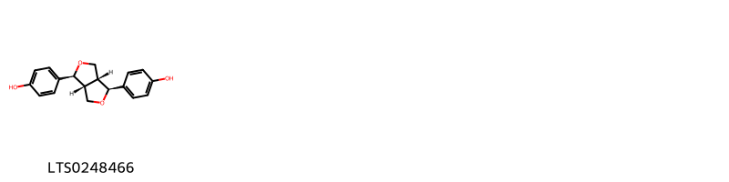{ width=100% }
    <figcaption>Hình ảnh cấu trúc hóa học của 1 hoạt chất thuộc nhóm Furanoid lignans gồm ['4-[(1s,3ar,4s,6ar)-4-(4-hydroxyphenyl)-hexahydrofuro[3,4-c]furan-1-yl]phenol (LTS0248466)'].</figcaption>
</figure>
#### Nhóm Organooxygen compounds
<figure markdown="span">
    { width=100% }
    <figcaption>Hình ảnh cấu trúc hóa học của 2 hoạt chất thuộc nhóm Organooxygen compounds gồm ['(2s,4as,6as,8ar,12as,14as,14br)-10-hydroxy-2,4a,6a,9,9,12a,14a-heptamethyl-1,3,4,5,6,7,8,8a,10,11,12,13,14,14b-tetradecahydropicene-2-carboxylic acid (LTS0267212)', '(2r,4as,6as,8ar,10s,12as,14as,14br)-10-hydroxy-2,4a,6a,9,9,12a,14a-heptamethyl-1,3,4,5,6,7,8,8a,10,11,12,13,14,14b-tetradecahydropicene-2-carboxylic acid (LTS0076929)'].</figcaption>
</figure>
#### Nhóm Prenol lipids
<figure markdown="span">
    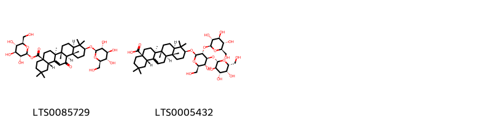{ width=100% }
    <figcaption>Hình ảnh cấu trúc hóa học của 2 hoạt chất thuộc nhóm Prenol lipids gồm ['(2s,3r,4s,5s,6r)-3,4,5-trihydroxy-6-(hydroxymethyl)oxan-2-yl (4as,6as,6br,8ar,10s,12as,12br,14bs)-2,2,6a,6b,9,9,12a-heptamethyl-13-oxo-10-{[(2r,3r,4s,5s,6r)-3,4,5-trihydroxy-6-(hydroxymethyl)oxan-2-yl]oxy}-3,4,5,6,7,8,8a,10,11,12,12b,14b-dodecahydro-1h-picene-4a-carboxylate (LTS0085729)', 'calenduloside c (LTS0005432)'].</figcaption>
</figure>
#### Nhóm Steroids and steroid derivatives
<figure markdown="span">
    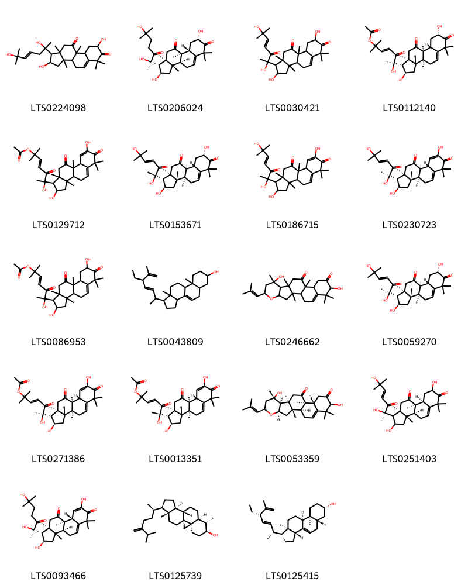{ width=100% }
    <figcaption>Hình ảnh cấu trúc hóa học của 19 hoạt chất thuộc nhóm Steroids and steroid derivatives gồm ['1-[(4e)-2,6-dihydroxy-6-methylhept-4-en-2-yl]-2,8-dihydroxy-3a,6,6,9b,11a-pentamethyl-1h,2h,3h,3bh,4h,8h,9h,9ah,11h-cyclopenta[a]phenanthrene-7,10-dione (LTS0224098)', '23,24-dihydrocucurbitacin d (LTS0206024)', '1-(2,6-dihydroxy-6-methyl-3-oxohept-4-en-2-yl)-2,8-dihydroxy-3a,6,6,9b,11a-pentamethyl-1h,2h,3h,3bh,4h,8h,9h,9ah,11h-cyclopenta[a]phenanthrene-7,10-dione (LTS0030421)', 'cucurbitacin b (LTS0112140)', '6-{2,8-dihydroxy-3a,6,6,9b,11a-pentamethyl-7,10-dioxo-1h,2h,3h,3bh,4h,9ah,11h-cyclopenta[a]phenanthren-1-yl}-6-hydroxy-2-methyl-5-oxohept-3-en-2-yl acetate (LTS0129712)', '(1r,2r,3as,3bs,8s,9ar,9br,11ar)-1-[(2s,4e)-2,6-dihydroxy-6-methyl-3-oxohept-4-en-2-yl]-2,8-dihydroxy-3a,6,6,9b,11a-pentamethyl-1h,2h,3h,3bh,4h,8h,9h,9ah,11h-cyclopenta[a]phenanthrene-7,10-dione (LTS0153671)', '1-(2,6-dihydroxy-6-methyl-3-oxohept-4-en-2-yl)-2,8-dihydroxy-3a,6,6,9b,11a-pentamethyl-1h,2h,3h,3bh,4h,9ah,11h-cyclopenta[a]phenanthrene-7,10-dione (LTS0186715)', 'cucurbitacin (LTS0230723)', '6-{2,8-dihydroxy-3a,6,6,9b,11a-pentamethyl-7,10-dioxo-1h,2h,3h,3bh,4h,8h,9h,9ah,11h-cyclopenta[a]phenanthren-1-yl}-6-hydroxy-2-methyl-5-oxohept-3-en-2-yl acetate (LTS0086953)', '1-(5-ethyl-6-methylhepta-3,6-dien-2-yl)-9a,11a-dimethyl-1h,2h,3h,3ah,5h,5ah,6h,7h,8h,9h,9bh,10h,11h-cyclopenta[a]phenanthren-7-ol (LTS0043809)', '8,17-dihydroxy-2,8,10,13,18,18-hexamethyl-6-(2-methylprop-1-en-1-yl)-5-oxapentacyclo[11.8.0.0²,¹⁰.0⁴,⁹.0¹⁴,¹⁹]henicos-19-ene-12,16-dione (LTS0246662)', 'cucurbitacin d (LTS0059270)', 'α-elaterin (LTS0271386)', '(3e,6s)-6-[(1r,2r,3as,3bs,9ar,9br,11ar)-2,8-dihydroxy-3a,6,6,9b,11a-pentamethyl-7,10-dioxo-1h,2h,3h,3bh,4h,9ah,11h-cyclopenta[a]phenanthren-1-yl]-6-hydroxy-2-methyl-5-oxohept-3-en-2-yl acetate (LTS0013351)', '(1s,2s,4r,6r,8s,9s,10r,13r,14r,17s)-8,17-dihydroxy-2,8,10,13,18,18-hexamethyl-6-(2-methylprop-1-en-1-yl)-5-oxapentacyclo[11.8.0.0²,¹⁰.0⁴,⁹.0¹⁴,¹⁹]henicos-19-ene-12,16-dione (LTS0053359)', '(3as,3bs,9as,9br,11ar)-1-[(2r)-2,6-dihydroxy-6-methyl-3-oxohept-4-en-2-yl]-2,8-dihydroxy-3a,6,6,9b,11a-pentamethyl-1h,2h,3h,3bh,4h,8h,9h,9ah,11h-cyclopenta[a]phenanthrene-7,10-dione (LTS0251403)', 'cucurbitacin l (LTS0093466)', 'cycloeucalenol (LTS0125739)', '(1r,3ar,5as,7s,9as,9bs,11ar)-1-[(2r,3e,5s)-5-ethyl-6-methylhepta-3,6-dien-2-yl]-9a,11a-dimethyl-1h,2h,3h,3ah,5h,5ah,6h,7h,8h,9h,9bh,10h,11h-cyclopenta[a]phenanthren-7-ol (LTS0125415)'].</figcaption>
</figure>

---

### Dược dân tộc học

Danh sách các quốc gia có sử dụng *Ecballium elaterium* trong điều trị các bệnh. 

| Country   | Disease              | Bệnh                 |
|:----------|:---------------------|:---------------------|
| Elsewhere | Purgative, Cathartic | Luyện kim, Cathartic |
| Turkey    | Cathartic, Poison    | Cathartic, Poison    |
| ain       | Purgative            | Thuốc xổ             |

---

# Chi Telfairia

??? note "Danh sách các dược liệu thuộc chi"
    
	 - *Telfairia pedata*

---
## Telfairia pedata
### Thông tin về thực vật

!!! info "Phân loại thực vật của *Telfairia pedata* từ GIBF:"
    - **Kingdom:** Plantae
    - **Phylum:** Tracheophyta
    - **Order:** Cucurbitales
    - **Family:** Cucurbitaceae
    - **Genus:** Telfairia
    - **Species:** *Telfairia pedata*

 

| Label (VI)   | Label (EN)   | Scientific Name   | Descriptions (VI)   | Descriptions (EN)   | Also Known As (VI)   | Also Known As (EN)   |
|:-------------|:-------------|:------------------|:--------------------|:--------------------|:---------------------|:---------------------|
| N/A          | N/A          | Telfairia pedata  | loài thực vật       | species of plant    | ['']                 | ['']                 |

#### Phân bố trên thế giới

**Từ CSDL GIBF** nan, Austria, Brazil, Uganda, United States of America, Rwanda, Congo, Democratic Republic of the, Kenya, Zambia, Gabon, South Africa, Mauritius, Mozambique, Tanzania, United Republic of, unknown or invalid, India, Madagascar

#### Phân bố tại Việt Nam

**Từ CSDL GIBF**: Không có ghi nhận ở Việt Nam

---
### Thành phần hóa học
        
- Theo cơ sở dữ liệu lotus: Từ loài *Telfairia pedata* đã phân lập và xác định được Chưa có hoạt chất nào được phân lập. hoạt chất thuộc về các nhóm Không có hoạt chất nào được phân lập. 

Không có hình ảnh nào được tạo ra

---

### Dược dân tộc học

Danh sách các quốc gia có sử dụng *Telfairia pedata* trong điều trị các bệnh. 

| Country   | Disease   | Bệnh     |
|:----------|:----------|:---------|
| Africa    | Soap      | Xà phòng |
| Elsewhere | Soap      | Xà phòng |

---

# Chi Mukia

??? note "Danh sách các dược liệu thuộc chi"
    
	 - *Mukia scabrella*

---
## Mukia scabrella
### Thông tin về thực vật

!!! info "Phân loại thực vật của *Cucumis maderaspatanus* từ GIBF:"
    - **Kingdom:** Plantae
    - **Phylum:** Tracheophyta
    - **Order:** Cucurbitales
    - **Family:** Cucurbitaceae
    - **Genus:** Cucumis
    - **Species:** *Cucumis maderaspatanus*

 

| Label (VI)   | Label (EN)   | Scientific Name   | Descriptions (VI)   | Descriptions (EN)   | Also Known As (VI)   | Also Known As (EN)   |
|:-------------|:-------------|:------------------|:--------------------|:--------------------|:---------------------|:---------------------|
| N/A          | N/A          | Mukia scabrella   | loài thực vật       | species of plant    | ['']                 | ['']                 |

#### Phân bố trên thế giới

**Từ CSDL GIBF** nan, Myanmar, Sierra Leone, India

#### Phân bố tại Việt Nam

**Từ CSDL GIBF**: Không có ghi nhận ở Việt Nam

---
### Thành phần hóa học
        
- Theo cơ sở dữ liệu lotus: Từ loài *Cucumis maderaspatanus* đã phân lập và xác định được Chưa có hoạt chất nào được phân lập. hoạt chất thuộc về các nhóm Không có hoạt chất nào được phân lập. 

Không có hình ảnh nào được tạo ra

---

### Dược dân tộc học

Danh sách các quốc gia có sử dụng *Cucumis maderaspatanus* trong điều trị các bệnh. 

| Country   | Disease                          | Bệnh                             |
|:----------|:---------------------------------|:---------------------------------|
| Sudan     | Aperient, Carminative, Sudorific | Aperient, Carminative, Sudorific |

---

# Chi Ceratosanthes

??? note "Danh sách các dược liệu thuộc chi"
    
	 - *Ceratosanthes corniculata*

---
## Ceratosanthes corniculata
### Thông tin về thực vật

!!! info "Phân loại thực vật của *Ceratosanthes palmata* từ GIBF:"
    - **Kingdom:** Plantae
    - **Phylum:** Tracheophyta
    - **Order:** Cucurbitales
    - **Family:** Cucurbitaceae
    - **Genus:** Ceratosanthes
    - **Species:** *Ceratosanthes palmata*

 

| Label (VI)   | Label (EN)   | Scientific Name           | Descriptions (VI)   | Descriptions (EN)   | Also Known As (VI)   | Also Known As (EN)   |
|:-------------|:-------------|:--------------------------|:--------------------|:--------------------|:---------------------|:---------------------|
| N/A          | N/A          | Ceratosanthes corniculata |                     |                     | ['']                 | ['']                 |

#### Phân bố trên thế giới

**Từ CSDL GIBF** nan, Myanmar, Sierra Leone, India

#### Phân bố tại Việt Nam

**Từ CSDL GIBF**: Không có ghi nhận ở Việt Nam

---
### Thành phần hóa học
        
- Theo cơ sở dữ liệu lotus: Từ loài *Ceratosanthes palmata* đã phân lập và xác định được Chưa có hoạt chất nào được phân lập. hoạt chất thuộc về các nhóm Không có hoạt chất nào được phân lập. 

Không có hình ảnh nào được tạo ra

---

### Dược dân tộc học

Danh sách các quốc gia có sử dụng *Ceratosanthes palmata* trong điều trị các bệnh. 

| Country   | Disease   | Bệnh   |
|:----------|:----------|:-------|
| Venezuela | Emetic    | Phôi   |

---

# Chi Anisoerma

??? note "Danh sách các dược liệu thuộc chi"
    
	 - *Anisoerma passiflora*

---
## Anisoerma passiflora
### Thông tin về thực vật

!!! info "Phân loại thực vật của *N/A* từ GIBF:"
    - **Kingdom:** N/A
    - **Phylum:** N/A
    - **Order:** N/A
    - **Family:** N/A
    - **Genus:** N/A
    - **Species:** *N/A*

 

| Label (VI)   | Label (EN)   | Scientific Name           | Descriptions (VI)   | Descriptions (EN)   | Also Known As (VI)   | Also Known As (EN)   |
|:-------------|:-------------|:--------------------------|:--------------------|:--------------------|:---------------------|:---------------------|
| N/A          | N/A          | Ceratosanthes corniculata |                     |                     | ['']                 | ['']                 |

#### Phân bố trên thế giới

**Từ CSDL GIBF** Không có kết quả phù hợp

#### Phân bố tại Việt Nam

**Từ CSDL GIBF**: Không có ghi nhận ở Việt Nam

---
### Thành phần hóa học
        
- Theo cơ sở dữ liệu lotus: Từ loài *N/A* đã phân lập và xác định được Chưa có hoạt chất nào được phân lập. hoạt chất thuộc về các nhóm Không có hoạt chất nào được phân lập. 

Không có hình ảnh nào được tạo ra

---

### Dược dân tộc học

Danh sách các quốc gia có sử dụng *N/A* trong điều trị các bệnh. 

| Country   | Disease           | Bệnh              |
|:----------|:------------------|:------------------|
| Brazil    | Emetic, Purgative | Emetic, Purgative |

---

# Chi Lagenaria

??? note "Danh sách các dược liệu thuộc chi"
    
	 - *Lagenaria leucantha*
	 - *Lagenaria siceraria*
	 - *Lagenaria vulgaris*

---
## Lagenaria leucantha
### Thông tin về thực vật

!!! info "Phân loại thực vật của *Lagenaria siceraria* từ GIBF:"
    - **Kingdom:** Plantae
    - **Phylum:** Tracheophyta
    - **Order:** Cucurbitales
    - **Family:** Cucurbitaceae
    - **Genus:** Lagenaria
    - **Species:** *Lagenaria siceraria*

 

| Label (VI)   | Label (EN)   | Scientific Name     | Descriptions (VI)   | Descriptions (EN)   | Also Known As (VI)   | Also Known As (EN)   |
|:-------------|:-------------|:--------------------|:--------------------|:--------------------|:---------------------|:---------------------|
| N/A          | N/A          | Lagenaria leucantha | loài thực vật       | species of plant    | ['']                 | ['']                 |

#### Phân bố trên thế giới

**Từ CSDL GIBF** nan, Mexico, Viet Nam, Japan, United States of America, Korea, Republic of, El Salvador, Philippines, Costa Rica, China, Malaysia, Colombia, Iraq, Honduras, unknown or invalid, Bolivia (Plurinational State of), Belize

#### Phân bố tại Việt Nam

**Từ CSDL GIBF**: Lai Chau

---
### Thành phần hóa học
        
- Theo cơ sở dữ liệu lotus: Từ loài *Lagenaria siceraria* đã phân lập và xác định được Chưa có hoạt chất nào được phân lập. hoạt chất thuộc về các nhóm Không có hoạt chất nào được phân lập. 

Không có hình ảnh nào được tạo ra

---

### Dược dân tộc học

Danh sách các quốc gia có sử dụng *Lagenaria siceraria* trong điều trị các bệnh. 

| Country   | Disease   | Bệnh     |
|:----------|:----------|:---------|
| Java      | Purgative | Thuốc xổ |

---

---
## Lagenaria siceraria
### Thông tin về thực vật

!!! info "Phân loại thực vật của *Lagenaria siceraria* từ GIBF:"
    - **Kingdom:** Plantae
    - **Phylum:** Tracheophyta
    - **Order:** Cucurbitales
    - **Family:** Cucurbitaceae
    - **Genus:** Lagenaria
    - **Species:** *Lagenaria siceraria*

 

| Label (VI)   | Label (EN)   | Scientific Name     | Descriptions (VI)   | Descriptions (EN)   | Also Known As (VI)   | Also Known As (EN)                                                                   |
|:-------------|:-------------|:--------------------|:--------------------|:--------------------|:---------------------|:-------------------------------------------------------------------------------------|
| N/A          | N/A          | Lagenaria siceraria | loài thực vật       | species of plant    | ['']                 | ['bottle gourd', 'calabash', 'calabash gourd', 'opo squash', 'white-flowered gourd'] |

#### Phân bố trên thế giới

**Từ CSDL GIBF** nan, Brazil, Guatemala, United Arab Emirates, Japan, Viet Nam, Uganda, Botswana, Bangladesh, Nepal, China, New Zealand, Zimbabwe, Honduras, Tanzania, United Republic of, Türkiye, Somalia, Uruguay, Thailand, Spain, Poland, Puerto Rico, Ghana, Réunion, United States of America, Korea, Republic of, Zambia, Greece, Indonesia, Pakistan, Colombia, Nigeria, Argentina, Morocco, Mexico, Benin, Kenya, El Salvador, Chinese Taipei, Haiti, Kuwait, Mayotte, Germany, Panama, Namibia, Austria, Nicaragua, Hungary, Peru, South Africa, Australia, Italy, India, Angola, Venezuela (Bolivarian Republic of)

#### Phân bố tại Việt Nam

**Từ CSDL GIBF**: Không có ghi nhận ở Việt Nam

---
### Thành phần hóa học
        
- Theo cơ sở dữ liệu lotus: Từ loài *Lagenaria siceraria* đã phân lập và xác định được 63 hoạt chất thuộc về các nhóm Flavonoids, Carboxylic acids and derivatives, Steroids and steroid derivatives, Organooxygen compounds, Prenol lipids. 

|    | chemicalTaxonomyClassyfireClass   |   smiles_count |
|---:|:----------------------------------|---------------:|
|  0 | Carboxylic acids and derivatives  |              2 |
|  1 | Flavonoids                        |              4 |
|  2 | Organooxygen compounds            |              9 |
|  3 | Prenol lipids                     |             15 |
|  4 | Steroids and steroid derivatives  |             33 |

#### Nhóm Carboxylic acids and derivatives
<figure markdown="span">
    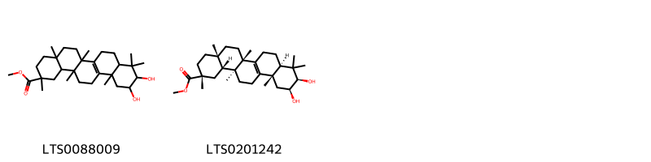{ width=100% }
    <figcaption>Hình ảnh cấu trúc hóa học của 2 hoạt chất thuộc nhóm Carboxylic acids and derivatives gồm ['methyl 10,11-dihydroxy-2,4a,6a,9,9,12a,14a-heptamethyl-1,3,4,5,6,7,8,8a,10,11,12,13,14,14b-tetradecahydropicene-2-carboxylate (LTS0088009)', 'methyl (2r,4as,6as,8ar,10r,11s,12as,14as,14br)-10,11-dihydroxy-2,4a,6a,9,9,12a,14a-heptamethyl-1,3,4,5,6,7,8,8a,10,11,12,13,14,14b-tetradecahydropicene-2-carboxylate (LTS0201242)'].</figcaption>
</figure>
#### Nhóm Flavonoids
<figure markdown="span">
    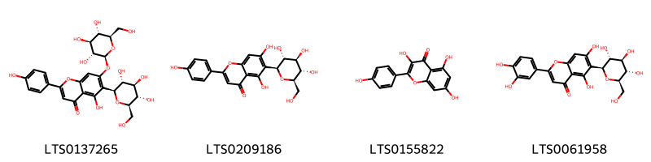{ width=100% }
    <figcaption>Hình ảnh cấu trúc hóa học của 4 hoạt chất thuộc nhóm Flavonoids gồm ['saponarin (LTS0137265)', 'isovitexin (LTS0209186)', 'kaempherol (LTS0155822)', 'isoorientin (LTS0061958)'].</figcaption>
</figure>
#### Nhóm Organooxygen compounds
<figure markdown="span">
    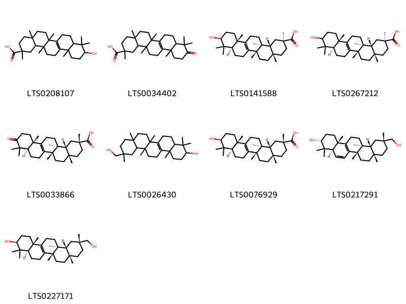{ width=100% }
    <figcaption>Hình ảnh cấu trúc hóa học của 9 hoạt chất thuộc nhóm Organooxygen compounds gồm ['10-hydroxy-2,4a,6a,9,9,12a,14a-heptamethyl-1,3,4,5,6,7,8,8a,10,11,12,13,14,14b-tetradecahydropicene-2-carboxylic acid (LTS0208107)', '2,4a,6a,9,9,12a,14a-heptamethyl-10-oxo-3,4,5,6,7,8,8a,11,12,13,14,14b-dodecahydro-1h-picene-2-carboxylic acid (LTS0034402)', 'bryonolic acid (LTS0141588)', '(2s,4as,6as,8ar,12as,14as,14br)-10-hydroxy-2,4a,6a,9,9,12a,14a-heptamethyl-1,3,4,5,6,7,8,8a,10,11,12,13,14,14b-tetradecahydropicene-2-carboxylic acid (LTS0267212)', '(2r,4as,6as,8ar,12as,14as,14br)-2,4a,6a,9,9,12a,14a-heptamethyl-10-oxo-3,4,5,6,7,8,8a,11,12,13,14,14b-dodecahydro-1h-picene-2-carboxylic acid (LTS0033866)', '11-(hydroxymethyl)-4,4,6b,8a,11,12b,14b-heptamethyl-1,2,3,4a,5,6,7,8,9,10,12,12a,13,14-tetradecahydropicen-3-ol (LTS0026430)', '(2r,4as,6as,8ar,10s,12as,14as,14br)-10-hydroxy-2,4a,6a,9,9,12a,14a-heptamethyl-1,3,4,5,6,7,8,8a,10,11,12,13,14,14b-tetradecahydropicene-2-carboxylic acid (LTS0076929)', '(3r,4ar,6bs,8as,11r,12ar,12bs,14bs)-11-(hydroxymethyl)-4,4,6b,8a,11,12b,14b-heptamethyl-1,2,3,4a,7,8,9,10,12,12a,13,14-dodecahydropicen-3-ol (LTS0217291)', '(3s,4ar,6bs,8as,11r,12ar,12bs,14bs)-11-(hydroxymethyl)-4,4,6b,8a,11,12b,14b-heptamethyl-1,2,3,4a,5,6,7,8,9,10,12,12a,13,14-tetradecahydropicen-3-ol (LTS0227171)'].</figcaption>
</figure>
#### Nhóm Prenol lipids
<figure markdown="span">
    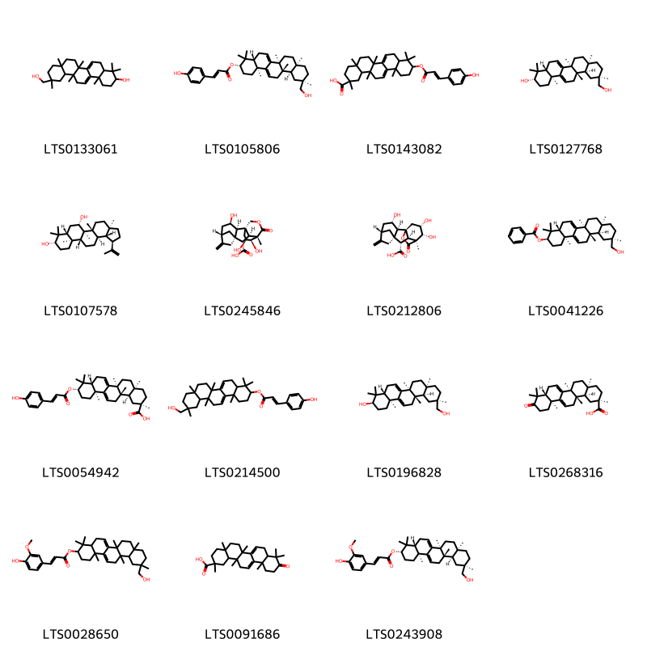{ width=100% }
    <figcaption>Hình ảnh cấu trúc hóa học của 15 hoạt chất thuộc nhóm Prenol lipids gồm ['11-(hydroxymethyl)-4,4,6b,8a,11,12b,14b-heptamethyl-1,2,3,4a,5,7,8,9,10,12,12a,13-dodecahydropicen-3-ol (LTS0133061)', '(3s,4ar,6bs,8as,11r,12ar,12bs,14bs)-11-(hydroxymethyl)-4,4,6b,8a,11,12b,14b-heptamethyl-1,2,3,4a,5,7,8,9,10,12,12a,13-dodecahydropicen-3-yl (2e)-3-(4-hydroxyphenyl)prop-2-enoate (LTS0105806)', '10-{[3-(4-hydroxyphenyl)prop-2-enoyl]oxy}-2,4a,6a,9,9,12a,14a-heptamethyl-1,3,4,5,6,8,8a,10,11,12,14,14b-dodecahydropicene-2-carboxylic acid (LTS0143082)', '(3s,4ar,6bs,8as,11r,12ar,12bs,14bs)-11-(hydroxymethyl)-4,4,6b,8a,11,12b,14b-heptamethyl-1,2,3,4a,5,7,8,9,10,12,12a,13-dodecahydropicen-3-ol (LTS0127768)', '(1r,3ar,5ar,5br,6s,7ar,9s,11as,11br,13ar,13br)-3a,5a,5b,8,8,11a-hexamethyl-1-(prop-1-en-2-yl)-hexadecahydrocyclopenta[a]chrysene-6,9-diol (LTS0107578)', '(1s,2r,3r,5s,8r,9s,10s,11s,16s,17r)-3,16,17-trihydroxy-11-methyl-6-methylidene-12-oxo-13-oxapentacyclo[9.3.3.1⁵,⁸.0¹,¹⁰.0²,⁸]octadecane-9-carboxylic acid (LTS0245846)', '(1s,2s,3s,5s,8r,9s,10r,11s,12r,13s)-3,12,13-trihydroxy-11-methyl-6-methylidene-16-oxo-15-oxapentacyclo[9.3.2.1⁵,⁸.0¹,¹⁰.0²,⁸]heptadecane-9-carboxylic acid (LTS0212806)', '(3r,4ar,6bs,8as,11r,12ar,12bs,14bs)-11-(hydroxymethyl)-4,4,6b,8a,11,12b,14b-heptamethyl-1,2,3,4a,5,7,8,9,10,12,12a,13-dodecahydropicen-3-yl benzoate (LTS0041226)', '(2r,4as,6as,8ar,10s,12as,14as,14br)-10-{[(2e)-3-(4-hydroxyphenyl)prop-2-enoyl]oxy}-2,4a,6a,9,9,12a,14a-heptamethyl-1,3,4,5,6,8,8a,10,11,12,14,14b-dodecahydropicene-2-carboxylic acid (LTS0054942)', '11-(hydroxymethyl)-4,4,6b,8a,11,12b,14b-heptamethyl-1,2,3,4a,5,7,8,9,10,12,12a,13-dodecahydropicen-3-yl 3-(4-hydroxyphenyl)prop-2-enoate (LTS0214500)', 'karounidiol (LTS0196828)', '(2r,4as,6as,8ar,12as,14as,14br)-2,4a,6a,9,9,12a,14a-heptamethyl-10-oxo-3,4,5,6,8,8a,11,12,14,14b-decahydro-1h-picene-2-carboxylic acid (LTS0268316)', '11-(hydroxymethyl)-4,4,6b,8a,11,12b,14b-heptamethyl-1,2,3,4a,5,7,8,9,10,12,12a,13-dodecahydropicen-3-yl 3-(4-hydroxy-3-methoxyphenyl)prop-2-enoate (LTS0028650)', '2,4a,6a,9,9,12a,14a-heptamethyl-10-oxo-3,4,5,6,8,8a,11,12,14,14b-decahydro-1h-picene-2-carboxylic acid (LTS0091686)', '(3s,4ar,6bs,8as,11r,12ar,12bs,14bs)-11-(hydroxymethyl)-4,4,6b,8a,11,12b,14b-heptamethyl-1,2,3,4a,5,7,8,9,10,12,12a,13-dodecahydropicen-3-yl (2e)-3-(4-hydroxy-3-methoxyphenyl)prop-2-enoate (LTS0243908)'].</figcaption>
</figure>
#### Nhóm Steroids and steroid derivatives
<figure markdown="span">
    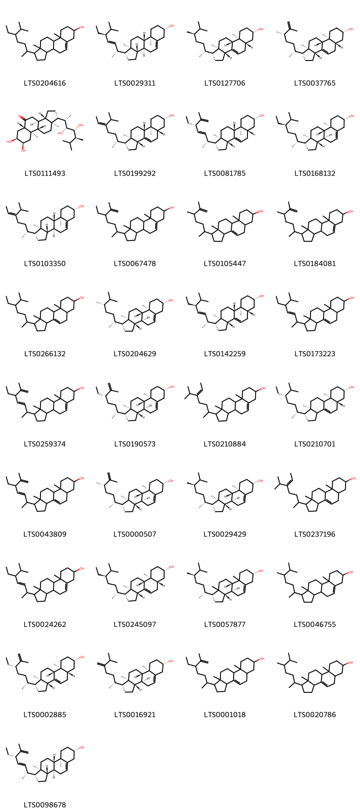{ width=100% }
    <figcaption>Hình ảnh cấu trúc hóa học của 33 hoạt chất thuộc nhóm Steroids and steroid derivatives gồm ['stigmast-5-en-3-ol, (3β)- (LTS0204616)', 'phytosterol (LTS0029311)', '(1r,3ar,5as,7s,9as,9br,11ar)-1-[(2r,5r)-5,6-dimethylheptan-2-yl]-9a,11a-dimethyl-1h,2h,3h,3ah,5h,5ah,6h,7h,8h,9h,9bh,10h,11h-cyclopenta[a]phenanthren-7-ol (LTS0127706)', '(1r,3ar,5as,7s,9as,9br,11ar)-1-[(2r,5s)-5,6-dimethylhept-6-en-2-yl]-9a,11a-dimethyl-1h,2h,3h,3ah,5h,5ah,6h,7h,8h,9h,9bh,10h,11h-cyclopenta[a]phenanthren-7-ol (LTS0037765)', 'castasterone (LTS0111493)', 'delta7-avenasterol (LTS0199292)', '(1r,3ar,5as,7s,9as,9br,11ar)-1-[(2r,3e,5s)-5-ethyl-6-methylhepta-3,6-dien-2-yl]-9a,11a-dimethyl-1h,2h,3h,3ah,5h,5ah,6h,7h,8h,9h,9bh,10h,11h-cyclopenta[a]phenanthren-7-ol (LTS0081785)', 'sitosterol (LTS0168132)', 'avenasterol (LTS0103350)', '1-(5-ethyl-6-methylhept-6-en-2-yl)-9a,11a-dimethyl-1h,2h,3h,3ah,3bh,4h,6h,7h,8h,9h,9bh,10h,11h-cyclopenta[a]phenanthren-7-ol (LTS0067478)', '1-(5,6-dimethylhept-6-en-2-yl)-9a,11a-dimethyl-1h,2h,3h,3ah,5h,5ah,6h,7h,8h,9h,9bh,10h,11h-cyclopenta[a]phenanthren-7-ol (LTS0105447)', '1-(5,6-dimethylhept-6-en-2-yl)-9a,11a-dimethyl-1h,2h,3h,3ah,3bh,4h,6h,7h,8h,9h,9bh,10h,11h-cyclopenta[a]phenanthren-7-ol (LTS0184081)', '1-(5-ethyl-6-methylheptan-2-yl)-9a,11a-dimethyl-1h,2h,3h,3ah,5h,5ah,6h,7h,8h,9h,9bh,10h,11h-cyclopenta[a]phenanthren-7-ol (LTS0266132)', '22,23-dihydrobrassicasterol (LTS0204629)', 'chondrillasterol (LTS0142259)', '1-(5-ethyl-6-methylhept-3-en-2-yl)-9a,11a-dimethyl-1h,2h,3h,3ah,5h,5ah,6h,7h,8h,9h,9bh,10h,11h-cyclopenta[a]phenanthren-7-ol (LTS0173223)', '1-(5-ethyl-6-methylhepta-3,6-dien-2-yl)-9a,11a-dimethyl-1h,2h,3h,3ah,3bh,4h,6h,7h,8h,9h,9bh,10h,11h-cyclopenta[a]phenanthren-7-ol (LTS0259374)', '(1r,3as,3bs,7s,9ar,9bs,11ar)-1-[(2r,5s)-5-ethyl-6-methylhept-6-en-2-yl]-9a,11a-dimethyl-1h,2h,3h,3ah,3bh,4h,6h,7h,8h,9h,9bh,10h,11h-cyclopenta[a]phenanthren-7-ol (LTS0190573)', '1-(5-isopropylhept-5-en-2-yl)-9a,11a-dimethyl-1h,2h,3h,3ah,3bh,4h,6h,7h,8h,9h,9bh,10h,11h-cyclopenta[a]phenanthren-7-ol (LTS0210884)', '(1r,5as,7s,9as,11ar)-1-[(2r,5s)-5-ethyl-6-methylheptan-2-yl]-9a,11a-dimethyl-1h,2h,3h,3ah,5h,5ah,6h,7h,8h,9h,9bh,10h,11h-cyclopenta[a]phenanthren-7-ol (LTS0210701)', '1-(5-ethyl-6-methylhepta-3,6-dien-2-yl)-9a,11a-dimethyl-1h,2h,3h,3ah,5h,5ah,6h,7h,8h,9h,9bh,10h,11h-cyclopenta[a]phenanthren-7-ol (LTS0043809)', '(1r,3as,3bs,7s,9ar,9bs,11ar)-1-[(2r,5s)-5,6-dimethylhept-6-en-2-yl]-9a,11a-dimethyl-1h,2h,3h,3ah,3bh,4h,6h,7h,8h,9h,9bh,10h,11h-cyclopenta[a]phenanthren-7-ol (LTS0000507)', 'campesterol (LTS0029429)', 'avenasterol (LTS0237196)', 'stigmasterol (LTS0024262)', '(3β,5α)-stigmast-7-en-3-ol (LTS0245097)', '(1r,3as,3bs,7s,9bs)-1-[(2r,5r)-5,6-dimethylheptan-2-yl]-9a,11a-dimethyl-1h,2h,3h,3ah,3bh,4h,6h,7h,8h,9h,9bh,10h,11h-cyclopenta[a]phenanthren-7-ol (LTS0057877)', 'campesterol (LTS0046755)', '(1r,3ar,5as,7s,9as,9br,11ar)-1-[(2r,5s)-5-ethyl-6-methylhept-6-en-2-yl]-9a,11a-dimethyl-1h,2h,3h,3ah,5h,5ah,6h,7h,8h,9h,9bh,10h,11h-cyclopenta[a]phenanthren-7-ol (LTS0002885)', '24-methylenecholesterol (LTS0016921)', '1-(5-ethyl-6-methylhept-6-en-2-yl)-9a,11a-dimethyl-1h,2h,3h,3ah,5h,5ah,6h,7h,8h,9h,9bh,10h,11h-cyclopenta[a]phenanthren-7-ol (LTS0001018)', 'fungisterol (LTS0020786)', '(1r,3as,3bs,7s,9ar,9bs,11ar)-1-[(2r,3e,5s)-5-ethyl-6-methylhepta-3,6-dien-2-yl]-9a,11a-dimethyl-1h,2h,3h,3ah,3bh,4h,6h,7h,8h,9h,9bh,10h,11h-cyclopenta[a]phenanthren-7-ol (LTS0098678)'].</figcaption>
</figure>

---

### Dược dân tộc học

Danh sách các quốc gia có sử dụng *Lagenaria siceraria* trong điều trị các bệnh. 

| Country            | Disease                                                      | Bệnh                                                                                     |
|:-------------------|:-------------------------------------------------------------|:-----------------------------------------------------------------------------------------|
| China              | Antidote, Emetic, Purgative, Diuretic, Refrigerant, Diuretic | Thuốc giải độc, Thuốc lợi tiểu, Thuốc tẩy, Thuốc lợi tiểu, Chất làm lạnh, Thuốc lợi tiểu |
| Dominican Republic | Purgative                                                    | Thuốc xổ                                                                                 |
| Elsewhere          | Alexiteric, Emetic, Purgative                                | Alexiteric, Emetic, Purgative                                                            |
| Haiti              | Diuretic                                                     | Thuốc lợi tiêu                                                                           |
| Hawaii             | Laxative                                                     | Nhuận trường                                                                             |
| Iraq               | Refrigerant                                                  | Chất làm lạnh                                                                            |
| Turkey             | Diuretic, Emetic, Litholytic, Purgative                      | Thuốc lợi tiểu, Emetic, Litholytic, Purgative                                            |

---

---
## Lagenaria vulgaris
### Thông tin về thực vật

!!! info "Phân loại thực vật của *Lagenaria siceraria* từ GIBF:"
    - **Kingdom:** Plantae
    - **Phylum:** Tracheophyta
    - **Order:** Cucurbitales
    - **Family:** Cucurbitaceae
    - **Genus:** Lagenaria
    - **Species:** *Lagenaria siceraria*

 

| Label (VI)   | Label (EN)   | Scientific Name    | Descriptions (VI)   | Descriptions (EN)   | Also Known As (VI)   | Also Known As (EN)   |
|:-------------|:-------------|:-------------------|:--------------------|:--------------------|:---------------------|:---------------------|
| N/A          | N/A          | Lagenaria vulgaris | loài thực vật       | species of plant    | ['']                 | ['']                 |

#### Phân bố trên thế giới

**Từ CSDL GIBF** nan, Brazil, Japan, Czechia, Central African Republic, Bangladesh, New Caledonia, China, Mali, Türkiye, Ecuador, Spain, Poland, Puerto Rico, United States of America, Colombia, Nigeria, Argentina, unknown or invalid, Ethiopia, Mexico, Congo, Democratic Republic of the, Germany, Sudan, Ukraine, Italy, India, Bulgaria, Bolivia (Plurinational State of)

#### Phân bố tại Việt Nam

**Từ CSDL GIBF**: Không có ghi nhận ở Việt Nam

---
### Thành phần hóa học
        
- Theo cơ sở dữ liệu lotus: Từ loài *Lagenaria siceraria* đã phân lập và xác định được Chưa có hoạt chất nào được phân lập. hoạt chất thuộc về các nhóm Không có hoạt chất nào được phân lập. 

Không có hình ảnh nào được tạo ra

---

### Dược dân tộc học

Danh sách các quốc gia có sử dụng *Lagenaria siceraria* trong điều trị các bệnh. 

| Country   | Disease                             | Bệnh                                                  |
|:----------|:------------------------------------|:------------------------------------------------------|
| Venezuela | Poison, Tonic, Vermifuge, Vermifuge | Thuốc độc, thuốc bổ, thuốc diệt giun, thuốc diệt giun |

---

# Chi Benincasa

??? note "Danh sách các dược liệu thuộc chi"
    
	 - *Benincasa cerifera*
	 - *Benincasa hiida*

---
## Benincasa cerifera
### Thông tin về thực vật

!!! info "Phân loại thực vật của *Benincasa hispida* từ GIBF:"
    - **Kingdom:** Plantae
    - **Phylum:** Tracheophyta
    - **Order:** Cucurbitales
    - **Family:** Cucurbitaceae
    - **Genus:** Benincasa
    - **Species:** *Benincasa hispida*

 

| Label (VI)   | Label (EN)   | Scientific Name    | Descriptions (VI)   | Descriptions (EN)   | Also Known As (VI)   | Also Known As (EN)   |
|:-------------|:-------------|:-------------------|:--------------------|:--------------------|:---------------------|:---------------------|
| N/A          | N/A          | Benincasa cerifera |                     | species of plant    | ['']                 | ['']                 |

#### Phân bố trên thế giới

**Từ CSDL GIBF** nan, Sri Lanka, Hong Kong, Japan, United States of America, Tonga, Indonesia, Malaysia, New Caledonia, Bangladesh, China, India, Samoa, Netherlands

#### Phân bố tại Việt Nam

**Từ CSDL GIBF**: Không có ghi nhận ở Việt Nam

---
### Thành phần hóa học
        
- Theo cơ sở dữ liệu lotus: Từ loài *Benincasa hispida* đã phân lập và xác định được Chưa có hoạt chất nào được phân lập. hoạt chất thuộc về các nhóm Không có hoạt chất nào được phân lập. 

Không có hình ảnh nào được tạo ra

---

### Dược dân tộc học

Danh sách các quốc gia có sử dụng *Benincasa hispida* trong điều trị các bệnh. 

| Country   | Disease            | Bệnh               |
|:----------|:-------------------|:-------------------|
| China     | Diuretic           | Thuốc lợi tiêu     |
| Elsewhere | Aperient, Diuretic | Aperient, lợi tiểu |

---

---
## Benincasa hiida
### Thông tin về thực vật

!!! info "Phân loại thực vật của *N/A* từ GIBF:"
    - **Kingdom:** Plantae
    - **Phylum:** Tracheophyta
    - **Order:** Cucurbitales
    - **Family:** Cucurbitaceae
    - **Genus:** Benincasa
    - **Species:** *N/A*

 

| Label (VI)   | Label (EN)   | Scientific Name    | Descriptions (VI)   | Descriptions (EN)   | Also Known As (VI)   | Also Known As (EN)   |
|:-------------|:-------------|:-------------------|:--------------------|:--------------------|:---------------------|:---------------------|
| N/A          | N/A          | Benincasa cerifera |                     | species of plant    | ['']                 | ['']                 |

#### Phân bố trên thế giới

**Từ CSDL GIBF** nan, Brazil, Viet Nam, Japan, Nepal, China, Papua New Guinea, Thailand, Puerto Rico, Sri Lanka, United States of America, Tonga, Indonesia, Dominican Republic, Argentina, unknown or invalid, Fiji, Hong Kong, Mexico, Maldives, American Samoa, Chinese Taipei, Malaysia, Philippines, Solomon Islands, Singapore, Portugal, Cook Islands, Timor-Leste, Australia, Myanmar, India, Northern Mariana Islands, Samoa

#### Phân bố tại Việt Nam

**Từ CSDL GIBF**: Ha Giang, Quảng Nam, Lai Chau, Son La

---
### Thành phần hóa học
        
- Theo cơ sở dữ liệu lotus: Từ loài *N/A* đã phân lập và xác định được Chưa có hoạt chất nào được phân lập. hoạt chất thuộc về các nhóm Không có hoạt chất nào được phân lập. 

Không có hình ảnh nào được tạo ra

---

### Dược dân tộc học

Danh sách các quốc gia có sử dụng *N/A* trong điều trị các bệnh. 

| Country   | Disease                                                                            | Bệnh                                                                                                          |
|:----------|:-----------------------------------------------------------------------------------|:--------------------------------------------------------------------------------------------------------------|
| China     | Diuretic, Expectorant, Tonic, Demulcent, Diuretic, Laxative, Cosmetic, Suppurative | Thuốc lợi tiểu, thuốc long đờm, thuốc bổ, thuốc làm dịu, thuốc lợi tiểu, thuốc nhuận tràng, mỹ phẩm, thuốc bổ |
| Elsewhere | Vermifuge                                                                          | Thuốc diệt sán                                                                                                |
| Iraq      | Vermifuge                                                                          | Thuốc diệt sán                                                                                                |

---

# Chi Kedrostis

??? note "Danh sách các dược liệu thuộc chi"
    
	 - *Kedrostis rostrata*

---
## Kedrostis rostrata
### Thông tin về thực vật

!!! info "Phân loại thực vật của *Kedrostis foetidissima* từ GIBF:"
    - **Kingdom:** Plantae
    - **Phylum:** Tracheophyta
    - **Order:** Cucurbitales
    - **Family:** Cucurbitaceae
    - **Genus:** Kedrostis
    - **Species:** *Kedrostis foetidissima*

 

| Label (VI)   | Label (EN)   | Scientific Name    | Descriptions (VI)   | Descriptions (EN)   | Also Known As (VI)   | Also Known As (EN)   |
|:-------------|:-------------|:-------------------|:--------------------|:--------------------|:---------------------|:---------------------|
| N/A          | N/A          | Kedrostis rostrata | loài thực vật       | species of plant    | ['']                 | ['']                 |

#### Phân bố trên thế giới

**Từ CSDL GIBF** Sri Lanka, nan, Myanmar, India, France

#### Phân bố tại Việt Nam

**Từ CSDL GIBF**: Không có ghi nhận ở Việt Nam

---
### Thành phần hóa học
        
- Theo cơ sở dữ liệu lotus: Từ loài *Kedrostis foetidissima* đã phân lập và xác định được Chưa có hoạt chất nào được phân lập. hoạt chất thuộc về các nhóm Không có hoạt chất nào được phân lập. 

Không có hình ảnh nào được tạo ra

---

### Dược dân tộc học

Danh sách các quốc gia có sử dụng *Kedrostis foetidissima* trong điều trị các bệnh. 

| Country   | Disease   | Bệnh                 |
|:----------|:----------|:---------------------|
| Elsewhere | Demulcent | dịu, giảm kích thích |

---

# Chi Ibervillea

??? note "Danh sách các dược liệu thuộc chi"
    
	 - *Ibervillea lindheimeri*

---
## Ibervillea lindheimeri
### Thông tin về thực vật

!!! info "Phân loại thực vật của *Ibervillea lindheimeri* từ GIBF:"
    - **Kingdom:** Plantae
    - **Phylum:** Tracheophyta
    - **Order:** Cucurbitales
    - **Family:** Cucurbitaceae
    - **Genus:** Ibervillea
    - **Species:** *Ibervillea lindheimeri*

 

| Label (VI)   | Label (EN)   | Scientific Name        | Descriptions (VI)   | Descriptions (EN)   | Also Known As (VI)   | Also Known As (EN)   |
|:-------------|:-------------|:-----------------------|:--------------------|:--------------------|:---------------------|:---------------------|
| N/A          | N/A          | Ibervillea lindheimeri | loài thực vật       | species of plant    | ['']                 | ['']                 |

#### Phân bố trên thế giới

**Từ CSDL GIBF** United States of America

#### Phân bố tại Việt Nam

**Từ CSDL GIBF**: Không có ghi nhận ở Việt Nam

---
### Thành phần hóa học
        
- Theo cơ sở dữ liệu lotus: Từ loài *Ibervillea lindheimeri* đã phân lập và xác định được Chưa có hoạt chất nào được phân lập. hoạt chất thuộc về các nhóm Không có hoạt chất nào được phân lập. 

Không có hình ảnh nào được tạo ra

---

### Dược dân tộc học

Danh sách các quốc gia có sử dụng *Ibervillea lindheimeri* trong điều trị các bệnh. 

| Country   | Disease   | Bệnh     |
|:----------|:----------|:---------|
| Mexico    | Poison    | Chất độc |

---

# Chi Cayaponia

??? note "Danh sách các dược liệu thuộc chi"
    
	 - *Cayaponia caboclea*
	 - *Cayaponia citrullifolia*
	 - *Cayaponia eelina*
	 - *Cayaponia pedata*
	 - *Cayaponia racemosa*

---
## Cayaponia caboclea
### Thông tin về thực vật

!!! info "Phân loại thực vật của *Cayaponia cabocla* từ GIBF:"
    - **Kingdom:** Plantae
    - **Phylum:** Tracheophyta
    - **Order:** Cucurbitales
    - **Family:** Cucurbitaceae
    - **Genus:** Cayaponia
    - **Species:** *Cayaponia cabocla*

 

| Label (VI)   | Label (EN)   | Scientific Name        | Descriptions (VI)   | Descriptions (EN)   | Also Known As (VI)   | Also Known As (EN)   |
|:-------------|:-------------|:-----------------------|:--------------------|:--------------------|:---------------------|:---------------------|
| N/A          | N/A          | Ibervillea lindheimeri | loài thực vật       | species of plant    | ['']                 | ['']                 |

#### Phân bố trên thế giới

**Từ CSDL GIBF** nan, Brazil

#### Phân bố tại Việt Nam

**Từ CSDL GIBF**: Không có ghi nhận ở Việt Nam

---
### Thành phần hóa học
        
- Theo cơ sở dữ liệu lotus: Từ loài *Cayaponia cabocla* đã phân lập và xác định được Chưa có hoạt chất nào được phân lập. hoạt chất thuộc về các nhóm Không có hoạt chất nào được phân lập. 

Không có hình ảnh nào được tạo ra

---

### Dược dân tộc học

Danh sách các quốc gia có sử dụng *Cayaponia cabocla* trong điều trị các bệnh. 

| Country       | Disease   | Bệnh         |
|:--------------|:----------|:-------------|
| Latin America | Laxative  | Nhuận trường |

---

---
## Cayaponia citrullifolia
### Thông tin về thực vật

!!! info "Phân loại thực vật của *Cayaponia citrullifolia* từ GIBF:"
    - **Kingdom:** Plantae
    - **Phylum:** Tracheophyta
    - **Order:** Cucurbitales
    - **Family:** Cucurbitaceae
    - **Genus:** Cayaponia
    - **Species:** *Cayaponia citrullifolia*

 

| Label (VI)   | Label (EN)   | Scientific Name         | Descriptions (VI)   | Descriptions (EN)   | Also Known As (VI)   | Also Known As (EN)   |
|:-------------|:-------------|:------------------------|:--------------------|:--------------------|:---------------------|:---------------------|
| N/A          | N/A          | Cayaponia citrullifolia | loài thực vật       | species of plant    | ['']                 | ['']                 |

#### Phân bố trên thế giới

**Từ CSDL GIBF** nan, Brazil, Paraguay, Argentina, Bolivia (Plurinational State of), Uruguay

#### Phân bố tại Việt Nam

**Từ CSDL GIBF**: Không có ghi nhận ở Việt Nam

---
### Thành phần hóa học
        
- Theo cơ sở dữ liệu lotus: Từ loài *Cayaponia citrullifolia* đã phân lập và xác định được Chưa có hoạt chất nào được phân lập. hoạt chất thuộc về các nhóm Không có hoạt chất nào được phân lập. 

Không có hình ảnh nào được tạo ra

---

### Dược dân tộc học

Danh sách các quốc gia có sử dụng *Cayaponia citrullifolia* trong điều trị các bệnh. 

| Country   | Disease       | Bệnh          |
|:----------|:--------------|:--------------|
| Paraguay  | Antifertility | Chống lão hóa |

---

---
## Cayaponia eelina
### Thông tin về thực vật

!!! info "Phân loại thực vật của *N/A* từ GIBF:"
    - **Kingdom:** Plantae
    - **Phylum:** Tracheophyta
    - **Order:** Cucurbitales
    - **Family:** Cucurbitaceae
    - **Genus:** Cayaponia
    - **Species:** *N/A*

 

| Label (VI)   | Label (EN)   | Scientific Name         | Descriptions (VI)   | Descriptions (EN)   | Also Known As (VI)   | Also Known As (EN)   |
|:-------------|:-------------|:------------------------|:--------------------|:--------------------|:---------------------|:---------------------|
| N/A          | N/A          | Cayaponia citrullifolia | loài thực vật       | species of plant    | ['']                 | ['']                 |

#### Phân bố trên thế giới

**Từ CSDL GIBF** Nicaragua, Mexico, Brazil, United States of America, El Salvador, Guadeloupe, Gambia, Dominican Republic, Colombia, Argentina, French Guiana, Uruguay, Puerto Rico

#### Phân bố tại Việt Nam

**Từ CSDL GIBF**: Không có ghi nhận ở Việt Nam

---
### Thành phần hóa học
        
- Theo cơ sở dữ liệu lotus: Từ loài *N/A* đã phân lập và xác định được Chưa có hoạt chất nào được phân lập. hoạt chất thuộc về các nhóm Không có hoạt chất nào được phân lập. 

Không có hình ảnh nào được tạo ra

---

### Dược dân tộc học

Danh sách các quốc gia có sử dụng *N/A* trong điều trị các bệnh. 

| Country   | Disease                    | Bệnh                                |
|:----------|:---------------------------|:------------------------------------|
| Brazil    | Diuretic, Tonic, Purgative | Thuốc lợi tiểu, thuốc bổ, thuốc tẩy |

---

---
## Cayaponia pedata
### Thông tin về thực vật

!!! info "Phân loại thực vật của *Cayaponia pedata* từ GIBF:"
    - **Kingdom:** Plantae
    - **Phylum:** Tracheophyta
    - **Order:** Cucurbitales
    - **Family:** Cucurbitaceae
    - **Genus:** Cayaponia
    - **Species:** *Cayaponia pedata*

 

| Label (VI)   | Label (EN)   | Scientific Name   | Descriptions (VI)   | Descriptions (EN)   | Also Known As (VI)   | Also Known As (EN)   |
|:-------------|:-------------|:------------------|:--------------------|:--------------------|:---------------------|:---------------------|
| N/A          | N/A          | Cayaponia pedata  | loài thực vật       | species of plant    | ['']                 | ['']                 |

#### Phân bố trên thế giới

**Từ CSDL GIBF** Colombia, Brazil

#### Phân bố tại Việt Nam

**Từ CSDL GIBF**: Không có ghi nhận ở Việt Nam

---
### Thành phần hóa học
        
- Theo cơ sở dữ liệu lotus: Từ loài *Cayaponia pedata* đã phân lập và xác định được Chưa có hoạt chất nào được phân lập. hoạt chất thuộc về các nhóm Không có hoạt chất nào được phân lập. 

Không có hình ảnh nào được tạo ra

---

### Dược dân tộc học

Danh sách các quốc gia có sử dụng *Cayaponia pedata* trong điều trị các bệnh. 

| Country   | Disease   | Bệnh     |
|:----------|:----------|:---------|
| Elsewhere | Purgative | Thuốc xổ |

---

---
## Cayaponia racemosa
### Thông tin về thực vật

!!! info "Phân loại thực vật của *Cayaponia racemosa* từ GIBF:"
    - **Kingdom:** Plantae
    - **Phylum:** Tracheophyta
    - **Order:** Cucurbitales
    - **Family:** Cucurbitaceae
    - **Genus:** Cayaponia
    - **Species:** *Cayaponia racemosa*

 

| Label (VI)   | Label (EN)   | Scientific Name    | Descriptions (VI)   | Descriptions (EN)   | Also Known As (VI)   | Also Known As (EN)   |
|:-------------|:-------------|:-------------------|:--------------------|:--------------------|:---------------------|:---------------------|
| N/A          | N/A          | Cayaponia racemosa | loài thực vật       | species of plant    | ['']                 | ['']                 |

#### Phân bố trên thế giới

**Từ CSDL GIBF** Brazil, Guatemala, Puerto Rico, Jamaica, Costa Rica, Dominican Republic, Colombia, Guyana, Cuba, French Guiana, Mexico, El Salvador, Panama, Belize, Nicaragua, Martinique, Bahamas, Peru, Montserrat, Venezuela (Bolivarian Republic of)

#### Phân bố tại Việt Nam

**Từ CSDL GIBF**: Không có ghi nhận ở Việt Nam

---
### Thành phần hóa học
        
- Theo cơ sở dữ liệu lotus: Từ loài *Cayaponia racemosa* đã phân lập và xác định được 4 hoạt chất thuộc về các nhóm Steroids and steroid derivatives. 

|    | chemicalTaxonomyClassyfireClass   |   smiles_count |
|---:|:----------------------------------|---------------:|
|  0 | Steroids and steroid derivatives  |              4 |

#### Nhóm Steroids and steroid derivatives
<figure markdown="span">
    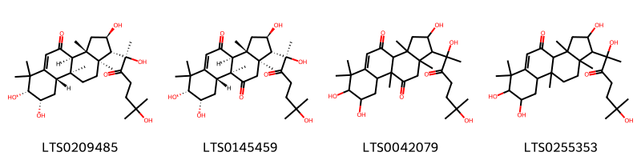{ width=100% }
    <figcaption>Hình ảnh cấu trúc hóa học của 4 hoạt chất thuộc nhóm Steroids and steroid derivatives gồm ['(1r,2r,3as,3br,7r,8s,9as,9bs,11ar)-1-[(2r)-2,6-dihydroxy-6-methyl-3-oxoheptan-2-yl]-2,7,8-trihydroxy-3a,6,6,9b,11a-pentamethyl-1h,2h,3h,3bh,7h,8h,9h,9ah,10h,11h-cyclopenta[a]phenanthren-4-one (LTS0209485)', '(1r,2r,3as,3bs,7r,8s,9ar,9bs,11ar)-1-[(2r)-2,6-dihydroxy-6-methyl-3-oxoheptan-2-yl]-2,7,8-trihydroxy-3a,6,6,9b,11a-pentamethyl-1h,2h,3h,3bh,7h,8h,9h,9ah,11h-cyclopenta[a]phenanthrene-4,10-dione (LTS0145459)', '1-(2,6-dihydroxy-6-methyl-3-oxoheptan-2-yl)-2,7,8-trihydroxy-3a,6,6,9b,11a-pentamethyl-1h,2h,3h,3bh,7h,8h,9h,9ah,11h-cyclopenta[a]phenanthrene-4,10-dione (LTS0042079)', '1-(2,6-dihydroxy-6-methyl-3-oxoheptan-2-yl)-2,7,8-trihydroxy-3a,6,6,9b,11a-pentamethyl-1h,2h,3h,3bh,7h,8h,9h,9ah,10h,11h-cyclopenta[a]phenanthren-4-one (LTS0255353)'].</figcaption>
</figure>

---

### Dược dân tộc học

Danh sách các quốc gia có sử dụng *Cayaponia racemosa* trong điều trị các bệnh. 

| Country   | Disease   | Bệnh     |
|:----------|:----------|:---------|
| Salvador  | Poison    | Chất độc |

---

# Chi Trichosanthes

??? note "Danh sách các dược liệu thuộc chi"
    
	 - *Trichosanthes anguina*
	 - *Trichosanthes bracteata*
	 - *Trichosanthes brasteata*
	 - *Trichosanthes cordata*
	 - *Trichosanthes cucumerina*
	 - *Trichosanthes cucumerioides*
	 - *Trichosanthes cucumeroides*
	 - *Trichosanthes dioica*
	 - *Trichosanthes kirilowii*
	 - *Trichosanthes multiloba*
	 - *Trichosanthes nervifolia*
	 - *Trichosanthes palmata*
	 - *Trichosanthes wallichiana*

---
## Trichosanthes anguina
### Thông tin về thực vật

!!! info "Phân loại thực vật của *Trichosanthes cucumerina* từ GIBF:"
    - **Kingdom:** Plantae
    - **Phylum:** Tracheophyta
    - **Order:** Cucurbitales
    - **Family:** Cucurbitaceae
    - **Genus:** Trichosanthes
    - **Species:** *Trichosanthes cucumerina*

 

| Label (VI)   | Label (EN)   | Scientific Name       | Descriptions (VI)   | Descriptions (EN)   | Also Known As (VI)   | Also Known As (EN)   |
|:-------------|:-------------|:----------------------|:--------------------|:--------------------|:---------------------|:---------------------|
| N/A          | N/A          | Trichosanthes anguina | loài thực vật       | species of plant    | ['']                 | ['']                 |

#### Phân bố trên thế giới

**Từ CSDL GIBF** nan, Brazil, Senegal, Guadeloupe, Bangladesh, China, Madagascar, Cameroon, Ghana, Sri Lanka, United States of America, Indonesia, Seychelles, Nigeria, Argentina, unknown or invalid, Mexico, Benin, Congo, Democratic Republic of the, Algeria, Norway, Chinese Taipei, Malaysia, Philippines, Mayotte, Germany, Australia, Côte d’Ivoire, Myanmar, India, France, Guyana

#### Phân bố tại Việt Nam

**Từ CSDL GIBF**: Không có ghi nhận ở Việt Nam

---
### Thành phần hóa học
        
- Theo cơ sở dữ liệu lotus: Từ loài *Trichosanthes cucumerina* đã phân lập và xác định được 5 hoạt chất thuộc về các nhóm Isoflavonoids, Flavonoids. 

|    | chemicalTaxonomyClassyfireClass   |   smiles_count |
|---:|:----------------------------------|---------------:|
|  0 | Flavonoids                        |              4 |
|  1 | Isoflavonoids                     |              1 |

#### Nhóm Flavonoids
<figure markdown="span">
    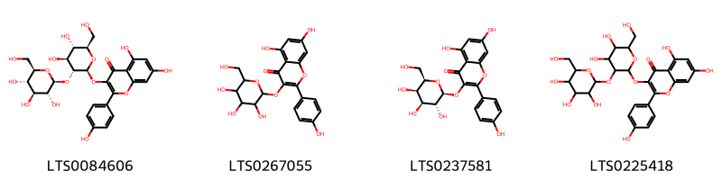{ width=100% }
    <figcaption>Hình ảnh cấu trúc hóa học của 4 hoạt chất thuộc nhóm Flavonoids gồm ['kaempferol 3-o-sophoroside (LTS0084606)', 'trifolin (LTS0267055)', 'trifolin (LTS0237581)', '3-{[4,5-dihydroxy-6-(hydroxymethyl)-3-{[3,4,5-trihydroxy-6-(hydroxymethyl)oxan-2-yl]oxy}oxan-2-yl]oxy}-5,7-dihydroxy-2-(4-hydroxyphenyl)chromen-4-one (LTS0225418)'].</figcaption>
</figure>
#### Nhóm Isoflavonoids
<figure markdown="span">
    { width=100% }
    <figcaption>Hình ảnh cấu trúc hóa học của 1 hoạt chất thuộc nhóm Isoflavonoids gồm ['(2s,3s,4s,5s,6r)-2-{[5,6-dimethoxy-3-(6-methoxy-2h-1,3-benzodioxol-5-yl)-4-oxochromen-7-yl]oxy}-4,5-dihydroxy-6-(hydroxymethyl)oxan-3-yl (2e)-3-(4-hydroxyphenyl)prop-2-enoate (LTS0083317)'].</figcaption>
</figure>

---

### Dược dân tộc học

Danh sách các quốc gia có sử dụng *Trichosanthes cucumerina* trong điều trị các bệnh. 

| Country     | Disease                      | Bệnh                         |
|:------------|:-----------------------------|:-----------------------------|
| Elsewhere   | Apertif, Vermifuge           | Apertif, Vermifuge           |
| India       | Purgative                    | Thuốc xổ                     |
| Philippines | Emetic, Purgative, Vermifuge | Emetic, Purgative, Vermifuge |

---

---
## Trichosanthes bracteata
### Thông tin về thực vật

!!! info "Phân loại thực vật của *Trichosanthes bracteata* từ GIBF:"
    - **Kingdom:** Plantae
    - **Phylum:** Tracheophyta
    - **Order:** Cucurbitales
    - **Family:** Cucurbitaceae
    - **Genus:** Trichosanthes
    - **Species:** *Trichosanthes bracteata*

 

| Label (VI)   | Label (EN)   | Scientific Name         | Descriptions (VI)   | Descriptions (EN)   | Also Known As (VI)   | Also Known As (EN)   |
|:-------------|:-------------|:------------------------|:--------------------|:--------------------|:---------------------|:---------------------|
| N/A          | N/A          | Trichosanthes bracteata | loài thực vật       | species of plant    | ['']                 | ['']                 |

#### Phân bố trên thế giới

**Từ CSDL GIBF** nan, Sri Lanka, Viet Nam, Japan, Vanuatu, Indonesia, Chinese Taipei, China, India, unknown or invalid, Papua New Guinea, Thailand

#### Phân bố tại Việt Nam

**Từ CSDL GIBF**: Không có ghi nhận ở Việt Nam

---
### Thành phần hóa học
        
- Theo cơ sở dữ liệu lotus: Từ loài *Trichosanthes bracteata* đã phân lập và xác định được Chưa có hoạt chất nào được phân lập. hoạt chất thuộc về các nhóm Không có hoạt chất nào được phân lập. 

Không có hình ảnh nào được tạo ra

---

### Dược dân tộc học

Danh sách các quốc gia có sử dụng *Trichosanthes bracteata* trong điều trị các bệnh. 

| Country   | Disease     | Bệnh     |
|:----------|:------------|:---------|
| Japan*    | Antitussive | Chống ho |

---

---
## Trichosanthes brasteata
### Thông tin về thực vật

!!! info "Phân loại thực vật của *Trichosanthes bracteata* từ GIBF:"
    - **Kingdom:** Plantae
    - **Phylum:** Tracheophyta
    - **Order:** Cucurbitales
    - **Family:** Cucurbitaceae
    - **Genus:** Trichosanthes
    - **Species:** *Trichosanthes bracteata*

 

| Label (VI)   | Label (EN)   | Scientific Name         | Descriptions (VI)   | Descriptions (EN)   | Also Known As (VI)   | Also Known As (EN)   |
|:-------------|:-------------|:------------------------|:--------------------|:--------------------|:---------------------|:---------------------|
| N/A          | N/A          | Trichosanthes bracteata | loài thực vật       | species of plant    | ['']                 | ['']                 |

#### Phân bố trên thế giới

**Từ CSDL GIBF** nan, Sri Lanka, Viet Nam, Japan, Vanuatu, Indonesia, Chinese Taipei, China, India, unknown or invalid, Papua New Guinea, Thailand

#### Phân bố tại Việt Nam

**Từ CSDL GIBF**: Không có ghi nhận ở Việt Nam

---
### Thành phần hóa học
        
- Theo cơ sở dữ liệu lotus: Từ loài *Trichosanthes bracteata* đã phân lập và xác định được Chưa có hoạt chất nào được phân lập. hoạt chất thuộc về các nhóm Không có hoạt chất nào được phân lập. 

Không có hình ảnh nào được tạo ra

---

### Dược dân tộc học

Danh sách các quốc gia có sử dụng *Trichosanthes bracteata* trong điều trị các bệnh. 

| Country   |   Disease | Bệnh   |
|:----------|----------:|:-------|
| Japan*    |       nan | Ở đây  |

---

---
## Trichosanthes cordata
### Thông tin về thực vật

!!! info "Phân loại thực vật của *Trichosanthes cordata* từ GIBF:"
    - **Kingdom:** Plantae
    - **Phylum:** Tracheophyta
    - **Order:** Cucurbitales
    - **Family:** Cucurbitaceae
    - **Genus:** Trichosanthes
    - **Species:** *Trichosanthes cordata*

 

| Label (VI)   | Label (EN)   | Scientific Name       | Descriptions (VI)   | Descriptions (EN)   | Also Known As (VI)   | Also Known As (EN)   |
|:-------------|:-------------|:----------------------|:--------------------|:--------------------|:---------------------|:---------------------|
| N/A          | N/A          | Trichosanthes cordata | loài thực vật       | species of plant    | ['']                 | ['']                 |

#### Phân bố trên thế giới

**Từ CSDL GIBF** nan, Bhutan, Bangladesh, Nepal, Indonesia, China, Myanmar, India

#### Phân bố tại Việt Nam

**Từ CSDL GIBF**: Không có ghi nhận ở Việt Nam

---
### Thành phần hóa học
        
- Theo cơ sở dữ liệu lotus: Từ loài *Trichosanthes cordata* đã phân lập và xác định được Chưa có hoạt chất nào được phân lập. hoạt chất thuộc về các nhóm Không có hoạt chất nào được phân lập. 

Không có hình ảnh nào được tạo ra

---

### Dược dân tộc học

Danh sách các quốc gia có sử dụng *Trichosanthes cordata* trong điều trị các bệnh. 

| Country   | Disease          | Bệnh                      |
|:----------|:-----------------|:--------------------------|
| Elsewhere | Stimulant, Tonic | Chất kích thích, Thuốc bổ |
| India     | Tonic            | (thuộc) trương lực        |

---

---
## Trichosanthes cucumerina
### Thông tin về thực vật

!!! info "Phân loại thực vật của *Trichosanthes cucumerina* từ GIBF:"
    - **Kingdom:** Plantae
    - **Phylum:** Tracheophyta
    - **Order:** Cucurbitales
    - **Family:** Cucurbitaceae
    - **Genus:** Trichosanthes
    - **Species:** *Trichosanthes cucumerina*

 

| Label (VI)   | Label (EN)   | Scientific Name          | Descriptions (VI)   | Descriptions (EN)                             | Also Known As (VI)   | Also Known As (EN)   |
|:-------------|:-------------|:-------------------------|:--------------------|:----------------------------------------------|:---------------------|:---------------------|
| N/A          | N/A          | Trichosanthes cucumerina |                     | species of tropical vine native to South Asia | ['']                 | ['Ash gouard']       |

#### Phân bố trên thế giới

**Từ CSDL GIBF** Brazil, Viet Nam, Guadeloupe, Bangladesh, Nepal, China, Mali, New Zealand, Papua New Guinea, Thailand, Madagascar, Sri Lanka, Réunion, United States of America, Indonesia, Seychelles, Nigeria, Dominica, Benin, Vanuatu, Chinese Taipei, Mauritius, Germany, Australia, Myanmar, India

#### Phân bố tại Việt Nam

**Từ CSDL GIBF**: Không có ghi nhận ở Việt Nam

---
### Thành phần hóa học
        
- Theo cơ sở dữ liệu lotus: Từ loài *Trichosanthes cucumerina* đã phân lập và xác định được 5 hoạt chất thuộc về các nhóm Isoflavonoids, Flavonoids. 

|    | chemicalTaxonomyClassyfireClass   |   smiles_count |
|---:|:----------------------------------|---------------:|
|  0 | Flavonoids                        |              4 |
|  1 | Isoflavonoids                     |              1 |

#### Nhóm Flavonoids
<figure markdown="span">
    { width=100% }
    <figcaption>Hình ảnh cấu trúc hóa học của 4 hoạt chất thuộc nhóm Flavonoids gồm ['kaempferol 3-o-sophoroside (LTS0084606)', 'trifolin (LTS0267055)', 'trifolin (LTS0237581)', '3-{[4,5-dihydroxy-6-(hydroxymethyl)-3-{[3,4,5-trihydroxy-6-(hydroxymethyl)oxan-2-yl]oxy}oxan-2-yl]oxy}-5,7-dihydroxy-2-(4-hydroxyphenyl)chromen-4-one (LTS0225418)'].</figcaption>
</figure>
#### Nhóm Isoflavonoids
<figure markdown="span">
    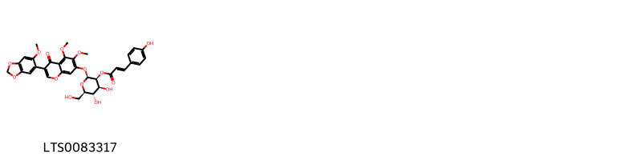{ width=100% }
    <figcaption>Hình ảnh cấu trúc hóa học của 1 hoạt chất thuộc nhóm Isoflavonoids gồm ['(2s,3s,4s,5s,6r)-2-{[5,6-dimethoxy-3-(6-methoxy-2h-1,3-benzodioxol-5-yl)-4-oxochromen-7-yl]oxy}-4,5-dihydroxy-6-(hydroxymethyl)oxan-3-yl (2e)-3-(4-hydroxyphenyl)prop-2-enoate (LTS0083317)'].</figcaption>
</figure>

---

### Dược dân tộc học

Danh sách các quốc gia có sử dụng *Trichosanthes cucumerina* trong điều trị các bệnh. 

| Country   | Disease                                     | Bệnh                                                  |
|:----------|:--------------------------------------------|:------------------------------------------------------|
| Elsewhere | Emetic, Cathartic, Vermifuge                | Emetic, Cathartic, Vermifuge                          |
| Turkey    | Laxative, Vermifuge, Refrigerant, Stomachic | Thuốc nhuận tràng, máy tạo bọt, chất làm lạnh, dạ dày |

---

---
## Trichosanthes cucumerioides
### Thông tin về thực vật

!!! info "Phân loại thực vật của *Trichosanthes cucumeroides* từ GIBF:"
    - **Kingdom:** Plantae
    - **Phylum:** Tracheophyta
    - **Order:** Cucurbitales
    - **Family:** Cucurbitaceae
    - **Genus:** Trichosanthes
    - **Species:** *Trichosanthes cucumeroides*

 

| Label (VI)   | Label (EN)   | Scientific Name          | Descriptions (VI)   | Descriptions (EN)                             | Also Known As (VI)   | Also Known As (EN)   |
|:-------------|:-------------|:-------------------------|:--------------------|:----------------------------------------------|:---------------------|:---------------------|
| N/A          | N/A          | Trichosanthes cucumerina |                     | species of tropical vine native to South Asia | ['']                 | ['Ash gouard']       |

#### Phân bố trên thế giới

**Từ CSDL GIBF** Chinese Taipei, Japan, China

#### Phân bố tại Việt Nam

**Từ CSDL GIBF**: Không có ghi nhận ở Việt Nam

---
### Thành phần hóa học
        
- Theo cơ sở dữ liệu lotus: Từ loài *Trichosanthes cucumeroides* đã phân lập và xác định được Chưa có hoạt chất nào được phân lập. hoạt chất thuộc về các nhóm Không có hoạt chất nào được phân lập. 

Không có hình ảnh nào được tạo ra

---

### Dược dân tộc học

Danh sách các quốc gia có sử dụng *Trichosanthes cucumeroides* trong điều trị các bệnh. 

| Country   | Disease   | Bệnh           |
|:----------|:----------|:---------------|
| Elsewhere | Diuretic  | Thuốc lợi tiêu |

---

---
## Trichosanthes cucumeroides
### Thông tin về thực vật

!!! info "Phân loại thực vật của *Trichosanthes cucumeroides* từ GIBF:"
    - **Kingdom:** Plantae
    - **Phylum:** Tracheophyta
    - **Order:** Cucurbitales
    - **Family:** Cucurbitaceae
    - **Genus:** Trichosanthes
    - **Species:** *Trichosanthes cucumeroides*

 

| Label (VI)   | Label (EN)   | Scientific Name            | Descriptions (VI)   | Descriptions (EN)   | Also Known As (VI)   | Also Known As (EN)   |
|:-------------|:-------------|:---------------------------|:--------------------|:--------------------|:---------------------|:---------------------|
| N/A          | N/A          | Trichosanthes cucumeroides | loài thực vật       | species of plant    | ['']                 | ['']                 |

#### Phân bố trên thế giới

**Từ CSDL GIBF** Chinese Taipei, Japan, China

#### Phân bố tại Việt Nam

**Từ CSDL GIBF**: Không có ghi nhận ở Việt Nam

---
### Thành phần hóa học
        
- Theo cơ sở dữ liệu lotus: Từ loài *Trichosanthes cucumeroides* đã phân lập và xác định được 45 hoạt chất thuộc về các nhóm Fatty Acyls, Benzene and substituted derivatives, Flavonoids, Carboxylic acids and derivatives, Steroids and steroid derivatives, Organooxygen compounds, Prenol lipids. 

|    | chemicalTaxonomyClassyfireClass     |   smiles_count |
|---:|:------------------------------------|---------------:|
|  0 | Benzene and substituted derivatives |              3 |
|  1 | Carboxylic acids and derivatives    |              5 |
|  2 | Fatty Acyls                         |              4 |
|  3 | Flavonoids                          |              4 |
|  4 | Organooxygen compounds              |              3 |
|  5 | Prenol lipids                       |             22 |
|  6 | Steroids and steroid derivatives    |              4 |

#### Nhóm Benzene and substituted derivatives
<figure markdown="span">
    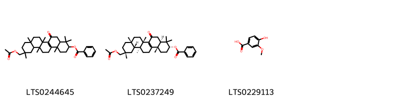{ width=100% }
    <figcaption>Hình ảnh cấu trúc hóa học của 3 hoạt chất thuộc nhóm Benzene and substituted derivatives gồm ['11-[(acetyloxy)methyl]-4,4,6b,8a,11,12b,14b-heptamethyl-6-oxo-2,3,4a,5,7,8,9,10,12,12a,13,14-dodecahydro-1h-picen-3-yl benzoate (LTS0244645)', '(3r,4ar,6bs,8as,11r,12ar,12bs,14bs)-11-[(acetyloxy)methyl]-4,4,6b,8a,11,12b,14b-heptamethyl-6-oxo-2,3,4a,5,7,8,9,10,12,12a,13,14-dodecahydro-1h-picen-3-yl benzoate (LTS0237249)', 'vanillic acid (LTS0229113)'].</figcaption>
</figure>
#### Nhóm Carboxylic acids and derivatives
<figure markdown="span">
    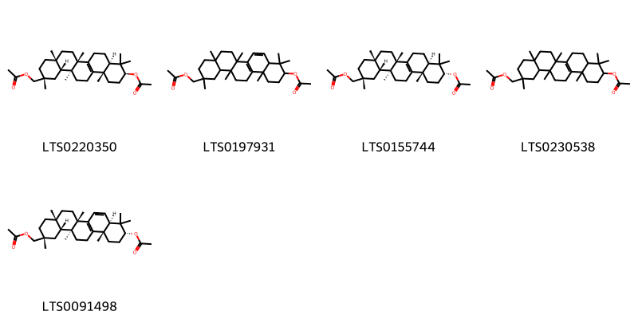{ width=100% }
    <figcaption>Hình ảnh cấu trúc hóa học của 5 hoạt chất thuộc nhóm Carboxylic acids and derivatives gồm ['[(2r,4as,6as,8ar,10s,12as,14as,14br)-10-(acetyloxy)-2,4a,6a,9,9,12a,14a-heptamethyl-1,3,4,5,6,7,8,8a,10,11,12,13,14,14b-tetradecahydropicen-2-yl]methyl acetate (LTS0220350)', '[10-(acetyloxy)-2,4a,6a,9,9,12a,14a-heptamethyl-1,3,4,5,6,8a,10,11,12,13,14,14b-dodecahydropicen-2-yl]methyl acetate (LTS0197931)', '[(2r,4as,6as,8ar,10r,12as,14as,14br)-10-(acetyloxy)-2,4a,6a,9,9,12a,14a-heptamethyl-1,3,4,5,6,7,8,8a,10,11,12,13,14,14b-tetradecahydropicen-2-yl]methyl acetate (LTS0155744)', '[10-(acetyloxy)-2,4a,6a,9,9,12a,14a-heptamethyl-1,3,4,5,6,7,8,8a,10,11,12,13,14,14b-tetradecahydropicen-2-yl]methyl acetate (LTS0230538)', '[(2r,4as,6as,8ar,10r,12as,14as,14br)-10-(acetyloxy)-2,4a,6a,9,9,12a,14a-heptamethyl-1,3,4,5,6,8a,10,11,12,13,14,14b-dodecahydropicen-2-yl]methyl acetate (LTS0091498)'].</figcaption>
</figure>
#### Nhóm Fatty Acyls
<figure markdown="span">
    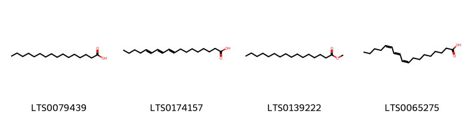{ width=100% }
    <figcaption>Hình ảnh cấu trúc hóa học của 4 hoạt chất thuộc nhóm Fatty Acyls gồm ['palmitic acid (LTS0079439)', '(11e)-octadeca-9,11,13-trienoic acid (LTS0174157)', 'methyl palmitate (LTS0139222)', 'punicic acid (LTS0065275)'].</figcaption>
</figure>
#### Nhóm Flavonoids
<figure markdown="span">
    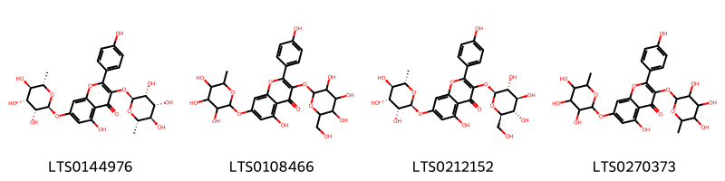{ width=100% }
    <figcaption>Hình ảnh cấu trúc hóa học của 4 hoạt chất thuộc nhóm Flavonoids gồm ['lespedin (LTS0144976)', '5-hydroxy-2-(4-hydroxyphenyl)-3-{[3,4,5-trihydroxy-6-(hydroxymethyl)oxan-2-yl]oxy}-7-[(3,4,5-trihydroxy-6-methyloxan-2-yl)oxy]chromen-4-one (LTS0108466)', '5-hydroxy-2-(4-hydroxyphenyl)-3-{[(2s,3r,4s,5s,6r)-3,4,5-trihydroxy-6-(hydroxymethyl)oxan-2-yl]oxy}-7-{[(2s,3r,4r,5r,6s)-3,4,5-trihydroxy-6-methyloxan-2-yl]oxy}chromen-4-one (LTS0212152)', 'kaempferitrin (LTS0270373)'].</figcaption>
</figure>
#### Nhóm Organooxygen compounds
<figure markdown="span">
    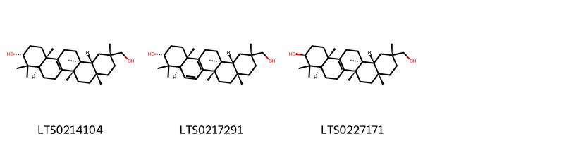{ width=100% }
    <figcaption>Hình ảnh cấu trúc hóa học của 3 hoạt chất thuộc nhóm Organooxygen compounds gồm ['(3r,4ar,6bs,8as,11r,12ar,12bs,14bs)-11-(hydroxymethyl)-4,4,6b,8a,11,12b,14b-heptamethyl-1,2,3,4a,5,6,7,8,9,10,12,12a,13,14-tetradecahydropicen-3-ol (LTS0214104)', '(3r,4ar,6bs,8as,11r,12ar,12bs,14bs)-11-(hydroxymethyl)-4,4,6b,8a,11,12b,14b-heptamethyl-1,2,3,4a,7,8,9,10,12,12a,13,14-dodecahydropicen-3-ol (LTS0217291)', '(3s,4ar,6bs,8as,11r,12ar,12bs,14bs)-11-(hydroxymethyl)-4,4,6b,8a,11,12b,14b-heptamethyl-1,2,3,4a,5,6,7,8,9,10,12,12a,13,14-tetradecahydropicen-3-ol (LTS0227171)'].</figcaption>
</figure>
#### Nhóm Prenol lipids
<figure markdown="span">
    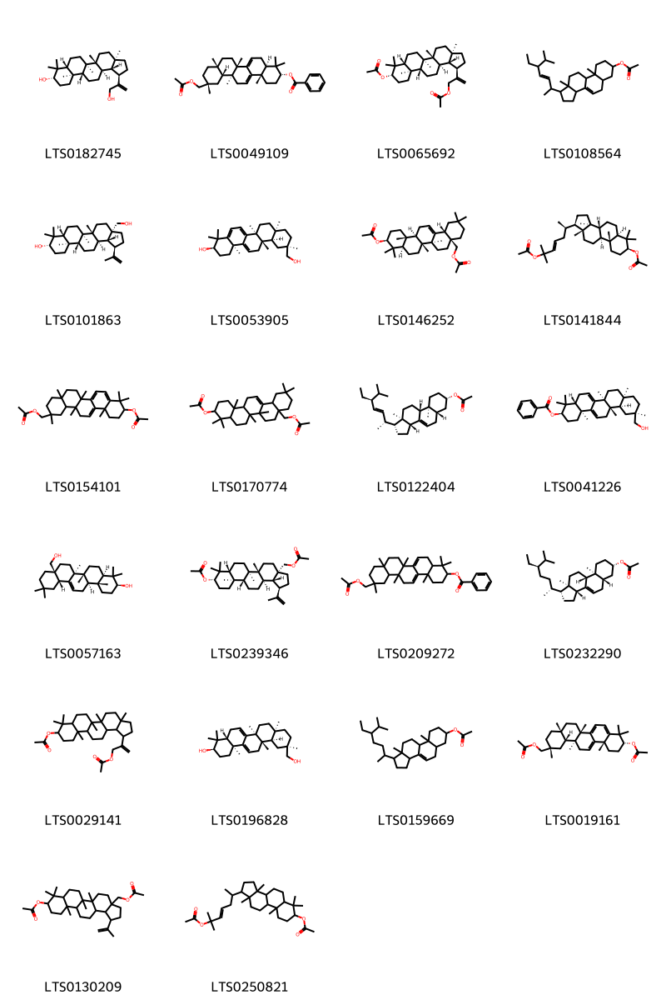{ width=100% }
    <figcaption>Hình ảnh cấu trúc hóa học của 22 hoạt chất thuộc nhóm Prenol lipids gồm ['(1r,3ar,5ar,5br,7ar,9s,11ar,11br,13ar,13bs)-1-(3-hydroxyprop-1-en-2-yl)-3a,5a,5b,8,8,11a-hexamethyl-hexadecahydrocyclopenta[a]chrysen-9-ol (LTS0182745)', '(3r,4ar,6bs,8as,11r,12ar,12bs,14bs)-11-[(acetyloxy)methyl]-4,4,6b,8a,11,12b,14b-heptamethyl-1,2,3,4a,5,7,8,9,10,12,12a,13-dodecahydropicen-3-yl benzoate (LTS0049109)', '2-[(1r,3ar,5ar,5br,7ar,9s,11ar,11br,13ar,13bs)-9-(acetyloxy)-3a,5a,5b,8,8,11a-hexamethyl-hexadecahydrocyclopenta[a]chrysen-1-yl]prop-2-en-1-yl acetate (LTS0065692)', '1-(5-ethyl-6-methylhept-3-en-2-yl)-9a,11a-dimethyl-1h,2h,3h,3ah,5h,5ah,6h,7h,8h,9h,9bh,10h,11h-cyclopenta[a]phenanthren-7-yl acetate (LTS0108564)', 'betulin (LTS0101863)', '(3r,6bs,8as,11r,12ar,12bs,14br)-11-(hydroxymethyl)-4,4,6b,8a,11,12b,14b-heptamethyl-1,2,3,7,8,9,10,12,12a,13-decahydropicen-3-ol (LTS0053905)', '[(4as,6as,6br,8ar,10s,12ar,12br,14bs)-10-(acetyloxy)-2,2,6a,6b,9,9,12a-heptamethyl-1,3,4,5,6,7,8,8a,10,11,12,12b,13,14b-tetradecahydropicen-4a-yl]methyl acetate (LTS0146252)', '(3e,6r)-6-[(1r,3as,3br,5ar,7s,9ar,9bs,11ar)-7-(acetyloxy)-3a,6,6,9a,11a-pentamethyl-dodecahydro-1h-cyclopenta[a]phenanthren-1-yl]-2-methylhept-3-en-2-yl acetate (LTS0141844)', '[10-(acetyloxy)-2,4a,6a,9,9,12a,14a-heptamethyl-1,3,4,5,6,10,11,12,14,14b-decahydropicen-2-yl]methyl acetate (LTS0154101)', '[10-(acetyloxy)-2,2,6a,6b,9,9,12a-heptamethyl-1,3,4,5,6,7,8,8a,10,11,12,12b,13,14b-tetradecahydropicen-4a-yl]methyl acetate (LTS0170774)', '(1r,3ar,5as,7s,9as,9br,11ar)-1-[(2r,3e,5s)-5-ethyl-6-methylhept-3-en-2-yl]-9a,11a-dimethyl-1h,2h,3h,3ah,5h,5ah,6h,7h,8h,9h,9bh,10h,11h-cyclopenta[a]phenanthren-7-yl acetate (LTS0122404)', '(3r,4ar,6bs,8as,11r,12ar,12bs,14bs)-11-(hydroxymethyl)-4,4,6b,8a,11,12b,14b-heptamethyl-1,2,3,4a,5,7,8,9,10,12,12a,13-dodecahydropicen-3-yl benzoate (LTS0041226)', 'erythrodiol (LTS0057163)', 'betulin diacetate (LTS0239346)', '11-[(acetyloxy)methyl]-4,4,6b,8a,11,12b,14b-heptamethyl-1,2,3,4a,5,7,8,9,10,12,12a,13-dodecahydropicen-3-yl benzoate (LTS0209272)', '(1r,3ar,5as,7s,9as,9br,11ar)-1-[(2r,5r)-5-ethyl-6-methylheptan-2-yl]-9a,11a-dimethyl-1h,2h,3h,3ah,5h,5ah,6h,7h,8h,9h,9bh,10h,11h-cyclopenta[a]phenanthren-7-yl acetate (LTS0232290)', '2-[9-(acetyloxy)-3a,5a,5b,8,8,11a-hexamethyl-hexadecahydrocyclopenta[a]chrysen-1-yl]prop-2-en-1-yl acetate (LTS0029141)', 'karounidiol (LTS0196828)', '1-(5-ethyl-6-methylheptan-2-yl)-9a,11a-dimethyl-1h,2h,3h,3ah,5h,5ah,6h,7h,8h,9h,9bh,10h,11h-cyclopenta[a]phenanthren-7-yl acetate (LTS0159669)', '[(2r,4as,6as,10r,12ar,14as,14br)-10-(acetyloxy)-2,4a,6a,9,9,12a,14a-heptamethyl-1,3,4,5,6,10,11,12,14,14b-decahydropicen-2-yl]methyl acetate (LTS0019161)', '[9-(acetyloxy)-5a,5b,8,8,11a-pentamethyl-1-(prop-1-en-2-yl)-hexadecahydrocyclopenta[a]chrysen-3a-yl]methyl acetate (LTS0130209)', '6-[7-(acetyloxy)-3a,6,6,9a,11a-pentamethyl-dodecahydro-1h-cyclopenta[a]phenanthren-1-yl]-2-methylhept-3-en-2-yl acetate (LTS0250821)'].</figcaption>
</figure>
#### Nhóm Steroids and steroid derivatives
<figure markdown="span">
    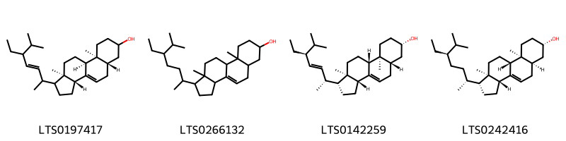{ width=100% }
    <figcaption>Hình ảnh cấu trúc hóa học của 4 hoạt chất thuộc nhóm Steroids and steroid derivatives gồm ['(3ar,5as,9as,9bs,11ar)-1-(5-ethyl-6-methylhept-3-en-2-yl)-9a,11a-dimethyl-1h,2h,3h,3ah,5h,5ah,6h,7h,8h,9h,9bh,10h,11h-cyclopenta[a]phenanthren-7-ol (LTS0197417)', '1-(5-ethyl-6-methylheptan-2-yl)-9a,11a-dimethyl-1h,2h,3h,3ah,5h,5ah,6h,7h,8h,9h,9bh,10h,11h-cyclopenta[a]phenanthren-7-ol (LTS0266132)', 'chondrillasterol (LTS0142259)', '(1r,3ar,5ar,7s,9as,9br,11ar)-1-[(2r,5r)-5-ethyl-6-methylheptan-2-yl]-9a,11a-dimethyl-1h,2h,3h,3ah,5h,5ah,6h,7h,8h,9h,9bh,10h,11h-cyclopenta[a]phenanthren-7-ol (LTS0242416)'].</figcaption>
</figure>

---

### Dược dân tộc học

Danh sách các quốc gia có sử dụng *Trichosanthes cucumeroides* trong điều trị các bệnh. 

| Country   | Disease    | Bệnh       |
|:----------|:-----------|:-----------|
| China     | Alexiteric | Alexiteric |
| Japan     | Soap       | Xà phòng   |

---

---
## Trichosanthes dioica
### Thông tin về thực vật

!!! info "Phân loại thực vật của *Trichosanthes dioica* từ GIBF:"
    - **Kingdom:** Plantae
    - **Phylum:** Tracheophyta
    - **Order:** Cucurbitales
    - **Family:** Cucurbitaceae
    - **Genus:** Trichosanthes
    - **Species:** *Trichosanthes dioica*

 

| Label (VI)   | Label (EN)   | Scientific Name      | Descriptions (VI)   | Descriptions (EN)   | Also Known As (VI)   | Also Known As (EN)   |
|:-------------|:-------------|:---------------------|:--------------------|:--------------------|:---------------------|:---------------------|
| N/A          | N/A          | Trichosanthes dioica | loài thực vật       | species of plant    | ['']                 | ['']                 |

#### Phân bố trên thế giới

**Từ CSDL GIBF** nan, Sri Lanka, Viet Nam, United States of America, Bhutan, Bangladesh, Nepal, Pakistan, India, unknown or invalid

#### Phân bố tại Việt Nam

**Từ CSDL GIBF**: Tonkin

---
### Thành phần hóa học
        
- Theo cơ sở dữ liệu lotus: Từ loài *Trichosanthes dioica* đã phân lập và xác định được 17 hoạt chất thuộc về các nhóm Prenol lipids, Organooxygen compounds, Benzene and substituted derivatives, Carboxylic acids and derivatives. 

|    | chemicalTaxonomyClassyfireClass     |   smiles_count |
|---:|:------------------------------------|---------------:|
|  0 | Benzene and substituted derivatives |              2 |
|  1 | Carboxylic acids and derivatives    |              1 |
|  2 | Organooxygen compounds              |              2 |
|  3 | Prenol lipids                       |             12 |

#### Nhóm Benzene and substituted derivatives
<figure markdown="span">
    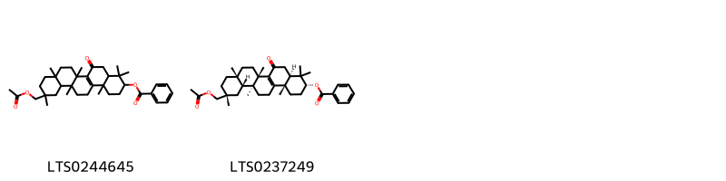{ width=100% }
    <figcaption>Hình ảnh cấu trúc hóa học của 2 hoạt chất thuộc nhóm Benzene and substituted derivatives gồm ['11-[(acetyloxy)methyl]-4,4,6b,8a,11,12b,14b-heptamethyl-6-oxo-2,3,4a,5,7,8,9,10,12,12a,13,14-dodecahydro-1h-picen-3-yl benzoate (LTS0244645)', '(3r,4ar,6bs,8as,11r,12ar,12bs,14bs)-11-[(acetyloxy)methyl]-4,4,6b,8a,11,12b,14b-heptamethyl-6-oxo-2,3,4a,5,7,8,9,10,12,12a,13,14-dodecahydro-1h-picen-3-yl benzoate (LTS0237249)'].</figcaption>
</figure>
#### Nhóm Carboxylic acids and derivatives
<figure markdown="span">
    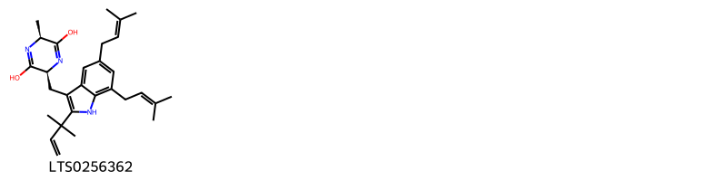{ width=100% }
    <figcaption>Hình ảnh cấu trúc hóa học của 1 hoạt chất thuộc nhóm Carboxylic acids and derivatives gồm ['(3s,6s)-3-{[5,7-bis(3-methylbut-2-en-1-yl)-2-(2-methylbut-3-en-2-yl)-1h-indol-3-yl]methyl}-6-methyl-3,6-dihydropyrazine-2,5-diol (LTS0256362)'].</figcaption>
</figure>
#### Nhóm Organooxygen compounds
<figure markdown="span">
    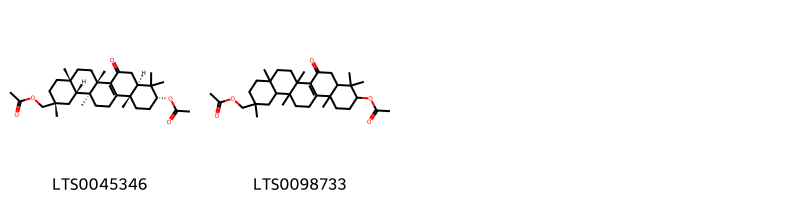{ width=100% }
    <figcaption>Hình ảnh cấu trúc hóa học của 2 hoạt chất thuộc nhóm Organooxygen compounds gồm ['[(2r,4as,6as,8ar,10r,12as,14as,14br)-10-(acetyloxy)-2,4a,6a,9,9,12a,14a-heptamethyl-7-oxo-3,4,5,6,8,8a,10,11,12,13,14,14b-dodecahydro-1h-picen-2-yl]methyl acetate (LTS0045346)', '[10-(acetyloxy)-2,4a,6a,9,9,12a,14a-heptamethyl-7-oxo-3,4,5,6,8,8a,10,11,12,13,14,14b-dodecahydro-1h-picen-2-yl]methyl acetate (LTS0098733)'].</figcaption>
</figure>
#### Nhóm Prenol lipids
<figure markdown="span">
    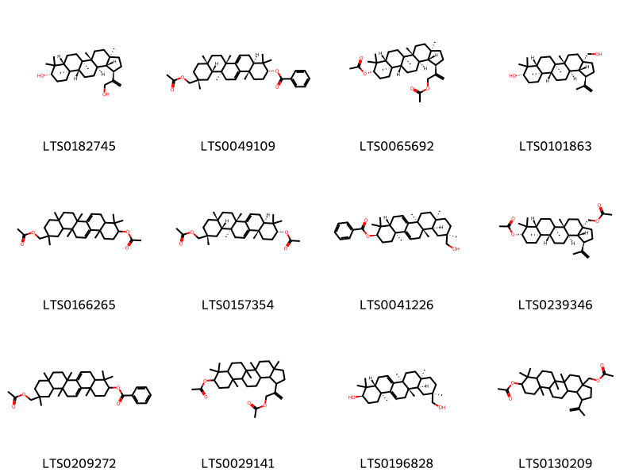{ width=100% }
    <figcaption>Hình ảnh cấu trúc hóa học của 12 hoạt chất thuộc nhóm Prenol lipids gồm ['(1r,3ar,5ar,5br,7ar,9s,11ar,11br,13ar,13bs)-1-(3-hydroxyprop-1-en-2-yl)-3a,5a,5b,8,8,11a-hexamethyl-hexadecahydrocyclopenta[a]chrysen-9-ol (LTS0182745)', '(3r,4ar,6bs,8as,11r,12ar,12bs,14bs)-11-[(acetyloxy)methyl]-4,4,6b,8a,11,12b,14b-heptamethyl-1,2,3,4a,5,7,8,9,10,12,12a,13-dodecahydropicen-3-yl benzoate (LTS0049109)', '2-[(1r,3ar,5ar,5br,7ar,9s,11ar,11br,13ar,13bs)-9-(acetyloxy)-3a,5a,5b,8,8,11a-hexamethyl-hexadecahydrocyclopenta[a]chrysen-1-yl]prop-2-en-1-yl acetate (LTS0065692)', 'betulin (LTS0101863)', '[10-(acetyloxy)-2,4a,6a,9,9,12a,14a-heptamethyl-1,3,4,5,6,8,8a,10,11,12,14,14b-dodecahydropicen-2-yl]methyl acetate (LTS0166265)', '[(2r,4as,6as,8ar,10r,12as,14as,14br)-10-(acetyloxy)-2,4a,6a,9,9,12a,14a-heptamethyl-1,3,4,5,6,8,8a,10,11,12,14,14b-dodecahydropicen-2-yl]methyl acetate (LTS0157354)', '(3r,4ar,6bs,8as,11r,12ar,12bs,14bs)-11-(hydroxymethyl)-4,4,6b,8a,11,12b,14b-heptamethyl-1,2,3,4a,5,7,8,9,10,12,12a,13-dodecahydropicen-3-yl benzoate (LTS0041226)', 'betulin diacetate (LTS0239346)', '11-[(acetyloxy)methyl]-4,4,6b,8a,11,12b,14b-heptamethyl-1,2,3,4a,5,7,8,9,10,12,12a,13-dodecahydropicen-3-yl benzoate (LTS0209272)', '2-[9-(acetyloxy)-3a,5a,5b,8,8,11a-hexamethyl-hexadecahydrocyclopenta[a]chrysen-1-yl]prop-2-en-1-yl acetate (LTS0029141)', 'karounidiol (LTS0196828)', '[9-(acetyloxy)-5a,5b,8,8,11a-pentamethyl-1-(prop-1-en-2-yl)-hexadecahydrocyclopenta[a]chrysen-3a-yl]methyl acetate (LTS0130209)'].</figcaption>
</figure>

---

### Dược dân tộc học

Danh sách các quốc gia có sử dụng *Trichosanthes dioica* trong điều trị các bệnh. 

| Country   | Disease            | Bệnh                        |
|:----------|:-------------------|:----------------------------|
| Elsewhere | Diuretic, Laxative | Thuốc lợi tiểu, nhuận tràng |
| French    | Laxative           | Nhuận trường                |
| German    | Tonic              | (thuộc) trương lực          |
| Sanscrit  | Purgative          | Thuốc xổ                    |

---

---
## Trichosanthes kirilowii
### Thông tin về thực vật

!!! info "Phân loại thực vật của *Trichosanthes kirilowii* từ GIBF:"
    - **Kingdom:** Plantae
    - **Phylum:** Tracheophyta
    - **Order:** Cucurbitales
    - **Family:** Cucurbitaceae
    - **Genus:** Trichosanthes
    - **Species:** *Trichosanthes kirilowii*

 

| Label (VI)   | Label (EN)   | Scientific Name         | Descriptions (VI)   | Descriptions (EN)   | Also Known As (VI)   | Also Known As (EN)   |
|:-------------|:-------------|:------------------------|:--------------------|:--------------------|:---------------------|:---------------------|
| N/A          | N/A          | Trichosanthes kirilowii | loài thực vật       | species of plant    | ['']                 | ['']                 |

#### Phân bố trên thế giới

**Từ CSDL GIBF** United States of America, China, Japan, Korea, Republic of

#### Phân bố tại Việt Nam

**Từ CSDL GIBF**: Không có ghi nhận ở Việt Nam

---
### Thành phần hóa học
        
- Theo cơ sở dữ liệu lotus: Từ loài *Trichosanthes kirilowii* đã phân lập và xác định được 39 hoạt chất thuộc về các nhóm Fatty Acyls, Flavonoids, Kavalactones, Steroids and steroid derivatives, Organooxygen compounds, Prenol lipids. 

|    | chemicalTaxonomyClassyfireClass   |   smiles_count |
|---:|:----------------------------------|---------------:|
|  0 | Fatty Acyls                       |              4 |
|  1 | Flavonoids                        |              3 |
|  2 | Kavalactones                      |              1 |
|  3 | Organooxygen compounds            |              7 |
|  4 | Prenol lipids                     |              7 |
|  5 | Steroids and steroid derivatives  |             16 |

#### Nhóm Fatty Acyls
<figure markdown="span">
    { width=100% }
    <figcaption>Hình ảnh cấu trúc hóa học của 4 hoạt chất thuộc nhóm Fatty Acyls gồm ['punicic acid (LTS0065275)', 'palmitic acid (LTS0079439)', 'suberic acid (LTS0275043)', 'methyl palmitate (LTS0139222)'].</figcaption>
</figure>
#### Nhóm Flavonoids
<figure markdown="span">
    { width=100% }
    <figcaption>Hình ảnh cấu trúc hóa học của 3 hoạt chất thuộc nhóm Flavonoids gồm ['apigenin 7-o-β-glucoside (LTS0252743)', "luteolin 3'-glucoside (LTS0071552)", 'luteolin 7-o-glucoside (LTS0227450)'].</figcaption>
</figure>
#### Nhóm Kavalactones
<figure markdown="span">
    { width=100% }
    <figcaption>Hình ảnh cấu trúc hóa học của 1 hoạt chất thuộc nhóm Kavalactones gồm ['6-[2-(3-hydroxy-4-methoxyphenyl)ethenyl]-4-methoxypyran-2-one (LTS0264382)'].</figcaption>
</figure>
#### Nhóm Organooxygen compounds
<figure markdown="span">
    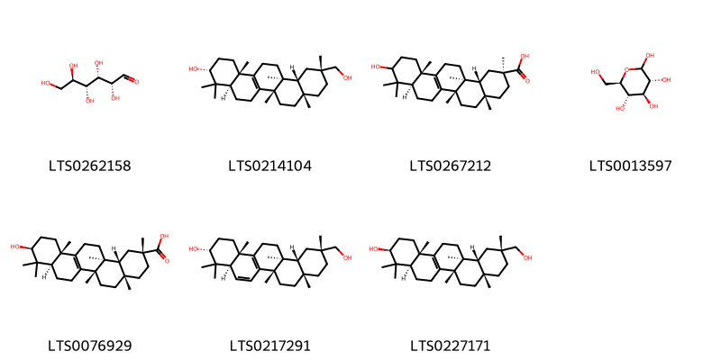{ width=100% }
    <figcaption>Hình ảnh cấu trúc hóa học của 7 hoạt chất thuộc nhóm Organooxygen compounds gồm ['(+)-glucose (LTS0262158)', '(3r,4ar,6bs,8as,11r,12ar,12bs,14bs)-11-(hydroxymethyl)-4,4,6b,8a,11,12b,14b-heptamethyl-1,2,3,4a,5,6,7,8,9,10,12,12a,13,14-tetradecahydropicen-3-ol (LTS0214104)', '(2s,4as,6as,8ar,12as,14as,14br)-10-hydroxy-2,4a,6a,9,9,12a,14a-heptamethyl-1,3,4,5,6,7,8,8a,10,11,12,13,14,14b-tetradecahydropicene-2-carboxylic acid (LTS0267212)', 'glucose (LTS0013597)', '(2r,4as,6as,8ar,10s,12as,14as,14br)-10-hydroxy-2,4a,6a,9,9,12a,14a-heptamethyl-1,3,4,5,6,7,8,8a,10,11,12,13,14,14b-tetradecahydropicene-2-carboxylic acid (LTS0076929)', '(3r,4ar,6bs,8as,11r,12ar,12bs,14bs)-11-(hydroxymethyl)-4,4,6b,8a,11,12b,14b-heptamethyl-1,2,3,4a,7,8,9,10,12,12a,13,14-dodecahydropicen-3-ol (LTS0217291)', '(3s,4ar,6bs,8as,11r,12ar,12bs,14bs)-11-(hydroxymethyl)-4,4,6b,8a,11,12b,14b-heptamethyl-1,2,3,4a,5,6,7,8,9,10,12,12a,13,14-tetradecahydropicen-3-ol (LTS0227171)'].</figcaption>
</figure>
#### Nhóm Prenol lipids
<figure markdown="span">
    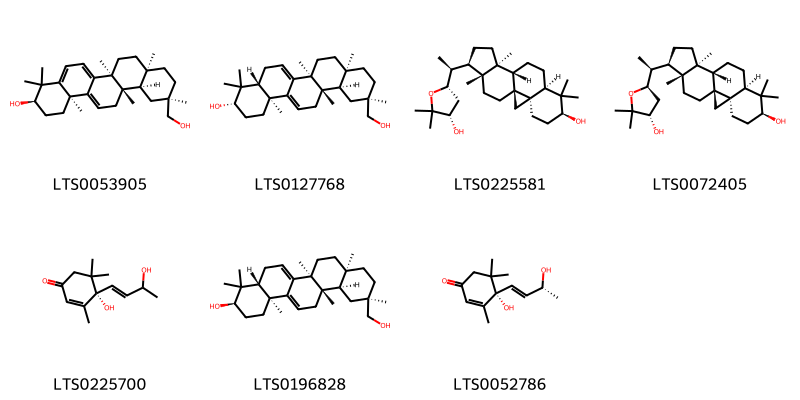{ width=100% }
    <figcaption>Hình ảnh cấu trúc hóa học của 7 hoạt chất thuộc nhóm Prenol lipids gồm ['(3r,6bs,8as,11r,12ar,12bs,14br)-11-(hydroxymethyl)-4,4,6b,8a,11,12b,14b-heptamethyl-1,2,3,7,8,9,10,12,12a,13-decahydropicen-3-ol (LTS0053905)', '(3s,4ar,6bs,8as,11r,12ar,12bs,14bs)-11-(hydroxymethyl)-4,4,6b,8a,11,12b,14b-heptamethyl-1,2,3,4a,5,7,8,9,10,12,12a,13-dodecahydropicen-3-ol (LTS0127768)', '(3s,5s)-5-[(1s)-1-[(1s,3r,6s,8r,11s,12s,15r,16r)-6-hydroxy-7,7,12,16-tetramethylpentacyclo[9.7.0.0¹,³.0³,⁸.0¹²,¹⁶]octadecan-15-yl]ethyl]-2,2-dimethyloxolan-3-ol (LTS0225581)', '(3s,5r)-5-[(1s)-1-[(1s,3r,6s,8r,11s,12s,15r,16r)-6-hydroxy-7,7,12,16-tetramethylpentacyclo[9.7.0.0¹,³.0³,⁸.0¹²,¹⁶]octadecan-15-yl]ethyl]-2,2-dimethyloxolan-3-ol (LTS0072405)', '(4s)-4-hydroxy-4-(3-hydroxybut-1-en-1-yl)-3,5,5-trimethylcyclohex-2-en-1-one (LTS0225700)', 'karounidiol (LTS0196828)', '(6s,9r)-vomifoliol (LTS0052786)'].</figcaption>
</figure>
#### Nhóm Steroids and steroid derivatives
<figure markdown="span">
    { width=100% }
    <figcaption>Hình ảnh cấu trúc hóa học của 16 hoạt chất thuộc nhóm Steroids and steroid derivatives gồm ['sitosterol (LTS0168132)', '(3e,6r)-6-[(1r,2r,3as,3bs,7s,9ar,9br,11ar)-2,7-dihydroxy-3a,6,6,9b,11a-pentamethyl-8,10-dioxo-1h,2h,3h,3bh,4h,7h,9h,9ah,11h-cyclopenta[a]phenanthren-1-yl]-6-hydroxy-2-methyl-5-oxohept-3-en-2-yl acetate (LTS0142421)', '1-(2,6-dihydroxy-6-methyl-3-oxohept-4-en-2-yl)-2,8-dihydroxy-3a,6,6,9b,11a-pentamethyl-1h,2h,3h,3bh,4h,8h,9h,9ah,11h-cyclopenta[a]phenanthrene-7,10-dione (LTS0030421)', 'cucurbitacin b (LTS0112140)', '(3ar,5as,9as,9bs,11ar)-1-(5-ethyl-6-methylhept-3-en-2-yl)-9a,11a-dimethyl-1h,2h,3h,3ah,5h,5ah,6h,7h,8h,9h,9bh,10h,11h-cyclopenta[a]phenanthren-7-ol (LTS0197417)', 'chondrillasterol (LTS0142259)', 'spinasterol (LTS0263612)', '7,7,12,16-tetramethyl-15-(6-methyl-5-methylideneheptan-2-yl)pentacyclo[9.7.0.0¹,³.0³,⁸.0¹²,¹⁶]octadec-8-en-6-ol (LTS0259188)', '6-{2,8-dihydroxy-3a,6,6,9b,11a-pentamethyl-7,10-dioxo-1h,2h,3h,3bh,4h,8h,9h,9ah,11h-cyclopenta[a]phenanthren-1-yl}-6-hydroxy-2-methyl-5-oxohept-3-en-2-yl acetate (LTS0086953)', '(1r,3as,3bs,7s,9ar,9bs,11ar)-1-[(2s,3e,5s)-5-ethyl-6-methylhept-3-en-2-yl]-9a,11a-dimethyl-1h,2h,3h,3ah,3bh,4h,6h,7h,8h,9h,9bh,10h,11h-cyclopenta[a]phenanthren-7-ol (LTS0169213)', 'campesterol (LTS0029429)', 'cucurbitacin d (LTS0059270)', '(1r,2r,3as,3bs,7s,9ar,9br,11ar)-1-[(2r,4e)-2,6-dihydroxy-6-methyl-3-oxohept-4-en-2-yl]-2,7-dihydroxy-3a,6,6,9b,11a-pentamethyl-1h,2h,3h,3bh,4h,7h,9h,9ah,11h-cyclopenta[a]phenanthrene-8,10-dione (LTS0025679)', '(3as,3bs,9as,9br,11ar)-1-[(2r)-2,6-dihydroxy-6-methyl-3-oxohept-4-en-2-yl]-2,8-dihydroxy-3a,6,6,9b,11a-pentamethyl-1h,2h,3h,3bh,4h,8h,9h,9ah,11h-cyclopenta[a]phenanthrene-7,10-dione (LTS0251403)', '(1r,3ar,5as,7s,9as,9br,11ar)-1-[(5s)-5-ethyl-6-methylheptan-2-yl]-9a,11a-dimethyl-1h,2h,3h,3ah,5h,5ah,6h,7h,8h,9h,9bh,10h,11h-cyclopenta[a]phenanthren-7-ol (LTS0018566)', '(1r,3ar,5as,7s,9as,9br,11ar)-1-[(5s)-5-ethyl-6-methylhept-6-en-2-yl]-9a,11a-dimethyl-1h,2h,3h,3ah,5h,5ah,6h,7h,8h,9h,9bh,10h,11h-cyclopenta[a]phenanthren-7-ol (LTS0122558)'].</figcaption>
</figure>

---

### Dược dân tộc học

Danh sách các quốc gia có sử dụng *Trichosanthes kirilowii* trong điều trị các bệnh. 

| Country         | Disease                                                                                                  | Bệnh                                                                                                            |
|:----------------|:---------------------------------------------------------------------------------------------------------|:----------------------------------------------------------------------------------------------------------------|
| China           | Antitussive, Astringent, Expectorant, Expectorant, Sialogogue, Suppurative, Tonic, Alexiteric, Emollient | Chống ho, Chất làm se, Chất đờm, Chất đờm, Chất tương tự nước bọt, Thuốc bổ, Thuốc bổ, Alexiteric, Chất làm mềm |
| Malaya (Import) | Tonic                                                                                                    | (thuộc) trương lực                                                                                              |

---

---
## Trichosanthes multiloba
### Thông tin về thực vật

!!! info "Phân loại thực vật của *Trichosanthes multiloba* từ GIBF:"
    - **Kingdom:** Plantae
    - **Phylum:** Tracheophyta
    - **Order:** Cucurbitales
    - **Family:** Cucurbitaceae
    - **Genus:** Trichosanthes
    - **Species:** *Trichosanthes multiloba*

 

| Label (VI)   | Label (EN)   | Scientific Name         | Descriptions (VI)   | Descriptions (EN)   | Also Known As (VI)   | Also Known As (EN)   |
|:-------------|:-------------|:------------------------|:--------------------|:--------------------|:---------------------|:---------------------|
| N/A          | N/A          | Trichosanthes multiloba | loài thực vật       | species of plant    | ['']                 | ['']                 |

#### Phân bố trên thế giới

**Từ CSDL GIBF** nan, Korea (Democratic People’s Republic of), Japan, Korea, Republic of

#### Phân bố tại Việt Nam

**Từ CSDL GIBF**: Không có ghi nhận ở Việt Nam

---
### Thành phần hóa học
        
- Theo cơ sở dữ liệu lotus: Từ loài *Trichosanthes multiloba* đã phân lập và xác định được 8 hoạt chất thuộc về các nhóm Organooxygen compounds, Steroids and steroid derivatives, Flavonoids. 

|    | chemicalTaxonomyClassyfireClass   |   smiles_count |
|---:|:----------------------------------|---------------:|
|  0 | Flavonoids                        |              1 |
|  1 | Organooxygen compounds            |              2 |
|  2 | Steroids and steroid derivatives  |              5 |

#### Nhóm Flavonoids
<figure markdown="span">
    { width=100% }
    <figcaption>Hình ảnh cấu trúc hóa học của 1 hoạt chất thuộc nhóm Flavonoids gồm ['3-rutinosyl quercetin (LTS0032845)'].</figcaption>
</figure>
#### Nhóm Organooxygen compounds
<figure markdown="span">
    { width=100% }
    <figcaption>Hình ảnh cấu trúc hóa học của 2 hoạt chất thuộc nhóm Organooxygen compounds gồm ['(2s,4as,6as,8ar,12as,14as,14br)-10-hydroxy-2,4a,6a,9,9,12a,14a-heptamethyl-1,3,4,5,6,7,8,8a,10,11,12,13,14,14b-tetradecahydropicene-2-carboxylic acid (LTS0267212)', '(2r,4as,6as,8ar,10s,12as,14as,14br)-10-hydroxy-2,4a,6a,9,9,12a,14a-heptamethyl-1,3,4,5,6,7,8,8a,10,11,12,13,14,14b-tetradecahydropicene-2-carboxylic acid (LTS0076929)'].</figcaption>
</figure>
#### Nhóm Steroids and steroid derivatives
<figure markdown="span">
    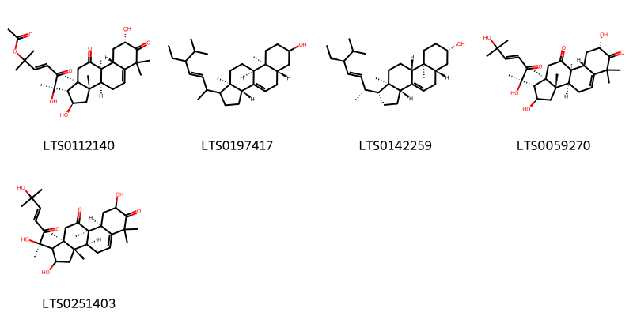{ width=100% }
    <figcaption>Hình ảnh cấu trúc hóa học của 5 hoạt chất thuộc nhóm Steroids and steroid derivatives gồm ['cucurbitacin b (LTS0112140)', '(3ar,5as,9as,9bs,11ar)-1-(5-ethyl-6-methylhept-3-en-2-yl)-9a,11a-dimethyl-1h,2h,3h,3ah,5h,5ah,6h,7h,8h,9h,9bh,10h,11h-cyclopenta[a]phenanthren-7-ol (LTS0197417)', 'chondrillasterol (LTS0142259)', 'cucurbitacin d (LTS0059270)', '(3as,3bs,9as,9br,11ar)-1-[(2r)-2,6-dihydroxy-6-methyl-3-oxohept-4-en-2-yl]-2,8-dihydroxy-3a,6,6,9b,11a-pentamethyl-1h,2h,3h,3bh,4h,8h,9h,9ah,11h-cyclopenta[a]phenanthrene-7,10-dione (LTS0251403)'].</figcaption>
</figure>

---

### Dược dân tộc học

Danh sách các quốc gia có sử dụng *Trichosanthes multiloba* trong điều trị các bệnh. 

| Country   | Disease                 | Bệnh             |
|:----------|:------------------------|:-----------------|
| China     | Astringent, Expectorant | Chất làm se, đờm |

---

---
## Trichosanthes nervifolia
### Thông tin về thực vật

!!! info "Phân loại thực vật của *Trichosanthes nervifolia* từ GIBF:"
    - **Kingdom:** Plantae
    - **Phylum:** Tracheophyta
    - **Order:** Cucurbitales
    - **Family:** Cucurbitaceae
    - **Genus:** Trichosanthes
    - **Species:** *Trichosanthes nervifolia*

 

| Label (VI)   | Label (EN)   | Scientific Name          | Descriptions (VI)   | Descriptions (EN)   | Also Known As (VI)   | Also Known As (EN)   |
|:-------------|:-------------|:-------------------------|:--------------------|:--------------------|:---------------------|:---------------------|
| N/A          | N/A          | Trichosanthes nervifolia | loài thực vật       | species of plant    | ['']                 | ['']                 |

#### Phân bố trên thế giới

**Từ CSDL GIBF** Sri Lanka, nan, India

#### Phân bố tại Việt Nam

**Từ CSDL GIBF**: Không có ghi nhận ở Việt Nam

---
### Thành phần hóa học
        
- Theo cơ sở dữ liệu lotus: Từ loài *Trichosanthes nervifolia* đã phân lập và xác định được 6 hoạt chất thuộc về các nhóm Fatty Acyls. 

|    | chemicalTaxonomyClassyfireClass   |   smiles_count |
|---:|:----------------------------------|---------------:|
|  0 | Fatty Acyls                       |              6 |

#### Nhóm Fatty Acyls
<figure markdown="span">
    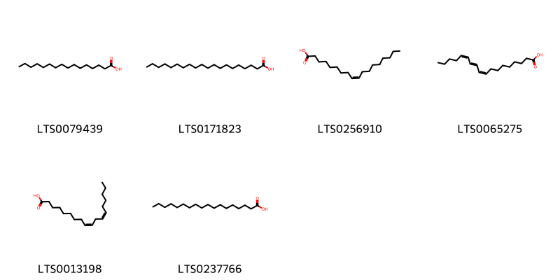{ width=100% }
    <figcaption>Hình ảnh cấu trúc hóa học của 6 hoạt chất thuộc nhóm Fatty Acyls gồm ['palmitic acid (LTS0079439)', 'arachidic acid (LTS0171823)', 'oleic acid (LTS0256910)', 'punicic acid (LTS0065275)', 'linoleic (LTS0013198)', 'stearic acid (LTS0237766)'].</figcaption>
</figure>

---

### Dược dân tộc học

Danh sách các quốc gia có sử dụng *Trichosanthes nervifolia* trong điều trị các bệnh. 

| Country   | Disease          | Bệnh                 |
|:----------|:-----------------|:---------------------|
| Elsewhere | Purgative, Tonic | Luyện ngục, Thuốc bổ |

---

---
## Trichosanthes palmata
### Thông tin về thực vật

!!! info "Phân loại thực vật của *N/A* từ GIBF:"
    - **Kingdom:** Plantae
    - **Phylum:** Tracheophyta
    - **Order:** Cucurbitales
    - **Family:** Cucurbitaceae
    - **Genus:** N/A
    - **Species:** *N/A*

 

| Label (VI)   | Label (EN)   | Scientific Name       | Descriptions (VI)   | Descriptions (EN)   | Also Known As (VI)   | Also Known As (EN)   |
|:-------------|:-------------|:----------------------|:--------------------|:--------------------|:---------------------|:---------------------|
| N/A          | N/A          | Trichosanthes palmata |                     | species of plant    | ['']                 | ['']                 |

#### Phân bố trên thế giới

**Từ CSDL GIBF** Brazil, Guatemala, Viet Nam, Japan, Botswana, China, Israel, Gambia, Chile, Tanzania, United Republic of, Ecuador, Thailand, Spain, Puerto Rico, Sri Lanka, United States of America, Tonga, Greece, Indonesia, Costa Rica, Russian Federation, Dominican Republic, Nigeria, Colombia, Argentina, Hong Kong, Mexico, Kenya, Guam, Chinese Taipei, Malaysia, Kuwait, Iraq, Canada, Panama, Namibia, Portugal, Ukraine, South Africa, Australia, India

#### Phân bố tại Việt Nam

**Từ CSDL GIBF**: Hồ Chí Minh city

---
### Thành phần hóa học
        
- Theo cơ sở dữ liệu lotus: Từ loài *N/A* đã phân lập và xác định được 7 hoạt chất thuộc về các nhóm Steroids and steroid derivatives. 

|    | chemicalTaxonomyClassyfireClass   |   smiles_count |
|---:|:----------------------------------|---------------:|
|  0 | Steroids and steroid derivatives  |              7 |

#### Nhóm Steroids and steroid derivatives
<figure markdown="span">
    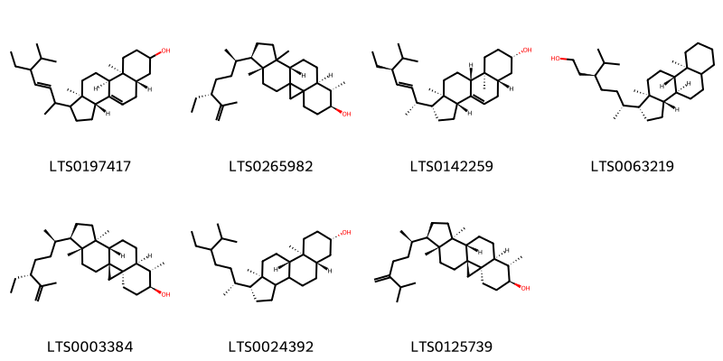{ width=100% }
    <figcaption>Hình ảnh cấu trúc hóa học của 7 hoạt chất thuộc nhóm Steroids and steroid derivatives gồm ['(3ar,5as,9as,9bs,11ar)-1-(5-ethyl-6-methylhept-3-en-2-yl)-9a,11a-dimethyl-1h,2h,3h,3ah,5h,5ah,6h,7h,8h,9h,9bh,10h,11h-cyclopenta[a]phenanthren-7-ol (LTS0197417)', '(6s,7s,8s,11s,15r,16r)-15-[(2r,5r)-5-ethyl-6-methylhept-6-en-2-yl]-7,12,16-trimethylpentacyclo[9.7.0.0¹,³.0³,⁸.0¹²,¹⁶]octadecan-6-ol (LTS0265982)', 'chondrillasterol (LTS0142259)', '(3s,6r)-6-[(1r,3as,3br,9as,9bs,11ar)-9a,11a-dimethyl-tetradecahydro-1h-cyclopenta[a]phenanthren-1-yl]-3-isopropylheptan-1-ol (LTS0063219)', '(1s,3r,6s,7s,8s,11s,12s,15r,16r)-15-[(2r,5r)-5-ethyl-6-methylhept-6-en-2-yl]-7,12,16-trimethylpentacyclo[9.7.0.0¹,³.0³,⁸.0¹²,¹⁶]octadecan-6-ol (LTS0003384)', '(1r,5as,7s,9as,9bs,11ar)-1-[(2r)-5-ethyl-6-methylheptan-2-yl]-9a,11a-dimethyl-tetradecahydro-1h-cyclopenta[a]phenanthren-7-ol (LTS0024392)', 'cycloeucalenol (LTS0125739)'].</figcaption>
</figure>

---

### Dược dân tộc học

Danh sách các quốc gia có sử dụng *N/A* trong điều trị các bệnh. 

| Country   | Disease   | Bệnh               |
|:----------|:----------|:-------------------|
| China     | Tonic     | (thuộc) trương lực |
| India     | Cathartic | thuốc tẩy nhẹ      |
| Iran      | Poison    | Chất độc           |

---

---
## Trichosanthes wallichiana
### Thông tin về thực vật

!!! info "Phân loại thực vật của *Trichosanthes wallichiana* từ GIBF:"
    - **Kingdom:** Plantae
    - **Phylum:** Tracheophyta
    - **Order:** Cucurbitales
    - **Family:** Cucurbitaceae
    - **Genus:** Trichosanthes
    - **Species:** *Trichosanthes wallichiana*

 

| Label (VI)   | Label (EN)   | Scientific Name           | Descriptions (VI)   | Descriptions (EN)   | Also Known As (VI)   | Also Known As (EN)   |
|:-------------|:-------------|:--------------------------|:--------------------|:--------------------|:---------------------|:---------------------|
| N/A          | N/A          | Trichosanthes wallichiana |                     | species of plant    | ['']                 | ['']                 |

#### Phân bố trên thế giới

**Từ CSDL GIBF** nan, Viet Nam, Japan, Bhutan, Nepal, Malaysia, China, Myanmar, India, unknown or invalid

#### Phân bố tại Việt Nam

**Từ CSDL GIBF**: Lao Cai

---
### Thành phần hóa học
        
- Theo cơ sở dữ liệu lotus: Từ loài *Trichosanthes wallichiana* đã phân lập và xác định được Chưa có hoạt chất nào được phân lập. hoạt chất thuộc về các nhóm Không có hoạt chất nào được phân lập. 

Không có hình ảnh nào được tạo ra

---

### Dược dân tộc học

Danh sách các quốc gia có sử dụng *Trichosanthes wallichiana* trong điều trị các bệnh. 

| Country   | Disease   | Bệnh     |
|:----------|:----------|:---------|
| Elsewhere | Poison    | Chất độc |

---

# Chi Cucumis

??? note "Danh sách các dược liệu thuộc chi"
    
	 - *Cucumis africanus*
	 - *Cucumis callosus*
	 - *Cucumis melo*
	 - *Cucumis melos*
	 - *Cucumis myriocarpus*
	 - *Cucumis profetarum*
	 - *Cucumis prophetarum*
	 - *Cucumis sativus*
	 - *Cucumis trigonus*
	 - *Cucumis zeyheri*

---
## Cucumis africanus
### Thông tin về thực vật

!!! info "Phân loại thực vật của *Cucumis africanus* từ GIBF:"
    - **Kingdom:** Plantae
    - **Phylum:** Tracheophyta
    - **Order:** Cucurbitales
    - **Family:** Cucurbitaceae
    - **Genus:** Cucumis
    - **Species:** *Cucumis africanus*

 

| Label (VI)   | Label (EN)   | Scientific Name   | Descriptions (VI)   | Descriptions (EN)   | Also Known As (VI)   | Also Known As (EN)   |
|:-------------|:-------------|:------------------|:--------------------|:--------------------|:---------------------|:---------------------|
| N/A          | N/A          | Cucumis africanus | loài thực vật       | species of plant    | ['']                 | ['']                 |

#### Phân bố trên thế giới

**Từ CSDL GIBF** nan, Namibia, Mexico, Afghanistan, United States of America, Kenya, Botswana, Belgium, South Africa, Australia, Zimbabwe, unknown or invalid, Ethiopia, Madagascar, Netherlands

#### Phân bố tại Việt Nam

**Từ CSDL GIBF**: Không có ghi nhận ở Việt Nam

---
### Thành phần hóa học
        
- Theo cơ sở dữ liệu lotus: Từ loài *Cucumis africanus* đã phân lập và xác định được Chưa có hoạt chất nào được phân lập. hoạt chất thuộc về các nhóm Không có hoạt chất nào được phân lập. 

Không có hình ảnh nào được tạo ra

---

### Dược dân tộc học

Danh sách các quốc gia có sử dụng *Cucumis africanus* trong điều trị các bệnh. 

| Country   | Disease   | Bệnh     |
|:----------|:----------|:---------|
| Africa    | Poison    | Chất độc |

---

---
## Cucumis callosus
### Thông tin về thực vật

!!! info "Phân loại thực vật của *Cucumis melo* từ GIBF:"
    - **Kingdom:** Plantae
    - **Phylum:** Tracheophyta
    - **Order:** Cucurbitales
    - **Family:** Cucurbitaceae
    - **Genus:** Cucumis
    - **Species:** *Cucumis melo*

 

| Label (VI)   | Label (EN)   | Scientific Name   | Descriptions (VI)   | Descriptions (EN)   | Also Known As (VI)   | Also Known As (EN)   |
|:-------------|:-------------|:------------------|:--------------------|:--------------------|:---------------------|:---------------------|
| N/A          | N/A          | Cucumis callosus  | loài thực vật       | species of plant    | ['']                 | ['']                 |

#### Phân bố trên thế giới

**Từ CSDL GIBF** nan, Benin, Maldives, Pakistan, Israel, India, unknown or invalid, Jordan

#### Phân bố tại Việt Nam

**Từ CSDL GIBF**: Không có ghi nhận ở Việt Nam

---
### Thành phần hóa học
        
- Theo cơ sở dữ liệu lotus: Từ loài *Cucumis melo* đã phân lập và xác định được 8 hoạt chất thuộc về các nhóm Fatty Acyls. 

|    | chemicalTaxonomyClassyfireClass   |   smiles_count |
|---:|:----------------------------------|---------------:|
|  0 | Fatty Acyls                       |              8 |

#### Nhóm Fatty Acyls
<figure markdown="span">
    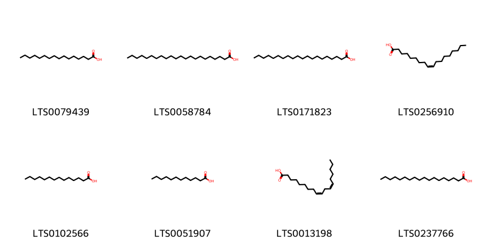{ width=100% }
    <figcaption>Hình ảnh cấu trúc hóa học của 8 hoạt chất thuộc nhóm Fatty Acyls gồm ['palmitic acid (LTS0079439)', 'behenic acid (LTS0058784)', 'arachidic acid (LTS0171823)', 'oleic acid (LTS0256910)', 'myristic acid (LTS0102566)', 'lauric acid (LTS0051907)', 'linoleic (LTS0013198)', 'stearic acid (LTS0237766)'].</figcaption>
</figure>

---

### Dược dân tộc học

Danh sách các quốc gia có sử dụng *Cucumis melo* trong điều trị các bệnh. 

| Country   | Disease                 | Bệnh                       |
|:----------|:------------------------|:---------------------------|
| Iraq      | Astringent, Refrigerant | Chất làm se, Chất làm lạnh |
| Kurdistan | Purgative               | Thuốc xổ                   |

---

---
## Cucumis melo
### Thông tin về thực vật

!!! info "Phân loại thực vật của *Cucumis melo* từ GIBF:"
    - **Kingdom:** Plantae
    - **Phylum:** Tracheophyta
    - **Order:** Cucurbitales
    - **Family:** Cucurbitaceae
    - **Genus:** Cucumis
    - **Species:** *Cucumis melo*

 

| Label (VI)   | Label (EN)   | Scientific Name   | Descriptions (VI)   | Descriptions (EN)   | Also Known As (VI)   | Also Known As (EN)                                                |
|:-------------|:-------------|:------------------|:--------------------|:--------------------|:---------------------|:------------------------------------------------------------------|
| N/A          | N/A          | Cucumis melo      | loài thực vật       | species of plant    | ['dưa gang']         | ['melon', 'muskmelon', 'melon plant', 'Musk melon', 'Musk Melon'] |

#### Phân bố trên thế giới

**Từ CSDL GIBF** nan, Brazil, Saint Kitts and Nevis, British Indian Ocean Territory, Sweden, Nepal, China, New Zealand, Ecuador, Spain, Netherlands, Puerto Rico, United States of America, Greece, Costa Rica, Russian Federation, Dominican Republic, Colombia, Argentina, Sao Tome and Principe, French Guiana, Mexico, Benin, Norway, Maldives, Belgium, Chinese Taipei, Iraq, Hungary, Cambodia, Australia, Italy, India, Switzerland, Peru, Venezuela (Bolivarian Republic of)

#### Phân bố tại Việt Nam

**Từ CSDL GIBF**: Không có ghi nhận ở Việt Nam

---
### Thành phần hóa học
        
- Theo cơ sở dữ liệu lotus: Từ loài *Cucumis melo* đã phân lập và xác định được 155 hoạt chất thuộc về các nhóm Fatty Acyls, Benzene and substituted derivatives, Flavonoids, Dibenzylbutane lignans, Purine nucleosides, Carboxylic acids and derivatives, Steroids and steroid derivatives, Organooxygen compounds, Furanoid lignans, Prenol lipids. 

|    | chemicalTaxonomyClassyfireClass     |   smiles_count |
|---:|:------------------------------------|---------------:|
|  0 |                                     |              1 |
|  1 | Benzene and substituted derivatives |              6 |
|  2 | Carboxylic acids and derivatives    |              7 |
|  3 | Dibenzylbutane lignans              |              2 |
|  4 | Fatty Acyls                         |             27 |
|  5 | Flavonoids                          |              5 |
|  6 | Furanoid lignans                    |              3 |
|  7 | Organooxygen compounds              |             11 |
|  8 | Prenol lipids                       |             34 |
|  9 | Purine nucleosides                  |              1 |
| 10 | Steroids and steroid derivatives    |             58 |

#### Nhóm 
<figure markdown="span">
    { width=100% }
    <figcaption>Hình ảnh cấu trúc hóa học của 1 hoạt chất thuộc nhóm  gồm ['trigonelline (LTS0040106)'].</figcaption>
</figure>
#### Nhóm Benzene and substituted derivatives
<figure markdown="span">
    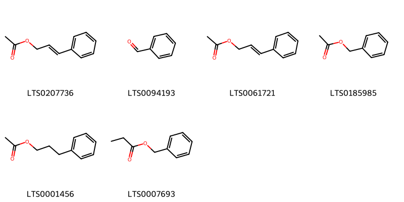{ width=100% }
    <figcaption>Hình ảnh cấu trúc hóa học của 6 hoạt chất thuộc nhóm Benzene and substituted derivatives gồm ['cinnamyl acetate (LTS0207736)', 'benzaldehyde (LTS0094193)', '3-phenyl-2-propenyl acetate (LTS0061721)', 'benzyl acetate (LTS0185985)', 'hydrocinnamyl acetate (LTS0001456)', 'benzyl propionate (LTS0007693)'].</figcaption>
</figure>
#### Nhóm Carboxylic acids and derivatives
<figure markdown="span">
    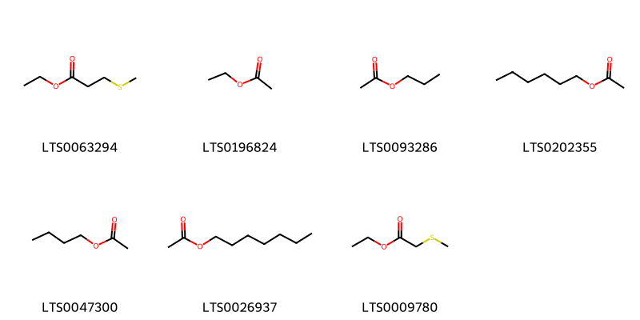{ width=100% }
    <figcaption>Hình ảnh cấu trúc hóa học của 7 hoạt chất thuộc nhóm Carboxylic acids and derivatives gồm ['ethyl 3-methylthiopropionate (LTS0063294)', 'ethyl acetate (LTS0196824)', 'propyl acetate (LTS0093286)', 'hexyl acetate (LTS0202355)', 'butyl acetate (LTS0047300)', 'heptyl acetate (LTS0026937)', 'ethyl (methylthio)acetate (LTS0009780)'].</figcaption>
</figure>
#### Nhóm Dibenzylbutane lignans
<figure markdown="span">
    { width=100% }
    <figcaption>Hình ảnh cấu trúc hóa học của 2 hoạt chất thuộc nhóm Dibenzylbutane lignans gồm ['(2s,3r)-2,3-bis[(4-hydroxy-3-methoxyphenyl)(¹³c)methyl](1-¹³c)butane-1,4-diol (LTS0268699)', 'secoisolariciresinol (LTS0086727)'].</figcaption>
</figure>
#### Nhóm Fatty Acyls
<figure markdown="span">
    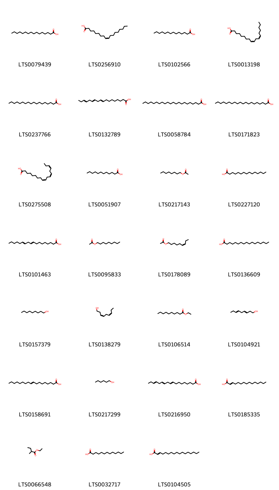{ width=100% }
    <figcaption>Hình ảnh cấu trúc hóa học của 27 hoạt chất thuộc nhóm Fatty Acyls gồm ['palmitic acid (LTS0079439)', 'oleic acid (LTS0256910)', 'myristic acid (LTS0102566)', 'linoleic (LTS0013198)', 'stearic acid (LTS0237766)', 'α linolenic acid (LTS0132789)', 'behenic acid (LTS0058784)', 'arachidic acid (LTS0171823)', 'α-linolenic acid (LTS0275508)', 'lauric acid (LTS0051907)', 'octyl acetate (LTS0217143)', 'pentadecanoic acid (LTS0227120)', '9,12-octadecadienoic acid (LTS0101463)', 'nonyl acetate (LTS0095833)', 'cis-6-nonenyl acetate (LTS0178089)', 'heptadecanoic acid (LTS0136609)', 'nonan-1-ol (LTS0157379)', '(3z,6z)-nona-3,6-dien-1-ol (LTS0138279)', 'ethyl caprate (LTS0106514)', '3,6-nonadienol (LTS0104921)', '9 octadecenoic acid (LTS0158691)', 'hexanol (LTS0217299)', 'octadeca-9,12,15-trienoic acid (LTS0216950)', 'pentadec-2-enoic acid (LTS0185335)', 'ethyl 2-methylbutyrate (LTS0066548)', 'n-tridecanoic acid (LTS0032717)', 'heptadec-2-enoic acid (LTS0104505)'].</figcaption>
</figure>
#### Nhóm Flavonoids
<figure markdown="span">
    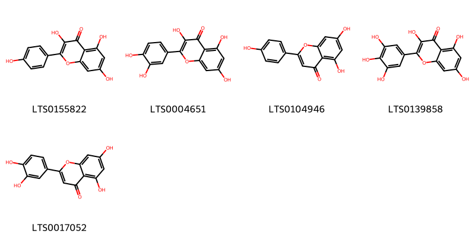{ width=100% }
    <figcaption>Hình ảnh cấu trúc hóa học của 5 hoạt chất thuộc nhóm Flavonoids gồm ['kaempherol (LTS0155822)', 'quercetin (LTS0004651)', 'chamomile (LTS0104946)', 'myricetin (LTS0139858)', 'luteolin (LTS0017052)'].</figcaption>
</figure>
#### Nhóm Furanoid lignans
<figure markdown="span">
    { width=100% }
    <figcaption>Hình ảnh cấu trúc hóa học của 3 hoạt chất thuộc nhóm Furanoid lignans gồm ['pinoresinol (LTS0057431)', 'matairesinol (LTS0193475)', 'lariciresinol (LTS0010950)'].</figcaption>
</figure>
#### Nhóm Organooxygen compounds
<figure markdown="span">
    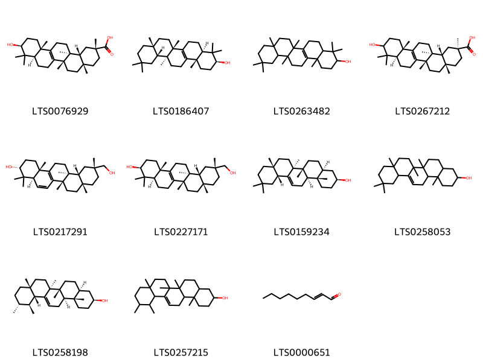{ width=100% }
    <figcaption>Hình ảnh cấu trúc hóa học của 11 hoạt chất thuộc nhóm Organooxygen compounds gồm ['(2r,4as,6as,8ar,10s,12as,14as,14br)-10-hydroxy-2,4a,6a,9,9,12a,14a-heptamethyl-1,3,4,5,6,7,8,8a,10,11,12,13,14,14b-tetradecahydropicene-2-carboxylic acid (LTS0076929)', 'isomultiflorenol (LTS0186407)', '4,4,6b,8a,11,11,12b,14b-octamethyl-1,2,3,4a,5,6,7,8,9,10,12,12a,13,14-tetradecahydropicen-3-ol (LTS0263482)', '(2s,4as,6as,8ar,12as,14as,14br)-10-hydroxy-2,4a,6a,9,9,12a,14a-heptamethyl-1,3,4,5,6,7,8,8a,10,11,12,13,14,14b-tetradecahydropicene-2-carboxylic acid (LTS0267212)', '(3r,4ar,6bs,8as,11r,12ar,12bs,14bs)-11-(hydroxymethyl)-4,4,6b,8a,11,12b,14b-heptamethyl-1,2,3,4a,7,8,9,10,12,12a,13,14-dodecahydropicen-3-ol (LTS0217291)', '(3s,4ar,6bs,8as,11r,12ar,12bs,14bs)-11-(hydroxymethyl)-4,4,6b,8a,11,12b,14b-heptamethyl-1,2,3,4a,5,6,7,8,9,10,12,12a,13,14-tetradecahydropicen-3-ol (LTS0227171)', '(3s,4as,6ar,6bs,8ar,12ar,14ar,14bs)-6a,6b,8a,11,11,14b-hexamethyl-2,3,4,4a,5,6,7,8,9,10,12,12a,14,14a-tetradecahydro-1h-picen-3-ol (LTS0159234)', '6a,6b,8a,11,11,14b-hexamethyl-2,3,4,4a,5,6,7,8,9,10,12,12a,14,14a-tetradecahydro-1h-picen-3-ol (LTS0258053)', '(3s,4as,6ar,6bs,8ar,11r,12s,12ar,14ar,14bs)-6a,6b,8a,11,12,14b-hexamethyl-1,2,3,4,4a,5,6,7,8,9,10,11,12,12a,14,14a-hexadecahydropicen-3-ol (LTS0258198)', '6a,6b,8a,11,12,14b-hexamethyl-1,2,3,4,4a,5,6,7,8,9,10,11,12,12a,14,14a-hexadecahydropicen-3-ol (LTS0257215)', '2-nonenal (LTS0000651)'].</figcaption>
</figure>
#### Nhóm Prenol lipids
<figure markdown="span">
    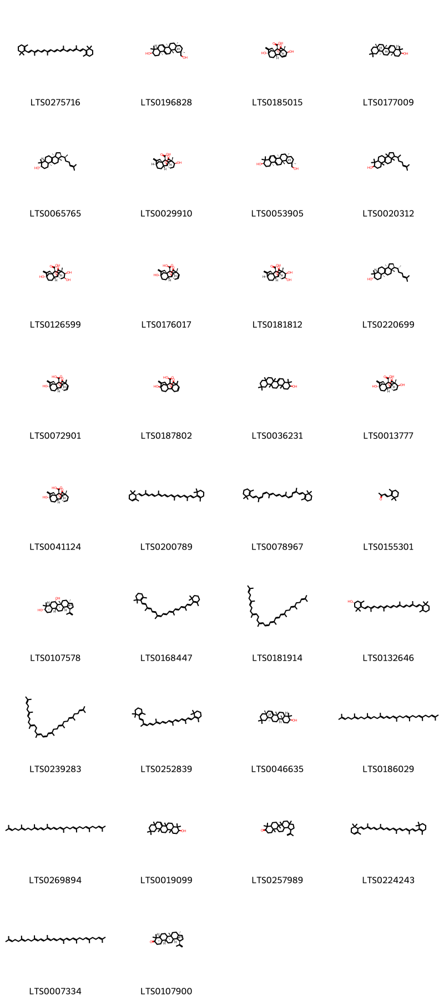{ width=100% }
    <figcaption>Hình ảnh cấu trúc hóa học của 34 hoạt chất thuộc nhóm Prenol lipids gồm ['β-carotene (LTS0275716)', 'karounidiol (LTS0196828)', 'gibberellin a3 (LTS0185015)', 'multiflorenol (LTS0177009)', '(+)-tirucallol (LTS0065765)', 'gibberellin a4 (LTS0029910)', '(3r,6bs,8as,11r,12ar,12bs,14br)-11-(hydroxymethyl)-4,4,6b,8a,11,12b,14b-heptamethyl-1,2,3,7,8,9,10,12,12a,13-decahydropicen-3-ol (LTS0053905)', 'lanster (LTS0020312)', 'gibberellin a8 (LTS0126599)', 'gibberellin a5 (LTS0176017)', 'gibberellin a34 (LTS0181812)', 'euphol (LTS0220699)', '(1r,2r,5s,8s,9s,10r)-5-hydroxy-11-methyl-6-methylidene-16-oxo-15-oxapentacyclo[9.3.2.1⁵,⁸.0¹,¹⁰.0²,⁸]heptadec-12-ene-9-carboxylic acid (LTS0072901)', '5-hydroxy-11-methyl-6-methylidene-16-oxo-15-oxapentacyclo[9.3.2.1⁵,⁸.0¹,¹⁰.0²,⁸]heptadec-12-ene-9-carboxylic acid (LTS0187802)', '4,4,6b,8a,11,11,12b,14b-octamethyl-1,2,3,4a,5,7,8,9,10,12,12a,13,14,14a-tetradecahydropicen-3-ol (LTS0036231)', 'gibberellin a1 (LTS0013777)', 'gibberellin a20 (LTS0041124)', '(+)-α-carotene (LTS0200789)', '1,3,3-trimethyl-2-[(1e,3z,5z,7e,9e,11e,13z,15z,17e)-3,7,12,16-tetramethyl-18-(2,6,6-trimethylcyclohex-1-en-1-yl)octadeca-1,3,5,7,9,11,13,15,17-nonaen-1-yl]cyclohex-1-ene (LTS0078967)', 'β-ionone (LTS0155301)', '(1r,3ar,5ar,5br,6s,7ar,9s,11as,11br,13ar,13br)-3a,5a,5b,8,8,11a-hexamethyl-1-(prop-1-en-2-yl)-hexadecahydrocyclopenta[a]chrysene-6,9-diol (LTS0107578)', 'β,β-carotene (LTS0168447)', 'phytofluene (LTS0181914)', 'cryptoxanthin (LTS0132646)', 'cis-phytoene (LTS0239283)', '(9z)-β-carotene (LTS0252839)', '(3s,4ar,6ar,8ar,12as,12bs,14ar,14br)-4,4,6a,8a,11,11,12b,14b-octamethyl-1,2,3,4a,5,6,8,9,10,12,12a,13,14,14a-tetradecahydropicen-3-ol (LTS0046635)', 'phytoene (LTS0186029)', 'all-trans-phytofluene (LTS0269894)', 'taraxerol (LTS0019099)', '3a,5a,5b,8,8,11a-hexamethyl-1-(prop-1-en-2-yl)-tetradecahydro-1h-cyclopenta[a]chrysen-9-one (LTS0257989)', 'α-carotene (LTS0224243)', 'zeta-carotene (LTS0007334)', 'lupenone (LTS0107900)'].</figcaption>
</figure>
#### Nhóm Purine nucleosides
<figure markdown="span">
    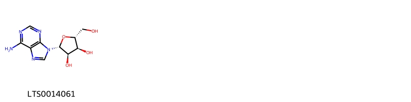{ width=100% }
    <figcaption>Hình ảnh cấu trúc hóa học của 1 hoạt chất thuộc nhóm Purine nucleosides gồm ['adenosine (LTS0014061)'].</figcaption>
</figure>
#### Nhóm Steroids and steroid derivatives
<figure markdown="span">
    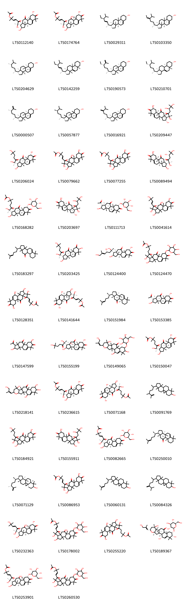{ width=100% }
    <figcaption>Hình ảnh cấu trúc hóa học của 58 hoạt chất thuộc nhóm Steroids and steroid derivatives gồm ['cucurbitacin b (LTS0112140)', 'cucurbitacin a (LTS0174764)', 'phytosterol (LTS0029311)', 'avenasterol (LTS0103350)', '22,23-dihydrobrassicasterol (LTS0204629)', 'chondrillasterol (LTS0142259)', '(1r,3as,3bs,7s,9ar,9bs,11ar)-1-[(2r,5s)-5-ethyl-6-methylhept-6-en-2-yl]-9a,11a-dimethyl-1h,2h,3h,3ah,3bh,4h,6h,7h,8h,9h,9bh,10h,11h-cyclopenta[a]phenanthren-7-ol (LTS0190573)', '(1r,5as,7s,9as,11ar)-1-[(2r,5s)-5-ethyl-6-methylheptan-2-yl]-9a,11a-dimethyl-1h,2h,3h,3ah,5h,5ah,6h,7h,8h,9h,9bh,10h,11h-cyclopenta[a]phenanthren-7-ol (LTS0210701)', '(1r,3as,3bs,7s,9ar,9bs,11ar)-1-[(2r,5s)-5,6-dimethylhept-6-en-2-yl]-9a,11a-dimethyl-1h,2h,3h,3ah,3bh,4h,6h,7h,8h,9h,9bh,10h,11h-cyclopenta[a]phenanthren-7-ol (LTS0000507)', '(1r,3as,3bs,7s,9bs)-1-[(2r,5r)-5,6-dimethylheptan-2-yl]-9a,11a-dimethyl-1h,2h,3h,3ah,3bh,4h,6h,7h,8h,9h,9bh,10h,11h-cyclopenta[a]phenanthren-7-ol (LTS0057877)', '24-methylenecholesterol (LTS0016921)', '(1r,2r,3as,3bs,8s,9ar,9br,11ar)-2,8-dihydroxy-3a,6,6,9b,11a-pentamethyl-1-[(2r,5r)-2,5,6-trihydroxy-6-methyl-3-oxoheptan-2-yl]-1h,2h,3h,3bh,4h,8h,9h,9ah,11h-cyclopenta[a]phenanthrene-7,10-dione (LTS0209447)', '23,24-dihydrocucurbitacin d (LTS0206024)', '6-[2,8-dihydroxy-9b-(hydroxymethyl)-3a,6,6,11a-tetramethyl-7,10-dioxo-1h,2h,3h,3bh,4h,8h,9h,9ah,11h-cyclopenta[a]phenanthren-1-yl]-6-hydroxy-2-methyl-5-oxohept-3-en-2-yl acetate (LTS0079662)', '6-{2,8-dihydroxy-3a,6,6,9b,11a-pentamethyl-7,10-dioxo-1h,2h,3h,3bh,4h,8h,9h,9ah,11h-cyclopenta[a]phenanthren-1-yl}-6-hydroxy-2-methyl-5-oxoheptan-2-yl acetate (LTS0077255)', '(1s,2s,3ar,3br,8s,9ar,9br,11as)-2,8-dihydroxy-3a,6,6,9b,11a-pentamethyl-1-[(2s,5s)-2,5,6-trihydroxy-6-methyl-3-oxoheptan-2-yl]-1h,2h,3h,3bh,4h,8h,9h,9ah,11h-cyclopenta[a]phenanthrene-7,10-dione (LTS0089494)', '(6r)-6-[(1r,2r,3as,3bs,8s,9ar,9br,11ar)-2-hydroxy-3a,6,6,9b,11a-pentamethyl-7,10-dioxo-8-{[(2s,3r,4s,5s,6r)-3,4,5-trihydroxy-6-(hydroxymethyl)oxan-2-yl]oxy}-1h,2h,3h,3bh,4h,8h,9h,9ah,11h-cyclopenta[a]phenanthren-1-yl]-6-hydroxy-2-methyl-5-oxoheptan-2-yl acetate (LTS0168282)', 'cucurbitacin h (LTS0203697)', '(1r,2r,3as,3bs,8s,9ar,9br,11ar)-1-acetyl-2-hydroxy-3a,6,6,9b,11a-pentamethyl-8-{[(2s,3r,4s,5s,6r)-3,4,5-trihydroxy-6-(hydroxymethyl)oxan-2-yl]oxy}-1h,2h,3h,3bh,4h,8h,9h,9ah,11h-cyclopenta[a]phenanthrene-7,10-dione (LTS0111713)', '1-(2,6-dihydroxy-6-methyl-3-oxohept-4-en-2-yl)-2,8-dihydroxy-9b-(hydroxymethyl)-3a,6,6,11a-tetramethyl-1h,2h,3h,3bh,4h,8h,9h,9ah,11h-cyclopenta[a]phenanthrene-7,10-dione (LTS0041614)', '3a,6,6,11a-tetramethyl-1-(6-methylhept-5-en-2-yl)-1h,2h,3h,3bh,4h,7h,8h,9h,9ah,9bh,11h-cyclopenta[a]phenanthren-10-one (LTS0183297)', '(1r,2r,3as,3bs,7s,9ar,9br,11ar)-1-[(2r)-2,6-dihydroxy-6-methyl-3-oxoheptan-2-yl]-2,7-dihydroxy-3a,6,6,9b,11a-pentamethyl-1h,2h,3h,3bh,4h,7h,9h,9ah,11h-cyclopenta[a]phenanthrene-8,10-dione (LTS0203425)', '(1r,2r,3as,3bs,8s,9ar,9br,11ar)-2,8-dihydroxy-3a,6,6,9b,11a-pentamethyl-1-[(2s,4r,5e)-2,4,7-trihydroxy-6-methylhept-5-en-2-yl]-1h,2h,3h,3bh,4h,8h,9h,9ah,11h-cyclopenta[a]phenanthrene-7,10-dione (LTS0124400)', '6-hydroxy-6-(2-hydroxy-3a,6,6,9b,11a-pentamethyl-7,10-dioxo-8-{[3,4,5-trihydroxy-6-(hydroxymethyl)oxan-2-yl]oxy}-1h,2h,3h,3bh,4h,8h,9h,9ah,11h-cyclopenta[a]phenanthren-1-yl)-2-methyl-5-oxoheptan-2-yl acetate (LTS0124470)', '6-hydroxy-2-methyl-5-oxo-6-{2,4,8-trihydroxy-3a,6,6,9b,11a-pentamethyl-7,10-dioxo-1h,2h,3h,3bh,4h,8h,9h,9ah,11h-cyclopenta[a]phenanthren-1-yl}hept-3-en-2-yl acetate (LTS0128351)', '(3e,6r)-6-[(1r,2r,3as,3bs,4s,8s,9ar,9bs,11ar)-2,4,8-trihydroxy-3a,6,6,9b,11a-pentamethyl-7,10-dioxo-1h,2h,3h,3bh,4h,8h,9h,9ah,11h-cyclopenta[a]phenanthren-1-yl]-6-hydroxy-2-methyl-5-oxohept-3-en-2-yl acetate (LTS0141644)', '(1r,3as,3br,9as,9bs,11ar)-3a,6,6,11a-tetramethyl-1-[(2r)-6-methylhept-5-en-2-yl]-1h,2h,3h,3bh,4h,7h,8h,9h,9ah,9bh,11h-cyclopenta[a]phenanthren-10-one (LTS0151984)', '(1r,2r,3as,3bs,8s,9ar,9br,11ar)-1-acetyl-2,8-dihydroxy-3a,6,6,9b,11a-pentamethyl-1h,2h,3h,3bh,4h,8h,9h,9ah,11h-cyclopenta[a]phenanthrene-7,10-dione (LTS0153385)', '1-acetyl-2,8-dihydroxy-3a,6,6,9b,11a-pentamethyl-1h,2h,3h,3bh,4h,8h,9h,9ah,11h-cyclopenta[a]phenanthrene-7,10-dione (LTS0147599)', '(1r,2r,3as,3bs,8s,9ar,9br,11ar)-1-[(2r)-2,6-dihydroxy-6-methyl-3-oxoheptan-2-yl]-2,8-dihydroxy-9b-(hydroxymethyl)-3a,6,6,11a-tetramethyl-1h,2h,3h,3bh,4h,8h,9h,9ah,11h-cyclopenta[a]phenanthrene-7,10-dione (LTS0155199)', '8,17,21-trihydroxy-6-(3-hydroxy-2-methylprop-1-en-1-yl)-2,8,10,13,18,18-hexamethyl-16-{[3,4,5-trihydroxy-6-(hydroxymethyl)oxan-2-yl]oxy}-5-oxapentacyclo[11.8.0.0²,¹⁰.0⁴,⁹.0¹⁴,¹⁹]henicos-19-en-12-one (LTS0149065)', 'dihydrocucurbitacin b (LTS0150047)', '8,16,17,21-tetrahydroxy-6-(3-hydroxy-2-methylprop-1-en-1-yl)-2,8,10,13,18,18-hexamethyl-5-oxapentacyclo[11.8.0.0²,¹⁰.0⁴,⁹.0¹⁴,¹⁹]henicos-19-en-12-one (LTS0218141)', '(3e,6r)-6-[(1r,2r,3as,3bs,8s,9as,9br,11ar)-2,8-dihydroxy-3a,6,6,9b,11a-pentamethyl-7,10-dioxo-1h,2h,3h,3bh,4h,8h,9h,9ah,11h-cyclopenta[a]phenanthren-1-yl]-6-hydroxy-2-methyl-5-oxohept-3-en-2-yl acetate (LTS0236615)', '(6r)-6-[(1r,2r,3as,3bs,4s,8s,9ar,9bs,11ar)-2,4,8-trihydroxy-3a,6,6,9b,11a-pentamethyl-7,10-dioxo-1h,2h,3h,3bh,4h,8h,9h,9ah,11h-cyclopenta[a]phenanthren-1-yl]-6-hydroxy-2-methyl-5-oxoheptan-2-yl acetate (LTS0071168)', '15-(5,6-dimethylhept-6-en-2-yl)-7,7,12,16-tetramethylpentacyclo[9.7.0.0¹,³.0³,⁸.0¹²,¹⁶]octadecan-6-ol (LTS0091769)', '1-(2,6-dihydroxy-6-methyl-3-oxoheptan-2-yl)-2,8-dihydroxy-3a,6,6,9b,11a-pentamethyl-1h,2h,3h,3bh,4h,8h,9h,9ah,11h-cyclopenta[a]phenanthrene-7,10-dione (LTS0184921)', '2,8-dihydroxy-3a,6,6,9b,11a-pentamethyl-1-(2,5,6-trihydroxy-6-methyl-3-oxoheptan-2-yl)-1h,2h,3h,3bh,4h,8h,9h,9ah,11h-cyclopenta[a]phenanthrene-7,10-dione (LTS0155911)', '(3e,6r)-6-[(1r,2r,3as,3bs,8s,9ar,9br,11ar)-2-hydroxy-3a,6,6,9b,11a-pentamethyl-7,10-dioxo-8-{[(2s,3r,4s,5s,6r)-3,4,5-trihydroxy-6-(hydroxymethyl)oxan-2-yl]oxy}-1h,2h,3h,3bh,4h,8h,9h,9ah,11h-cyclopenta[a]phenanthren-1-yl]-6-hydroxy-2-methyl-5-oxohept-3-en-2-yl acetate (LTS0082665)', '(1r,3as,3br,9ar,9bs,11ar)-3a,6,6,11a-tetramethyl-1-[(2r)-6-methylhept-5-en-2-yl]-1h,2h,3h,3bh,4h,7h,8h,9h,9ah,9bh,11h-cyclopenta[a]phenanthren-10-one (LTS0250010)', '(1s,3r,6s,8r,11s,12s,15r,16r)-15-[(2r,5r)-5,6-dimethylhept-6-en-2-yl]-7,7,12,16-tetramethylpentacyclo[9.7.0.0¹,³.0³,⁸.0¹²,¹⁶]octadecan-6-ol (LTS0071129)', '6-{2,8-dihydroxy-3a,6,6,9b,11a-pentamethyl-7,10-dioxo-1h,2h,3h,3bh,4h,8h,9h,9ah,11h-cyclopenta[a]phenanthren-1-yl}-6-hydroxy-2-methyl-5-oxohept-3-en-2-yl acetate (LTS0086953)', 'cycloartenol (LTS0060131)', '7,7,12,16-tetramethyl-15-(6-methyl-5-methylideneheptan-2-yl)pentacyclo[9.7.0.0¹,³.0³,⁸.0¹²,¹⁶]octadecan-6-ol (LTS0084326)', '(1r,2r,3as,3bs,8s,9ar,9br,11ar)-1-[(2r,4e)-2,6-dihydroxy-6-methyl-3-oxohept-4-en-2-yl]-2,8-dihydroxy-9b-(hydroxymethyl)-3a,6,6,11a-tetramethyl-1h,2h,3h,3bh,4h,8h,9h,9ah,11h-cyclopenta[a]phenanthrene-7,10-dione (LTS0232363)', '6-hydroxy-6-[2-hydroxy-9b-(hydroxymethyl)-3a,6,6,11a-tetramethyl-7,10-dioxo-8-{[3,4,5-trihydroxy-6-(hydroxymethyl)oxan-2-yl]oxy}-1h,2h,3h,3bh,4h,8h,9h,9ah,11h-cyclopenta[a]phenanthren-1-yl]-2-methyl-5-oxohept-3-en-2-yl acetate (LTS0178002)', '6-hydroxy-2-methyl-5-oxo-6-{2,4,8-trihydroxy-3a,6,6,9b,11a-pentamethyl-7,10-dioxo-1h,2h,3h,3bh,4h,8h,9h,9ah,11h-cyclopenta[a]phenanthren-1-yl}heptan-2-yl acetate (LTS0255220)', '(1s,2s,4r,6s,8s,9r,10r,13s,14r,16s,17r,21s)-8,17,21-trihydroxy-6-[(1e)-3-hydroxy-2-methylprop-1-en-1-yl]-2,8,10,13,18,18-hexamethyl-16-{[(2r,3r,4s,5s,6r)-3,4,5-trihydroxy-6-(hydroxymethyl)oxan-2-yl]oxy}-5-oxapentacyclo[11.8.0.0²,¹⁰.0⁴,⁹.0¹⁴,¹⁹]henicos-19-en-12-one (LTS0189367)', '(3e,6r)-6-[(1r,2r,3as,3bs,8s,9ar,9br,11ar)-2-hydroxy-9b-(hydroxymethyl)-3a,6,6,11a-tetramethyl-7,10-dioxo-8-{[(2s,3r,4s,5s,6r)-3,4,5-trihydroxy-6-(hydroxymethyl)oxan-2-yl]oxy}-1h,2h,3h,3bh,4h,8h,9h,9ah,11h-cyclopenta[a]phenanthren-1-yl]-6-hydroxy-2-methyl-5-oxohept-3-en-2-yl acetate (LTS0253901)', '6-hydroxy-6-(2-hydroxy-3a,6,6,9b,11a-pentamethyl-7,10-dioxo-8-{[3,4,5-trihydroxy-6-(hydroxymethyl)oxan-2-yl]oxy}-1h,2h,3h,3bh,4h,8h,9h,9ah,11h-cyclopenta[a]phenanthren-1-yl)-2-methyl-5-oxohept-3-en-2-yl acetate (LTS0260530)', 'cycloartenol (LTS0269561)', '(1s,2s,4r,6s,8s,9r,10r,13s,14r,16s,17r,21s)-8,16,17,21-tetrahydroxy-6-[(1e)-3-hydroxy-2-methylprop-1-en-1-yl]-2,8,10,13,18,18-hexamethyl-5-oxapentacyclo[11.8.0.0²,¹⁰.0⁴,⁹.0¹⁴,¹⁹]henicos-19-en-12-one (LTS0002605)', '1-acetyl-2-hydroxy-3a,6,6,9b,11a-pentamethyl-8-{[3,4,5-trihydroxy-6-(hydroxymethyl)oxan-2-yl]oxy}-1h,2h,3h,3bh,4h,8h,9h,9ah,11h-cyclopenta[a]phenanthrene-7,10-dione (LTS0273134)', '(1r,2r,3as,3bs,8s,9ar,9br,11ar)-1-[(2r,4e)-2,6-dihydroxy-6-methyl-3-oxohept-4-en-2-yl]-2-hydroxy-3a,6,6,9b,11a-pentamethyl-8-{[(2s,3r,4s,5s,6r)-3,4,5-trihydroxy-6-(hydroxymethyl)oxan-2-yl]oxy}-1h,2h,3h,3bh,4h,8h,9h,9ah,11h-cyclopenta[a]phenanthrene-7,10-dione (LTS0114643)', '2,8-dihydroxy-3a,6,6,9b,11a-pentamethyl-1-(2,4,7-trihydroxy-6-methylhept-5-en-2-yl)-1h,2h,3h,3bh,4h,8h,9h,9ah,11h-cyclopenta[a]phenanthrene-7,10-dione (LTS0023317)', '24-methylenecycloartanol (LTS0018584)', '(6r)-6-[(1r,2r,3as,3bs,7s,9ar,9br,11ar)-2,7-dihydroxy-3a,6,6,9b,11a-pentamethyl-8,10-dioxo-1h,2h,3h,3bh,4h,7h,9h,9ah,11h-cyclopenta[a]phenanthren-1-yl]-6-hydroxy-2-methyl-5-oxoheptan-2-yl acetate (LTS0036284)', '1-(2,6-dihydroxy-6-methyl-3-oxoheptan-2-yl)-2,8-dihydroxy-9b-(hydroxymethyl)-3a,6,6,11a-tetramethyl-1h,2h,3h,3bh,4h,8h,9h,9ah,11h-cyclopenta[a]phenanthrene-7,10-dione (LTS0045393)'].</figcaption>
</figure>

---

### Dược dân tộc học

Danh sách các quốc gia có sử dụng *Cucumis melo* trong điều trị các bệnh. 

| Country   | Disease                                                   | Bệnh                                                               |
|:----------|:----------------------------------------------------------|:-------------------------------------------------------------------|
| China     | Antivinous, Digestive, Diuretic, Emmenagogue, Refrigerant | Kháng sinh, Tiêu hóa, Thuốc lợi tiểu, Chất làm lạnh, Chất làm lạnh |
| Elsewhere | Diuretic                                                  | Thuốc lợi tiêu                                                     |
| Kurdistan | Vermifuge                                                 | Thuốc diệt sán                                                     |
| Mexico    | Emetic                                                    | Phôi                                                               |
| Turkey    | Taenifuge                                                 | Taenifuge                                                          |

---

---
## Cucumis melos
### Thông tin về thực vật

!!! info "Phân loại thực vật của *Cucumis melo* từ GIBF:"
    - **Kingdom:** Plantae
    - **Phylum:** Tracheophyta
    - **Order:** Cucurbitales
    - **Family:** Cucurbitaceae
    - **Genus:** Cucumis
    - **Species:** *Cucumis melo*

 

| Label (VI)   | Label (EN)   | Scientific Name   | Descriptions (VI)   | Descriptions (EN)   | Also Known As (VI)   | Also Known As (EN)                                                |
|:-------------|:-------------|:------------------|:--------------------|:--------------------|:---------------------|:------------------------------------------------------------------|
| N/A          | N/A          | Cucumis melo      | loài thực vật       | species of plant    | ['dưa gang']         | ['melon', 'muskmelon', 'melon plant', 'Musk melon', 'Musk Melon'] |

#### Phân bố trên thế giới

**Từ CSDL GIBF** nan, Brazil, Saint Kitts and Nevis, British Indian Ocean Territory, Sweden, Nepal, China, New Zealand, Ecuador, Spain, Netherlands, Puerto Rico, United States of America, Greece, Costa Rica, Russian Federation, Dominican Republic, Colombia, Argentina, Sao Tome and Principe, French Guiana, Mexico, Benin, Norway, Maldives, Belgium, Chinese Taipei, Iraq, Hungary, Cambodia, Australia, Italy, India, Switzerland, Peru, Venezuela (Bolivarian Republic of)

#### Phân bố tại Việt Nam

**Từ CSDL GIBF**: Không có ghi nhận ở Việt Nam

---
### Thành phần hóa học
        
- Theo cơ sở dữ liệu lotus: Từ loài *Cucumis melo* đã phân lập và xác định được Chưa có hoạt chất nào được phân lập. hoạt chất thuộc về các nhóm Không có hoạt chất nào được phân lập. 

Không có hình ảnh nào được tạo ra

---

### Dược dân tộc học

Danh sách các quốc gia có sử dụng *Cucumis melo* trong điều trị các bệnh. 

| Country   | Disease                                             | Bệnh                                            |
|:----------|:----------------------------------------------------|:------------------------------------------------|
| Turkey    | Demulcent, Diuretic, Emetic, Stomachic, Refrigerant | Demulcent, lợi tiểu, nôn, dạ dày, chất làm lạnh |

---

---
## Cucumis myriocarpus
### Thông tin về thực vật

!!! info "Phân loại thực vật của *Cucumis myriocarpus* từ GIBF:"
    - **Kingdom:** Plantae
    - **Phylum:** Tracheophyta
    - **Order:** Cucurbitales
    - **Family:** Cucurbitaceae
    - **Genus:** Cucumis
    - **Species:** *Cucumis myriocarpus*

 

| Label (VI)   | Label (EN)   | Scientific Name     | Descriptions (VI)   | Descriptions (EN)   | Also Known As (VI)   | Also Known As (EN)   |
|:-------------|:-------------|:--------------------|:--------------------|:--------------------|:---------------------|:---------------------|
| N/A          | N/A          | Cucumis myriocarpus | loài thực vật       | species of plant    | ['']                 | ['']                 |

#### Phân bố trên thế giới

**Từ CSDL GIBF** nan, Botswana, South Africa, Australia, Russian Federation, Argentina, Spain

#### Phân bố tại Việt Nam

**Từ CSDL GIBF**: Không có ghi nhận ở Việt Nam

---
### Thành phần hóa học
        
- Theo cơ sở dữ liệu lotus: Từ loài *Cucumis myriocarpus* đã phân lập và xác định được Chưa có hoạt chất nào được phân lập. hoạt chất thuộc về các nhóm Không có hoạt chất nào được phân lập. 

Không có hình ảnh nào được tạo ra

---

### Dược dân tộc học

Danh sách các quốc gia có sử dụng *Cucumis myriocarpus* trong điều trị các bệnh. 

| Country      | Disease   | Bệnh     |
|:-------------|:----------|:---------|
| Africa       | Poison    | Chất độc |
| Africa(Suto) | Purgative | Thuốc xổ |

---

---
## Cucumis profetarum
### Thông tin về thực vật

!!! info "Phân loại thực vật của *Cucumis prophetarum* từ GIBF:"
    - **Kingdom:** Plantae
    - **Phylum:** Tracheophyta
    - **Order:** Cucurbitales
    - **Family:** Cucurbitaceae
    - **Genus:** Cucumis
    - **Species:** *Cucumis prophetarum*

 

| Label (VI)   | Label (EN)   | Scientific Name     | Descriptions (VI)   | Descriptions (EN)   | Also Known As (VI)   | Also Known As (EN)   |
|:-------------|:-------------|:--------------------|:--------------------|:--------------------|:---------------------|:---------------------|
| N/A          | N/A          | Cucumis myriocarpus | loài thực vật       | species of plant    | ['']                 | ['']                 |

#### Phân bố trên thế giới

**Từ CSDL GIBF** United Arab Emirates, Kenya, Saudi Arabia, Pakistan, Israel, Palestine, State of, Oman, India, Jordan, Yemen

#### Phân bố tại Việt Nam

**Từ CSDL GIBF**: Không có ghi nhận ở Việt Nam

---
### Thành phần hóa học
        
- Theo cơ sở dữ liệu lotus: Từ loài *Cucumis prophetarum* đã phân lập và xác định được Chưa có hoạt chất nào được phân lập. hoạt chất thuộc về các nhóm Không có hoạt chất nào được phân lập. 

Không có hình ảnh nào được tạo ra

---

### Dược dân tộc học

Danh sách các quốc gia có sử dụng *Cucumis prophetarum* trong điều trị các bệnh. 

| Country   | Disease   | Bệnh   |
|:----------|:----------|:-------|
| Sudan     | Emetic    | Phôi   |

---

---
## Cucumis prophetarum
### Thông tin về thực vật

!!! info "Phân loại thực vật của *Cucumis prophetarum* từ GIBF:"
    - **Kingdom:** Plantae
    - **Phylum:** Tracheophyta
    - **Order:** Cucurbitales
    - **Family:** Cucurbitaceae
    - **Genus:** Cucumis
    - **Species:** *Cucumis prophetarum*

 

| Label (VI)   | Label (EN)   | Scientific Name     | Descriptions (VI)   | Descriptions (EN)   | Also Known As (VI)   | Also Known As (EN)   |
|:-------------|:-------------|:--------------------|:--------------------|:--------------------|:---------------------|:---------------------|
| N/A          | N/A          | Cucumis prophetarum | loài thực vật       | species of plant    | ['']                 | ['']                 |

#### Phân bố trên thế giới

**Từ CSDL GIBF** United Arab Emirates, Kenya, Saudi Arabia, Pakistan, Israel, Palestine, State of, Oman, India, Jordan, Yemen

#### Phân bố tại Việt Nam

**Từ CSDL GIBF**: Không có ghi nhận ở Việt Nam

---
### Thành phần hóa học
        
- Theo cơ sở dữ liệu lotus: Từ loài *Cucumis prophetarum* đã phân lập và xác định được 2 hoạt chất thuộc về các nhóm Steroids and steroid derivatives. 

|    | chemicalTaxonomyClassyfireClass   |   smiles_count |
|---:|:----------------------------------|---------------:|
|  0 | Steroids and steroid derivatives  |              2 |

#### Nhóm Steroids and steroid derivatives
<figure markdown="span">
    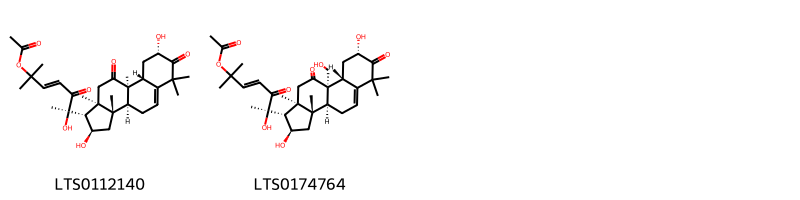{ width=100% }
    <figcaption>Hình ảnh cấu trúc hóa học của 2 hoạt chất thuộc nhóm Steroids and steroid derivatives gồm ['cucurbitacin b (LTS0112140)', 'cucurbitacin a (LTS0174764)'].</figcaption>
</figure>

---

### Dược dân tộc học

Danh sách các quốc gia có sử dụng *Cucumis prophetarum* trong điều trị các bệnh. 

| Country   | Disease                   | Bệnh                         |
|:----------|:--------------------------|:-----------------------------|
| Elsewhere | Poison, Purgative, Emetic | Chất độc, thanh lọc, nôn mửa |
| Sudan     | Emetic                    | Phôi                         |

---

---
## Cucumis sativus
### Thông tin về thực vật

!!! info "Phân loại thực vật của *Cucumis sativus* từ GIBF:"
    - **Kingdom:** Plantae
    - **Phylum:** Tracheophyta
    - **Order:** Cucurbitales
    - **Family:** Cucurbitaceae
    - **Genus:** Cucumis
    - **Species:** *Cucumis sativus*

 

| Label (VI)   | Label (EN)   | Scientific Name   | Descriptions (VI)   | Descriptions (EN)                                  | Also Known As (VI)   | Also Known As (EN)                                   |
|:-------------|:-------------|:------------------|:--------------------|:---------------------------------------------------|:---------------------|:-----------------------------------------------------|
| N/A          | N/A          | Cucumis sativus   | loài thực vật       | species of plant in the Cucurbitaceae gourd family | ['Dưa leo']          | ['gherkin plant', 'cucumber', 'hard green cumplant'] |

#### Phân bố trên thế giới

**Từ CSDL GIBF** Brazil, United Arab Emirates, Czechia, Sweden, Uzbekistan, Guadeloupe, Nepal, China, New Zealand, Ecuador, Thailand, Spain, Bolivia (Plurinational State of), Sri Lanka, Puerto Rico, United States of America, Korea, Republic of, Greece, Indonesia, Costa Rica, Pakistan, Russian Federation, Dominican Republic, Colombia, Cuba, Argentina, Estonia, Belarus, Hong Kong, Mexico, Benin, Norway, Belgium, Malaysia, Georgia, Canada, Germany, Panama, Austria, Nicaragua, Hungary, Martinique, Ukraine, Slovakia, Australia, India, Switzerland, Peru, France, Venezuela (Bolivarian Republic of)

#### Phân bố tại Việt Nam

**Từ CSDL GIBF**: Không có ghi nhận ở Việt Nam

---
### Thành phần hóa học
        
- Theo cơ sở dữ liệu lotus: Từ loài *Cucumis sativus* đã phân lập và xác định được 164 hoạt chất thuộc về các nhóm Fatty Acyls, Benzothiazoles, Perylenequinones, Benzene and substituted derivatives, Flavonoids, Dibenzylbutane lignans, Purine nucleosides, Carboxylic acids and derivatives, Cinnamic acids and derivatives, Steroids and steroid derivatives, Phenols, Organooxygen compounds, Phenylpropanoic acids, Furanoid lignans, Prenol lipids, Glycerophospholipids, Organonitrogen compounds, Indoles and derivatives. 

|    | chemicalTaxonomyClassyfireClass     |   smiles_count |
|---:|:------------------------------------|---------------:|
|  0 | Benzene and substituted derivatives |              3 |
|  1 | Benzothiazoles                      |              1 |
|  2 | Carboxylic acids and derivatives    |              2 |
|  3 | Cinnamic acids and derivatives      |              6 |
|  4 | Dibenzylbutane lignans              |              2 |
|  5 | Fatty Acyls                         |             11 |
|  6 | Flavonoids                          |             58 |
|  7 | Furanoid lignans                    |              7 |
|  8 | Glycerophospholipids                |              1 |
|  9 | Indoles and derivatives             |              3 |
| 10 | Organonitrogen compounds            |              1 |
| 11 | Organooxygen compounds              |              8 |
| 12 | Perylenequinones                    |              1 |
| 13 | Phenols                             |              2 |
| 14 | Phenylpropanoic acids               |              1 |
| 15 | Prenol lipids                       |             29 |
| 16 | Purine nucleosides                  |              3 |
| 17 | Steroids and steroid derivatives    |             25 |

#### Nhóm Benzene and substituted derivatives
<figure markdown="span">
    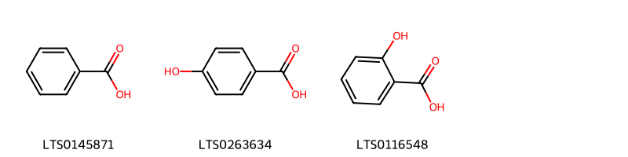{ width=100% }
    <figcaption>Hình ảnh cấu trúc hóa học của 3 hoạt chất thuộc nhóm Benzene and substituted derivatives gồm ['benzoic acid (LTS0145871)', 'p-hydroxybenzoic acid (LTS0263634)', 'salicyclic acid (LTS0116548)'].</figcaption>
</figure>
#### Nhóm Benzothiazoles
<figure markdown="span">
    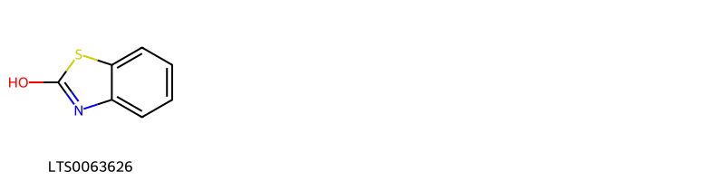{ width=100% }
    <figcaption>Hình ảnh cấu trúc hóa học của 1 hoạt chất thuộc nhóm Benzothiazoles gồm ['2-benzothiazolone (LTS0063626)'].</figcaption>
</figure>
#### Nhóm Carboxylic acids and derivatives
<figure markdown="span">
    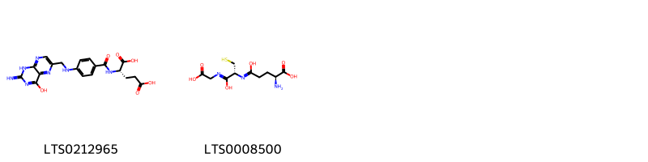{ width=100% }
    <figcaption>Hình ảnh cấu trúc hóa học của 2 hoạt chất thuộc nhóm Carboxylic acids and derivatives gồm ['acid, folic (LTS0212965)', '(2s)-2-amino-4-{[(1r)-1-(carboxymethyl-c-hydroxycarbonimidoyl)-2-sulfanylethyl]-c-hydroxycarbonimidoyl}butanoic acid (LTS0008500)'].</figcaption>
</figure>
#### Nhóm Cinnamic acids and derivatives
<figure markdown="span">
    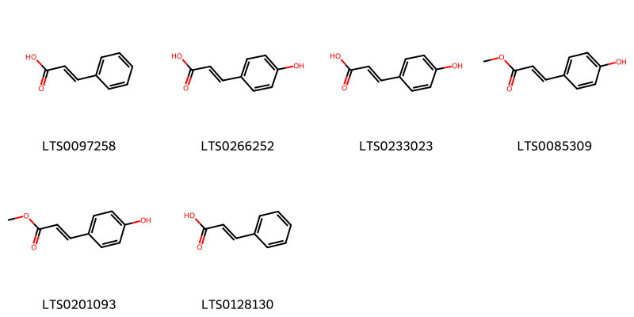{ width=100% }
    <figcaption>Hình ảnh cấu trúc hóa học của 6 hoạt chất thuộc nhóm Cinnamic acids and derivatives gồm ['phenylacrylic acid (LTS0097258)', 'para-coumaric acid (LTS0266252)', 'hydroxycinnamic acid (LTS0233023)', 'methyl (2e)-3-(4-hydroxyphenyl)prop-2-enoate (LTS0085309)', 'methyl hydroxycinnamate (LTS0201093)', 'cinnamic acid (LTS0128130)'].</figcaption>
</figure>
#### Nhóm Dibenzylbutane lignans
<figure markdown="span">
    { width=100% }
    <figcaption>Hình ảnh cấu trúc hóa học của 2 hoạt chất thuộc nhóm Dibenzylbutane lignans gồm ['(2s,3r)-2,3-bis[(4-hydroxy-3-methoxyphenyl)(¹³c)methyl](1-¹³c)butane-1,4-diol (LTS0268699)', 'secoisolariciresinol (LTS0086727)'].</figcaption>
</figure>
#### Nhóm Fatty Acyls
<figure markdown="span">
    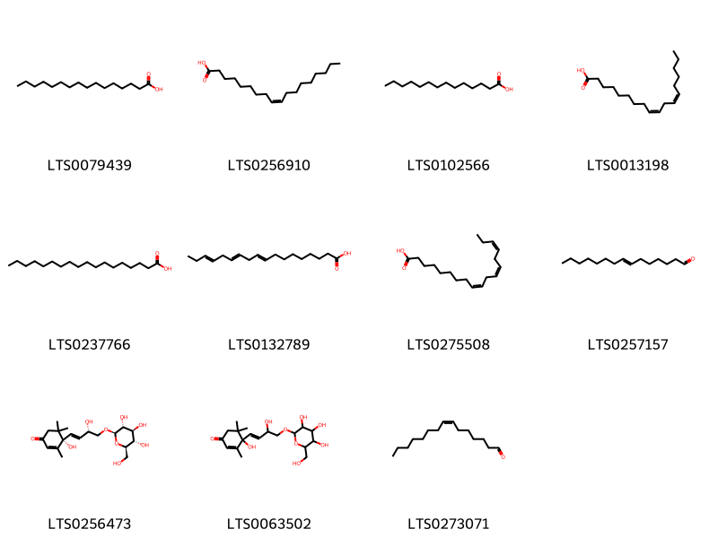{ width=100% }
    <figcaption>Hình ảnh cấu trúc hóa học của 11 hoạt chất thuộc nhóm Fatty Acyls gồm ['palmitic acid (LTS0079439)', 'oleic acid (LTS0256910)', 'myristic acid (LTS0102566)', 'linoleic (LTS0013198)', 'stearic acid (LTS0237766)', 'α linolenic acid (LTS0132789)', 'α-linolenic acid (LTS0275508)', 'pentadec-7-enal (LTS0257157)', '(4s)-4-hydroxy-4-[(1e,3s)-3-hydroxy-4-{[(2r,3r,4s,5s,6r)-3,4,5-trihydroxy-6-(hydroxymethyl)oxan-2-yl]oxy}but-1-en-1-yl]-3,5,5-trimethylcyclohex-2-en-1-one (LTS0256473)', '4-hydroxy-4-(3-hydroxy-4-{[3,4,5-trihydroxy-6-(hydroxymethyl)oxan-2-yl]oxy}but-1-en-1-yl)-3,5,5-trimethylcyclohex-2-en-1-one (LTS0063502)', '(7z)-pentadec-7-enal (LTS0273071)'].</figcaption>
</figure>
#### Nhóm Flavonoids
<figure markdown="span">
    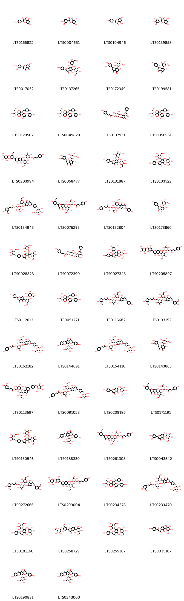{ width=100% }
    <figcaption>Hình ảnh cấu trúc hóa học của 58 hoạt chất thuộc nhóm Flavonoids gồm ['kaempherol (LTS0155822)', 'quercetin (LTS0004651)', 'chamomile (LTS0104946)', 'myricetin (LTS0139858)', 'luteolin (LTS0017052)', 'saponarin (LTS0137265)', 'orientin (LTS0172349)', 'vitexin (LTS0199581)', '5,7-dihydroxy-2-(4-hydroxyphenyl)-8-[(1r)-1-(4-hydroxyphenyl)ethyl]-6-[(2s,3r,4r,5r,6r)-3,4,5-trihydroxy-6-(hydroxymethyl)oxan-2-yl]chromen-4-one (LTS0129502)', 'cucumerin b (LTS0049820)', '{3,4,5-trihydroxy-6-[(5-hydroxy-4-oxo-2-phenylchromen-7-yl)oxy]oxan-2-yl}methyl 3-(4-hydroxyphenyl)prop-2-enoate (LTS0137931)', '5,7-dihydroxy-2-(4-hydroxyphenyl)-8-[(1r)-1-(4-hydroxyphenyl)ethyl]-6-[(2s,3r,4r,5s,6r)-3,4,5-trihydroxy-6-(hydroxymethyl)oxan-2-yl]chromen-4-one (LTS0056951)', '[(2r,3s,4s,5r,6s)-6-{[(2s,3r,4s,5s,6r)-2-[5,7-dihydroxy-2-(3-methoxy-4-{[(2s,3r,4s,5s,6r)-3,4,5-trihydroxy-6-(hydroxymethyl)oxan-2-yl]oxy}phenyl)-4-oxochromen-6-yl]-4,5-dihydroxy-6-(hydroxymethyl)oxan-3-yl]oxy}-3,4,5-trihydroxyoxan-2-yl]methyl (2e)-3-(4-hydroxyphenyl)prop-2-enoate (LTS0203994)', '2-(3,4-dihydroxyphenyl)-5,7-dihydroxy-8-[(2s,3r,4r,5s,6s)-3,4,5-trihydroxy-6-(hydroxymethyl)oxan-2-yl]chromen-4-one (LTS0058477)', 'saponarin (LTS0131887)', 'vicenin-2 (LTS0103522)', '[(2r,3s,4s,5r,6s)-6-{[(2s,3r,4s,5s,6s)-2-[5,7-dihydroxy-4-oxo-2-(4-{[(2s,3r,4s,5s,6r)-3,4,5-trihydroxy-6-(hydroxymethyl)oxan-2-yl]oxy}phenyl)chromen-6-yl]-4,5-dihydroxy-6-(hydroxymethyl)oxan-3-yl]oxy}-3,4,5-trihydroxyoxan-2-yl]methyl (2e)-3-(4-hydroxy-3-methoxyphenyl)prop-2-enoate (LTS0134943)', '[(2r,3s,4s,5r,6s)-6-{[(2s,3r,4s,5s,6r)-2-[5,7-dihydroxy-2-(4-hydroxy-3-methoxyphenyl)-4-oxochromen-6-yl]-4,5-dihydroxy-6-(hydroxymethyl)oxan-3-yl]oxy}-3,4,5-trihydroxyoxan-2-yl]methyl (2e)-3-(4-hydroxyphenyl)prop-2-enoate (LTS0076293)', '[(2r,3s,4s,5r,6s)-6-{[(2s,3r,4s,5s,6r)-2-[5,7-dihydroxy-2-(4-hydroxyphenyl)-4-oxochromen-6-yl]-4,5-dihydroxy-6-(hydroxymethyl)oxan-3-yl]oxy}-3,4,5-trihydroxyoxan-2-yl]methyl (2e)-3-(4-hydroxyphenyl)prop-2-enoate (LTS0132804)', '5,7-dihydroxy-2-(4-hydroxyphenyl)-8-[(2s,3r,4r,5s,6s)-3,4,5-trihydroxy-6-(hydroxymethyl)oxan-2-yl]chromen-4-one (LTS0178860)', '5-hydroxy-6-[(2s,3r,4r,5s,6r)-3,4,5-trihydroxy-6-(hydroxymethyl)oxan-2-yl]-7-{[(2s,3r,4s,5s,6r)-3,4,5-trihydroxy-6-(hydroxymethyl)oxan-2-yl]oxy}-2-(4-{[(2s,3r,4s,5s,6r)-3,4,5-trihydroxy-6-(hydroxymethyl)oxan-2-yl]oxy}phenyl)chromen-4-one (LTS0028823)', '[(2r,3s,4s,5r,6s)-3,4,5-trihydroxy-6-[(5-hydroxy-4-oxo-2-phenylchromen-7-yl)oxy]oxan-2-yl]methyl (2e)-3-(4-hydroxyphenyl)prop-2-enoate (LTS0072390)', '5,7-dihydroxy-2-(4-hydroxyphenyl)-6-[(2s,3r,4r,5s,6s)-3,4,5-trihydroxy-6-(hydroxymethyl)oxan-2-yl]-8-[(2s,3s,4r,5s,6s)-3,4,5-trihydroxy-6-(hydroxymethyl)oxan-2-yl]chromen-4-one (LTS0027343)', '[6-({2-[5,7-dihydroxy-2-(3-methoxy-4-{[3,4,5-trihydroxy-6-(hydroxymethyl)oxan-2-yl]oxy}phenyl)-4-oxochromen-6-yl]-4,5-dihydroxy-6-(hydroxymethyl)oxan-3-yl}oxy)-3,4,5-trihydroxyoxan-2-yl]methyl 3-(4-hydroxyphenyl)prop-2-enoate (LTS0205897)', '6-[(2s,3r,4s,5s,6s)-4,5-dihydroxy-6-(hydroxymethyl)-3-{[(2s,3s,4s,5s,6s)-3,4,5-trihydroxy-6-(hydroxymethyl)oxan-2-yl]oxy}oxan-2-yl]-5,7-dihydroxy-2-(4-hydroxyphenyl)chromen-4-one (LTS0112612)', '5,7-dihydroxy-2-(4-hydroxyphenyl)-8-[(1r)-1-(4-hydroxyphenyl)ethyl]-6-[(2s,3s,4r,5s,6s)-3,4,5-trihydroxy-6-(hydroxymethyl)oxan-2-yl]chromen-4-one (LTS0051221)', '[(2r,3s,4s,5r,6s)-6-{[(2s,3r,4s,5s,6r)-2-[5,7-dihydroxy-2-(4-hydroxyphenyl)-4-oxochromen-6-yl]-4,5-dihydroxy-6-(hydroxymethyl)oxan-3-yl]oxy}-3,4,5-trihydroxyoxan-2-yl]methyl (2e)-3-(4-hydroxy-3-methoxyphenyl)prop-2-enoate (LTS0116682)', '[6-({2-[5,7-dihydroxy-2-(4-hydroxy-3-methoxyphenyl)-4-oxochromen-6-yl]-4,5-dihydroxy-6-(hydroxymethyl)oxan-3-yl}oxy)-3,4,5-trihydroxyoxan-2-yl]methyl 3-(4-hydroxy-3-methoxyphenyl)prop-2-enoate (LTS0133152)', '[(2r,3s,4s,5r,6s)-6-{[(2s,3r,4s,5s,6r)-2-[5,7-dihydroxy-4-oxo-2-(4-{[(2s,3r,4s,5s,6r)-3,4,5-trihydroxy-6-(hydroxymethyl)oxan-2-yl]oxy}phenyl)chromen-6-yl]-4,5-dihydroxy-6-(hydroxymethyl)oxan-3-yl]oxy}-3,4,5-trihydroxyoxan-2-yl]methyl (2e)-3-(4-hydroxyphenyl)prop-2-enoate (LTS0162182)', '5,7-dihydroxy-2-(4-hydroxyphenyl)-6-[(1r)-1-(4-hydroxyphenyl)ethyl]-8-[(2s,3r,4r,5s,6r)-3,4,5-trihydroxy-6-(hydroxymethyl)oxan-2-yl]chromen-4-one (LTS0144691)', '[(2s,3s,4s,5s,6s)-6-{[(2s,3r,4s,5s,6s)-2-[5,7-dihydroxy-4-oxo-2-(4-{[(2s,3r,4s,5s,6r)-3,4,5-trihydroxy-6-(hydroxymethyl)oxan-2-yl]oxy}phenyl)chromen-6-yl]-4,5-dihydroxy-6-(hydroxymethyl)oxan-3-yl]oxy}-3,4,5-trihydroxyoxan-2-yl]methyl (2e)-3-(4-hydroxyphenyl)prop-2-enoate (LTS0154116)', 'orientin (LTS0143863)', '[(2s,3s,4r,5s,6s)-6-{[(2r,3r,4s,5r,6r)-2-[5,7-dihydroxy-4-oxo-2-(4-{[(2r,3s,4s,5r,6r)-3,4,5-trihydroxy-6-(hydroxymethyl)oxan-2-yl]oxy}phenyl)chromen-6-yl]-4,5-dihydroxy-6-(hydroxymethyl)oxan-3-yl]oxy}-3,4,5-trihydroxyoxan-2-yl]methyl (2e)-3-(4-hydroxy-3-methoxyphenyl)prop-2-enoate (LTS0113697)', '[6-({2-[5,7-dihydroxy-4-oxo-2-(4-{[3,4,5-trihydroxy-6-(hydroxymethyl)oxan-2-yl]oxy}phenyl)chromen-6-yl]-4,5-dihydroxy-6-(hydroxymethyl)oxan-3-yl}oxy)-3,4,5-trihydroxyoxan-2-yl]methyl 3-(4-hydroxyphenyl)prop-2-enoate (LTS0091028)', 'isovitexin (LTS0209186)', '[6-({2-[5,7-dihydroxy-2-(4-hydroxy-3-methoxyphenyl)-4-oxochromen-6-yl]-4,5-dihydroxy-6-(hydroxymethyl)oxan-3-yl}oxy)-3,4,5-trihydroxyoxan-2-yl]methyl 3-(4-hydroxyphenyl)prop-2-enoate (LTS0171191)', '5-hydroxy-6-[3,4,5-trihydroxy-6-(hydroxymethyl)oxan-2-yl]-7-{[3,4,5-trihydroxy-6-(hydroxymethyl)oxan-2-yl]oxy}-2-(4-{[3,4,5-trihydroxy-6-(hydroxymethyl)oxan-2-yl]oxy}phenyl)chromen-4-one (LTS0130546)', '5,7-dihydroxy-2-(4-hydroxyphenyl)-6-[(1s)-1-(4-hydroxyphenyl)ethyl]-8-[(2s,3r,4r,5r,6r)-3,4,5-trihydroxy-6-(hydroxymethyl)oxan-2-yl]chromen-4-one (LTS0188330)', '[(2r,3s,4r,5r,6s)-6-{[(2s,3r,4s,5s,6s)-2-[5,7-dihydroxy-2-(4-hydroxy-3-methoxyphenyl)-4-oxochromen-6-yl]-4,5-dihydroxy-6-(hydroxymethyl)oxan-3-yl]oxy}-3,4,5-trihydroxyoxan-2-yl]methyl (2e)-3-(4-hydroxyphenyl)prop-2-enoate (LTS0261308)', 'isoorientin (LTS0043542)', '[(2r,3s,4s,5r,6s)-6-{[(2s,3r,4s,5s,6r)-2-[5,7-dihydroxy-2-(4-hydroxy-3-methoxyphenyl)-4-oxochromen-6-yl]-4,5-dihydroxy-6-(hydroxymethyl)oxan-3-yl]oxy}-3,4,5-trihydroxyoxan-2-yl]methyl (2e)-3-(4-hydroxy-3-methoxyphenyl)prop-2-enoate (LTS0272666)', '[(2r,3s,4s,5s,6r)-6-{[(2s,3r,4r,5r,6s)-2-[5,7-dihydroxy-2-(3-methoxy-4-{[(2r,3r,4s,5s,6s)-3,4,5-trihydroxy-6-(hydroxymethyl)oxan-2-yl]oxy}phenyl)-4-oxochromen-6-yl]-4,5-dihydroxy-6-(hydroxymethyl)oxan-3-yl]oxy}-3,4,5-trihydroxyoxan-2-yl]methyl (2e)-3-(4-hydroxyphenyl)prop-2-enoate (LTS0209004)', '5,7-dihydroxy-2-(4-hydroxyphenyl)-8-[1-(4-hydroxyphenyl)ethyl]-6-[3,4,5-trihydroxy-6-(hydroxymethyl)oxan-2-yl]chromen-4-one (LTS0234378)', '[(2r,3s,4s,5r,6s)-6-{[(2s,3r,4s,5s,6r)-2-[5,7-dihydroxy-4-oxo-2-(4-{[(2s,3r,4s,5s,6r)-3,4,5-trihydroxy-6-(hydroxymethyl)oxan-2-yl]oxy}phenyl)chromen-6-yl]-4,5-dihydroxy-6-(hydroxymethyl)oxan-3-yl]oxy}-3,4,5-trihydroxyoxan-2-yl]methyl (2e)-3-(4-hydroxy-3-methoxyphenyl)prop-2-enoate (LTS0233470)', 'vicenin 2 (LTS0181160)', '5,7-dihydroxy-2-(3-methoxy-4-{[(2s,3r,4s,5s,6r)-3,4,5-trihydroxy-6-(hydroxymethyl)oxan-2-yl]oxy}phenyl)-6-[(2s,3s,4r,5s,6r)-3,4,5-trihydroxy-6-(hydroxymethyl)oxan-2-yl]chromen-4-one (LTS0258729)', '5,7-dihydroxy-2-(4-hydroxyphenyl)-6,8-bis[3,4,5-trihydroxy-6-(hydroxymethyl)oxan-2-yl]chromen-4-one (LTS0255367)', 'isovitexin (LTS0035187)', 'cucumerin a (LTS0190881)', '5,7-dihydroxy-2-(4-hydroxyphenyl)-6-[1-(4-hydroxyphenyl)ethyl]-8-[3,4,5-trihydroxy-6-(hydroxymethyl)oxan-2-yl]chromen-4-one (LTS0243000)', '[(2r,3s,4s,5s,6s)-3,4,5-trihydroxy-6-{[5-hydroxy-2-(4-hydroxyphenyl)-4-oxochromen-7-yl]oxy}oxan-2-yl]methyl (2e)-3-(4-hydroxyphenyl)prop-2-enoate (LTS0186006)', 'isoorientin (LTS0061958)', '[(2s,3r,4r,5r,6s)-6-{[(2r,3r,4s,5s,6s)-2-[5,7-dihydroxy-4-oxo-2-(4-{[(2r,3r,4s,5s,6s)-3,4,5-trihydroxy-6-(hydroxymethyl)oxan-2-yl]oxy}phenyl)chromen-6-yl]-4,5-dihydroxy-6-(hydroxymethyl)oxan-3-yl]oxy}-3,4,5-trihydroxyoxan-2-yl]methyl (2e)-3-(4-hydroxyphenyl)prop-2-enoate (LTS0025508)', '[6-({2-[5,7-dihydroxy-2-(4-hydroxyphenyl)-4-oxochromen-6-yl]-4,5-dihydroxy-6-(hydroxymethyl)oxan-3-yl}oxy)-3,4,5-trihydroxyoxan-2-yl]methyl 3-(4-hydroxy-3-methoxyphenyl)prop-2-enoate (LTS0248575)', '[6-({2-[5,7-dihydroxy-4-oxo-2-(4-{[3,4,5-trihydroxy-6-(hydroxymethyl)oxan-2-yl]oxy}phenyl)chromen-6-yl]-4,5-dihydroxy-6-(hydroxymethyl)oxan-3-yl}oxy)-3,4,5-trihydroxyoxan-2-yl]methyl 3-(4-hydroxy-3-methoxyphenyl)prop-2-enoate (LTS0101869)', '[6-({2-[5,7-dihydroxy-2-(4-hydroxyphenyl)-4-oxochromen-6-yl]-4,5-dihydroxy-6-(hydroxymethyl)oxan-3-yl}oxy)-3,4,5-trihydroxyoxan-2-yl]methyl 3-(4-hydroxyphenyl)prop-2-enoate (LTS0266217)', 'vitexin (LTS0254648)', '[(2r,3s,4s,5r,6s)-6-{[(2s,3s,4s,5s,6r)-2-[5,7-dihydroxy-2-(4-hydroxyphenyl)-4-oxochromen-6-yl]-4,5-dihydroxy-6-(hydroxymethyl)oxan-3-yl]oxy}-3,4,5-trihydroxyoxan-2-yl]methyl (2e)-3-(4-hydroxyphenyl)prop-2-enoate (LTS0249025)'].</figcaption>
</figure>
#### Nhóm Furanoid lignans
<figure markdown="span">
    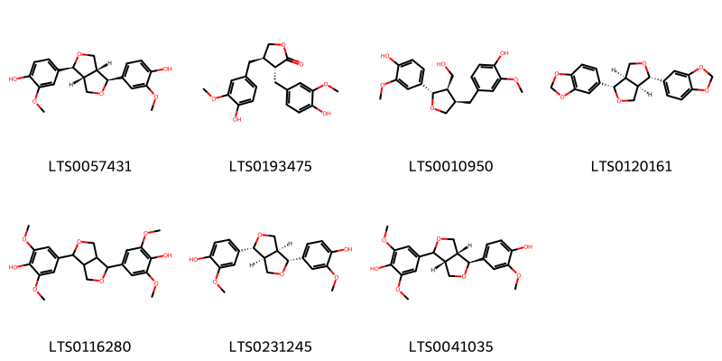{ width=100% }
    <figcaption>Hình ảnh cấu trúc hóa học của 7 hoạt chất thuộc nhóm Furanoid lignans gồm ['pinoresinol (LTS0057431)', 'matairesinol (LTS0193475)', 'lariciresinol (LTS0010950)', 'sesamin (LTS0120161)', 'syringaresinol (LTS0116280)', '(-)-pinoresinol (LTS0231245)', '4-[(3ar,4s,6ar)-4-(4-hydroxy-3-methoxyphenyl)-hexahydrofuro[3,4-c]furan-1-yl]-2,6-dimethoxyphenol (LTS0041035)'].</figcaption>
</figure>
#### Nhóm Glycerophospholipids
<figure markdown="span">
    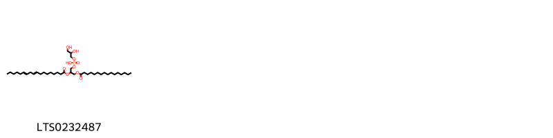{ width=100% }
    <figcaption>Hình ảnh cấu trúc hóa học của 1 hoạt chất thuộc nhóm Glycerophospholipids gồm ['2,3-dihydroxypropoxy(3-(hexadecanoyloxy)-2-[(9e,12e)-octadeca-9,12-dienoyloxy]propoxy)phosphinic acid (LTS0232487)'].</figcaption>
</figure>
#### Nhóm Indoles and derivatives
<figure markdown="span">
    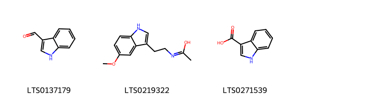{ width=100% }
    <figcaption>Hình ảnh cấu trúc hóa học của 3 hoạt chất thuộc nhóm Indoles and derivatives gồm ['indole-3-carboxaldehyde (LTS0137179)', 'n-[2-(5-methoxy-1h-indol-3-yl)ethyl]ethanimidic acid (LTS0219322)', 'indole - 3 carboxylic acid (LTS0271539)'].</figcaption>
</figure>
#### Nhóm Organonitrogen compounds
<figure markdown="span">
    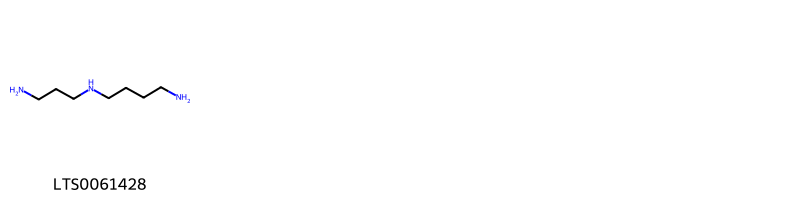{ width=100% }
    <figcaption>Hình ảnh cấu trúc hóa học của 1 hoạt chất thuộc nhóm Organonitrogen compounds gồm ['spermidine (LTS0061428)'].</figcaption>
</figure>
#### Nhóm Organooxygen compounds
<figure markdown="span">
    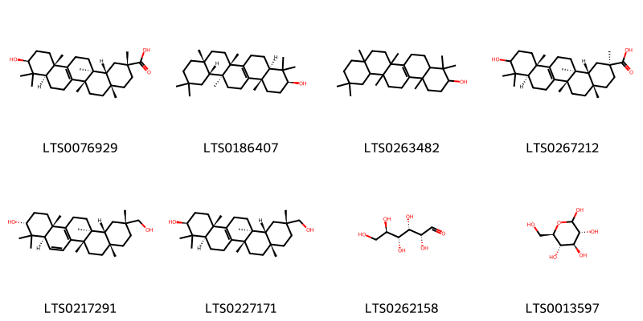{ width=100% }
    <figcaption>Hình ảnh cấu trúc hóa học của 8 hoạt chất thuộc nhóm Organooxygen compounds gồm ['(2r,4as,6as,8ar,10s,12as,14as,14br)-10-hydroxy-2,4a,6a,9,9,12a,14a-heptamethyl-1,3,4,5,6,7,8,8a,10,11,12,13,14,14b-tetradecahydropicene-2-carboxylic acid (LTS0076929)', 'isomultiflorenol (LTS0186407)', '4,4,6b,8a,11,11,12b,14b-octamethyl-1,2,3,4a,5,6,7,8,9,10,12,12a,13,14-tetradecahydropicen-3-ol (LTS0263482)', '(2s,4as,6as,8ar,12as,14as,14br)-10-hydroxy-2,4a,6a,9,9,12a,14a-heptamethyl-1,3,4,5,6,7,8,8a,10,11,12,13,14,14b-tetradecahydropicene-2-carboxylic acid (LTS0267212)', '(3r,4ar,6bs,8as,11r,12ar,12bs,14bs)-11-(hydroxymethyl)-4,4,6b,8a,11,12b,14b-heptamethyl-1,2,3,4a,7,8,9,10,12,12a,13,14-dodecahydropicen-3-ol (LTS0217291)', '(3s,4ar,6bs,8as,11r,12ar,12bs,14bs)-11-(hydroxymethyl)-4,4,6b,8a,11,12b,14b-heptamethyl-1,2,3,4a,5,6,7,8,9,10,12,12a,13,14-tetradecahydropicen-3-ol (LTS0227171)', '(+)-glucose (LTS0262158)', 'glucose (LTS0013597)'].</figcaption>
</figure>
#### Nhóm Perylenequinones
<figure markdown="span">
    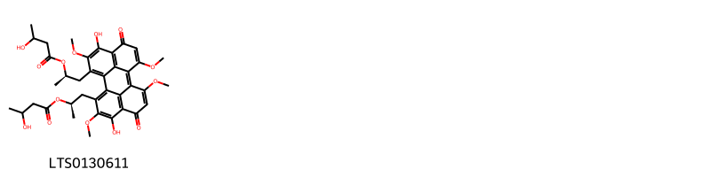{ width=100% }
    <figcaption>Hình ảnh cấu trúc hóa học của 1 hoạt chất thuộc nhóm Perylenequinones gồm ['(2r)-1-{3,10-dihydroxy-12-[(2r)-2-[(3-hydroxybutanoyl)oxy]propyl]-2,6,7,11-tetramethoxy-4,9-dioxoperylen-1-yl}propan-2-yl 3-hydroxybutanoate (LTS0130611)'].</figcaption>
</figure>
#### Nhóm Phenols
<figure markdown="span">
    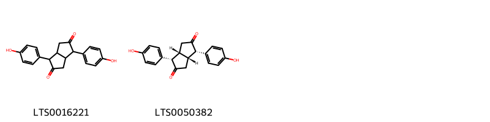{ width=100% }
    <figcaption>Hình ảnh cấu trúc hóa học của 2 hoạt chất thuộc nhóm Phenols gồm ['1,4-bis(4-hydroxyphenyl)-hexahydropentalene-2,5-dione (LTS0016221)', '(1s,3ar,4s,6ar)-1,4-bis(4-hydroxyphenyl)-hexahydropentalene-2,5-dione (LTS0050382)'].</figcaption>
</figure>
#### Nhóm Phenylpropanoic acids
<figure markdown="span">
    { width=100% }
    <figcaption>Hình ảnh cấu trúc hóa học của 1 hoạt chất thuộc nhóm Phenylpropanoic acids gồm ['3-phenylpropionic acid (LTS0121890)'].</figcaption>
</figure>
#### Nhóm Prenol lipids
<figure markdown="span">
    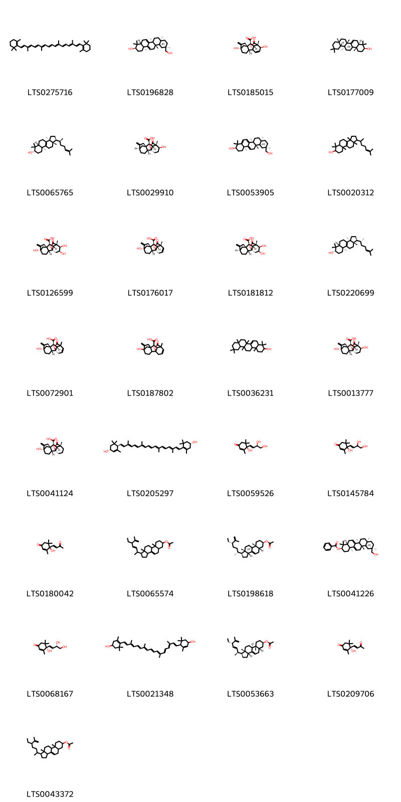{ width=100% }
    <figcaption>Hình ảnh cấu trúc hóa học của 29 hoạt chất thuộc nhóm Prenol lipids gồm ['β-carotene (LTS0275716)', 'karounidiol (LTS0196828)', 'gibberellin a3 (LTS0185015)', 'multiflorenol (LTS0177009)', '(+)-tirucallol (LTS0065765)', 'gibberellin a4 (LTS0029910)', '(3r,6bs,8as,11r,12ar,12bs,14br)-11-(hydroxymethyl)-4,4,6b,8a,11,12b,14b-heptamethyl-1,2,3,7,8,9,10,12,12a,13-decahydropicen-3-ol (LTS0053905)', 'lanster (LTS0020312)', 'gibberellin a8 (LTS0126599)', 'gibberellin a5 (LTS0176017)', 'gibberellin a34 (LTS0181812)', 'euphol (LTS0220699)', '(1r,2r,5s,8s,9s,10r)-5-hydroxy-11-methyl-6-methylidene-16-oxo-15-oxapentacyclo[9.3.2.1⁵,⁸.0¹,¹⁰.0²,⁸]heptadec-12-ene-9-carboxylic acid (LTS0072901)', '5-hydroxy-11-methyl-6-methylidene-16-oxo-15-oxapentacyclo[9.3.2.1⁵,⁸.0¹,¹⁰.0²,⁸]heptadec-12-ene-9-carboxylic acid (LTS0187802)', '4,4,6b,8a,11,11,12b,14b-octamethyl-1,2,3,4a,5,7,8,9,10,12,12a,13,14,14a-tetradecahydropicen-3-ol (LTS0036231)', 'gibberellin a1 (LTS0013777)', 'gibberellin a20 (LTS0041124)', 'carotenoid (LTS0205297)', '(4r)-4-[(1e,3r)-3,4-dihydroxybut-1-en-1-yl]-4-hydroxy-3,5,5-trimethylcyclohex-2-en-1-one (LTS0059526)', '4-(3,4-dihydroxybut-1-en-1-yl)-4-hydroxy-3,5,5-trimethylcyclohex-2-en-1-one (LTS0145784)', '4-hydroxy-3,5,5-trimethyl-4-(3-oxobut-1-en-1-yl)cyclohex-2-en-1-one (LTS0180042)', '1-(5-ethyl-6-methylhepta-3,6-dien-2-yl)-9a,11a-dimethyl-1h,2h,3h,3ah,5h,5ah,6h,7h,8h,9h,9bh,10h,11h-cyclopenta[a]phenanthren-7-yl acetate (LTS0065574)', '(1s,3ar,5as,7r,9ar,9bs,11as)-1-[(2r,5s)-5-ethyl-6-methylhept-6-en-2-yl]-9a,11a-dimethyl-1h,2h,3h,3ah,5h,5ah,6h,7h,8h,9h,9bh,10h,11h-cyclopenta[a]phenanthren-7-yl acetate (LTS0198618)', '(3r,4ar,6bs,8as,11r,12ar,12bs,14bs)-11-(hydroxymethyl)-4,4,6b,8a,11,12b,14b-heptamethyl-1,2,3,4a,5,7,8,9,10,12,12a,13-dodecahydropicen-3-yl benzoate (LTS0041226)', '(4s)-4-[(1e,3s)-3,4-dihydroxybut-1-en-1-yl]-4-hydroxy-3,5,5-trimethylcyclohex-2-en-1-one (LTS0068167)', '4-[(9e,11e,13e,15e,17e)-18-(4-hydroxy-2,6,6-trimethylcyclohex-1-en-1-yl)-3,7,12,16-tetramethyloctadeca-1,3,5,7,9,11,13,15,17-nonaen-1-yl]-3,5,5-trimethylcyclohex-2-en-1-ol (LTS0021348)', '(1s,3ar,5as,7r,9ar,9bs,11as)-1-[(2s,3e,5s)-5-ethyl-6-methylhepta-3,6-dien-2-yl]-9a,11a-dimethyl-1h,2h,3h,3ah,5h,5ah,6h,7h,8h,9h,9bh,10h,11h-cyclopenta[a]phenanthren-7-yl acetate (LTS0053663)', 'dehydrovomifoliol (LTS0209706)', '1-(5-ethyl-6-methylhept-6-en-2-yl)-9a,11a-dimethyl-1h,2h,3h,3ah,5h,5ah,6h,7h,8h,9h,9bh,10h,11h-cyclopenta[a]phenanthren-7-yl acetate (LTS0043372)'].</figcaption>
</figure>
#### Nhóm Purine nucleosides
<figure markdown="span">
    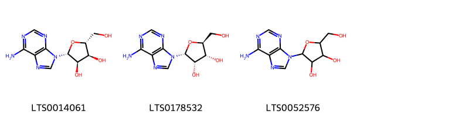{ width=100% }
    <figcaption>Hình ảnh cấu trúc hóa học của 3 hoạt chất thuộc nhóm Purine nucleosides gồm ['adenosine (LTS0014061)', '(2r,3s,4r,5s)-2-(6-aminopurin-9-yl)-5-(hydroxymethyl)oxolane-3,4-diol (LTS0178532)', 'adenosine (LTS0052576)'].</figcaption>
</figure>
#### Nhóm Steroids and steroid derivatives
<figure markdown="span">
    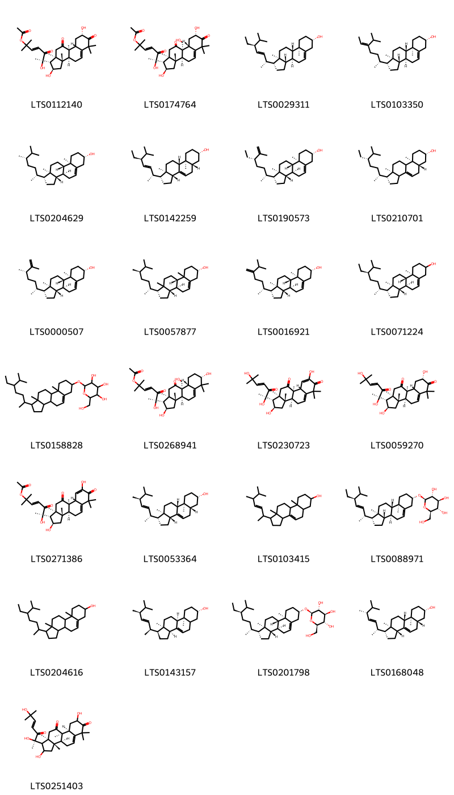{ width=100% }
    <figcaption>Hình ảnh cấu trúc hóa học của 25 hoạt chất thuộc nhóm Steroids and steroid derivatives gồm ['cucurbitacin b (LTS0112140)', 'cucurbitacin a (LTS0174764)', 'phytosterol (LTS0029311)', 'avenasterol (LTS0103350)', '22,23-dihydrobrassicasterol (LTS0204629)', 'chondrillasterol (LTS0142259)', '(1r,3as,3bs,7s,9ar,9bs,11ar)-1-[(2r,5s)-5-ethyl-6-methylhept-6-en-2-yl]-9a,11a-dimethyl-1h,2h,3h,3ah,3bh,4h,6h,7h,8h,9h,9bh,10h,11h-cyclopenta[a]phenanthren-7-ol (LTS0190573)', '(1r,5as,7s,9as,11ar)-1-[(2r,5s)-5-ethyl-6-methylheptan-2-yl]-9a,11a-dimethyl-1h,2h,3h,3ah,5h,5ah,6h,7h,8h,9h,9bh,10h,11h-cyclopenta[a]phenanthren-7-ol (LTS0210701)', '(1r,3as,3bs,7s,9ar,9bs,11ar)-1-[(2r,5s)-5,6-dimethylhept-6-en-2-yl]-9a,11a-dimethyl-1h,2h,3h,3ah,3bh,4h,6h,7h,8h,9h,9bh,10h,11h-cyclopenta[a]phenanthren-7-ol (LTS0000507)', '(1r,3as,3bs,7s,9bs)-1-[(2r,5r)-5,6-dimethylheptan-2-yl]-9a,11a-dimethyl-1h,2h,3h,3ah,3bh,4h,6h,7h,8h,9h,9bh,10h,11h-cyclopenta[a]phenanthren-7-ol (LTS0057877)', '24-methylenecholesterol (LTS0016921)', 'stigmast-5-en-3-ol (LTS0071224)', '2-{[1-(5-ethyl-6-methylheptan-2-yl)-9a,11a-dimethyl-1h,2h,3h,3ah,3bh,4h,6h,7h,8h,9h,9bh,10h,11h-cyclopenta[a]phenanthren-7-yl]oxy}-6-(hydroxymethyl)oxane-3,4,5-triol (LTS0158828)', 'cucurbitacin c (LTS0268941)', 'cucurbitacin (LTS0230723)', 'cucurbitacin d (LTS0059270)', 'α-elaterin (LTS0271386)', '(1r,3ar,5as,7s,9as,9br,11ar)-1-[(2r,3e,5s)-5,6-dimethylhept-3-en-2-yl]-9a,11a-dimethyl-1h,2h,3h,3ah,5h,5ah,6h,7h,8h,9h,9bh,10h,11h-cyclopenta[a]phenanthren-7-ol (LTS0053364)', '1-(5,6-dimethylhept-3-en-2-yl)-9a,11a-dimethyl-1h,2h,3h,3ah,5h,5ah,6h,7h,8h,9h,9bh,10h,11h-cyclopenta[a]phenanthren-7-ol (LTS0103415)', '(2r,3r,4s,5s,6r)-2-{[(1r,3as,3bs,7s,9ar,9bs,11ar)-1-[(2r,3e,5s)-5-ethyl-6-methylhept-3-en-2-yl]-9a,11a-dimethyl-1h,2h,3h,3ah,3bh,4h,6h,7h,8h,9h,9bh,10h,11h-cyclopenta[a]phenanthren-7-yl]oxy}-6-(hydroxymethyl)oxane-3,4,5-triol (LTS0088971)', 'stigmast-5-en-3-ol, (3β)- (LTS0204616)', '(1s,3as,7s,9as,9bs,11ar)-1-[(2s,3e,5s)-5,6-dimethylhept-3-en-2-yl]-9a,11a-dimethyl-1h,2h,3h,3ah,5h,5ah,6h,7h,8h,9h,9bh,10h,11h-cyclopenta[a]phenanthren-7-ol (LTS0143157)', 'sitogluside (LTS0201798)', '5α-ergosta-7,22-dien-3β-ol (LTS0168048)', '(3as,3bs,9as,9br,11ar)-1-[(2r)-2,6-dihydroxy-6-methyl-3-oxohept-4-en-2-yl]-2,8-dihydroxy-3a,6,6,9b,11a-pentamethyl-1h,2h,3h,3bh,4h,8h,9h,9ah,11h-cyclopenta[a]phenanthrene-7,10-dione (LTS0251403)'].</figcaption>
</figure>

---

### Dược dân tộc học

Danh sách các quốc gia có sử dụng *Cucumis sativus* trong điều trị các bệnh. 

| Country   | Disease                                                | Bệnh                                            |
|:----------|:-------------------------------------------------------|:------------------------------------------------|
| China     | Diuretic, Emetic, Refrigerant                          | Thuốc lợi tiểu, thuốc lợi tiểu, chất làm lạnh   |
| Elsewhere | Diuretic, Refrigerant, Tonic                           | Thuốc lợi tiểu, chất làm lạnh, thuốc bổ         |
| Iraq      | Refrigerant                                            | Chất làm lạnh                                   |
| Kurdistan | Taenifuge                                              | Taenifuge                                       |
| Turkey    | Demulcent, Diuretic, Refrigerant, Vermifuge, Vermifuge | Demulcent, lợi tiểu, lạnh, Vermifuge, Vermifuge |

---

---
## Cucumis trigonus
### Thông tin về thực vật

!!! info "Phân loại thực vật của *Cucumis trigonus* từ GIBF:"
    - **Kingdom:** Plantae
    - **Phylum:** Tracheophyta
    - **Order:** Cucurbitales
    - **Family:** Cucurbitaceae
    - **Genus:** Cucumis
    - **Species:** *Cucumis trigonus*

 

| Label (VI)   | Label (EN)   | Scientific Name   | Descriptions (VI)   | Descriptions (EN)   | Also Known As (VI)   | Also Known As (EN)   |
|:-------------|:-------------|:------------------|:--------------------|:--------------------|:---------------------|:---------------------|
| N/A          | N/A          | Cucumis trigonus  | loài thực vật       | species of plant    | ['']                 | ['']                 |

#### Phân bố trên thế giới

**Từ CSDL GIBF** nan, Sri Lanka, Afghanistan, Myanmar, India

#### Phân bố tại Việt Nam

**Từ CSDL GIBF**: Không có ghi nhận ở Việt Nam

---
### Thành phần hóa học
        
- Theo cơ sở dữ liệu lotus: Từ loài *Cucumis trigonus* đã phân lập và xác định được Chưa có hoạt chất nào được phân lập. hoạt chất thuộc về các nhóm Không có hoạt chất nào được phân lập. 

Không có hình ảnh nào được tạo ra

---

### Dược dân tộc học

Danh sách các quốc gia có sử dụng *Cucumis trigonus* trong điều trị các bệnh. 

| Country   | Disease               | Bệnh                               |
|:----------|:----------------------|:-----------------------------------|
| Elsewhere | Astringent, Purgative | Chất làm se, Phương pháp thanh lọc |

---

---
## Cucumis zeyheri
### Thông tin về thực vật

!!! info "Phân loại thực vật của *Cucumis zeyheri* từ GIBF:"
    - **Kingdom:** Plantae
    - **Phylum:** Tracheophyta
    - **Order:** Cucurbitales
    - **Family:** Cucurbitaceae
    - **Genus:** Cucumis
    - **Species:** *Cucumis zeyheri*

 

| Label (VI)   | Label (EN)   | Scientific Name   | Descriptions (VI)   | Descriptions (EN)   | Also Known As (VI)   | Also Known As (EN)   |
|:-------------|:-------------|:------------------|:--------------------|:--------------------|:---------------------|:---------------------|
| N/A          | N/A          | Cucumis zeyheri   | loài thực vật       | species of plant    | ['']                 | ['']                 |

#### Phân bố trên thế giới

**Từ CSDL GIBF** nan, Namibia, United States of America, Eswatini, Botswana, South Africa, Australia, Zimbabwe, Mozambique, unknown or invalid

#### Phân bố tại Việt Nam

**Từ CSDL GIBF**: Không có ghi nhận ở Việt Nam

---
### Thành phần hóa học
        
- Theo cơ sở dữ liệu lotus: Từ loài *Cucumis zeyheri* đã phân lập và xác định được Chưa có hoạt chất nào được phân lập. hoạt chất thuộc về các nhóm Không có hoạt chất nào được phân lập. 

Không có hình ảnh nào được tạo ra

---

### Dược dân tộc học

Danh sách các quốc gia có sử dụng *Cucumis zeyheri* trong điều trị các bệnh. 

| Country   | Disease   | Bệnh     |
|:----------|:----------|:---------|
| Lesotho   | Poison    | Chất độc |

---

# Chi Bryonopsis

??? note "Danh sách các dược liệu thuộc chi"
    
	 - *Bryonopsis laciniosa*

---
## Bryonopsis laciniosa
### Thông tin về thực vật

!!! info "Phân loại thực vật của *Diplocyclos palmatus* từ GIBF:"
    - **Kingdom:** Plantae
    - **Phylum:** Tracheophyta
    - **Order:** Cucurbitales
    - **Family:** Cucurbitaceae
    - **Genus:** Diplocyclos
    - **Species:** *Diplocyclos palmatus*

 

| Label (VI)   | Label (EN)   | Scientific Name   | Descriptions (VI)   | Descriptions (EN)   | Also Known As (VI)   | Also Known As (EN)   |
|:-------------|:-------------|:------------------|:--------------------|:--------------------|:---------------------|:---------------------|
| N/A          | N/A          | Cucumis zeyheri   | loài thực vật       | species of plant    | ['']                 | ['']                 |

#### Phân bố trên thế giới

**Từ CSDL GIBF** Sri Lanka, nan, Congo, Democratic Republic of the, Japan, Rwanda, United States of America, Indonesia, Chinese Taipei, New Caledonia, China, Australia, India, Tanzania, United Republic of, unknown or invalid, Papua New Guinea

#### Phân bố tại Việt Nam

**Từ CSDL GIBF**: Không có ghi nhận ở Việt Nam

---
### Thành phần hóa học
        
- Theo cơ sở dữ liệu lotus: Từ loài *Diplocyclos palmatus* đã phân lập và xác định được Chưa có hoạt chất nào được phân lập. hoạt chất thuộc về các nhóm Không có hoạt chất nào được phân lập. 

Không có hình ảnh nào được tạo ra

---

### Dược dân tộc học

Danh sách các quốc gia có sử dụng *Diplocyclos palmatus* trong điều trị các bệnh. 

| Country       | Disease   | Bệnh               |
|:--------------|:----------|:-------------------|
| Elsewhere     | Tonic     | (thuộc) trương lực |
| India(Santal) | Laxative  | Nhuận trường       |

---

# Chi Marah

??? note "Danh sách các dược liệu thuộc chi"
    
	 - *Marah oregana*

---
## Marah oregana
### Thông tin về thực vật

!!! info "Phân loại thực vật của *Marah oregana* từ GIBF:"
    - **Kingdom:** Plantae
    - **Phylum:** Tracheophyta
    - **Order:** Cucurbitales
    - **Family:** Cucurbitaceae
    - **Genus:** Marah
    - **Species:** *Marah oregana*

 

| Label (VI)   | Label (EN)   | Scientific Name   | Descriptions (VI)   | Descriptions (EN)   | Also Known As (VI)   | Also Known As (EN)                                                                                 |
|:-------------|:-------------|:------------------|:--------------------|:--------------------|:---------------------|:---------------------------------------------------------------------------------------------------|
| N/A          | N/A          | Marah oregana     | loài thực vật       | species of plant    | ['Marah oregana']    | ['Marah oreganus', 'coastal manroot', 'Marah oregonus', 'Oregon manroot', 'western wild-cucumber'] |

#### Phân bố trên thế giới

**Từ CSDL GIBF** United States of America

#### Phân bố tại Việt Nam

**Từ CSDL GIBF**: Không có ghi nhận ở Việt Nam

---
### Thành phần hóa học
        
- Theo cơ sở dữ liệu lotus: Từ loài *Marah oregana* đã phân lập và xác định được 10 hoạt chất thuộc về các nhóm Steroids and steroid derivatives, Flavonoids. 

|    | chemicalTaxonomyClassyfireClass   |   smiles_count |
|---:|:----------------------------------|---------------:|
|  0 | Flavonoids                        |              6 |
|  1 | Steroids and steroid derivatives  |              4 |

#### Nhóm Flavonoids
<figure markdown="span">
    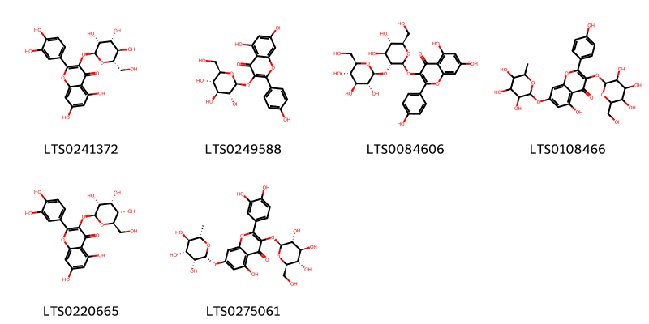{ width=100% }
    <figcaption>Hình ảnh cấu trúc hóa học của 6 hoạt chất thuộc nhóm Flavonoids gồm ['2-(3,4-dihydroxyphenyl)-5,7-dihydroxy-3-{[(2s,3r,4r,5r,6s)-3,4,5-trihydroxy-6-(hydroxymethyl)oxan-2-yl]oxy}chromen-4-one (LTS0241372)', 'astragalin (LTS0249588)', 'kaempferol 3-o-sophoroside (LTS0084606)', '5-hydroxy-2-(4-hydroxyphenyl)-3-{[3,4,5-trihydroxy-6-(hydroxymethyl)oxan-2-yl]oxy}-7-[(3,4,5-trihydroxy-6-methyloxan-2-yl)oxy]chromen-4-one (LTS0108466)', '2-(3,4-dihydroxyphenyl)-5,7-dihydroxy-3-{[(2s,3r,4r,5s,6r)-3,4,5-trihydroxy-6-(hydroxymethyl)oxan-2-yl]oxy}chromen-4-one (LTS0220665)', '2-(3,4-dihydroxyphenyl)-5-hydroxy-3-{[(2s,3r,4s,5s,6r)-3,4,5-trihydroxy-6-(hydroxymethyl)oxan-2-yl]oxy}-7-{[(2r,3r,4r,5r,6s)-3,4,5-trihydroxy-6-methyloxan-2-yl]oxy}chromen-4-one (LTS0275061)'].</figcaption>
</figure>
#### Nhóm Steroids and steroid derivatives
<figure markdown="span">
    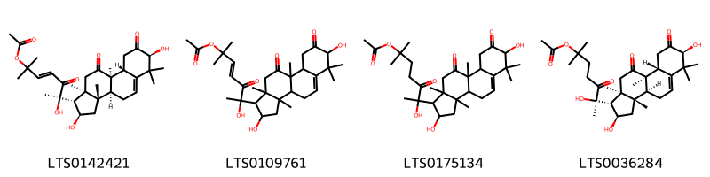{ width=100% }
    <figcaption>Hình ảnh cấu trúc hóa học của 4 hoạt chất thuộc nhóm Steroids and steroid derivatives gồm ['(3e,6r)-6-[(1r,2r,3as,3bs,7s,9ar,9br,11ar)-2,7-dihydroxy-3a,6,6,9b,11a-pentamethyl-8,10-dioxo-1h,2h,3h,3bh,4h,7h,9h,9ah,11h-cyclopenta[a]phenanthren-1-yl]-6-hydroxy-2-methyl-5-oxohept-3-en-2-yl acetate (LTS0142421)', '6-{2,7-dihydroxy-3a,6,6,9b,11a-pentamethyl-8,10-dioxo-1h,2h,3h,3bh,4h,7h,9h,9ah,11h-cyclopenta[a]phenanthren-1-yl}-6-hydroxy-2-methyl-5-oxohept-3-en-2-yl acetate (LTS0109761)', '6-{2,7-dihydroxy-3a,6,6,9b,11a-pentamethyl-8,10-dioxo-1h,2h,3h,3bh,4h,7h,9h,9ah,11h-cyclopenta[a]phenanthren-1-yl}-6-hydroxy-2-methyl-5-oxoheptan-2-yl acetate (LTS0175134)', '(6r)-6-[(1r,2r,3as,3bs,7s,9ar,9br,11ar)-2,7-dihydroxy-3a,6,6,9b,11a-pentamethyl-8,10-dioxo-1h,2h,3h,3bh,4h,7h,9h,9ah,11h-cyclopenta[a]phenanthren-1-yl]-6-hydroxy-2-methyl-5-oxoheptan-2-yl acetate (LTS0036284)'].</figcaption>
</figure>

---

### Dược dân tộc học

Danh sách các quốc gia có sử dụng *Marah oregana* trong điều trị các bệnh. 

| Country        | Disease   | Bệnh                     |
|:---------------|:----------|:-------------------------|
| Canada(Salish) | Poison    | Chất độc                 |
| US(Salish)     | Poultice  | thuốc đắp, đắp thuốc cao |

---

# Chi Sechium

??? note "Danh sách các dược liệu thuộc chi"
    
	 - *Sechium edule*
	 - *Sechium edulis*

---
## Sechium edule
### Thông tin về thực vật

!!! info "Phân loại thực vật của *Sechium edule* từ GIBF:"
    - **Kingdom:** Plantae
    - **Phylum:** Tracheophyta
    - **Order:** Cucurbitales
    - **Family:** Cucurbitaceae
    - **Genus:** Sechium
    - **Species:** *Sechium edule*

 

| Label (VI)   | Label (EN)   | Scientific Name   | Descriptions (VI)   | Descriptions (EN)   | Also Known As (VI)   | Also Known As (EN)                       |
|:-------------|:-------------|:------------------|:--------------------|:--------------------|:---------------------|:-----------------------------------------|
| N/A          | N/A          | Sechium edule     |                     | species of plant    | ['Sechium edule']    | ['chayote', 'Sechium edule (Jacq.) Sw.'] |

#### Phân bố trên thế giới

**Từ CSDL GIBF** Brazil, Guatemala, Viet Nam, Uganda, Nepal, China, New Zealand, Honduras, Türkiye, Ecuador, Tanzania, United Republic of, Papua New Guinea, Trinidad and Tobago, Madagascar, Spain, Thailand, Puerto Rico, Sri Lanka, Réunion, United States of America, Indonesia, Costa Rica, Dominican Republic, Colombia, Argentina, Hong Kong, Mexico, Kenya, Chinese Taipei, Philippines, Panama, Portugal, Australia, India, Peru, Bolivia (Plurinational State of), Venezuela (Bolivarian Republic of)

#### Phân bố tại Việt Nam

**Từ CSDL GIBF**: Lào Cai

---
### Thành phần hóa học
        
- Theo cơ sở dữ liệu lotus: Từ loài *Sechium edule* đã phân lập và xác định được 36 hoạt chất thuộc về các nhóm Imidazopyrimidines, Prenol lipids, Purine nucleosides, Flavonoids. 

|    | chemicalTaxonomyClassyfireClass   |   smiles_count |
|---:|:----------------------------------|---------------:|
|  0 | Flavonoids                        |             16 |
|  1 | Imidazopyrimidines                |              2 |
|  2 | Prenol lipids                     |             17 |
|  3 | Purine nucleosides                |              1 |

#### Nhóm Flavonoids
<figure markdown="span">
    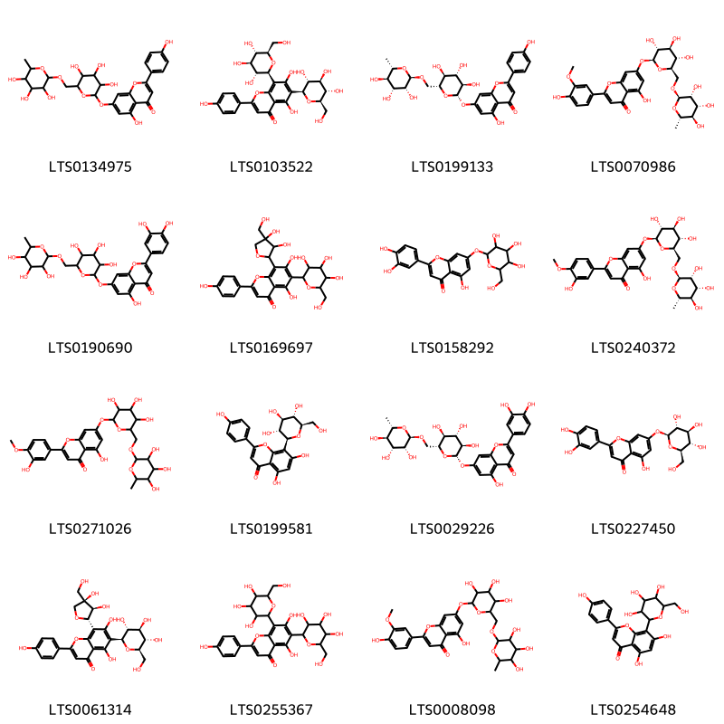{ width=100% }
    <figcaption>Hình ảnh cấu trúc hóa học của 16 hoạt chất thuộc nhóm Flavonoids gồm ['5-hydroxy-2-(4-hydroxyphenyl)-7-[(3,4,5-trihydroxy-6-{[(3,4,5-trihydroxy-6-methyloxan-2-yl)oxy]methyl}oxan-2-yl)oxy]chromen-4-one (LTS0134975)', 'vicenin-2 (LTS0103522)', 'isorhoifolin (LTS0199133)', '5-hydroxy-2-(4-hydroxy-3-methoxyphenyl)-7-{[(2s,3r,4s,5s,6r)-3,4,5-trihydroxy-6-({[(2r,3r,4r,5r,6s)-3,4,5-trihydroxy-6-methyloxan-2-yl]oxy}methyl)oxan-2-yl]oxy}chromen-4-one (LTS0070986)', '2-(3,4-dihydroxyphenyl)-5-hydroxy-7-[(3,4,5-trihydroxy-6-{[(3,4,5-trihydroxy-6-methyloxan-2-yl)oxy]methyl}oxan-2-yl)oxy]chromen-4-one (LTS0190690)', '8-[3,4-dihydroxy-4-(hydroxymethyl)oxolan-2-yl]-5,7-dihydroxy-2-(4-hydroxyphenyl)-6-[3,4,5-trihydroxy-6-(hydroxymethyl)oxan-2-yl]chromen-4-one (LTS0169697)', '2-(3,4-dihydroxyphenyl)-5-hydroxy-7-{[3,4,5-trihydroxy-6-(hydroxymethyl)oxan-2-yl]oxy}chromen-4-one (LTS0158292)', 'diosmin (LTS0240372)', 'diosmine (LTS0271026)', 'vitexin (LTS0199581)', '2-(3,4-dihydroxyphenyl)-5-hydroxy-7-{[(2s,3r,4s,5s,6r)-3,4,5-trihydroxy-6-({[(2r,3r,4r,5r,6s)-3,4,5-trihydroxy-6-methyloxan-2-yl]oxy}methyl)oxan-2-yl]oxy}chromen-4-one (LTS0029226)', 'luteolin 7-o-glucoside (LTS0227450)', '8-[(2s,3s,4r)-3,4-dihydroxy-4-(hydroxymethyl)oxolan-2-yl]-5,7-dihydroxy-2-(4-hydroxyphenyl)-6-[(2s,3r,4r,5s,6r)-3,4,5-trihydroxy-6-(hydroxymethyl)oxan-2-yl]chromen-4-one (LTS0061314)', '5,7-dihydroxy-2-(4-hydroxyphenyl)-6,8-bis[3,4,5-trihydroxy-6-(hydroxymethyl)oxan-2-yl]chromen-4-one (LTS0255367)', '5-hydroxy-2-(4-hydroxy-3-methoxyphenyl)-7-[(3,4,5-trihydroxy-6-{[(3,4,5-trihydroxy-6-methyloxan-2-yl)oxy]methyl}oxan-2-yl)oxy]chromen-4-one (LTS0008098)', 'vitexin (LTS0254648)'].</figcaption>
</figure>
#### Nhóm Imidazopyrimidines
<figure markdown="span">
    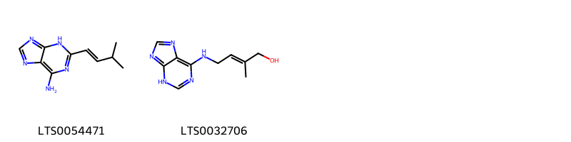{ width=100% }
    <figcaption>Hình ảnh cấu trúc hóa học của 2 hoạt chất thuộc nhóm Imidazopyrimidines gồm ['2-(3-methylbut-1-en-1-yl)-3h-purin-6-amine (LTS0054471)', 'zeatine (LTS0032706)'].</figcaption>
</figure>
#### Nhóm Prenol lipids
<figure markdown="span">
    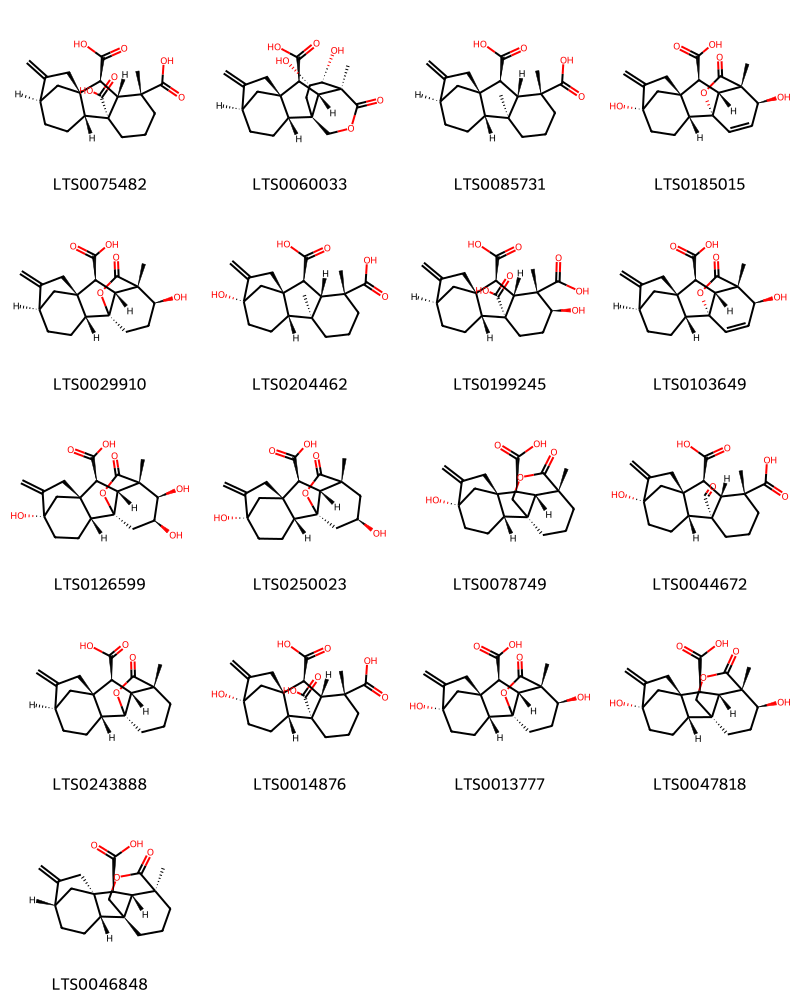{ width=100% }
    <figcaption>Hình ảnh cấu trúc hóa học của 17 hoạt chất thuộc nhóm Prenol lipids gồm ['gibberellin a25 (LTS0075482)', '(1r,2r,5r,8r,9s,10s,11s,16s,17r)-16,17-dihydroxy-11-methyl-6-methylidene-12-oxo-13-oxapentacyclo[9.3.3.1⁵,⁸.0¹,¹⁰.0²,⁸]octadecane-9-carboxylic acid (LTS0060033)', 'gibberellin a12 (LTS0085731)', 'gibberellin a3 (LTS0185015)', 'gibberellin a4 (LTS0029910)', 'gibberellin a53 (LTS0204462)', 'gibberellin a13 (LTS0199245)', 'gibberellin a7 (LTS0103649)', 'gibberellin a8 (LTS0126599)', 'gibberellin a29 (LTS0250023)', 'gibberellin a44 (LTS0078749)', 'gibberellin a19 (LTS0044672)', 'gibberellin a9 (LTS0243888)', 'gibberellin a17 (LTS0014876)', 'gibberellin a1 (LTS0013777)', '(1r,2r,5s,8s,9s,10s,11s,17s)-5,17-dihydroxy-11-methyl-6-methylidene-12-oxo-13-oxapentacyclo[9.3.3.1⁵,⁸.0¹,¹⁰.0²,⁸]octadecane-9-carboxylic acid (LTS0047818)', '(1s,2r,5s,8s,9s,10s,11s)-11-methyl-6-methylidene-12-oxo-13-oxapentacyclo[9.3.3.1⁵,⁸.0¹,¹⁰.0²,⁸]octadecane-9-carboxylic acid (LTS0046848)'].</figcaption>
</figure>
#### Nhóm Purine nucleosides
<figure markdown="span">
    { width=100% }
    <figcaption>Hình ảnh cấu trúc hóa học của 1 hoạt chất thuộc nhóm Purine nucleosides gồm ['zeatin riboside (LTS0254495)'].</figcaption>
</figure>

---

### Dược dân tộc học

Danh sách các quốc gia có sử dụng *Sechium edule* trong điều trị các bệnh. 

| Country   | Disease   | Bệnh           |
|:----------|:----------|:---------------|
| Haiti     | Diuretic  | Thuốc lợi tiêu |

---

---
## Sechium edulis
### Thông tin về thực vật

!!! info "Phân loại thực vật của *Sechium edule* từ GIBF:"
    - **Kingdom:** Plantae
    - **Phylum:** Tracheophyta
    - **Order:** Cucurbitales
    - **Family:** Cucurbitaceae
    - **Genus:** Sechium
    - **Species:** *Sechium edule*

 

| Label (VI)   | Label (EN)   | Scientific Name   | Descriptions (VI)   | Descriptions (EN)   | Also Known As (VI)   | Also Known As (EN)                       |
|:-------------|:-------------|:------------------|:--------------------|:--------------------|:---------------------|:-----------------------------------------|
| N/A          | N/A          | Sechium edule     |                     | species of plant    | ['Sechium edule']    | ['chayote', 'Sechium edule (Jacq.) Sw.'] |

#### Phân bố trên thế giới

**Từ CSDL GIBF** Brazil, Guatemala, Viet Nam, Uganda, Nepal, China, New Zealand, Honduras, Türkiye, Ecuador, Tanzania, United Republic of, Papua New Guinea, Trinidad and Tobago, Madagascar, Spain, Thailand, Puerto Rico, Sri Lanka, Réunion, United States of America, Indonesia, Costa Rica, Dominican Republic, Colombia, Argentina, Hong Kong, Mexico, Kenya, Chinese Taipei, Philippines, Panama, Portugal, Australia, India, Peru, Bolivia (Plurinational State of), Venezuela (Bolivarian Republic of)

#### Phân bố tại Việt Nam

**Từ CSDL GIBF**: Lào Cai

---
### Thành phần hóa học
        
- Theo cơ sở dữ liệu lotus: Từ loài *Sechium edule* đã phân lập và xác định được Chưa có hoạt chất nào được phân lập. hoạt chất thuộc về các nhóm Không có hoạt chất nào được phân lập. 

Không có hình ảnh nào được tạo ra

---

### Dược dân tộc học

Danh sách các quốc gia có sử dụng *Sechium edule* trong điều trị các bệnh. 

| Country   | Disease   | Bệnh           |
|:----------|:----------|:---------------|
| Haiti     | Diuretic  | Thuốc lợi tiêu |

---

# Chi Citrullus

??? note "Danh sách các dược liệu thuộc chi"
    
	 - *Citrullus colocynthis*
	 - *Citrullus lanatus*
	 - *Citrullus vulgaris*

---
## Citrullus colocynthis
### Thông tin về thực vật

!!! info "Phân loại thực vật của *Citrullus colocynthis* từ GIBF:"
    - **Kingdom:** Plantae
    - **Phylum:** Tracheophyta
    - **Order:** Cucurbitales
    - **Family:** Cucurbitaceae
    - **Genus:** Citrullus
    - **Species:** *Citrullus colocynthis*

 

| Label (VI)   | Label (EN)   | Scientific Name       | Descriptions (VI)   | Descriptions (EN)                            | Also Known As (VI)   | Also Known As (EN)                                                                                                                                |
|:-------------|:-------------|:----------------------|:--------------------|:---------------------------------------------|:---------------------|:--------------------------------------------------------------------------------------------------------------------------------------------------|
| N/A          | N/A          | Citrullus colocynthis | loài thực vật       | species of plant in the family Cucurbitaceae | ['']                 | ['egusi', 'Colocynthis citrullus', 'bitter apple', 'bitter cucumber', 'colocynth', 'desert gourd', 'Desert gourd', 'vine of Sodom', 'wild gourd'] |

#### Phân bố trên thế giới

**Từ CSDL GIBF** nan, United Arab Emirates, Israel, Qatar, Yemen, Western Sahara, Spain, United States of America, Chad, Iran (Islamic Republic of), Mauritania, Pakistan, Tunisia, Cyprus, Cabo Verde, Morocco, Algeria, Benin, Kenya, Libya, Saudi Arabia, Kuwait, Iraq, Egypt, Sudan, South Africa, Australia, Oman, India, Jordan

#### Phân bố tại Việt Nam

**Từ CSDL GIBF**: Không có ghi nhận ở Việt Nam

---
### Thành phần hóa học
        
- Theo cơ sở dữ liệu lotus: Từ loài *Citrullus colocynthis* đã phân lập và xác định được 97 hoạt chất thuộc về các nhóm Fatty Acyls, Benzene and substituted derivatives, Flavonoids, Carboxylic acids and derivatives, Steroids and steroid derivatives, Organooxygen compounds, Prenol lipids, Saturated hydrocarbons. 

|    | chemicalTaxonomyClassyfireClass     |   smiles_count |
|---:|:------------------------------------|---------------:|
|  0 | Benzene and substituted derivatives |              1 |
|  1 | Carboxylic acids and derivatives    |              2 |
|  2 | Fatty Acyls                         |             12 |
|  3 | Flavonoids                          |             16 |
|  4 | Organooxygen compounds              |             14 |
|  5 | Prenol lipids                       |              2 |
|  6 | Saturated hydrocarbons              |              1 |
|  7 | Steroids and steroid derivatives    |             49 |

#### Nhóm Benzene and substituted derivatives
<figure markdown="span">
    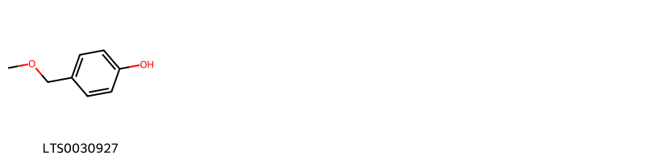{ width=100% }
    <figcaption>Hình ảnh cấu trúc hóa học của 1 hoạt chất thuộc nhóm Benzene and substituted derivatives gồm ['p-(methoxymethyl)phenol (LTS0030927)'].</figcaption>
</figure>
#### Nhóm Carboxylic acids and derivatives
<figure markdown="span">
    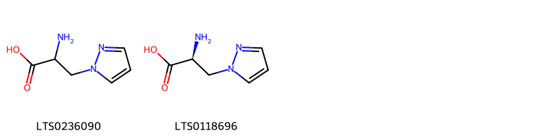{ width=100% }
    <figcaption>Hình ảnh cấu trúc hóa học của 2 hoạt chất thuộc nhóm Carboxylic acids and derivatives gồm ['2-amino-3-(pyrazol-1-yl)propanoic acid (LTS0236090)', '3-(pyrazol-1-yl)-l-alanine (LTS0118696)'].</figcaption>
</figure>
#### Nhóm Fatty Acyls
<figure markdown="span">
    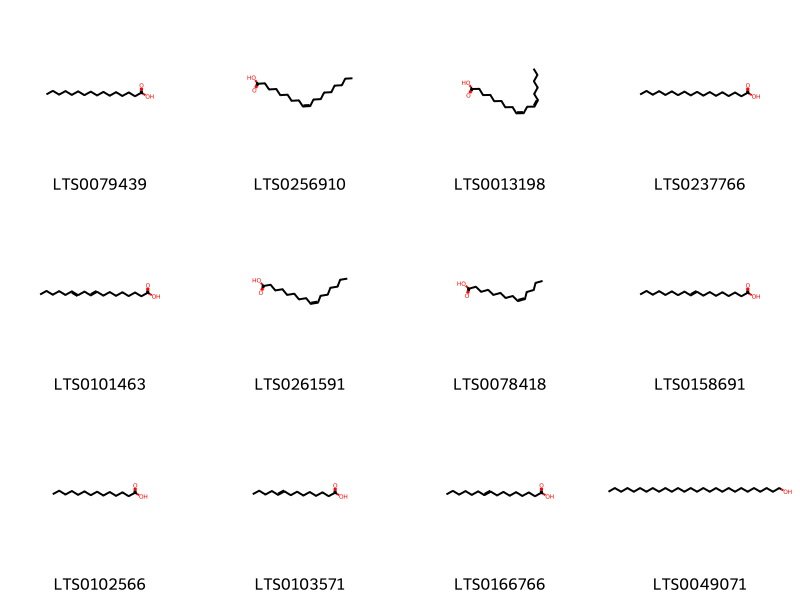{ width=100% }
    <figcaption>Hình ảnh cấu trúc hóa học của 12 hoạt chất thuộc nhóm Fatty Acyls gồm ['palmitic acid (LTS0079439)', 'oleic acid (LTS0256910)', 'linoleic (LTS0013198)', 'stearic acid (LTS0237766)', '9,12-octadecadienoic acid (LTS0101463)', 'palmitoleic acid (LTS0261591)', 'myristoleic acid (LTS0078418)', '9 octadecenoic acid (LTS0158691)', 'myristic acid (LTS0102566)', '9-tetradecenoic acid (LTS0103571)', '9-hexadecenoic acid (LTS0166766)', 'octacosanol (LTS0049071)'].</figcaption>
</figure>
#### Nhóm Flavonoids
<figure markdown="span">
    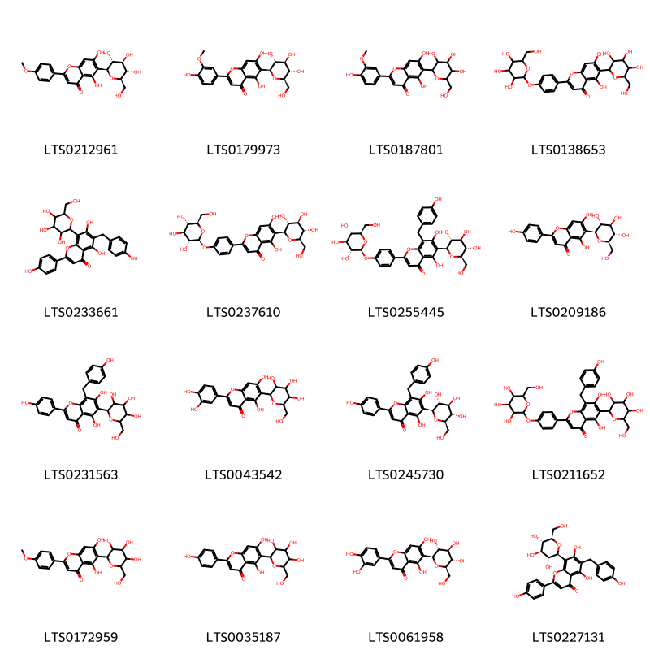{ width=100% }
    <figcaption>Hình ảnh cấu trúc hóa học của 16 hoạt chất thuộc nhóm Flavonoids gồm ['5,7-dihydroxy-2-(4-methoxyphenyl)-6-[(2s,3r,4r,5s,6r)-3,4,5-trihydroxy-6-(hydroxymethyl)oxan-2-yl]chromen-4-one (LTS0212961)', 'isoscoparin (LTS0179973)', '5,7-dihydroxy-2-(4-hydroxy-3-methoxyphenyl)-6-[3,4,5-trihydroxy-6-(hydroxymethyl)oxan-2-yl]chromen-4-one (LTS0187801)', '5,7-dihydroxy-6-[3,4,5-trihydroxy-6-(hydroxymethyl)oxan-2-yl]-2-(4-{[3,4,5-trihydroxy-6-(hydroxymethyl)oxan-2-yl]oxy}phenyl)chromen-4-one (LTS0138653)', '5,7-dihydroxy-2-(4-hydroxyphenyl)-6-[(4-hydroxyphenyl)methyl]-8-[3,4,5-trihydroxy-6-(hydroxymethyl)oxan-2-yl]chromen-4-one (LTS0233661)', '5,7-dihydroxy-6-[(2s,3r,4r,5s,6r)-3,4,5-trihydroxy-6-(hydroxymethyl)oxan-2-yl]-2-(4-{[(2s,3r,4s,5s,6r)-3,4,5-trihydroxy-6-(hydroxymethyl)oxan-2-yl]oxy}phenyl)chromen-4-one (LTS0237610)', '5,7-dihydroxy-8-[(4-hydroxyphenyl)methyl]-6-[(2s,3r,4r,5s,6r)-3,4,5-trihydroxy-6-(hydroxymethyl)oxan-2-yl]-2-(4-{[(2s,3r,4s,5s,6r)-3,4,5-trihydroxy-6-(hydroxymethyl)oxan-2-yl]oxy}phenyl)chromen-4-one (LTS0255445)', 'isovitexin (LTS0209186)', '5,7-dihydroxy-2-(4-hydroxyphenyl)-8-[(4-hydroxyphenyl)methyl]-6-[3,4,5-trihydroxy-6-(hydroxymethyl)oxan-2-yl]chromen-4-one (LTS0231563)', 'isoorientin (LTS0043542)', '5,7-dihydroxy-2-(4-hydroxyphenyl)-8-[(4-hydroxyphenyl)methyl]-6-[(2s,3r,4r,5s,6r)-3,4,5-trihydroxy-6-(hydroxymethyl)oxan-2-yl]chromen-4-one (LTS0245730)', '5,7-dihydroxy-8-[(4-hydroxyphenyl)methyl]-6-[3,4,5-trihydroxy-6-(hydroxymethyl)oxan-2-yl]-2-(4-{[3,4,5-trihydroxy-6-(hydroxymethyl)oxan-2-yl]oxy}phenyl)chromen-4-one (LTS0211652)', '5,7-dihydroxy-2-(4-methoxyphenyl)-6-[3,4,5-trihydroxy-6-(hydroxymethyl)oxan-2-yl]chromen-4-one (LTS0172959)', 'isovitexin (LTS0035187)', 'isoorientin (LTS0061958)', '5,7-dihydroxy-2-(4-hydroxyphenyl)-6-[(4-hydroxyphenyl)methyl]-8-[(2s,3r,4r,5s,6r)-3,4,5-trihydroxy-6-(hydroxymethyl)oxan-2-yl]chromen-4-one (LTS0227131)'].</figcaption>
</figure>
#### Nhóm Organooxygen compounds
<figure markdown="span">
    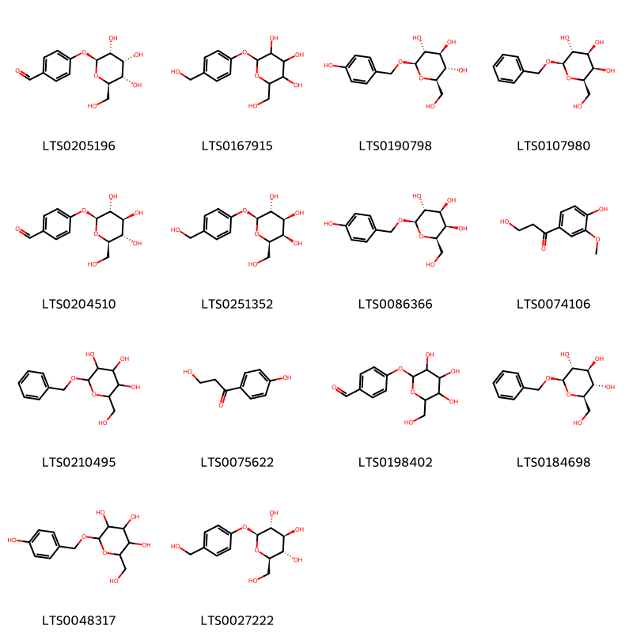{ width=100% }
    <figcaption>Hình ảnh cấu trúc hóa học của 14 hoạt chất thuộc nhóm Organooxygen compounds gồm ['4-{[(2s,3r,4r,5s,6r)-3,4,5-trihydroxy-6-(hydroxymethyl)oxan-2-yl]oxy}benzaldehyde (LTS0205196)', '2-(hydroxymethyl)-6-[4-(hydroxymethyl)phenoxy]oxane-3,4,5-triol (LTS0167915)', '(2r,3s,4s,5r,6r)-2-(hydroxymethyl)-6-[(4-hydroxyphenyl)methoxy]oxane-3,4,5-triol (LTS0190798)', '(2r,3r,4s,5r,6r)-2-(benzyloxy)-6-(hydroxymethyl)oxane-3,4,5-triol (LTS0107980)', '4-{[(2s,3r,4s,5s,6r)-3,4,5-trihydroxy-6-(hydroxymethyl)oxan-2-yl]oxy}benzaldehyde (LTS0204510)', '(2r,3r,4s,5r,6s)-2-(hydroxymethyl)-6-[4-(hydroxymethyl)phenoxy]oxane-3,4,5-triol (LTS0251352)', '(2r,3r,4s,5r,6r)-2-(hydroxymethyl)-6-[(4-hydroxyphenyl)methoxy]oxane-3,4,5-triol (LTS0086366)', '3-hydroxy-1-(4-hydroxy-3-methoxyphenyl)propan-1-one (LTS0074106)', 'benzyl glucopyranoside (LTS0210495)', '3-hydroxy-1-(4-hydroxyphenyl)propan-1-one (LTS0075622)', '4-{[3,4,5-trihydroxy-6-(hydroxymethyl)oxan-2-yl]oxy}benzaldehyde (LTS0198402)', 'benzyl β-d-glucoside (LTS0184698)', '2-(hydroxymethyl)-6-[(4-hydroxyphenyl)methoxy]oxane-3,4,5-triol (LTS0048317)', 'gastrodin (LTS0027222)'].</figcaption>
</figure>
#### Nhóm Prenol lipids
<figure markdown="span">
    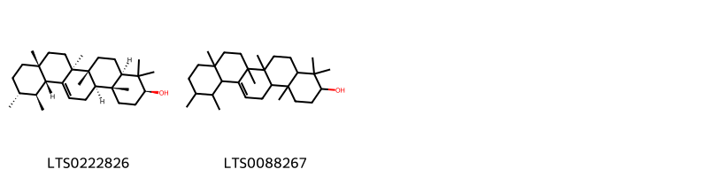{ width=100% }
    <figcaption>Hình ảnh cấu trúc hóa học của 2 hoạt chất thuộc nhóm Prenol lipids gồm ['amyrin (LTS0222826)', 'α-amyrin (LTS0088267)'].</figcaption>
</figure>
#### Nhóm Saturated hydrocarbons
<figure markdown="span">
    { width=100% }
    <figcaption>Hình ảnh cấu trúc hóa học của 1 hoạt chất thuộc nhóm Saturated hydrocarbons gồm ['hentriacontane (LTS0046415)'].</figcaption>
</figure>
#### Nhóm Steroids and steroid derivatives
<figure markdown="span">
    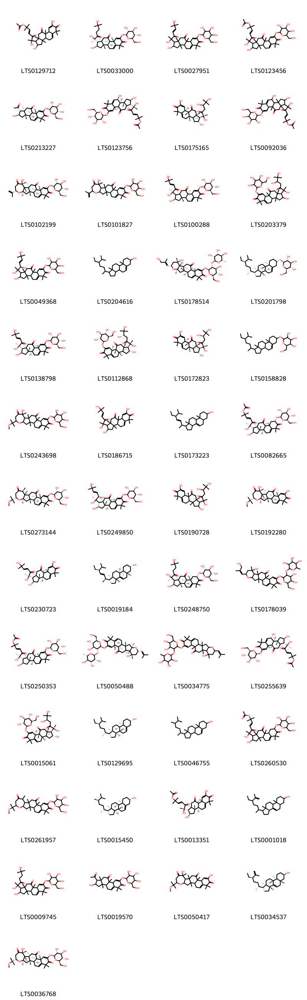{ width=100% }
    <figcaption>Hình ảnh cấu trúc hóa học của 49 hoạt chất thuộc nhóm Steroids and steroid derivatives gồm ['6-{2,8-dihydroxy-3a,6,6,9b,11a-pentamethyl-7,10-dioxo-1h,2h,3h,3bh,4h,9ah,11h-cyclopenta[a]phenanthren-1-yl}-6-hydroxy-2-methyl-5-oxohept-3-en-2-yl acetate (LTS0129712)', 'bryoamaride (LTS0033000)', '1-(2,6-dihydroxy-6-methyl-3-oxohept-4-en-2-yl)-2-hydroxy-3a,6,6,9b,11a-pentamethyl-8-{[3,4,5-trihydroxy-6-(hydroxymethyl)oxan-2-yl]oxy}-1h,2h,3h,3bh,4h,9ah,11h-cyclopenta[a]phenanthrene-7,10-dione (LTS0027951)', '6-hydroxy-6-(2-hydroxy-3a,6,6,9b,11a-pentamethyl-7,10-dioxo-8-{[3,4,5-trihydroxy-6-(hydroxymethyl)oxan-2-yl]oxy}-1h,2h,3h,3bh,4h,9ah,11h-cyclopenta[a]phenanthren-1-yl)-2-methyl-5-oxohept-3-en-2-yl acetate (LTS0123456)', 'khekadaengoside k (LTS0213227)', '(3e,6s)-6-[(1r,2r,3as,3bs,4r,9ar,9bs,11ar)-2,4-dihydroxy-3a,6,6,9b,11a-pentamethyl-7,10-dioxo-8-{[(2s,3r,4s,5s,6r)-3,4,5-trihydroxy-6-(hydroxymethyl)oxan-2-yl]oxy}-1h,2h,3h,3bh,4h,9ah,11h-cyclopenta[a]phenanthren-1-yl]-6-hydroxy-2-methyl-5-oxohept-3-en-2-yl acetate (LTS0123756)', 'cucurbitacin j (LTS0175165)', '6-(2,4-dihydroxy-3a,6,6,9b,11a-pentamethyl-7,10-dioxo-8-{[3,4,5-trihydroxy-6-(hydroxymethyl)oxan-2-yl]oxy}-1h,2h,3h,3bh,4h,9ah,11h-cyclopenta[a]phenanthren-1-yl)-6-hydroxy-2-methyl-5-oxohept-3-en-2-yl acetate (LTS0092036)', '(1s,2s,4r,6s,9r,10r,11r,14r,15r)-9-hydroxy-2,9,11,14,19,19-hexamethyl-6-(prop-1-en-2-yl)-17-{[(2s,3r,4s,5s,6r)-3,4,5-trihydroxy-6-(hydroxymethyl)oxan-2-yl]oxy}-5-oxapentacyclo[12.8.0.0²,¹¹.0⁴,¹⁰.0¹⁵,²⁰]docosa-16,20-diene-8,13,18-trione (LTS0102199)', '9-hydroxy-2,9,11,14,19,19-hexamethyl-6-(prop-1-en-2-yl)-17-{[3,4,5-trihydroxy-6-(hydroxymethyl)oxan-2-yl]oxy}-5-oxapentacyclo[12.8.0.0²,¹¹.0⁴,¹⁰.0¹⁵,²⁰]docosa-16,20-diene-8,13,18-trione (LTS0101827)', '(2r,3as,9br,11ar)-1-[(2r,4e)-2,6-dihydroxy-6-methyl-3-oxohept-4-en-2-yl]-2-hydroxy-3a,6,6,9b,11a-pentamethyl-8-{[(2s,3r,4s,5s,6r)-3,4,5-trihydroxy-6-(hydroxymethyl)oxan-2-yl]oxy}-1h,2h,3h,3bh,4h,9ah,11h-cyclopenta[a]phenanthrene-7,10-dione (LTS0100288)', '2-hydroxy-3a,6,6,9b,11a-pentamethyl-8-{[3,4,5-trihydroxy-6-(hydroxymethyl)oxan-2-yl]oxy}-1-(2,5,6-trihydroxy-6-methyl-3-oxoheptan-2-yl)-1h,2h,3h,3bh,4h,9ah,11h-cyclopenta[a]phenanthrene-7,10-dione (LTS0203379)', '2-hydroxy-3a,6,6,9b,11a-pentamethyl-8-{[3,4,5-trihydroxy-6-(hydroxymethyl)oxan-2-yl]oxy}-1-(2,3,6-trihydroxy-6-methylhept-4-en-2-yl)-1h,2h,3h,3bh,4h,9ah,11h-cyclopenta[a]phenanthrene-7,10-dione (LTS0049368)', 'stigmast-5-en-3-ol, (3β)- (LTS0204616)', '(1s,2s,4r,6s,8s,9r,10r,13r,14r)-16-{[(2s,3r,4s,5s,6r)-4,5-dihydroxy-6-(hydroxymethyl)-3-{[(2s,3r,4r,5r,6s)-3,4,5-trihydroxy-6-methyloxan-2-yl]oxy}oxan-2-yl]oxy}-8-hydroxy-6-[(1e)-3-hydroxy-2-methylprop-1-en-1-yl]-2,8,10,13,18,18-hexamethyl-5-oxapentacyclo[11.8.0.0²,¹⁰.0⁴,⁹.0¹⁴,¹⁹]henicosa-15,19-diene-12,17-dione (LTS0178514)', 'sitogluside (LTS0201798)', '(1r,2r,3as,3bs,9ar,9br,11ar)-1-[(2r,4e)-2,6-dihydroxy-6-methyl-3-oxohept-4-en-2-yl]-2-hydroxy-3a,6,6,9b,11a-pentamethyl-8-{[(2s,3r,4s,5s,6r)-3,4,5-trihydroxy-6-(hydroxymethyl)oxan-2-yl]oxy}-1h,2h,3h,3bh,4h,9ah,11h-cyclopenta[a]phenanthrene-7,10-dione (LTS0138798)', '(1r,2r,3as,3bs,9ar,9br,11ar)-2-hydroxy-3a,6,6,9b,11a-pentamethyl-8-{[(2s,3r,4s,5s,6r)-3,4,5-trihydroxy-6-(hydroxymethyl)oxan-2-yl]oxy}-1-[(2r,5s)-2,5,6-trihydroxy-6-methyl-3-oxoheptan-2-yl]-1h,2h,3h,3bh,4h,9ah,11h-cyclopenta[a]phenanthrene-7,10-dione (LTS0112868)', 'cucurbitacin j (LTS0172823)', '2-{[1-(5-ethyl-6-methylheptan-2-yl)-9a,11a-dimethyl-1h,2h,3h,3ah,3bh,4h,6h,7h,8h,9h,9bh,10h,11h-cyclopenta[a]phenanthren-7-yl]oxy}-6-(hydroxymethyl)oxane-3,4,5-triol (LTS0158828)', '9-hydroxy-6-(2-methoxypropan-2-yl)-2,9,11,14,19,19-hexamethyl-17-{[3,4,5-trihydroxy-6-(hydroxymethyl)oxan-2-yl]oxy}-5-oxapentacyclo[12.8.0.0²,¹¹.0⁴,¹⁰.0¹⁵,²⁰]docosa-16,20-diene-8,13,18-trione (LTS0243698)', '1-(2,6-dihydroxy-6-methyl-3-oxohept-4-en-2-yl)-2,8-dihydroxy-3a,6,6,9b,11a-pentamethyl-1h,2h,3h,3bh,4h,9ah,11h-cyclopenta[a]phenanthrene-7,10-dione (LTS0186715)', '1-(5-ethyl-6-methylhept-3-en-2-yl)-9a,11a-dimethyl-1h,2h,3h,3ah,5h,5ah,6h,7h,8h,9h,9bh,10h,11h-cyclopenta[a]phenanthren-7-ol (LTS0173223)', '(3e,6r)-6-[(1r,2r,3as,3bs,8s,9ar,9br,11ar)-2-hydroxy-3a,6,6,9b,11a-pentamethyl-7,10-dioxo-8-{[(2s,3r,4s,5s,6r)-3,4,5-trihydroxy-6-(hydroxymethyl)oxan-2-yl]oxy}-1h,2h,3h,3bh,4h,8h,9h,9ah,11h-cyclopenta[a]phenanthren-1-yl]-6-hydroxy-2-methyl-5-oxohept-3-en-2-yl acetate (LTS0082665)', '(1s,2s,4r,6s,9s,10r,11r,14r,15r)-6-(2-methoxypropan-2-yl)-2,9,11,14,19,19-hexamethyl-17-{[(2s,3r,4s,5s,6r)-3,4,5-trihydroxy-6-(hydroxymethyl)oxan-2-yl]oxy}-5-oxapentacyclo[12.8.0.0²,¹¹.0⁴,¹⁰.0¹⁵,²⁰]docosa-16,20-diene-8,13,18-trione (LTS0273144)', '(1r,2r,3as,3bs,9ar,9br,11ar)-2-hydroxy-3a,6,6,9b,11a-pentamethyl-8-{[(2s,3r,4s,5s,6r)-3,4,5-trihydroxy-6-(hydroxymethyl)oxan-2-yl]oxy}-1-[(2r,3r,4e)-2,3,6-trihydroxy-6-methylhept-4-en-2-yl]-1h,2h,3h,3bh,4h,9ah,11h-cyclopenta[a]phenanthrene-7,10-dione (LTS0249850)', '2,8-dihydroxy-3a,6,6,9b,11a-pentamethyl-1-(2,5,6-trihydroxy-6-methyl-3-oxoheptan-2-yl)-1h,2h,3h,3bh,4h,9ah,11h-cyclopenta[a]phenanthrene-7,10-dione (LTS0190728)', '(1s,2s,4r,6s,9r,10r,11r,14r,15r)-9,17-dihydroxy-6-(2-methoxypropan-2-yl)-2,9,11,14,19,19-hexamethyl-5-oxapentacyclo[12.8.0.0²,¹¹.0⁴,¹⁰.0¹⁵,²⁰]docosa-16,20-diene-8,13,18-trione (LTS0192280)', 'cucurbitacin (LTS0230723)', '(1r,3ar,5as,7s,9as,9bs,11ar)-1-[(2s,3e,5s)-5-ethyl-6-methylhept-3-en-2-yl]-9a,11a-dimethyl-1h,2h,3h,3ah,5h,5ah,6h,7h,8h,9h,9bh,10h,11h-cyclopenta[a]phenanthren-7-ol (LTS0019184)', '(2r,3as,3bs,8s,9ar,9br,11ar)-1-[(2r)-2,6-dihydroxy-6-methyl-3-oxoheptan-2-yl]-2-hydroxy-3a,6,6,9b,11a-pentamethyl-8-{[(2s,3r,4s,5s,6r)-3,4,5-trihydroxy-6-(hydroxymethyl)oxan-2-yl]oxy}-1h,2h,3h,3bh,4h,8h,9h,9ah,11h-cyclopenta[a]phenanthrene-7,10-dione (LTS0248750)', '16-{[4,5-dihydroxy-6-(hydroxymethyl)-3-[(3,4,5-trihydroxy-6-methyloxan-2-yl)oxy]oxan-2-yl]oxy}-8-hydroxy-6-(3-hydroxy-2-methylprop-1-en-1-yl)-2,8,10,13,18,18-hexamethyl-5-oxapentacyclo[11.8.0.0²,¹⁰.0⁴,⁹.0¹⁴,¹⁹]henicosa-15,19-diene-12,17-dione (LTS0178039)', 'colocynthin (LTS0250353)', '(1s,2s,4r,6s,8s,9r,10r,13r,14r)-16-{[(2s,3r,4s,5s,6r)-4,5-dihydroxy-6-(hydroxymethyl)-3-{[(2s,3r,4r,5r,6s)-3,4,5-trihydroxy-6-methyloxan-2-yl]oxy}oxan-2-yl]oxy}-8-hydroxy-2,8,10,13,18,18-hexamethyl-6-(2-methylprop-1-en-1-yl)-5-oxapentacyclo[11.8.0.0²,¹⁰.0⁴,⁹.0¹⁴,¹⁹]henicosa-15,19-diene-12,17-dione (LTS0050488)', '16-{[4,5-dihydroxy-6-(hydroxymethyl)-3-[(3,4,5-trihydroxy-6-methyloxan-2-yl)oxy]oxan-2-yl]oxy}-8-hydroxy-2,8,10,13,18,18-hexamethyl-6-(2-methylprop-1-en-1-yl)-5-oxapentacyclo[11.8.0.0²,¹⁰.0⁴,⁹.0¹⁴,¹⁹]henicosa-15,19-diene-12,17-dione (LTS0034775)', '(3e,6r)-6-[(1r,2r,3as,3bs,4s,9ar,9bs,11ar)-2,4-dihydroxy-3a,6,6,9b,11a-pentamethyl-7,10-dioxo-8-{[(2s,3r,4s,5s,6r)-3,4,5-trihydroxy-6-(hydroxymethyl)oxan-2-yl]oxy}-1h,2h,3h,3bh,4h,9ah,11h-cyclopenta[a]phenanthren-1-yl]-6-hydroxy-2-methyl-5-oxohept-3-en-2-yl acetate (LTS0255639)', '(1r,2r,3as,3bs,9ar,9br,11ar)-2-hydroxy-3a,6,6,9b,11a-pentamethyl-8-{[(2s,3r,4s,5s,6r)-3,4,5-trihydroxy-6-(hydroxymethyl)oxan-2-yl]oxy}-1-[(2r,5r)-2,5,6-trihydroxy-6-methyl-3-oxoheptan-2-yl]-1h,2h,3h,3bh,4h,9ah,11h-cyclopenta[a]phenanthrene-7,10-dione (LTS0015061)', '(1r,3ar,3br,7s,9ar,9br,11ar)-1-[(2r,5r)-5-ethyl-6-methylheptan-2-yl]-9a,11a-dimethyl-1h,2h,3h,3ah,3bh,4h,6h,7h,8h,9h,9bh,10h,11h-cyclopenta[a]phenanthren-7-ol (LTS0129695)', 'campesterol (LTS0046755)', '6-hydroxy-6-(2-hydroxy-3a,6,6,9b,11a-pentamethyl-7,10-dioxo-8-{[3,4,5-trihydroxy-6-(hydroxymethyl)oxan-2-yl]oxy}-1h,2h,3h,3bh,4h,8h,9h,9ah,11h-cyclopenta[a]phenanthren-1-yl)-2-methyl-5-oxohept-3-en-2-yl acetate (LTS0260530)', '6-(2-methoxypropan-2-yl)-2,9,11,14,19,19-hexamethyl-17-{[3,4,5-trihydroxy-6-(hydroxymethyl)oxan-2-yl]oxy}-5-oxapentacyclo[12.8.0.0²,¹¹.0⁴,¹⁰.0¹⁵,²⁰]docosa-16,20-diene-8,13,18-trione (LTS0261957)', '(1r,3ar,3br,7s,9ar,9br,11ar)-1-[(2r,5r)-5,6-dimethylheptan-2-yl]-9a,11a-dimethyl-1h,2h,3h,3ah,3bh,4h,6h,7h,8h,9h,9bh,10h,11h-cyclopenta[a]phenanthren-7-ol (LTS0015450)', '(3e,6s)-6-[(1r,2r,3as,3bs,9ar,9br,11ar)-2,8-dihydroxy-3a,6,6,9b,11a-pentamethyl-7,10-dioxo-1h,2h,3h,3bh,4h,9ah,11h-cyclopenta[a]phenanthren-1-yl]-6-hydroxy-2-methyl-5-oxohept-3-en-2-yl acetate (LTS0013351)', '1-(5-ethyl-6-methylhept-6-en-2-yl)-9a,11a-dimethyl-1h,2h,3h,3ah,5h,5ah,6h,7h,8h,9h,9bh,10h,11h-cyclopenta[a]phenanthren-7-ol (LTS0001018)', 'bryoamaride (LTS0009745)', '1-acetyl-2-hydroxy-3a,6,6,9b,11a-pentamethyl-8-{[3,4,5-trihydroxy-6-(hydroxymethyl)oxan-2-yl]oxy}-1h,2h,3h,3bh,4h,9ah,11h-cyclopenta[a]phenanthrene-7,10-dione (LTS0019570)', '9,17-dihydroxy-6-(2-methoxypropan-2-yl)-2,9,11,14,19,19-hexamethyl-5-oxapentacyclo[12.8.0.0²,¹¹.0⁴,¹⁰.0¹⁵,²⁰]docosa-16,20-diene-8,13,18-trione (LTS0050417)', '(1r,3ar,5as,7r,9as,9br,11ar)-1-[(2r,5r)-5-ethyl-6-methylhept-6-en-2-yl]-9a,11a-dimethyl-1h,2h,3h,3ah,5h,5ah,6h,7h,8h,9h,9bh,10h,11h-cyclopenta[a]phenanthren-7-ol (LTS0034537)', '(1s,2s,4r,6s,9r,10r,11r,14r,15r)-9-hydroxy-6-(2-methoxypropan-2-yl)-2,9,11,14,19,19-hexamethyl-17-{[(2s,3r,4s,5s,6r)-3,4,5-trihydroxy-6-(hydroxymethyl)oxan-2-yl]oxy}-5-oxapentacyclo[12.8.0.0²,¹¹.0⁴,¹⁰.0¹⁵,²⁰]docosa-16,20-diene-8,13,18-trione (LTS0036768)'].</figcaption>
</figure>

---

### Dược dân tộc học

Danh sách các quốc gia có sử dụng *Citrullus colocynthis* trong điều trị các bệnh. 

| Country   | Disease                                       | Bệnh                                          |
|:----------|:----------------------------------------------|:----------------------------------------------|
| Egypt     | Cathartic, Vermifuge, Poison                  | Cathartic, Vermifuge, Poison                  |
| Elsewhere | Cathartic, Purgative, Purgative, Cathartic    | Cathartic, Purgative, Purgative, Cathartic    |
| Iraq      | Parasiticide                                  | Thuốc diệt ký sinh                            |
| Sudan     | Cathartic                                     | thuốc tẩy nhẹ                                 |
| Turkey    | Abortifacient, Emmenagogue, Purgative, Poison | Abortifacient, Emmenagogue, Purgative, Poison |
| ain       | Purgative                                     | Thuốc xổ                                      |

---

---
## Citrullus lanatus
### Thông tin về thực vật

!!! info "Phân loại thực vật của *Citrullus lanatus* từ GIBF:"
    - **Kingdom:** Plantae
    - **Phylum:** Tracheophyta
    - **Order:** Cucurbitales
    - **Family:** Cucurbitaceae
    - **Genus:** Citrullus
    - **Species:** *Citrullus lanatus*

 

| Label (VI)   | Label (EN)   | Scientific Name   | Descriptions (VI)   | Descriptions (EN)   | Also Known As (VI)   | Also Known As (EN)    |
|:-------------|:-------------|:------------------|:--------------------|:--------------------|:---------------------|:----------------------|
| N/A          | N/A          | Citrullus lanatus | loài thực vật       | species of plant    | ['']                 | ['Citrullus lanatus'] |

#### Phân bố trên thế giới

**Từ CSDL GIBF** United Arab Emirates, Brazil, Saint Kitts and Nevis, Viet Nam, Guatemala, Czechia, Mongolia, Sweden, China, Gambia, Kazakhstan, Chile, Türkiye, Ecuador, Yemen, Thailand, Spain, Poland, Netherlands, Denmark, United States of America, Romania, Greece, Costa Rica, Russian Federation, Colombia, Croatia, Cuba, Argentina, French Guiana, Ethiopia, Lithuania, Lao People’s Democratic Republic, Fiji, Morocco, Hong Kong, Mexico, Benin, Norway, United Kingdom of Great Britain and Northern Ireland, Belgium, Chinese Taipei, Philippines, Curaçao, Georgia, Serbia, Canada, Germany, Namibia, Austria, Hungary, Portugal, Slovakia, South Africa, Australia, Saint Vincent and the Grenadines, Ukraine, Italy, India, Switzerland, Peru, France, Montserrat, Venezuela (Bolivarian Republic of)

#### Phân bố tại Việt Nam

**Từ CSDL GIBF**: Bình Thuận

---
### Thành phần hóa học
        
- Theo cơ sở dữ liệu lotus: Từ loài *Citrullus lanatus* đã phân lập và xác định được 86 hoạt chất thuộc về các nhóm Fatty Acyls, Lactones, Benzene and substituted derivatives, Heteroaromatic compounds, Cinnamyl alcohols, Flavonoids, Dibenzylbutane lignans, Unsaturated hydrocarbons, Carboxylic acids and derivatives, Steroids and steroid derivatives, Organooxygen compounds, Furanoid lignans, Prenol lipids, Saturated hydrocarbons. 

|    | chemicalTaxonomyClassyfireClass     |   smiles_count |
|---:|:------------------------------------|---------------:|
|  0 | Benzene and substituted derivatives |              3 |
|  1 | Carboxylic acids and derivatives    |              1 |
|  2 | Cinnamyl alcohols                   |              2 |
|  3 | Dibenzylbutane lignans              |              2 |
|  4 | Fatty Acyls                         |             11 |
|  5 | Flavonoids                          |              5 |
|  6 | Furanoid lignans                    |              3 |
|  7 | Heteroaromatic compounds            |              1 |
|  8 | Lactones                            |              2 |
|  9 | Organooxygen compounds              |             18 |
| 10 | Prenol lipids                       |             15 |
| 11 | Saturated hydrocarbons              |              5 |
| 12 | Steroids and steroid derivatives    |             17 |
| 13 | Unsaturated hydrocarbons            |              1 |

#### Nhóm Benzene and substituted derivatives
<figure markdown="span">
    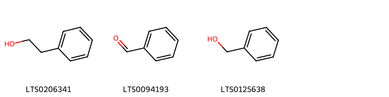{ width=100% }
    <figcaption>Hình ảnh cấu trúc hóa học của 3 hoạt chất thuộc nhóm Benzene and substituted derivatives gồm ['2-phenyl-ethanol (LTS0206341)', 'benzaldehyde (LTS0094193)', 'benzyl alcohol (LTS0125638)'].</figcaption>
</figure>
#### Nhóm Carboxylic acids and derivatives
<figure markdown="span">
    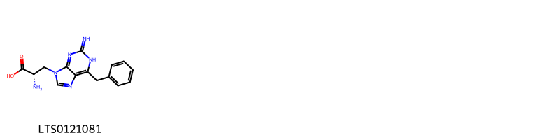{ width=100% }
    <figcaption>Hình ảnh cấu trúc hóa học của 1 hoạt chất thuộc nhóm Carboxylic acids and derivatives gồm ['(2s)-2-amino-3-(6-benzyl-2-imino-1h-purin-9-yl)propanoic acid (LTS0121081)'].</figcaption>
</figure>
#### Nhóm Cinnamyl alcohols
<figure markdown="span">
    { width=100% }
    <figcaption>Hình ảnh cấu trúc hóa học của 2 hoạt chất thuộc nhóm Cinnamyl alcohols gồm ['3-phenyl-2-propen-1-ol (LTS0069711)', 'cinnamyl alcohol (LTS0010678)'].</figcaption>
</figure>
#### Nhóm Dibenzylbutane lignans
<figure markdown="span">
    { width=100% }
    <figcaption>Hình ảnh cấu trúc hóa học của 2 hoạt chất thuộc nhóm Dibenzylbutane lignans gồm ['(2s,3r)-2,3-bis[(4-hydroxy-3-methoxyphenyl)(¹³c)methyl](1-¹³c)butane-1,4-diol (LTS0268699)', 'secoisolariciresinol (LTS0086727)'].</figcaption>
</figure>
#### Nhóm Fatty Acyls
<figure markdown="span">
    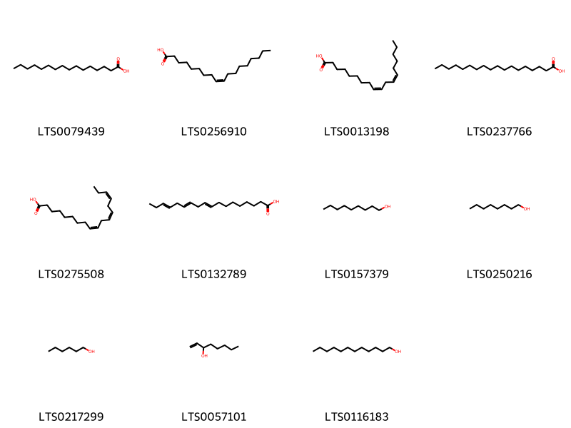{ width=100% }
    <figcaption>Hình ảnh cấu trúc hóa học của 11 hoạt chất thuộc nhóm Fatty Acyls gồm ['palmitic acid (LTS0079439)', 'oleic acid (LTS0256910)', 'linoleic (LTS0013198)', 'stearic acid (LTS0237766)', 'α-linolenic acid (LTS0275508)', 'α linolenic acid (LTS0132789)', 'nonan-1-ol (LTS0157379)', 'octanol (LTS0250216)', 'hexanol (LTS0217299)', '1-octen-3-ol (LTS0057101)', '1-dodecanol (LTS0116183)'].</figcaption>
</figure>
#### Nhóm Flavonoids
<figure markdown="span">
    { width=100% }
    <figcaption>Hình ảnh cấu trúc hóa học của 5 hoạt chất thuộc nhóm Flavonoids gồm ['chamomile (LTS0104946)', 'kaempherol (LTS0155822)', 'myricetin (LTS0139858)', 'quercetin (LTS0004651)', 'luteolin (LTS0017052)'].</figcaption>
</figure>
#### Nhóm Furanoid lignans
<figure markdown="span">
    { width=100% }
    <figcaption>Hình ảnh cấu trúc hóa học của 3 hoạt chất thuộc nhóm Furanoid lignans gồm ['pinoresinol (LTS0057431)', 'matairesinol (LTS0193475)', 'lariciresinol (LTS0010950)'].</figcaption>
</figure>
#### Nhóm Heteroaromatic compounds
<figure markdown="span">
    { width=100% }
    <figcaption>Hình ảnh cấu trúc hóa học của 1 hoạt chất thuộc nhóm Heteroaromatic compounds gồm ['amylfuran (LTS0044471)'].</figcaption>
</figure>
#### Nhóm Lactones
<figure markdown="span">
    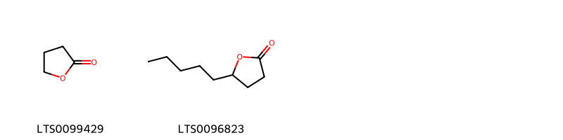{ width=100% }
    <figcaption>Hình ảnh cấu trúc hóa học của 2 hoạt chất thuộc nhóm Lactones gồm ['4-butyrolactone (LTS0099429)', 'gamma-nonalactone (LTS0096823)'].</figcaption>
</figure>
#### Nhóm Organooxygen compounds
<figure markdown="span">
    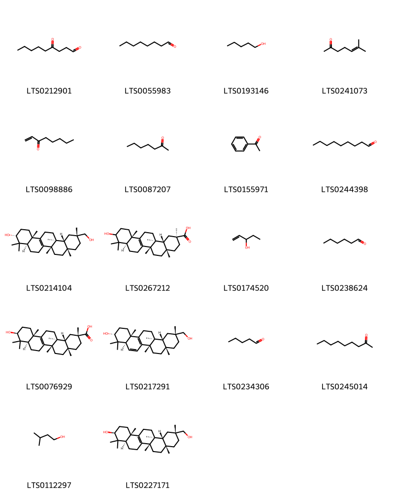{ width=100% }
    <figcaption>Hình ảnh cấu trúc hóa học của 18 hoạt chất thuộc nhóm Organooxygen compounds gồm ['4-oxononanal (LTS0212901)', 'octanal (LTS0055983)', 'amyl alcohol (LTS0193146)', '6-methyl-5-hepten-2-one (LTS0241073)', '1-octen-3-one (LTS0098886)', '2-heptanone (LTS0087207)', 'acetophenone (LTS0155971)', 'nonanal (LTS0244398)', '(3r,4ar,6bs,8as,11r,12ar,12bs,14bs)-11-(hydroxymethyl)-4,4,6b,8a,11,12b,14b-heptamethyl-1,2,3,4a,5,6,7,8,9,10,12,12a,13,14-tetradecahydropicen-3-ol (LTS0214104)', '(2s,4as,6as,8ar,12as,14as,14br)-10-hydroxy-2,4a,6a,9,9,12a,14a-heptamethyl-1,3,4,5,6,7,8,8a,10,11,12,13,14,14b-tetradecahydropicene-2-carboxylic acid (LTS0267212)', '1-penten-3-ol (LTS0174520)', 'hexanal (LTS0238624)', '(2r,4as,6as,8ar,10s,12as,14as,14br)-10-hydroxy-2,4a,6a,9,9,12a,14a-heptamethyl-1,3,4,5,6,7,8,8a,10,11,12,13,14,14b-tetradecahydropicene-2-carboxylic acid (LTS0076929)', '(3r,4ar,6bs,8as,11r,12ar,12bs,14bs)-11-(hydroxymethyl)-4,4,6b,8a,11,12b,14b-heptamethyl-1,2,3,4a,7,8,9,10,12,12a,13,14-dodecahydropicen-3-ol (LTS0217291)', 'pentanal (LTS0234306)', '2-nonanone (LTS0245014)', 'isoamyl alcohol (LTS0112297)', '(3s,4ar,6bs,8as,11r,12ar,12bs,14bs)-11-(hydroxymethyl)-4,4,6b,8a,11,12b,14b-heptamethyl-1,2,3,4a,5,6,7,8,9,10,12,12a,13,14-tetradecahydropicen-3-ol (LTS0227171)'].</figcaption>
</figure>
#### Nhóm Prenol lipids
<figure markdown="span">
    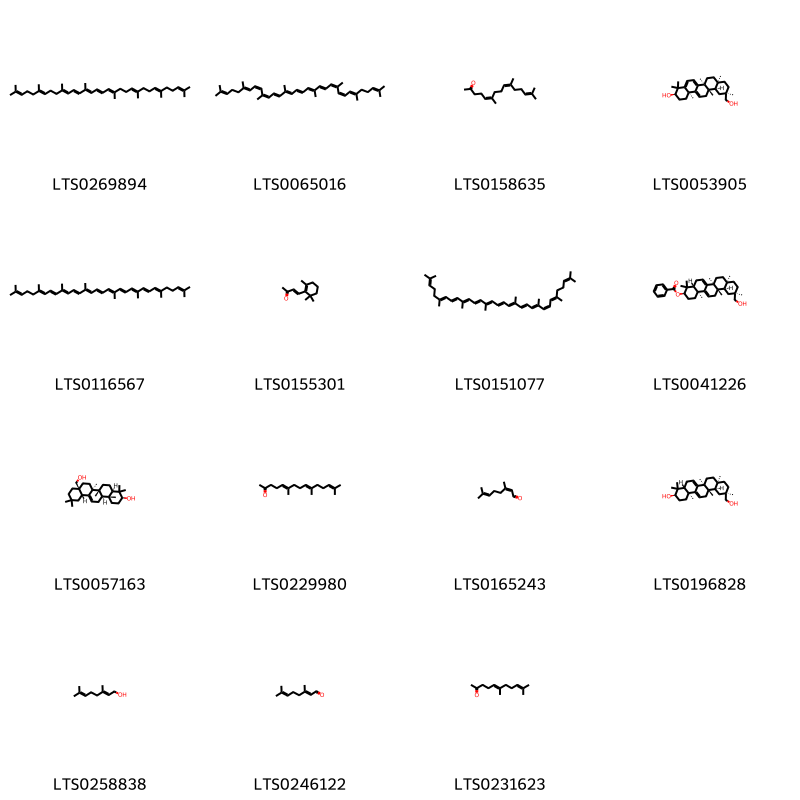{ width=100% }
    <figcaption>Hình ảnh cấu trúc hóa học của 15 hoạt chất thuộc nhóm Prenol lipids gồm ['all-trans-phytofluene (LTS0269894)', 'prolycopene (LTS0065016)', '6,10,14-trimethylpentadeca-5,9,13-trien-2-one (LTS0158635)', '(3r,6bs,8as,11r,12ar,12bs,14br)-11-(hydroxymethyl)-4,4,6b,8a,11,12b,14b-heptamethyl-1,2,3,7,8,9,10,12,12a,13-decahydropicen-3-ol (LTS0053905)', 'lycopene (LTS0116567)', 'β-ionone (LTS0155301)', '(6e,8z,10e,12e,14e,16e,18e,20e,22e,24e,26e)-2,6,10,14,19,23,27,31-octamethyldotriaconta-2,6,8,10,12,14,16,18,20,22,24,26,30-tridecaene (LTS0151077)', '(3r,4ar,6bs,8as,11r,12ar,12bs,14bs)-11-(hydroxymethyl)-4,4,6b,8a,11,12b,14b-heptamethyl-1,2,3,4a,5,7,8,9,10,12,12a,13-dodecahydropicen-3-yl benzoate (LTS0041226)', 'erythrodiol (LTS0057163)', '(5e,9e)-farnesyl acetone (LTS0229980)', 'neral (LTS0165243)', 'karounidiol (LTS0196828)', 'geraniol (LTS0258838)', 'α-citral (LTS0246122)', 'geranylacetone (LTS0231623)'].</figcaption>
</figure>
#### Nhóm Saturated hydrocarbons
<figure markdown="span">
    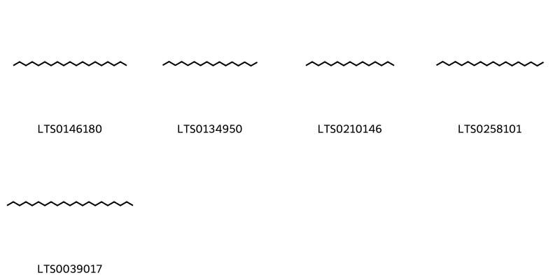{ width=100% }
    <figcaption>Hình ảnh cấu trúc hóa học của 5 hoạt chất thuộc nhóm Saturated hydrocarbons gồm ['nonadecane (LTS0146180)', 'cetane (LTS0134950)', 'pentadecane (LTS0210146)', 'octadecane (LTS0258101)', 'heneicosane (LTS0039017)'].</figcaption>
</figure>
#### Nhóm Steroids and steroid derivatives
<figure markdown="span">
    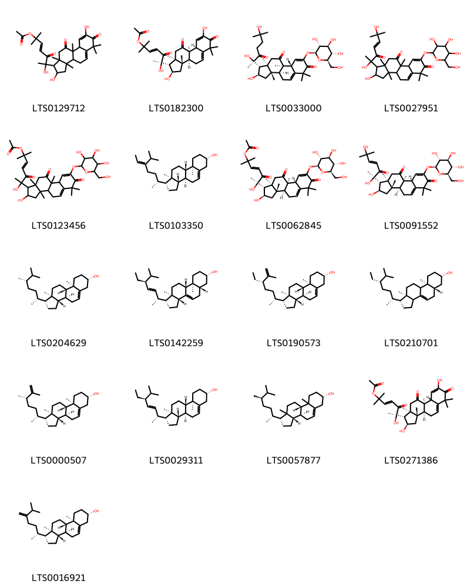{ width=100% }
    <figcaption>Hình ảnh cấu trúc hóa học của 17 hoạt chất thuộc nhóm Steroids and steroid derivatives gồm ['6-{2,8-dihydroxy-3a,6,6,9b,11a-pentamethyl-7,10-dioxo-1h,2h,3h,3bh,4h,9ah,11h-cyclopenta[a]phenanthren-1-yl}-6-hydroxy-2-methyl-5-oxohept-3-en-2-yl acetate (LTS0129712)', '(3e,6r)-6-[(1r,2r,3as,3bs,9as,9br,11ar)-2,8-dihydroxy-3a,6,6,9b,11a-pentamethyl-7,10-dioxo-1h,2h,3h,3bh,4h,9ah,11h-cyclopenta[a]phenanthren-1-yl]-6-hydroxy-2-methyl-5-oxohept-3-en-2-yl acetate (LTS0182300)', 'bryoamaride (LTS0033000)', '1-(2,6-dihydroxy-6-methyl-3-oxohept-4-en-2-yl)-2-hydroxy-3a,6,6,9b,11a-pentamethyl-8-{[3,4,5-trihydroxy-6-(hydroxymethyl)oxan-2-yl]oxy}-1h,2h,3h,3bh,4h,9ah,11h-cyclopenta[a]phenanthrene-7,10-dione (LTS0027951)', '6-hydroxy-6-(2-hydroxy-3a,6,6,9b,11a-pentamethyl-7,10-dioxo-8-{[3,4,5-trihydroxy-6-(hydroxymethyl)oxan-2-yl]oxy}-1h,2h,3h,3bh,4h,9ah,11h-cyclopenta[a]phenanthren-1-yl)-2-methyl-5-oxohept-3-en-2-yl acetate (LTS0123456)', 'avenasterol (LTS0103350)', '(3e,6r)-6-[(1r,2r,3as,3bs,9as,9br,11ar)-2-hydroxy-3a,6,6,9b,11a-pentamethyl-7,10-dioxo-8-{[(2s,3r,4s,5s,6r)-3,4,5-trihydroxy-6-(hydroxymethyl)oxan-2-yl]oxy}-1h,2h,3h,3bh,4h,9ah,11h-cyclopenta[a]phenanthren-1-yl]-6-hydroxy-2-methyl-5-oxohept-3-en-2-yl acetate (LTS0062845)', '(1r,2r,3as,3bs,9as,9br,11ar)-1-[(2r,4e)-2,6-dihydroxy-6-methyl-3-oxohept-4-en-2-yl]-2-hydroxy-3a,6,6,9b,11a-pentamethyl-8-{[(2s,3r,4s,5s,6r)-3,4,5-trihydroxy-6-(hydroxymethyl)oxan-2-yl]oxy}-1h,2h,3h,3bh,4h,9ah,11h-cyclopenta[a]phenanthrene-7,10-dione (LTS0091552)', '22,23-dihydrobrassicasterol (LTS0204629)', 'chondrillasterol (LTS0142259)', '(1r,3as,3bs,7s,9ar,9bs,11ar)-1-[(2r,5s)-5-ethyl-6-methylhept-6-en-2-yl]-9a,11a-dimethyl-1h,2h,3h,3ah,3bh,4h,6h,7h,8h,9h,9bh,10h,11h-cyclopenta[a]phenanthren-7-ol (LTS0190573)', '(1r,5as,7s,9as,11ar)-1-[(2r,5s)-5-ethyl-6-methylheptan-2-yl]-9a,11a-dimethyl-1h,2h,3h,3ah,5h,5ah,6h,7h,8h,9h,9bh,10h,11h-cyclopenta[a]phenanthren-7-ol (LTS0210701)', '(1r,3as,3bs,7s,9ar,9bs,11ar)-1-[(2r,5s)-5,6-dimethylhept-6-en-2-yl]-9a,11a-dimethyl-1h,2h,3h,3ah,3bh,4h,6h,7h,8h,9h,9bh,10h,11h-cyclopenta[a]phenanthren-7-ol (LTS0000507)', 'phytosterol (LTS0029311)', '(1r,3as,3bs,7s,9bs)-1-[(2r,5r)-5,6-dimethylheptan-2-yl]-9a,11a-dimethyl-1h,2h,3h,3ah,3bh,4h,6h,7h,8h,9h,9bh,10h,11h-cyclopenta[a]phenanthren-7-ol (LTS0057877)', 'α-elaterin (LTS0271386)', '24-methylenecholesterol (LTS0016921)'].</figcaption>
</figure>
#### Nhóm Unsaturated hydrocarbons
<figure markdown="span">
    { width=100% }
    <figcaption>Hình ảnh cấu trúc hóa học của 1 hoạt chất thuộc nhóm Unsaturated hydrocarbons gồm ['1-pentadecene (LTS0248601)'].</figcaption>
</figure>

---

### Dược dân tộc học

Danh sách các quốc gia có sử dụng *Citrullus lanatus* trong điều trị các bệnh. 

| Country            | Disease                                   | Bệnh                                     |
|:-------------------|:------------------------------------------|:-----------------------------------------|
| China              | Demulcent, Digestive, Diuretic, Demulcent | Demulcent, tiêu hóa, lợi tiểu, Demulcent |
| Dominican Republic | Diuretic                                  | Thuốc lợi tiêu                           |
| Elsewhere          | Poison, Diuretic                          | Chất độc, lợi tiểu                       |
| French             | Antiseptic                                | Khử trùng                                |
| Hawaii             | Laxative                                  | Nhuận trường                             |
| Iraq               | Diuretic                                  | Thuốc lợi tiêu                           |
| Java               | Hemostat                                  | Máy cầm máu                              |
| US                 | Diuretic                                  | Thuốc lợi tiêu                           |

---

---
## Citrullus vulgaris
### Thông tin về thực vật

!!! info "Phân loại thực vật của *Citrullus lanatus* từ GIBF:"
    - **Kingdom:** Plantae
    - **Phylum:** Tracheophyta
    - **Order:** Cucurbitales
    - **Family:** Cucurbitaceae
    - **Genus:** Citrullus
    - **Species:** *Citrullus lanatus*

 

| Label (VI)   | Label (EN)   | Scientific Name    | Descriptions (VI)   | Descriptions (EN)   | Also Known As (VI)   | Also Known As (EN)   |
|:-------------|:-------------|:-------------------|:--------------------|:--------------------|:---------------------|:---------------------|
| N/A          | N/A          | Citrullus vulgaris | loài thực vật       | species of plant    | ['']                 | ['']                 |

#### Phân bố trên thế giới

**Từ CSDL GIBF** nan, Brazil, Japan, Czechia, Uzbekistan, New Caledonia, China, Antigua and Barbuda, Suriname, Honduras, Ecuador, French Polynesia, Thailand, Spain, Bolivia (Plurinational State of), Sri Lanka, Samoa, United States of America, Korea, Republic of, Greece, Indonesia, Armenia, Pakistan, Tunisia, Nigeria, Croatia, Argentina, Hong Kong, Mexico, Algeria, Saudi Arabia, Guam, Chinese Taipei, Curaçao, Georgia, Iraq, Canada, Germany, Egypt, Turkmenistan, Hungary, Portugal, Cook Islands, Côte d’Ivoire, Italy, India, Bulgaria, France, Guyana

#### Phân bố tại Việt Nam

**Từ CSDL GIBF**: Không có ghi nhận ở Việt Nam

---
### Thành phần hóa học
        
- Theo cơ sở dữ liệu lotus: Từ loài *Citrullus lanatus* đã phân lập và xác định được Chưa có hoạt chất nào được phân lập. hoạt chất thuộc về các nhóm Không có hoạt chất nào được phân lập. 

Không có hình ảnh nào được tạo ra

---

### Dược dân tộc học

Danh sách các quốc gia có sử dụng *Citrullus lanatus* trong điều trị các bệnh. 

| Country   | Disease   | Bệnh           |
|:----------|:----------|:---------------|
| Bahamas   | Diuretic  | Thuốc lợi tiêu |

---

# Chi Corallocarpus

??? note "Danh sách các dược liệu thuộc chi"
    
	 - *Corallocarpus epigaeus*

---
## Corallocarpus epigaeus
### Thông tin về thực vật

!!! info "Phân loại thực vật của *Corallocarpus epigaeus* từ GIBF:"
    - **Kingdom:** Plantae
    - **Phylum:** Tracheophyta
    - **Order:** Cucurbitales
    - **Family:** Cucurbitaceae
    - **Genus:** Corallocarpus
    - **Species:** *Corallocarpus epigaeus*

 

| Label (VI)   | Label (EN)   | Scientific Name        | Descriptions (VI)   | Descriptions (EN)   | Also Known As (VI)   | Also Known As (EN)   |
|:-------------|:-------------|:-----------------------|:--------------------|:--------------------|:---------------------|:---------------------|
| N/A          | N/A          | Corallocarpus epigaeus | loài thực vật       | species of plant    | ['']                 | ['']                 |

#### Phân bố trên thế giới

**Từ CSDL GIBF** nan, Senegal, China, Mali, Somalia, Tanzania, United Republic of, Yemen, Madagascar, Sri Lanka, Chad, Pakistan, Burkina Faso, Ethiopia, Congo, Democratic Republic of the, Kenya, Rwanda, Saudi Arabia, Sudan, Tajikistan, Niger, Oman, India, United Kingdom of Great Britain and Northern Ireland

#### Phân bố tại Việt Nam

**Từ CSDL GIBF**: Không có ghi nhận ở Việt Nam

---
### Thành phần hóa học
        
- Theo cơ sở dữ liệu lotus: Từ loài *Corallocarpus epigaeus* đã phân lập và xác định được 5 hoạt chất thuộc về các nhóm Prenol lipids. 

|    | chemicalTaxonomyClassyfireClass   |   smiles_count |
|---:|:----------------------------------|---------------:|
|  0 | Prenol lipids                     |              5 |

#### Nhóm Prenol lipids
<figure markdown="span">
    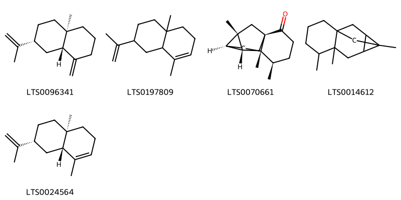{ width=100% }
    <figcaption>Hình ảnh cấu trúc hóa học của 5 hoạt chất thuộc nhóm Prenol lipids gồm ['β-selinene (LTS0096341)', 'selinene (LTS0197809)', '(1s,5r,6s,8s,9s,10r)-5,6,9-trimethyltetracyclo[7.2.1.0¹,⁶.0⁸,¹⁰]dodecan-2-one (LTS0070661)', '5,6,9-trimethyltetracyclo[7.2.1.0¹,⁶.0⁸,¹⁰]dodecane (LTS0014612)', 'α-selinene (LTS0024564)'].</figcaption>
</figure>

---

### Dược dân tộc học

Danh sách các quốc gia có sử dụng *Corallocarpus epigaeus* trong điều trị các bệnh. 

| Country   | Disease   | Bệnh         |
|:----------|:----------|:-------------|
| Elsewhere | Laxative  | Nhuận trường |

---

# Chi Melothria

??? note "Danh sách các dược liệu thuộc chi"
    
	 - *Melothria heterophylla*
	 - *Melothria indica*
	 - *Melothria maderaatana*

---
## Melothria heterophylla
### Thông tin về thực vật

!!! info "Phân loại thực vật của *N/A* từ GIBF:"
    - **Kingdom:** Plantae
    - **Phylum:** Tracheophyta
    - **Order:** Cucurbitales
    - **Family:** Cucurbitaceae
    - **Genus:** N/A
    - **Species:** *N/A*

 

| Label (VI)   | Label (EN)   | Scientific Name        | Descriptions (VI)   | Descriptions (EN)   | Also Known As (VI)   | Also Known As (EN)   |
|:-------------|:-------------|:-----------------------|:--------------------|:--------------------|:---------------------|:---------------------|
| N/A          | N/A          | Melothria heterophylla |                     |                     | ['']                 | ['']                 |

#### Phân bố trên thế giới

**Từ CSDL GIBF** Brazil, Guatemala, Viet Nam, Japan, Botswana, China, Israel, Gambia, Chile, Tanzania, United Republic of, Ecuador, Thailand, Spain, Puerto Rico, Sri Lanka, United States of America, Tonga, Greece, Indonesia, Costa Rica, Russian Federation, Dominican Republic, Nigeria, Colombia, Argentina, Hong Kong, Mexico, Kenya, Guam, Chinese Taipei, Malaysia, Kuwait, Iraq, Canada, Panama, Namibia, Portugal, Ukraine, South Africa, Australia, India

#### Phân bố tại Việt Nam

**Từ CSDL GIBF**: Hồ Chí Minh city

---
### Thành phần hóa học
        
- Theo cơ sở dữ liệu lotus: Từ loài *N/A* đã phân lập và xác định được Chưa có hoạt chất nào được phân lập. hoạt chất thuộc về các nhóm Không có hoạt chất nào được phân lập. 

Không có hình ảnh nào được tạo ra

---

### Dược dân tộc học

Danh sách các quốc gia có sử dụng *N/A* trong điều trị các bệnh. 

| Country   | Disease              | Bệnh                              |
|:----------|:---------------------|:----------------------------------|
| Elsewhere | Purgative, Stimulant | Phương pháp thanh lọc, kích thích |
| Indochina | Purgative            | Thuốc xổ                          |

---

---
## Melothria indica
### Thông tin về thực vật

!!! info "Phân loại thực vật của *Zehneria odorata* từ GIBF:"
    - **Kingdom:** Plantae
    - **Phylum:** Tracheophyta
    - **Order:** Cucurbitales
    - **Family:** Cucurbitaceae
    - **Genus:** Zehneria
    - **Species:** *Zehneria odorata*

 

| Label (VI)   | Label (EN)   | Scientific Name   | Descriptions (VI)   | Descriptions (EN)   | Also Known As (VI)   | Also Known As (EN)   |
|:-------------|:-------------|:------------------|:--------------------|:--------------------|:---------------------|:---------------------|
| N/A          | N/A          | Melothria indica  | loài thực vật       | species of plant    | ['']                 | ['']                 |

#### Phân bố trên thế giới

**Từ CSDL GIBF** nan, Papua New Guinea, Japan, Philippines, Malaysia, China, India, Yemen, Thailand, Samoa

#### Phân bố tại Việt Nam

**Từ CSDL GIBF**: Không có ghi nhận ở Việt Nam

---
### Thành phần hóa học
        
- Theo cơ sở dữ liệu lotus: Từ loài *Zehneria odorata* đã phân lập và xác định được Chưa có hoạt chất nào được phân lập. hoạt chất thuộc về các nhóm Không có hoạt chất nào được phân lập. 

Không có hình ảnh nào được tạo ra

---

### Dược dân tộc học

Danh sách các quốc gia có sử dụng *Zehneria odorata* trong điều trị các bệnh. 

| Country   | Disease   | Bệnh     |
|:----------|:----------|:---------|
| Elsewhere | Purgative | Thuốc xổ |

---

---
## Melothria maderaatana
### Thông tin về thực vật

!!! info "Phân loại thực vật của *N/A* từ GIBF:"
    - **Kingdom:** Plantae
    - **Phylum:** Tracheophyta
    - **Order:** Cucurbitales
    - **Family:** Cucurbitaceae
    - **Genus:** Melothria
    - **Species:** *N/A*

 

| Label (VI)   | Label (EN)   | Scientific Name   | Descriptions (VI)   | Descriptions (EN)   | Also Known As (VI)   | Also Known As (EN)   |
|:-------------|:-------------|:------------------|:--------------------|:--------------------|:---------------------|:---------------------|
| N/A          | N/A          | Melothria indica  | loài thực vật       | species of plant    | ['']                 | ['']                 |

#### Phân bố trên thế giới

**Từ CSDL GIBF** nan, Brazil, China, Puerto Rico, United States of America, Virgin Islands (U.S.), Indonesia, Costa Rica, Colombia, Cuba, Argentina, French Guiana, Hong Kong, Mexico, Macao, Malaysia, Chinese Taipei, Philippines, Panama, Singapore, Australia

#### Phân bố tại Việt Nam

**Từ CSDL GIBF**: Không có ghi nhận ở Việt Nam

---
### Thành phần hóa học
        
- Theo cơ sở dữ liệu lotus: Từ loài *N/A* đã phân lập và xác định được Chưa có hoạt chất nào được phân lập. hoạt chất thuộc về các nhóm Không có hoạt chất nào được phân lập. 

Không có hình ảnh nào được tạo ra

---

### Dược dân tộc học

Danh sách các quốc gia có sử dụng *N/A* trong điều trị các bệnh. 

| Country   | Disease                                       | Bệnh                                               |
|:----------|:----------------------------------------------|:---------------------------------------------------|
| Africa    | Carminative, Sudorific, Aperient              | Carminative, Sudorific, Aperient                   |
| Elsewhere | Carminative, Expectorant, Aperient, Sudorific | Có nguồn gốc từ cam thảo, đờm, Aperient, Sudorific |

---

# Chi Fevillea

??? note "Danh sách các dược liệu thuộc chi"
    
	 - *Fevillea cordifolia*

---
## Fevillea cordifolia
### Thông tin về thực vật

!!! info "Phân loại thực vật của *Fevillea cordifolia* từ GIBF:"
    - **Kingdom:** Plantae
    - **Phylum:** Tracheophyta
    - **Order:** Cucurbitales
    - **Family:** Cucurbitaceae
    - **Genus:** Fevillea
    - **Species:** *Fevillea cordifolia*

 

| Label (VI)   | Label (EN)   | Scientific Name     | Descriptions (VI)   | Descriptions (EN)   | Also Known As (VI)   | Also Known As (EN)   |
|:-------------|:-------------|:--------------------|:--------------------|:--------------------|:---------------------|:---------------------|
| N/A          | N/A          | Fevillea cordifolia | loài thực vật       | species of plant    | ['']                 | ['']                 |

#### Phân bố trên thế giới

**Từ CSDL GIBF** nan, Nicaragua, Brazil, Mexico, United States of America, Bolivia (Plurinational State of), Puerto Rico, Costa Rica, Dominican Republic, Colombia, Honduras, Ecuador, Peru, French Guiana, Panama, Venezuela (Bolivarian Republic of)

#### Phân bố tại Việt Nam

**Từ CSDL GIBF**: Không có ghi nhận ở Việt Nam

---
### Thành phần hóa học
        
- Theo cơ sở dữ liệu lotus: Từ loài *Fevillea cordifolia* đã phân lập và xác định được 11 hoạt chất thuộc về các nhóm Steroids and steroid derivatives. 

|    | chemicalTaxonomyClassyfireClass   |   smiles_count |
|---:|:----------------------------------|---------------:|
|  0 | Steroids and steroid derivatives  |             11 |

#### Nhóm Steroids and steroid derivatives
<figure markdown="span">
    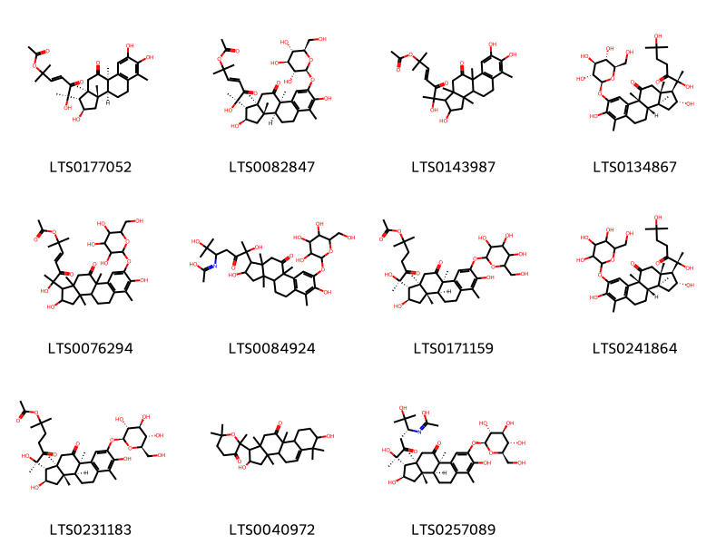{ width=100% }
    <figcaption>Hình ảnh cấu trúc hóa học của 11 hoạt chất thuộc nhóm Steroids and steroid derivatives gồm ['(3e,6r)-6-[(1r,2r,3as,3bs,9br,11ar)-2,7,8-trihydroxy-3a,6,9b,11a-tetramethyl-10-oxo-1h,2h,3h,3bh,4h,5h,11h-cyclopenta[a]phenanthren-1-yl]-6-hydroxy-2-methyl-5-oxohept-3-en-2-yl acetate (LTS0177052)', '(3e,6r)-6-[(1r,2r,3as,3bs,9br,11ar)-2,7-dihydroxy-3a,6,9b,11a-tetramethyl-10-oxo-8-{[(2s,3r,4s,5s,6r)-3,4,5-trihydroxy-6-(hydroxymethyl)oxan-2-yl]oxy}-1h,2h,3h,3bh,4h,5h,11h-cyclopenta[a]phenanthren-1-yl]-6-hydroxy-2-methyl-5-oxohept-3-en-2-yl acetate (LTS0082847)', '6-hydroxy-2-methyl-5-oxo-6-{2,7,8-trihydroxy-3a,6,9b,11a-tetramethyl-10-oxo-1h,2h,3h,3bh,4h,5h,11h-cyclopenta[a]phenanthren-1-yl}hept-3-en-2-yl acetate (LTS0143987)', '(1r,2r,3as,3bs,9br,11ar)-1-[(2r)-2,6-dihydroxy-6-methyl-3-oxoheptan-2-yl]-2,7-dihydroxy-3a,6,9b,11a-tetramethyl-8-{[(2s,3r,4s,5s,6r)-3,4,5-trihydroxy-6-(hydroxymethyl)oxan-2-yl]oxy}-1h,2h,3h,3bh,4h,5h,11h-cyclopenta[a]phenanthren-10-one (LTS0134867)', '6-(2,7-dihydroxy-3a,6,9b,11a-tetramethyl-10-oxo-8-{[3,4,5-trihydroxy-6-(hydroxymethyl)oxan-2-yl]oxy}-1h,2h,3h,3bh,4h,5h,11h-cyclopenta[a]phenanthren-1-yl)-6-hydroxy-2-methyl-5-oxohept-3-en-2-yl acetate (LTS0076294)', 'n-[6-(2,7-dihydroxy-3a,6,9b,11a-tetramethyl-10-oxo-8-{[3,4,5-trihydroxy-6-(hydroxymethyl)oxan-2-yl]oxy}-1h,2h,3h,3bh,4h,5h,11h-cyclopenta[a]phenanthren-1-yl)-2,6-dihydroxy-2-methyl-5-oxoheptan-3-yl]ethanimidic acid (LTS0084924)', '(6r)-6-[(1r,2r,3as,3bs,9br,11ar)-2,7-dihydroxy-3a,6,9b,11a-tetramethyl-10-oxo-8-{[3,4,5-trihydroxy-6-(hydroxymethyl)oxan-2-yl]oxy}-1h,2h,3h,3bh,4h,5h,11h-cyclopenta[a]phenanthren-1-yl]-6-hydroxy-2-methyl-5-oxoheptan-2-yl acetate (LTS0171159)', '(1r,2r,3as,3bs,9br,11ar)-1-[(2r)-2,6-dihydroxy-6-methyl-3-oxoheptan-2-yl]-2,7-dihydroxy-3a,6,9b,11a-tetramethyl-8-{[3,4,5-trihydroxy-6-(hydroxymethyl)oxan-2-yl]oxy}-1h,2h,3h,3bh,4h,5h,11h-cyclopenta[a]phenanthren-10-one (LTS0241864)', '(6r)-6-[(1r,2r,3as,3bs,9br,11ar)-2,7-dihydroxy-3a,6,9b,11a-tetramethyl-10-oxo-8-{[(2s,3r,4s,5s,6r)-3,4,5-trihydroxy-6-(hydroxymethyl)oxan-2-yl]oxy}-1h,2h,3h,3bh,4h,5h,11h-cyclopenta[a]phenanthren-1-yl]-6-hydroxy-2-methyl-5-oxoheptan-2-yl acetate (LTS0231183)', '2-{2,7-dihydroxy-3a,6,6,9b,11a-pentamethyl-10-oxo-1h,2h,3h,3bh,4h,7h,8h,9h,9ah,11h-cyclopenta[a]phenanthren-1-yl}-2,6,6-trimethyloxan-3-one (LTS0040972)', 'n-[(3r,6r)-6-[(1r,2r,3as,3bs,9br,11ar)-2,7-dihydroxy-3a,6,9b,11a-tetramethyl-10-oxo-8-{[(2s,3r,4s,5s,6r)-3,4,5-trihydroxy-6-(hydroxymethyl)oxan-2-yl]oxy}-1h,2h,3h,3bh,4h,5h,11h-cyclopenta[a]phenanthren-1-yl]-2,6-dihydroxy-2-methyl-5-oxoheptan-3-yl]ethanimidic acid (LTS0257089)'].</figcaption>
</figure>

---

### Dược dân tộc học

Danh sách các quốc gia có sử dụng *Fevillea cordifolia* trong điều trị các bệnh. 

| Country            | Disease   | Bệnh          |
|:-------------------|:----------|:--------------|
| Dominican Republic | Antidote  | Chất giải độc |
| Elsewhere          | Soap      | Xà phòng      |
| Haiti              | Antidote  | Chất giải độc |
| Venezuela          | Purgative | Thuốc xổ      |

---

# Chi Gymnopetalum

??? note "Danh sách các dược liệu thuộc chi"
    
	 - *Gymnopetalum cochinchinense*

---
## Gymnopetalum cochinchinense
### Thông tin về thực vật

!!! info "Phân loại thực vật của *Trichosanthes cucumerina* từ GIBF:"
    - **Kingdom:** Plantae
    - **Phylum:** Tracheophyta
    - **Order:** Cucurbitales
    - **Family:** Cucurbitaceae
    - **Genus:** Trichosanthes
    - **Species:** *Trichosanthes cucumerina*

 

| Label (VI)   | Label (EN)   | Scientific Name             | Descriptions (VI)   | Descriptions (EN)   | Also Known As (VI)   | Also Known As (EN)   |
|:-------------|:-------------|:----------------------------|:--------------------|:--------------------|:---------------------|:---------------------|
| N/A          | N/A          | Gymnopetalum cochinchinense | loài thực vật       | species of plant    | ['']                 | ['']                 |

#### Phân bố trên thế giới

**Từ CSDL GIBF** nan, Viet Nam, Bhutan, Indonesia, Nepal, Philippines, China, Myanmar, India, Papua New Guinea, Thailand, Lao People’s Democratic Republic

#### Phân bố tại Việt Nam

**Từ CSDL GIBF**: Không có ghi nhận ở Việt Nam

---
### Thành phần hóa học
        
- Theo cơ sở dữ liệu lotus: Từ loài *Trichosanthes cucumerina* đã phân lập và xác định được Chưa có hoạt chất nào được phân lập. hoạt chất thuộc về các nhóm Không có hoạt chất nào được phân lập. 

Không có hình ảnh nào được tạo ra

---

### Dược dân tộc học

Danh sách các quốc gia có sử dụng *Trichosanthes cucumerina* trong điều trị các bệnh. 

| Country   | Disease   | Bệnh          |
|:----------|:----------|:--------------|
| India     | Poison    | Chất độc      |
| Perak     | Antidote  | Chất giải độc |

---

# Chi Zanonia

??? note "Danh sách các dược liệu thuộc chi"
    
	 - *Zanonia indica*

---
## Zanonia indica
### Thông tin về thực vật

!!! info "Phân loại thực vật của *Zanonia indica* từ GIBF:"
    - **Kingdom:** Plantae
    - **Phylum:** Tracheophyta
    - **Order:** Cucurbitales
    - **Family:** Cucurbitaceae
    - **Genus:** Zanonia
    - **Species:** *Zanonia indica*

 

| Label (VI)   | Label (EN)   | Scientific Name   | Descriptions (VI)   | Descriptions (EN)   | Also Known As (VI)   | Also Known As (EN)   |
|:-------------|:-------------|:------------------|:--------------------|:--------------------|:---------------------|:---------------------|
| N/A          | N/A          | Zanonia indica    | loài thực vật       | species of plant    | ['']                 | ['']                 |

#### Phân bố trên thế giới

**Từ CSDL GIBF** Sri Lanka, nan, Viet Nam, Bhutan, Indonesia, Malaysia, Philippines, China, Myanmar, India, unknown or invalid, Papua New Guinea, Thailand

#### Phân bố tại Việt Nam

**Từ CSDL GIBF**: Lâm Đồng, Hà Nôi, Dong Nai

---
### Thành phần hóa học
        
- Theo cơ sở dữ liệu lotus: Từ loài *Zanonia indica* đã phân lập và xác định được Chưa có hoạt chất nào được phân lập. hoạt chất thuộc về các nhóm Không có hoạt chất nào được phân lập. 

Không có hình ảnh nào được tạo ra

---

### Dược dân tộc học

Danh sách các quốc gia có sử dụng *Zanonia indica* trong điều trị các bệnh. 

| Country   | Disease               | Bệnh                 |
|:----------|:----------------------|:---------------------|
| Elsewhere | Cathartic, Antiseptic | Cathartic, Sát trùng |
| India     | Antidote              | Chất giải độc        |

---

