!!! abstract "Tóm tắt"

    Họ Cupressaceae gồm khoảng 6 chi và 25 loài được một số cộng đồng tại các quốc gia như Japan, US(Flathead), Afghanistan, Java, English, Mexico, China, anish, ain, Elsewhere, Canada(Kwakiutl), Canada(Salish), Africa, US(Swinomish), Kurdistan, Egypt, Portuguese, India, US, Italian, Turkey, Iraq sử dụng trong một số trường hợp QUERY LENGTH LIMIT EXCEEDED. MAX ALLOWED QUERY : 500 CHARS MYMEMORY WARNING: YOU USED ALL AVAILABLE FREE TRANSLATIONS FOR TODAY. NEXT AVAILABLE IN  09 HOURS 42 MINUTES 02 SECONDS VISIT HTTPS://MYMEMORY.TRANSLATED.NET/DOC/USAGELIMITS.PHP TO TRANSLATE MORE.

!!! info "DrDuke"

    James A. Duke sinh năm 1929-2017 là một nhà thực vật học người Mỹ. Đây là một trong những tác giả hàng đầu trong lĩnh vực dược dân tộc học với cuốn *CRC Handbook of Medicinal Herbs* và chính là người xây dựng lên cơ sở dữ liệu về hợp chất tự nhiên và dược dân tộc học tại Bộ nông nghiệp Hoa Kỳ. Các thông tin được đăng tải tại website [Dr. Duke's Phytochemical and Ethnobotanical Databases](https://phytochem.nal.usda.gov/). 
    Trong suốt thập niên 1970, ông lãnh đạo the Plant Taxonomy Laboratory, Plant Genetics and Germplasm Institute of the Agricultural Research Service, U.S. Department of Agriculture.
    Trong tài liệu này, các thông tin về dược dân tộc của các dược liệu được trích dẫn từ tài liệu của James A. Ducke với sự trợ giúp của phần mềm dịch thuật từ tiếng Anh sang tiếng Việt.
   

# Chi Thuja

??? note "Danh sách các dược liệu thuộc chi"
    
	 - *Thuja occidentalis*
	 - *Thuja orientalis*

---
## Thuja occidentalis
### Thông tin về thực vật

!!! info "Phân loại thực vật của *Thuja occidentalis* từ GIBF:"
    - **Kingdom:** Plantae
    - **Phylum:** Tracheophyta
    - **Order:** Pinales
    - **Family:** Cupressaceae
    - **Genus:** Thuja
    - **Species:** *Thuja occidentalis*

 

| Label (VI)   | Label (EN)   | Scientific Name    | Descriptions (VI)   | Descriptions (EN)   | Also Known As (VI)   | Also Known As (EN)      |
|:-------------|:-------------|:-------------------|:--------------------|:--------------------|:---------------------|:------------------------|
| N/A          | N/A          | Thuja occidentalis | loài thực vật       | species of plant    | ['']                 | ['Northern Whitecedar'] |

#### Phân bố trên thế giới

**Từ CSDL GIBF** Switzerland, United Kingdom of Great Britain and Northern Ireland, Sweden, Germany, Canada, United States of America, Netherlands, Ukraine

#### Phân bố tại Việt Nam

**Từ CSDL GIBF**: Không có ghi nhận ở Việt Nam

---
### Thành phần hóa học
        
- Theo cơ sở dữ liệu lotus: Từ loài *Thuja occidentalis* đã phân lập và xác định được 127 hoạt chất thuộc về các nhóm Furanoid lignans, Organooxygen compounds, Flavonoids, Oxolanes, Unsaturated hydrocarbons, Prenol lipids, Fatty Acyls, Tetralins, Tropones, Lignan lactones, Tetrahydrofurans, Steroids and steroid derivatives, Benzene and substituted derivatives. 

|    | chemicalTaxonomyClassyfireClass     |   smiles_count |
|---:|:------------------------------------|---------------:|
|  0 | Benzene and substituted derivatives |              3 |
|  1 | Fatty Acyls                         |              6 |
|  2 | Flavonoids                          |              3 |
|  3 | Furanoid lignans                    |             17 |
|  4 | Lignan lactones                     |              3 |
|  5 | Organooxygen compounds              |              2 |
|  6 | Oxolanes                            |              1 |
|  7 | Prenol lipids                       |             82 |
|  8 | Steroids and steroid derivatives    |              2 |
|  9 | Tetrahydrofurans                    |              1 |
| 10 | Tetralins                           |              2 |
| 11 | Tropones                            |              3 |
| 12 | Unsaturated hydrocarbons            |              1 |

#### Nhóm Benzene and substituted derivatives
<figure markdown="span">
    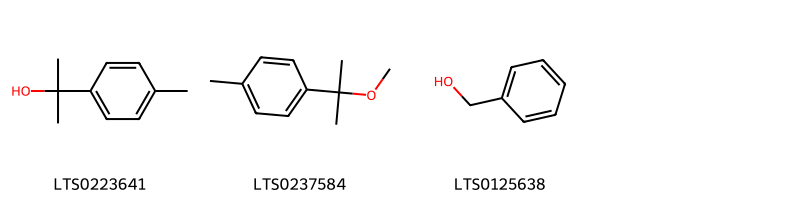{ width=100% }
    <figcaption>Hình ảnh cấu trúc hóa học của 3 hoạt chất thuộc nhóm Benzene and substituted derivatives gồm ['p-cymen-8-ol (LTS0223641)', '1-(2-methoxypropan-2-yl)-4-methylbenzene (LTS0237584)', 'benzyl alcohol (LTS0125638)'].</figcaption>
</figure>
#### Nhóm Fatty Acyls
<figure markdown="span">
    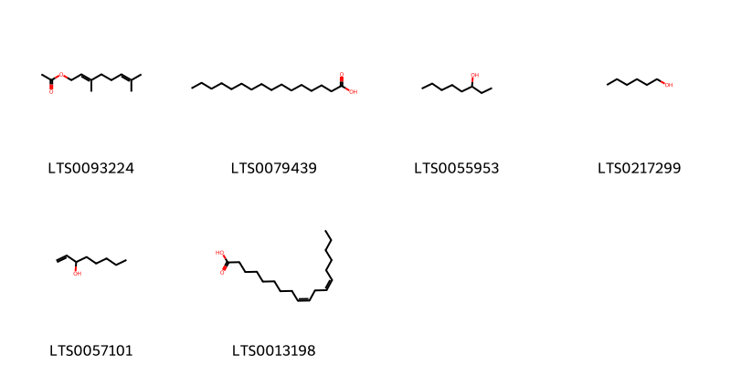{ width=100% }
    <figcaption>Hình ảnh cấu trúc hóa học của 6 hoạt chất thuộc nhóm Fatty Acyls gồm ['geranyl acetate (LTS0093224)', 'palmitic acid (LTS0079439)', '3-octanol (LTS0055953)', 'hexanol (LTS0217299)', '1-octen-3-ol (LTS0057101)', 'linoleic (LTS0013198)'].</figcaption>
</figure>
#### Nhóm Flavonoids
<figure markdown="span">
    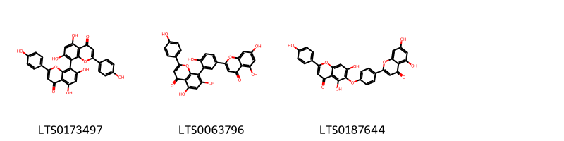{ width=100% }
    <figcaption>Hình ảnh cấu trúc hóa học của 3 hoạt chất thuộc nhóm Flavonoids gồm ['cupressuflavone (LTS0173497)', 'amentoflavone (LTS0063796)', 'hinokiflavone (LTS0187644)'].</figcaption>
</figure>
#### Nhóm Furanoid lignans
<figure markdown="span">
    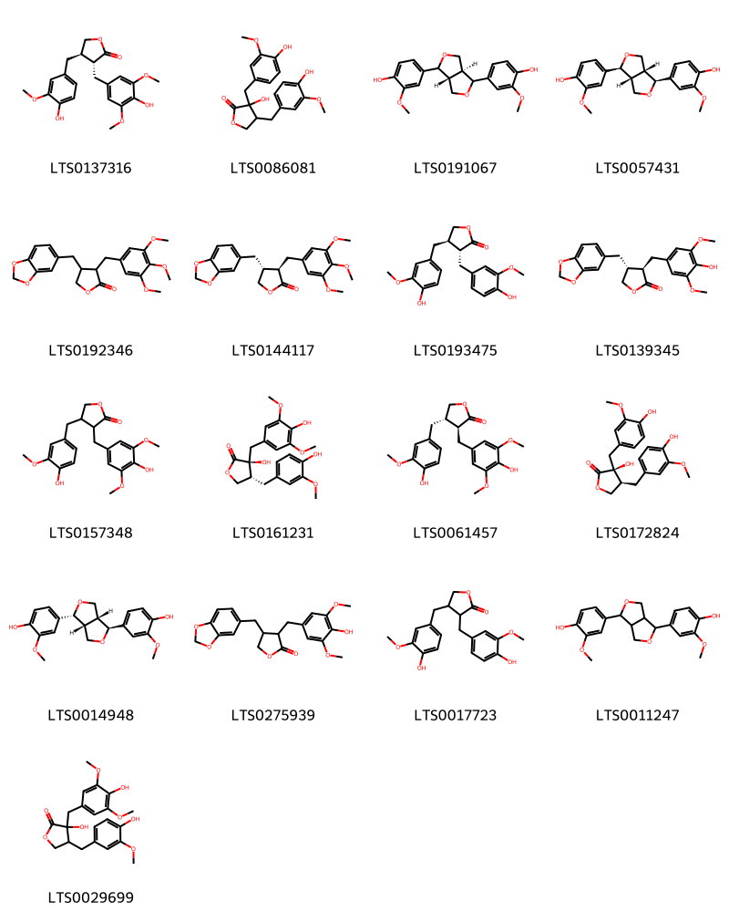{ width=100% }
    <figcaption>Hình ảnh cấu trúc hóa học của 17 hoạt chất thuộc nhóm Furanoid lignans gồm ['(3r,4r)-3-[(4-hydroxy-3,5-dimethoxyphenyl)methyl]-4-[(4-hydroxy-3-methoxyphenyl)methyl]oxolan-2-one (LTS0137316)', '3-hydroxy-3,4-bis[(4-hydroxy-3-methoxyphenyl)methyl]oxolan-2-one (LTS0086081)', '4-[(3ar,6as)-4-(4-hydroxy-3-methoxyphenyl)-hexahydrofuro[3,4-c]furan-1-yl]-2-methoxyphenol (LTS0191067)', 'pinoresinol (LTS0057431)', '4-(2h-1,3-benzodioxol-5-ylmethyl)-3-[(3,4,5-trimethoxyphenyl)methyl]oxolan-2-one (LTS0192346)', 'yatein (LTS0144117)', 'matairesinol (LTS0193475)', '(3r,4r)-4-(2h-1,3-benzodioxol-5-ylmethyl)-3-[(4-hydroxy-3,5-dimethoxyphenyl)methyl]oxolan-2-one (LTS0139345)', '3-[(4-hydroxy-3,5-dimethoxyphenyl)methyl]-4-[(4-hydroxy-3-methoxyphenyl)methyl]oxolan-2-one (LTS0157348)', '(3s,4r)-3-hydroxy-3-[(4-hydroxy-3,5-dimethoxyphenyl)methyl]-4-[(4-hydroxy-3-methoxyphenyl)methyl]oxolan-2-one (LTS0161231)', 'thujaplicatin methyl ether (LTS0061457)', 'nortrachelogenin (LTS0172824)', '4-[(1s,3ar,4r,6ar)-4-(4-hydroxy-3-methoxyphenyl)-hexahydrofuro[3,4-c]furan-1-yl]-2-methoxyphenol (LTS0014948)', '4-(2h-1,3-benzodioxol-5-ylmethyl)-3-[(4-hydroxy-3,5-dimethoxyphenyl)methyl]oxolan-2-one (LTS0275939)', '3,4-bis[(4-hydroxy-3-methoxyphenyl)methyl]oxolan-2-one (LTS0017723)', 'pinoresinol (LTS0011247)', '3-hydroxy-3-[(4-hydroxy-3,5-dimethoxyphenyl)methyl]-4-[(4-hydroxy-3-methoxyphenyl)methyl]oxolan-2-one (LTS0029699)'].</figcaption>
</figure>
#### Nhóm Lignan lactones
<figure markdown="span">
    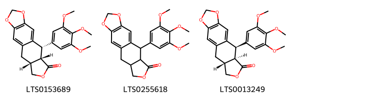{ width=100% }
    <figcaption>Hình ảnh cấu trúc hóa học của 3 hoạt chất thuộc nhóm Lignan lactones gồm ['(10s,11s,15r)-10-(3,4,5-trimethoxyphenyl)-4,6,13-trioxatetracyclo[7.7.0.0³,⁷.0¹¹,¹⁵]hexadeca-1,3(7),8-trien-12-one (LTS0153689)', '10-(3,4,5-trimethoxyphenyl)-4,6,13-trioxatetracyclo[7.7.0.0³,⁷.0¹¹,¹⁵]hexadeca-1,3(7),8-trien-12-one (LTS0255618)', '(-)-deoxypodophyllotoxin (LTS0013249)'].</figcaption>
</figure>
#### Nhóm Organooxygen compounds
<figure markdown="span">
    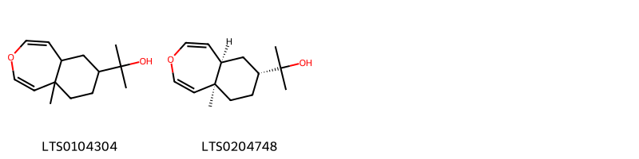{ width=100% }
    <figcaption>Hình ảnh cấu trúc hóa học của 2 hoạt chất thuộc nhóm Organooxygen compounds gồm ['2-(9a-methyl-6,7,8,9-tetrahydro-5ah-3-benzoxepin-7-yl)propan-2-ol (LTS0104304)', '2-[(5ar,7r,9ar)-9a-methyl-6,7,8,9-tetrahydro-5ah-3-benzoxepin-7-yl]propan-2-ol (LTS0204748)'].</figcaption>
</figure>
#### Nhóm Oxolanes
<figure markdown="span">
    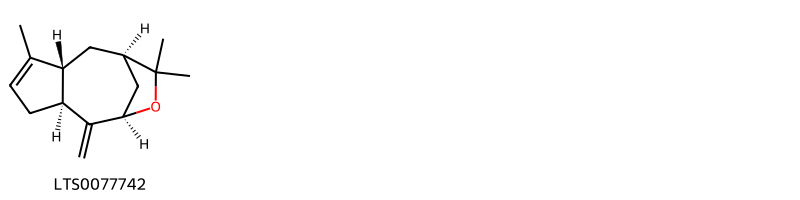{ width=100% }
    <figcaption>Hình ảnh cấu trúc hóa học của 1 hoạt chất thuộc nhóm Oxolanes gồm ['(1r,3r,7s,9r)-4,11,11-trimethyl-8-methylidene-10-oxatricyclo[7.2.1.0³,⁷]dodec-4-ene (LTS0077742)'].</figcaption>
</figure>
#### Nhóm Prenol lipids
<figure markdown="span">
    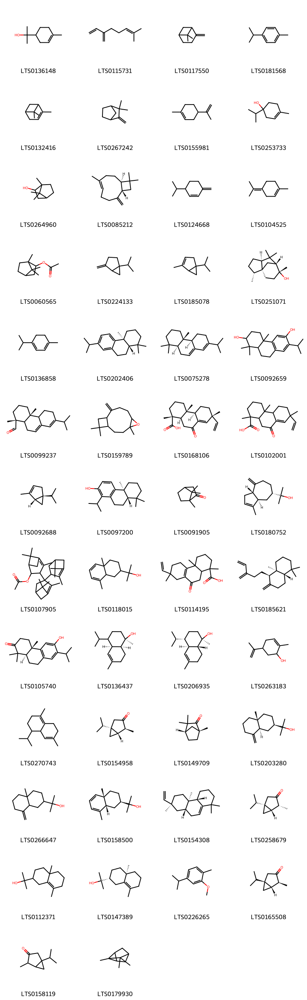{ width=100% }
    <figcaption>Hình ảnh cấu trúc hóa học của 82 hoạt chất thuộc nhóm Prenol lipids gồm ['terpineol (LTS0136148)', 'α-myrcene (LTS0115731)', 'β-pinene (LTS0117550)', 'cymene (LTS0181568)', 'α pinene (LTS0132416)', 'camphene (LTS0267242)', 'limonene,  (LTS0155981)', '4-terpineol (LTS0253733)', 'borneol (LTS0264960)', 'caryophyllene (LTS0085212)', 'β phellandrene (LTS0124668)', 'terpinolene (LTS0104525)', 'bornyl acetate (LTS0060565)', 'sabinene (LTS0224133)', 'α-thujene (LTS0185078)', 'cedrol (LTS0251071)', 'terpinene (LTS0136858)', 'abietatriene (LTS0202406)', '(-)-abietadiene (LTS0075278)', '7-isopropyl-1,1,4a-trimethyl-2,3,4,9,10,10a-hexahydrophenanthrene-2,6-diol (LTS0092659)', '(1r,4ar)-7-isopropyl-1,4a-dimethyl-2,3,4,4b,5,6,10,10a-octahydrophenanthrene-1-carbaldehyde (LTS0099237)', 'caryophyllene oxide (LTS0159789)', '(1r,4ar,4br,7r,10ar)-7-ethenyl-1,4a,7-trimethyl-9-oxo-2,3,4,4b,5,6,10,10a-octahydrophenanthrene-1-carboxylic acid (LTS0168106)', '7-ethenyl-1,4a,7-trimethyl-9-oxo-2,3,4,4b,5,6,10,10a-octahydrophenanthrene-1-carboxylic acid (LTS0102001)', '(-)-α-thujene (LTS0092688)', 'totarol (LTS0097200)', 'camphor (LTS0091905)', '2-[(3ar,5s,8as)-3-methyl-8-methylidene-3a,4,5,6,7,8a-hexahydro-1h-azulen-5-yl]propan-2-ol (LTS0180752)', '4,6,6-trimethyl-3-(2,6,6-trimethyl-3-{2,6,6-trimethylbicyclo[3.1.1]hept-1-en-3-yl}bicyclo[3.1.1]hept-1-en-3-yl)bicyclo[3.1.1]hept-4-en-2-yl acetate (LTS0107905)', '2-(4a,8-dimethyl-2,3,4,8a-tetrahydro-1h-naphthalen-2-yl)propan-2-ol (LTS0118015)', '7-ethenyl-1,4a,7-trimethyl-9-oxo-2,3,4,5,6,8,10,10a-octahydrophenanthrene-1-carboxylic acid (LTS0114195)', '(4as,5r,8as)-1,1,4a-trimethyl-6-methylidene-5-(3-methylidenepent-4-en-1-yl)-hexahydro-2h-naphthalene (LTS0185621)', '(4as,10ar)-6-hydroxy-7-isopropyl-1,1,4a-trimethyl-4,9,10,10a-tetrahydro-3h-phenanthren-2-one (LTS0105740)', '(1r,4ar,8as)-4-isopropyl-1,6-dimethyl-3,4,4a,7,8,8a-hexahydro-2h-naphthalen-1-ol (LTS0136437)', 'α-cadinol (LTS0206935)', 'carveol (LTS0263183)', '4-isopropyl-1,6-dimethyl-2,3,4,4a,7,8-hexahydronaphthalene (LTS0270743)', '(1r,4s,5s)-thujan-3-one (LTS0154958)', '(-)-fenchone (LTS0149709)', 'β-eudesmol (LTS0203280)', 'β-eudesmol (LTS0266647)', '2-[(2r,4as,8ar)-4a,8-dimethyl-2,3,4,8a-tetrahydro-1h-naphthalen-2-yl]propan-2-ol (LTS0158500)', '(4as,4br,7s,8ar)-7-ethenyl-1,1,4b,7-tetramethyl-3,4,4a,5,6,8,8a,9-octahydro-2h-phenanthrene (LTS0154308)', '(1r,4r,5s)-thujan-3-one (LTS0258679)', '2-(4a,8-dimethyl-2,3,4,5,6,7-hexahydro-1h-naphthalen-2-yl)propan-2-ol (LTS0112371)', 'gamma-eudesmol (LTS0147389)', 'carvacrol methyl ether (LTS0226265)', '(+)-thujone (LTS0165508)', '3-isothujone (LTS0158119)', 'tricyclene (LTS0179930)', 'α-thujene (LTS0176954)', '2-(4a,8-dimethyl-2,3,4,5,6,8a-hexahydro-1h-naphthalen-2-yl)propan-2-ol (LTS0072791)', '2-(3-methyl-8-methylidene-3a,4,5,6,7,8a-hexahydro-1h-azulen-5-yl)propan-2-ol (LTS0270590)', 'α-limonene (LTS0244943)', '6-hydroxy-7-isopropyl-1,1,4a-trimethyl-3,4,10,10a-tetrahydro-2h-phenanthren-9-one (LTS0270724)', 'thujone (LTS0197087)', 'α-eudesmol (LTS0222498)', 'β-caryophyllene oxide (LTS0213960)', '(+)-α-pinene (LTS0211102)', 'delta-cadinol (LTS0008282)', 'occidentalol (LTS0238234)', 'isopimaric acid (LTS0238294)', '(+)-β-thujone (LTS0180873)', 'linalyl acetate (LTS0167325)', '(-)-trans-carveol (LTS0156471)', 'myrtanol (LTS0126998)', '2-[(5as,7r,9ar)-5,9a-dimethyl-6,7,8,9-tetrahydro-5ah-3-benzoxepin-7-yl]propan-2-ol (LTS0106822)', 'ferruginol (LTS0045608)', 'abietadienal (LTS0002029)', '(1r,4as,7s,10ar)-7-ethenyl-1,4a,7-trimethyl-9-oxo-2,3,4,5,6,8,10,10a-octahydrophenanthrene-1-carboxylic acid (LTS0000106)', '(2s,4as,10ar)-7-isopropyl-1,1,4a-trimethyl-2,3,4,9,10,10a-hexahydrophenanthrene-2,6-diol (LTS0056473)', 'rhodoxanthin (LTS0006899)', 'isopimaric acid (LTS0009479)', 'fenchone (LTS0126716)', 'fenchyl acetate (LTS0020694)', 'carvacrol (LTS0012882)', 'terpinene 4-acetate (LTS0008191)', 'delta-cadinene (LTS0019321)', 'cuminol (LTS0021403)', '(+)-15-beyerene (LTS0090261)', 'occidiol (LTS0032314)', '2-(5,9a-dimethyl-6,7,8,9-tetrahydro-5ah-3-benzoxepin-7-yl)propan-2-ol (LTS0028260)'].</figcaption>
</figure>
#### Nhóm Steroids and steroid derivatives
<figure markdown="span">
    { width=100% }
    <figcaption>Hình ảnh cấu trúc hóa học của 2 hoạt chất thuộc nhóm Steroids and steroid derivatives gồm ['stigmast-5-en-3-ol, (3β)- (LTS0204616)', 'stigmast-5-en-3-ol (LTS0071224)'].</figcaption>
</figure>
#### Nhóm Tetrahydrofurans
<figure markdown="span">
    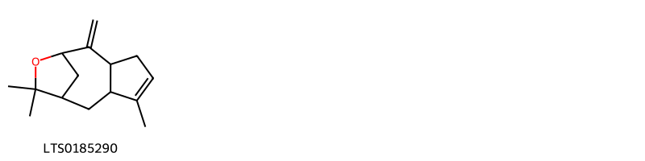{ width=100% }
    <figcaption>Hình ảnh cấu trúc hóa học của 1 hoạt chất thuộc nhóm Tetrahydrofurans gồm ['4,11,11-trimethyl-8-methylidene-10-oxatricyclo[7.2.1.0³,⁷]dodec-4-ene (LTS0185290)'].</figcaption>
</figure>
#### Nhóm Tetralins
<figure markdown="span">
    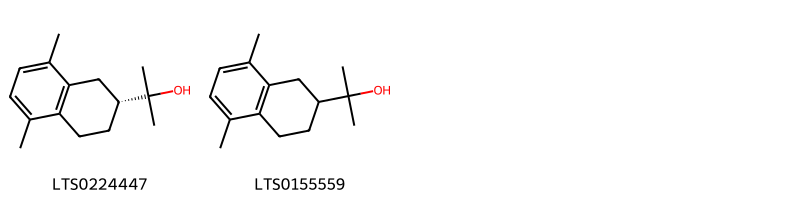{ width=100% }
    <figcaption>Hình ảnh cấu trúc hóa học của 2 hoạt chất thuộc nhóm Tetralins gồm ['2-[(2r)-5,8-dimethyl-1,2,3,4-tetrahydronaphthalen-2-yl]propan-2-ol (LTS0224447)', '2-(5,8-dimethyl-1,2,3,4-tetrahydronaphthalen-2-yl)propan-2-ol (LTS0155559)'].</figcaption>
</figure>
#### Nhóm Tropones
<figure markdown="span">
    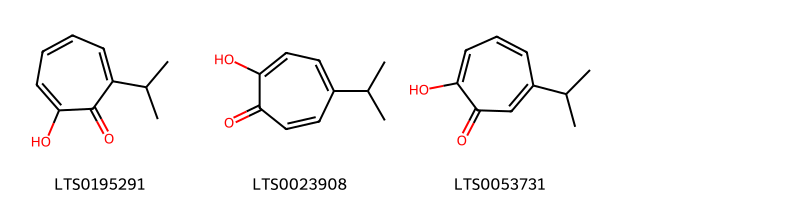{ width=100% }
    <figcaption>Hình ảnh cấu trúc hóa học của 3 hoạt chất thuộc nhóm Tropones gồm ['2-hydroxy-7-isopropylcyclohepta-2,4,6-trien-1-one (LTS0195291)', 'α thujaplicin (LTS0023908)', 'hinokitiol (LTS0053731)'].</figcaption>
</figure>
#### Nhóm Unsaturated hydrocarbons
<figure markdown="span">
    { width=100% }
    <figcaption>Hình ảnh cấu trúc hóa học của 1 hoạt chất thuộc nhóm Unsaturated hydrocarbons gồm ['α terpinene (LTS0232891)'].</figcaption>
</figure>

---

### Dược dân tộc học

Danh sách các quốc gia có sử dụng *Thuja occidentalis* trong điều trị các bệnh. 

| Country   | Disease                                                                                                                         | Bệnh                                                                                                                                                                                                |
|:----------|:--------------------------------------------------------------------------------------------------------------------------------|:----------------------------------------------------------------------------------------------------------------------------------------------------------------------------------------------------|
| Elsewhere | Abortifacient, nan, Cardiotonic, Insecticide, Soap, Uterotonic, Abortifacient, Diuretic                                         | MYMEMORY WARNING: YOU USED ALL AVAILABLE FREE TRANSLATIONS FOR TODAY. NEXT AVAILABLE IN  09 HOURS 41 MINUTES 59 SECONDS VISIT HTTPS://MYMEMORY.TRANSLATED.NET/DOC/USAGELIMITS.PHP TO TRANSLATE MORE |
| Iraq      | nan                                                                                                                             | MYMEMORY WARNING: YOU USED ALL AVAILABLE FREE TRANSLATIONS FOR TODAY. NEXT AVAILABLE IN  09 HOURS 41 MINUTES 56 SECONDS VISIT HTTPS://MYMEMORY.TRANSLATED.NET/DOC/USAGELIMITS.PHP TO TRANSLATE MORE |
| Kurdistan | Stimulant                                                                                                                       | MYMEMORY WARNING: YOU USED ALL AVAILABLE FREE TRANSLATIONS FOR TODAY. NEXT AVAILABLE IN  09 HOURS 41 MINUTES 52 SECONDS VISIT HTTPS://MYMEMORY.TRANSLATED.NET/DOC/USAGELIMITS.PHP TO TRANSLATE MORE |
| Turkey    | Antiseptic, Astringent, Diuretic, Emmenagogue, Poison, Styptic, nan, Uterotonic, Vermifuge, Emmenagogue, Expectorant, Sudorific | MYMEMORY WARNING: YOU USED ALL AVAILABLE FREE TRANSLATIONS FOR TODAY. NEXT AVAILABLE IN  09 HOURS 41 MINUTES 50 SECONDS VISIT HTTPS://MYMEMORY.TRANSLATED.NET/DOC/USAGELIMITS.PHP TO TRANSLATE MORE |
| US        | Diuretic, Emmenagogue, Perfume, Sudorific, Expectorant                                                                          | MYMEMORY WARNING: YOU USED ALL AVAILABLE FREE TRANSLATIONS FOR TODAY. NEXT AVAILABLE IN  09 HOURS 41 MINUTES 47 SECONDS VISIT HTTPS://MYMEMORY.TRANSLATED.NET/DOC/USAGELIMITS.PHP TO TRANSLATE MORE |

---

---
## Thuja orientalis
### Thông tin về thực vật

!!! info "Phân loại thực vật của *Platycladus orientalis* từ GIBF:"
    - **Kingdom:** Plantae
    - **Phylum:** Tracheophyta
    - **Order:** Pinales
    - **Family:** Cupressaceae
    - **Genus:** Platycladus
    - **Species:** *Platycladus orientalis*

 

| Label (VI)   | Label (EN)   | Scientific Name   | Descriptions (VI)   | Descriptions (EN)   | Also Known As (VI)   | Also Known As (EN)   |
|:-------------|:-------------|:------------------|:--------------------|:--------------------|:---------------------|:---------------------|
| N/A          | N/A          | Thuja orientalis  | loài thực vật       | species of plant    | ['']                 | ['']                 |

#### Phân bố trên thế giới

**Từ CSDL GIBF** Georgia, nan, El Salvador, Spain, Germany, Austria, Korea, Republic of, Colombia, Pakistan, Venezuela (Bolivarian Republic of), Sweden, Poland, India, Nigeria, Belgium, Malta, Japan, Brazil, Mexico, China, Chinese Taipei, Portugal, France, Tanzania, United Republic of, United States of America, Italy, Ukraine

#### Phân bố tại Việt Nam

**Từ CSDL GIBF**: Không có ghi nhận ở Việt Nam

---
### Thành phần hóa học
        
- Theo cơ sở dữ liệu lotus: Từ loài *Platycladus orientalis* đã phân lập và xác định được Chưa có hoạt chất nào được phân lập. hoạt chất thuộc về các nhóm Không có hoạt chất nào được phân lập. 

Không có hình ảnh nào được tạo ra

---

### Dược dân tộc học

Danh sách các quốc gia có sử dụng *Platycladus orientalis* trong điều trị các bệnh. 

| Country   | Disease                                                                                                        | Bệnh                                                                                                                                                                                                |
|:----------|:---------------------------------------------------------------------------------------------------------------|:----------------------------------------------------------------------------------------------------------------------------------------------------------------------------------------------------|
| China     | Astringent, Coagulant, Emmenagogue, Hemostat, Laxative, Nervine, Refrigerant, Sedative, Sedative, Parasiticide | MYMEMORY WARNING: YOU USED ALL AVAILABLE FREE TRANSLATIONS FOR TODAY. NEXT AVAILABLE IN  09 HOURS 41 MINUTES 04 SECONDS VISIT HTTPS://MYMEMORY.TRANSLATED.NET/DOC/USAGELIMITS.PHP TO TRANSLATE MORE |
| Elsewhere | Tonic, Hemostatic, Tonic                                                                                       | MYMEMORY WARNING: YOU USED ALL AVAILABLE FREE TRANSLATIONS FOR TODAY. NEXT AVAILABLE IN  09 HOURS 41 MINUTES 01 SECONDS VISIT HTTPS://MYMEMORY.TRANSLATED.NET/DOC/USAGELIMITS.PHP TO TRANSLATE MORE |

---

# Chi Thujopsis

??? note "Danh sách các dược liệu thuộc chi"
    
	 - *Thujopsis dolabrata*

---
## Thujopsis dolabrata
### Thông tin về thực vật

!!! info "Phân loại thực vật của *Thujopsis dolabrata* từ GIBF:"
    - **Kingdom:** Plantae
    - **Phylum:** Tracheophyta
    - **Order:** Pinales
    - **Family:** Cupressaceae
    - **Genus:** Thujopsis
    - **Species:** *Thujopsis dolabrata*

 

| Label (VI)   | Label (EN)   | Scientific Name     | Descriptions (VI)   | Descriptions (EN)   | Also Known As (VI)   | Also Known As (EN)   |
|:-------------|:-------------|:--------------------|:--------------------|:--------------------|:---------------------|:---------------------|
| N/A          | N/A          | Thujopsis dolabrata | loài thực vật       | species of plant    | ['']                 | ['']                 |

#### Phân bố trên thế giới

**Từ CSDL GIBF** nan, Denmark, Spain, Germany, Austria, Korea, Republic of, Sweden, Poland, Canada, Belgium, Netherlands, Türkiye, Belarus, Japan, Brazil, Estonia, China, Norway, Switzerland, United Kingdom of Great Britain and Northern Ireland, Latvia, France, Czechia, New Zealand, Armenia, Russian Federation, United States of America

#### Phân bố tại Việt Nam

**Từ CSDL GIBF**: Không có ghi nhận ở Việt Nam

---
### Thành phần hóa học
        
- Theo cơ sở dữ liệu lotus: Từ loài *Thujopsis dolabrata* đã phân lập và xác định được 141 hoạt chất thuộc về các nhóm Organooxygen compounds, Furanoid lignans, Flavonoids, Benzene and substituted derivatives, Unsaturated hydrocarbons, Prenol lipids, Fatty Acyls, Phenols, Lignan lactones, Steroids and steroid derivatives, Tropones. 

|    | chemicalTaxonomyClassyfireClass     |   smiles_count |
|---:|:------------------------------------|---------------:|
|  0 | Benzene and substituted derivatives |              2 |
|  1 | Fatty Acyls                         |              2 |
|  2 | Flavonoids                          |             18 |
|  3 | Furanoid lignans                    |              1 |
|  4 | Lignan lactones                     |              4 |
|  5 | Organooxygen compounds              |              6 |
|  6 | Phenols                             |              1 |
|  7 | Prenol lipids                       |             92 |
|  8 | Steroids and steroid derivatives    |              7 |
|  9 | Tropones                            |              5 |
| 10 | Unsaturated hydrocarbons            |              2 |

#### Nhóm Benzene and substituted derivatives
<figure markdown="span">
    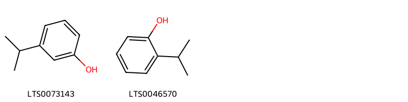{ width=100% }
    <figcaption>Hình ảnh cấu trúc hóa học của 2 hoạt chất thuộc nhóm Benzene and substituted derivatives gồm ['m-isopropylphenol (LTS0073143)', '2-isopropylphenol (LTS0046570)'].</figcaption>
</figure>
#### Nhóm Fatty Acyls
<figure markdown="span">
    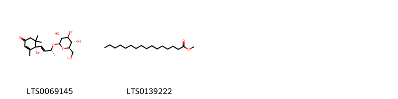{ width=100% }
    <figcaption>Hình ảnh cấu trúc hóa học của 2 hoạt chất thuộc nhóm Fatty Acyls gồm ['(4s)-4-hydroxy-3,5,5-trimethyl-4-[(1e,3r)-3-{[(2r,3r,4s,5s,6r)-3,4,5-trihydroxy-6-(hydroxymethyl)oxan-2-yl]oxy}but-1-en-1-yl]cyclohex-2-en-1-one (LTS0069145)', 'methyl palmitate (LTS0139222)'].</figcaption>
</figure>
#### Nhóm Flavonoids
<figure markdown="span">
    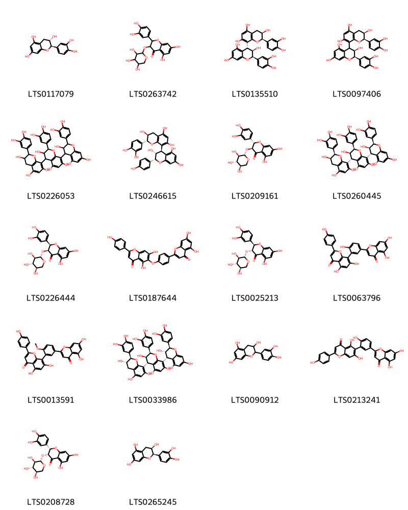{ width=100% }
    <figcaption>Hình ảnh cấu trúc hóa học của 18 hoạt chất thuộc nhóm Flavonoids gồm ['(+)-catechol (LTS0117079)', '2-(3,4-dihydroxyphenyl)-5,7-dihydroxy-3-[(3,4,5-trihydroxyoxan-2-yl)oxy]-2,3-dihydro-1-benzopyran-4-one (LTS0263742)', '(2r,3r,4r)-2-(3,4-dihydroxyphenyl)-4-[(2r,3r)-2-(3,4-dihydroxyphenyl)-3,5,7-trihydroxy-3,4-dihydro-2h-1-benzopyran-8-yl]-3,4-dihydro-2h-1-benzopyran-3,5,7-triol (LTS0135510)', '(2r,3r)-2-(3,4-dihydroxyphenyl)-4-[(2r,3r)-2-(3,4-dihydroxyphenyl)-3,5,7-trihydroxy-3,4-dihydro-2h-1-benzopyran-8-yl]-3,4-dihydro-2h-1-benzopyran-3,5,7-triol (LTS0097406)', 'procyanidin c2 (LTS0226053)', '(2r,3r,4r)-4-[(2r,3s)-2-(3,4-dihydroxyphenyl)-3,5,7-trihydroxy-3,4-dihydro-2h-1-benzopyran-8-yl]-2-(4-hydroxyphenyl)-3,4-dihydro-2h-1-benzopyran-3,5,7-triol (LTS0246615)', '(2s,3s)-2-(3,4-dihydroxyphenyl)-5,7-dihydroxy-3-{[(2s,3r,4s,5r)-3,4,5-trihydroxyoxan-2-yl]oxy}-2,3-dihydro-1-benzopyran-4-one (LTS0209161)', 'procyanidin c1 (LTS0260445)', '(2r,3s)-2-(3,4-dihydroxyphenyl)-5,7-dihydroxy-3-{[(2s,3r,4s,5r)-3,4,5-trihydroxyoxan-2-yl]oxy}-2,3-dihydro-1-benzopyran-4-one (LTS0226444)', 'hinokiflavone (LTS0187644)', '(2r,3r)-2-(3,4-dihydroxyphenyl)-5,7-dihydroxy-3-{[(2s,3r,4s,5r)-3,4,5-trihydroxyoxan-2-yl]oxy}-2,3-dihydro-1-benzopyran-4-one (LTS0025213)', 'amentoflavone (LTS0063796)', '8-[5-(5,7-dihydroxy-4-oxochromen-2-yl)-2-methoxyphenyl]-5,7-dihydroxy-2-(4-hydroxyphenyl)chromen-4-one (LTS0013591)', '(2r,3r,4s)-2-(3,4-dihydroxyphenyl)-8-[(2r,3s,4r)-2-(3,4-dihydroxyphenyl)-3,5,7-trihydroxy-3,4-dihydro-2h-1-benzopyran-4-yl]-4-[(2r,3s)-2-(3,4-dihydroxyphenyl)-3,5,7-trihydroxy-3,4-dihydro-2h-1-benzopyran-8-yl]-3,4-dihydro-2h-1-benzopyran-3,5,7-triol (LTS0033986)', 'catechol (LTS0090912)', 'robustaflavone (LTS0213241)', '(2s,3r)-2-(3,4-dihydroxyphenyl)-5,7-dihydroxy-3-{[(2s,3r,4s,5r)-3,4,5-trihydroxyoxan-2-yl]oxy}-2,3-dihydro-1-benzopyran-4-one (LTS0208728)', 'ent-epicatechin (LTS0265245)'].</figcaption>
</figure>
#### Nhóm Furanoid lignans
<figure markdown="span">
    { width=100% }
    <figcaption>Hình ảnh cấu trúc hóa học của 1 hoạt chất thuộc nhóm Furanoid lignans gồm ['matairesinol (LTS0193475)'].</figcaption>
</figure>
#### Nhóm Lignan lactones
<figure markdown="span">
    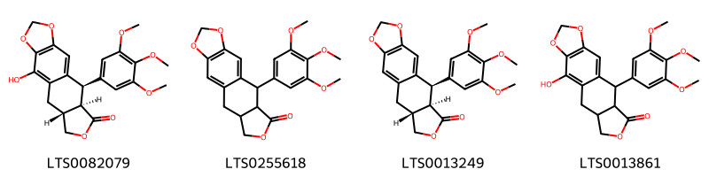{ width=100% }
    <figcaption>Hình ảnh cấu trúc hóa học của 4 hoạt chất thuộc nhóm Lignan lactones gồm ['β-peltatin (LTS0082079)', '10-(3,4,5-trimethoxyphenyl)-4,6,13-trioxatetracyclo[7.7.0.0³,⁷.0¹¹,¹⁵]hexadeca-1,3(7),8-trien-12-one (LTS0255618)', '(-)-deoxypodophyllotoxin (LTS0013249)', 'β-peltatin (LTS0013861)'].</figcaption>
</figure>
#### Nhóm Organooxygen compounds
<figure markdown="span">
    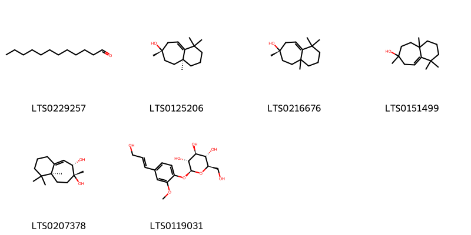{ width=100% }
    <figcaption>Hình ảnh cấu trúc hóa học của 6 hoạt chất thuộc nhóm Organooxygen compounds gồm ['dodecanal (LTS0229257)', 'widdrol (LTS0125206)', '(7s)-1,1,4a,7-tetramethyl-2,3,4,5,6,8-hexahydrobenzo[7]annulen-7-ol (LTS0216676)', '1,1,4a,7-tetramethyl-2,3,4,5,6,8-hexahydrobenzo[7]annulen-7-ol (LTS0151499)', '(6s,7r,9as)-1,1,7,9a-tetramethyl-2,3,4,6,8,9-hexahydrobenzo[7]annulene-6,7-diol (LTS0207378)', 'coniferin (LTS0119031)'].</figcaption>
</figure>
#### Nhóm Phenols
<figure markdown="span">
    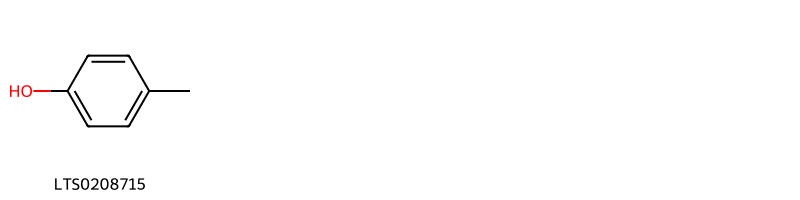{ width=100% }
    <figcaption>Hình ảnh cấu trúc hóa học của 1 hoạt chất thuộc nhóm Phenols gồm ['p-cresol (LTS0208715)'].</figcaption>
</figure>
#### Nhóm Prenol lipids
<figure markdown="span">
    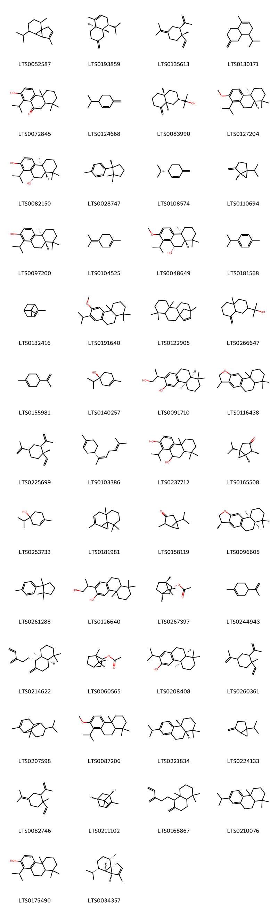{ width=100% }
    <figcaption>Hình ảnh cấu trúc hóa học của 92 hoạt chất thuộc nhóm Prenol lipids gồm ['7-isopropyl-4,10-dimethyltricyclo[4.4.0.0¹,⁵]dec-3-ene (LTS0052587)', '(4s,4as,8ar)-4-isopropyl-1-methyl-6-methylidene-4,4a,5,7,8,8a-hexahydro-3h-naphthalene (LTS0193859)', '(1s,2s)-1-ethenyl-1-methyl-2-(prop-1-en-2-yl)-4-(propan-2-ylidene)cyclohexane (LTS0135613)', '4-isopropyl-1-methyl-6-methylidene-4,4a,5,7,8,8a-hexahydro-3h-naphthalene (LTS0130171)', '7-hydroxy-8-isopropyl-1,1,4a-trimethyl-3,4,10,10a-tetrahydro-2h-phenanthren-9-one (LTS0072845)', 'β phellandrene (LTS0124668)', 'β-eudesmol cis epimer (LTS0083990)', '(4as,10as)-8-isopropyl-7-methoxy-1,1,4a-trimethyl-2,3,4,9,10,10a-hexahydrophenanthrene (LTS0127204)', '(4bs,8as,10s)-1-isopropyl-4b,8,8-trimethyl-5,6,7,8a,9,10-hexahydrophenanthrene-2,10-diol (LTS0082150)', 'cuparene (LTS0028747)', '(+)-β-phellandrene (LTS0108574)', '(+)-sabinene (LTS0110694)', 'totarol (LTS0097200)', 'terpinolene (LTS0104525)', '(4as,9s,10as)-8-isopropyl-7-methoxy-1,1,4a-trimethyl-2,3,4,9,10,10a-hexahydrophenanthren-9-ol (LTS0048649)', 'cymene (LTS0181568)', 'α pinene (LTS0132416)', '7-isopropyl-6-methoxy-1,1,4a-trimethyl-2,3,4,9,10,10a-hexahydrophenanthrene (LTS0191640)', '5,5,9,13-tetramethyltetracyclo[11.2.1.0¹,¹⁰.0⁴,⁹]hexadec-14-ene (LTS0122905)', 'β-eudesmol (LTS0266647)', 'limonene,  (LTS0155981)', '(+)-4-terpineol (LTS0140257)', '(4br,8as)-2-[(2s)-1-hydroxypropan-2-yl]-4b,8,8-trimethyl-5,6,7,8a,9,10-hexahydrophenanthren-3-ol (LTS0091710)', '4,4,8,11b-tetramethyl-1h,2h,3h,4ah,5h,6h,8h,9h-phenanthro[3,2-b]furan (LTS0116438)', 'β-elemene (LTS0225699)', '(s,z)-α-bisabolene (LTS0103386)', '1-isopropyl-4b,8,8-trimethyl-5,6,7,8a,9,10-hexahydrophenanthrene-2,10-diol (LTS0237712)', '(+)-thujone (LTS0165508)', '4-terpineol (LTS0253733)', 'thujopsene (LTS0181981)', '3-isothujone (LTS0158119)', '(4ar,8r,11bs)-4,4,8,11b-tetramethyl-1h,2h,3h,4ah,5h,6h,8h,9h-phenanthro[3,2-b]furan (LTS0096605)', '1-methyl-4-(1,2,2-trimethylcyclopentyl)benzene (LTS0261288)', '2-(1-hydroxypropan-2-yl)-4b,8,8-trimethyl-5,6,7,8a,9,10-hexahydrophenanthren-3-ol (LTS0126640)', '(-)-bornyl acetate (LTS0267397)', 'α-limonene (LTS0244943)', '(4as,5s,8ar)-1,1,4a-trimethyl-6-methylidene-5-(3-methylidenepent-4-en-1-yl)-hexahydro-2h-naphthalene (LTS0214622)', 'bornyl acetate (LTS0060565)', 'ferruginol (LTS0208408)', 'β-elemene (LTS0260361)', 'α-copaene (LTS0207598)', '8-isopropyl-7-methoxy-1,1,4a-trimethyl-2,3,4,9,10,10a-hexahydrophenanthrene (LTS0087206)', '(4ar,10as)-7-isopropyl-1,1,4a-trimethyl-2,3,4,9,10,10a-hexahydrophenanthrene (LTS0221834)', 'sabinene (LTS0224133)', '1-ethenyl-1-methyl-2-(prop-1-en-2-yl)-4-(propan-2-ylidene)cyclohexane (LTS0082746)', '(+)-α-pinene (LTS0211102)', 'sclarene (LTS0168867)', '7-isopropyl-1,1,4a-trimethyl-2,3,4,9,10,10a-hexahydrophenanthrene (LTS0210076)', 'totarol (LTS0175490)', '(1r,5s,6r,7s,10s)-7-isopropyl-4,10-dimethyltricyclo[4.4.0.0¹,⁵]dec-3-ene (LTS0034357)', '2-isopropyl-4b,8,8-trimethyl-5,6,7,8a,9,10-hexahydrophenanthren-3-ol (LTS0255397)', 'terpinene (LTS0136858)', 'α-bisabolene (LTS0026008)', '(-)-thujopsene (LTS0021824)', '(4ar,10as)-7-isopropyl-6-methoxy-1,1,4a-trimethyl-2,3,4,9,10,10a-hexahydrophenanthrene (LTS0027441)', '(1r,2s,6s,7s,8r)-8-isopropyl-1,3-dimethyltricyclo[4.4.0.0²,⁷]dec-3-ene (LTS0106607)', '8-isopropyl-7-methoxy-1,1,4a-trimethyl-2,3,4,9,10,10a-hexahydrophenanthren-9-ol (LTS0111130)', '(4as,10as)-7-hydroxy-8-isopropyl-1,1,4a-trimethyl-3,4,10,10a-tetrahydro-2h-phenanthren-9-one (LTS0272186)', '(1s,4s,9s,10s,13r)-5,5,9,13-tetramethyltetracyclo[11.2.1.0¹,¹⁰.0⁴,⁹]hexadec-14-ene (LTS0242650)', '1,4a-dimethyl-5-{3-methyl-5-[(3,4,5-trihydroxyoxan-2-yl)oxy]pent-3-en-1-yl}-6-methylidene-hexahydro-2h-naphthalene-1-carbaldehyde (LTS0120273)', '(1s,4ar,5s,8ar)-1,4a-dimethyl-5-[(3e)-3-methyl-5-{[(2r,3r,4s,5r)-3,4,5-trihydroxyoxan-2-yl]oxy}pent-3-en-1-yl]-6-methylidene-hexahydro-2h-naphthalene-1-carbaldehyde (LTS0254460)', 'squalene (LTS0217821)', '[4-(1,2,2-trimethylcyclopentyl)phenyl]methanol (LTS0210862)', '(+)-sandaracopimaradiene (LTS0223971)', 'abietatriene (LTS0202406)', '2-hydroxy-4-isopropylbenzaldehyde (LTS0075636)', '[(1ar,4as,8as)-4a,8,8-trimethyl-1h,1ah,4h,5h,6h,7h-cyclopropa[e]naphthalen-2-yl]methanol (LTS0120877)', '7-isopropyl-1,1,4a-trimethyl-2,3,4,9,10,10a-hexahydrophenanthrene-2,6-diol (LTS0092659)', 'pimaradiene (LTS0071599)', '2-[(1r,3s,4s)-4-ethenyl-4-methyl-3-(prop-1-en-2-yl)cyclohexyl]prop-2-en-1-ol (LTS0050038)', '(4as,5r,8as)-1,1,4a-trimethyl-6-methylidene-5-(3-methylidenepent-4-en-1-yl)-hexahydro-2h-naphthalene (LTS0185621)', '2-[(2r,4ar,8as)-4a-methyl-8-methylidene-octahydronaphthalen-2-yl]prop-2-enal (LTS0270589)', '2-(4a,8-dimethyl-2,3,4,5,6,8a-hexahydro-1h-naphthalen-2-yl)prop-2-enal (LTS0247576)', 'citronellic acid (LTS0124944)', '(3r)-3,7-dimethyloct-6-enoic acid (LTS0145268)', '(4as,4br,7s,8ar,10as)-7-ethenyl-4b,7,10a-trimethyl-1-methylidene-decahydrophenanthrene (LTS0149365)', '2-(4a-methyl-8-methylidene-octahydronaphthalen-2-yl)prop-2-enal (LTS0144285)', '(4as,4br,7s,8ar)-7-ethenyl-1,1,4b,7-tetramethyl-3,4,4a,5,6,8,8a,9-octahydro-2h-phenanthrene (LTS0154308)', '[(6s)-7,7-dimethyl-11-methylidenespiro[5.5]undec-2-en-3-yl]methanol (LTS0117747)', '(1s,4ar,5s,8as)-5-[(3e)-5-hydroxy-3-methylpent-3-en-1-yl]-1,4a-dimethyl-6-methylidene-hexahydro-2h-naphthalene-1-carbaldehyde (LTS0157073)', '{4a,8,8-trimethyl-1h,1ah,4h,5h,6h,7h-cyclopropa[e]naphthalen-2-yl}methanol (LTS0228087)', '(4br,7r)-7-ethenyl-4b,7,10a-trimethyl-1-methylidene-decahydrophenanthrene (LTS0130716)', '2-[(2r,4ar,8ar)-4a,8-dimethyl-2,3,4,5,6,8a-hexahydro-1h-naphthalen-2-yl]prop-2-enal (LTS0224321)', 'cedrol (LTS0221015)', '6-hydroxy-7-isopropyl-1,1,4a-trimethyl-3,4,10,10a-tetrahydro-2h-phenanthren-9-one (LTS0270724)', '(+)-thujopsene (LTS0196009)', 'cedrol (LTS0251071)', 'ferruginol (LTS0045608)', '(2s,4as,10ar)-7-isopropyl-1,1,4a-trimethyl-2,3,4,9,10,10a-hexahydrophenanthrene-2,6-diol (LTS0056473)', '{4-[(1r)-1,2,2-trimethylcyclopentyl]phenyl}methanol (LTS0001843)', 'carvacrol (LTS0012882)', '(1s,4s,9s,10r,13r)-5,5,9,13-tetramethyltetracyclo[11.2.1.0¹,¹⁰.0⁴,⁹]hexadec-14-ene (LTS0019444)'].</figcaption>
</figure>
#### Nhóm Steroids and steroid derivatives
<figure markdown="span">
    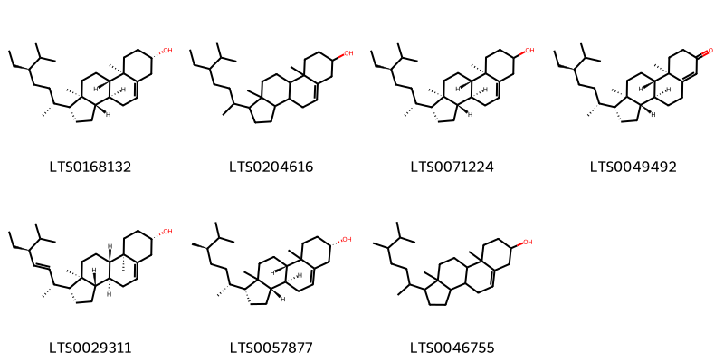{ width=100% }
    <figcaption>Hình ảnh cấu trúc hóa học của 7 hoạt chất thuộc nhóm Steroids and steroid derivatives gồm ['sitosterol (LTS0168132)', 'stigmast-5-en-3-ol, (3β)- (LTS0204616)', 'stigmast-5-en-3-ol (LTS0071224)', 'β-sitostenone (LTS0049492)', 'phytosterol (LTS0029311)', '(1r,3as,3bs,7s,9bs)-1-[(2r,5r)-5,6-dimethylheptan-2-yl]-9a,11a-dimethyl-1h,2h,3h,3ah,3bh,4h,6h,7h,8h,9h,9bh,10h,11h-cyclopenta[a]phenanthren-7-ol (LTS0057877)', 'campesterol (LTS0046755)'].</figcaption>
</figure>
#### Nhóm Tropones
<figure markdown="span">
    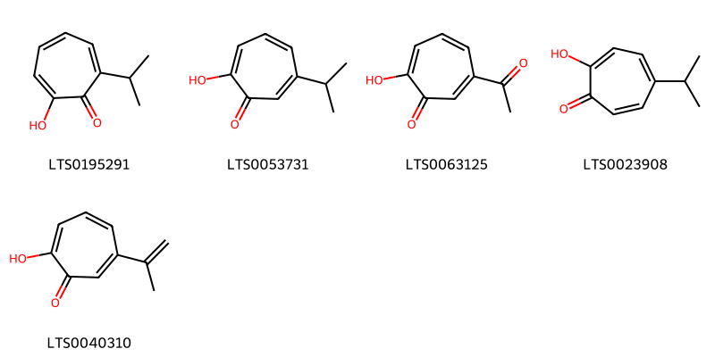{ width=100% }
    <figcaption>Hình ảnh cấu trúc hóa học của 5 hoạt chất thuộc nhóm Tropones gồm ['2-hydroxy-7-isopropylcyclohepta-2,4,6-trien-1-one (LTS0195291)', 'hinokitiol (LTS0053731)', '6-acetyl-2-hydroxycyclohepta-2,4,6-trien-1-one (LTS0063125)', 'α thujaplicin (LTS0023908)', 'β-dolabrin (LTS0040310)'].</figcaption>
</figure>
#### Nhóm Unsaturated hydrocarbons
<figure markdown="span">
    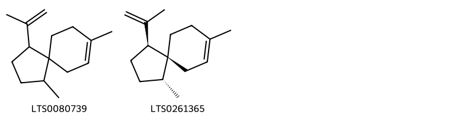{ width=100% }
    <figcaption>Hình ảnh cấu trúc hóa học của 2 hoạt chất thuộc nhóm Unsaturated hydrocarbons gồm ['1,8-dimethyl-4-(prop-1-en-2-yl)spiro[4.5]dec-7-ene (LTS0080739)', '(1r,4s,5s)-1,8-dimethyl-4-(prop-1-en-2-yl)spiro[4.5]dec-7-ene (LTS0261365)'].</figcaption>
</figure>

---

### Dược dân tộc học

Danh sách các quốc gia có sử dụng *Thujopsis dolabrata* trong điều trị các bệnh. 

| Country   |   Disease | Bệnh                                                                                                                                                                                                |
|:----------|----------:|:----------------------------------------------------------------------------------------------------------------------------------------------------------------------------------------------------|
| Elsewhere |       nan | MYMEMORY WARNING: YOU USED ALL AVAILABLE FREE TRANSLATIONS FOR TODAY. NEXT AVAILABLE IN  09 HOURS 40 MINUTES 36 SECONDS VISIT HTTPS://MYMEMORY.TRANSLATED.NET/DOC/USAGELIMITS.PHP TO TRANSLATE MORE |

---

# Chi Callitris

??? note "Danh sách các dược liệu thuộc chi"
    
	 - *Callitris arborea*
	 - *Callitris quadrivalvia*
	 - *Callitris quadrivalvis*

---
## Callitris arborea
### Thông tin về thực vật

!!! info "Phân loại thực vật của *N/A* từ GIBF:"
    - **Kingdom:** Plantae
    - **Phylum:** Tracheophyta
    - **Order:** Pinales
    - **Family:** Cupressaceae
    - **Genus:** Widdringtonia
    - **Species:** *N/A*

 

| Label (VI)   | Label (EN)   | Scientific Name   | Descriptions (VI)   | Descriptions (EN)   | Also Known As (VI)   | Also Known As (EN)   |
|:-------------|:-------------|:------------------|:--------------------|:--------------------|:---------------------|:---------------------|
| N/A          | N/A          | Callitris arborea | loài thực vật       | species of plant    | ['']                 | ['']                 |

#### Phân bố trên thế giới

**Từ CSDL GIBF** Malawi, South Africa

#### Phân bố tại Việt Nam

**Từ CSDL GIBF**: Không có ghi nhận ở Việt Nam

---
### Thành phần hóa học
        
- Theo cơ sở dữ liệu lotus: Từ loài *N/A* đã phân lập và xác định được Chưa có hoạt chất nào được phân lập. hoạt chất thuộc về các nhóm Không có hoạt chất nào được phân lập. 

Không có hình ảnh nào được tạo ra

---

### Dược dân tộc học

Danh sách các quốc gia có sử dụng *N/A* trong điều trị các bệnh. 

| Country   | Disease   | Bệnh                                                                                                                                                                                                |
|:----------|:----------|:----------------------------------------------------------------------------------------------------------------------------------------------------------------------------------------------------|
| Africa    | Diuretic  | MYMEMORY WARNING: YOU USED ALL AVAILABLE FREE TRANSLATIONS FOR TODAY. NEXT AVAILABLE IN  09 HOURS 39 MINUTES 58 SECONDS VISIT HTTPS://MYMEMORY.TRANSLATED.NET/DOC/USAGELIMITS.PHP TO TRANSLATE MORE |

---

---
## Callitris quadrivalvia
### Thông tin về thực vật

!!! info "Phân loại thực vật của *Tetraclinis articulata* từ GIBF:"
    - **Kingdom:** Plantae
    - **Phylum:** Tracheophyta
    - **Order:** Pinales
    - **Family:** Cupressaceae
    - **Genus:** Tetraclinis
    - **Species:** *Tetraclinis articulata*

 

| Label (VI)   | Label (EN)   | Scientific Name   | Descriptions (VI)   | Descriptions (EN)   | Also Known As (VI)   | Also Known As (EN)   |
|:-------------|:-------------|:------------------|:--------------------|:--------------------|:---------------------|:---------------------|
| N/A          | N/A          | Callitris arborea | loài thực vật       | species of plant    | ['']                 | ['']                 |

#### Phân bố trên thế giới

**Từ CSDL GIBF** nan, unknown or invalid, France, Spain, Italy, Algeria

#### Phân bố tại Việt Nam

**Từ CSDL GIBF**: Không có ghi nhận ở Việt Nam

---
### Thành phần hóa học
        
- Theo cơ sở dữ liệu lotus: Từ loài *Tetraclinis articulata* đã phân lập và xác định được Chưa có hoạt chất nào được phân lập. hoạt chất thuộc về các nhóm Không có hoạt chất nào được phân lập. 

Không có hình ảnh nào được tạo ra

---

### Dược dân tộc học

Danh sách các quốc gia có sử dụng *Tetraclinis articulata* trong điều trị các bệnh. 

| Country   | Disease   | Bệnh                                                                                                                                                                                                |
|:----------|:----------|:----------------------------------------------------------------------------------------------------------------------------------------------------------------------------------------------------|
| Turkey    | Fumigant  | MYMEMORY WARNING: YOU USED ALL AVAILABLE FREE TRANSLATIONS FOR TODAY. NEXT AVAILABLE IN  09 HOURS 39 MINUTES 33 SECONDS VISIT HTTPS://MYMEMORY.TRANSLATED.NET/DOC/USAGELIMITS.PHP TO TRANSLATE MORE |

---

---
## Callitris quadrivalvis
### Thông tin về thực vật

!!! info "Phân loại thực vật của *Tetraclinis articulata* từ GIBF:"
    - **Kingdom:** Plantae
    - **Phylum:** Tracheophyta
    - **Order:** Pinales
    - **Family:** Cupressaceae
    - **Genus:** Tetraclinis
    - **Species:** *Tetraclinis articulata*

 

| Label (VI)   | Label (EN)   | Scientific Name        | Descriptions (VI)   | Descriptions (EN)   | Also Known As (VI)   | Also Known As (EN)   |
|:-------------|:-------------|:-----------------------|:--------------------|:--------------------|:---------------------|:---------------------|
| N/A          | N/A          | Callitris quadrivalvis | loài thực vật       | species of plant    | ['']                 | ['']                 |

#### Phân bố trên thế giới

**Từ CSDL GIBF** nan, unknown or invalid, France, Spain, Italy, Algeria

#### Phân bố tại Việt Nam

**Từ CSDL GIBF**: Không có ghi nhận ở Việt Nam

---
### Thành phần hóa học
        
- Theo cơ sở dữ liệu lotus: Từ loài *Tetraclinis articulata* đã phân lập và xác định được Chưa có hoạt chất nào được phân lập. hoạt chất thuộc về các nhóm Không có hoạt chất nào được phân lập. 

Không có hình ảnh nào được tạo ra

---

### Dược dân tộc học

Danh sách các quốc gia có sử dụng *Tetraclinis articulata* trong điều trị các bệnh. 

| Country   | Disease   | Bệnh                                                                                                                                                                                                |
|:----------|:----------|:----------------------------------------------------------------------------------------------------------------------------------------------------------------------------------------------------|
| Africa    | Stimulant | MYMEMORY WARNING: YOU USED ALL AVAILABLE FREE TRANSLATIONS FOR TODAY. NEXT AVAILABLE IN  09 HOURS 39 MINUTES 12 SECONDS VISIT HTTPS://MYMEMORY.TRANSLATED.NET/DOC/USAGELIMITS.PHP TO TRANSLATE MORE |

---

# Chi Juniperus

??? note "Danh sách các dược liệu thuộc chi"
    
	 - *Juniperus chinensis*
	 - *Juniperus communis*
	 - *Juniperus conferta*
	 - *Juniperus excelsa*
	 - *Juniperus oxycedrus*
	 - *Juniperus phoenicea*
	 - *Juniperus recurvus*
	 - *Juniperus rigida*
	 - *Juniperus sabina*
	 - *Juniperus scopulorum*
	 - *Juniperus viginiana*
	 - *Juniperus virginiana*

---
## Juniperus chinensis
### Thông tin về thực vật

!!! info "Phân loại thực vật của *Juniperus chinensis* từ GIBF:"
    - **Kingdom:** Plantae
    - **Phylum:** Tracheophyta
    - **Order:** Pinales
    - **Family:** Cupressaceae
    - **Genus:** Juniperus
    - **Species:** *Juniperus chinensis*

 

| Label (VI)   | Label (EN)   | Scientific Name     | Descriptions (VI)   | Descriptions (EN)   | Also Known As (VI)   | Also Known As (EN)   |
|:-------------|:-------------|:--------------------|:--------------------|:--------------------|:---------------------|:---------------------|
| N/A          | N/A          | Juniperus chinensis | loài thực vật       | species of plant    | ['']                 | ['']                 |

#### Phân bố trên thế giới

**Từ CSDL GIBF** Spain, Germany, Australia, Korea, Republic of, Colombia, Pakistan, Sweden, Malaysia, Poland, Canada, Belgium, Türkiye, Japan, Brazil, Saint Lucia, Estonia, China, Norway, Chinese Taipei, Hong Kong, United Kingdom of Great Britain and Northern Ireland, South Africa, Latvia, France, New Zealand, Russian Federation, United States of America, Italy

#### Phân bố tại Việt Nam

**Từ CSDL GIBF**: Không có ghi nhận ở Việt Nam

---
### Thành phần hóa học
        
- Theo cơ sở dữ liệu lotus: Từ loài *Juniperus chinensis* đã phân lập và xác định được 248 hoạt chất thuộc về các nhóm Furanoid lignans, Oxanes, Oxepanes, Dibenzylbutane lignans, 2-arylbenzofuran flavonoids, Epoxides, Lignan lactones, Pyrans, Benzopyrans, Lactones, Cinnamic acids and derivatives, Organooxygen compounds, Coumarins and derivatives, Lignan glycosides, Flavonoids, Phenanthrenes and derivatives, Naphthofurans, Prenol lipids, Benzodioxoles, Benzene and substituted derivatives. 

|    | chemicalTaxonomyClassyfireClass     |   smiles_count |
|---:|:------------------------------------|---------------:|
|  0 |                                     |              9 |
|  1 | 2-arylbenzofuran flavonoids         |              2 |
|  2 | Benzene and substituted derivatives |              4 |
|  3 | Benzodioxoles                       |              2 |
|  4 | Benzopyrans                         |              2 |
|  5 | Cinnamic acids and derivatives      |              1 |
|  6 | Coumarins and derivatives           |              2 |
|  7 | Dibenzylbutane lignans              |              2 |
|  8 | Epoxides                            |              2 |
|  9 | Flavonoids                          |              9 |
| 10 | Furanoid lignans                    |             18 |
| 11 | Lactones                            |              4 |
| 12 | Lignan glycosides                   |              3 |
| 13 | Lignan lactones                     |              4 |
| 14 | Naphthofurans                       |              4 |
| 15 | Organooxygen compounds              |             14 |
| 16 | Oxanes                              |              2 |
| 17 | Oxepanes                            |              2 |
| 18 | Phenanthrenes and derivatives       |              2 |
| 19 | Prenol lipids                       |            152 |
| 20 | Pyrans                              |              2 |

#### Nhóm 
<figure markdown="span">
    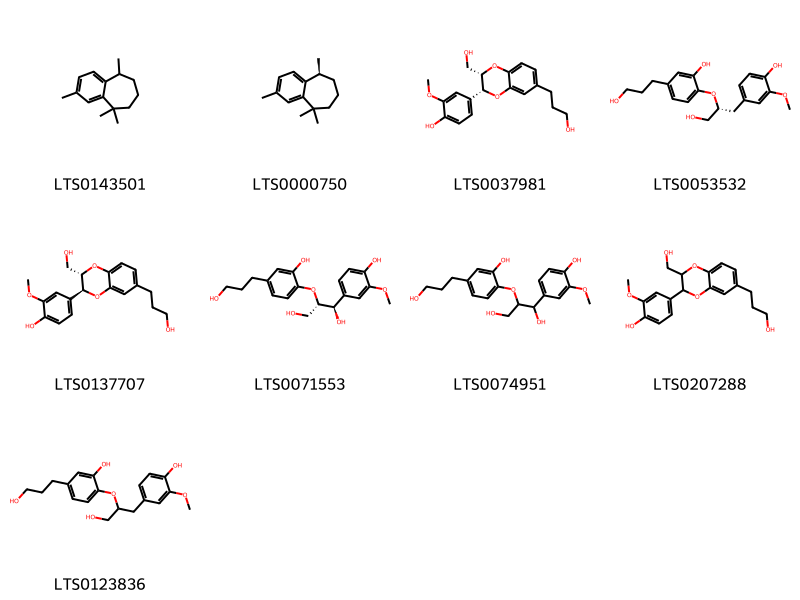{ width=100% }
    <figcaption>Hình ảnh cấu trúc hóa học của 9 hoạt chất thuộc nhóm  gồm ['2,5,9,9-tetramethyl-5,6,7,8-tetrahydrobenzo[7]annulene (LTS0143501)', '(5s)-2,5,9,9-tetramethyl-5,6,7,8-tetrahydrobenzo[7]annulene (LTS0000750)', '4-[(2r,3s)-3-(hydroxymethyl)-7-(3-hydroxypropyl)-2,3-dihydro-1,4-benzodioxin-2-yl]-2-methoxyphenol (LTS0037981)', '4-[(2r)-3-hydroxy-2-[2-hydroxy-4-(3-hydroxypropyl)phenoxy]propyl]-2-methoxyphenol (LTS0053532)', '4-[(2s,3s)-3-(hydroxymethyl)-7-(3-hydroxypropyl)-2,3-dihydro-1,4-benzodioxin-2-yl]-2-methoxyphenol (LTS0137707)', '(1r,2s)-1-(4-hydroxy-3-methoxyphenyl)-2-[2-hydroxy-4-(3-hydroxypropyl)phenoxy]propane-1,3-diol (LTS0071553)', '1-(4-hydroxy-3-methoxyphenyl)-2-[2-hydroxy-4-(3-hydroxypropyl)phenoxy]propane-1,3-diol (LTS0074951)', '4-[3-(hydroxymethyl)-7-(3-hydroxypropyl)-2,3-dihydro-1,4-benzodioxin-2-yl]-2-methoxyphenol (LTS0207288)', '4-{3-hydroxy-2-[2-hydroxy-4-(3-hydroxypropyl)phenoxy]propyl}-2-methoxyphenol (LTS0123836)'].</figcaption>
</figure>
#### Nhóm 2-arylbenzofuran flavonoids
<figure markdown="span">
    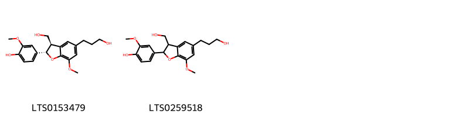{ width=100% }
    <figcaption>Hình ảnh cấu trúc hóa học của 2 hoạt chất thuộc nhóm 2-arylbenzofuran flavonoids gồm ['4-[(2s,3r)-3-(hydroxymethyl)-5-(3-hydroxypropyl)-7-methoxy-2,3-dihydro-1-benzofuran-2-yl]-2-methoxyphenol (LTS0153479)', '4-[3-(hydroxymethyl)-5-(3-hydroxypropyl)-7-methoxy-2,3-dihydro-1-benzofuran-2-yl]-2-methoxyphenol (LTS0259518)'].</figcaption>
</figure>
#### Nhóm Benzene and substituted derivatives
<figure markdown="span">
    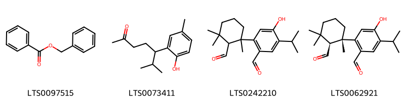{ width=100% }
    <figcaption>Hình ảnh cấu trúc hóa học của 4 hoạt chất thuộc nhóm Benzene and substituted derivatives gồm ['benzyl benzoate (LTS0097515)', '5-(2-hydroxy-5-methylphenyl)-6-methylheptan-2-one (LTS0073411)', '2-(2-formyl-1,3,3-trimethylcyclohexyl)-4-hydroxy-5-isopropylbenzaldehyde (LTS0242210)', '2-[(1s,2s)-2-formyl-1,3,3-trimethylcyclohexyl]-4-hydroxy-5-isopropylbenzaldehyde (LTS0062921)'].</figcaption>
</figure>
#### Nhóm Benzodioxoles
<figure markdown="span">
    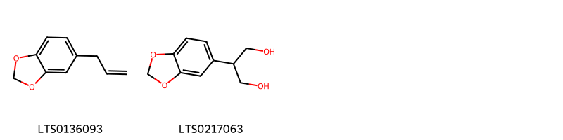{ width=100% }
    <figcaption>Hình ảnh cấu trúc hóa học của 2 hoạt chất thuộc nhóm Benzodioxoles gồm ['sassafras (LTS0136093)', '2-(2h-1,3-benzodioxol-5-yl)propane-1,3-diol (LTS0217063)'].</figcaption>
</figure>
#### Nhóm Benzopyrans
<figure markdown="span">
    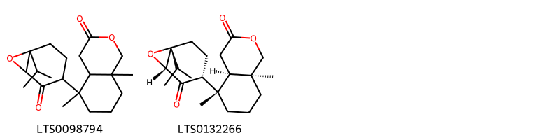{ width=100% }
    <figcaption>Hình ảnh cấu trúc hóa học của 2 hoạt chất thuộc nhóm Benzopyrans gồm ['5-{6-isopropyl-2-oxo-7-oxabicyclo[4.1.0]heptan-3-yl}-5,8a-dimethyl-hexahydro-2-benzopyran-3-one (LTS0098794)', '(4ar,5s,8as)-5-[(1r,3r,6s)-6-isopropyl-2-oxo-7-oxabicyclo[4.1.0]heptan-3-yl]-5,8a-dimethyl-hexahydro-2-benzopyran-3-one (LTS0132266)'].</figcaption>
</figure>
#### Nhóm Cinnamic acids and derivatives
<figure markdown="span">
    { width=100% }
    <figcaption>Hình ảnh cấu trúc hóa học của 1 hoạt chất thuộc nhóm Cinnamic acids and derivatives gồm ['ferulic acid (LTS0077328)'].</figcaption>
</figure>
#### Nhóm Coumarins and derivatives
<figure markdown="span">
    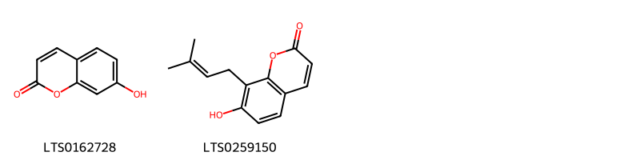{ width=100% }
    <figcaption>Hình ảnh cấu trúc hóa học của 2 hoạt chất thuộc nhóm Coumarins and derivatives gồm ['umbelliferone (LTS0162728)', 'osthenol (LTS0259150)'].</figcaption>
</figure>
#### Nhóm Dibenzylbutane lignans
<figure markdown="span">
    { width=100% }
    <figcaption>Hình ảnh cấu trúc hóa học của 2 hoạt chất thuộc nhóm Dibenzylbutane lignans gồm ['(2r,3s)-2,3-bis[(4-hydroxy-3-methoxyphenyl)methyl]butane-1,4-diol (LTS0201516)', 'secoisolariciresinol (LTS0111810)'].</figcaption>
</figure>
#### Nhóm Epoxides
<figure markdown="span">
    { width=100% }
    <figcaption>Hình ảnh cấu trúc hóa học của 2 hoạt chất thuộc nhóm Epoxides gồm ['(4e,7e)-1,5,9,9-tetramethyl-12-oxabicyclo[9.1.0]dodeca-4,7-diene (LTS0086900)', '(4z,7z)-1,5,9,9-tetramethyl-12-oxabicyclo[9.1.0]dodeca-4,7-diene (LTS0242379)'].</figcaption>
</figure>
#### Nhóm Flavonoids
<figure markdown="span">
    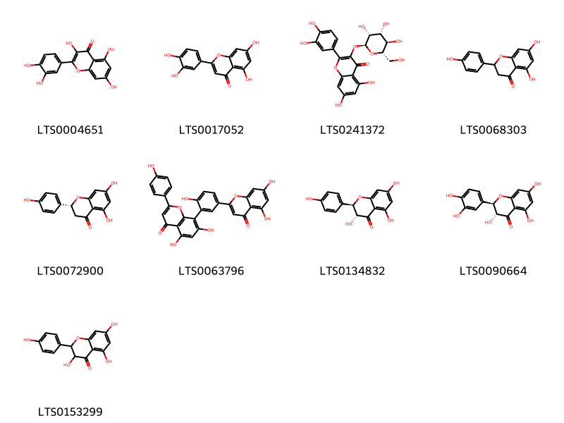{ width=100% }
    <figcaption>Hình ảnh cấu trúc hóa học của 9 hoạt chất thuộc nhóm Flavonoids gồm ['quercetin (LTS0004651)', 'luteolin (LTS0017052)', '2-(3,4-dihydroxyphenyl)-5,7-dihydroxy-3-{[(2s,3r,4r,5r,6s)-3,4,5-trihydroxy-6-(hydroxymethyl)oxan-2-yl]oxy}chromen-4-one (LTS0241372)', 'asahina (LTS0068303)', '(-)-naringenin (LTS0072900)', 'amentoflavone (LTS0063796)', '(+)-dihydrokaempferol (LTS0134832)', '(+)-taxifolin (LTS0090664)', 'aromadendrin (LTS0153299)'].</figcaption>
</figure>
#### Nhóm Furanoid lignans
<figure markdown="span">
    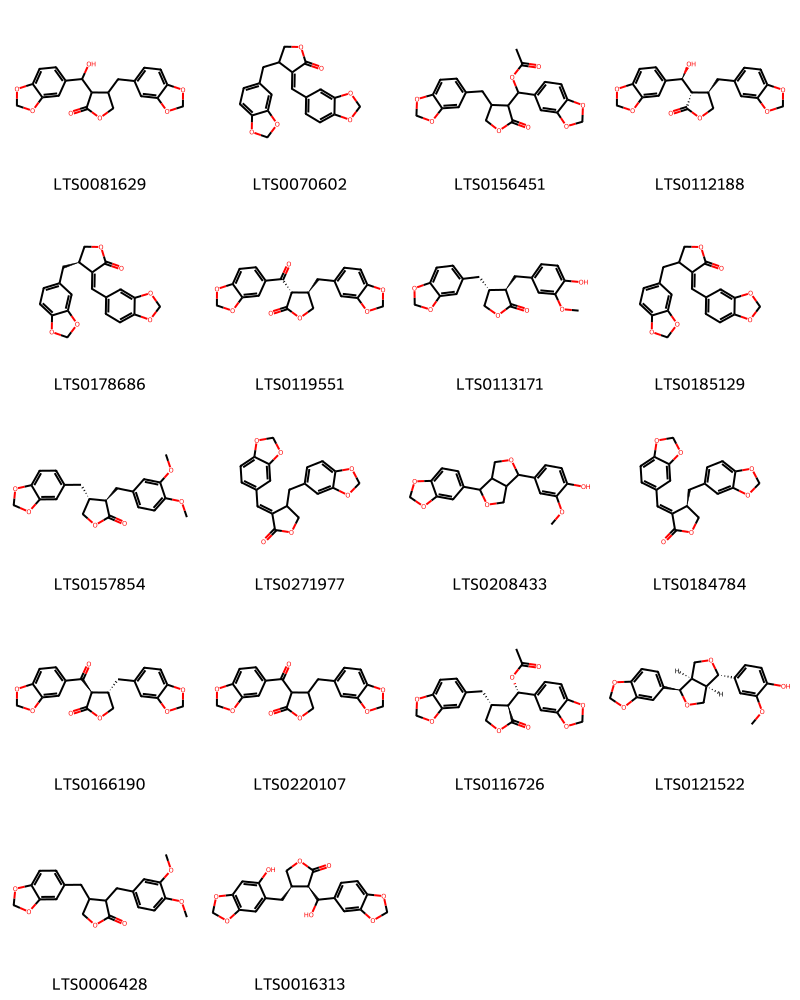{ width=100% }
    <figcaption>Hình ảnh cấu trúc hóa học của 18 hoạt chất thuộc nhóm Furanoid lignans gồm ['3-[2h-1,3-benzodioxol-5-yl(hydroxy)methyl]-4-(2h-1,3-benzodioxol-5-ylmethyl)oxolan-2-one (LTS0081629)', '4-(2h-1,3-benzodioxol-5-ylmethyl)-3-(2h-1,3-benzodioxol-5-ylmethylidene)oxolan-2-one (LTS0070602)', '2h-1,3-benzodioxol-5-yl[4-(2h-1,3-benzodioxol-5-ylmethyl)-2-oxooxolan-3-yl]methyl acetate (LTS0156451)', '(3s,4r)-3-[(s)-2h-1,3-benzodioxol-5-yl(hydroxy)methyl]-4-(2h-1,3-benzodioxol-5-ylmethyl)oxolan-2-one (LTS0112188)', '(3z,4r)-4-(2h-1,3-benzodioxol-5-ylmethyl)-3-(2h-1,3-benzodioxol-5-ylmethylidene)oxolan-2-one (LTS0178686)', '(3s,4r)-4-(2h-1,3-benzodioxol-5-ylmethyl)-3-(2h-1,3-benzodioxole-5-carbonyl)oxolan-2-one (LTS0119551)', '(-)-pluviatolide (LTS0113171)', '(3z)-4-(2h-1,3-benzodioxol-5-ylmethyl)-3-(2h-1,3-benzodioxol-5-ylmethylidene)oxolan-2-one (LTS0185129)', '(-)-bursehernin (LTS0157854)', '(3e)-4-(2h-1,3-benzodioxol-5-ylmethyl)-3-(2h-1,3-benzodioxol-5-ylmethylidene)oxolan-2-one (LTS0271977)', '4-[4-(2h-1,3-benzodioxol-5-yl)-hexahydrofuro[3,4-c]furan-1-yl]-2-methoxyphenol (LTS0208433)', 'savinin (LTS0184784)', '(3r,4s)-4-(2h-1,3-benzodioxol-5-ylmethyl)-3-(2h-1,3-benzodioxole-5-carbonyl)oxolan-2-one (LTS0166190)', '4-(2h-1,3-benzodioxol-5-ylmethyl)-3-(2h-1,3-benzodioxole-5-carbonyl)oxolan-2-one (LTS0220107)', '(s)-2h-1,3-benzodioxol-5-yl[(3s,4r)-4-(2h-1,3-benzodioxol-5-ylmethyl)-2-oxooxolan-3-yl]methyl acetate (LTS0116726)', '4-[(1s,3ar,4r,6ar)-4-(2h-1,3-benzodioxol-5-yl)-hexahydrofuro[3,4-c]furan-1-yl]-2-methoxyphenol (LTS0121522)', '4-(2h-1,3-benzodioxol-5-ylmethyl)-3-[(3,4-dimethoxyphenyl)methyl]oxolan-2-one (LTS0006428)', '(3r,4r)-3-[2h-1,3-benzodioxol-5-yl(hydroxy)methyl]-4-[(6-hydroxy-2h-1,3-benzodioxol-5-yl)methyl]oxolan-2-one (LTS0016313)'].</figcaption>
</figure>
#### Nhóm Lactones
<figure markdown="span">
    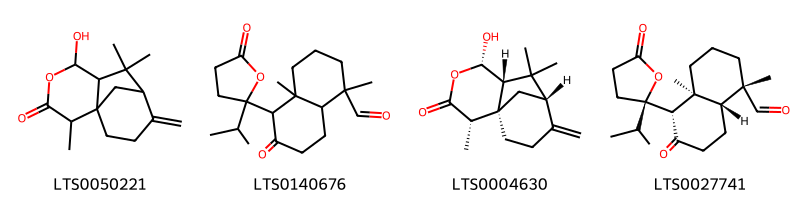{ width=100% }
    <figcaption>Hình ảnh cấu trúc hóa học của 4 hoạt chất thuộc nhóm Lactones gồm ['5-hydroxy-2,7,7-trimethyl-9-methylidene-4-oxatricyclo[6.3.1.0¹,⁶]dodecan-3-one (LTS0050221)', '5-(2-isopropyl-5-oxooxolan-2-yl)-1,4a-dimethyl-6-oxo-hexahydro-2h-naphthalene-1-carbaldehyde (LTS0140676)', '(1r,2s,5s,6r,8s)-5-hydroxy-2,7,7-trimethyl-9-methylidene-4-oxatricyclo[6.3.1.0¹,⁶]dodecan-3-one (LTS0004630)', '(1s,4as,5s,8ar)-5-[(2r)-2-isopropyl-5-oxooxolan-2-yl]-1,4a-dimethyl-6-oxo-hexahydro-2h-naphthalene-1-carbaldehyde (LTS0027741)'].</figcaption>
</figure>
#### Nhóm Lignan glycosides
<figure markdown="span">
    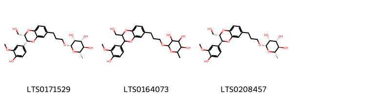{ width=100% }
    <figcaption>Hình ảnh cấu trúc hóa học của 3 hoạt chất thuộc nhóm Lignan glycosides gồm ['(2s,3r,4r,5r,6s)-2-{3-[(2s,3r)-3-(4-hydroxy-3-methoxyphenyl)-2-(hydroxymethyl)-2,3-dihydro-1,4-benzodioxin-6-yl]propoxy}-6-methyloxane-3,4,5-triol (LTS0171529)', '2-{3-[3-(4-hydroxy-3-methoxyphenyl)-2-(hydroxymethyl)-2,3-dihydro-1,4-benzodioxin-6-yl]propoxy}-6-methyloxane-3,4,5-triol (LTS0164073)', '(2s,3r,4r,5r,6s)-2-{3-[(2s,3s)-3-(4-hydroxy-3-methoxyphenyl)-2-(hydroxymethyl)-2,3-dihydro-1,4-benzodioxin-6-yl]propoxy}-6-methyloxane-3,4,5-triol (LTS0208457)'].</figcaption>
</figure>
#### Nhóm Lignan lactones
<figure markdown="span">
    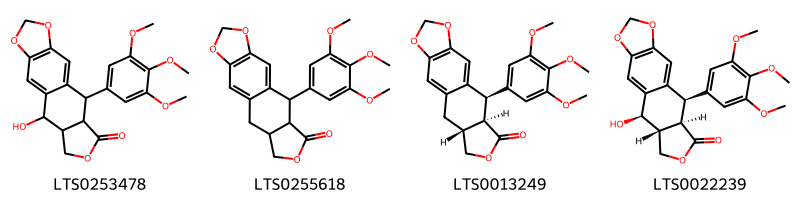{ width=100% }
    <figcaption>Hình ảnh cấu trúc hóa học của 4 hoạt chất thuộc nhóm Lignan lactones gồm ['podophyllum resin (LTS0253478)', '10-(3,4,5-trimethoxyphenyl)-4,6,13-trioxatetracyclo[7.7.0.0³,⁷.0¹¹,¹⁵]hexadeca-1,3(7),8-trien-12-one (LTS0255618)', '(-)-deoxypodophyllotoxin (LTS0013249)', 'podofilox (LTS0022239)'].</figcaption>
</figure>
#### Nhóm Naphthofurans
<figure markdown="span">
    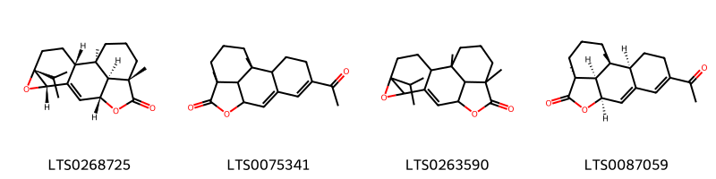{ width=100% }
    <figcaption>Hình ảnh cấu trúc hóa học của 4 hoạt chất thuộc nhóm Naphthofurans gồm ['(1r,2r,5s,7s,10r,13s,17s)-5-isopropyl-1,13-dimethyl-6,11-dioxapentacyclo[8.6.1.0²,⁸.0⁵,⁷.0¹³,¹⁷]heptadec-8-en-12-one (LTS0268725)', '5-acetyl-1,12-dimethyl-10-oxatetracyclo[7.6.1.0²,⁷.0¹²,¹⁶]hexadeca-5,7-dien-11-one (LTS0075341)', '5-isopropyl-1,13-dimethyl-6,11-dioxapentacyclo[8.6.1.0²,⁸.0⁵,⁷.0¹³,¹⁷]heptadec-8-en-12-one (LTS0263590)', '(1r,2r,9r,12s,16r)-5-acetyl-1,12-dimethyl-10-oxatetracyclo[7.6.1.0²,⁷.0¹²,¹⁶]hexadeca-5,7-dien-11-one (LTS0087059)'].</figcaption>
</figure>
#### Nhóm Organooxygen compounds
<figure markdown="span">
    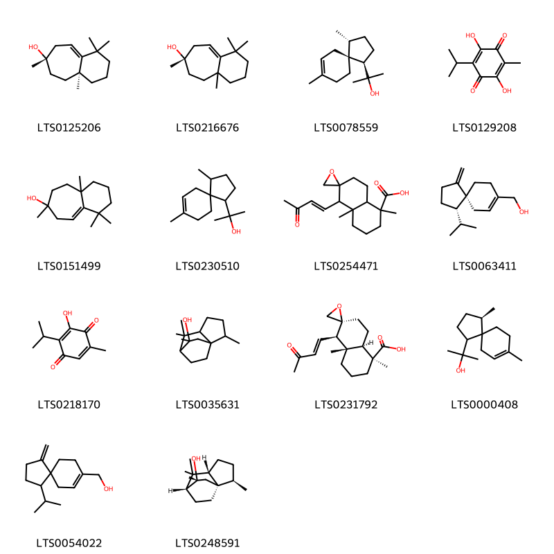{ width=100% }
    <figcaption>Hình ảnh cấu trúc hóa học của 14 hoạt chất thuộc nhóm Organooxygen compounds gồm ['widdrol (LTS0125206)', '(7s)-1,1,4a,7-tetramethyl-2,3,4,5,6,8-hexahydrobenzo[7]annulen-7-ol (LTS0216676)', '2-[(1r,4r,5s)-4,8-dimethylspiro[4.5]dec-7-en-1-yl]propan-2-ol (LTS0078559)', '2,5-dihydroxy-3-isopropyl-6-methylcyclohexa-2,5-diene-1,4-dione (LTS0129208)', '1,1,4a,7-tetramethyl-2,3,4,5,6,8-hexahydrobenzo[7]annulen-7-ol (LTS0151499)', '2-{4,8-dimethylspiro[4.5]dec-7-en-1-yl}propan-2-ol (LTS0230510)', "5,8a-dimethyl-1-(3-oxobut-1-en-1-yl)-hexahydro-1h-spiro[naphthalene-2,2'-oxirane]-5-carboxylic acid (LTS0254471)", '[(1s,5r)-1-isopropyl-4-methylidenespiro[4.5]dec-7-en-8-yl]methanol (LTS0063411)', '3-hydroxy-2-isopropyl-5-methylcyclohexa-2,5-diene-1,4-dione (LTS0218170)', '2,6,6,8-tetramethyltricyclo[5.2.2.0¹,⁵]undecan-8-ol (LTS0035631)', "(1r,2s,4ar,5s,8as)-5,8a-dimethyl-1-[(1e)-3-oxobut-1-en-1-yl]-hexahydro-1h-spiro[naphthalene-2,2'-oxirane]-5-carboxylic acid (LTS0231792)", '2-[(4r)-4,8-dimethylspiro[4.5]dec-7-en-1-yl]propan-2-ol (LTS0000408)', '{1-isopropyl-4-methylidenespiro[4.5]dec-7-en-8-yl}methanol (LTS0054022)', '(1r,2r,5s,7r,8r)-2,6,6,8-tetramethyltricyclo[5.2.2.0¹,⁵]undecan-8-ol (LTS0248591)'].</figcaption>
</figure>
#### Nhóm Oxanes
<figure markdown="span">
    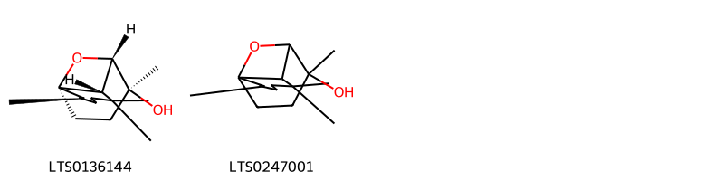{ width=100% }
    <figcaption>Hình ảnh cấu trúc hóa học của 2 hoạt chất thuộc nhóm Oxanes gồm ['(1r,2s,7s,8s,9s)-2,6,6,9-tetramethyl-12-oxatricyclo[6.3.1.0¹,⁷]dodecan-9-ol (LTS0136144)', '2,6,6,9-tetramethyl-12-oxatricyclo[6.3.1.0¹,⁷]dodecan-9-ol (LTS0247001)'].</figcaption>
</figure>
#### Nhóm Oxepanes
<figure markdown="span">
    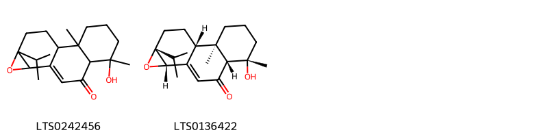{ width=100% }
    <figcaption>Hình ảnh cấu trúc hóa học của 2 hoạt chất thuộc nhóm Oxepanes gồm ['4-hydroxy-9a-isopropyl-4,7a-dimethyl-1ah,3ah,5h,6h,7h,7bh,8h,9h-phenanthro[1,2-b]oxiren-3-one (LTS0242456)', '(1as,3ar,4s,7ar,7br,9as)-4-hydroxy-9a-isopropyl-4,7a-dimethyl-1ah,3ah,5h,6h,7h,7bh,8h,9h-phenanthro[1,2-b]oxiren-3-one (LTS0136422)'].</figcaption>
</figure>
#### Nhóm Phenanthrenes and derivatives
<figure markdown="span">
    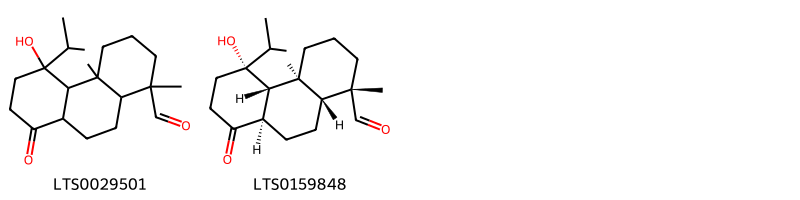{ width=100% }
    <figcaption>Hình ảnh cấu trúc hóa học của 2 hoạt chất thuộc nhóm Phenanthrenes and derivatives gồm ['5-hydroxy-5-isopropyl-1,4a-dimethyl-8-oxo-decahydrophenanthrene-1-carbaldehyde (LTS0029501)', '(1s,4as,4bs,5r,8ar,10ar)-5-hydroxy-5-isopropyl-1,4a-dimethyl-8-oxo-decahydrophenanthrene-1-carbaldehyde (LTS0159848)'].</figcaption>
</figure>
#### Nhóm Prenol lipids
<figure markdown="span">
    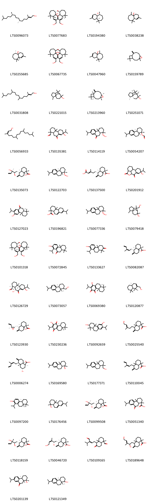{ width=100% }
    <figcaption>Hình ảnh cấu trúc hóa học của 152 hoạt chất thuộc nhóm Prenol lipids gồm ['phytol (LTS0096073)', '[(4ar,5s,9ar)-4a-{[(4ar,5s,9ar)-2-(hydroxymethyl)-5,9,9-trimethyl-4,5,6,7,8,9a-hexahydro-3h-benzo[7]annulen-4a-yl]oxy}-5,9,9-trimethyl-4,5,6,7,8,9a-hexahydro-3h-benzo[7]annulen-2-yl]methanol (LTS0077683)', '(4ar,5s,9ar)-2,5,9,9-tetramethyl-4,5,6,7,8,9a-hexahydro-1h-benzo[7]annulen-4a-ol (LTS0194380)', '2,5,9,9-tetramethyl-4,5,6,7,8,9a-hexahydro-3h-benzo[7]annulen-4a-ol (LTS0038238)', 'himachalane-2-en-6-ol (LTS0255685)', '(4a-{[2-(hydroxymethyl)-5,9,9-trimethyl-4,5,6,7,8,9a-hexahydro-3h-benzo[7]annulen-4a-yl]oxy}-5,9,9-trimethyl-4,5,6,7,8,9a-hexahydro-3h-benzo[7]annulen-2-yl)methanol (LTS0067735)', '2,5,9,9-tetramethyl-4,5,6,7,8,9a-hexahydro-1h-benzo[7]annulen-4a-ol (LTS0047960)', 'caryophyllene oxide (LTS0159789)', 'phytol (LTS0031808)', 'cedrol (LTS0221015)', 'β-caryophyllene oxide (LTS0213960)', 'cedrol (LTS0251071)', '3,7,11,15-tetramethylhexadec-2-en-1-ol (LTS0056933)', '7-hydroxy-7-isopropyl-1,4a-dimethyl-9-oxo-2,3,4,4b,5,6,10,10a-octahydrophenanthrene-1-carbaldehyde (LTS0135381)', '1-hydroperoxy-7-isopropyl-1,4a-dimethyl-3,4,10,10a-tetrahydro-2h-phenanthren-9-one (LTS0114119)', '(1s,4as,10ar)-7-isopropyl-1,4a-dimethyl-2,3,4,9,10,10a-hexahydrophenanthren-1-yl formate (LTS0054207)', '(1s,4ar,5s,8ar)-5-[(2r,3r)-2,3-dihydroxy-3-methylpent-4-en-1-yl]-1,4a-dimethyl-6-methylidene-hexahydro-2h-naphthalene-1-carboxylic acid (LTS0135073)', '(1s,4as,10ar)-7-isopropyl-1,4a-dimethyl-2,3,4,9,10,10a-hexahydrophenanthrene-1-peroxol (LTS0122703)', '(1s,4ar,5s,8ar)-5-[(3e)-4-carboxy-3-methylbut-3-en-1-yl]-1,4a-dimethyl-6-methylidene-hexahydro-2h-naphthalene-1-carboxylic acid (LTS0137500)', '5-hydroxy-5-isopropyl-1,12-dimethyl-10-oxatetracyclo[7.6.1.0²,⁷.0¹²,¹⁶]hexadec-6-ene-8,11-dione (LTS0201912)', 'sugiol (LTS0127023)', 'abietic acid (LTS0196821)', '7-isopropyl-1,4a-dimethyl-2,3,4,9,10,10a-hexahydrophenanthrene-1-peroxol (LTS0077336)', '6-(hydroxymethyl)-2,6,8-trimethyltricyclo[5.3.1.0¹,⁵]undecan-8-ol (LTS0079418)', '[(4as,5r,9as)-4a-{[(4as,5r,9as)-2-(hydroxymethyl)-5,9,9-trimethyl-4,5,6,7,8,9a-hexahydro-3h-benzo[7]annulen-4a-yl]oxy}-5,9,9-trimethyl-4,5,6,7,8,9a-hexahydro-3h-benzo[7]annulen-2-yl]methanol (LTS0101318)', '7-hydroxy-8-isopropyl-1,1,4a-trimethyl-3,4,10,10a-tetrahydro-2h-phenanthren-9-one (LTS0072845)', '7-hydroxy-8-isopropyl-1,1,4a-trimethyl-4,9,10,10a-tetrahydro-3h-phenanthren-2-one (LTS0133627)', '(1s,4ar,5s,8ar)-1,4a-dimethyl-6-methylidene-5-[(2z)-3-methylpenta-2,4-dien-1-yl]-hexahydro-2h-naphthalene-1-carboxylic acid (LTS0082087)', '(1s,4ar,4br,7s,10r,10ar)-7,10-dihydroxy-7-isopropyl-1,4a-dimethyl-9-oxo-2,3,4,4b,5,6,10,10a-octahydrophenanthrene-1-carbaldehyde (LTS0126729)', 'dehydroabietinol (LTS0073057)', '(4bs,8as)-1-hydroxy-2-isopropyl-4b,8,8-trimethyl-5,6,7,8a,9,10-hexahydrophenanthrene-3,4-dione (LTS0069380)', '[(1ar,4as,8as)-4a,8,8-trimethyl-1h,1ah,4h,5h,6h,7h-cyclopropa[e]naphthalen-2-yl]methanol (LTS0120877)', '(1s,4ar,5s,8ar)-5-{[(2s,3s)-3-ethenyl-3-methyloxiran-2-yl]methyl}-1,4a-dimethyl-6-methylidene-hexahydro-2h-naphthalene-1-carboxylic acid (LTS0123930)', 'royleanone (LTS0230236)', '7-isopropyl-1,1,4a-trimethyl-2,3,4,9,10,10a-hexahydrophenanthrene-2,6-diol (LTS0092659)', '5-(5-hydroxy-3-methylpent-3-en-1-yl)-1,4a-dimethyl-6-methylidene-hexahydro-2h-naphthalene-1-carboxylic acid (LTS0025540)', '(1s,3r,4ar,5s,8ar)-3-hydroxy-1,4a-dimethyl-6-methylidene-5-[(2z)-3-methylpenta-2,4-dien-1-yl]-hexahydro-2h-naphthalene-1-carboxylic acid (LTS0006274)', '7-isopropyl-1,4a-dimethyl-2,3,4,9,10,10a-hexahydrophenanthren-1-ol (LTS0169580)', '(7-isopropyl-1,4a-dimethyl-2,3,4,9,10,10a-hexahydrophenanthren-1-yl)methanol (LTS0177371)', '1,4a-dimethyl-6-methylidene-5-(3-methylpenta-2,4-dien-1-yl)-hexahydro-2h-naphthalene-1-carboxylic acid (LTS0110045)', 'totarol (LTS0097200)', '7-isopropyl-1,4a-dimethyl-2,3,4,4b,5,6,10,10a-octahydrophenanthren-1-ol (LTS0176456)', '(1s,4ar,5s,8ar)-5-[(2s,3r)-2,3-dihydroxy-3-methylpent-4-en-1-yl]-1,4a-dimethyl-6-methylidene-hexahydro-2h-naphthalene-1-carboxylic acid (LTS0099508)', '7-isopropyl-1,4a-dimethyl-9-oxo-3,4,10,10a-tetrahydro-2h-phenanthrene-1-carboxylic acid (LTS0051340)', '(1s,4ar,5s,8ar)-5-[(2r,3s)-2,3-dihydroxy-3-methylpent-4-en-1-yl]-1,4a-dimethyl-6-methylidene-hexahydro-2h-naphthalene-1-carboxylic acid (LTS0118159)', '(1s,4ar,5s,8ar)-5-[(2s,3z)-2,5-dihydroxy-3-methylpent-3-en-1-yl]-1,4a-dimethyl-6-methylidene-hexahydro-2h-naphthalene-1-carboxylic acid (LTS0046720)', '5-(3-isopropyl-4-oxobut-2-en-1-yl)-1,4a-dimethyl-6-oxo-hexahydro-2h-naphthalene-1-carbaldehyde (LTS0109165)', '5-(2,5-dihydroxy-3-methylpent-3-en-1-yl)-1,4a-dimethyl-6-methylidene-hexahydro-2h-naphthalene-1-carboxylic acid (LTS0189648)', '(1s,4as,10ar)-1-hydroxy-7-isopropyl-1,4a-dimethyl-3,4,10,10a-tetrahydro-2h-phenanthren-9-one (LTS0201139)', '(1r,4as,10ar)-7-isopropyl-1,4a-dimethyl-2,3,4,9,10,10a-hexahydrophenanthren-1-ol (LTS0121349)', '(1s,4ar,5s,8ar)-5-[(2s,3e)-2,5-dihydroxy-3-methylpent-3-en-1-yl]-1,4a-dimethyl-6-methylidene-hexahydro-2h-naphthalene-1-carboxylic acid (LTS0134905)', '{12,12-dimethyl-9-methylidene-5-oxatricyclo[8.2.0.0⁴,⁶]dodecan-4-yl}methanol (LTS0135854)', '(1s,4ar,5s,8ar)-5-[(3e)-5-(acetyloxy)-3-methylpent-3-en-1-yl]-1,4a-dimethyl-6-methylidene-hexahydro-2h-naphthalene-1-carboxylic acid (LTS0136725)', '(1s,4as,10ar)-7-isopropyl-1,4a-dimethyl-2,3,4,9,10,10a-hexahydrophenanthren-1-ol (LTS0172488)', '2,7-dihydroxy-8-isopropyl-1,1,4a-trimethyl-3,9,10,10a-tetrahydro-2h-phenanthren-4-one (LTS0146836)', '(1s,2r,5r,7r,8r)-2,6,6,8-tetramethyltricyclo[5.3.1.0¹,⁵]undecan-8-ol (LTS0127073)', '8-(hydroxymethyl)-2-isopropyl-4b,8-dimethyl-5,6,7,8a,9,10-hexahydrophenanthren-3-ol (LTS0271834)', '(1s,4ar,5s,8ar)-5-[(3s)-5-hydroxy-3-methylpentyl]-1,4a-dimethyl-6-methylidene-hexahydro-2h-naphthalene-1-carboxylic acid (LTS0198731)', '(1s,4as,9s,10ar)-9-hydroxy-7-isopropyl-1,4a-dimethyl-2,3,4,9,10,10a-hexahydrophenanthrene-1-carbaldehyde (LTS0154182)', '(1r,2r,5s,9s,12s,16r)-5-hydroxy-5-isopropyl-1,12-dimethyl-10-oxatetracyclo[7.6.1.0²,⁷.0¹²,¹⁶]hexadec-6-ene-8,11-dione (LTS0141085)', '(1as,4ar,8ar)-4a,8,8-trimethyl-1h,1ah,4h,5h,6h,7h-cyclopropa[e]naphthalene-2-carbaldehyde (LTS0249487)', '[(1s,2r,5r,7r)-2,6,6-trimethyltricyclo[5.3.1.0¹,⁵]undec-8-en-8-yl]methanol (LTS0163034)', '(1s,3r,4ar,5s,8ar)-3-hydroxy-1,4a-dimethyl-6-methylidene-5-[(2e)-3-methylpenta-2,4-dien-1-yl]-hexahydro-2h-naphthalene-1-carboxylic acid (LTS0164222)', '3-isopropyl-4b,8,8-trimethyl-5,6,7,8a,9,10-hexahydrophenanthren-2-ol (LTS0161563)', '(4as,10ar)-7-hydroxy-8-isopropyl-1,1,4a-trimethyl-4,9,10,10a-tetrahydro-3h-phenanthren-2-one (LTS0087253)', 'isocupressic acid (LTS0087335)', '(4as,9r,10as)-7-isopropyl-1,1,4a-trimethyl-2,3,4,9,10,10a-hexahydrophenanthren-9-ol (LTS0139616)', '(1r,4as,10ar)-1-hydroxy-7-isopropyl-1,4a-dimethyl-3,4,10,10a-tetrahydro-2h-phenanthren-9-one (LTS0162978)', '9-hydroxy-7-isopropyl-1,4a-dimethyl-2,3,4,5,6,9,10,10a-octahydrophenanthrene-1-carbaldehyde (LTS0104909)', '4a,8,8-trimethyl-1h,1ah,4h,5h,6h,7h-cyclopropa[e]naphthalene-2-carbaldehyde (LTS0172759)', '4a,8,8-trimethyl-1h,1ah,4h,5h,6h,7h-cyclopropa[e]naphthalene-2-carboxylic acid (LTS0232629)', '5-(2,3-dihydroxy-3-methylpent-4-en-1-yl)-1,4a-dimethyl-6-methylidene-hexahydro-2h-naphthalene-1-carboxylic acid (LTS0166814)', '{4a,8,8-trimethyl-1h,1ah,4h,5h,6h,7h-cyclopropa[e]naphthalen-2-yl}methanol (LTS0228087)', 'pimaric acid (LTS0168085)', '(1as,4as,5s,7ar,7br)-3,3,5,7b-tetramethyl-octahydrocyclopropa[e]azulen-5-ol (LTS0119115)', '(1s,4as,9r,10ar)-9-hydroxy-7-isopropyl-1,4a-dimethyl-2,3,4,9,10,10a-hexahydrophenanthrene-1-carbaldehyde (LTS0187440)', '(1r,4r)-3,3,4-trimethyl-4-(4-methylphenyl)cyclopentan-1-ol (LTS0182752)', '(1s,4ar,5s,8ar)-5-[(3r)-3-hydroxy-3-methylpent-4-en-1-yl]-1,4a-dimethyl-6-methylidene-hexahydro-2h-naphthalene-1-carboxylic acid (LTS0105686)', '(4bs,8as)-3-isopropyl-4b,8,8-trimethyl-5,6,7,8a,9,10-hexahydrophenanthren-2-ol (LTS0166656)', '3-hydroxy-1,4a-dimethyl-6-methylidene-5-(3-methylpenta-2,4-dien-1-yl)-hexahydro-2h-naphthalene-1-carboxylic acid (LTS0159907)', '{2,6,6-trimethyltricyclo[5.4.0.0²,⁸]undec-9-en-9-yl}methanol (LTS0105859)', '(1s,4as,9r,10ar)-9-hydroxy-7-isopropyl-1,4a-dimethyl-2,3,4,5,6,9,10,10a-octahydrophenanthrene-1-carbaldehyde (LTS0116345)', '7-isopropyl-1,1,4a-trimethyl-3,4,10,10a-tetrahydro-2h-phenanthren-9-one (LTS0049518)', '(1s,4as,10ar)-7-isopropyl-1,4a-dimethyl-9-oxo-3,4,10,10a-tetrahydro-2h-phenanthrene-1-carboxylic acid (LTS0204002)', '(1as,4as,8ar)-4a,8,8-trimethyl-1h,1ah,4h,5h,6h,7h-cyclopropa[e]naphthalene-2-carboxylic acid (LTS0074778)', '(4as,10r,10as)-6,10-dihydroxy-7-isopropyl-1,1,4a-trimethyl-3,4,10,10a-tetrahydro-2h-phenanthren-9-one (LTS0254189)', 'sandaracopimaric acid (LTS0207129)', '7-isopropyl-1,4a-dimethyl-6-oxo-3,4,4b,5,10,10a-hexahydro-2h-phenanthrene-1-carbaldehyde (LTS0035326)', '[(1s,4as,10ar)-7-isopropyl-1,4a-dimethyl-2,3,4,9,10,10a-hexahydrophenanthren-1-yl]methanol (LTS0259903)', '5-(4-carboxy-3-methylbut-3-en-1-yl)-1,4a-dimethyl-6-methylidene-hexahydro-2h-naphthalene-1-carboxylic acid (LTS0055050)', '6-hydroxy-7-isopropyl-1,1,4a-trimethyl-3,4,10,10a-tetrahydro-2h-phenanthren-9-one (LTS0270724)', '(1s,4as,9r,10ar)-9-hydroxy-7-isopropyl-1,4a-dimethyl-2,3,4,9,10,10a-hexahydrophenanthrene-1-carboxylic acid (LTS0079427)', '(1s,4as,10ar)-1-hydroperoxy-7-isopropyl-1,4a-dimethyl-3,4,10,10a-tetrahydro-2h-phenanthren-9-one (LTS0275446)', '(1s,2r,5r,7r,8s)-2,6,6,8-tetramethyltricyclo[5.3.1.0¹,⁵]undecan-8-ol (LTS0215319)', '7-hydroxy-8-isopropyl-1,1,4a-trimethyl-10,10a-dihydro-9h-phenanthren-4-one (LTS0208854)', '(1s,4ar,5s,8ar)-1,4a-dimethyl-6-methylidene-5-[(2e)-3-methylpenta-2,4-dien-1-yl]-hexahydro-2h-naphthalene-1-carboxylic acid (LTS0213238)', '(1s,4ar,4br,10ar)-7-isopropyl-1,4a-dimethyl-2,3,4,4b,5,6,10,10a-octahydrophenanthrene-1-carbaldehyde (LTS0210713)', '(1s,4as,5s,8ar)-5-[(1e,3e)-5-hydroxy-3-methylpenta-1,3-dien-1-yl]-1,4a-dimethyl-6-methylidene-hexahydro-2h-naphthalene-1-carboxylic acid (LTS0212552)', '6,10-dihydroxy-7-isopropyl-1,1,4a-trimethyl-3,4,10,10a-tetrahydro-2h-phenanthren-9-one (LTS0240515)', '7-oxodehydroabietic acid (LTS0229171)', '9-hydroxy-7-isopropyl-1,4a-dimethyl-2,3,4,9,10,10a-hexahydrophenanthrene-1-carboxylic acid (LTS0182815)', '(4as,10as)-7-hydroxy-8-isopropyl-1,1,4a-trimethyl-3,9,10,10a-tetrahydrophenanthrene-2,4-dione (LTS0149124)', '7-isopropyl-1,1,4a-trimethyl-2,3,4,9,10,10a-hexahydrophenanthren-9-ol (LTS0149356)', '(1s,4as,10ar)-7-isopropyl-1,4a-dimethyl-9-oxo-3,4,5,6,10,10a-hexahydro-2h-phenanthrene-1-carbaldehyde (LTS0152231)', '(1s,4as,5r,8ar)-5-[(2e)-3-isopropyl-4-oxobut-2-en-1-yl]-1,4a-dimethyl-6-oxo-hexahydro-2h-naphthalene-1-carbaldehyde (LTS0215028)', '3-hydroxy-2-isopropyl-4b,8,8-trimethyl-5,6,7,8a,9,10-hexahydrophenanthrene-1,4-dione (LTS0173065)', '7-isopropyl-1,4a-dimethyl-2,3,4,4b,5,6,10,10a-octahydrophenanthrene-1-carbaldehyde (LTS0259018)', 'methyl (1s,4ar,5r,8ar)-1,4a-dimethyl-6-methylidene-5-[(2e)-3-methylpenta-2,4-dien-1-yl]-hexahydro-2h-naphthalene-1-carboxylate (LTS0193829)', 'totarol (LTS0175490)', '5-[5-(acetyloxy)-3-methylpent-3-en-1-yl]-1,4a-dimethyl-6-methylidene-hexahydro-2h-naphthalene-1-carboxylic acid (LTS0247616)', '(2s,4as,10as)-2,7-dihydroxy-8-isopropyl-1,1,4a-trimethyl-3,9,10,10a-tetrahydro-2h-phenanthren-4-one (LTS0236863)', '5-(5-hydroxy-3-methylpentyl)-1,4a-dimethyl-6-methylidene-hexahydro-2h-naphthalene-1-carboxylic acid (LTS0051248)', '(1s,4ar,4br,10ar)-7-isopropyl-1,4a-dimethyl-2,3,4,4b,5,6,10,10a-octahydrophenanthren-1-ol (LTS0055446)', '(1s,4as,5s,8ar)-1,4a-dimethyl-6-methylidene-5-[(1e)-3-oxobut-1-en-1-yl]-hexahydro-2h-naphthalene-1-carboxylic acid (LTS0017816)', '(1s,2r,5s,6r,7r,8r)-6-(hydroxymethyl)-2,6,8-trimethyltricyclo[5.3.1.0¹,⁵]undecan-8-ol (LTS0242155)', '2-isopropyl-4b,8,8-trimethyl-5,6,7,8a,9,10-hexahydrophenanthren-3-ol (LTS0255397)', '[(1r,4s,6s,10s)-12,12-dimethyl-9-methylidene-5-oxatricyclo[8.2.0.0⁴,⁶]dodecan-4-yl]methanol (LTS0266667)', '7-isopropyl-1,4a-dimethyl-2,3,4,9,10,10a-hexahydrophenanthren-1-yl formate (LTS0060413)', '1,4a-dimethyl-6-methylidene-5-(3-oxobut-1-en-1-yl)-hexahydro-2h-naphthalene-1-carboxylic acid (LTS0010485)', '7-isopropyl-1,4a-dimethyl-9-oxo-3,4,5,6,10,10a-hexahydro-2h-phenanthrene-1-carbaldehyde (LTS0059873)', '6-(2-hydroxy-4-methylphenyl)-2-methylheptan-3-one (LTS0044791)', '[(1r,2s,7r,8s)-2,6,6-trimethyltricyclo[5.4.0.0²,⁸]undec-9-en-9-yl]methanol (LTS0064443)', 'ferruginol (LTS0045608)', '7,10-dihydroxy-7-isopropyl-1,4a-dimethyl-9-oxo-2,3,4,4b,5,6,10,10a-octahydrophenanthrene-1-carbaldehyde (LTS0274136)', '1-hydroxy-7-isopropyl-1,4a-dimethyl-3,4,10,10a-tetrahydro-2h-phenanthren-9-one (LTS0108097)', '(1r,4as,10ar)-7-isopropyl-1,4a-dimethyl-2,3,4,9,10,10a-hexahydrophenanthrene-1-peroxol (LTS0027816)', '(2s,4as,10ar)-7-isopropyl-1,1,4a-trimethyl-2,3,4,9,10,10a-hexahydrophenanthrene-2,6-diol (LTS0056473)', '(6r)-6-(2-hydroxy-4-methylphenyl)-2-methylheptan-3-one (LTS0276270)', '1-hydroperoxy-7-isopropyl-1,4a-dimethyl-2,3,4,9,10,10a-hexahydrophenanthren-9-ol (LTS0135076)', '(1s,4s)-3,3,4-trimethyl-4-(4-methylphenyl)cyclopentan-1-ol (LTS0033190)', '{2,6,6-trimethyltricyclo[5.3.1.0¹,⁵]undec-8-en-8-yl}methanol (LTS0002952)', '(1s,4ar,4br,10ar)-7-isopropyl-1,4a-dimethyl-2,3,4,4b,5,6,10,10a-octahydrophenanthrene-1-carboxylic acid (LTS0014114)', '[(1s,4as,9r,10ar)-9-hydroxy-7-isopropyl-1,4a-dimethyl-2,3,4,9,10,10a-hexahydrophenanthren-1-yl]methyl acetate (LTS0000995)', '3,3,4-trimethyl-4-(4-methylphenyl)cyclopentan-1-ol (LTS0004456)', '(4as,9s,10as)-7-isopropyl-1,1,4a-trimethyl-2,3,4,9,10,10a-hexahydrophenanthren-9-ol (LTS0022700)', '(1s,4as,10ar)-7-isopropyl-1,4a-dimethyl-2,3,4,9,10,10a-hexahydrophenanthrene-1-carboxylic acid (LTS0113419)', '7-hydroxy-8-isopropyl-1,1,4a-trimethyl-3,9,10,10a-tetrahydrophenanthrene-2,4-dione (LTS0092182)', '9-hydroxy-7-isopropyl-1,4a-dimethyl-2,3,4,9,10,10a-hexahydrophenanthrene-1-carbaldehyde (LTS0114181)', '(1s,4as,4br,7s,10ar)-7-hydroxy-7-isopropyl-1,4a-dimethyl-9-oxo-2,3,4,4b,5,6,10,10a-octahydrophenanthrene-1-carbaldehyde (LTS0020324)', '(4as,10as)-7-hydroxy-8-isopropyl-1,1,4a-trimethyl-10,10a-dihydro-9h-phenanthren-4-one (LTS0216040)', '5-(5-hydroxy-3-methylpenta-1,3-dien-1-yl)-1,4a-dimethyl-6-methylidene-hexahydro-2h-naphthalene-1-carboxylic acid (LTS0233047)', 'dehydroabietic acid (LTS0034017)', '7-dehydroabietanone (LTS0033826)', '(1r,4r,6s,10s)-4,12,12-trimethyl-9-methylidene-5-oxatricyclo[8.2.0.0⁴,⁶]dodecane (LTS0029123)', '(4as,10as)-7-hydroxy-8-isopropyl-1,1,4a-trimethyl-3,4,10,10a-tetrahydro-2h-phenanthren-9-one (LTS0272186)', '(1ar,4as,8as)-4a,8,8-trimethyl-1h,1ah,4h,5h,6h,7h-cyclopropa[e]naphthalene-2-carboxylic acid (LTS0119392)', '5-[(3-ethenyl-3-methyloxiran-2-yl)methyl]-1,4a-dimethyl-6-methylidene-hexahydro-2h-naphthalene-1-carboxylic acid (LTS0038237)', '(4bs,8s,8ar)-8-(hydroxymethyl)-2-isopropyl-4b,8-dimethyl-5,6,7,8a,9,10-hexahydrophenanthren-3-ol (LTS0125048)', '(9-hydroxy-7-isopropyl-1,4a-dimethyl-2,3,4,9,10,10a-hexahydrophenanthren-1-yl)methyl acetate (LTS0253379)', '(1s,4ar,4br,10ar)-7-isopropyl-1,4a-dimethyl-6-oxo-3,4,4b,5,10,10a-hexahydro-2h-phenanthrene-1-carbaldehyde (LTS0253209)', '3,3,5,7b-tetramethyl-octahydrocyclopropa[e]azulen-5-ol (LTS0255957)', '(1s,4as,9r,10ar)-1-hydroperoxy-7-isopropyl-1,4a-dimethyl-2,3,4,9,10,10a-hexahydrophenanthren-9-ol (LTS0125710)'].</figcaption>
</figure>
#### Nhóm Pyrans
<figure markdown="span">
    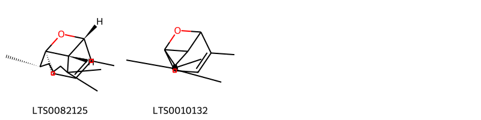{ width=100% }
    <figcaption>Hình ảnh cấu trúc hóa học của 2 hoạt chất thuộc nhóm Pyrans gồm ['(1r,2s,7s,8s)-2,6,6,9-tetramethyl-12-oxatricyclo[6.3.1.0¹,⁷]dodec-9-ene (LTS0082125)', '2,6,6,9-tetramethyl-12-oxatricyclo[6.3.1.0¹,⁷]dodec-9-ene (LTS0010132)'].</figcaption>
</figure>

---

### Dược dân tộc học

Danh sách các quốc gia có sử dụng *Juniperus chinensis* trong điều trị các bệnh. 

| Country   | Disease   | Bệnh                                                                                                                                                                                                |
|:----------|:----------|:----------------------------------------------------------------------------------------------------------------------------------------------------------------------------------------------------|
| Java      | Cosmetic  | MYMEMORY WARNING: YOU USED ALL AVAILABLE FREE TRANSLATIONS FOR TODAY. NEXT AVAILABLE IN  09 HOURS 38 MINUTES 51 SECONDS VISIT HTTPS://MYMEMORY.TRANSLATED.NET/DOC/USAGELIMITS.PHP TO TRANSLATE MORE |

---

---
## Juniperus communis
### Thông tin về thực vật

!!! info "Phân loại thực vật của *Juniperus communis* từ GIBF:"
    - **Kingdom:** Plantae
    - **Phylum:** Tracheophyta
    - **Order:** Pinales
    - **Family:** Cupressaceae
    - **Genus:** Juniperus
    - **Species:** *Juniperus communis*

 

| Label (VI)   | Label (EN)   | Scientific Name    | Descriptions (VI)   | Descriptions (EN)   | Also Known As (VI)   | Also Known As (EN)                                                  |
|:-------------|:-------------|:-------------------|:--------------------|:--------------------|:---------------------|:--------------------------------------------------------------------|
| N/A          | N/A          | Juniperus communis | loài thực vật       | species of plant    | ['']                 | ['common juniper', 'mountain juniper', 'ground juniper', 'juniper'] |

#### Phân bố trên thế giới

**Từ CSDL GIBF** nan, Denmark, Spain, Germany, Azerbaijan, Austria, Albania, Sweden, Poland, Canada, Finland, Slovakia, Netherlands, Hungary, Norway, United Kingdom of Great Britain and Northern Ireland, France, Czechia, Russian Federation, United States of America, Italy, Algeria, Croatia

#### Phân bố tại Việt Nam

**Từ CSDL GIBF**: Không có ghi nhận ở Việt Nam

---
### Thành phần hóa học
        
- Theo cơ sở dữ liệu lotus: Từ loài *Juniperus communis* đã phân lập và xác định được 305 hoạt chất thuộc về các nhóm Organooxygen compounds, Furanoid lignans, Flavonoids, Unsaturated hydrocarbons, 2-arylbenzofuran flavonoids, Carboxylic acids and derivatives, Prenol lipids, Fatty Acyls, Lignan glycosides, Epoxides, Naphthopyrans, Phenols, Lignan lactones, Phenol ethers, Steroids and steroid derivatives, Tropones. 

|    | chemicalTaxonomyClassyfireClass   |   smiles_count |
|---:|:----------------------------------|---------------:|
|  0 | 2-arylbenzofuran flavonoids       |             20 |
|  1 | Carboxylic acids and derivatives  |             17 |
|  2 | Epoxides                          |              1 |
|  3 | Fatty Acyls                       |             30 |
|  4 | Flavonoids                        |             23 |
|  5 | Furanoid lignans                  |              4 |
|  6 | Lignan glycosides                 |              8 |
|  7 | Lignan lactones                   |              2 |
|  8 | Naphthopyrans                     |              1 |
|  9 | Organooxygen compounds            |              9 |
| 10 | Phenol ethers                     |              1 |
| 11 | Phenols                           |              7 |
| 12 | Prenol lipids                     |            174 |
| 13 | Steroids and steroid derivatives  |              2 |
| 14 | Tropones                          |              3 |
| 15 | Unsaturated hydrocarbons          |              1 |

#### Nhóm 2-arylbenzofuran flavonoids
<figure markdown="span">
    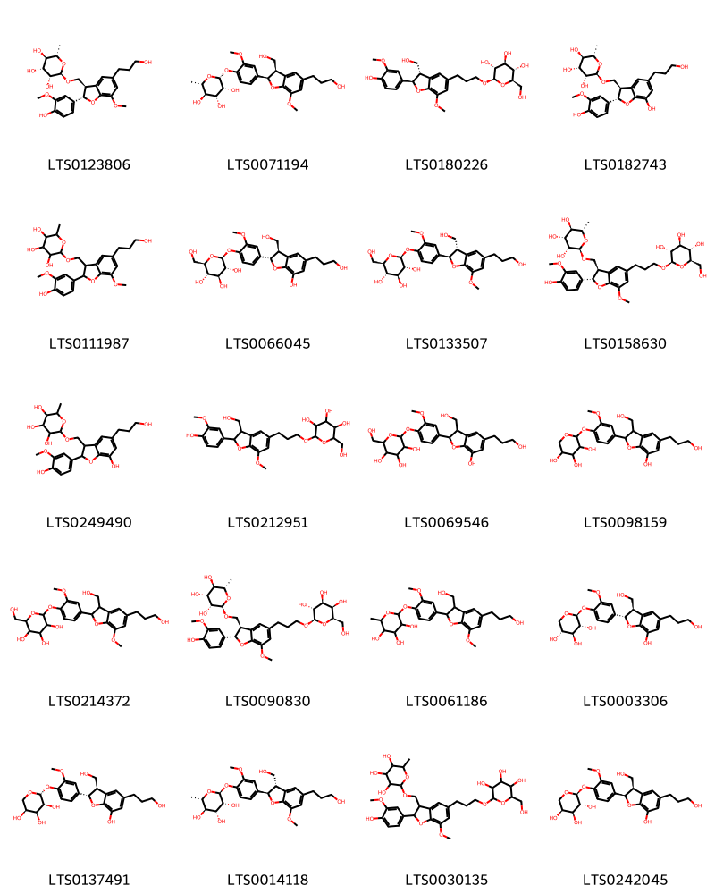{ width=100% }
    <figcaption>Hình ảnh cấu trúc hóa học của 20 hoạt chất thuộc nhóm 2-arylbenzofuran flavonoids gồm ['(2r,3r,4r,5r,6s)-2-{[(2s,3r)-2-(4-hydroxy-3-methoxyphenyl)-5-(3-hydroxypropyl)-7-methoxy-2,3-dihydro-1-benzofuran-3-yl]methoxy}-6-methyloxane-3,4,5-triol (LTS0123806)', '(2r,3r,4r,5r,6s)-2-{4-[(2r,3r)-3-(hydroxymethyl)-5-(3-hydroxypropyl)-7-methoxy-2,3-dihydro-1-benzofuran-2-yl]-2-methoxyphenoxy}-6-methyloxane-3,4,5-triol (LTS0071194)', '(2r,3r,4s,5s,6r)-2-{3-[(2r,3s)-2-(4-hydroxy-3-methoxyphenyl)-3-(hydroxymethyl)-7-methoxy-2,3-dihydro-1-benzofuran-5-yl]propoxy}-6-(hydroxymethyl)oxane-3,4,5-triol (LTS0180226)', '(2r,3r,4r,5r,6s)-2-{[(2s,3r)-7-hydroxy-2-(4-hydroxy-3-methoxyphenyl)-5-(3-hydroxypropyl)-2,3-dihydro-1-benzofuran-3-yl]methoxy}-6-methyloxane-3,4,5-triol (LTS0182743)', '2-{[2-(4-hydroxy-3-methoxyphenyl)-5-(3-hydroxypropyl)-7-methoxy-2,3-dihydro-1-benzofuran-3-yl]methoxy}-6-methyloxane-3,4,5-triol (LTS0111987)', '(2s,3r,4s,5s,6r)-2-{4-[(2s,3r)-7-hydroxy-3-(hydroxymethyl)-5-(3-hydroxypropyl)-2,3-dihydro-1-benzofuran-2-yl]-2-methoxyphenoxy}-6-(hydroxymethyl)oxane-3,4,5-triol (LTS0066045)', '(2r,3s,4s,5r,6s)-2-(hydroxymethyl)-6-{4-[(2r,3s)-3-(hydroxymethyl)-5-(3-hydroxypropyl)-7-methoxy-2,3-dihydro-1-benzofuran-2-yl]-2-methoxyphenoxy}oxane-3,4,5-triol (LTS0133507)', '(2r,3r,4s,5s,6r)-2-{3-[(2s,3r)-2-(4-hydroxy-3-methoxyphenyl)-7-methoxy-3-({[(2r,3r,4r,5r,6s)-3,4,5-trihydroxy-6-methyloxan-2-yl]oxy}methyl)-2,3-dihydro-1-benzofuran-5-yl]propoxy}-6-(hydroxymethyl)oxane-3,4,5-triol (LTS0158630)', '2-{[7-hydroxy-2-(4-hydroxy-3-methoxyphenyl)-5-(3-hydroxypropyl)-2,3-dihydro-1-benzofuran-3-yl]methoxy}-6-methyloxane-3,4,5-triol (LTS0249490)', '2-{3-[2-(4-hydroxy-3-methoxyphenyl)-3-(hydroxymethyl)-7-methoxy-2,3-dihydro-1-benzofuran-5-yl]propoxy}-6-(hydroxymethyl)oxane-3,4,5-triol (LTS0212951)', '2-{4-[7-hydroxy-3-(hydroxymethyl)-5-(3-hydroxypropyl)-2,3-dihydro-1-benzofuran-2-yl]-2-methoxyphenoxy}-6-(hydroxymethyl)oxane-3,4,5-triol (LTS0069546)', '2-{4-[7-hydroxy-3-(hydroxymethyl)-5-(3-hydroxypropyl)-2,3-dihydro-1-benzofuran-2-yl]-2-methoxyphenoxy}oxane-3,4,5-triol (LTS0098159)', '2-(hydroxymethyl)-6-{4-[3-(hydroxymethyl)-5-(3-hydroxypropyl)-7-methoxy-2,3-dihydro-1-benzofuran-2-yl]-2-methoxyphenoxy}oxane-3,4,5-triol (LTS0214372)', '(2r,3r,4s,5r,6r)-2-{3-[(2s,3r)-2-(4-hydroxy-3-methoxyphenyl)-7-methoxy-3-({[(2r,3r,4r,5r,6s)-3,4,5-trihydroxy-6-methyloxan-2-yl]oxy}methyl)-2,3-dihydro-1-benzofuran-5-yl]propoxy}-6-(hydroxymethyl)oxane-3,4,5-triol (LTS0090830)', '2-{4-[3-(hydroxymethyl)-5-(3-hydroxypropyl)-7-methoxy-2,3-dihydro-1-benzofuran-2-yl]-2-methoxyphenoxy}-6-methyloxane-3,4,5-triol (LTS0061186)', '(2s,3r,4s,5r)-2-{4-[(2s,3r)-7-hydroxy-3-(hydroxymethyl)-5-(3-hydroxypropyl)-2,3-dihydro-1-benzofuran-2-yl]-2-methoxyphenoxy}oxane-3,4,5-triol (LTS0003306)', '(2r,3s,4s,5s)-2-{4-[(2s,3r)-7-hydroxy-3-(hydroxymethyl)-5-(3-hydroxypropyl)-2,3-dihydro-1-benzofuran-2-yl]-2-methoxyphenoxy}oxane-3,4,5-triol (LTS0137491)', 'icariside e4 (LTS0014118)', '2-{3-[2-(4-hydroxy-3-methoxyphenyl)-7-methoxy-3-{[(3,4,5-trihydroxy-6-methyloxan-2-yl)oxy]methyl}-2,3-dihydro-1-benzofuran-5-yl]propoxy}-6-(hydroxymethyl)oxane-3,4,5-triol (LTS0030135)', '(2s,3r,4s,5s)-2-{4-[(2r,3r)-7-hydroxy-3-(hydroxymethyl)-5-(3-hydroxypropyl)-2,3-dihydro-1-benzofuran-2-yl]-2-methoxyphenoxy}oxane-3,4,5-triol (LTS0242045)'].</figcaption>
</figure>
#### Nhóm Carboxylic acids and derivatives
<figure markdown="span">
    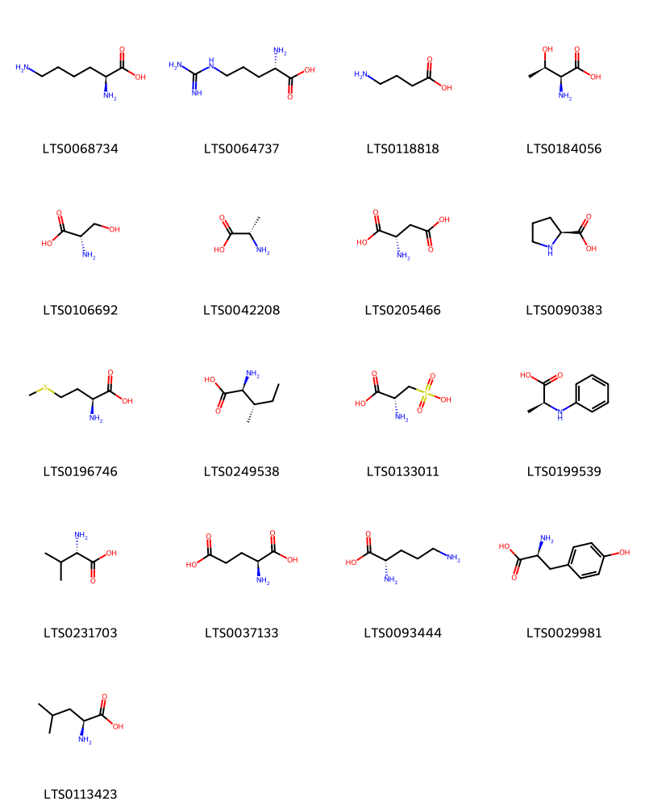{ width=100% }
    <figcaption>Hình ảnh cấu trúc hóa học của 17 hoạt chất thuộc nhóm Carboxylic acids and derivatives gồm ['l-lysine (LTS0068734)', 'l-arginine (LTS0064737)', 'gamma(amino)-butyric acid (LTS0118818)', 'l-threonine (LTS0184056)', 'l-serine (LTS0106692)', 'l-alanine (LTS0042208)', 'l-aspartic acid (LTS0205466)', 'l-proline (LTS0090383)', 'l-methionine (LTS0196746)', 'l-isoleucine (LTS0249538)', 'cysteinesulfonic acid (LTS0133011)', '(2s)-2-(phenylamino)propanoic acid (LTS0199539)', 'l-valine (LTS0231703)', 'l-glutamic acid (LTS0037133)', 'l-ornithine (LTS0093444)', 'l-tyrosine (LTS0029981)', 'l-leucine (LTS0113423)'].</figcaption>
</figure>
#### Nhóm Epoxides
<figure markdown="span">
    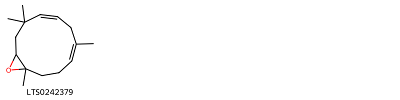{ width=100% }
    <figcaption>Hình ảnh cấu trúc hóa học của 1 hoạt chất thuộc nhóm Epoxides gồm ['(4z,7z)-1,5,9,9-tetramethyl-12-oxabicyclo[9.1.0]dodeca-4,7-diene (LTS0242379)'].</figcaption>
</figure>
#### Nhóm Fatty Acyls
<figure markdown="span">
    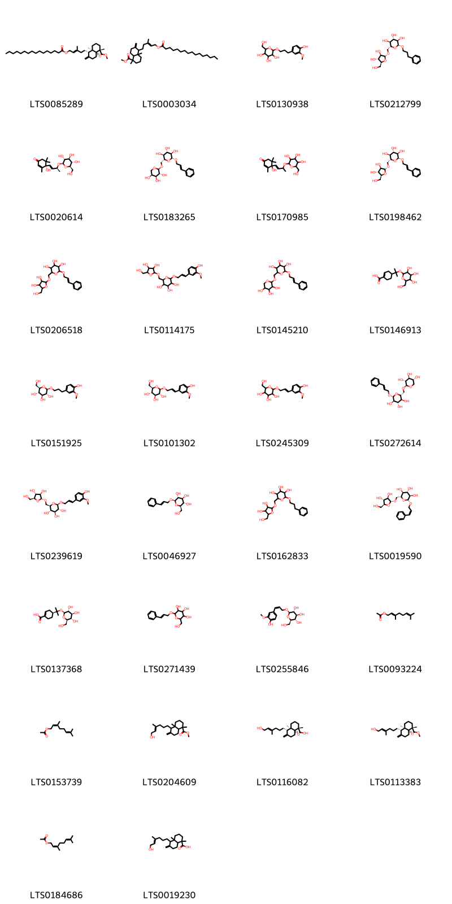{ width=100% }
    <figcaption>Hình ảnh cấu trúc hóa học của 30 hoạt chất thuộc nhóm Fatty Acyls gồm ['methyl (1s,4ar,5s,8ar)-5-[(3e)-5-(hexadecanoyloxy)-3-methylpent-3-en-1-yl]-1,4a-dimethyl-6-methylidene-hexahydro-2h-naphthalene-1-carboxylate (LTS0085289)', 'methyl 5-[5-(hexadecanoyloxy)-3-methylpent-3-en-1-yl]-1,4a-dimethyl-6-methylidene-hexahydro-2h-naphthalene-1-carboxylate (LTS0003034)', '2-[3-(4-hydroxy-3-methoxyphenyl)propoxy]-6-(hydroxymethyl)oxane-3,4,5-triol (LTS0130938)', '(2r,3s,4s,5r,6r)-2-({[(2r,3r,4r,5s)-3,4-dihydroxy-5-(hydroxymethyl)oxolan-2-yl]oxy}methyl)-6-(3-phenylpropoxy)oxane-3,4,5-triol (LTS0212799)', '(4s)-4-hydroxy-3,5,5-trimethyl-4-[(1e,3s)-3-{[(2r,3r,4s,5s,6r)-3,4,5-trihydroxy-6-(hydroxymethyl)oxan-2-yl]oxy}but-1-en-1-yl]cyclohex-2-en-1-one (LTS0020614)', 'rosavin (LTS0183265)', '4-hydroxy-3,5,5-trimethyl-4-(3-{[3,4,5-trihydroxy-6-(hydroxymethyl)oxan-2-yl]oxy}but-1-en-1-yl)cyclohex-2-en-1-one (LTS0170985)', 'rosarin (LTS0198462)', '2-({[3,4-dihydroxy-5-(hydroxymethyl)oxolan-2-yl]oxy}methyl)-6-[(3-phenylprop-2-en-1-yl)oxy]oxane-3,4,5-triol (LTS0206518)', '2-({[3,4-dihydroxy-5-(hydroxymethyl)oxolan-2-yl]oxy}methyl)-6-{[3-(4-hydroxy-3-methoxyphenyl)prop-2-en-1-yl]oxy}oxane-3,4,5-triol (LTS0114175)', '2-[(3-phenylprop-2-en-1-yl)oxy]-6-{[(3,4,5-trihydroxyoxan-2-yl)oxy]methyl}oxane-3,4,5-triol (LTS0145210)', '4-(2-{[3,4,5-trihydroxy-6-(hydroxymethyl)oxan-2-yl]oxy}propan-2-yl)cyclohex-1-ene-1-carboxylic acid (LTS0146913)', '(2r,3r,4s,5s,6r)-2-[3-(4-hydroxy-3-methoxyphenyl)propoxy]-6-(hydroxymethyl)oxane-3,4,5-triol (LTS0151925)', '(2r,3r,4s,5s,6r)-2-{[(2e)-3-(4-hydroxy-3-methoxyphenyl)prop-2-en-1-yl]oxy}-6-(hydroxymethyl)oxane-3,4,5-triol (LTS0101302)', '2-{[3-(4-hydroxy-3-methoxyphenyl)prop-2-en-1-yl]oxy}-6-(hydroxymethyl)oxane-3,4,5-triol (LTS0245309)', '(2r,3r,4s,5s,6r)-2-{[(2e)-3-phenylprop-2-en-1-yl]oxy}-6-({[(2s,3r,4s,5r)-3,4,5-trihydroxyoxan-2-yl]oxy}methyl)oxane-3,4,5-triol (LTS0272614)', '(2r,3s,4s,5r,6r)-2-({[(2r,3r,4r,5s)-3,4-dihydroxy-5-(hydroxymethyl)oxolan-2-yl]oxy}methyl)-6-{[(2e)-3-(4-hydroxy-3-methoxyphenyl)prop-2-en-1-yl]oxy}oxane-3,4,5-triol (LTS0239619)', 'rosin (LTS0046927)', '2-({[3,4-dihydroxy-5-(hydroxymethyl)oxolan-2-yl]oxy}methyl)-6-(3-phenylpropoxy)oxane-3,4,5-triol (LTS0162833)', '(2r,3s,4s,5r,6r)-2-({[(2r,3r,4r,5s)-3,4-dihydroxy-5-(hydroxymethyl)oxolan-2-yl]oxy}methyl)-6-{[(2z)-3-phenylprop-2-en-1-yl]oxy}oxane-3,4,5-triol (LTS0019590)', '(4s)-4-(2-{[(2s,3r,4s,5s,6r)-3,4,5-trihydroxy-6-(hydroxymethyl)oxan-2-yl]oxy}propan-2-yl)cyclohex-1-ene-1-carboxylic acid (LTS0137368)', '2-(hydroxymethyl)-6-[(3-phenylprop-2-en-1-yl)oxy]oxane-3,4,5-triol (LTS0271439)', '(2r,3r,4s,5s,6r)-2-{[(2z)-3-(4-hydroxy-3-methoxyphenyl)prop-2-en-1-yl]oxy}-6-(hydroxymethyl)oxane-3,4,5-triol (LTS0255846)', 'geranyl acetate (LTS0093224)', 'neryl acetate (LTS0153739)', 'methyl 5-(6-hydroxy-4-methylhex-4-en-1-yl)-1,4a-dimethyl-6-methylidene-hexahydro-2h-naphthalene-1-carboxylate (LTS0204609)', '(1s,4ar,5s,8ar)-5-[(4e)-6-hydroxy-4-methylhex-4-en-1-yl]-1,4a-dimethyl-6-methylidene-hexahydro-2h-naphthalene-1-carboxylic acid (LTS0116082)', 'methyl (1s,4ar,5s,8ar)-5-[(4e)-6-hydroxy-4-methylhex-4-en-1-yl]-1,4a-dimethyl-6-methylidene-hexahydro-2h-naphthalene-1-carboxylate (LTS0113383)', '3,7-dimethylocta-2,6-dien-1-yl acetate (LTS0184686)', '5-(6-hydroxy-4-methylhex-4-en-1-yl)-1,4a-dimethyl-6-methylidene-hexahydro-2h-naphthalene-1-carboxylic acid (LTS0019230)'].</figcaption>
</figure>
#### Nhóm Flavonoids
<figure markdown="span">
    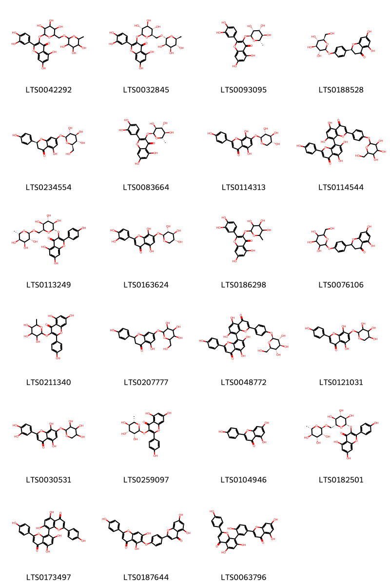{ width=100% }
    <figcaption>Hình ảnh cấu trúc hóa học của 23 hoạt chất thuộc nhóm Flavonoids gồm ['rutin (LTS0042292)', '3-rutinosyl quercetin (LTS0032845)', 'quercitrin (LTS0093095)', '(2s)-5,7-dihydroxy-2-(4-{[(2s,3r,4s,5s,6r)-3,4,5-trihydroxy-6-(hydroxymethyl)oxan-2-yl]oxy}phenyl)-2,3-dihydro-1-benzopyran-4-one (LTS0188528)', 'prunin (LTS0234554)', '2-(3,4-dihydroxyphenyl)-5,7-dihydroxy-3-{[(2s,3s,4r,5r,6s)-3,4,5-trihydroxy-6-methyloxan-2-yl]oxy}chromen-4-one (LTS0083664)', '5,8-dihydroxy-2-(4-hydroxyphenyl)-7-{[(2s,3r,4s,5r)-3,4,5-trihydroxyoxan-2-yl]oxy}chromen-4-one (LTS0114313)', "5,5',7,7'-tetrahydroxy-2-(4-hydroxyphenyl)-2'-(4-{[3,4,5-trihydroxy-6-(hydroxymethyl)oxan-2-yl]oxy}phenyl)-[8,8'-bichromene]-4,4'-dione (LTS0114544)", '5,7-dihydroxy-2-(4-hydroxyphenyl)-3-{[(2s,3r,4s,5s,6s)-3,4,5-trihydroxy-6-({[(2r,3r,4s,5r,6s)-3,4,5-trihydroxy-6-methyloxan-2-yl]oxy}methyl)oxan-2-yl]oxy}chromen-4-one (LTS0113249)', '2-(3,4-dihydroxyphenyl)-5,8-dihydroxy-7-{[(2s,3r,4s,5r)-3,4,5-trihydroxyoxan-2-yl]oxy}chromen-4-one (LTS0163624)', 'quercitrin (LTS0186298)', '5,7-dihydroxy-2-(4-{[3,4,5-trihydroxy-6-(hydroxymethyl)oxan-2-yl]oxy}phenyl)-2,3-dihydro-1-benzopyran-4-one (LTS0076106)', '5,7-dihydroxy-2-(4-hydroxyphenyl)-3-[(3,4,5-trihydroxy-6-methyloxan-2-yl)oxy]chromen-4-one (LTS0211340)', '5-hydroxy-2-(4-hydroxyphenyl)-7-{[3,4,5-trihydroxy-6-(hydroxymethyl)oxan-2-yl]oxy}-2,3-dihydro-1-benzopyran-4-one (LTS0207777)', "5,5',7,7'-tetrahydroxy-2-(4-hydroxyphenyl)-2'-(4-{[(2s,3r,4s,5s,6r)-3,4,5-trihydroxy-6-(hydroxymethyl)oxan-2-yl]oxy}phenyl)-[8,8'-bichromene]-4,4'-dione (LTS0048772)", '5,8-dihydroxy-2-(4-hydroxyphenyl)-7-[(3,4,5-trihydroxyoxan-2-yl)oxy]chromen-4-one (LTS0121031)', '2-(3,4-dihydroxyphenyl)-5,8-dihydroxy-7-[(3,4,5-trihydroxyoxan-2-yl)oxy]chromen-4-one (LTS0030531)', 'afzelin (LTS0259097)', 'chamomile (LTS0104946)', 'nictoflorin (LTS0182501)', 'cupressuflavone (LTS0173497)', 'hinokiflavone (LTS0187644)', 'amentoflavone (LTS0063796)'].</figcaption>
</figure>
#### Nhóm Furanoid lignans
<figure markdown="span">
    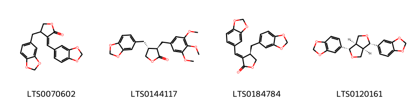{ width=100% }
    <figcaption>Hình ảnh cấu trúc hóa học của 4 hoạt chất thuộc nhóm Furanoid lignans gồm ['4-(2h-1,3-benzodioxol-5-ylmethyl)-3-(2h-1,3-benzodioxol-5-ylmethylidene)oxolan-2-one (LTS0070602)', 'yatein (LTS0144117)', 'savinin (LTS0184784)', 'sesamin (LTS0120161)'].</figcaption>
</figure>
#### Nhóm Lignan glycosides
<figure markdown="span">
    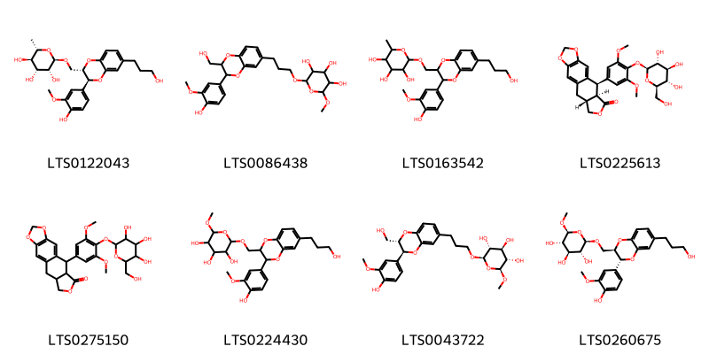{ width=100% }
    <figcaption>Hình ảnh cấu trúc hóa học của 8 hoạt chất thuộc nhóm Lignan glycosides gồm ['(2r,3r,4r,5r,6s)-2-{[(2s,3s)-3-(4-hydroxy-3-methoxyphenyl)-6-(3-hydroxypropyl)-2,3-dihydro-1,4-benzodioxin-2-yl]methoxy}-6-methyloxane-3,4,5-triol (LTS0122043)', '2-{3-[3-(4-hydroxy-3-methoxyphenyl)-2-(hydroxymethyl)-2,3-dihydro-1,4-benzodioxin-6-yl]propoxy}-6-methoxyoxane-3,4,5-triol (LTS0086438)', '2-{[3-(4-hydroxy-3-methoxyphenyl)-6-(3-hydroxypropyl)-2,3-dihydro-1,4-benzodioxin-2-yl]methoxy}-6-methyloxane-3,4,5-triol (LTS0163542)', '(10r,11r,15r)-10-(3,5-dimethoxy-4-{[(2s,3r,4s,5s,6r)-3,4,5-trihydroxy-6-(hydroxymethyl)oxan-2-yl]oxy}phenyl)-4,6,13-trioxatetracyclo[7.7.0.0³,⁷.0¹¹,¹⁵]hexadeca-1,3(7),8-trien-12-one (LTS0225613)', '10-(3,5-dimethoxy-4-{[3,4,5-trihydroxy-6-(hydroxymethyl)oxan-2-yl]oxy}phenyl)-4,6,13-trioxatetracyclo[7.7.0.0³,⁷.0¹¹,¹⁵]hexadeca-1,3(7),8-trien-12-one (LTS0275150)', '2-{[3-(4-hydroxy-3-methoxyphenyl)-6-(3-hydroxypropyl)-2,3-dihydro-1,4-benzodioxin-2-yl]methoxy}-6-methoxyoxane-3,4,5-triol (LTS0224430)', '(2r,3r,4s,5s,6s)-2-{3-[(2s,3s)-3-(4-hydroxy-3-methoxyphenyl)-2-(hydroxymethyl)-2,3-dihydro-1,4-benzodioxin-6-yl]propoxy}-6-methoxyoxane-3,4,5-triol (LTS0043722)', '(2r,3r,4s,5s,6s)-2-{[(2r,3r)-3-(4-hydroxy-3-methoxyphenyl)-6-(3-hydroxypropyl)-2,3-dihydro-1,4-benzodioxin-2-yl]methoxy}-6-methoxyoxane-3,4,5-triol (LTS0260675)'].</figcaption>
</figure>
#### Nhóm Lignan lactones
<figure markdown="span">
    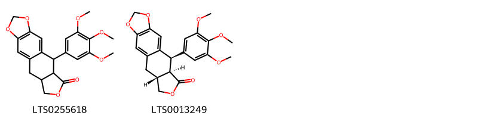{ width=100% }
    <figcaption>Hình ảnh cấu trúc hóa học của 2 hoạt chất thuộc nhóm Lignan lactones gồm ['10-(3,4,5-trimethoxyphenyl)-4,6,13-trioxatetracyclo[7.7.0.0³,⁷.0¹¹,¹⁵]hexadeca-1,3(7),8-trien-12-one (LTS0255618)', '(-)-deoxypodophyllotoxin (LTS0013249)'].</figcaption>
</figure>
#### Nhóm Naphthopyrans
<figure markdown="span">
    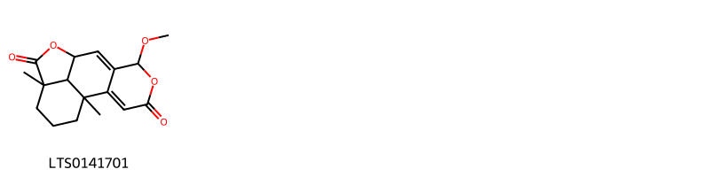{ width=100% }
    <figcaption>Hình ảnh cấu trúc hóa học của 1 hoạt chất thuộc nhóm Naphthopyrans gồm ['6-methoxy-1,12-dimethyl-5,10-dioxatetracyclo[7.6.1.0²,⁷.0¹²,¹⁶]hexadeca-2,7-diene-4,11-dione (LTS0141701)'].</figcaption>
</figure>
#### Nhóm Organooxygen compounds
<figure markdown="span">
    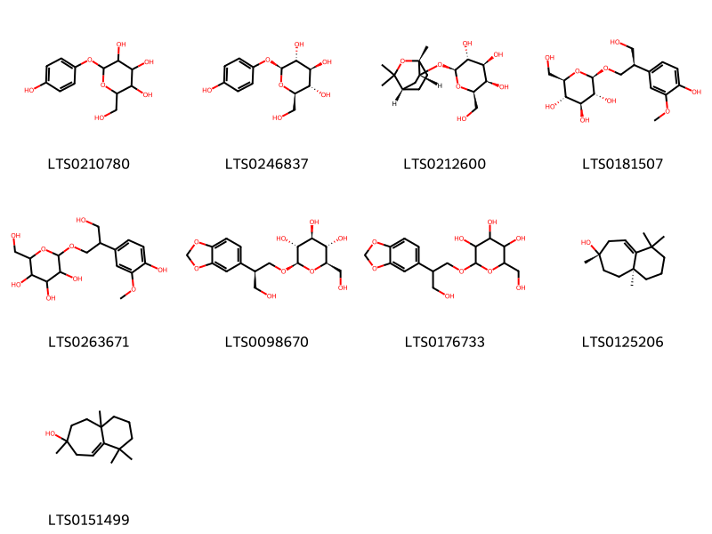{ width=100% }
    <figcaption>Hình ảnh cấu trúc hóa học của 9 hoạt chất thuộc nhóm Organooxygen compounds gồm ['arbutin (LTS0210780)', 'β-arbutin (LTS0246837)', '(2r,3r,4s,5r,6s)-2-(hydroxymethyl)-6-{[(1r,4s,6r)-1,3,3-trimethyl-2-oxabicyclo[2.2.2]octan-6-yl]oxy}oxane-3,4,5-triol (LTS0212600)', '(2r,3r,4s,5s,6r)-2-[(2r)-3-hydroxy-2-(4-hydroxy-3-methoxyphenyl)propoxy]-6-(hydroxymethyl)oxane-3,4,5-triol (LTS0181507)', '2-[3-hydroxy-2-(4-hydroxy-3-methoxyphenyl)propoxy]-6-(hydroxymethyl)oxane-3,4,5-triol (LTS0263671)', '(2r,3r,4s,5s,6r)-2-[(2r)-2-(2h-1,3-benzodioxol-5-yl)-3-hydroxypropoxy]-6-(hydroxymethyl)oxane-3,4,5-triol (LTS0098670)', '2-[2-(2h-1,3-benzodioxol-5-yl)-3-hydroxypropoxy]-6-(hydroxymethyl)oxane-3,4,5-triol (LTS0176733)', 'widdrol (LTS0125206)', '1,1,4a,7-tetramethyl-2,3,4,5,6,8-hexahydrobenzo[7]annulen-7-ol (LTS0151499)'].</figcaption>
</figure>
#### Nhóm Phenol ethers
<figure markdown="span">
    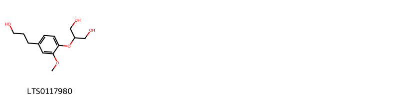{ width=100% }
    <figcaption>Hình ảnh cấu trúc hóa học của 1 hoạt chất thuộc nhóm Phenol ethers gồm ['2-[4-(3-hydroxypropyl)-2-methoxyphenoxy]propane-1,3-diol (LTS0117980)'].</figcaption>
</figure>
#### Nhóm Phenols
<figure markdown="span">
    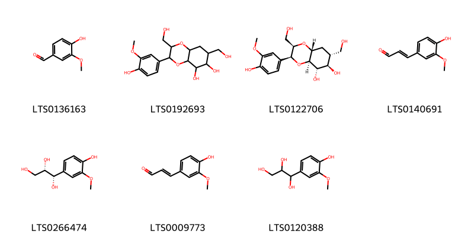{ width=100% }
    <figcaption>Hình ảnh cấu trúc hóa học của 7 hoạt chất thuộc nhóm Phenols gồm ['vanillin (LTS0136163)', '3-(4-hydroxy-3-methoxyphenyl)-2,7-bis(hydroxymethyl)-octahydro-1,4-benzodioxine-5,6-diol (LTS0192693)', '(2r,3s,4ar,5s,6r,7r,8ar)-3-(4-hydroxy-3-methoxyphenyl)-2,7-bis(hydroxymethyl)-octahydro-1,4-benzodioxine-5,6-diol (LTS0122706)', 'coniferyl aldehyde (LTS0140691)', '(+)-(7s,8s)-guaiacylglycerol (LTS0266474)', 'coniferaldehyde (LTS0009773)', 'guaiacylglycerol (LTS0120388)'].</figcaption>
</figure>
#### Nhóm Prenol lipids
<figure markdown="span">
    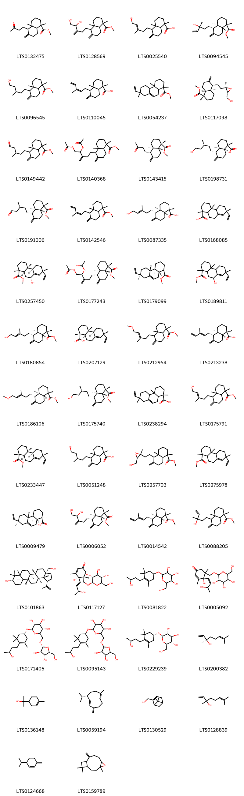{ width=100% }
    <figcaption>Hình ảnh cấu trúc hóa học của 174 hoạt chất thuộc nhóm Prenol lipids gồm ['methyl 1,4a-dimethyl-6-methylidene-5-(3-oxobutyl)-hexahydro-2h-naphthalene-1-carboxylate (LTS0132475)', 'methyl 5-(4,5-dihydroxy-3-methylidenepentyl)-1,4a-dimethyl-6-methylidene-hexahydro-2h-naphthalene-1-carboxylate (LTS0128569)', '5-(5-hydroxy-3-methylpent-3-en-1-yl)-1,4a-dimethyl-6-methylidene-hexahydro-2h-naphthalene-1-carboxylic acid (LTS0025540)', 'methyl (1s,4ar,5s,8ar)-5-[(3r)-3-hydroxy-3-methylpent-4-en-1-yl]-1,4a-dimethyl-6-methylidene-hexahydro-2h-naphthalene-1-carboxylate (LTS0094545)', 'methyl 5-(5-hydroxy-3-methylpentyl)-1,4a-dimethyl-6-methylidene-hexahydro-2h-naphthalene-1-carboxylate (LTS0096545)', '1,4a-dimethyl-6-methylidene-5-(3-methylpenta-2,4-dien-1-yl)-hexahydro-2h-naphthalene-1-carboxylic acid (LTS0110045)', 'methyl 7-ethenyl-1,4a,7-trimethyl-3,4,4b,5,6,8,10,10a-octahydro-2h-phenanthrene-1-carboxylate (LTS0054237)', 'methyl (1s,4ar,5s,8ar)-5-{2-[(2s,3r)-3-(hydroxymethyl)-2-methyloxiran-2-yl]ethyl}-1,4a-dimethyl-6-methylidene-hexahydro-2h-naphthalene-1-carboxylate (LTS0117098)', 'methyl 1,4a-dimethyl-5-(3-methyl-5-oxopentyl)-6-methylidene-hexahydro-2h-naphthalene-1-carboxylate (LTS0149442)', 'methyl 5-[4,5-bis(acetyloxy)-3-methylidenepentyl]-1,4a-dimethyl-6-methylidene-hexahydro-2h-naphthalene-1-carboxylate (LTS0140368)', 'methyl (1s,4ar,5s,8ar)-1,4a-dimethyl-6-methylidene-5-(3-oxobutyl)-hexahydro-2h-naphthalene-1-carboxylate (LTS0143415)', '(1s,4ar,5s,8ar)-5-[(3s)-5-hydroxy-3-methylpentyl]-1,4a-dimethyl-6-methylidene-hexahydro-2h-naphthalene-1-carboxylic acid (LTS0198731)', 'methyl (1s,4ar,5s,8ar)-1,4a-dimethyl-5-[(3s)-3-methyl-5-oxopentyl]-6-methylidene-hexahydro-2h-naphthalene-1-carboxylate (LTS0191006)', 'methyl 1,4a-dimethyl-6-methylidene-5-(3-methylpenta-2,4-dien-1-yl)-hexahydro-2h-naphthalene-1-carboxylate (LTS0142546)', 'isocupressic acid (LTS0087335)', 'pimaric acid (LTS0168085)', 'methyl (1r,4ar,4br,7r,9r,10ar)-7-ethenyl-9-hydroxy-1,4a,7-trimethyl-3,4,4b,5,6,9,10,10a-octahydro-2h-phenanthrene-1-carboxylate (LTS0257450)', 'methyl (1s,4ar,5s,8ar)-5-[(4s)-4,5-bis(acetyloxy)-3-methylidenepentyl]-1,4a-dimethyl-6-methylidene-hexahydro-2h-naphthalene-1-carboxylate (LTS0177243)', 'methyl (1r,4ar,4bs,7s,10ar)-7-ethenyl-1,4a,7-trimethyl-3,4,4b,5,6,8,10,10a-octahydro-2h-phenanthrene-1-carboxylate (LTS0179099)', 'methyl 7-ethenyl-9-hydroxy-1,4a,7-trimethyl-3,4,4b,5,6,9,10,10a-octahydro-2h-phenanthrene-1-carboxylate (LTS0189811)', 'methyl (1s,4ar,5s,8ar)-5-[(3e)-5-hydroxy-3-methylpent-3-en-1-yl]-1,4a-dimethyl-6-methylidene-hexahydro-2h-naphthalene-1-carboxylate (LTS0180854)', 'sandaracopimaric acid (LTS0207129)', 'methyl 5-(5-methoxy-3-methylpent-3-en-1-yl)-1,4a-dimethyl-6-methylidene-hexahydro-2h-naphthalene-1-carboxylate (LTS0212954)', '(1s,4ar,5s,8ar)-1,4a-dimethyl-6-methylidene-5-[(2e)-3-methylpenta-2,4-dien-1-yl]-hexahydro-2h-naphthalene-1-carboxylic acid (LTS0213238)', 'methyl (1s,4ar,5s,8ar)-5-[(3e)-5-methoxy-3-methylpent-3-en-1-yl]-1,4a-dimethyl-6-methylidene-hexahydro-2h-naphthalene-1-carboxylate (LTS0186106)', 'methyl (1s,4ar,5s,8ar)-5-[(3s)-5-hydroxy-3-methylpentyl]-1,4a-dimethyl-6-methylidene-hexahydro-2h-naphthalene-1-carboxylate (LTS0175740)', 'isopimaric acid (LTS0238294)', 'methyl 5-(5-hydroxy-3-methylpent-3-en-1-yl)-1,4a-dimethyl-6-methylidene-hexahydro-2h-naphthalene-1-carboxylate (LTS0175791)', 'methyl (1r,4ar,4bs,7r,10ar)-7-ethenyl-1,4a,7-trimethyl-3,4,4b,5,6,9,10,10a-octahydro-2h-phenanthrene-1-carboxylate (LTS0233447)', '5-(5-hydroxy-3-methylpentyl)-1,4a-dimethyl-6-methylidene-hexahydro-2h-naphthalene-1-carboxylic acid (LTS0051248)', 'methyl 5-{2-[3-(hydroxymethyl)-2-methyloxiran-2-yl]ethyl}-1,4a-dimethyl-6-methylidene-hexahydro-2h-naphthalene-1-carboxylate (LTS0257703)', 'methyl 7-ethenyl-1,4a,7-trimethyl-3,4,4b,5,6,9,10,10a-octahydro-2h-phenanthrene-1-carboxylate (LTS0275978)', 'isopimaric acid (LTS0009479)', 'methyl (1s,4ar,5s,8ar)-5-[(4s)-4,5-dihydroxy-3-methylidenepentyl]-1,4a-dimethyl-6-methylidene-hexahydro-2h-naphthalene-1-carboxylate (LTS0006052)', 'methyl (1s,4ar,5s,8ar)-1,4a-dimethyl-6-methylidene-5-[(2e)-3-methylpenta-2,4-dien-1-yl]-hexahydro-2h-naphthalene-1-carboxylate (LTS0014542)', 'methyl 5-(3-hydroxy-3-methylpent-4-en-1-yl)-1,4a-dimethyl-6-methylidene-hexahydro-2h-naphthalene-1-carboxylate (LTS0088205)', 'betulin (LTS0101863)', '(4r,5r)-4-hydroxy-4-[(1e,3s)-3-hydroxybut-1-en-1-yl]-3,5-dimethyl-5-({[(2r,3r,4s,5s,6r)-3,4,5-trihydroxy-6-(hydroxymethyl)oxan-2-yl]oxy}methyl)cyclohex-2-en-1-one (LTS0117127)', '2-{[4-(3-hydroxybutyl)-3,5,5-trimethylcyclohex-3-en-1-yl]oxy}-6-(hydroxymethyl)oxane-3,4,5-triol (LTS0081822)', '4-hydroxy-4-(3-hydroxybut-1-en-1-yl)-3,5-dimethyl-5-({[3,4,5-trihydroxy-6-(hydroxymethyl)oxan-2-yl]oxy}methyl)cyclohex-2-en-1-one (LTS0005092)', '(2r,3s,4s,5r,6r)-2-({[(2r,3r,4r,5s)-3,4-dihydroxy-5-(hydroxymethyl)oxolan-2-yl]oxy}methyl)-6-{[(1r)-4-[(3s)-3-hydroxybutyl]-3,5,5-trimethylcyclohex-3-en-1-yl]oxy}oxane-3,4,5-triol (LTS0171405)', '2-({[3,4-dihydroxy-5-(hydroxymethyl)oxolan-2-yl]oxy}methyl)-6-{[4-(3-hydroxybutyl)-3,5,5-trimethylcyclohex-3-en-1-yl]oxy}oxane-3,4,5-triol (LTS0095143)', '(2r,3r,4s,5s,6r)-2-{[(1r)-4-[(3s)-3-hydroxybutyl]-3,5,5-trimethylcyclohex-3-en-1-yl]oxy}-6-(hydroxymethyl)oxane-3,4,5-triol (LTS0229239)', '(-)-linalool (LTS0200382)', 'terpineol (LTS0136148)', '(-)-germacrene d (LTS0059194)', 'myrtenol (LTS0130529)', 'linalool, (+-)- (LTS0128839)', 'β phellandrene (LTS0124668)', 'caryophyllene oxide (LTS0159789)', '(+)-sabinene (LTS0110694)', 'α-myrcene (LTS0115731)', 'camphor (LTS0091905)', 'terpinolene (LTS0104525)', 'β-pinene (LTS0117550)', 'cymene (LTS0181568)', 'nerolidol (LTS0197738)', 'monoterpenes (LTS0106881)', 'α pinene (LTS0132416)', 'humulene (LTS0263171)', '4-isopropyl-1,6-dimethyl-2,3,4,4a,7,8-hexahydronaphthalene (LTS0270743)', '(3r,6e)-nerolidol (LTS0145065)', 'citronella (LTS0151257)', 'camphene (LTS0267242)', 'limonene,  (LTS0155981)', 'phellandrene (LTS0157173)', '(+)-delta(3)-carene (LTS0250199)', '4-terpineol (LTS0253733)', 'borneol (LTS0264960)', 'lupeol (LTS0256952)', 'caryophyllene (LTS0085212)', 'bornyl acetate (LTS0060565)', '(1z,6z,8s)-8-isopropyl-1-methyl-5-methylidenecyclodeca-1,6-diene (LTS0065195)', 'β-caryophyllene oxide (LTS0213960)', 'α-copaene (LTS0207598)', 'sabinene (LTS0224133)', 'linalyl acetate (LTS0167325)', 'geraniol (LTS0258838)', '(1r,2s,7s,8s)-8-isopropyl-1,3-dimethyltricyclo[4.4.0.0²,⁷]dec-3-ene (LTS0190031)', '(2s,4r)-1,7,7-trimethylbicyclo[2.2.1]heptan-2-ol (LTS0010050)', 'terpinene (LTS0136858)', 'nerol (LTS0244289)', 'delta-cadinene (LTS0019321)', 'citronellol, (+-)- (LTS0090925)', '5-[(1s,4ar,5s,8ar)-5-(hydroxymethyl)-5,8a-dimethyl-2-methylidene-hexahydro-1h-naphthalen-1-yl]-3-methylidenepentan-1-ol (LTS0079225)', '(1s,4ar,5s,8as)-5-[(4s)-4,5-dihydroxy-3-methylidenepentyl]-1,4a-dimethyl-6-methylidene-hexahydro-2h-naphthalene-1-carboxylic acid (LTS0127874)', '(1r,3s)-1-isopropyl-3-methylcyclohexane (LTS0136130)', '4-isopropyl-1,6-dimethyl-1,2,3,7,8,8a-hexahydronaphthalene (LTS0071257)', 'sugiol (LTS0127023)', 'myrtenyl acetate (LTS0106081)', '3,7-dimethyl-2,6-octadien-1-ol (LTS0215566)', '(1r,4r)-1-isopropyl-4-methylcyclohexane (LTS0080252)', '(1s,4s)-1-isopropyl-4-methylcyclohexane (LTS0218330)', '(1s,4ar,5s,8ar)-1,4a-dimethyl-6-methylidene-5-[(2z)-3-methylpenta-2,4-dien-1-yl]-hexahydro-2h-naphthalene-1-carboxylic acid (LTS0082087)', 'amyrin (LTS0222826)', '6-hydroxy-7-isopropyl-1,1,4a-trimethyl-2,3,4,10a-tetrahydrophenanthrene-9,10-dione (LTS0083521)', '(e)-calamene (LTS0228241)', 'm-methane (LTS0082231)', 'α-humulene (LTS0076944)', 'cuparene (LTS0028747)', '2-[4-ethenyl-4-methyl-3-(prop-1-en-2-yl)cyclohexyl]propan-2-ol (LTS0072139)', 'methyl 7-ethenyl-1,4a,7-trimethyl-9-oxo-2,3,4,5,6,8,10,10a-octahydrophenanthrene-1-carboxylate (LTS0021253)', '(r)-(+)-citronellal (LTS0175396)', '(+)-β-phellandrene (LTS0108574)', '(-)-camphene (LTS0067556)', 'longifolene (LTS0202079)', 'totarol (LTS0097200)', 'β-selinene (LTS0096341)', '(1s,5r,7s,10r)-7-isopropyl-4,10-dimethyltricyclo[4.4.0.0¹,⁵]dec-3-ene (LTS0064715)', '[(1s,4as,5s,8as)-1,4a-dimethyl-6-methylidene-5-[(2e)-3-methylpenta-2,4-dien-1-yl]-hexahydro-2h-naphthalen-1-yl]methanol (LTS0104185)', '(1s,4ar,5s,8ar)-1,4a-dimethyl-5-[(3s)-3-methyl-5-oxopentyl]-6-methylidene-hexahydro-2h-naphthalene-1-carboxylic acid (LTS0183904)', '(+)-linalool (LTS0196043)', 'α-cadinol (LTS0206935)', 'delta-cadinol (LTS0272380)', '(1r,4s)-4-isopropyl-1,6-dimethyl-1,2,3,4-tetrahydronaphthalene (LTS0158900)', '(+)-4-terpineol (LTS0140257)', 'germacrene b (LTS0265072)', 'methyl (1r,4as,7s,10ar)-7-ethenyl-1,4a,7-trimethyl-9-oxo-2,3,4,5,6,8,10,10a-octahydrophenanthrene-1-carboxylate (LTS0159912)', '1-(4-hydroxy-7-isopropyl-4-methyl-octahydroinden-1-yl)ethanone (LTS0119894)', 'β-amyrin (LTS0251864)', '(4as,10as)-5-hydroxy-7-isopropyl-6-methoxy-1,1,4a-trimethyl-3,4,10,10a-tetrahydro-2h-phenanthren-9-one (LTS0231953)', '(-)-β-pinene (LTS0108757)', '(1r,4s,4ar)-4-isopropyl-1,6-dimethyl-3,4,4a,7,8,8a-hexahydro-2h-naphthalen-1-ol (LTS0164497)', '(+)-thujone (LTS0165508)', '(1s,4ar,5s,8ar)-5-[(3r)-3-hydroxy-3-methylpent-4-en-1-yl]-1,4a-dimethyl-6-methylidene-hexahydro-2h-naphthalene-1-carboxylic acid (LTS0105686)', '3-isothujone (LTS0158119)', '(+)-gamma-cadinene (LTS0103949)', '1-methyl-4-(1,2,2-trimethylcyclopentyl)benzene (LTS0261288)', '(-)-bornyl acetate (LTS0267397)', '1-[(1s,3ar,4r,7s,7as)-4-hydroxy-7-isopropyl-4-methyl-octahydroinden-1-yl]ethanone (LTS0258092)', '(1r,4r,5r,8r,10s,13r,14r,18r)-4,5,9,9,13,20,20-heptamethyl-24-oxahexacyclo[17.3.2.0¹,¹⁸.0⁴,¹⁷.0⁵,¹⁴.0⁸,¹³]tetracosan-10-ol (LTS0049641)', 'cedrol (LTS0221015)', '(2e)-5-[(1s,4ar,5s,8ar)-5-(hydroxymethyl)-5,8a-dimethyl-2-methylidene-hexahydro-1h-naphthalen-1-yl]-3-methylpent-2-en-1-ol (LTS0252332)', 'p-menthane (LTS0254695)', 'α-limonene (LTS0244943)', '6-hydroxy-7-isopropyl-1,1,4a-trimethyl-3,4,10,10a-tetrahydro-2h-phenanthren-9-one (LTS0270724)', 'isopulegol (LTS0064035)', 'manool (LTS0240363)', '(-)-myrtenol (LTS0097970)', '(+)-borneol (LTS0059936)', '(+)-α-pinene (LTS0211102)', 'nootkatone (LTS0027125)', 'polyprenol (LTS0209244)', 'elemol (LTS0208556)', '(-)-friedelin (LTS0041645)', '(1r,8as)-4-isopropyl-1,6-dimethyl-1,2,3,7,8,8a-hexahydronaphthalene (LTS0032036)', '(4s,4as,8as)-4-isopropyl-1,6-dimethylidene-octahydronaphthalene (LTS0249782)', '1,4a-dimethyl-5-(3-methyl-5-oxopentyl)-6-methylidene-hexahydro-2h-naphthalene-1-carboxylic acid (LTS0259152)', 'cedrol (LTS0251071)', 'methyl (1s,4ar,5r,8ar)-1,4a-dimethyl-6-methylidene-5-[(2e)-3-methylpenta-2,4-dien-1-yl]-hexahydro-2h-naphthalene-1-carboxylate (LTS0193829)', 'nootkatone (LTS0183338)', '(-)-α-phellandrene (LTS0226766)', '4-isopropyl-1,6-dimethylidene-octahydronaphthalene (LTS0155478)', '(+)-fenchone (LTS0191800)', '(+)-caryophyllene (LTS0046179)', '2-isopropyl-4b,8,8-trimethyl-5,6,7,8a,9,10-hexahydrophenanthren-3-ol (LTS0255397)', 'farnesol (LTS0059667)', 'lily of valley (LTS0051762)', 'ferruginol (LTS0045608)', '(-)-myrtenyl acetate (LTS0060722)', 'rhodoxanthin (LTS0006899)', 'd-camphor (LTS0002057)', 'fenchone (LTS0126716)', '(+-)-linalyl acetate (LTS0006782)', '(-)-α-himachalene (LTS0021074)', '(4r,6s)-4-isopropyl-1,6-dimethyl-2,3,4,6,7,8-hexahydronaphthalene (LTS0241080)', '4,11,11-trimethyl-8-methylidenebicyclo[7.2.0]undec-4-ene (LTS0256716)', '4-isopropyl-1,6-dimethyl-2,3,4,6,7,8-hexahydronaphthalene (LTS0104559)', '(1s,4ar,8ar)-5-(5-hydroxy-3-methylpent-3-en-1-yl)-1,4a-dimethyl-6-methylidene-hexahydro-2h-naphthalene-1-carbaldehyde (LTS0020125)', '(4as,10ar)-6-hydroxy-7-isopropyl-1,1,4a-trimethyl-2,3,4,10a-tetrahydrophenanthrene-9,10-dione (LTS0026026)', '(1r,2s,5r)-5-methyl-2-(prop-1-en-2-yl)cyclohexan-1-ol (LTS0040417)', '(-)-α-cubebene (LTS0042045)', '4-isopropyl-6-methyl-1-methylidene-3,4,4a,7,8,8a-hexahydro-2h-naphthalene (LTS0111070)', '5-hydroxy-7-isopropyl-6-methoxy-1,1,4a-trimethyl-3,4,10,10a-tetrahydro-2h-phenanthren-9-one (LTS0047995)'].</figcaption>
</figure>
#### Nhóm Steroids and steroid derivatives
<figure markdown="span">
    { width=100% }
    <figcaption>Hình ảnh cấu trúc hóa học của 2 hoạt chất thuộc nhóm Steroids and steroid derivatives gồm ['stigmast-5-en-3-ol, (3β)- (LTS0204616)', 'stigmast-5-en-3-ol (LTS0071224)'].</figcaption>
</figure>
#### Nhóm Tropones
<figure markdown="span">
    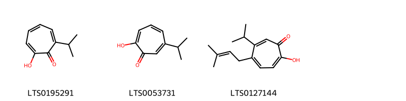{ width=100% }
    <figcaption>Hình ảnh cấu trúc hóa học của 3 hoạt chất thuộc nhóm Tropones gồm ['2-hydroxy-7-isopropylcyclohepta-2,4,6-trien-1-one (LTS0195291)', 'hinokitiol (LTS0053731)', '2-hydroxy-6-isopropyl-5-(3-methylbut-2-en-1-yl)cyclohepta-2,4,6-trien-1-one (LTS0127144)'].</figcaption>
</figure>
#### Nhóm Unsaturated hydrocarbons
<figure markdown="span">
    { width=100% }
    <figcaption>Hình ảnh cấu trúc hóa học của 1 hoạt chất thuộc nhóm Unsaturated hydrocarbons gồm ['α terpinene (LTS0232891)'].</figcaption>
</figure>

---

### Dược dân tộc học

Danh sách các quốc gia có sử dụng *Juniperus communis* trong điều trị các bệnh. 

| Country   | Disease                                                                      | Bệnh                                                                                                                                                                                                |
|:----------|:-----------------------------------------------------------------------------|:----------------------------------------------------------------------------------------------------------------------------------------------------------------------------------------------------|
| Elsewhere | Diaphoretic, Diuretic, Diuretic, Sudorific, Carminative, Diuretic, Stimulant | MYMEMORY WARNING: YOU USED ALL AVAILABLE FREE TRANSLATIONS FOR TODAY. NEXT AVAILABLE IN  09 HOURS 38 MINUTES 17 SECONDS VISIT HTTPS://MYMEMORY.TRANSLATED.NET/DOC/USAGELIMITS.PHP TO TRANSLATE MORE |
| Turkey    | Digestive, Diuretic, Stimulant, Carminative, Stomachic, Sudorific            | MYMEMORY WARNING: YOU USED ALL AVAILABLE FREE TRANSLATIONS FOR TODAY. NEXT AVAILABLE IN  09 HOURS 38 MINUTES 14 SECONDS VISIT HTTPS://MYMEMORY.TRANSLATED.NET/DOC/USAGELIMITS.PHP TO TRANSLATE MORE |
| US        | Carminative, Diuretic, Emmenagogue, Vermifuge                                | MYMEMORY WARNING: YOU USED ALL AVAILABLE FREE TRANSLATIONS FOR TODAY. NEXT AVAILABLE IN  09 HOURS 38 MINUTES 11 SECONDS VISIT HTTPS://MYMEMORY.TRANSLATED.NET/DOC/USAGELIMITS.PHP TO TRANSLATE MORE |
| ain       | Carminative, Emmenagogue, Sudorific, Diuretic, Fumigant                      | MYMEMORY WARNING: YOU USED ALL AVAILABLE FREE TRANSLATIONS FOR TODAY. NEXT AVAILABLE IN  09 HOURS 38 MINUTES 08 SECONDS VISIT HTTPS://MYMEMORY.TRANSLATED.NET/DOC/USAGELIMITS.PHP TO TRANSLATE MORE |

---

---
## Juniperus conferta
### Thông tin về thực vật

!!! info "Phân loại thực vật của *Juniperus rigida* từ GIBF:"
    - **Kingdom:** Plantae
    - **Phylum:** Tracheophyta
    - **Order:** Pinales
    - **Family:** Cupressaceae
    - **Genus:** Juniperus
    - **Species:** *Juniperus rigida*

 

| Label (VI)   | Label (EN)   | Scientific Name    | Descriptions (VI)   | Descriptions (EN)   | Also Known As (VI)   | Also Known As (EN)   |
|:-------------|:-------------|:-------------------|:--------------------|:--------------------|:---------------------|:---------------------|
| N/A          | N/A          | Juniperus conferta | loài thực vật       | species of plant    | ['']                 | ['']                 |

#### Phân bố trên thế giới

**Từ CSDL GIBF** nan, Belarus, unknown or invalid, Japan, Latvia, Spain, Poland, Russian Federation, Canada, United States of America, Mexico, Australia, Belgium

#### Phân bố tại Việt Nam

**Từ CSDL GIBF**: Không có ghi nhận ở Việt Nam

---
### Thành phần hóa học
        
- Theo cơ sở dữ liệu lotus: Từ loài *Juniperus rigida* đã phân lập và xác định được Chưa có hoạt chất nào được phân lập. hoạt chất thuộc về các nhóm Không có hoạt chất nào được phân lập. 

Không có hình ảnh nào được tạo ra

---

### Dược dân tộc học

Danh sách các quốc gia có sử dụng *Juniperus rigida* trong điều trị các bệnh. 

| Country   | Disease   | Bệnh                                                                                                                                                                                                |
|:----------|:----------|:----------------------------------------------------------------------------------------------------------------------------------------------------------------------------------------------------|
| Elsewhere | Diuretic  | MYMEMORY WARNING: YOU USED ALL AVAILABLE FREE TRANSLATIONS FOR TODAY. NEXT AVAILABLE IN  09 HOURS 37 MINUTES 22 SECONDS VISIT HTTPS://MYMEMORY.TRANSLATED.NET/DOC/USAGELIMITS.PHP TO TRANSLATE MORE |

---

---
## Juniperus excelsa
### Thông tin về thực vật

!!! info "Phân loại thực vật của *Juniperus excelsa* từ GIBF:"
    - **Kingdom:** Plantae
    - **Phylum:** Tracheophyta
    - **Order:** Pinales
    - **Family:** Cupressaceae
    - **Genus:** Juniperus
    - **Species:** *Juniperus excelsa*

 

| Label (VI)   | Label (EN)   | Scientific Name   | Descriptions (VI)   | Descriptions (EN)   | Also Known As (VI)   | Also Known As (EN)   |
|:-------------|:-------------|:------------------|:--------------------|:--------------------|:---------------------|:---------------------|
| N/A          | N/A          | Juniperus excelsa | loài thực vật       | species of plant    | ['']                 | ['']                 |

#### Phân bố trên thế giới

**Từ CSDL GIBF** Türkiye, Iran (Islamic Republic of), Pakistan, Uzbekistan, Tajikistan, Cyprus, Russian Federation, Oman, Ukraine

#### Phân bố tại Việt Nam

**Từ CSDL GIBF**: Không có ghi nhận ở Việt Nam

---
### Thành phần hóa học
        
- Theo cơ sở dữ liệu lotus: Từ loài *Juniperus excelsa* đã phân lập và xác định được 81 hoạt chất thuộc về các nhóm Stilbenes, Flavonoids, Unsaturated hydrocarbons, Prenol lipids, Isoflavonoids. 

|    | chemicalTaxonomyClassyfireClass   |   smiles_count |
|---:|:----------------------------------|---------------:|
|  0 | Flavonoids                        |              7 |
|  1 | Isoflavonoids                     |              5 |
|  2 | Prenol lipids                     |             53 |
|  3 | Stilbenes                         |              4 |
|  4 | Unsaturated hydrocarbons          |              1 |

#### Nhóm Flavonoids
<figure markdown="span">
    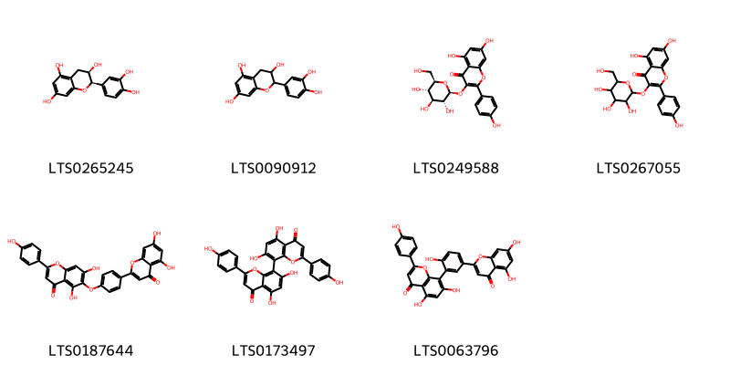{ width=100% }
    <figcaption>Hình ảnh cấu trúc hóa học của 7 hoạt chất thuộc nhóm Flavonoids gồm ['ent-epicatechin (LTS0265245)', 'catechol (LTS0090912)', 'astragalin (LTS0249588)', 'trifolin (LTS0267055)', 'hinokiflavone (LTS0187644)', 'cupressuflavone (LTS0173497)', 'amentoflavone (LTS0063796)'].</figcaption>
</figure>
#### Nhóm Isoflavonoids
<figure markdown="span">
    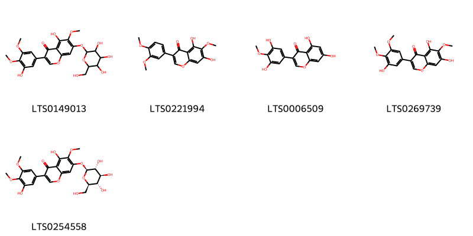{ width=100% }
    <figcaption>Hình ảnh cấu trúc hóa học của 5 hoạt chất thuộc nhóm Isoflavonoids gồm ['iridin (LTS0149013)', 'dalspinosin (LTS0221994)', 'junipegenin a (LTS0006509)', 'irigenin (LTS0269739)', 'iridin (LTS0254558)'].</figcaption>
</figure>
#### Nhóm Prenol lipids
<figure markdown="span">
    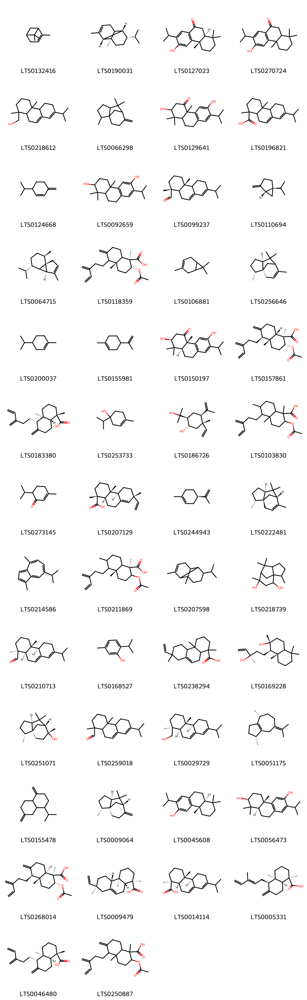{ width=100% }
    <figcaption>Hình ảnh cấu trúc hóa học của 53 hoạt chất thuộc nhóm Prenol lipids gồm ['α pinene (LTS0132416)', '(1r,2s,7s,8s)-8-isopropyl-1,3-dimethyltricyclo[4.4.0.0²,⁷]dec-3-ene (LTS0190031)', 'sugiol (LTS0127023)', '6-hydroxy-7-isopropyl-1,1,4a-trimethyl-3,4,10,10a-tetrahydro-2h-phenanthren-9-one (LTS0270724)', 'abietyl alcohol (LTS0218612)', '2,6,6-trimethyl-8-methylidenetricyclo[5.3.1.0¹,⁵]undecane (LTS0066298)', '2,6-dihydroxy-7-isopropyl-1,1,4a-trimethyl-3,9,10,10a-tetrahydro-2h-phenanthren-4-one (LTS0129641)', 'abietic acid (LTS0196821)', 'β phellandrene (LTS0124668)', '7-isopropyl-1,1,4a-trimethyl-2,3,4,9,10,10a-hexahydrophenanthrene-2,6-diol (LTS0092659)', '(1r,4ar)-7-isopropyl-1,4a-dimethyl-2,3,4,4b,5,6,10,10a-octahydrophenanthrene-1-carbaldehyde (LTS0099237)', '(+)-sabinene (LTS0110694)', '(1s,5r,7s,10r)-7-isopropyl-4,10-dimethyltricyclo[4.4.0.0¹,⁵]dec-3-ene (LTS0064715)', '(1r,2r,4ar)-2-(acetyloxy)-1,4a-dimethyl-6-methylidene-5-(3-methylidenepent-4-en-1-yl)-hexahydro-2h-naphthalene-1-carboxylic acid (LTS0118359)', 'monoterpenes (LTS0106881)', 'cedrene (LTS0256646)', 'carvomethene (LTS0200037)', 'limonene,  (LTS0155981)', '(2s,4as,10as)-2,6-dihydroxy-7-isopropyl-1,1,4a-trimethyl-3,9,10,10a-tetrahydro-2h-phenanthren-4-one (LTS0150197)', '(1r,2r,4ar,5s,8as)-2-(acetyloxy)-1,4a-dimethyl-6-methylidene-5-(3-methylidenepent-4-en-1-yl)-hexahydro-2h-naphthalene-1-carboxylic acid (LTS0157861)', '(1s,4ar,5s,8ar)-1,4a-dimethyl-6-methylidene-5-(3-methylidenepent-4-en-1-yl)-hexahydro-2h-naphthalene-1-carboxylic acid (LTS0183380)', '4-terpineol (LTS0253733)', '(1s,2s,4s,5s)-5-ethenyl-2-(2-hydroxypropan-2-yl)-5-methyl-4-(prop-1-en-2-yl)cyclohexan-1-ol (LTS0186726)', '2-(acetyloxy)-1,4a,6-trimethyl-5-(3-methylidenepent-4-en-1-yl)-octahydronaphthalene-1-carboxylic acid (LTS0103830)', 'piperitone (LTS0273145)', 'sandaracopimaric acid (LTS0207129)', 'α-limonene (LTS0244943)', 'levo-α-cedrene (LTS0222481)', 'azulon (LTS0214586)', '(1r,4ar)-2-(acetyloxy)-1,4a,6-trimethyl-5-(3-methylidenepent-4-en-1-yl)-octahydronaphthalene-1-carboxylic acid (LTS0211869)', 'α-copaene (LTS0207598)', '2,6,6,8-tetramethyltricyclo[5.3.1.0¹,⁵]undecane-8,10-diol (LTS0218739)', '(1s,4ar,4br,10ar)-7-isopropyl-1,4a-dimethyl-2,3,4,4b,5,6,10,10a-octahydrophenanthrene-1-carbaldehyde (LTS0210713)', 'thymol (LTS0168527)', 'isopimaric acid (LTS0238294)', 'sclareol (LTS0169228)', 'cedrol (LTS0251071)', '7-isopropyl-1,4a-dimethyl-2,3,4,4b,5,6,10,10a-octahydrophenanthrene-1-carbaldehyde (LTS0259018)', '[(1s,4ar,4br,10ar)-7-isopropyl-1,4a-dimethyl-2,3,4,4b,5,6,10,10a-octahydrophenanthren-1-yl]methanol (LTS0029729)', '(1r,4r)-1,4-dimethyl-7-(propan-2-ylidene)-2,3,4,5,6,8-hexahydro-1h-azulene (LTS0051175)', '4-isopropyl-1,6-dimethylidene-octahydronaphthalene (LTS0155478)', '(+)-β-cedrene (LTS0009064)', 'ferruginol (LTS0045608)', '(2s,4as,10ar)-7-isopropyl-1,1,4a-trimethyl-2,3,4,9,10,10a-hexahydrophenanthrene-2,6-diol (LTS0056473)', '(1r,2r,4ar,5s,8ar)-2-(acetyloxy)-1,4a-dimethyl-6-methylidene-5-(3-methylidenepent-4-en-1-yl)-hexahydro-2h-naphthalene-1-carboxylic acid (LTS0268014)', 'isopimaric acid (LTS0009479)', '(1s,4ar,4br,10ar)-7-isopropyl-1,4a-dimethyl-2,3,4,4b,5,6,10,10a-octahydrophenanthrene-1-carboxylic acid (LTS0014114)', '(1r,4ar,5r,8as)-1,4a-dimethyl-6-methylidene-5-[(2e)-3-methylpenta-2,4-dien-1-yl]-hexahydro-2h-naphthalene-1-carboxylic acid (LTS0005331)', '(1s,4ar,5s,8as)-1,4a-dimethyl-6-methylidene-5-(3-methylidenepent-4-en-1-yl)-hexahydro-2h-naphthalene-1-carboxylic acid (LTS0046480)', '2-(acetyloxy)-1,4a-dimethyl-6-methylidene-5-(3-methylidenepent-4-en-1-yl)-hexahydro-2h-naphthalene-1-carboxylic acid (LTS0250887)', '(-)-α-cubebene (LTS0042045)', '(1r,2r,5s,7r,8r,10r)-2,6,6,8-tetramethyltricyclo[5.3.1.0¹,⁵]undecane-8,10-diol (LTS0028736)', '5-ethenyl-2-(2-hydroxypropan-2-yl)-5-methyl-4-(prop-1-en-2-yl)cyclohexan-1-ol (LTS0256047)'].</figcaption>
</figure>
#### Nhóm Stilbenes
<figure markdown="span">
    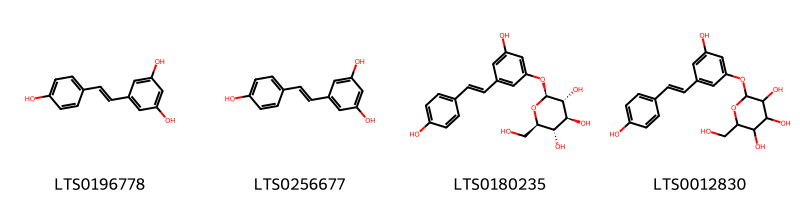{ width=100% }
    <figcaption>Hình ảnh cấu trúc hóa học của 4 hoạt chất thuộc nhóm Stilbenes gồm ['tocilizumab (LTS0196778)', 'resveratrol (LTS0256677)', 'piceid (LTS0180235)', '2-{3-hydroxy-5-[2-(4-hydroxyphenyl)ethenyl]phenoxy}-6-(hydroxymethyl)oxane-3,4,5-triol (LTS0012830)'].</figcaption>
</figure>
#### Nhóm Unsaturated hydrocarbons
<figure markdown="span">
    { width=100% }
    <figcaption>Hình ảnh cấu trúc hóa học của 1 hoạt chất thuộc nhóm Unsaturated hydrocarbons gồm ['α terpinene (LTS0232891)'].</figcaption>
</figure>

---

### Dược dân tộc học

Danh sách các quốc gia có sử dụng *Juniperus excelsa* trong điều trị các bệnh. 

| Country     | Disease   | Bệnh                                                                                                                                                                                                |
|:------------|:----------|:----------------------------------------------------------------------------------------------------------------------------------------------------------------------------------------------------|
| Afghanistan | Diuretic  | MYMEMORY WARNING: YOU USED ALL AVAILABLE FREE TRANSLATIONS FOR TODAY. NEXT AVAILABLE IN  09 HOURS 36 MINUTES 56 SECONDS VISIT HTTPS://MYMEMORY.TRANSLATED.NET/DOC/USAGELIMITS.PHP TO TRANSLATE MORE |

---

---
## Juniperus oxycedrus
### Thông tin về thực vật

!!! info "Phân loại thực vật của *Juniperus oxycedrus* từ GIBF:"
    - **Kingdom:** Plantae
    - **Phylum:** Tracheophyta
    - **Order:** Pinales
    - **Family:** Cupressaceae
    - **Genus:** Juniperus
    - **Species:** *Juniperus oxycedrus*

 

| Label (VI)   | Label (EN)   | Scientific Name     | Descriptions (VI)   | Descriptions (EN)   | Also Known As (VI)   | Also Known As (EN)   |
|:-------------|:-------------|:--------------------|:--------------------|:--------------------|:---------------------|:---------------------|
| N/A          | N/A          | Juniperus oxycedrus | loài thực vật       | species of plant    | ['']                 | ['']                 |

#### Phân bố trên thế giới

**Từ CSDL GIBF** Türkiye, Portugal, Morocco, France, Spain, Russian Federation, Algeria, Italy, Iraq, Croatia, Ukraine

#### Phân bố tại Việt Nam

**Từ CSDL GIBF**: Không có ghi nhận ở Việt Nam

---
### Thành phần hóa học
        
- Theo cơ sở dữ liệu lotus: Từ loài *Juniperus oxycedrus* đã phân lập và xác định được 53 hoạt chất thuộc về các nhóm Organooxygen compounds, Prenol lipids, Flavonoids, Polycyclic hydrocarbons. 

|    | chemicalTaxonomyClassyfireClass   |   smiles_count |
|---:|:----------------------------------|---------------:|
|  0 | Flavonoids                        |              2 |
|  1 | Organooxygen compounds            |              1 |
|  2 | Polycyclic hydrocarbons           |              1 |
|  3 | Prenol lipids                     |             49 |

#### Nhóm Flavonoids
<figure markdown="span">
    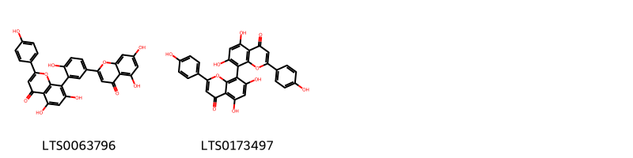{ width=100% }
    <figcaption>Hình ảnh cấu trúc hóa học của 2 hoạt chất thuộc nhóm Flavonoids gồm ['amentoflavone (LTS0063796)', 'cupressuflavone (LTS0173497)'].</figcaption>
</figure>
#### Nhóm Organooxygen compounds
<figure markdown="span">
    { width=100% }
    <figcaption>Hình ảnh cấu trúc hóa học của 1 hoạt chất thuộc nhóm Organooxygen compounds gồm ['3,4,5,8-tetrahydro-2h-cuban-1-ol (LTS0243338)'].</figcaption>
</figure>
#### Nhóm Polycyclic hydrocarbons
<figure markdown="span">
    { width=100% }
    <figcaption>Hình ảnh cấu trúc hóa học của 1 hoạt chất thuộc nhóm Polycyclic hydrocarbons gồm ['1,2,3,6-tetrahydrocubane (LTS0098771)'].</figcaption>
</figure>
#### Nhóm Prenol lipids
<figure markdown="span">
    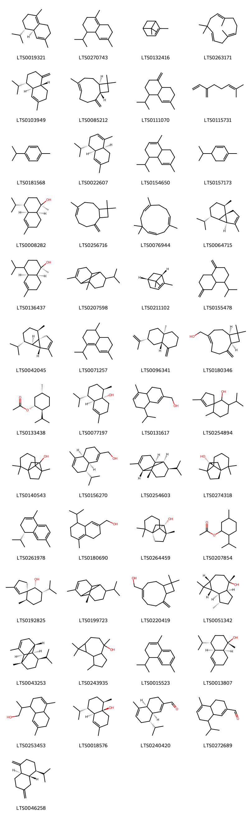{ width=100% }
    <figcaption>Hình ảnh cấu trúc hóa học của 49 hoạt chất thuộc nhóm Prenol lipids gồm ['delta-cadinene (LTS0019321)', '4-isopropyl-1,6-dimethyl-2,3,4,4a,7,8-hexahydronaphthalene (LTS0270743)', 'α pinene (LTS0132416)', 'humulene (LTS0263171)', '(+)-gamma-cadinene (LTS0103949)', 'caryophyllene (LTS0085212)', '4-isopropyl-6-methyl-1-methylidene-3,4,4a,7,8,8a-hexahydro-2h-naphthalene (LTS0111070)', 'α-myrcene (LTS0115731)', 'cymene (LTS0181568)', 'α-muurolene (LTS0022607)', '4-isopropyl-1,6-dimethyl-3,4,4a,7,8,8a-hexahydronaphthalene (LTS0154650)', 'phellandrene (LTS0157173)', 'delta-cadinol (LTS0008282)', '4,11,11-trimethyl-8-methylidenebicyclo[7.2.0]undec-4-ene (LTS0256716)', 'α-humulene (LTS0076944)', '(1s,5r,7s,10r)-7-isopropyl-4,10-dimethyltricyclo[4.4.0.0¹,⁵]dec-3-ene (LTS0064715)', '(1r,4ar,8as)-4-isopropyl-1,6-dimethyl-3,4,4a,7,8,8a-hexahydro-2h-naphthalen-1-ol (LTS0136437)', 'α-copaene (LTS0207598)', '(+)-α-pinene (LTS0211102)', '4-isopropyl-1,6-dimethylidene-octahydronaphthalene (LTS0155478)', '(-)-α-cubebene (LTS0042045)', '4-isopropyl-1,6-dimethyl-1,2,3,7,8,8a-hexahydronaphthalene (LTS0071257)', 'β-selinene (LTS0096341)', '[(1r,4z,9r)-11,11-dimethyl-8-methylidenebicyclo[7.2.0]undec-4-en-4-yl]methanol (LTS0180346)', '(-)-menthyl acetate (LTS0133438)', '(1s,4r,4as,8ar)-1-isopropyl-4,7-dimethyl-2,3,4,5,6,8a-hexahydro-1h-naphthalen-4a-ol (LTS0077197)', '(8-isopropyl-5-methyl-3,4,4a,7,8,8a-hexahydronaphthalen-2-yl)methanol (LTS0131617)', '7-isopropyl-2,10-dimethylspiro[4.5]dec-1-en-6-ol (LTS0254894)', '2,2,6,7-tetramethyltricyclo[5.2.2.0¹,⁶]undecan-8-ol (LTS0140543)', '[(4as,8s,8ar)-8-isopropyl-5-methyl-3,4,4a,7,8,8a-hexahydronaphthalen-2-yl]methanol (LTS0156270)', 'α-ylangene (LTS0254603)', '(1r,6r,8r)-2,2,6,7-tetramethyltricyclo[5.2.2.0¹,⁶]undecan-8-ol (LTS0274318)', '(4s)-4-isopropyl-1,6-dimethyl-3,4-dihydronaphthalene (LTS0261978)', '(8-isopropyl-5-methyl-3,4,6,7,8,8a-hexahydronaphthalen-2-yl)methanol (LTS0180690)', '(1r,6r,7r,8s)-2,2,6,7-tetramethyltricyclo[5.2.2.0¹,⁶]undecan-8-ol (LTS0264459)', 'l-menthyl acetate (LTS0207854)', '(5s,6r,7s,10r)-7-isopropyl-2,10-dimethylspiro[4.5]dec-1-en-6-ol (LTS0192825)', '(1s)-8-isopropyl-1,3-dimethyltricyclo[4.4.0.0²,⁷]dec-3-ene (LTS0199723)', '{11,11-dimethyl-8-methylidenebicyclo[7.2.0]undec-4-en-4-yl}methanol (LTS0220419)', '(1ar,4s,4as,7s,7as,7bs)-1,1,4,7-tetramethyl-octahydro-1ah-cyclopropa[e]azulen-4-ol (LTS0051342)', '(1s,2r,6r,7r,8r)-8-isopropyl-1,3-dimethyltricyclo[4.4.0.0²,⁷]dec-3-ene (LTS0043253)', 'ledol (LTS0243935)', '3,4-dihydrocadalene (LTS0015523)', 'delta-cadinol (LTS0013807)', '2-(4,7-dimethyl-1,2,4a,5,6,8a-hexahydronaphthalen-1-yl)propan-1-ol (LTS0253453)', '(1s,4r,4ar,8ar)-1-isopropyl-4,7-dimethyl-2,3,4,5,6,8a-hexahydro-1h-naphthalen-4a-ol (LTS0018576)', '(4as,8s,8ar)-8-isopropyl-5-methyl-3,4,4a,7,8,8a-hexahydronaphthalene-2-carbaldehyde (LTS0240420)', '8-isopropyl-5-methyl-3,4,4a,7,8,8a-hexahydronaphthalene-2-carbaldehyde (LTS0272689)', '(4s,4as,8ar)-4-isopropyl-1,6-dimethylidene-octahydronaphthalene (LTS0046258)'].</figcaption>
</figure>

---

### Dược dân tộc học

Danh sách các quốc gia có sử dụng *Juniperus oxycedrus* trong điều trị các bệnh. 

| Country     | Disease                                           | Bệnh                                                                                                                                                                                                |
|:------------|:--------------------------------------------------|:----------------------------------------------------------------------------------------------------------------------------------------------------------------------------------------------------|
| Afghanistan | Antiseptic, Parasiticide                          | MYMEMORY WARNING: YOU USED ALL AVAILABLE FREE TRANSLATIONS FOR TODAY. NEXT AVAILABLE IN  09 HOURS 36 MINUTES 20 SECONDS VISIT HTTPS://MYMEMORY.TRANSLATED.NET/DOC/USAGELIMITS.PHP TO TRANSLATE MORE |
| English     | Diuretic                                          | MYMEMORY WARNING: YOU USED ALL AVAILABLE FREE TRANSLATIONS FOR TODAY. NEXT AVAILABLE IN  09 HOURS 36 MINUTES 17 SECONDS VISIT HTTPS://MYMEMORY.TRANSLATED.NET/DOC/USAGELIMITS.PHP TO TRANSLATE MORE |
| Italian     | Stimulant                                         | MYMEMORY WARNING: YOU USED ALL AVAILABLE FREE TRANSLATIONS FOR TODAY. NEXT AVAILABLE IN  09 HOURS 36 MINUTES 14 SECONDS VISIT HTTPS://MYMEMORY.TRANSLATED.NET/DOC/USAGELIMITS.PHP TO TRANSLATE MORE |
| Portuguese  | Antiseptic                                        | MYMEMORY WARNING: YOU USED ALL AVAILABLE FREE TRANSLATIONS FOR TODAY. NEXT AVAILABLE IN  09 HOURS 36 MINUTES 11 SECONDS VISIT HTTPS://MYMEMORY.TRANSLATED.NET/DOC/USAGELIMITS.PHP TO TRANSLATE MORE |
| Turkey      | Parasiticide                                      | MYMEMORY WARNING: YOU USED ALL AVAILABLE FREE TRANSLATIONS FOR TODAY. NEXT AVAILABLE IN  09 HOURS 36 MINUTES 08 SECONDS VISIT HTTPS://MYMEMORY.TRANSLATED.NET/DOC/USAGELIMITS.PHP TO TRANSLATE MORE |
| ain         | Vermifuge, Vulnerary, Pediculicide, Contraceptive | MYMEMORY WARNING: YOU USED ALL AVAILABLE FREE TRANSLATIONS FOR TODAY. NEXT AVAILABLE IN  09 HOURS 36 MINUTES 05 SECONDS VISIT HTTPS://MYMEMORY.TRANSLATED.NET/DOC/USAGELIMITS.PHP TO TRANSLATE MORE |
| anish       | Vermifuge                                         | MYMEMORY WARNING: YOU USED ALL AVAILABLE FREE TRANSLATIONS FOR TODAY. NEXT AVAILABLE IN  09 HOURS 36 MINUTES 02 SECONDS VISIT HTTPS://MYMEMORY.TRANSLATED.NET/DOC/USAGELIMITS.PHP TO TRANSLATE MORE |

---

---
## Juniperus phoenicea
### Thông tin về thực vật

!!! info "Phân loại thực vật của *Juniperus phoenicea* từ GIBF:"
    - **Kingdom:** Plantae
    - **Phylum:** Tracheophyta
    - **Order:** Pinales
    - **Family:** Cupressaceae
    - **Genus:** Juniperus
    - **Species:** *Juniperus phoenicea*

 

| Label (VI)   | Label (EN)   | Scientific Name     | Descriptions (VI)   | Descriptions (EN)   | Also Known As (VI)   | Also Known As (EN)   |
|:-------------|:-------------|:--------------------|:--------------------|:--------------------|:---------------------|:---------------------|
| N/A          | N/A          | Juniperus phoenicea | loài thực vật       | species of plant    | ['']                 | ['']                 |

#### Phân bố trên thế giới

**Từ CSDL GIBF** Portugal, France, Spain, Cyprus, Algeria, Italy, Greece, Croatia

#### Phân bố tại Việt Nam

**Từ CSDL GIBF**: Không có ghi nhận ở Việt Nam

---
### Thành phần hóa học
        
- Theo cơ sở dữ liệu lotus: Từ loài *Juniperus phoenicea* đã phân lập và xác định được 110 hoạt chất thuộc về các nhóm Organooxygen compounds, Furanoid lignans, Flavonoids, Coumarins and derivatives, Oxepanes, Tannins, Prenol lipids, Fatty Acyls, Phenols, Lignan lactones, Pyranodioxins, Cinnamic acids and derivatives, Benzene and substituted derivatives. 

|    | chemicalTaxonomyClassyfireClass     |   smiles_count |
|---:|:------------------------------------|---------------:|
|  0 | Benzene and substituted derivatives |              1 |
|  1 | Cinnamic acids and derivatives      |              1 |
|  2 | Coumarins and derivatives           |              3 |
|  3 | Fatty Acyls                         |             15 |
|  4 | Flavonoids                          |              7 |
|  5 | Furanoid lignans                    |              3 |
|  6 | Lignan lactones                     |              3 |
|  7 | Organooxygen compounds              |             15 |
|  8 | Oxepanes                            |              1 |
|  9 | Phenols                             |              4 |
| 10 | Prenol lipids                       |             52 |
| 11 | Pyranodioxins                       |              3 |
| 12 | Tannins                             |              1 |

#### Nhóm Benzene and substituted derivatives
<figure markdown="span">
    { width=100% }
    <figcaption>Hình ảnh cấu trúc hóa học của 1 hoạt chất thuộc nhóm Benzene and substituted derivatives gồm ['galop (LTS0222857)'].</figcaption>
</figure>
#### Nhóm Cinnamic acids and derivatives
<figure markdown="span">
    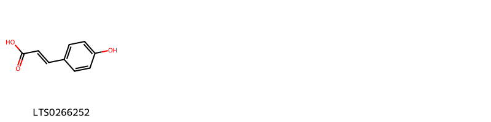{ width=100% }
    <figcaption>Hình ảnh cấu trúc hóa học của 1 hoạt chất thuộc nhóm Cinnamic acids and derivatives gồm ['para-coumaric acid (LTS0266252)'].</figcaption>
</figure>
#### Nhóm Coumarins and derivatives
<figure markdown="span">
    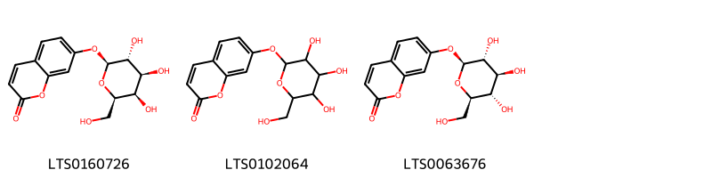{ width=100% }
    <figcaption>Hình ảnh cấu trúc hóa học của 3 hoạt chất thuộc nhóm Coumarins and derivatives gồm ['7-{[(2s,3r,4s,5r,6r)-3,4,5-trihydroxy-6-(hydroxymethyl)oxan-2-yl]oxy}chromen-2-one (LTS0160726)', 'skimmin (LTS0102064)', 'skimmin (LTS0063676)'].</figcaption>
</figure>
#### Nhóm Fatty Acyls
<figure markdown="span">
    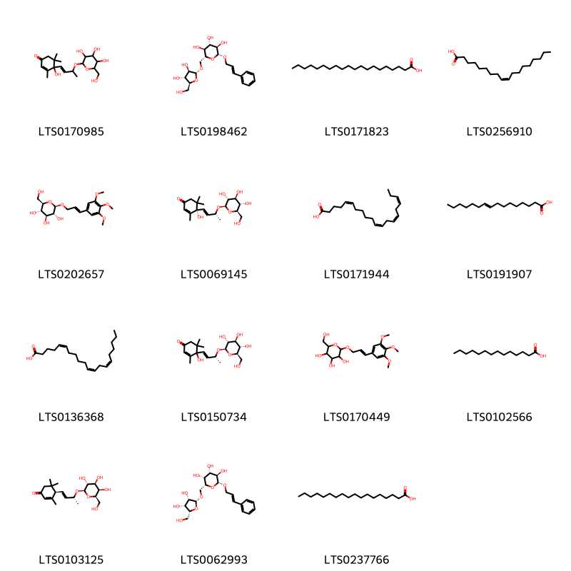{ width=100% }
    <figcaption>Hình ảnh cấu trúc hóa học của 15 hoạt chất thuộc nhóm Fatty Acyls gồm ['4-hydroxy-3,5,5-trimethyl-4-(3-{[3,4,5-trihydroxy-6-(hydroxymethyl)oxan-2-yl]oxy}but-1-en-1-yl)cyclohex-2-en-1-one (LTS0170985)', 'rosarin (LTS0198462)', 'arachidic acid (LTS0171823)', 'oleic acid (LTS0256910)', '(2r,3s,4s,5r,6r)-2-(hydroxymethyl)-6-{[(2e)-3-(3,4,5-trimethoxyphenyl)prop-2-en-1-yl]oxy}oxane-3,4,5-triol (LTS0202657)', '(4s)-4-hydroxy-3,5,5-trimethyl-4-[(1e,3r)-3-{[(2r,3r,4s,5s,6r)-3,4,5-trihydroxy-6-(hydroxymethyl)oxan-2-yl]oxy}but-1-en-1-yl]cyclohex-2-en-1-one (LTS0069145)', '(5z,11z,14z,17z)-icosa-5,11,14,17-tetraenoic acid (LTS0171944)', 'hexadecenoate (LTS0191907)', 'sciadonic acid (LTS0136368)', '4-hydroxy-3,5,5-trimethyl-4-[(1e,3r)-3-{[(2r,3r,4s,5s,6r)-3,4,5-trihydroxy-6-(hydroxymethyl)oxan-2-yl]oxy}but-1-en-1-yl]cyclohex-2-en-1-one (LTS0150734)', '2-(hydroxymethyl)-6-{[3-(3,4,5-trimethoxyphenyl)prop-2-en-1-yl]oxy}oxane-3,4,5-triol (LTS0170449)', 'myristic acid (LTS0102566)', '(4r)-3,5,5-trimethyl-4-[(1e,3r)-3-{[(2r,3r,4s,5r,6r)-3,4,5-trihydroxy-6-(hydroxymethyl)oxan-2-yl]oxy}but-1-en-1-yl]cyclohex-2-en-1-one (LTS0103125)', '(2r,3r,4s,5r,6r)-2-({[(2r,3s,4r,5r)-3,4-dihydroxy-5-(hydroxymethyl)oxolan-2-yl]oxy}methyl)-6-{[(2e)-3-phenylprop-2-en-1-yl]oxy}oxane-3,4,5-triol (LTS0062993)', 'stearic acid (LTS0237766)'].</figcaption>
</figure>
#### Nhóm Flavonoids
<figure markdown="span">
    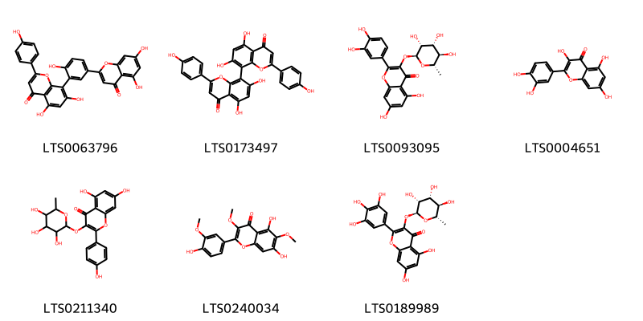{ width=100% }
    <figcaption>Hình ảnh cấu trúc hóa học của 7 hoạt chất thuộc nhóm Flavonoids gồm ['amentoflavone (LTS0063796)', 'cupressuflavone (LTS0173497)', 'quercitrin (LTS0093095)', 'quercetin (LTS0004651)', '5,7-dihydroxy-2-(4-hydroxyphenyl)-3-[(3,4,5-trihydroxy-6-methyloxan-2-yl)oxy]chromen-4-one (LTS0211340)', 'jaceidin (LTS0240034)', 'myricitrin (LTS0189989)'].</figcaption>
</figure>
#### Nhóm Furanoid lignans
<figure markdown="span">
    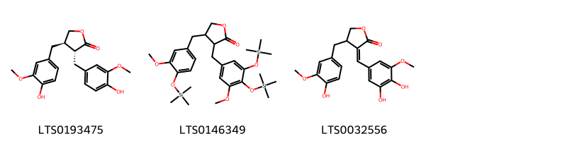{ width=100% }
    <figcaption>Hình ảnh cấu trúc hóa học của 3 hoạt chất thuộc nhóm Furanoid lignans gồm ['matairesinol (LTS0193475)', '3-({3-methoxy-4,5-bis[(trimethylsilyl)oxy]phenyl}methyl)-4-({3-methoxy-4-[(trimethylsilyl)oxy]phenyl}methyl)oxolan-2-one (LTS0146349)', '(3z)-3-[(3,4-dihydroxy-5-methoxyphenyl)methylidene]-4-[(4-hydroxy-3-methoxyphenyl)methyl]oxolan-2-one (LTS0032556)'].</figcaption>
</figure>
#### Nhóm Lignan lactones
<figure markdown="span">
    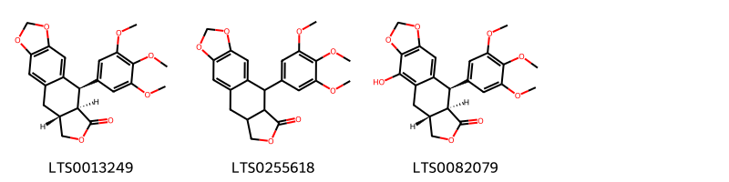{ width=100% }
    <figcaption>Hình ảnh cấu trúc hóa học của 3 hoạt chất thuộc nhóm Lignan lactones gồm ['(-)-deoxypodophyllotoxin (LTS0013249)', '10-(3,4,5-trimethoxyphenyl)-4,6,13-trioxatetracyclo[7.7.0.0³,⁷.0¹¹,¹⁵]hexadeca-1,3(7),8-trien-12-one (LTS0255618)', 'β-peltatin (LTS0082079)'].</figcaption>
</figure>
#### Nhóm Organooxygen compounds
<figure markdown="span">
    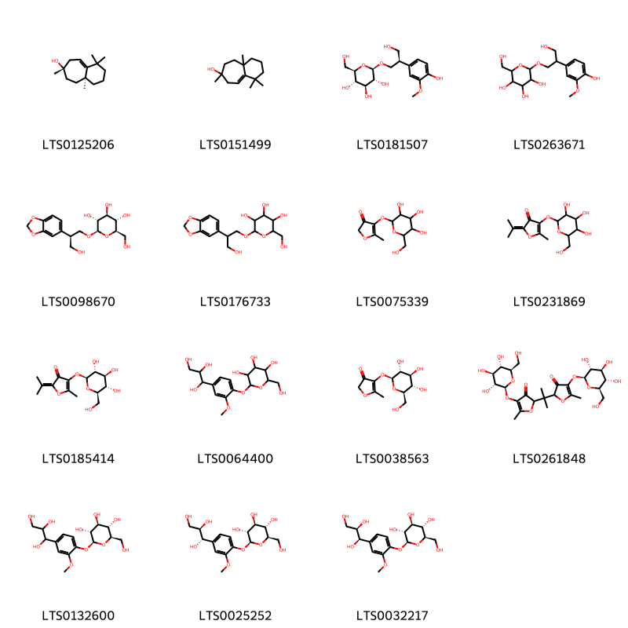{ width=100% }
    <figcaption>Hình ảnh cấu trúc hóa học của 15 hoạt chất thuộc nhóm Organooxygen compounds gồm ['widdrol (LTS0125206)', '1,1,4a,7-tetramethyl-2,3,4,5,6,8-hexahydrobenzo[7]annulen-7-ol (LTS0151499)', '(2r,3r,4s,5s,6r)-2-[(2r)-3-hydroxy-2-(4-hydroxy-3-methoxyphenyl)propoxy]-6-(hydroxymethyl)oxane-3,4,5-triol (LTS0181507)', '2-[3-hydroxy-2-(4-hydroxy-3-methoxyphenyl)propoxy]-6-(hydroxymethyl)oxane-3,4,5-triol (LTS0263671)', '(2r,3r,4s,5s,6r)-2-[(2r)-2-(2h-1,3-benzodioxol-5-yl)-3-hydroxypropoxy]-6-(hydroxymethyl)oxane-3,4,5-triol (LTS0098670)', '2-[2-(2h-1,3-benzodioxol-5-yl)-3-hydroxypropoxy]-6-(hydroxymethyl)oxane-3,4,5-triol (LTS0176733)', '5-methyl-4-{[3,4,5-trihydroxy-6-(hydroxymethyl)oxan-2-yl]oxy}-2h-furan-3-one (LTS0075339)', '5-methyl-2-(propan-2-ylidene)-4-{[3,4,5-trihydroxy-6-(hydroxymethyl)oxan-2-yl]oxy}furan-3-one (LTS0231869)', '5-methyl-2-(propan-2-ylidene)-4-{[(2s,3r,4s,5s,6r)-3,4,5-trihydroxy-6-(hydroxymethyl)oxan-2-yl]oxy}furan-3-one (LTS0185414)', '2-(hydroxymethyl)-6-[2-methoxy-4-(1,2,3-trihydroxypropyl)phenoxy]oxane-3,4,5-triol (LTS0064400)', '5-methyl-4-{[(2s,3r,4s,5s,6r)-3,4,5-trihydroxy-6-(hydroxymethyl)oxan-2-yl]oxy}-2h-furan-3-one (LTS0038563)', '5-methyl-2-[2-(5-methyl-3-oxo-4-{[(2s,3r,4s,5s,6r)-3,4,5-trihydroxy-6-(hydroxymethyl)oxan-2-yl]oxy}-2h-furan-2-yl)propan-2-yl]-4-{[(2s,3r,4s,5s,6r)-3,4,5-trihydroxy-6-(hydroxymethyl)oxan-2-yl]oxy}-2h-furan-3-one (LTS0261848)', '(2r,3s,4s,5r,6s)-2-(hydroxymethyl)-6-[2-methoxy-4-(1,2,3-trihydroxypropyl)phenoxy]oxane-3,4,5-triol (LTS0132600)', '(2r,3s,4s,5r,6s)-2-(hydroxymethyl)-6-{2-methoxy-4-[(1s,2r)-1,2,3-trihydroxypropyl]phenoxy}oxane-3,4,5-triol (LTS0025252)', '(2r,3s,4s,5r,6s)-2-(hydroxymethyl)-6-{2-methoxy-4-[(1r,2r)-1,2,3-trihydroxypropyl]phenoxy}oxane-3,4,5-triol (LTS0032217)'].</figcaption>
</figure>
#### Nhóm Oxepanes
<figure markdown="span">
    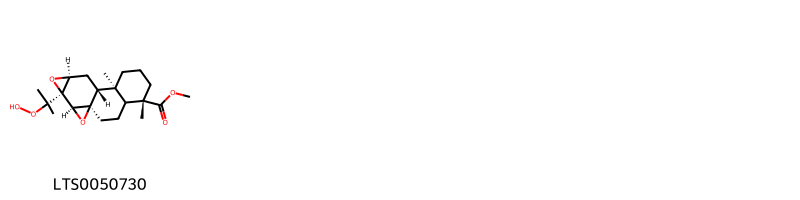{ width=100% }
    <figcaption>Hình ảnh cấu trúc hóa học của 1 hoạt chất thuộc nhóm Oxepanes gồm ['methyl (1r,5s,9s,10r,12s,14s,15r)-14-(2-hydroperoxypropan-2-yl)-5,9-dimethyl-13,16-dioxapentacyclo[8.6.0.0¹,¹⁵.0⁴,⁹.0¹²,¹⁴]hexadecane-5-carboxylate (LTS0050730)'].</figcaption>
</figure>
#### Nhóm Phenols
<figure markdown="span">
    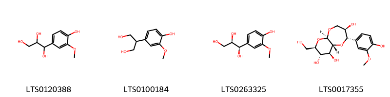{ width=100% }
    <figcaption>Hình ảnh cấu trúc hóa học của 4 hoạt chất thuộc nhóm Phenols gồm ['guaiacylglycerol (LTS0120388)', '2-(4-hydroxy-3-methoxyphenyl)propane-1,3-diol (LTS0100184)', '(1r,2r)-1-(4-hydroxy-3-methoxyphenyl)propane-1,2,3-triol (LTS0263325)', '(2s,3r,5ar,7r,8s,9s,9ar)-2-(4-hydroxy-3-methoxyphenyl)-7-(hydroxymethyl)-octahydropyrano[2,3-b][1,4]dioxepine-3,8,9-triol (LTS0017355)'].</figcaption>
</figure>
#### Nhóm Prenol lipids
<figure markdown="span">
    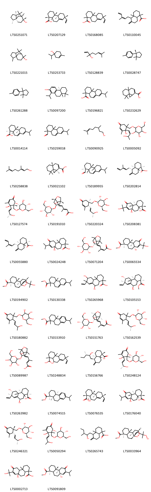{ width=100% }
    <figcaption>Hình ảnh cấu trúc hóa học của 52 hoạt chất thuộc nhóm Prenol lipids gồm ['cedrol (LTS0251071)', 'sandaracopimaric acid (LTS0207129)', 'pimaric acid (LTS0168085)', '1,4a-dimethyl-6-methylidene-5-(3-methylpenta-2,4-dien-1-yl)-hexahydro-2h-naphthalene-1-carboxylic acid (LTS0110045)', 'cedrol (LTS0221015)', '4-terpineol (LTS0253733)', 'linalool, (+-)- (LTS0128839)', 'cuparene (LTS0028747)', '1-methyl-4-(1,2,2-trimethylcyclopentyl)benzene (LTS0261288)', 'totarol (LTS0097200)', 'abietic acid (LTS0196821)', '4a,8,8-trimethyl-1h,1ah,4h,5h,6h,7h-cyclopropa[e]naphthalene-2-carboxylic acid (LTS0232629)', '(1s,4ar,4br,10ar)-7-isopropyl-1,4a-dimethyl-2,3,4,4b,5,6,10,10a-octahydrophenanthrene-1-carboxylic acid (LTS0014114)', '7-isopropyl-1,4a-dimethyl-2,3,4,4b,5,6,10,10a-octahydrophenanthrene-1-carbaldehyde (LTS0259018)', 'citronellol, (+-)- (LTS0090925)', '4-hydroxy-4-(3-hydroxybut-1-en-1-yl)-3,5-dimethyl-5-({[3,4,5-trihydroxy-6-(hydroxymethyl)oxan-2-yl]oxy}methyl)cyclohex-2-en-1-one (LTS0005092)', 'geraniol (LTS0258838)', '(1as,4ar,8ar)-4a,8,8-trimethyl-1h,1ah,4h,5h,6h,7h-cyclopropa[e]naphthalene-2-carboxylic acid (LTS0021102)', '(1s,4ar,4bs,10as)-7-isopropyl-1,4a-dimethyl-2,3,4,4b,5,6,10,10a-octahydrophenanthrene-1-carbaldehyde (LTS0189955)', '(1r,4ar,5s,8ar)-1,4a-dimethyl-6-methylidene-5-[(2e)-3-methylpenta-2,4-dien-1-yl]-hexahydro-2h-naphthalene-1-carboxylic acid (LTS0202814)', '(4s,5r)-4-hydroxy-4-[(1e,3r)-3-hydroxybut-1-en-1-yl]-3,5-dimethyl-5-({[(2r,3r,4s,5s,6r)-3,4,5-trihydroxy-6-(hydroxymethyl)oxan-2-yl]oxy}methyl)cyclohex-2-en-1-one (LTS0127574)', '(2e,4e)-5-[(1s,3r,5s,8r)-8-hydroxy-1,5-dimethyl-3-{[(2r,3r,4s,5s,6r)-3,4,5-trihydroxy-6-(hydroxymethyl)oxan-2-yl]oxy}-6-oxabicyclo[3.2.1]octan-8-yl]-3-methylpenta-2,4-dienoic acid (LTS0191010)', '(4r,5r)-4-[(1e,3r)-3-hydroxybut-1-en-1-yl]-3,5-dimethyl-5-({[(2r,3r,4s,5r,6r)-3,4,5-trihydroxy-6-(hydroxymethyl)oxan-2-yl]oxy}methyl)cyclohex-2-en-1-one (LTS0220324)', '(1s,4as,4br,8as,10ar)-8a-hydroxy-7-(2-hydroxypropan-2-yl)-1,4a-dimethyl-6-oxo-2,3,4,4b,5,9,10,10a-octahydrophenanthrene-1-carboxylic acid (LTS0208381)', '(1r,4ar,5s,8ar)-1,4a-dimethyl-6-methylidene-5-[(2z)-3-methylpenta-2,4-dien-1-yl]-hexahydro-2h-naphthalene-1-carboxylic acid (LTS0055880)', '8a-hydroxy-7-isopropyl-1,4a-dimethyl-6-oxo-2,3,4,4b,5,9,10,10a-octahydrophenanthrene-1-carboxylic acid (LTS0024248)', '(2z,4e)-5-[(3s,8s)-8-hydroxy-1,5-dimethyl-3-{[(3r,4s,5s,6r)-3,4,5-trihydroxy-6-(hydroxymethyl)oxan-2-yl]oxy}-6-oxabicyclo[3.2.1]octan-8-yl]-3-methylpenta-2,4-dienoic acid (LTS0071204)', 'methyl (1s,4as,4br,8as)-8a-hydroxy-7-(2-hydroxypropan-2-yl)-1,4a-dimethyl-6-oxo-2,3,4,4b,5,9,10,10a-octahydrophenanthrene-1-carboxylate (LTS0065534)', 'methyl (1s,5s,9s,10r,12s)-16-(2-hydroxypropan-2-yl)-5,9-dimethyl-13,14-dioxatetracyclo[10.2.2.0¹,¹⁰.0⁴,⁹]hexadec-15-ene-5-carboxylate (LTS0194902)', 'methyl abietate (LTS0130338)', '7-ethenyl-6,9-dihydroxy-1,4a,7-trimethyl-3,4,4b,5,6,9,10,10a-octahydro-2h-phenanthrene-1-carboxylic acid (LTS0265968)', 'methyl (1r,4ar,4br,6r,7r,9r)-7-ethenyl-6,9-dihydroxy-1,4a,7-trimethyl-3,4,4b,5,6,9,10,10a-octahydro-2h-phenanthrene-1-carboxylate (LTS0105153)', '4-(3-hydroxybut-1-en-1-yl)-3,5-dimethyl-5-({[3,4,5-trihydroxy-6-(hydroxymethyl)oxan-2-yl]oxy}methyl)cyclohex-2-en-1-one (LTS0180882)', 'methyl 7-isopropyl-1,4a-dimethyl-2,3,4,9,10,10a-hexahydrophenanthrene-1-carboxylate (LTS0153910)', '(2z,4e)-5-[(1r,3s,5r,8s)-8-hydroxy-1,5-dimethyl-3-{[(2r,3r,4s,5s,6r)-3,4,5-trihydroxy-6-(hydroxymethyl)oxan-2-yl]oxy}-6-oxabicyclo[3.2.1]octan-8-yl]-3-methylpenta-2,4-dienoic acid (LTS0151763)', '4-[(1e,3r)-3-hydroxybut-1-en-1-yl]-3,5-dimethyl-5-({[(2r,3r,4s,5s,6r)-3,4,5-trihydroxy-6-(hydroxymethyl)oxan-2-yl]oxy}methyl)cyclohex-2-en-1-one (LTS0162539)', '5-(8-hydroxy-1,5-dimethyl-3-{[3,4,5-trihydroxy-6-(hydroxymethyl)oxan-2-yl]oxy}-6-oxabicyclo[3.2.1]octan-8-yl)-3-methylpenta-2,4-dienoic acid (LTS0089987)', '7-ethenyl-10-hydroxy-1,4a,7-trimethyl-3,4,4b,5,6,9,10,10a-octahydro-2h-phenanthrene-1-carboxylic acid (LTS0248834)', '(1s,4ar,5r,8ar)-5-[(2s,3s)-2-hydroxy-3-methylpentyl]-1,4a-dimethyl-6-methylidene-hexahydro-2h-naphthalene-1-carboxylic acid (LTS0156766)', '4-hydroxy-4-[(1e,3r)-3-hydroxybut-1-en-1-yl]-3,5-dimethyl-5-({[(2r,3r,4s,5s,6r)-3,4,5-trihydroxy-6-(hydroxymethyl)oxan-2-yl]oxy}methyl)cyclohex-2-en-1-one (LTS0248124)', '(1r,4ar,4br,6r,7r,9r,10ar)-7-ethenyl-6,9-dihydroxy-1,4a,7-trimethyl-3,4,4b,5,6,9,10,10a-octahydro-2h-phenanthrene-1-carboxylic acid (LTS0263982)', 'methyl (1s,4ar,10ar)-7-isopropyl-1,4a-dimethyl-2,3,4,9,10,10a-hexahydrophenanthrene-1-carboxylate (LTS0074515)', '(1r,4ar,4bs,7r,10s,10ar)-7-ethenyl-10-hydroxy-1,4a,7-trimethyl-3,4,4b,5,6,9,10,10a-octahydro-2h-phenanthrene-1-carboxylic acid (LTS0076535)', '(1s,4as,4br,8as,10ar)-8a-hydroxy-7-isopropyl-1,4a-dimethyl-6-oxo-2,3,4,4b,5,9,10,10a-octahydrophenanthrene-1-carboxylic acid (LTS0176040)', '(4r,5s)-4-[(1e,3r)-3-hydroxybut-1-en-1-yl]-3,5-dimethyl-5-({[(2r,3r,4s,5s,6r)-3,4,5-trihydroxy-6-(hydroxymethyl)oxan-2-yl]oxy}methyl)cyclohex-2-en-1-one (LTS0246321)', '4-hydroxy-4-[(1e)-3-hydroxybut-1-en-1-yl]-3,5-dimethyl-5-({[(2r,3r,4s,5s,6r)-3,4,5-trihydroxy-6-(hydroxymethyl)oxan-2-yl]oxy}methyl)cyclohex-2-en-1-one (LTS0050294)', '5-(2-hydroxy-3-methylpentyl)-1,4a-dimethyl-6-methylidene-hexahydro-2h-naphthalene-1-carboxylic acid (LTS0265743)', 'methyl (1s,5s,9s,10r,12s)-16-(2-hydroperoxypropan-2-yl)-5,9-dimethyl-13,14-dioxatetracyclo[10.2.2.0¹,¹⁰.0⁴,⁹]hexadec-15-ene-5-carboxylate (LTS0033964)', '8a-hydroxy-7-(2-hydroxypropan-2-yl)-1,4a-dimethyl-6-oxo-2,3,4,4b,5,9,10,10a-octahydrophenanthrene-1-carboxylic acid (LTS0002713)', 'methyl (1s,4as,4br,8as)-8a-hydroxy-7-isopropyl-1,4a-dimethyl-6-oxo-2,3,4,4b,5,9,10,10a-octahydrophenanthrene-1-carboxylate (LTS0091809)', 'methyl (1s,4as,4bs,10as)-7-isopropyl-1,4a-dimethyl-2,3,4,4b,5,6,10,10a-octahydrophenanthrene-1-carboxylate (LTS0227141)', '(1s,4ar,5r,8ar)-5-[(2r,3s)-2-hydroxy-3-methylpentyl]-1,4a-dimethyl-6-methylidene-hexahydro-2h-naphthalene-1-carboxylic acid (LTS0233841)'].</figcaption>
</figure>
#### Nhóm Pyranodioxins
<figure markdown="span">
    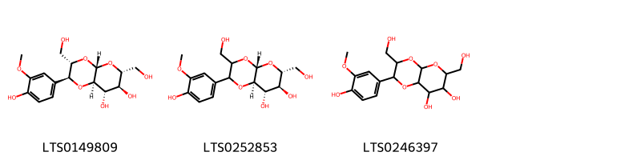{ width=100% }
    <figcaption>Hình ảnh cấu trúc hóa học của 3 hoạt chất thuộc nhóm Pyranodioxins gồm ['(2s,3s,4as,6r,7s,8s,8ar)-2-(4-hydroxy-3-methoxyphenyl)-3,6-bis(hydroxymethyl)-hexahydro-2h-pyrano[2,3-b][1,4]dioxine-7,8-diol (LTS0149809)', '(4as,6r,7s,8s,8ar)-2-(4-hydroxy-3-methoxyphenyl)-3,6-bis(hydroxymethyl)-hexahydro-2h-pyrano[2,3-b][1,4]dioxine-7,8-diol (LTS0252853)', '2-(4-hydroxy-3-methoxyphenyl)-3,6-bis(hydroxymethyl)-hexahydro-2h-pyrano[2,3-b][1,4]dioxine-7,8-diol (LTS0246397)'].</figcaption>
</figure>
#### Nhóm Tannins
<figure markdown="span">
    { width=100% }
    <figcaption>Hình ảnh cấu trúc hóa học của 1 hoạt chất thuộc nhóm Tannins gồm ['β-glucogallin (LTS0193705)'].</figcaption>
</figure>

---

### Dược dân tộc học

Danh sách các quốc gia có sử dụng *Juniperus phoenicea* trong điều trị các bệnh. 

| Country   | Disease                              | Bệnh                                                                                                                                                                                                |
|:----------|:-------------------------------------|:----------------------------------------------------------------------------------------------------------------------------------------------------------------------------------------------------|
| Egypt     | Diuretic, Fumigant, Stomachic, Tonic | MYMEMORY WARNING: YOU USED ALL AVAILABLE FREE TRANSLATIONS FOR TODAY. NEXT AVAILABLE IN  09 HOURS 35 MINUTES 29 SECONDS VISIT HTTPS://MYMEMORY.TRANSLATED.NET/DOC/USAGELIMITS.PHP TO TRANSLATE MORE |

---

---
## Juniperus recurvus
### Thông tin về thực vật

!!! info "Phân loại thực vật của *Juniperus recurva* từ GIBF:"
    - **Kingdom:** Plantae
    - **Phylum:** Tracheophyta
    - **Order:** Pinales
    - **Family:** Cupressaceae
    - **Genus:** Juniperus
    - **Species:** *Juniperus recurva*

 

| Label (VI)   | Label (EN)   | Scientific Name     | Descriptions (VI)   | Descriptions (EN)   | Also Known As (VI)   | Also Known As (EN)   |
|:-------------|:-------------|:--------------------|:--------------------|:--------------------|:---------------------|:---------------------|
| N/A          | N/A          | Juniperus phoenicea | loài thực vật       | species of plant    | ['']                 | ['']                 |

#### Phân bố trên thế giới

**Từ CSDL GIBF** nan, unknown or invalid, United Kingdom of Great Britain and Northern Ireland, Bhutan, Myanmar, Spain, New Zealand, India, Germany, United States of America, China, Nepal

#### Phân bố tại Việt Nam

**Từ CSDL GIBF**: Không có ghi nhận ở Việt Nam

---
### Thành phần hóa học
        
- Theo cơ sở dữ liệu lotus: Từ loài *Juniperus recurva* đã phân lập và xác định được Chưa có hoạt chất nào được phân lập. hoạt chất thuộc về các nhóm Không có hoạt chất nào được phân lập. 

Không có hình ảnh nào được tạo ra

---

### Dược dân tộc học

Danh sách các quốc gia có sử dụng *Juniperus recurva* trong điều trị các bệnh. 

| Country   | Disease   | Bệnh                                                                                                                                                                                                |
|:----------|:----------|:----------------------------------------------------------------------------------------------------------------------------------------------------------------------------------------------------|
| India     | Emetic    | MYMEMORY WARNING: YOU USED ALL AVAILABLE FREE TRANSLATIONS FOR TODAY. NEXT AVAILABLE IN  09 HOURS 34 MINUTES 58 SECONDS VISIT HTTPS://MYMEMORY.TRANSLATED.NET/DOC/USAGELIMITS.PHP TO TRANSLATE MORE |

---

---
## Juniperus rigida
### Thông tin về thực vật

!!! info "Phân loại thực vật của *Juniperus rigida* từ GIBF:"
    - **Kingdom:** Plantae
    - **Phylum:** Tracheophyta
    - **Order:** Pinales
    - **Family:** Cupressaceae
    - **Genus:** Juniperus
    - **Species:** *Juniperus rigida*

 

| Label (VI)   | Label (EN)   | Scientific Name   | Descriptions (VI)   | Descriptions (EN)   | Also Known As (VI)   | Also Known As (EN)   |
|:-------------|:-------------|:------------------|:--------------------|:--------------------|:---------------------|:---------------------|
| N/A          | N/A          | Juniperus rigida  | loài thực vật       | species of plant    | ['']                 | ['temple juniper']   |

#### Phân bố trên thế giới

**Từ CSDL GIBF** Japan, Latvia, Poland, Russian Federation, Canada, United States of America, China, Australia, Belgium, Korea, Republic of

#### Phân bố tại Việt Nam

**Từ CSDL GIBF**: Không có ghi nhận ở Việt Nam

---
### Thành phần hóa học
        
- Theo cơ sở dữ liệu lotus: Từ loài *Juniperus rigida* đã phân lập và xác định được 53 hoạt chất thuộc về các nhóm Furanoid lignans, Flavonoids, Unsaturated hydrocarbons, Prenol lipids, Fatty Acyls, Benzodioxoles, Lignan lactones, Steroids and steroid derivatives, Tropones. 

|    | chemicalTaxonomyClassyfireClass   |   smiles_count |
|---:|:----------------------------------|---------------:|
|  0 | Benzodioxoles                     |              1 |
|  1 | Fatty Acyls                       |              1 |
|  2 | Flavonoids                        |              1 |
|  3 | Furanoid lignans                  |              5 |
|  4 | Lignan lactones                   |              2 |
|  5 | Prenol lipids                     |             37 |
|  6 | Steroids and steroid derivatives  |              4 |
|  7 | Tropones                          |              1 |
|  8 | Unsaturated hydrocarbons          |              1 |

#### Nhóm Benzodioxoles
<figure markdown="span">
    { width=100% }
    <figcaption>Hình ảnh cấu trúc hóa học của 1 hoạt chất thuộc nhóm Benzodioxoles gồm ['sassafras (LTS0136093)'].</figcaption>
</figure>
#### Nhóm Fatty Acyls
<figure markdown="span">
    { width=100% }
    <figcaption>Hình ảnh cấu trúc hóa học của 1 hoạt chất thuộc nhóm Fatty Acyls gồm ['arachidic acid (LTS0171823)'].</figcaption>
</figure>
#### Nhóm Flavonoids
<figure markdown="span">
    { width=100% }
    <figcaption>Hình ảnh cấu trúc hóa học của 1 hoạt chất thuộc nhóm Flavonoids gồm ['amentoflavone (LTS0063796)'].</figcaption>
</figure>
#### Nhóm Furanoid lignans
<figure markdown="span">
    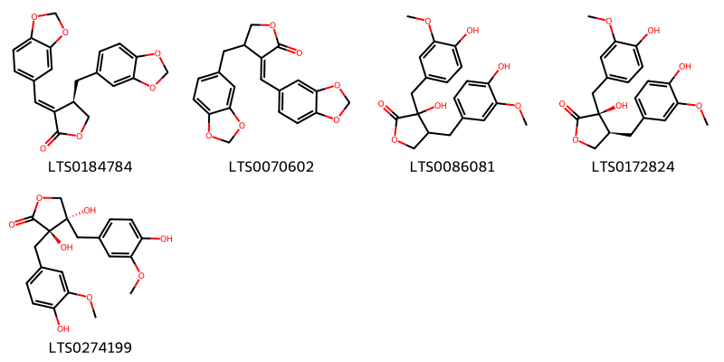{ width=100% }
    <figcaption>Hình ảnh cấu trúc hóa học của 5 hoạt chất thuộc nhóm Furanoid lignans gồm ['savinin (LTS0184784)', '4-(2h-1,3-benzodioxol-5-ylmethyl)-3-(2h-1,3-benzodioxol-5-ylmethylidene)oxolan-2-one (LTS0070602)', '3-hydroxy-3,4-bis[(4-hydroxy-3-methoxyphenyl)methyl]oxolan-2-one (LTS0086081)', 'nortrachelogenin (LTS0172824)', '(3r,4s)-3,4-dihydroxy-3,4-bis[(4-hydroxy-3-methoxyphenyl)methyl]oxolan-2-one (LTS0274199)'].</figcaption>
</figure>
#### Nhóm Lignan lactones
<figure markdown="span">
    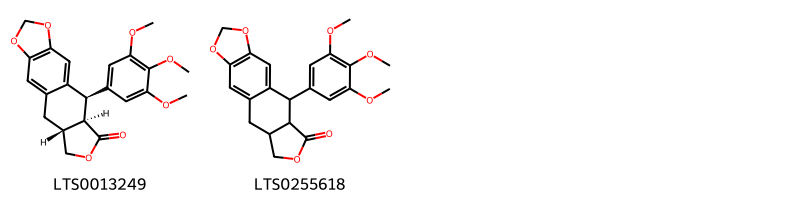{ width=100% }
    <figcaption>Hình ảnh cấu trúc hóa học của 2 hoạt chất thuộc nhóm Lignan lactones gồm ['(-)-deoxypodophyllotoxin (LTS0013249)', '10-(3,4,5-trimethoxyphenyl)-4,6,13-trioxatetracyclo[7.7.0.0³,⁷.0¹¹,¹⁵]hexadeca-1,3(7),8-trien-12-one (LTS0255618)'].</figcaption>
</figure>
#### Nhóm Prenol lipids
<figure markdown="span">
    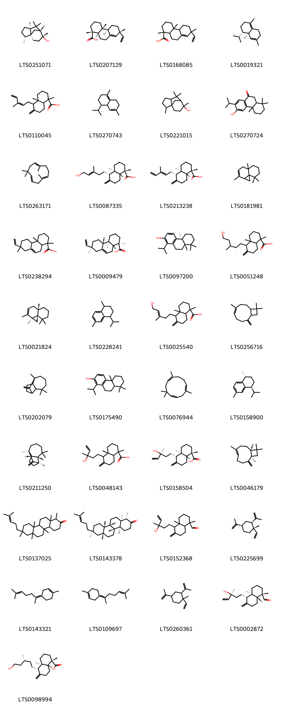{ width=100% }
    <figcaption>Hình ảnh cấu trúc hóa học của 37 hoạt chất thuộc nhóm Prenol lipids gồm ['cedrol (LTS0251071)', 'sandaracopimaric acid (LTS0207129)', 'pimaric acid (LTS0168085)', 'delta-cadinene (LTS0019321)', '1,4a-dimethyl-6-methylidene-5-(3-methylpenta-2,4-dien-1-yl)-hexahydro-2h-naphthalene-1-carboxylic acid (LTS0110045)', '4-isopropyl-1,6-dimethyl-2,3,4,4a,7,8-hexahydronaphthalene (LTS0270743)', 'cedrol (LTS0221015)', '6-hydroxy-7-isopropyl-1,1,4a-trimethyl-3,4,10,10a-tetrahydro-2h-phenanthren-9-one (LTS0270724)', 'humulene (LTS0263171)', 'isocupressic acid (LTS0087335)', '(1s,4ar,5s,8ar)-1,4a-dimethyl-6-methylidene-5-[(2e)-3-methylpenta-2,4-dien-1-yl]-hexahydro-2h-naphthalene-1-carboxylic acid (LTS0213238)', 'thujopsene (LTS0181981)', 'isopimaric acid (LTS0238294)', 'isopimaric acid (LTS0009479)', 'totarol (LTS0097200)', '5-(5-hydroxy-3-methylpentyl)-1,4a-dimethyl-6-methylidene-hexahydro-2h-naphthalene-1-carboxylic acid (LTS0051248)', '(-)-thujopsene (LTS0021824)', '(e)-calamene (LTS0228241)', '5-(5-hydroxy-3-methylpent-3-en-1-yl)-1,4a-dimethyl-6-methylidene-hexahydro-2h-naphthalene-1-carboxylic acid (LTS0025540)', '4,11,11-trimethyl-8-methylidenebicyclo[7.2.0]undec-4-ene (LTS0256716)', 'longifolene (LTS0202079)', 'totarol (LTS0175490)', 'α-humulene (LTS0076944)', '(1r,4s)-4-isopropyl-1,6-dimethyl-1,2,3,4-tetrahydronaphthalene (LTS0158900)', '(-)-longifolene (LTS0211250)', '5-(3-hydroxy-3-methylpent-4-en-1-yl)-1,4a-dimethyl-6-methylidene-hexahydro-2h-naphthalene-1-carboxylic acid (LTS0048143)', '(1s,4ar,5s,8ar)-5-[(3s)-3-hydroxy-3-methylpent-4-en-1-yl]-1,4a-dimethyl-6-methylidene-hexahydro-2h-naphthalene-1-carboxylic acid (LTS0158504)', '(+)-caryophyllene (LTS0046179)', '1,4b,6a,8,10a,12a-hexamethyl-8-(4-methylpent-3-en-1-yl)-dodecahydrochrysen-2-one (LTS0137025)', '(1s,4as,4bs,6ar,8s,10ar,10br,12ar)-1,4b,6a,8,10a,12a-hexamethyl-8-(4-methylpent-3-en-1-yl)-dodecahydrochrysen-2-one (LTS0143378)', '5-(3-hydroxy-3-methylpent-4-en-1-yl)-1,4a-dimethyl-6-methylidene-hexahydro-2h-naphthalene-1-carbaldehyde (LTS0152368)', 'β-elemene (LTS0225699)', '(z)-γ-bisabolene (LTS0143321)', 'bisabolene (LTS0109697)', 'β-elemene (LTS0260361)', '(1s,4ar,5s,8ar)-5-[(3s)-3-hydroxy-3-methylpent-4-en-1-yl]-1,4a-dimethyl-6-methylidene-hexahydro-2h-naphthalene-1-carbaldehyde (LTS0002872)', '(1s,4ar,5s,8ar)-5-[(3r)-5-hydroxy-3-methylpentyl]-1,4a-dimethyl-6-methylidene-hexahydro-2h-naphthalene-1-carboxylic acid (LTS0098994)'].</figcaption>
</figure>
#### Nhóm Steroids and steroid derivatives
<figure markdown="span">
    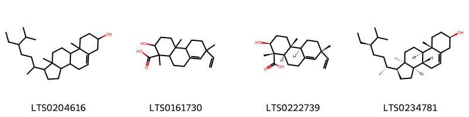{ width=100% }
    <figcaption>Hình ảnh cấu trúc hóa học của 4 hoạt chất thuộc nhóm Steroids and steroid derivatives gồm ['stigmast-5-en-3-ol, (3β)- (LTS0204616)', '7-ethenyl-2-hydroxy-1,4a,7-trimethyl-3,4,4b,5,6,9,10,10a-octahydro-2h-phenanthrene-1-carboxylic acid (LTS0161730)', '(1s,2s,4ar,4bs,7r,10ar)-7-ethenyl-2-hydroxy-1,4a,7-trimethyl-3,4,4b,5,6,9,10,10a-octahydro-2h-phenanthrene-1-carboxylic acid (LTS0222739)', '(1s,3ar,3br,7r,9as,9br,11ar)-1-[(2r,5r)-5-ethyl-6-methylheptan-2-yl]-9a,11a-dimethyl-1h,2h,3h,3ah,3bh,4h,6h,7h,8h,9h,9bh,10h,11h-cyclopenta[a]phenanthren-7-ol (LTS0234781)'].</figcaption>
</figure>
#### Nhóm Tropones
<figure markdown="span">
    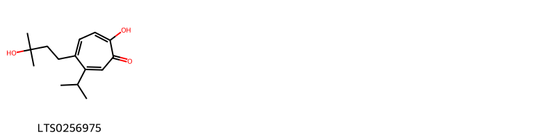{ width=100% }
    <figcaption>Hình ảnh cấu trúc hóa học của 1 hoạt chất thuộc nhóm Tropones gồm ['2-hydroxy-5-(3-hydroxy-3-methylbutyl)-6-isopropylcyclohepta-2,4,6-trien-1-one (LTS0256975)'].</figcaption>
</figure>
#### Nhóm Unsaturated hydrocarbons
<figure markdown="span">
    { width=100% }
    <figcaption>Hình ảnh cấu trúc hóa học của 1 hoạt chất thuộc nhóm Unsaturated hydrocarbons gồm ['α terpinene (LTS0232891)'].</figcaption>
</figure>

---

### Dược dân tộc học

Danh sách các quốc gia có sử dụng *Juniperus rigida* trong điều trị các bệnh. 

| Country   | Disease   | Bệnh                                                                                                                                                                                                |
|:----------|:----------|:----------------------------------------------------------------------------------------------------------------------------------------------------------------------------------------------------|
| Elsewhere | Diuretic  | MYMEMORY WARNING: YOU USED ALL AVAILABLE FREE TRANSLATIONS FOR TODAY. NEXT AVAILABLE IN  09 HOURS 34 MINUTES 34 SECONDS VISIT HTTPS://MYMEMORY.TRANSLATED.NET/DOC/USAGELIMITS.PHP TO TRANSLATE MORE |
| Japan     | Diuretic  | MYMEMORY WARNING: YOU USED ALL AVAILABLE FREE TRANSLATIONS FOR TODAY. NEXT AVAILABLE IN  09 HOURS 34 MINUTES 30 SECONDS VISIT HTTPS://MYMEMORY.TRANSLATED.NET/DOC/USAGELIMITS.PHP TO TRANSLATE MORE |

---

---
## Juniperus sabina
### Thông tin về thực vật

!!! info "Phân loại thực vật của *Juniperus sabina* từ GIBF:"
    - **Kingdom:** Plantae
    - **Phylum:** Tracheophyta
    - **Order:** Pinales
    - **Family:** Cupressaceae
    - **Genus:** Juniperus
    - **Species:** *Juniperus sabina*

 

| Label (VI)   | Label (EN)   | Scientific Name   | Descriptions (VI)   | Descriptions (EN)   | Also Known As (VI)   | Also Known As (EN)   |
|:-------------|:-------------|:------------------|:--------------------|:--------------------|:---------------------|:---------------------|
| N/A          | N/A          | Juniperus sabina  | loài thực vật       | species of plant    | ['']                 | ['Savin Juniper']    |

#### Phân bố trên thế giới

**Từ CSDL GIBF** Georgia, Spain, Austria, Sweden, Mongolia, Kazakhstan, Canada, Türkiye, Belarus, Kyrgyzstan, Estonia, Switzerland, Iran (Islamic Republic of), France, Romania, Russian Federation, United States of America, Italy, Croatia, Ukraine

#### Phân bố tại Việt Nam

**Từ CSDL GIBF**: Không có ghi nhận ở Việt Nam

---
### Thành phần hóa học
        
- Theo cơ sở dữ liệu lotus: Từ loài *Juniperus sabina* đã phân lập và xác định được 142 hoạt chất thuộc về các nhóm Furanoid lignans, Arylnaphthalene lignans, Flavonoids, Coumarins and derivatives, Dioxanes, Phenanthrenes and derivatives, 2-arylbenzofuran flavonoids, Prenol lipids, Fatty Acyls, Lignan lactones, Steroids and steroid derivatives, Benzene and substituted derivatives. 

|    | chemicalTaxonomyClassyfireClass     |   smiles_count |
|---:|:------------------------------------|---------------:|
|  0 | 2-arylbenzofuran flavonoids         |              1 |
|  1 | Arylnaphthalene lignans             |              2 |
|  2 | Benzene and substituted derivatives |              1 |
|  3 | Coumarins and derivatives           |              3 |
|  4 | Dioxanes                            |              2 |
|  5 | Fatty Acyls                         |              8 |
|  6 | Flavonoids                          |             20 |
|  7 | Furanoid lignans                    |             11 |
|  8 | Lignan lactones                     |             18 |
|  9 | Phenanthrenes and derivatives       |              1 |
| 10 | Prenol lipids                       |             71 |
| 11 | Steroids and steroid derivatives    |              3 |

#### Nhóm 2-arylbenzofuran flavonoids
<figure markdown="span">
    { width=100% }
    <figcaption>Hình ảnh cấu trúc hóa học của 1 hoạt chất thuộc nhóm 2-arylbenzofuran flavonoids gồm ['acuminatin (LTS0198896)'].</figcaption>
</figure>
#### Nhóm Arylnaphthalene lignans
<figure markdown="span">
    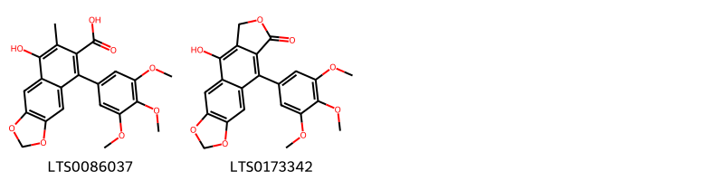{ width=100% }
    <figcaption>Hình ảnh cấu trúc hóa học của 2 hoạt chất thuộc nhóm Arylnaphthalene lignans gồm ['8-hydroxy-7-methyl-5-(3,4,5-trimethoxyphenyl)-2h-naphtho[2,3-d][1,3]dioxole-6-carboxylic acid (LTS0086037)', '16-hydroxy-10-(3,4,5-trimethoxyphenyl)-4,6,13-trioxatetracyclo[7.7.0.0³,⁷.0¹¹,¹⁵]hexadeca-1,3(7),8,10,15-pentaen-12-one (LTS0173342)'].</figcaption>
</figure>
#### Nhóm Benzene and substituted derivatives
<figure markdown="span">
    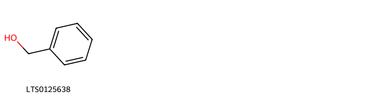{ width=100% }
    <figcaption>Hình ảnh cấu trúc hóa học của 1 hoạt chất thuộc nhóm Benzene and substituted derivatives gồm ['benzyl alcohol (LTS0125638)'].</figcaption>
</figure>
#### Nhóm Coumarins and derivatives
<figure markdown="span">
    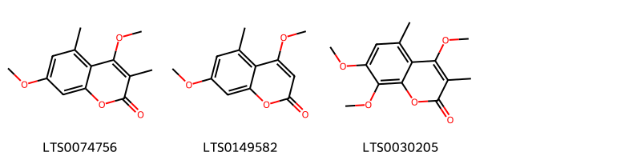{ width=100% }
    <figcaption>Hình ảnh cấu trúc hóa học của 3 hoạt chất thuộc nhóm Coumarins and derivatives gồm ['4,7-dimethoxy-3,5-dimethylchromen-2-one (LTS0074756)', 'siderin (LTS0149582)', '4,7,8-trimethoxy-3,5-dimethylchromen-2-one (LTS0030205)'].</figcaption>
</figure>
#### Nhóm Dioxanes
<figure markdown="span">
    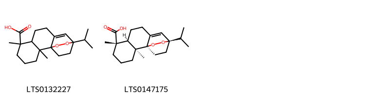{ width=100% }
    <figcaption>Hình ảnh cấu trúc hóa học của 2 hoạt chất thuộc nhóm Dioxanes gồm ['12-isopropyl-2,6-dimethyl-13,14-dioxatetracyclo[10.2.2.0¹,¹⁰.0²,⁷]hexadec-10-ene-6-carboxylic acid (LTS0132227)', '(1r,2s,6s,7s,12r)-12-isopropyl-2,6-dimethyl-13,14-dioxatetracyclo[10.2.2.0¹,¹⁰.0²,⁷]hexadec-10-ene-6-carboxylic acid (LTS0147175)'].</figcaption>
</figure>
#### Nhóm Fatty Acyls
<figure markdown="span">
    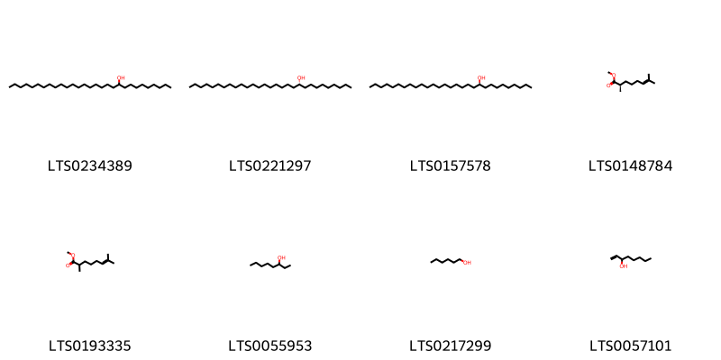{ width=100% }
    <figcaption>Hình ảnh cấu trúc hóa học của 8 hoạt chất thuộc nhóm Fatty Acyls gồm ['nonacosan-10-ol (LTS0234389)', '(r)-nonacosan-10-ol (LTS0221297)', '(s)-nonacosan-10-ol (LTS0157578)', 'methyl (2r)-2,7-dimethyloct-6-enoate (LTS0148784)', 'methyl 2,7-dimethyloct-6-enoate (LTS0193335)', '3-octanol (LTS0055953)', 'hexanol (LTS0217299)', '1-octen-3-ol (LTS0057101)'].</figcaption>
</figure>
#### Nhóm Flavonoids
<figure markdown="span">
    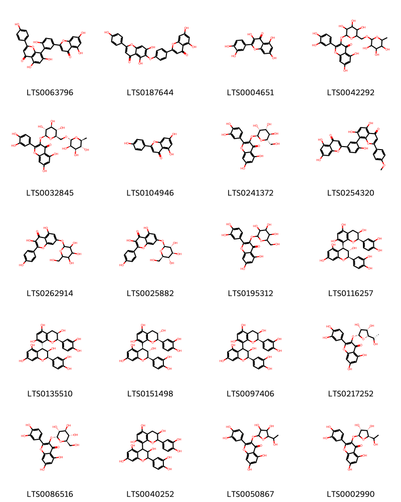{ width=100% }
    <figcaption>Hình ảnh cấu trúc hóa học của 20 hoạt chất thuộc nhóm Flavonoids gồm ['amentoflavone (LTS0063796)', 'hinokiflavone (LTS0187644)', 'quercetin (LTS0004651)', 'rutin (LTS0042292)', '3-rutinosyl quercetin (LTS0032845)', 'chamomile (LTS0104946)', '2-(3,4-dihydroxyphenyl)-5,7-dihydroxy-3-{[(2s,3r,4r,5r,6s)-3,4,5-trihydroxy-6-(hydroxymethyl)oxan-2-yl]oxy}chromen-4-one (LTS0241372)', '8-[5-(5,7-dihydroxy-4-oxochromen-2-yl)-2-hydroxyphenyl]-5,7-dihydroxy-2-(4-methoxyphenyl)chromen-4-one (LTS0254320)', '3,5-dihydroxy-2-(4-hydroxyphenyl)-7-{[3,4,5-trihydroxy-6-(hydroxymethyl)oxan-2-yl]oxy}chromen-4-one (LTS0262914)', 'kaempferol 7-o-glucoside (LTS0025882)', '2-(3,4-dihydroxyphenyl)-5,7-dihydroxy-3-{[3,4,5-trihydroxy-6-(hydroxymethyl)oxan-2-yl]oxy}chromen-4-one (LTS0195312)', '(2r,3s,4s)-2-(3,4-dihydroxyphenyl)-4-[(2r,3r)-2-(3,4-dihydroxyphenyl)-3,5,7-trihydroxy-3,4-dihydro-2h-1-benzopyran-8-yl]-3,4-dihydro-2h-1-benzopyran-3,5,7-triol (LTS0116257)', '(2r,3r,4r)-2-(3,4-dihydroxyphenyl)-4-[(2r,3r)-2-(3,4-dihydroxyphenyl)-3,5,7-trihydroxy-3,4-dihydro-2h-1-benzopyran-8-yl]-3,4-dihydro-2h-1-benzopyran-3,5,7-triol (LTS0135510)', '(2r,3s,4s)-2-(3,4-dihydroxyphenyl)-4-[(2r,3s)-2-(3,4-dihydroxyphenyl)-3,5,7-trihydroxy-3,4-dihydro-2h-1-benzopyran-8-yl]-3,4-dihydro-2h-1-benzopyran-3,5,7-triol (LTS0151498)', '(2r,3r)-2-(3,4-dihydroxyphenyl)-4-[(2r,3r)-2-(3,4-dihydroxyphenyl)-3,5,7-trihydroxy-3,4-dihydro-2h-1-benzopyran-8-yl]-3,4-dihydro-2h-1-benzopyran-3,5,7-triol (LTS0097406)', '3-{[(2r,3r,4s,5s)-3,4-dihydroxy-5-[(1s)-1-hydroxyethyl]oxolan-2-yl]oxy}-2-(3,4-dihydroxyphenyl)-5,7-dihydroxychromen-4-one (LTS0217252)', '2-(3,4-dihydroxyphenyl)-5,7-dihydroxy-3-{[(2r,3r,4s,5s,6r)-3,4,5-trihydroxy-6-(hydroxymethyl)oxan-2-yl]oxy}chromen-4-one (LTS0086516)', '2-(3,4-dihydroxyphenyl)-4-[2-(3,4-dihydroxyphenyl)-3,5,7-trihydroxy-3,4-dihydro-2h-1-benzopyran-8-yl]-3,4-dihydro-2h-1-benzopyran-3,5,7-triol (LTS0040252)', '3-{[3,4-dihydroxy-5-(1-hydroxyethyl)oxolan-2-yl]oxy}-2-(3,4-dihydroxyphenyl)-5,7-dihydroxychromen-4-one (LTS0050867)', '3-{[(2s,3r,4s,5r)-3,4-dihydroxy-5-(1-hydroxyethyl)oxolan-2-yl]oxy}-2-(3,4-dihydroxyphenyl)-5,7-dihydroxychromen-4-one (LTS0002990)'].</figcaption>
</figure>
#### Nhóm Furanoid lignans
<figure markdown="span">
    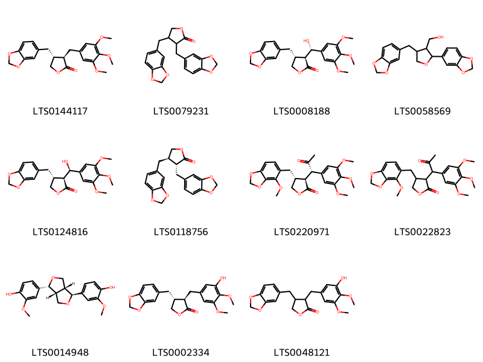{ width=100% }
    <figcaption>Hình ảnh cấu trúc hóa học của 11 hoạt chất thuộc nhóm Furanoid lignans gồm ['yatein (LTS0144117)', '3,4-bis(2h-1,3-benzodioxol-5-ylmethyl)oxolan-2-one (LTS0079231)', 'podorhizol (LTS0008188)', '[2-(2h-1,3-benzodioxol-5-yl)-4-(2h-1,3-benzodioxol-5-ylmethyl)oxolan-3-yl]methanol (LTS0058569)', '(3s,4r)-4-(2h-1,3-benzodioxol-5-ylmethyl)-3-[(r)-hydroxy(3,4,5-trimethoxyphenyl)methyl]oxolan-2-one (LTS0124816)', 'hinokinin (LTS0118756)', '(3s,4r)-4-[(4-methoxy-2h-1,3-benzodioxol-5-yl)methyl]-3-[(1s)-2-oxo-1-(3,4,5-trimethoxyphenyl)propyl]oxolan-2-one (LTS0220971)', '4-[(4-methoxy-2h-1,3-benzodioxol-5-yl)methyl]-3-[2-oxo-1-(3,4,5-trimethoxyphenyl)propyl]oxolan-2-one (LTS0022823)', '4-[(1s,3ar,4r,6ar)-4-(4-hydroxy-3-methoxyphenyl)-hexahydrofuro[3,4-c]furan-1-yl]-2-methoxyphenol (LTS0014948)', "(-)-5'-desmethylyatein (LTS0002334)", '4-(2h-1,3-benzodioxol-5-ylmethyl)-3-[(3-hydroxy-4,5-dimethoxyphenyl)methyl]oxolan-2-one (LTS0048121)'].</figcaption>
</figure>
#### Nhóm Lignan lactones
<figure markdown="span">
    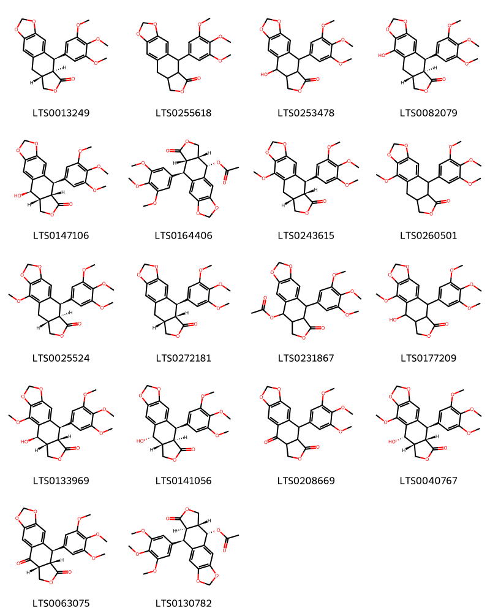{ width=100% }
    <figcaption>Hình ảnh cấu trúc hóa học của 18 hoạt chất thuộc nhóm Lignan lactones gồm ['(-)-deoxypodophyllotoxin (LTS0013249)', '10-(3,4,5-trimethoxyphenyl)-4,6,13-trioxatetracyclo[7.7.0.0³,⁷.0¹¹,¹⁵]hexadeca-1,3(7),8-trien-12-one (LTS0255618)', 'podophyllum resin (LTS0253478)', 'β-peltatin (LTS0082079)', 'epipodophyllotoxins (LTS0147106)', '(10s,11r,15s,16r)-14-oxo-16-(3,4,5-trimethoxyphenyl)-4,6,13-trioxatetracyclo[7.7.0.0³,⁷.0¹¹,¹⁵]hexadeca-1,3(7),8-trien-10-yl acetate (LTS0164406)', '(10r,11s,15r)-2-methoxy-10-(3,4,5-trimethoxyphenyl)-4,6,13-trioxatetracyclo[7.7.0.0³,⁷.0¹¹,¹⁵]hexadeca-1,3(7),8-trien-12-one (LTS0243615)', '2-methoxy-10-(3,4,5-trimethoxyphenyl)-4,6,13-trioxatetracyclo[7.7.0.0³,⁷.0¹¹,¹⁵]hexadeca-1,3(7),8-trien-12-one (LTS0260501)', 'β-peltatin a methyl ether (LTS0025524)', '(10r,11s,15r)-10-(3,4,5-trimethoxyphenyl)-4,6,13-trioxatetracyclo[7.7.0.0³,⁷.0¹¹,¹⁵]hexadeca-1,3(7),8-trien-12-one (LTS0272181)', '14-oxo-16-(3,4,5-trimethoxyphenyl)-4,6,13-trioxatetracyclo[7.7.0.0³,⁷.0¹¹,¹⁵]hexadeca-1,3(7),8-trien-10-yl acetate (LTS0231867)', '16-hydroxy-2-methoxy-10-(3,4,5-trimethoxyphenyl)-4,6,13-trioxatetracyclo[7.7.0.0³,⁷.0¹¹,¹⁵]hexadeca-1,3(7),8-trien-12-one (LTS0177209)', '(10r,11s,15r,16r)-16-hydroxy-2-methoxy-10-(3,4,5-trimethoxyphenyl)-4,6,13-trioxatetracyclo[7.7.0.0³,⁷.0¹¹,¹⁵]hexadeca-1,3(7),8-trien-12-one (LTS0133969)', 'epipodophyllotoxin (LTS0141056)', '16-(3,4,5-trimethoxyphenyl)-4,6,13-trioxatetracyclo[7.7.0.0³,⁷.0¹¹,¹⁵]hexadeca-1,3(7),8-triene-10,14-dione (LTS0208669)', '(10r,11s,15r,16s)-16-hydroxy-2-methoxy-10-(3,4,5-trimethoxyphenyl)-4,6,13-trioxatetracyclo[7.7.0.0³,⁷.0¹¹,¹⁵]hexadeca-1,3(7),8-trien-12-one (LTS0040767)', '(11r,15s,16r)-16-(3,4,5-trimethoxyphenyl)-4,6,13-trioxatetracyclo[7.7.0.0³,⁷.0¹¹,¹⁵]hexadeca-1,3(7),8-triene-10,14-dione (LTS0063075)', '(10s,11r,15r,16r)-14-oxo-16-(3,4,5-trimethoxyphenyl)-4,6,13-trioxatetracyclo[7.7.0.0³,⁷.0¹¹,¹⁵]hexadeca-1,3(7),8-trien-10-yl acetate (LTS0130782)'].</figcaption>
</figure>
#### Nhóm Phenanthrenes and derivatives
<figure markdown="span">
    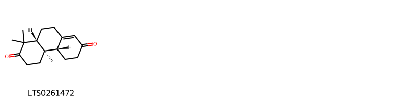{ width=100% }
    <figcaption>Hình ảnh cấu trúc hóa học của 1 hoạt chất thuộc nhóm Phenanthrenes and derivatives gồm ['(4ar,4bs,10ar)-1,1,4a-trimethyl-3,4,4b,5,6,9,10,10a-octahydrophenanthrene-2,7-dione (LTS0261472)'].</figcaption>
</figure>
#### Nhóm Prenol lipids
<figure markdown="span">
    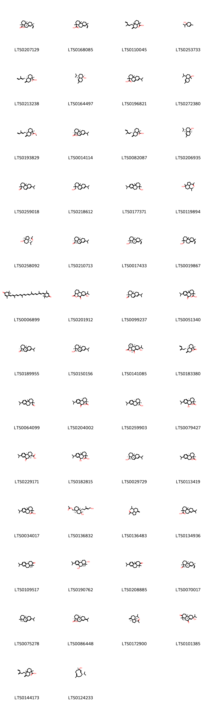{ width=100% }
    <figcaption>Hình ảnh cấu trúc hóa học của 71 hoạt chất thuộc nhóm Prenol lipids gồm ['sandaracopimaric acid (LTS0207129)', 'pimaric acid (LTS0168085)', '1,4a-dimethyl-6-methylidene-5-(3-methylpenta-2,4-dien-1-yl)-hexahydro-2h-naphthalene-1-carboxylic acid (LTS0110045)', '4-terpineol (LTS0253733)', '(1s,4ar,5s,8ar)-1,4a-dimethyl-6-methylidene-5-[(2e)-3-methylpenta-2,4-dien-1-yl]-hexahydro-2h-naphthalene-1-carboxylic acid (LTS0213238)', '(1r,4s,4ar)-4-isopropyl-1,6-dimethyl-3,4,4a,7,8,8a-hexahydro-2h-naphthalen-1-ol (LTS0164497)', 'abietic acid (LTS0196821)', 'delta-cadinol (LTS0272380)', 'methyl (1s,4ar,5r,8ar)-1,4a-dimethyl-6-methylidene-5-[(2e)-3-methylpenta-2,4-dien-1-yl]-hexahydro-2h-naphthalene-1-carboxylate (LTS0193829)', '(1s,4ar,4br,10ar)-7-isopropyl-1,4a-dimethyl-2,3,4,4b,5,6,10,10a-octahydrophenanthrene-1-carboxylic acid (LTS0014114)', '(1s,4ar,5s,8ar)-1,4a-dimethyl-6-methylidene-5-[(2z)-3-methylpenta-2,4-dien-1-yl]-hexahydro-2h-naphthalene-1-carboxylic acid (LTS0082087)', 'α-cadinol (LTS0206935)', '7-isopropyl-1,4a-dimethyl-2,3,4,4b,5,6,10,10a-octahydrophenanthrene-1-carbaldehyde (LTS0259018)', 'abietyl alcohol (LTS0218612)', '(7-isopropyl-1,4a-dimethyl-2,3,4,9,10,10a-hexahydrophenanthren-1-yl)methanol (LTS0177371)', '1-(4-hydroxy-7-isopropyl-4-methyl-octahydroinden-1-yl)ethanone (LTS0119894)', '1-[(1s,3ar,4r,7s,7as)-4-hydroxy-7-isopropyl-4-methyl-octahydroinden-1-yl]ethanone (LTS0258092)', '(1s,4ar,4br,10ar)-7-isopropyl-1,4a-dimethyl-2,3,4,4b,5,6,10,10a-octahydrophenanthrene-1-carbaldehyde (LTS0210713)', '[(1r,4ar,4bs,7r,10ar)-7-ethenyl-1,4a,7-trimethyl-3,4,4b,5,6,9,10,10a-octahydro-2h-phenanthren-1-yl]methanol (LTS0017433)', '(7-ethenyl-1,4a,7-trimethyl-3,4,4b,5,6,9,10,10a-octahydro-2h-phenanthren-1-yl)methanol (LTS0019867)', 'rhodoxanthin (LTS0006899)', '5-hydroxy-5-isopropyl-1,12-dimethyl-10-oxatetracyclo[7.6.1.0²,⁷.0¹²,¹⁶]hexadec-6-ene-8,11-dione (LTS0201912)', '(1r,4ar)-7-isopropyl-1,4a-dimethyl-2,3,4,4b,5,6,10,10a-octahydrophenanthrene-1-carbaldehyde (LTS0099237)', '7-isopropyl-1,4a-dimethyl-9-oxo-3,4,10,10a-tetrahydro-2h-phenanthrene-1-carboxylic acid (LTS0051340)', '(1s,4ar,4bs,10as)-7-isopropyl-1,4a-dimethyl-2,3,4,4b,5,6,10,10a-octahydrophenanthrene-1-carbaldehyde (LTS0189955)', 'abietyl alcohol (LTS0150156)', '(1r,2r,5s,9s,12s,16r)-5-hydroxy-5-isopropyl-1,12-dimethyl-10-oxatetracyclo[7.6.1.0²,⁷.0¹²,¹⁶]hexadec-6-ene-8,11-dione (LTS0141085)', '(1s,4ar,5s,8ar)-1,4a-dimethyl-6-methylidene-5-(3-methylidenepent-4-en-1-yl)-hexahydro-2h-naphthalene-1-carboxylic acid (LTS0183380)', '7-isopropyl-1,4a-dimethyl-2,3,4,9,10,10a-hexahydrophenanthrene-1-carbaldehyde (LTS0064099)', '(1s,4as,10ar)-7-isopropyl-1,4a-dimethyl-9-oxo-3,4,10,10a-tetrahydro-2h-phenanthrene-1-carboxylic acid (LTS0204002)', '[(1s,4as,10ar)-7-isopropyl-1,4a-dimethyl-2,3,4,9,10,10a-hexahydrophenanthren-1-yl]methanol (LTS0259903)', '(1s,4as,9r,10ar)-9-hydroxy-7-isopropyl-1,4a-dimethyl-2,3,4,9,10,10a-hexahydrophenanthrene-1-carboxylic acid (LTS0079427)', '7-oxodehydroabietic acid (LTS0229171)', '9-hydroxy-7-isopropyl-1,4a-dimethyl-2,3,4,9,10,10a-hexahydrophenanthrene-1-carboxylic acid (LTS0182815)', '[(1s,4ar,4br,10ar)-7-isopropyl-1,4a-dimethyl-2,3,4,4b,5,6,10,10a-octahydrophenanthren-1-yl]methanol (LTS0029729)', '(1s,4as,10ar)-7-isopropyl-1,4a-dimethyl-2,3,4,9,10,10a-hexahydrophenanthrene-1-carboxylic acid (LTS0113419)', 'dehydroabietic acid (LTS0034017)', '[(1s,4as,5r,6r,8ar)-6-hydroxy-5-[(3e)-5-hydroxy-3-methylpent-3-en-1-yl]-1,4a,6-trimethyl-hexahydro-2h-naphthalen-1-yl]methyl acetate (LTS0136832)', '1-(7-isopropyl-4-methylidene-octahydroinden-1-yl)ethanone (LTS0136483)', '1,4a-dimethyl-7-(propan-2-ylidene)-3,4,4b,5,6,9,10,10a-octahydro-2h-phenanthrene-1-carboxylic acid (LTS0134936)', '(4as,10ar)-7-isopropyl-1,1,4a-trimethyl-4,9,10,10a-tetrahydro-3h-phenanthren-2-one (LTS0109517)', '(2s,4as,9r,10ar)-7-isopropyl-1,1,4a-trimethyl-2,3,4,9,10,10a-hexahydrophenanthrene-2,9-diol (LTS0190762)', '7-isopropyl-1,1,4a-trimethyl-4,9,10,10a-tetrahydro-3h-phenanthren-2-one (LTS0208885)', '(1r,4ar,4bs,7r,10ar)-7-ethenyl-1,4a,7-trimethyl-3,4,4b,5,6,9,10,10a-octahydro-2h-phenanthrene-1-carbaldehyde (LTS0070017)', '(-)-abietadiene (LTS0075278)', '(1s,4ar,4bs,10ar)-1,4a-dimethyl-7-(propan-2-ylidene)-3,4,4b,5,6,9,10,10a-octahydro-2h-phenanthrene-1-carboxylic acid (LTS0086448)', '1-[(1s,3ar,7s,7as)-7-isopropyl-4-methylidene-octahydroinden-1-yl]ethanone (LTS0172900)', '(4as,4br,7s,10ar)-7-hydroxy-7-isopropyl-1,1,4a-trimethyl-4,4b,5,6,10,10a-hexahydro-3h-phenanthrene-2,9-dione (LTS0101385)', '1,4a-dimethyl-6-methylidene-5-(3-methylidenepent-4-en-1-yl)-hexahydro-2h-naphthalene-1-carboxylic acid (LTS0144173)', '(1s,2e,4s,7e)-4-isopropyl-1,7-dimethylcyclodeca-2,7-dien-1-ol (LTS0124233)', '(1r,2r,4as,8as)-1-[(3e)-5-hydroxy-3-methylpent-3-en-1-yl]-2,5,5,8a-tetramethyl-hexahydro-1h-naphthalen-2-ol (LTS0201067)', '7-ethenyl-1,4a,7-trimethyl-3,4,4b,5,6,9,10,10a-octahydro-2h-phenanthrene-1-carbaldehyde (LTS0105939)', '(1s,4as,10ar)-7-isopropyl-1,4a-dimethyl-2,3,4,5,6,9,10,10a-octahydrophenanthrene-1-carbaldehyde (LTS0224696)', '1-[(1r,7r)-7-isopropyl-4-methylidene-octahydroinden-1-yl]ethanone (LTS0188339)', '(1s,2s,4r,9s,12r,16s)-4-hydroxy-5-isopropyl-1,12-dimethyl-10-oxatetracyclo[7.6.1.0²,⁷.0¹²,¹⁶]hexadeca-5,7-dien-11-one (LTS0271710)', '(4ar,4br,10ar)-7-isopropyl-1,1,4a-trimethyl-4,4b,5,6,10,10a-hexahydro-3h-phenanthren-2-one (LTS0264695)', '7-isopropyl-1,1,4a-trimethyl-4,4b,5,6,10,10a-hexahydro-3h-phenanthren-2-one (LTS0218297)', '1,1,4a-trimethyl-6-methylidene-5-(3-methylpenta-2,4-dien-1-yl)-hexahydro-2h-naphthalene (LTS0178743)', '(1s,4ar,5r,8ar)-1,4a-dimethyl-6-methylidene-5-[(2e)-3-methylpenta-2,4-dien-1-yl]-hexahydro-2h-naphthalene-1-carbaldehyde (LTS0162667)', '1-(5-hydroxy-3-methylpent-3-en-1-yl)-2,5,5,8a-tetramethyl-hexahydro-1h-naphthalen-2-ol (LTS0028412)', '(1s,2s,9s,12r,16s)-5-(2-hydroxypropan-2-yl)-1,12-dimethyl-10-oxatetracyclo[7.6.1.0²,⁷.0¹²,¹⁶]hexadeca-5,7-dien-11-one (LTS0258812)', '1,4a-dimethyl-6-methylidene-5-(3-methylpenta-2,4-dien-1-yl)-hexahydro-2h-naphthalene-1-carbaldehyde (LTS0250169)', '(4as,4br,7r,10ar)-7-hydroxy-7-isopropyl-1,1,4a-trimethyl-4,4b,5,6,10,10a-hexahydro-3h-phenanthrene-2,9-dione (LTS0258395)', '(4as,5s,8as)-1,1,4a-trimethyl-6-methylidene-5-[(2e)-3-methylpenta-2,4-dien-1-yl]-hexahydro-2h-naphthalene (LTS0247431)', '(1s,4ar,4bs,10as)-7-isopropyl-1,4a-dimethyl-2,3,4,4b,5,6,10,10a-octahydrophenanthrene-1-carboxylic acid (LTS0242524)', '4-isopropyl-1,7-dimethylcyclodeca-2,7-dien-1-ol (LTS0267848)', '7-isopropyl-1,1,4a-trimethyl-2,3,4,4b,5,6,10,10a-octahydrophenanthrene (LTS0048295)', '(1s,4ar,5s,8ar)-1,4a-dimethyl-6-methylidene-5-[(2e)-3-methylpenta-2,4-dien-1-yl]-hexahydro-2h-naphthalene-1-carbaldehyde (LTS0040890)', '[6-hydroxy-5-(5-hydroxy-3-methylpent-3-en-1-yl)-1,4a,6-trimethyl-hexahydro-2h-naphthalen-1-yl]methyl acetate (LTS0020633)', '(1s,4as,10ar)-7-isopropyl-1,4a-dimethyl-2,3,4,9,10,10a-hexahydrophenanthrene-1-carbaldehyde (LTS0111564)', '7-isopropyl-1,4a-dimethyl-2,3,4,5,6,9,10,10a-octahydrophenanthrene-1-carbaldehyde (LTS0114300)'].</figcaption>
</figure>
#### Nhóm Steroids and steroid derivatives
<figure markdown="span">
    { width=100% }
    <figcaption>Hình ảnh cấu trúc hóa học của 3 hoạt chất thuộc nhóm Steroids and steroid derivatives gồm ['stigmast-5-en-3-ol, (3β)- (LTS0204616)', 'stigmast-5-en-3-ol (LTS0071224)', 'sitosterol (LTS0168132)'].</figcaption>
</figure>

---

### Dược dân tộc học

Danh sách các quốc gia có sử dụng *Juniperus sabina* trong điều trị các bệnh. 

| Country   | Disease                                                                                     | Bệnh                                                                                                                                                                                                |
|:----------|:--------------------------------------------------------------------------------------------|:----------------------------------------------------------------------------------------------------------------------------------------------------------------------------------------------------|
| Egypt     | Poison, Ecbolic                                                                             | MYMEMORY WARNING: YOU USED ALL AVAILABLE FREE TRANSLATIONS FOR TODAY. NEXT AVAILABLE IN  09 HOURS 33 MINUTES 58 SECONDS VISIT HTTPS://MYMEMORY.TRANSLATED.NET/DOC/USAGELIMITS.PHP TO TRANSLATE MORE |
| Elsewhere | Abortifacient, Diuretic, Emmenagogue, Poison, Diuretic                                      | MYMEMORY WARNING: YOU USED ALL AVAILABLE FREE TRANSLATIONS FOR TODAY. NEXT AVAILABLE IN  09 HOURS 33 MINUTES 55 SECONDS VISIT HTTPS://MYMEMORY.TRANSLATED.NET/DOC/USAGELIMITS.PHP TO TRANSLATE MORE |
| Turkey    | Abortifacient, Diuretic, Emmenagogue, Hemostat, Uterotonic, Vermifuge, Parasiticide, Poison | MYMEMORY WARNING: YOU USED ALL AVAILABLE FREE TRANSLATIONS FOR TODAY. NEXT AVAILABLE IN  09 HOURS 33 MINUTES 52 SECONDS VISIT HTTPS://MYMEMORY.TRANSLATED.NET/DOC/USAGELIMITS.PHP TO TRANSLATE MORE |
| ain       | Abortifacient, Poison                                                                       | MYMEMORY WARNING: YOU USED ALL AVAILABLE FREE TRANSLATIONS FOR TODAY. NEXT AVAILABLE IN  09 HOURS 33 MINUTES 49 SECONDS VISIT HTTPS://MYMEMORY.TRANSLATED.NET/DOC/USAGELIMITS.PHP TO TRANSLATE MORE |

---

---
## Juniperus scopulorum
### Thông tin về thực vật

!!! info "Phân loại thực vật của *Juniperus scopulorum* từ GIBF:"
    - **Kingdom:** Plantae
    - **Phylum:** Tracheophyta
    - **Order:** Pinales
    - **Family:** Cupressaceae
    - **Genus:** Juniperus
    - **Species:** *Juniperus scopulorum*

 

| Label (VI)   | Label (EN)   | Scientific Name      | Descriptions (VI)   | Descriptions (EN)   | Also Known As (VI)   | Also Known As (EN)                                                       |
|:-------------|:-------------|:---------------------|:--------------------|:--------------------|:---------------------|:-------------------------------------------------------------------------|
| N/A          | N/A          | Juniperus scopulorum | loài thực vật       | species of plant    | ['']                 | ['Rocky Mountain juniper', 'Rocky Mountain redcedar', 'seaside juniper'] |

#### Phân bố trên thế giới

**Từ CSDL GIBF** Canada, United States of America, Sweden

#### Phân bố tại Việt Nam

**Từ CSDL GIBF**: Không có ghi nhận ở Việt Nam

---
### Thành phần hóa học
        
- Theo cơ sở dữ liệu lotus: Từ loài *Juniperus scopulorum* đã phân lập và xác định được 31 hoạt chất thuộc về các nhóm Prenol lipids, Carboxylic acids and derivatives, Fatty Acyls. 

|    | chemicalTaxonomyClassyfireClass   |   smiles_count |
|---:|:----------------------------------|---------------:|
|  0 | Carboxylic acids and derivatives  |             21 |
|  1 | Fatty Acyls                       |              4 |
|  2 | Prenol lipids                     |              6 |

#### Nhóm Carboxylic acids and derivatives
<figure markdown="span">
    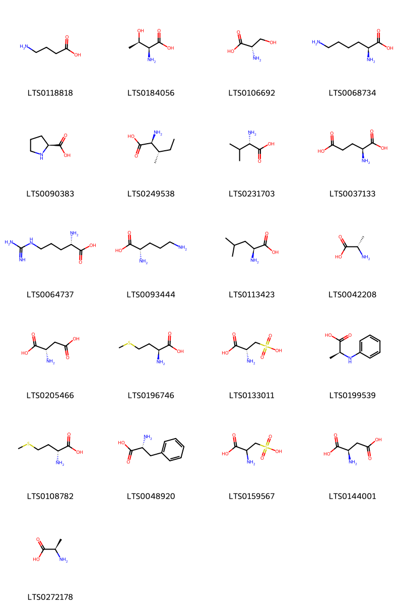{ width=100% }
    <figcaption>Hình ảnh cấu trúc hóa học của 21 hoạt chất thuộc nhóm Carboxylic acids and derivatives gồm ['gamma(amino)-butyric acid (LTS0118818)', 'l-threonine (LTS0184056)', 'l-serine (LTS0106692)', 'l-lysine (LTS0068734)', 'l-proline (LTS0090383)', 'l-isoleucine (LTS0249538)', 'l-valine (LTS0231703)', 'l-glutamic acid (LTS0037133)', 'l-arginine (LTS0064737)', 'l-ornithine (LTS0093444)', 'l-leucine (LTS0113423)', 'l-alanine (LTS0042208)', 'l-aspartic acid (LTS0205466)', 'l-methionine (LTS0196746)', 'cysteinesulfonic acid (LTS0133011)', '(2s)-2-(phenylamino)propanoic acid (LTS0199539)', 'd-methionine (LTS0108782)', 'd-phenylalanine (LTS0048920)', 'cysteic acid (LTS0159567)', 'd-aspartic acid (LTS0144001)', 'd-alanine (LTS0272178)'].</figcaption>
</figure>
#### Nhóm Fatty Acyls
<figure markdown="span">
    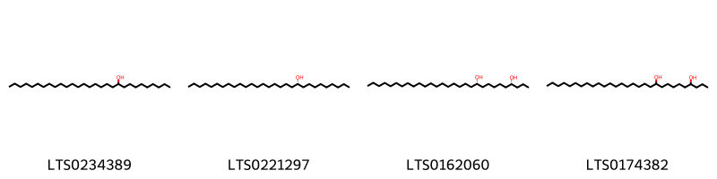{ width=100% }
    <figcaption>Hình ảnh cấu trúc hóa học của 4 hoạt chất thuộc nhóm Fatty Acyls gồm ['nonacosan-10-ol (LTS0234389)', '(r)-nonacosan-10-ol (LTS0221297)', '(4r,10s)-nonacosane-4,10-diol (LTS0162060)', 'nonacosane-4,10-diol (LTS0174382)'].</figcaption>
</figure>
#### Nhóm Prenol lipids
<figure markdown="span">
    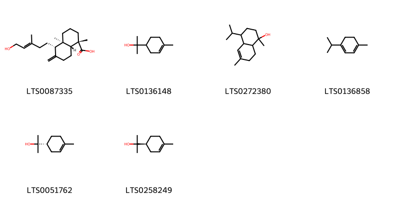{ width=100% }
    <figcaption>Hình ảnh cấu trúc hóa học của 6 hoạt chất thuộc nhóm Prenol lipids gồm ['isocupressic acid (LTS0087335)', 'terpineol (LTS0136148)', 'delta-cadinol (LTS0272380)', 'terpinene (LTS0136858)', 'lily of valley (LTS0051762)', '(+)-α-terpineol (LTS0258249)'].</figcaption>
</figure>

---

### Dược dân tộc học

Danh sách các quốc gia có sử dụng *Juniperus scopulorum* trong điều trị các bệnh. 

| Country        | Disease    | Bệnh                                                                                                                                                                                                |
|:---------------|:-----------|:----------------------------------------------------------------------------------------------------------------------------------------------------------------------------------------------------|
| Canada(Salish) | Antiseptic | MYMEMORY WARNING: YOU USED ALL AVAILABLE FREE TRANSLATIONS FOR TODAY. NEXT AVAILABLE IN  09 HOURS 33 MINUTES 13 SECONDS VISIT HTTPS://MYMEMORY.TRANSLATED.NET/DOC/USAGELIMITS.PHP TO TRANSLATE MORE |
| US(Flathead)   | Tonic      | MYMEMORY WARNING: YOU USED ALL AVAILABLE FREE TRANSLATIONS FOR TODAY. NEXT AVAILABLE IN  09 HOURS 33 MINUTES 10 SECONDS VISIT HTTPS://MYMEMORY.TRANSLATED.NET/DOC/USAGELIMITS.PHP TO TRANSLATE MORE |
| US(Swinomish)  | Antiseptic | MYMEMORY WARNING: YOU USED ALL AVAILABLE FREE TRANSLATIONS FOR TODAY. NEXT AVAILABLE IN  09 HOURS 33 MINUTES 07 SECONDS VISIT HTTPS://MYMEMORY.TRANSLATED.NET/DOC/USAGELIMITS.PHP TO TRANSLATE MORE |

---

---
## Juniperus viginiana
### Thông tin về thực vật

!!! info "Phân loại thực vật của *N/A* từ GIBF:"
    - **Kingdom:** Plantae
    - **Phylum:** Tracheophyta
    - **Order:** Pinales
    - **Family:** Cupressaceae
    - **Genus:** Juniperus
    - **Species:** *N/A*

 

| Label (VI)   | Label (EN)   | Scientific Name      | Descriptions (VI)   | Descriptions (EN)   | Also Known As (VI)   | Also Known As (EN)                                                       |
|:-------------|:-------------|:---------------------|:--------------------|:--------------------|:---------------------|:-------------------------------------------------------------------------|
| N/A          | N/A          | Juniperus scopulorum | loài thực vật       | species of plant    | ['']                 | ['Rocky Mountain juniper', 'Rocky Mountain redcedar', 'seaside juniper'] |

#### Phân bố trên thế giới

**Từ CSDL GIBF** United Kingdom of Great Britain and Northern Ireland, Denmark, Portugal, Sweden, France, Spain, Hungary, Canada, Russian Federation, United States of America, Italy, Austria, Azerbaijan, Greece, Ukraine

#### Phân bố tại Việt Nam

**Từ CSDL GIBF**: Không có ghi nhận ở Việt Nam

---
### Thành phần hóa học
        
- Theo cơ sở dữ liệu lotus: Từ loài *N/A* đã phân lập và xác định được Chưa có hoạt chất nào được phân lập. hoạt chất thuộc về các nhóm Không có hoạt chất nào được phân lập. 

Không có hình ảnh nào được tạo ra

---

### Dược dân tộc học

Danh sách các quốc gia có sử dụng *N/A* trong điều trị các bệnh. 

| Country   | Disease       | Bệnh                                                                                                                                                                                                |
|:----------|:--------------|:----------------------------------------------------------------------------------------------------------------------------------------------------------------------------------------------------|
| US        | Abortifacient | MYMEMORY WARNING: YOU USED ALL AVAILABLE FREE TRANSLATIONS FOR TODAY. NEXT AVAILABLE IN  09 HOURS 32 MINUTES 38 SECONDS VISIT HTTPS://MYMEMORY.TRANSLATED.NET/DOC/USAGELIMITS.PHP TO TRANSLATE MORE |

---

---
## Juniperus virginiana
### Thông tin về thực vật

!!! info "Phân loại thực vật của *Juniperus virginiana* từ GIBF:"
    - **Kingdom:** Plantae
    - **Phylum:** Tracheophyta
    - **Order:** Pinales
    - **Family:** Cupressaceae
    - **Genus:** Juniperus
    - **Species:** *Juniperus virginiana*

 

| Label (VI)   | Label (EN)   | Scientific Name      | Descriptions (VI)   | Descriptions (EN)   | Also Known As (VI)    | Also Known As (EN)                                                                                                                              |
|:-------------|:-------------|:---------------------|:--------------------|:--------------------|:----------------------|:------------------------------------------------------------------------------------------------------------------------------------------------|
| N/A          | N/A          | Juniperus virginiana | loài thực vật       | species of plant    | ['Sabina virginiana'] | ['aromatic cedar', 'eastern juniper', 'eastern red cedar', 'eastern redcedar', 'pencil cedar', 'red cedar', 'red juniper', 'Virginian juniper'] |

#### Phân bố trên thế giới

**Từ CSDL GIBF** Canada, United States of America

#### Phân bố tại Việt Nam

**Từ CSDL GIBF**: Không có ghi nhận ở Việt Nam

---
### Thành phần hóa học
        
- Theo cơ sở dữ liệu lotus: Từ loài *Juniperus virginiana* đã phân lập và xác định được 21 hoạt chất thuộc về các nhóm Organooxygen compounds, Flavonoids, Prenol lipids, Benzodioxoles, Lignan lactones. 

|    | chemicalTaxonomyClassyfireClass   |   smiles_count |
|---:|:----------------------------------|---------------:|
|  0 | Benzodioxoles                     |              1 |
|  1 | Flavonoids                        |              6 |
|  2 | Lignan lactones                   |              3 |
|  3 | Organooxygen compounds            |              6 |
|  4 | Prenol lipids                     |              5 |

#### Nhóm Benzodioxoles
<figure markdown="span">
    { width=100% }
    <figcaption>Hình ảnh cấu trúc hóa học của 1 hoạt chất thuộc nhóm Benzodioxoles gồm ['sassafras (LTS0136093)'].</figcaption>
</figure>
#### Nhóm Flavonoids
<figure markdown="span">
    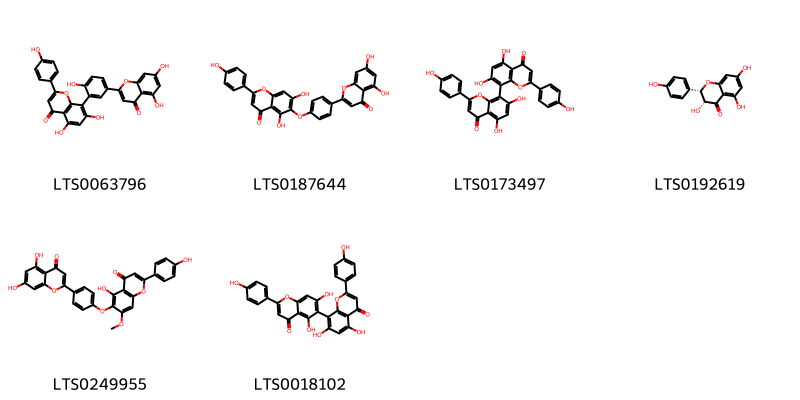{ width=100% }
    <figcaption>Hình ảnh cấu trúc hóa học của 6 hoạt chất thuộc nhóm Flavonoids gồm ['amentoflavone (LTS0063796)', 'hinokiflavone (LTS0187644)', 'cupressuflavone (LTS0173497)', '(2s,3r)-3,5,7-trihydroxy-2-(4-hydroxyphenyl)-2,3-dihydro-1-benzopyran-4-one (LTS0192619)', '6-[4-(5,7-dihydroxy-4-oxochromen-2-yl)phenoxy]-5-hydroxy-2-(4-hydroxyphenyl)-7-methoxychromen-4-one (LTS0249955)', 'agathisflavone (LTS0018102)'].</figcaption>
</figure>
#### Nhóm Lignan lactones
<figure markdown="span">
    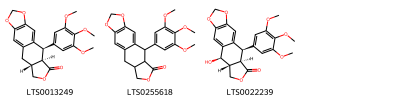{ width=100% }
    <figcaption>Hình ảnh cấu trúc hóa học của 3 hoạt chất thuộc nhóm Lignan lactones gồm ['(-)-deoxypodophyllotoxin (LTS0013249)', '10-(3,4,5-trimethoxyphenyl)-4,6,13-trioxatetracyclo[7.7.0.0³,⁷.0¹¹,¹⁵]hexadeca-1,3(7),8-trien-12-one (LTS0255618)', 'podofilox (LTS0022239)'].</figcaption>
</figure>
#### Nhóm Organooxygen compounds
<figure markdown="span">
    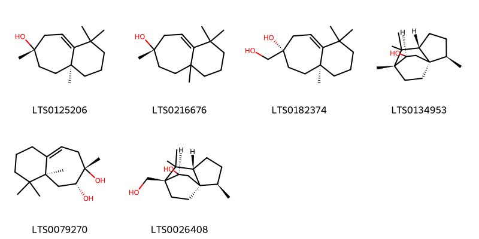{ width=100% }
    <figcaption>Hình ảnh cấu trúc hóa học của 6 hoạt chất thuộc nhóm Organooxygen compounds gồm ['widdrol (LTS0125206)', '(7s)-1,1,4a,7-tetramethyl-2,3,4,5,6,8-hexahydrobenzo[7]annulen-7-ol (LTS0216676)', '(4as,7s)-7-(hydroxymethyl)-1,1,4a-trimethyl-2,3,4,5,6,8-hexahydrobenzo[7]annulen-7-ol (LTS0182374)', '(1r,2r,5r,7r,8s)-2,6,6,7-tetramethyltricyclo[5.2.2.0¹,⁵]undecan-8-ol (LTS0134953)', '(4as,6r,7s)-4,4,4a,7-tetramethyl-1,2,3,5,6,8-hexahydrobenzo[7]annulene-6,7-diol (LTS0079270)', '(1r,2r,5r,7r,8s)-7-(hydroxymethyl)-2,6,6-trimethyltricyclo[5.2.2.0¹,⁵]undecan-8-ol (LTS0026408)'].</figcaption>
</figure>
#### Nhóm Prenol lipids
<figure markdown="span">
    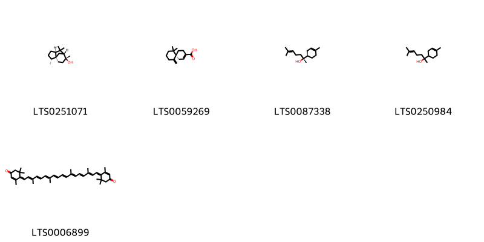{ width=100% }
    <figcaption>Hình ảnh cấu trúc hóa học của 5 hoạt chất thuộc nhóm Prenol lipids gồm ['cedrol (LTS0251071)', '(6s)-7,7-dimethyl-11-methylidenespiro[5.5]undec-2-ene-3-carboxylic acid (LTS0059269)', '(2r)-6-methyl-2-[(1r)-4-methylcyclohex-3-en-1-yl]hept-5-en-2-ol (LTS0087338)', 'α-bisabolol (LTS0250984)', 'rhodoxanthin (LTS0006899)'].</figcaption>
</figure>

---

### Dược dân tộc học

Danh sách các quốc gia có sử dụng *Juniperus virginiana* trong điều trị các bệnh. 

| Country   | Disease                                                  | Bệnh                                                                                                                                                                                                |
|:----------|:---------------------------------------------------------|:----------------------------------------------------------------------------------------------------------------------------------------------------------------------------------------------------|
| Elsewhere | Abortifacient                                            | MYMEMORY WARNING: YOU USED ALL AVAILABLE FREE TRANSLATIONS FOR TODAY. NEXT AVAILABLE IN  09 HOURS 32 MINUTES 10 SECONDS VISIT HTTPS://MYMEMORY.TRANSLATED.NET/DOC/USAGELIMITS.PHP TO TRANSLATE MORE |
| Turkey    | Soap, Taenifuge                                          | MYMEMORY WARNING: YOU USED ALL AVAILABLE FREE TRANSLATIONS FOR TODAY. NEXT AVAILABLE IN  09 HOURS 32 MINUTES 07 SECONDS VISIT HTTPS://MYMEMORY.TRANSLATED.NET/DOC/USAGELIMITS.PHP TO TRANSLATE MORE |
| US        | Emmenagogue, Poison, Sudorific, Stimulant, Abortifacient | MYMEMORY WARNING: YOU USED ALL AVAILABLE FREE TRANSLATIONS FOR TODAY. NEXT AVAILABLE IN  09 HOURS 32 MINUTES 04 SECONDS VISIT HTTPS://MYMEMORY.TRANSLATED.NET/DOC/USAGELIMITS.PHP TO TRANSLATE MORE |

---

# Chi Cupressus

??? note "Danh sách các dược liệu thuộc chi"
    
	 - *Cupressus arizonica*
	 - *Cupressus benthamii*
	 - *Cupressus lindleyi*
	 - *Cupressus macrocarpa*
	 - *Cupressus sempervirens*

---
## Cupressus arizonica
### Thông tin về thực vật

!!! info "Phân loại thực vật của *Cupressus arizonica* từ GIBF:"
    - **Kingdom:** Plantae
    - **Phylum:** Tracheophyta
    - **Order:** Pinales
    - **Family:** Cupressaceae
    - **Genus:** Cupressus
    - **Species:** *Cupressus arizonica*

 

| Label (VI)   | Label (EN)   | Scientific Name     | Descriptions (VI)   | Descriptions (EN)   | Also Known As (VI)   | Also Known As (EN)   |
|:-------------|:-------------|:--------------------|:--------------------|:--------------------|:---------------------|:---------------------|
| N/A          | N/A          | Cupressus arizonica | loài thực vật       | species of plant    | ['']                 | ['Arizona cypress']  |

#### Phân bố trên thế giới

**Từ CSDL GIBF** Türkiye, Iran (Islamic Republic of), Serbia, Morocco, France, Spain, Brazil, New Zealand, Hungary, Bolivia (Plurinational State of), Bulgaria, United States of America, Mexico, Austria, Algeria, Greece, Australia

#### Phân bố tại Việt Nam

**Từ CSDL GIBF**: Không có ghi nhận ở Việt Nam

---
### Thành phần hóa học
        
- Theo cơ sở dữ liệu lotus: Từ loài *Cupressus arizonica* đã phân lập và xác định được 76 hoạt chất thuộc về các nhóm Organooxygen compounds, Unsaturated hydrocarbons, Prenol lipids, Epoxides, Tetrahydrofurans, Steroids and steroid derivatives. 

|    | chemicalTaxonomyClassyfireClass   |   smiles_count |
|---:|:----------------------------------|---------------:|
|  0 | Epoxides                          |              1 |
|  1 | Organooxygen compounds            |              2 |
|  2 | Prenol lipids                     |             47 |
|  3 | Steroids and steroid derivatives  |              8 |
|  4 | Tetrahydrofurans                  |              1 |
|  5 | Unsaturated hydrocarbons          |              1 |

#### Nhóm Epoxides
<figure markdown="span">
    { width=100% }
    <figcaption>Hình ảnh cấu trúc hóa học của 1 hoạt chất thuộc nhóm Epoxides gồm ['(3z,7e)-1,5,5,8-tetramethyl-12-oxabicyclo[9.1.0]dodeca-3,7-diene (LTS0107049)'].</figcaption>
</figure>
#### Nhóm Organooxygen compounds
<figure markdown="span">
    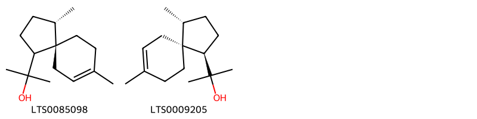{ width=100% }
    <figcaption>Hình ảnh cấu trúc hóa học của 2 hoạt chất thuộc nhóm Organooxygen compounds gồm ['2-[(4s,5r)-4,8-dimethylspiro[4.5]dec-7-en-1-yl]propan-2-ol (LTS0085098)', '2-[(1r,4r,5r)-4,8-dimethylspiro[4.5]dec-7-en-1-yl]propan-2-ol (LTS0009205)'].</figcaption>
</figure>
#### Nhóm Prenol lipids
<figure markdown="span">
    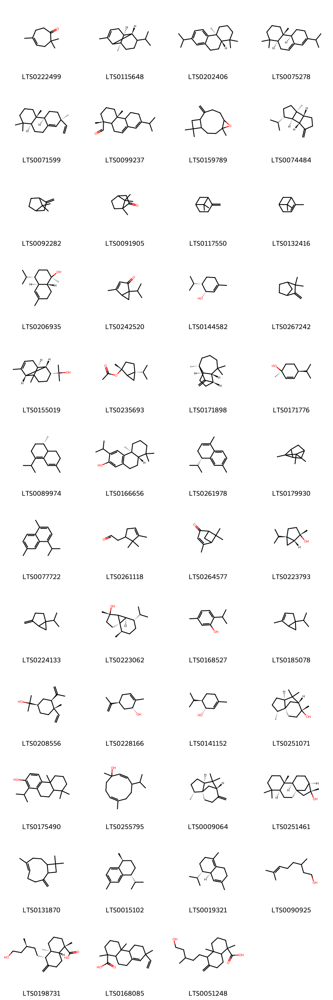{ width=100% }
    <figcaption>Hình ảnh cấu trúc hóa học của 47 hoạt chất thuộc nhóm Prenol lipids gồm ['2,2,5-trimethylcyclohept-4-en-1-one (LTS0222499)', '(1r,6s,7s)-8-isopropyl-1,3-dimethyltricyclo[4.4.0.0²,⁷]dec-3-ene (LTS0115648)', 'abietatriene (LTS0202406)', '(-)-abietadiene (LTS0075278)', 'pimaradiene (LTS0071599)', '(1r,4ar)-7-isopropyl-1,4a-dimethyl-2,3,4,4b,5,6,10,10a-octahydrophenanthrene-1-carbaldehyde (LTS0099237)', 'caryophyllene oxide (LTS0159789)', 'β-bourbonene (LTS0074484)', '7,7-dimethyl-2-methylidenebicyclo[2.2.1]heptane (LTS0092282)', 'camphor (LTS0091905)', 'β-pinene (LTS0117550)', 'α pinene (LTS0132416)', 'α-cadinol (LTS0206935)', 'umbellulone (LTS0242520)', '(1r,6s)-6-isopropyl-3-methylcyclohex-2-en-1-ol (LTS0144582)', 'camphene (LTS0267242)', '2-[(1s,2s,3r,7s)-6,8-dimethyltricyclo[4.4.0.0²,⁷]dec-8-en-3-yl]propan-2-ol (LTS0155019)', '(2r,5s)-5-isopropyl-2-methylbicyclo[3.1.0]hexan-2-yl acetate (LTS0235693)', '(1r,2r,7s,9s)-3,3,7-trimethyl-8-methylidenetricyclo[5.4.0.0²,⁹]undecane (LTS0171898)', '(1s,4s)-4-isopropyl-1-methylcyclohex-2-en-1-ol (LTS0171776)', '(1s)-4-isopropyl-1,6-dimethyl-1,2,3,7,8,8a-hexahydronaphthalene (LTS0089974)', '(4bs,8as)-3-isopropyl-4b,8,8-trimethyl-5,6,7,8a,9,10-hexahydrophenanthren-2-ol (LTS0166656)', '(4s)-4-isopropyl-1,6-dimethyl-3,4-dihydronaphthalene (LTS0261978)', 'tricyclene (LTS0179930)', 'cadalene (LTS0077722)', 'campholenic aldehyde (LTS0261118)', 'verbenone (LTS0264577)', 'cis-(+/-)-4-thujanol (LTS0223793)', 'sabinene (LTS0224133)', '(1r,4s,6r,7s,10r)-7-isopropyl-4,10-dimethyltricyclo[4.4.0.0¹,⁵]decan-4-ol (LTS0223062)', 'thymol (LTS0168527)', 'α-thujene (LTS0185078)', 'elemol (LTS0208556)', '(+)-trans-carveol (LTS0228166)', '(+)-trans-piperitenol (LTS0141152)', 'cedrol (LTS0251071)', 'totarol (LTS0175490)', '(2z,7z)-4-isopropyl-1,7-dimethylcyclodeca-2,7-dien-1-ol (LTS0255795)', '(+)-β-cedrene (LTS0009064)', '(1s,4s,9s,10s,13r,14r)-5,5,9,14-tetramethyltetracyclo[11.2.1.0¹,¹⁰.0⁴,⁹]hexadecan-14-ol (LTS0251461)', 'caryophyllene (LTS0131870)', '(1s,4r)-4-isopropyl-1,6-dimethyl-1,2,3,4-tetrahydronaphthalene (LTS0015102)', 'delta-cadinene (LTS0019321)', 'citronellol, (+-)- (LTS0090925)', '(1s,4ar,5s,8ar)-5-[(3s)-5-hydroxy-3-methylpentyl]-1,4a-dimethyl-6-methylidene-hexahydro-2h-naphthalene-1-carboxylic acid (LTS0198731)', 'pimaric acid (LTS0168085)', '5-(5-hydroxy-3-methylpentyl)-1,4a-dimethyl-6-methylidene-hexahydro-2h-naphthalene-1-carboxylic acid (LTS0051248)'].</figcaption>
</figure>
#### Nhóm Steroids and steroid derivatives
<figure markdown="span">
    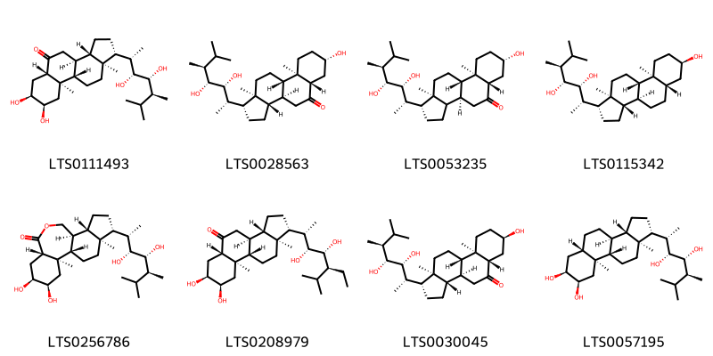{ width=100% }
    <figcaption>Hình ảnh cấu trúc hóa học của 8 hoạt chất thuộc nhóm Steroids and steroid derivatives gồm ['castasterone (LTS0111493)', 'teasterone (LTS0028563)', '(1r,3bs,5as,7s,9ar,9bs,11as)-1-[(2s,3r,4r,5s)-3,4-dihydroxy-5,6-dimethylheptan-2-yl]-7-hydroxy-9a,11a-dimethyl-tetradecahydrocyclopenta[a]phenanthren-5-one (LTS0053235)', '6-deoxotyphasterol (LTS0115342)', 'brassinolide (LTS0256786)', '(1r,3as,3bs,5as,7s,8r,9ar,9bs,11as)-1-[(2s,3r,4r,5s)-5-ethyl-3,4-dihydroxy-6-methylheptan-2-yl]-7,8-dihydroxy-9a,11a-dimethyl-tetradecahydrocyclopenta[a]phenanthren-5-one (LTS0208979)', 'typhasterol (LTS0030045)', '6-deoxocastasterone (LTS0057195)'].</figcaption>
</figure>
#### Nhóm Tetrahydrofurans
<figure markdown="span">
    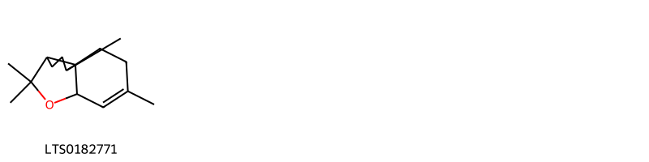{ width=100% }
    <figcaption>Hình ảnh cấu trúc hóa học của 1 hoạt chất thuộc nhóm Tetrahydrofurans gồm ['2,6,6,10-tetramethyl-7-oxatricyclo[6.4.0.0¹,⁵]dodec-9-ene (LTS0182771)'].</figcaption>
</figure>
#### Nhóm Unsaturated hydrocarbons
<figure markdown="span">
    { width=100% }
    <figcaption>Hình ảnh cấu trúc hóa học của 1 hoạt chất thuộc nhóm Unsaturated hydrocarbons gồm ['α terpinene (LTS0232891)'].</figcaption>
</figure>

---

### Dược dân tộc học

Danh sách các quốc gia có sử dụng *Cupressus arizonica* trong điều trị các bệnh. 

| Country   | Disease               | Bệnh                                                                                                                                                                                                |
|:----------|:----------------------|:----------------------------------------------------------------------------------------------------------------------------------------------------------------------------------------------------|
| US        | Carminative, Diuretic | MYMEMORY WARNING: YOU USED ALL AVAILABLE FREE TRANSLATIONS FOR TODAY. NEXT AVAILABLE IN  09 HOURS 31 MINUTES 33 SECONDS VISIT HTTPS://MYMEMORY.TRANSLATED.NET/DOC/USAGELIMITS.PHP TO TRANSLATE MORE |

---

---
## Cupressus benthamii
### Thông tin về thực vật

!!! info "Phân loại thực vật của *Cupressus lusitanica* từ GIBF:"
    - **Kingdom:** Plantae
    - **Phylum:** Tracheophyta
    - **Order:** Pinales
    - **Family:** Cupressaceae
    - **Genus:** Cupressus
    - **Species:** *Cupressus lusitanica*

 

| Label (VI)   | Label (EN)   | Scientific Name     | Descriptions (VI)   | Descriptions (EN)   | Also Known As (VI)   | Also Known As (EN)   |
|:-------------|:-------------|:--------------------|:--------------------|:--------------------|:---------------------|:---------------------|
| N/A          | N/A          | Cupressus benthamii | loài thực vật       | species of plant    | ['']                 | ['']                 |

#### Phân bố trên thế giới

**Từ CSDL GIBF** unknown or invalid, Nicaragua, Brazil, Spain, Hungary, Costa Rica, Russian Federation, Ecuador, United States of America, Mexico

#### Phân bố tại Việt Nam

**Từ CSDL GIBF**: Không có ghi nhận ở Việt Nam

---
### Thành phần hóa học
        
- Theo cơ sở dữ liệu lotus: Từ loài *Cupressus lusitanica* đã phân lập và xác định được Chưa có hoạt chất nào được phân lập. hoạt chất thuộc về các nhóm Không có hoạt chất nào được phân lập. 

Không có hình ảnh nào được tạo ra

---

### Dược dân tộc học

Danh sách các quốc gia có sử dụng *Cupressus lusitanica* trong điều trị các bệnh. 

| Country   | Disease                | Bệnh                                                                                                                                                                                                |
|:----------|:-----------------------|:----------------------------------------------------------------------------------------------------------------------------------------------------------------------------------------------------|
| Mexico    | Astringent, Astringent | MYMEMORY WARNING: YOU USED ALL AVAILABLE FREE TRANSLATIONS FOR TODAY. NEXT AVAILABLE IN  09 HOURS 30 MINUTES 52 SECONDS VISIT HTTPS://MYMEMORY.TRANSLATED.NET/DOC/USAGELIMITS.PHP TO TRANSLATE MORE |

---

---
## Cupressus lindleyi
### Thông tin về thực vật

!!! info "Phân loại thực vật của *Cupressus lusitanica* từ GIBF:"
    - **Kingdom:** Plantae
    - **Phylum:** Tracheophyta
    - **Order:** Pinales
    - **Family:** Cupressaceae
    - **Genus:** Cupressus
    - **Species:** *Cupressus lusitanica*

 

| Label (VI)   | Label (EN)   | Scientific Name    | Descriptions (VI)   | Descriptions (EN)   | Also Known As (VI)   | Also Known As (EN)   |
|:-------------|:-------------|:-------------------|:--------------------|:--------------------|:---------------------|:---------------------|
| N/A          | N/A          | Cupressus lindleyi | loài thực vật       | species of plant    | ['']                 | ['']                 |

#### Phân bố trên thế giới

**Từ CSDL GIBF** nan, Dominican Republic, Spain, Russian Federation, Mexico, Rwanda

#### Phân bố tại Việt Nam

**Từ CSDL GIBF**: Không có ghi nhận ở Việt Nam

---
### Thành phần hóa học
        
- Theo cơ sở dữ liệu lotus: Từ loài *Cupressus lusitanica* đã phân lập và xác định được Chưa có hoạt chất nào được phân lập. hoạt chất thuộc về các nhóm Không có hoạt chất nào được phân lập. 

Không có hình ảnh nào được tạo ra

---

### Dược dân tộc học

Danh sách các quốc gia có sử dụng *Cupressus lusitanica* trong điều trị các bệnh. 

| Country   | Disease    | Bệnh                                                                                                                                                                                                |
|:----------|:-----------|:----------------------------------------------------------------------------------------------------------------------------------------------------------------------------------------------------|
| Mexico    | Astringent | MYMEMORY WARNING: YOU USED ALL AVAILABLE FREE TRANSLATIONS FOR TODAY. NEXT AVAILABLE IN  09 HOURS 30 MINUTES 20 SECONDS VISIT HTTPS://MYMEMORY.TRANSLATED.NET/DOC/USAGELIMITS.PHP TO TRANSLATE MORE |

---

---
## Cupressus macrocarpa
### Thông tin về thực vật

!!! info "Phân loại thực vật của *Cupressus macrocarpa* từ GIBF:"
    - **Kingdom:** Plantae
    - **Phylum:** Tracheophyta
    - **Order:** Pinales
    - **Family:** Cupressaceae
    - **Genus:** Cupressus
    - **Species:** *Cupressus macrocarpa*

 

| Label (VI)   | Label (EN)   | Scientific Name      | Descriptions (VI)   | Descriptions (EN)   | Also Known As (VI)   | Also Known As (EN)   |
|:-------------|:-------------|:---------------------|:--------------------|:--------------------|:---------------------|:---------------------|
| N/A          | N/A          | Cupressus macrocarpa |                     | species of plant    | ['']                 | ['Monterey Cypress'] |

#### Phân bố trên thế giới

**Từ CSDL GIBF** United Kingdom of Great Britain and Northern Ireland, South Africa, France, Spain, New Zealand, Peru, Chile, United States of America, Ireland, Australia

#### Phân bố tại Việt Nam

**Từ CSDL GIBF**: Không có ghi nhận ở Việt Nam

---
### Thành phần hóa học
        
- Theo cơ sở dữ liệu lotus: Từ loài *Cupressus macrocarpa* đã phân lập và xác định được 44 hoạt chất thuộc về các nhóm Unsaturated hydrocarbons, Prenol lipids, Benzene and substituted derivatives. 

|    | chemicalTaxonomyClassyfireClass     |   smiles_count |
|---:|:------------------------------------|---------------:|
|  0 | Benzene and substituted derivatives |              2 |
|  1 | Prenol lipids                       |             27 |
|  2 | Unsaturated hydrocarbons            |             15 |

#### Nhóm Benzene and substituted derivatives
<figure markdown="span">
    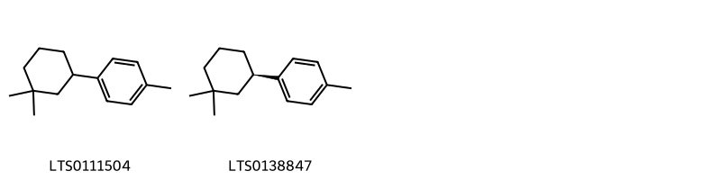{ width=100% }
    <figcaption>Hình ảnh cấu trúc hóa học của 2 hoạt chất thuộc nhóm Benzene and substituted derivatives gồm ['1-(3,3-dimethylcyclohexyl)-4-methylbenzene (LTS0111504)', '1-[(1r)-3,3-dimethylcyclohexyl]-4-methylbenzene (LTS0138847)'].</figcaption>
</figure>
#### Nhóm Prenol lipids
<figure markdown="span">
    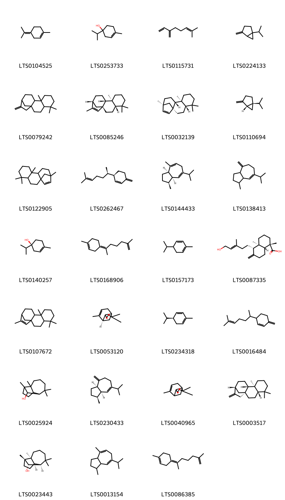{ width=100% }
    <figcaption>Hình ảnh cấu trúc hóa học của 27 hoạt chất thuộc nhóm Prenol lipids gồm ['terpinolene (LTS0104525)', '4-terpineol (LTS0253733)', 'α-myrcene (LTS0115731)', 'sabinene (LTS0224133)', '5,5,9-trimethyl-14-methylidenetetracyclo[11.2.1.0¹,¹⁰.0⁴,⁹]hexadecane (LTS0079242)', '(1s,4s,9s,10r,13r)-5,5,9,14-tetramethyltetracyclo[11.2.1.0¹,¹⁰.0⁴,⁹]hexadec-14-ene (LTS0085246)', '(1r,4s,9s,10r,13s)-5,5,9,13-tetramethyltetracyclo[11.2.1.0¹,¹⁰.0⁴,⁹]hexadec-14-ene (LTS0032139)', '(+)-sabinene (LTS0110694)', '5,5,9,13-tetramethyltetracyclo[11.2.1.0¹,¹⁰.0⁴,⁹]hexadec-14-ene (LTS0122905)', '(3r)-3-[(2r)-6-methylhept-5-en-2-yl]-6-methylidenecyclohex-1-ene (LTS0262467)', 'guaia-6,9-diene (LTS0144433)', '7-isopropyl-1-methyl-4-methylidene-2,3,3a,5,6,8a-hexahydro-1h-azulene (LTS0138413)', '(+)-4-terpineol (LTS0140257)', '1-methyl-4-(6-methylhept-6-en-2-ylidene)cyclohex-1-ene (LTS0168906)', 'phellandrene (LTS0157173)', 'isocupressic acid (LTS0087335)', '5,5,9,14-tetramethyltetracyclo[11.2.1.0¹,¹⁰.0⁴,⁹]hexadec-14-ene (LTS0107672)', '(1s,6s,7s)-2,2,6,8-tetramethyltricyclo[5.3.1.0¹,⁶]undec-8-ene (LTS0053120)', '(+)-α-phellandrene (LTS0234318)', '3-(6-methylhept-5-en-2-yl)-6-methylidenecyclohex-1-ene (LTS0016484)', '2,6,6,9-tetramethyltricyclo[5.4.0.0²,⁹]undecan-8-ol (LTS0025924)', '(1s,3ar,8ar)-7-isopropyl-1-methyl-4-methylidene-2,3,3a,5,6,8a-hexahydro-1h-azulene (LTS0230433)', '2,2,6,8-tetramethyltricyclo[5.3.1.0¹,⁶]undec-8-ene (LTS0040965)', '(1s,4s,9s,10s,13r)-5,5,9-trimethyl-14-methylidenetetracyclo[11.2.1.0¹,¹⁰.0⁴,⁹]hexadecane (LTS0003517)', '(1r,2s,7s,8s,9r)-2,6,6,9-tetramethyltricyclo[5.4.0.0²,⁹]undecan-8-ol (LTS0023443)', '(1xi,4xi,5xi)-guaia-6,9-diene (LTS0013154)', '(4e)-1-methyl-4-(6-methylhept-6-en-2-ylidene)cyclohex-1-ene (LTS0086385)'].</figcaption>
</figure>
#### Nhóm Unsaturated hydrocarbons
<figure markdown="span">
    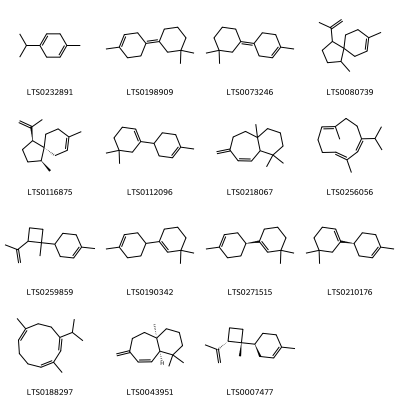{ width=100% }
    <figcaption>Hình ảnh cấu trúc hóa học của 15 hoạt chất thuộc nhóm Unsaturated hydrocarbons gồm ['α terpinene (LTS0232891)', '4-[(1e)-3,3-dimethylcyclohexylidene]-1-methylcyclohex-1-ene (LTS0198909)', '4-(3,3-dimethylcyclohexylidene)-1-methylcyclohex-1-ene (LTS0073246)', '1,8-dimethyl-4-(prop-1-en-2-yl)spiro[4.5]dec-7-ene (LTS0080739)', '(1s,4s,5r)-1,8-dimethyl-4-(prop-1-en-2-yl)spiro[4.5]dec-7-ene (LTS0116875)', "4',5,5-trimethyl-[1,1'-bi(cyclohexane)]-1,3'-diene (LTS0112096)", '1,1,4a-trimethyl-7-methylidene-2,3,4,5,6,9a-hexahydrobenzo[7]annulene (LTS0218067)', '(1e,3e,7e)-1-isopropyl-3,8-dimethylcyclodeca-1,3,7-triene (LTS0256056)', '1-methyl-4-[1-methyl-2-(prop-1-en-2-yl)cyclobutyl]cyclohex-1-ene (LTS0259859)', "3,3,4'-trimethyl-[1,1'-bi(cyclohexane)]-1,3'-diene (LTS0190342)", "(1's)-3,3,4'-trimethyl-[1,1'-bi(cyclohexane)]-1,3'-diene (LTS0271515)", '(-)-β-macrocarpene (LTS0210176)', '1-isopropyl-3,8-dimethylcyclodeca-1,3,7-triene (LTS0188297)', '(4ar,9ar)-1,1,4a-trimethyl-7-methylidene-2,3,4,5,6,9a-hexahydrobenzo[7]annulene (LTS0043951)', '(4s)-1-methyl-4-[(1r,2s)-1-methyl-2-(prop-1-en-2-yl)cyclobutyl]cyclohex-1-ene (LTS0007477)'].</figcaption>
</figure>

---

### Dược dân tộc học

Danh sách các quốc gia có sử dụng *Cupressus macrocarpa* trong điều trị các bệnh. 

| Country   | Disease   | Bệnh                                                                                                                                                                                                |
|:----------|:----------|:----------------------------------------------------------------------------------------------------------------------------------------------------------------------------------------------------|
| US        | Poison    | MYMEMORY WARNING: YOU USED ALL AVAILABLE FREE TRANSLATIONS FOR TODAY. NEXT AVAILABLE IN  09 HOURS 29 MINUTES 52 SECONDS VISIT HTTPS://MYMEMORY.TRANSLATED.NET/DOC/USAGELIMITS.PHP TO TRANSLATE MORE |

---

---
## Cupressus sempervirens
### Thông tin về thực vật

!!! info "Phân loại thực vật của *Cupressus sempervirens* từ GIBF:"
    - **Kingdom:** Plantae
    - **Phylum:** Tracheophyta
    - **Order:** Pinales
    - **Family:** Cupressaceae
    - **Genus:** Cupressus
    - **Species:** *Cupressus sempervirens*

 

| Label (VI)   | Label (EN)   | Scientific Name        | Descriptions (VI)   | Descriptions (EN)   | Also Known As (VI)   | Also Known As (EN)        |
|:-------------|:-------------|:-----------------------|:--------------------|:--------------------|:---------------------|:--------------------------|
| N/A          | N/A          | Cupressus sempervirens | loài thực vật       | species of plant    | ['']                 | ['Mediterranean Cypress'] |

#### Phân bố trên thế giới

**Từ CSDL GIBF** Georgia, Bosnia and Herzegovina, Spain, Germany, Australia, Serbia, Montenegro, Malta, Türkiye, Brazil, Switzerland, Uruguay, United Kingdom of Great Britain and Northern Ireland, Iran (Islamic Republic of), South Africa, Portugal, France, Syrian Arab Republic, Cyprus, Bolivia (Plurinational State of), United States of America, Algeria, Italy, Greece, Croatia, Ukraine

#### Phân bố tại Việt Nam

**Từ CSDL GIBF**: Không có ghi nhận ở Việt Nam

---
### Thành phần hóa học
        
- Theo cơ sở dữ liệu lotus: Từ loài *Cupressus sempervirens* đã phân lập và xác định được 190 hoạt chất thuộc về các nhóm Organooxygen compounds, Flavonoids, Saturated hydrocarbons, Unsaturated hydrocarbons, Prenol lipids, Lignan glycosides, Fatty Acyls, Benzene and substituted derivatives, Organic phosphoric acids and derivatives. 

|    | chemicalTaxonomyClassyfireClass          |   smiles_count |
|---:|:-----------------------------------------|---------------:|
|  0 |                                          |              2 |
|  1 | Benzene and substituted derivatives      |              3 |
|  2 | Fatty Acyls                              |              6 |
|  3 | Flavonoids                               |             24 |
|  4 | Lignan glycosides                        |              4 |
|  5 | Organic phosphoric acids and derivatives |              1 |
|  6 | Organooxygen compounds                   |             15 |
|  7 | Prenol lipids                            |            117 |
|  8 | Saturated hydrocarbons                   |             10 |
|  9 | Unsaturated hydrocarbons                 |              5 |

#### Nhóm 
<figure markdown="span">
    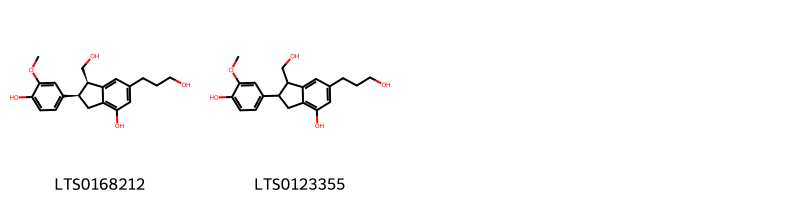{ width=100% }
    <figcaption>Hình ảnh cấu trúc hóa học của 2 hoạt chất thuộc nhóm  gồm ['(1r,2r)-2-(4-hydroxy-3-methoxyphenyl)-1-(hydroxymethyl)-6-(3-hydroxypropyl)-2,3-dihydro-1h-inden-4-ol (LTS0168212)', '2-(4-hydroxy-3-methoxyphenyl)-1-(hydroxymethyl)-6-(3-hydroxypropyl)-2,3-dihydro-1h-inden-4-ol (LTS0123355)'].</figcaption>
</figure>
#### Nhóm Benzene and substituted derivatives
<figure markdown="span">
    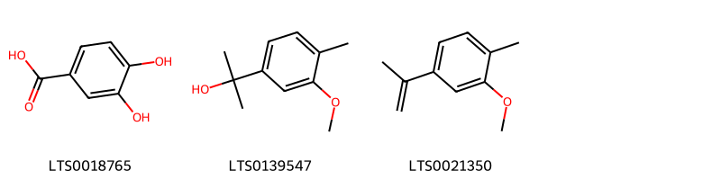{ width=100% }
    <figcaption>Hình ảnh cấu trúc hóa học của 3 hoạt chất thuộc nhóm Benzene and substituted derivatives gồm ['3,4-dihydroxybenzoic acid (LTS0018765)', '2-(3-methoxy-4-methylphenyl)propan-2-ol (LTS0139547)', '2-methoxy-1-methyl-4-(prop-1-en-2-yl)benzene (LTS0021350)'].</figcaption>
</figure>
#### Nhóm Fatty Acyls
<figure markdown="span">
    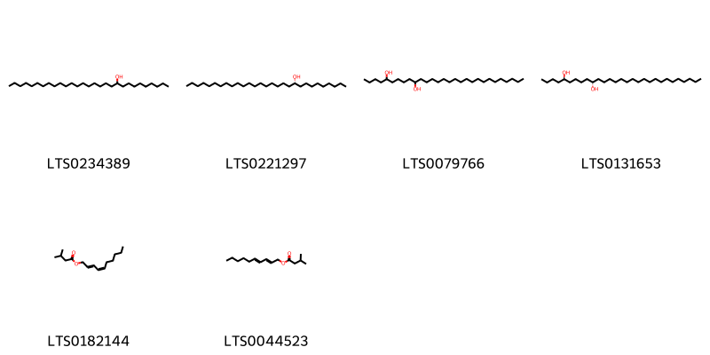{ width=100% }
    <figcaption>Hình ảnh cấu trúc hóa học của 6 hoạt chất thuộc nhóm Fatty Acyls gồm ['nonacosan-10-ol (LTS0234389)', '(r)-nonacosan-10-ol (LTS0221297)', 'nonacosane-5,10-diol (LTS0079766)', '(5r,10s)-nonacosane-5,10-diol (LTS0131653)', '(2e,4z)-deca-2,4-dien-1-yl 3-methylbutanoate (LTS0182144)', '(2e)-deca-2,4-dien-1-yl 3-methylbutanoate (LTS0044523)'].</figcaption>
</figure>
#### Nhóm Flavonoids
<figure markdown="span">
    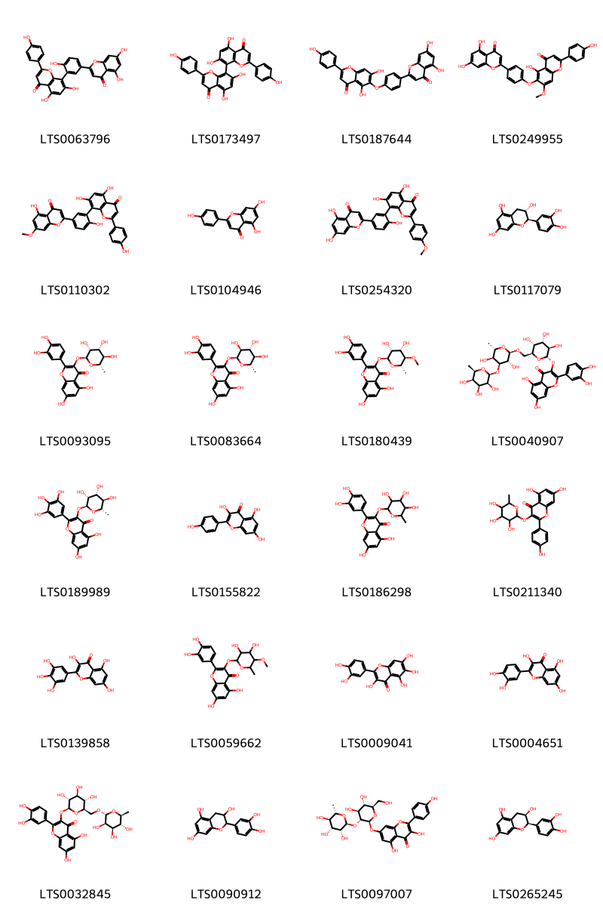{ width=100% }
    <figcaption>Hình ảnh cấu trúc hóa học của 24 hoạt chất thuộc nhóm Flavonoids gồm ['amentoflavone (LTS0063796)', 'cupressuflavone (LTS0173497)', 'hinokiflavone (LTS0187644)', '6-[4-(5,7-dihydroxy-4-oxochromen-2-yl)phenoxy]-5-hydroxy-2-(4-hydroxyphenyl)-7-methoxychromen-4-one (LTS0249955)', 'sequoiaflavone (LTS0110302)', 'chamomile (LTS0104946)', '8-[5-(5,7-dihydroxy-4-oxochromen-2-yl)-2-hydroxyphenyl]-5,7-dihydroxy-2-(4-methoxyphenyl)chromen-4-one (LTS0254320)', '(+)-catechol (LTS0117079)', 'quercitrin (LTS0093095)', '2-(3,4-dihydroxyphenyl)-5,7-dihydroxy-3-{[(2s,3s,4r,5r,6s)-3,4,5-trihydroxy-6-methyloxan-2-yl]oxy}chromen-4-one (LTS0083664)', '3-{[(2s,3r,4s,5r,6s)-3,4-dihydroxy-5-methoxy-6-methyloxan-2-yl]oxy}-2-(3,4-dihydroxyphenyl)-5,7-dihydroxychromen-4-one (LTS0180439)', '3-{[(2s,3r,4s,5r,6s)-6-({[(2r,3r,4s,5s,6s)-3,5-dihydroxy-6-methyl-4-{[(2s,3s,4s,5r,6r)-3,4,5-trihydroxy-6-methyloxan-2-yl]oxy}oxan-2-yl]oxy}methyl)-3,4,5-trihydroxyoxan-2-yl]oxy}-2-(3,4-dihydroxyphenyl)-5,7-dihydroxychromen-4-one (LTS0040907)', 'myricitrin (LTS0189989)', 'kaempherol (LTS0155822)', 'quercitrin (LTS0186298)', '5,7-dihydroxy-2-(4-hydroxyphenyl)-3-[(3,4,5-trihydroxy-6-methyloxan-2-yl)oxy]chromen-4-one (LTS0211340)', 'myricetin (LTS0139858)', '3-[(3,4-dihydroxy-5-methoxy-6-methyloxan-2-yl)oxy]-2-(3,4-dihydroxyphenyl)-5,7-dihydroxychromen-4-one (LTS0059662)', 'quercetagetin (LTS0009041)', 'quercetin (LTS0004651)', '3-rutinosyl quercetin (LTS0032845)', 'catechol (LTS0090912)', 'kaempferol 3-o-rutinoside (LTS0097007)', 'ent-epicatechin (LTS0265245)'].</figcaption>
</figure>
#### Nhóm Lignan glycosides
<figure markdown="span">
    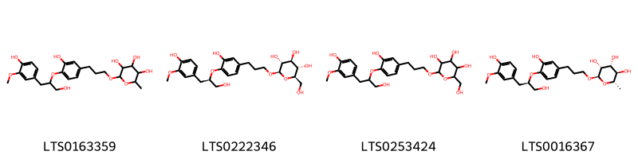{ width=100% }
    <figcaption>Hình ảnh cấu trúc hóa học của 4 hoạt chất thuộc nhóm Lignan glycosides gồm ['2-[3-(3-hydroxy-4-{[1-hydroxy-3-(4-hydroxy-3-methoxyphenyl)propan-2-yl]oxy}phenyl)propoxy]-6-methyloxane-3,4,5-triol (LTS0163359)', '(2r,3r,4s,5s,6r)-2-[3-(3-hydroxy-4-{[(2r)-1-hydroxy-3-(4-hydroxy-3-methoxyphenyl)propan-2-yl]oxy}phenyl)propoxy]-6-(hydroxymethyl)oxane-3,4,5-triol (LTS0222346)', '2-[3-(3-hydroxy-4-{[1-hydroxy-3-(4-hydroxy-3-methoxyphenyl)propan-2-yl]oxy}phenyl)propoxy]-6-(hydroxymethyl)oxane-3,4,5-triol (LTS0253424)', '(2r,3r,4r,5r,6s)-2-[3-(3-hydroxy-4-{[(2r)-1-hydroxy-3-(4-hydroxy-3-methoxyphenyl)propan-2-yl]oxy}phenyl)propoxy]-6-methyloxane-3,4,5-triol (LTS0016367)'].</figcaption>
</figure>
#### Nhóm Organic phosphoric acids and derivatives
<figure markdown="span">
    { width=100% }
    <figcaption>Hình ảnh cấu trúc hóa học của 1 hoạt chất thuộc nhóm Organic phosphoric acids and derivatives gồm ['o-phosphoethanolamine; bis(nonane) (LTS0249963)'].</figcaption>
</figure>
#### Nhóm Organooxygen compounds
<figure markdown="span">
    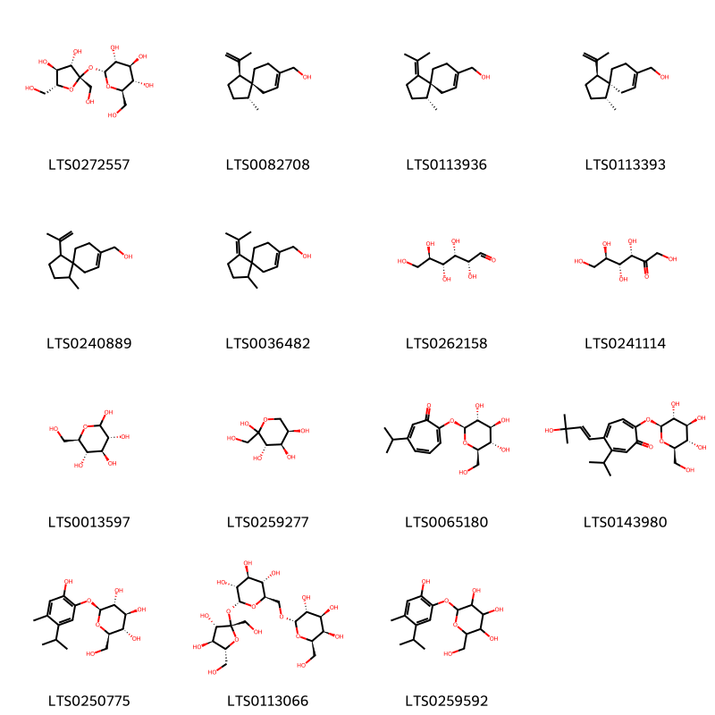{ width=100% }
    <figcaption>Hình ảnh cấu trúc hóa học của 15 hoạt chất thuộc nhóm Organooxygen compounds gồm ['sucrose (LTS0272557)', '[(1r,4s,5s)-1-methyl-4-(prop-1-en-2-yl)spiro[4.5]dec-7-en-8-yl]methanol (LTS0082708)', '[(1r,5s)-1-methyl-4-(propan-2-ylidene)spiro[4.5]dec-7-en-8-yl]methanol (LTS0113936)', '[(1r,4s,5r)-1-methyl-4-(prop-1-en-2-yl)spiro[4.5]dec-7-en-8-yl]methanol (LTS0113393)', '[1-methyl-4-(prop-1-en-2-yl)spiro[4.5]dec-7-en-8-yl]methanol (LTS0240889)', '[1-methyl-4-(propan-2-ylidene)spiro[4.5]dec-7-en-8-yl]methanol (LTS0036482)', '(+)-glucose (LTS0262158)', 'keto-d-fructose (LTS0241114)', 'glucose (LTS0013597)', 'd-fructopyranose (LTS0259277)', '6-isopropyl-2-{[(2s,3r,4s,5s,6r)-3,4,5-trihydroxy-6-(hydroxymethyl)oxan-2-yl]oxy}cyclohepta-2,4,6-trien-1-one (LTS0065180)', '5-[(1e)-3-hydroxy-3-methylbut-1-en-1-yl]-6-isopropyl-2-{[(2s,3r,4s,5s,6r)-3,4,5-trihydroxy-6-(hydroxymethyl)oxan-2-yl]oxy}cyclohepta-2,4,6-trien-1-one (LTS0143980)', '(2s,3r,4s,5s,6r)-2-(2-hydroxy-5-isopropyl-4-methylphenoxy)-6-(hydroxymethyl)oxane-3,4,5-triol (LTS0250775)', 'raffinose (LTS0113066)', '2-(2-hydroxy-5-isopropyl-4-methylphenoxy)-6-(hydroxymethyl)oxane-3,4,5-triol (LTS0259592)'].</figcaption>
</figure>
#### Nhóm Prenol lipids
<figure markdown="span">
    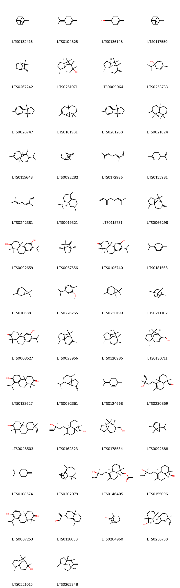{ width=100% }
    <figcaption>Hình ảnh cấu trúc hóa học của 117 hoạt chất thuộc nhóm Prenol lipids gồm ['α pinene (LTS0132416)', 'terpinolene (LTS0104525)', 'terpineol (LTS0136148)', 'β-pinene (LTS0117550)', 'camphene (LTS0267242)', 'cedrol (LTS0251071)', '(+)-β-cedrene (LTS0009064)', '4-terpineol (LTS0253733)', 'cuparene (LTS0028747)', 'thujopsene (LTS0181981)', '1-methyl-4-(1,2,2-trimethylcyclopentyl)benzene (LTS0261288)', '(-)-thujopsene (LTS0021824)', '(1r,6s,7s)-8-isopropyl-1,3-dimethyltricyclo[4.4.0.0²,⁷]dec-3-ene (LTS0115648)', '7,7-dimethyl-2-methylidenebicyclo[2.2.1]heptane (LTS0092282)', '3,7-dimethyl-1,3,6-octatriene (LTS0172986)', 'limonene,  (LTS0155981)', 'β-ocimene (LTS0242381)', 'delta-cadinene (LTS0019321)', 'α-myrcene (LTS0115731)', '2,6,6-trimethyl-8-methylidenetricyclo[5.3.1.0¹,⁵]undecane (LTS0066298)', '7-isopropyl-1,1,4a-trimethyl-2,3,4,9,10,10a-hexahydrophenanthrene-2,6-diol (LTS0092659)', '(-)-camphene (LTS0067556)', '(4as,10ar)-6-hydroxy-7-isopropyl-1,1,4a-trimethyl-4,9,10,10a-tetrahydro-3h-phenanthren-2-one (LTS0105740)', 'cymene (LTS0181568)', 'monoterpenes (LTS0106881)', 'carvacrol methyl ether (LTS0226265)', '(+)-delta(3)-carene (LTS0250199)', '(+)-α-pinene (LTS0211102)', '6-hydroxy-7-isopropyl-1,1,4a-trimethyl-4,9,10,10a-tetrahydro-3h-phenanthren-2-one (LTS0003527)', 'cedrene (LTS0023956)', 'cedrene (LTS0120985)', '[(1r,2r,5s,7s)-2,6,6-trimethyltricyclo[5.3.1.0¹,⁵]undec-8-en-8-yl]methanol (LTS0130711)', '7-hydroxy-8-isopropyl-1,1,4a-trimethyl-4,9,10,10a-tetrahydro-3h-phenanthren-2-one (LTS0133627)', '7-isopropyl-10-methyl-4-methylidenetricyclo[4.4.0.0¹,⁵]decane (LTS0092361)', 'β phellandrene (LTS0124668)', '5-(3-hydroxy-3-methylpent-4-en-1-yl)-1,4a,6-trimethyl-2,3,4,7,8,8a-hexahydronaphthalene-1-carbaldehyde (LTS0230859)', '7-ethenyl-1,1,4a,7-tetramethyl-3,4,4b,5,6,9,10,10a-octahydro-2h-phenanthren-2-ol (LTS0048503)', '(3s)-5-[(4ar,5s,8as)-5-(hydroxymethyl)-2,5,8a-trimethyl-3,4,4a,6,7,8-hexahydronaphthalen-1-yl]-3-methylpent-1-en-3-ol (LTS0162823)', '[(1r,2r,5s,7r,8s)-2,6,6-trimethyltricyclo[5.3.1.0¹,⁵]undecan-8-yl]methanol (LTS0178534)', '(-)-α-thujene (LTS0092688)', '(+)-β-phellandrene (LTS0108574)', 'longifolene (LTS0202079)', '[(1s,4as,8ar)-5-[(3s)-3-hydroxy-3-methylpent-4-en-1-yl]-1,4a,6-trimethyl-2,3,4,7,8,8a-hexahydronaphthalen-1-yl]methyl acetate (LTS0146405)', '(1s,4as,8ar)-5-[(3s)-3-hydroxy-3-methylpent-4-en-1-yl]-1,4a,6-trimethyl-2,3,4,7,8,8a-hexahydronaphthalene-1-carbaldehyde (LTS0155096)', '(4as,10ar)-7-hydroxy-8-isopropyl-1,1,4a-trimethyl-4,9,10,10a-tetrahydro-3h-phenanthren-2-one (LTS0087253)', '2-(4a,8-dimethyl-2,3,4,5,6,7-hexahydro-1h-naphthalen-2-yl)prop-2-en-1-ol (LTS0116038)', 'borneol (LTS0264960)', '[(1r,4ar,4bs,7s,10ar)-7-ethenyl-1,4a,7-trimethyl-3,4,4b,5,6,9,10,10a-octahydro-2h-phenanthren-1-yl]methanol (LTS0256738)', 'cedrol (LTS0221015)', '(+)-prezizene (LTS0262348)', 'thujene (LTS0268450)', '2-(4a-methyl-8-methylidene-octahydronaphthalen-2-yl)prop-2-en-1-ol (LTS0079868)', 'α-limonene (LTS0244943)', '(+)-borneol (LTS0059936)', 'gamma-cadinene (LTS0234452)', '(2s,4as,10as)-7-isopropyl-1,1,4a-trimethyl-2,3,4,9,10,10a-hexahydrophenanthrene-2,6-diol (LTS0236598)', '2-[(2r,4ar)-4a,8-dimethyl-2,3,4,5,6,7-hexahydro-1h-naphthalen-2-yl]prop-2-en-1-ol (LTS0158255)', '(1s,4as,7s,8as)-1,4a-dimethyl-7-(prop-1-en-2-yl)-octahydronaphthalen-1-ol (LTS0183922)', '(7-ethenyl-1,4a,7-trimethyl-3,4,4b,5,6,9,10,10a-octahydro-2h-phenanthren-1-yl)methanol (LTS0019867)', 'lily of valley (LTS0051762)', '8-cedrene epoxide (LTS0121738)', '(2s,4ar,4bs,7r,10as)-7-ethenyl-1,1,4a,7-tetramethyl-3,4,4b,5,6,9,10,10a-octahydro-2h-phenanthren-2-ol (LTS0137402)', '{2,6,6-trimethyltricyclo[5.3.1.0¹,⁵]undecan-8-yl}methanol (LTS0053304)', 'gamma-muurolene (LTS0052920)', 'α-muurolene (LTS0022607)', '{2,6,6-trimethyltricyclo[5.3.1.0¹,⁵]undec-8-en-8-yl}methanol (LTS0002952)', '5-[5-(hydroxymethyl)-2,5,8a-trimethyl-3,4,4a,6,7,8-hexahydronaphthalen-1-yl]-3-methylpent-1-en-3-ol (LTS0125764)', 'α-curcumene (LTS0019880)', '1,4a-dimethyl-7-(prop-1-en-2-yl)-octahydronaphthalen-1-ol (LTS0000681)', '(-)-borneol (LTS0242824)', '(-)-α-cubebene (LTS0042045)', '(1s,4s,5s)-1-isopropyl-4-methylbicyclo[3.1.0]hex-2-ene (LTS0273783)', '2-[(2r,4ar,8as)-4a-methyl-8-methylidene-octahydronaphthalen-2-yl]prop-2-en-1-ol (LTS0264910)', '(-)-β-cubebene (LTS0123697)', '[5-(3-hydroxy-3-methylpent-4-en-1-yl)-1,4a,6-trimethyl-2,3,4,7,8,8a-hexahydronaphthalen-1-yl]methyl acetate (LTS0120038)', '(4s,4as,8ar)-4-isopropyl-1,6-dimethylidene-octahydronaphthalene (LTS0046258)', 'abietatriene (LTS0202406)', 'caryophyllene oxide (LTS0159789)', '(1s,4ar,5s,8ar)-5-[(3s)-5-hydroxy-3-methylpentyl]-1,4a-dimethyl-6-methylidene-hexahydro-2h-naphthalene-1-carboxylic acid (LTS0198731)', 'pimaric acid (LTS0168085)', '(4bs,8as)-3-isopropyl-4b,8,8-trimethyl-5,6,7,8a,9,10-hexahydrophenanthren-2-ol (LTS0166656)', '6-hydroxy-7-isopropyl-1,1,4a-trimethyl-3,4,10,10a-tetrahydro-2h-phenanthren-9-one (LTS0270724)', '5-(5-hydroxy-3-methylpentyl)-1,4a-dimethyl-6-methylidene-hexahydro-2h-naphthalene-1-carboxylic acid (LTS0051248)', '5-[5-(hydroxymethyl)-5,8a-dimethyl-2-methylidene-hexahydro-1h-naphthalen-1-yl]-3-methylpent-1-en-3-ol (LTS0035599)', 'totarol (LTS0097200)', 'bornyl acetate (LTS0060565)', '3-ethenyl-3,4a,7,7,10a-pentamethyl-octahydro-1h-naphtho[2,1-b]pyran (LTS0226873)', '5-[5-(acetyloxy)-3-methylpentyl]-1,4a-dimethyl-6-methylidene-hexahydro-2h-naphthalene-1-carboxylic acid (LTS0118230)', '5-[(1s,4ar,5s,8ar)-5-(hydroxymethyl)-5,8a-dimethyl-2-methylidene-hexahydro-1h-naphthalen-1-yl]-3-methylidenepentan-1-ol (LTS0079225)', 'sugiol (LTS0127023)', '(+)-sandaracopimaradiene (LTS0223971)', '(1s,4ar,5s,8ar)-1,4a-dimethyl-6-methylidene-5-[(2z)-3-methylpenta-2,4-dien-1-yl]-hexahydro-2h-naphthalene-1-carboxylic acid (LTS0082087)', '(1as,2s,4ar,5s,7ar,7bs)-1a,4a,7,7-tetramethyl-octahydrocyclopropa[e]azulene-2,5-diol (LTS0174753)', '1,4a-dimethyl-6-methylidene-5-(3-methylpenta-2,4-dien-1-yl)-hexahydro-2h-naphthalene-1-carboxylic acid (LTS0110045)', '(1r,4ar,5s,8as)-5-[(3r)-4-carboxy-3-methylbutyl]-1,4a-dimethyl-6-methylidene-hexahydro-2h-naphthalene-1-carboxylic acid (LTS0107685)', 'humulene (LTS0263171)', '4-isopropyl-1,6-dimethyl-2,3,4,4a,7,8-hexahydronaphthalene (LTS0270743)', '(1s,4as,5r,8ar)-1,4a-dimethyl-6-methylidene-5-[(2e)-3-methylpenta-2,4-dien-1-yl]-hexahydro-2h-naphthalene-1-carboxylic acid (LTS0134385)', '(3r,4ar,6ar,10as,10bs)-3-ethenyl-3,4a,7,7,10a-pentamethyl-octahydro-1h-naphtho[2,1-b]pyran (LTS0092458)', '(1s,4ar,5s,8ar)-5-[(3r)-3-hydroxy-3-methylpent-4-en-1-yl]-1,4a-dimethyl-6-methylidene-hexahydro-2h-naphthalene-1-carboxylic acid (LTS0105686)', '5-(5,5,8a-trimethyl-2-methylidene-hexahydro-1h-naphthalen-1-yl)-3-methylpent-1-en-3-ol (LTS0259845)', '(2e)-5-[(1s,4ar,5s,8ar)-5-(hydroxymethyl)-5,8a-dimethyl-2-methylidene-hexahydro-1h-naphthalen-1-yl]-3-methylpent-2-en-1-ol (LTS0252332)', '[(4as,10as)-7-isopropyl-1,1-dimethyl-2,3,4,9,10,10a-hexahydrophenanthren-4a-yl]methanol (LTS0176679)', 'manool (LTS0240363)', 'β-caryophyllene oxide (LTS0213960)', '7-ethenyl-1,1,4a,7-tetramethyl-3,4,4b,5,6,9,10,10a-octahydro-2h-phenanthrene (LTS0161809)', '(7-isopropyl-1,1-dimethyl-2,3,4,9,10,10a-hexahydrophenanthren-4a-yl)methanol (LTS0141706)', '7-isopropyl-1,1,4a-trimethyl-2,3,4,9,10,10a-hexahydrophenanthrene (LTS0210076)', '(1s,4ar,5s,8ar)-5-[(3s)-5-(acetyloxy)-3-methylpentyl]-1,4a-dimethyl-6-methylidene-hexahydro-2h-naphthalene-1-carboxylic acid (LTS0045005)', '(1s,4ar,5s,8ar)-5-[(3r)-3-hydroxy-3-methylpent-4-en-1-yl]-1,4a-dimethyl-6-methylidene-hexahydro-2h-naphthalene-1-carbaldehyde (LTS0251722)', 'methyl (1s,4ar,5r,8ar)-1,4a-dimethyl-6-methylidene-5-[(2e)-3-methylpenta-2,4-dien-1-yl]-hexahydro-2h-naphthalene-1-carboxylate (LTS0193829)', '2-isopropyl-4b,8,8-trimethyl-5,6,7,8a,9,10-hexahydrophenanthren-3-ol (LTS0255397)', 'ferruginol (LTS0045608)', '(1s,4as,4br,7s,10ar)-7-ethenyl-1,4a,7-trimethyl-3,4,4b,5,6,9,10,10a-octahydro-2h-phenanthrene-1-carboxylic acid (LTS0268295)', '5-(4-carboxy-3-methylbutyl)-1,4a-dimethyl-6-methylidene-hexahydro-2h-naphthalene-1-carboxylic acid (LTS0249248)', '(1s,4ar,8ar)-5-(5-hydroxy-3-methylpent-3-en-1-yl)-1,4a-dimethyl-6-methylidene-hexahydro-2h-naphthalene-1-carbaldehyde (LTS0020125)', '1a,4a,7,7-tetramethyl-octahydrocyclopropa[e]azulene-2,5-diol (LTS0033508)'].</figcaption>
</figure>
#### Nhóm Saturated hydrocarbons
<figure markdown="span">
    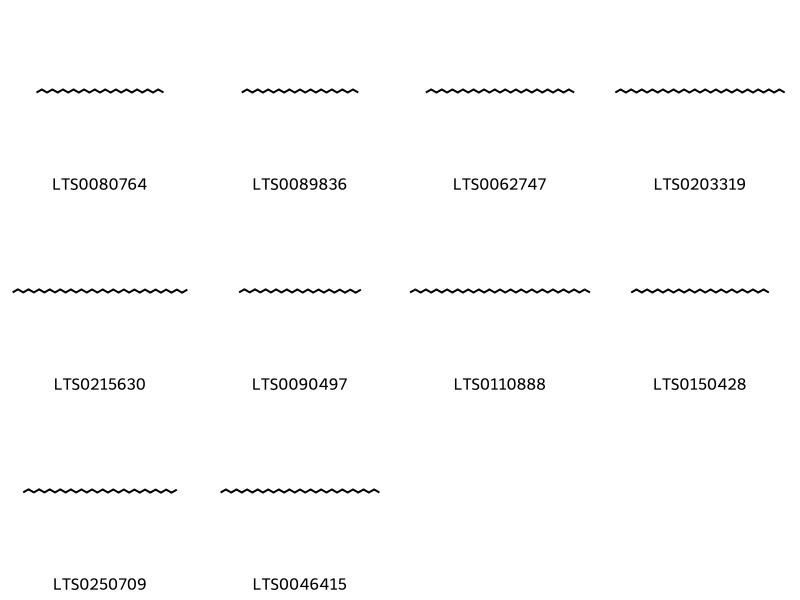{ width=100% }
    <figcaption>Hình ảnh cấu trúc hóa học của 10 hoạt chất thuộc nhóm Saturated hydrocarbons gồm ['pentacosane (LTS0080764)', 'tricosane (LTS0089836)', 'nonacosane (LTS0062747)', 'tritriacontane (LTS0203319)', 'tetratriacontane (LTS0215630)', 'tetracosane (LTS0090497)', 'pentatriacontane (LTS0110888)', 'heptacosane (LTS0150428)', 'triacontane (LTS0250709)', 'hentriacontane (LTS0046415)'].</figcaption>
</figure>
#### Nhóm Unsaturated hydrocarbons
<figure markdown="span">
    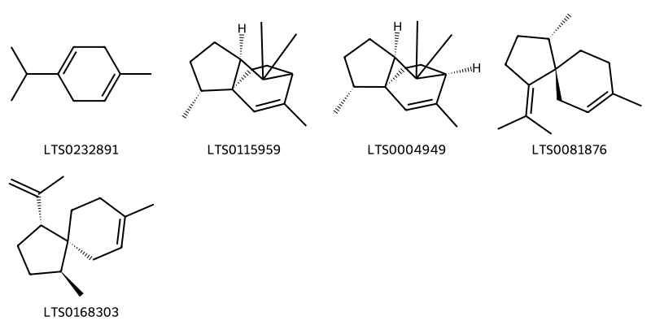{ width=100% }
    <figcaption>Hình ảnh cấu trúc hóa học của 5 hoạt chất thuộc nhóm Unsaturated hydrocarbons gồm ['α terpinene (LTS0232891)', '(1r,2r,5s)-2,6,6,8-tetramethyltricyclo[5.2.2.0¹,⁵]undec-8-ene (LTS0115959)', '(1r,2r,5s,7s)-2,6,6,8-tetramethyltricyclo[5.2.2.0¹,⁵]undec-8-ene (LTS0004949)', '(1s,5r)-1,8-dimethyl-4-(propan-2-ylidene)spiro[4.5]dec-7-ene (LTS0081876)', '(1s,4r,5r)-1,8-dimethyl-4-(prop-1-en-2-yl)spiro[4.5]dec-7-ene (LTS0168303)'].</figcaption>
</figure>

---

### Dược dân tộc học

Danh sách các quốc gia có sử dụng *Cupressus sempervirens* trong điều trị các bệnh. 

| Country   | Disease                                                                            | Bệnh                                                                                                                                                                                                |
|:----------|:-----------------------------------------------------------------------------------|:----------------------------------------------------------------------------------------------------------------------------------------------------------------------------------------------------|
| Egypt     | Vulnerary                                                                          | MYMEMORY WARNING: YOU USED ALL AVAILABLE FREE TRANSLATIONS FOR TODAY. NEXT AVAILABLE IN  09 HOURS 29 MINUTES 17 SECONDS VISIT HTTPS://MYMEMORY.TRANSLATED.NET/DOC/USAGELIMITS.PHP TO TRANSLATE MORE |
| Elsewhere | Astringent, Soap, Vermifuge                                                        | MYMEMORY WARNING: YOU USED ALL AVAILABLE FREE TRANSLATIONS FOR TODAY. NEXT AVAILABLE IN  09 HOURS 29 MINUTES 14 SECONDS VISIT HTTPS://MYMEMORY.TRANSLATED.NET/DOC/USAGELIMITS.PHP TO TRANSLATE MORE |
| Turkey    | Antiseptic, Diuretic, Sudorific, Vasoconstrictor, Expectorant, Styptic, Astringent | MYMEMORY WARNING: YOU USED ALL AVAILABLE FREE TRANSLATIONS FOR TODAY. NEXT AVAILABLE IN  09 HOURS 29 MINUTES 11 SECONDS VISIT HTTPS://MYMEMORY.TRANSLATED.NET/DOC/USAGELIMITS.PHP TO TRANSLATE MORE |
| ain       | Vasoconstrictor, Astringent                                                        | MYMEMORY WARNING: YOU USED ALL AVAILABLE FREE TRANSLATIONS FOR TODAY. NEXT AVAILABLE IN  09 HOURS 29 MINUTES 08 SECONDS VISIT HTTPS://MYMEMORY.TRANSLATED.NET/DOC/USAGELIMITS.PHP TO TRANSLATE MORE |

---

# Chi Chamaecyparis

??? note "Danh sách các dược liệu thuộc chi"
    
	 - *Chamaecyparis lawsoniana*
	 - *Chamaecyparis nootkatensis*

---
## Chamaecyparis lawsoniana
### Thông tin về thực vật

!!! info "Phân loại thực vật của *Chamaecyparis lawsoniana* từ GIBF:"
    - **Kingdom:** Plantae
    - **Phylum:** Tracheophyta
    - **Order:** Pinales
    - **Family:** Cupressaceae
    - **Genus:** Chamaecyparis
    - **Species:** *Chamaecyparis lawsoniana*

 

| Label (VI)   | Label (EN)   | Scientific Name          | Descriptions (VI)   | Descriptions (EN)                           | Also Known As (VI)   | Also Known As (EN)                                          |
|:-------------|:-------------|:-------------------------|:--------------------|:--------------------------------------------|:---------------------|:------------------------------------------------------------|
| N/A          | N/A          | Chamaecyparis lawsoniana | loài thực vật       | species of plant in the genus Chamaecyparis | ['']                 | ['Lawson cypress', "Lawson's Cypress", 'Port Orford cedar'] |

#### Phân bố trên thế giới

**Từ CSDL GIBF** Switzerland, United Kingdom of Great Britain and Northern Ireland, Denmark, Portugal, Sweden, Spain, New Zealand, Germany, United States of America, Italy, Ireland, Belgium, Netherlands

#### Phân bố tại Việt Nam

**Từ CSDL GIBF**: Không có ghi nhận ở Việt Nam

---
### Thành phần hóa học
        
- Theo cơ sở dữ liệu lotus: Từ loài *Chamaecyparis lawsoniana* đã phân lập và xác định được 83 hoạt chất thuộc về các nhóm Organooxygen compounds, Flavonoids, Unsaturated hydrocarbons, Tannins, Prenol lipids, Fatty Acyls, Phenol ethers, Benzene and substituted derivatives. 

|    | chemicalTaxonomyClassyfireClass     |   smiles_count |
|---:|:------------------------------------|---------------:|
|  0 | Benzene and substituted derivatives |              4 |
|  1 | Fatty Acyls                         |              4 |
|  2 | Flavonoids                          |              2 |
|  3 | Organooxygen compounds              |              4 |
|  4 | Phenol ethers                       |              1 |
|  5 | Prenol lipids                       |             66 |
|  6 | Tannins                             |              1 |
|  7 | Unsaturated hydrocarbons            |              1 |

#### Nhóm Benzene and substituted derivatives
<figure markdown="span">
    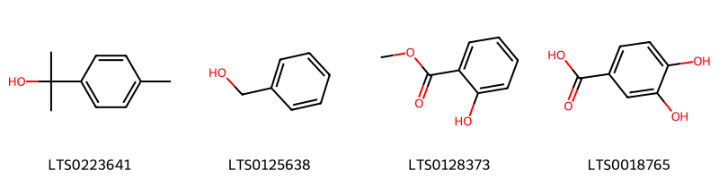{ width=100% }
    <figcaption>Hình ảnh cấu trúc hóa học của 4 hoạt chất thuộc nhóm Benzene and substituted derivatives gồm ['p-cymen-8-ol (LTS0223641)', 'benzyl alcohol (LTS0125638)', 'methyl salicylate (LTS0128373)', '3,4-dihydroxybenzoic acid (LTS0018765)'].</figcaption>
</figure>
#### Nhóm Fatty Acyls
<figure markdown="span">
    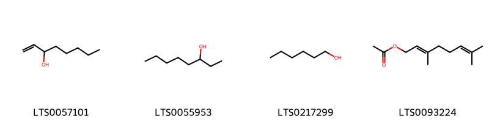{ width=100% }
    <figcaption>Hình ảnh cấu trúc hóa học của 4 hoạt chất thuộc nhóm Fatty Acyls gồm ['1-octen-3-ol (LTS0057101)', '3-octanol (LTS0055953)', 'hexanol (LTS0217299)', 'geranyl acetate (LTS0093224)'].</figcaption>
</figure>
#### Nhóm Flavonoids
<figure markdown="span">
    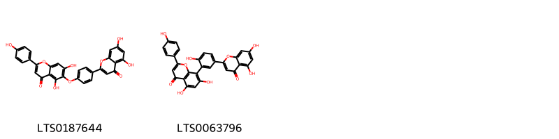{ width=100% }
    <figcaption>Hình ảnh cấu trúc hóa học của 2 hoạt chất thuộc nhóm Flavonoids gồm ['hinokiflavone (LTS0187644)', 'amentoflavone (LTS0063796)'].</figcaption>
</figure>
#### Nhóm Organooxygen compounds
<figure markdown="span">
    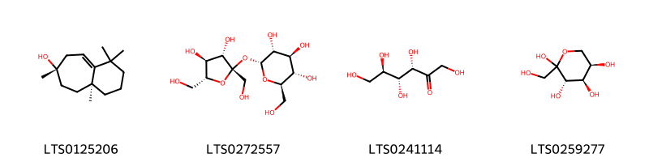{ width=100% }
    <figcaption>Hình ảnh cấu trúc hóa học của 4 hoạt chất thuộc nhóm Organooxygen compounds gồm ['widdrol (LTS0125206)', 'sucrose (LTS0272557)', 'keto-d-fructose (LTS0241114)', 'd-fructopyranose (LTS0259277)'].</figcaption>
</figure>
#### Nhóm Phenol ethers
<figure markdown="span">
    { width=100% }
    <figcaption>Hình ảnh cấu trúc hóa học của 1 hoạt chất thuộc nhóm Phenol ethers gồm ['anethole (LTS0033696)'].</figcaption>
</figure>
#### Nhóm Prenol lipids
<figure markdown="span">
    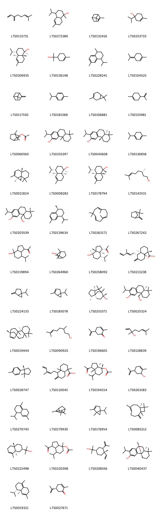{ width=100% }
    <figcaption>Hình ảnh cấu trúc hóa học của 66 hoạt chất thuộc nhóm Prenol lipids gồm ['α-myrcene (LTS0115731)', 'delta-cadinol (LTS0272380)', 'α pinene (LTS0132416)', '4-terpineol (LTS0253733)', 'α-cadinol (LTS0206935)', 'terpineol (LTS0136148)', '(e)-calamene (LTS0228241)', 'terpinolene (LTS0104525)', 'β-pinene (LTS0117550)', 'cymene (LTS0181568)', 'monoterpenes (LTS0106881)', 'limonene,  (LTS0155981)', 'bornyl acetate (LTS0060565)', '2-isopropyl-4b,8,8-trimethyl-5,6,7,8a,9,10-hexahydrophenanthren-3-ol (LTS0255397)', 'ferruginol (LTS0045608)', 'terpinene (LTS0136858)', '(-)-thujopsene (LTS0021824)', 'delta-cadinol (LTS0008282)', 'α-cadinol (LTS0178794)', '(-)-citronellol (LTS0142531)', '4b-(hydroxymethyl)-2-isopropyl-8,8-dimethyl-5,6,7,8a,9,10-hexahydrophenanthren-3-ol (LTS0203539)', '(1s,4s)-4-isopropyl-1,6-dimethyl-1,2,3,4-tetrahydronaphthalene (LTS0139634)', 'humulene (LTS0263171)', 'camphene (LTS0267242)', '1-(4-hydroxy-7-isopropyl-4-methyl-octahydroinden-1-yl)ethanone (LTS0119894)', 'borneol (LTS0264960)', '1-[(1s,3ar,4r,7s,7as)-4-hydroxy-7-isopropyl-4-methyl-octahydroinden-1-yl]ethanone (LTS0258092)', '(1s,4ar,5s,8ar)-1,4a-dimethyl-6-methylidene-5-[(2e)-3-methylpenta-2,4-dien-1-yl]-hexahydro-2h-naphthalene-1-carboxylic acid (LTS0213238)', 'sabinene (LTS0224133)', 'α-thujene (LTS0185078)', 'cedrol (LTS0251071)', '(4br,8as)-4b-(hydroxymethyl)-2-isopropyl-8,8-dimethyl-5,6,7,8a,9,10-hexahydrophenanthren-3-ol (LTS0025324)', '(1s,4s,9s,10r,13r)-5,5,9,13-tetramethyltetracyclo[11.2.1.0¹,¹⁰.0⁴,⁹]hexadec-14-ene (LTS0019444)', 'citronellol, (+-)- (LTS0090925)', 'carvone (LTS0196605)', 'linalool, (+-)- (LTS0128839)', 'cuparene (LTS0028747)', '1,4a-dimethyl-6-methylidene-5-(3-methylpenta-2,4-dien-1-yl)-hexahydro-2h-naphthalene-1-carboxylic acid (LTS0110045)', '(1s,3ar,4r,7s,7as)-1-acetyl-7-isopropyl-4-methyl-octahydroinden-4-yl acetate (LTS0194214)', 'carveol (LTS0263183)', '4-isopropyl-1,6-dimethyl-2,3,4,4a,7,8-hexahydronaphthalene (LTS0270743)', 'tricyclene (LTS0179930)', 'α-thujene (LTS0176954)', 'caryophyllene (LTS0085212)', 'α-eudesmol (LTS0222498)', '1-acetyl-7-isopropyl-4-methyl-octahydroinden-4-yl acetate (LTS0220308)', 'elemol (LTS0208556)', '(1r,8s,10s)-5-isopropyl-11,11-dimethyl-16-oxatetracyclo[6.6.2.0¹,¹⁰.0²,⁷]hexadeca-2(7),3,5-trien-4-ol (LTS0040437)', 'delta-cadinene (LTS0019321)', 'carvone, (+)- (LTS0027671)', 'camphor (LTS0091905)', '4,6,6-trimethyl-3-(2,6,6-trimethyl-3-{2,6,6-trimethylbicyclo[3.1.1]hept-1-en-3-yl}bicyclo[3.1.1]hept-1-en-3-yl)bicyclo[3.1.1]hept-4-en-2-yl acetate (LTS0107905)', '1-[5-(3-hydroxy-3-methylpent-4-en-1-yl)-1,4a-dimethyl-6-methylidene-hexahydro-2h-naphthalen-1-yl]ethanone (LTS0271077)', '(1s,2e,4s,7e)-4-isopropyl-1,7-dimethylcyclodeca-2,7-dien-1-ol (LTS0124233)', '(3r,6e)-nerolidol (LTS0145065)', 'β-eudesmol (LTS0203280)', 'phellandrene (LTS0157173)', '(4e,8e)-4,8,11,11-tetramethylcycloundeca-1,4,8-triene (LTS0118116)', '5-isopropyl-11,11-dimethyl-16-oxatetracyclo[6.6.2.0¹,¹⁰.0²,⁷]hexadeca-2(7),3,5-trien-4-ol (LTS0209965)', 'linalyl acetate (LTS0167325)', 'geraniol (LTS0258838)', '4-isopropyl-1,7-dimethylcyclodeca-2,7-dien-1-ol (LTS0267848)', 'α-muurolene (LTS0022607)', '1-[(1s,4ar,5s,8ar)-5-[(3r)-3-hydroxy-3-methylpent-4-en-1-yl]-1,4a-dimethyl-6-methylidene-hexahydro-2h-naphthalen-1-yl]ethanone (LTS0232046)', 'cuminol (LTS0021403)', '(4br,8ar)-4b-(hydroxymethyl)-2-isopropyl-8,8-dimethyl-5,6,7,8a,9,10-hexahydrophenanthren-3-ol (LTS0215711)'].</figcaption>
</figure>
#### Nhóm Tannins
<figure markdown="span">
    { width=100% }
    <figcaption>Hình ảnh cấu trúc hóa học của 1 hoạt chất thuộc nhóm Tannins gồm ['ellagic acid (LTS0037297)'].</figcaption>
</figure>
#### Nhóm Unsaturated hydrocarbons
<figure markdown="span">
    { width=100% }
    <figcaption>Hình ảnh cấu trúc hóa học của 1 hoạt chất thuộc nhóm Unsaturated hydrocarbons gồm ['α terpinene (LTS0232891)'].</figcaption>
</figure>

---

### Dược dân tộc học

Danh sách các quốc gia có sử dụng *Chamaecyparis lawsoniana* trong điều trị các bệnh. 

| Country   | Disease   | Bệnh                                                                                                                                                                                                |
|:----------|:----------|:----------------------------------------------------------------------------------------------------------------------------------------------------------------------------------------------------|
| Elsewhere | Diuretic  | MYMEMORY WARNING: YOU USED ALL AVAILABLE FREE TRANSLATIONS FOR TODAY. NEXT AVAILABLE IN  09 HOURS 28 MINUTES 22 SECONDS VISIT HTTPS://MYMEMORY.TRANSLATED.NET/DOC/USAGELIMITS.PHP TO TRANSLATE MORE |

---

---
## Chamaecyparis nootkatensis
### Thông tin về thực vật

!!! info "Phân loại thực vật của *Xanthocyparis nootkatensis* từ GIBF:"
    - **Kingdom:** Plantae
    - **Phylum:** Tracheophyta
    - **Order:** Pinales
    - **Family:** Cupressaceae
    - **Genus:** Xanthocyparis
    - **Species:** *Xanthocyparis nootkatensis*

 

| Label (VI)   | Label (EN)   | Scientific Name            | Descriptions (VI)   | Descriptions (EN)           | Also Known As (VI)   | Also Known As (EN)   |
|:-------------|:-------------|:---------------------------|:--------------------|:----------------------------|:---------------------|:---------------------|
| N/A          | N/A          | Chamaecyparis nootkatensis | loài thực vật       | Synonymous species of plant | ['']                 | ['']                 |

#### Phân bố trên thế giới

**Từ CSDL GIBF** nan, unknown or invalid, Luxembourg, Spain, Germany, Austria, Korea, Republic of, Sweden, Poland, Canada, Belgium, Netherlands, Brazil, Hungary, Estonia, Norway, United Kingdom of Great Britain and Northern Ireland, Latvia, France, Czechia, Russian Federation, United States of America, Ukraine

#### Phân bố tại Việt Nam

**Từ CSDL GIBF**: Không có ghi nhận ở Việt Nam

---
### Thành phần hóa học
        
- Theo cơ sở dữ liệu lotus: Từ loài *Xanthocyparis nootkatensis* đã phân lập và xác định được 89 hoạt chất thuộc về các nhóm Benzoxepines, Organooxygen compounds, Flavonoids, Saturated hydrocarbons, Unsaturated hydrocarbons, Prenol lipids, Fatty Acyls, Benzene and substituted derivatives. 

|    | chemicalTaxonomyClassyfireClass     |   smiles_count |
|---:|:------------------------------------|---------------:|
|  0 | Benzene and substituted derivatives |              4 |
|  1 | Benzoxepines                        |              2 |
|  2 | Fatty Acyls                         |             12 |
|  3 | Flavonoids                          |              7 |
|  4 | Organooxygen compounds              |              1 |
|  5 | Prenol lipids                       |             53 |
|  6 | Saturated hydrocarbons              |              6 |
|  7 | Unsaturated hydrocarbons            |              4 |

#### Nhóm Benzene and substituted derivatives
<figure markdown="span">
    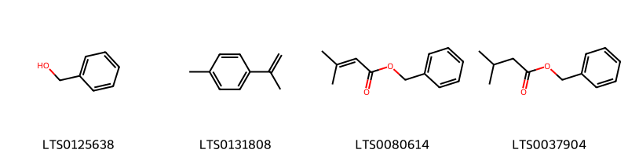{ width=100% }
    <figcaption>Hình ảnh cấu trúc hóa học của 4 hoạt chất thuộc nhóm Benzene and substituted derivatives gồm ['benzyl alcohol (LTS0125638)', 'p,α-dimethylstyrene (LTS0131808)', 'benzyl 3-methylbut-2-enoate (LTS0080614)', 'benzyl isovalerate (LTS0037904)'].</figcaption>
</figure>
#### Nhóm Benzoxepines
<figure markdown="span">
    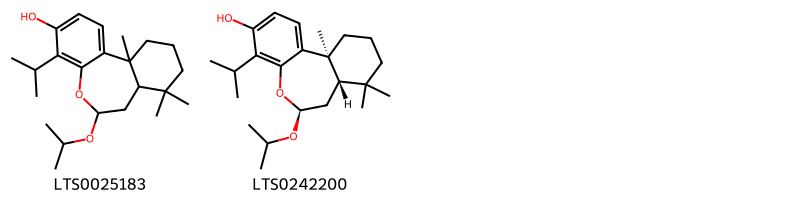{ width=100% }
    <figcaption>Hình ảnh cấu trúc hóa học của 2 hoạt chất thuộc nhóm Benzoxepines gồm ['9-isopropoxy-6-isopropyl-1,12,12-trimethyl-8-oxatricyclo[9.4.0.0²,⁷]pentadeca-2,4,6-trien-5-ol (LTS0025183)', '(1s,9s,11s)-9-isopropoxy-6-isopropyl-1,12,12-trimethyl-8-oxatricyclo[9.4.0.0²,⁷]pentadeca-2,4,6-trien-5-ol (LTS0242200)'].</figcaption>
</figure>
#### Nhóm Fatty Acyls
<figure markdown="span">
    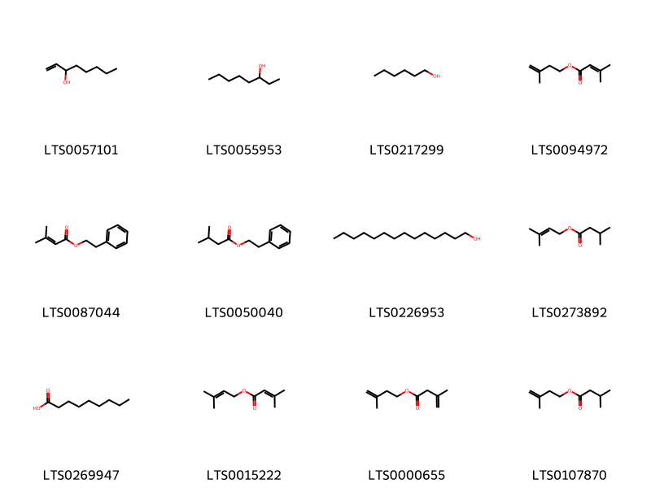{ width=100% }
    <figcaption>Hình ảnh cấu trúc hóa học của 12 hoạt chất thuộc nhóm Fatty Acyls gồm ['1-octen-3-ol (LTS0057101)', '3-octanol (LTS0055953)', 'hexanol (LTS0217299)', '3-isopentenyl 2-isopentenoate (LTS0094972)', 'phenethyl senecioate (LTS0087044)', 'phenethyl isovalerate (LTS0050040)', 'myristyl alcohol (LTS0226953)', '3-methylbut-2-en-1-yl 3-methylbutanoate (LTS0273892)', 'nonanoic acid (LTS0269947)', '3-methylbut-2-en-1-yl 3-methylbut-2-enoate (LTS0015222)', '3-methylbut-3-en-1-yl 3-methylbut-3-enoate (LTS0000655)', '3-isopentenyl isovalerate (LTS0107870)'].</figcaption>
</figure>
#### Nhóm Flavonoids
<figure markdown="span">
    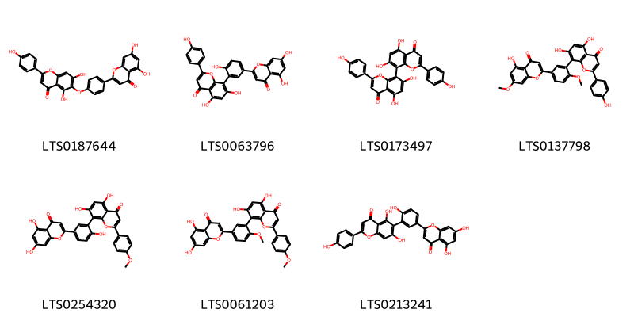{ width=100% }
    <figcaption>Hình ảnh cấu trúc hóa học của 7 hoạt chất thuộc nhóm Flavonoids gồm ['hinokiflavone (LTS0187644)', 'amentoflavone (LTS0063796)', 'cupressuflavone (LTS0173497)', 'ginkgetin (LTS0137798)', '8-[5-(5,7-dihydroxy-4-oxochromen-2-yl)-2-hydroxyphenyl]-5,7-dihydroxy-2-(4-methoxyphenyl)chromen-4-one (LTS0254320)', 'isoginkgetin (LTS0061203)', 'robustaflavone (LTS0213241)'].</figcaption>
</figure>
#### Nhóm Organooxygen compounds
<figure markdown="span">
    { width=100% }
    <figcaption>Hình ảnh cấu trúc hóa học của 1 hoạt chất thuộc nhóm Organooxygen compounds gồm ['nonanal (LTS0244398)'].</figcaption>
</figure>
#### Nhóm Prenol lipids
<figure markdown="span">
    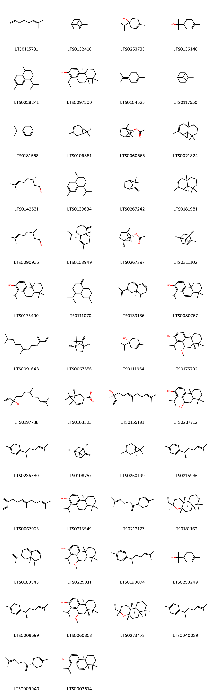{ width=100% }
    <figcaption>Hình ảnh cấu trúc hóa học của 53 hoạt chất thuộc nhóm Prenol lipids gồm ['α-myrcene (LTS0115731)', 'α pinene (LTS0132416)', '4-terpineol (LTS0253733)', 'terpineol (LTS0136148)', '(e)-calamene (LTS0228241)', 'totarol (LTS0097200)', 'terpinolene (LTS0104525)', 'β-pinene (LTS0117550)', 'cymene (LTS0181568)', 'monoterpenes (LTS0106881)', 'bornyl acetate (LTS0060565)', '(-)-thujopsene (LTS0021824)', '(-)-citronellol (LTS0142531)', '(1s,4s)-4-isopropyl-1,6-dimethyl-1,2,3,4-tetrahydronaphthalene (LTS0139634)', 'camphene (LTS0267242)', 'thujopsene (LTS0181981)', 'citronellol, (+-)- (LTS0090925)', '(+)-gamma-cadinene (LTS0103949)', '(-)-bornyl acetate (LTS0267397)', '(+)-α-pinene (LTS0211102)', 'totarol (LTS0175490)', '4-isopropyl-6-methyl-1-methylidene-3,4,4a,7,8,8a-hexahydro-2h-naphthalene (LTS0111070)', '1,8a-dimethyl-7-(prop-1-en-2-yl)-2,6,7,8-tetrahydro-1h-naphthalene (LTS0133136)', '1-isopropyl-4b,8,8-trimethyl-5,6,7,8a-tetrahydrophenanthren-2-ol (LTS0080767)', 'β-farnesene (LTS0091648)', '(-)-camphene (LTS0067556)', '(-)-4-terpineol (LTS0111954)', '(4bs,8as,10s)-1-isopropyl-10-methoxy-4b,8,8-trimethyl-5,6,7,8a,9,10-hexahydrophenanthren-2-ol (LTS0175732)', 'nerolidol (LTS0197738)', '(1r,3r,6s)-7,7-dimethylbicyclo[4.1.0]hept-4-ene-3-carboxylic acid (LTS0163323)', 'nerolidol (LTS0155191)', '1-isopropyl-4b,8,8-trimethyl-5,6,7,8a,9,10-hexahydrophenanthrene-2,10-diol (LTS0237712)', '1-methyl-4-(6-methylhept-5-en-2-yl)cyclohexa-1,3-diene (LTS0236580)', '(-)-β-pinene (LTS0108757)', '(+)-delta(3)-carene (LTS0250199)', '(-)-α-curcumene (LTS0216936)', 'β-farnesene (LTS0067925)', '(4bs)-1-isopropyl-4b,8,8-trimethyl-5,6,7,8a,9,10-hexahydrophenanthren-2-ol (LTS0215549)', 'β-bisabolene (LTS0212177)', '(3r,4as,6as,10as,10br)-3-ethenyl-3,4a,7,7,10a-pentamethyl-octahydro-1h-naphtho[2,1-b]pyran (LTS0181162)', '(1r,7r,8as)-1,8a-dimethyl-7-(prop-1-en-2-yl)-2,6,7,8-tetrahydro-1h-naphthalene (LTS0183545)', '1-isopropyl-10-methoxy-4b,8,8-trimethyl-5,6,7,8a,9,10-hexahydrophenanthren-2-ol (LTS0225011)', 'curcumene (LTS0190074)', '(+)-α-terpineol (LTS0258249)', 'gamma-curcumene (LTS0009599)', '(4bs,8as,10r)-1-isopropyl-10-methoxy-4b,8,8-trimethyl-5,6,7,8a,9,10-hexahydrophenanthren-2-ol (LTS0060353)', '(3s,4as,6as,10as,10br)-3-ethenyl-3,4a,7,7,10a-pentamethyl-octahydro-1h-naphtho[2,1-b]pyran (LTS0273473)', 'β-curcumene (LTS0040039)', '(-)-β-bisabolene (LTS0009940)', '(4bs,8as)-1-isopropyl-4b,8,8-trimethyl-5,6,7,8a-tetrahydrophenanthren-2-ol (LTS0003614)', '(4bs,8as,10r)-1-isopropyl-4b,8,8-trimethyl-5,6,7,8a,9,10-hexahydrophenanthrene-2,10-diol (LTS0023365)', '(-)-β-curcumene (LTS0027873)', '3-ethenyl-3,4a,7,7,10a-pentamethyl-octahydro-1h-naphtho[2,1-b]pyran (LTS0226873)'].</figcaption>
</figure>
#### Nhóm Saturated hydrocarbons
<figure markdown="span">
    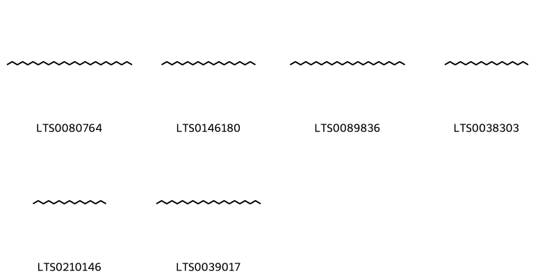{ width=100% }
    <figcaption>Hình ảnh cấu trúc hóa học của 6 hoạt chất thuộc nhóm Saturated hydrocarbons gồm ['pentacosane (LTS0080764)', 'nonadecane (LTS0146180)', 'tricosane (LTS0089836)', 'heptadecane (LTS0038303)', 'pentadecane (LTS0210146)', 'heneicosane (LTS0039017)'].</figcaption>
</figure>
#### Nhóm Unsaturated hydrocarbons
<figure markdown="span">
    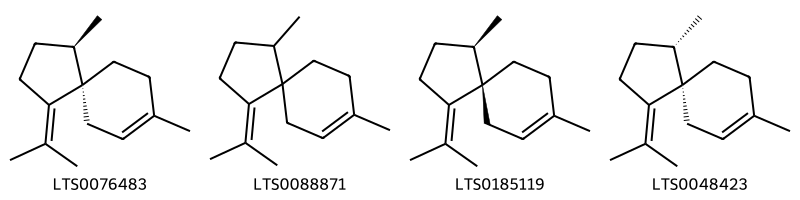{ width=100% }
    <figcaption>Hình ảnh cấu trúc hóa học của 4 hoạt chất thuộc nhóm Unsaturated hydrocarbons gồm ['(1r,5s)-1,8-dimethyl-4-(propan-2-ylidene)spiro[4.5]dec-7-ene (LTS0076483)', '1,8-dimethyl-4-(propan-2-ylidene)spiro[4.5]dec-7-ene (LTS0088871)', '(1r,5r)-1,8-dimethyl-4-(propan-2-ylidene)spiro[4.5]dec-7-ene (LTS0185119)', '(1s,5s)-1,8-dimethyl-4-(propan-2-ylidene)spiro[4.5]dec-7-ene (LTS0048423)'].</figcaption>
</figure>

---

### Dược dân tộc học

Danh sách các quốc gia có sử dụng *Xanthocyparis nootkatensis* trong điều trị các bệnh. 

| Country          | Disease   | Bệnh                                                                                                                                                                                                |
|:-----------------|:----------|:----------------------------------------------------------------------------------------------------------------------------------------------------------------------------------------------------|
| Canada(Kwakiutl) | Poultice  | MYMEMORY WARNING: YOU USED ALL AVAILABLE FREE TRANSLATIONS FOR TODAY. NEXT AVAILABLE IN  09 HOURS 27 MINUTES 38 SECONDS VISIT HTTPS://MYMEMORY.TRANSLATED.NET/DOC/USAGELIMITS.PHP TO TRANSLATE MORE |

---

