!!! abstract "Tóm tắt"

    Họ Cuscutaceae gồm khoảng 1 chi và 11 loài được một số cộng đồng tại các quốc gia như Portuguese, Turkey, Fiji, Trinidad, Europe, Haiti, US(Amerindian), German, French, Elsewhere, US, India, Venezuela, Dominican Republic, Mexico, China sử dụng trong một số trường hợp Chất kích thích, Apertif, Thuốc nhuận tràng, Thuốc kích thích, Apertif, Thuốc lợi tiểu, Aperient, Apertif, Aphrodisiac, Carminative, Demulcent, Diuretic, Sudorific, Tonic, Purgative, Astringent, Contraceptive, Pediculicide, Cholagogue, Laxative, Antiseptic, Antiseptic, Carminative, Carminative, Deodorant, Laxative, Parasiticide, Styptic, Vulnerary.

!!! info "DrDuke"

    James A. Duke sinh năm 1929-2017 là một nhà thực vật học người Mỹ. Đây là một trong những tác giả hàng đầu trong lĩnh vực dược dân tộc học với cuốn *CRC Handbook of Medicinal Herbs* và chính là người xây dựng lên cơ sở dữ liệu về hợp chất tự nhiên và dược dân tộc học tại Bộ nông nghiệp Hoa Kỳ. Các thông tin được đăng tải tại website [Dr. Duke's Phytochemical and Ethnobotanical Databases](https://phytochem.nal.usda.gov/). 
    Trong suốt thập niên 1970, ông lãnh đạo the Plant Taxonomy Laboratory, Plant Genetics and Germplasm Institute of the Agricultural Research Service, U.S. Department of Agriculture.
    Trong tài liệu này, các thông tin về dược dân tộc của các dược liệu được trích dẫn từ tài liệu của James A. Ducke với sự trợ giúp của phần mềm dịch thuật từ tiếng Anh sang tiếng Việt.
   

# Chi Cuscuta

??? note "Danh sách các dược liệu thuộc chi"
    
	 - *Cuscuta americana*
	 - *Cuscuta campestris*
	 - *Cuscuta corymbosa*
	 - *Cuscuta epithymum*
	 - *Cuscuta europaea*
	 - *Cuscuta japonica*
	 - *Cuscuta major*
	 - *Cuscuta megalocarpa*
	 - *Cuscuta planiflora*
	 - *Cuscuta reflexa*
	 - *Cuscuta umbellata*

---
## Cuscuta americana
### Thông tin về thực vật

!!! info "Phân loại thực vật của *Cuscuta americana* từ GIBF:"
    - **Kingdom:** Plantae
    - **Phylum:** Tracheophyta
    - **Order:** Solanales
    - **Family:** Convolvulaceae
    - **Genus:** Cuscuta
    - **Species:** *Cuscuta americana*

 

| Label (VI)   | Label (EN)   | Scientific Name   | Descriptions (VI)   | Descriptions (EN)   | Also Known As (VI)   | Also Known As (EN)    |
|:-------------|:-------------|:------------------|:--------------------|:--------------------|:---------------------|:----------------------|
| N/A          | N/A          | Cuscuta americana | loài thực vật       | species of plant    | ['']                 | ['Cuscuta americana'] |

#### Phân bố trên thế giới

**Từ CSDL GIBF** Virgin Islands (U.S.), Guadeloupe, Nicaragua, Virgin Islands (British), Venezuela (Bolivarian Republic of), Puerto Rico, Bolivia (Plurinational State of), Jamaica, United States of America, Bonaire, Sint Eustatius and Saba, Saint Martin (French part), Suriname, Saint Vincent and the Grenadines, Saint Barthélemy, Martinique, Brazil, Bahamas, Guyana, Cuba, Mexico, Peru, Dominica, Dominican Republic, Curaçao, Ecuador, Saint Kitts and Nevis, Colombia, Montserrat, Antigua and Barbuda, Sint Maarten (Dutch part)

#### Phân bố tại Việt Nam

**Từ CSDL GIBF**: Không có ghi nhận ở Việt Nam

---
### Thành phần hóa học
        
- Theo cơ sở dữ liệu lotus: Từ loài *Cuscuta americana* đã phân lập và xác định được Chưa có hoạt chất nào được phân lập. hoạt chất thuộc về các nhóm Không có hoạt chất nào được phân lập. 

Không có hình ảnh nào được tạo ra

---

### Dược dân tộc học

Danh sách các quốc gia có sử dụng *Cuscuta americana* trong điều trị các bệnh. 

| Country            | Disease                                                                             | Bệnh                                                                              |
|:-------------------|:------------------------------------------------------------------------------------|:----------------------------------------------------------------------------------|
| Dominican Republic | Laxative                                                                            | Nhuận trường                                                                      |
| Elsewhere          | Astringent                                                                          | Lam se da                                                                         |
| Haiti              | Antiseptic, Antiseptic, Carminative, Carminative, Deodorant, Laxative, Parasiticide | Khử trùng, Khử trùng, Carminative, Carminative, Deodorant, Laxative, Parasiticide |
| Trinidad           | Astringent                                                                          | Lam se da                                                                         |
| Venezuela          | Vulnerary                                                                           | Vulnerary                                                                         |

---

---
## Cuscuta campestris
### Thông tin về thực vật

!!! info "Phân loại thực vật của *Cuscuta campestris* từ GIBF:"
    - **Kingdom:** Plantae
    - **Phylum:** Tracheophyta
    - **Order:** Solanales
    - **Family:** Convolvulaceae
    - **Genus:** Cuscuta
    - **Species:** *Cuscuta campestris*

 

| Label (VI)   | Label (EN)   | Scientific Name    | Descriptions (VI)   | Descriptions (EN)                  | Also Known As (VI)   | Also Known As (EN)                |
|:-------------|:-------------|:-------------------|:--------------------|:-----------------------------------|:---------------------|:----------------------------------|
| N/A          | N/A          | Cuscuta campestris |                     | species of the plant morning glory | ['']                 | ['field dodder', 'golden dodder'] |

#### Phân bố trên thế giới

**Từ CSDL GIBF** Italy, Australia, Belgium, Mauritius, Palestine, State of, Israel, Ukraine, Netherlands, Namibia, Chinese Taipei, Spain, Hungary, Portugal, Algeria, Albania, Russian Federation, United States of America, Kazakhstan, Croatia, South Africa, Hong Kong, Romania, France, Niue, India, New Zealand

#### Phân bố tại Việt Nam

**Từ CSDL GIBF**: Không có ghi nhận ở Việt Nam

---
### Thành phần hóa học
        
- Theo cơ sở dữ liệu lotus: Từ loài *Cuscuta campestris* đã phân lập và xác định được 22 hoạt chất thuộc về các nhóm Fatty Acyls, Flavonoids, Organooxygen compounds, Steroids and steroid derivatives. 

|    | chemicalTaxonomyClassyfireClass   |   smiles_count |
|---:|:----------------------------------|---------------:|
|  0 | Fatty Acyls                       |              6 |
|  1 | Flavonoids                        |              5 |
|  2 | Organooxygen compounds            |              2 |
|  3 | Steroids and steroid derivatives  |              9 |

#### Nhóm Fatty Acyls
<figure markdown="span">
    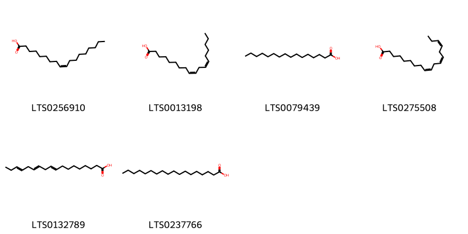{ width=100% }
    <figcaption>Hình ảnh cấu trúc hóa học của 6 hoạt chất thuộc nhóm Fatty Acyls gồm ['oleic acid (LTS0256910)', 'linoleic (LTS0013198)', 'palmitic acid (LTS0079439)', 'α-linolenic acid (LTS0275508)', 'α linolenic acid (LTS0132789)', 'stearic acid (LTS0237766)'].</figcaption>
</figure>
#### Nhóm Flavonoids
<figure markdown="span">
    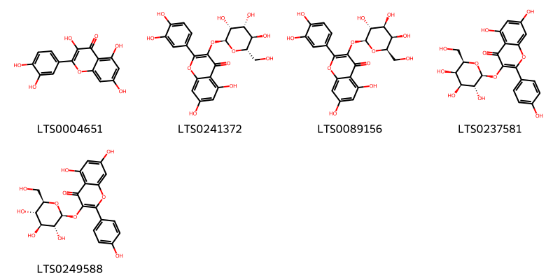{ width=100% }
    <figcaption>Hình ảnh cấu trúc hóa học của 5 hoạt chất thuộc nhóm Flavonoids gồm ['quercetin (LTS0004651)', '2-(3,4-dihydroxyphenyl)-5,7-dihydroxy-3-{[(2s,3r,4r,5r,6s)-3,4,5-trihydroxy-6-(hydroxymethyl)oxan-2-yl]oxy}chromen-4-one (LTS0241372)', 'hyperoside (LTS0089156)', 'trifolin (LTS0237581)', 'astragalin (LTS0249588)'].</figcaption>
</figure>
#### Nhóm Organooxygen compounds
<figure markdown="span">
    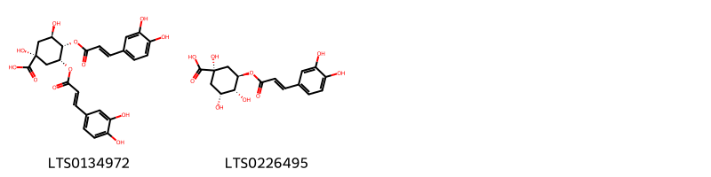{ width=100% }
    <figcaption>Hình ảnh cấu trúc hóa học của 2 hoạt chất thuộc nhóm Organooxygen compounds gồm ['3,4-dicaffeoylquinic acid (LTS0134972)', 'chlorogenic acid (LTS0226495)'].</figcaption>
</figure>
#### Nhóm Steroids and steroid derivatives
<figure markdown="span">
    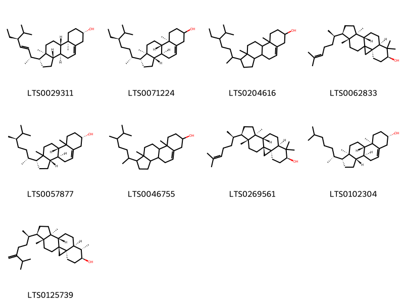{ width=100% }
    <figcaption>Hình ảnh cấu trúc hóa học của 9 hoạt chất thuộc nhóm Steroids and steroid derivatives gồm ['phytosterol (LTS0029311)', 'stigmast-5-en-3-ol (LTS0071224)', 'stigmast-5-en-3-ol, (3β)- (LTS0204616)', '(3r,6s,8r,11s,12s,15r,16r)-7,7,12,16-tetramethyl-15-[(2r)-6-methylhept-5-en-2-yl]pentacyclo[9.7.0.0¹,³.0³,⁸.0¹²,¹⁶]octadecan-6-ol (LTS0062833)', '(1r,3as,3bs,7s,9bs)-1-[(2r,5r)-5,6-dimethylheptan-2-yl]-9a,11a-dimethyl-1h,2h,3h,3ah,3bh,4h,6h,7h,8h,9h,9bh,10h,11h-cyclopenta[a]phenanthren-7-ol (LTS0057877)', 'campesterol (LTS0046755)', 'cycloartenol (LTS0269561)', 'cholesterol (LTS0102304)', 'cycloeucalenol (LTS0125739)'].</figcaption>
</figure>

---

### Dược dân tộc học

Danh sách các quốc gia có sử dụng *Cuscuta campestris* trong điều trị các bệnh. 

| Country   | Disease   | Bệnh   |
|:----------|:----------|:-------|
| Fiji      | Styptic   | L.     |

---

---
## Cuscuta corymbosa
### Thông tin về thực vật

!!! info "Phân loại thực vật của *Cuscuta corymbosa* từ GIBF:"
    - **Kingdom:** Plantae
    - **Phylum:** Tracheophyta
    - **Order:** Solanales
    - **Family:** Convolvulaceae
    - **Genus:** Cuscuta
    - **Species:** *Cuscuta corymbosa*

 

| Label (VI)   | Label (EN)   | Scientific Name   | Descriptions (VI)   | Descriptions (EN)   | Also Known As (VI)   | Also Known As (EN)   |
|:-------------|:-------------|:------------------|:--------------------|:--------------------|:---------------------|:---------------------|
| N/A          | N/A          | Cuscuta corymbosa | loài thực vật       | species of plant    | ['']                 | ['']                 |

#### Phân bố trên thế giới

**Từ CSDL GIBF** Ecuador, Guatemala, Brazil, Costa Rica, Peru, Nicaragua, Mexico, El Salvador, Venezuela (Bolivarian Republic of)

#### Phân bố tại Việt Nam

**Từ CSDL GIBF**: Không có ghi nhận ở Việt Nam

---
### Thành phần hóa học
        
- Theo cơ sở dữ liệu lotus: Từ loài *Cuscuta corymbosa* đã phân lập và xác định được Chưa có hoạt chất nào được phân lập. hoạt chất thuộc về các nhóm Không có hoạt chất nào được phân lập. 

Không có hình ảnh nào được tạo ra

---

### Dược dân tộc học

Danh sách các quốc gia có sử dụng *Cuscuta corymbosa* trong điều trị các bệnh. 

| Country   | Disease   | Bệnh      |
|:----------|:----------|:----------|
| Venezuela | Vulnerary | Vulnerary |

---

---
## Cuscuta epithymum
### Thông tin về thực vật

!!! info "Phân loại thực vật của *Cuscuta epithymum* từ GIBF:"
    - **Kingdom:** Plantae
    - **Phylum:** Tracheophyta
    - **Order:** Solanales
    - **Family:** Convolvulaceae
    - **Genus:** Cuscuta
    - **Species:** *Cuscuta epithymum*

 

| Label (VI)   | Label (EN)   | Scientific Name   | Descriptions (VI)   | Descriptions (EN)   | Also Known As (VI)   | Also Known As (EN)   |
|:-------------|:-------------|:------------------|:--------------------|:--------------------|:---------------------|:---------------------|
| N/A          | N/A          | Cuscuta epithymum | loài thực vật       | species of plant    | ['']                 | ['Dodder']           |

#### Phân bố trên thế giới

**Từ CSDL GIBF** Italy, Slovakia, Belgium, Norway, Ukraine, Denmark, Netherlands, Malta, Spain, Hungary, Portugal, Russian Federation, Slovenia, Croatia, Greece, Czechia, Germany, Switzerland, Austria, France, United Kingdom of Great Britain and Northern Ireland, Ireland, Guernsey, New Zealand

#### Phân bố tại Việt Nam

**Từ CSDL GIBF**: Không có ghi nhận ở Việt Nam

---
### Thành phần hóa học
        
- Theo cơ sở dữ liệu lotus: Từ loài *Cuscuta epithymum* đã phân lập và xác định được Chưa có hoạt chất nào được phân lập. hoạt chất thuộc về các nhóm Không có hoạt chất nào được phân lập. 

Không có hình ảnh nào được tạo ra

---

### Dược dân tộc học

Danh sách các quốc gia có sử dụng *Cuscuta epithymum* trong điều trị các bệnh. 

| Country    | Disease    | Bệnh         |
|:-----------|:-----------|:-------------|
| Elsewhere  | Laxative   | Nhuận trường |
| French     | Laxative   | Nhuận trường |
| German     | Cholagogue | Cholagogue   |
| Portuguese | Apertif    | Apertif      |

---

---
## Cuscuta europaea
### Thông tin về thực vật

!!! info "Phân loại thực vật của *Cuscuta europaea* từ GIBF:"
    - **Kingdom:** Plantae
    - **Phylum:** Tracheophyta
    - **Order:** Solanales
    - **Family:** Convolvulaceae
    - **Genus:** Cuscuta
    - **Species:** *Cuscuta europaea*

 

| Label (VI)   | Label (EN)   | Scientific Name   | Descriptions (VI)   | Descriptions (EN)   | Also Known As (VI)   | Also Known As (EN)                     |
|:-------------|:-------------|:------------------|:--------------------|:--------------------|:---------------------|:---------------------------------------|
| N/A          | N/A          | Cuscuta europaea  | loài thực vật       | species of plant    | ['']                 | ['Cuscuta europaea', 'greater dodder'] |

#### Phân bố trên thế giới

**Từ CSDL GIBF** Italy, Slovakia, Estonia, Georgia, Norway, Ukraine, Denmark, Netherlands, Lithuania, Luxembourg, Hungary, Russian Federation, Sweden, Finland, Kazakhstan, Czechia, Germany, Switzerland, Armenia, Austria, France, United Kingdom of Great Britain and Northern Ireland, Poland, Mongolia

#### Phân bố tại Việt Nam

**Từ CSDL GIBF**: Không có ghi nhận ở Việt Nam

---
### Thành phần hóa học
        
- Theo cơ sở dữ liệu lotus: Từ loài *Cuscuta europaea* đã phân lập và xác định được 7 hoạt chất thuộc về các nhóm Flavonoids, Organooxygen compounds. 

|    | chemicalTaxonomyClassyfireClass   |   smiles_count |
|---:|:----------------------------------|---------------:|
|  0 | Flavonoids                        |              5 |
|  1 | Organooxygen compounds            |              2 |

#### Nhóm Flavonoids
<figure markdown="span">
    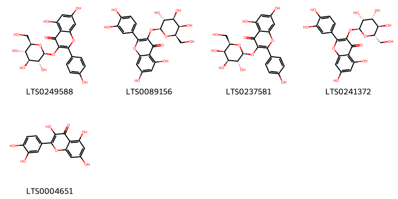{ width=100% }
    <figcaption>Hình ảnh cấu trúc hóa học của 5 hoạt chất thuộc nhóm Flavonoids gồm ['astragalin (LTS0249588)', 'hyperoside (LTS0089156)', 'trifolin (LTS0237581)', '2-(3,4-dihydroxyphenyl)-5,7-dihydroxy-3-{[(2s,3r,4r,5r,6s)-3,4,5-trihydroxy-6-(hydroxymethyl)oxan-2-yl]oxy}chromen-4-one (LTS0241372)', 'quercetin (LTS0004651)'].</figcaption>
</figure>
#### Nhóm Organooxygen compounds
<figure markdown="span">
    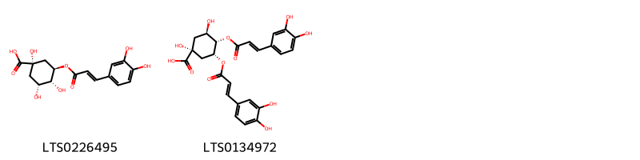{ width=100% }
    <figcaption>Hình ảnh cấu trúc hóa học của 2 hoạt chất thuộc nhóm Organooxygen compounds gồm ['chlorogenic acid (LTS0226495)', '3,4-dicaffeoylquinic acid (LTS0134972)'].</figcaption>
</figure>

---

### Dược dân tộc học

Danh sách các quốc gia có sử dụng *Cuscuta europaea* trong điều trị các bệnh. 

| Country   | Disease                                                                            | Bệnh                                                                               |
|:----------|:-----------------------------------------------------------------------------------|:-----------------------------------------------------------------------------------|
| Turkey    | Aperient, Apertif, Aphrodisiac, Carminative, Demulcent, Diuretic, Sudorific, Tonic | Aperient, Apertif, Aphrodisiac, Carminative, Demulcent, lợi tiểu, Sudorific, Tonic |

---

---
## Cuscuta japonica
### Thông tin về thực vật

!!! info "Phân loại thực vật của *Cuscuta japonica* từ GIBF:"
    - **Kingdom:** Plantae
    - **Phylum:** Tracheophyta
    - **Order:** Solanales
    - **Family:** Convolvulaceae
    - **Genus:** Cuscuta
    - **Species:** *Cuscuta japonica*

 

| Label (VI)   | Label (EN)   | Scientific Name   | Descriptions (VI)   | Descriptions (EN)   | Also Known As (VI)   | Also Known As (EN)   |
|:-------------|:-------------|:------------------|:--------------------|:--------------------|:---------------------|:---------------------|
| N/A          | N/A          | Cuscuta japonica  | loài thực vật       | species of plant    | ['']                 | ['']                 |

#### Phân bố trên thế giới

**Từ CSDL GIBF** nan, Hong Kong, Japan, Thailand, Korea, Republic of, Chinese Taipei, Russian Federation, United States of America, Solomon Islands, China

#### Phân bố tại Việt Nam

**Từ CSDL GIBF**: Không có ghi nhận ở Việt Nam

---
### Thành phần hóa học
        
- Theo cơ sở dữ liệu lotus: Từ loài *Cuscuta japonica* đã phân lập và xác định được Chưa có hoạt chất nào được phân lập. hoạt chất thuộc về các nhóm Không có hoạt chất nào được phân lập. 

Không có hình ảnh nào được tạo ra

---

### Dược dân tộc học

Danh sách các quốc gia có sử dụng *Cuscuta japonica* trong điều trị các bệnh. 

| Country   | Disease   | Bệnh         |
|:----------|:----------|:-------------|
| China     | Laxative  | Nhuận trường |

---

---
## Cuscuta major
### Thông tin về thực vật

!!! info "Phân loại thực vật của *N/A* từ GIBF:"
    - **Kingdom:** Plantae
    - **Phylum:** Tracheophyta
    - **Order:** Solanales
    - **Family:** Convolvulaceae
    - **Genus:** Cuscuta
    - **Species:** *N/A*

 

| Label (VI)   | Label (EN)   | Scientific Name   | Descriptions (VI)   | Descriptions (EN)   | Also Known As (VI)   | Also Known As (EN)   |
|:-------------|:-------------|:------------------|:--------------------|:--------------------|:---------------------|:---------------------|
| N/A          | N/A          | Cuscuta japonica  | loài thực vật       | species of plant    | ['']                 | ['']                 |

#### Phân bố trên thế giới

**Từ CSDL GIBF** Italy, Australia, Mauritius, Argentina, Palestine, State of, Israel, Yemen, Namibia, Chinese Taipei, Spain, Malta, Portugal, Algeria, Russian Federation, United States of America, Sweden, Chile, Greece, South Africa, Hong Kong, Thailand, Brazil, Mexico, Austria, Niue, India, New Zealand

#### Phân bố tại Việt Nam

**Từ CSDL GIBF**: Không có ghi nhận ở Việt Nam

---
### Thành phần hóa học
        
- Theo cơ sở dữ liệu lotus: Từ loài *N/A* đã phân lập và xác định được Chưa có hoạt chất nào được phân lập. hoạt chất thuộc về các nhóm Không có hoạt chất nào được phân lập. 

Không có hình ảnh nào được tạo ra

---

### Dược dân tộc học

Danh sách các quốc gia có sử dụng *N/A* trong điều trị các bệnh. 

| Country   | Disease   | Bệnh     |
|:----------|:----------|:---------|
| Europe    | Purgative | Thuốc xổ |

---

---
## Cuscuta megalocarpa
### Thông tin về thực vật

!!! info "Phân loại thực vật của *Cuscuta umbrosa* từ GIBF:"
    - **Kingdom:** Plantae
    - **Phylum:** Tracheophyta
    - **Order:** Solanales
    - **Family:** Convolvulaceae
    - **Genus:** Cuscuta
    - **Species:** *Cuscuta umbrosa*

 

| Label (VI)   | Label (EN)   | Scientific Name     | Descriptions (VI)   | Descriptions (EN)   | Also Known As (VI)   | Also Known As (EN)   |
|:-------------|:-------------|:--------------------|:--------------------|:--------------------|:---------------------|:---------------------|
| N/A          | N/A          | Cuscuta megalocarpa |                     | species of plant    | ['']                 | ['']                 |

#### Phân bố trên thế giới

**Từ CSDL GIBF** nan, United States of America, Canada

#### Phân bố tại Việt Nam

**Từ CSDL GIBF**: Không có ghi nhận ở Việt Nam

---
### Thành phần hóa học
        
- Theo cơ sở dữ liệu lotus: Từ loài *Cuscuta umbrosa* đã phân lập và xác định được Chưa có hoạt chất nào được phân lập. hoạt chất thuộc về các nhóm Không có hoạt chất nào được phân lập. 

Không có hình ảnh nào được tạo ra

---

### Dược dân tộc học

Danh sách các quốc gia có sử dụng *Cuscuta umbrosa* trong điều trị các bệnh. 

| Country        | Disease             | Bệnh                                |
|:---------------|:--------------------|:------------------------------------|
| US             | Laxative, Stimulant | Thuốc nhuận tràng, thuốc kích thích |
| US(Amerindian) | Contraceptive       | Kiểm soát sinh sản                  |

---

---
## Cuscuta planiflora
### Thông tin về thực vật

!!! info "Phân loại thực vật của *Cuscuta planiflora* từ GIBF:"
    - **Kingdom:** Plantae
    - **Phylum:** Tracheophyta
    - **Order:** Solanales
    - **Family:** Convolvulaceae
    - **Genus:** Cuscuta
    - **Species:** *Cuscuta planiflora*

 

| Label (VI)   | Label (EN)   | Scientific Name    | Descriptions (VI)   | Descriptions (EN)                            | Also Known As (VI)   | Also Known As (EN)   |
|:-------------|:-------------|:-------------------|:--------------------|:---------------------------------------------|:---------------------|:---------------------|
| N/A          | N/A          | Cuscuta planiflora | loài thực vật       | species of plant in the morning glory family | ['']                 | ['']                 |

#### Phân bố trên thế giới

**Từ CSDL GIBF** United Arab Emirates, Italy, Bulgaria, Australia, Belgium, Palestine, State of, Tunisia, Tanzania, United Republic of, Israel, Yemen, Ukraine, Cyprus, Spain, Portugal, Algeria, Russian Federation, Morocco, Greece, South Africa, Oman, Egypt, France

#### Phân bố tại Việt Nam

**Từ CSDL GIBF**: Không có ghi nhận ở Việt Nam

---
### Thành phần hóa học
        
- Theo cơ sở dữ liệu lotus: Từ loài *Cuscuta planiflora* đã phân lập và xác định được Chưa có hoạt chất nào được phân lập. hoạt chất thuộc về các nhóm Không có hoạt chất nào được phân lập. 

Không có hình ảnh nào được tạo ra

---

### Dược dân tộc học

Danh sách các quốc gia có sử dụng *Cuscuta planiflora* trong điều trị các bệnh. 

| Country   | Disease            | Bệnh                     |
|:----------|:-------------------|:-------------------------|
| Europe    | Stimulant, Apertif | Chất kích thích, Apertif |

---

---
## Cuscuta reflexa
### Thông tin về thực vật

!!! info "Phân loại thực vật của *Cuscuta reflexa* từ GIBF:"
    - **Kingdom:** Plantae
    - **Phylum:** Tracheophyta
    - **Order:** Solanales
    - **Family:** Convolvulaceae
    - **Genus:** Cuscuta
    - **Species:** *Cuscuta reflexa*

 

| Label (VI)   | Label (EN)   | Scientific Name   | Descriptions (VI)   | Descriptions (EN)   | Also Known As (VI)   | Also Known As (EN)   |
|:-------------|:-------------|:------------------|:--------------------|:--------------------|:---------------------|:---------------------|
| N/A          | N/A          | Cuscuta reflexa   | loài thực vật       | species of plant    | ['']                 | ['Common Dodder']    |

#### Phân bố trên thế giới

**Từ CSDL GIBF** Pakistan, Sri Lanka, Hong Kong, Thailand, Afghanistan, Iraq, Bhutan, India, Indonesia, Bangladesh, United States of America, Solomon Islands, China, Nepal

#### Phân bố tại Việt Nam

**Từ CSDL GIBF**: Không có ghi nhận ở Việt Nam

---
### Thành phần hóa học
        
- Theo cơ sở dữ liệu lotus: Từ loài *Cuscuta reflexa* đã phân lập và xác định được 25 hoạt chất thuộc về các nhóm Flavonoids, Prenol lipids, Steroids and steroid derivatives, Cinnamic acids and derivatives, Organooxygen compounds, Coumarins and derivatives. 

|    | chemicalTaxonomyClassyfireClass   |   smiles_count |
|---:|:----------------------------------|---------------:|
|  0 | Cinnamic acids and derivatives    |              1 |
|  1 | Coumarins and derivatives         |              1 |
|  2 | Flavonoids                        |             12 |
|  3 | Organooxygen compounds            |              5 |
|  4 | Prenol lipids                     |              5 |
|  5 | Steroids and steroid derivatives  |              1 |

#### Nhóm Cinnamic acids and derivatives
<figure markdown="span">
    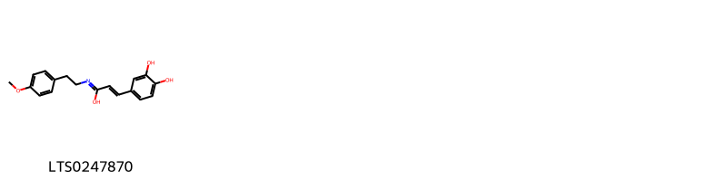{ width=100% }
    <figcaption>Hình ảnh cấu trúc hóa học của 1 hoạt chất thuộc nhóm Cinnamic acids and derivatives gồm ['(2e)-3-(3,4-dihydroxyphenyl)-n-[2-(4-methoxyphenyl)ethyl]prop-2-enimidic acid (LTS0247870)'].</figcaption>
</figure>
#### Nhóm Coumarins and derivatives
<figure markdown="span">
    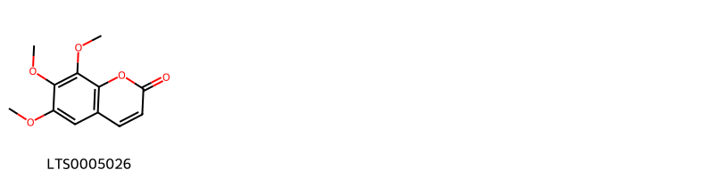{ width=100% }
    <figcaption>Hình ảnh cấu trúc hóa học của 1 hoạt chất thuộc nhóm Coumarins and derivatives gồm ['6,7,8-trimethoxychromen-2-one (LTS0005026)'].</figcaption>
</figure>
#### Nhóm Flavonoids
<figure markdown="span">
    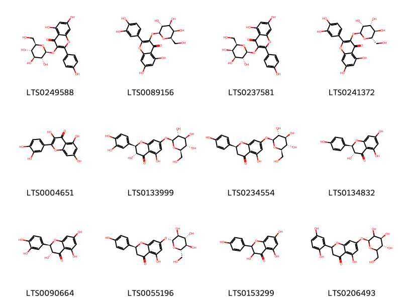{ width=100% }
    <figcaption>Hình ảnh cấu trúc hóa học của 12 hoạt chất thuộc nhóm Flavonoids gồm ['astragalin (LTS0249588)', 'hyperoside (LTS0089156)', 'trifolin (LTS0237581)', '2-(3,4-dihydroxyphenyl)-5,7-dihydroxy-3-{[(2s,3r,4r,5r,6s)-3,4,5-trihydroxy-6-(hydroxymethyl)oxan-2-yl]oxy}chromen-4-one (LTS0241372)', 'quercetin (LTS0004651)', 'taxifolin 7-glucoside (LTS0133999)', 'prunin (LTS0234554)', '(+)-dihydrokaempferol (LTS0134832)', '(+)-taxifolin (LTS0090664)', '(2s)-5-hydroxy-2-(4-hydroxyphenyl)-7-{[(2r,3s,4r,5r,6s)-3,4,5-trihydroxy-6-(hydroxymethyl)oxan-2-yl]oxy}-2,3-dihydro-1-benzopyran-4-one (LTS0055196)', 'aromadendrin (LTS0153299)', 'coccinoside b (LTS0206493)'].</figcaption>
</figure>
#### Nhóm Organooxygen compounds
<figure markdown="span">
    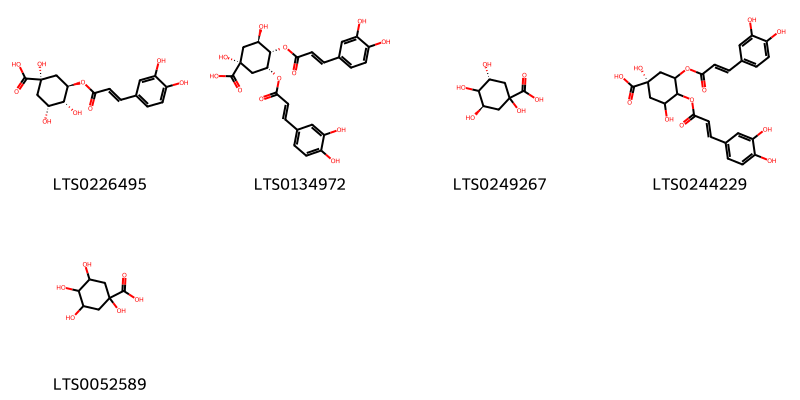{ width=100% }
    <figcaption>Hình ảnh cấu trúc hóa học của 5 hoạt chất thuộc nhóm Organooxygen compounds gồm ['chlorogenic acid (LTS0226495)', '3,4-dicaffeoylquinic acid (LTS0134972)', '(3r,5r)-1,3,4,5-tetrahydroxycyclohexane-1-carboxylic acid (LTS0249267)', '(1s)-3,4-bis({[3-(3,4-dihydroxyphenyl)prop-2-enoyl]oxy})-1,5-dihydroxycyclohexane-1-carboxylic acid (LTS0244229)', 'quinic acid (LTS0052589)'].</figcaption>
</figure>
#### Nhóm Prenol lipids
<figure markdown="span">
    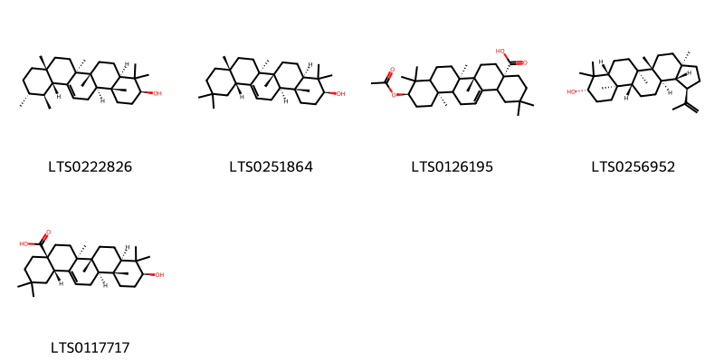{ width=100% }
    <figcaption>Hình ảnh cấu trúc hóa học của 5 hoạt chất thuộc nhóm Prenol lipids gồm ['amyrin (LTS0222826)', 'β-amyrin (LTS0251864)', '(4as,6as,6br,10r,12ar)-10-(acetyloxy)-2,2,6a,6b,9,9,12a-heptamethyl-1,3,4,5,6,7,8,8a,10,11,12,12b,13,14b-tetradecahydropicene-4a-carboxylic acid (LTS0126195)', 'lupeol (LTS0256952)', 'oleanolic acid (LTS0117717)'].</figcaption>
</figure>
#### Nhóm Steroids and steroid derivatives
<figure markdown="span">
    { width=100% }
    <figcaption>Hình ảnh cấu trúc hóa học của 1 hoạt chất thuộc nhóm Steroids and steroid derivatives gồm ['phytosterol (LTS0029311)'].</figcaption>
</figure>

---

### Dược dân tộc học

Danh sách các quốc gia có sử dụng *Cuscuta reflexa* trong điều trị các bệnh. 

| Country   | Disease      | Bệnh         |
|:----------|:-------------|:-------------|
| India     | Pediculicide | Pediculicide |

---

---
## Cuscuta umbellata
### Thông tin về thực vật

!!! info "Phân loại thực vật của *Cuscuta umbellata* từ GIBF:"
    - **Kingdom:** Plantae
    - **Phylum:** Tracheophyta
    - **Order:** Solanales
    - **Family:** Convolvulaceae
    - **Genus:** Cuscuta
    - **Species:** *Cuscuta umbellata*

 

| Label (VI)   | Label (EN)   | Scientific Name   | Descriptions (VI)   | Descriptions (EN)   | Also Known As (VI)   | Also Known As (EN)   |
|:-------------|:-------------|:------------------|:--------------------|:--------------------|:---------------------|:---------------------|
| N/A          | N/A          | Cuscuta umbellata | loài thực vật       | species of plant    | ['']                 | ['']                 |

#### Phân bố trên thế giới

**Từ CSDL GIBF** Puerto Rico, Suriname, Guadeloupe, Turks and Caicos Islands, Cabo Verde, Brazil, Guyana, Saint Lucia, Jamaica, United States of America, Cuba, Mexico, Venezuela (Bolivarian Republic of), China, Panama

#### Phân bố tại Việt Nam

**Từ CSDL GIBF**: Không có ghi nhận ở Việt Nam

---
### Thành phần hóa học
        
- Theo cơ sở dữ liệu lotus: Từ loài *Cuscuta umbellata* đã phân lập và xác định được Chưa có hoạt chất nào được phân lập. hoạt chất thuộc về các nhóm Không có hoạt chất nào được phân lập. 

Không có hình ảnh nào được tạo ra

---

### Dược dân tộc học

Danh sách các quốc gia có sử dụng *Cuscuta umbellata* trong điều trị các bệnh. 

| Country   | Disease   | Bệnh           |
|:----------|:----------|:---------------|
| Mexico    | Diuretic  | Thuốc lợi tiêu |

---

