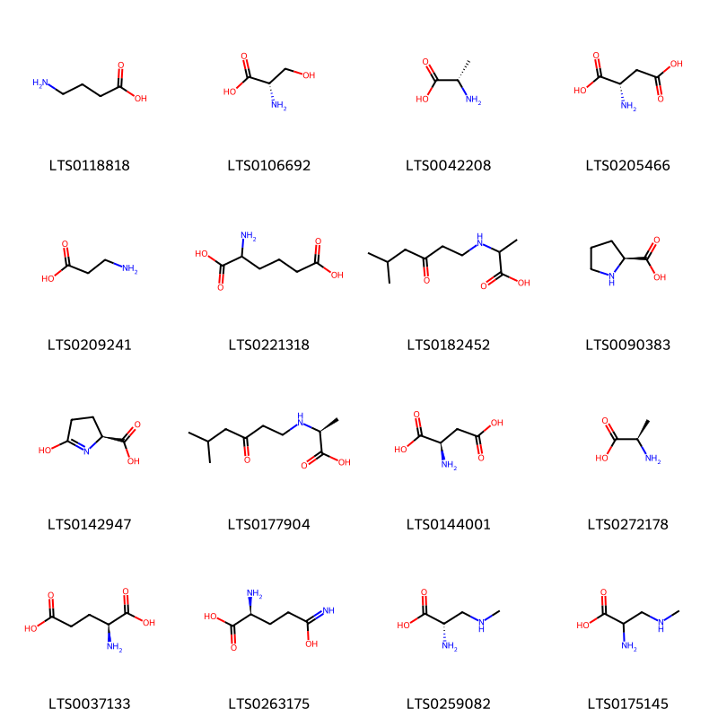
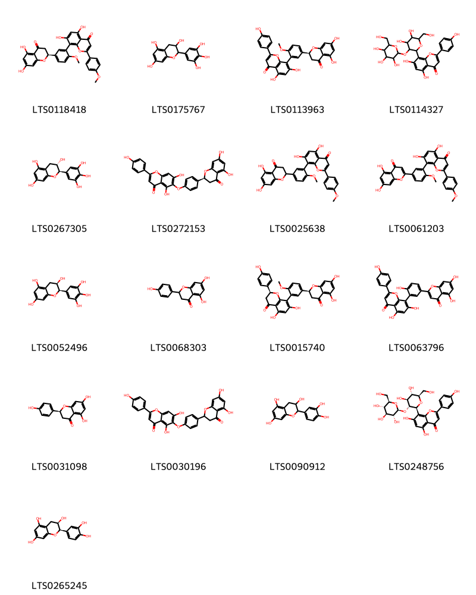
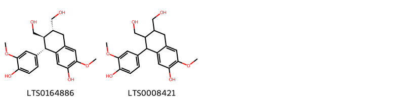
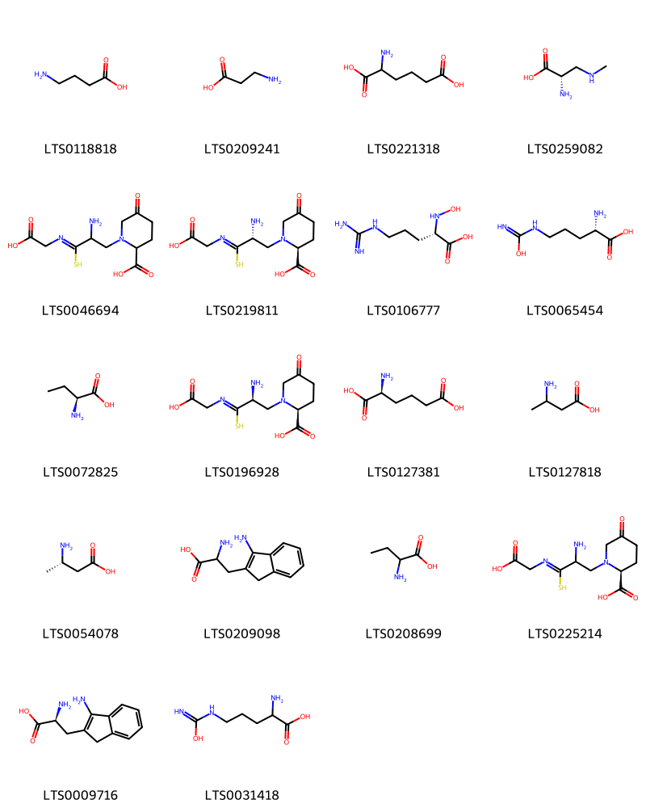
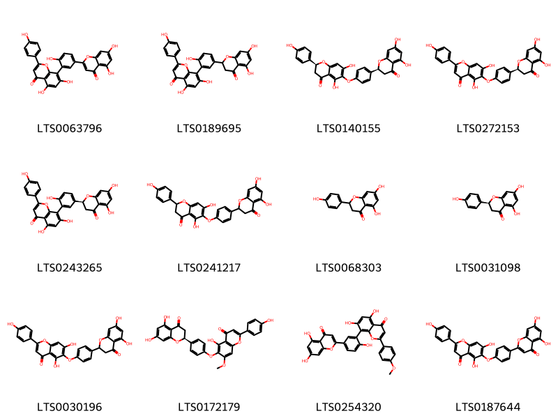
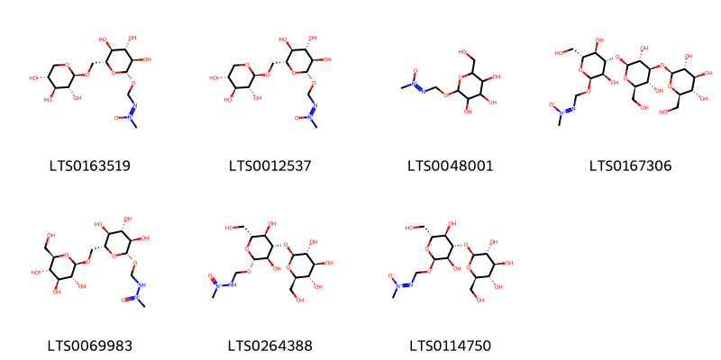
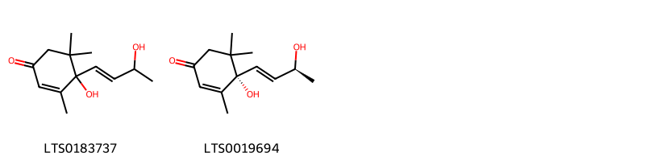
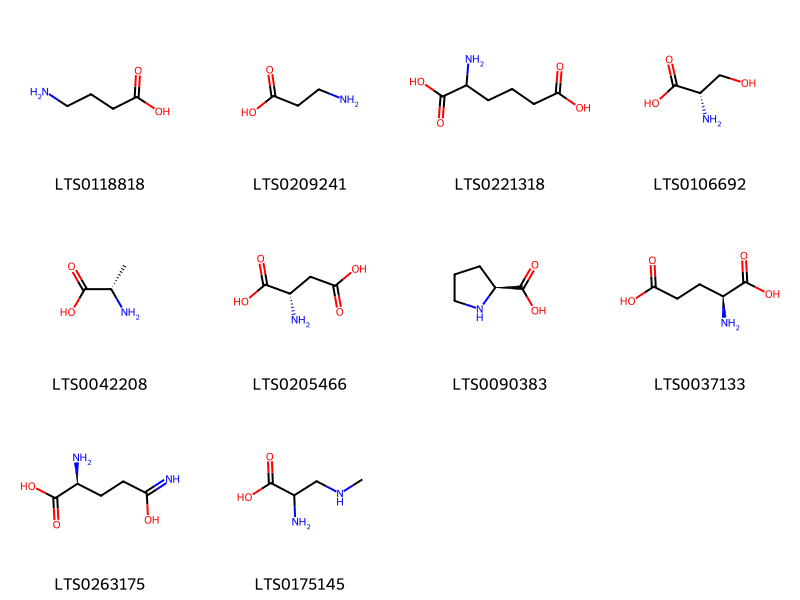

!!! abstract "Tóm tắt"

    Họ Cycadaceae gồm khoảng 1 chi và 3 loài được một số cộng đồng tại các quốc gia như Java, Elsewhere, China, Guam sử dụng trong một số trường hợp MYMEMORY WARNING: YOU USED ALL AVAILABLE FREE TRANSLATIONS FOR TODAY. NEXT AVAILABLE IN  14 HOURS 29 MINUTES 44 SECONDS VISIT HTTPS://MYMEMORY.TRANSLATED.NET/DOC/USAGELIMITS.PHP TO TRANSLATE MORE.

!!! info "DrDuke"

    James A. Duke sinh năm 1929-2017 là một nhà thực vật học người Mỹ. Đây là một trong những tác giả hàng đầu trong lĩnh vực dược dân tộc học với cuốn *CRC Handbook of Medicinal Herbs* và chính là người xây dựng lên cơ sở dữ liệu về hợp chất tự nhiên và dược dân tộc học tại Bộ nông nghiệp Hoa Kỳ. Các thông tin được đăng tải tại website [Dr. Duke's Phytochemical and Ethnobotanical Databases](https://phytochem.nal.usda.gov/). 
    Trong suốt thập niên 1970, ông lãnh đạo the Plant Taxonomy Laboratory, Plant Genetics and Germplasm Institute of the Agricultural Research Service, U.S. Department of Agriculture.
    Trong tài liệu này, các thông tin về dược dân tộc của các dược liệu được trích dẫn từ tài liệu của James A. Ducke với sự trợ giúp của phần mềm dịch thuật từ tiếng Anh sang tiếng Việt.
   

# Chi Cycas

??? note "Danh sách các dược liệu thuộc chi"
    
	 - *Cycas circinalis*
	 - *Cycas revoluta*
	 - *Cycas rumphii*

---
## Cycas circinalis
### Thông tin về thực vật

!!! info "Phân loại thực vật của *Cycas circinalis* từ GIBF:"
    - **Kingdom:** Plantae
    - **Phylum:** Tracheophyta
    - **Order:** Cycadales
    - **Family:** Cycadaceae
    - **Genus:** Cycas
    - **Species:** *Cycas circinalis*

 

| Label (VI)   | Label (EN)   | Scientific Name   | Descriptions (VI)   | Descriptions (EN)   | Also Known As (VI)   | Also Known As (EN)                                                                       |
|:-------------|:-------------|:------------------|:--------------------|:--------------------|:---------------------|:-----------------------------------------------------------------------------------------|
| N/A          | N/A          | Cycas circinalis  | loài thực vật       | species of cycad    | ['']                 | ['Crozier cycas', 'Cycad', 'Fern cycas', 'Fern palm', 'Palm-leaved cycas', 'Queen Sago'] |

#### Phân bố trên thế giới

**Từ CSDL GIBF** nan, Viet Nam, unknown or invalid, Spain, Philippines, Dominica, French Polynesia, French Guiana, Cameroon, Australia, Jamaica, Indonesia, Colombia, Sri Lanka, Dominican Republic, Côte d’Ivoire, India, Canada, Nigeria, Cuba, Guam, Japan, Vanuatu, Brazil, Panama, Peru, Mexico, China, Tonga, Norway, Portugal, Tanzania, United Republic of, Cook Islands, Papua New Guinea, Bolivia (Plurinational State of), Paraguay, New Caledonia, United States of America, Zimbabwe

#### Phân bố tại Việt Nam

**Từ CSDL GIBF**: Khanh Hoa

---
### Thành phần hóa học
        
- Theo cơ sở dữ liệu lotus: Từ loài *Cycas circinalis* đã phân lập và xác định được 37 hoạt chất thuộc về các nhóm Benzofurans, Flavonoids, 2-arylbenzofuran flavonoids, Carboxylic acids and derivatives. 

|    | chemicalTaxonomyClassyfireClass   |   smiles_count |
|---:|:----------------------------------|---------------:|
|  0 | 2-arylbenzofuran flavonoids       |              2 |
|  1 | Benzofurans                       |              2 |
|  2 | Carboxylic acids and derivatives  |             16 |
|  3 | Flavonoids                        |             17 |

#### Nhóm 2-arylbenzofuran flavonoids
<figure markdown="span">
    { width=100% }
    <figcaption>Hình ảnh cấu trúc hóa học của 2 hoạt chất thuộc nhóm 2-arylbenzofuran flavonoids gồm ['4-[(2s,3r)-3-(hydroxymethyl)-5-(3-hydroxypropyl)-7-methoxy-2,3-dihydro-1-benzofuran-2-yl]-2-methoxyphenol (LTS0153479)', '4-[3-(hydroxymethyl)-5-(3-hydroxypropyl)-7-methoxy-2,3-dihydro-1-benzofuran-2-yl]-2-methoxyphenol (LTS0259518)'].</figcaption>
</figure>
#### Nhóm Benzofurans
<figure markdown="span">
    { width=100% }
    <figcaption>Hình ảnh cấu trúc hóa học của 2 hoạt chất thuộc nhóm Benzofurans gồm ['loliolide (LTS0254454)', 'loliolide (LTS0119422)'].</figcaption>
</figure>
#### Nhóm Carboxylic acids and derivatives
<figure markdown="span">
    { width=100% }
    <figcaption>Hình ảnh cấu trúc hóa học của 16 hoạt chất thuộc nhóm Carboxylic acids and derivatives gồm ['gamma(amino)-butyric acid (LTS0118818)', 'l-serine (LTS0106692)', 'l-alanine (LTS0042208)', 'l-aspartic acid (LTS0205466)', 'β alanine (LTS0209241)', 'aminoadipic acid (LTS0221318)', '2-[(5-methyl-3-oxohexyl)amino]propanoic acid (LTS0182452)', 'l-proline (LTS0090383)', 'pyroglutamic acid (LTS0142947)', '(2s)-2-[(5-methyl-3-oxohexyl)amino]propanoic acid (LTS0177904)', 'd-aspartic acid (LTS0144001)', 'd-alanine (LTS0272178)', 'l-glutamic acid (LTS0037133)', 'l glutamine (LTS0263175)', 'β-methylamino-l-alanine (LTS0259082)', '3-(methylamino)-(dl)-alanine (LTS0175145)'].</figcaption>
</figure>
#### Nhóm Flavonoids
<figure markdown="span">
    { width=100% }
    <figcaption>Hình ảnh cấu trúc hóa học của 17 hoạt chất thuộc nhóm Flavonoids gồm ['8-{5-[(2s)-5,7-dihydroxy-4-oxo-2,3-dihydro-1-benzopyran-2-yl]-2-methoxyphenyl}-5,7-dihydroxy-2-(4-methoxyphenyl)chromen-4-one (LTS0118418)', 'epigallocatechin (LTS0175767)', '8-{5-[(2s)-5,7-dihydroxy-4-oxo-2,3-dihydro-1-benzopyran-2-yl]-2-methoxyphenyl}-5,7-dihydroxy-2-(4-hydroxyphenyl)chromen-4-one (LTS0113963)', '8-[4,5-dihydroxy-6-(hydroxymethyl)-3-{[3,4,5-trihydroxy-6-(hydroxymethyl)oxan-2-yl]oxy}oxan-2-yl]-5,7-dihydroxy-2-(4-hydroxyphenyl)chromen-4-one (LTS0114327)', 'gallocatechol (LTS0267305)', '6-{4-[(2s)-5,7-dihydroxy-4-oxo-2,3-dihydro-1-benzopyran-2-yl]phenoxy}-5,7-dihydroxy-2-(4-hydroxyphenyl)chromen-4-one (LTS0272153)', '8-[5-(5,7-dihydroxy-4-oxo-2,3-dihydro-1-benzopyran-2-yl)-2-methoxyphenyl]-5,7-dihydroxy-2-(4-methoxyphenyl)chromen-4-one (LTS0025638)', 'isoginkgetin (LTS0061203)', 'epigallocatechin (LTS0052496)', 'asahina (LTS0068303)', '(2s)-8-{5-[(2s)-5,7-dihydroxy-4-oxo-2,3-dihydro-1-benzopyran-2-yl]-2-methoxyphenyl}-5,7-dihydroxy-2-(4-hydroxyphenyl)-2,3-dihydro-1-benzopyran-4-one (LTS0015740)', 'amentoflavone (LTS0063796)', 'naringenin (LTS0031098)', '6-[4-(5,7-dihydroxy-4-oxo-2,3-dihydro-1-benzopyran-2-yl)phenoxy]-5,7-dihydroxy-2-(4-hydroxyphenyl)chromen-4-one (LTS0030196)', 'catechol (LTS0090912)', "2''-o-glucosylvitexin (LTS0248756)", 'ent-epicatechin (LTS0265245)'].</figcaption>
</figure>

---

### Dược dân tộc học

Danh sách các quốc gia có sử dụng *Cycas circinalis* trong điều trị các bệnh. 

| Country   | Disease                       | Bệnh                                                                                                                                                                                                |
|:----------|:------------------------------|:----------------------------------------------------------------------------------------------------------------------------------------------------------------------------------------------------|
| Elsewhere | Poison, Narcotic, Carminative | MYMEMORY WARNING: YOU USED ALL AVAILABLE FREE TRANSLATIONS FOR TODAY. NEXT AVAILABLE IN  14 HOURS 29 MINUTES 41 SECONDS VISIT HTTPS://MYMEMORY.TRANSLATED.NET/DOC/USAGELIMITS.PHP TO TRANSLATE MORE |
| Guam      | Poison                        | MYMEMORY WARNING: YOU USED ALL AVAILABLE FREE TRANSLATIONS FOR TODAY. NEXT AVAILABLE IN  14 HOURS 29 MINUTES 37 SECONDS VISIT HTTPS://MYMEMORY.TRANSLATED.NET/DOC/USAGELIMITS.PHP TO TRANSLATE MORE |

---

---
## Cycas revoluta
### Thông tin về thực vật

!!! info "Phân loại thực vật của *Cycas revoluta* từ GIBF:"
    - **Kingdom:** Plantae
    - **Phylum:** Tracheophyta
    - **Order:** Cycadales
    - **Family:** Cycadaceae
    - **Genus:** Cycas
    - **Species:** *Cycas revoluta*

 

| Label (VI)   | Label (EN)   | Scientific Name   | Descriptions (VI)   | Descriptions (EN)   | Also Known As (VI)                | Also Known As (EN)                                                          |
|:-------------|:-------------|:------------------|:--------------------|:--------------------|:----------------------------------|:----------------------------------------------------------------------------|
| N/A          | N/A          | Cycas revoluta    | loài thực vật       | species of plant    | ['Cycas revoluta', 'Cây vạn tuế'] | ['Japanese sago palm', 'king sago', 'King sago', 'Sago cycas', 'Sago palm'] |

#### Phân bố trên thế giới

**Từ CSDL GIBF** nan, Cayman Islands, Namibia, Spain, Philippines, French Guiana, Australia, Jamaica, Korea, Republic of, Haiti, Colombia, Saint Vincent and the Grenadines, Dominican Republic, Sri Lanka, Malaysia, Puerto Rico, India, Seychelles, Bahamas, Saint Kitts and Nevis, Belgium, Türkiye, Japan, Nicaragua, Brazil, China, Nepal, Hong Kong, Chinese Taipei, Argentina, South Africa, Bermuda, Portugal, France, Egypt, Bolivia (Plurinational State of), Costa Rica, Cyprus, United States of America, Italy, Greece

#### Phân bố tại Việt Nam

**Từ CSDL GIBF**: Không có ghi nhận ở Việt Nam

---
### Thành phần hóa học
        
- Theo cơ sở dữ liệu lotus: Từ loài *Cycas revoluta* đã phân lập và xác định được 43 hoạt chất thuộc về các nhóm Organooxygen compounds, Furanoid lignans, Flavonoids, Carboxylic acids and derivatives, Prenol lipids, Aryltetralin lignans. 

|    | chemicalTaxonomyClassyfireClass   |   smiles_count |
|---:|:----------------------------------|---------------:|
|  0 | Aryltetralin lignans              |              2 |
|  1 | Carboxylic acids and derivatives  |             18 |
|  2 | Flavonoids                        |             12 |
|  3 | Furanoid lignans                  |              2 |
|  4 | Organooxygen compounds            |              7 |
|  5 | Prenol lipids                     |              2 |

#### Nhóm Aryltetralin lignans
<figure markdown="span">
    { width=100% }
    <figcaption>Hình ảnh cấu trúc hóa học của 2 hoạt chất thuộc nhóm Aryltetralin lignans gồm ['(+)-isolariciresinol (LTS0164886)', '8-(4-hydroxy-3-methoxyphenyl)-6,7-bis(hydroxymethyl)-3-methoxy-5,6,7,8-tetrahydronaphthalen-2-ol (LTS0008421)'].</figcaption>
</figure>
#### Nhóm Carboxylic acids and derivatives
<figure markdown="span">
    { width=100% }
    <figcaption>Hình ảnh cấu trúc hóa học của 18 hoạt chất thuộc nhóm Carboxylic acids and derivatives gồm ['gamma(amino)-butyric acid (LTS0118818)', 'β alanine (LTS0209241)', 'aminoadipic acid (LTS0221318)', 'β-methylamino-l-alanine (LTS0259082)', '1-{2-amino-2-[carboxymethylthio(carbonoimidyl)]ethyl}-5-oxopiperidine-2-carboxylic acid (LTS0046694)', '(2s)-1-[(2r)-2-amino-2-[carboxymethylthio(carbonoimidyl)]ethyl]-5-oxopiperidine-2-carboxylic acid (LTS0219811)', '(2s)-5-carbamimidamido-2-(hydroxyamino)pentanoic acid (LTS0106777)', 'l(+)-citrulline (LTS0065454)', '(-)-2-aminobutyric acid (LTS0072825)', '(2s)-1-[(2s)-2-amino-2-[carboxymethylthio(carbonoimidyl)]ethyl]-5-oxopiperidine-2-carboxylic acid (LTS0196928)', 'aminoadipate (LTS0127381)', '3-aminobutyric acid (LTS0127818)', '(3s)-3-aminobutanoic acid (LTS0054078)', '2-amino-3-(1-amino-3h-inden-2-yl)propanoic acid (LTS0209098)', 'abu (LTS0208699)', '(2s)-1-{2-amino-2-[carboxymethylthio(carbonoimidyl)]ethyl}-5-oxopiperidine-2-carboxylic acid (LTS0225214)', '(2s)-2-amino-3-(1-amino-3h-inden-2-yl)propanoic acid (LTS0009716)', 'citrulline (LTS0031418)'].</figcaption>
</figure>
#### Nhóm Flavonoids
<figure markdown="span">
    { width=100% }
    <figcaption>Hình ảnh cấu trúc hóa học của 12 hoạt chất thuộc nhóm Flavonoids gồm ['amentoflavone (LTS0063796)', '8-[5-(5,7-dihydroxy-4-oxo-2,3-dihydro-1-benzopyran-2-yl)-2-hydroxyphenyl]-5,7-dihydroxy-2-(4-hydroxyphenyl)chromen-4-one (LTS0189695)', '(2s)-6-{4-[(2s)-5,7-dihydroxy-4-oxo-2,3-dihydro-1-benzopyran-2-yl]phenoxy}-5,7-dihydroxy-2-(4-hydroxyphenyl)-2,3-dihydro-1-benzopyran-4-one (LTS0140155)', '6-{4-[(2s)-5,7-dihydroxy-4-oxo-2,3-dihydro-1-benzopyran-2-yl]phenoxy}-5,7-dihydroxy-2-(4-hydroxyphenyl)chromen-4-one (LTS0272153)', '8-{5-[(2s)-5,7-dihydroxy-4-oxo-2,3-dihydro-1-benzopyran-2-yl]-2-hydroxyphenyl}-5,7-dihydroxy-2-(4-hydroxyphenyl)chromen-4-one (LTS0243265)', '6-[4-(5,7-dihydroxy-4-oxo-2,3-dihydro-1-benzopyran-2-yl)phenoxy]-5,7-dihydroxy-2-(4-hydroxyphenyl)-2,3-dihydro-1-benzopyran-4-one (LTS0241217)', 'asahina (LTS0068303)', 'naringenin (LTS0031098)', '6-[4-(5,7-dihydroxy-4-oxo-2,3-dihydro-1-benzopyran-2-yl)phenoxy]-5,7-dihydroxy-2-(4-hydroxyphenyl)chromen-4-one (LTS0030196)', '6-{4-[(2s)-5,7-dihydroxy-4-oxo-2,3-dihydro-1-benzopyran-2-yl]phenoxy}-5-hydroxy-2-(4-hydroxyphenyl)-7-methoxychromen-4-one (LTS0172179)', '8-[5-(5,7-dihydroxy-4-oxochromen-2-yl)-2-hydroxyphenyl]-5,7-dihydroxy-2-(4-methoxyphenyl)chromen-4-one (LTS0254320)', 'hinokiflavone (LTS0187644)'].</figcaption>
</figure>
#### Nhóm Furanoid lignans
<figure markdown="span">
    { width=100% }
    <figcaption>Hình ảnh cấu trúc hóa học của 2 hoạt chất thuộc nhóm Furanoid lignans gồm ['4-{4-[(4-hydroxy-3-methoxyphenyl)methyl]-3-(hydroxymethyl)oxolan-2-yl}-2-methoxyphenol (LTS0211349)', 'lariciresinol (LTS0010950)'].</figcaption>
</figure>
#### Nhóm Organooxygen compounds
<figure markdown="span">
    { width=100% }
    <figcaption>Hình ảnh cấu trúc hóa học của 7 hoạt chất thuộc nhóm Organooxygen compounds gồm ['macrozamin (LTS0163519)', 'macrozemin (LTS0012537)', '(1z)-1-methyl-2-({[3,4,5-trihydroxy-6-(hydroxymethyl)oxan-2-yl]oxy}methyl)diazen-1-ium-1-olate (LTS0048001)', '(2s,3r,4s,5s,6r)-2-{[(2s,3r,4s,5r,6r)-2-{[(2r,3r,4s,5r,6r)-3,5-dihydroxy-2-(hydroxymethyl)-6-{[(methyl-oxo-λ⁵-azanylidene)amino]methoxy}oxan-4-yl]oxy}-3,5-dihydroxy-6-(hydroxymethyl)oxan-4-yl]oxy}-6-(hydroxymethyl)oxane-3,4,5-triol (LTS0167306)', '1-methyl-1-oxo-2-({[(2s,3r,4s,5s,6r)-3,4,5-trihydroxy-6-({[(2r,3r,4s,5s,6r)-3,4,5-trihydroxy-6-(hydroxymethyl)oxan-2-yl]oxy}methyl)oxan-2-yl]oxy}methyl)hydrazinium (LTS0069983)', '2-({[(2s,3r,4s,5r,6r)-3,5-dihydroxy-6-(hydroxymethyl)-4-{[(2s,3r,4s,5s,6r)-3,4,5-trihydroxy-6-(hydroxymethyl)oxan-2-yl]oxy}oxan-2-yl]oxy}methyl)-1-methyl-1-oxohydrazinium (LTS0264388)', '(2s,3r,4s,5s,6r)-2-{[(2r,3r,4s,5r,6r)-3,5-dihydroxy-2-(hydroxymethyl)-6-{[(methyl-oxo-λ⁵-azanylidene)amino]methoxy}oxan-4-yl]oxy}-6-(hydroxymethyl)oxane-3,4,5-triol (LTS0114750)'].</figcaption>
</figure>
#### Nhóm Prenol lipids
<figure markdown="span">
    { width=100% }
    <figcaption>Hình ảnh cấu trúc hóa học của 2 hoạt chất thuộc nhóm Prenol lipids gồm ['4-hydroxy-4-(3-hydroxybut-1-en-1-yl)-3,5,5-trimethylcyclohex-2-en-1-one (LTS0183737)', 'blumenol a (LTS0019694)'].</figcaption>
</figure>

---

### Dược dân tộc học

Danh sách các quốc gia có sử dụng *Cycas revoluta* trong điều trị các bệnh. 

| Country   | Disease                                | Bệnh                                                                                                                                                                                                |
|:----------|:---------------------------------------|:----------------------------------------------------------------------------------------------------------------------------------------------------------------------------------------------------|
| China     | Tonic, Expectorant                     | MYMEMORY WARNING: YOU USED ALL AVAILABLE FREE TRANSLATIONS FOR TODAY. NEXT AVAILABLE IN  14 HOURS 29 MINUTES 00 SECONDS VISIT HTTPS://MYMEMORY.TRANSLATED.NET/DOC/USAGELIMITS.PHP TO TRANSLATE MORE |
| Elsewhere | Emmenagogue, Expectorant, Tonic, Tonic | MYMEMORY WARNING: YOU USED ALL AVAILABLE FREE TRANSLATIONS FOR TODAY. NEXT AVAILABLE IN  14 HOURS 28 MINUTES 53 SECONDS VISIT HTTPS://MYMEMORY.TRANSLATED.NET/DOC/USAGELIMITS.PHP TO TRANSLATE MORE |
| Java      | Hemostat                               | MYMEMORY WARNING: YOU USED ALL AVAILABLE FREE TRANSLATIONS FOR TODAY. NEXT AVAILABLE IN  14 HOURS 28 MINUTES 49 SECONDS VISIT HTTPS://MYMEMORY.TRANSLATED.NET/DOC/USAGELIMITS.PHP TO TRANSLATE MORE |

---

---
## Cycas rumphii
### Thông tin về thực vật

!!! info "Phân loại thực vật của *Cycas rumphii* từ GIBF:"
    - **Kingdom:** Plantae
    - **Phylum:** Tracheophyta
    - **Order:** Cycadales
    - **Family:** Cycadaceae
    - **Genus:** Cycas
    - **Species:** *Cycas rumphii*

 

| Label (VI)   | Label (EN)   | Scientific Name   | Descriptions (VI)   | Descriptions (EN)   | Also Known As (VI)   | Also Known As (EN)   |
|:-------------|:-------------|:------------------|:--------------------|:--------------------|:---------------------|:---------------------|
| N/A          | N/A          | Cycas rumphii     | loài thực vật       | species of plant    | ['']                 | ['Cycad']            |

#### Phân bố trên thế giới

**Từ CSDL GIBF** Viet Nam, nan, unknown or invalid, Thailand, Philippines, Germany, Northern Mariana Islands, Singapore, Australia, Indonesia, Colombia, Venezuela (Bolivarian Republic of), Malaysia, India, Seychelles, Guam, Christmas Island, Panama, Palau, Mexico, China, Tonga, Timor-Leste, Micronesia (Federated States of), New Zealand, Papua New Guinea, Fiji, New Caledonia, United States of America, Solomon Islands

#### Phân bố tại Việt Nam

**Từ CSDL GIBF**: Dong Nai

---
### Thành phần hóa học
        
- Theo cơ sở dữ liệu lotus: Từ loài *Cycas rumphii* đã phân lập và xác định được 10 hoạt chất thuộc về các nhóm Carboxylic acids and derivatives. 

|    | chemicalTaxonomyClassyfireClass   |   smiles_count |
|---:|:----------------------------------|---------------:|
|  0 | Carboxylic acids and derivatives  |             10 |

#### Nhóm Carboxylic acids and derivatives
<figure markdown="span">
    { width=100% }
    <figcaption>Hình ảnh cấu trúc hóa học của 10 hoạt chất thuộc nhóm Carboxylic acids and derivatives gồm ['gamma(amino)-butyric acid (LTS0118818)', 'β alanine (LTS0209241)', 'aminoadipic acid (LTS0221318)', 'l-serine (LTS0106692)', 'l-alanine (LTS0042208)', 'l-aspartic acid (LTS0205466)', 'l-proline (LTS0090383)', 'l-glutamic acid (LTS0037133)', 'l glutamine (LTS0263175)', '3-(methylamino)-(dl)-alanine (LTS0175145)'].</figcaption>
</figure>

---

### Dược dân tộc học

Danh sách các quốc gia có sử dụng *Cycas rumphii* trong điều trị các bệnh. 

| Country   | Disease   | Bệnh                                                                                                                                                                                                |
|:----------|:----------|:----------------------------------------------------------------------------------------------------------------------------------------------------------------------------------------------------|
| Java      | Emetic    | MYMEMORY WARNING: YOU USED ALL AVAILABLE FREE TRANSLATIONS FOR TODAY. NEXT AVAILABLE IN  14 HOURS 28 MINUTES 19 SECONDS VISIT HTTPS://MYMEMORY.TRANSLATED.NET/DOC/USAGELIMITS.PHP TO TRANSLATE MORE |

---

