!!! abstract "Tóm tắt"

    Họ Cyperaceae gồm khoảng 11 chi và 32 loài được một số cộng đồng tại các quốc gia như Turkey, Africa, UK, Brazil, Egypt, Argentina, Guyana, US, India(Hindu), Mexico, Dominican Republic, Malaya, Iran, China, Nigeria, Sudan, Sumatra, Elsewhere, India, Java, Venezuela, Japan*, Sanscrit sử dụng trong một số trường hợp QUERY LENGTH LIMIT EXCEEDED. MAX ALLOWED QUERY : 500 CHARS Thuốc nhuận tràng, Chất làm lạnh, Thuốc bổ, Thuốc lợi tiểu, Dạ dày, Thuốc bổ, Chất làm se, Thuốc lợi tiểu, Thuốc an thần, Thuốc giãn mạch, Thuốc giảm đau, Chất làm ngọt, Thuốc lợi tiểu, Chất làm se, Thuốc đắp, Thuốc an thần, Thuốc lợi tiểu, Thuốc lợi tiểu, Chất kích thích, Thuốc làm se, Thuốc kích thích, Thuốc bổ, Chất kích thích, Chất kích thích, Chất kích thích, Chất kích thích, Chất kích thích, Vulnerary, Tonic, Stomachic, Sudorific.

!!! info "DrDuke"

    James A. Duke sinh năm 1929-2017 là một nhà thực vật học người Mỹ. Đây là một trong những tác giả hàng đầu trong lĩnh vực dược dân tộc học với cuốn *CRC Handbook of Medicinal Herbs* và chính là người xây dựng lên cơ sở dữ liệu về hợp chất tự nhiên và dược dân tộc học tại Bộ nông nghiệp Hoa Kỳ. Các thông tin được đăng tải tại website [Dr. Duke's Phytochemical and Ethnobotanical Databases](https://phytochem.nal.usda.gov/). 
    Trong suốt thập niên 1970, ông lãnh đạo the Plant Taxonomy Laboratory, Plant Genetics and Germplasm Institute of the Agricultural Research Service, U.S. Department of Agriculture.
    Trong tài liệu này, các thông tin về dược dân tộc của các dược liệu được trích dẫn từ tài liệu của James A. Ducke với sự trợ giúp của phần mềm dịch thuật từ tiếng Anh sang tiếng Việt.
   

# Chi Eleocharis

??? note "Danh sách các dược liệu thuộc chi"
    
	 - *Eleocharis dulcis*
	 - *Eleocharis geniculata*
	 - *Eleocharis interstincta*
	 - *Eleocharis plantaginea*

---
## Eleocharis dulcis
### Thông tin về thực vật

!!! info "Phân loại thực vật của *Eleocharis dulcis* từ GIBF:"
    - **Kingdom:** Plantae
    - **Phylum:** Tracheophyta
    - **Order:** Poales
    - **Family:** Cyperaceae
    - **Genus:** Eleocharis
    - **Species:** *Eleocharis dulcis*

 

| Label (VI)   | Label (EN)   | Scientific Name   | Descriptions (VI)   | Descriptions (EN)                           | Also Known As (VI)                                                                                                               | Also Known As (EN)   |
|:-------------|:-------------|:------------------|:--------------------|:--------------------------------------------|:---------------------------------------------------------------------------------------------------------------------------------|:---------------------|
| N/A          | N/A          | Eleocharis dulcis |                     | grass-like sedge grown for its edible corms | ['Năng ngọt', 'Năn lùn', 'Năn bộp', 'Năn', 'Mã thầy', 'Eleocharis dulcis', 'Củ năng bông đơn', 'Củ năn bông đơn', 'Cỏ năng ống'] | ['']                 |

#### Phân bố trên thế giới

**Từ CSDL GIBF** nan, Australia, Japan, Gabon, Sierra Leone, Togo, Réunion, Korea, Republic of, Chinese Taipei, United States of America, Timor-Leste, Guinea, Solomon Islands, South Africa, Thailand, New Caledonia, Tonga, France, China, Madagascar, Seychelles, Botswana, Malaysia

#### Phân bố tại Việt Nam

**Từ CSDL GIBF**: Không có ghi nhận ở Việt Nam

---
### Thành phần hóa học
        
- Theo cơ sở dữ liệu lotus: Từ loài *Eleocharis dulcis* đã phân lập và xác định được 10 hoạt chất thuộc về các nhóm Fatty Acyls, Flavonoids, Prenol lipids, Steroids and steroid derivatives, Aurone flavonoids. 

|    | chemicalTaxonomyClassyfireClass   |   smiles_count |
|---:|:----------------------------------|---------------:|
|  0 | Aurone flavonoids                 |              1 |
|  1 | Fatty Acyls                       |              1 |
|  2 | Flavonoids                        |              4 |
|  3 | Prenol lipids                     |              1 |
|  4 | Steroids and steroid derivatives  |              3 |

#### Nhóm Aurone flavonoids
<figure markdown="span">
    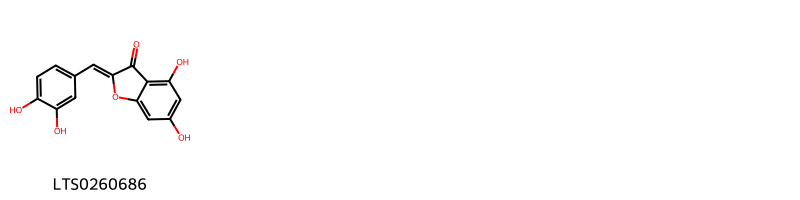{ width=100% }
    <figcaption>Hình ảnh cấu trúc hóa học của 1 hoạt chất thuộc nhóm Aurone flavonoids gồm ['aureusidin (LTS0260686)'].</figcaption>
</figure>
#### Nhóm Fatty Acyls
<figure markdown="span">
    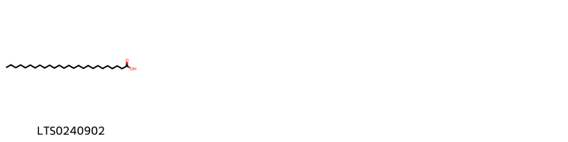{ width=100% }
    <figcaption>Hình ảnh cấu trúc hóa học của 1 hoạt chất thuộc nhóm Fatty Acyls gồm ['hexacosanoic acid (LTS0240902)'].</figcaption>
</figure>
#### Nhóm Flavonoids
<figure markdown="span">
    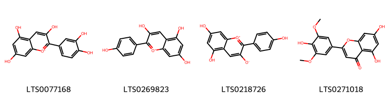{ width=100% }
    <figcaption>Hình ảnh cấu trúc hóa học của 4 hoạt chất thuộc nhóm Flavonoids gồm ['cyanidin (LTS0077168)', 'pelargonidin (LTS0269823)', '5,7-dihydroxy-2-(4-hydroxyphenyl)-1λ⁴-chromen-1-ylium-3-olate (LTS0218726)', 'tricin (LTS0271018)'].</figcaption>
</figure>
#### Nhóm Prenol lipids
<figure markdown="span">
    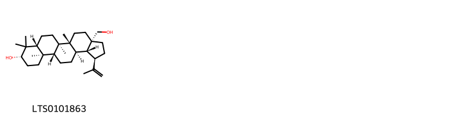{ width=100% }
    <figcaption>Hình ảnh cấu trúc hóa học của 1 hoạt chất thuộc nhóm Prenol lipids gồm ['betulin (LTS0101863)'].</figcaption>
</figure>
#### Nhóm Steroids and steroid derivatives
<figure markdown="span">
    { width=100% }
    <figcaption>Hình ảnh cấu trúc hóa học của 3 hoạt chất thuộc nhóm Steroids and steroid derivatives gồm ['stigmast-5-en-3-ol, (3β)- (LTS0204616)', 'stigmast-5-en-3-ol (LTS0071224)', 'phytosterol (LTS0029311)'].</figcaption>
</figure>

---

### Dược dân tộc học

Danh sách các quốc gia có sử dụng *Eleocharis dulcis* trong điều trị các bệnh. 

| Country   | Disease         | Bệnh            |
|:----------|:----------------|:----------------|
| India     | Antibiotic, nan | Kháng sinh, nan |

---

---
## Eleocharis geniculata
### Thông tin về thực vật

!!! info "Phân loại thực vật của *Eleocharis geniculata* từ GIBF:"
    - **Kingdom:** Plantae
    - **Phylum:** Tracheophyta
    - **Order:** Poales
    - **Family:** Cyperaceae
    - **Genus:** Eleocharis
    - **Species:** *Eleocharis geniculata*

 

| Label (VI)   | Label (EN)   | Scientific Name       | Descriptions (VI)   | Descriptions (EN)   | Also Known As (VI)   | Also Known As (EN)                           |
|:-------------|:-------------|:----------------------|:--------------------|:--------------------|:---------------------|:---------------------------------------------|
| N/A          | N/A          | Eleocharis geniculata | loài thực vật       | species of plant    | ['']                 | ['Canada spikesedge', 'Knoblike Spikesedge'] |

#### Phân bố trên thế giới

**Từ CSDL GIBF** Puerto Rico, Panama, Malaysia, Liberia, Australia, Colombia, Chinese Taipei, Brazil, United States of America, Peru, Mexico, British Indian Ocean Territory, Dominican Republic, El Salvador, French Guiana

#### Phân bố tại Việt Nam

**Từ CSDL GIBF**: Không có ghi nhận ở Việt Nam

---
### Thành phần hóa học
        
- Theo cơ sở dữ liệu lotus: Từ loài *Eleocharis geniculata* đã phân lập và xác định được 4 hoạt chất thuộc về các nhóm Flavonoids. 

|    | chemicalTaxonomyClassyfireClass   |   smiles_count |
|---:|:----------------------------------|---------------:|
|  0 | Flavonoids                        |              4 |

#### Nhóm Flavonoids
<figure markdown="span">
    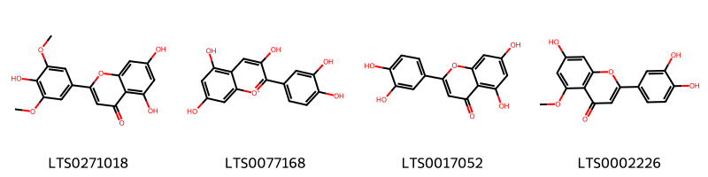{ width=100% }
    <figcaption>Hình ảnh cấu trúc hóa học của 4 hoạt chất thuộc nhóm Flavonoids gồm ['tricin (LTS0271018)', 'cyanidin (LTS0077168)', 'luteolin (LTS0017052)', 'luteolin 5-methyl ether (LTS0002226)'].</figcaption>
</figure>

---

### Dược dân tộc học

Danh sách các quốc gia có sử dụng *Eleocharis geniculata* trong điều trị các bệnh. 

| Country   | Disease          | Bệnh             |
|:----------|:-----------------|:-----------------|
| Venezuela | Stomachic, Tonic | Dạ dày, Thuốc bổ |

---

---
## Eleocharis interstincta
### Thông tin về thực vật

!!! info "Phân loại thực vật của *Eleocharis interstincta* từ GIBF:"
    - **Kingdom:** Plantae
    - **Phylum:** Tracheophyta
    - **Order:** Poales
    - **Family:** Cyperaceae
    - **Genus:** Eleocharis
    - **Species:** *Eleocharis interstincta*

 

| Label (VI)   | Label (EN)   | Scientific Name         | Descriptions (VI)   | Descriptions (EN)   | Also Known As (VI)   | Also Known As (EN)                       |
|:-------------|:-------------|:------------------------|:--------------------|:--------------------|:---------------------|:-----------------------------------------|
| N/A          | N/A          | Eleocharis interstincta | loài thực vật       | species of plant    | ['']                 | ['knotted spikerush', 'giant spikerush'] |

#### Phân bố trên thế giới

**Từ CSDL GIBF** Saint Martin (French part), Puerto Rico, Panama, Guadeloupe, Martinique, Colombia, Brazil, United States of America, Cayman Islands, Dominican Republic, Bermuda, Mexico, French Guiana

#### Phân bố tại Việt Nam

**Từ CSDL GIBF**: Không có ghi nhận ở Việt Nam

---
### Thành phần hóa học
        
- Theo cơ sở dữ liệu lotus: Từ loài *Eleocharis interstincta* đã phân lập và xác định được Chưa có hoạt chất nào được phân lập. hoạt chất thuộc về các nhóm Không có hoạt chất nào được phân lập. 

Không có hình ảnh nào được tạo ra

---

### Dược dân tộc học

Danh sách các quốc gia có sử dụng *Eleocharis interstincta* trong điều trị các bệnh. 

| Country            | Disease   | Bệnh           |
|:-------------------|:----------|:---------------|
| Dominican Republic | Diuretic  | Thuốc lợi tiêu |

---

---
## Eleocharis plantaginea
### Thông tin về thực vật

!!! info "Phân loại thực vật của *Eleocharis plantaginea* từ GIBF:"
    - **Kingdom:** Plantae
    - **Phylum:** Tracheophyta
    - **Order:** Poales
    - **Family:** Cyperaceae
    - **Genus:** Eleocharis
    - **Species:** *Eleocharis plantaginea*

 

| Label (VI)   | Label (EN)   | Scientific Name        | Descriptions (VI)   | Descriptions (EN)   | Also Known As (VI)   | Also Known As (EN)   |
|:-------------|:-------------|:-----------------------|:--------------------|:--------------------|:---------------------|:---------------------|
| N/A          | N/A          | Eleocharis plantaginea | loài thực vật       | species of plant    | ['']                 | ['']                 |

#### Phân bố trên thế giới

**Từ CSDL GIBF** nan, Sri Lanka, Puerto Rico, Mali, Senegal, Hong Kong, Madagascar, Japan, Gabon, Mauritius, Chinese Taipei, India, Viet Nam, Philippines, Sierra Leone, China

#### Phân bố tại Việt Nam

**Từ CSDL GIBF**: Không có ghi nhận ở Việt Nam

---
### Thành phần hóa học
        
- Theo cơ sở dữ liệu lotus: Từ loài *Eleocharis plantaginea* đã phân lập và xác định được Chưa có hoạt chất nào được phân lập. hoạt chất thuộc về các nhóm Không có hoạt chất nào được phân lập. 

Không có hình ảnh nào được tạo ra

---

### Dược dân tộc học

Danh sách các quốc gia có sử dụng *Eleocharis plantaginea* trong điều trị các bệnh. 

| Country   | Disease     | Bệnh          |
|:----------|:------------|:--------------|
| China     | Refrigerant | Chất làm lạnh |

---

# Chi Scirpus

??? note "Danh sách các dược liệu thuộc chi"
    
	 - *Scirpus americanus*
	 - *Scirpus articulatus*
	 - *Scirpus grossus*
	 - *Scirpus lacustris*
	 - *Scirpus maritimus*
	 - *Scirpus palustris?*
	 - *Scirpus tuberosus*

---
## Scirpus americanus
### Thông tin về thực vật

!!! info "Phân loại thực vật của *N/A* từ GIBF:"
    - **Kingdom:** Plantae
    - **Phylum:** Tracheophyta
    - **Order:** Poales
    - **Family:** Cyperaceae
    - **Genus:** N/A
    - **Species:** *N/A*

 

| Label (VI)   | Label (EN)   | Scientific Name    | Descriptions (VI)   | Descriptions (EN)   | Also Known As (VI)   | Also Known As (EN)   |
|:-------------|:-------------|:-------------------|:--------------------|:--------------------|:---------------------|:---------------------|
| N/A          | N/A          | Scirpus americanus | loài thực vật       | species of plant    | ['']                 | ['']                 |

#### Phân bố trên thế giới

**Từ CSDL GIBF** Italy, Australia, Guatemala, Argentina, Canada, Ukraine, Puerto Rico, Chinese Taipei, Spain, Portugal, Russian Federation, United States of America, Uruguay, South Africa, Thailand, Brazil, Austria, Dominican Republic, Singapore, Viet Nam, Norfolk Island, United Kingdom of Great Britain and Northern Ireland, India, Indonesia, Malaysia, New Zealand

#### Phân bố tại Việt Nam

**Từ CSDL GIBF**: Lâm Đồng

---
### Thành phần hóa học
        
- Theo cơ sở dữ liệu lotus: Từ loài *N/A* đã phân lập và xác định được Chưa có hoạt chất nào được phân lập. hoạt chất thuộc về các nhóm Không có hoạt chất nào được phân lập. 

Không có hình ảnh nào được tạo ra

---

### Dược dân tộc học

Danh sách các quốc gia có sử dụng *N/A* trong điều trị các bệnh. 

| Country   | Disease   | Bệnh     |
|:----------|:----------|:---------|
| US        | Poison    | Chất độc |

---

---
## Scirpus articulatus
### Thông tin về thực vật

!!! info "Phân loại thực vật của *Schoenoplectiella articulata* từ GIBF:"
    - **Kingdom:** Plantae
    - **Phylum:** Tracheophyta
    - **Order:** Poales
    - **Family:** Cyperaceae
    - **Genus:** Schoenoplectiella
    - **Species:** *Schoenoplectiella articulata*

 

| Label (VI)   | Label (EN)   | Scientific Name     | Descriptions (VI)   | Descriptions (EN)   | Also Known As (VI)   | Also Known As (EN)   |
|:-------------|:-------------|:--------------------|:--------------------|:--------------------|:---------------------|:---------------------|
| N/A          | N/A          | Scirpus articulatus | loài thực vật       | species of plant    | ['']                 | ['']                 |

#### Phân bố trên thế giới

**Từ CSDL GIBF** nan, Sri Lanka, Ghana, Australia, Japan, Lao People’s Democratic Republic, Angola, Somalia, Mozambique, unknown or invalid, Tanzania, United Republic of, Mali, Senegal, Nigeria, Chad, Sudan, Papua New Guinea, Zimbabwe, Thailand, Eritrea, Egypt, Cuba, Viet Nam, Madagascar, Burundi, India, Indonesia, Philippines, Cameroon, Ethiopia

#### Phân bố tại Việt Nam

**Từ CSDL GIBF**: Không có ghi nhận ở Việt Nam

---
### Thành phần hóa học
        
- Theo cơ sở dữ liệu lotus: Từ loài *Schoenoplectiella articulata* đã phân lập và xác định được Chưa có hoạt chất nào được phân lập. hoạt chất thuộc về các nhóm Không có hoạt chất nào được phân lập. 

Không có hình ảnh nào được tạo ra

---

### Dược dân tộc học

Danh sách các quốc gia có sử dụng *Schoenoplectiella articulata* trong điều trị các bệnh. 

| Country      | Disease   | Bệnh     |
|:-------------|:----------|:---------|
| India(Hindu) | Purgative | Thuốc xổ |

---

---
## Scirpus grossus
### Thông tin về thực vật

!!! info "Phân loại thực vật của *Actinoscirpus grossus* từ GIBF:"
    - **Kingdom:** Plantae
    - **Phylum:** Tracheophyta
    - **Order:** Poales
    - **Family:** Cyperaceae
    - **Genus:** Actinoscirpus
    - **Species:** *Actinoscirpus grossus*

 

| Label (VI)   | Label (EN)   | Scientific Name   | Descriptions (VI)   | Descriptions (EN)   | Also Known As (VI)   | Also Known As (EN)    |
|:-------------|:-------------|:------------------|:--------------------|:--------------------|:---------------------|:----------------------|
| N/A          | N/A          | Scirpus grossus   | loài thực vật       | species of plant    | ['']                 | ['Greater club rush'] |

#### Phân bố trên thế giới

**Từ CSDL GIBF** nan, Sri Lanka, Australia, Japan, Thailand, Lao People’s Democratic Republic, Cambodia, Myanmar, Papua New Guinea, unknown or invalid, Indonesia, Bangladesh, India, Viet Nam, United States of America, Philippines, Malaysia, China

#### Phân bố tại Việt Nam

**Từ CSDL GIBF**: Không có ghi nhận ở Việt Nam

---
### Thành phần hóa học
        
- Theo cơ sở dữ liệu lotus: Từ loài *Actinoscirpus grossus* đã phân lập và xác định được 8 hoạt chất thuộc về các nhóm Flavonoids, Steroids and steroid derivatives, Aurone flavonoids. 

|    | chemicalTaxonomyClassyfireClass   |   smiles_count |
|---:|:----------------------------------|---------------:|
|  0 | Aurone flavonoids                 |              1 |
|  1 | Flavonoids                        |              5 |
|  2 | Steroids and steroid derivatives  |              2 |

#### Nhóm Aurone flavonoids
<figure markdown="span">
    { width=100% }
    <figcaption>Hình ảnh cấu trúc hóa học của 1 hoạt chất thuộc nhóm Aurone flavonoids gồm ['aureusidin (LTS0260686)'].</figcaption>
</figure>
#### Nhóm Flavonoids
<figure markdown="span">
    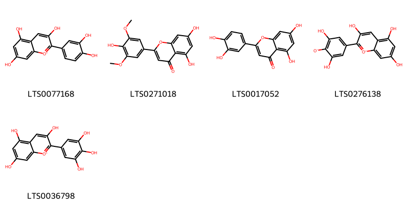{ width=100% }
    <figcaption>Hình ảnh cấu trúc hóa học của 5 hoạt chất thuộc nhóm Flavonoids gồm ['cyanidin (LTS0077168)', 'tricin (LTS0271018)', 'luteolin (LTS0017052)', '2-(3,5-dihydroxy-4-oxidophenyl)-3,5,7-trihydroxy-1λ⁴-chromen-1-ylium (LTS0276138)', 'delphinidin (LTS0036798)'].</figcaption>
</figure>
#### Nhóm Steroids and steroid derivatives
<figure markdown="span">
    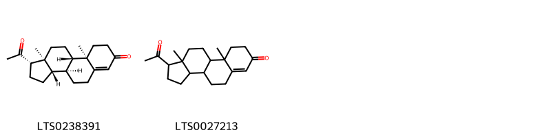{ width=100% }
    <figcaption>Hình ảnh cấu trúc hóa học của 2 hoạt chất thuộc nhóm Steroids and steroid derivatives gồm ['progesterone (LTS0238391)', 'retroprogesterone (LTS0027213)'].</figcaption>
</figure>

---

### Dược dân tộc học

Danh sách các quốc gia có sử dụng *Actinoscirpus grossus* trong điều trị các bệnh. 

| Country      | Disease                                            | Bệnh                                                              |
|:-------------|:---------------------------------------------------|:------------------------------------------------------------------|
| Elsewhere    | Astringent, Diuretic, Laxative, Refrigerant, Tonic | Chất làm se, lợi tiểu, nhuận tràng, chất làm lạnh, thuốc bổ       |
| India        | Diuretic, Laxative, Refrigerant, Tonic, Astringent | Thuốc lợi tiểu, nhuận tràng, chất làm lạnh, thuốc bổ, chất làm se |
| India(Hindu) | Astringent                                         | Lam se da                                                         |

---

---
## Scirpus lacustris
### Thông tin về thực vật

!!! info "Phân loại thực vật của *Schoenoplectus lacustris* từ GIBF:"
    - **Kingdom:** Plantae
    - **Phylum:** Tracheophyta
    - **Order:** Poales
    - **Family:** Cyperaceae
    - **Genus:** Schoenoplectus
    - **Species:** *Schoenoplectus lacustris*

 

| Label (VI)   | Label (EN)   | Scientific Name   | Descriptions (VI)   | Descriptions (EN)   | Also Known As (VI)   | Also Known As (EN)   |
|:-------------|:-------------|:------------------|:--------------------|:--------------------|:---------------------|:---------------------|
| N/A          | N/A          | Scirpus lacustris | loài thực vật       | species of plant    | ['']                 | ['']                 |

#### Phân bố trên thế giới

**Từ CSDL GIBF** Ukraine, Italy, Luxembourg, Germany, Belgium, Spain, Russian Federation, Norway, France, Latvia

#### Phân bố tại Việt Nam

**Từ CSDL GIBF**: Không có ghi nhận ở Việt Nam

---
### Thành phần hóa học
        
- Theo cơ sở dữ liệu lotus: Từ loài *Schoenoplectus lacustris* đã phân lập và xác định được Chưa có hoạt chất nào được phân lập. hoạt chất thuộc về các nhóm Không có hoạt chất nào được phân lập. 

Không có hình ảnh nào được tạo ra

---

### Dược dân tộc học

Danh sách các quốc gia có sử dụng *Schoenoplectus lacustris* trong điều trị các bệnh. 

| Country   | Disease                      | Bệnh                            |
|:----------|:-----------------------------|:--------------------------------|
| Elsewhere | Astringent, Diuretic, Poison | Chất làm se, lợi tiểu, chất độc |

---

---
## Scirpus maritimus
### Thông tin về thực vật

!!! info "Phân loại thực vật của *Bolboschoenus maritimus* từ GIBF:"
    - **Kingdom:** Plantae
    - **Phylum:** Tracheophyta
    - **Order:** Poales
    - **Family:** Cyperaceae
    - **Genus:** Bolboschoenus
    - **Species:** *Bolboschoenus maritimus*

 

| Label (VI)   | Label (EN)   | Scientific Name   | Descriptions (VI)   | Descriptions (EN)   | Also Known As (VI)   | Also Known As (EN)   |
|:-------------|:-------------|:------------------|:--------------------|:--------------------|:---------------------|:---------------------|
| N/A          | N/A          | Scirpus maritimus | loài thực vật       | species of plant    | ['']                 | ['']                 |

#### Phân bố trên thế giới

**Từ CSDL GIBF** France, Belgium, Korea, Republic of, United States of America

#### Phân bố tại Việt Nam

**Từ CSDL GIBF**: Không có ghi nhận ở Việt Nam

---
### Thành phần hóa học
        
- Theo cơ sở dữ liệu lotus: Từ loài *Bolboschoenus maritimus* đã phân lập và xác định được 8 hoạt chất thuộc về các nhóm 2-arylbenzofuran flavonoids, Stilbenes. 

|    | chemicalTaxonomyClassyfireClass   |   smiles_count |
|---:|:----------------------------------|---------------:|
|  0 | 2-arylbenzofuran flavonoids       |              5 |
|  1 | Stilbenes                         |              3 |

#### Nhóm 2-arylbenzofuran flavonoids
<figure markdown="span">
    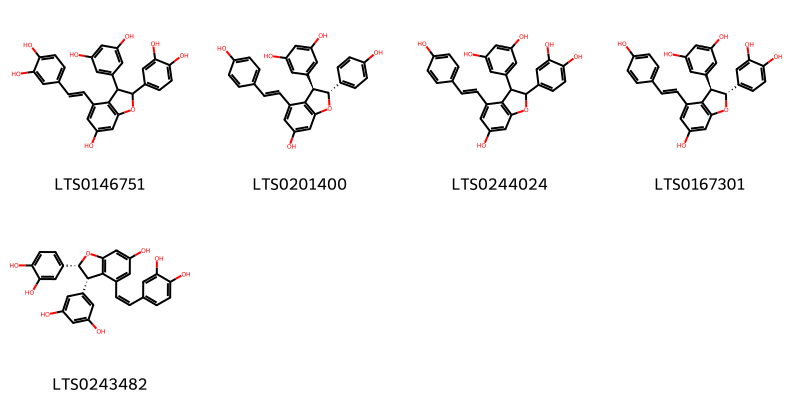{ width=100% }
    <figcaption>Hình ảnh cấu trúc hóa học của 5 hoạt chất thuộc nhóm 2-arylbenzofuran flavonoids gồm ['5-[2-(3,4-dihydroxyphenyl)-4-[(1e)-2-(3,4-dihydroxyphenyl)ethenyl]-6-hydroxy-2,3-dihydro-1-benzofuran-3-yl]benzene-1,3-diol (LTS0146751)', 'ε-viniferin (LTS0201400)', '5-[2-(3,4-dihydroxyphenyl)-6-hydroxy-4-[(1e)-2-(4-hydroxyphenyl)ethenyl]-2,3-dihydro-1-benzofuran-3-yl]benzene-1,3-diol (LTS0244024)', '5-[(2r,3r)-2-(3,4-dihydroxyphenyl)-6-hydroxy-4-[(1e)-2-(4-hydroxyphenyl)ethenyl]-2,3-dihydro-1-benzofuran-3-yl]benzene-1,3-diol (LTS0167301)', '5-[(2r,3s)-2-(3,4-dihydroxyphenyl)-4-[(1z)-2-(3,4-dihydroxyphenyl)ethenyl]-6-hydroxy-2,3-dihydro-1-benzofuran-3-yl]benzene-1,3-diol (LTS0243482)'].</figcaption>
</figure>
#### Nhóm Stilbenes
<figure markdown="span">
    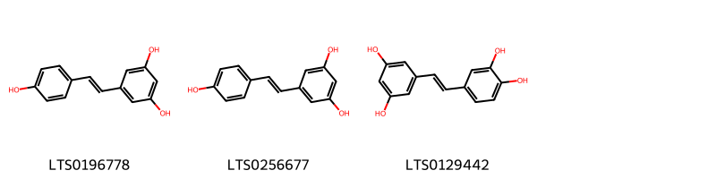{ width=100% }
    <figcaption>Hình ảnh cấu trúc hóa học của 3 hoạt chất thuộc nhóm Stilbenes gồm ['tocilizumab (LTS0196778)', 'resveratrol (LTS0256677)', 'piceatannol (LTS0129442)'].</figcaption>
</figure>

---

### Dược dân tộc học

Danh sách các quốc gia có sử dụng *Bolboschoenus maritimus* trong điều trị các bệnh. 

| Country   | Disease     | Bệnh        |
|:----------|:------------|:------------|
| China     | Emmenagogue | Emmenagogue |

---

---
## Scirpus palustris
### Thông tin về thực vật

!!! info "Phân loại thực vật của *Eleocharis palustris* từ GIBF:"
    - **Kingdom:** Plantae
    - **Phylum:** Tracheophyta
    - **Order:** Poales
    - **Family:** Cyperaceae
    - **Genus:** Eleocharis
    - **Species:** *Eleocharis palustris*

 

| Label (VI)   | Label (EN)   | Scientific Name   | Descriptions (VI)   | Descriptions (EN)   | Also Known As (VI)   | Also Known As (EN)   |
|:-------------|:-------------|:------------------|:--------------------|:--------------------|:---------------------|:---------------------|
| N/A          | N/A          | Scirpus palustris | loài thực vật       | species of plant    | ['']                 | ['']                 |

#### Phân bố trên thế giới

**Từ CSDL GIBF** France, Belgium, Spain, Finland

#### Phân bố tại Việt Nam

**Từ CSDL GIBF**: Không có ghi nhận ở Việt Nam

---
### Thành phần hóa học
        
- Theo cơ sở dữ liệu lotus: Từ loài *Eleocharis palustris* đã phân lập và xác định được Chưa có hoạt chất nào được phân lập. hoạt chất thuộc về các nhóm Không có hoạt chất nào được phân lập. 

Không có hình ảnh nào được tạo ra

---

### Dược dân tộc học

Danh sách các quốc gia có sử dụng *Eleocharis palustris* trong điều trị các bệnh. 

| Country   | Disease   | Bệnh          |
|:----------|:----------|:--------------|
| UK        | Sedative  | Thuốc an thần |

---

---
## Scirpus tuberosus
### Thông tin về thực vật

!!! info "Phân loại thực vật của *N/A* từ GIBF:"
    - **Kingdom:** Plantae
    - **Phylum:** Tracheophyta
    - **Order:** Poales
    - **Family:** Cyperaceae
    - **Genus:** N/A
    - **Species:** *N/A*

 

| Label (VI)   | Label (EN)   | Scientific Name   | Descriptions (VI)   | Descriptions (EN)   | Also Known As (VI)   | Also Known As (EN)   |
|:-------------|:-------------|:------------------|:--------------------|:--------------------|:---------------------|:---------------------|
| N/A          | N/A          | Scirpus tuberosus |                     |                     | ['']                 | ['']                 |

#### Phân bố trên thế giới

**Từ CSDL GIBF** Italy, Australia, Guatemala, Argentina, Canada, Ukraine, Puerto Rico, Chinese Taipei, Spain, Portugal, Russian Federation, United States of America, Uruguay, South Africa, Thailand, Brazil, Austria, Dominican Republic, Singapore, Viet Nam, Norfolk Island, United Kingdom of Great Britain and Northern Ireland, India, Indonesia, Malaysia, New Zealand

#### Phân bố tại Việt Nam

**Từ CSDL GIBF**: Lâm Đồng

---
### Thành phần hóa học
        
- Theo cơ sở dữ liệu lotus: Từ loài *N/A* đã phân lập và xác định được Chưa có hoạt chất nào được phân lập. hoạt chất thuộc về các nhóm Không có hoạt chất nào được phân lập. 

Không có hình ảnh nào được tạo ra

---

### Dược dân tộc học

Danh sách các quốc gia có sử dụng *N/A* trong điều trị các bệnh. 

| Country   | Disease               | Bệnh                          |
|:----------|:----------------------|:------------------------------|
| China     | Antidote, Refrigerant | Thuốc giải độc, chất làm lạnh |

---

# Chi Mapania

??? note "Danh sách các dược liệu thuộc chi"
    
	 - *Mapania cuidata*

---
## Mapania cuidata
### Thông tin về thực vật

!!! info "Phân loại thực vật của *N/A* từ GIBF:"
    - **Kingdom:** Plantae
    - **Phylum:** Tracheophyta
    - **Order:** Poales
    - **Family:** Cyperaceae
    - **Genus:** Mapania
    - **Species:** *N/A*

 

| Label (VI)   | Label (EN)   | Scientific Name   | Descriptions (VI)   | Descriptions (EN)   | Also Known As (VI)   | Also Known As (EN)   |
|:-------------|:-------------|:------------------|:--------------------|:--------------------|:---------------------|:---------------------|
| N/A          | N/A          | Scirpus tuberosus |                     |                     | ['']                 | ['']                 |

#### Phân bố trên thế giới

**Từ CSDL GIBF** Liberia, Australia, Sao Tome and Principe, Seychelles, Gabon, Colombia, Brazil, Costa Rica, Vanuatu, Guinea, Philippines, Singapore, Viet Nam, Brunei Darussalam, French Guiana

#### Phân bố tại Việt Nam

**Từ CSDL GIBF**: Lam Dong (林同省)

---
### Thành phần hóa học
        
- Theo cơ sở dữ liệu lotus: Từ loài *N/A* đã phân lập và xác định được Chưa có hoạt chất nào được phân lập. hoạt chất thuộc về các nhóm Không có hoạt chất nào được phân lập. 

Không có hình ảnh nào được tạo ra

---

### Dược dân tộc học

Danh sách các quốc gia có sử dụng *N/A* trong điều trị các bệnh. 

| Country   | Disease   | Bệnh               |
|:----------|:----------|:-------------------|
| Sumatra   | Tonic     | (thuộc) trương lực |

---

# Chi Remirea

??? note "Danh sách các dược liệu thuộc chi"
    
	 - *Remirea maritima*

---
## Remirea maritima
### Thông tin về thực vật

!!! info "Phân loại thực vật của *Cyperus pedunculatus* từ GIBF:"
    - **Kingdom:** Plantae
    - **Phylum:** Tracheophyta
    - **Order:** Poales
    - **Family:** Cyperaceae
    - **Genus:** Cyperus
    - **Species:** *Cyperus pedunculatus*

 

| Label (VI)   | Label (EN)   | Scientific Name   | Descriptions (VI)   | Descriptions (EN)   | Also Known As (VI)   | Also Known As (EN)   |
|:-------------|:-------------|:------------------|:--------------------|:--------------------|:---------------------|:---------------------|
| N/A          | N/A          | Remirea maritima  | loài thực vật       | species of plant    | ['']                 | ['beachstar']        |

#### Phân bố trên thế giới

**Từ CSDL GIBF** Belize, Ghana, Nigeria, Gabon, Equatorial Guinea, Brazil, Chinese Taipei, Côte d’Ivoire, Benin, United States of America, Liberia, French Guiana, Togo

#### Phân bố tại Việt Nam

**Từ CSDL GIBF**: Không có ghi nhận ở Việt Nam

---
### Thành phần hóa học
        
- Theo cơ sở dữ liệu lotus: Từ loài *Cyperus pedunculatus* đã phân lập và xác định được 5 hoạt chất thuộc về các nhóm Organooxygen compounds, Benzopyrans, Benzene and substituted derivatives. 

|    | chemicalTaxonomyClassyfireClass     |   smiles_count |
|---:|:------------------------------------|---------------:|
|  0 | Benzene and substituted derivatives |              3 |
|  1 | Benzopyrans                         |              1 |
|  2 | Organooxygen compounds              |              1 |

#### Nhóm Benzene and substituted derivatives
<figure markdown="span">
    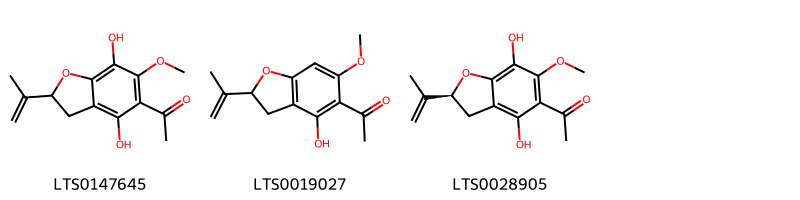{ width=100% }
    <figcaption>Hình ảnh cấu trúc hóa học của 3 hoạt chất thuộc nhóm Benzene and substituted derivatives gồm ['1-[4,7-dihydroxy-6-methoxy-2-(prop-1-en-2-yl)-2,3-dihydro-1-benzofuran-5-yl]ethanone (LTS0147645)', '1-[4-hydroxy-6-methoxy-2-(prop-1-en-2-yl)-2,3-dihydro-1-benzofuran-5-yl]ethanone (LTS0019027)', '1-[(2s)-4,7-dihydroxy-6-methoxy-2-(prop-1-en-2-yl)-2,3-dihydro-1-benzofuran-5-yl]ethanone (LTS0028905)'].</figcaption>
</figure>
#### Nhóm Benzopyrans
<figure markdown="span">
    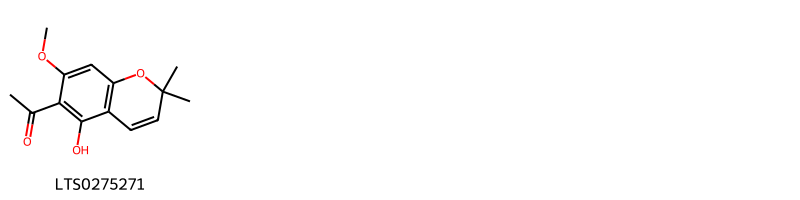{ width=100% }
    <figcaption>Hình ảnh cấu trúc hóa học của 1 hoạt chất thuộc nhóm Benzopyrans gồm ['1-(5-hydroxy-7-methoxy-2,2-dimethylchromen-6-yl)ethanone (LTS0275271)'].</figcaption>
</figure>
#### Nhóm Organooxygen compounds
<figure markdown="span">
    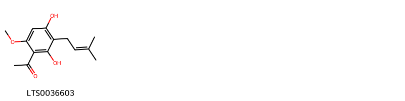{ width=100% }
    <figcaption>Hình ảnh cấu trúc hóa học của 1 hoạt chất thuộc nhóm Organooxygen compounds gồm ['preremirol (LTS0036603)'].</figcaption>
</figure>

---

### Dược dân tộc học

Danh sách các quốc gia có sử dụng *Cyperus pedunculatus* trong điều trị các bệnh. 

| Country   | Disease    | Bệnh           |
|:----------|:-----------|:---------------|
| Brazil    | Sudorific  | Ngạt thở       |
| Elsewhere | Astringent | Lam se da      |
| Guyana    | Diuretic   | Thuốc lợi tiêu |

---

# Chi Kyllinga

??? note "Danh sách các dược liệu thuộc chi"
    
	 - *Kyllinga monocephala*
	 - *Kyllinga squamulata*

---
## Kyllinga monocephala
### Thông tin về thực vật

!!! info "Phân loại thực vật của *N/A* từ GIBF:"
    - **Kingdom:** Plantae
    - **Phylum:** Tracheophyta
    - **Order:** Poales
    - **Family:** Cyperaceae
    - **Genus:** N/A
    - **Species:** *N/A*

 

| Label (VI)   | Label (EN)   | Scientific Name      | Descriptions (VI)   | Descriptions (EN)   | Also Known As (VI)   | Also Known As (EN)   |
|:-------------|:-------------|:---------------------|:--------------------|:--------------------|:---------------------|:---------------------|
| N/A          | N/A          | Kyllinga monocephala | loài thực vật       | species of plant    | ['']                 | ['']                 |

#### Phân bố trên thế giới

**Từ CSDL GIBF** Italy, Australia, Guatemala, Argentina, Canada, Ukraine, Puerto Rico, Chinese Taipei, Spain, Portugal, Russian Federation, United States of America, Uruguay, South Africa, Thailand, Brazil, Austria, Dominican Republic, Singapore, Viet Nam, Norfolk Island, United Kingdom of Great Britain and Northern Ireland, India, Indonesia, Malaysia, New Zealand

#### Phân bố tại Việt Nam

**Từ CSDL GIBF**: Lâm Đồng

---
### Thành phần hóa học
        
- Theo cơ sở dữ liệu lotus: Từ loài *N/A* đã phân lập và xác định được Chưa có hoạt chất nào được phân lập. hoạt chất thuộc về các nhóm Không có hoạt chất nào được phân lập. 

Không có hình ảnh nào được tạo ra

---

### Dược dân tộc học

Danh sách các quốc gia có sử dụng *N/A* trong điều trị các bệnh. 

| Country   | Disease                                                       | Bệnh                                                       |
|:----------|:--------------------------------------------------------------|:-----------------------------------------------------------|
| China     | Fumigant                                                      | chất hun khói (diệt côn trùng, vi sinh vật)                |
| Elsewhere | Stomachic, Tonic, Demulcent, Vermifuge, Refrigerant, Diuretic | Dạ dày, Tonic, Demulcent, Vermifuge, Refrigerant, lợi tiểu |

---

---
## Kyllinga squamulata
### Thông tin về thực vật

!!! info "Phân loại thực vật của *Cyperus metzii* từ GIBF:"
    - **Kingdom:** Plantae
    - **Phylum:** Tracheophyta
    - **Order:** Poales
    - **Family:** Cyperaceae
    - **Genus:** Cyperus
    - **Species:** *Cyperus metzii*

 

| Label (VI)   | Label (EN)   | Scientific Name     | Descriptions (VI)   | Descriptions (EN)   | Also Known As (VI)   | Also Known As (EN)   |
|:-------------|:-------------|:--------------------|:--------------------|:--------------------|:---------------------|:---------------------|
| N/A          | N/A          | Kyllinga squamulata | loài thực vật       | species of plant    | ['']                 | ['']                 |

#### Phân bố trên thế giới

**Từ CSDL GIBF** Zambia, Ghana, Senegal, Nigeria, Gabon, Togo, Brazil, Niger, Bhutan, Gambia, Benin, United States of America, Burkina Faso, Guinea, China, Ethiopia

#### Phân bố tại Việt Nam

**Từ CSDL GIBF**: Không có ghi nhận ở Việt Nam

---
### Thành phần hóa học
        
- Theo cơ sở dữ liệu lotus: Từ loài *Cyperus metzii* đã phân lập và xác định được Chưa có hoạt chất nào được phân lập. hoạt chất thuộc về các nhóm Không có hoạt chất nào được phân lập. 

Không có hình ảnh nào được tạo ra

---

### Dược dân tộc học

Danh sách các quốc gia có sử dụng *Cyperus metzii* trong điều trị các bệnh. 

| Country   | Disease   | Bệnh                                        |
|:----------|:----------|:--------------------------------------------|
| Elsewhere | Fumigant  | chất hun khói (diệt côn trùng, vi sinh vật) |

---

# Chi Juncellus

??? note "Danh sách các dược liệu thuộc chi"
    
	 - *Juncellus inundatus*

---
## Juncellus inundatus
### Thông tin về thực vật

!!! info "Phân loại thực vật của *Cyperus serotinus* từ GIBF:"
    - **Kingdom:** Plantae
    - **Phylum:** Tracheophyta
    - **Order:** Poales
    - **Family:** Cyperaceae
    - **Genus:** Cyperus
    - **Species:** *Cyperus serotinus*

 

| Label (VI)   | Label (EN)   | Scientific Name     | Descriptions (VI)   | Descriptions (EN)   | Also Known As (VI)   | Also Known As (EN)   |
|:-------------|:-------------|:--------------------|:--------------------|:--------------------|:---------------------|:---------------------|
| N/A          | N/A          | Juncellus inundatus |                     |                     | ['']                 | ['']                 |

#### Phân bố trên thế giới

**Từ CSDL GIBF** Zambia, Ghana, Senegal, Nigeria, Gabon, Togo, Brazil, Niger, Bhutan, Gambia, Benin, United States of America, Burkina Faso, Guinea, China, Ethiopia

#### Phân bố tại Việt Nam

**Từ CSDL GIBF**: Không có ghi nhận ở Việt Nam

---
### Thành phần hóa học
        
- Theo cơ sở dữ liệu lotus: Từ loài *Cyperus serotinus* đã phân lập và xác định được Chưa có hoạt chất nào được phân lập. hoạt chất thuộc về các nhóm Không có hoạt chất nào được phân lập. 

Không có hình ảnh nào được tạo ra

---

### Dược dân tộc học

Danh sách các quốc gia có sử dụng *Cyperus serotinus* trong điều trị các bệnh. 

| Country   | Disease          | Bệnh                      |
|:----------|:-----------------|:--------------------------|
| India     | Stimulant, Tonic | Chất kích thích, Thuốc bổ |

---

# Chi Mariscus

??? note "Danh sách các dược liệu thuộc chi"
    
	 - *Mariscus sieberianus*

---
## Mariscus sieberianus
### Thông tin về thực vật

!!! info "Phân loại thực vật của *Cyperus cyperoides* từ GIBF:"
    - **Kingdom:** Plantae
    - **Phylum:** Tracheophyta
    - **Order:** Poales
    - **Family:** Cyperaceae
    - **Genus:** Cyperus
    - **Species:** *Cyperus cyperoides*

 

| Label (VI)   | Label (EN)   | Scientific Name      | Descriptions (VI)   | Descriptions (EN)   | Also Known As (VI)   | Also Known As (EN)   |
|:-------------|:-------------|:---------------------|:--------------------|:--------------------|:---------------------|:---------------------|
| N/A          | N/A          | Mariscus sieberianus |                     |                     | ['']                 | ['']                 |

#### Phân bố trên thế giới

**Từ CSDL GIBF** nan, Uganda, South Africa, Japan, Chinese Taipei, Mozambique, Burundi, Philippines, Indonesia, Congo, Democratic Republic of the, Kenya, Tanzania, United Republic of, China

#### Phân bố tại Việt Nam

**Từ CSDL GIBF**: Không có ghi nhận ở Việt Nam

---
### Thành phần hóa học
        
- Theo cơ sở dữ liệu lotus: Từ loài *Cyperus cyperoides* đã phân lập và xác định được Chưa có hoạt chất nào được phân lập. hoạt chất thuộc về các nhóm Không có hoạt chất nào được phân lập. 

Không có hình ảnh nào được tạo ra

---

### Dược dân tộc học

Danh sách các quốc gia có sử dụng *Cyperus cyperoides* trong điều trị các bệnh. 

| Country   | Disease                         | Bệnh                            |
|:----------|:--------------------------------|:--------------------------------|
| Sumatra   | Vermifuge, Vermifuge, Vermifuge | Vermifuge, Vermifuge, Vermifuge |

---

# Chi Scleria

??? note "Danh sách các dược liệu thuộc chi"
    
	 - *Scleria pergracilis*

---
## Scleria pergracilis
### Thông tin về thực vật

!!! info "Phân loại thực vật của *Scleria pergracilis* từ GIBF:"
    - **Kingdom:** Plantae
    - **Phylum:** Tracheophyta
    - **Order:** Poales
    - **Family:** Cyperaceae
    - **Genus:** Scleria
    - **Species:** *Scleria pergracilis*

 

| Label (VI)   | Label (EN)   | Scientific Name     | Descriptions (VI)   | Descriptions (EN)   | Also Known As (VI)   | Also Known As (EN)   |
|:-------------|:-------------|:--------------------|:--------------------|:--------------------|:---------------------|:---------------------|
| N/A          | N/A          | Scleria pergracilis |                     | species of plant    | ['']                 | ['']                 |

#### Phân bố trên thế giới

**Từ CSDL GIBF** nan, Ghana, Australia, Angola, Mozambique, unknown or invalid, Benin, Congo, Tanzania, United Republic of, Sierra Leone, Togo, Malawi, Zambia, Mali, Senegal, Nigeria, Chad, Papua New Guinea, Congo, Democratic Republic of the, Zimbabwe, Guinea-Bissau, Thailand, Côte d’Ivoire, China, Botswana, India, Nepal, Indonesia, Burkina Faso, Cameroon, Ethiopia

#### Phân bố tại Việt Nam

**Từ CSDL GIBF**: Không có ghi nhận ở Việt Nam

---
### Thành phần hóa học
        
- Theo cơ sở dữ liệu lotus: Từ loài *Scleria pergracilis* đã phân lập và xác định được Chưa có hoạt chất nào được phân lập. hoạt chất thuộc về các nhóm Không có hoạt chất nào được phân lập. 

Không có hình ảnh nào được tạo ra

---

### Dược dân tộc học

Danh sách các quốc gia có sử dụng *Scleria pergracilis* trong điều trị các bệnh. 

| Country   | Disease     | Bệnh          |
|:----------|:------------|:--------------|
| Elsewhere | Insecticide | Thuốc trừ sâu |

---

# Chi Carex

??? note "Danh sách các dược liệu thuộc chi"
    
	 - *Carex arenaria*
	 - *Carex cernua*
	 - *Carex hirta*

---
## Carex arenaria
### Thông tin về thực vật

!!! info "Phân loại thực vật của *Carex arenaria* từ GIBF:"
    - **Kingdom:** Plantae
    - **Phylum:** Tracheophyta
    - **Order:** Poales
    - **Family:** Cyperaceae
    - **Genus:** Carex
    - **Species:** *Carex arenaria*

 

| Label (VI)   | Label (EN)   | Scientific Name   | Descriptions (VI)   | Descriptions (EN)   | Also Known As (VI)   | Also Known As (EN)   |
|:-------------|:-------------|:------------------|:--------------------|:--------------------|:---------------------|:---------------------|
| N/A          | N/A          | Carex arenaria    | loài thực vật       | species of plant    | ['']                 | ['']                 |

#### Phân bố trên thế giới

**Từ CSDL GIBF** Denmark, Netherlands, Germany, Belgium, Sweden, France, United Kingdom of Great Britain and Northern Ireland

#### Phân bố tại Việt Nam

**Từ CSDL GIBF**: Không có ghi nhận ở Việt Nam

---
### Thành phần hóa học
        
- Theo cơ sở dữ liệu lotus: Từ loài *Carex arenaria* đã phân lập và xác định được Chưa có hoạt chất nào được phân lập. hoạt chất thuộc về các nhóm Không có hoạt chất nào được phân lập. 

Không có hình ảnh nào được tạo ra

---

### Dược dân tộc học

Danh sách các quốc gia có sử dụng *Carex arenaria* trong điều trị các bệnh. 

| Country   | Disease                                    | Bệnh                                                                |
|:----------|:-------------------------------------------|:--------------------------------------------------------------------|
| Elsewhere | Diaphoretic, Diuretic                      | Thuốc lợi tiểu, lợi tiểu                                            |
| Turkey    | Diuretic, Expectorant, Laxative, Sudorific | Thuốc lợi tiểu, thuốc long đờm, thuốc nhuận tràng, thuốc hút mồ hôi |

---

---
## Carex cernua
### Thông tin về thực vật

!!! info "Phân loại thực vật của *N/A* từ GIBF:"
    - **Kingdom:** Plantae
    - **Phylum:** Tracheophyta
    - **Order:** Poales
    - **Family:** Cyperaceae
    - **Genus:** Carex
    - **Species:** *N/A*

 

| Label (VI)   | Label (EN)   | Scientific Name   | Descriptions (VI)   | Descriptions (EN)   | Also Known As (VI)   | Also Known As (EN)   |
|:-------------|:-------------|:------------------|:--------------------|:--------------------|:---------------------|:---------------------|
| N/A          | N/A          | Carex arenaria    | loài thực vật       | species of plant    | ['']                 | ['']                 |

#### Phân bố trên thế giới

**Từ CSDL GIBF** Italy, Australia, Slovakia, Argentina, Israel, Canada, Ukraine, Netherlands, Chinese Taipei, Spain, Bolivia (Plurinational State of), Portugal, Russian Federation, United States of America, Chile, South Africa, Czechia, Germany, Austria, France, Viet Nam, United Kingdom of Great Britain and Northern Ireland, China, New Zealand

#### Phân bố tại Việt Nam

**Từ CSDL GIBF**: Lâm Đồng

---
### Thành phần hóa học
        
- Theo cơ sở dữ liệu lotus: Từ loài *N/A* đã phân lập và xác định được Chưa có hoạt chất nào được phân lập. hoạt chất thuộc về các nhóm Không có hoạt chất nào được phân lập. 

Không có hình ảnh nào được tạo ra

---

### Dược dân tộc học

Danh sách các quốc gia có sử dụng *N/A* trong điều trị các bệnh. 

| Country   | Disease   | Bệnh     |
|:----------|:----------|:---------|
| Elsewhere | Poison    | Chất độc |

---

---
## Carex hirta
### Thông tin về thực vật

!!! info "Phân loại thực vật của *Carex hirta* từ GIBF:"
    - **Kingdom:** Plantae
    - **Phylum:** Tracheophyta
    - **Order:** Poales
    - **Family:** Cyperaceae
    - **Genus:** Carex
    - **Species:** *Carex hirta*

 

| Label (VI)   | Label (EN)   | Scientific Name   | Descriptions (VI)   | Descriptions (EN)   | Also Known As (VI)   | Also Known As (EN)   |
|:-------------|:-------------|:------------------|:--------------------|:--------------------|:---------------------|:---------------------|
| N/A          | N/A          | Carex hirta       | loài thực vật       | species of plant    | ['']                 | ['']                 |

#### Phân bố trên thế giới

**Từ CSDL GIBF** Italy, Moldova, Republic of, Slovakia, Ukraine, Denmark, Netherlands, Spain, Hungary, Russian Federation, Sweden, Slovenia, Croatia, Czechia, Germany, Romania, Switzerland, Austria, France, United Kingdom of Great Britain and Northern Ireland, Poland

#### Phân bố tại Việt Nam

**Từ CSDL GIBF**: Không có ghi nhận ở Việt Nam

---
### Thành phần hóa học
        
- Theo cơ sở dữ liệu lotus: Từ loài *Carex hirta* đã phân lập và xác định được Chưa có hoạt chất nào được phân lập. hoạt chất thuộc về các nhóm Không có hoạt chất nào được phân lập. 

Không có hình ảnh nào được tạo ra

---

### Dược dân tộc học

Danh sách các quốc gia có sử dụng *Carex hirta* trong điều trị các bệnh. 

| Country   | Disease   | Bệnh           |
|:----------|:----------|:---------------|
| Elsewhere | Diuretic  | Thuốc lợi tiêu |
| Turkey    | Diuretic  | Thuốc lợi tiêu |

---

# Chi Fimbristylis

??? note "Danh sách các dược liệu thuộc chi"
    
	 - *Fimbristylis aestivalis*

---
## Fimbristylis aestivalis
### Thông tin về thực vật

!!! info "Phân loại thực vật của *Fimbristylis aestivalis* từ GIBF:"
    - **Kingdom:** Plantae
    - **Phylum:** Tracheophyta
    - **Order:** Poales
    - **Family:** Cyperaceae
    - **Genus:** Fimbristylis
    - **Species:** *Fimbristylis aestivalis*

 

| Label (VI)   | Label (EN)   | Scientific Name         | Descriptions (VI)   | Descriptions (EN)   | Also Known As (VI)   | Also Known As (EN)   |
|:-------------|:-------------|:------------------------|:--------------------|:--------------------|:---------------------|:---------------------|
| N/A          | N/A          | Fimbristylis aestivalis | loài thực vật       | species of plant    | ['']                 | ['']                 |

#### Phân bố trên thế giới

**Từ CSDL GIBF** nan, Netherlands, Australia, Japan, Germany, Lao People’s Democratic Republic, Korea, Republic of, Cambodia, Chinese Taipei, Brazil, Myanmar, unknown or invalid, United States of America, Mexico, Timor-Leste, Viet Nam, Venezuela (Bolivarian Republic of), China

#### Phân bố tại Việt Nam

**Từ CSDL GIBF**: Không có ghi nhận ở Việt Nam

---
### Thành phần hóa học
        
- Theo cơ sở dữ liệu lotus: Từ loài *Fimbristylis aestivalis* đã phân lập và xác định được Chưa có hoạt chất nào được phân lập. hoạt chất thuộc về các nhóm Không có hoạt chất nào được phân lập. 

Không có hình ảnh nào được tạo ra

---

### Dược dân tộc học

Danh sách các quốc gia có sử dụng *Fimbristylis aestivalis* trong điều trị các bệnh. 

| Country   | Disease   | Bệnh                     |
|:----------|:----------|:-------------------------|
| Malaya    | Poultice  | thuốc đắp, đắp thuốc cao |

---

# Chi Cyperus

??? note "Danh sách các dược liệu thuộc chi"
    
	 - *Cyperus articulatus*
	 - *Cyperus esculentus*
	 - *Cyperus iria*
	 - *Cyperus kyllinga*
	 - *Cyperus longus*
	 - *Cyperus obtusatus*
	 - *Cyperus rotundus*
	 - *Cyperus rotundus?*
	 - *Cyperus sesquiflorus*
	 - *Cyperus stolonifera*
	 - *Cyperus stoloniferus*

---
## Cyperus articulatus
### Thông tin về thực vật

!!! info "Phân loại thực vật của *Cyperus articulatus* từ GIBF:"
    - **Kingdom:** Plantae
    - **Phylum:** Tracheophyta
    - **Order:** Poales
    - **Family:** Cyperaceae
    - **Genus:** Cyperus
    - **Species:** *Cyperus articulatus*

 

| Label (VI)   | Label (EN)   | Scientific Name     | Descriptions (VI)   | Descriptions (EN)                     | Also Known As (VI)   | Also Known As (EN)    |
|:-------------|:-------------|:--------------------|:--------------------|:--------------------------------------|:---------------------|:----------------------|
| N/A          | N/A          | Cyperus articulatus | loài thực vật       | species of plant in Cyperaceae family | ['']                 | ['jointed flatsedge'] |

#### Phân bố trên thế giới

**Từ CSDL GIBF** nan, Ghana, Guadeloupe, Gabon, Angola, Mozambique, Argentina, Benin, Nicaragua, Israel, French Guiana, Réunion, Nigeria, United States of America, Zimbabwe, South Africa, Brazil, Egypt, Mayotte, Peru, Mexico, Eswatini, Curaçao, Madagascar, Seychelles, Colombia, Botswana, Costa Rica, India, Kenya

#### Phân bố tại Việt Nam

**Từ CSDL GIBF**: Không có ghi nhận ở Việt Nam

---
### Thành phần hóa học
        
- Theo cơ sở dữ liệu lotus: Từ loài *Cyperus articulatus* đã phân lập và xác định được 26 hoạt chất thuộc về các nhóm Prenol lipids, Organooxygen compounds. 

|    | chemicalTaxonomyClassyfireClass   |   smiles_count |
|---:|:----------------------------------|---------------:|
|  0 | Organooxygen compounds            |              3 |
|  1 | Prenol lipids                     |             23 |

#### Nhóm Organooxygen compounds
<figure markdown="span">
    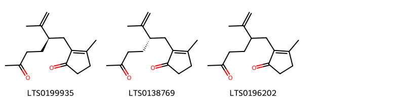{ width=100% }
    <figcaption>Hình ảnh cấu trúc hóa học của 3 hoạt chất thuộc nhóm Organooxygen compounds gồm ['3-methyl-2-[(2r)-5-oxo-2-(prop-1-en-2-yl)hexyl]cyclopent-2-en-1-one (LTS0199935)', '3-methyl-2-[(2s)-5-oxo-2-(prop-1-en-2-yl)hexyl]cyclopent-2-en-1-one (LTS0138769)', '3-methyl-2-[5-oxo-2-(prop-1-en-2-yl)hexyl]cyclopent-2-en-1-one (LTS0196202)'].</figcaption>
</figure>
#### Nhóm Prenol lipids
<figure markdown="span">
    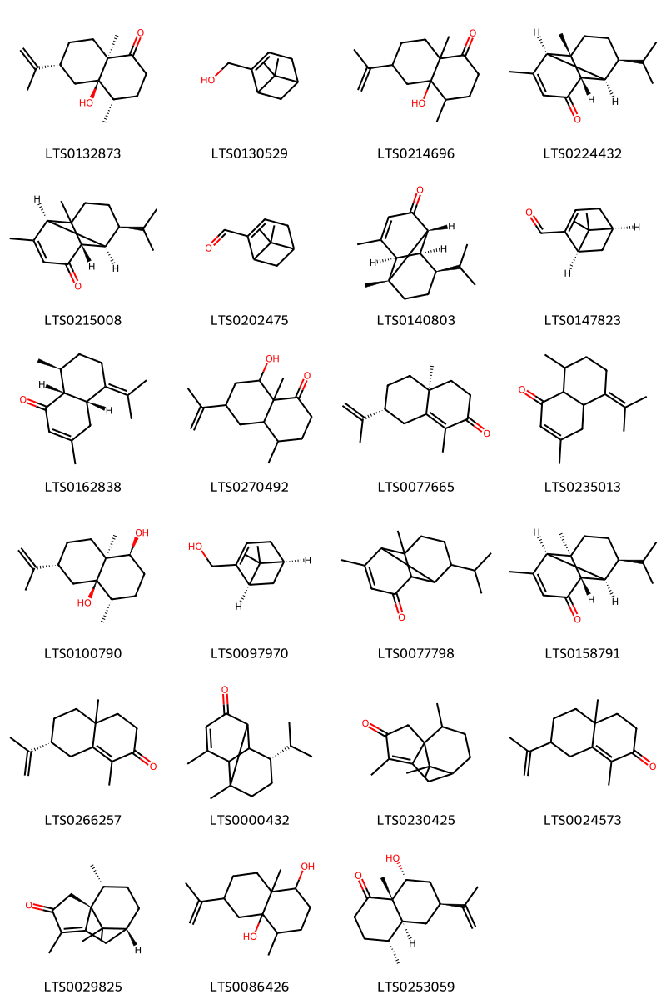{ width=100% }
    <figcaption>Hình ảnh cấu trúc hóa học của 23 hoạt chất thuộc nhóm Prenol lipids gồm ['corymbolone (LTS0132873)', 'myrtenol (LTS0130529)', '4a-hydroxy-4,8a-dimethyl-6-(prop-1-en-2-yl)-hexahydro-2h-naphthalen-1-one (LTS0214696)', '(1s,2s,6s,7r,8s)-8-isopropyl-1,5-dimethyltricyclo[4.4.0.0²,⁷]dec-4-en-3-one (LTS0224432)', '(2s,6s,7r,8s)-8-isopropyl-1,5-dimethyltricyclo[4.4.0.0²,⁷]dec-4-en-3-one (LTS0215008)', 'myrtenal (LTS0202475)', '(1r,2r,6r,7s,8r)-8-isopropyl-1,5-dimethyltricyclo[4.4.0.0²,⁷]dec-4-en-3-one (LTS0140803)', 'myrtenal (LTS0147823)', '(4ar,8s,8ar)-3,8-dimethyl-5-(propan-2-ylidene)-4,4a,6,7,8,8a-hexahydronaphthalen-1-one (LTS0162838)', '8-hydroxy-4,8a-dimethyl-6-(prop-1-en-2-yl)-octahydronaphthalen-1-one (LTS0270492)', '(4as,7r)-1,4a-dimethyl-7-(prop-1-en-2-yl)-3,4,5,6,7,8-hexahydronaphthalen-2-one (LTS0077665)', '3,8-dimethyl-5-(propan-2-ylidene)-4,4a,6,7,8,8a-hexahydronaphthalen-1-one (LTS0235013)', '(1s,4s,4ar,6r,8as)-4,8a-dimethyl-6-(prop-1-en-2-yl)-octahydronaphthalene-1,4a-diol (LTS0100790)', '(-)-myrtenol (LTS0097970)', '8-isopropyl-1,5-dimethyltricyclo[4.4.0.0²,⁷]dec-4-en-3-one (LTS0077798)', '(1r,2s,6s,7r,8s)-8-isopropyl-1,5-dimethyltricyclo[4.4.0.0²,⁷]dec-4-en-3-one (LTS0158791)', '(7r)-1,4a-dimethyl-7-(prop-1-en-2-yl)-3,4,5,6,7,8-hexahydronaphthalen-2-one (LTS0266257)', 'mustakone (LTS0000432)', 'cyperotundone (LTS0230425)', '1,4a-dimethyl-7-(prop-1-en-2-yl)-3,4,5,6,7,8-hexahydronaphthalen-2-one (LTS0024573)', '(1r,7r,10r)-4,10,11,11-tetramethyltricyclo[5.3.1.0¹,⁵]undec-4-en-3-one (LTS0029825)', '4,8a-dimethyl-6-(prop-1-en-2-yl)-octahydronaphthalene-1,4a-diol (LTS0086426)', '(4r,4as,6s,8r,8as)-8-hydroxy-4,8a-dimethyl-6-(prop-1-en-2-yl)-octahydronaphthalen-1-one (LTS0253059)'].</figcaption>
</figure>

---

### Dược dân tộc học

Danh sách các quốc gia có sử dụng *Cyperus articulatus* trong điều trị các bệnh. 

| Country   | Disease   | Bệnh                                        |
|:----------|:----------|:--------------------------------------------|
| Africa    | Fumigant  | chất hun khói (diệt côn trùng, vi sinh vật) |
| Elsewhere | Sedative  | Thuốc an thần                               |

---

---
## Cyperus esculentus
### Thông tin về thực vật

!!! info "Phân loại thực vật của *Cyperus esculentus* từ GIBF:"
    - **Kingdom:** Plantae
    - **Phylum:** Tracheophyta
    - **Order:** Poales
    - **Family:** Cyperaceae
    - **Genus:** Cyperus
    - **Species:** *Cyperus esculentus*

 

| Label (VI)   | Label (EN)   | Scientific Name    | Descriptions (VI)   | Descriptions (EN)                               | Also Known As (VI)   | Also Known As (EN)                                                                                                                                                                                 |
|:-------------|:-------------|:-------------------|:--------------------|:------------------------------------------------|:---------------------|:---------------------------------------------------------------------------------------------------------------------------------------------------------------------------------------------------|
| N/A          | N/A          | Cyperus esculentus | loài thực vật       | species of plant in the sedge family Cyperaceae | ['']                 | ['Watergrass', 'almendra de tierra', 'chufa', 'coquillo amarillo', 'galingale comestible', 'hierba de agua', 'txufleroide', 'hierba de nuez', 'juncia de chufa', 'txufleroide', 'Yellow nutgrass'] |

#### Phân bố trên thế giới

**Từ CSDL GIBF** Italy, Belgium, Argentina, Canada, Netherlands, Nigeria, Portugal, Russian Federation, United States of America, Slovenia, South Africa, Germany, Iran (Islamic Republic of), Brazil, Switzerland, Austria, France, Madagascar, Colombia, New Zealand

#### Phân bố tại Việt Nam

**Từ CSDL GIBF**: Không có ghi nhận ở Việt Nam

---
### Thành phần hóa học
        
- Theo cơ sở dữ liệu lotus: Từ loài *Cyperus esculentus* đã phân lập và xác định được 4 hoạt chất thuộc về các nhóm Fatty Acyls, Prenol lipids, Organooxygen compounds. 

|    | chemicalTaxonomyClassyfireClass   |   smiles_count |
|---:|:----------------------------------|---------------:|
|  0 | Fatty Acyls                       |              1 |
|  1 | Organooxygen compounds            |              2 |
|  2 | Prenol lipids                     |              1 |

#### Nhóm Fatty Acyls
<figure markdown="span">
    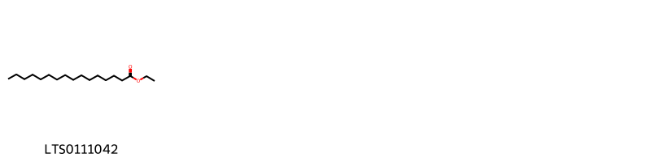{ width=100% }
    <figcaption>Hình ảnh cấu trúc hóa học của 1 hoạt chất thuộc nhóm Fatty Acyls gồm ['ethyl palmitate (LTS0111042)'].</figcaption>
</figure>
#### Nhóm Organooxygen compounds
<figure markdown="span">
    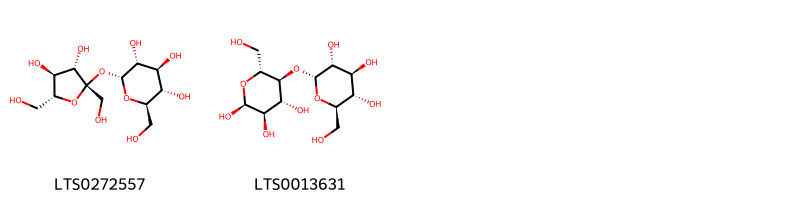{ width=100% }
    <figcaption>Hình ảnh cấu trúc hóa học của 2 hoạt chất thuộc nhóm Organooxygen compounds gồm ['sucrose (LTS0272557)', 'α-maltose (LTS0013631)'].</figcaption>
</figure>
#### Nhóm Prenol lipids
<figure markdown="span">
    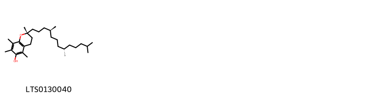{ width=100% }
    <figcaption>Hình ảnh cấu trúc hóa học của 1 hoạt chất thuộc nhóm Prenol lipids gồm ['(2r)-2,5,7,8-tetramethyl-2-[(4s,8s)-4,8,12-trimethyltridecyl]-3,4-dihydro-1-benzopyran-6-ol (LTS0130040)'].</figcaption>
</figure>

---

### Dược dân tộc học

Danh sách các quốc gia có sử dụng *Cyperus esculentus* trong điều trị các bệnh. 

| Country   | Disease                                           | Bệnh                                                                 |
|:----------|:--------------------------------------------------|:---------------------------------------------------------------------|
| China     | Astringent, Sedative, Stimulant, Tonic, Stomachic | Chất làm se, Thuốc an thần, Chất kích thích, Thuốc bổ, Dạ dày        |
| Egypt     | Aphrodisiac, Emollient, Lactagogue, Refrigerant   | Thuốc kích thích tình dục, Chất làm mềm, Chất tạo sữa, Chất làm lạnh |
| Mexico    | Diaphoretic, Diuretic, Emmenagogue                | Thuốc lợi tiểu, thuốc lợi tiểu, thuốc lợi tiểu                       |
| Nigeria   | Sweetener                                         | tiền trà nước                                                        |

---

---
## Cyperus iria
### Thông tin về thực vật

!!! info "Phân loại thực vật của *Cyperus iria* từ GIBF:"
    - **Kingdom:** Plantae
    - **Phylum:** Tracheophyta
    - **Order:** Poales
    - **Family:** Cyperaceae
    - **Genus:** Cyperus
    - **Species:** *Cyperus iria*

 

| Label (VI)   | Label (EN)   | Scientific Name   | Descriptions (VI)   | Descriptions (EN)   | Also Known As (VI)   | Also Known As (EN)                    |
|:-------------|:-------------|:------------------|:--------------------|:--------------------|:---------------------|:--------------------------------------|
| N/A          | N/A          | Cyperus iria      | loài thực vật       | species of plant    | ['']                 | ['iria flatsedge', 'rice flat sedge'] |

#### Phân bố trên thế giới

**Từ CSDL GIBF** Australia, Japan, Nicaragua, Canada, French Guiana, Puerto Rico, Réunion, Korea, Republic of, Chinese Taipei, United States of America, El Salvador, South Africa, Thailand, Brazil, Mexico, Singapore, China, Ecuador, Madagascar, India, Indonesia, Philippines, Malaysia

#### Phân bố tại Việt Nam

**Từ CSDL GIBF**: Không có ghi nhận ở Việt Nam

---
### Thành phần hóa học
        
- Theo cơ sở dữ liệu lotus: Từ loài *Cyperus iria* đã phân lập và xác định được 8 hoạt chất thuộc về các nhóm Flavonoids, Prenol lipids, Aurone flavonoids. 

|    | chemicalTaxonomyClassyfireClass   |   smiles_count |
|---:|:----------------------------------|---------------:|
|  0 | Aurone flavonoids                 |              1 |
|  1 | Flavonoids                        |              6 |
|  2 | Prenol lipids                     |              1 |

#### Nhóm Aurone flavonoids
<figure markdown="span">
    { width=100% }
    <figcaption>Hình ảnh cấu trúc hóa học của 1 hoạt chất thuộc nhóm Aurone flavonoids gồm ['aureusidin (LTS0260686)'].</figcaption>
</figure>
#### Nhóm Flavonoids
<figure markdown="span">
    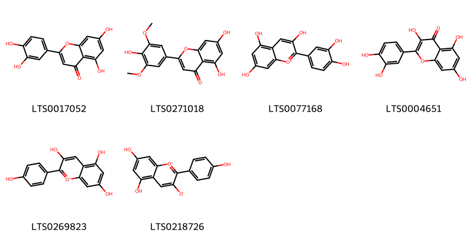{ width=100% }
    <figcaption>Hình ảnh cấu trúc hóa học của 6 hoạt chất thuộc nhóm Flavonoids gồm ['luteolin (LTS0017052)', 'tricin (LTS0271018)', 'cyanidin (LTS0077168)', 'quercetin (LTS0004651)', 'pelargonidin (LTS0269823)', '5,7-dihydroxy-2-(4-hydroxyphenyl)-1λ⁴-chromen-1-ylium-3-olate (LTS0218726)'].</figcaption>
</figure>
#### Nhóm Prenol lipids
<figure markdown="span">
    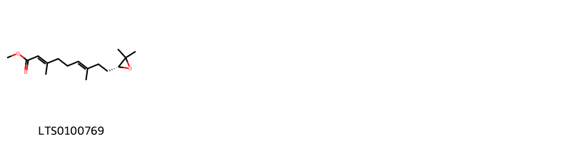{ width=100% }
    <figcaption>Hình ảnh cấu trúc hóa học của 1 hoạt chất thuộc nhóm Prenol lipids gồm ['juvenile hormone iii (LTS0100769)'].</figcaption>
</figure>

---

### Dược dân tộc học

Danh sách các quốc gia có sử dụng *Cyperus iria* trong điều trị các bệnh. 

| Country   | Disease                                                                          | Bệnh                                                                                           |
|:----------|:---------------------------------------------------------------------------------|:-----------------------------------------------------------------------------------------------|
| India     | Astringent, Stimulant, Stimulant, Stomachic, Stomachic, Tonic, Astringent, Tonic | Chất làm se, Chất kích thích, Chất kích thích, Dạ dày, Dạ dày, Thuốc bổ, Chất làm se, Thuốc bổ |

---

---
## Cyperus kyllinga
### Thông tin về thực vật

!!! info "Phân loại thực vật của *Rhynchospora colorata* từ GIBF:"
    - **Kingdom:** Plantae
    - **Phylum:** Tracheophyta
    - **Order:** Poales
    - **Family:** Cyperaceae
    - **Genus:** Rhynchospora
    - **Species:** *Rhynchospora colorata*

 

| Label (VI)   | Label (EN)   | Scientific Name   | Descriptions (VI)   | Descriptions (EN)   | Also Known As (VI)   | Also Known As (EN)                    |
|:-------------|:-------------|:------------------|:--------------------|:--------------------|:---------------------|:--------------------------------------|
| N/A          | N/A          | Cyperus iria      | loài thực vật       | species of plant    | ['']                 | ['iria flatsedge', 'rice flat sedge'] |

#### Phân bố trên thế giới

**Từ CSDL GIBF** nan, American Samoa, Sri Lanka, Palau, Micronesia (Federated States of), Australia, Japan, Christmas Island, Belgium, Gabon, Cook Islands, unknown or invalid, Benin, Tanzania, United Republic of, French Guiana, Kiribati, Tuvalu, Chinese Taipei, Papua New Guinea, United States of America, Timor-Leste, Solomon Islands, Fiji, Marshall Islands, Suriname, Thailand, Brazil, New Caledonia, Tonga, China, Ecuador, French Polynesia, Niue, Madagascar, Vanuatu, India, Indonesia, Samoa, Philippines, Cameroon, Malaysia, Northern Mariana Islands

#### Phân bố tại Việt Nam

**Từ CSDL GIBF**: Không có ghi nhận ở Việt Nam

---
### Thành phần hóa học
        
- Theo cơ sở dữ liệu lotus: Từ loài *Rhynchospora colorata* đã phân lập và xác định được Chưa có hoạt chất nào được phân lập. hoạt chất thuộc về các nhóm Không có hoạt chất nào được phân lập. 

Không có hình ảnh nào được tạo ra

---

### Dược dân tộc học

Danh sách các quốc gia có sử dụng *Rhynchospora colorata* trong điều trị các bệnh. 

| Country   | Disease                                                      | Bệnh                                                                       |
|:----------|:-------------------------------------------------------------|:---------------------------------------------------------------------------|
| India     | Antidote, Demulcent, Sudorific, Tonic, Diuretic, Refrigerant | Thuốc giải độc, Demulcent, Sudorific, Tonic, Thuốc lợi tiểu, Chất làm lạnh |

---

---
## Cyperus longus
### Thông tin về thực vật

!!! info "Phân loại thực vật của *Cyperus longus* từ GIBF:"
    - **Kingdom:** Plantae
    - **Phylum:** Tracheophyta
    - **Order:** Poales
    - **Family:** Cyperaceae
    - **Genus:** Cyperus
    - **Species:** *Cyperus longus*

 

| Label (VI)   | Label (EN)   | Scientific Name   | Descriptions (VI)   | Descriptions (EN)   | Also Known As (VI)   | Also Known As (EN)   |
|:-------------|:-------------|:------------------|:--------------------|:--------------------|:---------------------|:---------------------|
| N/A          | N/A          | Cyperus longus    | loài thực vật       | species of plant    | ['']                 | ['']                 |

#### Phân bố trên thế giới

**Từ CSDL GIBF** nan, Italy, Belgium, Palestine, State of, Israel, Denmark, Netherlands, Spain, Hungary, Portugal, Russian Federation, Croatia, South Africa, Czechia, Germany, Austria, France, Eswatini, United Kingdom of Great Britain and Northern Ireland, Iraq, Botswana, Guernsey

#### Phân bố tại Việt Nam

**Từ CSDL GIBF**: Không có ghi nhận ở Việt Nam

---
### Thành phần hóa học
        
- Theo cơ sở dữ liệu lotus: Từ loài *Cyperus longus* đã phân lập và xác định được 79 hoạt chất thuộc về các nhóm Fatty Acyls, Flavonoids, Prenol lipids, Diarylheptanoids, Oxepanes, Stilbenolignans, 2-arylbenzofuran flavonoids, Indanes, Stilbenes, Organooxygen compounds, Epoxides. 

|    | chemicalTaxonomyClassyfireClass   |   smiles_count |
|---:|:----------------------------------|---------------:|
|  0 | 2-arylbenzofuran flavonoids       |              7 |
|  1 | Diarylheptanoids                  |              4 |
|  2 | Epoxides                          |              3 |
|  3 | Fatty Acyls                       |              4 |
|  4 | Flavonoids                        |              4 |
|  5 | Indanes                           |              3 |
|  6 | Organooxygen compounds            |             12 |
|  7 | Oxepanes                          |              8 |
|  8 | Prenol lipids                     |             24 |
|  9 | Stilbenes                         |              4 |
| 10 | Stilbenolignans                   |              5 |

#### Nhóm 2-arylbenzofuran flavonoids
<figure markdown="span">
    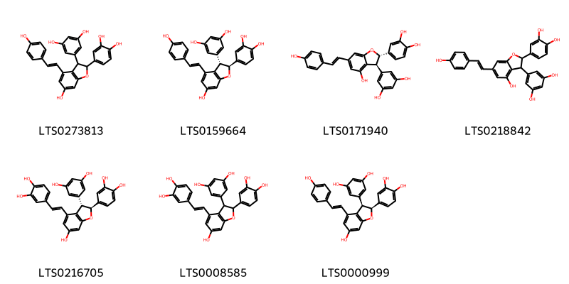{ width=100% }
    <figcaption>Hình ảnh cấu trúc hóa học của 7 hoạt chất thuộc nhóm 2-arylbenzofuran flavonoids gồm ['5-[2-(3,4-dihydroxyphenyl)-6-hydroxy-4-[2-(4-hydroxyphenyl)ethenyl]-2,3-dihydro-1-benzofuran-3-yl]benzene-1,3-diol (LTS0273813)', '5-[(2s,3s)-2-(3,4-dihydroxyphenyl)-6-hydroxy-4-[(1e)-2-(4-hydroxyphenyl)ethenyl]-2,3-dihydro-1-benzofuran-3-yl]benzene-1,3-diol (LTS0159664)', '4-[(2s,3s)-3-(3,5-dihydroxyphenyl)-4-hydroxy-6-[(1e)-2-(4-hydroxyphenyl)ethenyl]-2,3-dihydro-1-benzofuran-2-yl]benzene-1,2-diol (LTS0171940)', '4-[3-(3,5-dihydroxyphenyl)-4-hydroxy-6-[2-(4-hydroxyphenyl)ethenyl]-2,3-dihydro-1-benzofuran-2-yl]benzene-1,2-diol (LTS0218842)', '5-[(2s,3s)-2-(3,4-dihydroxyphenyl)-4-[(1e)-2-(3,4-dihydroxyphenyl)ethenyl]-6-hydroxy-2,3-dihydro-1-benzofuran-3-yl]benzene-1,3-diol (LTS0216705)', '5-[2-(3,4-dihydroxyphenyl)-4-[2-(3,4-dihydroxyphenyl)ethenyl]-6-hydroxy-2,3-dihydro-1-benzofuran-3-yl]benzene-1,3-diol (LTS0008585)', '5-[(2s,3r)-2-(3,4-dihydroxyphenyl)-6-hydroxy-4-[(1e)-2-(4-hydroxyphenyl)ethenyl]-2,3-dihydro-1-benzofuran-3-yl]benzene-1,3-diol (LTS0000999)'].</figcaption>
</figure>
#### Nhóm Diarylheptanoids
<figure markdown="span">
    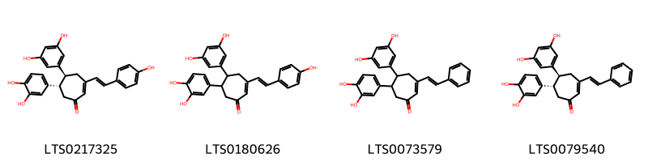{ width=100% }
    <figcaption>Hình ảnh cấu trúc hóa học của 4 hoạt chất thuộc nhóm Diarylheptanoids gồm ['(5s,6s)-6-(3,4-dihydroxyphenyl)-5-(3,5-dihydroxyphenyl)-3-[(1e)-2-(4-hydroxyphenyl)ethenyl]cyclohept-2-en-1-one (LTS0217325)', '6-(3,4-dihydroxyphenyl)-5-(3,5-dihydroxyphenyl)-3-[2-(4-hydroxyphenyl)ethenyl]cyclohept-2-en-1-one (LTS0180626)', '6-(3,4-dihydroxyphenyl)-5-(3,5-dihydroxyphenyl)-3-(2-phenylethenyl)cyclohept-2-en-1-one (LTS0073579)', '(5s,6s)-6-(3,4-dihydroxyphenyl)-5-(3,5-dihydroxyphenyl)-3-[(1e)-2-phenylethenyl]cyclohept-2-en-1-one (LTS0079540)'].</figcaption>
</figure>
#### Nhóm Epoxides
<figure markdown="span">
    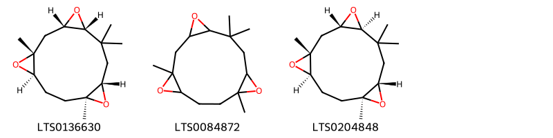{ width=100% }
    <figcaption>Hình ảnh cấu trúc hóa học của 3 hoạt chất thuộc nhóm Epoxides gồm ['(1r,3s,5r,8s,10s,13r)-1,6,6,10-tetramethyl-4,9,14-trioxatetracyclo[11.1.0.0³,⁵.0⁸,¹⁰]tetradecane (LTS0136630)', '1,6,6,10-tetramethyl-4,9,14-trioxatetracyclo[11.1.0.0³,⁵.0⁸,¹⁰]tetradecane (LTS0084872)', '(1r,3s,5s,8s,10s,13r)-1,6,6,10-tetramethyl-4,9,14-trioxatetracyclo[11.1.0.0³,⁵.0⁸,¹⁰]tetradecane (LTS0204848)'].</figcaption>
</figure>
#### Nhóm Fatty Acyls
<figure markdown="span">
    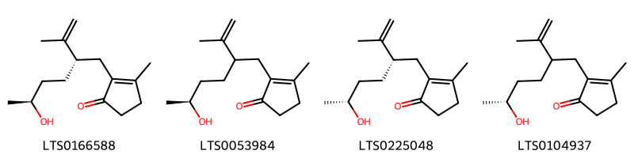{ width=100% }
    <figcaption>Hình ảnh cấu trúc hóa học của 4 hoạt chất thuộc nhóm Fatty Acyls gồm ['2-[(2s,5s)-5-hydroxy-2-(prop-1-en-2-yl)hexyl]-3-methylcyclopent-2-en-1-one (LTS0166588)', '2-[(5s)-5-hydroxy-2-(prop-1-en-2-yl)hexyl]-3-methylcyclopent-2-en-1-one (LTS0053984)', '2-[(2s,5r)-5-hydroxy-2-(prop-1-en-2-yl)hexyl]-3-methylcyclopent-2-en-1-one (LTS0225048)', '2-[(5r)-5-hydroxy-2-(prop-1-en-2-yl)hexyl]-3-methylcyclopent-2-en-1-one (LTS0104937)'].</figcaption>
</figure>
#### Nhóm Flavonoids
<figure markdown="span">
    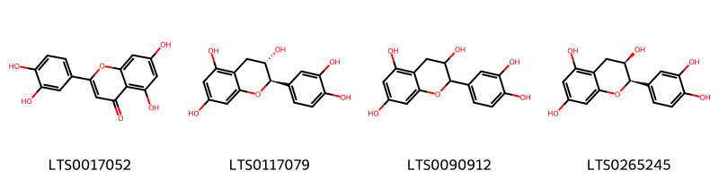{ width=100% }
    <figcaption>Hình ảnh cấu trúc hóa học của 4 hoạt chất thuộc nhóm Flavonoids gồm ['luteolin (LTS0017052)', '(+)-catechol (LTS0117079)', 'catechol (LTS0090912)', 'ent-epicatechin (LTS0265245)'].</figcaption>
</figure>
#### Nhóm Indanes
<figure markdown="span">
    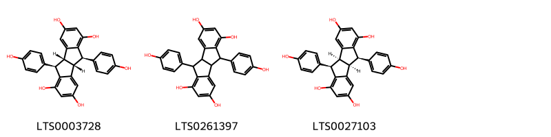{ width=100% }
    <figcaption>Hình ảnh cấu trúc hóa học của 3 hoạt chất thuộc nhóm Indanes gồm ['pallidol (LTS0003728)', 'pallidol (LTS0261397)', '(1s,8r,9s,16r)-8,16-bis(4-hydroxyphenyl)tetracyclo[7.7.0.0²,⁷.0¹⁰,¹⁵]hexadeca-2,4,6,10,12,14-hexaene-4,6,12,14-tetrol (LTS0027103)'].</figcaption>
</figure>
#### Nhóm Organooxygen compounds
<figure markdown="span">
    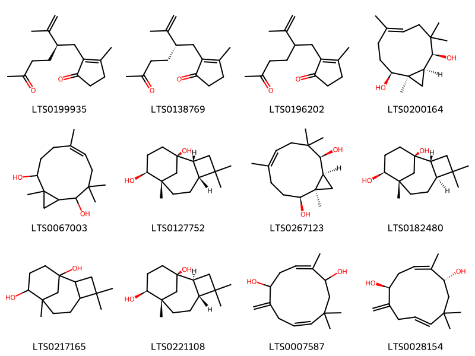{ width=100% }
    <figcaption>Hình ảnh cấu trúc hóa học của 12 hoạt chất thuộc nhóm Organooxygen compounds gồm ['3-methyl-2-[(2r)-5-oxo-2-(prop-1-en-2-yl)hexyl]cyclopent-2-en-1-one (LTS0199935)', '3-methyl-2-[(2s)-5-oxo-2-(prop-1-en-2-yl)hexyl]cyclopent-2-en-1-one (LTS0138769)', '3-methyl-2-[5-oxo-2-(prop-1-en-2-yl)hexyl]cyclopent-2-en-1-one (LTS0196202)', '(1r,2s,5e,9s,10s)-1,5,8,8-tetramethylbicyclo[8.1.0]undec-5-ene-2,9-diol (LTS0200164)', '1,5,8,8-tetramethylbicyclo[8.1.0]undec-5-ene-2,9-diol (LTS0067003)', '(1r,2r,5r,8s,9s)-4,4,8-trimethyltricyclo[6.3.1.0²,⁵]dodecane-1,9-diol (LTS0127752)', '(1r,2s,9s,10s)-1,5,8,8-tetramethylbicyclo[8.1.0]undec-5-ene-2,9-diol (LTS0267123)', '(1r,2r,5s,8s,9s)-4,4,8-trimethyltricyclo[6.3.1.0²,⁵]dodecane-1,9-diol (LTS0182480)', '4,4,8-trimethyltricyclo[6.3.1.0²,⁵]dodecane-1,9-diol (LTS0217165)', '(1r,2s,5r,8s,9s)-4,4,8-trimethyltricyclo[6.3.1.0²,⁵]dodecane-1,9-diol (LTS0221108)', '2,10,10-trimethyl-6-methylidenecycloundeca-2,8-diene-1,5-diol (LTS0007587)', '(1r,2z,5s,8e)-2,10,10-trimethyl-6-methylidenecycloundeca-2,8-diene-1,5-diol (LTS0028154)'].</figcaption>
</figure>
#### Nhóm Oxepanes
<figure markdown="span">
    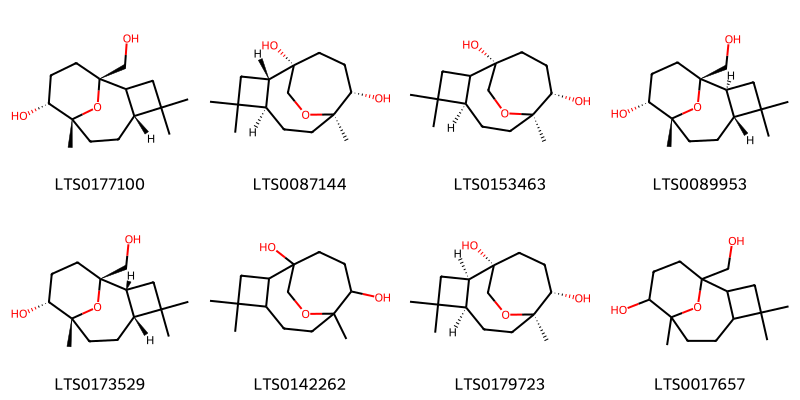{ width=100% }
    <figcaption>Hình ảnh cấu trúc hóa học của 8 hoạt chất thuộc nhóm Oxepanes gồm ['(1r,5r,8r,9r)-1-(hydroxymethyl)-4,4,8-trimethyl-12-oxatricyclo[6.3.1.0²,⁵]dodecan-9-ol (LTS0177100)', '(1s,2s,5r,8r,9s)-4,4,8-trimethyl-13-oxatricyclo[6.3.2.0²,⁵]tridecane-1,9-diol (LTS0087144)', '(1s,5r,8r,9s)-4,4,8-trimethyl-13-oxatricyclo[6.3.2.0²,⁵]tridecane-1,9-diol (LTS0153463)', '(1r,2s,5r,8r,9r)-1-(hydroxymethyl)-4,4,8-trimethyl-12-oxatricyclo[6.3.1.0²,⁵]dodecan-9-ol (LTS0089953)', '(1r,2r,5r,8r,9r)-1-(hydroxymethyl)-4,4,8-trimethyl-12-oxatricyclo[6.3.1.0²,⁵]dodecan-9-ol (LTS0173529)', '4,4,8-trimethyl-13-oxatricyclo[6.3.2.0²,⁵]tridecane-1,9-diol (LTS0142262)', '(1s,2r,5r,8r,9s)-4,4,8-trimethyl-13-oxatricyclo[6.3.2.0²,⁵]tridecane-1,9-diol (LTS0179723)', '1-(hydroxymethyl)-4,4,8-trimethyl-12-oxatricyclo[6.3.1.0²,⁵]dodecan-9-ol (LTS0017657)'].</figcaption>
</figure>
#### Nhóm Prenol lipids
<figure markdown="span">
    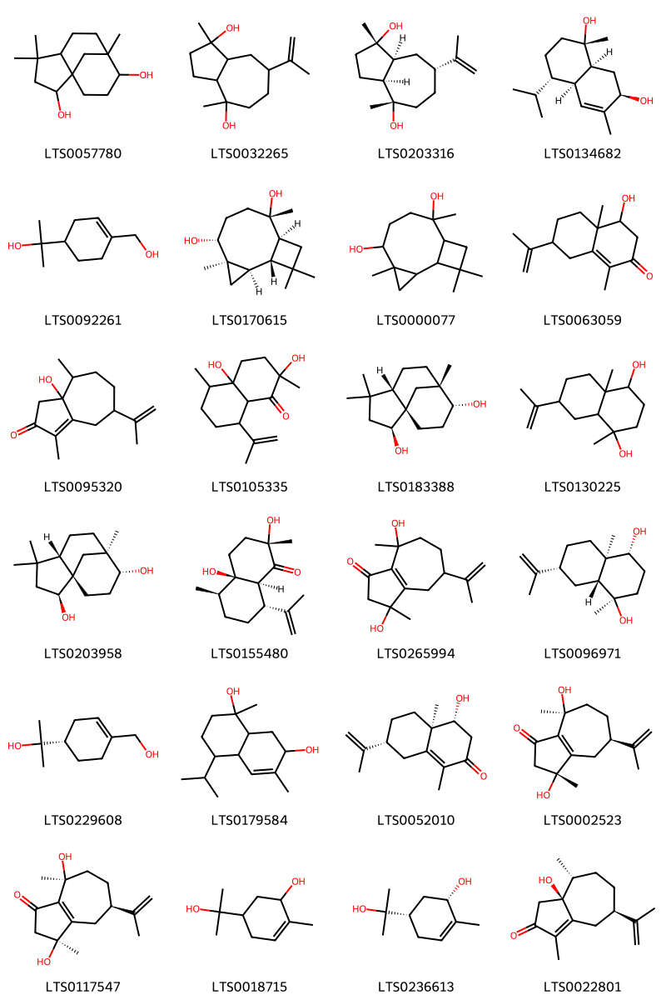{ width=100% }
    <figcaption>Hình ảnh cấu trúc hóa học của 24 hoạt chất thuộc nhóm Prenol lipids gồm ['4,4,8-trimethyltricyclo[6.3.1.0¹,⁵]dodecane-2,9-diol (LTS0057780)', '1,4-dimethyl-7-(prop-1-en-2-yl)-octahydroazulene-1,4-diol (LTS0032265)', '(1s,3as,4s,7r,8as)-1,4-dimethyl-7-(prop-1-en-2-yl)-octahydroazulene-1,4-diol (LTS0203316)', '(1s,4s,4ar,7r,8as)-4-isopropyl-1,6-dimethyl-3,4,4a,7,8,8a-hexahydro-2h-naphthalene-1,7-diol (LTS0134682)', '2-[4-(hydroxymethyl)cyclohex-3-en-1-yl]propan-2-ol (LTS0092261)', '(1r,2r,4r,5r,8s,9s)-4,8,11,11-tetramethyltricyclo[7.2.0.0²,⁴]undecane-5,8-diol (LTS0170615)', '4,8,11,11-tetramethyltricyclo[7.2.0.0²,⁴]undecane-5,8-diol (LTS0000077)', '4-hydroxy-1,4a-dimethyl-7-(prop-1-en-2-yl)-3,4,5,6,7,8-hexahydronaphthalen-2-one (LTS0063059)', '3a-hydroxy-1,4-dimethyl-7-(prop-1-en-2-yl)-3,4,5,6,7,8-hexahydroazulen-2-one (LTS0095320)', '2,4a-dihydroxy-2,5-dimethyl-8-(prop-1-en-2-yl)-hexahydro-3h-naphthalen-1-one (LTS0105335)', '(1s,2s,5s,8s,9r)-4,4,8-trimethyltricyclo[6.3.1.0¹,⁵]dodecane-2,9-diol (LTS0183388)', '1,4a-dimethyl-7-(prop-1-en-2-yl)-octahydronaphthalene-1,4-diol (LTS0130225)', 'clovanediol (LTS0203958)', '(2s,4ar,5r,8r,8as)-2,4a-dihydroxy-2,5-dimethyl-8-(prop-1-en-2-yl)-hexahydro-3h-naphthalen-1-one (LTS0155480)', '3,8-dihydroxy-3,8-dimethyl-5-(prop-1-en-2-yl)-4,5,6,7-tetrahydro-2h-azulen-1-one (LTS0265994)', 'cyperusol c (LTS0096971)', '2-[(1s)-4-(hydroxymethyl)cyclohex-3-en-1-yl]propan-2-ol (LTS0229608)', '4-isopropyl-1,6-dimethyl-3,4,4a,7,8,8a-hexahydro-2h-naphthalene-1,7-diol (LTS0179584)', '(4r,4ar,7r)-4-hydroxy-1,4a-dimethyl-7-(prop-1-en-2-yl)-3,4,5,6,7,8-hexahydronaphthalen-2-one (LTS0052010)', '(3r,5r,8s)-3,8-dihydroxy-3,8-dimethyl-5-(prop-1-en-2-yl)-4,5,6,7-tetrahydro-2h-azulen-1-one (LTS0002523)', '(3s,5r,8s)-3,8-dihydroxy-3,8-dimethyl-5-(prop-1-en-2-yl)-4,5,6,7-tetrahydro-2h-azulen-1-one (LTS0117547)', 'trans-p-menth-6-ene-2,8-diol (LTS0018715)', '(1s,5s)-5-(2-hydroxypropan-2-yl)-2-methylcyclohex-2-en-1-ol (LTS0236613)', '(3as,4r,7r)-3a-hydroxy-1,4-dimethyl-7-(prop-1-en-2-yl)-3,4,5,6,7,8-hexahydroazulen-2-one (LTS0022801)'].</figcaption>
</figure>
#### Nhóm Stilbenes
<figure markdown="span">
    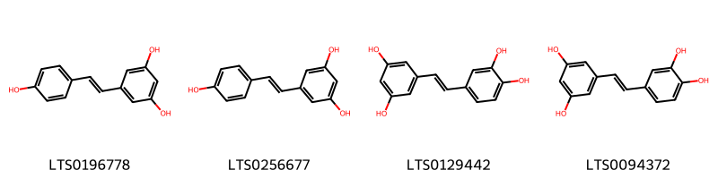{ width=100% }
    <figcaption>Hình ảnh cấu trúc hóa học của 4 hoạt chất thuộc nhóm Stilbenes gồm ['tocilizumab (LTS0196778)', 'resveratrol (LTS0256677)', 'piceatannol (LTS0129442)', 'piceatannol (LTS0094372)'].</figcaption>
</figure>
#### Nhóm Stilbenolignans
<figure markdown="span">
    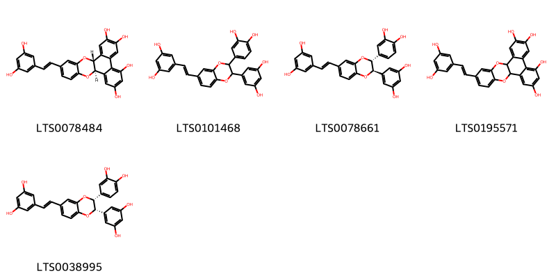{ width=100% }
    <figcaption>Hình ảnh cấu trúc hóa học của 5 hoạt chất thuộc nhóm Stilbenolignans gồm ['(1r,14r)-19-[(1e)-2-(3,5-dihydroxyphenyl)ethenyl]-15,22-dioxapentacyclo[12.8.0.0²,⁷.0⁸,¹³.0¹⁶,²¹]docosa-2,4,6,8,10,12,16,18,20-nonaene-4,5,9,11-tetrol (LTS0078484)', '4-[3-(3,5-dihydroxyphenyl)-7-[2-(3,5-dihydroxyphenyl)ethenyl]-2,3-dihydro-1,4-benzodioxin-2-yl]benzene-1,2-diol (LTS0101468)', '4-[(2r,3r)-3-(3,5-dihydroxyphenyl)-7-[(1e)-2-(3,5-dihydroxyphenyl)ethenyl]-2,3-dihydro-1,4-benzodioxin-2-yl]benzene-1,2-diol (LTS0078661)', '19-[2-(3,5-dihydroxyphenyl)ethenyl]-15,22-dioxapentacyclo[12.8.0.0²,⁷.0⁸,¹³.0¹⁶,²¹]docosa-2,4,6,8,10,12,16,18,20-nonaene-4,5,9,11-tetrol (LTS0195571)', '4-[(2r,3s)-3-(3,5-dihydroxyphenyl)-7-[(1e)-2-(3,5-dihydroxyphenyl)ethenyl]-2,3-dihydro-1,4-benzodioxin-2-yl]benzene-1,2-diol (LTS0038995)'].</figcaption>
</figure>

---

### Dược dân tộc học

Danh sách các quốc gia có sử dụng *Cyperus longus* trong điều trị các bệnh. 

| Country   | Disease   | Bệnh           |
|:----------|:----------|:---------------|
| Egypt     | Diuretic  | Thuốc lợi tiêu |

---

---
## Cyperus obtusatus
### Thông tin về thực vật

!!! info "Phân loại thực vật của *Cyperus obtusatus* từ GIBF:"
    - **Kingdom:** Plantae
    - **Phylum:** Tracheophyta
    - **Order:** Poales
    - **Family:** Cyperaceae
    - **Genus:** Cyperus
    - **Species:** *Cyperus obtusatus*

 

| Label (VI)   | Label (EN)   | Scientific Name   | Descriptions (VI)   | Descriptions (EN)   | Also Known As (VI)   | Also Known As (EN)   |
|:-------------|:-------------|:------------------|:--------------------|:--------------------|:---------------------|:---------------------|
| N/A          | N/A          | Cyperus obtusatus |                     |                     | ['']                 | ['']                 |

#### Phân bố trên thế giới

**Từ CSDL GIBF** Ghana, Gabon, Equatorial Guinea, Brazil, Argentina, Congo, Benin, Burkina Faso, Congo, Democratic Republic of the, Guinea, Liberia, Venezuela (Bolivarian Republic of), French Guiana, Togo

#### Phân bố tại Việt Nam

**Từ CSDL GIBF**: Không có ghi nhận ở Việt Nam

---
### Thành phần hóa học
        
- Theo cơ sở dữ liệu lotus: Từ loài *Cyperus obtusatus* đã phân lập và xác định được Chưa có hoạt chất nào được phân lập. hoạt chất thuộc về các nhóm Không có hoạt chất nào được phân lập. 

Không có hình ảnh nào được tạo ra

---

### Dược dân tộc học

Danh sách các quốc gia có sử dụng *Cyperus obtusatus* trong điều trị các bệnh. 

| Country   | Disease                          | Bệnh                                  |
|:----------|:---------------------------------|:--------------------------------------|
| Argentina | Diuretic, Carminative, Digestive | Thuốc lợi tiểu, Carminative, Tiêu hóa |

---

---
## Cyperus rotundus
### Thông tin về thực vật

!!! info "Phân loại thực vật của *Cyperus rotundus* từ GIBF:"
    - **Kingdom:** Plantae
    - **Phylum:** Tracheophyta
    - **Order:** Poales
    - **Family:** Cyperaceae
    - **Genus:** Cyperus
    - **Species:** *Cyperus rotundus*

 

| Label (VI)   | Label (EN)   | Scientific Name   | Descriptions (VI)   | Descriptions (EN)   | Also Known As (VI)            | Also Known As (EN)                                                                             |
|:-------------|:-------------|:------------------|:--------------------|:--------------------|:------------------------------|:-----------------------------------------------------------------------------------------------|
| N/A          | N/A          | Cyperus rotundus  |                     | species of plant    | ['Cyperus rotundus', 'Cỏ cú'] | ['Coco grass', 'Common nut sedge', 'Nut-grass', 'Nutgrass', 'Purple nutsedge', 'Red nutgrass'] |

#### Phân bố trên thế giới

**Từ CSDL GIBF** Italy, Australia, Argentina, Israel, French Guiana, Puerto Rico, Chinese Taipei, Spain, Portugal, Algeria, Morocco, United States of America, South Africa, Hong Kong, Thailand, Turks and Caicos Islands, Brazil, Guam, Mexico, Singapore, China, Curaçao, Indonesia, New Zealand

#### Phân bố tại Việt Nam

**Từ CSDL GIBF**: Không có ghi nhận ở Việt Nam

---
### Thành phần hóa học
        
- Theo cơ sở dữ liệu lotus: Từ loài *Cyperus rotundus* đã phân lập và xác định được 208 hoạt chất thuộc về các nhóm Tetralins, Polycyclic hydrocarbons, Fatty Acyls, Cinnamic acids and derivatives, Oxanes, Heteroaromatic compounds, Prenol lipids, Tetrahydrofurans, Benzene and substituted derivatives, Organooxygen compounds, Pyridines and derivatives, Flavonoids, Steroids and steroid derivatives, Oxepanes, Unsaturated hydrocarbons, 2-arylbenzofuran flavonoids, Coumarins and derivatives, Epoxides. 

|    | chemicalTaxonomyClassyfireClass     |   smiles_count |
|---:|:------------------------------------|---------------:|
|  0 | 2-arylbenzofuran flavonoids         |              1 |
|  1 | Benzene and substituted derivatives |              4 |
|  2 | Cinnamic acids and derivatives      |              2 |
|  3 | Coumarins and derivatives           |              1 |
|  4 | Epoxides                            |              2 |
|  5 | Fatty Acyls                         |              4 |
|  6 | Flavonoids                          |              1 |
|  7 | Heteroaromatic compounds            |              2 |
|  8 | Organooxygen compounds              |              8 |
|  9 | Oxanes                              |              2 |
| 10 | Oxepanes                            |              3 |
| 11 | Polycyclic hydrocarbons             |              3 |
| 12 | Prenol lipids                       |            150 |
| 13 | Pyridines and derivatives           |              6 |
| 14 | Steroids and steroid derivatives    |              5 |
| 15 | Tetrahydrofurans                    |              2 |
| 16 | Tetralins                           |              4 |
| 17 | Unsaturated hydrocarbons            |              6 |

#### Nhóm 2-arylbenzofuran flavonoids
<figure markdown="span">
    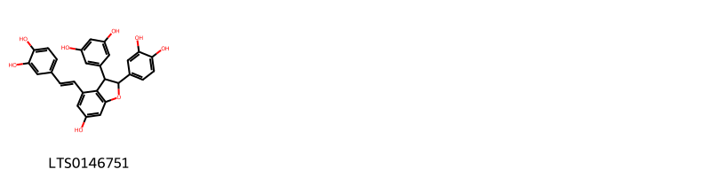{ width=100% }
    <figcaption>Hình ảnh cấu trúc hóa học của 1 hoạt chất thuộc nhóm 2-arylbenzofuran flavonoids gồm ['5-[2-(3,4-dihydroxyphenyl)-4-[(1e)-2-(3,4-dihydroxyphenyl)ethenyl]-6-hydroxy-2,3-dihydro-1-benzofuran-3-yl]benzene-1,3-diol (LTS0146751)'].</figcaption>
</figure>
#### Nhóm Benzene and substituted derivatives
<figure markdown="span">
    { width=100% }
    <figcaption>Hình ảnh cấu trúc hóa học của 4 hoạt chất thuộc nhóm Benzene and substituted derivatives gồm ['cyperine (LTS0271214)', 'p-hydroxybenzoic acid (LTS0263634)', '3,4-dihydroxybenzoic acid (LTS0018765)', 'vanillic acid (LTS0229113)'].</figcaption>
</figure>
#### Nhóm Cinnamic acids and derivatives
<figure markdown="span">
    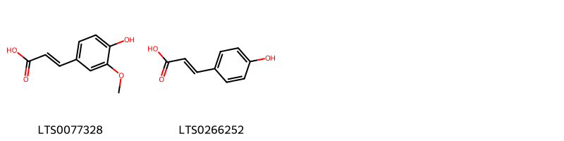{ width=100% }
    <figcaption>Hình ảnh cấu trúc hóa học của 2 hoạt chất thuộc nhóm Cinnamic acids and derivatives gồm ['ferulic acid (LTS0077328)', 'para-coumaric acid (LTS0266252)'].</figcaption>
</figure>
#### Nhóm Coumarins and derivatives
<figure markdown="span">
    { width=100% }
    <figcaption>Hình ảnh cấu trúc hóa học của 1 hoạt chất thuộc nhóm Coumarins and derivatives gồm ['2h-1-benzopyran-2-one (LTS0069773)'].</figcaption>
</figure>
#### Nhóm Epoxides
<figure markdown="span">
    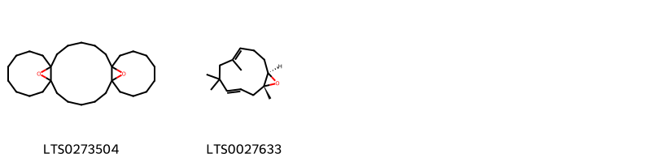{ width=100% }
    <figcaption>Hình ảnh cấu trúc hóa học của 2 hoạt chất thuộc nhóm Epoxides gồm ['31,32-dioxapentacyclo[20.8.1.1⁷,¹⁶.0¹,²².0⁷,¹⁶]dotriacontane (LTS0273504)', '(1r,3e,7e,11r)-1,5,5,7-tetramethyl-12-oxabicyclo[9.1.0]dodeca-3,7-diene (LTS0027633)'].</figcaption>
</figure>
#### Nhóm Fatty Acyls
<figure markdown="span">
    { width=100% }
    <figcaption>Hình ảnh cấu trúc hóa học của 4 hoạt chất thuộc nhóm Fatty Acyls gồm ['2-carboxy-d-arabinitol (LTS0056947)', '(2r)-n-[(1r,2s,3r,4e,8z)-1,3-dihydroxy-1-{[(2s,3r,4s,5s,6r)-3,4,5-trihydroxy-6-(hydroxymethyl)oxan-2-yl]oxy}tetradeca-4,8-dien-2-yl]-2-hydroxypentacosanimidic acid (LTS0211405)', 'methyl (5z,11e,14e,17e)-icosa-5,11,14,17-tetraenoate (LTS0242069)', 'n-(1,3-dihydroxy-1-{[3,4,5-trihydroxy-6-(hydroxymethyl)oxan-2-yl]oxy}tetradeca-4,8-dien-2-yl)-2-hydroxypentacosanimidic acid (LTS0040806)'].</figcaption>
</figure>
#### Nhóm Flavonoids
<figure markdown="span">
    { width=100% }
    <figcaption>Hình ảnh cấu trúc hóa học của 1 hoạt chất thuộc nhóm Flavonoids gồm ['luteolin (LTS0017052)'].</figcaption>
</figure>
#### Nhóm Heteroaromatic compounds
<figure markdown="span">
    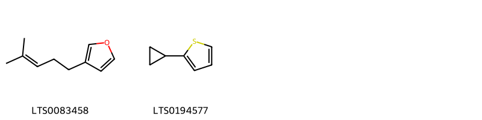{ width=100% }
    <figcaption>Hình ảnh cấu trúc hóa học của 2 hoạt chất thuộc nhóm Heteroaromatic compounds gồm ['perillene (LTS0083458)', '2-cyclopropylthiophene (LTS0194577)'].</figcaption>
</figure>
#### Nhóm Organooxygen compounds
<figure markdown="span">
    { width=100% }
    <figcaption>Hình ảnh cấu trúc hóa học của 8 hoạt chất thuộc nhóm Organooxygen compounds gồm ['sabinaketone (LTS0133971)', '4,8,8-trimethyl-5-(3-oxobutyl)bicyclo[3.2.1]octan-6-one (LTS0047667)', 'tetracyclo[6.3.2.0¹,⁸.0²,⁵]tridecan-9-ol (LTS0121286)', 'cyperolone (LTS0256818)', '1-[3-hydroxy-7a-methyl-5-(prop-1-en-2-yl)-hexahydro-1h-inden-3a-yl]ethanone (LTS0267013)', '(1r,4r,5r)-4,8,8-trimethyl-5-(3-oxobutyl)bicyclo[3.2.1]octan-6-one (LTS0041725)', '(4z,8z)-2,5,9-trimethylcycloundeca-4,8-dien-1-one (LTS0225335)', 'caryophyllene alcohol (LTS0130095)'].</figcaption>
</figure>
#### Nhóm Oxanes
<figure markdown="span">
    { width=100% }
    <figcaption>Hình ảnh cấu trúc hóa học của 2 hoạt chất thuộc nhóm Oxanes gồm ['1,8-cineole (LTS0166505)', 'eucalyptol (LTS0051374)'].</figcaption>
</figure>
#### Nhóm Oxepanes
<figure markdown="span">
    { width=100% }
    <figcaption>Hình ảnh cấu trúc hóa học của 3 hoạt chất thuộc nhóm Oxepanes gồm ['1a,5-dimethyl-7-(prop-1-en-2-yl)-octahydronaphtho[1,8a-b]oxiren-2-ol (LTS0136569)', '2,6,6,8-tetramethyl-10-oxatetracyclo[5.4.1.0¹,⁵.0⁹,¹¹]dodecane (LTS0267039)', '(1ar,2r,4as,5s,7r,8as)-1a,5-dimethyl-7-(prop-1-en-2-yl)-octahydronaphtho[1,8a-b]oxiren-2-ol (LTS0269853)'].</figcaption>
</figure>
#### Nhóm Polycyclic hydrocarbons
<figure markdown="span">
    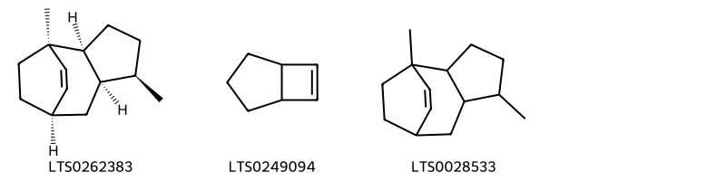{ width=100% }
    <figcaption>Hình ảnh cấu trúc hóa học của 3 hoạt chất thuộc nhóm Polycyclic hydrocarbons gồm ['(1r,2s,5r,6r,8r)-1,5-dimethyltricyclo[6.2.2.0²,⁶]dodec-9-ene (LTS0262383)', 'bicyclo[3.2.0]hept-6-ene (LTS0249094)', '1,5-dimethyltricyclo[6.2.2.0²,⁶]dodec-9-ene (LTS0028533)'].</figcaption>
</figure>
#### Nhóm Prenol lipids
<figure markdown="span">
    { width=100% }
    <figcaption>Hình ảnh cấu trúc hóa học của 150 hoạt chất thuộc nhóm Prenol lipids gồm ['(4as,7r)-1,4a-dimethyl-7-(prop-1-en-2-yl)-3,4,5,6,7,8-hexahydronaphthalen-2-one (LTS0077665)', '1,4a-dimethyl-7-(prop-1-en-2-yl)-3,4,5,6,7,8-hexahydronaphthalen-2-one (LTS0024573)', 'β-selinene (LTS0096341)', 'cyperene (LTS0272596)', 'cyperene (LTS0140263)', 'β-elemene (LTS0225699)', 'caryophyllene (LTS0085212)', 'α-copaene (LTS0207598)', '(1r,2s,7s,8s)-8-isopropyl-1,3-dimethyltricyclo[4.4.0.0²,⁷]dec-3-ene (LTS0190031)', 'cyperotundone (LTS0230425)', '(1r,7r,10r)-4,10,11,11-tetramethyltricyclo[5.3.1.0¹,⁵]undec-4-en-3-one (LTS0029825)', 'myrtenol (LTS0130529)', '(1s,2s,6s,7r,8s)-8-isopropyl-1,5-dimethyltricyclo[4.4.0.0²,⁷]dec-4-en-3-one (LTS0224432)', '(e)-calamene (LTS0228241)', 'caryophyllene oxide (LTS0159789)', 'phytol (LTS0096073)', '4,4,8-trimethyltricyclo[6.3.1.0¹,⁵]dodecane-2,9-diol (LTS0057780)', '(2r,4as,7r)-4a-methyl-1-methylidene-7-(prop-1-en-2-yl)-octahydronaphthalen-2-ol (LTS0118571)', 'β-pinene (LTS0117550)', 'humulene (LTS0263171)', '4-isopropyl-1,6-dimethyl-2,3,4,4a,7,8-hexahydronaphthalene (LTS0270743)', '(1r,4s)-4-isopropyl-1,6-dimethyl-1,2,3,4-tetrahydronaphthalene (LTS0158900)', 'cyperol (LTS0247308)', '(1r,7s,10r)-4,10,11,11-tetramethyltricyclo[5.3.1.0¹,⁵]undec-4-en-6-one (LTS0246067)', '8-isopropyl-1,5-dimethyltricyclo[4.4.0.0²,⁷]dec-4-en-3-one (LTS0077798)', '(1r,7r)-4,10,11,11-tetramethyltricyclo[5.3.1.0¹,⁵]undec-4-en-3-one (LTS0084047)', 'β-caryophyllene oxide (LTS0213960)', '(4ar)-1,4a-dimethyl-7-(prop-1-en-2-yl)-3,4,5,6,7,8-hexahydronaphthalen-2-one (LTS0224197)', 'selinene (LTS0197809)', '1,4-dimethyl-7-(prop-1-en-2-yl)-octahydroazulene-1,4-diol (LTS0032265)', '(1s,7r,10s)-4,10,11,11-tetramethyltricyclo[5.3.1.0¹,⁵]undeca-2,4-diene (LTS0037892)', '(1s,3as,4s,7r,8as)-1,4-dimethyl-7-(prop-1-en-2-yl)-octahydroazulene-1,4-diol (LTS0203316)', '(4ar,7s)-1,4a-dimethyl-7-(prop-1-en-2-yl)-3,4,5,6,7,8-hexahydronaphthalen-2-one (LTS0251654)', '(1s,4r)-4-isopropyl-1,6-dimethyl-1,2,3,4-tetrahydronaphthalene (LTS0015102)', 'mustakone (LTS0000432)', '(1r,2s,6s,7s,8r)-8-isopropyl-1,3-dimethyltricyclo[4.4.0.0²,⁷]dec-3-ene (LTS0106607)', 'delta-cadinene (LTS0019321)', '(7ar)-1,1,7-trimethyl-4-methylidene-octahydrocyclopropa[e]azulen-7-ol (LTS0091612)', 'α-selinene (LTS0024564)', 'carvone (LTS0196605)', '(4as)-7-isopropyl-1,4a-dimethyl-3,4,5,6-tetrahydronaphthalen-2-one (LTS0066061)', 'rosenonolactone (LTS0038418)', '(-)-α-gurjunene (LTS0194913)', '(1r,3s,6s,7s,10r)-4,10,11,11-tetramethyltricyclo[5.3.1.0¹,⁵]undec-4-ene-3,6-diol (LTS0212144)', '(2r,5s,6s,8r)-1,5-dimethyl-9-methylidenetricyclo[6.2.2.0²,⁶]dodecane (LTS0121912)', '(1r,2s,5s,6r,8s,10s)-1,5-dimethyl-9-methylidenetricyclo[6.2.2.0²,⁶]dodecan-10-ol (LTS0227555)', '(1r,5r)-6,6-dimethyl-2-methylidenebicyclo[3.1.1]heptan-3-one (LTS0043419)', 'guaiene (LTS0039431)', 'cuparene (LTS0028747)', 'aristolone (LTS0064647)', '(+)-borneol (LTS0189059)', 'α-myrcene (LTS0115731)', 'α-longipinene (LTS0199827)', 'sugeonyl acetate (LTS0060512)', '(-)-α-pinene (LTS0032699)', '(+)-camphene (LTS0109845)', 'terpinolene (LTS0104525)', 'cymene (LTS0181568)', 'α pinene (LTS0132416)', '(1s)-4-isopropyl-1,6-dimethyl-1,2-dihydronaphthalene (LTS0177753)', 'fenchol (LTS0261470)', '(1s,4s)-4-isopropyl-1,6-dimethyl-1,2,3,4-tetrahydronaphthalene (LTS0139634)', '4a-methyl-1-methylidene-7-(prop-1-en-2-yl)-octahydronaphthalene (LTS0165615)', '(1r,3s,5r)-6,6-dimethyl-2-methylidenebicyclo[3.1.1]heptan-3-ol (LTS0165758)', '10,11,11-trimethyltricyclo[5.3.1.0¹,⁵]undec-4-ene-4-carboxylic acid (LTS0166341)', '(4ar,7s,8as)-1,4a-dimethyl-7-(prop-1-en-2-yl)-4,5,6,7,8,8a-hexahydro-3h-naphthalene (LTS0148007)', '4-isopropyl-1,6-dimethyl-3,4,4a,7,8,8a-hexahydronaphthalene (LTS0154650)', '7-isopropyl-1,4a-dimethyl-3,4,5,6-tetrahydronaphthalen-2-one (LTS0149247)', '(1r,2s,5r,6r,8r)-1,5-dimethyl-9-methylidenetricyclo[6.2.2.0²,⁶]dodecane (LTS0154680)', 'camphene (LTS0267242)', 'limonene,  (LTS0155981)', '(+)-4-terpineol (LTS0140257)', 'germacrene b (LTS0265072)', 'verbenol (LTS0140945)', '(4as,6as,6br,8ar,10s,12ar,12br,14bs)-10-{[(2r,3r,4s,5s,6r)-4,5-dihydroxy-6-(hydroxymethyl)-3-{[(2s,3r,4r,5r,6s)-3,4,5-trihydroxy-6-methyloxan-2-yl]oxy}oxan-2-yl]oxy}-2,2,6a,6b,9,9,12a-heptamethyl-1,3,4,5,6,7,8,8a,10,11,12,12b,13,14b-tetradecahydropicene-4a-carboxylic acid (LTS0155345)', 'pinocarvone (LTS0084836)', 'solavetivone (LTS0097811)', 'gamma-eudesmol (LTS0147389)', 'phellandrene (LTS0157173)', '2,7,7,10-tetramethyl-3-oxatetracyclo[7.3.0.0²,⁴.0⁶,⁸]dodecane (LTS0156016)', '4a-hydroxy-4,8a-dimethyl-6-(prop-1-en-2-yl)-5,6,7,8-tetrahydro-1h-naphthalen-2-one (LTS0138648)', '(1ar,4ar,7s,7as,7br)-1,1,7-trimethyl-4-methylidene-octahydrocyclopropa[e]azulen-7-ol (LTS0243368)', '(-)-β-pinene (LTS0108757)', '(-)-β-selinene (LTS0273811)', '(1r,7r,10r)-10,11,11-trimethyltricyclo[5.3.1.0¹,⁵]undec-4-ene-4-carboxylic acid (LTS0102298)', '4,10,11,11-tetramethyltricyclo[5.3.1.0¹,⁵]undec-4-ene-3,6-diol (LTS0255374)', '(1r)-4-isopropyl-1,6-dimethyl-1,2-dihydronaphthalene (LTS0120131)', '1-[(1r,7r)-7-isopropyl-4-methylidene-octahydroinden-1-yl]ethanone (LTS0188339)', '(1r,2r,5r,7r,10s,11s)-5-ethenyl-2,5,11-trimethyl-15-oxatetracyclo[9.3.2.0¹,¹⁰.0²,⁷]hexadecane-8,16-dione (LTS0255704)', '6,9-bis(acetyloxy)-4,10,11,11-tetramethyltricyclo[5.3.1.0¹,⁵]undec-4-en-3-yl acetate (LTS0255435)', '(1r,6r,7s,10r)-4,10,11,11-tetramethyl-3-oxotricyclo[5.3.1.0¹,⁵]undec-4-en-6-yl acetate (LTS0183739)', '1,4-dimethyl-7-(prop-1-en-2-yl)-1,2,3,3a,4,5,6,7-octahydroazulene (LTS0217070)', 'cadalene (LTS0077722)', '(1s,2s,5s,8r)-2-methyl-6-methylidene-9-(propan-2-ylidene)-11-oxatricyclo[6.2.1.0¹,⁵]undecan-8-ol (LTS0063268)', '7-isopropyl-1,8a-dimethyl-octahydro-1h-naphthalene (LTS0261696)', '4,10,11,11-tetramethyltricyclo[5.3.1.0¹,⁵]undec-4-en-6-yl acetate (LTS0262130)', '(1r,3s,6s,7s,9s,10s)-6,9-bis(acetyloxy)-4,10,11,11-tetramethyltricyclo[5.3.1.0¹,⁵]undec-4-en-3-yl acetate (LTS0203765)', 'α-limonene (LTS0244943)', 'verbenone (LTS0275336)', '(1s,3as,4r,7s,8as)-1,4-dimethyl-7-(prop-1-en-2-yl)-octahydroazulene-1,4-diol (LTS0211728)', '(+)-borneol (LTS0059936)', 'nootkatone (LTS0027125)', 'aristolone (LTS0230263)', 'thymol (LTS0168527)', '1,4a-dimethyl-7-(propan-2-ylidene)-3,4,5,6,8,8a-hexahydronaphthalene (LTS0160369)', '2-[(1r,4s)-4-ethenyl-4-methyl-3-(prop-1-en-2-yl)cyclohexyl]propan-2-ol (LTS0235839)', 'ledol (LTS0168644)', 'oleanolic acid (LTS0141130)', '(4as,6r,8as)-4a-hydroxy-4,8a-dimethyl-6-(prop-1-en-2-yl)-5,6,7,8-tetrahydro-1h-naphthalen-2-one (LTS0004761)', 'cuminaldehyde (LTS0037806)', '1,1,4,7-tetramethyl-octahydro-1ah-cyclopropa[e]azulen-4a-ol (LTS0248056)', '(1r,7r,8as)-1,8a-dimethyl-7-(prop-1-en-2-yl)-2,6,7,8-tetrahydro-1h-naphthalene (LTS0183545)', 'nootkatone (LTS0183338)', '7-isopropyl-1,4a-dimethyl-2,3,4,5,6,8a-hexahydronaphthalen-1-ol (LTS0044461)', '(-)-α-phellandrene (LTS0226766)', '4,10,11,11-tetramethyltricyclo[5.3.1.0¹,⁵]undec-4-en-6-one (LTS0241841)', '(1r,3ar,4r,7r)-1,4-dimethyl-7-(prop-1-en-2-yl)-1,2,3,3a,4,5,6,7-octahydroazulene (LTS0257129)', '(-)-β-fenchyl alcohol (LTS0048619)', '2,6,6,11-tetramethyltricyclo[5.4.0.0²,⁸]undec-10-en-9-one (LTS0251252)', '(4ar,6r,8as)-4a-hydroxy-4,8a-dimethyl-6-(prop-1-en-2-yl)-5,6,7,8-tetrahydro-1h-naphthalen-2-one (LTS0058452)', '(1as,2s,4as,7r,8ar)-1a,4a-dimethyl-7-(prop-1-en-2-yl)-hexahydro-2h-naphtho[1,8a-b]oxiren-2-ol (LTS0063584)', '(1r,2r,7s,8r,9s)-2,6,6,11-tetramethyltricyclo[5.4.0.0²,⁸]undec-10-en-9-ol (LTS0067358)', '2,2,7,7-tetramethyltricyclo[6.2.1.0¹,⁶]undec-5-en-10-one (LTS0007204)', 'gamma-muurolene (LTS0052920)', '2-methyl-6-methylidene-9-(propan-2-ylidene)-11-oxatricyclo[6.2.1.0¹,⁵]undecan-8-ol (LTS0270223)', '1,5-dimethyl-9-methylidenetricyclo[6.2.2.0²,⁶]dodecane (LTS0066635)', 'caryophyllene (LTS0131870)', 'α-muurolene (LTS0022607)', '(1ar,4as,7r,7as,7bs)-1,1,7-trimethyl-4-methylidene-octahydro-1ah-cyclopropa[e]azulene (LTS0028578)', '4-isopropyl-1,6-dimethyl-1,2-dihydronaphthalene (LTS0004459)', '(1r,2r,5r,8s,9s)-4,4,8-trimethyltricyclo[6.3.1.0¹,⁵]dodecane-2,9-diol (LTS0007295)', '(4s,4as,8as)-4-isopropyl-1,6-dimethyl-3,4,4a,7,8,8a-hexahydronaphthalene (LTS0014980)', 'carvacrol (LTS0012882)', 'α-cubebene (LTS0083688)', '10-{[4,5-dihydroxy-6-(hydroxymethyl)-3-[(3,4,5-trihydroxy-6-methyloxan-2-yl)oxy]oxan-2-yl]oxy}-2,2,6a,6b,9,9,12a-heptamethyl-1,3,4,5,6,7,8,8a,10,11,12,12b,13,14b-tetradecahydropicene-4a-carboxylic acid (LTS0258240)', '4,10,11,11-tetramethyl-3-oxotricyclo[5.3.1.0¹,⁵]undec-4-en-6-yl acetate (LTS0032382)', '(1r,6r,7s,10r)-4,10,11,11-tetramethyltricyclo[5.3.1.0¹,⁵]undec-4-en-6-yl acetate (LTS0071816)', '(4e,8e,13z)-12-isopropyl-1,5,9-trimethylcyclotetradeca-4,8,13-triene-1,3-diol (LTS0120820)', 'pinocarveol (LTS0090950)', 'valencene (LTS0031707)', '(1s,2r,4s)-5,5-dimethyl-6-methylidenebicyclo[2.2.1]heptan-2-ol (LTS0027702)', '(1r,4r,6s,10s)-4,12,12-trimethyl-9-methylidene-5-oxatricyclo[8.2.0.0⁴,⁶]dodecane (LTS0029123)', '(4s,4as,8as)-4-isopropyl-6-methyl-1-methylidene-3,4,4a,7,8,8a-hexahydro-2h-naphthalene (LTS0099302)', 'valencene (LTS0110395)', 'carvone, (+)- (LTS0027671)', '[(1s,5r)-6,6-dimethylbicyclo[3.1.1]hept-2-en-2-yl]methanol (LTS0044518)', 'levoverbenone (LTS0037738)', '(-)-cis-carveol (LTS0048903)', '(1ar,4r,4ar,7r,7ar,7bs)-1,1,4,7-tetramethyl-octahydro-1ah-cyclopropa[e]azulen-4-ol (LTS0245385)', 'oleanolic acid (LTS0117717)'].</figcaption>
</figure>
#### Nhóm Pyridines and derivatives
<figure markdown="span">
    { width=100% }
    <figcaption>Hình ảnh cấu trúc hóa học của 6 hoạt chất thuộc nhóm Pyridines and derivatives gồm ['4-[(6r)-1,5,5-trimethyl-6h,7h-cyclopenta[c]pyridin-6-yl]butan-2-one (LTS0187821)', '(2r)-4-[(6s)-1,5,5-trimethyl-6h,7h-cyclopenta[c]pyridin-6-yl]butan-2-ol (LTS0261434)', '4-{1,5,5-trimethyl-6h,7h-cyclopenta[c]pyridin-6-yl}butan-2-ol (LTS0263515)', '4-{1,5,5-trimethyl-6h,7h-cyclopenta[c]pyridin-6-yl}butan-2-one (LTS0231359)', '4-[(6s)-1,5,5-trimethyl-6h,7h-cyclopenta[c]pyridin-6-yl]butan-2-one (LTS0171857)', '(2r)-4-[(6r)-1,5,5-trimethyl-6h,7h-cyclopenta[c]pyridin-6-yl]butan-2-ol (LTS0026787)'].</figcaption>
</figure>
#### Nhóm Steroids and steroid derivatives
<figure markdown="span">
    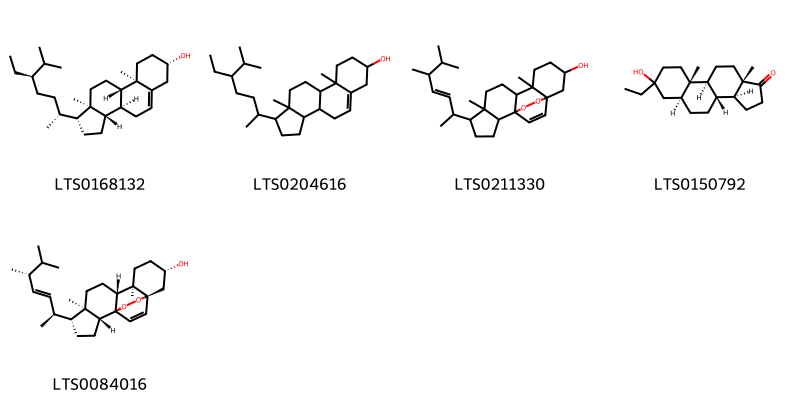{ width=100% }
    <figcaption>Hình ảnh cấu trúc hóa học của 5 hoạt chất thuộc nhóm Steroids and steroid derivatives gồm ['sitosterol (LTS0168132)', 'stigmast-5-en-3-ol, (3β)- (LTS0204616)', '5-(5,6-dimethylhept-3-en-2-yl)-6,10-dimethyl-16,17-dioxapentacyclo[13.2.2.0¹,⁹.0²,⁶.0¹⁰,¹⁵]nonadec-18-en-13-ol (LTS0211330)', '(3as,3br,5as,9as,9bs,11as)-7-ethyl-7-hydroxy-9a,11a-dimethyl-dodecahydro-2h-cyclopenta[a]phenanthren-1-one (LTS0150792)', '(1s,2r,5r,6r,9r,10r,13s,15s)-5-[(2s,3e,5r)-5,6-dimethylhept-3-en-2-yl]-6,10-dimethyl-16,17-dioxapentacyclo[13.2.2.0¹,⁹.0²,⁶.0¹⁰,¹⁵]nonadec-18-en-13-ol (LTS0084016)'].</figcaption>
</figure>
#### Nhóm Tetrahydrofurans
<figure markdown="span">
    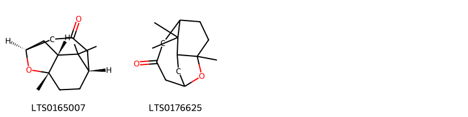{ width=100% }
    <figcaption>Hình ảnh cấu trúc hóa học của 2 hoạt chất thuộc nhóm Tetrahydrofurans gồm ['(1r,3s,7s,10s)-10,11,11-trimethyl-12-oxatricyclo[5.3.1.1³,¹⁰]dodecan-5-one (LTS0165007)', '10,11,11-trimethyl-12-oxatricyclo[5.3.1.1³,¹⁰]dodecan-5-one (LTS0176625)'].</figcaption>
</figure>
#### Nhóm Tetralins
<figure markdown="span">
    { width=100% }
    <figcaption>Hình ảnh cấu trúc hóa học của 4 hoạt chất thuộc nhóm Tetralins gồm ['4,8,11,11-tetramethyl-9,10-dioxatricyclo[6.3.2.0²,⁷]trideca-2,4,6-triene (LTS0069359)', '4,7-dimethyl-3,4-dihydro-2h-naphthalen-1-one (LTS0265560)', '(4s)-4,7-dimethyl-3,4-dihydro-2h-naphthalen-1-one (LTS0151328)', '(1s,8r)-4,8,11,11-tetramethyl-9,10-dioxatricyclo[6.3.2.0²,⁷]trideca-2,4,6-triene (LTS0015895)'].</figcaption>
</figure>
#### Nhóm Unsaturated hydrocarbons
<figure markdown="span">
    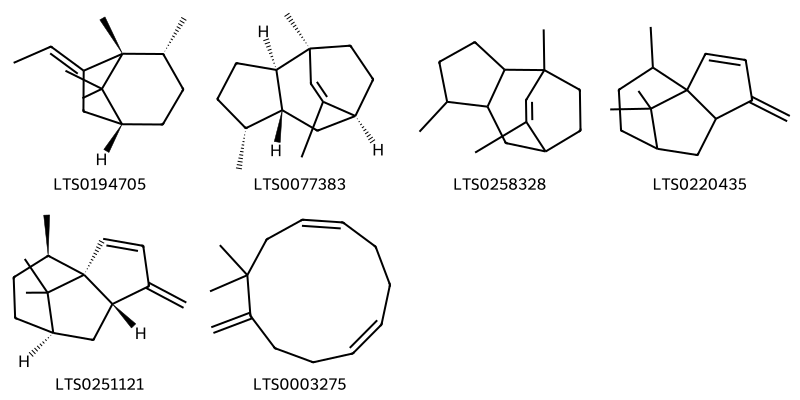{ width=100% }
    <figcaption>Hình ảnh cấu trúc hóa học của 6 hoạt chất thuộc nhóm Unsaturated hydrocarbons gồm ['(1r,2r,5r,7e)-7-ethylidene-1,2,8,8-tetramethylbicyclo[3.2.1]octane (LTS0194705)', '(1r,2r,5r,6r,8s)-1,5,9-trimethyltricyclo[6.2.2.0²,⁶]dodec-9-ene (LTS0077383)', '1,5,9-trimethyltricyclo[6.2.2.0²,⁶]dodec-9-ene (LTS0258328)', '10,11,11-trimethyl-4-methylidenetricyclo[5.3.1.0¹,⁵]undec-2-ene (LTS0220435)', '(1r,5s,7r,10r)-10,11,11-trimethyl-4-methylidenetricyclo[5.3.1.0¹,⁵]undec-2-ene (LTS0251121)', '(1z,5z)-8,8-dimethyl-9-methylidenecycloundeca-1,5-diene (LTS0003275)'].</figcaption>
</figure>

---

### Dược dân tộc học

Danh sách các quốc gia có sử dụng *Cyperus rotundus* trong điều trị các bệnh. 

| Country   | Disease                                                                                                    | Bệnh                                                                                                               |
|:----------|:-----------------------------------------------------------------------------------------------------------|:-------------------------------------------------------------------------------------------------------------------|
| China     | nan, Aphrodisiac, Emmenagogue, Stomachic                                                                   | nan, Kích thích tình dục, Chất kích thích, Dạ dày                                                                  |
| Egypt     | Diuretic, Emmenagogue, Stomachic, Vermifuge, Diaphoretic, Astringent, Emollient                            | Thuốc lợi tiểu, Emmenagogue, Dạ dày, Vermifuge, Diaphoretic, Chất làm se, Chất làm mềm                             |
| Elsewhere | Astringent, Diaphoretic, Diuretic, Tranquilizer, Vasodilator, Analgesic                                    | Chất làm se, thuốc lợi tiểu, thuốc lợi tiểu, thuốc an thần, thuốc giãn mạch, thuốc giảm đau                        |
| India     | Astringent, Vermifuge                                                                                      | Chất làm se, Vermifuge                                                                                             |
| Iran      | Perfume                                                                                                    | Nước hoa                                                                                                           |
| Japan*    | Emmenagogue                                                                                                | Emmenagogue                                                                                                        |
| Java      | Diuretic                                                                                                   | Thuốc lợi tiêu                                                                                                     |
| Sanscrit  | Astringent                                                                                                 | Lam se da                                                                                                          |
| Sudan     | Diaphoretic, Astringent                                                                                    | Diaphoretic, Chất làm se                                                                                           |
| Turkey    | Astringent, Carminative, Demulcent, Diuretic, Emmenagogue, Stomachic, Vermifuge, Perfume, Stimulant, Tonic | Chất làm se, Carminative, Demulcent, lợi tiểu, Emmenagogue, Dạ dày, Vermifuge, Nước hoa, Chất kích thích, Thuốc bổ |

---

---
## Cyperus rotundus
### Thông tin về thực vật

!!! info "Phân loại thực vật của *Cyperus rotundus* từ GIBF:"
    - **Kingdom:** Plantae
    - **Phylum:** Tracheophyta
    - **Order:** Poales
    - **Family:** Cyperaceae
    - **Genus:** Cyperus
    - **Species:** *Cyperus rotundus*

 

| Label (VI)   | Label (EN)   | Scientific Name   | Descriptions (VI)   | Descriptions (EN)   | Also Known As (VI)            | Also Known As (EN)                                                                             |
|:-------------|:-------------|:------------------|:--------------------|:--------------------|:------------------------------|:-----------------------------------------------------------------------------------------------|
| N/A          | N/A          | Cyperus rotundus  |                     | species of plant    | ['Cyperus rotundus', 'Cỏ cú'] | ['Coco grass', 'Common nut sedge', 'Nut-grass', 'Nutgrass', 'Purple nutsedge', 'Red nutgrass'] |

#### Phân bố trên thế giới

**Từ CSDL GIBF** Italy, Australia, Argentina, Israel, French Guiana, Puerto Rico, Chinese Taipei, Spain, Portugal, Algeria, Morocco, United States of America, South Africa, Hong Kong, Thailand, Turks and Caicos Islands, Brazil, Guam, Mexico, Singapore, China, Curaçao, Indonesia, New Zealand

#### Phân bố tại Việt Nam

**Từ CSDL GIBF**: Không có ghi nhận ở Việt Nam

---
### Thành phần hóa học
        
- Theo cơ sở dữ liệu lotus: Từ loài *Cyperus rotundus* đã phân lập và xác định được 208 hoạt chất thuộc về các nhóm Tetralins, Polycyclic hydrocarbons, Fatty Acyls, Cinnamic acids and derivatives, Oxanes, Heteroaromatic compounds, Prenol lipids, Tetrahydrofurans, Benzene and substituted derivatives, Organooxygen compounds, Pyridines and derivatives, Flavonoids, Steroids and steroid derivatives, Oxepanes, Unsaturated hydrocarbons, 2-arylbenzofuran flavonoids, Coumarins and derivatives, Epoxides. 

|    | chemicalTaxonomyClassyfireClass     |   smiles_count |
|---:|:------------------------------------|---------------:|
|  0 | 2-arylbenzofuran flavonoids         |              1 |
|  1 | Benzene and substituted derivatives |              4 |
|  2 | Cinnamic acids and derivatives      |              2 |
|  3 | Coumarins and derivatives           |              1 |
|  4 | Epoxides                            |              2 |
|  5 | Fatty Acyls                         |              4 |
|  6 | Flavonoids                          |              1 |
|  7 | Heteroaromatic compounds            |              2 |
|  8 | Organooxygen compounds              |              8 |
|  9 | Oxanes                              |              2 |
| 10 | Oxepanes                            |              3 |
| 11 | Polycyclic hydrocarbons             |              3 |
| 12 | Prenol lipids                       |            150 |
| 13 | Pyridines and derivatives           |              6 |
| 14 | Steroids and steroid derivatives    |              5 |
| 15 | Tetrahydrofurans                    |              2 |
| 16 | Tetralins                           |              4 |
| 17 | Unsaturated hydrocarbons            |              6 |

#### Nhóm 2-arylbenzofuran flavonoids
<figure markdown="span">
    { width=100% }
    <figcaption>Hình ảnh cấu trúc hóa học của 1 hoạt chất thuộc nhóm 2-arylbenzofuran flavonoids gồm ['5-[2-(3,4-dihydroxyphenyl)-4-[(1e)-2-(3,4-dihydroxyphenyl)ethenyl]-6-hydroxy-2,3-dihydro-1-benzofuran-3-yl]benzene-1,3-diol (LTS0146751)'].</figcaption>
</figure>
#### Nhóm Benzene and substituted derivatives
<figure markdown="span">
    { width=100% }
    <figcaption>Hình ảnh cấu trúc hóa học của 4 hoạt chất thuộc nhóm Benzene and substituted derivatives gồm ['cyperine (LTS0271214)', 'p-hydroxybenzoic acid (LTS0263634)', '3,4-dihydroxybenzoic acid (LTS0018765)', 'vanillic acid (LTS0229113)'].</figcaption>
</figure>
#### Nhóm Cinnamic acids and derivatives
<figure markdown="span">
    { width=100% }
    <figcaption>Hình ảnh cấu trúc hóa học của 2 hoạt chất thuộc nhóm Cinnamic acids and derivatives gồm ['ferulic acid (LTS0077328)', 'para-coumaric acid (LTS0266252)'].</figcaption>
</figure>
#### Nhóm Coumarins and derivatives
<figure markdown="span">
    { width=100% }
    <figcaption>Hình ảnh cấu trúc hóa học của 1 hoạt chất thuộc nhóm Coumarins and derivatives gồm ['2h-1-benzopyran-2-one (LTS0069773)'].</figcaption>
</figure>
#### Nhóm Epoxides
<figure markdown="span">
    { width=100% }
    <figcaption>Hình ảnh cấu trúc hóa học của 2 hoạt chất thuộc nhóm Epoxides gồm ['31,32-dioxapentacyclo[20.8.1.1⁷,¹⁶.0¹,²².0⁷,¹⁶]dotriacontane (LTS0273504)', '(1r,3e,7e,11r)-1,5,5,7-tetramethyl-12-oxabicyclo[9.1.0]dodeca-3,7-diene (LTS0027633)'].</figcaption>
</figure>
#### Nhóm Fatty Acyls
<figure markdown="span">
    { width=100% }
    <figcaption>Hình ảnh cấu trúc hóa học của 4 hoạt chất thuộc nhóm Fatty Acyls gồm ['2-carboxy-d-arabinitol (LTS0056947)', '(2r)-n-[(1r,2s,3r,4e,8z)-1,3-dihydroxy-1-{[(2s,3r,4s,5s,6r)-3,4,5-trihydroxy-6-(hydroxymethyl)oxan-2-yl]oxy}tetradeca-4,8-dien-2-yl]-2-hydroxypentacosanimidic acid (LTS0211405)', 'methyl (5z,11e,14e,17e)-icosa-5,11,14,17-tetraenoate (LTS0242069)', 'n-(1,3-dihydroxy-1-{[3,4,5-trihydroxy-6-(hydroxymethyl)oxan-2-yl]oxy}tetradeca-4,8-dien-2-yl)-2-hydroxypentacosanimidic acid (LTS0040806)'].</figcaption>
</figure>
#### Nhóm Flavonoids
<figure markdown="span">
    { width=100% }
    <figcaption>Hình ảnh cấu trúc hóa học của 1 hoạt chất thuộc nhóm Flavonoids gồm ['luteolin (LTS0017052)'].</figcaption>
</figure>
#### Nhóm Heteroaromatic compounds
<figure markdown="span">
    { width=100% }
    <figcaption>Hình ảnh cấu trúc hóa học của 2 hoạt chất thuộc nhóm Heteroaromatic compounds gồm ['perillene (LTS0083458)', '2-cyclopropylthiophene (LTS0194577)'].</figcaption>
</figure>
#### Nhóm Organooxygen compounds
<figure markdown="span">
    { width=100% }
    <figcaption>Hình ảnh cấu trúc hóa học của 8 hoạt chất thuộc nhóm Organooxygen compounds gồm ['sabinaketone (LTS0133971)', '4,8,8-trimethyl-5-(3-oxobutyl)bicyclo[3.2.1]octan-6-one (LTS0047667)', 'tetracyclo[6.3.2.0¹,⁸.0²,⁵]tridecan-9-ol (LTS0121286)', 'cyperolone (LTS0256818)', '1-[3-hydroxy-7a-methyl-5-(prop-1-en-2-yl)-hexahydro-1h-inden-3a-yl]ethanone (LTS0267013)', '(1r,4r,5r)-4,8,8-trimethyl-5-(3-oxobutyl)bicyclo[3.2.1]octan-6-one (LTS0041725)', '(4z,8z)-2,5,9-trimethylcycloundeca-4,8-dien-1-one (LTS0225335)', 'caryophyllene alcohol (LTS0130095)'].</figcaption>
</figure>
#### Nhóm Oxanes
<figure markdown="span">
    { width=100% }
    <figcaption>Hình ảnh cấu trúc hóa học của 2 hoạt chất thuộc nhóm Oxanes gồm ['1,8-cineole (LTS0166505)', 'eucalyptol (LTS0051374)'].</figcaption>
</figure>
#### Nhóm Oxepanes
<figure markdown="span">
    { width=100% }
    <figcaption>Hình ảnh cấu trúc hóa học của 3 hoạt chất thuộc nhóm Oxepanes gồm ['1a,5-dimethyl-7-(prop-1-en-2-yl)-octahydronaphtho[1,8a-b]oxiren-2-ol (LTS0136569)', '2,6,6,8-tetramethyl-10-oxatetracyclo[5.4.1.0¹,⁵.0⁹,¹¹]dodecane (LTS0267039)', '(1ar,2r,4as,5s,7r,8as)-1a,5-dimethyl-7-(prop-1-en-2-yl)-octahydronaphtho[1,8a-b]oxiren-2-ol (LTS0269853)'].</figcaption>
</figure>
#### Nhóm Polycyclic hydrocarbons
<figure markdown="span">
    { width=100% }
    <figcaption>Hình ảnh cấu trúc hóa học của 3 hoạt chất thuộc nhóm Polycyclic hydrocarbons gồm ['(1r,2s,5r,6r,8r)-1,5-dimethyltricyclo[6.2.2.0²,⁶]dodec-9-ene (LTS0262383)', 'bicyclo[3.2.0]hept-6-ene (LTS0249094)', '1,5-dimethyltricyclo[6.2.2.0²,⁶]dodec-9-ene (LTS0028533)'].</figcaption>
</figure>
#### Nhóm Prenol lipids
<figure markdown="span">
    { width=100% }
    <figcaption>Hình ảnh cấu trúc hóa học của 150 hoạt chất thuộc nhóm Prenol lipids gồm ['(4as,7r)-1,4a-dimethyl-7-(prop-1-en-2-yl)-3,4,5,6,7,8-hexahydronaphthalen-2-one (LTS0077665)', '1,4a-dimethyl-7-(prop-1-en-2-yl)-3,4,5,6,7,8-hexahydronaphthalen-2-one (LTS0024573)', 'β-selinene (LTS0096341)', 'cyperene (LTS0272596)', 'cyperene (LTS0140263)', 'β-elemene (LTS0225699)', 'caryophyllene (LTS0085212)', 'α-copaene (LTS0207598)', '(1r,2s,7s,8s)-8-isopropyl-1,3-dimethyltricyclo[4.4.0.0²,⁷]dec-3-ene (LTS0190031)', 'cyperotundone (LTS0230425)', '(1r,7r,10r)-4,10,11,11-tetramethyltricyclo[5.3.1.0¹,⁵]undec-4-en-3-one (LTS0029825)', 'myrtenol (LTS0130529)', '(1s,2s,6s,7r,8s)-8-isopropyl-1,5-dimethyltricyclo[4.4.0.0²,⁷]dec-4-en-3-one (LTS0224432)', '(e)-calamene (LTS0228241)', 'caryophyllene oxide (LTS0159789)', 'phytol (LTS0096073)', '4,4,8-trimethyltricyclo[6.3.1.0¹,⁵]dodecane-2,9-diol (LTS0057780)', '(2r,4as,7r)-4a-methyl-1-methylidene-7-(prop-1-en-2-yl)-octahydronaphthalen-2-ol (LTS0118571)', 'β-pinene (LTS0117550)', 'humulene (LTS0263171)', '4-isopropyl-1,6-dimethyl-2,3,4,4a,7,8-hexahydronaphthalene (LTS0270743)', '(1r,4s)-4-isopropyl-1,6-dimethyl-1,2,3,4-tetrahydronaphthalene (LTS0158900)', 'cyperol (LTS0247308)', '(1r,7s,10r)-4,10,11,11-tetramethyltricyclo[5.3.1.0¹,⁵]undec-4-en-6-one (LTS0246067)', '8-isopropyl-1,5-dimethyltricyclo[4.4.0.0²,⁷]dec-4-en-3-one (LTS0077798)', '(1r,7r)-4,10,11,11-tetramethyltricyclo[5.3.1.0¹,⁵]undec-4-en-3-one (LTS0084047)', 'β-caryophyllene oxide (LTS0213960)', '(4ar)-1,4a-dimethyl-7-(prop-1-en-2-yl)-3,4,5,6,7,8-hexahydronaphthalen-2-one (LTS0224197)', 'selinene (LTS0197809)', '1,4-dimethyl-7-(prop-1-en-2-yl)-octahydroazulene-1,4-diol (LTS0032265)', '(1s,7r,10s)-4,10,11,11-tetramethyltricyclo[5.3.1.0¹,⁵]undeca-2,4-diene (LTS0037892)', '(1s,3as,4s,7r,8as)-1,4-dimethyl-7-(prop-1-en-2-yl)-octahydroazulene-1,4-diol (LTS0203316)', '(4ar,7s)-1,4a-dimethyl-7-(prop-1-en-2-yl)-3,4,5,6,7,8-hexahydronaphthalen-2-one (LTS0251654)', '(1s,4r)-4-isopropyl-1,6-dimethyl-1,2,3,4-tetrahydronaphthalene (LTS0015102)', 'mustakone (LTS0000432)', '(1r,2s,6s,7s,8r)-8-isopropyl-1,3-dimethyltricyclo[4.4.0.0²,⁷]dec-3-ene (LTS0106607)', 'delta-cadinene (LTS0019321)', '(7ar)-1,1,7-trimethyl-4-methylidene-octahydrocyclopropa[e]azulen-7-ol (LTS0091612)', 'α-selinene (LTS0024564)', 'carvone (LTS0196605)', '(4as)-7-isopropyl-1,4a-dimethyl-3,4,5,6-tetrahydronaphthalen-2-one (LTS0066061)', 'rosenonolactone (LTS0038418)', '(-)-α-gurjunene (LTS0194913)', '(1r,3s,6s,7s,10r)-4,10,11,11-tetramethyltricyclo[5.3.1.0¹,⁵]undec-4-ene-3,6-diol (LTS0212144)', '(2r,5s,6s,8r)-1,5-dimethyl-9-methylidenetricyclo[6.2.2.0²,⁶]dodecane (LTS0121912)', '(1r,2s,5s,6r,8s,10s)-1,5-dimethyl-9-methylidenetricyclo[6.2.2.0²,⁶]dodecan-10-ol (LTS0227555)', '(1r,5r)-6,6-dimethyl-2-methylidenebicyclo[3.1.1]heptan-3-one (LTS0043419)', 'guaiene (LTS0039431)', 'cuparene (LTS0028747)', 'aristolone (LTS0064647)', '(+)-borneol (LTS0189059)', 'α-myrcene (LTS0115731)', 'α-longipinene (LTS0199827)', 'sugeonyl acetate (LTS0060512)', '(-)-α-pinene (LTS0032699)', '(+)-camphene (LTS0109845)', 'terpinolene (LTS0104525)', 'cymene (LTS0181568)', 'α pinene (LTS0132416)', '(1s)-4-isopropyl-1,6-dimethyl-1,2-dihydronaphthalene (LTS0177753)', 'fenchol (LTS0261470)', '(1s,4s)-4-isopropyl-1,6-dimethyl-1,2,3,4-tetrahydronaphthalene (LTS0139634)', '4a-methyl-1-methylidene-7-(prop-1-en-2-yl)-octahydronaphthalene (LTS0165615)', '(1r,3s,5r)-6,6-dimethyl-2-methylidenebicyclo[3.1.1]heptan-3-ol (LTS0165758)', '10,11,11-trimethyltricyclo[5.3.1.0¹,⁵]undec-4-ene-4-carboxylic acid (LTS0166341)', '(4ar,7s,8as)-1,4a-dimethyl-7-(prop-1-en-2-yl)-4,5,6,7,8,8a-hexahydro-3h-naphthalene (LTS0148007)', '4-isopropyl-1,6-dimethyl-3,4,4a,7,8,8a-hexahydronaphthalene (LTS0154650)', '7-isopropyl-1,4a-dimethyl-3,4,5,6-tetrahydronaphthalen-2-one (LTS0149247)', '(1r,2s,5r,6r,8r)-1,5-dimethyl-9-methylidenetricyclo[6.2.2.0²,⁶]dodecane (LTS0154680)', 'camphene (LTS0267242)', 'limonene,  (LTS0155981)', '(+)-4-terpineol (LTS0140257)', 'germacrene b (LTS0265072)', 'verbenol (LTS0140945)', '(4as,6as,6br,8ar,10s,12ar,12br,14bs)-10-{[(2r,3r,4s,5s,6r)-4,5-dihydroxy-6-(hydroxymethyl)-3-{[(2s,3r,4r,5r,6s)-3,4,5-trihydroxy-6-methyloxan-2-yl]oxy}oxan-2-yl]oxy}-2,2,6a,6b,9,9,12a-heptamethyl-1,3,4,5,6,7,8,8a,10,11,12,12b,13,14b-tetradecahydropicene-4a-carboxylic acid (LTS0155345)', 'pinocarvone (LTS0084836)', 'solavetivone (LTS0097811)', 'gamma-eudesmol (LTS0147389)', 'phellandrene (LTS0157173)', '2,7,7,10-tetramethyl-3-oxatetracyclo[7.3.0.0²,⁴.0⁶,⁸]dodecane (LTS0156016)', '4a-hydroxy-4,8a-dimethyl-6-(prop-1-en-2-yl)-5,6,7,8-tetrahydro-1h-naphthalen-2-one (LTS0138648)', '(1ar,4ar,7s,7as,7br)-1,1,7-trimethyl-4-methylidene-octahydrocyclopropa[e]azulen-7-ol (LTS0243368)', '(-)-β-pinene (LTS0108757)', '(-)-β-selinene (LTS0273811)', '(1r,7r,10r)-10,11,11-trimethyltricyclo[5.3.1.0¹,⁵]undec-4-ene-4-carboxylic acid (LTS0102298)', '4,10,11,11-tetramethyltricyclo[5.3.1.0¹,⁵]undec-4-ene-3,6-diol (LTS0255374)', '(1r)-4-isopropyl-1,6-dimethyl-1,2-dihydronaphthalene (LTS0120131)', '1-[(1r,7r)-7-isopropyl-4-methylidene-octahydroinden-1-yl]ethanone (LTS0188339)', '(1r,2r,5r,7r,10s,11s)-5-ethenyl-2,5,11-trimethyl-15-oxatetracyclo[9.3.2.0¹,¹⁰.0²,⁷]hexadecane-8,16-dione (LTS0255704)', '6,9-bis(acetyloxy)-4,10,11,11-tetramethyltricyclo[5.3.1.0¹,⁵]undec-4-en-3-yl acetate (LTS0255435)', '(1r,6r,7s,10r)-4,10,11,11-tetramethyl-3-oxotricyclo[5.3.1.0¹,⁵]undec-4-en-6-yl acetate (LTS0183739)', '1,4-dimethyl-7-(prop-1-en-2-yl)-1,2,3,3a,4,5,6,7-octahydroazulene (LTS0217070)', 'cadalene (LTS0077722)', '(1s,2s,5s,8r)-2-methyl-6-methylidene-9-(propan-2-ylidene)-11-oxatricyclo[6.2.1.0¹,⁵]undecan-8-ol (LTS0063268)', '7-isopropyl-1,8a-dimethyl-octahydro-1h-naphthalene (LTS0261696)', '4,10,11,11-tetramethyltricyclo[5.3.1.0¹,⁵]undec-4-en-6-yl acetate (LTS0262130)', '(1r,3s,6s,7s,9s,10s)-6,9-bis(acetyloxy)-4,10,11,11-tetramethyltricyclo[5.3.1.0¹,⁵]undec-4-en-3-yl acetate (LTS0203765)', 'α-limonene (LTS0244943)', 'verbenone (LTS0275336)', '(1s,3as,4r,7s,8as)-1,4-dimethyl-7-(prop-1-en-2-yl)-octahydroazulene-1,4-diol (LTS0211728)', '(+)-borneol (LTS0059936)', 'nootkatone (LTS0027125)', 'aristolone (LTS0230263)', 'thymol (LTS0168527)', '1,4a-dimethyl-7-(propan-2-ylidene)-3,4,5,6,8,8a-hexahydronaphthalene (LTS0160369)', '2-[(1r,4s)-4-ethenyl-4-methyl-3-(prop-1-en-2-yl)cyclohexyl]propan-2-ol (LTS0235839)', 'ledol (LTS0168644)', 'oleanolic acid (LTS0141130)', '(4as,6r,8as)-4a-hydroxy-4,8a-dimethyl-6-(prop-1-en-2-yl)-5,6,7,8-tetrahydro-1h-naphthalen-2-one (LTS0004761)', 'cuminaldehyde (LTS0037806)', '1,1,4,7-tetramethyl-octahydro-1ah-cyclopropa[e]azulen-4a-ol (LTS0248056)', '(1r,7r,8as)-1,8a-dimethyl-7-(prop-1-en-2-yl)-2,6,7,8-tetrahydro-1h-naphthalene (LTS0183545)', 'nootkatone (LTS0183338)', '7-isopropyl-1,4a-dimethyl-2,3,4,5,6,8a-hexahydronaphthalen-1-ol (LTS0044461)', '(-)-α-phellandrene (LTS0226766)', '4,10,11,11-tetramethyltricyclo[5.3.1.0¹,⁵]undec-4-en-6-one (LTS0241841)', '(1r,3ar,4r,7r)-1,4-dimethyl-7-(prop-1-en-2-yl)-1,2,3,3a,4,5,6,7-octahydroazulene (LTS0257129)', '(-)-β-fenchyl alcohol (LTS0048619)', '2,6,6,11-tetramethyltricyclo[5.4.0.0²,⁸]undec-10-en-9-one (LTS0251252)', '(4ar,6r,8as)-4a-hydroxy-4,8a-dimethyl-6-(prop-1-en-2-yl)-5,6,7,8-tetrahydro-1h-naphthalen-2-one (LTS0058452)', '(1as,2s,4as,7r,8ar)-1a,4a-dimethyl-7-(prop-1-en-2-yl)-hexahydro-2h-naphtho[1,8a-b]oxiren-2-ol (LTS0063584)', '(1r,2r,7s,8r,9s)-2,6,6,11-tetramethyltricyclo[5.4.0.0²,⁸]undec-10-en-9-ol (LTS0067358)', '2,2,7,7-tetramethyltricyclo[6.2.1.0¹,⁶]undec-5-en-10-one (LTS0007204)', 'gamma-muurolene (LTS0052920)', '2-methyl-6-methylidene-9-(propan-2-ylidene)-11-oxatricyclo[6.2.1.0¹,⁵]undecan-8-ol (LTS0270223)', '1,5-dimethyl-9-methylidenetricyclo[6.2.2.0²,⁶]dodecane (LTS0066635)', 'caryophyllene (LTS0131870)', 'α-muurolene (LTS0022607)', '(1ar,4as,7r,7as,7bs)-1,1,7-trimethyl-4-methylidene-octahydro-1ah-cyclopropa[e]azulene (LTS0028578)', '4-isopropyl-1,6-dimethyl-1,2-dihydronaphthalene (LTS0004459)', '(1r,2r,5r,8s,9s)-4,4,8-trimethyltricyclo[6.3.1.0¹,⁵]dodecane-2,9-diol (LTS0007295)', '(4s,4as,8as)-4-isopropyl-1,6-dimethyl-3,4,4a,7,8,8a-hexahydronaphthalene (LTS0014980)', 'carvacrol (LTS0012882)', 'α-cubebene (LTS0083688)', '10-{[4,5-dihydroxy-6-(hydroxymethyl)-3-[(3,4,5-trihydroxy-6-methyloxan-2-yl)oxy]oxan-2-yl]oxy}-2,2,6a,6b,9,9,12a-heptamethyl-1,3,4,5,6,7,8,8a,10,11,12,12b,13,14b-tetradecahydropicene-4a-carboxylic acid (LTS0258240)', '4,10,11,11-tetramethyl-3-oxotricyclo[5.3.1.0¹,⁵]undec-4-en-6-yl acetate (LTS0032382)', '(1r,6r,7s,10r)-4,10,11,11-tetramethyltricyclo[5.3.1.0¹,⁵]undec-4-en-6-yl acetate (LTS0071816)', '(4e,8e,13z)-12-isopropyl-1,5,9-trimethylcyclotetradeca-4,8,13-triene-1,3-diol (LTS0120820)', 'pinocarveol (LTS0090950)', 'valencene (LTS0031707)', '(1s,2r,4s)-5,5-dimethyl-6-methylidenebicyclo[2.2.1]heptan-2-ol (LTS0027702)', '(1r,4r,6s,10s)-4,12,12-trimethyl-9-methylidene-5-oxatricyclo[8.2.0.0⁴,⁶]dodecane (LTS0029123)', '(4s,4as,8as)-4-isopropyl-6-methyl-1-methylidene-3,4,4a,7,8,8a-hexahydro-2h-naphthalene (LTS0099302)', 'valencene (LTS0110395)', 'carvone, (+)- (LTS0027671)', '[(1s,5r)-6,6-dimethylbicyclo[3.1.1]hept-2-en-2-yl]methanol (LTS0044518)', 'levoverbenone (LTS0037738)', '(-)-cis-carveol (LTS0048903)', '(1ar,4r,4ar,7r,7ar,7bs)-1,1,4,7-tetramethyl-octahydro-1ah-cyclopropa[e]azulen-4-ol (LTS0245385)', 'oleanolic acid (LTS0117717)'].</figcaption>
</figure>
#### Nhóm Pyridines and derivatives
<figure markdown="span">
    { width=100% }
    <figcaption>Hình ảnh cấu trúc hóa học của 6 hoạt chất thuộc nhóm Pyridines and derivatives gồm ['4-[(6r)-1,5,5-trimethyl-6h,7h-cyclopenta[c]pyridin-6-yl]butan-2-one (LTS0187821)', '(2r)-4-[(6s)-1,5,5-trimethyl-6h,7h-cyclopenta[c]pyridin-6-yl]butan-2-ol (LTS0261434)', '4-{1,5,5-trimethyl-6h,7h-cyclopenta[c]pyridin-6-yl}butan-2-ol (LTS0263515)', '4-{1,5,5-trimethyl-6h,7h-cyclopenta[c]pyridin-6-yl}butan-2-one (LTS0231359)', '4-[(6s)-1,5,5-trimethyl-6h,7h-cyclopenta[c]pyridin-6-yl]butan-2-one (LTS0171857)', '(2r)-4-[(6r)-1,5,5-trimethyl-6h,7h-cyclopenta[c]pyridin-6-yl]butan-2-ol (LTS0026787)'].</figcaption>
</figure>
#### Nhóm Steroids and steroid derivatives
<figure markdown="span">
    { width=100% }
    <figcaption>Hình ảnh cấu trúc hóa học của 5 hoạt chất thuộc nhóm Steroids and steroid derivatives gồm ['sitosterol (LTS0168132)', 'stigmast-5-en-3-ol, (3β)- (LTS0204616)', '5-(5,6-dimethylhept-3-en-2-yl)-6,10-dimethyl-16,17-dioxapentacyclo[13.2.2.0¹,⁹.0²,⁶.0¹⁰,¹⁵]nonadec-18-en-13-ol (LTS0211330)', '(3as,3br,5as,9as,9bs,11as)-7-ethyl-7-hydroxy-9a,11a-dimethyl-dodecahydro-2h-cyclopenta[a]phenanthren-1-one (LTS0150792)', '(1s,2r,5r,6r,9r,10r,13s,15s)-5-[(2s,3e,5r)-5,6-dimethylhept-3-en-2-yl]-6,10-dimethyl-16,17-dioxapentacyclo[13.2.2.0¹,⁹.0²,⁶.0¹⁰,¹⁵]nonadec-18-en-13-ol (LTS0084016)'].</figcaption>
</figure>
#### Nhóm Tetrahydrofurans
<figure markdown="span">
    { width=100% }
    <figcaption>Hình ảnh cấu trúc hóa học của 2 hoạt chất thuộc nhóm Tetrahydrofurans gồm ['(1r,3s,7s,10s)-10,11,11-trimethyl-12-oxatricyclo[5.3.1.1³,¹⁰]dodecan-5-one (LTS0165007)', '10,11,11-trimethyl-12-oxatricyclo[5.3.1.1³,¹⁰]dodecan-5-one (LTS0176625)'].</figcaption>
</figure>
#### Nhóm Tetralins
<figure markdown="span">
    { width=100% }
    <figcaption>Hình ảnh cấu trúc hóa học của 4 hoạt chất thuộc nhóm Tetralins gồm ['4,8,11,11-tetramethyl-9,10-dioxatricyclo[6.3.2.0²,⁷]trideca-2,4,6-triene (LTS0069359)', '4,7-dimethyl-3,4-dihydro-2h-naphthalen-1-one (LTS0265560)', '(4s)-4,7-dimethyl-3,4-dihydro-2h-naphthalen-1-one (LTS0151328)', '(1s,8r)-4,8,11,11-tetramethyl-9,10-dioxatricyclo[6.3.2.0²,⁷]trideca-2,4,6-triene (LTS0015895)'].</figcaption>
</figure>
#### Nhóm Unsaturated hydrocarbons
<figure markdown="span">
    { width=100% }
    <figcaption>Hình ảnh cấu trúc hóa học của 6 hoạt chất thuộc nhóm Unsaturated hydrocarbons gồm ['(1r,2r,5r,7e)-7-ethylidene-1,2,8,8-tetramethylbicyclo[3.2.1]octane (LTS0194705)', '(1r,2r,5r,6r,8s)-1,5,9-trimethyltricyclo[6.2.2.0²,⁶]dodec-9-ene (LTS0077383)', '1,5,9-trimethyltricyclo[6.2.2.0²,⁶]dodec-9-ene (LTS0258328)', '10,11,11-trimethyl-4-methylidenetricyclo[5.3.1.0¹,⁵]undec-2-ene (LTS0220435)', '(1r,5s,7r,10r)-10,11,11-trimethyl-4-methylidenetricyclo[5.3.1.0¹,⁵]undec-2-ene (LTS0251121)', '(1z,5z)-8,8-dimethyl-9-methylidenecycloundeca-1,5-diene (LTS0003275)'].</figcaption>
</figure>

---

### Dược dân tộc học

Danh sách các quốc gia có sử dụng *Cyperus rotundus* trong điều trị các bệnh. 

| Country   | Disease                                  | Bệnh                                     |
|:----------|:-----------------------------------------|:-----------------------------------------|
| China     | Emmenagogue, Vulnerary, Tonic, Stomachic | Emmenagogue, Vulnerary, Tonic, Stomachic |

---

---
## Cyperus sesquiflorus
### Thông tin về thực vật

!!! info "Phân loại thực vật của *Cyperus sesquiflorus* từ GIBF:"
    - **Kingdom:** Plantae
    - **Phylum:** Tracheophyta
    - **Order:** Poales
    - **Family:** Cyperaceae
    - **Genus:** Cyperus
    - **Species:** *Cyperus sesquiflorus*

 

| Label (VI)   | Label (EN)   | Scientific Name      | Descriptions (VI)   | Descriptions (EN)   | Also Known As (VI)   | Also Known As (EN)   |
|:-------------|:-------------|:---------------------|:--------------------|:--------------------|:---------------------|:---------------------|
| N/A          | N/A          | Cyperus sesquiflorus |                     | specie of plant     | ['']                 | ['']                 |

#### Phân bố trên thế giới

**Từ CSDL GIBF** South Africa, Australia, Madagascar, Thailand, Gabon, Brazil, Chinese Taipei, Argentina, United States of America, Mexico, Uruguay, El Salvador, French Guiana

#### Phân bố tại Việt Nam

**Từ CSDL GIBF**: Không có ghi nhận ở Việt Nam

---
### Thành phần hóa học
        
- Theo cơ sở dữ liệu lotus: Từ loài *Cyperus sesquiflorus* đã phân lập và xác định được 6 hoạt chất thuộc về các nhóm Flavonoids. 

|    | chemicalTaxonomyClassyfireClass   |   smiles_count |
|---:|:----------------------------------|---------------:|
|  0 | Flavonoids                        |              6 |

#### Nhóm Flavonoids
<figure markdown="span">
    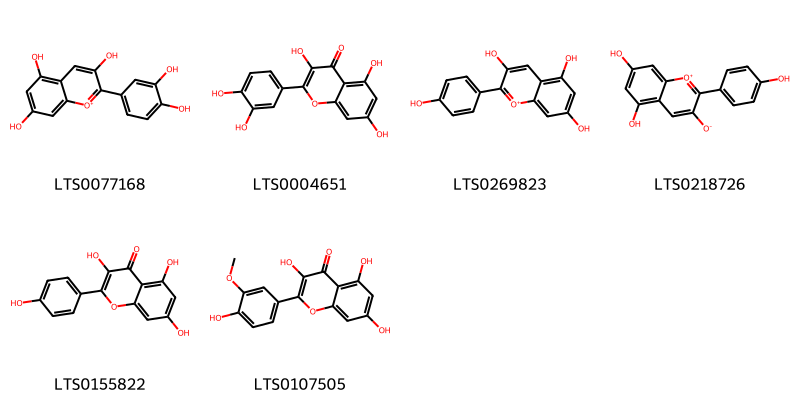{ width=100% }
    <figcaption>Hình ảnh cấu trúc hóa học của 6 hoạt chất thuộc nhóm Flavonoids gồm ['cyanidin (LTS0077168)', 'quercetin (LTS0004651)', 'pelargonidin (LTS0269823)', '5,7-dihydroxy-2-(4-hydroxyphenyl)-1λ⁴-chromen-1-ylium-3-olate (LTS0218726)', 'kaempherol (LTS0155822)', 'isorhamnetin (LTS0107505)'].</figcaption>
</figure>

---

### Dược dân tộc học

Danh sách các quốc gia có sử dụng *Cyperus sesquiflorus* trong điều trị các bệnh. 

| Country   | Disease                          | Bệnh                            |
|:----------|:---------------------------------|:--------------------------------|
| Argentina | Carminative, Digestive, Diuretic | Carminative, tiêu hóa, lợi tiểu |

---

---
## Cyperus stolonifera
### Thông tin về thực vật

!!! info "Phân loại thực vật của *Cyperus stoloniferus* từ GIBF:"
    - **Kingdom:** Plantae
    - **Phylum:** Tracheophyta
    - **Order:** Poales
    - **Family:** Cyperaceae
    - **Genus:** Cyperus
    - **Species:** *Cyperus stoloniferus*

 

| Label (VI)   | Label (EN)   | Scientific Name      | Descriptions (VI)   | Descriptions (EN)   | Also Known As (VI)   | Also Known As (EN)   |
|:-------------|:-------------|:---------------------|:--------------------|:--------------------|:---------------------|:---------------------|
| N/A          | N/A          | Cyperus sesquiflorus |                     | specie of plant     | ['']                 | ['']                 |

#### Phân bố trên thế giới

**Từ CSDL GIBF** nan, American Samoa, Sri Lanka, Australia, Japan, Mauritius, unknown or invalid, Pakistan, Réunion, Chinese Taipei, Papua New Guinea, United States of America, Solomon Islands, Maldives, Fiji, Thailand, Brazil, Tonga, New Caledonia, Singapore, Viet Nam, China, Madagascar, Seychelles, India, Indonesia, Samoa, Philippines, Malaysia

#### Phân bố tại Việt Nam

**Từ CSDL GIBF**: Ninh Thuan

---
### Thành phần hóa học
        
- Theo cơ sở dữ liệu lotus: Từ loài *Cyperus stoloniferus* đã phân lập và xác định được Chưa có hoạt chất nào được phân lập. hoạt chất thuộc về các nhóm Không có hoạt chất nào được phân lập. 

Không có hình ảnh nào được tạo ra

---

### Dược dân tộc học

Danh sách các quốc gia có sử dụng *Cyperus stoloniferus* trong điều trị các bệnh. 

| Country   | Disease              | Bệnh                    |
|:----------|:---------------------|:------------------------|
| India     | Stimulant, Stomachic | Chất Kích Thích, Dạ Dày |

---

---
## Cyperus stoloniferus
### Thông tin về thực vật

!!! info "Phân loại thực vật của *Cyperus stoloniferus* từ GIBF:"
    - **Kingdom:** Plantae
    - **Phylum:** Tracheophyta
    - **Order:** Poales
    - **Family:** Cyperaceae
    - **Genus:** Cyperus
    - **Species:** *Cyperus stoloniferus*

 

| Label (VI)   | Label (EN)   | Scientific Name      | Descriptions (VI)   | Descriptions (EN)   | Also Known As (VI)   | Also Known As (EN)   |
|:-------------|:-------------|:---------------------|:--------------------|:--------------------|:---------------------|:---------------------|
| N/A          | N/A          | Cyperus stoloniferus | loài thực vật       | species of plant    | ['']                 | ['']                 |

#### Phân bố trên thế giới

**Từ CSDL GIBF** nan, American Samoa, Sri Lanka, Australia, Japan, Mauritius, unknown or invalid, Pakistan, Réunion, Chinese Taipei, Papua New Guinea, United States of America, Solomon Islands, Maldives, Fiji, Thailand, Brazil, Tonga, New Caledonia, Singapore, Viet Nam, China, Madagascar, Seychelles, India, Indonesia, Samoa, Philippines, Malaysia

#### Phân bố tại Việt Nam

**Từ CSDL GIBF**: Ninh Thuan

---
### Thành phần hóa học
        
- Theo cơ sở dữ liệu lotus: Từ loài *Cyperus stoloniferus* đã phân lập và xác định được Chưa có hoạt chất nào được phân lập. hoạt chất thuộc về các nhóm Không có hoạt chất nào được phân lập. 

Không có hình ảnh nào được tạo ra

---

### Dược dân tộc học

Danh sách các quốc gia có sử dụng *Cyperus stoloniferus* trong điều trị các bệnh. 

| Country   | Disease                | Bệnh             |
|:----------|:-----------------------|:-----------------|
| Elsewhere | Cardiotonic, Stomachic | Tim mạch, Dạ dày |

---

