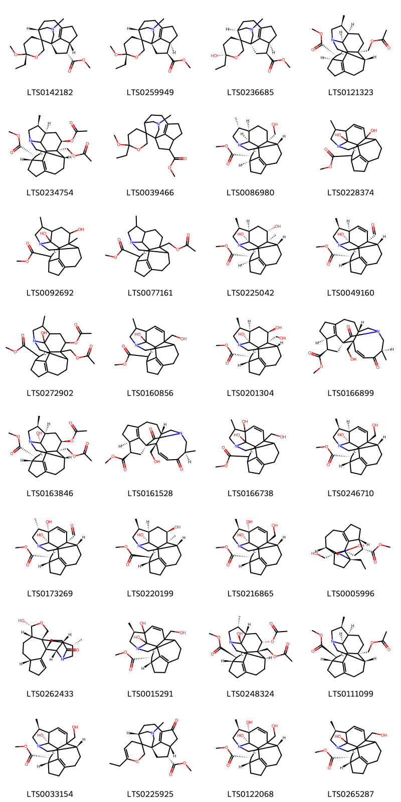
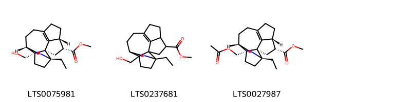
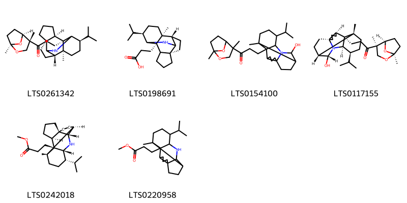
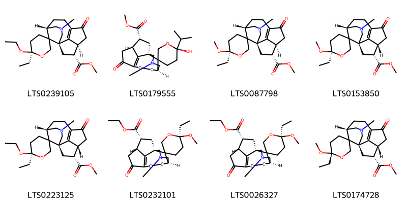
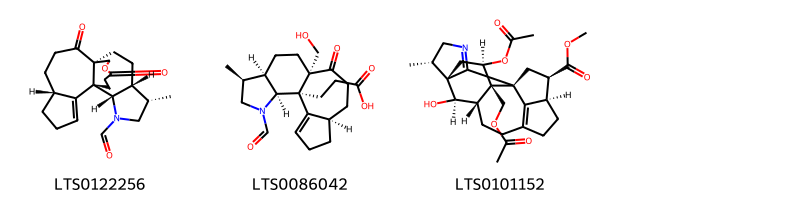
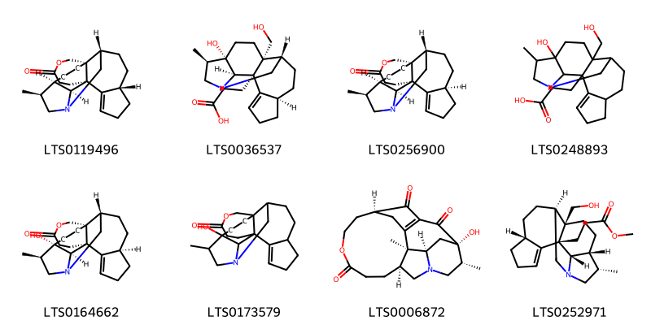
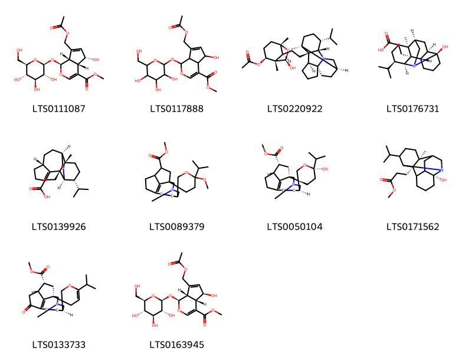
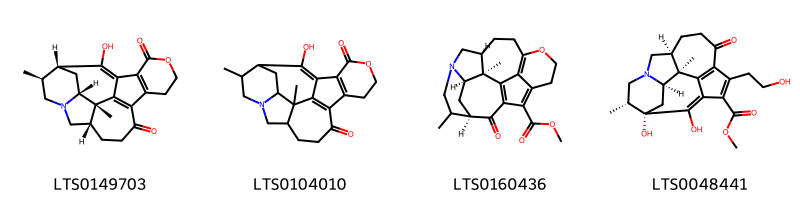

!!! abstract "Tóm tắt"

    Họ Daphniphyllaceae gồm khoảng 1 chi và 1 loài được một số cộng đồng tại các quốc gia như Elsewhere sử dụng trong một số trường hợp MYMEMORY WARNING: YOU USED ALL AVAILABLE FREE TRANSLATIONS FOR TODAY. NEXT AVAILABLE IN  07 HOURS 55 MINUTES 31 SECONDS VISIT HTTPS://MYMEMORY.TRANSLATED.NET/DOC/USAGELIMITS.PHP TO TRANSLATE MORE.

!!! info "DrDuke"

    James A. Duke sinh năm 1929-2017 là một nhà thực vật học người Mỹ. Đây là một trong những tác giả hàng đầu trong lĩnh vực dược dân tộc học với cuốn *CRC Handbook of Medicinal Herbs* và chính là người xây dựng lên cơ sở dữ liệu về hợp chất tự nhiên và dược dân tộc học tại Bộ nông nghiệp Hoa Kỳ. Các thông tin được đăng tải tại website [Dr. Duke's Phytochemical and Ethnobotanical Databases](https://phytochem.nal.usda.gov/). 
    Trong suốt thập niên 1970, ông lãnh đạo the Plant Taxonomy Laboratory, Plant Genetics and Germplasm Institute of the Agricultural Research Service, U.S. Department of Agriculture.
    Trong tài liệu này, các thông tin về dược dân tộc của các dược liệu được trích dẫn từ tài liệu của James A. Ducke với sự trợ giúp của phần mềm dịch thuật từ tiếng Anh sang tiếng Việt.
   

# Chi Daphniphyllum

??? note "Danh sách các dược liệu thuộc chi"
    
	 - *Daphniphyllum macropodum*

---
## Daphniphyllum macropodum
### Thông tin về thực vật

!!! info "Phân loại thực vật của *Daphniphyllum macropodum* từ GIBF:"
    - **Kingdom:** Plantae
    - **Phylum:** Tracheophyta
    - **Order:** Saxifragales
    - **Family:** Daphniphyllaceae
    - **Genus:** Daphniphyllum
    - **Species:** *Daphniphyllum macropodum*

 

| Label (VI)   | Label (EN)   | Scientific Name          | Descriptions (VI)   | Descriptions (EN)   | Also Known As (VI)   | Also Known As (EN)   |
|:-------------|:-------------|:-------------------------|:--------------------|:--------------------|:---------------------|:---------------------|
| N/A          | N/A          | Daphniphyllum macropodum |                     | species of plant    | ['']                 | ['']                 |

#### Phân bố trên thế giới

**Từ CSDL GIBF** nan, United States of America, Japan, Korea, Republic of, Belgium, Chinese Taipei, China, Russian Federation, Myanmar, India

#### Phân bố tại Việt Nam

**Từ CSDL GIBF**: Không có ghi nhận ở Việt Nam

---
### Thành phần hóa học
        
- Theo cơ sở dữ liệu lotus: Từ loài *Daphniphyllum macropodum* đã phân lập và xác định được 120 hoạt chất thuộc về các nhóm Fatty Acyls, Unsaturated hydrocarbons, Indolizidines, Carboxylic acids and derivatives, Daphniphylline-type alkaloids, Azaspirodecane derivatives, Prenol lipids, Indoles and derivatives. 

|    | chemicalTaxonomyClassyfireClass   |   smiles_count |
|---:|:----------------------------------|---------------:|
|  0 | Azaspirodecane derivatives        |             32 |
|  1 | Carboxylic acids and derivatives  |              3 |
|  2 | Daphniphylline-type alkaloids     |              6 |
|  3 | Fatty Acyls                       |              8 |
|  4 | Indoles and derivatives           |              3 |
|  5 | Indolizidines                     |              8 |
|  6 | Prenol lipids                     |             10 |
|  7 | Unsaturated hydrocarbons          |              4 |

#### Nhóm Azaspirodecane derivatives
<figure markdown="span">
    { width=100% }
    <figcaption>Hình ảnh cấu trúc hóa học của 32 hoạt chất thuộc nhóm Azaspirodecane derivatives gồm ["methyl (1'r,3r,5's,6s,11'r,12'r)-6-ethyl-6-methoxy-3'-methyl-3'-azaspiro[oxane-3,15'-tetracyclo[6.5.1.1¹,⁵.0¹¹,¹⁴]pentadecan]-8'(14')-ene-12'-carboxylate (LTS0142182)", "methyl (1'r,3r,5's,6s,11's,12's)-6-ethyl-6-methoxy-3'-methyl-3'-azaspiro[oxane-3,15'-tetracyclo[6.5.1.1¹,⁵.0¹¹,¹⁴]pentadecan]-8'(14')-ene-12'-carboxylate (LTS0259949)", "methyl (1's,3r,5'r,6s,11's,12's)-6-ethyl-6-hydroxy-3'-methyl-3'-azaspiro[oxane-3,15'-tetracyclo[6.5.1.1¹,⁵.0¹¹,¹⁴]pentadecan]-8'(14')-ene-12'-carboxylate (LTS0236685)", 'methyl (1r,3r,4s,10s,14s,15r,18r,19s)-18-[(acetyloxy)methyl]-14-methyl-12-azahexacyclo[10.6.1.1¹,⁴.0¹⁰,¹⁸.0¹⁵,¹⁹.0⁷,²⁰]icos-7(20)-ene-3-carboxylate (LTS0121323)', 'methyl (1r,3r,4r,10s,14s,15r,17r,18s)-17-(acetyloxy)-18-[(acetyloxy)methyl]-14-methyl-12-azahexacyclo[10.6.1.1¹,⁴.0¹⁰,¹⁸.0¹⁵,¹⁹.0⁷,²⁰]icos-7(20)-ene-3-carboxylate (LTS0234754)', "methyl 6-ethyl-6-methoxy-3'-methyl-3'-azaspiro[oxane-3,15'-tetracyclo[6.5.1.1¹,⁵.0¹¹,¹⁴]pentadecan]-8'(14')-ene-12'-carboxylate (LTS0039466)", 'methyl (1r,3r,4s,10s,14r,15r,18r,19s)-18-(hydroxymethyl)-14-methyl-12-azahexacyclo[10.6.1.1¹,⁴.0¹⁰,¹⁸.0¹⁵,¹⁹.0⁷,²⁰]icos-7(20)-ene-3-carboxylate (LTS0086980)', 'methyl 18,19-dihydroxy-14-methyl-12-azahexacyclo[10.6.1.1¹,⁴.0¹⁰,¹⁸.0¹⁵,¹⁹.0⁷,²⁰]icosa-7(20),16-diene-3-carboxylate (LTS0228374)', 'methyl 17,19-dihydroxy-14,18-dimethyl-12-azahexacyclo[10.6.1.1¹,⁴.0¹⁰,¹⁸.0¹⁵,¹⁹.0⁷,²⁰]icos-7(20)-ene-3-carboxylate (LTS0092692)', 'methyl 18-[(acetyloxy)methyl]-14-methyl-12-azahexacyclo[10.6.1.1¹,⁴.0¹⁰,¹⁸.0¹⁵,¹⁹.0⁷,²⁰]icos-7(20)-ene-3-carboxylate (LTS0077161)', 'methyl (1r,3r,4s,10s,14s,15r,17s,18s,19r)-17,19-dihydroxy-14,18-dimethyl-12-azahexacyclo[10.6.1.1¹,⁴.0¹⁰,¹⁸.0¹⁵,¹⁹.0⁷,²⁰]icos-7(20)-ene-3-carboxylate (LTS0225042)', 'methyl (1r,3r,4r,10s,14s,15r,18r,19r)-18-formyl-19-hydroxy-14-methyl-12-azahexacyclo[10.6.1.1¹,⁴.0¹⁰,¹⁸.0¹⁵,¹⁹.0⁷,²⁰]icosa-7(20),16-diene-3-carboxylate (LTS0049160)', 'yuzurimine b (LTS0272902)', 'methyl 19-hydroxy-18-(hydroxymethyl)-14-methyl-12-azahexacyclo[10.6.1.1¹,⁴.0¹⁰,¹⁸.0¹⁵,¹⁹.0⁷,²⁰]icosa-7(20),16-diene-3-carboxylate (LTS0160856)', 'methyl (1r,3r,4r,10s,14s,15r,17r,18s,19r)-17,19-dihydroxy-18-(hydroxymethyl)-14-methyl-12-azahexacyclo[10.6.1.1¹,⁴.0¹⁰,¹⁸.0¹⁵,¹⁹.0⁷,²⁰]icos-7(20)-ene-3-carboxylate (LTS0201304)', 'methyl (1r,3r,4r,10s,14r,18r)-18-(hydroxymethyl)-14-methyl-15,19-dioxo-12-azapentacyclo[10.6.1.1¹,⁴.0¹⁰,¹⁸.0⁷,²⁰]icosa-7(20),16-diene-3-carboxylate (LTS0166899)', 'yuzurimine (LTS0163846)', 'methyl (1r,3r,4r,10s,14r,16z,18r)-18-(hydroxymethyl)-14-methyl-15,19-dioxo-12-azapentacyclo[10.6.1.1¹,⁴.0¹⁰,¹⁸.0⁷,²⁰]icosa-7(20),16-diene-3-carboxylate (LTS0161528)', 'methyl 15,19-dihydroxy-18-(hydroxymethyl)-14-methyl-12-azahexacyclo[10.6.1.1¹,⁴.0¹⁰,¹⁸.0¹⁵,¹⁹.0⁷,²⁰]icosa-7(20),16-diene-3-carboxylate (LTS0166738)', 'methyl (1r,3r,4r,10s,14s,15r,18s,19r)-19-hydroxy-18-(hydroxymethyl)-14-methyl-12-azahexacyclo[10.6.1.1¹,⁴.0¹⁰,¹⁸.0¹⁵,¹⁹.0⁷,²⁰]icosa-7(20),16-diene-3-carboxylate (LTS0246710)', 'methyl (1r,3r,4r,10s,14s,15s,18r,19s)-18-formyl-15,19-dihydroxy-14-methyl-12-azahexacyclo[10.6.1.1¹,⁴.0¹⁰,¹⁸.0¹⁵,¹⁹.0⁷,²⁰]icosa-7(20),16-diene-3-carboxylate (LTS0173269)', 'methyl (1r,3s,4r,10s,14s,15r,17r,18s,19r)-17,19-dihydroxy-14,18-dimethyl-12-azahexacyclo[10.6.1.1¹,⁴.0¹⁰,¹⁸.0¹⁵,¹⁹.0⁷,²⁰]icos-7(20)-ene-3-carboxylate (LTS0220199)', 'methyl (1r,3r,4r,10s,14r,15s,18s,19s)-15,19-dihydroxy-18-(hydroxymethyl)-14-methyl-12-azahexacyclo[10.6.1.1¹,⁴.0¹⁰,¹⁸.0¹⁵,¹⁹.0⁷,²⁰]icosa-7(20),16-diene-3-carboxylate (LTS0216865)', 'methyl (1r,2r,5s,8s,14r,15r)-5-ethyl-6-hydroxy-2-(hydroxymethyl)-6-azapentacyclo[9.5.1.0¹,⁵.0²,⁸.0¹⁴,¹⁷]heptadec-11(17)-ene-15-carboxylate (LTS0005996)', '(1r,6r,9s,10r,13r,16r,17s,23s)-10-hydroxy-17-methyl-11-oxa-19-azahexacyclo[14.6.1.0¹,¹³.0²,⁶.0⁹,¹³.0¹⁹,²³]tricos-2-en-20-one (LTS0262433)', 'methyl (1r,3r,4r,14r)-15,19-dihydroxy-18-(hydroxymethyl)-14-methyl-12-azahexacyclo[10.6.1.1¹,⁴.0¹⁰,¹⁸.0¹⁵,¹⁹.0⁷,²⁰]icosa-7(20),16-diene-3-carboxylate (LTS0015291)', 'methyl (1s,3s,4r,10r,14r,15s,17s,18r,19s)-17-(acetyloxy)-18-[(acetyloxy)methyl]-19-hydroxy-14-methyl-12-azahexacyclo[10.6.1.1¹,⁴.0¹⁰,¹⁸.0¹⁵,¹⁹.0⁷,²⁰]icos-7(20)-ene-3-carboxylate (LTS0248324)', 'methyl (1r,3s,4r,10s,14s,15r,18r,19s)-18-[(acetyloxy)methyl]-14-methyl-12-azahexacyclo[10.6.1.1¹,⁴.0¹⁰,¹⁸.0¹⁵,¹⁹.0⁷,²⁰]icos-7(20)-ene-3-carboxylate (LTS0111099)', 'methyl (1r,3r,4r,10s,14s,19r)-19-hydroxy-18-(hydroxymethyl)-14-methyl-12-azahexacyclo[10.6.1.1¹,⁴.0¹⁰,¹⁸.0¹⁵,¹⁹.0⁷,²⁰]icosa-7(20),16-diene-3-carboxylate (LTS0033154)', "methyl (1'r,5's,11'r,12'r)-6-ethyl-3'-methyl-9'-oxo-2,4-dihydro-3'-azaspiro[pyran-3,15'-tetracyclo[6.5.1.1¹,⁵.0¹¹,¹⁴]pentadecan]-8'(14')-ene-12'-carboxylate (LTS0225925)", 'methyl (1r,3r,4r,10s,14r,15s,19s)-15,19-dihydroxy-18-(hydroxymethyl)-14-methyl-12-azahexacyclo[10.6.1.1¹,⁴.0¹⁰,¹⁸.0¹⁵,¹⁹.0⁷,²⁰]icosa-7(20),16-diene-3-carboxylate (LTS0122068)', 'methyl (1r,3r,4r,14s)-19-hydroxy-18-(hydroxymethyl)-14-methyl-12-azahexacyclo[10.6.1.1¹,⁴.0¹⁰,¹⁸.0¹⁵,¹⁹.0⁷,²⁰]icosa-7(20),16-diene-3-carboxylate (LTS0265287)'].</figcaption>
</figure>
#### Nhóm Carboxylic acids and derivatives
<figure markdown="span">
    { width=100% }
    <figcaption>Hình ảnh cấu trúc hóa học của 3 hoạt chất thuộc nhóm Carboxylic acids and derivatives gồm ['methyl (1r,2r,5s,8s,14r,15r)-5-ethyl-2-(hydroxymethyl)-6-azapentacyclo[9.5.1.0¹,⁵.0²,⁸.0¹⁴,¹⁷]heptadec-11(17)-ene-15-carboxylate (LTS0075981)', 'methyl 5-ethyl-2-(hydroxymethyl)-6-azapentacyclo[9.5.1.0¹,⁵.0²,⁸.0¹⁴,¹⁷]heptadec-11(17)-ene-15-carboxylate (LTS0237681)', 'methyl (1r,2r,5s,8s,14r,15r)-2-[(acetyloxy)methyl]-5-ethyl-6-azapentacyclo[9.5.1.0¹,⁵.0²,⁸.0¹⁴,¹⁷]heptadec-11(17)-ene-15-carboxylate (LTS0027987)'].</figcaption>
</figure>
#### Nhóm Daphniphylline-type alkaloids
<figure markdown="span">
    { width=100% }
    <figcaption>Hình ảnh cấu trúc hóa học của 6 hoạt chất thuộc nhóm Daphniphylline-type alkaloids gồm ['1-[(1r,4r,5s)-1,4-dimethyl-2,8-dioxabicyclo[3.2.1]octan-4-yl]-3-[(1s,2r,3r,7r,10s,14r)-14-isopropyl-1-methyl-12-azapentacyclo[8.6.0.0²,¹³.0³,⁷.0⁷,¹¹]hexadecan-2-yl]propan-1-one (LTS0261342)', '3-[(1s,2r,7r,10s,14r)-14-isopropyl-1-methyl-12-azapentacyclo[8.6.0.0²,¹³.0³,⁷.0⁷,¹¹]hexadecan-2-yl]propanoic acid (LTS0198691)', '1-{1,4-dimethyl-2,8-dioxabicyclo[3.2.1]octan-4-yl}-3-{11-hydroxy-14-isopropyl-1-methyl-12-azapentacyclo[8.6.0.0²,¹³.0³,⁷.0⁷,¹²]hexadecan-2-yl}propan-1-one (LTS0154100)', '1-[(1s,4r,5r)-1,4-dimethyl-2,8-dioxabicyclo[3.2.1]octan-4-yl]-3-[(1r,2s,3r,7s,10r,11r,13r,14s)-11-hydroxy-14-isopropyl-1-methyl-12-azapentacyclo[8.6.0.0²,¹³.0³,⁷.0⁷,¹²]hexadecan-2-yl]propan-1-one (LTS0117155)', 'methyl 3-[(1r,2s,3s,7s,10r,11s,13r,14s)-14-isopropyl-1-methyl-12-azapentacyclo[8.6.0.0²,¹³.0³,⁷.0⁷,¹¹]hexadecan-2-yl]propanoate (LTS0242018)', 'methyl 3-{14-isopropyl-1-methyl-12-azapentacyclo[8.6.0.0²,¹³.0³,⁷.0⁷,¹¹]hexadecan-2-yl}propanoate (LTS0220958)'].</figcaption>
</figure>
#### Nhóm Fatty Acyls
<figure markdown="span">
    { width=100% }
    <figcaption>Hình ảnh cấu trúc hóa học của 8 hoạt chất thuộc nhóm Fatty Acyls gồm ["methyl (1'r,5's,6r,11's,12'r)-6-ethoxy-6-ethyl-3'-methyl-9'-oxo-3'-azaspiro[oxane-3,15'-tetracyclo[6.5.1.1¹,⁵.0¹¹,¹⁴]pentadecan]-8'(14')-ene-12'-carboxylate (LTS0239105)", "methyl (1'r,5's,6s,11's,12'r)-6-hydroxy-6-isopropyl-3'-methyl-9'-oxo-3'-azaspiro[oxane-3,15'-tetracyclo[6.5.1.1¹,⁵.0¹¹,¹⁴]pentadecan]-8'(14')-ene-12'-carboxylate (LTS0179555)", "methyl (1'r,5's,6r,11's,12'r)-6-ethyl-6-methoxy-3'-methyl-9'-oxo-3'-azaspiro[oxane-3,15'-tetracyclo[6.5.1.1¹,⁵.0¹¹,¹⁴]pentadecan]-8'(14')-ene-12'-carboxylate (LTS0087798)", "methyl (1'r,5's,6r,11'r,12'r)-6-ethyl-6-methoxy-3'-methyl-9'-oxo-3'-azaspiro[oxane-3,15'-tetracyclo[6.5.1.1¹,⁵.0¹¹,¹⁴]pentadecan]-8'(14')-ene-12'-carboxylate (LTS0153850)", "methyl (1'r,5's,6r,11'r,12'r)-6-ethoxy-6-ethyl-3'-methyl-9'-oxo-3'-azaspiro[oxane-3,15'-tetracyclo[6.5.1.1¹,⁵.0¹¹,¹⁴]pentadecan]-8'(14')-ene-12'-carboxylate (LTS0223125)", "ethyl (1'r,5's,6r,11'r,12'r)-6-ethyl-6-methoxy-3'-methyl-9'-oxo-3'-azaspiro[oxane-3,15'-tetracyclo[6.5.1.1¹,⁵.0¹¹,¹⁴]pentadecan]-8'(14')-ene-12'-carboxylate (LTS0232101)", "ethyl (1'r,5's,6r,11's,12'r)-6-ethyl-6-methoxy-3'-methyl-9'-oxo-3'-azaspiro[oxane-3,15'-tetracyclo[6.5.1.1¹,⁵.0¹¹,¹⁴]pentadecan]-8'(14')-ene-12'-carboxylate (LTS0026327)", "methyl (1'r,5's,6s,11'r,12'r)-6-ethyl-6-methoxy-3'-methyl-9'-oxo-3'-azaspiro[oxane-3,15'-tetracyclo[6.5.1.1¹,⁵.0¹¹,¹⁴]pentadecan]-8'(14')-ene-12'-carboxylate (LTS0174728)"].</figcaption>
</figure>
#### Nhóm Indoles and derivatives
<figure markdown="span">
    { width=100% }
    <figcaption>Hình ảnh cấu trúc hóa học của 3 hoạt chất thuộc nhóm Indoles and derivatives gồm ['(1r,6r,10r,13r,14s,17s)-14-methyl-9,20-dioxo-21-oxa-16-azapentacyclo[8.7.5.0¹,¹⁰.0²,⁶.0¹³,¹⁷]docos-2-ene-16-carbaldehyde (LTS0122256)', '3-[(3s,3ar,5ar,8ar,11br,11cs)-1-formyl-5a-(hydroxymethyl)-3-methyl-6-oxo-2h,3h,3ah,4h,5h,7h,8h,8ah,9h,10h,11ch-azuleno[5,4-g]indol-11b-yl]propanoic acid (LTS0086042)', 'methyl (1r,5s,6r,8r,9s,10s,16r,17r,20r)-8-(acetyloxy)-9-[(acetyloxy)methyl]-20-hydroxy-5-methyl-3-azahexacyclo[11.5.1.1⁶,¹⁰.0¹,⁹.0²,⁶.0¹⁶,¹⁹]icosa-2,13(19)-diene-17-carboxylate (LTS0101152)'].</figcaption>
</figure>
#### Nhóm Indolizidines
<figure markdown="span">
    { width=100% }
    <figcaption>Hình ảnh cấu trúc hóa học của 8 hoạt chất thuộc nhóm Indolizidines gồm ['(1r,7r,10r,11s,15s,18s,23s)-11-methyl-5-oxa-13-azahexacyclo[11.9.1.0¹,⁷.0⁷,¹⁵.0¹⁰,²³.0¹⁸,²²]tricos-21-en-4-one (LTS0119496)', '3-[(2r,3r,8r,11s,12r,15s,16r)-15-hydroxy-12-(hydroxymethyl)-16-methyl-1-azapentacyclo[9.6.1.0²,¹⁵.0³,¹².0⁴,⁸]octadec-4-en-3-yl]propanoic acid (LTS0036537)', '(1r,7r,10r,11s,15s,18r,23s)-11-methyl-5-oxa-13-azahexacyclo[11.9.1.0¹,⁷.0⁷,¹⁵.0¹⁰,²³.0¹⁸,²²]tricos-21-en-4-one (LTS0256900)', '3-[15-hydroxy-12-(hydroxymethyl)-16-methyl-1-azapentacyclo[9.6.1.0²,¹⁵.0³,¹².0⁴,⁸]octadec-4-en-3-yl]propanoic acid (LTS0248893)', '(1r,7r,10s,11r,15s,18r,23r)-10-hydroxy-11-methyl-5-oxa-13-azahexacyclo[11.9.1.0¹,⁷.0⁷,¹⁵.0¹⁰,²³.0¹⁸,²²]tricos-21-en-4-one (LTS0164662)', '10-hydroxy-11-methyl-5-oxa-13-azahexacyclo[11.9.1.0¹,⁷.0⁷,¹⁵.0¹⁰,²³.0¹⁸,²²]tricos-21-en-4-one (LTS0173579)', '(3s,10s,14r,15s,17r,18s)-15-hydroxy-14,18-dimethyl-6-oxa-12-azapentacyclo[13.4.1.1³,¹⁹.0¹⁰,¹⁸.0¹²,¹⁷]henicos-1(19)-ene-2,7,20-trione (LTS0006872)', 'methyl 3-[(2s,3r,8r,11s,12r,15r,16s)-12-(hydroxymethyl)-16-methyl-1-azapentacyclo[9.6.1.0²,¹⁵.0³,¹².0⁴,⁸]octadec-4-en-3-yl]propanoate (LTS0252971)'].</figcaption>
</figure>
#### Nhóm Prenol lipids
<figure markdown="span">
    { width=100% }
    <figcaption>Hình ảnh cấu trúc hóa học của 10 hoạt chất thuộc nhóm Prenol lipids gồm ['methyl (1s,4as,5s,7as)-7-[(acetyloxy)methyl]-5-hydroxy-1-{[(2s,3r,4s,5s,6r)-3,4,5-trihydroxy-6-(hydroxymethyl)oxan-2-yl]oxy}-1h,4ah,5h,7ah-cyclopenta[c]pyran-4-carboxylate (LTS0111087)', 'methyl 7-[(acetyloxy)methyl]-5-hydroxy-1-{[3,4,5-trihydroxy-6-(hydroxymethyl)oxan-2-yl]oxy}-1h,4ah,5h,7ah-cyclopenta[c]pyran-4-carboxylate (LTS0117888)', '(1s,2s,5s,7r,8s)-7-hydroxy-8-{2-[(1s,2r,3s,7r,10s,13s,14r)-14-isopropyl-1-methyl-12-azapentacyclo[8.6.0.0²,¹³.0³,⁷.0⁷,¹²]hexadecan-2-yl]ethyl}-1,5-dimethyl-6-oxabicyclo[3.2.1]octan-2-yl acetate (LTS0220922)', '3-[(1s,2r,3s,7r,8r,10r,13s,14r)-7-hydroxy-14-isopropyl-1-methyl-12-azapentacyclo[8.6.0.0²,¹³.0³,⁸.0⁷,¹²]hexadecan-2-yl]propanoic acid (LTS0176731)', '3-[(1s,2s,7r,10s,13s,14r)-14-isopropyl-1-methyl-12-azatetracyclo[8.6.0.0²,¹³.0³,⁷]hexadeca-3,11-dien-2-yl]propanoic acid (LTS0139926)', "methyl 6-isopropyl-6-methoxy-3'-methyl-3'-azaspiro[oxane-3,15'-tetracyclo[6.5.1.1¹,⁵.0¹¹,¹⁴]pentadecan]-8'(14')-ene-12'-carboxylate (LTS0089379)", "methyl (1'r,3r,5's,6r,11'r,12'r)-6-hydroxy-6-isopropyl-3'-methyl-3'-azaspiro[oxane-3,15'-tetracyclo[6.5.1.1¹,⁵.0¹¹,¹⁴]pentadecan]-8'(14')-ene-12'-carboxylate (LTS0050104)", 'methyl 3-[(1s,2r,7r)-7-hydroxy-14-isopropyl-1-methyl-12-azapentacyclo[8.6.0.0²,¹³.0³,⁸.0⁷,¹²]hexadecan-2-yl]propanoate (LTS0171562)', "methyl (1'r,5's,11'r,12'r)-6-isopropyl-3'-methyl-9'-oxo-2,4-dihydro-3'-azaspiro[pyran-3,15'-tetracyclo[6.5.1.1¹,⁵.0¹¹,¹⁴]pentadecan]-8'(14')-ene-12'-carboxylate (LTS0133733)", 'methyl (1s,4as,5r,7as)-7-[(acetyloxy)methyl]-5-hydroxy-1-{[(2s,3r,4s,5s,6r)-3,4,5-trihydroxy-6-(hydroxymethyl)oxan-2-yl]oxy}-1h,4ah,5h,7ah-cyclopenta[c]pyran-4-carboxylate (LTS0163945)'].</figcaption>
</figure>
#### Nhóm Unsaturated hydrocarbons
<figure markdown="span">
    { width=100% }
    <figcaption>Hình ảnh cấu trúc hóa học của 4 hoạt chất thuộc nhóm Unsaturated hydrocarbons gồm ['(12s,16s,17r,19r,20s)-22-hydroxy-16,20-dimethyl-4-oxa-14-azahexacyclo[15.4.1.0²,⁷.0⁸,²¹.0¹²,²⁰.0¹⁴,¹⁹]docosa-1(22),2(7),8(21)-triene-3,9-dione (LTS0149703)', '22-hydroxy-16,20-dimethyl-4-oxa-14-azahexacyclo[15.4.1.0²,⁷.0⁸,²¹.0¹²,²⁰.0¹⁴,¹⁹]docosa-1(22),2(7),8(21)-triene-3,9-dione (LTS0104010)', 'methyl (2s,3r,5r,10s)-2,6-dimethyl-21-oxo-14-oxa-8-azahexacyclo[11.6.1.1⁵,¹⁹.0²,¹⁰.0³,⁸.0¹⁷,²⁰]henicosa-1(19),13(20),17-triene-18-carboxylate (LTS0160436)', 'methyl (1s,2r,6s,15s,16r)-1,18-dihydroxy-11-(2-hydroxyethyl)-2,15-dimethyl-9-oxo-4-azapentacyclo[11.4.1.0⁴,¹⁶.0⁶,¹⁵.0¹⁰,¹⁴]octadeca-10(14),11,13(18)-triene-12-carboxylate (LTS0048441)'].</figcaption>
</figure>

---

### Dược dân tộc học

Danh sách các quốc gia có sử dụng *Daphniphyllum macropodum* trong điều trị các bệnh. 

| Country   | Disease   | Bệnh                                                                                                                                                                                                |
|:----------|:----------|:----------------------------------------------------------------------------------------------------------------------------------------------------------------------------------------------------|
| Elsewhere | Vermifuge | MYMEMORY WARNING: YOU USED ALL AVAILABLE FREE TRANSLATIONS FOR TODAY. NEXT AVAILABLE IN  07 HOURS 55 MINUTES 29 SECONDS VISIT HTTPS://MYMEMORY.TRANSLATED.NET/DOC/USAGELIMITS.PHP TO TRANSLATE MORE |

---

