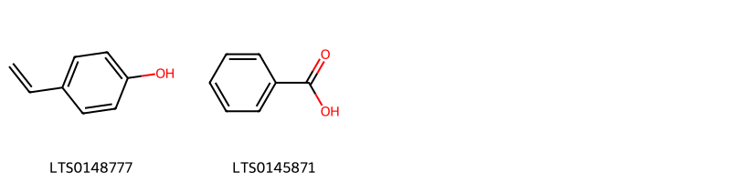
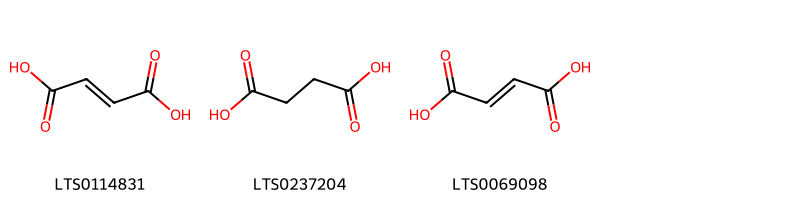
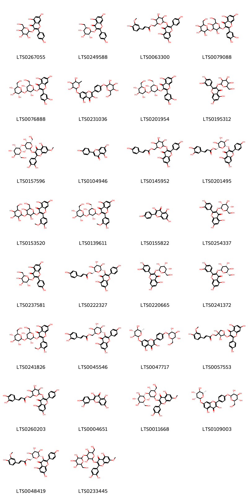
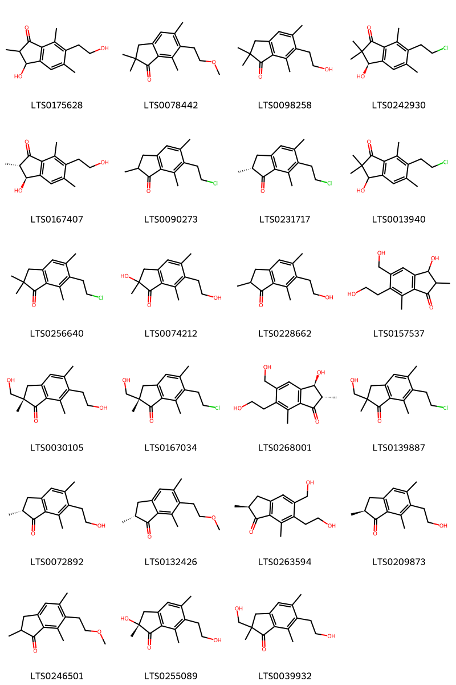
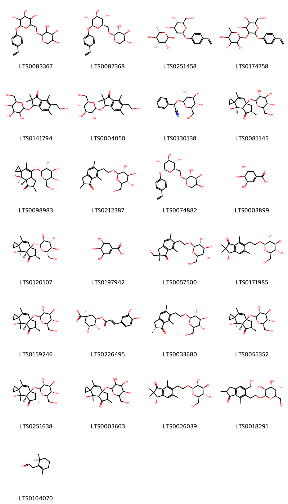
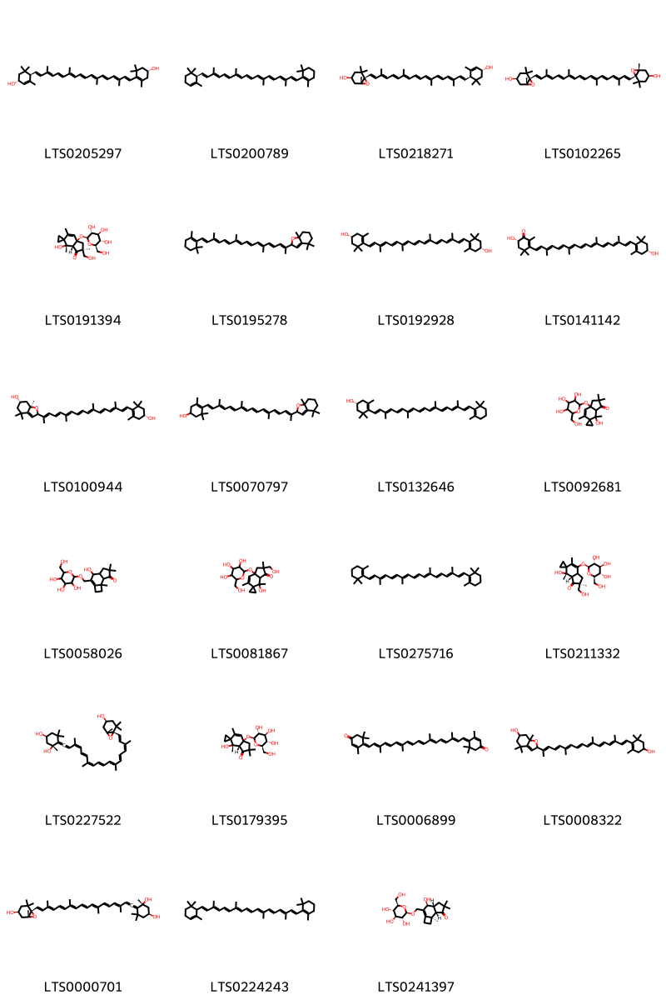
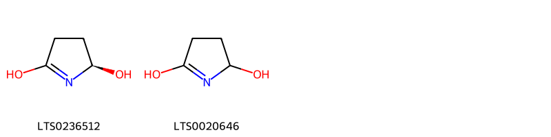
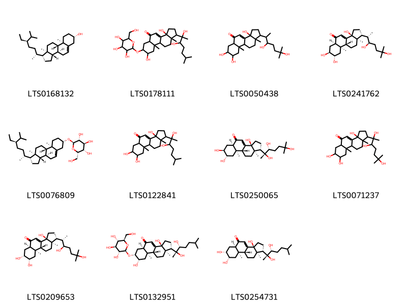

!!! abstract "Tóm tắt"

    Họ Dennstaedtiaceae gồm khoảng 2 chi và 2 loài được một số cộng đồng tại các quốc gia như US(Amerindian), Hawaii, Canada(Salish), US, Elsewhere, China sử dụng trong một số trường hợp MYMEMORY WARNING: YOU USED ALL AVAILABLE FREE TRANSLATIONS FOR TODAY. NEXT AVAILABLE IN  14 HOURS 12 MINUTES 49 SECONDS VISIT HTTPS://MYMEMORY.TRANSLATED.NET/DOC/USAGELIMITS.PHP TO TRANSLATE MORE.

!!! info "DrDuke"

    James A. Duke sinh năm 1929-2017 là một nhà thực vật học người Mỹ. Đây là một trong những tác giả hàng đầu trong lĩnh vực dược dân tộc học với cuốn *CRC Handbook of Medicinal Herbs* và chính là người xây dựng lên cơ sở dữ liệu về hợp chất tự nhiên và dược dân tộc học tại Bộ nông nghiệp Hoa Kỳ. Các thông tin được đăng tải tại website [Dr. Duke's Phytochemical and Ethnobotanical Databases](https://phytochem.nal.usda.gov/). 
    Trong suốt thập niên 1970, ông lãnh đạo the Plant Taxonomy Laboratory, Plant Genetics and Germplasm Institute of the Agricultural Research Service, U.S. Department of Agriculture.
    Trong tài liệu này, các thông tin về dược dân tộc của các dược liệu được trích dẫn từ tài liệu của James A. Ducke với sự trợ giúp của phần mềm dịch thuật từ tiếng Anh sang tiếng Việt.
   

# Chi henomeris

??? note "Danh sách các dược liệu thuộc chi"
    
	 - *henomeris chusana*

---
## henomeris chusana
### Thông tin về thực vật

!!! info "Phân loại thực vật của *N/A* từ GIBF:"
    - **Kingdom:** N/A
    - **Phylum:** N/A
    - **Order:** N/A
    - **Family:** N/A
    - **Genus:** N/A
    - **Species:** *N/A*

 

| Label (VI)   | Label (EN)   | Scientific Name   | Descriptions (VI)   | Descriptions (EN)   | Also Known As (VI)   | Also Known As (EN)   |
|:-------------|:-------------|:------------------|:--------------------|:--------------------|:---------------------|:---------------------|
| N/A          | N/A          | Rinorea anguifera | loài thực vật       | species of plant    | ['']                 | ['']                 |

#### Phân bố trên thế giới

**Từ CSDL GIBF** Không có kết quả phù hợp

#### Phân bố tại Việt Nam

**Từ CSDL GIBF**: Không có ghi nhận ở Việt Nam

---
### Thành phần hóa học
        
- Theo cơ sở dữ liệu lotus: Từ loài *N/A* đã phân lập và xác định được Chưa có hoạt chất nào được phân lập. hoạt chất thuộc về các nhóm Không có hoạt chất nào được phân lập. 

Không có hình ảnh nào được tạo ra

---

### Dược dân tộc học

Danh sách các quốc gia có sử dụng *N/A* trong điều trị các bệnh. 

| Country   | Disease   | Bệnh                                                                                                                                                                                                |
|:----------|:----------|:----------------------------------------------------------------------------------------------------------------------------------------------------------------------------------------------------|
| Hawaii    | Laxative  | MYMEMORY WARNING: YOU USED ALL AVAILABLE FREE TRANSLATIONS FOR TODAY. NEXT AVAILABLE IN  14 HOURS 12 MINUTES 45 SECONDS VISIT HTTPS://MYMEMORY.TRANSLATED.NET/DOC/USAGELIMITS.PHP TO TRANSLATE MORE |

---

# Chi Pteridium

??? note "Danh sách các dược liệu thuộc chi"
    
	 - *Pteridium aquilinum*

---
## Pteridium aquilinum
### Thông tin về thực vật

!!! info "Phân loại thực vật của *Pteridium aquilinum* từ GIBF:"
    - **Kingdom:** Plantae
    - **Phylum:** Tracheophyta
    - **Order:** Polypodiales
    - **Family:** Dennstaedtiaceae
    - **Genus:** Pteridium
    - **Species:** *Pteridium aquilinum*

 

| Label (VI)   | Label (EN)   | Scientific Name     | Descriptions (VI)   | Descriptions (EN)   | Also Known As (VI)   | Also Known As (EN)                                                                   |
|:-------------|:-------------|:--------------------|:--------------------|:--------------------|:---------------------|:-------------------------------------------------------------------------------------|
| N/A          | N/A          | Pteridium aquilinum | loài thực vật       | species of plant    | ['']                 | ['bracken', 'common bracken', 'lady bracken', 'brake', 'bracken fern', 'eagle fern'] |

#### Phân bố trên thế giới

**Từ CSDL GIBF** Viet Nam, Honduras, Türkiye, Thailand, Spain, Poland, Netherlands, Montenegro, United States of America, Greece, Indonesia, Russian Federation, Malawi, Mexico, Kenya, Eswatini, United Kingdom of Great Britain and Northern Ireland, Chinese Taipei, Malaysia, Canada, Germany, Isle of Man, Austria, Cambodia, Portugal, South Africa, Italy, France, Ireland

#### Phân bố tại Việt Nam

**Từ CSDL GIBF**: Lâm Đồng

---
### Thành phần hóa học
        
- Theo cơ sở dữ liệu lotus: Từ loài *Pteridium aquilinum* đã phân lập và xác định được 125 hoạt chất thuộc về các nhóm Benzene and substituted derivatives, Flavonoids, Carboxylic acids and derivatives, Coumarins and derivatives, Cinnamic acids and derivatives, Steroids and steroid derivatives, Pyrrolidines, Glycerolipids, Organooxygen compounds, Prenol lipids, Indanes. 

|    | chemicalTaxonomyClassyfireClass     |   smiles_count |
|---:|:------------------------------------|---------------:|
|  0 | Benzene and substituted derivatives |              2 |
|  1 | Carboxylic acids and derivatives    |              3 |
|  2 | Cinnamic acids and derivatives      |              2 |
|  3 | Coumarins and derivatives           |              1 |
|  4 | Flavonoids                          |             30 |
|  5 | Glycerolipids                       |              2 |
|  6 | Indanes                             |             23 |
|  7 | Organooxygen compounds              |             25 |
|  8 | Prenol lipids                       |             23 |
|  9 | Pyrrolidines                        |              2 |
| 10 | Steroids and steroid derivatives    |             11 |

#### Nhóm Benzene and substituted derivatives
<figure markdown="span">
    { width=100% }
    <figcaption>Hình ảnh cấu trúc hóa học của 2 hoạt chất thuộc nhóm Benzene and substituted derivatives gồm ['4-vinylphenol (LTS0148777)', 'benzoic acid (LTS0145871)'].</figcaption>
</figure>
#### Nhóm Carboxylic acids and derivatives
<figure markdown="span">
    { width=100% }
    <figcaption>Hình ảnh cấu trúc hóa học của 3 hoạt chất thuộc nhóm Carboxylic acids and derivatives gồm ['fumaric acid (LTS0114831)', 'succinic acid (LTS0237204)', 'butenedioic acid (LTS0069098)'].</figcaption>
</figure>
#### Nhóm Cinnamic acids and derivatives
<figure markdown="span">
    { width=100% }
    <figcaption>Hình ảnh cấu trúc hóa học của 2 hoạt chất thuộc nhóm Cinnamic acids and derivatives gồm ['5-o-caffeoylshikimic acid (LTS0092117)', '5-{[3-(3,4-dihydroxyphenyl)prop-2-enoyl]oxy}-3,4-dihydroxycyclohex-1-ene-1-carboxylic acid (LTS0072581)'].</figcaption>
</figure>
#### Nhóm Coumarins and derivatives
<figure markdown="span">
    { width=100% }
    <figcaption>Hình ảnh cấu trúc hóa học của 1 hoạt chất thuộc nhóm Coumarins and derivatives gồm ['2h-1-benzopyran-2-one (LTS0069773)'].</figcaption>
</figure>
#### Nhóm Flavonoids
<figure markdown="span">
    { width=100% }
    <figcaption>Hình ảnh cấu trúc hóa học của 30 hoạt chất thuộc nhóm Flavonoids gồm ['trifolin (LTS0267055)', 'astragalin (LTS0249588)', '(6-{[5,7-dihydroxy-2-(4-hydroxyphenyl)-4-oxochromen-3-yl]oxy}-3,4,5-trihydroxyoxan-2-yl)methyl 3-(4-hydroxy-3-methoxyphenyl)prop-2-enoate (LTS0063300)', '3-{[3,5-dihydroxy-6-(hydroxymethyl)-4-{[3,4,5-trihydroxy-6-(hydroxymethyl)oxan-2-yl]oxy}oxan-2-yl]oxy}-2-(3,4-dihydroxyphenyl)-5,7-dihydroxychromen-4-one (LTS0079088)', '3-{[(2s,3r,4s,5r,6r)-3,5-dihydroxy-6-(hydroxymethyl)-4-{[(2s,3r,4s,5s,6r)-3,4,5-trihydroxy-6-(hydroxymethyl)oxan-2-yl]oxy}oxan-2-yl]oxy}-2-(3,4-dihydroxyphenyl)-5,7-dihydroxychromen-4-one (LTS0076888)', '3,5-dihydroxy-2-(4-{[3,4,5-trihydroxy-6-(hydroxymethyl)oxan-2-yl]oxy}phenyl)-7-[(3,4,5-trihydroxy-6-methyloxan-2-yl)oxy]chromen-4-one (LTS0231036)', '3-{[(2s,3r,4s,5r,6s)-3,5-dihydroxy-6-(hydroxymethyl)-4-{[(2s,3r,4s,5s,6r)-3,4,5-trihydroxy-6-(hydroxymethyl)oxan-2-yl]oxy}oxan-2-yl]oxy}-2-(3,4-dihydroxyphenyl)-5,7-dihydroxychromen-4-one (LTS0201954)', '2-(3,4-dihydroxyphenyl)-5,7-dihydroxy-3-{[3,4,5-trihydroxy-6-(hydroxymethyl)oxan-2-yl]oxy}chromen-4-one (LTS0195312)', '3-{[(2s,3r,4s,5r,6s)-3,5-dihydroxy-6-(hydroxymethyl)-4-{[(2s,3s,4s,5s,6r)-3,4,5-trihydroxy-6-(hydroxymethyl)oxan-2-yl]oxy}oxan-2-yl]oxy}-2-(3,4-dihydroxyphenyl)-5-hydroxy-7-methoxychromen-4-one (LTS0157596)', 'chamomile (LTS0104946)', '(6-{[5,7-dihydroxy-2-(4-hydroxyphenyl)-4-oxochromen-3-yl]oxy}-3,4,5-trihydroxyoxan-2-yl)methyl 3-(4-hydroxyphenyl)prop-2-enoate (LTS0145952)', '[(2r,3s,4s,5r,6s)-6-{[5,7-dihydroxy-2-(4-hydroxyphenyl)-4-oxochromen-3-yl]oxy}-3,4,5-trihydroxyoxan-2-yl]methyl (2e)-3-(3,4-dihydroxyphenyl)prop-2-enoate (LTS0201495)', '3-{[3,5-dihydroxy-6-(hydroxymethyl)-4-{[3,4,5-trihydroxy-6-(hydroxymethyl)oxan-2-yl]oxy}oxan-2-yl]oxy}-5,7-dihydroxy-2-(4-hydroxy-3-methoxyphenyl)chromen-4-one (LTS0153520)', '3-{[(2s,3r,4s,5r,6s)-3,5-dihydroxy-6-(hydroxymethyl)-4-{[(2s,3r,4s,5s,6r)-3,4,5-trihydroxy-6-(hydroxymethyl)oxan-2-yl]oxy}oxan-2-yl]oxy}-5,7-dihydroxy-2-(4-hydroxy-3-methoxyphenyl)chromen-4-one (LTS0139611)', 'kaempherol (LTS0155822)', 'isoquercetin (LTS0254337)', 'trifolin (LTS0237581)', 'tiliroside (LTS0222327)', '2-(3,4-dihydroxyphenyl)-5,7-dihydroxy-3-{[(2s,3r,4r,5s,6r)-3,4,5-trihydroxy-6-(hydroxymethyl)oxan-2-yl]oxy}chromen-4-one (LTS0220665)', '2-(3,4-dihydroxyphenyl)-5,7-dihydroxy-3-{[(2s,3r,4r,5r,6s)-3,4,5-trihydroxy-6-(hydroxymethyl)oxan-2-yl]oxy}chromen-4-one (LTS0241372)', '3-{[(2s,3r,4s,5r,6r)-3,5-dihydroxy-6-(hydroxymethyl)-4-{[(2s,3r,4s,5s,6r)-3,4,5-trihydroxy-6-(hydroxymethyl)oxan-2-yl]oxy}oxan-2-yl]oxy}-5,7-dihydroxy-2-(4-hydroxy-3-methoxyphenyl)chromen-4-one (LTS0241826)', '[(2s,3s,4s,5r,6s)-6-{[5,7-dihydroxy-2-(4-hydroxyphenyl)-4-oxochromen-3-yl]oxy}-3,4,5-trihydroxyoxan-2-yl]methyl (2e)-3-(3,4-dihydroxyphenyl)prop-2-enoate (LTS0045546)', '3,5-dihydroxy-2-(4-{[(2s,3r,4s,5s,6r)-3,4,5-trihydroxy-6-(hydroxymethyl)oxan-2-yl]oxy}phenyl)-7-{[(2s,3s,4r,5r,6s)-3,4,5-trihydroxy-6-methyloxan-2-yl]oxy}chromen-4-one (LTS0047717)', '[(3r,4s,5s)-5-{[5,7-dihydroxy-2-(4-hydroxyphenyl)-4-oxochromen-3-yl]oxy}-3,4-dihydroxyoxolan-3-yl]methyl (2e)-3-(4-hydroxy-3-methoxyphenyl)prop-2-enoate (LTS0057553)', '(6-{[5,7-dihydroxy-2-(4-hydroxyphenyl)-4-oxochromen-3-yl]oxy}-3,4,5-trihydroxyoxan-2-yl)methyl 3-(3,4-dihydroxyphenyl)prop-2-enoate (LTS0260203)', 'quercetin (LTS0004651)', '3-{[(2s,3r,4s,5r,6r)-3,5-dihydroxy-6-(hydroxymethyl)-4-{[(2s,3r,4s,5s,6r)-3,4,5-trihydroxy-6-(hydroxymethyl)oxan-2-yl]oxy}oxan-2-yl]oxy}-2-(3,4-dihydroxyphenyl)-5-hydroxy-7-methoxychromen-4-one (LTS0011668)', '3,5-dihydroxy-2-(4-{[(2s,3r,4s,5s,6r)-3,4,5-trihydroxy-6-(hydroxymethyl)oxan-2-yl]oxy}phenyl)-7-{[(2s,3r,4r,5r,6s)-3,4,5-trihydroxy-6-methyloxan-2-yl]oxy}chromen-4-one (LTS0109003)', '[(2r,3s,4s,5r,6s)-6-{[5,7-dihydroxy-2-(4-hydroxyphenyl)-4-oxochromen-3-yl]oxy}-3,4,5-trihydroxyoxan-2-yl]methyl (2e)-3-(4-hydroxy-3-methoxyphenyl)prop-2-enoate (LTS0048419)', '3-{[3,5-dihydroxy-6-(hydroxymethyl)-4-{[3,4,5-trihydroxy-6-(hydroxymethyl)oxan-2-yl]oxy}oxan-2-yl]oxy}-2-(3,4-dihydroxyphenyl)-5-hydroxy-7-methoxychromen-4-one (LTS0233445)'].</figcaption>
</figure>
#### Nhóm Glycerolipids
<figure markdown="span">
    { width=100% }
    <figcaption>Hình ảnh cấu trúc hóa học của 2 hoạt chất thuộc nhóm Glycerolipids gồm ['glyceryl stearate (LTS0073221)', '3-stearoyl-sn-glycerol (LTS0156323)'].</figcaption>
</figure>
#### Nhóm Indanes
<figure markdown="span">
    { width=100% }
    <figcaption>Hình ảnh cấu trúc hóa học của 23 hoạt chất thuộc nhóm Indanes gồm ['3-hydroxy-6-(2-hydroxyethyl)-2,5,7-trimethyl-2,3-dihydroinden-1-one (LTS0175628)', '6-(2-methoxyethyl)-2,2,5,7-tetramethyl-3h-inden-1-one (LTS0078442)', '6-(2-hydroxyethyl)-2,2,5,7-tetramethyl-3h-inden-1-one (LTS0098258)', '(3r)-6-(2-chloroethyl)-3-hydroxy-2,2,5,7-tetramethyl-3h-inden-1-one (LTS0242930)', '(2s,3s)-pterosin c (LTS0167407)', '6-(2-chloroethyl)-2,5,7-trimethyl-2,3-dihydroinden-1-one (LTS0090273)', '(2r)-6-(2-chloroethyl)-2,5,7-trimethyl-2,3-dihydroinden-1-one (LTS0231717)', '6-(2-chloroethyl)-3-hydroxy-2,2,5,7-tetramethyl-3h-inden-1-one (LTS0013940)', '6-(2-chloroethyl)-2,2,5,7-tetramethyl-3h-inden-1-one (LTS0256640)', '2-hydroxy-6-(2-hydroxyethyl)-2,5,7-trimethyl-3h-inden-1-one (LTS0074212)', '6-(2-hydroxyethyl)-2,5,7-trimethyl-2,3-dihydroinden-1-one (LTS0228662)', '3-hydroxy-6-(2-hydroxyethyl)-5-(hydroxymethyl)-2,7-dimethyl-2,3-dihydroinden-1-one (LTS0157537)', '(2s)-6-(2-hydroxyethyl)-2-(hydroxymethyl)-2,5,7-trimethyl-3h-inden-1-one (LTS0030105)', '(2s)-6-(2-chloroethyl)-2-(hydroxymethyl)-2,5,7-trimethyl-3h-inden-1-one (LTS0167034)', '(2s,3s)-3-hydroxy-6-(2-hydroxyethyl)-5-(hydroxymethyl)-2,7-dimethyl-2,3-dihydroinden-1-one (LTS0268001)', '6-(2-chloroethyl)-2-(hydroxymethyl)-2,5,7-trimethyl-3h-inden-1-one (LTS0139887)', '(2r)-6-(2-hydroxyethyl)-2,5,7-trimethyl-2,3-dihydroinden-1-one (LTS0072892)', '(2r)-6-(2-methoxyethyl)-2,5,7-trimethyl-2,3-dihydroinden-1-one (LTS0132426)', '(2s)-6-(2-hydroxyethyl)-5-(hydroxymethyl)-2,7-dimethyl-2,3-dihydroinden-1-one (LTS0263594)', '(2s)-6-(2-hydroxyethyl)-2,5,7-trimethyl-2,3-dihydroinden-1-one (LTS0209873)', '6-(2-methoxyethyl)-2,5,7-trimethyl-2,3-dihydroinden-1-one (LTS0246501)', '(2r)-2-hydroxy-6-(2-hydroxyethyl)-2,5,7-trimethyl-3h-inden-1-one (LTS0255089)', '6-(2-hydroxyethyl)-2-(hydroxymethyl)-2,5,7-trimethyl-3h-inden-1-one (LTS0039932)'].</figcaption>
</figure>
#### Nhóm Organooxygen compounds
<figure markdown="span">
    { width=100% }
    <figcaption>Hình ảnh cấu trúc hóa học của 25 hoạt chất thuộc nhóm Organooxygen compounds gồm ['2-(4-ethenylphenoxy)-6-{[(3,4,5-trihydroxyoxan-2-yl)oxy]methyl}oxane-3,4,5-triol (LTS0083367)', '(2s,3r,4s,5s,6r)-2-(4-ethenylphenoxy)-6-({[(2s,3r,4s,5r)-3,4,5-trihydroxyoxan-2-yl]oxy}methyl)oxane-3,4,5-triol (LTS0087368)', '(2s,3r,4r,5r,6s)-2-{[(2s,3r,4s,5s,6r)-2-(4-ethenylphenoxy)-4,5-dihydroxy-6-(hydroxymethyl)oxan-3-yl]oxy}-6-methyloxane-3,4,5-triol (LTS0251458)', '2-{[2-(4-ethenylphenoxy)-4,5-dihydroxy-6-(hydroxymethyl)oxan-3-yl]oxy}-6-methyloxane-3,4,5-triol (LTS0174758)', '6-(2-hydroxyethyl)-2,2,5,7-tetramethyl-3-{[3,4,5-trihydroxy-6-(hydroxymethyl)oxan-2-yl]oxy}-3h-inden-1-one (LTS0141794)', '(3r)-6-(2-hydroxyethyl)-2,2,5,7-tetramethyl-3-{[(2r,3r,4s,5s,6r)-3,4,5-trihydroxy-6-(hydroxymethyl)oxan-2-yl]oxy}-3h-inden-1-one (LTS0004050)', 'prunasin (LTS0130138)', 'ptaquiloside (LTS0081145)', "(2'r,3'as,4'r)-4'-hydroxy-2',4',6'-trimethyl-7'-{[(2s,3r,4s,5s,6r)-3,4,5-trihydroxy-6-(hydroxymethyl)oxan-2-yl]oxy}-1',2',3'a,7'a-tetrahydrospiro[cyclopropane-1,5'-inden]-3'-one (LTS0098983)", '2,5,7-trimethyl-6-(2-{[(2r,3r,4s,5s,6r)-3,4,5-trihydroxy-6-(hydroxymethyl)oxan-2-yl]oxy}ethyl)-2,3-dihydroinden-1-one (LTS0212387)', '(2r,3r,4s,5s,6r)-2-(4-ethenylphenoxy)-6-({[(2s,3r,4s,5s)-3,4,5-trihydroxyoxan-2-yl]oxy}methyl)oxane-3,4,5-triol (LTS0074882)', '(-)-shikimate (LTS0003899)', "(2'r,3'ar,4'r,7'ar)-4'-hydroxy-2',4',6'-trimethyl-7'a-{[(2r,3s,4r,5r,6s)-3,4,5-trihydroxy-6-(hydroxymethyl)oxan-2-yl]oxy}-2',3'a-dihydro-1'h-spiro[cyclopropane-1,5'-inden]-3'-one (LTS0120107)", 'shikimate (LTS0197942)', '(2s)-2-(hydroxymethyl)-2,5,7-trimethyl-6-(2-{[(2r,3r,4s,5s,6r)-3,4,5-trihydroxy-6-(hydroxymethyl)oxan-2-yl]oxy}ethyl)-3h-inden-1-one (LTS0057500)', '(3s)-3-hydroxy-2,2,5,7-tetramethyl-6-(2-{[(2r,3r,4s,5s,6r)-3,4,5-trihydroxy-6-(hydroxymethyl)oxan-2-yl]oxy}ethyl)-3h-inden-1-one (LTS0171985)', 'ptaquiloside (LTS0159246)', 'chlorogenic acid (LTS0226495)', '(2r)-2,5,7-trimethyl-6-(2-{[(2r,3r,4s,5s,6r)-3,4,5-trihydroxy-6-(hydroxymethyl)oxan-2-yl]oxy}ethyl)-2,3-dihydroinden-1-one (LTS0033680)', "(2'r,3'ar,4'r,7'ar)-4'-hydroxy-2',4',6'-trimethyl-7'a-{[(2s,3r,4s,5s,6r)-3,4,5-trihydroxy-6-(hydroxymethyl)oxan-2-yl]oxy}-2',3'a-dihydro-1'h-spiro[cyclopropane-1,5'-inden]-3'-one (LTS0055352)", "(2's,3'ar,4's,7'ar)-4'-hydroxy-2',4',6'-trimethyl-7'a-{[(2s,3r,4s,5s,6r)-3,4,5-trihydroxy-6-(hydroxymethyl)oxan-2-yl]oxy}-2',3'a-dihydro-1'h-spiro[cyclopropane-1,5'-inden]-3'-one (LTS0251638)", "4'-hydroxy-2',4',6'-trimethyl-7'a-{[3,4,5-trihydroxy-6-(hydroxymethyl)oxan-2-yl]oxy}-2',3'a-dihydro-1'h-spiro[cyclopropane-1,5'-inden]-3'-one (LTS0003603)", '(3s)-3-hydroxy-2,2,5,7-tetramethyl-6-(2-{[(2r,3s,4s,5s,6r)-3,4,5-trihydroxy-6-(hydroxymethyl)oxan-2-yl]oxy}ethyl)-3h-inden-1-one (LTS0026039)', '(2s)-5-(hydroxymethyl)-2,7-dimethyl-6-(2-{[(2r,3s,4s,5s,6r)-3,4,5-trihydroxy-6-(hydroxymethyl)oxan-2-yl]oxy}ethyl)-2,3-dihydroinden-1-one (LTS0018291)', 'β-homocyclocitral (LTS0104070)'].</figcaption>
</figure>
#### Nhóm Prenol lipids
<figure markdown="span">
    { width=100% }
    <figcaption>Hình ảnh cấu trúc hóa học của 23 hoạt chất thuộc nhóm Prenol lipids gồm ['carotenoid (LTS0205297)', '(+)-α-carotene (LTS0200789)', 'taraxanthin (LTS0218271)', 'violaxanthin (LTS0102265)', "(2's,3'ar,4's,7'ar)-4'-hydroxy-2'-(hydroxymethyl)-2',4',6'-trimethyl-7'a-{[(2s,3r,4s,5s,6r)-3,4,5-trihydroxy-6-(hydroxymethyl)oxan-2-yl]oxy}-1',3'a-dihydrospiro[cyclopropane-1,5'-inden]-3'-one (LTS0191394)", 'mutatochrome (LTS0195278)', 'zeaxanthin (LTS0192928)', 'doradexanthin (LTS0141142)', '(6s,7ar)-2-[(2e,4e,6e,8e,10e,12e,14e,16e)-17-[(4r)-4-hydroxy-2,6,6-trimethylcyclohex-1-en-1-yl]-6,11,15-trimethylheptadeca-2,4,6,8,10,12,14,16-octaen-2-yl]-4,4,7a-trimethyl-2,5,6,7-tetrahydro-1-benzofuran-6-ol (LTS0100944)', '4-[(1e,3e,5e,7e,9e,11e,13e,15e)-16-(4,4,7a-trimethyl-2,5,6,7-tetrahydro-1-benzofuran-2-yl)-3,7,12-trimethylheptadeca-1,3,5,7,9,11,13,15-octaen-1-yl]-3,5,5-trimethylcyclohex-3-en-1-ol (LTS0070797)', 'cryptoxanthin (LTS0132646)', "4'-hydroxy-2',2',4',6'-tetramethyl-7'a-{[3,4,5-trihydroxy-6-(hydroxymethyl)oxan-2-yl]oxy}-1',3'a-dihydrospiro[cyclopropane-1,5'-inden]-3'-one (LTS0092681)", '4-hydroxy-6,6,7b-trimethyl-3-({[3,4,5-trihydroxy-6-(hydroxymethyl)oxan-2-yl]oxy}methyl)-1h,2h,4h,4ah,5h,7ah-cyclobuta[e]inden-7-one (LTS0058026)', "4'-hydroxy-2'-(hydroxymethyl)-2',4',6'-trimethyl-7'a-{[3,4,5-trihydroxy-6-(hydroxymethyl)oxan-2-yl]oxy}-1',3'a-dihydrospiro[cyclopropane-1,5'-inden]-3'-one (LTS0081867)", 'β-carotene (LTS0275716)', "(2's,3'as,4's)-4'-hydroxy-2'-(hydroxymethyl)-2',4',6'-trimethyl-7'-{[(2s,3r,4s,5s,6r)-3,4,5-trihydroxy-6-(hydroxymethyl)oxan-2-yl]oxy}-3'a,7'a-dihydro-1'h-spiro[cyclopropane-1,5'-inden]-3'-one (LTS0211332)", 'neoxanthin (LTS0227522)', "(3'ar,4's,7'ar)-4'-hydroxy-2',2',4',6'-tetramethyl-7'a-{[(2s,3r,4s,5s,6r)-3,4,5-trihydroxy-6-(hydroxymethyl)oxan-2-yl]oxy}-1',3'a-dihydrospiro[cyclopropane-1,5'-inden]-3'-one (LTS0179395)", 'rhodoxanthin (LTS0006899)', '2-[(2e,4e,6e,8e,10e,12e,14e,16e)-17-(4-hydroxy-2,6,6-trimethylcyclohex-1-en-1-yl)-6,11,15-trimethylheptadeca-2,4,6,8,10,12,14,16-octaen-2-yl]-4,4,7a-trimethyl-2,5,6,7-tetrahydro-1-benzofuran-6-ol (LTS0008322)', 'neoxanthin (LTS0000701)', 'α-carotene (LTS0224243)', '(4s,4ar,7as,7br)-4-hydroxy-6,6,7b-trimethyl-3-({[(2r,3r,4s,5s,6r)-3,4,5-trihydroxy-6-(hydroxymethyl)oxan-2-yl]oxy}methyl)-1h,2h,4h,4ah,5h,7ah-cyclobuta[e]inden-7-one (LTS0241397)'].</figcaption>
</figure>
#### Nhóm Pyrrolidines
<figure markdown="span">
    { width=100% }
    <figcaption>Hình ảnh cấu trúc hóa học của 2 hoạt chất thuộc nhóm Pyrrolidines gồm ['(2r)-3,4-dihydro-2h-pyrrole-2,5-diol (LTS0236512)', '3,4-dihydro-2h-pyrrole-2,5-diol (LTS0020646)'].</figcaption>
</figure>
#### Nhóm Steroids and steroid derivatives
<figure markdown="span">
    { width=100% }
    <figcaption>Hình ảnh cấu trúc hóa học của 11 hoạt chất thuộc nhóm Steroids and steroid derivatives gồm ['sitosterol (LTS0168132)', '1-(2,3-dihydroxy-6-methylheptan-2-yl)-3a,8-dihydroxy-9a,11a-dimethyl-7-{[3,4,5-trihydroxy-6-(hydroxymethyl)oxan-2-yl]oxy}-1h,2h,3h,5ah,6h,7h,8h,9h,9bh,10h,11h-cyclopenta[a]phenanthren-5-one (LTS0178111)', '1-(3,6-dihydroxy-6-methylheptan-2-yl)-3a,7,8-trihydroxy-9a,11a-dimethyl-1h,2h,3h,5ah,6h,7h,8h,9h,9bh,10h,11h-cyclopenta[a]phenanthren-5-one (LTS0050438)', '3-epiecdysone (LTS0241762)', '(2r,3r,4s,5s,6s)-2-{[(1r,3as,3bs,7s,9ar,9bs,11ar)-1-[(2r,5r)-5-ethyl-6-methylheptan-2-yl]-9a,11a-dimethyl-1h,2h,3h,3ah,3bh,4h,6h,7h,8h,9h,9bh,10h,11h-cyclopenta[a]phenanthren-7-yl]oxy}-6-(hydroxymethyl)oxane-3,4,5-triol (LTS0076809)', '1-(2,3-dihydroxy-6-methylheptan-2-yl)-3a,7,8-trihydroxy-9a,11a-dimethyl-1h,2h,3h,5ah,6h,7h,8h,9h,9bh,10h,11h-cyclopenta[a]phenanthren-5-one (LTS0122841)', '(1s,3as,5ar,7s,8s,9ar,9br,11ar)-3a,7,8-trihydroxy-9a,11a-dimethyl-1-[(2r,3r)-2,3,6-trihydroxy-6-methylheptan-2-yl]-1h,2h,3h,5ah,6h,7h,8h,9h,9bh,10h,11h-cyclopenta[a]phenanthren-5-one (LTS0250065)', '3a,7,8-trihydroxy-9a,11a-dimethyl-1-(2,3,6-trihydroxy-6-methylheptan-2-yl)-1h,2h,3h,5ah,6h,7h,8h,9h,9bh,10h,11h-cyclopenta[a]phenanthren-5-one (LTS0071237)', 'ecdysone (LTS0209653)', 'ponasteroside a (LTS0132951)', 'ponasterone a (LTS0254731)'].</figcaption>
</figure>

---

### Dược dân tộc học

Danh sách các quốc gia có sử dụng *Pteridium aquilinum* trong điều trị các bệnh. 

| Country        | Disease                                               | Bệnh                                                                                                                                                                                                |
|:---------------|:------------------------------------------------------|:----------------------------------------------------------------------------------------------------------------------------------------------------------------------------------------------------|
| Canada(Salish) | Sialogogue                                            | MYMEMORY WARNING: YOU USED ALL AVAILABLE FREE TRANSLATIONS FOR TODAY. NEXT AVAILABLE IN  14 HOURS 12 MINUTES 20 SECONDS VISIT HTTPS://MYMEMORY.TRANSLATED.NET/DOC/USAGELIMITS.PHP TO TRANSLATE MORE |
| China          | Sedative, Tonic                                       | MYMEMORY WARNING: YOU USED ALL AVAILABLE FREE TRANSLATIONS FOR TODAY. NEXT AVAILABLE IN  14 HOURS 12 MINUTES 15 SECONDS VISIT HTTPS://MYMEMORY.TRANSLATED.NET/DOC/USAGELIMITS.PHP TO TRANSLATE MORE |
| Elsewhere      | nan, Poison, Poison, Taenifuge, Astringent, Vermifuge | MYMEMORY WARNING: YOU USED ALL AVAILABLE FREE TRANSLATIONS FOR TODAY. NEXT AVAILABLE IN  14 HOURS 12 MINUTES 11 SECONDS VISIT HTTPS://MYMEMORY.TRANSLATED.NET/DOC/USAGELIMITS.PHP TO TRANSLATE MORE |
| US             | Carcinogenic, Mutagenic, Vermifuge, Poison            | MYMEMORY WARNING: YOU USED ALL AVAILABLE FREE TRANSLATIONS FOR TODAY. NEXT AVAILABLE IN  14 HOURS 12 MINUTES 08 SECONDS VISIT HTTPS://MYMEMORY.TRANSLATED.NET/DOC/USAGELIMITS.PHP TO TRANSLATE MORE |
| US(Amerindian) | Diuretic, Vermifuge                                   | MYMEMORY WARNING: YOU USED ALL AVAILABLE FREE TRANSLATIONS FOR TODAY. NEXT AVAILABLE IN  14 HOURS 12 MINUTES 05 SECONDS VISIT HTTPS://MYMEMORY.TRANSLATED.NET/DOC/USAGELIMITS.PHP TO TRANSLATE MORE |

---

