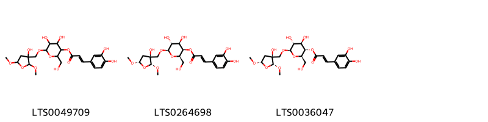
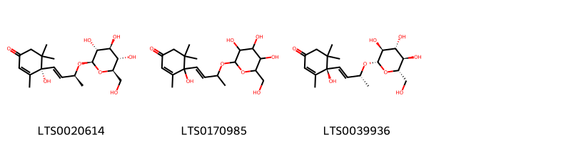
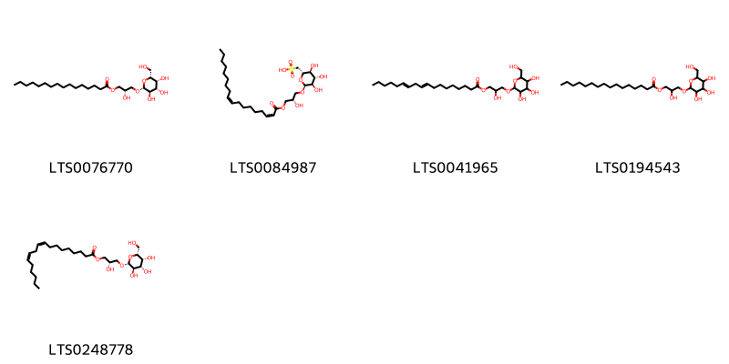
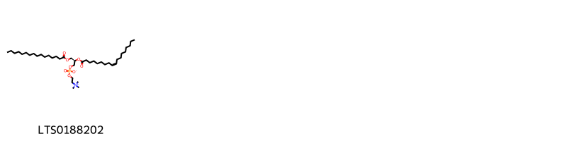
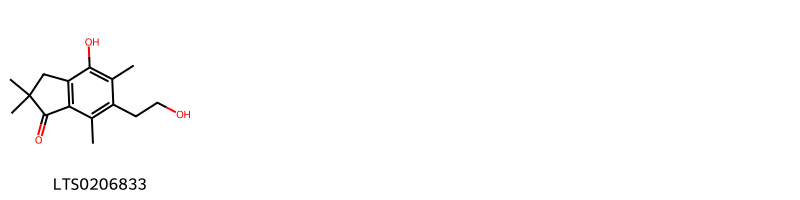
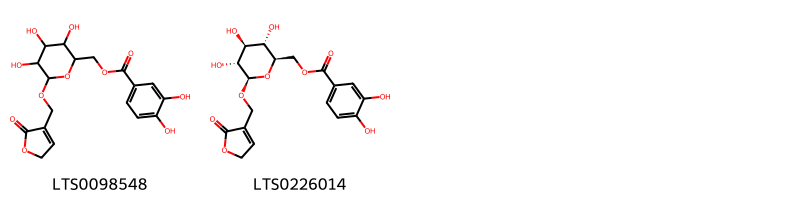
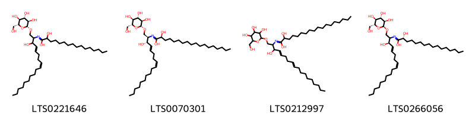

!!! abstract "Tóm tắt"

    Họ Dicksoniaceae gồm khoảng 2 chi và 3 loài được một số cộng đồng tại các quốc gia như Elsewhere, Hawaii, China, Malaya sử dụng trong một số trường hợp MYMEMORY WARNING: YOU USED ALL AVAILABLE FREE TRANSLATIONS FOR TODAY. NEXT AVAILABLE IN  15 HOURS 57 MINUTES 59 SECONDS VISIT HTTPS://MYMEMORY.TRANSLATED.NET/DOC/USAGELIMITS.PHP TO TRANSLATE MORE.

!!! info "DrDuke"

    James A. Duke sinh năm 1929-2017 là một nhà thực vật học người Mỹ. Đây là một trong những tác giả hàng đầu trong lĩnh vực dược dân tộc học với cuốn *CRC Handbook of Medicinal Herbs* và chính là người xây dựng lên cơ sở dữ liệu về hợp chất tự nhiên và dược dân tộc học tại Bộ nông nghiệp Hoa Kỳ. Các thông tin được đăng tải tại website [Dr. Duke's Phytochemical and Ethnobotanical Databases](https://phytochem.nal.usda.gov/). 
    Trong suốt thập niên 1970, ông lãnh đạo the Plant Taxonomy Laboratory, Plant Genetics and Germplasm Institute of the Agricultural Research Service, U.S. Department of Agriculture.
    Trong tài liệu này, các thông tin về dược dân tộc của các dược liệu được trích dẫn từ tài liệu của James A. Ducke với sự trợ giúp của phần mềm dịch thuật từ tiếng Anh sang tiếng Việt.
   

# Chi Dicksonia

??? note "Danh sách các dược liệu thuộc chi"
    
	 - *Dicksonia blumei*

---
## Dicksonia blumei
### Thông tin về thực vật

!!! info "Phân loại thực vật của *Dicksonia blumei* từ GIBF:"
    - **Kingdom:** Plantae
    - **Phylum:** Tracheophyta
    - **Order:** Cyatheales
    - **Family:** Dicksoniaceae
    - **Genus:** Dicksonia
    - **Species:** *Dicksonia blumei*

 

| Label (VI)   | Label (EN)   | Scientific Name   | Descriptions (VI)   | Descriptions (EN)   | Also Known As (VI)   | Also Known As (EN)   |
|:-------------|:-------------|:------------------|:--------------------|:--------------------|:---------------------|:---------------------|
| N/A          | N/A          | Dicksonia blumei  | loài thực vật       | species of plant    | ['']                 | ['']                 |

#### Phân bố trên thế giới

**Từ CSDL GIBF** nan, unknown or invalid, United Kingdom of Great Britain and Northern Ireland, Portugal, Philippines, Malaysia, India, Indonesia

#### Phân bố tại Việt Nam

**Từ CSDL GIBF**: Không có ghi nhận ở Việt Nam

---
### Thành phần hóa học
        
- Theo cơ sở dữ liệu lotus: Từ loài *Dicksonia blumei* đã phân lập và xác định được Chưa có hoạt chất nào được phân lập. hoạt chất thuộc về các nhóm Không có hoạt chất nào được phân lập. 

Không có hình ảnh nào được tạo ra

---

### Dược dân tộc học

Danh sách các quốc gia có sử dụng *Dicksonia blumei* trong điều trị các bệnh. 

| Country   | Disease    | Bệnh                                                                                                                                                                                                |
|:----------|:-----------|:----------------------------------------------------------------------------------------------------------------------------------------------------------------------------------------------------|
| Elsewhere | Hemostatic | MYMEMORY WARNING: YOU USED ALL AVAILABLE FREE TRANSLATIONS FOR TODAY. NEXT AVAILABLE IN  15 HOURS 57 MINUTES 55 SECONDS VISIT HTTPS://MYMEMORY.TRANSLATED.NET/DOC/USAGELIMITS.PHP TO TRANSLATE MORE |

---

# Chi Cibotium

??? note "Danh sách các dược liệu thuộc chi"
    
	 - *Cibotium barometz*
	 - *Cibotium lendens*

---
## Cibotium barometz
### Thông tin về thực vật

!!! info "Phân loại thực vật của *Cibotium barometz* từ GIBF:"
    - **Kingdom:** Plantae
    - **Phylum:** Tracheophyta
    - **Order:** Cyatheales
    - **Family:** Cibotiaceae
    - **Genus:** Cibotium
    - **Species:** *Cibotium barometz*

 

| Label (VI)   | Label (EN)   | Scientific Name   | Descriptions (VI)   | Descriptions (EN)   | Also Known As (VI)                                         | Also Known As (EN)   |
|:-------------|:-------------|:------------------|:--------------------|:--------------------|:-----------------------------------------------------------|:---------------------|
| N/A          | N/A          | Cibotium barometz | loài thực vật       | species of plant    | ['Polypodium barometz', 'Lông cu li', 'Cibotium barometz'] | ['']                 |

#### Phân bố trên thế giới

**Từ CSDL GIBF** Viet Nam, Cambodia, nan, Thailand, Brunei Darussalam, Japan, Malaysia, China, Hong Kong, Chinese Taipei

#### Phân bố tại Việt Nam

**Từ CSDL GIBF**: Quang Tri, Lam Dong (林同省)

---
### Thành phần hóa học
        
- Theo cơ sở dữ liệu lotus: Từ loài *Cibotium barometz* đã phân lập và xác định được 19 hoạt chất thuộc về các nhóm Organooxygen compounds, Sphingolipids, Glycerolipids, Glycerophospholipids, Fatty Acyls, Indanes, Cinnamic acids and derivatives. 

|    | chemicalTaxonomyClassyfireClass   |   smiles_count |
|---:|:----------------------------------|---------------:|
|  0 | Cinnamic acids and derivatives    |              3 |
|  1 | Fatty Acyls                       |              3 |
|  2 | Glycerolipids                     |              5 |
|  3 | Glycerophospholipids              |              1 |
|  4 | Indanes                           |              1 |
|  5 | Organooxygen compounds            |              2 |
|  6 | Sphingolipids                     |              4 |

#### Nhóm Cinnamic acids and derivatives
<figure markdown="span">
    { width=100% }
    <figcaption>Hình ảnh cấu trúc hóa học của 3 hoạt chất thuộc nhóm Cinnamic acids and derivatives gồm ['4,5-dihydroxy-6-[(3-hydroxy-2,5-dimethoxyoxolan-3-yl)methoxy]-2-(hydroxymethyl)oxan-3-yl 3-(3,4-dihydroxyphenyl)prop-2-enoate (LTS0049709)', '(2r,3r,4r,5r,6r)-4,5-dihydroxy-6-{[(2r,3s,5s)-3-hydroxy-2,5-dimethoxyoxolan-3-yl]methoxy}-2-(hydroxymethyl)oxan-3-yl (2e)-3-(3,4-dihydroxyphenyl)prop-2-enoate (LTS0264698)', '(2r,3s,4r,5r,6r)-4,5-dihydroxy-6-{[(2r,3s,5s)-3-hydroxy-2,5-dimethoxyoxolan-3-yl]methoxy}-2-(hydroxymethyl)oxan-3-yl (2e)-3-(3,4-dihydroxyphenyl)prop-2-enoate (LTS0036047)'].</figcaption>
</figure>
#### Nhóm Fatty Acyls
<figure markdown="span">
    { width=100% }
    <figcaption>Hình ảnh cấu trúc hóa học của 3 hoạt chất thuộc nhóm Fatty Acyls gồm ['(4s)-4-hydroxy-3,5,5-trimethyl-4-[(1e,3s)-3-{[(2r,3r,4s,5s,6r)-3,4,5-trihydroxy-6-(hydroxymethyl)oxan-2-yl]oxy}but-1-en-1-yl]cyclohex-2-en-1-one (LTS0020614)', '4-hydroxy-3,5,5-trimethyl-4-(3-{[3,4,5-trihydroxy-6-(hydroxymethyl)oxan-2-yl]oxy}but-1-en-1-yl)cyclohex-2-en-1-one (LTS0170985)', '(4r)-4-hydroxy-3,5,5-trimethyl-4-[(1e,3r)-3-{[(2s,3s,4r,5r,6s)-3,4,5-trihydroxy-6-(hydroxymethyl)oxan-2-yl]oxy}but-1-en-1-yl]cyclohex-2-en-1-one (LTS0039936)'].</figcaption>
</figure>
#### Nhóm Glycerolipids
<figure markdown="span">
    { width=100% }
    <figcaption>Hình ảnh cấu trúc hóa học của 5 hoạt chất thuộc nhóm Glycerolipids gồm ['(2s)-2-hydroxy-3-{[(2r,3r,4s,5r,6r)-3,4,5-trihydroxy-6-(hydroxymethyl)oxan-2-yl]oxy}propyl hexadecanoate (LTS0076770)', '[(2s,3s,4s,5r,6s)-3,4,5-trihydroxy-6-[(2s)-2-hydroxy-3-[(2z,9z)-octadeca-2,9-dienoyloxy]propoxy]oxan-2-yl]methanesulfonic acid (LTS0084987)', '2-hydroxy-3-{[3,4,5-trihydroxy-6-(hydroxymethyl)oxan-2-yl]oxy}propyl octadeca-9,12-dienoate (LTS0041965)', '2-hydroxy-3-{[3,4,5-trihydroxy-6-(hydroxymethyl)oxan-2-yl]oxy}propyl hexadecanoate (LTS0194543)', '(2s)-2-hydroxy-3-{[(2r,3r,4s,5r,6r)-3,4,5-trihydroxy-6-(hydroxymethyl)oxan-2-yl]oxy}propyl (9z,12z)-octadeca-9,12-dienoate (LTS0248778)'].</figcaption>
</figure>
#### Nhóm Glycerophospholipids
<figure markdown="span">
    { width=100% }
    <figcaption>Hình ảnh cấu trúc hóa học của 1 hoạt chất thuộc nhóm Glycerophospholipids gồm ['popc (LTS0188202)'].</figcaption>
</figure>
#### Nhóm Indanes
<figure markdown="span">
    { width=100% }
    <figcaption>Hình ảnh cấu trúc hóa học của 1 hoạt chất thuộc nhóm Indanes gồm ['4-hydroxy-6-(2-hydroxyethyl)-2,2,5,7-tetramethyl-3h-inden-1-one (LTS0206833)'].</figcaption>
</figure>
#### Nhóm Organooxygen compounds
<figure markdown="span">
    { width=100% }
    <figcaption>Hình ảnh cấu trúc hóa học của 2 hoạt chất thuộc nhóm Organooxygen compounds gồm ['{3,4,5-trihydroxy-6-[(2-oxo-5h-furan-3-yl)methoxy]oxan-2-yl}methyl 3,4-dihydroxybenzoate (LTS0098548)', '[(2r,3s,4s,5r,6r)-3,4,5-trihydroxy-6-[(2-oxo-5h-furan-3-yl)methoxy]oxan-2-yl]methyl 3,4-dihydroxybenzoate (LTS0226014)'].</figcaption>
</figure>
#### Nhóm Sphingolipids
<figure markdown="span">
    { width=100% }
    <figcaption>Hình ảnh cấu trúc hóa học của 4 hoạt chất thuộc nhóm Sphingolipids gồm ['2-hydroxy-n-[(4e,8z)-3-hydroxy-1-{[(2r,3r,4s,5s,6r)-3,4,5-trihydroxy-6-(hydroxymethyl)oxan-2-yl]oxy}octadeca-4,8-dien-2-yl]hexadecanimidic acid (LTS0221646)', '(2s)-2-hydroxy-n-[(2r,3s,4e,8z)-3-hydroxy-1-{[(2r,3r,4s,5s,6r)-3,4,5-trihydroxy-6-(hydroxymethyl)oxan-2-yl]oxy}octadeca-4,8-dien-2-yl]octadecanimidic acid (LTS0070301)', '2-hydroxy-n-(3-hydroxy-1-{[3,4,5-trihydroxy-6-(hydroxymethyl)oxan-2-yl]oxy}octadeca-4,8-dien-2-yl)octadecanimidic acid (LTS0212997)', '(2r)-2-hydroxy-n-[(3r,4e,8z)-3-hydroxy-1-{[(2s,3r,4s,5s,6r)-3,4,5-trihydroxy-6-(hydroxymethyl)oxan-2-yl]oxy}octadeca-4,8-dien-2-yl]hexadecanimidic acid (LTS0266056)'].</figcaption>
</figure>

---

### Dược dân tộc học

Danh sách các quốc gia có sử dụng *Cibotium barometz* trong điều trị các bệnh. 

| Country   | Disease                                | Bệnh                                                                                                                                                                                                |
|:----------|:---------------------------------------|:----------------------------------------------------------------------------------------------------------------------------------------------------------------------------------------------------|
| China     | Hemostat, Tonic, Analgesic, Hemostat   | MYMEMORY WARNING: YOU USED ALL AVAILABLE FREE TRANSLATIONS FOR TODAY. NEXT AVAILABLE IN  15 HOURS 57 MINUTES 27 SECONDS VISIT HTTPS://MYMEMORY.TRANSLATED.NET/DOC/USAGELIMITS.PHP TO TRANSLATE MORE |
| Elsewhere | Hemostatic, Tonic, Hemostat, Vermifuge | MYMEMORY WARNING: YOU USED ALL AVAILABLE FREE TRANSLATIONS FOR TODAY. NEXT AVAILABLE IN  15 HOURS 57 MINUTES 24 SECONDS VISIT HTTPS://MYMEMORY.TRANSLATED.NET/DOC/USAGELIMITS.PHP TO TRANSLATE MORE |
| Malaya    | Hemostat                               | MYMEMORY WARNING: YOU USED ALL AVAILABLE FREE TRANSLATIONS FOR TODAY. NEXT AVAILABLE IN  15 HOURS 57 MINUTES 21 SECONDS VISIT HTTPS://MYMEMORY.TRANSLATED.NET/DOC/USAGELIMITS.PHP TO TRANSLATE MORE |

---

---
## Cibotium lendens
### Thông tin về thực vật

!!! info "Phân loại thực vật của *N/A* từ GIBF:"
    - **Kingdom:** N/A
    - **Phylum:** N/A
    - **Order:** N/A
    - **Family:** N/A
    - **Genus:** N/A
    - **Species:** *N/A*

 

| Label (VI)   | Label (EN)   | Scientific Name   | Descriptions (VI)   | Descriptions (EN)   | Also Known As (VI)                                         | Also Known As (EN)   |
|:-------------|:-------------|:------------------|:--------------------|:--------------------|:-----------------------------------------------------------|:---------------------|
| N/A          | N/A          | Cibotium barometz | loài thực vật       | species of plant    | ['Polypodium barometz', 'Lông cu li', 'Cibotium barometz'] | ['']                 |

#### Phân bố trên thế giới

**Từ CSDL GIBF** Không có kết quả phù hợp

#### Phân bố tại Việt Nam

**Từ CSDL GIBF**: Không có ghi nhận ở Việt Nam

---
### Thành phần hóa học
        
- Theo cơ sở dữ liệu lotus: Từ loài *N/A* đã phân lập và xác định được Chưa có hoạt chất nào được phân lập. hoạt chất thuộc về các nhóm Không có hoạt chất nào được phân lập. 

Không có hình ảnh nào được tạo ra

---

### Dược dân tộc học

Danh sách các quốc gia có sử dụng *N/A* trong điều trị các bệnh. 

| Country   | Disease   | Bệnh                                                                                                                                                                                                |
|:----------|:----------|:----------------------------------------------------------------------------------------------------------------------------------------------------------------------------------------------------|
| Hawaii    | Apertif   | MYMEMORY WARNING: YOU USED ALL AVAILABLE FREE TRANSLATIONS FOR TODAY. NEXT AVAILABLE IN  15 HOURS 56 MINUTES 39 SECONDS VISIT HTTPS://MYMEMORY.TRANSLATED.NET/DOC/USAGELIMITS.PHP TO TRANSLATE MORE |

---

