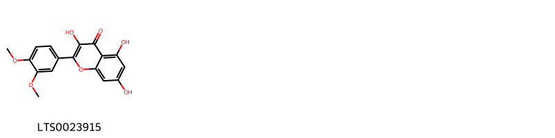
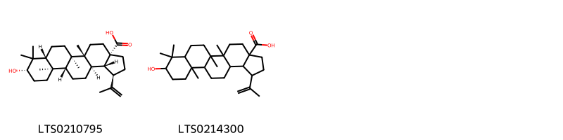

!!! abstract "Tóm tắt"

    Họ Dilleniaceae gồm khoảng 3 chi và 6 loài được một số cộng đồng tại các quốc gia như Africa, India, Elsewhere, Latin America, Mexico, Cambodia, Sumatra sử dụng trong một số trường hợp Chất làm se, Cathartic, Emetic, Thuốc lợi tiểu, Sudorific, Piscicide, Sudorific, Thuốc lợi tiểu, Thuốc giải độc, Thuốc kích dục, Thuốc bổ, Thuốc nhuận tràng.

!!! info "DrDuke"

    James A. Duke sinh năm 1929-2017 là một nhà thực vật học người Mỹ. Đây là một trong những tác giả hàng đầu trong lĩnh vực dược dân tộc học với cuốn *CRC Handbook of Medicinal Herbs* và chính là người xây dựng lên cơ sở dữ liệu về hợp chất tự nhiên và dược dân tộc học tại Bộ nông nghiệp Hoa Kỳ. Các thông tin được đăng tải tại website [Dr. Duke's Phytochemical and Ethnobotanical Databases](https://phytochem.nal.usda.gov/). 
    Trong suốt thập niên 1970, ông lãnh đạo the Plant Taxonomy Laboratory, Plant Genetics and Germplasm Institute of the Agricultural Research Service, U.S. Department of Agriculture.
    Trong tài liệu này, các thông tin về dược dân tộc của các dược liệu được trích dẫn từ tài liệu của James A. Ducke với sự trợ giúp của phần mềm dịch thuật từ tiếng Anh sang tiếng Việt.
   

# Chi Davilla

??? note "Danh sách các dược liệu thuộc chi"
    
	 - *Davilla rugosa*

---
## Davilla rugosa
### Thông tin về thực vật

!!! info "Phân loại thực vật của *Davilla rugosa* từ GIBF:"
    - **Kingdom:** Plantae
    - **Phylum:** Tracheophyta
    - **Order:** Dilleniales
    - **Family:** Dilleniaceae
    - **Genus:** Davilla
    - **Species:** *Davilla rugosa*

 

| Label (VI)   | Label (EN)   | Scientific Name   | Descriptions (VI)   | Descriptions (EN)   | Also Known As (VI)   | Also Known As (EN)   |
|:-------------|:-------------|:------------------|:--------------------|:--------------------|:---------------------|:---------------------|
| N/A          | N/A          | Davilla rugosa    | loài thực vật       | species of plant    | ['']                 | ['']                 |

#### Phân bố trên thế giới

**Từ CSDL GIBF** Colombia, Brazil, French Guiana

#### Phân bố tại Việt Nam

**Từ CSDL GIBF**: Không có ghi nhận ở Việt Nam

---
### Thành phần hóa học
        
- Theo cơ sở dữ liệu lotus: Từ loài *Davilla rugosa* đã phân lập và xác định được Chưa có hoạt chất nào được phân lập. hoạt chất thuộc về các nhóm Không có hoạt chất nào được phân lập. 

Không có hình ảnh nào được tạo ra

---

### Dược dân tộc học

Danh sách các quốc gia có sử dụng *Davilla rugosa* trong điều trị các bệnh. 

| Country   | Disease           | Bệnh              |
|:----------|:------------------|:------------------|
| Mexico    | Cathartic, Emetic | Cathartic, Emetic |

---

# Chi Dillenia

??? note "Danh sách các dược liệu thuộc chi"
    
	 - *Dillenia indica*
	 - *Dillenia ovata*

---
## Dillenia indica
### Thông tin về thực vật

!!! info "Phân loại thực vật của *Dillenia indica* từ GIBF:"
    - **Kingdom:** Plantae
    - **Phylum:** Tracheophyta
    - **Order:** Dilleniales
    - **Family:** Dilleniaceae
    - **Genus:** Dillenia
    - **Species:** *Dillenia indica*

 

| Label (VI)   | Label (EN)   | Scientific Name   | Descriptions (VI)   | Descriptions (EN)   | Also Known As (VI)   | Also Known As (EN)                                              |
|:-------------|:-------------|:------------------|:--------------------|:--------------------|:---------------------|:----------------------------------------------------------------|
| N/A          | N/A          | Dillenia indica   | loài thực vật       | species of plant    | ['']                 | ['Chulta', 'Elephant apple', 'Hondapara Tree', 'Indian catmon'] |

#### Phân bố trên thế giới

**Từ CSDL GIBF** Sri Lanka, Australia, Mauritius, Puerto Rico, Réunion, Honduras, Jamaica, Bangladesh, United States of America, Trinidad and Tobago, South Africa, Hong Kong, Thailand, Martinique, Brazil, Dominica, Dominican Republic, Singapore, Viet Nam, China, Colombia, Costa Rica, India, Indonesia, Philippines, Malaysia

#### Phân bố tại Việt Nam

**Từ CSDL GIBF**: Hà Giang

---
### Thành phần hóa học
        
- Theo cơ sở dữ liệu lotus: Từ loài *Dillenia indica* đã phân lập và xác định được 3 hoạt chất thuộc về các nhóm Flavonoids, Prenol lipids. 

|    | chemicalTaxonomyClassyfireClass   |   smiles_count |
|---:|:----------------------------------|---------------:|
|  0 | Flavonoids                        |              1 |
|  1 | Prenol lipids                     |              2 |

#### Nhóm Flavonoids
<figure markdown="span">
    { width=100% }
    <figcaption>Hình ảnh cấu trúc hóa học của 1 hoạt chất thuộc nhóm Flavonoids gồm ['dillenetin (LTS0023915)'].</figcaption>
</figure>
#### Nhóm Prenol lipids
<figure markdown="span">
    { width=100% }
    <figcaption>Hình ảnh cấu trúc hóa học của 2 hoạt chất thuộc nhóm Prenol lipids gồm ['betulinic acid (LTS0210795)', '9-hydroxy-5a,5b,8,8,11a-pentamethyl-1-(prop-1-en-2-yl)-hexadecahydrocyclopenta[a]chrysene-3a-carboxylic acid (LTS0214300)'].</figcaption>
</figure>

---

### Dược dân tộc học

Danh sách các quốc gia có sử dụng *Dillenia indica* trong điều trị các bệnh. 

| Country   | Disease         | Bệnh                  |
|:----------|:----------------|:----------------------|
| Elsewhere | Tonic, Laxative | Thuốc bổ, nhuận tràng |
| India     | Astringent      | Lam se da             |

---

---
## Dillenia ovata
### Thông tin về thực vật

!!! info "Phân loại thực vật của *Dillenia ovata* từ GIBF:"
    - **Kingdom:** Plantae
    - **Phylum:** Tracheophyta
    - **Order:** Dilleniales
    - **Family:** Dilleniaceae
    - **Genus:** Dillenia
    - **Species:** *Dillenia ovata*

 

| Label (VI)   | Label (EN)   | Scientific Name   | Descriptions (VI)   | Descriptions (EN)   | Also Known As (VI)   | Also Known As (EN)   |
|:-------------|:-------------|:------------------|:--------------------|:--------------------|:---------------------|:---------------------|
| N/A          | N/A          | Dillenia ovata    | loài thực vật       | species of plant    | ['']                 | ['']                 |

#### Phân bố trên thế giới

**Từ CSDL GIBF** nan, Malaysia, Japan, Thailand, Lao People’s Democratic Republic, Cambodia, unknown or invalid, Indonesia, Singapore, Viet Nam

#### Phân bố tại Việt Nam

**Từ CSDL GIBF**: Dak Lak

---
### Thành phần hóa học
        
- Theo cơ sở dữ liệu lotus: Từ loài *Dillenia ovata* đã phân lập và xác định được Chưa có hoạt chất nào được phân lập. hoạt chất thuộc về các nhóm Không có hoạt chất nào được phân lập. 

Không có hình ảnh nào được tạo ra

---

### Dược dân tộc học

Danh sách các quốc gia có sử dụng *Dillenia ovata* trong điều trị các bệnh. 

| Country   | Disease    | Bệnh      |
|:----------|:-----------|:----------|
| Cambodia  | Astringent | Lam se da |

---

# Chi Tetracera

??? note "Danh sách các dược liệu thuộc chi"
    
	 - *Tetracera alnifolia*
	 - *Tetracera indica*
	 - *Tetracera scandens*
	 - *Tetracera volubilis*

---
## Tetracera alnifolia
### Thông tin về thực vật

!!! info "Phân loại thực vật của *Tetracera alnifolia* từ GIBF:"
    - **Kingdom:** Plantae
    - **Phylum:** Tracheophyta
    - **Order:** Dilleniales
    - **Family:** Dilleniaceae
    - **Genus:** Tetracera
    - **Species:** *Tetracera alnifolia*

 

| Label (VI)   | Label (EN)   | Scientific Name     | Descriptions (VI)   | Descriptions (EN)   | Also Known As (VI)   | Also Known As (EN)   |
|:-------------|:-------------|:--------------------|:--------------------|:--------------------|:---------------------|:---------------------|
| N/A          | N/A          | Tetracera alnifolia | loài thực vật       | species of plant    | ['']                 | ['']                 |

#### Phân bố trên thế giới

**Từ CSDL GIBF** Senegal, Nigeria, Sao Tome and Principe, Gabon, Angola, Côte d’Ivoire, Gambia, Benin, Congo, Democratic Republic of the, Guinea, Liberia, Togo

#### Phân bố tại Việt Nam

**Từ CSDL GIBF**: Không có ghi nhận ở Việt Nam

---
### Thành phần hóa học
        
- Theo cơ sở dữ liệu lotus: Từ loài *Tetracera alnifolia* đã phân lập và xác định được Chưa có hoạt chất nào được phân lập. hoạt chất thuộc về các nhóm Không có hoạt chất nào được phân lập. 

Không có hình ảnh nào được tạo ra

---

### Dược dân tộc học

Danh sách các quốc gia có sử dụng *Tetracera alnifolia* trong điều trị các bệnh. 

| Country   | Disease     | Bệnh           |
|:----------|:------------|:---------------|
| Africa    | Aphrodisiac | Thuốc kích dục |

---

---
## Tetracera indica
### Thông tin về thực vật

!!! info "Phân loại thực vật của *Tetracera indica* từ GIBF:"
    - **Kingdom:** Plantae
    - **Phylum:** Tracheophyta
    - **Order:** Dilleniales
    - **Family:** Dilleniaceae
    - **Genus:** Tetracera
    - **Species:** *Tetracera indica*

 

| Label (VI)   | Label (EN)   | Scientific Name   | Descriptions (VI)   | Descriptions (EN)   | Also Known As (VI)   | Also Known As (EN)   |
|:-------------|:-------------|:------------------|:--------------------|:--------------------|:---------------------|:---------------------|
| N/A          | N/A          | Tetracera indica  | loài thực vật       | species of plant    | ['']                 | ['']                 |

#### Phân bố trên thế giới

**Từ CSDL GIBF** nan, Nigeria, Thailand, Cambodia, India, Indonesia, United States of America, Viet Nam, Singapore, Malaysia

#### Phân bố tại Việt Nam

**Từ CSDL GIBF**: Tay Ninh

---
### Thành phần hóa học
        
- Theo cơ sở dữ liệu lotus: Từ loài *Tetracera indica* đã phân lập và xác định được 1 hoạt chất thuộc về các nhóm Flavonoids. 

|    | chemicalTaxonomyClassyfireClass   |   smiles_count |
|---:|:----------------------------------|---------------:|
|  0 | Flavonoids                        |              1 |

#### Nhóm Flavonoids
<figure markdown="span">
    { width=100% }
    <figcaption>Hình ảnh cấu trúc hóa học của 1 hoạt chất thuộc nhóm Flavonoids gồm ['wogonin (LTS0176185)'].</figcaption>
</figure>

---

### Dược dân tộc học

Danh sách các quốc gia có sử dụng *Tetracera indica* trong điều trị các bệnh. 

| Country   | Disease   | Bệnh          |
|:----------|:----------|:--------------|
| Elsewhere | Piscicide | Thuốc diệt cá |

---

---
## Tetracera scandens
### Thông tin về thực vật

!!! info "Phân loại thực vật của *Tetracera scandens* từ GIBF:"
    - **Kingdom:** Plantae
    - **Phylum:** Tracheophyta
    - **Order:** Dilleniales
    - **Family:** Dilleniaceae
    - **Genus:** Tetracera
    - **Species:** *Tetracera scandens*

 

| Label (VI)   | Label (EN)   | Scientific Name    | Descriptions (VI)   | Descriptions (EN)   | Also Known As (VI)   | Also Known As (EN)   |
|:-------------|:-------------|:-------------------|:--------------------|:--------------------|:---------------------|:---------------------|
| N/A          | N/A          | Tetracera scandens | loài thực vật       | species of plant    | ['']                 | ['']                 |

#### Phân bố trên thế giới

**Từ CSDL GIBF** nan, Sri Lanka, Brunei Darussalam, Thailand, Lao People’s Democratic Republic, Chinese Taipei, India, Indonesia, New Caledonia, unknown or invalid, Viet Nam, Mexico, Philippines, Singapore, Malaysia, China

#### Phân bố tại Việt Nam

**Từ CSDL GIBF**: Tay Ninh, Thua Thien-Hue, Ninh Thuan

---
### Thành phần hóa học
        
- Theo cơ sở dữ liệu lotus: Từ loài *Tetracera scandens* đã phân lập và xác định được Chưa có hoạt chất nào được phân lập. hoạt chất thuộc về các nhóm Không có hoạt chất nào được phân lập. 

Không có hình ảnh nào được tạo ra

---

### Dược dân tộc học

Danh sách các quốc gia có sử dụng *Tetracera scandens* trong điều trị các bệnh. 

| Country   | Disease    | Bệnh          |
|:----------|:-----------|:--------------|
| Elsewhere | Astringent | Lam se da     |
| Sumatra   | Antidote   | Chất giải độc |

---

---
## Tetracera volubilis
### Thông tin về thực vật

!!! info "Phân loại thực vật của *Tetracera volubilis* từ GIBF:"
    - **Kingdom:** Plantae
    - **Phylum:** Tracheophyta
    - **Order:** Dilleniales
    - **Family:** Dilleniaceae
    - **Genus:** Tetracera
    - **Species:** *Tetracera volubilis*

 

| Label (VI)   | Label (EN)   | Scientific Name     | Descriptions (VI)   | Descriptions (EN)   | Also Known As (VI)   | Also Known As (EN)   |
|:-------------|:-------------|:--------------------|:--------------------|:--------------------|:---------------------|:---------------------|
| N/A          | N/A          | Tetracera volubilis | loài thực vật       | species of plant    | ['']                 | ['']                 |

#### Phân bố trên thế giới

**Từ CSDL GIBF** Belize, Ecuador, Suriname, Colombia, Brazil, Guatemala, Costa Rica, Nicaragua, Mexico, El Salvador, Venezuela (Bolivarian Republic of), Panama

#### Phân bố tại Việt Nam

**Từ CSDL GIBF**: Không có ghi nhận ở Việt Nam

---
### Thành phần hóa học
        
- Theo cơ sở dữ liệu lotus: Từ loài *Tetracera volubilis* đã phân lập và xác định được Chưa có hoạt chất nào được phân lập. hoạt chất thuộc về các nhóm Không có hoạt chất nào được phân lập. 

Không có hình ảnh nào được tạo ra

---

### Dược dân tộc học

Danh sách các quốc gia có sử dụng *Tetracera volubilis* trong điều trị các bệnh. 

| Country       | Disease             | Bệnh                            |
|:--------------|:--------------------|:--------------------------------|
| Latin America | Diuretic, Sudorific | Thuốc lợi tiểu, gây ngạt mồ hôi |
| Mexico        | Sudorific, Diuretic | Gây ngạt thở, lợi tiểu          |

---

