!!! abstract "Tóm tắt"

    Họ Dioscoreaceae gồm khoảng 2 chi và 27 loài được một số cộng đồng tại các quốc gia như Africa, Turkey, Solomon I, Egypt, Hawaii, US, Mexico, Malaya, China, Europe, Haiti, Iraq, Sudan, Mexico(Chinantec), India, Elsewhere, Venezuela, Samoa, Japan*, Africa(Swahili), Nepal sử dụng trong một số trường hợp QUERY LENGTH LIMIT EXCEEDED. MAX ALLOWED QUERY : 500 CHARS.

!!! info "DrDuke"

    James A. Duke sinh năm 1929-2017 là một nhà thực vật học người Mỹ. Đây là một trong những tác giả hàng đầu trong lĩnh vực dược dân tộc học với cuốn *CRC Handbook of Medicinal Herbs* và chính là người xây dựng lên cơ sở dữ liệu về hợp chất tự nhiên và dược dân tộc học tại Bộ nông nghiệp Hoa Kỳ. Các thông tin được đăng tải tại website [Dr. Duke's Phytochemical and Ethnobotanical Databases](https://phytochem.nal.usda.gov/). 
    Trong suốt thập niên 1970, ông lãnh đạo the Plant Taxonomy Laboratory, Plant Genetics and Germplasm Institute of the Agricultural Research Service, U.S. Department of Agriculture.
    Trong tài liệu này, các thông tin về dược dân tộc của các dược liệu được trích dẫn từ tài liệu của James A. Ducke với sự trợ giúp của phần mềm dịch thuật từ tiếng Anh sang tiếng Việt.
   

# Chi Dioscorea

??? note "Danh sách các dược liệu thuộc chi"
    
	 - *Dioscorea alata*
	 - *Dioscorea batatas*
	 - *Dioscorea bulbifera*
	 - *Dioscorea cayennensis*
	 - *Dioscorea composita*
	 - *Dioscorea deltoidea*
	 - *Dioscorea dumetorum*
	 - *Dioscorea floribunda*
	 - *Dioscorea hiida*
	 - *Dioscorea japonica*
	 - *Dioscorea macabiha*
	 - *Dioscorea macrostachya*
	 - *Dioscorea oppositifolia*
	 - *Dioscorea papuana*
	 - *Dioscorea pentaphylla*
	 - *Dioscorea piscatorum*
	 - *Dioscorea poilanei*
	 - *Dioscorea prazeri*
	 - *Dioscorea quinqueloba*
	 - *Dioscorea remotiflora*
	 - *Dioscorea sansibarensis*
	 - *Dioscorea sansibariensis*
	 - *Dioscorea sativa*
	 - *Dioscorea tokora*
	 - *Dioscorea tokoro*
	 - *Dioscorea villosa*

---
## Dioscorea alata
### Thông tin về thực vật

!!! info "Phân loại thực vật của *Dioscorea alata* từ GIBF:"
    - **Kingdom:** Plantae
    - **Phylum:** Tracheophyta
    - **Order:** Dioscoreales
    - **Family:** Dioscoreaceae
    - **Genus:** Dioscorea
    - **Species:** *Dioscorea alata*

 

| Label (VI)   | Label (EN)   | Scientific Name   | Descriptions (VI)   | Descriptions (EN)   | Also Known As (VI)                                                                                                                                                              | Also Known As (EN)                   |
|:-------------|:-------------|:------------------|:--------------------|:--------------------|:--------------------------------------------------------------------------------------------------------------------------------------------------------------------------------|:-------------------------------------|
| N/A          | N/A          | Dioscorea alata   | loài thực vật       | species of plant    | ['Khoai vạc', 'Khoai trút', 'Khoai tím', 'Khoai tía', 'Khoai ngọt', 'Khoai ngà', 'Khoai long', 'Khoai bướu', 'Dioscorea alata', 'Củ tía', 'Củ mỡ', 'Củ đỏ', 'Củ cầm', 'Củ cái'] | ['purple yam', 'ube', 'greater yam'] |

#### Phân bố trên thế giới

**Từ CSDL GIBF** Sri Lanka, Micronesia (Federated States of), Australia, Japan, Guadeloupe, Guatemala, Benin, French Guiana, Puerto Rico, Réunion, Chinese Taipei, Jamaica, United States of America, Thailand, Brazil, Dominican Republic, Mayotte, Mexico, China, French Polynesia, Madagascar, Seychelles, Haiti, Colombia, Costa Rica, India, Indonesia, Philippines, Malaysia, Nepal

#### Phân bố tại Việt Nam

**Từ CSDL GIBF**: Không có ghi nhận ở Việt Nam

---
### Thành phần hóa học
        
- Theo cơ sở dữ liệu lotus: Từ loài *Dioscorea alata* đã phân lập và xác định được 25 hoạt chất thuộc về các nhóm Flavonoids, Prenol lipids, Steroids and steroid derivatives, Cinnamic acids and derivatives, Azaspirodecane derivatives, Hydroxy acids and derivatives, Stilbenes. 

|    | chemicalTaxonomyClassyfireClass   |   smiles_count |
|---:|:----------------------------------|---------------:|
|  0 | Azaspirodecane derivatives        |              1 |
|  1 | Cinnamic acids and derivatives    |              2 |
|  2 | Flavonoids                        |              7 |
|  3 | Hydroxy acids and derivatives     |              1 |
|  4 | Prenol lipids                     |              8 |
|  5 | Steroids and steroid derivatives  |              2 |
|  6 | Stilbenes                         |              4 |

#### Nhóm Azaspirodecane derivatives
<figure markdown="span">
    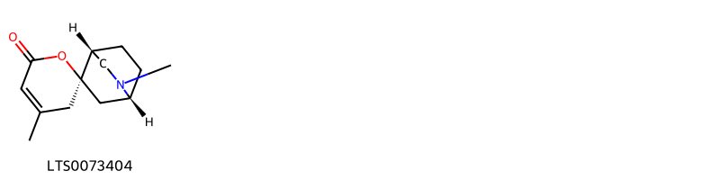{ width=100% }
    <figcaption>Hình ảnh cấu trúc hóa học của 1 hoạt chất thuộc nhóm Azaspirodecane derivatives gồm ['dioscorine (LTS0073404)'].</figcaption>
</figure>
#### Nhóm Cinnamic acids and derivatives
<figure markdown="span">
    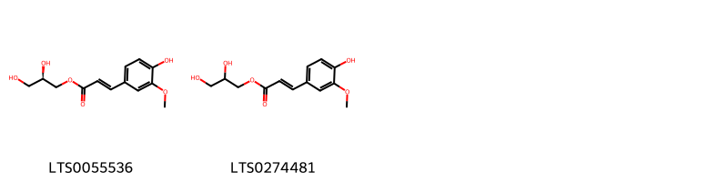{ width=100% }
    <figcaption>Hình ảnh cấu trúc hóa học của 2 hoạt chất thuộc nhóm Cinnamic acids and derivatives gồm ['(2r)-2,3-dihydroxypropyl (2e)-3-(4-hydroxy-3-methoxyphenyl)prop-2-enoate (LTS0055536)', '2,3-dihydroxypropyl 3-(4-hydroxy-3-methoxyphenyl)prop-2-enoate (LTS0274481)'].</figcaption>
</figure>
#### Nhóm Flavonoids
<figure markdown="span">
    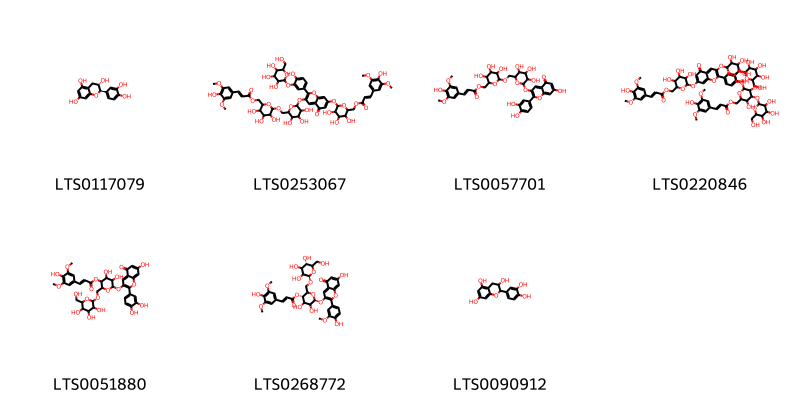{ width=100% }
    <figcaption>Hình ảnh cấu trúc hóa học của 7 hoạt chất thuộc nhóm Flavonoids gồm ['(+)-catechol (LTS0117079)', '{3,4,5-trihydroxy-6-[(3,4,5-trihydroxy-6-{[2-(4-hydroxy-3-{[3,4,5-trihydroxy-6-(hydroxymethyl)oxan-2-yl]oxy}phenyl)-5-oxo-7-{[3,4,5-trihydroxy-6-({[3-(4-hydroxy-3,5-dimethoxyphenyl)prop-2-enoyl]oxy}methyl)oxan-2-yl]oxy}chromen-3-yl]oxy}oxan-2-yl)methoxy]oxan-2-yl}methyl 3-(4-hydroxy-3,5-dimethoxyphenyl)prop-2-enoate (LTS0253067)', '{6-[(6-{[2-(3,4-dihydroxyphenyl)-7-hydroxy-5-oxochromen-3-yl]oxy}-3,4,5-trihydroxyoxan-2-yl)methoxy]-3,4,5-trihydroxyoxan-2-yl}methyl 3-(4-hydroxy-3,5-dimethoxyphenyl)prop-2-enoate (LTS0057701)', '{6-[(3-{[6-({[3,5-dihydroxy-6-({[3-(4-hydroxy-3,5-dimethoxyphenyl)prop-2-enoyl]oxy}methyl)-4-{[3,4,5-trihydroxy-6-(hydroxymethyl)oxan-2-yl]oxy}oxan-2-yl]oxy}methyl)-3,4,5-trihydroxyoxan-2-yl]oxy}-2-(4-hydroxy-3-{[3,4,5-trihydroxy-6-(hydroxymethyl)oxan-2-yl]oxy}phenyl)-5-oxochromen-7-yl)oxy]-3,4,5-trihydroxyoxan-2-yl}methyl 3-(4-hydroxy-3,5-dimethoxyphenyl)prop-2-enoate (LTS0220846)', '6-{[2-(3,4-dihydroxyphenyl)-7-hydroxy-5-oxochromen-3-yl]oxy}-4,5-dihydroxy-2-({[3,4,5-trihydroxy-6-(hydroxymethyl)oxan-2-yl]oxy}methyl)oxan-3-yl 3-(4-hydroxy-3,5-dimethoxyphenyl)prop-2-enoate (LTS0051880)', '(3s,6s)-4,5-dihydroxy-6-{[7-hydroxy-2-(4-hydroxy-3-methoxyphenyl)-5-oxochromen-3-yl]oxy}-2-({[(2r,5s)-3,4,5-trihydroxy-6-(hydroxymethyl)oxan-2-yl]oxy}methyl)oxan-3-yl 3-(4-hydroxy-3,5-dimethoxyphenyl)prop-2-enoate (LTS0268772)', 'catechol (LTS0090912)'].</figcaption>
</figure>
#### Nhóm Hydroxy acids and derivatives
<figure markdown="span">
    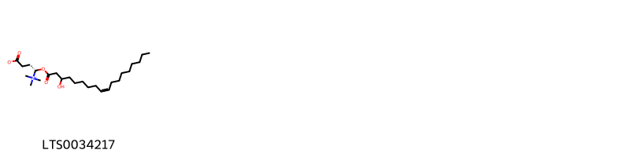{ width=100% }
    <figcaption>Hình ảnh cấu trúc hóa học của 1 hoạt chất thuộc nhóm Hydroxy acids and derivatives gồm ['(4s)-4-{[(9z)-3-hydroxyoctadec-9-enoyl]oxy}-4-(trimethylammonio)butanoate (LTS0034217)'].</figcaption>
</figure>
#### Nhóm Prenol lipids
<figure markdown="span">
    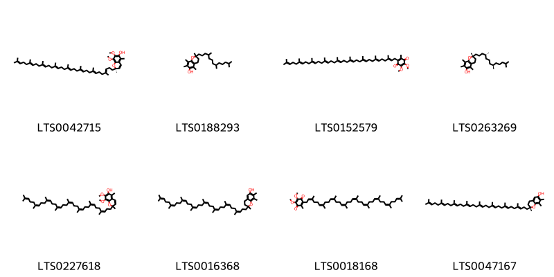{ width=100% }
    <figcaption>Hình ảnh cấu trúc hóa học của 8 hoạt chất thuộc nhóm Prenol lipids gồm ['(2r)-7,8-dimethoxy-2,5-dimethyl-2-[(3e,7e,11e,15e,19e,23e,27e)-4,8,12,16,20,24,28,32-octamethyltritriaconta-3,7,11,15,19,23,27,31-octaen-1-yl]chromen-6-ol (LTS0042715)', 'vita e (LTS0188293)', 'ubiquinone-9 (LTS0152579)', 'vitamin e (LTS0263269)', '7,8-dimethoxy-2,5-dimethyl-2-(4,8,12,16,20,24,28,32-octamethyltritriaconta-3,7,11,15,19,23,27,31-octaen-1-yl)chromen-6-ol (LTS0227618)', '2,7,8-trimethyl-2-(4,8,12,16,20,24,28,32-octamethyltritriaconta-3,7,11,15,19,23,27,31-octaen-1-yl)-3,4-dihydro-1-benzopyran-6-ol (LTS0016368)', '2,3-dimethoxy-5-methyl-6-(3,7,11,15,19,23,27,31,35-nonamethylhexatriaconta-2,6,10,14,18,22,26,30,34-nonaen-1-yl)cyclohexa-2,5-diene-1,4-dione (LTS0018168)', '(2r)-2,7,8-trimethyl-2-[(3e,7e,11e,15e,19e,23e,27e)-4,8,12,16,20,24,28,32-octamethyltritriaconta-3,7,11,15,19,23,27,31-octaen-1-yl]-3,4-dihydro-1-benzopyran-6-ol (LTS0047167)'].</figcaption>
</figure>
#### Nhóm Steroids and steroid derivatives
<figure markdown="span">
    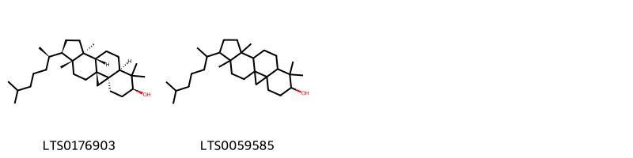{ width=100% }
    <figcaption>Hình ảnh cấu trúc hóa học của 2 hoạt chất thuộc nhóm Steroids and steroid derivatives gồm ['cycloartanol (LTS0176903)', '7,7,12,16-tetramethyl-15-(6-methylheptan-2-yl)pentacyclo[9.7.0.0¹,³.0³,⁸.0¹²,¹⁶]octadecan-6-ol (LTS0059585)'].</figcaption>
</figure>
#### Nhóm Stilbenes
<figure markdown="span">
    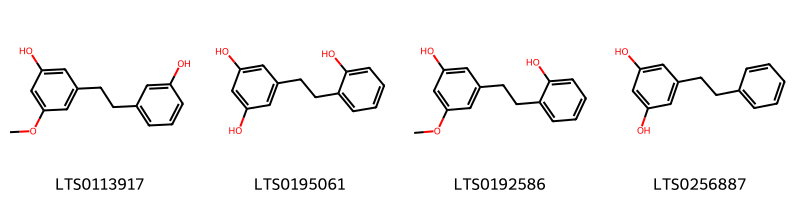{ width=100% }
    <figcaption>Hình ảnh cấu trúc hóa học của 4 hoạt chất thuộc nhóm Stilbenes gồm ['3-[2-(3-hydroxyphenyl)ethyl]-5-methoxyphenol (LTS0113917)', 'demethylbatatasin iv (LTS0195061)', 'batatasin iv (LTS0192586)', 'dihydropinosylvin (LTS0256887)'].</figcaption>
</figure>

---

### Dược dân tộc học

Danh sách các quốc gia có sử dụng *Dioscorea alata* trong điều trị các bệnh. 

| Country   | Disease   | Bệnh                                                                                                                                                                                                |
|:----------|:----------|:----------------------------------------------------------------------------------------------------------------------------------------------------------------------------------------------------|
| Hawaii    | Laxative  | MYMEMORY WARNING: YOU USED ALL AVAILABLE FREE TRANSLATIONS FOR TODAY. NEXT AVAILABLE IN  13 HOURS 32 MINUTES 18 SECONDS VISIT HTTPS://MYMEMORY.TRANSLATED.NET/DOC/USAGELIMITS.PHP TO TRANSLATE MORE |
| India     | Vermifuge | MYMEMORY WARNING: YOU USED ALL AVAILABLE FREE TRANSLATIONS FOR TODAY. NEXT AVAILABLE IN  13 HOURS 32 MINUTES 14 SECONDS VISIT HTTPS://MYMEMORY.TRANSLATED.NET/DOC/USAGELIMITS.PHP TO TRANSLATE MORE |

---

---
## Dioscorea batatas
### Thông tin về thực vật

!!! info "Phân loại thực vật của *Dioscorea polystachya* từ GIBF:"
    - **Kingdom:** Plantae
    - **Phylum:** Tracheophyta
    - **Order:** Dioscoreales
    - **Family:** Dioscoreaceae
    - **Genus:** Dioscorea
    - **Species:** *Dioscorea polystachya*

 

| Label (VI)   | Label (EN)   | Scientific Name   | Descriptions (VI)   | Descriptions (EN)   | Also Known As (VI)   | Also Known As (EN)   |
|:-------------|:-------------|:------------------|:--------------------|:--------------------|:---------------------|:---------------------|
| N/A          | N/A          | Dioscorea batatas | loài thực vật       | species of plant    | ['']                 | ['']                 |

#### Phân bố trên thế giới

**Từ CSDL GIBF** nan, Hong Kong, Japan, Korea, Republic of, Chinese Taipei, Brazil, United States of America, Mexico, Norway, China, Canada

#### Phân bố tại Việt Nam

**Từ CSDL GIBF**: Không có ghi nhận ở Việt Nam

---
### Thành phần hóa học
        
- Theo cơ sở dữ liệu lotus: Từ loài *Dioscorea polystachya* đã phân lập và xác định được Chưa có hoạt chất nào được phân lập. hoạt chất thuộc về các nhóm Không có hoạt chất nào được phân lập. 

Không có hình ảnh nào được tạo ra

---

### Dược dân tộc học

Danh sách các quốc gia có sử dụng *Dioscorea polystachya* trong điều trị các bệnh. 

| Country   | Disease          | Bệnh                                                                                                                                                                                                |
|:----------|:-----------------|:----------------------------------------------------------------------------------------------------------------------------------------------------------------------------------------------------|
| China     | Demulcent, Tonic | MYMEMORY WARNING: YOU USED ALL AVAILABLE FREE TRANSLATIONS FOR TODAY. NEXT AVAILABLE IN  13 HOURS 31 MINUTES 38 SECONDS VISIT HTTPS://MYMEMORY.TRANSLATED.NET/DOC/USAGELIMITS.PHP TO TRANSLATE MORE |

---

---
## Dioscorea bulbifera
### Thông tin về thực vật

!!! info "Phân loại thực vật của *Dioscorea bulbifera* từ GIBF:"
    - **Kingdom:** Plantae
    - **Phylum:** Tracheophyta
    - **Order:** Dioscoreales
    - **Family:** Dioscoreaceae
    - **Genus:** Dioscorea
    - **Species:** *Dioscorea bulbifera*

 

| Label (VI)   | Label (EN)   | Scientific Name     | Descriptions (VI)   | Descriptions (EN)   | Also Known As (VI)      | Also Known As (EN)                                                                               |
|:-------------|:-------------|:--------------------|:--------------------|:--------------------|:------------------------|:-------------------------------------------------------------------------------------------------|
| N/A          | N/A          | Dioscorea bulbifera | loài thực vật       | species of plant    | ['Dioscorea bulbifera'] | ['bitter yam', 'aerial yam', 'Air Potato', 'air yam', 'cheeky yam', 'parsnip yam', 'potato yam'] |

#### Phân bố trên thế giới

**Từ CSDL GIBF** Malawi, Puerto Rico, South Africa, Niue, Australia, Madagascar, Thailand, Hong Kong, Japan, Gabon, Chinese Taipei, Brazil, India, United States of America, Mexico, Singapore, French Guiana

#### Phân bố tại Việt Nam

**Từ CSDL GIBF**: Không có ghi nhận ở Việt Nam

---
### Thành phần hóa học
        
- Theo cơ sở dữ liệu lotus: Từ loài *Dioscorea bulbifera* đã phân lập và xác định được 131 hoạt chất thuộc về các nhóm Flavonoids, Prenol lipids, Steroids and steroid derivatives, Cinnamic acids and derivatives, Phenanthrenes and derivatives, Benzene and substituted derivatives, Azaspirodecane derivatives, Stilbenes, Lactones, Organooxygen compounds, Naphthofurans, Naphthopyrans, Carboxylic acids and derivatives. 

|    | chemicalTaxonomyClassyfireClass     |   smiles_count |
|---:|:------------------------------------|---------------:|
|  0 | Azaspirodecane derivatives          |              2 |
|  1 | Benzene and substituted derivatives |              1 |
|  2 | Carboxylic acids and derivatives    |              1 |
|  3 | Cinnamic acids and derivatives      |              2 |
|  4 | Flavonoids                          |             23 |
|  5 | Lactones                            |              4 |
|  6 | Naphthofurans                       |             15 |
|  7 | Naphthopyrans                       |             17 |
|  8 | Organooxygen compounds              |              5 |
|  9 | Phenanthrenes and derivatives       |              6 |
| 10 | Prenol lipids                       |             29 |
| 11 | Steroids and steroid derivatives    |             18 |
| 12 | Stilbenes                           |              7 |

#### Nhóm Azaspirodecane derivatives
<figure markdown="span">
    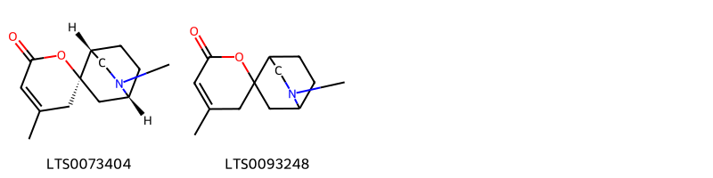{ width=100% }
    <figcaption>Hình ảnh cấu trúc hóa học của 2 hoạt chất thuộc nhóm Azaspirodecane derivatives gồm ['dioscorine (LTS0073404)', 'dioscorine (LTS0093248)'].</figcaption>
</figure>
#### Nhóm Benzene and substituted derivatives
<figure markdown="span">
    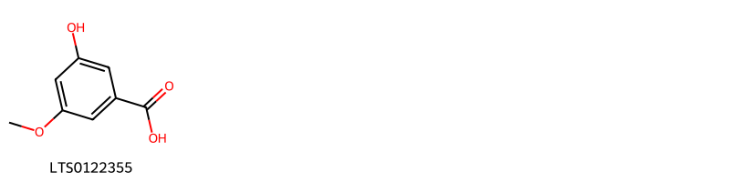{ width=100% }
    <figcaption>Hình ảnh cấu trúc hóa học của 1 hoạt chất thuộc nhóm Benzene and substituted derivatives gồm ['3-hydroxy-5-methoxybenzoic acid (LTS0122355)'].</figcaption>
</figure>
#### Nhóm Carboxylic acids and derivatives
<figure markdown="span">
    { width=100% }
    <figcaption>Hình ảnh cấu trúc hóa học của 1 hoạt chất thuộc nhóm Carboxylic acids and derivatives gồm ['succinic acid (LTS0237204)'].</figcaption>
</figure>
#### Nhóm Cinnamic acids and derivatives
<figure markdown="span">
    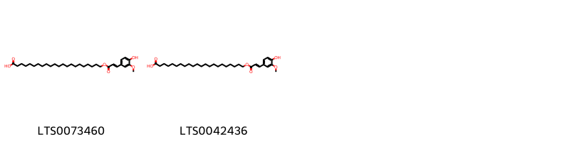{ width=100% }
    <figcaption>Hình ảnh cấu trúc hóa học của 2 hoạt chất thuộc nhóm Cinnamic acids and derivatives gồm ['22-{[3-(4-hydroxy-3-methoxyphenyl)prop-2-enoyl]oxy}docosanoic acid (LTS0073460)', '22-{[(2e)-3-(4-hydroxy-3-methoxyphenyl)prop-2-enoyl]oxy}docosanoic acid (LTS0042436)'].</figcaption>
</figure>
#### Nhóm Flavonoids
<figure markdown="span">
    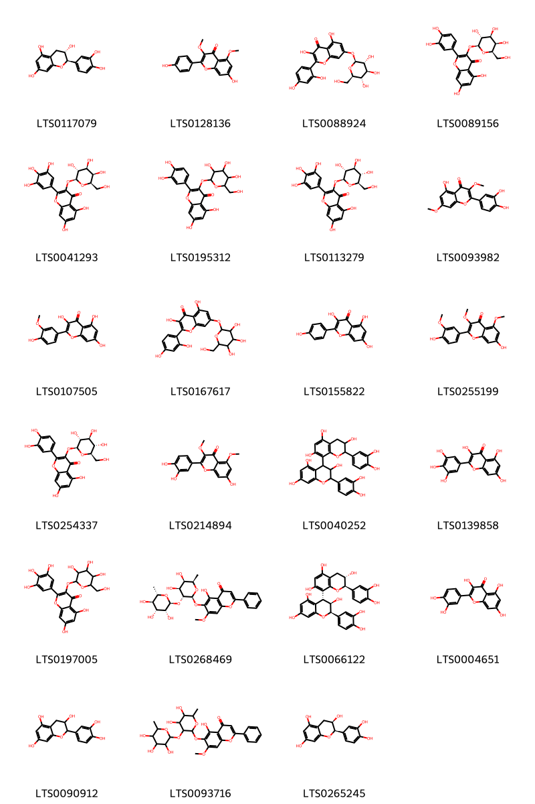{ width=100% }
    <figcaption>Hình ảnh cấu trúc hóa học của 23 hoạt chất thuộc nhóm Flavonoids gồm ['(+)-catechol (LTS0117079)', 'kaempferol 3,5-dimethyl ether (LTS0128136)', '2-(2,4-dihydroxyphenyl)-3,5-dihydroxy-7-{[(2s,3r,4s,5s,6r)-3,4,5-trihydroxy-6-(hydroxymethyl)oxan-2-yl]oxy}chromen-4-one (LTS0088924)', 'hyperoside (LTS0089156)', '5,7-dihydroxy-3-{[(2s,3r,4s,5r,6r)-3,4,5-trihydroxy-6-(hydroxymethyl)oxan-2-yl]oxy}-2-(3,4,5-trihydroxyphenyl)chromen-4-one (LTS0041293)', '2-(3,4-dihydroxyphenyl)-5,7-dihydroxy-3-{[3,4,5-trihydroxy-6-(hydroxymethyl)oxan-2-yl]oxy}chromen-4-one (LTS0195312)', '5,7-dihydroxy-3-{[(2s,3r,4s,5s,6r)-3,4,5-trihydroxy-6-(hydroxymethyl)oxan-2-yl]oxy}-2-(3,4,5-trihydroxyphenyl)chromen-4-one (LTS0113279)', 'dthf (LTS0093982)', 'isorhamnetin (LTS0107505)', '2-(2,4-dihydroxyphenyl)-3,5-dihydroxy-7-{[3,4,5-trihydroxy-6-(hydroxymethyl)oxan-2-yl]oxy}chromen-4-one (LTS0167617)', 'kaempherol (LTS0155822)', '7-hydroxy-2-(4-hydroxy-3-methoxyphenyl)-3,5-dimethoxychromen-4-one (LTS0255199)', 'isoquercetin (LTS0254337)', 'caryatin (LTS0214894)', '2-(3,4-dihydroxyphenyl)-4-[2-(3,4-dihydroxyphenyl)-3,5,7-trihydroxy-3,4-dihydro-2h-1-benzopyran-8-yl]-3,4-dihydro-2h-1-benzopyran-3,5,7-triol (LTS0040252)', 'myricetin (LTS0139858)', '5,7-dihydroxy-3-{[3,4,5-trihydroxy-6-(hydroxymethyl)oxan-2-yl]oxy}-2-(3,4,5-trihydroxyphenyl)chromen-4-one (LTS0197005)', '6-{[(2s,3r,4s,5r,6r)-4,5-dihydroxy-6-methyl-3-{[(2s,3r,4r,5r,6s)-3,4,5-trihydroxy-6-methyloxan-2-yl]oxy}oxan-2-yl]oxy}-5-hydroxy-7-methoxy-2-phenylchromen-4-one (LTS0268469)', '(2r,3r,4r)-2-(3,4-dihydroxyphenyl)-4-[(2r,3s)-2-(3,4-dihydroxyphenyl)-3,5,7-trihydroxy-3,4-dihydro-2h-1-benzopyran-8-yl]-3,4-dihydro-2h-1-benzopyran-3,5,7-triol (LTS0066122)', 'quercetin (LTS0004651)', 'catechol (LTS0090912)', '6-({4,5-dihydroxy-6-methyl-3-[(3,4,5-trihydroxy-6-methyloxan-2-yl)oxy]oxan-2-yl}oxy)-5-hydroxy-7-methoxy-2-phenylchromen-4-one (LTS0093716)', 'ent-epicatechin (LTS0265245)'].</figcaption>
</figure>
#### Nhóm Lactones
<figure markdown="span">
    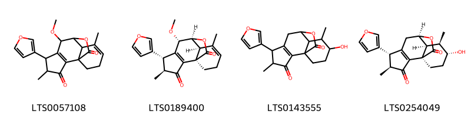{ width=100% }
    <figcaption>Hình ảnh cấu trúc hóa học của 4 hoạt chất thuộc nhóm Lactones gồm ['5-(furan-3-yl)-7-methoxy-4,10-dimethyl-15-oxatetracyclo[6.5.2.0¹,⁹.0²,⁶]pentadeca-2(6),10-diene-3,14-dione (LTS0057108)', '(1r,4s,5r,7s,8s,9s)-5-(furan-3-yl)-7-methoxy-4,10-dimethyl-15-oxatetracyclo[6.5.2.0¹,⁹.0²,⁶]pentadeca-2(6),10-diene-3,14-dione (LTS0189400)', '5-(furan-3-yl)-11-hydroxy-4,10-dimethyl-15-oxatetracyclo[6.5.2.0¹,⁹.0²,⁶]pentadec-2(6)-ene-3,14-dione (LTS0143555)', '(1r,4s,5s,8r,9s,10r,11r)-5-(furan-3-yl)-11-hydroxy-4,10-dimethyl-15-oxatetracyclo[6.5.2.0¹,⁹.0²,⁶]pentadec-2(6)-ene-3,14-dione (LTS0254049)'].</figcaption>
</figure>
#### Nhóm Naphthofurans
<figure markdown="span">
    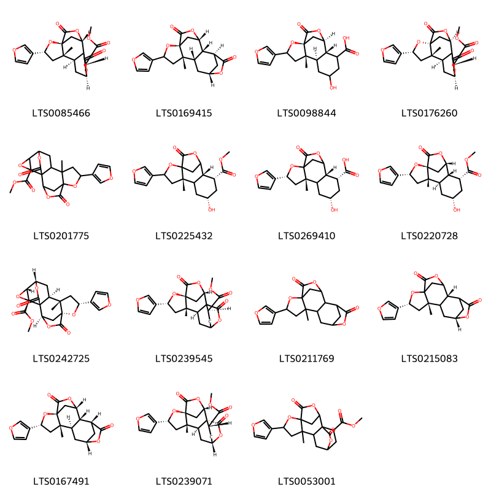{ width=100% }
    <figcaption>Hình ảnh cấu trúc hóa học của 15 hoạt chất thuộc nhóm Naphthofurans gồm ['methyl (1r,2s,5s,7r,9s,10s,12s,15s)-7-(furan-3-yl)-9-methyl-4,14-dioxo-3,6,13-trioxapentacyclo[10.2.2.1²,⁵.0¹,¹⁰.0⁵,⁹]heptadecane-15-carboxylate (LTS0085466)', '(1s,5s,6s,8r,11s,12s,13s)-3-(furan-3-yl)-5-methyl-2,9,14-trioxapentacyclo[11.2.1.1⁸,¹¹.0¹,⁵.0⁶,¹²]heptadecane-10,15-dione (LTS0169415)', '(1s,5s,6r,11s,12r)-3-(furan-3-yl)-8-hydroxy-5-methyl-14-oxo-2,13-dioxatetracyclo[10.2.1.0¹,⁵.0⁶,¹¹]pentadecane-10-carboxylic acid (LTS0098844)', 'methyl (1r,2r,5r,7r,9s,10s,12s,15s)-7-(furan-3-yl)-9-methyl-4,14-dioxo-3,6,13-trioxapentacyclo[10.2.2.1²,⁵.0¹,¹⁰.0⁵,⁹]heptadecane-15-carboxylate (LTS0176260)', 'methyl 7-(furan-3-yl)-9-methyl-4,16-dioxo-3,6,14,17-tetraoxahexacyclo[10.3.2.1²,⁵.0¹,¹⁰.0⁵,⁹.0¹³,¹⁵]octadecane-15-carboxylate (LTS0201775)', 'methyl (5s,8r,10r,11s)-3-(furan-3-yl)-8-hydroxy-5-methyl-14-oxo-2,13-dioxatetracyclo[10.2.1.0¹,⁵.0⁶,¹¹]pentadecane-10-carboxylate (LTS0225432)', '(3r,5s,8r,10r,11s)-3-(furan-3-yl)-8-hydroxy-5-methyl-14-oxo-2,13-dioxatetracyclo[10.2.1.0¹,⁵.0⁶,¹¹]pentadecane-10-carboxylic acid (LTS0269410)', 'methyl (1s,3r,5s,6r,8r,10r,11s,12s)-3-(furan-3-yl)-8-hydroxy-5-methyl-14-oxo-2,13-dioxatetracyclo[10.2.1.0¹,⁵.0⁶,¹¹]pentadecane-10-carboxylate (LTS0220728)', 'methyl (1s,2r,5r,7r,9s,10s,12s,13r,15s)-7-(furan-3-yl)-9-methyl-4,16-dioxo-3,6,14,17-tetraoxahexacyclo[10.3.2.1²,⁵.0¹,¹⁰.0⁵,⁹.0¹³,¹⁵]octadecane-15-carboxylate (LTS0242725)', 'methyl (2s,5s,7r,9s,10s,15s)-7-(furan-3-yl)-9-methyl-4,14-dioxo-3,6,13-trioxapentacyclo[10.2.2.1²,⁵.0¹,¹⁰.0⁵,⁹]heptadecane-15-carboxylate (LTS0239545)', '3-(furan-3-yl)-5-methyl-2,9,14-trioxapentacyclo[11.2.1.1⁸,¹¹.0¹,⁵.0⁶,¹²]heptadecane-10,15-dione (LTS0211769)', '(3r,5s,8r,12s)-3-(furan-3-yl)-5-methyl-2,9,14-trioxapentacyclo[11.2.1.1⁸,¹¹.0¹,⁵.0⁶,¹²]heptadecane-10,15-dione (LTS0215083)', '(1s,3r,5s,6r,8r,11r,12s,13s)-3-(furan-3-yl)-5-methyl-2,9,14-trioxapentacyclo[11.2.1.1⁸,¹¹.0¹,⁵.0⁶,¹²]heptadecane-10,15-dione (LTS0167491)', 'methyl (1s,2s,5s,7r,9s,10s,12r,15r)-7-(furan-3-yl)-9-methyl-4,14-dioxo-3,6,13-trioxapentacyclo[10.2.2.1²,⁵.0¹,¹⁰.0⁵,⁹]heptadecane-15-carboxylate (LTS0239071)', 'methyl 7-(furan-3-yl)-9-methyl-4,14-dioxo-3,6,13-trioxapentacyclo[10.2.2.1²,⁵.0¹,¹⁰.0⁵,⁹]heptadecane-15-carboxylate (LTS0053001)'].</figcaption>
</figure>
#### Nhóm Naphthopyrans
<figure markdown="span">
    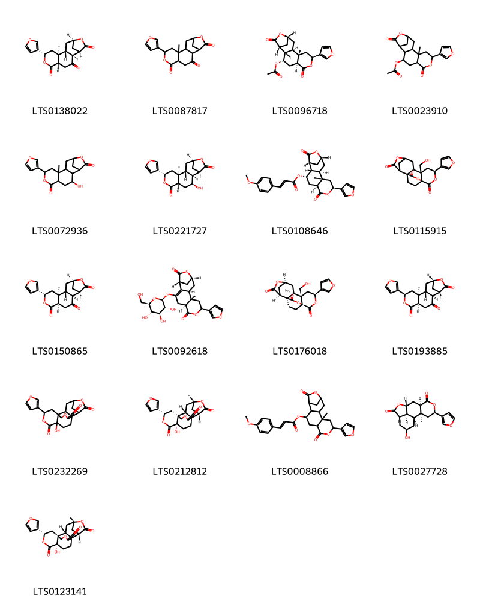{ width=100% }
    <figcaption>Hình ảnh cấu trúc hóa học của 17 hoạt chất thuộc nhóm Naphthopyrans gồm ['(1r,2s,5s,8s,10s,11r,13r)-8-(furan-3-yl)-10-methyl-7,14-dioxatetracyclo[11.2.1.0²,¹¹.0⁵,¹⁰]hexadecane-3,6,15-trione (LTS0138022)', '8-(furan-3-yl)-10-methyl-7,14-dioxatetracyclo[11.2.1.0²,¹¹.0⁵,¹⁰]hexadecane-3,6,15-trione (LTS0087817)', '(1r,2s,3s,5s,8s,10s,11r,13r)-8-(furan-3-yl)-10-methyl-6,15-dioxo-7,14-dioxatetracyclo[11.2.1.0²,¹¹.0⁵,¹⁰]hexadecan-3-yl acetate (LTS0096718)', '8-(furan-3-yl)-10-methyl-6,15-dioxo-7,14-dioxatetracyclo[11.2.1.0²,¹¹.0⁵,¹⁰]hexadecan-3-yl acetate (LTS0023910)', '8-(furan-3-yl)-3-hydroxy-10-methyl-7,14-dioxatetracyclo[11.2.1.0²,¹¹.0⁵,¹⁰]hexadecane-6,15-dione (LTS0072936)', '(1r,2s,3s,5s,8s,10s,11r,13r)-8-(furan-3-yl)-3-hydroxy-10-methyl-7,14-dioxatetracyclo[11.2.1.0²,¹¹.0⁵,¹⁰]hexadecane-6,15-dione (LTS0221727)', '(1r,2s,3s,5s,8s,10s,11r,13r)-8-(furan-3-yl)-10-methyl-6,15-dioxo-7,14-dioxatetracyclo[11.2.1.0²,¹¹.0⁵,¹⁰]hexadecan-3-yl (2e)-3-(4-methoxyphenyl)prop-2-enoate (LTS0108646)', '10-(furan-3-yl)-8-(hydroxymethyl)-4,11,14-trioxapentacyclo[11.2.2.1²,⁵.0¹,⁷.0⁸,¹³]octadecane-3,12,15-trione (LTS0115915)', '(1r,2s,5r,8s,10s,11r,13r)-8-(furan-3-yl)-10-methyl-7,14-dioxatetracyclo[11.2.1.0²,¹¹.0⁵,¹⁰]hexadecane-3,6,15-trione (LTS0150865)', '(1r,5s,8s,10s,11s,13r)-8-(furan-3-yl)-10-methyl-3-{[(2s,3r,4s,5s,6r)-3,4,5-trihydroxy-6-(hydroxymethyl)oxan-2-yl]oxy}-7,14-dioxatetracyclo[11.2.1.0²,¹¹.0⁵,¹⁰]hexadec-2-ene-6,15-dione (LTS0092618)', '(1r,2s,5s,7s,8s,10s,13s)-10-(furan-3-yl)-8-(hydroxymethyl)-4,11,14-trioxapentacyclo[11.2.2.1²,⁵.0¹,⁷.0⁸,¹³]octadecane-3,12,15-trione (LTS0176018)', '(1s,2s,5r,10s,11r,13s)-8-(furan-3-yl)-10-methyl-7,14-dioxatetracyclo[11.2.1.0²,¹¹.0⁵,¹⁰]hexadecane-3,6,15-trione (LTS0193885)', '7-(furan-3-yl)-4-hydroxy-6,13,17-trioxapentacyclo[7.6.3.1¹²,¹⁵.0¹,¹⁰.0⁴,⁹]nonadecane-5,14,16-trione (LTS0232269)', '(1r,4s,7s,9s,10s,12s,15s)-7-(furan-3-yl)-4-hydroxy-6,13,17-trioxapentacyclo[7.6.3.1¹²,¹⁵.0¹,¹⁰.0⁴,⁹]nonadecane-5,14,16-trione (LTS0212812)', '8-(furan-3-yl)-10-methyl-6,15-dioxo-7,14-dioxatetracyclo[11.2.1.0²,¹¹.0⁵,¹⁰]hexadecan-3-yl 3-(4-methoxyphenyl)prop-2-enoate (LTS0008866)', '(1s,2s,7r,9r,12s,16s)-4-(furan-3-yl)-14-hydroxy-2-methyl-5,10-dioxatetracyclo[7.6.1.0²,⁷.0¹²,¹⁶]hexadecane-6,11-dione (LTS0027728)', '(1r,4s,7s,9r,10s,12s,15s)-7-(furan-3-yl)-4-hydroxy-6,13,17-trioxapentacyclo[7.6.3.1¹²,¹⁵.0¹,¹⁰.0⁴,⁹]nonadecane-5,14,16-trione (LTS0123141)'].</figcaption>
</figure>
#### Nhóm Organooxygen compounds
<figure markdown="span">
    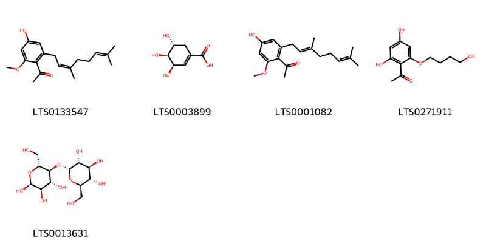{ width=100% }
    <figcaption>Hình ảnh cấu trúc hóa học của 5 hoạt chất thuộc nhóm Organooxygen compounds gồm ['1-[2-(3,7-dimethylocta-2,6-dien-1-yl)-4-hydroxy-6-methoxyphenyl]ethanone (LTS0133547)', '(-)-shikimate (LTS0003899)', '1-{2-[(2e)-3,7-dimethylocta-2,6-dien-1-yl]-4-hydroxy-6-methoxyphenyl}ethanone (LTS0001082)', '1-[2,4-dihydroxy-6-(4-hydroxybutoxy)phenyl]ethanone (LTS0271911)', 'α-maltose (LTS0013631)'].</figcaption>
</figure>
#### Nhóm Phenanthrenes and derivatives
<figure markdown="span">
    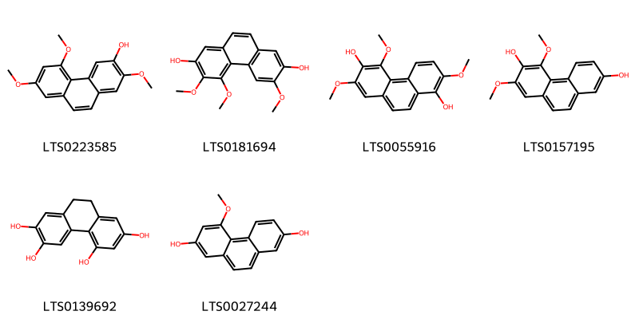{ width=100% }
    <figcaption>Hình ảnh cấu trúc hóa học của 6 hoạt chất thuộc nhóm Phenanthrenes and derivatives gồm ['batatasin i (LTS0223585)', '3,4,6-trimethoxyphenanthrene-2,7-diol (LTS0181694)', '2,5,7-trimethoxyphenanthrene-1,6-diol (LTS0055916)', '5,7-dimethoxyphenanthrene-2,6-diol (LTS0157195)', '9,10-dihydrophenanthrene-2,3,5,7-tetrol (LTS0139692)', '4-methoxyphenanthrene-2,7-diol (LTS0027244)'].</figcaption>
</figure>
#### Nhóm Prenol lipids
<figure markdown="span">
    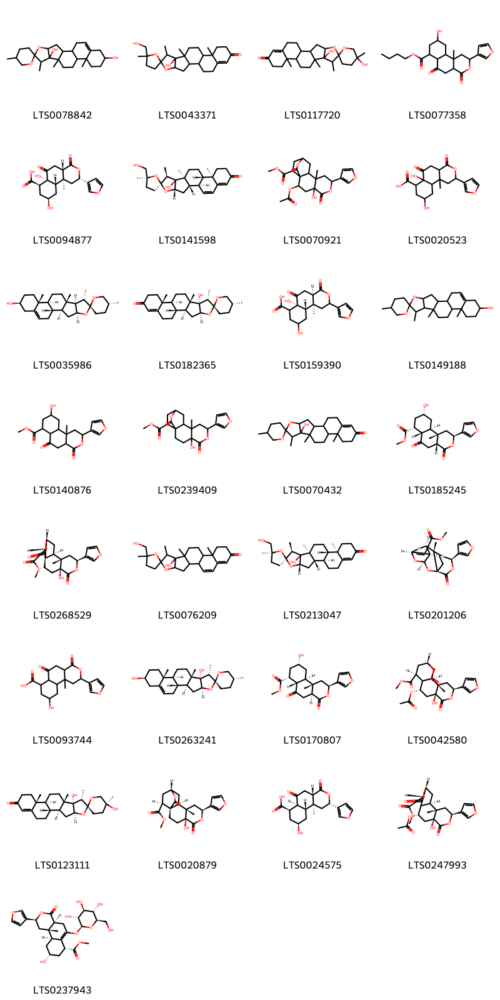{ width=100% }
    <figcaption>Hình ảnh cấu trúc hóa học của 29 hoạt chất thuộc nhóm Prenol lipids gồm ["5,7',9',13'-tetramethyl-5'-oxaspiro[oxane-2,6'-pentacyclo[10.8.0.0²,⁹.0⁴,⁸.0¹³,¹⁸]icosan]-18'-ene-8',16'-diol (LTS0078842)", "8'-hydroxy-5-(hydroxymethyl)-5,7',9',13'-tetramethyl-5'-oxaspiro[oxolane-2,6'-pentacyclo[10.8.0.0²,⁹.0⁴,⁸.0¹³,¹⁸]icosan]-17'-en-16'-one (LTS0043371)", "5,8'-dihydroxy-5,7',9',13'-tetramethyl-5'-oxaspiro[oxane-2,6'-pentacyclo[10.8.0.0²,⁹.0⁴,⁸.0¹³,¹⁸]icosan]-17'-en-16'-one (LTS0117720)", 'butyl 2-(furan-3-yl)-9-hydroxy-10b-methyl-4,6-dioxo-decahydronaphtho[2,1-c]pyran-7-carboxylate (LTS0077358)', '(2s,4as,6ar,7r,9r,10as,10bs)-2-(furan-3-yl)-6a,9-dihydroxy-10b-methyl-4,6-dioxo-octahydro-1h-naphtho[2,1-c]pyran-7-carboxylic acid (LTS0094877)', "(1'r,2s,2's,4's,5s,7's,8's,9's,12's,13'r)-8'-hydroxy-5-(hydroxymethyl)-5,7',9',13'-tetramethyl-5'-oxaspiro[oxolane-2,6'-pentacyclo[10.8.0.0²,⁹.0⁴,⁸.0¹³,¹⁸]icosane]-17',19'-dien-16'-one (LTS0141598)", 'methyl 2-(acetyloxy)-7-(furan-3-yl)-4-hydroxy-9-methyl-5,14-dioxo-6,13-dioxatetracyclo[10.2.2.0¹,¹⁰.0⁴,⁹]hexadecane-15-carboxylate (LTS0070921)', '2-(furan-3-yl)-6a,9-dihydroxy-10b-methyl-4,6-dioxo-octahydro-1h-naphtho[2,1-c]pyran-7-carboxylic acid (LTS0020523)', 'diosgenin (LTS0035986)', "(1'r,2r,2's,4's,5r,7's,8's,9's,12's,13'r)-8'-hydroxy-5,7',9',13'-tetramethyl-5'-oxaspiro[oxane-2,6'-pentacyclo[10.8.0.0²,⁹.0⁴,⁸.0¹³,¹⁸]icosan]-17'-en-16'-one (LTS0182365)", '(4ar,6ar,10as,10bs)-2-(furan-3-yl)-6a,9-dihydroxy-10b-methyl-4,6-dioxo-octahydro-1h-naphtho[2,1-c]pyran-7-carboxylic acid (LTS0159390)', 'diosgenin (LTS0149188)', 'methyl 2-(furan-3-yl)-9-hydroxy-10b-methyl-4,6-dioxo-decahydronaphtho[2,1-c]pyran-7-carboxylate (LTS0140876)', 'methyl 7-(furan-3-yl)-4-hydroxy-9-methyl-5,14-dioxo-6,13-dioxatetracyclo[10.2.2.0¹,¹⁰.0⁴,⁹]hexadecane-15-carboxylate (LTS0239409)', "8'-hydroxy-5,7',9',13'-tetramethyl-5'-oxaspiro[oxane-2,6'-pentacyclo[10.8.0.0²,⁹.0⁴,⁸.0¹³,¹⁸]icosan]-17'-en-16'-one (LTS0070432)", 'methyl (2s,4ar,6as,7r,9r,10ar,10bs)-2-(furan-3-yl)-9-hydroxy-10b-methyl-4,6-dioxo-decahydronaphtho[2,1-c]pyran-7-carboxylate (LTS0185245)', 'methyl (1s,4s,7s,9s,10s,12r,15s)-7-(furan-3-yl)-4-hydroxy-9-methyl-5,14-dioxo-6,13-dioxatetracyclo[10.2.2.0¹,¹⁰.0⁴,⁹]hexadecane-15-carboxylate (LTS0268529)', "8'-hydroxy-5-(hydroxymethyl)-5,7',9',13'-tetramethyl-5'-oxaspiro[oxolane-2,6'-pentacyclo[10.8.0.0²,⁹.0⁴,⁸.0¹³,¹⁸]icosane]-17',19'-dien-16'-one (LTS0076209)", 'diosbulbisin c (LTS0213047)', 'methyl (1r,2s,3s,5s,8s,10r,12s)-5-(furan-3-yl)-3-methyl-7-oxo-6,9,11-trioxapentacyclo[6.6.2.1²,¹².0¹,¹⁰.0³,⁸]heptadec-13-ene-14-carboxylate (LTS0201206)', '2-(furan-3-yl)-9-hydroxy-10b-methyl-4,6-dioxo-decahydronaphtho[2,1-c]pyran-7-carboxylic acid (LTS0093744)', 'pennogenin (LTS0263241)', 'methyl (2s,4as,6as,7r,9r,10ar,10bs)-2-(furan-3-yl)-9-hydroxy-10b-methyl-4,6-dioxo-decahydronaphtho[2,1-c]pyran-7-carboxylate (LTS0170807)', 'methyl (1r,2s,4s,7s,9s,10s,12s,15s)-2-(acetyloxy)-7-(furan-3-yl)-4-hydroxy-9-methyl-5,14-dioxo-6,13-dioxatetracyclo[10.2.2.0¹,¹⁰.0⁴,⁹]hexadecane-15-carboxylate (LTS0042580)', "(1'r,2r,2's,4's,5s,7's,8's,9's,12's,13'r)-5,8'-dihydroxy-5,7',9',13'-tetramethyl-5'-oxaspiro[oxane-2,6'-pentacyclo[10.8.0.0²,⁹.0⁴,⁸.0¹³,¹⁸]icosan]-17'-en-16'-one (LTS0123111)", 'methyl (1r,4s,7s,9s,10s,12s,15s)-7-(furan-3-yl)-4-hydroxy-9-methyl-5,14-dioxo-6,13-dioxatetracyclo[10.2.2.0¹,¹⁰.0⁴,⁹]hexadecane-15-carboxylate (LTS0020879)', '(2s,4as,6as,7r,9r,10ar,10bs)-2-(furan-3-yl)-9-hydroxy-10b-methyl-4,6-dioxo-decahydronaphtho[2,1-c]pyran-7-carboxylic acid (LTS0024575)', 'methyl (1s,2s,4s,7s,9s,10s,12r,15s)-2-(acetyloxy)-7-(furan-3-yl)-4-hydroxy-9-methyl-5,14-dioxo-6,13-dioxatetracyclo[10.2.2.0¹,¹⁰.0⁴,⁹]hexadecane-15-carboxylate (LTS0247993)', 'methyl (2s,4as,7r,9r,10as,10bs)-2-(furan-3-yl)-9-hydroxy-10b-methyl-4-oxo-6-{[(2s,3r,4s,5s,6r)-3,4,5-trihydroxy-6-(hydroxymethyl)oxan-2-yl]oxy}-1h,2h,4ah,5h,7h,8h,9h,10h,10ah-naphtho[2,1-c]pyran-7-carboxylate (LTS0237943)'].</figcaption>
</figure>
#### Nhóm Steroids and steroid derivatives
<figure markdown="span">
    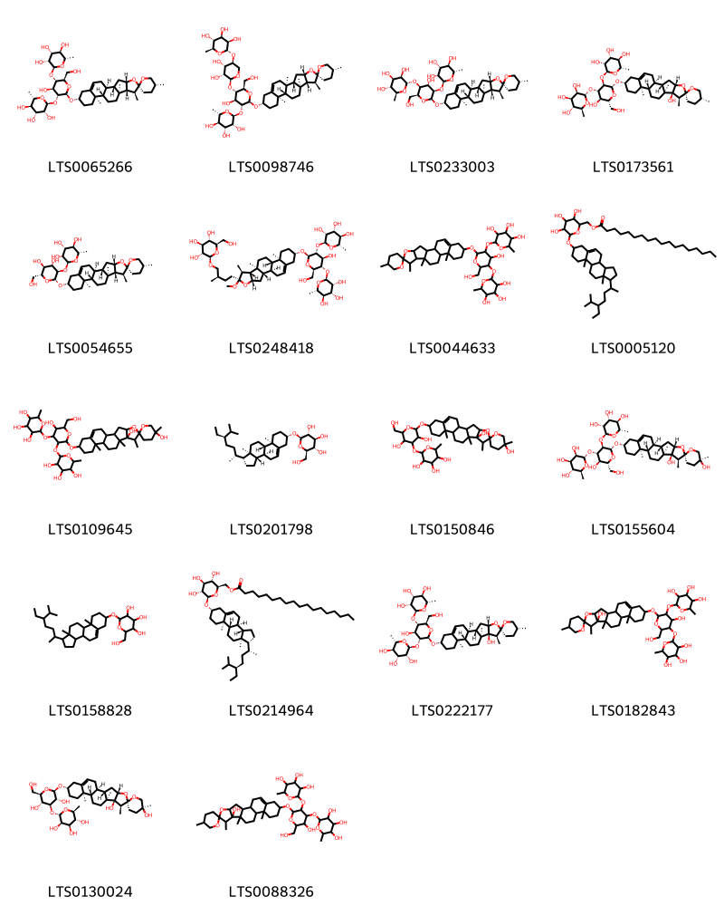{ width=100% }
    <figcaption>Hình ảnh cấu trúc hóa học của 18 hoạt chất thuộc nhóm Steroids and steroid derivatives gồm ["(2s,3r,4r,5r,6s)-2-{[(2r,3s,4s,5r,6r)-4-hydroxy-2-(hydroxymethyl)-6-[(1's,2r,2's,4's,5r,7's,8'r,9's,12's,13'r,16's)-5,7',9',13'-tetramethyl-5'-oxaspiro[oxane-2,6'-pentacyclo[10.8.0.0²,⁹.0⁴,⁸.0¹³,¹⁸]icosan]-18'-eneoxy]-5-{[(2s,3r,4r,5r,6s)-3,4,5-trihydroxy-6-methyloxan-2-yl]oxy}oxan-3-yl]oxy}-6-methyloxane-3,4,5-triol (LTS0065266)", "(2s,3r,4r,5r,6s)-2-{[(3s,4s,5r,6s)-4,5-dihydroxy-6-{[(2r,3s,4s,5r,6r)-4-hydroxy-2-(hydroxymethyl)-6-[(1's,2r,2's,4's,5r,7's,8'r,9's,12's,13'r,16's)-1',5,7',9',13'-pentamethyl-5'-oxaspiro[oxane-2,6'-pentacyclo[10.8.0.0²,⁹.0⁴,⁸.0¹³,¹⁸]icosan]-18'-eneoxy]-5-{[(2s,3r,4r,5r,6s)-3,4,5-trihydroxy-6-methyloxan-2-yl]oxy}oxan-3-yl]oxy}oxan-3-yl]oxy}-6-methyloxane-3,4,5-triol (LTS0098746)", "(2s,3r,4r,5r,6s)-2-{[(2s,3s,4s,5r,6s)-4-hydroxy-2-(hydroxymethyl)-6-[(1's,2r,2's,4's,5r,7's,8'r,9's,12's,13'r,16's)-5,7',9',13'-tetramethyl-5'-oxaspiro[oxane-2,6'-pentacyclo[10.8.0.0²,⁹.0⁴,⁸.0¹³,¹⁸]icosan]-18'-eneoxy]-5-{[(2s,3r,4r,5r,6s)-3,4,5-trihydroxy-6-methyloxan-2-yl]oxy}oxan-3-yl]oxy}-6-methyloxane-3,4,5-triol (LTS0233003)", "(2s,3r,4r,5r,6s)-2-{[(2r,3r,4s,5r,6r)-3-hydroxy-2-(hydroxymethyl)-6-[(1'r,2r,2's,4's,5r,7's,8's,9's,12's,13'r,16's)-5,7',9',13'-tetramethyl-5'-oxaspiro[oxane-2,6'-pentacyclo[10.8.0.0²,⁹.0⁴,⁸.0¹³,¹⁸]icosan]-18'-en-8'-oloxy]-5-{[(2s,3r,4r,5r,6s)-3,4,5-trihydroxy-6-methyloxan-2-yl]oxy}oxan-4-yl]oxy}-6-methyloxane-3,4,5-triol (LTS0173561)", "(2s,3r,4r,5r,6s)-2-{[(2r,3r,4s,5s,6r)-4,5-dihydroxy-6-(hydroxymethyl)-2-[(1's,2r,2's,4's,5r,7's,8'r,9's,12's,13'r,16's)-5,7',9',13'-tetramethyl-5'-oxaspiro[oxane-2,6'-pentacyclo[10.8.0.0²,⁹.0⁴,⁸.0¹³,¹⁸]icosan]-18'-eneoxy]oxan-3-yl]oxy}-6-methyloxane-3,4,5-triol (LTS0054655)", 'methylprotodioscin (LTS0248418)', "2-{[4-hydroxy-2-(hydroxymethyl)-6-{5,7',9',13'-tetramethyl-5'-oxaspiro[oxane-2,6'-pentacyclo[10.8.0.0²,⁹.0⁴,⁸.0¹³,¹⁸]icosan]-18'-eneoxy}-5-[(3,4,5-trihydroxy-6-methyloxan-2-yl)oxy]oxan-3-yl]oxy}-6-methyloxane-3,4,5-triol (LTS0044633)", '(6-{[1-(5-ethyl-6-methylheptan-2-yl)-9a,11a-dimethyl-1h,2h,3h,3ah,3bh,4h,6h,7h,8h,9h,9bh,10h,11h-cyclopenta[a]phenanthren-7-yl]oxy}-3,4,5-trihydroxyoxan-2-yl)methyl octadecanoate (LTS0005120)', "2-{[5-hydroxy-6-(hydroxymethyl)-2-{5,7',9',13'-tetramethyl-5'-oxaspiro[oxane-2,6'-pentacyclo[10.8.0.0²,⁹.0⁴,⁸.0¹³,¹⁸]icosan]-18'-ene-5,8'-dioloxy}-4-[(3,4,5-trihydroxy-6-methyloxan-2-yl)oxy]oxan-3-yl]oxy}-6-methyloxane-3,4,5-triol (LTS0109645)", 'sitogluside (LTS0201798)', "2-{[3,5-dihydroxy-2-(hydroxymethyl)-6-{5,7',9',13'-tetramethyl-5'-oxaspiro[oxane-2,6'-pentacyclo[10.8.0.0²,⁹.0⁴,⁸.0¹³,¹⁸]icosan]-18'-ene-5,8'-dioloxy}oxan-4-yl]oxy}-6-methyloxane-3,4,5-triol (LTS0150846)", "(2s,3r,4r,5r,6s)-2-{[(2r,3r,4s,5r,6r)-3-hydroxy-2-(hydroxymethyl)-6-[(1'r,2r,2's,4's,5s,7's,8's,9's,12's,13'r,16's)-5,7',9',13'-tetramethyl-5'-oxaspiro[oxane-2,6'-pentacyclo[10.8.0.0²,⁹.0⁴,⁸.0¹³,¹⁸]icosan]-18'-ene-5,8'-dioloxy]-5-{[(2s,3r,4r,5r,6s)-3,4,5-trihydroxy-6-methyloxan-2-yl]oxy}oxan-4-yl]oxy}-6-methyloxane-3,4,5-triol (LTS0155604)", '2-{[1-(5-ethyl-6-methylheptan-2-yl)-9a,11a-dimethyl-1h,2h,3h,3ah,3bh,4h,6h,7h,8h,9h,9bh,10h,11h-cyclopenta[a]phenanthren-7-yl]oxy}-6-(hydroxymethyl)oxane-3,4,5-triol (LTS0158828)', '[(2r,3s,4s,5r,6r)-6-{[(1r,3as,3bs,7s,9ar,9bs,11ar)-1-[(2r,5r)-5-ethyl-6-methylheptan-2-yl]-9a,11a-dimethyl-1h,2h,3h,3ah,3bh,4h,6h,7h,8h,9h,9bh,10h,11h-cyclopenta[a]phenanthren-7-yl]oxy}-3,4,5-trihydroxyoxan-2-yl]methyl octadecanoate (LTS0214964)', "(2s,3r,4r,5r,6s)-2-{[(2r,3s,4s,5r,6r)-4-hydroxy-2-(hydroxymethyl)-6-[(1'r,2r,2's,4's,5r,7's,8's,9's,12's,13'r,16's)-5,7',9',13'-tetramethyl-5'-oxaspiro[oxane-2,6'-pentacyclo[10.8.0.0²,⁹.0⁴,⁸.0¹³,¹⁸]icosan]-18'-en-8'-oloxy]-5-{[(2s,3r,4r,5r,6s)-3,4,5-trihydroxy-6-methyloxan-2-yl]oxy}oxan-3-yl]oxy}-6-methyloxane-3,4,5-triol (LTS0222177)", "2-{[4-hydroxy-2-(hydroxymethyl)-6-{5,7',9',13'-tetramethyl-5'-oxaspiro[oxane-2,6'-pentacyclo[10.8.0.0²,⁹.0⁴,⁸.0¹³,¹⁸]icosan]-18'-en-8'-oloxy}-5-[(3,4,5-trihydroxy-6-methyloxan-2-yl)oxy]oxan-3-yl]oxy}-6-methyloxane-3,4,5-triol (LTS0182843)", "(2s,3r,4r,5r,6s)-2-{[(2r,3r,4s,5r,6r)-3,5-dihydroxy-2-(hydroxymethyl)-6-[(1'r,2r,2's,4's,5s,7's,8's,9's,12's,13'r,16's)-5,7',9',13'-tetramethyl-5'-oxaspiro[oxane-2,6'-pentacyclo[10.8.0.0²,⁹.0⁴,⁸.0¹³,¹⁸]icosan]-18'-ene-5,8'-dioloxy]oxan-4-yl]oxy}-6-methyloxane-3,4,5-triol (LTS0130024)", "2-{[3-hydroxy-2-(hydroxymethyl)-6-{5,7',9',13'-tetramethyl-5'-oxaspiro[oxane-2,6'-pentacyclo[10.8.0.0²,⁹.0⁴,⁸.0¹³,¹⁸]icosan]-18'-en-8'-oloxy}-5-[(3,4,5-trihydroxy-6-methyloxan-2-yl)oxy]oxan-4-yl]oxy}-6-methyloxane-3,4,5-triol (LTS0088326)"].</figcaption>
</figure>
#### Nhóm Stilbenes
<figure markdown="span">
    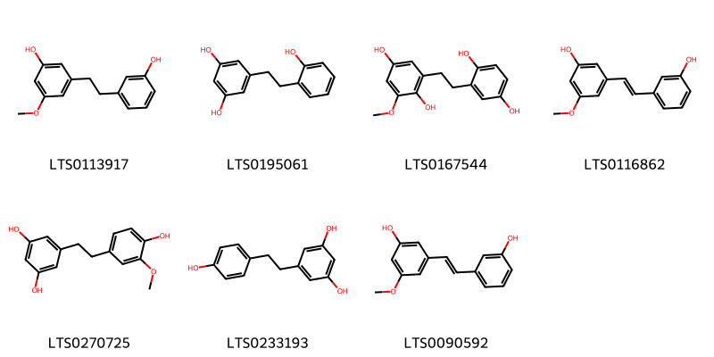{ width=100% }
    <figcaption>Hình ảnh cấu trúc hóa học của 7 hoạt chất thuộc nhóm Stilbenes gồm ['3-[2-(3-hydroxyphenyl)ethyl]-5-methoxyphenol (LTS0113917)', 'demethylbatatasin iv (LTS0195061)', '2-[2-(2,5-dihydroxyphenyl)ethyl]-6-methoxybenzene-1,4-diol (LTS0167544)', '3-[(1e)-2-(3-hydroxyphenyl)ethenyl]-5-methoxyphenol (LTS0116862)', '5-[2-(4-hydroxy-3-methoxyphenyl)ethyl]benzene-1,3-diol (LTS0270725)', 'dihydroresveratrol (LTS0233193)', '3-[2-(3-hydroxyphenyl)ethenyl]-5-methoxyphenol (LTS0090592)'].</figcaption>
</figure>

---

### Dược dân tộc học

Danh sách các quốc gia có sử dụng *Dioscorea bulbifera* trong điều trị các bệnh. 

| Country   | Disease                            | Bệnh                                                                                                                                                                                                |
|:----------|:-----------------------------------|:----------------------------------------------------------------------------------------------------------------------------------------------------------------------------------------------------|
| China     | Alexiteric, Poison, Antidote       | MYMEMORY WARNING: YOU USED ALL AVAILABLE FREE TRANSLATIONS FOR TODAY. NEXT AVAILABLE IN  13 HOURS 31 MINUTES 15 SECONDS VISIT HTTPS://MYMEMORY.TRANSLATED.NET/DOC/USAGELIMITS.PHP TO TRANSLATE MORE |
| Elsewhere | Antiphlogistic, Hemostatic, Poison | MYMEMORY WARNING: YOU USED ALL AVAILABLE FREE TRANSLATIONS FOR TODAY. NEXT AVAILABLE IN  13 HOURS 31 MINUTES 11 SECONDS VISIT HTTPS://MYMEMORY.TRANSLATED.NET/DOC/USAGELIMITS.PHP TO TRANSLATE MORE |
| Samoa     | Poison                             | MYMEMORY WARNING: YOU USED ALL AVAILABLE FREE TRANSLATIONS FOR TODAY. NEXT AVAILABLE IN  13 HOURS 31 MINUTES 06 SECONDS VISIT HTTPS://MYMEMORY.TRANSLATED.NET/DOC/USAGELIMITS.PHP TO TRANSLATE MORE |
| Solomon I | Poison                             | MYMEMORY WARNING: YOU USED ALL AVAILABLE FREE TRANSLATIONS FOR TODAY. NEXT AVAILABLE IN  13 HOURS 30 MINUTES 58 SECONDS VISIT HTTPS://MYMEMORY.TRANSLATED.NET/DOC/USAGELIMITS.PHP TO TRANSLATE MORE |
| Venezuela | Poison                             | MYMEMORY WARNING: YOU USED ALL AVAILABLE FREE TRANSLATIONS FOR TODAY. NEXT AVAILABLE IN  13 HOURS 30 MINUTES 54 SECONDS VISIT HTTPS://MYMEMORY.TRANSLATED.NET/DOC/USAGELIMITS.PHP TO TRANSLATE MORE |

---

---
## Dioscorea cayennensis
### Thông tin về thực vật

!!! info "Phân loại thực vật của *Dioscorea cayenensis* từ GIBF:"
    - **Kingdom:** Plantae
    - **Phylum:** Tracheophyta
    - **Order:** Dioscoreales
    - **Family:** Dioscoreaceae
    - **Genus:** Dioscorea
    - **Species:** *Dioscorea cayenensis*

 

| Label (VI)   | Label (EN)   | Scientific Name     | Descriptions (VI)   | Descriptions (EN)   | Also Known As (VI)      | Also Known As (EN)                                                                               |
|:-------------|:-------------|:--------------------|:--------------------|:--------------------|:------------------------|:-------------------------------------------------------------------------------------------------|
| N/A          | N/A          | Dioscorea bulbifera | loài thực vật       | species of plant    | ['Dioscorea bulbifera'] | ['bitter yam', 'aerial yam', 'Air Potato', 'air yam', 'cheeky yam', 'parsnip yam', 'potato yam'] |

#### Phân bố trên thế giới

**Từ CSDL GIBF** Nigeria, Colombia, Brazil, United States of America, Dominican Republic, Cameroon, Tanzania, United Republic of, French Guiana

#### Phân bố tại Việt Nam

**Từ CSDL GIBF**: Không có ghi nhận ở Việt Nam

---
### Thành phần hóa học
        
- Theo cơ sở dữ liệu lotus: Từ loài *Dioscorea cayenensis* đã phân lập và xác định được Chưa có hoạt chất nào được phân lập. hoạt chất thuộc về các nhóm Không có hoạt chất nào được phân lập. 

Không có hình ảnh nào được tạo ra

---

### Dược dân tộc học

Danh sách các quốc gia có sử dụng *Dioscorea cayenensis* trong điều trị các bệnh. 

| Country   | Disease     | Bệnh                                                                                                                                                                                                |
|:----------|:------------|:----------------------------------------------------------------------------------------------------------------------------------------------------------------------------------------------------|
| Haiti     | Cicatrizant | MYMEMORY WARNING: YOU USED ALL AVAILABLE FREE TRANSLATIONS FOR TODAY. NEXT AVAILABLE IN  13 HOURS 30 MINUTES 14 SECONDS VISIT HTTPS://MYMEMORY.TRANSLATED.NET/DOC/USAGELIMITS.PHP TO TRANSLATE MORE |

---

---
## Dioscorea composita
### Thông tin về thực vật

!!! info "Phân loại thực vật của *Dioscorea composita* từ GIBF:"
    - **Kingdom:** Plantae
    - **Phylum:** Tracheophyta
    - **Order:** Dioscoreales
    - **Family:** Dioscoreaceae
    - **Genus:** Dioscorea
    - **Species:** *Dioscorea composita*

 

| Label (VI)   | Label (EN)   | Scientific Name     | Descriptions (VI)   | Descriptions (EN)   | Also Known As (VI)   | Also Known As (EN)   |
|:-------------|:-------------|:--------------------|:--------------------|:--------------------|:---------------------|:---------------------|
| N/A          | N/A          | Dioscorea composita | loài thực vật       | species of plant    | ['']                 | ['']                 |

#### Phân bố trên thế giới

**Từ CSDL GIBF** Ecuador, Guatemala, Brazil, Mexico, El Salvador

#### Phân bố tại Việt Nam

**Từ CSDL GIBF**: Không có ghi nhận ở Việt Nam

---
### Thành phần hóa học
        
- Theo cơ sở dữ liệu lotus: Từ loài *Dioscorea composita* đã phân lập và xác định được 12 hoạt chất thuộc về các nhóm Phenanthrenes and derivatives, Stilbenes, Prenol lipids, Steroids and steroid derivatives. 

|    | chemicalTaxonomyClassyfireClass   |   smiles_count |
|---:|:----------------------------------|---------------:|
|  0 | Phenanthrenes and derivatives     |              1 |
|  1 | Prenol lipids                     |              4 |
|  2 | Steroids and steroid derivatives  |              6 |
|  3 | Stilbenes                         |              1 |

#### Nhóm Phenanthrenes and derivatives
<figure markdown="span">
    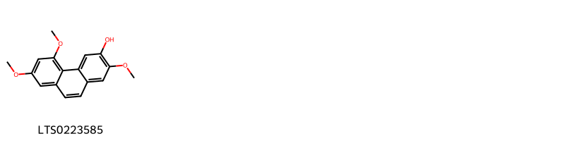{ width=100% }
    <figcaption>Hình ảnh cấu trúc hóa học của 1 hoạt chất thuộc nhóm Phenanthrenes and derivatives gồm ['batatasin i (LTS0223585)'].</figcaption>
</figure>
#### Nhóm Prenol lipids
<figure markdown="span">
    { width=100% }
    <figcaption>Hình ảnh cấu trúc hóa học của 4 hoạt chất thuộc nhóm Prenol lipids gồm ["5,7',9',13'-tetramethyl-5'-oxaspiro[oxane-2,6'-pentacyclo[10.8.0.0²,⁹.0⁴,⁸.0¹³,¹⁸]icosan]-18'-ene-8',16'-diol (LTS0078842)", 'diosgenin (LTS0035986)', 'diosgenin (LTS0149188)', 'pennogenin (LTS0263241)'].</figcaption>
</figure>
#### Nhóm Steroids and steroid derivatives
<figure markdown="span">
    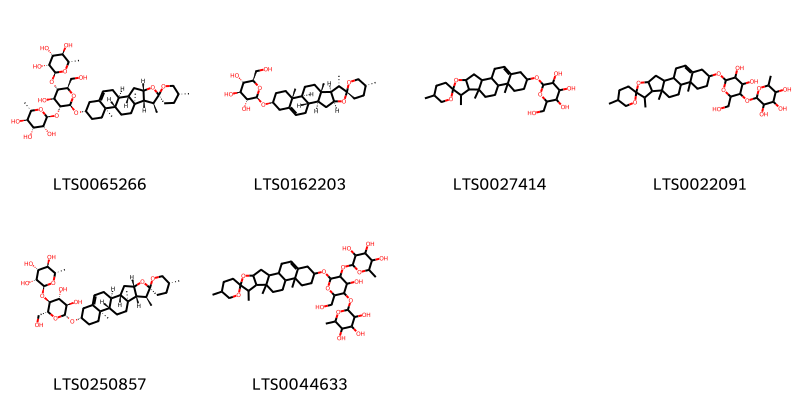{ width=100% }
    <figcaption>Hình ảnh cấu trúc hóa học của 6 hoạt chất thuộc nhóm Steroids and steroid derivatives gồm ["(2s,3r,4r,5r,6s)-2-{[(2r,3s,4s,5r,6r)-4-hydroxy-2-(hydroxymethyl)-6-[(1's,2r,2's,4's,5r,7's,8'r,9's,12's,13'r,16's)-5,7',9',13'-tetramethyl-5'-oxaspiro[oxane-2,6'-pentacyclo[10.8.0.0²,⁹.0⁴,⁸.0¹³,¹⁸]icosan]-18'-eneoxy]-5-{[(2s,3r,4r,5r,6s)-3,4,5-trihydroxy-6-methyloxan-2-yl]oxy}oxan-3-yl]oxy}-6-methyloxane-3,4,5-triol (LTS0065266)", 'disogluside (LTS0162203)', "2-(hydroxymethyl)-6-{5,7',9',13'-tetramethyl-5'-oxaspiro[oxane-2,6'-pentacyclo[10.8.0.0²,⁹.0⁴,⁸.0¹³,¹⁸]icosan]-18'-eneoxy}oxane-3,4,5-triol (LTS0027414)", "2-{[4,5-dihydroxy-2-(hydroxymethyl)-6-{5,7',9',13'-tetramethyl-5'-oxaspiro[oxane-2,6'-pentacyclo[10.8.0.0²,⁹.0⁴,⁸.0¹³,¹⁸]icosan]-18'-eneoxy}oxan-3-yl]oxy}-6-methyloxane-3,4,5-triol (LTS0022091)", "(2s,3r,4r,5r,6s)-2-{[(2r,3s,4r,5r,6r)-4,5-dihydroxy-2-(hydroxymethyl)-6-[(1's,2r,2's,4's,5r,7's,8'r,9's,12's,13'r,16's)-5,7',9',13'-tetramethyl-5'-oxaspiro[oxane-2,6'-pentacyclo[10.8.0.0²,⁹.0⁴,⁸.0¹³,¹⁸]icosan]-18'-eneoxy]oxan-3-yl]oxy}-6-methyloxane-3,4,5-triol (LTS0250857)", "2-{[4-hydroxy-2-(hydroxymethyl)-6-{5,7',9',13'-tetramethyl-5'-oxaspiro[oxane-2,6'-pentacyclo[10.8.0.0²,⁹.0⁴,⁸.0¹³,¹⁸]icosan]-18'-eneoxy}-5-[(3,4,5-trihydroxy-6-methyloxan-2-yl)oxy]oxan-3-yl]oxy}-6-methyloxane-3,4,5-triol (LTS0044633)"].</figcaption>
</figure>
#### Nhóm Stilbenes
<figure markdown="span">
    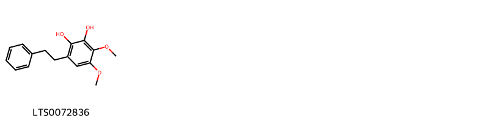{ width=100% }
    <figcaption>Hình ảnh cấu trúc hóa học của 1 hoạt chất thuộc nhóm Stilbenes gồm ['3,4-dimethoxy-6-(2-phenylethyl)benzene-1,2-diol (LTS0072836)'].</figcaption>
</figure>

---

### Dược dân tộc học

Danh sách các quốc gia có sử dụng *Dioscorea composita* trong điều trị các bệnh. 

| Country           | Disease   | Bệnh                                                                                                                                                                                                |
|:------------------|:----------|:----------------------------------------------------------------------------------------------------------------------------------------------------------------------------------------------------|
| Mexico(Chinantec) | Piscicide | MYMEMORY WARNING: YOU USED ALL AVAILABLE FREE TRANSLATIONS FOR TODAY. NEXT AVAILABLE IN  13 HOURS 29 MINUTES 41 SECONDS VISIT HTTPS://MYMEMORY.TRANSLATED.NET/DOC/USAGELIMITS.PHP TO TRANSLATE MORE |

---

---
## Dioscorea deltoidea
### Thông tin về thực vật

!!! info "Phân loại thực vật của *Dioscorea deltoidea* từ GIBF:"
    - **Kingdom:** Plantae
    - **Phylum:** Tracheophyta
    - **Order:** Dioscoreales
    - **Family:** Dioscoreaceae
    - **Genus:** Dioscorea
    - **Species:** *Dioscorea deltoidea*

 

| Label (VI)   | Label (EN)   | Scientific Name     | Descriptions (VI)   | Descriptions (EN)   | Also Known As (VI)   | Also Known As (EN)   |
|:-------------|:-------------|:--------------------|:--------------------|:--------------------|:---------------------|:---------------------|
| N/A          | N/A          | Dioscorea deltoidea | loài thực vật       | species of plant    | ['']                 | ['']                 |

#### Phân bố trên thế giới

**Từ CSDL GIBF** nan, Pakistan, Thailand, Afghanistan, Bhutan, India, Bangladesh, Yemen, Norway, China, Nepal

#### Phân bố tại Việt Nam

**Từ CSDL GIBF**: Không có ghi nhận ở Việt Nam

---
### Thành phần hóa học
        
- Theo cơ sở dữ liệu lotus: Từ loài *Dioscorea deltoidea* đã phân lập và xác định được 13 hoạt chất thuộc về các nhóm Benzopyrans, Prenol lipids, Steroids and steroid derivatives. 

|    | chemicalTaxonomyClassyfireClass   |   smiles_count |
|---:|:----------------------------------|---------------:|
|  0 | Benzopyrans                       |              1 |
|  1 | Prenol lipids                     |              2 |
|  2 | Steroids and steroid derivatives  |             10 |

#### Nhóm Benzopyrans
<figure markdown="span">
    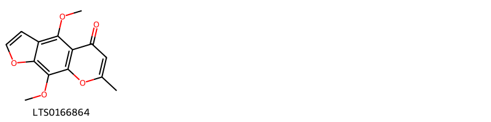{ width=100% }
    <figcaption>Hình ảnh cấu trúc hóa học của 1 hoạt chất thuộc nhóm Benzopyrans gồm ['kelamin (LTS0166864)'].</figcaption>
</figure>
#### Nhóm Prenol lipids
<figure markdown="span">
    { width=100% }
    <figcaption>Hình ảnh cấu trúc hóa học của 2 hoạt chất thuộc nhóm Prenol lipids gồm ['diosgenin (LTS0035986)', 'diosgenin (LTS0149188)'].</figcaption>
</figure>
#### Nhóm Steroids and steroid derivatives
<figure markdown="span">
    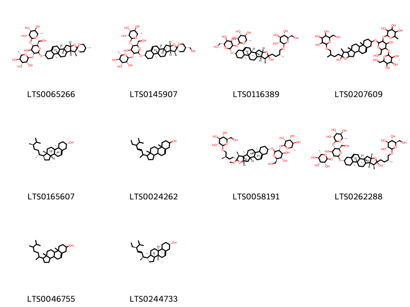{ width=100% }
    <figcaption>Hình ảnh cấu trúc hóa học của 10 hoạt chất thuộc nhóm Steroids and steroid derivatives gồm ["(2s,3r,4r,5r,6s)-2-{[(2r,3s,4s,5r,6r)-4-hydroxy-2-(hydroxymethyl)-6-[(1's,2r,2's,4's,5r,7's,8'r,9's,12's,13'r,16's)-5,7',9',13'-tetramethyl-5'-oxaspiro[oxane-2,6'-pentacyclo[10.8.0.0²,⁹.0⁴,⁸.0¹³,¹⁸]icosan]-18'-eneoxy]-5-{[(2s,3r,4r,5r,6s)-3,4,5-trihydroxy-6-methyloxan-2-yl]oxy}oxan-3-yl]oxy}-6-methyloxane-3,4,5-triol (LTS0065266)", "(2s,3r,4r,5r,6s)-2-{[(2r,3s,4s,5r,6r)-4-hydroxy-2-(hydroxymethyl)-6-[(1's,2r,2's,4's,5s,7's,8'r,9's,12's,13'r,16's)-5-(hydroxymethyl)-7',9',13'-trimethyl-5'-oxaspiro[oxane-2,6'-pentacyclo[10.8.0.0²,⁹.0⁴,⁸.0¹³,¹⁸]icosan]-18'-eneoxy]-5-{[(2s,3r,4r,5r,6s)-3,4,5-trihydroxy-6-methyloxan-2-yl]oxy}oxan-3-yl]oxy}-6-methyloxane-3,4,5-triol (LTS0145907)", '(2s,3r,4r,5r,6s)-2-{[(2r,3r,4s,5s,6r)-4,5-dihydroxy-2-{[(1s,2s,4s,6r,7s,8r,9s,12s,13r,16s)-6-hydroxy-7,9,13-trimethyl-6-[(3r)-3-methyl-4-{[(2r,3r,4s,5s,6r)-3,4,5-trihydroxy-6-(hydroxymethyl)oxan-2-yl]oxy}butyl]-5-oxapentacyclo[10.8.0.0²,⁹.0⁴,⁸.0¹³,¹⁸]icos-18-en-16-yl]oxy}-6-(hydroxymethyl)oxan-3-yl]oxy}-6-methyloxane-3,4,5-triol (LTS0116389)', '2-[(4-hydroxy-6-{[6-hydroxy-7,9,13-trimethyl-6-(3-methyl-4-{[3,4,5-trihydroxy-6-(hydroxymethyl)oxan-2-yl]oxy}butyl)-5-oxapentacyclo[10.8.0.0²,⁹.0⁴,⁸.0¹³,¹⁸]icos-18-en-16-yl]oxy}-2-(hydroxymethyl)-5-[(3,4,5-trihydroxy-6-methyloxan-2-yl)oxy]oxan-3-yl)oxy]-6-(hydroxymethyl)oxane-3,4,5-triol (LTS0207609)', '(1s,3as,3bs,7s,9ar,9br,11as)-1-[(2r,5r)-5,6-dimethylheptan-2-yl]-9a,11a-dimethyl-1h,2h,3h,3ah,3bh,4h,6h,7h,8h,9h,9bh,10h,11h-cyclopenta[a]phenanthren-7-ol (LTS0165607)', 'stigmasterol (LTS0024262)', '(2r,3r,4s,5s,6r)-2-[(2r)-4-[(1s,2s,4s,6r,7s,8r,9s,12s,13r,16s)-16-{[(2r,3r,4s,5s,6r)-4,5-dihydroxy-6-(hydroxymethyl)-3-{[(2s,3r,4r,5r,6s)-3,4,5-trihydroxy-6-methyloxan-2-yl]oxy}oxan-2-yl]oxy}-6-methoxy-7,9,13-trimethyl-5-oxapentacyclo[10.8.0.0²,⁹.0⁴,⁸.0¹³,¹⁸]icos-18-en-6-yl]-2-methylbutoxy]-6-(hydroxymethyl)oxane-3,4,5-triol (LTS0058191)', 'protodioscin (LTS0262288)', 'campesterol (LTS0046755)', '(1r,3ar,3br,7s,9ar,9br,11ar)-1-[(2s,3e,5s)-5-ethyl-6-methylhept-3-en-2-yl]-9a,11a-dimethyl-1h,2h,3h,3ah,3bh,4h,6h,7h,8h,9h,9bh,10h,11h-cyclopenta[a]phenanthren-7-ol (LTS0244733)'].</figcaption>
</figure>

---

### Dược dân tộc học

Danh sách các quốc gia có sử dụng *Dioscorea deltoidea* trong điều trị các bệnh. 

| Country   | Disease                                            | Bệnh                                                                                                                                                                                                |
|:----------|:---------------------------------------------------|:----------------------------------------------------------------------------------------------------------------------------------------------------------------------------------------------------|
| Elsewhere | Pediculicide, Pediculicide, Piscicide              | MYMEMORY WARNING: YOU USED ALL AVAILABLE FREE TRANSLATIONS FOR TODAY. NEXT AVAILABLE IN  13 HOURS 29 MINUTES 11 SECONDS VISIT HTTPS://MYMEMORY.TRANSLATED.NET/DOC/USAGELIMITS.PHP TO TRANSLATE MORE |
| Nepal     | Contraceptive, Contraceptive, Piscicide, Piscicide | MYMEMORY WARNING: YOU USED ALL AVAILABLE FREE TRANSLATIONS FOR TODAY. NEXT AVAILABLE IN  13 HOURS 29 MINUTES 08 SECONDS VISIT HTTPS://MYMEMORY.TRANSLATED.NET/DOC/USAGELIMITS.PHP TO TRANSLATE MORE |

---

---
## Dioscorea dumetorum
### Thông tin về thực vật

!!! info "Phân loại thực vật của *Dioscorea dumetorum* từ GIBF:"
    - **Kingdom:** Plantae
    - **Phylum:** Tracheophyta
    - **Order:** Dioscoreales
    - **Family:** Dioscoreaceae
    - **Genus:** Dioscorea
    - **Species:** *Dioscorea dumetorum*

 

| Label (VI)   | Label (EN)   | Scientific Name     | Descriptions (VI)   | Descriptions (EN)   | Also Known As (VI)   | Also Known As (EN)   |
|:-------------|:-------------|:--------------------|:--------------------|:--------------------|:---------------------|:---------------------|
| N/A          | N/A          | Dioscorea dumetorum | loài thực vật       | species of plant    | ['']                 | ['']                 |

#### Phân bố trên thế giới

**Từ CSDL GIBF** Ghana, Gabon, Angola, Mozambique, Benin, Congo, Tanzania, United Republic of, Togo, Malawi, Senegal, Nigeria, Namibia, Congo, Democratic Republic of the, Guinea, Zimbabwe, Côte d’Ivoire, Burkina Faso, Cameroon, Ethiopia

#### Phân bố tại Việt Nam

**Từ CSDL GIBF**: Không có ghi nhận ở Việt Nam

---
### Thành phần hóa học
        
- Theo cơ sở dữ liệu lotus: Từ loài *Dioscorea dumetorum* đã phân lập và xác định được 15 hoạt chất thuộc về các nhóm Fatty Acyls, Prenol lipids, Steroids and steroid derivatives, Pyrans, Benzene and substituted derivatives, Azaspirodecane derivatives, Stilbenes. 

|    | chemicalTaxonomyClassyfireClass     |   smiles_count |
|---:|:------------------------------------|---------------:|
|  0 | Azaspirodecane derivatives          |              1 |
|  1 | Benzene and substituted derivatives |              1 |
|  2 | Fatty Acyls                         |              1 |
|  3 | Prenol lipids                       |              2 |
|  4 | Pyrans                              |              1 |
|  5 | Steroids and steroid derivatives    |              6 |
|  6 | Stilbenes                           |              2 |

#### Nhóm Azaspirodecane derivatives
<figure markdown="span">
    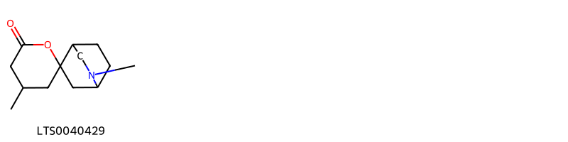{ width=100% }
    <figcaption>Hình ảnh cấu trúc hóa học của 1 hoạt chất thuộc nhóm Azaspirodecane derivatives gồm ["4',5-dimethyl-5-azaspiro[bicyclo[2.2.2]octane-2,2'-oxan]-6'-one (LTS0040429)"].</figcaption>
</figure>
#### Nhóm Benzene and substituted derivatives
<figure markdown="span">
    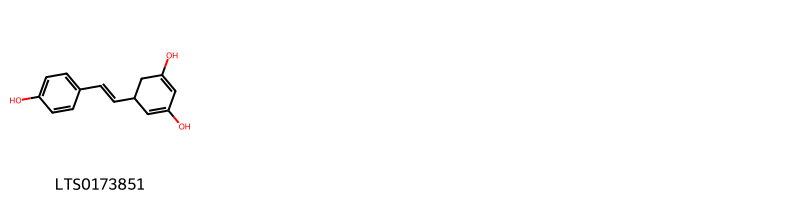{ width=100% }
    <figcaption>Hình ảnh cấu trúc hóa học của 1 hoạt chất thuộc nhóm Benzene and substituted derivatives gồm ['5-[2-(4-hydroxyphenyl)ethenyl]cyclohexa-1,3-diene-1,3-diol (LTS0173851)'].</figcaption>
</figure>
#### Nhóm Fatty Acyls
<figure markdown="span">
    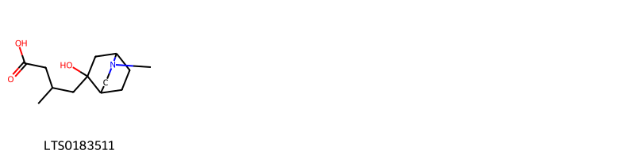{ width=100% }
    <figcaption>Hình ảnh cấu trúc hóa học của 1 hoạt chất thuộc nhóm Fatty Acyls gồm ['4-{5-hydroxy-2-methyl-2-azabicyclo[2.2.2]octan-5-yl}-3-methylbutanoic acid (LTS0183511)'].</figcaption>
</figure>
#### Nhóm Prenol lipids
<figure markdown="span">
    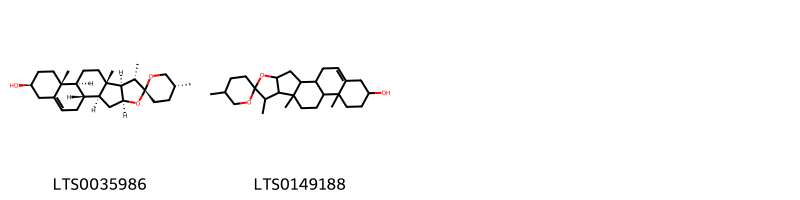{ width=100% }
    <figcaption>Hình ảnh cấu trúc hóa học của 2 hoạt chất thuộc nhóm Prenol lipids gồm ['diosgenin (LTS0035986)', 'diosgenin (LTS0149188)'].</figcaption>
</figure>
#### Nhóm Pyrans
<figure markdown="span">
    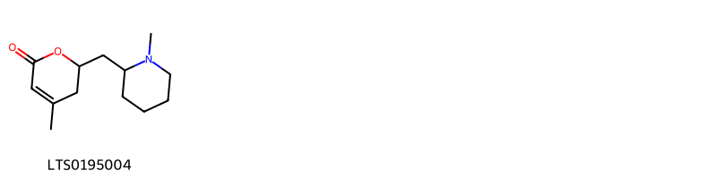{ width=100% }
    <figcaption>Hình ảnh cấu trúc hóa học của 1 hoạt chất thuộc nhóm Pyrans gồm ['4-methyl-6-[(1-methylpiperidin-2-yl)methyl]-5,6-dihydropyran-2-one (LTS0195004)'].</figcaption>
</figure>
#### Nhóm Steroids and steroid derivatives
<figure markdown="span">
    { width=100% }
    <figcaption>Hình ảnh cấu trúc hóa học của 6 hoạt chất thuộc nhóm Steroids and steroid derivatives gồm ['stigmast-5-en-3-ol, (3β)- (LTS0204616)', 'stigmast-5-en-3-ol (LTS0071224)', 'phytosterol (LTS0029311)', '(1r,3as,3bs,7s,9bs)-1-[(2r,5r)-5,6-dimethylheptan-2-yl]-9a,11a-dimethyl-1h,2h,3h,3ah,3bh,4h,6h,7h,8h,9h,9bh,10h,11h-cyclopenta[a]phenanthren-7-ol (LTS0057877)', 'campesterol (LTS0046755)', 'cholesterol (LTS0102304)'].</figcaption>
</figure>
#### Nhóm Stilbenes
<figure markdown="span">
    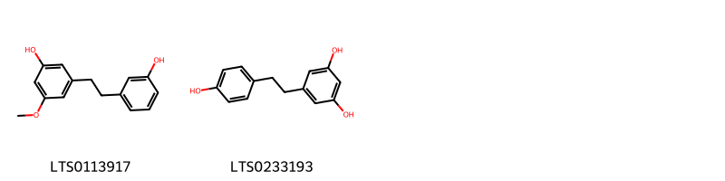{ width=100% }
    <figcaption>Hình ảnh cấu trúc hóa học của 2 hoạt chất thuộc nhóm Stilbenes gồm ['3-[2-(3-hydroxyphenyl)ethyl]-5-methoxyphenol (LTS0113917)', 'dihydroresveratrol (LTS0233193)'].</figcaption>
</figure>

---

### Dược dân tộc học

Danh sách các quốc gia có sử dụng *Dioscorea dumetorum* trong điều trị các bệnh. 

| Country         | Disease   | Bệnh                                                                                                                                                                                                |
|:----------------|:----------|:----------------------------------------------------------------------------------------------------------------------------------------------------------------------------------------------------|
| Africa(Swahili) | Poison    | MYMEMORY WARNING: YOU USED ALL AVAILABLE FREE TRANSLATIONS FOR TODAY. NEXT AVAILABLE IN  13 HOURS 28 MINUTES 38 SECONDS VISIT HTTPS://MYMEMORY.TRANSLATED.NET/DOC/USAGELIMITS.PHP TO TRANSLATE MORE |
| Sudan           | Poison    | MYMEMORY WARNING: YOU USED ALL AVAILABLE FREE TRANSLATIONS FOR TODAY. NEXT AVAILABLE IN  13 HOURS 28 MINUTES 35 SECONDS VISIT HTTPS://MYMEMORY.TRANSLATED.NET/DOC/USAGELIMITS.PHP TO TRANSLATE MORE |

---

---
## Dioscorea floribunda
### Thông tin về thực vật

!!! info "Phân loại thực vật của *Dioscorea floribunda* từ GIBF:"
    - **Kingdom:** Plantae
    - **Phylum:** Tracheophyta
    - **Order:** Dioscoreales
    - **Family:** Dioscoreaceae
    - **Genus:** Dioscorea
    - **Species:** *Dioscorea floribunda*

 

| Label (VI)   | Label (EN)   | Scientific Name      | Descriptions (VI)   | Descriptions (EN)   | Also Known As (VI)   | Also Known As (EN)   |
|:-------------|:-------------|:---------------------|:--------------------|:--------------------|:---------------------|:---------------------|
| N/A          | N/A          | Dioscorea floribunda | loài thực vật       | species of plant    | ['']                 | ['']                 |

#### Phân bố trên thế giới

**Từ CSDL GIBF** Nicaragua, El Salvador, Guatemala, Mexico

#### Phân bố tại Việt Nam

**Từ CSDL GIBF**: Không có ghi nhận ở Việt Nam

---
### Thành phần hóa học
        
- Theo cơ sở dữ liệu lotus: Từ loài *Dioscorea floribunda* đã phân lập và xác định được 28 hoạt chất thuộc về các nhóm Stilbenes, Prenol lipids, Steroids and steroid derivatives. 

|    | chemicalTaxonomyClassyfireClass   |   smiles_count |
|---:|:----------------------------------|---------------:|
|  0 | Prenol lipids                     |              2 |
|  1 | Steroids and steroid derivatives  |             24 |
|  2 | Stilbenes                         |              2 |

#### Nhóm Prenol lipids
<figure markdown="span">
    { width=100% }
    <figcaption>Hình ảnh cấu trúc hóa học của 2 hoạt chất thuộc nhóm Prenol lipids gồm ['diosgenin (LTS0035986)', 'diosgenin (LTS0149188)'].</figcaption>
</figure>
#### Nhóm Steroids and steroid derivatives
<figure markdown="span">
    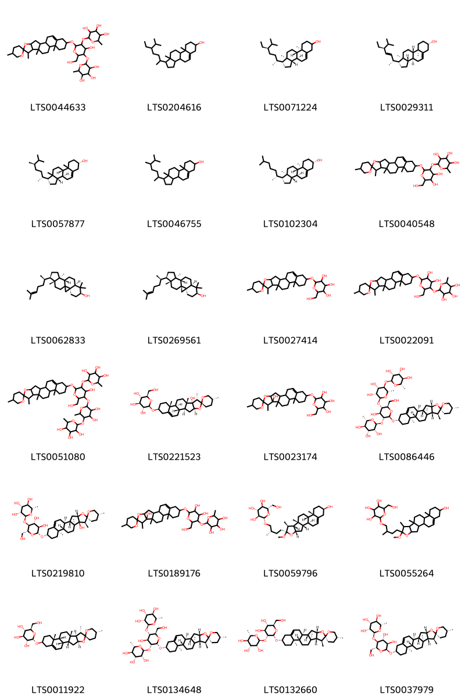{ width=100% }
    <figcaption>Hình ảnh cấu trúc hóa học của 24 hoạt chất thuộc nhóm Steroids and steroid derivatives gồm ["2-{[4-hydroxy-2-(hydroxymethyl)-6-{5,7',9',13'-tetramethyl-5'-oxaspiro[oxane-2,6'-pentacyclo[10.8.0.0²,⁹.0⁴,⁸.0¹³,¹⁸]icosan]-18'-eneoxy}-5-[(3,4,5-trihydroxy-6-methyloxan-2-yl)oxy]oxan-3-yl]oxy}-6-methyloxane-3,4,5-triol (LTS0044633)", 'stigmast-5-en-3-ol, (3β)- (LTS0204616)', 'stigmast-5-en-3-ol (LTS0071224)', 'phytosterol (LTS0029311)', '(1r,3as,3bs,7s,9bs)-1-[(2r,5r)-5,6-dimethylheptan-2-yl]-9a,11a-dimethyl-1h,2h,3h,3ah,3bh,4h,6h,7h,8h,9h,9bh,10h,11h-cyclopenta[a]phenanthren-7-ol (LTS0057877)', 'campesterol (LTS0046755)', 'cholesterol (LTS0102304)', "2-{[4,5-dihydroxy-6-(hydroxymethyl)-2-{5,7',9',13'-tetramethyl-5'-oxaspiro[oxane-2,6'-pentacyclo[10.8.0.0²,⁹.0⁴,⁸.0¹³,¹⁸]icosan]-18'-eneoxy}oxan-3-yl]oxy}-6-methyloxane-3,4,5-triol (LTS0040548)", '(3r,6s,8r,11s,12s,15r,16r)-7,7,12,16-tetramethyl-15-[(2r)-6-methylhept-5-en-2-yl]pentacyclo[9.7.0.0¹,³.0³,⁸.0¹²,¹⁶]octadecan-6-ol (LTS0062833)', 'cycloartenol (LTS0269561)', "2-(hydroxymethyl)-6-{5,7',9',13'-tetramethyl-5'-oxaspiro[oxane-2,6'-pentacyclo[10.8.0.0²,⁹.0⁴,⁸.0¹³,¹⁸]icosan]-18'-eneoxy}oxane-3,4,5-triol (LTS0027414)", "2-{[4,5-dihydroxy-2-(hydroxymethyl)-6-{5,7',9',13'-tetramethyl-5'-oxaspiro[oxane-2,6'-pentacyclo[10.8.0.0²,⁹.0⁴,⁸.0¹³,¹⁸]icosan]-18'-eneoxy}oxan-3-yl]oxy}-6-methyloxane-3,4,5-triol (LTS0022091)", "2-[(4,5-dihydroxy-6-{[4-hydroxy-2-(hydroxymethyl)-6-{5,7',9',13'-tetramethyl-5'-oxaspiro[oxane-2,6'-pentacyclo[10.8.0.0²,⁹.0⁴,⁸.0¹³,¹⁸]icosan]-18'-eneoxy}-5-[(3,4,5-trihydroxy-6-methyloxan-2-yl)oxy]oxan-3-yl]oxy}-2-methyloxan-3-yl)oxy]-6-methyloxane-3,4,5-triol (LTS0051080)", 'floribundasaponin a (LTS0221523)', "2-(hydroxymethyl)-6-{5,7',9',13'-tetramethyl-5'-oxaspiro[oxane-2,6'-pentacyclo[10.8.0.0²,⁹.0⁴,⁸.0¹³,¹⁸]icosan]-18'-en-8'-oloxy}oxane-3,4,5-triol (LTS0023174)", "(2s,3r,4r,5r,6s)-2-{[(2r,3r,4s,5s,6r)-5-{[(2s,3r,4s,5r,6s)-3,4-dihydroxy-6-methyl-5-{[(2s,3r,4r,5r,6s)-3,4,5-trihydroxy-6-methyloxan-2-yl]oxy}oxan-2-yl]oxy}-4-hydroxy-6-(hydroxymethyl)-2-[(1's,2r,2's,4's,5r,7's,8'r,9's,12's,13'r,16's)-5,7',9',13'-tetramethyl-5'-oxaspiro[oxane-2,6'-pentacyclo[10.8.0.0²,⁹.0⁴,⁸.0¹³,¹⁸]icosan]-18'-eneoxy]oxan-3-yl]oxy}-6-methyloxane-3,4,5-triol (LTS0086446)", "(2s,3r,4r,5r,6s)-2-{[(2r,3s,4r,5r,6r)-4,5-dihydroxy-2-(hydroxymethyl)-6-[(1'r,2r,2's,4's,5r,7's,8's,9's,12's,13'r,16's)-5,7',9',13'-tetramethyl-5'-oxaspiro[oxane-2,6'-pentacyclo[10.8.0.0²,⁹.0⁴,⁸.0¹³,¹⁸]icosan]-18'-en-8'-oloxy]oxan-3-yl]oxy}-6-methyloxane-3,4,5-triol (LTS0219810)", "2-{[4,5-dihydroxy-2-(hydroxymethyl)-6-{5,7',9',13'-tetramethyl-5'-oxaspiro[oxane-2,6'-pentacyclo[10.8.0.0²,⁹.0⁴,⁸.0¹³,¹⁸]icosan]-18'-en-8'-oloxy}oxan-3-yl]oxy}-6-methyloxane-3,4,5-triol (LTS0189176)", '(2s,3s,4r,5r,6s)-2-[(2s)-4-[(1s,2s,4s,6r,7s,8r,9r,12s,13s,16r)-16-hydroxy-6-methoxy-7,9,13-trimethyl-5-oxapentacyclo[10.8.0.0²,⁹.0⁴,⁸.0¹³,¹⁸]icos-18-en-6-yl]-2-methylbutoxy]-6-(hydroxymethyl)oxane-3,4,5-triol (LTS0059796)', '2-(4-{16-hydroxy-6-methoxy-7,9,13-trimethyl-5-oxapentacyclo[10.8.0.0²,⁹.0⁴,⁸.0¹³,¹⁸]icos-18-en-6-yl}-2-methylbutoxy)-6-(hydroxymethyl)oxane-3,4,5-triol (LTS0055264)', "(2r,3s,4s,5r,6s)-2-(hydroxymethyl)-6-[(1's,2r,2'r,4's,5r,7's,8'r,9's,12'r,13'r,16's)-5,7',9',13'-tetramethyl-5'-oxaspiro[oxane-2,6'-pentacyclo[10.8.0.0²,⁹.0⁴,⁸.0¹³,¹⁸]icosan]-18'-eneoxy]oxane-3,4,5-triol (LTS0011922)", "(2s,3r,4r,5r,6s)-2-{[(2r,3s,4s,5r,6s)-4-hydroxy-2-(hydroxymethyl)-6-[(1's,2r,2's,4's,5r,7's,8'r,9's,12's,13'r,16's)-5,7',9',13'-tetramethyl-5'-oxaspiro[oxane-2,6'-pentacyclo[10.8.0.0²,⁹.0⁴,⁸.0¹³,¹⁸]icosan]-18'-eneoxy]-5-{[(2s,3r,4r,5r,6s)-3,4,5-trihydroxy-6-methyloxan-2-yl]oxy}oxan-3-yl]oxy}-6-methyloxane-3,4,5-triol (LTS0134648)", "(2s,3r,4r,5r,6s)-2-{[(2s,3r,4s,5s,6r)-4,5-dihydroxy-6-(hydroxymethyl)-2-[(1's,2r,2's,4's,5r,7's,8'r,9's,12's,13'r,16's)-5,7',9',13'-tetramethyl-5'-oxaspiro[oxane-2,6'-pentacyclo[10.8.0.0²,⁹.0⁴,⁸.0¹³,¹⁸]icosan]-18'-eneoxy]oxan-3-yl]oxy}-6-methyloxane-3,4,5-triol (LTS0132660)", "(2s,3r,4r,5r,6s)-2-{[(2r,3s,4r,5r,6s)-4,5-dihydroxy-2-(hydroxymethyl)-6-[(1's,2r,2's,4's,5r,7's,8'r,9's,12's,13'r,16's)-5,7',9',13'-tetramethyl-5'-oxaspiro[oxane-2,6'-pentacyclo[10.8.0.0²,⁹.0⁴,⁸.0¹³,¹⁸]icosan]-18'-eneoxy]oxan-3-yl]oxy}-6-methyloxane-3,4,5-triol (LTS0037979)"].</figcaption>
</figure>
#### Nhóm Stilbenes
<figure markdown="span">
    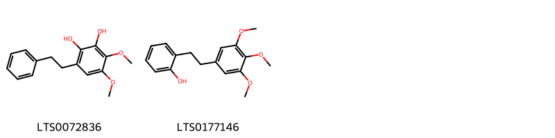{ width=100% }
    <figcaption>Hình ảnh cấu trúc hóa học của 2 hoạt chất thuộc nhóm Stilbenes gồm ['3,4-dimethoxy-6-(2-phenylethyl)benzene-1,2-diol (LTS0072836)', '2-[2-(3,4,5-trimethoxyphenyl)ethyl]phenol (LTS0177146)'].</figcaption>
</figure>

---

### Dược dân tộc học

Danh sách các quốc gia có sử dụng *Dioscorea floribunda* trong điều trị các bệnh. 

| Country   | Disease                                                                | Bệnh                                                                                                                                                                                                |
|:----------|:-----------------------------------------------------------------------|:----------------------------------------------------------------------------------------------------------------------------------------------------------------------------------------------------|
| Nepal     | Contraceptive, Laxative, Piscicide, Contraceptive, Laxative, Piscicide | MYMEMORY WARNING: YOU USED ALL AVAILABLE FREE TRANSLATIONS FOR TODAY. NEXT AVAILABLE IN  13 HOURS 28 MINUTES 02 SECONDS VISIT HTTPS://MYMEMORY.TRANSLATED.NET/DOC/USAGELIMITS.PHP TO TRANSLATE MORE |

---

---
## Dioscorea hiida
### Thông tin về thực vật

!!! info "Phân loại thực vật của *N/A* từ GIBF:"
    - **Kingdom:** Plantae
    - **Phylum:** Tracheophyta
    - **Order:** Dioscoreales
    - **Family:** Dioscoreaceae
    - **Genus:** Dioscorea
    - **Species:** *N/A*

 

| Label (VI)   | Label (EN)   | Scientific Name      | Descriptions (VI)   | Descriptions (EN)   | Also Known As (VI)   | Also Known As (EN)   |
|:-------------|:-------------|:---------------------|:--------------------|:--------------------|:---------------------|:---------------------|
| N/A          | N/A          | Dioscorea floribunda | loài thực vật       | species of plant    | ['']                 | ['']                 |

#### Phân bố trên thế giới

**Từ CSDL GIBF** Sri Lanka, Italy, Australia, Argentina, Gibraltar, Nicaragua, Israel, French Guiana, Malawi, Puerto Rico, Chinese Taipei, Spain, Portugal, United States of America, Chile, Zimbabwe, Belize, South Africa, Thailand, Brazil, Switzerland, Dominican Republic, Peru, Mexico, Singapore, France, United Kingdom of Great Britain and Northern Ireland, Niue, Madagascar, Colombia, Indonesia, Cameroon

#### Phân bố tại Việt Nam

**Từ CSDL GIBF**: Không có ghi nhận ở Việt Nam

---
### Thành phần hóa học
        
- Theo cơ sở dữ liệu lotus: Từ loài *N/A* đã phân lập và xác định được Chưa có hoạt chất nào được phân lập. hoạt chất thuộc về các nhóm Không có hoạt chất nào được phân lập. 

Không có hình ảnh nào được tạo ra

---

### Dược dân tộc học

Danh sách các quốc gia có sử dụng *N/A* trong điều trị các bệnh. 

| Country   | Disease    | Bệnh                                                                                                                                                                                                |
|:----------|:-----------|:----------------------------------------------------------------------------------------------------------------------------------------------------------------------------------------------------|
| India     | Poison     | MYMEMORY WARNING: YOU USED ALL AVAILABLE FREE TRANSLATIONS FOR TODAY. NEXT AVAILABLE IN  13 HOURS 27 MINUTES 14 SECONDS VISIT HTTPS://MYMEMORY.TRANSLATED.NET/DOC/USAGELIMITS.PHP TO TRANSLATE MORE |
| Malaya    | Antiseptic | MYMEMORY WARNING: YOU USED ALL AVAILABLE FREE TRANSLATIONS FOR TODAY. NEXT AVAILABLE IN  13 HOURS 27 MINUTES 11 SECONDS VISIT HTTPS://MYMEMORY.TRANSLATED.NET/DOC/USAGELIMITS.PHP TO TRANSLATE MORE |

---

---
## Dioscorea japonica
### Thông tin về thực vật

!!! info "Phân loại thực vật của *Dioscorea japonica* từ GIBF:"
    - **Kingdom:** Plantae
    - **Phylum:** Tracheophyta
    - **Order:** Dioscoreales
    - **Family:** Dioscoreaceae
    - **Genus:** Dioscorea
    - **Species:** *Dioscorea japonica*

 

| Label (VI)   | Label (EN)   | Scientific Name    | Descriptions (VI)   | Descriptions (EN)   | Also Known As (VI)   | Also Known As (EN)                                                                 |
|:-------------|:-------------|:-------------------|:--------------------|:--------------------|:---------------------|:-----------------------------------------------------------------------------------|
| N/A          | N/A          | Dioscorea japonica | loài thực vật       | species of plant    | ['']                 | ['Japanese Mountain Yam', 'Japanese Potato', 'kotobuki', 'satsuma imo', 'yamaimo'] |

#### Phân bố trên thế giới

**Từ CSDL GIBF** Japan, Korea, Republic of, Chinese Taipei, Russian Federation, China

#### Phân bố tại Việt Nam

**Từ CSDL GIBF**: Không có ghi nhận ở Việt Nam

---
### Thành phần hóa học
        
- Theo cơ sở dữ liệu lotus: Từ loài *Dioscorea japonica* đã phân lập và xác định được 29 hoạt chất thuộc về các nhóm Fatty Acyls, Prenol lipids, Steroids and steroid derivatives, Diarylheptanoids, Azoles, Azolidines, Stilbenes, Organooxygen compounds, Phenols. 

|    | chemicalTaxonomyClassyfireClass   |   smiles_count |
|---:|:----------------------------------|---------------:|
|  0 | Azoles                            |              1 |
|  1 | Azolidines                        |              1 |
|  2 | Diarylheptanoids                  |              2 |
|  3 | Fatty Acyls                       |              1 |
|  4 | Organooxygen compounds            |              4 |
|  5 | Phenols                           |              1 |
|  6 | Prenol lipids                     |              8 |
|  7 | Steroids and steroid derivatives  |              8 |
|  8 | Stilbenes                         |              3 |

#### Nhóm Azoles
<figure markdown="span">
    { width=100% }
    <figcaption>Hình ảnh cấu trúc hóa học của 1 hoạt chất thuộc nhóm Azoles gồm ['allantoin (LTS0106609)'].</figcaption>
</figure>
#### Nhóm Azolidines
<figure markdown="span">
    { width=100% }
    <figcaption>Hình ảnh cấu trúc hóa học của 1 hoạt chất thuộc nhóm Azolidines gồm ['n-[(4s)-2,5-dihydroxy-4h-imidazol-4-yl]carbamimidic acid (LTS0174328)'].</figcaption>
</figure>
#### Nhóm Diarylheptanoids
<figure markdown="span">
    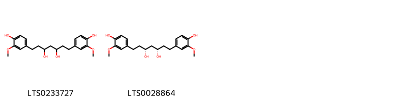{ width=100% }
    <figcaption>Hình ảnh cấu trúc hóa học của 2 hoạt chất thuộc nhóm Diarylheptanoids gồm ['1,7-bis(4-hydroxy-3-methoxyphenyl)heptane-3,5-diol (LTS0233727)', '(3r,5s)-1,7-bis(4-hydroxy-3-methoxyphenyl)heptane-3,5-diol (LTS0028864)'].</figcaption>
</figure>
#### Nhóm Fatty Acyls
<figure markdown="span">
    { width=100% }
    <figcaption>Hình ảnh cấu trúc hóa học của 1 hoạt chất thuộc nhóm Fatty Acyls gồm ['palmitic acid (LTS0079439)'].</figcaption>
</figure>
#### Nhóm Organooxygen compounds
<figure markdown="span">
    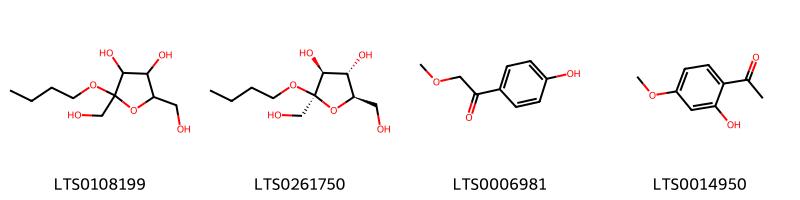{ width=100% }
    <figcaption>Hình ảnh cấu trúc hóa học của 4 hoạt chất thuộc nhóm Organooxygen compounds gồm ['2-butoxy-2,5-bis(hydroxymethyl)oxolane-3,4-diol (LTS0108199)', '(2r,3s,4s,5r)-2-butoxy-2,5-bis(hydroxymethyl)oxolane-3,4-diol (LTS0261750)', '1-(4-hydroxyphenyl)-2-methoxyethanone (LTS0006981)', 'paeonol (LTS0014950)'].</figcaption>
</figure>
#### Nhóm Phenols
<figure markdown="span">
    { width=100% }
    <figcaption>Hình ảnh cấu trúc hóa học của 1 hoạt chất thuộc nhóm Phenols gồm ['frambinone (LTS0021621)'].</figcaption>
</figure>
#### Nhóm Prenol lipids
<figure markdown="span">
    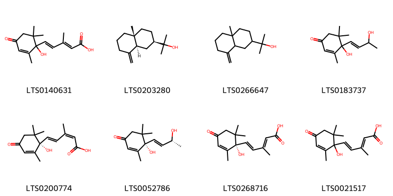{ width=100% }
    <figcaption>Hình ảnh cấu trúc hóa học của 8 hoạt chất thuộc nhóm Prenol lipids gồm ['abscisic acid,  (LTS0140631)', 'β-eudesmol (LTS0203280)', 'β-eudesmol (LTS0266647)', '4-hydroxy-4-(3-hydroxybut-1-en-1-yl)-3,5,5-trimethylcyclohex-2-en-1-one (LTS0183737)', 'abscisic acid (LTS0200774)', '(6s,9r)-vomifoliol (LTS0052786)', '(4e)-5-[(1s)-1-hydroxy-2,6,6-trimethyl-4-oxocyclohex-2-en-1-yl]-3-methylpenta-2,4-dienoic acid (LTS0268716)', '5-(1-hydroxy-2,6,6-trimethyl-4-oxocyclohex-2-en-1-yl)-3-methylpenta-2,4-dienoic acid (LTS0021517)'].</figcaption>
</figure>
#### Nhóm Steroids and steroid derivatives
<figure markdown="span">
    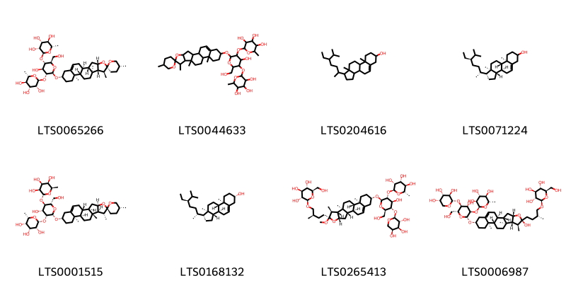{ width=100% }
    <figcaption>Hình ảnh cấu trúc hóa học của 8 hoạt chất thuộc nhóm Steroids and steroid derivatives gồm ["(2s,3r,4r,5r,6s)-2-{[(2r,3s,4s,5r,6r)-4-hydroxy-2-(hydroxymethyl)-6-[(1's,2r,2's,4's,5r,7's,8'r,9's,12's,13'r,16's)-5,7',9',13'-tetramethyl-5'-oxaspiro[oxane-2,6'-pentacyclo[10.8.0.0²,⁹.0⁴,⁸.0¹³,¹⁸]icosan]-18'-eneoxy]-5-{[(2s,3r,4r,5r,6s)-3,4,5-trihydroxy-6-methyloxan-2-yl]oxy}oxan-3-yl]oxy}-6-methyloxane-3,4,5-triol (LTS0065266)", "2-{[4-hydroxy-2-(hydroxymethyl)-6-{5,7',9',13'-tetramethyl-5'-oxaspiro[oxane-2,6'-pentacyclo[10.8.0.0²,⁹.0⁴,⁸.0¹³,¹⁸]icosan]-18'-eneoxy}-5-[(3,4,5-trihydroxy-6-methyloxan-2-yl)oxy]oxan-3-yl]oxy}-6-methyloxane-3,4,5-triol (LTS0044633)", 'stigmast-5-en-3-ol, (3β)- (LTS0204616)', 'stigmast-5-en-3-ol (LTS0071224)', "(2r,3r,4r,5s,6s)-2-{[(2s,3r,4r,5r,6s)-4-hydroxy-6-(hydroxymethyl)-2-[(1'r,2s,2'r,4'r,5r,7'r,8's,9'r,12'r,13'r,16's)-5,7',9',13'-tetramethyl-5'-oxaspiro[oxane-2,6'-pentacyclo[10.8.0.0²,⁹.0⁴,⁸.0¹³,¹⁸]icosan]-18'-eneoxy]-5-{[(2r,3s,4s,5r,6r)-3,4,5-trihydroxy-6-methyloxan-2-yl]oxy}oxan-3-yl]oxy}-6-methyloxane-3,4,5-triol (LTS0001515)", 'sitosterol (LTS0168132)', '(2r,3r,4s,5s,6r)-2-[(2r)-4-[(1s,2s,4s,6r,7s,8r,9s,12s,13r,16s)-16-{[(2r,3r,4s,5s,6r)-4-hydroxy-6-(hydroxymethyl)-3-{[(2s,3r,4r,5r,6s)-3,4,5-trihydroxy-6-methyloxan-2-yl]oxy}-5-{[(2s,3r,4s,5s)-3,4,5-trihydroxyoxan-2-yl]oxy}oxan-2-yl]oxy}-6-methoxy-7,9,13-trimethyl-5-oxapentacyclo[10.8.0.0²,⁹.0⁴,⁸.0¹³,¹⁸]icos-18-en-6-yl]-2-methylbutoxy]-6-(hydroxymethyl)oxane-3,4,5-triol (LTS0265413)', '(2s,3r,4r,5r,6s)-2-{[(2r,3r,4s,5s,6r)-4-hydroxy-2-{[(1s,2s,4s,6r,7s,8r,9s,12s,13r,16s)-6-hydroxy-7,9,13-trimethyl-6-[(3r)-3-methyl-4-{[(2r,3r,4s,5s,6r)-3,4,5-trihydroxy-6-(hydroxymethyl)oxan-2-yl]oxy}butyl]-5-oxapentacyclo[10.8.0.0²,⁹.0⁴,⁸.0¹³,¹⁸]icos-18-en-16-yl]oxy}-6-(hydroxymethyl)-5-{[(2s,3r,4s,5s)-3,4,5-trihydroxyoxan-2-yl]oxy}oxan-3-yl]oxy}-6-methyloxane-3,4,5-triol (LTS0006987)'].</figcaption>
</figure>
#### Nhóm Stilbenes
<figure markdown="span">
    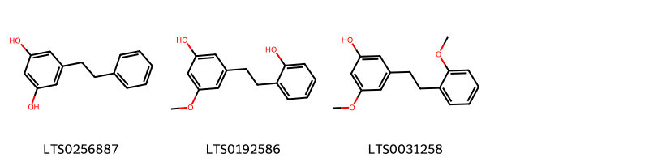{ width=100% }
    <figcaption>Hình ảnh cấu trúc hóa học của 3 hoạt chất thuộc nhóm Stilbenes gồm ['dihydropinosylvin (LTS0256887)', 'batatasin iv (LTS0192586)', '3-methoxy-5-[2-(2-methoxyphenyl)ethyl]phenol (LTS0031258)'].</figcaption>
</figure>

---

### Dược dân tộc học

Danh sách các quốc gia có sử dụng *Dioscorea japonica* trong điều trị các bệnh. 

| Country   | Disease                           | Bệnh                                                                                                                                                                                                |
|:----------|:----------------------------------|:----------------------------------------------------------------------------------------------------------------------------------------------------------------------------------------------------|
| China     | Refrigerant, Tonic                | MYMEMORY WARNING: YOU USED ALL AVAILABLE FREE TRANSLATIONS FOR TODAY. NEXT AVAILABLE IN  13 HOURS 26 MINUTES 43 SECONDS VISIT HTTPS://MYMEMORY.TRANSLATED.NET/DOC/USAGELIMITS.PHP TO TRANSLATE MORE |
| Japan*    | Antidiarrheic, Antitussive, Tonic | MYMEMORY WARNING: YOU USED ALL AVAILABLE FREE TRANSLATIONS FOR TODAY. NEXT AVAILABLE IN  13 HOURS 26 MINUTES 40 SECONDS VISIT HTTPS://MYMEMORY.TRANSLATED.NET/DOC/USAGELIMITS.PHP TO TRANSLATE MORE |

---

---
## Dioscorea macabiha
### Thông tin về thực vật

!!! info "Phân loại thực vật của *Dioscorea sansibarensis* từ GIBF:"
    - **Kingdom:** Plantae
    - **Phylum:** Tracheophyta
    - **Order:** Dioscoreales
    - **Family:** Dioscoreaceae
    - **Genus:** Dioscorea
    - **Species:** *Dioscorea sansibarensis*

 

| Label (VI)   | Label (EN)   | Scientific Name    | Descriptions (VI)   | Descriptions (EN)   | Also Known As (VI)   | Also Known As (EN)                                                                 |
|:-------------|:-------------|:-------------------|:--------------------|:--------------------|:---------------------|:-----------------------------------------------------------------------------------|
| N/A          | N/A          | Dioscorea japonica | loài thực vật       | species of plant    | ['']                 | ['Japanese Mountain Yam', 'Japanese Potato', 'kotobuki', 'satsuma imo', 'yamaimo'] |

#### Phân bố trên thế giới

**Từ CSDL GIBF** Japan, Korea, Republic of, Chinese Taipei, Russian Federation, China

#### Phân bố tại Việt Nam

**Từ CSDL GIBF**: Không có ghi nhận ở Việt Nam

---
### Thành phần hóa học
        
- Theo cơ sở dữ liệu lotus: Từ loài *Dioscorea sansibarensis* đã phân lập và xác định được Chưa có hoạt chất nào được phân lập. hoạt chất thuộc về các nhóm Không có hoạt chất nào được phân lập. 

Không có hình ảnh nào được tạo ra

---

### Dược dân tộc học

Danh sách các quốc gia có sử dụng *Dioscorea sansibarensis* trong điều trị các bệnh. 

| Country   | Disease   | Bệnh                                                                                                                                                                                                |
|:----------|:----------|:----------------------------------------------------------------------------------------------------------------------------------------------------------------------------------------------------|
| Elsewhere | Poison    | MYMEMORY WARNING: YOU USED ALL AVAILABLE FREE TRANSLATIONS FOR TODAY. NEXT AVAILABLE IN  13 HOURS 26 MINUTES 01 SECONDS VISIT HTTPS://MYMEMORY.TRANSLATED.NET/DOC/USAGELIMITS.PHP TO TRANSLATE MORE |

---

---
## Dioscorea macrostachya
### Thông tin về thực vật

!!! info "Phân loại thực vật của *N/A* từ GIBF:"
    - **Kingdom:** Plantae
    - **Phylum:** Tracheophyta
    - **Order:** Dioscoreales
    - **Family:** Dioscoreaceae
    - **Genus:** Dioscorea
    - **Species:** *N/A*

 

| Label (VI)   | Label (EN)   | Scientific Name        | Descriptions (VI)   | Descriptions (EN)   | Also Known As (VI)   | Also Known As (EN)   |
|:-------------|:-------------|:-----------------------|:--------------------|:--------------------|:---------------------|:---------------------|
| N/A          | N/A          | Dioscorea macrostachya | loài thực vật       | species of plant    | ['']                 | ['']                 |

#### Phân bố trên thế giới

**Từ CSDL GIBF** Sri Lanka, Italy, Australia, Argentina, Gibraltar, Nicaragua, Israel, French Guiana, Malawi, Puerto Rico, Chinese Taipei, Spain, Portugal, United States of America, Chile, Zimbabwe, Belize, South Africa, Thailand, Brazil, Switzerland, Dominican Republic, Peru, Mexico, Singapore, France, United Kingdom of Great Britain and Northern Ireland, Niue, Madagascar, Colombia, Indonesia, Cameroon

#### Phân bố tại Việt Nam

**Từ CSDL GIBF**: Không có ghi nhận ở Việt Nam

---
### Thành phần hóa học
        
- Theo cơ sở dữ liệu lotus: Từ loài *N/A* đã phân lập và xác định được Chưa có hoạt chất nào được phân lập. hoạt chất thuộc về các nhóm Không có hoạt chất nào được phân lập. 

Không có hình ảnh nào được tạo ra

---

### Dược dân tộc học

Danh sách các quốc gia có sử dụng *N/A* trong điều trị các bệnh. 

| Country   | Disease   | Bệnh                                                                                                                                                                                                |
|:----------|:----------|:----------------------------------------------------------------------------------------------------------------------------------------------------------------------------------------------------|
| Mexico    | Piscicide | MYMEMORY WARNING: YOU USED ALL AVAILABLE FREE TRANSLATIONS FOR TODAY. NEXT AVAILABLE IN  13 HOURS 25 MINUTES 40 SECONDS VISIT HTTPS://MYMEMORY.TRANSLATED.NET/DOC/USAGELIMITS.PHP TO TRANSLATE MORE |

---

---
## Dioscorea oppositifolia
### Thông tin về thực vật

!!! info "Phân loại thực vật của *Dioscorea oppositifolia* từ GIBF:"
    - **Kingdom:** Plantae
    - **Phylum:** Tracheophyta
    - **Order:** Dioscoreales
    - **Family:** Dioscoreaceae
    - **Genus:** Dioscorea
    - **Species:** *Dioscorea oppositifolia*

 

| Label (VI)   | Label (EN)   | Scientific Name         | Descriptions (VI)   | Descriptions (EN)        | Also Known As (VI)   | Also Known As (EN)   |
|:-------------|:-------------|:------------------------|:--------------------|:-------------------------|:---------------------|:---------------------|
| N/A          | N/A          | Dioscorea oppositifolia | loài thực vật       | species of plant, Tororo | ['']                 | ['']                 |

#### Phân bố trên thế giới

**Từ CSDL GIBF** nan, Nigeria, Korea, Republic of, India, United States of America, China

#### Phân bố tại Việt Nam

**Từ CSDL GIBF**: Không có ghi nhận ở Việt Nam

---
### Thành phần hóa học
        
- Theo cơ sở dữ liệu lotus: Từ loài *Dioscorea oppositifolia* đã phân lập và xác định được 69 hoạt chất thuộc về các nhóm Fatty Acyls, Flavonoids, Prenol lipids, Steroids and steroid derivatives, Phenanthrenes and derivatives, Diarylheptanoids, Azoles, Glycerophospholipids, Carboxylic acids and derivatives, Sphingolipids, Purine nucleosides, Stilbenes, Organooxygen compounds, Benzoxepines. 

|    | chemicalTaxonomyClassyfireClass   |   smiles_count |
|---:|:----------------------------------|---------------:|
|  0 | Azoles                            |              1 |
|  1 | Benzoxepines                      |              2 |
|  2 | Carboxylic acids and derivatives  |              1 |
|  3 | Diarylheptanoids                  |             10 |
|  4 | Fatty Acyls                       |              1 |
|  5 | Flavonoids                        |              9 |
|  6 | Glycerophospholipids              |              2 |
|  7 | Organooxygen compounds            |              3 |
|  8 | Phenanthrenes and derivatives     |              6 |
|  9 | Prenol lipids                     |              6 |
| 10 | Purine nucleosides                |              3 |
| 11 | Sphingolipids                     |              2 |
| 12 | Steroids and steroid derivatives  |             11 |
| 13 | Stilbenes                         |             12 |

#### Nhóm Azoles
<figure markdown="span">
    { width=100% }
    <figcaption>Hình ảnh cấu trúc hóa học của 1 hoạt chất thuộc nhóm Azoles gồm ['allantoin (LTS0106609)'].</figcaption>
</figure>
#### Nhóm Benzoxepines
<figure markdown="span">
    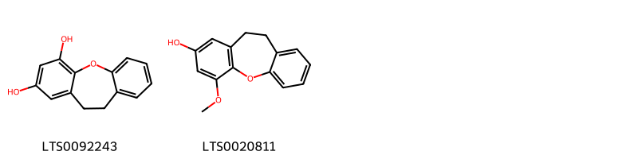{ width=100% }
    <figcaption>Hình ảnh cấu trúc hóa học của 2 hoạt chất thuộc nhóm Benzoxepines gồm ['2-oxatricyclo[9.4.0.0³,⁸]pentadeca-1(15),3,5,7,11,13-hexaene-4,6-diol (LTS0092243)', '4-methoxy-2-oxatricyclo[9.4.0.0³,⁸]pentadeca-1(15),3(8),4,6,11,13-hexaen-6-ol (LTS0020811)'].</figcaption>
</figure>
#### Nhóm Carboxylic acids and derivatives
<figure markdown="span">
    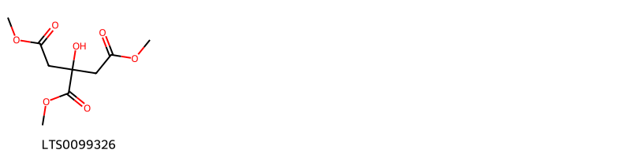{ width=100% }
    <figcaption>Hình ảnh cấu trúc hóa học của 1 hoạt chất thuộc nhóm Carboxylic acids and derivatives gồm ['trimethyl citrate (LTS0099326)'].</figcaption>
</figure>
#### Nhóm Diarylheptanoids
<figure markdown="span">
    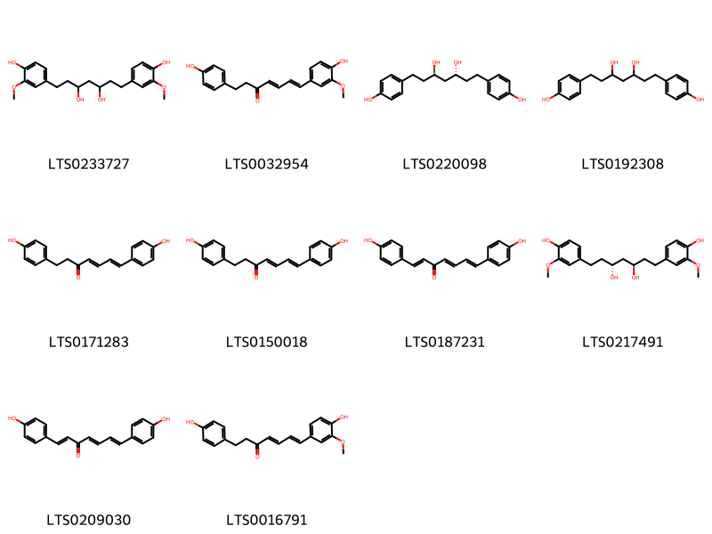{ width=100% }
    <figcaption>Hình ảnh cấu trúc hóa học của 10 hoạt chất thuộc nhóm Diarylheptanoids gồm ['1,7-bis(4-hydroxy-3-methoxyphenyl)heptane-3,5-diol (LTS0233727)', '(4e,6e)-7-(4-hydroxy-3-methoxyphenyl)-1-(4-hydroxyphenyl)hepta-4,6-dien-3-one (LTS0032954)', '(3r,5r)-1,7-bis(4-hydroxyphenyl)heptane-3,5-diol (LTS0220098)', '1,7-bis(4-hydroxyphenyl)heptane-3,5-diol (LTS0192308)', '1,7-bis(4-hydroxyphenyl)hepta-4,6-dien-3-one (LTS0171283)', '(4e,6e)-1,7-bis(4-hydroxyphenyl)hepta-4,6-dien-3-one (LTS0150018)', '1,7-bis(4-hydroxyphenyl)hepta-1,4,6-trien-3-one (LTS0187231)', '(3r,5r)-1,7-bis(4-hydroxy-3-methoxyphenyl)heptane-3,5-diol (LTS0217491)', '(1e,4e,6e)-1,7-bis(4-hydroxyphenyl)hepta-1,4,6-trien-3-one (LTS0209030)', '7-(4-hydroxy-3-methoxyphenyl)-1-(4-hydroxyphenyl)hepta-4,6-dien-3-one (LTS0016791)'].</figcaption>
</figure>
#### Nhóm Fatty Acyls
<figure markdown="span">
    { width=100% }
    <figcaption>Hình ảnh cấu trúc hóa học của 1 hoạt chất thuộc nhóm Fatty Acyls gồm ['palmitic acid (LTS0079439)'].</figcaption>
</figure>
#### Nhóm Flavonoids
<figure markdown="span">
    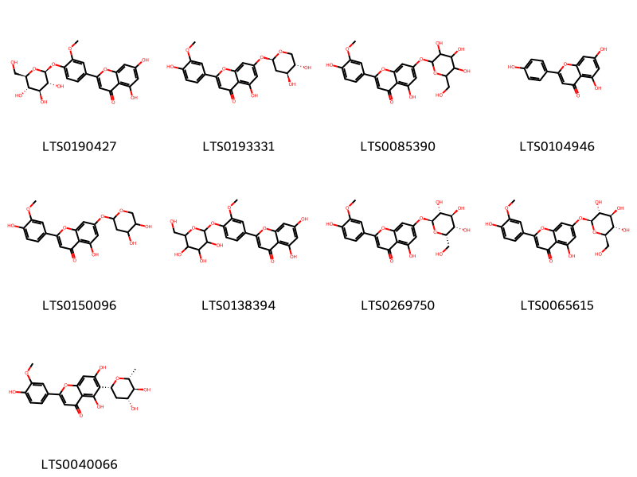{ width=100% }
    <figcaption>Hình ảnh cấu trúc hóa học của 9 hoạt chất thuộc nhóm Flavonoids gồm ['5,7-dihydroxy-2-(3-methoxy-4-{[(2s,3r,4s,5s,6r)-3,4,5-trihydroxy-6-(hydroxymethyl)oxan-2-yl]oxy}phenyl)chromen-4-one (LTS0190427)', '7-{[(2r,4s,5s)-4,5-dihydroxyoxan-2-yl]oxy}-5-hydroxy-2-(4-hydroxy-3-methoxyphenyl)chromen-4-one (LTS0193331)', '5-hydroxy-2-(4-hydroxy-3-methoxyphenyl)-7-{[3,4,5-trihydroxy-6-(hydroxymethyl)oxan-2-yl]oxy}chromen-4-one (LTS0085390)', 'chamomile (LTS0104946)', '7-[(4,5-dihydroxyoxan-2-yl)oxy]-5-hydroxy-2-(4-hydroxy-3-methoxyphenyl)chromen-4-one (LTS0150096)', '5,7-dihydroxy-2-(3-methoxy-4-{[3,4,5-trihydroxy-6-(hydroxymethyl)oxan-2-yl]oxy}phenyl)chromen-4-one (LTS0138394)', '5-hydroxy-2-(4-hydroxy-3-methoxyphenyl)-7-{[(2s,3r,4s,5s,6s)-3,4,5-trihydroxy-6-(hydroxymethyl)oxan-2-yl]oxy}chromen-4-one (LTS0269750)', '5-hydroxy-2-(4-hydroxy-3-methoxyphenyl)-7-{[(2s,3r,4s,5s,6r)-3,4,5-trihydroxy-6-(hydroxymethyl)oxan-2-yl]oxy}chromen-4-one (LTS0065615)', '6-[(2r,4r,5s,6r)-4,5-dihydroxy-6-methyloxan-2-yl]-5,7-dihydroxy-2-(4-hydroxy-3-methoxyphenyl)chromen-4-one (LTS0040066)'].</figcaption>
</figure>
#### Nhóm Glycerophospholipids
<figure markdown="span">
    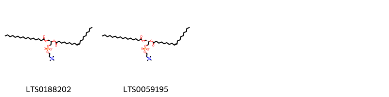{ width=100% }
    <figcaption>Hình ảnh cấu trúc hóa học của 2 hoạt chất thuộc nhóm Glycerophospholipids gồm ['popc (LTS0188202)', '(2-{[(2s)-3-(hexadecanoyloxy)-2-[(9z)-octadec-9-enoyloxy]propyl phosphonato]oxy}ethyl)trimethylazanium (LTS0059195)'].</figcaption>
</figure>
#### Nhóm Organooxygen compounds
<figure markdown="span">
    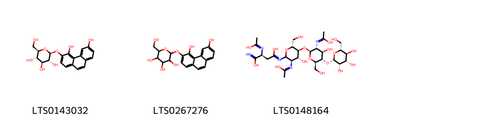{ width=100% }
    <figcaption>Hình ảnh cấu trúc hóa học của 3 hoạt chất thuộc nhóm Organooxygen compounds gồm ['(2s,3r,4s,5s,6r)-2-[(4,6-dihydroxyphenanthren-3-yl)oxy]-6-(hydroxymethyl)oxane-3,4,5-triol (LTS0143032)', '2-[(4,6-dihydroxyphenanthren-3-yl)oxy]-6-(hydroxymethyl)oxane-3,4,5-triol (LTS0267276)', "(2s)-n'-[(3r,4r,5s,6r)-4-hydroxy-5-{[(2s,3r,4r,5s,6r)-4-hydroxy-3-[(1-hydroxyethylidene)amino]-6-(hydroxymethyl)-5-{[(2s,3s,4s,5s,6r)-3,4,5-trihydroxy-6-(hydroxymethyl)oxan-2-yl]oxy}oxan-2-yl]oxy}-3-[(1-hydroxyethylidene)amino]-6-(hydroxymethyl)oxan-2-yl]-2-[(1-hydroxyethylidene)amino]butanediimidic acid (LTS0148164)"].</figcaption>
</figure>
#### Nhóm Phenanthrenes and derivatives
<figure markdown="span">
    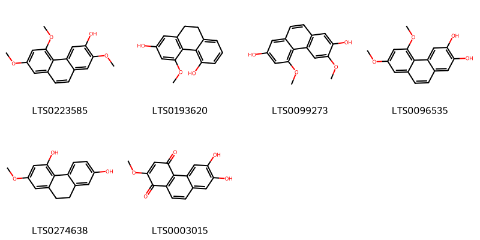{ width=100% }
    <figcaption>Hình ảnh cấu trúc hóa học của 6 hoạt chất thuộc nhóm Phenanthrenes and derivatives gồm ['batatasin i (LTS0223585)', 'hircinol (LTS0193620)', '3,5-dimethoxyphenanthrene-2,7-diol (LTS0099273)', '5,7-dimethoxyphenanthrene-2,3-diol (LTS0096535)', '7-methoxy-9,10-dihydrophenanthrene-2,5-diol (LTS0274638)', '6,7-dihydroxy-2-methoxyphenanthrene-1,4-dione (LTS0003015)'].</figcaption>
</figure>
#### Nhóm Prenol lipids
<figure markdown="span">
    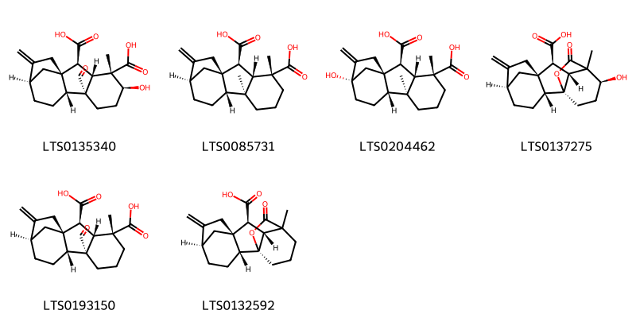{ width=100% }
    <figcaption>Hình ảnh cấu trúc hóa học của 6 hoạt chất thuộc nhóm Prenol lipids gồm ['gibberellin a36 (LTS0135340)', 'gibberellin a12 (LTS0085731)', 'gibberellin a53 (LTS0204462)', '(1r,2r,5r,8r,9s,10r,12s)-12-hydroxy-11-methyl-6-methylidene-16-oxo-15-oxapentacyclo[9.3.2.1⁵,⁸.0¹,¹⁰.0²,⁸]heptadecane-9-carboxylic acid (LTS0137275)', 'gibberellin a24 (LTS0193150)', '(1r,2r,5r,8r,9s,10r)-11-methyl-6-methylidene-16-oxo-15-oxapentacyclo[9.3.2.1⁵,⁸.0¹,¹⁰.0²,⁸]heptadecane-9-carboxylic acid (LTS0132592)'].</figcaption>
</figure>
#### Nhóm Purine nucleosides
<figure markdown="span">
    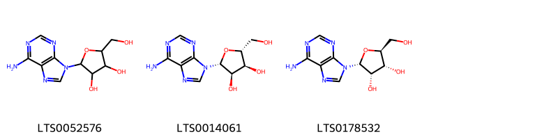{ width=100% }
    <figcaption>Hình ảnh cấu trúc hóa học của 3 hoạt chất thuộc nhóm Purine nucleosides gồm ['adenosine (LTS0052576)', 'adenosine (LTS0014061)', '(2r,3s,4r,5s)-2-(6-aminopurin-9-yl)-5-(hydroxymethyl)oxolane-3,4-diol (LTS0178532)'].</figcaption>
</figure>
#### Nhóm Sphingolipids
<figure markdown="span">
    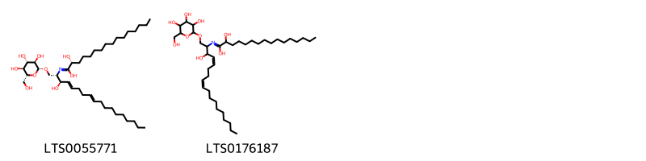{ width=100% }
    <figcaption>Hình ảnh cấu trúc hóa học của 2 hoạt chất thuộc nhóm Sphingolipids gồm ['(2r)-2-hydroxy-n-[(2s,3r,4e,8e)-3-hydroxy-1-{[(2r,3r,4s,5s,6r)-3,4,5-trihydroxy-6-(hydroxymethyl)oxan-2-yl]oxy}octadeca-4,8-dien-2-yl]hexadecanimidic acid (LTS0055771)', '2-hydroxy-n-[(4z,8z)-3-hydroxy-1-{[3,4,5-trihydroxy-6-(hydroxymethyl)oxan-2-yl]oxy}octadeca-4,8-dien-2-yl]hexadecanimidic acid (LTS0176187)'].</figcaption>
</figure>
#### Nhóm Steroids and steroid derivatives
<figure markdown="span">
    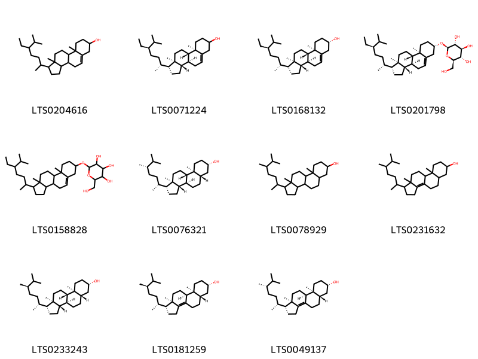{ width=100% }
    <figcaption>Hình ảnh cấu trúc hóa học của 11 hoạt chất thuộc nhóm Steroids and steroid derivatives gồm ['stigmast-5-en-3-ol, (3β)- (LTS0204616)', 'stigmast-5-en-3-ol (LTS0071224)', 'sitosterol (LTS0168132)', 'sitogluside (LTS0201798)', '2-{[1-(5-ethyl-6-methylheptan-2-yl)-9a,11a-dimethyl-1h,2h,3h,3ah,3bh,4h,6h,7h,8h,9h,9bh,10h,11h-cyclopenta[a]phenanthren-7-yl]oxy}-6-(hydroxymethyl)oxane-3,4,5-triol (LTS0158828)', 'ergostanol (LTS0076321)', '1-(5,6-dimethylheptan-2-yl)-9a,11a-dimethyl-tetradecahydro-1h-cyclopenta[a]phenanthren-7-ol (LTS0078929)', 'α-ergostenol (LTS0231632)', 'campestanol (LTS0233243)', '(1r,5as,7s,9as,9bs,11ar)-1-[(2r,5r)-5,6-dimethylheptan-2-yl]-9a,11a-dimethyl-1h,2h,3h,4h,5h,5ah,6h,7h,8h,9h,9bh,10h,11h-cyclopenta[a]phenanthren-7-ol (LTS0181259)', '(1r,5as,7s,9as,9bs,11ar)-1-[(2r,5s)-5,6-dimethylheptan-2-yl]-9a,11a-dimethyl-1h,2h,3h,4h,5h,5ah,6h,7h,8h,9h,9bh,10h,11h-cyclopenta[a]phenanthren-7-ol (LTS0049137)'].</figcaption>
</figure>
#### Nhóm Stilbenes
<figure markdown="span">
    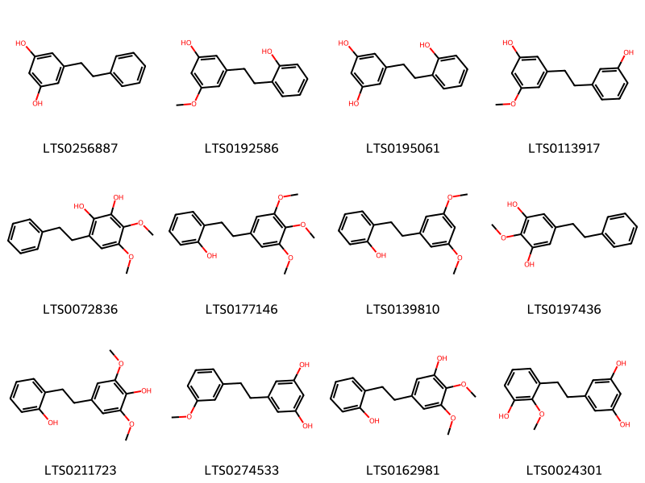{ width=100% }
    <figcaption>Hình ảnh cấu trúc hóa học của 12 hoạt chất thuộc nhóm Stilbenes gồm ['dihydropinosylvin (LTS0256887)', 'batatasin iv (LTS0192586)', 'demethylbatatasin iv (LTS0195061)', '3-[2-(3-hydroxyphenyl)ethyl]-5-methoxyphenol (LTS0113917)', '3,4-dimethoxy-6-(2-phenylethyl)benzene-1,2-diol (LTS0072836)', '2-[2-(3,4,5-trimethoxyphenyl)ethyl]phenol (LTS0177146)', '2-[2-(3,5-dimethoxyphenyl)ethyl]phenol (LTS0139810)', '2-methoxy-5-(2-phenylethyl)benzene-1,3-diol (LTS0197436)', '4-[2-(2-hydroxyphenyl)ethyl]-2,6-dimethoxyphenol (LTS0211723)', '5-[2-(3-methoxyphenyl)ethyl]benzene-1,3-diol (LTS0274533)', '5-[2-(2-hydroxyphenyl)ethyl]-2,3-dimethoxyphenol (LTS0162981)', '5-[2-(3-hydroxy-2-methoxyphenyl)ethyl]benzene-1,3-diol (LTS0024301)'].</figcaption>
</figure>

---

### Dược dân tộc học

Danh sách các quốc gia có sử dụng *Dioscorea oppositifolia* trong điều trị các bệnh. 

| Country   | Disease                           | Bệnh                                                                                                                                                                                                |
|:----------|:----------------------------------|:----------------------------------------------------------------------------------------------------------------------------------------------------------------------------------------------------|
| Japan*    | Antitussive, Tonic, Antidiarrheic | MYMEMORY WARNING: YOU USED ALL AVAILABLE FREE TRANSLATIONS FOR TODAY. NEXT AVAILABLE IN  13 HOURS 25 MINUTES 14 SECONDS VISIT HTTPS://MYMEMORY.TRANSLATED.NET/DOC/USAGELIMITS.PHP TO TRANSLATE MORE |

---

---
## Dioscorea papuana
### Thông tin về thực vật

!!! info "Phân loại thực vật của *N/A* từ GIBF:"
    - **Kingdom:** Plantae
    - **Phylum:** Tracheophyta
    - **Order:** Dioscoreales
    - **Family:** Dioscoreaceae
    - **Genus:** Dioscorea
    - **Species:** *N/A*

 

| Label (VI)   | Label (EN)   | Scientific Name         | Descriptions (VI)   | Descriptions (EN)        | Also Known As (VI)   | Also Known As (EN)   |
|:-------------|:-------------|:------------------------|:--------------------|:-------------------------|:---------------------|:---------------------|
| N/A          | N/A          | Dioscorea oppositifolia | loài thực vật       | species of plant, Tororo | ['']                 | ['']                 |

#### Phân bố trên thế giới

**Từ CSDL GIBF** Sri Lanka, Italy, Australia, Argentina, Gibraltar, Nicaragua, Israel, French Guiana, Malawi, Puerto Rico, Chinese Taipei, Spain, Portugal, United States of America, Chile, Zimbabwe, Belize, South Africa, Thailand, Brazil, Switzerland, Dominican Republic, Peru, Mexico, Singapore, France, United Kingdom of Great Britain and Northern Ireland, Niue, Madagascar, Colombia, Indonesia, Cameroon

#### Phân bố tại Việt Nam

**Từ CSDL GIBF**: Không có ghi nhận ở Việt Nam

---
### Thành phần hóa học
        
- Theo cơ sở dữ liệu lotus: Từ loài *N/A* đã phân lập và xác định được Chưa có hoạt chất nào được phân lập. hoạt chất thuộc về các nhóm Không có hoạt chất nào được phân lập. 

Không có hình ảnh nào được tạo ra

---

### Dược dân tộc học

Danh sách các quốc gia có sử dụng *N/A* trong điều trị các bệnh. 

| Country   | Disease           | Bệnh                                                                                                                                                                                                |
|:----------|:------------------|:----------------------------------------------------------------------------------------------------------------------------------------------------------------------------------------------------|
| Elsewhere | Piscicide, Poison | MYMEMORY WARNING: YOU USED ALL AVAILABLE FREE TRANSLATIONS FOR TODAY. NEXT AVAILABLE IN  13 HOURS 24 MINUTES 37 SECONDS VISIT HTTPS://MYMEMORY.TRANSLATED.NET/DOC/USAGELIMITS.PHP TO TRANSLATE MORE |

---

---
## Dioscorea pentaphylla
### Thông tin về thực vật

!!! info "Phân loại thực vật của *Dioscorea pentaphylla* từ GIBF:"
    - **Kingdom:** Plantae
    - **Phylum:** Tracheophyta
    - **Order:** Dioscoreales
    - **Family:** Dioscoreaceae
    - **Genus:** Dioscorea
    - **Species:** *Dioscorea pentaphylla*

 

| Label (VI)   | Label (EN)   | Scientific Name       | Descriptions (VI)   | Descriptions (EN)   | Also Known As (VI)   | Also Known As (EN)   |
|:-------------|:-------------|:----------------------|:--------------------|:--------------------|:---------------------|:---------------------|
| N/A          | N/A          | Dioscorea pentaphylla | loài thực vật       | species of plant    | ['']                 | ['']                 |

#### Phân bố trên thế giới

**Từ CSDL GIBF** nan, American Samoa, Australia, Japan, Cook Islands, Lao People’s Democratic Republic, Cambodia, Myanmar, Chinese Taipei, Papua New Guinea, Bangladesh, United States of America, Timor-Leste, Fiji, Hong Kong, Thailand, Brazil, Bhutan, Tonga, France, Viet Nam, China, French Polynesia, Niue, Vanuatu, India, Indonesia, Samoa, Philippines, Malaysia, Nepal

#### Phân bố tại Việt Nam

**Từ CSDL GIBF**: Kon Tum, Ha Tinh, Khanh Hoa, Ninh Binh, Hà Tinh

---
### Thành phần hóa học
        
- Theo cơ sở dữ liệu lotus: Từ loài *Dioscorea pentaphylla* đã phân lập và xác định được 2 hoạt chất thuộc về các nhóm Naphthofurans. 

|    | chemicalTaxonomyClassyfireClass   |   smiles_count |
|---:|:----------------------------------|---------------:|
|  0 | Naphthofurans                     |              2 |

#### Nhóm Naphthofurans
<figure markdown="span">
    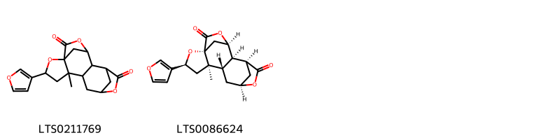{ width=100% }
    <figcaption>Hình ảnh cấu trúc hóa học của 2 hoạt chất thuộc nhóm Naphthofurans gồm ['3-(furan-3-yl)-5-methyl-2,9,14-trioxapentacyclo[11.2.1.1⁸,¹¹.0¹,⁵.0⁶,¹²]heptadecane-10,15-dione (LTS0211769)', '(1r,3s,5r,6s,8s,11s,12r,13r)-3-(furan-3-yl)-5-methyl-2,9,14-trioxapentacyclo[11.2.1.1⁸,¹¹.0¹,⁵.0⁶,¹²]heptadecane-10,15-dione (LTS0086624)'].</figcaption>
</figure>

---

### Dược dân tộc học

Danh sách các quốc gia có sử dụng *Dioscorea pentaphylla* trong điều trị các bệnh. 

| Country   | Disease       | Bệnh                                                                                                                                                                                                |
|:----------|:--------------|:----------------------------------------------------------------------------------------------------------------------------------------------------------------------------------------------------|
| India     | Poison, Tonic | MYMEMORY WARNING: YOU USED ALL AVAILABLE FREE TRANSLATIONS FOR TODAY. NEXT AVAILABLE IN  13 HOURS 24 MINUTES 10 SECONDS VISIT HTTPS://MYMEMORY.TRANSLATED.NET/DOC/USAGELIMITS.PHP TO TRANSLATE MORE |

---

---
## Dioscorea piscatorum
### Thông tin về thực vật

!!! info "Phân loại thực vật của *Dioscorea piscatorum* từ GIBF:"
    - **Kingdom:** Plantae
    - **Phylum:** Tracheophyta
    - **Order:** Dioscoreales
    - **Family:** Dioscoreaceae
    - **Genus:** Dioscorea
    - **Species:** *Dioscorea piscatorum*

 

| Label (VI)   | Label (EN)   | Scientific Name      | Descriptions (VI)   | Descriptions (EN)   | Also Known As (VI)   | Also Known As (EN)   |
|:-------------|:-------------|:---------------------|:--------------------|:--------------------|:---------------------|:---------------------|
| N/A          | N/A          | Dioscorea piscatorum | loài thực vật       | species of plant    | ['']                 | ['']                 |

#### Phân bố trên thế giới

**Từ CSDL GIBF** nan, Afghanistan, Indonesia, Malaysia, Brunei Darussalam

#### Phân bố tại Việt Nam

**Từ CSDL GIBF**: Không có ghi nhận ở Việt Nam

---
### Thành phần hóa học
        
- Theo cơ sở dữ liệu lotus: Từ loài *Dioscorea piscatorum* đã phân lập và xác định được Chưa có hoạt chất nào được phân lập. hoạt chất thuộc về các nhóm Không có hoạt chất nào được phân lập. 

Không có hình ảnh nào được tạo ra

---

### Dược dân tộc học

Danh sách các quốc gia có sử dụng *Dioscorea piscatorum* trong điều trị các bệnh. 

| Country   | Disease                | Bệnh                                                                                                                                                                                                |
|:----------|:-----------------------|:----------------------------------------------------------------------------------------------------------------------------------------------------------------------------------------------------|
| Malaya    | Insecticide, Piscicide | MYMEMORY WARNING: YOU USED ALL AVAILABLE FREE TRANSLATIONS FOR TODAY. NEXT AVAILABLE IN  13 HOURS 23 MINUTES 45 SECONDS VISIT HTTPS://MYMEMORY.TRANSLATED.NET/DOC/USAGELIMITS.PHP TO TRANSLATE MORE |

---

---
## Dioscorea poilanei
### Thông tin về thực vật

!!! info "Phân loại thực vật của *Dioscorea poilanei* từ GIBF:"
    - **Kingdom:** Plantae
    - **Phylum:** Tracheophyta
    - **Order:** Dioscoreales
    - **Family:** Dioscoreaceae
    - **Genus:** Dioscorea
    - **Species:** *Dioscorea poilanei*

 

| Label (VI)   | Label (EN)   | Scientific Name    | Descriptions (VI)   | Descriptions (EN)   | Also Known As (VI)   | Also Known As (EN)   |
|:-------------|:-------------|:-------------------|:--------------------|:--------------------|:---------------------|:---------------------|
| N/A          | N/A          | Dioscorea poilanei |                     | species of plant    | ['']                 | ['']                 |

#### Phân bố trên thế giới

**Từ CSDL GIBF** Viet Nam, China, Japan

#### Phân bố tại Việt Nam

**Từ CSDL GIBF**: Không có ghi nhận ở Việt Nam

---
### Thành phần hóa học
        
- Theo cơ sở dữ liệu lotus: Từ loài *Dioscorea poilanei* đã phân lập và xác định được Chưa có hoạt chất nào được phân lập. hoạt chất thuộc về các nhóm Không có hoạt chất nào được phân lập. 

Không có hình ảnh nào được tạo ra

---

### Dược dân tộc học

Danh sách các quốc gia có sử dụng *Dioscorea poilanei* trong điều trị các bệnh. 

| Country   | Disease           | Bệnh                                                                                                                                                                                                |
|:----------|:------------------|:----------------------------------------------------------------------------------------------------------------------------------------------------------------------------------------------------|
| Elsewhere | Piscicide, Poison | MYMEMORY WARNING: YOU USED ALL AVAILABLE FREE TRANSLATIONS FOR TODAY. NEXT AVAILABLE IN  13 HOURS 23 MINUTES 24 SECONDS VISIT HTTPS://MYMEMORY.TRANSLATED.NET/DOC/USAGELIMITS.PHP TO TRANSLATE MORE |

---

---
## Dioscorea prazeri
### Thông tin về thực vật

!!! info "Phân loại thực vật của *Dioscorea prazeri* từ GIBF:"
    - **Kingdom:** Plantae
    - **Phylum:** Tracheophyta
    - **Order:** Dioscoreales
    - **Family:** Dioscoreaceae
    - **Genus:** Dioscorea
    - **Species:** *Dioscorea prazeri*

 

| Label (VI)   | Label (EN)   | Scientific Name   | Descriptions (VI)   | Descriptions (EN)   | Also Known As (VI)   | Also Known As (EN)   |
|:-------------|:-------------|:------------------|:--------------------|:--------------------|:---------------------|:---------------------|
| N/A          | N/A          | Dioscorea prazeri | loài thực vật       | species of plant    | ['']                 | ['']                 |

#### Phân bố trên thế giới

**Từ CSDL GIBF** nan, Thailand, Myanmar, Bhutan, India, Bangladesh, Malaysia, United Kingdom of Great Britain and Northern Ireland, Nepal

#### Phân bố tại Việt Nam

**Từ CSDL GIBF**: Không có ghi nhận ở Việt Nam

---
### Thành phần hóa học
        
- Theo cơ sở dữ liệu lotus: Từ loài *Dioscorea prazeri* đã phân lập và xác định được 3 hoạt chất thuộc về các nhóm Phenanthrenes and derivatives. 

|    | chemicalTaxonomyClassyfireClass   |   smiles_count |
|---:|:----------------------------------|---------------:|
|  0 | Phenanthrenes and derivatives     |              3 |

#### Nhóm Phenanthrenes and derivatives
<figure markdown="span">
    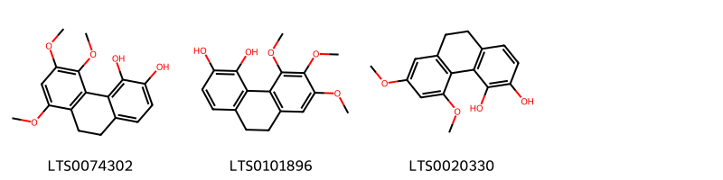{ width=100% }
    <figcaption>Hình ảnh cấu trúc hóa học của 3 hoạt chất thuộc nhóm Phenanthrenes and derivatives gồm ['5,6,8-trimethoxy-9,10-dihydrophenanthrene-3,4-diol (LTS0074302)', '5,6,7-trimethoxy-9,10-dihydrophenanthrene-3,4-diol (LTS0101896)', '5,7-dimethoxy-9,10-dihydrophenanthrene-3,4-diol (LTS0020330)'].</figcaption>
</figure>

---

### Dược dân tộc học

Danh sách các quốc gia có sử dụng *Dioscorea prazeri* trong điều trị các bệnh. 

| Country   | Disease                 | Bệnh                                                                                                                                                                                                |
|:----------|:------------------------|:----------------------------------------------------------------------------------------------------------------------------------------------------------------------------------------------------|
| India     | Piscicide, Pediculicide | MYMEMORY WARNING: YOU USED ALL AVAILABLE FREE TRANSLATIONS FOR TODAY. NEXT AVAILABLE IN  13 HOURS 22 MINUTES 59 SECONDS VISIT HTTPS://MYMEMORY.TRANSLATED.NET/DOC/USAGELIMITS.PHP TO TRANSLATE MORE |

---

---
## Dioscorea quinqueloba
### Thông tin về thực vật

!!! info "Phân loại thực vật của *Dioscorea quinquelobata* từ GIBF:"
    - **Kingdom:** Plantae
    - **Phylum:** Tracheophyta
    - **Order:** Dioscoreales
    - **Family:** Dioscoreaceae
    - **Genus:** Dioscorea
    - **Species:** *Dioscorea quinquelobata*

 

| Label (VI)   | Label (EN)   | Scientific Name       | Descriptions (VI)   | Descriptions (EN)   | Also Known As (VI)   | Also Known As (EN)   |
|:-------------|:-------------|:----------------------|:--------------------|:--------------------|:---------------------|:---------------------|
| N/A          | N/A          | Dioscorea quinqueloba | loài thực vật       | species of plant    | ['']                 | ['']                 |

#### Phân bố trên thế giới

**Từ CSDL GIBF** nan, Korea, Republic of, Japan

#### Phân bố tại Việt Nam

**Từ CSDL GIBF**: Không có ghi nhận ở Việt Nam

---
### Thành phần hóa học
        
- Theo cơ sở dữ liệu lotus: Từ loài *Dioscorea quinquelobata* đã phân lập và xác định được Chưa có hoạt chất nào được phân lập. hoạt chất thuộc về các nhóm Không có hoạt chất nào được phân lập. 

Không có hình ảnh nào được tạo ra

---

### Dược dân tộc học

Danh sách các quốc gia có sử dụng *Dioscorea quinquelobata* trong điều trị các bệnh. 

| Country   | Disease   | Bệnh                                                                                                                                                                                                |
|:----------|:----------|:----------------------------------------------------------------------------------------------------------------------------------------------------------------------------------------------------|
| China     | Tonic     | MYMEMORY WARNING: YOU USED ALL AVAILABLE FREE TRANSLATIONS FOR TODAY. NEXT AVAILABLE IN  13 HOURS 22 MINUTES 33 SECONDS VISIT HTTPS://MYMEMORY.TRANSLATED.NET/DOC/USAGELIMITS.PHP TO TRANSLATE MORE |

---

---
## Dioscorea remotiflora
### Thông tin về thực vật

!!! info "Phân loại thực vật của *Dioscorea remotiflora* từ GIBF:"
    - **Kingdom:** Plantae
    - **Phylum:** Tracheophyta
    - **Order:** Dioscoreales
    - **Family:** Dioscoreaceae
    - **Genus:** Dioscorea
    - **Species:** *Dioscorea remotiflora*

 

| Label (VI)   | Label (EN)   | Scientific Name       | Descriptions (VI)   | Descriptions (EN)   | Also Known As (VI)   | Also Known As (EN)   |
|:-------------|:-------------|:----------------------|:--------------------|:--------------------|:---------------------|:---------------------|
| N/A          | N/A          | Dioscorea remotiflora | loài thực vật       | species of plant    | ['']                 | ['']                 |

#### Phân bố trên thế giới

**Từ CSDL GIBF** Mexico

#### Phân bố tại Việt Nam

**Từ CSDL GIBF**: Không có ghi nhận ở Việt Nam

---
### Thành phần hóa học
        
- Theo cơ sở dữ liệu lotus: Từ loài *Dioscorea remotiflora* đã phân lập và xác định được Chưa có hoạt chất nào được phân lập. hoạt chất thuộc về các nhóm Không có hoạt chất nào được phân lập. 

Không có hình ảnh nào được tạo ra

---

### Dược dân tộc học

Danh sách các quốc gia có sử dụng *Dioscorea remotiflora* trong điều trị các bệnh. 

| Country   | Disease   | Bệnh                                                                                                                                                                                                |
|:----------|:----------|:----------------------------------------------------------------------------------------------------------------------------------------------------------------------------------------------------|
| Mexico    | Piscicide | MYMEMORY WARNING: YOU USED ALL AVAILABLE FREE TRANSLATIONS FOR TODAY. NEXT AVAILABLE IN  13 HOURS 22 MINUTES 10 SECONDS VISIT HTTPS://MYMEMORY.TRANSLATED.NET/DOC/USAGELIMITS.PHP TO TRANSLATE MORE |

---

---
## Dioscorea sansibarensis
### Thông tin về thực vật

!!! info "Phân loại thực vật của *Dioscorea sansibarensis* từ GIBF:"
    - **Kingdom:** Plantae
    - **Phylum:** Tracheophyta
    - **Order:** Dioscoreales
    - **Family:** Dioscoreaceae
    - **Genus:** Dioscorea
    - **Species:** *Dioscorea sansibarensis*

 

| Label (VI)   | Label (EN)   | Scientific Name         | Descriptions (VI)   | Descriptions (EN)   | Also Known As (VI)   | Also Known As (EN)   |
|:-------------|:-------------|:------------------------|:--------------------|:--------------------|:---------------------|:---------------------|
| N/A          | N/A          | Dioscorea sansibarensis | loài thực vật       | species of plant    | ['']                 | ['']                 |

#### Phân bố trên thế giới

**Từ CSDL GIBF** Belgium, Gabon, Mozambique, Congo, Benin, Tanzania, United Republic of, Togo, Malawi, Zambia, Nigeria, Chinese Taipei, United States of America, Zimbabwe, Sao Tome and Principe, Brazil, Côte d’Ivoire, Mayotte, Singapore, Madagascar, Indonesia, Kenya, Cameroon, Malaysia

#### Phân bố tại Việt Nam

**Từ CSDL GIBF**: Không có ghi nhận ở Việt Nam

---
### Thành phần hóa học
        
- Theo cơ sở dữ liệu lotus: Từ loài *Dioscorea sansibarensis* đã phân lập và xác định được Chưa có hoạt chất nào được phân lập. hoạt chất thuộc về các nhóm Không có hoạt chất nào được phân lập. 

Không có hình ảnh nào được tạo ra

---

### Dược dân tộc học

Danh sách các quốc gia có sử dụng *Dioscorea sansibarensis* trong điều trị các bệnh. 

| Country         | Disease   | Bệnh                                                                                                                                                                                                |
|:----------------|:----------|:----------------------------------------------------------------------------------------------------------------------------------------------------------------------------------------------------|
| Africa(Swahili) | Poison    | MYMEMORY WARNING: YOU USED ALL AVAILABLE FREE TRANSLATIONS FOR TODAY. NEXT AVAILABLE IN  13 HOURS 21 MINUTES 34 SECONDS VISIT HTTPS://MYMEMORY.TRANSLATED.NET/DOC/USAGELIMITS.PHP TO TRANSLATE MORE |

---

---
## Dioscorea sansibariensis
### Thông tin về thực vật

!!! info "Phân loại thực vật của *Dioscorea sansibarensis* từ GIBF:"
    - **Kingdom:** Plantae
    - **Phylum:** Tracheophyta
    - **Order:** Dioscoreales
    - **Family:** Dioscoreaceae
    - **Genus:** Dioscorea
    - **Species:** *Dioscorea sansibarensis*

 

| Label (VI)   | Label (EN)   | Scientific Name         | Descriptions (VI)   | Descriptions (EN)   | Also Known As (VI)   | Also Known As (EN)   |
|:-------------|:-------------|:------------------------|:--------------------|:--------------------|:---------------------|:---------------------|
| N/A          | N/A          | Dioscorea sansibarensis | loài thực vật       | species of plant    | ['']                 | ['']                 |

#### Phân bố trên thế giới

**Từ CSDL GIBF** Belgium, Gabon, Mozambique, Congo, Benin, Tanzania, United Republic of, Togo, Malawi, Zambia, Nigeria, Chinese Taipei, United States of America, Zimbabwe, Sao Tome and Principe, Brazil, Côte d’Ivoire, Mayotte, Singapore, Madagascar, Indonesia, Kenya, Cameroon, Malaysia

#### Phân bố tại Việt Nam

**Từ CSDL GIBF**: Không có ghi nhận ở Việt Nam

---
### Thành phần hóa học
        
- Theo cơ sở dữ liệu lotus: Từ loài *Dioscorea sansibarensis* đã phân lập và xác định được Chưa có hoạt chất nào được phân lập. hoạt chất thuộc về các nhóm Không có hoạt chất nào được phân lập. 

Không có hình ảnh nào được tạo ra

---

### Dược dân tộc học

Danh sách các quốc gia có sử dụng *Dioscorea sansibarensis* trong điều trị các bệnh. 

| Country   | Disease   | Bệnh                                                                                                                                                                                                |
|:----------|:----------|:----------------------------------------------------------------------------------------------------------------------------------------------------------------------------------------------------|
| Africa    | Piscicide | MYMEMORY WARNING: YOU USED ALL AVAILABLE FREE TRANSLATIONS FOR TODAY. NEXT AVAILABLE IN  13 HOURS 21 MINUTES 12 SECONDS VISIT HTTPS://MYMEMORY.TRANSLATED.NET/DOC/USAGELIMITS.PHP TO TRANSLATE MORE |

---

---
## Dioscorea sativa
### Thông tin về thực vật

!!! info "Phân loại thực vật của *Dioscorea sativa* từ GIBF:"
    - **Kingdom:** Plantae
    - **Phylum:** Tracheophyta
    - **Order:** Dioscoreales
    - **Family:** Dioscoreaceae
    - **Genus:** Dioscorea
    - **Species:** *Dioscorea sativa*

 

| Label (VI)   | Label (EN)   | Scientific Name   | Descriptions (VI)   | Descriptions (EN)   | Also Known As (VI)   | Also Known As (EN)   |
|:-------------|:-------------|:------------------|:--------------------|:--------------------|:---------------------|:---------------------|
| N/A          | N/A          | Dioscorea sativa  | loài thực vật       | species of plant    | ['']                 | ['']                 |

#### Phân bố trên thế giới

**Từ CSDL GIBF** nan, Netherlands, Malaysia, Japan, Czechia, Gabon, Brazil, India, unknown or invalid, Congo, Democratic Republic of the, Samoa, Zimbabwe, China, Ethiopia

#### Phân bố tại Việt Nam

**Từ CSDL GIBF**: Không có ghi nhận ở Việt Nam

---
### Thành phần hóa học
        
- Theo cơ sở dữ liệu lotus: Từ loài *Dioscorea sativa* đã phân lập và xác định được Chưa có hoạt chất nào được phân lập. hoạt chất thuộc về các nhóm Không có hoạt chất nào được phân lập. 

Không có hình ảnh nào được tạo ra

---

### Dược dân tộc học

Danh sách các quốc gia có sử dụng *Dioscorea sativa* trong điều trị các bệnh. 

| Country   | Disease   | Bệnh                                                                                                                                                                                                |
|:----------|:----------|:----------------------------------------------------------------------------------------------------------------------------------------------------------------------------------------------------|
| China     | Diuretic  | MYMEMORY WARNING: YOU USED ALL AVAILABLE FREE TRANSLATIONS FOR TODAY. NEXT AVAILABLE IN  13 HOURS 20 MINUTES 47 SECONDS VISIT HTTPS://MYMEMORY.TRANSLATED.NET/DOC/USAGELIMITS.PHP TO TRANSLATE MORE |

---

---
## Dioscorea tokora
### Thông tin về thực vật

!!! info "Phân loại thực vật của *Dioscorea tokoro* từ GIBF:"
    - **Kingdom:** Plantae
    - **Phylum:** Tracheophyta
    - **Order:** Dioscoreales
    - **Family:** Dioscoreaceae
    - **Genus:** Dioscorea
    - **Species:** *Dioscorea tokoro*

 

| Label (VI)   | Label (EN)   | Scientific Name   | Descriptions (VI)   | Descriptions (EN)   | Also Known As (VI)   | Also Known As (EN)   |
|:-------------|:-------------|:------------------|:--------------------|:--------------------|:---------------------|:---------------------|
| N/A          | N/A          | Dioscorea sativa  | loài thực vật       | species of plant    | ['']                 | ['']                 |

#### Phân bố trên thế giới

**Từ CSDL GIBF** Korea, Republic of, Norway, China, Japan

#### Phân bố tại Việt Nam

**Từ CSDL GIBF**: Không có ghi nhận ở Việt Nam

---
### Thành phần hóa học
        
- Theo cơ sở dữ liệu lotus: Từ loài *Dioscorea tokoro* đã phân lập và xác định được Chưa có hoạt chất nào được phân lập. hoạt chất thuộc về các nhóm Không có hoạt chất nào được phân lập. 

Không có hình ảnh nào được tạo ra

---

### Dược dân tộc học

Danh sách các quốc gia có sử dụng *Dioscorea tokoro* trong điều trị các bệnh. 

| Country   | Disease   | Bệnh                                                                                                                                                                                                |
|:----------|:----------|:----------------------------------------------------------------------------------------------------------------------------------------------------------------------------------------------------|
| China     | Piscicide | MYMEMORY WARNING: YOU USED ALL AVAILABLE FREE TRANSLATIONS FOR TODAY. NEXT AVAILABLE IN  13 HOURS 20 MINUTES 21 SECONDS VISIT HTTPS://MYMEMORY.TRANSLATED.NET/DOC/USAGELIMITS.PHP TO TRANSLATE MORE |

---

---
## Dioscorea tokoro
### Thông tin về thực vật

!!! info "Phân loại thực vật của *Dioscorea tokoro* từ GIBF:"
    - **Kingdom:** Plantae
    - **Phylum:** Tracheophyta
    - **Order:** Dioscoreales
    - **Family:** Dioscoreaceae
    - **Genus:** Dioscorea
    - **Species:** *Dioscorea tokoro*

 

| Label (VI)   | Label (EN)   | Scientific Name   | Descriptions (VI)   | Descriptions (EN)   | Also Known As (VI)   | Also Known As (EN)   |
|:-------------|:-------------|:------------------|:--------------------|:--------------------|:---------------------|:---------------------|
| N/A          | N/A          | Dioscorea tokoro  | loài thực vật       | species of plant    | ['']                 | ['']                 |

#### Phân bố trên thế giới

**Từ CSDL GIBF** Korea, Republic of, Norway, China, Japan

#### Phân bố tại Việt Nam

**Từ CSDL GIBF**: Không có ghi nhận ở Việt Nam

---
### Thành phần hóa học
        
- Theo cơ sở dữ liệu lotus: Từ loài *Dioscorea tokoro* đã phân lập và xác định được 23 hoạt chất thuộc về các nhóm Prenol lipids, Steroids and steroid derivatives. 

|    | chemicalTaxonomyClassyfireClass   |   smiles_count |
|---:|:----------------------------------|---------------:|
|  0 | Prenol lipids                     |              8 |
|  1 | Steroids and steroid derivatives  |             15 |

#### Nhóm Prenol lipids
<figure markdown="span">
    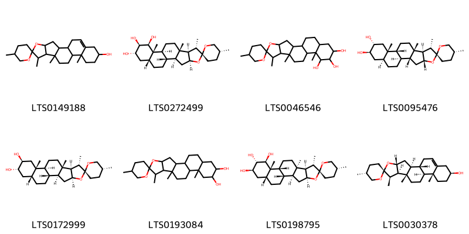{ width=100% }
    <figcaption>Hình ảnh cấu trúc hóa học của 8 hoạt chất thuộc nhóm Prenol lipids gồm ['diosgenin (LTS0149188)', "(1's,2r,2's,4's,5r,7's,8'r,9's,12's,13's,14's,15'r,16's,18'r)-5,7',9',13'-tetramethyl-5'-oxaspiro[oxane-2,6'-pentacyclo[10.8.0.0²,⁹.0⁴,⁸.0¹³,¹⁸]icosane]-14',15',16'-triol (LTS0272499)", "5,7',9',13'-tetramethyl-5'-oxaspiro[oxane-2,6'-pentacyclo[10.8.0.0²,⁹.0⁴,⁸.0¹³,¹⁸]icosane]-14',15',16'-triol (LTS0046546)", "(1's,2r,2'r,4'r,5r,7's,8'r,9's,12'r,13's,15'r,16'r,18's)-5,7',9',13'-tetramethyl-5'-oxaspiro[oxane-2,6'-pentacyclo[10.8.0.0²,⁹.0⁴,⁸.0¹³,¹⁸]icosane]-15',16'-diol (LTS0095476)", "(1'r,2r,2's,4's,5r,7's,8'r,9's,12's,13's,15's,16's,18'r)-5,7',9',13'-tetramethyl-5'-oxaspiro[oxane-2,6'-pentacyclo[10.8.0.0²,⁹.0⁴,⁸.0¹³,¹⁸]icosane]-15',16'-diol (LTS0172999)", "5,7',9',13'-tetramethyl-5'-oxaspiro[oxane-2,6'-pentacyclo[10.8.0.0²,⁹.0⁴,⁸.0¹³,¹⁸]icosane]-15',16'-diol (LTS0193084)", "(1's,2r,2's,4's,5r,7's,8'r,9'r,12'r,13's,14's,15's,16'r,18'r)-5,7',9',13'-tetramethyl-5'-oxaspiro[oxane-2,6'-pentacyclo[10.8.0.0²,⁹.0⁴,⁸.0¹³,¹⁸]icosane]-14',15',16'-triol (LTS0198795)", "(1's,2r,2's,4'r,5r,7'r,8'r,9's,12's,13'r,16's)-5,7',9',13'-tetramethyl-5'-oxaspiro[oxane-2,6'-pentacyclo[10.8.0.0²,⁹.0⁴,⁸.0¹³,¹⁸]icosan]-18'-en-16'-ol (LTS0030378)"].</figcaption>
</figure>
#### Nhóm Steroids and steroid derivatives
<figure markdown="span">
    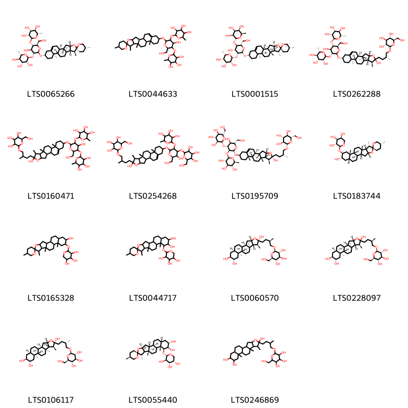{ width=100% }
    <figcaption>Hình ảnh cấu trúc hóa học của 15 hoạt chất thuộc nhóm Steroids and steroid derivatives gồm ["(2s,3r,4r,5r,6s)-2-{[(2r,3s,4s,5r,6r)-4-hydroxy-2-(hydroxymethyl)-6-[(1's,2r,2's,4's,5r,7's,8'r,9's,12's,13'r,16's)-5,7',9',13'-tetramethyl-5'-oxaspiro[oxane-2,6'-pentacyclo[10.8.0.0²,⁹.0⁴,⁸.0¹³,¹⁸]icosan]-18'-eneoxy]-5-{[(2s,3r,4r,5r,6s)-3,4,5-trihydroxy-6-methyloxan-2-yl]oxy}oxan-3-yl]oxy}-6-methyloxane-3,4,5-triol (LTS0065266)", "2-{[4-hydroxy-2-(hydroxymethyl)-6-{5,7',9',13'-tetramethyl-5'-oxaspiro[oxane-2,6'-pentacyclo[10.8.0.0²,⁹.0⁴,⁸.0¹³,¹⁸]icosan]-18'-eneoxy}-5-[(3,4,5-trihydroxy-6-methyloxan-2-yl)oxy]oxan-3-yl]oxy}-6-methyloxane-3,4,5-triol (LTS0044633)", "(2r,3r,4r,5s,6s)-2-{[(2s,3r,4r,5r,6s)-4-hydroxy-6-(hydroxymethyl)-2-[(1'r,2s,2'r,4'r,5r,7'r,8's,9'r,12'r,13'r,16's)-5,7',9',13'-tetramethyl-5'-oxaspiro[oxane-2,6'-pentacyclo[10.8.0.0²,⁹.0⁴,⁸.0¹³,¹⁸]icosan]-18'-eneoxy]-5-{[(2r,3s,4s,5r,6r)-3,4,5-trihydroxy-6-methyloxan-2-yl]oxy}oxan-3-yl]oxy}-6-methyloxane-3,4,5-triol (LTS0001515)", 'protodioscin (LTS0262288)', '2-[(4-hydroxy-6-{[6-hydroxy-7,9,13-trimethyl-6-(3-methyl-4-{[3,4,5-trihydroxy-6-(hydroxymethyl)oxan-2-yl]oxy}butyl)-5-oxapentacyclo[10.8.0.0²,⁹.0⁴,⁸.0¹³,¹⁸]icos-18-en-16-yl]oxy}-2-(hydroxymethyl)-5-[(3,4,5-trihydroxy-6-methyloxan-2-yl)oxy]oxan-3-yl)oxy]-6-methyloxane-3,4,5-triol (LTS0160471)', '2-[(3-hydroxy-6-{[6-hydroxy-7,9,13-trimethyl-6-(3-methyl-4-{[3,4,5-trihydroxy-6-(hydroxymethyl)oxan-2-yl]oxy}butyl)-5-oxapentacyclo[10.8.0.0²,⁹.0⁴,⁸.0¹³,¹⁸]icos-18-en-16-yl]oxy}-2-(hydroxymethyl)-5-[(3,4,5-trihydroxy-6-methyloxan-2-yl)oxy]oxan-4-yl)oxy]-6-(hydroxymethyl)oxane-3,4,5-triol (LTS0254268)', '(2r,3s,4r,5r,6s)-2-{[(2s,3s,4r,5s,6s)-5-hydroxy-2-{[(1s,2s,4s,6s,7s,8r,9r,12s,13s,16r)-6-hydroxy-7,9,13-trimethyl-6-[(3r)-3-methyl-4-{[(2s,3s,4r,5r,6s)-3,4,5-trihydroxy-6-(hydroxymethyl)oxan-2-yl]oxy}butyl]-5-oxapentacyclo[10.8.0.0²,⁹.0⁴,⁸.0¹³,¹⁸]icos-18-en-16-yl]oxy}-6-(hydroxymethyl)-4-{[(2r,3s,4r,5r,6s)-3,4,5-trihydroxy-6-(hydroxymethyl)oxan-2-yl]oxy}oxan-3-yl]oxy}-6-methyloxane-3,4,5-triol (LTS0195709)', "(2s,3r,4s,5s)-2-[(1's,2r,2'r,4'r,5r,7's,8's,9's,12'r,13's,15's,16's,18'r)-5,7',9',13'-tetramethyl-5'-oxaspiro[oxane-2,6'-pentacyclo[10.8.0.0²,⁹.0⁴,⁸.0¹³,¹⁸]icosan]-16'-oloxy]oxane-3,4,5-triol (LTS0183744)", "2-{5,7',9',13'-tetramethyl-5'-oxaspiro[oxane-2,6'-pentacyclo[10.8.0.0²,⁹.0⁴,⁸.0¹³,¹⁸]icosan]-16'-oloxy}oxane-3,4,5-triol (LTS0165328)", "2-{5,7',9',13'-tetramethyl-5'-oxaspiro[oxane-2,6'-pentacyclo[10.8.0.0²,⁹.0⁴,⁸.0¹³,¹⁸]icosane]-15',16'-dioloxy}oxane-3,4,5-triol (LTS0044717)", '(1r,2r,4s,6s,7s,8r,9s,12s,13s,15s,16s,18r)-7,9,13-trimethyl-6-[(3r)-3-methyl-4-{[(2r,3r,4s,5s,6r)-3,4,5-trihydroxy-6-(hydroxymethyl)oxan-2-yl]oxy}butyl]-5-oxapentacyclo[10.8.0.0²,⁹.0⁴,⁸.0¹³,¹⁸]icosane-6,15,16-triol (LTS0060570)', '(1r,2s,4s,6r,7s,8r,9s,12s,13s,15s,16s,18r)-7,9,13-trimethyl-6-[(3r)-3-methyl-4-{[(2r,3r,4s,5s,6r)-3,4,5-trihydroxy-6-(hydroxymethyl)oxan-2-yl]oxy}butyl]-5-oxapentacyclo[10.8.0.0²,⁹.0⁴,⁸.0¹³,¹⁸]icosane-6,15,16-triol (LTS0228097)', '(1r,2r,4s,6s,7s,8r,9s,12s,13s,15s,16s,18r)-7,9,13-trimethyl-6-[(3s)-3-methyl-4-{[(2r,3r,4s,5s,6r)-3,4,5-trihydroxy-6-(hydroxymethyl)oxan-2-yl]oxy}butyl]-5-oxapentacyclo[10.8.0.0²,⁹.0⁴,⁸.0¹³,¹⁸]icosane-6,15,16-triol (LTS0106117)', "(2s,3r,4s,5s)-2-[(1'r,2r,2'r,4's,5s,7's,8'r,9's,12's,13's,14's,15'r,16's,18'r)-5,7',9',13'-tetramethyl-5'-oxaspiro[oxane-2,6'-pentacyclo[10.8.0.0²,⁹.0⁴,⁸.0¹³,¹⁸]icosane]-15',16'-dioloxy]oxane-3,4,5-triol (LTS0055440)", '7,9,13-trimethyl-6-(3-methyl-4-{[3,4,5-trihydroxy-6-(hydroxymethyl)oxan-2-yl]oxy}butyl)-5-oxapentacyclo[10.8.0.0²,⁹.0⁴,⁸.0¹³,¹⁸]icosane-6,15,16-triol (LTS0246869)'].</figcaption>
</figure>

---

### Dược dân tộc học

Danh sách các quốc gia có sử dụng *Dioscorea tokoro* trong điều trị các bệnh. 

| Country   | Disease               | Bệnh                                                                                                                                                                                                |
|:----------|:----------------------|:----------------------------------------------------------------------------------------------------------------------------------------------------------------------------------------------------|
| China     | Diuretic, Carminative | MYMEMORY WARNING: YOU USED ALL AVAILABLE FREE TRANSLATIONS FOR TODAY. NEXT AVAILABLE IN  13 HOURS 19 MINUTES 55 SECONDS VISIT HTTPS://MYMEMORY.TRANSLATED.NET/DOC/USAGELIMITS.PHP TO TRANSLATE MORE |

---

---
## Dioscorea villosa
### Thông tin về thực vật

!!! info "Phân loại thực vật của *Dioscorea villosa* từ GIBF:"
    - **Kingdom:** Plantae
    - **Phylum:** Tracheophyta
    - **Order:** Dioscoreales
    - **Family:** Dioscoreaceae
    - **Genus:** Dioscorea
    - **Species:** *Dioscorea villosa*

 

| Label (VI)   | Label (EN)   | Scientific Name   | Descriptions (VI)   | Descriptions (EN)   | Also Known As (VI)   | Also Known As (EN)   |
|:-------------|:-------------|:------------------|:--------------------|:--------------------|:---------------------|:---------------------|
| N/A          | N/A          | Dioscorea villosa | loài thực vật       | species of plant    | ['']                 | ['']                 |

#### Phân bố trên thế giới

**Từ CSDL GIBF** nan, United States of America, Canada

#### Phân bố tại Việt Nam

**Từ CSDL GIBF**: Không có ghi nhận ở Việt Nam

---
### Thành phần hóa học
        
- Theo cơ sở dữ liệu lotus: Từ loài *Dioscorea villosa* đã phân lập và xác định được 17 hoạt chất thuộc về các nhóm Steroids and steroid derivatives. 

|    | chemicalTaxonomyClassyfireClass   |   smiles_count |
|---:|:----------------------------------|---------------:|
|  0 | Steroids and steroid derivatives  |             17 |

#### Nhóm Steroids and steroid derivatives
<figure markdown="span">
    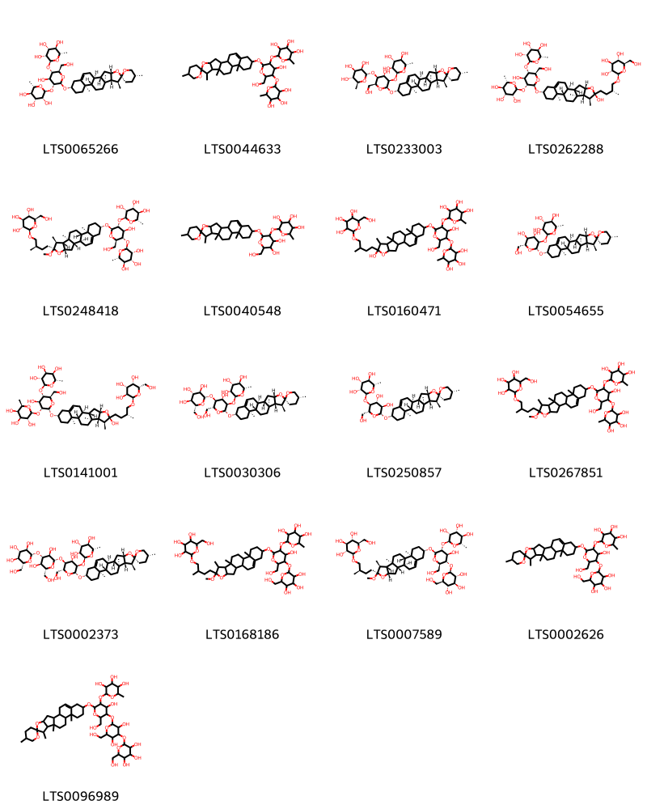{ width=100% }
    <figcaption>Hình ảnh cấu trúc hóa học của 17 hoạt chất thuộc nhóm Steroids and steroid derivatives gồm ["(2s,3r,4r,5r,6s)-2-{[(2r,3s,4s,5r,6r)-4-hydroxy-2-(hydroxymethyl)-6-[(1's,2r,2's,4's,5r,7's,8'r,9's,12's,13'r,16's)-5,7',9',13'-tetramethyl-5'-oxaspiro[oxane-2,6'-pentacyclo[10.8.0.0²,⁹.0⁴,⁸.0¹³,¹⁸]icosan]-18'-eneoxy]-5-{[(2s,3r,4r,5r,6s)-3,4,5-trihydroxy-6-methyloxan-2-yl]oxy}oxan-3-yl]oxy}-6-methyloxane-3,4,5-triol (LTS0065266)", "2-{[4-hydroxy-2-(hydroxymethyl)-6-{5,7',9',13'-tetramethyl-5'-oxaspiro[oxane-2,6'-pentacyclo[10.8.0.0²,⁹.0⁴,⁸.0¹³,¹⁸]icosan]-18'-eneoxy}-5-[(3,4,5-trihydroxy-6-methyloxan-2-yl)oxy]oxan-3-yl]oxy}-6-methyloxane-3,4,5-triol (LTS0044633)", "(2s,3r,4r,5r,6s)-2-{[(2s,3s,4s,5r,6s)-4-hydroxy-2-(hydroxymethyl)-6-[(1's,2r,2's,4's,5r,7's,8'r,9's,12's,13'r,16's)-5,7',9',13'-tetramethyl-5'-oxaspiro[oxane-2,6'-pentacyclo[10.8.0.0²,⁹.0⁴,⁸.0¹³,¹⁸]icosan]-18'-eneoxy]-5-{[(2s,3r,4r,5r,6s)-3,4,5-trihydroxy-6-methyloxan-2-yl]oxy}oxan-3-yl]oxy}-6-methyloxane-3,4,5-triol (LTS0233003)", 'protodioscin (LTS0262288)', 'methylprotodioscin (LTS0248418)', "2-{[4,5-dihydroxy-6-(hydroxymethyl)-2-{5,7',9',13'-tetramethyl-5'-oxaspiro[oxane-2,6'-pentacyclo[10.8.0.0²,⁹.0⁴,⁸.0¹³,¹⁸]icosan]-18'-eneoxy}oxan-3-yl]oxy}-6-methyloxane-3,4,5-triol (LTS0040548)", '2-[(4-hydroxy-6-{[6-hydroxy-7,9,13-trimethyl-6-(3-methyl-4-{[3,4,5-trihydroxy-6-(hydroxymethyl)oxan-2-yl]oxy}butyl)-5-oxapentacyclo[10.8.0.0²,⁹.0⁴,⁸.0¹³,¹⁸]icos-18-en-16-yl]oxy}-2-(hydroxymethyl)-5-[(3,4,5-trihydroxy-6-methyloxan-2-yl)oxy]oxan-3-yl)oxy]-6-methyloxane-3,4,5-triol (LTS0160471)', "(2s,3r,4r,5r,6s)-2-{[(2r,3r,4s,5s,6r)-4,5-dihydroxy-6-(hydroxymethyl)-2-[(1's,2r,2's,4's,5r,7's,8'r,9's,12's,13'r,16's)-5,7',9',13'-tetramethyl-5'-oxaspiro[oxane-2,6'-pentacyclo[10.8.0.0²,⁹.0⁴,⁸.0¹³,¹⁸]icosan]-18'-eneoxy]oxan-3-yl]oxy}-6-methyloxane-3,4,5-triol (LTS0054655)", '(2s,3r,4s,5r,6s)-2-{[(2r,3s,4s,5r,6s)-4-hydroxy-6-{[(1s,2s,4s,6r,7s,8r,9s,12s,13r,16s)-6-hydroxy-7,9,13-trimethyl-6-[(3r)-3-methyl-4-{[(2r,3s,4r,5s,6s)-3,4,5-trihydroxy-6-(hydroxymethyl)oxan-2-yl]oxy}butyl]-5-oxapentacyclo[10.8.0.0²,⁹.0⁴,⁸.0¹³,¹⁸]icos-18-en-16-yl]oxy}-2-(hydroxymethyl)-5-{[(2s,3r,4s,5r,6r)-3,4,5-trihydroxy-6-methyloxan-2-yl]oxy}oxan-3-yl]oxy}-6-methyloxane-3,4,5-triol (LTS0141001)', "(2s,3r,4r,5r,6s)-2-{[(2r,3r,4s,5s,6r)-4-hydroxy-6-(hydroxymethyl)-2-[(1's,2r,2's,4's,5r,7's,8'r,9's,12's,13'r,16's)-5,7',9',13'-tetramethyl-5'-oxaspiro[oxane-2,6'-pentacyclo[10.8.0.0²,⁹.0⁴,⁸.0¹³,¹⁸]icosan]-18'-eneoxy]-5-{[(2s,3r,4s,5s,6r)-3,4,5-trihydroxy-6-(hydroxymethyl)oxan-2-yl]oxy}oxan-3-yl]oxy}-6-methyloxane-3,4,5-triol (LTS0030306)", "(2s,3r,4r,5r,6s)-2-{[(2r,3s,4r,5r,6r)-4,5-dihydroxy-2-(hydroxymethyl)-6-[(1's,2r,2's,4's,5r,7's,8'r,9's,12's,13'r,16's)-5,7',9',13'-tetramethyl-5'-oxaspiro[oxane-2,6'-pentacyclo[10.8.0.0²,⁹.0⁴,⁸.0¹³,¹⁸]icosan]-18'-eneoxy]oxan-3-yl]oxy}-6-methyloxane-3,4,5-triol (LTS0250857)", '2-[4-(16-{[4-hydroxy-6-(hydroxymethyl)-3,5-bis[(3,4,5-trihydroxy-6-methyloxan-2-yl)oxy]oxan-2-yl]oxy}-6-methoxy-7,9,13-trimethyl-5-oxapentacyclo[10.8.0.0²,⁹.0⁴,⁸.0¹³,¹⁸]icos-18-en-6-yl)-2-methylbutoxy]-6-(hydroxymethyl)oxane-3,4,5-triol (LTS0267851)', "(2s,3r,4r,5r,6s)-2-{[(2r,3r,4s,5s,6r)-5-{[(2s,3r,4s,5r,6r)-3,5-dihydroxy-6-(hydroxymethyl)-4-{[(2s,3r,4s,5s,6r)-3,4,5-trihydroxy-6-(hydroxymethyl)oxan-2-yl]oxy}oxan-2-yl]oxy}-4-hydroxy-6-(hydroxymethyl)-2-[(1's,2r,2's,4's,5r,7's,8'r,9's,12's,13'r,16's)-5,7',9',13'-tetramethyl-5'-oxaspiro[oxane-2,6'-pentacyclo[10.8.0.0²,⁹.0⁴,⁸.0¹³,¹⁸]icosan]-18'-eneoxy]oxan-3-yl]oxy}-6-methyloxane-3,4,5-triol (LTS0002373)", '2-[4-(16-{[4-hydroxy-6-(hydroxymethyl)-5-{[3,4,5-trihydroxy-6-(hydroxymethyl)oxan-2-yl]oxy}-3-[(3,4,5-trihydroxy-6-methyloxan-2-yl)oxy]oxan-2-yl]oxy}-6-methoxy-7,9,13-trimethyl-5-oxapentacyclo[10.8.0.0²,⁹.0⁴,⁸.0¹³,¹⁸]icos-18-en-6-yl)-2-methylbutoxy]-6-(hydroxymethyl)oxane-3,4,5-triol (LTS0168186)', '(2r,3r,4s,5s,6r)-2-[(2r)-4-[(1s,2s,4s,6r,7s,8r,9s,12s,13r,16s)-16-{[(2r,3r,4s,5s,6r)-4-hydroxy-6-(hydroxymethyl)-5-{[(2s,3r,4s,5s,6r)-3,4,5-trihydroxy-6-(hydroxymethyl)oxan-2-yl]oxy}-3-{[(2s,3r,4r,5r,6s)-3,4,5-trihydroxy-6-methyloxan-2-yl]oxy}oxan-2-yl]oxy}-6-methoxy-7,9,13-trimethyl-5-oxapentacyclo[10.8.0.0²,⁹.0⁴,⁸.0¹³,¹⁸]icos-18-en-6-yl]-2-methylbutoxy]-6-(hydroxymethyl)oxane-3,4,5-triol (LTS0007589)', "2-{[4-hydroxy-2-(hydroxymethyl)-6-{5,7',9',13'-tetramethyl-5'-oxaspiro[oxane-2,6'-pentacyclo[10.8.0.0²,⁹.0⁴,⁸.0¹³,¹⁸]icosan]-18'-eneoxy}-5-[(3,4,5-trihydroxy-6-methyloxan-2-yl)oxy]oxan-3-yl]oxy}-6-(hydroxymethyl)oxane-3,4,5-triol (LTS0002626)", "2-[(3,5-dihydroxy-2-{[4-hydroxy-2-(hydroxymethyl)-6-{5,7',9',13'-tetramethyl-5'-oxaspiro[oxane-2,6'-pentacyclo[10.8.0.0²,⁹.0⁴,⁸.0¹³,¹⁸]icosan]-18'-eneoxy}-5-[(3,4,5-trihydroxy-6-methyloxan-2-yl)oxy]oxan-3-yl]oxy}-6-(hydroxymethyl)oxan-4-yl)oxy]-6-(hydroxymethyl)oxane-3,4,5-triol (LTS0096989)"].</figcaption>
</figure>

---

### Dược dân tộc học

Danh sách các quốc gia có sử dụng *Dioscorea villosa* trong điều trị các bệnh. 

| Country   | Disease                                                | Bệnh                                                                                                                                                                                                |
|:----------|:-------------------------------------------------------|:----------------------------------------------------------------------------------------------------------------------------------------------------------------------------------------------------|
| Turkey    | Emetic, Sudorific, Expectorant                         | MYMEMORY WARNING: YOU USED ALL AVAILABLE FREE TRANSLATIONS FOR TODAY. NEXT AVAILABLE IN  13 HOURS 19 MINUTES 20 SECONDS VISIT HTTPS://MYMEMORY.TRANSLATED.NET/DOC/USAGELIMITS.PHP TO TRANSLATE MORE |
| US        | Carminative, Emetic, Expectorant, Uterotonic, Diuretic | MYMEMORY WARNING: YOU USED ALL AVAILABLE FREE TRANSLATIONS FOR TODAY. NEXT AVAILABLE IN  13 HOURS 19 MINUTES 17 SECONDS VISIT HTTPS://MYMEMORY.TRANSLATED.NET/DOC/USAGELIMITS.PHP TO TRANSLATE MORE |

---

# Chi Tamus

??? note "Danh sách các dược liệu thuộc chi"
    
	 - *Tamus communis*

---
## Tamus communis
### Thông tin về thực vật

!!! info "Phân loại thực vật của *Dioscorea communis* từ GIBF:"
    - **Kingdom:** Plantae
    - **Phylum:** Tracheophyta
    - **Order:** Dioscoreales
    - **Family:** Dioscoreaceae
    - **Genus:** Dioscorea
    - **Species:** *Dioscorea communis*

 

| Label (VI)   | Label (EN)   | Scientific Name   | Descriptions (VI)   | Descriptions (EN)   | Also Known As (VI)   | Also Known As (EN)   |
|:-------------|:-------------|:------------------|:--------------------|:--------------------|:---------------------|:---------------------|
| N/A          | N/A          | Tamus communis    | loài thực vật       | species of plant    | ['']                 | ['']                 |

#### Phân bố trên thế giới

**Từ CSDL GIBF** Italy, United Kingdom of Great Britain and Northern Ireland, Germany, Spain, Portugal, Switzerland, Serbia, France, Slovenia, Croatia, Greece

#### Phân bố tại Việt Nam

**Từ CSDL GIBF**: Không có ghi nhận ở Việt Nam

---
### Thành phần hóa học
        
- Theo cơ sở dữ liệu lotus: Từ loài *Dioscorea communis* đã phân lập và xác định được 36 hoạt chất thuộc về các nhóm Phenanthrenes and derivatives, Flavonoids, Prenol lipids, Steroids and steroid derivatives. 

|    | chemicalTaxonomyClassyfireClass   |   smiles_count |
|---:|:----------------------------------|---------------:|
|  0 | Flavonoids                        |              7 |
|  1 | Phenanthrenes and derivatives     |             14 |
|  2 | Prenol lipids                     |              1 |
|  3 | Steroids and steroid derivatives  |             14 |

#### Nhóm Flavonoids
<figure markdown="span">
    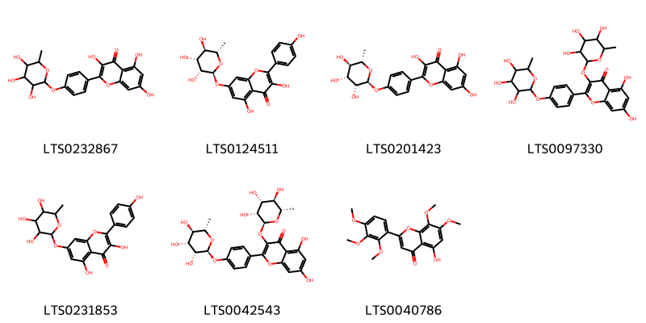{ width=100% }
    <figcaption>Hình ảnh cấu trúc hóa học của 7 hoạt chất thuộc nhóm Flavonoids gồm ['3,5,7-trihydroxy-2-{4-[(3,4,5-trihydroxy-6-methyloxan-2-yl)oxy]phenyl}chromen-4-one (LTS0232867)', 'kaempferol-7-rhamnoside (LTS0124511)', '3,5,7-trihydroxy-2-(4-{[(2s,3r,4r,5r,6s)-3,4,5-trihydroxy-6-methyloxan-2-yl]oxy}phenyl)chromen-4-one (LTS0201423)', '5,7-dihydroxy-3-[(3,4,5-trihydroxy-6-methyloxan-2-yl)oxy]-2-{4-[(3,4,5-trihydroxy-6-methyloxan-2-yl)oxy]phenyl}chromen-4-one (LTS0097330)', '3,5-dihydroxy-2-(4-hydroxyphenyl)-7-[(3,4,5-trihydroxy-6-methyloxan-2-yl)oxy]chromen-4-one (LTS0231853)', '5,7-dihydroxy-3-{[(2s,3r,4r,5r,6s)-3,4,5-trihydroxy-6-methyloxan-2-yl]oxy}-2-(4-{[(2s,3r,4r,5r,6s)-3,4,5-trihydroxy-6-methyloxan-2-yl]oxy}phenyl)chromen-4-one (LTS0042543)', 'serpyllin (LTS0040786)'].</figcaption>
</figure>
#### Nhóm Phenanthrenes and derivatives
<figure markdown="span">
    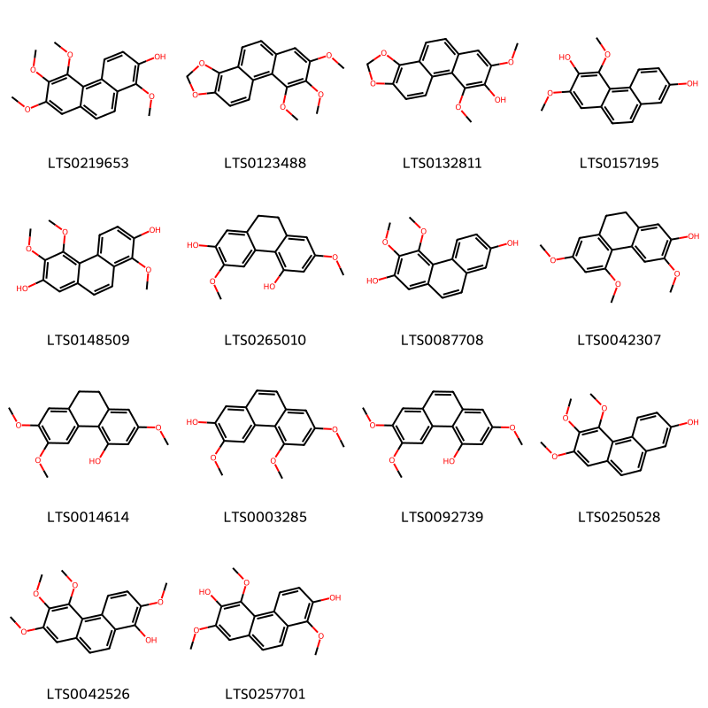{ width=100% }
    <figcaption>Hình ảnh cấu trúc hóa học của 14 hoạt chất thuộc nhóm Phenanthrenes and derivatives gồm ['1,5,6,7-tetramethoxyphenanthren-2-ol (LTS0219653)', '7,8,9-trimethoxy-2h-phenanthro[1,2-d][1,3]dioxole (LTS0123488)', '7,9-dimethoxy-2h-phenanthro[1,2-d][1,3]dioxol-8-ol (LTS0132811)', '5,7-dimethoxyphenanthrene-2,6-diol (LTS0157195)', 'confusarin (LTS0148509)', '3,7-dimethoxy-9,10-dihydrophenanthrene-2,5-diol (LTS0265010)', 'nudol (LTS0087708)', '3,5,7-trimethoxy-9,10-dihydrophenanthren-2-ol (LTS0042307)', '2,6,7-trimethoxy-9,10-dihydrophenanthren-4-ol (LTS0014614)', 'isobatatasin i (LTS0003285)', '2,6,7-trimethoxyphenanthren-4-ol (LTS0092739)', '5,6,7-trimethoxyphenanthren-2-ol (LTS0250528)', '2,5,6,7-tetramethoxyphenanthren-1-ol (LTS0042526)', '1,5,7-trimethoxyphenanthrene-2,6-diol (LTS0257701)'].</figcaption>
</figure>
#### Nhóm Prenol lipids
<figure markdown="span">
    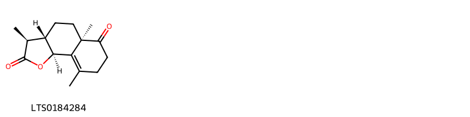{ width=100% }
    <figcaption>Hình ảnh cấu trúc hóa học của 1 hoạt chất thuộc nhóm Prenol lipids gồm ['gracilin (LTS0184284)'].</figcaption>
</figure>
#### Nhóm Steroids and steroid derivatives
<figure markdown="span">
    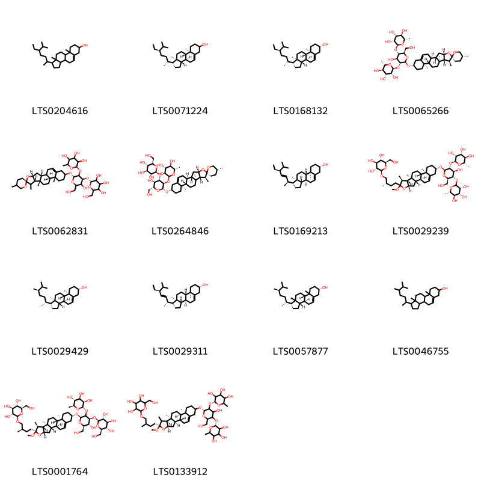{ width=100% }
    <figcaption>Hình ảnh cấu trúc hóa học của 14 hoạt chất thuộc nhóm Steroids and steroid derivatives gồm ['stigmast-5-en-3-ol, (3β)- (LTS0204616)', 'stigmast-5-en-3-ol (LTS0071224)', 'sitosterol (LTS0168132)', "(2s,3r,4r,5r,6s)-2-{[(2r,3s,4s,5r,6r)-4-hydroxy-2-(hydroxymethyl)-6-[(1's,2r,2's,4's,5r,7's,8'r,9's,12's,13'r,16's)-5,7',9',13'-tetramethyl-5'-oxaspiro[oxane-2,6'-pentacyclo[10.8.0.0²,⁹.0⁴,⁸.0¹³,¹⁸]icosan]-18'-eneoxy]-5-{[(2s,3r,4r,5r,6s)-3,4,5-trihydroxy-6-methyloxan-2-yl]oxy}oxan-3-yl]oxy}-6-methyloxane-3,4,5-triol (LTS0065266)", "(2r)-2-{[(6s)-3-hydroxy-2-(hydroxymethyl)-6-[(1'r,2r,2'r,4'r,8's,9's,12'r,13'r)-5,7',9',13'-tetramethyl-5'-oxaspiro[oxane-2,6'-pentacyclo[10.8.0.0²,⁹.0⁴,⁸.0¹³,¹⁸]icosan]-18'-eneoxy]-5-{[(2r)-3,4,5-trihydroxy-6-methyloxan-2-yl]oxy}oxan-4-yl]oxy}-6-(hydroxymethyl)oxane-3,4,5-triol (LTS0062831)", "(2s,3r,4r,5r,6s)-2-{[(2r,3r,4s,5r,6r)-5-hydroxy-6-(hydroxymethyl)-2-[(1's,2r,2's,4's,5r,7's,8'r,9's,12's,13'r,16's)-5,7',9',13'-tetramethyl-5'-oxaspiro[oxane-2,6'-pentacyclo[10.8.0.0²,⁹.0⁴,⁸.0¹³,¹⁸]icosan]-18'-eneoxy]-4-{[(2s,3r,4s,5s,6r)-3,4,5-trihydroxy-6-(hydroxymethyl)oxan-2-yl]oxy}oxan-3-yl]oxy}-6-methyloxane-3,4,5-triol (LTS0264846)", '(1r,3as,3bs,7s,9ar,9bs,11ar)-1-[(2s,3e,5s)-5-ethyl-6-methylhept-3-en-2-yl]-9a,11a-dimethyl-1h,2h,3h,3ah,3bh,4h,6h,7h,8h,9h,9bh,10h,11h-cyclopenta[a]phenanthren-7-ol (LTS0169213)', '(2r,3r,4s,5s,6r)-2-[(2s)-4-[(1s,2s,4s,7s,8r,9s,12s,13r,16s)-16-{[(2r,3r,4s,5s,6r)-4-hydroxy-6-(hydroxymethyl)-3-{[(2s,3r,4r,5r,6s)-3,4,5-trihydroxy-6-methyloxan-2-yl]oxy}-5-{[(3r,4r,5r,6s)-3,4,5-trihydroxy-6-methyloxan-2-yl]oxy}oxan-2-yl]oxy}-6-methoxy-7,9,13-trimethyl-5-oxapentacyclo[10.8.0.0²,⁹.0⁴,⁸.0¹³,¹⁸]icos-18-en-6-yl]-2-methylbutoxy]-6-(hydroxymethyl)oxane-3,4,5-triol (LTS0029239)', 'campesterol (LTS0029429)', 'phytosterol (LTS0029311)', '(1r,3as,3bs,7s,9bs)-1-[(2r,5r)-5,6-dimethylheptan-2-yl]-9a,11a-dimethyl-1h,2h,3h,3ah,3bh,4h,6h,7h,8h,9h,9bh,10h,11h-cyclopenta[a]phenanthren-7-ol (LTS0057877)', 'campesterol (LTS0046755)', '(2r,3r,4s,5s,6r)-2-[(2r)-4-[(1s,2s,4s,6r,7s,8r,9s,12s,13r,16s)-16-{[(2r,4s,5r,6r)-5-hydroxy-6-(hydroxymethyl)-4-{[(2s,3r,4s,5s,6r)-3,4,5-trihydroxy-6-(hydroxymethyl)oxan-2-yl]oxy}-3-{[(2s,3r,4r,5r,6s)-3,4,5-trihydroxy-6-methyloxan-2-yl]oxy}oxan-2-yl]oxy}-6-methoxy-7,9,13-trimethyl-5-oxapentacyclo[10.8.0.0²,⁹.0⁴,⁸.0¹³,¹⁸]icos-18-en-6-yl]-2-methylbutoxy]-6-(hydroxymethyl)oxane-3,4,5-triol (LTS0001764)', '2-{4-[(1r,2r,4r,6r,8s,9s,12r,13r)-16-{[(2s)-4-hydroxy-6-(hydroxymethyl)-3,5-bis({[(2r)-3,4,5-trihydroxy-6-methyloxan-2-yl]oxy})oxan-2-yl]oxy}-6-methoxy-7,9,13-trimethyl-5-oxapentacyclo[10.8.0.0²,⁹.0⁴,⁸.0¹³,¹⁸]icos-18-en-6-yl]-2-methylbutoxy}-6-(hydroxymethyl)oxane-3,4,5-triol (LTS0133912)'].</figcaption>
</figure>

---

### Dược dân tộc học

Danh sách các quốc gia có sử dụng *Dioscorea communis* trong điều trị các bệnh. 

| Country   | Disease                                             | Bệnh                                                                                                                                                                                                |
|:----------|:----------------------------------------------------|:----------------------------------------------------------------------------------------------------------------------------------------------------------------------------------------------------|
| Egypt     | Diuretic, Emetic, Purgative, Rubefacient, Laxative  | MYMEMORY WARNING: YOU USED ALL AVAILABLE FREE TRANSLATIONS FOR TODAY. NEXT AVAILABLE IN  13 HOURS 18 MINUTES 46 SECONDS VISIT HTTPS://MYMEMORY.TRANSLATED.NET/DOC/USAGELIMITS.PHP TO TRANSLATE MORE |
| Europe    | Diuretic, Rubefacient                               | MYMEMORY WARNING: YOU USED ALL AVAILABLE FREE TRANSLATIONS FOR TODAY. NEXT AVAILABLE IN  13 HOURS 18 MINUTES 43 SECONDS VISIT HTTPS://MYMEMORY.TRANSLATED.NET/DOC/USAGELIMITS.PHP TO TRANSLATE MORE |
| Iraq      | Poison                                              | MYMEMORY WARNING: YOU USED ALL AVAILABLE FREE TRANSLATIONS FOR TODAY. NEXT AVAILABLE IN  13 HOURS 18 MINUTES 39 SECONDS VISIT HTTPS://MYMEMORY.TRANSLATED.NET/DOC/USAGELIMITS.PHP TO TRANSLATE MORE |
| Turkey    | Purgative, Vulnerary, Diuretic, Rubefacient, Emetic | MYMEMORY WARNING: YOU USED ALL AVAILABLE FREE TRANSLATIONS FOR TODAY. NEXT AVAILABLE IN  13 HOURS 18 MINUTES 36 SECONDS VISIT HTTPS://MYMEMORY.TRANSLATED.NET/DOC/USAGELIMITS.PHP TO TRANSLATE MORE |

---

