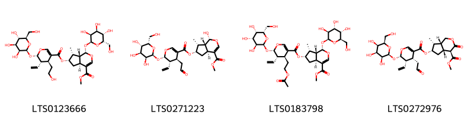

!!! abstract "Tóm tắt"

    Họ Dipsacaceae gồm khoảng 5 chi và 7 loài được một số cộng đồng tại các quốc gia như Eurasia, Lesotho, ain, Turkey, Elsewhere, China sử dụng trong một số trường hợp MYMEMORY WARNING: YOU USED ALL AVAILABLE FREE TRANSLATIONS FOR TODAY. NEXT AVAILABLE IN  16 HOURS 21 MINUTES 33 SECONDS VISIT HTTPS://MYMEMORY.TRANSLATED.NET/DOC/USAGELIMITS.PHP TO TRANSLATE MORE.

!!! info "DrDuke"

    James A. Duke sinh năm 1929-2017 là một nhà thực vật học người Mỹ. Đây là một trong những tác giả hàng đầu trong lĩnh vực dược dân tộc học với cuốn *CRC Handbook of Medicinal Herbs* và chính là người xây dựng lên cơ sở dữ liệu về hợp chất tự nhiên và dược dân tộc học tại Bộ nông nghiệp Hoa Kỳ. Các thông tin được đăng tải tại website [Dr. Duke's Phytochemical and Ethnobotanical Databases](https://phytochem.nal.usda.gov/). 
    Trong suốt thập niên 1970, ông lãnh đạo the Plant Taxonomy Laboratory, Plant Genetics and Germplasm Institute of the Agricultural Research Service, U.S. Department of Agriculture.
    Trong tài liệu này, các thông tin về dược dân tộc của các dược liệu được trích dẫn từ tài liệu của James A. Ducke với sự trợ giúp của phần mềm dịch thuật từ tiếng Anh sang tiếng Việt.
   

# Chi Succisa

??? note "Danh sách các dược liệu thuộc chi"
    
	 - *Succisa pratensis*

---
## Succisa pratensis
### Thông tin về thực vật

!!! info "Phân loại thực vật của *Succisa pratensis* từ GIBF:"
    - **Kingdom:** Plantae
    - **Phylum:** Tracheophyta
    - **Order:** Dipsacales
    - **Family:** Caprifoliaceae
    - **Genus:** Succisa
    - **Species:** *Succisa pratensis*

 

| Label (VI)   | Label (EN)   | Scientific Name   | Descriptions (VI)   | Descriptions (EN)   | Also Known As (VI)   | Also Known As (EN)                      |
|:-------------|:-------------|:------------------|:--------------------|:--------------------|:---------------------|:----------------------------------------|
| N/A          | N/A          | Succisa pratensis | loài thực vật       | species of plant    | ['']                 | ["devil's bit", 'devil’s bit scabious'] |

#### Phân bố trên thế giới

**Từ CSDL GIBF** Belarus, Austria, Hungary, Norway, Romania, Czechia, Poland, Sweden, Netherlands, France, Russian Federation, Switzerland, Spain, Germany, United Kingdom of Great Britain and Northern Ireland, Ireland, Denmark

#### Phân bố tại Việt Nam

**Từ CSDL GIBF**: Không có ghi nhận ở Việt Nam

---
### Thành phần hóa học
        
- Theo cơ sở dữ liệu lotus: Từ loài *Succisa pratensis* đã phân lập và xác định được Chưa có hoạt chất nào được phân lập. hoạt chất thuộc về các nhóm Không có hoạt chất nào được phân lập. 

Không có hình ảnh nào được tạo ra

---

### Dược dân tộc học

Danh sách các quốc gia có sử dụng *Succisa pratensis* trong điều trị các bệnh. 

| Country   | Disease                | Bệnh                                                                                                                                                                                                |
|:----------|:-----------------------|:----------------------------------------------------------------------------------------------------------------------------------------------------------------------------------------------------|
| Eurasia   | Demulcent, Diaphoretic | MYMEMORY WARNING: YOU USED ALL AVAILABLE FREE TRANSLATIONS FOR TODAY. NEXT AVAILABLE IN  16 HOURS 21 MINUTES 31 SECONDS VISIT HTTPS://MYMEMORY.TRANSLATED.NET/DOC/USAGELIMITS.PHP TO TRANSLATE MORE |

---

# Chi Knautia

??? note "Danh sách các dược liệu thuộc chi"
    
	 - *Knautia arvensis*

---
## Knautia arvensis
### Thông tin về thực vật

!!! info "Phân loại thực vật của *Knautia arvensis* từ GIBF:"
    - **Kingdom:** Plantae
    - **Phylum:** Tracheophyta
    - **Order:** Dipsacales
    - **Family:** Caprifoliaceae
    - **Genus:** Knautia
    - **Species:** *Knautia arvensis*

 

| Label (VI)   | Label (EN)   | Scientific Name   | Descriptions (VI)   | Descriptions (EN)   | Also Known As (VI)   | Also Known As (EN)                  |
|:-------------|:-------------|:------------------|:--------------------|:--------------------|:---------------------|:------------------------------------|
| N/A          | N/A          | Knautia arvensis  | loài thực vật       | species of plant    | ['']                 | ['bluebuttons', 'Knautia arvensis'] |

#### Phân bố trên thế giới

**Từ CSDL GIBF** Czechia, Sweden, Slovenia, Spain, Poland, Denmark, Netherlands, Greece, Russian Federation, Croatia, Lithuania, United Kingdom of Great Britain and Northern Ireland, Belgium, Germany, Austria, Hungary, Ukraine, Italy, Switzerland, France

#### Phân bố tại Việt Nam

**Từ CSDL GIBF**: Không có ghi nhận ở Việt Nam

---
### Thành phần hóa học
        
- Theo cơ sở dữ liệu lotus: Từ loài *Knautia arvensis* đã phân lập và xác định được 1 hoạt chất thuộc về các nhóm Prenol lipids. 

|    | chemicalTaxonomyClassyfireClass   |   smiles_count |
|---:|:----------------------------------|---------------:|
|  0 | Prenol lipids                     |              1 |

#### Nhóm Prenol lipids
<figure markdown="span">
    { width=100% }
    <figcaption>Hình ảnh cấu trúc hóa học của 1 hoạt chất thuộc nhóm Prenol lipids gồm ['ursolic acid (LTS0250838)'].</figcaption>
</figure>

---

### Dược dân tộc học

Danh sách các quốc gia có sử dụng *Knautia arvensis* trong điều trị các bệnh. 

| Country   | Disease                                                  | Bệnh                                                                                                                                                                                                |
|:----------|:---------------------------------------------------------|:----------------------------------------------------------------------------------------------------------------------------------------------------------------------------------------------------|
| Turkey    | Antiseptic, Astringent, Expectorant, Laxative, Vulnerary | MYMEMORY WARNING: YOU USED ALL AVAILABLE FREE TRANSLATIONS FOR TODAY. NEXT AVAILABLE IN  16 HOURS 21 MINUTES 10 SECONDS VISIT HTTPS://MYMEMORY.TRANSLATED.NET/DOC/USAGELIMITS.PHP TO TRANSLATE MORE |

---

# Chi Cephalaria

??? note "Danh sách các dược liệu thuộc chi"
    
	 - *Cephalaria attenuata*

---
## Cephalaria attenuata
### Thông tin về thực vật

!!! info "Phân loại thực vật của *Cephalaria attenuata* từ GIBF:"
    - **Kingdom:** Plantae
    - **Phylum:** Tracheophyta
    - **Order:** Dipsacales
    - **Family:** Caprifoliaceae
    - **Genus:** Cephalaria
    - **Species:** *Cephalaria attenuata*

 

| Label (VI)   | Label (EN)   | Scientific Name      | Descriptions (VI)   | Descriptions (EN)   | Also Known As (VI)   | Also Known As (EN)   |
|:-------------|:-------------|:---------------------|:--------------------|:--------------------|:---------------------|:---------------------|
| N/A          | N/A          | Cephalaria attenuata | loài thực vật       | species of plant    | ['']                 | ['']                 |

#### Phân bố trên thế giới

**Từ CSDL GIBF** nan, Tanzania, United Republic of, unknown or invalid, South Africa

#### Phân bố tại Việt Nam

**Từ CSDL GIBF**: Không có ghi nhận ở Việt Nam

---
### Thành phần hóa học
        
- Theo cơ sở dữ liệu lotus: Từ loài *Cephalaria attenuata* đã phân lập và xác định được Chưa có hoạt chất nào được phân lập. hoạt chất thuộc về các nhóm Không có hoạt chất nào được phân lập. 

Không có hình ảnh nào được tạo ra

---

### Dược dân tộc học

Danh sách các quốc gia có sử dụng *Cephalaria attenuata* trong điều trị các bệnh. 

| Country   | Disease   | Bệnh                                                                                                                                                                                                |
|:----------|:----------|:----------------------------------------------------------------------------------------------------------------------------------------------------------------------------------------------------|
| Lesotho   | Fumigant  | MYMEMORY WARNING: YOU USED ALL AVAILABLE FREE TRANSLATIONS FOR TODAY. NEXT AVAILABLE IN  16 HOURS 20 MINUTES 47 SECONDS VISIT HTTPS://MYMEMORY.TRANSLATED.NET/DOC/USAGELIMITS.PHP TO TRANSLATE MORE |

---

# Chi Scabiosa

??? note "Danh sách các dược liệu thuộc chi"
    
	 - *Scabiosa succisa*

---
## Scabiosa succisa
### Thông tin về thực vật

!!! info "Phân loại thực vật của *Succisa pratensis* từ GIBF:"
    - **Kingdom:** Plantae
    - **Phylum:** Tracheophyta
    - **Order:** Dipsacales
    - **Family:** Caprifoliaceae
    - **Genus:** Succisa
    - **Species:** *Succisa pratensis*

 

| Label (VI)   | Label (EN)   | Scientific Name   | Descriptions (VI)   | Descriptions (EN)   | Also Known As (VI)   | Also Known As (EN)       |
|:-------------|:-------------|:------------------|:--------------------|:--------------------|:---------------------|:-------------------------|
| N/A          | N/A          | Scabiosa succisa  | loài thực vật       | species of plant    | ['']                 | ["devil's bit scabious"] |

#### Phân bố trên thế giới

**Từ CSDL GIBF** nan, Sweden, United Kingdom of Great Britain and Northern Ireland, Belgium, Cameroon, Russian Federation, Italy, Spain, Luxembourg, France, Ireland

#### Phân bố tại Việt Nam

**Từ CSDL GIBF**: Không có ghi nhận ở Việt Nam

---
### Thành phần hóa học
        
- Theo cơ sở dữ liệu lotus: Từ loài *Succisa pratensis* đã phân lập và xác định được Chưa có hoạt chất nào được phân lập. hoạt chất thuộc về các nhóm Không có hoạt chất nào được phân lập. 

Không có hình ảnh nào được tạo ra

---

### Dược dân tộc học

Danh sách các quốc gia có sử dụng *Succisa pratensis* trong điều trị các bệnh. 

| Country   | Disease                                                 | Bệnh                                                                                                                                                                                                |
|:----------|:--------------------------------------------------------|:----------------------------------------------------------------------------------------------------------------------------------------------------------------------------------------------------|
| Turkey    | Expectorant, Sudorific, Astringent, Diuretic, Demulcent | MYMEMORY WARNING: YOU USED ALL AVAILABLE FREE TRANSLATIONS FOR TODAY. NEXT AVAILABLE IN  16 HOURS 20 MINUTES 29 SECONDS VISIT HTTPS://MYMEMORY.TRANSLATED.NET/DOC/USAGELIMITS.PHP TO TRANSLATE MORE |

---

# Chi Dipsacus

??? note "Danh sách các dược liệu thuộc chi"
    
	 - *Dipsacus aer*
	 - *Dipsacus fullonum*
	 - *Dipsacus japonicus*

---
## Dipsacus aer
### Thông tin về thực vật

!!! info "Phân loại thực vật của *N/A* từ GIBF:"
    - **Kingdom:** Plantae
    - **Phylum:** Tracheophyta
    - **Order:** Dipsacales
    - **Family:** Caprifoliaceae
    - **Genus:** Dipsacus
    - **Species:** *N/A*

 

| Label (VI)   | Label (EN)   | Scientific Name   | Descriptions (VI)   | Descriptions (EN)   | Also Known As (VI)   | Also Known As (EN)       |
|:-------------|:-------------|:------------------|:--------------------|:--------------------|:---------------------|:-------------------------|
| N/A          | N/A          | Scabiosa succisa  | loài thực vật       | species of plant    | ['']                 | ["devil's bit scabious"] |

#### Phân bố trên thế giới

**Từ CSDL GIBF** Chile, New Zealand, Türkiye, Uruguay, Spain, Poland, Denmark, Netherlands, United States of America, Russian Federation, Argentina, France, Luxembourg, Canada, Germany, Moldova, Republic of, Austria, Hungary, Portugal, Ukraine, Australia, Italy, Bulgaria, United Kingdom of Great Britain and Northern Ireland

#### Phân bố tại Việt Nam

**Từ CSDL GIBF**: Không có ghi nhận ở Việt Nam

---
### Thành phần hóa học
        
- Theo cơ sở dữ liệu lotus: Từ loài *N/A* đã phân lập và xác định được Chưa có hoạt chất nào được phân lập. hoạt chất thuộc về các nhóm Không có hoạt chất nào được phân lập. 

Không có hình ảnh nào được tạo ra

---

### Dược dân tộc học

Danh sách các quốc gia có sử dụng *N/A* trong điều trị các bệnh. 

| Country   | Disease                    | Bệnh                                                                                                                                                                                                |
|:----------|:---------------------------|:----------------------------------------------------------------------------------------------------------------------------------------------------------------------------------------------------|
| China     | Analgesic, Tonic, Hemostat | MYMEMORY WARNING: YOU USED ALL AVAILABLE FREE TRANSLATIONS FOR TODAY. NEXT AVAILABLE IN  16 HOURS 20 MINUTES 09 SECONDS VISIT HTTPS://MYMEMORY.TRANSLATED.NET/DOC/USAGELIMITS.PHP TO TRANSLATE MORE |

---

---
## Dipsacus fullonum
### Thông tin về thực vật

!!! info "Phân loại thực vật của *Dipsacus fullonum* từ GIBF:"
    - **Kingdom:** Plantae
    - **Phylum:** Tracheophyta
    - **Order:** Dipsacales
    - **Family:** Caprifoliaceae
    - **Genus:** Dipsacus
    - **Species:** *Dipsacus fullonum*

 

| Label (VI)   | Label (EN)   | Scientific Name   | Descriptions (VI)   | Descriptions (EN)   | Also Known As (VI)   | Also Known As (EN)   |
|:-------------|:-------------|:------------------|:--------------------|:--------------------|:---------------------|:---------------------|
| N/A          | N/A          | Dipsacus fullonum | loài thực vật       | species of plant    | ['']                 | ['Teasel']           |

#### Phân bố trên thế giới

**Từ CSDL GIBF** New Zealand, Uruguay, Spain, Poland, Denmark, Netherlands, United States of America, Russian Federation, Argentina, France, Luxembourg, Canada, Germany, Moldova, Republic of, Austria, Hungary, Ukraine, Australia, Italy, United Kingdom of Great Britain and Northern Ireland

#### Phân bố tại Việt Nam

**Từ CSDL GIBF**: Không có ghi nhận ở Việt Nam

---
### Thành phần hóa học
        
- Theo cơ sở dữ liệu lotus: Từ loài *Dipsacus fullonum* đã phân lập và xác định được 4 hoạt chất thuộc về các nhóm Prenol lipids. 

|    | chemicalTaxonomyClassyfireClass   |   smiles_count |
|---:|:----------------------------------|---------------:|
|  0 | Prenol lipids                     |              4 |

#### Nhóm Prenol lipids
<figure markdown="span">
    { width=100% }
    <figcaption>Hình ảnh cấu trúc hóa học của 4 hoạt chất thuộc nhóm Prenol lipids gồm ['(1s,4as,6s,7r,7ar)-4-(methoxycarbonyl)-7-methyl-1-{[(2s,3s,4s,5s,6s)-3,4,5-trihydroxy-6-(hydroxymethyl)oxan-2-yl]oxy}-1h,4ah,5h,6h,7h,7ah-cyclopenta[c]pyran-6-yl (4s,5s,6s)-5-ethenyl-4-(2-hydroxyethyl)-6-{[(2s,3s,4s,5s,6r)-3,4,5-trihydroxy-6-(hydroxymethyl)oxan-2-yl]oxy}-5,6-dihydro-4h-pyran-3-carboxylate (LTS0123666)', '(1r,4as,6s,7r,7ar)-1-hydroxy-4-(methoxycarbonyl)-7-methyl-1h,4ah,5h,6h,7h,7ah-cyclopenta[c]pyran-6-yl (4s,5s,6s)-5-ethenyl-4-(2-oxoethyl)-6-{[(2s,3s,4s,5s,6s)-3,4,5-trihydroxy-6-(hydroxymethyl)oxan-2-yl]oxy}-5,6-dihydro-4h-pyran-3-carboxylate (LTS0271223)', '(1s,4as,6s,7r,7ar)-4-(methoxycarbonyl)-7-methyl-1-{[(2s,3s,4r,5s,6r)-3,4,5-trihydroxy-6-(hydroxymethyl)oxan-2-yl]oxy}-1h,4ah,5h,6h,7h,7ah-cyclopenta[c]pyran-6-yl (4s,5s,6s)-4-[2-(acetyloxy)ethyl]-5-ethenyl-6-{[(2s,3s,4r,5s,6s)-3,4,5-trihydroxy-6-(hydroxymethyl)oxan-2-yl]oxy}-5,6-dihydro-4h-pyran-3-carboxylate (LTS0183798)', '(4r,4ar,6s,7r,7ar)-4-(methoxycarbonyl)-7-methyl-3-oxo-hexahydro-1h-cyclopenta[c]pyran-6-yl (4r,5s,6s)-5-ethenyl-4-(2-oxoethyl)-6-{[(2s,3s,4s,5r,6r)-3,4,5-trihydroxy-6-(hydroxymethyl)oxan-2-yl]oxy}-5,6-dihydro-4h-pyran-3-carboxylate (LTS0272976)'].</figcaption>
</figure>

---

### Dược dân tộc học

Danh sách các quốc gia có sử dụng *Dipsacus fullonum* trong điều trị các bệnh. 

| Country   | Disease             | Bệnh                                                                                                                                                                                                |
|:----------|:--------------------|:----------------------------------------------------------------------------------------------------------------------------------------------------------------------------------------------------|
| Elsewhere | Sudorific, Diuretic | MYMEMORY WARNING: YOU USED ALL AVAILABLE FREE TRANSLATIONS FOR TODAY. NEXT AVAILABLE IN  16 HOURS 19 MINUTES 46 SECONDS VISIT HTTPS://MYMEMORY.TRANSLATED.NET/DOC/USAGELIMITS.PHP TO TRANSLATE MORE |
| ain       | Sudorific           | MYMEMORY WARNING: YOU USED ALL AVAILABLE FREE TRANSLATIONS FOR TODAY. NEXT AVAILABLE IN  16 HOURS 19 MINUTES 44 SECONDS VISIT HTTPS://MYMEMORY.TRANSLATED.NET/DOC/USAGELIMITS.PHP TO TRANSLATE MORE |

---

---
## Dipsacus japonicus
### Thông tin về thực vật

!!! info "Phân loại thực vật của *Dipsacus japonicus* từ GIBF:"
    - **Kingdom:** Plantae
    - **Phylum:** Tracheophyta
    - **Order:** Dipsacales
    - **Family:** Caprifoliaceae
    - **Genus:** Dipsacus
    - **Species:** *Dipsacus japonicus*

 

| Label (VI)   | Label (EN)   | Scientific Name    | Descriptions (VI)   | Descriptions (EN)   | Also Known As (VI)   | Also Known As (EN)   |
|:-------------|:-------------|:-------------------|:--------------------|:--------------------|:---------------------|:---------------------|
| N/A          | N/A          | Dipsacus japonicus | loài thực vật       | species of plant    | ['tục đoạn']         | ['']                 |

#### Phân bố trên thế giới

**Từ CSDL GIBF** nan, Japan, Norway, Korea, Republic of, China, Bulgaria

#### Phân bố tại Việt Nam

**Từ CSDL GIBF**: Không có ghi nhận ở Việt Nam

---
### Thành phần hóa học
        
- Theo cơ sở dữ liệu lotus: Từ loài *Dipsacus japonicus* đã phân lập và xác định được Chưa có hoạt chất nào được phân lập. hoạt chất thuộc về các nhóm Không có hoạt chất nào được phân lập. 

Không có hình ảnh nào được tạo ra

---

### Dược dân tộc học

Danh sách các quốc gia có sử dụng *Dipsacus japonicus* trong điều trị các bệnh. 

| Country   | Disease       | Bệnh                                                                                                                                                                                                |
|:----------|:--------------|:----------------------------------------------------------------------------------------------------------------------------------------------------------------------------------------------------|
| China     | Abortifacient | MYMEMORY WARNING: YOU USED ALL AVAILABLE FREE TRANSLATIONS FOR TODAY. NEXT AVAILABLE IN  16 HOURS 19 MINUTES 22 SECONDS VISIT HTTPS://MYMEMORY.TRANSLATED.NET/DOC/USAGELIMITS.PHP TO TRANSLATE MORE |

---

