!!! abstract "Tóm tắt"

    Họ Dipterocarpaceae gồm khoảng 4 chi và 9 loài được một số cộng đồng tại các quốc gia như India, Indochina, Elsewhere, Cambodia, Malaysia, China, Sumatra sử dụng trong một số trường hợp MYMEMORY WARNING: YOU USED ALL AVAILABLE FREE TRANSLATIONS FOR TODAY. NEXT AVAILABLE IN  08 HOURS 40 MINUTES 19 SECONDS VISIT HTTPS://MYMEMORY.TRANSLATED.NET/DOC/USAGELIMITS.PHP TO TRANSLATE MORE.

!!! info "DrDuke"

    James A. Duke sinh năm 1929-2017 là một nhà thực vật học người Mỹ. Đây là một trong những tác giả hàng đầu trong lĩnh vực dược dân tộc học với cuốn *CRC Handbook of Medicinal Herbs* và chính là người xây dựng lên cơ sở dữ liệu về hợp chất tự nhiên và dược dân tộc học tại Bộ nông nghiệp Hoa Kỳ. Các thông tin được đăng tải tại website [Dr. Duke's Phytochemical and Ethnobotanical Databases](https://phytochem.nal.usda.gov/). 
    Trong suốt thập niên 1970, ông lãnh đạo the Plant Taxonomy Laboratory, Plant Genetics and Germplasm Institute of the Agricultural Research Service, U.S. Department of Agriculture.
    Trong tài liệu này, các thông tin về dược dân tộc của các dược liệu được trích dẫn từ tài liệu của James A. Ducke với sự trợ giúp của phần mềm dịch thuật từ tiếng Anh sang tiếng Việt.
   

# Chi Hopea

??? note "Danh sách các dược liệu thuộc chi"
    
	 - *Hopea odorata*

---
## Hopea odorata
### Thông tin về thực vật

!!! info "Phân loại thực vật của *Hopea odorata* từ GIBF:"
    - **Kingdom:** Plantae
    - **Phylum:** Tracheophyta
    - **Order:** Malvales
    - **Family:** Dipterocarpaceae
    - **Genus:** Hopea
    - **Species:** *Hopea odorata*

 

| Label (VI)   | Label (EN)   | Scientific Name   | Descriptions (VI)   | Descriptions (EN)   | Also Known As (VI)   | Also Known As (EN)   |
|:-------------|:-------------|:------------------|:--------------------|:--------------------|:---------------------|:---------------------|
| N/A          | N/A          | Hopea odorata     | loài thực vật       | species of plant    | ['Hopea odorata']    | ['']                 |

#### Phân bố trên thế giới

**Từ CSDL GIBF** nan, Sri Lanka, Malaysia, Thailand, Lao People’s Democratic Republic, Cambodia, Gabon, Côte d’Ivoire, Myanmar, India, unknown or invalid, Bangladesh, United States of America, Congo, Democratic Republic of the, Indonesia, Singapore, Viet Nam

#### Phân bố tại Việt Nam

**Từ CSDL GIBF**: Kontum, Cochinchine, Dong Nai, Đồng Nai, Khanh Hoa, Binh Thuan, Ha Noi, Thà nh phá»' Há»" Chí Minh

---
### Thành phần hóa học
        
- Theo cơ sở dữ liệu lotus: Từ loài *Hopea odorata* đã phân lập và xác định được Chưa có hoạt chất nào được phân lập. hoạt chất thuộc về các nhóm Không có hoạt chất nào được phân lập. 

Không có hình ảnh nào được tạo ra

---

### Dược dân tộc học

Danh sách các quốc gia có sử dụng *Hopea odorata* trong điều trị các bệnh. 

| Country   | Disease             | Bệnh                                                                                                                                                                                                |
|:----------|:--------------------|:----------------------------------------------------------------------------------------------------------------------------------------------------------------------------------------------------|
| India     | Astringent, Styptic | MYMEMORY WARNING: YOU USED ALL AVAILABLE FREE TRANSLATIONS FOR TODAY. NEXT AVAILABLE IN  08 HOURS 40 MINUTES 17 SECONDS VISIT HTTPS://MYMEMORY.TRANSLATED.NET/DOC/USAGELIMITS.PHP TO TRANSLATE MORE |

---

# Chi Shorea

??? note "Danh sách các dược liệu thuộc chi"
    
	 - *Shorea balangeran*
	 - *Shorea cambodiana*
	 - *Shorea harmandii*
	 - *Shorea leprosula*
	 - *Shorea robusta*
	 - *Shorea tumbuggaia*

---
## Shorea balangeran
### Thông tin về thực vật

!!! info "Phân loại thực vật của *Shorea falciferoides* từ GIBF:"
    - **Kingdom:** Plantae
    - **Phylum:** Tracheophyta
    - **Order:** Malvales
    - **Family:** Dipterocarpaceae
    - **Genus:** Shorea
    - **Species:** *Shorea falciferoides*

 

| Label (VI)   | Label (EN)   | Scientific Name   | Descriptions (VI)   | Descriptions (EN)   | Also Known As (VI)   | Also Known As (EN)   |
|:-------------|:-------------|:------------------|:--------------------|:--------------------|:---------------------|:---------------------|
| N/A          | N/A          | Shorea balangeran | loài thực vật       | species of plant    | ['']                 | ['']                 |

#### Phân bố trên thế giới

**Từ CSDL GIBF** nan, unknown or invalid, Indonesia, Philippines, Malaysia

#### Phân bố tại Việt Nam

**Từ CSDL GIBF**: Không có ghi nhận ở Việt Nam

---
### Thành phần hóa học
        
- Theo cơ sở dữ liệu lotus: Từ loài *Shorea falciferoides* đã phân lập và xác định được Chưa có hoạt chất nào được phân lập. hoạt chất thuộc về các nhóm Không có hoạt chất nào được phân lập. 

Không có hình ảnh nào được tạo ra

---

### Dược dân tộc học

Danh sách các quốc gia có sử dụng *Shorea falciferoides* trong điều trị các bệnh. 

| Country   | Disease   | Bệnh                                                                                                                                                                                                |
|:----------|:----------|:----------------------------------------------------------------------------------------------------------------------------------------------------------------------------------------------------|
| Malaysia  | Soap      | MYMEMORY WARNING: YOU USED ALL AVAILABLE FREE TRANSLATIONS FOR TODAY. NEXT AVAILABLE IN  08 HOURS 39 MINUTES 56 SECONDS VISIT HTTPS://MYMEMORY.TRANSLATED.NET/DOC/USAGELIMITS.PHP TO TRANSLATE MORE |

---

---
## Shorea cambodiana
### Thông tin về thực vật

!!! info "Phân loại thực vật của *Anthoshorea henryana* từ GIBF:"
    - **Kingdom:** Plantae
    - **Phylum:** Tracheophyta
    - **Order:** Malvales
    - **Family:** Dipterocarpaceae
    - **Genus:** Anthoshorea
    - **Species:** *Anthoshorea henryana*

 

| Label (VI)   | Label (EN)   | Scientific Name   | Descriptions (VI)   | Descriptions (EN)   | Also Known As (VI)   | Also Known As (EN)   |
|:-------------|:-------------|:------------------|:--------------------|:--------------------|:---------------------|:---------------------|
| N/A          | N/A          | Shorea balangeran | loài thực vật       | species of plant    | ['']                 | ['']                 |

#### Phân bố trên thế giới

**Từ CSDL GIBF** nan, unknown or invalid, Indonesia, Philippines, Malaysia

#### Phân bố tại Việt Nam

**Từ CSDL GIBF**: Không có ghi nhận ở Việt Nam

---
### Thành phần hóa học
        
- Theo cơ sở dữ liệu lotus: Từ loài *Anthoshorea henryana* đã phân lập và xác định được Chưa có hoạt chất nào được phân lập. hoạt chất thuộc về các nhóm Không có hoạt chất nào được phân lập. 

Không có hình ảnh nào được tạo ra

---

### Dược dân tộc học

Danh sách các quốc gia có sử dụng *Anthoshorea henryana* trong điều trị các bệnh. 

| Country   | Disease   | Bệnh                                                                                                                                                                                                |
|:----------|:----------|:----------------------------------------------------------------------------------------------------------------------------------------------------------------------------------------------------|
| Cambodia  | Vermifuge | MYMEMORY WARNING: YOU USED ALL AVAILABLE FREE TRANSLATIONS FOR TODAY. NEXT AVAILABLE IN  08 HOURS 39 MINUTES 35 SECONDS VISIT HTTPS://MYMEMORY.TRANSLATED.NET/DOC/USAGELIMITS.PHP TO TRANSLATE MORE |

---

---
## Shorea harmandii
### Thông tin về thực vật

!!! info "Phân loại thực vật của *Anthoshorea roxburghii* từ GIBF:"
    - **Kingdom:** Plantae
    - **Phylum:** Tracheophyta
    - **Order:** Malvales
    - **Family:** Dipterocarpaceae
    - **Genus:** Anthoshorea
    - **Species:** *Anthoshorea roxburghii*

 

| Label (VI)   | Label (EN)   | Scientific Name   | Descriptions (VI)   | Descriptions (EN)   | Also Known As (VI)   | Also Known As (EN)   |
|:-------------|:-------------|:------------------|:--------------------|:--------------------|:---------------------|:---------------------|
| N/A          | N/A          | Shorea balangeran | loài thực vật       | species of plant    | ['']                 | ['']                 |

#### Phân bố trên thế giới

**Từ CSDL GIBF** nan, unknown or invalid, Indonesia, Philippines, Malaysia

#### Phân bố tại Việt Nam

**Từ CSDL GIBF**: Không có ghi nhận ở Việt Nam

---
### Thành phần hóa học
        
- Theo cơ sở dữ liệu lotus: Từ loài *Anthoshorea roxburghii* đã phân lập và xác định được Chưa có hoạt chất nào được phân lập. hoạt chất thuộc về các nhóm Không có hoạt chất nào được phân lập. 

Không có hình ảnh nào được tạo ra

---

### Dược dân tộc học

Danh sách các quốc gia có sử dụng *Anthoshorea roxburghii* trong điều trị các bệnh. 

| Country   | Disease               | Bệnh                                                                                                                                                                                                |
|:----------|:----------------------|:----------------------------------------------------------------------------------------------------------------------------------------------------------------------------------------------------|
| Indochina | Astringent, Fungicide | MYMEMORY WARNING: YOU USED ALL AVAILABLE FREE TRANSLATIONS FOR TODAY. NEXT AVAILABLE IN  08 HOURS 39 MINUTES 20 SECONDS VISIT HTTPS://MYMEMORY.TRANSLATED.NET/DOC/USAGELIMITS.PHP TO TRANSLATE MORE |

---

---
## Shorea leprosula
### Thông tin về thực vật

!!! info "Phân loại thực vật của *Shorea leprosula* từ GIBF:"
    - **Kingdom:** Plantae
    - **Phylum:** Tracheophyta
    - **Order:** Malvales
    - **Family:** Dipterocarpaceae
    - **Genus:** Shorea
    - **Species:** *Shorea leprosula*

 

| Label (VI)   | Label (EN)   | Scientific Name   | Descriptions (VI)   | Descriptions (EN)   | Also Known As (VI)   | Also Known As (EN)    |
|:-------------|:-------------|:------------------|:--------------------|:--------------------|:---------------------|:----------------------|
| N/A          | N/A          | Shorea leprosula  |                     | species of plant    | ['']                 | ['Light red meranti'] |

#### Phân bố trên thế giới

**Từ CSDL GIBF** Thailand, Indonesia, Singapore, Malaysia

#### Phân bố tại Việt Nam

**Từ CSDL GIBF**: Không có ghi nhận ở Việt Nam

---
### Thành phần hóa học
        
- Theo cơ sở dữ liệu lotus: Từ loài *Shorea leprosula* đã phân lập và xác định được 1 hoạt chất thuộc về các nhóm . 

| chemicalTaxonomyClassyfireClass   | smiles_count   |
|-----------------------------------|----------------|

---

### Dược dân tộc học

Danh sách các quốc gia có sử dụng *Shorea leprosula* trong điều trị các bệnh. 

| Country   | Disease   | Bệnh                                                                                                                                                                                                |
|:----------|:----------|:----------------------------------------------------------------------------------------------------------------------------------------------------------------------------------------------------|
| Sumatra   | Tonic     | MYMEMORY WARNING: YOU USED ALL AVAILABLE FREE TRANSLATIONS FOR TODAY. NEXT AVAILABLE IN  08 HOURS 39 MINUTES 04 SECONDS VISIT HTTPS://MYMEMORY.TRANSLATED.NET/DOC/USAGELIMITS.PHP TO TRANSLATE MORE |

---

---
## Shorea robusta
### Thông tin về thực vật

!!! info "Phân loại thực vật của *Shorea robusta* từ GIBF:"
    - **Kingdom:** Plantae
    - **Phylum:** Tracheophyta
    - **Order:** Malvales
    - **Family:** Dipterocarpaceae
    - **Genus:** Shorea
    - **Species:** *Shorea robusta*

 

| Label (VI)   | Label (EN)   | Scientific Name   | Descriptions (VI)   | Descriptions (EN)   | Also Known As (VI)   | Also Known As (EN)           |
|:-------------|:-------------|:------------------|:--------------------|:--------------------|:---------------------|:-----------------------------|
| N/A          | N/A          | Shorea robusta    | loài thực vật       | species of plant    | ['Shorea robusta']   | ['Sarai', 'Sal', 'Sal tree'] |

#### Phân bố trên thế giới

**Từ CSDL GIBF** nan, Thailand, Myanmar, Bhutan, India, Indonesia, Bangladesh, Malaysia, Nepal

#### Phân bố tại Việt Nam

**Từ CSDL GIBF**: Không có ghi nhận ở Việt Nam

---
### Thành phần hóa học
        
- Theo cơ sở dữ liệu lotus: Từ loài *Shorea robusta* đã phân lập và xác định được 61 hoạt chất thuộc về các nhóm Fatty Acyls, Flavonoids, Prenol lipids, Steroids and steroid derivatives, 2-arylbenzofuran flavonoids. 

|    | chemicalTaxonomyClassyfireClass   |   smiles_count |
|---:|:----------------------------------|---------------:|
|  0 | 2-arylbenzofuran flavonoids       |              3 |
|  1 | Fatty Acyls                       |              4 |
|  2 | Flavonoids                        |              3 |
|  3 | Prenol lipids                     |             47 |
|  4 | Steroids and steroid derivatives  |              4 |

#### Nhóm 2-arylbenzofuran flavonoids
<figure markdown="span">
    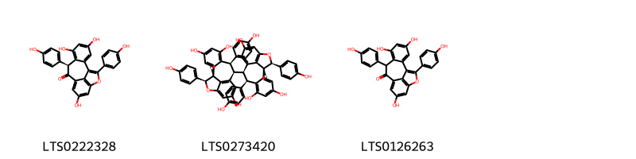{ width=100% }
    <figcaption>Hình ảnh cấu trúc hóa học của 3 hoạt chất thuộc nhóm 2-arylbenzofuran flavonoids gồm ['(8s)-4,6,12-trihydroxy-8,16-bis(4-hydroxyphenyl)-15-oxatetracyclo[8.6.1.0²,⁷.0¹⁴,¹⁷]heptadeca-1(16),2,4,6,10(17),11,13-heptaen-9-one (LTS0222328)', '(1r,8r,9r,16r)-8,16-bis(4-hydroxyphenyl)-9-[(1r,8r,9r,16r)-4,6,12-trihydroxy-8,16-bis(4-hydroxyphenyl)-15-oxatetracyclo[8.6.1.0²,⁷.0¹⁴,¹⁷]heptadeca-2,4,6,10,12,14(17)-hexaen-9-yl]-15-oxatetracyclo[8.6.1.0²,⁷.0¹⁴,¹⁷]heptadeca-2,4,6,10(17),11,13-hexaene-4,6,12-triol (LTS0273420)', '4,6,12-trihydroxy-8,16-bis(4-hydroxyphenyl)-15-oxatetracyclo[8.6.1.0²,⁷.0¹⁴,¹⁷]heptadeca-1(16),2,4,6,10(17),11,13-heptaen-9-one (LTS0126263)'].</figcaption>
</figure>
#### Nhóm Fatty Acyls
<figure markdown="span">
    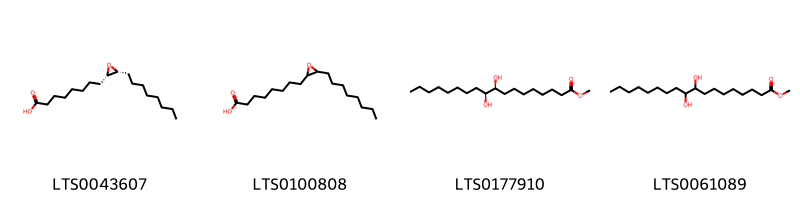{ width=100% }
    <figcaption>Hình ảnh cấu trúc hóa học của 4 hoạt chất thuộc nhóm Fatty Acyls gồm ['9s,10r-epoxy-stearic acid (LTS0043607)', '9r,10s-epoxy-stearic acid (LTS0100808)', 'methyl (9s,10s)-9,10-dihydroxyoctadecanoate (LTS0177910)', 'methyl 9,10-dihydroxyoctadecanoate (LTS0061089)'].</figcaption>
</figure>
#### Nhóm Flavonoids
<figure markdown="span">
    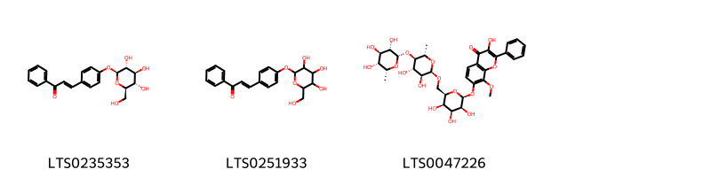{ width=100% }
    <figcaption>Hình ảnh cấu trúc hóa học của 3 hoạt chất thuộc nhóm Flavonoids gồm ['(2e)-1-phenyl-3-(4-{[(2s,3r,4s,5s,6r)-3,4,5-trihydroxy-6-(hydroxymethyl)oxan-2-yl]oxy}phenyl)prop-2-en-1-one (LTS0235353)', '1-phenyl-3-(4-{[3,4,5-trihydroxy-6-(hydroxymethyl)oxan-2-yl]oxy}phenyl)prop-2-en-1-one (LTS0251933)', '7-{[(2s,3s,4s,5r,6r)-6-({[(2r,3s,4s,5r,6s)-3,4-dihydroxy-6-methyl-5-{[(2s,3s,4r,5r,6r)-3,4,5-trihydroxy-6-methyloxan-2-yl]oxy}oxan-2-yl]oxy}methyl)-3,4,5-trihydroxyoxan-2-yl]oxy}-3-hydroxy-8-methoxy-2-phenylchromen-4-one (LTS0047226)'].</figcaption>
</figure>
#### Nhóm Prenol lipids
<figure markdown="span">
    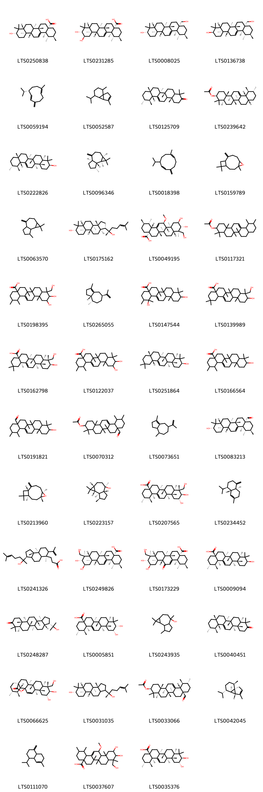{ width=100% }
    <figcaption>Hình ảnh cấu trúc hóa học của 47 hoạt chất thuộc nhóm Prenol lipids gồm ['ursolic acid (LTS0250838)', 'corosolic acid (LTS0231285)', 'uvaol (LTS0008025)', 'urs-12-ene-3β,28-diol (LTS0136738)', '(-)-germacrene d (LTS0059194)', '7-isopropyl-4,10-dimethyltricyclo[4.4.0.0¹,⁵]dec-3-ene (LTS0052587)', '(6ar,6bs,8ar,11r,12s,12ar,14br)-4,4,6a,6b,8a,11,12,14b-octamethyl-1,2,4a,5,6,7,8,9,10,11,12,12a,14,14a-tetradecahydropicen-3-one (LTS0125709)', '(3s,4ar,6ar,6bs,8ar,11r,12s,12as,14ar,14br)-4,4,6a,6b,11,12,14b-heptamethyl-1,2,3,4a,5,6,7,8,8a,9,10,11,12,12a,14,14a-hexadecahydropicen-3-yl acetate (LTS0239642)', 'amyrin (LTS0222826)', '(1ar,4ar,7r,7ar,7bs)-1,1,7-trimethyl-4-methylidene-octahydro-1ah-cyclopropa[e]azulene (LTS0096346)', '8-isopropyl-1-methyl-5-methylidenecyclodeca-1,6-diene (LTS0018398)', 'caryophyllene oxide (LTS0159789)', '1,1,7-trimethyl-4-methylidene-octahydro-1ah-cyclopropa[e]azulene (LTS0063570)', 'dammarenediol (LTS0175162)', '(1s,2r,4as,6as,6br,8ar,9r,10r,11r,12as,12br,13r,14br)-10,11-dihydroxy-9-(hydroxymethyl)-13-methoxy-1,2,6a,6b,9,12a-hexamethyl-2,3,4,5,6,7,8,8a,10,11,12,12b,13,14b-tetradecahydro-1h-picene-4a-carboxylic acid (LTS0049195)', '4,4,6a,6b,11,12,14b-heptamethyl-1,2,3,4a,5,6,7,8,8a,9,10,11,12,12a,14,14a-hexadecahydropicen-3-yl acetate (LTS0117321)', 'asiatic acid (LTS0198395)', '(3as,4s,7s)-1,4-dimethyl-7-(prop-1-en-2-yl)-2,3,3a,4,5,6,7,8-octahydroazulene (LTS0265055)', '1,10-dihydroxy-1,2,6a,6b,9,9,12a-heptamethyl-2,3,4,5,6,7,8,8a,10,11,12,12b,13,14b-tetradecahydropicene-4a-carboxylic acid (LTS0147544)', '10-hydroxy-9-(hydroxymethyl)-2,2,6a,6b,9,12a-hexamethyl-1,3,4,5,6,7,8,8a,10,11,12,12b,13,14b-tetradecahydropicene-4a-carboxylic acid (LTS0139989)', '(4as,6as,6br,8ar,9r,10s,12ar,12br,14br)-10-hydroxy-9-(hydroxymethyl)-2,2,6a,6b,9,12a-hexamethyl-1,3,4,5,6,7,8,8a,10,11,12,12b,13,14b-tetradecahydropicene-4a-carboxylic acid (LTS0162798)', '10,11-dihydroxy-1,2,6a,6b,9,9,12a-heptamethyl-2,3,4,5,6,7,8,8a,10,11,12,12b,13,14b-tetradecahydro-1h-picene-4a-carboxylic acid (LTS0122037)', 'β-amyrin (LTS0251864)', '10-hydroxy-1,2,6a,6b,9,9,12a-heptamethyl-2,3,4,5,6,7,8,8a,10,11,12,12b,13,14b-tetradecahydro-1h-picene-4a-carboxylic acid (LTS0166564)', '10-hydroxy-1,2,6a,6b,9,9,12a-heptamethyl-2,3,4,5,6,7,8,8a,10,11,12,12b,13,14b-tetradecahydro-1h-picene-4a-carbaldehyde (LTS0191821)', '8a-formyl-4,4,6a,6b,11,12,14b-heptamethyl-2,3,4a,5,6,7,8,9,10,11,12,12a,14,14a-tetradecahydro-1h-picen-3-yl acetate (LTS0070312)', '1,4-dimethyl-7-(prop-1-en-2-yl)-2,3,3a,4,5,6,7,8-octahydroazulene (LTS0073651)', '(1s,2r,4as,6as,6br,8ar,10s,12ar,12br,14bs)-10-hydroxy-1,2,6a,6b,9,9,12a-heptamethyl-2,3,4,5,6,7,8,8a,10,11,12,12b,13,14b-tetradecahydro-1h-picene-4a-carbaldehyde (LTS0083213)', 'β-caryophyllene oxide (LTS0213960)', 'globulol (LTS0223157)', '(1s,2r,4as,6as,6br,8ar,9r,10r,11r,12ar,12br,14br)-10,11-dihydroxy-9-(hydroxymethyl)-1,2,6a,6b,9,12a-hexamethyl-2,3,4,5,6,7,8,8a,10,11,12,12b,13,14b-tetradecahydro-1h-picene-4a-carboxylic acid (LTS0207565)', 'gamma-cadinene (LTS0234452)', '3-[(3s,6r,9as,9bs)-3-(2-hydroxy-6-methylhept-5-en-2-yl)-6,9a,9b-trimethyl-7-(prop-1-en-2-yl)-decahydrocyclopenta[a]naphthalen-6-yl]propanoic acid (LTS0241326)', 'asiatic acid (LTS0249826)', '(1s,2r,4as,6as,6br,8ar,9r,10r,11r,12as,12br,14bs)-10,11-dihydroxy-9-(hydroxymethyl)-1,2,6a,6b,9,12a-hexamethyl-13-oxo-1,2,3,4,5,6,7,8,8a,10,11,12,12b,14b-tetradecahydropicene-4a-carboxylic acid (LTS0173229)', '(1s,2r,4as,6as,6br,8ar,10s,12ar,12br,14br)-10-hydroxy-1,2,6a,6b,9,9,12a-heptamethyl-2,3,4,5,6,7,8,8a,10,11,12,12b,13,14b-tetradecahydro-1h-picene-4a-carboxylic acid (LTS0009094)', '(3s,3as,5ar,5br,7ar,11ar,11br,13ar,13bs)-3-(2-hydroxypropan-2-yl)-5a,5b,8,8,11a,13b-hexamethyl-tetradecahydro-1h-cyclopenta[a]chrysen-9-one (LTS0248287)', '(1s,2r,4as,6as,6br,8ar,10s,11r,12ar,12br,14br)-10,11-dihydroxy-1,2,6a,6b,9,9,12a-heptamethyl-2,3,4,5,6,7,8,8a,10,11,12,12b,13,14b-tetradecahydro-1h-picene-4a-carboxylic acid (LTS0005851)', 'ledol (LTS0243935)', 'α-amyrenone (LTS0040451)', '(1s,4s,5r,8r,9r,10r,11r,13s,14r,17s,18r,19s,20r)-10,11-dihydroxy-9-(hydroxymethyl)-4,5,9,13,19,20-hexamethyl-24-oxahexacyclo[15.5.2.0¹,¹⁸.0⁴,¹⁷.0⁵,¹⁴.0⁸,¹³]tetracos-15-en-23-one (LTS0066625)', '(3ar,3br,5ar,7s,9ar,9br)-1-[(2s)-2-hydroxy-6-methylhept-5-en-2-yl]-3a,3b,6,6,9a-pentamethyl-dodecahydro-1h-cyclopenta[a]phenanthren-7-ol (LTS0031035)', '(3s,4ar,6ar,6bs,8as,11r,12s,12as,14ar,14br)-8a-formyl-4,4,6a,6b,11,12,14b-heptamethyl-2,3,4a,5,6,7,8,9,10,11,12,12a,14,14a-tetradecahydro-1h-picen-3-yl acetate (LTS0033066)', '(-)-α-cubebene (LTS0042045)', '4-isopropyl-6-methyl-1-methylidene-3,4,4a,7,8,8a-hexahydro-2h-naphthalene (LTS0111070)', '10,11-dihydroxy-9-(hydroxymethyl)-13-methoxy-1,2,6a,6b,9,12a-hexamethyl-2,3,4,5,6,7,8,8a,10,11,12,12b,13,14b-tetradecahydro-1h-picene-4a-carboxylic acid (LTS0037607)', '(1s,2r,4as,6as,6br,8ar,10r,11r,12ar,12br,14br)-10,11-dihydroxy-1,2,6a,6b,9,9,12a-heptamethyl-2,3,4,5,6,7,8,8a,10,11,12,12b,13,14b-tetradecahydro-1h-picene-4a-carboxylic acid (LTS0035376)'].</figcaption>
</figure>
#### Nhóm Steroids and steroid derivatives
<figure markdown="span">
    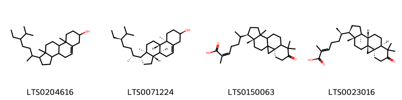{ width=100% }
    <figcaption>Hình ảnh cấu trúc hóa học của 4 hoạt chất thuộc nhóm Steroids and steroid derivatives gồm ['stigmast-5-en-3-ol, (3β)- (LTS0204616)', 'stigmast-5-en-3-ol (LTS0071224)', '(2z)-2-methyl-6-[(3r,15r,16r)-7,7,12,16-tetramethyl-6-oxopentacyclo[9.7.0.0¹,³.0³,⁸.0¹²,¹⁶]octadecan-15-yl]hept-2-enoic acid (LTS0150063)', '(2e,6r)-2-methyl-6-[(1s,3r,8r,11s,12s,15r,16r)-7,7,12,16-tetramethyl-6-oxopentacyclo[9.7.0.0¹,³.0³,⁸.0¹²,¹⁶]octadecan-15-yl]hept-2-enoic acid (LTS0023016)'].</figcaption>
</figure>

---

### Dược dân tộc học

Danh sách các quốc gia có sử dụng *Shorea robusta* trong điều trị các bệnh. 

| Country   | Disease   | Bệnh                                                                                                                                                                                                |
|:----------|:----------|:----------------------------------------------------------------------------------------------------------------------------------------------------------------------------------------------------|
| China     | Cosmetic  | MYMEMORY WARNING: YOU USED ALL AVAILABLE FREE TRANSLATIONS FOR TODAY. NEXT AVAILABLE IN  08 HOURS 38 MINUTES 42 SECONDS VISIT HTTPS://MYMEMORY.TRANSLATED.NET/DOC/USAGELIMITS.PHP TO TRANSLATE MORE |
| Elsewhere | Soap      | MYMEMORY WARNING: YOU USED ALL AVAILABLE FREE TRANSLATIONS FOR TODAY. NEXT AVAILABLE IN  08 HOURS 38 MINUTES 40 SECONDS VISIT HTTPS://MYMEMORY.TRANSLATED.NET/DOC/USAGELIMITS.PHP TO TRANSLATE MORE |

---

---
## Shorea tumbuggaia
### Thông tin về thực vật

!!! info "Phân loại thực vật của *Shorea tumbuggaia* từ GIBF:"
    - **Kingdom:** Plantae
    - **Phylum:** Tracheophyta
    - **Order:** Malvales
    - **Family:** Dipterocarpaceae
    - **Genus:** Shorea
    - **Species:** *Shorea tumbuggaia*

 

| Label (VI)   | Label (EN)   | Scientific Name   | Descriptions (VI)   | Descriptions (EN)   | Also Known As (VI)   | Also Known As (EN)   |
|:-------------|:-------------|:------------------|:--------------------|:--------------------|:---------------------|:---------------------|
| N/A          | N/A          | Shorea tumbuggaia | loài thực vật       | species of plant    | ['']                 | ['']                 |

#### Phân bố trên thế giới

**Từ CSDL GIBF** nan, India, unknown or invalid

#### Phân bố tại Việt Nam

**Từ CSDL GIBF**: Không có ghi nhận ở Việt Nam

---
### Thành phần hóa học
        
- Theo cơ sở dữ liệu lotus: Từ loài *Shorea tumbuggaia* đã phân lập và xác định được Chưa có hoạt chất nào được phân lập. hoạt chất thuộc về các nhóm Không có hoạt chất nào được phân lập. 

Không có hình ảnh nào được tạo ra

---

### Dược dân tộc học

Danh sách các quốc gia có sử dụng *Shorea tumbuggaia* trong điều trị các bệnh. 

| Country   | Disease   | Bệnh                                                                                                                                                                                                |
|:----------|:----------|:----------------------------------------------------------------------------------------------------------------------------------------------------------------------------------------------------|
| Elsewhere | Stimulant | MYMEMORY WARNING: YOU USED ALL AVAILABLE FREE TRANSLATIONS FOR TODAY. NEXT AVAILABLE IN  08 HOURS 38 MINUTES 11 SECONDS VISIT HTTPS://MYMEMORY.TRANSLATED.NET/DOC/USAGELIMITS.PHP TO TRANSLATE MORE |

---

# Chi Vateria

??? note "Danh sách các dược liệu thuộc chi"
    
	 - *Vateria indica*

---
## Vateria indica
### Thông tin về thực vật

!!! info "Phân loại thực vật của *Vateria indica* từ GIBF:"
    - **Kingdom:** Plantae
    - **Phylum:** Tracheophyta
    - **Order:** Malvales
    - **Family:** Dipterocarpaceae
    - **Genus:** Vateria
    - **Species:** *Vateria indica*

 

| Label (VI)   | Label (EN)   | Scientific Name   | Descriptions (VI)   | Descriptions (EN)   | Also Known As (VI)   | Also Known As (EN)   |
|:-------------|:-------------|:------------------|:--------------------|:--------------------|:---------------------|:---------------------|
| N/A          | N/A          | Vateria indica    | loài thực vật       | species of plant    | ['']                 | ['White damor']      |

#### Phân bố trên thế giới

**Từ CSDL GIBF** nan, India, unknown or invalid, Sri Lanka

#### Phân bố tại Việt Nam

**Từ CSDL GIBF**: Không có ghi nhận ở Việt Nam

---
### Thành phần hóa học
        
- Theo cơ sở dữ liệu lotus: Từ loài *Vateria indica* đã phân lập và xác định được 78 hoạt chất thuộc về các nhóm Flavonoids, Benzene and substituted derivatives, 2-arylbenzofuran flavonoids, Stilbenes, Organooxygen compounds, Naphthopyrans, Aryltetralin lignans. 

|    | chemicalTaxonomyClassyfireClass     |   smiles_count |
|---:|:------------------------------------|---------------:|
|  0 | 2-arylbenzofuran flavonoids         |             53 |
|  1 | Aryltetralin lignans                |              2 |
|  2 | Benzene and substituted derivatives |              3 |
|  3 | Flavonoids                          |              6 |
|  4 | Naphthopyrans                       |              4 |
|  5 | Organooxygen compounds              |              4 |
|  6 | Stilbenes                           |              6 |

#### Nhóm 2-arylbenzofuran flavonoids
<figure markdown="span">
    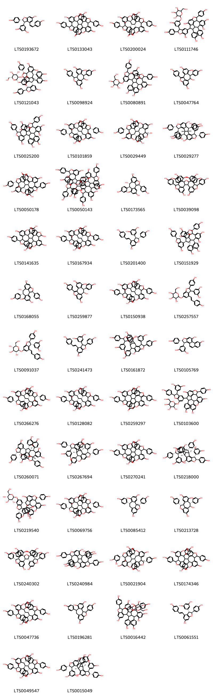{ width=100% }
    <figcaption>Hình ảnh cấu trúc hóa học của 53 hoạt chất thuộc nhóm 2-arylbenzofuran flavonoids gồm ['(z)-ε-viniferin (LTS0193672)', '4-[4,6,12-trihydroxy-16-(4-hydroxyphenyl)-9-[4,6,12-trihydroxy-8,16-bis(4-hydroxyphenyl)-15-oxatetracyclo[8.6.1.0²,⁷.0¹⁴,¹⁷]heptadeca-2,4,6,10,12,14(17)-hexaen-9-yl]-15-oxatetracyclo[8.6.1.0²,⁷.0¹⁴,¹⁷]heptadeca-2,4,6,10,12,14(17)-hexaen-8-ylidene]cyclohexa-2,5-dien-1-one (LTS0133043)', '4-[(1r,9r,16r)-4,6,12-trihydroxy-16-(4-hydroxyphenyl)-9-[(1r,8r,9s,16r)-4,6,12-trihydroxy-8,16-bis(4-hydroxyphenyl)-15-oxatetracyclo[8.6.1.0²,⁷.0¹⁴,¹⁷]heptadeca-2,4,6,10,12,14(17)-hexaen-9-yl]-15-oxatetracyclo[8.6.1.0²,⁷.0¹⁴,¹⁷]heptadeca-2,4,6,10,12,14(17)-hexaen-8-ylidene]cyclohexa-2,5-dien-1-one (LTS0200024)', '3-[7-hydroxy-3-(3-hydroxy-5-{[3,4,5-trihydroxy-6-(hydroxymethyl)oxan-2-yl]oxy}phenyl)-2-(4-hydroxyphenyl)-2,3-dihydro-1-benzofuran-5-yl]-2,9,17-tris(4-hydroxyphenyl)-8-oxapentacyclo[8.7.2.0⁴,¹⁸.0⁷,¹⁹.0¹¹,¹⁶]nonadeca-4,6,11,13,15,18-hexaene-5,13,15-triol (LTS0111746)', '(1s,2r,3r,9s,10s,17s)-3-[(2r,3r)-6-hydroxy-3-(3-hydroxy-5-{[(2s,3r,4s,5s,6r)-3,4,5-trihydroxy-6-(hydroxymethyl)oxan-2-yl]oxy}phenyl)-2-(4-hydroxyphenyl)-2,3-dihydro-1-benzofuran-4-yl]-2,9,17-tris(4-hydroxyphenyl)-8-oxapentacyclo[8.7.2.0⁴,¹⁸.0⁷,¹⁹.0¹¹,¹⁶]nonadeca-4,6,11,13,15,18-hexaene-5,13,15-triol (LTS0121043)', 'ampelopsin a (LTS0098924)', '3-[3-(3,5-dihydroxyphenyl)-2-(4-hydroxyphenyl)-6-{[3,4,5-trihydroxy-6-(hydroxymethyl)oxan-2-yl]oxy}-2,3-dihydro-1-benzofuran-4-yl]-2,9,17-tris(4-hydroxyphenyl)-8-oxapentacyclo[8.7.2.0⁴,¹⁸.0⁷,¹⁹.0¹¹,¹⁶]nonadeca-4,6,11,13,15,18-hexaene-5,13,15-triol (LTS0080891)', '8,16-bis(4-hydroxyphenyl)-15-oxatetracyclo[8.6.1.0²,⁷.0¹⁴,¹⁷]heptadeca-1(16),2,4,6,10(17),11,13-heptaene-4,6,9,12-tetrol (LTS0047764)', '3-[3-(3,5-dihydroxyphenyl)-6-hydroxy-2-(4-hydroxyphenyl)-2,3-dihydro-1-benzofuran-4-yl]-2,9,17-tris(4-hydroxyphenyl)-8-oxapentacyclo[8.7.2.0⁴,¹⁸.0⁷,¹⁹.0¹¹,¹⁶]nonadeca-4,6,11,13,15,18-hexaene-5,13,15-triol (LTS0025200)', '(1s,8r,9s,16s)-8,16-bis(4-hydroxyphenyl)-9-[(1s,8s,9r,16s)-4,6,12-trihydroxy-8,16-bis(4-hydroxyphenyl)-15-oxatetracyclo[8.6.1.0²,⁷.0¹⁴,¹⁷]heptadeca-2,4,6,10,12,14(17)-hexaen-9-yl]-15-oxatetracyclo[8.6.1.0²,⁷.0¹⁴,¹⁷]heptadeca-2,4,6,10(17),11,13-hexaene-4,6,12-triol (LTS0101859)', '(1r,8r,9s,16r)-8-(4-hydroxyphenyl)-9-[(1r,8r,9s,16r)-4,6,12-trihydroxy-8,16-bis(4-hydroxyphenyl)-15-oxatetracyclo[8.6.1.0²,⁷.0¹⁴,¹⁷]heptadeca-2,4,6,10,12,14(17)-hexaen-9-yl]-15-oxatetracyclo[8.6.1.0²,⁷.0¹⁴,¹⁷]heptadeca-2,4,6,10,12,14(17)-hexaene-4,6,12,16-tetrol (LTS0029449)', '(1r,4r,5r,11r,12r,15r,16r,22r)-4,15-bis(3,5-dihydroxyphenyl)-5,11,16,22-tetrakis(4-hydroxyphenyl)-6,17-dioxahexacyclo[10.10.0.0²,¹⁰.0³,⁷.0¹³,²¹.0¹⁴,¹⁸]docosa-2,7,9,13,18,20-hexaene-9,20-diol (LTS0029277)', '4-[(9r)-4,6,12-trihydroxy-16-(4-hydroxyphenyl)-9-[(1r,8r,9s,16r)-4,6,12-trihydroxy-8,16-bis(4-hydroxyphenyl)-15-oxatetracyclo[8.6.1.0²,⁷.0¹⁴,¹⁷]heptadeca-2,4,6,10,12,14(17)-hexaen-9-yl]-15-oxatetracyclo[8.6.1.0²,⁷.0¹⁴,¹⁷]heptadeca-1(16),2,4,6,10(17),11,13-heptaen-8-ylidene]cyclohexa-2,5-dien-1-one (LTS0050178)', '13-{[1-(3,5-dihydroxyphenyl)-6-[3-(3,5-dihydroxyphenyl)-6-hydroxy-2-(4-hydroxyphenyl)-2,3-dihydro-1-benzofuran-4-yl]-5-hydroxy-2,7-bis(4-hydroxyphenyl)-1h,2h,6h,7h,8h-indeno[5,4-b]furan-8-yl](4-hydroxyphenyl)methyl}-8,16-bis(4-hydroxyphenyl)-9-[4,6,12-trihydroxy-8,16-bis(4-hydroxyphenyl)-15-oxatetracyclo[8.6.1.0²,⁷.0¹⁴,¹⁷]heptadeca-2,4,6,10,12,14(17)-hexaen-9-yl]-15-oxatetracyclo[8.6.1.0²,⁷.0¹⁴,¹⁷]heptadeca-2,4,6,10,12,14(17)-hexaene-4,6,12-triol (LTS0050143)', '(1r,8r,9s,16r)-8,16-bis(4-hydroxyphenyl)-15-oxatetracyclo[8.6.1.0²,⁷.0¹⁴,¹⁷]heptadeca-2,4,6,10,12,14(17)-hexaene-4,6,9,12-tetrol (LTS0173565)', '5-(4-{4-[3-(3,5-dihydroxyphenyl)-6-hydroxy-2-(4-hydroxyphenyl)-2,3-dihydro-1-benzofuran-4-yl]-2,5-bis(4-hydroxyphenyl)oxolan-3-yl}-6-hydroxy-2-(4-hydroxyphenyl)-2,3-dihydro-1-benzofuran-3-yl)benzene-1,3-diol (LTS0039098)', '8-(4-hydroxyphenyl)-9-[4,6,12-trihydroxy-8,16-bis(4-hydroxyphenyl)-15-oxatetracyclo[8.6.1.0²,⁷.0¹⁴,¹⁷]heptadeca-2,4,6,10(17),11,13-hexaen-9-yl]-15-oxatetracyclo[8.6.1.0²,⁷.0¹⁴,¹⁷]heptadeca-2,4,6,10,12,14(17)-hexaene-4,6,12,16-tetrol (LTS0141635)', '(1r,8r,9s,16r)-8,16-bis(4-hydroxyphenyl)-9-[(1r,8r,9s,16r)-4,6,12-trihydroxy-8,16-bis(4-hydroxyphenyl)-15-oxatetracyclo[8.6.1.0²,⁷.0¹⁴,¹⁷]heptadeca-2,4,6,10,12,14(17)-hexaen-9-yl]-15-oxatetracyclo[8.6.1.0²,⁷.0¹⁴,¹⁷]heptadeca-2,4,6,10,12,14(17)-hexaene-4,6,12-triol (LTS0167934)', 'ε-viniferin (LTS0201400)', '(1r,2s,3s,9r,10r,17r)-3-[(2r,3r)-3-(3,5-dihydroxyphenyl)-6-hydroxy-2-(4-hydroxyphenyl)-2,3-dihydro-1-benzofuran-4-yl]-2,9,17-tris(4-hydroxyphenyl)-8-oxapentacyclo[8.7.2.0⁴,¹⁸.0⁷,¹⁹.0¹¹,¹⁶]nonadeca-4,6,11,13,15,18-hexaene-5,13,15-triol (LTS0151929)', '(1r,8s,9s,16r)-8,16-bis(4-hydroxyphenyl)-15-oxatetracyclo[8.6.1.0²,⁷.0¹⁴,¹⁷]heptadeca-2,4,6,10,12,14(17)-hexaene-4,6,9,12-tetrol (LTS0168055)', '(8r,9r)-8,16-bis(4-hydroxyphenyl)-15-oxatetracyclo[8.6.1.0²,⁷.0¹⁴,¹⁷]heptadeca-1(16),2,4,6,10(17),11,13-heptaene-4,6,9,12-tetrol (LTS0259877)', '(1r,8s,9r,16r)-8,16-bis(4-hydroxyphenyl)-9-[(1r,8r,9s,16r)-4,6,12-trihydroxy-8,16-bis(4-hydroxyphenyl)-15-oxatetracyclo[8.6.1.0²,⁷.0¹⁴,¹⁷]heptadeca-2,4,6,10,12,14(17)-hexaen-9-yl]-15-oxatetracyclo[8.6.1.0²,⁷.0¹⁴,¹⁷]heptadeca-2,4,6,10,12,14(17)-hexaene-4,6,12-triol (LTS0150938)', '2-{[3-(3,5-dihydroxyphenyl)-2-(4-hydroxyphenyl)-4-[2-(4-hydroxyphenyl)ethenyl]-2,3-dihydro-1-benzofuran-6-yl]oxy}-6-(hydroxymethyl)oxane-3,4,5-triol (LTS0257557)', '(2s,3r,4s,5s,6r)-2-{[(2r,3r)-3-(3,5-dihydroxyphenyl)-2-(4-hydroxyphenyl)-4-[(1e)-2-(4-hydroxyphenyl)ethenyl]-2,3-dihydro-1-benzofuran-6-yl]oxy}-6-(hydroxymethyl)oxane-3,4,5-triol (LTS0091037)', 'epsilon-viniferin (LTS0241473)', '4,15-bis(3,5-dihydroxyphenyl)-5,11,16,22-tetrakis(4-hydroxyphenyl)-6,17-dioxahexacyclo[10.9.1.0²,¹⁰.0³,⁷.0¹³,²¹.0¹⁴,¹⁸]docosa-2,7,9,13,18,20-hexaene-9,20-diol (LTS0161872)', '(2r,3r)-3-(3,5-dihydroxyphenyl)-2-(4-hydroxyphenyl)-2h,3h-phenanthro[2,1-b]furan-8,10-diol (LTS0105769)', '(1s,8r,9s,16s)-8,16-bis(4-hydroxyphenyl)-9-[(1s,8r,9s,16s)-4,6,12-trihydroxy-8,16-bis(4-hydroxyphenyl)-15-oxatetracyclo[8.6.1.0²,⁷.0¹⁴,¹⁷]heptadeca-2,4,6,10,12,14(17)-hexaen-9-yl]-15-oxatetracyclo[8.6.1.0²,⁷.0¹⁴,¹⁷]heptadeca-2,4,6,10(17),11,13-hexaene-4,6,12-triol (LTS0266276)', '(1r,8s,9s,16r)-8,16-bis(4-hydroxyphenyl)-9-[(1r,8s,9s,16r)-4,6,12-trihydroxy-8,16-bis(4-hydroxyphenyl)-15-oxatetracyclo[8.6.1.0²,⁷.0¹⁴,¹⁷]heptadeca-2,4,6,10,12,14(17)-hexaen-9-yl]-15-oxatetracyclo[8.6.1.0²,⁷.0¹⁴,¹⁷]heptadeca-2,4,6,10,12,14(17)-hexaene-4,6,12-triol (LTS0128082)', '4-[4,6,12-trihydroxy-16-(4-hydroxyphenyl)-9-[4,6,12-trihydroxy-8,16-bis(4-hydroxyphenyl)-15-oxatetracyclo[8.6.1.0²,⁷.0¹⁴,¹⁷]heptadeca-2,4,6,10,12,14(17)-hexaen-9-yl]-15-oxatetracyclo[8.6.1.0²,⁷.0¹⁴,¹⁷]heptadeca-1(16),2,4,6,10(17),11,13-heptaen-8-ylidene]cyclohexa-2,5-dien-1-one (LTS0259297)', '3-[3-(3,5-dihydroxyphenyl)-2-(4-hydroxyphenyl)-7-{[3,4,5-trihydroxy-6-(hydroxymethyl)oxan-2-yl]oxy}-2,3-dihydro-1-benzofuran-5-yl]-2,9,17-tris(4-hydroxyphenyl)-8-oxapentacyclo[8.7.2.0⁴,¹⁸.0⁷,¹⁹.0¹¹,¹⁶]nonadeca-4,6,11,13,15,18-hexaene-5,13,15-triol (LTS0103600)', '(1s,2r,3r,9s,10s,17s)-3-[(2r,3r)-3-(3,5-dihydroxyphenyl)-6-hydroxy-2-(4-hydroxyphenyl)-2,3-dihydro-1-benzofuran-4-yl]-2,9,17-tris(4-hydroxyphenyl)-8-oxapentacyclo[8.7.2.0⁴,¹⁸.0⁷,¹⁹.0¹¹,¹⁶]nonadeca-4,6,11,13,15,18-hexaene-5,13,15-triol (LTS0260071)', '(1r,4r,5r,11r,12s,15r,16r,22r)-4,15-bis(3,5-dihydroxyphenyl)-5,11,16,22-tetrakis(4-hydroxyphenyl)-6,17-dioxahexacyclo[10.9.1.0²,¹⁰.0³,⁷.0¹³,²¹.0¹⁴,¹⁸]docosa-2,7,9,13,18,20-hexaene-9,20-diol (LTS0267694)', '8,16-bis(4-hydroxyphenyl)-9-[4,6,12-trihydroxy-8,16-bis(4-hydroxyphenyl)-15-oxatetracyclo[8.6.1.0²,⁷.0¹⁴,¹⁷]heptadeca-2,4,6,10,12,14(17)-hexaen-9-yl]-15-oxatetracyclo[8.6.1.0²,⁷.0¹⁴,¹⁷]heptadeca-2,4,6,10(17),11,13-hexaene-4,6,12-triol (LTS0270241)', '(1r,4r,5r,11s,12s,15s,16s,22s)-4,15-bis(3,5-dihydroxyphenyl)-5,11,16,22-tetrakis(4-hydroxyphenyl)-6,17-dioxahexacyclo[10.9.1.0²,¹⁰.0³,⁷.0¹³,²¹.0¹⁴,¹⁸]docosa-2,7,9,13,18,20-hexaene-9,20-diol (LTS0218000)', '(1s,2r,3r,9s,10s,17s)-3-[(2r,3r)-3-(3,5-dihydroxyphenyl)-2-(4-hydroxyphenyl)-6-{[(2s,3r,4s,5s,6r)-3,4,5-trihydroxy-6-(hydroxymethyl)oxan-2-yl]oxy}-2,3-dihydro-1-benzofuran-4-yl]-2,9,17-tris(4-hydroxyphenyl)-8-oxapentacyclo[8.7.2.0⁴,¹⁸.0⁷,¹⁹.0¹¹,¹⁶]nonadeca-4,6,11,13,15,18-hexaene-5,13,15-triol (LTS0219540)', '(1s,8r,9r,16s)-8,16-bis(4-hydroxyphenyl)-9-[(1s,8r,9r,16s)-4,6,12-trihydroxy-8,16-bis(4-hydroxyphenyl)-15-oxatetracyclo[8.6.1.0²,⁷.0¹⁴,¹⁷]heptadeca-2,4,6,10,12,14(17)-hexaen-9-yl]-15-oxatetracyclo[8.6.1.0²,⁷.0¹⁴,¹⁷]heptadeca-2,4,6,10(17),11,13-hexaene-4,6,12-triol (LTS0069756)', '(1r,8r,16r)-8,16-bis(4-hydroxyphenyl)-15-oxatetracyclo[8.6.1.0²,⁷.0¹⁴,¹⁷]heptadeca-2,4,6,10,12,14(17)-hexaene-4,6,12-triol (LTS0085412)', 'ampelopsin a (LTS0213728)', '5-[(2s,3s)-4-[(2r,3s,4s,5s)-4-[(2s,3s)-3-(3,5-dihydroxyphenyl)-6-hydroxy-2-(4-hydroxyphenyl)-2,3-dihydro-1-benzofuran-4-yl]-2,5-bis(4-hydroxyphenyl)oxolan-3-yl]-6-hydroxy-2-(4-hydroxyphenyl)-2,3-dihydro-1-benzofuran-3-yl]benzene-1,3-diol (LTS0240302)', '4,15-bis(3,5-dihydroxyphenyl)-5,11,16,22-tetrakis(4-hydroxyphenyl)-6,17-dioxahexacyclo[10.10.0.0²,¹⁰.0³,⁷.0¹³,²¹.0¹⁴,¹⁸]docosa-2,7,9,13,18,20-hexaene-9,20-diol (LTS0240984)', '(1r,8r,9s,16r)-9-[(1r,8r,9s,16r)-16-(3,4-dihydroxyphenyl)-4,6,12-trihydroxy-8-(4-hydroxyphenyl)-15-oxatetracyclo[8.6.1.0²,⁷.0¹⁴,¹⁷]heptadeca-2,4,6,10,12,14(17)-hexaen-9-yl]-8,16-bis(4-hydroxyphenyl)-15-oxatetracyclo[8.6.1.0²,⁷.0¹⁴,¹⁷]heptadeca-2,4,6,10,12,14(17)-hexaene-4,6,12-triol (LTS0021904)', '4,6-dihydroxy-8,16-bis(4-hydroxyphenyl)-9-[4,6,12-trihydroxy-8,16-bis(4-hydroxyphenyl)-15-oxatetracyclo[8.6.1.0²,⁷.0¹⁴,¹⁷]heptadeca-2,4,6,10,12,14(17)-hexaen-9-yl]-15-oxatetracyclo[8.6.1.0²,⁷.0¹⁴,¹⁷]heptadeca-2,4,6,10(17),13-pentaene-11,12-dione (LTS0174346)', '(1r,8r,9s,16r)-4,6-dihydroxy-8,16-bis(4-hydroxyphenyl)-9-[(1r,8r,9s,16r)-4,6,12-trihydroxy-8,16-bis(4-hydroxyphenyl)-15-oxatetracyclo[8.6.1.0²,⁷.0¹⁴,¹⁷]heptadeca-2,4,6,10,12,14(17)-hexaen-9-yl]-15-oxatetracyclo[8.6.1.0²,⁷.0¹⁴,¹⁷]heptadeca-2,4,6,10(17),13-pentaene-11,12-dione (LTS0047736)', 'ampelopsin b (LTS0196281)', '3-[6-hydroxy-3-(3-hydroxy-5-{[3,4,5-trihydroxy-6-(hydroxymethyl)oxan-2-yl]oxy}phenyl)-2-(4-hydroxyphenyl)-2,3-dihydro-1-benzofuran-4-yl]-2,9,17-tris(4-hydroxyphenyl)-8-oxapentacyclo[8.7.2.0⁴,¹⁸.0⁷,¹⁹.0¹¹,¹⁶]nonadeca-4,6,11,13,15,18-hexaene-5,13,15-triol (LTS0016442)', '(+)-ε-viniferin (LTS0061551)', '(1r,8s,9r,16r)-8,16-bis(4-hydroxyphenyl)-9-[(1r,8s,9r,16r)-4,6,12-trihydroxy-8,16-bis(4-hydroxyphenyl)-15-oxatetracyclo[8.6.1.0²,⁷.0¹⁴,¹⁷]heptadeca-2,4,6,10,12,14(17)-hexaen-9-yl]-15-oxatetracyclo[8.6.1.0²,⁷.0¹⁴,¹⁷]heptadeca-2,4,6,10,12,14(17)-hexaene-4,6,12-triol (LTS0049547)', '(1r,4r,5r,11r,12s,15r,16r,22s)-4,15-bis(3,5-dihydroxyphenyl)-5,11,16,22-tetrakis(4-hydroxyphenyl)-6,17-dioxahexacyclo[10.9.1.0²,¹⁰.0³,⁷.0¹³,²¹.0¹⁴,¹⁸]docosa-2(10),3(7),8,13(21),14(18),19-hexaene-9,20-diol (LTS0015049)', '(1s,4s,5s,11s,12s,15s,16s,22s)-4,15-bis(3,5-dihydroxyphenyl)-5,11,16,22-tetrakis(4-hydroxyphenyl)-6,17-dioxahexacyclo[10.10.0.0²,¹⁰.0³,⁷.0¹³,²¹.0¹⁴,¹⁸]docosa-2,7,9,13,18,20-hexaene-9,20-diol (LTS0031939)', '(8r,9s,16r)-8,16-bis(4-hydroxyphenyl)-9-[(8r,9s,16r)-4,6,12-trihydroxy-8,16-bis(4-hydroxyphenyl)-15-oxatetracyclo[8.6.1.0²,⁷.0¹⁴,¹⁷]heptadeca-2,4,6,10,12,14(17)-hexaen-9-yl]-15-oxatetracyclo[8.6.1.0²,⁷.0¹⁴,¹⁷]heptadeca-2,4,6,10(17),11,13-hexaene-4,6,12-triol (LTS0136684)', '9-[16-(3,4-dihydroxyphenyl)-4,6,12-trihydroxy-8-(4-hydroxyphenyl)-15-oxatetracyclo[8.6.1.0²,⁷.0¹⁴,¹⁷]heptadeca-2,4,6,10,12,14(17)-hexaen-9-yl]-8,16-bis(4-hydroxyphenyl)-15-oxatetracyclo[8.6.1.0²,⁷.0¹⁴,¹⁷]heptadeca-2,4,6,10(17),11,13-hexaene-4,6,12-triol (LTS0115793)'].</figcaption>
</figure>
#### Nhóm Aryltetralin lignans
<figure markdown="span">
    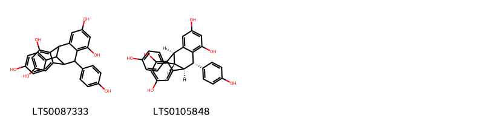{ width=100% }
    <figcaption>Hình ảnh cấu trúc hóa học của 2 hoạt chất thuộc nhóm Aryltetralin lignans gồm ['8,16-bis(4-hydroxyphenyl)tetracyclo[7.6.1.0²,⁷.0¹⁰,¹⁵]hexadeca-2,4,6,10,12,14-hexaene-4,6,12,14-tetrol (LTS0087333)', '(1r,8s,9s,16s)-8,16-bis(4-hydroxyphenyl)tetracyclo[7.6.1.0²,⁷.0¹⁰,¹⁵]hexadeca-2,4,6,10,12,14-hexaene-4,6,12,14-tetrol (LTS0105848)'].</figcaption>
</figure>
#### Nhóm Benzene and substituted derivatives
<figure markdown="span">
    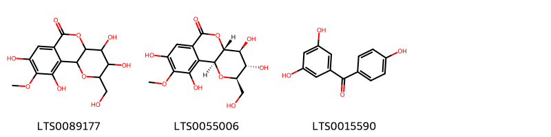{ width=100% }
    <figcaption>Hình ảnh cấu trúc hóa học của 3 hoạt chất thuộc nhóm Benzene and substituted derivatives gồm ['5,6,12,14-tetrahydroxy-4-(hydroxymethyl)-13-methoxy-3,8-dioxatricyclo[8.4.0.0²,⁷]tetradeca-1(14),10,12-trien-9-one (LTS0089177)', 'bergenin (LTS0055006)', '5-(4-hydroxybenzoyl)benzene-1,3-diol (LTS0015590)'].</figcaption>
</figure>
#### Nhóm Flavonoids
<figure markdown="span">
    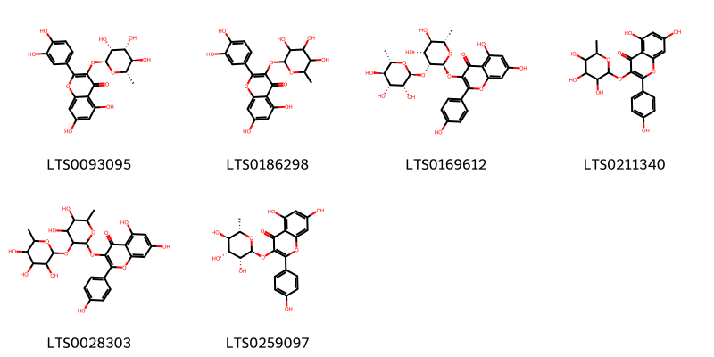{ width=100% }
    <figcaption>Hình ảnh cấu trúc hóa học của 6 hoạt chất thuộc nhóm Flavonoids gồm ['quercitrin (LTS0093095)', 'quercitrin (LTS0186298)', '3-{[(2s,3r,4r,5r,6s)-4,5-dihydroxy-6-methyl-3-{[(2s,3r,4r,5r,6s)-3,4,5-trihydroxy-6-methyloxan-2-yl]oxy}oxan-2-yl]oxy}-5,7-dihydroxy-2-(4-hydroxyphenyl)chromen-4-one (LTS0169612)', '5,7-dihydroxy-2-(4-hydroxyphenyl)-3-[(3,4,5-trihydroxy-6-methyloxan-2-yl)oxy]chromen-4-one (LTS0211340)', '3-({4,5-dihydroxy-6-methyl-3-[(3,4,5-trihydroxy-6-methyloxan-2-yl)oxy]oxan-2-yl}oxy)-5,7-dihydroxy-2-(4-hydroxyphenyl)chromen-4-one (LTS0028303)', 'afzelin (LTS0259097)'].</figcaption>
</figure>
#### Nhóm Naphthopyrans
<figure markdown="span">
    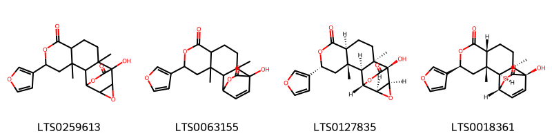{ width=100% }
    <figcaption>Hình ảnh cấu trúc hóa học của 4 hoạt chất thuộc nhóm Naphthopyrans gồm ['tinosporide (LTS0259613)', '5-(furan-3-yl)-12-hydroxy-3,11-dimethyl-6,14-dioxatetracyclo[10.2.2.0²,¹¹.0³,⁸]hexadec-15-ene-7,13-dione (LTS0063155)', 'palmarin (LTS0127835)', 'columbin (LTS0018361)'].</figcaption>
</figure>
#### Nhóm Organooxygen compounds
<figure markdown="span">
    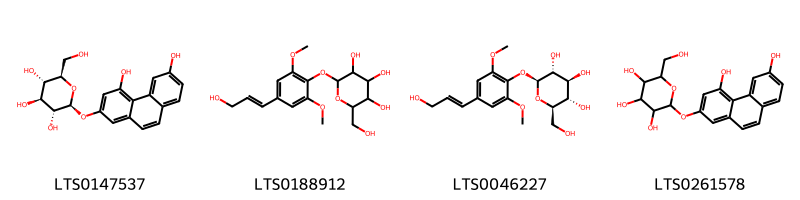{ width=100% }
    <figcaption>Hình ảnh cấu trúc hóa học của 4 hoạt chất thuộc nhóm Organooxygen compounds gồm ['(2s,3r,4s,5s,6r)-2-[(4,6-dihydroxyphenanthren-2-yl)oxy]-6-(hydroxymethyl)oxane-3,4,5-triol (LTS0147537)', '2-(hydroxymethyl)-6-[4-(3-hydroxyprop-1-en-1-yl)-2,6-dimethoxyphenoxy]oxane-3,4,5-triol (LTS0188912)', 'syringin (LTS0046227)', '2-[(4,6-dihydroxyphenanthren-2-yl)oxy]-6-(hydroxymethyl)oxane-3,4,5-triol (LTS0261578)'].</figcaption>
</figure>
#### Nhóm Stilbenes
<figure markdown="span">
    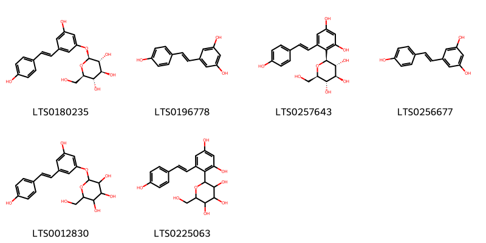{ width=100% }
    <figcaption>Hình ảnh cấu trúc hóa học của 6 hoạt chất thuộc nhóm Stilbenes gồm ['piceid (LTS0180235)', 'tocilizumab (LTS0196778)', '(2s,3r,4r,5s,6r)-2-{2,4-dihydroxy-6-[(1e)-2-(4-hydroxyphenyl)ethenyl]phenyl}-6-(hydroxymethyl)oxane-3,4,5-triol (LTS0257643)', 'resveratrol (LTS0256677)', '2-{3-hydroxy-5-[2-(4-hydroxyphenyl)ethenyl]phenoxy}-6-(hydroxymethyl)oxane-3,4,5-triol (LTS0012830)', '2-{2,4-dihydroxy-6-[2-(4-hydroxyphenyl)ethenyl]phenyl}-6-(hydroxymethyl)oxane-3,4,5-triol (LTS0225063)'].</figcaption>
</figure>

---

### Dược dân tộc học

Danh sách các quốc gia có sử dụng *Vateria indica* trong điều trị các bệnh. 

| Country   | Disease         | Bệnh                                                                                                                                                                                                |
|:----------|:----------------|:----------------------------------------------------------------------------------------------------------------------------------------------------------------------------------------------------|
| India     | Emollient, Soap | MYMEMORY WARNING: YOU USED ALL AVAILABLE FREE TRANSLATIONS FOR TODAY. NEXT AVAILABLE IN  08 HOURS 37 MINUTES 54 SECONDS VISIT HTTPS://MYMEMORY.TRANSLATED.NET/DOC/USAGELIMITS.PHP TO TRANSLATE MORE |

---

# Chi Dryobalanops

??? note "Danh sách các dược liệu thuộc chi"
    
	 - *Dryobalanops aromatica*

---
## Dryobalanops aromatica
### Thông tin về thực vật

!!! info "Phân loại thực vật của *Dryobalanops aromatica* từ GIBF:"
    - **Kingdom:** Plantae
    - **Phylum:** Tracheophyta
    - **Order:** Malvales
    - **Family:** Dipterocarpaceae
    - **Genus:** Dryobalanops
    - **Species:** *Dryobalanops aromatica*

 

| Label (VI)   | Label (EN)   | Scientific Name        | Descriptions (VI)   | Descriptions (EN)   | Also Known As (VI)   | Also Known As (EN)                      |
|:-------------|:-------------|:-----------------------|:--------------------|:--------------------|:---------------------|:----------------------------------------|
| N/A          | N/A          | Dryobalanops aromatica | loài thực vật       | species of plant    | ['']                 | ['Indonesian kapur', 'Malayan camphor'] |

#### Phân bố trên thế giới

**Từ CSDL GIBF** nan, Japan, Papua New Guinea, unknown or invalid, Indonesia, India, Singapore, Malaysia, Brunei Darussalam

#### Phân bố tại Việt Nam

**Từ CSDL GIBF**: Không có ghi nhận ở Việt Nam

---
### Thành phần hóa học
        
- Theo cơ sở dữ liệu lotus: Từ loài *Dryobalanops aromatica* đã phân lập và xác định được 4 hoạt chất thuộc về các nhóm Prenol lipids. 

|    | chemicalTaxonomyClassyfireClass   |   smiles_count |
|---:|:----------------------------------|---------------:|
|  0 | Prenol lipids                     |              4 |

#### Nhóm Prenol lipids
<figure markdown="span">
    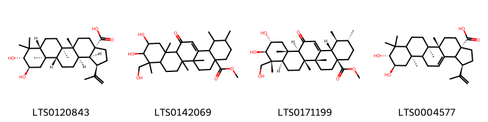{ width=100% }
    <figcaption>Hình ảnh cấu trúc hóa học của 4 hoạt chất thuộc nhóm Prenol lipids gồm ['(1r,3as,5ar,5br,7ar,9r,10r,11ar,11br,13ar,13bs)-9,10-dihydroxy-5a,5b,8,8,11a-pentamethyl-1-(prop-1-en-2-yl)-hexadecahydrocyclopenta[a]chrysene-3a-carboxylic acid (LTS0120843)', 'methyl 10,11-dihydroxy-9-(hydroxymethyl)-1,2,6a,6b,9,12a-hexamethyl-13-oxo-1,2,3,4,5,6,7,8,8a,10,11,12,12b,14b-tetradecahydropicene-4a-carboxylate (LTS0142069)', 'methyl (1s,2r,4as,6ar,6br,8ar,9r,10r,11r,12as,12br,14bs)-10,11-dihydroxy-9-(hydroxymethyl)-1,2,6a,6b,9,12a-hexamethyl-13-oxo-1,2,3,4,5,6,7,8,8a,10,11,12,12b,14b-tetradecahydropicene-4a-carboxylate (LTS0171199)', '(1r,3as,5as,5br,9r,10r,11ar)-9,10-dihydroxy-5a,5b,8,8,11a-pentamethyl-1-(prop-1-en-2-yl)-1h,2h,3h,4h,5h,6h,7h,7ah,9h,10h,11h,11bh,12h,13bh-cyclopenta[a]chrysene-3a-carboxylic acid (LTS0004577)'].</figcaption>
</figure>

---

### Dược dân tộc học

Danh sách các quốc gia có sử dụng *Dryobalanops aromatica* trong điều trị các bệnh. 

| Country   | Disease                                                                       | Bệnh                                                                                                                                                                                                |
|:----------|:------------------------------------------------------------------------------|:----------------------------------------------------------------------------------------------------------------------------------------------------------------------------------------------------|
| China     | Antiphlogistic, Diaphoretic, Sedative, Vermifuge, Sedative, Stimulant, Poison | MYMEMORY WARNING: YOU USED ALL AVAILABLE FREE TRANSLATIONS FOR TODAY. NEXT AVAILABLE IN  08 HOURS 37 MINUTES 26 SECONDS VISIT HTTPS://MYMEMORY.TRANSLATED.NET/DOC/USAGELIMITS.PHP TO TRANSLATE MORE |

---

