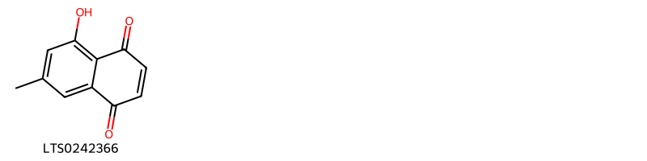
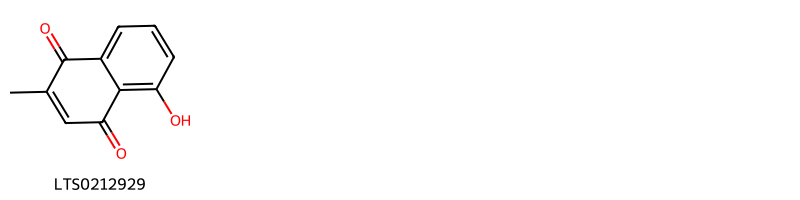
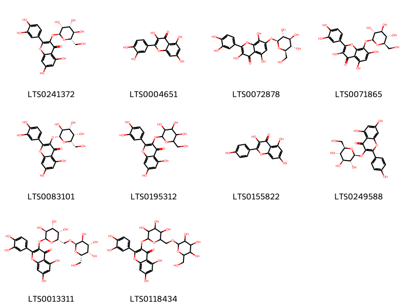
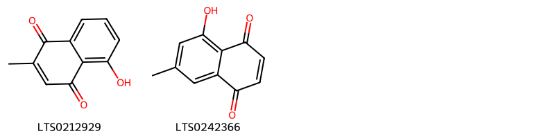
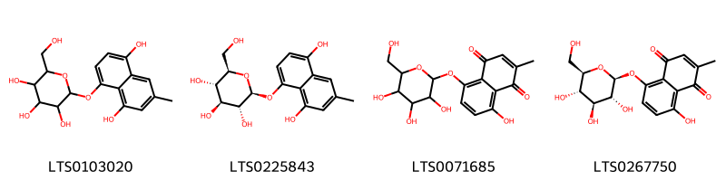

!!! abstract "Tóm tắt"

    Họ Droseraceae gồm khoảng 1 chi và 3 loài được một số cộng đồng tại các quốc gia như India(Ayurvedic), India, Elsewhere, Turkey, Hindu sử dụng trong một số trường hợp MYMEMORY WARNING: YOU USED ALL AVAILABLE FREE TRANSLATIONS FOR TODAY. NEXT AVAILABLE IN  12 HOURS 38 MINUTES 32 SECONDS VISIT HTTPS://MYMEMORY.TRANSLATED.NET/DOC/USAGELIMITS.PHP TO TRANSLATE MORE.

!!! info "DrDuke"

    James A. Duke sinh năm 1929-2017 là một nhà thực vật học người Mỹ. Đây là một trong những tác giả hàng đầu trong lĩnh vực dược dân tộc học với cuốn *CRC Handbook of Medicinal Herbs* và chính là người xây dựng lên cơ sở dữ liệu về hợp chất tự nhiên và dược dân tộc học tại Bộ nông nghiệp Hoa Kỳ. Các thông tin được đăng tải tại website [Dr. Duke's Phytochemical and Ethnobotanical Databases](https://phytochem.nal.usda.gov/). 
    Trong suốt thập niên 1970, ông lãnh đạo the Plant Taxonomy Laboratory, Plant Genetics and Germplasm Institute of the Agricultural Research Service, U.S. Department of Agriculture.
    Trong tài liệu này, các thông tin về dược dân tộc của các dược liệu được trích dẫn từ tài liệu của James A. Ducke với sự trợ giúp của phần mềm dịch thuật từ tiếng Anh sang tiếng Việt.
   

# Chi Drosera

??? note "Danh sách các dược liệu thuộc chi"
    
	 - *Drosera burmanni*
	 - *Drosera peltata*
	 - *Drosera rotundifolia*

---
## Drosera burmanni
### Thông tin về thực vật

!!! info "Phân loại thực vật của *Drosera spatulata* từ GIBF:"
    - **Kingdom:** Plantae
    - **Phylum:** Tracheophyta
    - **Order:** Caryophyllales
    - **Family:** Droseraceae
    - **Genus:** Drosera
    - **Species:** *Drosera spatulata*

 

| Label (VI)   | Label (EN)   | Scientific Name   | Descriptions (VI)   | Descriptions (EN)   | Also Known As (VI)   | Also Known As (EN)                  |
|:-------------|:-------------|:------------------|:--------------------|:--------------------|:---------------------|:------------------------------------|
| N/A          | N/A          | Drosera burmanni  | loài thực vật       | species of plant    | ['Drosera burmanni'] | ['Drosera burmannii (misspelling)'] |

#### Phân bố trên thế giới

**Từ CSDL GIBF** nan, Hong Kong, Sri Lanka, Viet Nam, United States of America, Cambodia, Indonesia, Chinese Taipei, Malaysia, China, Australia, India, Brunei Darussalam, Thailand

#### Phân bố tại Việt Nam

**Từ CSDL GIBF**: Quảng Bình, Đắk Lắk, Thừa Thiên - Huế

---
### Thành phần hóa học
        
- Theo cơ sở dữ liệu lotus: Từ loài *Drosera spatulata* đã phân lập và xác định được 1 hoạt chất thuộc về các nhóm Naphthalenes. 

|    | chemicalTaxonomyClassyfireClass   |   smiles_count |
|---:|:----------------------------------|---------------:|
|  0 | Naphthalenes                      |              1 |

#### Nhóm Naphthalenes
<figure markdown="span">
    { width=100% }
    <figcaption>Hình ảnh cấu trúc hóa học của 1 hoạt chất thuộc nhóm Naphthalenes gồm ['7-methyljuglone (LTS0242366)'].</figcaption>
</figure>

---

### Dược dân tộc học

Danh sách các quốc gia có sử dụng *Drosera spatulata* trong điều trị các bệnh. 

| Country   | Disease     | Bệnh                                                                                                                                                                                                |
|:----------|:------------|:----------------------------------------------------------------------------------------------------------------------------------------------------------------------------------------------------|
| Hindu     | Rubefacient | MYMEMORY WARNING: YOU USED ALL AVAILABLE FREE TRANSLATIONS FOR TODAY. NEXT AVAILABLE IN  12 HOURS 38 MINUTES 26 SECONDS VISIT HTTPS://MYMEMORY.TRANSLATED.NET/DOC/USAGELIMITS.PHP TO TRANSLATE MORE |
| India     | Rubefacient | MYMEMORY WARNING: YOU USED ALL AVAILABLE FREE TRANSLATIONS FOR TODAY. NEXT AVAILABLE IN  12 HOURS 38 MINUTES 21 SECONDS VISIT HTTPS://MYMEMORY.TRANSLATED.NET/DOC/USAGELIMITS.PHP TO TRANSLATE MORE |

---

---
## Drosera peltata
### Thông tin về thực vật

!!! info "Phân loại thực vật của *Drosera peltata* từ GIBF:"
    - **Kingdom:** Plantae
    - **Phylum:** Tracheophyta
    - **Order:** Caryophyllales
    - **Family:** Droseraceae
    - **Genus:** Drosera
    - **Species:** *Drosera peltata*

 

| Label (VI)   | Label (EN)   | Scientific Name   | Descriptions (VI)   | Descriptions (EN)   | Also Known As (VI)        | Also Known As (EN)                                         |
|:-------------|:-------------|:------------------|:--------------------|:--------------------|:--------------------------|:-----------------------------------------------------------|
| N/A          | N/A          | Drosera peltata   | loài thực vật       | species of plant    | ['gọng vó lá bán nguyệt'] | ['crescent-leaved sundew', 'pale sundew', 'shield sundew'] |

#### Phân bố trên thế giới

**Từ CSDL GIBF** Hong Kong, Viet Nam, Timor-Leste, China, Australia, New Zealand

#### Phân bố tại Việt Nam

**Từ CSDL GIBF**: Lâm Đồng

---
### Thành phần hóa học
        
- Theo cơ sở dữ liệu lotus: Từ loài *Drosera peltata* đã phân lập và xác định được 1 hoạt chất thuộc về các nhóm Naphthalenes. 

|    | chemicalTaxonomyClassyfireClass   |   smiles_count |
|---:|:----------------------------------|---------------:|
|  0 | Naphthalenes                      |              1 |

#### Nhóm Naphthalenes
<figure markdown="span">
    { width=100% }
    <figcaption>Hình ảnh cấu trúc hóa học của 1 hoạt chất thuộc nhóm Naphthalenes gồm ['plumbagin (LTS0212929)'].</figcaption>
</figure>

---

### Dược dân tộc học

Danh sách các quốc gia có sử dụng *Drosera peltata* trong điều trị các bệnh. 

| Country          | Disease   | Bệnh                                                                                                                                                                                                |
|:-----------------|:----------|:----------------------------------------------------------------------------------------------------------------------------------------------------------------------------------------------------|
| India            | Vesicant  | MYMEMORY WARNING: YOU USED ALL AVAILABLE FREE TRANSLATIONS FOR TODAY. NEXT AVAILABLE IN  12 HOURS 37 MINUTES 48 SECONDS VISIT HTTPS://MYMEMORY.TRANSLATED.NET/DOC/USAGELIMITS.PHP TO TRANSLATE MORE |
| India(Ayurvedic) | Tonic     | MYMEMORY WARNING: YOU USED ALL AVAILABLE FREE TRANSLATIONS FOR TODAY. NEXT AVAILABLE IN  12 HOURS 37 MINUTES 45 SECONDS VISIT HTTPS://MYMEMORY.TRANSLATED.NET/DOC/USAGELIMITS.PHP TO TRANSLATE MORE |

---

---
## Drosera rotundifolia
### Thông tin về thực vật

!!! info "Phân loại thực vật của *Drosera rotundifolia* từ GIBF:"
    - **Kingdom:** Plantae
    - **Phylum:** Tracheophyta
    - **Order:** Caryophyllales
    - **Family:** Droseraceae
    - **Genus:** Drosera
    - **Species:** *Drosera rotundifolia*

 

| Label (VI)   | Label (EN)   | Scientific Name      | Descriptions (VI)   | Descriptions (EN)   | Also Known As (VI)   | Also Known As (EN)                                              |
|:-------------|:-------------|:---------------------|:--------------------|:--------------------|:---------------------|:----------------------------------------------------------------|
| N/A          | N/A          | Drosera rotundifolia | loài thực vật       | species of sundew   | ['']                 | ['Common sundew', 'Round-leaved sundew', 'Round‑leaved Sundew'] |

#### Phân bố trên thế giới

**Từ CSDL GIBF** nan, Japan, Czechia, Sweden, Finland, Spain, Poland, Denmark, Netherlands, United States of America, Romania, Russian Federation, Belarus, United Kingdom of Great Britain and Northern Ireland, Belgium, Canada, Germany, Austria, Hungary, Portugal, Italy, Switzerland, France, Ireland

#### Phân bố tại Việt Nam

**Từ CSDL GIBF**: Không có ghi nhận ở Việt Nam

---
### Thành phần hóa học
        
- Theo cơ sở dữ liệu lotus: Từ loài *Drosera rotundifolia* đã phân lập và xác định được 16 hoạt chất thuộc về các nhóm Organooxygen compounds, Naphthalenes, Flavonoids. 

|    | chemicalTaxonomyClassyfireClass   |   smiles_count |
|---:|:----------------------------------|---------------:|
|  0 | Flavonoids                        |             10 |
|  1 | Naphthalenes                      |              2 |
|  2 | Organooxygen compounds            |              4 |

#### Nhóm Flavonoids
<figure markdown="span">
    { width=100% }
    <figcaption>Hình ảnh cấu trúc hóa học của 10 hoạt chất thuộc nhóm Flavonoids gồm ['2-(3,4-dihydroxyphenyl)-5,7-dihydroxy-3-{[(2s,3r,4r,5r,6s)-3,4,5-trihydroxy-6-(hydroxymethyl)oxan-2-yl]oxy}chromen-4-one (LTS0241372)', 'quercetin (LTS0004651)', 'gossypitrin (LTS0072878)', 'gossypin (LTS0071865)', '2-(3,4-dihydroxyphenyl)-5,7-dihydroxy-3-{[(2r,3s,4r,5s,6s)-3,4,5-trihydroxy-6-(hydroxymethyl)oxan-2-yl]oxy}chromen-4-one (LTS0083101)', '2-(3,4-dihydroxyphenyl)-5,7-dihydroxy-3-{[3,4,5-trihydroxy-6-(hydroxymethyl)oxan-2-yl]oxy}chromen-4-one (LTS0195312)', 'kaempherol (LTS0155822)', 'astragalin (LTS0249588)', '2-(3,4-dihydroxyphenyl)-5,7-dihydroxy-3-{[(2s,3s,4r,5s,6s)-3,4,5-trihydroxy-6-({[(2r,3s,4r,5s,6s)-3,4,5-trihydroxy-6-(hydroxymethyl)oxan-2-yl]oxy}methyl)oxan-2-yl]oxy}chromen-4-one (LTS0013311)', '2-(3,4-dihydroxyphenyl)-5,7-dihydroxy-3-{[3,4,5-trihydroxy-6-({[3,4,5-trihydroxy-6-(hydroxymethyl)oxan-2-yl]oxy}methyl)oxan-2-yl]oxy}chromen-4-one (LTS0118434)'].</figcaption>
</figure>
#### Nhóm Naphthalenes
<figure markdown="span">
    { width=100% }
    <figcaption>Hình ảnh cấu trúc hóa học của 2 hoạt chất thuộc nhóm Naphthalenes gồm ['plumbagin (LTS0212929)', '7-methyljuglone (LTS0242366)'].</figcaption>
</figure>
#### Nhóm Organooxygen compounds
<figure markdown="span">
    { width=100% }
    <figcaption>Hình ảnh cấu trúc hóa học của 4 hoạt chất thuộc nhóm Organooxygen compounds gồm ['2-[(4,8-dihydroxy-6-methylnaphthalen-1-yl)oxy]-6-(hydroxymethyl)oxane-3,4,5-triol (LTS0103020)', '(2s,3r,4s,5s,6r)-2-[(4,8-dihydroxy-6-methylnaphthalen-1-yl)oxy]-6-(hydroxymethyl)oxane-3,4,5-triol (LTS0225843)', '8-hydroxy-2-methyl-5-{[3,4,5-trihydroxy-6-(hydroxymethyl)oxan-2-yl]oxy}naphthalene-1,4-dione (LTS0071685)', '8-hydroxy-2-methyl-5-{[(2s,3r,4s,5s,6r)-3,4,5-trihydroxy-6-(hydroxymethyl)oxan-2-yl]oxy}naphthalene-1,4-dione (LTS0267750)'].</figcaption>
</figure>

---

### Dược dân tộc học

Danh sách các quốc gia có sử dụng *Drosera rotundifolia* trong điều trị các bệnh. 

| Country   | Disease                                                           | Bệnh                                                                                                                                                                                                |
|:----------|:------------------------------------------------------------------|:----------------------------------------------------------------------------------------------------------------------------------------------------------------------------------------------------|
| Elsewhere | Antitussive                                                       | MYMEMORY WARNING: YOU USED ALL AVAILABLE FREE TRANSLATIONS FOR TODAY. NEXT AVAILABLE IN  12 HOURS 37 MINUTES 15 SECONDS VISIT HTTPS://MYMEMORY.TRANSLATED.NET/DOC/USAGELIMITS.PHP TO TRANSLATE MORE |
| Turkey    | Astringent, Diuretic, Sedative, Sudorific, Demulcent, Expectorant | MYMEMORY WARNING: YOU USED ALL AVAILABLE FREE TRANSLATIONS FOR TODAY. NEXT AVAILABLE IN  12 HOURS 37 MINUTES 11 SECONDS VISIT HTTPS://MYMEMORY.TRANSLATED.NET/DOC/USAGELIMITS.PHP TO TRANSLATE MORE |

---

