!!! abstract "Tóm tắt"

    Họ Dryopteridaceae gồm khoảng 9 chi và 14 loài được một số cộng đồng tại các quốc gia như Turkey, Egypt, German, Chinese, Lesotho, Hawaii, Elsewhere, US, India, ain, Dutch, Malaya, China sử dụng trong một số trường hợp MYMEMORY WARNING: YOU USED ALL AVAILABLE FREE TRANSLATIONS FOR TODAY. NEXT AVAILABLE IN  08 HOURS 37 MINUTES 04 SECONDS VISIT HTTPS://MYMEMORY.TRANSLATED.NET/DOC/USAGELIMITS.PHP TO TRANSLATE MORE.

!!! info "DrDuke"

    James A. Duke sinh năm 1929-2017 là một nhà thực vật học người Mỹ. Đây là một trong những tác giả hàng đầu trong lĩnh vực dược dân tộc học với cuốn *CRC Handbook of Medicinal Herbs* và chính là người xây dựng lên cơ sở dữ liệu về hợp chất tự nhiên và dược dân tộc học tại Bộ nông nghiệp Hoa Kỳ. Các thông tin được đăng tải tại website [Dr. Duke's Phytochemical and Ethnobotanical Databases](https://phytochem.nal.usda.gov/). 
    Trong suốt thập niên 1970, ông lãnh đạo the Plant Taxonomy Laboratory, Plant Genetics and Germplasm Institute of the Agricultural Research Service, U.S. Department of Agriculture.
    Trong tài liệu này, các thông tin về dược dân tộc của các dược liệu được trích dẫn từ tài liệu của James A. Ducke với sự trợ giúp của phần mềm dịch thuật từ tiếng Anh sang tiếng Việt.
   

# Chi Cystopteris

??? note "Danh sách các dược liệu thuộc chi"
    
	 - *Cystopteris fragilis*

---
## Cystopteris fragilis
### Thông tin về thực vật

!!! info "Phân loại thực vật của *Cystopteris fragilis* từ GIBF:"
    - **Kingdom:** Plantae
    - **Phylum:** Tracheophyta
    - **Order:** Polypodiales
    - **Family:** Cystopteridaceae
    - **Genus:** Cystopteris
    - **Species:** *Cystopteris fragilis*

 

| Label (VI)   | Label (EN)   | Scientific Name      | Descriptions (VI)   | Descriptions (EN)   | Also Known As (VI)   | Also Known As (EN)                                                                              |
|:-------------|:-------------|:---------------------|:--------------------|:--------------------|:---------------------|:------------------------------------------------------------------------------------------------|
| N/A          | N/A          | Cystopteris fragilis | loài thực vật       | species of plant    | ['']                 | ['bladder fern', 'brittle bladder-fern', 'brittle fern', 'common fragile fern', 'fragile fern'] |

#### Phân bố trên thế giới

**Từ CSDL GIBF** Italy, Slovakia, Georgia, Argentina, Norway, Canada, South Georgia and the South Sandwich Islands, Denmark, Ukraine, Netherlands, Belarus, Luxembourg, Spain, Bolivia (Plurinational State of), Hungary, Russian Federation, United States of America, Sweden, Chile, Slovenia, Kazakhstan, Uzbekistan, Czechia, Germany, Romania, Switzerland, Mexico, Peru, France, Austria, United Kingdom of Great Britain and Northern Ireland, Poland, New Zealand

#### Phân bố tại Việt Nam

**Từ CSDL GIBF**: Không có ghi nhận ở Việt Nam

---
### Thành phần hóa học
        
- Theo cơ sở dữ liệu lotus: Từ loài *Cystopteris fragilis* đã phân lập và xác định được 14 hoạt chất thuộc về các nhóm Prenol lipids, Cinnamic acids and derivatives, Organooxygen compounds, Phenols, Benzopyrans. 

|    | chemicalTaxonomyClassyfireClass   |   smiles_count |
|---:|:----------------------------------|---------------:|
|  0 | Benzopyrans                       |              3 |
|  1 | Cinnamic acids and derivatives    |              1 |
|  2 | Organooxygen compounds            |              1 |
|  3 | Phenols                           |              1 |
|  4 | Prenol lipids                     |              8 |

#### Nhóm Benzopyrans
<figure markdown="span">
    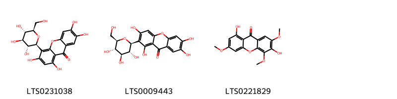{ width=100% }
    <figcaption>Hình ảnh cấu trúc hóa học của 3 hoạt chất thuộc nhóm Benzopyrans gồm ['isomangiferin (LTS0231038)', 'mangiferin (LTS0009443)', '1,6-dihydroxy-3,5,7-trimethoxyxanthen-9-one (LTS0221829)'].</figcaption>
</figure>
#### Nhóm Cinnamic acids and derivatives
<figure markdown="span">
    { width=100% }
    <figcaption>Hình ảnh cấu trúc hóa học của 1 hoạt chất thuộc nhóm Cinnamic acids and derivatives gồm ['5-o-caffeoylshikimic acid (LTS0092117)'].</figcaption>
</figure>
#### Nhóm Organooxygen compounds
<figure markdown="span">
    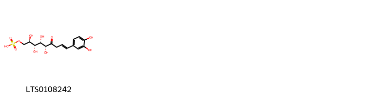{ width=100% }
    <figcaption>Hình ảnh cấu trúc hóa học của 1 hoạt chất thuộc nhóm Organooxygen compounds gồm ['[(2r,3r,4s,5r,8e)-9-(3,4-dihydroxyphenyl)-2,3,4,5-tetrahydroxy-6-oxonon-8-en-1-yl]oxysulfonic acid (LTS0108242)'].</figcaption>
</figure>
#### Nhóm Phenols
<figure markdown="span">
    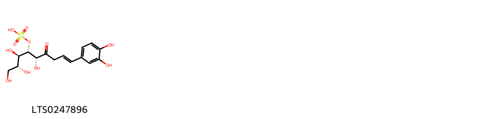{ width=100% }
    <figcaption>Hình ảnh cấu trúc hóa học của 1 hoạt chất thuộc nhóm Phenols gồm ['[(2r,3r,4s,5r,8e)-9-(3,4-dihydroxyphenyl)-1,2,3,5-tetrahydroxy-6-oxonon-8-en-4-yl]oxysulfonic acid (LTS0247896)'].</figcaption>
</figure>
#### Nhóm Prenol lipids
<figure markdown="span">
    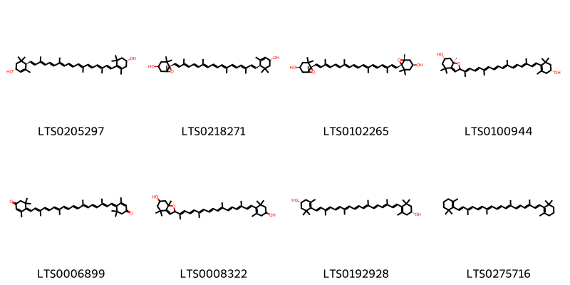{ width=100% }
    <figcaption>Hình ảnh cấu trúc hóa học của 8 hoạt chất thuộc nhóm Prenol lipids gồm ['carotenoid (LTS0205297)', 'taraxanthin (LTS0218271)', 'violaxanthin (LTS0102265)', '(6s,7ar)-2-[(2e,4e,6e,8e,10e,12e,14e,16e)-17-[(4r)-4-hydroxy-2,6,6-trimethylcyclohex-1-en-1-yl]-6,11,15-trimethylheptadeca-2,4,6,8,10,12,14,16-octaen-2-yl]-4,4,7a-trimethyl-2,5,6,7-tetrahydro-1-benzofuran-6-ol (LTS0100944)', 'rhodoxanthin (LTS0006899)', '2-[(2e,4e,6e,8e,10e,12e,14e,16e)-17-(4-hydroxy-2,6,6-trimethylcyclohex-1-en-1-yl)-6,11,15-trimethylheptadeca-2,4,6,8,10,12,14,16-octaen-2-yl]-4,4,7a-trimethyl-2,5,6,7-tetrahydro-1-benzofuran-6-ol (LTS0008322)', 'zeaxanthin (LTS0192928)', 'β-carotene (LTS0275716)'].</figcaption>
</figure>

---

### Dược dân tộc học

Danh sách các quốc gia có sử dụng *Cystopteris fragilis* trong điều trị các bệnh. 

| Country   | Disease   | Bệnh                                                                                                                                                                                                |
|:----------|:----------|:----------------------------------------------------------------------------------------------------------------------------------------------------------------------------------------------------|
| Lesotho   | Vermifuge | MYMEMORY WARNING: YOU USED ALL AVAILABLE FREE TRANSLATIONS FOR TODAY. NEXT AVAILABLE IN  08 HOURS 37 MINUTES 02 SECONDS VISIT HTTPS://MYMEMORY.TRANSLATED.NET/DOC/USAGELIMITS.PHP TO TRANSLATE MORE |

---

# Chi Athyrium

??? note "Danh sách các dược liệu thuộc chi"
    
	 - *Athyrium microphyllum*

---
## Athyrium microphyllum
### Thông tin về thực vật

!!! info "Phân loại thực vật của *Athyrium microphyllum* từ GIBF:"
    - **Kingdom:** Plantae
    - **Phylum:** Tracheophyta
    - **Order:** Polypodiales
    - **Family:** Athyriaceae
    - **Genus:** Athyrium
    - **Species:** *Athyrium microphyllum*

 

| Label (VI)   | Label (EN)   | Scientific Name       | Descriptions (VI)   | Descriptions (EN)   | Also Known As (VI)   | Also Known As (EN)   |
|:-------------|:-------------|:----------------------|:--------------------|:--------------------|:---------------------|:---------------------|
| N/A          | N/A          | Athyrium microphyllum | loài thực vật       | species of plant    | ['']                 | ['']                 |

#### Phân bố trên thế giới

**Từ CSDL GIBF** United States of America

#### Phân bố tại Việt Nam

**Từ CSDL GIBF**: Không có ghi nhận ở Việt Nam

---
### Thành phần hóa học
        
- Theo cơ sở dữ liệu lotus: Từ loài *Athyrium microphyllum* đã phân lập và xác định được Chưa có hoạt chất nào được phân lập. hoạt chất thuộc về các nhóm Không có hoạt chất nào được phân lập. 

Không có hình ảnh nào được tạo ra

---

### Dược dân tộc học

Danh sách các quốc gia có sử dụng *Athyrium microphyllum* trong điều trị các bệnh. 

| Country   | Disease   | Bệnh                                                                                                                                                                                                |
|:----------|:----------|:----------------------------------------------------------------------------------------------------------------------------------------------------------------------------------------------------|
| Hawaii    | Apertif   | MYMEMORY WARNING: YOU USED ALL AVAILABLE FREE TRANSLATIONS FOR TODAY. NEXT AVAILABLE IN  08 HOURS 36 MINUTES 36 SECONDS VISIT HTTPS://MYMEMORY.TRANSLATED.NET/DOC/USAGELIMITS.PHP TO TRANSLATE MORE |

---

# Chi Nephrodium

??? note "Danh sách các dược liệu thuộc chi"
    
	 - *Nephrodium filix-mas*

---
## Nephrodium filixmas
### Thông tin về thực vật

!!! info "Phân loại thực vật của *Dryopteris filix-mas* từ GIBF:"
    - **Kingdom:** Plantae
    - **Phylum:** Tracheophyta
    - **Order:** Polypodiales
    - **Family:** Dryopteridaceae
    - **Genus:** Dryopteris
    - **Species:** *Dryopteris filix-mas*

 

| Label (VI)   | Label (EN)   | Scientific Name       | Descriptions (VI)   | Descriptions (EN)   | Also Known As (VI)   | Also Known As (EN)   |
|:-------------|:-------------|:----------------------|:--------------------|:--------------------|:---------------------|:---------------------|
| N/A          | N/A          | Athyrium microphyllum | loài thực vật       | species of plant    | ['']                 | ['']                 |

#### Phân bố trên thế giới

**Từ CSDL GIBF** Bulgaria, Greenland, Brazil, Spain, United States of America

#### Phân bố tại Việt Nam

**Từ CSDL GIBF**: Không có ghi nhận ở Việt Nam

---
### Thành phần hóa học
        
- Theo cơ sở dữ liệu lotus: Từ loài *Dryopteris filix-mas* đã phân lập và xác định được Chưa có hoạt chất nào được phân lập. hoạt chất thuộc về các nhóm Không có hoạt chất nào được phân lập. 

Không có hình ảnh nào được tạo ra

---

### Dược dân tộc học

Danh sách các quốc gia có sử dụng *Dryopteris filix-mas* trong điều trị các bệnh. 

| Country   | Disease              | Bệnh                                                                                                                                                                                                |
|:----------|:---------------------|:----------------------------------------------------------------------------------------------------------------------------------------------------------------------------------------------------|
| China     | Vermifuge, Purgative | MYMEMORY WARNING: YOU USED ALL AVAILABLE FREE TRANSLATIONS FOR TODAY. NEXT AVAILABLE IN  08 HOURS 36 MINUTES 11 SECONDS VISIT HTTPS://MYMEMORY.TRANSLATED.NET/DOC/USAGELIMITS.PHP TO TRANSLATE MORE |

---

# Chi Angiopteris

??? note "Danh sách các dược liệu thuộc chi"
    
	 - *Angiopteris evecta*
	 - *Angiopteris fokiensis*

---
## Angiopteris evecta
### Thông tin về thực vật

!!! info "Phân loại thực vật của *Angiopteris evecta* từ GIBF:"
    - **Kingdom:** Plantae
    - **Phylum:** Tracheophyta
    - **Order:** Marattiales
    - **Family:** Marattiaceae
    - **Genus:** Angiopteris
    - **Species:** *Angiopteris evecta*

 

| Label (VI)   | Label (EN)   | Scientific Name    | Descriptions (VI)   | Descriptions (EN)                          | Also Known As (VI)   | Also Known As (EN)   |
|:-------------|:-------------|:-------------------|:--------------------|:-------------------------------------------|:---------------------|:---------------------|
| N/A          | N/A          | Angiopteris evecta |                     | species of fern in the family Marattiaceae | ['']                 | ['King fern']        |

#### Phân bố trên thế giới

**Từ CSDL GIBF** Palau, Micronesia (Federated States of), Australia, Cook Islands, Wallis and Futuna, Panama, Chinese Taipei, United States of America, Fiji, Thailand, Guam, Brazil, New Caledonia, Tonga, Cuba, Singapore, French Polynesia, Niue, Seychelles, Costa Rica, India, Indonesia, Samoa, Philippines, Malaysia, New Zealand

#### Phân bố tại Việt Nam

**Từ CSDL GIBF**: Không có ghi nhận ở Việt Nam

---
### Thành phần hóa học
        
- Theo cơ sở dữ liệu lotus: Từ loài *Angiopteris evecta* đã phân lập và xác định được 4 hoạt chất thuộc về các nhóm Flavonoids. 

|    | chemicalTaxonomyClassyfireClass   |   smiles_count |
|---:|:----------------------------------|---------------:|
|  0 | Flavonoids                        |              4 |

#### Nhóm Flavonoids
<figure markdown="span">
    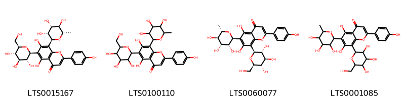{ width=100% }
    <figcaption>Hình ảnh cấu trúc hóa học của 4 hoạt chất thuộc nhóm Flavonoids gồm ['violanthin (LTS0015167)', '5,7-dihydroxy-2-(4-hydroxyphenyl)-6-[3,4,5-trihydroxy-6-(hydroxymethyl)oxan-2-yl]-8-(3,4,5-trihydroxy-6-methyloxan-2-yl)chromen-4-one (LTS0100110)', '5,7-dihydroxy-2-(4-hydroxyphenyl)-8-[(2s,3r,4r,5s,6r)-3,4,5-trihydroxy-6-(hydroxymethyl)oxan-2-yl]-6-[(2s,3r,4r,5r,6s)-3,4,5-trihydroxy-6-methyloxan-2-yl]chromen-4-one (LTS0060077)', '5,7-dihydroxy-2-(4-hydroxyphenyl)-8-[3,4,5-trihydroxy-6-(hydroxymethyl)oxan-2-yl]-6-(3,4,5-trihydroxy-6-methyloxan-2-yl)chromen-4-one (LTS0001085)'].</figcaption>
</figure>

---

### Dược dân tộc học

Danh sách các quốc gia có sử dụng *Angiopteris evecta* trong điều trị các bệnh. 

| Country   | Disease   | Bệnh                                                                                                                                                                                                |
|:----------|:----------|:----------------------------------------------------------------------------------------------------------------------------------------------------------------------------------------------------|
| Malaya    | Hemostat  | MYMEMORY WARNING: YOU USED ALL AVAILABLE FREE TRANSLATIONS FOR TODAY. NEXT AVAILABLE IN  08 HOURS 35 MINUTES 54 SECONDS VISIT HTTPS://MYMEMORY.TRANSLATED.NET/DOC/USAGELIMITS.PHP TO TRANSLATE MORE |

---

---
## Angiopteris fokiensis
### Thông tin về thực vật

!!! info "Phân loại thực vật của *Angiopteris fokiensis* từ GIBF:"
    - **Kingdom:** Plantae
    - **Phylum:** Tracheophyta
    - **Order:** Marattiales
    - **Family:** Marattiaceae
    - **Genus:** Angiopteris
    - **Species:** *Angiopteris fokiensis*

 

| Label (VI)   | Label (EN)   | Scientific Name       | Descriptions (VI)   | Descriptions (EN)   | Also Known As (VI)   | Also Known As (EN)   |
|:-------------|:-------------|:----------------------|:--------------------|:--------------------|:---------------------|:---------------------|
| N/A          | N/A          | Angiopteris fokiensis | loài thực vật       | species of plant    | ['']                 | ['']                 |

#### Phân bố trên thế giới

**Từ CSDL GIBF** Hong Kong, Chinese Taipei, China, Japan

#### Phân bố tại Việt Nam

**Từ CSDL GIBF**: Không có ghi nhận ở Việt Nam

---
### Thành phần hóa học
        
- Theo cơ sở dữ liệu lotus: Từ loài *Angiopteris fokiensis* đã phân lập và xác định được Chưa có hoạt chất nào được phân lập. hoạt chất thuộc về các nhóm Không có hoạt chất nào được phân lập. 

Không có hình ảnh nào được tạo ra

---

### Dược dân tộc học

Danh sách các quốc gia có sử dụng *Angiopteris fokiensis* trong điều trị các bệnh. 

| Country   | Disease                              | Bệnh                                                                                                                                                                                                |
|:----------|:-------------------------------------|:----------------------------------------------------------------------------------------------------------------------------------------------------------------------------------------------------|
| China     | Alexiteric, Carminative, Refrigerant | MYMEMORY WARNING: YOU USED ALL AVAILABLE FREE TRANSLATIONS FOR TODAY. NEXT AVAILABLE IN  08 HOURS 35 MINUTES 31 SECONDS VISIT HTTPS://MYMEMORY.TRANSLATED.NET/DOC/USAGELIMITS.PHP TO TRANSLATE MORE |

---

# Chi Dryopteris

??? note "Danh sách các dược liệu thuộc chi"
    
	 - *Dryopteris crassirhizoma*
	 - *Dryopteris cristata*
	 - *Dryopteris dentata*
	 - *Dryopteris filix-mas*
	 - *Dryopteris inulosa*
	 - *Dryopteris marginalis*

---
## Dryopteris crassirhizoma
### Thông tin về thực vật

!!! info "Phân loại thực vật của *Dryopteris crassirhizoma* từ GIBF:"
    - **Kingdom:** Plantae
    - **Phylum:** Tracheophyta
    - **Order:** Polypodiales
    - **Family:** Dryopteridaceae
    - **Genus:** Dryopteris
    - **Species:** *Dryopteris crassirhizoma*

 

| Label (VI)   | Label (EN)   | Scientific Name          | Descriptions (VI)   | Descriptions (EN)   | Also Known As (VI)   | Also Known As (EN)   |
|:-------------|:-------------|:-------------------------|:--------------------|:--------------------|:---------------------|:---------------------|
| N/A          | N/A          | Dryopteris crassirhizoma | loài thực vật       | species of plant    | ['']                 | ['']                 |

#### Phân bố trên thế giới

**Từ CSDL GIBF** Korea, Republic of, Russian Federation, China, Japan

#### Phân bố tại Việt Nam

**Từ CSDL GIBF**: Không có ghi nhận ở Việt Nam

---
### Thành phần hóa học
        
- Theo cơ sở dữ liệu lotus: Từ loài *Dryopteris crassirhizoma* đã phân lập và xác định được 105 hoạt chất thuộc về các nhóm Fatty Acyls, Flavonoids, Prenol lipids, Steroids and steroid derivatives, Vinylogous esters, Benzene and substituted derivatives, Organooxygen compounds, Vinylogous acids. 

|    | chemicalTaxonomyClassyfireClass     |   smiles_count |
|---:|:------------------------------------|---------------:|
|  0 | Benzene and substituted derivatives |              2 |
|  1 | Fatty Acyls                         |              1 |
|  2 | Flavonoids                          |             43 |
|  3 | Organooxygen compounds              |             20 |
|  4 | Prenol lipids                       |             20 |
|  5 | Steroids and steroid derivatives    |             11 |
|  6 | Vinylogous acids                    |              6 |
|  7 | Vinylogous esters                   |              1 |

#### Nhóm Benzene and substituted derivatives
<figure markdown="span">
    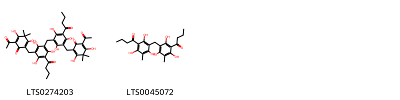{ width=100% }
    <figcaption>Hình ảnh cấu trúc hóa học của 2 hoạt chất thuộc nhóm Benzene and substituted derivatives gồm ['2-acetyl-6-{[3-({3-[(5-acetyl-2,4-dihydroxy-3,3-dimethyl-6-oxocyclohexa-1,4-dien-1-yl)methyl]-5-butanoyl-2,4,6-trihydroxyphenyl}methyl)-5-butanoyl-2,4,6-trihydroxyphenyl]methyl}-3,5-dihydroxy-4,4-dimethylcyclohexa-2,5-dien-1-one (LTS0274203)', '1-{3-[(3-butanoyl-2,4,6-trihydroxy-5-methylphenyl)methyl]-2,4,6-trihydroxy-5-methylphenyl}butan-1-one (LTS0045072)'].</figcaption>
</figure>
#### Nhóm Fatty Acyls
<figure markdown="span">
    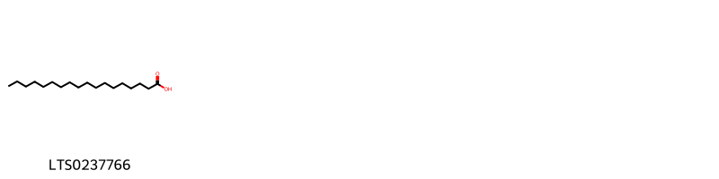{ width=100% }
    <figcaption>Hình ảnh cấu trúc hóa học của 1 hoạt chất thuộc nhóm Fatty Acyls gồm ['stearic acid (LTS0237766)'].</figcaption>
</figure>
#### Nhóm Flavonoids
<figure markdown="span">
    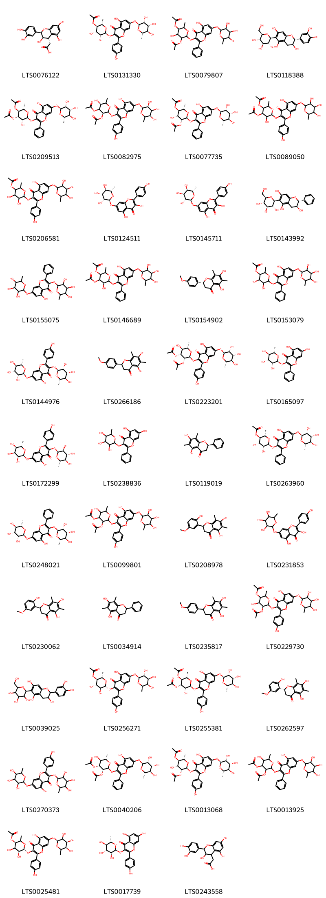{ width=100% }
    <figcaption>Hình ảnh cấu trúc hóa học của 43 hoạt chất thuộc nhóm Flavonoids gồm ['dryopteric acid (LTS0076122)', '(2s,3r,4s,5r,6s)-4,5-dihydroxy-6-{[5-hydroxy-2-(4-hydroxyphenyl)-4-oxo-7-{[(2s,3r,4r,5r,6s)-3,4,5-trihydroxy-6-methyloxan-2-yl]oxy}chromen-3-yl]oxy}-2-methyloxan-3-yl acetate (LTS0131330)', '5-(acetyloxy)-4-hydroxy-2-({5-hydroxy-4-oxo-2-phenyl-7-[(3,4,5-trihydroxy-6-methyloxan-2-yl)oxy]chromen-3-yl}oxy)-6-methyloxan-3-yl acetate (LTS0079807)', '(2r,3s)-2-(3,4-dihydroxyphenyl)-6-[(2s,3r,4r,5s,6r)-3,4,5-trihydroxy-6-(hydroxymethyl)oxan-2-yl]-3,4-dihydro-2h-1-benzopyran-3,5,7-triol (LTS0118388)', '(2s,3s,4s,5r,6s)-3-(acetyloxy)-5-hydroxy-6-[(5-hydroxy-4-oxo-2-phenyl-7-{[(2s,3r,4r,5r,6s)-3,4,5-trihydroxy-6-methyloxan-2-yl]oxy}chromen-3-yl)oxy]-2-methyloxan-4-yl acetate (LTS0209513)', '(2s,3s,5s)-4-(acetyloxy)-5-hydroxy-2-{[5-hydroxy-2-(4-hydroxyphenyl)-4-oxo-7-{[(2s,3s,5r)-3,4,5-trihydroxy-6-methyloxan-2-yl]oxy}chromen-3-yl]oxy}-6-methyloxan-3-yl acetate (LTS0082975)', '(2s,3r,4r,5r,6s)-5-(acetyloxy)-4-hydroxy-2-[(5-hydroxy-4-oxo-2-phenyl-7-{[(2s,3r,4r,5r,6s)-3,4,5-trihydroxy-6-methyloxan-2-yl]oxy}chromen-3-yl)oxy]-6-methyloxan-3-yl acetate (LTS0077735)', '3-(acetyloxy)-5-hydroxy-6-{[5-hydroxy-2-(4-hydroxyphenyl)-4-oxo-7-[(3,4,5-trihydroxy-6-methyloxan-2-yl)oxy]chromen-3-yl]oxy}-2-methyloxan-4-yl acetate (LTS0089050)', '4,5-dihydroxy-6-{[5-hydroxy-2-(4-hydroxyphenyl)-4-oxo-7-[(3,4,5-trihydroxy-6-methyloxan-2-yl)oxy]chromen-3-yl]oxy}-2-methyloxan-3-yl acetate (LTS0206581)', 'kaempferol-7-rhamnoside (LTS0124511)', '3,5-dihydroxy-2-(4-hydroxyphenyl)-7-{[(2s,3r,4s,5r,6s)-3,4,5-trihydroxy-6-methyloxan-2-yl]oxy}chromen-4-one (LTS0145711)', '(2r,3s)-2-phenyl-6-[(2s,3r,4r,5s,6r)-3,4,5-trihydroxy-6-(hydroxymethyl)oxan-2-yl]-3,4-dihydro-2h-1-benzopyran-3,5,7-triol (LTS0143992)', '5-hydroxy-2-phenyl-3,7-bis[(3,4,5-trihydroxy-6-methyloxan-2-yl)oxy]chromen-4-one (LTS0155075)', '3-(acetyloxy)-5-hydroxy-6-({5-hydroxy-4-oxo-2-phenyl-7-[(3,4,5-trihydroxy-6-methyloxan-2-yl)oxy]chromen-3-yl}oxy)-2-methyloxan-4-yl acetate (LTS0146689)', '(2r)-5,7-dihydroxy-2-(4-methoxyphenyl)-6,8-dimethyl-2,3-dihydro-1-benzopyran-4-one (LTS0154902)', '4,5-dihydroxy-6-({5-hydroxy-4-oxo-2-phenyl-7-[(3,4,5-trihydroxy-6-methyloxan-2-yl)oxy]chromen-3-yl}oxy)-2-methyloxan-3-yl acetate (LTS0153079)', 'lespedin (LTS0144976)', 'matteucinol (LTS0266186)', '(2s,3r,4r,5s,6s)-3-(acetyloxy)-5-hydroxy-2-{[5-hydroxy-2-(4-hydroxyphenyl)-4-oxo-7-{[(2s,3r,4r,5r,6s)-3,4,5-trihydroxy-6-methyloxan-2-yl]oxy}chromen-3-yl]oxy}-6-methyloxan-4-yl acetate (LTS0223201)', '5,7-dihydroxy-2-phenyl-3-{[(2s,3r,4r,5r,6s)-3,4,5-trihydroxy-6-methyloxan-2-yl]oxy}chromen-4-one (LTS0165097)', '5-hydroxy-2-(4-hydroxyphenyl)-3-{[(2s,3s,4r,5r,6s)-3,4,5-trihydroxy-6-methyloxan-2-yl]oxy}-7-{[(2s,3s,4s,5r,6s)-3,4,5-trihydroxy-6-methyloxan-2-yl]oxy}chromen-4-one (LTS0172299)', '5,7-dihydroxy-2-phenyl-3-[(3,4,5-trihydroxy-6-methyloxan-2-yl)oxy]chromen-4-one (LTS0238836)', '(2r)-5,7-dihydroxy-6,8-dimethyl-2-phenyl-2,3-dihydro-1-benzopyran-4-one (LTS0119019)', '(2s,3r,4s,5r,6s)-4,5-dihydroxy-6-[(5-hydroxy-4-oxo-2-phenyl-7-{[(2s,3r,4r,5r,6s)-3,4,5-trihydroxy-6-methyloxan-2-yl]oxy}chromen-3-yl)oxy]-2-methyloxan-3-yl acetate (LTS0263960)', '5-hydroxy-2-phenyl-3,7-bis({[(2s,3r,4r,5r,6s)-3,4,5-trihydroxy-6-methyloxan-2-yl]oxy})chromen-4-one (LTS0248021)', '3-(acetyloxy)-5-hydroxy-2-{[5-hydroxy-2-(4-hydroxyphenyl)-4-oxo-7-[(3,4,5-trihydroxy-6-methyloxan-2-yl)oxy]chromen-3-yl]oxy}-6-methyloxan-4-yl acetate (LTS0099801)', '5,7-dihydroxy-2-(2-hydroxy-5-methoxyphenyl)-6,8-dimethyl-2,3-dihydro-1-benzopyran-4-one (LTS0208978)', '3,5-dihydroxy-2-(4-hydroxyphenyl)-7-[(3,4,5-trihydroxy-6-methyloxan-2-yl)oxy]chromen-4-one (LTS0231853)', '(2s)-5,7-dihydroxy-2-(2-hydroxy-5-methoxyphenyl)-6,8-dimethyl-2,3-dihydro-1-benzopyran-4-one (LTS0230062)', 'desmethoxymatteucinol (LTS0034914)', 'matteucinol (LTS0235817)', '5-(acetyloxy)-4-hydroxy-2-{[5-hydroxy-2-(4-hydroxyphenyl)-4-oxo-7-[(3,4,5-trihydroxy-6-methyloxan-2-yl)oxy]chromen-3-yl]oxy}-6-methyloxan-3-yl acetate (LTS0229730)', '2-(3,4-dihydroxyphenyl)-6-[3,4,5-trihydroxy-6-(hydroxymethyl)oxan-2-yl]-3,4-dihydro-2h-1-benzopyran-3,5,7-triol (LTS0039025)', '(2s,3r,4s,5s,6r)-4,5-dihydroxy-6-{[5-hydroxy-2-(4-hydroxyphenyl)-4-oxo-7-{[(2s,3r,4s,5r,6r)-3,4,5-trihydroxy-6-methyloxan-2-yl]oxy}chromen-3-yl]oxy}-2-methyloxan-3-yl acetate (LTS0256271)', '(2s,3s,4s,5r,6s)-3-(acetyloxy)-5-hydroxy-6-{[5-hydroxy-2-(4-hydroxyphenyl)-4-oxo-7-{[(2s,3r,4r,5r,6s)-3,4,5-trihydroxy-6-methyloxan-2-yl]oxy}chromen-3-yl]oxy}-2-methyloxan-4-yl acetate (LTS0255381)', '(2r)-5,7-dihydroxy-2-(2-hydroxy-5-methoxyphenyl)-6,8-dimethyl-2,3-dihydro-1-benzopyran-4-one (LTS0262597)', 'kaempferitrin (LTS0270373)', '(2s,3r,4r,5s,6s)-3-(acetyloxy)-5-hydroxy-2-[(5-hydroxy-4-oxo-2-phenyl-7-{[(2s,3r,4r,5r,6s)-3,4,5-trihydroxy-6-methyloxan-2-yl]oxy}chromen-3-yl)oxy]-6-methyloxan-4-yl acetate (LTS0040206)', '(2s,3r,4r,5r,6s)-5-(acetyloxy)-4-hydroxy-2-{[5-hydroxy-2-(4-hydroxyphenyl)-4-oxo-7-{[(2s,3r,4r,5r,6s)-3,4,5-trihydroxy-6-methyloxan-2-yl]oxy}chromen-3-yl]oxy}-6-methyloxan-3-yl acetate (LTS0013068)', '3-(acetyloxy)-5-hydroxy-2-({5-hydroxy-4-oxo-2-phenyl-7-[(3,4,5-trihydroxy-6-methyloxan-2-yl)oxy]chromen-3-yl}oxy)-6-methyloxan-4-yl acetate (LTS0013925)', 'sutchuenoside a (LTS0025481)', '5,7-dihydroxy-2-(4-hydroxyphenyl)-3-{[(2s,3s,4r,5r,6s)-3,4,5-trihydroxy-6-methyloxan-2-yl]oxy}chromen-4-one (LTS0017739)', '[2-(3,4-dihydroxyphenyl)-3,5,7-trihydroxy-3,4-dihydro-2h-1-benzopyran-4-yl]acetic acid (LTS0243558)'].</figcaption>
</figure>
#### Nhóm Organooxygen compounds
<figure markdown="span">
    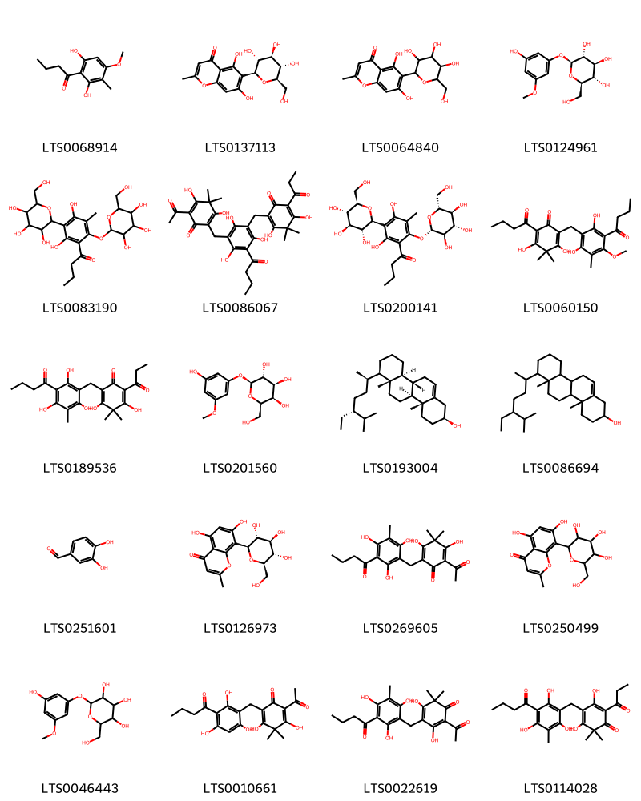{ width=100% }
    <figcaption>Hình ảnh cấu trúc hóa học của 20 hoạt chất thuộc nhóm Organooxygen compounds gồm ['aspidinol (LTS0068914)', 'biflorin (LTS0137113)', '5,7-dihydroxy-2-methyl-6-[3,4,5-trihydroxy-6-(hydroxymethyl)oxan-2-yl]chromen-4-one (LTS0064840)', '(2s,3r,4s,5s,6r)-2-(3-hydroxy-5-methoxyphenoxy)-6-(hydroxymethyl)oxane-3,4,5-triol (LTS0124961)', '1-{2,4-dihydroxy-5-methyl-3-[3,4,5-trihydroxy-6-(hydroxymethyl)oxan-2-yl]-6-{[3,4,5-trihydroxy-6-(hydroxymethyl)oxan-2-yl]oxy}phenyl}butan-1-one (LTS0083190)', '2-acetyl-6-({3-butanoyl-5-[(2,4-dihydroxy-3,3-dimethyl-6-oxo-5-propanoylcyclohexa-1,4-dien-1-yl)methyl]-2,4,6-trihydroxyphenyl}methyl)-3,5-dihydroxy-4,4-dimethylcyclohexa-2,5-dien-1-one (LTS0086067)', '1-{2,4-dihydroxy-5-methyl-3-[(2s,3r,4r,5s,6r)-3,4,5-trihydroxy-6-(hydroxymethyl)oxan-2-yl]-6-{[(2s,3r,4s,5s,6r)-3,4,5-trihydroxy-6-(hydroxymethyl)oxan-2-yl]oxy}phenyl}butan-1-one (LTS0200141)', 'aspidin (LTS0060150)', 'flavaspidic acid pb (LTS0189536)', '(2s,3r,4s,5r,6r)-2-(3-hydroxy-5-methoxyphenoxy)-6-(hydroxymethyl)oxane-3,4,5-triol (LTS0201560)', '(2s,4ar,4bs,6ar,7r,10as,10bs)-7-[(2r,5r)-5-ethyl-6-methylheptan-2-yl]-4a,6a-dimethyl-1,2,3,4,4b,5,6,7,8,9,10,10a,10b,11-tetradecahydrochrysen-2-ol (LTS0193004)', '7-(5-ethyl-6-methylheptan-2-yl)-4a,6a-dimethyl-1,2,3,4,4b,5,6,7,8,9,10,10a,10b,11-tetradecahydrochrysen-2-ol (LTS0086694)', '3,4-dihydroxybenzaldehyde (LTS0251601)', '5,7-dihydroxy-2-methyl-8-[(2s,3r,4r,5s,6r)-3,4,5-trihydroxy-6-(hydroxymethyl)oxan-2-yl]chromen-4-one (LTS0126973)', 'flavaspidic acid ab (LTS0269605)', '5,7-dihydroxy-2-methyl-8-[3,4,5-trihydroxy-6-(hydroxymethyl)oxan-2-yl]chromen-4-one (LTS0250499)', '2-(3-hydroxy-5-methoxyphenoxy)-6-(hydroxymethyl)oxane-3,4,5-triol (LTS0046443)', '2-acetyl-6-[(3-butanoyl-2,4,6-trihydroxyphenyl)methyl]-3,5-dihydroxy-4,4-dimethylcyclohexa-2,5-dien-1-one (LTS0010661)', '2-acetyl-4-[(3-butanoyl-2,4,6-trihydroxy-5-methylphenyl)methyl]-3,5-dihydroxy-6,6-dimethylcyclohexa-2,4-dien-1-one (LTS0022619)', '4-[(3-butanoyl-2,4,6-trihydroxy-5-methylphenyl)methyl]-3,5-dihydroxy-6,6-dimethyl-2-propanoylcyclohexa-2,4-dien-1-one (LTS0114028)'].</figcaption>
</figure>
#### Nhóm Prenol lipids
<figure markdown="span">
    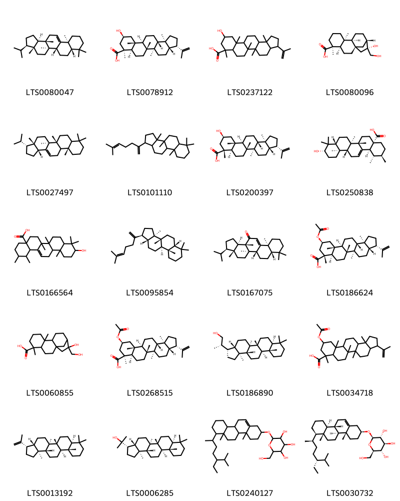{ width=100% }
    <figcaption>Hình ảnh cấu trúc hóa học của 20 hoạt chất thuộc nhóm Prenol lipids gồm ['fernene (LTS0080047)', '(3s,3as,5ar,5br,7ar,8s,10s,11ar,11br,13ar,13bs)-10-hydroxy-5a,5b,8,11a,13b-pentamethyl-3-(prop-1-en-2-yl)-hexadecahydrocyclopenta[a]chrysene-8-carboxylic acid (LTS0078912)', '10-hydroxy-5a,5b,8,11a,13b-pentamethyl-3-(prop-1-en-2-yl)-hexadecahydrocyclopenta[a]chrysene-8-carboxylic acid (LTS0237122)', '(1r,4r,5s,9s,10s,13s,14r)-14-hydroxy-14-(hydroxymethyl)-5,9-dimethyltetracyclo[11.2.1.0¹,¹⁰.0⁴,⁹]hexadecane-5-carboxylic acid (LTS0080096)', '(3r,3as,5as,5br,11as,13br)-3-isopropyl-3a,5a,5b,8,8,11a-hexamethyl-1h,2h,3h,4h,5h,6h,7h,7ah,9h,10h,11h,11bh,12h,13bh-cyclopenta[a]chrysene (LTS0027497)', '3a,3b,6,6,9a-pentamethyl-1-(6-methylhepta-1,5-dien-2-yl)-dodecahydro-1h-cyclopenta[a]phenanthrene (LTS0101110)', '(3s,3as,5ar,5br,7ar,8r,10s,11ar,11br,13ar,13bs)-10-hydroxy-5a,5b,8,11a,13b-pentamethyl-3-(prop-1-en-2-yl)-hexadecahydrocyclopenta[a]chrysene-8-carboxylic acid (LTS0200397)', 'ursolic acid (LTS0250838)', '10-hydroxy-1,2,6a,6b,9,9,12a-heptamethyl-2,3,4,5,6,7,8,8a,10,11,12,12b,13,14b-tetradecahydro-1h-picene-4a-carboxylic acid (LTS0166564)', '(1s,3ar,3br,5ar,9as,9br,11ar)-3a,3b,6,6,9a-pentamethyl-1-(6-methylhepta-1,5-dien-2-yl)-dodecahydro-1h-cyclopenta[a]phenanthrene (LTS0095854)', '(3r,3ar,5ar,5br,7as,11as,13as,13br)-3-isopropyl-3a,5a,8,8,11a,13a-hexamethyl-1h,2h,3h,4h,5h,5bh,6h,7h,7ah,9h,10h,11h,13bh-cyclopenta[a]chrysen-13-one (LTS0167075)', '(3s,3as,5ar,5br,7ar,8r,10s,11ar,11br,13ar,13bs)-10-(acetyloxy)-5a,5b,8,11a,13b-pentamethyl-3-(prop-1-en-2-yl)-hexadecahydrocyclopenta[a]chrysene-8-carboxylic acid (LTS0186624)', '14-hydroxy-14-(hydroxymethyl)-5,9-dimethyltetracyclo[11.2.1.0¹,¹⁰.0⁴,⁹]hexadecane-5-carboxylic acid (LTS0060855)', '(3s,3as,5ar,5br,7ar,8s,10s,11ar,11br,13ar,13bs)-10-(acetyloxy)-5a,5b,8,11a,13b-pentamethyl-3-(prop-1-en-2-yl)-hexadecahydrocyclopenta[a]chrysene-8-carboxylic acid (LTS0268515)', '(2s)-2-[(3s,3as,5ar,5br,7as,11as,11br,13ar,13bs)-5a,5b,8,8,11a,13b-hexamethyl-hexadecahydrocyclopenta[a]chrysen-3-yl]propan-1-ol (LTS0186890)', '10-(acetyloxy)-5a,5b,8,11a,13b-pentamethyl-3-(prop-1-en-2-yl)-hexadecahydrocyclopenta[a]chrysene-8-carboxylic acid (LTS0034718)', 'diploptene (LTS0013192)', 'hopan-22-ol (LTS0006285)', '2-{[7-(5-ethyl-6-methylheptan-2-yl)-4a,6a-dimethyl-1,2,3,4,4b,5,6,7,8,9,10,10a,10b,11-tetradecahydrochrysen-2-yl]oxy}-6-(hydroxymethyl)oxane-3,4,5-triol (LTS0240127)', '(2r,3r,4s,5s,6r)-2-{[(2s,4ar,4bs,6ar,7r,10as,10bs)-7-[(2r,5r)-5-ethyl-6-methylheptan-2-yl]-4a,6a-dimethyl-1,2,3,4,4b,5,6,7,8,9,10,10a,10b,11-tetradecahydrochrysen-2-yl]oxy}-6-(hydroxymethyl)oxane-3,4,5-triol (LTS0030732)'].</figcaption>
</figure>
#### Nhóm Steroids and steroid derivatives
<figure markdown="span">
    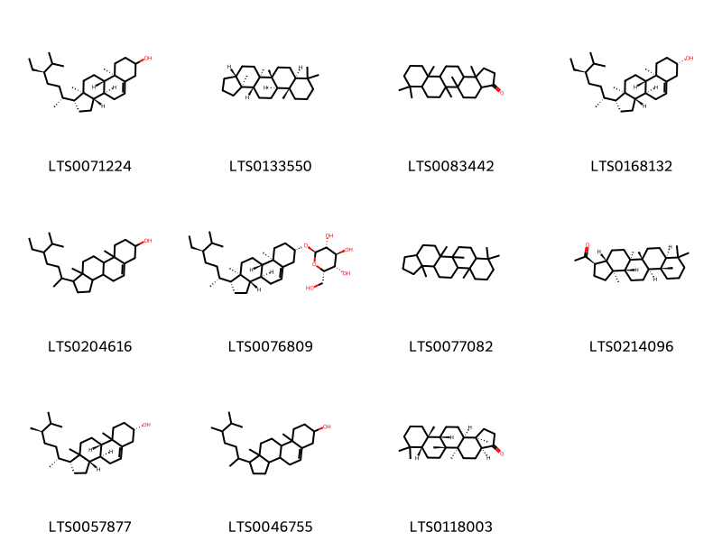{ width=100% }
    <figcaption>Hình ảnh cấu trúc hóa học của 11 hoạt chất thuộc nhóm Steroids and steroid derivatives gồm ['stigmast-5-en-3-ol (LTS0071224)', '(3ar,5ar,5br,7as,11as,11br,13ar,13bs)-5a,5b,8,8,11a,13b-hexamethyl-hexadecahydrocyclopenta[a]chrysene (LTS0133550)', '5a,5b,8,8,11a,13b-hexamethyl-tetradecahydro-1h-cyclopenta[a]chrysen-3-one (LTS0083442)', 'sitosterol (LTS0168132)', 'stigmast-5-en-3-ol, (3β)- (LTS0204616)', '(2r,3r,4s,5s,6s)-2-{[(1r,3as,3bs,7s,9ar,9bs,11ar)-1-[(2r,5r)-5-ethyl-6-methylheptan-2-yl]-9a,11a-dimethyl-1h,2h,3h,3ah,3bh,4h,6h,7h,8h,9h,9bh,10h,11h-cyclopenta[a]phenanthren-7-yl]oxy}-6-(hydroxymethyl)oxane-3,4,5-triol (LTS0076809)', '5a,5b,8,8,11a,13b-hexamethyl-hexadecahydrocyclopenta[a]chrysene (LTS0077082)', '1-[(3r,3as,5ar,5br,7as,11as,11br,13ar,13bs)-5a,5b,8,8,11a,13b-hexamethyl-hexadecahydrocyclopenta[a]chrysen-3-yl]ethanone (LTS0214096)', '(1r,3as,3bs,7s,9bs)-1-[(2r,5r)-5,6-dimethylheptan-2-yl]-9a,11a-dimethyl-1h,2h,3h,3ah,3bh,4h,6h,7h,8h,9h,9bh,10h,11h-cyclopenta[a]phenanthren-7-ol (LTS0057877)', 'campesterol (LTS0046755)', '(3as,5ar,5br,7ar,11as,11bs,13as,13br)-5a,5b,8,8,11a,13b-hexamethyl-tetradecahydro-1h-cyclopenta[a]chrysen-3-one (LTS0118003)'].</figcaption>
</figure>
#### Nhóm Vinylogous acids
<figure markdown="span">
    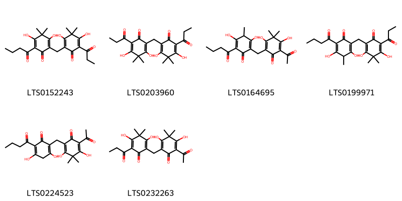{ width=100% }
    <figcaption>Hình ảnh cấu trúc hóa học của 6 hoạt chất thuộc nhóm Vinylogous acids gồm ['2-butanoyl-6-[(2,4-dihydroxy-3,3-dimethyl-6-oxo-5-propanoylcyclohexa-1,4-dien-1-yl)methyl]-3,5-dihydroxy-4,4-dimethylcyclohexa-2,5-dien-1-one (LTS0152243)', '2-[(2,4-dihydroxy-3,3-dimethyl-6-oxo-5-propanoylcyclohexa-1,4-dien-1-yl)methyl]-3,5-dihydroxy-4,4-dimethyl-6-propanoylcyclohexa-2,5-dien-1-one (LTS0203960)', '2-acetyl-6-[(5-butanoyl-2,4-dihydroxy-3-methyl-6-oxocyclohexa-1,4-dien-1-yl)methyl]-3,5-dihydroxy-4,4-dimethylcyclohexa-2,5-dien-1-one (LTS0164695)', '2-[(5-butanoyl-2,4-dihydroxy-3-methyl-6-oxocyclohexa-1,4-dien-1-yl)methyl]-3,5-dihydroxy-4,4-dimethyl-6-propanoylcyclohexa-2,5-dien-1-one (LTS0199971)', '2-acetyl-6-[(5-butanoyl-2,4-dihydroxy-6-oxocyclohexa-1,4-dien-1-yl)methyl]-3,5-dihydroxy-4,4-dimethylcyclohexa-2,5-dien-1-one (LTS0224523)', '2-[(5-acetyl-2,4-dihydroxy-3,3-dimethyl-6-oxocyclohexa-1,4-dien-1-yl)methyl]-3,5-dihydroxy-4,4-dimethyl-6-propanoylcyclohexa-2,5-dien-1-one (LTS0232263)'].</figcaption>
</figure>
#### Nhóm Vinylogous esters
<figure markdown="span">
    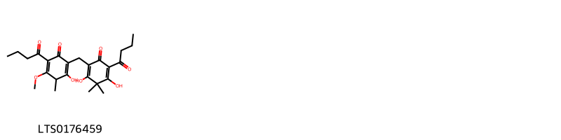{ width=100% }
    <figcaption>Hình ảnh cấu trúc hóa học của 1 hoạt chất thuộc nhóm Vinylogous esters gồm ['2-butanoyl-6-[(5-butanoyl-2-hydroxy-4-methoxy-3-methyl-6-oxocyclohexa-1,4-dien-1-yl)methyl]-3,5-dihydroxy-4,4-dimethylcyclohexa-2,5-dien-1-one (LTS0176459)'].</figcaption>
</figure>

---

### Dược dân tộc học

Danh sách các quốc gia có sử dụng *Dryopteris crassirhizoma* trong điều trị các bệnh. 

| Country   | Disease              | Bệnh                                                                                                                                                                                                |
|:----------|:---------------------|:----------------------------------------------------------------------------------------------------------------------------------------------------------------------------------------------------|
| Elsewhere | Taenicide, Vermifuge | MYMEMORY WARNING: YOU USED ALL AVAILABLE FREE TRANSLATIONS FOR TODAY. NEXT AVAILABLE IN  08 HOURS 35 MINUTES 11 SECONDS VISIT HTTPS://MYMEMORY.TRANSLATED.NET/DOC/USAGELIMITS.PHP TO TRANSLATE MORE |

---

---
## Dryopteris cristata
### Thông tin về thực vật

!!! info "Phân loại thực vật của *Dryopteris cristata* từ GIBF:"
    - **Kingdom:** Plantae
    - **Phylum:** Tracheophyta
    - **Order:** Polypodiales
    - **Family:** Dryopteridaceae
    - **Genus:** Dryopteris
    - **Species:** *Dryopteris cristata*

 

| Label (VI)   | Label (EN)   | Scientific Name     | Descriptions (VI)   | Descriptions (EN)   | Also Known As (VI)   | Also Known As (EN)   |
|:-------------|:-------------|:--------------------|:--------------------|:--------------------|:---------------------|:---------------------|
| N/A          | N/A          | Dryopteris cristata | loài thực vật       | species of plant    | ['']                 | ['']                 |

#### Phân bố trên thế giới

**Từ CSDL GIBF** Ukraine, Denmark, Netherlands, Belarus, Germany, Estonia, Switzerland, Russian Federation, United States of America, Sweden, France, Norway, Canada

#### Phân bố tại Việt Nam

**Từ CSDL GIBF**: Không có ghi nhận ở Việt Nam

---
### Thành phần hóa học
        
- Theo cơ sở dữ liệu lotus: Từ loài *Dryopteris cristata* đã phân lập và xác định được 6 hoạt chất thuộc về các nhóm Organooxygen compounds, Vinylogous acids. 

|    | chemicalTaxonomyClassyfireClass   |   smiles_count |
|---:|:----------------------------------|---------------:|
|  0 | Organooxygen compounds            |              5 |
|  1 | Vinylogous acids                  |              1 |

#### Nhóm Organooxygen compounds
<figure markdown="span">
    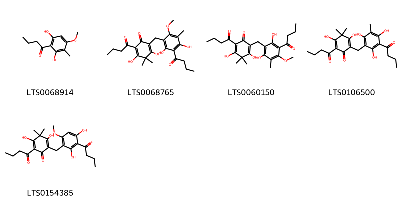{ width=100% }
    <figcaption>Hình ảnh cấu trúc hóa học của 5 hoạt chất thuộc nhóm Organooxygen compounds gồm ['aspidinol (LTS0068914)', '2-butanoyl-6-[(3-butanoyl-2,4-dihydroxy-6-methoxy-5-methylphenyl)methyl]-3,5-dihydroxy-4,4-dimethylcyclohexa-2,5-dien-1-one (LTS0068765)', 'aspidin (LTS0060150)', 'flavaspidic acid (LTS0106500)', 'desaspidin (LTS0154385)'].</figcaption>
</figure>
#### Nhóm Vinylogous acids
<figure markdown="span">
    { width=100% }
    <figcaption>Hình ảnh cấu trúc hóa học của 1 hoạt chất thuộc nhóm Vinylogous acids gồm ['albaspidin (LTS0197249)'].</figcaption>
</figure>

---

### Dược dân tộc học

Danh sách các quốc gia có sử dụng *Dryopteris cristata* trong điều trị các bệnh. 

| Country   | Disease                           | Bệnh                                                                                                                                                                                                |
|:----------|:----------------------------------|:----------------------------------------------------------------------------------------------------------------------------------------------------------------------------------------------------|
| US        | Expectorant, Sudorific, Vermifuge | MYMEMORY WARNING: YOU USED ALL AVAILABLE FREE TRANSLATIONS FOR TODAY. NEXT AVAILABLE IN  08 HOURS 34 MINUTES 41 SECONDS VISIT HTTPS://MYMEMORY.TRANSLATED.NET/DOC/USAGELIMITS.PHP TO TRANSLATE MORE |

---

---
## Dryopteris dentata
### Thông tin về thực vật

!!! info "Phân loại thực vật của *N/A* từ GIBF:"
    - **Kingdom:** Plantae
    - **Phylum:** Tracheophyta
    - **Order:** Polypodiales
    - **Family:** N/A
    - **Genus:** N/A
    - **Species:** *N/A*

 

| Label (VI)   | Label (EN)   | Scientific Name     | Descriptions (VI)   | Descriptions (EN)   | Also Known As (VI)   | Also Known As (EN)   |
|:-------------|:-------------|:--------------------|:--------------------|:--------------------|:---------------------|:---------------------|
| N/A          | N/A          | Dryopteris cristata | loài thực vật       | species of plant    | ['']                 | ['']                 |

#### Phân bố trên thế giới

**Từ CSDL GIBF** Italy, Australia, Canada, Luxembourg, Chinese Taipei, Spain, Portugal, Russian Federation, United States of America, Sweden, Finland, Chile, South Africa, Germany, Brazil, Switzerland, Isle of Man, Austria, France, Viet Nam, China, United Kingdom of Great Britain and Northern Ireland, Niue, Iraq, Ireland, Indonesia, New Zealand

#### Phân bố tại Việt Nam

**Từ CSDL GIBF**: Lâm Đồng

---
### Thành phần hóa học
        
- Theo cơ sở dữ liệu lotus: Từ loài *N/A* đã phân lập và xác định được Chưa có hoạt chất nào được phân lập. hoạt chất thuộc về các nhóm Không có hoạt chất nào được phân lập. 

Không có hình ảnh nào được tạo ra

---

### Dược dân tộc học

Danh sách các quốc gia có sử dụng *N/A* trong điều trị các bệnh. 

| Country   |   Disease | Bệnh                                                                                                                                                                                                |
|:----------|----------:|:----------------------------------------------------------------------------------------------------------------------------------------------------------------------------------------------------|
| India     |       nan | MYMEMORY WARNING: YOU USED ALL AVAILABLE FREE TRANSLATIONS FOR TODAY. NEXT AVAILABLE IN  08 HOURS 34 MINUTES 18 SECONDS VISIT HTTPS://MYMEMORY.TRANSLATED.NET/DOC/USAGELIMITS.PHP TO TRANSLATE MORE |

---

---
## Dryopteris filixmas
### Thông tin về thực vật

!!! info "Phân loại thực vật của *Dryopteris filix-mas* từ GIBF:"
    - **Kingdom:** Plantae
    - **Phylum:** Tracheophyta
    - **Order:** Polypodiales
    - **Family:** Dryopteridaceae
    - **Genus:** Dryopteris
    - **Species:** *Dryopteris filix-mas*

 

| Label (VI)   | Label (EN)   | Scientific Name     | Descriptions (VI)   | Descriptions (EN)   | Also Known As (VI)   | Also Known As (EN)   |
|:-------------|:-------------|:--------------------|:--------------------|:--------------------|:---------------------|:---------------------|
| N/A          | N/A          | Dryopteris cristata | loài thực vật       | species of plant    | ['']                 | ['']                 |

#### Phân bố trên thế giới

**Từ CSDL GIBF** Italy, Belgium, Norway, Ukraine, Denmark, Netherlands, Spain, Hungary, Russian Federation, United States of America, Sweden, Finland, Czechia, Germany, Switzerland, Austria, France, United Kingdom of Great Britain and Northern Ireland, Ireland, Poland, New Zealand

#### Phân bố tại Việt Nam

**Từ CSDL GIBF**: Không có ghi nhận ở Việt Nam

---
### Thành phần hóa học
        
- Theo cơ sở dữ liệu lotus: Từ loài *Dryopteris filix-mas* đã phân lập và xác định được Chưa có hoạt chất nào được phân lập. hoạt chất thuộc về các nhóm Không có hoạt chất nào được phân lập. 

Không có hình ảnh nào được tạo ra

---

### Dược dân tộc học

Danh sách các quốc gia có sử dụng *Dryopteris filix-mas* trong điều trị các bệnh. 

| Country   | Disease                                            | Bệnh                                                                                                                                                                                                |
|:----------|:---------------------------------------------------|:----------------------------------------------------------------------------------------------------------------------------------------------------------------------------------------------------|
| Egypt     | Vermifuge                                          | MYMEMORY WARNING: YOU USED ALL AVAILABLE FREE TRANSLATIONS FOR TODAY. NEXT AVAILABLE IN  08 HOURS 33 MINUTES 57 SECONDS VISIT HTTPS://MYMEMORY.TRANSLATED.NET/DOC/USAGELIMITS.PHP TO TRANSLATE MORE |
| Elsewhere | Vermifuge                                          | MYMEMORY WARNING: YOU USED ALL AVAILABLE FREE TRANSLATIONS FOR TODAY. NEXT AVAILABLE IN  08 HOURS 33 MINUTES 55 SECONDS VISIT HTTPS://MYMEMORY.TRANSLATED.NET/DOC/USAGELIMITS.PHP TO TRANSLATE MORE |
| Turkey    | Aperient, Astringent, Poison, Taenifuge, Vermifuge | MYMEMORY WARNING: YOU USED ALL AVAILABLE FREE TRANSLATIONS FOR TODAY. NEXT AVAILABLE IN  08 HOURS 33 MINUTES 52 SECONDS VISIT HTTPS://MYMEMORY.TRANSLATED.NET/DOC/USAGELIMITS.PHP TO TRANSLATE MORE |
| ain       | Vermifuge                                          | MYMEMORY WARNING: YOU USED ALL AVAILABLE FREE TRANSLATIONS FOR TODAY. NEXT AVAILABLE IN  08 HOURS 33 MINUTES 50 SECONDS VISIT HTTPS://MYMEMORY.TRANSLATED.NET/DOC/USAGELIMITS.PHP TO TRANSLATE MORE |

---

---
## Dryopteris inulosa
### Thông tin về thực vật

!!! info "Phân loại thực vật của *Reholttumia inclusa* từ GIBF:"
    - **Kingdom:** Plantae
    - **Phylum:** Tracheophyta
    - **Order:** Polypodiales
    - **Family:** Thelypteridaceae
    - **Genus:** Reholttumia
    - **Species:** *Reholttumia inclusa*

 

| Label (VI)   | Label (EN)   | Scientific Name     | Descriptions (VI)   | Descriptions (EN)   | Also Known As (VI)   | Also Known As (EN)   |
|:-------------|:-------------|:--------------------|:--------------------|:--------------------|:---------------------|:---------------------|
| N/A          | N/A          | Dryopteris cristata | loài thực vật       | species of plant    | ['']                 | ['']                 |

#### Phân bố trên thế giới

**Từ CSDL GIBF** Italy, Belgium, Norway, Ukraine, Denmark, Netherlands, Spain, Hungary, Russian Federation, United States of America, Sweden, Finland, Czechia, Germany, Switzerland, Austria, France, United Kingdom of Great Britain and Northern Ireland, Ireland, Poland, New Zealand

#### Phân bố tại Việt Nam

**Từ CSDL GIBF**: Không có ghi nhận ở Việt Nam

---
### Thành phần hóa học
        
- Theo cơ sở dữ liệu lotus: Từ loài *Reholttumia inclusa* đã phân lập và xác định được Chưa có hoạt chất nào được phân lập. hoạt chất thuộc về các nhóm Không có hoạt chất nào được phân lập. 

Không có hình ảnh nào được tạo ra

---

### Dược dân tộc học

Danh sách các quốc gia có sử dụng *Reholttumia inclusa* trong điều trị các bệnh. 

| Country   | Disease                                            | Bệnh                                                                                                                                                                                                |
|:----------|:---------------------------------------------------|:----------------------------------------------------------------------------------------------------------------------------------------------------------------------------------------------------|
| Dutch     | Astringent                                         | MYMEMORY WARNING: YOU USED ALL AVAILABLE FREE TRANSLATIONS FOR TODAY. NEXT AVAILABLE IN  08 HOURS 33 MINUTES 29 SECONDS VISIT HTTPS://MYMEMORY.TRANSLATED.NET/DOC/USAGELIMITS.PHP TO TRANSLATE MORE |
| Turkey    | Aperient, Astringent, Poison, Taenifuge, Vermifuge | MYMEMORY WARNING: YOU USED ALL AVAILABLE FREE TRANSLATIONS FOR TODAY. NEXT AVAILABLE IN  08 HOURS 33 MINUTES 26 SECONDS VISIT HTTPS://MYMEMORY.TRANSLATED.NET/DOC/USAGELIMITS.PHP TO TRANSLATE MORE |
| US        | Vermifuge                                          | MYMEMORY WARNING: YOU USED ALL AVAILABLE FREE TRANSLATIONS FOR TODAY. NEXT AVAILABLE IN  08 HOURS 33 MINUTES 23 SECONDS VISIT HTTPS://MYMEMORY.TRANSLATED.NET/DOC/USAGELIMITS.PHP TO TRANSLATE MORE |

---

---
## Dryopteris marginalis
### Thông tin về thực vật

!!! info "Phân loại thực vật của *Dryopteris marginalis* từ GIBF:"
    - **Kingdom:** Plantae
    - **Phylum:** Tracheophyta
    - **Order:** Polypodiales
    - **Family:** Dryopteridaceae
    - **Genus:** Dryopteris
    - **Species:** *Dryopteris marginalis*

 

| Label (VI)   | Label (EN)   | Scientific Name       | Descriptions (VI)   | Descriptions (EN)   | Also Known As (VI)   | Also Known As (EN)   |
|:-------------|:-------------|:----------------------|:--------------------|:--------------------|:---------------------|:---------------------|
| N/A          | N/A          | Dryopteris marginalis | loài thực vật       | species of plant    | ['']                 | ['']                 |

#### Phân bố trên thế giới

**Từ CSDL GIBF** United States of America, Canada

#### Phân bố tại Việt Nam

**Từ CSDL GIBF**: Không có ghi nhận ở Việt Nam

---
### Thành phần hóa học
        
- Theo cơ sở dữ liệu lotus: Từ loài *Dryopteris marginalis* đã phân lập và xác định được Chưa có hoạt chất nào được phân lập. hoạt chất thuộc về các nhóm Không có hoạt chất nào được phân lập. 

Không có hình ảnh nào được tạo ra

---

### Dược dân tộc học

Danh sách các quốc gia có sử dụng *Dryopteris marginalis* trong điều trị các bệnh. 

| Country   | Disease   | Bệnh                                                                                                                                                                                                |
|:----------|:----------|:----------------------------------------------------------------------------------------------------------------------------------------------------------------------------------------------------|
| Elsewhere | Vermifuge | MYMEMORY WARNING: YOU USED ALL AVAILABLE FREE TRANSLATIONS FOR TODAY. NEXT AVAILABLE IN  08 HOURS 33 MINUTES 07 SECONDS VISIT HTTPS://MYMEMORY.TRANSLATED.NET/DOC/USAGELIMITS.PHP TO TRANSLATE MORE |
| German    | Poison    | MYMEMORY WARNING: YOU USED ALL AVAILABLE FREE TRANSLATIONS FOR TODAY. NEXT AVAILABLE IN  08 HOURS 33 MINUTES 04 SECONDS VISIT HTTPS://MYMEMORY.TRANSLATED.NET/DOC/USAGELIMITS.PHP TO TRANSLATE MORE |
| US        | Vermifuge | MYMEMORY WARNING: YOU USED ALL AVAILABLE FREE TRANSLATIONS FOR TODAY. NEXT AVAILABLE IN  08 HOURS 33 MINUTES 02 SECONDS VISIT HTTPS://MYMEMORY.TRANSLATED.NET/DOC/USAGELIMITS.PHP TO TRANSLATE MORE |

---

# Chi Phanerophlebia

??? note "Danh sách các dược liệu thuộc chi"
    
	 - *Phanerophlebia forunei*

---
## Phanerophlebia forunei
### Thông tin về thực vật

!!! info "Phân loại thực vật của *Cyrtomium fortunei* từ GIBF:"
    - **Kingdom:** Plantae
    - **Phylum:** Tracheophyta
    - **Order:** Polypodiales
    - **Family:** Dryopteridaceae
    - **Genus:** Cyrtomium
    - **Species:** *Cyrtomium fortunei*

 

| Label (VI)   | Label (EN)   | Scientific Name       | Descriptions (VI)   | Descriptions (EN)   | Also Known As (VI)   | Also Known As (EN)   |
|:-------------|:-------------|:----------------------|:--------------------|:--------------------|:---------------------|:---------------------|
| N/A          | N/A          | Dryopteris marginalis | loài thực vật       | species of plant    | ['']                 | ['']                 |

#### Phân bố trên thế giới

**Từ CSDL GIBF** nan, Portugal, unknown or invalid, Japan

#### Phân bố tại Việt Nam

**Từ CSDL GIBF**: Không có ghi nhận ở Việt Nam

---
### Thành phần hóa học
        
- Theo cơ sở dữ liệu lotus: Từ loài *Cyrtomium fortunei* đã phân lập và xác định được Chưa có hoạt chất nào được phân lập. hoạt chất thuộc về các nhóm Không có hoạt chất nào được phân lập. 

Không có hình ảnh nào được tạo ra

---

### Dược dân tộc học

Danh sách các quốc gia có sử dụng *Cyrtomium fortunei* trong điều trị các bệnh. 

| Country   | Disease    | Bệnh                                                                                                                                                                                                |
|:----------|:-----------|:----------------------------------------------------------------------------------------------------------------------------------------------------------------------------------------------------|
| Chinese   | Hemostatic | MYMEMORY WARNING: YOU USED ALL AVAILABLE FREE TRANSLATIONS FOR TODAY. NEXT AVAILABLE IN  08 HOURS 32 MINUTES 40 SECONDS VISIT HTTPS://MYMEMORY.TRANSLATED.NET/DOC/USAGELIMITS.PHP TO TRANSLATE MORE |

---

# Chi Polystichum

??? note "Danh sách các dược liệu thuộc chi"
    
	 - *Polystichum lucidum*

---
## Polystichum lucidum
### Thông tin về thực vật

!!! info "Phân loại thực vật của *N/A* từ GIBF:"
    - **Kingdom:** Plantae
    - **Phylum:** Tracheophyta
    - **Order:** Polypodiales
    - **Family:** N/A
    - **Genus:** N/A
    - **Species:** *N/A*

 

| Label (VI)   | Label (EN)   | Scientific Name     | Descriptions (VI)   | Descriptions (EN)   | Also Known As (VI)   | Also Known As (EN)   |
|:-------------|:-------------|:--------------------|:--------------------|:--------------------|:---------------------|:---------------------|
| N/A          | N/A          | Polystichum lucidum | loài thực vật       | species of plant    | ['']                 | ['']                 |

#### Phân bố trên thế giới

**Từ CSDL GIBF** Italy, Australia, Canada, Luxembourg, Chinese Taipei, Spain, Portugal, Russian Federation, United States of America, Sweden, Finland, Chile, South Africa, Germany, Brazil, Switzerland, Isle of Man, Austria, France, Viet Nam, China, United Kingdom of Great Britain and Northern Ireland, Niue, Iraq, Ireland, Indonesia, New Zealand

#### Phân bố tại Việt Nam

**Từ CSDL GIBF**: Lâm Đồng

---
### Thành phần hóa học
        
- Theo cơ sở dữ liệu lotus: Từ loài *N/A* đã phân lập và xác định được Chưa có hoạt chất nào được phân lập. hoạt chất thuộc về các nhóm Không có hoạt chất nào được phân lập. 

Không có hình ảnh nào được tạo ra

---

### Dược dân tộc học

Danh sách các quốc gia có sử dụng *N/A* trong điều trị các bệnh. 

| Country   | Disease   | Bệnh                                                                                                                                                                                                |
|:----------|:----------|:----------------------------------------------------------------------------------------------------------------------------------------------------------------------------------------------------|
| Lesotho   | Vermifuge | MYMEMORY WARNING: YOU USED ALL AVAILABLE FREE TRANSLATIONS FOR TODAY. NEXT AVAILABLE IN  08 HOURS 32 MINUTES 24 SECONDS VISIT HTTPS://MYMEMORY.TRANSLATED.NET/DOC/USAGELIMITS.PHP TO TRANSLATE MORE |

---

# Chi Hemidictyum

??? note "Danh sách các dược liệu thuộc chi"
    
	 - *Hemidictyum ceterach*

---
## Hemidictyum ceterach
### Thông tin về thực vật

!!! info "Phân loại thực vật của *Asplenium ceterach* từ GIBF:"
    - **Kingdom:** Plantae
    - **Phylum:** Tracheophyta
    - **Order:** Polypodiales
    - **Family:** Aspleniaceae
    - **Genus:** Asplenium
    - **Species:** *Asplenium ceterach*

 

| Label (VI)   | Label (EN)   | Scientific Name      | Descriptions (VI)   | Descriptions (EN)   | Also Known As (VI)   | Also Known As (EN)   |
|:-------------|:-------------|:---------------------|:--------------------|:--------------------|:---------------------|:---------------------|
| N/A          | N/A          | Hemidictyum ceterach | loài thực vật       | species of plant    | ['']                 | ['']                 |

#### Phân bố trên thế giới

**Từ CSDL GIBF** Italy, Australia, Canada, Luxembourg, Chinese Taipei, Spain, Portugal, Russian Federation, United States of America, Sweden, Finland, Chile, South Africa, Germany, Brazil, Switzerland, Isle of Man, Austria, France, Viet Nam, China, United Kingdom of Great Britain and Northern Ireland, Niue, Iraq, Ireland, Indonesia, New Zealand

#### Phân bố tại Việt Nam

**Từ CSDL GIBF**: Lâm Đồng

---
### Thành phần hóa học
        
- Theo cơ sở dữ liệu lotus: Từ loài *Asplenium ceterach* đã phân lập và xác định được Chưa có hoạt chất nào được phân lập. hoạt chất thuộc về các nhóm Không có hoạt chất nào được phân lập. 

Không có hình ảnh nào được tạo ra

---

### Dược dân tộc học

Danh sách các quốc gia có sử dụng *Asplenium ceterach* trong điều trị các bệnh. 

| Country   | Disease              | Bệnh                                                                                                                                                                                                |
|:----------|:---------------------|:----------------------------------------------------------------------------------------------------------------------------------------------------------------------------------------------------|
| India     | Diuretic, Astringent | MYMEMORY WARNING: YOU USED ALL AVAILABLE FREE TRANSLATIONS FOR TODAY. NEXT AVAILABLE IN  08 HOURS 32 MINUTES 07 SECONDS VISIT HTTPS://MYMEMORY.TRANSLATED.NET/DOC/USAGELIMITS.PHP TO TRANSLATE MORE |

---

# Chi Tectaria

??? note "Danh sách các dược liệu thuộc chi"
    
	 - *Tectaria inulosum*

---
## Tectaria inulosum
### Thông tin về thực vật

!!! info "Phân loại thực vật của *N/A* từ GIBF:"
    - **Kingdom:** N/A
    - **Phylum:** N/A
    - **Order:** N/A
    - **Family:** N/A
    - **Genus:** N/A
    - **Species:** *N/A*

 

| Label (VI)   | Label (EN)   | Scientific Name      | Descriptions (VI)   | Descriptions (EN)   | Also Known As (VI)   | Also Known As (EN)   |
|:-------------|:-------------|:---------------------|:--------------------|:--------------------|:---------------------|:---------------------|
| N/A          | N/A          | Hemidictyum ceterach | loài thực vật       | species of plant    | ['']                 | ['']                 |

#### Phân bố trên thế giới

**Từ CSDL GIBF** Không có kết quả phù hợp

#### Phân bố tại Việt Nam

**Từ CSDL GIBF**: Không có ghi nhận ở Việt Nam

---
### Thành phần hóa học
        
- Theo cơ sở dữ liệu lotus: Từ loài *N/A* đã phân lập và xác định được Chưa có hoạt chất nào được phân lập. hoạt chất thuộc về các nhóm Không có hoạt chất nào được phân lập. 

Không có hình ảnh nào được tạo ra

---

### Dược dân tộc học

Danh sách các quốc gia có sử dụng *N/A* trong điều trị các bệnh. 

| Country   | Disease   | Bệnh                                                                                                                                                                                                |
|:----------|:----------|:----------------------------------------------------------------------------------------------------------------------------------------------------------------------------------------------------|
| Elsewhere | Vermifuge | MYMEMORY WARNING: YOU USED ALL AVAILABLE FREE TRANSLATIONS FOR TODAY. NEXT AVAILABLE IN  08 HOURS 31 MINUTES 53 SECONDS VISIT HTTPS://MYMEMORY.TRANSLATED.NET/DOC/USAGELIMITS.PHP TO TRANSLATE MORE |

---

