!!! abstract "Tóm tắt"

    Họ Elaeagnaceae gồm khoảng 2 chi và 5 loài được một số cộng đồng tại các quốc gia như anish, India, China, Elsewhere sử dụng trong một số trường hợp MYMEMORY WARNING: YOU USED ALL AVAILABLE FREE TRANSLATIONS FOR TODAY. NEXT AVAILABLE IN  08 HOURS 31 MINUTES 19 SECONDS VISIT HTTPS://MYMEMORY.TRANSLATED.NET/DOC/USAGELIMITS.PHP TO TRANSLATE MORE.

!!! info "DrDuke"

    James A. Duke sinh năm 1929-2017 là một nhà thực vật học người Mỹ. Đây là một trong những tác giả hàng đầu trong lĩnh vực dược dân tộc học với cuốn *CRC Handbook of Medicinal Herbs* và chính là người xây dựng lên cơ sở dữ liệu về hợp chất tự nhiên và dược dân tộc học tại Bộ nông nghiệp Hoa Kỳ. Các thông tin được đăng tải tại website [Dr. Duke's Phytochemical and Ethnobotanical Databases](https://phytochem.nal.usda.gov/). 
    Trong suốt thập niên 1970, ông lãnh đạo the Plant Taxonomy Laboratory, Plant Genetics and Germplasm Institute of the Agricultural Research Service, U.S. Department of Agriculture.
    Trong tài liệu này, các thông tin về dược dân tộc của các dược liệu được trích dẫn từ tài liệu của James A. Ducke với sự trợ giúp của phần mềm dịch thuật từ tiếng Anh sang tiếng Việt.
   

# Chi Elaeagnus

??? note "Danh sách các dược liệu thuộc chi"
    
	 - *Elaeagnus latifolia*
	 - *Elaeagnus longipes*
	 - *Elaeagnus pungens*
	 - *Elaeagnus umbellata*

---
## Elaeagnus latifolia
### Thông tin về thực vật

!!! info "Phân loại thực vật của *Elaeagnus latifolia* từ GIBF:"
    - **Kingdom:** Plantae
    - **Phylum:** Tracheophyta
    - **Order:** Rosales
    - **Family:** Elaeagnaceae
    - **Genus:** Elaeagnus
    - **Species:** *Elaeagnus latifolia*

 

| Label (VI)   | Label (EN)   | Scientific Name     | Descriptions (VI)   | Descriptions (EN)   | Also Known As (VI)      | Also Known As (EN)   |
|:-------------|:-------------|:--------------------|:--------------------|:--------------------|:------------------------|:---------------------|
| N/A          | N/A          | Elaeagnus latifolia | loài thực vật       | species of plant    | ['Elaeagnus latifolia'] | ['']                 |

#### Phân bố trên thế giới

**Từ CSDL GIBF** nan, Sri Lanka, Australia, Japan, Belgium, Myanmar, Philippines, unknown or invalid, Pakistan, Bangladesh, United States of America, Chile, Thailand, Austria, France, Mexico, Viet Nam, China, India, Indonesia, Guernsey, New Zealand, Nepal

#### Phân bố tại Việt Nam

**Từ CSDL GIBF**: Không có ghi nhận ở Việt Nam

---
### Thành phần hóa học
        
- Theo cơ sở dữ liệu lotus: Từ loài *Elaeagnus latifolia* đã phân lập và xác định được Chưa có hoạt chất nào được phân lập. hoạt chất thuộc về các nhóm Không có hoạt chất nào được phân lập. 

Không có hình ảnh nào được tạo ra

---

### Dược dân tộc học

Danh sách các quốc gia có sử dụng *Elaeagnus latifolia* trong điều trị các bệnh. 

| Country   | Disease             | Bệnh                                                                                                                                                                                                |
|:----------|:--------------------|:----------------------------------------------------------------------------------------------------------------------------------------------------------------------------------------------------|
| India     | Astringent, Cardiac | MYMEMORY WARNING: YOU USED ALL AVAILABLE FREE TRANSLATIONS FOR TODAY. NEXT AVAILABLE IN  08 HOURS 31 MINUTES 17 SECONDS VISIT HTTPS://MYMEMORY.TRANSLATED.NET/DOC/USAGELIMITS.PHP TO TRANSLATE MORE |

---

---
## Elaeagnus longipes
### Thông tin về thực vật

!!! info "Phân loại thực vật của *Elaeagnus multiflora* từ GIBF:"
    - **Kingdom:** Plantae
    - **Phylum:** Tracheophyta
    - **Order:** Rosales
    - **Family:** Elaeagnaceae
    - **Genus:** Elaeagnus
    - **Species:** *Elaeagnus multiflora*

 

| Label (VI)   | Label (EN)   | Scientific Name    | Descriptions (VI)   | Descriptions (EN)   | Also Known As (VI)   | Also Known As (EN)   |
|:-------------|:-------------|:-------------------|:--------------------|:--------------------|:---------------------|:---------------------|
| N/A          | N/A          | Elaeagnus longipes | loài thực vật       | species of plant    | ['']                 | ['']                 |

#### Phân bố trên thế giới

**Từ CSDL GIBF** nan, Japan, Germany, unknown or invalid, United States of America, Poland

#### Phân bố tại Việt Nam

**Từ CSDL GIBF**: Không có ghi nhận ở Việt Nam

---
### Thành phần hóa học
        
- Theo cơ sở dữ liệu lotus: Từ loài *Elaeagnus multiflora* đã phân lập và xác định được Chưa có hoạt chất nào được phân lập. hoạt chất thuộc về các nhóm Không có hoạt chất nào được phân lập. 

Không có hình ảnh nào được tạo ra

---

### Dược dân tộc học

Danh sách các quốc gia có sử dụng *Elaeagnus multiflora* trong điều trị các bệnh. 

| Country   | Disease    | Bệnh                                                                                                                                                                                                |
|:----------|:-----------|:----------------------------------------------------------------------------------------------------------------------------------------------------------------------------------------------------|
| China     | Astringent | MYMEMORY WARNING: YOU USED ALL AVAILABLE FREE TRANSLATIONS FOR TODAY. NEXT AVAILABLE IN  08 HOURS 30 MINUTES 59 SECONDS VISIT HTTPS://MYMEMORY.TRANSLATED.NET/DOC/USAGELIMITS.PHP TO TRANSLATE MORE |

---

---
## Elaeagnus pungens
### Thông tin về thực vật

!!! info "Phân loại thực vật của *Elaeagnus pungens* từ GIBF:"
    - **Kingdom:** Plantae
    - **Phylum:** Tracheophyta
    - **Order:** Rosales
    - **Family:** Elaeagnaceae
    - **Genus:** Elaeagnus
    - **Species:** *Elaeagnus pungens*

 

| Label (VI)   | Label (EN)   | Scientific Name   | Descriptions (VI)   | Descriptions (EN)   | Also Known As (VI)   | Also Known As (EN)                                                 |
|:-------------|:-------------|:------------------|:--------------------|:--------------------|:---------------------|:-------------------------------------------------------------------|
| N/A          | N/A          | Elaeagnus pungens | loài thực vật       | species of plant    | ['']                 | ['Russian olive', 'silverthorn', 'spiny oleaster', 'thorny olive'] |

#### Phân bố trên thế giới

**Từ CSDL GIBF** nan, United Kingdom of Great Britain and Northern Ireland, Belgium, New Zealand, Switzerland, Russian Federation, United States of America, France, China

#### Phân bố tại Việt Nam

**Từ CSDL GIBF**: Không có ghi nhận ở Việt Nam

---
### Thành phần hóa học
        
- Theo cơ sở dữ liệu lotus: Từ loài *Elaeagnus pungens* đã phân lập và xác định được 13 hoạt chất thuộc về các nhóm Stilbenes, Organooxygen compounds, Benzene and substituted derivatives. 

|    | chemicalTaxonomyClassyfireClass     |   smiles_count |
|---:|:------------------------------------|---------------:|
|  0 | Benzene and substituted derivatives |              3 |
|  1 | Organooxygen compounds              |              8 |
|  2 | Stilbenes                           |              2 |

#### Nhóm Benzene and substituted derivatives
<figure markdown="span">
    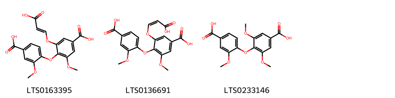{ width=100% }
    <figcaption>Hình ảnh cấu trúc hóa học của 3 hoạt chất thuộc nhóm Benzene and substituted derivatives gồm ['4-(4-carboxy-2-methoxyphenoxy)-3-[(2-carboxyeth-1-en-1-yl)oxy]-5-methoxybenzoic acid (LTS0163395)', '4-(4-carboxy-2-methoxyphenoxy)-3-{[(1z)-2-carboxyeth-1-en-1-yl]oxy}-5-methoxybenzoic acid (LTS0136691)', '4-(4-carboxy-2-methoxyphenoxy)-3,5-dimethoxybenzoic acid (LTS0233146)'].</figcaption>
</figure>
#### Nhóm Organooxygen compounds
<figure markdown="span">
    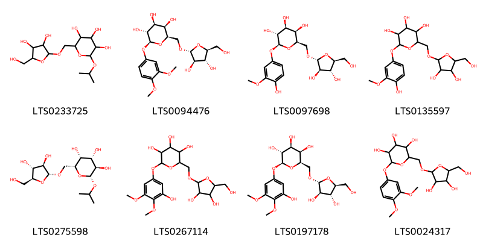{ width=100% }
    <figcaption>Hình ảnh cấu trúc hóa học của 8 hoạt chất thuộc nhóm Organooxygen compounds gồm ['2-({[3,4-dihydroxy-5-(hydroxymethyl)oxolan-2-yl]oxy}methyl)-6-isopropoxyoxane-3,4,5-triol (LTS0233725)', '(2r,3r,4s,5r,6s)-2-({[(2r,3r,4r,5s)-3,4-dihydroxy-5-(hydroxymethyl)oxolan-2-yl]oxy}methyl)-6-(3,4-dimethoxyphenoxy)oxane-3,4,5-triol (LTS0094476)', '(2r,3r,4s,5r,6s)-2-({[(2r,3r,4r,5s)-3,4-dihydroxy-5-(hydroxymethyl)oxolan-2-yl]oxy}methyl)-6-(4-hydroxy-3-methoxyphenoxy)oxane-3,4,5-triol (LTS0097698)', '2-({[3,4-dihydroxy-5-(hydroxymethyl)oxolan-2-yl]oxy}methyl)-6-(4-hydroxy-3-methoxyphenoxy)oxane-3,4,5-triol (LTS0135597)', '(2r,3r,4s,5r,6r)-2-({[(2r,3r,4r,5s)-3,4-dihydroxy-5-(hydroxymethyl)oxolan-2-yl]oxy}methyl)-6-isopropoxyoxane-3,4,5-triol (LTS0275598)', '2-({[3,4-dihydroxy-5-(hydroxymethyl)oxolan-2-yl]oxy}methyl)-6-(3-hydroxy-4,5-dimethoxyphenoxy)oxane-3,4,5-triol (LTS0267114)', '(2r,3r,4s,5r,6s)-2-({[(2r,3r,4r,5s)-3,4-dihydroxy-5-(hydroxymethyl)oxolan-2-yl]oxy}methyl)-6-(3-hydroxy-4,5-dimethoxyphenoxy)oxane-3,4,5-triol (LTS0197178)', '2-({[3,4-dihydroxy-5-(hydroxymethyl)oxolan-2-yl]oxy}methyl)-6-(3,4-dimethoxyphenoxy)oxane-3,4,5-triol (LTS0024317)'].</figcaption>
</figure>
#### Nhóm Stilbenes
<figure markdown="span">
    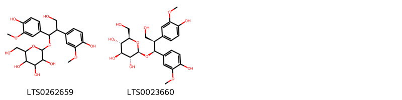{ width=100% }
    <figcaption>Hình ảnh cấu trúc hóa học của 2 hoạt chất thuộc nhóm Stilbenes gồm ['2-[3-hydroxy-1,2-bis(4-hydroxy-3-methoxyphenyl)propoxy]-6-(hydroxymethyl)oxane-3,4,5-triol (LTS0262659)', '(2r,3r,4s,5s,6r)-2-[(1s,2r)-3-hydroxy-1,2-bis(4-hydroxy-3-methoxyphenyl)propoxy]-6-(hydroxymethyl)oxane-3,4,5-triol (LTS0023660)'].</figcaption>
</figure>

---

### Dược dân tộc học

Danh sách các quốc gia có sử dụng *Elaeagnus pungens* trong điều trị các bệnh. 

| Country   | Disease              | Bệnh                                                                                                                                                                                                |
|:----------|:---------------------|:----------------------------------------------------------------------------------------------------------------------------------------------------------------------------------------------------|
| Elsewhere | Antidiarrheic, Tonic | MYMEMORY WARNING: YOU USED ALL AVAILABLE FREE TRANSLATIONS FOR TODAY. NEXT AVAILABLE IN  08 HOURS 30 MINUTES 44 SECONDS VISIT HTTPS://MYMEMORY.TRANSLATED.NET/DOC/USAGELIMITS.PHP TO TRANSLATE MORE |

---

---
## Elaeagnus umbellata
### Thông tin về thực vật

!!! info "Phân loại thực vật của *Elaeagnus umbellata* từ GIBF:"
    - **Kingdom:** Plantae
    - **Phylum:** Tracheophyta
    - **Order:** Rosales
    - **Family:** Elaeagnaceae
    - **Genus:** Elaeagnus
    - **Species:** *Elaeagnus umbellata*

 

| Label (VI)   | Label (EN)   | Scientific Name     | Descriptions (VI)   | Descriptions (EN)   | Also Known As (VI)   | Also Known As (EN)   |
|:-------------|:-------------|:--------------------|:--------------------|:--------------------|:---------------------|:---------------------|
| N/A          | N/A          | Elaeagnus umbellata | loài thực vật       | species of plant    | ['']                 | ['Autumn Olive']     |

#### Phân bố trên thế giới

**Từ CSDL GIBF** Netherlands, Belgium, Portugal, United States of America, Sweden, Canada

#### Phân bố tại Việt Nam

**Từ CSDL GIBF**: Không có ghi nhận ở Việt Nam

---
### Thành phần hóa học
        
- Theo cơ sở dữ liệu lotus: Từ loài *Elaeagnus umbellata* đã phân lập và xác định được 47 hoạt chất thuộc về các nhóm Isocoumarins and derivatives, Tannins. 

|    | chemicalTaxonomyClassyfireClass   |   smiles_count |
|---:|:----------------------------------|---------------:|
|  0 | Isocoumarins and derivatives      |              1 |
|  1 | Tannins                           |             45 |

#### Nhóm Isocoumarins and derivatives
<figure markdown="span">
    { width=100% }
    <figcaption>Hình ảnh cấu trúc hóa học của 1 hoạt chất thuộc nhóm Isocoumarins and derivatives gồm ['7,8,9-trihydroxy-3,5-dioxo-1h,2h-cyclopenta[c]isochromene-1-carboxylic acid (LTS0239831)'].</figcaption>
</figure>
#### Nhóm Tannins
<figure markdown="span">
    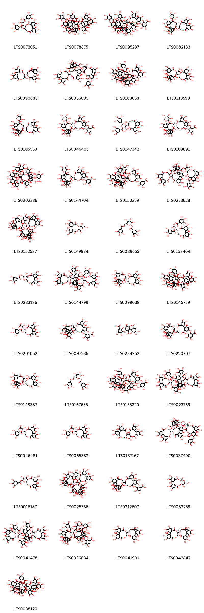{ width=100% }
    <figcaption>Hình ảnh cấu trúc hóa học của 45 hoạt chất thuộc nhóm Tannins gồm ['3-[3,4,5,17,18,19-hexahydroxy-8,14-dioxo-11-(3,4,5-trihydroxybenzoyloxy)-9,13-dioxatricyclo[13.4.0.0²,⁷]nonadeca-1(19),2(7),3,5,15,17-hexaen-10-yl]-3-hydroxy-2-(3,4,5-trihydroxybenzoyloxy)propanoic acid (LTS0072051)', '(10r,11s)-11-[(10r,11s)-17-(6-carboxy-2,3,4-trihydroxyphenoxy)-11-{2-[(14r,15s,19s)-14-[(10r,11s)-3,4,5,17,18,19-hexahydroxy-8,14-dioxo-11-(3,4,5-trihydroxybenzoyloxy)-9,13-dioxatricyclo[13.4.0.0²,⁷]nonadeca-1(19),2(7),3,5,15,17-hexaen-10-yl]-2,3,4,7,8,9-hexahydroxy-12,17-dioxo-13,16-dioxatetracyclo[13.3.1.0⁵,¹⁸.0⁶,¹¹]nonadeca-1(18),2,4,6,8,10-hexaen-19-yl]-3,4,5-trihydroxybenzoyloxy}-3,4,5,18,19-pentahydroxy-8,14-dioxo-9,13-dioxatricyclo[13.4.0.0²,⁷]nonadeca-1(19),2(7),3,5,15,17-hexaen-10-yl]-3,4,5,16,17,18-hexahydroxy-8,13-dioxo-9,12-dioxatricyclo[12.4.0.0²,⁷]octadeca-1(18),2(7),3,5,14,16-hexaene-10-carboxylic acid (LTS0078875)', '2-{[(11s,12r)-12-[(14r,15s,19s)-19-[6-({[(11s,12r)-5-(6-carboxy-2,3,4-trihydroxyphenoxy)-12-[(14r,15s,19r)-2,3,4,7,8,9,19-heptahydroxy-12,17-dioxo-13,16-dioxatetracyclo[13.3.1.0⁵,¹⁸.0⁶,¹¹]nonadeca-1(18),2,4,6,8,10-hexaen-14-yl]-3,4,17,18,19-pentahydroxy-8,14-dioxo-9,13-dioxatricyclo[13.4.0.0²,⁷]nonadeca-1(15),2,4,6,16,18-hexaen-11-yl]oxy}carbonyl)-2,3,4-trihydroxyphenyl]-2,3,4,7,8,9-hexahydroxy-12,17-dioxo-13,16-dioxatetracyclo[13.3.1.0⁵,¹⁸.0⁶,¹¹]nonadeca-1(18),2,4,6,8,10-hexaen-14-yl]-3,4,17,18,19-pentahydroxy-8,14-dioxo-11-(3,4,5-trihydroxybenzoyloxy)-9,13-dioxatricyclo[13.4.0.0²,⁷]nonadeca-1(15),2,4,6,16,18-hexaen-5-yl]oxy}-3,4,5-trihydroxybenzoic acid (LTS0095237)', '(11r,12r)-12-[(14r,15s,19s)-2,3,4,7,8,9-hexahydroxy-12,17-dioxo-19-[(2s,3s,4s,5r)-2,3,4,5-tetrahydroxyoxan-2-yl]-13,16-dioxatetracyclo[13.3.1.0⁵,¹⁸.0⁶,¹¹]nonadeca-1(18),2,4,6,8,10-hexaen-14-yl]-3,4,5,17,18,19-hexahydroxy-8,14-dioxo-9,13-dioxatricyclo[13.4.0.0²,⁷]nonadeca-1(15),2,4,6,16,18-hexaen-11-yl 3,4,5-trihydroxybenzoate (LTS0082183)', '14-{3,4,5,11,17,18,19-heptahydroxy-8,14-dioxo-9,13-dioxatricyclo[13.4.0.0²,⁷]nonadeca-1(15),2,4,6,16,18-hexaen-10-yl}-2,3,4,7,8,9,19-heptahydroxy-13,16-dioxatetracyclo[13.3.1.0⁵,¹⁸.0⁶,¹¹]nonadeca-1(18),2,4,6,8,10-hexaene-12,17-dione (LTS0090883)', '2-{[(10s,11r,12r,13s,15r)-13-{2-[(14r,15s,19s)-14-[(10r,11r)-3,4,5,17,18,19-hexahydroxy-8,14-dioxo-11-(3,4,5-trihydroxybenzoyloxy)-9,13-dioxatricyclo[13.4.0.0²,⁷]nonadeca-1(19),2(7),3,5,15,17-hexaen-10-yl]-2,3,4,7,8,9-hexahydroxy-12,17-dioxo-13,16-dioxatetracyclo[13.3.1.0⁵,¹⁸.0⁶,¹¹]nonadeca-1(18),2,4,6,8,10-hexaen-19-yl]-3,4,5-trihydroxybenzoyloxy}-3,4,5,11,12,22,23-heptahydroxy-8,18-dioxo-9,14,17-trioxatetracyclo[17.4.0.0²,⁷.0¹⁰,¹⁵]tricosa-1(23),2(7),3,5,19,21-hexaen-21-yl]oxy}-3,4,5-trihydroxybenzoic acid (LTS0056005)', '(11r,12r)-12-[(14r,15s,19r)-2,3,4,7,8,9,19-heptahydroxy-12,17-dioxo-13,16-dioxatetracyclo[13.3.1.0⁵,¹⁸.0⁶,¹¹]nonadeca-1(18),2,4,6,8,10-hexaen-14-yl]-3,4,5,17,18,19-hexahydroxy-8,14-dioxo-9,13-dioxatricyclo[13.4.0.0²,⁷]nonadeca-1(15),2,4,6,16,18-hexaen-11-yl 2-[(14r,15s,19s)-14-[(10r,11r)-3,4,5,17,18,19-hexahydroxy-8,14-dioxo-11-(3,4,5-trihydroxybenzoyloxy)-9,13-dioxatricyclo[13.4.0.0²,⁷]nonadeca-1(19),2(7),3,5,15,17-hexaen-10-yl]-2,3,4,7,8,9-hexahydroxy-12,17-dioxo-13,16-dioxatetracyclo[13.3.1.0⁵,¹⁸.0⁶,¹¹]nonadeca-1(18),2,4,6,8,10-hexaen-19-yl]-3,4,5-trihydroxybenzoate (LTS0103658)', '(10r,11s)-11-[(10r,11r)-3,4,5,17,18,19-hexahydroxy-8,14-dioxo-11-(3,4,5-trihydroxybenzoyloxy)-9,13-dioxatricyclo[13.4.0.0²,⁷]nonadeca-1(19),2(7),3,5,15,17-hexaen-10-yl]-3,4,5,16,17,18-hexahydroxy-8,13-dioxo-9,12-dioxatricyclo[12.4.0.0²,⁷]octadeca-1(18),2(7),3,5,14,16-hexaene-10-carboxylic acid (LTS0118593)', '12-[2,3,4,7,8,9-hexahydroxy-12,17-dioxo-19-(2,3,4,5-tetrahydroxyoxan-2-yl)-13,16-dioxatetracyclo[13.3.1.0⁵,¹⁸.0⁶,¹¹]nonadeca-1(18),2,4,6,8,10-hexaen-14-yl]-3,4,5,17,18,19-hexahydroxy-8,14-dioxo-9,13-dioxatricyclo[13.4.0.0²,⁷]nonadeca-1(15),2,4,6,16,18-hexaen-11-yl 3,4,5-trihydroxybenzoate (LTS0105563)', '2-{[(11r,12r)-12-[(14r,15s,19s)-2,3,4,7,8,9-hexahydroxy-12,17-dioxo-19-[(2r,3s,4s,5r)-2,3,4,5-tetrahydroxyoxan-2-yl]-13,16-dioxatetracyclo[13.3.1.0⁵,¹⁸.0⁶,¹¹]nonadeca-1(18),2,4,6,8,10-hexaen-14-yl]-3,4,17,18,19-pentahydroxy-8,14-dioxo-11-(3,4,5-trihydroxybenzoyloxy)-9,13-dioxatricyclo[13.4.0.0²,⁷]nonadeca-1(15),2,4,6,16,18-hexaen-5-yl]oxy}-3,4,5-trihydroxybenzoic acid (LTS0046403)', '(2r,3s)-3-[(10r,11r)-3,4,5,11,17,18,19-heptahydroxy-8,14-dioxo-9,13-dioxatricyclo[13.4.0.0²,⁷]nonadeca-1(15),2,4,6,16,18-hexaen-10-yl]-2,3-bis(3,4,5-trihydroxybenzoyloxy)propanoic acid (LTS0147342)', '2-{[(11s,12r)-12-[(14r,15s,19s)-2,3,4,7,8,9-hexahydroxy-12,17-dioxo-19-[(3r,4r,5s)-2,3,4,5-tetrahydroxyoxan-2-yl]-13,16-dioxatetracyclo[13.3.1.0⁵,¹⁸.0⁶,¹¹]nonadeca-1(18),2,4,6,8,10-hexaen-14-yl]-3,4,17,18,19-pentahydroxy-8,14-dioxo-11-(3,4,5-trihydroxybenzoyloxy)-9,13-dioxatricyclo[13.4.0.0²,⁷]nonadeca-1(15),2,4,6,16,18-hexaen-5-yl]oxy}-3,4,5-trihydroxybenzoic acid (LTS0169691)', '2-{[(11r,12r)-12-[(14r,15s,19s)-19-[6-({[(10s,11r)-10-[(1s,2r)-2-carboxy-1-hydroxy-2-(3,4,5-trihydroxybenzoyloxy)ethyl]-3,4,5,17,18,19-hexahydroxy-8,14-dioxo-9,13-dioxatricyclo[13.4.0.0²,⁷]nonadeca-1(15),2,4,6,16,18-hexaen-11-yl]oxy}carbonyl)-2,3,4-trihydroxyphenyl]-2,3,4,7,8,9-hexahydroxy-12,17-dioxo-13,16-dioxatetracyclo[13.3.1.0⁵,¹⁸.0⁶,¹¹]nonadeca-1,3,5(18),6,8,10-hexaen-14-yl]-3,4,17,18,19-pentahydroxy-8,14-dioxo-11-(3,4,5-trihydroxybenzoyloxy)-9,13-dioxatricyclo[13.4.0.0²,⁷]nonadeca-1(19),2(7),3,5,15,17-hexaen-5-yl]oxy}-3,4,5-trihydroxybenzoic acid (LTS0202336)', '2-({12-[2,3,4,7,8,9-hexahydroxy-12,17-dioxo-19-(2,3,4,5-tetrahydroxyoxan-2-yl)-13,16-dioxatetracyclo[13.3.1.0⁵,¹⁸.0⁶,¹¹]nonadeca-1(18),2,4,6,8,10-hexaen-14-yl]-3,4,17,18,19-pentahydroxy-8,14-dioxo-11-(3,4,5-trihydroxybenzoyloxy)-9,13-dioxatricyclo[13.4.0.0²,⁷]nonadeca-1(15),2,4,6,16,18-hexaen-5-yl}oxy)-3,4,5-trihydroxybenzoic acid (LTS0144704)', '2-{[(11s,12r)-12-[(14r,15s,19s)-19-[6-({[(11s,12s)-12-[(1s,2r)-2-carboxy-1-hydroxy-2-(3,4,5-trihydroxybenzoyloxy)ethyl]-3,4,5,17,18,19-hexahydroxy-8,14-dioxo-9,13-dioxatricyclo[13.4.0.0²,⁷]nonadeca-1(15),2,4,6,16,18-hexaen-11-yl]oxy}carbonyl)-2,3,4-trihydroxyphenyl]-2,3,4,7,8,9-hexahydroxy-12,17-dioxo-13,16-dioxatetracyclo[13.3.1.0⁵,¹⁸.0⁶,¹¹]nonadeca-1(18),2,4,6,8,10-hexaen-14-yl]-3,4,17,18,19-pentahydroxy-8,14-dioxo-11-(3,4,5-trihydroxybenzoyloxy)-9,13-dioxatricyclo[13.4.0.0²,⁷]nonadeca-1(15),2,4,6,16,18-hexaen-5-yl]oxy}-3,4,5-trihydroxybenzoic acid (LTS0150259)', '2-{[13-(2-{14-[3,4,5,17,18,19-hexahydroxy-8,14-dioxo-11-(3,4,5-trihydroxybenzoyloxy)-9,13-dioxatricyclo[13.4.0.0²,⁷]nonadeca-1(19),2(7),3,5,15,17-hexaen-10-yl]-2,3,4,7,8,9-hexahydroxy-12,17-dioxo-13,16-dioxatetracyclo[13.3.1.0⁵,¹⁸.0⁶,¹¹]nonadeca-1(18),2,4,6,8,10-hexaen-19-yl}-3,4,5-trihydroxybenzoyloxy)-3,4,5,11,12,22,23-heptahydroxy-8,18-dioxo-9,14,17-trioxatetracyclo[17.4.0.0²,⁷.0¹⁰,¹⁵]tricosa-1(23),2(7),3,5,19,21-hexaen-21-yl]oxy}-3,4,5-trihydroxybenzoic acid (LTS0273628)', '12-{2,3,4,7,8,9,19-heptahydroxy-12,17-dioxo-13,16-dioxatetracyclo[13.3.1.0⁵,¹⁸.0⁶,¹¹]nonadeca-1(18),2,4,6,8,10-hexaen-14-yl}-3,4,5,17,18,19-hexahydroxy-8,14-dioxo-9,13-dioxatricyclo[13.4.0.0²,⁷]nonadeca-1(15),2,4,6,16,18-hexaen-11-yl 2-{14-[3,4,5,17,18,19-hexahydroxy-8,14-dioxo-11-(3,4,5-trihydroxybenzoyloxy)-9,13-dioxatricyclo[13.4.0.0²,⁷]nonadeca-1(19),2(7),3,5,15,17-hexaen-10-yl]-2,3,4,7,8,9-hexahydroxy-12,17-dioxo-13,16-dioxatetracyclo[13.3.1.0⁵,¹⁸.0⁶,¹¹]nonadeca-1(18),2,4,6,8,10-hexaen-19-yl}-3,4,5-trihydroxybenzoate (LTS0152587)', '3,4,5,11,14,20,21,22-octahydroxy-13-(hydroxymethyl)-9,12,16-trioxatetracyclo[16.4.0.0²,⁷.0¹⁰,¹⁵]docosa-1(22),2(7),3,5,18,20-hexaene-8,17-dione (LTS0149934)', '3,4,5-trihydroxy-6-[(3,4,5-trihydroxybenzoyloxy)methyl]oxan-2-yl 3,4,5-trihydroxybenzoate (LTS0089653)', '(2r,3s)-3-[(10s,11s)-3,4,5,17,18,19-hexahydroxy-8,14-dioxo-11-(3,4,5-trihydroxybenzoyloxy)-9,13-dioxatricyclo[13.4.0.0²,⁷]nonadeca-1(19),2(7),3,5,15,17-hexaen-10-yl]-3-hydroxy-2-(3,4,5-trihydroxybenzoyloxy)propanoic acid (LTS0158404)', '(10s,11r,12r,13s,15r)-3,4,5,11,12,21,22,23-octahydroxy-8,18-dioxo-9,14,17-trioxatetracyclo[17.4.0.0²,⁷.0¹⁰,¹⁵]tricosa-1(23),2(7),3,5,19,21-hexaen-13-yl 3,4,5-trihydroxybenzoate (LTS0233186)', '(10r,11r)-10-[(14r,15s,19s)-19-[(11r,12r)-12-[(10s,11r)-3,4,5,11,16,17,18-heptahydroxy-8,13-dioxo-9,12-dioxatricyclo[12.4.0.0²,⁷]octadeca-1(14),2,4,6,15,17-hexaen-10-yl]-3,4,5,17,18,19-hexahydroxy-8,14-dioxo-11-(3,4,5-trihydroxybenzoyloxy)-9,13-dioxatricyclo[13.4.0.0²,⁷]nonadeca-1(15),2(7),3,5,16,18-hexaen-6-yl]-2,3,4,7,8,9-hexahydroxy-12,17-dioxo-13,16-dioxatetracyclo[13.3.1.0⁵,¹⁸.0⁶,¹¹]nonadeca-1,3,5(18),6,8,10-hexaen-14-yl]-3,4,5,17,18,19-hexahydroxy-8,14-dioxo-9,13-dioxatricyclo[13.4.0.0²,⁷]nonadeca-1(15),2,4,6,16,18-hexaen-11-yl 3,4,5-trihydroxybenzoate (LTS0144799)', '(10s,11s)-11-[(10r,11s)-3,4,5,17,18,19-hexahydroxy-8,14-dioxo-11-(3,4,5-trihydroxybenzoyloxy)-9,13-dioxatricyclo[13.4.0.0²,⁷]nonadeca-1(19),2(7),3,5,15,17-hexaen-10-yl]-3,4,5,16,17,18-hexahydroxy-8,13-dioxo-9,12-dioxatricyclo[12.4.0.0²,⁷]octadeca-1(18),2(7),3,5,14,16-hexaene-10-carboxylic acid (LTS0099038)', '(10r,11s)-11-[(10r,11r)-11-{2-[(14r,15s,19s)-14-[(10r,11r)-3,4,5,17,18,19-hexahydroxy-8,14-dioxo-11-(3,4,5-trihydroxybenzoyloxy)-9,13-dioxatricyclo[13.4.0.0²,⁷]nonadeca-1(19),2(7),3,5,15,17-hexaen-10-yl]-2,3,4,7,8,9-hexahydroxy-12,17-dioxo-13,16-dioxatetracyclo[13.3.1.0⁵,¹⁸.0⁶,¹¹]nonadeca-1(18),2,4,6,8,10-hexaen-19-yl]-3,4,5-trihydroxybenzoyloxy}-3,4,5,17,18,19-hexahydroxy-8,14-dioxo-9,13-dioxatricyclo[13.4.0.0²,⁷]nonadeca-1(19),2(7),3,5,15,17-hexaen-10-yl]-3,4,5,16,17,18-hexahydroxy-8,13-dioxo-9,12-dioxatricyclo[12.4.0.0²,⁷]octadeca-1(18),2(7),3,5,14,16-hexaene-10-carboxylic acid (LTS0145759)', '(2r,3r)-3-[(10s,11s)-3,4,5,17,18,19-hexahydroxy-8,14-dioxo-11-(3,4,5-trihydroxybenzoyloxy)-9,13-dioxatricyclo[13.4.0.0²,⁷]nonadeca-1(19),2(7),3,5,15,17-hexaen-10-yl]-2,3-dihydroxypropanoic acid (LTS0201062)', '2-{[(11r,12r)-12-[(14r,15s,19r)-2,3,4,7,8,9,19-heptahydroxy-12,17-dioxo-13,16-dioxatetracyclo[13.3.1.0⁵,¹⁸.0⁶,¹¹]nonadeca-1(18),2,4,6,8,10-hexaen-14-yl]-3,4,17,18,19-pentahydroxy-8,14-dioxo-11-(3,4,5-trihydroxybenzoyloxy)-9,13-dioxatricyclo[13.4.0.0²,⁷]nonadeca-1(15),2,4,6,16,18-hexaen-5-yl]oxy}-3,4,5-trihydroxybenzoic acid (LTS0097236)', '3,4,5-trihydroxy-2-({7,13,14-trihydroxy-3,10-dioxo-2,9-dioxatetracyclo[6.6.2.0⁴,¹⁶.0¹¹,¹⁵]hexadeca-1(15),4(16),5,7,11,13-hexaen-6-yl}oxy)benzoic acid (LTS0234952)', '2-{[(11r,12r)-12-[(15s,19s)-2,3,4,7,8,9,19-heptahydroxy-12,17-dioxo-13,16-dioxatetracyclo[13.3.1.0⁵,¹⁸.0⁶,¹¹]nonadeca-1(18),2,4,6,8,10-hexaen-14-yl]-3,4,17,18,19-pentahydroxy-8,14-dioxo-11-(3,4,5-trihydroxybenzoyloxy)-9,13-dioxatricyclo[13.4.0.0²,⁷]nonadeca-1(15),2,4,6,16,18-hexaen-5-yl]oxy}-3,4,5-trihydroxybenzoic acid (LTS0220707)', '11-[3,4,5,17,18,19-hexahydroxy-8,14-dioxo-11-(3,4,5-trihydroxybenzoyloxy)-9,13-dioxatricyclo[13.4.0.0²,⁷]nonadeca-1(19),2(7),3,5,15,17-hexaen-10-yl]-3,4,5,16,17,18-hexahydroxy-8,13-dioxo-9,12-dioxatricyclo[12.4.0.0²,⁷]octadeca-1(18),2(7),3,5,14,16-hexaene-10-carboxylic acid (LTS0148387)', '(2s,3r,4s,5s,6r)-3,4,5-trihydroxy-6-[(3,4,5-trihydroxybenzoyloxy)methyl]oxan-2-yl 3,4,5-trihydroxybenzoate (LTS0167635)', '2-{[(11s,12r)-12-[(14r,15s,19s)-19-[6-({[(11s,12r)-12-[(14r,15s,19r)-2,3,4,7,8,9,19-heptahydroxy-12,17-dioxo-13,16-dioxatetracyclo[13.3.1.0⁵,¹⁸.0⁶,¹¹]nonadeca-1(18),2,4,6,8,10-hexaen-14-yl]-3,4,5,17,18,19-hexahydroxy-8,14-dioxo-9,13-dioxatricyclo[13.4.0.0²,⁷]nonadeca-1(15),2,4,6,16,18-hexaen-11-yl]oxy}carbonyl)-2,3,4-trihydroxyphenyl]-2,3,4,7,8,9-hexahydroxy-12,17-dioxo-13,16-dioxatetracyclo[13.3.1.0⁵,¹⁸.0⁶,¹¹]nonadeca-1(18),2,4,6,8,10-hexaen-14-yl]-3,4,17,18,19-pentahydroxy-8,14-dioxo-11-(3,4,5-trihydroxybenzoyloxy)-9,13-dioxatricyclo[13.4.0.0²,⁷]nonadeca-1(15),2,4,6,16,18-hexaen-5-yl]oxy}-3,4,5-trihydroxybenzoic acid (LTS0155220)', '10-[19-(12-{3,4,5,11,16,17,18-heptahydroxy-8,13-dioxo-9,12-dioxatricyclo[12.4.0.0²,⁷]octadeca-1(14),2,4,6,15,17-hexaen-10-yl}-3,4,5,17,18,19-hexahydroxy-8,14-dioxo-11-(3,4,5-trihydroxybenzoyloxy)-9,13-dioxatricyclo[13.4.0.0²,⁷]nonadeca-1(15),2(7),3,5,16,18-hexaen-6-yl)-2,3,4,7,8,9-hexahydroxy-12,17-dioxo-13,16-dioxatetracyclo[13.3.1.0⁵,¹⁸.0⁶,¹¹]nonadeca-1,3,5(18),6,8,10-hexaen-14-yl]-3,4,5,17,18,19-hexahydroxy-8,14-dioxo-9,13-dioxatricyclo[13.4.0.0²,⁷]nonadeca-1(15),2,4,6,16,18-hexaen-11-yl 3,4,5-trihydroxybenzoate (LTS0023769)', '(2r,3r)-3-[(10s,11r)-3,4,5,17,18,19-hexahydroxy-8,14-dioxo-11-(3,4,5-trihydroxybenzoyloxy)-9,13-dioxatricyclo[13.4.0.0²,⁷]nonadeca-1(19),2(7),3,5,15,17-hexaen-10-yl]-2,3-dihydroxypropanoic acid (LTS0046481)', '3-[3,4,5,17,18,19-hexahydroxy-8,14-dioxo-11-(3,4,5-trihydroxybenzoyloxy)-9,13-dioxatricyclo[13.4.0.0²,⁷]nonadeca-1(19),2(7),3,5,15,17-hexaen-10-yl]-2,3-dihydroxypropanoic acid (LTS0065382)', '(1r,2s,19r,22r)-7,8,9,12,13,14,20,28,29,30,33,34,35-tridecahydroxy-3,18,21,24,39-pentaoxaheptacyclo[20.17.0.0²,¹⁹.0⁵,¹⁰.0¹¹,¹⁶.0²⁶,³¹.0³²,³⁷]nonatriaconta-5(10),6,8,11,13,15,26(31),27,29,32,34,36-dodecaene-4,17,25,38-tetrone (LTS0137167)', '2-{[(10s,11r,12r,13s,15r)-13-{2-[(14r,15s,19s)-14-[(10r,11s)-3,4,5,17,18,19-hexahydroxy-8,14-dioxo-11-(3,4,5-trihydroxybenzoyloxy)-9,13-dioxatricyclo[13.4.0.0²,⁷]nonadeca-1(19),2(7),3,5,15,17-hexaen-10-yl]-2,3,4,7,8,9-hexahydroxy-12,17-dioxo-13,16-dioxatetracyclo[13.3.1.0⁵,¹⁸.0⁶,¹¹]nonadeca-1(18),2,4,6,8,10-hexaen-19-yl]-3,4,5-trihydroxybenzoyloxy}-3,4,5,11,12,22,23-heptahydroxy-8,18-dioxo-9,14,17-trioxatetracyclo[17.4.0.0²,⁷.0¹⁰,¹⁵]tricosa-1(23),2(7),3,5,19,21-hexaen-21-yl]oxy}-3,4,5-trihydroxybenzoic acid (LTS0037490)', '3,4,5,11,12,21,22,23-octahydroxy-8,18-dioxo-9,14,17-trioxatetracyclo[17.4.0.0²,⁷.0¹⁰,¹⁵]tricosa-1(23),2(7),3,5,19,21-hexaen-13-yl 3,4,5-trihydroxybenzoate (LTS0016187)', '11-[11-(2-{14-[3,4,5,17,18,19-hexahydroxy-8,14-dioxo-11-(3,4,5-trihydroxybenzoyloxy)-9,13-dioxatricyclo[13.4.0.0²,⁷]nonadeca-1(19),2(7),3,5,15,17-hexaen-10-yl]-2,3,4,7,8,9-hexahydroxy-12,17-dioxo-13,16-dioxatetracyclo[13.3.1.0⁵,¹⁸.0⁶,¹¹]nonadeca-1(18),2,4,6,8,10-hexaen-19-yl}-3,4,5-trihydroxybenzoyloxy)-3,4,5,17,18,19-hexahydroxy-8,14-dioxo-9,13-dioxatricyclo[13.4.0.0²,⁷]nonadeca-1(19),2(7),3,5,15,17-hexaen-10-yl]-3,4,5,16,17,18-hexahydroxy-8,13-dioxo-9,12-dioxatricyclo[12.4.0.0²,⁷]octadeca-1(18),2(7),3,5,14,16-hexaene-10-carboxylic acid (LTS0025336)', '2-[(12-{2,3,4,7,8,9,19-heptahydroxy-12,17-dioxo-13,16-dioxatetracyclo[13.3.1.0⁵,¹⁸.0⁶,¹¹]nonadeca-1(18),2,4,6,8,10-hexaen-14-yl}-3,4,17,18,19-pentahydroxy-8,14-dioxo-11-(3,4,5-trihydroxybenzoyloxy)-9,13-dioxatricyclo[13.4.0.0²,⁷]nonadeca-1(15),2,4,6,16,18-hexaen-5-yl)oxy]-3,4,5-trihydroxybenzoic acid (LTS0212607)', '(10r,11r,13r,14r,15s)-3,4,5,11,14,20,21,22-octahydroxy-13-(hydroxymethyl)-9,12,16-trioxatetracyclo[16.4.0.0²,⁷.0¹⁰,¹⁵]docosa-1(18),2,4,6,19,21-hexaene-8,17-dione (LTS0033259)', '10-[19-(12-{2,3,4,7,8,9,19-heptahydroxy-12,17-dioxo-13,16-dioxatetracyclo[13.3.1.0⁵,¹⁸.0⁶,¹¹]nonadeca-1(18),2,4,6,8,10-hexaen-14-yl}-3,4,5,17,18,19-hexahydroxy-8,14-dioxo-11-(3,4,5-trihydroxybenzoyloxy)-9,13-dioxatricyclo[13.4.0.0²,⁷]nonadeca-1(15),2(7),3,5,16,18-hexaen-6-yl)-2,3,4,7,8,9-hexahydroxy-12,17-dioxo-13,16-dioxatetracyclo[13.3.1.0⁵,¹⁸.0⁶,¹¹]nonadeca-1,3,5(18),6,8,10-hexaen-14-yl]-3,4,5,17,18,19-hexahydroxy-8,14-dioxo-9,13-dioxatricyclo[13.4.0.0²,⁷]nonadeca-1(15),2,4,6,16,18-hexaen-11-yl 3,4,5-trihydroxybenzoate (LTS0041478)', '2-{[12-(19-{6-[({12-[2-carboxy-1-hydroxy-2-(3,4,5-trihydroxybenzoyloxy)ethyl]-3,4,5,17,18,19-hexahydroxy-8,14-dioxo-9,13-dioxatricyclo[13.4.0.0²,⁷]nonadeca-1(15),2,4,6,16,18-hexaen-11-yl}oxy)carbonyl]-2,3,4-trihydroxyphenyl}-2,3,4,7,8,9-hexahydroxy-12,17-dioxo-13,16-dioxatetracyclo[13.3.1.0⁵,¹⁸.0⁶,¹¹]nonadeca-1(18),2,4,6,8,10-hexaen-14-yl)-3,4,17,18,19-pentahydroxy-8,14-dioxo-11-(3,4,5-trihydroxybenzoyloxy)-9,13-dioxatricyclo[13.4.0.0²,⁷]nonadeca-1(15),2,4,6,16,18-hexaen-5-yl]oxy}-3,4,5-trihydroxybenzoic acid (LTS0036834)', '(14r,15s,19r)-14-[(10r,11r)-3,4,5,11,17,18,19-heptahydroxy-8,14-dioxo-9,13-dioxatricyclo[13.4.0.0²,⁷]nonadeca-1(15),2,4,6,16,18-hexaen-10-yl]-2,3,4,7,8,9,19-heptahydroxy-13,16-dioxatetracyclo[13.3.1.0⁵,¹⁸.0⁶,¹¹]nonadeca-1(18),2,4,6,8,10-hexaene-12,17-dione (LTS0041901)', '(14r,15s,19s)-14-[(10r,11r)-3,4,5,11,17,18,19-heptahydroxy-8,14-dioxo-9,13-dioxatricyclo[13.4.0.0²,⁷]nonadeca-1(15),2,4,6,16,18-hexaen-10-yl]-2,3,4,7,8,9,19-heptahydroxy-13,16-dioxatetracyclo[13.3.1.0⁵,¹⁸.0⁶,¹¹]nonadeca-1(18),2,4,6,8,10-hexaene-12,17-dione (LTS0042847)', '(10r,11s)-11-[(10r,11s)-11-{2-[(14r,15s,19s)-14-[(10r,11s)-3,4,5,17,18,19-hexahydroxy-8,14-dioxo-11-(3,4,5-trihydroxybenzoyloxy)-9,13-dioxatricyclo[13.4.0.0²,⁷]nonadeca-1(19),2(7),3,5,15,17-hexaen-10-yl]-2,3,4,7,8,9-hexahydroxy-12,17-dioxo-13,16-dioxatetracyclo[13.3.1.0⁵,¹⁸.0⁶,¹¹]nonadeca-1(18),2,4,6,8,10-hexaen-19-yl]-3,4,5-trihydroxybenzoyloxy}-3,4,5,17,18,19-hexahydroxy-8,14-dioxo-9,13-dioxatricyclo[13.4.0.0²,⁷]nonadeca-1(19),2(7),3,5,15,17-hexaen-10-yl]-3,4,5,16,17,18-hexahydroxy-8,13-dioxo-9,12-dioxatricyclo[12.4.0.0²,⁷]octadeca-1(18),2(7),3,5,14,16-hexaene-10-carboxylic acid (LTS0038120)'].</figcaption>
</figure>

---

### Dược dân tộc học

Danh sách các quốc gia có sử dụng *Elaeagnus umbellata* trong điều trị các bệnh. 

| Country   | Disease                        | Bệnh                                                                                                                                                                                                |
|:----------|:-------------------------------|:----------------------------------------------------------------------------------------------------------------------------------------------------------------------------------------------------|
| India     | Astringent, Cardiac, Stimulant | MYMEMORY WARNING: YOU USED ALL AVAILABLE FREE TRANSLATIONS FOR TODAY. NEXT AVAILABLE IN  08 HOURS 30 MINUTES 25 SECONDS VISIT HTTPS://MYMEMORY.TRANSLATED.NET/DOC/USAGELIMITS.PHP TO TRANSLATE MORE |

---

# Chi Hippophae

??? note "Danh sách các dược liệu thuộc chi"
    
	 - *Hippophae rhamnoides*

---
## Hippophae rhamnoides
### Thông tin về thực vật

!!! info "Phân loại thực vật của *Hippophae rhamnoides* từ GIBF:"
    - **Kingdom:** Plantae
    - **Phylum:** Tracheophyta
    - **Order:** Rosales
    - **Family:** Elaeagnaceae
    - **Genus:** Hippophae
    - **Species:** *Hippophae rhamnoides*

 

| Label (VI)   | Label (EN)   | Scientific Name      | Descriptions (VI)   | Descriptions (EN)   | Also Known As (VI)   | Also Known As (EN)   |
|:-------------|:-------------|:---------------------|:--------------------|:--------------------|:---------------------|:---------------------|
| N/A          | N/A          | Hippophae rhamnoides | loài thực vật       | species of plant    | ['']                 | ['Sea-buckthorn']    |

#### Phân bố trên thế giới

**Từ CSDL GIBF** Italy, Belgium, Norway, Canada, Ukraine, Denmark, Netherlands, Lithuania, Belarus, Kyrgyzstan, Spain, Russian Federation, Sweden, Uzbekistan, Germany, Switzerland, Austria, France, China, United Kingdom of Great Britain and Northern Ireland, Poland

#### Phân bố tại Việt Nam

**Từ CSDL GIBF**: Không có ghi nhận ở Việt Nam

---
### Thành phần hóa học
        
- Theo cơ sở dữ liệu lotus: Từ loài *Hippophae rhamnoides* đã phân lập và xác định được 154 hoạt chất thuộc về các nhóm Fatty Acyls, Flavonoids, Prenol lipids, Steroids and steroid derivatives, Cinnamic acids and derivatives, Glycerophospholipids, Sphingolipids, Benzene and substituted derivatives, Dihydrofurans, Organooxygen compounds, Tannins, Glycerolipids, Benzopyrans. 

|    | chemicalTaxonomyClassyfireClass     |   smiles_count |
|---:|:------------------------------------|---------------:|
|  0 | Benzene and substituted derivatives |              2 |
|  1 | Benzopyrans                         |              1 |
|  2 | Cinnamic acids and derivatives      |              2 |
|  3 | Dihydrofurans                       |              1 |
|  4 | Fatty Acyls                         |             22 |
|  5 | Flavonoids                          |             22 |
|  6 | Glycerolipids                       |              2 |
|  7 | Glycerophospholipids                |              1 |
|  8 | Organooxygen compounds              |              4 |
|  9 | Prenol lipids                       |             49 |
| 10 | Sphingolipids                       |              2 |
| 11 | Steroids and steroid derivatives    |             17 |
| 12 | Tannins                             |             28 |

#### Nhóm Benzene and substituted derivatives
<figure markdown="span">
    { width=100% }
    <figcaption>Hình ảnh cấu trúc hóa học của 2 hoạt chất thuộc nhóm Benzene and substituted derivatives gồm ['galop (LTS0222857)', '3,4-dihydroxybenzoic acid (LTS0018765)'].</figcaption>
</figure>
#### Nhóm Benzopyrans
<figure markdown="span">
    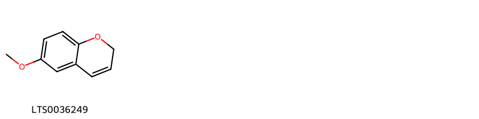{ width=100% }
    <figcaption>Hình ảnh cấu trúc hóa học của 1 hoạt chất thuộc nhóm Benzopyrans gồm ['6-methoxy-2h-chromene (LTS0036249)'].</figcaption>
</figure>
#### Nhóm Cinnamic acids and derivatives
<figure markdown="span">
    { width=100% }
    <figcaption>Hình ảnh cấu trúc hóa học của 2 hoạt chất thuộc nhóm Cinnamic acids and derivatives gồm ['para-coumaric acid (LTS0266252)', 'hydroxycinnamic acid (LTS0233023)'].</figcaption>
</figure>
#### Nhóm Dihydrofurans
<figure markdown="span">
    { width=100% }
    <figcaption>Hình ảnh cấu trúc hóa học của 1 hoạt chất thuộc nhóm Dihydrofurans gồm ['vitamin c (LTS0022555)'].</figcaption>
</figure>
#### Nhóm Fatty Acyls
<figure markdown="span">
    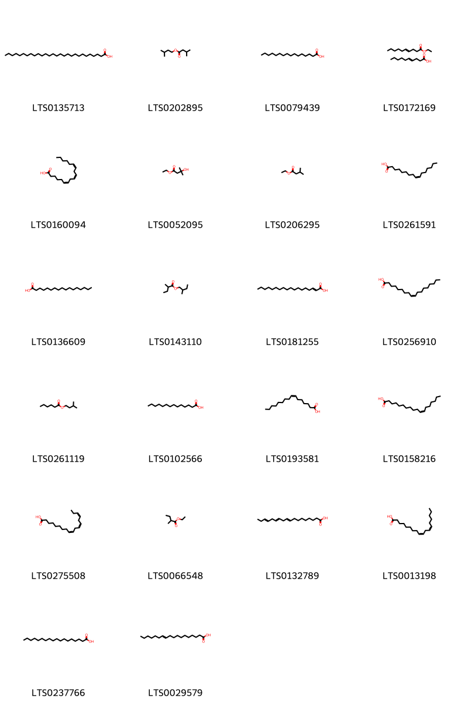{ width=100% }
    <figcaption>Hình ảnh cấu trúc hóa học của 22 hoạt chất thuộc nhóm Fatty Acyls gồm ['octacosanoic acid (LTS0135713)', 'apple oil (LTS0202895)', 'palmitic acid (LTS0079439)', 'ethyl dec-4-enoate; obtusilic acid (LTS0172169)', 'gamma-linolenic acid (LTS0160094)', 'ethyl 3-hydroxy-3-methylbutanoate (LTS0052095)', 'ethyl isovalerate (LTS0206295)', 'palmitoleic acid (LTS0261591)', 'heptadecanoic acid (LTS0136609)', '2-methylbutyl 2-methylbutyrate (LTS0143110)', '2-octadecenoic acid (LTS0181255)', 'oleic acid (LTS0256910)', 'isoamyl hexanoate (LTS0261119)', 'myristic acid (LTS0102566)', '7-hexadecenoic acid (LTS0193581)', 'cis-vaccenic acid (LTS0158216)', 'α-linolenic acid (LTS0275508)', 'ethyl 2-methylbutyrate (LTS0066548)', 'α linolenic acid (LTS0132789)', 'linoleic (LTS0013198)', 'stearic acid (LTS0237766)', 'trans-vaccenic acid (LTS0029579)'].</figcaption>
</figure>
#### Nhóm Flavonoids
<figure markdown="span">
    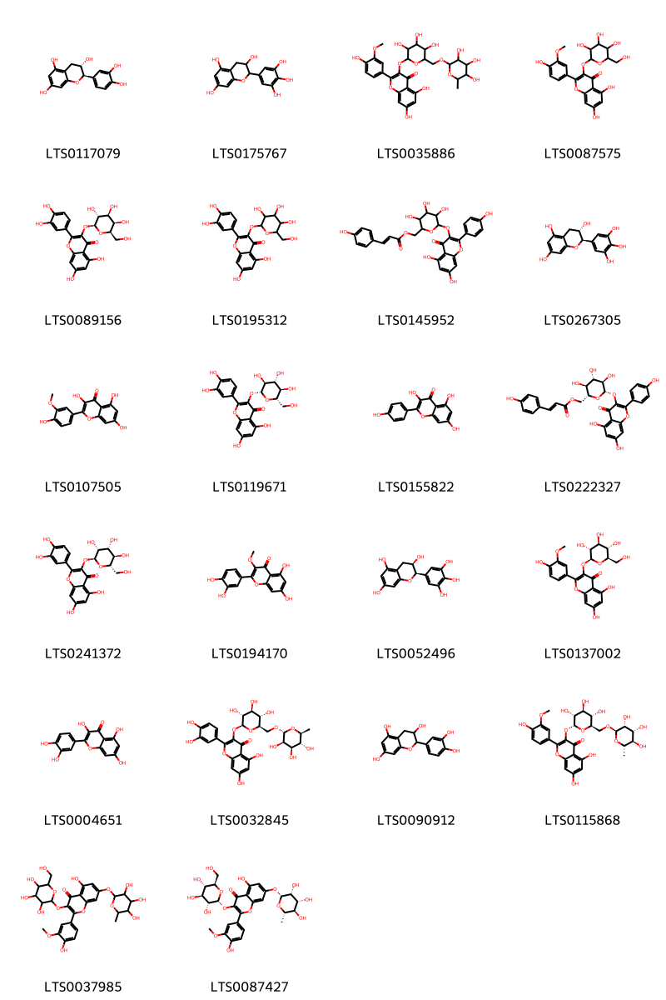{ width=100% }
    <figcaption>Hình ảnh cấu trúc hóa học của 22 hoạt chất thuộc nhóm Flavonoids gồm ['(+)-catechol (LTS0117079)', 'epigallocatechin (LTS0175767)', '5,7-dihydroxy-2-(4-hydroxy-3-methoxyphenyl)-3-[(3,4,5-trihydroxy-6-{[(3,4,5-trihydroxy-6-methyloxan-2-yl)oxy]methyl}oxan-2-yl)oxy]chromen-4-one (LTS0035886)', 'isorhamnetin 3-galactoside (LTS0087575)', 'hyperoside (LTS0089156)', '2-(3,4-dihydroxyphenyl)-5,7-dihydroxy-3-{[3,4,5-trihydroxy-6-(hydroxymethyl)oxan-2-yl]oxy}chromen-4-one (LTS0195312)', '(6-{[5,7-dihydroxy-2-(4-hydroxyphenyl)-4-oxochromen-3-yl]oxy}-3,4,5-trihydroxyoxan-2-yl)methyl 3-(4-hydroxyphenyl)prop-2-enoate (LTS0145952)', 'gallocatechol (LTS0267305)', 'isorhamnetin (LTS0107505)', '2-(3,4-dihydroxyphenyl)-5,7-dihydroxy-3-{[(2r,3s,4r,5r,6s)-3,4,5-trihydroxy-6-(hydroxymethyl)oxan-2-yl]oxy}chromen-4-one (LTS0119671)', 'kaempherol (LTS0155822)', 'tiliroside (LTS0222327)', '2-(3,4-dihydroxyphenyl)-5,7-dihydroxy-3-{[(2s,3r,4r,5r,6s)-3,4,5-trihydroxy-6-(hydroxymethyl)oxan-2-yl]oxy}chromen-4-one (LTS0241372)', 'quercetin 3-methyl ether (LTS0194170)', 'epigallocatechin (LTS0052496)', 'isorhamnetin 3-o-glucoside (LTS0137002)', 'quercetin (LTS0004651)', '3-rutinosyl quercetin (LTS0032845)', 'catechol (LTS0090912)', '5,7-dihydroxy-2-(4-hydroxy-3-methoxyphenyl)-3-{[(2r,3r,4s,5s,6r)-3,4,5-trihydroxy-6-({[(2r,3r,4r,5r,6s)-3,4,5-trihydroxy-6-methyloxan-2-yl]oxy}methyl)oxan-2-yl]oxy}chromen-4-one (LTS0115868)', '5-hydroxy-2-(4-hydroxy-3-methoxyphenyl)-3-{[3,4,5-trihydroxy-6-(hydroxymethyl)oxan-2-yl]oxy}-7-[(3,4,5-trihydroxy-6-methyloxan-2-yl)oxy]chromen-4-one (LTS0037985)', '5-hydroxy-2-(4-hydroxy-3-methoxyphenyl)-3-{[(2r,3r,4s,5s,6r)-3,4,5-trihydroxy-6-(hydroxymethyl)oxan-2-yl]oxy}-7-{[(2r,3r,4r,5r,6s)-3,4,5-trihydroxy-6-methyloxan-2-yl]oxy}chromen-4-one (LTS0087427)'].</figcaption>
</figure>
#### Nhóm Glycerolipids
<figure markdown="span">
    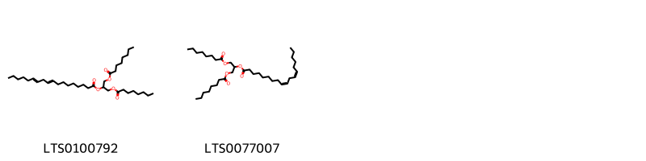{ width=100% }
    <figcaption>Hình ảnh cấu trúc hóa học của 2 hoạt chất thuộc nhóm Glycerolipids gồm ['1,3-bis(octanoyloxy)propan-2-yl octadeca-9,12-dienoate (LTS0100792)', '1,3-bis(octanoyloxy)propan-2-yl (9z,12z)-octadeca-9,12-dienoate (LTS0077007)'].</figcaption>
</figure>
#### Nhóm Glycerophospholipids
<figure markdown="span">
    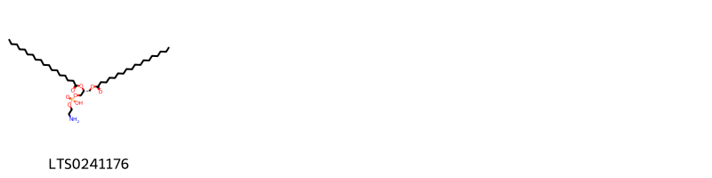{ width=100% }
    <figcaption>Hình ảnh cấu trúc hóa học của 1 hoạt chất thuộc nhóm Glycerophospholipids gồm ['l-β,gamm (LTS0241176)'].</figcaption>
</figure>
#### Nhóm Organooxygen compounds
<figure markdown="span">
    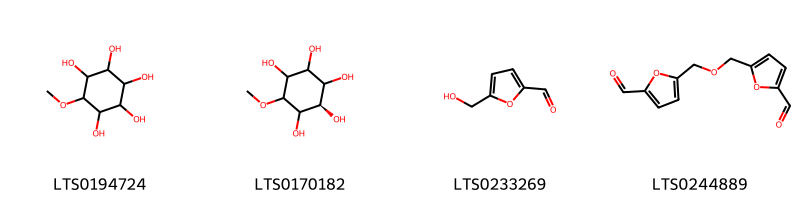{ width=100% }
    <figcaption>Hình ảnh cấu trúc hóa học của 4 hoạt chất thuộc nhóm Organooxygen compounds gồm ['pinitol (LTS0194724)', '(2r)-6-methoxycyclohexane-1,2,3,4,5-pentol (LTS0170182)', 'hydroxymethylfurfural (LTS0233269)', '5-{[(5-formylfuran-2-yl)methoxy]methyl}furan-2-carbaldehyde (LTS0244889)'].</figcaption>
</figure>
#### Nhóm Prenol lipids
<figure markdown="span">
    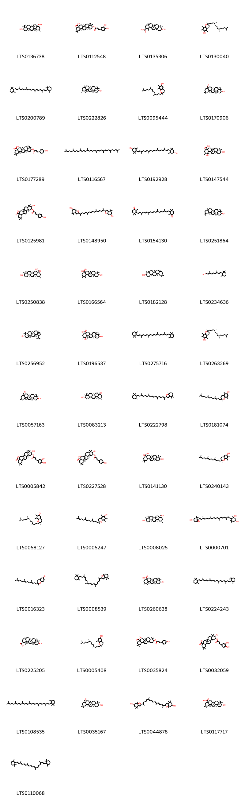{ width=100% }
    <figcaption>Hình ảnh cấu trúc hóa học của 49 hoạt chất thuộc nhóm Prenol lipids gồm ['urs-12-ene-3β,28-diol (LTS0136738)', '(4as,6as,6br,8ar,10s,12ar,12br,14bs)-10-{[(2e)-3-(3,4-dihydroxyphenyl)prop-2-enoyl]oxy}-2,2,6a,6b,9,9,12a-heptamethyl-1,3,4,5,6,7,8,8a,10,11,12,12b,13,14b-tetradecahydropicene-4a-carboxylic acid (LTS0112548)', '10-hydroxy-1,4a,6a,6b,9,9,12a-heptamethyl-2,3,4,5,6,7,8,8a,10,11,12,12b,13,14b-tetradecahydro-1h-picene-2-carboxylic acid (LTS0135306)', '(2r)-2,5,7,8-tetramethyl-2-[(4s,8s)-4,8,12-trimethyltridecyl]-3,4-dihydro-1-benzopyran-6-ol (LTS0130040)', '(+)-α-carotene (LTS0200789)', 'amyrin (LTS0222826)', '2,7,8-trimethyl-2-(4,8,12-trimethyltridecyl)-3,4-dihydro-1-benzopyran-6-ol (LTS0095444)', 'oleanolic aldehyde (LTS0170906)', '(4as,6as,6br,8ar,10s,12ar,12br,14bs)-10-{[(2e)-3-(4-hydroxyphenyl)prop-2-enoyl]oxy}-2,2,6a,6b,9,9,12a-heptamethyl-1,3,4,5,6,7,8,8a,10,11,12,12b,13,14b-tetradecahydropicene-4a-carboxylic acid (LTS0177289)', 'lycopene (LTS0116567)', 'zeaxanthin (LTS0192928)', '1,10-dihydroxy-1,2,6a,6b,9,9,12a-heptamethyl-2,3,4,5,6,7,8,8a,10,11,12,12b,13,14b-tetradecahydropicene-4a-carboxylic acid (LTS0147544)', '10-hydroxy-11-{[3-(4-hydroxyphenyl)prop-2-enoyl]oxy}-2,2,6a,6b,9,9,12a-heptamethyl-1,3,4,5,6,7,8,8a,10,11,12,12b,13,14b-tetradecahydropicene-4a-carboxylic acid (LTS0125981)', '(2r,6r,7ar)-2-[(2e,4e,6e,8e,10e,12e,14e)-15-[(2r,6r,7ar)-6-hydroxy-4,4,7a-trimethyl-2,5,6,7-tetrahydro-1-benzofuran-2-yl]-6,11-dimethylhexadeca-2,4,6,8,10,12,14-heptaen-2-yl]-4,4,7a-trimethyl-2,5,6,7-tetrahydro-1-benzofuran-6-ol (LTS0148950)', 'canthaxanthin (LTS0154130)', 'β-amyrin (LTS0251864)', 'ursolic acid (LTS0250838)', '10-hydroxy-1,2,6a,6b,9,9,12a-heptamethyl-2,3,4,5,6,7,8,8a,10,11,12,12b,13,14b-tetradecahydro-1h-picene-4a-carboxylic acid (LTS0166564)', '4,4a,6b,8a,11,11,12b,14a-octamethyl-hexadecahydropicen-3-ol (LTS0182128)', 'vitamin a (LTS0234636)', 'lupeol (LTS0256952)', 'pomolic acid (LTS0196537)', 'β-carotene (LTS0275716)', 'vitamin e (LTS0263269)', 'erythrodiol (LTS0057163)', '(1s,2r,4as,6as,6br,8ar,10s,12ar,12br,14bs)-10-hydroxy-1,2,6a,6b,9,9,12a-heptamethyl-2,3,4,5,6,7,8,8a,10,11,12,12b,13,14b-tetradecahydro-1h-picene-4a-carbaldehyde (LTS0083213)', '(2r,7ar)-4,4,7a-trimethyl-2-[(2e,4e,6e,8e,10e,12e,14e)-6,11,15-trimethyl-17-[(1e,6s)-2,2,6-trimethylcyclohexylidene]heptadeca-2,4,6,8,10,12,14-heptaen-2-yl]-2,5,6,7-tetrahydro-1-benzofuran (LTS0222798)', 'β-tocotrienol (LTS0181074)', '2-o-caffeoyl maslinic acid (LTS0005842)', '(4as,6as,6br,8ar,10r,11r,12ar,12br,14bs)-10-hydroxy-11-{[(2e)-3-(4-hydroxyphenyl)prop-2-enoyl]oxy}-2,2,6a,6b,9,9,12a-heptamethyl-1,3,4,5,6,7,8,8a,10,11,12,12b,13,14b-tetradecahydropicene-4a-carboxylic acid (LTS0227528)', 'oleanolic acid (LTS0141130)', 'γ-tocotrienol (LTS0240143)', 'gamma-tocopherol (LTS0058127)', 'α-tocotrienol (LTS0005247)', 'uvaol (LTS0008025)', 'neoxanthin (LTS0000701)', 'tocotrienol (LTS0016323)', '4,4,7a-trimethyl-2-{6,11,15-trimethyl-17-[(1e)-2,2,6-trimethylcyclohexylidene]heptadeca-2,4,6,8,10,12,14-heptaen-2-yl}-2,5,6,7-tetrahydro-1-benzofuran (LTS0008539)', '(1s,2s,4as,6as,6br,8as,10s,12as,12br,14br)-10-hydroxy-1,2,6a,6b,9,9,12a-heptamethyl-2,3,4,5,6,7,8,8a,10,11,12,12b,13,14b-tetradecahydro-1h-picene-4a-carboxylic acid (LTS0260638)', 'α-carotene (LTS0224243)', '(1r,2r,4ar,6as,6br,8ar,10s,12ar,12br,14br)-10-hydroxy-1,4a,6a,6b,9,9,12a-heptamethyl-2,3,4,5,6,7,8,8a,10,11,12,12b,13,14b-tetradecahydro-1h-picene-2-carboxylic acid (LTS0225205)', 'delta-tocopherol (LTS0005408)', '10-{[3-(4-hydroxyphenyl)prop-2-enoyl]oxy}-2,2,6a,6b,9,9,12a-heptamethyl-1,3,4,5,6,7,8,8a,10,11,12,12b,13,14b-tetradecahydropicene-4a-carboxylic acid (LTS0035824)', '11-{[3-(3,4-dihydroxyphenyl)prop-2-enoyl]oxy}-10-hydroxy-2,2,6a,6b,9,9,12a-heptamethyl-1,3,4,5,6,7,8,8a,10,11,12,12b,13,14b-tetradecahydropicene-4a-carboxylic acid (LTS0032059)', 'gamma-carotene (LTS0108535)', '(4as,6br,10s,12ar,14bs)-10-hydroxy-2,2,6a,6b,9,9,12a-heptamethyl-1,3,4,5,6,7,8,8a,10,11,12,12b,13,14b-tetradecahydropicene-4a-carbaldehyde (LTS0035167)', '2-[(8e,10e,12e,14e)-15-(6-hydroxy-4,4,7a-trimethyl-2,5,6,7-tetrahydro-1-benzofuran-2-yl)-6,11-dimethylhexadeca-2,4,6,8,10,12,14-heptaen-2-yl]-4,4,7a-trimethyl-2,5,6,7-tetrahydro-1-benzofuran-6-ol (LTS0044878)', 'oleanolic acid (LTS0117717)', '1,3,3-trimethyl-2-[(9e,11e,13e,15e,17e)-3,7,12,16-tetramethyl-18-(2,6,6-trimethylcyclohex-1-en-1-yl)octadeca-1,3,5,7,9,11,13,15,17-nonaen-1-yl]cyclohex-1-ene (LTS0110068)'].</figcaption>
</figure>
#### Nhóm Sphingolipids
<figure markdown="span">
    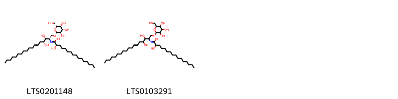{ width=100% }
    <figcaption>Hình ảnh cấu trúc hóa học của 2 hoạt chất thuộc nhóm Sphingolipids gồm ['(2r)-n-[(2s,3s,4r,6e)-3,4-dihydroxy-1-{[(2r,3r,4s,5s,6r)-3,4,5-trihydroxy-6-(hydroxymethyl)oxan-2-yl]oxy}octadec-6-en-2-yl]-2-hydroxyhexadecanimidic acid (LTS0201148)', 'n-(3,4-dihydroxy-1-{[3,4,5-trihydroxy-6-(hydroxymethyl)oxan-2-yl]oxy}octadec-6-en-2-yl)-2-hydroxyhexadecanimidic acid (LTS0103291)'].</figcaption>
</figure>
#### Nhóm Steroids and steroid derivatives
<figure markdown="span">
    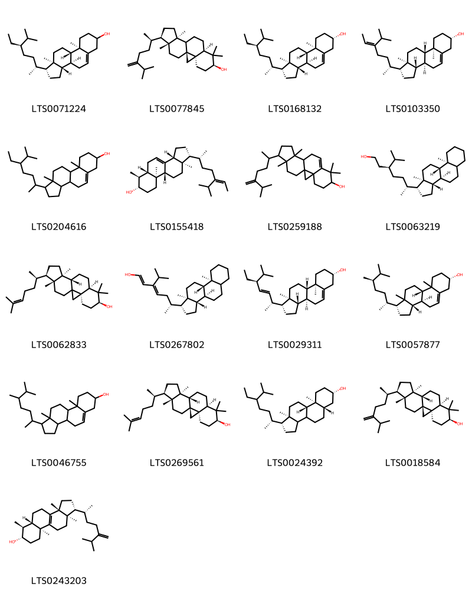{ width=100% }
    <figcaption>Hình ảnh cấu trúc hóa học của 17 hoạt chất thuộc nhóm Steroids and steroid derivatives gồm ['stigmast-5-en-3-ol (LTS0071224)', '24-methylene-cycloartanol (LTS0077845)', 'sitosterol (LTS0168132)', 'avenasterol (LTS0103350)', 'stigmast-5-en-3-ol, (3β)- (LTS0204616)', '(z)-24-ethylidenelophenol (LTS0155418)', '7,7,12,16-tetramethyl-15-(6-methyl-5-methylideneheptan-2-yl)pentacyclo[9.7.0.0¹,³.0³,⁸.0¹²,¹⁶]octadec-8-en-6-ol (LTS0259188)', '(3s,6r)-6-[(1r,3as,3br,9as,9bs,11ar)-9a,11a-dimethyl-tetradecahydro-1h-cyclopenta[a]phenanthren-1-yl]-3-isopropylheptan-1-ol (LTS0063219)', '(3r,6s,8r,11s,12s,15r,16r)-7,7,12,16-tetramethyl-15-[(2r)-6-methylhept-5-en-2-yl]pentacyclo[9.7.0.0¹,³.0³,⁸.0¹²,¹⁶]octadecan-6-ol (LTS0062833)', '(6r)-6-[(1r,3as,3br,9as,9bs,11ar)-9a,11a-dimethyl-tetradecahydro-1h-cyclopenta[a]phenanthren-1-yl]-3-isopropylhepta-1,3-dien-1-ol (LTS0267802)', 'phytosterol (LTS0029311)', '(1r,3as,3bs,7s,9bs)-1-[(2r,5r)-5,6-dimethylheptan-2-yl]-9a,11a-dimethyl-1h,2h,3h,3ah,3bh,4h,6h,7h,8h,9h,9bh,10h,11h-cyclopenta[a]phenanthren-7-ol (LTS0057877)', 'campesterol (LTS0046755)', 'cycloartenol (LTS0269561)', '(1r,5as,7s,9as,9bs,11ar)-1-[(2r)-5-ethyl-6-methylheptan-2-yl]-9a,11a-dimethyl-tetradecahydro-1h-cyclopenta[a]phenanthren-7-ol (LTS0024392)', '24-methylenecycloartanol (LTS0018584)', '(1r,3ar,5as,6s,7s,9as,11ar)-3a,6,9a,11a-tetramethyl-1-[(2r)-6-methyl-5-methylideneheptan-2-yl]-1h,2h,3h,4h,5h,5ah,6h,7h,8h,9h,10h,11h-cyclopenta[a]phenanthren-7-ol (LTS0243203)'].</figcaption>
</figure>
#### Nhóm Tannins
<figure markdown="span">
    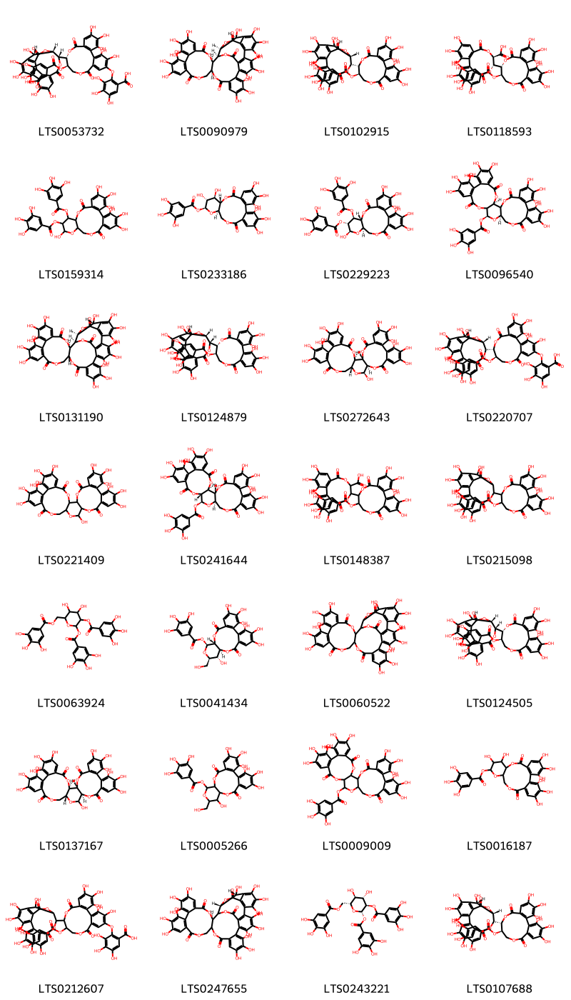{ width=100% }
    <figcaption>Hình ảnh cấu trúc hóa học của 28 hoạt chất thuộc nhóm Tannins gồm ['2-{[(11r,12r)-12-[(14r,15s,19s)-2,3,4,7,8,9,19-heptahydroxy-12,17-dioxo-13,16-dioxatetracyclo[13.3.1.0⁵,¹⁸.0⁶,¹¹]nonadeca-1(18),2,4,6,8,10-hexaen-14-yl]-3,4,17,18,19-pentahydroxy-8,14-dioxo-11-(3,4,5-trihydroxybenzoyloxy)-9,13-dioxatricyclo[13.4.0.0²,⁷]nonadeca-1(15),2,4,6,16,18-hexaen-5-yl]oxy}-3,4,5-trihydroxybenzoic acid (LTS0053732)', '(1r,2r,20s,42s,46s)-7,8,9,12,13,14,25,26,27,30,31,32,35,36,37,46-hexadecahydroxy-3,18,21,41,43-pentaoxanonacyclo[27.13.3.1³⁸,⁴².0²,²⁰.0⁵,¹⁰.0¹¹,¹⁶.0²³,²⁸.0³³,⁴⁵.0³⁴,³⁹]hexatetraconta-5,7,9,11(16),12,14,23,25,27,29,31,33(45),34(39),35,37-pentadecaene-4,17,22,40,44-pentone (LTS0090979)', '(11r,12r)-12-[(15s,19r)-2,3,4,7,8,9,19-heptahydroxy-12,17-dioxo-13,16-dioxatetracyclo[13.3.1.0⁵,¹⁸.0⁶,¹¹]nonadeca-1(18),2,4,6,8,10-hexaen-14-yl]-3,4,5,17,18,19-hexahydroxy-8,14-dioxo-9,13-dioxatricyclo[13.4.0.0²,⁷]nonadeca-1(15),2,4,6,16,18-hexaen-11-yl 3,4,5-trihydroxybenzoate (LTS0102915)', '(10r,11s)-11-[(10r,11r)-3,4,5,17,18,19-hexahydroxy-8,14-dioxo-11-(3,4,5-trihydroxybenzoyloxy)-9,13-dioxatricyclo[13.4.0.0²,⁷]nonadeca-1(19),2(7),3,5,15,17-hexaen-10-yl]-3,4,5,16,17,18-hexahydroxy-8,13-dioxo-9,12-dioxatricyclo[12.4.0.0²,⁷]octadeca-1(18),2(7),3,5,14,16-hexaene-10-carboxylic acid (LTS0118593)', '3,4,5,13,21,22,23-heptahydroxy-8,18-dioxo-12-(3,4,5-trihydroxybenzoyloxy)-9,14,17-trioxatetracyclo[17.4.0.0²,⁷.0¹⁰,¹⁵]tricosa-1(23),2(7),3,5,19,21-hexaen-11-yl 3,4,5-trihydroxybenzoate (LTS0159314)', '(10s,11r,12r,13s,15r)-3,4,5,11,12,21,22,23-octahydroxy-8,18-dioxo-9,14,17-trioxatetracyclo[17.4.0.0²,⁷.0¹⁰,¹⁵]tricosa-1(23),2(7),3,5,19,21-hexaen-13-yl 3,4,5-trihydroxybenzoate (LTS0233186)', '(10r,11s,12r,13r,15r)-3,4,5,13,21,22,23-heptahydroxy-8,18-dioxo-11-(3,4,5-trihydroxybenzoyloxy)-9,14,17-trioxatetracyclo[17.4.0.0²,⁷.0¹⁰,¹⁵]tricosa-1(23),2(7),3,5,19,21-hexaen-12-yl 3,4,5-trihydroxybenzoate (LTS0229223)', '(2s,20s,22r)-7,8,9,12,13,14,28,29,30,33,34,35-dodecahydroxy-4,17,25,38-tetraoxo-3,18,21,24,39-pentaoxaheptacyclo[20.17.0.0²,¹⁹.0⁵,¹⁰.0¹¹,¹⁶.0²⁶,³¹.0³²,³⁷]nonatriaconta-5,7,9,11(16),12,14,26,28,30,32(37),33,35-dodecaen-20-yl 3,4,5-trihydroxybenzoate (LTS0096540)', '(1r,2r,20r,42s,46r)-7,8,9,12,13,14,25,26,27,30,31,32,35,36,37,46-hexadecahydroxy-3,18,21,41,43-pentaoxanonacyclo[27.13.3.1³⁸,⁴².0²,²⁰.0⁵,¹⁰.0¹¹,¹⁶.0²³,²⁸.0³³,⁴⁵.0³⁴,³⁹]hexatetraconta-5,7,9,11(16),12,14,23,25,27,29,31,33(45),34(39),35,37-pentadecaene-4,17,22,40,44-pentone (LTS0131190)', '(11r,12r)-12-[(14r,15s,19s)-2,3,4,7,8,9,19-heptahydroxy-12,17-dioxo-13,16-dioxatetracyclo[13.3.1.0⁵,¹⁸.0⁶,¹¹]nonadeca-1(18),2,4,6,8,10-hexaen-14-yl]-3,4,5,17,18,19-hexahydroxy-8,14-dioxo-9,13-dioxatricyclo[13.4.0.0²,⁷]nonadeca-1(15),2,4,6,16,18-hexaen-11-yl 3,4,5-trihydroxybenzoate (LTS0124879)', '(1r,2s,19r,20s,22r)-7,8,9,12,13,14,20,28,29,30,33,34,35-tridecahydroxy-3,18,21,24,39-pentaoxaheptacyclo[20.17.0.0²,¹⁹.0⁵,¹⁰.0¹¹,¹⁶.0²⁶,³¹.0³²,³⁷]nonatriaconta-5(10),6,8,11,13,15,26(31),27,29,32,34,36-dodecaene-4,17,25,38-tetrone (LTS0272643)', '2-{[(11r,12r)-12-[(15s,19s)-2,3,4,7,8,9,19-heptahydroxy-12,17-dioxo-13,16-dioxatetracyclo[13.3.1.0⁵,¹⁸.0⁶,¹¹]nonadeca-1(18),2,4,6,8,10-hexaen-14-yl]-3,4,17,18,19-pentahydroxy-8,14-dioxo-11-(3,4,5-trihydroxybenzoyloxy)-9,13-dioxatricyclo[13.4.0.0²,⁷]nonadeca-1(15),2,4,6,16,18-hexaen-5-yl]oxy}-3,4,5-trihydroxybenzoic acid (LTS0220707)', '7,8,9,12,13,14,20,28,29,30,33,34,35-tridecahydroxy-3,18,21,24,39-pentaoxaheptacyclo[20.17.0.0²,¹⁹.0⁵,¹⁰.0¹¹,¹⁶.0²⁶,³¹.0³²,³⁷]nonatriaconta-5(10),6,8,11,13,15,26(31),27,29,32,34,36-dodecaene-4,17,25,38-tetrone (LTS0221409)', 'casuarictin (LTS0241644)', '11-[3,4,5,17,18,19-hexahydroxy-8,14-dioxo-11-(3,4,5-trihydroxybenzoyloxy)-9,13-dioxatricyclo[13.4.0.0²,⁷]nonadeca-1(19),2(7),3,5,15,17-hexaen-10-yl]-3,4,5,16,17,18-hexahydroxy-8,13-dioxo-9,12-dioxatricyclo[12.4.0.0²,⁷]octadeca-1(18),2(7),3,5,14,16-hexaene-10-carboxylic acid (LTS0148387)', '12-{2,3,4,7,8,9,19-heptahydroxy-12,17-dioxo-13,16-dioxatetracyclo[13.3.1.0⁵,¹⁸.0⁶,¹¹]nonadeca-1(18),2,4,6,8,10-hexaen-14-yl}-3,4,5,17,18,19-hexahydroxy-8,14-dioxo-9,13-dioxatricyclo[13.4.0.0²,⁷]nonadeca-1(15),2,4,6,16,18-hexaen-11-yl 3,4,5-trihydroxybenzoate (LTS0215098)', '4,5-dihydroxy-3-(3,4,5-trihydroxybenzoyloxy)-6-[(3,4,5-trihydroxybenzoyloxy)methyl]oxan-2-yl 3,4,5-trihydroxybenzoate (LTS0063924)', '(10r,11s,13r,14r,15s)-3,4,5,14,20,21,22-heptahydroxy-13-(hydroxymethyl)-8,17-dioxo-9,12,16-trioxatetracyclo[16.4.0.0²,⁷.0¹⁰,¹⁵]docosa-1(22),2(7),3,5,18,20-hexaen-11-yl 3,4,5-trihydroxybenzoate (LTS0041434)', '7,8,9,12,13,14,25,26,27,30,31,32,35,36,37,46-hexadecahydroxy-3,18,21,41,43-pentaoxanonacyclo[27.13.3.1³⁸,⁴².0²,²⁰.0⁵,¹⁰.0¹¹,¹⁶.0²³,²⁸.0³³,⁴⁵.0³⁴,³⁹]hexatetraconta-5,7,9,11(16),12,14,23,25,27,29,31,33(45),34(39),35,37-pentadecaene-4,17,22,40,44-pentone (LTS0060522)', '(11r,12r)-12-[(14r,15s,19r)-2,3,4,7,8,9,19-heptahydroxy-12,17-dioxo-13,16-dioxatetracyclo[13.3.1.0⁵,¹⁸.0⁶,¹¹]nonadeca-1(18),2,4,6,8,10-hexaen-14-yl]-3,4,5,17,18,19-hexahydroxy-8,14-dioxo-9,13-dioxatricyclo[13.4.0.0²,⁷]nonadeca-1(15),2,4,6,16,18-hexaen-11-yl 3,4,5-trihydroxybenzoate (LTS0124505)', '(1r,2s,19r,22r)-7,8,9,12,13,14,20,28,29,30,33,34,35-tridecahydroxy-3,18,21,24,39-pentaoxaheptacyclo[20.17.0.0²,¹⁹.0⁵,¹⁰.0¹¹,¹⁶.0²⁶,³¹.0³²,³⁷]nonatriaconta-5(10),6,8,11,13,15,26(31),27,29,32,34,36-dodecaene-4,17,25,38-tetrone (LTS0137167)', '3,4,5,14,20,21,22-heptahydroxy-13-(hydroxymethyl)-8,17-dioxo-9,12,16-trioxatetracyclo[16.4.0.0²,⁷.0¹⁰,¹⁵]docosa-1(22),2(7),3,5,18,20-hexaen-11-yl 3,4,5-trihydroxybenzoate (LTS0005266)', '7,8,9,12,13,14,28,29,30,33,34,35-dodecahydroxy-4,17,25,38-tetraoxo-3,18,21,24,39-pentaoxaheptacyclo[20.17.0.0²,¹⁹.0⁵,¹⁰.0¹¹,¹⁶.0²⁶,³¹.0³²,³⁷]nonatriaconta-5,7,9,11(16),12,14,26,28,30,32(37),33,35-dodecaen-20-yl 3,4,5-trihydroxybenzoate (LTS0009009)', '3,4,5,11,12,21,22,23-octahydroxy-8,18-dioxo-9,14,17-trioxatetracyclo[17.4.0.0²,⁷.0¹⁰,¹⁵]tricosa-1(23),2(7),3,5,19,21-hexaen-13-yl 3,4,5-trihydroxybenzoate (LTS0016187)', '2-[(12-{2,3,4,7,8,9,19-heptahydroxy-12,17-dioxo-13,16-dioxatetracyclo[13.3.1.0⁵,¹⁸.0⁶,¹¹]nonadeca-1(18),2,4,6,8,10-hexaen-14-yl}-3,4,17,18,19-pentahydroxy-8,14-dioxo-11-(3,4,5-trihydroxybenzoyloxy)-9,13-dioxatricyclo[13.4.0.0²,⁷]nonadeca-1(15),2,4,6,16,18-hexaen-5-yl)oxy]-3,4,5-trihydroxybenzoic acid (LTS0212607)', '(2r,42r,46r)-7,8,9,12,13,14,25,26,27,30,31,32,35,36,37,46-hexadecahydroxy-3,18,21,41,43-pentaoxanonacyclo[27.13.3.1³⁸,⁴².0²,²⁰.0⁵,¹⁰.0¹¹,¹⁶.0²³,²⁸.0³³,⁴⁵.0³⁴,³⁹]hexatetraconta-5,7,9,11(16),12,14,23,25,27,29,31,33(45),34(39),35,37-pentadecaene-4,17,22,40,44-pentone (LTS0247655)', '(2s,3r,4s,5s,6r)-4,5-dihydroxy-3-(3,4,5-trihydroxybenzoyloxy)-6-[(3,4,5-trihydroxybenzoyloxy)methyl]oxan-2-yl 3,4,5-trihydroxybenzoate (LTS0243221)', '(11r,12r)-12-[(15s,19s)-2,3,4,7,8,9,19-heptahydroxy-12,17-dioxo-13,16-dioxatetracyclo[13.3.1.0⁵,¹⁸.0⁶,¹¹]nonadeca-1(18),2,4,6,8,10-hexaen-14-yl]-3,4,5,17,18,19-hexahydroxy-8,14-dioxo-9,13-dioxatricyclo[13.4.0.0²,⁷]nonadeca-1(15),2,4,6,16,18-hexaen-11-yl 3,4,5-trihydroxybenzoate (LTS0107688)'].</figcaption>
</figure>

---

### Dược dân tộc học

Danh sách các quốc gia có sử dụng *Hippophae rhamnoides* trong điều trị các bệnh. 

| Country   | Disease    | Bệnh                                                                                                                                                                                                |
|:----------|:-----------|:----------------------------------------------------------------------------------------------------------------------------------------------------------------------------------------------------|
| anish     | Astringent | MYMEMORY WARNING: YOU USED ALL AVAILABLE FREE TRANSLATIONS FOR TODAY. NEXT AVAILABLE IN  08 HOURS 30 MINUTES 03 SECONDS VISIT HTTPS://MYMEMORY.TRANSLATED.NET/DOC/USAGELIMITS.PHP TO TRANSLATE MORE |

---

