!!! abstract "Tóm tắt"

    Họ Ephedraceae gồm khoảng 1 chi và 9 loài được một số cộng đồng tại các quốc gia như Japan*, ain, Nepal, Elsewhere, South America, China, Iraq, India, Turkey sử dụng trong một số trường hợp MYMEMORY WARNING: YOU USED ALL AVAILABLE FREE TRANSLATIONS FOR TODAY. NEXT AVAILABLE IN  06 HOURS 27 MINUTES 55 SECONDS VISIT HTTPS://MYMEMORY.TRANSLATED.NET/DOC/USAGELIMITS.PHP TO TRANSLATE MORE.

!!! info "DrDuke"

    James A. Duke sinh năm 1929-2017 là một nhà thực vật học người Mỹ. Đây là một trong những tác giả hàng đầu trong lĩnh vực dược dân tộc học với cuốn *CRC Handbook of Medicinal Herbs* và chính là người xây dựng lên cơ sở dữ liệu về hợp chất tự nhiên và dược dân tộc học tại Bộ nông nghiệp Hoa Kỳ. Các thông tin được đăng tải tại website [Dr. Duke's Phytochemical and Ethnobotanical Databases](https://phytochem.nal.usda.gov/). 
    Trong suốt thập niên 1970, ông lãnh đạo the Plant Taxonomy Laboratory, Plant Genetics and Germplasm Institute of the Agricultural Research Service, U.S. Department of Agriculture.
    Trong tài liệu này, các thông tin về dược dân tộc của các dược liệu được trích dẫn từ tài liệu của James A. Ducke với sự trợ giúp của phần mềm dịch thuật từ tiếng Anh sang tiếng Việt.
   

# Chi Ephedra

??? note "Danh sách các dược liệu thuộc chi"
    
	 - *Ephedra alata*
	 - *Ephedra americana*
	 - *Ephedra distachya*
	 - *Ephedra equisetina*
	 - *Ephedra foliata*
	 - *Ephedra fragilis*
	 - *Ephedra gerardiana*
	 - *Ephedra sinica*
	 - *Ephedra vulgaris*

---
## Ephedra alata
### Thông tin về thực vật

!!! info "Phân loại thực vật của *Ephedra alata* từ GIBF:"
    - **Kingdom:** Plantae
    - **Phylum:** Tracheophyta
    - **Order:** Ephedrales
    - **Family:** Ephedraceae
    - **Genus:** Ephedra
    - **Species:** *Ephedra alata*

 

| Label (VI)   | Label (EN)   | Scientific Name   | Descriptions (VI)   | Descriptions (EN)   | Also Known As (VI)   | Also Known As (EN)   |
|:-------------|:-------------|:------------------|:--------------------|:--------------------|:---------------------|:---------------------|
| N/A          | N/A          | Ephedra alata     | loài thực vật       | species of plant    | ['']                 | ['']                 |

#### Phân bố trên thế giới

**Từ CSDL GIBF** Morocco, Algeria, Saudi Arabia, Kuwait, Israel, Tunisia, Jordan, Egypt

#### Phân bố tại Việt Nam

**Từ CSDL GIBF**: Không có ghi nhận ở Việt Nam

---
### Thành phần hóa học
        
- Theo cơ sở dữ liệu lotus: Từ loài *Ephedra alata* đã phân lập và xác định được 34 hoạt chất thuộc về các nhóm Benzene and substituted derivatives, Quinolines and derivatives, Flavonoids, Tannins, Cinnamic acids and derivatives, Organooxygen compounds, Furanoid lignans. 

|    | chemicalTaxonomyClassyfireClass     |   smiles_count |
|---:|:------------------------------------|---------------:|
|  0 | Benzene and substituted derivatives |              5 |
|  1 | Cinnamic acids and derivatives      |              2 |
|  2 | Flavonoids                          |             16 |
|  3 | Furanoid lignans                    |              3 |
|  4 | Organooxygen compounds              |              1 |
|  5 | Quinolines and derivatives          |              3 |
|  6 | Tannins                             |              3 |

#### Nhóm Benzene and substituted derivatives
<figure markdown="span">
    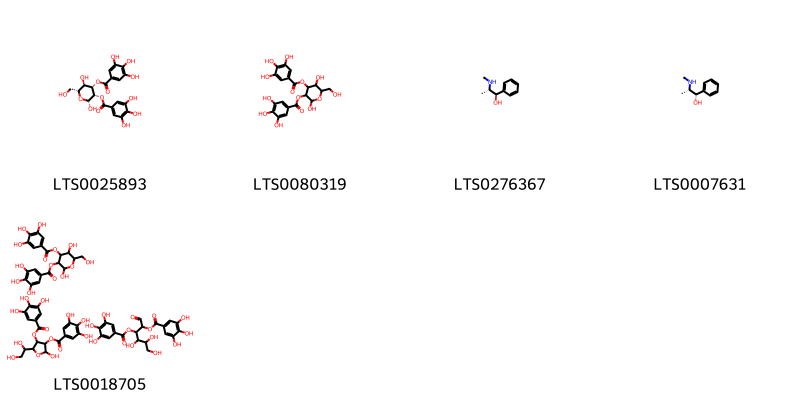{ width=100% }
    <figcaption>Hình ảnh cấu trúc hóa học của 5 hoạt chất thuộc nhóm Benzene and substituted derivatives gồm ['(2r,3s,4s,5r,6r)-2,5-dihydroxy-6-(hydroxymethyl)-3-(3,4,5-trihydroxybenzoyloxy)oxan-4-yl 3,4,5-trihydroxybenzoate (LTS0025893)', '2,5-dihydroxy-6-(hydroxymethyl)-3-(3,4,5-trihydroxybenzoyloxy)oxan-4-yl 3,4,5-trihydroxybenzoate (LTS0080319)', 'ephedrine (LTS0276367)', 'pseudoephedrine (LTS0007631)', '2,5-dihydroxy-6-(hydroxymethyl)-3-(3,4,5-trihydroxybenzoyloxy)oxan-4-yl 3,4,5-trihydroxybenzoate; 2-(1,2-dihydroxyethyl)-5-hydroxy-4-(3,4,5-trihydroxybenzoyloxy)oxolan-3-yl 3,4,5-trihydroxybenzoate; 4,5,6-trihydroxy-1-oxo-2-(3,4,5-trihydroxybenzoyloxy)hexan-3-yl 3,4,5-trihydroxybenzoate (LTS0018705)'].</figcaption>
</figure>
#### Nhóm Cinnamic acids and derivatives
<figure markdown="span">
    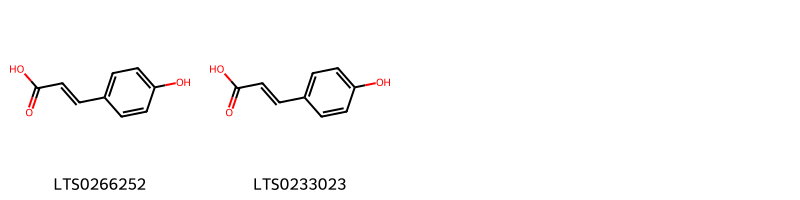{ width=100% }
    <figcaption>Hình ảnh cấu trúc hóa học của 2 hoạt chất thuộc nhóm Cinnamic acids and derivatives gồm ['para-coumaric acid (LTS0266252)', 'hydroxycinnamic acid (LTS0233023)'].</figcaption>
</figure>
#### Nhóm Flavonoids
<figure markdown="span">
    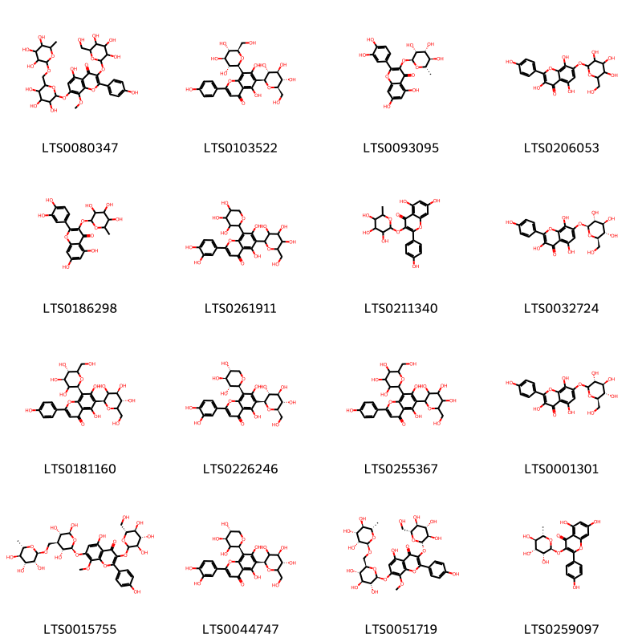{ width=100% }
    <figcaption>Hình ảnh cấu trúc hóa học của 16 hoạt chất thuộc nhóm Flavonoids gồm ['5-hydroxy-2-(4-hydroxyphenyl)-8-methoxy-3-{[3,4,5-trihydroxy-6-(hydroxymethyl)oxan-2-yl]oxy}-7-[(3,4,5-trihydroxy-6-{[(3,4,5-trihydroxy-6-methyloxan-2-yl)oxy]methyl}oxan-2-yl)oxy]chromen-4-one (LTS0080347)', 'vicenin-2 (LTS0103522)', 'quercitrin (LTS0093095)', '3,5,8-trihydroxy-2-(4-hydroxyphenyl)-7-{[3,4,5-trihydroxy-6-(hydroxymethyl)oxan-2-yl]oxy}chromen-4-one (LTS0206053)', 'quercitrin (LTS0186298)', '2-(3,4-dihydroxyphenyl)-5,7-dihydroxy-6-[3,4,5-trihydroxy-6-(hydroxymethyl)oxan-2-yl]-8-(3,4,5-trihydroxyoxan-2-yl)chromen-4-one (LTS0261911)', '5,7-dihydroxy-2-(4-hydroxyphenyl)-3-[(3,4,5-trihydroxy-6-methyloxan-2-yl)oxy]chromen-4-one (LTS0211340)', '3,5,8-trihydroxy-2-(4-hydroxyphenyl)-7-{[(2s,3r,4s,5s,6r)-3,4,5-trihydroxy-6-(hydroxymethyl)oxan-2-yl]oxy}chromen-4-one (LTS0032724)', 'vicenin 2 (LTS0181160)', '2-(3,4-dihydroxyphenyl)-5,7-dihydroxy-6-[(2s,3r,4r,5s,6r)-3,4,5-trihydroxy-6-(hydroxymethyl)oxan-2-yl]-8-[(2s,3r,4s,5r)-3,4,5-trihydroxyoxan-2-yl]chromen-4-one (LTS0226246)', '5,7-dihydroxy-2-(4-hydroxyphenyl)-6,8-bis[3,4,5-trihydroxy-6-(hydroxymethyl)oxan-2-yl]chromen-4-one (LTS0255367)', '3,5,8-trihydroxy-2-(4-hydroxyphenyl)-7-{[(3r,4s,5s,6r)-3,4,5-trihydroxy-6-(hydroxymethyl)oxan-2-yl]oxy}chromen-4-one (LTS0001301)', '5-hydroxy-2-(4-hydroxyphenyl)-8-methoxy-7-{[(2r,3r,4s,5s,6s)-3,5,6-trihydroxy-4-({[(2r,3r,4r,5r,6s)-3,4,5-trihydroxy-6-methyloxan-2-yl]oxy}methyl)oxan-2-yl]oxy}-3-{[(3r,4s,5s,6r)-3,4,5-trihydroxy-6-(hydroxymethyl)oxan-2-yl]oxy}chromen-4-one (LTS0015755)', 'lucenin 3 (LTS0044747)', '5-hydroxy-2-(4-hydroxyphenyl)-8-methoxy-3-{[(2s,3r,4s,5s,6r)-3,4,5-trihydroxy-6-(hydroxymethyl)oxan-2-yl]oxy}-7-{[(2s,3r,4s,5s,6r)-3,4,5-trihydroxy-6-({[(2r,3r,4r,5r,6s)-3,4,5-trihydroxy-6-methyloxan-2-yl]oxy}methyl)oxan-2-yl]oxy}chromen-4-one (LTS0051719)', 'afzelin (LTS0259097)'].</figcaption>
</figure>
#### Nhóm Furanoid lignans
<figure markdown="span">
    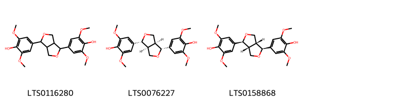{ width=100% }
    <figcaption>Hình ảnh cấu trúc hóa học của 3 hoạt chất thuộc nhóm Furanoid lignans gồm ['syringaresinol (LTS0116280)', '(-)-syringaresinol (LTS0076227)', '(+)-syringaresinol (LTS0158868)'].</figcaption>
</figure>
#### Nhóm Organooxygen compounds
<figure markdown="span">
    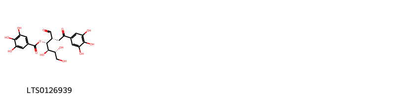{ width=100% }
    <figcaption>Hình ảnh cấu trúc hóa học của 1 hoạt chất thuộc nhóm Organooxygen compounds gồm ['(2r,3r,4r,5r)-4,5,6-trihydroxy-1-oxo-2-[2-oxo-2-(3,4,5-trihydroxyphenyl)ethyl]hexan-3-yl 3,4,5-trihydroxybenzoate (LTS0126939)'].</figcaption>
</figure>
#### Nhóm Quinolines and derivatives
<figure markdown="span">
    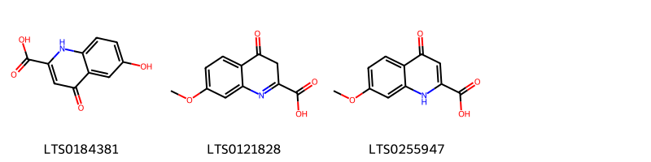{ width=100% }
    <figcaption>Hình ảnh cấu trúc hóa học của 3 hoạt chất thuộc nhóm Quinolines and derivatives gồm ['6-hydroxykynurenic acid (LTS0184381)', '7-methoxy-4-oxo-3h-quinoline-2-carboxylic acid (LTS0121828)', '7-methoxy-4-oxo-1h-quinoline-2-carboxylic acid (LTS0255947)'].</figcaption>
</figure>
#### Nhóm Tannins
<figure markdown="span">
    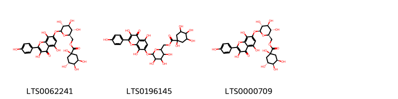{ width=100% }
    <figcaption>Hình ảnh cấu trúc hóa học của 3 hoạt chất thuộc nhóm Tannins gồm ['[(2r,3s,4s,5r)-3,4,5-trihydroxy-6-{[3,5,8-trihydroxy-2-(4-hydroxyphenyl)-4-oxochromen-7-yl]oxy}oxan-2-yl]methyl (1s,3r,4s,5r)-1,3,4,5-tetrahydroxycyclohexane-1-carboxylate (LTS0062241)', '(3,4,5-trihydroxy-6-{[3,5,8-trihydroxy-2-(4-hydroxyphenyl)-4-oxochromen-7-yl]oxy}oxan-2-yl)methyl 1,3,4,5-tetrahydroxycyclohexane-1-carboxylate (LTS0196145)', '[(2r,3s,4s,5r,6s)-3,4,5-trihydroxy-6-{[3,5,8-trihydroxy-2-(4-hydroxyphenyl)-4-oxochromen-7-yl]oxy}oxan-2-yl]methyl (1s,3r,4s,5r)-1,3,4,5-tetrahydroxycyclohexane-1-carboxylate (LTS0000709)'].</figcaption>
</figure>

---

### Dược dân tộc học

Danh sách các quốc gia có sử dụng *Ephedra alata* trong điều trị các bệnh. 

| Country   | Disease     | Bệnh                                                                                                                                                                                                |
|:----------|:------------|:----------------------------------------------------------------------------------------------------------------------------------------------------------------------------------------------------|
| Iraq      | Cardiotonic | MYMEMORY WARNING: YOU USED ALL AVAILABLE FREE TRANSLATIONS FOR TODAY. NEXT AVAILABLE IN  06 HOURS 27 MINUTES 52 SECONDS VISIT HTTPS://MYMEMORY.TRANSLATED.NET/DOC/USAGELIMITS.PHP TO TRANSLATE MORE |

---

---
## Ephedra americana
### Thông tin về thực vật

!!! info "Phân loại thực vật của *Ephedra americana* từ GIBF:"
    - **Kingdom:** Plantae
    - **Phylum:** Tracheophyta
    - **Order:** Ephedrales
    - **Family:** Ephedraceae
    - **Genus:** Ephedra
    - **Species:** *Ephedra americana*

 

| Label (VI)   | Label (EN)   | Scientific Name   | Descriptions (VI)   | Descriptions (EN)   | Also Known As (VI)   | Also Known As (EN)   |
|:-------------|:-------------|:------------------|:--------------------|:--------------------|:---------------------|:---------------------|
| N/A          | N/A          | Ephedra americana | loài thực vật       | species of plant    | ['']                 | ['']                 |

#### Phân bố trên thế giới

**Từ CSDL GIBF** nan, United States of America, Peru, Belgium, Chile, New Zealand, Ecuador, Argentina, Bolivia (Plurinational State of)

#### Phân bố tại Việt Nam

**Từ CSDL GIBF**: Không có ghi nhận ở Việt Nam

---
### Thành phần hóa học
        
- Theo cơ sở dữ liệu lotus: Từ loài *Ephedra americana* đã phân lập và xác định được Chưa có hoạt chất nào được phân lập. hoạt chất thuộc về các nhóm Không có hoạt chất nào được phân lập. 

Không có hình ảnh nào được tạo ra

---

### Dược dân tộc học

Danh sách các quốc gia có sử dụng *Ephedra americana* trong điều trị các bệnh. 

| Country       | Disease   | Bệnh                                                                                                                                                                                                |
|:--------------|:----------|:----------------------------------------------------------------------------------------------------------------------------------------------------------------------------------------------------|
| South America | Diuretic  | MYMEMORY WARNING: YOU USED ALL AVAILABLE FREE TRANSLATIONS FOR TODAY. NEXT AVAILABLE IN  06 HOURS 27 MINUTES 25 SECONDS VISIT HTTPS://MYMEMORY.TRANSLATED.NET/DOC/USAGELIMITS.PHP TO TRANSLATE MORE |

---

---
## Ephedra distachya
### Thông tin về thực vật

!!! info "Phân loại thực vật của *Ephedra distachya* từ GIBF:"
    - **Kingdom:** Plantae
    - **Phylum:** Tracheophyta
    - **Order:** Ephedrales
    - **Family:** Ephedraceae
    - **Genus:** Ephedra
    - **Species:** *Ephedra distachya*

 

| Label (VI)   | Label (EN)   | Scientific Name   | Descriptions (VI)   | Descriptions (EN)   | Also Known As (VI)   | Also Known As (EN)   |
|:-------------|:-------------|:------------------|:--------------------|:--------------------|:---------------------|:---------------------|
| N/A          | N/A          | Ephedra distachya | loài thực vật       | species of plant    | ['']                 | ['']                 |

#### Phân bố trên thế giới

**Từ CSDL GIBF** Hungary, Romania, Ukraine, Slovakia, Russian Federation, Kazakhstan, Italy, Switzerland, Spain, Bulgaria, France, Moldova, Republic of

#### Phân bố tại Việt Nam

**Từ CSDL GIBF**: Không có ghi nhận ở Việt Nam

---
### Thành phần hóa học
        
- Theo cơ sở dữ liệu lotus: Từ loài *Ephedra distachya* đã phân lập và xác định được 30 hoạt chất thuộc về các nhóm Fatty Acyls, Benzene and substituted derivatives, Quinolines and derivatives, Flavonoids, Carboxylic acids and derivatives, Cinnamic acids and derivatives, Steroids and steroid derivatives, 5'-deoxyribonucleosides. 

|    | chemicalTaxonomyClassyfireClass     |   smiles_count |
|---:|:------------------------------------|---------------:|
|  0 | 5'-deoxyribonucleosides             |              2 |
|  1 | Benzene and substituted derivatives |              9 |
|  2 | Carboxylic acids and derivatives    |              6 |
|  3 | Cinnamic acids and derivatives      |              2 |
|  4 | Fatty Acyls                         |              2 |
|  5 | Flavonoids                          |              1 |
|  6 | Quinolines and derivatives          |              2 |
|  7 | Steroids and steroid derivatives    |              3 |

#### Nhóm 5_-deoxyribonucleosides
<figure markdown="span">
    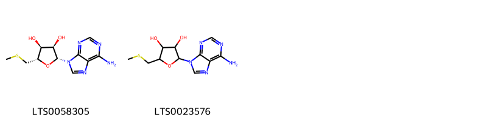{ width=100% }
    <figcaption>Hình ảnh cấu trúc hóa học của Không tìm thấy chú thích hoạt chất thuộc nhóm 5_-deoxyribonucleosides gồm Không tìm thấy chú thích.</figcaption>
</figure>
#### Nhóm Benzene and substituted derivatives
<figure markdown="span">
    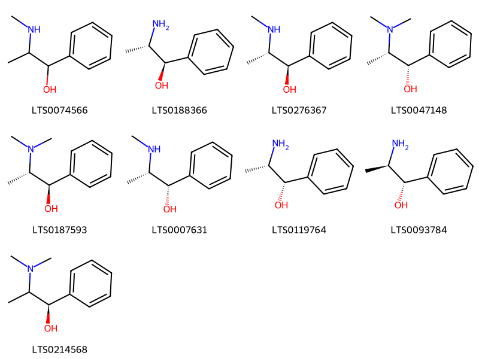{ width=100% }
    <figcaption>Hình ảnh cấu trúc hóa học của 9 hoạt chất thuộc nhóm Benzene and substituted derivatives gồm ['pseudoephedrine,  (LTS0074566)', '(-)-norephedrine (LTS0188366)', 'ephedrine (LTS0276367)', 'n-methylpseudoephedrine (LTS0047148)', 'n-methylephedrine (LTS0187593)', 'pseudoephedrine (LTS0007631)', 'cathine (LTS0119764)', 'phenylpropanolamine (LTS0093784)', '(1r)-2-(dimethylamino)-1-phenylpropan-1-ol (LTS0214568)'].</figcaption>
</figure>
#### Nhóm Carboxylic acids and derivatives
<figure markdown="span">
    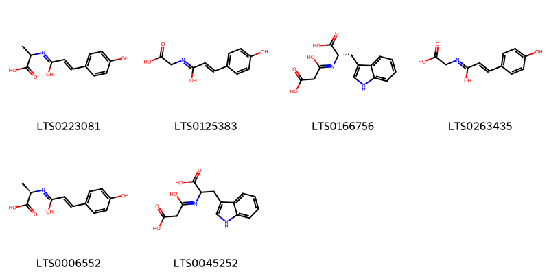{ width=100% }
    <figcaption>Hình ảnh cấu trúc hóa học của 6 hoạt chất thuộc nhóm Carboxylic acids and derivatives gồm ['2-{[1-hydroxy-3-(4-hydroxyphenyl)prop-2-en-1-ylidene]amino}propanoic acid (LTS0223081)', '{[(2e)-1-hydroxy-3-(4-hydroxyphenyl)prop-2-en-1-ylidene]amino}acetic acid (LTS0125383)', '(2s)-2-[(2-carboxy-1-hydroxyethylidene)amino]-3-(1h-indol-3-yl)propanoic acid (LTS0166756)', '{[1-hydroxy-3-(4-hydroxyphenyl)prop-2-en-1-ylidene]amino}acetic acid (LTS0263435)', '(2r)-2-{[(2e)-1-hydroxy-3-(4-hydroxyphenyl)prop-2-en-1-ylidene]amino}propanoic acid (LTS0006552)', '2-[(2-carboxy-1-hydroxyethylidene)amino]-3-(1h-indol-3-yl)propanoic acid (LTS0045252)'].</figcaption>
</figure>
#### Nhóm Cinnamic acids and derivatives
<figure markdown="span">
    { width=100% }
    <figcaption>Hình ảnh cấu trúc hóa học của 2 hoạt chất thuộc nhóm Cinnamic acids and derivatives gồm ['cinnamic acid (LTS0128130)', 'phenylacrylic acid (LTS0097258)'].</figcaption>
</figure>
#### Nhóm Fatty Acyls
<figure markdown="span">
    { width=100% }
    <figcaption>Hình ảnh cấu trúc hóa học của 2 hoạt chất thuộc nhóm Fatty Acyls gồm ['4-[3-(icosyloxy)-3-oxoprop-1-en-1-yl]benzoic acid (LTS0228695)', '4-[3-(docosyloxy)-3-oxoprop-1-en-1-yl]benzoic acid (LTS0129563)'].</figcaption>
</figure>
#### Nhóm Flavonoids
<figure markdown="span">
    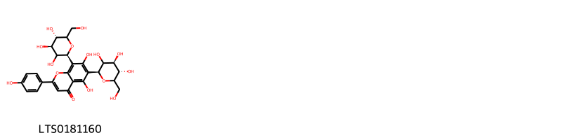{ width=100% }
    <figcaption>Hình ảnh cấu trúc hóa học của 1 hoạt chất thuộc nhóm Flavonoids gồm ['vicenin 2 (LTS0181160)'].</figcaption>
</figure>
#### Nhóm Quinolines and derivatives
<figure markdown="span">
    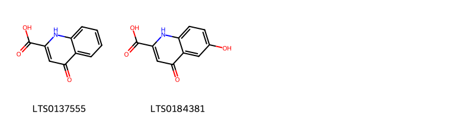{ width=100% }
    <figcaption>Hình ảnh cấu trúc hóa học của 2 hoạt chất thuộc nhóm Quinolines and derivatives gồm ['acid, kynurenic (LTS0137555)', '6-hydroxykynurenic acid (LTS0184381)'].</figcaption>
</figure>
#### Nhóm Steroids and steroid derivatives
<figure markdown="span">
    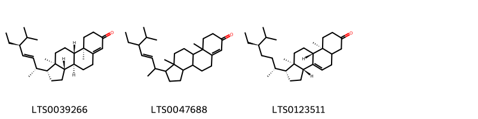{ width=100% }
    <figcaption>Hình ảnh cấu trúc hóa học của 3 hoạt chất thuộc nhóm Steroids and steroid derivatives gồm ['(1r,3as,3bs,9ar,9bs,11ar)-1-[(2r,3e,5s)-5-ethyl-6-methylhept-3-en-2-yl]-9a,11a-dimethyl-1h,2h,3h,3ah,3bh,4h,5h,8h,9h,9bh,10h,11h-cyclopenta[a]phenanthren-7-one (LTS0039266)', '1-(5-ethyl-6-methylhept-3-en-2-yl)-9a,11a-dimethyl-1h,2h,3h,3ah,3bh,4h,5h,8h,9h,9bh,10h,11h-cyclopenta[a]phenanthren-7-one (LTS0047688)', '(1r,3ar,9as,9br,11ar)-1-[(2r,5r)-5-ethyl-6-methylheptan-2-yl]-9a,11a-dimethyl-1h,2h,3h,3ah,5h,5ah,6h,8h,9h,9bh,10h,11h-cyclopenta[a]phenanthren-7-one (LTS0123511)'].</figcaption>
</figure>

---

### Dược dân tộc học

Danh sách các quốc gia có sử dụng *Ephedra distachya* trong điều trị các bệnh. 

| Country   | Disease                       | Bệnh                                                                                                                                                                                                |
|:----------|:------------------------------|:----------------------------------------------------------------------------------------------------------------------------------------------------------------------------------------------------|
| Elsewhere | Poison                        | MYMEMORY WARNING: YOU USED ALL AVAILABLE FREE TRANSLATIONS FOR TODAY. NEXT AVAILABLE IN  06 HOURS 26 MINUTES 58 SECONDS VISIT HTTPS://MYMEMORY.TRANSLATED.NET/DOC/USAGELIMITS.PHP TO TRANSLATE MORE |
| Japan*    | nan, Antitussive, Diaphoretic | MYMEMORY WARNING: YOU USED ALL AVAILABLE FREE TRANSLATIONS FOR TODAY. NEXT AVAILABLE IN  06 HOURS 26 MINUTES 52 SECONDS VISIT HTTPS://MYMEMORY.TRANSLATED.NET/DOC/USAGELIMITS.PHP TO TRANSLATE MORE |

---

---
## Ephedra equisetina
### Thông tin về thực vật

!!! info "Phân loại thực vật của *Ephedra equisetina* từ GIBF:"
    - **Kingdom:** Plantae
    - **Phylum:** Tracheophyta
    - **Order:** Ephedrales
    - **Family:** Ephedraceae
    - **Genus:** Ephedra
    - **Species:** *Ephedra equisetina*

 

| Label (VI)   | Label (EN)   | Scientific Name    | Descriptions (VI)   | Descriptions (EN)   | Also Known As (VI)   | Also Known As (EN)   |
|:-------------|:-------------|:-------------------|:--------------------|:--------------------|:---------------------|:---------------------|
| N/A          | N/A          | Ephedra equisetina | loài thực vật       | species of plant    | ['']                 | ['']                 |

#### Phân bố trên thế giới

**Từ CSDL GIBF** nan, Turkmenistan, Tajikistan, United States of America, Mongolia, Uzbekistan, Belgium, Kyrgyzstan, China, Russian Federation, Kazakhstan, Ukraine, unknown or invalid, France, Poland, Azerbaijan

#### Phân bố tại Việt Nam

**Từ CSDL GIBF**: Không có ghi nhận ở Việt Nam

---
### Thành phần hóa học
        
- Theo cơ sở dữ liệu lotus: Từ loài *Ephedra equisetina* đã phân lập và xác định được 30 hoạt chất thuộc về các nhóm Benzene and substituted derivatives, Flavonoids, Cinnamic acids and derivatives, Steroids and steroid derivatives, Prenol lipids. 

|    | chemicalTaxonomyClassyfireClass     |   smiles_count |
|---:|:------------------------------------|---------------:|
|  0 | Benzene and substituted derivatives |              9 |
|  1 | Cinnamic acids and derivatives      |              3 |
|  2 | Flavonoids                          |              4 |
|  3 | Prenol lipids                       |              4 |
|  4 | Steroids and steroid derivatives    |             10 |

#### Nhóm Benzene and substituted derivatives
<figure markdown="span">
    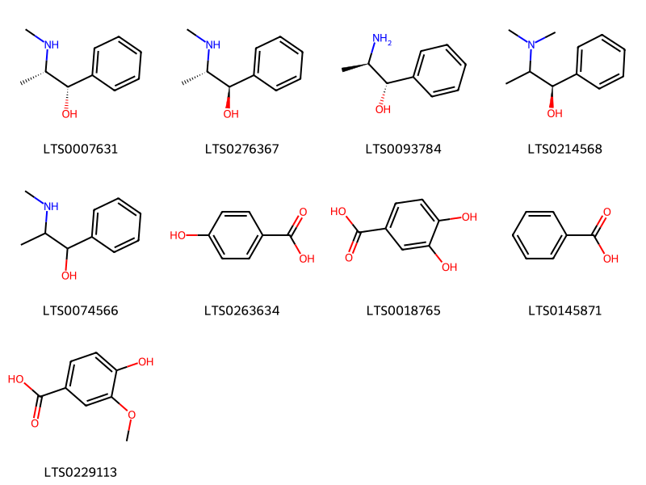{ width=100% }
    <figcaption>Hình ảnh cấu trúc hóa học của 9 hoạt chất thuộc nhóm Benzene and substituted derivatives gồm ['pseudoephedrine (LTS0007631)', 'ephedrine (LTS0276367)', 'phenylpropanolamine (LTS0093784)', '(1r)-2-(dimethylamino)-1-phenylpropan-1-ol (LTS0214568)', 'pseudoephedrine,  (LTS0074566)', 'p-hydroxybenzoic acid (LTS0263634)', '3,4-dihydroxybenzoic acid (LTS0018765)', 'benzoic acid (LTS0145871)', 'vanillic acid (LTS0229113)'].</figcaption>
</figure>
#### Nhóm Cinnamic acids and derivatives
<figure markdown="span">
    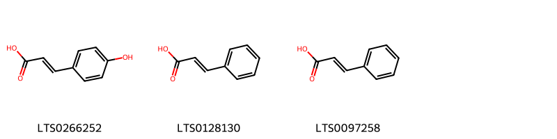{ width=100% }
    <figcaption>Hình ảnh cấu trúc hóa học của 3 hoạt chất thuộc nhóm Cinnamic acids and derivatives gồm ['para-coumaric acid (LTS0266252)', 'cinnamic acid (LTS0128130)', 'phenylacrylic acid (LTS0097258)'].</figcaption>
</figure>
#### Nhóm Flavonoids
<figure markdown="span">
    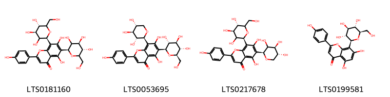{ width=100% }
    <figcaption>Hình ảnh cấu trúc hóa học của 4 hoạt chất thuộc nhóm Flavonoids gồm ['vicenin 2 (LTS0181160)', '5,7-dihydroxy-2-(4-hydroxyphenyl)-6-[(2s,3r,4r,5s,6r)-3,4,5-trihydroxy-6-(hydroxymethyl)oxan-2-yl]-8-[(2s,3r,4s,5r)-3,4,5-trihydroxyoxan-2-yl]chromen-4-one (LTS0053695)', 'vicenin 1 (LTS0217678)', 'vitexin (LTS0199581)'].</figcaption>
</figure>
#### Nhóm Prenol lipids
<figure markdown="span">
    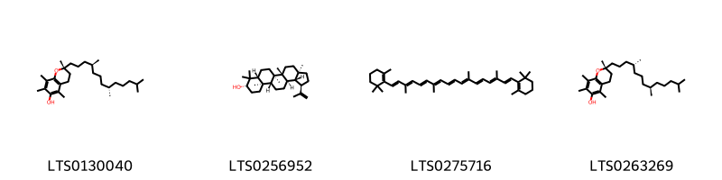{ width=100% }
    <figcaption>Hình ảnh cấu trúc hóa học của 4 hoạt chất thuộc nhóm Prenol lipids gồm ['(2r)-2,5,7,8-tetramethyl-2-[(4s,8s)-4,8,12-trimethyltridecyl]-3,4-dihydro-1-benzopyran-6-ol (LTS0130040)', 'lupeol (LTS0256952)', 'β-carotene (LTS0275716)', 'vitamin e (LTS0263269)'].</figcaption>
</figure>
#### Nhóm Steroids and steroid derivatives
<figure markdown="span">
    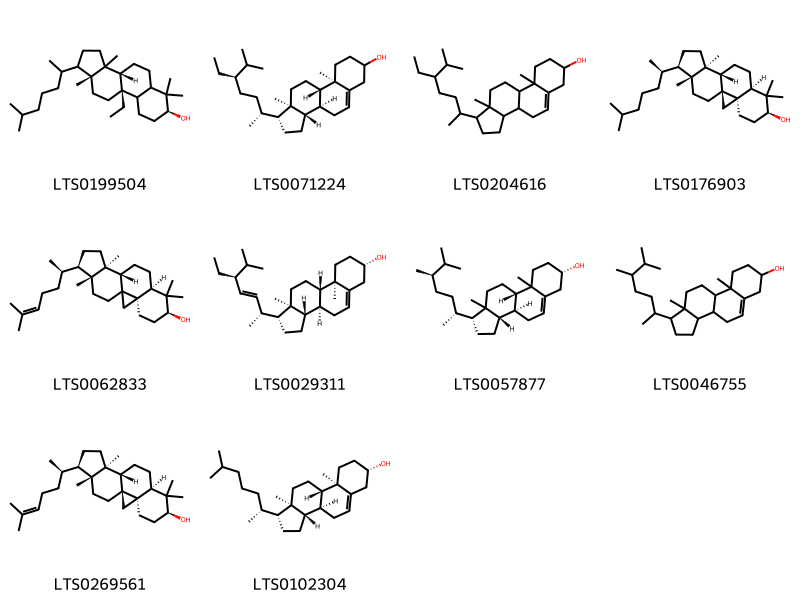{ width=100% }
    <figcaption>Hình ảnh cấu trúc hóa học của 10 hoạt chất thuộc nhóm Steroids and steroid derivatives gồm ['(3br,7s,9bs,11ar)-9b-ethyl-3a,6,6,11a-tetramethyl-1-(6-methylheptan-2-yl)-dodecahydro-1h-cyclopenta[a]phenanthren-7-ol (LTS0199504)', 'stigmast-5-en-3-ol (LTS0071224)', 'stigmast-5-en-3-ol, (3β)- (LTS0204616)', 'cycloartanol (LTS0176903)', '(3r,6s,8r,11s,12s,15r,16r)-7,7,12,16-tetramethyl-15-[(2r)-6-methylhept-5-en-2-yl]pentacyclo[9.7.0.0¹,³.0³,⁸.0¹²,¹⁶]octadecan-6-ol (LTS0062833)', 'phytosterol (LTS0029311)', '(1r,3as,3bs,7s,9bs)-1-[(2r,5r)-5,6-dimethylheptan-2-yl]-9a,11a-dimethyl-1h,2h,3h,3ah,3bh,4h,6h,7h,8h,9h,9bh,10h,11h-cyclopenta[a]phenanthren-7-ol (LTS0057877)', 'campesterol (LTS0046755)', 'cycloartenol (LTS0269561)', 'cholesterol (LTS0102304)'].</figcaption>
</figure>

---

### Dược dân tộc học

Danh sách các quốc gia có sử dụng *Ephedra equisetina* trong điều trị các bệnh. 

| Country   | Disease                       | Bệnh                                                                                                                                                                                                |
|:----------|:------------------------------|:----------------------------------------------------------------------------------------------------------------------------------------------------------------------------------------------------|
| Japan*    | Antitussive, nan, Diaphoretic | MYMEMORY WARNING: YOU USED ALL AVAILABLE FREE TRANSLATIONS FOR TODAY. NEXT AVAILABLE IN  06 HOURS 26 MINUTES 15 SECONDS VISIT HTTPS://MYMEMORY.TRANSLATED.NET/DOC/USAGELIMITS.PHP TO TRANSLATE MORE |

---

---
## Ephedra foliata
### Thông tin về thực vật

!!! info "Phân loại thực vật của *Ephedra ciliata* từ GIBF:"
    - **Kingdom:** Plantae
    - **Phylum:** Tracheophyta
    - **Order:** Ephedrales
    - **Family:** Ephedraceae
    - **Genus:** Ephedra
    - **Species:** *Ephedra ciliata*

 

| Label (VI)   | Label (EN)   | Scientific Name   | Descriptions (VI)   | Descriptions (EN)   | Also Known As (VI)   | Also Known As (EN)    |
|:-------------|:-------------|:------------------|:--------------------|:--------------------|:---------------------|:----------------------|
| N/A          | N/A          | Ephedra foliata   | loài thực vật       | species of plant    | ['']                 | ['Shrubby horsetail'] |

#### Phân bố trên thế giới

**Từ CSDL GIBF** United Arab Emirates, Uzbekistan, Iran (Islamic Republic of), Saudi Arabia, Oman, Israel, India

#### Phân bố tại Việt Nam

**Từ CSDL GIBF**: Không có ghi nhận ở Việt Nam

---
### Thành phần hóa học
        
- Theo cơ sở dữ liệu lotus: Từ loài *Ephedra ciliata* đã phân lập và xác định được 5 hoạt chất thuộc về các nhóm Organooxygen compounds, Benzene and substituted derivatives, Quinolines and derivatives. 

|    | chemicalTaxonomyClassyfireClass     |   smiles_count |
|---:|:------------------------------------|---------------:|
|  0 | Benzene and substituted derivatives |              2 |
|  1 | Organooxygen compounds              |              2 |
|  2 | Quinolines and derivatives          |              1 |

#### Nhóm Benzene and substituted derivatives
<figure markdown="span">
    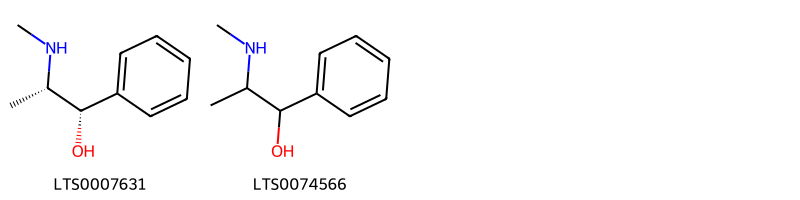{ width=100% }
    <figcaption>Hình ảnh cấu trúc hóa học của 2 hoạt chất thuộc nhóm Benzene and substituted derivatives gồm ['pseudoephedrine (LTS0007631)', 'pseudoephedrine,  (LTS0074566)'].</figcaption>
</figure>
#### Nhóm Organooxygen compounds
<figure markdown="span">
    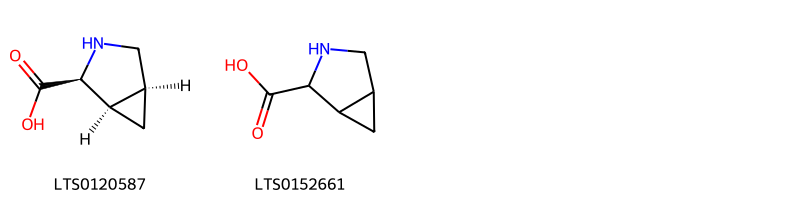{ width=100% }
    <figcaption>Hình ảnh cấu trúc hóa học của 2 hoạt chất thuộc nhóm Organooxygen compounds gồm ['(1r,2s,5s)-3-azabicyclo[3.1.0]hexane-2-carboxylic acid (LTS0120587)', '3-azabicyclo[3.1.0]hexane-2-carboxylic acid (LTS0152661)'].</figcaption>
</figure>
#### Nhóm Quinolines and derivatives
<figure markdown="span">
    { width=100% }
    <figcaption>Hình ảnh cấu trúc hóa học của 1 hoạt chất thuộc nhóm Quinolines and derivatives gồm ['6-hydroxykynurenic acid (LTS0184381)'].</figcaption>
</figure>

---

### Dược dân tộc học

Danh sách các quốc gia có sử dụng *Ephedra ciliata* trong điều trị các bệnh. 

| Country   | Disease     | Bệnh                                                                                                                                                                                                |
|:----------|:------------|:----------------------------------------------------------------------------------------------------------------------------------------------------------------------------------------------------|
| Iraq      | Cardiotonic | MYMEMORY WARNING: YOU USED ALL AVAILABLE FREE TRANSLATIONS FOR TODAY. NEXT AVAILABLE IN  06 HOURS 25 MINUTES 40 SECONDS VISIT HTTPS://MYMEMORY.TRANSLATED.NET/DOC/USAGELIMITS.PHP TO TRANSLATE MORE |

---

---
## Ephedra fragilis
### Thông tin về thực vật

!!! info "Phân loại thực vật của *Ephedra fragilis* từ GIBF:"
    - **Kingdom:** Plantae
    - **Phylum:** Tracheophyta
    - **Order:** Ephedrales
    - **Family:** Ephedraceae
    - **Genus:** Ephedra
    - **Species:** *Ephedra fragilis*

 

| Label (VI)   | Label (EN)   | Scientific Name   | Descriptions (VI)   | Descriptions (EN)   | Also Known As (VI)   | Also Known As (EN)   |
|:-------------|:-------------|:------------------|:--------------------|:--------------------|:---------------------|:---------------------|
| N/A          | N/A          | Ephedra fragilis  | loài thực vật       | species of plant    | ['']                 | ['']                 |

#### Phân bố trên thế giới

**Từ CSDL GIBF** Morocco, Gibraltar, Algeria, Portugal, Greece, Italy, France, Spain

#### Phân bố tại Việt Nam

**Từ CSDL GIBF**: Không có ghi nhận ở Việt Nam

---
### Thành phần hóa học
        
- Theo cơ sở dữ liệu lotus: Từ loài *Ephedra fragilis* đã phân lập và xác định được 6 hoạt chất thuộc về các nhóm Benzene and substituted derivatives, Quinolines and derivatives, Flavonoids. 

|    | chemicalTaxonomyClassyfireClass     |   smiles_count |
|---:|:------------------------------------|---------------:|
|  0 | Benzene and substituted derivatives |              1 |
|  1 | Flavonoids                          |              2 |
|  2 | Quinolines and derivatives          |              2 |

#### Nhóm Benzene and substituted derivatives
<figure markdown="span">
    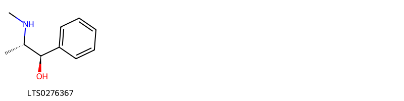{ width=100% }
    <figcaption>Hình ảnh cấu trúc hóa học của 1 hoạt chất thuộc nhóm Benzene and substituted derivatives gồm ['ephedrine (LTS0276367)'].</figcaption>
</figure>
#### Nhóm Flavonoids
<figure markdown="span">
    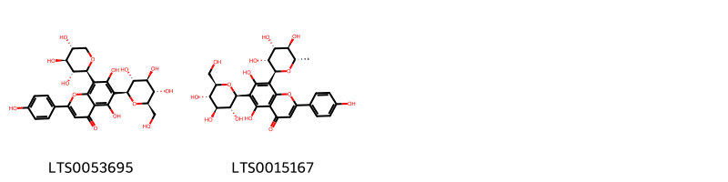{ width=100% }
    <figcaption>Hình ảnh cấu trúc hóa học của 2 hoạt chất thuộc nhóm Flavonoids gồm ['5,7-dihydroxy-2-(4-hydroxyphenyl)-6-[(2s,3r,4r,5s,6r)-3,4,5-trihydroxy-6-(hydroxymethyl)oxan-2-yl]-8-[(2s,3r,4s,5r)-3,4,5-trihydroxyoxan-2-yl]chromen-4-one (LTS0053695)', 'violanthin (LTS0015167)'].</figcaption>
</figure>
#### Nhóm Quinolines and derivatives
<figure markdown="span">
    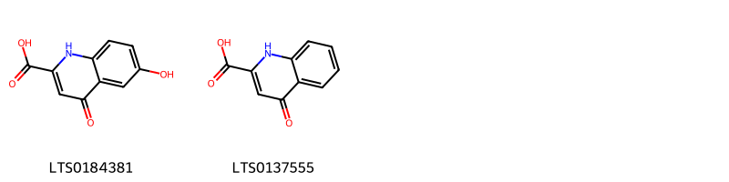{ width=100% }
    <figcaption>Hình ảnh cấu trúc hóa học của 2 hoạt chất thuộc nhóm Quinolines and derivatives gồm ['6-hydroxykynurenic acid (LTS0184381)', 'acid, kynurenic (LTS0137555)'].</figcaption>
</figure>

---

### Dược dân tộc học

Danh sách các quốc gia có sử dụng *Ephedra fragilis* trong điều trị các bệnh. 

| Country   | Disease              | Bệnh                                                                                                                                                                                                |
|:----------|:---------------------|:----------------------------------------------------------------------------------------------------------------------------------------------------------------------------------------------------|
| ain       | Sudorific, Stimulant | MYMEMORY WARNING: YOU USED ALL AVAILABLE FREE TRANSLATIONS FOR TODAY. NEXT AVAILABLE IN  06 HOURS 25 MINUTES 03 SECONDS VISIT HTTPS://MYMEMORY.TRANSLATED.NET/DOC/USAGELIMITS.PHP TO TRANSLATE MORE |

---

---
## Ephedra gerardiana
### Thông tin về thực vật

!!! info "Phân loại thực vật của *Ephedra gerardiana* từ GIBF:"
    - **Kingdom:** Plantae
    - **Phylum:** Tracheophyta
    - **Order:** Ephedrales
    - **Family:** Ephedraceae
    - **Genus:** Ephedra
    - **Species:** *Ephedra gerardiana*

 

| Label (VI)   | Label (EN)   | Scientific Name    | Descriptions (VI)   | Descriptions (EN)   | Also Known As (VI)   | Also Known As (EN)   |
|:-------------|:-------------|:-------------------|:--------------------|:--------------------|:---------------------|:---------------------|
| N/A          | N/A          | Ephedra gerardiana | loài thực vật       | species of plant    | ['']                 | ['']                 |

#### Phân bố trên thế giới

**Từ CSDL GIBF** nan, Tajikistan, United States of America, Greece, Bhutan, Belgium, Nepal, Sweden, China, Russian Federation, Pakistan, India, Germany

#### Phân bố tại Việt Nam

**Từ CSDL GIBF**: Không có ghi nhận ở Việt Nam

---
### Thành phần hóa học
        
- Theo cơ sở dữ liệu lotus: Từ loài *Ephedra gerardiana* đã phân lập và xác định được 11 hoạt chất thuộc về các nhóm Fatty Acyls, Benzene and substituted derivatives, Quinolines and derivatives, Organic phosphoric acids and derivatives, Organooxygen compounds. 

|    | chemicalTaxonomyClassyfireClass          |   smiles_count |
|---:|:-----------------------------------------|---------------:|
|  0 | Benzene and substituted derivatives      |              5 |
|  1 | Fatty Acyls                              |              2 |
|  2 | Organic phosphoric acids and derivatives |              1 |
|  3 | Organooxygen compounds                   |              1 |
|  4 | Quinolines and derivatives               |              1 |

#### Nhóm Benzene and substituted derivatives
<figure markdown="span">
    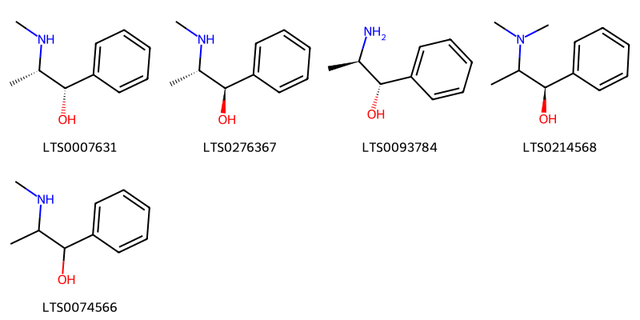{ width=100% }
    <figcaption>Hình ảnh cấu trúc hóa học của 5 hoạt chất thuộc nhóm Benzene and substituted derivatives gồm ['pseudoephedrine (LTS0007631)', 'ephedrine (LTS0276367)', 'phenylpropanolamine (LTS0093784)', '(1r)-2-(dimethylamino)-1-phenylpropan-1-ol (LTS0214568)', 'pseudoephedrine,  (LTS0074566)'].</figcaption>
</figure>
#### Nhóm Fatty Acyls
<figure markdown="span">
    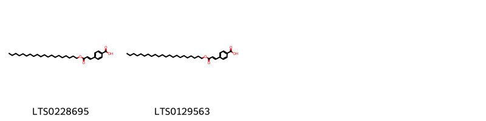{ width=100% }
    <figcaption>Hình ảnh cấu trúc hóa học của 2 hoạt chất thuộc nhóm Fatty Acyls gồm ['4-[3-(icosyloxy)-3-oxoprop-1-en-1-yl]benzoic acid (LTS0228695)', '4-[3-(docosyloxy)-3-oxoprop-1-en-1-yl]benzoic acid (LTS0129563)'].</figcaption>
</figure>
#### Nhóm Organic phosphoric acids and derivatives
<figure markdown="span">
    { width=100% }
    <figcaption>Hình ảnh cấu trúc hóa học của 1 hoạt chất thuộc nhóm Organic phosphoric acids and derivatives gồm ['o-phosphoethanolamine; bis(nonane) (LTS0249963)'].</figcaption>
</figure>
#### Nhóm Organooxygen compounds
<figure markdown="span">
    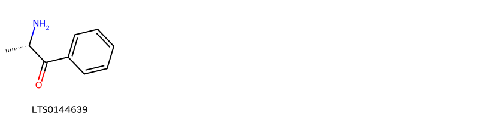{ width=100% }
    <figcaption>Hình ảnh cấu trúc hóa học của 1 hoạt chất thuộc nhóm Organooxygen compounds gồm ['cathinone (LTS0144639)'].</figcaption>
</figure>
#### Nhóm Quinolines and derivatives
<figure markdown="span">
    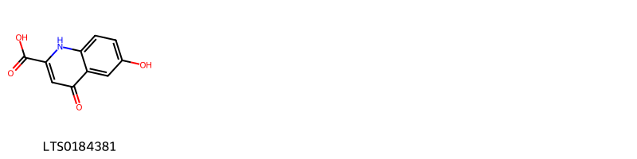{ width=100% }
    <figcaption>Hình ảnh cấu trúc hóa học của 1 hoạt chất thuộc nhóm Quinolines and derivatives gồm ['6-hydroxykynurenic acid (LTS0184381)'].</figcaption>
</figure>

---

### Dược dân tộc học

Danh sách các quốc gia có sử dụng *Ephedra gerardiana* trong điều trị các bệnh. 

| Country   | Disease                                            | Bệnh                                                                                                                                                                                                |
|:----------|:---------------------------------------------------|:----------------------------------------------------------------------------------------------------------------------------------------------------------------------------------------------------|
| India     | Cardiotonic                                        | MYMEMORY WARNING: YOU USED ALL AVAILABLE FREE TRANSLATIONS FOR TODAY. NEXT AVAILABLE IN  06 HOURS 24 MINUTES 27 SECONDS VISIT HTTPS://MYMEMORY.TRANSLATED.NET/DOC/USAGELIMITS.PHP TO TRANSLATE MORE |
| Nepal     | Cardiotonic, Hypotensive, Cardiotonic, Hypotensive | MYMEMORY WARNING: YOU USED ALL AVAILABLE FREE TRANSLATIONS FOR TODAY. NEXT AVAILABLE IN  06 HOURS 24 MINUTES 24 SECONDS VISIT HTTPS://MYMEMORY.TRANSLATED.NET/DOC/USAGELIMITS.PHP TO TRANSLATE MORE |

---

---
## Ephedra sinica
### Thông tin về thực vật

!!! info "Phân loại thực vật của *Ephedra sinica* từ GIBF:"
    - **Kingdom:** Plantae
    - **Phylum:** Tracheophyta
    - **Order:** Ephedrales
    - **Family:** Ephedraceae
    - **Genus:** Ephedra
    - **Species:** *Ephedra sinica*

 

| Label (VI)   | Label (EN)   | Scientific Name   | Descriptions (VI)   | Descriptions (EN)   | Also Known As (VI)   | Also Known As (EN)   |
|:-------------|:-------------|:------------------|:--------------------|:--------------------|:---------------------|:---------------------|
| N/A          | N/A          | Ephedra sinica    | loài thực vật       | species of plant    | ['']                 | ['']                 |

#### Phân bố trên thế giới

**Từ CSDL GIBF** nan, United States of America, Japan, Mongolia, China, Russian Federation, Canada, Germany

#### Phân bố tại Việt Nam

**Từ CSDL GIBF**: Không có ghi nhận ở Việt Nam

---
### Thành phần hóa học
        
- Theo cơ sở dữ liệu lotus: Từ loài *Ephedra sinica* đã phân lập và xác định được 34 hoạt chất thuộc về các nhóm Fatty Acyls, Benzene and substituted derivatives, Flavonoids, Diazines, Phenols, Phenol ethers, Prenol lipids. 

|    | chemicalTaxonomyClassyfireClass     |   smiles_count |
|---:|:------------------------------------|---------------:|
|  0 | Benzene and substituted derivatives |             11 |
|  1 | Diazines                            |              1 |
|  2 | Fatty Acyls                         |              4 |
|  3 | Flavonoids                          |              9 |
|  4 | Phenol ethers                       |              1 |
|  5 | Phenols                             |              1 |
|  6 | Prenol lipids                       |              7 |

#### Nhóm Benzene and substituted derivatives
<figure markdown="span">
    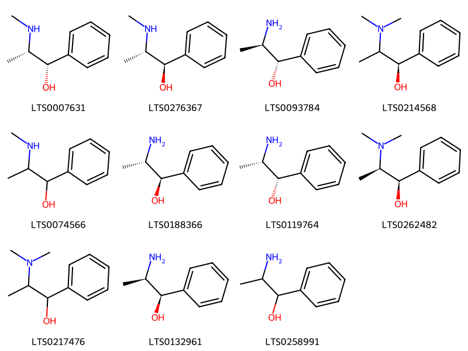{ width=100% }
    <figcaption>Hình ảnh cấu trúc hóa học của 11 hoạt chất thuộc nhóm Benzene and substituted derivatives gồm ['pseudoephedrine (LTS0007631)', 'ephedrine (LTS0276367)', 'phenylpropanolamine (LTS0093784)', '(1r)-2-(dimethylamino)-1-phenylpropan-1-ol (LTS0214568)', 'pseudoephedrine,  (LTS0074566)', '(-)-norephedrine (LTS0188366)', 'cathine (LTS0119764)', '(1r,2r)-2-(dimethylamino)-1-phenylpropan-1-ol (LTS0262482)', 'methylephedrine (LTS0217476)', 'l-norpseudoephedrine (LTS0132961)', '2-amino-1-phenyl-propan-1-ol (LTS0258991)'].</figcaption>
</figure>
#### Nhóm Diazines
<figure markdown="span">
    { width=100% }
    <figcaption>Hình ảnh cấu trúc hóa học của 1 hoạt chất thuộc nhóm Diazines gồm ['ligustrazine (LTS0230758)'].</figcaption>
</figure>
#### Nhóm Fatty Acyls
<figure markdown="span">
    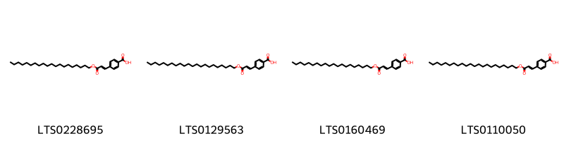{ width=100% }
    <figcaption>Hình ảnh cấu trúc hóa học của 4 hoạt chất thuộc nhóm Fatty Acyls gồm ['4-[3-(icosyloxy)-3-oxoprop-1-en-1-yl]benzoic acid (LTS0228695)', '4-[3-(docosyloxy)-3-oxoprop-1-en-1-yl]benzoic acid (LTS0129563)', '4-[(1e)-3-(icosyloxy)-3-oxoprop-1-en-1-yl]benzoic acid (LTS0160469)', '4-[(1e)-3-(docosyloxy)-3-oxoprop-1-en-1-yl]benzoic acid (LTS0110050)'].</figcaption>
</figure>
#### Nhóm Flavonoids
<figure markdown="span">
    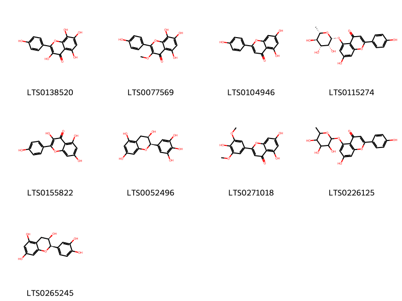{ width=100% }
    <figcaption>Hình ảnh cấu trúc hóa học của 9 hoạt chất thuộc nhóm Flavonoids gồm ['herbacetin (LTS0138520)', '3-methylherbacetin (LTS0077569)', 'chamomile (LTS0104946)', '7-hydroxy-2-(4-hydroxyphenyl)-5-{[(2r,3r,4r,5r,6s)-3,4,5-trihydroxy-6-methyloxan-2-yl]oxy}chromen-4-one (LTS0115274)', 'kaempherol (LTS0155822)', 'epigallocatechin (LTS0052496)', 'tricin (LTS0271018)', '7-hydroxy-2-(4-hydroxyphenyl)-5-[(3,4,5-trihydroxy-6-methyloxan-2-yl)oxy]chromen-4-one (LTS0226125)', 'ent-epicatechin (LTS0265245)'].</figcaption>
</figure>
#### Nhóm Phenol ethers
<figure markdown="span">
    { width=100% }
    <figcaption>Hình ảnh cấu trúc hóa học của 1 hoạt chất thuộc nhóm Phenol ethers gồm ['4-vinylanisole (LTS0020637)'].</figcaption>
</figure>
#### Nhóm Phenols
<figure markdown="span">
    { width=100% }
    <figcaption>Hình ảnh cấu trúc hóa học của 1 hoạt chất thuộc nhóm Phenols gồm ['synephrine (LTS0189530)'].</figcaption>
</figure>
#### Nhóm Prenol lipids
<figure markdown="span">
    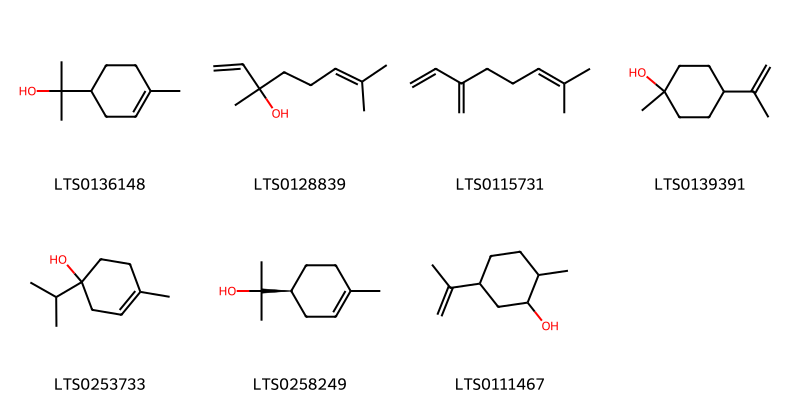{ width=100% }
    <figcaption>Hình ảnh cấu trúc hóa học của 7 hoạt chất thuộc nhóm Prenol lipids gồm ['terpineol (LTS0136148)', 'linalool, (+-)- (LTS0128839)', 'α-myrcene (LTS0115731)', 'terpineols (LTS0139391)', '4-terpineol (LTS0253733)', '(+)-α-terpineol (LTS0258249)', 'dihydrocarveol (LTS0111467)'].</figcaption>
</figure>

---

### Dược dân tộc học

Danh sách các quốc gia có sử dụng *Ephedra sinica* trong điều trị các bệnh. 

| Country   | Disease                       | Bệnh                                                                                                                                                                                                |
|:----------|:------------------------------|:----------------------------------------------------------------------------------------------------------------------------------------------------------------------------------------------------|
| China     | Poison                        | MYMEMORY WARNING: YOU USED ALL AVAILABLE FREE TRANSLATIONS FOR TODAY. NEXT AVAILABLE IN  06 HOURS 23 MINUTES 56 SECONDS VISIT HTTPS://MYMEMORY.TRANSLATED.NET/DOC/USAGELIMITS.PHP TO TRANSLATE MORE |
| Japan*    | Antitussive, Diaphoretic, nan | MYMEMORY WARNING: YOU USED ALL AVAILABLE FREE TRANSLATIONS FOR TODAY. NEXT AVAILABLE IN  06 HOURS 23 MINUTES 53 SECONDS VISIT HTTPS://MYMEMORY.TRANSLATED.NET/DOC/USAGELIMITS.PHP TO TRANSLATE MORE |

---

---
## Ephedra vulgaris
### Thông tin về thực vật

!!! info "Phân loại thực vật của *N/A* từ GIBF:"
    - **Kingdom:** Plantae
    - **Phylum:** Tracheophyta
    - **Order:** Ephedrales
    - **Family:** Ephedraceae
    - **Genus:** Ephedra
    - **Species:** *N/A*

 

| Label (VI)   | Label (EN)   | Scientific Name   | Descriptions (VI)   | Descriptions (EN)   | Also Known As (VI)   | Also Known As (EN)   |
|:-------------|:-------------|:------------------|:--------------------|:--------------------|:---------------------|:---------------------|
| N/A          | N/A          | Ephedra vulgaris  |                     |                     | ['']                 | ['']                 |

#### Phân bố trên thế giới

**Từ CSDL GIBF** United Arab Emirates, Israel, Chile, Uruguay, Spain, Bolivia (Plurinational State of), United States of America, Greece, Russian Federation, Croatia, Argentina, Cyprus, Morocco, Mexico, Gibraltar, Palestine, State of, Germany, Lebanon, Hungary, Ukraine, Kyrgyzstan, Italy, Switzerland, Bulgaria, France

#### Phân bố tại Việt Nam

**Từ CSDL GIBF**: Không có ghi nhận ở Việt Nam

---
### Thành phần hóa học
        
- Theo cơ sở dữ liệu lotus: Từ loài *N/A* đã phân lập và xác định được Chưa có hoạt chất nào được phân lập. hoạt chất thuộc về các nhóm Không có hoạt chất nào được phân lập. 

Không có hình ảnh nào được tạo ra

---

### Dược dân tộc học

Danh sách các quốc gia có sử dụng *N/A* trong điều trị các bệnh. 

| Country   | Disease                               | Bệnh                                                                                                                                                                                                |
|:----------|:--------------------------------------|:----------------------------------------------------------------------------------------------------------------------------------------------------------------------------------------------------|
| China     | Diaphoretic, Astringent               | MYMEMORY WARNING: YOU USED ALL AVAILABLE FREE TRANSLATIONS FOR TODAY. NEXT AVAILABLE IN  06 HOURS 23 MINUTES 10 SECONDS VISIT HTTPS://MYMEMORY.TRANSLATED.NET/DOC/USAGELIMITS.PHP TO TRANSLATE MORE |
| Elsewhere | Collyrium                             | MYMEMORY WARNING: YOU USED ALL AVAILABLE FREE TRANSLATIONS FOR TODAY. NEXT AVAILABLE IN  06 HOURS 23 MINUTES 04 SECONDS VISIT HTTPS://MYMEMORY.TRANSLATED.NET/DOC/USAGELIMITS.PHP TO TRANSLATE MORE |
| Turkey    | Diuretic, Stomachic, Sudorific, Tonic | MYMEMORY WARNING: YOU USED ALL AVAILABLE FREE TRANSLATIONS FOR TODAY. NEXT AVAILABLE IN  06 HOURS 22 MINUTES 59 SECONDS VISIT HTTPS://MYMEMORY.TRANSLATED.NET/DOC/USAGELIMITS.PHP TO TRANSLATE MORE |

---

