!!! abstract "Tóm tắt"

    Họ Equisetaceae gồm khoảng 1 chi và 12 loài được một số cộng đồng tại các quốc gia như ain, Elsewhere, Colombia, Dominican Republic, Panama, US(Flathead), Peru, India, Egypt, US, Turkey, China, Mexico, Germany* sử dụng trong một số trường hợp MYMEMORY WARNING: YOU USED ALL AVAILABLE FREE TRANSLATIONS FOR TODAY. NEXT AVAILABLE IN  15 HOURS 04 MINUTES 10 SECONDS VISIT HTTPS://MYMEMORY.TRANSLATED.NET/DOC/USAGELIMITS.PHP TO TRANSLATE MORE.

!!! info "DrDuke"

    James A. Duke sinh năm 1929-2017 là một nhà thực vật học người Mỹ. Đây là một trong những tác giả hàng đầu trong lĩnh vực dược dân tộc học với cuốn *CRC Handbook of Medicinal Herbs* và chính là người xây dựng lên cơ sở dữ liệu về hợp chất tự nhiên và dược dân tộc học tại Bộ nông nghiệp Hoa Kỳ. Các thông tin được đăng tải tại website [Dr. Duke's Phytochemical and Ethnobotanical Databases](https://phytochem.nal.usda.gov/). 
    Trong suốt thập niên 1970, ông lãnh đạo the Plant Taxonomy Laboratory, Plant Genetics and Germplasm Institute of the Agricultural Research Service, U.S. Department of Agriculture.
    Trong tài liệu này, các thông tin về dược dân tộc của các dược liệu được trích dẫn từ tài liệu của James A. Ducke với sự trợ giúp của phần mềm dịch thuật từ tiếng Anh sang tiếng Việt.
   

# Chi Equisetum

??? note "Danh sách các dược liệu thuộc chi"
    
	 - *Equisetum arvens*
	 - *Equisetum arvense*
	 - *Equisetum bogotense*
	 - *Equisetum debile*
	 - *Equisetum fluviatilis*
	 - *Equisetum giganteum*
	 - *Equisetum hiemale*
	 - *Equisetum hyemale*
	 - *Equisetum palustre*
	 - *Equisetum ramosissimum*
	 - *Equisetum robustum*
	 - *Equisetum telmateia*

---
## Equisetum arvens
### Thông tin về thực vật

!!! info "Phân loại thực vật của *Equisetum arvense* từ GIBF:"
    - **Kingdom:** Plantae
    - **Phylum:** Tracheophyta
    - **Order:** Equisetales
    - **Family:** Equisetaceae
    - **Genus:** Equisetum
    - **Species:** *Equisetum arvense*

 

| Label (VI)   | Label (EN)   | Scientific Name   | Descriptions (VI)   | Descriptions (EN)   | Also Known As (VI)   | Also Known As (EN)   |
|:-------------|:-------------|:------------------|:--------------------|:--------------------|:---------------------|:---------------------|
| N/A          | N/A          | Adenia volkensii  | loài thực vật       | species of plant    | ['']                 | ['']                 |

#### Phân bố trên thế giới

**Từ CSDL GIBF** Denmark, Spain, Germany, Austria, Korea, Republic of, Poland, Canada, Belgium, Finland, Netherlands, Slovakia, Slovenia, Japan, Hungary, Ireland, Chinese Taipei, Switzerland, United Kingdom of Great Britain and Northern Ireland, Portugal, France, Czechia, New Zealand, Russian Federation, United States of America, Italy, Ukraine

#### Phân bố tại Việt Nam

**Từ CSDL GIBF**: Không có ghi nhận ở Việt Nam

---
### Thành phần hóa học
        
- Theo cơ sở dữ liệu lotus: Từ loài *Equisetum arvense* đã phân lập và xác định được 123 hoạt chất thuộc về các nhóm Organooxygen compounds, Flavonoids, Benzofurans, Prenol lipids, Carboxylic acids and derivatives, Fatty Acyls, Pyridines and derivatives, Tetrapyrroles and derivatives, Pyrrolidines, Indanes, Phenols, Steroids and steroid derivatives, Cinnamic acids and derivatives, Benzene and substituted derivatives, Organic phosphoric acids and derivatives. 

|    | chemicalTaxonomyClassyfireClass          |   smiles_count |
|---:|:-----------------------------------------|---------------:|
|  0 | Benzene and substituted derivatives      |              6 |
|  1 | Benzofurans                              |              1 |
|  2 | Carboxylic acids and derivatives         |              3 |
|  3 | Cinnamic acids and derivatives           |              6 |
|  4 | Fatty Acyls                              |              5 |
|  5 | Flavonoids                               |             44 |
|  6 | Indanes                                  |              1 |
|  7 | Organic phosphoric acids and derivatives |              1 |
|  8 | Organooxygen compounds                   |             11 |
|  9 | Phenols                                  |              2 |
| 10 | Prenol lipids                            |             25 |
| 11 | Pyridines and derivatives                |              2 |
| 12 | Pyrrolidines                             |              1 |
| 13 | Steroids and steroid derivatives         |             14 |
| 14 | Tetrapyrroles and derivatives            |              1 |

#### Nhóm Benzene and substituted derivatives
<figure markdown="span">
    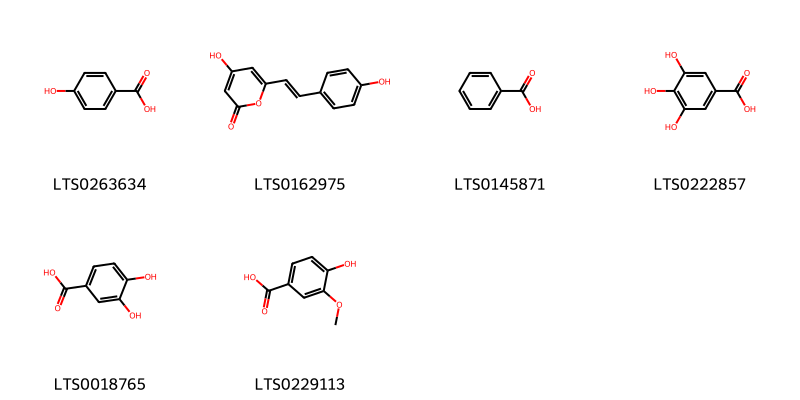{ width=100% }
    <figcaption>Hình ảnh cấu trúc hóa học của 6 hoạt chất thuộc nhóm Benzene and substituted derivatives gồm ['p-hydroxybenzoic acid (LTS0263634)', 'bis-noryangonin (LTS0162975)', 'benzoic acid (LTS0145871)', 'galop (LTS0222857)', '3,4-dihydroxybenzoic acid (LTS0018765)', 'vanillic acid (LTS0229113)'].</figcaption>
</figure>
#### Nhóm Benzofurans
<figure markdown="span">
    { width=100% }
    <figcaption>Hình ảnh cấu trúc hóa học của 1 hoạt chất thuộc nhóm Benzofurans gồm ['(7ar)-6-hydroxy-4,4,7a-trimethyl-6,7-dihydro-5h-1-benzofuran-2-one (LTS0273073)'].</figcaption>
</figure>
#### Nhóm Carboxylic acids and derivatives
<figure markdown="span">
    { width=100% }
    <figcaption>Hình ảnh cấu trúc hóa học của 3 hoạt chất thuộc nhóm Carboxylic acids and derivatives gồm ['2,3-bis({[3-(3,4-dihydroxyphenyl)prop-2-enoyl]oxy})butanedioic acid (LTS0188500)', 'cichoric acid (LTS0177566)', 'l-cystathionine (LTS0062382)'].</figcaption>
</figure>
#### Nhóm Cinnamic acids and derivatives
<figure markdown="span">
    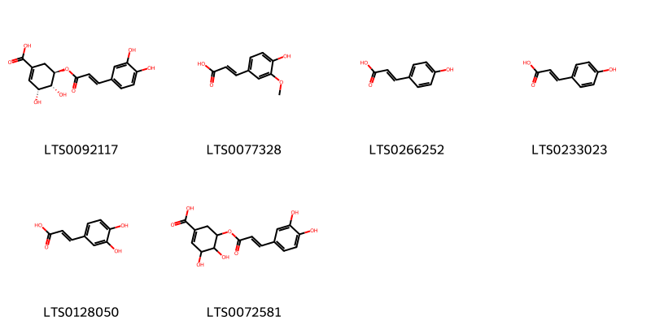{ width=100% }
    <figcaption>Hình ảnh cấu trúc hóa học của 6 hoạt chất thuộc nhóm Cinnamic acids and derivatives gồm ['5-o-caffeoylshikimic acid (LTS0092117)', 'ferulic acid (LTS0077328)', 'para-coumaric acid (LTS0266252)', 'hydroxycinnamic acid (LTS0233023)', '3,4-dihydroxycinnamic acid (LTS0128050)', '5-{[3-(3,4-dihydroxyphenyl)prop-2-enoyl]oxy}-3,4-dihydroxycyclohex-1-ene-1-carboxylic acid (LTS0072581)'].</figcaption>
</figure>
#### Nhóm Fatty Acyls
<figure markdown="span">
    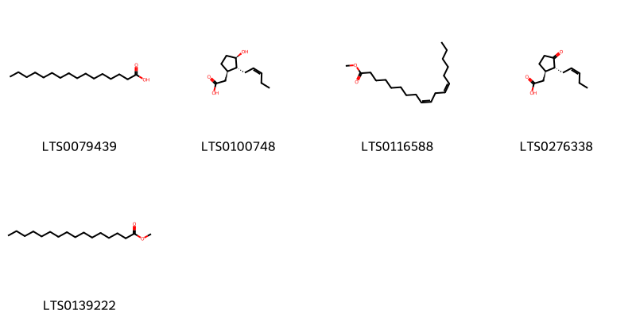{ width=100% }
    <figcaption>Hình ảnh cấu trúc hóa học của 5 hoạt chất thuộc nhóm Fatty Acyls gồm ['palmitic acid (LTS0079439)', '[(1r,2r,3r)-3-hydroxy-2-[(2z)-pent-2-en-1-yl]cyclopentyl]acetic acid (LTS0100748)', 'methyl linoleate (LTS0116588)', 'jasmonic acid (LTS0276338)', 'methyl palmitate (LTS0139222)'].</figcaption>
</figure>
#### Nhóm Flavonoids
<figure markdown="span">
    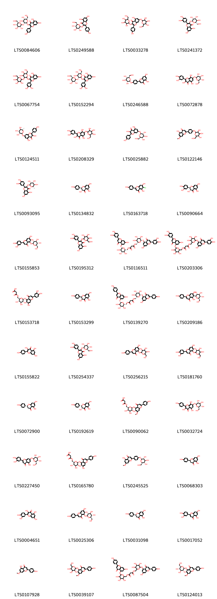{ width=100% }
    <figcaption>Hình ảnh cấu trúc hóa học của 44 hoạt chất thuộc nhóm Flavonoids gồm ['kaempferol 3-o-sophoroside (LTS0084606)', 'astragalin (LTS0249588)', '5-hydroxy-2-(4-hydroxyphenyl)-3,7-bis({[3,4,5-trihydroxy-6-(hydroxymethyl)oxan-2-yl]oxy})chromen-4-one (LTS0033278)', '2-(3,4-dihydroxyphenyl)-5,7-dihydroxy-3-{[(2s,3r,4r,5r,6s)-3,4,5-trihydroxy-6-(hydroxymethyl)oxan-2-yl]oxy}chromen-4-one (LTS0241372)', '3-{[4,5-dihydroxy-6-(hydroxymethyl)-3-{[3,4,5-trihydroxy-6-(hydroxymethyl)oxan-2-yl]oxy}oxan-2-yl]oxy}-2-(3,4-dihydroxyphenyl)-5,7-dihydroxychromen-4-one (LTS0067754)', 'quosp (LTS0152294)', '5,7-dihydroxy-2-(4-{[(2s,3r,4s,5s,6r)-3,4,5-trihydroxy-6-(hydroxymethyl)oxan-2-yl]oxy}phenyl)chromen-4-one (LTS0246588)', 'gossypitrin (LTS0072878)', 'kaempferol-7-rhamnoside (LTS0124511)', '2-(3,4-dihydroxyphenyl)-3,5,8-trihydroxy-7-{[3,4,5-trihydroxy-6-(hydroxymethyl)oxan-2-yl]oxy}chromen-4-one (LTS0208329)', 'kaempferol 7-o-glucoside (LTS0025882)', '5-hydroxy-7-methoxy-2-(4-{[3,4,5-trihydroxy-6-(hydroxymethyl)oxan-2-yl]oxy}phenyl)chromen-4-one (LTS0122146)', 'quercitrin (LTS0093095)', '(+)-dihydrokaempferol (LTS0134832)', '6-chloroapigenin (LTS0163718)', '(+)-taxifolin (LTS0090664)', '2-(3,4-dihydroxyphenyl)-7-hydroxy-5-{[(2s,3r,4s,5s,6r)-3,4,5-trihydroxy-6-(hydroxymethyl)oxan-2-yl]oxy}chromen-4-one (LTS0155853)', '2-(3,4-dihydroxyphenyl)-5,7-dihydroxy-3-{[3,4,5-trihydroxy-6-(hydroxymethyl)oxan-2-yl]oxy}chromen-4-one (LTS0195312)', '1,3-bis{[(2r,3s,4s,5r,6s)-6-{[2-(3,4-dihydroxyphenyl)-7-hydroxy-4-oxochromen-5-yl]oxy}-3,4,5-trihydroxyoxan-2-yl]methyl} propanedioate (LTS0116511)', '1,3-bis[(6-{[2-(3,4-dihydroxyphenyl)-7-hydroxy-4-oxochromen-5-yl]oxy}-3,4,5-trihydroxyoxan-2-yl)methyl] propanedioate (LTS0203306)', '3-{[(2r,3s,4s,5r,6s)-6-{[2-(3,4-dihydroxyphenyl)-7-hydroxy-4-oxochromen-5-yl]oxy}-3,4,5-trihydroxyoxan-2-yl]methoxy}-3-oxopropanoic acid (LTS0153718)', 'aromadendrin (LTS0153299)', '1,3-bis{[(2r,3s,4s,5r,6s)-3,4,5-trihydroxy-6-{[7-hydroxy-2-(4-hydroxyphenyl)-4-oxochromen-5-yl]oxy}oxan-2-yl]methyl} propanedioate (LTS0139270)', 'isovitexin (LTS0209186)', 'kaempherol (LTS0155822)', 'isoquercetin (LTS0254337)', '7-hydroxy-2-(4-hydroxyphenyl)-5-{[3,4,5-trihydroxy-6-(hydroxymethyl)oxan-2-yl]oxy}chromen-4-one (LTS0256215)', '2-(3,4-dihydroxyphenyl)-7-hydroxy-5-{[3,4,5-trihydroxy-6-(hydroxymethyl)oxan-2-yl]oxy}chromen-4-one (LTS0181760)', '(-)-naringenin (LTS0072900)', '(2s,3r)-3,5,7-trihydroxy-2-(4-hydroxyphenyl)-2,3-dihydro-1-benzopyran-4-one (LTS0192619)', '3-oxo-3-{[(2r,3r,4s,5s,6s)-3,4,5-trihydroxy-6-{[2-(4-hydroxyphenyl)-7-methoxy-4-oxochromen-5-yl]oxy}oxan-2-yl]methoxy}propanoic acid (LTS0090062)', '3,5,8-trihydroxy-2-(4-hydroxyphenyl)-7-{[(2s,3r,4s,5s,6r)-3,4,5-trihydroxy-6-(hydroxymethyl)oxan-2-yl]oxy}chromen-4-one (LTS0032724)', 'luteolin 7-o-glucoside (LTS0227450)', '3-oxo-3-{[(2r,3s,4s,5s,6s)-3,4,5-trihydroxy-6-{[7-hydroxy-2-(4-hydroxyphenyl)-4-oxochromen-5-yl]oxy}oxan-2-yl]methoxy}propanoic acid (LTS0165780)', '5-hydroxy-7-methoxy-2-(4-{[(2s,3r,4s,5s,6r)-3,4,5-trihydroxy-6-(hydroxymethyl)oxan-2-yl]oxy}phenyl)chromen-4-one (LTS0245525)', 'asahina (LTS0068303)', 'quercetin (LTS0004651)', '7-hydroxy-2-(4-hydroxyphenyl)-5-{[(2s,3r,4s,5s,6r)-3,4,5-trihydroxy-6-(hydroxymethyl)oxan-2-yl]oxy}chromen-4-one (LTS0025306)', 'naringenin (LTS0031098)', 'luteolin (LTS0017052)', 'genkwanin (LTS0107928)', '2-(4-hydroxyphenyl)-7-methoxy-5-{[3,4,5-trihydroxy-6-(hydroxymethyl)oxan-2-yl]oxy}chromen-4-one (LTS0039107)', '1,3-bis[(3,4,5-trihydroxy-6-{[7-hydroxy-2-(4-hydroxyphenyl)-4-oxochromen-5-yl]oxy}oxan-2-yl)methyl] propanedioate (LTS0087504)', '2-(4-hydroxyphenyl)-7-methoxy-5-{[(2s,3r,4s,5s,6r)-3,4,5-trihydroxy-6-(hydroxymethyl)oxan-2-yl]oxy}chromen-4-one (LTS0124013)'].</figcaption>
</figure>
#### Nhóm Indanes
<figure markdown="span">
    { width=100% }
    <figcaption>Hình ảnh cấu trúc hóa học của 1 hoạt chất thuộc nhóm Indanes gồm ['4-hydroxy-6-(2-hydroxyethyl)-2,2,5,7-tetramethyl-3h-inden-1-one (LTS0206833)'].</figcaption>
</figure>
#### Nhóm Organic phosphoric acids and derivatives
<figure markdown="span">
    { width=100% }
    <figcaption>Hình ảnh cấu trúc hóa học của 1 hoạt chất thuộc nhóm Organic phosphoric acids and derivatives gồm ['o-phosphoethanolamine; bis(nonane) (LTS0249963)'].</figcaption>
</figure>
#### Nhóm Organooxygen compounds
<figure markdown="span">
    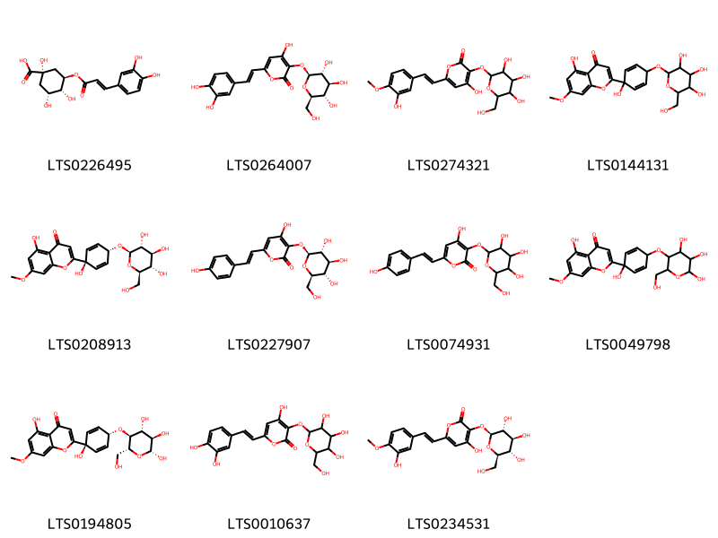{ width=100% }
    <figcaption>Hình ảnh cấu trúc hóa học của 11 hoạt chất thuộc nhóm Organooxygen compounds gồm ['chlorogenic acid (LTS0226495)', '6-[(1e)-2-(3,4-dihydroxyphenyl)ethenyl]-4-hydroxy-3-{[(2s,3r,4s,5s,6r)-3,4,5-trihydroxy-6-(hydroxymethyl)oxan-2-yl]oxy}pyran-2-one (LTS0264007)', '4-hydroxy-6-[2-(3-hydroxy-4-methoxyphenyl)ethenyl]-3-{[3,4,5-trihydroxy-6-(hydroxymethyl)oxan-2-yl]oxy}pyran-2-one (LTS0274321)', '5-hydroxy-2-(1-hydroxy-4-{[3,4,5-trihydroxy-6-(hydroxymethyl)oxan-2-yl]oxy}cyclohexa-2,5-dien-1-yl)-7-methoxychromen-4-one (LTS0144131)', '5-hydroxy-7-methoxy-2-[(1r,4r)-1-hydroxy-4-{[(2r,3r,4s,5s,6r)-3,4,5-trihydroxy-6-(hydroxymethyl)oxan-2-yl]oxy}cyclohexa-2,5-dien-1-yl]chromen-4-one (LTS0208913)', '4-hydroxy-6-[(1e)-2-(4-hydroxyphenyl)ethenyl]-3-{[(2s,3r,4s,5s,6r)-3,4,5-trihydroxy-6-(hydroxymethyl)oxan-2-yl]oxy}pyran-2-one (LTS0227907)', '4-hydroxy-6-[2-(4-hydroxyphenyl)ethenyl]-3-{[3,4,5-trihydroxy-6-(hydroxymethyl)oxan-2-yl]oxy}pyran-2-one (LTS0074931)', '5-hydroxy-2-(1-hydroxy-4-{[4,5,6-trihydroxy-2-(hydroxymethyl)oxan-3-yl]oxy}cyclohexa-2,5-dien-1-yl)-7-methoxychromen-4-one (LTS0049798)', '5-hydroxy-7-methoxy-2-[(1r,4r)-1-hydroxy-4-{[(2r,3s,4r,5r,6r)-4,5,6-trihydroxy-2-(hydroxymethyl)oxan-3-yl]oxy}cyclohexa-2,5-dien-1-yl]chromen-4-one (LTS0194805)', '6-[2-(3,4-dihydroxyphenyl)ethenyl]-4-hydroxy-3-{[3,4,5-trihydroxy-6-(hydroxymethyl)oxan-2-yl]oxy}pyran-2-one (LTS0010637)', '4-hydroxy-6-[(1e)-2-(3-hydroxy-4-methoxyphenyl)ethenyl]-3-{[(2s,3r,4s,5s,6r)-3,4,5-trihydroxy-6-(hydroxymethyl)oxan-2-yl]oxy}pyran-2-one (LTS0234531)'].</figcaption>
</figure>
#### Nhóm Phenols
<figure markdown="span">
    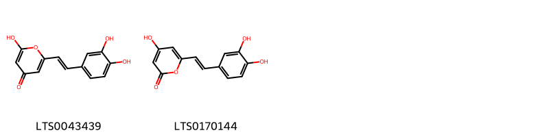{ width=100% }
    <figcaption>Hình ảnh cấu trúc hóa học của 2 hoạt chất thuộc nhóm Phenols gồm ['hispidin (LTS0043439)', 'hispidin (LTS0170144)'].</figcaption>
</figure>
#### Nhóm Prenol lipids
<figure markdown="span">
    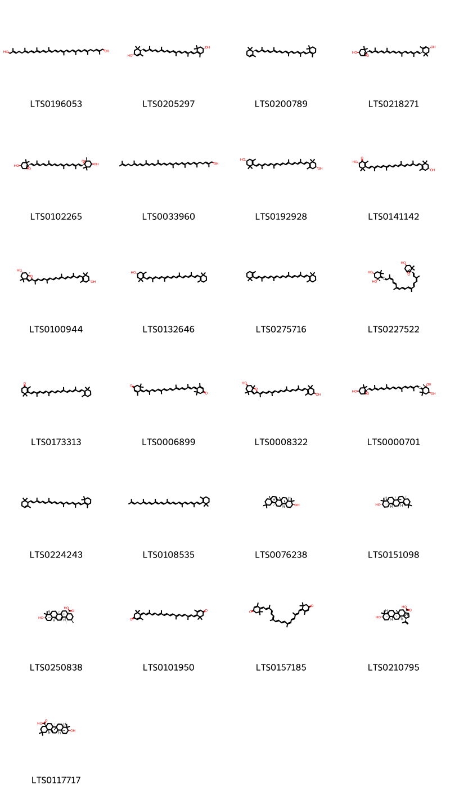{ width=100% }
    <figcaption>Hình ảnh cấu trúc hóa học của 25 hoạt chất thuộc nhóm Prenol lipids gồm ['lycophyll (LTS0196053)', 'carotenoid (LTS0205297)', '(+)-α-carotene (LTS0200789)', 'taraxanthin (LTS0218271)', 'violaxanthin (LTS0102265)', 'lycoxanthin (LTS0033960)', 'zeaxanthin (LTS0192928)', 'doradexanthin (LTS0141142)', '(6s,7ar)-2-[(2e,4e,6e,8e,10e,12e,14e,16e)-17-[(4r)-4-hydroxy-2,6,6-trimethylcyclohex-1-en-1-yl]-6,11,15-trimethylheptadeca-2,4,6,8,10,12,14,16-octaen-2-yl]-4,4,7a-trimethyl-2,5,6,7-tetrahydro-1-benzofuran-6-ol (LTS0100944)', 'cryptoxanthin (LTS0132646)', 'β-carotene (LTS0275716)', 'neoxanthin (LTS0227522)', 'echinenone (LTS0173313)', 'rhodoxanthin (LTS0006899)', '2-[(2e,4e,6e,8e,10e,12e,14e,16e)-17-(4-hydroxy-2,6,6-trimethylcyclohex-1-en-1-yl)-6,11,15-trimethylheptadeca-2,4,6,8,10,12,14,16-octaen-2-yl]-4,4,7a-trimethyl-2,5,6,7-tetrahydro-1-benzofuran-6-ol (LTS0008322)', 'neoxanthin (LTS0000701)', 'α-carotene (LTS0224243)', 'gamma-carotene (LTS0108535)', 'alnulin (LTS0076238)', 'germanicol (LTS0151098)', 'ursolic acid (LTS0250838)', 'rhodoxanthin (LTS0101950)', '(4z)-3,5,5-trimethyl-4-[(2e,4e)-3,7,12,16-tetramethyl-18-(2,6,6-trimethyl-4-oxocyclohex-2-en-1-ylidene)octadeca-2,4,6,8,10,12,14,16-octaen-1-ylidene]cyclohex-2-en-1-one (LTS0157185)', 'betulinic acid (LTS0210795)', 'oleanolic acid (LTS0117717)'].</figcaption>
</figure>
#### Nhóm Pyridines and derivatives
<figure markdown="span">
    { width=100% }
    <figcaption>Hình ảnh cấu trúc hóa học của 2 hoạt chất thuộc nhóm Pyridines and derivatives gồm ['(-)-nicotine (LTS0184620)', 'nicotine (LTS0177379)'].</figcaption>
</figure>
#### Nhóm Pyrrolidines
<figure markdown="span">
    { width=100% }
    <figcaption>Hình ảnh cấu trúc hóa học của 1 hoạt chất thuộc nhóm Pyrrolidines gồm ['(3e,5s)-3-{[(1r,2r,4ar,6r,8ar)-1,6-dimethyl-2-[(1e)-prop-1-en-1-yl]-4a,5,6,7,8,8a-hexahydro-2h-naphthalen-1-yl](hydroxy)methylidene}-5-(hydroxymethyl)-1-methylpyrrolidine-2,4-dione (LTS0118389)'].</figcaption>
</figure>
#### Nhóm Steroids and steroid derivatives
<figure markdown="span">
    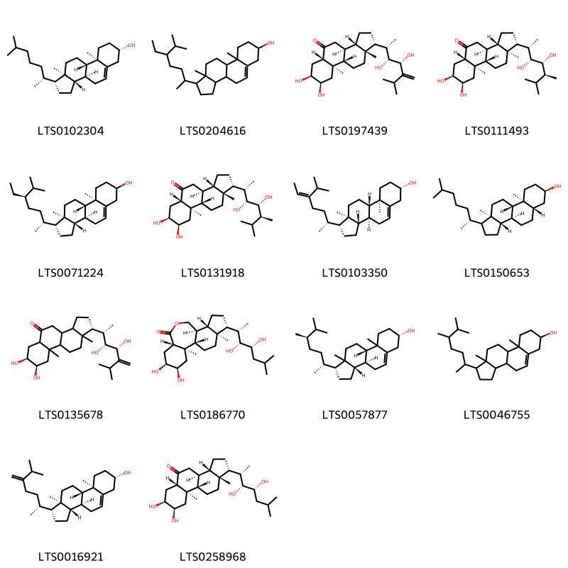{ width=100% }
    <figcaption>Hình ảnh cấu trúc hóa học của 14 hoạt chất thuộc nhóm Steroids and steroid derivatives gồm ['cholesterol (LTS0102304)', 'stigmast-5-en-3-ol, (3β)- (LTS0204616)', '(1r,3as,3bs,5as,7s,8r,9ar,9bs,11ar)-1-[(2s,3r,4r)-3,4-dihydroxy-6-methyl-5-methylideneheptan-2-yl]-7,8-dihydroxy-9a,11a-dimethyl-tetradecahydrocyclopenta[a]phenanthren-5-one (LTS0197439)', 'castasterone (LTS0111493)', 'stigmast-5-en-3-ol (LTS0071224)', '(1r,3as,3bs,5as,7s,8r,9ar,9bs,11ar)-1-[(2s,3r,4r,5s)-3,4-dihydroxy-5,6-dimethylheptan-2-yl]-7,8-dihydroxy-9a,11a-dimethyl-tetradecahydrocyclopenta[a]phenanthren-5-one (LTS0131918)', 'avenasterol (LTS0103350)', '(3as,3br,5as,7r,9as,9bs,11ar)-9a,11a-dimethyl-1-[(2r)-6-methylheptan-2-yl]-tetradecahydro-1h-cyclopenta[a]phenanthren-7-ol (LTS0150653)', '(1r,7s,8r)-1-[(2s,3r,4r)-3,4-dihydroxy-6-methyl-5-methylideneheptan-2-yl]-7,8-dihydroxy-9a,11a-dimethyl-tetradecahydrocyclopenta[a]phenanthren-5-one (LTS0135678)', '(1s,2r,4r,5s,7s,11s,12s,15r,16s)-15-[(2s,3r,4r)-3,4-dihydroxy-6-methylheptan-2-yl]-4,5-dihydroxy-2,16-dimethyl-9-oxatetracyclo[9.7.0.0²,⁷.0¹²,¹⁶]octadecan-8-one (LTS0186770)', '(1r,3as,3bs,7s,9bs)-1-[(2r,5r)-5,6-dimethylheptan-2-yl]-9a,11a-dimethyl-1h,2h,3h,3ah,3bh,4h,6h,7h,8h,9h,9bh,10h,11h-cyclopenta[a]phenanthren-7-ol (LTS0057877)', 'campesterol (LTS0046755)', '24-methylenecholesterol (LTS0016921)', '(1r,3as,3bs,5as,7s,8r,9ar,9bs,11ar)-1-[(2s,3r,4r)-3,4-dihydroxy-6-methylheptan-2-yl]-7,8-dihydroxy-9a,11a-dimethyl-tetradecahydrocyclopenta[a]phenanthren-5-one (LTS0258968)'].</figcaption>
</figure>
#### Nhóm Tetrapyrroles and derivatives
<figure markdown="span">
    { width=100% }
    <figcaption>Hình ảnh cấu trúc hóa học của 1 hoạt chất thuộc nhóm Tetrapyrroles and derivatives gồm ['methyl (3r,21s,22s)-16-ethenyl-11-ethyl-4-hydroxy-22-(3-methoxy-3-oxopropyl)-12,17,21,26-tetramethyl-7,23,24,25-tetraazahexacyclo[18.2.1.1⁵,⁸.1¹⁰,¹³.1¹⁵,¹⁸.0²,⁶]hexacosa-1,4,6,8(26),9,11,13(25),14,16,18(24),19-undecaene-3-carboxylate (LTS0021212)'].</figcaption>
</figure>

---

### Dược dân tộc học

Danh sách các quốc gia có sử dụng *Equisetum arvense* trong điều trị các bệnh. 

| Country   | Disease    | Bệnh                                                                                                                                                                                                |
|:----------|:-----------|:----------------------------------------------------------------------------------------------------------------------------------------------------------------------------------------------------|
| Elsewhere | Hemostatic | MYMEMORY WARNING: YOU USED ALL AVAILABLE FREE TRANSLATIONS FOR TODAY. NEXT AVAILABLE IN  15 HOURS 04 MINUTES 06 SECONDS VISIT HTTPS://MYMEMORY.TRANSLATED.NET/DOC/USAGELIMITS.PHP TO TRANSLATE MORE |

---

---
## Equisetum arvense
### Thông tin về thực vật

!!! info "Phân loại thực vật của *Equisetum arvense* từ GIBF:"
    - **Kingdom:** Plantae
    - **Phylum:** Tracheophyta
    - **Order:** Equisetales
    - **Family:** Equisetaceae
    - **Genus:** Equisetum
    - **Species:** *Equisetum arvense*

 

| Label (VI)   | Label (EN)   | Scientific Name   | Descriptions (VI)   | Descriptions (EN)   | Also Known As (VI)   | Also Known As (EN)                                   |
|:-------------|:-------------|:------------------|:--------------------|:--------------------|:---------------------|:-----------------------------------------------------|
| N/A          | N/A          | Equisetum arvense | loài thực vật       | species of plant    | ['']                 | ['common horsetail', 'horsetail', 'field horsetail'] |

#### Phân bố trên thế giới

**Từ CSDL GIBF** Denmark, Spain, Germany, Austria, Korea, Republic of, Poland, Canada, Belgium, Finland, Netherlands, Slovakia, Slovenia, Japan, Hungary, Ireland, Chinese Taipei, Switzerland, United Kingdom of Great Britain and Northern Ireland, Portugal, France, Czechia, New Zealand, Russian Federation, United States of America, Italy, Ukraine

#### Phân bố tại Việt Nam

**Từ CSDL GIBF**: Không có ghi nhận ở Việt Nam

---
### Thành phần hóa học
        
- Theo cơ sở dữ liệu lotus: Từ loài *Equisetum arvense* đã phân lập và xác định được 123 hoạt chất thuộc về các nhóm Organooxygen compounds, Flavonoids, Benzene and substituted derivatives, Benzofurans, Prenol lipids, Carboxylic acids and derivatives, Fatty Acyls, Tetrapyrroles and derivatives, Pyrrolidines, Indanes, Phenols, Cinnamic acids and derivatives, Steroids and steroid derivatives, Pyridines and derivatives, Organic phosphoric acids and derivatives. 

|    | chemicalTaxonomyClassyfireClass          |   smiles_count |
|---:|:-----------------------------------------|---------------:|
|  0 | Benzene and substituted derivatives      |              6 |
|  1 | Benzofurans                              |              1 |
|  2 | Carboxylic acids and derivatives         |              3 |
|  3 | Cinnamic acids and derivatives           |              6 |
|  4 | Fatty Acyls                              |              5 |
|  5 | Flavonoids                               |             44 |
|  6 | Indanes                                  |              1 |
|  7 | Organic phosphoric acids and derivatives |              1 |
|  8 | Organooxygen compounds                   |             11 |
|  9 | Phenols                                  |              2 |
| 10 | Prenol lipids                            |             25 |
| 11 | Pyridines and derivatives                |              2 |
| 12 | Pyrrolidines                             |              1 |
| 13 | Steroids and steroid derivatives         |             14 |
| 14 | Tetrapyrroles and derivatives            |              1 |

#### Nhóm Benzene and substituted derivatives
<figure markdown="span">
    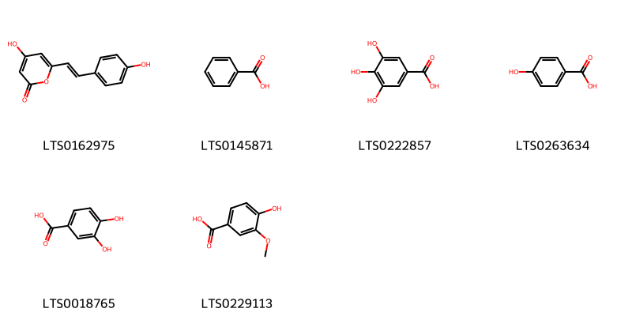{ width=100% }
    <figcaption>Hình ảnh cấu trúc hóa học của 6 hoạt chất thuộc nhóm Benzene and substituted derivatives gồm ['bis-noryangonin (LTS0162975)', 'benzoic acid (LTS0145871)', 'galop (LTS0222857)', 'p-hydroxybenzoic acid (LTS0263634)', '3,4-dihydroxybenzoic acid (LTS0018765)', 'vanillic acid (LTS0229113)'].</figcaption>
</figure>
#### Nhóm Benzofurans
<figure markdown="span">
    { width=100% }
    <figcaption>Hình ảnh cấu trúc hóa học của 1 hoạt chất thuộc nhóm Benzofurans gồm ['(7ar)-6-hydroxy-4,4,7a-trimethyl-6,7-dihydro-5h-1-benzofuran-2-one (LTS0273073)'].</figcaption>
</figure>
#### Nhóm Carboxylic acids and derivatives
<figure markdown="span">
    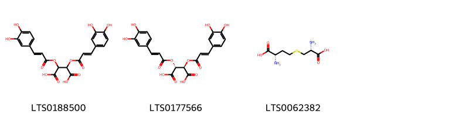{ width=100% }
    <figcaption>Hình ảnh cấu trúc hóa học của 3 hoạt chất thuộc nhóm Carboxylic acids and derivatives gồm ['2,3-bis({[3-(3,4-dihydroxyphenyl)prop-2-enoyl]oxy})butanedioic acid (LTS0188500)', 'cichoric acid (LTS0177566)', 'l-cystathionine (LTS0062382)'].</figcaption>
</figure>
#### Nhóm Cinnamic acids and derivatives
<figure markdown="span">
    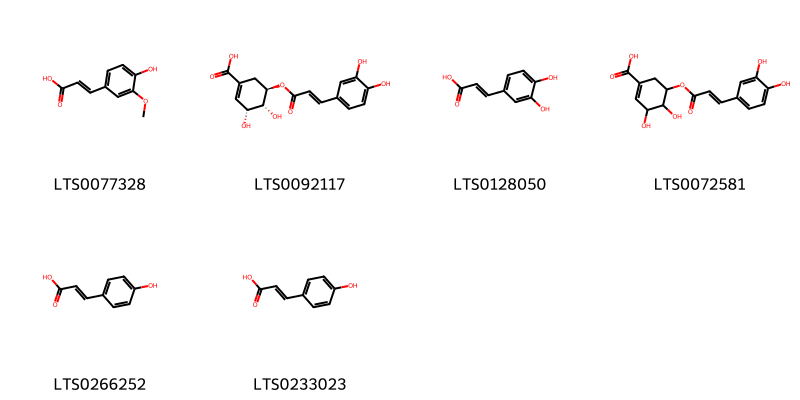{ width=100% }
    <figcaption>Hình ảnh cấu trúc hóa học của 6 hoạt chất thuộc nhóm Cinnamic acids and derivatives gồm ['ferulic acid (LTS0077328)', '5-o-caffeoylshikimic acid (LTS0092117)', '3,4-dihydroxycinnamic acid (LTS0128050)', '5-{[3-(3,4-dihydroxyphenyl)prop-2-enoyl]oxy}-3,4-dihydroxycyclohex-1-ene-1-carboxylic acid (LTS0072581)', 'para-coumaric acid (LTS0266252)', 'hydroxycinnamic acid (LTS0233023)'].</figcaption>
</figure>
#### Nhóm Fatty Acyls
<figure markdown="span">
    { width=100% }
    <figcaption>Hình ảnh cấu trúc hóa học của 5 hoạt chất thuộc nhóm Fatty Acyls gồm ['palmitic acid (LTS0079439)', '[(1r,2r,3r)-3-hydroxy-2-[(2z)-pent-2-en-1-yl]cyclopentyl]acetic acid (LTS0100748)', 'methyl linoleate (LTS0116588)', 'jasmonic acid (LTS0276338)', 'methyl palmitate (LTS0139222)'].</figcaption>
</figure>
#### Nhóm Flavonoids
<figure markdown="span">
    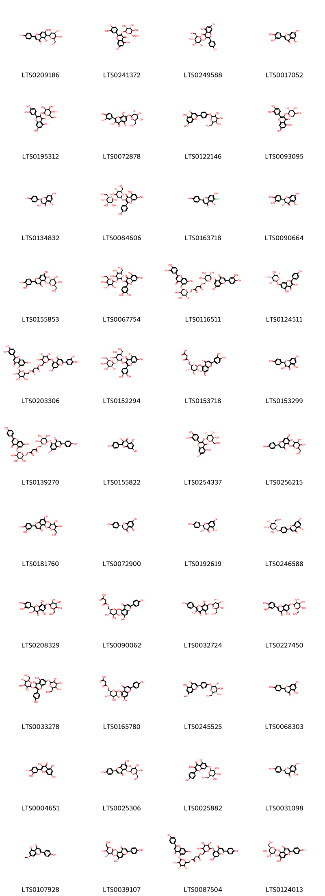{ width=100% }
    <figcaption>Hình ảnh cấu trúc hóa học của 44 hoạt chất thuộc nhóm Flavonoids gồm ['isovitexin (LTS0209186)', '2-(3,4-dihydroxyphenyl)-5,7-dihydroxy-3-{[(2s,3r,4r,5r,6s)-3,4,5-trihydroxy-6-(hydroxymethyl)oxan-2-yl]oxy}chromen-4-one (LTS0241372)', 'astragalin (LTS0249588)', 'luteolin (LTS0017052)', '2-(3,4-dihydroxyphenyl)-5,7-dihydroxy-3-{[3,4,5-trihydroxy-6-(hydroxymethyl)oxan-2-yl]oxy}chromen-4-one (LTS0195312)', 'gossypitrin (LTS0072878)', '5-hydroxy-7-methoxy-2-(4-{[3,4,5-trihydroxy-6-(hydroxymethyl)oxan-2-yl]oxy}phenyl)chromen-4-one (LTS0122146)', 'quercitrin (LTS0093095)', '(+)-dihydrokaempferol (LTS0134832)', 'kaempferol 3-o-sophoroside (LTS0084606)', '6-chloroapigenin (LTS0163718)', '(+)-taxifolin (LTS0090664)', '2-(3,4-dihydroxyphenyl)-7-hydroxy-5-{[(2s,3r,4s,5s,6r)-3,4,5-trihydroxy-6-(hydroxymethyl)oxan-2-yl]oxy}chromen-4-one (LTS0155853)', '3-{[4,5-dihydroxy-6-(hydroxymethyl)-3-{[3,4,5-trihydroxy-6-(hydroxymethyl)oxan-2-yl]oxy}oxan-2-yl]oxy}-2-(3,4-dihydroxyphenyl)-5,7-dihydroxychromen-4-one (LTS0067754)', '1,3-bis{[(2r,3s,4s,5r,6s)-6-{[2-(3,4-dihydroxyphenyl)-7-hydroxy-4-oxochromen-5-yl]oxy}-3,4,5-trihydroxyoxan-2-yl]methyl} propanedioate (LTS0116511)', 'kaempferol-7-rhamnoside (LTS0124511)', '1,3-bis[(6-{[2-(3,4-dihydroxyphenyl)-7-hydroxy-4-oxochromen-5-yl]oxy}-3,4,5-trihydroxyoxan-2-yl)methyl] propanedioate (LTS0203306)', 'quosp (LTS0152294)', '3-{[(2r,3s,4s,5r,6s)-6-{[2-(3,4-dihydroxyphenyl)-7-hydroxy-4-oxochromen-5-yl]oxy}-3,4,5-trihydroxyoxan-2-yl]methoxy}-3-oxopropanoic acid (LTS0153718)', 'aromadendrin (LTS0153299)', '1,3-bis{[(2r,3s,4s,5r,6s)-3,4,5-trihydroxy-6-{[7-hydroxy-2-(4-hydroxyphenyl)-4-oxochromen-5-yl]oxy}oxan-2-yl]methyl} propanedioate (LTS0139270)', 'kaempherol (LTS0155822)', 'isoquercetin (LTS0254337)', '7-hydroxy-2-(4-hydroxyphenyl)-5-{[3,4,5-trihydroxy-6-(hydroxymethyl)oxan-2-yl]oxy}chromen-4-one (LTS0256215)', '2-(3,4-dihydroxyphenyl)-7-hydroxy-5-{[3,4,5-trihydroxy-6-(hydroxymethyl)oxan-2-yl]oxy}chromen-4-one (LTS0181760)', '(-)-naringenin (LTS0072900)', '(2s,3r)-3,5,7-trihydroxy-2-(4-hydroxyphenyl)-2,3-dihydro-1-benzopyran-4-one (LTS0192619)', '5,7-dihydroxy-2-(4-{[(2s,3r,4s,5s,6r)-3,4,5-trihydroxy-6-(hydroxymethyl)oxan-2-yl]oxy}phenyl)chromen-4-one (LTS0246588)', '2-(3,4-dihydroxyphenyl)-3,5,8-trihydroxy-7-{[3,4,5-trihydroxy-6-(hydroxymethyl)oxan-2-yl]oxy}chromen-4-one (LTS0208329)', '3-oxo-3-{[(2r,3r,4s,5s,6s)-3,4,5-trihydroxy-6-{[2-(4-hydroxyphenyl)-7-methoxy-4-oxochromen-5-yl]oxy}oxan-2-yl]methoxy}propanoic acid (LTS0090062)', '3,5,8-trihydroxy-2-(4-hydroxyphenyl)-7-{[(2s,3r,4s,5s,6r)-3,4,5-trihydroxy-6-(hydroxymethyl)oxan-2-yl]oxy}chromen-4-one (LTS0032724)', 'luteolin 7-o-glucoside (LTS0227450)', '5-hydroxy-2-(4-hydroxyphenyl)-3,7-bis({[3,4,5-trihydroxy-6-(hydroxymethyl)oxan-2-yl]oxy})chromen-4-one (LTS0033278)', '3-oxo-3-{[(2r,3s,4s,5s,6s)-3,4,5-trihydroxy-6-{[7-hydroxy-2-(4-hydroxyphenyl)-4-oxochromen-5-yl]oxy}oxan-2-yl]methoxy}propanoic acid (LTS0165780)', '5-hydroxy-7-methoxy-2-(4-{[(2s,3r,4s,5s,6r)-3,4,5-trihydroxy-6-(hydroxymethyl)oxan-2-yl]oxy}phenyl)chromen-4-one (LTS0245525)', 'asahina (LTS0068303)', 'quercetin (LTS0004651)', '7-hydroxy-2-(4-hydroxyphenyl)-5-{[(2s,3r,4s,5s,6r)-3,4,5-trihydroxy-6-(hydroxymethyl)oxan-2-yl]oxy}chromen-4-one (LTS0025306)', 'kaempferol 7-o-glucoside (LTS0025882)', 'naringenin (LTS0031098)', 'genkwanin (LTS0107928)', '2-(4-hydroxyphenyl)-7-methoxy-5-{[3,4,5-trihydroxy-6-(hydroxymethyl)oxan-2-yl]oxy}chromen-4-one (LTS0039107)', '1,3-bis[(3,4,5-trihydroxy-6-{[7-hydroxy-2-(4-hydroxyphenyl)-4-oxochromen-5-yl]oxy}oxan-2-yl)methyl] propanedioate (LTS0087504)', '2-(4-hydroxyphenyl)-7-methoxy-5-{[(2s,3r,4s,5s,6r)-3,4,5-trihydroxy-6-(hydroxymethyl)oxan-2-yl]oxy}chromen-4-one (LTS0124013)'].</figcaption>
</figure>
#### Nhóm Indanes
<figure markdown="span">
    { width=100% }
    <figcaption>Hình ảnh cấu trúc hóa học của 1 hoạt chất thuộc nhóm Indanes gồm ['4-hydroxy-6-(2-hydroxyethyl)-2,2,5,7-tetramethyl-3h-inden-1-one (LTS0206833)'].</figcaption>
</figure>
#### Nhóm Organic phosphoric acids and derivatives
<figure markdown="span">
    { width=100% }
    <figcaption>Hình ảnh cấu trúc hóa học của 1 hoạt chất thuộc nhóm Organic phosphoric acids and derivatives gồm ['o-phosphoethanolamine; bis(nonane) (LTS0249963)'].</figcaption>
</figure>
#### Nhóm Organooxygen compounds
<figure markdown="span">
    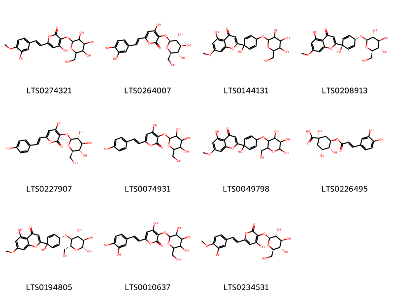{ width=100% }
    <figcaption>Hình ảnh cấu trúc hóa học của 11 hoạt chất thuộc nhóm Organooxygen compounds gồm ['4-hydroxy-6-[2-(3-hydroxy-4-methoxyphenyl)ethenyl]-3-{[3,4,5-trihydroxy-6-(hydroxymethyl)oxan-2-yl]oxy}pyran-2-one (LTS0274321)', '6-[(1e)-2-(3,4-dihydroxyphenyl)ethenyl]-4-hydroxy-3-{[(2s,3r,4s,5s,6r)-3,4,5-trihydroxy-6-(hydroxymethyl)oxan-2-yl]oxy}pyran-2-one (LTS0264007)', '5-hydroxy-2-(1-hydroxy-4-{[3,4,5-trihydroxy-6-(hydroxymethyl)oxan-2-yl]oxy}cyclohexa-2,5-dien-1-yl)-7-methoxychromen-4-one (LTS0144131)', '5-hydroxy-7-methoxy-2-[(1r,4r)-1-hydroxy-4-{[(2r,3r,4s,5s,6r)-3,4,5-trihydroxy-6-(hydroxymethyl)oxan-2-yl]oxy}cyclohexa-2,5-dien-1-yl]chromen-4-one (LTS0208913)', '4-hydroxy-6-[(1e)-2-(4-hydroxyphenyl)ethenyl]-3-{[(2s,3r,4s,5s,6r)-3,4,5-trihydroxy-6-(hydroxymethyl)oxan-2-yl]oxy}pyran-2-one (LTS0227907)', '4-hydroxy-6-[2-(4-hydroxyphenyl)ethenyl]-3-{[3,4,5-trihydroxy-6-(hydroxymethyl)oxan-2-yl]oxy}pyran-2-one (LTS0074931)', '5-hydroxy-2-(1-hydroxy-4-{[4,5,6-trihydroxy-2-(hydroxymethyl)oxan-3-yl]oxy}cyclohexa-2,5-dien-1-yl)-7-methoxychromen-4-one (LTS0049798)', 'chlorogenic acid (LTS0226495)', '5-hydroxy-7-methoxy-2-[(1r,4r)-1-hydroxy-4-{[(2r,3s,4r,5r,6r)-4,5,6-trihydroxy-2-(hydroxymethyl)oxan-3-yl]oxy}cyclohexa-2,5-dien-1-yl]chromen-4-one (LTS0194805)', '6-[2-(3,4-dihydroxyphenyl)ethenyl]-4-hydroxy-3-{[3,4,5-trihydroxy-6-(hydroxymethyl)oxan-2-yl]oxy}pyran-2-one (LTS0010637)', '4-hydroxy-6-[(1e)-2-(3-hydroxy-4-methoxyphenyl)ethenyl]-3-{[(2s,3r,4s,5s,6r)-3,4,5-trihydroxy-6-(hydroxymethyl)oxan-2-yl]oxy}pyran-2-one (LTS0234531)'].</figcaption>
</figure>
#### Nhóm Phenols
<figure markdown="span">
    { width=100% }
    <figcaption>Hình ảnh cấu trúc hóa học của 2 hoạt chất thuộc nhóm Phenols gồm ['hispidin (LTS0043439)', 'hispidin (LTS0170144)'].</figcaption>
</figure>
#### Nhóm Prenol lipids
<figure markdown="span">
    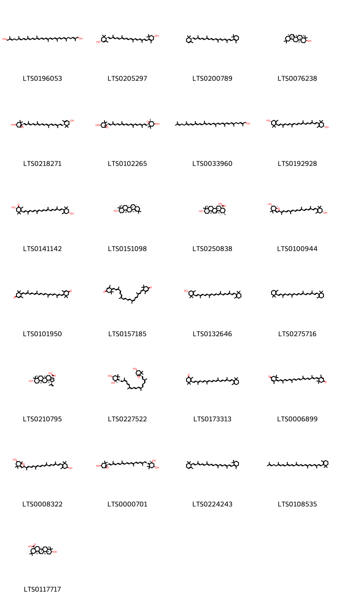{ width=100% }
    <figcaption>Hình ảnh cấu trúc hóa học của 25 hoạt chất thuộc nhóm Prenol lipids gồm ['lycophyll (LTS0196053)', 'carotenoid (LTS0205297)', '(+)-α-carotene (LTS0200789)', 'alnulin (LTS0076238)', 'taraxanthin (LTS0218271)', 'violaxanthin (LTS0102265)', 'lycoxanthin (LTS0033960)', 'zeaxanthin (LTS0192928)', 'doradexanthin (LTS0141142)', 'germanicol (LTS0151098)', 'ursolic acid (LTS0250838)', '(6s,7ar)-2-[(2e,4e,6e,8e,10e,12e,14e,16e)-17-[(4r)-4-hydroxy-2,6,6-trimethylcyclohex-1-en-1-yl]-6,11,15-trimethylheptadeca-2,4,6,8,10,12,14,16-octaen-2-yl]-4,4,7a-trimethyl-2,5,6,7-tetrahydro-1-benzofuran-6-ol (LTS0100944)', 'rhodoxanthin (LTS0101950)', '(4z)-3,5,5-trimethyl-4-[(2e,4e)-3,7,12,16-tetramethyl-18-(2,6,6-trimethyl-4-oxocyclohex-2-en-1-ylidene)octadeca-2,4,6,8,10,12,14,16-octaen-1-ylidene]cyclohex-2-en-1-one (LTS0157185)', 'cryptoxanthin (LTS0132646)', 'β-carotene (LTS0275716)', 'betulinic acid (LTS0210795)', 'neoxanthin (LTS0227522)', 'echinenone (LTS0173313)', 'rhodoxanthin (LTS0006899)', '2-[(2e,4e,6e,8e,10e,12e,14e,16e)-17-(4-hydroxy-2,6,6-trimethylcyclohex-1-en-1-yl)-6,11,15-trimethylheptadeca-2,4,6,8,10,12,14,16-octaen-2-yl]-4,4,7a-trimethyl-2,5,6,7-tetrahydro-1-benzofuran-6-ol (LTS0008322)', 'neoxanthin (LTS0000701)', 'α-carotene (LTS0224243)', 'gamma-carotene (LTS0108535)', 'oleanolic acid (LTS0117717)'].</figcaption>
</figure>
#### Nhóm Pyridines and derivatives
<figure markdown="span">
    { width=100% }
    <figcaption>Hình ảnh cấu trúc hóa học của 2 hoạt chất thuộc nhóm Pyridines and derivatives gồm ['(-)-nicotine (LTS0184620)', 'nicotine (LTS0177379)'].</figcaption>
</figure>
#### Nhóm Pyrrolidines
<figure markdown="span">
    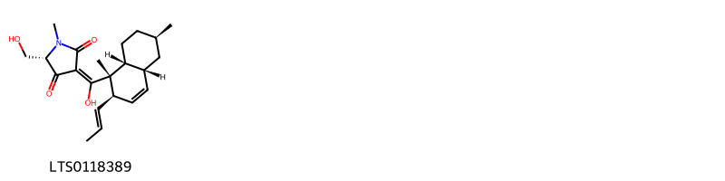{ width=100% }
    <figcaption>Hình ảnh cấu trúc hóa học của 1 hoạt chất thuộc nhóm Pyrrolidines gồm ['(3e,5s)-3-{[(1r,2r,4ar,6r,8ar)-1,6-dimethyl-2-[(1e)-prop-1-en-1-yl]-4a,5,6,7,8,8a-hexahydro-2h-naphthalen-1-yl](hydroxy)methylidene}-5-(hydroxymethyl)-1-methylpyrrolidine-2,4-dione (LTS0118389)'].</figcaption>
</figure>
#### Nhóm Steroids and steroid derivatives
<figure markdown="span">
    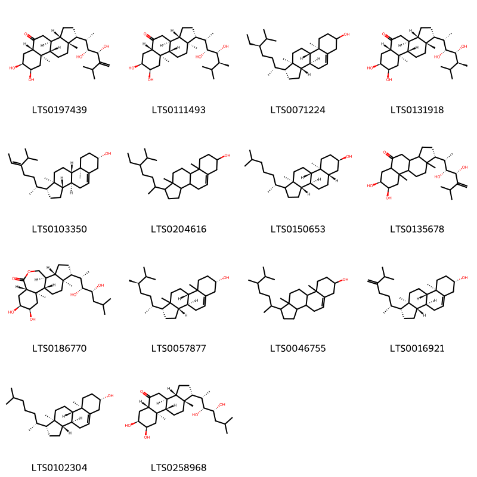{ width=100% }
    <figcaption>Hình ảnh cấu trúc hóa học của 14 hoạt chất thuộc nhóm Steroids and steroid derivatives gồm ['(1r,3as,3bs,5as,7s,8r,9ar,9bs,11ar)-1-[(2s,3r,4r)-3,4-dihydroxy-6-methyl-5-methylideneheptan-2-yl]-7,8-dihydroxy-9a,11a-dimethyl-tetradecahydrocyclopenta[a]phenanthren-5-one (LTS0197439)', 'castasterone (LTS0111493)', 'stigmast-5-en-3-ol (LTS0071224)', '(1r,3as,3bs,5as,7s,8r,9ar,9bs,11ar)-1-[(2s,3r,4r,5s)-3,4-dihydroxy-5,6-dimethylheptan-2-yl]-7,8-dihydroxy-9a,11a-dimethyl-tetradecahydrocyclopenta[a]phenanthren-5-one (LTS0131918)', 'avenasterol (LTS0103350)', 'stigmast-5-en-3-ol, (3β)- (LTS0204616)', '(3as,3br,5as,7r,9as,9bs,11ar)-9a,11a-dimethyl-1-[(2r)-6-methylheptan-2-yl]-tetradecahydro-1h-cyclopenta[a]phenanthren-7-ol (LTS0150653)', '(1r,7s,8r)-1-[(2s,3r,4r)-3,4-dihydroxy-6-methyl-5-methylideneheptan-2-yl]-7,8-dihydroxy-9a,11a-dimethyl-tetradecahydrocyclopenta[a]phenanthren-5-one (LTS0135678)', '(1s,2r,4r,5s,7s,11s,12s,15r,16s)-15-[(2s,3r,4r)-3,4-dihydroxy-6-methylheptan-2-yl]-4,5-dihydroxy-2,16-dimethyl-9-oxatetracyclo[9.7.0.0²,⁷.0¹²,¹⁶]octadecan-8-one (LTS0186770)', '(1r,3as,3bs,7s,9bs)-1-[(2r,5r)-5,6-dimethylheptan-2-yl]-9a,11a-dimethyl-1h,2h,3h,3ah,3bh,4h,6h,7h,8h,9h,9bh,10h,11h-cyclopenta[a]phenanthren-7-ol (LTS0057877)', 'campesterol (LTS0046755)', '24-methylenecholesterol (LTS0016921)', 'cholesterol (LTS0102304)', '(1r,3as,3bs,5as,7s,8r,9ar,9bs,11ar)-1-[(2s,3r,4r)-3,4-dihydroxy-6-methylheptan-2-yl]-7,8-dihydroxy-9a,11a-dimethyl-tetradecahydrocyclopenta[a]phenanthren-5-one (LTS0258968)'].</figcaption>
</figure>
#### Nhóm Tetrapyrroles and derivatives
<figure markdown="span">
    { width=100% }
    <figcaption>Hình ảnh cấu trúc hóa học của 1 hoạt chất thuộc nhóm Tetrapyrroles and derivatives gồm ['methyl (3r,21s,22s)-16-ethenyl-11-ethyl-4-hydroxy-22-(3-methoxy-3-oxopropyl)-12,17,21,26-tetramethyl-7,23,24,25-tetraazahexacyclo[18.2.1.1⁵,⁸.1¹⁰,¹³.1¹⁵,¹⁸.0²,⁶]hexacosa-1,4,6,8(26),9,11,13(25),14,16,18(24),19-undecaene-3-carboxylate (LTS0021212)'].</figcaption>
</figure>

---

### Dược dân tộc học

Danh sách các quốc gia có sử dụng *Equisetum arvense* trong điều trị các bệnh. 

| Country      | Disease                                                 | Bệnh                                                                                                                                                                                                |
|:-------------|:--------------------------------------------------------|:----------------------------------------------------------------------------------------------------------------------------------------------------------------------------------------------------|
| China        | Carminative                                             | MYMEMORY WARNING: YOU USED ALL AVAILABLE FREE TRANSLATIONS FOR TODAY. NEXT AVAILABLE IN  15 HOURS 03 MINUTES 22 SECONDS VISIT HTTPS://MYMEMORY.TRANSLATED.NET/DOC/USAGELIMITS.PHP TO TRANSLATE MORE |
| Elsewhere    | Diuretic, Diuretic, Hemostat, Hemopoietic               | MYMEMORY WARNING: YOU USED ALL AVAILABLE FREE TRANSLATIONS FOR TODAY. NEXT AVAILABLE IN  15 HOURS 03 MINUTES 19 SECONDS VISIT HTTPS://MYMEMORY.TRANSLATED.NET/DOC/USAGELIMITS.PHP TO TRANSLATE MORE |
| Germany*     | Diuretic                                                | MYMEMORY WARNING: YOU USED ALL AVAILABLE FREE TRANSLATIONS FOR TODAY. NEXT AVAILABLE IN  15 HOURS 03 MINUTES 15 SECONDS VISIT HTTPS://MYMEMORY.TRANSLATED.NET/DOC/USAGELIMITS.PHP TO TRANSLATE MORE |
| Panama       | Antiseptic                                              | MYMEMORY WARNING: YOU USED ALL AVAILABLE FREE TRANSLATIONS FOR TODAY. NEXT AVAILABLE IN  15 HOURS 03 MINUTES 11 SECONDS VISIT HTTPS://MYMEMORY.TRANSLATED.NET/DOC/USAGELIMITS.PHP TO TRANSLATE MORE |
| Turkey       | Antiseptic, Astringent, Carminative, Diuretic, Hemostat | MYMEMORY WARNING: YOU USED ALL AVAILABLE FREE TRANSLATIONS FOR TODAY. NEXT AVAILABLE IN  15 HOURS 03 MINUTES 08 SECONDS VISIT HTTPS://MYMEMORY.TRANSLATED.NET/DOC/USAGELIMITS.PHP TO TRANSLATE MORE |
| US           | Poison                                                  | MYMEMORY WARNING: YOU USED ALL AVAILABLE FREE TRANSLATIONS FOR TODAY. NEXT AVAILABLE IN  15 HOURS 03 MINUTES 05 SECONDS VISIT HTTPS://MYMEMORY.TRANSLATED.NET/DOC/USAGELIMITS.PHP TO TRANSLATE MORE |
| US(Flathead) | Diuretic                                                | MYMEMORY WARNING: YOU USED ALL AVAILABLE FREE TRANSLATIONS FOR TODAY. NEXT AVAILABLE IN  15 HOURS 03 MINUTES 02 SECONDS VISIT HTTPS://MYMEMORY.TRANSLATED.NET/DOC/USAGELIMITS.PHP TO TRANSLATE MORE |
| ain          | Diuretic                                                | MYMEMORY WARNING: YOU USED ALL AVAILABLE FREE TRANSLATIONS FOR TODAY. NEXT AVAILABLE IN  15 HOURS 02 MINUTES 59 SECONDS VISIT HTTPS://MYMEMORY.TRANSLATED.NET/DOC/USAGELIMITS.PHP TO TRANSLATE MORE |

---

---
## Equisetum bogotense
### Thông tin về thực vật

!!! info "Phân loại thực vật của *Equisetum bogotense* từ GIBF:"
    - **Kingdom:** Plantae
    - **Phylum:** Tracheophyta
    - **Order:** Equisetales
    - **Family:** Equisetaceae
    - **Genus:** Equisetum
    - **Species:** *Equisetum bogotense*

 

| Label (VI)   | Label (EN)   | Scientific Name     | Descriptions (VI)   | Descriptions (EN)   | Also Known As (VI)   | Also Known As (EN)   |
|:-------------|:-------------|:--------------------|:--------------------|:--------------------|:---------------------|:---------------------|
| N/A          | N/A          | Equisetum bogotense | loài thực vật       | species of plant    | ['']                 | ['']                 |

#### Phân bố trên thế giới

**Từ CSDL GIBF** Colombia, Argentina, Peru, Bolivia (Plurinational State of), Costa Rica, Chile, Ecuador

#### Phân bố tại Việt Nam

**Từ CSDL GIBF**: Không có ghi nhận ở Việt Nam

---
### Thành phần hóa học
        
- Theo cơ sở dữ liệu lotus: Từ loài *Equisetum bogotense* đã phân lập và xác định được 8 hoạt chất thuộc về các nhóm Flavonoids, Cinnamic acids and derivatives. 

|    | chemicalTaxonomyClassyfireClass   |   smiles_count |
|---:|:----------------------------------|---------------:|
|  0 | Cinnamic acids and derivatives    |              1 |
|  1 | Flavonoids                        |              7 |

#### Nhóm Cinnamic acids and derivatives
<figure markdown="span">
    { width=100% }
    <figcaption>Hình ảnh cấu trúc hóa học của 1 hoạt chất thuộc nhóm Cinnamic acids and derivatives gồm ['5-o-caffeoylshikimic acid (LTS0092117)'].</figcaption>
</figure>
#### Nhóm Flavonoids
<figure markdown="span">
    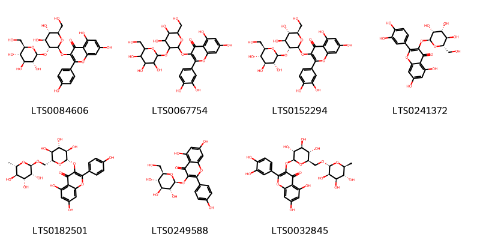{ width=100% }
    <figcaption>Hình ảnh cấu trúc hóa học của 7 hoạt chất thuộc nhóm Flavonoids gồm ['kaempferol 3-o-sophoroside (LTS0084606)', '3-{[4,5-dihydroxy-6-(hydroxymethyl)-3-{[3,4,5-trihydroxy-6-(hydroxymethyl)oxan-2-yl]oxy}oxan-2-yl]oxy}-2-(3,4-dihydroxyphenyl)-5,7-dihydroxychromen-4-one (LTS0067754)', 'quosp (LTS0152294)', '2-(3,4-dihydroxyphenyl)-5,7-dihydroxy-3-{[(2s,3r,4r,5r,6s)-3,4,5-trihydroxy-6-(hydroxymethyl)oxan-2-yl]oxy}chromen-4-one (LTS0241372)', 'nictoflorin (LTS0182501)', 'astragalin (LTS0249588)', '3-rutinosyl quercetin (LTS0032845)'].</figcaption>
</figure>

---

### Dược dân tộc học

Danh sách các quốc gia có sử dụng *Equisetum bogotense* trong điều trị các bệnh. 

| Country   | Disease                       | Bệnh                                                                                                                                                                                                |
|:----------|:------------------------------|:----------------------------------------------------------------------------------------------------------------------------------------------------------------------------------------------------|
| Colombia  | Astringent, Diuretic          | MYMEMORY WARNING: YOU USED ALL AVAILABLE FREE TRANSLATIONS FOR TODAY. NEXT AVAILABLE IN  15 HOURS 02 MINUTES 10 SECONDS VISIT HTTPS://MYMEMORY.TRANSLATED.NET/DOC/USAGELIMITS.PHP TO TRANSLATE MORE |
| Elsewhere | Styptic                       | MYMEMORY WARNING: YOU USED ALL AVAILABLE FREE TRANSLATIONS FOR TODAY. NEXT AVAILABLE IN  15 HOURS 02 MINUTES 06 SECONDS VISIT HTTPS://MYMEMORY.TRANSLATED.NET/DOC/USAGELIMITS.PHP TO TRANSLATE MORE |
| Panama    | Collyrium, Diuretic, Hemostat | MYMEMORY WARNING: YOU USED ALL AVAILABLE FREE TRANSLATIONS FOR TODAY. NEXT AVAILABLE IN  15 HOURS 02 MINUTES 03 SECONDS VISIT HTTPS://MYMEMORY.TRANSLATED.NET/DOC/USAGELIMITS.PHP TO TRANSLATE MORE |
| Peru      | Diuretic                      | MYMEMORY WARNING: YOU USED ALL AVAILABLE FREE TRANSLATIONS FOR TODAY. NEXT AVAILABLE IN  15 HOURS 02 MINUTES 00 SECONDS VISIT HTTPS://MYMEMORY.TRANSLATED.NET/DOC/USAGELIMITS.PHP TO TRANSLATE MORE |

---

---
## Equisetum debile
### Thông tin về thực vật

!!! info "Phân loại thực vật của *Equisetum debile* từ GIBF:"
    - **Kingdom:** Plantae
    - **Phylum:** Tracheophyta
    - **Order:** Equisetales
    - **Family:** Equisetaceae
    - **Genus:** Equisetum
    - **Species:** *Equisetum debile*

 

| Label (VI)   | Label (EN)   | Scientific Name   | Descriptions (VI)   | Descriptions (EN)   | Also Known As (VI)   | Also Known As (EN)   |
|:-------------|:-------------|:------------------|:--------------------|:--------------------|:---------------------|:---------------------|
| N/A          | N/A          | Equisetum debile  | loài thực vật       | species of plant    | ['']                 | ['']                 |

#### Phân bố trên thế giới

**Từ CSDL GIBF** Viet Nam, Thailand, Vanuatu, Malaysia, Papua New Guinea, China, Solomon Islands, Indonesia

#### Phân bố tại Việt Nam

**Từ CSDL GIBF**: Không có ghi nhận ở Việt Nam

---
### Thành phần hóa học
        
- Theo cơ sở dữ liệu lotus: Từ loài *Equisetum debile* đã phân lập và xác định được Chưa có hoạt chất nào được phân lập. hoạt chất thuộc về các nhóm Không có hoạt chất nào được phân lập. 

Không có hình ảnh nào được tạo ra

---

### Dược dân tộc học

Danh sách các quốc gia có sử dụng *Equisetum debile* trong điều trị các bệnh. 

| Country   | Disease     | Bệnh                                                                                                                                                                                                |
|:----------|:------------|:----------------------------------------------------------------------------------------------------------------------------------------------------------------------------------------------------|
| India     | Refrigerant | MYMEMORY WARNING: YOU USED ALL AVAILABLE FREE TRANSLATIONS FOR TODAY. NEXT AVAILABLE IN  15 HOURS 01 MINUTES 28 SECONDS VISIT HTTPS://MYMEMORY.TRANSLATED.NET/DOC/USAGELIMITS.PHP TO TRANSLATE MORE |

---

---
## Equisetum fluviatilis
### Thông tin về thực vật

!!! info "Phân loại thực vật của *Equisetum fluviatile* từ GIBF:"
    - **Kingdom:** Plantae
    - **Phylum:** Tracheophyta
    - **Order:** Equisetales
    - **Family:** Equisetaceae
    - **Genus:** Equisetum
    - **Species:** *Equisetum fluviatile*

 

| Label (VI)   | Label (EN)   | Scientific Name   | Descriptions (VI)   | Descriptions (EN)   | Also Known As (VI)   | Also Known As (EN)   |
|:-------------|:-------------|:------------------|:--------------------|:--------------------|:---------------------|:---------------------|
| N/A          | N/A          | Equisetum debile  | loài thực vật       | species of plant    | ['']                 | ['']                 |

#### Phân bố trên thế giới

**Từ CSDL GIBF** nan, Denmark, Luxembourg, Germany, Austria, Sweden, Poland, Canada, Belgium, Netherlands, Slovenia, Lithuania, Hungary, Ireland, Switzerland, United Kingdom of Great Britain and Northern Ireland, France, Czechia, Russian Federation, United States of America, Italy, Ukraine

#### Phân bố tại Việt Nam

**Từ CSDL GIBF**: Không có ghi nhận ở Việt Nam

---
### Thành phần hóa học
        
- Theo cơ sở dữ liệu lotus: Từ loài *Equisetum fluviatile* đã phân lập và xác định được Chưa có hoạt chất nào được phân lập. hoạt chất thuộc về các nhóm Không có hoạt chất nào được phân lập. 

Không có hình ảnh nào được tạo ra

---

### Dược dân tộc học

Danh sách các quốc gia có sử dụng *Equisetum fluviatile* trong điều trị các bệnh. 

| Country   | Disease   | Bệnh                                                                                                                                                                                                |
|:----------|:----------|:----------------------------------------------------------------------------------------------------------------------------------------------------------------------------------------------------|
| Mexico    | Diuretic  | MYMEMORY WARNING: YOU USED ALL AVAILABLE FREE TRANSLATIONS FOR TODAY. NEXT AVAILABLE IN  15 HOURS 01 MINUTES 03 SECONDS VISIT HTTPS://MYMEMORY.TRANSLATED.NET/DOC/USAGELIMITS.PHP TO TRANSLATE MORE |

---

---
## Equisetum giganteum
### Thông tin về thực vật

!!! info "Phân loại thực vật của *Equisetum giganteum* từ GIBF:"
    - **Kingdom:** Plantae
    - **Phylum:** Tracheophyta
    - **Order:** Equisetales
    - **Family:** Equisetaceae
    - **Genus:** Equisetum
    - **Species:** *Equisetum giganteum*

 

| Label (VI)   | Label (EN)   | Scientific Name     | Descriptions (VI)   | Descriptions (EN)   | Also Known As (VI)   | Also Known As (EN)   |
|:-------------|:-------------|:--------------------|:--------------------|:--------------------|:---------------------|:---------------------|
| N/A          | N/A          | Equisetum giganteum | loài thực vật       | species of plant    | ['']                 | ['']                 |

#### Phân bố trên thế giới

**Từ CSDL GIBF** Uruguay, Colombia, Argentina, Venezuela (Bolivarian Republic of), Dominican Republic, Brazil, Peru, Bolivia (Plurinational State of), Costa Rica, Chile, Ecuador

#### Phân bố tại Việt Nam

**Từ CSDL GIBF**: Không có ghi nhận ở Việt Nam

---
### Thành phần hóa học
        
- Theo cơ sở dữ liệu lotus: Từ loài *Equisetum giganteum* đã phân lập và xác định được 4 hoạt chất thuộc về các nhóm Steroids and steroid derivatives, Flavonoids, Cinnamic acids and derivatives. 

|    | chemicalTaxonomyClassyfireClass   |   smiles_count |
|---:|:----------------------------------|---------------:|
|  0 | Cinnamic acids and derivatives    |              1 |
|  1 | Flavonoids                        |              2 |
|  2 | Steroids and steroid derivatives  |              1 |

#### Nhóm Cinnamic acids and derivatives
<figure markdown="span">
    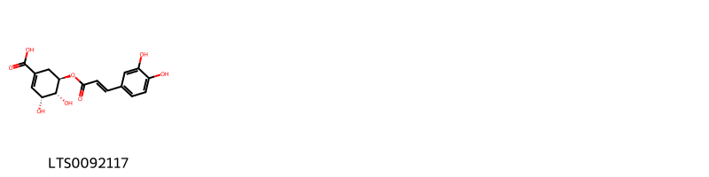{ width=100% }
    <figcaption>Hình ảnh cấu trúc hóa học của 1 hoạt chất thuộc nhóm Cinnamic acids and derivatives gồm ['5-o-caffeoylshikimic acid (LTS0092117)'].</figcaption>
</figure>
#### Nhóm Flavonoids
<figure markdown="span">
    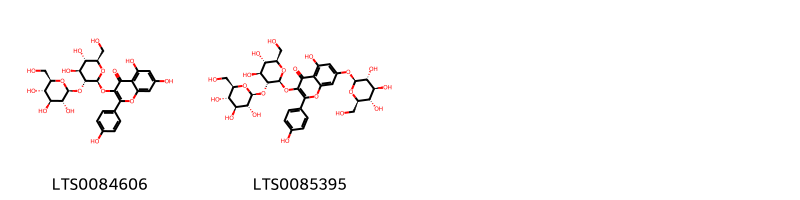{ width=100% }
    <figcaption>Hình ảnh cấu trúc hóa học của 2 hoạt chất thuộc nhóm Flavonoids gồm ['kaempferol 3-o-sophoroside (LTS0084606)', '3-{[(2s,3r,4s,5s,6r)-4,5-dihydroxy-6-(hydroxymethyl)-3-{[(2s,3r,4s,5s,6r)-3,4,5-trihydroxy-6-(hydroxymethyl)oxan-2-yl]oxy}oxan-2-yl]oxy}-5-hydroxy-2-(4-hydroxyphenyl)-7-{[(2s,3r,4s,5s,6r)-3,4,5-trihydroxy-6-(hydroxymethyl)oxan-2-yl]oxy}chromen-4-one (LTS0085395)'].</figcaption>
</figure>
#### Nhóm Steroids and steroid derivatives
<figure markdown="span">
    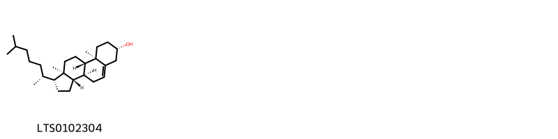{ width=100% }
    <figcaption>Hình ảnh cấu trúc hóa học của 1 hoạt chất thuộc nhóm Steroids and steroid derivatives gồm ['cholesterol (LTS0102304)'].</figcaption>
</figure>

---

### Dược dân tộc học

Danh sách các quốc gia có sử dụng *Equisetum giganteum* trong điều trị các bệnh. 

| Country            | Disease    | Bệnh                                                                                                                                                                                                |
|:-------------------|:-----------|:----------------------------------------------------------------------------------------------------------------------------------------------------------------------------------------------------|
| Dominican Republic | Astringent | MYMEMORY WARNING: YOU USED ALL AVAILABLE FREE TRANSLATIONS FOR TODAY. NEXT AVAILABLE IN  15 HOURS 00 MINUTES 39 SECONDS VISIT HTTPS://MYMEMORY.TRANSLATED.NET/DOC/USAGELIMITS.PHP TO TRANSLATE MORE |

---

---
## Equisetum hiemale
### Thông tin về thực vật

!!! info "Phân loại thực vật của *Equisetum hyemale* từ GIBF:"
    - **Kingdom:** Plantae
    - **Phylum:** Tracheophyta
    - **Order:** Equisetales
    - **Family:** Equisetaceae
    - **Genus:** Equisetum
    - **Species:** *Equisetum hyemale*

 

| Label (VI)   | Label (EN)   | Scientific Name     | Descriptions (VI)   | Descriptions (EN)   | Also Known As (VI)   | Also Known As (EN)   |
|:-------------|:-------------|:--------------------|:--------------------|:--------------------|:---------------------|:---------------------|
| N/A          | N/A          | Equisetum giganteum | loài thực vật       | species of plant    | ['']                 | ['']                 |

#### Phân bố trên thế giới

**Từ CSDL GIBF** Denmark, Luxembourg, Germany, Austria, Sweden, Poland, Canada, Netherlands, Lithuania, Hungary, Bulgaria, Estonia, Mexico, China, Norway, Chinese Taipei, Switzerland, Portugal, France, New Zealand, Russian Federation, United States of America, Italy, Ukraine

#### Phân bố tại Việt Nam

**Từ CSDL GIBF**: Không có ghi nhận ở Việt Nam

---
### Thành phần hóa học
        
- Theo cơ sở dữ liệu lotus: Từ loài *Equisetum hyemale* đã phân lập và xác định được Chưa có hoạt chất nào được phân lập. hoạt chất thuộc về các nhóm Không có hoạt chất nào được phân lập. 

Không có hình ảnh nào được tạo ra

---

### Dược dân tộc học

Danh sách các quốc gia có sử dụng *Equisetum hyemale* trong điều trị các bệnh. 

| Country   | Disease                      | Bệnh                                                                                                                                                                                                |
|:----------|:-----------------------------|:----------------------------------------------------------------------------------------------------------------------------------------------------------------------------------------------------|
| China     | Diuretic, Hemostat, Hemostat | MYMEMORY WARNING: YOU USED ALL AVAILABLE FREE TRANSLATIONS FOR TODAY. NEXT AVAILABLE IN  15 HOURS 00 MINUTES 02 SECONDS VISIT HTTPS://MYMEMORY.TRANSLATED.NET/DOC/USAGELIMITS.PHP TO TRANSLATE MORE |
| Elsewhere | nan                          | MYMEMORY WARNING: YOU USED ALL AVAILABLE FREE TRANSLATIONS FOR TODAY. NEXT AVAILABLE IN  14 HOURS 59 MINUTES 55 SECONDS VISIT HTTPS://MYMEMORY.TRANSLATED.NET/DOC/USAGELIMITS.PHP TO TRANSLATE MORE |

---

---
## Equisetum hyemale
### Thông tin về thực vật

!!! info "Phân loại thực vật của *Equisetum hyemale* từ GIBF:"
    - **Kingdom:** Plantae
    - **Phylum:** Tracheophyta
    - **Order:** Equisetales
    - **Family:** Equisetaceae
    - **Genus:** Equisetum
    - **Species:** *Equisetum hyemale*

 

| Label (VI)   | Label (EN)   | Scientific Name   | Descriptions (VI)   | Descriptions (EN)   | Also Known As (VI)   | Also Known As (EN)   |
|:-------------|:-------------|:------------------|:--------------------|:--------------------|:---------------------|:---------------------|
| N/A          | N/A          | Equisetum hyemale | loài thực vật       | species of plant    | ['']                 | ['rough horsetail']  |

#### Phân bố trên thế giới

**Từ CSDL GIBF** Denmark, Luxembourg, Germany, Austria, Sweden, Poland, Canada, Netherlands, Lithuania, Hungary, Bulgaria, Estonia, Mexico, China, Norway, Chinese Taipei, Switzerland, Portugal, France, New Zealand, Russian Federation, United States of America, Italy, Ukraine

#### Phân bố tại Việt Nam

**Từ CSDL GIBF**: Không có ghi nhận ở Việt Nam

---
### Thành phần hóa học
        
- Theo cơ sở dữ liệu lotus: Từ loài *Equisetum hyemale* đã phân lập và xác định được 26 hoạt chất thuộc về các nhóm Organooxygen compounds, Prenol lipids, Flavonoids, Fatty Acyls. 

|    | chemicalTaxonomyClassyfireClass   |   smiles_count |
|---:|:----------------------------------|---------------:|
|  0 | Fatty Acyls                       |              1 |
|  1 | Flavonoids                        |              2 |
|  2 | Organooxygen compounds            |              5 |
|  3 | Prenol lipids                     |             18 |

#### Nhóm Fatty Acyls
<figure markdown="span">
    { width=100% }
    <figcaption>Hình ảnh cấu trúc hóa học của 1 hoạt chất thuộc nhóm Fatty Acyls gồm ['2-carboxy-d-arabinitol (LTS0056947)'].</figcaption>
</figure>
#### Nhóm Flavonoids
<figure markdown="span">
    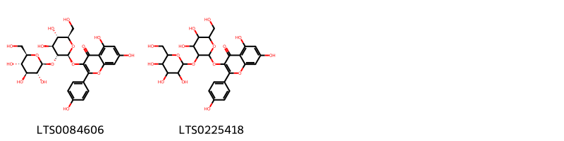{ width=100% }
    <figcaption>Hình ảnh cấu trúc hóa học của 2 hoạt chất thuộc nhóm Flavonoids gồm ['kaempferol 3-o-sophoroside (LTS0084606)', '3-{[4,5-dihydroxy-6-(hydroxymethyl)-3-{[3,4,5-trihydroxy-6-(hydroxymethyl)oxan-2-yl]oxy}oxan-2-yl]oxy}-5,7-dihydroxy-2-(4-hydroxyphenyl)chromen-4-one (LTS0225418)'].</figcaption>
</figure>
#### Nhóm Organooxygen compounds
<figure markdown="span">
    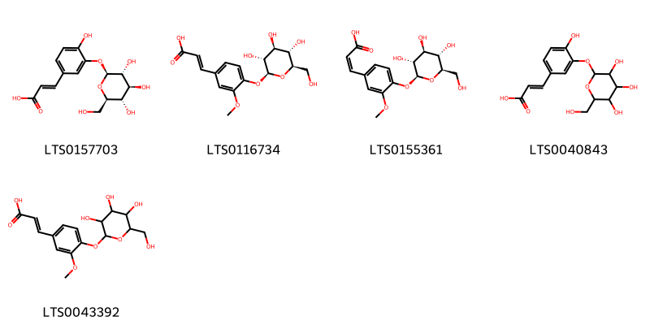{ width=100% }
    <figcaption>Hình ảnh cấu trúc hóa học của 5 hoạt chất thuộc nhóm Organooxygen compounds gồm ['caffeic acid 3-glucoside (LTS0157703)', '(2e)-3-(3-methoxy-4-{[(2s,3r,4s,5s,6r)-3,4,5-trihydroxy-6-(hydroxymethyl)oxan-2-yl]oxy}phenyl)prop-2-enoic acid (LTS0116734)', '(2z)-3-(3-methoxy-4-{[(2s,3r,4s,5s,6r)-3,4,5-trihydroxy-6-(hydroxymethyl)oxan-2-yl]oxy}phenyl)prop-2-enoic acid (LTS0155361)', '3-(4-hydroxy-3-{[3,4,5-trihydroxy-6-(hydroxymethyl)oxan-2-yl]oxy}phenyl)prop-2-enoic acid (LTS0040843)', '3-(3-methoxy-4-{[3,4,5-trihydroxy-6-(hydroxymethyl)oxan-2-yl]oxy}phenyl)prop-2-enoic acid (LTS0043392)'].</figcaption>
</figure>
#### Nhóm Prenol lipids
<figure markdown="span">
    { width=100% }
    <figcaption>Hình ảnh cấu trúc hóa học của 18 hoạt chất thuộc nhóm Prenol lipids gồm ['lycophyll (LTS0196053)', 'carotenoid (LTS0205297)', '(+)-α-carotene (LTS0200789)', 'taraxanthin (LTS0218271)', 'violaxanthin (LTS0102265)', 'lycoxanthin (LTS0033960)', 'zeaxanthin (LTS0192928)', 'doradexanthin (LTS0141142)', '(6s,7ar)-2-[(2e,4e,6e,8e,10e,12e,14e,16e)-17-[(4r)-4-hydroxy-2,6,6-trimethylcyclohex-1-en-1-yl]-6,11,15-trimethylheptadeca-2,4,6,8,10,12,14,16-octaen-2-yl]-4,4,7a-trimethyl-2,5,6,7-tetrahydro-1-benzofuran-6-ol (LTS0100944)', 'cryptoxanthin (LTS0132646)', 'β-carotene (LTS0275716)', 'neoxanthin (LTS0227522)', 'echinenone (LTS0173313)', 'rhodoxanthin (LTS0006899)', '2-[(2e,4e,6e,8e,10e,12e,14e,16e)-17-(4-hydroxy-2,6,6-trimethylcyclohex-1-en-1-yl)-6,11,15-trimethylheptadeca-2,4,6,8,10,12,14,16-octaen-2-yl]-4,4,7a-trimethyl-2,5,6,7-tetrahydro-1-benzofuran-6-ol (LTS0008322)', 'neoxanthin (LTS0000701)', 'α-carotene (LTS0224243)', 'gamma-carotene (LTS0108535)'].</figcaption>
</figure>

---

### Dược dân tộc học

Danh sách các quốc gia có sử dụng *Equisetum hyemale* trong điều trị các bệnh. 

| Country   | Disease                        | Bệnh                                                                                                                                                                                                |
|:----------|:-------------------------------|:----------------------------------------------------------------------------------------------------------------------------------------------------------------------------------------------------|
| Elsewhere | Astringent                     | MYMEMORY WARNING: YOU USED ALL AVAILABLE FREE TRANSLATIONS FOR TODAY. NEXT AVAILABLE IN  14 HOURS 59 MINUTES 30 SECONDS VISIT HTTPS://MYMEMORY.TRANSLATED.NET/DOC/USAGELIMITS.PHP TO TRANSLATE MORE |
| Turkey    | Astringent, Hemostat, Diuretic | MYMEMORY WARNING: YOU USED ALL AVAILABLE FREE TRANSLATIONS FOR TODAY. NEXT AVAILABLE IN  14 HOURS 59 MINUTES 27 SECONDS VISIT HTTPS://MYMEMORY.TRANSLATED.NET/DOC/USAGELIMITS.PHP TO TRANSLATE MORE |

---

---
## Equisetum ramosissimum
### Thông tin về thực vật

!!! info "Phân loại thực vật của *Equisetum ramosissimum* từ GIBF:"
    - **Kingdom:** Plantae
    - **Phylum:** Tracheophyta
    - **Order:** Equisetales
    - **Family:** Equisetaceae
    - **Genus:** Equisetum
    - **Species:** *Equisetum ramosissimum*

 

| Label (VI)   | Label (EN)   | Scientific Name        | Descriptions (VI)   | Descriptions (EN)   | Also Known As (VI)   | Also Known As (EN)   |
|:-------------|:-------------|:-----------------------|:--------------------|:--------------------|:---------------------|:---------------------|
| N/A          | N/A          | Equisetum ramosissimum | loài thực vật       | species of plant    | ['']                 | ['']                 |

#### Phân bố trên thế giới

**Từ CSDL GIBF** Georgia, Thailand, Spain, Azerbaijan, Austria, Indonesia, Albania, Iraq, Netherlands, Slovakia, Türkiye, Japan, Hungary, China, Hong Kong, Switzerland, Chinese Taipei, Iran (Islamic Republic of), Portugal, South Africa, Morocco, France, Syrian Arab Republic, Russian Federation, Italy, Greece, Croatia, Ukraine

#### Phân bố tại Việt Nam

**Từ CSDL GIBF**: Không có ghi nhận ở Việt Nam

---
### Thành phần hóa học
        
- Theo cơ sở dữ liệu lotus: Từ loài *Equisetum ramosissimum* đã phân lập và xác định được 49 hoạt chất thuộc về các nhóm Organooxygen compounds, Pyrimidine nucleosides, Flavonoids, Indoles and derivatives, 2-arylbenzofuran flavonoids, Prenol lipids, Lignan glycosides, Fatty Acyls, Cinnamic acids and derivatives, Steroids and steroid derivatives, Benzene and substituted derivatives. 

|    | chemicalTaxonomyClassyfireClass     |   smiles_count |
|---:|:------------------------------------|---------------:|
|  0 |                                     |              2 |
|  1 | 2-arylbenzofuran flavonoids         |              2 |
|  2 | Benzene and substituted derivatives |              1 |
|  3 | Cinnamic acids and derivatives      |              5 |
|  4 | Fatty Acyls                         |             13 |
|  5 | Flavonoids                          |              8 |
|  6 | Indoles and derivatives             |              2 |
|  7 | Lignan glycosides                   |              2 |
|  8 | Organooxygen compounds              |              3 |
|  9 | Prenol lipids                       |              2 |
| 10 | Pyrimidine nucleosides              |              2 |
| 11 | Steroids and steroid derivatives    |              1 |

#### Nhóm 
<figure markdown="span">
    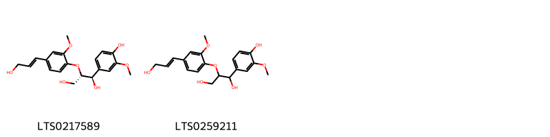{ width=100% }
    <figcaption>Hình ảnh cấu trúc hóa học của 2 hoạt chất thuộc nhóm  gồm ['(1r,2s)-1-(4-hydroxy-3-methoxyphenyl)-2-{4-[(1e)-3-hydroxyprop-1-en-1-yl]-2-methoxyphenoxy}propane-1,3-diol (LTS0217589)', '1-(4-hydroxy-3-methoxyphenyl)-2-[4-(3-hydroxyprop-1-en-1-yl)-2-methoxyphenoxy]propane-1,3-diol (LTS0259211)'].</figcaption>
</figure>
#### Nhóm 2-arylbenzofuran flavonoids
<figure markdown="span">
    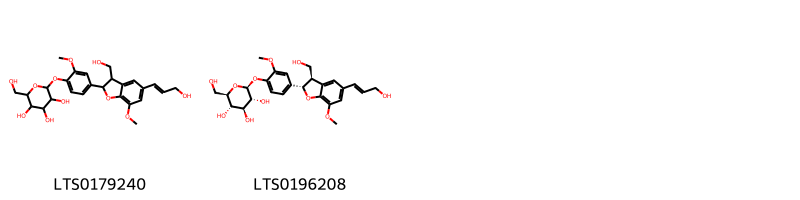{ width=100% }
    <figcaption>Hình ảnh cấu trúc hóa học của 2 hoạt chất thuộc nhóm 2-arylbenzofuran flavonoids gồm ['2-(hydroxymethyl)-6-{4-[3-(hydroxymethyl)-5-(3-hydroxyprop-1-en-1-yl)-7-methoxy-2,3-dihydro-1-benzofuran-2-yl]-2-methoxyphenoxy}oxane-3,4,5-triol (LTS0179240)', '(2r,3s,4s,5r,6s)-2-(hydroxymethyl)-6-{4-[(2s,3r)-3-(hydroxymethyl)-5-[(1e)-3-hydroxyprop-1-en-1-yl]-7-methoxy-2,3-dihydro-1-benzofuran-2-yl]-2-methoxyphenoxy}oxane-3,4,5-triol (LTS0196208)'].</figcaption>
</figure>
#### Nhóm Benzene and substituted derivatives
<figure markdown="span">
    { width=100% }
    <figcaption>Hình ảnh cấu trúc hóa học của 1 hoạt chất thuộc nhóm Benzene and substituted derivatives gồm ['p-hydroxybenzoic acid (LTS0263634)'].</figcaption>
</figure>
#### Nhóm Cinnamic acids and derivatives
<figure markdown="span">
    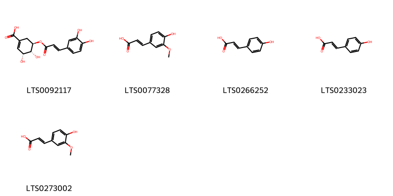{ width=100% }
    <figcaption>Hình ảnh cấu trúc hóa học của 5 hoạt chất thuộc nhóm Cinnamic acids and derivatives gồm ['5-o-caffeoylshikimic acid (LTS0092117)', 'ferulic acid (LTS0077328)', 'para-coumaric acid (LTS0266252)', 'hydroxycinnamic acid (LTS0233023)', 'ferulic acid (LTS0273002)'].</figcaption>
</figure>
#### Nhóm Fatty Acyls
<figure markdown="span">
    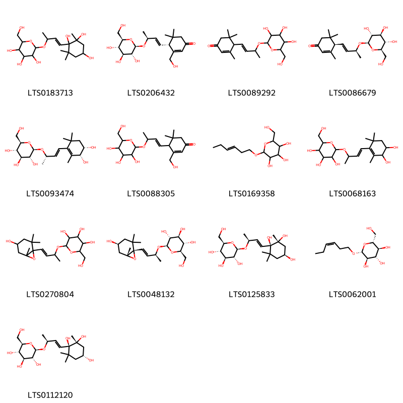{ width=100% }
    <figcaption>Hình ảnh cấu trúc hóa học của 13 hoạt chất thuộc nhóm Fatty Acyls gồm ['2-(hydroxymethyl)-6-{[4-(1,2,4-trihydroxy-2,6,6-trimethylcyclohexyl)but-3-en-2-yl]oxy}oxane-3,4,5-triol (LTS0183713)', '(4r)-3-(hydroxymethyl)-5,5-dimethyl-4-[(1e,3s)-3-{[(2r,3r,4s,5s,6r)-3,4,5-trihydroxy-6-(hydroxymethyl)oxan-2-yl]oxy}but-1-en-1-yl]cyclohex-2-en-1-one (LTS0206432)', '3,5,5-trimethyl-4-(3-{[3,4,5-trihydroxy-6-(hydroxymethyl)oxan-2-yl]oxy}but-1-en-1-yl)cyclohex-2-en-1-one (LTS0089292)', '(4r)-3,5,5-trimethyl-4-[(1e,3s)-3-{[(2r,3r,4s,5s,6r)-3,4,5-trihydroxy-6-(hydroxymethyl)oxan-2-yl]oxy}but-1-en-1-yl]cyclohex-2-en-1-one (LTS0086679)', '(2r,3r,4s,5s,6r)-2-{[(2s,3e)-4-[(3r,4s)-3,4-dihydroxy-2,6,6-trimethylcyclohex-1-en-1-yl]but-3-en-2-yl]oxy}-6-(hydroxymethyl)oxane-3,4,5-triol (LTS0093474)', '3-(hydroxymethyl)-5,5-dimethyl-4-(3-{[3,4,5-trihydroxy-6-(hydroxymethyl)oxan-2-yl]oxy}but-1-en-1-yl)cyclohex-2-en-1-one (LTS0088305)', '2-(hex-3-en-1-yloxy)-6-(hydroxymethyl)oxane-3,4,5-triol (LTS0169358)', '2-{[4-(3,4-dihydroxy-2,6,6-trimethylcyclohex-1-en-1-yl)but-3-en-2-yl]oxy}-6-(hydroxymethyl)oxane-3,4,5-triol (LTS0068163)', '2-[(4-{4-hydroxy-2,2,6-trimethyl-7-oxabicyclo[4.1.0]heptan-1-yl}but-3-en-2-yl)oxy]-6-(hydroxymethyl)oxane-3,4,5-triol (LTS0270804)', '(2r,3r,4s,5s,6r)-2-{[(2s,3e)-4-[(1s,4s,6r)-4-hydroxy-2,2,6-trimethyl-7-oxabicyclo[4.1.0]heptan-1-yl]but-3-en-2-yl]oxy}-6-(hydroxymethyl)oxane-3,4,5-triol (LTS0048132)', '(2r,3s,4s,5r,6r)-2-(hydroxymethyl)-6-{[(2s,3e)-4-[(1r,2r,4s)-1,2,4-trihydroxy-2,6,6-trimethylcyclohexyl]but-3-en-2-yl]oxy}oxane-3,4,5-triol (LTS0125833)', '(2r,3r,4s,5s,6r)-2-[(3z)-hex-3-en-1-yloxy]-6-(hydroxymethyl)oxane-3,4,5-triol (LTS0062001)', '(2r,3s,4s,5r,6r)-2-(hydroxymethyl)-6-{[(2s,3e)-4-[(1r,2r,4r)-1,2,4-trihydroxy-2,6,6-trimethylcyclohexyl]but-3-en-2-yl]oxy}oxane-3,4,5-triol (LTS0112120)'].</figcaption>
</figure>
#### Nhóm Flavonoids
<figure markdown="span">
    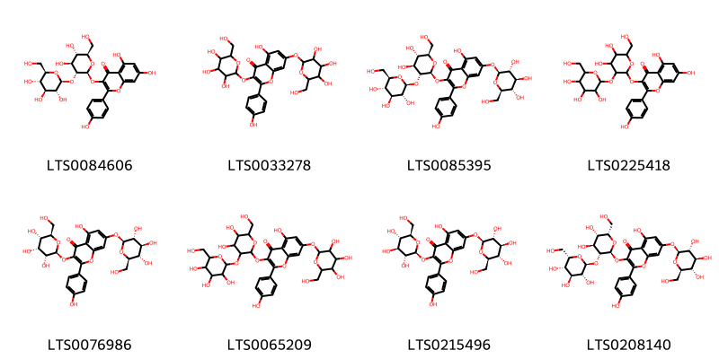{ width=100% }
    <figcaption>Hình ảnh cấu trúc hóa học của 8 hoạt chất thuộc nhóm Flavonoids gồm ['kaempferol 3-o-sophoroside (LTS0084606)', '5-hydroxy-2-(4-hydroxyphenyl)-3,7-bis({[3,4,5-trihydroxy-6-(hydroxymethyl)oxan-2-yl]oxy})chromen-4-one (LTS0033278)', '3-{[(2s,3r,4s,5s,6r)-4,5-dihydroxy-6-(hydroxymethyl)-3-{[(2s,3r,4s,5s,6r)-3,4,5-trihydroxy-6-(hydroxymethyl)oxan-2-yl]oxy}oxan-2-yl]oxy}-5-hydroxy-2-(4-hydroxyphenyl)-7-{[(2s,3r,4s,5s,6r)-3,4,5-trihydroxy-6-(hydroxymethyl)oxan-2-yl]oxy}chromen-4-one (LTS0085395)', '3-{[4,5-dihydroxy-6-(hydroxymethyl)-3-{[3,4,5-trihydroxy-6-(hydroxymethyl)oxan-2-yl]oxy}oxan-2-yl]oxy}-5,7-dihydroxy-2-(4-hydroxyphenyl)chromen-4-one (LTS0225418)', 'kaempferol 3,7-diglucoside (LTS0076986)', '3-{[4,5-dihydroxy-6-(hydroxymethyl)-3-{[3,4,5-trihydroxy-6-(hydroxymethyl)oxan-2-yl]oxy}oxan-2-yl]oxy}-5-hydroxy-2-(4-hydroxyphenyl)-7-{[3,4,5-trihydroxy-6-(hydroxymethyl)oxan-2-yl]oxy}chromen-4-one (LTS0065209)', '5-hydroxy-2-(4-hydroxyphenyl)-3,7-bis({[(2s,3r,4s,5s,6r)-3,4,5-trihydroxy-6-(hydroxymethyl)oxan-2-yl]oxy})chromen-4-one (LTS0215496)', '3-{[(2s,3r,4s,5s,6s)-4,5-dihydroxy-6-(hydroxymethyl)-3-{[(2s,3r,4s,5s,6s)-3,4,5-trihydroxy-6-(hydroxymethyl)oxan-2-yl]oxy}oxan-2-yl]oxy}-5-hydroxy-2-(4-hydroxyphenyl)-7-{[(2s,3r,4s,5s,6r)-3,4,5-trihydroxy-6-(hydroxymethyl)oxan-2-yl]oxy}chromen-4-one (LTS0208140)'].</figcaption>
</figure>
#### Nhóm Indoles and derivatives
<figure markdown="span">
    { width=100% }
    <figcaption>Hình ảnh cấu trúc hóa học của 2 hoạt chất thuộc nhóm Indoles and derivatives gồm ['l-tryptophan (LTS0263809)', 'optimax (LTS0014343)'].</figcaption>
</figure>
#### Nhóm Lignan glycosides
<figure markdown="span">
    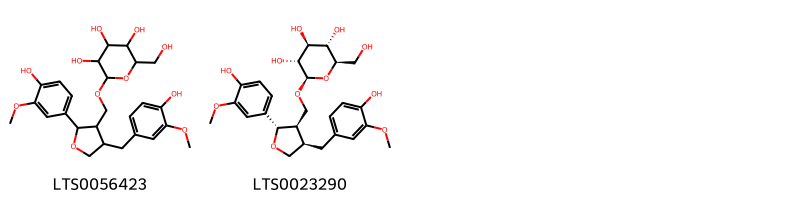{ width=100% }
    <figcaption>Hình ảnh cấu trúc hóa học của 2 hoạt chất thuộc nhóm Lignan glycosides gồm ['2-{[2-(4-hydroxy-3-methoxyphenyl)-4-[(4-hydroxy-3-methoxyphenyl)methyl]oxolan-3-yl]methoxy}-6-(hydroxymethyl)oxane-3,4,5-triol (LTS0056423)', '(2r,3r,4s,5s,6r)-2-{[(2s,3r,4r)-2-(4-hydroxy-3-methoxyphenyl)-4-[(4-hydroxy-3-methoxyphenyl)methyl]oxolan-3-yl]methoxy}-6-(hydroxymethyl)oxane-3,4,5-triol (LTS0023290)'].</figcaption>
</figure>
#### Nhóm Organooxygen compounds
<figure markdown="span">
    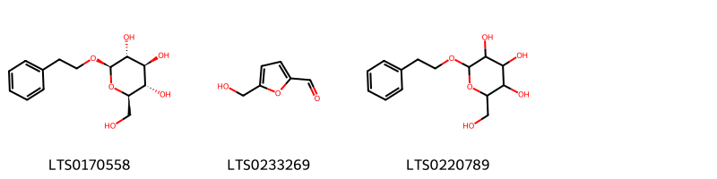{ width=100% }
    <figcaption>Hình ảnh cấu trúc hóa học của 3 hoạt chất thuộc nhóm Organooxygen compounds gồm ['(2r,3s,4s,5r,6r)-2-(hydroxymethyl)-6-(2-phenylethoxy)oxane-3,4,5-triol (LTS0170558)', 'hydroxymethylfurfural (LTS0233269)', '2-(hydroxymethyl)-6-(2-phenylethoxy)oxane-3,4,5-triol (LTS0220789)'].</figcaption>
</figure>
#### Nhóm Prenol lipids
<figure markdown="span">
    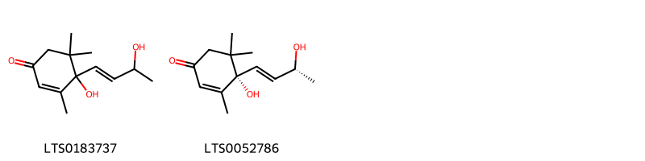{ width=100% }
    <figcaption>Hình ảnh cấu trúc hóa học của 2 hoạt chất thuộc nhóm Prenol lipids gồm ['4-hydroxy-4-(3-hydroxybut-1-en-1-yl)-3,5,5-trimethylcyclohex-2-en-1-one (LTS0183737)', '(6s,9r)-vomifoliol (LTS0052786)'].</figcaption>
</figure>
#### Nhóm Pyrimidine nucleosides
<figure markdown="span">
    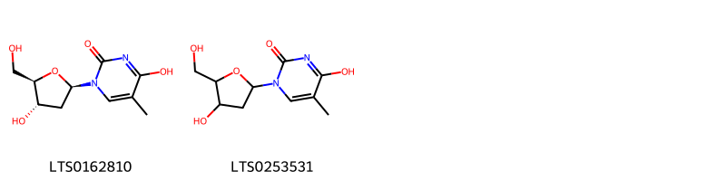{ width=100% }
    <figcaption>Hình ảnh cấu trúc hóa học của 2 hoạt chất thuộc nhóm Pyrimidine nucleosides gồm ['thymidine (LTS0162810)', '4-hydroxy-1-[4-hydroxy-5-(hydroxymethyl)oxolan-2-yl]-5-methylpyrimidin-2-one (LTS0253531)'].</figcaption>
</figure>
#### Nhóm Steroids and steroid derivatives
<figure markdown="span">
    { width=100% }
    <figcaption>Hình ảnh cấu trúc hóa học của 1 hoạt chất thuộc nhóm Steroids and steroid derivatives gồm ['cholesterol (LTS0102304)'].</figcaption>
</figure>

---

### Dược dân tộc học

Danh sách các quốc gia có sử dụng *Equisetum ramosissimum* trong điều trị các bệnh. 

| Country   | Disease              | Bệnh                                                                                                                                                                                                |
|:----------|:---------------------|:----------------------------------------------------------------------------------------------------------------------------------------------------------------------------------------------------|
| Egypt     | Diuretic, Astringent | MYMEMORY WARNING: YOU USED ALL AVAILABLE FREE TRANSLATIONS FOR TODAY. NEXT AVAILABLE IN  14 HOURS 58 MINUTES 38 SECONDS VISIT HTTPS://MYMEMORY.TRANSLATED.NET/DOC/USAGELIMITS.PHP TO TRANSLATE MORE |

---

---
## Equisetum robustum
### Thông tin về thực vật

!!! info "Phân loại thực vật của *N/A* từ GIBF:"
    - **Kingdom:** Plantae
    - **Phylum:** Tracheophyta
    - **Order:** Equisetales
    - **Family:** Equisetaceae
    - **Genus:** Equisetum
    - **Species:** *N/A*

 

| Label (VI)   | Label (EN)   | Scientific Name    | Descriptions (VI)   | Descriptions (EN)   | Also Known As (VI)   | Also Known As (EN)   |
|:-------------|:-------------|:-------------------|:--------------------|:--------------------|:---------------------|:---------------------|
| N/A          | N/A          | Equisetum robustum |                     | species of plant    | ['']                 | ['']                 |

#### Phân bố trên thế giới

**Từ CSDL GIBF** Georgia, Denmark, Spain, Germany, Chile, Austria, Australia, Indonesia, Colombia, Venezuela (Bolivarian Republic of), Sweden, Poland, Canada, Netherlands, Türkiye, Peru, Hungary, Bulgaria, Mexico, China, Chinese Taipei, Switzerland, Uruguay, United Kingdom of Great Britain and Northern Ireland, Argentina, Portugal, Morocco, France, New Zealand, Costa Rica, Russian Federation, Ecuador, United States of America, Italy, Greece, Ukraine

#### Phân bố tại Việt Nam

**Từ CSDL GIBF**: Không có ghi nhận ở Việt Nam

---
### Thành phần hóa học
        
- Theo cơ sở dữ liệu lotus: Từ loài *N/A* đã phân lập và xác định được Chưa có hoạt chất nào được phân lập. hoạt chất thuộc về các nhóm Không có hoạt chất nào được phân lập. 

Không có hình ảnh nào được tạo ra

---

### Dược dân tộc học

Danh sách các quốc gia có sử dụng *N/A* trong điều trị các bệnh. 

| Country   | Disease            | Bệnh                                                                                                                                                                                                |
|:----------|:-------------------|:----------------------------------------------------------------------------------------------------------------------------------------------------------------------------------------------------|
| Mexico    | Diuretic, Diuretic | MYMEMORY WARNING: YOU USED ALL AVAILABLE FREE TRANSLATIONS FOR TODAY. NEXT AVAILABLE IN  14 HOURS 58 MINUTES 07 SECONDS VISIT HTTPS://MYMEMORY.TRANSLATED.NET/DOC/USAGELIMITS.PHP TO TRANSLATE MORE |

---

---
## Equisetum telmateia
### Thông tin về thực vật

!!! info "Phân loại thực vật của *Equisetum telmateia* từ GIBF:"
    - **Kingdom:** Plantae
    - **Phylum:** Tracheophyta
    - **Order:** Equisetales
    - **Family:** Equisetaceae
    - **Genus:** Equisetum
    - **Species:** *Equisetum telmateia*

 

| Label (VI)   | Label (EN)   | Scientific Name     | Descriptions (VI)   | Descriptions (EN)   | Also Known As (VI)   | Also Known As (EN)   |
|:-------------|:-------------|:--------------------|:--------------------|:--------------------|:---------------------|:---------------------|
| N/A          | N/A          | Equisetum telmateia | loài thực vật       | species of plant    | ['']                 | ['Great Horsetail']  |

#### Phân bố trên thế giới

**Từ CSDL GIBF** Georgia, nan, Spain, Germany, Austria, Serbia, Canada, Belgium, Netherlands, Türkiye, Hungary, Ireland, Switzerland, United Kingdom of Great Britain and Northern Ireland, Iran (Islamic Republic of), Portugal, France, Syrian Arab Republic, Russian Federation, United States of America, Italy, Greece

#### Phân bố tại Việt Nam

**Từ CSDL GIBF**: Không có ghi nhận ở Việt Nam

---
### Thành phần hóa học
        
- Theo cơ sở dữ liệu lotus: Từ loài *Equisetum telmateia* đã phân lập và xác định được 30 hoạt chất thuộc về các nhóm Organooxygen compounds, Flavonoids, Indoles and derivatives, Prenol lipids, Fatty Acyls, Cinnamic acids and derivatives, Steroids and steroid derivatives. 

|    | chemicalTaxonomyClassyfireClass   |   smiles_count |
|---:|:----------------------------------|---------------:|
|  0 | Cinnamic acids and derivatives    |              3 |
|  1 | Fatty Acyls                       |              2 |
|  2 | Flavonoids                        |              3 |
|  3 | Indoles and derivatives           |              1 |
|  4 | Organooxygen compounds            |              1 |
|  5 | Prenol lipids                     |             18 |
|  6 | Steroids and steroid derivatives  |              2 |

#### Nhóm Cinnamic acids and derivatives
<figure markdown="span">
    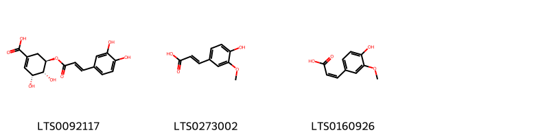{ width=100% }
    <figcaption>Hình ảnh cấu trúc hóa học của 3 hoạt chất thuộc nhóm Cinnamic acids and derivatives gồm ['5-o-caffeoylshikimic acid (LTS0092117)', 'ferulic acid (LTS0273002)', 'cis-ferulic acid (LTS0160926)'].</figcaption>
</figure>
#### Nhóm Fatty Acyls
<figure markdown="span">
    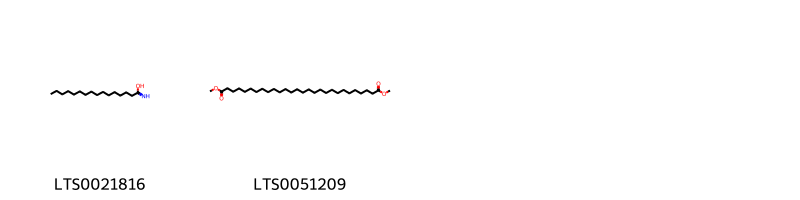{ width=100% }
    <figcaption>Hình ảnh cấu trúc hóa học của 2 hoạt chất thuộc nhóm Fatty Acyls gồm ['hexadecanimidic acid (LTS0021816)', '1,28-dimethyl octacosanedioate (LTS0051209)'].</figcaption>
</figure>
#### Nhóm Flavonoids
<figure markdown="span">
    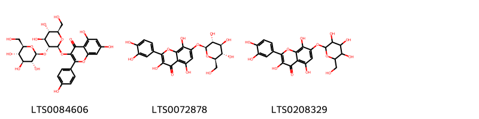{ width=100% }
    <figcaption>Hình ảnh cấu trúc hóa học của 3 hoạt chất thuộc nhóm Flavonoids gồm ['kaempferol 3-o-sophoroside (LTS0084606)', 'gossypitrin (LTS0072878)', '2-(3,4-dihydroxyphenyl)-3,5,8-trihydroxy-7-{[3,4,5-trihydroxy-6-(hydroxymethyl)oxan-2-yl]oxy}chromen-4-one (LTS0208329)'].</figcaption>
</figure>
#### Nhóm Indoles and derivatives
<figure markdown="span">
    { width=100% }
    <figcaption>Hình ảnh cấu trúc hóa học của 1 hoạt chất thuộc nhóm Indoles and derivatives gồm ['indole-3-carboxaldehyde (LTS0137179)'].</figcaption>
</figure>
#### Nhóm Organooxygen compounds
<figure markdown="span">
    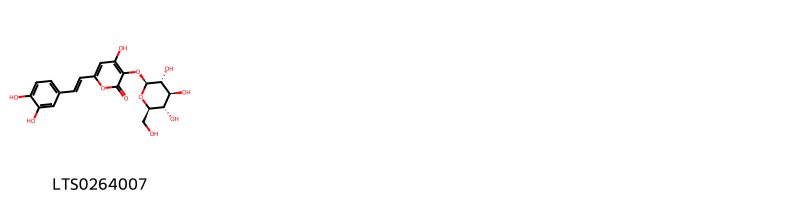{ width=100% }
    <figcaption>Hình ảnh cấu trúc hóa học của 1 hoạt chất thuộc nhóm Organooxygen compounds gồm ['6-[(1e)-2-(3,4-dihydroxyphenyl)ethenyl]-4-hydroxy-3-{[(2s,3r,4s,5s,6r)-3,4,5-trihydroxy-6-(hydroxymethyl)oxan-2-yl]oxy}pyran-2-one (LTS0264007)'].</figcaption>
</figure>
#### Nhóm Prenol lipids
<figure markdown="span">
    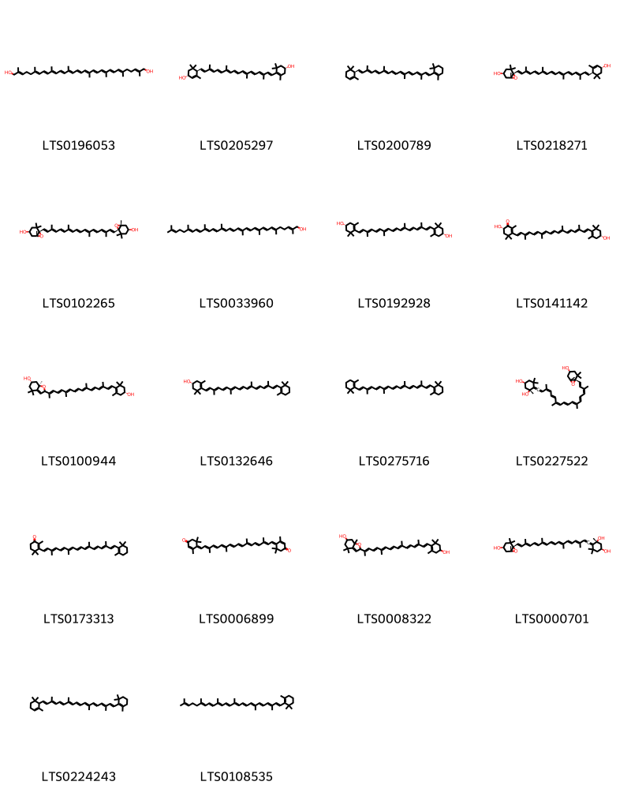{ width=100% }
    <figcaption>Hình ảnh cấu trúc hóa học của 18 hoạt chất thuộc nhóm Prenol lipids gồm ['lycophyll (LTS0196053)', 'carotenoid (LTS0205297)', '(+)-α-carotene (LTS0200789)', 'taraxanthin (LTS0218271)', 'violaxanthin (LTS0102265)', 'lycoxanthin (LTS0033960)', 'zeaxanthin (LTS0192928)', 'doradexanthin (LTS0141142)', '(6s,7ar)-2-[(2e,4e,6e,8e,10e,12e,14e,16e)-17-[(4r)-4-hydroxy-2,6,6-trimethylcyclohex-1-en-1-yl]-6,11,15-trimethylheptadeca-2,4,6,8,10,12,14,16-octaen-2-yl]-4,4,7a-trimethyl-2,5,6,7-tetrahydro-1-benzofuran-6-ol (LTS0100944)', 'cryptoxanthin (LTS0132646)', 'β-carotene (LTS0275716)', 'neoxanthin (LTS0227522)', 'echinenone (LTS0173313)', 'rhodoxanthin (LTS0006899)', '2-[(2e,4e,6e,8e,10e,12e,14e,16e)-17-(4-hydroxy-2,6,6-trimethylcyclohex-1-en-1-yl)-6,11,15-trimethylheptadeca-2,4,6,8,10,12,14,16-octaen-2-yl]-4,4,7a-trimethyl-2,5,6,7-tetrahydro-1-benzofuran-6-ol (LTS0008322)', 'neoxanthin (LTS0000701)', 'α-carotene (LTS0224243)', 'gamma-carotene (LTS0108535)'].</figcaption>
</figure>
#### Nhóm Steroids and steroid derivatives
<figure markdown="span">
    { width=100% }
    <figcaption>Hình ảnh cấu trúc hóa học của 2 hoạt chất thuộc nhóm Steroids and steroid derivatives gồm ['stigmast-5-en-3-ol, (3β)- (LTS0204616)', '(1r,3ar,3br,7s,9ar,9br,11ar)-1-[(2r,5r)-5-ethyl-6-methylheptan-2-yl]-9a,11a-dimethyl-1h,2h,3h,3ah,3bh,4h,6h,7h,8h,9h,9bh,10h,11h-cyclopenta[a]phenanthren-7-ol (LTS0129695)'].</figcaption>
</figure>

---

### Dược dân tộc học

Danh sách các quốc gia có sử dụng *Equisetum telmateia* trong điều trị các bệnh. 

| Country   | Disease   | Bệnh                                                                                                                                                                                                |
|:----------|:----------|:----------------------------------------------------------------------------------------------------------------------------------------------------------------------------------------------------|
| ain       | Diuretic  | MYMEMORY WARNING: YOU USED ALL AVAILABLE FREE TRANSLATIONS FOR TODAY. NEXT AVAILABLE IN  14 HOURS 57 MINUTES 38 SECONDS VISIT HTTPS://MYMEMORY.TRANSLATED.NET/DOC/USAGELIMITS.PHP TO TRANSLATE MORE |

---

