!!! abstract "Tóm tắt"

    Họ Ericaceae gồm khoảng 20 chi và 52 loài được một số cộng đồng tại các quốc gia như Africa, Turkey, US(Makah), Japan, US(Flathead), French, US, Dutch, Mexico, Canada(Kwakiutl), Danish, Canada(Salish), China, Italian, North America, Europe, US(Amerindian), Colombia, German, Canada(Nootka), Elsewhere, India, Bolivia, Sicily, ain, Philippines, Nepal sử dụng trong một số trường hợp QUERY LENGTH LIMIT EXCEEDED. MAX ALLOWED QUERY : 500 CHARS QUERY LENGTH LIMIT EXCEEDED. MAX ALLOWED QUERY : 500 CHARS.

!!! info "DrDuke"

    James A. Duke sinh năm 1929-2017 là một nhà thực vật học người Mỹ. Đây là một trong những tác giả hàng đầu trong lĩnh vực dược dân tộc học với cuốn *CRC Handbook of Medicinal Herbs* và chính là người xây dựng lên cơ sở dữ liệu về hợp chất tự nhiên và dược dân tộc học tại Bộ nông nghiệp Hoa Kỳ. Các thông tin được đăng tải tại website [Dr. Duke's Phytochemical and Ethnobotanical Databases](https://phytochem.nal.usda.gov/). 
    Trong suốt thập niên 1970, ông lãnh đạo the Plant Taxonomy Laboratory, Plant Genetics and Germplasm Institute of the Agricultural Research Service, U.S. Department of Agriculture.
    Trong tài liệu này, các thông tin về dược dân tộc của các dược liệu được trích dẫn từ tài liệu của James A. Ducke với sự trợ giúp của phần mềm dịch thuật từ tiếng Anh sang tiếng Việt.
   

# Chi Agauria

??? note "Danh sách các dược liệu thuộc chi"
    
	 - *Agauria salicifolia*

---
## Agauria salicifolia
### Thông tin về thực vật

!!! info "Phân loại thực vật của *Agarista salicifolia* từ GIBF:"
    - **Kingdom:** Plantae
    - **Phylum:** Tracheophyta
    - **Order:** Ericales
    - **Family:** Ericaceae
    - **Genus:** Agarista
    - **Species:** *Agarista salicifolia*

 

| Label (VI)   | Label (EN)   | Scientific Name     | Descriptions (VI)   | Descriptions (EN)   | Also Known As (VI)   | Also Known As (EN)   |
|:-------------|:-------------|:--------------------|:--------------------|:--------------------|:---------------------|:---------------------|
| N/A          | N/A          | Agauria salicifolia | loài thực vật       | species of plant    | ['']                 | ['']                 |

#### Phân bố trên thế giới

**Từ CSDL GIBF** Mauritius, Angola, Somalia, Myanmar, Mozambique, Rwanda, unknown or invalid, Tanzania, United Republic of, Malawi, Zambia, Réunion, Nigeria, Congo, Democratic Republic of the, Uganda, Madagascar, Equatorial Guinea, Burundi, Kenya, Cameroon, Ethiopia

#### Phân bố tại Việt Nam

**Từ CSDL GIBF**: Không có ghi nhận ở Việt Nam

---
### Thành phần hóa học
        
- Theo cơ sở dữ liệu lotus: Từ loài *Agarista salicifolia* đã phân lập và xác định được Chưa có hoạt chất nào được phân lập. hoạt chất thuộc về các nhóm Không có hoạt chất nào được phân lập. 

Không có hình ảnh nào được tạo ra

---

### Dược dân tộc học

Danh sách các quốc gia có sử dụng *Agarista salicifolia* trong điều trị các bệnh. 

| Country   | Disease   | Bệnh                                                                                                                                                                                                |
|:----------|:----------|:----------------------------------------------------------------------------------------------------------------------------------------------------------------------------------------------------|
| Africa    | Poison    | MYMEMORY WARNING: YOU USED ALL AVAILABLE FREE TRANSLATIONS FOR TODAY. NEXT AVAILABLE IN  01 HOURS 58 MINUTES 59 SECONDS VISIT HTTPS://MYMEMORY.TRANSLATED.NET/DOC/USAGELIMITS.PHP TO TRANSLATE MORE |

---

# Chi Vaccinium

??? note "Danh sách các dược liệu thuộc chi"
    
	 - *Vaccinium arboreum*
	 - *Vaccinium floribundum*
	 - *Vaccinium myrtillus*
	 - *Vaccinium oxycoccus*
	 - *Vaccinium uliginosum*
	 - *Vaccinium vitis-idaea*

---
## Vaccinium arboreum
### Thông tin về thực vật

!!! info "Phân loại thực vật của *Vaccinium arboreum* từ GIBF:"
    - **Kingdom:** Plantae
    - **Phylum:** Tracheophyta
    - **Order:** Ericales
    - **Family:** Ericaceae
    - **Genus:** Vaccinium
    - **Species:** *Vaccinium arboreum*

 

| Label (VI)   | Label (EN)   | Scientific Name    | Descriptions (VI)   | Descriptions (EN)   | Also Known As (VI)   | Also Known As (EN)                                                        |
|:-------------|:-------------|:-------------------|:--------------------|:--------------------|:---------------------|:--------------------------------------------------------------------------|
| N/A          | N/A          | Vaccinium arboreum | loài thực vật       | species of plant    | ['']                 | ['farkleberry', 'sparkleberry', 'winter huckleberry', 'tree huckleberry'] |

#### Phân bố trên thế giới

**Từ CSDL GIBF** United States of America

#### Phân bố tại Việt Nam

**Từ CSDL GIBF**: Không có ghi nhận ở Việt Nam

---
### Thành phần hóa học
        
- Theo cơ sở dữ liệu lotus: Từ loài *Vaccinium arboreum* đã phân lập và xác định được 14 hoạt chất thuộc về các nhóm Flavonoids, Organooxygen compounds, Stilbenes. 

|    | chemicalTaxonomyClassyfireClass   |   smiles_count |
|---:|:----------------------------------|---------------:|
|  0 | Flavonoids                        |             11 |
|  1 | Organooxygen compounds            |              2 |
|  2 | Stilbenes                         |              1 |

#### Nhóm Flavonoids
<figure markdown="span">
    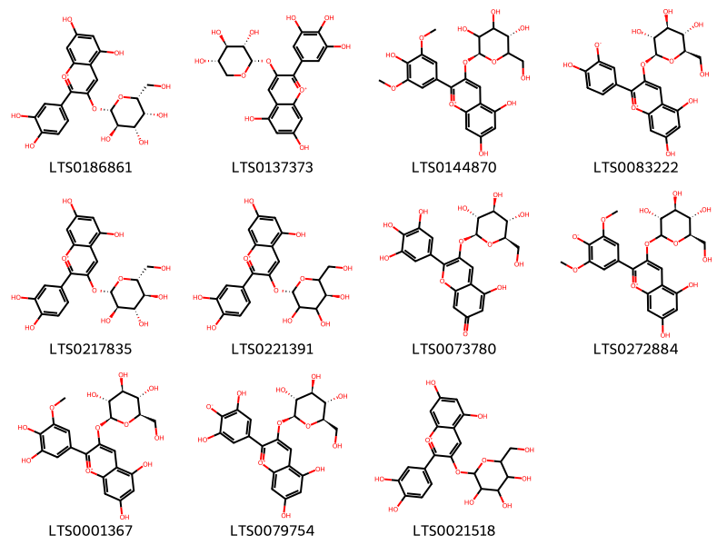{ width=100% }
    <figcaption>Hình ảnh cấu trúc hóa học của 11 hoạt chất thuộc nhóm Flavonoids gồm ['cyanidin 3-o-β-d-galactoside (LTS0186861)', '5,7-dihydroxy-3-{[(2s,3s,4r,5s)-3,4,5-trihydroxyoxan-2-yl]oxy}-2-(3,4,5-trihydroxyphenyl)-1λ⁴-chromen-1-ylium (LTS0137373)', 'oenin (LTS0144870)', '5,7-dihydroxy-2-(4-hydroxy-3-oxidophenyl)-3-{[(2s,3r,4s,5s,6r)-3,4,5-trihydroxy-6-(hydroxymethyl)oxan-2-yl]oxy}-1λ⁴-chromen-1-ylium (LTS0083222)', 'cyanidin 3-glucoside (LTS0217835)', 'chrysanthemin (LTS0221391)', '5-hydroxy-3-{[(2s,3r,4s,5s,6r)-3,4,5-trihydroxy-6-(hydroxymethyl)oxan-2-yl]oxy}-2-(3,4,5-trihydroxyphenyl)chromen-7-one (LTS0073780)', '2-(3,5-dimethoxy-4-oxidophenyl)-5,7-dihydroxy-3-{[(3r,4s,5s,6r)-3,4,5-trihydroxy-6-(hydroxymethyl)oxan-2-yl]oxy}-1λ⁴-chromen-1-ylium (LTS0272884)', 'petunidin 3-glucoside (LTS0001367)', '2-(3,5-dihydroxy-4-oxidophenyl)-5,7-dihydroxy-3-{[(2s,3r,4s,5s,6r)-3,4,5-trihydroxy-6-(hydroxymethyl)oxan-2-yl]oxy}-1λ⁴-chromen-1-ylium (LTS0079754)', '2-(3,4-dihydroxyphenyl)-5,7-dihydroxy-3-{[3,4,5-trihydroxy-6-(hydroxymethyl)oxan-2-yl]oxy}-1λ⁴-chromen-1-ylium (LTS0021518)'].</figcaption>
</figure>
#### Nhóm Organooxygen compounds
<figure markdown="span">
    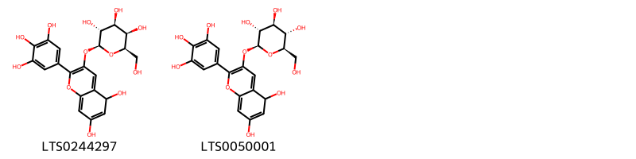{ width=100% }
    <figcaption>Hình ảnh cấu trúc hóa học của 2 hoạt chất thuộc nhóm Organooxygen compounds gồm ['5,7-dihydroxy-3-{[(2s,3r,4s,5r,6r)-3,4,5-trihydroxy-6-(hydroxymethyl)oxan-2-yl]oxy}-2-(3,4,5-trihydroxyphenyl)-5h-chromen-5-yl (LTS0244297)', '5,7-dihydroxy-3-{[(2s,3r,4s,5s,6r)-3,4,5-trihydroxy-6-(hydroxymethyl)oxan-2-yl]oxy}-2-(3,4,5-trihydroxyphenyl)-5h-chromen-5-yl (LTS0050001)'].</figcaption>
</figure>
#### Nhóm Stilbenes
<figure markdown="span">
    { width=100% }
    <figcaption>Hình ảnh cấu trúc hóa học của 1 hoạt chất thuộc nhóm Stilbenes gồm ['resveratrol (LTS0256677)'].</figcaption>
</figure>

---

### Dược dân tộc học

Danh sách các quốc gia có sử dụng *Vaccinium arboreum* trong điều trị các bệnh. 

| Country   | Disease         | Bệnh                                                                                                                                                                                                |
|:----------|:----------------|:----------------------------------------------------------------------------------------------------------------------------------------------------------------------------------------------------|
| US        | Tonic, Poultice | MYMEMORY WARNING: YOU USED ALL AVAILABLE FREE TRANSLATIONS FOR TODAY. NEXT AVAILABLE IN  01 HOURS 58 MINUTES 40 SECONDS VISIT HTTPS://MYMEMORY.TRANSLATED.NET/DOC/USAGELIMITS.PHP TO TRANSLATE MORE |

---

---
## Vaccinium floribundum
### Thông tin về thực vật

!!! info "Phân loại thực vật của *Vaccinium floribundum* từ GIBF:"
    - **Kingdom:** Plantae
    - **Phylum:** Tracheophyta
    - **Order:** Ericales
    - **Family:** Ericaceae
    - **Genus:** Vaccinium
    - **Species:** *Vaccinium floribundum*

 

| Label (VI)   | Label (EN)   | Scientific Name       | Descriptions (VI)   | Descriptions (EN)   | Also Known As (VI)   | Also Known As (EN)   |
|:-------------|:-------------|:----------------------|:--------------------|:--------------------|:---------------------|:---------------------|
| N/A          | N/A          | Vaccinium floribundum | loài thực vật       | species of plant    | ['']                 | ['']                 |

#### Phân bố trên thế giới

**Từ CSDL GIBF** Ecuador, Colombia, Peru

#### Phân bố tại Việt Nam

**Từ CSDL GIBF**: Không có ghi nhận ở Việt Nam

---
### Thành phần hóa học
        
- Theo cơ sở dữ liệu lotus: Từ loài *Vaccinium floribundum* đã phân lập và xác định được Chưa có hoạt chất nào được phân lập. hoạt chất thuộc về các nhóm Không có hoạt chất nào được phân lập. 

Không có hình ảnh nào được tạo ra

---

### Dược dân tộc học

Danh sách các quốc gia có sử dụng *Vaccinium floribundum* trong điều trị các bệnh. 

| Country   | Disease    | Bệnh                                                                                                                                                                                                |
|:----------|:-----------|:----------------------------------------------------------------------------------------------------------------------------------------------------------------------------------------------------|
| Bolivia   | Intoxicant | MYMEMORY WARNING: YOU USED ALL AVAILABLE FREE TRANSLATIONS FOR TODAY. NEXT AVAILABLE IN  01 HOURS 58 MINUTES 14 SECONDS VISIT HTTPS://MYMEMORY.TRANSLATED.NET/DOC/USAGELIMITS.PHP TO TRANSLATE MORE |

---

---
## Vaccinium myrtillus
### Thông tin về thực vật

!!! info "Phân loại thực vật của *Vaccinium myrtillus* từ GIBF:"
    - **Kingdom:** Plantae
    - **Phylum:** Tracheophyta
    - **Order:** Ericales
    - **Family:** Ericaceae
    - **Genus:** Vaccinium
    - **Species:** *Vaccinium myrtillus*

 

| Label (VI)   | Label (EN)   | Scientific Name     | Descriptions (VI)   | Descriptions (EN)   | Also Known As (VI)   | Also Known As (EN)                                                                                                                                                                                              |
|:-------------|:-------------|:--------------------|:--------------------|:--------------------|:---------------------|:----------------------------------------------------------------------------------------------------------------------------------------------------------------------------------------------------------------|
| N/A          | N/A          | Vaccinium myrtillus | loài thực vật       | species of plant    | ['']                 | ['bilberry', 'European blueberry', 'hurt', 'blue whortleberry', 'common bilberry', 'fraughan', 'huckleberry', 'hurtleberry', 'urts', 'whinberry', 'whort', 'whortleberry', 'wimberry', 'winberry', 'blaeberry'] |

#### Phân bố trên thế giới

**Từ CSDL GIBF** Finland, Denmark, Netherlands, Italy, Germany, Spain, Poland, Ireland, Switzerland, Russian Federation, Sweden, Austria, France, Norway, United Kingdom of Great Britain and Northern Ireland

#### Phân bố tại Việt Nam

**Từ CSDL GIBF**: Không có ghi nhận ở Việt Nam

---
### Thành phần hóa học
        
- Theo cơ sở dữ liệu lotus: Từ loài *Vaccinium myrtillus* đã phân lập và xác định được 135 hoạt chất thuộc về các nhóm Lignan lactones, Hydroxy acids and derivatives, Stilbenes, Carboxylic acids and derivatives, Fatty Acyls, Cinnamic acids and derivatives, Dibenzylbutane lignans, Saturated hydrocarbons, Tannins, Quinolizines, Prenol lipids, Benzene and substituted derivatives, Organooxygen compounds, Lignan glycosides, Furanoid lignans, Flavonoids, Steroids and steroid derivatives, Lactones, Aryltetralin lignans. 

|    | chemicalTaxonomyClassyfireClass     |   smiles_count |
|---:|:------------------------------------|---------------:|
|  0 | Aryltetralin lignans                |              1 |
|  1 | Benzene and substituted derivatives |              6 |
|  2 | Carboxylic acids and derivatives    |              2 |
|  3 | Cinnamic acids and derivatives      |             10 |
|  4 | Dibenzylbutane lignans              |              4 |
|  5 | Fatty Acyls                         |              2 |
|  6 | Flavonoids                          |             55 |
|  7 | Furanoid lignans                    |             12 |
|  8 | Hydroxy acids and derivatives       |              1 |
|  9 | Lactones                            |              2 |
| 10 | Lignan glycosides                   |              2 |
| 11 | Lignan lactones                     |              1 |
| 12 | Organooxygen compounds              |             13 |
| 13 | Prenol lipids                       |             16 |
| 14 | Quinolizines                        |              2 |
| 15 | Saturated hydrocarbons              |              1 |
| 16 | Steroids and steroid derivatives    |              3 |
| 17 | Stilbenes                           |              1 |
| 18 | Tannins                             |              1 |

#### Nhóm Aryltetralin lignans
<figure markdown="span">
    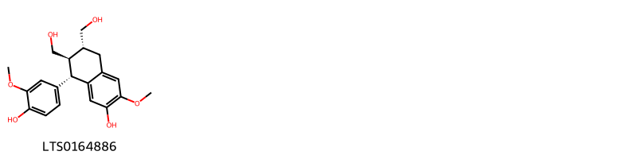{ width=100% }
    <figcaption>Hình ảnh cấu trúc hóa học của 1 hoạt chất thuộc nhóm Aryltetralin lignans gồm ['(+)-isolariciresinol (LTS0164886)'].</figcaption>
</figure>
#### Nhóm Benzene and substituted derivatives
<figure markdown="span">
    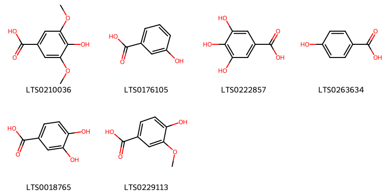{ width=100% }
    <figcaption>Hình ảnh cấu trúc hóa học của 6 hoạt chất thuộc nhóm Benzene and substituted derivatives gồm ['syringic acid (LTS0210036)', '3-hydroxybenzoic acid (LTS0176105)', 'galop (LTS0222857)', 'p-hydroxybenzoic acid (LTS0263634)', '3,4-dihydroxybenzoic acid (LTS0018765)', 'vanillic acid (LTS0229113)'].</figcaption>
</figure>
#### Nhóm Carboxylic acids and derivatives
<figure markdown="span">
    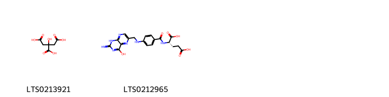{ width=100% }
    <figcaption>Hình ảnh cấu trúc hóa học của 2 hoạt chất thuộc nhóm Carboxylic acids and derivatives gồm ['citric acid (LTS0213921)', 'acid, folic (LTS0212965)'].</figcaption>
</figure>
#### Nhóm Cinnamic acids and derivatives
<figure markdown="span">
    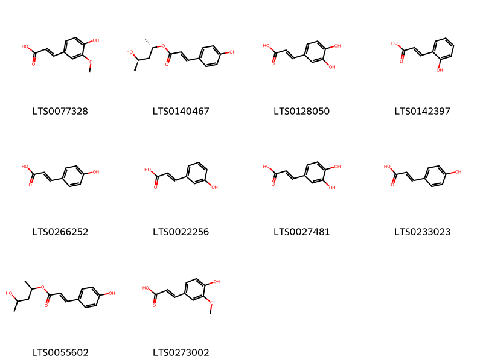{ width=100% }
    <figcaption>Hình ảnh cấu trúc hóa học của 10 hoạt chất thuộc nhóm Cinnamic acids and derivatives gồm ['ferulic acid (LTS0077328)', '(2s,4r)-4-hydroxypentan-2-yl (2e)-3-(4-hydroxyphenyl)prop-2-enoate (LTS0140467)', '3,4-dihydroxycinnamic acid (LTS0128050)', 'trans-2-hydroxycinnamic acid (LTS0142397)', 'para-coumaric acid (LTS0266252)', 'm-coumaric acid (LTS0022256)', 'caffeic acid (LTS0027481)', 'hydroxycinnamic acid (LTS0233023)', '4-hydroxypentan-2-yl 3-(4-hydroxyphenyl)prop-2-enoate (LTS0055602)', 'ferulic acid (LTS0273002)'].</figcaption>
</figure>
#### Nhóm Dibenzylbutane lignans
<figure markdown="span">
    { width=100% }
    <figcaption>Hình ảnh cấu trúc hóa học của 4 hoạt chất thuộc nhóm Dibenzylbutane lignans gồm ['(2s,3r)-2,3-bis[(4-hydroxy-3-methoxyphenyl)(¹³c)methyl](1-¹³c)butane-1,4-diol (LTS0268699)', 'secoisolariciresinol (LTS0086727)', '2-[(4-{[1,3-dihydroxy-1-(4-hydroxy-3-methoxyphenyl)propan-2-yl]oxy}-3-methoxyphenyl)methyl]-3-[(4-hydroxy-3-methoxyphenyl)methyl]butane-1,4-diol (LTS0090582)', '4-[(2s,3r)-2-ethyl-1-hydroxy-3-[(4-hydroxy-3-methoxyphenyl)methyl]pentyl]-2-methoxyphenol (LTS0240188)'].</figcaption>
</figure>
#### Nhóm Fatty Acyls
<figure markdown="span">
    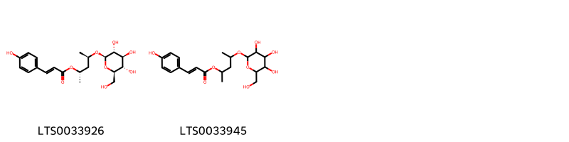{ width=100% }
    <figcaption>Hình ảnh cấu trúc hóa học của 2 hoạt chất thuộc nhóm Fatty Acyls gồm ['(2s,4r)-4-{[(2r,3r,4s,5s,6r)-3,4,5-trihydroxy-6-(hydroxymethyl)oxan-2-yl]oxy}pentan-2-yl (2e)-3-(4-hydroxyphenyl)prop-2-enoate (LTS0033926)', '4-{[3,4,5-trihydroxy-6-(hydroxymethyl)oxan-2-yl]oxy}pentan-2-yl 3-(4-hydroxyphenyl)prop-2-enoate (LTS0033945)'].</figcaption>
</figure>
#### Nhóm Flavonoids
<figure markdown="span">
    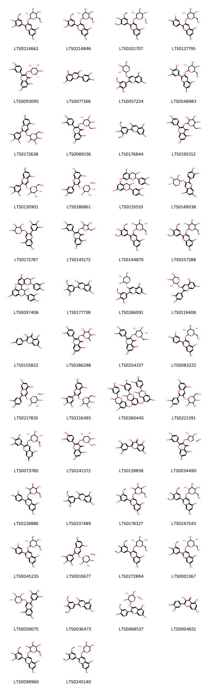{ width=100% }
    <figcaption>Hình ảnh cấu trúc hóa học của 55 hoạt chất thuộc nhóm Flavonoids gồm ['2-(3,4-dihydroxy-5-methoxyphenyl)-5,7-dihydroxy-3-{[(2s,3r,4s,5r,6r)-3,4,5-trihydroxy-6-(hydroxymethyl)oxan-2-yl]oxy}-1λ⁴-chromen-1-ylium (LTS0214662)', '(2s,3r,4s,5r,6r)-2-{[2-(3,4-dihydroxy-5-methoxyphenyl)-5,7-dihydroxy-2h-chromen-3-yl]oxy}-6-(hydroxymethyl)oxane-3,4,5-triol (LTS0214846)', '5,7-dihydroxy-2-(4-hydroxy-3,5-dimethoxyphenyl)-3-{[(2s,3r,4s,5r,6s)-3,4,5-trihydroxy-6-(hydroxymethyl)oxan-2-yl]oxy}-1λ⁴-chromen-1-ylium (LTS0101707)', '5,7-dihydroxy-2-(4-hydroxy-3-oxidophenyl)-3-{[(2s,3r,4s,5r,6r)-3,4,5-trihydroxy-6-(hydroxymethyl)oxan-2-yl]oxy}-1λ⁴-chromen-1-ylium (LTS0127795)', 'quercitrin (LTS0093095)', 'cyanidin (LTS0077168)', '5,7-dihydroxy-2-(3-hydroxy-5-methoxy-4-oxidophenyl)-3-{[(2s,3r,4s,5s)-3,4,5-trihydroxyoxan-2-yl]oxy}-1λ⁴-chromen-1-ylium (LTS0057224)', '2-(3,5-dihydroxy-4-oxidophenyl)-5,7-dihydroxy-3-{[(3r,4s,5r,6r)-3,4,5-trihydroxy-6-(hydroxymethyl)oxan-2-yl]oxy}-1λ⁴-chromen-1-ylium (LTS0048983)', '5,7-dihydroxy-3-{[3,4,5-trihydroxy-6-(hydroxymethyl)oxan-2-yl]oxy}-2-(3,4,5-trihydroxyphenyl)-1λ⁴-chromen-1-ylium (LTS0172638)', 'hyperoside (LTS0089156)', 'malvidin (LTS0176844)', '2-(3,4-dihydroxyphenyl)-5,7-dihydroxy-3-{[3,4,5-trihydroxy-6-(hydroxymethyl)oxan-2-yl]oxy}chromen-4-one (LTS0195312)', '5,7-dihydroxy-3-{[(2s,3r,4s,5r,6s)-3,4,5-trihydroxy-6-(hydroxymethyl)oxan-2-yl]oxy}-2-(3,4,5-trihydroxyphenyl)-1λ⁴-chromen-1-ylium (LTS0130901)', 'cyanidin 3-o-β-d-galactoside (LTS0186861)', '(2r,3r,4r)-2-(3,4-dihydroxyphenyl)-4-[(2r,3r)-2-(3,4-dihydroxyphenyl)-3,5,7-trihydroxy-3,4-dihydro-2h-1-benzopyran-8-yl]-3,4-dihydro-2h-1-benzopyran-3,5,7-triol (LTS0135510)', '2-(3,4-dihydroxyphenyl)-5,7-dihydroxy-3-{[(2r,3r,4r,5s)-3,4,5-trihydroxyoxan-2-yl]oxy}-1λ⁴-chromen-1-ylium (LTS0149038)', '5,7-dihydroxy-3-[(3,4,5-trihydroxyoxan-2-yl)oxy]-2-(3,4,5-trihydroxyphenyl)-1λ⁴-chromen-1-ylium (LTS0172787)', '3-{[3,4-dihydroxy-5-(hydroxymethyl)oxolan-2-yl]oxy}-2-(3,4-dihydroxyphenyl)-5,7-dihydroxychromen-4-one (LTS0145172)', 'oenin (LTS0144870)', 'oenin (LTS0257288)', '(2r,3r)-2-(3,4-dihydroxyphenyl)-4-[(2r,3r)-2-(3,4-dihydroxyphenyl)-3,5,7-trihydroxy-3,4-dihydro-2h-1-benzopyran-8-yl]-3,4-dihydro-2h-1-benzopyran-3,5,7-triol (LTS0097406)', '3,5,7-trihydroxy-2-(3-hydroxy-5-methoxy-4-oxidophenyl)-1λ⁴-chromen-1-ylium (LTS0177738)', '2-(3,4-dihydroxy-5-methoxyphenyl)-5,7-dihydroxy-3-{[(2r,3s,4r,5s)-3,4,5-trihydroxyoxan-2-yl]oxy}-1λ⁴-chromen-1-ylium (LTS0266091)', '5,7-dihydroxy-2-(4-hydroxy-3-oxidophenyl)-3-{[(2s,3r,4s,5s)-3,4,5-trihydroxyoxan-2-yl]oxy}-1λ⁴-chromen-1-ylium (LTS0119408)', 'kaempherol (LTS0155822)', 'quercitrin (LTS0186298)', 'isoquercetin (LTS0254337)', '5,7-dihydroxy-2-(4-hydroxy-3-oxidophenyl)-3-{[(2s,3r,4s,5s,6r)-3,4,5-trihydroxy-6-(hydroxymethyl)oxan-2-yl]oxy}-1λ⁴-chromen-1-ylium (LTS0083222)', 'cyanidin 3-glucoside (LTS0217835)', 'myrtillin (LTS0216495)', 'procyanidin c1 (LTS0260445)', 'chrysanthemin (LTS0221391)', '5-hydroxy-3-{[(2s,3r,4s,5s,6r)-3,4,5-trihydroxy-6-(hydroxymethyl)oxan-2-yl]oxy}-2-(3,4,5-trihydroxyphenyl)chromen-7-one (LTS0073780)', '2-(3,4-dihydroxyphenyl)-5,7-dihydroxy-3-{[(2s,3r,4r,5r,6s)-3,4,5-trihydroxy-6-(hydroxymethyl)oxan-2-yl]oxy}chromen-4-one (LTS0241372)', 'myricetin (LTS0139858)', 'avicularin (LTS0034490)', '5,7-dihydroxy-2-(4-hydroxy-3-oxidophenyl)-3-{[3,4,5-trihydroxy-6-(hydroxymethyl)oxan-2-yl]oxy}-1λ⁴-chromen-1-ylium (LTS0228886)', 'petunidin (LTS0237489)', 'petunidin-3-o-glucoside (LTS0178327)', 'primulin (anthocyanin) (LTS0247543)', '5,7-dihydroxy-2-(4-hydroxy-3-oxidophenyl)-3-{[(3r,4s,5r,6r)-3,4,5-trihydroxy-6-(hydroxymethyl)oxan-2-yl]oxy}-1λ⁴-chromen-1-ylium (LTS0045235)', 'delphinidin 3-glucoside (LTS0010677)', '2-(3,5-dimethoxy-4-oxidophenyl)-5,7-dihydroxy-3-{[(3r,4s,5s,6r)-3,4,5-trihydroxy-6-(hydroxymethyl)oxan-2-yl]oxy}-1λ⁴-chromen-1-ylium (LTS0272884)', 'petunidin 3-glucoside (LTS0001367)', '5,7-dihydroxy-3-{[(2r,3r,4r,5s)-3,4,5-trihydroxyoxan-2-yl]oxy}-2-(3,4,5-trihydroxyphenyl)-1λ⁴-chromen-1-ylium (LTS0059075)', '2-(3,5-dimethoxy-4-oxidophenyl)-3,5,7-trihydroxy-1λ⁴-chromen-1-ylium (LTS0036473)', '5,7-dihydroxy-2-(4-hydroxy-3-methoxyphenyl)-3-{[(2s,3s,4r,5r,6s)-3,4,5-trihydroxy-6-(hydroxymethyl)oxan-2-yl]oxy}-1λ⁴-chromen-1-ylium (LTS0068537)', 'quercetin (LTS0004651)', '2-(3,4-dihydroxy-5-methoxyphenyl)-5,7-dihydroxy-3-{[(2s,5r)-3,4,5-trihydroxy-6-(hydroxymethyl)oxan-2-yl]oxy}-1λ⁴-chromen-1-ylium (LTS0098960)', '2-(3,5-dimethoxy-4-oxidophenyl)-5,7-dihydroxy-3-{[(2s,3r,4s,5s)-3,4,5-trihydroxyoxan-2-yl]oxy}-1λ⁴-chromen-1-ylium (LTS0245140)', '2-(3,5-dihydroxy-4-oxidophenyl)-3,5,7-trihydroxy-1λ⁴-chromen-1-ylium (LTS0276138)', '2-(3,4-dihydroxyphenyl)-5,7-dihydroxy-3-{[3,4,5-trihydroxy-6-(hydroxymethyl)oxan-2-yl]oxy}-1λ⁴-chromen-1-ylium (LTS0021518)', '2-(3,5-dihydroxy-4-oxidophenyl)-5,7-dihydroxy-3-{[(2s,3r,4s,5s)-3,4,5-trihydroxyoxan-2-yl]oxy}-1λ⁴-chromen-1-ylium (LTS0231736)', '5,7-dihydroxy-2-(4-hydroxy-3-oxidophenyl)-3-[(3,4,5-trihydroxyoxan-2-yl)oxy]-1λ⁴-chromen-1-ylium (LTS0235057)', 'delphinidin (LTS0036798)'].</figcaption>
</figure>
#### Nhóm Furanoid lignans
<figure markdown="span">
    { width=100% }
    <figcaption>Hình ảnh cấu trúc hóa học của 12 hoạt chất thuộc nhóm Furanoid lignans gồm ['syringaresinol (LTS0116280)', '3,4-bis[(3,4-dimethoxyphenyl)methyl]oxolan-2-one (LTS0224300)', 'pinoresinol (LTS0057431)', 'matairesinol (LTS0193475)', '(4r)-3-[(s)-hydroxy(4-hydroxy-3-methoxyphenyl)methyl]-4-[(4-hydroxy-3-methoxyphenyl)methyl]oxolan-2-one (LTS0036979)', 'nortrachelogenin (LTS0172824)', '(4r)-3-(4-hydroxy-3-methoxybenzoyl)-4-[(4-hydroxy-3-methoxyphenyl)methyl]oxolan-2-one (LTS0189906)', 'arctigenin methyl ether (LTS0066013)', 'lariciresinol (LTS0010950)', '1-(4-hydroxy-3-methoxyphenyl)-2-(4-{4-[(4-hydroxy-3-methoxyphenyl)methyl]-3-(hydroxymethyl)oxolan-2-yl}-2-methoxyphenoxy)propane-1,3-diol (LTS0025808)', '4-[(3ar,4s,6ar)-4-(4-hydroxy-3-methoxyphenyl)-hexahydrofuro[3,4-c]furan-1-yl]-2,6-dimethoxyphenol (LTS0041035)', 'sesamin (LTS0120161)'].</figcaption>
</figure>
#### Nhóm Hydroxy acids and derivatives
<figure markdown="span">
    { width=100% }
    <figcaption>Hình ảnh cấu trúc hóa học của 1 hoạt chất thuộc nhóm Hydroxy acids and derivatives gồm ['malic acid (LTS0216520)'].</figcaption>
</figure>
#### Nhóm Lactones
<figure markdown="span">
    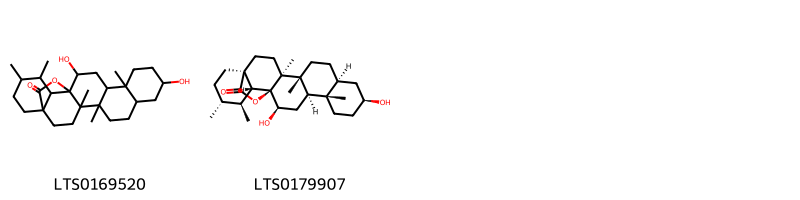{ width=100% }
    <figcaption>Hình ảnh cấu trúc hóa học của 2 hoạt chất thuộc nhóm Lactones gồm ['10,16-dihydroxy-4,5,13,19,20-pentamethyl-24-oxahexacyclo[15.5.2.0¹,¹⁸.0⁴,¹⁷.0⁵,¹⁴.0⁸,¹³]tetracosan-23-one (LTS0169520)', '(1s,4s,5r,8s,10s,13s,14r,16r,17s,18r,19s,20r)-10,16-dihydroxy-4,5,13,19,20-pentamethyl-24-oxahexacyclo[15.5.2.0¹,¹⁸.0⁴,¹⁷.0⁵,¹⁴.0⁸,¹³]tetracosan-23-one (LTS0179907)'].</figcaption>
</figure>
#### Nhóm Lignan glycosides
<figure markdown="span">
    { width=100% }
    <figcaption>Hình ảnh cấu trúc hóa học của 2 hoạt chất thuộc nhóm Lignan glycosides gồm ['2-{[7-hydroxy-1-(4-hydroxy-3,5-dimethoxyphenyl)-3-(hydroxymethyl)-6,8-dimethoxy-1,2,3,4-tetrahydronaphthalen-2-yl]methoxy}oxane-3,4,5-triol (LTS0256435)', '(2r,3r,4s,5r)-2-{[(1s,2r,3r)-7-hydroxy-1-(4-hydroxy-3,5-dimethoxyphenyl)-3-(hydroxymethyl)-6,8-dimethoxy-1,2,3,4-tetrahydronaphthalen-2-yl]methoxy}oxane-3,4,5-triol (LTS0201451)'].</figcaption>
</figure>
#### Nhóm Lignan lactones
<figure markdown="span">
    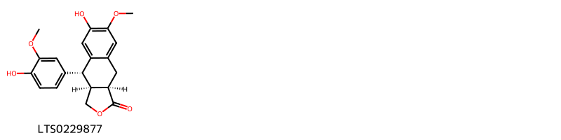{ width=100% }
    <figcaption>Hình ảnh cấu trúc hóa học của 1 hoạt chất thuộc nhóm Lignan lactones gồm ['(3as,4r,9ar)-6-hydroxy-4-(4-hydroxy-3-methoxyphenyl)-7-methoxy-3h,3ah,4h,9h,9ah-naphtho[2,3-c]furan-1-one (LTS0229877)'].</figcaption>
</figure>
#### Nhóm Organooxygen compounds
<figure markdown="span">
    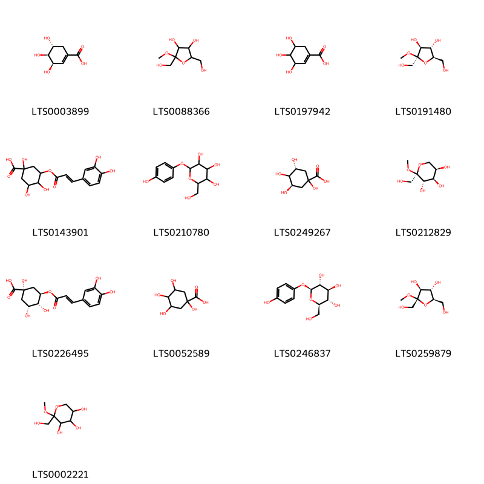{ width=100% }
    <figcaption>Hình ảnh cấu trúc hóa học của 13 hoạt chất thuộc nhóm Organooxygen compounds gồm ['(-)-shikimate (LTS0003899)', '2,5-bis(hydroxymethyl)-2-methoxyoxolane-3,4-diol (LTS0088366)', 'shikimate (LTS0197942)', '(2r,3s,4s,5r)-2,5-bis(hydroxymethyl)-2-methoxyoxolane-3,4-diol (LTS0191480)', '3-{[3-(3,4-dihydroxyphenyl)prop-2-enoyl]oxy}-1,4,5-trihydroxycyclohexane-1-carboxylic acid (LTS0143901)', 'arbutin (LTS0210780)', '(3r,5r)-1,3,4,5-tetrahydroxycyclohexane-1-carboxylic acid (LTS0249267)', '(2s,3s,4r,5r)-2-(hydroxymethyl)-2-methoxyoxane-3,4,5-triol (LTS0212829)', 'chlorogenic acid (LTS0226495)', 'quinic acid (LTS0052589)', 'β-arbutin (LTS0246837)', '(2s,3s,4s,5r)-2,5-bis(hydroxymethyl)-2-methoxyoxolane-3,4-diol (LTS0259879)', '2-(hydroxymethyl)-2-methoxyoxane-3,4,5-triol (LTS0002221)'].</figcaption>
</figure>
#### Nhóm Prenol lipids
<figure markdown="span">
    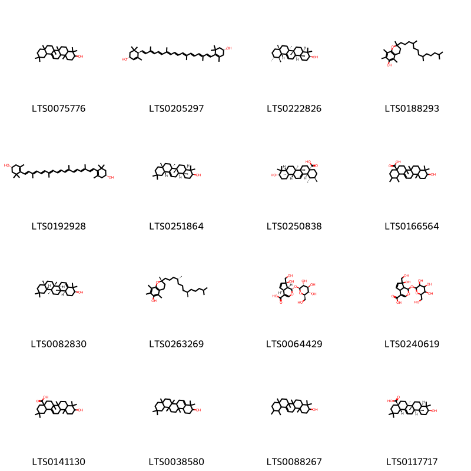{ width=100% }
    <figcaption>Hình ảnh cấu trúc hóa học của 16 hoạt chất thuộc nhóm Prenol lipids gồm ['β-amyrin (LTS0075776)', 'carotenoid (LTS0205297)', 'amyrin (LTS0222826)', 'vita e (LTS0188293)', 'zeaxanthin (LTS0192928)', 'β-amyrin (LTS0251864)', 'ursolic acid (LTS0250838)', '10-hydroxy-1,2,6a,6b,9,9,12a-heptamethyl-2,3,4,5,6,7,8,8a,10,11,12,12b,13,14b-tetradecahydro-1h-picene-4a-carboxylic acid (LTS0166564)', 'glutinol (LTS0082830)', 'vitamin e (LTS0263269)', 'monotropein (LTS0064429)', '7-hydroxy-7-(hydroxymethyl)-1-{[3,4,5-trihydroxy-6-(hydroxymethyl)oxan-2-yl]oxy}-1h,4ah,7ah-cyclopenta[c]pyran-4-carboxylic acid (LTS0240619)', 'oleanolic acid (LTS0141130)', '4,4,6b,8a,11,11,12b,14a-octamethyl-1,2,3,6,6a,7,8,9,10,12,12a,13,14,14b-tetradecahydropicen-3-ol (LTS0038580)', 'α-amyrin (LTS0088267)', 'oleanolic acid (LTS0117717)'].</figcaption>
</figure>
#### Nhóm Quinolizines
<figure markdown="span">
    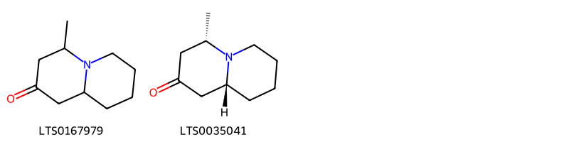{ width=100% }
    <figcaption>Hình ảnh cấu trúc hóa học của 2 hoạt chất thuộc nhóm Quinolizines gồm ['4-methyl-octahydroquinolizin-2-one (LTS0167979)', '(4s,9ar)-4-methyl-octahydroquinolizin-2-one (LTS0035041)'].</figcaption>
</figure>
#### Nhóm Saturated hydrocarbons
<figure markdown="span">
    { width=100% }
    <figcaption>Hình ảnh cấu trúc hóa học của 1 hoạt chất thuộc nhóm Saturated hydrocarbons gồm ['nonacosane (LTS0062747)'].</figcaption>
</figure>
#### Nhóm Steroids and steroid derivatives
<figure markdown="span">
    { width=100% }
    <figcaption>Hình ảnh cấu trúc hóa học của 3 hoạt chất thuộc nhóm Steroids and steroid derivatives gồm ['stigmast-5-en-3-ol (LTS0071224)', 'sitosterol (LTS0168132)', 'stigmast-5-en-3-ol, (3β)- (LTS0204616)'].</figcaption>
</figure>
#### Nhóm Stilbenes
<figure markdown="span">
    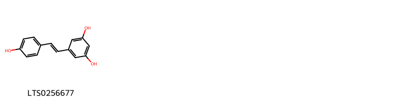{ width=100% }
    <figcaption>Hình ảnh cấu trúc hóa học của 1 hoạt chất thuộc nhóm Stilbenes gồm ['resveratrol (LTS0256677)'].</figcaption>
</figure>
#### Nhóm Tannins
<figure markdown="span">
    { width=100% }
    <figcaption>Hình ảnh cấu trúc hóa học của 1 hoạt chất thuộc nhóm Tannins gồm ['ellagic acid (LTS0037297)'].</figcaption>
</figure>

---

### Dược dân tộc học

Danh sách các quốc gia có sử dụng *Vaccinium myrtillus* trong điều trị các bệnh. 

| Country   | Disease                                                                  | Bệnh                                                                                                                                                                                                |
|:----------|:-------------------------------------------------------------------------|:----------------------------------------------------------------------------------------------------------------------------------------------------------------------------------------------------|
| Turkey    | Antidote, Astringent, Diuretic, Refrigerant, Tonic, Antiseptic, Hemostat | MYMEMORY WARNING: YOU USED ALL AVAILABLE FREE TRANSLATIONS FOR TODAY. NEXT AVAILABLE IN  01 HOURS 57 MINUTES 52 SECONDS VISIT HTTPS://MYMEMORY.TRANSLATED.NET/DOC/USAGELIMITS.PHP TO TRANSLATE MORE |
| ain       | Antiseptic                                                               | MYMEMORY WARNING: YOU USED ALL AVAILABLE FREE TRANSLATIONS FOR TODAY. NEXT AVAILABLE IN  01 HOURS 57 MINUTES 50 SECONDS VISIT HTTPS://MYMEMORY.TRANSLATED.NET/DOC/USAGELIMITS.PHP TO TRANSLATE MORE |

---

---
## Vaccinium oxycoccus
### Thông tin về thực vật

!!! info "Phân loại thực vật của *Vaccinium oxycoccos* từ GIBF:"
    - **Kingdom:** Plantae
    - **Phylum:** Tracheophyta
    - **Order:** Ericales
    - **Family:** Ericaceae
    - **Genus:** Vaccinium
    - **Species:** *Vaccinium oxycoccos*

 

| Label (VI)   | Label (EN)   | Scientific Name     | Descriptions (VI)   | Descriptions (EN)   | Also Known As (VI)   | Also Known As (EN)   |
|:-------------|:-------------|:--------------------|:--------------------|:--------------------|:---------------------|:---------------------|
| N/A          | N/A          | Vaccinium oxycoccus |                     | species of plant    | ['']                 | ['']                 |

#### Phân bố trên thế giới

**Từ CSDL GIBF** nan, Finland, Netherlands, Japan, Germany, Belgium, Estonia, Korea, Republic of, Russian Federation, United States of America, Sweden, Poland, France, Norway, Canada

#### Phân bố tại Việt Nam

**Từ CSDL GIBF**: Không có ghi nhận ở Việt Nam

---
### Thành phần hóa học
        
- Theo cơ sở dữ liệu lotus: Từ loài *Vaccinium oxycoccos* đã phân lập và xác định được Chưa có hoạt chất nào được phân lập. hoạt chất thuộc về các nhóm Không có hoạt chất nào được phân lập. 

Không có hình ảnh nào được tạo ra

---

### Dược dân tộc học

Danh sách các quốc gia có sử dụng *Vaccinium oxycoccos* trong điều trị các bệnh. 

| Country   | Disease     | Bệnh                                                                                                                                                                                                |
|:----------|:------------|:----------------------------------------------------------------------------------------------------------------------------------------------------------------------------------------------------|
| Turkey    | Refrigerant | MYMEMORY WARNING: YOU USED ALL AVAILABLE FREE TRANSLATIONS FOR TODAY. NEXT AVAILABLE IN  01 HOURS 56 MINUTES 58 SECONDS VISIT HTTPS://MYMEMORY.TRANSLATED.NET/DOC/USAGELIMITS.PHP TO TRANSLATE MORE |

---

---
## Vaccinium uliginosum
### Thông tin về thực vật

!!! info "Phân loại thực vật của *Vaccinium uliginosum* từ GIBF:"
    - **Kingdom:** Plantae
    - **Phylum:** Tracheophyta
    - **Order:** Ericales
    - **Family:** Ericaceae
    - **Genus:** Vaccinium
    - **Species:** *Vaccinium uliginosum*

 

| Label (VI)   | Label (EN)   | Scientific Name      | Descriptions (VI)   | Descriptions (EN)   | Also Known As (VI)   | Also Known As (EN)                        |
|:-------------|:-------------|:---------------------|:--------------------|:--------------------|:---------------------|:------------------------------------------|
| N/A          | N/A          | Vaccinium uliginosum | loài thực vật       | species of plant    | ['']                 | ['bog blueberry', 'Vaccinium uliginosum'] |

#### Phân bố trên thế giới

**Từ CSDL GIBF** Belgium, Estonia, Norway, Canada, Ukraine, Denmark, Netherlands, Lithuania, Belarus, Iceland, Russian Federation, United States of America, Sweden, Finland, Åland Islands, Greenland, Czechia, Germany, Switzerland, Austria, France, United Kingdom of Great Britain and Northern Ireland, Poland

#### Phân bố tại Việt Nam

**Từ CSDL GIBF**: Không có ghi nhận ở Việt Nam

---
### Thành phần hóa học
        
- Theo cơ sở dữ liệu lotus: Từ loài *Vaccinium uliginosum* đã phân lập và xác định được 38 hoạt chất thuộc về các nhóm Flavonoids, Prenol lipids, Steroids and steroid derivatives, Cinnamic acids and derivatives, Benzene and substituted derivatives, Organooxygen compounds, Tannins. 

|    | chemicalTaxonomyClassyfireClass     |   smiles_count |
|---:|:------------------------------------|---------------:|
|  0 | Benzene and substituted derivatives |              1 |
|  1 | Cinnamic acids and derivatives      |              5 |
|  2 | Flavonoids                          |             20 |
|  3 | Organooxygen compounds              |              1 |
|  4 | Prenol lipids                       |              7 |
|  5 | Steroids and steroid derivatives    |              2 |
|  6 | Tannins                             |              1 |

#### Nhóm Benzene and substituted derivatives
<figure markdown="span">
    { width=100% }
    <figcaption>Hình ảnh cấu trúc hóa học của 1 hoạt chất thuộc nhóm Benzene and substituted derivatives gồm ['p-hydroxybenzoic acid (LTS0263634)'].</figcaption>
</figure>
#### Nhóm Cinnamic acids and derivatives
<figure markdown="span">
    { width=100% }
    <figcaption>Hình ảnh cấu trúc hóa học của 5 hoạt chất thuộc nhóm Cinnamic acids and derivatives gồm ['ferulic acid (LTS0077328)', '3,4-dihydroxycinnamic acid (LTS0128050)', 'para-coumaric acid (LTS0266252)', 'hydroxycinnamic acid (LTS0233023)', 'ferulic acid (LTS0273002)'].</figcaption>
</figure>
#### Nhóm Flavonoids
<figure markdown="span">
    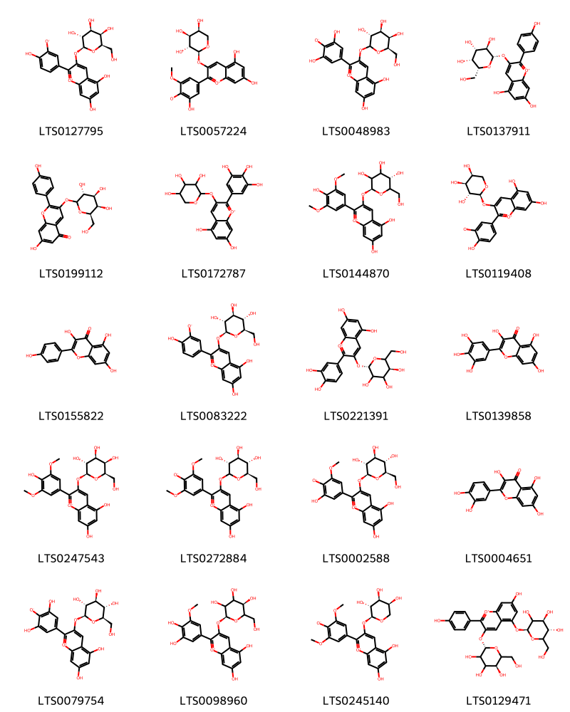{ width=100% }
    <figcaption>Hình ảnh cấu trúc hóa học của 20 hoạt chất thuộc nhóm Flavonoids gồm ['5,7-dihydroxy-2-(4-hydroxy-3-oxidophenyl)-3-{[(2s,3r,4s,5r,6r)-3,4,5-trihydroxy-6-(hydroxymethyl)oxan-2-yl]oxy}-1λ⁴-chromen-1-ylium (LTS0127795)', '5,7-dihydroxy-2-(3-hydroxy-5-methoxy-4-oxidophenyl)-3-{[(2s,3r,4s,5s)-3,4,5-trihydroxyoxan-2-yl]oxy}-1λ⁴-chromen-1-ylium (LTS0057224)', '2-(3,5-dihydroxy-4-oxidophenyl)-5,7-dihydroxy-3-{[(3r,4s,5r,6r)-3,4,5-trihydroxy-6-(hydroxymethyl)oxan-2-yl]oxy}-1λ⁴-chromen-1-ylium (LTS0048983)', 'pelargonidin 3-galactoside ion (LTS0137911)', '7-hydroxy-2-(4-hydroxyphenyl)-3-{[(3r,4s,5r,6r)-3,4,5-trihydroxy-6-(hydroxymethyl)oxan-2-yl]oxy}chromen-5-one (LTS0199112)', '5,7-dihydroxy-3-[(3,4,5-trihydroxyoxan-2-yl)oxy]-2-(3,4,5-trihydroxyphenyl)-1λ⁴-chromen-1-ylium (LTS0172787)', 'oenin (LTS0144870)', '5,7-dihydroxy-2-(4-hydroxy-3-oxidophenyl)-3-{[(2s,3r,4s,5s)-3,4,5-trihydroxyoxan-2-yl]oxy}-1λ⁴-chromen-1-ylium (LTS0119408)', 'kaempherol (LTS0155822)', '5,7-dihydroxy-2-(4-hydroxy-3-oxidophenyl)-3-{[(2s,3r,4s,5s,6r)-3,4,5-trihydroxy-6-(hydroxymethyl)oxan-2-yl]oxy}-1λ⁴-chromen-1-ylium (LTS0083222)', 'chrysanthemin (LTS0221391)', 'myricetin (LTS0139858)', 'primulin (anthocyanin) (LTS0247543)', '2-(3,5-dimethoxy-4-oxidophenyl)-5,7-dihydroxy-3-{[(3r,4s,5s,6r)-3,4,5-trihydroxy-6-(hydroxymethyl)oxan-2-yl]oxy}-1λ⁴-chromen-1-ylium (LTS0272884)', '5,7-dihydroxy-2-(3-hydroxy-5-methoxy-4-oxidophenyl)-3-{[(2s,3r,4s,5s,6r)-3,4,5-trihydroxy-6-(hydroxymethyl)oxan-2-yl]oxy}-1λ⁴-chromen-1-ylium (LTS0002588)', 'quercetin (LTS0004651)', '2-(3,5-dihydroxy-4-oxidophenyl)-5,7-dihydroxy-3-{[(2s,3r,4s,5s,6r)-3,4,5-trihydroxy-6-(hydroxymethyl)oxan-2-yl]oxy}-1λ⁴-chromen-1-ylium (LTS0079754)', '2-(3,4-dihydroxy-5-methoxyphenyl)-5,7-dihydroxy-3-{[(2s,5r)-3,4,5-trihydroxy-6-(hydroxymethyl)oxan-2-yl]oxy}-1λ⁴-chromen-1-ylium (LTS0098960)', '2-(3,5-dimethoxy-4-oxidophenyl)-5,7-dihydroxy-3-{[(2s,3r,4s,5s)-3,4,5-trihydroxyoxan-2-yl]oxy}-1λ⁴-chromen-1-ylium (LTS0245140)', 'pelargonin (LTS0129471)'].</figcaption>
</figure>
#### Nhóm Organooxygen compounds
<figure markdown="span">
    { width=100% }
    <figcaption>Hình ảnh cấu trúc hóa học của 1 hoạt chất thuộc nhóm Organooxygen compounds gồm ['chlorogenic acid (LTS0226495)'].</figcaption>
</figure>
#### Nhóm Prenol lipids
<figure markdown="span">
    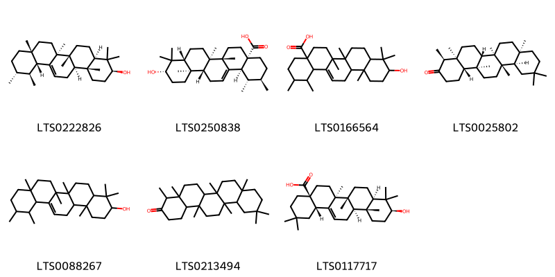{ width=100% }
    <figcaption>Hình ảnh cấu trúc hóa học của 7 hoạt chất thuộc nhóm Prenol lipids gồm ['amyrin (LTS0222826)', 'ursolic acid (LTS0250838)', '10-hydroxy-1,2,6a,6b,9,9,12a-heptamethyl-2,3,4,5,6,7,8,8a,10,11,12,12b,13,14b-tetradecahydro-1h-picene-4a-carboxylic acid (LTS0166564)', '(4s,4as,6as,6br,8ar,12ar,12bs,14as,14bs)-4,4a,6b,8a,11,11,12b,14a-octamethyl-tetradecahydro-1h-picen-3-one (LTS0025802)', 'α-amyrin (LTS0088267)', 'friedelin (LTS0213494)', 'oleanolic acid (LTS0117717)'].</figcaption>
</figure>
#### Nhóm Steroids and steroid derivatives
<figure markdown="span">
    { width=100% }
    <figcaption>Hình ảnh cấu trúc hóa học của 2 hoạt chất thuộc nhóm Steroids and steroid derivatives gồm ['stigmast-5-en-3-ol, (3β)- (LTS0204616)', '(1r,3ar,3br,7s,9ar,9br,11ar)-1-[(2r,5r)-5-ethyl-6-methylheptan-2-yl]-9a,11a-dimethyl-1h,2h,3h,3ah,3bh,4h,6h,7h,8h,9h,9bh,10h,11h-cyclopenta[a]phenanthren-7-ol (LTS0129695)'].</figcaption>
</figure>
#### Nhóm Tannins
<figure markdown="span">
    { width=100% }
    <figcaption>Hình ảnh cấu trúc hóa học của 1 hoạt chất thuộc nhóm Tannins gồm ['ellagic acid (LTS0037297)'].</figcaption>
</figure>

---

### Dược dân tộc học

Danh sách các quốc gia có sử dụng *Vaccinium uliginosum* trong điều trị các bệnh. 

| Country   | Disease   | Bệnh                                                                                                                                                                                                |
|:----------|:----------|:----------------------------------------------------------------------------------------------------------------------------------------------------------------------------------------------------|
| Europe    | Stomachic | MYMEMORY WARNING: YOU USED ALL AVAILABLE FREE TRANSLATIONS FOR TODAY. NEXT AVAILABLE IN  01 HOURS 56 MINUTES 39 SECONDS VISIT HTTPS://MYMEMORY.TRANSLATED.NET/DOC/USAGELIMITS.PHP TO TRANSLATE MORE |
| Turkey    | Narcotic  | MYMEMORY WARNING: YOU USED ALL AVAILABLE FREE TRANSLATIONS FOR TODAY. NEXT AVAILABLE IN  01 HOURS 56 MINUTES 37 SECONDS VISIT HTTPS://MYMEMORY.TRANSLATED.NET/DOC/USAGELIMITS.PHP TO TRANSLATE MORE |

---

---
## Vaccinium vitisidaea
### Thông tin về thực vật

!!! info "Phân loại thực vật của *Vaccinium vitis-idaea* từ GIBF:"
    - **Kingdom:** Plantae
    - **Phylum:** Tracheophyta
    - **Order:** Ericales
    - **Family:** Ericaceae
    - **Genus:** Vaccinium
    - **Species:** *Vaccinium vitis-idaea*

 

| Label (VI)   | Label (EN)   | Scientific Name      | Descriptions (VI)   | Descriptions (EN)   | Also Known As (VI)   | Also Known As (EN)                        |
|:-------------|:-------------|:---------------------|:--------------------|:--------------------|:---------------------|:------------------------------------------|
| N/A          | N/A          | Vaccinium uliginosum | loài thực vật       | species of plant    | ['']                 | ['bog blueberry', 'Vaccinium uliginosum'] |

#### Phân bố trên thế giới

**Từ CSDL GIBF** Italy, Slovakia, Estonia, Belgium, Norway, Canada, Ukraine, Denmark, Netherlands, Belarus, Hungary, Russian Federation, United States of America, Sweden, Finland, Czechia, Germany, Switzerland, Austria, France, United Kingdom of Great Britain and Northern Ireland, Poland

#### Phân bố tại Việt Nam

**Từ CSDL GIBF**: Không có ghi nhận ở Việt Nam

---
### Thành phần hóa học
        
- Theo cơ sở dữ liệu lotus: Từ loài *Vaccinium vitis-idaea* đã phân lập và xác định được Chưa có hoạt chất nào được phân lập. hoạt chất thuộc về các nhóm Không có hoạt chất nào được phân lập. 

Không có hình ảnh nào được tạo ra

---

### Dược dân tộc học

Danh sách các quốc gia có sử dụng *Vaccinium vitis-idaea* trong điều trị các bệnh. 

| Country   | Disease                                                                   | Bệnh                                                                                                                                                                                                |
|:----------|:--------------------------------------------------------------------------|:----------------------------------------------------------------------------------------------------------------------------------------------------------------------------------------------------|
| Elsewhere | Diuretic                                                                  | MYMEMORY WARNING: YOU USED ALL AVAILABLE FREE TRANSLATIONS FOR TODAY. NEXT AVAILABLE IN  01 HOURS 55 MINUTES 40 SECONDS VISIT HTTPS://MYMEMORY.TRANSLATED.NET/DOC/USAGELIMITS.PHP TO TRANSLATE MORE |
| Turkey    | Antiseptic, Diuretic, Apertif, Astringent, Disinfectant, Nervine, Styptic | MYMEMORY WARNING: YOU USED ALL AVAILABLE FREE TRANSLATIONS FOR TODAY. NEXT AVAILABLE IN  01 HOURS 55 MINUTES 38 SECONDS VISIT HTTPS://MYMEMORY.TRANSLATED.NET/DOC/USAGELIMITS.PHP TO TRANSLATE MORE |

---

# Chi Pyrola

??? note "Danh sách các dược liệu thuộc chi"
    
	 - *Pyrola japonica*
	 - *Pyrola rotundifolia*

---
## Pyrola japonica
### Thông tin về thực vật

!!! info "Phân loại thực vật của *Pyrola japonica* từ GIBF:"
    - **Kingdom:** Plantae
    - **Phylum:** Tracheophyta
    - **Order:** Ericales
    - **Family:** Ericaceae
    - **Genus:** Pyrola
    - **Species:** *Pyrola japonica*

 

| Label (VI)   | Label (EN)   | Scientific Name   | Descriptions (VI)   | Descriptions (EN)   | Also Known As (VI)   | Also Known As (EN)   |
|:-------------|:-------------|:------------------|:--------------------|:--------------------|:---------------------|:---------------------|
| N/A          | N/A          | Pyrola japonica   | loài thực vật       | species of plant    | ['']                 | ['']                 |

#### Phân bố trên thế giới

**Từ CSDL GIBF** Korea, Republic of, Russian Federation, Chinese Taipei, Japan

#### Phân bố tại Việt Nam

**Từ CSDL GIBF**: Không có ghi nhận ở Việt Nam

---
### Thành phần hóa học
        
- Theo cơ sở dữ liệu lotus: Từ loài *Pyrola japonica* đã phân lập và xác định được 43 hoạt chất thuộc về các nhóm Fatty Acyls, Naphthalenes, Flavonoids, Prenol lipids, Tetralins, Benzene and substituted derivatives, Organooxygen compounds, Phenols, Lignan glycosides. 

|    | chemicalTaxonomyClassyfireClass     |   smiles_count |
|---:|:------------------------------------|---------------:|
|  0 | Benzene and substituted derivatives |              1 |
|  1 | Fatty Acyls                         |              1 |
|  2 | Flavonoids                          |              6 |
|  3 | Lignan glycosides                   |              2 |
|  4 | Naphthalenes                        |              2 |
|  5 | Organooxygen compounds              |             18 |
|  6 | Phenols                             |              1 |
|  7 | Prenol lipids                       |              6 |
|  8 | Tetralins                           |              6 |

#### Nhóm Benzene and substituted derivatives
<figure markdown="span">
    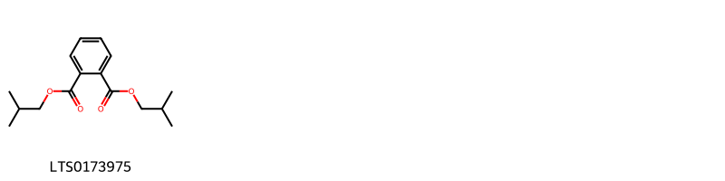{ width=100% }
    <figcaption>Hình ảnh cấu trúc hóa học của 1 hoạt chất thuộc nhóm Benzene and substituted derivatives gồm ['diisobutyl phthalate (LTS0173975)'].</figcaption>
</figure>
#### Nhóm Fatty Acyls
<figure markdown="span">
    { width=100% }
    <figcaption>Hình ảnh cấu trúc hóa học của 1 hoạt chất thuộc nhóm Fatty Acyls gồm ['ethyl palmitate (LTS0111042)'].</figcaption>
</figure>
#### Nhóm Flavonoids
<figure markdown="span">
    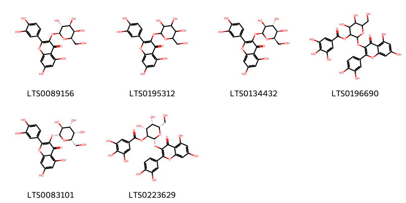{ width=100% }
    <figcaption>Hình ảnh cấu trúc hóa học của 6 hoạt chất thuộc nhóm Flavonoids gồm ['hyperoside (LTS0089156)', '2-(3,4-dihydroxyphenyl)-5,7-dihydroxy-3-{[3,4,5-trihydroxy-6-(hydroxymethyl)oxan-2-yl]oxy}chromen-4-one (LTS0195312)', '2-(3,4-dihydroxyphenyl)-5,7-dihydroxy-3-{[(2s,3s,4r,5r,6r)-3,4,5-trihydroxy-6-(hydroxymethyl)oxan-2-yl]oxy}chromen-4-one (LTS0134432)', '2-{[2-(3,4-dihydroxyphenyl)-5,7-dihydroxy-4-oxochromen-3-yl]oxy}-4,5-dihydroxy-6-(hydroxymethyl)oxan-3-yl 3,4,5-trihydroxybenzoate (LTS0196690)', '2-(3,4-dihydroxyphenyl)-5,7-dihydroxy-3-{[(2r,3s,4r,5s,6s)-3,4,5-trihydroxy-6-(hydroxymethyl)oxan-2-yl]oxy}chromen-4-one (LTS0083101)', '(2r,3s,4r,5s,6s)-2-{[2-(3,4-dihydroxyphenyl)-5,7-dihydroxy-4-oxochromen-3-yl]oxy}-4,5-dihydroxy-6-(hydroxymethyl)oxan-3-yl 3,4,5-trihydroxybenzoate (LTS0223629)'].</figcaption>
</figure>
#### Nhóm Lignan glycosides
<figure markdown="span">
    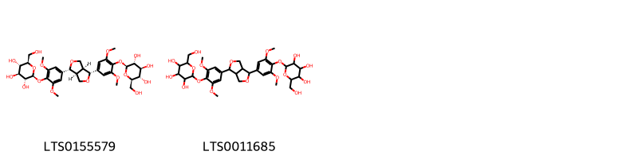{ width=100% }
    <figcaption>Hình ảnh cấu trúc hóa học của 2 hoạt chất thuộc nhóm Lignan glycosides gồm ['acanthoside d (LTS0155579)', '2-{4-[4-(3,5-dimethoxy-4-{[3,4,5-trihydroxy-6-(hydroxymethyl)oxan-2-yl]oxy}phenyl)-hexahydrofuro[3,4-c]furan-1-yl]-2,6-dimethoxyphenoxy}-6-(hydroxymethyl)oxane-3,4,5-triol (LTS0011685)'].</figcaption>
</figure>
#### Nhóm Naphthalenes
<figure markdown="span">
    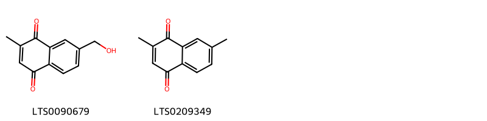{ width=100% }
    <figcaption>Hình ảnh cấu trúc hóa học của 2 hoạt chất thuộc nhóm Naphthalenes gồm ['7-(hydroxymethyl)-2-methylnaphthalene-1,4-dione (LTS0090679)', 'chimaphilin (LTS0209349)'].</figcaption>
</figure>
#### Nhóm Organooxygen compounds
<figure markdown="span">
    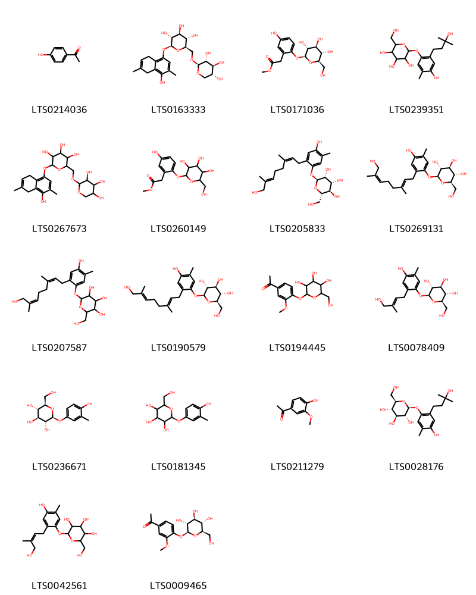{ width=100% }
    <figcaption>Hình ảnh cấu trúc hóa học của 18 hoạt chất thuộc nhóm Organooxygen compounds gồm ['hydroxyacetophenone (LTS0214036)', '(2s,3r,4s,5s,6r)-2-[(4-hydroxy-3,6-dimethyl-5,8-dihydronaphthalen-1-yl)oxy]-6-({[(2s,3r,4s,5r)-3,4,5-trihydroxyoxan-2-yl]oxy}methyl)oxane-3,4,5-triol (LTS0163333)', 'methyl 2-(5-hydroxy-2-{[(2s,3r,4s,5s,6r)-3,4,5-trihydroxy-6-(hydroxymethyl)oxan-2-yl]oxy}phenyl)acetate (LTS0171036)', '2-[4-hydroxy-2-(3-hydroxy-3-methylbutyl)-5-methylphenoxy]-6-(hydroxymethyl)oxane-3,4,5-triol (LTS0239351)', '2-[(4-hydroxy-3,6-dimethyl-5,8-dihydronaphthalen-1-yl)oxy]-6-{[(3,4,5-trihydroxyoxan-2-yl)oxy]methyl}oxane-3,4,5-triol (LTS0267673)', 'methyl 2-(5-hydroxy-2-{[3,4,5-trihydroxy-6-(hydroxymethyl)oxan-2-yl]oxy}phenyl)acetate (LTS0260149)', '(2s,3r,4r,5r,6s)-2-{4-hydroxy-2-[(2z,6e)-8-hydroxy-3,7-dimethylocta-2,6-dien-1-yl]-5-methylphenoxy}-6-(hydroxymethyl)oxane-3,4,5-triol (LTS0205833)', '(2s,3r,4s,5s,6r)-2-{4-hydroxy-2-[(2e,6z)-8-hydroxy-3,7-dimethylocta-2,6-dien-1-yl]-5-methylphenoxy}-6-(hydroxymethyl)oxane-3,4,5-triol (LTS0269131)', '2-[4-hydroxy-2-(8-hydroxy-3,7-dimethylocta-2,6-dien-1-yl)-5-methylphenoxy]-6-(hydroxymethyl)oxane-3,4,5-triol (LTS0207587)', '(2s,3r,4s,5s,6r)-2-{4-hydroxy-2-[(2e,6e)-8-hydroxy-3,7-dimethylocta-2,6-dien-1-yl]-5-methylphenoxy}-6-(hydroxymethyl)oxane-3,4,5-triol (LTS0190579)', '1-(3-methoxy-4-{[3,4,5-trihydroxy-6-(hydroxymethyl)oxan-2-yl]oxy}phenyl)ethanone (LTS0194445)', '(2s,3r,4s,5s,6r)-2-{4-hydroxy-2-[(2e)-4-hydroxy-3-methylbut-2-en-1-yl]-5-methylphenoxy}-6-(hydroxymethyl)oxane-3,4,5-triol (LTS0078409)', '(2s,3r,4s,5s,6r)-2-(4-hydroxy-3-methylphenoxy)-6-(hydroxymethyl)oxane-3,4,5-triol (LTS0236671)', '2-(4-hydroxy-3-methylphenoxy)-6-(hydroxymethyl)oxane-3,4,5-triol (LTS0181345)', 'apocynin (LTS0211279)', '(2s,3r,4s,5s,6r)-2-[4-hydroxy-2-(3-hydroxy-3-methylbutyl)-5-methylphenoxy]-6-(hydroxymethyl)oxane-3,4,5-triol (LTS0028176)', '2-[4-hydroxy-2-(4-hydroxy-3-methylbut-2-en-1-yl)-5-methylphenoxy]-6-(hydroxymethyl)oxane-3,4,5-triol (LTS0042561)', '1-(3-methoxy-4-{[(2s,3r,4s,5s,6r)-3,4,5-trihydroxy-6-(hydroxymethyl)oxan-2-yl]oxy}phenyl)ethanone (LTS0009465)'].</figcaption>
</figure>
#### Nhóm Phenols
<figure markdown="span">
    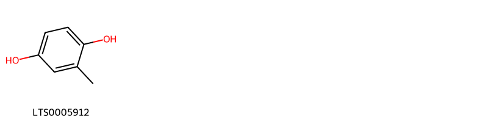{ width=100% }
    <figcaption>Hình ảnh cấu trúc hóa học của 1 hoạt chất thuộc nhóm Phenols gồm ['methylhydroquinone (LTS0005912)'].</figcaption>
</figure>
#### Nhóm Prenol lipids
<figure markdown="span">
    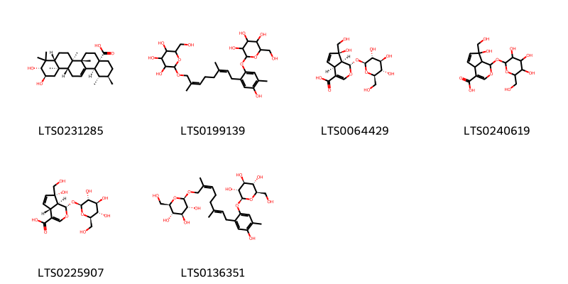{ width=100% }
    <figcaption>Hình ảnh cấu trúc hóa học của 6 hoạt chất thuộc nhóm Prenol lipids gồm ['corosolic acid (LTS0231285)', '2-[2-(3,7-dimethyl-8-{[3,4,5-trihydroxy-6-(hydroxymethyl)oxan-2-yl]oxy}octa-2,6-dien-1-yl)-4-hydroxy-5-methylphenoxy]-6-(hydroxymethyl)oxane-3,4,5-triol (LTS0199139)', 'monotropein (LTS0064429)', '7-hydroxy-7-(hydroxymethyl)-1-{[3,4,5-trihydroxy-6-(hydroxymethyl)oxan-2-yl]oxy}-1h,4ah,7ah-cyclopenta[c]pyran-4-carboxylic acid (LTS0240619)', '(1s,4ar,7s,7as)-7-hydroxy-7-(hydroxymethyl)-1-{[(2s,3r,4s,5s,6r)-3,4,5-trihydroxy-6-(hydroxymethyl)oxan-2-yl]oxy}-1h,4ah,7ah-cyclopenta[c]pyran-4-carboxylic acid (LTS0225907)', '(2s,3r,4s,5s,6r)-2-{2-[(2e,6z)-3,7-dimethyl-8-{[(2r,3r,4s,5s,6r)-3,4,5-trihydroxy-6-(hydroxymethyl)oxan-2-yl]oxy}octa-2,6-dien-1-yl]-4-hydroxy-5-methylphenoxy}-6-(hydroxymethyl)oxane-3,4,5-triol (LTS0136351)'].</figcaption>
</figure>
#### Nhóm Tetralins
<figure markdown="span">
    { width=100% }
    <figcaption>Hình ảnh cấu trúc hóa học của 6 hoạt chất thuộc nhóm Tetralins gồm ['4-hydroxy-3,6-dimethyl-3,4-dihydro-2h-naphthalen-1-one (LTS0045147)', '4-hydroxy-2,7-dimethyl-3,4-dihydro-2h-naphthalen-1-one (LTS0110887)', '(2r,4s)-4-hydroxy-2,7-dimethyl-3,4-dihydro-2h-naphthalen-1-one (LTS0155584)', '(2r,4r)-4-hydroxy-2,7-dimethyl-3,4-dihydro-2h-naphthalen-1-one (LTS0118884)', '(3s,4r)-4-hydroxy-3,6-dimethyl-3,4-dihydro-2h-naphthalen-1-one (LTS0170082)', '(3s,4s)-4-hydroxy-3,6-dimethyl-3,4-dihydro-2h-naphthalen-1-one (LTS0121119)'].</figcaption>
</figure>

---

### Dược dân tộc học

Danh sách các quốc gia có sử dụng *Pyrola japonica* trong điều trị các bệnh. 

| Country   | Disease   | Bệnh                                                                                                                                                                                                |
|:----------|:----------|:----------------------------------------------------------------------------------------------------------------------------------------------------------------------------------------------------|
| Elsewhere | Diuretic  | MYMEMORY WARNING: YOU USED ALL AVAILABLE FREE TRANSLATIONS FOR TODAY. NEXT AVAILABLE IN  01 HOURS 55 MINUTES 16 SECONDS VISIT HTTPS://MYMEMORY.TRANSLATED.NET/DOC/USAGELIMITS.PHP TO TRANSLATE MORE |

---

---
## Pyrola rotundifolia
### Thông tin về thực vật

!!! info "Phân loại thực vật của *Pyrola rotundifolia* từ GIBF:"
    - **Kingdom:** Plantae
    - **Phylum:** Tracheophyta
    - **Order:** Ericales
    - **Family:** Ericaceae
    - **Genus:** Pyrola
    - **Species:** *Pyrola rotundifolia*

 

| Label (VI)   | Label (EN)   | Scientific Name     | Descriptions (VI)   | Descriptions (EN)   | Also Known As (VI)   | Also Known As (EN)   |
|:-------------|:-------------|:--------------------|:--------------------|:--------------------|:---------------------|:---------------------|
| N/A          | N/A          | Pyrola rotundifolia |                     | species of plant    | ['']                 | ['']                 |

#### Phân bố trên thế giới

**Từ CSDL GIBF** Belgium, Estonia, Ukraine, Denmark, Netherlands, Lithuania, Belarus, Luxembourg, Russian Federation, Sweden, Finland, Slovenia, Germany, Switzerland, Austria, France, United Kingdom of Great Britain and Northern Ireland, Ireland, Poland

#### Phân bố tại Việt Nam

**Từ CSDL GIBF**: Không có ghi nhận ở Việt Nam

---
### Thành phần hóa học
        
- Theo cơ sở dữ liệu lotus: Từ loài *Pyrola rotundifolia* đã phân lập và xác định được 25 hoạt chất thuộc về các nhóm Naphthalenes, Flavonoids, Prenol lipids, Tetralins, Organooxygen compounds, Phenols. 

|    | chemicalTaxonomyClassyfireClass   |   smiles_count |
|---:|:----------------------------------|---------------:|
|  0 | Flavonoids                        |              5 |
|  1 | Naphthalenes                      |              2 |
|  2 | Organooxygen compounds            |             10 |
|  3 | Phenols                           |              1 |
|  4 | Prenol lipids                     |              1 |
|  5 | Tetralins                         |              6 |

#### Nhóm Flavonoids
<figure markdown="span">
    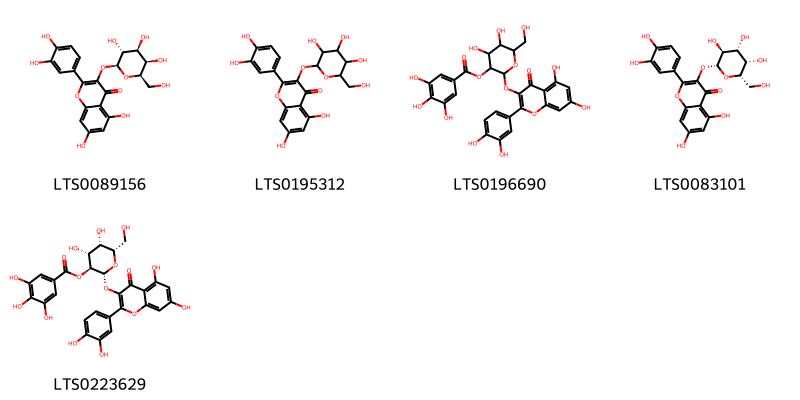{ width=100% }
    <figcaption>Hình ảnh cấu trúc hóa học của 5 hoạt chất thuộc nhóm Flavonoids gồm ['hyperoside (LTS0089156)', '2-(3,4-dihydroxyphenyl)-5,7-dihydroxy-3-{[3,4,5-trihydroxy-6-(hydroxymethyl)oxan-2-yl]oxy}chromen-4-one (LTS0195312)', '2-{[2-(3,4-dihydroxyphenyl)-5,7-dihydroxy-4-oxochromen-3-yl]oxy}-4,5-dihydroxy-6-(hydroxymethyl)oxan-3-yl 3,4,5-trihydroxybenzoate (LTS0196690)', '2-(3,4-dihydroxyphenyl)-5,7-dihydroxy-3-{[(2r,3s,4r,5s,6s)-3,4,5-trihydroxy-6-(hydroxymethyl)oxan-2-yl]oxy}chromen-4-one (LTS0083101)', '(2r,3s,4r,5s,6s)-2-{[2-(3,4-dihydroxyphenyl)-5,7-dihydroxy-4-oxochromen-3-yl]oxy}-4,5-dihydroxy-6-(hydroxymethyl)oxan-3-yl 3,4,5-trihydroxybenzoate (LTS0223629)'].</figcaption>
</figure>
#### Nhóm Naphthalenes
<figure markdown="span">
    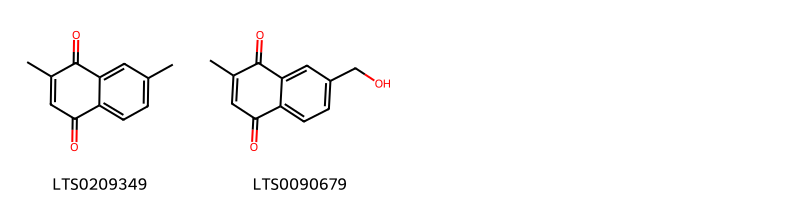{ width=100% }
    <figcaption>Hình ảnh cấu trúc hóa học của 2 hoạt chất thuộc nhóm Naphthalenes gồm ['chimaphilin (LTS0209349)', '7-(hydroxymethyl)-2-methylnaphthalene-1,4-dione (LTS0090679)'].</figcaption>
</figure>
#### Nhóm Organooxygen compounds
<figure markdown="span">
    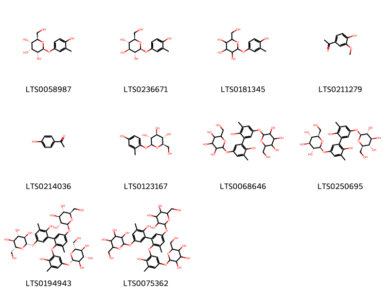{ width=100% }
    <figcaption>Hình ảnh cấu trúc hóa học của 10 hoạt chất thuộc nhóm Organooxygen compounds gồm ['(2s,3r,4r,5s,6r)-2-(4-hydroxy-3-methylphenoxy)-6-(hydroxymethyl)oxane-3,4,5-triol (LTS0058987)', '(2s,3r,4s,5s,6r)-2-(4-hydroxy-3-methylphenoxy)-6-(hydroxymethyl)oxane-3,4,5-triol (LTS0236671)', '2-(4-hydroxy-3-methylphenoxy)-6-(hydroxymethyl)oxane-3,4,5-triol (LTS0181345)', 'apocynin (LTS0211279)', 'hydroxyacetophenone (LTS0214036)', '(2s,3r,4s,5s,6r)-2-(4-hydroxy-2-methylphenoxy)-6-(hydroxymethyl)oxane-3,4,5-triol (LTS0123167)', "2-[(3',5-dimethyl-5'-{[3,4,5-trihydroxy-6-(hydroxymethyl)oxan-2-yl]oxy}-[1,1'-biphenyl]-2',6-diyl)oxy]-6-(hydroxymethyl)oxane-3,4,5-triol (LTS0068646)", "(2s,3r,4s,5s,6r)-2-[(3',5-dimethyl-5'-{[(2s,3r,4s,5s,6r)-3,4,5-trihydroxy-6-(hydroxymethyl)oxan-2-yl]oxy}-[1,1'-biphenyl]-2',6-diyl)oxy]-6-(hydroxymethyl)oxane-3,4,5-triol (LTS0250695)", 'pyrolaside b (LTS0194943)', "2-(3-{[3,3'-dimethyl-5,5'-bis({[3,4,5-trihydroxy-6-(hydroxymethyl)oxan-2-yl]oxy})-[1,1'-biphenyl]-2'-yl]oxy}-4-hydroxy-5-methylphenoxy)-6-(hydroxymethyl)oxane-3,4,5-triol (LTS0075362)"].</figcaption>
</figure>
#### Nhóm Phenols
<figure markdown="span">
    { width=100% }
    <figcaption>Hình ảnh cấu trúc hóa học của 1 hoạt chất thuộc nhóm Phenols gồm ['methylhydroquinone (LTS0005912)'].</figcaption>
</figure>
#### Nhóm Prenol lipids
<figure markdown="span">
    { width=100% }
    <figcaption>Hình ảnh cấu trúc hóa học của 1 hoạt chất thuộc nhóm Prenol lipids gồm ['ursolic acid (LTS0250838)'].</figcaption>
</figure>
#### Nhóm Tetralins
<figure markdown="span">
    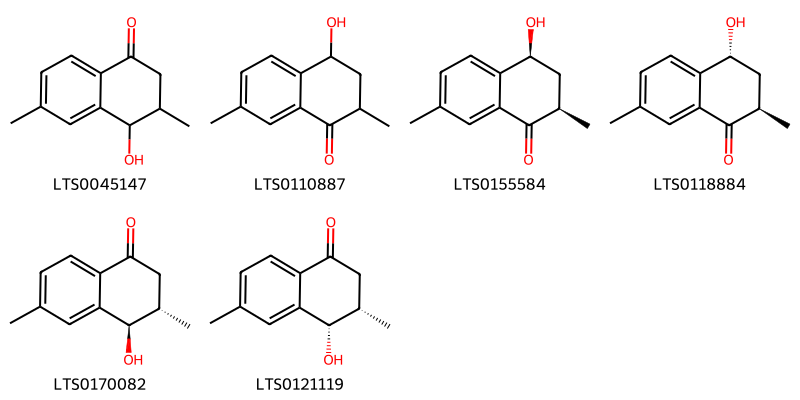{ width=100% }
    <figcaption>Hình ảnh cấu trúc hóa học của 6 hoạt chất thuộc nhóm Tetralins gồm ['4-hydroxy-3,6-dimethyl-3,4-dihydro-2h-naphthalen-1-one (LTS0045147)', '4-hydroxy-2,7-dimethyl-3,4-dihydro-2h-naphthalen-1-one (LTS0110887)', '(2r,4s)-4-hydroxy-2,7-dimethyl-3,4-dihydro-2h-naphthalen-1-one (LTS0155584)', '(2r,4r)-4-hydroxy-2,7-dimethyl-3,4-dihydro-2h-naphthalen-1-one (LTS0118884)', '(3s,4r)-4-hydroxy-3,6-dimethyl-3,4-dihydro-2h-naphthalen-1-one (LTS0170082)', '(3s,4s)-4-hydroxy-3,6-dimethyl-3,4-dihydro-2h-naphthalen-1-one (LTS0121119)'].</figcaption>
</figure>

---

### Dược dân tộc học

Danh sách các quốc gia có sử dụng *Pyrola rotundifolia* trong điều trị các bệnh. 

| Country   | Disease                   | Bệnh                                                                                                                                                                                                |
|:----------|:--------------------------|:----------------------------------------------------------------------------------------------------------------------------------------------------------------------------------------------------|
| China     | Sudorific                 | MYMEMORY WARNING: YOU USED ALL AVAILABLE FREE TRANSLATIONS FOR TODAY. NEXT AVAILABLE IN  01 HOURS 54 MINUTES 38 SECONDS VISIT HTTPS://MYMEMORY.TRANSLATED.NET/DOC/USAGELIMITS.PHP TO TRANSLATE MORE |
| Dutch     | Vulnerary                 | MYMEMORY WARNING: YOU USED ALL AVAILABLE FREE TRANSLATIONS FOR TODAY. NEXT AVAILABLE IN  01 HOURS 54 MINUTES 35 SECONDS VISIT HTTPS://MYMEMORY.TRANSLATED.NET/DOC/USAGELIMITS.PHP TO TRANSLATE MORE |
| Elsewhere | Astringent, Hemostat, nan | MYMEMORY WARNING: YOU USED ALL AVAILABLE FREE TRANSLATIONS FOR TODAY. NEXT AVAILABLE IN  01 HOURS 54 MINUTES 32 SECONDS VISIT HTTPS://MYMEMORY.TRANSLATED.NET/DOC/USAGELIMITS.PHP TO TRANSLATE MORE |
| French    | Astringent                | MYMEMORY WARNING: YOU USED ALL AVAILABLE FREE TRANSLATIONS FOR TODAY. NEXT AVAILABLE IN  01 HOURS 54 MINUTES 30 SECONDS VISIT HTTPS://MYMEMORY.TRANSLATED.NET/DOC/USAGELIMITS.PHP TO TRANSLATE MORE |
| German    | Hemostat                  | MYMEMORY WARNING: YOU USED ALL AVAILABLE FREE TRANSLATIONS FOR TODAY. NEXT AVAILABLE IN  01 HOURS 54 MINUTES 28 SECONDS VISIT HTTPS://MYMEMORY.TRANSLATED.NET/DOC/USAGELIMITS.PHP TO TRANSLATE MORE |
| Italian   | Diuretic                  | MYMEMORY WARNING: YOU USED ALL AVAILABLE FREE TRANSLATIONS FOR TODAY. NEXT AVAILABLE IN  01 HOURS 54 MINUTES 25 SECONDS VISIT HTTPS://MYMEMORY.TRANSLATED.NET/DOC/USAGELIMITS.PHP TO TRANSLATE MORE |
| US        | Litholytic                | MYMEMORY WARNING: YOU USED ALL AVAILABLE FREE TRANSLATIONS FOR TODAY. NEXT AVAILABLE IN  01 HOURS 54 MINUTES 23 SECONDS VISIT HTTPS://MYMEMORY.TRANSLATED.NET/DOC/USAGELIMITS.PHP TO TRANSLATE MORE |
| ain       | Diuretic                  | MYMEMORY WARNING: YOU USED ALL AVAILABLE FREE TRANSLATIONS FOR TODAY. NEXT AVAILABLE IN  01 HOURS 54 MINUTES 21 SECONDS VISIT HTTPS://MYMEMORY.TRANSLATED.NET/DOC/USAGELIMITS.PHP TO TRANSLATE MORE |

---

# Chi Gaultheria

??? note "Danh sách các dược liệu thuộc chi"
    
	 - *Gaultheria acuminata*
	 - *Gaultheria cumingana*
	 - *Gaultheria fragrantissima*
	 - *Gaultheria procumbens*

---
## Gaultheria acuminata
### Thông tin về thực vật

!!! info "Phân loại thực vật của *Gaultheria acuminata* từ GIBF:"
    - **Kingdom:** Plantae
    - **Phylum:** Tracheophyta
    - **Order:** Ericales
    - **Family:** Ericaceae
    - **Genus:** Gaultheria
    - **Species:** *Gaultheria acuminata*

 

| Label (VI)   | Label (EN)   | Scientific Name      | Descriptions (VI)   | Descriptions (EN)   | Also Known As (VI)   | Also Known As (EN)   |
|:-------------|:-------------|:---------------------|:--------------------|:--------------------|:---------------------|:---------------------|
| N/A          | N/A          | Gaultheria acuminata | loài thực vật       | species of plant    | ['']                 | ['']                 |

#### Phân bố trên thế giới

**Từ CSDL GIBF** Honduras, El Salvador, Guatemala, Mexico

#### Phân bố tại Việt Nam

**Từ CSDL GIBF**: Không có ghi nhận ở Việt Nam

---
### Thành phần hóa học
        
- Theo cơ sở dữ liệu lotus: Từ loài *Gaultheria acuminata* đã phân lập và xác định được Chưa có hoạt chất nào được phân lập. hoạt chất thuộc về các nhóm Không có hoạt chất nào được phân lập. 

Không có hình ảnh nào được tạo ra

---

### Dược dân tộc học

Danh sách các quốc gia có sử dụng *Gaultheria acuminata* trong điều trị các bệnh. 

| Country   | Disease                                   | Bệnh                                                                                                                                                                                                |
|:----------|:------------------------------------------|:----------------------------------------------------------------------------------------------------------------------------------------------------------------------------------------------------|
| Mexico    | Analgesic, Laxative, Antiseptic, Diuretic | MYMEMORY WARNING: YOU USED ALL AVAILABLE FREE TRANSLATIONS FOR TODAY. NEXT AVAILABLE IN  01 HOURS 53 MINUTES 49 SECONDS VISIT HTTPS://MYMEMORY.TRANSLATED.NET/DOC/USAGELIMITS.PHP TO TRANSLATE MORE |

---

---
## Gaultheria cumingana
### Thông tin về thực vật

!!! info "Phân loại thực vật của *Gaultheria leucocarpa* từ GIBF:"
    - **Kingdom:** Plantae
    - **Phylum:** Tracheophyta
    - **Order:** Ericales
    - **Family:** Ericaceae
    - **Genus:** Gaultheria
    - **Species:** *Gaultheria leucocarpa*

 

| Label (VI)   | Label (EN)   | Scientific Name      | Descriptions (VI)   | Descriptions (EN)   | Also Known As (VI)   | Also Known As (EN)   |
|:-------------|:-------------|:---------------------|:--------------------|:--------------------|:---------------------|:---------------------|
| N/A          | N/A          | Gaultheria acuminata | loài thực vật       | species of plant    | ['']                 | ['']                 |

#### Phân bố trên thế giới

**Từ CSDL GIBF** nan, Korea, Republic of, Chinese Taipei, Philippines, Viet Nam, China

#### Phân bố tại Việt Nam

**Từ CSDL GIBF**: Lao Cai

---
### Thành phần hóa học
        
- Theo cơ sở dữ liệu lotus: Từ loài *Gaultheria leucocarpa* đã phân lập và xác định được Chưa có hoạt chất nào được phân lập. hoạt chất thuộc về các nhóm Không có hoạt chất nào được phân lập. 

Không có hình ảnh nào được tạo ra

---

### Dược dân tộc học

Danh sách các quốc gia có sử dụng *Gaultheria leucocarpa* trong điều trị các bệnh. 

| Country     | Disease   | Bệnh                                                                                                                                                                                                |
|:------------|:----------|:----------------------------------------------------------------------------------------------------------------------------------------------------------------------------------------------------|
| Philippines | Stomachic | MYMEMORY WARNING: YOU USED ALL AVAILABLE FREE TRANSLATIONS FOR TODAY. NEXT AVAILABLE IN  01 HOURS 53 MINUTES 28 SECONDS VISIT HTTPS://MYMEMORY.TRANSLATED.NET/DOC/USAGELIMITS.PHP TO TRANSLATE MORE |

---

---
## Gaultheria fragrantissima
### Thông tin về thực vật

!!! info "Phân loại thực vật của *Gaultheria fragrantissima* từ GIBF:"
    - **Kingdom:** Plantae
    - **Phylum:** Tracheophyta
    - **Order:** Ericales
    - **Family:** Ericaceae
    - **Genus:** Gaultheria
    - **Species:** *Gaultheria fragrantissima*

 

| Label (VI)   | Label (EN)   | Scientific Name           | Descriptions (VI)   | Descriptions (EN)   | Also Known As (VI)   | Also Known As (EN)   |
|:-------------|:-------------|:--------------------------|:--------------------|:--------------------|:---------------------|:---------------------|
| N/A          | N/A          | Gaultheria fragrantissima | loài thực vật       | species of plant    | ['']                 | ['']                 |

#### Phân bố trên thế giới

**Từ CSDL GIBF** nan, Sri Lanka, Japan, Korea, Republic of, Chinese Taipei, Spain, Bhutan, India, Indonesia, Viet Nam, China, Canada, Nepal

#### Phân bố tại Việt Nam

**Từ CSDL GIBF**: Lao Cai, Gia Lai, Lào Cai

---
### Thành phần hóa học
        
- Theo cơ sở dữ liệu lotus: Từ loài *Gaultheria fragrantissima* đã phân lập và xác định được Chưa có hoạt chất nào được phân lập. hoạt chất thuộc về các nhóm Không có hoạt chất nào được phân lập. 

Không có hình ảnh nào được tạo ra

---

### Dược dân tộc học

Danh sách các quốc gia có sử dụng *Gaultheria fragrantissima* trong điều trị các bệnh. 

| Country   | Disease                                                                           | Bệnh                                                                                                                                                                                                |
|:----------|:----------------------------------------------------------------------------------|:----------------------------------------------------------------------------------------------------------------------------------------------------------------------------------------------------|
| India     | Abortifacient, Antiseptic, Carminative, Stimulant, Vermifuge, Poison, Insecticide | MYMEMORY WARNING: YOU USED ALL AVAILABLE FREE TRANSLATIONS FOR TODAY. NEXT AVAILABLE IN  01 HOURS 53 MINUTES 10 SECONDS VISIT HTTPS://MYMEMORY.TRANSLATED.NET/DOC/USAGELIMITS.PHP TO TRANSLATE MORE |
| Nepal     | Stimulant, Stimulant                                                              | MYMEMORY WARNING: YOU USED ALL AVAILABLE FREE TRANSLATIONS FOR TODAY. NEXT AVAILABLE IN  01 HOURS 53 MINUTES 08 SECONDS VISIT HTTPS://MYMEMORY.TRANSLATED.NET/DOC/USAGELIMITS.PHP TO TRANSLATE MORE |

---

---
## Gaultheria procumbens
### Thông tin về thực vật

!!! info "Phân loại thực vật của *Gaultheria procumbens* từ GIBF:"
    - **Kingdom:** Plantae
    - **Phylum:** Tracheophyta
    - **Order:** Ericales
    - **Family:** Ericaceae
    - **Genus:** Gaultheria
    - **Species:** *Gaultheria procumbens*

 

| Label (VI)   | Label (EN)   | Scientific Name       | Descriptions (VI)   | Descriptions (EN)   | Also Known As (VI)   | Also Known As (EN)                  |
|:-------------|:-------------|:----------------------|:--------------------|:--------------------|:---------------------|:------------------------------------|
| N/A          | N/A          | Gaultheria procumbens | loài thực vật       | species of plant    | ['']                 | ['eastern teaberry', 'wintergreen'] |

#### Phân bố trên thế giới

**Từ CSDL GIBF** Germany, Netherlands, United States of America, Canada

#### Phân bố tại Việt Nam

**Từ CSDL GIBF**: Không có ghi nhận ở Việt Nam

---
### Thành phần hóa học
        
- Theo cơ sở dữ liệu lotus: Từ loài *Gaultheria procumbens* đã phân lập và xác định được 21 hoạt chất thuộc về các nhóm Cinnamic acids and derivatives, Prenol lipids, Steroids and steroid derivatives, Benzene and substituted derivatives. 

|    | chemicalTaxonomyClassyfireClass     |   smiles_count |
|---:|:------------------------------------|---------------:|
|  0 | Benzene and substituted derivatives |              6 |
|  1 | Cinnamic acids and derivatives      |              5 |
|  2 | Prenol lipids                       |              5 |
|  3 | Steroids and steroid derivatives    |              5 |

#### Nhóm Benzene and substituted derivatives
<figure markdown="span">
    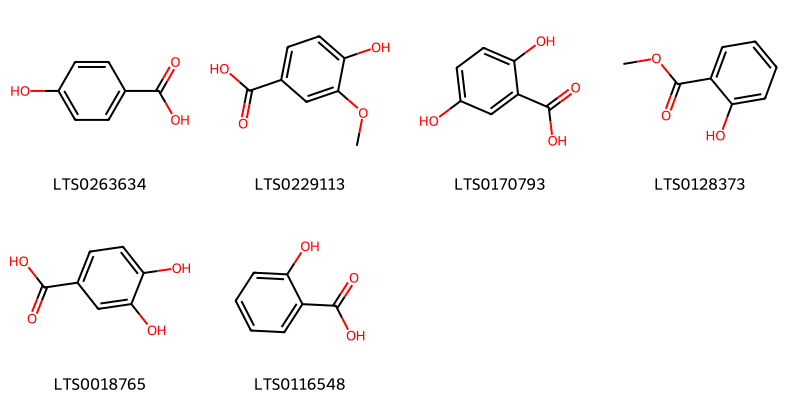{ width=100% }
    <figcaption>Hình ảnh cấu trúc hóa học của 6 hoạt chất thuộc nhóm Benzene and substituted derivatives gồm ['p-hydroxybenzoic acid (LTS0263634)', 'vanillic acid (LTS0229113)', '2,5-dihydroxybenzoic acid (LTS0170793)', 'methyl salicylate (LTS0128373)', '3,4-dihydroxybenzoic acid (LTS0018765)', 'salicyclic acid (LTS0116548)'].</figcaption>
</figure>
#### Nhóm Cinnamic acids and derivatives
<figure markdown="span">
    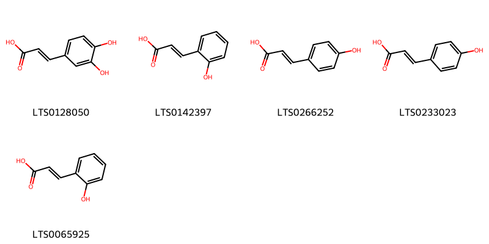{ width=100% }
    <figcaption>Hình ảnh cấu trúc hóa học của 5 hoạt chất thuộc nhóm Cinnamic acids and derivatives gồm ['3,4-dihydroxycinnamic acid (LTS0128050)', 'trans-2-hydroxycinnamic acid (LTS0142397)', 'para-coumaric acid (LTS0266252)', 'hydroxycinnamic acid (LTS0233023)', 'o-coumaric acid (LTS0065925)'].</figcaption>
</figure>
#### Nhóm Prenol lipids
<figure markdown="span">
    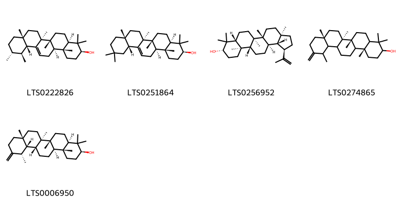{ width=100% }
    <figcaption>Hình ảnh cấu trúc hóa học của 5 hoạt chất thuộc nhóm Prenol lipids gồm ['amyrin (LTS0222826)', 'β-amyrin (LTS0251864)', 'lupeol (LTS0256952)', '(6ar,6br,8ar,14br)-4,4,6a,6b,8a,12,14b-heptamethyl-11-methylidene-hexadecahydropicen-3-ol (LTS0274865)', 'taraxasterol (LTS0006950)'].</figcaption>
</figure>
#### Nhóm Steroids and steroid derivatives
<figure markdown="span">
    { width=100% }
    <figcaption>Hình ảnh cấu trúc hóa học của 5 hoạt chất thuộc nhóm Steroids and steroid derivatives gồm ['stigmast-5-en-3-ol, (3β)- (LTS0204616)', 'phytosterol (LTS0029311)', 'stigmast-5-en-3-ol (LTS0071224)', '(1r,3as,3bs,7s,9bs)-1-[(2r,5r)-5,6-dimethylheptan-2-yl]-9a,11a-dimethyl-1h,2h,3h,3ah,3bh,4h,6h,7h,8h,9h,9bh,10h,11h-cyclopenta[a]phenanthren-7-ol (LTS0057877)', 'campesterol (LTS0046755)'].</figcaption>
</figure>

---

### Dược dân tộc học

Danh sách các quốc gia có sử dụng *Gaultheria procumbens* trong điều trị các bệnh. 

| Country   | Disease                                                                                   | Bệnh                                                                                                                                                                                                |
|:----------|:------------------------------------------------------------------------------------------|:----------------------------------------------------------------------------------------------------------------------------------------------------------------------------------------------------|
| Elsewhere | Antirheumatic, Rubefacient, Antiseptic                                                    | MYMEMORY WARNING: YOU USED ALL AVAILABLE FREE TRANSLATIONS FOR TODAY. NEXT AVAILABLE IN  01 HOURS 52 MINUTES 45 SECONDS VISIT HTTPS://MYMEMORY.TRANSLATED.NET/DOC/USAGELIMITS.PHP TO TRANSLATE MORE |
| Turkey    | Antiseptic, Astringent, Carminative, Diuretic, Rubefacient, Stimulant, Tonic, Emmenagogue | MYMEMORY WARNING: YOU USED ALL AVAILABLE FREE TRANSLATIONS FOR TODAY. NEXT AVAILABLE IN  01 HOURS 52 MINUTES 43 SECONDS VISIT HTTPS://MYMEMORY.TRANSLATED.NET/DOC/USAGELIMITS.PHP TO TRANSLATE MORE |
| US        | Carminative                                                                               | MYMEMORY WARNING: YOU USED ALL AVAILABLE FREE TRANSLATIONS FOR TODAY. NEXT AVAILABLE IN  01 HOURS 52 MINUTES 41 SECONDS VISIT HTTPS://MYMEMORY.TRANSLATED.NET/DOC/USAGELIMITS.PHP TO TRANSLATE MORE |

---

# Chi Lyonia

??? note "Danh sách các dược liệu thuộc chi"
    
	 - *Lyonia ovalifolia*

---
## Lyonia ovalifolia
### Thông tin về thực vật

!!! info "Phân loại thực vật của *Lyonia ovalifolia* từ GIBF:"
    - **Kingdom:** Plantae
    - **Phylum:** Tracheophyta
    - **Order:** Ericales
    - **Family:** Ericaceae
    - **Genus:** Lyonia
    - **Species:** *Lyonia ovalifolia*

 

| Label (VI)   | Label (EN)   | Scientific Name   | Descriptions (VI)   | Descriptions (EN)   | Also Known As (VI)   | Also Known As (EN)   |
|:-------------|:-------------|:------------------|:--------------------|:--------------------|:---------------------|:---------------------|
| N/A          | N/A          | Lyonia ovalifolia | loài thực vật       | species of plant    | ['']                 | ['']                 |

#### Phân bố trên thế giới

**Từ CSDL GIBF** Japan, Chinese Taipei, New Zealand, Bhutan, India, China, Nepal

#### Phân bố tại Việt Nam

**Từ CSDL GIBF**: Không có ghi nhận ở Việt Nam

---
### Thành phần hóa học
        
- Theo cơ sở dữ liệu lotus: Từ loài *Lyonia ovalifolia* đã phân lập và xác định được 35 hoạt chất thuộc về các nhóm Flavonoids, Prenol lipids, Steroids and steroid derivatives, Organooxygen compounds, Lactones, Aryltetralin lignans, Lignan glycosides, Carboxylic acids and derivatives. 

|    | chemicalTaxonomyClassyfireClass   |   smiles_count |
|---:|:----------------------------------|---------------:|
|  0 | Aryltetralin lignans              |             10 |
|  1 | Carboxylic acids and derivatives  |              2 |
|  2 | Flavonoids                        |              7 |
|  3 | Lactones                          |              2 |
|  4 | Lignan glycosides                 |              1 |
|  5 | Organooxygen compounds            |              3 |
|  6 | Prenol lipids                     |              7 |
|  7 | Steroids and steroid derivatives  |              2 |

#### Nhóm Aryltetralin lignans
<figure markdown="span">
    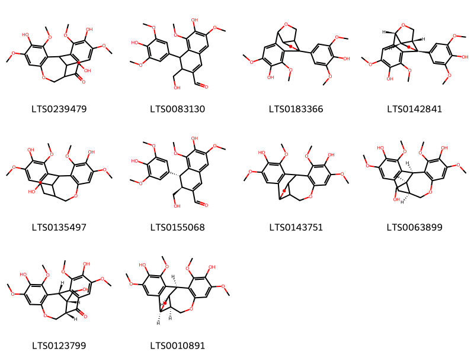{ width=100% }
    <figcaption>Hình ảnh cấu trúc hóa học của 10 hoạt chất thuộc nhóm Aryltetralin lignans gồm ['4,15-dihydroxy-18-(hydroxymethyl)-3,5,14,16-tetramethoxy-8-oxatetracyclo[8.7.1.0²,⁷.0¹²,¹⁷]octadeca-2(7),3,5,12(17),13,15-hexaen-11-one (LTS0239479)', '6-hydroxy-4-(4-hydroxy-3,5-dimethoxyphenyl)-3-(hydroxymethyl)-5,7-dimethoxy-3,4-dihydronaphthalene-2-carbaldehyde (LTS0083130)', '9-(4-hydroxy-3,5-dimethoxyphenyl)-11,13-dimethoxy-3,8-dioxatetracyclo[8.4.0.0²,⁶.0⁵,⁹]tetradeca-1(14),10,12-trien-12-ol (LTS0183366)', '(2r,5r,6r,9s)-9-(4-hydroxy-3,5-dimethoxyphenyl)-11,13-dimethoxy-3,8-dioxatetracyclo[8.4.0.0²,⁶.0⁵,⁹]tetradeca-1(14),10,12-trien-12-ol (LTS0142841)', '18-(hydroxymethyl)-3,5,14,16-tetramethoxy-8-oxatetracyclo[8.7.1.0²,⁷.0¹²,¹⁷]octadeca-2(7),3,5,12(17),13,15-hexaene-4,15-diol (LTS0135497)', '(3s,4r)-6-hydroxy-4-(4-hydroxy-3,5-dimethoxyphenyl)-3-(hydroxymethyl)-5,7-dimethoxy-3,4-dihydronaphthalene-2-carbaldehyde (LTS0155068)', '7,9,13,15-tetramethoxy-4,19-dioxapentacyclo[9.9.0.0²,¹⁸.0⁵,¹⁰.0¹²,¹⁷]icosa-5(10),6,8,12(17),13,15-hexaene-8,14-diol (LTS0143751)', '(1s,10s,18s)-18-(hydroxymethyl)-3,5,14,16-tetramethoxy-8-oxatetracyclo[8.7.1.0²,⁷.0¹²,¹⁷]octadeca-2(7),3,5,12(17),13,15-hexaene-4,15-diol (LTS0063899)', '(1s,10s,18s)-4,15-dihydroxy-18-(hydroxymethyl)-3,5,14,16-tetramethoxy-8-oxatetracyclo[8.7.1.0²,⁷.0¹²,¹⁷]octadeca-2(7),3,5,12(17),13,15-hexaen-11-one (LTS0123799)', '(1s,2s,11s,18s)-7,9,13,15-tetramethoxy-4,19-dioxapentacyclo[9.9.0.0²,¹⁸.0⁵,¹⁰.0¹²,¹⁷]icosa-5(10),6,8,12(17),13,15-hexaene-8,14-diol (LTS0010891)'].</figcaption>
</figure>
#### Nhóm Carboxylic acids and derivatives
<figure markdown="span">
    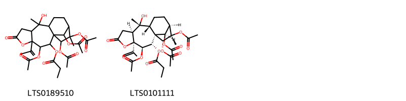{ width=100% }
    <figcaption>Hình ảnh cấu trúc hóa học của 2 hoạt chất thuộc nhóm Carboxylic acids and derivatives gồm ['3,14,15,16-tetrakis(acetyloxy)-9-hydroxy-9,14-dimethyl-6-oxo-4-(prop-1-en-2-yl)-5-oxatetracyclo[11.2.1.0¹,¹⁰.0⁴,⁸]hexadecan-2-yl propanoate (LTS0189510)', '(1s,2s,3r,4r,8s,9r,10r,13r,14s,15r,16r)-3,14,15,16-tetrakis(acetyloxy)-9-hydroxy-9,14-dimethyl-6-oxo-4-(prop-1-en-2-yl)-5-oxatetracyclo[11.2.1.0¹,¹⁰.0⁴,⁸]hexadecan-2-yl propanoate (LTS0101111)'].</figcaption>
</figure>
#### Nhóm Flavonoids
<figure markdown="span">
    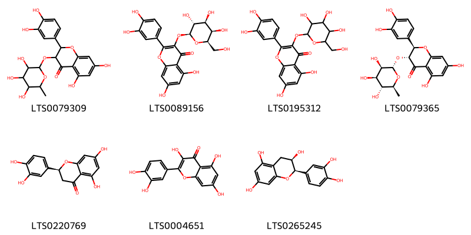{ width=100% }
    <figcaption>Hình ảnh cấu trúc hóa học của 7 hoạt chất thuộc nhóm Flavonoids gồm ['astilbin (LTS0079309)', 'hyperoside (LTS0089156)', '2-(3,4-dihydroxyphenyl)-5,7-dihydroxy-3-{[3,4,5-trihydroxy-6-(hydroxymethyl)oxan-2-yl]oxy}chromen-4-one (LTS0195312)', 'astilbin (LTS0079365)', 'eriodictyol (LTS0220769)', 'quercetin (LTS0004651)', 'ent-epicatechin (LTS0265245)'].</figcaption>
</figure>
#### Nhóm Lactones
<figure markdown="span">
    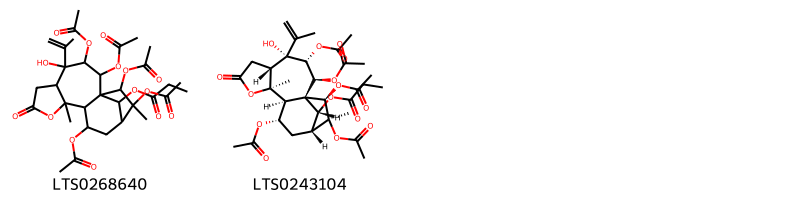{ width=100% }
    <figcaption>Hình ảnh cấu trúc hóa học của 2 hoạt chất thuộc nhóm Lactones gồm ['2,3,11,14,15-pentakis(acetyloxy)-4-hydroxy-9,14-dimethyl-7-oxo-4-(prop-1-en-2-yl)-8-oxatetracyclo[11.2.1.0¹,¹⁰.0⁵,⁹]hexadecan-16-yl propanoate (LTS0268640)', '(1s,2s,3r,4r,5r,9r,10s,11s,13r,14s,15r,16r)-2,3,11,14,15-pentakis(acetyloxy)-4-hydroxy-9,14-dimethyl-7-oxo-4-(prop-1-en-2-yl)-8-oxatetracyclo[11.2.1.0¹,¹⁰.0⁵,⁹]hexadecan-16-yl propanoate (LTS0243104)'].</figcaption>
</figure>
#### Nhóm Lignan glycosides
<figure markdown="span">
    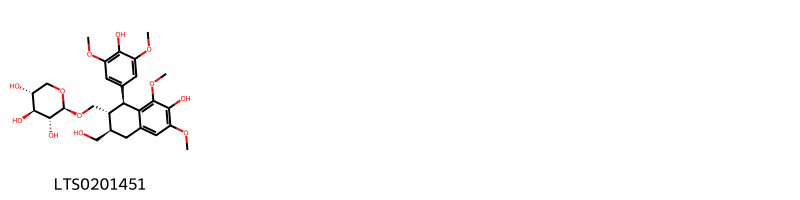{ width=100% }
    <figcaption>Hình ảnh cấu trúc hóa học của 1 hoạt chất thuộc nhóm Lignan glycosides gồm ['(2r,3r,4s,5r)-2-{[(1s,2r,3r)-7-hydroxy-1-(4-hydroxy-3,5-dimethoxyphenyl)-3-(hydroxymethyl)-6,8-dimethoxy-1,2,3,4-tetrahydronaphthalen-2-yl]methoxy}oxane-3,4,5-triol (LTS0201451)'].</figcaption>
</figure>
#### Nhóm Organooxygen compounds
<figure markdown="span">
    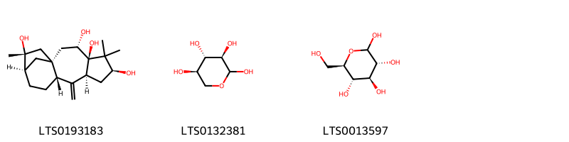{ width=100% }
    <figcaption>Hình ảnh cấu trúc hóa học của 3 hoạt chất thuộc nhóm Organooxygen compounds gồm ['(1r,3s,4r,6s,8s,10r,13r,14r)-5,5,14-trimethyl-9-methylidenetetracyclo[11.2.1.0¹,¹⁰.0⁴,⁸]hexadecane-3,4,6,14-tetrol (LTS0193183)', 'd-xylose (LTS0132381)', 'glucose (LTS0013597)'].</figcaption>
</figure>
#### Nhóm Prenol lipids
<figure markdown="span">
    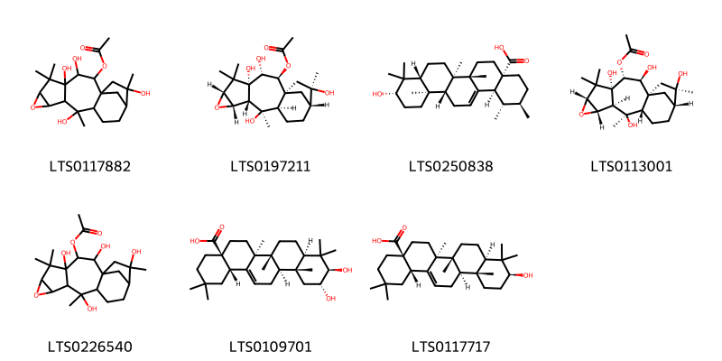{ width=100% }
    <figcaption>Hình ảnh cấu trúc hóa học của 7 hoạt chất thuộc nhóm Prenol lipids gồm ['3,4,10,15-tetrahydroxy-5,5,10,15-tetramethyl-7-oxapentacyclo[12.2.1.0¹,¹¹.0⁴,⁹.0⁶,⁸]heptadecan-2-yl acetate (LTS0117882)', '(1r,2s,3r,4r,6r,8s,9s,10r,11r,14r,15r)-3,4,10,15-tetrahydroxy-5,5,10,15-tetramethyl-7-oxapentacyclo[12.2.1.0¹,¹¹.0⁴,⁹.0⁶,⁸]heptadecan-2-yl acetate (LTS0197211)', 'ursolic acid (LTS0250838)', '(1r,2s,3r,4r,6r,8s,9r,10r,11s,14r,15r)-2,4,10,15-tetrahydroxy-5,5,10,15-tetramethyl-7-oxapentacyclo[12.2.1.0¹,¹¹.0⁴,⁹.0⁶,⁸]heptadecan-3-yl acetate (LTS0113001)', '2,4,10,15-tetrahydroxy-5,5,10,15-tetramethyl-7-oxapentacyclo[12.2.1.0¹,¹¹.0⁴,⁹.0⁶,⁸]heptadecan-3-yl acetate (LTS0226540)', 'maslinic acid (LTS0109701)', 'oleanolic acid (LTS0117717)'].</figcaption>
</figure>
#### Nhóm Steroids and steroid derivatives
<figure markdown="span">
    { width=100% }
    <figcaption>Hình ảnh cấu trúc hóa học của 2 hoạt chất thuộc nhóm Steroids and steroid derivatives gồm ['stigmast-5-en-3-ol, (3β)- (LTS0204616)', 'sitogluside (LTS0201798)'].</figcaption>
</figure>

---

### Dược dân tộc học

Danh sách các quốc gia có sử dụng *Lyonia ovalifolia* trong điều trị các bệnh. 

| Country   | Disease             | Bệnh                                                                                                                                                                                                |
|:----------|:--------------------|:----------------------------------------------------------------------------------------------------------------------------------------------------------------------------------------------------|
| Elsewhere | Insecticide, Poison | MYMEMORY WARNING: YOU USED ALL AVAILABLE FREE TRANSLATIONS FOR TODAY. NEXT AVAILABLE IN  01 HOURS 52 MINUTES 00 SECONDS VISIT HTTPS://MYMEMORY.TRANSLATED.NET/DOC/USAGELIMITS.PHP TO TRANSLATE MORE |

---

# Chi Kalmia

??? note "Danh sách các dược liệu thuộc chi"
    
	 - *Kalmia latifolia*

---
## Kalmia latifolia
### Thông tin về thực vật

!!! info "Phân loại thực vật của *Kalmia latifolia* từ GIBF:"
    - **Kingdom:** Plantae
    - **Phylum:** Tracheophyta
    - **Order:** Ericales
    - **Family:** Ericaceae
    - **Genus:** Kalmia
    - **Species:** *Kalmia latifolia*

 

| Label (VI)   | Label (EN)   | Scientific Name   | Descriptions (VI)   | Descriptions (EN)   | Also Known As (VI)   | Also Known As (EN)                                                 |
|:-------------|:-------------|:------------------|:--------------------|:--------------------|:---------------------|:-------------------------------------------------------------------|
| N/A          | N/A          | Kalmia latifolia  |                     | species of plant    | ['']                 | ['American laurel', 'calico-bush', 'mountain-laurel', 'spoonwood'] |

#### Phân bố trên thế giới

**Từ CSDL GIBF** United States of America

#### Phân bố tại Việt Nam

**Từ CSDL GIBF**: Không có ghi nhận ở Việt Nam

---
### Thành phần hóa học
        
- Theo cơ sở dữ liệu lotus: Từ loài *Kalmia latifolia* đã phân lập và xác định được 33 hoạt chất thuộc về các nhóm Flavonoids, Prenol lipids, Linear 1,3-diarylpropanoids, Organooxygen compounds. 

|    | chemicalTaxonomyClassyfireClass   |   smiles_count |
|---:|:----------------------------------|---------------:|
|  0 | Flavonoids                        |             14 |
|  1 | Linear 1,3-diarylpropanoids       |              2 |
|  2 | Organooxygen compounds            |              5 |
|  3 | Prenol lipids                     |             11 |

#### Nhóm Flavonoids
<figure markdown="span">
    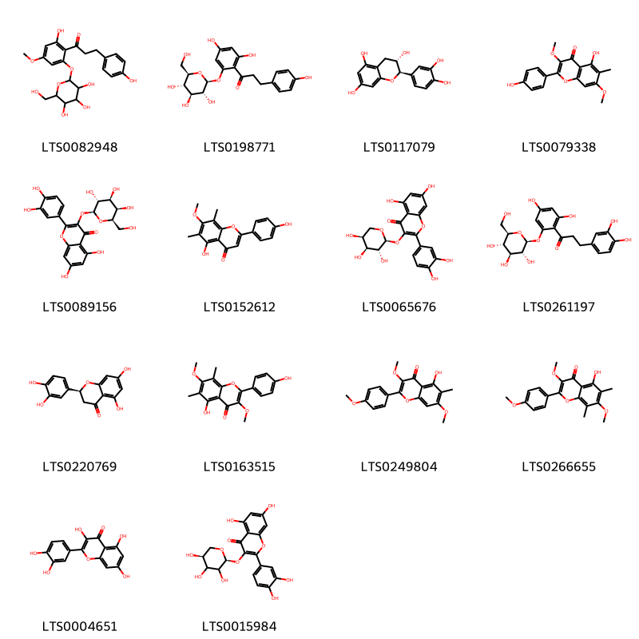{ width=100% }
    <figcaption>Hình ảnh cấu trúc hóa học của 14 hoạt chất thuộc nhóm Flavonoids gồm ['asebotin (LTS0082948)', 'phlorizin (LTS0198771)', '(+)-catechol (LTS0117079)', '8-demethyllatifolin (LTS0079338)', 'hyperoside (LTS0089156)', 'sideroxylin (LTS0152612)', 'guaijaverin (LTS0065676)', '1-(2,4-dihydroxy-6-{[(2s,3r,4s,5s,6r)-3,4,5-trihydroxy-6-(hydroxymethyl)oxan-2-yl]oxy}phenyl)-3-(3,4-dihydroxyphenyl)propan-1-one (LTS0261197)', 'eriodictyol (LTS0220769)', '5-hydroxy-2-(4-hydroxyphenyl)-3,7-dimethoxy-6,8-dimethylchromen-4-one (LTS0163515)', '8-desmethylkalmiatin (LTS0249804)', 'kalmiatin (LTS0266655)', 'quercetin (LTS0004651)', 'guaijaverin (LTS0015984)'].</figcaption>
</figure>
#### Nhóm Linear 1_3-diarylpropanoids
<figure markdown="span">
    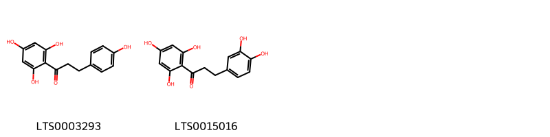{ width=100% }
    <figcaption>Hình ảnh cấu trúc hóa học của Không tìm thấy chú thích hoạt chất thuộc nhóm Linear 1_3-diarylpropanoids gồm Không tìm thấy chú thích.</figcaption>
</figure>
#### Nhóm Organooxygen compounds
<figure markdown="span">
    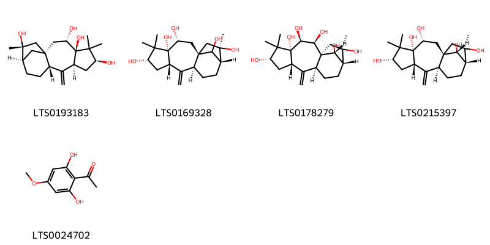{ width=100% }
    <figcaption>Hình ảnh cấu trúc hóa học của 5 hoạt chất thuộc nhóm Organooxygen compounds gồm ['(1r,3s,4r,6s,8s,10r,13r,14r)-5,5,14-trimethyl-9-methylidenetetracyclo[11.2.1.0¹,¹⁰.0⁴,⁸]hexadecane-3,4,6,14-tetrol (LTS0193183)', '(1s,3r,4r,6s,8s,10s,13r,14r)-5,5,14-trimethyl-9-methylidenetetracyclo[11.2.1.0¹,¹⁰.0⁴,⁸]hexadecane-3,4,6,14,16-pentol (LTS0169328)', '(1r,2s,3s,4r,6s,8s,10s,13r,14r,16r)-5,5,14-trimethyl-9-methylidenetetracyclo[11.2.1.0¹,¹⁰.0⁴,⁸]hexadecane-2,3,4,6,14,16-hexol (LTS0178279)', 'grayanotoxin ii (LTS0215397)', 'phloretin (LTS0024702)'].</figcaption>
</figure>
#### Nhóm Prenol lipids
<figure markdown="span">
    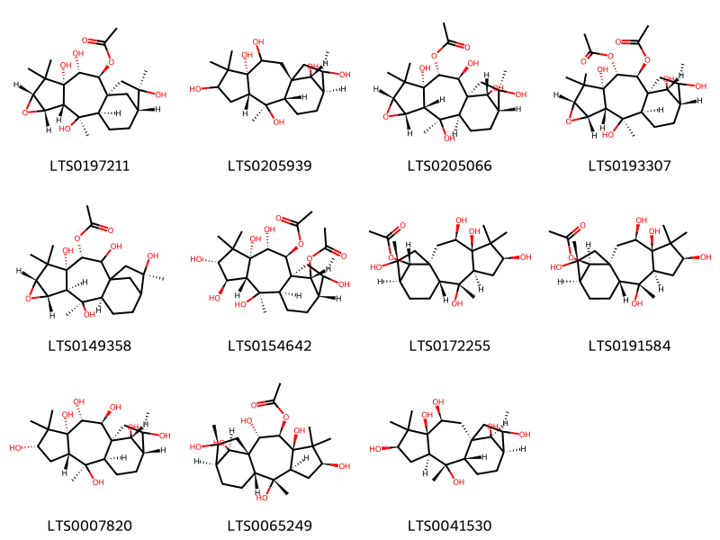{ width=100% }
    <figcaption>Hình ảnh cấu trúc hóa học của 11 hoạt chất thuộc nhóm Prenol lipids gồm ['(1r,2s,3r,4r,6r,8s,9s,10r,11r,14r,15r)-3,4,10,15-tetrahydroxy-5,5,10,15-tetramethyl-7-oxapentacyclo[12.2.1.0¹,¹¹.0⁴,⁹.0⁶,⁸]heptadecan-2-yl acetate (LTS0197211)', '(1s,4r,8s,9r,10s,13s,14r,16r)-5,5,9,14-tetramethyltetracyclo[11.2.1.0¹,¹⁰.0⁴,⁸]hexadecane-3,4,6,9,14,16-hexol (LTS0205939)', '(1r,2s,3r,4r,6r,8s,9s,10r,11r,14r,15r,17r)-2,4,10,15,17-pentahydroxy-5,5,10,15-tetramethyl-7-oxapentacyclo[12.2.1.0¹,¹¹.0⁴,⁹.0⁶,⁸]heptadecan-3-yl acetate (LTS0205066)', '(1r,2s,3r,4r,6r,8s,9s,10r,11r,14r,15r,17r)-2-(acetyloxy)-4,10,15,17-tetrahydroxy-5,5,10,15-tetramethyl-7-oxapentacyclo[12.2.1.0¹,¹¹.0⁴,⁹.0⁶,⁸]heptadecan-3-yl acetate (LTS0193307)', '(3r,4r,6r,8s,9r,10r,11r,15r)-2,4,10,15-tetrahydroxy-5,5,10,15-tetramethyl-7-oxapentacyclo[12.2.1.0¹,¹¹.0⁴,⁹.0⁶,⁸]heptadecan-3-yl acetate (LTS0149358)', '(1r,2s,3r,4r,6r,7r,8s,9r,10r,13r,14r,16r)-16-(acetyloxy)-3,4,6,7,9,14-hexahydroxy-5,5,9,14-tetramethyltetracyclo[11.2.1.0¹,¹⁰.0⁴,⁸]hexadecan-2-yl acetate (LTS0154642)', '(1s,3r,4r,6s,8s,9r,10r,13r,14r,16s)-3,4,6,9,14-pentahydroxy-5,5,9,14-tetramethyltetracyclo[11.2.1.0¹,¹⁰.0⁴,⁸]hexadecan-16-yl acetate (LTS0172255)', 'andromedotoxin (LTS0191584)', '(1r,2s,3r,4r,6s,8s,9r,10r,13r,14r,16r)-5,5,9,14-tetramethyltetracyclo[11.2.1.0¹,¹⁰.0⁴,⁸]hexadecane-2,3,4,6,9,14,16-heptol (LTS0007820)', '(1r,2s,3r,4r,6s,8s,9r,10r,13r,14r,16r)-2,4,6,9,14,16-hexahydroxy-5,5,9,14-tetramethyltetracyclo[11.2.1.0¹,¹⁰.0⁴,⁸]hexadecan-3-yl acetate (LTS0065249)', '(1r,3s,4s,6r,8r,9s,10s,13s,14r,16s)-5,5,9,14-tetramethyltetracyclo[11.2.1.0¹,¹⁰.0⁴,⁸]hexadecane-3,4,6,9,14,16-hexol (LTS0041530)'].</figcaption>
</figure>

---

### Dược dân tộc học

Danh sách các quốc gia có sử dụng *Kalmia latifolia* trong điều trị các bệnh. 

| Country       | Disease                                         | Bệnh                                                                                                                                                                                                |
|:--------------|:------------------------------------------------|:----------------------------------------------------------------------------------------------------------------------------------------------------------------------------------------------------|
| North America | Astringent, Narcotic, Sedative                  | MYMEMORY WARNING: YOU USED ALL AVAILABLE FREE TRANSLATIONS FOR TODAY. NEXT AVAILABLE IN  01 HOURS 51 MINUTES 21 SECONDS VISIT HTTPS://MYMEMORY.TRANSLATED.NET/DOC/USAGELIMITS.PHP TO TRANSLATE MORE |
| Turkey        | Astringent, Cardiac, Narcotic, Poison, Sedative | MYMEMORY WARNING: YOU USED ALL AVAILABLE FREE TRANSLATIONS FOR TODAY. NEXT AVAILABLE IN  01 HOURS 51 MINUTES 19 SECONDS VISIT HTTPS://MYMEMORY.TRANSLATED.NET/DOC/USAGELIMITS.PHP TO TRANSLATE MORE |
| US            | Poison                                          | MYMEMORY WARNING: YOU USED ALL AVAILABLE FREE TRANSLATIONS FOR TODAY. NEXT AVAILABLE IN  01 HOURS 51 MINUTES 17 SECONDS VISIT HTTPS://MYMEMORY.TRANSLATED.NET/DOC/USAGELIMITS.PHP TO TRANSLATE MORE |

---

# Chi Monotropa

??? note "Danh sách các dược liệu thuộc chi"
    
	 - *Monotropa hypopitys*
	 - *Monotropa uniflora*

---
## Monotropa hypopitys
### Thông tin về thực vật

!!! info "Phân loại thực vật của *Hypopitys monotropa* từ GIBF:"
    - **Kingdom:** Plantae
    - **Phylum:** Tracheophyta
    - **Order:** Ericales
    - **Family:** Ericaceae
    - **Genus:** Hypopitys
    - **Species:** *Hypopitys monotropa*

 

| Label (VI)   | Label (EN)   | Scientific Name     | Descriptions (VI)   | Descriptions (EN)   | Also Known As (VI)   | Also Known As (EN)   |
|:-------------|:-------------|:--------------------|:--------------------|:--------------------|:---------------------|:---------------------|
| N/A          | N/A          | Monotropa hypopitys | loài thực vật       | species of plant    | ['']                 | ['']                 |

#### Phân bố trên thế giới

**Từ CSDL GIBF** nan, Italy, Belgium, Estonia, Georgia, Norway, Canada, Ukraine, Denmark, Belarus, Korea, Republic of, Chinese Taipei, Spain, Türkiye, Portugal, Hungary, Russian Federation, United States of America, Sweden, Finland, Greece, Czechia, Germany, Romania, Switzerland, Austria, France, Poland

#### Phân bố tại Việt Nam

**Từ CSDL GIBF**: Không có ghi nhận ở Việt Nam

---
### Thành phần hóa học
        
- Theo cơ sở dữ liệu lotus: Từ loài *Hypopitys monotropa* đã phân lập và xác định được Chưa có hoạt chất nào được phân lập. hoạt chất thuộc về các nhóm Không có hoạt chất nào được phân lập. 

Không có hình ảnh nào được tạo ra

---

### Dược dân tộc học

Danh sách các quốc gia có sử dụng *Hypopitys monotropa* trong điều trị các bệnh. 

| Country   | Disease   | Bệnh                                                                                                                                                                                                |
|:----------|:----------|:----------------------------------------------------------------------------------------------------------------------------------------------------------------------------------------------------|
| French    | Sedative  | MYMEMORY WARNING: YOU USED ALL AVAILABLE FREE TRANSLATIONS FOR TODAY. NEXT AVAILABLE IN  01 HOURS 50 MINUTES 41 SECONDS VISIT HTTPS://MYMEMORY.TRANSLATED.NET/DOC/USAGELIMITS.PHP TO TRANSLATE MORE |

---

---
## Monotropa uniflora
### Thông tin về thực vật

!!! info "Phân loại thực vật của *Monotropa uniflora* từ GIBF:"
    - **Kingdom:** Plantae
    - **Phylum:** Tracheophyta
    - **Order:** Ericales
    - **Family:** Ericaceae
    - **Genus:** Monotropa
    - **Species:** *Monotropa uniflora*

 

| Label (VI)   | Label (EN)   | Scientific Name    | Descriptions (VI)   | Descriptions (EN)   | Also Known As (VI)   | Also Known As (EN)   |
|:-------------|:-------------|:-------------------|:--------------------|:--------------------|:---------------------|:---------------------|
| N/A          | N/A          | Monotropa uniflora | loài thực vật       | species of plant    | ['']                 | ['indian pipe']      |

#### Phân bố trên thế giới

**Từ CSDL GIBF** nan, United States of America, Canada, Nicaragua

#### Phân bố tại Việt Nam

**Từ CSDL GIBF**: Không có ghi nhận ở Việt Nam

---
### Thành phần hóa học
        
- Theo cơ sở dữ liệu lotus: Từ loài *Monotropa uniflora* đã phân lập và xác định được 17 hoạt chất thuộc về các nhóm Fatty Acyls, Flavonoids, Prenol lipids, Steroids and steroid derivatives. 

|    | chemicalTaxonomyClassyfireClass   |   smiles_count |
|---:|:----------------------------------|---------------:|
|  0 | Fatty Acyls                       |              6 |
|  1 | Flavonoids                        |              1 |
|  2 | Prenol lipids                     |              1 |
|  3 | Steroids and steroid derivatives  |              9 |

#### Nhóm Fatty Acyls
<figure markdown="span">
    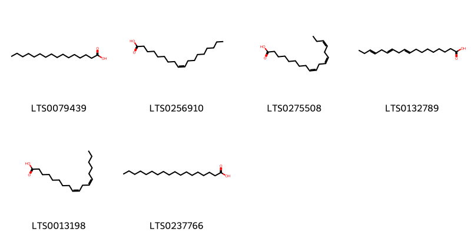{ width=100% }
    <figcaption>Hình ảnh cấu trúc hóa học của 6 hoạt chất thuộc nhóm Fatty Acyls gồm ['palmitic acid (LTS0079439)', 'oleic acid (LTS0256910)', 'α-linolenic acid (LTS0275508)', 'α linolenic acid (LTS0132789)', 'linoleic (LTS0013198)', 'stearic acid (LTS0237766)'].</figcaption>
</figure>
#### Nhóm Flavonoids
<figure markdown="span">
    { width=100% }
    <figcaption>Hình ảnh cấu trúc hóa học của 1 hoạt chất thuộc nhóm Flavonoids gồm ['2-(3,4-dihydroxyphenyl)-5,7-dihydroxy-3-{[(2s,3r,4r,5r,6s)-3,4,5-trihydroxy-6-(hydroxymethyl)oxan-2-yl]oxy}chromen-4-one (LTS0241372)'].</figcaption>
</figure>
#### Nhóm Prenol lipids
<figure markdown="span">
    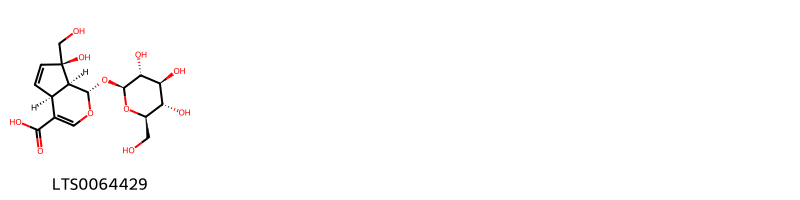{ width=100% }
    <figcaption>Hình ảnh cấu trúc hóa học của 1 hoạt chất thuộc nhóm Prenol lipids gồm ['monotropein (LTS0064429)'].</figcaption>
</figure>
#### Nhóm Steroids and steroid derivatives
<figure markdown="span">
    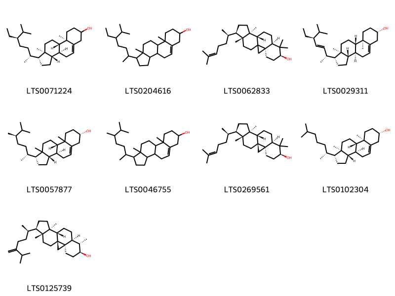{ width=100% }
    <figcaption>Hình ảnh cấu trúc hóa học của 9 hoạt chất thuộc nhóm Steroids and steroid derivatives gồm ['stigmast-5-en-3-ol (LTS0071224)', 'stigmast-5-en-3-ol, (3β)- (LTS0204616)', '(3r,6s,8r,11s,12s,15r,16r)-7,7,12,16-tetramethyl-15-[(2r)-6-methylhept-5-en-2-yl]pentacyclo[9.7.0.0¹,³.0³,⁸.0¹²,¹⁶]octadecan-6-ol (LTS0062833)', 'phytosterol (LTS0029311)', '(1r,3as,3bs,7s,9bs)-1-[(2r,5r)-5,6-dimethylheptan-2-yl]-9a,11a-dimethyl-1h,2h,3h,3ah,3bh,4h,6h,7h,8h,9h,9bh,10h,11h-cyclopenta[a]phenanthren-7-ol (LTS0057877)', 'campesterol (LTS0046755)', 'cycloartenol (LTS0269561)', 'cholesterol (LTS0102304)', 'cycloeucalenol (LTS0125739)'].</figcaption>
</figure>

---

### Dược dân tộc học

Danh sách các quốc gia có sử dụng *Monotropa uniflora* trong điều trị các bệnh. 

| Country        | Disease                                | Bệnh                                                                                                                                                                                                |
|:---------------|:---------------------------------------|:----------------------------------------------------------------------------------------------------------------------------------------------------------------------------------------------------|
| Elsewhere      | nan, Nervine, Sedative, Tonic          | MYMEMORY WARNING: YOU USED ALL AVAILABLE FREE TRANSLATIONS FOR TODAY. NEXT AVAILABLE IN  01 HOURS 50 MINUTES 19 SECONDS VISIT HTTPS://MYMEMORY.TRANSLATED.NET/DOC/USAGELIMITS.PHP TO TRANSLATE MORE |
| US             | Analgesic, Nervine, Sedative, Sedative | MYMEMORY WARNING: YOU USED ALL AVAILABLE FREE TRANSLATIONS FOR TODAY. NEXT AVAILABLE IN  01 HOURS 50 MINUTES 16 SECONDS VISIT HTTPS://MYMEMORY.TRANSLATED.NET/DOC/USAGELIMITS.PHP TO TRANSLATE MORE |
| US(Amerindian) | Collyrium                              | MYMEMORY WARNING: YOU USED ALL AVAILABLE FREE TRANSLATIONS FOR TODAY. NEXT AVAILABLE IN  01 HOURS 50 MINUTES 14 SECONDS VISIT HTTPS://MYMEMORY.TRANSLATED.NET/DOC/USAGELIMITS.PHP TO TRANSLATE MORE |

---

# Chi Pieris

??? note "Danh sách các dược liệu thuộc chi"
    
	 - *Pieris formosa*
	 - *Pieris japonica*
	 - *Pieris ovalifolia*

---
## Pieris formosa
### Thông tin về thực vật

!!! info "Phân loại thực vật của *Pieris formosa* từ GIBF:"
    - **Kingdom:** Plantae
    - **Phylum:** Tracheophyta
    - **Order:** Ericales
    - **Family:** Ericaceae
    - **Genus:** Pieris
    - **Species:** *Pieris formosa*

 

| Label (VI)   | Label (EN)   | Scientific Name   | Descriptions (VI)   | Descriptions (EN)   | Also Known As (VI)   | Also Known As (EN)   |
|:-------------|:-------------|:------------------|:--------------------|:--------------------|:---------------------|:---------------------|
| N/A          | N/A          | Pieris formosa    | loài thực vật       | species of plant    | ['']                 | ['']                 |

#### Phân bố trên thế giới

**Từ CSDL GIBF** South Africa, United Kingdom of Great Britain and Northern Ireland, Belgium, New Zealand, Bhutan, India, United States of America, Viet Nam, China, Canada, Nepal

#### Phân bố tại Việt Nam

**Từ CSDL GIBF**: Lao Cai, Tinh Lao Cai

---
### Thành phần hóa học
        
- Theo cơ sở dữ liệu lotus: Từ loài *Pieris formosa* đã phân lập và xác định được 51 hoạt chất thuộc về các nhóm Fatty Acyls, Prenol lipids, Organooxygen compounds. 

|    | chemicalTaxonomyClassyfireClass   |   smiles_count |
|---:|:----------------------------------|---------------:|
|  0 | Fatty Acyls                       |              4 |
|  1 | Organooxygen compounds            |             13 |
|  2 | Prenol lipids                     |             34 |

#### Nhóm Fatty Acyls
<figure markdown="span">
    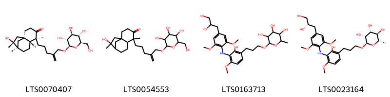{ width=100% }
    <figcaption>Hình ảnh cấu trúc hóa học của 4 hoạt chất thuộc nhóm Fatty Acyls gồm ['(1s,5s,6r,9r,10r)-10-hydroxy-5,10-dimethyl-5-[4-({[(2r,3r,4s,5s,6r)-3,4,5-trihydroxy-6-(hydroxymethyl)oxan-2-yl]oxy}methyl)pent-4-en-1-yl]tricyclo[7.2.1.0¹,⁶]dodecan-4-one (LTS0070407)', '10-hydroxy-5,10-dimethyl-5-[4-({[3,4,5-trihydroxy-6-(hydroxymethyl)oxan-2-yl]oxy}methyl)pent-4-en-1-yl]tricyclo[7.2.1.0¹,⁶]dodecan-4-one (LTS0054553)', '2-[3-(3-{[4-(2,3-dihydroxypropyl)-2,6-dimethoxyphenyl]amino}-2-hydroxy-4-methoxyphenyl)propoxy]-6-methyloxane-3,4,5-triol (LTS0163713)', '(2r,3r,4r,5r,6s)-2-{3-[3-({4-[(2s)-2,3-dihydroxypropyl]-2,6-dimethoxyphenyl}amino)-2-hydroxy-4-methoxyphenyl]propoxy}-6-methyloxane-3,4,5-triol (LTS0023164)'].</figcaption>
</figure>
#### Nhóm Organooxygen compounds
<figure markdown="span">
    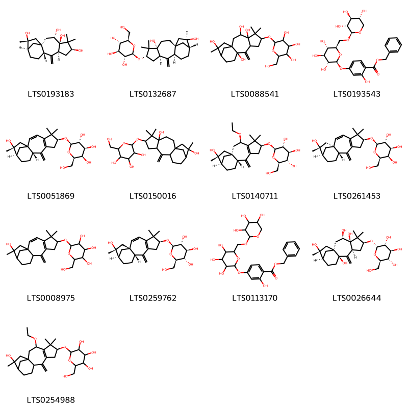{ width=100% }
    <figcaption>Hình ảnh cấu trúc hóa học của 13 hoạt chất thuộc nhóm Organooxygen compounds gồm ['(1r,3s,4r,6s,8s,10r,13r,14r)-5,5,14-trimethyl-9-methylidenetetracyclo[11.2.1.0¹,¹⁰.0⁴,⁸]hexadecane-3,4,6,14-tetrol (LTS0193183)', '(2r,3r,4s,5s,6r)-2-{[(1s,4r,6s,8r,10r,13r,14r)-4,14-dihydroxy-5,5,14-trimethyl-9-methylidenetetracyclo[11.2.1.0¹,¹⁰.0⁴,⁸]hexadecan-6-yl]oxy}-6-(hydroxymethyl)oxane-3,4,5-triol (LTS0132687)', '5,5,14-trimethyl-9-methylidene-6-{[3,4,5-trihydroxy-6-(hydroxymethyl)oxan-2-yl]oxy}tetracyclo[11.2.1.0¹,¹⁰.0⁴,⁸]hexadecane-3,4,10,14-tetrol (LTS0088541)', 'benzyl 2-hydroxy-4-{[(2s,3r,4s,5s,6r)-3,4,5-trihydroxy-6-({[(2s,3r,4s,5r)-3,4,5-trihydroxyoxan-2-yl]oxy}methyl)oxan-2-yl]oxy}benzoate (LTS0193543)', '(2r,3r,4s,5r,6r)-2-{[(6s,10r,13r,14r)-14-hydroxy-5,5,14-trimethyl-9-methylidenetetracyclo[11.2.1.0¹,¹⁰.0⁴,⁸]hexadeca-2,4(8)-dien-6-yl]oxy}-6-(hydroxymethyl)oxane-3,4,5-triol (LTS0051869)', '2-({4,14-dihydroxy-5,5,14-trimethyl-9-methylidenetetracyclo[11.2.1.0¹,¹⁰.0⁴,⁸]hexadecan-6-yl}oxy)-6-(hydroxymethyl)oxane-3,4,5-triol (LTS0150016)', '(2r,3r,4s,5s,6r)-2-{[(1r,3r,6s,10r,13r,14r)-3-ethoxy-14-hydroxy-5,5,14-trimethyl-9-methylidenetetracyclo[11.2.1.0¹,¹⁰.0⁴,⁸]hexadec-4(8)-en-6-yl]oxy}-6-(hydroxymethyl)oxane-3,4,5-triol (LTS0140711)', '(2r,3r,4s,5r,6r)-2-{[(1r,6s,10r,13r,14r)-14-hydroxy-5,5,14-trimethyl-9-methylidenetetracyclo[11.2.1.0¹,¹⁰.0⁴,⁸]hexadeca-2,4(8)-dien-6-yl]oxy}-6-(hydroxymethyl)oxane-3,4,5-triol (LTS0261453)', '2-({14-hydroxy-5,5,14-trimethyl-9-methylidenetetracyclo[11.2.1.0¹,¹⁰.0⁴,⁸]hexadeca-2,4(8)-dien-6-yl}oxy)-6-(hydroxymethyl)oxane-3,4,5-triol (LTS0008975)', '(2r,3r,4s,5s,6r)-2-{[(1s,6s,10r,13r,14r)-14-hydroxy-5,5,14-trimethyl-9-methylidenetetracyclo[11.2.1.0¹,¹⁰.0⁴,⁸]hexadeca-2,4(8)-dien-6-yl]oxy}-6-(hydroxymethyl)oxane-3,4,5-triol (LTS0259762)', 'benzyl 2-hydroxy-4-[(3,4,5-trihydroxy-6-{[(3,4,5-trihydroxyoxan-2-yl)oxy]methyl}oxan-2-yl)oxy]benzoate (LTS0113170)', '(1r,3r,4r,6s,8s,10s,13r,14r)-5,5,14-trimethyl-9-methylidene-6-{[(2s,3r,4s,5s,6r)-3,4,5-trihydroxy-6-(hydroxymethyl)oxan-2-yl]oxy}tetracyclo[11.2.1.0¹,¹⁰.0⁴,⁸]hexadecane-3,4,10,14-tetrol (LTS0026644)', '2-({3-ethoxy-14-hydroxy-5,5,14-trimethyl-9-methylidenetetracyclo[11.2.1.0¹,¹⁰.0⁴,⁸]hexadec-4(8)-en-6-yl}oxy)-6-(hydroxymethyl)oxane-3,4,5-triol (LTS0254988)'].</figcaption>
</figure>
#### Nhóm Prenol lipids
<figure markdown="span">
    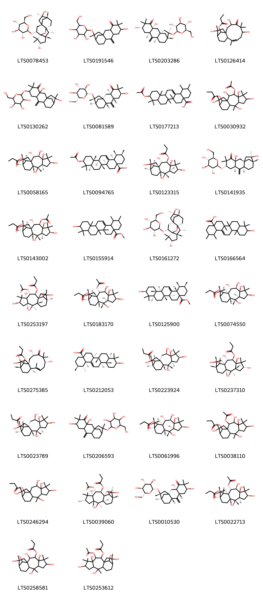{ width=100% }
    <figcaption>Hình ảnh cấu trúc hóa học của 34 hoạt chất thuộc nhóm Prenol lipids gồm ['(2s,3r,4s,5s,6r)-2-{[(1r,2r,4r,6r,7r,10r,11r,12s,14s)-6,14-dihydroxy-6,11,15,15-tetramethyl-16-oxapentacyclo[8.5.1.1⁴,⁷.0¹,¹².0⁴,¹⁰]heptadecan-2-yl]oxy}-6-(hydroxymethyl)oxane-3,4,5-triol (LTS0078453)', '6-hydroxy-5,5,14-trimethyl-9-methylidene-14-{[3,4,5-trihydroxy-6-(hydroxymethyl)oxan-2-yl]oxy}tetracyclo[11.2.1.0¹,¹⁰.0³,⁸]hexadecan-4-one (LTS0191546)', '(1r,3r,6s,8r,10r,13r,14r)-3,6-dihydroxy-5,5,14-trimethyl-9-methylidene-14-{[(2s,3r,4s,5s,6r)-3,4,5-trihydroxy-6-(hydroxymethyl)oxan-2-yl]oxy}tetracyclo[11.2.1.0¹,¹⁰.0³,⁸]hexadecan-4-one (LTS0203286)', '3,6,14-trihydroxy-5,5,9,14-tetramethyl-4-oxotricyclo[11.2.1.0¹,¹⁰]hexadec-8-en-16-yl propanoate (LTS0126414)', '3,14-dihydroxy-5,5,14-trimethyl-9-methylidene-6-{[3,4,5-trihydroxy-6-(hydroxymethyl)oxan-2-yl]oxy}tetracyclo[11.2.1.0¹,¹⁰.0³,⁸]hexadecan-4-one (LTS0130262)', '(1r,3r,6s,8s,10r,13r,14r)-6-hydroxy-5,5,14-trimethyl-9-methylidene-14-{[(2s,3r,4s,5s,6r)-3,4,5-trihydroxy-6-(hydroxymethyl)oxan-2-yl]oxy}tetracyclo[11.2.1.0¹,¹⁰.0³,⁸]hexadecan-4-one (LTS0081589)', '10-(acetyloxy)-1,2,6a,6b,9,9,12a-heptamethyl-2,3,4,5,6,7,8,8a,10,11,12,12b,13,14b-tetradecahydro-1h-picene-4a-carboxylic acid (LTS0177213)', '3-(acetyloxy)-2,4,6,9,14-pentahydroxy-5,5,9,14-tetramethyltetracyclo[11.2.1.0¹,¹⁰.0⁴,⁸]hexadecan-16-yl propanoate (LTS0030932)', '(1s,2s,3r,4r,6s,8s,9r,10r,13r,14r,16r)-2,3,4,6,9,14-hexahydroxy-5,5,9,14-tetramethyltetracyclo[11.2.1.0¹,¹⁰.0⁴,⁸]hexadecan-16-yl propanoate (LTS0058165)', '(1s,2s,4as,6as,6br,8ar,10s,12ar,12br,14br)-10-(acetyloxy)-1,2,6a,6b,9,9,12a-heptamethyl-2,3,4,5,6,7,8,8a,10,11,12,12b,13,14b-tetradecahydro-1h-picene-4a-carboxylic acid (LTS0094765)', '(1r,2s,3r,4r,6s,8s,9r,10r,13r,14r,16r)-2,4,6,9,14,16-hexahydroxy-5,5,9,14-tetramethyltetracyclo[11.2.1.0¹,¹⁰.0⁴,⁸]hexadecan-3-yl propanoate (LTS0123315)', '(1s,3s,6s,8r,10r,13r,14r)-3,14-dihydroxy-5,5,14-trimethyl-9-methylidene-6-{[(2r,3r,4s,5s,6r)-3,4,5-trihydroxy-6-(hydroxymethyl)oxan-2-yl]oxy}tetracyclo[11.2.1.0¹,¹⁰.0³,⁸]hexadecan-4-one (LTS0141935)', '(1s,2s,3r,4r,6s,8s,9r,10r,13r,14r,16r)-3-(acetyloxy)-2,4,6,9,14-pentahydroxy-5,5,9,14-tetramethyltetracyclo[11.2.1.0¹,¹⁰.0⁴,⁸]hexadecan-16-yl propanoate (LTS0143002)', 'methyl 10-hydroxy-1,2,6a,6b,9,9,12a-heptamethyl-2,3,4,5,6,7,8,8a,10,11,12,12b,13,14b-tetradecahydro-1h-picene-4a-carboxylate (LTS0155914)', '(2s,3r,4s,5s,6r)-2-{[(1r,2r,4s,6r,7r,10r,11r,12s,14s)-6,14-dihydroxy-6,11,15,15-tetramethyl-16-oxapentacyclo[8.5.1.1⁴,⁷.0¹,¹².0⁴,¹⁰]heptadecan-2-yl]oxy}-6-(hydroxymethyl)oxane-3,4,5-triol (LTS0161272)', '10-hydroxy-1,2,6a,6b,9,9,12a-heptamethyl-2,3,4,5,6,7,8,8a,10,11,12,12b,13,14b-tetradecahydro-1h-picene-4a-carboxylic acid (LTS0166564)', '(1s,2s,3r,4r,6r,8r,9r,10s,13s,14s,16r)-3-(acetyloxy)-4,6,9,14,16-pentahydroxy-5,5,9,14-tetramethyltetracyclo[11.2.1.0¹,¹⁰.0⁴,⁸]hexadecan-2-yl propanoate (LTS0253197)', '(1r,2s,3r,4r,6s,8s,9r,10r,13r,14r,16r)-2-(acetyloxy)-3,4,6,9,14-pentahydroxy-5,5,9,14-tetramethyltetracyclo[11.2.1.0¹,¹⁰.0⁴,⁸]hexadecan-16-yl propanoate (LTS0183170)', 'methyl (1s,2s,4as,6as,6br,8ar,10s,12ar,12br,14bs)-10-hydroxy-1,2,6a,6b,9,9,12a-heptamethyl-2,3,4,5,6,7,8,8a,10,11,12,12b,13,14b-tetradecahydro-1h-picene-4a-carboxylate (LTS0125900)', '(1r,2s,3r,4r,6s,8s,9r,10r,14r,16r)-2,3,4,6,9,14-hexahydroxy-5,5,9,14-tetramethyltetracyclo[11.2.1.0¹,¹⁰.0⁴,⁸]hexadecan-16-yl propanoate (LTS0074550)', '(1r,3s,6r,8e,10r,13s,14s,16s)-3,6,14-trihydroxy-5,5,9,14-tetramethyl-4-oxotricyclo[11.2.1.0¹,¹⁰]hexadec-8-en-16-yl propanoate (LTS0275385)', '(1r,2s,4as,6as,6br,8ar,10s,12ar,12br,14br)-10-hydroxy-1,2,6a,6b,9,9,12a-heptamethyl-2,3,4,5,6,7,8,8a,10,11,12,12b,13,14b-tetradecahydro-1h-picene-4a-carboxylic acid (LTS0212053)', '(1s,3r,4r,6s,8s,9r,10r,13r,14r,16r)-3,4,6,9,14-pentahydroxy-5,5,9,14-tetramethyltetracyclo[11.2.1.0¹,¹⁰.0⁴,⁸]hexadecan-16-yl propanoate (LTS0223924)', '(1s,2s,3r,4r,6r,8r,9s,10s,13s,14r,16s)-2,4,6,9,14,16-hexahydroxy-5,5,9,14-tetramethyltetracyclo[11.2.1.0¹,¹⁰.0⁴,⁸]hexadecan-3-yl propanoate (LTS0237310)', '(1s,3r,4r,6s,8s,9r,10r,13r,14r,16s)-3,4,6,9,14-pentahydroxy-5,5,9,14-tetramethyltetracyclo[11.2.1.0¹,¹⁰.0⁴,⁸]hexadecan-16-yl propanoate (LTS0023789)', '3,6-dihydroxy-5,5,14-trimethyl-9-methylidene-14-{[3,4,5-trihydroxy-6-(hydroxymethyl)oxan-2-yl]oxy}tetracyclo[11.2.1.0¹,¹⁰.0³,⁸]hexadecan-4-one (LTS0206593)', '(1r,2s,3r,4r,6s,8s,9r,10r,13r,14r,16r)-2,3,4,6,9,14-hexahydroxy-5,5,9,14-tetramethyltetracyclo[11.2.1.0¹,¹⁰.0⁴,⁸]hexadecan-16-yl propanoate (LTS0061996)', '2-(acetyloxy)-3,4,6,9,14-pentahydroxy-5,5,9,14-tetramethyltetracyclo[11.2.1.0¹,¹⁰.0⁴,⁸]hexadecan-16-yl propanoate (LTS0038110)', '3,4,6,9,14-pentahydroxy-5,5,9,14-tetramethyltetracyclo[11.2.1.0¹,¹⁰.0⁴,⁸]hexadecan-16-yl propanoate (LTS0246294)', '(1r,2s,3r,4r,6s,8s,9r,10r,13r,14r,16r)-3-(acetyloxy)-4,6,9,14,16-pentahydroxy-5,5,9,14-tetramethyltetracyclo[11.2.1.0¹,¹⁰.0⁴,⁸]hexadecan-2-yl propanoate (LTS0039060)', '(1r,3s,6s,8r,10r,13r,14r)-3,6-dihydroxy-5,5,14-trimethyl-9-methylidene-14-{[(2s,3r,4s,5s,6r)-3,4,5-trihydroxy-6-(hydroxymethyl)oxan-2-yl]oxy}tetracyclo[11.2.1.0¹,¹⁰.0³,⁸]hexadecan-4-one (LTS0010530)', '(1s,2s,3r,4r,6s,8s,9r,10r,13r,14r,16s)-2-(acetyloxy)-3,4,6,9,14-pentahydroxy-5,5,9,14-tetramethyltetracyclo[11.2.1.0¹,¹⁰.0⁴,⁸]hexadecan-16-yl propanoate (LTS0022713)', '2,4,6,9,14,16-hexahydroxy-5,5,9,14-tetramethyltetracyclo[11.2.1.0¹,¹⁰.0⁴,⁸]hexadecan-3-yl propanoate (LTS0258581)', '3-(acetyloxy)-4,6,9,14,16-pentahydroxy-5,5,9,14-tetramethyltetracyclo[11.2.1.0¹,¹⁰.0⁴,⁸]hexadecan-2-yl propanoate (LTS0253612)'].</figcaption>
</figure>

---

### Dược dân tộc học

Danh sách các quốc gia có sử dụng *Pieris formosa* trong điều trị các bệnh. 

| Country   | Disease   | Bệnh                                                                                                                                                                                                |
|:----------|:----------|:----------------------------------------------------------------------------------------------------------------------------------------------------------------------------------------------------|
| Elsewhere | Poison    | MYMEMORY WARNING: YOU USED ALL AVAILABLE FREE TRANSLATIONS FOR TODAY. NEXT AVAILABLE IN  01 HOURS 49 MINUTES 18 SECONDS VISIT HTTPS://MYMEMORY.TRANSLATED.NET/DOC/USAGELIMITS.PHP TO TRANSLATE MORE |

---

---
## Pieris japonica
### Thông tin về thực vật

!!! info "Phân loại thực vật của *Pieris japonica* từ GIBF:"
    - **Kingdom:** Plantae
    - **Phylum:** Tracheophyta
    - **Order:** Ericales
    - **Family:** Ericaceae
    - **Genus:** Pieris
    - **Species:** *Pieris japonica*

 

| Label (VI)   | Label (EN)   | Scientific Name   | Descriptions (VI)   | Descriptions (EN)   | Also Known As (VI)   | Also Known As (EN)                        |
|:-------------|:-------------|:------------------|:--------------------|:--------------------|:---------------------|:------------------------------------------|
| N/A          | N/A          | Pieris japonica   | loài thực vật       | species of plant    | ['']                 | ['Japanese andromeda', 'Japanese pieris'] |

#### Phân bố trên thế giới

**Từ CSDL GIBF** nan, Netherlands, Japan, Germany, Chinese Taipei, United States of America, France, Norway, China

#### Phân bố tại Việt Nam

**Từ CSDL GIBF**: Không có ghi nhận ở Việt Nam

---
### Thành phần hóa học
        
- Theo cơ sở dữ liệu lotus: Từ loài *Pieris japonica* đã phân lập và xác định được 86 hoạt chất thuộc về các nhóm Flavonoids, Prenol lipids, Steroids and steroid derivatives, Linear 1,3-diarylpropanoids, Diarylheptanoids, Organooxygen compounds. 

|    | chemicalTaxonomyClassyfireClass   |   smiles_count |
|---:|:----------------------------------|---------------:|
|  0 | Diarylheptanoids                  |              1 |
|  1 | Flavonoids                        |             13 |
|  2 | Linear 1,3-diarylpropanoids       |              3 |
|  3 | Organooxygen compounds            |             11 |
|  4 | Prenol lipids                     |             51 |
|  5 | Steroids and steroid derivatives  |              6 |

#### Nhóm Diarylheptanoids
<figure markdown="span">
    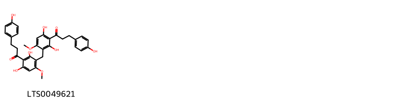{ width=100% }
    <figcaption>Hình ảnh cấu trúc hóa học của 1 hoạt chất thuộc nhóm Diarylheptanoids gồm ['1-[3-({2,4-dihydroxy-3-[3-(4-hydroxyphenyl)propanoyl]-6-methoxyphenyl}methyl)-2,6-dihydroxy-4-methoxyphenyl]-3-(4-hydroxyphenyl)propan-1-one (LTS0049621)'].</figcaption>
</figure>
#### Nhóm Flavonoids
<figure markdown="span">
    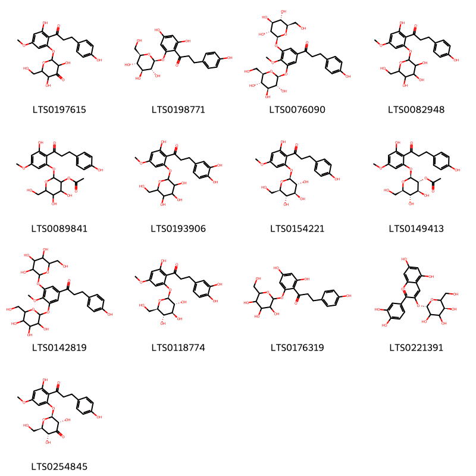{ width=100% }
    <figcaption>Hình ảnh cấu trúc hóa học của 13 hoạt chất thuộc nhóm Flavonoids gồm ['3,5-dihydroxy-2-{3-hydroxy-2-[3-(4-hydroxyphenyl)propanoyl]-5-methoxyphenoxy}-6-(hydroxymethyl)oxan-4-one (LTS0197615)', 'phlorizin (LTS0198771)', '3-(4-hydroxyphenyl)-1-[4-methoxy-3,5-bis({[(2s,3r,4s,5s,6r)-3,4,5-trihydroxy-6-(hydroxymethyl)oxan-2-yl]oxy})phenyl]propan-1-one (LTS0076090)', 'asebotin (LTS0082948)', '4,5-dihydroxy-2-{3-hydroxy-2-[3-(4-hydroxyphenyl)propanoyl]-5-methoxyphenoxy}-6-(hydroxymethyl)oxan-3-yl acetate (LTS0089841)', '3-(3,4-dihydroxyphenyl)-1-(2-hydroxy-4-methoxy-6-{[3,4,5-trihydroxy-6-(hydroxymethyl)oxan-2-yl]oxy}phenyl)propan-1-one (LTS0193906)', '1-(2-hydroxy-4-methoxy-6-{[(2s,3r,4s,5s,6r)-3,4,5-trihydroxy-6-(hydroxymethyl)oxan-2-yl]oxy}phenyl)-3-(4-hydroxyphenyl)propan-1-one (LTS0154221)', '(2s,3r,4s,5s,6r)-4,5-dihydroxy-2-{3-hydroxy-2-[3-(4-hydroxyphenyl)propanoyl]-5-methoxyphenoxy}-6-(hydroxymethyl)oxan-3-yl acetate (LTS0149413)', '3-(4-hydroxyphenyl)-1-[4-methoxy-3,5-bis({[3,4,5-trihydroxy-6-(hydroxymethyl)oxan-2-yl]oxy})phenyl]propan-1-one (LTS0142819)', '3-(3,4-dihydroxyphenyl)-1-(2-hydroxy-4-methoxy-6-{[(2s,3r,4s,5s,6r)-3,4,5-trihydroxy-6-(hydroxymethyl)oxan-2-yl]oxy}phenyl)propan-1-one (LTS0118774)', 'phloridzin (LTS0176319)', 'chrysanthemin (LTS0221391)', '(2s,3s,5r,6r)-3,5-dihydroxy-2-{3-hydroxy-2-[3-(4-hydroxyphenyl)propanoyl]-5-methoxyphenoxy}-6-(hydroxymethyl)oxan-4-one (LTS0254845)'].</figcaption>
</figure>
#### Nhóm Linear 1_3-diarylpropanoids
<figure markdown="span">
    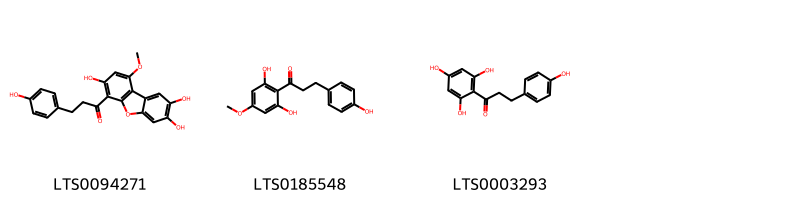{ width=100% }
    <figcaption>Hình ảnh cấu trúc hóa học của Không tìm thấy chú thích hoạt chất thuộc nhóm Linear 1_3-diarylpropanoids gồm Không tìm thấy chú thích.</figcaption>
</figure>
#### Nhóm Organooxygen compounds
<figure markdown="span">
    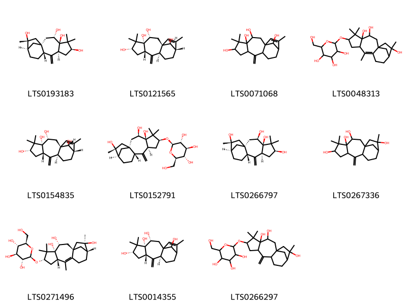{ width=100% }
    <figcaption>Hình ảnh cấu trúc hóa học của 11 hoạt chất thuộc nhóm Organooxygen compounds gồm ['(1r,3s,4r,6s,8s,10r,13r,14r)-5,5,14-trimethyl-9-methylidenetetracyclo[11.2.1.0¹,¹⁰.0⁴,⁸]hexadecane-3,4,6,14-tetrol (LTS0193183)', '(1s,3r,4r,6s,8s,10s,13s,16s)-5,5,14-trimethyl-9-methylidenetetracyclo[11.2.1.0¹,¹⁰.0⁴,⁸]hexadec-14-ene-3,4,6,16-tetrol (LTS0121565)', '5,5,14-trimethyl-9-methylidenetetracyclo[11.2.1.0¹,¹⁰.0⁴,⁸]hexadec-14-ene-3,4,6,16-tetrol (LTS0071068)', '2-(hydroxymethyl)-6-({3,4,14-trihydroxy-5,5,9,14-tetramethyltetracyclo[11.2.1.0¹,¹⁰.0⁴,⁸]hexadec-9-en-6-yl}oxy)oxane-3,4,5-triol (LTS0048313)', 'grayanotoxin vii (LTS0154835)', '(2r,3s,4s,5r,6r)-2-(hydroxymethyl)-6-{[(1r,3r,4r,6s,8s,10r,13r,14r)-3,4,14-trihydroxy-5,5,14-trimethyl-9-methylidenetetracyclo[11.2.1.0¹,¹⁰.0⁴,⁸]hexadecan-6-yl]oxy}oxane-3,4,5-triol (LTS0152791)', '(1r,3r,4r,6s,8s,10r,13r,14r)-5,5,14-trimethyl-9-methylidenetetracyclo[11.2.1.0¹,¹⁰.0⁴,⁸]hexadecane-3,4,6,14-tetrol (LTS0266797)', '5,5,14-trimethyl-9-methylidenetetracyclo[11.2.1.0¹,¹⁰.0⁴,⁸]hexadecane-3,4,6,14-tetrol (LTS0267336)', '(2r,3s,4s,5r,6r)-2-(hydroxymethyl)-6-{[(1r,3r,4r,6s,8s,13r,14r)-3,4,14-trihydroxy-5,5,9,14-tetramethyltetracyclo[11.2.1.0¹,¹⁰.0⁴,⁸]hexadec-9-en-6-yl]oxy}oxane-3,4,5-triol (LTS0271496)', '(3r,4r,6s,8s,10s)-5,5,14-trimethyl-9-methylidenetetracyclo[11.2.1.0¹,¹⁰.0⁴,⁸]hexadec-14-ene-3,4,6,16-tetrol (LTS0014355)', '2-(hydroxymethyl)-6-({3,4,14-trihydroxy-5,5,14-trimethyl-9-methylidenetetracyclo[11.2.1.0¹,¹⁰.0⁴,⁸]hexadecan-6-yl}oxy)oxane-3,4,5-triol (LTS0266297)'].</figcaption>
</figure>
#### Nhóm Prenol lipids
<figure markdown="span">
    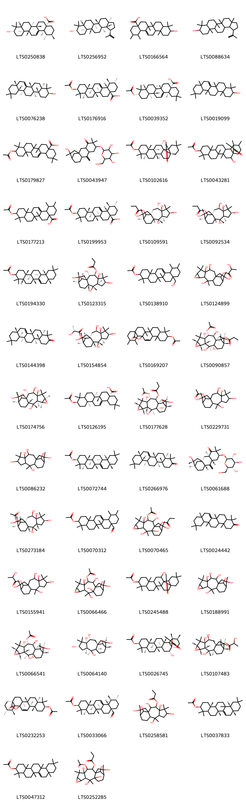{ width=100% }
    <figcaption>Hình ảnh cấu trúc hóa học của 51 hoạt chất thuộc nhóm Prenol lipids gồm ['ursolic acid (LTS0250838)', 'lupeol (LTS0256952)', '10-hydroxy-1,2,6a,6b,9,9,12a-heptamethyl-2,3,4,5,6,7,8,8a,10,11,12,12b,13,14b-tetradecahydro-1h-picene-4a-carboxylic acid (LTS0166564)', 'lupeol (LTS0088634)', 'alnulin (LTS0076238)', '(1s,2r,4as,6as,6br,8ar,10s,12ar,12br,14bs)-10-(acetyloxy)-1,2,6a,6b,9,9,12a-heptamethyl-2,3,4,5,6,7,8,8a,10,11,12,12b,13,14b-tetradecahydro-1h-picene-4a-carboxylic acid (LTS0176916)', '(4as,6as,6br,8ar,10s,12ar,12br,14bs)-10-(acetyloxy)-2,2,6a,6b,9,9,12a-heptamethyl-1,3,4,5,6,7,8,8a,10,11,12,12b,13,14b-tetradecahydropicene-4a-carboxylic acid (LTS0039352)', 'taraxerol (LTS0019099)', '10-(acetyloxy)-2,2,6a,6b,9,9,12a-heptamethyl-1,3,4,5,6,7,8,8a,10,11,12,12b,13,14b-tetradecahydropicene-4a-carboxylic acid (LTS0179827)', '14-hydroxy-5,5,14-trimethyl-9-methylidene-6-{[3,4,5-trihydroxy-6-(hydroxymethyl)oxan-2-yl]oxy}tetracyclo[11.2.1.0¹,¹⁰.0³,⁸]hexadecan-4-one (LTS0043947)', '(1s,4s,5r,8r,10s,13r,14r,16s,17s,18r)-16-hydroxy-4,5,9,9,13,20,20-heptamethyl-23-oxo-24-oxahexacyclo[15.5.2.0¹,¹⁸.0⁴,¹⁷.0⁵,¹⁴.0⁸,¹³]tetracosan-10-yl acetate (LTS0102616)', '2-hydroxy-4,5,9,9,13,19,20-heptamethyl-23-oxo-24-oxahexacyclo[17.3.2.0¹,¹⁸.0⁴,¹⁷.0⁵,¹⁴.0⁸,¹³]tetracosan-10-yl acetate (LTS0043281)', '10-(acetyloxy)-1,2,6a,6b,9,9,12a-heptamethyl-2,3,4,5,6,7,8,8a,10,11,12,12b,13,14b-tetradecahydro-1h-picene-4a-carboxylic acid (LTS0177213)', '(1s,2r,4as,6as,6br,10s,12ar,12br,14bs)-10-(acetyloxy)-1,2,6a,6b,9,9,12a-heptamethyl-2,3,4,5,6,7,8,8a,10,11,12,12b,13,14b-tetradecahydro-1h-picene-4a-carboxylic acid (LTS0199953)', '(1s,3s,4r,6s,8s,9r,10r,13r,14r)-3,4,6,9,14-pentahydroxy-5,5,9,14-tetramethyltetracyclo[11.2.1.0¹,¹⁰.0⁴,⁸]hexadecan-16-yl propanoate (LTS0109591)', '(1s,3r,4r,6s,8s,9r,10r,13r,14r)-3,4,6,9,14-pentahydroxy-5,5,9,14-tetramethyltetracyclo[11.2.1.0¹,¹⁰.0⁴,⁸]hexadecan-16-yl propanoate (LTS0092534)', '(4as,6ar,8ar,12ar,12bs,14ar,14br)-4,4,6a,8a,11,11,12b,14b-octamethyl-1,2,3,4a,5,6,8,9,10,12,12a,13,14,14a-tetradecahydropicen-3-yl acetate (LTS0194330)', '(1r,2s,3r,4r,6s,8s,9r,10r,13r,14r,16r)-2,4,6,9,14,16-hexahydroxy-5,5,9,14-tetramethyltetracyclo[11.2.1.0¹,¹⁰.0⁴,⁸]hexadecan-3-yl propanoate (LTS0123315)', '8a-(hydroxymethyl)-4,4,6a,6b,11,12,14b-heptamethyl-2,3,4a,5,6,7,8,9,10,11,12,12a,14,14a-tetradecahydro-1h-picen-3-yl acetate (LTS0138910)', '3,4,10,15-tetrahydroxy-5,5,10,15-tetramethyl-7-oxapentacyclo[12.2.1.0¹,¹¹.0⁴,⁹.0⁶,⁸]heptadecan-17-yl 2-hydroxypropanoate (LTS0124899)', '(4ar,6ar,8ar,12as,12bs,14ar,14br)-4,4,6a,8a,11,11,12b,14b-octamethyl-2,4a,5,6,8,9,10,12,12a,13,14,14a-dodecahydro-1h-picen-3-one (LTS0144398)', '(1s,3r,4r,6s,8s,9r,10r,13r,14r,16r)-3,4,6,9,14-pentahydroxy-5,5,9,14-tetramethyltetracyclo[11.2.1.0¹,¹⁰.0⁴,⁸]hexadecan-16-yl (2r)-2-hydroxypropanoate (LTS0154854)', '4,5,9,9,13,19,20-heptamethyl-23-oxo-24-oxahexacyclo[15.5.2.0¹,¹⁸.0⁴,¹⁷.0⁵,¹⁴.0⁸,¹³]tetracos-15-en-10-yl acetate (LTS0169207)', '(1s,2s,3r,4r,6r,8s,9r,10s,11s,14r,15r,17r)-3-(acetyloxy)-2,4,10,11,15-pentahydroxy-5,5,10,15-tetramethyl-7-oxapentacyclo[12.2.1.0¹,¹¹.0⁴,⁹.0⁶,⁸]heptadecan-17-yl propanoate (LTS0090857)', '(1r,2s,3r,4r,6r,8s,9s,10r,11r,14r,15r,17r)-5,5,10,15-tetramethyl-7-oxapentacyclo[12.2.1.0¹,¹¹.0⁴,⁹.0⁶,⁸]heptadecane-2,3,4,10,15,17-hexol (LTS0174756)', '(4as,6as,6br,10r,12ar)-10-(acetyloxy)-2,2,6a,6b,9,9,12a-heptamethyl-1,3,4,5,6,7,8,8a,10,11,12,12b,13,14b-tetradecahydropicene-4a-carboxylic acid (LTS0126195)', '(1r,2s,3r,4r,6r,8s,9r,10s,11s,14r,15r,17r)-3-(acetyloxy)-4,10,11,15,17-pentahydroxy-5,5,10,15-tetramethyl-7-oxapentacyclo[12.2.1.0¹,¹¹.0⁴,⁹.0⁶,⁸]heptadecan-2-yl propanoate (LTS0177628)', '3,4,6,9,14-pentahydroxy-5,5,9,14-tetramethyltetracyclo[11.2.1.0¹,¹⁰.0⁴,⁸]hexadecan-16-yl acetate (LTS0229731)', 'grayanotoxin iii (LTS0086232)', '(3s,4ar,6ar,8ar,12ar,12bs,14ar,14br)-4,4,6a,8a,11,11,12b,14b-octamethyl-1,2,3,4a,5,6,8,9,10,12,12a,13,14,14a-tetradecahydropicen-3-yl acetate (LTS0072744)', 'taraxerone (LTS0266976)', '(1r,3r,6s,8s,10r,13r,14r)-14-hydroxy-5,5,14-trimethyl-9-methylidene-6-{[(2r,3r,4s,5s,6r)-3,4,5-trihydroxy-6-(hydroxymethyl)oxan-2-yl]oxy}tetracyclo[11.2.1.0¹,¹⁰.0³,⁸]hexadecan-4-one (LTS0061688)', '(1s,3r,4r,6s,8r,9r,10r,13r,14r,16s)-3,4,6,9,14-pentahydroxy-5,5,9,14-tetramethyltetracyclo[11.2.1.0¹,¹⁰.0⁴,⁸]hexadecan-16-yl acetate (LTS0273184)', '8a-formyl-4,4,6a,6b,11,12,14b-heptamethyl-2,3,4a,5,6,7,8,9,10,11,12,12a,14,14a-tetradecahydro-1h-picen-3-yl acetate (LTS0070312)', '3-(acetyloxy)-2,4,10,11,15-pentahydroxy-5,5,10,15-tetramethyl-7-oxapentacyclo[12.2.1.0¹,¹¹.0⁴,⁹.0⁶,⁸]heptadecan-17-yl propanoate (LTS0070465)', '4,4,6a,8a,11,11,12b,14b-octamethyl-2,4a,5,6,8,9,10,12,12a,13,14,14a-dodecahydro-1h-picen-3-one (LTS0024442)', '3,4,6,9,14-pentahydroxy-5,5,9,14-tetramethyltetracyclo[11.2.1.0¹,¹⁰.0⁴,⁸]hexadecan-16-yl 2-hydroxypropanoate (LTS0155941)', '2,4,10,11,15,17-hexahydroxy-5,5,10,15-tetramethyl-7-oxapentacyclo[12.2.1.0¹,¹¹.0⁴,⁹.0⁶,⁸]heptadecan-3-yl acetate (LTS0066466)', '16-hydroxy-4,5,9,9,13,20,20-heptamethyl-23-oxo-24-oxahexacyclo[15.5.2.0¹,¹⁸.0⁴,¹⁷.0⁵,¹⁴.0⁸,¹³]tetracosan-10-yl acetate (LTS0245488)', '5,5,10,15-tetramethyl-7-oxapentacyclo[12.2.1.0¹,¹¹.0⁴,⁹.0⁶,⁸]heptadecane-2,3,4,10,15,17-hexol (LTS0188991)', '(1r,2s,3r,4r,6r,8s,9r,10s,11s,14r,15r,17r)-2,4,10,11,15,17-hexahydroxy-5,5,10,15-tetramethyl-7-oxapentacyclo[12.2.1.0¹,¹¹.0⁴,⁹.0⁶,⁸]heptadecan-3-yl acetate (LTS0066541)', '(1s,3r,4r,6s,8r,9r,10r,13r,14r,16s)-5,5,9,14-tetramethyltetracyclo[11.2.1.0¹,¹⁰.0⁴,⁸]hexadecane-3,4,6,9,14,16-hexol (LTS0064140)', '(1r,2r,4r,5r,8r,10s,13r,14r,17r,18s,19s,20s)-2-hydroxy-4,5,9,9,13,19,20-heptamethyl-23-oxo-24-oxahexacyclo[17.3.2.0¹,¹⁸.0⁴,¹⁷.0⁵,¹⁴.0⁸,¹³]tetracosan-10-yl acetate (LTS0026745)', '(1s,3s,4s,6r,8s,9s,10s,11r,14r,15r,17r)-3,4,10,15-tetrahydroxy-5,5,10,15-tetramethyl-7-oxapentacyclo[12.2.1.0¹,¹¹.0⁴,⁹.0⁶,⁸]heptadecan-17-yl 2-hydroxypropanoate (LTS0107483)', '(1s,4s,5r,8r,10s,13s,14r,17s,18r,19s,20r)-4,5,9,9,13,19,20-heptamethyl-23-oxo-24-oxahexacyclo[15.5.2.0¹,¹⁸.0⁴,¹⁷.0⁵,¹⁴.0⁸,¹³]tetracos-15-en-10-yl acetate (LTS0232253)', '(3s,4ar,6ar,6bs,8as,11r,12s,12as,14ar,14br)-8a-formyl-4,4,6a,6b,11,12,14b-heptamethyl-2,3,4a,5,6,7,8,9,10,11,12,12a,14,14a-tetradecahydro-1h-picen-3-yl acetate (LTS0033066)', '2,4,6,9,14,16-hexahydroxy-5,5,9,14-tetramethyltetracyclo[11.2.1.0¹,¹⁰.0⁴,⁸]hexadecan-3-yl propanoate (LTS0258581)', '(3s,6ar,8ar,12ar,14br)-4,4,6a,8a,11,11,12b,14b-octamethyl-1,2,3,4a,5,6,8,9,10,12,12a,13,14,14a-tetradecahydropicen-3-yl acetate (LTS0037833)', '4,4,6a,8a,11,11,12b,14b-octamethyl-1,2,3,4a,5,6,8,9,10,12,12a,13,14,14a-tetradecahydropicen-3-yl acetate (LTS0047312)', '3-(acetyloxy)-4,10,11,15,17-pentahydroxy-5,5,10,15-tetramethyl-7-oxapentacyclo[12.2.1.0¹,¹¹.0⁴,⁹.0⁶,⁸]heptadecan-2-yl propanoate (LTS0252285)', '(3s,4ar,6ar,6bs,8as,11r,12s,12as,14ar,14br)-8a-(hydroxymethyl)-4,4,6a,6b,11,12,14b-heptamethyl-2,3,4a,5,6,7,8,9,10,11,12,12a,14,14a-tetradecahydro-1h-picen-3-yl acetate (LTS0093146)'].</figcaption>
</figure>
#### Nhóm Steroids and steroid derivatives
<figure markdown="span">
    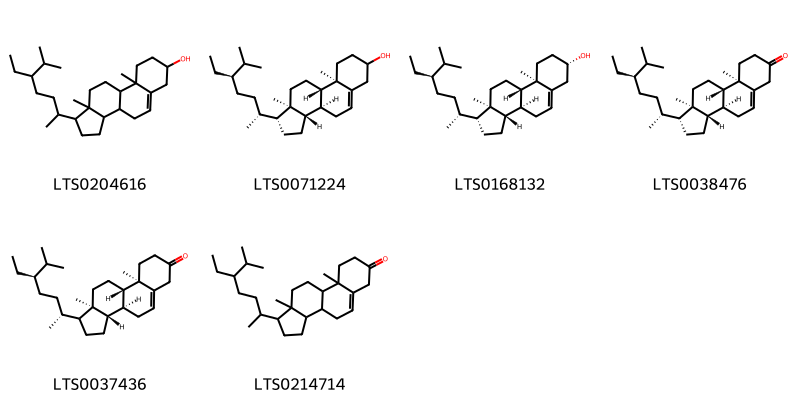{ width=100% }
    <figcaption>Hình ảnh cấu trúc hóa học của 6 hoạt chất thuộc nhóm Steroids and steroid derivatives gồm ['stigmast-5-en-3-ol, (3β)- (LTS0204616)', 'stigmast-5-en-3-ol (LTS0071224)', 'sitosterol (LTS0168132)', '(1r,3as,3bs,9ar,9bs,11ar)-1-[(2r,5r)-5-ethyl-6-methylheptan-2-yl]-9a,11a-dimethyl-1h,2h,3h,3ah,3bh,4h,6h,8h,9h,9bh,10h,11h-cyclopenta[a]phenanthren-7-one (LTS0038476)', '(3as,3bs,9ar,9bs,11ar)-1-[(2r,5r)-5-ethyl-6-methylheptan-2-yl]-9a,11a-dimethyl-1h,2h,3h,3ah,3bh,4h,6h,8h,9h,9bh,10h,11h-cyclopenta[a]phenanthren-7-one (LTS0037436)', '1-(5-ethyl-6-methylheptan-2-yl)-9a,11a-dimethyl-1h,2h,3h,3ah,3bh,4h,6h,8h,9h,9bh,10h,11h-cyclopenta[a]phenanthren-7-one (LTS0214714)'].</figcaption>
</figure>

---

### Dược dân tộc học

Danh sách các quốc gia có sử dụng *Pieris japonica* trong điều trị các bệnh. 

| Country   | Disease   | Bệnh                                                                                                                                                                                                |
|:----------|:----------|:----------------------------------------------------------------------------------------------------------------------------------------------------------------------------------------------------|
| Japan     | Poison    | MYMEMORY WARNING: YOU USED ALL AVAILABLE FREE TRANSLATIONS FOR TODAY. NEXT AVAILABLE IN  01 HOURS 48 MINUTES 49 SECONDS VISIT HTTPS://MYMEMORY.TRANSLATED.NET/DOC/USAGELIMITS.PHP TO TRANSLATE MORE |
| US        | Poison    | MYMEMORY WARNING: YOU USED ALL AVAILABLE FREE TRANSLATIONS FOR TODAY. NEXT AVAILABLE IN  01 HOURS 48 MINUTES 46 SECONDS VISIT HTTPS://MYMEMORY.TRANSLATED.NET/DOC/USAGELIMITS.PHP TO TRANSLATE MORE |

---

---
## Pieris ovalifolia
### Thông tin về thực vật

!!! info "Phân loại thực vật của *Lyonia ovalifolia* từ GIBF:"
    - **Kingdom:** Plantae
    - **Phylum:** Tracheophyta
    - **Order:** Ericales
    - **Family:** Ericaceae
    - **Genus:** Lyonia
    - **Species:** *Lyonia ovalifolia*

 

| Label (VI)   | Label (EN)   | Scientific Name   | Descriptions (VI)   | Descriptions (EN)   | Also Known As (VI)   | Also Known As (EN)   |
|:-------------|:-------------|:------------------|:--------------------|:--------------------|:---------------------|:---------------------|
| N/A          | N/A          | Pieris ovalifolia | loài thực vật       | species of plant    | ['']                 | ['']                 |

#### Phân bố trên thế giới

**Từ CSDL GIBF** nan, Japan, Chinese Taipei, Albania, India, unknown or invalid, United States of America, Viet Nam, Malaysia, China, Nepal

#### Phân bố tại Việt Nam

**Từ CSDL GIBF**: Annam

---
### Thành phần hóa học
        
- Theo cơ sở dữ liệu lotus: Từ loài *Lyonia ovalifolia* đã phân lập và xác định được Chưa có hoạt chất nào được phân lập. hoạt chất thuộc về các nhóm Không có hoạt chất nào được phân lập. 

Không có hình ảnh nào được tạo ra

---

### Dược dân tộc học

Danh sách các quốc gia có sử dụng *Lyonia ovalifolia* trong điều trị các bệnh. 

| Country   | Disease   | Bệnh                                                                                                                                                                                                |
|:----------|:----------|:----------------------------------------------------------------------------------------------------------------------------------------------------------------------------------------------------|
| China     | Tonic     | MYMEMORY WARNING: YOU USED ALL AVAILABLE FREE TRANSLATIONS FOR TODAY. NEXT AVAILABLE IN  01 HOURS 48 MINUTES 04 SECONDS VISIT HTTPS://MYMEMORY.TRANSLATED.NET/DOC/USAGELIMITS.PHP TO TRANSLATE MORE |

---

# Chi Ledum

??? note "Danh sách các dược liệu thuộc chi"
    
	 - *Ledum columbiarum*
	 - *Ledum glandsulosum*
	 - *Ledum groenlandicum*
	 - *Ledum latifolium*
	 - *Ledum palustre*

---
## Ledum columbiarum
### Thông tin về thực vật

!!! info "Phân loại thực vật của *Rhododendron columbianum* từ GIBF:"
    - **Kingdom:** Plantae
    - **Phylum:** Tracheophyta
    - **Order:** Ericales
    - **Family:** Ericaceae
    - **Genus:** Rhododendron
    - **Species:** *Rhododendron columbianum*

 

| Label (VI)   | Label (EN)   | Scientific Name   | Descriptions (VI)   | Descriptions (EN)   | Also Known As (VI)   | Also Known As (EN)   |
|:-------------|:-------------|:------------------|:--------------------|:--------------------|:---------------------|:---------------------|
| N/A          | N/A          | Pieris ovalifolia | loài thực vật       | species of plant    | ['']                 | ['']                 |

#### Phân bố trên thế giới

**Từ CSDL GIBF** nan, United States of America

#### Phân bố tại Việt Nam

**Từ CSDL GIBF**: Không có ghi nhận ở Việt Nam

---
### Thành phần hóa học
        
- Theo cơ sở dữ liệu lotus: Từ loài *Rhododendron columbianum* đã phân lập và xác định được Chưa có hoạt chất nào được phân lập. hoạt chất thuộc về các nhóm Không có hoạt chất nào được phân lập. 

Không có hình ảnh nào được tạo ra

---

### Dược dân tộc học

Danh sách các quốc gia có sử dụng *Rhododendron columbianum* trong điều trị các bệnh. 

| Country   | Disease   | Bệnh                                                                                                                                                                                                |
|:----------|:----------|:----------------------------------------------------------------------------------------------------------------------------------------------------------------------------------------------------|
| US        | Poison    | MYMEMORY WARNING: YOU USED ALL AVAILABLE FREE TRANSLATIONS FOR TODAY. NEXT AVAILABLE IN  01 HOURS 47 MINUTES 41 SECONDS VISIT HTTPS://MYMEMORY.TRANSLATED.NET/DOC/USAGELIMITS.PHP TO TRANSLATE MORE |

---

---
## Ledum glandsulosum
### Thông tin về thực vật

!!! info "Phân loại thực vật của *Rhododendron columbianum* từ GIBF:"
    - **Kingdom:** Plantae
    - **Phylum:** Tracheophyta
    - **Order:** Ericales
    - **Family:** Ericaceae
    - **Genus:** Rhododendron
    - **Species:** *Rhododendron columbianum*

 

| Label (VI)   | Label (EN)   | Scientific Name   | Descriptions (VI)   | Descriptions (EN)   | Also Known As (VI)   | Also Known As (EN)   |
|:-------------|:-------------|:------------------|:--------------------|:--------------------|:---------------------|:---------------------|
| N/A          | N/A          | Pieris ovalifolia | loài thực vật       | species of plant    | ['']                 | ['']                 |

#### Phân bố trên thế giới

**Từ CSDL GIBF** nan, United States of America, Canada, Czechia

#### Phân bố tại Việt Nam

**Từ CSDL GIBF**: Không có ghi nhận ở Việt Nam

---
### Thành phần hóa học
        
- Theo cơ sở dữ liệu lotus: Từ loài *Rhododendron columbianum* đã phân lập và xác định được Chưa có hoạt chất nào được phân lập. hoạt chất thuộc về các nhóm Không có hoạt chất nào được phân lập. 

Không có hình ảnh nào được tạo ra

---

### Dược dân tộc học

Danh sách các quốc gia có sử dụng *Rhododendron columbianum* trong điều trị các bệnh. 

| Country      | Disease   | Bệnh                                                                                                                                                                                                |
|:-------------|:----------|:----------------------------------------------------------------------------------------------------------------------------------------------------------------------------------------------------|
| US           | Poison    | MYMEMORY WARNING: YOU USED ALL AVAILABLE FREE TRANSLATIONS FOR TODAY. NEXT AVAILABLE IN  01 HOURS 47 MINUTES 23 SECONDS VISIT HTTPS://MYMEMORY.TRANSLATED.NET/DOC/USAGELIMITS.PHP TO TRANSLATE MORE |
| US(Flathead) | Collyrium | MYMEMORY WARNING: YOU USED ALL AVAILABLE FREE TRANSLATIONS FOR TODAY. NEXT AVAILABLE IN  01 HOURS 47 MINUTES 22 SECONDS VISIT HTTPS://MYMEMORY.TRANSLATED.NET/DOC/USAGELIMITS.PHP TO TRANSLATE MORE |

---

---
## Ledum groenlandicum
### Thông tin về thực vật

!!! info "Phân loại thực vật của *Rhododendron groenlandicum* từ GIBF:"
    - **Kingdom:** Plantae
    - **Phylum:** Tracheophyta
    - **Order:** Ericales
    - **Family:** Ericaceae
    - **Genus:** Rhododendron
    - **Species:** *Rhododendron groenlandicum*

 

| Label (VI)   | Label (EN)   | Scientific Name     | Descriptions (VI)   | Descriptions (EN)   | Also Known As (VI)   | Also Known As (EN)   |
|:-------------|:-------------|:--------------------|:--------------------|:--------------------|:---------------------|:---------------------|
| N/A          | N/A          | Ledum groenlandicum | loài thực vật       | species of plant    | ['']                 | ['']                 |

#### Phân bố trên thế giới

**Từ CSDL GIBF** nan, Netherlands, Germany, Belgium, Korea, Republic of, Spain, Norway, United States of America, Latvia, Canada

#### Phân bố tại Việt Nam

**Từ CSDL GIBF**: Không có ghi nhận ở Việt Nam

---
### Thành phần hóa học
        
- Theo cơ sở dữ liệu lotus: Từ loài *Rhododendron groenlandicum* đã phân lập và xác định được 11 hoạt chất thuộc về các nhóm Prenol lipids, Steroids and steroid derivatives. 

|    | chemicalTaxonomyClassyfireClass   |   smiles_count |
|---:|:----------------------------------|---------------:|
|  0 | Prenol lipids                     |              6 |
|  1 | Steroids and steroid derivatives  |              5 |

#### Nhóm Prenol lipids
<figure markdown="span">
    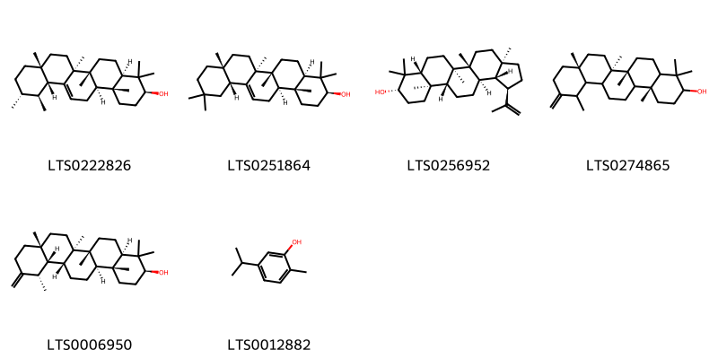{ width=100% }
    <figcaption>Hình ảnh cấu trúc hóa học của 6 hoạt chất thuộc nhóm Prenol lipids gồm ['amyrin (LTS0222826)', 'β-amyrin (LTS0251864)', 'lupeol (LTS0256952)', '(6ar,6br,8ar,14br)-4,4,6a,6b,8a,12,14b-heptamethyl-11-methylidene-hexadecahydropicen-3-ol (LTS0274865)', 'taraxasterol (LTS0006950)', 'carvacrol (LTS0012882)'].</figcaption>
</figure>
#### Nhóm Steroids and steroid derivatives
<figure markdown="span">
    { width=100% }
    <figcaption>Hình ảnh cấu trúc hóa học của 5 hoạt chất thuộc nhóm Steroids and steroid derivatives gồm ['stigmast-5-en-3-ol (LTS0071224)', 'stigmast-5-en-3-ol, (3β)- (LTS0204616)', 'phytosterol (LTS0029311)', '(1r,3as,3bs,7s,9bs)-1-[(2r,5r)-5,6-dimethylheptan-2-yl]-9a,11a-dimethyl-1h,2h,3h,3ah,3bh,4h,6h,7h,8h,9h,9bh,10h,11h-cyclopenta[a]phenanthren-7-ol (LTS0057877)', 'campesterol (LTS0046755)'].</figcaption>
</figure>

---

### Dược dân tộc học

Danh sách các quốc gia có sử dụng *Rhododendron groenlandicum* trong điều trị các bệnh. 

| Country   | Disease   | Bệnh                                                                                                                                                                                                |
|:----------|:----------|:----------------------------------------------------------------------------------------------------------------------------------------------------------------------------------------------------|
| Elsewhere | Narcotic  | MYMEMORY WARNING: YOU USED ALL AVAILABLE FREE TRANSLATIONS FOR TODAY. NEXT AVAILABLE IN  01 HOURS 47 MINUTES 00 SECONDS VISIT HTTPS://MYMEMORY.TRANSLATED.NET/DOC/USAGELIMITS.PHP TO TRANSLATE MORE |

---

---
## Ledum latifolium
### Thông tin về thực vật

!!! info "Phân loại thực vật của *Rhododendron groenlandicum* từ GIBF:"
    - **Kingdom:** Plantae
    - **Phylum:** Tracheophyta
    - **Order:** Ericales
    - **Family:** Ericaceae
    - **Genus:** Rhododendron
    - **Species:** *Rhododendron groenlandicum*

 

| Label (VI)   | Label (EN)   | Scientific Name   | Descriptions (VI)   | Descriptions (EN)   | Also Known As (VI)   | Also Known As (EN)   |
|:-------------|:-------------|:------------------|:--------------------|:--------------------|:---------------------|:---------------------|
| N/A          | N/A          | Ledum latifolium  | loài thực vật       | species of plant    | ['']                 | ['']                 |

#### Phân bố trên thế giới

**Từ CSDL GIBF** nan, Greenland, Germany, Belgium, unknown or invalid, United States of America, Canada

#### Phân bố tại Việt Nam

**Từ CSDL GIBF**: Không có ghi nhận ở Việt Nam

---
### Thành phần hóa học
        
- Theo cơ sở dữ liệu lotus: Từ loài *Rhododendron groenlandicum* đã phân lập và xác định được Chưa có hoạt chất nào được phân lập. hoạt chất thuộc về các nhóm Không có hoạt chất nào được phân lập. 

Không có hình ảnh nào được tạo ra

---

### Dược dân tộc học

Danh sách các quốc gia có sử dụng *Rhododendron groenlandicum* trong điều trị các bệnh. 

| Country   | Disease                          | Bệnh                                                                                                                                                                                                |
|:----------|:---------------------------------|:----------------------------------------------------------------------------------------------------------------------------------------------------------------------------------------------------|
| Turkey    | Diuretic, Expectorant, Sudorific | MYMEMORY WARNING: YOU USED ALL AVAILABLE FREE TRANSLATIONS FOR TODAY. NEXT AVAILABLE IN  01 HOURS 46 MINUTES 23 SECONDS VISIT HTTPS://MYMEMORY.TRANSLATED.NET/DOC/USAGELIMITS.PHP TO TRANSLATE MORE |

---

---
## Ledum palustre
### Thông tin về thực vật

!!! info "Phân loại thực vật của *N/A* từ GIBF:"
    - **Kingdom:** Plantae
    - **Phylum:** Tracheophyta
    - **Order:** Ericales
    - **Family:** Ericaceae
    - **Genus:** Rhododendron
    - **Species:** *N/A*

 

| Label (VI)   | Label (EN)   | Scientific Name   | Descriptions (VI)   | Descriptions (EN)   | Also Known As (VI)   | Also Known As (EN)   |
|:-------------|:-------------|:------------------|:--------------------|:--------------------|:---------------------|:---------------------|
| N/A          | N/A          | Ledum palustre    | loài thực vật       | species of plant    | ['']                 | ['']                 |

#### Phân bố trên thế giới

**Từ CSDL GIBF** Sri Lanka, Italy, Japan, Belgium, Georgia, Guatemala, Canada, Réunion, Chinese Taipei, Spain, Russian Federation, United States of America, Finland, Hong Kong, Thailand, Bhutan, Austria, France, Viet Nam, United Kingdom of Great Britain and Northern Ireland, Ireland, India

#### Phân bố tại Việt Nam

**Từ CSDL GIBF**: Thừa Thiên - Huế

---
### Thành phần hóa học
        
- Theo cơ sở dữ liệu lotus: Từ loài *N/A* đã phân lập và xác định được 95 hoạt chất thuộc về các nhóm Fatty Acyls, Flavonoids, Prenol lipids, Steroids and steroid derivatives, Oxepanes, Benzofurans, Dioxanes, Heteroaromatic compounds, Organooxygen compounds, Coumarins and derivatives, Carboxylic acids and derivatives. 

|    | chemicalTaxonomyClassyfireClass   |   smiles_count |
|---:|:----------------------------------|---------------:|
|  0 | Benzofurans                       |              2 |
|  1 | Carboxylic acids and derivatives  |              2 |
|  2 | Coumarins and derivatives         |             11 |
|  3 | Dioxanes                          |              2 |
|  4 | Fatty Acyls                       |              4 |
|  5 | Flavonoids                        |              5 |
|  6 | Heteroaromatic compounds          |              1 |
|  7 | Organooxygen compounds            |              7 |
|  8 | Oxepanes                          |              2 |
|  9 | Prenol lipids                     |             55 |
| 10 | Steroids and steroid derivatives  |              2 |

#### Nhóm Benzofurans
<figure markdown="span">
    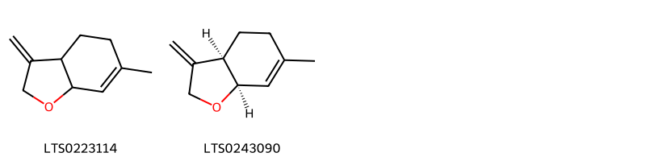{ width=100% }
    <figcaption>Hình ảnh cấu trúc hóa học của 2 hoạt chất thuộc nhóm Benzofurans gồm ['6-methyl-3-methylidene-3a,4,5,7a-tetrahydro-2h-1-benzofuran (LTS0223114)', '(3ar,7ar)-6-methyl-3-methylidene-3a,4,5,7a-tetrahydro-2h-1-benzofuran (LTS0243090)'].</figcaption>
</figure>
#### Nhóm Carboxylic acids and derivatives
<figure markdown="span">
    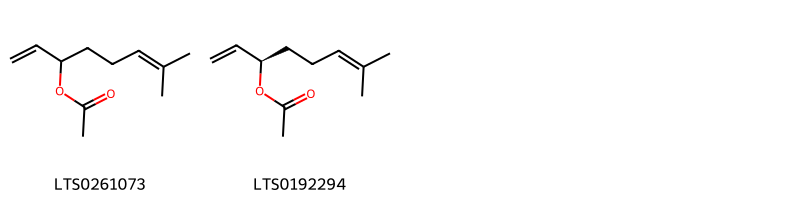{ width=100% }
    <figcaption>Hình ảnh cấu trúc hóa học của 2 hoạt chất thuộc nhóm Carboxylic acids and derivatives gồm ['7-methylocta-1,6-dien-3-yl acetate (LTS0261073)', '(3r)-7-methylocta-1,6-dien-3-yl acetate (LTS0192294)'].</figcaption>
</figure>
#### Nhóm Coumarins and derivatives
<figure markdown="span">
    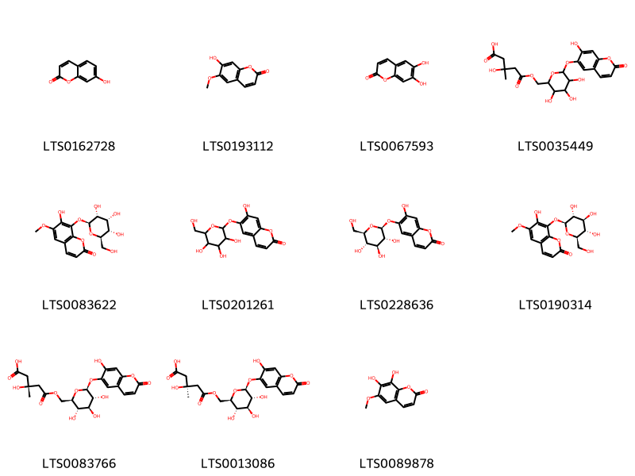{ width=100% }
    <figcaption>Hình ảnh cấu trúc hóa học của 11 hoạt chất thuộc nhóm Coumarins and derivatives gồm ['umbelliferone (LTS0162728)', 'scopoletin (LTS0193112)', 'esculetin (LTS0067593)', '3-hydroxy-3-methyl-5-oxo-5-({3,4,5-trihydroxy-6-[(7-hydroxy-2-oxochromen-6-yl)oxy]oxan-2-yl}methoxy)pentanoic acid (LTS0035449)', 'fraxin (LTS0083622)', 'esculin (LTS0201261)', 'esculin (LTS0228636)', 'fraxin (LTS0190314)', '(3r)-3-hydroxy-3-methyl-5-oxo-5-{[(2r,3s,4s,5r,6s)-3,4,5-trihydroxy-6-[(7-hydroxy-2-oxochromen-6-yl)oxy]oxan-2-yl]methoxy}pentanoic acid (LTS0083766)', '(3s)-3-hydroxy-3-methyl-5-oxo-5-{[(2r,3s,4s,5r,6s)-3,4,5-trihydroxy-6-[(7-hydroxy-2-oxochromen-6-yl)oxy]oxan-2-yl]methoxy}pentanoic acid (LTS0013086)', 'fraxetin (LTS0089878)'].</figcaption>
</figure>
#### Nhóm Dioxanes
<figure markdown="span">
    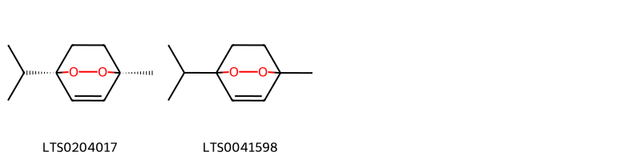{ width=100% }
    <figcaption>Hình ảnh cấu trúc hóa học của 2 hoạt chất thuộc nhóm Dioxanes gồm ['(1s,4s)-1-isopropyl-4-methyl-2,3-dioxabicyclo[2.2.2]oct-5-ene (LTS0204017)', 'ascaridole (LTS0041598)'].</figcaption>
</figure>
#### Nhóm Fatty Acyls
<figure markdown="span">
    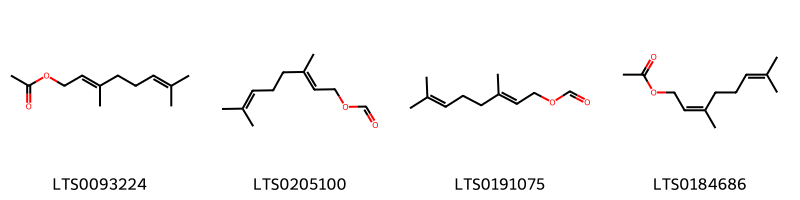{ width=100% }
    <figcaption>Hình ảnh cấu trúc hóa học của 4 hoạt chất thuộc nhóm Fatty Acyls gồm ['geranyl acetate (LTS0093224)', '3,7-dimethylocta-2,6-dien-1-yl formate (LTS0205100)', 'geranyl formate (LTS0191075)', '3,7-dimethylocta-2,6-dien-1-yl acetate (LTS0184686)'].</figcaption>
</figure>
#### Nhóm Flavonoids
<figure markdown="span">
    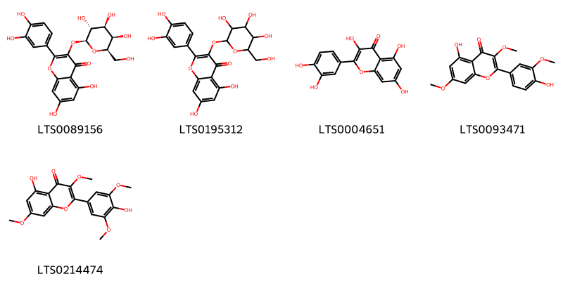{ width=100% }
    <figcaption>Hình ảnh cấu trúc hóa học của 5 hoạt chất thuộc nhóm Flavonoids gồm ['hyperoside (LTS0089156)', '2-(3,4-dihydroxyphenyl)-5,7-dihydroxy-3-{[3,4,5-trihydroxy-6-(hydroxymethyl)oxan-2-yl]oxy}chromen-4-one (LTS0195312)', 'quercetin (LTS0004651)', 'pachypodol (LTS0093471)', '5-hydroxy-2-(4-hydroxy-3,5-dimethoxyphenyl)-3,7-dimethoxychromen-4-one (LTS0214474)'].</figcaption>
</figure>
#### Nhóm Heteroaromatic compounds
<figure markdown="span">
    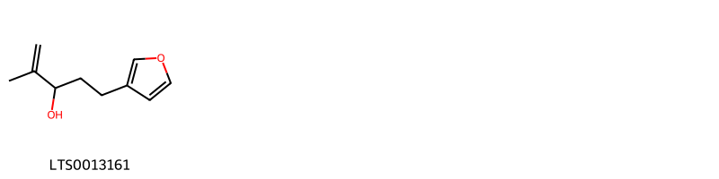{ width=100% }
    <figcaption>Hình ảnh cấu trúc hóa học của 1 hoạt chất thuộc nhóm Heteroaromatic compounds gồm ['5-(furan-3-yl)-2-methylpent-1-en-3-ol (LTS0013161)'].</figcaption>
</figure>
#### Nhóm Organooxygen compounds
<figure markdown="span">
    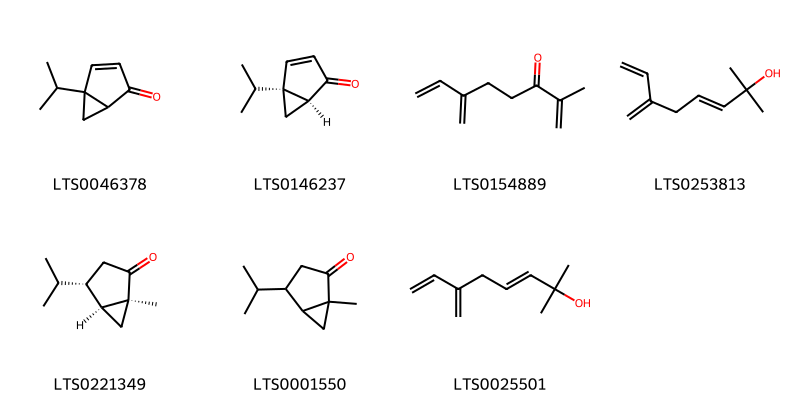{ width=100% }
    <figcaption>Hình ảnh cấu trúc hóa học của 7 hoạt chất thuộc nhóm Organooxygen compounds gồm ['5-isopropylbicyclo[3.1.0]hex-3-en-2-one (LTS0046378)', '(1s,5r)-5-isopropylbicyclo[3.1.0]hex-3-en-2-one (LTS0146237)', '2-methyl-6-methylideneocta-1,7-dien-3-one (LTS0154889)', '(3e)-2-methyl-6-methylideneocta-3,7-dien-2-ol (LTS0253813)', '(1s,4s,5s)-4-isopropyl-1-methylbicyclo[3.1.0]hexan-2-one (LTS0221349)', '4-isopropyl-1-methylbicyclo[3.1.0]hexan-2-one (LTS0001550)', '2-methyl-6-methylideneocta-3,7-dien-2-ol (LTS0025501)'].</figcaption>
</figure>
#### Nhóm Oxepanes
<figure markdown="span">
    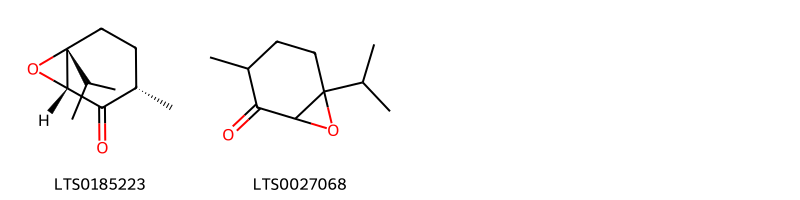{ width=100% }
    <figcaption>Hình ảnh cấu trúc hóa học của 2 hoạt chất thuộc nhóm Oxepanes gồm ['(1r,3s,6s)-6-isopropyl-3-methyl-7-oxabicyclo[4.1.0]heptan-2-one (LTS0185223)', '6-isopropyl-3-methyl-7-oxabicyclo[4.1.0]heptan-2-one (LTS0027068)'].</figcaption>
</figure>
#### Nhóm Prenol lipids
<figure markdown="span">
    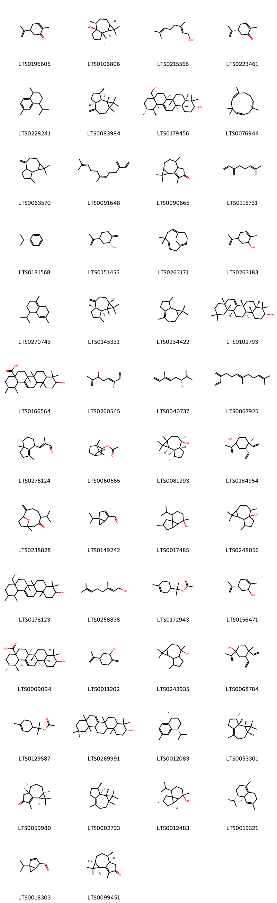{ width=100% }
    <figcaption>Hình ảnh cấu trúc hóa học của 55 hoạt chất thuộc nhóm Prenol lipids gồm ['carvone (LTS0196605)', '(1ar,4s,4as,7r,7as,7br)-1,1,4,7-tetramethyl-octahydro-1ah-cyclopropa[e]azulen-4a-ol (LTS0106806)', '3,7-dimethyl-2,6-octadien-1-ol (LTS0215566)', '(-)-carvone (LTS0223461)', '(e)-calamene (LTS0228241)', '(1ar,4as,7r,7ar,7bs)-1,1,7-trimethyl-4-methylidene-octahydro-1ah-cyclopropa[e]azulene (LTS0083984)', '(3s,4ar,6ar,6bs,8as,11r,12s,12ar,14ar,14br)-8a-(hydroxymethyl)-4,4,6a,6b,11,12,14b-heptamethyl-2,3,4a,5,6,7,8,9,10,11,12,12a,14,14a-tetradecahydro-1h-picen-3-ol (LTS0179456)', 'α-humulene (LTS0076944)', '1,1,7-trimethyl-4-methylidene-octahydro-1ah-cyclopropa[e]azulene (LTS0063570)', 'β-farnesene (LTS0091648)', '1,1,4,7-tetramethyl-1ah,2h,3h,4h,4ah,5h,7bh-cyclopropa[e]azulen-6-one (LTS0090665)', 'α-myrcene (LTS0115731)', 'cymene (LTS0181568)', '(1r,5s)-2-methylidene-5-(prop-1-en-2-yl)cyclohexan-1-ol (LTS0151455)', 'humulene (LTS0263171)', 'carveol (LTS0263183)', '4-isopropyl-1,6-dimethyl-2,3,4,4a,7,8-hexahydronaphthalene (LTS0270743)', '(1as,4ar,7as,7br)-1,1,7-trimethyl-4-methylidene-octahydro-1ah-cyclopropa[e]azulene (LTS0145331)', '1,1,4,7-tetramethyl-1ah,2h,3h,5h,6h,7h,7ah,7bh-cyclopropa[e]azulene (LTS0234422)', '(3s,4ar,6ar,8ar,12as,12bs,14ar,14br)-4,4,6a,8a,11,11,12a,14b-octamethyl-1,2,3,4a,5,6,8,9,10,12,12b,13,14,14a-tetradecahydropicen-3-ol (LTS0102793)', '10-hydroxy-1,2,6a,6b,9,9,12a-heptamethyl-2,3,4,5,6,7,8,8a,10,11,12,12b,13,14b-tetradecahydro-1h-picene-4a-carboxylic acid (LTS0166564)', '2,6-dimethylocta-1,5,7-trien-3-ol (LTS0260545)', '(3r,5e)-2,6-dimethylocta-1,5,7-trien-3-ol (LTS0040737)', 'β-farnesene (LTS0067925)', 'valerenal (LTS0276124)', 'bornyl acetate (LTS0060565)', '(1ar,4r,4as,7s,7as,7br)-1,1,4,7-tetramethyl-octahydro-1ah-cyclopropa[e]azulen-4-ol (LTS0081293)', '(1r,3s,4s)-3,4-diethenyl-4-methyl-1-(prop-1-en-2-yl)cyclohexan-1-ol (LTS0184954)', '4-isopropyl-1-methyl-7-methylidene-11-oxabicyclo[6.2.1]undecan-3-one (LTS0238828)', '5-isopropylbicyclo[3.1.0]hex-2-ene-2-carbaldehyde (LTS0149242)', '10-isopropyl-3,7-dimethyltricyclo[4.4.0.0¹,⁵]decan-7-ol (LTS0017485)', '1,1,4,7-tetramethyl-octahydro-1ah-cyclopropa[e]azulen-4a-ol (LTS0248056)', '8a-(hydroxymethyl)-4,4,6a,6b,11,12,14b-heptamethyl-2,3,4a,5,6,7,8,9,10,11,12,12a,14,14a-tetradecahydro-1h-picen-3-ol (LTS0178123)', 'geraniol (LTS0258838)', 'α-terpinyl acetate (LTS0172943)', '(-)-trans-carveol (LTS0156471)', '(1s,2r,4as,6as,6br,8ar,10s,12ar,12br,14br)-10-hydroxy-1,2,6a,6b,9,9,12a-heptamethyl-2,3,4,5,6,7,8,8a,10,11,12,12b,13,14b-tetradecahydro-1h-picene-4a-carboxylic acid (LTS0009094)', '2-methylidene-5-(prop-1-en-2-yl)cyclohexan-1-ol (LTS0011202)', 'ledol (LTS0243935)', '3,4-diethenyl-4-methyl-1-(prop-1-en-2-yl)cyclohexan-1-ol (LTS0068784)', '(+)-α-terpinyl acetate (LTS0129587)', '4,4,6a,8a,11,11,12a,14b-octamethyl-1,2,3,4a,5,6,8,9,10,12,12b,13,14,14a-tetradecahydropicen-3-ol (LTS0269991)', '(1r,4r)-4-isopropyl-1,6-dimethyl-1,2,3,4-tetrahydronaphthalene (LTS0012083)', '(1ar,7s,7ar,7br)-1,1,4,7-tetramethyl-1ah,2h,3h,5h,6h,7h,7ah,7bh-cyclopropa[e]azulene (LTS0053301)', '(1ar,4r,4ar,7bs)-1,1,4,7-tetramethyl-1ah,2h,3h,4h,4ah,5h,7bh-cyclopropa[e]azulen-6-one (LTS0059980)', 'leden (LTS0002793)', '(1s,3s,5r,6r,7s,10r)-10-isopropyl-3,7-dimethyltricyclo[4.4.0.0¹,⁵]decan-7-ol (LTS0012483)', 'delta-cadinene (LTS0019321)', '5-isopropylbicyclo[3.1.0]hex-3-ene-2-carbaldehyde (LTS0018303)', '(1as,4r,4ar,7br)-1,1,4,7-tetramethyl-1ah,2h,3h,4h,4ah,5h,7bh-cyclopropa[e]azulen-6-one (LTS0099451)', '(1s,2r,5s)-5-isopropylbicyclo[3.1.0]hex-3-ene-2-carbaldehyde (LTS0030053)', '(1s,5r)-2-methylidene-5-(prop-1-en-2-yl)cyclohexan-1-ol (LTS0231939)', '(1ar,4r,7r,7bs)-1,1,4,7-tetramethyl-octahydro-1ah-cyclopropa[e]azulen-4-ol (LTS0248407)', '(+)-bornyl acetate (LTS0048529)', '(1r,4r,8s)-4-isopropyl-1-methyl-7-methylidene-11-oxabicyclo[6.2.1]undecan-3-one (LTS0034358)'].</figcaption>
</figure>
#### Nhóm Steroids and steroid derivatives
<figure markdown="span">
    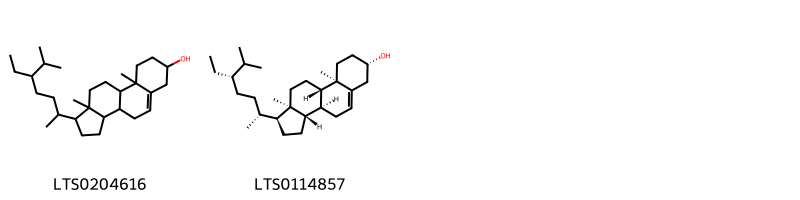{ width=100% }
    <figcaption>Hình ảnh cấu trúc hóa học của 2 hoạt chất thuộc nhóm Steroids and steroid derivatives gồm ['stigmast-5-en-3-ol, (3β)- (LTS0204616)', '(1s,3as,3bs,7s,9ar,9bs,11ar)-1-[(2r,5s)-5-ethyl-6-methylheptan-2-yl]-9a,11a-dimethyl-1h,2h,3h,3ah,3bh,4h,6h,7h,8h,9h,9bh,10h,11h-cyclopenta[a]phenanthren-7-ol (LTS0114857)'].</figcaption>
</figure>

---

### Dược dân tộc học

Danh sách các quốc gia có sử dụng *N/A* trong điều trị các bệnh. 

| Country   | Disease                                                | Bệnh                                                                                                                                                                                                |
|:----------|:-------------------------------------------------------|:----------------------------------------------------------------------------------------------------------------------------------------------------------------------------------------------------|
| Elsewhere | Diuretic, Expectorant                                  | MYMEMORY WARNING: YOU USED ALL AVAILABLE FREE TRANSLATIONS FOR TODAY. NEXT AVAILABLE IN  01 HOURS 46 MINUTES 04 SECONDS VISIT HTTPS://MYMEMORY.TRANSLATED.NET/DOC/USAGELIMITS.PHP TO TRANSLATE MORE |
| Turkey    | Diuretic, Expectorant, Narcotic, Poison, Abortifacient | MYMEMORY WARNING: YOU USED ALL AVAILABLE FREE TRANSLATIONS FOR TODAY. NEXT AVAILABLE IN  01 HOURS 46 MINUTES 01 SECONDS VISIT HTTPS://MYMEMORY.TRANSLATED.NET/DOC/USAGELIMITS.PHP TO TRANSLATE MORE |

---

# Chi Calluna

??? note "Danh sách các dược liệu thuộc chi"
    
	 - *Calluna vulgaris*

---
## Calluna vulgaris
### Thông tin về thực vật

!!! info "Phân loại thực vật của *Calluna vulgaris* từ GIBF:"
    - **Kingdom:** Plantae
    - **Phylum:** Tracheophyta
    - **Order:** Ericales
    - **Family:** Ericaceae
    - **Genus:** Calluna
    - **Species:** *Calluna vulgaris*

 

| Label (VI)   | Label (EN)   | Scientific Name   | Descriptions (VI)   | Descriptions (EN)   | Also Known As (VI)   | Also Known As (EN)                                        |
|:-------------|:-------------|:------------------|:--------------------|:--------------------|:---------------------|:----------------------------------------------------------|
| N/A          | N/A          | Calluna vulgaris  |                     | species of plant    | ['']                 | ['heather', 'ling', 'Scotch heather', 'Scottish heather'] |

#### Phân bố trên thế giới

**Từ CSDL GIBF** Denmark, Netherlands, Italy, Germany, Belgium, New Zealand, Spain, Poland, Ireland, Portugal, Russian Federation, Morocco, United States of America, Sweden, Austria, France, United Kingdom of Great Britain and Northern Ireland, Canada

#### Phân bố tại Việt Nam

**Từ CSDL GIBF**: Không có ghi nhận ở Việt Nam

---
### Thành phần hóa học
        
- Theo cơ sở dữ liệu lotus: Từ loài *Calluna vulgaris* đã phân lập và xác định được 65 hoạt chất thuộc về các nhóm Flavonoids, Prenol lipids, Steroids and steroid derivatives, Cinnamic acids and derivatives, Benzene and substituted derivatives, Organooxygen compounds, Phenols, Benzopyrans. 

|    | chemicalTaxonomyClassyfireClass     |   smiles_count |
|---:|:------------------------------------|---------------:|
|  0 | Benzene and substituted derivatives |              1 |
|  1 | Benzopyrans                         |              1 |
|  2 | Cinnamic acids and derivatives      |              2 |
|  3 | Flavonoids                          |             47 |
|  4 | Organooxygen compounds              |              6 |
|  5 | Phenols                             |              1 |
|  6 | Prenol lipids                       |              4 |
|  7 | Steroids and steroid derivatives    |              2 |

#### Nhóm Benzene and substituted derivatives
<figure markdown="span">
    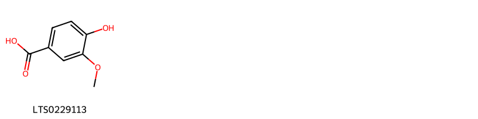{ width=100% }
    <figcaption>Hình ảnh cấu trúc hóa học của 1 hoạt chất thuộc nhóm Benzene and substituted derivatives gồm ['vanillic acid (LTS0229113)'].</figcaption>
</figure>
#### Nhóm Benzopyrans
<figure markdown="span">
    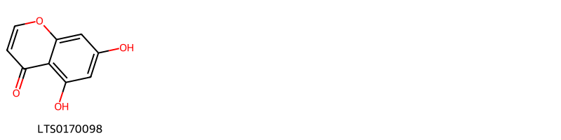{ width=100% }
    <figcaption>Hình ảnh cấu trúc hóa học của 1 hoạt chất thuộc nhóm Benzopyrans gồm ['5,7-dihydroxychromone (LTS0170098)'].</figcaption>
</figure>
#### Nhóm Cinnamic acids and derivatives
<figure markdown="span">
    { width=100% }
    <figcaption>Hình ảnh cấu trúc hóa học của 2 hoạt chất thuộc nhóm Cinnamic acids and derivatives gồm ['ferulic acid (LTS0077328)', '3,4-dihydroxycinnamic acid (LTS0128050)'].</figcaption>
</figure>
#### Nhóm Flavonoids
<figure markdown="span">
    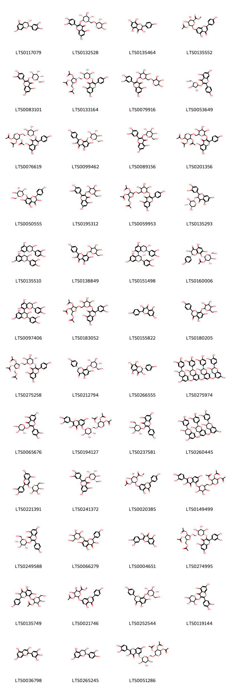{ width=100% }
    <figcaption>Hình ảnh cấu trúc hóa học của 47 hoạt chất thuộc nhóm Flavonoids gồm ['(+)-catechol (LTS0117079)', '2-(3,4-dihydroxyphenyl)-5,7-dihydroxy-3-{[(2s,3r,4s,5s,6r)-3,4,5-trihydroxy-6-({[(2s,3r,4s,5s)-3,4,5-trihydroxyoxan-2-yl]oxy}methyl)oxan-2-yl]oxy}chromen-4-one (LTS0132528)', '3,5,7,8-tetrahydroxy-2-(4-hydroxyphenyl)-2,3-dihydro-1-benzopyran-4-one (LTS0135464)', 'methyl (2s,3s,4s,5r,6s)-5-(acetyloxy)-3,4-dihydroxy-6-{[5-hydroxy-2-(4-hydroxyphenyl)-4-oxochromen-7-yl]oxy}oxane-2-carboxylate (LTS0135552)', '2-(3,4-dihydroxyphenyl)-5,7-dihydroxy-3-{[(2r,3s,4r,5s,6s)-3,4,5-trihydroxy-6-(hydroxymethyl)oxan-2-yl]oxy}chromen-4-one (LTS0083101)', '[(2s,3s,4r,5r)-3,4-bis(acetyloxy)-5-{[(2r,3s,4s,5r,6s)-6-{[5,7-dihydroxy-2-(4-hydroxyphenyl)-4-oxochromen-3-yl]oxy}-3,4,5-trihydroxyoxan-2-yl]methoxy}oxolan-2-yl]methyl acetate (LTS0133164)', '2-(3,4-dihydroxyphenyl)-5,7-dihydroxy-3-[(3,4,5-trihydroxy-6-{[(3,4,5-trihydroxyoxan-2-yl)oxy]methyl}oxan-2-yl)oxy]chromen-4-one (LTS0079916)', 'juglanin (LTS0053649)', '(2r,3r,4s,5s)-4,5-bis(acetyloxy)-2-{[(2r,3s,4s,5r,6s)-6-{[5,7-dihydroxy-2-(4-hydroxyphenyl)-4-oxochromen-3-yl]oxy}-3,4,5-trihydroxyoxan-2-yl]methoxy}oxan-3-yl acetate (LTS0076619)', '3,5,7-trihydroxy-2-(4-hydroxyphenyl)-8-{[(2r,3s,4r,5r,6s)-3,4,5-trihydroxy-6-(hydroxymethyl)oxan-2-yl]oxy}chromen-4-one (LTS0099462)', 'hyperoside (LTS0089156)', '4,5-bis(acetyloxy)-2-[(6-{[5,7-dihydroxy-2-(4-hydroxyphenyl)-4-oxochromen-3-yl]oxy}-3,4,5-trihydroxyoxan-2-yl)methoxy]oxan-3-yl acetate (LTS0201356)', '(2s,3r)-3,5,7-trihydroxy-2-(4-hydroxyphenyl)-8-{[(2s,3r,4s,5s,6r)-3,4,5-trihydroxy-6-(hydroxymethyl)oxan-2-yl]oxy}-2,3-dihydro-1-benzopyran-4-one (LTS0050555)', '2-(3,4-dihydroxyphenyl)-5,7-dihydroxy-3-{[3,4,5-trihydroxy-6-(hydroxymethyl)oxan-2-yl]oxy}chromen-4-one (LTS0195312)', '[3,4-bis(acetyloxy)-5-[(6-{[5,7-dihydroxy-2-(4-hydroxyphenyl)-4-oxochromen-3-yl]oxy}-3,4,5-trihydroxyoxan-2-yl)methoxy]oxolan-2-yl]methyl acetate (LTS0059953)', '2-(3,4-dihydroxyphenyl)-5,7-dihydroxy-3-{[(2s,3r,4s,5r)-3,4,5-trihydroxyoxan-2-yl]oxy}-2,3-dihydro-1-benzopyran-4-one (LTS0135293)', '(2r,3r,4r)-2-(3,4-dihydroxyphenyl)-4-[(2r,3r)-2-(3,4-dihydroxyphenyl)-3,5,7-trihydroxy-3,4-dihydro-2h-1-benzopyran-8-yl]-3,4-dihydro-2h-1-benzopyran-3,5,7-triol (LTS0135510)', '3,5,7-trihydroxy-2-(4-hydroxyphenyl)-8-{[3,4,5-trihydroxy-6-(hydroxymethyl)oxan-2-yl]oxy}chromen-4-one (LTS0138849)', '(2r,3s,4s)-2-(3,4-dihydroxyphenyl)-4-[(2r,3s)-2-(3,4-dihydroxyphenyl)-3,5,7-trihydroxy-3,4-dihydro-2h-1-benzopyran-8-yl]-3,4-dihydro-2h-1-benzopyran-3,5,7-triol (LTS0151498)', '(2s,3r,4s,5s,6r)-4,5-dihydroxy-6-(hydroxymethyl)-2-{[(2r,3r)-3,5,7-trihydroxy-2-(4-hydroxyphenyl)-4-oxo-2,3-dihydro-1-benzopyran-8-yl]oxy}oxan-3-yl acetate (LTS0160006)', '(2r,3r)-2-(3,4-dihydroxyphenyl)-4-[(2r,3r)-2-(3,4-dihydroxyphenyl)-3,5,7-trihydroxy-3,4-dihydro-2h-1-benzopyran-8-yl]-3,4-dihydro-2h-1-benzopyran-3,5,7-triol (LTS0097406)', '[3,4-bis(acetyloxy)-5-[(6-{[2-(3,4-dihydroxyphenyl)-5,7-dihydroxy-4-oxochromen-3-yl]oxy}-3,4,5-trihydroxyoxan-2-yl)methoxy]oxolan-2-yl]methyl acetate (LTS0183052)', 'kaempherol (LTS0155822)', '5,7-dihydroxy-2-(4-hydroxyphenyl)-8-{[3,4,5-trihydroxy-6-(hydroxymethyl)oxan-2-yl]oxy}-2,3-dihydro-1-benzopyran-4-one (LTS0180205)', '[(2r,3s,4r,5r)-3,4-bis(acetyloxy)-5-{[(2s,3s,4r,5s,6s)-6-{[5,7-dihydroxy-2-(4-hydroxyphenyl)-4-oxochromen-3-yl]oxy}-3,4,5-trihydroxyoxan-2-yl]methoxy}oxolan-2-yl]methyl acetate (LTS0275258)', '(2r)-5,7-dihydroxy-2-(4-hydroxyphenyl)-8-{[(2s,3r,4s,5s,6r)-3,4,5-trihydroxy-6-(hydroxymethyl)oxan-2-yl]oxy}-2,3-dihydro-1-benzopyran-4-one (LTS0212794)', '(2r,3r)-3,5,7,8-tetrahydroxy-2-(4-hydroxyphenyl)-2,3-dihydro-1-benzopyran-4-one (LTS0266555)', '(2r,3r,4r)-2-(3,4-dihydroxyphenyl)-8-[(2r,3r,4r)-2-(3,4-dihydroxyphenyl)-3,5,7-trihydroxy-3,4-dihydro-2h-1-benzopyran-4-yl]-4-[(2r,3r,4s)-2-(3,4-dihydroxyphenyl)-4-[(2r,3r)-2-(3,4-dihydroxyphenyl)-3,5,7-trihydroxy-3,4-dihydro-2h-1-benzopyran-8-yl]-3,5,7-trihydroxy-3,4-dihydro-2h-1-benzopyran-8-yl]-3,4-dihydro-2h-1-benzopyran-3,5,7-triol (LTS0275974)', 'guaijaverin (LTS0065676)', '(2r,3r,4s,5s)-4,5-bis(acetyloxy)-2-{[(2r,3r,4s,5r,6s)-6-{[2-(3,4-dihydroxyphenyl)-3,7-dihydroxy-4-oxochromen-5-yl]oxy}-3,4,5-trihydroxyoxan-2-yl]methoxy}oxan-3-yl acetate (LTS0194127)', 'trifolin (LTS0237581)', 'procyanidin c1 (LTS0260445)', 'chrysanthemin (LTS0221391)', '2-(3,4-dihydroxyphenyl)-5,7-dihydroxy-3-{[(2s,3r,4r,5r,6s)-3,4,5-trihydroxy-6-(hydroxymethyl)oxan-2-yl]oxy}chromen-4-one (LTS0241372)', 'methyl (2s,3s,4s,5s,6s)-5-(acetyloxy)-3,4-dihydroxy-6-{[5-hydroxy-2-(4-hydroxyphenyl)-4-oxochromen-7-yl]oxy}oxane-2-carboxylate (LTS0020385)', '4,5-bis(acetyloxy)-2-[(6-{[2-(3,4-dihydroxyphenyl)-3,7-dihydroxy-4-oxochromen-5-yl]oxy}-3,4,5-trihydroxyoxan-2-yl)methoxy]oxan-3-yl acetate (LTS0149499)', 'astragalin (LTS0249588)', '3,5,7-trihydroxy-2-(4-hydroxyphenyl)-8-{[3,4,5-trihydroxy-6-(hydroxymethyl)oxan-2-yl]oxy}-2,3-dihydro-1-benzopyran-4-one (LTS0066279)', 'quercetin (LTS0004651)', '[(2s,3s,4r,5r)-3,4-bis(acetyloxy)-5-{[(2r,3s,4s,5r,6s)-6-{[2-(3,4-dihydroxyphenyl)-5,7-dihydroxy-4-oxochromen-3-yl]oxy}-3,4,5-trihydroxyoxan-2-yl]methoxy}oxolan-2-yl]methyl acetate (LTS0274995)', '4,5-dihydroxy-6-(hydroxymethyl)-2-{[3,5,7-trihydroxy-2-(4-hydroxyphenyl)-4-oxo-2,3-dihydro-1-benzopyran-8-yl]oxy}oxan-3-yl acetate (LTS0135749)', 'methyl 5-(acetyloxy)-3,4-dihydroxy-6-{[5-hydroxy-2-(4-hydroxyphenyl)-4-oxochromen-7-yl]oxy}oxane-2-carboxylate (LTS0021746)', '(2s)-5,7-dihydroxy-2-(4-hydroxyphenyl)-8-{[(2s,3r,4s,5s,6r)-3,4,5-trihydroxy-6-(hydroxymethyl)oxan-2-yl]oxy}-2,3-dihydro-1-benzopyran-4-one (LTS0252544)', 'guaijaverin (LTS0119144)', 'delphinidin (LTS0036798)', 'ent-epicatechin (LTS0265245)', '(2r,3r,4s,5s)-4,5-bis(acetyloxy)-2-{[(2r,3s,4s,5r,6s)-6-{[2-(3,4-dihydroxyphenyl)-3,7-dihydroxy-4-oxochromen-5-yl]oxy}-3,4,5-trihydroxyoxan-2-yl]methoxy}oxan-3-yl acetate (LTS0051286)'].</figcaption>
</figure>
#### Nhóm Organooxygen compounds
<figure markdown="span">
    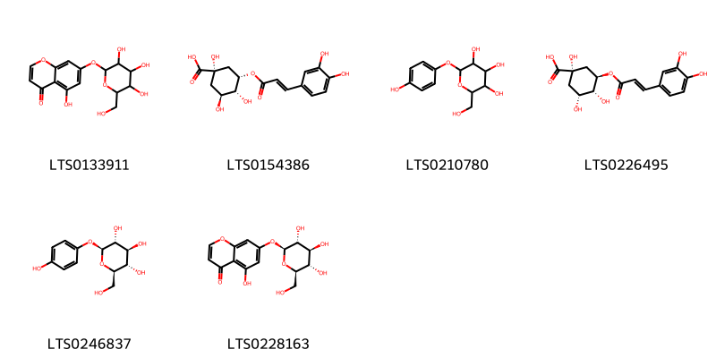{ width=100% }
    <figcaption>Hình ảnh cấu trúc hóa học của 6 hoạt chất thuộc nhóm Organooxygen compounds gồm ['5-hydroxy-7-{[3,4,5-trihydroxy-6-(hydroxymethyl)oxan-2-yl]oxy}chromen-4-one (LTS0133911)', '(1s,3s,4r,5s)-3-{[(2e)-3-(3,4-dihydroxyphenyl)prop-2-enoyl]oxy}-1,4,5-trihydroxycyclohexane-1-carboxylic acid (LTS0154386)', 'arbutin (LTS0210780)', 'chlorogenic acid (LTS0226495)', 'β-arbutin (LTS0246837)', '5-hydroxy-7-{[(2s,3r,4s,5s,6r)-3,4,5-trihydroxy-6-(hydroxymethyl)oxan-2-yl]oxy}chromen-4-one (LTS0228163)'].</figcaption>
</figure>
#### Nhóm Phenols
<figure markdown="span">
    { width=100% }
    <figcaption>Hình ảnh cấu trúc hóa học của 1 hoạt chất thuộc nhóm Phenols gồm ['orcinol (LTS0230426)'].</figcaption>
</figure>
#### Nhóm Prenol lipids
<figure markdown="span">
    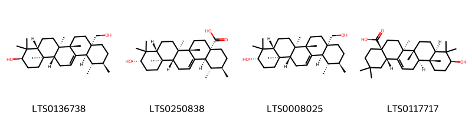{ width=100% }
    <figcaption>Hình ảnh cấu trúc hóa học của 4 hoạt chất thuộc nhóm Prenol lipids gồm ['urs-12-ene-3β,28-diol (LTS0136738)', 'ursolic acid (LTS0250838)', 'uvaol (LTS0008025)', 'oleanolic acid (LTS0117717)'].</figcaption>
</figure>
#### Nhóm Steroids and steroid derivatives
<figure markdown="span">
    { width=100% }
    <figcaption>Hình ảnh cấu trúc hóa học của 2 hoạt chất thuộc nhóm Steroids and steroid derivatives gồm ['stigmast-5-en-3-ol (LTS0071224)', 'stigmast-5-en-3-ol, (3β)- (LTS0204616)'].</figcaption>
</figure>

---

### Dược dân tộc học

Danh sách các quốc gia có sử dụng *Calluna vulgaris* trong điều trị các bệnh. 

| Country   | Disease                                              | Bệnh                                                                                                                                                                                                |
|:----------|:-----------------------------------------------------|:----------------------------------------------------------------------------------------------------------------------------------------------------------------------------------------------------|
| Elsewhere | Astringent, Diuretic, Sedative                       | MYMEMORY WARNING: YOU USED ALL AVAILABLE FREE TRANSLATIONS FOR TODAY. NEXT AVAILABLE IN  01 HOURS 45 MINUTES 15 SECONDS VISIT HTTPS://MYMEMORY.TRANSLATED.NET/DOC/USAGELIMITS.PHP TO TRANSLATE MORE |
| Turkey    | Antiseptic, Astringent, Diuretic, Narcotic, Sedative | MYMEMORY WARNING: YOU USED ALL AVAILABLE FREE TRANSLATIONS FOR TODAY. NEXT AVAILABLE IN  01 HOURS 45 MINUTES 13 SECONDS VISIT HTTPS://MYMEMORY.TRANSLATED.NET/DOC/USAGELIMITS.PHP TO TRANSLATE MORE |
| ain       | Diuretic                                             | MYMEMORY WARNING: YOU USED ALL AVAILABLE FREE TRANSLATIONS FOR TODAY. NEXT AVAILABLE IN  01 HOURS 45 MINUTES 10 SECONDS VISIT HTTPS://MYMEMORY.TRANSLATED.NET/DOC/USAGELIMITS.PHP TO TRANSLATE MORE |

---

# Chi Arctostaphylos

??? note "Danh sách các dược liệu thuộc chi"
    
	 - *Arctostaphylos arguta*
	 - *Arctostaphylos pungens*
	 - *Arctostaphylos uva-ursi*

---
## Arctostaphylos arguta
### Thông tin về thực vật

!!! info "Phân loại thực vật của *Comarostaphylis discolor* từ GIBF:"
    - **Kingdom:** Plantae
    - **Phylum:** Tracheophyta
    - **Order:** Ericales
    - **Family:** Ericaceae
    - **Genus:** Comarostaphylis
    - **Species:** *Comarostaphylis discolor*

 

| Label (VI)   | Label (EN)   | Scientific Name   | Descriptions (VI)   | Descriptions (EN)   | Also Known As (VI)   | Also Known As (EN)                                        |
|:-------------|:-------------|:------------------|:--------------------|:--------------------|:---------------------|:----------------------------------------------------------|
| N/A          | N/A          | Calluna vulgaris  |                     | species of plant    | ['']                 | ['heather', 'ling', 'Scotch heather', 'Scottish heather'] |

#### Phân bố trên thế giới

**Từ CSDL GIBF** nan, Mexico

#### Phân bố tại Việt Nam

**Từ CSDL GIBF**: Không có ghi nhận ở Việt Nam

---
### Thành phần hóa học
        
- Theo cơ sở dữ liệu lotus: Từ loài *Comarostaphylis discolor* đã phân lập và xác định được Chưa có hoạt chất nào được phân lập. hoạt chất thuộc về các nhóm Không có hoạt chất nào được phân lập. 

Không có hình ảnh nào được tạo ra

---

### Dược dân tộc học

Danh sách các quốc gia có sử dụng *Comarostaphylis discolor* trong điều trị các bệnh. 

| Country   | Disease                                                                                | Bệnh                                                                                                                                                                                                |
|:----------|:---------------------------------------------------------------------------------------|:----------------------------------------------------------------------------------------------------------------------------------------------------------------------------------------------------|
| Elsewhere | Narcotic                                                                               | MYMEMORY WARNING: YOU USED ALL AVAILABLE FREE TRANSLATIONS FOR TODAY. NEXT AVAILABLE IN  01 HOURS 44 MINUTES 23 SECONDS VISIT HTTPS://MYMEMORY.TRANSLATED.NET/DOC/USAGELIMITS.PHP TO TRANSLATE MORE |
| Mexico    | Astringent, Astringent, Hypnotic, Purgative, Soporific, Hypnotic, Purgative, Soporific | MYMEMORY WARNING: YOU USED ALL AVAILABLE FREE TRANSLATIONS FOR TODAY. NEXT AVAILABLE IN  01 HOURS 44 MINUTES 21 SECONDS VISIT HTTPS://MYMEMORY.TRANSLATED.NET/DOC/USAGELIMITS.PHP TO TRANSLATE MORE |

---

---
## Arctostaphylos pungens
### Thông tin về thực vật

!!! info "Phân loại thực vật của *Arctostaphylos pungens* từ GIBF:"
    - **Kingdom:** Plantae
    - **Phylum:** Tracheophyta
    - **Order:** Ericales
    - **Family:** Ericaceae
    - **Genus:** Arctostaphylos
    - **Species:** *Arctostaphylos pungens*

 

| Label (VI)   | Label (EN)   | Scientific Name        | Descriptions (VI)   | Descriptions (EN)   | Also Known As (VI)   | Also Known As (EN)   |
|:-------------|:-------------|:-----------------------|:--------------------|:--------------------|:---------------------|:---------------------|
| N/A          | N/A          | Arctostaphylos pungens | loài thực vật       | species of plant    | ['']                 | ['']                 |

#### Phân bố trên thế giới

**Từ CSDL GIBF** nan, United States of America, Mexico

#### Phân bố tại Việt Nam

**Từ CSDL GIBF**: Không có ghi nhận ở Việt Nam

---
### Thành phần hóa học
        
- Theo cơ sở dữ liệu lotus: Từ loài *Arctostaphylos pungens* đã phân lập và xác định được Chưa có hoạt chất nào được phân lập. hoạt chất thuộc về các nhóm Không có hoạt chất nào được phân lập. 

Không có hình ảnh nào được tạo ra

---

### Dược dân tộc học

Danh sách các quốc gia có sử dụng *Arctostaphylos pungens* trong điều trị các bệnh. 

| Country   | Disease                                  | Bệnh                                                                                                                                                                                                |
|:----------|:-----------------------------------------|:----------------------------------------------------------------------------------------------------------------------------------------------------------------------------------------------------|
| Mexico    | Diuretic, Diuretic, Diuretic, Astringent | MYMEMORY WARNING: YOU USED ALL AVAILABLE FREE TRANSLATIONS FOR TODAY. NEXT AVAILABLE IN  01 HOURS 44 MINUTES 06 SECONDS VISIT HTTPS://MYMEMORY.TRANSLATED.NET/DOC/USAGELIMITS.PHP TO TRANSLATE MORE |

---

---
## Arctostaphylos uvaursi
### Thông tin về thực vật

!!! info "Phân loại thực vật của *Arctostaphylos uva-ursi* từ GIBF:"
    - **Kingdom:** Plantae
    - **Phylum:** Tracheophyta
    - **Order:** Ericales
    - **Family:** Ericaceae
    - **Genus:** Arctostaphylos
    - **Species:** *Arctostaphylos uva-ursi*

 

| Label (VI)   | Label (EN)   | Scientific Name        | Descriptions (VI)   | Descriptions (EN)   | Also Known As (VI)   | Also Known As (EN)   |
|:-------------|:-------------|:-----------------------|:--------------------|:--------------------|:---------------------|:---------------------|
| N/A          | N/A          | Arctostaphylos pungens | loài thực vật       | species of plant    | ['']                 | ['']                 |

#### Phân bố trên thế giới

**Từ CSDL GIBF** Denmark, Italy, Guatemala, Iceland, Spain, Switzerland, United States of America, Sweden, Austria, France, Norway, United Kingdom of Great Britain and Northern Ireland, Canada

#### Phân bố tại Việt Nam

**Từ CSDL GIBF**: Không có ghi nhận ở Việt Nam

---
### Thành phần hóa học
        
- Theo cơ sở dữ liệu lotus: Từ loài *Arctostaphylos uva-ursi* đã phân lập và xác định được Chưa có hoạt chất nào được phân lập. hoạt chất thuộc về các nhóm Không có hoạt chất nào được phân lập. 

Không có hình ảnh nào được tạo ra

---

### Dược dân tộc học

Danh sách các quốc gia có sử dụng *Arctostaphylos uva-ursi* trong điều trị các bệnh. 

| Country          | Disease                                                       | Bệnh                                                                                                                                                                                                |
|:-----------------|:--------------------------------------------------------------|:----------------------------------------------------------------------------------------------------------------------------------------------------------------------------------------------------|
| Canada(Kwakiutl) | Narcotic                                                      | MYMEMORY WARNING: YOU USED ALL AVAILABLE FREE TRANSLATIONS FOR TODAY. NEXT AVAILABLE IN  01 HOURS 43 MINUTES 44 SECONDS VISIT HTTPS://MYMEMORY.TRANSLATED.NET/DOC/USAGELIMITS.PHP TO TRANSLATE MORE |
| Canada(Salish)   | Narcotic                                                      | MYMEMORY WARNING: YOU USED ALL AVAILABLE FREE TRANSLATIONS FOR TODAY. NEXT AVAILABLE IN  01 HOURS 43 MINUTES 42 SECONDS VISIT HTTPS://MYMEMORY.TRANSLATED.NET/DOC/USAGELIMITS.PHP TO TRANSLATE MORE |
| Elsewhere        | Antiseptic, Astringent, Diuretic, Tonic, Diuretic, Astringent | MYMEMORY WARNING: YOU USED ALL AVAILABLE FREE TRANSLATIONS FOR TODAY. NEXT AVAILABLE IN  01 HOURS 43 MINUTES 40 SECONDS VISIT HTTPS://MYMEMORY.TRANSLATED.NET/DOC/USAGELIMITS.PHP TO TRANSLATE MORE |
| Turkey           | Astringent, Antiseptic, Demulcent, Tonic                      | MYMEMORY WARNING: YOU USED ALL AVAILABLE FREE TRANSLATIONS FOR TODAY. NEXT AVAILABLE IN  01 HOURS 43 MINUTES 38 SECONDS VISIT HTTPS://MYMEMORY.TRANSLATED.NET/DOC/USAGELIMITS.PHP TO TRANSLATE MORE |
| ain              | Antiseptic                                                    | MYMEMORY WARNING: YOU USED ALL AVAILABLE FREE TRANSLATIONS FOR TODAY. NEXT AVAILABLE IN  01 HOURS 43 MINUTES 35 SECONDS VISIT HTTPS://MYMEMORY.TRANSLATED.NET/DOC/USAGELIMITS.PHP TO TRANSLATE MORE |

---

# Chi Moneses

??? note "Danh sách các dược liệu thuộc chi"
    
	 - *Moneses uniflora*

---
## Moneses uniflora
### Thông tin về thực vật

!!! info "Phân loại thực vật của *Moneses uniflora* từ GIBF:"
    - **Kingdom:** Plantae
    - **Phylum:** Tracheophyta
    - **Order:** Ericales
    - **Family:** Ericaceae
    - **Genus:** Moneses
    - **Species:** *Moneses uniflora*

 

| Label (VI)   | Label (EN)   | Scientific Name   | Descriptions (VI)   | Descriptions (EN)   | Also Known As (VI)   | Also Known As (EN)               |
|:-------------|:-------------|:------------------|:--------------------|:--------------------|:---------------------|:---------------------------------|
| N/A          | N/A          | Moneses uniflora  | loài thực vật       | species of plant    | ['']                 | ['single delight', 'wood nymph'] |

#### Phân bố trên thế giới

**Từ CSDL GIBF** nan, Italy, Slovakia, Norway, Canada, Ukraine, Denmark, Belarus, Chinese Taipei, Spain, Russian Federation, United States of America, Sweden, Finland, Slovenia, Czechia, Germany, Romania, North Macedonia, Switzerland, Austria, France, Poland

#### Phân bố tại Việt Nam

**Từ CSDL GIBF**: Không có ghi nhận ở Việt Nam

---
### Thành phần hóa học
        
- Theo cơ sở dữ liệu lotus: Từ loài *Moneses uniflora* đã phân lập và xác định được 3 hoạt chất thuộc về các nhóm Naphthalenes. 

|    | chemicalTaxonomyClassyfireClass   |   smiles_count |
|---:|:----------------------------------|---------------:|
|  0 | Naphthalenes                      |              3 |

#### Nhóm Naphthalenes
<figure markdown="span">
    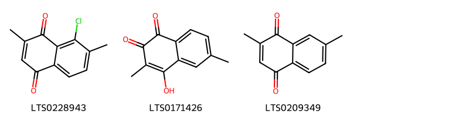{ width=100% }
    <figcaption>Hình ảnh cấu trúc hóa học của 3 hoạt chất thuộc nhóm Naphthalenes gồm ['8-chloro-2,7-dimethylnaphthalene-1,4-dione (LTS0228943)', '4-hydroxy-3,6-dimethylnaphthalene-1,2-dione (LTS0171426)', 'chimaphilin (LTS0209349)'].</figcaption>
</figure>

---

### Dược dân tộc học

Danh sách các quốc gia có sử dụng *Moneses uniflora* trong điều trị các bệnh. 

| Country          | Disease               | Bệnh                                                                                                                                                                                                |
|:-----------------|:----------------------|:----------------------------------------------------------------------------------------------------------------------------------------------------------------------------------------------------|
| Canada(Kwakiutl) | Vesicant              | MYMEMORY WARNING: YOU USED ALL AVAILABLE FREE TRANSLATIONS FOR TODAY. NEXT AVAILABLE IN  01 HOURS 43 MINUTES 13 SECONDS VISIT HTTPS://MYMEMORY.TRANSLATED.NET/DOC/USAGELIMITS.PHP TO TRANSLATE MORE |
| Canada(Nootka)   | Poultice, Suppurative | MYMEMORY WARNING: YOU USED ALL AVAILABLE FREE TRANSLATIONS FOR TODAY. NEXT AVAILABLE IN  01 HOURS 43 MINUTES 11 SECONDS VISIT HTTPS://MYMEMORY.TRANSLATED.NET/DOC/USAGELIMITS.PHP TO TRANSLATE MORE |
| US(Makah)        | Vesicant              | MYMEMORY WARNING: YOU USED ALL AVAILABLE FREE TRANSLATIONS FOR TODAY. NEXT AVAILABLE IN  01 HOURS 43 MINUTES 08 SECONDS VISIT HTTPS://MYMEMORY.TRANSLATED.NET/DOC/USAGELIMITS.PHP TO TRANSLATE MORE |

---

# Chi Rhododendron

??? note "Danh sách các dược liệu thuộc chi"
    
	 - *Rhododendron anthopogon*
	 - *Rhododendron arboreum*
	 - *Rhododendron barbatum*
	 - *Rhododendron campanulatum*
	 - *Rhododendron canadensis*
	 - *Rhododendron chrysanthum*
	 - *Rhododendron cinnabarinum*
	 - *Rhododendron falconeri*
	 - *Rhododendron ferrugineum*
	 - *Rhododendron fortunei*
	 - *Rhododendron indicum*
	 - *Rhododendron japonicum*
	 - *Rhododendron lepidotum*
	 - *Rhododendron metternichii*
	 - *Rhododendron molle*
	 - *Rhododendron ponticum*
	 - *Rhododendron sinense*

---
## Rhododendron anthopogon
### Thông tin về thực vật

!!! info "Phân loại thực vật của *Rhododendron anthopogon* từ GIBF:"
    - **Kingdom:** Plantae
    - **Phylum:** Tracheophyta
    - **Order:** Ericales
    - **Family:** Ericaceae
    - **Genus:** Rhododendron
    - **Species:** *Rhododendron anthopogon*

 

| Label (VI)   | Label (EN)   | Scientific Name         | Descriptions (VI)   | Descriptions (EN)   | Also Known As (VI)   | Also Known As (EN)   |
|:-------------|:-------------|:------------------------|:--------------------|:--------------------|:---------------------|:---------------------|
| N/A          | N/A          | Rhododendron anthopogon | loài thực vật       | species of plant    | ['']                 | ['']                 |

#### Phân bố trên thế giới

**Từ CSDL GIBF** nan, Pakistan, Bhutan, India, United States of America, China, Canada, Nepal

#### Phân bố tại Việt Nam

**Từ CSDL GIBF**: Không có ghi nhận ở Việt Nam

---
### Thành phần hóa học
        
- Theo cơ sở dữ liệu lotus: Từ loài *Rhododendron anthopogon* đã phân lập và xác định được 28 hoạt chất thuộc về các nhóm Flavonoids, Prenol lipids, Steroids and steroid derivatives, Benzene and substituted derivatives, Benzopyrans. 

|    | chemicalTaxonomyClassyfireClass     |   smiles_count |
|---:|:------------------------------------|---------------:|
|  0 | Benzene and substituted derivatives |              7 |
|  1 | Benzopyrans                         |              7 |
|  2 | Flavonoids                          |              1 |
|  3 | Prenol lipids                       |             12 |
|  4 | Steroids and steroid derivatives    |              1 |

#### Nhóm Benzene and substituted derivatives
<figure markdown="span">
    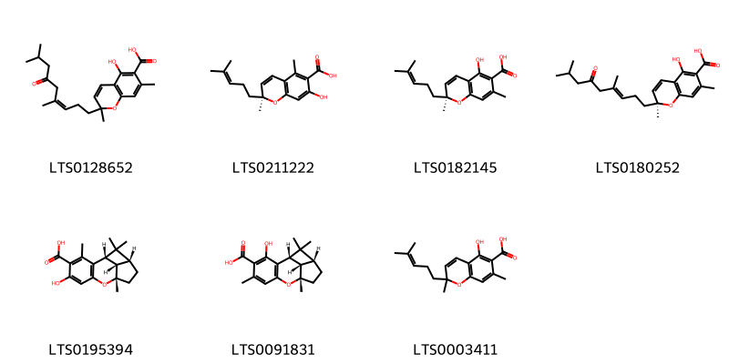{ width=100% }
    <figcaption>Hình ảnh cấu trúc hóa học của 7 hoạt chất thuộc nhóm Benzene and substituted derivatives gồm ['2-(4,8-dimethyl-6-oxonon-3-en-1-yl)-5-hydroxy-2,7-dimethylchromene-6-carboxylic acid (LTS0128652)', '(2s)-7-hydroxy-2,5-dimethyl-2-(4-methylpent-3-en-1-yl)chromene-6-carboxylic acid (LTS0211222)', '(2s)-5-hydroxy-2,7-dimethyl-2-(4-methylpent-3-en-1-yl)chromene-6-carboxylic acid (LTS0182145)', '(2s)-2-[(3e)-4,8-dimethyl-6-oxonon-3-en-1-yl]-5-hydroxy-2,7-dimethylchromene-6-carboxylic acid (LTS0180252)', '(1s,9s,12r,14s)-5-hydroxy-3,9,13,13-tetramethyl-8-oxatetracyclo[7.4.1.0²,⁷.0¹²,¹⁴]tetradeca-2(7),3,5-triene-4-carboxylic acid (LTS0195394)', '(1s,9s,12r,14s)-3-hydroxy-5,9,13,13-tetramethyl-8-oxatetracyclo[7.4.1.0²,⁷.0¹²,¹⁴]tetradeca-2(7),3,5-triene-4-carboxylic acid (LTS0091831)', '5-hydroxy-2,7-dimethyl-2-(4-methylpent-3-en-1-yl)chromene-6-carboxylic acid (LTS0003411)'].</figcaption>
</figure>
#### Nhóm Benzopyrans
<figure markdown="span">
    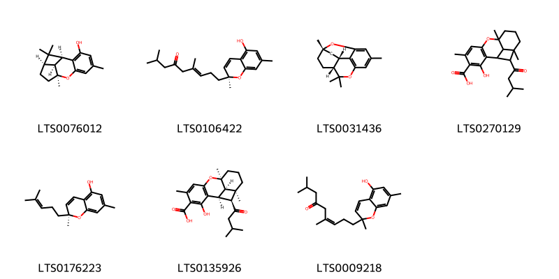{ width=100% }
    <figcaption>Hình ảnh cấu trúc hóa học của 7 hoạt chất thuộc nhóm Benzopyrans gồm ['(1s,9s,12r,14s)-5,9,13,13-tetramethyl-8-oxatetracyclo[7.4.1.0²,⁷.0¹²,¹⁴]tetradeca-2,4,6-trien-3-ol (LTS0076012)', '(6e)-9-[(2s)-5-hydroxy-2,7-dimethylchromen-2-yl]-2,6-dimethylnon-6-en-4-one (LTS0106422)', '(1s,4r,13s)-1,5,5,9-tetramethyl-6,15-dioxatetracyclo[9.3.1.0⁴,¹³.0⁷,¹²]pentadeca-7(12),8,10-triene (LTS0031436)', '3-hydroxy-5,9,13-trimethyl-14-(3-methylbutanoyl)-8-oxatetracyclo[7.5.1.0²,⁷.0¹³,¹⁵]pentadeca-2(7),3,5-triene-4-carboxylic acid (LTS0270129)', '(2s)-2,7-dimethyl-2-(4-methylpent-3-en-1-yl)chromen-5-ol (LTS0176223)', 'anthopogochromane (LTS0135926)', '9-(5-hydroxy-2,7-dimethylchromen-2-yl)-2,6-dimethylnon-6-en-4-one (LTS0009218)'].</figcaption>
</figure>
#### Nhóm Flavonoids
<figure markdown="span">
    { width=100% }
    <figcaption>Hình ảnh cấu trúc hóa học của 1 hoạt chất thuộc nhóm Flavonoids gồm ['3-rutinosyl quercetin (LTS0032845)'].</figcaption>
</figure>
#### Nhóm Prenol lipids
<figure markdown="span">
    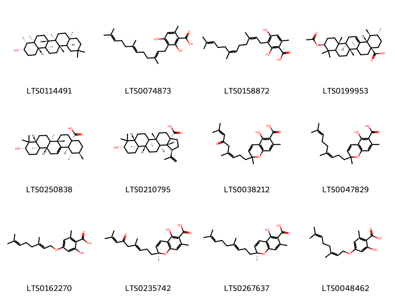{ width=100% }
    <figcaption>Hình ảnh cấu trúc hóa học của 12 hoạt chất thuộc nhóm Prenol lipids gồm ['epi-friedelanol (LTS0114491)', 'grifolic acid (LTS0074873)', '2,4-dihydroxy-6-methyl-3-(3,7,11-trimethyldodeca-2,6,10-trien-1-yl)benzoic acid (LTS0158872)', '(1s,2r,4as,6as,6br,10s,12ar,12br,14bs)-10-(acetyloxy)-1,2,6a,6b,9,9,12a-heptamethyl-2,3,4,5,6,7,8,8a,10,11,12,12b,13,14b-tetradecahydro-1h-picene-4a-carboxylic acid (LTS0199953)', 'ursolic acid (LTS0250838)', 'betulinic acid (LTS0210795)', '2-(4,8-dimethyl-6-oxonona-3,7-dien-1-yl)-5-hydroxy-2,7-dimethylchromene-6-carboxylic acid (LTS0038212)', '2-(4,8-dimethylnona-3,7-dien-1-yl)-5-hydroxy-2,7-dimethylchromene-6-carboxylic acid (LTS0047829)', '4-{[(2e)-3,7-dimethylocta-2,6-dien-1-yl]oxy}-2-hydroxy-6-methylbenzoic acid (LTS0162270)', '(2s)-2-[(3e)-4,8-dimethyl-6-oxonona-3,7-dien-1-yl]-5-hydroxy-2,7-dimethylchromene-6-carboxylic acid (LTS0235742)', '(2s)-2-[(3e)-4,8-dimethylnona-3,7-dien-1-yl]-5-hydroxy-2,7-dimethylchromene-6-carboxylic acid (LTS0267637)', '4-[(3,7-dimethylocta-2,6-dien-1-yl)oxy]-2-hydroxy-6-methylbenzoic acid (LTS0048462)'].</figcaption>
</figure>
#### Nhóm Steroids and steroid derivatives
<figure markdown="span">
    { width=100% }
    <figcaption>Hình ảnh cấu trúc hóa học của 1 hoạt chất thuộc nhóm Steroids and steroid derivatives gồm ['stigmast-5-en-3-ol, (3β)- (LTS0204616)'].</figcaption>
</figure>

---

### Dược dân tộc học

Danh sách các quốc gia có sử dụng *Rhododendron anthopogon* trong điều trị các bệnh. 

| Country   | Disease   | Bệnh                                                                                                                                                                                                |
|:----------|:----------|:----------------------------------------------------------------------------------------------------------------------------------------------------------------------------------------------------|
| India     | Stimulant | MYMEMORY WARNING: YOU USED ALL AVAILABLE FREE TRANSLATIONS FOR TODAY. NEXT AVAILABLE IN  01 HOURS 42 MINUTES 45 SECONDS VISIT HTTPS://MYMEMORY.TRANSLATED.NET/DOC/USAGELIMITS.PHP TO TRANSLATE MORE |

---

---
## Rhododendron arboreum
### Thông tin về thực vật

!!! info "Phân loại thực vật của *Rhododendron arboreum* từ GIBF:"
    - **Kingdom:** Plantae
    - **Phylum:** Tracheophyta
    - **Order:** Ericales
    - **Family:** Ericaceae
    - **Genus:** Rhododendron
    - **Species:** *Rhododendron arboreum*

 

| Label (VI)   | Label (EN)   | Scientific Name       | Descriptions (VI)   | Descriptions (EN)   | Also Known As (VI)   | Also Known As (EN)                        |
|:-------------|:-------------|:----------------------|:--------------------|:--------------------|:---------------------|:------------------------------------------|
| N/A          | N/A          | Rhododendron arboreum |                     | species of plant    | ['']                 | ['burans', 'gurans', 'tree rhododendron'] |

#### Phân bố trên thế giới

**Từ CSDL GIBF** Sri Lanka, South Africa, Thailand, Bhutan, India, China, France, New Zealand, Nepal

#### Phân bố tại Việt Nam

**Từ CSDL GIBF**: Không có ghi nhận ở Việt Nam

---
### Thành phần hóa học
        
- Theo cơ sở dữ liệu lotus: Từ loài *Rhododendron arboreum* đã phân lập và xác định được 4 hoạt chất thuộc về các nhóm Flavonoids, Prenol lipids. 

|    | chemicalTaxonomyClassyfireClass   |   smiles_count |
|---:|:----------------------------------|---------------:|
|  0 | Flavonoids                        |              2 |
|  1 | Prenol lipids                     |              1 |

#### Nhóm Flavonoids
<figure markdown="span">
    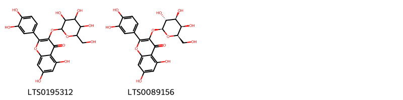{ width=100% }
    <figcaption>Hình ảnh cấu trúc hóa học của 2 hoạt chất thuộc nhóm Flavonoids gồm ['2-(3,4-dihydroxyphenyl)-5,7-dihydroxy-3-{[3,4,5-trihydroxy-6-(hydroxymethyl)oxan-2-yl]oxy}chromen-4-one (LTS0195312)', 'hyperoside (LTS0089156)'].</figcaption>
</figure>
#### Nhóm Prenol lipids
<figure markdown="span">
    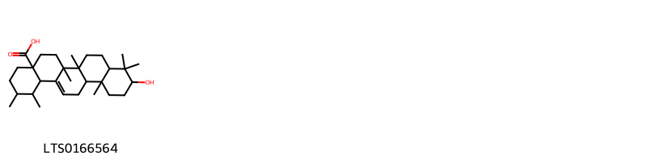{ width=100% }
    <figcaption>Hình ảnh cấu trúc hóa học của 1 hoạt chất thuộc nhóm Prenol lipids gồm ['10-hydroxy-1,2,6a,6b,9,9,12a-heptamethyl-2,3,4,5,6,7,8,8a,10,11,12,12b,13,14b-tetradecahydro-1h-picene-4a-carboxylic acid (LTS0166564)'].</figcaption>
</figure>

---

### Dược dân tộc học

Danh sách các quốc gia có sử dụng *Rhododendron arboreum* trong điều trị các bệnh. 

| Country   | Disease   | Bệnh                                                                                                                                                                                                |
|:----------|:----------|:----------------------------------------------------------------------------------------------------------------------------------------------------------------------------------------------------|
| Elsewhere | Poison    | MYMEMORY WARNING: YOU USED ALL AVAILABLE FREE TRANSLATIONS FOR TODAY. NEXT AVAILABLE IN  01 HOURS 42 MINUTES 12 SECONDS VISIT HTTPS://MYMEMORY.TRANSLATED.NET/DOC/USAGELIMITS.PHP TO TRANSLATE MORE |
| Nepal     | Poison    | MYMEMORY WARNING: YOU USED ALL AVAILABLE FREE TRANSLATIONS FOR TODAY. NEXT AVAILABLE IN  01 HOURS 42 MINUTES 10 SECONDS VISIT HTTPS://MYMEMORY.TRANSLATED.NET/DOC/USAGELIMITS.PHP TO TRANSLATE MORE |

---

---
## Rhododendron barbatum
### Thông tin về thực vật

!!! info "Phân loại thực vật của *Rhododendron barbatum* từ GIBF:"
    - **Kingdom:** Plantae
    - **Phylum:** Tracheophyta
    - **Order:** Ericales
    - **Family:** Ericaceae
    - **Genus:** Rhododendron
    - **Species:** *Rhododendron barbatum*

 

| Label (VI)   | Label (EN)   | Scientific Name       | Descriptions (VI)   | Descriptions (EN)   | Also Known As (VI)   | Also Known As (EN)   |
|:-------------|:-------------|:----------------------|:--------------------|:--------------------|:---------------------|:---------------------|
| N/A          | N/A          | Rhododendron barbatum | loài thực vật       | species of plant    | ['']                 | ['']                 |

#### Phân bố trên thế giới

**Từ CSDL GIBF** nan, United Kingdom of Great Britain and Northern Ireland, Korea, Republic of, Bhutan, India, unknown or invalid, Bangladesh, United States of America, China, Canada, Nepal

#### Phân bố tại Việt Nam

**Từ CSDL GIBF**: Không có ghi nhận ở Việt Nam

---
### Thành phần hóa học
        
- Theo cơ sở dữ liệu lotus: Từ loài *Rhododendron barbatum* đã phân lập và xác định được 16 hoạt chất thuộc về các nhóm Fatty Acyls, Prenol lipids, Steroids and steroid derivatives, Saturated hydrocarbons. 

|    | chemicalTaxonomyClassyfireClass   |   smiles_count |
|---:|:----------------------------------|---------------:|
|  0 | Fatty Acyls                       |              1 |
|  1 | Prenol lipids                     |             10 |
|  2 | Saturated hydrocarbons            |              1 |
|  3 | Steroids and steroid derivatives  |              4 |

#### Nhóm Fatty Acyls
<figure markdown="span">
    { width=100% }
    <figcaption>Hình ảnh cấu trúc hóa học của 1 hoạt chất thuộc nhóm Fatty Acyls gồm ['n-hentriacontanol (LTS0212771)'].</figcaption>
</figure>
#### Nhóm Prenol lipids
<figure markdown="span">
    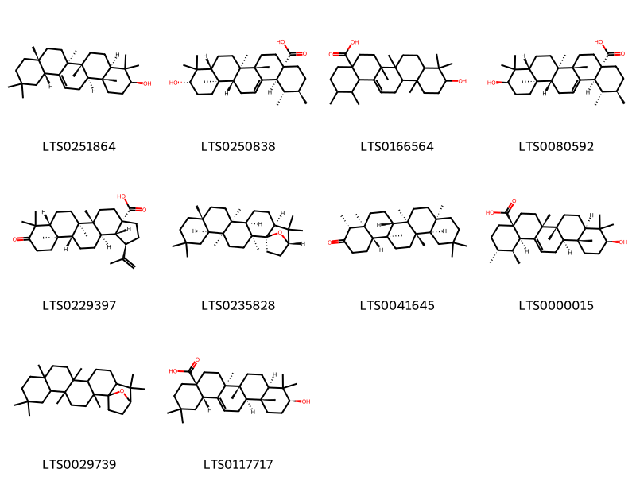{ width=100% }
    <figcaption>Hình ảnh cấu trúc hóa học của 10 hoạt chất thuộc nhóm Prenol lipids gồm ['β-amyrin (LTS0251864)', 'ursolic acid (LTS0250838)', '10-hydroxy-1,2,6a,6b,9,9,12a-heptamethyl-2,3,4,5,6,7,8,8a,10,11,12,12b,13,14b-tetradecahydro-1h-picene-4a-carboxylic acid (LTS0166564)', '3β-hydroxy-12-ursen-28-ic acid (LTS0080592)', '(1r,3as,5ar,5br,7ar,11ar,11br,13ar,13br)-5a,5b,8,8,11a-pentamethyl-9-oxo-1-(prop-1-en-2-yl)-tetradecahydro-1h-cyclopenta[a]chrysene-3a-carboxylic acid (LTS0229397)', '(1r,2s,5s,6s,11r,14s,15r,18s,20s)-2,5,8,8,11,14,19,19-octamethyl-23-oxahexacyclo[18.2.1.0¹,¹⁸.0²,¹⁵.0⁵,¹⁴.0⁶,¹¹]tricosane (LTS0235828)', '(-)-friedelin (LTS0041645)', '(1s,2r,4as,6ar,6br,8ar,10s,12ar,12br,14br)-10-hydroxy-1,2,6a,6b,9,9,12a-heptamethyl-2,3,4,5,6,7,8,8a,10,11,12,12b,13,14b-tetradecahydro-1h-picene-4a-carboxylic acid (LTS0000015)', '2,5,8,8,11,14,19,19-octamethyl-23-oxahexacyclo[18.2.1.0¹,¹⁸.0²,¹⁵.0⁵,¹⁴.0⁶,¹¹]tricosane (LTS0029739)', 'oleanolic acid (LTS0117717)'].</figcaption>
</figure>
#### Nhóm Saturated hydrocarbons
<figure markdown="span">
    { width=100% }
    <figcaption>Hình ảnh cấu trúc hóa học của 1 hoạt chất thuộc nhóm Saturated hydrocarbons gồm ['triacontane (LTS0250709)'].</figcaption>
</figure>
#### Nhóm Steroids and steroid derivatives
<figure markdown="span">
    { width=100% }
    <figcaption>Hình ảnh cấu trúc hóa học của 4 hoạt chất thuộc nhóm Steroids and steroid derivatives gồm ['stigmast-5-en-3-ol (LTS0071224)', 'stigmast-5-en-3-ol, (3β)- (LTS0204616)', 'sitogluside (LTS0201798)', '2-{[1-(5-ethyl-6-methylheptan-2-yl)-9a,11a-dimethyl-1h,2h,3h,3ah,3bh,4h,6h,7h,8h,9h,9bh,10h,11h-cyclopenta[a]phenanthren-7-yl]oxy}-6-(hydroxymethyl)oxane-3,4,5-triol (LTS0158828)'].</figcaption>
</figure>

---

### Dược dân tộc học

Danh sách các quốc gia có sử dụng *Rhododendron barbatum* trong điều trị các bệnh. 

| Country   | Disease   | Bệnh                                                                                                                                                                                                |
|:----------|:----------|:----------------------------------------------------------------------------------------------------------------------------------------------------------------------------------------------------|
| India     | Piscicide | MYMEMORY WARNING: YOU USED ALL AVAILABLE FREE TRANSLATIONS FOR TODAY. NEXT AVAILABLE IN  01 HOURS 41 MINUTES 38 SECONDS VISIT HTTPS://MYMEMORY.TRANSLATED.NET/DOC/USAGELIMITS.PHP TO TRANSLATE MORE |

---

---
## Rhododendron campanulatum
### Thông tin về thực vật

!!! info "Phân loại thực vật của *Rhododendron campanulatum* từ GIBF:"
    - **Kingdom:** Plantae
    - **Phylum:** Tracheophyta
    - **Order:** Ericales
    - **Family:** Ericaceae
    - **Genus:** Rhododendron
    - **Species:** *Rhododendron campanulatum*

 

| Label (VI)   | Label (EN)   | Scientific Name           | Descriptions (VI)   | Descriptions (EN)   | Also Known As (VI)   | Also Known As (EN)   |
|:-------------|:-------------|:--------------------------|:--------------------|:--------------------|:---------------------|:---------------------|
| N/A          | N/A          | Rhododendron campanulatum | loài thực vật       | species of plant    | ['']                 | ['']                 |

#### Phân bố trên thế giới

**Từ CSDL GIBF** nan, Japan, United Kingdom of Great Britain and Northern Ireland, Korea, Republic of, Estonia, New Zealand, Bhutan, India, unknown or invalid, United States of America, Singapore, Viet Nam, China, Canada, Nepal

#### Phân bố tại Việt Nam

**Từ CSDL GIBF**: Lao Cai

---
### Thành phần hóa học
        
- Theo cơ sở dữ liệu lotus: Từ loài *Rhododendron campanulatum* đã phân lập và xác định được 2 hoạt chất thuộc về các nhóm Prenol lipids. 

|    | chemicalTaxonomyClassyfireClass   |   smiles_count |
|---:|:----------------------------------|---------------:|
|  0 | Prenol lipids                     |              2 |

#### Nhóm Prenol lipids
<figure markdown="span">
    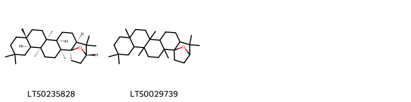{ width=100% }
    <figcaption>Hình ảnh cấu trúc hóa học của 2 hoạt chất thuộc nhóm Prenol lipids gồm ['(1r,2s,5s,6s,11r,14s,15r,18s,20s)-2,5,8,8,11,14,19,19-octamethyl-23-oxahexacyclo[18.2.1.0¹,¹⁸.0²,¹⁵.0⁵,¹⁴.0⁶,¹¹]tricosane (LTS0235828)', '2,5,8,8,11,14,19,19-octamethyl-23-oxahexacyclo[18.2.1.0¹,¹⁸.0²,¹⁵.0⁵,¹⁴.0⁶,¹¹]tricosane (LTS0029739)'].</figcaption>
</figure>

---

### Dược dân tộc học

Danh sách các quốc gia có sử dụng *Rhododendron campanulatum* trong điều trị các bệnh. 

| Country   | Disease   | Bệnh                                                                                                                                                                                                |
|:----------|:----------|:----------------------------------------------------------------------------------------------------------------------------------------------------------------------------------------------------|
| Elsewhere | Poison    | MYMEMORY WARNING: YOU USED ALL AVAILABLE FREE TRANSLATIONS FOR TODAY. NEXT AVAILABLE IN  01 HOURS 41 MINUTES 01 SECONDS VISIT HTTPS://MYMEMORY.TRANSLATED.NET/DOC/USAGELIMITS.PHP TO TRANSLATE MORE |

---

---
## Rhododendron canadensis
### Thông tin về thực vật

!!! info "Phân loại thực vật của *Rhododendron canadense* từ GIBF:"
    - **Kingdom:** Plantae
    - **Phylum:** Tracheophyta
    - **Order:** Ericales
    - **Family:** Ericaceae
    - **Genus:** Rhododendron
    - **Species:** *Rhododendron canadense*

 

| Label (VI)   | Label (EN)   | Scientific Name           | Descriptions (VI)   | Descriptions (EN)   | Also Known As (VI)   | Also Known As (EN)   |
|:-------------|:-------------|:--------------------------|:--------------------|:--------------------|:---------------------|:---------------------|
| N/A          | N/A          | Rhododendron campanulatum | loài thực vật       | species of plant    | ['']                 | ['']                 |

#### Phân bố trên thế giới

**Từ CSDL GIBF** nan, Japan, United Kingdom of Great Britain and Northern Ireland, Korea, Republic of, Estonia, New Zealand, Bhutan, India, unknown or invalid, United States of America, Singapore, Viet Nam, China, Canada, Nepal

#### Phân bố tại Việt Nam

**Từ CSDL GIBF**: Lao Cai

---
### Thành phần hóa học
        
- Theo cơ sở dữ liệu lotus: Từ loài *Rhododendron canadense* đã phân lập và xác định được Chưa có hoạt chất nào được phân lập. hoạt chất thuộc về các nhóm Không có hoạt chất nào được phân lập. 

Không có hình ảnh nào được tạo ra

---

### Dược dân tộc học

Danh sách các quốc gia có sử dụng *Rhododendron canadense* trong điều trị các bệnh. 

| Country   | Disease        | Bệnh                                                                                                                                                                                                |
|:----------|:---------------|:----------------------------------------------------------------------------------------------------------------------------------------------------------------------------------------------------|
| Elsewhere | nan, Fungicide | MYMEMORY WARNING: YOU USED ALL AVAILABLE FREE TRANSLATIONS FOR TODAY. NEXT AVAILABLE IN  01 HOURS 40 MINUTES 39 SECONDS VISIT HTTPS://MYMEMORY.TRANSLATED.NET/DOC/USAGELIMITS.PHP TO TRANSLATE MORE |

---

---
## Rhododendron chrysanthum
### Thông tin về thực vật

!!! info "Phân loại thực vật của *Rhododendron aureum* từ GIBF:"
    - **Kingdom:** Plantae
    - **Phylum:** Tracheophyta
    - **Order:** Ericales
    - **Family:** Ericaceae
    - **Genus:** Rhododendron
    - **Species:** *Rhododendron aureum*

 

| Label (VI)   | Label (EN)   | Scientific Name          | Descriptions (VI)   | Descriptions (EN)   | Also Known As (VI)   | Also Known As (EN)   |
|:-------------|:-------------|:-------------------------|:--------------------|:--------------------|:---------------------|:---------------------|
| N/A          | N/A          | Rhododendron chrysanthum | loài thực vật       | species of plant    | ['']                 | ['']                 |

#### Phân bố trên thế giới

**Từ CSDL GIBF** nan, Ukraine, Japan, Korea (Democratic People’s Republic of), Russian Federation, unknown or invalid, China, Canada

#### Phân bố tại Việt Nam

**Từ CSDL GIBF**: Không có ghi nhận ở Việt Nam

---
### Thành phần hóa học
        
- Theo cơ sở dữ liệu lotus: Từ loài *Rhododendron aureum* đã phân lập và xác định được Chưa có hoạt chất nào được phân lập. hoạt chất thuộc về các nhóm Không có hoạt chất nào được phân lập. 

Không có hình ảnh nào được tạo ra

---

### Dược dân tộc học

Danh sách các quốc gia có sử dụng *Rhododendron aureum* trong điều trị các bệnh. 

| Country   | Disease                                             | Bệnh                                                                                                                                                                                                |
|:----------|:----------------------------------------------------|:----------------------------------------------------------------------------------------------------------------------------------------------------------------------------------------------------|
| India     | Diaphoretic, Narcotic                               | MYMEMORY WARNING: YOU USED ALL AVAILABLE FREE TRANSLATIONS FOR TODAY. NEXT AVAILABLE IN  01 HOURS 40 MINUTES 24 SECONDS VISIT HTTPS://MYMEMORY.TRANSLATED.NET/DOC/USAGELIMITS.PHP TO TRANSLATE MORE |
| Turkey    | Astringent, Diuretic, Narcotic, Sedative, Stimulant | MYMEMORY WARNING: YOU USED ALL AVAILABLE FREE TRANSLATIONS FOR TODAY. NEXT AVAILABLE IN  01 HOURS 40 MINUTES 21 SECONDS VISIT HTTPS://MYMEMORY.TRANSLATED.NET/DOC/USAGELIMITS.PHP TO TRANSLATE MORE |

---

---
## Rhododendron cinnabarinum
### Thông tin về thực vật

!!! info "Phân loại thực vật của *Rhododendron cinnabarinum* từ GIBF:"
    - **Kingdom:** Plantae
    - **Phylum:** Tracheophyta
    - **Order:** Ericales
    - **Family:** Ericaceae
    - **Genus:** Rhododendron
    - **Species:** *Rhododendron cinnabarinum*

 

| Label (VI)   | Label (EN)   | Scientific Name           | Descriptions (VI)   | Descriptions (EN)   | Also Known As (VI)   | Also Known As (EN)   |
|:-------------|:-------------|:--------------------------|:--------------------|:--------------------|:---------------------|:---------------------|
| N/A          | N/A          | Rhododendron cinnabarinum |                     | species of plant    | ['']                 | ['']                 |

#### Phân bố trên thế giới

**Từ CSDL GIBF** nan, Ukraine, Japan, United Kingdom of Great Britain and Northern Ireland, New Zealand, Myanmar, Bhutan, India, unknown or invalid, Viet Nam, China, Canada, Nepal

#### Phân bố tại Việt Nam

**Từ CSDL GIBF**: Lao Cai

---
### Thành phần hóa học
        
- Theo cơ sở dữ liệu lotus: Từ loài *Rhododendron cinnabarinum* đã phân lập và xác định được Chưa có hoạt chất nào được phân lập. hoạt chất thuộc về các nhóm Không có hoạt chất nào được phân lập. 

Không có hình ảnh nào được tạo ra

---

### Dược dân tộc học

Danh sách các quốc gia có sử dụng *Rhododendron cinnabarinum* trong điều trị các bệnh. 

| Country   | Disease   | Bệnh                                                                                                                                                                                                |
|:----------|:----------|:----------------------------------------------------------------------------------------------------------------------------------------------------------------------------------------------------|
| India     | Poison    | MYMEMORY WARNING: YOU USED ALL AVAILABLE FREE TRANSLATIONS FOR TODAY. NEXT AVAILABLE IN  01 HOURS 40 MINUTES 02 SECONDS VISIT HTTPS://MYMEMORY.TRANSLATED.NET/DOC/USAGELIMITS.PHP TO TRANSLATE MORE |

---

---
## Rhododendron falconeri
### Thông tin về thực vật

!!! info "Phân loại thực vật của *Rhododendron falconeri* từ GIBF:"
    - **Kingdom:** Plantae
    - **Phylum:** Tracheophyta
    - **Order:** Ericales
    - **Family:** Ericaceae
    - **Genus:** Rhododendron
    - **Species:** *Rhododendron falconeri*

 

| Label (VI)   | Label (EN)   | Scientific Name        | Descriptions (VI)   | Descriptions (EN)   | Also Known As (VI)   | Also Known As (EN)   |
|:-------------|:-------------|:-----------------------|:--------------------|:--------------------|:---------------------|:---------------------|
| N/A          | N/A          | Rhododendron falconeri | loài thực vật       | species of plant    | ['']                 | ['']                 |

#### Phân bố trên thế giới

**Từ CSDL GIBF** nan, Belgium, Korea, Republic of, Bhutan, India, unknown or invalid, Viet Nam, United Kingdom of Great Britain and Northern Ireland, Canada, Nepal

#### Phân bố tại Việt Nam

**Từ CSDL GIBF**: Lao Cai

---
### Thành phần hóa học
        
- Theo cơ sở dữ liệu lotus: Từ loài *Rhododendron falconeri* đã phân lập và xác định được 3 hoạt chất thuộc về các nhóm Flavonoids, Prenol lipids. 

|    | chemicalTaxonomyClassyfireClass   |   smiles_count |
|---:|:----------------------------------|---------------:|
|  0 | Flavonoids                        |              1 |
|  1 | Prenol lipids                     |              2 |

#### Nhóm Flavonoids
<figure markdown="span">
    { width=100% }
    <figcaption>Hình ảnh cấu trúc hóa học của 1 hoạt chất thuộc nhóm Flavonoids gồm ['quercetin (LTS0004651)'].</figcaption>
</figure>
#### Nhóm Prenol lipids
<figure markdown="span">
    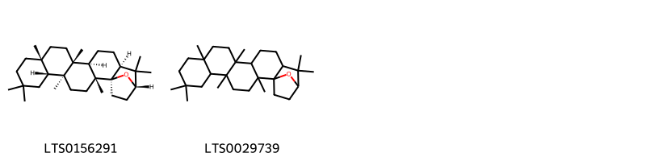{ width=100% }
    <figcaption>Hình ảnh cấu trúc hóa học của 2 hoạt chất thuộc nhóm Prenol lipids gồm ['(1r,2r,5s,6r,11r,14r,15r,18s,20s)-2,5,8,8,11,14,19,19-octamethyl-23-oxahexacyclo[18.2.1.0¹,¹⁸.0²,¹⁵.0⁵,¹⁴.0⁶,¹¹]tricosane (LTS0156291)', '2,5,8,8,11,14,19,19-octamethyl-23-oxahexacyclo[18.2.1.0¹,¹⁸.0²,¹⁵.0⁵,¹⁴.0⁶,¹¹]tricosane (LTS0029739)'].</figcaption>
</figure>

---

### Dược dân tộc học

Danh sách các quốc gia có sử dụng *Rhododendron falconeri* trong điều trị các bệnh. 

| Country   | Disease   | Bệnh                                                                                                                                                                                                |
|:----------|:----------|:----------------------------------------------------------------------------------------------------------------------------------------------------------------------------------------------------|
| India     | Piscicide | MYMEMORY WARNING: YOU USED ALL AVAILABLE FREE TRANSLATIONS FOR TODAY. NEXT AVAILABLE IN  01 HOURS 39 MINUTES 42 SECONDS VISIT HTTPS://MYMEMORY.TRANSLATED.NET/DOC/USAGELIMITS.PHP TO TRANSLATE MORE |

---

---
## Rhododendron ferrugineum
### Thông tin về thực vật

!!! info "Phân loại thực vật của *Rhododendron ferrugineum* từ GIBF:"
    - **Kingdom:** Plantae
    - **Phylum:** Tracheophyta
    - **Order:** Ericales
    - **Family:** Ericaceae
    - **Genus:** Rhododendron
    - **Species:** *Rhododendron ferrugineum*

 

| Label (VI)   | Label (EN)   | Scientific Name          | Descriptions (VI)   | Descriptions (EN)   | Also Known As (VI)   | Also Known As (EN)                                                                 |
|:-------------|:-------------|:-------------------------|:--------------------|:--------------------|:---------------------|:-----------------------------------------------------------------------------------|
| N/A          | N/A          | Rhododendron ferrugineum | loài thực vật       | species of plant    | ['']                 | ['alpine-rose', 'Rhododendron ferrugineum', 'rusty-leaved alpenrose', 'snow-rose'] |

#### Phân bố trên thế giới

**Từ CSDL GIBF** nan, Andorra, Italy, Germany, Spain, Switzerland, Austria, France

#### Phân bố tại Việt Nam

**Từ CSDL GIBF**: Không có ghi nhận ở Việt Nam

---
### Thành phần hóa học
        
- Theo cơ sở dữ liệu lotus: Từ loài *Rhododendron ferrugineum* đã phân lập và xác định được 31 hoạt chất thuộc về các nhóm Flavonoids, Prenol lipids, Benzene and substituted derivatives, Organooxygen compounds, Coumarins and derivatives. 

|    | chemicalTaxonomyClassyfireClass     |   smiles_count |
|---:|:------------------------------------|---------------:|
|  0 | Benzene and substituted derivatives |              3 |
|  1 | Coumarins and derivatives           |              1 |
|  2 | Flavonoids                          |              4 |
|  3 | Organooxygen compounds              |              3 |
|  4 | Prenol lipids                       |             20 |

#### Nhóm Benzene and substituted derivatives
<figure markdown="span">
    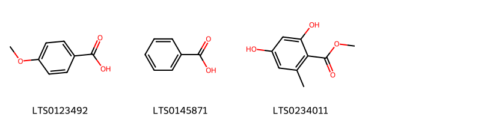{ width=100% }
    <figcaption>Hình ảnh cấu trúc hóa học của 3 hoạt chất thuộc nhóm Benzene and substituted derivatives gồm ['p-anisic acid (LTS0123492)', 'benzoic acid (LTS0145871)', 'orsellinic acid methyl ester (LTS0234011)'].</figcaption>
</figure>
#### Nhóm Coumarins and derivatives
<figure markdown="span">
    { width=100% }
    <figcaption>Hình ảnh cấu trúc hóa học của 1 hoạt chất thuộc nhóm Coumarins and derivatives gồm ['scopoletin (LTS0193112)'].</figcaption>
</figure>
#### Nhóm Flavonoids
<figure markdown="span">
    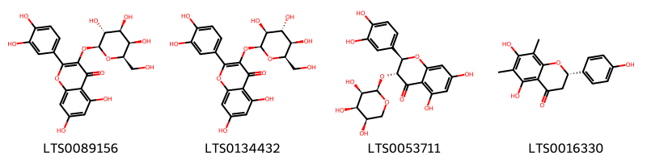{ width=100% }
    <figcaption>Hình ảnh cấu trúc hóa học của 4 hoạt chất thuộc nhóm Flavonoids gồm ['hyperoside (LTS0089156)', '2-(3,4-dihydroxyphenyl)-5,7-dihydroxy-3-{[(2s,3s,4r,5r,6r)-3,4,5-trihydroxy-6-(hydroxymethyl)oxan-2-yl]oxy}chromen-4-one (LTS0134432)', '(2r,3r)-2-(3,4-dihydroxyphenyl)-5,7-dihydroxy-3-{[(2r,3r,4r,5r)-3,4,5-trihydroxyoxan-2-yl]oxy}-2,3-dihydro-1-benzopyran-4-one (LTS0053711)', 'farrerol (LTS0016330)'].</figcaption>
</figure>
#### Nhóm Organooxygen compounds
<figure markdown="span">
    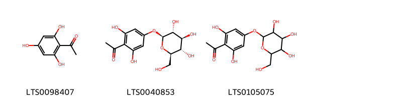{ width=100% }
    <figcaption>Hình ảnh cấu trúc hóa học của 3 hoạt chất thuộc nhóm Organooxygen compounds gồm ['phloroacetophenone (LTS0098407)', '1-(2,6-dihydroxy-4-{[(2s,3r,4s,5s,6r)-3,4,5-trihydroxy-6-(hydroxymethyl)oxan-2-yl]oxy}phenyl)ethanone (LTS0040853)', '1-(2,6-dihydroxy-4-{[3,4,5-trihydroxy-6-(hydroxymethyl)oxan-2-yl]oxy}phenyl)ethanone (LTS0105075)'].</figcaption>
</figure>
#### Nhóm Prenol lipids
<figure markdown="span">
    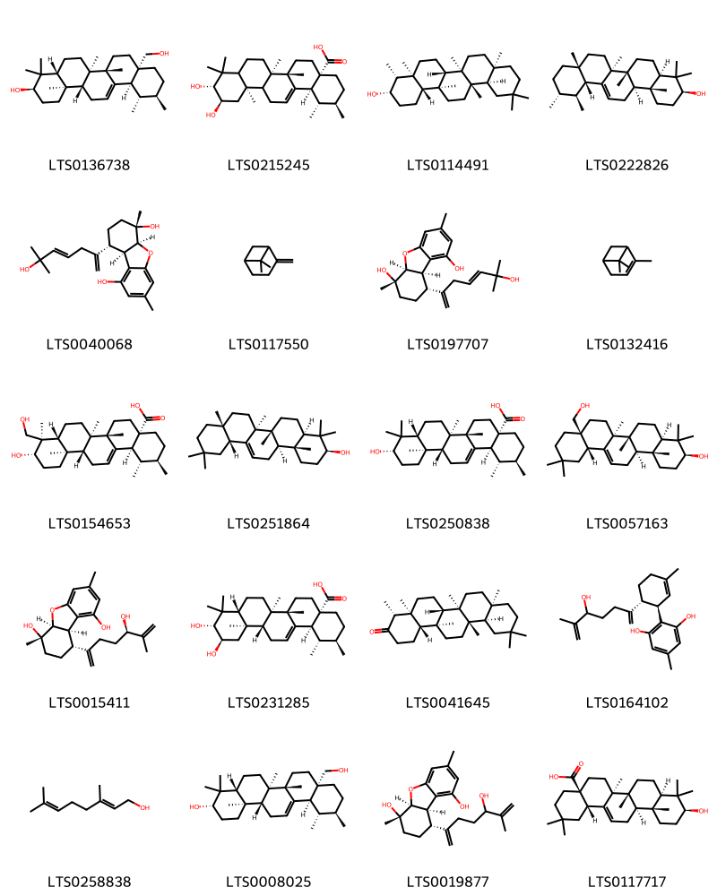{ width=100% }
    <figcaption>Hình ảnh cấu trúc hóa học của 20 hoạt chất thuộc nhóm Prenol lipids gồm ['urs-12-ene-3β,28-diol (LTS0136738)', '(1s,2r,4as,6as,6br,10r,11r,12ar,14bs)-10,11-dihydroxy-1,2,6a,6b,9,9,12a-heptamethyl-2,3,4,5,6,7,8,8a,10,11,12,12b,13,14b-tetradecahydro-1h-picene-4a-carboxylic acid (LTS0215245)', 'epi-friedelanol (LTS0114491)', 'amyrin (LTS0222826)', '(1r,9s,10s,13r)-13-[(4e)-6-hydroxy-6-methylhepta-1,4-dien-2-yl]-5,10-dimethyl-8-oxatricyclo[7.4.0.0²,⁷]trideca-2,4,6-triene-3,10-diol (LTS0040068)', 'β-pinene (LTS0117550)', '(1r,9s,10s,13r)-13-(6-hydroxy-6-methylhepta-1,4-dien-2-yl)-5,10-dimethyl-8-oxatricyclo[7.4.0.0²,⁷]trideca-2,4,6-triene-3,10-diol (LTS0197707)', 'α pinene (LTS0132416)', '23-hydroxyursolic acid (LTS0154653)', 'β-amyrin (LTS0251864)', 'ursolic acid (LTS0250838)', 'erythrodiol (LTS0057163)', '(1r,9s,10s,13r)-13-[(5r)-5-hydroxy-6-methylhepta-1,6-dien-2-yl]-5,10-dimethyl-8-oxatricyclo[7.4.0.0²,⁷]trideca-2,4,6-triene-3,10-diol (LTS0015411)', 'corosolic acid (LTS0231285)', '(-)-friedelin (LTS0041645)', 'ferruginene c (LTS0164102)', 'geraniol (LTS0258838)', 'uvaol (LTS0008025)', 'ferruginene a (LTS0019877)', 'oleanolic acid (LTS0117717)'].</figcaption>
</figure>

---

### Dược dân tộc học

Danh sách các quốc gia có sử dụng *Rhododendron ferrugineum* trong điều trị các bệnh. 

| Country   | Disease                               | Bệnh                                                                                                                                                                                                |
|:----------|:--------------------------------------|:----------------------------------------------------------------------------------------------------------------------------------------------------------------------------------------------------|
| Europe    | Diuretic, Poison, Sudorific, Narcotic | MYMEMORY WARNING: YOU USED ALL AVAILABLE FREE TRANSLATIONS FOR TODAY. NEXT AVAILABLE IN  01 HOURS 39 MINUTES 15 SECONDS VISIT HTTPS://MYMEMORY.TRANSLATED.NET/DOC/USAGELIMITS.PHP TO TRANSLATE MORE |
| Turkey    | Diuretic, Narcotic, Sudorific, Poison | MYMEMORY WARNING: YOU USED ALL AVAILABLE FREE TRANSLATIONS FOR TODAY. NEXT AVAILABLE IN  01 HOURS 39 MINUTES 13 SECONDS VISIT HTTPS://MYMEMORY.TRANSLATED.NET/DOC/USAGELIMITS.PHP TO TRANSLATE MORE |
| ain       | Sudorific                             | MYMEMORY WARNING: YOU USED ALL AVAILABLE FREE TRANSLATIONS FOR TODAY. NEXT AVAILABLE IN  01 HOURS 39 MINUTES 11 SECONDS VISIT HTTPS://MYMEMORY.TRANSLATED.NET/DOC/USAGELIMITS.PHP TO TRANSLATE MORE |

---

---
## Rhododendron fortunei
### Thông tin về thực vật

!!! info "Phân loại thực vật của *Rhododendron fortunei* từ GIBF:"
    - **Kingdom:** Plantae
    - **Phylum:** Tracheophyta
    - **Order:** Ericales
    - **Family:** Ericaceae
    - **Genus:** Rhododendron
    - **Species:** *Rhododendron fortunei*

 

| Label (VI)   | Label (EN)   | Scientific Name       | Descriptions (VI)   | Descriptions (EN)   | Also Known As (VI)   | Also Known As (EN)   |
|:-------------|:-------------|:----------------------|:--------------------|:--------------------|:---------------------|:---------------------|
| N/A          | N/A          | Rhododendron fortunei | loài thực vật       | species of plant    | ['']                 | ['']                 |

#### Phân bố trên thế giới

**Từ CSDL GIBF** Germany, Slovakia, Belgium, Korea, Republic of, Cambodia, Chinese Taipei, New Zealand, Estonia, unknown or invalid, United States of America, Latvia, China, Canada

#### Phân bố tại Việt Nam

**Từ CSDL GIBF**: Không có ghi nhận ở Việt Nam

---
### Thành phần hóa học
        
- Theo cơ sở dữ liệu lotus: Từ loài *Rhododendron fortunei* đã phân lập và xác định được Chưa có hoạt chất nào được phân lập. hoạt chất thuộc về các nhóm Không có hoạt chất nào được phân lập. 

Không có hình ảnh nào được tạo ra

---

### Dược dân tộc học

Danh sách các quốc gia có sử dụng *Rhododendron fortunei* trong điều trị các bệnh. 

| Country   | Disease                | Bệnh                                                                                                                                                                                                |
|:----------|:-----------------------|:----------------------------------------------------------------------------------------------------------------------------------------------------------------------------------------------------|
| China     | Aphrodisiac, Vermifuge | MYMEMORY WARNING: YOU USED ALL AVAILABLE FREE TRANSLATIONS FOR TODAY. NEXT AVAILABLE IN  01 HOURS 38 MINUTES 32 SECONDS VISIT HTTPS://MYMEMORY.TRANSLATED.NET/DOC/USAGELIMITS.PHP TO TRANSLATE MORE |

---

---
## Rhododendron indicum
### Thông tin về thực vật

!!! info "Phân loại thực vật của *Rhododendron indicum* từ GIBF:"
    - **Kingdom:** Plantae
    - **Phylum:** Tracheophyta
    - **Order:** Ericales
    - **Family:** Ericaceae
    - **Genus:** Rhododendron
    - **Species:** *Rhododendron indicum*

 

| Label (VI)   | Label (EN)   | Scientific Name      | Descriptions (VI)   | Descriptions (EN)   | Also Known As (VI)   | Also Known As (EN)       |
|:-------------|:-------------|:---------------------|:--------------------|:--------------------|:---------------------|:-------------------------|
| N/A          | N/A          | Rhododendron indicum | loài thực vật       | species of plant    | ['']                 | ['Rhododendron indicum'] |

#### Phân bố trên thế giới

**Từ CSDL GIBF** nan, South Africa, Australia, Madagascar, Japan, Germany, Korea, Republic of, Guatemala, Colombia, Brazil, Portugal, Bhutan, United States of America, Chile, Singapore, El Salvador, China, Panama

#### Phân bố tại Việt Nam

**Từ CSDL GIBF**: Không có ghi nhận ở Việt Nam

---
### Thành phần hóa học
        
- Theo cơ sở dữ liệu lotus: Từ loài *Rhododendron indicum* đã phân lập và xác định được 7 hoạt chất thuộc về các nhóm Prenol lipids. 

|    | chemicalTaxonomyClassyfireClass   |   smiles_count |
|---:|:----------------------------------|---------------:|
|  0 | Prenol lipids                     |              7 |

#### Nhóm Prenol lipids
<figure markdown="span">
    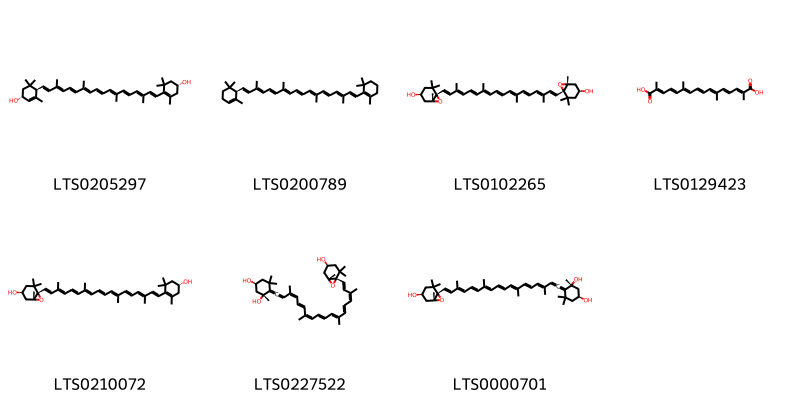{ width=100% }
    <figcaption>Hình ảnh cấu trúc hóa học của 7 hoạt chất thuộc nhóm Prenol lipids gồm ['carotenoid (LTS0205297)', '(+)-α-carotene (LTS0200789)', 'violaxanthin (LTS0102265)', 'crocetin (LTS0129423)', 'antheraxanthin (LTS0210072)', 'neoxanthin (LTS0227522)', 'neoxanthin (LTS0000701)'].</figcaption>
</figure>

---

### Dược dân tộc học

Danh sách các quốc gia có sử dụng *Rhododendron indicum* trong điều trị các bệnh. 

| Country   | Disease            | Bệnh                                                                                                                                                                                                |
|:----------|:-------------------|:----------------------------------------------------------------------------------------------------------------------------------------------------------------------------------------------------|
| China     | Sedative, Antidote | MYMEMORY WARNING: YOU USED ALL AVAILABLE FREE TRANSLATIONS FOR TODAY. NEXT AVAILABLE IN  01 HOURS 38 MINUTES 13 SECONDS VISIT HTTPS://MYMEMORY.TRANSLATED.NET/DOC/USAGELIMITS.PHP TO TRANSLATE MORE |

---

---
## Rhododendron japonicum
### Thông tin về thực vật

!!! info "Phân loại thực vật của *Rhododendron japonicum* từ GIBF:"
    - **Kingdom:** Plantae
    - **Phylum:** Tracheophyta
    - **Order:** Ericales
    - **Family:** Ericaceae
    - **Genus:** Rhododendron
    - **Species:** *Rhododendron japonicum*

 

| Label (VI)   | Label (EN)   | Scientific Name        | Descriptions (VI)   | Descriptions (EN)   | Also Known As (VI)   | Also Known As (EN)   |
|:-------------|:-------------|:-----------------------|:--------------------|:--------------------|:---------------------|:---------------------|
| N/A          | N/A          | Rhododendron japonicum |                     | species of plant    | ['']                 | ['']                 |

#### Phân bố trên thế giới

**Từ CSDL GIBF** nan, Ukraine, Japan, Germany, Belgium, Korea, Republic of, United States of America, Sweden, Latvia, Canada

#### Phân bố tại Việt Nam

**Từ CSDL GIBF**: Không có ghi nhận ở Việt Nam

---
### Thành phần hóa học
        
- Theo cơ sở dữ liệu lotus: Từ loài *Rhododendron japonicum* đã phân lập và xác định được 21 hoạt chất thuộc về các nhóm Prenol lipids, Organooxygen compounds, Steroids and steroid derivatives. 

|    | chemicalTaxonomyClassyfireClass   |   smiles_count |
|---:|:----------------------------------|---------------:|
|  0 | Organooxygen compounds            |              7 |
|  1 | Prenol lipids                     |             11 |
|  2 | Steroids and steroid derivatives  |              3 |

#### Nhóm Organooxygen compounds
<figure markdown="span">
    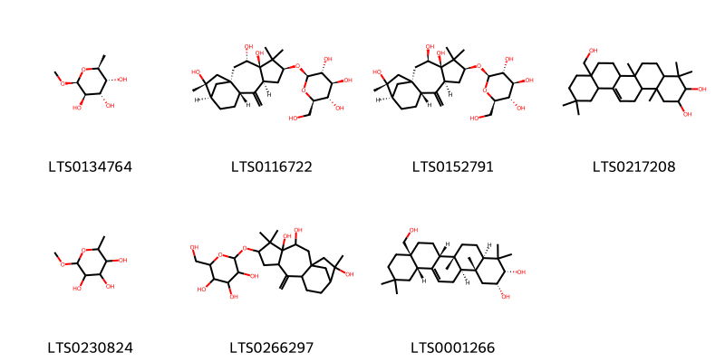{ width=100% }
    <figcaption>Hình ảnh cấu trúc hóa học của 7 hoạt chất thuộc nhóm Organooxygen compounds gồm ['(2s,3r,4s,5r,6s)-2-methoxy-6-methyloxane-3,4,5-triol (LTS0134764)', '(2r,3s,4s,5r,6r)-2-(hydroxymethyl)-6-{[(1r,3s,4r,6s,8s,10r,13r,14r)-3,4,14-trihydroxy-5,5,14-trimethyl-9-methylidenetetracyclo[11.2.1.0¹,¹⁰.0⁴,⁸]hexadecan-6-yl]oxy}oxane-3,4,5-triol (LTS0116722)', '(2r,3s,4s,5r,6r)-2-(hydroxymethyl)-6-{[(1r,3r,4r,6s,8s,10r,13r,14r)-3,4,14-trihydroxy-5,5,14-trimethyl-9-methylidenetetracyclo[11.2.1.0¹,¹⁰.0⁴,⁸]hexadecan-6-yl]oxy}oxane-3,4,5-triol (LTS0152791)', '8a-(hydroxymethyl)-4,4,6a,11,11,14b-hexamethyl-2,3,4a,5,6,6b,7,8,9,10,12,12a,14,14a-tetradecahydro-1h-picene-2,3-diol (LTS0217208)', 'fucose (LTS0230824)', '2-(hydroxymethyl)-6-({3,4,14-trihydroxy-5,5,14-trimethyl-9-methylidenetetracyclo[11.2.1.0¹,¹⁰.0⁴,⁸]hexadecan-6-yl}oxy)oxane-3,4,5-triol (LTS0266297)', '(2r,3s,4ar,6ar,6br,8ar,12as,14as,14br)-8a-(hydroxymethyl)-4,4,6a,11,11,14b-hexamethyl-2,3,4a,5,6,6b,7,8,9,10,12,12a,14,14a-tetradecahydro-1h-picene-2,3-diol (LTS0001266)'].</figcaption>
</figure>
#### Nhóm Prenol lipids
<figure markdown="span">
    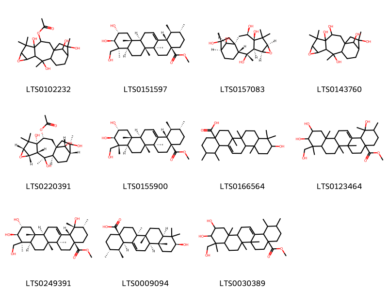{ width=100% }
    <figcaption>Hình ảnh cấu trúc hóa học của 11 hoạt chất thuộc nhóm Prenol lipids gồm ['4,10,15,17-tetrahydroxy-5,5,10,15-tetramethyl-7-oxapentacyclo[12.2.1.0¹,¹¹.0⁴,⁹.0⁶,⁸]heptadecan-3-yl acetate (LTS0102232)', 'methyl (1s,2r,4as,6as,6br,8ar,9s,10r,11r,12ar,12br,14bs)-10,11-dihydroxy-9-(hydroxymethyl)-1,2,6a,6b,9,12a-hexamethyl-2,3,4,5,6,7,8,8a,10,11,12,12b,13,14b-tetradecahydro-1h-picene-4a-carboxylate (LTS0151597)', 'rhodojaponin iii (LTS0157083)', '5,5,10,15-tetramethyl-7-oxapentacyclo[12.2.1.0¹,¹¹.0⁴,⁹.0⁶,⁸]heptadecane-3,4,10,15,17-pentol (LTS0143760)', 'rhodojaponin ii (LTS0220391)', 'methyl (1s,2r,4as,6as,6br,8ar,9r,10r,11r,12ar,12br,14bs)-10,11-dihydroxy-9-(hydroxymethyl)-1,2,6a,6b,9,12a-hexamethyl-2,3,4,5,6,7,8,8a,10,11,12,12b,13,14b-tetradecahydro-1h-picene-4a-carboxylate (LTS0155900)', '10-hydroxy-1,2,6a,6b,9,9,12a-heptamethyl-2,3,4,5,6,7,8,8a,10,11,12,12b,13,14b-tetradecahydro-1h-picene-4a-carboxylic acid (LTS0166564)', 'methyl 1,10,11-trihydroxy-9-(hydroxymethyl)-1,2,6a,6b,9,12a-hexamethyl-2,3,4,5,6,7,8,8a,10,11,12,12b,13,14b-tetradecahydropicene-4a-carboxylate (LTS0123464)', 'methyl (1r,2r,4as,6as,6br,8ar,9s,10r,11r,12ar,12br,14bs)-1,10,11-trihydroxy-9-(hydroxymethyl)-1,2,6a,6b,9,12a-hexamethyl-2,3,4,5,6,7,8,8a,10,11,12,12b,13,14b-tetradecahydropicene-4a-carboxylate (LTS0249391)', '(1s,2r,4as,6as,6br,8ar,10s,12ar,12br,14br)-10-hydroxy-1,2,6a,6b,9,9,12a-heptamethyl-2,3,4,5,6,7,8,8a,10,11,12,12b,13,14b-tetradecahydro-1h-picene-4a-carboxylic acid (LTS0009094)', 'methyl 10,11-dihydroxy-9-(hydroxymethyl)-1,2,6a,6b,9,12a-hexamethyl-2,3,4,5,6,7,8,8a,10,11,12,12b,13,14b-tetradecahydro-1h-picene-4a-carboxylate (LTS0030389)'].</figcaption>
</figure>
#### Nhóm Steroids and steroid derivatives
<figure markdown="span">
    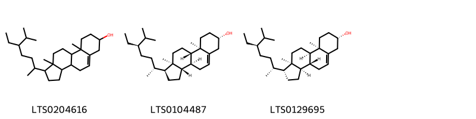{ width=100% }
    <figcaption>Hình ảnh cấu trúc hóa học của 3 hoạt chất thuộc nhóm Steroids and steroid derivatives gồm ['stigmast-5-en-3-ol, (3β)- (LTS0204616)', '(1s,3as,3bs,7s,9ar,9bs,11ar)-1-[(2r,5r)-5-ethyl-6-methylheptan-2-yl]-9a,11a-dimethyl-1h,2h,3h,3ah,3bh,4h,6h,7h,8h,9h,9bh,10h,11h-cyclopenta[a]phenanthren-7-ol (LTS0104487)', '(1r,3ar,3br,7s,9ar,9br,11ar)-1-[(2r,5r)-5-ethyl-6-methylheptan-2-yl]-9a,11a-dimethyl-1h,2h,3h,3ah,3bh,4h,6h,7h,8h,9h,9bh,10h,11h-cyclopenta[a]phenanthren-7-ol (LTS0129695)'].</figcaption>
</figure>

---

### Dược dân tộc học

Danh sách các quốc gia có sử dụng *Rhododendron japonicum* trong điều trị các bệnh. 

| Country   | Disease   | Bệnh                                                                                                                                                                                                |
|:----------|:----------|:----------------------------------------------------------------------------------------------------------------------------------------------------------------------------------------------------|
| Elsewhere | Poison    | MYMEMORY WARNING: YOU USED ALL AVAILABLE FREE TRANSLATIONS FOR TODAY. NEXT AVAILABLE IN  01 HOURS 37 MINUTES 40 SECONDS VISIT HTTPS://MYMEMORY.TRANSLATED.NET/DOC/USAGELIMITS.PHP TO TRANSLATE MORE |

---

---
## Rhododendron lepidotum
### Thông tin về thực vật

!!! info "Phân loại thực vật của *Rhododendron lepidotum* từ GIBF:"
    - **Kingdom:** Plantae
    - **Phylum:** Tracheophyta
    - **Order:** Ericales
    - **Family:** Ericaceae
    - **Genus:** Rhododendron
    - **Species:** *Rhododendron lepidotum*

 

| Label (VI)   | Label (EN)   | Scientific Name        | Descriptions (VI)   | Descriptions (EN)   | Also Known As (VI)   | Also Known As (EN)   |
|:-------------|:-------------|:-----------------------|:--------------------|:--------------------|:---------------------|:---------------------|
| N/A          | N/A          | Rhododendron lepidotum | loài thực vật       | species of plant    | ['']                 | ['']                 |

#### Phân bố trên thế giới

**Từ CSDL GIBF** Pakistan, Bhutan, India, United States of America, China, Canada, Nepal

#### Phân bố tại Việt Nam

**Từ CSDL GIBF**: Không có ghi nhận ở Việt Nam

---
### Thành phần hóa học
        
- Theo cơ sở dữ liệu lotus: Từ loài *Rhododendron lepidotum* đã phân lập và xác định được 20 hoạt chất thuộc về các nhóm Flavonoids, Prenol lipids, Coumarins and derivatives. 

|    | chemicalTaxonomyClassyfireClass   |   smiles_count |
|---:|:----------------------------------|---------------:|
|  0 | Coumarins and derivatives         |             13 |
|  1 | Flavonoids                        |              1 |
|  2 | Prenol lipids                     |              6 |

#### Nhóm Coumarins and derivatives
<figure markdown="span">
    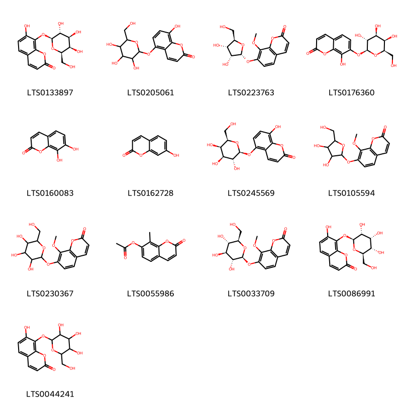{ width=100% }
    <figcaption>Hình ảnh cấu trúc hóa học của 13 hoạt chất thuộc nhóm Coumarins and derivatives gồm ['7-hydroxy-8-{[(2s,3r,4s,5r,6r)-3,4,5-trihydroxy-6-(hydroxymethyl)oxan-2-yl]oxy}chromen-2-one (LTS0133897)', '8-hydroxy-5-{[3,4,5-trihydroxy-6-(hydroxymethyl)oxan-2-yl]oxy}chromen-2-one (LTS0205061)', '7-{[(2r,3r,4s,5r)-3,4-dihydroxy-5-(hydroxymethyl)oxolan-2-yl]oxy}-8-methoxychromen-2-one (LTS0223763)', '8-hydroxy-7-{[(2s,3r,4s,5r,6r)-3,4,5-trihydroxy-6-(hydroxymethyl)oxan-2-yl]oxy}chromen-2-one (LTS0176360)', 'daphnetin (LTS0160083)', 'umbelliferone (LTS0162728)', '8-hydroxy-5-{[(2s,3r,4s,5r,6r)-3,4,5-trihydroxy-6-(hydroxymethyl)oxan-2-yl]oxy}chromen-2-one (LTS0245569)', '7-{[3,4-dihydroxy-5-(hydroxymethyl)oxolan-2-yl]oxy}-8-methoxychromen-2-one (LTS0105594)', '8-methoxy-7-{[3,4,5-trihydroxy-6-(hydroxymethyl)oxan-2-yl]oxy}chromen-2-one (LTS0230367)', '8-methyl-2-oxochromen-7-yl acetate (LTS0055986)', '8-methoxy-7-{[(2s,3r,4s,5s,6r)-3,4,5-trihydroxy-6-(hydroxymethyl)oxan-2-yl]oxy}chromen-2-one (LTS0033709)', '7-hydroxy-8-{[(2s,3r,4r,5s,6r)-3,4,5-trihydroxy-6-(hydroxymethyl)oxan-2-yl]oxy}chromen-2-one (LTS0086991)', '7-hydroxy-8-{[3,4,5-trihydroxy-6-(hydroxymethyl)oxan-2-yl]oxy}chromen-2-one (LTS0044241)'].</figcaption>
</figure>
#### Nhóm Flavonoids
<figure markdown="span">
    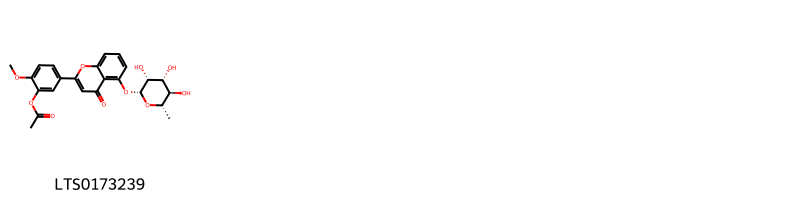{ width=100% }
    <figcaption>Hình ảnh cấu trúc hóa học của 1 hoạt chất thuộc nhóm Flavonoids gồm ['2-methoxy-5-(4-oxo-5-{[(2r,3r,4r,5r,6s)-3,4,5-trihydroxy-6-methyloxan-2-yl]oxy}chromen-2-yl)phenyl acetate (LTS0173239)'].</figcaption>
</figure>
#### Nhóm Prenol lipids
<figure markdown="span">
    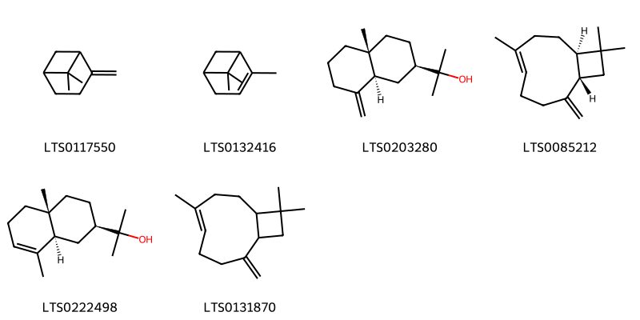{ width=100% }
    <figcaption>Hình ảnh cấu trúc hóa học của 6 hoạt chất thuộc nhóm Prenol lipids gồm ['β-pinene (LTS0117550)', 'α pinene (LTS0132416)', 'β-eudesmol (LTS0203280)', 'caryophyllene (LTS0085212)', 'α-eudesmol (LTS0222498)', 'caryophyllene (LTS0131870)'].</figcaption>
</figure>

---

### Dược dân tộc học

Danh sách các quốc gia có sử dụng *Rhododendron lepidotum* trong điều trị các bệnh. 

| Country   | Disease   | Bệnh                                                                                                                                                                                                |
|:----------|:----------|:----------------------------------------------------------------------------------------------------------------------------------------------------------------------------------------------------|
| Elsewhere | Stimulant | MYMEMORY WARNING: YOU USED ALL AVAILABLE FREE TRANSLATIONS FOR TODAY. NEXT AVAILABLE IN  01 HOURS 37 MINUTES 08 SECONDS VISIT HTTPS://MYMEMORY.TRANSLATED.NET/DOC/USAGELIMITS.PHP TO TRANSLATE MORE |

---

---
## Rhododendron metternichii
### Thông tin về thực vật

!!! info "Phân loại thực vật của *Rhododendron japonoheptamerum* từ GIBF:"
    - **Kingdom:** Plantae
    - **Phylum:** Tracheophyta
    - **Order:** Ericales
    - **Family:** Ericaceae
    - **Genus:** Rhododendron
    - **Species:** *Rhododendron japonoheptamerum*

 

| Label (VI)   | Label (EN)   | Scientific Name           | Descriptions (VI)   | Descriptions (EN)   | Also Known As (VI)   | Also Known As (EN)   |
|:-------------|:-------------|:--------------------------|:--------------------|:--------------------|:---------------------|:---------------------|
| N/A          | N/A          | Rhododendron metternichii | loài thực vật       | species of plant    | ['']                 | ['']                 |

#### Phân bố trên thế giới

**Từ CSDL GIBF** nan, Fiji, Japan, Korea, Republic of, unknown or invalid, United States of America, Latvia

#### Phân bố tại Việt Nam

**Từ CSDL GIBF**: Không có ghi nhận ở Việt Nam

---
### Thành phần hóa học
        
- Theo cơ sở dữ liệu lotus: Từ loài *Rhododendron japonoheptamerum* đã phân lập và xác định được 10 hoạt chất thuộc về các nhóm Prenol lipids. 

|    | chemicalTaxonomyClassyfireClass   |   smiles_count |
|---:|:----------------------------------|---------------:|
|  0 | Prenol lipids                     |             10 |

#### Nhóm Prenol lipids
<figure markdown="span">
    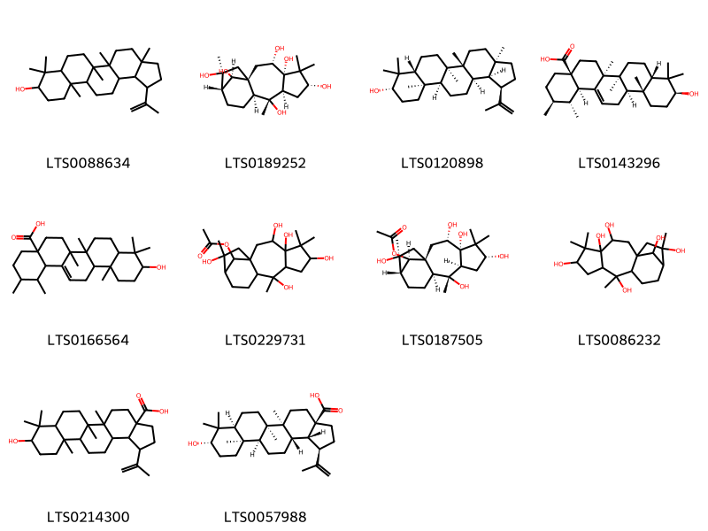{ width=100% }
    <figcaption>Hình ảnh cấu trúc hóa học của 10 hoạt chất thuộc nhóm Prenol lipids gồm ['lupeol (LTS0088634)', '(1r,3s,4s,6r,8s,9r,10s,13s,14s,16r)-5,5,9,14-tetramethyltetracyclo[11.2.1.0¹,¹⁰.0⁴,⁸]hexadecane-3,4,6,9,14,16-hexol (LTS0189252)', '(1r,3ar,5ar,5br,7ar,9s,11ar,11bs,13ar,13bs)-3a,5a,5b,8,8,11a-hexamethyl-1-(prop-1-en-2-yl)-hexadecahydrocyclopenta[a]chrysen-9-ol (LTS0120898)', '(1r,2s,4as,6as,6bs,8as,10s,12ar,12br,14br)-10-hydroxy-1,2,6a,6b,9,9,12a-heptamethyl-2,3,4,5,6,7,8,8a,10,11,12,12b,13,14b-tetradecahydro-1h-picene-4a-carboxylic acid (LTS0143296)', '10-hydroxy-1,2,6a,6b,9,9,12a-heptamethyl-2,3,4,5,6,7,8,8a,10,11,12,12b,13,14b-tetradecahydro-1h-picene-4a-carboxylic acid (LTS0166564)', '3,4,6,9,14-pentahydroxy-5,5,9,14-tetramethyltetracyclo[11.2.1.0¹,¹⁰.0⁴,⁸]hexadecan-16-yl acetate (LTS0229731)', '(1r,3s,4s,6r,8s,9r,10s,13s,14s,16r)-3,4,6,9,14-pentahydroxy-5,5,9,14-tetramethyltetracyclo[11.2.1.0¹,¹⁰.0⁴,⁸]hexadecan-16-yl acetate (LTS0187505)', 'grayanotoxin iii (LTS0086232)', '9-hydroxy-5a,5b,8,8,11a-pentamethyl-1-(prop-1-en-2-yl)-hexadecahydrocyclopenta[a]chrysene-3a-carboxylic acid (LTS0214300)', '(1r,3ar,5as,5br,7as,9s,11ar,11bs,13as,13br)-9-hydroxy-5a,5b,8,8,11a-pentamethyl-1-(prop-1-en-2-yl)-hexadecahydrocyclopenta[a]chrysene-3a-carboxylic acid (LTS0057988)'].</figcaption>
</figure>

---

### Dược dân tộc học

Danh sách các quốc gia có sử dụng *Rhododendron japonoheptamerum* trong điều trị các bệnh. 

| Country   | Disease          | Bệnh                                                                                                                                                                                                |
|:----------|:-----------------|:----------------------------------------------------------------------------------------------------------------------------------------------------------------------------------------------------|
| Elsewhere | Diuretic, Poison | MYMEMORY WARNING: YOU USED ALL AVAILABLE FREE TRANSLATIONS FOR TODAY. NEXT AVAILABLE IN  01 HOURS 36 MINUTES 30 SECONDS VISIT HTTPS://MYMEMORY.TRANSLATED.NET/DOC/USAGELIMITS.PHP TO TRANSLATE MORE |

---

---
## Rhododendron molle
### Thông tin về thực vật

!!! info "Phân loại thực vật của *Rhododendron molle* từ GIBF:"
    - **Kingdom:** Plantae
    - **Phylum:** Tracheophyta
    - **Order:** Ericales
    - **Family:** Ericaceae
    - **Genus:** Rhododendron
    - **Species:** *Rhododendron molle*

 

| Label (VI)   | Label (EN)   | Scientific Name    | Descriptions (VI)   | Descriptions (EN)   | Also Known As (VI)   | Also Known As (EN)   |
|:-------------|:-------------|:-------------------|:--------------------|:--------------------|:---------------------|:---------------------|
| N/A          | N/A          | Rhododendron molle | loài thực vật       | species of plant    | ['']                 | ['']                 |

#### Phân bố trên thế giới

**Từ CSDL GIBF** Ukraine, Japan, Belgium, Korea, Republic of, Estonia, Georgia, Chinese Taipei, Spain, Brazil, unknown or invalid, Russian Federation, United States of America, Sweden, China, Latvia, United Kingdom of Great Britain and Northern Ireland

#### Phân bố tại Việt Nam

**Từ CSDL GIBF**: Không có ghi nhận ở Việt Nam

---
### Thành phần hóa học
        
- Theo cơ sở dữ liệu lotus: Từ loài *Rhododendron molle* đã phân lập và xác định được 77 hoạt chất thuộc về các nhóm Prenol lipids, Organooxygen compounds. 

|    | chemicalTaxonomyClassyfireClass   |   smiles_count |
|---:|:----------------------------------|---------------:|
|  0 | Organooxygen compounds            |             31 |
|  1 | Prenol lipids                     |             46 |

#### Nhóm Organooxygen compounds
<figure markdown="span">
    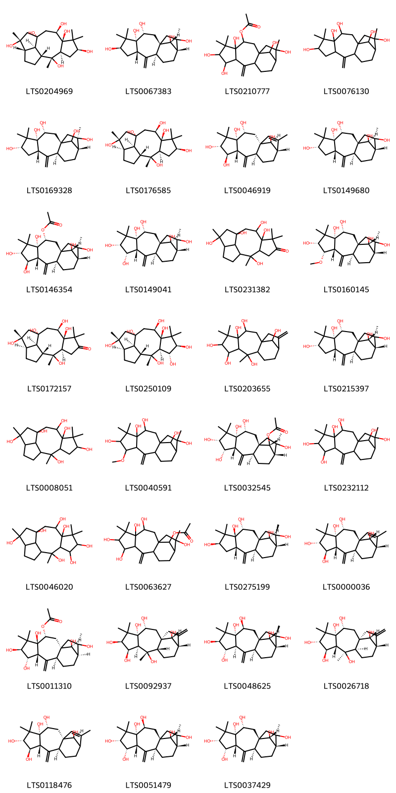{ width=100% }
    <figcaption>Hình ảnh cấu trúc hóa học của 31 hoạt chất thuộc nhóm Organooxygen compounds gồm ['(1r,2r,3s,5s,7r,8r,10s,12r,13s,16r)-2,6,6,12-tetramethyltetracyclo[8.5.1.0³,⁷.0¹³,¹⁶]hexadecane-2,5,7,8,10,12-hexol (LTS0204969)', '(1s,3r,4r,6r,8s,10s,13r,14r,16r)-5,5,14-trimethyl-9-methylidenetetracyclo[11.2.1.0¹,¹⁰.0⁴,⁸]hexadecane-3,4,6,14,16-pentol (LTS0067383)', '4,6,7,14,16-pentahydroxy-5,5,14-trimethyl-9-methylidenetetracyclo[11.2.1.0¹,¹⁰.0⁴,⁸]hexadecan-3-yl acetate (LTS0210777)', '5,5,14-trimethyl-9-methylidenetetracyclo[11.2.1.0¹,¹⁰.0⁴,⁸]hexadecane-3,4,6,14,16-pentol (LTS0076130)', '(1s,3r,4r,6s,8s,10s,13r,14r)-5,5,14-trimethyl-9-methylidenetetracyclo[11.2.1.0¹,¹⁰.0⁴,⁸]hexadecane-3,4,6,14,16-pentol (LTS0169328)', '(1r,2r,3s,5s,7r,8r,10s,12r,13r,16r)-2,6,6,12-tetramethyltetracyclo[8.5.1.0³,⁷.0¹³,¹⁶]hexadecane-2,5,7,8,10,12-hexol (LTS0176585)', '(1r,3r,4r,6r,7r,8r,10s,13s,16s)-5,5,14-trimethyl-9-methylidenetetracyclo[11.2.1.0¹,¹⁰.0⁴,⁸]hexadec-14-ene-3,4,6,7,16-pentol (LTS0046919)', '(1s,3r,4r,6s,8s,10s,13r,14r,16s)-5,5,14-trimethyl-9-methylidenetetracyclo[11.2.1.0¹,¹⁰.0⁴,⁸]hexadecane-3,4,6,14,16-pentol (LTS0149680)', '(1s,3r,4r,6r,7r,8r,10s,13r,14r,16r)-4,6,7,14,16-pentahydroxy-5,5,14-trimethyl-9-methylidenetetracyclo[11.2.1.0¹,¹⁰.0⁴,⁸]hexadecan-3-yl acetate (LTS0146354)', '(1s,3r,4r,6r,7s,8r,10s,13r,14r,16s)-5,5,14-trimethyl-9-methylidenetetracyclo[11.2.1.0¹,¹⁰.0⁴,⁸]hexadecane-3,4,6,7,14,16-hexol (LTS0149041)', '2,7,8,10,12-pentahydroxy-2,6,6,12-tetramethyltetracyclo[8.5.1.0³,⁷.0¹³,¹⁶]hexadecan-5-one (LTS0231382)', '(1s,3r,4r,6r,7s,8r,10s,13r,14r,16r)-7-methoxy-5,5,14-trimethyl-9-methylidenetetracyclo[11.2.1.0¹,¹⁰.0⁴,⁸]hexadecane-3,4,6,14,16-pentol (LTS0160145)', '(1r,2r,3s,7r,8r,10s,12r,13r,16r)-2,7,8,10,12-pentahydroxy-2,6,6,12-tetramethyltetracyclo[8.5.1.0³,⁷.0¹³,¹⁶]hexadecan-5-one (LTS0172157)', '(1r,2r,3s,4r,5r,7r,8r,10s,12r,13r,16r)-2,6,6,12-tetramethyltetracyclo[8.5.1.0³,⁷.0¹³,¹⁶]hexadecane-2,4,5,7,8,10,12-heptol (LTS0250109)', '5,5,9-trimethyl-14-methylidenetetracyclo[11.2.1.0¹,¹⁰.0⁴,⁸]hexadecane-3,4,6,7,9,16-hexol (LTS0203655)', 'grayanotoxin ii (LTS0215397)', '2,6,6,12-tetramethyltetracyclo[8.5.1.0³,⁷.0¹³,¹⁶]hexadecane-2,5,7,8,10,12-hexol (LTS0008051)', '7-methoxy-5,5,14-trimethyl-9-methylidenetetracyclo[11.2.1.0¹,¹⁰.0⁴,⁸]hexadecane-3,4,6,14,16-pentol (LTS0040591)', '(1s,3r,4r,6r,7s,8r,10s,13r,14r,16r)-3,4,6,7,14-pentahydroxy-5,5,14-trimethyl-9-methylidenetetracyclo[11.2.1.0¹,¹⁰.0⁴,⁸]hexadecan-16-yl acetate (LTS0032545)', '5,5,14-trimethyl-9-methylidenetetracyclo[11.2.1.0¹,¹⁰.0⁴,⁸]hexadecane-3,4,6,7,14,16-hexol (LTS0232112)', '2,6,6,12-tetramethyltetracyclo[8.5.1.0³,⁷.0¹³,¹⁶]hexadecane-2,4,5,7,8,10,12-heptol (LTS0046020)', '3,4,6,7,14-pentahydroxy-5,5,14-trimethyl-9-methylidenetetracyclo[11.2.1.0¹,¹⁰.0⁴,⁸]hexadecan-16-yl acetate (LTS0063627)', '(1s,3r,4s,6r,8s,10s,13r,14s,16s)-5,5,14-trimethyl-9-methylidenetetracyclo[11.2.1.0¹,¹⁰.0⁴,⁸]hexadecane-3,4,6,14,16-pentol (LTS0275199)', '(1s,3r,4r,6r,7r,8r,10s,13s,16r)-5,5,14-trimethyl-9-methylidenetetracyclo[11.2.1.0¹,¹⁰.0⁴,⁸]hexadec-14-ene-3,4,6,7,16-pentol (LTS0000036)', '(1r,3r,4s,6s,7s,8r,10s,13s,14r,16s)-4,6,7,14,16-pentahydroxy-5,5,14-trimethyl-9-methylidenetetracyclo[11.2.1.0¹,¹⁰.0⁴,⁸]hexadecan-3-yl acetate (LTS0011310)', '(1r,3r,4r,6s,7r,8r,9s,10s,13s,16r)-5,5,9-trimethyl-14-methylidenetetracyclo[11.2.1.0¹,¹⁰.0⁴,⁸]hexadecane-3,4,6,7,9,16-hexol (LTS0092937)', '(1s,3s,4r,6s,7s,8s,10s,13r,14s,16r)-5,5,14-trimethyl-9-methylidenetetracyclo[11.2.1.0¹,¹⁰.0⁴,⁸]hexadecane-3,4,6,7,14,16-hexol (LTS0048625)', '(1r,3r,4r,6r,7r,8s,9r,10r,13s,16r)-5,5,9-trimethyl-14-methylidenetetracyclo[11.2.1.0¹,¹⁰.0⁴,⁸]hexadecane-3,4,6,7,9,16-hexol (LTS0026718)', '(1r,3r,4r,6r,7r,8r,10s,16s)-5,5,14-trimethyl-9-methylidenetetracyclo[11.2.1.0¹,¹⁰.0⁴,⁸]hexadec-14-ene-3,4,6,7,16-pentol (LTS0118476)', '(1s,3s,4r,6r,7s,8r,10s,13r,14r,16r)-5,5,14-trimethyl-9-methylidenetetracyclo[11.2.1.0¹,¹⁰.0⁴,⁸]hexadecane-3,4,6,7,14,16-hexol (LTS0051479)', '(1s,3r,4r,6r,7s,8r,10s,13r,14r,16r)-5,5,14-trimethyl-9-methylidenetetracyclo[11.2.1.0¹,¹⁰.0⁴,⁸]hexadecane-3,4,6,7,14,16-hexol (LTS0037429)'].</figcaption>
</figure>
#### Nhóm Prenol lipids
<figure markdown="span">
    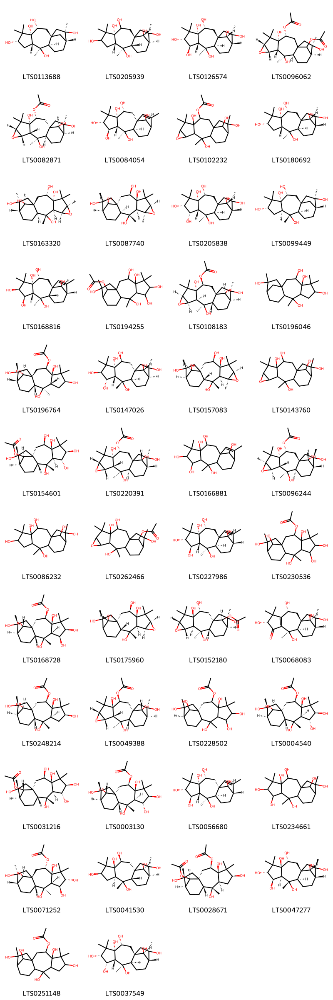{ width=100% }
    <figcaption>Hình ảnh cấu trúc hóa học của 46 hoạt chất thuộc nhóm Prenol lipids gồm ['(1r,3r,4r,6s,8s,9r,10r,13r,14r)-5,5,9,14-tetramethyltetracyclo[11.2.1.0¹,¹⁰.0⁴,⁸]hexadecane-3,4,6,9,14-pentol (LTS0113688)', '(1s,4r,8s,9r,10s,13s,14r,16r)-5,5,9,14-tetramethyltetracyclo[11.2.1.0¹,¹⁰.0⁴,⁸]hexadecane-3,4,6,9,14,16-hexol (LTS0205939)', 'rhodojaponin vi (LTS0126574)', '(3r,4r,6r,8s,9s,10r,11r,14s,15r)-17-(acetyloxy)-4,10,15-trihydroxy-5,5,10,15-tetramethyl-7-oxapentacyclo[12.2.1.0¹,¹¹.0⁴,⁹.0⁶,⁸]heptadecan-3-yl acetate (LTS0096062)', '(1r,3r,4r,6r,8s,9s,10r,11r,14s,15r,17s)-4,10,15,17-tetrahydroxy-5,5,10,15-tetramethyl-7-oxapentacyclo[12.2.1.0¹,¹¹.0⁴,⁹.0⁶,⁸]heptadecan-3-yl acetate (LTS0082871)', '(1r,3r,4r,6r,7r,8s,9r,10r,16s)-5,5,9,14-tetramethyltetracyclo[11.2.1.0¹,¹⁰.0⁴,⁸]hexadec-14-ene-3,4,6,7,9,16-hexol (LTS0084054)', '4,10,15,17-tetrahydroxy-5,5,10,15-tetramethyl-7-oxapentacyclo[12.2.1.0¹,¹¹.0⁴,⁹.0⁶,⁸]heptadecan-3-yl acetate (LTS0102232)', 'grayanotoxin iii (LTS0180692)', '(1r,3s,4s,6r,8s,9s,10r,11s,14s,15s,17r)-5,5,10,15-tetramethyl-7-oxapentacyclo[12.2.1.0¹,¹¹.0⁴,⁹.0⁶,⁸]heptadecane-3,4,10,15,17-pentol (LTS0163320)', '(1s,3r,4r,6r,8s,9s,10r,11s,14r,15r,17r)-5,5,10,15-tetramethyl-7-oxapentacyclo[12.2.1.0¹,¹¹.0⁴,⁹.0⁶,⁸]heptadecane-3,4,10,15,17-pentol (LTS0087740)', '(1s,3r,4r,6r,7s,8s,9r,10r,13r,14r,16r)-5,5,9,14-tetramethyltetracyclo[11.2.1.0¹,¹⁰.0⁴,⁸]hexadecane-3,4,6,7,9,14,16-heptol (LTS0205838)', '(1r,3r,4r,6s,8r,9s,10r,13r,14r)-5,5,9,14-tetramethyltetracyclo[11.2.1.0¹,¹⁰.0⁴,⁸]hexadecane-3,4,6,9,14-pentol (LTS0099449)', '(1s,3r,4r,6s,7r,8s,9r,10s,13s,16s)-5,5,9,14-tetramethyltetracyclo[11.2.1.0¹,¹⁰.0⁴,⁸]hexadec-14-ene-3,4,6,7,9,16-hexol (LTS0168816)', '3,4,6,7,9,14-hexahydroxy-5,5,9,14-tetramethyltetracyclo[11.2.1.0¹,¹⁰.0⁴,⁸]hexadecan-16-yl acetate (LTS0194255)', '(1s,3s,4r,6s,8r,9r,10r,11s,14s,15r,17s)-4,10,15,17-tetrahydroxy-5,5,10,15-tetramethyl-7-oxapentacyclo[12.2.1.0¹,¹¹.0⁴,⁹.0⁶,⁸]heptadecan-3-yl acetate (LTS0108183)', '5,5,9,14-tetramethyltetracyclo[11.2.1.0¹,¹⁰.0⁴,⁸]hexadecane-3,4,6,9,14-pentol (LTS0196046)', '(1r,3r,4r,6s,8r,9s,10r,13s,14r,16r)-4,6,9,14,16-pentahydroxy-5,5,9,14-tetramethyltetracyclo[11.2.1.0¹,¹⁰.0⁴,⁸]hexadecan-3-yl acetate (LTS0196764)', '(1r,3s,4r,6s,7s,8s,9s,10r,13s,14r,16r)-5,5,9,14-tetramethyltetracyclo[11.2.1.0¹,¹⁰.0⁴,⁸]hexadecane-3,4,6,7,9,14,16-heptol (LTS0147026)', 'rhodojaponin iii (LTS0157083)', '5,5,10,15-tetramethyl-7-oxapentacyclo[12.2.1.0¹,¹¹.0⁴,⁹.0⁶,⁸]heptadecane-3,4,10,15,17-pentol (LTS0143760)', '(1s,3r,4r,6r,7r,8s,9r,10r,13r,14r,16r)-3,4,6,7,9,14-hexahydroxy-5,5,9,14-tetramethyltetracyclo[11.2.1.0¹,¹⁰.0⁴,⁸]hexadecan-16-yl acetate (LTS0154601)', 'rhodojaponin ii (LTS0220391)', '5,5,9,14-tetramethyltetracyclo[11.2.1.0¹,¹⁰.0⁴,⁸]hexadec-14-ene-3,4,6,7,9,16-hexol (LTS0166881)', '(1s,3r,4r,6s,8r,9s,10r,11r,14r,15s,17r)-4,10,15,17-tetrahydroxy-5,5,10,15-tetramethyl-7-oxapentacyclo[12.2.1.0¹,¹¹.0⁴,⁹.0⁶,⁸]heptadecan-3-yl acetate (LTS0096244)', 'grayanotoxin iii (LTS0086232)', '3,4,10,15-tetrahydroxy-5,5,10,15-tetramethyl-7-oxapentacyclo[12.2.1.0¹,¹¹.0⁴,⁹.0⁶,⁸]heptadecan-17-yl acetate (LTS0262466)', '(1s,3r,4r,6r,7r,8s,9r,10r,13s,16r)-5,5,9,14-tetramethyltetracyclo[11.2.1.0¹,¹⁰.0⁴,⁸]hexadec-14-ene-3,4,6,7,9,16-hexol (LTS0227986)', '4,6,7,9,14,16-hexahydroxy-5,5,9,14-tetramethyltetracyclo[11.2.1.0¹,¹⁰.0⁴,⁸]hexadecan-3-yl acetate (LTS0230536)', '(1s,3r,4r,6r,7s,8s,9r,10r,13r,14r,16s)-4,6,7,9,14,16-hexahydroxy-5,5,9,14-tetramethyltetracyclo[11.2.1.0¹,¹⁰.0⁴,⁸]hexadecan-3-yl acetate (LTS0168728)', '(1s,3r,4r,6r,8s,9s,10r,11r,15r,17s)-5,5,10,15-tetramethyl-7-oxapentacyclo[12.2.1.0¹,¹¹.0⁴,⁹.0⁶,⁸]heptadecane-3,4,10,15,17-pentol (LTS0175960)', '(1r,3r,4s,6r,8s,9r,10r,11s,14s,15r,17s)-3,4,10,15-tetrahydroxy-5,5,10,15-tetramethyl-7-oxapentacyclo[12.2.1.0¹,¹¹.0⁴,⁹.0⁶,⁸]heptadecan-17-yl acetate (LTS0152180)', '(1s,3r,6r,9r,10r,13r,14r,16s)-3,6,9,14,16-pentahydroxy-5,5,9,14-tetramethyltetracyclo[11.2.1.0¹,¹⁰.0⁴,⁸]hexadec-4(8)-en-7-one (LTS0068083)', '(1s,3r,4r,6s,8s,9r,10r,13r,14r,16r)-4,6,9,14,16-pentahydroxy-5,5,9,14-tetramethyltetracyclo[11.2.1.0¹,¹⁰.0⁴,⁸]hexadecan-3-yl acetate (LTS0248214)', '(1r,3s,4s,6r,8s,9s,10r,11s,14s,15r,17r)-4,10,15,17-tetrahydroxy-5,5,10,15-tetramethyl-7-oxapentacyclo[12.2.1.0¹,¹¹.0⁴,⁹.0⁶,⁸]heptadecan-3-yl acetate (LTS0049388)', '(1s,13r)-4,6,7,9,14,16-hexahydroxy-5,5,9,14-tetramethyltetracyclo[11.2.1.0¹,¹⁰.0⁴,⁸]hexadecan-3-yl acetate (LTS0228502)', '(1s,3r,4r,6r,7r,8s,9r,10r,13r,14r,16r)-4,6,7,9,14,16-hexahydroxy-5,5,9,14-tetramethyltetracyclo[11.2.1.0¹,¹⁰.0⁴,⁸]hexadecan-3-yl acetate (LTS0004540)', '(1s,3r,4r,6r,7r,8s,9r,10r,13r,14r,16s)-3,4,6,7,9,14-hexahydroxy-5,5,9,14-tetramethyltetracyclo[11.2.1.0¹,¹⁰.0⁴,⁸]hexadecan-16-yl acetate (LTS0031216)', '(1s,3r,4r,6r,7r,8s,9r,10r,13r,14r,16s)-4,6,7,9,14,16-hexahydroxy-5,5,9,14-tetramethyltetracyclo[11.2.1.0¹,¹⁰.0⁴,⁸]hexadecan-3-yl acetate (LTS0003130)', '(1r,3r,4r,6r,7r,8s,9r,10r,13s,16s)-5,5,9,14-tetramethyltetracyclo[11.2.1.0¹,¹⁰.0⁴,⁸]hexadec-14-ene-3,4,6,7,9,16-hexol (LTS0056680)', '5,5,9,14-tetramethyltetracyclo[11.2.1.0¹,¹⁰.0⁴,⁸]hexadecane-3,4,6,7,9,14,16-heptol (LTS0234661)', '(1r,3s,4r,6s,7s,8s,9s,10r,13s,14s,16r)-4,6,7,9,14,16-hexahydroxy-5,5,9,14-tetramethyltetracyclo[11.2.1.0¹,¹⁰.0⁴,⁸]hexadecan-3-yl acetate (LTS0071252)', '(1r,3s,4s,6r,8r,9s,10s,13s,14r,16s)-5,5,9,14-tetramethyltetracyclo[11.2.1.0¹,¹⁰.0⁴,⁸]hexadecane-3,4,6,9,14,16-hexol (LTS0041530)', 'rhodojaponin iv (LTS0028671)', '(1s,3r,4s,6r,7r,8r,9s,10r,13r,14s,16r)-5,5,9,14-tetramethyltetracyclo[11.2.1.0¹,¹⁰.0⁴,⁸]hexadecane-3,4,6,7,9,14,16-heptol (LTS0047277)', '4,6,9,14,16-pentahydroxy-5,5,9,14-tetramethyltetracyclo[11.2.1.0¹,¹⁰.0⁴,⁸]hexadecan-3-yl acetate (LTS0251148)', '(1s,3r,4r,6r,7s,8s,9r,10r,13r,14r,16s)-5,5,9,14-tetramethyltetracyclo[11.2.1.0¹,¹⁰.0⁴,⁸]hexadecane-3,4,6,7,9,14,16-heptol (LTS0037549)'].</figcaption>
</figure>

---

### Dược dân tộc học

Danh sách các quốc gia có sử dụng *Rhododendron molle* trong điều trị các bệnh. 

| Country   | Disease                                     | Bệnh                                                                                                                                                                                                |
|:----------|:--------------------------------------------|:----------------------------------------------------------------------------------------------------------------------------------------------------------------------------------------------------|
| China     | Insecticide, Larvicide, Poison, Carminative | MYMEMORY WARNING: YOU USED ALL AVAILABLE FREE TRANSLATIONS FOR TODAY. NEXT AVAILABLE IN  01 HOURS 36 MINUTES 00 SECONDS VISIT HTTPS://MYMEMORY.TRANSLATED.NET/DOC/USAGELIMITS.PHP TO TRANSLATE MORE |

---

---
## Rhododendron ponticum
### Thông tin về thực vật

!!! info "Phân loại thực vật của *Rhododendron ponticum* từ GIBF:"
    - **Kingdom:** Plantae
    - **Phylum:** Tracheophyta
    - **Order:** Ericales
    - **Family:** Ericaceae
    - **Genus:** Rhododendron
    - **Species:** *Rhododendron ponticum*

 

| Label (VI)   | Label (EN)   | Scientific Name       | Descriptions (VI)   | Descriptions (EN)   | Also Known As (VI)   | Also Known As (EN)      |
|:-------------|:-------------|:----------------------|:--------------------|:--------------------|:---------------------|:------------------------|
| N/A          | N/A          | Rhododendron ponticum |                     | species of plant    | ['']                 | ['pontic rhododendron'] |

#### Phân bố trên thế giới

**Từ CSDL GIBF** Netherlands, Germany, Belgium, Georgia, New Zealand, Spain, Ireland, Portugal, Russian Federation, Sweden, Austria, United Kingdom of Great Britain and Northern Ireland

#### Phân bố tại Việt Nam

**Từ CSDL GIBF**: Không có ghi nhận ở Việt Nam

---
### Thành phần hóa học
        
- Theo cơ sở dữ liệu lotus: Từ loài *Rhododendron ponticum* đã phân lập và xác định được 15 hoạt chất thuộc về các nhóm Fatty Acyls, Flavonoids, Prenol lipids, Steroids and steroid derivatives, Cinnamic acids and derivatives. 

|    | chemicalTaxonomyClassyfireClass   |   smiles_count |
|---:|:----------------------------------|---------------:|
|  0 | Cinnamic acids and derivatives    |              2 |
|  1 | Fatty Acyls                       |              1 |
|  2 | Flavonoids                        |              4 |
|  3 | Prenol lipids                     |              4 |
|  4 | Steroids and steroid derivatives  |              4 |

#### Nhóm Cinnamic acids and derivatives
<figure markdown="span">
    { width=100% }
    <figcaption>Hình ảnh cấu trúc hóa học của 2 hoạt chất thuộc nhóm Cinnamic acids and derivatives gồm ['3,4-dihydroxycinnamic acid (LTS0128050)', 'caffeic acid (LTS0027481)'].</figcaption>
</figure>
#### Nhóm Fatty Acyls
<figure markdown="span">
    { width=100% }
    <figcaption>Hình ảnh cấu trúc hóa học của 1 hoạt chất thuộc nhóm Fatty Acyls gồm ['2-carboxy-d-arabinitol (LTS0056947)'].</figcaption>
</figure>
#### Nhóm Flavonoids
<figure markdown="span">
    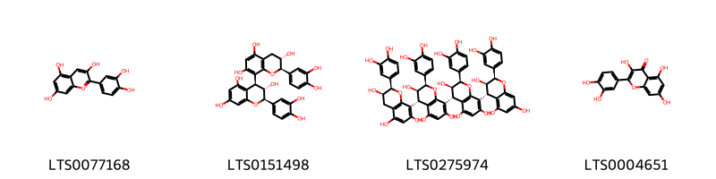{ width=100% }
    <figcaption>Hình ảnh cấu trúc hóa học của 4 hoạt chất thuộc nhóm Flavonoids gồm ['cyanidin (LTS0077168)', '(2r,3s,4s)-2-(3,4-dihydroxyphenyl)-4-[(2r,3s)-2-(3,4-dihydroxyphenyl)-3,5,7-trihydroxy-3,4-dihydro-2h-1-benzopyran-8-yl]-3,4-dihydro-2h-1-benzopyran-3,5,7-triol (LTS0151498)', '(2r,3r,4r)-2-(3,4-dihydroxyphenyl)-8-[(2r,3r,4r)-2-(3,4-dihydroxyphenyl)-3,5,7-trihydroxy-3,4-dihydro-2h-1-benzopyran-4-yl]-4-[(2r,3r,4s)-2-(3,4-dihydroxyphenyl)-4-[(2r,3r)-2-(3,4-dihydroxyphenyl)-3,5,7-trihydroxy-3,4-dihydro-2h-1-benzopyran-8-yl]-3,5,7-trihydroxy-3,4-dihydro-2h-1-benzopyran-8-yl]-3,4-dihydro-2h-1-benzopyran-3,5,7-triol (LTS0275974)', 'quercetin (LTS0004651)'].</figcaption>
</figure>
#### Nhóm Prenol lipids
<figure markdown="span">
    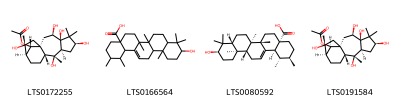{ width=100% }
    <figcaption>Hình ảnh cấu trúc hóa học của 4 hoạt chất thuộc nhóm Prenol lipids gồm ['(1s,3r,4r,6s,8s,9r,10r,13r,14r,16s)-3,4,6,9,14-pentahydroxy-5,5,9,14-tetramethyltetracyclo[11.2.1.0¹,¹⁰.0⁴,⁸]hexadecan-16-yl acetate (LTS0172255)', '10-hydroxy-1,2,6a,6b,9,9,12a-heptamethyl-2,3,4,5,6,7,8,8a,10,11,12,12b,13,14b-tetradecahydro-1h-picene-4a-carboxylic acid (LTS0166564)', '3β-hydroxy-12-ursen-28-ic acid (LTS0080592)', 'andromedotoxin (LTS0191584)'].</figcaption>
</figure>
#### Nhóm Steroids and steroid derivatives
<figure markdown="span">
    { width=100% }
    <figcaption>Hình ảnh cấu trúc hóa học của 4 hoạt chất thuộc nhóm Steroids and steroid derivatives gồm ['stigmast-5-en-3-ol (LTS0071224)', 'stigmast-5-en-3-ol, (3β)- (LTS0204616)', 'phytosterol (LTS0029311)', 'cholesterol (LTS0102304)'].</figcaption>
</figure>

---

### Dược dân tộc học

Danh sách các quốc gia có sử dụng *Rhododendron ponticum* trong điều trị các bệnh. 

| Country   | Disease              | Bệnh                                                                                                                                                                                                |
|:----------|:---------------------|:----------------------------------------------------------------------------------------------------------------------------------------------------------------------------------------------------|
| Elsewhere | Narcotic             | MYMEMORY WARNING: YOU USED ALL AVAILABLE FREE TRANSLATIONS FOR TODAY. NEXT AVAILABLE IN  01 HOURS 35 MINUTES 38 SECONDS VISIT HTTPS://MYMEMORY.TRANSLATED.NET/DOC/USAGELIMITS.PHP TO TRANSLATE MORE |
| Turkey    | Intoxicant, Narcotic | MYMEMORY WARNING: YOU USED ALL AVAILABLE FREE TRANSLATIONS FOR TODAY. NEXT AVAILABLE IN  01 HOURS 35 MINUTES 36 SECONDS VISIT HTTPS://MYMEMORY.TRANSLATED.NET/DOC/USAGELIMITS.PHP TO TRANSLATE MORE |

---

---
## Rhododendron sinense
### Thông tin về thực vật

!!! info "Phân loại thực vật của *Rhododendron molle* từ GIBF:"
    - **Kingdom:** Plantae
    - **Phylum:** Tracheophyta
    - **Order:** Ericales
    - **Family:** Ericaceae
    - **Genus:** Rhododendron
    - **Species:** *Rhododendron molle*

 

| Label (VI)   | Label (EN)   | Scientific Name       | Descriptions (VI)   | Descriptions (EN)   | Also Known As (VI)   | Also Known As (EN)      |
|:-------------|:-------------|:----------------------|:--------------------|:--------------------|:---------------------|:------------------------|
| N/A          | N/A          | Rhododendron ponticum |                     | species of plant    | ['']                 | ['pontic rhododendron'] |

#### Phân bố trên thế giới

**Từ CSDL GIBF** nan, Japan, Brazil, United States of America, China

#### Phân bố tại Việt Nam

**Từ CSDL GIBF**: Không có ghi nhận ở Việt Nam

---
### Thành phần hóa học
        
- Theo cơ sở dữ liệu lotus: Từ loài *Rhododendron molle* đã phân lập và xác định được Chưa có hoạt chất nào được phân lập. hoạt chất thuộc về các nhóm Không có hoạt chất nào được phân lập. 

Không có hình ảnh nào được tạo ra

---

### Dược dân tộc học

Danh sách các quốc gia có sử dụng *Rhododendron molle* trong điều trị các bệnh. 

| Country   | Disease                                 | Bệnh                                                                                                                                                                                                |
|:----------|:----------------------------------------|:----------------------------------------------------------------------------------------------------------------------------------------------------------------------------------------------------|
| China     | Analgesic, Anesthetic, Poison, Sedative | MYMEMORY WARNING: YOU USED ALL AVAILABLE FREE TRANSLATIONS FOR TODAY. NEXT AVAILABLE IN  01 HOURS 34 MINUTES 50 SECONDS VISIT HTTPS://MYMEMORY.TRANSLATED.NET/DOC/USAGELIMITS.PHP TO TRANSLATE MORE |

---

# Chi Leucothoe

??? note "Danh sách các dược liệu thuộc chi"
    
	 - *Leucothoe davisiae*
	 - *Leucothoe grayana*

---
## Leucothoe davisiae
### Thông tin về thực vật

!!! info "Phân loại thực vật của *Leucothoe davisiae* từ GIBF:"
    - **Kingdom:** Plantae
    - **Phylum:** Tracheophyta
    - **Order:** Ericales
    - **Family:** Ericaceae
    - **Genus:** Leucothoe
    - **Species:** *Leucothoe davisiae*

 

| Label (VI)   | Label (EN)   | Scientific Name    | Descriptions (VI)   | Descriptions (EN)   | Also Known As (VI)   | Also Known As (EN)   |
|:-------------|:-------------|:-------------------|:--------------------|:--------------------|:---------------------|:---------------------|
| N/A          | N/A          | Leucothoe davisiae | loài thực vật       | species of plant    | ['']                 | ['']                 |

#### Phân bố trên thế giới

**Từ CSDL GIBF** United States of America, Canada

#### Phân bố tại Việt Nam

**Từ CSDL GIBF**: Không có ghi nhận ở Việt Nam

---
### Thành phần hóa học
        
- Theo cơ sở dữ liệu lotus: Từ loài *Leucothoe davisiae* đã phân lập và xác định được Chưa có hoạt chất nào được phân lập. hoạt chất thuộc về các nhóm Không có hoạt chất nào được phân lập. 

Không có hình ảnh nào được tạo ra

---

### Dược dân tộc học

Danh sách các quốc gia có sử dụng *Leucothoe davisiae* trong điều trị các bệnh. 

| Country   | Disease   | Bệnh                                                                                                                                                                                                |
|:----------|:----------|:----------------------------------------------------------------------------------------------------------------------------------------------------------------------------------------------------|
| US        | Poison    | MYMEMORY WARNING: YOU USED ALL AVAILABLE FREE TRANSLATIONS FOR TODAY. NEXT AVAILABLE IN  01 HOURS 34 MINUTES 35 SECONDS VISIT HTTPS://MYMEMORY.TRANSLATED.NET/DOC/USAGELIMITS.PHP TO TRANSLATE MORE |

---

---
## Leucothoe grayana
### Thông tin về thực vật

!!! info "Phân loại thực vật của *Leucothoe grayana* từ GIBF:"
    - **Kingdom:** Plantae
    - **Phylum:** Tracheophyta
    - **Order:** Ericales
    - **Family:** Ericaceae
    - **Genus:** Leucothoe
    - **Species:** *Leucothoe grayana*

 

| Label (VI)   | Label (EN)   | Scientific Name   | Descriptions (VI)   | Descriptions (EN)   | Also Known As (VI)   | Also Known As (EN)   |
|:-------------|:-------------|:------------------|:--------------------|:--------------------|:---------------------|:---------------------|
| N/A          | N/A          | Leucothoe grayana | loài thực vật       | species of plant    | ['']                 | ['']                 |

#### Phân bố trên thế giới

**Từ CSDL GIBF** Belgium, Russian Federation, Latvia, Japan

#### Phân bố tại Việt Nam

**Từ CSDL GIBF**: Không có ghi nhận ở Việt Nam

---
### Thành phần hóa học
        
- Theo cơ sở dữ liệu lotus: Từ loài *Leucothoe grayana* đã phân lập và xác định được 49 hoạt chất thuộc về các nhóm Prenol lipids, Organooxygen compounds, Steroids and steroid derivatives. 

|    | chemicalTaxonomyClassyfireClass   |   smiles_count |
|---:|:----------------------------------|---------------:|
|  0 | Organooxygen compounds            |             18 |
|  1 | Prenol lipids                     |             30 |
|  2 | Steroids and steroid derivatives  |              1 |

#### Nhóm Organooxygen compounds
<figure markdown="span">
    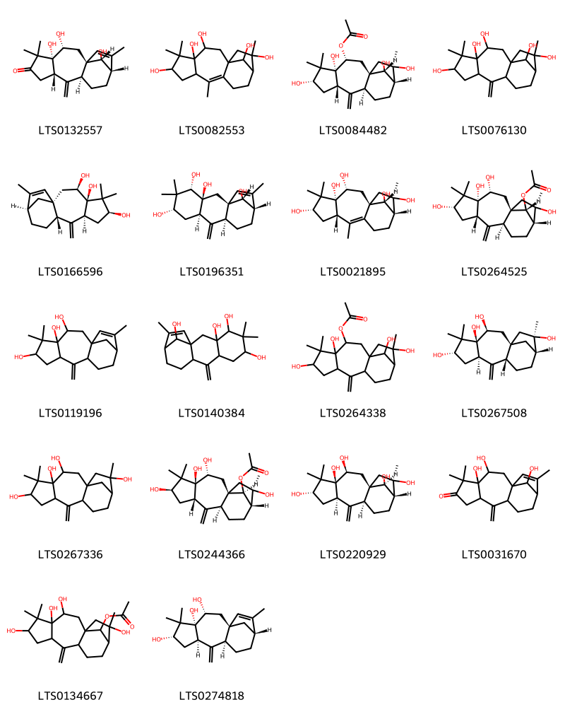{ width=100% }
    <figcaption>Hình ảnh cấu trúc hóa học của 18 hoạt chất thuộc nhóm Organooxygen compounds gồm ['(1s,3r,4r,8s,10s,13s,16r)-3,4,16-trihydroxy-5,5,14-trimethyl-9-methylidenetetracyclo[11.2.1.0¹,¹⁰.0⁴,⁸]hexadec-14-en-6-one (LTS0132557)', '5,5,9,14-tetramethyltetracyclo[11.2.1.0¹,¹⁰.0⁴,⁸]hexadec-9-ene-3,4,6,14,16-pentol (LTS0082553)', '(1s,3r,4r,6s,8s,10s,13r,14r,16r)-4,6,14,16-tetrahydroxy-5,5,14-trimethyl-9-methylidenetetracyclo[11.2.1.0¹,¹⁰.0⁴,⁸]hexadecan-3-yl acetate (LTS0084482)', '5,5,14-trimethyl-9-methylidenetetracyclo[11.2.1.0¹,¹⁰.0⁴,⁸]hexadecane-3,4,6,14,16-pentol (LTS0076130)', '(1r,3r,4r,6s,8s,10s,13r)-5,5,14-trimethyl-9-methylidenetetracyclo[11.2.1.0¹,¹⁰.0⁴,⁸]hexadec-14-ene-3,4,6-triol (LTS0166596)', '(-)-leucothol c (LTS0196351)', 'isograyanotoxin ii (LTS0021895)', '(1s,3r,4r,6s,8s,10s,13r,14r,16r)-3,4,6,14-tetrahydroxy-5,5,14-trimethyl-9-methylidenetetracyclo[11.2.1.0¹,¹⁰.0⁴,⁸]hexadecan-16-yl acetate (LTS0264525)', '5,5,14-trimethyl-9-methylidenetetracyclo[11.2.1.0¹,¹⁰.0⁴,⁸]hexadec-14-ene-3,4,6-triol (LTS0119196)', '5,5,14-trimethyl-9-methylidenetetracyclo[11.2.1.0¹,¹⁰.0³,⁸]hexadec-14-ene-3,4,6,16-tetrol (LTS0140384)', '4,6,14,16-tetrahydroxy-5,5,14-trimethyl-9-methylidenetetracyclo[11.2.1.0¹,¹⁰.0⁴,⁸]hexadecan-3-yl acetate (LTS0264338)', '(1r,3s,4s,6s,8r,10s,13r,14r)-5,5,14-trimethyl-9-methylidenetetracyclo[11.2.1.0¹,¹⁰.0⁴,⁸]hexadecane-3,4,6,14-tetrol (LTS0267508)', '5,5,14-trimethyl-9-methylidenetetracyclo[11.2.1.0¹,¹⁰.0⁴,⁸]hexadecane-3,4,6,14-tetrol (LTS0267336)', '(1s,3r,4s,6r,8s,10s,13r,14r,16s)-3,4,6,14-tetrahydroxy-5,5,14-trimethyl-9-methylidenetetracyclo[11.2.1.0¹,¹⁰.0⁴,⁸]hexadecan-16-yl acetate (LTS0244366)', '(1s,3s,4s,6s,8r,10s,13r,14r,16s)-5,5,14-trimethyl-9-methylidenetetracyclo[11.2.1.0¹,¹⁰.0⁴,⁸]hexadecane-3,4,6,14,16-pentol (LTS0220929)', '3,4,16-trihydroxy-5,5,14-trimethyl-9-methylidenetetracyclo[11.2.1.0¹,¹⁰.0⁴,⁸]hexadec-14-en-6-one (LTS0031670)', '3,4,6,14-tetrahydroxy-5,5,14-trimethyl-9-methylidenetetracyclo[11.2.1.0¹,¹⁰.0⁴,⁸]hexadecan-16-yl acetate (LTS0134667)', '(1r,3r,4r,6s,8r,10s,13r)-5,5,14-trimethyl-9-methylidenetetracyclo[11.2.1.0¹,¹⁰.0⁴,⁸]hexadec-14-ene-3,4,6-triol (LTS0274818)'].</figcaption>
</figure>
#### Nhóm Prenol lipids
<figure markdown="span">
    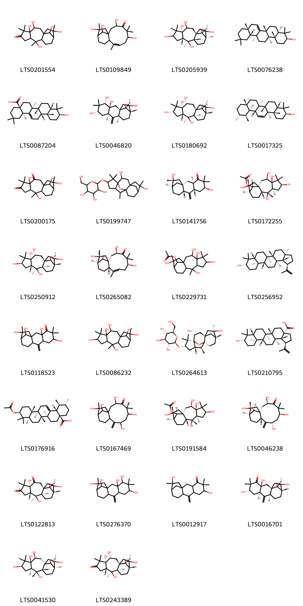{ width=100% }
    <figcaption>Hình ảnh cấu trúc hóa học của 30 hoạt chất thuộc nhóm Prenol lipids gồm ['3,4,9,14,16-pentahydroxy-5,5,9,14-tetramethyltetracyclo[11.2.1.0¹,¹⁰.0⁴,⁸]hexadecan-6-one (LTS0201554)', '3,6,14,16-tetrahydroxy-5,5,9,14-tetramethyltricyclo[11.2.1.0¹,¹⁰]hexadec-8-en-4-one (LTS0109849)', '(1s,4r,8s,9r,10s,13s,14r,16r)-5,5,9,14-tetramethyltetracyclo[11.2.1.0¹,¹⁰.0⁴,⁸]hexadecane-3,4,6,9,14,16-hexol (LTS0205939)', 'alnulin (LTS0076238)', '(4as,6as,6br,8as,10s,12ar,12bs,14br)-10-hydroxy-2,2,6a,6b,9,9,12a-heptamethyl-1,3,4,5,6,7,8,8a,10,11,12,12b,13,14b-tetradecahydropicene-4a-carboxylic acid (LTS0087204)', '(1r,3s,4s,6s,8r,10s,13r,14r,16r)-5,5,14-trimethyl-9-methylidenetetracyclo[11.2.1.0¹,¹⁰.0³,⁸]hexadecane-3,4,6,14,16-pentol (LTS0046820)', 'grayanotoxin iii (LTS0180692)', '(3s,4as,6ar,6br,8ar,11r,12s,12ar,12br,14ar,14bs)-4,4,6a,6b,8a,11,12,14b-octamethyl-2,3,4a,5,6,7,8,9,10,11,12,12a,12b,14a-tetradecahydro-1h-picen-3-ol (LTS0017325)', '4,9,14,16-tetrahydroxy-5,5,9,14-tetramethyltetracyclo[11.2.1.0¹,¹⁰.0⁴,⁸]hexadecane-3,6-dione (LTS0200175)', '2-({2,6-dihydroxy-6,11,15,15-tetramethyl-16-oxapentacyclo[8.5.1.1⁴,⁷.0¹,¹².0⁴,¹⁰]heptadecan-14-yl}oxy)-6-(hydroxymethyl)oxane-3,4,5-triol (LTS0199747)', '(1r,3r,6s,8s,10r,13r,14r)-6,14-dihydroxy-5,5,14-trimethyl-9-methylidenetetracyclo[11.2.1.0¹,¹⁰.0³,⁸]hexadecan-4-one (LTS0141756)', '(1s,3r,4r,6s,8s,9r,10r,13r,14r,16s)-3,4,6,9,14-pentahydroxy-5,5,9,14-tetramethyltetracyclo[11.2.1.0¹,¹⁰.0⁴,⁸]hexadecan-16-yl acetate (LTS0172255)', '(1s,3r,4r,6r,8s,9r,10r,13r,14r,16s)-5,5,9,14-tetramethyltetracyclo[11.2.1.0¹,¹⁰.0⁴,⁸]hexadecane-3,4,6,9,14,16-hexol (LTS0250912)', '(1s,3r,6s,8e,10s,13r,14r,16r)-3,6,14,16-tetrahydroxy-5,5,9,14-tetramethyltricyclo[11.2.1.0¹,¹⁰]hexadec-8-en-4-one (LTS0265082)', '3,4,6,9,14-pentahydroxy-5,5,9,14-tetramethyltetracyclo[11.2.1.0¹,¹⁰.0⁴,⁸]hexadecan-16-yl acetate (LTS0229731)', 'lupeol (LTS0256952)', '3,6,14,16-tetrahydroxy-5,5,14-trimethyl-9-methylidenetetracyclo[11.2.1.0¹,¹⁰.0³,⁸]hexadecan-4-one (LTS0118523)', 'grayanotoxin iii (LTS0086232)', '(2r,3r,4s,5s,6r)-2-{[(1r,2r,4r,6r,7r,10r,11s,12s,14s)-2,6-dihydroxy-6,11,15,15-tetramethyl-16-oxapentacyclo[8.5.1.1⁴,⁷.0¹,¹².0⁴,¹⁰]heptadecan-14-yl]oxy}-6-(hydroxymethyl)oxane-3,4,5-triol (LTS0264613)', 'betulinic acid (LTS0210795)', '(1s,2r,4as,6as,6br,8ar,10s,12ar,12br,14bs)-10-(acetyloxy)-1,2,6a,6b,9,9,12a-heptamethyl-2,3,4,5,6,7,8,8a,10,11,12,12b,13,14b-tetradecahydro-1h-picene-4a-carboxylic acid (LTS0176916)', '3,6,8,14,16-pentahydroxy-5,5,14-trimethyl-9-methylidenetricyclo[11.2.1.0¹,¹⁰]hexadecan-4-one (LTS0167469)', 'andromedotoxin (LTS0191584)', '(1s,3r,6s,8s,10s,13r,14r,16r)-3,6,8,14,16-pentahydroxy-5,5,14-trimethyl-9-methylidenetricyclo[11.2.1.0¹,¹⁰]hexadecan-4-one (LTS0046238)', '(1r,4r,8s,9r,10r,13r,14r,16r)-4,9,14,16-tetrahydroxy-5,5,9,14-tetramethyltetracyclo[11.2.1.0¹,¹⁰.0⁴,⁸]hexadecane-3,6-dione (LTS0122813)', '5,5,14-trimethyl-9-methylidenetetracyclo[11.2.1.0¹,¹⁰.0³,⁸]hexadecane-3,4,6,14,16-pentol (LTS0276370)', '6,14-dihydroxy-5,5,14-trimethyl-9-methylidenetetracyclo[11.2.1.0¹,¹⁰.0³,⁸]hexadecan-4-one (LTS0012917)', '(1r,3s,6s,8r,10s,13r,14r,16r)-3,6,14,16-tetrahydroxy-5,5,14-trimethyl-9-methylidenetetracyclo[11.2.1.0¹,¹⁰.0³,⁸]hexadecan-4-one (LTS0016701)', '(1r,3s,4s,6r,8r,9s,10s,13s,14r,16s)-5,5,9,14-tetramethyltetracyclo[11.2.1.0¹,¹⁰.0⁴,⁸]hexadecane-3,4,6,9,14,16-hexol (LTS0041530)', '(1s,3r,4r,8s,9r,10r,13r,14r,16r)-3,4,9,14,16-pentahydroxy-5,5,9,14-tetramethyltetracyclo[11.2.1.0¹,¹⁰.0⁴,⁸]hexadecan-6-one (LTS0243389)'].</figcaption>
</figure>
#### Nhóm Steroids and steroid derivatives
<figure markdown="span">
    { width=100% }
    <figcaption>Hình ảnh cấu trúc hóa học của 1 hoạt chất thuộc nhóm Steroids and steroid derivatives gồm ['sitosterol (LTS0168132)'].</figcaption>
</figure>

---

### Dược dân tộc học

Danh sách các quốc gia có sử dụng *Leucothoe grayana* trong điều trị các bệnh. 

| Country   | Disease              | Bệnh                                                                                                                                                                                                |
|:----------|:---------------------|:----------------------------------------------------------------------------------------------------------------------------------------------------------------------------------------------------|
| China     | Parasiticide, Poison | MYMEMORY WARNING: YOU USED ALL AVAILABLE FREE TRANSLATIONS FOR TODAY. NEXT AVAILABLE IN  01 HOURS 34 MINUTES 13 SECONDS VISIT HTTPS://MYMEMORY.TRANSLATED.NET/DOC/USAGELIMITS.PHP TO TRANSLATE MORE |

---

# Chi Befaria

??? note "Danh sách các dược liệu thuộc chi"
    
	 - *Befaria glauca*

---
## Befaria glauca
### Thông tin về thực vật

!!! info "Phân loại thực vật của *Bejaria aestuans* từ GIBF:"
    - **Kingdom:** Plantae
    - **Phylum:** Tracheophyta
    - **Order:** Ericales
    - **Family:** Ericaceae
    - **Genus:** Bejaria
    - **Species:** *Bejaria aestuans*

 

| Label (VI)   | Label (EN)   | Scientific Name   | Descriptions (VI)   | Descriptions (EN)   | Also Known As (VI)   | Also Known As (EN)   |
|:-------------|:-------------|:------------------|:--------------------|:--------------------|:---------------------|:---------------------|
| N/A          | N/A          | Leucothoe grayana | loài thực vật       | species of plant    | ['']                 | ['']                 |

#### Phân bố trên thế giới

**Từ CSDL GIBF** nan, Colombia, Venezuela (Bolivarian Republic of), Mexico

#### Phân bố tại Việt Nam

**Từ CSDL GIBF**: Không có ghi nhận ở Việt Nam

---
### Thành phần hóa học
        
- Theo cơ sở dữ liệu lotus: Từ loài *Bejaria aestuans* đã phân lập và xác định được Chưa có hoạt chất nào được phân lập. hoạt chất thuộc về các nhóm Không có hoạt chất nào được phân lập. 

Không có hình ảnh nào được tạo ra

---

### Dược dân tộc học

Danh sách các quốc gia có sử dụng *Bejaria aestuans* trong điều trị các bệnh. 

| Country   | Disease   | Bệnh                                                                                                                                                                                                |
|:----------|:----------|:----------------------------------------------------------------------------------------------------------------------------------------------------------------------------------------------------|
| Bolivia   | Stimulant | MYMEMORY WARNING: YOU USED ALL AVAILABLE FREE TRANSLATIONS FOR TODAY. NEXT AVAILABLE IN  01 HOURS 33 MINUTES 34 SECONDS VISIT HTTPS://MYMEMORY.TRANSLATED.NET/DOC/USAGELIMITS.PHP TO TRANSLATE MORE |

---

# Chi Epigaea

??? note "Danh sách các dược liệu thuộc chi"
    
	 - *Epigaea repens*

---
## Epigaea repens
### Thông tin về thực vật

!!! info "Phân loại thực vật của *Epigaea repens* từ GIBF:"
    - **Kingdom:** Plantae
    - **Phylum:** Tracheophyta
    - **Order:** Ericales
    - **Family:** Ericaceae
    - **Genus:** Epigaea
    - **Species:** *Epigaea repens*

 

| Label (VI)   | Label (EN)   | Scientific Name   | Descriptions (VI)   | Descriptions (EN)   | Also Known As (VI)   | Also Known As (EN)               |
|:-------------|:-------------|:------------------|:--------------------|:--------------------|:---------------------|:---------------------------------|
| N/A          | N/A          | Epigaea repens    | loài thực vật       | species of plant    | ['']                 | ['may flower(trailing arbutus)'] |

#### Phân bố trên thế giới

**Từ CSDL GIBF** United States of America, Canada

#### Phân bố tại Việt Nam

**Từ CSDL GIBF**: Không có ghi nhận ở Việt Nam

---
### Thành phần hóa học
        
- Theo cơ sở dữ liệu lotus: Từ loài *Epigaea repens* đã phân lập và xác định được 8 hoạt chất thuộc về các nhóm Prenol lipids, Steroids and steroid derivatives. 

|    | chemicalTaxonomyClassyfireClass   |   smiles_count |
|---:|:----------------------------------|---------------:|
|  0 | Prenol lipids                     |              5 |
|  1 | Steroids and steroid derivatives  |              3 |

#### Nhóm Prenol lipids
<figure markdown="span">
    { width=100% }
    <figcaption>Hình ảnh cấu trúc hóa học của 5 hoạt chất thuộc nhóm Prenol lipids gồm ['amyrin (LTS0222826)', 'β-amyrin (LTS0251864)', 'lupeol (LTS0256952)', '(6ar,6br,8ar,14br)-4,4,6a,6b,8a,12,14b-heptamethyl-11-methylidene-hexadecahydropicen-3-ol (LTS0274865)', 'taraxasterol (LTS0006950)'].</figcaption>
</figure>
#### Nhóm Steroids and steroid derivatives
<figure markdown="span">
    { width=100% }
    <figcaption>Hình ảnh cấu trúc hóa học của 3 hoạt chất thuộc nhóm Steroids and steroid derivatives gồm ['stigmast-5-en-3-ol (LTS0071224)', 'stigmast-5-en-3-ol, (3β)- (LTS0204616)', 'phytosterol (LTS0029311)'].</figcaption>
</figure>

---

### Dược dân tộc học

Danh sách các quốc gia có sử dụng *Epigaea repens* trong điều trị các bệnh. 

| Country   | Disease           | Bệnh                                                                                                                                                                                                |
|:----------|:------------------|:----------------------------------------------------------------------------------------------------------------------------------------------------------------------------------------------------|
| Elsewhere | Astringent, Tonic | MYMEMORY WARNING: YOU USED ALL AVAILABLE FREE TRANSLATIONS FOR TODAY. NEXT AVAILABLE IN  01 HOURS 33 MINUTES 17 SECONDS VISIT HTTPS://MYMEMORY.TRANSLATED.NET/DOC/USAGELIMITS.PHP TO TRANSLATE MORE |
| French    | Astringent        | MYMEMORY WARNING: YOU USED ALL AVAILABLE FREE TRANSLATIONS FOR TODAY. NEXT AVAILABLE IN  01 HOURS 33 MINUTES 15 SECONDS VISIT HTTPS://MYMEMORY.TRANSLATED.NET/DOC/USAGELIMITS.PHP TO TRANSLATE MORE |
| US        | Diuretic          | MYMEMORY WARNING: YOU USED ALL AVAILABLE FREE TRANSLATIONS FOR TODAY. NEXT AVAILABLE IN  01 HOURS 33 MINUTES 13 SECONDS VISIT HTTPS://MYMEMORY.TRANSLATED.NET/DOC/USAGELIMITS.PHP TO TRANSLATE MORE |

---

# Chi Chimaphila

??? note "Danh sách các dược liệu thuộc chi"
    
	 - *Chimaphila maculata*
	 - *Chimaphila umbellata*

---
## Chimaphila maculata
### Thông tin về thực vật

!!! info "Phân loại thực vật của *Chimaphila maculata* từ GIBF:"
    - **Kingdom:** Plantae
    - **Phylum:** Tracheophyta
    - **Order:** Ericales
    - **Family:** Ericaceae
    - **Genus:** Chimaphila
    - **Species:** *Chimaphila maculata*

 

| Label (VI)   | Label (EN)   | Scientific Name     | Descriptions (VI)   | Descriptions (EN)   | Also Known As (VI)   | Also Known As (EN)      |
|:-------------|:-------------|:--------------------|:--------------------|:--------------------|:---------------------|:------------------------|
| N/A          | N/A          | Chimaphila maculata | loài thực vật       | species of plant    | ['']                 | ['Spotted wintergreen'] |

#### Phân bố trên thế giới

**Từ CSDL GIBF** nan, United States of America

#### Phân bố tại Việt Nam

**Từ CSDL GIBF**: Không có ghi nhận ở Việt Nam

---
### Thành phần hóa học
        
- Theo cơ sở dữ liệu lotus: Từ loài *Chimaphila maculata* đã phân lập và xác định được Chưa có hoạt chất nào được phân lập. hoạt chất thuộc về các nhóm Không có hoạt chất nào được phân lập. 

Không có hình ảnh nào được tạo ra

---

### Dược dân tộc học

Danh sách các quốc gia có sử dụng *Chimaphila maculata* trong điều trị các bệnh. 

| Country   | Disease         | Bệnh                                                                                                                                                                                                |
|:----------|:----------------|:----------------------------------------------------------------------------------------------------------------------------------------------------------------------------------------------------|
| US        | Diuretic, Tonic | MYMEMORY WARNING: YOU USED ALL AVAILABLE FREE TRANSLATIONS FOR TODAY. NEXT AVAILABLE IN  01 HOURS 32 MINUTES 36 SECONDS VISIT HTTPS://MYMEMORY.TRANSLATED.NET/DOC/USAGELIMITS.PHP TO TRANSLATE MORE |

---

---
## Chimaphila umbellata
### Thông tin về thực vật

!!! info "Phân loại thực vật của *Chimaphila umbellata* từ GIBF:"
    - **Kingdom:** Plantae
    - **Phylum:** Tracheophyta
    - **Order:** Ericales
    - **Family:** Ericaceae
    - **Genus:** Chimaphila
    - **Species:** *Chimaphila umbellata*

 

| Label (VI)   | Label (EN)   | Scientific Name      | Descriptions (VI)   | Descriptions (EN)   | Also Known As (VI)   | Also Known As (EN)                        |
|:-------------|:-------------|:---------------------|:--------------------|:--------------------|:---------------------|:------------------------------------------|
| N/A          | N/A          | Chimaphila umbellata |                     | species of plant    | ['']                 | ['Chimaphila umbellata', 'prince’s pine'] |

#### Phân bố trên thế giới

**Từ CSDL GIBF** Ukraine, Denmark, Belarus, Czechia, Estonia, Russian Federation, United States of America, Sweden, Mexico, Canada

#### Phân bố tại Việt Nam

**Từ CSDL GIBF**: Không có ghi nhận ở Việt Nam

---
### Thành phần hóa học
        
- Theo cơ sở dữ liệu lotus: Từ loài *Chimaphila umbellata* đã phân lập và xác định được 13 hoạt chất thuộc về các nhóm Naphthalenes, Flavonoids, Prenol lipids. 

|    | chemicalTaxonomyClassyfireClass   |   smiles_count |
|---:|:----------------------------------|---------------:|
|  0 | Flavonoids                        |              7 |
|  1 | Naphthalenes                      |              1 |
|  2 | Prenol lipids                     |              5 |

#### Nhóm Flavonoids
<figure markdown="span">
    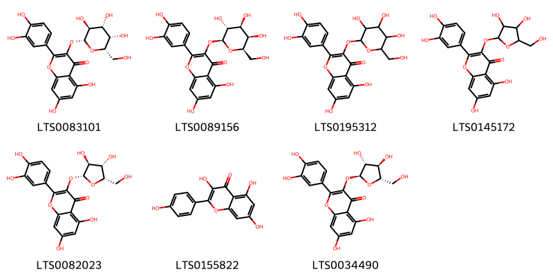{ width=100% }
    <figcaption>Hình ảnh cấu trúc hóa học của 7 hoạt chất thuộc nhóm Flavonoids gồm ['2-(3,4-dihydroxyphenyl)-5,7-dihydroxy-3-{[(2r,3s,4r,5s,6s)-3,4,5-trihydroxy-6-(hydroxymethyl)oxan-2-yl]oxy}chromen-4-one (LTS0083101)', 'hyperoside (LTS0089156)', '2-(3,4-dihydroxyphenyl)-5,7-dihydroxy-3-{[3,4,5-trihydroxy-6-(hydroxymethyl)oxan-2-yl]oxy}chromen-4-one (LTS0195312)', '3-{[3,4-dihydroxy-5-(hydroxymethyl)oxolan-2-yl]oxy}-2-(3,4-dihydroxyphenyl)-5,7-dihydroxychromen-4-one (LTS0145172)', '3-{[(2r,3s,4s,5s)-3,4-dihydroxy-5-(hydroxymethyl)oxolan-2-yl]oxy}-2-(3,4-dihydroxyphenyl)-5,7-dihydroxychromen-4-one (LTS0082023)', 'kaempherol (LTS0155822)', 'avicularin (LTS0034490)'].</figcaption>
</figure>
#### Nhóm Naphthalenes
<figure markdown="span">
    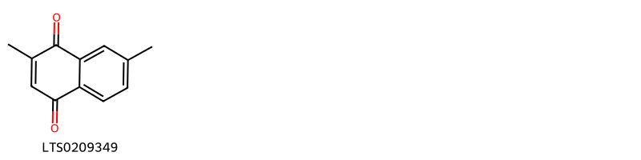{ width=100% }
    <figcaption>Hình ảnh cấu trúc hóa học của 1 hoạt chất thuộc nhóm Naphthalenes gồm ['chimaphilin (LTS0209349)'].</figcaption>
</figure>
#### Nhóm Prenol lipids
<figure markdown="span">
    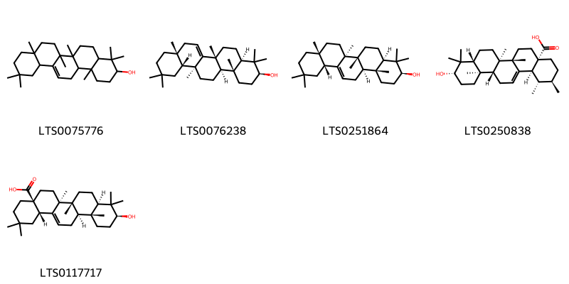{ width=100% }
    <figcaption>Hình ảnh cấu trúc hóa học của 5 hoạt chất thuộc nhóm Prenol lipids gồm ['β-amyrin (LTS0075776)', 'alnulin (LTS0076238)', 'β-amyrin (LTS0251864)', 'ursolic acid (LTS0250838)', 'oleanolic acid (LTS0117717)'].</figcaption>
</figure>

---

### Dược dân tộc học

Danh sách các quốc gia có sử dụng *Chimaphila umbellata* trong điều trị các bệnh. 

| Country        | Disease                                       | Bệnh                                                                                                                                                                                                |
|:---------------|:----------------------------------------------|:----------------------------------------------------------------------------------------------------------------------------------------------------------------------------------------------------|
| Danish         | Diuretic                                      | MYMEMORY WARNING: YOU USED ALL AVAILABLE FREE TRANSLATIONS FOR TODAY. NEXT AVAILABLE IN  01 HOURS 32 MINUTES 15 SECONDS VISIT HTTPS://MYMEMORY.TRANSLATED.NET/DOC/USAGELIMITS.PHP TO TRANSLATE MORE |
| French         | Digestive                                     | MYMEMORY WARNING: YOU USED ALL AVAILABLE FREE TRANSLATIONS FOR TODAY. NEXT AVAILABLE IN  01 HOURS 32 MINUTES 13 SECONDS VISIT HTTPS://MYMEMORY.TRANSLATED.NET/DOC/USAGELIMITS.PHP TO TRANSLATE MORE |
| German         | Apertif, Astringent                           | MYMEMORY WARNING: YOU USED ALL AVAILABLE FREE TRANSLATIONS FOR TODAY. NEXT AVAILABLE IN  01 HOURS 32 MINUTES 11 SECONDS VISIT HTTPS://MYMEMORY.TRANSLATED.NET/DOC/USAGELIMITS.PHP TO TRANSLATE MORE |
| US             | Antiseptic, Diuretic, Tonic, Tonic, Vulnerary | MYMEMORY WARNING: YOU USED ALL AVAILABLE FREE TRANSLATIONS FOR TODAY. NEXT AVAILABLE IN  01 HOURS 32 MINUTES 09 SECONDS VISIT HTTPS://MYMEMORY.TRANSLATED.NET/DOC/USAGELIMITS.PHP TO TRANSLATE MORE |
| US(Amerindian) | Sudorific                                     | MYMEMORY WARNING: YOU USED ALL AVAILABLE FREE TRANSLATIONS FOR TODAY. NEXT AVAILABLE IN  01 HOURS 32 MINUTES 07 SECONDS VISIT HTTPS://MYMEMORY.TRANSLATED.NET/DOC/USAGELIMITS.PHP TO TRANSLATE MORE |
| US(Flathead)   | Collyrium                                     | MYMEMORY WARNING: YOU USED ALL AVAILABLE FREE TRANSLATIONS FOR TODAY. NEXT AVAILABLE IN  01 HOURS 32 MINUTES 05 SECONDS VISIT HTTPS://MYMEMORY.TRANSLATED.NET/DOC/USAGELIMITS.PHP TO TRANSLATE MORE |

---

# Chi Pernettya

??? note "Danh sách các dược liệu thuộc chi"
    
	 - *Pernettya prostrata*

---
## Pernettya prostrata
### Thông tin về thực vật

!!! info "Phân loại thực vật của *Gaultheria myrsinoides* từ GIBF:"
    - **Kingdom:** Plantae
    - **Phylum:** Tracheophyta
    - **Order:** Ericales
    - **Family:** Ericaceae
    - **Genus:** Gaultheria
    - **Species:** *Gaultheria myrsinoides*

 

| Label (VI)   | Label (EN)   | Scientific Name     | Descriptions (VI)   | Descriptions (EN)   | Also Known As (VI)   | Also Known As (EN)   |
|:-------------|:-------------|:--------------------|:--------------------|:--------------------|:---------------------|:---------------------|
| N/A          | N/A          | Pernettya prostrata | loài thực vật       | species of plant    | ['']                 | ['']                 |

#### Phân bố trên thế giới

**Từ CSDL GIBF** Ecuador, Colombia

#### Phân bố tại Việt Nam

**Từ CSDL GIBF**: Không có ghi nhận ở Việt Nam

---
### Thành phần hóa học
        
- Theo cơ sở dữ liệu lotus: Từ loài *Gaultheria myrsinoides* đã phân lập và xác định được Chưa có hoạt chất nào được phân lập. hoạt chất thuộc về các nhóm Không có hoạt chất nào được phân lập. 

Không có hình ảnh nào được tạo ra

---

### Dược dân tộc học

Danh sách các quốc gia có sử dụng *Gaultheria myrsinoides* trong điều trị các bệnh. 

| Country   | Disease   | Bệnh                                                                                                                                                                                                |
|:----------|:----------|:----------------------------------------------------------------------------------------------------------------------------------------------------------------------------------------------------|
| Colombia  | Poison    | MYMEMORY WARNING: YOU USED ALL AVAILABLE FREE TRANSLATIONS FOR TODAY. NEXT AVAILABLE IN  01 HOURS 31 MINUTES 29 SECONDS VISIT HTTPS://MYMEMORY.TRANSLATED.NET/DOC/USAGELIMITS.PHP TO TRANSLATE MORE |

---

# Chi Arbutus

??? note "Danh sách các dược liệu thuộc chi"
    
	 - *Arbutus unedo*

---
## Arbutus unedo
### Thông tin về thực vật

!!! info "Phân loại thực vật của *Arbutus unedo* từ GIBF:"
    - **Kingdom:** Plantae
    - **Phylum:** Tracheophyta
    - **Order:** Ericales
    - **Family:** Ericaceae
    - **Genus:** Arbutus
    - **Species:** *Arbutus unedo*

 

| Label (VI)   | Label (EN)   | Scientific Name   | Descriptions (VI)   | Descriptions (EN)   | Also Known As (VI)   | Also Known As (EN)                                       |
|:-------------|:-------------|:------------------|:--------------------|:--------------------|:---------------------|:---------------------------------------------------------|
| N/A          | N/A          | Arbutus unedo     | loài thực vật       | species of plant    | ['']                 | ['Irish strawberry tree', 'Mamkamla', 'strawberry tree'] |

#### Phân bố trên thế giới

**Từ CSDL GIBF** Italy, Montenegro, Australia, Germany, New Zealand, Spain, Türkiye, Albania, Portugal, Algeria, Morocco, France, Croatia, Greece

#### Phân bố tại Việt Nam

**Từ CSDL GIBF**: Không có ghi nhận ở Việt Nam

---
### Thành phần hóa học
        
- Theo cơ sở dữ liệu lotus: Từ loài *Arbutus unedo* đã phân lập và xác định được 73 hoạt chất thuộc về các nhóm Fatty Acyls, Flavonoids, Prenol lipids, Steroids and steroid derivatives, Cinnamic acids and derivatives, Benzene and substituted derivatives, Hydroxy acids and derivatives, Dihydrofurans, Organooxygen compounds, Tannins, Phenols, Carboxylic acids and derivatives, Pyridines and derivatives. 

|    | chemicalTaxonomyClassyfireClass     |   smiles_count |
|---:|:------------------------------------|---------------:|
|  0 | Benzene and substituted derivatives |             12 |
|  1 | Carboxylic acids and derivatives    |              2 |
|  2 | Cinnamic acids and derivatives      |              2 |
|  3 | Dihydrofurans                       |              1 |
|  4 | Fatty Acyls                         |              1 |
|  5 | Flavonoids                          |              9 |
|  6 | Hydroxy acids and derivatives       |              3 |
|  7 | Organooxygen compounds              |             20 |
|  8 | Phenols                             |              1 |
|  9 | Prenol lipids                       |             16 |
| 10 | Pyridines and derivatives           |              1 |
| 11 | Steroids and steroid derivatives    |              3 |
| 12 | Tannins                             |              2 |

#### Nhóm Benzene and substituted derivatives
<figure markdown="span">
    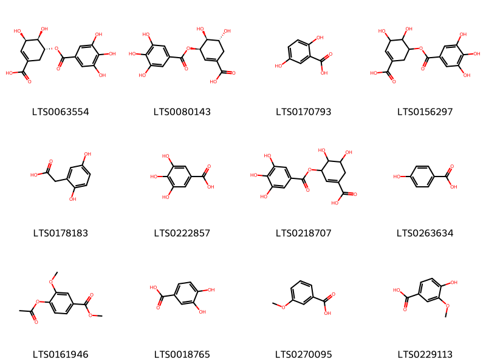{ width=100% }
    <figcaption>Hình ảnh cấu trúc hóa học của 12 hoạt chất thuộc nhóm Benzene and substituted derivatives gồm ['5-galloylshikimic acid (LTS0063554)', '3-galloylshikimic acid (LTS0080143)', '2,5-dihydroxybenzoic acid (LTS0170793)', '3,4-dihydroxy-5-(3,4,5-trihydroxybenzoyloxy)cyclohex-1-ene-1-carboxylic acid (LTS0156297)', 'homogentisic acid (LTS0178183)', 'galop (LTS0222857)', '4,5-dihydroxy-3-(3,4,5-trihydroxybenzoyloxy)cyclohex-1-ene-1-carboxylic acid (LTS0218707)', 'p-hydroxybenzoic acid (LTS0263634)', 'methyl 4-(acetyloxy)-3-methoxybenzoate (LTS0161946)', '3,4-dihydroxybenzoic acid (LTS0018765)', 'm-methoxybenzoic acid (LTS0270095)', 'vanillic acid (LTS0229113)'].</figcaption>
</figure>
#### Nhóm Carboxylic acids and derivatives
<figure markdown="span">
    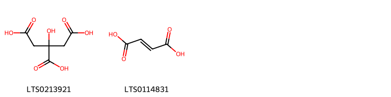{ width=100% }
    <figcaption>Hình ảnh cấu trúc hóa học của 2 hoạt chất thuộc nhóm Carboxylic acids and derivatives gồm ['citric acid (LTS0213921)', 'fumaric acid (LTS0114831)'].</figcaption>
</figure>
#### Nhóm Cinnamic acids and derivatives
<figure markdown="span">
    { width=100% }
    <figcaption>Hình ảnh cấu trúc hóa học của 2 hoạt chất thuộc nhóm Cinnamic acids and derivatives gồm ['3,4-dihydroxycinnamic acid (LTS0128050)', 'caffeic acid (LTS0027481)'].</figcaption>
</figure>
#### Nhóm Dihydrofurans
<figure markdown="span">
    { width=100% }
    <figcaption>Hình ảnh cấu trúc hóa học của 1 hoạt chất thuộc nhóm Dihydrofurans gồm ['vitamin c (LTS0022555)'].</figcaption>
</figure>
#### Nhóm Fatty Acyls
<figure markdown="span">
    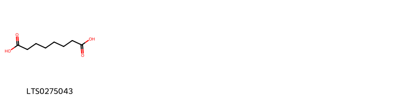{ width=100% }
    <figcaption>Hình ảnh cấu trúc hóa học của 1 hoạt chất thuộc nhóm Fatty Acyls gồm ['suberic acid (LTS0275043)'].</figcaption>
</figure>
#### Nhóm Flavonoids
<figure markdown="span">
    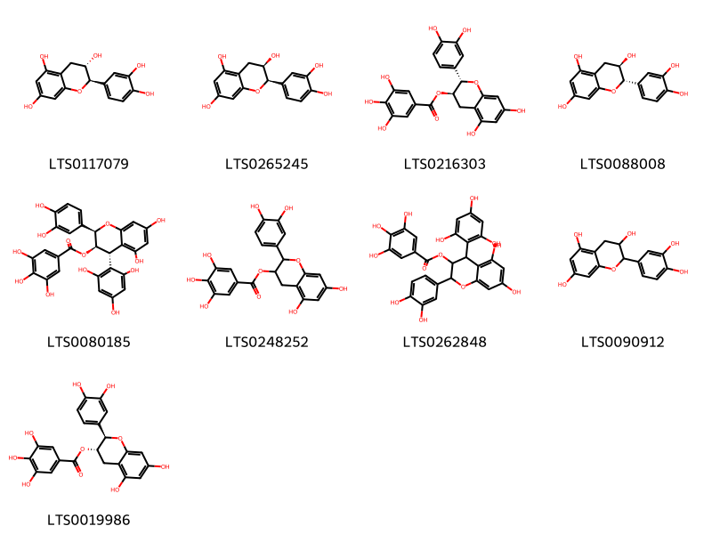{ width=100% }
    <figcaption>Hình ảnh cấu trúc hóa học của 9 hoạt chất thuộc nhóm Flavonoids gồm ['(+)-catechol (LTS0117079)', 'ent-epicatechin (LTS0265245)', 'ent-catechin 3-o-gallate (LTS0216303)', 'α catechin (LTS0088008)', '(2r,3r,4s)-2-(3,4-dihydroxyphenyl)-5,7-dihydroxy-4-(2,4,6-trihydroxyphenyl)-3,4-dihydro-2h-1-benzopyran-3-yl 3,4,5-trihydroxybenzoate (LTS0080185)', '2-(3,4-dihydroxyphenyl)-5,7-dihydroxy-3,4-dihydro-2h-1-benzopyran-3-yl 3,4,5-trihydroxybenzoate (LTS0248252)', '2-(3,4-dihydroxyphenyl)-5,7-dihydroxy-4-(2,4,6-trihydroxyphenyl)-3,4-dihydro-2h-1-benzopyran-3-yl 3,4,5-trihydroxybenzoate (LTS0262848)', 'catechol (LTS0090912)', 'catechin 3-o-gallate (LTS0019986)'].</figcaption>
</figure>
#### Nhóm Hydroxy acids and derivatives
<figure markdown="span">
    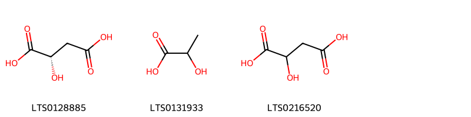{ width=100% }
    <figcaption>Hình ảnh cấu trúc hóa học của 3 hoạt chất thuộc nhóm Hydroxy acids and derivatives gồm ['(-)-malic acid (LTS0128885)', 'lactic acid (LTS0131933)', 'malic acid (LTS0216520)'].</figcaption>
</figure>
#### Nhóm Organooxygen compounds
<figure markdown="span">
    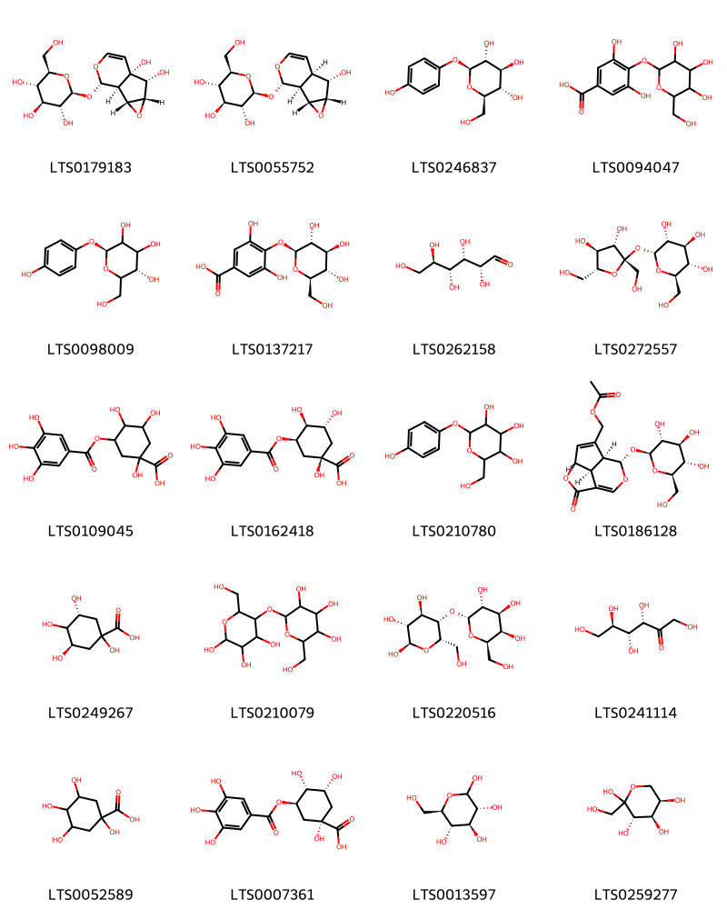{ width=100% }
    <figcaption>Hình ảnh cấu trúc hóa học của 20 hoạt chất thuộc nhóm Organooxygen compounds gồm ['(2s,3r,4s,5s,6r)-2-{[(1r,2r,4s,5r,6s,10s)-5,6-dihydroxy-3,9-dioxatricyclo[4.4.0.0²,⁴]dec-7-en-10-yl]oxy}-6-(hydroxymethyl)oxane-3,4,5-triol (LTS0179183)', '(2s,3r,4s,5s,6r)-2-{[(1s,2r,4s,5s,6r,10s)-5-hydroxy-3,9-dioxatricyclo[4.4.0.0²,⁴]dec-7-en-10-yl]oxy}-6-(hydroxymethyl)oxane-3,4,5-triol (LTS0055752)', 'β-arbutin (LTS0246837)', '3,5-dihydroxy-4-{[3,4,5-trihydroxy-6-(hydroxymethyl)oxan-2-yl]oxy}benzoic acid (LTS0094047)', '(3s,6s)-2-(hydroxymethyl)-6-(4-hydroxyphenoxy)oxane-3,4,5-triol (LTS0098009)', '3,5-dihydroxy-4-{[(2s,3r,4s,5s,6r)-3,4,5-trihydroxy-6-(hydroxymethyl)oxan-2-yl]oxy}benzoic acid (LTS0137217)', '(+)-glucose (LTS0262158)', 'sucrose (LTS0272557)', '1,3,4-trihydroxy-5-(3,4,5-trihydroxybenzoyloxy)cyclohexane-1-carboxylic acid (LTS0109045)', '(1r,3r,4s,5r)-1,3,4-trihydroxy-5-(3,4,5-trihydroxybenzoyloxy)cyclohexane-1-carboxylic acid (LTS0162418)', 'arbutin (LTS0210780)', 'asperuloside (LTS0186128)', '(3r,5r)-1,3,4,5-tetrahydroxycyclohexane-1-carboxylic acid (LTS0249267)', 'starch (LTS0210079)', '(2r,3r,4r,5s,6s)-6-(hydroxymethyl)-5-{[(2r,3r,4s,5r,6r)-3,4,5-trihydroxy-6-(hydroxymethyl)oxan-2-yl]oxy}oxane-2,3,4-triol (LTS0220516)', 'keto-d-fructose (LTS0241114)', 'quinic acid (LTS0052589)', 'theogallin (LTS0007361)', 'glucose (LTS0013597)', 'd-fructopyranose (LTS0259277)'].</figcaption>
</figure>
#### Nhóm Phenols
<figure markdown="span">
    { width=100% }
    <figcaption>Hình ảnh cấu trúc hóa học của 1 hoạt chất thuộc nhóm Phenols gồm ['4-hydroxyphenylacetic acid (LTS0272177)'].</figcaption>
</figure>
#### Nhóm Prenol lipids
<figure markdown="span">
    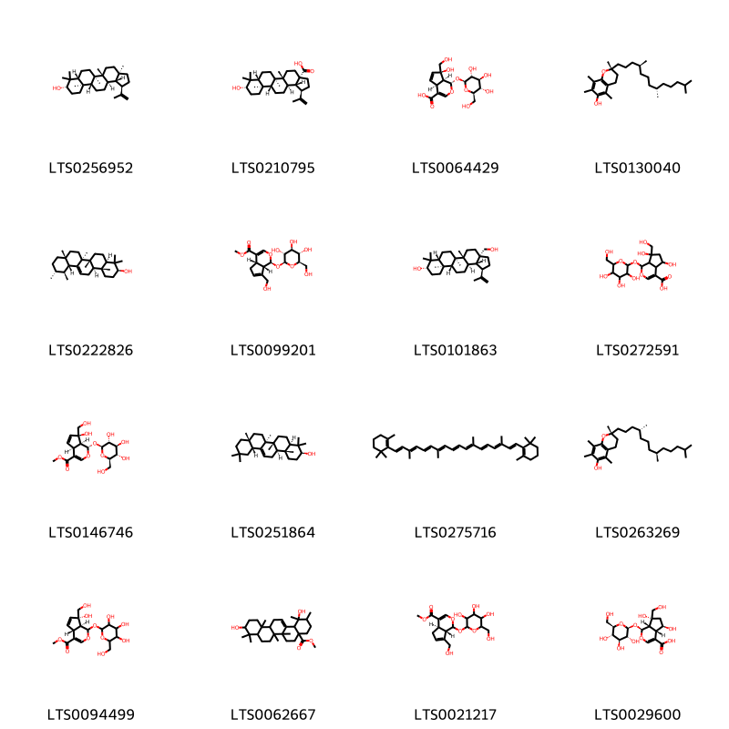{ width=100% }
    <figcaption>Hình ảnh cấu trúc hóa học của 16 hoạt chất thuộc nhóm Prenol lipids gồm ['lupeol (LTS0256952)', 'betulinic acid (LTS0210795)', 'monotropein (LTS0064429)', '(2r)-2,5,7,8-tetramethyl-2-[(4s,8s)-4,8,12-trimethyltridecyl]-3,4-dihydro-1-benzopyran-6-ol (LTS0130040)', 'amyrin (LTS0222826)', 'geniposide (LTS0099201)', 'betulin (LTS0101863)', '5,7-dihydroxy-7-(hydroxymethyl)-1-{[3,4,5-trihydroxy-6-(hydroxymethyl)oxan-2-yl]oxy}-1h,4ah,5h,6h,7ah-cyclopenta[c]pyran-4-carboxylic acid (LTS0272591)', 'gardenoside (LTS0146746)', 'β-amyrin (LTS0251864)', 'β-carotene (LTS0275716)', 'vitamin e (LTS0263269)', 'methyl (4ar,7s,7as)-7-hydroxy-7-(hydroxymethyl)-1-{[3,4,5-trihydroxy-6-(hydroxymethyl)oxan-2-yl]oxy}-1h,4ah,7ah-cyclopenta[c]pyran-4-carboxylate (LTS0094499)', 'methyl 1,10-dihydroxy-1,2,6a,6b,9,9,12a-heptamethyl-2,3,4,5,6,7,8,8a,10,11,12,12b,13,14b-tetradecahydropicene-4a-carboxylate (LTS0062667)', 'methyl (4ar,7as)-7-(hydroxymethyl)-1-{[3,4,5-trihydroxy-6-(hydroxymethyl)oxan-2-yl]oxy}-1h,4ah,5h,7ah-cyclopenta[c]pyran-4-carboxylate (LTS0021217)', '(1s,4as,5r,7r,7as)-5,7-dihydroxy-7-(hydroxymethyl)-1-{[(2s,3r,4s,5s,6r)-3,4,5-trihydroxy-6-(hydroxymethyl)oxan-2-yl]oxy}-1h,4ah,5h,6h,7ah-cyclopenta[c]pyran-4-carboxylic acid (LTS0029600)'].</figcaption>
</figure>
#### Nhóm Pyridines and derivatives
<figure markdown="span">
    { width=100% }
    <figcaption>Hình ảnh cấu trúc hóa học của 1 hoạt chất thuộc nhóm Pyridines and derivatives gồm ['niacin (LTS0216673)'].</figcaption>
</figure>
#### Nhóm Steroids and steroid derivatives
<figure markdown="span">
    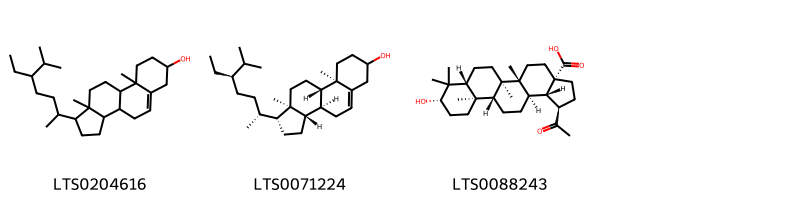{ width=100% }
    <figcaption>Hình ảnh cấu trúc hóa học của 3 hoạt chất thuộc nhóm Steroids and steroid derivatives gồm ['stigmast-5-en-3-ol, (3β)- (LTS0204616)', 'stigmast-5-en-3-ol (LTS0071224)', 'platanic acid (LTS0088243)'].</figcaption>
</figure>
#### Nhóm Tannins
<figure markdown="span">
    { width=100% }
    <figcaption>Hình ảnh cấu trúc hóa học của 2 hoạt chất thuộc nhóm Tannins gồm ['β-glucogallin (LTS0193705)', '3,4,5-trihydroxy-6-(hydroxymethyl)oxan-2-yl 3,4,5-trihydroxybenzoate (LTS0274683)'].</figcaption>
</figure>

---

### Dược dân tộc học

Danh sách các quốc gia có sử dụng *Arbutus unedo* trong điều trị các bệnh. 

| Country   | Disease                                 | Bệnh                                                                                                                                                                                                |
|:----------|:----------------------------------------|:----------------------------------------------------------------------------------------------------------------------------------------------------------------------------------------------------|
| Sicily    | Intoxicant                              | MYMEMORY WARNING: YOU USED ALL AVAILABLE FREE TRANSLATIONS FOR TODAY. NEXT AVAILABLE IN  01 HOURS 31 MINUTES 07 SECONDS VISIT HTTPS://MYMEMORY.TRANSLATED.NET/DOC/USAGELIMITS.PHP TO TRANSLATE MORE |
| Turkey    | Antiseptic, Astringent, Narcotic, Tonic | MYMEMORY WARNING: YOU USED ALL AVAILABLE FREE TRANSLATIONS FOR TODAY. NEXT AVAILABLE IN  01 HOURS 31 MINUTES 05 SECONDS VISIT HTTPS://MYMEMORY.TRANSLATED.NET/DOC/USAGELIMITS.PHP TO TRANSLATE MORE |

---

# Chi Menziesia

??? note "Danh sách các dược liệu thuộc chi"
    
	 - *Menziesia ferruginea*

---
## Menziesia ferruginea
### Thông tin về thực vật

!!! info "Phân loại thực vật của *Rhododendron menziesii* từ GIBF:"
    - **Kingdom:** Plantae
    - **Phylum:** Tracheophyta
    - **Order:** Ericales
    - **Family:** Ericaceae
    - **Genus:** Rhododendron
    - **Species:** *Rhododendron menziesii*

 

| Label (VI)   | Label (EN)   | Scientific Name      | Descriptions (VI)   | Descriptions (EN)   | Also Known As (VI)   | Also Known As (EN)         |
|:-------------|:-------------|:---------------------|:--------------------|:--------------------|:---------------------|:---------------------------|
| N/A          | N/A          | Menziesia ferruginea | loài thực vật       | species of plant    | ['']                 | ['Rhododendron menziesii'] |

#### Phân bố trên thế giới

**Từ CSDL GIBF** Korea, Republic of, Norway, United States of America, Poland, Latvia, Canada

#### Phân bố tại Việt Nam

**Từ CSDL GIBF**: Không có ghi nhận ở Việt Nam

---
### Thành phần hóa học
        
- Theo cơ sở dữ liệu lotus: Từ loài *Rhododendron menziesii* đã phân lập và xác định được Chưa có hoạt chất nào được phân lập. hoạt chất thuộc về các nhóm Không có hoạt chất nào được phân lập. 

Không có hình ảnh nào được tạo ra

---

### Dược dân tộc học

Danh sách các quốc gia có sử dụng *Rhododendron menziesii* trong điều trị các bệnh. 

| Country   | Disease   | Bệnh                                                                                                                                                                                                |
|:----------|:----------|:----------------------------------------------------------------------------------------------------------------------------------------------------------------------------------------------------|
| US        | Poison    | MYMEMORY WARNING: YOU USED ALL AVAILABLE FREE TRANSLATIONS FOR TODAY. NEXT AVAILABLE IN  01 HOURS 30 MINUTES 06 SECONDS VISIT HTTPS://MYMEMORY.TRANSLATED.NET/DOC/USAGELIMITS.PHP TO TRANSLATE MORE |

---

