!!! abstract "Tóm tắt"

    Họ Erythroxylaceae gồm khoảng 1 chi và 3 loài được một số cộng đồng tại các quốc gia như Elsewhere, Amerindian, Peru, Ecuador(Jivaro), India, Venezuela, South America, Ecuador, Turkey, Colombia(Cubeo), Europe, Pahang sử dụng trong một số trường hợp MYMEMORY WARNING: YOU USED ALL AVAILABLE FREE TRANSLATIONS FOR TODAY. NEXT AVAILABLE IN  09 HOURS 44 MINUTES 18 SECONDS VISIT HTTPS://MYMEMORY.TRANSLATED.NET/DOC/USAGELIMITS.PHP TO TRANSLATE MORE.

!!! info "DrDuke"

    James A. Duke sinh năm 1929-2017 là một nhà thực vật học người Mỹ. Đây là một trong những tác giả hàng đầu trong lĩnh vực dược dân tộc học với cuốn *CRC Handbook of Medicinal Herbs* và chính là người xây dựng lên cơ sở dữ liệu về hợp chất tự nhiên và dược dân tộc học tại Bộ nông nghiệp Hoa Kỳ. Các thông tin được đăng tải tại website [Dr. Duke's Phytochemical and Ethnobotanical Databases](https://phytochem.nal.usda.gov/). 
    Trong suốt thập niên 1970, ông lãnh đạo the Plant Taxonomy Laboratory, Plant Genetics and Germplasm Institute of the Agricultural Research Service, U.S. Department of Agriculture.
    Trong tài liệu này, các thông tin về dược dân tộc của các dược liệu được trích dẫn từ tài liệu của James A. Ducke với sự trợ giúp của phần mềm dịch thuật từ tiếng Anh sang tiếng Việt.
   

# Chi Erythroxylum

??? note "Danh sách các dược liệu thuộc chi"
    
	 - *Erythroxylum coca*
	 - *Erythroxylum cuneatum*
	 - *Erythroxylum rufum*

---
## Erythroxylum coca
### Thông tin về thực vật

!!! info "Phân loại thực vật của *Erythroxylum coca* từ GIBF:"
    - **Kingdom:** Plantae
    - **Phylum:** Tracheophyta
    - **Order:** Malpighiales
    - **Family:** Erythroxylaceae
    - **Genus:** Erythroxylum
    - **Species:** *Erythroxylum coca*

 

| Label (VI)   | Label (EN)   | Scientific Name   | Descriptions (VI)   | Descriptions (EN)      | Also Known As (VI)   | Also Known As (EN)   |
|:-------------|:-------------|:------------------|:--------------------|:-----------------------|:---------------------|:---------------------|
| N/A          | N/A          | Erythroxylum coca | loài thực vật       | species of plant, coca | ['']                 | ['Coca', 'coca']     |

#### Phân bố trên thế giới

**Từ CSDL GIBF** nan, Honduras, Colombia, unknown or invalid, El Salvador, Panama, Brazil, Côte d’Ivoire, Peru, Bolivia (Plurinational State of), Costa Rica, Ecuador, United States of America, China, Norway, Belgium, Slovakia

#### Phân bố tại Việt Nam

**Từ CSDL GIBF**: Không có ghi nhận ở Việt Nam

---
### Thành phần hóa học
        
- Theo cơ sở dữ liệu lotus: Từ loài *Erythroxylum coca* đã phân lập và xác định được 27 hoạt chất thuộc về các nhóm Tropane alkaloids, Carboxylic acids and derivatives, Pyrrolidines, Pyridines and derivatives, Fatty Acyls, Pyrroles, Cinnamic acids and derivatives, Benzene and substituted derivatives. 

|    | chemicalTaxonomyClassyfireClass     |   smiles_count |
|---:|:------------------------------------|---------------:|
|  0 |                                     |              4 |
|  1 | Benzene and substituted derivatives |              6 |
|  2 | Carboxylic acids and derivatives    |              3 |
|  3 | Cinnamic acids and derivatives      |              4 |
|  4 | Fatty Acyls                         |              1 |
|  5 | Pyridines and derivatives           |              2 |
|  6 | Pyrroles                            |              1 |
|  7 | Pyrrolidines                        |              1 |
|  8 | Tropane alkaloids                   |              4 |

#### Nhóm 
<figure markdown="span">
    { width=100% }
    <figcaption>Hình ảnh cấu trúc hóa học của 4 hoạt chất thuộc nhóm  gồm ['cuskhygrine (LTS0083137)', 'hygrine (LTS0269809)', '(+)-hygrine (LTS0186540)', 'cuscohygrine (LTS0040983)'].</figcaption>
</figure>
#### Nhóm Benzene and substituted derivatives
<figure markdown="span">
    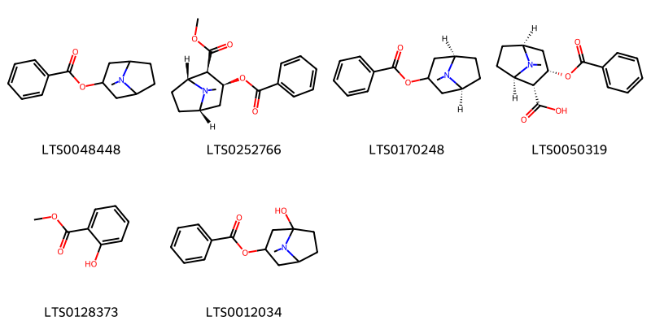{ width=100% }
    <figcaption>Hình ảnh cấu trúc hóa học của 6 hoạt chất thuộc nhóm Benzene and substituted derivatives gồm ['benzoyltropine (LTS0048448)', 'cocaine (LTS0252766)', '(1r,5s)-8-methyl-8-azabicyclo[3.2.1]octan-3-yl benzoate (LTS0170248)', 'benzoylecgonine (LTS0050319)', 'methyl salicylate (LTS0128373)', 'hydroxytropacocaine (LTS0012034)'].</figcaption>
</figure>
#### Nhóm Carboxylic acids and derivatives
<figure markdown="span">
    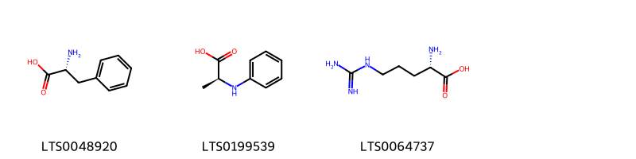{ width=100% }
    <figcaption>Hình ảnh cấu trúc hóa học của 3 hoạt chất thuộc nhóm Carboxylic acids and derivatives gồm ['d-phenylalanine (LTS0048920)', '(2s)-2-(phenylamino)propanoic acid (LTS0199539)', 'l-arginine (LTS0064737)'].</figcaption>
</figure>
#### Nhóm Cinnamic acids and derivatives
<figure markdown="span">
    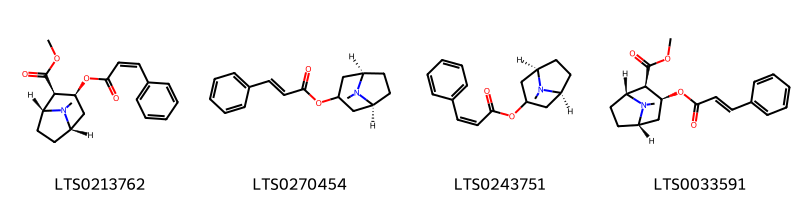{ width=100% }
    <figcaption>Hình ảnh cấu trúc hóa học của 4 hoạt chất thuộc nhóm Cinnamic acids and derivatives gồm ['(z)-cinnamoylcocaine (LTS0213762)', '(1r,5s)-8-methyl-8-azabicyclo[3.2.1]octan-3-yl (2e)-3-phenylprop-2-enoate (LTS0270454)', '(1r,5s)-8-methyl-8-azabicyclo[3.2.1]octan-3-yl (2z)-3-phenylprop-2-enoate (LTS0243751)', 'methyl (1r,2r,3s,5s)-8-methyl-3-{[(2e)-3-phenylprop-2-enoyl]oxy}-8-azabicyclo[3.2.1]octane-2-carboxylate (LTS0033591)'].</figcaption>
</figure>
#### Nhóm Fatty Acyls
<figure markdown="span">
    { width=100% }
    <figcaption>Hình ảnh cấu trúc hóa học của 1 hoạt chất thuộc nhóm Fatty Acyls gồm ['hexanol (LTS0217299)'].</figcaption>
</figure>
#### Nhóm Pyridines and derivatives
<figure markdown="span">
    { width=100% }
    <figcaption>Hình ảnh cấu trúc hóa học của 2 hoạt chất thuộc nhóm Pyridines and derivatives gồm ['(-)-nicotine (LTS0184620)', 'nicotine (LTS0177379)'].</figcaption>
</figure>
#### Nhóm Pyrroles
<figure markdown="span">
    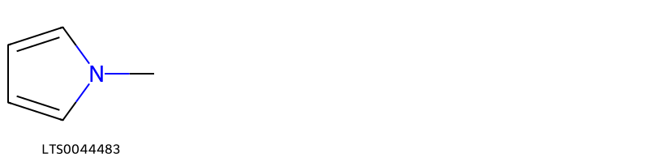{ width=100% }
    <figcaption>Hình ảnh cấu trúc hóa học của 1 hoạt chất thuộc nhóm Pyrroles gồm ['1-methylpyrrole (LTS0044483)'].</figcaption>
</figure>
#### Nhóm Pyrrolidines
<figure markdown="span">
    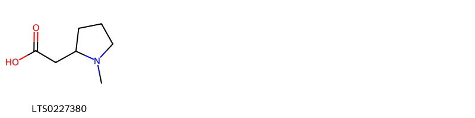{ width=100% }
    <figcaption>Hình ảnh cấu trúc hóa học của 1 hoạt chất thuộc nhóm Pyrrolidines gồm ['(1-methylpyrrolidin-2-yl)acetic acid (LTS0227380)'].</figcaption>
</figure>
#### Nhóm Tropane alkaloids
<figure markdown="span">
    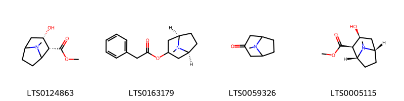{ width=100% }
    <figcaption>Hình ảnh cấu trúc hóa học của 4 hoạt chất thuộc nhóm Tropane alkaloids gồm ['methyl (2r,3s)-3-hydroxy-8-methyl-8-azabicyclo[3.2.1]octane-2-carboxylate (LTS0124863)', '(1r,5s)-8-methyl-8-azabicyclo[3.2.1]octan-3-yl 2-phenylacetate (LTS0163179)', 'tropanone (LTS0059326)', 'ecgonine methyl ester (LTS0005115)'].</figcaption>
</figure>

---

### Dược dân tộc học

Danh sách các quốc gia có sử dụng *Erythroxylum coca* trong điều trị các bệnh. 

| Country         | Disease                                                 | Bệnh                                                                                                                                                                                                |
|:----------------|:--------------------------------------------------------|:----------------------------------------------------------------------------------------------------------------------------------------------------------------------------------------------------|
| Amerindian      | Aperient, Carminative, Digestive, Diuretic, Aphrodisiac | MYMEMORY WARNING: YOU USED ALL AVAILABLE FREE TRANSLATIONS FOR TODAY. NEXT AVAILABLE IN  09 HOURS 44 MINUTES 13 SECONDS VISIT HTTPS://MYMEMORY.TRANSLATED.NET/DOC/USAGELIMITS.PHP TO TRANSLATE MORE |
| Colombia(Cubeo) | Narcotic                                                | MYMEMORY WARNING: YOU USED ALL AVAILABLE FREE TRANSLATIONS FOR TODAY. NEXT AVAILABLE IN  09 HOURS 44 MINUTES 09 SECONDS VISIT HTTPS://MYMEMORY.TRANSLATED.NET/DOC/USAGELIMITS.PHP TO TRANSLATE MORE |
| Ecuador         | Narcotic                                                | MYMEMORY WARNING: YOU USED ALL AVAILABLE FREE TRANSLATIONS FOR TODAY. NEXT AVAILABLE IN  09 HOURS 44 MINUTES 06 SECONDS VISIT HTTPS://MYMEMORY.TRANSLATED.NET/DOC/USAGELIMITS.PHP TO TRANSLATE MORE |
| Ecuador(Jivaro) | Hallucinogen                                            | MYMEMORY WARNING: YOU USED ALL AVAILABLE FREE TRANSLATIONS FOR TODAY. NEXT AVAILABLE IN  09 HOURS 44 MINUTES 04 SECONDS VISIT HTTPS://MYMEMORY.TRANSLATED.NET/DOC/USAGELIMITS.PHP TO TRANSLATE MORE |
| Elsewhere       | Anesthetic, Stimulant, Narcotic, Narcotic, Stimulant    | MYMEMORY WARNING: YOU USED ALL AVAILABLE FREE TRANSLATIONS FOR TODAY. NEXT AVAILABLE IN  09 HOURS 44 MINUTES 00 SECONDS VISIT HTTPS://MYMEMORY.TRANSLATED.NET/DOC/USAGELIMITS.PHP TO TRANSLATE MORE |
| Europe          | Anesthetic                                              | MYMEMORY WARNING: YOU USED ALL AVAILABLE FREE TRANSLATIONS FOR TODAY. NEXT AVAILABLE IN  09 HOURS 43 MINUTES 57 SECONDS VISIT HTTPS://MYMEMORY.TRANSLATED.NET/DOC/USAGELIMITS.PHP TO TRANSLATE MORE |
| India           | Anesthetic, Astringent, Mydriatic, Stimulant            | MYMEMORY WARNING: YOU USED ALL AVAILABLE FREE TRANSLATIONS FOR TODAY. NEXT AVAILABLE IN  09 HOURS 43 MINUTES 54 SECONDS VISIT HTTPS://MYMEMORY.TRANSLATED.NET/DOC/USAGELIMITS.PHP TO TRANSLATE MORE |
| Peru            | Hallucinogen, Stimulant                                 | MYMEMORY WARNING: YOU USED ALL AVAILABLE FREE TRANSLATIONS FOR TODAY. NEXT AVAILABLE IN  09 HOURS 43 MINUTES 51 SECONDS VISIT HTTPS://MYMEMORY.TRANSLATED.NET/DOC/USAGELIMITS.PHP TO TRANSLATE MORE |
| South America   | Poison                                                  | MYMEMORY WARNING: YOU USED ALL AVAILABLE FREE TRANSLATIONS FOR TODAY. NEXT AVAILABLE IN  09 HOURS 43 MINUTES 48 SECONDS VISIT HTTPS://MYMEMORY.TRANSLATED.NET/DOC/USAGELIMITS.PHP TO TRANSLATE MORE |
| Turkey          | Stimulant, Nervine, Narcotic                            | MYMEMORY WARNING: YOU USED ALL AVAILABLE FREE TRANSLATIONS FOR TODAY. NEXT AVAILABLE IN  09 HOURS 43 MINUTES 44 SECONDS VISIT HTTPS://MYMEMORY.TRANSLATED.NET/DOC/USAGELIMITS.PHP TO TRANSLATE MORE |

---

---
## Erythroxylum cuneatum
### Thông tin về thực vật

!!! info "Phân loại thực vật của *Erythroxylum cuneatum* từ GIBF:"
    - **Kingdom:** Plantae
    - **Phylum:** Tracheophyta
    - **Order:** Malpighiales
    - **Family:** Erythroxylaceae
    - **Genus:** Erythroxylum
    - **Species:** *Erythroxylum cuneatum*

 

| Label (VI)   | Label (EN)   | Scientific Name       | Descriptions (VI)   | Descriptions (EN)   | Also Known As (VI)   | Also Known As (EN)   |
|:-------------|:-------------|:----------------------|:--------------------|:--------------------|:---------------------|:---------------------|
| N/A          | N/A          | Erythroxylum cuneatum | loài thực vật       | species of plant    | ['']                 | ['']                 |

#### Phân bố trên thế giới

**Từ CSDL GIBF** Viet Nam, nan, unknown or invalid, Thailand, Brunei Darussalam, Myanmar, Brazil, Philippines, Malaysia, Papua New Guinea, Lao People’s Democratic Republic, United States of America, Singapore, Madagascar, Indonesia

#### Phân bố tại Việt Nam

**Từ CSDL GIBF**: Không có ghi nhận ở Việt Nam

---
### Thành phần hóa học
        
- Theo cơ sở dữ liệu lotus: Từ loài *Erythroxylum cuneatum* đã phân lập và xác định được 19 hoạt chất thuộc về các nhóm Organooxygen compounds, Prenol lipids, Benzene and substituted derivatives, Pyridines and derivatives. 

|    | chemicalTaxonomyClassyfireClass     |   smiles_count |
|---:|:------------------------------------|---------------:|
|  0 | Benzene and substituted derivatives |              5 |
|  1 | Organooxygen compounds              |              2 |
|  2 | Prenol lipids                       |             10 |
|  3 | Pyridines and derivatives           |              2 |

#### Nhóm Benzene and substituted derivatives
<figure markdown="span">
    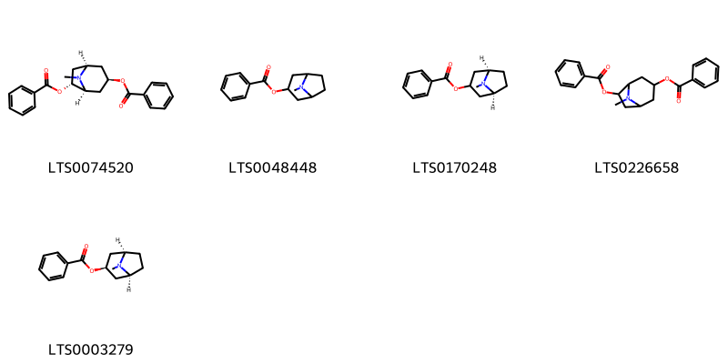{ width=100% }
    <figcaption>Hình ảnh cấu trúc hóa học của 5 hoạt chất thuộc nhóm Benzene and substituted derivatives gồm ['(1r,3r,5s,6r)-6-(benzoyloxy)-8-methyl-8-azabicyclo[3.2.1]octan-3-yl benzoate (LTS0074520)', 'benzoyltropine (LTS0048448)', '(1r,5s)-8-methyl-8-azabicyclo[3.2.1]octan-3-yl benzoate (LTS0170248)', '6-(benzoyloxy)-8-methyl-8-azabicyclo[3.2.1]octan-3-yl benzoate (LTS0226658)', '(1r,3r,5s)-8-methyl-8-azabicyclo[3.2.1]octan-3-yl benzoate (LTS0003279)'].</figcaption>
</figure>
#### Nhóm Organooxygen compounds
<figure markdown="span">
    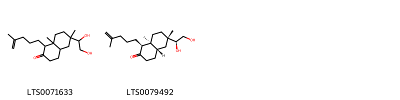{ width=100% }
    <figcaption>Hình ảnh cấu trúc hóa học của 2 hoạt chất thuộc nhóm Organooxygen compounds gồm ['6-(1,2-dihydroxyethyl)-6,8a-dimethyl-1-(4-methylpent-4-en-1-yl)-hexahydro-1h-naphthalen-2-one (LTS0071633)', '(1s,4as,6s,8as)-6-[(1s)-1,2-dihydroxyethyl]-6,8a-dimethyl-1-(4-methylpent-4-en-1-yl)-hexahydro-1h-naphthalen-2-one (LTS0079492)'].</figcaption>
</figure>
#### Nhóm Prenol lipids
<figure markdown="span">
    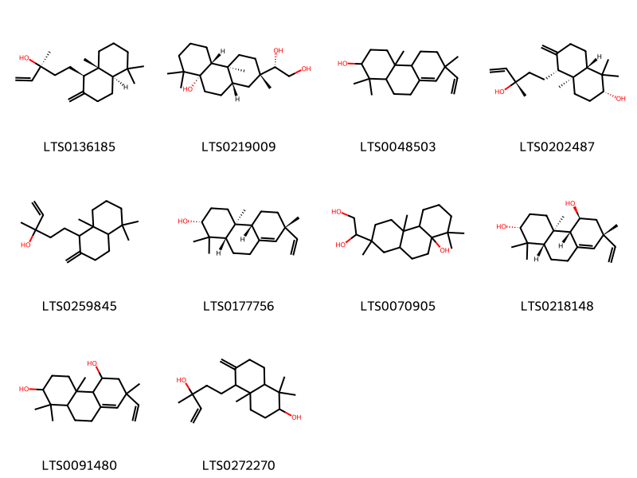{ width=100% }
    <figcaption>Hình ảnh cấu trúc hóa học của 10 hoạt chất thuộc nhóm Prenol lipids gồm ['ent-manool (LTS0136185)', '(1s)-1-[(2s,4as,4br,8as,10as)-8a-hydroxy-2,4a,8,8-tetramethyl-decahydrophenanthren-2-yl]ethane-1,2-diol (LTS0219009)', '7-ethenyl-1,1,4a,7-tetramethyl-3,4,4b,5,6,9,10,10a-octahydro-2h-phenanthren-2-ol (LTS0048503)', '(2r,4as,5r,8as)-5-[(3s)-3-hydroxy-3-methylpent-4-en-1-yl]-1,1,4a-trimethyl-6-methylidene-hexahydro-2h-naphthalen-2-ol (LTS0202487)', '5-(5,5,8a-trimethyl-2-methylidene-hexahydro-1h-naphthalen-1-yl)-3-methylpent-1-en-3-ol (LTS0259845)', '(2r,4as,4br,7r,10as)-7-ethenyl-1,1,4a,7-tetramethyl-3,4,4b,5,6,9,10,10a-octahydro-2h-phenanthren-2-ol (LTS0177756)', '1-(8a-hydroxy-2,4a,8,8-tetramethyl-decahydrophenanthren-2-yl)ethane-1,2-diol (LTS0070905)', '(2r,4ar,4br,5s,7r,10as)-7-ethenyl-1,1,4a,7-tetramethyl-3,4,4b,5,6,9,10,10a-octahydro-2h-phenanthrene-2,5-diol (LTS0218148)', '7-ethenyl-1,1,4a,7-tetramethyl-3,4,4b,5,6,9,10,10a-octahydro-2h-phenanthrene-2,5-diol (LTS0091480)', '5-(3-hydroxy-3-methylpent-4-en-1-yl)-1,1,4a-trimethyl-6-methylidene-hexahydro-2h-naphthalen-2-ol (LTS0272270)'].</figcaption>
</figure>
#### Nhóm Pyridines and derivatives
<figure markdown="span">
    { width=100% }
    <figcaption>Hình ảnh cấu trúc hóa học của 2 hoạt chất thuộc nhóm Pyridines and derivatives gồm ['(-)-nicotine (LTS0184620)', 'nicotine (LTS0177379)'].</figcaption>
</figure>

---

### Dược dân tộc học

Danh sách các quốc gia có sử dụng *Erythroxylum cuneatum* trong điều trị các bệnh. 

| Country   | Disease   | Bệnh                                                                                                                                                                                                |
|:----------|:----------|:----------------------------------------------------------------------------------------------------------------------------------------------------------------------------------------------------|
| Elsewhere | Piscicide | MYMEMORY WARNING: YOU USED ALL AVAILABLE FREE TRANSLATIONS FOR TODAY. NEXT AVAILABLE IN  09 HOURS 43 MINUTES 14 SECONDS VISIT HTTPS://MYMEMORY.TRANSLATED.NET/DOC/USAGELIMITS.PHP TO TRANSLATE MORE |
| Pahang    | Tonic     | MYMEMORY WARNING: YOU USED ALL AVAILABLE FREE TRANSLATIONS FOR TODAY. NEXT AVAILABLE IN  09 HOURS 43 MINUTES 10 SECONDS VISIT HTTPS://MYMEMORY.TRANSLATED.NET/DOC/USAGELIMITS.PHP TO TRANSLATE MORE |

---

---
## Erythroxylum rufum
### Thông tin về thực vật

!!! info "Phân loại thực vật của *Erythroxylum rufum* từ GIBF:"
    - **Kingdom:** Plantae
    - **Phylum:** Tracheophyta
    - **Order:** Malpighiales
    - **Family:** Erythroxylaceae
    - **Genus:** Erythroxylum
    - **Species:** *Erythroxylum rufum*

 

| Label (VI)   | Label (EN)   | Scientific Name    | Descriptions (VI)   | Descriptions (EN)   | Also Known As (VI)   | Also Known As (EN)   |
|:-------------|:-------------|:-------------------|:--------------------|:--------------------|:---------------------|:---------------------|
| N/A          | N/A          | Erythroxylum rufum | loài thực vật       | species of plant    | ['']                 | ['']                 |

#### Phân bố trên thế giới

**Từ CSDL GIBF** Haiti, nan, Colombia, Venezuela (Bolivarian Republic of), Dominican Republic, Brazil, Puerto Rico, Peru, Bolivia (Plurinational State of), Canada, Cuba, Jamaica, Guyana

#### Phân bố tại Việt Nam

**Từ CSDL GIBF**: Không có ghi nhận ở Việt Nam

---
### Thành phần hóa học
        
- Theo cơ sở dữ liệu lotus: Từ loài *Erythroxylum rufum* đã phân lập và xác định được 15 hoạt chất thuộc về các nhóm Flavonoids, Benzene and substituted derivatives. 

|    | chemicalTaxonomyClassyfireClass     |   smiles_count |
|---:|:------------------------------------|---------------:|
|  0 | Benzene and substituted derivatives |              1 |
|  1 | Flavonoids                          |             13 |

#### Nhóm Benzene and substituted derivatives
<figure markdown="span">
    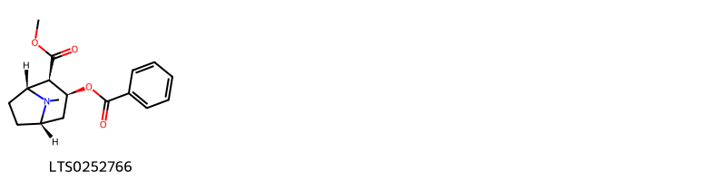{ width=100% }
    <figcaption>Hình ảnh cấu trúc hóa học của 1 hoạt chất thuộc nhóm Benzene and substituted derivatives gồm ['cocaine (LTS0252766)'].</figcaption>
</figure>
#### Nhóm Flavonoids
<figure markdown="span">
    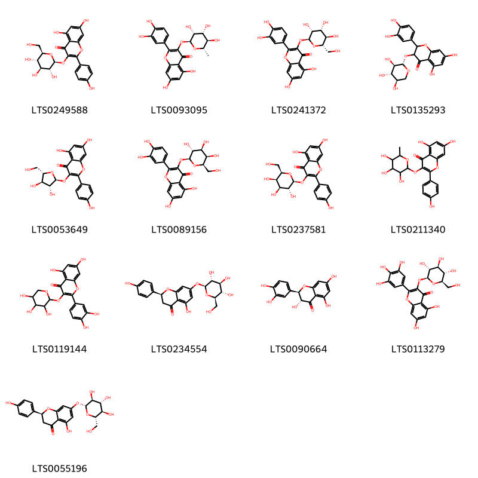{ width=100% }
    <figcaption>Hình ảnh cấu trúc hóa học của 13 hoạt chất thuộc nhóm Flavonoids gồm ['astragalin (LTS0249588)', 'quercitrin (LTS0093095)', '2-(3,4-dihydroxyphenyl)-5,7-dihydroxy-3-{[(2s,3r,4r,5r,6s)-3,4,5-trihydroxy-6-(hydroxymethyl)oxan-2-yl]oxy}chromen-4-one (LTS0241372)', '2-(3,4-dihydroxyphenyl)-5,7-dihydroxy-3-{[(2s,3r,4s,5r)-3,4,5-trihydroxyoxan-2-yl]oxy}-2,3-dihydro-1-benzopyran-4-one (LTS0135293)', 'juglanin (LTS0053649)', 'hyperoside (LTS0089156)', 'trifolin (LTS0237581)', '5,7-dihydroxy-2-(4-hydroxyphenyl)-3-[(3,4,5-trihydroxy-6-methyloxan-2-yl)oxy]chromen-4-one (LTS0211340)', 'guaijaverin (LTS0119144)', 'prunin (LTS0234554)', '(+)-taxifolin (LTS0090664)', '5,7-dihydroxy-3-{[(2s,3r,4s,5s,6r)-3,4,5-trihydroxy-6-(hydroxymethyl)oxan-2-yl]oxy}-2-(3,4,5-trihydroxyphenyl)chromen-4-one (LTS0113279)', '(2s)-5-hydroxy-2-(4-hydroxyphenyl)-7-{[(2r,3s,4r,5r,6s)-3,4,5-trihydroxy-6-(hydroxymethyl)oxan-2-yl]oxy}-2,3-dihydro-1-benzopyran-4-one (LTS0055196)'].</figcaption>
</figure>

---

### Dược dân tộc học

Danh sách các quốc gia có sử dụng *Erythroxylum rufum* trong điều trị các bệnh. 

| Country   | Disease   | Bệnh                                                                                                                                                                                                |
|:----------|:----------|:----------------------------------------------------------------------------------------------------------------------------------------------------------------------------------------------------|
| Venezuela | Poison    | MYMEMORY WARNING: YOU USED ALL AVAILABLE FREE TRANSLATIONS FOR TODAY. NEXT AVAILABLE IN  09 HOURS 42 MINUTES 40 SECONDS VISIT HTTPS://MYMEMORY.TRANSLATED.NET/DOC/USAGELIMITS.PHP TO TRANSLATE MORE |

---

