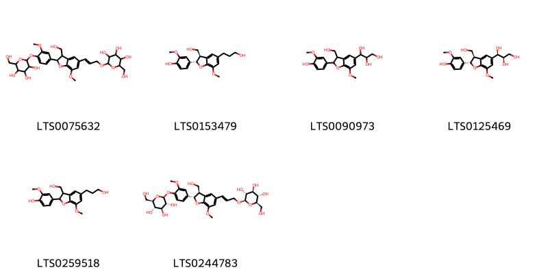
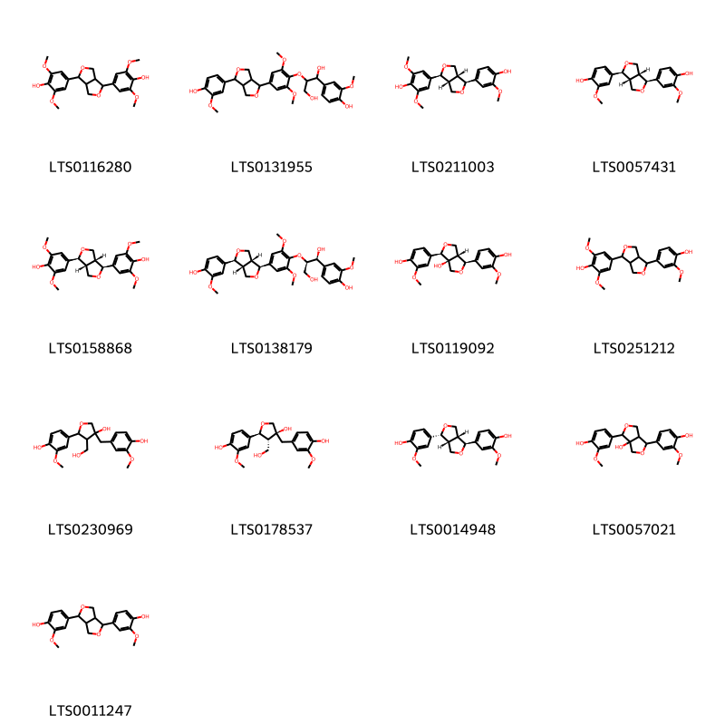
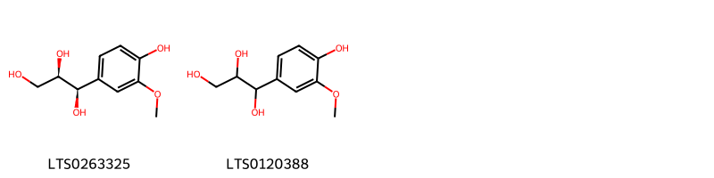
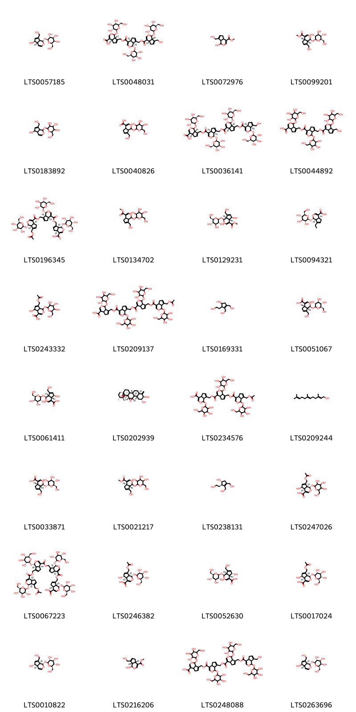

!!! abstract "Tóm tắt"

    Họ Eucommiaceae gồm khoảng 1 chi và 1 loài được một số cộng đồng tại các quốc gia như Elsewhere, China sử dụng trong một số trường hợp MYMEMORY WARNING: YOU USED ALL AVAILABLE FREE TRANSLATIONS FOR TODAY. NEXT AVAILABLE IN  00 HOURS 17 MINUTES 48 SECONDS VISIT HTTPS://MYMEMORY.TRANSLATED.NET/DOC/USAGELIMITS.PHP TO TRANSLATE MORE.

!!! info "DrDuke"

    James A. Duke sinh năm 1929-2017 là một nhà thực vật học người Mỹ. Đây là một trong những tác giả hàng đầu trong lĩnh vực dược dân tộc học với cuốn *CRC Handbook of Medicinal Herbs* và chính là người xây dựng lên cơ sở dữ liệu về hợp chất tự nhiên và dược dân tộc học tại Bộ nông nghiệp Hoa Kỳ. Các thông tin được đăng tải tại website [Dr. Duke's Phytochemical and Ethnobotanical Databases](https://phytochem.nal.usda.gov/). 
    Trong suốt thập niên 1970, ông lãnh đạo the Plant Taxonomy Laboratory, Plant Genetics and Germplasm Institute of the Agricultural Research Service, U.S. Department of Agriculture.
    Trong tài liệu này, các thông tin về dược dân tộc của các dược liệu được trích dẫn từ tài liệu của James A. Ducke với sự trợ giúp của phần mềm dịch thuật từ tiếng Anh sang tiếng Việt.
   

# Chi Eucommia

??? note "Danh sách các dược liệu thuộc chi"
    
	 - *Eucommia ulmoides*

---
## Eucommia ulmoides
### Thông tin về thực vật

!!! info "Phân loại thực vật của *Eucommia ulmoides* từ GIBF:"
    - **Kingdom:** Plantae
    - **Phylum:** Tracheophyta
    - **Order:** Garryales
    - **Family:** Eucommiaceae
    - **Genus:** Eucommia
    - **Species:** *Eucommia ulmoides*

 

| Label (VI)   | Label (EN)   | Scientific Name   | Descriptions (VI)   | Descriptions (EN)             | Also Known As (VI)                    | Also Known As (EN)   |
|:-------------|:-------------|:------------------|:--------------------|:------------------------------|:--------------------------------------|:---------------------|
| N/A          | N/A          | Eucommia ulmoides |                     | species of gum-producing tree | ['Eucommiaceae', 'Eucommia ulmoides'] | ['Du Zhong']         |

#### Phân bố trên thế giới

**Từ CSDL GIBF** Ukraine, Japan, Germany, Belgium, Korea, Republic of, Russian Federation, United States of America, Poland, China

#### Phân bố tại Việt Nam

**Từ CSDL GIBF**: Không có ghi nhận ở Việt Nam

---
### Thành phần hóa học
        
- Theo cơ sở dữ liệu lotus: Từ loài *Eucommia ulmoides* đã phân lập và xác định được 141 hoạt chất thuộc về các nhóm Lignan glycosides, Flavonoids, Prenol lipids, Indoles and derivatives, Linear 1,3-diarylpropanoids, Cinnamic acids and derivatives, Benzofurans, Furopyrans, 2-arylbenzofuran flavonoids, Benzene and substituted derivatives, Dihydrofurans, Organooxygen compounds, Phenols, Lactones, Aryltetralin lignans, Furanoid lignans. 

|    | chemicalTaxonomyClassyfireClass     |   smiles_count |
|---:|:------------------------------------|---------------:|
|  0 |                                     |              2 |
|  1 | 2-arylbenzofuran flavonoids         |              6 |
|  2 | Aryltetralin lignans                |              2 |
|  3 | Benzene and substituted derivatives |              2 |
|  4 | Benzofurans                         |              2 |
|  5 | Cinnamic acids and derivatives      |              4 |
|  6 | Dihydrofurans                       |              1 |
|  7 | Flavonoids                          |             24 |
|  8 | Furanoid lignans                    |             13 |
|  9 | Furopyrans                          |              1 |
| 10 | Indoles and derivatives             |              1 |
| 11 | Lactones                            |              3 |
| 12 | Lignan glycosides                   |             33 |
| 13 | Linear 1,3-diarylpropanoids         |              1 |
| 14 | Organooxygen compounds              |             11 |
| 15 | Phenols                             |              2 |
| 16 | Prenol lipids                       |             32 |

#### Nhóm 
<figure markdown="span">
    { width=100% }
    <figcaption>Hình ảnh cấu trúc hóa học của 2 hoạt chất thuộc nhóm  gồm ['3-(4-{[1,3-dihydroxy-1-(4-hydroxy-3-methoxyphenyl)propan-2-yl]oxy}-3-methoxyphenyl)prop-2-enal (LTS0160965)', '(2e)-3-(4-{[(1r,2s)-1,3-dihydroxy-1-(4-hydroxy-3-methoxyphenyl)propan-2-yl]oxy}-3-methoxyphenyl)prop-2-enal (LTS0219165)'].</figcaption>
</figure>
#### Nhóm 2-arylbenzofuran flavonoids
<figure markdown="span">
    { width=100% }
    <figcaption>Hình ảnh cấu trúc hóa học của 6 hoạt chất thuộc nhóm 2-arylbenzofuran flavonoids gồm ['2-(hydroxymethyl)-6-({3-[3-(hydroxymethyl)-7-methoxy-2-(3-methoxy-4-{[3,4,5-trihydroxy-6-(hydroxymethyl)oxan-2-yl]oxy}phenyl)-2,3-dihydro-1-benzofuran-5-yl]prop-2-en-1-yl}oxy)oxane-3,4,5-triol (LTS0075632)', '4-[(2s,3r)-3-(hydroxymethyl)-5-(3-hydroxypropyl)-7-methoxy-2,3-dihydro-1-benzofuran-2-yl]-2-methoxyphenol (LTS0153479)', '1-[2-(4-hydroxy-3-methoxyphenyl)-3-(hydroxymethyl)-7-methoxy-2,3-dihydro-1-benzofuran-5-yl]propane-1,2,3-triol (LTS0090973)', '(1r,2r)-1-[(2s,3r)-2-(4-hydroxy-3-methoxyphenyl)-3-(hydroxymethyl)-7-methoxy-2,3-dihydro-1-benzofuran-5-yl]propane-1,2,3-triol (LTS0125469)', '4-[3-(hydroxymethyl)-5-(3-hydroxypropyl)-7-methoxy-2,3-dihydro-1-benzofuran-2-yl]-2-methoxyphenol (LTS0259518)', '(2r,3s,4s,5r,6r)-2-(hydroxymethyl)-6-{[(2e)-3-[(2s,3r)-3-(hydroxymethyl)-7-methoxy-2-(3-methoxy-4-{[(2s,3r,4s,5s,6r)-3,4,5-trihydroxy-6-(hydroxymethyl)oxan-2-yl]oxy}phenyl)-2,3-dihydro-1-benzofuran-5-yl]prop-2-en-1-yl]oxy}oxane-3,4,5-triol (LTS0244783)'].</figcaption>
</figure>
#### Nhóm Aryltetralin lignans
<figure markdown="span">
    { width=100% }
    <figcaption>Hình ảnh cấu trúc hóa học của 2 hoạt chất thuộc nhóm Aryltetralin lignans gồm ['4-(4-hydroxy-3-methoxyphenyl)-2,3-bis(hydroxymethyl)-7-methoxy-3,4-dihydro-1h-naphthalene-2,6-diol (LTS0167388)', '(2s,3s,4s)-4-(4-hydroxy-3-methoxyphenyl)-2,3-bis(hydroxymethyl)-7-methoxy-3,4-dihydro-1h-naphthalene-2,6-diol (LTS0112294)'].</figcaption>
</figure>
#### Nhóm Benzene and substituted derivatives
<figure markdown="span">
    { width=100% }
    <figcaption>Hình ảnh cấu trúc hóa học của 2 hoạt chất thuộc nhóm Benzene and substituted derivatives gồm ['galop (LTS0222857)', '3,4-dihydroxybenzoic acid (LTS0018765)'].</figcaption>
</figure>
#### Nhóm Benzofurans
<figure markdown="span">
    { width=100% }
    <figcaption>Hình ảnh cấu trúc hóa học của 2 hoạt chất thuộc nhóm Benzofurans gồm ['loliolide (LTS0254454)', 'loliolide (LTS0119422)'].</figcaption>
</figure>
#### Nhóm Cinnamic acids and derivatives
<figure markdown="span">
    { width=100% }
    <figcaption>Hình ảnh cấu trúc hóa học của 4 hoạt chất thuộc nhóm Cinnamic acids and derivatives gồm ['ethyl caffeate (LTS0147324)', '3,4-dihydroxycinnamic acid (LTS0128050)', 'caffeic acid (LTS0027481)', 'hydroxycinnamic acid (LTS0233023)'].</figcaption>
</figure>
#### Nhóm Dihydrofurans
<figure markdown="span">
    { width=100% }
    <figcaption>Hình ảnh cấu trúc hóa học của 1 hoạt chất thuộc nhóm Dihydrofurans gồm ['vitamin c (LTS0022555)'].</figcaption>
</figure>
#### Nhóm Flavonoids
<figure markdown="span">
    { width=100% }
    <figcaption>Hình ảnh cấu trúc hóa học của 24 hoạt chất thuộc nhóm Flavonoids gồm ['(+)-catechol (LTS0117079)', '5,7-dihydroxy-2-(4-hydroxyphenyl)-3-[(3,4,5-trihydroxy-6-{[(3,4,5-trihydroxy-6-methyloxan-2-yl)oxy]methyl}oxan-2-yl)oxy]chromen-4-one (LTS0122456)', '2-(3,4-dihydroxyphenyl)-5,7-dihydroxy-3-{[(2s,3r,4s,5s,6r)-3,4,5-trihydroxy-6-({[(2r,3s,4s,5r,6s)-3,4,5-trihydroxy-6-methyloxan-2-yl]oxy}methyl)oxan-2-yl]oxy}chromen-4-one (LTS0218865)', 'rutin (LTS0042292)', '2-(3,4-dihydroxyphenyl)-5,7-dihydroxy-3-{[3,4,5-trihydroxy-6-(hydroxymethyl)oxan-2-yl]oxy}chromen-4-one (LTS0195312)', '3-{[(2s,3r,4s,5s,6r)-4,5-dihydroxy-6-(hydroxymethyl)-3-{[(2s,3r,4r,5r)-3,4,5-trihydroxyoxan-2-yl]oxy}oxan-2-yl]oxy}-2-(3,4-dihydroxyphenyl)-5,7-dihydroxychromen-4-one (LTS0141354)', '5,7-dihydroxy-2-(4-hydroxyphenyl)-3-{[(2s,3r,4s,5s,6s)-3,4,5-trihydroxy-6-({[(2r,3r,4s,5r,6s)-3,4,5-trihydroxy-6-methyloxan-2-yl]oxy}methyl)oxan-2-yl]oxy}chromen-4-one (LTS0113249)', '(4r,5s,14r)-4,14-bis(3,4-dihydroxyphenyl)-5,8-dihydroxy-3,11-dioxatricyclo[8.4.0.0²,⁷]tetradeca-1(10),2(7),8-trien-12-one (LTS0168767)', 'wogonin (LTS0176185)', 'kaempherol (LTS0155822)', 'isoquercetin (LTS0254337)', 'trifolin (LTS0267055)', 'baicalein (LTS0214160)', '2-(3,4-dihydroxyphenyl)-5,7-dihydroxy-3-{[(2s,3r,4r,5s,6r)-3,4,5-trihydroxy-6-(hydroxymethyl)oxan-2-yl]oxy}chromen-4-one (LTS0220665)', '2-(3,4-dihydroxyphenyl)-5,7-dihydroxy-3-{[(2s,3r,4r,5r,6s)-3,4,5-trihydroxy-6-(hydroxymethyl)oxan-2-yl]oxy}chromen-4-one (LTS0241372)', 'nictoflorin (LTS0182501)', '(4r,5s,14s)-4,14-bis(3,4-dihydroxyphenyl)-5,8-dihydroxy-3,11-dioxatricyclo[8.4.0.0²,⁷]tetradeca-1(10),2(7),8-trien-12-one (LTS0183189)', 'astragalin (LTS0249588)', 'oroxylin a (LTS0188883)', 'quercetin (LTS0004651)', '3-{[(2s,3r,4s,5s,6r)-4,5-dihydroxy-6-(hydroxymethyl)-3-{[(2s,3r,4s,5r)-3,4,5-trihydroxyoxan-2-yl]oxy}oxan-2-yl]oxy}-2-(3,4-dihydroxyphenyl)-5,7-dihydroxychromen-4-one (LTS0005222)', '3-rutinosyl quercetin (LTS0032845)', '3-{[4,5-dihydroxy-6-(hydroxymethyl)-3-[(3,4,5-trihydroxyoxan-2-yl)oxy]oxan-2-yl]oxy}-2-(3,4-dihydroxyphenyl)-5,7-dihydroxychromen-4-one (LTS0030005)', '4,14-bis(3,4-dihydroxyphenyl)-5,8-dihydroxy-3,11-dioxatricyclo[8.4.0.0²,⁷]tetradeca-1(10),2(7),8-trien-12-one (LTS0256404)'].</figcaption>
</figure>
#### Nhóm Furanoid lignans
<figure markdown="span">
    { width=100% }
    <figcaption>Hình ảnh cấu trúc hóa học của 13 hoạt chất thuộc nhóm Furanoid lignans gồm ['syringaresinol (LTS0116280)', 'buddlenol e (LTS0131955)', '(-)-medioresinol (LTS0211003)', 'pinoresinol (LTS0057431)', '(+)-syringaresinol (LTS0158868)', '(1s,2r)-2-{4-[(1s,3ar,4s,6ar)-4-(4-hydroxy-3-methoxyphenyl)-hexahydrofuro[3,4-c]furan-1-yl]-2,6-dimethoxyphenoxy}-1-(4-hydroxy-3-methoxyphenyl)propane-1,3-diol (LTS0138179)', '(1s,3as,4r,6ar)-1,4-bis(4-hydroxy-3-methoxyphenyl)-tetrahydro-1h-furo[3,4-c]furan-3a-ol (LTS0119092)', '4-[4-(4-hydroxy-3-methoxyphenyl)-hexahydrofuro[3,4-c]furan-1-yl]-2,6-dimethoxyphenol (LTS0251212)', '5-(4-hydroxy-3-methoxyphenyl)-3-[(4-hydroxy-3-methoxyphenyl)methyl]-4-(hydroxymethyl)oxolan-3-ol (LTS0230969)', 'olivil (LTS0178537)', '4-[(1s,3ar,4r,6ar)-4-(4-hydroxy-3-methoxyphenyl)-hexahydrofuro[3,4-c]furan-1-yl]-2-methoxyphenol (LTS0014948)', '1,4-bis(4-hydroxy-3-methoxyphenyl)-tetrahydro-1h-furo[3,4-c]furan-3a-ol (LTS0057021)', 'pinoresinol (LTS0011247)'].</figcaption>
</figure>
#### Nhóm Furopyrans
<figure markdown="span">
    { width=100% }
    <figcaption>Hình ảnh cấu trúc hóa học của 1 hoạt chất thuộc nhóm Furopyrans gồm ['[(1s,3s,5r,6s,7s,8r,10s,11s,14r,17s,19s)-6,7-dihydroxy-5-(hydroxymethyl)-12-oxo-2,4,9,13,18-pentaoxapentacyclo[8.7.1.1¹¹,¹⁴.0³,⁸.0¹⁷,¹⁹]nonadec-15-en-16-yl]methyl acetate (LTS0159517)'].</figcaption>
</figure>
#### Nhóm Indoles and derivatives
<figure markdown="span">
    { width=100% }
    <figcaption>Hình ảnh cấu trúc hóa học của 1 hoạt chất thuộc nhóm Indoles and derivatives gồm ['n-[2-(5-methoxy-1h-indol-3-yl)ethyl]ethanimidic acid (LTS0219322)'].</figcaption>
</figure>
#### Nhóm Lactones
<figure markdown="span">
    { width=100% }
    <figcaption>Hình ảnh cấu trúc hóa học của 3 hoạt chất thuộc nhóm Lactones gồm ['8,9-dihydroxy-6,14,15,21,22-pentamethyl-10-methylidene-3,24-dioxaheptacyclo[16.5.2.0¹,¹⁵.0²,⁴.0⁵,¹⁴.0⁶,¹¹.0¹⁸,²³]pentacosan-25-one (LTS0210654)', '(1s,2s,4s,5s,6s,8r,9r,11r,14r,15s,18s,21r,22s,23r)-8,9-dihydroxy-6,14,15,21,22-pentamethyl-10-methylidene-3,24-dioxaheptacyclo[16.5.2.0¹,¹⁵.0²,⁴.0⁵,¹⁴.0⁶,¹¹.0¹⁸,²³]pentacosan-25-one (LTS0011965)', '6,6a-bis(hydroxymethyl)-3h,3ah,4h-cyclopenta[b]furan-2-one (LTS0007041)'].</figcaption>
</figure>
#### Nhóm Lignan glycosides
<figure markdown="span">
    { width=100% }
    <figcaption>Hình ảnh cấu trúc hóa học của 33 hoạt chất thuộc nhóm Lignan glycosides gồm ['2-[4-(1,3-dihydroxy-2-{4-[(1z)-3-hydroxyprop-1-en-1-yl]-2,6-dimethoxyphenoxy}propyl)-2-methoxyphenoxy]-6-(hydroxymethyl)oxane-3,4,5-triol (LTS0044176)', '(2r,3r,4s,5s,6s)-2-{4-[(1s,3ar,4s,6ar)-4-(3-methoxy-4-{[(2s,3r,4s,5s,6r)-3,4,5-trihydroxy-6-(hydroxymethyl)oxan-2-yl]oxy}phenyl)-hexahydrofuro[3,4-c]furan-1-yl]-2-methoxyphenoxy}-6-methoxyoxane-3,4,5-triol (LTS0135551)', '2-{4-[(3as,6ar)-4-(3,5-dimethoxy-4-{[3,4,5-trihydroxy-6-(hydroxymethyl)oxan-2-yl]oxy}phenyl)-hexahydrofuro[3,4-c]furan-1-yl]-2,6-dimethoxyphenoxy}-6-(hydroxymethyl)oxane-3,4,5-triol (LTS0192414)', '2-{4-[4-(4-hydroxy-3,5-dimethoxyphenyl)-hexahydrofuro[3,4-c]furan-1-yl]-2,6-dimethoxyphenoxy}-6-(hydroxymethyl)oxane-3,4,5-triol (LTS0209275)', '(2r,3r,4s,5s,6s)-2-{4-[(1s,3ar,4s,6ar)-4-(4-hydroxy-3-methoxyphenyl)-hexahydrofuro[3,4-c]furan-1-yl]-2-methoxyphenoxy}-6-methoxyoxane-3,4,5-triol (LTS0226518)', '2-{4-[4-(4-hydroxy-3-methoxyphenyl)-hexahydrofuro[3,4-c]furan-1-yl]-2-methoxyphenoxy}-6-methoxyoxane-3,4,5-triol (LTS0158394)', '(2r,3s,4s,5r,6s)-2-(hydroxymethyl)-6-{2-methoxy-4-[4-(3-methoxy-4-{[(2s,3r,4s,5s,6r)-3,4,5-trihydroxy-6-(hydroxymethyl)oxan-2-yl]oxy}phenyl)-hexahydrofuro[3,4-c]furan-1-yl]phenoxy}oxane-3,4,5-triol (LTS0198529)', '2-{4-[4-(4-{[1-(3,5-dimethoxy-4-{[3,4,5-trihydroxy-6-(hydroxymethyl)oxan-2-yl]oxy}phenyl)-1,3-dihydroxypropan-2-yl]oxy}-3,5-dimethoxyphenyl)-hexahydrofuro[3,4-c]furan-1-yl]-2,6-dimethoxyphenoxy}-6-(hydroxymethyl)oxane-3,4,5-triol (LTS0274960)', '(2s,3r,4s,5s,6r)-2-{4-[(1r,3ar,4s,6as)-6a-hydroxy-4-(4-hydroxy-3-methoxyphenyl)-tetrahydro-1h-furo[3,4-c]furan-1-yl]-2-methoxyphenoxy}-6-(hydroxymethyl)oxane-3,4,5-triol (LTS0204558)', '2-{4-[4-(4-{[1,3-dihydroxy-1-(3-methoxy-4-{[3,4,5-trihydroxy-6-(hydroxymethyl)oxan-2-yl]oxy}phenyl)propan-2-yl]oxy}-3,5-dimethoxyphenyl)-octahydropentalen-1-yl]-2-methoxyphenoxy}-6-(hydroxymethyl)oxane-3,4,5-triol (LTS0235363)', '2-methoxy-6-{2-methoxy-4-[4-(3-methoxy-4-{[3,4,5-trihydroxy-6-(hydroxymethyl)oxan-2-yl]oxy}phenyl)-hexahydrofuro[3,4-c]furan-1-yl]phenoxy}oxane-3,4,5-triol (LTS0134869)', '(2s,3r,4s,5s,6r)-2-{4-[(1r,2s)-2-{4-[(1r,3ar,4s,6ar)-4-(3-methoxy-4-{[(2s,3r,4s,5s,6r)-3,4,5-trihydroxy-6-(hydroxymethyl)oxan-2-yl]oxy}phenyl)-octahydropentalen-1-yl]-2,6-dimethoxyphenoxy}-1,3-dihydroxypropyl]-2-methoxyphenoxy}-6-(hydroxymethyl)oxane-3,4,5-triol (LTS0273460)', 'acanthoside b (LTS0081842)', '2-(4-{1,3-dihydroxy-2-[4-(3-hydroxyprop-1-en-1-yl)-2,6-dimethoxyphenoxy]propyl}-2-methoxyphenoxy)-6-(hydroxymethyl)oxane-3,4,5-triol (LTS0271561)', '2-(4-{4-hydroxy-4-[(4-hydroxy-3-methoxyphenyl)methyl]-3-(hydroxymethyl)oxolan-2-yl}-2-methoxyphenoxy)-6-(hydroxymethyl)oxane-3,4,5-triol (LTS0258998)', '(2s,3r,4s,5s,6r)-2-{4-[(1s,3as,4r,6ar)-3a-hydroxy-4-(4-hydroxy-3-methoxyphenyl)-tetrahydro-1h-furo[3,4-c]furan-1-yl]-2-methoxyphenoxy}-6-(hydroxymethyl)oxane-3,4,5-triol (LTS0068333)', '(2r,3r,4s,5s,6s)-2-{4-[(1s,3ar,4s,6ar)-4-(3,5-dimethoxy-4-{[(2s,3r,4s,5s,6r)-3,4,5-trihydroxy-6-(hydroxymethyl)oxan-2-yl]oxy}phenyl)-hexahydrofuro[3,4-c]furan-1-yl]-2,6-dimethoxyphenoxy}-6-methoxyoxane-3,4,5-triol (LTS0204921)', '(2r,3r,4s,5s,6s)-2-{4-[(1s,3ar,4s,6ar)-4-(3-methoxy-4-{[(2s,3r,4s,5s,6r)-3,4,5-trihydroxy-6-(hydroxymethyl)oxan-2-yl]oxy}phenyl)-hexahydrofuro[3,4-c]furan-1-yl]-2,6-dimethoxyphenoxy}-6-methoxyoxane-3,4,5-triol (LTS0212724)', '(2s,3r,4s,5s,6r)-2-[4-(1,3-dihydroxy-2-{4-[(1e)-3-hydroxyprop-1-en-1-yl]-2,6-dimethoxyphenoxy}propyl)-2-methoxyphenoxy]-6-(hydroxymethyl)oxane-3,4,5-triol (LTS0213809)', '2-{4-[3a-hydroxy-4-(4-hydroxy-3-methoxyphenyl)-tetrahydro-1h-furo[3,4-c]furan-1-yl]-2-methoxyphenoxy}-6-(hydroxymethyl)oxane-3,4,5-triol (LTS0208249)', 'eucommin a (LTS0241140)', '(2s,3r,4s,5s,6r)-2-(4-{[(3s,4r,5s)-3-hydroxy-5-(4-hydroxy-3-methoxyphenyl)-4-(hydroxymethyl)oxolan-3-yl]methyl}-2-methoxyphenoxy)-6-(hydroxymethyl)oxane-3,4,5-triol (LTS0052367)', '(2s,3r,4r,5r,6r)-2-{4-[(1s,3ar,4s,6ar)-4-(3-methoxy-4-{[(2s,3r,4r,5r,6r)-3,4,5-trihydroxy-6-(hydroxymethyl)oxan-2-yl]oxy}phenyl)-hexahydrofuro[3,4-c]furan-1-yl]-2-methoxyphenoxy}-6-(hydroxymethyl)oxane-3,4,5-triol (LTS0116486)', '(2s,3r,4s,5s,6r)-2-{4-[(1r,2s)-1,3-dihydroxy-2-{4-[(1e)-3-hydroxyprop-1-en-1-yl]-2,6-dimethoxyphenoxy}propyl]-2-methoxyphenoxy}-6-(hydroxymethyl)oxane-3,4,5-triol (LTS0068355)', '2-(4-{[3-hydroxy-5-(4-hydroxy-3-methoxyphenyl)-4-(hydroxymethyl)oxolan-3-yl]methyl}-2-methoxyphenoxy)-6-(hydroxymethyl)oxane-3,4,5-triol (LTS0036032)', '2-{4-[4-(3,5-dimethoxy-4-{[3,4,5-trihydroxy-6-(hydroxymethyl)oxan-2-yl]oxy}phenyl)-hexahydrofuro[3,4-c]furan-1-yl]-2,6-dimethoxyphenoxy}-6-(hydroxymethyl)oxane-3,4,5-triol (LTS0011685)', '(2s,3r,4s,5s,6r)-2-{4-[(2s,3r,4s)-4-hydroxy-4-[(4-hydroxy-3-methoxyphenyl)methyl]-3-(hydroxymethyl)oxolan-2-yl]-2-methoxyphenoxy}-6-(hydroxymethyl)oxane-3,4,5-triol (LTS0024066)', '2-{4-[6a-hydroxy-4-(4-hydroxy-3-methoxyphenyl)-tetrahydro-1h-furo[3,4-c]furan-1-yl]-2-methoxyphenoxy}-6-(hydroxymethyl)oxane-3,4,5-triol (LTS0006520)', '(2s,3r,4s,5s,6r)-2-{4-[(1r,3as,4s,6as)-4-(4-{[(1r,2s)-1-(3,5-dimethoxy-4-{[(2s,3r,4s,5s,6r)-3,4,5-trihydroxy-6-(hydroxymethyl)oxan-2-yl]oxy}phenyl)-1,3-dihydroxypropan-2-yl]oxy}-3,5-dimethoxyphenyl)-hexahydrofuro[3,4-c]furan-1-yl]-2,6-dimethoxyphenoxy}-6-(hydroxymethyl)oxane-3,4,5-triol (LTS0005600)', '2-{4-[4-(3,5-dimethoxy-4-{[3,4,5-trihydroxy-6-(hydroxymethyl)oxan-2-yl]oxy}phenyl)-hexahydrofuro[3,4-c]furan-1-yl]-2,6-dimethoxyphenoxy}-6-methoxyoxane-3,4,5-triol (LTS0267894)', '2-{2,6-dimethoxy-4-[4-(3-methoxy-4-{[3,4,5-trihydroxy-6-(hydroxymethyl)oxan-2-yl]oxy}phenyl)-hexahydrofuro[3,4-c]furan-1-yl]phenoxy}-6-methoxyoxane-3,4,5-triol (LTS0136109)', '(2s,3r,4s,5s,6s)-2-{4-[(1s,3ar,4s,6ar)-4-(3,5-dimethoxy-4-{[(2s,3s,4s,5s,6r)-3,4,5-trihydroxy-6-(hydroxymethyl)oxan-2-yl]oxy}phenyl)-hexahydrofuro[3,4-c]furan-1-yl]-2,6-dimethoxyphenoxy}-6-(hydroxymethyl)oxane-3,4,5-triol (LTS0018309)', '(2s,3r,4s,5s,6r)-2-{4-[(1s,3as,4r,6ar)-3a-hydroxy-4-(3-methoxy-4-{[(2s,3s,4s,5s,6r)-3,4,5-trihydroxy-6-(hydroxymethyl)oxan-2-yl]oxy}phenyl)-tetrahydro-1h-furo[3,4-c]furan-1-yl]-2-methoxyphenoxy}-6-(hydroxymethyl)oxane-3,4,5-triol (LTS0116319)'].</figcaption>
</figure>
#### Nhóm Linear 1_3-diarylpropanoids
<figure markdown="span">
    { width=100% }
    <figcaption>Hình ảnh cấu trúc hóa học của Không tìm thấy chú thích hoạt chất thuộc nhóm Linear 1_3-diarylpropanoids gồm Không tìm thấy chú thích.</figcaption>
</figure>
#### Nhóm Organooxygen compounds
<figure markdown="span">
    { width=100% }
    <figcaption>Hình ảnh cấu trúc hóa học của 11 hoạt chất thuộc nhóm Organooxygen compounds gồm ['2-{2-[5-hydroxy-2,3-bis(hydroxymethyl)cyclopent-2-en-1-yl]ethoxy}-6-(hydroxymethyl)oxane-3,4,5-triol (LTS0080264)', 'asperuloside (LTS0072898)', '3-{[3-(3,4-dihydroxyphenyl)prop-2-enoyl]oxy}-1,4,5-trihydroxycyclohexane-1-carboxylic acid (LTS0143901)', 'methyl 3-{[3-(3,4-dihydroxyphenyl)prop-2-enoyl]oxy}-1,4,5-trihydroxycyclohexane-1-carboxylate (LTS0085688)', '(2s,3r,4s,5s,6r)-2-({2-[(1s,2r,5s)-2,5-dihydroxycyclopentyl]furan-3-yl}oxy)-6-(hydroxymethyl)oxane-3,4,5-triol (LTS0243834)', '(2r,3r,4s,5s,6r)-2-{2-[(1r,5r)-5-hydroxy-2,3-bis(hydroxymethyl)cyclopent-2-en-1-yl]ethoxy}-6-(hydroxymethyl)oxane-3,4,5-triol (LTS0170136)', 'hydroxymethylfurfural (LTS0233269)', 'asperuloside (LTS0186128)', 'methyl chlorogenate (LTS0209879)', 'chlorogenic acid (LTS0226495)', '2-{[2-(2,5-dihydroxycyclopentyl)furan-3-yl]oxy}-6-(hydroxymethyl)oxane-3,4,5-triol (LTS0017556)'].</figcaption>
</figure>
#### Nhóm Phenols
<figure markdown="span">
    { width=100% }
    <figcaption>Hình ảnh cấu trúc hóa học của 2 hoạt chất thuộc nhóm Phenols gồm ['(1r,2r)-1-(4-hydroxy-3-methoxyphenyl)propane-1,2,3-triol (LTS0263325)', 'guaiacylglycerol (LTS0120388)'].</figcaption>
</figure>
#### Nhóm Prenol lipids
<figure markdown="span">
    { width=100% }
    <figcaption>Hình ảnh cấu trúc hóa học của 32 hoạt chất thuộc nhóm Prenol lipids gồm ['(2s,3r,4s,5r,6r)-2-{[(1s,4as,5r)-5-hydroxy-7-(hydroxymethyl)-1h,4ah,5h,7ah-cyclopenta[c]pyran-1-yl]oxy}-6-(hydroxymethyl)oxane-3,4,5-triol (LTS0057185)', '(1s,4as,7as)-7-{[(1s,4as,7as)-7-{[(1s,4as,7as)-7-(hydroxymethyl)-1-{[(2s,3r,4s,5s,6r)-3,4,5-trihydroxy-6-(hydroxymethyl)oxan-2-yl]oxy}-1h,4ah,5h,7ah-cyclopenta[c]pyran-4-carbonyloxy]methyl}-1-{[(2s,3r,4s,5s,6r)-3,4,5-trihydroxy-6-(hydroxymethyl)oxan-2-yl]oxy}-1h,4ah,5h,7ah-cyclopenta[c]pyran-4-carbonyloxy]methyl}-1-{[(2s,3r,4s,5s,6r)-3,4,5-trihydroxy-6-(hydroxymethyl)oxan-2-yl]oxy}-1h,4ah,5h,7ah-cyclopenta[c]pyran-4-carboxylic acid (LTS0048031)', 'methyl 1-hydroxy-7-(hydroxymethyl)-1h,4ah,5h,7ah-cyclopenta[c]pyran-4-carboxylate (LTS0072976)', 'geniposide (LTS0099201)', 'aucubin (LTS0183892)', '7-(hydroxymethyl)-1-{[3,4,5-trihydroxy-6-(hydroxymethyl)oxan-2-yl]oxy}-1h,4ah,5h,7ah-cyclopenta[c]pyran-4-carboxylic acid (LTS0040826)', '(1s,4as,7as)-7-{[(1s,4as,7as)-7-{[(1s,4as,7as)-7-{[(1s,4as,7as)-7-(hydroxymethyl)-1-{[(2s,3r,4s,5s,6r)-3,4,5-trihydroxy-6-(hydroxymethyl)oxan-2-yl]oxy}-1h,4ah,5h,7ah-cyclopenta[c]pyran-4-carbonyloxy]methyl}-1-{[(2s,3r,4s,5s,6r)-3,4,5-trihydroxy-6-(hydroxymethyl)oxan-2-yl]oxy}-1h,4ah,5h,7ah-cyclopenta[c]pyran-4-carbonyloxy]methyl}-1-{[(2s,3r,4s,5s,6r)-3,4,5-trihydroxy-6-(hydroxymethyl)oxan-2-yl]oxy}-1h,4ah,5h,7ah-cyclopenta[c]pyran-4-carbonyloxy]methyl}-1-{[(2s,3r,4s,5s,6r)-3,4,5-trihydroxy-6-(hydroxymethyl)oxan-2-yl]oxy}-1h,4ah,5h,7ah-cyclopenta[c]pyran-4-carboxylic acid (LTS0036141)', '7-[(7-{[7-(hydroxymethyl)-1-{[3,4,5-trihydroxy-6-(hydroxymethyl)oxan-2-yl]oxy}-1h,4ah,5h,7ah-cyclopenta[c]pyran-4-carbonyloxy]methyl}-1-{[3,4,5-trihydroxy-6-(hydroxymethyl)oxan-2-yl]oxy}-1h,4ah,5h,7ah-cyclopenta[c]pyran-4-carbonyloxy)methyl]-1-{[3,4,5-trihydroxy-6-(hydroxymethyl)oxan-2-yl]oxy}-1h,4ah,5h,7ah-cyclopenta[c]pyran-4-carboxylic acid (LTS0044892)', '(1s,4as,7as)-7-{[(1s,4as,7as)-7-{[(1s,4as,7as)-7-[(acetyloxy)methyl]-1-{[(2s,3r,4s,5s,6r)-3,4,5-trihydroxy-6-(hydroxymethyl)oxan-2-yl]oxy}-1h,4ah,5h,7ah-cyclopenta[c]pyran-4-carbonyloxy]methyl}-1-{[(2s,3r,4s,5s,6r)-3,4,5-trihydroxy-6-(hydroxymethyl)oxan-2-yl]oxy}-1h,4ah,5h,7ah-cyclopenta[c]pyran-4-carbonyloxy]methyl}-1-{[(2s,3r,4s,5s,6r)-3,4,5-trihydroxy-6-(hydroxymethyl)oxan-2-yl]oxy}-1h,4ah,5h,7ah-cyclopenta[c]pyran-4-carboxylic acid (LTS0196345)', 'methyl 7-(hydroxymethyl)-1-{[3,4,5-trihydroxy-6-(hydroxymethyl)oxan-2-yl]oxy}-1h,4ah,5h,7ah-cyclopenta[c]pyran-4-carboxylate (LTS0134702)', 'scandoside methyl ester (LTS0129231)', '(1s,4as,7as)-7-ethyl-1-{[(2s,3r,4s,5s,6r)-3,4,5-trihydroxy-6-(hydroxymethyl)oxan-2-yl]oxy}-1h,4ah,5h,7ah-cyclopenta[c]pyran-4-carboxylic acid (LTS0094321)', '7-[(acetyloxy)methyl]-5-hydroxy-1-{[3,4,5-trihydroxy-6-(hydroxymethyl)oxan-2-yl]oxy}-1h,4ah,5h,7ah-cyclopenta[c]pyran-4-carboxylic acid (LTS0243332)', '7-[(7-{[7-({7-[(acetyloxy)methyl]-1-{[3,4,5-trihydroxy-6-(hydroxymethyl)oxan-2-yl]oxy}-1h,4ah,5h,7ah-cyclopenta[c]pyran-4-carbonyloxy}methyl)-1-{[3,4,5-trihydroxy-6-(hydroxymethyl)oxan-2-yl]oxy}-1h,4ah,5h,7ah-cyclopenta[c]pyran-4-carbonyloxy]methyl}-1-{[3,4,5-trihydroxy-6-(hydroxymethyl)oxan-2-yl]oxy}-1h,4ah,5h,7ah-cyclopenta[c]pyran-4-carbonyloxy)methyl]-1-{[3,4,5-trihydroxy-6-(hydroxymethyl)oxan-2-yl]oxy}-1h,4ah,5h,7ah-cyclopenta[c]pyran-4-carboxylic acid (LTS0209137)', '2-(2-hydroxyethyl)-3,4-bis(hydroxymethyl)cyclopent-3-en-1-ol (LTS0169331)', 'geniposidic acid (LTS0051067)', '(1s,4as,5r,7as)-5-hydroxy-7-(hydroxymethyl)-1-{[(2s,3r,4s,5r,6r)-3,4,5-trihydroxy-6-(hydroxymethyl)oxan-2-yl]oxy}-1h,4ah,5h,7ah-cyclopenta[c]pyran-4-carboxylic acid (LTS0061411)', '(1s,2s,4s,5r,6s,8r,9r,11r,14r,15s,18s,21r,22s,23r)-8,9-dihydroxy-6,14,15,21,22-pentamethyl-10-methylidene-3,24-dioxaheptacyclo[16.5.2.0¹,¹⁵.0²,⁴.0⁵,¹⁴.0⁶,¹¹.0¹⁸,²³]pentacosan-25-one (LTS0202939)', '7-{[7-({7-[(acetyloxy)methyl]-1-{[3,4,5-trihydroxy-6-(hydroxymethyl)oxan-2-yl]oxy}-1h,4ah,5h,7ah-cyclopenta[c]pyran-4-carbonyloxy}methyl)-1-{[3,4,5-trihydroxy-6-(hydroxymethyl)oxan-2-yl]oxy}-1h,4ah,5h,7ah-cyclopenta[c]pyran-4-carbonyloxy]methyl}-1-{[3,4,5-trihydroxy-6-(hydroxymethyl)oxan-2-yl]oxy}-1h,4ah,5h,7ah-cyclopenta[c]pyran-4-carboxylic acid (LTS0234576)', 'polyprenol (LTS0209244)', '(1s,4as,7as)-7-(hydroxymethyl)-1-{[(2r,3s,4s,5s,6r)-3,4,5-trihydroxy-6-(hydroxymethyl)oxan-2-yl]oxy}-1h,4ah,5h,7ah-cyclopenta[c]pyran-4-carboxylic acid (LTS0033871)', 'methyl (4ar,7as)-7-(hydroxymethyl)-1-{[3,4,5-trihydroxy-6-(hydroxymethyl)oxan-2-yl]oxy}-1h,4ah,5h,7ah-cyclopenta[c]pyran-4-carboxylate (LTS0021217)', '(1r,2r)-2-(2-hydroxyethyl)-3,4-bis(hydroxymethyl)cyclopent-3-en-1-ol (LTS0238131)', '(1s,4as,5s,7as)-7-[(acetyloxy)methyl]-5-hydroxy-1-{[3,4,5-trihydroxy-6-(hydroxymethyl)oxan-2-yl]oxy}-1h,4ah,5h,7ah-cyclopenta[c]pyran-4-carboxylic acid (LTS0247026)', '(1s,4as,7as)-7-{[(1s,4as,7as)-7-{[(1s,4as,7as)-7-{[(1s,4as,7as)-7-[(acetyloxy)methyl]-1-{[(2s,3r,4s,5s,6r)-3,4,5-trihydroxy-6-(hydroxymethyl)oxan-2-yl]oxy}-1h,4ah,5h,7ah-cyclopenta[c]pyran-4-carbonyloxy]methyl}-1-{[(2s,3r,4s,5s,6r)-3,4,5-trihydroxy-6-(hydroxymethyl)oxan-2-yl]oxy}-1h,4ah,5h,7ah-cyclopenta[c]pyran-4-carbonyloxy]methyl}-1-{[(2s,3r,4s,5s,6r)-3,4,5-trihydroxy-6-(hydroxymethyl)oxan-2-yl]oxy}-1h,4ah,5h,7ah-cyclopenta[c]pyran-4-carbonyloxy]methyl}-1-{[(2s,3r,4s,5s,6r)-3,4,5-trihydroxy-6-(hydroxymethyl)oxan-2-yl]oxy}-1h,4ah,5h,7ah-cyclopenta[c]pyran-4-carboxylic acid (LTS0067223)', '(1s,4as,5r,7as)-7-[(acetyloxy)methyl]-5-hydroxy-1-{[(2s,3r,4s,5s,6r)-3,4,5-trihydroxy-6-(hydroxymethyl)oxan-2-yl]oxy}-1h,4ah,5h,7ah-cyclopenta[c]pyran-4-carboxylic acid (LTS0246382)', 'deacetylasperulosidic acid (LTS0052630)', '(1s,4as,5s,7as)-7-[(acetyloxy)methyl]-5-hydroxy-1-{[(2s,3r,4s,5s,6r)-3,4,5-trihydroxy-6-(hydroxymethyl)oxan-2-yl]oxy}-1h,4ah,5h,7ah-cyclopenta[c]pyran-4-carboxylic acid (LTS0017024)', 'aucubin (LTS0010822)', 'genipin (LTS0216206)', '7-({7-[(7-{[7-(hydroxymethyl)-1-{[3,4,5-trihydroxy-6-(hydroxymethyl)oxan-2-yl]oxy}-1h,4ah,5h,7ah-cyclopenta[c]pyran-4-carbonyloxy]methyl}-1-{[3,4,5-trihydroxy-6-(hydroxymethyl)oxan-2-yl]oxy}-1h,4ah,5h,7ah-cyclopenta[c]pyran-4-carbonyloxy)methyl]-1-{[3,4,5-trihydroxy-6-(hydroxymethyl)oxan-2-yl]oxy}-1h,4ah,5h,7ah-cyclopenta[c]pyran-4-carbonyloxy}methyl)-1-{[3,4,5-trihydroxy-6-(hydroxymethyl)oxan-2-yl]oxy}-1h,4ah,5h,7ah-cyclopenta[c]pyran-4-carboxylic acid (LTS0248088)', '(2s,3r,4s,5r,6r)-2-{[(1s,4as,5r,7as)-5-hydroxy-7-(hydroxymethyl)-1h,4ah,5h,7ah-cyclopenta[c]pyran-1-yl]oxy}-6-(hydroxymethyl)oxane-3,4,5-triol (LTS0263696)'].</figcaption>
</figure>

---

### Dược dân tộc học

Danh sách các quốc gia có sử dụng *Eucommia ulmoides* trong điều trị các bệnh. 

| Country   | Disease                                            | Bệnh                                                                                                                                                                                                |
|:----------|:---------------------------------------------------|:----------------------------------------------------------------------------------------------------------------------------------------------------------------------------------------------------|
| China     | Analgesic, Sedative, Tonic, Tonic, Diuretic, Tonic | MYMEMORY WARNING: YOU USED ALL AVAILABLE FREE TRANSLATIONS FOR TODAY. NEXT AVAILABLE IN  00 HOURS 17 MINUTES 46 SECONDS VISIT HTTPS://MYMEMORY.TRANSLATED.NET/DOC/USAGELIMITS.PHP TO TRANSLATE MORE |
| Elsewhere | Sedative, Tonic                                    | MYMEMORY WARNING: YOU USED ALL AVAILABLE FREE TRANSLATIONS FOR TODAY. NEXT AVAILABLE IN  00 HOURS 17 MINUTES 44 SECONDS VISIT HTTPS://MYMEMORY.TRANSLATED.NET/DOC/USAGELIMITS.PHP TO TRANSLATE MORE |

---

