!!! abstract "Tóm tắt"

    Họ Euphorbiaceae gồm khoảng 67 chi và 245 loài được một số cộng đồng tại các quốc gia như Guiana(Arawak), South America, Ghana, Central African Republic, Australia, Japan, Laos, Colombia(Desano), Solomon I, Guatemala, Brazil(Maku), Argentina, US(Appalachia), Polynesia, Kashmir, Togo, Malawi, Hainan, Guiana(Patamona), Melabai, Sudan, Ethiopia(Bogo), Guiana(Wapisiana), Bolivia, ain, Paraguay, Liberia, Borneo, Turkey, Fiji, Batavia, US(Florida), Mexico(Warihio), Bahamas, Brazil, India(Santal), Hawaii, Ivory Coast, New Guinea, Peru, Malaya, Amazon, Central America, anish, New Hebrides, Madagascar, Colombia, Kenya, Panama(Cuna), S Africa, Elsewhere, Indonesia, Java, Kurdistan, Samoa, Latin America, Natal, Philippines, Panama(Choco), Malaysia, Cameroon, Kuwait, Japan*, Ethiopia, Africa, Moluccas, Indochina, Salvador, Gabon, Cambodia, Guiana, Tanzania, Dutch, Curacao, Panama, Danish, Nigeria, US(Amerindian), English, Mexico(Chinantec), India(Travancore), Sumatra, Lesotho, Asia, Africa(Swahili), Philippines(Ilocano), US(Colonial), French, West Indies, US, New Caledonia, US(Hopi), Cuba, Dominican Republic, Mexico, Tonga, China, Trinidad, Philippines(Ifugao), Europe, Haiti, Upper Volta, Iraq, German, Mexico(Seri), India, Venezuela, Sicily, Sanscrit, Nepal sử dụng trong một số trường hợp QUERY LENGTH LIMIT EXCEEDED. MAX ALLOWED QUERY : 500 CHARS QUERY LENGTH LIMIT EXCEEDED. MAX ALLOWED QUERY : 500 CHARS QUERY LENGTH LIMIT EXCEEDED. MAX ALLOWED QUERY : 500 CHARS QUERY LENGTH LIMIT EXCEEDED. MAX ALLOWED QUERY : 500 CHARS QUERY LENGTH LIMIT EXCEEDED. MAX ALLOWED QUERY : 500 CHARS QUERY LENGTH LIMIT EXCEEDED. MAX ALLOWED QUERY : 500 CHARS.

!!! info "DrDuke"

    James A. Duke sinh năm 1929-2017 là một nhà thực vật học người Mỹ. Đây là một trong những tác giả hàng đầu trong lĩnh vực dược dân tộc học với cuốn *CRC Handbook of Medicinal Herbs* và chính là người xây dựng lên cơ sở dữ liệu về hợp chất tự nhiên và dược dân tộc học tại Bộ nông nghiệp Hoa Kỳ. Các thông tin được đăng tải tại website [Dr. Duke's Phytochemical and Ethnobotanical Databases](https://phytochem.nal.usda.gov/). 
    Trong suốt thập niên 1970, ông lãnh đạo the Plant Taxonomy Laboratory, Plant Genetics and Germplasm Institute of the Agricultural Research Service, U.S. Department of Agriculture.
    Trong tài liệu này, các thông tin về dược dân tộc của các dược liệu được trích dẫn từ tài liệu của James A. Ducke với sự trợ giúp của phần mềm dịch thuật từ tiếng Anh sang tiếng Việt.
   

# Chi Bridelia

??? note "Danh sách các dược liệu thuộc chi"
    
	 - *Bridelia ferruginea*
	 - *Bridelia micrantha*
	 - *Bridelia retusa*

---
## Bridelia ferruginea
### Thông tin về thực vật

!!! info "Phân loại thực vật của *Bridelia ferruginea* từ GIBF:"
    - **Kingdom:** Plantae
    - **Phylum:** Tracheophyta
    - **Order:** Malpighiales
    - **Family:** Phyllanthaceae
    - **Genus:** Bridelia
    - **Species:** *Bridelia ferruginea*

 

| Label (VI)   | Label (EN)   | Scientific Name     | Descriptions (VI)   | Descriptions (EN)   | Also Known As (VI)   | Also Known As (EN)   |
|:-------------|:-------------|:--------------------|:--------------------|:--------------------|:---------------------|:---------------------|
| N/A          | N/A          | Bridelia ferruginea | loài thực vật       | species of plant    | ['']                 | ['']                 |

#### Phân bố trên thế giới

**Từ CSDL GIBF** Nigeria, Gabon, Côte d’Ivoire, Congo, Benin, Guinea, Cameroon, Togo

#### Phân bố tại Việt Nam

**Từ CSDL GIBF**: Không có ghi nhận ở Việt Nam

---
### Thành phần hóa học
        
- Theo cơ sở dữ liệu lotus: Từ loài *Bridelia ferruginea* đã phân lập và xác định được 38 hoạt chất thuộc về các nhóm Fatty Acyls, Flavonoids, Prenol lipids, Steroids and steroid derivatives, Lignan lactones, Organooxygen compounds, Carboxylic acids and derivatives. 

|    | chemicalTaxonomyClassyfireClass   |   smiles_count |
|---:|:----------------------------------|---------------:|
|  0 | Carboxylic acids and derivatives  |              2 |
|  1 | Fatty Acyls                       |              2 |
|  2 | Flavonoids                        |             21 |
|  3 | Lignan lactones                   |              3 |
|  4 | Organooxygen compounds            |              2 |
|  5 | Prenol lipids                     |              4 |
|  6 | Steroids and steroid derivatives  |              4 |

#### Nhóm Carboxylic acids and derivatives
<figure markdown="span">
    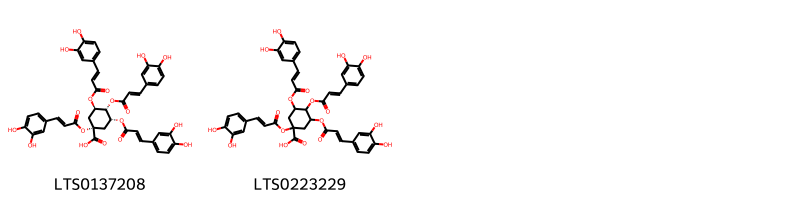{ width=100% }
    <figcaption>Hình ảnh cấu trúc hóa học của 2 hoạt chất thuộc nhóm Carboxylic acids and derivatives gồm ['(1s,3r,4s,5r)-1,3,4,5-tetrakis({[(2e)-3-(3,4-dihydroxyphenyl)prop-2-enoyl]oxy})cyclohexane-1-carboxylic acid (LTS0137208)', '1,3,4,5-tetrakis({[3-(3,4-dihydroxyphenyl)prop-2-enoyl]oxy})cyclohexane-1-carboxylic acid (LTS0223229)'].</figcaption>
</figure>
#### Nhóm Fatty Acyls
<figure markdown="span">
    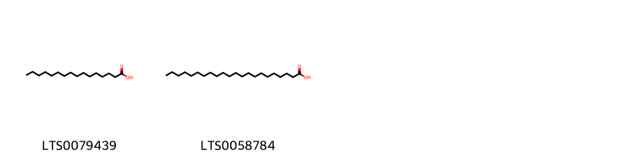{ width=100% }
    <figcaption>Hình ảnh cấu trúc hóa học của 2 hoạt chất thuộc nhóm Fatty Acyls gồm ['palmitic acid (LTS0079439)', 'behenic acid (LTS0058784)'].</figcaption>
</figure>
#### Nhóm Flavonoids
<figure markdown="span">
    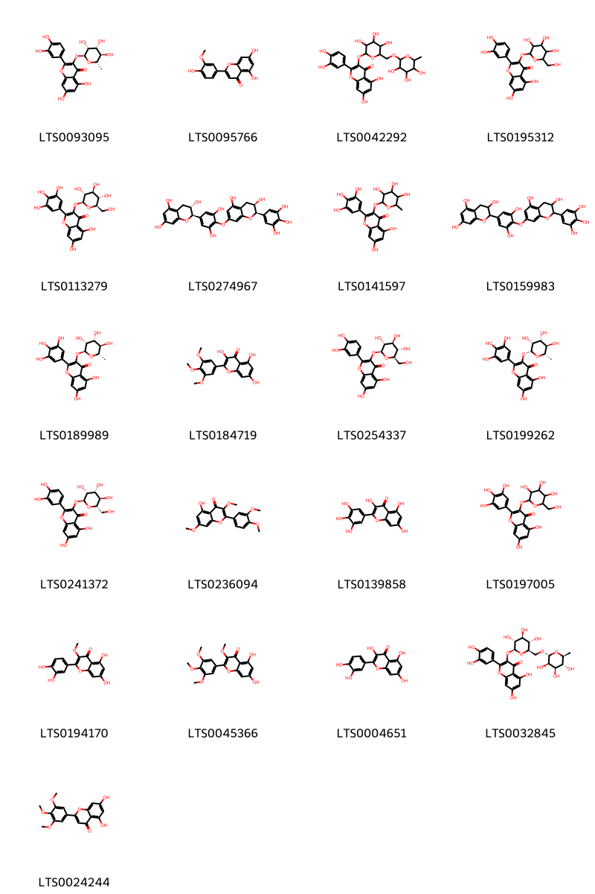{ width=100% }
    <figcaption>Hình ảnh cấu trúc hóa học của 21 hoạt chất thuộc nhóm Flavonoids gồm ['quercitrin (LTS0093095)', 'chrysoeriol (LTS0095766)', 'rutin (LTS0042292)', '2-(3,4-dihydroxyphenyl)-5,7-dihydroxy-3-{[3,4,5-trihydroxy-6-(hydroxymethyl)oxan-2-yl]oxy}chromen-4-one (LTS0195312)', '5,7-dihydroxy-3-{[(2s,3r,4s,5s,6r)-3,4,5-trihydroxy-6-(hydroxymethyl)oxan-2-yl]oxy}-2-(3,4,5-trihydroxyphenyl)chromen-4-one (LTS0113279)', '(2r,3s)-2-(4-{[(2r,3r)-3,5-dihydroxy-2-(3,4,5-trihydroxyphenyl)-3,4-dihydro-2h-1-benzopyran-7-yl]oxy}-3,5-dihydroxyphenyl)-3,4-dihydro-2h-1-benzopyran-3,5,7-triol (LTS0274967)', 'myricitrin (LTS0141597)', '2-(4-{[3,5-dihydroxy-2-(3,4,5-trihydroxyphenyl)-3,4-dihydro-2h-1-benzopyran-7-yl]oxy}-3,5-dihydroxyphenyl)-3,4-dihydro-2h-1-benzopyran-3,5,7-triol (LTS0159983)', 'myricitrin (LTS0189989)', '3,5,7-trihydroxy-2-(3,4,5-trimethoxyphenyl)chromen-4-one (LTS0184719)', 'isoquercetin (LTS0254337)', '5,7-dihydroxy-3-{[(2r,3r,4r,5r,6s)-3,4,5-trihydroxy-6-methyloxan-2-yl]oxy}-2-(3,4,5-trihydroxyphenyl)chromen-4-one (LTS0199262)', '2-(3,4-dihydroxyphenyl)-5,7-dihydroxy-3-{[(2s,3r,4r,5r,6s)-3,4,5-trihydroxy-6-(hydroxymethyl)oxan-2-yl]oxy}chromen-4-one (LTS0241372)', 'retusin (LTS0236094)', 'myricetin (LTS0139858)', '5,7-dihydroxy-3-{[3,4,5-trihydroxy-6-(hydroxymethyl)oxan-2-yl]oxy}-2-(3,4,5-trihydroxyphenyl)chromen-4-one (LTS0197005)', 'quercetin 3-methyl ether (LTS0194170)', '5,7-dihydroxy-3-methoxy-2-(3,4,5-trimethoxyphenyl)chromen-4-one (LTS0045366)', 'quercetin (LTS0004651)', '3-rutinosyl quercetin (LTS0032845)', "3',4',5'-o-trimethyltricetin (LTS0024244)"].</figcaption>
</figure>
#### Nhóm Lignan lactones
<figure markdown="span">
    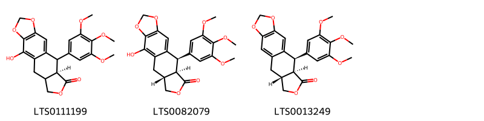{ width=100% }
    <figcaption>Hình ảnh cấu trúc hóa học của 3 hoạt chất thuộc nhóm Lignan lactones gồm ['(11r)-2-hydroxy-10-(3,4,5-trimethoxyphenyl)-4,6,13-trioxatetracyclo[7.7.0.0³,⁷.0¹¹,¹⁵]hexadeca-1,3(7),8-trien-12-one (LTS0111199)', 'β-peltatin (LTS0082079)', '(-)-deoxypodophyllotoxin (LTS0013249)'].</figcaption>
</figure>
#### Nhóm Organooxygen compounds
<figure markdown="span">
    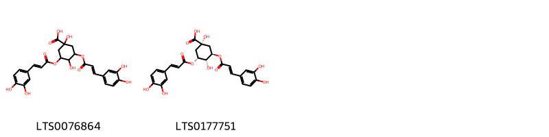{ width=100% }
    <figcaption>Hình ảnh cấu trúc hóa học của 2 hoạt chất thuộc nhóm Organooxygen compounds gồm ['3,5-bis({[3-(3,4-dihydroxyphenyl)prop-2-enoyl]oxy})-1,4-dihydroxycyclohexane-1-carboxylic acid (LTS0076864)', '3,5-dicaffeoylquinic acid (LTS0177751)'].</figcaption>
</figure>
#### Nhóm Prenol lipids
<figure markdown="span">
    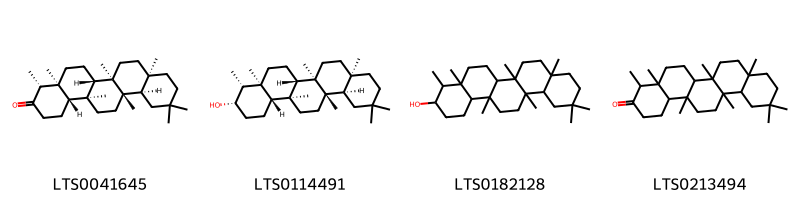{ width=100% }
    <figcaption>Hình ảnh cấu trúc hóa học của 4 hoạt chất thuộc nhóm Prenol lipids gồm ['(-)-friedelin (LTS0041645)', 'epi-friedelanol (LTS0114491)', '4,4a,6b,8a,11,11,12b,14a-octamethyl-hexadecahydropicen-3-ol (LTS0182128)', 'friedelin (LTS0213494)'].</figcaption>
</figure>
#### Nhóm Steroids and steroid derivatives
<figure markdown="span">
    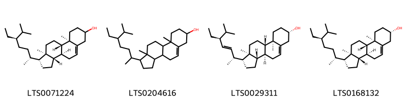{ width=100% }
    <figcaption>Hình ảnh cấu trúc hóa học của 4 hoạt chất thuộc nhóm Steroids and steroid derivatives gồm ['stigmast-5-en-3-ol (LTS0071224)', 'stigmast-5-en-3-ol, (3β)- (LTS0204616)', 'phytosterol (LTS0029311)', 'sitosterol (LTS0168132)'].</figcaption>
</figure>

---

### Dược dân tộc học

Danh sách các quốc gia có sử dụng *Bridelia ferruginea* trong điều trị các bệnh. 

| Country   | Disease   | Bệnh           |
|:----------|:----------|:---------------|
| Africa    | Diuretic  | Thuốc lợi tiêu |
| Nigeria   | Laxative  | Nhuận trường   |

---

---
## Bridelia micrantha
### Thông tin về thực vật

!!! info "Phân loại thực vật của *Bridelia micrantha* từ GIBF:"
    - **Kingdom:** Plantae
    - **Phylum:** Tracheophyta
    - **Order:** Malpighiales
    - **Family:** Phyllanthaceae
    - **Genus:** Bridelia
    - **Species:** *Bridelia micrantha*

 

| Label (VI)   | Label (EN)   | Scientific Name    | Descriptions (VI)   | Descriptions (EN)   | Also Known As (VI)   | Also Known As (EN)                  |
|:-------------|:-------------|:-------------------|:--------------------|:--------------------|:---------------------|:------------------------------------|
| N/A          | N/A          | Bridelia micrantha | loài thực vật       | species of plant    | ['']                 | ['coastal golden-leaf', 'mitzeeri'] |

#### Phân bố trên thế giới

**Từ CSDL GIBF** Malawi, South Africa, Réunion, Nigeria, Gabon, Zimbabwe, Congo, Democratic Republic of the, Guinea, Liberia, Tanzania, United Republic of, Eswatini

#### Phân bố tại Việt Nam

**Từ CSDL GIBF**: Không có ghi nhận ở Việt Nam

---
### Thành phần hóa học
        
- Theo cơ sở dữ liệu lotus: Từ loài *Bridelia micrantha* đã phân lập và xác định được Chưa có hoạt chất nào được phân lập. hoạt chất thuộc về các nhóm Không có hoạt chất nào được phân lập. 

Không có hình ảnh nào được tạo ra

---

### Dược dân tộc học

Danh sách các quốc gia có sử dụng *Bridelia micrantha* trong điều trị các bệnh. 

| Country     | Disease            | Bệnh                              |
|:------------|:-------------------|:----------------------------------|
| Ghana       | Purgative          | Thuốc xổ                          |
| Malawi      | Purgative          | Thuốc xổ                          |
| Upper Volta | Laxative, Antidote | Thuốc nhuận tràng, thuốc giải độc |

---

---
## Bridelia retusa
### Thông tin về thực vật

!!! info "Phân loại thực vật của *Bridelia retusa* từ GIBF:"
    - **Kingdom:** Plantae
    - **Phylum:** Tracheophyta
    - **Order:** Malpighiales
    - **Family:** Phyllanthaceae
    - **Genus:** Bridelia
    - **Species:** *Bridelia retusa*

 

| Label (VI)   | Label (EN)   | Scientific Name   | Descriptions (VI)   | Descriptions (EN)   | Also Known As (VI)   | Also Known As (EN)   |
|:-------------|:-------------|:------------------|:--------------------|:--------------------|:---------------------|:---------------------|
| N/A          | N/A          | Bridelia retusa   | loài thực vật       | species of plant    | ['']                 | ['']                 |

#### Phân bố trên thế giới

**Từ CSDL GIBF** nan, Sri Lanka, Nigeria, Thailand, Lao People’s Democratic Republic, Cambodia, Myanmar, Bhutan, India, Indonesia, Bangladesh, Congo, Democratic Republic of the, Viet Nam, China, Nepal

#### Phân bố tại Việt Nam

**Từ CSDL GIBF**: Hoa Binh, Ninh Binh

---
### Thành phần hóa học
        
- Theo cơ sở dữ liệu lotus: Từ loài *Bridelia retusa* đã phân lập và xác định được 19 hoạt chất thuộc về các nhóm Phenol ethers, Furanoid lignans, Flavonoids, Prenol lipids. 

|    | chemicalTaxonomyClassyfireClass   |   smiles_count |
|---:|:----------------------------------|---------------:|
|  0 | Flavonoids                        |              3 |
|  1 | Furanoid lignans                  |              2 |
|  2 | Phenol ethers                     |              1 |
|  3 | Prenol lipids                     |             13 |

#### Nhóm Flavonoids
<figure markdown="span">
    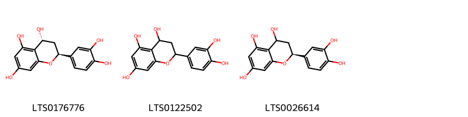{ width=100% }
    <figcaption>Hình ảnh cấu trúc hóa học của 3 hoạt chất thuộc nhóm Flavonoids gồm ['luteoforol (LTS0176776)', 'luteoforol (LTS0122502)', '3-deoxyleucocyanidin (LTS0026614)'].</figcaption>
</figure>
#### Nhóm Furanoid lignans
<figure markdown="span">
    { width=100% }
    <figcaption>Hình ảnh cấu trúc hóa học của 2 hoạt chất thuộc nhóm Furanoid lignans gồm ['sesamin (LTS0228898)', 'sesamin (LTS0120161)'].</figcaption>
</figure>
#### Nhóm Phenol ethers
<figure markdown="span">
    { width=100% }
    <figcaption>Hình ảnh cấu trúc hóa học của 1 hoạt chất thuộc nhóm Phenol ethers gồm ['elemicin (LTS0188875)'].</figcaption>
</figure>
#### Nhóm Prenol lipids
<figure markdown="span">
    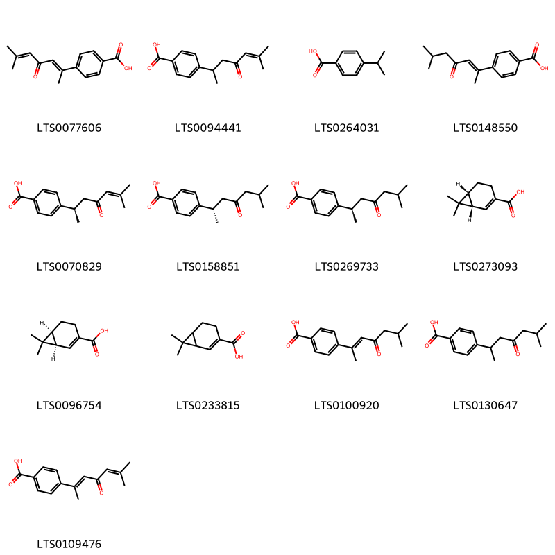{ width=100% }
    <figcaption>Hình ảnh cấu trúc hóa học của 13 hoạt chất thuộc nhóm Prenol lipids gồm ['4-[(2e)-6-methyl-4-oxohepta-2,5-dien-2-yl]benzoic acid (LTS0077606)', '4-(6-methyl-4-oxohept-5-en-2-yl)benzoic acid (LTS0094441)', '4-isopropylbenzoic acid (LTS0264031)', '4-[(2e)-6-methyl-4-oxohept-2-en-2-yl]benzoic acid (LTS0148550)', '4-[(2r)-6-methyl-4-oxohept-5-en-2-yl]benzoic acid (LTS0070829)', '4-[(2s)-6-methyl-4-oxoheptan-2-yl]benzoic acid (LTS0158851)', '4-[(2r)-6-methyl-4-oxoheptan-2-yl]benzoic acid (LTS0269733)', '(1s,6r)-7,7-dimethylbicyclo[4.1.0]hept-2-ene-3-carboxylic acid (LTS0273093)', '(1r,6s)-7,7-dimethylbicyclo[4.1.0]hept-2-ene-3-carboxylic acid (LTS0096754)', '7,7-dimethylbicyclo[4.1.0]hept-2-ene-3-carboxylic acid (LTS0233815)', '4-(6-methyl-4-oxohept-2-en-2-yl)benzoic acid (LTS0100920)', '4-(6-methyl-4-oxoheptan-2-yl)benzoic acid (LTS0130647)', '4-(6-methyl-4-oxohepta-2,5-dien-2-yl)benzoic acid (LTS0109476)'].</figcaption>
</figure>

---

### Dược dân tộc học

Danh sách các quốc gia có sử dụng *Bridelia retusa* trong điều trị các bệnh. 

| Country   | Disease               | Bệnh                   |
|:----------|:----------------------|:-----------------------|
| Elsewhere | Astringent            | Lam se da              |
| Malaya    | Astringent, Piscicide | Chất làm se, Piscicide |

---

# Chi Phyllanthus

??? note "Danh sách các dược liệu thuộc chi"
    
	 - *Phyllanthus acidus*
	 - *Phyllanthus acuminatus*
	 - *Phyllanthus amarus*
	 - *Phyllanthus brasiliensis*
	 - *Phyllanthus corcovadensis*
	 - *Phyllanthus emblica*
	 - *Phyllanthus engleri*
	 - *Phyllanthus epiphyllanthus*
	 - *Phyllanthus floribundus*
	 - *Phyllanthus fraternus*
	 - *Phyllanthus frondosus*
	 - *Phyllanthus indicus*
	 - *Phyllanthus muellerianus*
	 - *Phyllanthus niruri*
	 - *Phyllanthus officinalis*
	 - *Phyllanthus piscatorum*
	 - *Phyllanthus pseudo-conami*
	 - *Phyllanthus pulcher*
	 - *Phyllanthus reticulata*
	 - *Phyllanthus reticulatus*
	 - *Phyllanthus salviaefolius*
	 - *Phyllanthus simplex*
	 - *Phyllanthus stipulatus*
	 - *Phyllanthus stolzianus*
	 - *Phyllanthus urinaria*

---
## Phyllanthus acidus
### Thông tin về thực vật

!!! info "Phân loại thực vật của *Phyllanthus acidus* từ GIBF:"
    - **Kingdom:** Plantae
    - **Phylum:** Tracheophyta
    - **Order:** Malpighiales
    - **Family:** Phyllanthaceae
    - **Genus:** Phyllanthus
    - **Species:** *Phyllanthus acidus*

 

| Label (VI)   | Label (EN)   | Scientific Name    | Descriptions (VI)   | Descriptions (EN)   | Also Known As (VI)   | Also Known As (EN)                                                                                                                                                   |
|:-------------|:-------------|:-------------------|:--------------------|:--------------------|:---------------------|:---------------------------------------------------------------------------------------------------------------------------------------------------------------------|
| N/A          | N/A          | Phyllanthus acidus | loài thực vật       | species of plant    | ['tầm ruột']         | ['Malay gooseberry', 'Otaheite gooseberry', 'Tahitian gooseberry', 'West India gooseberry', 'Star gooseberry', 'Country gooseberry', 'Gooseberry tree', 'Starberry'] |

#### Phân bố trên thế giới

**Từ CSDL GIBF** Virgin Islands (U.S.), Sri Lanka, Guadeloupe, Lao People’s Democratic Republic, Cambodia, Nicaragua, Venezuela (Bolivarian Republic of), Pakistan, Puerto Rico, Chinese Taipei, United States of America, Bonaire, Sint Eustatius and Saba, Saint Martin (French part), Trinidad and Tobago, Guinea-Bissau, Hong Kong, Saint Vincent and the Grenadines, Thailand, Martinique, Bahamas, Brazil, Cuba, Mexico, Peru, Dominican Republic, Singapore, Viet Nam, China, Ecuador, French Polynesia, Cabo Verde, Colombia, India, Indonesia, Antigua and Barbuda, Malaysia, Northern Mariana Islands

#### Phân bố tại Việt Nam

**Từ CSDL GIBF**: Hồ Chí Minh city

---
### Thành phần hóa học
        
- Theo cơ sở dữ liệu lotus: Từ loài *Phyllanthus acidus* đã phân lập và xác định được 5 hoạt chất thuộc về các nhóm Dihydrofurans, Organooxygen compounds. 

|    | chemicalTaxonomyClassyfireClass   |   smiles_count |
|---:|:----------------------------------|---------------:|
|  0 | Dihydrofurans                     |              1 |
|  1 | Organooxygen compounds            |              4 |

#### Nhóm Dihydrofurans
<figure markdown="span">
    { width=100% }
    <figcaption>Hình ảnh cấu trúc hóa học của 1 hoạt chất thuộc nhóm Dihydrofurans gồm ['vitamin c (LTS0022555)'].</figcaption>
</figure>
#### Nhóm Organooxygen compounds
<figure markdown="span">
    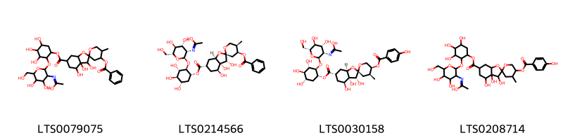{ width=100% }
    <figcaption>Hình ảnh cấu trúc hóa học của 4 hoạt chất thuộc nhóm Organooxygen compounds gồm ["n-{2-[(6-{[4'-(benzoyloxy)-3,3a,4-trihydroxy-5'-methyl-hexahydrospiro[1-benzofuran-2,2'-oxan]-6-yl]carbonyloxy}-2,3,4-trihydroxycyclohexyl)oxy]-4,5-dihydroxy-6-(hydroxymethyl)oxan-3-yl}ethanimidic acid (LTS0079075)", "n-[(2r,3s,4r,5s,6r)-2-{[(1r,2s,3r,4s,6r)-6-{[(2s,3r,3as,4s,4's,5'r,6s,7ar)-4'-(benzoyloxy)-3,3a,4-trihydroxy-5'-methyl-hexahydrospiro[1-benzofuran-2,2'-oxan]-6-yl]carbonyloxy}-2,3,4-trihydroxycyclohexyl]oxy}-4,5-dihydroxy-6-(hydroxymethyl)oxan-3-yl]ethanimidic acid (LTS0214566)", "n-[(2r,3s,4r,5s,6r)-2-{[(1r,2s,3r,4s,6r)-6-{[(2s,3r,3as,4s,4's,5's,6s,7ar)-3,3a,4-trihydroxy-5'-(4-hydroxybenzoyloxy)-4'-methyl-hexahydrospiro[1-benzofuran-2,2'-oxan]-6-yl]carbonyloxy}-2,3,4-trihydroxycyclohexyl]oxy}-4,5-dihydroxy-6-(hydroxymethyl)oxan-3-yl]ethanimidic acid (LTS0030158)", "n-{2-[(6-{[3,3a,4-trihydroxy-5'-(4-hydroxybenzoyloxy)-4'-methyl-hexahydrospiro[1-benzofuran-2,2'-oxan]-6-yl]carbonyloxy}-2,3,4-trihydroxycyclohexyl)oxy]-4,5-dihydroxy-6-(hydroxymethyl)oxan-3-yl}ethanimidic acid (LTS0208714)"].</figcaption>
</figure>

---

### Dược dân tộc học

Danh sách các quốc gia có sử dụng *Phyllanthus acidus* trong điều trị các bệnh. 

| Country   | Disease                          | Bệnh                             |
|:----------|:---------------------------------|:---------------------------------|
| Elsewhere | Cathartic, Poison                | Cathartic, Poison                |
| Mexico    | Cathartic, Astringent, Purgative | Cathartic, Astringent, Purgative |

---

---
## Phyllanthus acuminatus
### Thông tin về thực vật

!!! info "Phân loại thực vật của *Phyllanthus acuminatus* từ GIBF:"
    - **Kingdom:** Plantae
    - **Phylum:** Tracheophyta
    - **Order:** Malpighiales
    - **Family:** Phyllanthaceae
    - **Genus:** Phyllanthus
    - **Species:** *Phyllanthus acuminatus*

 

| Label (VI)   | Label (EN)   | Scientific Name        | Descriptions (VI)   | Descriptions (EN)   | Also Known As (VI)   | Also Known As (EN)   |
|:-------------|:-------------|:-----------------------|:--------------------|:--------------------|:---------------------|:---------------------|
| N/A          | N/A          | Phyllanthus acuminatus | loài thực vật       | species of plant    | ['']                 | ['']                 |

#### Phân bố trên thế giới

**Từ CSDL GIBF** Nicaragua, Belize, nan, Colombia, Brazil, Argentina, Costa Rica, Mexico, El Salvador

#### Phân bố tại Việt Nam

**Từ CSDL GIBF**: Không có ghi nhận ở Việt Nam

---
### Thành phần hóa học
        
- Theo cơ sở dữ liệu lotus: Từ loài *Phyllanthus acuminatus* đã phân lập và xác định được 17 hoạt chất thuộc về các nhóm Fatty Acyls, Arylnaphthalene lignans, Carboxylic acids and derivatives. 

|    | chemicalTaxonomyClassyfireClass   |   smiles_count |
|---:|:----------------------------------|---------------:|
|  0 | Arylnaphthalene lignans           |              3 |
|  1 | Carboxylic acids and derivatives  |              6 |
|  2 | Fatty Acyls                       |              7 |

#### Nhóm Arylnaphthalene lignans
<figure markdown="span">
    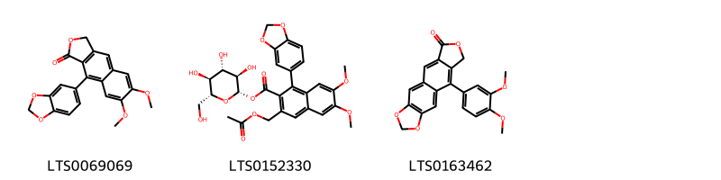{ width=100% }
    <figcaption>Hình ảnh cấu trúc hóa học của 3 hoạt chất thuộc nhóm Arylnaphthalene lignans gồm ['justicidin b (LTS0069069)', 'phyllanthostatin a (LTS0152330)', 'retrochinensin (LTS0163462)'].</figcaption>
</figure>
#### Nhóm Carboxylic acids and derivatives
<figure markdown="span">
    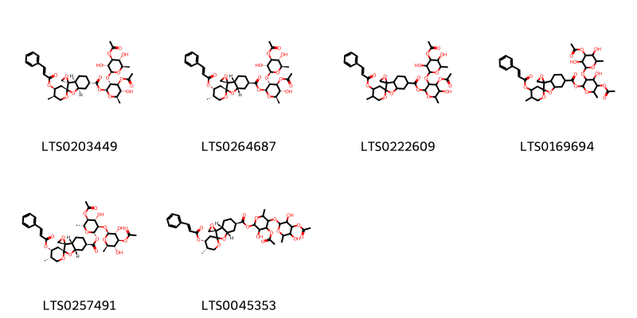{ width=100% }
    <figcaption>Hình ảnh cấu trúc hóa học của 6 hoạt chất thuộc nhóm Carboxylic acids and derivatives gồm ["(2s,3r,4s,5r,6r)-4-(acetyloxy)-3-{[(2s,3r,4s,5r,6r)-4-(acetyloxy)-3,5-dihydroxy-6-methyloxan-2-yl]oxy}-5-hydroxy-6-methyloxan-2-yl (2s,3'r,3'as,4s,5r,6's,7'ar)-5-methyl-4-{[(2e)-3-phenylprop-2-enoyl]oxy}-hexahydrodispiro[oxane-2,2'-[1]benzofuran-3',2''-oxirane]-6'-carboxylate (LTS0203449)", "(2s,3r,4s,5r,6r)-4-(acetyloxy)-3-{[(2s,3r,4s,5r,6r)-4-(acetyloxy)-3,5-dihydroxy-6-methyloxan-2-yl]oxy}-5-hydroxy-6-methyloxan-2-yl (2s,3's,3'ar,4r,5s,6'r,7'as)-5-methyl-4-{[(2e)-3-phenylprop-2-enoyl]oxy}-hexahydrodispiro[oxane-2,2'-[1]benzofuran-3',2''-oxirane]-6'-carboxylate (LTS0264687)", "4-(acetyloxy)-3-{[4-(acetyloxy)-3,5-dihydroxy-6-methyloxan-2-yl]oxy}-5-hydroxy-6-methyloxan-2-yl 5-methyl-4-[(3-phenylprop-2-enoyl)oxy]-hexahydrodispiro[oxane-2,2'-[1]benzofuran-3',2''-oxirane]-6'-carboxylate (LTS0222609)", "5-(acetyloxy)-3-{[4-(acetyloxy)-3,5-dihydroxy-6-methyloxan-2-yl]oxy}-4-hydroxy-6-methyloxan-2-yl 5-methyl-4-[(3-phenylprop-2-enoyl)oxy]-hexahydrodispiro[oxane-2,2'-[1]benzofuran-3',2''-oxirane]-6'-carboxylate (LTS0169694)", "(2s,3r,4s,5s,6r)-5-(acetyloxy)-3-{[(2s,3r,4s,5r,6r)-4-(acetyloxy)-3,5-dihydroxy-6-methyloxan-2-yl]oxy}-4-hydroxy-6-methyloxan-2-yl (2s,3's,3'ar,4r,5s,6'r,7'as)-5-methyl-4-{[(2e)-3-phenylprop-2-enoyl]oxy}-hexahydrodispiro[oxane-2,2'-[1]benzofuran-3',2''-oxirane]-6'-carboxylate (LTS0257491)", "4-(acetyloxy)-5-{[4-(acetyloxy)-3,5-dihydroxy-6-methyloxan-2-yl]oxy}-3-hydroxy-6-methyloxan-2-yl (3's,3'ar,4r,5s,6'r,7'as)-5-methyl-4-{[(2e)-3-phenylprop-2-enoyl]oxy}-hexahydrodispiro[oxane-2,2'-[1]benzofuran-3',2''-oxirane]-6'-carboxylate (LTS0045353)"].</figcaption>
</figure>
#### Nhóm Fatty Acyls
<figure markdown="span">
    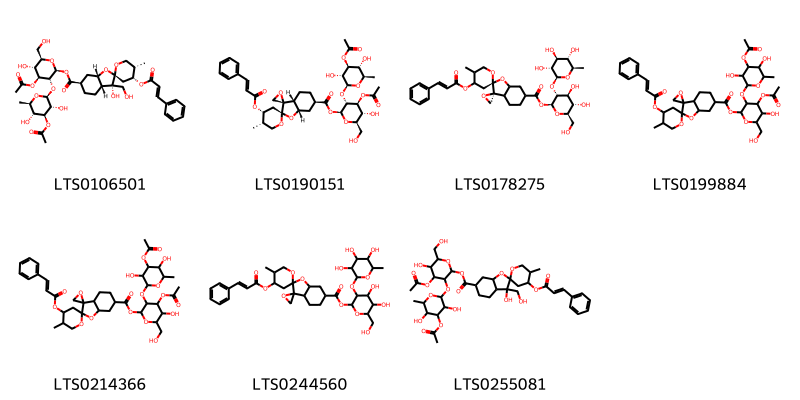{ width=100% }
    <figcaption>Hình ảnh cấu trúc hóa học của 7 hoạt chất thuộc nhóm Fatty Acyls gồm ["(2s,3r,4s,5r,6r)-4-(acetyloxy)-3-{[(2s,3r,4s,5r,6r)-4-(acetyloxy)-3,5-dihydroxy-6-methyloxan-2-yl]oxy}-5-hydroxy-6-(hydroxymethyl)oxan-2-yl (2s,3s,3ar,4'r,5's,6r,7as)-3-hydroxy-3-(hydroxymethyl)-5'-methyl-4'-{[(2e)-3-phenylprop-2-enoyl]oxy}-hexahydrospiro[1-benzofuran-2,2'-oxane]-6-carboxylate (LTS0106501)", "(2s,3r,4s,5r,6r)-4-(acetyloxy)-3-{[(2s,3r,4s,5r,6r)-4-(acetyloxy)-3,5-dihydroxy-6-methyloxan-2-yl]oxy}-5-hydroxy-6-(hydroxymethyl)oxan-2-yl (2s,3's,3'ar,4r,5s,6'r,7'as)-5-methyl-4-{[(2e)-3-phenylprop-2-enoyl]oxy}-hexahydrodispiro[oxane-2,2'-[1]benzofuran-3',2''-oxirane]-6'-carboxylate (LTS0190151)", "(2s,3r,4s,5s,6r)-4,5-dihydroxy-6-(hydroxymethyl)-3-{[(2s,3r,4s,5s,6r)-3,4,5-trihydroxy-6-methyloxan-2-yl]oxy}oxan-2-yl (2r,3's)-5-methyl-4-{[(2e)-3-phenylprop-2-enoyl]oxy}-hexahydrodispiro[oxane-2,2'-[1]benzofuran-3',2''-oxirane]-6'-carboxylate (LTS0178275)", "4-(acetyloxy)-3-{[4-(acetyloxy)-3,5-dihydroxy-6-methyloxan-2-yl]oxy}-5-hydroxy-6-(hydroxymethyl)oxan-2-yl 5-methyl-4-{[(2e)-3-phenylprop-2-enoyl]oxy}-hexahydrodispiro[oxane-2,2'-[1]benzofuran-3',2''-oxirane]-6'-carboxylate (LTS0199884)", "4-(acetyloxy)-3-{[4-(acetyloxy)-3,5-dihydroxy-6-methyloxan-2-yl]oxy}-5-hydroxy-6-(hydroxymethyl)oxan-2-yl 5-methyl-4-[(3-phenylprop-2-enoyl)oxy]-hexahydrodispiro[oxane-2,2'-[1]benzofuran-3',2''-oxirane]-6'-carboxylate (LTS0214366)", "4,5-dihydroxy-6-(hydroxymethyl)-3-[(3,4,5-trihydroxy-6-methyloxan-2-yl)oxy]oxan-2-yl 5-methyl-4-{[(2e)-3-phenylprop-2-enoyl]oxy}-hexahydrodispiro[oxane-2,2'-[1]benzofuran-3',2''-oxirane]-6'-carboxylate (LTS0244560)", "4-(acetyloxy)-3-{[4-(acetyloxy)-3,5-dihydroxy-6-methyloxan-2-yl]oxy}-5-hydroxy-6-(hydroxymethyl)oxan-2-yl 3-hydroxy-3-(hydroxymethyl)-5'-methyl-4'-[(3-phenylprop-2-enoyl)oxy]-hexahydrospiro[1-benzofuran-2,2'-oxane]-6-carboxylate (LTS0255081)"].</figcaption>
</figure>

---

### Dược dân tộc học

Danh sách các quốc gia có sử dụng *Phyllanthus acuminatus* trong điều trị các bệnh. 

| Country        | Disease   | Bệnh          |
|:---------------|:----------|:--------------|
| Elsewhere      | Piscicide | Thuốc diệt cá |
| Guiana(Arawak) | Piscicide | Thuốc diệt cá |
| Panama(Choco)  | Piscicide | Thuốc diệt cá |
| Peru           | Piscicide | Thuốc diệt cá |

---

---
## Phyllanthus amarus
### Thông tin về thực vật

!!! info "Phân loại thực vật của *Phyllanthus amarus* từ GIBF:"
    - **Kingdom:** Plantae
    - **Phylum:** Tracheophyta
    - **Order:** Malpighiales
    - **Family:** Phyllanthaceae
    - **Genus:** Phyllanthus
    - **Species:** *Phyllanthus amarus*

 

| Label (VI)   | Label (EN)   | Scientific Name    | Descriptions (VI)   | Descriptions (EN)   | Also Known As (VI)   | Also Known As (EN)   |
|:-------------|:-------------|:-------------------|:--------------------|:--------------------|:---------------------|:---------------------|
| N/A          | N/A          | Phyllanthus amarus |                     | species of plant    | ['']                 | ['']                 |

#### Phân bố trên thế giới

**Từ CSDL GIBF** Virgin Islands (U.S.), American Samoa, Sri Lanka, nan, United Arab Emirates, Australia, Japan, Guadeloupe, Benin, French Guiana, Puerto Rico, Nigeria, Chinese Taipei, United States of America, El Salvador, Saudi Arabia, Fiji, Barbados, Hong Kong, Thailand, Brazil, Cuba, Mexico, Dominican Republic, Singapore, Viet Nam, British Indian Ocean Territory, China, Curaçao, Ecuador, Saint Kitts and Nevis, Madagascar, Aruba, Montserrat, India, Indonesia, Anguilla, Cayman Islands, Antigua and Barbuda, Philippines, Malaysia

#### Phân bố tại Việt Nam

**Từ CSDL GIBF**: Hải Phòng, Hồ Chí Minh city

---
### Thành phần hóa học
        
- Theo cơ sở dữ liệu lotus: Từ loài *Phyllanthus amarus* đã phân lập và xác định được 60 hoạt chất thuộc về các nhóm Flavonoids, Indolizidines, Dibenzylbutane lignans, Benzene and substituted derivatives, Azaspirodecane derivatives, Organooxygen compounds, Tannins, Pyrrolizidines, Aryltetralin lignans. 

|    | chemicalTaxonomyClassyfireClass     |   smiles_count |
|---:|:------------------------------------|---------------:|
|  0 | Aryltetralin lignans                |              6 |
|  1 | Azaspirodecane derivatives          |              5 |
|  2 | Benzene and substituted derivatives |              1 |
|  3 | Dibenzylbutane lignans              |              4 |
|  4 | Flavonoids                          |              8 |
|  5 | Indolizidines                       |              6 |
|  6 | Organooxygen compounds              |              3 |
|  7 | Pyrrolizidines                      |              2 |
|  8 | Tannins                             |             24 |

#### Nhóm Aryltetralin lignans
<figure markdown="span">
    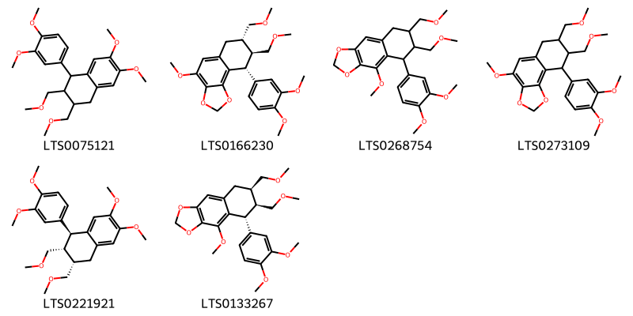{ width=100% }
    <figcaption>Hình ảnh cấu trúc hóa học của 6 hoạt chất thuộc nhóm Aryltetralin lignans gồm ['1-(3,4-dimethoxyphenyl)-6,7-dimethoxy-2,3-bis(methoxymethyl)-1,2,3,4-tetrahydronaphthalene (LTS0075121)', '(7s,8s,9r)-9-(3,4-dimethoxyphenyl)-4-methoxy-7,8-bis(methoxymethyl)-2h,6h,7h,8h,9h-naphtho[1,2-d][1,3]dioxole (LTS0166230)', '5-(3,4-dimethoxyphenyl)-4-methoxy-6,7-bis(methoxymethyl)-2h,5h,6h,7h,8h-naphtho[2,3-d][1,3]dioxole (LTS0268754)', '9-(3,4-dimethoxyphenyl)-4-methoxy-7,8-bis(methoxymethyl)-2h,6h,7h,8h,9h-naphtho[1,2-d][1,3]dioxole (LTS0273109)', '(1s,2r,3s)-1-(3,4-dimethoxyphenyl)-6,7-dimethoxy-2,3-bis(methoxymethyl)-1,2,3,4-tetrahydronaphthalene (LTS0221921)', '(5r,6s,7r)-5-(3,4-dimethoxyphenyl)-4-methoxy-6,7-bis(methoxymethyl)-2h,5h,6h,7h,8h-naphtho[2,3-d][1,3]dioxole (LTS0133267)'].</figcaption>
</figure>
#### Nhóm Azaspirodecane derivatives
<figure markdown="span">
    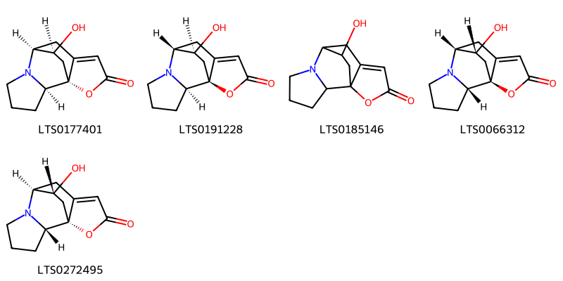{ width=100% }
    <figcaption>Hình ảnh cấu trúc hóa học của 5 hoạt chất thuộc nhóm Azaspirodecane derivatives gồm ['(1r,2r,7s,14s)-14-hydroxy-12-oxa-6-azatetracyclo[5.5.2.0¹,⁹.0²,⁶]tetradec-9-en-11-one (LTS0177401)', '(1s,2r,7r,14s)-14-hydroxy-12-oxa-6-azatetracyclo[5.5.2.0¹,⁹.0²,⁶]tetradec-9-en-11-one (LTS0191228)', '14-hydroxy-12-oxa-6-azatetracyclo[5.5.2.0¹,⁹.0²,⁶]tetradec-9-en-11-one (LTS0185146)', '(1s,2s,7r,14r)-14-hydroxy-12-oxa-6-azatetracyclo[5.5.2.0¹,⁹.0²,⁶]tetradec-9-en-11-one (LTS0066312)', '(1r,2s,7s,14r)-14-hydroxy-12-oxa-6-azatetracyclo[5.5.2.0¹,⁹.0²,⁶]tetradec-9-en-11-one (LTS0272495)'].</figcaption>
</figure>
#### Nhóm Benzene and substituted derivatives
<figure markdown="span">
    { width=100% }
    <figcaption>Hình ảnh cấu trúc hóa học của 1 hoạt chất thuộc nhóm Benzene and substituted derivatives gồm ['galop (LTS0222857)'].</figcaption>
</figure>
#### Nhóm Dibenzylbutane lignans
<figure markdown="span">
    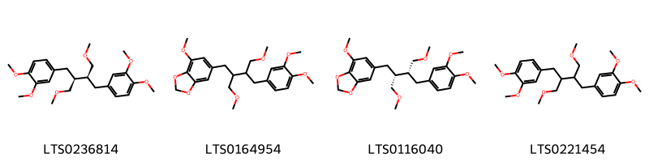{ width=100% }
    <figcaption>Hình ảnh cấu trúc hóa học của 4 hoạt chất thuộc nhóm Dibenzylbutane lignans gồm ['phyllanthin (LTS0236814)', '6-{3-[(3,4-dimethoxyphenyl)methyl]-4-methoxy-2-(methoxymethyl)butyl}-4-methoxy-2h-1,3-benzodioxole (LTS0164954)', '6-[(2r,3r)-3-[(3,4-dimethoxyphenyl)methyl]-4-methoxy-2-(methoxymethyl)butyl]-4-methoxy-2h-1,3-benzodioxole (LTS0116040)', '4-{3-[(3,4-dimethoxyphenyl)methyl]-4-methoxy-2-(methoxymethyl)butyl}-1,2-dimethoxybenzene (LTS0221454)'].</figcaption>
</figure>
#### Nhóm Flavonoids
<figure markdown="span">
    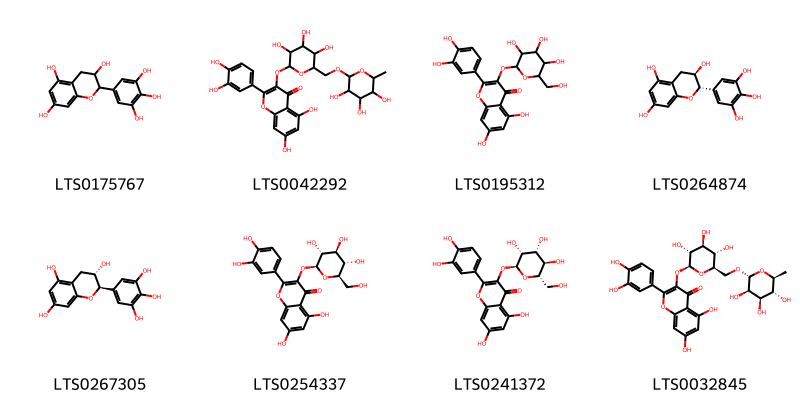{ width=100% }
    <figcaption>Hình ảnh cấu trúc hóa học của 8 hoạt chất thuộc nhóm Flavonoids gồm ['epigallocatechin (LTS0175767)', 'rutin (LTS0042292)', '2-(3,4-dihydroxyphenyl)-5,7-dihydroxy-3-{[3,4,5-trihydroxy-6-(hydroxymethyl)oxan-2-yl]oxy}chromen-4-one (LTS0195312)', '(-)-gallocatechin (LTS0264874)', 'gallocatechol (LTS0267305)', 'isoquercetin (LTS0254337)', '2-(3,4-dihydroxyphenyl)-5,7-dihydroxy-3-{[(2s,3r,4r,5r,6s)-3,4,5-trihydroxy-6-(hydroxymethyl)oxan-2-yl]oxy}chromen-4-one (LTS0241372)', '3-rutinosyl quercetin (LTS0032845)'].</figcaption>
</figure>
#### Nhóm Indolizidines
<figure markdown="span">
    { width=100% }
    <figcaption>Hình ảnh cấu trúc hóa học của 6 hoạt chất thuộc nhóm Indolizidines gồm ['(1s,2r,4r,8s)-4-methoxy-14-oxa-7-azatetracyclo[6.6.1.0¹,¹¹.0²,⁷]pentadeca-9,11-dien-13-one (LTS0097763)', 'securinine (LTS0075681)', '(2r,4r,8s)-4-methoxy-14-oxa-7-azatetracyclo[6.6.1.0¹,¹¹.0²,⁷]pentadeca-9,11-dien-13-one (LTS0115689)', '14-oxa-7-azatetracyclo[6.6.1.0¹,¹¹.0²,⁷]pentadeca-9,11-dien-13-one (LTS0185838)', '(8s)-4-methoxy-14-oxa-7-azatetracyclo[6.6.1.0¹,¹¹.0²,⁷]pentadeca-9,11-dien-13-one (LTS0002648)', '4-methoxy-14-oxa-7-azatetracyclo[6.6.1.0¹,¹¹.0²,⁷]pentadeca-9,11-dien-13-one (LTS0252080)'].</figcaption>
</figure>
#### Nhóm Organooxygen compounds
<figure markdown="span">
    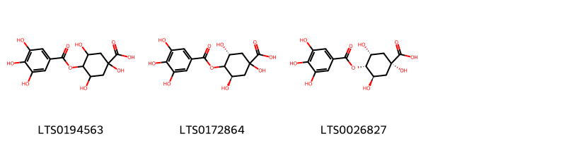{ width=100% }
    <figcaption>Hình ảnh cấu trúc hóa học của 3 hoạt chất thuộc nhóm Organooxygen compounds gồm ['1,3,5-trihydroxy-4-(3,4,5-trihydroxybenzoyloxy)cyclohexane-1-carboxylic acid (LTS0194563)', '(3r,5r)-1,3,5-trihydroxy-4-(3,4,5-trihydroxybenzoyloxy)cyclohexane-1-carboxylic acid (LTS0172864)', '(1s,3r,4s,5r)-1,3,5-trihydroxy-4-(3,4,5-trihydroxybenzoyloxy)cyclohexane-1-carboxylic acid (LTS0026827)'].</figcaption>
</figure>
#### Nhóm Pyrrolizidines
<figure markdown="span">
    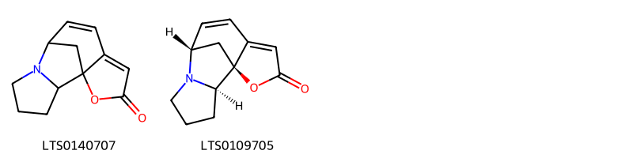{ width=100% }
    <figcaption>Hình ảnh cấu trúc hóa học của 2 hoạt chất thuộc nhóm Pyrrolizidines gồm ['2-oxa-9-azatetracyclo[6.5.1.0¹,⁵.0⁹,¹³]tetradeca-4,6-dien-3-one (LTS0140707)', '(1s,8s,13r)-2-oxa-9-azatetracyclo[6.5.1.0¹,⁵.0⁹,¹³]tetradeca-4,6-dien-3-one (LTS0109705)'].</figcaption>
</figure>
#### Nhóm Tannins
<figure markdown="span">
    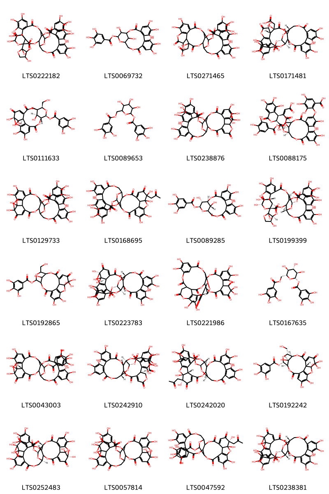{ width=100% }
    <figcaption>Hình ảnh cấu trúc hóa học của 24 hoạt chất thuộc nhóm Tannins gồm ["3a,6,10',11',12',15',16',17',31',32',36',37'-dodecahydroxy-2,2',7',20',28',41'-hexaoxo-6,6a-dihydro-5h-3',6',21',24',27',38',42'-heptaoxaspiro[furo[3,2-b]furan-3,39'-nonacyclo[35.2.2.1³³,³⁶.0¹,³⁵.0⁴,²³.0⁵,²⁶.0⁸,¹³.0¹⁴,¹⁹.0²⁹,³⁴]dotetracontane]-8'(13'),9',11',14',16',18',29'(34'),30',32'-nonaen-25'-yl 3,4,5-trihydroxybenzoate (LTS0222182)", '6,7,8,11,12,13,22,23-octahydroxy-3,16-dioxo-2,17,20-trioxatetracyclo[17.3.1.0⁴,⁹.0¹⁰,¹⁵]tricosa-4(9),5,7,10,12,14-hexaen-21-yl 3,4,5-trihydroxybenzoate (LTS0069732)', '[13,14,15,18,19,20,29,31,35,36-decahydroxy-2,10,23,28,32-pentaoxo-5-(3,4,5-trihydroxybenzoyloxy)-3,6,9,24,27,33-hexaoxaheptacyclo[28.7.1.0⁴,²⁵.0⁷,²⁶.0¹¹,¹⁶.0¹⁷,²².0³⁴,³⁸]octatriaconta-1(37),11,13,15,17(22),18,20,34(38),35-nonaen-29-yl]acetic acid (LTS0271465)', '[(4r,5s,7r,25s,26r,29r,30r,31s)-13,14,15,18,19,20,29,31,35,36-decahydroxy-2,10,23,28,32-pentaoxo-5-(3,4,5-trihydroxybenzoyloxy)-3,6,9,24,27,33-hexaoxaheptacyclo[28.7.1.0⁴,²⁵.0⁷,²⁶.0¹¹,¹⁶.0¹⁷,²².0³⁴,³⁸]octatriaconta-1(37),11(16),12,14,17,19,21,34(38),35-nonaen-29-yl]acetic acid (LTS0171481)', '(1s,7s,9r,18r,19s,21r,22s)-7,8,8,12,13,22-hexahydroxy-21-(hydroxymethyl)-3,6,16-trioxo-2,17,20,23-tetraoxapentacyclo[16.3.1.1⁷,¹¹.0⁴,⁹.0¹⁰,¹⁵]tricosa-4,10,12,14-tetraen-19-yl 3,4,5-trihydroxybenzoate (LTS0111633)', '3,4,5-trihydroxy-6-[(3,4,5-trihydroxybenzoyloxy)methyl]oxan-2-yl 3,4,5-trihydroxybenzoate (LTS0089653)', '9,10,11,27,28,29,32,33,34-nonahydroxy-6,16,19,24,37-pentaoxo-3-(3,4,5-trihydroxybenzoyloxy)-2,5,15,20,23,38-hexaoxaheptacyclo[19.18.0.0⁴,²².0⁷,¹².0¹³,¹⁸.0²⁵,³⁰.0³¹,³⁶]nonatriaconta-7,9,11,17,25(30),26,28,31,33,35-decaene-14-carboxylic acid (LTS0238876)', '(3s,4s)-4-[(1z)-1-carboxy-3-{[(1r,19r,21s,22r,23r)-6-(6-carboxy-2,3,4-trihydroxyphenoxy)-7,8,11,12,13,22-hexahydroxy-3,16-dioxo-21-(3,4,5-trihydroxybenzoyloxy)-2,17,20-trioxatetracyclo[17.3.1.0⁴,⁹.0¹⁰,¹⁵]tricosa-4(9),5,7,10,12,14-hexaen-23-yl]oxy}-3-oxoprop-1-en-2-yl]-5,6,7-trihydroxy-1-oxo-3,4-dihydro-2-benzopyran-3-carboxylic acid (LTS0088175)', '1,13,14,15,18,19,20,34,35,39,39-undecahydroxy-2,5,10,23,31-pentaoxo-6,9,24,27,30,40-hexaoxaoctacyclo[34.3.1.0⁴,³⁸.0⁷,²⁶.0⁸,²⁹.0¹¹,¹⁶.0¹⁷,²².0³²,³⁷]tetraconta-3,11(16),12,14,17,19,21,32,34,36-decaen-28-yl 3,4,5-trihydroxybenzoate (LTS0129733)', '1,2,14,15,16,19,20,21,35,36-decahydroxy-3,6,11,24,32-pentaoxo-2-(2-oxopropyl)-7,10,25,28,31,40-hexaoxaoctacyclo[35.2.1.0⁵,³⁹.0⁸,²⁷.0⁹,³⁰.0¹²,¹⁷.0¹⁸,²³.0³³,³⁸]tetraconta-4,12(17),13,15,18,20,22,33,35,37-decaen-29-yl 3,4,5-trihydroxybenzoate (LTS0168695)', '(1s,19r,21s,22r,23r)-6,7,8,11,12,13,22,23-octahydroxy-3,16-dioxo-2,17,20-trioxatetracyclo[17.3.1.0⁴,⁹.0¹⁰,¹⁵]tricosa-4(9),5,7,10,12,14-hexaen-21-yl 3,4,5-trihydroxybenzoate (LTS0089285)', "(1'r,3r,3as,4'r,5's,6s,6as,23'r,25's,26'r,35'r,36's,37'r)-3a,6,10',11',12',15',16',17',31',32',36',37'-dodecahydroxy-2,2',7',20',28',41'-hexaoxo-6,6a-dihydro-5h-3',6',21',24',27',38',42'-heptaoxaspiro[furo[3,2-b]furan-3,39'-nonacyclo[35.2.2.1³³,³⁶.0¹,³⁵.0⁴,²³.0⁵,²⁶.0⁸,¹³.0¹⁴,¹⁹.0²⁹,³⁴]dotetracontane]-8'(13'),9',11',14',16',18',29',31',33'-nonaen-25'-yl 3,4,5-trihydroxybenzoate (LTS0199399)", '7,7,8,12,13,22-hexahydroxy-21-(hydroxymethyl)-3,6,16-trioxo-2,17,20,23-tetraoxapentacyclo[16.3.1.1⁸,¹¹.0⁴,⁹.0¹⁰,¹⁵]tricosa-4,10,12,14-tetraen-19-yl 3,4,5-trihydroxybenzoate (LTS0192865)', '(1r,7r,8s,26r,28s,29r,38r)-1,13,14,15,18,19,20,34,35,39,39-undecahydroxy-2,5,10,23,31-pentaoxo-6,9,24,27,30,40-hexaoxaoctacyclo[34.3.1.0⁴,³⁸.0⁷,²⁶.0⁸,²⁹.0¹¹,¹⁶.0¹⁷,²².0³²,³⁷]tetraconta-3,11,13,15,17(22),18,20,32,34,36-decaen-28-yl 3,4,5-trihydroxybenzoate (LTS0223783)', '12,13,17,18,18,32,33,42,43-nonahydroxy-5,8,23,26,28,35,40,46,49-nonaoxadecacyclo[23.19.3.1¹⁴,¹⁷.1³⁰,³⁴.0²,⁴¹.0³,³⁷.0⁶,²⁴.0⁷,²⁷.0¹⁰,¹⁵.0¹⁶,²¹]nonatetraconta-1(44),2(41),10(15),11,13,20,30,32,34(48),42-decaen-4,9,19,22,29,36,39,45-octone (LTS0221986)', '(2s,3r,4s,5s,6r)-3,4,5-trihydroxy-6-[(3,4,5-trihydroxybenzoyloxy)methyl]oxan-2-yl 3,4,5-trihydroxybenzoate (LTS0167635)', '(1r,38r)-1,13,14,15,18,19,20,34,35,39,39-undecahydroxy-2,5,10,23,31-pentaoxo-6,9,24,27,30,40-hexaoxaoctacyclo[34.3.1.0⁴,³⁸.0⁷,²⁶.0⁸,²⁹.0¹¹,¹⁶.0¹⁷,²².0³²,³⁷]tetraconta-3,11(16),12,14,17,19,21,32,34,36-decaen-28-yl 3,4,5-trihydroxybenzoate (LTS0043003)', '(1r,3s,4r,13r,14r,21r,22s)-9,10,11,27,28,29,32,33,34-nonahydroxy-6,16,19,24,37-pentaoxo-3-(3,4,5-trihydroxybenzoyloxy)-2,5,15,20,23,38-hexaoxaheptacyclo[19.18.0.0⁴,²².0⁷,¹².0¹³,¹⁸.0²⁵,³⁰.0³¹,³⁶]nonatriaconta-7,9,11,17,25,27,29,31(36),32,34-decaene-14-carboxylic acid (LTS0242910)', '(1r,2s,8r,9s,27r,29s,30r,39r)-1,2,14,15,16,19,20,21,35,36-decahydroxy-3,6,11,24,32-pentaoxo-2-(2-oxopropyl)-7,10,25,28,31,40-hexaoxaoctacyclo[35.2.1.0⁵,³⁹.0⁸,²⁷.0⁹,³⁰.0¹²,¹⁷.0¹⁸,²³.0³³,³⁸]tetraconta-4,12,14,16,18(23),19,21,33,35,37-decaen-29-yl 3,4,5-trihydroxybenzoate (LTS0242020)', '(1s,8r,9r,18r,19s,21r,22s)-7,7,8,12,13,22-hexahydroxy-21-(hydroxymethyl)-3,6,16-trioxo-2,17,20,23-tetraoxapentacyclo[16.3.1.1⁸,¹¹.0⁴,⁹.0¹⁰,¹⁵]tricosa-4,10,12,14-tetraen-19-yl 3,4,5-trihydroxybenzoate (LTS0192242)', '(1s,7s,14r,25r,26s,28r)-1,14,15,15,19,20,34,35,39,39-decahydroxy-2,5,10,13,23,31-hexaoxo-6,9,24,27,30,40,41-heptaoxanonacyclo[34.3.1.1¹⁴,¹⁸.0⁴,³⁸.0⁷,²⁵.0⁸,²⁸.0¹¹,¹⁶.0¹⁷,²².0³²,³⁷]hentetraconta-3,11,17(22),18,20,32,34,36-octaen-26-yl 3,4,5-trihydroxybenzoate (LTS0252483)', '1,14,15,15,19,20,34,35,39,39-decahydroxy-2,5,10,13,23,31-hexaoxo-6,9,24,27,30,40,41-heptaoxanonacyclo[34.3.1.1¹⁴,¹⁸.0⁴,³⁸.0⁷,²⁵.0⁸,²⁸.0¹¹,¹⁶.0¹⁷,²².0³²,³⁷]hentetraconta-3,11,17(22),18,20,32,34,36-octaen-26-yl 3,4,5-trihydroxybenzoate (LTS0057814)', '(1r,2s)-1,2,14,15,16,19,20,21,35,36-decahydroxy-3,6,11,24,32-pentaoxo-2-(2-oxopropyl)-7,10,25,28,31,40-hexaoxaoctacyclo[35.2.1.0⁵,³⁹.0⁸,²⁷.0⁹,³⁰.0¹²,¹⁷.0¹⁸,²³.0³³,³⁸]tetraconta-4,12(17),13,15,18,20,22,33,35,37-decaen-29-yl 3,4,5-trihydroxybenzoate (LTS0047592)', '(7r,8s,26r,28s,29s)-1,13,14,15,18,19,20,34,35,39,39-undecahydroxy-2,5,10,23,31-pentaoxo-6,9,24,27,30,40-hexaoxaoctacyclo[34.3.1.0⁴,³⁸.0⁷,²⁶.0⁸,²⁹.0¹¹,¹⁶.0¹⁷,²².0³²,³⁷]tetraconta-3,11,13,15,17(22),18,20,32,34,36-decaen-28-yl 3,4,5-trihydroxybenzoate (LTS0238381)'].</figcaption>
</figure>

---

### Dược dân tộc học

Danh sách các quốc gia có sử dụng *Phyllanthus amarus* trong điều trị các bệnh. 

| Country   | Disease             | Bệnh               |
|:----------|:--------------------|:-------------------|
| Haiti     | Digestive, Diuretic | Tiêu hóa, lợi tiểu |
| Polynesia | Piscicide           | Thuốc diệt cá      |

---

---
## Phyllanthus brasiliensis
### Thông tin về thực vật

!!! info "Phân loại thực vật của *Phyllanthus brasiliensis* từ GIBF:"
    - **Kingdom:** Plantae
    - **Phylum:** Tracheophyta
    - **Order:** Malpighiales
    - **Family:** Phyllanthaceae
    - **Genus:** Phyllanthus
    - **Species:** *Phyllanthus brasiliensis*

 

| Label (VI)   | Label (EN)   | Scientific Name          | Descriptions (VI)   | Descriptions (EN)   | Also Known As (VI)   | Also Known As (EN)   |
|:-------------|:-------------|:-------------------------|:--------------------|:--------------------|:---------------------|:---------------------|
| N/A          | N/A          | Phyllanthus brasiliensis | loài thực vật       | species of plant    | ['']                 | ['']                 |

#### Phân bố trên thế giới

**Từ CSDL GIBF** nan, Ecuador, Belize, Suriname, Guadeloupe, Martinique, Guatemala, Colombia, Brazil, Bolivia (Plurinational State of), Guyana, unknown or invalid, Jamaica, Peru, Mexico, El Salvador, Venezuela (Bolivarian Republic of), French Guiana

#### Phân bố tại Việt Nam

**Từ CSDL GIBF**: Không có ghi nhận ở Việt Nam

---
### Thành phần hóa học
        
- Theo cơ sở dữ liệu lotus: Từ loài *Phyllanthus brasiliensis* đã phân lập và xác định được 2 hoạt chất thuộc về các nhóm Arylnaphthalene lignans. 

|    | chemicalTaxonomyClassyfireClass   |   smiles_count |
|---:|:----------------------------------|---------------:|
|  0 | Arylnaphthalene lignans           |              2 |

#### Nhóm Arylnaphthalene lignans
<figure markdown="span">
    { width=100% }
    <figcaption>Hình ảnh cấu trúc hóa học của 2 hoạt chất thuộc nhóm Arylnaphthalene lignans gồm ['justicidin b (LTS0069069)', 'retrochinensin (LTS0163462)'].</figcaption>
</figure>

---

### Dược dân tộc học

Danh sách các quốc gia có sử dụng *Phyllanthus brasiliensis* trong điều trị các bệnh. 

| Country           | Disease   | Bệnh          |
|:------------------|:----------|:--------------|
| Brazil            | Piscicide | Thuốc diệt cá |
| Brazil(Maku)      | Piscicide | Thuốc diệt cá |
| Guiana(Arawak)    | Piscicide | Thuốc diệt cá |
| Guiana(Patamona)  | Piscicide | Thuốc diệt cá |
| Guiana(Wapisiana) | Piscicide | Thuốc diệt cá |

---

---
## Phyllanthus corcovadensis
### Thông tin về thực vật

!!! info "Phân loại thực vật của *Phyllanthus tenellus* từ GIBF:"
    - **Kingdom:** Plantae
    - **Phylum:** Tracheophyta
    - **Order:** Malpighiales
    - **Family:** Phyllanthaceae
    - **Genus:** Phyllanthus
    - **Species:** *Phyllanthus tenellus*

 

| Label (VI)   | Label (EN)   | Scientific Name           | Descriptions (VI)   | Descriptions (EN)   | Also Known As (VI)   | Also Known As (EN)   |
|:-------------|:-------------|:--------------------------|:--------------------|:--------------------|:---------------------|:---------------------|
| N/A          | N/A          | Phyllanthus corcovadensis | loài thực vật       | species of plant    | ['']                 | ['']                 |

#### Phân bố trên thế giới

**Từ CSDL GIBF** nan, Japan, Colombia, Brazil, Spain

#### Phân bố tại Việt Nam

**Từ CSDL GIBF**: Không có ghi nhận ở Việt Nam

---
### Thành phần hóa học
        
- Theo cơ sở dữ liệu lotus: Từ loài *Phyllanthus tenellus* đã phân lập và xác định được Chưa có hoạt chất nào được phân lập. hoạt chất thuộc về các nhóm Không có hoạt chất nào được phân lập. 

Không có hình ảnh nào được tạo ra

---

### Dược dân tộc học

Danh sách các quốc gia có sử dụng *Phyllanthus tenellus* trong điều trị các bệnh. 

| Country   | Disease    | Bệnh       |
|:----------|:-----------|:-----------|
| Brazil    | Litholytic | Litholytic |

---

---
## Phyllanthus emblica
### Thông tin về thực vật

!!! info "Phân loại thực vật của *Phyllanthus emblica* từ GIBF:"
    - **Kingdom:** Plantae
    - **Phylum:** Tracheophyta
    - **Order:** Malpighiales
    - **Family:** Phyllanthaceae
    - **Genus:** Phyllanthus
    - **Species:** *Phyllanthus emblica*

 

| Label (VI)   | Label (EN)   | Scientific Name     | Descriptions (VI)   | Descriptions (EN)   | Also Known As (VI)   | Also Known As (EN)   |
|:-------------|:-------------|:--------------------|:--------------------|:--------------------|:---------------------|:---------------------|
| N/A          | N/A          | Phyllanthus emblica | loài thực vật       | species of plant    | ['']                 | ['']                 |

#### Phân bố trên thế giới

**Từ CSDL GIBF** Sri Lanka, Hong Kong, Thailand, India, Indonesia, China, Nepal

#### Phân bố tại Việt Nam

**Từ CSDL GIBF**: Không có ghi nhận ở Việt Nam

---
### Thành phần hóa học
        
- Theo cơ sở dữ liệu lotus: Từ loài *Phyllanthus emblica* đã phân lập và xác định được 240 hoạt chất thuộc về các nhóm Fatty Acyls, Flavonoids, Prenol lipids, Steroids and steroid derivatives, Coumarins and derivatives, Cinnamic acids and derivatives, Benzofurans, Benzene and substituted derivatives, Dihydrofurans, Organooxygen compounds, Tannins, Saccharolipids, Phenols, Depsides and depsidones, Carboxylic acids and derivatives. 

|    | chemicalTaxonomyClassyfireClass     |   smiles_count |
|---:|:------------------------------------|---------------:|
|  0 | Benzene and substituted derivatives |             27 |
|  1 | Benzofurans                         |              4 |
|  2 | Carboxylic acids and derivatives    |              5 |
|  3 | Cinnamic acids and derivatives      |              2 |
|  4 | Coumarins and derivatives           |              1 |
|  5 | Depsides and depsidones             |              1 |
|  6 | Dihydrofurans                       |              1 |
|  7 | Fatty Acyls                         |             16 |
|  8 | Flavonoids                          |             62 |
|  9 | Organooxygen compounds              |             30 |
| 10 | Phenols                             |              1 |
| 11 | Prenol lipids                       |              1 |
| 12 | Saccharolipids                      |             13 |
| 13 | Steroids and steroid derivatives    |              4 |
| 14 | Tannins                             |             70 |

#### Nhóm Benzene and substituted derivatives
<figure markdown="span">
    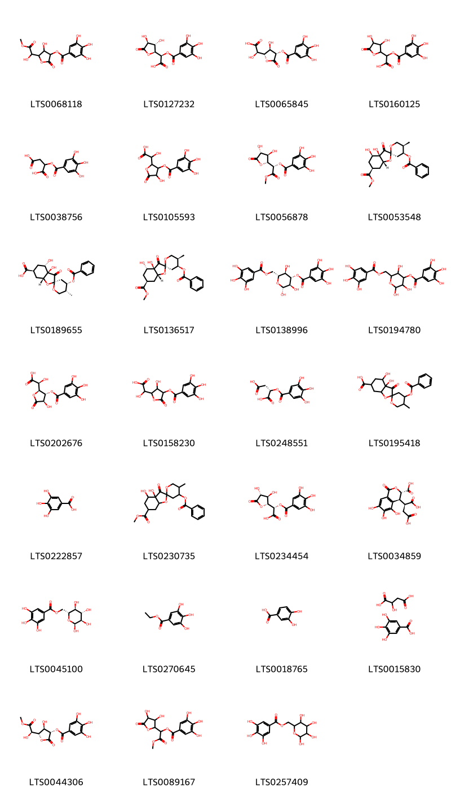{ width=100% }
    <figcaption>Hình ảnh cấu trúc hóa học của 27 hoạt chất thuộc nhóm Benzene and substituted derivatives gồm ['4-hydroxy-5-(1-hydroxy-2-methoxy-2-oxoethyl)-2-oxooxolan-3-yl 3,4,5-trihydroxybenzoate (LTS0068118)', '(r)-[(2s,3s,4s)-3,4-dihydroxy-5-oxooxolan-2-yl](3,4,5-trihydroxybenzoyloxy)acetic acid (LTS0127232)', '(r)-hydroxy[(2s,3r,4s)-3-hydroxy-5-oxo-4-(3,4,5-trihydroxybenzoyloxy)oxolan-2-yl]acetic acid (LTS0065845)', '(3,4-dihydroxy-5-oxooxolan-2-yl)(3,4,5-trihydroxybenzoyloxy)acetic acid (LTS0160125)', '2-(3,4,5-trihydroxybenzoyloxy)butanedioic acid (LTS0038756)', 'hydroxy[4-hydroxy-5-oxo-3-(3,4,5-trihydroxybenzoyloxy)oxolan-2-yl]acetic acid (LTS0105593)', 'methyl (2s)-2-[(2r,3r,4r)-3,4-dihydroxy-5-oxooxolan-2-yl]-2-(3,4,5-trihydroxybenzoyloxy)acetate (LTS0056878)', "methyl (2s,3ar,4r,4's,5'r,6s,7ar)-4'-(benzoyloxy)-3a,4-dihydroxy-5'-methyl-3-oxo-tetrahydro-4h-spiro[1-benzofuran-2,2'-oxane]-6-carboxylate (LTS0053548)", "(2s,3ar,4s,4's,5'r,6s,7ar)-4'-(benzoyloxy)-3a,4-dihydroxy-5'-methyl-3-oxo-tetrahydro-4h-spiro[1-benzofuran-2,2'-oxane]-6-carboxylic acid (LTS0189655)", "methyl (2s,3ar,4s,4's,5'r,6s,7ar)-4'-(benzoyloxy)-3a,4-dihydroxy-5'-methyl-3-oxo-tetrahydro-4h-spiro[1-benzofuran-2,2'-oxane]-6-carboxylate (LTS0136517)", '(2r,3r,4s,5r,6r)-2,3,5-trihydroxy-6-[(3,4,5-trihydroxybenzoyloxy)methyl]oxan-4-yl 3,4,5-trihydroxybenzoate (LTS0138996)', '2,3,5-trihydroxy-6-[(3,4,5-trihydroxybenzoyloxy)methyl]oxan-4-yl 3,4,5-trihydroxybenzoate (LTS0194780)', '(s)-hydroxy[(2s,3r,4r)-4-hydroxy-5-oxo-3-(3,4,5-trihydroxybenzoyloxy)oxolan-2-yl]acetic acid (LTS0202676)', 'hydroxy[3-hydroxy-5-oxo-4-(3,4,5-trihydroxybenzoyloxy)oxolan-2-yl]acetic acid (LTS0158230)', '(2s)-2-(3,4,5-trihydroxybenzoyloxy)butanedioic acid (LTS0248551)', "4'-(benzoyloxy)-3a,4-dihydroxy-5'-methyl-3-oxo-tetrahydro-4h-spiro[1-benzofuran-2,2'-oxane]-6-carboxylic acid (LTS0195418)", 'galop (LTS0222857)', "methyl 4'-(benzoyloxy)-3a,4-dihydroxy-5'-methyl-3-oxo-tetrahydro-4h-spiro[1-benzofuran-2,2'-oxane]-6-carboxylate (LTS0230735)", '(s)-[(2r,3r,4r)-3,4-dihydroxy-5-oxooxolan-2-yl](3,4,5-trihydroxybenzoyloxy)acetic acid (LTS0234454)', 'chebulic acid (LTS0034859)', '[(2r,3s,4s,5r,6s)-3,4,5,6-tetrahydroxyoxan-2-yl]methyl 3,4,5-trihydroxybenzoate (LTS0045100)', 'ethyl gallate (LTS0270645)', '3,4-dihydroxybenzoic acid (LTS0018765)', 'galop; malic acid (LTS0015830)', '(3s,4r,5s)-4-hydroxy-5-[(1r)-1-hydroxy-2-methoxy-2-oxoethyl]-2-oxooxolan-3-yl 3,4,5-trihydroxybenzoate (LTS0044306)', 'methyl 2-(3,4-dihydroxy-5-oxooxolan-2-yl)-2-(3,4,5-trihydroxybenzoyloxy)acetate (LTS0089167)', '(3,4,5,6-tetrahydroxyoxan-2-yl)methyl 3,4,5-trihydroxybenzoate (LTS0257409)'].</figcaption>
</figure>
#### Nhóm Benzofurans
<figure markdown="span">
    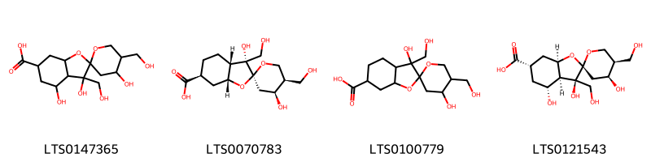{ width=100% }
    <figcaption>Hình ảnh cấu trúc hóa học của 4 hoạt chất thuộc nhóm Benzofurans gồm ["3,4,4'-trihydroxy-3,5'-bis(hydroxymethyl)-hexahydrospiro[1-benzofuran-2,2'-oxane]-6-carboxylic acid (LTS0147365)", "(2s,3r,3as,4's,5'r,6s,7ar)-3,4'-dihydroxy-3,5'-bis(hydroxymethyl)-hexahydrospiro[1-benzofuran-2,2'-oxane]-6-carboxylic acid (LTS0070783)", "3,4'-dihydroxy-3,5'-bis(hydroxymethyl)-hexahydrospiro[1-benzofuran-2,2'-oxane]-6-carboxylic acid (LTS0100779)", "(2s,3r,3as,4r,4's,5'r,6s,7ar)-3,4,4'-trihydroxy-3,5'-bis(hydroxymethyl)-hexahydrospiro[1-benzofuran-2,2'-oxane]-6-carboxylic acid (LTS0121543)"].</figcaption>
</figure>
#### Nhóm Carboxylic acids and derivatives
<figure markdown="span">
    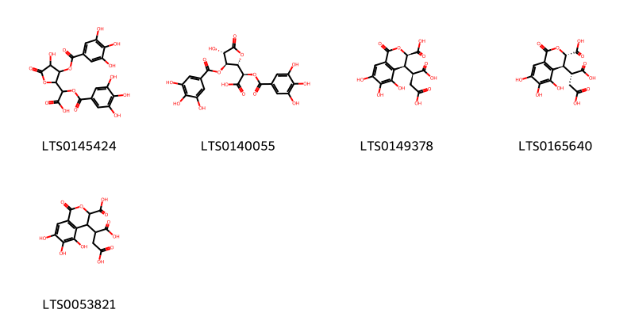{ width=100% }
    <figcaption>Hình ảnh cấu trúc hóa học của 5 hoạt chất thuộc nhóm Carboxylic acids and derivatives gồm ['[4-hydroxy-5-oxo-3-(3,4,5-trihydroxybenzoyloxy)oxolan-2-yl](3,4,5-trihydroxybenzoyloxy)acetic acid (LTS0145424)', '(r)-[(2s,3s,4s)-4-hydroxy-5-oxo-3-(3,4,5-trihydroxybenzoyloxy)oxolan-2-yl](3,4,5-trihydroxybenzoyloxy)acetic acid (LTS0140055)', '(2s)-2-[(3r,4s)-3-carboxy-5,6,7-trihydroxy-1-oxo-3,4-dihydro-2-benzopyran-4-yl]butanedioic acid (LTS0149378)', '(2r)-2-[(3s,4s)-3-carboxy-5,6,7-trihydroxy-1-oxo-3,4-dihydro-2-benzopyran-4-yl]butanedioic acid (LTS0165640)', '2-(3-carboxy-5,6,7-trihydroxy-1-oxo-3,4-dihydro-2-benzopyran-4-yl)butanedioic acid (LTS0053821)'].</figcaption>
</figure>
#### Nhóm Cinnamic acids and derivatives
<figure markdown="span">
    { width=100% }
    <figcaption>Hình ảnh cấu trúc hóa học của 2 hoạt chất thuộc nhóm Cinnamic acids and derivatives gồm ['cinnamic acid (LTS0128130)', 'phenylacrylic acid (LTS0097258)'].</figcaption>
</figure>
#### Nhóm Coumarins and derivatives
<figure markdown="span">
    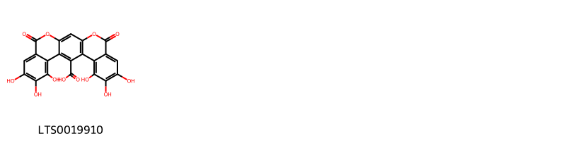{ width=100% }
    <figcaption>Hình ảnh cấu trúc hóa học của 1 hoạt chất thuộc nhóm Coumarins and derivatives gồm ['5,6,7,19,20,21-hexahydroxy-10,16-dioxo-11,15-dioxapentacyclo[12.8.0.0³,¹².0⁴,⁹.0¹⁷,²²]docosa-1,3(12),4(9),5,7,13,17(22),18,20-nonaene-2-carboxylic acid (LTS0019910)'].</figcaption>
</figure>
#### Nhóm Depsides and depsidones
<figure markdown="span">
    { width=100% }
    <figcaption>Hình ảnh cấu trúc hóa học của 1 hoạt chất thuộc nhóm Depsides and depsidones gồm ['digallic acid (LTS0019534)'].</figcaption>
</figure>
#### Nhóm Dihydrofurans
<figure markdown="span">
    { width=100% }
    <figcaption>Hình ảnh cấu trúc hóa học của 1 hoạt chất thuộc nhóm Dihydrofurans gồm ['vitamin c (LTS0022555)'].</figcaption>
</figure>
#### Nhóm Fatty Acyls
<figure markdown="span">
    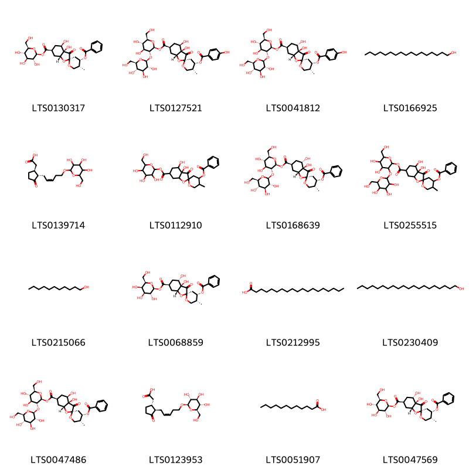{ width=100% }
    <figcaption>Hình ảnh cấu trúc hóa học của 16 hoạt chất thuộc nhóm Fatty Acyls gồm ["(2s,3r,4s,5s,6r)-3,4,5-trihydroxy-6-(hydroxymethyl)oxan-2-yl (2s,3ar,4r,4's,5'r,6s,7ar)-4'-(benzoyloxy)-3a,4-dihydroxy-5'-methyl-3-oxo-tetrahydro-4h-spiro[1-benzofuran-2,2'-oxane]-6-carboxylate (LTS0130317)", "(2s,3r,4s,5s,6r)-4,5-dihydroxy-6-(hydroxymethyl)-3-{[(2s,3r,4s,5s,6r)-3,4,5-trihydroxy-6-(hydroxymethyl)oxan-2-yl]oxy}oxan-2-yl (2s,3ar,4r,4's,5'r,6s,7ar)-3a,4-dihydroxy-4'-(4-hydroxybenzoyloxy)-5'-methyl-3-oxo-tetrahydro-4h-spiro[1-benzofuran-2,2'-oxane]-6-carboxylate (LTS0127521)", "(2s,3r,4s,5s,6r)-4,5-dihydroxy-6-(hydroxymethyl)-3-{[(2s,3r,4s,5s,6r)-3,4,5-trihydroxy-6-(hydroxymethyl)oxan-2-yl]oxy}oxan-2-yl (2s,3ar,4s,4's,5'r,6s,7ar)-3a,4-dihydroxy-4'-(4-hydroxybenzoyloxy)-5'-methyl-3-oxo-tetrahydro-4h-spiro[1-benzofuran-2,2'-oxane]-6-carboxylate (LTS0041812)", '1-heptadecanol (LTS0166925)', '[(1s,2s)-3-oxo-2-[(2z)-5-{[3,4,5-trihydroxy-6-(hydroxymethyl)oxan-2-yl]oxy}pent-2-en-1-yl]cyclopentyl]acetic acid (LTS0139714)', "3,4,5-trihydroxy-6-(hydroxymethyl)oxan-2-yl 4'-(benzoyloxy)-3a,4-dihydroxy-5'-methyl-3-oxo-tetrahydro-4h-spiro[1-benzofuran-2,2'-oxane]-6-carboxylate (LTS0112910)", "(2s,3r,4s,5s,6r)-4,5-dihydroxy-6-(hydroxymethyl)-3-{[(2s,3r,4s,5s,6r)-3,4,5-trihydroxy-6-(hydroxymethyl)oxan-2-yl]oxy}oxan-2-yl (2s,3ar,4s,4's,5'r,6s,7ar)-4'-(benzoyloxy)-3a,4-dihydroxy-5'-methyl-3-oxo-tetrahydro-4h-spiro[1-benzofuran-2,2'-oxane]-6-carboxylate (LTS0168639)", "4,5-dihydroxy-6-(hydroxymethyl)-3-{[3,4,5-trihydroxy-6-(hydroxymethyl)oxan-2-yl]oxy}oxan-2-yl 4'-(benzoyloxy)-3a,4-dihydroxy-5'-methyl-3-oxo-tetrahydro-4h-spiro[1-benzofuran-2,2'-oxane]-6-carboxylate (LTS0255515)", 'undecanol (LTS0215066)', "(2s,3r,4s,5r,6r)-3,4,5-trihydroxy-6-(hydroxymethyl)oxan-2-yl (2s,3ar,4s,4's,5'r,6s,7ar)-4'-(benzoyloxy)-3a,4-dihydroxy-5'-methyl-3-oxo-tetrahydro-4h-spiro[1-benzofuran-2,2'-oxane]-6-carboxylate (LTS0068859)", 'nonadecanoic acid (LTS0212995)', 'arachidyl alcohol (LTS0230409)', "(2s,3r,4s,5s,6r)-4,5-dihydroxy-6-(hydroxymethyl)-3-{[(2s,3r,4s,5s,6r)-3,4,5-trihydroxy-6-(hydroxymethyl)oxan-2-yl]oxy}oxan-2-yl (2s,3ar,4r,4's,5'r,6s,7ar)-4'-(benzoyloxy)-3a,4-dihydroxy-5'-methyl-3-oxo-tetrahydro-4h-spiro[1-benzofuran-2,2'-oxane]-6-carboxylate (LTS0047486)", 'tuberonic acid glucoside (LTS0123953)', 'lauric acid (LTS0051907)', "(2s,3r,4s,5s,6r)-3,4,5-trihydroxy-6-(hydroxymethyl)oxan-2-yl (2s,3ar,4s,4's,5'r,6s,7ar)-4'-(benzoyloxy)-3a,4-dihydroxy-5'-methyl-3-oxo-tetrahydro-4h-spiro[1-benzofuran-2,2'-oxane]-6-carboxylate (LTS0047569)"].</figcaption>
</figure>
#### Nhóm Flavonoids
<figure markdown="span">
    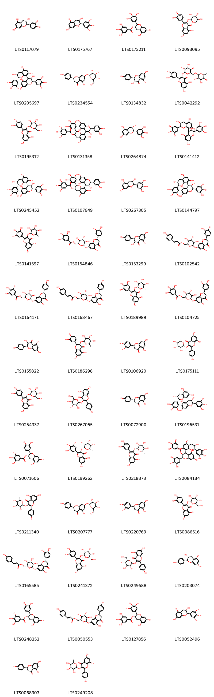{ width=100% }
    <figcaption>Hình ảnh cấu trúc hóa học của 62 hoạt chất thuộc nhóm Flavonoids gồm ['(+)-catechol (LTS0117079)', 'epigallocatechin (LTS0175767)', '(-)-epigallocatechin gallate (LTS0173211)', 'quercitrin (LTS0093095)', '(2r,3r,4s)-4-[(2r,3s)-3,5,7-trihydroxy-2-(3,4,5-trihydroxyphenyl)-3,4-dihydro-2h-1-benzopyran-8-yl]-2-(3,4,5-trihydroxyphenyl)-3,4-dihydro-2h-1-benzopyran-3,5,7-triol (LTS0205697)', 'prunin (LTS0234554)', '(+)-dihydrokaempferol (LTS0134832)', 'rutin (LTS0042292)', '2-(3,4-dihydroxyphenyl)-5,7-dihydroxy-3-{[3,4,5-trihydroxy-6-(hydroxymethyl)oxan-2-yl]oxy}chromen-4-one (LTS0195312)', '8-[2-(3,4-dihydroxyphenyl)-3,5,7-trihydroxy-3,4-dihydro-2h-1-benzopyran-4-yl]-5,7-dihydroxy-2-(3,4,5-trihydroxyphenyl)-3,4-dihydro-2h-1-benzopyran-3-yl 3,4,5-trihydroxybenzoate (LTS0131358)', '(-)-gallocatechin (LTS0264874)', '5,13-bis(3,4,5-trihydroxyphenyl)-4,12,14-trioxapentacyclo[11.7.1.0²,¹¹.0³,⁸.0¹⁵,²⁰]henicosa-2,8,10,15,17,19-hexaene-6,9,17,19,21-pentol (LTS0141412)', '(2r,3r,4r)-4-[(2r,3s)-3,5,7-trihydroxy-2-(3,4,5-trihydroxyphenyl)-3,4-dihydro-2h-1-benzopyran-8-yl]-2-(3,4,5-trihydroxyphenyl)-3,4-dihydro-2h-1-benzopyran-3,5,7-triol (LTS0245452)', '(2r,3r)-8-[(2r,3r,4r)-2-(3,4-dihydroxyphenyl)-3,5,7-trihydroxy-3,4-dihydro-2h-1-benzopyran-4-yl]-5,7-dihydroxy-2-(3,4,5-trihydroxyphenyl)-3,4-dihydro-2h-1-benzopyran-3-yl 3,4,5-trihydroxybenzoate (LTS0107649)', 'gallocatechol (LTS0267305)', '4-[3,5,7-trihydroxy-2-(3,4,5-trihydroxyphenyl)-3,4-dihydro-2h-1-benzopyran-8-yl]-2-(3,4,5-trihydroxyphenyl)-3,4-dihydro-2h-1-benzopyran-3,5,7-triol (LTS0144797)', 'myricitrin (LTS0141597)', '[(2r,3s,4s,5r,6s)-6-{[(2s)-2-(3,4-dihydroxyphenyl)-5-hydroxy-4-oxo-2,3-dihydro-1-benzopyran-7-yl]oxy}-3,4,5-trihydroxyoxan-2-yl]methyl 3,4,5-trihydroxybenzoate (LTS0154846)', 'aromadendrin (LTS0153299)', '(6-{[2-(3,4-dihydroxyphenyl)-5-hydroxy-4-oxo-2,3-dihydro-1-benzopyran-7-yl]oxy}-3,4,5-trihydroxyoxan-2-yl)methyl 3-(4-hydroxyphenyl)prop-2-enoate (LTS0102542)', "prunin 6''-o-gallate (LTS0164171)", '[(2r,3s,4s,5r,6s)-3,4,5-trihydroxy-6-{[(2s)-5-hydroxy-2-(4-hydroxyphenyl)-4-oxo-2,3-dihydro-1-benzopyran-7-yl]oxy}oxan-2-yl]methyl (2e)-3-(4-hydroxyphenyl)prop-2-enoate (LTS0168467)', 'myricitrin (LTS0189989)', '(6-{[2-(3,4-dihydroxyphenyl)-5-hydroxy-4-oxo-2,3-dihydro-1-benzopyran-7-yl]oxy}-3,4,5-trihydroxyoxan-2-yl)methyl 3,4,5-trihydroxybenzoate (LTS0104725)', 'kaempherol (LTS0155822)', 'quercitrin (LTS0186298)', '(+/-)-eriodictyol (LTS0106920)', '6,8-dihydroxy-2-(4-hydroxyphenyl)-3-{[(2r,3r,4r,5r,6s)-3,4,5-trihydroxy-6-methyloxan-2-yl]oxy}chromen-4-one (LTS0175111)', 'isoquercetin (LTS0254337)', 'trifolin (LTS0267055)', '(-)-naringenin (LTS0072900)', '(2r,3r,4r)-4-[(2r,3r)-3,5,7-trihydroxy-2-(3,4,5-trihydroxyphenyl)-3,4-dihydro-2h-1-benzopyran-8-yl]-2-(3,4,5-trihydroxyphenyl)-3,4-dihydro-2h-1-benzopyran-3,5,7-triol (LTS0196531)', 'epicatechin gallate (LTS0071606)', '5,7-dihydroxy-3-{[(2r,3r,4r,5r,6s)-3,4,5-trihydroxy-6-methyloxan-2-yl]oxy}-2-(3,4,5-trihydroxyphenyl)chromen-4-one (LTS0199262)', '2-(3,4-dihydroxyphenyl)-5,7-dihydroxy-3-{[(2r,3r,4r,5r,6s)-3,4,5-trihydroxy-6-methyloxan-2-yl]oxy}chromen-4-one (LTS0218878)', '5,7-dihydroxy-4-[3,5,7-trihydroxy-2-(3,4,5-trihydroxyphenyl)-3,4-dihydro-2h-1-benzopyran-8-yl]-2-(3,4,5-trihydroxyphenyl)-3,4-dihydro-2h-1-benzopyran-3-yl 3,4,5-trihydroxybenzoate (LTS0084184)', '5,7-dihydroxy-2-(4-hydroxyphenyl)-3-[(3,4,5-trihydroxy-6-methyloxan-2-yl)oxy]chromen-4-one (LTS0211340)', '5-hydroxy-2-(4-hydroxyphenyl)-7-{[3,4,5-trihydroxy-6-(hydroxymethyl)oxan-2-yl]oxy}-2,3-dihydro-1-benzopyran-4-one (LTS0207777)', 'eriodictyol (LTS0220769)', '2-(3,4-dihydroxyphenyl)-5,7-dihydroxy-3-{[(2r,3r,4s,5s,6r)-3,4,5-trihydroxy-6-(hydroxymethyl)oxan-2-yl]oxy}chromen-4-one (LTS0086516)', '[(2r,3s,4s,5r,6s)-6-{[(2s)-2-(3,4-dihydroxyphenyl)-5-hydroxy-4-oxo-2,3-dihydro-1-benzopyran-7-yl]oxy}-3,4,5-trihydroxyoxan-2-yl]methyl (2e)-3-(4-hydroxyphenyl)prop-2-enoate (LTS0165585)', '2-(3,4-dihydroxyphenyl)-5,7-dihydroxy-3-{[(2s,3r,4r,5r,6s)-3,4,5-trihydroxy-6-(hydroxymethyl)oxan-2-yl]oxy}chromen-4-one (LTS0241372)', 'astragalin (LTS0249588)', 'epiafzelechin (LTS0203074)', '2-(3,4-dihydroxyphenyl)-5,7-dihydroxy-3,4-dihydro-2h-1-benzopyran-3-yl 3,4,5-trihydroxybenzoate (LTS0248252)', '(3,4,5-trihydroxy-6-{[5-hydroxy-2-(4-hydroxyphenyl)-4-oxo-2,3-dihydro-1-benzopyran-7-yl]oxy}oxan-2-yl)methyl 3-(4-hydroxyphenyl)prop-2-enoate (LTS0050553)', '5,7-dihydroxy-2-(3,4,5-trihydroxyphenyl)-3,4-dihydro-2h-1-benzopyran-3-yl 3,4,5-trihydroxybenzoate (LTS0127856)', 'epigallocatechin (LTS0052496)', 'asahina (LTS0068303)', '6,8-dihydroxy-2-(4-hydroxyphenyl)-3-[(3,4,5-trihydroxy-6-methyloxan-2-yl)oxy]chromen-4-one (LTS0249208)', '(1r,5r,6s,13s,21r)-5,13-bis(3,4,5-trihydroxyphenyl)-4,12,14-trioxapentacyclo[11.7.1.0²,¹¹.0³,⁸.0¹⁵,²⁰]henicosa-2,8,10,15,17,19-hexaene-6,9,17,19,21-pentol (LTS0067443)', 'quercetin (LTS0004651)', '(2r,3r)-8-[(2s,4r)-2-(3,4-dihydroxyphenyl)-5,7-dihydroxy-3,4-dihydro-2h-1-benzopyran-4-yl]-5,7-dihydroxy-2-(3,4,5-trihydroxyphenyl)-3,4-dihydro-2h-1-benzopyran-3-yl 3,4,5-trihydroxybenzoate (LTS0010730)', '(2r,3r,4r)-2-(3,4-dihydroxyphenyl)-4-[(2r,3s)-3,5,7-trihydroxy-2-(3,4,5-trihydroxyphenyl)-3,4-dihydro-2h-1-benzopyran-8-yl]-3,4-dihydro-2h-1-benzopyran-3,5,7-triol (LTS0055461)', '3-rutinosyl quercetin (LTS0032845)', '8-[2-(3,4-dihydroxyphenyl)-5,7-dihydroxy-3,4-dihydro-2h-1-benzopyran-4-yl]-5,7-dihydroxy-2-(3,4,5-trihydroxyphenyl)-3,4-dihydro-2h-1-benzopyran-3-yl 3,4,5-trihydroxybenzoate (LTS0009933)', 'catechol (LTS0090912)', '(2r,3r,4r)-5,7-dihydroxy-4-[(2r,3r)-3,5,7-trihydroxy-2-(3,4,5-trihydroxyphenyl)-3,4-dihydro-2h-1-benzopyran-8-yl]-2-(3,4,5-trihydroxyphenyl)-3,4-dihydro-2h-1-benzopyran-3-yl 3,4,5-trihydroxybenzoate (LTS0090528)', '2-(3,4-dihydroxyphenyl)-4-[3,5,7-trihydroxy-2-(3,4,5-trihydroxyphenyl)-3,4-dihydro-2h-1-benzopyran-8-yl]-3,4-dihydro-2h-1-benzopyran-3,5,7-triol (LTS0039361)', '(3,4,5-trihydroxy-6-{[5-hydroxy-2-(4-hydroxyphenyl)-4-oxo-2,3-dihydro-1-benzopyran-7-yl]oxy}oxan-2-yl)methyl 3,4,5-trihydroxybenzoate (LTS0241035)', "3,5,7,4'-tetrahydroxyflavan (LTS0039714)", 'ent-epicatechin (LTS0265245)'].</figcaption>
</figure>
#### Nhóm Organooxygen compounds
<figure markdown="span">
    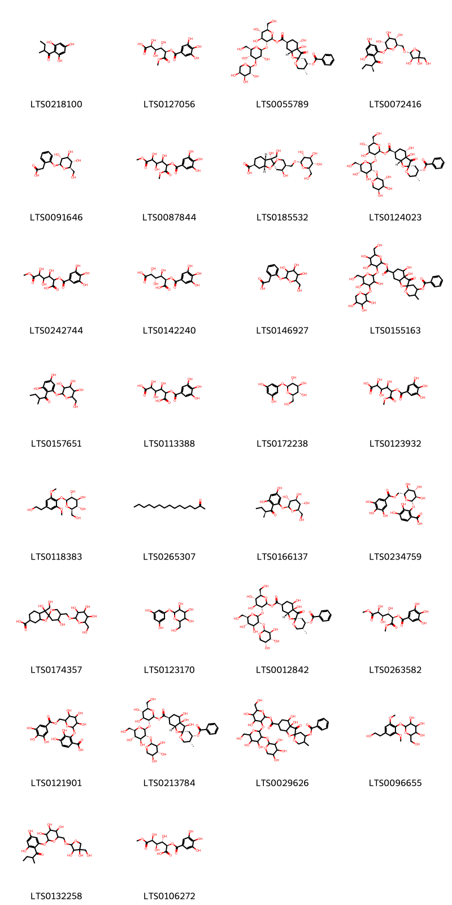{ width=100% }
    <figcaption>Hình ảnh cấu trúc hóa học của 30 hoạt chất thuộc nhóm Organooxygen compounds gồm ['multifidol (LTS0218100)', '(2s,3r,4s,5r)-2,3,4-trihydroxy-6-methoxy-6-oxo-5-(3,4,5-trihydroxybenzoyloxy)hexanoic acid (LTS0127056)', "(2s,3r,4s,5s,6r)-3-{[(2s,3r,4s,5r,6r)-3,5-dihydroxy-6-(hydroxymethyl)-4-{[(2s,3r,4s,5s)-3,4,5-trihydroxyoxan-2-yl]oxy}oxan-2-yl]oxy}-4,5-dihydroxy-6-(hydroxymethyl)oxan-2-yl (2s,3ar,4s,4's,5'r,6s,7ar)-4'-(benzoyloxy)-3a,4-dihydroxy-5'-methyl-3-oxo-tetrahydro-4h-spiro[1-benzofuran-2,2'-oxane]-6-carboxylate (LTS0055789)", '(2s)-1-(2-{[(2s,3r,4s,5s,6r)-6-({[(2r,3r,4r)-3,4-dihydroxy-4-(hydroxymethyl)oxolan-2-yl]oxy}methyl)-3,4,5-trihydroxyoxan-2-yl]oxy}-4,6-dihydroxyphenyl)-2-methylbutan-1-one (LTS0072416)', '(2-{[(2s,3r,4s,5s,6r)-3,4,5-trihydroxy-6-(hydroxymethyl)oxan-2-yl]oxy}phenyl)acetic acid (LTS0091646)', '1,6-dimethyl 2,3,4-trihydroxy-5-(3,4,5-trihydroxybenzoyloxy)hexanedioate (LTS0087844)', "(2s,3r,3as,4's,5'r,6s,7ar)-3,4'-dihydroxy-3-(hydroxymethyl)-5'-({[(2s,3r,4s,5s,6r)-3,4,5-trihydroxy-6-(hydroxymethyl)oxan-2-yl]oxy}methyl)-hexahydrospiro[1-benzofuran-2,2'-oxane]-6-carboxylic acid (LTS0185532)", "(2s,3r,4s,5s,6r)-3-{[(2s,3r,4s,5s,6r)-4,5-dihydroxy-6-(hydroxymethyl)-3-{[(2s,3r,4s,5s)-3,4,5-trihydroxyoxan-2-yl]oxy}oxan-2-yl]oxy}-4,5-dihydroxy-6-(hydroxymethyl)oxan-2-yl (2s,3ar,4s,4's,5'r,6s,7ar)-4'-(benzoyloxy)-3a,4-dihydroxy-5'-methyl-3-oxo-tetrahydro-4h-spiro[1-benzofuran-2,2'-oxane]-6-carboxylate (LTS0124023)", '3,4,5-trihydroxy-6-methoxy-6-oxo-2-(3,4,5-trihydroxybenzoyloxy)hexanoic acid (LTS0242744)', '(2r,3s,4r,5r)-2,3,4-trihydroxy-5-(3,4,5-trihydroxybenzoyloxy)hexanedioic acid (LTS0142240)', '(2-{[3,4,5-trihydroxy-6-(hydroxymethyl)oxan-2-yl]oxy}phenyl)acetic acid (LTS0146927)', "3-{[3,5-dihydroxy-6-(hydroxymethyl)-4-[(3,4,5-trihydroxyoxan-2-yl)oxy]oxan-2-yl]oxy}-4,5-dihydroxy-6-(hydroxymethyl)oxan-2-yl 4'-(benzoyloxy)-3a,4-dihydroxy-5'-methyl-3-oxo-tetrahydro-4h-spiro[1-benzofuran-2,2'-oxane]-6-carboxylate (LTS0155163)", '1-(2,4-dihydroxy-6-{[3,4,5-trihydroxy-6-(hydroxymethyl)oxan-2-yl]oxy}phenyl)-2-methylbutan-1-one (LTS0157651)', '2,3,4-trihydroxy-5-(3,4,5-trihydroxybenzoyloxy)hexanedioic acid (LTS0113388)', '(2s,3r,4s,5s,6r)-2-(3,5-dihydroxyphenoxy)-6-(hydroxymethyl)oxane-3,4,5-triol (LTS0172238)', '2,3,4-trihydroxy-6-methoxy-6-oxo-5-(3,4,5-trihydroxybenzoyloxy)hexanoic acid (LTS0123932)', '(2s,3r,4s,5s,6r)-2-[4-(2-hydroxyethyl)-2,6-dimethoxyphenoxy]-6-(hydroxymethyl)oxane-3,4,5-triol (LTS0118383)', '2-pentadecanone (LTS0265307)', 'multifidol glucoside (LTS0166137)', '3,4-dihydroxy-2-{[(2s,3r,4s,5s,6r)-3,4,5-trihydroxy-6-[(3,4,5-trihydroxybenzoyloxy)methyl]oxan-2-yl]oxy}benzoic acid (LTS0234759)', "3,4'-dihydroxy-3-(hydroxymethyl)-5'-({[3,4,5-trihydroxy-6-(hydroxymethyl)oxan-2-yl]oxy}methyl)-hexahydrospiro[1-benzofuran-2,2'-oxane]-6-carboxylic acid (LTS0174357)", '2-(3,5-dihydroxyphenoxy)-6-(hydroxymethyl)oxane-3,4,5-triol (LTS0123170)', "(2s,3r,4s,5s,6r)-3-{[(2s,3r,4s,5s,6r)-4,5-dihydroxy-6-(hydroxymethyl)-3-{[(2s,3s,4r,5r)-3,4,5-trihydroxyoxan-2-yl]oxy}oxan-2-yl]oxy}-4,5-dihydroxy-6-(hydroxymethyl)oxan-2-yl (2s,3ar,4r,4's,5'r,6s,7ar)-4'-(benzoyloxy)-3a,4-dihydroxy-5'-methyl-3-oxo-tetrahydro-4h-spiro[1-benzofuran-2,2'-oxane]-6-carboxylate (LTS0012842)", '1,6-dimethyl (2s,3r,4s,5r)-2,3,4-trihydroxy-5-(3,4,5-trihydroxybenzoyloxy)hexanedioate (LTS0263582)', '3,4-dihydroxy-2-({3,4,5-trihydroxy-6-[(3,4,5-trihydroxybenzoyloxy)methyl]oxan-2-yl}oxy)benzoic acid (LTS0121901)', "(2s,3r,4s,5s,6r)-3-{[(2s,3r,4s,5s,6r)-4,5-dihydroxy-6-(hydroxymethyl)-3-{[(2s,3s,4r,5s)-3,4,5-trihydroxyoxan-2-yl]oxy}oxan-2-yl]oxy}-4,5-dihydroxy-6-(hydroxymethyl)oxan-2-yl (2s,3r,3as,4r,4's,5'r,6s,7ar)-4'-(benzoyloxy)-3,3a,4-trihydroxy-5'-methyl-hexahydrospiro[1-benzofuran-2,2'-oxane]-6-carboxylate (LTS0213784)", "3-{[4,5-dihydroxy-6-(hydroxymethyl)-3-[(3,4,5-trihydroxyoxan-2-yl)oxy]oxan-2-yl]oxy}-4,5-dihydroxy-6-(hydroxymethyl)oxan-2-yl 4'-(benzoyloxy)-3a,4-dihydroxy-5'-methyl-3-oxo-tetrahydro-4h-spiro[1-benzofuran-2,2'-oxane]-6-carboxylate (LTS0029626)", '2-[4-(2-hydroxyethyl)-2,6-dimethoxyphenoxy]-6-(hydroxymethyl)oxane-3,4,5-triol (LTS0096655)', '1-(2-{[6-({[3,4-dihydroxy-4-(hydroxymethyl)oxolan-2-yl]oxy}methyl)-3,4,5-trihydroxyoxan-2-yl]oxy}-4,6-dihydroxyphenyl)-2-methylbutan-1-one (LTS0132258)', '(2r,3s,4r,5s)-3,4,5-trihydroxy-6-methoxy-6-oxo-2-(3,4,5-trihydroxybenzoyloxy)hexanoic acid (LTS0106272)'].</figcaption>
</figure>
#### Nhóm Phenols
<figure markdown="span">
    { width=100% }
    <figcaption>Hình ảnh cấu trúc hóa học của 1 hoạt chất thuộc nhóm Phenols gồm ['pyrogallol (LTS0062059)'].</figcaption>
</figure>
#### Nhóm Prenol lipids
<figure markdown="span">
    { width=100% }
    <figcaption>Hình ảnh cấu trúc hóa học của 1 hoạt chất thuộc nhóm Prenol lipids gồm ['lupeol (LTS0256952)'].</figcaption>
</figure>
#### Nhóm Saccharolipids
<figure markdown="span">
    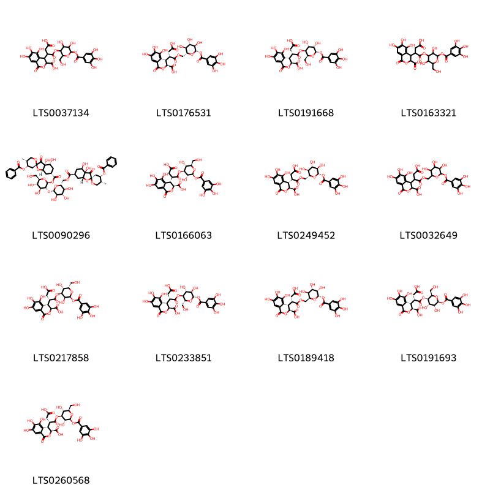{ width=100% }
    <figcaption>Hình ảnh cấu trúc hóa học của 13 hoạt chất thuộc nhóm Saccharolipids gồm ['4-(3-carboxy-1-{[4,5-dihydroxy-2-(hydroxymethyl)-6-(3,4,5-trihydroxybenzoyloxy)oxan-3-yl]oxy}-1-oxopropan-2-yl)-5,6,7-trihydroxy-1-oxo-3,4-dihydro-2-benzopyran-3-carboxylic acid (LTS0037134)', '(3s,4s)-4-[(2s)-3-carboxy-1-oxo-1-{[(2r,3s,4s,5r,6s)-3,4,5-trihydroxy-6-(3,4,5-trihydroxybenzoyloxy)oxan-2-yl]methoxy}propan-2-yl]-5,6,7-trihydroxy-1-oxo-3,4-dihydro-2-benzopyran-3-carboxylic acid (LTS0176531)', '(3s,4s)-4-[(2s)-3-carboxy-1-{[(2s,3s,4r,5s,6s)-4,5-dihydroxy-2-(hydroxymethyl)-6-(3,4,5-trihydroxybenzoyloxy)oxan-3-yl]oxy}-1-oxopropan-2-yl]-5,6,7-trihydroxy-1-oxo-3,4-dihydro-2-benzopyran-3-carboxylic acid (LTS0191668)', '4-(3-carboxy-1-{[3,5-dihydroxy-2-(hydroxymethyl)-6-(3,4,5-trihydroxybenzoyloxy)oxan-4-yl]oxy}-1-oxopropan-2-yl)-5,6,7-trihydroxy-1-oxo-3,4-dihydro-2-benzopyran-3-carboxylic acid (LTS0163321)', "[(2r,3s,4s,5r,6s)-6-{[(2s,3r,4s,5s,6r)-2-{[(2s,3ar,4r,4's,5'r,6s,7ar)-4'-(benzoyloxy)-3a,4-dihydroxy-5'-methyl-3-oxo-tetrahydro-4h-spiro[1-benzofuran-2,2'-oxan]-6-yl]carbonyloxy}-4,5-dihydroxy-6-(hydroxymethyl)oxan-3-yl]oxy}-3,4,5-trihydroxyoxan-2-yl]methyl (2s,3ar,4r,4's,5'r,6s,7ar)-4'-(benzoyloxy)-3a,4-dihydroxy-5'-methyl-3-oxo-tetrahydro-4h-spiro[1-benzofuran-2,2'-oxane]-6-carboxylate (LTS0090296)", '(3s,4s)-4-(3-carboxy-1-{[(2r,3r,4s,5r,6s)-3,5-dihydroxy-2-(hydroxymethyl)-6-(3,4,5-trihydroxybenzoyloxy)oxan-4-yl]oxy}-1-oxopropan-2-yl)-5,6,7-trihydroxy-1-oxo-3,4-dihydro-2-benzopyran-3-carboxylic acid (LTS0166063)', '(3s,4s)-4-(3-carboxy-1-oxo-1-{[(2r,3s,4s,5r,6s)-3,4,5-trihydroxy-6-(3,4,5-trihydroxybenzoyloxy)oxan-2-yl]methoxy}propan-2-yl)-5,6,7-trihydroxy-1-oxo-3,4-dihydro-2-benzopyran-3-carboxylic acid (LTS0249452)', '4-(3-carboxy-1-oxo-1-{[3,4,5-trihydroxy-6-(3,4,5-trihydroxybenzoyloxy)oxan-2-yl]methoxy}propan-2-yl)-5,6,7-trihydroxy-1-oxo-3,4-dihydro-2-benzopyran-3-carboxylic acid (LTS0032649)', '(3s,4s)-4-[(2s)-3-carboxy-1-{[(2s,3r,4s,5s,6s)-3,5-dihydroxy-2-(hydroxymethyl)-6-(3,4,5-trihydroxybenzoyloxy)oxan-4-yl]oxy}-1-oxopropan-2-yl]-5,6,7-trihydroxy-1-oxo-3,4-dihydro-2-benzopyran-3-carboxylic acid (LTS0217858)', '(3s,4s)-4-[(2s)-3-carboxy-1-{[(2r,3s,4r,5r,6s)-4,5-dihydroxy-2-(hydroxymethyl)-6-(3,4,5-trihydroxybenzoyloxy)oxan-3-yl]oxy}-1-oxopropan-2-yl]-5,6,7-trihydroxy-1-oxo-3,4-dihydro-2-benzopyran-3-carboxylic acid (LTS0233851)', '(3s,4s)-4-[(2s)-3-carboxy-1-oxo-1-{[(2s,3s,4s,5s,6s)-3,4,5-trihydroxy-6-(3,4,5-trihydroxybenzoyloxy)oxan-2-yl]methoxy}propan-2-yl]-5,6,7-trihydroxy-1-oxo-3,4-dihydro-2-benzopyran-3-carboxylic acid (LTS0189418)', '(3s,4s)-4-[(2s)-3-carboxy-1-{[(2r,3s,4s,5r,6s)-4,5-dihydroxy-2-(hydroxymethyl)-6-(3,4,5-trihydroxybenzoyloxy)oxan-3-yl]oxy}-1-oxopropan-2-yl]-5,6,7-trihydroxy-1-oxo-3,4-dihydro-2-benzopyran-3-carboxylic acid (LTS0191693)', '(3s,4s)-4-[(2s)-3-carboxy-1-{[(2r,3r,4s,5r,6s)-3,5-dihydroxy-2-(hydroxymethyl)-6-(3,4,5-trihydroxybenzoyloxy)oxan-4-yl]oxy}-1-oxopropan-2-yl]-5,6,7-trihydroxy-1-oxo-3,4-dihydro-2-benzopyran-3-carboxylic acid (LTS0260568)'].</figcaption>
</figure>
#### Nhóm Steroids and steroid derivatives
<figure markdown="span">
    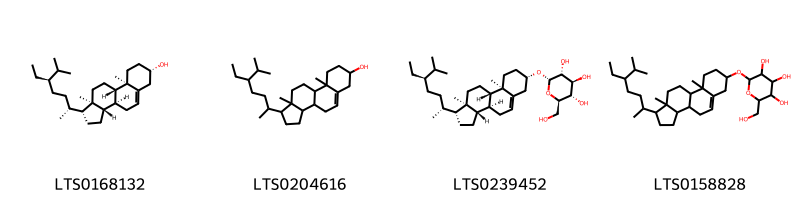{ width=100% }
    <figcaption>Hình ảnh cấu trúc hóa học của 4 hoạt chất thuộc nhóm Steroids and steroid derivatives gồm ['sitosterol (LTS0168132)', 'stigmast-5-en-3-ol, (3β)- (LTS0204616)', '(2s,3r,4s,5s,6r)-2-{[(1r,3as,3bs,7s,9ar,9bs,11ar)-1-[(2r,5r)-5-ethyl-6-methylheptan-2-yl]-9a,11a-dimethyl-1h,2h,3h,3ah,3bh,4h,6h,7h,8h,9h,9bh,10h,11h-cyclopenta[a]phenanthren-7-yl]oxy}-6-(hydroxymethyl)oxane-3,4,5-triol (LTS0239452)', '2-{[1-(5-ethyl-6-methylheptan-2-yl)-9a,11a-dimethyl-1h,2h,3h,3ah,3bh,4h,6h,7h,8h,9h,9bh,10h,11h-cyclopenta[a]phenanthren-7-yl]oxy}-6-(hydroxymethyl)oxane-3,4,5-triol (LTS0158828)'].</figcaption>
</figure>
#### Nhóm Tannins
<figure markdown="span">
    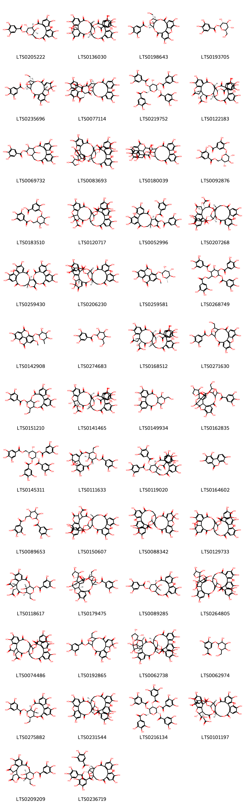{ width=100% }
    <figcaption>Hình ảnh cấu trúc hóa học của 70 hoạt chất thuộc nhóm Tannins gồm ['(1s,19r,21s,22r,23s)-6,7,8,11,12,13,22,23-octahydroxy-3,16-dioxo-2,17,20-trioxatetracyclo[17.3.1.0⁴,⁹.0¹⁰,¹⁵]tricosa-4(9),5,7,10,12,14-hexaen-21-yl 3,4,5-trihydroxybenzoate (LTS0205222)', '(1r,7r,8s,26s,28s,29s,38r)-1,13,14,15,18,19,20,34,35,39,39-undecahydroxy-2,5,10,23,31-pentaoxo-6,9,24,27,30,40-hexaoxaoctacyclo[34.3.1.0⁴,³⁸.0⁷,²⁶.0⁸,²⁹.0¹¹,¹⁶.0¹⁷,²².0³²,³⁷]tetraconta-3,11(16),12,14,17,19,21,32,34,36-decaen-28-yl 3,4,5-trihydroxybenzoate (LTS0136030)', '(1s,18r,19s,21r,22r)-6,7,12,13,22-pentahydroxy-21-(hydroxymethyl)-3,16-dioxo-2,17,20,23-tetraoxapentacyclo[16.3.1.1⁸,¹¹.0⁴,⁹.0¹⁰,¹⁵]tricosa-4,6,8,10,12,14-hexaen-19-yl 3,4,5-trihydroxybenzoate (LTS0198643)', 'β-glucogallin (LTS0193705)', '(1s,8r,9r,18r,19s,21r,22r)-7,7,8,12,13,22-hexahydroxy-21-(hydroxymethyl)-3,6,16-trioxo-2,17,20,23-tetraoxapentacyclo[16.3.1.1⁸,¹¹.0⁴,⁹.0¹⁰,¹⁵]tricosa-4,10,12,14-tetraen-19-yl 3,4,5-trihydroxybenzoate (LTS0235696)', '(3r,4s)-4-[(2r)-3-carboxy-1-{[(1r,19r,21r,22s,23r)-6,7,8,11,12,13,22-heptahydroxy-3,16-dioxo-21-(3,4,5-trihydroxybenzoyloxy)-2,17,20-trioxatetracyclo[17.3.1.0⁴,⁹.0¹⁰,¹⁵]tricosa-4(9),5,7,10,12,14-hexaen-23-yl]oxy}-1-oxopropan-2-yl]-5,6,7-trihydroxy-1-oxo-3,4-dihydro-2-benzopyran-3-carboxylic acid (LTS0077114)', '(2s,3r,4s,5s,6r)-4-hydroxy-3,5-bis(3,4,5-trihydroxybenzoyloxy)-6-[(3,4,5-trihydroxybenzoyloxy)methyl]oxan-2-yl 3,4,5-trihydroxybenzoate (LTS0219752)', '[(4r,5s,7s,25s,26r,29s,30s,31s)-13,14,15,18,19,20,31,35,36-nonahydroxy-2,10,23,28,32-pentaoxo-5-(3,4,5-trihydroxybenzoyloxy)-3,6,9,24,27,33-hexaoxaheptacyclo[28.7.1.0⁴,²⁵.0⁷,²⁶.0¹¹,¹⁶.0¹⁷,²².0³⁴,³⁸]octatriaconta-1(37),11,13,15,17(22),18,20,34(38),35-nonaen-29-yl]acetic acid (LTS0122183)', '6,7,8,11,12,13,22,23-octahydroxy-3,16-dioxo-2,17,20-trioxatetracyclo[17.3.1.0⁴,⁹.0¹⁰,¹⁵]tricosa-4(9),5,7,10,12,14-hexaen-21-yl 3,4,5-trihydroxybenzoate (LTS0069732)', "(1r,3'r,4r,5s,23r,25s,26r,39s,41r)-3',4',10,11,12,15,16,17,31,32,35,36,41-tridecahydroxy-2,7,20,28-tetraoxo-3,6,21,24,27,34,37,40-octaoxaspiro[decacyclo[27.13.2.0¹,³⁸.0⁴,²³.0⁵,²⁶.0⁸,¹³.0¹⁴,¹⁹.0³³,⁴⁴.0³⁵,⁴¹.0³⁶,⁴³]tetratetracontane-39,2'-oxolane]-8(13),9,11,14,16,18,29,31,33(44)-nonaen-25-yl 3,4,5-trihydroxybenzoate (LTS0083693)", '4-(3-carboxy-1-{[6,7,8,11,12,13,22-heptahydroxy-3,16-dioxo-21-(3,4,5-trihydroxybenzoyloxy)-2,17,20-trioxatetracyclo[17.3.1.0⁴,⁹.0¹⁰,¹⁵]tricosa-4(9),5,7,10,12,14-hexaen-23-yl]oxy}-1-oxopropan-2-yl)-5,6,7-trihydroxy-1-oxo-3,4-dihydro-2-benzopyran-3-carboxylic acid (LTS0180039)', '3,4-dihydroxy-5-{[(2s,3r,4s,5s,6r)-3,4,5-trihydroxy-6-[(3,4,5-trihydroxybenzoyloxy)methyl]oxan-2-yl]oxy}benzoic acid (LTS0092876)', '3,4-dihydroxy-5-({3,4,5-trihydroxy-6-[(3,4,5-trihydroxybenzoyloxy)methyl]oxan-2-yl}oxy)benzoic acid (LTS0183510)', '29-(carboxymethyl)-13,14,15,18,19,20,31,34,35-nonahydroxy-2,10,23,28-tetraoxo-5-(3,4,5-trihydroxybenzoyloxy)-3,6,9,24,27,32-hexaoxaheptacyclo[28.6.1.0⁴,²⁵.0⁷,²⁶.0¹¹,¹⁶.0¹⁷,²².0³³,³⁷]heptatriaconta-1(36),11,13,15,17(22),18,20,33(37),34-nonaene-31-carboxylic acid (LTS0120717)', '(10r,15r)-3,4,5,21,22,23-hexahydroxy-8,13,18-trioxo-12-(3,4,5-trihydroxybenzoyloxy)-9,14,17-trioxatetracyclo[17.4.0.0²,⁷.0¹⁰,¹⁵]tricosa-1(23),2(7),3,5,11,19,21-heptaen-11-yl 3,4,5-trihydroxybenzoate (LTS0052996)', '[(4r,5s,7r,25s,26r,29s,30s,31r)-13,14,15,18,19,20,31,35,36-nonahydroxy-2,10,23,28,32-pentaoxo-5-(3,4,5-trihydroxybenzoyloxy)-3,6,9,24,27,33-hexaoxaheptacyclo[28.7.1.0⁴,²⁵.0⁷,²⁶.0¹¹,¹⁶.0¹⁷,²².0³⁴,³⁸]octatriaconta-1(37),11(16),12,14,17,19,21,34(38),35-nonaen-29-yl]acetic acid (LTS0207268)', 'emblicanin b (LTS0259430)', '(1r,8r,9s,27r,29s,30r,39r)-1,2,2,14,15,16,19,20,21,35,36-undecahydroxy-3,6,11,24,32-pentaoxo-7,10,25,28,31,40-hexaoxaoctacyclo[35.2.1.0⁵,³⁹.0⁸,²⁷.0⁹,³⁰.0¹²,¹⁷.0¹⁸,²³.0³³,³⁸]tetraconta-4,12,14,16,18(23),19,21,33,35,37-decaen-29-yl 3,4,5-trihydroxybenzoate (LTS0206230)', '13,14-dihydroxy-6-methoxy-7-{[(2s,3r,4r,5r,6s)-3,4,5-trihydroxy-6-methyloxan-2-yl]oxy}-2,9-dioxatetracyclo[6.6.2.0⁴,¹⁶.0¹¹,¹⁵]hexadeca-1(15),4(16),5,7,11,13-hexaene-3,10-dione (LTS0259581)', '4-hydroxy-3,5-bis(3,4,5-trihydroxybenzoyloxy)-6-[(3,4,5-trihydroxybenzoyloxy)methyl]oxan-2-yl 3,4,5-trihydroxybenzoate (LTS0268749)', '13,14-dihydroxy-6-methoxy-7-[(3,4,5-trihydroxy-6-methyloxan-2-yl)oxy]-2,9-dioxatetracyclo[6.6.2.0⁴,¹⁶.0¹¹,¹⁵]hexadeca-1(15),4(16),5,7,11,13-hexaene-3,10-dione (LTS0142908)', '3,4,5-trihydroxy-6-(hydroxymethyl)oxan-2-yl 3,4,5-trihydroxybenzoate (LTS0274683)', '[(4r,5s,7r,25r,26r,29s,30s,31s)-13,14,15,18,19,20,31,35,36-nonahydroxy-2,10,23,28,32-pentaoxo-5-(3,4,5-trihydroxybenzoyloxy)-3,6,9,24,27,33-hexaoxaheptacyclo[28.7.1.0⁴,²⁵.0⁷,²⁶.0¹¹,¹⁶.0¹⁷,²².0³⁴,³⁸]octatriaconta-1(37),11,13,15,17(22),18,20,34(38),35-nonaen-29-yl]acetic acid (LTS0168512)', '6,7,12,13,22-pentahydroxy-21-(hydroxymethyl)-3,16-dioxo-2,17,20,23-tetraoxapentacyclo[16.3.1.1⁸,¹¹.0⁴,⁹.0¹⁰,¹⁵]tricosa-4,6,8,10,12,14-hexaen-19-yl 3,4,5-trihydroxybenzoate (LTS0271630)', '6,7,8,11,12,13,22-heptahydroxy-21-(hydroxymethyl)-3,16-dioxo-2,17,20-trioxatetracyclo[16.3.1.0⁴,⁹.0¹⁰,¹⁵]docosa-4,6,8,10(15),11,13-hexaen-19-yl 3,4,5-trihydroxybenzoate (LTS0151210)', '(4r,5s,7r,25r,26r,29s,30r,31s)-29-(carboxymethyl)-13,14,15,18,19,20,31,34,35-nonahydroxy-2,10,23,28-tetraoxo-5-(3,4,5-trihydroxybenzoyloxy)-3,6,9,24,27,32-hexaoxaheptacyclo[28.6.1.0⁴,²⁵.0⁷,²⁶.0¹¹,¹⁶.0¹⁷,²².0³³,³⁷]heptatriaconta-1(36),11,13,15,17(22),18,20,33(37),34-nonaene-31-carboxylic acid (LTS0141465)', '3,4,5,11,14,20,21,22-octahydroxy-13-(hydroxymethyl)-9,12,16-trioxatetracyclo[16.4.0.0²,⁷.0¹⁰,¹⁵]docosa-1(22),2(7),3,5,18,20-hexaene-8,17-dione (LTS0149934)', "3',4',6,11,12,16,17,26-octahydroxy-25-(hydroxymethyl)-3,20-dioxo-2,7,10,21,24,27-hexaoxaspiro[heptacyclo[20.3.1.1¹²,¹⁵.0⁴,⁹.0⁴,¹³.0⁶,¹¹.0¹⁴,¹⁹]heptacosane-8,2'-oxolane]-14(19),15,17-trien-23-yl 3,4,5-trihydroxybenzoate (LTS0162835)", '(2r,3s,4r,5s,6s)-5-hydroxy-3,4-bis(3,4,5-trihydroxybenzoyloxy)-6-[(3,4,5-trihydroxybenzoyloxy)methyl]oxan-2-yl 3,4,5-trihydroxybenzoate (LTS0145311)', '(1s,7s,9r,18r,19s,21r,22s)-7,8,8,12,13,22-hexahydroxy-21-(hydroxymethyl)-3,6,16-trioxo-2,17,20,23-tetraoxapentacyclo[16.3.1.1⁷,¹¹.0⁴,⁹.0¹⁰,¹⁵]tricosa-4,10,12,14-tetraen-19-yl 3,4,5-trihydroxybenzoate (LTS0111633)', '(1s,19r,21s,22r,23r)-6,7,8,11,12,13-hexahydroxy-3,16-dioxo-21,23-bis(3,4,5-trihydroxybenzoyloxy)-2,17,20-trioxatetracyclo[17.3.1.0⁴,⁹.0¹⁰,¹⁵]tricosa-4(9),5,7,10,12,14-hexaen-22-yl 3,4,5-trihydroxybenzoate (LTS0119020)', '3,4,8,9,10-pentahydroxybenzo[c]chromen-6-one (LTS0164602)', '3,4,5-trihydroxy-6-[(3,4,5-trihydroxybenzoyloxy)methyl]oxan-2-yl 3,4,5-trihydroxybenzoate (LTS0089653)', '[(5r,7r)-13,14,15,18,19,20,31,35,36-nonahydroxy-2,10,23,28,32-pentaoxo-5-(3,4,5-trihydroxybenzoyloxy)-3,6,9,24,27,33-hexaoxaheptacyclo[28.7.1.0⁴,²⁵.0⁷,²⁶.0¹¹,¹⁶.0¹⁷,²².0³⁴,³⁸]octatriaconta-1(37),11(16),12,14,17,19,21,34(38),35-nonaen-29-yl]acetic acid (LTS0150607)', '1,2,2,14,15,16,19,20,21,35,36-undecahydroxy-3,6,11,24,32-pentaoxo-7,10,25,28,31,40-hexaoxaoctacyclo[35.2.1.0⁵,³⁹.0⁸,²⁷.0⁹,³⁰.0¹²,¹⁷.0¹⁸,²³.0³³,³⁸]tetraconta-4,12(17),13,15,18,20,22,33,35,37-decaen-29-yl 3,4,5-trihydroxybenzoate (LTS0088342)', '1,13,14,15,18,19,20,34,35,39,39-undecahydroxy-2,5,10,23,31-pentaoxo-6,9,24,27,30,40-hexaoxaoctacyclo[34.3.1.0⁴,³⁸.0⁷,²⁶.0⁸,²⁹.0¹¹,¹⁶.0¹⁷,²².0³²,³⁷]tetraconta-3,11(16),12,14,17,19,21,32,34,36-decaen-28-yl 3,4,5-trihydroxybenzoate (LTS0129733)', '[(4r,5r,7s,8s,11s,12s,13r,21s)-13,17,18,21-tetrahydroxy-7-(hydroxymethyl)-2,10,14-trioxo-5-(3,4,5-trihydroxybenzoyloxy)-3,6,9,15-tetraoxatetracyclo[10.7.1.1⁴,⁸.0¹⁶,²⁰]henicosa-1(19),16(20),17-trien-11-yl]acetic acid (LTS0118617)', "(1s,3'r,4r,4'r,6r,8r,9r,11r,12r,13r,22r,23s,25r,26s)-3',4',6,11,12,16,17,26-octahydroxy-25-(hydroxymethyl)-3,20-dioxo-2,7,10,21,24,27-hexaoxaspiro[heptacyclo[20.3.1.1¹²,¹⁵.0⁴,⁹.0⁴,¹³.0⁶,¹¹.0¹⁴,¹⁹]heptacosane-8,2'-oxolane]-14(19),15,17-trien-23-yl 3,4,5-trihydroxybenzoate (LTS0179475)", '(1s,19r,21s,22r,23r)-6,7,8,11,12,13,22,23-octahydroxy-3,16-dioxo-2,17,20-trioxatetracyclo[17.3.1.0⁴,⁹.0¹⁰,¹⁵]tricosa-4(9),5,7,10,12,14-hexaen-21-yl 3,4,5-trihydroxybenzoate (LTS0089285)', "3',4',10,11,12,15,16,17,31,32,35,36,41-tridecahydroxy-2,7,20,28-tetraoxo-3,6,21,24,27,34,37,40-octaoxaspiro[decacyclo[27.13.2.0¹,³⁸.0⁴,²³.0⁵,²⁶.0⁸,¹³.0¹⁴,¹⁹.0³³,⁴⁴.0³⁵,⁴¹.0³⁶,⁴³]tetratetracontane-39,2'-oxolane]-8(13),9,11,14,16,18,29(44),30,32-nonaen-25-yl 3,4,5-trihydroxybenzoate (LTS0264805)", '[13,14,15,18,19,20,31,35,36-nonahydroxy-2,10,23,28,32-pentaoxo-5-(3,4,5-trihydroxybenzoyloxy)-3,6,9,24,27,33-hexaoxaheptacyclo[28.7.1.0⁴,²⁵.0⁷,²⁶.0¹¹,¹⁶.0¹⁷,²².0³⁴,³⁸]octatriaconta-1(37),11,13,15,17(22),18,20,34(38),35-nonaen-29-yl]acetic acid (LTS0074486)', '7,7,8,12,13,22-hexahydroxy-21-(hydroxymethyl)-3,6,16-trioxo-2,17,20,23-tetraoxapentacyclo[16.3.1.1⁸,¹¹.0⁴,⁹.0¹⁰,¹⁵]tricosa-4,10,12,14-tetraen-19-yl 3,4,5-trihydroxybenzoate (LTS0192865)', "(1's,2s,2'r,3s,4s,5's,7'r,9'r,12'r,13's,31'r,33'r,34'r,43's,44's)-1',2',3,4,18',19',20',23',24',25',39',40',44'-tridecahydroxy-10',15',28',36'-tetraoxo-3',6',11',14',29',32',35',45'-octaoxaspiro[oxolane-2,4'-undecacyclo[39.3.1.0²,⁷.0⁵,⁹.0⁷,⁴⁴.0⁹,⁴³.0¹²,³¹.0¹³,³⁴.0¹⁶,²¹.0²²,²⁷.0³⁷,⁴²]pentatetracontane]-16'(21'),17',19',22',24',26',37'(42'),38',40'-nonaen-33'-yl 3,4,5-trihydroxybenzoate (LTS0062738)", '3,4-dihydroxy-5-{[3,4,5-trihydroxy-6-(hydroxymethyl)oxan-2-yl]oxy}benzoic acid (LTS0062974)', '(1r,18s,19s,21r,22r)-6,7,8,11,12,13,22-heptahydroxy-21-(hydroxymethyl)-3,16-dioxo-2,17,20-trioxatetracyclo[16.3.1.0⁴,⁹.0¹⁰,¹⁵]docosa-4,6,8,10(15),11,13-hexaen-19-yl 3,4,5-trihydroxybenzoate (LTS0275882)', '(8r,9s,27r,29s,30r)-2,3,14,15,16,19,20,21,35,36-decahydroxy-6,11,24,32-tetraoxo-7,10,25,28,31,40-hexaoxaoctacyclo[35.2.1.0⁵,³⁹.0⁸,²⁷.0⁹,³⁰.0¹²,¹⁷.0¹⁸,²³.0³³,³⁸]tetraconta-1(39),2,4,12(17),13,15,18,20,22,33,35,37-dodecaen-29-yl 3,4,5-trihydroxybenzoate (LTS0231544)', '(2s,3r,4s,5r,6r)-3,4,5-tris(3,4,5-trihydroxybenzoyloxy)-6-[(3,4,5-trihydroxybenzoyloxy)methyl]oxan-2-yl 3,4,5-trihydroxybenzoate (LTS0216134)', '(4r,5s,7r,25s,26r,29r,30r,31s)-29-(carboxymethyl)-13,14,15,18,19,20,31,34,35-nonahydroxy-2,10,23,28-tetraoxo-5-(3,4,5-trihydroxybenzoyloxy)-3,6,9,24,27,32-hexaoxaheptacyclo[28.6.1.0⁴,²⁵.0⁷,²⁶.0¹¹,¹⁶.0¹⁷,²².0³³,³⁷]heptatriaconta-1(36),11(16),12,14,17,19,21,33(37),34-nonaene-31-carboxylic acid (LTS0101197)', '[(4s,5r,7s,8r,13r,21r)-13,17,18,21-tetrahydroxy-7-(hydroxymethyl)-2,10,14-trioxo-5-(3,4,5-trihydroxybenzoyloxy)-3,6,9,15-tetraoxatetracyclo[10.7.1.1⁴,⁸.0¹⁶,²⁰]henicosa-1(19),16(20),17-trien-11-yl]acetic acid (LTS0209209)', '(1r,19s,21r,22r,23s)-6,7,8,11,12,13-hexahydroxy-3,16-dioxo-21,23-bis(3,4,5-trihydroxybenzoyloxy)-2,17,20-trioxatetracyclo[17.3.1.0⁴,⁹.0¹⁰,¹⁵]tricosa-4(9),5,7,10,12,14-hexaen-22-yl 3,4,5-trihydroxybenzoate (LTS0236719)', '(2s,3r,4s,5s,6r)-3,4,5-trihydroxy-6-[(3,4,5-trihydroxybenzoyloxy)methyl]oxan-2-yl 3,4,5-trihydroxybenzoate (LTS0167635)', '3,4,5-tris(3,4,5-trihydroxybenzoyloxy)-6-[(3,4,5-trihydroxybenzoyloxy)methyl]oxan-2-yl 3,4,5-trihydroxybenzoate (LTS0226232)', '3,4-dihydroxy-5-{[(2s,3r,4s,5s,6r)-3,4,5-trihydroxy-6-(hydroxymethyl)oxan-2-yl]oxy}benzoic acid (LTS0138191)', '(1s,19s,21r,22r,23s)-6,7,8,11,12,13,22-heptahydroxy-3,16-dioxo-23-(3,4,5-trihydroxybenzoyloxy)-2,17,20-trioxatetracyclo[17.3.1.0⁴,⁹.0¹⁰,¹⁵]tricosa-4(9),5,7,10,12,14-hexaen-21-yl 3,4,5-trihydroxybenzoate (LTS0252014)', '(1r,38r)-1,13,14,15,18,19,20,34,35,39,39-undecahydroxy-2,5,10,23,31-pentaoxo-6,9,24,27,30,40-hexaoxaoctacyclo[34.3.1.0⁴,³⁸.0⁷,²⁶.0⁸,²⁹.0¹¹,¹⁶.0¹⁷,²².0³²,³⁷]tetraconta-3,11(16),12,14,17,19,21,32,34,36-decaen-28-yl 3,4,5-trihydroxybenzoate (LTS0043003)', '(1s,18r,19s,21r,22s)-6,7,12,13,22-pentahydroxy-21-(hydroxymethyl)-3,16-dioxo-2,17,20,23-tetraoxapentacyclo[16.3.1.1⁸,¹¹.0⁴,⁹.0¹⁰,¹⁵]tricosa-4,6,8,10,12,14-hexaen-19-yl 3,4,5-trihydroxybenzoate (LTS0040679)', '(1s,8r,9r,18r,19s,21r,22s)-7,7,8,12,13,22-hexahydroxy-21-(hydroxymethyl)-3,6,16-trioxo-2,17,20,23-tetraoxapentacyclo[16.3.1.1⁸,¹¹.0⁴,⁹.0¹⁰,¹⁵]tricosa-4,10,12,14-tetraen-19-yl 3,4,5-trihydroxybenzoate (LTS0192242)', '6,7,8,11,12,13-hexahydroxy-3,16-dioxo-21,22-bis(3,4,5-trihydroxybenzoyloxy)-2,17,20-trioxatetracyclo[17.3.1.0⁴,⁹.0¹⁰,¹⁵]tricosa-4(9),5,7,10,12,14-hexaen-23-yl 3,4,5-trihydroxybenzoate (LTS0057243)', '6,7,8,11,12,13,22-heptahydroxy-3,16-dioxo-21-(3,4,5-trihydroxybenzoyloxy)-2,17,20-trioxatetracyclo[17.3.1.0⁴,⁹.0¹⁰,¹⁵]tricosa-4(9),5,7,10,12,14-hexaen-23-yl 3,4,5-trihydroxybenzoate (LTS0044332)', '(1s,18r,19s,21r,22s)-6,7,8,11,12,13,22-heptahydroxy-21-(hydroxymethyl)-3,16-dioxo-2,17,20-trioxatetracyclo[16.3.1.0⁴,⁹.0¹⁰,¹⁵]docosa-4,6,8,10(15),11,13-hexaen-19-yl 3,4,5-trihydroxybenzoate (LTS0126399)', '(1r,18s,19s,21s,22s)-6,7,8,11,12,13,22-heptahydroxy-21-(hydroxymethyl)-3,16-dioxo-2,17,20-trioxatetracyclo[16.3.1.0⁴,⁹.0¹⁰,¹⁵]docosa-4,6,8,10(15),11,13-hexaen-19-yl 3,4,5-trihydroxybenzoate (LTS0030424)', '[13,17,18,21-tetrahydroxy-7-(hydroxymethyl)-2,10,14-trioxo-5-(3,4,5-trihydroxybenzoyloxy)-3,6,9,15-tetraoxatetracyclo[10.7.1.1⁴,⁸.0¹⁶,²⁰]henicosa-1(19),16(20),17-trien-11-yl]acetic acid (LTS0068561)', '(4r,5s,7r,25s,26r,29s,30s,31s)-29-(carboxymethyl)-13,14,15,18,19,20,31,34,35-nonahydroxy-2,10,23,28-tetraoxo-5-(3,4,5-trihydroxybenzoyloxy)-3,6,9,24,27,32-hexaoxaheptacyclo[28.6.1.0⁴,²⁵.0⁷,²⁶.0¹¹,¹⁶.0¹⁷,²².0³³,³⁷]heptatriaconta-1(36),11(16),12,14,17,19,21,33(37),34-nonaene-31-carboxylic acid (LTS0059824)', "3a,6,13',14',18',19',25'-heptahydroxy-5'-(hydroxymethyl)-2,2',10',23'-tetraoxo-6,6a-dihydro-5h-3',6',9',20',24'-pentaoxaspiro[furo[3,2-b]furan-3,21'-hexacyclo[17.2.2.1⁴,⁸.1¹⁵,¹⁸.0¹,¹⁷.0¹¹,¹⁶]pentacosane]-11'(16'),12',14'-trien-7'-yl 3,4,5-trihydroxybenzoate (LTS0090111)", '5-hydroxy-3,4-bis(3,4,5-trihydroxybenzoyloxy)-6-[(3,4,5-trihydroxybenzoyloxy)methyl]oxan-2-yl 3,4,5-trihydroxybenzoate (LTS0023424)', '(10r,11r,13r,14r,15s)-3,4,5,11,14,20,21,22-octahydroxy-13-(hydroxymethyl)-9,12,16-trioxatetracyclo[16.4.0.0²,⁷.0¹⁰,¹⁵]docosa-1(18),2,4,6,19,21-hexaene-8,17-dione (LTS0033259)', '(2s,3r,4s,5r,6r)-5-hydroxy-3,4-bis(3,4,5-trihydroxybenzoyloxy)-6-[(3,4,5-trihydroxybenzoyloxy)methyl]oxan-2-yl 3,4,5-trihydroxybenzoate (LTS0130248)', 'ellagic acid (LTS0037297)', '(7r,8s,26r,28s,29s)-1,13,14,15,18,19,20,34,35,39,39-undecahydroxy-2,5,10,23,31-pentaoxo-6,9,24,27,30,40-hexaoxaoctacyclo[34.3.1.0⁴,³⁸.0⁷,²⁶.0⁸,²⁹.0¹¹,¹⁶.0¹⁷,²².0³²,³⁷]tetraconta-3,11,13,15,17(22),18,20,32,34,36-decaen-28-yl 3,4,5-trihydroxybenzoate (LTS0238381)', '(1r,19r,21s,22r,23r)-6,7,8,11,12,13,22-heptahydroxy-3,16-dioxo-21-(3,4,5-trihydroxybenzoyloxy)-2,17,20-trioxatetracyclo[17.3.1.0⁴,⁹.0¹⁰,¹⁵]tricosa-4(9),5,7,10,12,14-hexaen-23-yl 3,4,5-trihydroxybenzoate (LTS0129279)'].</figcaption>
</figure>

---

### Dược dân tộc học

Danh sách các quốc gia có sử dụng *Phyllanthus emblica* trong điều trị các bệnh. 

| Country   | Disease                   | Bệnh                                 |
|:----------|:--------------------------|:-------------------------------------|
| Elsewhere | Sweetener                 | tiền trà nước                        |
| India     | nan, Purgative, Fungicide | nan, Luyện kim, Thuốc diệt nấm       |
| Nepal     | Laxative, Laxative        | Thuốc nhuận tràng, thuốc nhuận tràng |

---

---
## Phyllanthus engleri
### Thông tin về thực vật

!!! info "Phân loại thực vật của *Phyllanthus engleri* từ GIBF:"
    - **Kingdom:** Plantae
    - **Phylum:** Tracheophyta
    - **Order:** Malpighiales
    - **Family:** Phyllanthaceae
    - **Genus:** Phyllanthus
    - **Species:** *Phyllanthus engleri*

 

| Label (VI)   | Label (EN)   | Scientific Name     | Descriptions (VI)   | Descriptions (EN)   | Also Known As (VI)   | Also Known As (EN)   |
|:-------------|:-------------|:--------------------|:--------------------|:--------------------|:---------------------|:---------------------|
| N/A          | N/A          | Phyllanthus engleri | loài thực vật       | species of plant    | ['']                 | ['']                 |

#### Phân bố trên thế giới

**Từ CSDL GIBF** nan, Zambia, South Africa, Côte d’Ivoire, Mozambique, United States of America, Congo, Democratic Republic of the, Zimbabwe, Kenya, Tanzania, United Republic of

#### Phân bố tại Việt Nam

**Từ CSDL GIBF**: Không có ghi nhận ở Việt Nam

---
### Thành phần hóa học
        
- Theo cơ sở dữ liệu lotus: Từ loài *Phyllanthus engleri* đã phân lập và xác định được 6 hoạt chất thuộc về các nhóm Prenol lipids. 

|    | chemicalTaxonomyClassyfireClass   |   smiles_count |
|---:|:----------------------------------|---------------:|
|  0 | Prenol lipids                     |              6 |

#### Nhóm Prenol lipids
<figure markdown="span">
    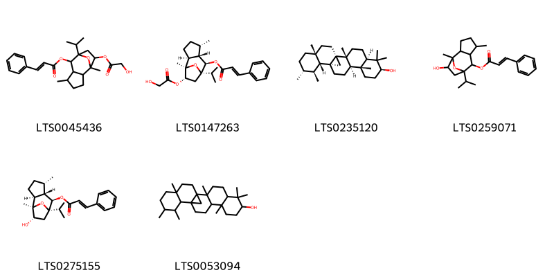{ width=100% }
    <figcaption>Hình ảnh cấu trúc hóa học của 6 hoạt chất thuộc nhóm Prenol lipids gồm ['10-[(2-hydroxyacetyl)oxy]-8-isopropyl-1,5-dimethyl-11-oxatricyclo[6.2.1.0²,⁶]undecan-7-yl 3-phenylprop-2-enoate (LTS0045436)', '(1r,2s,5s,6s,7r,8s,10s)-10-[(2-hydroxyacetyl)oxy]-8-isopropyl-1,5-dimethyl-11-oxatricyclo[6.2.1.0²,⁶]undecan-7-yl (2e)-3-phenylprop-2-enoate (LTS0147263)', '(1r,2r,5r,7s,10r,11r,14r,15r,16s,17r,20r)-2,6,6,10,16,17,20-heptamethylhexacyclo[12.8.1.0¹,¹⁴.0²,¹¹.0⁵,¹⁰.0¹⁵,²⁰]tricosan-7-ol (LTS0235120)', '10-hydroxy-8-isopropyl-1,5-dimethyl-11-oxatricyclo[6.2.1.0²,⁶]undecan-7-yl 3-phenylprop-2-enoate (LTS0259071)', '(1r,2s,5s,6s,7r,8s,10s)-10-hydroxy-8-isopropyl-1,5-dimethyl-11-oxatricyclo[6.2.1.0²,⁶]undecan-7-yl (2e)-3-phenylprop-2-enoate (LTS0275155)', '2,6,6,10,16,17,20-heptamethylhexacyclo[12.8.1.0¹,¹⁴.0²,¹¹.0⁵,¹⁰.0¹⁵,²⁰]tricosan-7-ol (LTS0053094)'].</figcaption>
</figure>

---

### Dược dân tộc học

Danh sách các quốc gia có sử dụng *Phyllanthus engleri* trong điều trị các bệnh. 

| Country   | Disease            | Bệnh                 |
|:----------|:-------------------|:---------------------|
| Tanzania  | Poison, Intoxicant | Chất độc, Intoxicant |

---

---
## Phyllanthus epiphyllanthus
### Thông tin về thực vật

!!! info "Phân loại thực vật của *Phyllanthus epiphyllanthus* từ GIBF:"
    - **Kingdom:** Plantae
    - **Phylum:** Tracheophyta
    - **Order:** Malpighiales
    - **Family:** Phyllanthaceae
    - **Genus:** Phyllanthus
    - **Species:** *Phyllanthus epiphyllanthus*

 

| Label (VI)   | Label (EN)   | Scientific Name            | Descriptions (VI)   | Descriptions (EN)   | Also Known As (VI)   | Also Known As (EN)   |
|:-------------|:-------------|:---------------------------|:--------------------|:--------------------|:---------------------|:---------------------|
| N/A          | N/A          | Phyllanthus epiphyllanthus | loài thực vật       | species of plant    | ['']                 | ['']                 |

#### Phân bố trên thế giới

**Từ CSDL GIBF** nan, Guadeloupe, Belgium, unknown or invalid, Virgin Islands (British), Puerto Rico, Jamaica, United States of America, Saint Martin (French part), Barbados, Turks and Caicos Islands, Bahamas, Brazil, Cuba, Dominica, Dominican Republic, Madagascar, Haiti, Anguilla, Antigua and Barbuda, Sint Maarten (Dutch part)

#### Phân bố tại Việt Nam

**Từ CSDL GIBF**: Không có ghi nhận ở Việt Nam

---
### Thành phần hóa học
        
- Theo cơ sở dữ liệu lotus: Từ loài *Phyllanthus epiphyllanthus* đã phân lập và xác định được Chưa có hoạt chất nào được phân lập. hoạt chất thuộc về các nhóm Không có hoạt chất nào được phân lập. 

Không có hình ảnh nào được tạo ra

---

### Dược dân tộc học

Danh sách các quốc gia có sử dụng *Phyllanthus epiphyllanthus* trong điều trị các bệnh. 

| Country   | Disease     | Bệnh                   |
|:----------|:------------|:-----------------------|
| Bahamas   | Carminative | Gây ô nhiễm môi trường |

---

---
## Phyllanthus floribundus
### Thông tin về thực vật

!!! info "Phân loại thực vật của *N/A* từ GIBF:"
    - **Kingdom:** Plantae
    - **Phylum:** Tracheophyta
    - **Order:** Malpighiales
    - **Family:** Phyllanthaceae
    - **Genus:** Phyllanthus
    - **Species:** *N/A*

 

| Label (VI)   | Label (EN)   | Scientific Name         | Descriptions (VI)   | Descriptions (EN)   | Also Known As (VI)   | Also Known As (EN)   |
|:-------------|:-------------|:------------------------|:--------------------|:--------------------|:---------------------|:---------------------|
| N/A          | N/A          | Phyllanthus floribundus |                     |                     | ['']                 | ['']                 |

#### Phân bố trên thế giới

**Từ CSDL GIBF** Virgin Islands (U.S.), Sri Lanka, Australia, Japan, Guadeloupe, Cambodia, Argentina, Philippines, French Guiana, Puerto Rico, Chinese Taipei, Portugal, United States of America, Maldives, South Africa, Hong Kong, Thailand, Brazil, Bahamas, New Caledonia, Cuba, Mexico, Singapore, China, Curaçao, Ecuador, India, Indonesia, Antigua and Barbuda, Sint Maarten (Dutch part), Malaysia

#### Phân bố tại Việt Nam

**Từ CSDL GIBF**: Không có ghi nhận ở Việt Nam

---
### Thành phần hóa học
        
- Theo cơ sở dữ liệu lotus: Từ loài *N/A* đã phân lập và xác định được Chưa có hoạt chất nào được phân lập. hoạt chất thuộc về các nhóm Không có hoạt chất nào được phân lập. 

Không có hình ảnh nào được tạo ra

---

### Dược dân tộc học

Danh sách các quốc gia có sử dụng *N/A* trong điều trị các bệnh. 

| Country     | Disease     | Bệnh           |
|:------------|:------------|:---------------|
| Upper Volta | Aphrodisiac | Thuốc kích dục |

---

---
## Phyllanthus fraternus
### Thông tin về thực vật

!!! info "Phân loại thực vật của *Phyllanthus fraternus* từ GIBF:"
    - **Kingdom:** Plantae
    - **Phylum:** Tracheophyta
    - **Order:** Malpighiales
    - **Family:** Phyllanthaceae
    - **Genus:** Phyllanthus
    - **Species:** *Phyllanthus fraternus*

 

| Label (VI)   | Label (EN)   | Scientific Name       | Descriptions (VI)   | Descriptions (EN)   | Also Known As (VI)   | Also Known As (EN)   |
|:-------------|:-------------|:----------------------|:--------------------|:--------------------|:---------------------|:---------------------|
| N/A          | N/A          | Phyllanthus fraternus | loài thực vật       | species of plant    | ['']                 | ['']                 |

#### Phân bố trên thế giới

**Từ CSDL GIBF** Ghana, Japan, Belgium, Mozambique, Rwanda, Benin, Tanzania, United Republic of, Yemen, Togo, Malawi, Pakistan, Zambia, Mali, Senegal, Nigeria, Namibia, Chad, Jamaica, United States of America, Congo, Democratic Republic of the, Saudi Arabia, South Africa, Uganda, Oman, Niger, Brazil, Cabo Verde, Botswana, India, Burkina Faso, Djibouti, Kenya, Mauritania, Ethiopia

#### Phân bố tại Việt Nam

**Từ CSDL GIBF**: Không có ghi nhận ở Việt Nam

---
### Thành phần hóa học
        
- Theo cơ sở dữ liệu lotus: Từ loài *Phyllanthus fraternus* đã phân lập và xác định được 4 hoạt chất thuộc về các nhóm Carboximidic acids and derivatives, Carboxylic acids and derivatives. 

|    | chemicalTaxonomyClassyfireClass    |   smiles_count |
|---:|:-----------------------------------|---------------:|
|  0 | Carboximidic acids and derivatives |              1 |
|  1 | Carboxylic acids and derivatives   |              3 |

#### Nhóm Carboximidic acids and derivatives
<figure markdown="span">
    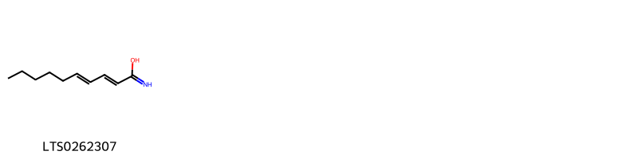{ width=100% }
    <figcaption>Hình ảnh cấu trúc hóa học của 1 hoạt chất thuộc nhóm Carboximidic acids and derivatives gồm ['(2e)-deca-2,4-dienimidic acid (LTS0262307)'].</figcaption>
</figure>
#### Nhóm Carboxylic acids and derivatives
<figure markdown="span">
    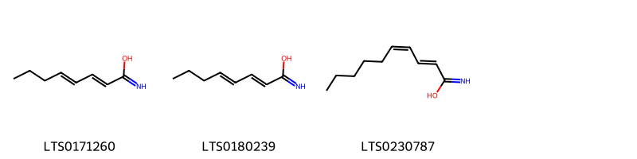{ width=100% }
    <figcaption>Hình ảnh cấu trúc hóa học của 3 hoạt chất thuộc nhóm Carboxylic acids and derivatives gồm ['octa-2,4-dienimidic acid (LTS0171260)', '(2e,4e)-octa-2,4-dienimidic acid (LTS0180239)', '(2e,4z)-deca-2,4-dienimidic acid (LTS0230787)'].</figcaption>
</figure>

---

### Dược dân tộc học

Danh sách các quốc gia có sử dụng *Phyllanthus fraternus* trong điều trị các bệnh. 

| Country   | Disease                                                       | Bệnh                                                               |
|:----------|:--------------------------------------------------------------|:-------------------------------------------------------------------|
| Elsewhere | Antiseptic, Astringent, nan, Diuretic, Refrigerant, Stomachic | Khử trùng, Chất làm se, nan, Thuốc lợi tiểu, Chất làm lạnh, Dạ dày |
| India     | Stomachic                                                     | Sững sờ                                                            |

---

---
## Phyllanthus frondosus
### Thông tin về thực vật

!!! info "Phân loại thực vật của *Phyllanthus frondosus* từ GIBF:"
    - **Kingdom:** Plantae
    - **Phylum:** Tracheophyta
    - **Order:** Malpighiales
    - **Family:** Phyllanthaceae
    - **Genus:** Phyllanthus
    - **Species:** *Phyllanthus frondosus*

 

| Label (VI)   | Label (EN)   | Scientific Name       | Descriptions (VI)   | Descriptions (EN)   | Also Known As (VI)   | Also Known As (EN)   |
|:-------------|:-------------|:----------------------|:--------------------|:--------------------|:---------------------|:---------------------|
| N/A          | N/A          | Phyllanthus fraternus | loài thực vật       | species of plant    | ['']                 | ['']                 |

#### Phân bố trên thế giới

**Từ CSDL GIBF** Ghana, Japan, Belgium, Mozambique, Rwanda, Benin, Tanzania, United Republic of, Yemen, Togo, Malawi, Pakistan, Zambia, Mali, Senegal, Nigeria, Namibia, Chad, Jamaica, United States of America, Congo, Democratic Republic of the, Saudi Arabia, South Africa, Uganda, Oman, Niger, Brazil, Cabo Verde, Botswana, India, Burkina Faso, Djibouti, Kenya, Mauritania, Ethiopia

#### Phân bố tại Việt Nam

**Từ CSDL GIBF**: Không có ghi nhận ở Việt Nam

---
### Thành phần hóa học
        
- Theo cơ sở dữ liệu lotus: Từ loài *Phyllanthus frondosus* đã phân lập và xác định được Chưa có hoạt chất nào được phân lập. hoạt chất thuộc về các nhóm Không có hoạt chất nào được phân lập. 

Không có hình ảnh nào được tạo ra

---

### Dược dân tộc học

Danh sách các quốc gia có sử dụng *Phyllanthus frondosus* trong điều trị các bệnh. 

| Country   | Disease               | Bệnh                     |
|:----------|:----------------------|:-------------------------|
| Malaya    | Diaphoretic, Diuretic | Thuốc lợi tiểu, lợi tiểu |

---

---
## Phyllanthus indicus
### Thông tin về thực vật

!!! info "Phân loại thực vật của *Margaritaria indica* từ GIBF:"
    - **Kingdom:** Plantae
    - **Phylum:** Tracheophyta
    - **Order:** Malpighiales
    - **Family:** Phyllanthaceae
    - **Genus:** Margaritaria
    - **Species:** *Margaritaria indica*

 

| Label (VI)   | Label (EN)   | Scientific Name     | Descriptions (VI)   | Descriptions (EN)   | Also Known As (VI)   | Also Known As (EN)   |
|:-------------|:-------------|:--------------------|:--------------------|:--------------------|:---------------------|:---------------------|
| N/A          | N/A          | Phyllanthus indicus |                     |                     | ['']                 | ['']                 |

#### Phân bố trên thế giới

**Từ CSDL GIBF** nan, Sri Lanka, Chinese Taipei, India, Indonesia, unknown or invalid, Philippines

#### Phân bố tại Việt Nam

**Từ CSDL GIBF**: Không có ghi nhận ở Việt Nam

---
### Thành phần hóa học
        
- Theo cơ sở dữ liệu lotus: Từ loài *Margaritaria indica* đã phân lập và xác định được Chưa có hoạt chất nào được phân lập. hoạt chất thuộc về các nhóm Không có hoạt chất nào được phân lập. 

Không có hình ảnh nào được tạo ra

---

### Dược dân tộc học

Danh sách các quốc gia có sử dụng *Margaritaria indica* trong điều trị các bệnh. 

| Country   | Disease            | Bệnh               |
|:----------|:-------------------|:-------------------|
| Asia      | Intoxicant, Poison | Intoxicant, Poison |

---

---
## Phyllanthus muellerianus
### Thông tin về thực vật

!!! info "Phân loại thực vật của *Phyllanthus muellerianus* từ GIBF:"
    - **Kingdom:** Plantae
    - **Phylum:** Tracheophyta
    - **Order:** Malpighiales
    - **Family:** Phyllanthaceae
    - **Genus:** Phyllanthus
    - **Species:** *Phyllanthus muellerianus*

 

| Label (VI)   | Label (EN)   | Scientific Name          | Descriptions (VI)   | Descriptions (EN)   | Also Known As (VI)   | Also Known As (EN)   |
|:-------------|:-------------|:-------------------------|:--------------------|:--------------------|:---------------------|:---------------------|
| N/A          | N/A          | Phyllanthus muellerianus | loài thực vật       | species of plant    | ['']                 | ['']                 |

#### Phân bố trên thế giới

**Từ CSDL GIBF** Malawi, Zambia, Uganda, Liberia, Senegal, Sao Tome and Principe, Nigeria, Gabon, Belgium, Côte d’Ivoire, Benin, Congo, Democratic Republic of the, Guinea, Cameroon, Togo

#### Phân bố tại Việt Nam

**Từ CSDL GIBF**: Không có ghi nhận ở Việt Nam

---
### Thành phần hóa học
        
- Theo cơ sở dữ liệu lotus: Từ loài *Phyllanthus muellerianus* đã phân lập và xác định được 6 hoạt chất thuộc về các nhóm Prenol lipids, Steroids and steroid derivatives. 

|    | chemicalTaxonomyClassyfireClass   |   smiles_count |
|---:|:----------------------------------|---------------:|
|  0 | Prenol lipids                     |              4 |
|  1 | Steroids and steroid derivatives  |              2 |

#### Nhóm Prenol lipids
<figure markdown="span">
    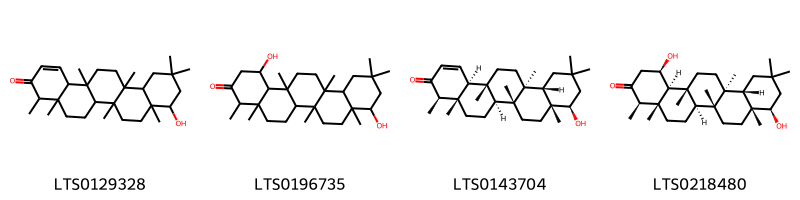{ width=100% }
    <figcaption>Hình ảnh cấu trúc hóa học của 4 hoạt chất thuộc nhóm Prenol lipids gồm ['9-hydroxy-4,4a,6b,8a,11,11,12b,14a-octamethyl-5,6,6a,7,8,9,10,12,12a,13,14,14b-dodecahydro-4h-picen-3-one (LTS0129328)', '1,9-dihydroxy-4,4a,6b,8a,11,11,12b,14a-octamethyl-tetradecahydro-1h-picen-3-one (LTS0196735)', '(4r,4as,6as,6br,8ar,9r,12as,12bs,14ar,14bs)-9-hydroxy-4,4a,6b,8a,11,11,12b,14a-octamethyl-5,6,6a,7,8,9,10,12,12a,13,14,14b-dodecahydro-4h-picen-3-one (LTS0143704)', '(1r,4r,4as,6as,6br,8ar,9r,12as,12bs,14ar,14bs)-1,9-dihydroxy-4,4a,6b,8a,11,11,12b,14a-octamethyl-tetradecahydro-1h-picen-3-one (LTS0218480)'].</figcaption>
</figure>
#### Nhóm Steroids and steroid derivatives
<figure markdown="span">
    { width=100% }
    <figcaption>Hình ảnh cấu trúc hóa học của 2 hoạt chất thuộc nhóm Steroids and steroid derivatives gồm ['stigmast-5-en-3-ol, (3β)- (LTS0204616)', '(1s,3ar,3br,7r,9as,9br,11ar)-1-[(2r,5r)-5-ethyl-6-methylheptan-2-yl]-9a,11a-dimethyl-1h,2h,3h,3ah,3bh,4h,6h,7h,8h,9h,9bh,10h,11h-cyclopenta[a]phenanthren-7-ol (LTS0234781)'].</figcaption>
</figure>

---

### Dược dân tộc học

Danh sách các quốc gia có sử dụng *Phyllanthus muellerianus* trong điều trị các bệnh. 

| Country   | Disease     | Bệnh           |
|:----------|:------------|:---------------|
| Africa    | Purgative   | Thuốc xổ       |
| Cameroon  | Aphrodisiac | Thuốc kích dục |
| Ghana     | Collyrium   | Collyrium      |

---

---
## Phyllanthus niruri
### Thông tin về thực vật

!!! info "Phân loại thực vật của *Phyllanthus niruri* từ GIBF:"
    - **Kingdom:** Plantae
    - **Phylum:** Tracheophyta
    - **Order:** Malpighiales
    - **Family:** Phyllanthaceae
    - **Genus:** Phyllanthus
    - **Species:** *Phyllanthus niruri*

 

| Label (VI)   | Label (EN)   | Scientific Name    | Descriptions (VI)   | Descriptions (EN)   | Also Known As (VI)   | Also Known As (EN)   |
|:-------------|:-------------|:-------------------|:--------------------|:--------------------|:---------------------|:---------------------|
| N/A          | N/A          | Phyllanthus niruri | loài thực vật       | species of plant    | ['']                 | ['Medicinal Herbs']  |

#### Phân bố trên thế giới

**Từ CSDL GIBF** United Arab Emirates, Guadeloupe, Argentina, Benin, Bermuda, Venezuela (Bolivarian Republic of), Panama, Bolivia (Plurinational State of), Honduras, Uruguay, Bonaire, Sint Eustatius and Saba, El Salvador, Brazil, Peru, Mexico, Ecuador, Aruba, Colombia, Costa Rica, India, Malaysia

#### Phân bố tại Việt Nam

**Từ CSDL GIBF**: Không có ghi nhận ở Việt Nam

---
### Thành phần hóa học
        
- Theo cơ sở dữ liệu lotus: Từ loài *Phyllanthus niruri* đã phân lập và xác định được 115 hoạt chất thuộc về các nhóm Fatty Acyls, Flavonoids, Prenol lipids, Steroids and steroid derivatives, Indolizidines, Dibenzylbutane lignans, Isocoumarins and derivatives, Benzene and substituted derivatives, 2-arylbenzofuran flavonoids, Azaspirodecane derivatives, Tannins, Pyrrolizidines, Aryltetralin lignans, Furanoid lignans, Carboxylic acids and derivatives. 

|    | chemicalTaxonomyClassyfireClass     |   smiles_count |
|---:|:------------------------------------|---------------:|
|  0 | 2-arylbenzofuran flavonoids         |              1 |
|  1 | Aryltetralin lignans                |             13 |
|  2 | Azaspirodecane derivatives          |              3 |
|  3 | Benzene and substituted derivatives |              5 |
|  4 | Carboxylic acids and derivatives    |              2 |
|  5 | Dibenzylbutane lignans              |             12 |
|  6 | Fatty Acyls                         |              2 |
|  7 | Flavonoids                          |             31 |
|  8 | Furanoid lignans                    |              2 |
|  9 | Indolizidines                       |              6 |
| 10 | Isocoumarins and derivatives        |              8 |
| 11 | Prenol lipids                       |              4 |
| 12 | Pyrrolizidines                      |              3 |
| 13 | Steroids and steroid derivatives    |              3 |
| 14 | Tannins                             |             19 |

#### Nhóm 2-arylbenzofuran flavonoids
<figure markdown="span">
    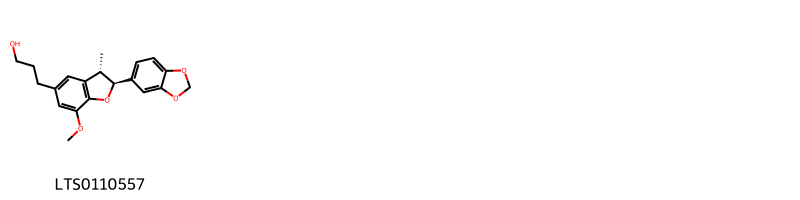{ width=100% }
    <figcaption>Hình ảnh cấu trúc hóa học của 1 hoạt chất thuộc nhóm 2-arylbenzofuran flavonoids gồm ['3-[(2s,3s)-2-(2h-1,3-benzodioxol-5-yl)-7-methoxy-3-methyl-2,3-dihydro-1-benzofuran-5-yl]propan-1-ol (LTS0110557)'].</figcaption>
</figure>
#### Nhóm Aryltetralin lignans
<figure markdown="span">
    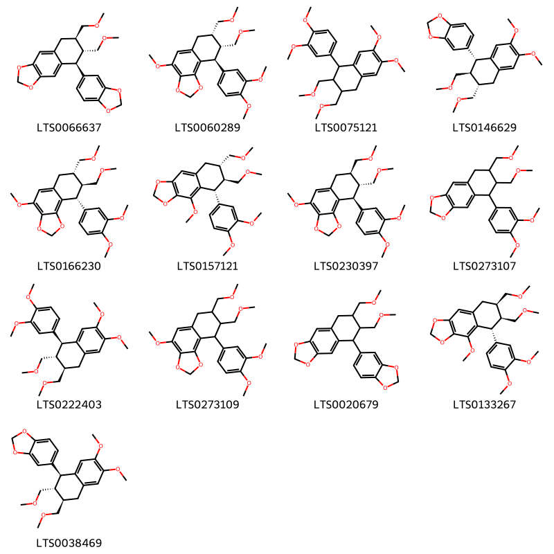{ width=100% }
    <figcaption>Hình ảnh cấu trúc hóa học của 13 hoạt chất thuộc nhóm Aryltetralin lignans gồm ['5-[(5s,6r,7r)-6,7-bis(methoxymethyl)-2h,5h,6h,7h,8h-naphtho[2,3-d][1,3]dioxol-5-yl]-2h-1,3-benzodioxole (LTS0066637)', '(7s,8r,9s)-9-(3,4-dimethoxyphenyl)-4-methoxy-7,8-bis(methoxymethyl)-2h,6h,7h,8h,9h-naphtho[1,2-d][1,3]dioxole (LTS0060289)', '1-(3,4-dimethoxyphenyl)-6,7-dimethoxy-2,3-bis(methoxymethyl)-1,2,3,4-tetrahydronaphthalene (LTS0075121)', '5-[(1r,2s,3s)-6,7-dimethoxy-2,3-bis(methoxymethyl)-1,2,3,4-tetrahydronaphthalen-1-yl]-2h-1,3-benzodioxole (LTS0146629)', '(7s,8s,9r)-9-(3,4-dimethoxyphenyl)-4-methoxy-7,8-bis(methoxymethyl)-2h,6h,7h,8h,9h-naphtho[1,2-d][1,3]dioxole (LTS0166230)', '(5r,6s,7s)-5-(3,4-dimethoxyphenyl)-4-methoxy-6,7-bis(methoxymethyl)-2h,5h,6h,7h,8h-naphtho[2,3-d][1,3]dioxole (LTS0157121)', 'hypophyllanthin (LTS0230397)', '5-(3,4-dimethoxyphenyl)-6,7-bis(methoxymethyl)-2h,5h,6h,7h,8h-naphtho[2,3-d][1,3]dioxole (LTS0273107)', '(1s,2r,3r)-1-(3,4-dimethoxyphenyl)-6,7-dimethoxy-2,3-bis(methoxymethyl)-1,2,3,4-tetrahydronaphthalene (LTS0222403)', '9-(3,4-dimethoxyphenyl)-4-methoxy-7,8-bis(methoxymethyl)-2h,6h,7h,8h,9h-naphtho[1,2-d][1,3]dioxole (LTS0273109)', '5-[6,7-bis(methoxymethyl)-2h,5h,6h,7h,8h-naphtho[2,3-d][1,3]dioxol-5-yl]-2h-1,3-benzodioxole (LTS0020679)', '(5r,6s,7r)-5-(3,4-dimethoxyphenyl)-4-methoxy-6,7-bis(methoxymethyl)-2h,5h,6h,7h,8h-naphtho[2,3-d][1,3]dioxole (LTS0133267)', '5-[(1s,2r,3r)-6,7-dimethoxy-2,3-bis(methoxymethyl)-1,2,3,4-tetrahydronaphthalen-1-yl]-2h-1,3-benzodioxole (LTS0038469)'].</figcaption>
</figure>
#### Nhóm Azaspirodecane derivatives
<figure markdown="span">
    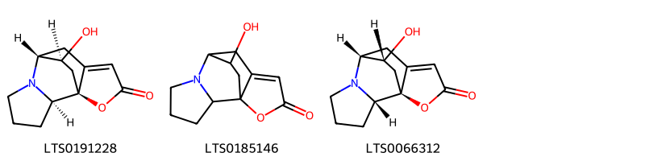{ width=100% }
    <figcaption>Hình ảnh cấu trúc hóa học của 3 hoạt chất thuộc nhóm Azaspirodecane derivatives gồm ['(1s,2r,7r,14s)-14-hydroxy-12-oxa-6-azatetracyclo[5.5.2.0¹,⁹.0²,⁶]tetradec-9-en-11-one (LTS0191228)', '14-hydroxy-12-oxa-6-azatetracyclo[5.5.2.0¹,⁹.0²,⁶]tetradec-9-en-11-one (LTS0185146)', '(1s,2s,7r,14r)-14-hydroxy-12-oxa-6-azatetracyclo[5.5.2.0¹,⁹.0²,⁶]tetradec-9-en-11-one (LTS0066312)'].</figcaption>
</figure>
#### Nhóm Benzene and substituted derivatives
<figure markdown="span">
    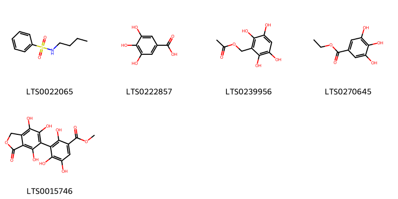{ width=100% }
    <figcaption>Hình ảnh cấu trúc hóa học của 5 hoạt chất thuộc nhóm Benzene and substituted derivatives gồm ['n-butyl-benzenesulfonamide (LTS0022065)', 'galop (LTS0222857)', '(2,3,5,6-tetrahydroxyphenyl)methyl acetate (LTS0239956)', 'ethyl gallate (LTS0270645)', 'methyl 2,4,5-trihydroxy-3-(4,6,7-trihydroxy-3-oxo-1h-2-benzofuran-5-yl)benzoate (LTS0015746)'].</figcaption>
</figure>
#### Nhóm Carboxylic acids and derivatives
<figure markdown="span">
    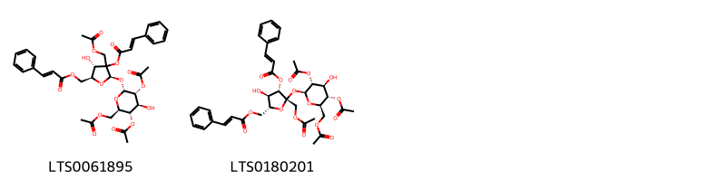{ width=100% }
    <figcaption>Hình ảnh cấu trúc hóa học của 2 hoạt chất thuộc nhóm Carboxylic acids and derivatives gồm ['[(2s,3s,5r)-4-[(acetyloxy)methyl]-5-{[(2r,3r,4s,5s,6r)-3,5-bis(acetyloxy)-6-[(acetyloxy)methyl]-4-hydroxyoxan-2-yl]oxy}-3-hydroxy-4-{[(2e)-3-phenylprop-2-enoyl]oxy}oxolan-2-yl]methyl (2e)-3-phenylprop-2-enoate (LTS0061895)', 'niruriside (LTS0180201)'].</figcaption>
</figure>
#### Nhóm Dibenzylbutane lignans
<figure markdown="span">
    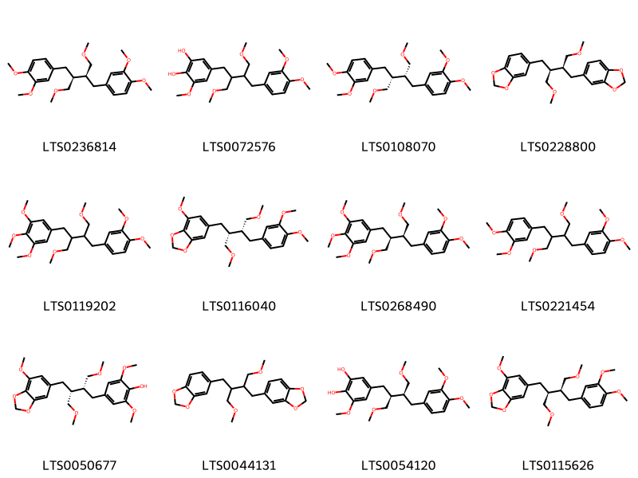{ width=100% }
    <figcaption>Hình ảnh cấu trúc hóa học của 12 hoạt chất thuộc nhóm Dibenzylbutane lignans gồm ['phyllanthin (LTS0236814)', '5-{3-[(3,4-dimethoxyphenyl)methyl]-4-methoxy-2-(methoxymethyl)butyl}-3-methoxybenzene-1,2-diol (LTS0072576)', '4-[(2r,3r)-3-[(3,4-dimethoxyphenyl)methyl]-4-methoxy-2-(methoxymethyl)butyl]-1,2-dimethoxybenzene (LTS0108070)', '5-[(2s,3s)-3-(2h-1,3-benzodioxol-5-ylmethyl)-4-methoxy-2-(methoxymethyl)butyl]-2h-1,3-benzodioxole (LTS0228800)', '5-{3-[(3,4-dimethoxyphenyl)methyl]-4-methoxy-2-(methoxymethyl)butyl}-1,2,3-trimethoxybenzene (LTS0119202)', '6-[(2r,3r)-3-[(3,4-dimethoxyphenyl)methyl]-4-methoxy-2-(methoxymethyl)butyl]-4-methoxy-2h-1,3-benzodioxole (LTS0116040)', '5-[(2s,3s)-3-[(3,4-dimethoxyphenyl)methyl]-4-methoxy-2-(methoxymethyl)butyl]-1,2,3-trimethoxybenzene (LTS0268490)', '4-{3-[(3,4-dimethoxyphenyl)methyl]-4-methoxy-2-(methoxymethyl)butyl}-1,2-dimethoxybenzene (LTS0221454)', '2,6-dimethoxy-4-[(2r,3r)-4-methoxy-3-[(7-methoxy-2h-1,3-benzodioxol-5-yl)methyl]-2-(methoxymethyl)butyl]phenol (LTS0050677)', '5-[3-(2h-1,3-benzodioxol-5-ylmethyl)-4-methoxy-2-(methoxymethyl)butyl]-2h-1,3-benzodioxole (LTS0044131)', '5-[(2s,3s)-3-[(3,4-dimethoxyphenyl)methyl]-4-methoxy-2-(methoxymethyl)butyl]-3-methoxybenzene-1,2-diol (LTS0054120)', '6-[(2s,3s)-3-[(3,4-dimethoxyphenyl)methyl]-4-methoxy-2-(methoxymethyl)butyl]-4-methoxy-2h-1,3-benzodioxole (LTS0115626)'].</figcaption>
</figure>
#### Nhóm Fatty Acyls
<figure markdown="span">
    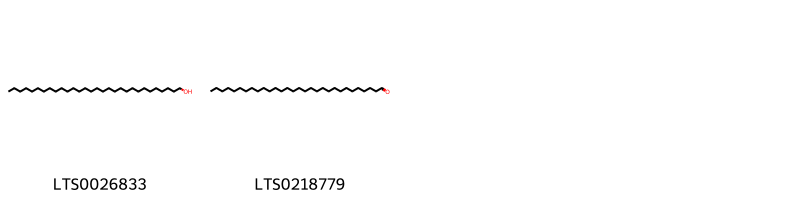{ width=100% }
    <figcaption>Hình ảnh cấu trúc hóa học của 2 hoạt chất thuộc nhóm Fatty Acyls gồm ['triacontanol (LTS0026833)', 'triacontanal (LTS0218779)'].</figcaption>
</figure>
#### Nhóm Flavonoids
<figure markdown="span">
    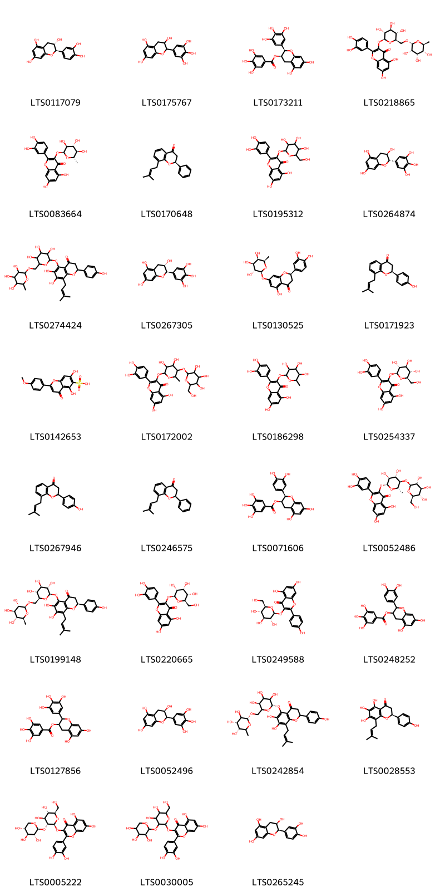{ width=100% }
    <figcaption>Hình ảnh cấu trúc hóa học của 31 hoạt chất thuộc nhóm Flavonoids gồm ['(+)-catechol (LTS0117079)', 'epigallocatechin (LTS0175767)', '(-)-epigallocatechin gallate (LTS0173211)', '2-(3,4-dihydroxyphenyl)-5,7-dihydroxy-3-{[(2s,3r,4s,5s,6r)-3,4,5-trihydroxy-6-({[(2r,3s,4s,5r,6s)-3,4,5-trihydroxy-6-methyloxan-2-yl]oxy}methyl)oxan-2-yl]oxy}chromen-4-one (LTS0218865)', '2-(3,4-dihydroxyphenyl)-5,7-dihydroxy-3-{[(2s,3s,4r,5r,6s)-3,4,5-trihydroxy-6-methyloxan-2-yl]oxy}chromen-4-one (LTS0083664)', '(2s)-8-(3-methylbut-2-en-1-yl)-2-phenyl-2,3-dihydro-1-benzopyran-4-one (LTS0170648)', '2-(3,4-dihydroxyphenyl)-5,7-dihydroxy-3-{[3,4,5-trihydroxy-6-(hydroxymethyl)oxan-2-yl]oxy}chromen-4-one (LTS0195312)', '(-)-gallocatechin (LTS0264874)', '6,7-dihydroxy-2-(4-hydroxyphenyl)-8-(3-methylbut-2-en-1-yl)-5-[(3,4,5-trihydroxy-6-{[(3,4,5-trihydroxy-6-methyloxan-2-yl)oxy]methyl}oxan-2-yl)oxy]-2,3-dihydro-1-benzopyran-4-one (LTS0274424)', 'gallocatechol (LTS0267305)', '(2r)-2-(3,4-dihydroxyphenyl)-5-hydroxy-7-{[(2s,3r,4s,5r,6r)-3,4,5-trihydroxy-6-methyloxan-2-yl]oxy}-2,3-dihydro-1-benzopyran-4-one (LTS0130525)', '(2s)-2-(4-hydroxyphenyl)-8-(3-methylbut-2-en-1-yl)-2,3-dihydro-1-benzopyran-4-one (LTS0171923)', '5,7-dihydroxy-2-(4-methoxyphenyl)-4-oxochromene-6-sulfonic acid (LTS0142653)', '3-[(3,4-dihydroxy-6-methyl-5-{[3,4,5-trihydroxy-6-(hydroxymethyl)oxan-2-yl]oxy}oxan-2-yl)oxy]-2-(3,4-dihydroxyphenyl)-5,7-dihydroxychromen-4-one (LTS0172002)', 'quercitrin (LTS0186298)', 'isoquercetin (LTS0254337)', '2-(4-hydroxyphenyl)-8-(3-methylbut-2-en-1-yl)-2,3-dihydro-1-benzopyran-4-one (LTS0267946)', '8-(3-methylbut-2-en-1-yl)-2-phenyl-2,3-dihydro-1-benzopyran-4-one (LTS0246575)', 'epicatechin gallate (LTS0071606)', '3-{[(2r,3r,4s,5r,6s)-3,4-dihydroxy-6-methyl-5-{[(2s,3r,4s,5s,6r)-3,4,5-trihydroxy-6-(hydroxymethyl)oxan-2-yl]oxy}oxan-2-yl]oxy}-2-(3,4-dihydroxyphenyl)-5,7-dihydroxychromen-4-one (LTS0052486)', '(2s)-6,7-dihydroxy-2-(4-hydroxyphenyl)-8-(3-methylbut-2-en-1-yl)-5-{[(2r,3s,4r,5r,6s)-3,4,5-trihydroxy-6-({[(2s,3s,4r,5r,6s)-3,4,5-trihydroxy-6-methyloxan-2-yl]oxy}methyl)oxan-2-yl]oxy}-2,3-dihydro-1-benzopyran-4-one (LTS0199148)', '2-(3,4-dihydroxyphenyl)-5,7-dihydroxy-3-{[(2s,3r,4r,5s,6r)-3,4,5-trihydroxy-6-(hydroxymethyl)oxan-2-yl]oxy}chromen-4-one (LTS0220665)', 'astragalin (LTS0249588)', '2-(3,4-dihydroxyphenyl)-5,7-dihydroxy-3,4-dihydro-2h-1-benzopyran-3-yl 3,4,5-trihydroxybenzoate (LTS0248252)', '5,7-dihydroxy-2-(3,4,5-trihydroxyphenyl)-3,4-dihydro-2h-1-benzopyran-3-yl 3,4,5-trihydroxybenzoate (LTS0127856)', 'epigallocatechin (LTS0052496)', 'nirurin (LTS0242854)', '(2s)-5,6,7-trihydroxy-2-(4-hydroxyphenyl)-8-(3-methylbut-2-en-1-yl)-2,3-dihydro-1-benzopyran-4-one (LTS0028553)', '3-{[(2s,3r,4s,5s,6r)-4,5-dihydroxy-6-(hydroxymethyl)-3-{[(2s,3r,4s,5r)-3,4,5-trihydroxyoxan-2-yl]oxy}oxan-2-yl]oxy}-2-(3,4-dihydroxyphenyl)-5,7-dihydroxychromen-4-one (LTS0005222)', '3-{[4,5-dihydroxy-6-(hydroxymethyl)-3-[(3,4,5-trihydroxyoxan-2-yl)oxy]oxan-2-yl]oxy}-2-(3,4-dihydroxyphenyl)-5,7-dihydroxychromen-4-one (LTS0030005)', 'ent-epicatechin (LTS0265245)'].</figcaption>
</figure>
#### Nhóm Furanoid lignans
<figure markdown="span">
    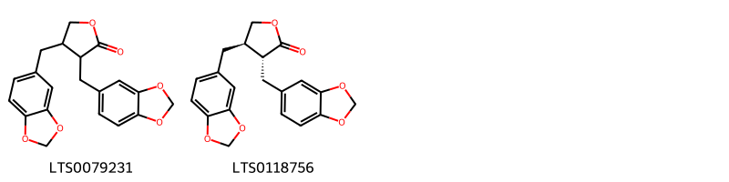{ width=100% }
    <figcaption>Hình ảnh cấu trúc hóa học của 2 hoạt chất thuộc nhóm Furanoid lignans gồm ['3,4-bis(2h-1,3-benzodioxol-5-ylmethyl)oxolan-2-one (LTS0079231)', 'hinokinin (LTS0118756)'].</figcaption>
</figure>
#### Nhóm Indolizidines
<figure markdown="span">
    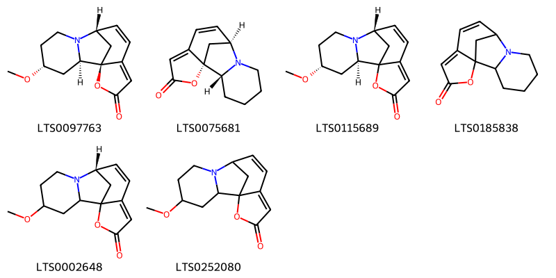{ width=100% }
    <figcaption>Hình ảnh cấu trúc hóa học của 6 hoạt chất thuộc nhóm Indolizidines gồm ['(1s,2r,4r,8s)-4-methoxy-14-oxa-7-azatetracyclo[6.6.1.0¹,¹¹.0²,⁷]pentadeca-9,11-dien-13-one (LTS0097763)', 'securinine (LTS0075681)', '(2r,4r,8s)-4-methoxy-14-oxa-7-azatetracyclo[6.6.1.0¹,¹¹.0²,⁷]pentadeca-9,11-dien-13-one (LTS0115689)', '14-oxa-7-azatetracyclo[6.6.1.0¹,¹¹.0²,⁷]pentadeca-9,11-dien-13-one (LTS0185838)', '(8s)-4-methoxy-14-oxa-7-azatetracyclo[6.6.1.0¹,¹¹.0²,⁷]pentadeca-9,11-dien-13-one (LTS0002648)', '4-methoxy-14-oxa-7-azatetracyclo[6.6.1.0¹,¹¹.0²,⁷]pentadeca-9,11-dien-13-one (LTS0252080)'].</figcaption>
</figure>
#### Nhóm Isocoumarins and derivatives
<figure markdown="span">
    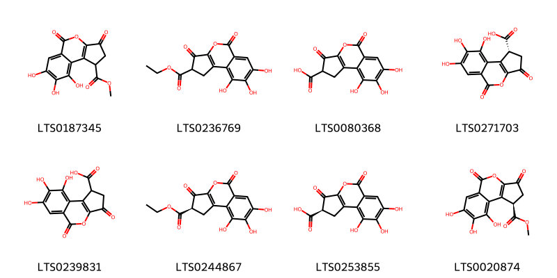{ width=100% }
    <figcaption>Hình ảnh cấu trúc hóa học của 8 hoạt chất thuộc nhóm Isocoumarins and derivatives gồm ['methyl brevifolincarboxylate (LTS0187345)', 'ethyl 7,8,9-trihydroxy-3,5-dioxo-1h,2h-cyclopenta[c]isochromene-2-carboxylate (LTS0236769)', '7,8,9-trihydroxy-3,5-dioxo-1h,2h-cyclopenta[c]isochromene-2-carboxylic acid (LTS0080368)', '(1r)-7,8,9-trihydroxy-3,5-dioxo-1h,2h-cyclopenta[c]isochromene-1-carboxylic acid (LTS0271703)', '7,8,9-trihydroxy-3,5-dioxo-1h,2h-cyclopenta[c]isochromene-1-carboxylic acid (LTS0239831)', 'ethyl (2r)-7,8,9-trihydroxy-3,5-dioxo-1h,2h-cyclopenta[c]isochromene-2-carboxylate (LTS0244867)', '(2r)-7,8,9-trihydroxy-3,5-dioxo-1h,2h-cyclopenta[c]isochromene-2-carboxylic acid (LTS0253855)', 'methyl (1r)-7,8,9-trihydroxy-3,5-dioxo-1h,2h-cyclopenta[c]isochromene-1-carboxylate (LTS0020874)'].</figcaption>
</figure>
#### Nhóm Prenol lipids
<figure markdown="span">
    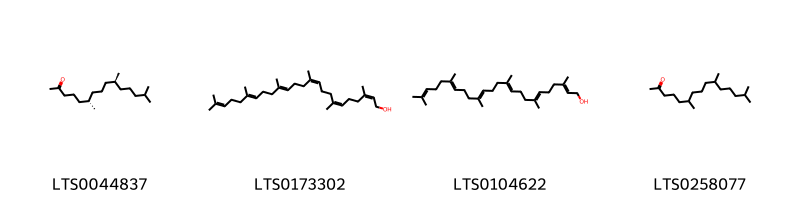{ width=100% }
    <figcaption>Hình ảnh cấu trúc hóa học của 4 hoạt chất thuộc nhóm Prenol lipids gồm ['(6s,10s)-6,10,14-trimethylpentadecan-2-one (LTS0044837)', '(2z,6z,10z,14e,18e)-3,7,11,15,19,23-hexamethyltetracosa-2,6,10,14,18,22-hexaen-1-ol (LTS0173302)', '3,7,11,15,19,23-hexamethyltetracosa-2,6,10,14,18,22-hexaen-1-ol (LTS0104622)', '6,10,14-trimethylpentadecan-2-one (LTS0258077)'].</figcaption>
</figure>
#### Nhóm Pyrrolizidines
<figure markdown="span">
    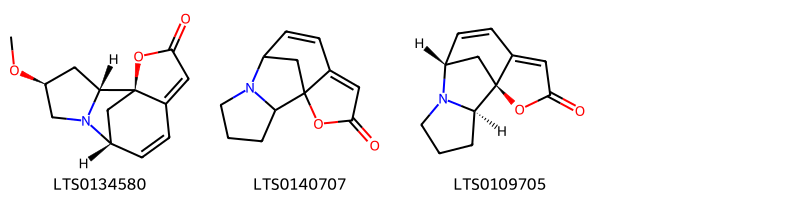{ width=100% }
    <figcaption>Hình ảnh cấu trúc hóa học của 3 hoạt chất thuộc nhóm Pyrrolizidines gồm ['(1r,8r,11s,13r)-11-methoxy-2-oxa-9-azatetracyclo[6.5.1.0¹,⁵.0⁹,¹³]tetradeca-4,6-dien-3-one (LTS0134580)', '2-oxa-9-azatetracyclo[6.5.1.0¹,⁵.0⁹,¹³]tetradeca-4,6-dien-3-one (LTS0140707)', '(1s,8s,13r)-2-oxa-9-azatetracyclo[6.5.1.0¹,⁵.0⁹,¹³]tetradeca-4,6-dien-3-one (LTS0109705)'].</figcaption>
</figure>
#### Nhóm Steroids and steroid derivatives
<figure markdown="span">
    { width=100% }
    <figcaption>Hình ảnh cấu trúc hóa học của 3 hoạt chất thuộc nhóm Steroids and steroid derivatives gồm ['stigmast-5-en-3-ol (LTS0071224)', 'sitosterol (LTS0168132)', 'stigmast-5-en-3-ol, (3β)- (LTS0204616)'].</figcaption>
</figure>
#### Nhóm Tannins
<figure markdown="span">
    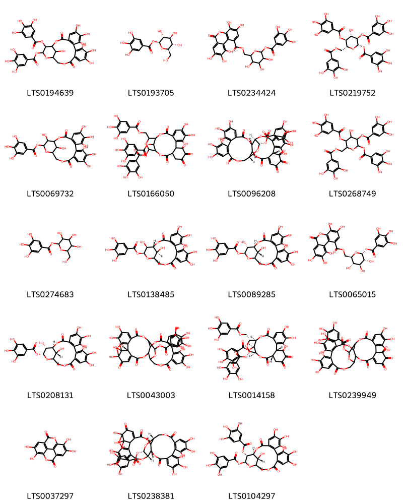{ width=100% }
    <figcaption>Hình ảnh cấu trúc hóa học của 19 hoạt chất thuộc nhóm Tannins gồm ['6,7,8,11,12,13,23-heptahydroxy-3,16-dioxo-21-(3,4,5-trihydroxybenzoyloxy)-2,17,20-trioxatetracyclo[17.3.1.0⁴,⁹.0¹⁰,¹⁵]tricosa-4(9),5,7,10,12,14-hexaen-22-yl 3,4,5-trihydroxybenzoate (LTS0194639)', 'β-glucogallin (LTS0193705)', '[3,4,5-trihydroxy-6-(3,4,5-trihydroxybenzoyloxy)oxan-2-yl]methyl 3,4,8,9,10-pentahydroxy-6-oxobenzo[c]chromene-1-carboxylate (LTS0234424)', '(2s,3r,4s,5s,6r)-4-hydroxy-3,5-bis(3,4,5-trihydroxybenzoyloxy)-6-[(3,4,5-trihydroxybenzoyloxy)methyl]oxan-2-yl 3,4,5-trihydroxybenzoate (LTS0219752)', '6,7,8,11,12,13,22,23-octahydroxy-3,16-dioxo-2,17,20-trioxatetracyclo[17.3.1.0⁴,⁹.0¹⁰,¹⁵]tricosa-4(9),5,7,10,12,14-hexaen-21-yl 3,4,5-trihydroxybenzoate (LTS0069732)', '6,7,8-trihydroxy-3,11,12,13,16-pentaoxo-22-(3,4,5-trihydroxybenzoyloxy)-21-[(3,4,5-trihydroxybenzoyloxy)methyl]-2,17,20-trioxatetracyclo[16.3.1.0⁴,⁹.0¹⁰,¹⁵]docosa-4,6,8-trien-19-yl 3,4,5-trihydroxybenzoate (LTS0166050)', '(1r,3s,4r,13s,21r,22s)-9,10,11,27,28,29,32,33,34-nonahydroxy-6,14,15,16,19,24,37-heptaoxo-2,5,20,23,38-pentaoxaheptacyclo[19.18.0.0⁴,²².0⁷,¹².0¹³,¹⁸.0²⁵,³⁰.0³¹,³⁶]nonatriaconta-7,9,11,17,25,27,29,31(36),32,34-decaen-3-yl 3,4,5-trihydroxybenzoate (LTS0096208)', '4-hydroxy-3,5-bis(3,4,5-trihydroxybenzoyloxy)-6-[(3,4,5-trihydroxybenzoyloxy)methyl]oxan-2-yl 3,4,5-trihydroxybenzoate (LTS0268749)', '3,4,5-trihydroxy-6-(hydroxymethyl)oxan-2-yl 3,4,5-trihydroxybenzoate (LTS0274683)', '(1r,19s,21s,22s,23s)-6,7,8,11,12,13,22,23-octahydroxy-3,16-dioxo-2,17,20-trioxatetracyclo[17.3.1.0⁴,⁹.0¹⁰,¹⁵]tricosa-4(9),5,7,10,12,14-hexaen-21-yl 3,4,5-trihydroxybenzoate (LTS0138485)', '(1s,19r,21s,22r,23r)-6,7,8,11,12,13,22,23-octahydroxy-3,16-dioxo-2,17,20-trioxatetracyclo[17.3.1.0⁴,⁹.0¹⁰,¹⁵]tricosa-4(9),5,7,10,12,14-hexaen-21-yl 3,4,5-trihydroxybenzoate (LTS0089285)', '[(2r,3s,4s,5r,6r)-3,4,5-trihydroxy-6-(3,4,5-trihydroxybenzoyloxy)oxan-2-yl]methyl 3,4,8,9,10-pentahydroxy-6-oxobenzo[c]chromene-1-carboxylate (LTS0065015)', '(1s,19r,21r,22r,23r)-6,7,8,11,12,13,22,23-octahydroxy-3,16-dioxo-2,17,20-trioxatetracyclo[17.3.1.0⁴,⁹.0¹⁰,¹⁵]tricosa-4(9),5,7,10,12,14-hexaen-21-yl 3,4,5-trihydroxybenzoate (LTS0208131)', '(1r,38r)-1,13,14,15,18,19,20,34,35,39,39-undecahydroxy-2,5,10,23,31-pentaoxo-6,9,24,27,30,40-hexaoxaoctacyclo[34.3.1.0⁴,³⁸.0⁷,²⁶.0⁸,²⁹.0¹¹,¹⁶.0¹⁷,²².0³²,³⁷]tetraconta-3,11(16),12,14,17,19,21,32,34,36-decaen-28-yl 3,4,5-trihydroxybenzoate (LTS0043003)', '(1r,10r,15s,18r,19s,21r,22s)-6,7,8-trihydroxy-3,11,12,13,16-pentaoxo-22-(3,4,5-trihydroxybenzoyloxy)-21-[(3,4,5-trihydroxybenzoyloxy)methyl]-2,17,20-trioxatetracyclo[16.3.1.0⁴,⁹.0¹⁰,¹⁵]docosa-4,6,8-trien-19-yl 3,4,5-trihydroxybenzoate (LTS0014158)', '9,10,11,27,28,29,32,33,34-nonahydroxy-6,14,15,16,19,24,37-heptaoxo-2,5,20,23,38-pentaoxaheptacyclo[19.18.0.0⁴,²².0⁷,¹².0¹³,¹⁸.0²⁵,³⁰.0³¹,³⁶]nonatriaconta-7,9,11,17,25(30),26,28,31,33,35-decaen-3-yl 3,4,5-trihydroxybenzoate (LTS0239949)', 'ellagic acid (LTS0037297)', '(7r,8s,26r,28s,29s)-1,13,14,15,18,19,20,34,35,39,39-undecahydroxy-2,5,10,23,31-pentaoxo-6,9,24,27,30,40-hexaoxaoctacyclo[34.3.1.0⁴,³⁸.0⁷,²⁶.0⁸,²⁹.0¹¹,¹⁶.0¹⁷,²².0³²,³⁷]tetraconta-3,11,13,15,17(22),18,20,32,34,36-decaen-28-yl 3,4,5-trihydroxybenzoate (LTS0238381)', '(1s,19r,21s,22r,23r)-6,7,8,11,12,13,23-heptahydroxy-3,16-dioxo-21-(3,4,5-trihydroxybenzoyloxy)-2,17,20-trioxatetracyclo[17.3.1.0⁴,⁹.0¹⁰,¹⁵]tricosa-4(9),5,7,10,12,14-hexaen-22-yl 3,4,5-trihydroxybenzoate (LTS0104297)'].</figcaption>
</figure>

---

### Dược dân tộc học

Danh sách các quốc gia có sử dụng *Phyllanthus niruri* trong điều trị các bệnh. 

| Country     | Disease                                                | Bệnh                                              |
|:------------|:-------------------------------------------------------|:--------------------------------------------------|
| Bahamas     | Laxative, Apertif                                      | Thuốc nhuận tràng, Apertif                        |
| Haiti       | Carminative, Digestive, Digestive, Diuretic, Stomachic | Carminative, tiêu hóa, tiêu hóa, lợi tiểu, dạ dày |
| India       | Diuretic                                               | Thuốc lợi tiêu                                    |
| Malaya      | Diuretic, Piscicide                                    | Thuốc lợi tiểu, thuốc diệt côn trùng              |
| Philippines | Emmenagogue, Tonic                                     | Emmenagogue, Thuốc bổ                             |
| Samoa       | Diuretic, Poultice                                     | Thuốc lợi tiểu, thuốc đắp                         |

---

---
## Phyllanthus officinalis
### Thông tin về thực vật

!!! info "Phân loại thực vật của *N/A* từ GIBF:"
    - **Kingdom:** N/A
    - **Phylum:** N/A
    - **Order:** N/A
    - **Family:** N/A
    - **Genus:** N/A
    - **Species:** *N/A*

 

| Label (VI)   | Label (EN)   | Scientific Name    | Descriptions (VI)   | Descriptions (EN)   | Also Known As (VI)   | Also Known As (EN)   |
|:-------------|:-------------|:-------------------|:--------------------|:--------------------|:---------------------|:---------------------|
| N/A          | N/A          | Phyllanthus niruri | loài thực vật       | species of plant    | ['']                 | ['Medicinal Herbs']  |

#### Phân bố trên thế giới

**Từ CSDL GIBF** Không có kết quả phù hợp

#### Phân bố tại Việt Nam

**Từ CSDL GIBF**: Không có ghi nhận ở Việt Nam

---
### Thành phần hóa học
        
- Theo cơ sở dữ liệu lotus: Từ loài *N/A* đã phân lập và xác định được Chưa có hoạt chất nào được phân lập. hoạt chất thuộc về các nhóm Không có hoạt chất nào được phân lập. 

Không có hình ảnh nào được tạo ra

---

### Dược dân tộc học

Danh sách các quốc gia có sử dụng *N/A* trong điều trị các bệnh. 

| Country   | Disease                                   | Bệnh                                                             |
|:----------|:------------------------------------------|:-----------------------------------------------------------------|
| India     | Diuretic, Laxative, Refrigerant, Aperient | Thuốc lợi tiểu, thuốc nhuận tràng, chất làm lạnh, thuốc lợi tiểu |

---

---
## Phyllanthus piscatorum
### Thông tin về thực vật

!!! info "Phân loại thực vật của *Phyllanthus brasiliensis* từ GIBF:"
    - **Kingdom:** Plantae
    - **Phylum:** Tracheophyta
    - **Order:** Malpighiales
    - **Family:** Phyllanthaceae
    - **Genus:** Phyllanthus
    - **Species:** *Phyllanthus brasiliensis*

 

| Label (VI)   | Label (EN)   | Scientific Name        | Descriptions (VI)   | Descriptions (EN)   | Also Known As (VI)   | Also Known As (EN)   |
|:-------------|:-------------|:-----------------------|:--------------------|:--------------------|:---------------------|:---------------------|
| N/A          | N/A          | Phyllanthus piscatorum |                     | species of plant    | ['']                 | ['']                 |

#### Phân bố trên thế giới

**Từ CSDL GIBF** nan, Ecuador, Martinique, Colombia, Brazil, Bolivia (Plurinational State of), Peru, Venezuela (Bolivarian Republic of)

#### Phân bố tại Việt Nam

**Từ CSDL GIBF**: Không có ghi nhận ở Việt Nam

---
### Thành phần hóa học
        
- Theo cơ sở dữ liệu lotus: Từ loài *Phyllanthus brasiliensis* đã phân lập và xác định được Chưa có hoạt chất nào được phân lập. hoạt chất thuộc về các nhóm Không có hoạt chất nào được phân lập. 

Không có hình ảnh nào được tạo ra

---

### Dược dân tộc học

Danh sách các quốc gia có sử dụng *Phyllanthus brasiliensis* trong điều trị các bệnh. 

| Country   | Disease   | Bệnh          |
|:----------|:----------|:--------------|
| Venezuela | Piscicide | Thuốc diệt cá |

---

---
## Phyllanthus pseudoconami
### Thông tin về thực vật

!!! info "Phân loại thực vật của *Phyllanthus brasiliensis* từ GIBF:"
    - **Kingdom:** Plantae
    - **Phylum:** Tracheophyta
    - **Order:** Malpighiales
    - **Family:** Phyllanthaceae
    - **Genus:** Phyllanthus
    - **Species:** *Phyllanthus brasiliensis*

 

| Label (VI)   | Label (EN)   | Scientific Name          | Descriptions (VI)   | Descriptions (EN)   | Also Known As (VI)   | Also Known As (EN)   |
|:-------------|:-------------|:-------------------------|:--------------------|:--------------------|:---------------------|:---------------------|
| N/A          | N/A          | Phyllanthus pseudoconami |                     |                     | ['']                 | ['']                 |

#### Phân bố trên thế giới

**Từ CSDL GIBF** nan, Ecuador, Brazil, Guyana, Peru

#### Phân bố tại Việt Nam

**Từ CSDL GIBF**: Không có ghi nhận ở Việt Nam

---
### Thành phần hóa học
        
- Theo cơ sở dữ liệu lotus: Từ loài *Phyllanthus brasiliensis* đã phân lập và xác định được Chưa có hoạt chất nào được phân lập. hoạt chất thuộc về các nhóm Không có hoạt chất nào được phân lập. 

Không có hình ảnh nào được tạo ra

---

### Dược dân tộc học

Danh sách các quốc gia có sử dụng *Phyllanthus brasiliensis* trong điều trị các bệnh. 

| Country   | Disease   | Bệnh          |
|:----------|:----------|:--------------|
| Colombia  | Piscicide | Thuốc diệt cá |

---

---
## Phyllanthus pulcher
### Thông tin về thực vật

!!! info "Phân loại thực vật của *Phyllanthus pulcher* từ GIBF:"
    - **Kingdom:** Plantae
    - **Phylum:** Tracheophyta
    - **Order:** Malpighiales
    - **Family:** Phyllanthaceae
    - **Genus:** Phyllanthus
    - **Species:** *Phyllanthus pulcher*

 

| Label (VI)   | Label (EN)   | Scientific Name     | Descriptions (VI)   | Descriptions (EN)   | Also Known As (VI)   | Also Known As (EN)   |
|:-------------|:-------------|:--------------------|:--------------------|:--------------------|:---------------------|:---------------------|
| N/A          | N/A          | Phyllanthus pulcher | loài thực vật       | species of plant    | ['']                 | ['Flor Escondida']   |

#### Phân bố trên thế giới

**Từ CSDL GIBF** nan, Sri Lanka, Japan, Gabon, Cambodia, Myanmar, unknown or invalid, Papua New Guinea, Jamaica, United States of America, Trinidad and Tobago, Thailand, Brazil, Bhutan, Cuba, Peru, Singapore, China, India, Indonesia, Malaysia

#### Phân bố tại Việt Nam

**Từ CSDL GIBF**: Không có ghi nhận ở Việt Nam

---
### Thành phần hóa học
        
- Theo cơ sở dữ liệu lotus: Từ loài *Phyllanthus pulcher* đã phân lập và xác định được Chưa có hoạt chất nào được phân lập. hoạt chất thuộc về các nhóm Không có hoạt chất nào được phân lập. 

Không có hình ảnh nào được tạo ra

---

### Dược dân tộc học

Danh sách các quốc gia có sử dụng *Phyllanthus pulcher* trong điều trị các bệnh. 

| Country   | Disease    | Bệnh      |
|:----------|:-----------|:----------|
| Cambodia  | Antiseptic | Khử trùng |

---

---
## Phyllanthus reticulata
### Thông tin về thực vật

!!! info "Phân loại thực vật của *Phyllanthus reticulatus* từ GIBF:"
    - **Kingdom:** Plantae
    - **Phylum:** Tracheophyta
    - **Order:** Malpighiales
    - **Family:** Phyllanthaceae
    - **Genus:** Phyllanthus
    - **Species:** *Phyllanthus reticulatus*

 

| Label (VI)   | Label (EN)   | Scientific Name     | Descriptions (VI)   | Descriptions (EN)   | Also Known As (VI)   | Also Known As (EN)   |
|:-------------|:-------------|:--------------------|:--------------------|:--------------------|:---------------------|:---------------------|
| N/A          | N/A          | Phyllanthus pulcher | loài thực vật       | species of plant    | ['']                 | ['Flor Escondida']   |

#### Phân bố trên thế giới

**Từ CSDL GIBF** South Africa, Hong Kong, Thailand, Chinese Taipei, Macao, Botswana, Mozambique, India, Zimbabwe, Singapore, Viet Nam

#### Phân bố tại Việt Nam

**Từ CSDL GIBF**: Lào Cai

---
### Thành phần hóa học
        
- Theo cơ sở dữ liệu lotus: Từ loài *Phyllanthus reticulatus* đã phân lập và xác định được Chưa có hoạt chất nào được phân lập. hoạt chất thuộc về các nhóm Không có hoạt chất nào được phân lập. 

Không có hình ảnh nào được tạo ra

---

### Dược dân tộc học

Danh sách các quốc gia có sử dụng *Phyllanthus reticulatus* trong điều trị các bệnh. 

| Country   | Disease                           | Bệnh                                       |
|:----------|:----------------------------------|:-------------------------------------------|
| Africa    | Suppurative                       | viêm mủ                                    |
| Elsewhere | Refrigerant, Astringent, Diuretic | Chất làm lạnh, chất làm se, thuốc lợi tiểu |

---

---
## Phyllanthus reticulatus
### Thông tin về thực vật

!!! info "Phân loại thực vật của *Phyllanthus reticulatus* từ GIBF:"
    - **Kingdom:** Plantae
    - **Phylum:** Tracheophyta
    - **Order:** Malpighiales
    - **Family:** Phyllanthaceae
    - **Genus:** Phyllanthus
    - **Species:** *Phyllanthus reticulatus*

 

| Label (VI)   | Label (EN)   | Scientific Name         | Descriptions (VI)   | Descriptions (EN)   | Also Known As (VI)   | Also Known As (EN)   |
|:-------------|:-------------|:------------------------|:--------------------|:--------------------|:---------------------|:---------------------|
| N/A          | N/A          | Phyllanthus reticulatus | loài thực vật       | species of plant    | ['']                 | ['']                 |

#### Phân bố trên thế giới

**Từ CSDL GIBF** South Africa, Hong Kong, Thailand, Chinese Taipei, Macao, Botswana, Mozambique, India, Zimbabwe, Singapore, Viet Nam

#### Phân bố tại Việt Nam

**Từ CSDL GIBF**: Lào Cai

---
### Thành phần hóa học
        
- Theo cơ sở dữ liệu lotus: Từ loài *Phyllanthus reticulatus* đã phân lập và xác định được 22 hoạt chất thuộc về các nhóm Flavonoids, Prenol lipids, Steroids and steroid derivatives, Organooxygen compounds, Imidazopyrimidines. 

|    | chemicalTaxonomyClassyfireClass   |   smiles_count |
|---:|:----------------------------------|---------------:|
|  0 | Flavonoids                        |              2 |
|  1 | Imidazopyrimidines                |              1 |
|  2 | Organooxygen compounds            |              4 |
|  3 | Prenol lipids                     |             10 |
|  4 | Steroids and steroid derivatives  |              5 |

#### Nhóm Flavonoids
<figure markdown="span">
    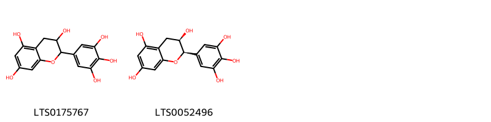{ width=100% }
    <figcaption>Hình ảnh cấu trúc hóa học của 2 hoạt chất thuộc nhóm Flavonoids gồm ['epigallocatechin (LTS0175767)', 'epigallocatechin (LTS0052496)'].</figcaption>
</figure>
#### Nhóm Imidazopyrimidines
<figure markdown="span">
    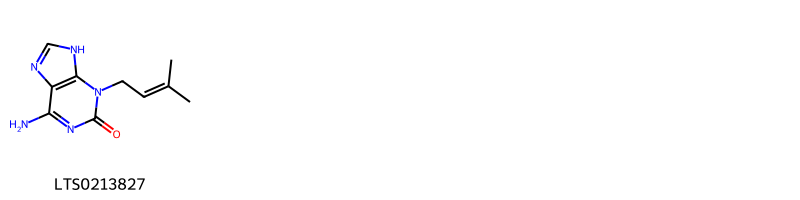{ width=100% }
    <figcaption>Hình ảnh cấu trúc hóa học của 1 hoạt chất thuộc nhóm Imidazopyrimidines gồm ['6-amino-3-(3-methylbut-2-en-1-yl)-9h-purin-2-one (LTS0213827)'].</figcaption>
</figure>
#### Nhóm Organooxygen compounds
<figure markdown="span">
    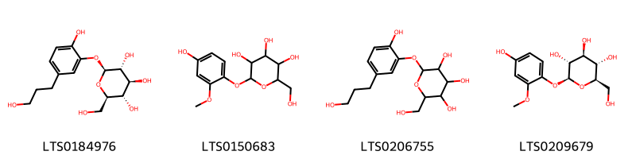{ width=100% }
    <figcaption>Hình ảnh cấu trúc hóa học của 4 hoạt chất thuộc nhóm Organooxygen compounds gồm ['(2s,3r,4s,5s,6r)-2-[2-hydroxy-5-(3-hydroxypropyl)phenoxy]-6-(hydroxymethyl)oxane-3,4,5-triol (LTS0184976)', '2-(4-hydroxy-2-methoxyphenoxy)-6-(hydroxymethyl)oxane-3,4,5-triol (LTS0150683)', '2-[2-hydroxy-5-(3-hydroxypropyl)phenoxy]-6-(hydroxymethyl)oxane-3,4,5-triol (LTS0206755)', '(2s,3r,4s,5s,6r)-2-(4-hydroxy-2-methoxyphenoxy)-6-(hydroxymethyl)oxane-3,4,5-triol (LTS0209679)'].</figcaption>
</figure>
#### Nhóm Prenol lipids
<figure markdown="span">
    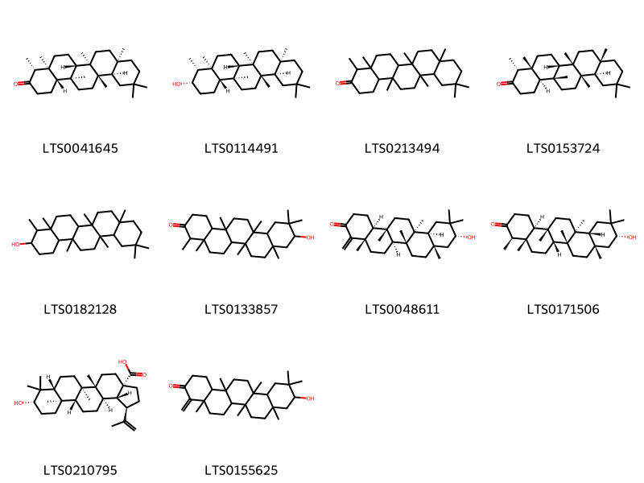{ width=100% }
    <figcaption>Hình ảnh cấu trúc hóa học của 10 hoạt chất thuộc nhóm Prenol lipids gồm ['(-)-friedelin (LTS0041645)', 'epi-friedelanol (LTS0114491)', 'friedelin (LTS0213494)', '(4r,4ar,6as,6bs,8as,12ar,12bs,14ar,14br)-4,4a,6b,8a,11,11,12b,14a-octamethyl-tetradecahydro-1h-picen-3-one (LTS0153724)', '4,4a,6b,8a,11,11,12b,14a-octamethyl-hexadecahydropicen-3-ol (LTS0182128)', '10-hydroxy-4,4a,6b,8a,11,11,12b,14a-octamethyl-tetradecahydro-1h-picen-3-one (LTS0133857)', '(4as,6as,6br,8as,10r,12as,12bs,14ar,14bs)-10-hydroxy-4a,6b,8a,11,11,12b,14a-heptamethyl-4-methylidene-tetradecahydropicen-3-one (LTS0048611)', '(4r,4as,6ar,6br,8as,10r,12ar,12bs,14as,14bs)-10-hydroxy-4,4a,6b,8a,11,11,12b,14a-octamethyl-tetradecahydro-1h-picen-3-one (LTS0171506)', 'betulinic acid (LTS0210795)', '10-hydroxy-4a,6b,8a,11,11,12b,14a-heptamethyl-4-methylidene-tetradecahydropicen-3-one (LTS0155625)'].</figcaption>
</figure>
#### Nhóm Steroids and steroid derivatives
<figure markdown="span">
    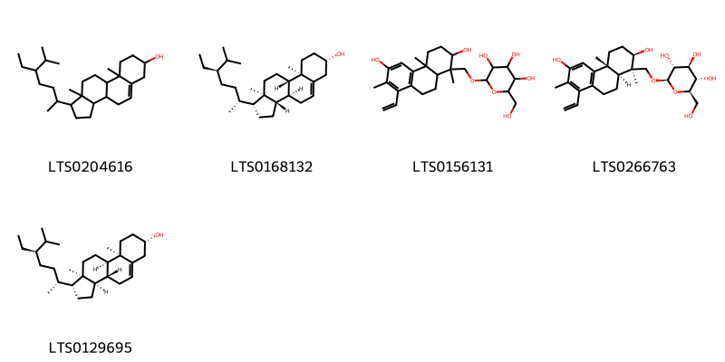{ width=100% }
    <figcaption>Hình ảnh cấu trúc hóa học của 5 hoạt chất thuộc nhóm Steroids and steroid derivatives gồm ['stigmast-5-en-3-ol, (3β)- (LTS0204616)', 'sitosterol (LTS0168132)', '2-[(8-ethenyl-2,6-dihydroxy-1,4a,7-trimethyl-2,3,4,9,10,10a-hexahydrophenanthren-1-yl)methoxy]-6-(hydroxymethyl)oxane-3,4,5-triol (LTS0156131)', '(2r,3r,4s,5s,6r)-2-{[(1r,2r,4ar,10as)-8-ethenyl-2,6-dihydroxy-1,4a,7-trimethyl-2,3,4,9,10,10a-hexahydrophenanthren-1-yl]methoxy}-6-(hydroxymethyl)oxane-3,4,5-triol (LTS0266763)', '(1r,3ar,3br,7s,9ar,9br,11ar)-1-[(2r,5r)-5-ethyl-6-methylheptan-2-yl]-9a,11a-dimethyl-1h,2h,3h,3ah,3bh,4h,6h,7h,8h,9h,9bh,10h,11h-cyclopenta[a]phenanthren-7-ol (LTS0129695)'].</figcaption>
</figure>

---

### Dược dân tộc học

Danh sách các quốc gia có sử dụng *Phyllanthus reticulatus* trong điều trị các bệnh. 

| Country   | Disease               | Bệnh                          |
|:----------|:----------------------|:------------------------------|
| Sudan     | Diuretic, Refrigerant | Thuốc lợi tiểu, Chất làm lạnh |

---

---
## Phyllanthus salviaefolius
### Thông tin về thực vật

!!! info "Phân loại thực vật của *Phyllanthus salviifolius* từ GIBF:"
    - **Kingdom:** Plantae
    - **Phylum:** Tracheophyta
    - **Order:** Malpighiales
    - **Family:** Phyllanthaceae
    - **Genus:** Phyllanthus
    - **Species:** *Phyllanthus salviifolius*

 

| Label (VI)   | Label (EN)   | Scientific Name         | Descriptions (VI)   | Descriptions (EN)   | Also Known As (VI)   | Also Known As (EN)   |
|:-------------|:-------------|:------------------------|:--------------------|:--------------------|:---------------------|:---------------------|
| N/A          | N/A          | Phyllanthus reticulatus | loài thực vật       | species of plant    | ['']                 | ['']                 |

#### Phân bố trên thế giới

**Từ CSDL GIBF** Ecuador, Colombia

#### Phân bố tại Việt Nam

**Từ CSDL GIBF**: Không có ghi nhận ở Việt Nam

---
### Thành phần hóa học
        
- Theo cơ sở dữ liệu lotus: Từ loài *Phyllanthus salviifolius* đã phân lập và xác định được Chưa có hoạt chất nào được phân lập. hoạt chất thuộc về các nhóm Không có hoạt chất nào được phân lập. 

Không có hình ảnh nào được tạo ra

---

### Dược dân tộc học

Danh sách các quốc gia có sử dụng *Phyllanthus salviifolius* trong điều trị các bệnh. 

| Country   | Disease     | Bệnh    |
|:----------|:------------|:--------|
| Venezuela | Suppurative | viêm mủ |

---

---
## Phyllanthus simplex
### Thông tin về thực vật

!!! info "Phân loại thực vật của *Phyllanthus virgatus* từ GIBF:"
    - **Kingdom:** Plantae
    - **Phylum:** Tracheophyta
    - **Order:** Malpighiales
    - **Family:** Phyllanthaceae
    - **Genus:** Phyllanthus
    - **Species:** *Phyllanthus virgatus*

 

| Label (VI)   | Label (EN)   | Scientific Name     | Descriptions (VI)   | Descriptions (EN)   | Also Known As (VI)   | Also Known As (EN)   |
|:-------------|:-------------|:--------------------|:--------------------|:--------------------|:---------------------|:---------------------|
| N/A          | N/A          | Phyllanthus simplex |                     |                     | ['']                 | ['']                 |

#### Phân bố trên thế giới

**Từ CSDL GIBF** nan, Sri Lanka, Australia, Japan, Wallis and Futuna, Myanmar, Pakistan, Chinese Taipei, Papua New Guinea, Thailand, Guam, New Caledonia, China, French Polynesia, Niue, India, Indonesia, Philippines, Malaysia, Nepal

#### Phân bố tại Việt Nam

**Từ CSDL GIBF**: Không có ghi nhận ở Việt Nam

---
### Thành phần hóa học
        
- Theo cơ sở dữ liệu lotus: Từ loài *Phyllanthus virgatus* đã phân lập và xác định được Chưa có hoạt chất nào được phân lập. hoạt chất thuộc về các nhóm Không có hoạt chất nào được phân lập. 

Không có hình ảnh nào được tạo ra

---

### Dược dân tộc học

Danh sách các quốc gia có sử dụng *Phyllanthus virgatus* trong điều trị các bệnh. 

| Country   | Disease    | Bệnh          |
|:----------|:-----------|:--------------|
| Elsewhere | Antiseptic | Khử trùng     |
| India     | Antiseptic | Khử trùng     |
| Samoa     | Piscicide  | Thuốc diệt cá |

---

---
## Phyllanthus stipulatus
### Thông tin về thực vật

!!! info "Phân loại thực vật của *Phyllanthus stipulatus* từ GIBF:"
    - **Kingdom:** Plantae
    - **Phylum:** Tracheophyta
    - **Order:** Malpighiales
    - **Family:** Phyllanthaceae
    - **Genus:** Phyllanthus
    - **Species:** *Phyllanthus stipulatus*

 

| Label (VI)   | Label (EN)   | Scientific Name        | Descriptions (VI)   | Descriptions (EN)   | Also Known As (VI)   | Also Known As (EN)   |
|:-------------|:-------------|:-----------------------|:--------------------|:--------------------|:---------------------|:---------------------|
| N/A          | N/A          | Phyllanthus stipulatus |                     | species of plant    | ['']                 | ['']                 |

#### Phân bố trên thế giới

**Từ CSDL GIBF** Colombia, Brazil, French Guiana, Nicaragua

#### Phân bố tại Việt Nam

**Từ CSDL GIBF**: Không có ghi nhận ở Việt Nam

---
### Thành phần hóa học
        
- Theo cơ sở dữ liệu lotus: Từ loài *Phyllanthus stipulatus* đã phân lập và xác định được Chưa có hoạt chất nào được phân lập. hoạt chất thuộc về các nhóm Không có hoạt chất nào được phân lập. 

Không có hình ảnh nào được tạo ra

---

### Dược dân tộc học

Danh sách các quốc gia có sử dụng *Phyllanthus stipulatus* trong điều trị các bệnh. 

| Country   | Disease             | Bệnh                     |
|:----------|:--------------------|:-------------------------|
| Haiti     | Diuretic, Digestive | Thuốc lợi tiểu, Tiêu hóa |

---

---
## Phyllanthus stolzianus
### Thông tin về thực vật

!!! info "Phân loại thực vật của *Phyllanthus welwitschianus* từ GIBF:"
    - **Kingdom:** Plantae
    - **Phylum:** Tracheophyta
    - **Order:** Malpighiales
    - **Family:** Phyllanthaceae
    - **Genus:** Phyllanthus
    - **Species:** *Phyllanthus welwitschianus*

 

| Label (VI)   | Label (EN)   | Scientific Name        | Descriptions (VI)   | Descriptions (EN)   | Also Known As (VI)   | Also Known As (EN)   |
|:-------------|:-------------|:-----------------------|:--------------------|:--------------------|:---------------------|:---------------------|
| N/A          | N/A          | Phyllanthus stipulatus |                     | species of plant    | ['']                 | ['']                 |

#### Phân bố trên thế giới

**Từ CSDL GIBF** Congo, Angola, Congo, Democratic Republic of the

#### Phân bố tại Việt Nam

**Từ CSDL GIBF**: Không có ghi nhận ở Việt Nam

---
### Thành phần hóa học
        
- Theo cơ sở dữ liệu lotus: Từ loài *Phyllanthus welwitschianus* đã phân lập và xác định được Chưa có hoạt chất nào được phân lập. hoạt chất thuộc về các nhóm Không có hoạt chất nào được phân lập. 

Không có hình ảnh nào được tạo ra

---

### Dược dân tộc học

Danh sách các quốc gia có sử dụng *Phyllanthus welwitschianus* trong điều trị các bệnh. 

| Country   | Disease     | Bệnh           |
|:----------|:------------|:---------------|
| Kenya     | Aphrodisiac | Thuốc kích dục |

---

---
## Phyllanthus urinaria
### Thông tin về thực vật

!!! info "Phân loại thực vật của *Phyllanthus urinaria* từ GIBF:"
    - **Kingdom:** Plantae
    - **Phylum:** Tracheophyta
    - **Order:** Malpighiales
    - **Family:** Phyllanthaceae
    - **Genus:** Phyllanthus
    - **Species:** *Phyllanthus urinaria*

 

| Label (VI)   | Label (EN)   | Scientific Name      | Descriptions (VI)   | Descriptions (EN)      | Also Known As (VI)                                                                                                                                       | Also Known As (EN)   |
|:-------------|:-------------|:---------------------|:--------------------|:-----------------------|:---------------------------------------------------------------------------------------------------------------------------------------------------------|:---------------------|
| N/A          | N/A          | Phyllanthus urinaria | loài thực vật       | species of plant, herb | ['Trân châu thảo', 'Phyllanthus urinaria', 'Nhật khai dạ bế', 'Diệp hậu châu', 'Diệp hạ châu đắng', 'Diệp hạ châu', 'Cây chó đẻ răng cưa', 'Cây chó đẻ'] | ['']                 |

#### Phân bố trên thế giới

**Từ CSDL GIBF** Puerto Rico, Malaysia, Japan, Thailand, Chinese Taipei, Brazil, Costa Rica, India, Indonesia, United States of America, Singapore, El Salvador, China, French Guiana

#### Phân bố tại Việt Nam

**Từ CSDL GIBF**: Không có ghi nhận ở Việt Nam

---
### Thành phần hóa học
        
- Theo cơ sở dữ liệu lotus: Từ loài *Phyllanthus urinaria* đã phân lập và xác định được 74 hoạt chất thuộc về các nhóm Fatty Acyls, Flavonoids, Prenol lipids, Steroids and steroid derivatives, Cinnamic acids and derivatives, Dibenzylbutane lignans, Isocoumarins and derivatives, Benzene and substituted derivatives, Organooxygen compounds, Tannins, Aryltetralin lignans, Furanoid lignans, Carboxylic acids and derivatives. 

|    | chemicalTaxonomyClassyfireClass     |   smiles_count |
|---:|:------------------------------------|---------------:|
|  0 | Aryltetralin lignans                |             15 |
|  1 | Benzene and substituted derivatives |              6 |
|  2 | Carboxylic acids and derivatives    |              3 |
|  3 | Cinnamic acids and derivatives      |              2 |
|  4 | Dibenzylbutane lignans              |              8 |
|  5 | Fatty Acyls                         |              3 |
|  6 | Flavonoids                          |              1 |
|  7 | Furanoid lignans                    |             11 |
|  8 | Isocoumarins and derivatives        |              1 |
|  9 | Organooxygen compounds              |              4 |
| 10 | Prenol lipids                       |              7 |
| 11 | Steroids and steroid derivatives    |              4 |
| 12 | Tannins                             |              8 |

#### Nhóm Aryltetralin lignans
<figure markdown="span">
    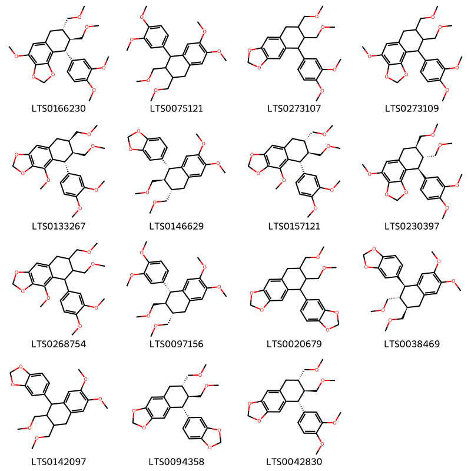{ width=100% }
    <figcaption>Hình ảnh cấu trúc hóa học của 15 hoạt chất thuộc nhóm Aryltetralin lignans gồm ['(7s,8s,9r)-9-(3,4-dimethoxyphenyl)-4-methoxy-7,8-bis(methoxymethyl)-2h,6h,7h,8h,9h-naphtho[1,2-d][1,3]dioxole (LTS0166230)', '1-(3,4-dimethoxyphenyl)-6,7-dimethoxy-2,3-bis(methoxymethyl)-1,2,3,4-tetrahydronaphthalene (LTS0075121)', '5-(3,4-dimethoxyphenyl)-6,7-bis(methoxymethyl)-2h,5h,6h,7h,8h-naphtho[2,3-d][1,3]dioxole (LTS0273107)', '9-(3,4-dimethoxyphenyl)-4-methoxy-7,8-bis(methoxymethyl)-2h,6h,7h,8h,9h-naphtho[1,2-d][1,3]dioxole (LTS0273109)', '(5r,6s,7r)-5-(3,4-dimethoxyphenyl)-4-methoxy-6,7-bis(methoxymethyl)-2h,5h,6h,7h,8h-naphtho[2,3-d][1,3]dioxole (LTS0133267)', '5-[(1r,2s,3s)-6,7-dimethoxy-2,3-bis(methoxymethyl)-1,2,3,4-tetrahydronaphthalen-1-yl]-2h-1,3-benzodioxole (LTS0146629)', '(5r,6s,7s)-5-(3,4-dimethoxyphenyl)-4-methoxy-6,7-bis(methoxymethyl)-2h,5h,6h,7h,8h-naphtho[2,3-d][1,3]dioxole (LTS0157121)', 'hypophyllanthin (LTS0230397)', '5-(3,4-dimethoxyphenyl)-4-methoxy-6,7-bis(methoxymethyl)-2h,5h,6h,7h,8h-naphtho[2,3-d][1,3]dioxole (LTS0268754)', '(1r,2s,3s)-1-(3,4-dimethoxyphenyl)-6,7-dimethoxy-2,3-bis(methoxymethyl)-1,2,3,4-tetrahydronaphthalene (LTS0097156)', '5-[6,7-bis(methoxymethyl)-2h,5h,6h,7h,8h-naphtho[2,3-d][1,3]dioxol-5-yl]-2h-1,3-benzodioxole (LTS0020679)', '5-[(1s,2r,3r)-6,7-dimethoxy-2,3-bis(methoxymethyl)-1,2,3,4-tetrahydronaphthalen-1-yl]-2h-1,3-benzodioxole (LTS0038469)', '5-[6,7-dimethoxy-2,3-bis(methoxymethyl)-1,2,3,4-tetrahydronaphthalen-1-yl]-2h-1,3-benzodioxole (LTS0142097)', '5-[(5r,6s,7s)-6,7-bis(methoxymethyl)-2h,5h,6h,7h,8h-naphtho[2,3-d][1,3]dioxol-5-yl]-2h-1,3-benzodioxole (LTS0094358)', '(5r,6s,7s)-5-(3,4-dimethoxyphenyl)-6,7-bis(methoxymethyl)-2h,5h,6h,7h,8h-naphtho[2,3-d][1,3]dioxole (LTS0042830)'].</figcaption>
</figure>
#### Nhóm Benzene and substituted derivatives
<figure markdown="span">
    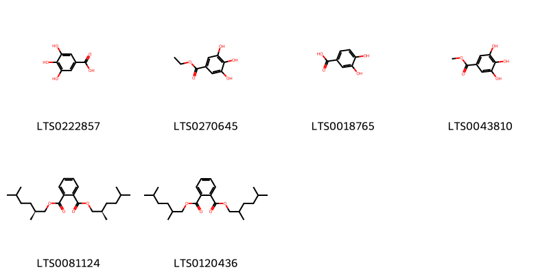{ width=100% }
    <figcaption>Hình ảnh cấu trúc hóa học của 6 hoạt chất thuộc nhóm Benzene and substituted derivatives gồm ['galop (LTS0222857)', 'ethyl gallate (LTS0270645)', '3,4-dihydroxybenzoic acid (LTS0018765)', 'methyl gallate (LTS0043810)', '1-(2r)-2,5-dimethylhexyl 2-(2s)-2,5-dimethylhexyl phthalate (LTS0081124)', '1,2-bis(2,5-dimethylhexyl) phthalate (LTS0120436)'].</figcaption>
</figure>
#### Nhóm Carboxylic acids and derivatives
<figure markdown="span">
    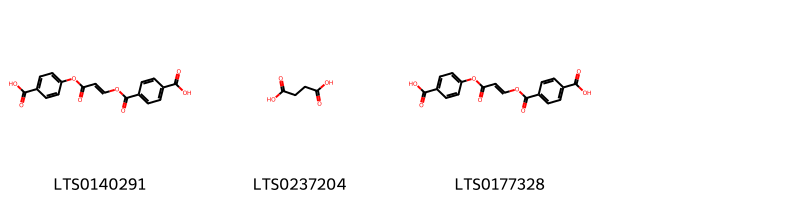{ width=100% }
    <figcaption>Hình ảnh cấu trúc hóa học của 3 hoạt chất thuộc nhóm Carboxylic acids and derivatives gồm ['4-({[(1e)-3-(4-carboxyphenoxy)-3-oxoprop-1-en-1-yl]oxy}carbonyl)benzoic acid (LTS0140291)', 'succinic acid (LTS0237204)', '4-({[3-(4-carboxyphenoxy)-3-oxoprop-1-en-1-yl]oxy}carbonyl)benzoic acid (LTS0177328)'].</figcaption>
</figure>
#### Nhóm Cinnamic acids and derivatives
<figure markdown="span">
    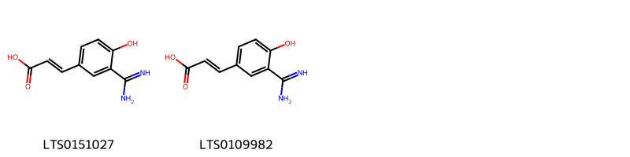{ width=100% }
    <figcaption>Hình ảnh cấu trúc hóa học của 2 hoạt chất thuộc nhóm Cinnamic acids and derivatives gồm ['(2e)-3-(3-carbamimidoyl-4-hydroxyphenyl)prop-2-enoic acid (LTS0151027)', '3-(3-carbamimidoyl-4-hydroxyphenyl)prop-2-enoic acid (LTS0109982)'].</figcaption>
</figure>
#### Nhóm Dibenzylbutane lignans
<figure markdown="span">
    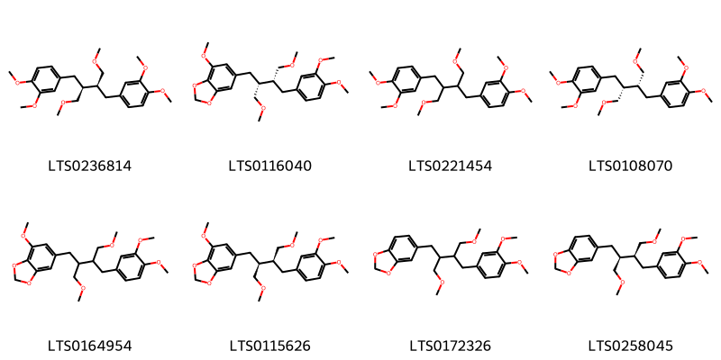{ width=100% }
    <figcaption>Hình ảnh cấu trúc hóa học của 8 hoạt chất thuộc nhóm Dibenzylbutane lignans gồm ['phyllanthin (LTS0236814)', '6-[(2r,3r)-3-[(3,4-dimethoxyphenyl)methyl]-4-methoxy-2-(methoxymethyl)butyl]-4-methoxy-2h-1,3-benzodioxole (LTS0116040)', '4-{3-[(3,4-dimethoxyphenyl)methyl]-4-methoxy-2-(methoxymethyl)butyl}-1,2-dimethoxybenzene (LTS0221454)', '4-[(2r,3r)-3-[(3,4-dimethoxyphenyl)methyl]-4-methoxy-2-(methoxymethyl)butyl]-1,2-dimethoxybenzene (LTS0108070)', '6-{3-[(3,4-dimethoxyphenyl)methyl]-4-methoxy-2-(methoxymethyl)butyl}-4-methoxy-2h-1,3-benzodioxole (LTS0164954)', '6-[(2s,3s)-3-[(3,4-dimethoxyphenyl)methyl]-4-methoxy-2-(methoxymethyl)butyl]-4-methoxy-2h-1,3-benzodioxole (LTS0115626)', '5-{3-[(3,4-dimethoxyphenyl)methyl]-4-methoxy-2-(methoxymethyl)butyl}-2h-1,3-benzodioxole (LTS0172326)', '5-[(2s,3s)-3-[(3,4-dimethoxyphenyl)methyl]-4-methoxy-2-(methoxymethyl)butyl]-2h-1,3-benzodioxole (LTS0258045)'].</figcaption>
</figure>
#### Nhóm Fatty Acyls
<figure markdown="span">
    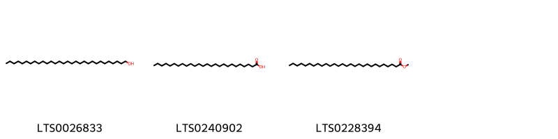{ width=100% }
    <figcaption>Hình ảnh cấu trúc hóa học của 3 hoạt chất thuộc nhóm Fatty Acyls gồm ['triacontanol (LTS0026833)', 'hexacosanoic acid (LTS0240902)', 'methyl octacosanoate (LTS0228394)'].</figcaption>
</figure>
#### Nhóm Flavonoids
<figure markdown="span">
    { width=100% }
    <figcaption>Hình ảnh cấu trúc hóa học của 1 hoạt chất thuộc nhóm Flavonoids gồm ['3-rutinosyl quercetin (LTS0032845)'].</figcaption>
</figure>
#### Nhóm Furanoid lignans
<figure markdown="span">
    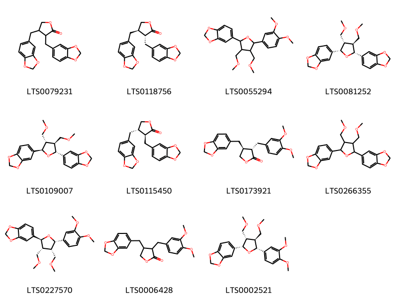{ width=100% }
    <figcaption>Hình ảnh cấu trúc hóa học của 11 hoạt chất thuộc nhóm Furanoid lignans gồm ['3,4-bis(2h-1,3-benzodioxol-5-ylmethyl)oxolan-2-one (LTS0079231)', 'hinokinin (LTS0118756)', '5-[5-(3,4-dimethoxyphenyl)-3,4-bis(methoxymethyl)oxolan-2-yl]-2h-1,3-benzodioxole (LTS0055294)', '5-[(2s,3s,4s,5r)-5-(2h-1,3-benzodioxol-5-yl)-3,4-bis(methoxymethyl)oxolan-2-yl]-2h-1,3-benzodioxole (LTS0081252)', '5-[(2r,3s,4s,5r)-5-(2h-1,3-benzodioxol-5-yl)-3,4-bis(methoxymethyl)oxolan-2-yl]-2h-1,3-benzodioxole (LTS0109007)', '(3s,4s)-3,4-bis(2h-1,3-benzodioxol-5-ylmethyl)oxolan-2-one (LTS0115450)', '(3s,4s)-4-(2h-1,3-benzodioxol-5-ylmethyl)-3-[(3,4-dimethoxyphenyl)methyl]oxolan-2-one (LTS0173921)', '5-[5-(2h-1,3-benzodioxol-5-yl)-3,4-bis(methoxymethyl)oxolan-2-yl]-2h-1,3-benzodioxole (LTS0266355)', '5-[(2s,3r,4s,5s)-5-(3,4-dimethoxyphenyl)-3,4-bis(methoxymethyl)oxolan-2-yl]-2h-1,3-benzodioxole (LTS0227570)', '4-(2h-1,3-benzodioxol-5-ylmethyl)-3-[(3,4-dimethoxyphenyl)methyl]oxolan-2-one (LTS0006428)', '5-[(2s,3s,4s,5r)-5-(3,4-dimethoxyphenyl)-3,4-bis(methoxymethyl)oxolan-2-yl]-2h-1,3-benzodioxole (LTS0002521)'].</figcaption>
</figure>
#### Nhóm Isocoumarins and derivatives
<figure markdown="span">
    { width=100% }
    <figcaption>Hình ảnh cấu trúc hóa học của 1 hoạt chất thuộc nhóm Isocoumarins and derivatives gồm ['7,8,9-trihydroxy-3,5-dioxo-1h,2h-cyclopenta[c]isochromene-1-carboxylic acid (LTS0239831)'].</figcaption>
</figure>
#### Nhóm Organooxygen compounds
<figure markdown="span">
    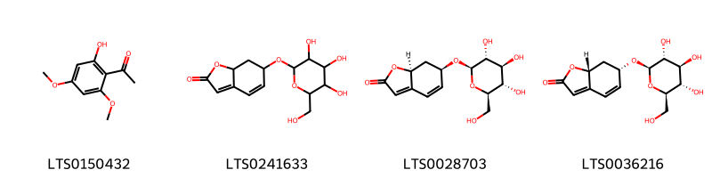{ width=100% }
    <figcaption>Hình ảnh cấu trúc hóa học của 4 hoạt chất thuộc nhóm Organooxygen compounds gồm ['xanthoxylin (LTS0150432)', '6-{[3,4,5-trihydroxy-6-(hydroxymethyl)oxan-2-yl]oxy}-7,7a-dihydro-6h-1-benzofuran-2-one (LTS0241633)', '(6r,7as)-6-{[(2r,3r,4s,5s,6r)-3,4,5-trihydroxy-6-(hydroxymethyl)oxan-2-yl]oxy}-7,7a-dihydro-6h-1-benzofuran-2-one (LTS0028703)', '(6s,7ar)-6-{[(2r,3r,4s,5s,6r)-3,4,5-trihydroxy-6-(hydroxymethyl)oxan-2-yl]oxy}-7,7a-dihydro-6h-1-benzofuran-2-one (LTS0036216)'].</figcaption>
</figure>
#### Nhóm Prenol lipids
<figure markdown="span">
    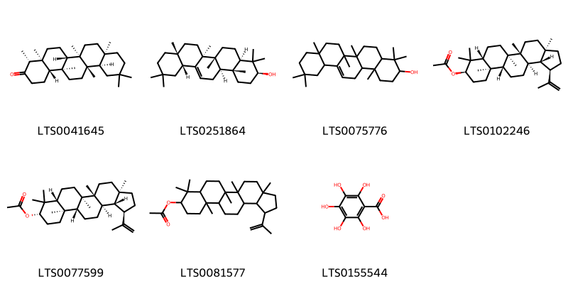{ width=100% }
    <figcaption>Hình ảnh cấu trúc hóa học của 7 hoạt chất thuộc nhóm Prenol lipids gồm ['(-)-friedelin (LTS0041645)', 'β-amyrin (LTS0251864)', 'β-amyrin (LTS0075776)', '(1r,3ar,5ar,5br,7ar,9r,11ar,11br,13ar,13br)-3a,5a,5b,8,8,11a-hexamethyl-1-(prop-1-en-2-yl)-hexadecahydrocyclopenta[a]chrysen-9-yl acetate (LTS0102246)', 'lupeol acetate (LTS0077599)', '3a,5a,5b,8,8,11a-hexamethyl-1-(prop-1-en-2-yl)-hexadecahydrocyclopenta[a]chrysen-9-yl acetate (LTS0081577)', 'pentahydroxybenzoic acid (LTS0155544)'].</figcaption>
</figure>
#### Nhóm Steroids and steroid derivatives
<figure markdown="span">
    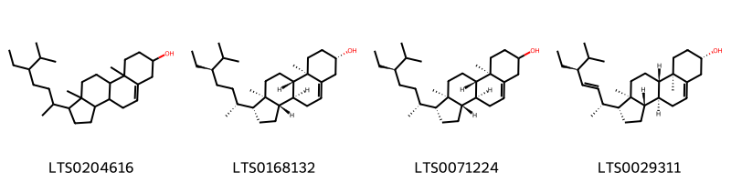{ width=100% }
    <figcaption>Hình ảnh cấu trúc hóa học của 4 hoạt chất thuộc nhóm Steroids and steroid derivatives gồm ['stigmast-5-en-3-ol, (3β)- (LTS0204616)', 'sitosterol (LTS0168132)', 'stigmast-5-en-3-ol (LTS0071224)', 'phytosterol (LTS0029311)'].</figcaption>
</figure>
#### Nhóm Tannins
<figure markdown="span">
    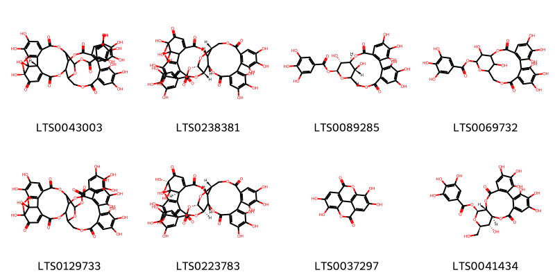{ width=100% }
    <figcaption>Hình ảnh cấu trúc hóa học của 8 hoạt chất thuộc nhóm Tannins gồm ['(1r,38r)-1,13,14,15,18,19,20,34,35,39,39-undecahydroxy-2,5,10,23,31-pentaoxo-6,9,24,27,30,40-hexaoxaoctacyclo[34.3.1.0⁴,³⁸.0⁷,²⁶.0⁸,²⁹.0¹¹,¹⁶.0¹⁷,²².0³²,³⁷]tetraconta-3,11(16),12,14,17,19,21,32,34,36-decaen-28-yl 3,4,5-trihydroxybenzoate (LTS0043003)', '(7r,8s,26r,28s,29s)-1,13,14,15,18,19,20,34,35,39,39-undecahydroxy-2,5,10,23,31-pentaoxo-6,9,24,27,30,40-hexaoxaoctacyclo[34.3.1.0⁴,³⁸.0⁷,²⁶.0⁸,²⁹.0¹¹,¹⁶.0¹⁷,²².0³²,³⁷]tetraconta-3,11,13,15,17(22),18,20,32,34,36-decaen-28-yl 3,4,5-trihydroxybenzoate (LTS0238381)', '(1s,19r,21s,22r,23r)-6,7,8,11,12,13,22,23-octahydroxy-3,16-dioxo-2,17,20-trioxatetracyclo[17.3.1.0⁴,⁹.0¹⁰,¹⁵]tricosa-4(9),5,7,10,12,14-hexaen-21-yl 3,4,5-trihydroxybenzoate (LTS0089285)', '6,7,8,11,12,13,22,23-octahydroxy-3,16-dioxo-2,17,20-trioxatetracyclo[17.3.1.0⁴,⁹.0¹⁰,¹⁵]tricosa-4(9),5,7,10,12,14-hexaen-21-yl 3,4,5-trihydroxybenzoate (LTS0069732)', '1,13,14,15,18,19,20,34,35,39,39-undecahydroxy-2,5,10,23,31-pentaoxo-6,9,24,27,30,40-hexaoxaoctacyclo[34.3.1.0⁴,³⁸.0⁷,²⁶.0⁸,²⁹.0¹¹,¹⁶.0¹⁷,²².0³²,³⁷]tetraconta-3,11(16),12,14,17,19,21,32,34,36-decaen-28-yl 3,4,5-trihydroxybenzoate (LTS0129733)', '(1r,7r,8s,26r,28s,29r,38r)-1,13,14,15,18,19,20,34,35,39,39-undecahydroxy-2,5,10,23,31-pentaoxo-6,9,24,27,30,40-hexaoxaoctacyclo[34.3.1.0⁴,³⁸.0⁷,²⁶.0⁸,²⁹.0¹¹,¹⁶.0¹⁷,²².0³²,³⁷]tetraconta-3,11,13,15,17(22),18,20,32,34,36-decaen-28-yl 3,4,5-trihydroxybenzoate (LTS0223783)', 'ellagic acid (LTS0037297)', '(10r,11s,13r,14r,15s)-3,4,5,14,20,21,22-heptahydroxy-13-(hydroxymethyl)-8,17-dioxo-9,12,16-trioxatetracyclo[16.4.0.0²,⁷.0¹⁰,¹⁵]docosa-1(22),2(7),3,5,18,20-hexaen-11-yl 3,4,5-trihydroxybenzoate (LTS0041434)'].</figcaption>
</figure>

---

### Dược dân tộc học

Danh sách các quốc gia có sử dụng *Phyllanthus urinaria* trong điều trị các bệnh. 

| Country   | Disease                                                                           | Bệnh                                                                                              |
|:----------|:----------------------------------------------------------------------------------|:--------------------------------------------------------------------------------------------------|
| China     | Diuretic, Vermifuge                                                               | Thuốc lợi tiểu, thuốc diệt giun sán                                                               |
| Elsewhere | Antiseptic, Apertif, Astringent, nan, Refrigerant, Piscicide, Diuretic, Stomachic | Khử trùng, Apertif, Chất làm se, nan, Chất làm lạnh, Thuốc diệt côn trùng, Thuốc lợi tiểu, Dạ dày |
| India     | Piscicide                                                                         | Thuốc diệt cá                                                                                     |
| Malaya    | Diuretic, Piscicide                                                               | Thuốc lợi tiểu, thuốc diệt côn trùng                                                              |

---

# Chi Excoecaria

??? note "Danh sách các dược liệu thuộc chi"
    
	 - *Excoecaria agallocha*
	 - *Excoecaria cochinchinensis*
	 - *Excoecaria venenifera*

---
## Excoecaria agallocha
### Thông tin về thực vật

!!! info "Phân loại thực vật của *Excoecaria agallocha* từ GIBF:"
    - **Kingdom:** Plantae
    - **Phylum:** Tracheophyta
    - **Order:** Malpighiales
    - **Family:** Euphorbiaceae
    - **Genus:** Excoecaria
    - **Species:** *Excoecaria agallocha*

 

| Label (VI)   | Label (EN)   | Scientific Name      | Descriptions (VI)   | Descriptions (EN)   | Also Known As (VI)   | Also Known As (EN)   |
|:-------------|:-------------|:---------------------|:--------------------|:--------------------|:---------------------|:---------------------|
| N/A          | N/A          | Excoecaria agallocha | loài thực vật       | species of plant    | ['']                 | ['Gewa']             |

#### Phân bố trên thế giới

**Từ CSDL GIBF** nan, Hong Kong, Australia, Japan, Thailand, Chinese Taipei, India, Indonesia, New Caledonia, Tonga, Singapore, Viet Nam, China

#### Phân bố tại Việt Nam

**Từ CSDL GIBF**: Kiên Giang

---
### Thành phần hóa học
        
- Theo cơ sở dữ liệu lotus: Từ loài *Excoecaria agallocha* đã phân lập và xác định được 277 hoạt chất thuộc về các nhóm Fatty Acyls, Flavonoids, Prenol lipids, Steroids and steroid derivatives, Oxanes, Cinnamic acids and derivatives, Benzene and substituted derivatives, Lactones, Tannins, Organooxygen compounds, Naphthopyrans, Carboxylic acids and derivatives, Benzopyrans. 

|    | chemicalTaxonomyClassyfireClass     |   smiles_count |
|---:|:------------------------------------|---------------:|
|  0 | Benzene and substituted derivatives |              4 |
|  1 | Benzopyrans                         |             18 |
|  2 | Carboxylic acids and derivatives    |             17 |
|  3 | Cinnamic acids and derivatives      |              2 |
|  4 | Fatty Acyls                         |             24 |
|  5 | Flavonoids                          |             39 |
|  6 | Lactones                            |             11 |
|  7 | Naphthopyrans                       |             19 |
|  8 | Organooxygen compounds              |              9 |
|  9 | Oxanes                              |              4 |
| 10 | Prenol lipids                       |            101 |
| 11 | Steroids and steroid derivatives    |              6 |
| 12 | Tannins                             |             23 |

#### Nhóm Benzene and substituted derivatives
<figure markdown="span">
    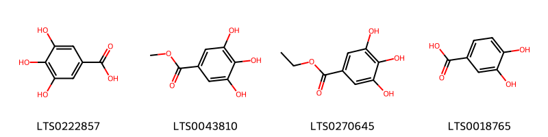{ width=100% }
    <figcaption>Hình ảnh cấu trúc hóa học của 4 hoạt chất thuộc nhóm Benzene and substituted derivatives gồm ['galop (LTS0222857)', 'methyl gallate (LTS0043810)', 'ethyl gallate (LTS0270645)', '3,4-dihydroxybenzoic acid (LTS0018765)'].</figcaption>
</figure>
#### Nhóm Benzopyrans
<figure markdown="span">
    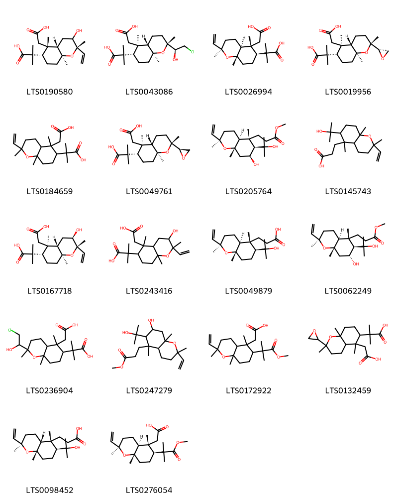{ width=100% }
    <figcaption>Hình ảnh cấu trúc hóa học của 18 hoạt chất thuộc nhóm Benzopyrans gồm ['2-[(2s,4as,5s,6s,8as)-5-(carboxymethyl)-2-ethenyl-3-hydroxy-2,5,8a-trimethyl-hexahydro-1-benzopyran-6-yl]-2-methylpropanoic acid (LTS0190580)', '2-[(2r,4as,5r,6s,8as)-5-(carboxymethyl)-2-[(1s)-2-chloro-1-hydroxyethyl]-2,5,8a-trimethyl-hexahydro-1-benzopyran-6-yl]-2-methylpropanoic acid (LTS0043086)', '2-[(2r,4as,5r,6s,8as)-5-(carboxymethyl)-2-ethenyl-2,5,8a-trimethyl-hexahydro-1-benzopyran-6-yl]-2-methylpropanoic acid (LTS0026994)', '2-[(2r,4as,5r,6s,8as)-5-(carboxymethyl)-2,5,8a-trimethyl-2-[(2s)-oxiran-2-yl]-hexahydro-1-benzopyran-6-yl]-2-methylpropanoic acid (LTS0019956)', '2-[5-(carboxymethyl)-2-ethenyl-2,5,8a-trimethyl-hexahydro-1-benzopyran-6-yl]-2-methylpropanoic acid (LTS0184659)', '2-[(2r,4as,5r,6s,8as)-5-(carboxymethyl)-2,5,8a-trimethyl-2-[(2r)-oxiran-2-yl]-hexahydro-1-benzopyran-6-yl]-2-methylpropanoic acid (LTS0049761)', 'methyl 3-[(2r,4as,5s,6r,7s,8as)-2-ethenyl-7-hydroxy-6-(2-hydroxypropan-2-yl)-2,5,8a-trimethyl-hexahydro-1-benzopyran-5-yl]propanoate (LTS0205764)', '3-[2-ethenyl-6-(2-hydroxypropan-2-yl)-2,5,8a-trimethyl-hexahydro-1-benzopyran-5-yl]propanoic acid (LTS0145743)', '2-[(2s,3r,4as,5r,6s,8as)-5-(carboxymethyl)-2-ethenyl-3-hydroxy-2,5,8a-trimethyl-hexahydro-1-benzopyran-6-yl]-2-methylpropanoic acid (LTS0167718)', '2-[5-(carboxymethyl)-2-ethenyl-3-hydroxy-2,5,8a-trimethyl-hexahydro-1-benzopyran-6-yl]-2-methylpropanoic acid (LTS0243416)', '3-[(2r,4as,5r,6s,8as)-2-ethenyl-6-(2-hydroxypropan-2-yl)-2,5,8a-trimethyl-hexahydro-1-benzopyran-5-yl]propanoic acid (LTS0049879)', 'methyl 3-[(2r,4as,5s,6r,7r,8as)-2-ethenyl-7-hydroxy-6-(2-hydroxypropan-2-yl)-2,5,8a-trimethyl-hexahydro-1-benzopyran-5-yl]propanoate (LTS0062249)', '2-[5-(carboxymethyl)-2-(2-chloro-1-hydroxyethyl)-2,5,8a-trimethyl-hexahydro-1-benzopyran-6-yl]-2-methylpropanoic acid (LTS0236904)', 'methyl 3-[2-ethenyl-7-hydroxy-6-(2-hydroxypropan-2-yl)-2,5,8a-trimethyl-hexahydro-1-benzopyran-5-yl]propanoate (LTS0247279)', '[2-ethenyl-6-(1-methoxy-2-methyl-1-oxopropan-2-yl)-2,5,8a-trimethyl-hexahydro-1-benzopyran-5-yl]acetic acid (LTS0172922)', '2-[5-(carboxymethyl)-2,5,8a-trimethyl-2-(oxiran-2-yl)-hexahydro-1-benzopyran-6-yl]-2-methylpropanoic acid (LTS0132459)', '3-[(2r,4ar,5r,6s,8as)-2-ethenyl-6-(2-hydroxypropan-2-yl)-2,5,8a-trimethyl-hexahydro-1-benzopyran-5-yl]propanoic acid (LTS0098452)', '[(2r,4as,5r,6s,8as)-2-ethenyl-6-(1-methoxy-2-methyl-1-oxopropan-2-yl)-2,5,8a-trimethyl-hexahydro-1-benzopyran-5-yl]acetic acid (LTS0276054)'].</figcaption>
</figure>
#### Nhóm Carboxylic acids and derivatives
<figure markdown="span">
    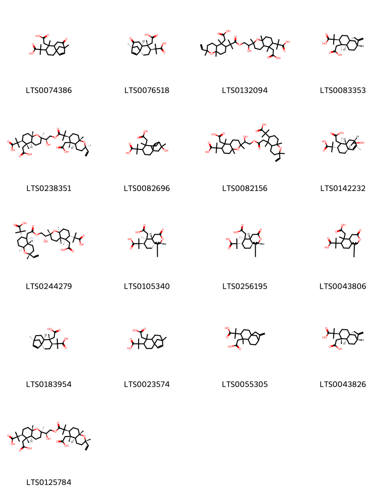{ width=100% }
    <figcaption>Hình ảnh cấu trúc hóa học của 17 hoạt chất thuộc nhóm Carboxylic acids and derivatives gồm ['2-[5-(carboxymethyl)-5,9-dimethyl-8-oxotricyclo[7.2.1.0¹,⁶]dodec-10-en-4-yl]-2-methylpropanoic acid (LTS0074386)', '2-[(1r,4s,5s,6s,9s)-5-(carboxymethyl)-5,9-dimethyl-8-oxotricyclo[7.2.1.0¹,⁶]dodec-10-en-4-yl]-2-methylpropanoic acid (LTS0076518)', '2-[5-(carboxymethyl)-2-[2-({2-[5-(carboxymethyl)-2-ethenyl-2,5,8a-trimethyl-hexahydro-1-benzopyran-6-yl]-2-methylpropanoyl}oxy)-1-hydroxyethyl]-2,5,8a-trimethyl-hexahydro-1-benzopyran-6-yl]-2-methylpropanoic acid (LTS0132094)', '2-[(1s,4s,5r,6r,9r)-5-(carboxymethyl)-5-methyl-10-methylidenetricyclo[7.2.1.0¹,⁶]dodecan-4-yl]-2-methylpropanoic acid (LTS0083353)', '2-[(2r,4as,5r,6s,8as)-2-[(1r)-2-({2-[(2r,4as,5r,6s,8as)-5-(carboxymethyl)-2-ethenyl-2,5,8a-trimethyl-hexahydro-1-benzopyran-6-yl]-2-methylpropanoyl}oxy)-1-hydroxyethyl]-5-(carboxymethyl)-2,5,8a-trimethyl-hexahydro-1-benzopyran-6-yl]-2-methylpropanoic acid (LTS0238351)', '2-[5-(carboxymethyl)-12-hydroxy-5,12-dimethyltricyclo[6.2.2.0¹,⁶]dodec-9-en-4-yl]-2-methylpropanoic acid (LTS0082696)', '2-[5-(2-{2-[6-(1-carboxy-1-methylethyl)-5-(carboxymethyl)-2,5,8a-trimethyl-hexahydro-1-benzopyran-2-yl]-2-hydroxyethoxy}-2-oxoethyl)-2-ethenyl-2,5,8a-trimethyl-hexahydro-1-benzopyran-6-yl]-2-methylpropanoic acid (LTS0082156)', '2-[(1r,4s,5s,6s,8r,12s)-5-(carboxymethyl)-12-hydroxy-5,12-dimethyltricyclo[6.2.2.0¹,⁶]dodec-9-en-4-yl]-2-methylpropanoic acid (LTS0142232)', '2-[(2r,4as,5r,6s,8as)-5-{2-[(2r)-2-[(2r,4as,5r,6s,8as)-6-(1-carboxy-1-methylethyl)-5-(carboxymethyl)-2,5,8a-trimethyl-hexahydro-1-benzopyran-2-yl]-2-hydroxyethoxy]-2-oxoethyl}-2-ethenyl-2,5,8a-trimethyl-hexahydro-1-benzopyran-6-yl]-2-methylpropanoic acid (LTS0244279)', '2-[(1r,5s,9s,10s,11r)-10-(carboxymethyl)-3,10-dimethyl-7-oxo-6-oxatricyclo[7.4.0.0¹,⁵]tridec-3-en-11-yl]-2-methylpropanoic acid (LTS0105340)', '2-[(1s,5s,9s,10s,11s)-10-(carboxymethyl)-3,10-dimethyl-7-oxo-6-oxatricyclo[7.4.0.0¹,⁵]tridec-3-en-11-yl]-2-methylpropanoic acid (LTS0256195)', '2-[10-(carboxymethyl)-3,10-dimethyl-7-oxo-6-oxatricyclo[7.4.0.0¹,⁵]tridec-3-en-11-yl]-2-methylpropanoic acid (LTS0043806)', '2-[(1r,4s,5s,6s,9s)-5-(carboxymethyl)-5,9-dimethyltricyclo[7.2.1.0¹,⁶]dodec-10-en-4-yl]-2-methylpropanoic acid (LTS0183954)', '2-[5-(carboxymethyl)-5,9-dimethyltricyclo[7.2.1.0¹,⁶]dodec-10-en-4-yl]-2-methylpropanoic acid (LTS0023574)', '2-[5-(carboxymethyl)-5-methyl-10-methylidenetricyclo[7.2.1.0¹,⁶]dodecan-4-yl]-2-methylpropanoic acid (LTS0055305)', '2-[(1s,4s,5s,6r,9r)-5-(carboxymethyl)-5-methyl-10-methylidenetricyclo[7.2.1.0¹,⁶]dodecan-4-yl]-2-methylpropanoic acid (LTS0043826)', '2-[(2r,4as,5r,6s,8as)-2-[(1r)-2-({2-[(2s,4as,5r,6s,8as)-5-(carboxymethyl)-2-ethenyl-2,5,8a-trimethyl-hexahydro-1-benzopyran-6-yl]-2-methylpropanoyl}oxy)-1-hydroxyethyl]-5-(carboxymethyl)-2,5,8a-trimethyl-hexahydro-1-benzopyran-6-yl]-2-methylpropanoic acid (LTS0125784)'].</figcaption>
</figure>
#### Nhóm Cinnamic acids and derivatives
<figure markdown="span">
    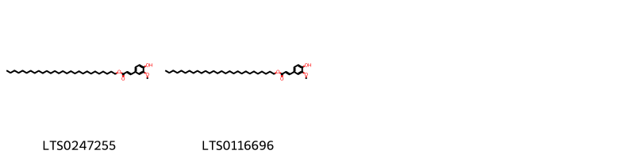{ width=100% }
    <figcaption>Hình ảnh cấu trúc hóa học của 2 hoạt chất thuộc nhóm Cinnamic acids and derivatives gồm ['octacosyl 3-(4-hydroxy-3-methoxyphenyl)prop-2-enoate (LTS0247255)', 'octacosyl (2e)-3-(4-hydroxy-3-methoxyphenyl)prop-2-enoate (LTS0116696)'].</figcaption>
</figure>
#### Nhóm Fatty Acyls
<figure markdown="span">
    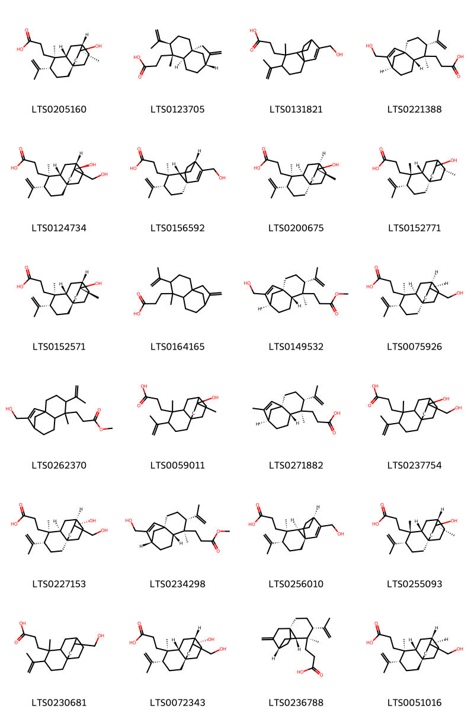{ width=100% }
    <figcaption>Hình ảnh cấu trúc hóa học của 24 hoạt chất thuộc nhóm Fatty Acyls gồm ['3-[(1s,4r,5r,6r,8s,9s)-9-hydroxy-5,9-dimethyl-4-(prop-1-en-2-yl)tricyclo[6.2.2.0¹,⁶]dodecan-5-yl]propanoic acid (LTS0205160)', '3-[(1s,4r,5r,6r,9r)-5-methyl-10-methylidene-4-(prop-1-en-2-yl)tricyclo[7.2.1.0¹,⁶]dodecan-5-yl]propanoic acid (LTS0123705)', '3-[9-(hydroxymethyl)-5-methyl-4-(prop-1-en-2-yl)tricyclo[6.2.2.0¹,⁶]dodec-9-en-5-yl]propanoic acid (LTS0131821)', '3-[(1s,4r,5r,6s,9r)-10-(hydroxymethyl)-5-methyl-4-(prop-1-en-2-yl)tricyclo[7.2.1.0¹,⁶]dodec-10-en-5-yl]propanoic acid (LTS0221388)', '3-[(1s,4r,5r,6r,8s,9s)-9-hydroxy-9-(hydroxymethyl)-5-methyl-4-(prop-1-en-2-yl)tricyclo[6.2.2.0¹,⁶]dodecan-5-yl]propanoic acid (LTS0124734)', '3-[(1r,4r,5r,6s,8s)-9-(hydroxymethyl)-5-methyl-4-(prop-1-en-2-yl)tricyclo[6.2.2.0¹,⁶]dodec-9-en-5-yl]propanoic acid (LTS0156592)', '3-[(1r,4r,5r,6s,8r,9r)-9-hydroxy-5,9-dimethyl-4-(prop-1-en-2-yl)tricyclo[6.2.2.0¹,⁶]dodecan-5-yl]propanoic acid (LTS0200675)', '3-[(1r,4r,5s,6r,9s)-9-hydroxy-5,9-dimethyl-4-(prop-1-en-2-yl)tricyclo[6.2.2.0¹,⁶]dodecan-5-yl]propanoic acid (LTS0152771)', '3-[(1s,4r,5r,6r,8s,9r)-9-hydroxy-5,9-dimethyl-4-(prop-1-en-2-yl)tricyclo[6.2.2.0¹,⁶]dodecan-5-yl]propanoic acid (LTS0152571)', '3-[5-methyl-10-methylidene-4-(prop-1-en-2-yl)tricyclo[7.2.1.0¹,⁶]dodecan-5-yl]propanoic acid (LTS0164165)', 'methyl 3-[(1s,4r,5r,6s,9r)-10-(hydroxymethyl)-5-methyl-4-(prop-1-en-2-yl)tricyclo[7.2.1.0¹,⁶]dodec-10-en-5-yl]propanoate (LTS0149532)', '3-[(1s,4r,5r,6s,8r,9s)-9-(hydroxymethyl)-5-methyl-4-(prop-1-en-2-yl)tricyclo[6.2.2.0¹,⁶]dodecan-5-yl]propanoic acid (LTS0075926)', 'methyl 3-[10-(hydroxymethyl)-5-methyl-4-(prop-1-en-2-yl)tricyclo[7.2.1.0¹,⁶]dodec-10-en-5-yl]propanoate (LTS0262370)', '3-[9-hydroxy-5,9-dimethyl-4-(prop-1-en-2-yl)tricyclo[6.2.2.0¹,⁶]dodecan-5-yl]propanoic acid (LTS0059011)', '3-[(1s,4r,5r,6s,9r)-5,10-dimethyl-4-(prop-1-en-2-yl)tricyclo[7.2.1.0¹,⁶]dodec-10-en-5-yl]propanoic acid (LTS0271882)', '3-[9-hydroxy-9-(hydroxymethyl)-5-methyl-4-(prop-1-en-2-yl)tricyclo[6.2.2.0¹,⁶]dodecan-5-yl]propanoic acid (LTS0237754)', '3-[(1r,4r,5r,6s,8r,9r)-9-hydroxy-9-(hydroxymethyl)-5-methyl-4-(prop-1-en-2-yl)tricyclo[6.2.2.0¹,⁶]dodecan-5-yl]propanoic acid (LTS0227153)', 'methyl 3-[(1s,4r,5r,6s,9s)-10-(hydroxymethyl)-5-methyl-4-(prop-1-en-2-yl)tricyclo[7.2.1.0¹,⁶]dodec-10-en-5-yl]propanoate (LTS0234298)', '3-[(1s,4r,5r,6r,8r)-9-(hydroxymethyl)-5-methyl-4-(prop-1-en-2-yl)tricyclo[6.2.2.0¹,⁶]dodec-9-en-5-yl]propanoic acid (LTS0256010)', '3-[(1r,4r,5s,6r,8s,9s)-9-hydroxy-5,9-dimethyl-4-(prop-1-en-2-yl)tricyclo[6.2.2.0¹,⁶]dodecan-5-yl]propanoic acid (LTS0255093)', '3-[9-(hydroxymethyl)-5-methyl-4-(prop-1-en-2-yl)tricyclo[6.2.2.0¹,⁶]dodecan-5-yl]propanoic acid (LTS0230681)', '3-[(1s,4r,5r,6r,8s,9r)-9-hydroxy-9-(hydroxymethyl)-5-methyl-4-(prop-1-en-2-yl)tricyclo[6.2.2.0¹,⁶]dodecan-5-yl]propanoic acid (LTS0072343)', '3-[(1r,4r,5r,6r,8s)-5-methyl-9-methylidene-4-(prop-1-en-2-yl)tricyclo[6.2.2.0¹,⁶]dodecan-5-yl]propanoic acid (LTS0236788)', '3-[(1r,4r,5r,6r,8s,9s)-9-(hydroxymethyl)-5-methyl-4-(prop-1-en-2-yl)tricyclo[6.2.2.0¹,⁶]dodecan-5-yl]propanoic acid (LTS0051016)'].</figcaption>
</figure>
#### Nhóm Flavonoids
<figure markdown="span">
    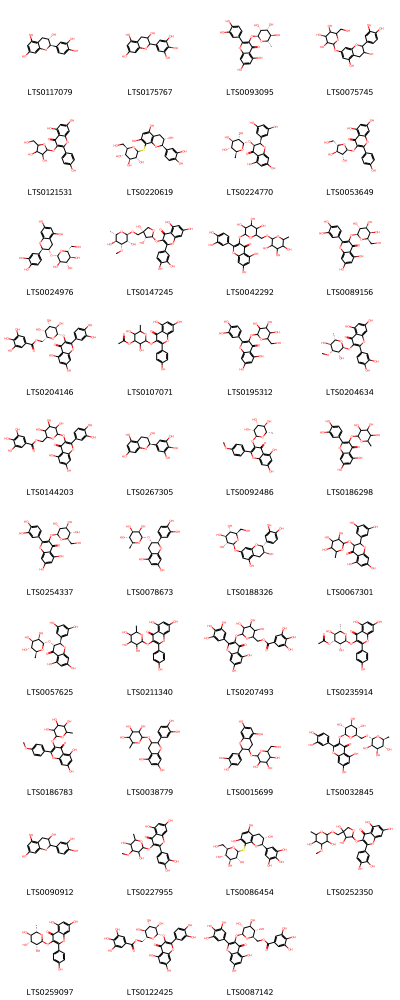{ width=100% }
    <figcaption>Hình ảnh cấu trúc hóa học của 39 hoạt chất thuộc nhóm Flavonoids gồm ['(+)-catechol (LTS0117079)', 'epigallocatechin (LTS0175767)', 'quercitrin (LTS0093095)', '2-{[2-(3,4-dihydroxyphenyl)-3,5-dihydroxy-3,4-dihydro-2h-1-benzopyran-7-yl]oxy}-6-(hydroxymethyl)oxane-3,4,5-triol (LTS0075745)', 'juglanin (LTS0121531)', '(2r,3s)-2-(3,4-dihydroxyphenyl)-8-{[(2s,3r,4s,5s,6r)-3,4,5-trihydroxy-6-(hydroxymethyl)oxan-2-yl]sulfanyl}-3,4-dihydro-2h-1-benzopyran-3,5,7-triol (LTS0220619)', '(2r,3s)-2-(3,5-dihydroxyphenyl)-5,7-dihydroxy-3-{[(2s,3s,4r,5r,6s)-3,4,5-trihydroxy-6-methyloxan-2-yl]oxy}-2,3-dihydro-1-benzopyran-4-one (LTS0224770)', 'juglanin (LTS0053649)', '(2r,3r,4s,5s,6r)-2-{[(2r,3s)-2-(3,4-dihydroxyphenyl)-5,7-dihydroxy-3,4-dihydro-2h-1-benzopyran-3-yl]oxy}-6-(hydroxymethyl)oxane-3,4,5-triol (LTS0024976)', '3-{[(2s,3r,4r)-4-({[(2r,3r,4r,5s,6s)-3,5-dihydroxy-4-methoxy-6-methyloxan-2-yl]oxy}methyl)-3,4-dihydroxyoxolan-2-yl]oxy}-2-(3,4-dihydroxyphenyl)-5,7-dihydroxychromen-4-one (LTS0147245)', 'rutin (LTS0042292)', 'hyperoside (LTS0089156)', '[(2r,3r,4s,5r,6s)-6-{[2-(3,4-dihydroxyphenyl)-5,7-dihydroxy-4-oxochromen-3-yl]oxy}-3,4,5-trihydroxyoxan-2-yl]methyl 3,4,5-trihydroxybenzoate (LTS0204146)', '2-{[5,7-dihydroxy-2-(4-hydroxyphenyl)-4-oxochromen-3-yl]oxy}-3,5-dihydroxy-6-methyloxan-4-yl acetate (LTS0107071)', '2-(3,4-dihydroxyphenyl)-5,7-dihydroxy-3-{[3,4,5-trihydroxy-6-(hydroxymethyl)oxan-2-yl]oxy}chromen-4-one (LTS0195312)', '3-{[(2s,3r,4r,5s,6s)-3,5-dihydroxy-4-methoxy-6-methyloxan-2-yl]oxy}-2-(3,4-dihydroxyphenyl)-5,7-dihydroxychromen-4-one (LTS0204634)', '(6-{[2-(3,4-dihydroxyphenyl)-5,7-dihydroxy-4-oxochromen-3-yl]oxy}-3,4,5-trihydroxyoxan-2-yl)methyl 3,4,5-trihydroxybenzoate (LTS0144203)', 'gallocatechol (LTS0267305)', '5,7-dihydroxy-2-(4-methoxyphenyl)-3-{[(2s,3r,4r,5r,6s)-3,4,5-trihydroxy-6-methyloxan-2-yl]oxy}chromen-4-one (LTS0092486)', 'quercitrin (LTS0186298)', 'isoquercetin (LTS0254337)', '(2s,3r,4r,5r,6s)-2-{[(2r,3s)-2-(3,4-dihydroxyphenyl)-5,7-dihydroxy-3,4-dihydro-2h-1-benzopyran-3-yl]oxy}-6-methyloxane-3,4,5-triol (LTS0078673)', 'catechin-7-o-glucoside (LTS0188326)', '2-(3,5-dihydroxyphenyl)-5,7-dihydroxy-3-[(3,4,5-trihydroxy-6-methyloxan-2-yl)oxy]-2,3-dihydro-1-benzopyran-4-one (LTS0067301)', '(2r,3r)-2-(3,5-dihydroxyphenyl)-5,7-dihydroxy-3-{[(2s,3r,4r,5r,6s)-3,4,5-trihydroxy-6-methyloxan-2-yl]oxy}-2,3-dihydro-1-benzopyran-4-one (LTS0057625)', '5,7-dihydroxy-2-(4-hydroxyphenyl)-3-[(3,4,5-trihydroxy-6-methyloxan-2-yl)oxy]chromen-4-one (LTS0211340)', '(6-{[5,7-dihydroxy-4-oxo-2-(3,4,5-trihydroxyphenyl)chromen-3-yl]oxy}-3,4,5-trihydroxyoxan-2-yl)methyl 3,4,5-trihydroxybenzoate (LTS0207493)', '(2s,3r,4r,5s,6s)-2-{[5,7-dihydroxy-2-(4-hydroxyphenyl)-4-oxochromen-3-yl]oxy}-3,5-dihydroxy-6-methyloxan-4-yl acetate (LTS0235914)', '5,7-dihydroxy-2-(4-methoxyphenyl)-3-[(3,4,5-trihydroxy-6-methyloxan-2-yl)oxy]chromen-4-one (LTS0186783)', '2-{[2-(3,4-dihydroxyphenyl)-5,7-dihydroxy-3,4-dihydro-2h-1-benzopyran-3-yl]oxy}-6-methyloxane-3,4,5-triol (LTS0038779)', '2-{[2-(3,4-dihydroxyphenyl)-5,7-dihydroxy-3,4-dihydro-2h-1-benzopyran-3-yl]oxy}-6-(hydroxymethyl)oxane-3,4,5-triol (LTS0015699)', '3-rutinosyl quercetin (LTS0032845)', 'catechol (LTS0090912)', '3-[(3,5-dihydroxy-4-methoxy-6-methyloxan-2-yl)oxy]-2-(3,4-dihydroxyphenyl)-5,7-dihydroxychromen-4-one (LTS0227955)', '(2r,3s)-8-{[(2s,3r,4s,5s,6r)-3,4,5-trihydroxy-6-(hydroxymethyl)oxan-2-yl]sulfanyl}-2-(3,4,5-trihydroxyphenyl)-3,4-dihydro-2h-1-benzopyran-3,5,7-triol (LTS0086454)', '3-[(4-{[(3,5-dihydroxy-4-methoxy-6-methyloxan-2-yl)oxy]methyl}-3,4-dihydroxyoxolan-2-yl)oxy]-2-(3,4-dihydroxyphenyl)-5,7-dihydroxychromen-4-one (LTS0252350)', 'afzelin (LTS0259097)', '[(2r,3s,4s,5r,6s)-6-{[2-(3,4-dihydroxyphenyl)-5,7-dihydroxy-4-oxochromen-3-yl]oxy}-3,4,5-trihydroxyoxan-2-yl]methyl 3,4,5-trihydroxybenzoate (LTS0122425)', '[(2r,3s,4s,5r,6s)-6-{[5,7-dihydroxy-4-oxo-2-(3,4,5-trihydroxyphenyl)chromen-3-yl]oxy}-3,4,5-trihydroxyoxan-2-yl]methyl 3,4,5-trihydroxybenzoate (LTS0087142)'].</figcaption>
</figure>
#### Nhóm Lactones
<figure markdown="span">
    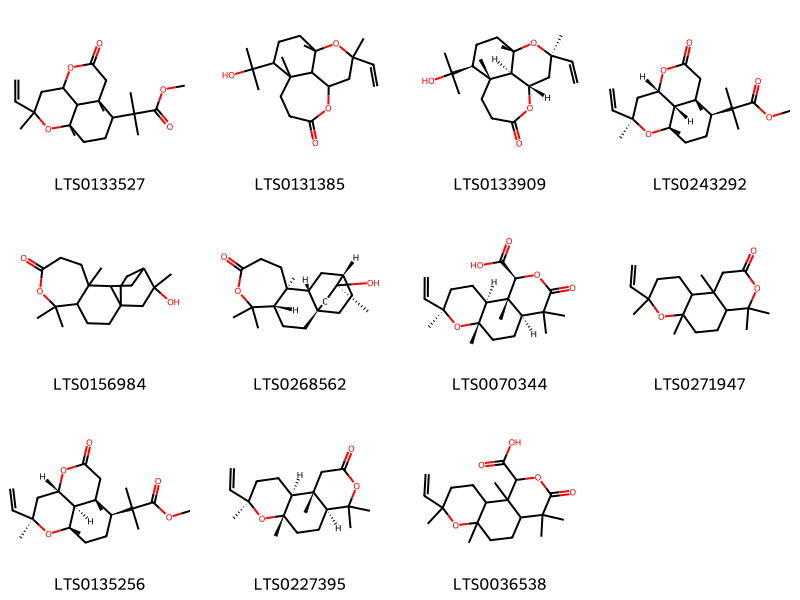{ width=100% }
    <figcaption>Hình ảnh cấu trúc hóa học của 11 hoạt chất thuộc nhóm Lactones gồm ['methyl 2-{3-ethenyl-1,3,9-trimethyl-7-oxo-2,6-dioxatricyclo[7.3.1.0⁵,¹³]tridecan-10-yl}-2-methylpropanoate (LTS0133527)', '3-ethenyl-8-(2-hydroxypropan-2-yl)-3,5,9-trimethyl-4,13-dioxatricyclo[7.4.1.0⁵,¹⁴]tetradecan-12-one (LTS0131385)', '(1s,3r,5s,8s,9r,14r)-3-ethenyl-8-(2-hydroxypropan-2-yl)-3,5,9-trimethyl-4,13-dioxatricyclo[7.4.1.0⁵,¹⁴]tetradecan-12-one (LTS0133909)', 'methyl 2-[(1s,3r,5s,9r,10s,13s)-3-ethenyl-1,3,9-trimethyl-7-oxo-2,6-dioxatricyclo[7.3.1.0⁵,¹³]tridecan-10-yl]-2-methylpropanoate (LTS0243292)', '14-hydroxy-5,5,10,14-tetramethyl-6-oxatetracyclo[11.2.2.0¹,¹¹.0⁴,¹⁰]heptadecan-7-one (LTS0156984)', '(1r,4s,10s,11r,13s,14s)-14-hydroxy-5,5,10,14-tetramethyl-6-oxatetracyclo[11.2.2.0¹,¹¹.0⁴,¹⁰]heptadecan-7-one (LTS0268562)', '(1s,2r,3s,7s,10s,12r)-12-ethenyl-2,6,6,10,12-pentamethyl-5-oxo-4,11-dioxatricyclo[8.4.0.0²,⁷]tetradecane-3-carboxylic acid (LTS0070344)', '12-ethenyl-2,6,6,10,12-pentamethyl-5,11-dioxatricyclo[8.4.0.0²,⁷]tetradecan-4-one (LTS0271947)', 'methyl 2-[(1s,3r,5s,9r,10s,13r)-3-ethenyl-1,3,9-trimethyl-7-oxo-2,6-dioxatricyclo[7.3.1.0⁵,¹³]tridecan-10-yl]-2-methylpropanoate (LTS0135256)', '(1s,2r,7s,10s,12r)-12-ethenyl-2,6,6,10,12-pentamethyl-5,11-dioxatricyclo[8.4.0.0²,⁷]tetradecan-4-one (LTS0227395)', '12-ethenyl-2,6,6,10,12-pentamethyl-5-oxo-4,11-dioxatricyclo[8.4.0.0²,⁷]tetradecane-3-carboxylic acid (LTS0036538)'].</figcaption>
</figure>
#### Nhóm Naphthopyrans
<figure markdown="span">
    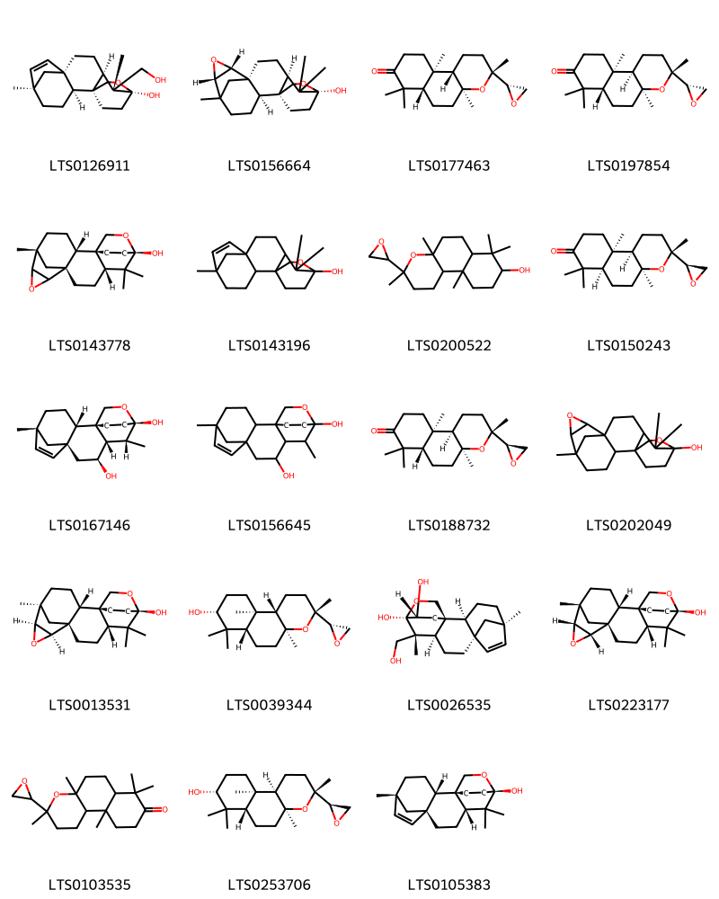{ width=100% }
    <figcaption>Hình ảnh cấu trúc hóa học của 19 hoạt chất thuộc nhóm Naphthopyrans gồm ['(1s,2s,5r,8s,11r,12r,13s)-12-(hydroxymethyl)-5,12-dimethyl-14-oxapentacyclo[11.2.2.1⁵,⁸.0¹,¹¹.0²,⁸]octadec-6-en-13-ol (LTS0126911)', '(1s,2r,6s,8r,9r,12r,14s)-5,13,13-trimethyl-7,15-dioxahexacyclo[12.2.2.1⁵,⁹.0¹,¹².0²,⁹.0⁶,⁸]nonadecan-14-ol (LTS0156664)', '(3r,4as,6as,10ar,10bs)-3,4a,7,7,10a-pentamethyl-3-[(2s)-oxiran-2-yl]-octahydronaphtho[2,1-b]pyran-8-one (LTS0177463)', '(3r,4as,6as,10ar,10br)-3,4a,7,7,10a-pentamethyl-3-[(2s)-oxiran-2-yl]-octahydronaphtho[2,1-b]pyran-8-one (LTS0197854)', '(1s,2r,5r,9r,12r,14s)-5,13,13-trimethyl-7,15-dioxahexacyclo[12.2.2.1⁵,⁹.0¹,¹².0²,⁹.0⁶,⁸]nonadecan-14-ol (LTS0143778)', '5,12,12-trimethyl-14-oxapentacyclo[11.2.2.1⁵,⁸.0¹,¹¹.0²,⁸]octadec-6-en-13-ol (LTS0143196)', '3,4a,7,7,10a-pentamethyl-3-(oxiran-2-yl)-octahydro-1h-naphtho[2,1-b]pyran-8-ol (LTS0200522)', '(3r,4as,6ar,10ar,10br)-3,4a,7,7,10a-pentamethyl-3-[(2r)-oxiran-2-yl]-octahydronaphtho[2,1-b]pyran-8-one (LTS0150243)', '(1s,2s,5r,8r,10s,11s,12r,13s)-5,12-dimethyl-14-oxapentacyclo[11.2.2.1⁵,⁸.0¹,¹¹.0²,⁸]octadec-6-ene-10,13-diol (LTS0167146)', '5,12-dimethyl-14-oxapentacyclo[11.2.2.1⁵,⁸.0¹,¹¹.0²,⁸]octadec-6-ene-10,13-diol (LTS0156645)', '(3r,4as,6as,10ar,10br)-3,4a,7,7,10a-pentamethyl-3-[(2r)-oxiran-2-yl]-octahydronaphtho[2,1-b]pyran-8-one (LTS0188732)', '5,13,13-trimethyl-7,15-dioxahexacyclo[12.2.2.1⁵,⁹.0¹,¹².0²,⁹.0⁶,⁸]nonadecan-14-ol (LTS0202049)', '(1s,2r,5s,6s,8r,9r,12r,14s)-5,13,13-trimethyl-7,15-dioxahexacyclo[12.2.2.1⁵,⁹.0¹,¹².0²,⁹.0⁶,⁸]nonadecan-14-ol (LTS0013531)', '(3r,4as,6as,8r,10ar,10bs)-3,4a,7,7,10a-pentamethyl-3-[(2s)-oxiran-2-yl]-octahydro-1h-naphtho[2,1-b]pyran-8-ol (LTS0039344)', '(1s,2s,5r,8s,11r,12r,13r,17r)-12-(hydroxymethyl)-5,12-dimethyl-14-oxapentacyclo[11.2.2.1⁵,⁸.0¹,¹¹.0²,⁸]octadec-6-ene-13,17-diol (LTS0026535)', '(1s,2r,5r,6r,8s,9r,12r,14s)-5,13,13-trimethyl-7,15-dioxahexacyclo[12.2.2.1⁵,⁹.0¹,¹².0²,⁹.0⁶,⁸]nonadecan-14-ol (LTS0223177)', '3,4a,7,7,10a-pentamethyl-3-(oxiran-2-yl)-octahydronaphtho[2,1-b]pyran-8-one (LTS0103535)', '(3r,4as,6as,8r,10ar,10br)-3,4a,7,7,10a-pentamethyl-3-[(2r)-oxiran-2-yl]-octahydro-1h-naphtho[2,1-b]pyran-8-ol (LTS0253706)', '(1s,2s,5r,8s,11r,13s)-5,12,12-trimethyl-14-oxapentacyclo[11.2.2.1⁵,⁸.0¹,¹¹.0²,⁸]octadec-6-en-13-ol (LTS0105383)'].</figcaption>
</figure>
#### Nhóm Organooxygen compounds
<figure markdown="span">
    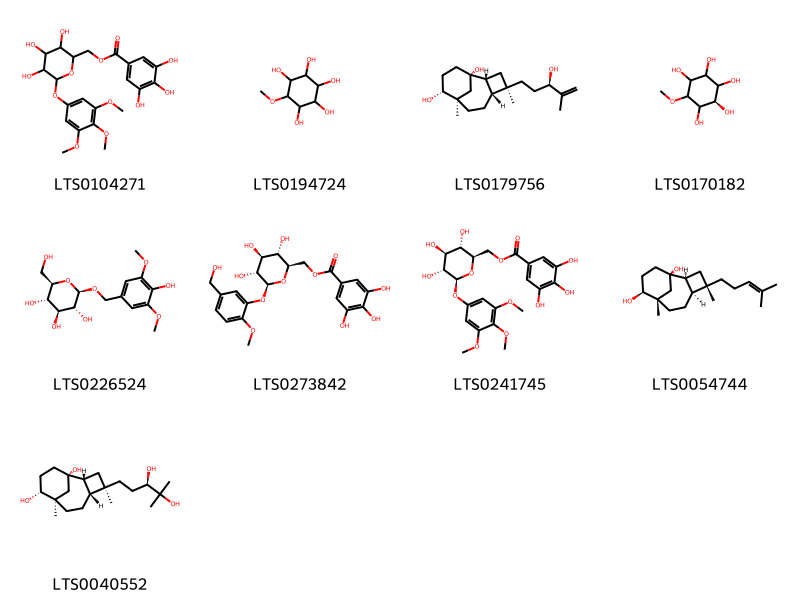{ width=100% }
    <figcaption>Hình ảnh cấu trúc hóa học của 9 hoạt chất thuộc nhóm Organooxygen compounds gồm ['[3,4,5-trihydroxy-6-(3,4,5-trimethoxyphenoxy)oxan-2-yl]methyl 3,4,5-trihydroxybenzoate (LTS0104271)', 'pinitol (LTS0194724)', '(1s,2r,4r,5r,8r,9r)-4-[(3r)-3-hydroxy-4-methylpent-4-en-1-yl]-4,8-dimethyltricyclo[6.3.1.0²,⁵]dodecane-1,9-diol (LTS0179756)', '(2r)-6-methoxycyclohexane-1,2,3,4,5-pentol (LTS0170182)', '(2r,3r,4s,5s,6r)-2-[(4-hydroxy-3,5-dimethoxyphenyl)methoxy]-6-(hydroxymethyl)oxane-3,4,5-triol (LTS0226524)', '[(2r,3s,4s,5r,6s)-3,4,5-trihydroxy-6-[5-(hydroxymethyl)-2-methoxyphenoxy]oxan-2-yl]methyl 3,4,5-trihydroxybenzoate (LTS0273842)', '[(2r,3s,4s,5r,6s)-3,4,5-trihydroxy-6-(3,4,5-trimethoxyphenoxy)oxan-2-yl]methyl 3,4,5-trihydroxybenzoate (LTS0241745)', '(1r,2s,4s,5s,8s,9s)-4,8-dimethyl-4-(4-methylpent-3-en-1-yl)tricyclo[6.3.1.0²,⁵]dodecane-1,9-diol (LTS0054744)', '(1s,2r,4r,5r,8r,9r)-4-[(3r)-3,4-dihydroxy-4-methylpentyl]-4,8-dimethyltricyclo[6.3.1.0²,⁵]dodecane-1,9-diol (LTS0040552)'].</figcaption>
</figure>
#### Nhóm Oxanes
<figure markdown="span">
    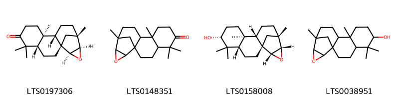{ width=100% }
    <figcaption>Hình ảnh cấu trúc hóa học của 4 hoạt chất thuộc nhóm Oxanes gồm ['(1s,4s,9s,10s,13s,14r,16s)-5,5,9,13-tetramethyl-15-oxapentacyclo[11.3.1.0¹,¹⁰.0⁴,⁹.0¹⁴,¹⁶]heptadecan-6-one (LTS0197306)', '5,5,9,13-tetramethyl-15-oxapentacyclo[11.3.1.0¹,¹⁰.0⁴,⁹.0¹⁴,¹⁶]heptadecan-6-one (LTS0148351)', '(1s,4s,6r,9r,10s,13s,14s,16r)-5,5,9,13-tetramethyl-15-oxapentacyclo[11.3.1.0¹,¹⁰.0⁴,⁹.0¹⁴,¹⁶]heptadecan-6-ol (LTS0158008)', '5,5,9,13-tetramethyl-15-oxapentacyclo[11.3.1.0¹,¹⁰.0⁴,⁹.0¹⁴,¹⁶]heptadecan-6-ol (LTS0038951)'].</figcaption>
</figure>
#### Nhóm Prenol lipids
<figure markdown="span">
    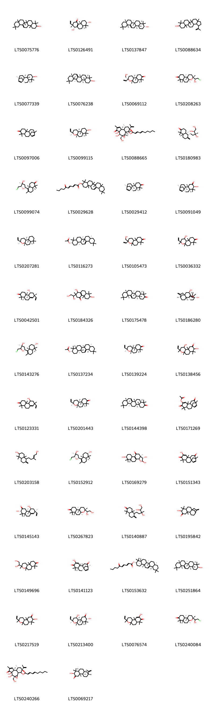{ width=100% }
    <figcaption>Hình ảnh cấu trúc hóa học của 101 hoạt chất thuộc nhóm Prenol lipids gồm ['β-amyrin (LTS0075776)', '(1r,2s,4br,7s,8as)-2-ethenyl-1,7-dihydroxy-2,4b,8,8-tetramethyl-1,3,5,6,7,8a,9,10-octahydrophenanthren-4-one (LTS0126491)', '(3r,4ar,6ar,6bs,8ar,12ar,14ar,14br)-4,4,6a,6b,8a,11,11,14b-octamethyl-1,2,3,4a,5,6,7,8,9,10,12,12a,14,14a-tetradecahydropicen-3-ol (LTS0137847)', 'lupeol (LTS0088634)', '(1r,4s,6r,9s,10s,13s)-5,5,9,13-tetramethyltetracyclo[11.2.1.0¹,¹⁰.0⁴,⁹]hexadec-14-en-6-ol (LTS0077339)', 'alnulin (LTS0076238)', '(3r,4as,6as,10ar,10bs)-3-ethenyl-3-(hydroxymethyl)-4a,7,7,10a-tetramethyl-octahydronaphtho[2,1-b]pyran-8-one (LTS0069112)', '(3r,4as,6as,10ar,10bs)-3-[(1s)-2-chloro-1-hydroxyethyl]-3,4a,7,7,10a-pentamethyl-octahydronaphtho[2,1-b]pyran-8-one (LTS0208263)', '5,5,9,13-tetramethyltetracyclo[11.2.1.0¹,¹⁰.0⁴,⁹]hexadec-14-en-6-one (LTS0097006)', '(3r,4as,6as,8r,10ar,10bs)-3-ethenyl-3,4a,7,7,10a-pentamethyl-octahydro-1h-naphtho[2,1-b]pyran-8-ol (LTS0099115)', 'terpenoid ea-i (LTS0088665)', '(4as,5r,8as)-1,1,4a-trimethyl-6-methylidene-5-[(3r,4s)-3,4,5-trihydroxy-3-methylpentyl]-hexahydronaphthalen-2-one (LTS0180983)', '(4ar,8as)-5-[(3s,4s)-5-chloro-3,4-dihydroxy-3-methylpentyl]-1,1,4a,6-tetramethyl-4,7,8,8a-tetrahydro-3h-naphthalen-2-one (LTS0099074)', '4,4,6a,6b,8a,11,11,14b-octamethyl-1,2,3,4a,5,6,7,8,9,10,12,12a,14,14a-tetradecahydropicen-3-yl 6-oxodeca-2,4-dienoate (LTS0029628)', '(1r,4s,9s,10s,13s)-5,5,9,13-tetramethyltetracyclo[11.2.1.0¹,¹⁰.0⁴,⁹]hexadec-14-en-6-one (LTS0029412)', '(1r,4s,6s,9s,10s,13s)-6-hydroxy-5,5,9,13-tetramethyltetracyclo[11.2.1.0¹,¹⁰.0⁴,⁹]hexadec-14-en-7-one (LTS0091049)', '(3r,4as,6ar,10ar,10bs)-3-ethenyl-3,4a,7,7,10a-pentamethyl-octahydro-1h-naphtho[2,1-b]pyran (LTS0207281)', '(3s,6ar,8ar,14br)-4,4,6a,6b,8a,11,11,14b-octamethyl-1,2,3,4a,5,6,7,8,9,10,12,12a,14,14a-tetradecahydropicen-3-yl acetate (LTS0116273)', '3-ethenyl-3-(hydroxymethyl)-4a,7,7,10a-tetramethyl-octahydronaphtho[2,1-b]pyran-8-one (LTS0105473)', '3-ethenyl-1-hydroxy-3,4a,7,7,10a-pentamethyl-octahydronaphtho[2,1-b]pyran-8-one (LTS0036332)', '(4as,4bs,5r,7r,10ar)-7-ethenyl-5-hydroxy-1,1,4a,7-tetramethyl-3,4,4b,5,6,9,10,10a-octahydrophenanthren-2-one (LTS0042501)', '2-(1,2-dihydroxyethyl)-1,7-dihydroxy-2,4b,8,8-tetramethyl-1,3,5,6,7,8a,9,10-octahydrophenanthren-4-one (LTS0184326)', '(4ar,6ar,6bs,8ar,12ar,14ar,14br)-4,4,6a,6b,8a,11,11,14b-octamethyl-2,4a,5,6,7,8,9,10,12,12a,14,14a-dodecahydro-1h-picen-3-one (LTS0175478)', '(1s,2r,5r,8s,10r,11r,13s)-12,12-dimethyl-6-methylidene-14-oxapentacyclo[11.2.2.1⁵,⁸.0¹,¹¹.0²,⁸]octadecane-10,13-diol (LTS0186280)', '(3s)-5-[(4as,6s,8ar)-6-hydroxy-2,5,5,8a-tetramethyl-3,4,4a,6,7,8-hexahydronaphthalen-1-yl]-1-chloro-3-methylpentane-2,3-diol (LTS0143276)', 'β-amyrin acetate (LTS0137234)', '(3r,4as,6as,10ar,10br)-3-ethenyl-3,4a,7,7,10a-pentamethyl-octahydronaphtho[2,1-b]pyran-8-one (LTS0139224)', '3-ethenyl-1,8-dihydroxy-3,4a,7,7,10a-pentamethyl-octahydronaphtho[2,1-b]pyran-9-one (LTS0138456)', '7-ethenyl-5-hydroxy-1,1,4a,7-tetramethyl-3,4,4b,5,6,9,10,10a-octahydrophenanthren-2-one (LTS0123331)', '(3r,4as,6as,10ar,10bs)-3-ethenyl-3,4a,7,7,10a-pentamethyl-octahydronaphtho[2,1-b]pyran-8-one (LTS0201443)', '(4ar,6ar,8ar,12as,12bs,14ar,14br)-4,4,6a,8a,11,11,12b,14b-octamethyl-2,4a,5,6,8,9,10,12,12a,13,14,14a-dodecahydro-1h-picen-3-one (LTS0144398)', '5,5,9,13-tetramethyl-6,12-dioxotetracyclo[11.2.1.0¹,¹⁰.0⁴,⁹]hexadeca-7,14-dien-7-yl acetate (LTS0171269)', '5-(5-hydroxy-3-methylpent-3-en-1-yl)-1,1,4a-trimethyl-6-methylidene-hexahydro-2h-naphthalen-2-ol (LTS0203158)', '(2s,3s)-5-[(4as,6s,8ar)-6-hydroxy-2,5,5,8a-tetramethyl-3,4,4a,6,7,8-hexahydronaphthalen-1-yl]-1-chloro-3-methylpentane-2,3-diol (LTS0152912)', '(1s,2r,4br,7s,8as)-2-[(1s)-1,2-dihydroxyethyl]-1,7-dihydroxy-2,4b,8,8-tetramethyl-1,3,5,6,7,8a,9,10-octahydrophenanthren-4-one (LTS0169279)', '7-hydroxy-5,5,9,13-tetramethyltetracyclo[11.2.1.0¹,¹⁰.0⁴,⁹]hexadeca-7,14-diene-6,12-dione (LTS0151343)', '(2s,4ar,4br,5s,7s,10as)-7-ethenyl-2,5-dihydroxy-1,1,4a,7-tetramethyl-2,4,4b,5,6,9,10,10a-octahydrophenanthren-3-one (LTS0145143)', '(3r,4as,6as,10ar,10bs)-3-[(1r)-1,2-dihydroxyethyl]-3,4a,7,7,10a-pentamethyl-octahydronaphtho[2,1-b]pyran-8-one (LTS0267823)', '1,1,4a-trimethyl-6-methylidene-5-(3,4,5-trihydroxy-3-methylpentyl)-hexahydronaphthalen-2-one (LTS0140887)', '6-hydroxy-5,5,9-trimethyl-14-methylidenetetracyclo[11.2.1.0¹,¹⁰.0⁴,⁹]hexadecan-7-one (LTS0195842)', '3-(1,2-dihydroxyethyl)-3,4a,7,7,10a-pentamethyl-octahydronaphtho[2,1-b]pyran-8-one (LTS0149696)', '(1s,4r,9r,10s,13r)-7-hydroxy-5,5,9,13-tetramethyltetracyclo[11.2.1.0¹,¹⁰.0⁴,⁹]hexadeca-7,14-diene-6,12-dione (LTS0141123)', '(3s,4ar,6ar,6bs,8ar,12ar,14ar,14br)-4,4,6a,6b,8a,11,11,14b-octamethyl-1,2,3,4a,5,6,7,8,9,10,12,12a,14,14a-tetradecahydropicen-3-yl (2e,4e)-6-oxodeca-2,4-dienoate (LTS0153632)', 'β-amyrin (LTS0251864)', '3-ethenyl-8-hydroxy-3,4a,7,7,10a-pentamethyl-octahydronaphtho[2,1-b]pyran-9-one (LTS0217519)', '(1r,3r,4as,6as,8r,10ar,10br)-3-ethenyl-1,8-dihydroxy-3,4a,7,7,10a-pentamethyl-octahydronaphtho[2,1-b]pyran-9-one (LTS0213400)', '3-ethenyl-9-hydroxy-3,4a,7,7,10a-pentamethyl-1h,2h,5h,6h,6ah,10bh-naphtho[2,1-b]pyran-8-one (LTS0076574)', '(3r,4as,6as,10ar,10bs)-3-(2-chloro-1-hydroxyethyl)-3,4a,7,7,10a-pentamethyl-octahydronaphtho[2,1-b]pyran-8-one (LTS0240084)', '(1r,2r,6s,7s,8r,16r,18r)-6,7-dihydroxy-8-(hydroxymethyl)-4,18-dimethyl-14-[(1e,3e)-nona-1,3-dien-1-yl]-16-(prop-1-en-2-yl)-9,13,15,19-tetraoxahexacyclo[12.4.1.0¹,¹¹.0²,⁶.0⁸,¹⁰.0¹²,¹⁶]nonadec-3-en-5-one (LTS0240266)', '(1s,4s,6s,9s,10r,13r)-6-hydroxy-5,5,9-trimethyl-14-methylidenetetracyclo[11.2.1.0¹,¹⁰.0⁴,⁹]hexadecan-7-one (LTS0069217)', '(3r,4ar,6ar,8ar,12ar,12bs,14ar,14br)-4,4,6a,8a,11,11,12b,14b-octamethyl-1,2,3,4a,5,6,8,9,10,12,12a,13,14,14a-tetradecahydropicen-3-ol (LTS0167439)', '(1r,2r,5r,8s,10r,11s,13r)-12,12-dimethyl-6-methylidene-14-oxapentacyclo[11.2.2.1⁵,⁸.0¹,¹¹.0²,⁸]octadecane-10,13-diol (LTS0167308)', '(3r,4as,6ar,10ar,10br)-3-ethenyl-3,4a,7,7,10a-pentamethyl-octahydronaphtho[2,1-b]pyran-8-one (LTS0098066)', '5-[5-(hydroxymethyl)-5,8a-dimethyl-2-methylidene-hexahydro-1h-naphthalen-1-yl]-3-methylpent-2-en-1-ol (LTS0133793)', '(1s,3r,4as,6as,10ar,10br)-3-ethenyl-1-hydroxy-3,4a,7,7,10a-pentamethyl-octahydronaphtho[2,1-b]pyran-8-one (LTS0119758)', '(4as,4br,5r,7s,8r,10ar)-7-[(1s)-1,2-dihydroxyethyl]-5,8-dihydroxy-1,1,4a,7-tetramethyl-3,4,4b,5,6,8,10,10a-octahydrophenanthren-2-one (LTS0185138)', '(2s,4as,5r,8as)-5-[(3e)-5-hydroxy-3-methylpent-3-en-1-yl]-1,1,4a-trimethyl-6-methylidene-hexahydro-2h-naphthalen-2-ol (LTS0246088)', '(1r,3r,4as,6as,10ar,10br)-3-ethenyl-1-hydroxy-3,4a,7,7,10a-pentamethyl-octahydronaphtho[2,1-b]pyran-8-one (LTS0185533)', '(1s,4s,9s,10s,13r)-14-(hydroxymethyl)-5,5,9-trimethyltetracyclo[11.2.1.0¹,¹⁰.0⁴,⁹]hexadec-14-en-6-one (LTS0121442)', '(1s,4s,6s,9s,10s,13r)-6-hydroxy-14-(hydroxymethyl)-5,5,9-trimethyltetracyclo[11.2.1.0¹,¹⁰.0⁴,⁹]hexadec-14-en-7-one (LTS0252432)', '(1s,4s,6r,9s,10s,13r)-14-(hydroxymethyl)-5,5,9-trimethyltetracyclo[11.2.1.0¹,¹⁰.0⁴,⁹]hexadec-14-en-6-ol (LTS0202610)', '(3r,4ar,6as,10as,10br)-3-ethenyl-3,4a,7,7,10a-pentamethyl-octahydro-1h-naphtho[2,1-b]pyran (LTS0180264)', '3-ethenyl-3,4a,7,7,10a-pentamethyl-octahydro-1h-naphtho[2,1-b]pyran-8-ol (LTS0198244)', '(3r,4as,6ar,10ar,10br)-3-ethenyl-3-(hydroxymethyl)-4a,7,7,10a-tetramethyl-octahydronaphtho[2,1-b]pyran-8-one (LTS0264294)', 'taraxerone (LTS0266976)', '(1s,4r,6r,9r,10r,13r)-6-hydroxy-5,5,9,13-tetramethyltetracyclo[11.2.1.0¹,¹⁰.0⁴,⁹]hexadec-14-ene-7,12-dione (LTS0228391)', '7-(1,2-dihydroxyethyl)-2,5-dihydroxy-1,1,4a,7-tetramethyl-2,4,4b,5,6,9,10,10a-octahydrophenanthren-3-one (LTS0087454)', '1-chloro-5-(6-hydroxy-2,5,5,8a-tetramethyl-3,4,4a,6,7,8-hexahydronaphthalen-1-yl)-3-methylpentane-2,3-diol (LTS0223974)', '(4ar,8as)-5-[(3s)-5-chloro-3,4-dihydroxy-3-methylpentyl]-1,1,4a,6-tetramethyl-4,7,8,8a-tetrahydro-3h-naphthalen-2-one (LTS0069294)', '5,5,9,13-tetramethyltetracyclo[11.2.1.0¹,¹⁰.0⁴,⁹]hexadec-14-en-6-ol (LTS0080932)', '4,4,6a,6b,8a,11,11,14b-octamethyl-1,2,3,4a,5,6,7,8,9,10,12,12a,14,14a-tetradecahydropicen-3-yl acetate (LTS0153642)', '4,4,6a,8a,11,11,12b,14b-octamethyl-2,4a,5,6,8,9,10,12,12a,13,14,14a-dodecahydro-1h-picen-3-one (LTS0024442)', '(2r,4as,4bs,5r,7s,10ar)-7-[(1s)-1,2-dihydroxyethyl]-2,5-dihydroxy-1,1,4a,7-tetramethyl-2,4,4b,5,6,9,10,10a-octahydrophenanthren-3-one (LTS0237686)', '(1s,4r,9r,10s,13r)-5,5,9,13-tetramethyl-6,12-dioxotetracyclo[11.2.1.0¹,¹⁰.0⁴,⁹]hexadeca-7,14-dien-7-yl acetate (LTS0234007)', '5-(5-hydroxy-3-methylpent-3-en-1-yl)-1,1,4a-trimethyl-6-methylidene-hexahydronaphthalen-2-one (LTS0040801)', '(3r,4as,6as,8r,10ar,10bs)-3-ethenyl-8-hydroxy-3,4a,7,7,10a-pentamethyl-octahydronaphtho[2,1-b]pyran-9-one (LTS0044429)', '3-ethenyl-3,4a,7,7,10a-pentamethyl-octahydronaphtho[2,1-b]pyran-8-one (LTS0234884)', '5,5,9,13-tetramethyltetracyclo[10.2.2.0¹,¹⁰.0⁴,⁹]hexadecane-6,13-diol (LTS0243529)', '3-(2-chloro-1-hydroxyethyl)-3,4a,7,7,10a-pentamethyl-octahydronaphtho[2,1-b]pyran-8-one (LTS0231758)', '4,4,6a,6b,8a,11,11,14b-octamethyl-2,4a,5,6,7,8,9,10,12,12a,14,14a-dodecahydro-1h-picen-3-one (LTS0256984)', '(4as,5r,8as)-5-[(3e)-5-hydroxy-3-methylpent-3-en-1-yl]-1,1,4a-trimethyl-6-methylidene-hexahydronaphthalen-2-one (LTS0024638)', '5-[(1r,4as,5r,8as)-5-(hydroxymethyl)-5,8a-dimethyl-2-methylidene-hexahydro-1h-naphthalen-1-yl]-3-methylpent-2-en-1-ol (LTS0177350)', '14-(hydroxymethyl)-5,5,9-trimethyltetracyclo[11.2.1.0¹,¹⁰.0⁴,⁹]hexadec-14-en-6-ol (LTS0045943)', '(2e)-5-[(1r,4as,5s,8as)-5-(hydroxymethyl)-5,8a-dimethyl-2-methylidene-hexahydro-1h-naphthalen-1-yl]-3-methylpent-2-en-1-ol (LTS0068647)', '12,12-dimethyl-6-methylidene-14-oxapentacyclo[11.2.2.1⁵,⁸.0¹,¹¹.0²,⁸]octadecane-10,13-diol (LTS0137479)', '(4as,5r,8as)-1,1,4a-trimethyl-6-methylidene-5-[(3r,4r)-3,4,5-trihydroxy-3-methylpentyl]-hexahydronaphthalen-2-one (LTS0134678)', '2-ethenyl-1,7-dihydroxy-2,4b,8,8-tetramethyl-1,3,5,6,7,8a,9,10-octahydrophenanthren-4-one (LTS0270096)', '13-hydroxy-5,5,9,13-tetramethyltetracyclo[10.2.2.0¹,¹⁰.0⁴,⁹]hexadecan-6-one (LTS0130122)', 'taraxerol (LTS0019099)', '(3r,4as,10ar,10bs)-3-ethenyl-3,4a,7,7,10a-pentamethyl-octahydro-1h-naphtho[2,1-b]pyran (LTS0005654)', '5-(5-chloro-3,4-dihydroxy-3-methylpentyl)-1,1,4a,6-tetramethyl-4,7,8,8a-tetrahydro-3h-naphthalen-2-one (LTS0020579)', '(4as,4br,5r,7r,10ar)-7-ethenyl-5-hydroxy-1,1,4a,7-tetramethyl-3,4,4b,5,6,9,10,10a-octahydrophenanthren-2-one (LTS0013039)', '(1r,3ar,5ar,5br,7ar,9r,11ar,11br,13ar,13bs)-3a,5a,5b,8,8,11a-hexamethyl-1-(prop-1-en-2-yl)-hexadecahydrocyclopenta[a]chrysen-9-ol (LTS0255487)', '(3r,4as,6as,10as,10bs)-3-ethenyl-9-hydroxy-3,4a,7,7,10a-pentamethyl-1h,2h,5h,6h,6ah,10bh-naphtho[2,1-b]pyran-8-one (LTS0239560)', '6-hydroxy-5,5,9,13-tetramethyltetracyclo[11.2.1.0¹,¹⁰.0⁴,⁹]hexadec-14-en-7-one (LTS0090536)', '(1s,4s,6r,9s,10r,12s,13s)-5,5,9,13-tetramethyltetracyclo[10.2.2.0¹,¹⁰.0⁴,⁹]hexadecane-6,13-diol (LTS0022075)', '3-ethenyl-3,4a,7,7,10a-pentamethyl-octahydro-1h-naphtho[2,1-b]pyran (LTS0226873)', 'epilupeol (LTS0108662)', '(1s,4s,9s,10r,12s,13s)-13-hydroxy-5,5,9,13-tetramethyltetracyclo[10.2.2.0¹,¹⁰.0⁴,⁹]hexadecan-6-one (LTS0019240)', '(2e)-5-[(1r,4as,5r,8as)-5-(hydroxymethyl)-5,8a-dimethyl-2-methylidene-hexahydro-1h-naphthalen-1-yl]-3-methylpent-2-en-1-ol (LTS0261076)', '(3r,4as,6as,6br,8ar,12as,14ar,14bs)-4,4,6a,6b,8a,11,11,14b-octamethyl-1,2,3,4a,5,6,7,8,9,10,12,12a,14,14a-tetradecahydropicen-3-ol (LTS0125458)'].</figcaption>
</figure>
#### Nhóm Steroids and steroid derivatives
<figure markdown="span">
    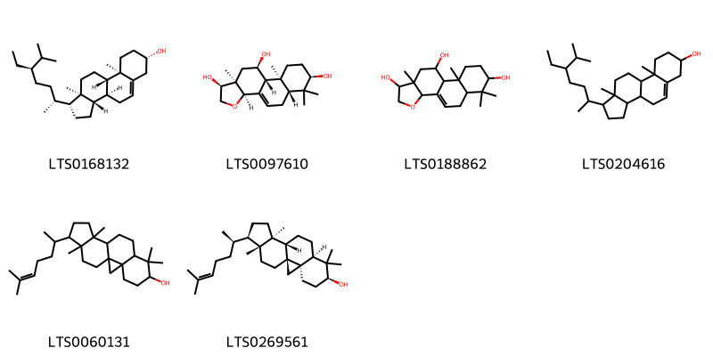{ width=100% }
    <figcaption>Hình ảnh cấu trúc hóa học của 6 hoạt chất thuộc nhóm Steroids and steroid derivatives gồm ['sitosterol (LTS0168132)', '(1s,3ar,5ar,7r,9as,9br,10r,11ar)-6,6,9a,11a-tetramethyl-1h,2h,3ah,5h,5ah,7h,8h,9h,9bh,10h,11h-phenanthro[1,2-b]furan-1,7,10-triol (LTS0097610)', '6,6,9a,11a-tetramethyl-1h,2h,3ah,5h,5ah,7h,8h,9h,9bh,10h,11h-phenanthro[1,2-b]furan-1,7,10-triol (LTS0188862)', 'stigmast-5-en-3-ol, (3β)- (LTS0204616)', 'cycloartenol (LTS0060131)', 'cycloartenol (LTS0269561)'].</figcaption>
</figure>
#### Nhóm Tannins
<figure markdown="span">
    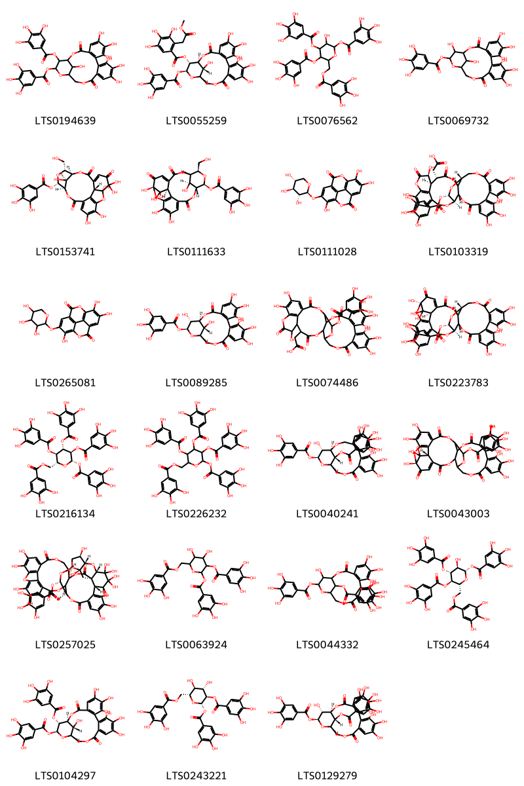{ width=100% }
    <figcaption>Hình ảnh cấu trúc hóa học của 23 hoạt chất thuộc nhóm Tannins gồm ['6,7,8,11,12,13,23-heptahydroxy-3,16-dioxo-21-(3,4,5-trihydroxybenzoyloxy)-2,17,20-trioxatetracyclo[17.3.1.0⁴,⁹.0¹⁰,¹⁵]tricosa-4(9),5,7,10,12,14-hexaen-22-yl 3,4,5-trihydroxybenzoate (LTS0194639)', '(1s,19r,21s,22r,23r)-6,7,8,11,12,13,23-heptahydroxy-3,16-dioxo-21-(3,4,5-trihydroxybenzoyloxy)-2,17,20-trioxatetracyclo[17.3.1.0⁴,⁹.0¹⁰,¹⁵]tricosa-4(9),5,7,10,12,14-hexaen-22-yl 3,4,5-trihydroxy-2-(2-methoxy-2-oxoethyl)benzoate (LTS0055259)', '3-hydroxy-4,5-bis(3,4,5-trihydroxybenzoyloxy)-6-[(3,4,5-trihydroxybenzoyloxy)methyl]oxan-2-yl 3,4,5-trihydroxybenzoate (LTS0076562)', '6,7,8,11,12,13,22,23-octahydroxy-3,16-dioxo-2,17,20-trioxatetracyclo[17.3.1.0⁴,⁹.0¹⁰,¹⁵]tricosa-4(9),5,7,10,12,14-hexaen-21-yl 3,4,5-trihydroxybenzoate (LTS0069732)', '(1s,9r,18r,19s,21r,22s)-7,7,8,12,13,22-hexahydroxy-21-(hydroxymethyl)-3,6,16-trioxo-2,17,20,23-tetraoxapentacyclo[16.3.1.1⁸,¹¹.0⁴,⁹.0¹⁰,¹⁵]tricosa-4,10,12,14-tetraen-19-yl 3,4,5-trihydroxybenzoate (LTS0153741)', '(1s,7s,9r,18r,19s,21r,22s)-7,8,8,12,13,22-hexahydroxy-21-(hydroxymethyl)-3,6,16-trioxo-2,17,20,23-tetraoxapentacyclo[16.3.1.1⁷,¹¹.0⁴,⁹.0¹⁰,¹⁵]tricosa-4,10,12,14-tetraen-19-yl 3,4,5-trihydroxybenzoate (LTS0111633)', '6,7,14-trihydroxy-13-{[(2s,3r,4s,5r)-3,4,5-trihydroxyoxan-2-yl]oxy}-2,9-dioxatetracyclo[6.6.2.0⁴,¹⁶.0¹¹,¹⁵]hexadeca-1(15),4,6,8(16),11,13-hexaene-3,10-dione (LTS0111028)', '[(4r,5s,7r,25s,26r,29s,30s,31s)-13,14,15,18,19,20,31,35,36-nonahydroxy-2,10,23,28,32-pentaoxo-5-(3,4,5-trihydroxybenzoyloxy)-3,6,9,24,27,33-hexaoxaheptacyclo[28.7.1.0⁴,²⁵.0⁷,²⁶.0¹¹,¹⁶.0¹⁷,²².0³⁴,³⁸]octatriaconta-1(37),11(16),12,14,17,19,21,34(38),35-nonaen-29-yl]acetic acid (LTS0103319)', '6,7,14-trihydroxy-13-[(3,4,5-trihydroxyoxan-2-yl)oxy]-2,9-dioxatetracyclo[6.6.2.0⁴,¹⁶.0¹¹,¹⁵]hexadeca-1(15),4,6,8(16),11,13-hexaene-3,10-dione (LTS0265081)', '(1s,19r,21s,22r,23r)-6,7,8,11,12,13,22,23-octahydroxy-3,16-dioxo-2,17,20-trioxatetracyclo[17.3.1.0⁴,⁹.0¹⁰,¹⁵]tricosa-4(9),5,7,10,12,14-hexaen-21-yl 3,4,5-trihydroxybenzoate (LTS0089285)', '[13,14,15,18,19,20,31,35,36-nonahydroxy-2,10,23,28,32-pentaoxo-5-(3,4,5-trihydroxybenzoyloxy)-3,6,9,24,27,33-hexaoxaheptacyclo[28.7.1.0⁴,²⁵.0⁷,²⁶.0¹¹,¹⁶.0¹⁷,²².0³⁴,³⁸]octatriaconta-1(37),11,13,15,17(22),18,20,34(38),35-nonaen-29-yl]acetic acid (LTS0074486)', '(1r,7r,8s,26r,28s,29r,38r)-1,13,14,15,18,19,20,34,35,39,39-undecahydroxy-2,5,10,23,31-pentaoxo-6,9,24,27,30,40-hexaoxaoctacyclo[34.3.1.0⁴,³⁸.0⁷,²⁶.0⁸,²⁹.0¹¹,¹⁶.0¹⁷,²².0³²,³⁷]tetraconta-3,11,13,15,17(22),18,20,32,34,36-decaen-28-yl 3,4,5-trihydroxybenzoate (LTS0223783)', '(2s,3r,4s,5r,6r)-3,4,5-tris(3,4,5-trihydroxybenzoyloxy)-6-[(3,4,5-trihydroxybenzoyloxy)methyl]oxan-2-yl 3,4,5-trihydroxybenzoate (LTS0216134)', '3,4,5-tris(3,4,5-trihydroxybenzoyloxy)-6-[(3,4,5-trihydroxybenzoyloxy)methyl]oxan-2-yl 3,4,5-trihydroxybenzoate (LTS0226232)', '(1r,19r,21s,22r,23r)-6,7,8,11,12,13,22-heptahydroxy-16-oxo-21-(3,4,5-trihydroxybenzoyloxy)-2,17,20-trioxatetracyclo[17.3.1.0⁴,⁹.0¹⁰,¹⁵]tricosa-4(9),5,7,10,12,14-hexaen-23-yl 3,4,5-trihydroxybenzoate (LTS0040241)', '(1r,38r)-1,13,14,15,18,19,20,34,35,39,39-undecahydroxy-2,5,10,23,31-pentaoxo-6,9,24,27,30,40-hexaoxaoctacyclo[34.3.1.0⁴,³⁸.0⁷,²⁶.0⁸,²⁹.0¹¹,¹⁶.0¹⁷,²².0³²,³⁷]tetraconta-3,11(16),12,14,17,19,21,32,34,36-decaen-28-yl 3,4,5-trihydroxybenzoate (LTS0043003)', '(1r,4s,6s,7r,10s,12r,15r,16s,34r,36s,37r,46r)-1,2,2,3,3,7,10,21,22,27,28,42,43-tridecahydroxy-13,18,31,39-tetraoxo-5,9,14,17,32,35,38,47,48-nonaoxaundecacyclo[42.2.1.1²³,²⁶.0⁴,¹².0⁶,¹⁰.0¹²,⁴⁶.0¹⁵,³⁴.0¹⁶,³⁷.0¹⁹,²⁴.0²⁵,³⁰.0⁴⁰,⁴⁵]octatetraconta-19,21,23,25,27,29,40,42,44-nonaen-36-yl 3,4,5-trihydroxybenzoate (LTS0257025)', '4,5-dihydroxy-3-(3,4,5-trihydroxybenzoyloxy)-6-[(3,4,5-trihydroxybenzoyloxy)methyl]oxan-2-yl 3,4,5-trihydroxybenzoate (LTS0063924)', '6,7,8,11,12,13,22-heptahydroxy-3,16-dioxo-21-(3,4,5-trihydroxybenzoyloxy)-2,17,20-trioxatetracyclo[17.3.1.0⁴,⁹.0¹⁰,¹⁵]tricosa-4(9),5,7,10,12,14-hexaen-23-yl 3,4,5-trihydroxybenzoate (LTS0044332)', '(2s,3r,4r,5r,6r)-3-hydroxy-4,5-bis(3,4,5-trihydroxybenzoyloxy)-6-[(3,4,5-trihydroxybenzoyloxy)methyl]oxan-2-yl 3,4,5-trihydroxybenzoate (LTS0245464)', '(1s,19r,21s,22r,23r)-6,7,8,11,12,13,23-heptahydroxy-3,16-dioxo-21-(3,4,5-trihydroxybenzoyloxy)-2,17,20-trioxatetracyclo[17.3.1.0⁴,⁹.0¹⁰,¹⁵]tricosa-4(9),5,7,10,12,14-hexaen-22-yl 3,4,5-trihydroxybenzoate (LTS0104297)', '(2s,3r,4s,5s,6r)-4,5-dihydroxy-3-(3,4,5-trihydroxybenzoyloxy)-6-[(3,4,5-trihydroxybenzoyloxy)methyl]oxan-2-yl 3,4,5-trihydroxybenzoate (LTS0243221)', '(1r,19r,21s,22r,23r)-6,7,8,11,12,13,22-heptahydroxy-3,16-dioxo-21-(3,4,5-trihydroxybenzoyloxy)-2,17,20-trioxatetracyclo[17.3.1.0⁴,⁹.0¹⁰,¹⁵]tricosa-4(9),5,7,10,12,14-hexaen-23-yl 3,4,5-trihydroxybenzoate (LTS0129279)'].</figcaption>
</figure>

---

### Dược dân tộc học

Danh sách các quốc gia có sử dụng *Excoecaria agallocha* trong điều trị các bệnh. 

| Country       | Disease                             | Bệnh                                |
|:--------------|:------------------------------------|:------------------------------------|
| India         | Abortifacient, Piscicide, Purgative | Abortifacient, Piscicide, Purgative |
| New Caledonia | Piscicide                           | Thuốc diệt cá                       |

---

---
## Excoecaria cochinchinensis
### Thông tin về thực vật

!!! info "Phân loại thực vật của *Excoecaria cochinchinensis* từ GIBF:"
    - **Kingdom:** Plantae
    - **Phylum:** Tracheophyta
    - **Order:** Malpighiales
    - **Family:** Euphorbiaceae
    - **Genus:** Excoecaria
    - **Species:** *Excoecaria cochinchinensis*

 

| Label (VI)   | Label (EN)   | Scientific Name            | Descriptions (VI)   | Descriptions (EN)   | Also Known As (VI)             | Also Known As (EN)                                                     |
|:-------------|:-------------|:---------------------------|:--------------------|:--------------------|:-------------------------------|:-----------------------------------------------------------------------|
| N/A          | N/A          | Excoecaria cochinchinensis | loài thực vật       | species of plant    | ['Excoecaria cochinchinensis'] | ['Blindness tree', 'Buta Buta', 'Chinese croton', 'Jungle Fire plant'] |

#### Phân bố trên thế giới

**Từ CSDL GIBF** nan, Lao People’s Democratic Republic, Cambodia, Myanmar, unknown or invalid, Puerto Rico, Korea, Republic of, Chinese Taipei, United States of America, Trinidad and Tobago, Hong Kong, Thailand, Singapore, Viet Nam, China, French Polynesia, Seychelles, Macao, India, Indonesia, Philippines, Malaysia, New Zealand

#### Phân bố tại Việt Nam

**Từ CSDL GIBF**: Dak Lak, Khánh Hòa, Kon Tum, Hoa Binh, Quảng Bình, Ninh Thuan, Ha Giang

---
### Thành phần hóa học
        
- Theo cơ sở dữ liệu lotus: Từ loài *Excoecaria cochinchinensis* đã phân lập và xác định được 25 hoạt chất thuộc về các nhóm Flavonoids, Prenol lipids, Benzofurans, Benzene and substituted derivatives, Organooxygen compounds. 

|    | chemicalTaxonomyClassyfireClass     |   smiles_count |
|---:|:------------------------------------|---------------:|
|  0 | Benzene and substituted derivatives |              2 |
|  1 | Benzofurans                         |              2 |
|  2 | Flavonoids                          |              5 |
|  3 | Organooxygen compounds              |              4 |
|  4 | Prenol lipids                       |             12 |

#### Nhóm Benzene and substituted derivatives
<figure markdown="span">
    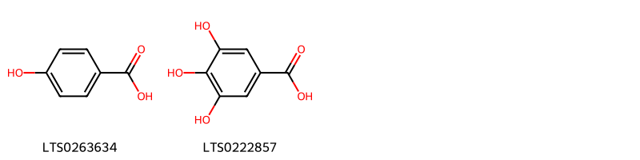{ width=100% }
    <figcaption>Hình ảnh cấu trúc hóa học của 2 hoạt chất thuộc nhóm Benzene and substituted derivatives gồm ['p-hydroxybenzoic acid (LTS0263634)', 'galop (LTS0222857)'].</figcaption>
</figure>
#### Nhóm Benzofurans
<figure markdown="span">
    { width=100% }
    <figcaption>Hình ảnh cấu trúc hóa học của 2 hoạt chất thuộc nhóm Benzofurans gồm ['(6s,7as)-6-hydroxy-4,4,7a-trimethyl-6,7-dihydro-5h-1-benzofuran-2-one (LTS0067359)', 'loliolide (LTS0119422)'].</figcaption>
</figure>
#### Nhóm Flavonoids
<figure markdown="span">
    { width=100% }
    <figcaption>Hình ảnh cấu trúc hóa học của 5 hoạt chất thuộc nhóm Flavonoids gồm ['trifolin (LTS0267055)', 'trifolin (LTS0237581)', '5,7-dihydroxy-2-(4-hydroxyphenyl)-3-[(3,4,5-trihydroxy-6-methyloxan-2-yl)oxy]chromen-4-one (LTS0211340)', 'astragalin (LTS0249588)', 'afzelin (LTS0259097)'].</figcaption>
</figure>
#### Nhóm Organooxygen compounds
<figure markdown="span">
    { width=100% }
    <figcaption>Hình ảnh cấu trúc hóa học của 4 hoạt chất thuộc nhóm Organooxygen compounds gồm ['(-)-shikimate (LTS0003899)', 'shikimate (LTS0197942)', '(2r,5s)-2,10,10-trimethyl-6-({[(2r,3r,4s,5s,6r)-3,4,5-trihydroxy-6-(hydroxymethyl)oxan-2-yl]oxy}methyl)-1-oxaspiro[4.5]deca-3,6-dien-8-one (LTS0144910)', '2,10,10-trimethyl-6-({[3,4,5-trihydroxy-6-(hydroxymethyl)oxan-2-yl]oxy}methyl)-1-oxaspiro[4.5]deca-3,6-dien-8-one (LTS0064034)'].</figcaption>
</figure>
#### Nhóm Prenol lipids
<figure markdown="span">
    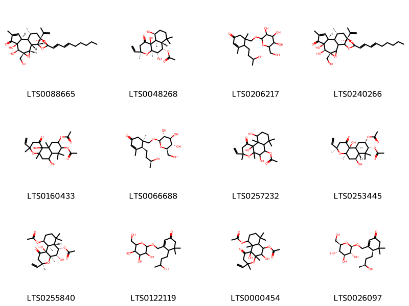{ width=100% }
    <figcaption>Hình ảnh cấu trúc hóa học của 12 hoạt chất thuộc nhóm Prenol lipids gồm ['terpenoid ea-i (LTS0088665)', 'isoforskolin (LTS0048268)', '4-(3-hydroxybutyl)-3,5-dimethyl-5-({[3,4,5-trihydroxy-6-(hydroxymethyl)oxan-2-yl]oxy}methyl)cyclohex-2-en-1-one (LTS0206217)', '(1r,2r,6s,7s,8r,16r,18r)-6,7-dihydroxy-8-(hydroxymethyl)-4,18-dimethyl-14-[(1e,3e)-nona-1,3-dien-1-yl]-16-(prop-1-en-2-yl)-9,13,15,19-tetraoxahexacyclo[12.4.1.0¹,¹¹.0²,⁶.0⁸,¹⁰.0¹²,¹⁶]nonadec-3-en-5-one (LTS0240266)', '9-(acetyloxy)-3-ethenyl-6,10b-dihydroxy-3,4a,7,7,10a-pentamethyl-1-oxo-hexahydro-2h-naphtho[2,1-b]pyran-8-yl acetate (LTS0160433)', '(4s,5r)-4-[(3s)-3-hydroxybutyl]-3,5-dimethyl-5-({[(2r,3r,4s,5s,6r)-3,4,5-trihydroxy-6-(hydroxymethyl)oxan-2-yl]oxy}methyl)cyclohex-2-en-1-one (LTS0066688)', '3-ethenyl-5,10,10b-trihydroxy-3,4a,7,7,10a-pentamethyl-1-oxo-hexahydro-2h-naphtho[2,1-b]pyran-6-yl acetate (LTS0257232)', '(3r,4ar,6s,6as,8r,9s,10as,10bs)-8-(acetyloxy)-3-ethenyl-6,10b-dihydroxy-3,4a,7,7,10a-pentamethyl-1-oxo-hexahydro-2h-naphtho[2,1-b]pyran-9-yl acetate (LTS0253445)', '(3r,4ar,5s,6s,6as,10s,10ar,10bs)-10-(acetyloxy)-3-ethenyl-5,10b-dihydroxy-3,4a,7,7,10a-pentamethyl-1-oxo-hexahydro-2h-naphtho[2,1-b]pyran-6-yl acetate (LTS0255840)', '4-(3-hydroxybutyl)-5,5-dimethyl-3-({[3,4,5-trihydroxy-6-(hydroxymethyl)oxan-2-yl]oxy}methyl)cyclohex-2-en-1-one (LTS0122119)', '10-(acetyloxy)-3-ethenyl-5,10b-dihydroxy-3,4a,7,7,10a-pentamethyl-1-oxo-hexahydro-2h-naphtho[2,1-b]pyran-6-yl acetate (LTS0000454)', '(4r)-4-[(3s)-3-hydroxybutyl]-5,5-dimethyl-3-({[(2r,3r,4s,5s,6r)-3,4,5-trihydroxy-6-(hydroxymethyl)oxan-2-yl]oxy}methyl)cyclohex-2-en-1-one (LTS0026097)'].</figcaption>
</figure>

---

### Dược dân tộc học

Danh sách các quốc gia có sử dụng *Excoecaria cochinchinensis* trong điều trị các bệnh. 

| Country   | Disease   | Bệnh        |
|:----------|:----------|:------------|
| Java      | Hemostat  | Máy cầm máu |

---

---
## Excoecaria venenifera
### Thông tin về thực vật

!!! info "Phân loại thực vật của *Spirostachys venenifera* từ GIBF:"
    - **Kingdom:** Plantae
    - **Phylum:** Tracheophyta
    - **Order:** Malpighiales
    - **Family:** Euphorbiaceae
    - **Genus:** Spirostachys
    - **Species:** *Spirostachys venenifera*

 

| Label (VI)   | Label (EN)   | Scientific Name       | Descriptions (VI)   | Descriptions (EN)   | Also Known As (VI)   | Also Known As (EN)   |
|:-------------|:-------------|:----------------------|:--------------------|:--------------------|:---------------------|:---------------------|
| N/A          | N/A          | Excoecaria venenifera | loài thực vật       | species of plant    | ['']                 | ['']                 |

#### Phân bố trên thế giới

**Từ CSDL GIBF** nan, Lao People’s Democratic Republic, Cambodia, Myanmar, unknown or invalid, Puerto Rico, Korea, Republic of, Chinese Taipei, United States of America, Trinidad and Tobago, Hong Kong, Thailand, Singapore, Viet Nam, China, French Polynesia, Seychelles, Macao, India, Indonesia, Philippines, Malaysia, New Zealand

#### Phân bố tại Việt Nam

**Từ CSDL GIBF**: Dak Lak, Khánh Hòa, Kon Tum, Hoa Binh, Quảng Bình, Ninh Thuan, Ha Giang

---
### Thành phần hóa học
        
- Theo cơ sở dữ liệu lotus: Từ loài *Spirostachys venenifera* đã phân lập và xác định được Chưa có hoạt chất nào được phân lập. hoạt chất thuộc về các nhóm Không có hoạt chất nào được phân lập. 

Không có hình ảnh nào được tạo ra

---

### Dược dân tộc học

Danh sách các quốc gia có sử dụng *Spirostachys venenifera* trong điều trị các bệnh. 

| Country   | Disease   | Bệnh     |
|:----------|:----------|:---------|
| Kenya     | Poison    | Chất độc |

---

# Chi Aleurites

??? note "Danh sách các dược liệu thuộc chi"
    
	 - *Aleurites fordii*
	 - *Aleurites moluccana*
	 - *Aleurites trierma*

---
## Aleurites fordii
### Thông tin về thực vật

!!! info "Phân loại thực vật của *Vernicia fordii* từ GIBF:"
    - **Kingdom:** Plantae
    - **Phylum:** Tracheophyta
    - **Order:** Malpighiales
    - **Family:** Euphorbiaceae
    - **Genus:** Vernicia
    - **Species:** *Vernicia fordii*

 

| Label (VI)   | Label (EN)   | Scientific Name   | Descriptions (VI)   | Descriptions (EN)   | Also Known As (VI)   | Also Known As (EN)   |
|:-------------|:-------------|:------------------|:--------------------|:--------------------|:---------------------|:---------------------|
| N/A          | N/A          | Aleurites fordii  | loài thực vật       | species of plant    | ['']                 | ['']                 |

#### Phân bố trên thế giới

**Từ CSDL GIBF** nan, Japan, Georgia, Chinese Taipei, Brazil, New Zealand, Spain, Argentina, Russian Federation, United States of America, Venezuela (Bolivarian Republic of), China, Panama

#### Phân bố tại Việt Nam

**Từ CSDL GIBF**: Không có ghi nhận ở Việt Nam

---
### Thành phần hóa học
        
- Theo cơ sở dữ liệu lotus: Từ loài *Vernicia fordii* đã phân lập và xác định được Chưa có hoạt chất nào được phân lập. hoạt chất thuộc về các nhóm Không có hoạt chất nào được phân lập. 

Không có hình ảnh nào được tạo ra

---

### Dược dân tộc học

Danh sách các quốc gia có sử dụng *Vernicia fordii* trong điều trị các bệnh. 

| Country            | Disease                  | Bệnh                     |
|:-------------------|:-------------------------|:-------------------------|
| Asia               | Poison                   | Chất độc                 |
| China              | Emetic, Poison, Hemostat | Emetic, Poison, Hemostat |
| Dominican Republic | Poison                   | Chất độc                 |

---

---
## Aleurites moluccana
### Thông tin về thực vật

!!! info "Phân loại thực vật của *Aleurites moluccanus* từ GIBF:"
    - **Kingdom:** Plantae
    - **Phylum:** Tracheophyta
    - **Order:** Malpighiales
    - **Family:** Euphorbiaceae
    - **Genus:** Aleurites
    - **Species:** *Aleurites moluccanus*

 

| Label (VI)   | Label (EN)   | Scientific Name   | Descriptions (VI)   | Descriptions (EN)   | Also Known As (VI)   | Also Known As (EN)   |
|:-------------|:-------------|:------------------|:--------------------|:--------------------|:---------------------|:---------------------|
| N/A          | N/A          | Aleurites fordii  | loài thực vật       | species of plant    | ['']                 | ['']                 |

#### Phân bố trên thế giới

**Từ CSDL GIBF** nan, Australia, Cook Islands, Guadeloupe, Argentina, Rwanda, Puerto Rico, Réunion, Chinese Taipei, United States of America, Timor-Leste, South Africa, Fiji, Uganda, Hong Kong, Guam, New Caledonia, Tonga, Dominica, China, French Polynesia, Saint Kitts and Nevis, Niue, Madagascar, Macao, Indonesia, Kenya, Malaysia, New Zealand

#### Phân bố tại Việt Nam

**Từ CSDL GIBF**: Không có ghi nhận ở Việt Nam

---
### Thành phần hóa học
        
- Theo cơ sở dữ liệu lotus: Từ loài *Aleurites moluccanus* đã phân lập và xác định được Chưa có hoạt chất nào được phân lập. hoạt chất thuộc về các nhóm Không có hoạt chất nào được phân lập. 

Không có hình ảnh nào được tạo ra

---

### Dược dân tộc học

Danh sách các quốc gia có sử dụng *Aleurites moluccanus* trong điều trị các bệnh. 

| Country            | Disease                       | Bệnh                                                 |
|:-------------------|:------------------------------|:-----------------------------------------------------|
| Dominican Republic | Purgative                     | Thuốc xổ                                             |
| Elsewhere          | Stimulant, Sudorific          | Chất kích thích, gây ngạt thở                        |
| Haiti              | Poison                        | Chất độc                                             |
| Hawaii             | Laxative                      | Nhuận trường                                         |
| Moluccas           | Aphrodisiac                   | Thuốc kích dục                                       |
| Turkey             | Aphrodisiac, Poison, Aperient | Thuốc kích thích tình dục, chất độc, chất kích thích |

---

---
## Aleurites trierma
### Thông tin về thực vật

!!! info "Phân loại thực vật của *Reutealis trisperma* từ GIBF:"
    - **Kingdom:** Plantae
    - **Phylum:** Tracheophyta
    - **Order:** Malpighiales
    - **Family:** Euphorbiaceae
    - **Genus:** Reutealis
    - **Species:** *Reutealis trisperma*

 

| Label (VI)   | Label (EN)   | Scientific Name   | Descriptions (VI)   | Descriptions (EN)   | Also Known As (VI)   | Also Known As (EN)   |
|:-------------|:-------------|:------------------|:--------------------|:--------------------|:---------------------|:---------------------|
| N/A          | N/A          | Aleurites fordii  | loài thực vật       | species of plant    | ['']                 | ['']                 |

#### Phân bố trên thế giới

**Từ CSDL GIBF** nan, Chinese Taipei, Brazil, Guam, Honduras, unknown or invalid, Indonesia, United States of America, Congo, Democratic Republic of the, Dominican Republic, Cuba, Philippines, Venezuela (Bolivarian Republic of)

#### Phân bố tại Việt Nam

**Từ CSDL GIBF**: Không có ghi nhận ở Việt Nam

---
### Thành phần hóa học
        
- Theo cơ sở dữ liệu lotus: Từ loài *Reutealis trisperma* đã phân lập và xác định được Chưa có hoạt chất nào được phân lập. hoạt chất thuộc về các nhóm Không có hoạt chất nào được phân lập. 

Không có hình ảnh nào được tạo ra

---

### Dược dân tộc học

Danh sách các quốc gia có sử dụng *Reutealis trisperma* trong điều trị các bệnh. 

| Country            | Disease   | Bệnh     |
|:-------------------|:----------|:---------|
| Dominican Republic | Poison    | Chất độc |

---

# Chi Grimmeodendron

??? note "Danh sách các dược liệu thuộc chi"
    
	 - *Grimmeodendron eglandsulosum*

---
## Grimmeodendron eglandsulosum
### Thông tin về thực vật

!!! info "Phân loại thực vật của *Grimmeodendron eglandulosum* từ GIBF:"
    - **Kingdom:** Plantae
    - **Phylum:** Tracheophyta
    - **Order:** Malpighiales
    - **Family:** Euphorbiaceae
    - **Genus:** Grimmeodendron
    - **Species:** *Grimmeodendron eglandulosum*

 

| Label (VI)   | Label (EN)   | Scientific Name   | Descriptions (VI)   | Descriptions (EN)   | Also Known As (VI)   | Also Known As (EN)   |
|:-------------|:-------------|:------------------|:--------------------|:--------------------|:---------------------|:---------------------|
| N/A          | N/A          | Aleurites fordii  | loài thực vật       | species of plant    | ['']                 | ['']                 |

#### Phân bố trên thế giới

**Từ CSDL GIBF** nan, Bahamas, Cuba, United States of America, Dominican Republic

#### Phân bố tại Việt Nam

**Từ CSDL GIBF**: Không có ghi nhận ở Việt Nam

---
### Thành phần hóa học
        
- Theo cơ sở dữ liệu lotus: Từ loài *Grimmeodendron eglandulosum* đã phân lập và xác định được Chưa có hoạt chất nào được phân lập. hoạt chất thuộc về các nhóm Không có hoạt chất nào được phân lập. 

Không có hình ảnh nào được tạo ra

---

### Dược dân tộc học

Danh sách các quốc gia có sử dụng *Grimmeodendron eglandulosum* trong điều trị các bệnh. 

| Country   | Disease   | Bệnh     |
|:----------|:----------|:---------|
| Cuba      | Poison    | Chất độc |

---

# Chi Mallotus

??? note "Danh sách các dược liệu thuộc chi"
    
	 - *Mallotus apelta*
	 - *Mallotus japonicus*
	 - *Mallotus lancifolius*
	 - *Mallotus muticum*
	 - *Mallotus oppositifolius*
	 - *Mallotus philippensis*
	 - *Mallotus philippinensis*
	 - *Mallotus poilanei*

---
## Mallotus apelta
### Thông tin về thực vật

!!! info "Phân loại thực vật của *Mallotus apelta* từ GIBF:"
    - **Kingdom:** Plantae
    - **Phylum:** Tracheophyta
    - **Order:** Malpighiales
    - **Family:** Euphorbiaceae
    - **Genus:** Mallotus
    - **Species:** *Mallotus apelta*

 

| Label (VI)   | Label (EN)   | Scientific Name   | Descriptions (VI)   | Descriptions (EN)   | Also Known As (VI)   | Also Known As (EN)   |
|:-------------|:-------------|:------------------|:--------------------|:--------------------|:---------------------|:---------------------|
| N/A          | N/A          | Mallotus apelta   | loài thực vật       | species of plant    | ['']                 | ['']                 |

#### Phân bố trên thế giới

**Từ CSDL GIBF** Hong Kong, Russian Federation, China, Viet Nam

#### Phân bố tại Việt Nam

**Từ CSDL GIBF**: Lai Chau, Hanoi（河内市）, Vinh Phuc Province（永福省）, Thanh Hoa Province（清化省）

---
### Thành phần hóa học
        
- Theo cơ sở dữ liệu lotus: Từ loài *Mallotus apelta* đã phân lập và xác định được 41 hoạt chất thuộc về các nhóm Coumarinolignans, Prenol lipids, Steroids and steroid derivatives, Flavonoids, Organooxygen compounds, Tannins, Coumarins and derivatives, Lignan glycosides, Benzopyrans, Pyridines and derivatives. 

|    | chemicalTaxonomyClassyfireClass   |   smiles_count |
|---:|:----------------------------------|---------------:|
|  0 | Benzopyrans                       |             11 |
|  1 | Coumarinolignans                  |              4 |
|  2 | Coumarins and derivatives         |              1 |
|  3 | Flavonoids                        |              2 |
|  4 | Lignan glycosides                 |              2 |
|  5 | Organooxygen compounds            |              1 |
|  6 | Prenol lipids                     |             14 |
|  7 | Pyridines and derivatives         |              1 |
|  8 | Steroids and steroid derivatives  |              4 |
|  9 | Tannins                           |              1 |

#### Nhóm Benzopyrans
<figure markdown="span">
    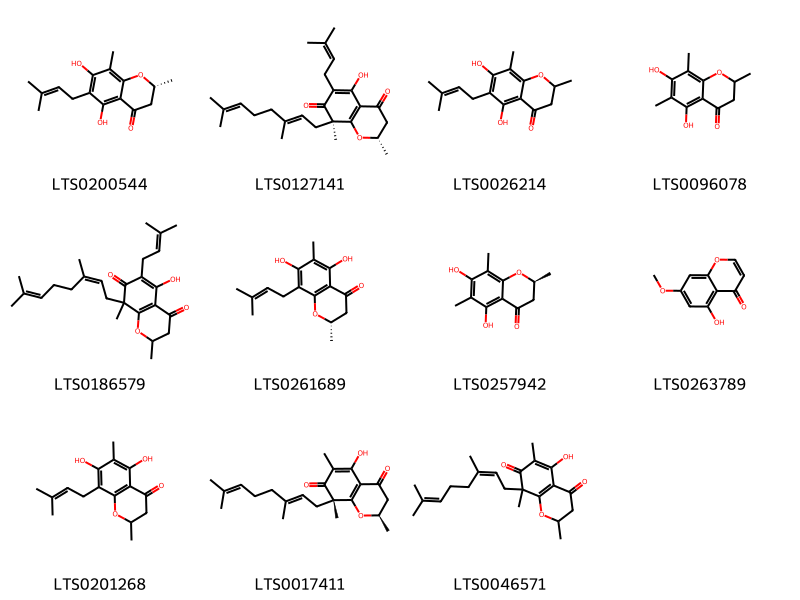{ width=100% }
    <figcaption>Hình ảnh cấu trúc hóa học của 11 hoạt chất thuộc nhóm Benzopyrans gồm ['(2r)-5,7-dihydroxy-2,8-dimethyl-6-(3-methylbut-2-en-1-yl)-2,3-dihydro-1-benzopyran-4-one (LTS0200544)', '(2s,8r)-8-[(2e)-3,7-dimethylocta-2,6-dien-1-yl]-5-hydroxy-2,8-dimethyl-6-(3-methylbut-2-en-1-yl)-2,3-dihydro-1-benzopyran-4,7-dione (LTS0127141)', '5,7-dihydroxy-2,8-dimethyl-6-(3-methylbut-2-en-1-yl)-2,3-dihydro-1-benzopyran-4-one (LTS0026214)', '5,7-dihydroxy-2,6,8-trimethyl-2,3-dihydro-1-benzopyran-4-one (LTS0096078)', '8-(3,7-dimethylocta-2,6-dien-1-yl)-5-hydroxy-2,8-dimethyl-6-(3-methylbut-2-en-1-yl)-2,3-dihydro-1-benzopyran-4,7-dione (LTS0186579)', '(2s)-5,7-dihydroxy-2,6-dimethyl-8-(3-methylbut-2-en-1-yl)-2,3-dihydro-1-benzopyran-4-one (LTS0261689)', '(2s)-5,7-dihydroxy-2,6,8-trimethyl-2,3-dihydro-1-benzopyran-4-one (LTS0257942)', '5-hydroxy-7-methoxychromen-4-one (LTS0263789)', '5,7-dihydroxy-2,6-dimethyl-8-(3-methylbut-2-en-1-yl)-2,3-dihydro-1-benzopyran-4-one (LTS0201268)', '(2r,8s)-8-[(2e)-3,7-dimethylocta-2,6-dien-1-yl]-5-hydroxy-2,6,8-trimethyl-2,3-dihydro-1-benzopyran-4,7-dione (LTS0017411)', '8-(3,7-dimethylocta-2,6-dien-1-yl)-5-hydroxy-2,6,8-trimethyl-2,3-dihydro-1-benzopyran-4,7-dione (LTS0046571)'].</figcaption>
</figure>
#### Nhóm Coumarinolignans
<figure markdown="span">
    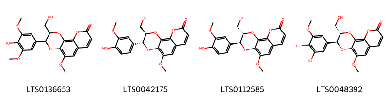{ width=100% }
    <figcaption>Hình ảnh cấu trúc hóa học của 4 hoạt chất thuộc nhóm Coumarinolignans gồm ['3-(4-hydroxy-3,5-dimethoxyphenyl)-2-(hydroxymethyl)-5-methoxy-2h,3h-[1,4]dioxino[2,3-h]chromen-9-one (LTS0136653)', 'cleomiscosin a (LTS0042175)', '(2s,3s)-3-(4-hydroxy-3-methoxyphenyl)-2-(hydroxymethyl)-5-methoxy-2h,3h-[1,4]dioxino[2,3-h]chromen-9-one (LTS0112585)', '(2s,3s)-3-(3,4-dihydroxy-5-methoxyphenyl)-2-(hydroxymethyl)-5-methoxy-2h,3h-[1,4]dioxino[2,3-h]chromen-9-one (LTS0048392)'].</figcaption>
</figure>
#### Nhóm Coumarins and derivatives
<figure markdown="span">
    { width=100% }
    <figcaption>Hình ảnh cấu trúc hóa học của 1 hoạt chất thuộc nhóm Coumarins and derivatives gồm ['scopoletin (LTS0193112)'].</figcaption>
</figure>
#### Nhóm Flavonoids
<figure markdown="span">
    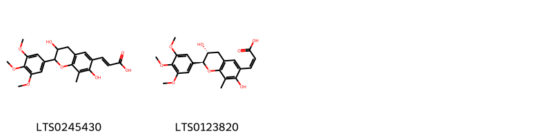{ width=100% }
    <figcaption>Hình ảnh cấu trúc hóa học của 2 hoạt chất thuộc nhóm Flavonoids gồm ['3-[3,7-dihydroxy-8-methyl-2-(3,4,5-trimethoxyphenyl)-3,4-dihydro-2h-1-benzopyran-6-yl]prop-2-enoic acid (LTS0245430)', '(2z)-3-[(2s,3r)-3,7-dihydroxy-8-methyl-2-(3,4,5-trimethoxyphenyl)-3,4-dihydro-2h-1-benzopyran-6-yl]prop-2-enoic acid (LTS0123820)'].</figcaption>
</figure>
#### Nhóm Lignan glycosides
<figure markdown="span">
    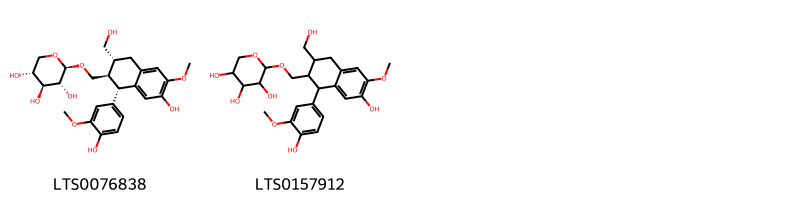{ width=100% }
    <figcaption>Hình ảnh cấu trúc hóa học của 2 hoạt chất thuộc nhóm Lignan glycosides gồm ['(2r,3r,4s,5r)-2-{[(1s,2r,3r)-7-hydroxy-1-(4-hydroxy-3-methoxyphenyl)-3-(hydroxymethyl)-6-methoxy-1,2,3,4-tetrahydronaphthalen-2-yl]methoxy}oxane-3,4,5-triol (LTS0076838)', '2-{[7-hydroxy-1-(4-hydroxy-3-methoxyphenyl)-3-(hydroxymethyl)-6-methoxy-1,2,3,4-tetrahydronaphthalen-2-yl]methoxy}oxane-3,4,5-triol (LTS0157912)'].</figcaption>
</figure>
#### Nhóm Organooxygen compounds
<figure markdown="span">
    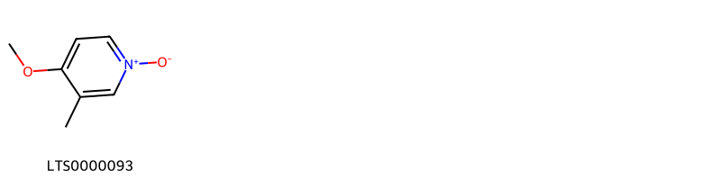{ width=100% }
    <figcaption>Hình ảnh cấu trúc hóa học của 1 hoạt chất thuộc nhóm Organooxygen compounds gồm ['4-methoxy-3-methylpyridin-1-ium-1-olate (LTS0000093)'].</figcaption>
</figure>
#### Nhóm Prenol lipids
<figure markdown="span">
    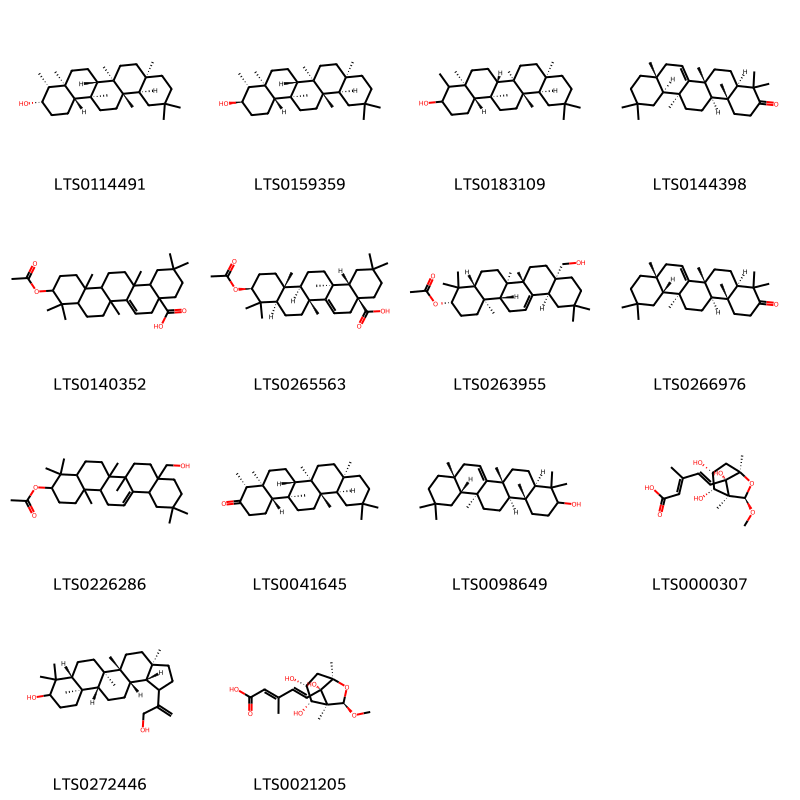{ width=100% }
    <figcaption>Hình ảnh cấu trúc hóa học của 14 hoạt chất thuộc nhóm Prenol lipids gồm ['epi-friedelanol (LTS0114491)', '(3r,4r,4as,6as,6br,8ar,12ar,12bs,14as,14bs)-4,4a,6b,8a,11,11,12b,14a-octamethyl-hexadecahydropicen-3-ol (LTS0159359)', '(4as,6as,6br,8ar,12ar,12bs,14as,14bs)-4,4a,6b,8a,11,11,12b,14a-octamethyl-hexadecahydropicen-3-ol (LTS0183109)', '(4ar,6ar,8ar,12as,12bs,14ar,14br)-4,4,6a,8a,11,11,12b,14b-octamethyl-2,4a,5,6,8,9,10,12,12a,13,14,14a-dodecahydro-1h-picen-3-one (LTS0144398)', '10-(acetyloxy)-2,2,6b,9,9,12a,14a-heptamethyl-1,3,4,5,7,8,8a,10,11,12,12b,13,14,14b-tetradecahydropicene-4a-carboxylic acid (LTS0140352)', 'acetyl aleuritolic acid (LTS0265563)', '(3s,4ar,6ar,6bs,8as,12as,14ar,14br)-8a-(hydroxymethyl)-4,4,6a,6b,11,11,14b-heptamethyl-1,2,3,4a,5,6,7,8,9,10,12,12a,14,14a-tetradecahydropicen-3-yl acetate (LTS0263955)', 'taraxerone (LTS0266976)', '8a-(hydroxymethyl)-4,4,6a,6b,11,11,14b-heptamethyl-1,2,3,4a,5,6,7,8,9,10,12,12a,14,14a-tetradecahydropicen-3-yl acetate (LTS0226286)', '(-)-friedelin (LTS0041645)', '(4ar,6ar,8ar,12ar,12bs,14ar,14br)-4,4,6a,8a,11,11,12b,14b-octamethyl-1,2,3,4a,5,6,8,9,10,12,12a,13,14,14a-tetradecahydropicen-3-ol (LTS0098649)', '3-methyl-5-[(1s,2s,3r,5r,7r,8s)-2,3,8-trihydroxy-7-methoxy-1,5-dimethyl-6-oxabicyclo[3.2.1]octan-8-yl]penta-2,4-dienoic acid (LTS0000307)', '(3ar,5ar,5br,7ar,11ar,11br,13as,13bs)-1-(3-hydroxyprop-1-en-2-yl)-3a,5a,5b,8,8,11a-hexamethyl-hexadecahydrocyclopenta[a]chrysen-9-ol (LTS0272446)', '(2e,4e)-3-methyl-5-[(1s,2s,3r,5r,7r,8s)-2,3,8-trihydroxy-7-methoxy-1,5-dimethyl-6-oxabicyclo[3.2.1]octan-8-yl]penta-2,4-dienoic acid (LTS0021205)'].</figcaption>
</figure>
#### Nhóm Pyridines and derivatives
<figure markdown="span">
    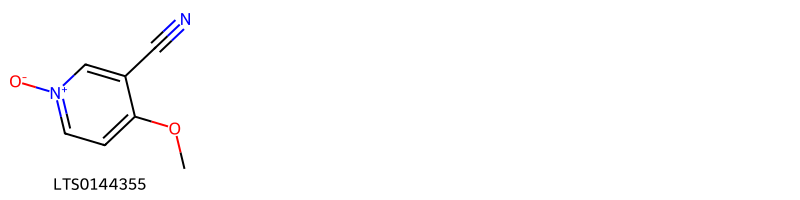{ width=100% }
    <figcaption>Hình ảnh cấu trúc hóa học của 1 hoạt chất thuộc nhóm Pyridines and derivatives gồm ['3-cyano-4-methoxypyridin-1-ium-1-olate (LTS0144355)'].</figcaption>
</figure>
#### Nhóm Steroids and steroid derivatives
<figure markdown="span">
    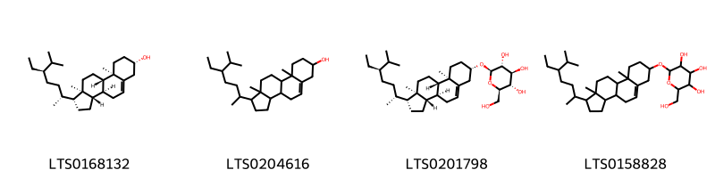{ width=100% }
    <figcaption>Hình ảnh cấu trúc hóa học của 4 hoạt chất thuộc nhóm Steroids and steroid derivatives gồm ['sitosterol (LTS0168132)', 'stigmast-5-en-3-ol, (3β)- (LTS0204616)', 'sitogluside (LTS0201798)', '2-{[1-(5-ethyl-6-methylheptan-2-yl)-9a,11a-dimethyl-1h,2h,3h,3ah,3bh,4h,6h,7h,8h,9h,9bh,10h,11h-cyclopenta[a]phenanthren-7-yl]oxy}-6-(hydroxymethyl)oxane-3,4,5-triol (LTS0158828)'].</figcaption>
</figure>
#### Nhóm Tannins
<figure markdown="span">
    { width=100% }
    <figcaption>Hình ảnh cấu trúc hóa học của 1 hoạt chất thuộc nhóm Tannins gồm ['13-hydroxy-6,7,14-trimethoxy-2,9-dioxatetracyclo[6.6.2.0⁴,¹⁶.0¹¹,¹⁵]hexadeca-1(15),4(16),5,7,11,13-hexaene-3,10-dione (LTS0240929)'].</figcaption>
</figure>

---

### Dược dân tộc học

Danh sách các quốc gia có sử dụng *Mallotus apelta* trong điều trị các bệnh. 

| Country   | Disease    | Bệnh          |
|:----------|:-----------|:--------------|
| China     | Alexiteric | Alexiteric    |
| Indochina | Piscicide  | Thuốc diệt cá |

---

---
## Mallotus japonicus
### Thông tin về thực vật

!!! info "Phân loại thực vật của *Mallotus japonicus* từ GIBF:"
    - **Kingdom:** Plantae
    - **Phylum:** Tracheophyta
    - **Order:** Malpighiales
    - **Family:** Euphorbiaceae
    - **Genus:** Mallotus
    - **Species:** *Mallotus japonicus*

 

| Label (VI)   | Label (EN)   | Scientific Name    | Descriptions (VI)   | Descriptions (EN)   | Also Known As (VI)   | Also Known As (EN)   |
|:-------------|:-------------|:-------------------|:--------------------|:--------------------|:---------------------|:---------------------|
| N/A          | N/A          | Mallotus japonicus | loài thực vật       | species of plant    | ['']                 | ['']                 |

#### Phân bố trên thế giới

**Từ CSDL GIBF** China, Korea, Republic of, Chinese Taipei, Japan

#### Phân bố tại Việt Nam

**Từ CSDL GIBF**: Không có ghi nhận ở Việt Nam

---
### Thành phần hóa học
        
- Theo cơ sở dữ liệu lotus: Từ loài *Mallotus japonicus* đã phân lập và xác định được 166 hoạt chất thuộc về các nhóm Flavonoids, Prenol lipids, Steroids and steroid derivatives, Benzene and substituted derivatives, Organooxygen compounds, Tannins, Coumarins and derivatives, Phenols, Pyridines and derivatives. 

|    | chemicalTaxonomyClassyfireClass     |   smiles_count |
|---:|:------------------------------------|---------------:|
|  0 | Benzene and substituted derivatives |             33 |
|  1 | Coumarins and derivatives           |              1 |
|  2 | Flavonoids                          |             10 |
|  3 | Organooxygen compounds              |             26 |
|  4 | Phenols                             |              1 |
|  5 | Prenol lipids                       |              9 |
|  6 | Pyridines and derivatives           |              1 |
|  7 | Steroids and steroid derivatives    |             14 |
|  8 | Tannins                             |             70 |

#### Nhóm Benzene and substituted derivatives
<figure markdown="span">
    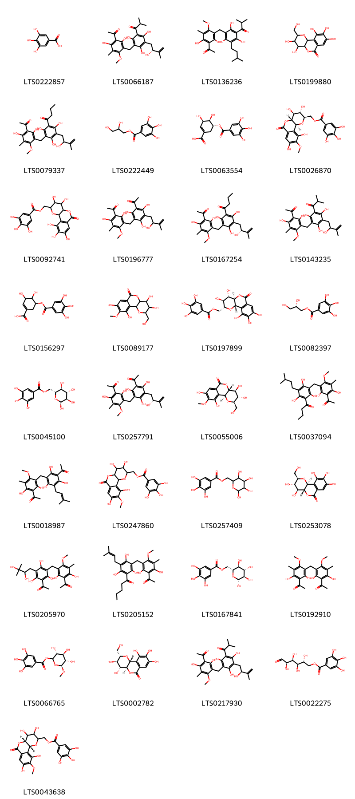{ width=100% }
    <figcaption>Hình ảnh cấu trúc hóa học của 33 hoạt chất thuộc nhóm Benzene and substituted derivatives gồm ['galop (LTS0222857)', '1-{3-[(3-acetyl-2,4-dihydroxy-6-methoxy-5-methylphenyl)methyl]-2,4,6-trihydroxy-5-[(2r)-2-hydroxy-3-methylbut-3-en-1-yl]phenyl}-2-methylpropan-1-one (LTS0066187)', '1-{3-[(3-acetyl-2,4-dihydroxy-6-methoxy-5-methylphenyl)methyl]-2,4,6-trihydroxy-5-(3-methylbutyl)phenyl}-2-methylpropan-1-one (LTS0136236)', '5,6,12,13,14-pentahydroxy-4-(hydroxymethyl)-3,8-dioxatricyclo[8.4.0.0²,⁷]tetradeca-1(10),11,13-trien-9-one (LTS0199880)', '1-{3-[(3-acetyl-2,4-dihydroxy-6-methoxy-5-methylphenyl)methyl]-2,4,6-trihydroxy-5-(2-hydroxy-3-methylbut-3-en-1-yl)phenyl}butan-1-one (LTS0079337)', '2,3-dihydroxypropyl 3,4,5-trihydroxybenzoate (LTS0222449)', '5-galloylshikimic acid (LTS0063554)', '[(2s,4r,5s,6s,7r)-5,6,12,14-tetrahydroxy-13-methoxy-9-oxo-3,8-dioxatricyclo[8.4.0.0²,⁷]tetradeca-1(14),10,12-trien-4-yl]methyl 3,4,5-trihydroxybenzoate (LTS0026870)', '{5,6,12,13,14-pentahydroxy-9-oxo-3,8-dioxatricyclo[8.4.0.0²,⁷]tetradeca-1(10),11,13-trien-4-yl}methyl 3,4,5-trihydroxybenzoate (LTS0092741)', '1-{3-[(3-acetyl-2,4-dihydroxy-6-methoxy-5-methylphenyl)methyl]-2,4,6-trihydroxy-5-(2-hydroxy-3-methylbut-3-en-1-yl)phenyl}ethanone (LTS0196777)', '1-{3-[(3-acetyl-2,4-dihydroxy-6-methoxy-5-methylphenyl)methyl]-2,4,6-trihydroxy-5-[(2r)-2-hydroxy-3-methylbut-3-en-1-yl]phenyl}butan-1-one (LTS0167254)', '1-{3-[(3-acetyl-2,4-dihydroxy-6-methoxy-5-methylphenyl)methyl]-2,4,6-trihydroxy-5-(2-hydroxy-3-methylbut-3-en-1-yl)phenyl}-2-methylpropan-1-one (LTS0143235)', '3,4-dihydroxy-5-(3,4,5-trihydroxybenzoyloxy)cyclohex-1-ene-1-carboxylic acid (LTS0156297)', '5,6,12,14-tetrahydroxy-4-(hydroxymethyl)-13-methoxy-3,8-dioxatricyclo[8.4.0.0²,⁷]tetradeca-1(14),10,12-trien-9-one (LTS0089177)', '[(2s,4r,5s,6s,7r)-5,6,12,13,14-pentahydroxy-9-oxo-3,8-dioxatricyclo[8.4.0.0²,⁷]tetradeca-1(10),11,13-trien-4-yl]methyl 3,4,5-trihydroxybenzoate (LTS0197899)', '(2s)-2,3-dihydroxypropyl 3,4,5-trihydroxybenzoate (LTS0082397)', '[(2r,3s,4s,5r,6s)-3,4,5,6-tetrahydroxyoxan-2-yl]methyl 3,4,5-trihydroxybenzoate (LTS0045100)', '1-{3-[(3-acetyl-2,4-dihydroxy-6-methoxy-5-methylphenyl)methyl]-2,4,6-trihydroxy-5-[(2r)-2-hydroxy-3-methylbut-3-en-1-yl]phenyl}ethanone (LTS0257791)', 'bergenin (LTS0055006)', '1-{3-[(3-acetyl-2,4-dihydroxy-6-methoxy-5-methylphenyl)methyl]-2,4,6-trihydroxy-5-(3-methylbutyl)phenyl}butan-1-one (LTS0037094)', '1-(3-{[3-acetyl-2,4,6-trihydroxy-5-(3-methylbut-2-en-1-yl)phenyl]methyl}-2,6-dihydroxy-4-methoxy-5-methylphenyl)ethanone (LTS0018987)', '11-o-galloylbergenin (LTS0247860)', '(3,4,5,6-tetrahydroxyoxan-2-yl)methyl 3,4,5-trihydroxybenzoate (LTS0257409)', 'norbergenin (LTS0253078)', '1-(3-{[3-acetyl-5-(2,3-dihydroxy-3-methylbutyl)-2,4,6-trihydroxyphenyl]methyl}-2,6-dihydroxy-4-methoxy-5-methylphenyl)ethanone (LTS0205970)', '1-{3-[(3-acetyl-2,4-dihydroxy-6-methoxy-5-methylphenyl)methyl]-2,4,6-trihydroxy-5-(3-methylbut-2-en-1-yl)phenyl}pentan-1-one (LTS0205152)', '6-o-galloyl-β-d-glucose (LTS0167841)', 'mallotophenone (LTS0192910)', '(3r,4s,5s,6s)-3,4,5-trihydroxy-6-methoxyoxan-2-yl 3,4,5-trihydroxybenzoate (LTS0066765)', '(2r,4s,5r,6r,7s)-5,6,12,13,14-pentahydroxy-4-(hydroxymethyl)-3,8-dioxatricyclo[8.4.0.0²,⁷]tetradeca-1(10),11,13-trien-9-one (LTS0002782)', '1-{3-[(3-acetyl-2,4-dihydroxy-6-methoxy-5-methylphenyl)methyl]-2,4,6-trihydroxy-5-[(2s)-2-hydroxy-3-methylbut-3-en-1-yl]phenyl}-2-methylpropan-1-one (LTS0217930)', '(2r,3r,4s,5r)-2,3,4,5-tetrahydroxy-6-oxohexyl 3,4,5-trihydroxybenzoate (LTS0022275)', '[(2r,7r)-5,6,12,14-tetrahydroxy-13-methoxy-9-oxo-3,8-dioxatricyclo[8.4.0.0²,⁷]tetradeca-1(14),10,12-trien-4-yl]methyl 3,4,5-trihydroxybenzoate (LTS0043638)'].</figcaption>
</figure>
#### Nhóm Coumarins and derivatives
<figure markdown="span">
    { width=100% }
    <figcaption>Hình ảnh cấu trúc hóa học của 1 hoạt chất thuộc nhóm Coumarins and derivatives gồm ['scopoletin (LTS0193112)'].</figcaption>
</figure>
#### Nhóm Flavonoids
<figure markdown="span">
    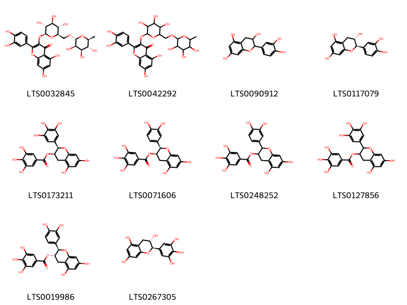{ width=100% }
    <figcaption>Hình ảnh cấu trúc hóa học của 10 hoạt chất thuộc nhóm Flavonoids gồm ['3-rutinosyl quercetin (LTS0032845)', 'rutin (LTS0042292)', 'catechol (LTS0090912)', '(+)-catechol (LTS0117079)', '(-)-epigallocatechin gallate (LTS0173211)', 'epicatechin gallate (LTS0071606)', '2-(3,4-dihydroxyphenyl)-5,7-dihydroxy-3,4-dihydro-2h-1-benzopyran-3-yl 3,4,5-trihydroxybenzoate (LTS0248252)', '5,7-dihydroxy-2-(3,4,5-trihydroxyphenyl)-3,4-dihydro-2h-1-benzopyran-3-yl 3,4,5-trihydroxybenzoate (LTS0127856)', 'catechin 3-o-gallate (LTS0019986)', 'gallocatechol (LTS0267305)'].</figcaption>
</figure>
#### Nhóm Organooxygen compounds
<figure markdown="span">
    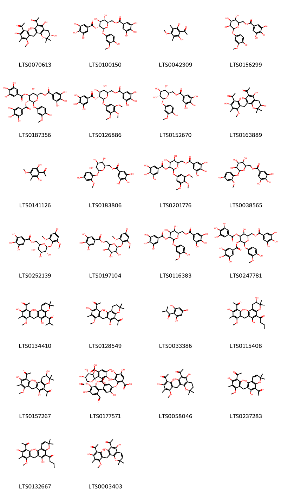{ width=100% }
    <figcaption>Hình ảnh cấu trúc hóa học của 26 hoạt chất thuộc nhóm Organooxygen compounds gồm ['1-(3-{[(3r)-6-acetyl-3,5,7-trihydroxy-2,2-dimethyl-3,4-dihydro-1-benzopyran-8-yl]methyl}-2,6-dihydroxy-4-methoxy-5-methylphenyl)ethanone (LTS0070613)', '[(2r,3s,4s,5r,6s)-3,4-dihydroxy-6-(4-hydroxy-3-methoxyphenoxy)-5-(3,4,5-trihydroxybenzoyloxy)oxan-2-yl]methyl 3,4,5-trihydroxybenzoate (LTS0100150)', '1-(2,6-dihydroxy-4-methoxy-3,5-dimethylphenyl)ethanone (LTS0042309)', '[3,4,5-trihydroxy-6-(4-hydroxy-3-methoxyphenoxy)oxan-2-yl]methyl 3,4,5-trihydroxybenzoate (LTS0156299)', '[(2r,3r,4s,5r,6s)-3-hydroxy-6-(4-hydroxy-3-methoxyphenoxy)-4,5-bis(3,4,5-trihydroxybenzoyloxy)oxan-2-yl]methyl 3,4,5-trihydroxybenzoate (LTS0187356)', '[(2r,3s,4s,5r,6s)-3,4-dihydroxy-5-(3,4,5-trihydroxybenzoyloxy)-6-(3,4,5-trimethoxyphenoxy)oxan-2-yl]methyl 3,4,5-trihydroxybenzoate (LTS0126886)', '[(2r,3s,4s,5r,6s)-3,4,5-trihydroxy-6-(4-hydroxy-3-methoxyphenoxy)oxan-2-yl]methyl 3,4,5-trihydroxybenzoate (LTS0152670)', '1-{3-[(6-acetyl-3,5,7-trihydroxy-2,2-dimethyl-3,4-dihydro-1-benzopyran-8-yl)methyl]-2,6-dihydroxy-4-methoxy-5-methylphenyl}ethanone (LTS0163889)', '1-(2,6-dihydroxy-4-methoxy-3-methylphenyl)ethanone (LTS0141126)', '[(2r,3s,4s,5r,6s)-3,4,5-trihydroxy-6-(4-hydroxy-2-methoxyphenoxy)oxan-2-yl]methyl 3,4,5-trihydroxybenzoate (LTS0183806)', '[3,4-dihydroxy-5-(3,4,5-trihydroxybenzoyloxy)-6-(3,4,5-trimethoxyphenoxy)oxan-2-yl]methyl 3,4,5-trihydroxybenzoate (LTS0201776)', '[3,4,5-trihydroxy-6-(4-hydroxy-2-methoxyphenoxy)oxan-2-yl]methyl 3,4,5-trihydroxybenzoate (LTS0038565)', '[(2r,3s,4s,5r,6s)-3,4,5-trihydroxy-6-(4-hydroxy-2,6-dimethoxyphenoxy)oxan-2-yl]methyl 3,4,5-trihydroxybenzoate (LTS0252139)', '[3,4,5-trihydroxy-6-(4-hydroxy-2,6-dimethoxyphenoxy)oxan-2-yl]methyl 3,4,5-trihydroxybenzoate (LTS0197104)', '[3,4-dihydroxy-6-(4-hydroxy-3-methoxyphenoxy)-5-(3,4,5-trihydroxybenzoyloxy)oxan-2-yl]methyl 3,4,5-trihydroxybenzoate (LTS0116383)', '[3-hydroxy-6-(4-hydroxy-3-methoxyphenoxy)-4,5-bis(3,4,5-trihydroxybenzoyloxy)oxan-2-yl]methyl 3,4,5-trihydroxybenzoate (LTS0247781)', 'isobutyrylmallotochromene (LTS0134410)', '1-{3-[(8-acetyl-5,7-dihydroxy-2,2-dimethyl-3,4-dihydro-1-benzopyran-6-yl)methyl]-2,6-dihydroxy-4-methoxy-5-methylphenyl}ethanone (LTS0128549)', '2-methyl-1-(2,4,6-trihydroxyphenyl)propan-1-one (LTS0033386)', '1-{6-[(3-acetyl-2,4-dihydroxy-6-methoxy-5-methylphenyl)methyl]-3,5,7-trihydroxy-2,2-dimethyl-3,4-dihydro-1-benzopyran-8-yl}butan-1-one (LTS0115408)', '1-{3-[(8-acetyl-3,5,7-trihydroxy-2,2-dimethyl-3,4-dihydro-1-benzopyran-6-yl)methyl]-2,6-dihydroxy-4-methoxy-5-methylphenyl}ethanone (LTS0157267)', "2-[(2s,3r,4s,5s,6s)-2-[4-(6-carboxy-2,3,4-trihydroxyphenoxy)-6'-formyl-2',3',4',5-tetrahydroxy-[1,1'-biphenyl]-2-carbonyloxy]-6-formyl-3,4,5-trihydroxyoxan-2-yl]-3,4,5-trihydroxybenzoic acid (LTS0177571)", '1-{3-[(6-acetyl-5,7-dihydroxy-2,2-dimethyl-3,4-dihydro-1-benzopyran-8-yl)methyl]-2,6-dihydroxy-4-methoxy-5-methylphenyl}ethanone (LTS0058046)', 'mallotochromene (LTS0237283)', 'butyrylmallotochromene (LTS0132667)', '1-{3-[(6-acetyl-5,7-dihydroxy-2,2-dimethylchromen-8-yl)methyl]-2,6-dihydroxy-4-methoxy-5-methylphenyl}ethanone (LTS0003403)'].</figcaption>
</figure>
#### Nhóm Phenols
<figure markdown="span">
    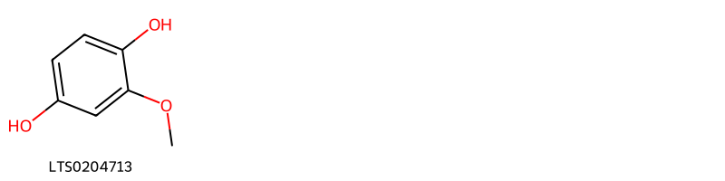{ width=100% }
    <figcaption>Hình ảnh cấu trúc hóa học của 1 hoạt chất thuộc nhóm Phenols gồm ['methoxyhydroquinone (LTS0204713)'].</figcaption>
</figure>
#### Nhóm Prenol lipids
<figure markdown="span">
    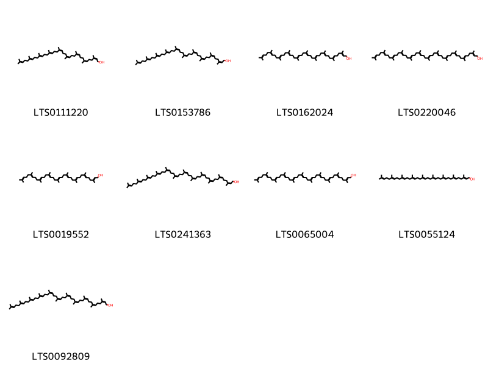{ width=100% }
    <figcaption>Hình ảnh cấu trúc hóa học của 9 hoạt chất thuộc nhóm Prenol lipids gồm ['(2z,6z,10z,14z,18z,22e,26e,30e)-3,7,11,15,19,23,27,31,35-nonamethylhexatriaconta-2,6,10,14,18,22,26,30,34-nonaen-1-ol (LTS0111220)', '(2z,6z,10z,14z,18z,22z,26e,30e,34e)-3,7,11,15,19,23,27,31,35,39-decamethyltetraconta-2,6,10,14,18,22,26,30,34,38-decaen-1-ol (LTS0153786)', '3,7,11,15,19,23,27,31,35,39-decamethyltetraconta-2,6,10,14,18,22,26,30,34,38-decaen-1-ol (LTS0162024)', '3,7,11,15,19,23,27,31,35,39,43,47-dodecamethyloctatetraconta-2,6,10,14,18,22,26,30,34,38,42,46-dodecaen-1-ol (LTS0220046)', '3,7,11,15,19,23,27,31,35-nonamethylhexatriaconta-2,6,10,14,18,22,26,30,34-nonaen-1-ol (LTS0019552)', '(2z,6z,10z,14z,18z,22z,26z,30z,34e,38e,42e)-3,7,11,15,19,23,27,31,35,39,43,47-dodecamethyloctatetraconta-2,6,10,14,18,22,26,30,34,38,42,46-dodecaen-1-ol (LTS0241363)', '3,7,11,15,19,23,27,31,35,39,43-undecamethyltetratetraconta-2,6,10,14,18,22,26,30,34,38,42-undecaen-1-ol (LTS0065004)', 'solanesol (LTS0055124)', '(2z,6z,10z,14z,18z,22z,26z,30e,34e,38e)-3,7,11,15,19,23,27,31,35,39,43-undecamethyltetratetraconta-2,6,10,14,18,22,26,30,34,38,42-undecaen-1-ol (LTS0092809)'].</figcaption>
</figure>
#### Nhóm Pyridines and derivatives
<figure markdown="span">
    { width=100% }
    <figcaption>Hình ảnh cấu trúc hóa học của 1 hoạt chất thuộc nhóm Pyridines and derivatives gồm ['vitamin b>3< (LTS0028908)'].</figcaption>
</figure>
#### Nhóm Steroids and steroid derivatives
<figure markdown="span">
    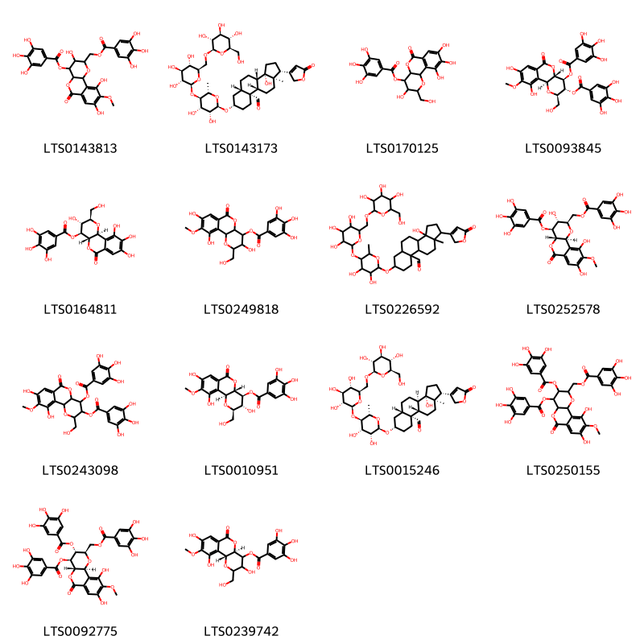{ width=100% }
    <figcaption>Hình ảnh cấu trúc hóa học của 14 hoạt chất thuộc nhóm Steroids and steroid derivatives gồm ['[5,12,14-trihydroxy-13-methoxy-9-oxo-6-(3,4,5-trihydroxybenzoyloxy)-3,8-dioxatricyclo[8.4.0.0²,⁷]tetradeca-1(14),10,12-trien-4-yl]methyl 3,4,5-trihydroxybenzoate (LTS0143813)', '(1r,3as,3bs,5as,7s,9ar,9bs,11ar)-7-{[(2r,3r,4s,5r,6s)-3,4-dihydroxy-6-methyl-5-{[(2s,3r,4s,5s,6r)-3,4,5-trihydroxy-6-({[(2r,3r,4s,5s,6r)-3,4,5-trihydroxy-6-(hydroxymethyl)oxan-2-yl]oxy}methyl)oxan-2-yl]oxy}oxan-2-yl]oxy}-3a-hydroxy-11a-methyl-1-(5-oxo-2h-furan-3-yl)-tetradecahydrocyclopenta[a]phenanthrene-9a-carbaldehyde (LTS0143173)', '5,12,13,14-tetrahydroxy-4-(hydroxymethyl)-9-oxo-3,8-dioxatricyclo[8.4.0.0²,⁷]tetradeca-1(10),11,13-trien-6-yl 3,4,5-trihydroxybenzoate (LTS0170125)', '(2s,4r,5r,6r,7s)-12,14-dihydroxy-4-(hydroxymethyl)-13-methoxy-9-oxo-6-(3,4,5-trihydroxybenzoyloxy)-3,8-dioxatricyclo[8.4.0.0²,⁷]tetradeca-1(14),10,12-trien-5-yl 3,4,5-trihydroxybenzoate (LTS0093845)', '(2s,4r,5r,6s,7s)-5,12,13,14-tetrahydroxy-4-(hydroxymethyl)-9-oxo-3,8-dioxatricyclo[8.4.0.0²,⁷]tetradeca-1(14),10,12-trien-6-yl 3,4,5-trihydroxybenzoate (LTS0164811)', '4-o-galloylbergenin (LTS0249818)', '7-[(3,4-dihydroxy-6-methyl-5-{[3,4,5-trihydroxy-6-({[3,4,5-trihydroxy-6-(hydroxymethyl)oxan-2-yl]oxy}methyl)oxan-2-yl]oxy}oxan-2-yl)oxy]-3a-hydroxy-11a-methyl-1-(5-oxo-2h-furan-3-yl)-tetradecahydrocyclopenta[a]phenanthrene-9a-carbaldehyde (LTS0226592)', '[(2s,4r,5r,6s,7s)-5,12,14-trihydroxy-13-methoxy-9-oxo-6-(3,4,5-trihydroxybenzoyloxy)-3,8-dioxatricyclo[8.4.0.0²,⁷]tetradeca-1(14),10,12-trien-4-yl]methyl 3,4,5-trihydroxybenzoate (LTS0252578)', '12,14-dihydroxy-4-(hydroxymethyl)-13-methoxy-9-oxo-6-(3,4,5-trihydroxybenzoyloxy)-3,8-dioxatricyclo[8.4.0.0²,⁷]tetradeca-1(14),10,12-trien-5-yl 3,4,5-trihydroxybenzoate (LTS0243098)', '(2s,4r,5r,6s,7s)-5,12,14-trihydroxy-4-(hydroxymethyl)-13-methoxy-9-oxo-3,8-dioxatricyclo[8.4.0.0²,⁷]tetradeca-1(14),10,12-trien-6-yl 3,4,5-trihydroxybenzoate (LTS0010951)', '(1r,3as,3br,5as,7s,9ar,9bs,11ar)-7-{[(2r,3r,4s,5r,6s)-3,4-dihydroxy-6-methyl-5-{[(2s,3r,4s,5s,6r)-3,4,5-trihydroxy-6-({[(2r,3r,4s,5s,6r)-3,4,5-trihydroxy-6-(hydroxymethyl)oxan-2-yl]oxy}methyl)oxan-2-yl]oxy}oxan-2-yl]oxy}-3a-hydroxy-11a-methyl-1-(5-oxo-2h-furan-3-yl)-tetradecahydrocyclopenta[a]phenanthrene-9a-carbaldehyde (LTS0015246)', '[12,14-dihydroxy-13-methoxy-9-oxo-5,6-bis(3,4,5-trihydroxybenzoyloxy)-3,8-dioxatricyclo[8.4.0.0²,⁷]tetradeca-1(14),10,12-trien-4-yl]methyl 3,4,5-trihydroxybenzoate (LTS0250155)', '[(2s,4r,5r,6r,7s)-12,14-dihydroxy-13-methoxy-9-oxo-5,6-bis(3,4,5-trihydroxybenzoyloxy)-3,8-dioxatricyclo[8.4.0.0²,⁷]tetradeca-1(14),10,12-trien-4-yl]methyl 3,4,5-trihydroxybenzoate (LTS0092775)', '(2r,7r)-5,12,14-trihydroxy-4-(hydroxymethyl)-13-methoxy-9-oxo-3,8-dioxatricyclo[8.4.0.0²,⁷]tetradeca-1(14),10,12-trien-6-yl 3,4,5-trihydroxybenzoate (LTS0239742)'].</figcaption>
</figure>
#### Nhóm Tannins
<figure markdown="span">
    { width=100% }
    <figcaption>Hình ảnh cấu trúc hóa học của 70 hoạt chất thuộc nhóm Tannins gồm ["3a,6,10',11',12',15',16',17',31',32',36',37'-dodecahydroxy-2,2',7',20',28',41'-hexaoxo-6,6a-dihydro-5h-3',6',21',24',27',38',42'-heptaoxaspiro[furo[3,2-b]furan-3,39'-nonacyclo[35.2.2.1³³,³⁶.0¹,³⁵.0⁴,²³.0⁵,²⁶.0⁸,¹³.0¹⁴,¹⁹.0²⁹,³⁴]dotetracontane]-8'(13'),9',11',14',16',18',29'(34'),30',32'-nonaen-25'-yl 3,4,5-trihydroxybenzoate (LTS0222182)", '2-{[7,8,11,12,13,22,23-heptahydroxy-3,16-dioxo-21-(3,4,5-trihydroxybenzoyloxy)-2,17,20-trioxatetracyclo[17.3.1.0⁴,⁹.0¹⁰,¹⁵]tricosa-4(9),5,7,10,12,14-hexaen-6-yl]oxy}-3,4,5-trihydroxybenzoic acid (LTS0108207)', '6,7,8,11,12,13,23-heptahydroxy-3,16-dioxo-21-(3,4,5-trihydroxybenzoyloxy)-2,17,20-trioxatetracyclo[17.3.1.0⁴,⁹.0¹⁰,¹⁵]tricosa-4(9),5,7,10,12,14-hexaen-22-yl 3,4,5-trihydroxybenzoate (LTS0194639)', 'β-glucogallin (LTS0193705)', '(2s,3r,4s,5s,6r)-4-hydroxy-3,5-bis(3,4,5-trihydroxybenzoyloxy)-6-[(3,4,5-trihydroxybenzoyloxy)methyl]oxan-2-yl 3,4,5-trihydroxybenzoate (LTS0219752)', '6,7,8,11,12,13,22,23-octahydroxy-3,16-dioxo-2,17,20-trioxatetracyclo[17.3.1.0⁴,⁹.0¹⁰,¹⁵]tricosa-4(9),5,7,10,12,14-hexaen-21-yl 3,4,5-trihydroxybenzoate (LTS0069732)', '7,14-dihydroxy-6,13-dimethoxy-2,9-dioxatetracyclo[6.6.2.0⁴,¹⁶.0¹¹,¹⁵]hexadeca-1(15),4(16),5,7,11,13-hexaene-3,10-dione (LTS0210764)', '(10r,11s,13r,14r,15s)-3,4,5,20,21,22-hexahydroxy-8,17-dioxo-14-(3,4,5-trihydroxybenzoyloxy)-13-[(3,4,5-trihydroxybenzoyloxy)methyl]-9,12,16-trioxatetracyclo[16.4.0.0²,⁷.0¹⁰,¹⁵]docosa-1(18),2,4,6,19,21-hexaen-11-yl 3,4,5-trihydroxybenzoate (LTS0082281)', '[(2r,3s,4s,5r,6r)-3,4,5,6-tetrahydroxyoxan-2-yl]methyl 2-{[(1s,19r,21s,22r,23r)-7,8,11,12,13,22,23-heptahydroxy-3,16-dioxo-21-(3,4,5-trihydroxybenzoyloxy)-2,17,20-trioxatetracyclo[17.3.1.0⁴,⁹.0¹⁰,¹⁵]tricosa-4(9),5,7,10,12,14-hexaen-6-yl]oxy}-3,4,5-trihydroxybenzoate (LTS0092392)', '{5,6,12,14-tetrahydroxy-13-methoxy-9-oxo-3,8-dioxatricyclo[8.4.0.0²,⁷]tetradeca-1(14),10,12-trien-4-yl}methyl 2-{[7,8,11,12,13,22,23-heptahydroxy-3,16-dioxo-21-(3,4,5-trihydroxybenzoyloxy)-2,17,20-trioxatetracyclo[17.3.1.0⁴,⁹.0¹⁰,¹⁵]tricosa-4(9),5,7,10(15),11,13-hexaen-6-yl]oxy}-3,4,5-trihydroxybenzoate (LTS0006508)', '2,3,14,15,16,19,20,21,35,36-decahydroxy-6,11,24,32-tetraoxo-7,10,25,28,31,40-hexaoxaoctacyclo[35.2.1.0⁵,³⁹.0⁸,²⁷.0⁹,³⁰.0¹²,¹⁷.0¹⁸,²³.0³³,³⁸]tetraconta-1(39),2,4,12(17),13,15,18,20,22,33,35,37-dodecaen-29-yl 3,4,5-trihydroxybenzoate (LTS0093059)', '2-{[6,7,8,11,12,22,23-heptahydroxy-3,16-dioxo-21-(3,4,5-trihydroxybenzoyloxy)-2,17,20-trioxatetracyclo[17.3.1.0⁴,⁹.0¹⁰,¹⁵]tricosa-4(9),5,7,10,12,14-hexaen-13-yl]oxy}-3,4,5-trihydroxybenzoic acid (LTS0123687)', '4-hydroxy-3,5-bis(3,4,5-trihydroxybenzoyloxy)-6-[(3,4,5-trihydroxybenzoyloxy)methyl]oxan-2-yl 3,4,5-trihydroxybenzoate (LTS0268749)', '3,4,5-trihydroxy-6-(hydroxymethyl)oxan-2-yl 3,4,5-trihydroxybenzoate (LTS0274683)', "2-[3a,6,11',12',15',16',17',31',32',36',37'-undecahydroxy-25'-(3,4,5-trihydroxybenzoyloxy)-6,6a-dihydro-5h-3',6',21',24',27',38',42'-heptaoxaspiro[furo[3,2-b]furan-3,39'-nonacyclo[35.2.2.1³³,³⁶.0¹,³⁵.0⁴,²³.0⁵,²⁶.0⁸,¹³.0¹⁴,¹⁹.0²⁹,³⁴]dotetracontane]-8'(13'),9',11',14',16',18',29'(34'),30',32'-nonaene-2,2',7',20',28',41'-hexoneoxy]-3,4,5-trihydroxybenzoic acid (LTS0167613)", "(1'r,3r,3as,4'r,5's,6s,6ar,23'r,25's,26'r,35'r,36'r,37'r)-3a,6,10',11',12',15',16',17',31',32',36',37'-dodecahydroxy-2,2',7',20',28',41'-hexaoxo-6,6a-dihydro-5h-3',6',21',24',27',38',42'-heptaoxaspiro[furo[3,2-b]furan-3,39'-nonacyclo[35.2.2.1³³,³⁶.0¹,³⁵.0⁴,²³.0⁵,²⁶.0⁸,¹³.0¹⁴,¹⁹.0²⁹,³⁴]dotetracontane]-8'(13'),9',11',14',16',18',29',31',33'-nonaen-25'-yl 3,4,5-trihydroxybenzoate (LTS0170429)", '[(2r,4r,5s,6s,7s)-5,6,12,14-tetrahydroxy-13-methoxy-9-oxo-3,8-dioxatricyclo[8.4.0.0²,⁷]tetradeca-1(14),10,12-trien-4-yl]methyl 2-{[(1s,19r,21s,22r,23r)-7,8,11,12,13,22,23-heptahydroxy-3,16-dioxo-21-(3,4,5-trihydroxybenzoyloxy)-2,17,20-trioxatetracyclo[17.3.1.0⁴,⁹.0¹⁰,¹⁵]tricosa-4(9),5,7,10(15),11,13-hexaen-6-yl]oxy}-3,4,5-trihydroxybenzoate (LTS0260249)', '3,4,5,11,14,20,21,22-octahydroxy-13-(hydroxymethyl)-9,12,16-trioxatetracyclo[16.4.0.0²,⁷.0¹⁰,¹⁵]docosa-1(22),2(7),3,5,18,20-hexaene-8,17-dione (LTS0149934)', '(1r,7s,9s,18r,19s,21r,22s)-7,8,8,12,13-pentahydroxy-3,6,16-trioxo-19-(3,4,5-trihydroxybenzoyloxy)-21-[(3,4,5-trihydroxybenzoyloxy)methyl]-2,17,20,23-tetraoxapentacyclo[16.3.1.1⁷,¹¹.0⁴,⁹.0¹⁰,¹⁵]tricosa-4,10,12,14-tetraen-22-yl 3,4,5-trihydroxybenzoate (LTS0249598)', '(1s,19r,21s,22r,23r)-6,7,8,11,12,13-hexahydroxy-3,16-dioxo-21,23-bis(3,4,5-trihydroxybenzoyloxy)-2,17,20-trioxatetracyclo[17.3.1.0⁴,⁹.0¹⁰,¹⁵]tricosa-4(9),5,7,10,12,14-hexaen-22-yl 3,4,5-trihydroxybenzoate (LTS0119020)', '(10r,11r,13r,14r,15s)-3,4,5,11,20,21,22-heptahydroxy-13-(hydroxymethyl)-8,17-dioxo-9,12,16-trioxatetracyclo[16.4.0.0²,⁷.0¹⁰,¹⁵]docosa-1(22),2(7),3,5,18,20-hexaen-14-yl 3,4,5-trihydroxybenzoate (LTS0164004)', '3,4,5-trihydroxy-6-[(3,4,5-trihydroxybenzoyloxy)methyl]oxan-2-yl 3,4,5-trihydroxybenzoate (LTS0089653)', '7-hydroxy-6,13,14-trimethoxy-2,9-dioxatetracyclo[6.6.2.0⁴,¹⁶.0¹¹,¹⁵]hexadeca-1(15),4(16),5,7,11,13-hexaene-3,10-dione (LTS0145372)', '1,13,14,15,18,19,20,34,35,39,39-undecahydroxy-2,5,10,23,31-pentaoxo-6,9,24,27,30,40-hexaoxaoctacyclo[34.3.1.0⁴,³⁸.0⁷,²⁶.0⁸,²⁹.0¹¹,¹⁶.0¹⁷,²².0³²,³⁷]tetraconta-3,11(16),12,14,17,19,21,32,34,36-decaen-28-yl 3,4,5-trihydroxybenzoate (LTS0129733)', '(3,4,5,6-tetrahydroxyoxan-2-yl)methyl 2-{[7,8,11,12,13,22,23-heptahydroxy-3,16-dioxo-21-(3,4,5-trihydroxybenzoyloxy)-2,17,20-trioxatetracyclo[17.3.1.0⁴,⁹.0¹⁰,¹⁵]tricosa-4(9),5,7,10,12,14-hexaen-6-yl]oxy}-3,4,5-trihydroxybenzoate (LTS0099060)', 'mallojaponin (LTS0156647)', '3,4,5,11,20,21,22-heptahydroxy-8,17-dioxo-13-[(3,4,5-trihydroxybenzoyloxy)methyl]-9,12,16-trioxatetracyclo[16.4.0.0²,⁷.0¹⁰,¹⁵]docosa-1(18),2,4,6,19,21-hexaen-14-yl 3,4,5-trihydroxybenzoate (LTS0156499)', '(1s,19r,21s,22r,23r)-6,7,8,11,12,13,22,23-octahydroxy-3,16-dioxo-2,17,20-trioxatetracyclo[17.3.1.0⁴,⁹.0¹⁰,¹⁵]tricosa-4(9),5,7,10,12,14-hexaen-21-yl 3,4,5-trihydroxybenzoate (LTS0089285)', "2-[(1'r,3r,3as,4'r,5's,6s,6ar,23'r,25's,26'r,35'r,36'r,37'r)-3a,6,11',12',15',16',17',31',32',36',37'-undecahydroxy-25'-(3,4,5-trihydroxybenzoyloxy)-6,6a-dihydro-5h-3',6',21',24',27',38',42'-heptaoxaspiro[furo[3,2-b]furan-3,39'-nonacyclo[35.2.2.1³³,³⁶.0¹,³⁵.0⁴,²³.0⁵,²⁶.0⁸,¹³.0¹⁴,¹⁹.0²⁹,³⁴]dotetracontane]-8'(13'),9',11',14',16',18',29',31',33'-nonaene-2,2',7',20',28',41'-hexoneoxy]-3,4,5-trihydroxybenzoic acid (LTS0249633)", '(1r,7r,8s,26r,28s,29r,38r)-1,13,14,15,18,19,20,34,35,39,39-undecahydroxy-2,5,10,23,31-pentaoxo-6,9,24,27,30,40-hexaoxaoctacyclo[34.3.1.0⁴,³⁸.0⁷,²⁶.0⁸,²⁹.0¹¹,¹⁶.0¹⁷,²².0³²,³⁷]tetraconta-3,11,13,15,17(22),18,20,32,34,36-decaen-28-yl 3,4,5-trihydroxybenzoate (LTS0223783)', '(8r,9s,27r,29s,30r)-2,3,14,15,16,19,20,21,35,36-decahydroxy-6,11,24,32-tetraoxo-7,10,25,28,31,40-hexaoxaoctacyclo[35.2.1.0⁵,³⁹.0⁸,²⁷.0⁹,³⁰.0¹²,¹⁷.0¹⁸,²³.0³³,³⁸]tetraconta-1(39),2,4,12(17),13,15,18,20,22,33,35,37-dodecaen-29-yl 3,4,5-trihydroxybenzoate (LTS0231544)', '(2s,3r,4s,5r,6r)-3,4,5-tris(3,4,5-trihydroxybenzoyloxy)-6-[(3,4,5-trihydroxybenzoyloxy)methyl]oxan-2-yl 3,4,5-trihydroxybenzoate (LTS0216134)', '3,4,5,11,20,21,22-heptahydroxy-13-(hydroxymethyl)-8,17-dioxo-9,12,16-trioxatetracyclo[16.4.0.0²,⁷.0¹⁰,¹⁵]docosa-1(18),2,4,6,19,21-hexaen-14-yl 3,4,5-trihydroxybenzoate (LTS0210345)', 'casuarictin (LTS0241644)', '2-{[(1s,19r,21s,22r,23r)-7,8,11,12,13,22,23-heptahydroxy-3,16-dioxo-21-(3,4,5-trihydroxybenzoyloxy)-2,17,20-trioxatetracyclo[17.3.1.0⁴,⁹.0¹⁰,¹⁵]tricosa-4(9),5,7,10,12,14-hexaen-6-yl]oxy}-3,4,5-trihydroxybenzoic acid (LTS0237839)', '6,7,8,11,12,13,22,23-octahydroxy-3,16-dioxo-2,17,20-trioxatetracyclo[17.3.1.0⁴,⁹.0¹⁰,¹⁵]tricosa-4(9),5,7,10,12,14-hexaen-21-yl 3,5-dihydroxy-4-(3,4,5-trihydroxybenzoyloxy)benzoate (LTS0217132)', '(2s,3r,4s,5s,6r)-3,4,5-trihydroxy-6-[(3,4,5-trihydroxybenzoyloxy)methyl]oxan-2-yl 3,4,5-trihydroxybenzoate (LTS0167635)', "(1'r,3r,3as,4's,5'r,6s,6ar,7's,8'r,17'r,18'r,19'r,25's)-3a,6,13',14',18',19',25'-heptahydroxy-5'-(hydroxymethyl)-2,2',10',23'-tetraoxo-6,6a-dihydro-5h-3',6',9',20',24'-pentaoxaspiro[furo[3,2-b]furan-3,21'-hexacyclo[17.2.2.1⁴,⁸.1¹⁵,¹⁸.0¹,¹⁷.0¹¹,¹⁶]pentacosane]-11'(16'),12',14'-trien-7'-yl 3,4,5-trihydroxybenzoate (LTS0229755)", '2-{[(1s,19r,21s,22r,23r)-6,7,8,11,12,22,23-heptahydroxy-3,16-dioxo-21-(3,4,5-trihydroxybenzoyloxy)-2,17,20-trioxatetracyclo[17.3.1.0⁴,⁹.0¹⁰,¹⁵]tricosa-4(9),5,7,10,12,14-hexaen-13-yl]oxy}-3,4,5-trihydroxybenzoic acid (LTS0186403)', '3,4,5-tris(3,4,5-trihydroxybenzoyloxy)-6-[(3,4,5-trihydroxybenzoyloxy)methyl]oxan-2-yl 3,4,5-trihydroxybenzoate (LTS0226232)', '6,7,8,11,12,13,22,23-octahydroxy-3,16-dioxo-2,17,20-trioxatetracyclo[17.3.1.0⁴,⁹.0¹⁰,¹⁵]tricosa-4(9),5,7,10,12,14-hexaen-21-yl 3,4-dihydroxy-5-(3,4,5-trihydroxybenzoyloxy)benzoate (LTS0022927)', '(1s,19r,21s,22r,23r)-6,7,8,11,12,13,22,23-octahydroxy-3,16-dioxo-2,17,20-trioxatetracyclo[17.3.1.0⁴,⁹.0¹⁰,¹⁵]tricosa-4(9),5,7,10,12,14-hexaen-21-yl 3,5-dihydroxy-4-(3,4,5-trihydroxybenzoyloxy)benzoate (LTS0258836)', '(1s,19r,21s,22r,23r)-6,7,8,11,12,13,22,23-octahydroxy-3,16-dioxo-2,17,20-trioxatetracyclo[17.3.1.0⁴,⁹.0¹⁰,¹⁵]tricosa-4(9),5,7,10,12,14-hexaen-21-yl 3,4-dihydroxy-5-(3,4,5-trihydroxybenzoyloxy)benzoate (LTS0229448)', '2-{[(1s,7r,8s,26r,28s,29r,38s)-1,14,15,18,19,20,34,35,39,39-decahydroxy-2,5,10,23,31-pentaoxo-28-(3,4,5-trihydroxybenzoyloxy)-6,9,24,27,30,40-hexaoxaoctacyclo[34.3.1.0⁴,³⁸.0⁷,²⁶.0⁸,²⁹.0¹¹,¹⁶.0¹⁷,²².0³²,³⁷]tetraconta-3,11,13,15,17(22),18,20,32,34,36-decaen-13-yl]oxy}-3,4,5-trihydroxybenzoic acid (LTS0047112)', '6,7,8,11,12,13-hexahydroxy-3,16-dioxo-21,22-bis(3,4,5-trihydroxybenzoyloxy)-2,17,20-trioxatetracyclo[17.3.1.0⁴,⁹.0¹⁰,¹⁵]tricosa-4(9),5,7,10,12,14-hexaen-23-yl 3,4,5-trihydroxybenzoate (LTS0057243)', '(1s,7s,9s,18r,19s,21r,22s)-7,8,8,12,13,22-hexahydroxy-21-(hydroxymethyl)-3,6,16-trioxo-2,17,20,23-tetraoxapentacyclo[16.3.1.1⁷,¹¹.0⁴,⁹.0¹⁰,¹⁵]tricosa-4,10,12,14-tetraen-19-yl 3,4,5-trihydroxybenzoate (LTS0121515)', '3,4,5,14,20,21,22-heptahydroxy-8,17-dioxo-13-[(3,4,5-trihydroxybenzoyloxy)methyl]-9,12,16-trioxatetracyclo[16.4.0.0²,⁷.0¹⁰,¹⁵]docosa-1(18),2,4,6,19,21-hexaen-11-yl 3,4,5-trihydroxybenzoate (LTS0134388)', '7,8,8,12,13,22-hexahydroxy-21-(hydroxymethyl)-3,6,16-trioxo-2,17,20,23-tetraoxapentacyclo[16.3.1.1⁷,¹¹.0⁴,⁹.0¹⁰,¹⁵]tricosa-4,10,12,14-tetraen-19-yl 3,4,5-trihydroxybenzoate (LTS0012385)', '7,8,9,12,13,14,28,29,30,33,34,35-dodecahydroxy-4,17,25,38-tetraoxo-3,18,21,24,39-pentaoxaheptacyclo[20.17.0.0²,¹⁹.0⁵,¹⁰.0¹¹,¹⁶.0²⁶,³¹.0³²,³⁷]nonatriaconta-5,7,9,11(16),12,14,26,28,30,32(37),33,35-dodecaen-20-yl 3,4,5-trihydroxybenzoate (LTS0009009)', '[7,8,8,12,13-pentahydroxy-3,6,16-trioxo-19,22-bis(3,4,5-trihydroxybenzoyloxy)-2,17,20,23-tetraoxapentacyclo[16.3.1.1⁷,¹¹.0⁴,⁹.0¹⁰,¹⁵]tricosa-4,10,12,14-tetraen-21-yl]methyl 3,4,5-trihydroxybenzoate (LTS0059680)', '(10r,11s,13r,14r,15s)-3,4,5,14,20,21,22-heptahydroxy-8,17-dioxo-13-[(3,4,5-trihydroxybenzoyloxy)methyl]-9,12,16-trioxatetracyclo[16.4.0.0²,⁷.0¹⁰,¹⁵]docosa-1(18),2,4,6,19,21-hexaen-11-yl 3,4,5-trihydroxybenzoate (LTS0019334)', "3a,6,13',14',18',19',25'-heptahydroxy-5'-(hydroxymethyl)-2,2',10',23'-tetraoxo-6,6a-dihydro-5h-3',6',9',20',24'-pentaoxaspiro[furo[3,2-b]furan-3,21'-hexacyclo[17.2.2.1⁴,⁸.1¹⁵,¹⁸.0¹,¹⁷.0¹¹,¹⁶]pentacosane]-11'(16'),12',14'-trien-7'-yl 3,4,5-trihydroxybenzoate (LTS0090111)", '(10r,11r,13r,14r,15s)-3,4,5,11,20,21,22-heptahydroxy-8,17-dioxo-13-[(3,4,5-trihydroxybenzoyloxy)methyl]-9,12,16-trioxatetracyclo[16.4.0.0²,⁷.0¹⁰,¹⁵]docosa-1(18),2,4,6,19,21-hexaen-14-yl 3,4,5-trihydroxybenzoate (LTS0104997)', '5-hydroxy-3,4-bis(3,4,5-trihydroxybenzoyloxy)-6-[(3,4,5-trihydroxybenzoyloxy)methyl]oxan-2-yl 3,4,5-trihydroxybenzoate (LTS0023424)', '(10r,11r,13r,14r,15s)-3,4,5,11,14,20,21,22-octahydroxy-13-(hydroxymethyl)-9,12,16-trioxatetracyclo[16.4.0.0²,⁷.0¹⁰,¹⁵]docosa-1(18),2,4,6,19,21-hexaene-8,17-dione (LTS0033259)', '(2s,3r,4s,5r,6r)-5-hydroxy-3,4-bis(3,4,5-trihydroxybenzoyloxy)-6-[(3,4,5-trihydroxybenzoyloxy)methyl]oxan-2-yl 3,4,5-trihydroxybenzoate (LTS0130248)', 'ellagic acid (LTS0037297)', '(1s,19r,21s,22r,23r)-6,7,8,11,12,13,23-heptahydroxy-3,16-dioxo-21-(3,4,5-trihydroxybenzoyloxy)-2,17,20-trioxatetracyclo[17.3.1.0⁴,⁹.0¹⁰,¹⁵]tricosa-4(9),5,7,10,12,14-hexaen-22-yl 3,4,5-trihydroxybenzoate (LTS0104297)', '[(10r,11r,13r,14r,15s)-3,4,5,11,14,20,21,22-octahydroxy-8,17-dioxo-9,12,16-trioxatetracyclo[16.4.0.0²,⁷.0¹⁰,¹⁵]docosa-1(18),2,4,6,19,21-hexaen-13-yl]methyl 3,4,5-trihydroxybenzoate (LTS0036285)', '3,4,5,20,21,22-hexahydroxy-8,17-dioxo-14-(3,4,5-trihydroxybenzoyloxy)-13-[(3,4,5-trihydroxybenzoyloxy)methyl]-9,12,16-trioxatetracyclo[16.4.0.0²,⁷.0¹⁰,¹⁵]docosa-1(18),2,4,6,19,21-hexaen-11-yl 3,4,5-trihydroxybenzoate (LTS0259543)', '{3,4,5,11,14,20,21,22-octahydroxy-8,17-dioxo-9,12,16-trioxatetracyclo[16.4.0.0²,⁷.0¹⁰,¹⁵]docosa-1(18),2,4,6,19,21-hexaen-13-yl}methyl 3,4,5-trihydroxybenzoate (LTS0038542)', '(1s,7s,9r,18r,19s,21r,22s)-7,8,8,12,13,22-hexahydroxy-21-(hydroxymethyl)-3,6,16-trioxo-2,17,20,23-tetraoxapentacyclo[16.3.1.1⁷,¹¹.0⁴,⁹.0¹⁰,¹⁵]tricosa-4,10,12,14-tetraen-19-yl 3,4,5-trihydroxybenzoate (LTS0111633)', '(1r,10r,18r,19r,21s,22s)-6,7,11,12,12-pentahydroxy-3,13,16-trioxo-21-(3,4,5-trihydroxybenzoyloxy)-19-[(3,4,5-trihydroxybenzoyloxy)methyl]-2,17,20,23-tetraoxapentacyclo[16.3.1.1⁸,¹¹.0⁴,⁹.0¹⁰,¹⁵]tricosa-4,6,8,14-tetraen-22-yl 3,4,5-trihydroxybenzoate (LTS0166801)', '(10r,13r,14r,15s)-3,4,5,11,20,21,22-heptahydroxy-13-(hydroxymethyl)-8,17-dioxo-9,12,16-trioxatetracyclo[16.4.0.0²,⁷.0¹⁰,¹⁵]docosa-1(22),2(7),3,5,18,20-hexaen-14-yl 3,4,5-trihydroxybenzoate (LTS0102189)', 'mallotusinic acid (LTS0216835)', '(1r,38r)-1,13,14,15,18,19,20,34,35,39,39-undecahydroxy-2,5,10,23,31-pentaoxo-6,9,24,27,30,40-hexaoxaoctacyclo[34.3.1.0⁴,³⁸.0⁷,²⁶.0⁸,²⁹.0¹¹,¹⁶.0¹⁷,²².0³²,³⁷]tetraconta-3,11(16),12,14,17,19,21,32,34,36-decaen-28-yl 3,4,5-trihydroxybenzoate (LTS0043003)', '{5,6,12,14-tetrahydroxy-13-methoxy-9-oxo-3,8-dioxatricyclo[8.4.0.0²,⁷]tetradeca-1(14),10,12-trien-4-yl}methyl 5-{[7,8,11,12,13,22,23-heptahydroxy-3,16-dioxo-21-(3,4,5-trihydroxybenzoyloxy)-2,17,20-trioxatetracyclo[17.3.1.0⁴,⁹.0¹⁰,¹⁵]tricosa-4(9),5,7,10(15),11,13-hexaen-6-yl]oxy}-2,3,4-trihydroxybenzoate (LTS0258597)', '(1s,8r,9r,18r,19s,21r,22s)-7,7,8,12,13,22-hexahydroxy-21-(hydroxymethyl)-3,6,16-trioxo-2,17,20,23-tetraoxapentacyclo[16.3.1.1⁸,¹¹.0⁴,⁹.0¹⁰,¹⁵]tricosa-4,10,12,14-tetraen-19-yl 3,4,5-trihydroxybenzoate (LTS0192242)', '2-{[(1r,7r,8s,26r,28s,29r,38r)-1,14,15,18,19,20,34,35,39,39-decahydroxy-2,5,10,23,31-pentaoxo-28-(3,4,5-trihydroxybenzoyloxy)-6,9,24,27,30,40-hexaoxaoctacyclo[34.3.1.0⁴,³⁸.0⁷,²⁶.0⁸,²⁹.0¹¹,¹⁶.0¹⁷,²².0³²,³⁷]tetraconta-3,11,13,15,17(22),18,20,32,34,36-decaen-13-yl]oxy}-3,4,5-trihydroxybenzoic acid (LTS0262264)', '(7r,8s,26r,28s,29s)-1,13,14,15,18,19,20,34,35,39,39-undecahydroxy-2,5,10,23,31-pentaoxo-6,9,24,27,30,40-hexaoxaoctacyclo[34.3.1.0⁴,³⁸.0⁷,²⁶.0⁸,²⁹.0¹¹,¹⁶.0¹⁷,²².0³²,³⁷]tetraconta-3,11,13,15,17(22),18,20,32,34,36-decaen-28-yl 3,4,5-trihydroxybenzoate (LTS0238381)'].</figcaption>
</figure>

---

### Dược dân tộc học

Danh sách các quốc gia có sử dụng *Mallotus japonicus* trong điều trị các bệnh. 

| Country   | Disease   | Bệnh    |
|:----------|:----------|:--------|
| Elsewhere | Stomachic | Sững sờ |

---

---
## Mallotus lancifolius
### Thông tin về thực vật

!!! info "Phân loại thực vật của *Mallotus lancifolius* từ GIBF:"
    - **Kingdom:** Plantae
    - **Phylum:** Tracheophyta
    - **Order:** Malpighiales
    - **Family:** Euphorbiaceae
    - **Genus:** Mallotus
    - **Species:** *Mallotus lancifolius*

 

| Label (VI)   | Label (EN)   | Scientific Name      | Descriptions (VI)   | Descriptions (EN)   | Also Known As (VI)   | Also Known As (EN)   |
|:-------------|:-------------|:---------------------|:--------------------|:--------------------|:---------------------|:---------------------|
| N/A          | N/A          | Mallotus lancifolius | loài thực vật       | species of plant    | ['']                 | ['']                 |

#### Phân bố trên thế giới

**Từ CSDL GIBF** nan, Indonesia, Malaysia

#### Phân bố tại Việt Nam

**Từ CSDL GIBF**: Không có ghi nhận ở Việt Nam

---
### Thành phần hóa học
        
- Theo cơ sở dữ liệu lotus: Từ loài *Mallotus lancifolius* đã phân lập và xác định được Chưa có hoạt chất nào được phân lập. hoạt chất thuộc về các nhóm Không có hoạt chất nào được phân lập. 

Không có hình ảnh nào được tạo ra

---

### Dược dân tộc học

Danh sách các quốc gia có sử dụng *Mallotus lancifolius* trong điều trị các bệnh. 

| Country   | Disease   | Bệnh     |
|:----------|:----------|:---------|
| Malaya    | Poison    | Chất độc |

---

---
## Mallotus muticum
### Thông tin về thực vật

!!! info "Phân loại thực vật của *Mallotus muticus* từ GIBF:"
    - **Kingdom:** Plantae
    - **Phylum:** Tracheophyta
    - **Order:** Malpighiales
    - **Family:** Euphorbiaceae
    - **Genus:** Mallotus
    - **Species:** *Mallotus muticus*

 

| Label (VI)   | Label (EN)   | Scientific Name      | Descriptions (VI)   | Descriptions (EN)   | Also Known As (VI)   | Also Known As (EN)   |
|:-------------|:-------------|:---------------------|:--------------------|:--------------------|:---------------------|:---------------------|
| N/A          | N/A          | Mallotus lancifolius | loài thực vật       | species of plant    | ['']                 | ['']                 |

#### Phân bố trên thế giới

**Từ CSDL GIBF** nan, Thailand, unknown or invalid, Indonesia, Malaysia

#### Phân bố tại Việt Nam

**Từ CSDL GIBF**: Không có ghi nhận ở Việt Nam

---
### Thành phần hóa học
        
- Theo cơ sở dữ liệu lotus: Từ loài *Mallotus muticus* đã phân lập và xác định được Chưa có hoạt chất nào được phân lập. hoạt chất thuộc về các nhóm Không có hoạt chất nào được phân lập. 

Không có hình ảnh nào được tạo ra

---

### Dược dân tộc học

Danh sách các quốc gia có sử dụng *Mallotus muticus* trong điều trị các bệnh. 

| Country   | Disease   | Bệnh     |
|:----------|:----------|:---------|
| Malaya    | Poison    | Chất độc |

---

---
## Mallotus oppositifolius
### Thông tin về thực vật

!!! info "Phân loại thực vật của *Mallotus oppositifolius* từ GIBF:"
    - **Kingdom:** Plantae
    - **Phylum:** Tracheophyta
    - **Order:** Malpighiales
    - **Family:** Euphorbiaceae
    - **Genus:** Mallotus
    - **Species:** *Mallotus oppositifolius*

 

| Label (VI)   | Label (EN)   | Scientific Name         | Descriptions (VI)   | Descriptions (EN)   | Also Known As (VI)   | Also Known As (EN)   |
|:-------------|:-------------|:------------------------|:--------------------|:--------------------|:---------------------|:---------------------|
| N/A          | N/A          | Mallotus oppositifolius | loài thực vật       | species of plant    | ['']                 | ['']                 |

#### Phân bố trên thế giới

**Từ CSDL GIBF** Madagascar, Nigeria, Gabon, Côte d’Ivoire, Benin, Guinea, Cameroon, Tanzania, United Republic of

#### Phân bố tại Việt Nam

**Từ CSDL GIBF**: Không có ghi nhận ở Việt Nam

---
### Thành phần hóa học
        
- Theo cơ sở dữ liệu lotus: Từ loài *Mallotus oppositifolius* đã phân lập và xác định được Chưa có hoạt chất nào được phân lập. hoạt chất thuộc về các nhóm Không có hoạt chất nào được phân lập. 

Không có hình ảnh nào được tạo ra

---

### Dược dân tộc học

Danh sách các quốc gia có sử dụng *Mallotus oppositifolius* trong điều trị các bệnh. 

| Country     | Disease                | Bệnh                   |
|:------------|:-----------------------|:-----------------------|
| Ghana       | Hemostat               | Máy cầm máu            |
| Upper Volta | Vermifuge, Aphrodisiac | Vermifuge, Aphrodisiac |

---

---
## Mallotus philippensis
### Thông tin về thực vật

!!! info "Phân loại thực vật của *Mallotus philippensis* từ GIBF:"
    - **Kingdom:** Plantae
    - **Phylum:** Tracheophyta
    - **Order:** Malpighiales
    - **Family:** Euphorbiaceae
    - **Genus:** Mallotus
    - **Species:** *Mallotus philippensis*

 

| Label (VI)   | Label (EN)   | Scientific Name       | Descriptions (VI)   | Descriptions (EN)   | Also Known As (VI)   | Also Known As (EN)                      |
|:-------------|:-------------|:----------------------|:--------------------|:--------------------|:---------------------|:----------------------------------------|
| N/A          | N/A          | Mallotus philippensis | loài thực vật       | species of plant    | ['']                 | ['Mallotus phillipensis (misspelling)'] |

#### Phân bố trên thế giới

**Từ CSDL GIBF** nan, Australia, Japan, Chinese Taipei, Bhutan, India, Indonesia, United States of America, China, Nepal

#### Phân bố tại Việt Nam

**Từ CSDL GIBF**: Không có ghi nhận ở Việt Nam

---
### Thành phần hóa học
        
- Theo cơ sở dữ liệu lotus: Từ loài *Mallotus philippensis* đã phân lập và xác định được 38 hoạt chất thuộc về các nhóm Flavonoids, Prenol lipids, Linear 1,3-diarylpropanoids, Diarylheptanoids, Organooxygen compounds. 

|    | chemicalTaxonomyClassyfireClass   |   smiles_count |
|---:|:----------------------------------|---------------:|
|  0 | Diarylheptanoids                  |              6 |
|  1 | Flavonoids                        |             10 |
|  2 | Linear 1,3-diarylpropanoids       |              5 |
|  3 | Organooxygen compounds            |              5 |
|  4 | Prenol lipids                     |             12 |

#### Nhóm Diarylheptanoids
<figure markdown="span">
    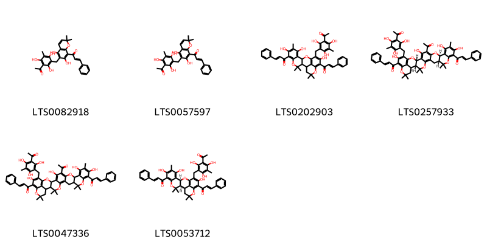{ width=100% }
    <figcaption>Hình ảnh cấu trúc hóa học của 6 hoạt chất thuộc nhóm Diarylheptanoids gồm ['rottlerin (LTS0082918)', '1-{6-[(3-acetyl-2,4,6-trihydroxy-5-methylphenyl)methyl]-5,7-dihydroxy-2,2-dimethylchromen-8-yl}-3-phenylprop-2-en-1-one (LTS0057597)', '1-{14-[(3-acetyl-2,4,6-trihydroxy-5-methylphenyl)methyl]-7,9,15-trihydroxy-3,3,8,19,19-pentamethyl-6-(3-phenylprop-2-enoyl)-4,12,18-trioxapentacyclo[11.7.1.0²,¹¹.0⁵,¹⁰.0¹⁷,²¹]henicosa-5,7,9,13(21),14,16-hexaen-16-yl}-3-phenylprop-2-en-1-one (LTS0202903)', '(2e)-1-[(1r,2r,8r,17r,23s)-20-acetyl-26-[(3-acetyl-2,4,6-trihydroxy-5-methylphenyl)methyl]-13,15,21,27-tetrahydroxy-3,3,9,9,14,31,31-heptamethyl-12-[(2e)-3-phenylprop-2-enoyl]-4,10,18,24,30-pentaoxaoctacyclo[23.7.1.0²,²³.0⁵,²².0⁶,¹⁹.0⁸,¹⁷.0¹¹,¹⁶.0²⁹,³³]tritriaconta-5,11,13,15,19,21,25(33),26,28-nonaen-28-yl]-3-phenylprop-2-en-1-one (LTS0257933)', '1-{20-acetyl-26-[(3-acetyl-2,4,6-trihydroxy-5-methylphenyl)methyl]-13,15,21,27-tetrahydroxy-3,3,9,9,14,31,31-heptamethyl-12-(3-phenylprop-2-enoyl)-4,10,18,24,30-pentaoxaoctacyclo[23.7.1.0²,²³.0⁵,²².0⁶,¹⁹.0⁸,¹⁷.0¹¹,¹⁶.0²⁹,³³]tritriaconta-5,11,13,15,19,21,25(33),26,28-nonaen-28-yl}-3-phenylprop-2-en-1-one (LTS0047336)', '(2e)-1-[(1r,2r,11s)-14-[(3-acetyl-2,4,6-trihydroxy-5-methylphenyl)methyl]-7,9,15-trihydroxy-3,3,8,19,19-pentamethyl-6-[(2e)-3-phenylprop-2-enoyl]-4,12,18-trioxapentacyclo[11.7.1.0²,¹¹.0⁵,¹⁰.0¹⁷,²¹]henicosa-5,7,9,13(21),14,16-hexaen-16-yl]-3-phenylprop-2-en-1-one (LTS0053712)'].</figcaption>
</figure>
#### Nhóm Flavonoids
<figure markdown="span">
    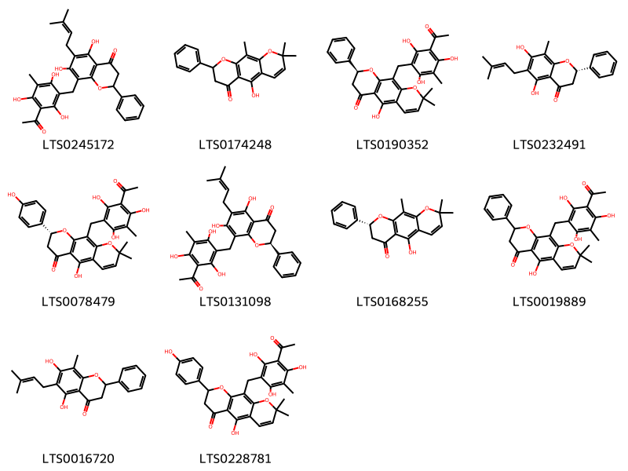{ width=100% }
    <figcaption>Hình ảnh cấu trúc hóa học của 10 hoạt chất thuộc nhóm Flavonoids gồm ['8-[(3-acetyl-2,4,6-trihydroxy-5-methylphenyl)methyl]-5,7-dihydroxy-6-(3-methylbut-2-en-1-yl)-2-phenyl-2,3-dihydro-1-benzopyran-4-one (LTS0245172)', '5-hydroxy-8,8,10-trimethyl-2-phenyl-2h,3h-pyrano[3,2-g]chromen-4-one (LTS0174248)', '(2s)-10-[(3-acetyl-2,4,6-trihydroxy-5-methylphenyl)methyl]-5-hydroxy-8,8-dimethyl-2-phenyl-2h,3h-pyrano[3,2-g]chromen-4-one (LTS0190352)', '(2s)-5,7-dihydroxy-8-methyl-6-(3-methylbut-2-en-1-yl)-2-phenyl-2,3-dihydro-1-benzopyran-4-one (LTS0232491)', '(2r)-10-[(3-acetyl-2,4,6-trihydroxy-5-methylphenyl)methyl]-5-hydroxy-2-(4-hydroxyphenyl)-8,8-dimethyl-2h,3h-pyrano[3,2-g]chromen-4-one (LTS0078479)', '(2s)-8-[(3-acetyl-2,4,6-trihydroxy-5-methylphenyl)methyl]-5,7-dihydroxy-6-(3-methylbut-2-en-1-yl)-2-phenyl-2,3-dihydro-1-benzopyran-4-one (LTS0131098)', '(2r)-5-hydroxy-8,8,10-trimethyl-2-phenyl-2h,3h-pyrano[3,2-g]chromen-4-one (LTS0168255)', '10-[(3-acetyl-2,4,6-trihydroxy-5-methylphenyl)methyl]-5-hydroxy-8,8-dimethyl-2-phenyl-2h,3h-pyrano[3,2-g]chromen-4-one (LTS0019889)', '5,7-dihydroxy-8-methyl-6-(3-methylbut-2-en-1-yl)-2-phenyl-2,3-dihydro-1-benzopyran-4-one (LTS0016720)', '10-[(3-acetyl-2,4,6-trihydroxy-5-methylphenyl)methyl]-5-hydroxy-2-(4-hydroxyphenyl)-8,8-dimethyl-2h,3h-pyrano[3,2-g]chromen-4-one (LTS0228781)'].</figcaption>
</figure>
#### Nhóm Linear 1_3-diarylpropanoids
<figure markdown="span">
    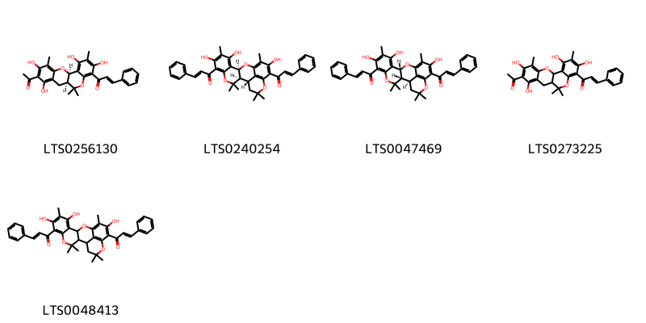{ width=100% }
    <figcaption>Hình ảnh cấu trúc hóa học của Không tìm thấy chú thích hoạt chất thuộc nhóm Linear 1_3-diarylpropanoids gồm Không tìm thấy chú thích.</figcaption>
</figure>
#### Nhóm Organooxygen compounds
<figure markdown="span">
    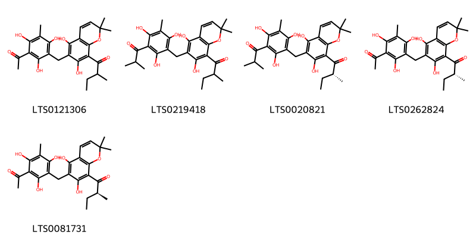{ width=100% }
    <figcaption>Hình ảnh cấu trúc hóa học của 5 hoạt chất thuộc nhóm Organooxygen compounds gồm ['mallotophilippen b (LTS0121306)', 'mallotophilippen a (LTS0219418)', '(2r)-1-(5,7-dihydroxy-2,2-dimethyl-6-{[2,4,6-trihydroxy-3-methyl-5-(2-methylpropanoyl)phenyl]methyl}chromen-8-yl)-2-methylbutan-1-one (LTS0020821)', '(2r)-1-{6-[(3-acetyl-2,4,6-trihydroxy-5-methylphenyl)methyl]-5,7-dihydroxy-2,2-dimethylchromen-8-yl}-2-methylbutan-1-one (LTS0262824)', '(2s)-1-{6-[(3-acetyl-2,4,6-trihydroxy-5-methylphenyl)methyl]-5,7-dihydroxy-2,2-dimethylchromen-8-yl}-2-methylbutan-1-one (LTS0081731)'].</figcaption>
</figure>
#### Nhóm Prenol lipids
<figure markdown="span">
    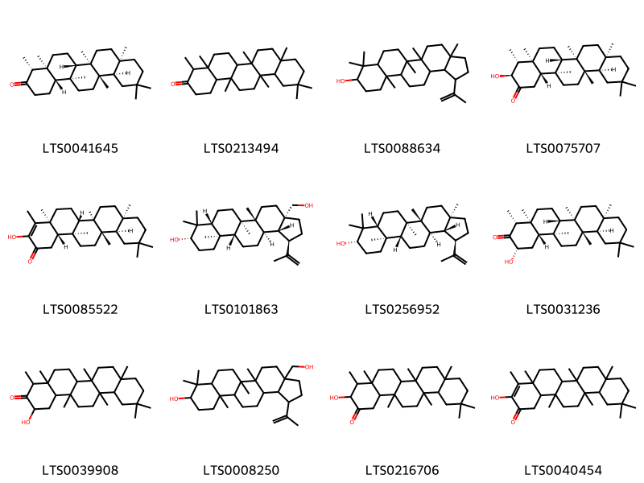{ width=100% }
    <figcaption>Hình ảnh cấu trúc hóa học của 12 hoạt chất thuộc nhóm Prenol lipids gồm ['(-)-friedelin (LTS0041645)', 'friedelin (LTS0213494)', 'lupeol (LTS0088634)', '(3s,4r,4as,6as,6br,8ar,12ar,12bs,14as,14bs)-3-hydroxy-4,4a,6b,8a,11,11,12b,14a-octamethyl-tetradecahydro-1h-picen-2-one (LTS0075707)', '(4as,6as,6br,8ar,12ar,12bs,14ar,14bs)-3-hydroxy-4,4a,6b,8a,11,11,12b,14a-octamethyl-5,6,6a,7,8,9,10,12,12a,13,14,14b-dodecahydro-1h-picen-2-one (LTS0085522)', 'betulin (LTS0101863)', 'lupeol (LTS0256952)', '(2s,4r,4as,6as,6br,8ar,12ar,12bs,14as,14bs)-2-hydroxy-4,4a,6b,8a,11,11,12b,14a-octamethyl-tetradecahydro-1h-picen-3-one (LTS0031236)', 'ceresin (LTS0039908)', '3a-(hydroxymethyl)-5a,5b,8,8,11a-pentamethyl-1-(prop-1-en-2-yl)-hexadecahydrocyclopenta[a]chrysen-9-ol (LTS0008250)', '3-hydroxy-4,4a,6b,8a,11,11,12b,14a-octamethyl-tetradecahydro-1h-picen-2-one (LTS0216706)', '3-hydroxy-4,4a,6b,8a,11,11,12b,14a-octamethyl-5,6,6a,7,8,9,10,12,12a,13,14,14b-dodecahydro-1h-picen-2-one (LTS0040454)'].</figcaption>
</figure>

---

### Dược dân tộc học

Danh sách các quốc gia có sử dụng *Mallotus philippensis* trong điều trị các bệnh. 

| Country   | Disease                                                                                         | Bệnh                                                                                                          |
|:----------|:------------------------------------------------------------------------------------------------|:--------------------------------------------------------------------------------------------------------------|
| Australia | Vermifuge                                                                                       | Thuốc diệt sán                                                                                                |
| Elsewhere | Antifertility, Antioxidant, Poison, Styptic, Taenifuge, Vermifuge, nan, Parasiticide, Piscicide | Chất chống oxy hóa, Chất chống oxy hóa, Chất độc, Styptic, Taenifuge, Vermifuge, nan, Parasiticide, Piscicide |

---

---
## Mallotus philippinensis
### Thông tin về thực vật

!!! info "Phân loại thực vật của *Mallotus philippensis* từ GIBF:"
    - **Kingdom:** Plantae
    - **Phylum:** Tracheophyta
    - **Order:** Malpighiales
    - **Family:** Euphorbiaceae
    - **Genus:** Mallotus
    - **Species:** *Mallotus philippensis*

 

| Label (VI)   | Label (EN)   | Scientific Name         | Descriptions (VI)   | Descriptions (EN)   | Also Known As (VI)   | Also Known As (EN)   |
|:-------------|:-------------|:------------------------|:--------------------|:--------------------|:---------------------|:---------------------|
| N/A          | N/A          | Mallotus philippinensis | loài thực vật       | species of plants   | ['']                 | ['']                 |

#### Phân bố trên thế giới

**Từ CSDL GIBF** nan, Australia, Japan, Chinese Taipei, Bhutan, India, Indonesia, United States of America, China, Nepal

#### Phân bố tại Việt Nam

**Từ CSDL GIBF**: Không có ghi nhận ở Việt Nam

---
### Thành phần hóa học
        
- Theo cơ sở dữ liệu lotus: Từ loài *Mallotus philippensis* đã phân lập và xác định được 31 hoạt chất thuộc về các nhóm Flavonoids, Prenol lipids, Linear 1,3-diarylpropanoids, Diarylheptanoids, Isocoumarins and derivatives, Benzene and substituted derivatives, Organooxygen compounds, Tannins, Carboxylic acids and derivatives. 

|    | chemicalTaxonomyClassyfireClass     |   smiles_count |
|---:|:------------------------------------|---------------:|
|  0 | Benzene and substituted derivatives |              3 |
|  1 | Carboxylic acids and derivatives    |              1 |
|  2 | Diarylheptanoids                    |              3 |
|  3 | Flavonoids                          |              1 |
|  4 | Isocoumarins and derivatives        |              1 |
|  5 | Linear 1,3-diarylpropanoids         |             10 |
|  6 | Organooxygen compounds              |              3 |
|  7 | Prenol lipids                       |              1 |
|  8 | Tannins                             |              8 |

#### Nhóm Benzene and substituted derivatives
<figure markdown="span">
    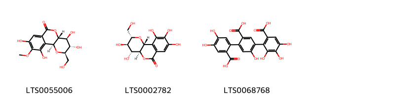{ width=100% }
    <figcaption>Hình ảnh cấu trúc hóa học của 3 hoạt chất thuộc nhóm Benzene and substituted derivatives gồm ['bergenin (LTS0055006)', '(2r,4s,5r,6r,7s)-5,6,12,13,14-pentahydroxy-4-(hydroxymethyl)-3,8-dioxatricyclo[8.4.0.0²,⁷]tetradeca-1(10),11,13-trien-9-one (LTS0002782)', 'flavogallonic acid (LTS0068768)'].</figcaption>
</figure>
#### Nhóm Carboxylic acids and derivatives
<figure markdown="span">
    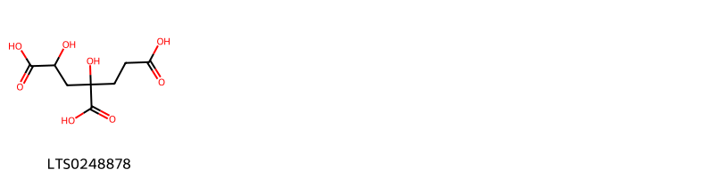{ width=100% }
    <figcaption>Hình ảnh cấu trúc hóa học của 1 hoạt chất thuộc nhóm Carboxylic acids and derivatives gồm ['1,3-dihydroxypentane-1,3,5-tricarboxylic acid (LTS0248878)'].</figcaption>
</figure>
#### Nhóm Diarylheptanoids
<figure markdown="span">
    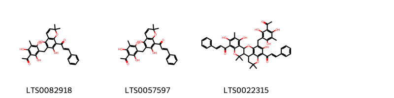{ width=100% }
    <figcaption>Hình ảnh cấu trúc hóa học của 3 hoạt chất thuộc nhóm Diarylheptanoids gồm ['rottlerin (LTS0082918)', '1-{6-[(3-acetyl-2,4,6-trihydroxy-5-methylphenyl)methyl]-5,7-dihydroxy-2,2-dimethylchromen-8-yl}-3-phenylprop-2-en-1-one (LTS0057597)', '(2e)-1-{14-[(3-acetyl-2,4,6-trihydroxy-5-methylphenyl)methyl]-7,9,15-trihydroxy-3,3,8,19,19-pentamethyl-6-[(2e)-3-phenylprop-2-enoyl]-4,12,18-trioxapentacyclo[11.7.1.0²,¹¹.0⁵,¹⁰.0¹⁷,²¹]henicosa-5,7,9,13(21),14,16-hexaen-16-yl}-3-phenylprop-2-en-1-one (LTS0022315)'].</figcaption>
</figure>
#### Nhóm Flavonoids
<figure markdown="span">
    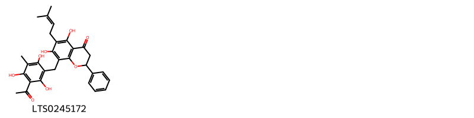{ width=100% }
    <figcaption>Hình ảnh cấu trúc hóa học của 1 hoạt chất thuộc nhóm Flavonoids gồm ['8-[(3-acetyl-2,4,6-trihydroxy-5-methylphenyl)methyl]-5,7-dihydroxy-6-(3-methylbut-2-en-1-yl)-2-phenyl-2,3-dihydro-1-benzopyran-4-one (LTS0245172)'].</figcaption>
</figure>
#### Nhóm Isocoumarins and derivatives
<figure markdown="span">
    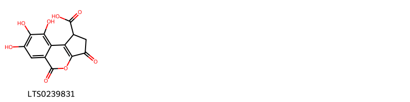{ width=100% }
    <figcaption>Hình ảnh cấu trúc hóa học của 1 hoạt chất thuộc nhóm Isocoumarins and derivatives gồm ['7,8,9-trihydroxy-3,5-dioxo-1h,2h-cyclopenta[c]isochromene-1-carboxylic acid (LTS0239831)'].</figcaption>
</figure>
#### Nhóm Linear 1_3-diarylpropanoids
<figure markdown="span">
    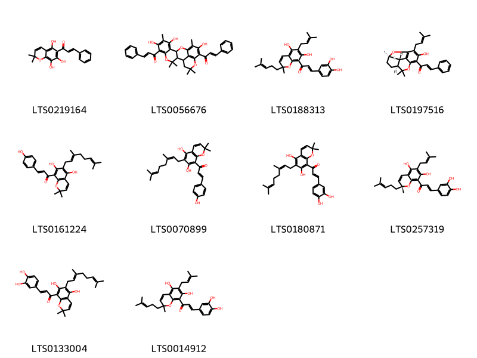{ width=100% }
    <figcaption>Hình ảnh cấu trúc hóa học của Không tìm thấy chú thích hoạt chất thuộc nhóm Linear 1_3-diarylpropanoids gồm Không tìm thấy chú thích.</figcaption>
</figure>
#### Nhóm Organooxygen compounds
<figure markdown="span">
    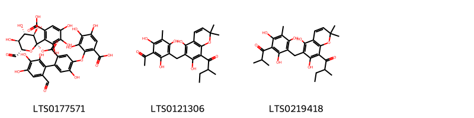{ width=100% }
    <figcaption>Hình ảnh cấu trúc hóa học của 3 hoạt chất thuộc nhóm Organooxygen compounds gồm ["2-[(2s,3r,4s,5s,6s)-2-[4-(6-carboxy-2,3,4-trihydroxyphenoxy)-6'-formyl-2',3',4',5-tetrahydroxy-[1,1'-biphenyl]-2-carbonyloxy]-6-formyl-3,4,5-trihydroxyoxan-2-yl]-3,4,5-trihydroxybenzoic acid (LTS0177571)", 'mallotophilippen b (LTS0121306)', 'mallotophilippen a (LTS0219418)'].</figcaption>
</figure>
#### Nhóm Prenol lipids
<figure markdown="span">
    { width=100% }
    <figcaption>Hình ảnh cấu trúc hóa học của 1 hoạt chất thuộc nhóm Prenol lipids gồm ['(-)-friedelin (LTS0041645)'].</figcaption>
</figure>
#### Nhóm Tannins
<figure markdown="span">
    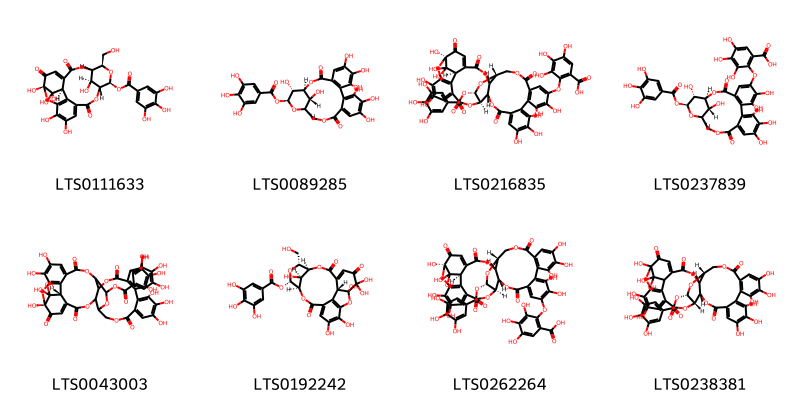{ width=100% }
    <figcaption>Hình ảnh cấu trúc hóa học của 8 hoạt chất thuộc nhóm Tannins gồm ['(1s,7s,9r,18r,19s,21r,22s)-7,8,8,12,13,22-hexahydroxy-21-(hydroxymethyl)-3,6,16-trioxo-2,17,20,23-tetraoxapentacyclo[16.3.1.1⁷,¹¹.0⁴,⁹.0¹⁰,¹⁵]tricosa-4,10,12,14-tetraen-19-yl 3,4,5-trihydroxybenzoate (LTS0111633)', '(1s,19r,21s,22r,23r)-6,7,8,11,12,13,22,23-octahydroxy-3,16-dioxo-2,17,20-trioxatetracyclo[17.3.1.0⁴,⁹.0¹⁰,¹⁵]tricosa-4(9),5,7,10,12,14-hexaen-21-yl 3,4,5-trihydroxybenzoate (LTS0089285)', 'mallotusinic acid (LTS0216835)', '2-{[(1s,19r,21s,22r,23r)-7,8,11,12,13,22,23-heptahydroxy-3,16-dioxo-21-(3,4,5-trihydroxybenzoyloxy)-2,17,20-trioxatetracyclo[17.3.1.0⁴,⁹.0¹⁰,¹⁵]tricosa-4(9),5,7,10,12,14-hexaen-6-yl]oxy}-3,4,5-trihydroxybenzoic acid (LTS0237839)', '(1r,38r)-1,13,14,15,18,19,20,34,35,39,39-undecahydroxy-2,5,10,23,31-pentaoxo-6,9,24,27,30,40-hexaoxaoctacyclo[34.3.1.0⁴,³⁸.0⁷,²⁶.0⁸,²⁹.0¹¹,¹⁶.0¹⁷,²².0³²,³⁷]tetraconta-3,11(16),12,14,17,19,21,32,34,36-decaen-28-yl 3,4,5-trihydroxybenzoate (LTS0043003)', '(1s,8r,9r,18r,19s,21r,22s)-7,7,8,12,13,22-hexahydroxy-21-(hydroxymethyl)-3,6,16-trioxo-2,17,20,23-tetraoxapentacyclo[16.3.1.1⁸,¹¹.0⁴,⁹.0¹⁰,¹⁵]tricosa-4,10,12,14-tetraen-19-yl 3,4,5-trihydroxybenzoate (LTS0192242)', '2-{[(1r,7r,8s,26r,28s,29r,38r)-1,14,15,18,19,20,34,35,39,39-decahydroxy-2,5,10,23,31-pentaoxo-28-(3,4,5-trihydroxybenzoyloxy)-6,9,24,27,30,40-hexaoxaoctacyclo[34.3.1.0⁴,³⁸.0⁷,²⁶.0⁸,²⁹.0¹¹,¹⁶.0¹⁷,²².0³²,³⁷]tetraconta-3,11,13,15,17(22),18,20,32,34,36-decaen-13-yl]oxy}-3,4,5-trihydroxybenzoic acid (LTS0262264)', '(7r,8s,26r,28s,29s)-1,13,14,15,18,19,20,34,35,39,39-undecahydroxy-2,5,10,23,31-pentaoxo-6,9,24,27,30,40-hexaoxaoctacyclo[34.3.1.0⁴,³⁸.0⁷,²⁶.0⁸,²⁹.0¹¹,¹⁶.0¹⁷,²².0³²,³⁷]tetraconta-3,11,13,15,17(22),18,20,32,34,36-decaen-28-yl 3,4,5-trihydroxybenzoate (LTS0238381)'].</figcaption>
</figure>

---

### Dược dân tộc học

Danh sách các quốc gia có sử dụng *Mallotus philippensis* trong điều trị các bệnh. 

| Country   | Disease                                      | Bệnh                                                                |
|:----------|:---------------------------------------------|:--------------------------------------------------------------------|
| Elsewhere | Taenifuge                                    | Taenifuge                                                           |
| India     | nan                                          | Ở đây                                                               |
| Sumatra   | Piscicide                                    | Thuốc diệt cá                                                       |
| Turkey    | Aphrodisiac, Litholytic, Vermifuge, Laxative | Thuốc kích thích tình dục, Litholytic, Vermifuge, Thuốc nhuận tràng |

---

---
## Mallotus poilanei
### Thông tin về thực vật

!!! info "Phân loại thực vật của *Mallotus poilanei* từ GIBF:"
    - **Kingdom:** Plantae
    - **Phylum:** Tracheophyta
    - **Order:** Malpighiales
    - **Family:** Euphorbiaceae
    - **Genus:** Mallotus
    - **Species:** *Mallotus poilanei*

 

| Label (VI)   | Label (EN)   | Scientific Name   | Descriptions (VI)   | Descriptions (EN)   | Also Known As (VI)   | Also Known As (EN)   |
|:-------------|:-------------|:------------------|:--------------------|:--------------------|:---------------------|:---------------------|
| N/A          | N/A          | Mallotus poilanei | loài thực vật       | species of plant    | ['']                 | ['']                 |

#### Phân bố trên thế giới

**Từ CSDL GIBF** nan, Australia, Japan, Chinese Taipei, Bhutan, India, Indonesia, United States of America, China, Nepal

#### Phân bố tại Việt Nam

**Từ CSDL GIBF**: Không có ghi nhận ở Việt Nam

---
### Thành phần hóa học
        
- Theo cơ sở dữ liệu lotus: Từ loài *Mallotus poilanei* đã phân lập và xác định được Chưa có hoạt chất nào được phân lập. hoạt chất thuộc về các nhóm Không có hoạt chất nào được phân lập. 

Không có hình ảnh nào được tạo ra

---

### Dược dân tộc học

Danh sách các quốc gia có sử dụng *Mallotus poilanei* trong điều trị các bệnh. 

| Country   | Disease     | Bệnh           |
|:----------|:------------|:---------------|
| Indochina | Aphrodisiac | Thuốc kích dục |

---

# Chi Drypetes

??? note "Danh sách các dược liệu thuộc chi"
    
	 - *Drypetes confertiflora*
	 - *Drypetes macrophylla*

---
## Drypetes confertiflora
### Thông tin về thực vật

!!! info "Phân loại thực vật của *Drypetes confertiflora* từ GIBF:"
    - **Kingdom:** Plantae
    - **Phylum:** Tracheophyta
    - **Order:** Malpighiales
    - **Family:** Putranjivaceae
    - **Genus:** Drypetes
    - **Species:** *Drypetes confertiflora*

 

| Label (VI)   | Label (EN)   | Scientific Name        | Descriptions (VI)   | Descriptions (EN)   | Also Known As (VI)   | Also Known As (EN)   |
|:-------------|:-------------|:-----------------------|:--------------------|:--------------------|:---------------------|:---------------------|
| N/A          | N/A          | Drypetes confertiflora | loài thực vật       | species of plant    | ['']                 | ['']                 |

#### Phân bố trên thế giới

**Từ CSDL GIBF** nan, India, China

#### Phân bố tại Việt Nam

**Từ CSDL GIBF**: Không có ghi nhận ở Việt Nam

---
### Thành phần hóa học
        
- Theo cơ sở dữ liệu lotus: Từ loài *Drypetes confertiflora* đã phân lập và xác định được Chưa có hoạt chất nào được phân lập. hoạt chất thuộc về các nhóm Không có hoạt chất nào được phân lập. 

Không có hình ảnh nào được tạo ra

---

### Dược dân tộc học

Danh sách các quốc gia có sử dụng *Drypetes confertiflora* trong điều trị các bệnh. 

| Country   | Disease   | Bệnh          |
|:----------|:----------|:--------------|
| India     | Piscicide | Thuốc diệt cá |

---

---
## Drypetes macrophylla
### Thông tin về thực vật

!!! info "Phân loại thực vật của *Drypetes longifolia* từ GIBF:"
    - **Kingdom:** Plantae
    - **Phylum:** Tracheophyta
    - **Order:** Malpighiales
    - **Family:** Putranjivaceae
    - **Genus:** Drypetes
    - **Species:** *Drypetes longifolia*

 

| Label (VI)   | Label (EN)   | Scientific Name        | Descriptions (VI)   | Descriptions (EN)   | Also Known As (VI)   | Also Known As (EN)   |
|:-------------|:-------------|:-----------------------|:--------------------|:--------------------|:---------------------|:---------------------|
| N/A          | N/A          | Drypetes confertiflora | loài thực vật       | species of plant    | ['']                 | ['']                 |

#### Phân bố trên thế giới

**Từ CSDL GIBF** nan, unknown or invalid, Indonesia, Malaysia

#### Phân bố tại Việt Nam

**Từ CSDL GIBF**: Không có ghi nhận ở Việt Nam

---
### Thành phần hóa học
        
- Theo cơ sở dữ liệu lotus: Từ loài *Drypetes longifolia* đã phân lập và xác định được Chưa có hoạt chất nào được phân lập. hoạt chất thuộc về các nhóm Không có hoạt chất nào được phân lập. 

Không có hình ảnh nào được tạo ra

---

### Dược dân tộc học

Danh sách các quốc gia có sử dụng *Drypetes longifolia* trong điều trị các bệnh. 

| Country   | Disease   | Bệnh     |
|:----------|:----------|:---------|
| India     | Poison    | Chất độc |

---

# Chi Manihot

??? note "Danh sách các dược liệu thuộc chi"
    
	 - *Manihot carthaginense*
	 - *Manihot carthaginensis*
	 - *Manihot escculenta*
	 - *Manihot esculenta*

---
## Manihot carthaginense
### Thông tin về thực vật

!!! info "Phân loại thực vật của *Manihot carthaginensis* từ GIBF:"
    - **Kingdom:** Plantae
    - **Phylum:** Tracheophyta
    - **Order:** Malpighiales
    - **Family:** Euphorbiaceae
    - **Genus:** Manihot
    - **Species:** *Manihot carthaginensis*

 

| Label (VI)   | Label (EN)   | Scientific Name        | Descriptions (VI)   | Descriptions (EN)   | Also Known As (VI)   | Also Known As (EN)   |
|:-------------|:-------------|:-----------------------|:--------------------|:--------------------|:---------------------|:---------------------|
| N/A          | N/A          | Drypetes confertiflora | loài thực vật       | species of plant    | ['']                 | ['']                 |

#### Phân bố trên thế giới

**Từ CSDL GIBF** Australia, Christmas Island, Belgium, Georgia, Benin, Venezuela (Bolivarian Republic of), Afghanistan, Bolivia (Plurinational State of), United States of America, Bonaire, Sint Eustatius and Saba, Timor-Leste, Paraguay, Sao Tome and Principe, Brazil, Mayotte, Mexico, Aruba, Colombia, India, Kenya

#### Phân bố tại Việt Nam

**Từ CSDL GIBF**: Không có ghi nhận ở Việt Nam

---
### Thành phần hóa học
        
- Theo cơ sở dữ liệu lotus: Từ loài *Manihot carthaginensis* đã phân lập và xác định được Chưa có hoạt chất nào được phân lập. hoạt chất thuộc về các nhóm Không có hoạt chất nào được phân lập. 

Không có hình ảnh nào được tạo ra

---

### Dược dân tộc học

Danh sách các quốc gia có sử dụng *Manihot carthaginensis* trong điều trị các bệnh. 

| Country       | Disease   | Bệnh     |
|:--------------|:----------|:---------|
| South America | Purgative | Thuốc xổ |

---

---
## Manihot carthaginensis
### Thông tin về thực vật

!!! info "Phân loại thực vật của *Manihot carthaginensis* từ GIBF:"
    - **Kingdom:** Plantae
    - **Phylum:** Tracheophyta
    - **Order:** Malpighiales
    - **Family:** Euphorbiaceae
    - **Genus:** Manihot
    - **Species:** *Manihot carthaginensis*

 

| Label (VI)   | Label (EN)   | Scientific Name        | Descriptions (VI)   | Descriptions (EN)   | Also Known As (VI)   | Also Known As (EN)   |
|:-------------|:-------------|:-----------------------|:--------------------|:--------------------|:---------------------|:---------------------|
| N/A          | N/A          | Drypetes confertiflora | loài thực vật       | species of plant    | ['']                 | ['']                 |

#### Phân bố trên thế giới

**Từ CSDL GIBF** Australia, Christmas Island, Belgium, Georgia, Benin, Venezuela (Bolivarian Republic of), Afghanistan, Bolivia (Plurinational State of), United States of America, Bonaire, Sint Eustatius and Saba, Timor-Leste, Paraguay, Sao Tome and Principe, Brazil, Mayotte, Mexico, Aruba, Colombia, India, Kenya

#### Phân bố tại Việt Nam

**Từ CSDL GIBF**: Không có ghi nhận ở Việt Nam

---
### Thành phần hóa học
        
- Theo cơ sở dữ liệu lotus: Từ loài *Manihot carthaginensis* đã phân lập và xác định được 3 hoạt chất thuộc về các nhóm Organooxygen compounds. 

|    | chemicalTaxonomyClassyfireClass   |   smiles_count |
|---:|:----------------------------------|---------------:|
|  0 | Organooxygen compounds            |              3 |

#### Nhóm Organooxygen compounds
<figure markdown="span">
    { width=100% }
    <figcaption>Hình ảnh cấu trúc hóa học của 3 hoạt chất thuộc nhóm Organooxygen compounds gồm ['lotaustralin (LTS0126731)', 'linamarin (LTS0206216)', '2-methyl-2-{[(2s,3r,4s,5s,6r)-3,4,5-trihydroxy-6-(hydroxymethyl)oxan-2-yl]oxy}butanenitrile (LTS0184222)'].</figcaption>
</figure>

---

### Dược dân tộc học

Danh sách các quốc gia có sử dụng *Manihot carthaginensis* trong điều trị các bệnh. 

| Country       | Disease           | Bệnh              |
|:--------------|:------------------|:------------------|
| Mexico        | Emetic, Purgative | Emetic, Purgative |
| South America | Emetic            | Phôi              |

---

---
## Manihot escculenta
### Thông tin về thực vật

!!! info "Phân loại thực vật của *Manihot esculenta* từ GIBF:"
    - **Kingdom:** Plantae
    - **Phylum:** Tracheophyta
    - **Order:** Malpighiales
    - **Family:** Euphorbiaceae
    - **Genus:** Manihot
    - **Species:** *Manihot esculenta*

 

| Label (VI)   | Label (EN)   | Scientific Name        | Descriptions (VI)   | Descriptions (EN)   | Also Known As (VI)   | Also Known As (EN)   |
|:-------------|:-------------|:-----------------------|:--------------------|:--------------------|:---------------------|:---------------------|
| N/A          | N/A          | Drypetes confertiflora | loài thực vật       | species of plant    | ['']                 | ['']                 |

#### Phân bố trên thế giới

**Từ CSDL GIBF** Virgin Islands (U.S.), Sri Lanka, Ghana, Micronesia (Federated States of), Australia, Lao People’s Democratic Republic, Cambodia, Angola, Benin, Tanzania, United Republic of, French Guiana, Panama, Puerto Rico, Réunion, Nigeria, Chinese Taipei, Honduras, Jamaica, United States of America, Belize, South Africa, Fiji, Trinidad and Tobago, Barbados, Uganda, Hong Kong, Thailand, Brazil, Bahamas, Peru, Mexico, Dominica, Singapore, Viet Nam, Dominican Republic, China, Ecuador, French Polynesia, Madagascar, Seychelles, Haiti, Colombia, Kenya, Costa Rica, India, Indonesia, Philippines, Malaysia

#### Phân bố tại Việt Nam

**Từ CSDL GIBF**: Hồ Chí Minh city

---
### Thành phần hóa học
        
- Theo cơ sở dữ liệu lotus: Từ loài *Manihot esculenta* đã phân lập và xác định được Chưa có hoạt chất nào được phân lập. hoạt chất thuộc về các nhóm Không có hoạt chất nào được phân lập. 

Không có hình ảnh nào được tạo ra

---

### Dược dân tộc học

Danh sách các quốc gia có sử dụng *Manihot esculenta* trong điều trị các bệnh. 

| Country   | Disease   | Bệnh     |
|:----------|:----------|:---------|
| Elsewhere | Poison    | Chất độc |

---

---
## Manihot esculenta
### Thông tin về thực vật

!!! info "Phân loại thực vật của *Manihot esculenta* từ GIBF:"
    - **Kingdom:** Plantae
    - **Phylum:** Tracheophyta
    - **Order:** Malpighiales
    - **Family:** Euphorbiaceae
    - **Genus:** Manihot
    - **Species:** *Manihot esculenta*

 

| Label (VI)   | Label (EN)   | Scientific Name   | Descriptions (VI)   | Descriptions (EN)                                             | Also Known As (VI)                                      | Also Known As (EN)                                                                 |
|:-------------|:-------------|:------------------|:--------------------|:--------------------------------------------------------------|:--------------------------------------------------------|:-----------------------------------------------------------------------------------|
| N/A          | N/A          | Manihot esculenta | loài thực vật       | species of flowering plant in the spurge family Euphorbiaceae | ['Manihot esculenta', 'khoai mỳ', 'khoai mì', 'củ sắn'] | ['cassava', 'Cassava', 'cassava plant', 'mandioca', 'manioc', 'Manihot Esculenta'] |

#### Phân bố trên thế giới

**Từ CSDL GIBF** Virgin Islands (U.S.), Sri Lanka, Ghana, Micronesia (Federated States of), Australia, Lao People’s Democratic Republic, Cambodia, Angola, Benin, Tanzania, United Republic of, French Guiana, Panama, Puerto Rico, Réunion, Nigeria, Chinese Taipei, Honduras, Jamaica, United States of America, Belize, South Africa, Fiji, Trinidad and Tobago, Barbados, Uganda, Hong Kong, Thailand, Brazil, Bahamas, Peru, Mexico, Dominica, Singapore, Viet Nam, Dominican Republic, China, Ecuador, French Polynesia, Madagascar, Seychelles, Haiti, Colombia, Kenya, Costa Rica, India, Indonesia, Philippines, Malaysia

#### Phân bố tại Việt Nam

**Từ CSDL GIBF**: Hồ Chí Minh city

---
### Thành phần hóa học
        
- Theo cơ sở dữ liệu lotus: Từ loài *Manihot esculenta* đã phân lập và xác định được 55 hoạt chất thuộc về các nhóm Fatty Acyls, Flavonoids, Prenol lipids, Steroids and steroid derivatives, Cinnamic acids and derivatives, Benzene and substituted derivatives, Hydroxy acids and derivatives, Dihydrofurans, Organooxygen compounds, Coumarins and derivatives, Carboxylic acids and derivatives. 

|    | chemicalTaxonomyClassyfireClass     |   smiles_count |
|---:|:------------------------------------|---------------:|
|  0 | Benzene and substituted derivatives |              1 |
|  1 | Carboxylic acids and derivatives    |              1 |
|  2 | Cinnamic acids and derivatives      |              1 |
|  3 | Coumarins and derivatives           |              4 |
|  4 | Dihydrofurans                       |              1 |
|  5 | Fatty Acyls                         |              2 |
|  6 | Flavonoids                          |              5 |
|  7 | Hydroxy acids and derivatives       |              1 |
|  8 | Organooxygen compounds              |             12 |
|  9 | Prenol lipids                       |             23 |
| 10 | Steroids and steroid derivatives    |              3 |

#### Nhóm Benzene and substituted derivatives
<figure markdown="span">
    { width=100% }
    <figcaption>Hình ảnh cấu trúc hóa học của 1 hoạt chất thuộc nhóm Benzene and substituted derivatives gồm ['3,4-dihydroxybenzoic acid (LTS0018765)'].</figcaption>
</figure>
#### Nhóm Carboxylic acids and derivatives
<figure markdown="span">
    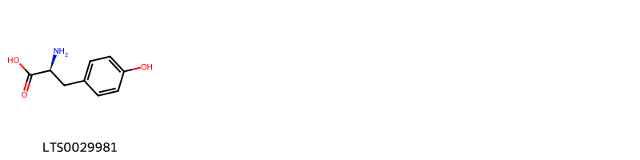{ width=100% }
    <figcaption>Hình ảnh cấu trúc hóa học của 1 hoạt chất thuộc nhóm Carboxylic acids and derivatives gồm ['l-tyrosine (LTS0029981)'].</figcaption>
</figure>
#### Nhóm Cinnamic acids and derivatives
<figure markdown="span">
    { width=100% }
    <figcaption>Hình ảnh cấu trúc hóa học của 1 hoạt chất thuộc nhóm Cinnamic acids and derivatives gồm ['3,4-dihydroxycinnamic acid (LTS0128050)'].</figcaption>
</figure>
#### Nhóm Coumarins and derivatives
<figure markdown="span">
    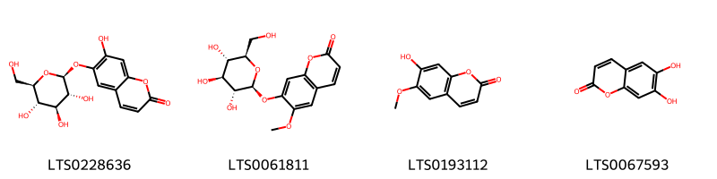{ width=100% }
    <figcaption>Hình ảnh cấu trúc hóa học của 4 hoạt chất thuộc nhóm Coumarins and derivatives gồm ['esculin (LTS0228636)', 'scopolin (LTS0061811)', 'scopoletin (LTS0193112)', 'esculetin (LTS0067593)'].</figcaption>
</figure>
#### Nhóm Dihydrofurans
<figure markdown="span">
    { width=100% }
    <figcaption>Hình ảnh cấu trúc hóa học của 1 hoạt chất thuộc nhóm Dihydrofurans gồm ['vitamin c (LTS0022555)'].</figcaption>
</figure>
#### Nhóm Fatty Acyls
<figure markdown="span">
    { width=100% }
    <figcaption>Hình ảnh cấu trúc hóa học của 2 hoạt chất thuộc nhóm Fatty Acyls gồm ['(9e,11e)-octadeca-9,11,13-trienoic acid (LTS0137794)', 'catalpic acid (LTS0188377)'].</figcaption>
</figure>
#### Nhóm Flavonoids
<figure markdown="span">
    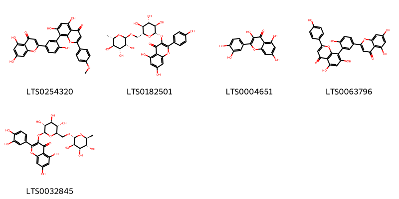{ width=100% }
    <figcaption>Hình ảnh cấu trúc hóa học của 5 hoạt chất thuộc nhóm Flavonoids gồm ['8-[5-(5,7-dihydroxy-4-oxochromen-2-yl)-2-hydroxyphenyl]-5,7-dihydroxy-2-(4-methoxyphenyl)chromen-4-one (LTS0254320)', 'nictoflorin (LTS0182501)', 'quercetin (LTS0004651)', 'amentoflavone (LTS0063796)', '3-rutinosyl quercetin (LTS0032845)'].</figcaption>
</figure>
#### Nhóm Hydroxy acids and derivatives
<figure markdown="span">
    { width=100% }
    <figcaption>Hình ảnh cấu trúc hóa học của 1 hoạt chất thuộc nhóm Hydroxy acids and derivatives gồm ['malic acid (LTS0216520)'].</figcaption>
</figure>
#### Nhóm Organooxygen compounds
<figure markdown="span">
    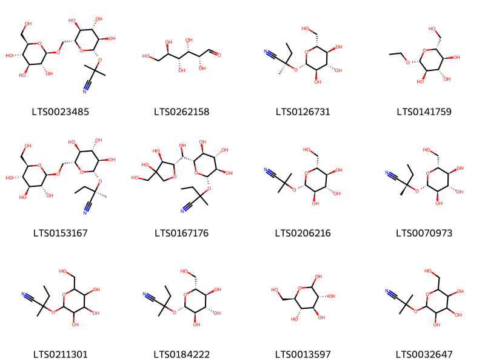{ width=100% }
    <figcaption>Hình ảnh cấu trúc hóa học của 12 hoạt chất thuộc nhóm Organooxygen compounds gồm ['linustatin (LTS0023485)', '(+)-glucose (LTS0262158)', 'lotaustralin (LTS0126731)', 'ethyl glucoside (LTS0141759)', 'neolinustatin (LTS0153167)', '2-{[(2s,3r,4s,5s,6s)-6-{[(2s,3s)-3,4-dihydroxy-4-(hydroxymethyl)oxolan-2-yl](hydroxy)methyl}-3,4,5-trihydroxyoxan-2-yl]oxy}-2-methylbutanenitrile (LTS0167176)', 'linamarin (LTS0206216)', '(s)-lotaustralin (LTS0070973)', '2-methyl-2-{[3,4,5-trihydroxy-6-(hydroxymethyl)oxan-2-yl]oxy}butanenitrile (LTS0211301)', '2-methyl-2-{[(2s,3r,4s,5s,6r)-3,4,5-trihydroxy-6-(hydroxymethyl)oxan-2-yl]oxy}butanenitrile (LTS0184222)', 'glucose (LTS0013597)', 'linamarin (LTS0032647)'].</figcaption>
</figure>
#### Nhóm Prenol lipids
<figure markdown="span">
    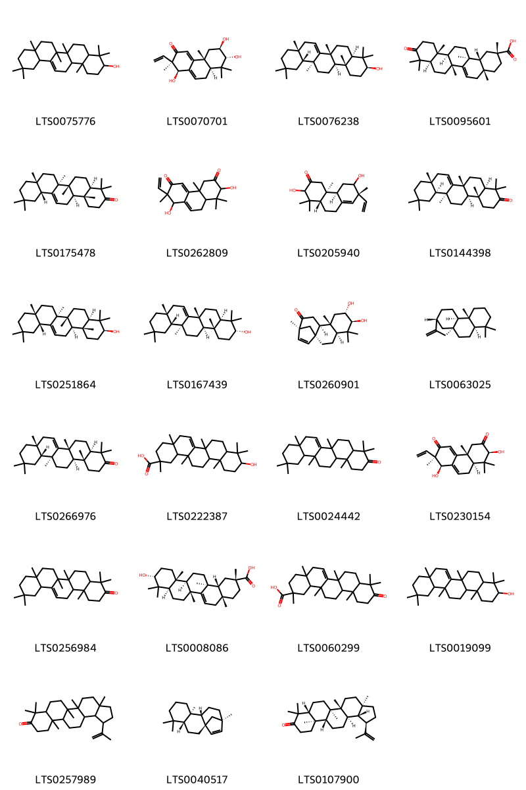{ width=100% }
    <figcaption>Hình ảnh cấu trúc hóa học của 23 hoạt chất thuộc nhóm Prenol lipids gồm ['β-amyrin (LTS0075776)', '(1r,2r,4br,6r,7r,8as)-2-ethenyl-1,6,7-trihydroxy-2,4b,8,8-tetramethyl-1,5,6,7,8a,9-hexahydrophenanthren-3-one (LTS0070701)', 'alnulin (LTS0076238)', '(2r,4ar,6br,8ar,12ar,12br,14as,14br)-2,4a,6b,9,9,12a,14a-heptamethyl-10-oxo-3,4,5,7,8,8a,11,12,12b,13,14,14b-dodecahydro-1h-picene-2-carboxylic acid (LTS0095601)', '(4ar,6ar,6bs,8ar,12ar,14ar,14br)-4,4,6a,6b,8a,11,11,14b-octamethyl-2,4a,5,6,7,8,9,10,12,12a,14,14a-dodecahydro-1h-picen-3-one (LTS0175478)', '7-ethenyl-2,8-dihydroxy-1,1,4a,7-tetramethyl-4,8,10,10a-tetrahydro-2h-phenanthrene-3,6-dione (LTS0262809)', '(4as,4bs,7r,10as)-7-ethenyl-2,6-dihydroxy-1,1,4a,7-tetramethyl-2,4,4b,5,6,9,10,10a-octahydrophenanthren-3-one (LTS0205940)', '(4ar,6ar,8ar,12as,12bs,14ar,14br)-4,4,6a,8a,11,11,12b,14b-octamethyl-2,4a,5,6,8,9,10,12,12a,13,14,14a-dodecahydro-1h-picen-3-one (LTS0144398)', 'β-amyrin (LTS0251864)', '(3r,4ar,6ar,8ar,12ar,12bs,14ar,14br)-4,4,6a,8a,11,11,12b,14b-octamethyl-1,2,3,4a,5,6,8,9,10,12,12a,13,14,14a-tetradecahydropicen-3-ol (LTS0167439)', '(1r,4s,6s,7s,9s,10s,13s)-6,7-dihydroxy-5,5,9,13-tetramethyltetracyclo[11.2.1.0¹,¹⁰.0⁴,⁹]hexadec-14-en-12-one (LTS0260901)', 'ent-kaurene (LTS0063025)', 'taraxerone (LTS0266976)', '10-hydroxy-2,4a,6b,9,9,12a,14a-heptamethyl-1,3,4,5,7,8,8a,10,11,12,12b,13,14,14b-tetradecahydropicene-2-carboxylic acid (LTS0222387)', '4,4,6a,8a,11,11,12b,14b-octamethyl-2,4a,5,6,8,9,10,12,12a,13,14,14a-dodecahydro-1h-picen-3-one (LTS0024442)', '(2s,4ar,7r,8r,10as)-7-ethenyl-2,8-dihydroxy-1,1,4a,7-tetramethyl-4,8,10,10a-tetrahydro-2h-phenanthrene-3,6-dione (LTS0230154)', '4,4,6a,6b,8a,11,11,14b-octamethyl-2,4a,5,6,7,8,9,10,12,12a,14,14a-dodecahydro-1h-picen-3-one (LTS0256984)', '(2r,4ar,6br,8ar,10r,12ar,12br,14as,14br)-10-hydroxy-2,4a,6b,9,9,12a,14a-heptamethyl-1,3,4,5,7,8,8a,10,11,12,12b,13,14,14b-tetradecahydropicene-2-carboxylic acid (LTS0008086)', '2,4a,6b,9,9,12a,14a-heptamethyl-10-oxo-3,4,5,7,8,8a,11,12,12b,13,14,14b-dodecahydro-1h-picene-2-carboxylic acid (LTS0060299)', 'taraxerol (LTS0019099)', '3a,5a,5b,8,8,11a-hexamethyl-1-(prop-1-en-2-yl)-tetradecahydro-1h-cyclopenta[a]chrysen-9-one (LTS0257989)', '(1r,4r,9r,10s,13r)-5,5,9,13-tetramethyltetracyclo[11.2.1.0¹,¹⁰.0⁴,⁹]hexadec-14-ene (LTS0040517)', 'lupenone (LTS0107900)'].</figcaption>
</figure>
#### Nhóm Steroids and steroid derivatives
<figure markdown="span">
    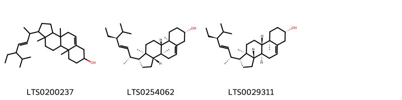{ width=100% }
    <figcaption>Hình ảnh cấu trúc hóa học của 3 hoạt chất thuộc nhóm Steroids and steroid derivatives gồm ['1-(5-ethyl-6-methylhept-3-en-2-yl)-3b,9a,11a-trimethyl-1h,2h,3h,3ah,4h,6h,7h,8h,9h,9bh,10h,11h-cyclopenta[a]phenanthren-7-ol (LTS0200237)', '(1r,3ar,3bs,7s,9ar,9bs,11ar)-1-[(2r,3e,5s)-5-ethyl-6-methylhept-3-en-2-yl]-3b,9a,11a-trimethyl-1h,2h,3h,3ah,4h,6h,7h,8h,9h,9bh,10h,11h-cyclopenta[a]phenanthren-7-ol (LTS0254062)', 'phytosterol (LTS0029311)'].</figcaption>
</figure>

---

### Dược dân tộc học

Danh sách các quốc gia có sử dụng *Manihot esculenta* trong điều trị các bệnh. 

| Country       | Disease           | Bệnh              |
|:--------------|:------------------|:------------------|
| Elsewhere     | Poison            | Chất độc          |
| Guatemala     | Poison            | Chất độc          |
| Haiti         | Diuretic          | Thuốc lợi tiêu    |
| Latin America | Poison            | Chất độc          |
| Samoa         | Poison            | Chất độc          |
| South America | Intoxicant        | chất gây độc      |
| Sudan         | Poison            | Chất độc          |
| Turkey        | Demulcent, Poison | Demulcent, Poison |

---

# Chi Acalypha

??? note "Danh sách các dược liệu thuộc chi"
    
	 - *Acalypha alopecuroides*
	 - *Acalypha australis*
	 - *Acalypha fruticosa*
	 - *Acalypha hiida*
	 - *Acalypha indica*
	 - *Acalypha wilkesiana*

---
## Acalypha alopecuroides
### Thông tin về thực vật

!!! info "Phân loại thực vật của *Acalypha alopecuroides* từ GIBF:"
    - **Kingdom:** Plantae
    - **Phylum:** Tracheophyta
    - **Order:** Malpighiales
    - **Family:** Euphorbiaceae
    - **Genus:** Acalypha
    - **Species:** *Acalypha alopecuroides*

 

| Label (VI)   | Label (EN)   | Scientific Name        | Descriptions (VI)   | Descriptions (EN)   | Also Known As (VI)   | Also Known As (EN)   |
|:-------------|:-------------|:-----------------------|:--------------------|:--------------------|:---------------------|:---------------------|
| N/A          | N/A          | Acalypha alopecuroides | loài thực vật       | species of plant    | ['']                 | ['']                 |

#### Phân bố trên thế giới

**Từ CSDL GIBF** nan, Guatemala, Grenada, Nicaragua, Bermuda, Venezuela (Bolivarian Republic of), Panama, Puerto Rico, Netherlands, Jamaica, United States of America, Belize, Trinidad and Tobago, Bahamas, Cuba, Dominica, Mexico, Peru, Dominican Republic, Ecuador, Haiti, Colombia, Costa Rica

#### Phân bố tại Việt Nam

**Từ CSDL GIBF**: Không có ghi nhận ở Việt Nam

---
### Thành phần hóa học
        
- Theo cơ sở dữ liệu lotus: Từ loài *Acalypha alopecuroides* đã phân lập và xác định được Chưa có hoạt chất nào được phân lập. hoạt chất thuộc về các nhóm Không có hoạt chất nào được phân lập. 

Không có hình ảnh nào được tạo ra

---

### Dược dân tộc học

Danh sách các quốc gia có sử dụng *Acalypha alopecuroides* trong điều trị các bệnh. 

| Country   | Disease                                       | Bệnh                                         |
|:----------|:----------------------------------------------|:---------------------------------------------|
| Haiti     | Carminative, Sedative, Vulnerary, Carminative | Carminative, An thần, Vulnerary, Carminative |
| Venezuela | Diuretic                                      | Thuốc lợi tiêu                               |

---

---
## Acalypha australis
### Thông tin về thực vật

!!! info "Phân loại thực vật của *Acalypha australis* từ GIBF:"
    - **Kingdom:** Plantae
    - **Phylum:** Tracheophyta
    - **Order:** Malpighiales
    - **Family:** Euphorbiaceae
    - **Genus:** Acalypha
    - **Species:** *Acalypha australis*

 

| Label (VI)   | Label (EN)   | Scientific Name    | Descriptions (VI)   | Descriptions (EN)   | Also Known As (VI)   | Also Known As (EN)   |
|:-------------|:-------------|:-------------------|:--------------------|:--------------------|:---------------------|:---------------------|
| N/A          | N/A          | Acalypha australis | loài thực vật       | species of plant    | ['']                 | ['']                 |

#### Phân bố trên thế giới

**Từ CSDL GIBF** Ukraine, Netherlands, Italy, Australia, Japan, Czechia, Korea, Republic of, Georgia, Chinese Taipei, Russian Federation, United States of America, Croatia, China

#### Phân bố tại Việt Nam

**Từ CSDL GIBF**: Không có ghi nhận ở Việt Nam

---
### Thành phần hóa học
        
- Theo cơ sở dữ liệu lotus: Từ loài *Acalypha australis* đã phân lập và xác định được 11 hoạt chất thuộc về các nhóm Cinnamic acids and derivatives, Flavonoids, Tannins, Benzene and substituted derivatives. 

|    | chemicalTaxonomyClassyfireClass     |   smiles_count |
|---:|:------------------------------------|---------------:|
|  0 | Benzene and substituted derivatives |              2 |
|  1 | Cinnamic acids and derivatives      |              1 |
|  2 | Flavonoids                          |              3 |
|  3 | Tannins                             |              5 |

#### Nhóm Benzene and substituted derivatives
<figure markdown="span">
    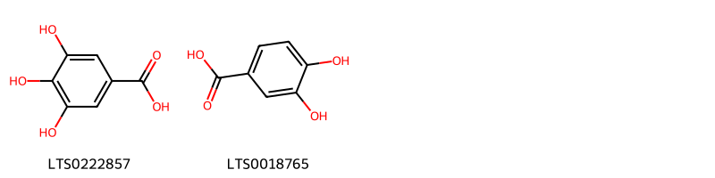{ width=100% }
    <figcaption>Hình ảnh cấu trúc hóa học của 2 hoạt chất thuộc nhóm Benzene and substituted derivatives gồm ['galop (LTS0222857)', '3,4-dihydroxybenzoic acid (LTS0018765)'].</figcaption>
</figure>
#### Nhóm Cinnamic acids and derivatives
<figure markdown="span">
    { width=100% }
    <figcaption>Hình ảnh cấu trúc hóa học của 1 hoạt chất thuộc nhóm Cinnamic acids and derivatives gồm ['3,4-dihydroxycinnamic acid (LTS0128050)'].</figcaption>
</figure>
#### Nhóm Flavonoids
<figure markdown="span">
    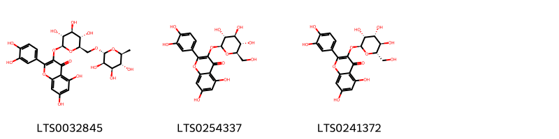{ width=100% }
    <figcaption>Hình ảnh cấu trúc hóa học của 3 hoạt chất thuộc nhóm Flavonoids gồm ['3-rutinosyl quercetin (LTS0032845)', 'isoquercetin (LTS0254337)', '2-(3,4-dihydroxyphenyl)-5,7-dihydroxy-3-{[(2s,3r,4r,5r,6s)-3,4,5-trihydroxy-6-(hydroxymethyl)oxan-2-yl]oxy}chromen-4-one (LTS0241372)'].</figcaption>
</figure>
#### Nhóm Tannins
<figure markdown="span">
    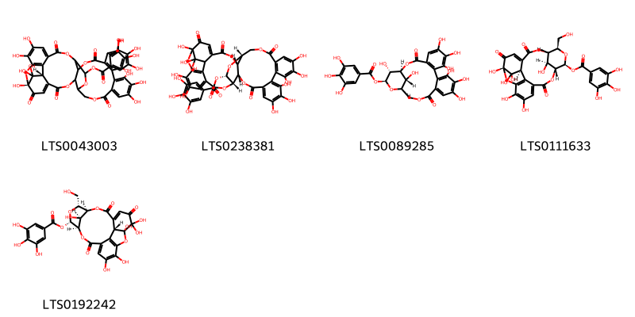{ width=100% }
    <figcaption>Hình ảnh cấu trúc hóa học của 5 hoạt chất thuộc nhóm Tannins gồm ['(1r,38r)-1,13,14,15,18,19,20,34,35,39,39-undecahydroxy-2,5,10,23,31-pentaoxo-6,9,24,27,30,40-hexaoxaoctacyclo[34.3.1.0⁴,³⁸.0⁷,²⁶.0⁸,²⁹.0¹¹,¹⁶.0¹⁷,²².0³²,³⁷]tetraconta-3,11(16),12,14,17,19,21,32,34,36-decaen-28-yl 3,4,5-trihydroxybenzoate (LTS0043003)', '(7r,8s,26r,28s,29s)-1,13,14,15,18,19,20,34,35,39,39-undecahydroxy-2,5,10,23,31-pentaoxo-6,9,24,27,30,40-hexaoxaoctacyclo[34.3.1.0⁴,³⁸.0⁷,²⁶.0⁸,²⁹.0¹¹,¹⁶.0¹⁷,²².0³²,³⁷]tetraconta-3,11,13,15,17(22),18,20,32,34,36-decaen-28-yl 3,4,5-trihydroxybenzoate (LTS0238381)', '(1s,19r,21s,22r,23r)-6,7,8,11,12,13,22,23-octahydroxy-3,16-dioxo-2,17,20-trioxatetracyclo[17.3.1.0⁴,⁹.0¹⁰,¹⁵]tricosa-4(9),5,7,10,12,14-hexaen-21-yl 3,4,5-trihydroxybenzoate (LTS0089285)', '(1s,7s,9r,18r,19s,21r,22s)-7,8,8,12,13,22-hexahydroxy-21-(hydroxymethyl)-3,6,16-trioxo-2,17,20,23-tetraoxapentacyclo[16.3.1.1⁷,¹¹.0⁴,⁹.0¹⁰,¹⁵]tricosa-4,10,12,14-tetraen-19-yl 3,4,5-trihydroxybenzoate (LTS0111633)', '(1s,8r,9r,18r,19s,21r,22s)-7,7,8,12,13,22-hexahydroxy-21-(hydroxymethyl)-3,6,16-trioxo-2,17,20,23-tetraoxapentacyclo[16.3.1.1⁸,¹¹.0⁴,⁹.0¹⁰,¹⁵]tricosa-4,10,12,14-tetraen-19-yl 3,4,5-trihydroxybenzoate (LTS0192242)'].</figcaption>
</figure>

---

### Dược dân tộc học

Danh sách các quốc gia có sử dụng *Acalypha australis* trong điều trị các bệnh. 

| Country   | Disease                           | Bệnh                                |
|:----------|:----------------------------------|:------------------------------------|
| China     | Alexiteric, Hemostat, Refrigerant | Alexiteric, Hemostat, Môi chất lạnh |

---

---
## Acalypha fruticosa
### Thông tin về thực vật

!!! info "Phân loại thực vật của *Acalypha fruticosa* từ GIBF:"
    - **Kingdom:** Plantae
    - **Phylum:** Tracheophyta
    - **Order:** Malpighiales
    - **Family:** Euphorbiaceae
    - **Genus:** Acalypha
    - **Species:** *Acalypha fruticosa*

 

| Label (VI)   | Label (EN)   | Scientific Name    | Descriptions (VI)   | Descriptions (EN)   | Also Known As (VI)   | Also Known As (EN)   |
|:-------------|:-------------|:-------------------|:--------------------|:--------------------|:---------------------|:---------------------|
| N/A          | N/A          | Acalypha fruticosa | loài thực vật       | species of plant    | ['']                 | ['']                 |

#### Phân bố trên thế giới

**Từ CSDL GIBF** Sri Lanka, Belgium, Kenya, Tanzania, United Republic of, Saudi Arabia, Ethiopia

#### Phân bố tại Việt Nam

**Từ CSDL GIBF**: Không có ghi nhận ở Việt Nam

---
### Thành phần hóa học
        
- Theo cơ sở dữ liệu lotus: Từ loài *Acalypha fruticosa* đã phân lập và xác định được Chưa có hoạt chất nào được phân lập. hoạt chất thuộc về các nhóm Không có hoạt chất nào được phân lập. 

Không có hình ảnh nào được tạo ra

---

### Dược dân tộc học

Danh sách các quốc gia có sử dụng *Acalypha fruticosa* trong điều trị các bệnh. 

| Country   | Disease   | Bệnh    |
|:----------|:----------|:--------|
| Elsewhere | Stomachic | Sững sờ |
| India     | Stomachic | Sững sờ |

---

---
## Acalypha hiida
### Thông tin về thực vật

!!! info "Phân loại thực vật của *N/A* từ GIBF:"
    - **Kingdom:** Plantae
    - **Phylum:** Tracheophyta
    - **Order:** Malpighiales
    - **Family:** Euphorbiaceae
    - **Genus:** Acalypha
    - **Species:** *N/A*

 

| Label (VI)   | Label (EN)   | Scientific Name    | Descriptions (VI)   | Descriptions (EN)   | Also Known As (VI)   | Also Known As (EN)   |
|:-------------|:-------------|:-------------------|:--------------------|:--------------------|:---------------------|:---------------------|
| N/A          | N/A          | Acalypha fruticosa | loài thực vật       | species of plant    | ['']                 | ['']                 |

#### Phân bố trên thế giới

**Từ CSDL GIBF** Sri Lanka, Australia, Japan, Gabon, Guatemala, Argentina, Saint Lucia, Benin, Nicaragua, Tanzania, United Republic of, Yemen, Panama, French Guiana, Zambia, Puerto Rico, Réunion, Nigeria, Chinese Taipei, Bolivia (Plurinational State of), Jamaica, Bangladesh, United States of America, Bonaire, Sint Eustatius and Saba, Zimbabwe, El Salvador, Maldives, Belize, South Africa, Hong Kong, Thailand, Bahamas, Brazil, Guam, Cuba, Mexico, Dominican Republic, Qatar, Viet Nam, Eswatini, China, Ecuador, French Polynesia, Niue, Madagascar, Colombia, Costa Rica, India, Indonesia, Antigua and Barbuda, Kenya, Northern Mariana Islands

#### Phân bố tại Việt Nam

**Từ CSDL GIBF**: Hồ Chí Minh city, Khánh Hòa, Quảng Nam

---
### Thành phần hóa học
        
- Theo cơ sở dữ liệu lotus: Từ loài *N/A* đã phân lập và xác định được Chưa có hoạt chất nào được phân lập. hoạt chất thuộc về các nhóm Không có hoạt chất nào được phân lập. 

Không có hình ảnh nào được tạo ra

---

### Dược dân tộc học

Danh sách các quốc gia có sử dụng *N/A* trong điều trị các bệnh. 

| Country   | Disease                         | Bệnh                                              |
|:----------|:--------------------------------|:--------------------------------------------------|
| Malaya    | Diuretic, Expectorant, Laxative | Thuốc lợi tiểu, thuốc long đờm, thuốc nhuận tràng |

---

---
## Acalypha indica
### Thông tin về thực vật

!!! info "Phân loại thực vật của *Acalypha indica* từ GIBF:"
    - **Kingdom:** Plantae
    - **Phylum:** Tracheophyta
    - **Order:** Malpighiales
    - **Family:** Euphorbiaceae
    - **Genus:** Acalypha
    - **Species:** *Acalypha indica*

 

| Label (VI)   | Label (EN)   | Scientific Name   | Descriptions (VI)   | Descriptions (EN)   | Also Known As (VI)   | Also Known As (EN)   |
|:-------------|:-------------|:------------------|:--------------------|:--------------------|:---------------------|:---------------------|
| N/A          | N/A          | Acalypha indica   | loài thực vật       | species of plant    | ['']                 | ['']                 |

#### Phân bố trên thế giới

**Từ CSDL GIBF** nan, Sri Lanka, Mauritius, Mozambique, Benin, Tanzania, United Republic of, Yemen, Réunion, Chinese Taipei, Bonaire, Sint Eustatius and Saba, Maldives, South Africa, Thailand, Guam, Viet Nam, Eswatini, China, Seychelles, India, Indonesia, Antigua and Barbuda, Philippines, Malaysia, Northern Mariana Islands

#### Phân bố tại Việt Nam

**Từ CSDL GIBF**: Long An, Khánh Hòa, Đà Nẵng, Hồ Chí Minh city

---
### Thành phần hóa học
        
- Theo cơ sở dữ liệu lotus: Từ loài *Acalypha indica* đã phân lập và xác định được 58 hoạt chất thuộc về các nhóm Flavonoids, Dioxanes, Organooxygen compounds, Tannins. 

|    | chemicalTaxonomyClassyfireClass   |   smiles_count |
|---:|:----------------------------------|---------------:|
|  0 | Dioxanes                          |              2 |
|  1 | Flavonoids                        |             13 |
|  2 | Organooxygen compounds            |             16 |
|  3 | Tannins                           |             25 |

#### Nhóm Dioxanes
<figure markdown="span">
    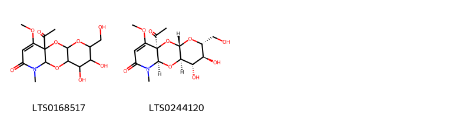{ width=100% }
    <figcaption>Hình ảnh cấu trúc hóa học của 2 hoạt chất thuộc nhóm Dioxanes gồm ['1-acetyl-6,7-dihydroxy-5-(hydroxymethyl)-14-methoxy-11-methyl-2,4,9-trioxa-11-azatricyclo[8.4.0.0³,⁸]tetradec-13-en-12-one (LTS0168517)', '(1r,3s,5r,6s,7s,8r,10r)-1-acetyl-6,7-dihydroxy-5-(hydroxymethyl)-14-methoxy-11-methyl-2,4,9-trioxa-11-azatricyclo[8.4.0.0³,⁸]tetradec-13-en-12-one (LTS0244120)'].</figcaption>
</figure>
#### Nhóm Flavonoids
<figure markdown="span">
    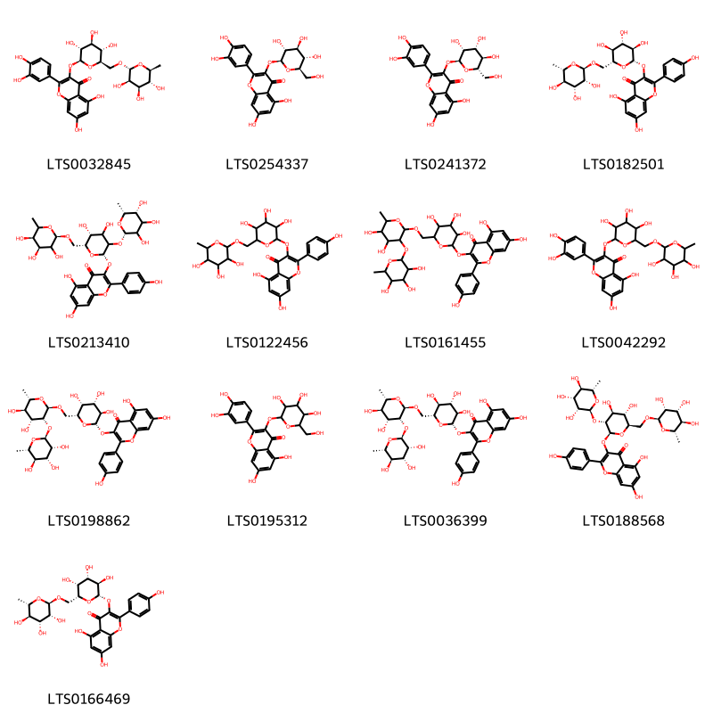{ width=100% }
    <figcaption>Hình ảnh cấu trúc hóa học của 13 hoạt chất thuộc nhóm Flavonoids gồm ['3-rutinosyl quercetin (LTS0032845)', 'isoquercetin (LTS0254337)', '2-(3,4-dihydroxyphenyl)-5,7-dihydroxy-3-{[(2s,3r,4r,5r,6s)-3,4,5-trihydroxy-6-(hydroxymethyl)oxan-2-yl]oxy}chromen-4-one (LTS0241372)', 'nictoflorin (LTS0182501)', '3-{[(2s,5r,6r)-4,5-dihydroxy-3-{[(2s,5r,6r)-3,4,5-trihydroxy-6-methyloxan-2-yl]oxy}-6-({[(2r,4s,5r)-3,4,5-trihydroxy-6-methyloxan-2-yl]oxy}methyl)oxan-2-yl]oxy}-5,7-dihydroxy-2-(4-hydroxyphenyl)chromen-4-one (LTS0213410)', '5,7-dihydroxy-2-(4-hydroxyphenyl)-3-[(3,4,5-trihydroxy-6-{[(3,4,5-trihydroxy-6-methyloxan-2-yl)oxy]methyl}oxan-2-yl)oxy]chromen-4-one (LTS0122456)', '3-({6-[({4,5-dihydroxy-6-methyl-3-[(3,4,5-trihydroxy-6-methyloxan-2-yl)oxy]oxan-2-yl}oxy)methyl]-3,4,5-trihydroxyoxan-2-yl}oxy)-5,7-dihydroxy-2-(4-hydroxyphenyl)chromen-4-one (LTS0161455)', 'rutin (LTS0042292)', '3-{[(2s,3r,4s,5r,6r)-6-({[(2r,3r,4r,5r,6s)-4,5-dihydroxy-6-methyl-3-{[(2s,3r,4r,5r,6s)-3,4,5-trihydroxy-6-methyloxan-2-yl]oxy}oxan-2-yl]oxy}methyl)-3,4,5-trihydroxyoxan-2-yl]oxy}-5,7-dihydroxy-2-(4-hydroxyphenyl)chromen-4-one (LTS0198862)', '2-(3,4-dihydroxyphenyl)-5,7-dihydroxy-3-{[3,4,5-trihydroxy-6-(hydroxymethyl)oxan-2-yl]oxy}chromen-4-one (LTS0195312)', '3-{[(2s,3r,4s,5s,6r)-6-({[(2r,3r,4r,5r,6s)-4,5-dihydroxy-6-methyl-3-{[(2s,3r,4r,5r,6s)-3,4,5-trihydroxy-6-methyloxan-2-yl]oxy}oxan-2-yl]oxy}methyl)-3,4,5-trihydroxyoxan-2-yl]oxy}-5,7-dihydroxy-2-(4-hydroxyphenyl)chromen-4-one (LTS0036399)', '3-{[(2s,3r,4s,5s,6r)-4,5-dihydroxy-3-{[(2s,3r,4r,5r,6s)-3,4,5-trihydroxy-6-methyloxan-2-yl]oxy}-6-({[(2r,3r,4r,5r,6s)-3,4,5-trihydroxy-6-methyloxan-2-yl]oxy}methyl)oxan-2-yl]oxy}-5,7-dihydroxy-2-(4-hydroxyphenyl)chromen-4-one (LTS0188568)', '5,7-dihydroxy-2-(4-hydroxyphenyl)-3-{[(2s,3r,4s,5r,6r)-3,4,5-trihydroxy-6-({[(2r,3r,4r,5r,6s)-3,4,5-trihydroxy-6-methyloxan-2-yl]oxy}methyl)oxan-2-yl]oxy}chromen-4-one (LTS0166469)'].</figcaption>
</figure>
#### Nhóm Organooxygen compounds
<figure markdown="span">
    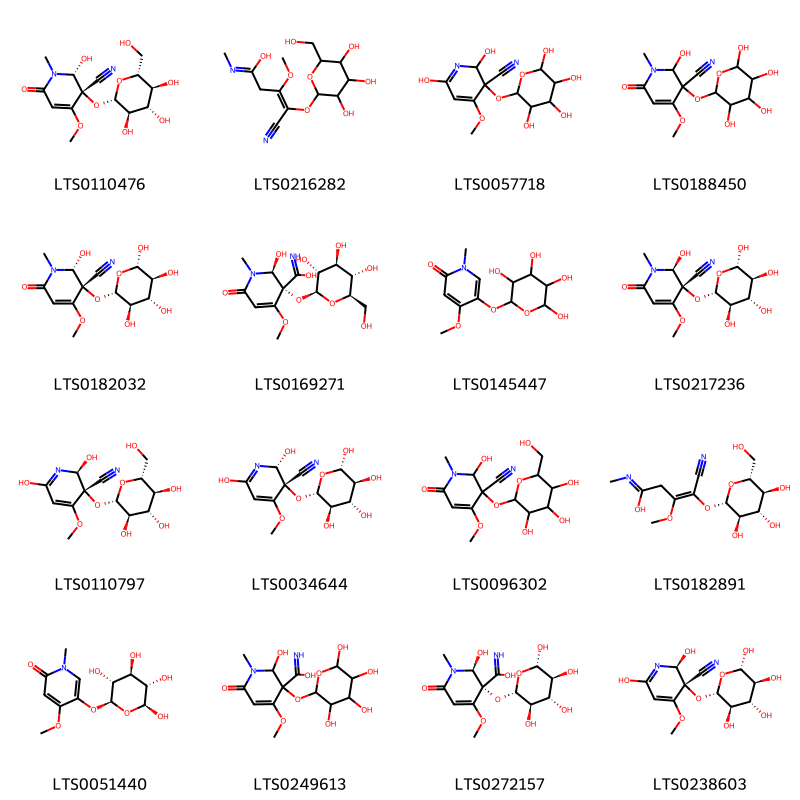{ width=100% }
    <figcaption>Hình ảnh cấu trúc hóa học của 16 hoạt chất thuộc nhóm Organooxygen compounds gồm ['(2r,3r)-2-hydroxy-4-methoxy-1-methyl-6-oxo-3-{[(2s,3r,4s,5s,6r)-3,4,5-trihydroxy-6-(hydroxymethyl)oxan-2-yl]oxy}-2h-pyridine-3-carbonitrile (LTS0110476)', '4-cyano-3-methoxy-n-methyl-4-{[3,4,5-trihydroxy-6-(hydroxymethyl)oxan-2-yl]oxy}but-3-enimidic acid (LTS0216282)', '2,6-dihydroxy-4-methoxy-3-[(3,4,5,6-tetrahydroxyoxan-2-yl)oxy]-2h-pyridine-3-carbonitrile (LTS0057718)', '2-hydroxy-4-methoxy-1-methyl-6-oxo-3-[(3,4,5,6-tetrahydroxyoxan-2-yl)oxy]-2h-pyridine-3-carbonitrile (LTS0188450)', '(2r,3r)-2-hydroxy-4-methoxy-1-methyl-6-oxo-3-{[(2r,3r,4s,5s,6s)-3,4,5,6-tetrahydroxyoxan-2-yl]oxy}-2h-pyridine-3-carbonitrile (LTS0182032)', '(2s,3r)-2-hydroxy-4-methoxy-1-methyl-6-oxo-3-{[(2s,3r,4s,5s,6r)-3,4,5-trihydroxy-6-(hydroxymethyl)oxan-2-yl]oxy}-2h-pyridine-3-carboximidic acid (LTS0169271)', '4-methoxy-1-methyl-5-[(3,4,5,6-tetrahydroxyoxan-2-yl)oxy]pyridin-2-one (LTS0145447)', '(2s,3r)-2-hydroxy-4-methoxy-1-methyl-6-oxo-3-{[(2r,3r,4s,5s,6s)-3,4,5,6-tetrahydroxyoxan-2-yl]oxy}-2h-pyridine-3-carbonitrile (LTS0217236)', '(2s,3r)-2,6-dihydroxy-4-methoxy-3-{[(2s,3r,4s,5s,6r)-3,4,5-trihydroxy-6-(hydroxymethyl)oxan-2-yl]oxy}-2h-pyridine-3-carbonitrile (LTS0110797)', '(2r,3r)-2,6-dihydroxy-4-methoxy-3-{[(2r,3r,4s,5s,6s)-3,4,5,6-tetrahydroxyoxan-2-yl]oxy}-2h-pyridine-3-carbonitrile (LTS0034644)', '2-hydroxy-4-methoxy-1-methyl-6-oxo-3-{[3,4,5-trihydroxy-6-(hydroxymethyl)oxan-2-yl]oxy}-2h-pyridine-3-carbonitrile (LTS0096302)', '(3z)-4-cyano-3-methoxy-n-methyl-4-{[(2s,3r,4s,5s,6r)-3,4,5-trihydroxy-6-(hydroxymethyl)oxan-2-yl]oxy}but-3-enimidic acid (LTS0182891)', '4-methoxy-1-methyl-5-{[(2r,3r,4s,5s,6s)-3,4,5,6-tetrahydroxyoxan-2-yl]oxy}pyridin-2-one (LTS0051440)', '2-hydroxy-4-methoxy-1-methyl-6-oxo-3-[(3,4,5,6-tetrahydroxyoxan-2-yl)oxy]-2h-pyridine-3-carboximidic acid (LTS0249613)', '(2s,3r)-2-hydroxy-4-methoxy-1-methyl-6-oxo-3-{[(2r,3r,4s,5s,6s)-3,4,5,6-tetrahydroxyoxan-2-yl]oxy}-2h-pyridine-3-carboximidic acid (LTS0272157)', '(2s,3r)-2,6-dihydroxy-4-methoxy-3-{[(2r,3r,4s,5s,6s)-3,4,5,6-tetrahydroxyoxan-2-yl]oxy}-2h-pyridine-3-carbonitrile (LTS0238603)'].</figcaption>
</figure>
#### Nhóm Tannins
<figure markdown="span">
    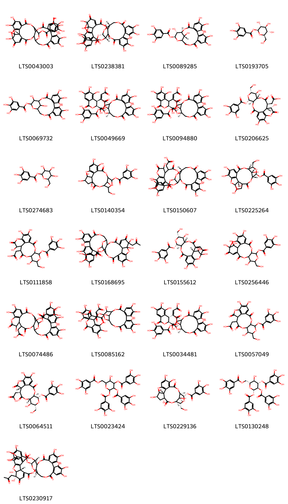{ width=100% }
    <figcaption>Hình ảnh cấu trúc hóa học của 25 hoạt chất thuộc nhóm Tannins gồm ['(1r,38r)-1,13,14,15,18,19,20,34,35,39,39-undecahydroxy-2,5,10,23,31-pentaoxo-6,9,24,27,30,40-hexaoxaoctacyclo[34.3.1.0⁴,³⁸.0⁷,²⁶.0⁸,²⁹.0¹¹,¹⁶.0¹⁷,²².0³²,³⁷]tetraconta-3,11(16),12,14,17,19,21,32,34,36-decaen-28-yl 3,4,5-trihydroxybenzoate (LTS0043003)', '(7r,8s,26r,28s,29s)-1,13,14,15,18,19,20,34,35,39,39-undecahydroxy-2,5,10,23,31-pentaoxo-6,9,24,27,30,40-hexaoxaoctacyclo[34.3.1.0⁴,³⁸.0⁷,²⁶.0⁸,²⁹.0¹¹,¹⁶.0¹⁷,²².0³²,³⁷]tetraconta-3,11,13,15,17(22),18,20,32,34,36-decaen-28-yl 3,4,5-trihydroxybenzoate (LTS0238381)', '(1s,19r,21s,22r,23r)-6,7,8,11,12,13,22,23-octahydroxy-3,16-dioxo-2,17,20-trioxatetracyclo[17.3.1.0⁴,⁹.0¹⁰,¹⁵]tricosa-4(9),5,7,10,12,14-hexaen-21-yl 3,4,5-trihydroxybenzoate (LTS0089285)', 'β-glucogallin (LTS0193705)', '6,7,8,11,12,13,22,23-octahydroxy-3,16-dioxo-2,17,20-trioxatetracyclo[17.3.1.0⁴,⁹.0¹⁰,¹⁵]tricosa-4(9),5,7,10,12,14-hexaen-21-yl 3,4,5-trihydroxybenzoate (LTS0069732)', '(3s,4s)-4-[(1z)-1-carboxy-3-{[(1r,19r,21s,22r,23r)-6,7,8,11,12,13,22-heptahydroxy-3,16-dioxo-21-(3,4,5-trihydroxybenzoyloxy)-2,17,20-trioxatetracyclo[17.3.1.0⁴,⁹.0¹⁰,¹⁵]tricosa-4(9),5,7,10,12,14-hexaen-23-yl]oxy}-3-oxoprop-1-en-2-yl]-5,6,7-trihydroxy-1-oxo-3,4-dihydro-2-benzopyran-3-carboxylic acid (LTS0049669)', '(3s)-4-[(1z)-1-carboxy-3-{[(1r,19r,21s,22r,23r)-6,7,8,11,12,13,22-heptahydroxy-3,16-dioxo-21-(3,4,5-trihydroxybenzoyloxy)-2,17,20-trioxatetracyclo[17.3.1.0⁴,⁹.0¹⁰,¹⁵]tricosa-4(9),5,7,10,12,14-hexaen-23-yl]oxy}-3-oxoprop-1-en-2-yl]-5,6,7-trihydroxy-1-oxo-3,4-dihydro-2-benzopyran-3-carboxylic acid (LTS0094880)', '[(4r,5s,7r,8r,9s,12s,13s,14s)-8,14,18,19-tetrahydroxy-7-(hydroxymethyl)-2,11,15-trioxo-5-(3,4,5-trihydroxybenzoyloxy)-3,6,10,16-tetraoxatetracyclo[11.7.1.0⁴,⁹.0¹⁷,²¹]henicosa-1(20),17(21),18-trien-12-yl]acetic acid (LTS0206625)', '3,4,5-trihydroxy-6-(hydroxymethyl)oxan-2-yl 3,4,5-trihydroxybenzoate (LTS0274683)', '4,6,7,12,13,21-hexahydroxy-20-(hydroxymethyl)-3,15-dioxo-2,16,19,22-tetraoxapentacyclo[15.3.1.1⁷,¹⁰.0⁴,⁸.0⁹,¹⁴]docosa-9(14),10,12-trien-18-yl 3,4,5-trihydroxybenzoate (LTS0140354)', '[(5r,7r)-13,14,15,18,19,20,31,35,36-nonahydroxy-2,10,23,28,32-pentaoxo-5-(3,4,5-trihydroxybenzoyloxy)-3,6,9,24,27,33-hexaoxaheptacyclo[28.7.1.0⁴,²⁵.0⁷,²⁶.0¹¹,¹⁶.0¹⁷,²².0³⁴,³⁸]octatriaconta-1(37),11(16),12,14,17,19,21,34(38),35-nonaen-29-yl]acetic acid (LTS0150607)', '(1r,7r,8r,17s,18r,20s,21s)-4,6,7,11,12,21-hexahydroxy-18-(hydroxymethyl)-3,15-dioxo-2,16,19,22-tetraoxapentacyclo[15.3.1.1⁷,¹⁰.0⁴,⁸.0⁹,¹⁴]docosa-9,11,13-trien-20-yl 3,4,5-trihydroxybenzoate (LTS0225264)', '[8,14,18,19-tetrahydroxy-7-(hydroxymethyl)-2,11,15-trioxo-5-(3,4,5-trihydroxybenzoyloxy)-3,6,10,16-tetraoxatetracyclo[11.7.1.0⁴,⁹.0¹⁷,²¹]henicosa-1(20),17(21),18-trien-12-yl]acetic acid (LTS0111858)', '1,2,14,15,16,19,20,21,35,36-decahydroxy-3,6,11,24,32-pentaoxo-2-(2-oxopropyl)-7,10,25,28,31,40-hexaoxaoctacyclo[35.2.1.0⁵,³⁹.0⁸,²⁷.0⁹,³⁰.0¹²,¹⁷.0¹⁸,²³.0³³,³⁸]tetraconta-4,12(17),13,15,18,20,22,33,35,37-decaen-29-yl 3,4,5-trihydroxybenzoate (LTS0168695)', '(7s,8r,9r,11s,12r,21r)-1,8,17,18,22,22-hexahydroxy-9-(hydroxymethyl)-2,5,14-trioxo-6,10,13,23-tetraoxapentacyclo[17.3.1.0⁴,²¹.0⁷,¹².0¹⁵,²⁰]tricosa-3,15,17,19-tetraen-11-yl 3,4,5-trihydroxybenzoate (LTS0155612)', '1,8,17,18,22,22-hexahydroxy-9-(hydroxymethyl)-2,5,14-trioxo-6,10,13,23-tetraoxapentacyclo[17.3.1.0⁴,²¹.0⁷,¹².0¹⁵,²⁰]tricosa-3,15,17,19-tetraen-11-yl 3,4,5-trihydroxybenzoate (LTS0256446)', '[13,14,15,18,19,20,31,35,36-nonahydroxy-2,10,23,28,32-pentaoxo-5-(3,4,5-trihydroxybenzoyloxy)-3,6,9,24,27,33-hexaoxaheptacyclo[28.7.1.0⁴,²⁵.0⁷,²⁶.0¹¹,¹⁶.0¹⁷,²².0³⁴,³⁸]octatriaconta-1(37),11,13,15,17(22),18,20,34(38),35-nonaen-29-yl]acetic acid (LTS0074486)', '4-(1-carboxy-3-{[6,7,8,11,12,13,22-heptahydroxy-3,16-dioxo-21-(3,4,5-trihydroxybenzoyloxy)-2,17,20-trioxatetracyclo[17.3.1.0⁴,⁹.0¹⁰,¹⁵]tricosa-4(9),5,7,10,12,14-hexaen-23-yl]oxy}-3-oxoprop-1-en-2-yl)-5,6,7-trihydroxy-1-oxo-3,4-dihydro-2-benzopyran-3-carboxylic acid (LTS0085162)', '(3s,4r)-4-[(1z)-1-carboxy-3-{[(1r,19r,21s,22r,23r)-6,7,8,11,12,13,22-heptahydroxy-3,16-dioxo-21-(3,4,5-trihydroxybenzoyloxy)-2,17,20-trioxatetracyclo[17.3.1.0⁴,⁹.0¹⁰,¹⁵]tricosa-4(9),5,7,10,12,14-hexaen-23-yl]oxy}-3-oxoprop-1-en-2-yl]-5,6,7-trihydroxy-1-oxo-3,4-dihydro-2-benzopyran-3-carboxylic acid (LTS0034481)', '[8,17,18-trihydroxy-7-(hydroxymethyl)-2,11,14-trioxo-5-(3,4,5-trihydroxybenzoyloxy)-3,6,10,15-tetraoxatetracyclo[11.6.1.0⁴,⁹.0¹⁶,²⁰]icosa-1(19),16(20),17-trien-12-yl]acetic acid (LTS0057049)', '[(4r,5s,7r,8r,9s,12s,13s)-8,17,18-trihydroxy-7-(hydroxymethyl)-2,11,14-trioxo-5-(3,4,5-trihydroxybenzoyloxy)-3,6,10,15-tetraoxatetracyclo[11.6.1.0⁴,⁹.0¹⁶,²⁰]icosa-1(19),16(20),17-trien-12-yl]acetic acid (LTS0064511)', '5-hydroxy-3,4-bis(3,4,5-trihydroxybenzoyloxy)-6-[(3,4,5-trihydroxybenzoyloxy)methyl]oxan-2-yl 3,4,5-trihydroxybenzoate (LTS0023424)', '(1s,4r,6r,7r,8r,17r,18s,20r,21s)-4,6,7,12,13,21-hexahydroxy-20-(hydroxymethyl)-3,15-dioxo-2,16,19,22-tetraoxapentacyclo[15.3.1.1⁷,¹⁰.0⁴,⁸.0⁹,¹⁴]docosa-9(14),10,12-trien-18-yl 3,4,5-trihydroxybenzoate (LTS0229136)', '(2s,3r,4s,5r,6r)-5-hydroxy-3,4-bis(3,4,5-trihydroxybenzoyloxy)-6-[(3,4,5-trihydroxybenzoyloxy)methyl]oxan-2-yl 3,4,5-trihydroxybenzoate (LTS0130248)', '(1s,2s,8r,9s,27r,29s,30r,39r)-1,2,14,15,16,19,20,21,35,36-decahydroxy-3,6,11,24,32-pentaoxo-2-(2-oxopropyl)-7,10,25,28,31,40-hexaoxaoctacyclo[35.2.1.0⁵,³⁹.0⁸,²⁷.0⁹,³⁰.0¹²,¹⁷.0¹⁸,²³.0³³,³⁸]tetraconta-4,12,14,16,18(23),19,21,33,35,37-decaen-29-yl 3,4,5-trihydroxybenzoate (LTS0230917)'].</figcaption>
</figure>

---

### Dược dân tộc học

Danh sách các quốc gia có sử dụng *Acalypha indica* trong điều trị các bệnh. 

| Country   | Disease   | Bệnh     |
|:----------|:----------|:---------|
| Elsewhere | Emetic    | Phôi     |
| Malaya    | Purgative | Thuốc xổ |

---

---
## Acalypha wilkesiana
### Thông tin về thực vật

!!! info "Phân loại thực vật của *Acalypha wilkesiana* từ GIBF:"
    - **Kingdom:** Plantae
    - **Phylum:** Tracheophyta
    - **Order:** Malpighiales
    - **Family:** Euphorbiaceae
    - **Genus:** Acalypha
    - **Species:** *Acalypha wilkesiana*

 

| Label (VI)   | Label (EN)   | Scientific Name     | Descriptions (VI)   | Descriptions (EN)   | Also Known As (VI)   | Also Known As (EN)   |
|:-------------|:-------------|:--------------------|:--------------------|:--------------------|:---------------------|:---------------------|
| N/A          | N/A          | Acalypha wilkesiana | loài thực vật       | species of plant    | ['']                 | ['']                 |

#### Phân bố trên thế giới

**Từ CSDL GIBF** nan, American Samoa, Sri Lanka, Micronesia (Federated States of), Australia, Japan, Guatemala, Mozambique, Philippines, Benin, Bermuda, Tanzania, United Republic of, Venezuela (Bolivarian Republic of), French Guiana, Panama, Malawi, Puerto Rico, Netherlands, Nigeria, Bolivia (Plurinational State of), Honduras, Jamaica, United States of America, Chile, Zimbabwe, South Africa, Fiji, Trinidad and Tobago, Hong Kong, Barbados, Thailand, Bahamas, Brazil, Guam, Cuba, Dominica, Dominican Republic, Peru, Qatar, Viet Nam, Singapore, China, Ecuador, French Polynesia, Niue, Madagascar, Colombia, Macao, Costa Rica, Vanuatu, India, Kenya, Malaysia, Northern Mariana Islands, Nepal

#### Phân bố tại Việt Nam

**Từ CSDL GIBF**: Quảng Nam

---
### Thành phần hóa học
        
- Theo cơ sở dữ liệu lotus: Từ loài *Acalypha wilkesiana* đã phân lập và xác định được 5 hoạt chất thuộc về các nhóm Steroids and steroid derivatives, Flavonoids, Prenol lipids, Tannins. 

|    | chemicalTaxonomyClassyfireClass   |   smiles_count |
|---:|:----------------------------------|---------------:|
|  0 | Flavonoids                        |              1 |
|  1 | Prenol lipids                     |              1 |
|  2 | Steroids and steroid derivatives  |              1 |
|  3 | Tannins                           |              2 |

#### Nhóm Flavonoids
<figure markdown="span">
    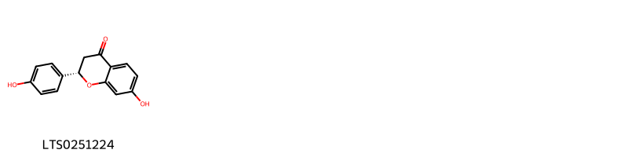{ width=100% }
    <figcaption>Hình ảnh cấu trúc hóa học của 1 hoạt chất thuộc nhóm Flavonoids gồm ['5-deoxyflavanone (LTS0251224)'].</figcaption>
</figure>
#### Nhóm Prenol lipids
<figure markdown="span">
    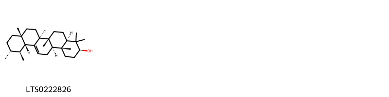{ width=100% }
    <figcaption>Hình ảnh cấu trúc hóa học của 1 hoạt chất thuộc nhóm Prenol lipids gồm ['amyrin (LTS0222826)'].</figcaption>
</figure>
#### Nhóm Steroids and steroid derivatives
<figure markdown="span">
    { width=100% }
    <figcaption>Hình ảnh cấu trúc hóa học của 1 hoạt chất thuộc nhóm Steroids and steroid derivatives gồm ['stigmast-5-en-3-ol, (3β)- (LTS0204616)'].</figcaption>
</figure>
#### Nhóm Tannins
<figure markdown="span">
    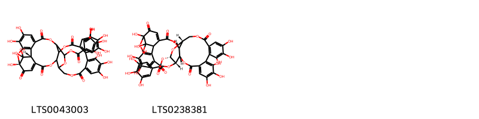{ width=100% }
    <figcaption>Hình ảnh cấu trúc hóa học của 2 hoạt chất thuộc nhóm Tannins gồm ['(1r,38r)-1,13,14,15,18,19,20,34,35,39,39-undecahydroxy-2,5,10,23,31-pentaoxo-6,9,24,27,30,40-hexaoxaoctacyclo[34.3.1.0⁴,³⁸.0⁷,²⁶.0⁸,²⁹.0¹¹,¹⁶.0¹⁷,²².0³²,³⁷]tetraconta-3,11(16),12,14,17,19,21,32,34,36-decaen-28-yl 3,4,5-trihydroxybenzoate (LTS0043003)', '(7r,8s,26r,28s,29s)-1,13,14,15,18,19,20,34,35,39,39-undecahydroxy-2,5,10,23,31-pentaoxo-6,9,24,27,30,40-hexaoxaoctacyclo[34.3.1.0⁴,³⁸.0⁷,²⁶.0⁸,²⁹.0¹¹,¹⁶.0¹⁷,²².0³²,³⁷]tetraconta-3,11,13,15,17(22),18,20,32,34,36-decaen-28-yl 3,4,5-trihydroxybenzoate (LTS0238381)'].</figcaption>
</figure>

---

### Dược dân tộc học

Danh sách các quốc gia có sử dụng *Acalypha wilkesiana* trong điều trị các bệnh. 

| Country   |   Disease | Bệnh   |
|:----------|----------:|:-------|
| Elsewhere |       nan | Ở đây  |
| Trinidad  |       nan | Ở đây  |

---

# Chi Omphalea

??? note "Danh sách các dược liệu thuộc chi"
    
	 - *Omphalea lapidecens*
	 - *Omphalea megacarpa*
	 - *Omphalea oleifera*
	 - *Omphalea triandra*

---
## Omphalea lapidecens
### Thông tin về thực vật

!!! info "Phân loại thực vật của *N/A* từ GIBF:"
    - **Kingdom:** Plantae
    - **Phylum:** Tracheophyta
    - **Order:** Malpighiales
    - **Family:** Euphorbiaceae
    - **Genus:** Omphalea
    - **Species:** *N/A*

 

| Label (VI)   | Label (EN)   | Scientific Name     | Descriptions (VI)   | Descriptions (EN)   | Also Known As (VI)   | Also Known As (EN)   |
|:-------------|:-------------|:--------------------|:--------------------|:--------------------|:---------------------|:---------------------|
| N/A          | N/A          | Acalypha wilkesiana | loài thực vật       | species of plant    | ['']                 | ['']                 |

#### Phân bố trên thế giới

**Từ CSDL GIBF** Australia, Guadeloupe, Belgium, Nicaragua, French Guiana, Panama, Bolivia (Plurinational State of), Jamaica, United States of America, El Salvador, Trinidad and Tobago, Suriname, Brazil, Cuba, Dominican Republic, Peru, Mexico, Madagascar, Colombia, Costa Rica

#### Phân bố tại Việt Nam

**Từ CSDL GIBF**: Không có ghi nhận ở Việt Nam

---
### Thành phần hóa học
        
- Theo cơ sở dữ liệu lotus: Từ loài *N/A* đã phân lập và xác định được Chưa có hoạt chất nào được phân lập. hoạt chất thuộc về các nhóm Không có hoạt chất nào được phân lập. 

Không có hình ảnh nào được tạo ra

---

### Dược dân tộc học

Danh sách các quốc gia có sử dụng *N/A* trong điều trị các bệnh. 

| Country   | Disease   | Bệnh     |
|:----------|:----------|:---------|
| China     | Poison    | Chất độc |

---

---
## Omphalea megacarpa
### Thông tin về thực vật

!!! info "Phân loại thực vật của *Omphalea diandra* từ GIBF:"
    - **Kingdom:** Plantae
    - **Phylum:** Tracheophyta
    - **Order:** Malpighiales
    - **Family:** Euphorbiaceae
    - **Genus:** Omphalea
    - **Species:** *Omphalea diandra*

 

| Label (VI)   | Label (EN)   | Scientific Name    | Descriptions (VI)   | Descriptions (EN)   | Also Known As (VI)   | Also Known As (EN)   |
|:-------------|:-------------|:-------------------|:--------------------|:--------------------|:---------------------|:---------------------|
| N/A          | N/A          | Omphalea megacarpa | loài thực vật       | species of plant    | ['']                 | ['']                 |

#### Phân bố trên thế giới

**Từ CSDL GIBF** Australia, Guadeloupe, Belgium, Nicaragua, French Guiana, Panama, Bolivia (Plurinational State of), Jamaica, United States of America, El Salvador, Trinidad and Tobago, Suriname, Brazil, Cuba, Dominican Republic, Peru, Mexico, Madagascar, Colombia, Costa Rica

#### Phân bố tại Việt Nam

**Từ CSDL GIBF**: Không có ghi nhận ở Việt Nam

---
### Thành phần hóa học
        
- Theo cơ sở dữ liệu lotus: Từ loài *Omphalea diandra* đã phân lập và xác định được Chưa có hoạt chất nào được phân lập. hoạt chất thuộc về các nhóm Không có hoạt chất nào được phân lập. 

Không có hình ảnh nào được tạo ra

---

### Dược dân tộc học

Danh sách các quốc gia có sử dụng *Omphalea diandra* trong điều trị các bệnh. 

| Country   | Disease   | Bệnh          |
|:----------|:----------|:--------------|
| Brazil    | Cathartic | thuốc tẩy nhẹ |

---

---
## Omphalea oleifera
### Thông tin về thực vật

!!! info "Phân loại thực vật của *Omphalea oleifera* từ GIBF:"
    - **Kingdom:** Plantae
    - **Phylum:** Tracheophyta
    - **Order:** Malpighiales
    - **Family:** Euphorbiaceae
    - **Genus:** Omphalea
    - **Species:** *Omphalea oleifera*

 

| Label (VI)   | Label (EN)   | Scientific Name   | Descriptions (VI)   | Descriptions (EN)   | Also Known As (VI)   | Also Known As (EN)   |
|:-------------|:-------------|:------------------|:--------------------|:--------------------|:---------------------|:---------------------|
| N/A          | N/A          | Omphalea oleifera | loài thực vật       | species of plant    | ['']                 | ['']                 |

#### Phân bố trên thế giới

**Từ CSDL GIBF** nan, Guatemala, Cuba, Nicaragua, Mexico, El Salvador, Panama

#### Phân bố tại Việt Nam

**Từ CSDL GIBF**: Không có ghi nhận ở Việt Nam

---
### Thành phần hóa học
        
- Theo cơ sở dữ liệu lotus: Từ loài *Omphalea oleifera* đã phân lập và xác định được Chưa có hoạt chất nào được phân lập. hoạt chất thuộc về các nhóm Không có hoạt chất nào được phân lập. 

Không có hình ảnh nào được tạo ra

---

### Dược dân tộc học

Danh sách các quốc gia có sử dụng *Omphalea oleifera* trong điều trị các bệnh. 

| Country   | Disease   | Bệnh     |
|:----------|:----------|:---------|
| Salvador  | Soap      | Xà phòng |

---

---
## Omphalea triandra
### Thông tin về thực vật

!!! info "Phân loại thực vật của *Omphalea triandra* từ GIBF:"
    - **Kingdom:** Plantae
    - **Phylum:** Tracheophyta
    - **Order:** Malpighiales
    - **Family:** Euphorbiaceae
    - **Genus:** Omphalea
    - **Species:** *Omphalea triandra*

 

| Label (VI)   | Label (EN)   | Scientific Name   | Descriptions (VI)   | Descriptions (EN)   | Also Known As (VI)   | Also Known As (EN)   |
|:-------------|:-------------|:------------------|:--------------------|:--------------------|:---------------------|:---------------------|
| N/A          | N/A          | Omphalea triandra |                     | species of plant    | ['']                 | ['']                 |

#### Phân bố trên thế giới

**Từ CSDL GIBF** nan, Trinidad and Tobago, Haiti, Colombia, unknown or invalid, Jamaica, United States of America, Cuba, Dominican Republic, United Kingdom of Great Britain and Northern Ireland, Panama

#### Phân bố tại Việt Nam

**Từ CSDL GIBF**: Không có ghi nhận ở Việt Nam

---
### Thành phần hóa học
        
- Theo cơ sở dữ liệu lotus: Từ loài *Omphalea triandra* đã phân lập và xác định được Chưa có hoạt chất nào được phân lập. hoạt chất thuộc về các nhóm Không có hoạt chất nào được phân lập. 

Không có hình ảnh nào được tạo ra

---

### Dược dân tộc học

Danh sách các quốc gia có sử dụng *Omphalea triandra* trong điều trị các bệnh. 

| Country            | Disease   | Bệnh           |
|:-------------------|:----------|:---------------|
| Dominican Republic | Vermifuge | Thuốc diệt sán |

---

# Chi Endoermum

??? note "Danh sách các dược liệu thuộc chi"
    
	 - *Endoermum moluccanum*

---
## Endoermum moluccanum
### Thông tin về thực vật

!!! info "Phân loại thực vật của *N/A* từ GIBF:"
    - **Kingdom:** N/A
    - **Phylum:** N/A
    - **Order:** N/A
    - **Family:** N/A
    - **Genus:** N/A
    - **Species:** *N/A*

 

| Label (VI)   | Label (EN)   | Scientific Name   | Descriptions (VI)   | Descriptions (EN)   | Also Known As (VI)   | Also Known As (EN)   |
|:-------------|:-------------|:------------------|:--------------------|:--------------------|:---------------------|:---------------------|
| N/A          | N/A          | Omphalea triandra |                     | species of plant    | ['']                 | ['']                 |

#### Phân bố trên thế giới

**Từ CSDL GIBF** Không có kết quả phù hợp

#### Phân bố tại Việt Nam

**Từ CSDL GIBF**: Không có ghi nhận ở Việt Nam

---
### Thành phần hóa học
        
- Theo cơ sở dữ liệu lotus: Từ loài *N/A* đã phân lập và xác định được Chưa có hoạt chất nào được phân lập. hoạt chất thuộc về các nhóm Không có hoạt chất nào được phân lập. 

Không có hình ảnh nào được tạo ra

---

### Dược dân tộc học

Danh sách các quốc gia có sử dụng *N/A* trong điều trị các bệnh. 

| Country   | Disease   | Bệnh     |
|:----------|:----------|:---------|
| Elsewhere | Purgative | Thuốc xổ |
| Malaya    | Purgative | Thuốc xổ |

---

# Chi Tetracarpidium

??? note "Danh sách các dược liệu thuộc chi"
    
	 - *Tetracarpidium conophorum*

---
## Tetracarpidium conophorum
### Thông tin về thực vật

!!! info "Phân loại thực vật của *Plukenetia conophora* từ GIBF:"
    - **Kingdom:** Plantae
    - **Phylum:** Tracheophyta
    - **Order:** Malpighiales
    - **Family:** Euphorbiaceae
    - **Genus:** Plukenetia
    - **Species:** *Plukenetia conophora*

 

| Label (VI)   | Label (EN)   | Scientific Name           | Descriptions (VI)   | Descriptions (EN)   | Also Known As (VI)   | Also Known As (EN)   |
|:-------------|:-------------|:--------------------------|:--------------------|:--------------------|:---------------------|:---------------------|
| N/A          | N/A          | Tetracarpidium conophorum | loài thực vật       | species of plant    | ['']                 | ['']                 |

#### Phân bố trên thế giới

**Từ CSDL GIBF** nan, Central African Republic, Nigeria, Gabon, Equatorial Guinea, unknown or invalid, Congo, Congo, Democratic Republic of the, Cameroon

#### Phân bố tại Việt Nam

**Từ CSDL GIBF**: Không có ghi nhận ở Việt Nam

---
### Thành phần hóa học
        
- Theo cơ sở dữ liệu lotus: Từ loài *Plukenetia conophora* đã phân lập và xác định được 1 hoạt chất thuộc về các nhóm Glycerolipids. 

|    | chemicalTaxonomyClassyfireClass   |   smiles_count |
|---:|:----------------------------------|---------------:|
|  0 | Glycerolipids                     |              1 |

#### Nhóm Glycerolipids
<figure markdown="span">
    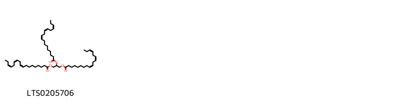{ width=100% }
    <figcaption>Hình ảnh cấu trúc hóa học của 1 hoạt chất thuộc nhóm Glycerolipids gồm ['trilinolenin (LTS0205706)'].</figcaption>
</figure>

---

### Dược dân tộc học

Danh sách các quốc gia có sử dụng *Plukenetia conophora* trong điều trị các bệnh. 

| Country   | Disease   | Bệnh     |
|:----------|:----------|:---------|
| Africa    | Soap      | Xà phòng |

---

# Chi ondianthus

??? note "Danh sách các dược liệu thuộc chi"
    
	 - *ondianthus preussii*
	 - *ondianthus ugandensis*

---
## ondianthus preussii
### Thông tin về thực vật

!!! info "Phân loại thực vật của *N/A* từ GIBF:"
    - **Kingdom:** N/A
    - **Phylum:** N/A
    - **Order:** N/A
    - **Family:** N/A
    - **Genus:** N/A
    - **Species:** *N/A*

 

| Label (VI)   | Label (EN)   | Scientific Name           | Descriptions (VI)   | Descriptions (EN)   | Also Known As (VI)   | Also Known As (EN)   |
|:-------------|:-------------|:--------------------------|:--------------------|:--------------------|:---------------------|:---------------------|
| N/A          | N/A          | Tetracarpidium conophorum | loài thực vật       | species of plant    | ['']                 | ['']                 |

#### Phân bố trên thế giới

**Từ CSDL GIBF** Không có kết quả phù hợp

#### Phân bố tại Việt Nam

**Từ CSDL GIBF**: Không có ghi nhận ở Việt Nam

---
### Thành phần hóa học
        
- Theo cơ sở dữ liệu lotus: Từ loài *N/A* đã phân lập và xác định được Chưa có hoạt chất nào được phân lập. hoạt chất thuộc về các nhóm Không có hoạt chất nào được phân lập. 

Không có hình ảnh nào được tạo ra

---

### Dược dân tộc học

Danh sách các quốc gia có sử dụng *N/A* trong điều trị các bệnh. 

| Country   | Disease   | Bệnh     |
|:----------|:----------|:---------|
| Cameroon  | Raticide  | Raticide |

---

---
## ondianthus ugandensis
### Thông tin về thực vật

!!! info "Phân loại thực vật của *N/A* từ GIBF:"
    - **Kingdom:** N/A
    - **Phylum:** N/A
    - **Order:** N/A
    - **Family:** N/A
    - **Genus:** N/A
    - **Species:** *N/A*

 

| Label (VI)   | Label (EN)   | Scientific Name           | Descriptions (VI)   | Descriptions (EN)   | Also Known As (VI)   | Also Known As (EN)   |
|:-------------|:-------------|:--------------------------|:--------------------|:--------------------|:---------------------|:---------------------|
| N/A          | N/A          | Tetracarpidium conophorum | loài thực vật       | species of plant    | ['']                 | ['']                 |

#### Phân bố trên thế giới

**Từ CSDL GIBF** Không có kết quả phù hợp

#### Phân bố tại Việt Nam

**Từ CSDL GIBF**: Không có ghi nhận ở Việt Nam

---
### Thành phần hóa học
        
- Theo cơ sở dữ liệu lotus: Từ loài *N/A* đã phân lập và xác định được Chưa có hoạt chất nào được phân lập. hoạt chất thuộc về các nhóm Không có hoạt chất nào được phân lập. 

Không có hình ảnh nào được tạo ra

---

### Dược dân tộc học

Danh sách các quốc gia có sử dụng *N/A* trong điều trị các bệnh. 

| Country   | Disease   | Bệnh     |
|:----------|:----------|:---------|
| Liberia   | Raticide  | Raticide |

---

# Chi Melanolepis

??? note "Danh sách các dược liệu thuộc chi"
    
	 - *Melanolepis moluccana*

---
## Melanolepis moluccana
### Thông tin về thực vật

!!! info "Phân loại thực vật của *Melanolepis multiglandulosa* từ GIBF:"
    - **Kingdom:** Plantae
    - **Phylum:** Tracheophyta
    - **Order:** Malpighiales
    - **Family:** Euphorbiaceae
    - **Genus:** Melanolepis
    - **Species:** *Melanolepis multiglandulosa*

 

| Label (VI)   | Label (EN)   | Scientific Name           | Descriptions (VI)   | Descriptions (EN)   | Also Known As (VI)   | Also Known As (EN)   |
|:-------------|:-------------|:--------------------------|:--------------------|:--------------------|:---------------------|:---------------------|
| N/A          | N/A          | Tetracarpidium conophorum | loài thực vật       | species of plant    | ['']                 | ['']                 |

#### Phân bố trên thế giới

**Từ CSDL GIBF** nan, Chinese Taipei, Brazil, Guam, Indonesia, Philippines

#### Phân bố tại Việt Nam

**Từ CSDL GIBF**: Không có ghi nhận ở Việt Nam

---
### Thành phần hóa học
        
- Theo cơ sở dữ liệu lotus: Từ loài *Melanolepis multiglandulosa* đã phân lập và xác định được Chưa có hoạt chất nào được phân lập. hoạt chất thuộc về các nhóm Không có hoạt chất nào được phân lập. 

Không có hình ảnh nào được tạo ra

---

### Dược dân tộc học

Danh sách các quốc gia có sử dụng *Melanolepis multiglandulosa* trong điều trị các bệnh. 

| Country   | Disease   | Bệnh           |
|:----------|:----------|:---------------|
| Malaya    | Vermifuge | Thuốc diệt sán |

---

# Chi Vaupesia

??? note "Danh sách các dược liệu thuộc chi"
    
	 - *Vaupesia cataractarum*

---
## Vaupesia cataractarum
### Thông tin về thực vật

!!! info "Phân loại thực vật của *Vaupesia cataractarum* từ GIBF:"
    - **Kingdom:** Plantae
    - **Phylum:** Tracheophyta
    - **Order:** Malpighiales
    - **Family:** Euphorbiaceae
    - **Genus:** Vaupesia
    - **Species:** *Vaupesia cataractarum*

 

| Label (VI)   | Label (EN)   | Scientific Name       | Descriptions (VI)   | Descriptions (EN)   | Also Known As (VI)   | Also Known As (EN)   |
|:-------------|:-------------|:----------------------|:--------------------|:--------------------|:---------------------|:---------------------|
| N/A          | N/A          | Vaupesia cataractarum | loài thực vật       | species of plant    | ['']                 | ['']                 |

#### Phân bố trên thế giới

**Từ CSDL GIBF** nan, Colombia

#### Phân bố tại Việt Nam

**Từ CSDL GIBF**: Không có ghi nhận ở Việt Nam

---
### Thành phần hóa học
        
- Theo cơ sở dữ liệu lotus: Từ loài *Vaupesia cataractarum* đã phân lập và xác định được Chưa có hoạt chất nào được phân lập. hoạt chất thuộc về các nhóm Không có hoạt chất nào được phân lập. 

Không có hình ảnh nào được tạo ra

---

### Dược dân tộc học

Danh sách các quốc gia có sử dụng *Vaupesia cataractarum* trong điều trị các bệnh. 

| Country          | Disease   | Bệnh     |
|:-----------------|:----------|:---------|
| Colombia(Desano) | Poison    | Chất độc |

---

# Chi Gymnanthes

??? note "Danh sách các dược liệu thuộc chi"
    
	 - *Gymnanthes lucida*

---
## Gymnanthes lucida
### Thông tin về thực vật

!!! info "Phân loại thực vật của *Gymnanthes lucida* từ GIBF:"
    - **Kingdom:** Plantae
    - **Phylum:** Tracheophyta
    - **Order:** Malpighiales
    - **Family:** Euphorbiaceae
    - **Genus:** Gymnanthes
    - **Species:** *Gymnanthes lucida*

 

| Label (VI)   | Label (EN)   | Scientific Name   | Descriptions (VI)   | Descriptions (EN)   | Also Known As (VI)   | Also Known As (EN)   |
|:-------------|:-------------|:------------------|:--------------------|:--------------------|:---------------------|:---------------------|
| N/A          | N/A          | Gymnanthes lucida | loài thực vật       | species of plant    | ['']                 | ['']                 |

#### Phân bố trên thế giới

**Từ CSDL GIBF** Virgin Islands (U.S.), Saint Martin (French part), Puerto Rico, Belize, Saint Kitts and Nevis, Turks and Caicos Islands, Guadeloupe, Haiti, Bahamas, Bonaire, Sint Eustatius and Saba, Jamaica, United States of America, Cayman Islands, Dominican Republic, Cuba, Sint Maarten (Dutch part), Mexico

#### Phân bố tại Việt Nam

**Từ CSDL GIBF**: Không có ghi nhận ở Việt Nam

---
### Thành phần hóa học
        
- Theo cơ sở dữ liệu lotus: Từ loài *Gymnanthes lucida* đã phân lập và xác định được Chưa có hoạt chất nào được phân lập. hoạt chất thuộc về các nhóm Không có hoạt chất nào được phân lập. 

Không có hình ảnh nào được tạo ra

---

### Dược dân tộc học

Danh sách các quốc gia có sử dụng *Gymnanthes lucida* trong điều trị các bệnh. 

| Country   | Disease          | Bệnh                        |
|:----------|:-----------------|:----------------------------|
| Mexico    | Vesicant, Poison | Chất gây bọng mắt, Chất độc |

---

# Chi Fontainea

??? note "Danh sách các dược liệu thuộc chi"
    
	 - *Fontainea pancheri*

---
## Fontainea pancheri
### Thông tin về thực vật

!!! info "Phân loại thực vật của *Fontainea pancheri* từ GIBF:"
    - **Kingdom:** Plantae
    - **Phylum:** Tracheophyta
    - **Order:** Malpighiales
    - **Family:** Euphorbiaceae
    - **Genus:** Fontainea
    - **Species:** *Fontainea pancheri*

 

| Label (VI)   | Label (EN)   | Scientific Name    | Descriptions (VI)   | Descriptions (EN)   | Also Known As (VI)   | Also Known As (EN)   |
|:-------------|:-------------|:-------------------|:--------------------|:--------------------|:---------------------|:---------------------|
| N/A          | N/A          | Fontainea pancheri | loài thực vật       | species of plant    | ['']                 | ['']                 |

#### Phân bố trên thế giới

**Từ CSDL GIBF** nan, Australia, Cook Islands, Papua New Guinea, Vanuatu, New Caledonia

#### Phân bố tại Việt Nam

**Từ CSDL GIBF**: Không có ghi nhận ở Việt Nam

---
### Thành phần hóa học
        
- Theo cơ sở dữ liệu lotus: Từ loài *Fontainea pancheri* đã phân lập và xác định được 1 hoạt chất thuộc về các nhóm Cinnamic acids and derivatives. 

|    | chemicalTaxonomyClassyfireClass   |   smiles_count |
|---:|:----------------------------------|---------------:|
|  0 | Cinnamic acids and derivatives    |              1 |

#### Nhóm Cinnamic acids and derivatives
<figure markdown="span">
    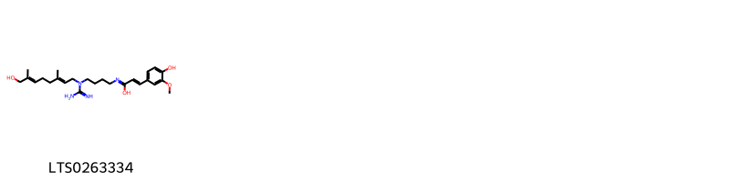{ width=100% }
    <figcaption>Hình ảnh cấu trúc hóa học của 1 hoạt chất thuộc nhóm Cinnamic acids and derivatives gồm ['(2e)-n-(4-{n-[(2e,6e)-8-hydroxy-3,7-dimethylocta-2,6-dien-1-yl]carbamimidamido}butyl)-3-(4-hydroxy-3-methoxyphenyl)prop-2-enimidic acid (LTS0263334)'].</figcaption>
</figure>

---

### Dược dân tộc học

Danh sách các quốc gia có sử dụng *Fontainea pancheri* trong điều trị các bệnh. 

| Country      | Disease           | Bệnh                      |
|:-------------|:------------------|:--------------------------|
| New Hebrides | Piscicide, Poison | Thuốc sát trùng, Chất độc |

---

# Chi Hymenocardia

??? note "Danh sách các dược liệu thuộc chi"
    
	 - *Hymenocardia acida*

---
## Hymenocardia acida
### Thông tin về thực vật

!!! info "Phân loại thực vật của *Hymenocardia acida* từ GIBF:"
    - **Kingdom:** Plantae
    - **Phylum:** Tracheophyta
    - **Order:** Malpighiales
    - **Family:** Phyllanthaceae
    - **Genus:** Hymenocardia
    - **Species:** *Hymenocardia acida*

 

| Label (VI)   | Label (EN)   | Scientific Name    | Descriptions (VI)   | Descriptions (EN)   | Also Known As (VI)   | Also Known As (EN)   |
|:-------------|:-------------|:-------------------|:--------------------|:--------------------|:---------------------|:---------------------|
| N/A          | N/A          | Hymenocardia acida | loài thực vật       | species of plant    | ['']                 | ['']                 |

#### Phân bố trên thế giới

**Từ CSDL GIBF** Malawi, Zambia, Uganda, Nigeria, Gabon, Angola, Mozambique, Benin, Congo, Democratic Republic of the, Guinea, Sierra Leone

#### Phân bố tại Việt Nam

**Từ CSDL GIBF**: Không có ghi nhận ở Việt Nam

---
### Thành phần hóa học
        
- Theo cơ sở dữ liệu lotus: Từ loài *Hymenocardia acida* đã phân lập và xác định được Chưa có hoạt chất nào được phân lập. hoạt chất thuộc về các nhóm Không có hoạt chất nào được phân lập. 

Không có hình ảnh nào được tạo ra

---

### Dược dân tộc học

Danh sách các quốc gia có sử dụng *Hymenocardia acida* trong điều trị các bệnh. 

| Country   | Disease    | Bệnh      |
|:----------|:-----------|:----------|
| Elsewhere | Antiseptic | Khử trùng |
| Sudan     | Antiseptic | Khử trùng |

---

# Chi Balioermum

??? note "Danh sách các dược liệu thuộc chi"
    
	 - *Balioermum montanum*

---
## Balioermum montanum
### Thông tin về thực vật

!!! info "Phân loại thực vật của *N/A* từ GIBF:"
    - **Kingdom:** N/A
    - **Phylum:** N/A
    - **Order:** N/A
    - **Family:** N/A
    - **Genus:** N/A
    - **Species:** *N/A*

 

| Label (VI)   | Label (EN)   | Scientific Name    | Descriptions (VI)   | Descriptions (EN)   | Also Known As (VI)   | Also Known As (EN)   |
|:-------------|:-------------|:-------------------|:--------------------|:--------------------|:---------------------|:---------------------|
| N/A          | N/A          | Hymenocardia acida | loài thực vật       | species of plant    | ['']                 | ['']                 |

#### Phân bố trên thế giới

**Từ CSDL GIBF** Không có kết quả phù hợp

#### Phân bố tại Việt Nam

**Từ CSDL GIBF**: Không có ghi nhận ở Việt Nam

---
### Thành phần hóa học
        
- Theo cơ sở dữ liệu lotus: Từ loài *N/A* đã phân lập và xác định được Chưa có hoạt chất nào được phân lập. hoạt chất thuộc về các nhóm Không có hoạt chất nào được phân lập. 

Không có hình ảnh nào được tạo ra

---

### Dược dân tộc học

Danh sách các quốc gia có sử dụng *N/A* trong điều trị các bệnh. 

| Country   | Disease                      | Bệnh                         |
|:----------|:-----------------------------|:-----------------------------|
| Elsewhere | Cathartic, Poison, Purgative | Cathartic, Poison, Purgative |
| Malaya    | Purgative                    | Thuốc xổ                     |

---

# Chi Cleistanthus

??? note "Danh sách các dược liệu thuộc chi"
    
	 - *Cleistanthus collinu*
	 - *Cleistanthus collinus*

---
## Cleistanthus collinu
### Thông tin về thực vật

!!! info "Phân loại thực vật của *Cleistanthus collinus* từ GIBF:"
    - **Kingdom:** Plantae
    - **Phylum:** Tracheophyta
    - **Order:** Malpighiales
    - **Family:** Phyllanthaceae
    - **Genus:** Cleistanthus
    - **Species:** *Cleistanthus collinus*

 

| Label (VI)   | Label (EN)   | Scientific Name    | Descriptions (VI)   | Descriptions (EN)   | Also Known As (VI)   | Also Known As (EN)   |
|:-------------|:-------------|:-------------------|:--------------------|:--------------------|:---------------------|:---------------------|
| N/A          | N/A          | Hymenocardia acida | loài thực vật       | species of plant    | ['']                 | ['']                 |

#### Phân bố trên thế giới

**Từ CSDL GIBF** nan, Sri Lanka, Myanmar, Guyana, India, unknown or invalid, Indonesia, United States of America, Malaysia

#### Phân bố tại Việt Nam

**Từ CSDL GIBF**: Không có ghi nhận ở Việt Nam

---
### Thành phần hóa học
        
- Theo cơ sở dữ liệu lotus: Từ loài *Cleistanthus collinus* đã phân lập và xác định được 43 hoạt chất thuộc về các nhóm Lignan glycosides, Fatty Acyls, Steroids and steroid derivatives, Dibenzylbutane lignans, Lignan lactones, Arylnaphthalene lignans, Organooxygen compounds, Furanoid lignans, Imidazopyrimidines. 

|    | chemicalTaxonomyClassyfireClass   |   smiles_count |
|---:|:----------------------------------|---------------:|
|  0 | Arylnaphthalene lignans           |              5 |
|  1 | Dibenzylbutane lignans            |              1 |
|  2 | Fatty Acyls                       |              4 |
|  3 | Furanoid lignans                  |             10 |
|  4 | Imidazopyrimidines                |              1 |
|  5 | Lignan glycosides                 |             13 |
|  6 | Lignan lactones                   |              4 |
|  7 | Organooxygen compounds            |              3 |
|  8 | Steroids and steroid derivatives  |              2 |

#### Nhóm Arylnaphthalene lignans
<figure markdown="span">
    { width=100% }
    <figcaption>Hình ảnh cấu trúc hóa học của 5 hoạt chất thuộc nhóm Arylnaphthalene lignans gồm ['taiwanin c (LTS0117175)', 'diphyllin (LTS0235040)', 'cleistanone(rac) (LTS0073381)', '10-(2h-1,3-benzodioxol-5-yl)-16-hydroxy-4,6,13-trioxatetracyclo[7.7.0.0³,⁷.0¹¹,¹⁵]hexadeca-1,3(7),8,10,15-pentaen-12-one (LTS0023799)', '(3s)-9-(2h-1,3-benzodioxol-5-yl)-4-hydroxy-3,6,7-trimethoxy-3h-naphtho[2,3-c]furan-1-one (LTS0095436)'].</figcaption>
</figure>
#### Nhóm Dibenzylbutane lignans
<figure markdown="span">
    { width=100% }
    <figcaption>Hình ảnh cấu trúc hóa học của 1 hoạt chất thuộc nhóm Dibenzylbutane lignans gồm ['dihydrocubebin (LTS0063430)'].</figcaption>
</figure>
#### Nhóm Fatty Acyls
<figure markdown="span">
    { width=100% }
    <figcaption>Hình ảnh cấu trúc hóa học của 4 hoạt chất thuộc nhóm Fatty Acyls gồm ['palmitic acid (LTS0079439)', 'palmitoleic acid (LTS0261591)', 'oleic acid (LTS0256910)', 'stearic acid (LTS0237766)'].</figcaption>
</figure>
#### Nhóm Furanoid lignans
<figure markdown="span">
    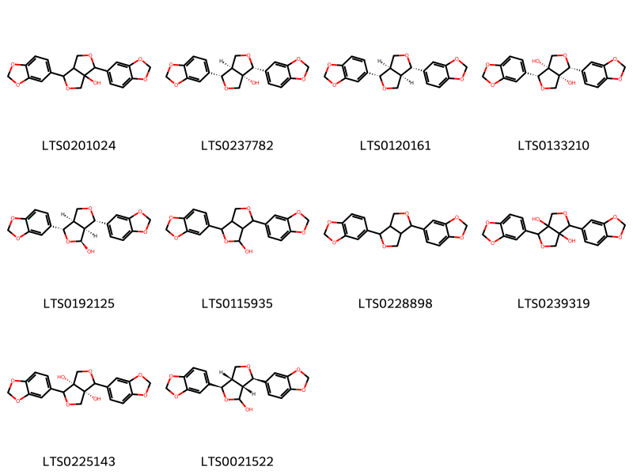{ width=100% }
    <figcaption>Hình ảnh cấu trúc hóa học của 10 hoạt chất thuộc nhóm Furanoid lignans gồm ['1,4-bis(2h-1,3-benzodioxol-5-yl)-tetrahydro-1h-furo[3,4-c]furan-3a-ol (LTS0201024)', '(1s,3as,4r,6ar)-1,4-bis(2h-1,3-benzodioxol-5-yl)-tetrahydro-1h-furo[3,4-c]furan-3a-ol (LTS0237782)', 'sesamin (LTS0120161)', '(1r,3as,4r,6as)-1,4-bis(2h-1,3-benzodioxol-5-yl)-tetrahydrofuro[3,4-c]furan-3a,6a-diol (LTS0133210)', '(1s,3s,3ar,6s,6as)-3,6-bis(2h-1,3-benzodioxol-5-yl)-hexahydrofuro[3,4-c]furan-1-ol (LTS0192125)', '3,6-bis(2h-1,3-benzodioxol-5-yl)-hexahydrofuro[3,4-c]furan-1-ol (LTS0115935)', 'sesamin (LTS0228898)', '1,4-bis(2h-1,3-benzodioxol-5-yl)-tetrahydrofuro[3,4-c]furan-3a,6a-diol (LTS0239319)', '(3as,6as)-1,4-bis(2h-1,3-benzodioxol-5-yl)-tetrahydrofuro[3,4-c]furan-3a,6a-diol (LTS0225143)', '(3r,3as,6r,6ar)-3,6-bis(2h-1,3-benzodioxol-5-yl)-hexahydrofuro[3,4-c]furan-1-ol (LTS0021522)'].</figcaption>
</figure>
#### Nhóm Imidazopyrimidines
<figure markdown="span">
    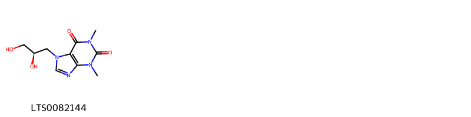{ width=100% }
    <figcaption>Hình ảnh cấu trúc hóa học của 1 hoạt chất thuộc nhóm Imidazopyrimidines gồm ['coronal (LTS0082144)'].</figcaption>
</figure>
#### Nhóm Lignan glycosides
<figure markdown="span">
    { width=100% }
    <figcaption>Hình ảnh cấu trúc hóa học của 13 hoạt chất thuộc nhóm Lignan glycosides gồm ['cleistanthin (LTS0109307)', 'cleistanthin a (LTS0141158)', 'cleistanthin b (LTS0029478)', '9-(2h-1,3-benzodioxol-5-yl)-4-{[(2r,3r,4r,5r)-3-hydroxy-4,5-dimethoxyoxan-2-yl]oxy}-6,7-dimethoxy-3h-naphtho[2,3-c]furan-1-one (LTS0206750)', 'cleistanthin c (LTS0203361)', 'cleistanthin d (LTS0143264)', '10-(2h-1,3-benzodioxol-5-yl)-16-[(3-hydroxy-4,5-dimethoxyoxan-2-yl)oxy]-4,6,13-trioxatetracyclo[7.7.0.0³,⁷.0¹¹,¹⁵]hexadeca-1,3(7),8,10,15-pentaen-12-one (LTS0167746)', '9-(2h-1,3-benzodioxol-5-yl)-4-[(3-hydroxy-4,5-dimethoxyoxan-2-yl)oxy]-6,7-dimethoxy-3h-naphtho[2,3-c]furan-1-one (LTS0058997)', '10-(2h-1,3-benzodioxol-5-yl)-16-{[(2r,3r,4r,5r)-3-hydroxy-4,5-dimethoxyoxan-2-yl]oxy}-4,6,13-trioxatetracyclo[7.7.0.0³,⁷.0¹¹,¹⁵]hexadeca-1,3(7),8,10,15-pentaen-12-one (LTS0232710)', '9-(2h-1,3-benzodioxol-5-yl)-4-{[3,4-dimethoxy-5-(methoxymethyl)oxolan-2-yl]oxy}-6,7-dimethoxy-3h-naphtho[2,3-c]furan-1-one (LTS0040396)', '9-(2h-1,3-benzodioxol-5-yl)-4-{[3,5-dihydroxy-6-(hydroxymethyl)-4-methoxyoxan-2-yl]oxy}-6,7-dimethoxy-3h-naphtho[2,3-c]furan-1-one (LTS0196920)', '9-(2h-1,3-benzodioxol-5-yl)-4-({3,4-dihydroxy-5-[(5-hydroxy-3,4-dimethoxyoxan-2-yl)oxy]-6-(hydroxymethyl)oxan-2-yl}oxy)-6,7-dimethoxy-3h-naphtho[2,3-c]furan-1-one (LTS0027520)', '9-(2h-1,3-benzodioxol-5-yl)-4-{[(2s,3r,4s,5r,6r)-3,5-dihydroxy-6-(hydroxymethyl)-4-methoxyoxan-2-yl]oxy}-6,7-dimethoxy-3h-naphtho[2,3-c]furan-1-one (LTS0021485)'].</figcaption>
</figure>
#### Nhóm Lignan lactones
<figure markdown="span">
    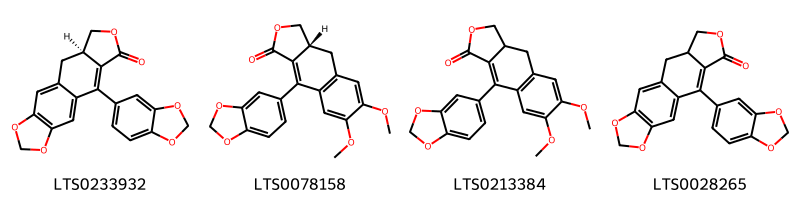{ width=100% }
    <figcaption>Hình ảnh cấu trúc hóa học của 4 hoạt chất thuộc nhóm Lignan lactones gồm ['(15r)-10-(2h-1,3-benzodioxol-5-yl)-4,6,13-trioxatetracyclo[7.7.0.0³,⁷.0¹¹,¹⁵]hexadeca-1,3(7),8,10-tetraen-12-one (LTS0233932)', '(3ar)-9-(2h-1,3-benzodioxol-5-yl)-6,7-dimethoxy-3h,3ah,4h-naphtho[2,3-c]furan-1-one (LTS0078158)', '9-(2h-1,3-benzodioxol-5-yl)-6,7-dimethoxy-3h,3ah,4h-naphtho[2,3-c]furan-1-one (LTS0213384)', '10-(2h-1,3-benzodioxol-5-yl)-4,6,13-trioxatetracyclo[7.7.0.0³,⁷.0¹¹,¹⁵]hexadeca-1,3(7),8,10-tetraen-12-one (LTS0028265)'].</figcaption>
</figure>
#### Nhóm Organooxygen compounds
<figure markdown="span">
    { width=100% }
    <figcaption>Hình ảnh cấu trúc hóa học của 3 hoạt chất thuộc nhóm Organooxygen compounds gồm ["(2s,4ar,4br,6r,6ar,10ar,10br,12ar)-6-hydroxy-2',2',4a,4b,7,7,10a-heptamethyl-5'-methylidene-dodecahydrospiro[chrysene-2,1'-cyclopentan]-8-one (LTS0137003)", 'cleistanthin e (LTS0275009)', '9-(2h-1,3-benzodioxol-5-yl)-4-({5-[(5-{[3,4-dimethoxy-5-(methoxymethyl)oxolan-2-yl]oxy}-3,4-dimethoxyoxan-2-yl)oxy]-3,4-dihydroxy-6-(hydroxymethyl)oxan-2-yl}oxy)-6,7-dimethoxy-3h-naphtho[2,3-c]furan-1-one (LTS0164515)'].</figcaption>
</figure>
#### Nhóm Steroids and steroid derivatives
<figure markdown="span">
    { width=100% }
    <figcaption>Hình ảnh cấu trúc hóa học của 2 hoạt chất thuộc nhóm Steroids and steroid derivatives gồm ['stigmast-5-en-3-ol (LTS0071224)', 'stigmast-5-en-3-ol, (3β)- (LTS0204616)'].</figcaption>
</figure>

---

### Dược dân tộc học

Danh sách các quốc gia có sử dụng *Cleistanthus collinus* trong điều trị các bệnh. 

| Country   | Disease   | Bệnh     |
|:----------|:----------|:---------|
| Elsewhere | Poison    | Chất độc |

---

---
## Cleistanthus collinus
### Thông tin về thực vật

!!! info "Phân loại thực vật của *Cleistanthus collinus* từ GIBF:"
    - **Kingdom:** Plantae
    - **Phylum:** Tracheophyta
    - **Order:** Malpighiales
    - **Family:** Phyllanthaceae
    - **Genus:** Cleistanthus
    - **Species:** *Cleistanthus collinus*

 

| Label (VI)   | Label (EN)   | Scientific Name       | Descriptions (VI)   | Descriptions (EN)   | Also Known As (VI)   | Also Known As (EN)   |
|:-------------|:-------------|:----------------------|:--------------------|:--------------------|:---------------------|:---------------------|
| N/A          | N/A          | Cleistanthus collinus | loài thực vật       | species of plant    | ['']                 | ['Oduvan']           |

#### Phân bố trên thế giới

**Từ CSDL GIBF** nan, Sri Lanka, Myanmar, Guyana, India, unknown or invalid, Indonesia, United States of America, Malaysia

#### Phân bố tại Việt Nam

**Từ CSDL GIBF**: Không có ghi nhận ở Việt Nam

---
### Thành phần hóa học
        
- Theo cơ sở dữ liệu lotus: Từ loài *Cleistanthus collinus* đã phân lập và xác định được 43 hoạt chất thuộc về các nhóm Lignan glycosides, Fatty Acyls, Steroids and steroid derivatives, Dibenzylbutane lignans, Lignan lactones, Arylnaphthalene lignans, Organooxygen compounds, Furanoid lignans, Imidazopyrimidines. 

|    | chemicalTaxonomyClassyfireClass   |   smiles_count |
|---:|:----------------------------------|---------------:|
|  0 | Arylnaphthalene lignans           |              5 |
|  1 | Dibenzylbutane lignans            |              1 |
|  2 | Fatty Acyls                       |              4 |
|  3 | Furanoid lignans                  |             10 |
|  4 | Imidazopyrimidines                |              1 |
|  5 | Lignan glycosides                 |             13 |
|  6 | Lignan lactones                   |              4 |
|  7 | Organooxygen compounds            |              3 |
|  8 | Steroids and steroid derivatives  |              2 |

#### Nhóm Arylnaphthalene lignans
<figure markdown="span">
    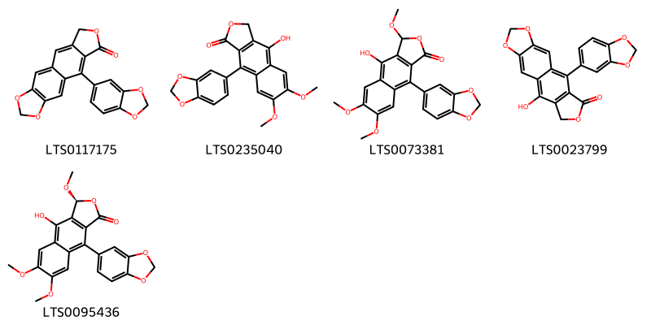{ width=100% }
    <figcaption>Hình ảnh cấu trúc hóa học của 5 hoạt chất thuộc nhóm Arylnaphthalene lignans gồm ['taiwanin c (LTS0117175)', 'diphyllin (LTS0235040)', 'cleistanone(rac) (LTS0073381)', '10-(2h-1,3-benzodioxol-5-yl)-16-hydroxy-4,6,13-trioxatetracyclo[7.7.0.0³,⁷.0¹¹,¹⁵]hexadeca-1,3(7),8,10,15-pentaen-12-one (LTS0023799)', '(3s)-9-(2h-1,3-benzodioxol-5-yl)-4-hydroxy-3,6,7-trimethoxy-3h-naphtho[2,3-c]furan-1-one (LTS0095436)'].</figcaption>
</figure>
#### Nhóm Dibenzylbutane lignans
<figure markdown="span">
    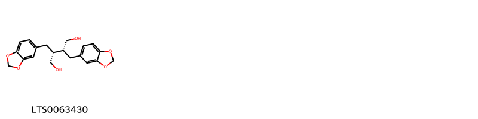{ width=100% }
    <figcaption>Hình ảnh cấu trúc hóa học của 1 hoạt chất thuộc nhóm Dibenzylbutane lignans gồm ['dihydrocubebin (LTS0063430)'].</figcaption>
</figure>
#### Nhóm Fatty Acyls
<figure markdown="span">
    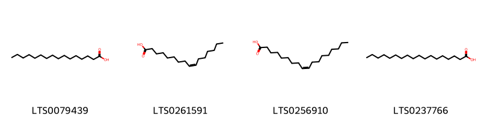{ width=100% }
    <figcaption>Hình ảnh cấu trúc hóa học của 4 hoạt chất thuộc nhóm Fatty Acyls gồm ['palmitic acid (LTS0079439)', 'palmitoleic acid (LTS0261591)', 'oleic acid (LTS0256910)', 'stearic acid (LTS0237766)'].</figcaption>
</figure>
#### Nhóm Furanoid lignans
<figure markdown="span">
    { width=100% }
    <figcaption>Hình ảnh cấu trúc hóa học của 10 hoạt chất thuộc nhóm Furanoid lignans gồm ['1,4-bis(2h-1,3-benzodioxol-5-yl)-tetrahydro-1h-furo[3,4-c]furan-3a-ol (LTS0201024)', '(1s,3as,4r,6ar)-1,4-bis(2h-1,3-benzodioxol-5-yl)-tetrahydro-1h-furo[3,4-c]furan-3a-ol (LTS0237782)', 'sesamin (LTS0120161)', '(1r,3as,4r,6as)-1,4-bis(2h-1,3-benzodioxol-5-yl)-tetrahydrofuro[3,4-c]furan-3a,6a-diol (LTS0133210)', '(1s,3s,3ar,6s,6as)-3,6-bis(2h-1,3-benzodioxol-5-yl)-hexahydrofuro[3,4-c]furan-1-ol (LTS0192125)', '3,6-bis(2h-1,3-benzodioxol-5-yl)-hexahydrofuro[3,4-c]furan-1-ol (LTS0115935)', 'sesamin (LTS0228898)', '1,4-bis(2h-1,3-benzodioxol-5-yl)-tetrahydrofuro[3,4-c]furan-3a,6a-diol (LTS0239319)', '(3as,6as)-1,4-bis(2h-1,3-benzodioxol-5-yl)-tetrahydrofuro[3,4-c]furan-3a,6a-diol (LTS0225143)', '(3r,3as,6r,6ar)-3,6-bis(2h-1,3-benzodioxol-5-yl)-hexahydrofuro[3,4-c]furan-1-ol (LTS0021522)'].</figcaption>
</figure>
#### Nhóm Imidazopyrimidines
<figure markdown="span">
    { width=100% }
    <figcaption>Hình ảnh cấu trúc hóa học của 1 hoạt chất thuộc nhóm Imidazopyrimidines gồm ['coronal (LTS0082144)'].</figcaption>
</figure>
#### Nhóm Lignan glycosides
<figure markdown="span">
    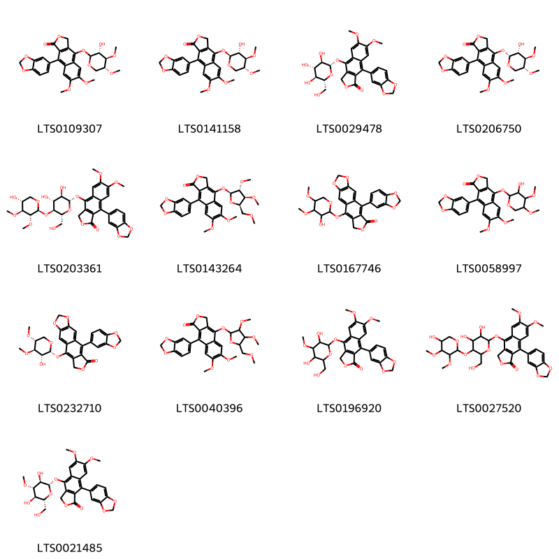{ width=100% }
    <figcaption>Hình ảnh cấu trúc hóa học của 13 hoạt chất thuộc nhóm Lignan glycosides gồm ['cleistanthin (LTS0109307)', 'cleistanthin a (LTS0141158)', 'cleistanthin b (LTS0029478)', '9-(2h-1,3-benzodioxol-5-yl)-4-{[(2r,3r,4r,5r)-3-hydroxy-4,5-dimethoxyoxan-2-yl]oxy}-6,7-dimethoxy-3h-naphtho[2,3-c]furan-1-one (LTS0206750)', 'cleistanthin c (LTS0203361)', 'cleistanthin d (LTS0143264)', '10-(2h-1,3-benzodioxol-5-yl)-16-[(3-hydroxy-4,5-dimethoxyoxan-2-yl)oxy]-4,6,13-trioxatetracyclo[7.7.0.0³,⁷.0¹¹,¹⁵]hexadeca-1,3(7),8,10,15-pentaen-12-one (LTS0167746)', '9-(2h-1,3-benzodioxol-5-yl)-4-[(3-hydroxy-4,5-dimethoxyoxan-2-yl)oxy]-6,7-dimethoxy-3h-naphtho[2,3-c]furan-1-one (LTS0058997)', '10-(2h-1,3-benzodioxol-5-yl)-16-{[(2r,3r,4r,5r)-3-hydroxy-4,5-dimethoxyoxan-2-yl]oxy}-4,6,13-trioxatetracyclo[7.7.0.0³,⁷.0¹¹,¹⁵]hexadeca-1,3(7),8,10,15-pentaen-12-one (LTS0232710)', '9-(2h-1,3-benzodioxol-5-yl)-4-{[3,4-dimethoxy-5-(methoxymethyl)oxolan-2-yl]oxy}-6,7-dimethoxy-3h-naphtho[2,3-c]furan-1-one (LTS0040396)', '9-(2h-1,3-benzodioxol-5-yl)-4-{[3,5-dihydroxy-6-(hydroxymethyl)-4-methoxyoxan-2-yl]oxy}-6,7-dimethoxy-3h-naphtho[2,3-c]furan-1-one (LTS0196920)', '9-(2h-1,3-benzodioxol-5-yl)-4-({3,4-dihydroxy-5-[(5-hydroxy-3,4-dimethoxyoxan-2-yl)oxy]-6-(hydroxymethyl)oxan-2-yl}oxy)-6,7-dimethoxy-3h-naphtho[2,3-c]furan-1-one (LTS0027520)', '9-(2h-1,3-benzodioxol-5-yl)-4-{[(2s,3r,4s,5r,6r)-3,5-dihydroxy-6-(hydroxymethyl)-4-methoxyoxan-2-yl]oxy}-6,7-dimethoxy-3h-naphtho[2,3-c]furan-1-one (LTS0021485)'].</figcaption>
</figure>
#### Nhóm Lignan lactones
<figure markdown="span">
    { width=100% }
    <figcaption>Hình ảnh cấu trúc hóa học của 4 hoạt chất thuộc nhóm Lignan lactones gồm ['(15r)-10-(2h-1,3-benzodioxol-5-yl)-4,6,13-trioxatetracyclo[7.7.0.0³,⁷.0¹¹,¹⁵]hexadeca-1,3(7),8,10-tetraen-12-one (LTS0233932)', '(3ar)-9-(2h-1,3-benzodioxol-5-yl)-6,7-dimethoxy-3h,3ah,4h-naphtho[2,3-c]furan-1-one (LTS0078158)', '9-(2h-1,3-benzodioxol-5-yl)-6,7-dimethoxy-3h,3ah,4h-naphtho[2,3-c]furan-1-one (LTS0213384)', '10-(2h-1,3-benzodioxol-5-yl)-4,6,13-trioxatetracyclo[7.7.0.0³,⁷.0¹¹,¹⁵]hexadeca-1,3(7),8,10-tetraen-12-one (LTS0028265)'].</figcaption>
</figure>
#### Nhóm Organooxygen compounds
<figure markdown="span">
    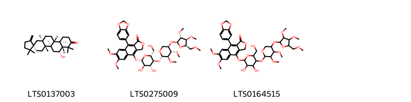{ width=100% }
    <figcaption>Hình ảnh cấu trúc hóa học của 3 hoạt chất thuộc nhóm Organooxygen compounds gồm ["(2s,4ar,4br,6r,6ar,10ar,10br,12ar)-6-hydroxy-2',2',4a,4b,7,7,10a-heptamethyl-5'-methylidene-dodecahydrospiro[chrysene-2,1'-cyclopentan]-8-one (LTS0137003)", 'cleistanthin e (LTS0275009)', '9-(2h-1,3-benzodioxol-5-yl)-4-({5-[(5-{[3,4-dimethoxy-5-(methoxymethyl)oxolan-2-yl]oxy}-3,4-dimethoxyoxan-2-yl)oxy]-3,4-dihydroxy-6-(hydroxymethyl)oxan-2-yl}oxy)-6,7-dimethoxy-3h-naphtho[2,3-c]furan-1-one (LTS0164515)'].</figcaption>
</figure>
#### Nhóm Steroids and steroid derivatives
<figure markdown="span">
    { width=100% }
    <figcaption>Hình ảnh cấu trúc hóa học của 2 hoạt chất thuộc nhóm Steroids and steroid derivatives gồm ['stigmast-5-en-3-ol (LTS0071224)', 'stigmast-5-en-3-ol, (3β)- (LTS0204616)'].</figcaption>
</figure>

---

### Dược dân tộc học

Danh sách các quốc gia có sử dụng *Cleistanthus collinus* trong điều trị các bệnh. 

| Country   | Disease                                     | Bệnh                                        |
|:----------|:--------------------------------------------|:--------------------------------------------|
| Elsewhere | Abortifacient, Piscicide, Piscicide, Poison | Abortifacient, Piscicide, Piscicide, Poison |

---

# Chi Ricinus

??? note "Danh sách các dược liệu thuộc chi"
    
	 - *Ricinus communis*

---
## Ricinus communis
### Thông tin về thực vật

!!! info "Phân loại thực vật của *Ricinus communis* từ GIBF:"
    - **Kingdom:** Plantae
    - **Phylum:** Tracheophyta
    - **Order:** Malpighiales
    - **Family:** Euphorbiaceae
    - **Genus:** Ricinus
    - **Species:** *Ricinus communis*

 

| Label (VI)   | Label (EN)   | Scientific Name   | Descriptions (VI)   | Descriptions (EN)                  | Also Known As (VI)                | Also Known As (EN)                                                           |
|:-------------|:-------------|:------------------|:--------------------|:-----------------------------------|:----------------------------------|:-----------------------------------------------------------------------------|
| N/A          | N/A          | Ricinus communis  | loài thực vật       | species of plant, Castor oil plant | ['Ricinus communis', 'Ricininae'] | ['castor bean', 'castor bean plant', 'castor oil plant', 'castorbean plant'] |

#### Phân bố trên thế giới

**Từ CSDL GIBF** Virgin Islands (U.S.), Sri Lanka, Italy, Australia, Guadeloupe, Lao People’s Democratic Republic, Argentina, Saint Lucia, Benin, Israel, Malawi, Chinese Taipei, Spain, Portugal, United States of America, Chile, Uruguay, Bonaire, Sint Eustatius and Saba, Greece, South Africa, Hong Kong, Thailand, Brazil, Guyana, Peru, Mexico, Dominican Republic, China, Curaçao, Ecuador, Colombia, Costa Rica, India, Antigua and Barbuda, New Zealand

#### Phân bố tại Việt Nam

**Từ CSDL GIBF**: Không có ghi nhận ở Việt Nam

---
### Thành phần hóa học
        
- Theo cơ sở dữ liệu lotus: Từ loài *Ricinus communis* đã phân lập và xác định được 39 hoạt chất thuộc về các nhóm Fatty Acyls, Flavonoids, Prenol lipids, Steroids and steroid derivatives, Indoles and derivatives, Organonitrogen compounds, Benzene and substituted derivatives, Unsaturated hydrocarbons, Organooxygen compounds, Tannins, Carboxylic acids and derivatives, Pyridines and derivatives. 

|    | chemicalTaxonomyClassyfireClass     |   smiles_count |
|---:|:------------------------------------|---------------:|
|  0 | Benzene and substituted derivatives |              1 |
|  1 | Carboxylic acids and derivatives    |              2 |
|  2 | Fatty Acyls                         |              3 |
|  3 | Flavonoids                          |             11 |
|  4 | Indoles and derivatives             |              2 |
|  5 | Organonitrogen compounds            |              1 |
|  6 | Organooxygen compounds              |              1 |
|  7 | Prenol lipids                       |             10 |
|  8 | Pyridines and derivatives           |              2 |
|  9 | Steroids and steroid derivatives    |              2 |
| 10 | Tannins                             |              2 |
| 11 | Unsaturated hydrocarbons            |              1 |

#### Nhóm Benzene and substituted derivatives
<figure markdown="span">
    { width=100% }
    <figcaption>Hình ảnh cấu trúc hóa học của 1 hoạt chất thuộc nhóm Benzene and substituted derivatives gồm ['galop (LTS0222857)'].</figcaption>
</figure>
#### Nhóm Carboxylic acids and derivatives
<figure markdown="span">
    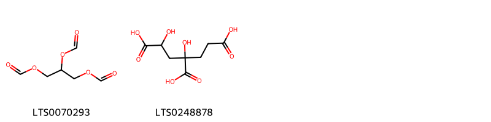{ width=100% }
    <figcaption>Hình ảnh cấu trúc hóa học của 2 hoạt chất thuộc nhóm Carboxylic acids and derivatives gồm ['triformin (LTS0070293)', '1,3-dihydroxypentane-1,3,5-tricarboxylic acid (LTS0248878)'].</figcaption>
</figure>
#### Nhóm Fatty Acyls
<figure markdown="span">
    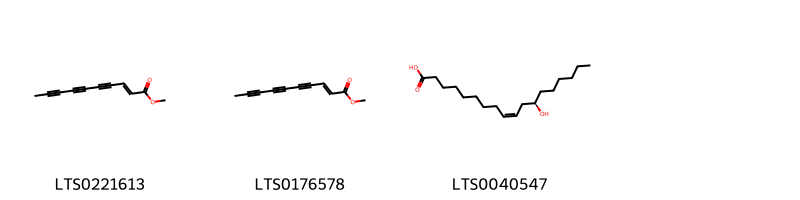{ width=100% }
    <figcaption>Hình ảnh cấu trúc hóa học của 3 hoạt chất thuộc nhóm Fatty Acyls gồm ['methyl dec-2-en-4,6,8-triynoate (LTS0221613)', 'dehydromatricaria ester (LTS0176578)', 'ricinoleic acid (LTS0040547)'].</figcaption>
</figure>
#### Nhóm Flavonoids
<figure markdown="span">
    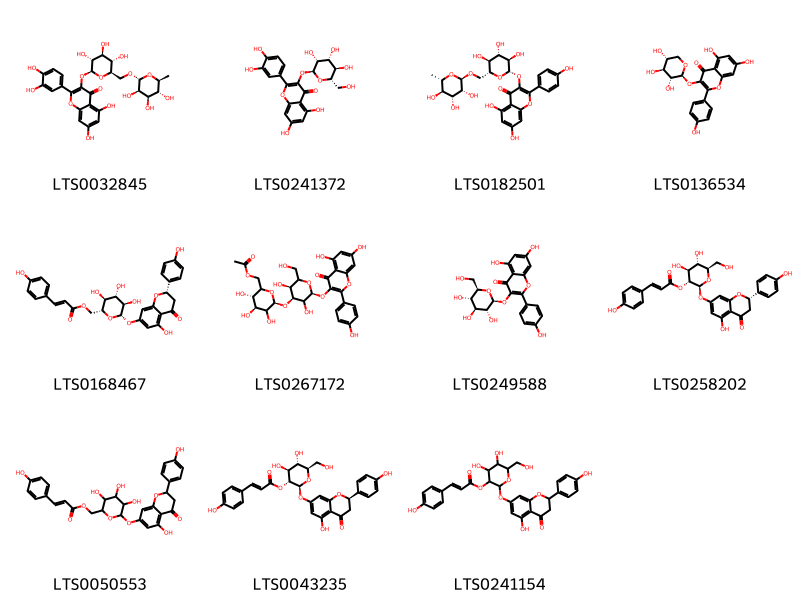{ width=100% }
    <figcaption>Hình ảnh cấu trúc hóa học của 11 hoạt chất thuộc nhóm Flavonoids gồm ['3-rutinosyl quercetin (LTS0032845)', '2-(3,4-dihydroxyphenyl)-5,7-dihydroxy-3-{[(2s,3r,4r,5r,6s)-3,4,5-trihydroxy-6-(hydroxymethyl)oxan-2-yl]oxy}chromen-4-one (LTS0241372)', 'nictoflorin (LTS0182501)', 'kaempferol 3-o-β-d-xyloside (LTS0136534)', '[(2r,3s,4s,5r,6s)-3,4,5-trihydroxy-6-{[(2s)-5-hydroxy-2-(4-hydroxyphenyl)-4-oxo-2,3-dihydro-1-benzopyran-7-yl]oxy}oxan-2-yl]methyl (2e)-3-(4-hydroxyphenyl)prop-2-enoate (LTS0168467)', 'ricinitin (LTS0267172)', 'astragalin (LTS0249588)', '(2s,3r,4s,5s,6r)-4,5-dihydroxy-2-{[(2s)-5-hydroxy-2-(4-hydroxyphenyl)-4-oxo-2,3-dihydro-1-benzopyran-7-yl]oxy}-6-(hydroxymethyl)oxan-3-yl (2e)-3-(4-hydroxyphenyl)prop-2-enoate (LTS0258202)', '(3,4,5-trihydroxy-6-{[5-hydroxy-2-(4-hydroxyphenyl)-4-oxo-2,3-dihydro-1-benzopyran-7-yl]oxy}oxan-2-yl)methyl 3-(4-hydroxyphenyl)prop-2-enoate (LTS0050553)', '(2s,3r,4s,5s,6r)-4,5-dihydroxy-2-{[(2r)-5-hydroxy-2-(4-hydroxyphenyl)-4-oxo-2,3-dihydro-1-benzopyran-7-yl]oxy}-6-(hydroxymethyl)oxan-3-yl (2e)-3-(4-hydroxyphenyl)prop-2-enoate (LTS0043235)', '4,5-dihydroxy-2-{[5-hydroxy-2-(4-hydroxyphenyl)-4-oxo-2,3-dihydro-1-benzopyran-7-yl]oxy}-6-(hydroxymethyl)oxan-3-yl 3-(4-hydroxyphenyl)prop-2-enoate (LTS0241154)'].</figcaption>
</figure>
#### Nhóm Indoles and derivatives
<figure markdown="span">
    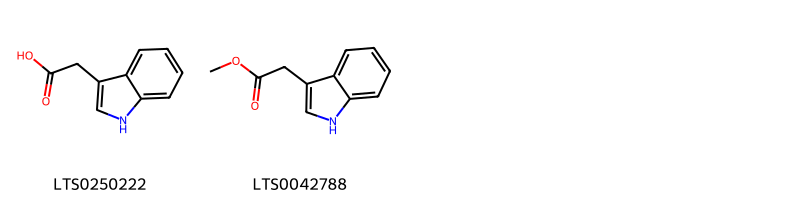{ width=100% }
    <figcaption>Hình ảnh cấu trúc hóa học của 2 hoạt chất thuộc nhóm Indoles and derivatives gồm ['β-indole-3-acetic acid (LTS0250222)', 'methyl indole-3-acetate (LTS0042788)'].</figcaption>
</figure>
#### Nhóm Organonitrogen compounds
<figure markdown="span">
    { width=100% }
    <figcaption>Hình ảnh cấu trúc hóa học của 1 hoạt chất thuộc nhóm Organonitrogen compounds gồm ['(9z,12z)-n-(2-hydroxyethyl)octadeca-9,12-dienimidic acid (LTS0115325)'].</figcaption>
</figure>
#### Nhóm Organooxygen compounds
<figure markdown="span">
    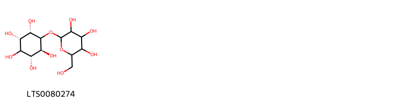{ width=100% }
    <figcaption>Hình ảnh cấu trúc hóa học của 1 hoạt chất thuộc nhóm Organooxygen compounds gồm ['(1s,2r,4s,5s)-6-{[3,4,5-trihydroxy-6-(hydroxymethyl)oxan-2-yl]oxy}cyclohexane-1,2,3,4,5-pentol (LTS0080274)'].</figcaption>
</figure>
#### Nhóm Prenol lipids
<figure markdown="span">
    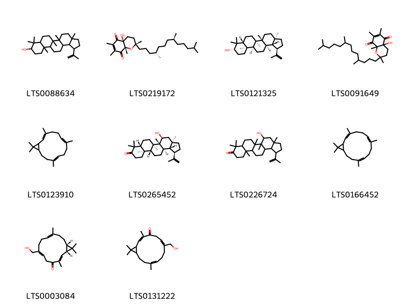{ width=100% }
    <figcaption>Hình ảnh cấu trúc hóa học của 10 hoạt chất thuộc nhóm Prenol lipids gồm ['lupeol (LTS0088634)', '(2s,4as,8as)-4a-hydroxy-2,6,7,8a-tetramethyl-2-[(4s,8s)-4,8,12-trimethyltridecyl]-3,4-dihydro-1-benzopyran-5,8-dione (LTS0219172)', '(1r,3ar,5ar,5br,7ar,9s,11ar,11bs,13ar,13br)-3a,5a,5b,8,8,11a-hexamethyl-1-(prop-1-en-2-yl)-hexadecahydrocyclopenta[a]chrysen-9-ol (LTS0121325)', '4a-hydroxy-2,6,7,8a-tetramethyl-2-(4,8,12-trimethyltridecyl)-3,4-dihydro-1-benzopyran-5,8-dione (LTS0091649)', 'casbene (LTS0123910)', '(1r,3ar,5s,5ar,5br,7ar,11ar,11br,13ar,13br)-5-hydroxy-3a,5a,5b,8,8,11a-hexamethyl-1-(prop-1-en-2-yl)-tetradecahydro-1h-cyclopenta[a]chrysen-9-one (LTS0265452)', '5-hydroxy-3a,5a,5b,8,8,11a-hexamethyl-1-(prop-1-en-2-yl)-tetradecahydro-1h-cyclopenta[a]chrysen-9-one (LTS0226724)', '3,7,11,15,15-pentamethylbicyclo[12.1.0]pentadeca-2,6,10-triene (LTS0166452)', '(1r,2e,6z,10e,14s)-7-(hydroxymethyl)-3,11,15,15-tetramethylbicyclo[12.1.0]pentadeca-2,6,10-trien-4-one (LTS0003084)', '7-(hydroxymethyl)-3,11,15,15-tetramethylbicyclo[12.1.0]pentadeca-2,6,10-trien-4-one (LTS0131222)'].</figcaption>
</figure>
#### Nhóm Pyridines and derivatives
<figure markdown="span">
    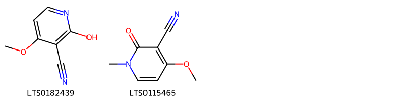{ width=100% }
    <figcaption>Hình ảnh cấu trúc hóa học của 2 hoạt chất thuộc nhóm Pyridines and derivatives gồm ['2-hydroxy-4-methoxypyridine-3-carbonitrile (LTS0182439)', 'ricinine (LTS0115465)'].</figcaption>
</figure>
#### Nhóm Steroids and steroid derivatives
<figure markdown="span">
    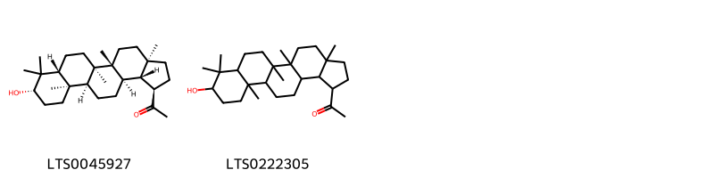{ width=100% }
    <figcaption>Hình ảnh cấu trúc hóa học của 2 hoạt chất thuộc nhóm Steroids and steroid derivatives gồm ['1-[(1r,3ar,5ar,5br,7ar,9s,11ar,11bs,13ar,13bs)-9-hydroxy-3a,5a,5b,8,8,11a-hexamethyl-hexadecahydrocyclopenta[a]chrysen-1-yl]ethanone (LTS0045927)', '1-{9-hydroxy-3a,5a,5b,8,8,11a-hexamethyl-hexadecahydrocyclopenta[a]chrysen-1-yl}ethanone (LTS0222305)'].</figcaption>
</figure>
#### Nhóm Tannins
<figure markdown="span">
    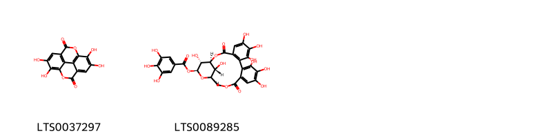{ width=100% }
    <figcaption>Hình ảnh cấu trúc hóa học của 2 hoạt chất thuộc nhóm Tannins gồm ['ellagic acid (LTS0037297)', '(1s,19r,21s,22r,23r)-6,7,8,11,12,13,22,23-octahydroxy-3,16-dioxo-2,17,20-trioxatetracyclo[17.3.1.0⁴,⁹.0¹⁰,¹⁵]tricosa-4(9),5,7,10,12,14-hexaen-21-yl 3,4,5-trihydroxybenzoate (LTS0089285)'].</figcaption>
</figure>
#### Nhóm Unsaturated hydrocarbons
<figure markdown="span">
    { width=100% }
    <figcaption>Hình ảnh cấu trúc hóa học của 1 hoạt chất thuộc nhóm Unsaturated hydrocarbons gồm ['tridec-1-en-3,5,7,9,11-pentayne (LTS0085389)'].</figcaption>
</figure>

---

### Dược dân tộc học

Danh sách các quốc gia có sử dụng *Ricinus communis* trong điều trị các bệnh. 

| Country         | Disease                                                                                                                                   | Bệnh                                                                                                                                                                                                |
|:----------------|:------------------------------------------------------------------------------------------------------------------------------------------|:----------------------------------------------------------------------------------------------------------------------------------------------------------------------------------------------------|
| Africa(Swahili) | Laxative                                                                                                                                  | Nhuận trường                                                                                                                                                                                        |
| Bahamas         | Tonic                                                                                                                                     | (thuộc) trương lực                                                                                                                                                                                  |
| China           | Expectorant, Laxative, Poison, Poison, Purgative, Suppurative, Cathartic, Discutient, Purgative, Poison                                   | Thuốc long đờm, Thuốc nhuận tràng, Chất độc, Chất độc, Luyện ngục, Mủ, Cathartic, Discutient, Luyện ngục, Chất độc                                                                                  |
| Elsewhere       | Antidote, Cathartic, Emetic, Emollient, Lactagogue, Poison, Purgative, Purgative, Purgative, nan, Collyrium, Emollient, Larvicide, Poison | Thuốc giải độc, Cathartic, Emetic, Emollient, Lactagogue, Poison, Purgative, Purgative, Purgative, nan, Collyrium, Emollient, Larvicide, Poison                                                     |
| Ghana           | Purgative                                                                                                                                 | Thuốc xổ                                                                                                                                                                                            |
| Guatemala       | Insecticide, Vermifuge                                                                                                                    | Thuốc diệt côn trùng, Vermifuge                                                                                                                                                                     |
| Haiti           | Insecticide, Soap, Vermifuge, Purgative                                                                                                   | Thuốc trừ sâu, xà phòng, Vermifuge, Purgative                                                                                                                                                       |
| India           | Lactafuge                                                                                                                                 | Lactafuge                                                                                                                                                                                           |
| Iraq            | Cathartic                                                                                                                                 | MYMEMORY WARNING: YOU USED ALL AVAILABLE FREE TRANSLATIONS FOR TODAY. NEXT AVAILABLE IN  21 HOURS 01 MINUTES 33 SECONDS VISIT HTTPS://MYMEMORY.TRANSLATED.NET/DOC/USAGELIMITS.PHP TO TRANSLATE MORE |
| Japan*          | Aperient                                                                                                                                  | MYMEMORY WARNING: YOU USED ALL AVAILABLE FREE TRANSLATIONS FOR TODAY. NEXT AVAILABLE IN  21 HOURS 01 MINUTES 29 SECONDS VISIT HTTPS://MYMEMORY.TRANSLATED.NET/DOC/USAGELIMITS.PHP TO TRANSLATE MORE |
| Java            | Lactagogue                                                                                                                                | MYMEMORY WARNING: YOU USED ALL AVAILABLE FREE TRANSLATIONS FOR TODAY. NEXT AVAILABLE IN  21 HOURS 01 MINUTES 25 SECONDS VISIT HTTPS://MYMEMORY.TRANSLATED.NET/DOC/USAGELIMITS.PHP TO TRANSLATE MORE |
| Kurdistan       | Emollient                                                                                                                                 | MYMEMORY WARNING: YOU USED ALL AVAILABLE FREE TRANSLATIONS FOR TODAY. NEXT AVAILABLE IN  21 HOURS 01 MINUTES 22 SECONDS VISIT HTTPS://MYMEMORY.TRANSLATED.NET/DOC/USAGELIMITS.PHP TO TRANSLATE MORE |
| Kuwait          | Cathartic, Emollient                                                                                                                      | MYMEMORY WARNING: YOU USED ALL AVAILABLE FREE TRANSLATIONS FOR TODAY. NEXT AVAILABLE IN  21 HOURS 01 MINUTES 19 SECONDS VISIT HTTPS://MYMEMORY.TRANSLATED.NET/DOC/USAGELIMITS.PHP TO TRANSLATE MORE |
| Latin America   | Poison                                                                                                                                    | MYMEMORY WARNING: YOU USED ALL AVAILABLE FREE TRANSLATIONS FOR TODAY. NEXT AVAILABLE IN  21 HOURS 01 MINUTES 16 SECONDS VISIT HTTPS://MYMEMORY.TRANSLATED.NET/DOC/USAGELIMITS.PHP TO TRANSLATE MORE |
| Mexico          | Soap, Lactagogue, Purgative                                                                                                               | MYMEMORY WARNING: YOU USED ALL AVAILABLE FREE TRANSLATIONS FOR TODAY. NEXT AVAILABLE IN  21 HOURS 01 MINUTES 13 SECONDS VISIT HTTPS://MYMEMORY.TRANSLATED.NET/DOC/USAGELIMITS.PHP TO TRANSLATE MORE |
| Philippines     | Poultice                                                                                                                                  | MYMEMORY WARNING: YOU USED ALL AVAILABLE FREE TRANSLATIONS FOR TODAY. NEXT AVAILABLE IN  21 HOURS 01 MINUTES 10 SECONDS VISIT HTTPS://MYMEMORY.TRANSLATED.NET/DOC/USAGELIMITS.PHP TO TRANSLATE MORE |
| S Africa        | Insecticide                                                                                                                               | MYMEMORY WARNING: YOU USED ALL AVAILABLE FREE TRANSLATIONS FOR TODAY. NEXT AVAILABLE IN  21 HOURS 01 MINUTES 07 SECONDS VISIT HTTPS://MYMEMORY.TRANSLATED.NET/DOC/USAGELIMITS.PHP TO TRANSLATE MORE |
| Samoa           | Laxative                                                                                                                                  | MYMEMORY WARNING: YOU USED ALL AVAILABLE FREE TRANSLATIONS FOR TODAY. NEXT AVAILABLE IN  21 HOURS 01 MINUTES 04 SECONDS VISIT HTTPS://MYMEMORY.TRANSLATED.NET/DOC/USAGELIMITS.PHP TO TRANSLATE MORE |
| Togo            | Collyrium                                                                                                                                 | MYMEMORY WARNING: YOU USED ALL AVAILABLE FREE TRANSLATIONS FOR TODAY. NEXT AVAILABLE IN  21 HOURS 01 MINUTES 01 SECONDS VISIT HTTPS://MYMEMORY.TRANSLATED.NET/DOC/USAGELIMITS.PHP TO TRANSLATE MORE |
| Trinidad        | nan, Emollient, Purgative                                                                                                                 | MYMEMORY WARNING: YOU USED ALL AVAILABLE FREE TRANSLATIONS FOR TODAY. NEXT AVAILABLE IN  21 HOURS 00 MINUTES 58 SECONDS VISIT HTTPS://MYMEMORY.TRANSLATED.NET/DOC/USAGELIMITS.PHP TO TRANSLATE MORE |
| Turkey          | Poison, Poison, Purgative                                                                                                                 | MYMEMORY WARNING: YOU USED ALL AVAILABLE FREE TRANSLATIONS FOR TODAY. NEXT AVAILABLE IN  21 HOURS 00 MINUTES 55 SECONDS VISIT HTTPS://MYMEMORY.TRANSLATED.NET/DOC/USAGELIMITS.PHP TO TRANSLATE MORE |
| Venezuela       | Laxative, Purgative                                                                                                                       | MYMEMORY WARNING: YOU USED ALL AVAILABLE FREE TRANSLATIONS FOR TODAY. NEXT AVAILABLE IN  21 HOURS 00 MINUTES 52 SECONDS VISIT HTTPS://MYMEMORY.TRANSLATED.NET/DOC/USAGELIMITS.PHP TO TRANSLATE MORE |
| ain             | Purgative                                                                                                                                 | MYMEMORY WARNING: YOU USED ALL AVAILABLE FREE TRANSLATIONS FOR TODAY. NEXT AVAILABLE IN  21 HOURS 00 MINUTES 49 SECONDS VISIT HTTPS://MYMEMORY.TRANSLATED.NET/DOC/USAGELIMITS.PHP TO TRANSLATE MORE |

---

# Chi Chrozophora

??? note "Danh sách các dược liệu thuộc chi"
    
	 - *Chrozophora plicata*
	 - *Chrozophora rottleri*
	 - *Chrozophora senegalensis*
	 - *Chrozophora tinctoria*

---
## Chrozophora plicata
### Thông tin về thực vật

!!! info "Phân loại thực vật của *Chrozophora plicata* từ GIBF:"
    - **Kingdom:** Plantae
    - **Phylum:** Tracheophyta
    - **Order:** Malpighiales
    - **Family:** Euphorbiaceae
    - **Genus:** Chrozophora
    - **Species:** *Chrozophora plicata*

 

| Label (VI)   | Label (EN)   | Scientific Name     | Descriptions (VI)   | Descriptions (EN)   | Also Known As (VI)   | Also Known As (EN)         |
|:-------------|:-------------|:--------------------|:--------------------|:--------------------|:---------------------|:---------------------------|
| N/A          | N/A          | Chrozophora plicata | loài thực vật       | species of plant    | ['']                 | ['Chrozophora plicata ex'] |

#### Phân bố trên thế giới

**Từ CSDL GIBF** nan, Italy, Japan, Mozambique, Palestine, State of, unknown or invalid, Tanzania, United Republic of, Israel, Zambia, Pakistan, Mali, Chad, Afghanistan, Sudan, Spain, Türkiye, Bangladesh, Zimbabwe, Greece, Uzbekistan, South Africa, Iran (Islamic Republic of), Niger, Brazil, Egypt, India, Indonesia, Burkina Faso, Lebanon, Djibouti, Kenya, Mauritania, Ethiopia

#### Phân bố tại Việt Nam

**Từ CSDL GIBF**: Không có ghi nhận ở Việt Nam

---
### Thành phần hóa học
        
- Theo cơ sở dữ liệu lotus: Từ loài *Chrozophora plicata* đã phân lập và xác định được 92 hoạt chất thuộc về các nhóm Fatty Acyls, Flavonoids, Prenol lipids, Organooxygen compounds, Carboxylic acids and derivatives, Benzopyrans. 

|    | chemicalTaxonomyClassyfireClass   |   smiles_count |
|---:|:----------------------------------|---------------:|
|  0 | Benzopyrans                       |              5 |
|  1 | Carboxylic acids and derivatives  |              6 |
|  2 | Fatty Acyls                       |              9 |
|  3 | Flavonoids                        |             16 |
|  4 | Organooxygen compounds            |             12 |
|  5 | Prenol lipids                     |             44 |

#### Nhóm Benzopyrans
<figure markdown="span">
    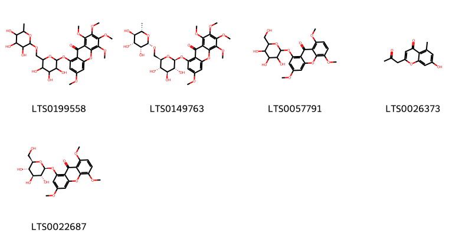{ width=100% }
    <figcaption>Hình ảnh cấu trúc hóa học của 5 hoạt chất thuộc nhóm Benzopyrans gồm ['1,2,3,4,6-pentamethoxy-8-[(3,4,5-trihydroxy-6-{[(3,4,5-trihydroxy-6-methyloxan-2-yl)oxy]methyl}oxan-2-yl)oxy]xanthen-9-one (LTS0199558)', '1,2,3,4,6-pentamethoxy-8-{[(2s,3r,4s,5s,6r)-3,4,5-trihydroxy-6-({[(2s,3r,4r,5r,6s)-3,4,5-trihydroxy-6-methyloxan-2-yl]oxy}methyl)oxan-2-yl]oxy}xanthen-9-one (LTS0149763)', '3,5,8-trimethoxy-1-{[3,4,5-trihydroxy-6-(hydroxymethyl)oxan-2-yl]oxy}xanthen-9-one (LTS0057791)', 'aloesone (LTS0026373)', '3,5,8-trimethoxy-1-{[(2s,3r,4s,5s,6r)-3,4,5-trihydroxy-6-(hydroxymethyl)oxan-2-yl]oxy}xanthen-9-one (LTS0022687)'].</figcaption>
</figure>
#### Nhóm Carboxylic acids and derivatives
<figure markdown="span">
    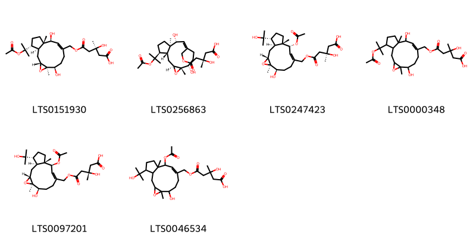{ width=100% }
    <figcaption>Hình ảnh cấu trúc hóa học của 6 hoạt chất thuộc nhóm Carboxylic acids and derivatives gồm ['(3s)-5-{[(1s,3r,5r,6r,9e,11s,12s,15r)-15-[2-(acetyloxy)propan-2-yl]-6,11-dihydroxy-5,12-dimethyl-4-oxatricyclo[10.3.0.0³,⁵]pentadec-9-en-9-yl]methoxy}-3-hydroxy-3-methyl-5-oxopentanoic acid (LTS0151930)', '(3s)-5-{[(1r,3s,5s,6s,9z,11r,12r,15s)-15-[2-(acetyloxy)propan-2-yl]-6,11-dihydroxy-5,12-dimethyl-4-oxatricyclo[10.3.0.0³,⁵]pentadec-9-en-9-yl]methoxy}-3-hydroxy-3-methyl-5-oxopentanoic acid (LTS0256863)', '(3r)-5-{[(1s,3r,5r,6r,9z,11r,12s,15r)-11-(acetyloxy)-6-hydroxy-15-(2-hydroxypropan-2-yl)-5,12-dimethyl-4-oxatricyclo[10.3.0.0³,⁵]pentadec-9-en-9-yl]methoxy}-3-hydroxy-3-methyl-5-oxopentanoic acid (LTS0247423)', '5-({15-[2-(acetyloxy)propan-2-yl]-6,11-dihydroxy-5,12-dimethyl-4-oxatricyclo[10.3.0.0³,⁵]pentadec-9-en-9-yl}methoxy)-3-hydroxy-3-methyl-5-oxopentanoic acid (LTS0000348)', '(3s)-5-{[(1s,3r,5r,6r,9z,11s,12s,15r)-11-(acetyloxy)-6-hydroxy-15-(2-hydroxypropan-2-yl)-5,12-dimethyl-4-oxatricyclo[10.3.0.0³,⁵]pentadec-9-en-9-yl]methoxy}-3-hydroxy-3-methyl-5-oxopentanoic acid (LTS0097201)', '5-{[11-(acetyloxy)-6-hydroxy-15-(2-hydroxypropan-2-yl)-5,12-dimethyl-4-oxatricyclo[10.3.0.0³,⁵]pentadec-9-en-9-yl]methoxy}-3-hydroxy-3-methyl-5-oxopentanoic acid (LTS0046534)'].</figcaption>
</figure>
#### Nhóm Fatty Acyls
<figure markdown="span">
    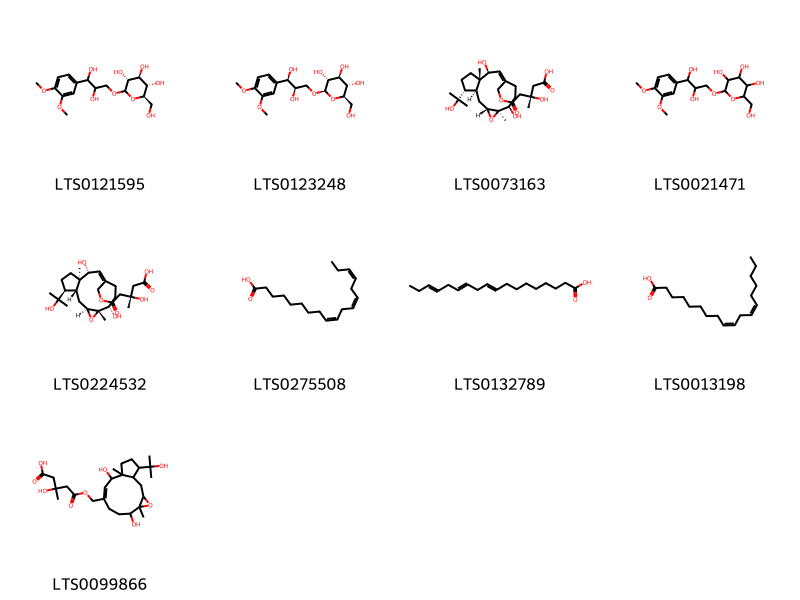{ width=100% }
    <figcaption>Hình ảnh cấu trúc hóa học của 9 hoạt chất thuộc nhóm Fatty Acyls gồm ['(3r,4s,5s,6r)-2-[3-(3,4-dimethoxyphenyl)-2,3-dihydroxypropoxy]-6-(hydroxymethyl)oxane-3,4,5-triol (LTS0121595)', '(2r,3r,4s,5s,6r)-2-[(2r,3r)-3-(3,4-dimethoxyphenyl)-2,3-dihydroxypropoxy]-6-(hydroxymethyl)oxane-3,4,5-triol (LTS0123248)', '(3s)-5-{[(1s,3r,5r,6r,9z,11s,12s,15r)-6,11-dihydroxy-15-(2-hydroxypropan-2-yl)-5,12-dimethyl-4-oxatricyclo[10.3.0.0³,⁵]pentadec-9-en-9-yl]methoxy}-3-hydroxy-3-methyl-5-oxopentanoic acid (LTS0073163)', '2-[3-(3,4-dimethoxyphenyl)-2,3-dihydroxypropoxy]-6-(hydroxymethyl)oxane-3,4,5-triol (LTS0021471)', '(3s)-5-{[(1r,3s,5s,6s,9z,11r,12r,15s)-6,11-dihydroxy-15-(2-hydroxypropan-2-yl)-5,12-dimethyl-4-oxatricyclo[10.3.0.0³,⁵]pentadec-9-en-9-yl]methoxy}-3-hydroxy-3-methyl-5-oxopentanoic acid (LTS0224532)', 'α-linolenic acid (LTS0275508)', 'α linolenic acid (LTS0132789)', 'linoleic (LTS0013198)', '5-{[6,11-dihydroxy-15-(2-hydroxypropan-2-yl)-5,12-dimethyl-4-oxatricyclo[10.3.0.0³,⁵]pentadec-9-en-9-yl]methoxy}-3-hydroxy-3-methyl-5-oxopentanoic acid (LTS0099866)'].</figcaption>
</figure>
#### Nhóm Flavonoids
<figure markdown="span">
    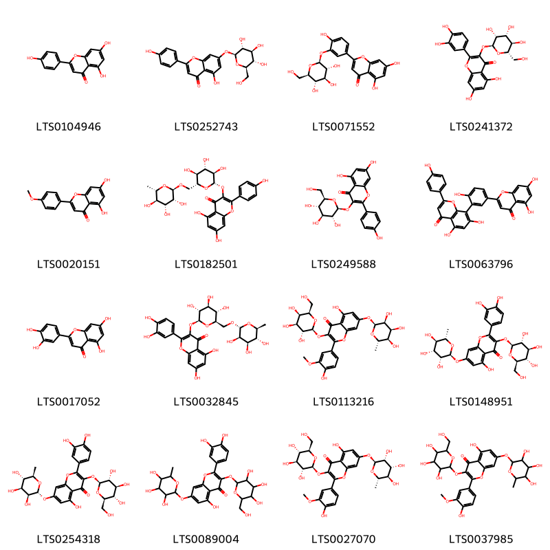{ width=100% }
    <figcaption>Hình ảnh cấu trúc hóa học của 16 hoạt chất thuộc nhóm Flavonoids gồm ['chamomile (LTS0104946)', 'apigenin 7-o-β-glucoside (LTS0252743)', "luteolin 3'-glucoside (LTS0071552)", '2-(3,4-dihydroxyphenyl)-5,7-dihydroxy-3-{[(2s,3r,4r,5r,6s)-3,4,5-trihydroxy-6-(hydroxymethyl)oxan-2-yl]oxy}chromen-4-one (LTS0241372)', 'acacetin (LTS0020151)', 'nictoflorin (LTS0182501)', 'astragalin (LTS0249588)', 'amentoflavone (LTS0063796)', 'luteolin (LTS0017052)', '3-rutinosyl quercetin (LTS0032845)', '5-hydroxy-2-(4-hydroxy-3-methoxyphenyl)-3-{[(2s,3r,4s,5r,6r)-3,4,5-trihydroxy-6-(hydroxymethyl)oxan-2-yl]oxy}-7-{[(2s,3s,4s,5r,6s)-3,4,5-trihydroxy-6-methyloxan-2-yl]oxy}chromen-4-one (LTS0113216)', 'petiolaroside (LTS0148951)', '2-(3,4-dihydroxyphenyl)-5-hydroxy-3-{[(2s,3r,4s,5s,6r)-3,4,5-trihydroxy-6-(hydroxymethyl)oxan-2-yl]oxy}-7-{[(2r,3s,4s,5s,6r)-3,4,5-trihydroxy-6-methyloxan-2-yl]oxy}chromen-4-one (LTS0254318)', '2-(3,4-dihydroxyphenyl)-5-hydroxy-3-{[3,4,5-trihydroxy-6-(hydroxymethyl)oxan-2-yl]oxy}-7-[(3,4,5-trihydroxy-6-methyloxan-2-yl)oxy]chromen-4-one (LTS0089004)', '5-hydroxy-2-(4-hydroxy-3-methoxyphenyl)-3-{[(2s,3r,4s,5s,6r)-3,4,5-trihydroxy-6-(hydroxymethyl)oxan-2-yl]oxy}-7-{[(2s,3r,4r,5r,6s)-3,4,5-trihydroxy-6-methyloxan-2-yl]oxy}chromen-4-one (LTS0027070)', '5-hydroxy-2-(4-hydroxy-3-methoxyphenyl)-3-{[3,4,5-trihydroxy-6-(hydroxymethyl)oxan-2-yl]oxy}-7-[(3,4,5-trihydroxy-6-methyloxan-2-yl)oxy]chromen-4-one (LTS0037985)'].</figcaption>
</figure>
#### Nhóm Organooxygen compounds
<figure markdown="span">
    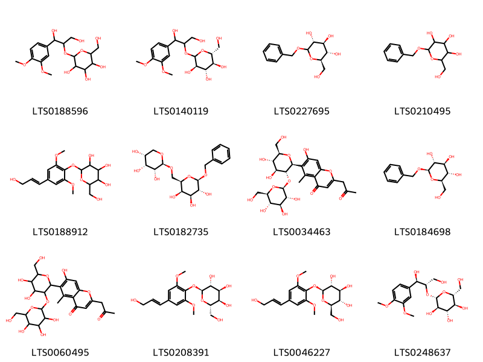{ width=100% }
    <figcaption>Hình ảnh cấu trúc hóa học của 12 hoạt chất thuộc nhóm Organooxygen compounds gồm ['2-{[1-(3,4-dimethoxyphenyl)-1,3-dihydroxypropan-2-yl]oxy}-6-(hydroxymethyl)oxane-3,4,5-triol (LTS0188596)', '(3r,4s,5s,6r)-2-{[1-(3,4-dimethoxyphenyl)-1,3-dihydroxypropan-2-yl]oxy}-6-(hydroxymethyl)oxane-3,4,5-triol (LTS0140119)', 'benzyl glucopyranoside (LTS0227695)', 'benzyl glucopyranoside (LTS0210495)', '2-(hydroxymethyl)-6-[4-(3-hydroxyprop-1-en-1-yl)-2,6-dimethoxyphenoxy]oxane-3,4,5-triol (LTS0188912)', '(2r,3r,4s,5r,6r)-2-(benzyloxy)-6-({[(2s,3r,4r,5r)-3,4,5-trihydroxyoxan-2-yl]oxy}methyl)oxane-3,4,5-triol (LTS0182735)', '6-[(2s,3r,4s,5s,6r)-4,5-dihydroxy-6-(hydroxymethyl)-3-{[(2s,3r,4s,5s,6r)-3,4,5-trihydroxy-6-(hydroxymethyl)oxan-2-yl]oxy}oxan-2-yl]-7-hydroxy-5-methyl-2-(2-oxopropyl)chromen-4-one (LTS0034463)', 'benzyl β-d-glucoside (LTS0184698)', '6-[4,5-dihydroxy-6-(hydroxymethyl)-3-{[3,4,5-trihydroxy-6-(hydroxymethyl)oxan-2-yl]oxy}oxan-2-yl]-7-hydroxy-5-methyl-2-(2-oxopropyl)chromen-4-one (LTS0060495)', '(2s,3r,4s,5r,6s)-2-(hydroxymethyl)-6-{4-[(1e)-3-hydroxyprop-1-en-1-yl]-2,6-dimethoxyphenoxy}oxane-3,4,5-triol (LTS0208391)', 'syringin (LTS0046227)', '(2r,3r,4s,5s,6r)-2-{[(1r,2s)-1-(3,4-dimethoxyphenyl)-1,3-dihydroxypropan-2-yl]oxy}-6-(hydroxymethyl)oxane-3,4,5-triol (LTS0248637)'].</figcaption>
</figure>
#### Nhóm Prenol lipids
<figure markdown="span">
    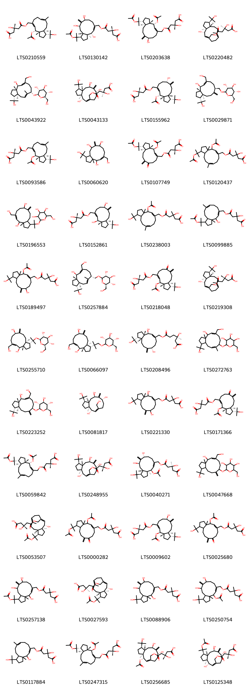{ width=100% }
    <figcaption>Hình ảnh cấu trúc hóa học của 44 hoạt chất thuộc nhóm Prenol lipids gồm ['(3s)-5-{[(1r,3as,4r,12as)-4-(acetyloxy)-1-(2-hydroxypropan-2-yl)-3a,10-dimethyl-1h,2h,3h,4h,7h,8h,11h,12h,12ah-cyclopenta[11]annulen-6-yl]methoxy}-3-hydroxy-3-methyl-5-oxopentanoic acid (LTS0210559)', '(3r)-5-{[(1r,3as,4s,9s,11r,12as)-1-[2-(acetyloxy)propan-2-yl]-4,9,11-trihydroxy-3a-methyl-10-methylidene-1h,2h,3h,4h,7h,8h,9h,11h,12h,12ah-cyclopenta[11]annulen-6-yl]methoxy}-3-hydroxy-3-methyl-5-oxopentanoic acid (LTS0130142)', '(3s)-5-{[(1r,3as,4r,9r,12as)-4-(acetyloxy)-1-[2-(acetyloxy)propan-2-yl]-9-hydroxy-3a-methyl-10-methylidene-1h,2h,3h,4h,7h,8h,9h,11h,12h,12ah-cyclopenta[11]annulen-6-yl]methoxy}-3-hydroxy-3-methyl-5-oxopentanoic acid (LTS0203638)', '(3s)-5-{[(1r,3as,4s,12as)-4-hydroxy-1-(2-hydroxypropan-2-yl)-3a,10-dimethyl-1h,2h,3h,4h,7h,8h,11h,12h,12ah-cyclopenta[11]annulen-6-yl]methoxy}-3-hydroxy-3-methyl-5-oxopentanoic acid (LTS0220482)', '(2r,3r,4s,5s,6r)-2-{[(3r,3as,7s,12s,12as)-12-hydroxy-10-(hydroxymethyl)-3-(2-hydroxypropan-2-yl)-6,12a-dimethyl-1h,2h,3h,3ah,4h,7h,8h,9h,12h-cyclopenta[11]annulen-7-yl]oxy}-6-(hydroxymethyl)oxane-3,4,5-triol (LTS0043922)', '(3r)-5-{[(1r,3as,4s,9r,11r,12as)-4,9,11-trihydroxy-1-(2-hydroxypropan-2-yl)-3a-methyl-10-methylidene-1h,2h,3h,4h,7h,8h,9h,11h,12h,12ah-cyclopenta[11]annulen-6-yl]methoxy}-3-hydroxy-3-methyl-5-oxopentanoic acid (LTS0043133)', '(3s)-5-{[(1r,3as,4r,9s,12ar)-4-(acetyloxy)-9-hydroxy-1-(2-hydroxypropan-2-yl)-3a-methyl-10-methylidene-1h,2h,3h,4h,7h,8h,9h,11h,12h,12ah-cyclopenta[11]annulen-6-yl]methoxy}-3-hydroxy-3-methyl-5-oxopentanoic acid (LTS0155962)', '(3r,4s,5s,6r)-2-{[(3r,3as,7r,12s,12as)-12-hydroxy-10-(hydroxymethyl)-3-(2-hydroxypropan-2-yl)-3a,12a-dimethyl-6-methylidene-1h,2h,3h,4h,5h,7h,8h,9h,12h-cyclopenta[11]annulen-7-yl]methoxy}-6-(hydroxymethyl)oxane-3,4,5-triol (LTS0029871)', '(3s)-5-{[(1r,3as,4s,12as)-4-(acetyloxy)-1-(2-hydroxypropan-2-yl)-3a,10-dimethyl-1h,2h,3h,4h,7h,8h,11h,12h,12ah-cyclopenta[11]annulen-6-yl]methoxy}-3-hydroxy-3-methyl-5-oxopentanoic acid (LTS0093586)', '6-(hydroxymethyl)-1-(2-hydroxypropan-2-yl)-3a-methyl-10-methylidene-1h,2h,3h,4h,7h,8h,9h,11h,12h,12ah-cyclopenta[11]annulene-4,9,11-triol (LTS0060620)', '(3s)-5-{[(1r,3as,4s,12as)-4-(acetyloxy)-1-[2-(acetyloxy)propan-2-yl]-3a-methyl-10-methylidene-9-oxo-1h,2h,3h,4h,7h,8h,11h,12h,12ah-cyclopenta[11]annulen-6-yl]methoxy}-3-hydroxy-3-methyl-5-oxopentanoic acid (LTS0107749)', '5-{[4-(acetyloxy)-1-[2-(acetyloxy)propan-2-yl]-3a,10-dimethyl-1h,2h,3h,4h,7h,8h,11h,12h,12ah-cyclopenta[11]annulen-6-yl]methoxy}-3-hydroxy-3-methyl-5-oxopentanoic acid (LTS0120437)', '2-({2-[4,9-dihydroxy-6-(hydroxymethyl)-3a-methyl-10-methylidene-1h,2h,3h,4h,7h,8h,9h,11h,12h,12ah-cyclopenta[11]annulen-1-yl]propan-2-yl}oxy)-6-(hydroxymethyl)oxane-3,4,5-triol (LTS0196553)', '(3s)-5-{[(1r,3as,4s,9r,12as)-4,9-dihydroxy-1-(2-hydroxypropan-2-yl)-3a-methyl-10-methylidene-1h,2h,3h,4h,7h,8h,9h,11h,12h,12ah-cyclopenta[11]annulen-6-yl]methoxy}-3-hydroxy-3-methyl-5-oxopentanoic acid (LTS0152861)', '5-{[4-(acetyloxy)-1-(2-hydroxypropan-2-yl)-3a,10-dimethyl-1h,2h,3h,4h,7h,8h,11h,12h,12ah-cyclopenta[11]annulen-6-yl]methoxy}-3-hydroxy-3-methyl-5-oxopentanoic acid (LTS0238003)', '5-({1-[2-(acetyloxy)propan-2-yl]-4-hydroxy-3a,10-dimethyl-1h,2h,3h,4h,7h,8h,11h,12h,12ah-cyclopenta[11]annulen-6-yl}methoxy)-3-hydroxy-3-methyl-5-oxopentanoic acid (LTS0099885)', '5-{[4-(acetyloxy)-9-hydroxy-1-(2-hydroxypropan-2-yl)-3a-methyl-10-methylidene-1h,2h,3h,4h,7h,8h,9h,11h,12h,12ah-cyclopenta[11]annulen-6-yl]methoxy}-3-hydroxy-3-methyl-5-oxopentanoic acid (LTS0189497)', '(3r,4s,5s,6r)-2-{[(3r,3as,7s,12s,12as)-12-hydroxy-10-(hydroxymethyl)-3-(2-hydroxypropan-2-yl)-6,12a-dimethyl-1h,2h,3h,3ah,4h,7h,8h,9h,12h-cyclopenta[11]annulen-7-yl]methoxy}-6-(hydroxymethyl)oxane-3,4,5-triol (LTS0257884)', '(3s)-5-{[(1r,3as,4s,12as)-4-(acetyloxy)-1-(2-hydroxypropan-2-yl)-3a-methyl-10-methylidene-9-oxo-1h,2h,3h,4h,7h,8h,11h,12h,12ah-cyclopenta[11]annulen-6-yl]methoxy}-3-hydroxy-3-methyl-5-oxopentanoic acid (LTS0218048)', '(3r)-5-{[(1r,3as,4s,12as)-4-hydroxy-1-(2-hydroxypropan-2-yl)-3a,10-dimethyl-1h,2h,3h,4h,7h,8h,11h,12h,12ah-cyclopenta[11]annulen-6-yl]methoxy}-3-hydroxy-3-methyl-5-oxopentanoic acid (LTS0219308)', '(2s,3r,4s,5s,6r)-2-({2-[(1r,3as,4s,9r,12as)-4,9-dihydroxy-6-(hydroxymethyl)-3a-methyl-10-methylidene-1h,2h,3h,4h,7h,8h,9h,11h,12h,12ah-cyclopenta[11]annulen-1-yl]propan-2-yl}oxy)-6-(hydroxymethyl)oxane-3,4,5-triol (LTS0255710)', '(3r,4s,5s,6r)-2-{2-[(1r,3as,4s,9r,12as)-4,9-dihydroxy-6-(hydroxymethyl)-3a,12a-dimethyl-10-methylidene-1h,2h,3h,4h,7h,8h,9h,11h,12h-cyclopenta[11]annulen-1-yl]-2-methylpropoxy}-6-(hydroxymethyl)oxane-3,4,5-triol (LTS0066097)', '(3r)-6-{[(1r,3as,4s,9s,12ar)-4,9-dihydroxy-1-(2-hydroxypropan-2-yl)-3a-methyl-10-methylidene-1h,2h,3h,4h,7h,8h,9h,11h,12h,12ah-cyclopenta[11]annulen-6-yl]methoxy}-3-hydroxy-3-methyl-6-oxohexanoic acid (LTS0208496)', '2-{[12-hydroxy-10-(hydroxymethyl)-3-(2-hydroxypropan-2-yl)-6,12a-dimethyl-1h,2h,3h,3ah,4h,7h,8h,9h,12h-cyclopenta[11]annulen-7-yl]oxy}-6-(hydroxymethyl)oxane-3,4,5-triol (LTS0272763)', '(2r,3r,4s,5s,6r)-2-{[(3r,3as,7r,12s,12as)-12-hydroxy-10-(hydroxymethyl)-3-(2-hydroxypropan-2-yl)-12a-methyl-6-methylidene-1h,2h,3h,3ah,4h,5h,7h,8h,9h,12h-cyclopenta[11]annulen-7-yl]oxy}-6-(hydroxymethyl)oxane-3,4,5-triol (LTS0223252)', '(1r,3as,4s,9r,11r,12as)-6-(hydroxymethyl)-1-(2-hydroxypropan-2-yl)-3a-methyl-10-methylidene-1h,2h,3h,4h,7h,8h,9h,11h,12h,12ah-cyclopenta[11]annulene-4,9,11-triol (LTS0081817)', '5-{[4,9-dihydroxy-1-(2-hydroxypropan-2-yl)-3a-methyl-10-methylidene-1h,2h,3h,4h,7h,8h,9h,11h,12h,12ah-cyclopenta[11]annulen-6-yl]methoxy}-3-hydroxy-3-methyl-5-oxopentanoic acid (LTS0221330)', '5-{[(1r,3as,12as)-4-(acetyloxy)-1-(2-hydroxypropan-2-yl)-3a-methyl-10-methylidene-9-oxo-1h,2h,3h,4h,7h,8h,11h,12h,12ah-cyclopenta[11]annulen-6-yl]methoxy}-3-hydroxy-3-methyl-5-oxopentanoic acid (LTS0171366)', '(3s)-5-{[(1r,3as,4r,12as)-4-(acetyloxy)-1-[2-(acetyloxy)propan-2-yl]-3a,10-dimethyl-1h,2h,3h,4h,7h,8h,11h,12h,12ah-cyclopenta[11]annulen-6-yl]methoxy}-3-hydroxy-3-methyl-5-oxopentanoic acid (LTS0059842)', '(3s)-5-{[(1r,3as,4s,9r,11r,12as)-4,9,11-trihydroxy-1-(2-hydroxypropan-2-yl)-3a-methyl-10-methylidene-1h,2h,3h,4h,7h,8h,9h,11h,12h,12ah-cyclopenta[11]annulen-6-yl]methoxy}-3-hydroxy-3-methyl-5-oxopentanoic acid (LTS0248955)', '(3s)-5-{[(1r,3as,4r,9r,11r,12as)-4-(acetyloxy)-9,11-dihydroxy-1-(2-hydroxypropan-2-yl)-3a-methyl-10-methylidene-1h,2h,3h,4h,7h,8h,9h,11h,12h,12ah-cyclopenta[11]annulen-6-yl]methoxy}-3-hydroxy-3-methyl-5-oxopentanoic acid (LTS0040271)', '2-{[12-hydroxy-10-(hydroxymethyl)-3-(2-hydroxypropan-2-yl)-12a-methyl-6-methylidene-1h,2h,3h,3ah,4h,5h,7h,8h,9h,12h-cyclopenta[11]annulen-7-yl]oxy}-6-(hydroxymethyl)oxane-3,4,5-triol (LTS0047668)', '(3r)-5-{[(1r,3as,4s,12as)-1-[2-(acetyloxy)propan-2-yl]-4-hydroxy-3a,10-dimethyl-1h,2h,3h,4h,7h,8h,11h,12h,12ah-cyclopenta[11]annulen-6-yl]methoxy}-3-hydroxy-3-methyl-5-oxopentanoic acid (LTS0053507)', '5-{[4-(acetyloxy)-1-[2-(acetyloxy)propan-2-yl]-3a-methyl-10-methylidene-9-oxo-1h,2h,3h,4h,7h,8h,11h,12h,12ah-cyclopenta[11]annulen-6-yl]methoxy}-3-hydroxy-3-methyl-5-oxopentanoic acid (LTS0000282)', '(3s)-5-{[(1r,3as,4s,9r,12as)-4-(acetyloxy)-9-hydroxy-1-(2-hydroxypropan-2-yl)-3a-methyl-10-methylidene-1h,2h,3h,4h,7h,8h,9h,11h,12h,12ah-cyclopenta[11]annulen-6-yl]methoxy}-3-hydroxy-3-methyl-5-oxopentanoic acid (LTS0009602)', '5-{[4-(acetyloxy)-1-(2-hydroxypropan-2-yl)-3a-methyl-10-methylidene-9-oxo-1h,2h,3h,4h,7h,8h,11h,12h,12ah-cyclopenta[11]annulen-6-yl]methoxy}-3-hydroxy-3-methyl-5-oxopentanoic acid (LTS0025680)', '5-({1-[2-(acetyloxy)propan-2-yl]-4,9,11-trihydroxy-3a-methyl-10-methylidene-1h,2h,3h,4h,7h,8h,9h,11h,12h,12ah-cyclopenta[11]annulen-6-yl}methoxy)-3-hydroxy-3-methyl-5-oxopentanoic acid (LTS0257138)', '(3s)-5-{[(1r,3as,4s,12as)-1-[2-(acetyloxy)propan-2-yl]-4-hydroxy-3a,10-dimethyl-1h,2h,3h,4h,7h,8h,11h,12h,12ah-cyclopenta[11]annulen-6-yl]methoxy}-3-hydroxy-3-methyl-5-oxopentanoic acid (LTS0027593)', '3-hydroxy-3-methyl-5-oxo-5-{[4,9,11-trihydroxy-1-(2-hydroxypropan-2-yl)-3a-methyl-10-methylidene-1h,2h,3h,4h,7h,8h,9h,11h,12h,12ah-cyclopenta[11]annulen-6-yl]methoxy}pentanoic acid (LTS0088906)', '5-{[4-(acetyloxy)-9,11-dihydroxy-1-(2-hydroxypropan-2-yl)-3a-methyl-10-methylidene-1h,2h,3h,4h,7h,8h,9h,11h,12h,12ah-cyclopenta[11]annulen-6-yl]methoxy}-3-hydroxy-3-methyl-5-oxopentanoic acid (LTS0250754)', '3-hydroxy-5-{[4-hydroxy-1-(2-hydroxypropan-2-yl)-3a,10-dimethyl-1h,2h,3h,4h,7h,8h,11h,12h,12ah-cyclopenta[11]annulen-6-yl]methoxy}-3-methyl-5-oxopentanoic acid (LTS0117884)', '(3s)-5-{[(1r,3as,4s,12as)-4-(acetyloxy)-1-[2-(acetyloxy)propan-2-yl]-3a,10-dimethyl-1h,2h,3h,4h,7h,8h,11h,12h,12ah-cyclopenta[11]annulen-6-yl]methoxy}-3-hydroxy-3-methyl-5-oxopentanoic acid (LTS0247315)', '(3s)-5-{[(1r,3as,4s,9r,11r,12as)-4-(acetyloxy)-9,11-dihydroxy-1-(2-hydroxypropan-2-yl)-3a-methyl-10-methylidene-1h,2h,3h,4h,7h,8h,9h,11h,12h,12ah-cyclopenta[11]annulen-6-yl]methoxy}-3-hydroxy-3-methyl-5-oxopentanoic acid (LTS0256685)', '(3s)-5-{[(1r,3as,4s,9r,11r,12as)-1-[2-(acetyloxy)propan-2-yl]-4,9,11-trihydroxy-3a-methyl-10-methylidene-1h,2h,3h,4h,7h,8h,9h,11h,12h,12ah-cyclopenta[11]annulen-6-yl]methoxy}-3-hydroxy-3-methyl-5-oxopentanoic acid (LTS0125348)'].</figcaption>
</figure>

---

### Dược dân tộc học

Danh sách các quốc gia có sử dụng *Chrozophora plicata* trong điều trị các bệnh. 

| Country   | Disease   | Bệnh                                                                                                                                                                                                |
|:----------|:----------|:----------------------------------------------------------------------------------------------------------------------------------------------------------------------------------------------------|
| Sudan     | Purgative | MYMEMORY WARNING: YOU USED ALL AVAILABLE FREE TRANSLATIONS FOR TODAY. NEXT AVAILABLE IN  21 HOURS 00 MINUTES 12 SECONDS VISIT HTTPS://MYMEMORY.TRANSLATED.NET/DOC/USAGELIMITS.PHP TO TRANSLATE MORE |

---

---
## Chrozophora rottleri
### Thông tin về thực vật

!!! info "Phân loại thực vật của *Chrozophora rottleri* từ GIBF:"
    - **Kingdom:** Plantae
    - **Phylum:** Tracheophyta
    - **Order:** Malpighiales
    - **Family:** Euphorbiaceae
    - **Genus:** Chrozophora
    - **Species:** *Chrozophora rottleri*

 

| Label (VI)   | Label (EN)   | Scientific Name      | Descriptions (VI)   | Descriptions (EN)   | Also Known As (VI)   | Also Known As (EN)   |
|:-------------|:-------------|:---------------------|:--------------------|:--------------------|:---------------------|:---------------------|
| N/A          | N/A          | Chrozophora rottleri | loài thực vật       | species of plant    | ['']                 | ['Mexican Spurge']   |

#### Phân bố trên thế giới

**Từ CSDL GIBF** nan, Australia, Thailand, Korea, Republic of, Myanmar, India, Indonesia, Bangladesh, unknown or invalid, Nepal

#### Phân bố tại Việt Nam

**Từ CSDL GIBF**: Không có ghi nhận ở Việt Nam

---
### Thành phần hóa học
        
- Theo cơ sở dữ liệu lotus: Từ loài *Chrozophora rottleri* đã phân lập và xác định được 10 hoạt chất thuộc về các nhóm Flavonoids. 

|    | chemicalTaxonomyClassyfireClass   |   smiles_count |
|---:|:----------------------------------|---------------:|
|  0 | Flavonoids                        |             10 |

#### Nhóm Flavonoids
<figure markdown="span">
    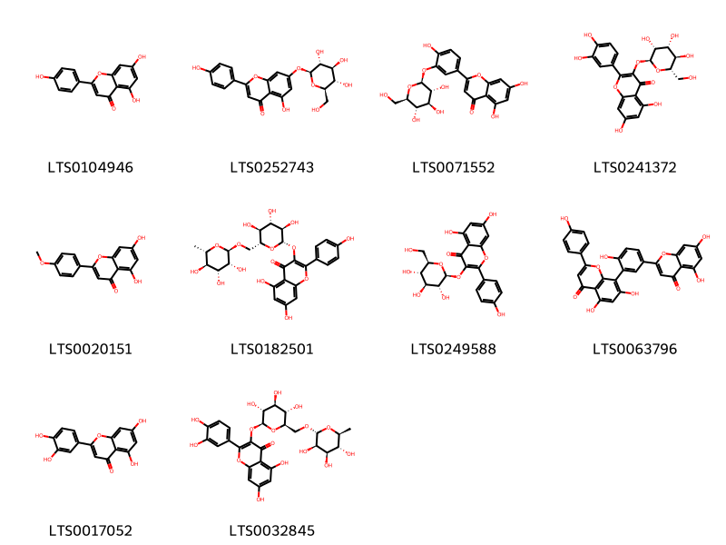{ width=100% }
    <figcaption>Hình ảnh cấu trúc hóa học của 10 hoạt chất thuộc nhóm Flavonoids gồm ['chamomile (LTS0104946)', 'apigenin 7-o-β-glucoside (LTS0252743)', "luteolin 3'-glucoside (LTS0071552)", '2-(3,4-dihydroxyphenyl)-5,7-dihydroxy-3-{[(2s,3r,4r,5r,6s)-3,4,5-trihydroxy-6-(hydroxymethyl)oxan-2-yl]oxy}chromen-4-one (LTS0241372)', 'acacetin (LTS0020151)', 'nictoflorin (LTS0182501)', 'astragalin (LTS0249588)', 'amentoflavone (LTS0063796)', 'luteolin (LTS0017052)', '3-rutinosyl quercetin (LTS0032845)'].</figcaption>
</figure>

---

### Dược dân tộc học

Danh sách các quốc gia có sử dụng *Chrozophora rottleri* trong điều trị các bệnh. 

| Country   | Disease   | Bệnh                                                                                                                                                                                                |
|:----------|:----------|:----------------------------------------------------------------------------------------------------------------------------------------------------------------------------------------------------|
| India     | Purgative | MYMEMORY WARNING: YOU USED ALL AVAILABLE FREE TRANSLATIONS FOR TODAY. NEXT AVAILABLE IN  20 HOURS 59 MINUTES 33 SECONDS VISIT HTTPS://MYMEMORY.TRANSLATED.NET/DOC/USAGELIMITS.PHP TO TRANSLATE MORE |

---

---
## Chrozophora senegalensis
### Thông tin về thực vật

!!! info "Phân loại thực vật của *Chrozophora senegalensis* từ GIBF:"
    - **Kingdom:** Plantae
    - **Phylum:** Tracheophyta
    - **Order:** Malpighiales
    - **Family:** Euphorbiaceae
    - **Genus:** Chrozophora
    - **Species:** *Chrozophora senegalensis*

 

| Label (VI)   | Label (EN)   | Scientific Name          | Descriptions (VI)   | Descriptions (EN)   | Also Known As (VI)   | Also Known As (EN)   |
|:-------------|:-------------|:-------------------------|:--------------------|:--------------------|:---------------------|:---------------------|
| N/A          | N/A          | Chrozophora senegalensis | loài thực vật       | species of plant    | ['']                 | ['']                 |

#### Phân bố trên thế giới

**Từ CSDL GIBF** nan, Ghana, Mali, Senegal, Nigeria, Chad, Niger, Gambia, Benin, Burkina Faso, Cameroon, Mauritania, Togo

#### Phân bố tại Việt Nam

**Từ CSDL GIBF**: Không có ghi nhận ở Việt Nam

---
### Thành phần hóa học
        
- Theo cơ sở dữ liệu lotus: Từ loài *Chrozophora senegalensis* đã phân lập và xác định được Chưa có hoạt chất nào được phân lập. hoạt chất thuộc về các nhóm Không có hoạt chất nào được phân lập. 

Không có hình ảnh nào được tạo ra

---

### Dược dân tộc học

Danh sách các quốc gia có sử dụng *Chrozophora senegalensis* trong điều trị các bệnh. 

| Country   | Disease   | Bệnh                                                                                                                                                                                                |
|:----------|:----------|:----------------------------------------------------------------------------------------------------------------------------------------------------------------------------------------------------|
| Elsewhere | Taenicide | MYMEMORY WARNING: YOU USED ALL AVAILABLE FREE TRANSLATIONS FOR TODAY. NEXT AVAILABLE IN  20 HOURS 58 MINUTES 52 SECONDS VISIT HTTPS://MYMEMORY.TRANSLATED.NET/DOC/USAGELIMITS.PHP TO TRANSLATE MORE |

---

---
## Chrozophora tinctoria
### Thông tin về thực vật

!!! info "Phân loại thực vật của *Chrozophora tinctoria* từ GIBF:"
    - **Kingdom:** Plantae
    - **Phylum:** Tracheophyta
    - **Order:** Malpighiales
    - **Family:** Euphorbiaceae
    - **Genus:** Chrozophora
    - **Species:** *Chrozophora tinctoria*

 

| Label (VI)   | Label (EN)   | Scientific Name       | Descriptions (VI)   | Descriptions (EN)   | Also Known As (VI)   | Also Known As (EN)   |
|:-------------|:-------------|:----------------------|:--------------------|:--------------------|:---------------------|:---------------------|
| N/A          | N/A          | Chrozophora tinctoria |                     | species of plant    | ['']                 | ['']                 |

#### Phân bố trên thế giới

**Từ CSDL GIBF** United Arab Emirates, Italy, Australia, Georgia, Palestine, State of, Jordan, Israel, Pakistan, Cyprus, Spain, Azerbaijan, Türkiye, Portugal, Albania, Russian Federation, Algeria, Morocco, Kazakhstan, Croatia, Greece, Uzbekistan, Saudi Arabia, Montenegro, Iran (Islamic Republic of), Egypt, Armenia, France, Syrian Arab Republic, Iraq, India, Lebanon, Kuwait

#### Phân bố tại Việt Nam

**Từ CSDL GIBF**: Không có ghi nhận ở Việt Nam

---
### Thành phần hóa học
        
- Theo cơ sở dữ liệu lotus: Từ loài *Chrozophora tinctoria* đã phân lập và xác định được 14 hoạt chất thuộc về các nhóm Flavonoids. 

|    | chemicalTaxonomyClassyfireClass   |   smiles_count |
|---:|:----------------------------------|---------------:|
|  0 | Flavonoids                        |             14 |

#### Nhóm Flavonoids
<figure markdown="span">
    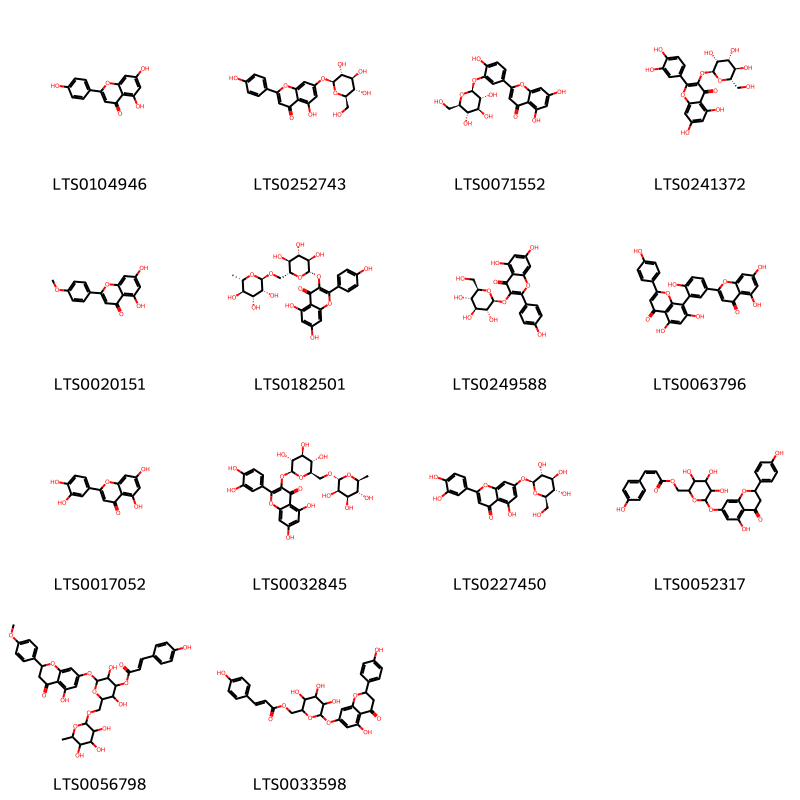{ width=100% }
    <figcaption>Hình ảnh cấu trúc hóa học của 14 hoạt chất thuộc nhóm Flavonoids gồm ['chamomile (LTS0104946)', 'apigenin 7-o-β-glucoside (LTS0252743)', "luteolin 3'-glucoside (LTS0071552)", '2-(3,4-dihydroxyphenyl)-5,7-dihydroxy-3-{[(2s,3r,4r,5r,6s)-3,4,5-trihydroxy-6-(hydroxymethyl)oxan-2-yl]oxy}chromen-4-one (LTS0241372)', 'acacetin (LTS0020151)', 'nictoflorin (LTS0182501)', 'astragalin (LTS0249588)', 'amentoflavone (LTS0063796)', 'luteolin (LTS0017052)', '3-rutinosyl quercetin (LTS0032845)', 'luteolin 7-o-glucoside (LTS0227450)', '(3,4,5-trihydroxy-6-{[5-hydroxy-2-(4-hydroxyphenyl)-4-oxo-2,3-dihydro-1-benzopyran-7-yl]oxy}oxan-2-yl)methyl (2z)-3-(4-hydroxyphenyl)prop-2-enoate (LTS0052317)', '3,5-dihydroxy-2-{[5-hydroxy-2-(4-methoxyphenyl)-4-oxo-2,3-dihydro-1-benzopyran-7-yl]oxy}-6-{[(3,4,5-trihydroxy-6-methyloxan-2-yl)oxy]methyl}oxan-4-yl (2e)-3-(4-hydroxyphenyl)prop-2-enoate (LTS0056798)', '(3,4,5-trihydroxy-6-{[5-hydroxy-2-(4-hydroxyphenyl)-4-oxo-2,3-dihydro-1-benzopyran-7-yl]oxy}oxan-2-yl)methyl (2e)-3-(4-hydroxyphenyl)prop-2-enoate (LTS0033598)'].</figcaption>
</figure>

---

### Dược dân tộc học

Danh sách các quốc gia có sử dụng *Chrozophora tinctoria* trong điều trị các bệnh. 

| Country   | Disease           | Bệnh                                                                                                                                                                                                |
|:----------|:------------------|:----------------------------------------------------------------------------------------------------------------------------------------------------------------------------------------------------|
| Iraq      | Cathartic, Emetic | MYMEMORY WARNING: YOU USED ALL AVAILABLE FREE TRANSLATIONS FOR TODAY. NEXT AVAILABLE IN  20 HOURS 58 MINUTES 28 SECONDS VISIT HTTPS://MYMEMORY.TRANSLATED.NET/DOC/USAGELIMITS.PHP TO TRANSLATE MORE |

---

# Chi Chamaesyce

??? note "Danh sách các dược liệu thuộc chi"
    
	 - *Chamaesyce hirta*

---
## Chamaesyce hirta
### Thông tin về thực vật

!!! info "Phân loại thực vật của *Euphorbia hirta* từ GIBF:"
    - **Kingdom:** Plantae
    - **Phylum:** Tracheophyta
    - **Order:** Malpighiales
    - **Family:** Euphorbiaceae
    - **Genus:** Euphorbia
    - **Species:** *Euphorbia hirta*

 

| Label (VI)   | Label (EN)   | Scientific Name   | Descriptions (VI)   | Descriptions (EN)   | Also Known As (VI)   | Also Known As (EN)   |
|:-------------|:-------------|:------------------|:--------------------|:--------------------|:---------------------|:---------------------|
| N/A          | N/A          | Chamaesyce hirta  | loài thực vật       | species of plant    | ['']                 | ['']                 |

#### Phân bố trên thế giới

**Từ CSDL GIBF** nan, Australia, Japan, Guadeloupe, Cook Islands, Venezuela (Bolivarian Republic of), Malawi, Puerto Rico, Réunion, Chinese Taipei, Spain, Jamaica, United States of America, Solomon Islands, El Salvador, Martinique, Brazil, Tonga, Cuba, Peru, Mayotte, Mexico, Dominican Republic, China, Ecuador, Madagascar, Colombia, Nauru, Philippines, New Zealand

#### Phân bố tại Việt Nam

**Từ CSDL GIBF**: Không có ghi nhận ở Việt Nam

---
### Thành phần hóa học
        
- Theo cơ sở dữ liệu lotus: Từ loài *Euphorbia hirta* đã phân lập và xác định được Chưa có hoạt chất nào được phân lập. hoạt chất thuộc về các nhóm Không có hoạt chất nào được phân lập. 

Không có hình ảnh nào được tạo ra

---

### Dược dân tộc học

Danh sách các quốc gia có sử dụng *Euphorbia hirta* trong điều trị các bệnh. 

| Country   | Disease            | Bệnh                                                                                                                                                                                                |
|:----------|:-------------------|:----------------------------------------------------------------------------------------------------------------------------------------------------------------------------------------------------|
| Bahamas   | Vermifuge          | MYMEMORY WARNING: YOU USED ALL AVAILABLE FREE TRANSLATIONS FOR TODAY. NEXT AVAILABLE IN  20 HOURS 57 MINUTES 53 SECONDS VISIT HTTPS://MYMEMORY.TRANSLATED.NET/DOC/USAGELIMITS.PHP TO TRANSLATE MORE |
| Haiti     | Narcotic, Diuretic | MYMEMORY WARNING: YOU USED ALL AVAILABLE FREE TRANSLATIONS FOR TODAY. NEXT AVAILABLE IN  20 HOURS 57 MINUTES 50 SECONDS VISIT HTTPS://MYMEMORY.TRANSLATED.NET/DOC/USAGELIMITS.PHP TO TRANSLATE MORE |
| Panama    | Discutient         | MYMEMORY WARNING: YOU USED ALL AVAILABLE FREE TRANSLATIONS FOR TODAY. NEXT AVAILABLE IN  20 HOURS 57 MINUTES 46 SECONDS VISIT HTTPS://MYMEMORY.TRANSLATED.NET/DOC/USAGELIMITS.PHP TO TRANSLATE MORE |

---

# Chi Alchornea

??? note "Danh sách các dược liệu thuộc chi"
    
	 - *Alchornea cordifolia*
	 - *Alchornea rugosa*

---
## Alchornea cordifolia
### Thông tin về thực vật

!!! info "Phân loại thực vật của *Alchornea cordifolia* từ GIBF:"
    - **Kingdom:** Plantae
    - **Phylum:** Tracheophyta
    - **Order:** Malpighiales
    - **Family:** Euphorbiaceae
    - **Genus:** Alchornea
    - **Species:** *Alchornea cordifolia*

 

| Label (VI)   | Label (EN)   | Scientific Name      | Descriptions (VI)   | Descriptions (EN)   | Also Known As (VI)   | Also Known As (EN)   |
|:-------------|:-------------|:---------------------|:--------------------|:--------------------|:---------------------|:---------------------|
| N/A          | N/A          | Alchornea cordifolia | loài thực vật       | species of plant    | ['']                 | ['']                 |

#### Phân bố trên thế giới

**Từ CSDL GIBF** Uganda, Ghana, Liberia, Nigeria, Sao Tome and Principe, Gabon, Equatorial Guinea, Angola, Côte d’Ivoire, Gambia, Benin, Congo, Congo, Democratic Republic of the, Burkina Faso, Guinea, Cameroon, Sierra Leone

#### Phân bố tại Việt Nam

**Từ CSDL GIBF**: Không có ghi nhận ở Việt Nam

---
### Thành phần hóa học
        
- Theo cơ sở dữ liệu lotus: Từ loài *Alchornea cordifolia* đã phân lập và xác định được 7 hoạt chất thuộc về các nhóm Organonitrogen compounds, Flavonoids, Tannins, Benzene and substituted derivatives. 

|    | chemicalTaxonomyClassyfireClass     |   smiles_count |
|---:|:------------------------------------|---------------:|
|  0 | Benzene and substituted derivatives |              2 |
|  1 | Flavonoids                          |              3 |
|  2 | Organonitrogen compounds            |              1 |
|  3 | Tannins                             |              1 |

#### Nhóm Benzene and substituted derivatives
<figure markdown="span">
    { width=100% }
    <figcaption>Hình ảnh cấu trúc hóa học của 2 hoạt chất thuộc nhóm Benzene and substituted derivatives gồm ['galop (LTS0222857)', '3,4-dihydroxybenzoic acid (LTS0018765)'].</figcaption>
</figure>
#### Nhóm Flavonoids
<figure markdown="span">
    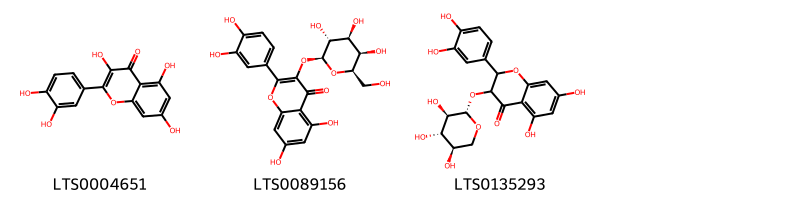{ width=100% }
    <figcaption>Hình ảnh cấu trúc hóa học của 3 hoạt chất thuộc nhóm Flavonoids gồm ['quercetin (LTS0004651)', 'hyperoside (LTS0089156)', '2-(3,4-dihydroxyphenyl)-5,7-dihydroxy-3-{[(2s,3r,4s,5r)-3,4,5-trihydroxyoxan-2-yl]oxy}-2,3-dihydro-1-benzopyran-4-one (LTS0135293)'].</figcaption>
</figure>
#### Nhóm Organonitrogen compounds
<figure markdown="span">
    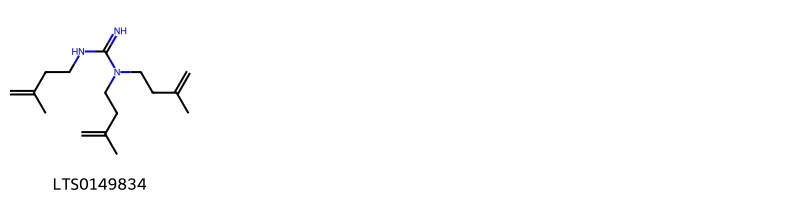{ width=100% }
    <figcaption>Hình ảnh cấu trúc hóa học của 1 hoạt chất thuộc nhóm Organonitrogen compounds gồm ["n,n,n'-tris(3-methylbut-3-en-1-yl)guanidine (LTS0149834)"].</figcaption>
</figure>
#### Nhóm Tannins
<figure markdown="span">
    { width=100% }
    <figcaption>Hình ảnh cấu trúc hóa học của 1 hoạt chất thuộc nhóm Tannins gồm ['ellagic acid (LTS0037297)'].</figcaption>
</figure>

---

### Dược dân tộc học

Danh sách các quốc gia có sử dụng *Alchornea cordifolia* trong điều trị các bệnh. 

| Country                  | Disease                                  | Bệnh                                                                                                                                                                                                |
|:-------------------------|:-----------------------------------------|:----------------------------------------------------------------------------------------------------------------------------------------------------------------------------------------------------|
| Africa                   | Collyrium, Diuretic, Poultice, Stomachic | MYMEMORY WARNING: YOU USED ALL AVAILABLE FREE TRANSLATIONS FOR TODAY. NEXT AVAILABLE IN  20 HOURS 57 MINUTES 16 SECONDS VISIT HTTPS://MYMEMORY.TRANSLATED.NET/DOC/USAGELIMITS.PHP TO TRANSLATE MORE |
| Central African Republic | Emetic                                   | MYMEMORY WARNING: YOU USED ALL AVAILABLE FREE TRANSLATIONS FOR TODAY. NEXT AVAILABLE IN  20 HOURS 57 MINUTES 13 SECONDS VISIT HTTPS://MYMEMORY.TRANSLATED.NET/DOC/USAGELIMITS.PHP TO TRANSLATE MORE |
| Nigeria                  | Cathartic                                | MYMEMORY WARNING: YOU USED ALL AVAILABLE FREE TRANSLATIONS FOR TODAY. NEXT AVAILABLE IN  20 HOURS 57 MINUTES 10 SECONDS VISIT HTTPS://MYMEMORY.TRANSLATED.NET/DOC/USAGELIMITS.PHP TO TRANSLATE MORE |
| Upper Volta              | Emmenagogue                              | MYMEMORY WARNING: YOU USED ALL AVAILABLE FREE TRANSLATIONS FOR TODAY. NEXT AVAILABLE IN  20 HOURS 57 MINUTES 08 SECONDS VISIT HTTPS://MYMEMORY.TRANSLATED.NET/DOC/USAGELIMITS.PHP TO TRANSLATE MORE |

---

---
## Alchornea rugosa
### Thông tin về thực vật

!!! info "Phân loại thực vật của *Alchornea rugosa* từ GIBF:"
    - **Kingdom:** Plantae
    - **Phylum:** Tracheophyta
    - **Order:** Malpighiales
    - **Family:** Euphorbiaceae
    - **Genus:** Alchornea
    - **Species:** *Alchornea rugosa*

 

| Label (VI)   | Label (EN)   | Scientific Name   | Descriptions (VI)   | Descriptions (EN)   | Also Known As (VI)   | Also Known As (EN)   |
|:-------------|:-------------|:------------------|:--------------------|:--------------------|:---------------------|:---------------------|
| N/A          | N/A          | Alchornea rugosa  | loài thực vật       | species of plant    | ['']                 | ['']                 |

#### Phân bố trên thế giới

**Từ CSDL GIBF** Sri Lanka, Australia, Christmas Island, Thailand, Lao People’s Democratic Republic, Cambodia, Bolivia (Plurinational State of), Papua New Guinea, unknown or invalid, Indonesia, United States of America, Viet Nam, Timor-Leste, Philippines, Malaysia, China

#### Phân bố tại Việt Nam

**Từ CSDL GIBF**: Thanh Hoa, Hoa Binh, Ninh Binh, Thua Thien-Hue

---
### Thành phần hóa học
        
- Theo cơ sở dữ liệu lotus: Từ loài *Alchornea rugosa* đã phân lập và xác định được 7 hoạt chất thuộc về các nhóm Carboxylic acids and derivatives, Organonitrogen compounds, Imidazopyrimidines. 

|    | chemicalTaxonomyClassyfireClass   |   smiles_count |
|---:|:----------------------------------|---------------:|
|  0 | Carboxylic acids and derivatives  |              3 |
|  1 | Imidazopyrimidines                |              2 |
|  2 | Organonitrogen compounds          |              2 |

#### Nhóm Carboxylic acids and derivatives
<figure markdown="span">
    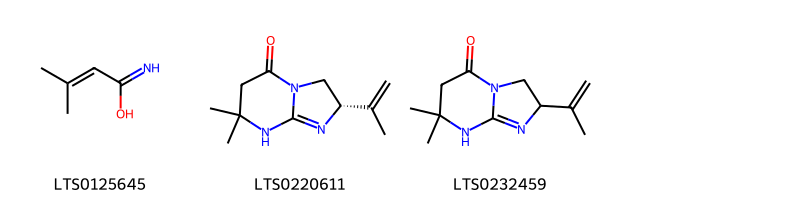{ width=100% }
    <figcaption>Hình ảnh cấu trúc hóa học của 3 hoạt chất thuộc nhóm Carboxylic acids and derivatives gồm ['3-methylbut-2-enimidic acid (LTS0125645)', '(2s)-7,7-dimethyl-2-(prop-1-en-2-yl)-2h,3h,6h,8h-imidazo[1,2-a]pyrimidin-5-one (LTS0220611)', 'alchornine (LTS0232459)'].</figcaption>
</figure>
#### Nhóm Imidazopyrimidines
<figure markdown="span">
    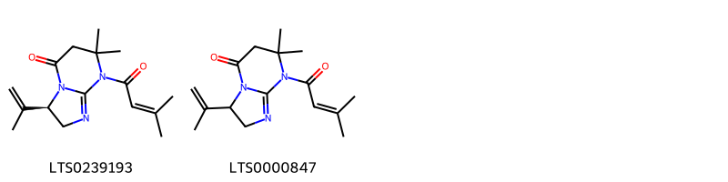{ width=100% }
    <figcaption>Hình ảnh cấu trúc hóa học của 2 hoạt chất thuộc nhóm Imidazopyrimidines gồm ['(3r)-7,7-dimethyl-8-(3-methylbut-2-enoyl)-3-(prop-1-en-2-yl)-2h,3h,6h-imidazo[1,2-a]pyrimidin-5-one (LTS0239193)', '7,7-dimethyl-8-(3-methylbut-2-enoyl)-3-(prop-1-en-2-yl)-2h,3h,6h-imidazo[1,2-a]pyrimidin-5-one (LTS0000847)'].</figcaption>
</figure>
#### Nhóm Organonitrogen compounds
<figure markdown="span">
    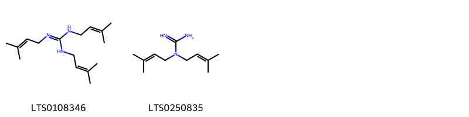{ width=100% }
    <figcaption>Hình ảnh cấu trúc hóa học của 2 hoạt chất thuộc nhóm Organonitrogen compounds gồm ["n,n',n''-tris(3-methylbut-2-en-1-yl)guanidine (LTS0108346)", 'n,n-bis(3-methylbut-2-en-1-yl)guanidine (LTS0250835)'].</figcaption>
</figure>

---

### Dược dân tộc học

Danh sách các quốc gia có sử dụng *Alchornea rugosa* trong điều trị các bệnh. 

| Country   | Disease   | Bệnh                                                                                                                                                                                                |
|:----------|:----------|:----------------------------------------------------------------------------------------------------------------------------------------------------------------------------------------------------|
| Batavia   | Purgative | MYMEMORY WARNING: YOU USED ALL AVAILABLE FREE TRANSLATIONS FOR TODAY. NEXT AVAILABLE IN  20 HOURS 56 MINUTES 37 SECONDS VISIT HTTPS://MYMEMORY.TRANSLATED.NET/DOC/USAGELIMITS.PHP TO TRANSLATE MORE |

---

# Chi Baccaurea

??? note "Danh sách các dược liệu thuộc chi"
    
	 - *Baccaurea genistelloides*

---
## Baccaurea genistelloides
### Thông tin về thực vật

!!! info "Phân loại thực vật của *N/A* từ GIBF:"
    - **Kingdom:** Plantae
    - **Phylum:** Tracheophyta
    - **Order:** Malpighiales
    - **Family:** Phyllanthaceae
    - **Genus:** Baccaurea
    - **Species:** *N/A*

 

| Label (VI)   | Label (EN)   | Scientific Name   | Descriptions (VI)   | Descriptions (EN)   | Also Known As (VI)   | Also Known As (EN)   |
|:-------------|:-------------|:------------------|:--------------------|:--------------------|:---------------------|:---------------------|
| N/A          | N/A          | Alchornea rugosa  | loài thực vật       | species of plant    | ['']                 | ['']                 |

#### Phân bố trên thế giới

**Từ CSDL GIBF** nan, Ecuador, Thailand, Lao People’s Democratic Republic, Cambodia, Myanmar, Vanuatu, India, Indonesia, Bhutan, Viet Nam, Singapore, Malaysia, China

#### Phân bố tại Việt Nam

**Từ CSDL GIBF**: Lâm Đồng

---
### Thành phần hóa học
        
- Theo cơ sở dữ liệu lotus: Từ loài *N/A* đã phân lập và xác định được Chưa có hoạt chất nào được phân lập. hoạt chất thuộc về các nhóm Không có hoạt chất nào được phân lập. 

Không có hình ảnh nào được tạo ra

---

### Dược dân tộc học

Danh sách các quốc gia có sử dụng *N/A* trong điều trị các bệnh. 

| Country       |   Disease | Bệnh                                                                                                                                                                                                |
|:--------------|----------:|:----------------------------------------------------------------------------------------------------------------------------------------------------------------------------------------------------|
| South America |       nan | MYMEMORY WARNING: YOU USED ALL AVAILABLE FREE TRANSLATIONS FOR TODAY. NEXT AVAILABLE IN  20 HOURS 56 MINUTES 06 SECONDS VISIT HTTPS://MYMEMORY.TRANSLATED.NET/DOC/USAGELIMITS.PHP TO TRANSLATE MORE |

---

# Chi Securinega

??? note "Danh sách các dược liệu thuộc chi"
    
	 - *Securinega leucopyrus*
	 - *Securinega microcarpa*
	 - *Securinega virosa*

---
## Securinega leucopyrus
### Thông tin về thực vật

!!! info "Phân loại thực vật của *N/A* từ GIBF:"
    - **Kingdom:** Plantae
    - **Phylum:** Tracheophyta
    - **Order:** Malpighiales
    - **Family:** Phyllanthaceae
    - **Genus:** Flueggea
    - **Species:** *N/A*

 

| Label (VI)   | Label (EN)   | Scientific Name   | Descriptions (VI)   | Descriptions (EN)   | Also Known As (VI)   | Also Known As (EN)   |
|:-------------|:-------------|:------------------|:--------------------|:--------------------|:---------------------|:---------------------|
| N/A          | N/A          | Alchornea rugosa  | loài thực vật       | species of plant    | ['']                 | ['']                 |

#### Phân bố trên thế giới

**Từ CSDL GIBF** Sri Lanka, Australia, Benin, Yemen, Zambia, Nigeria, Namibia, Korea, Republic of, Chinese Taipei, Spain, Portugal, Zimbabwe, South Africa, Uganda, Hong Kong, Thailand, Eswatini, China, Madagascar, Botswana, India

#### Phân bố tại Việt Nam

**Từ CSDL GIBF**: Không có ghi nhận ở Việt Nam

---
### Thành phần hóa học
        
- Theo cơ sở dữ liệu lotus: Từ loài *N/A* đã phân lập và xác định được Chưa có hoạt chất nào được phân lập. hoạt chất thuộc về các nhóm Không có hoạt chất nào được phân lập. 

Không có hình ảnh nào được tạo ra

---

### Dược dân tộc học

Danh sách các quốc gia có sử dụng *N/A* trong điều trị các bệnh. 

| Country   | Disease              | Bệnh                                                                                                                                                                                                |
|:----------|:---------------------|:----------------------------------------------------------------------------------------------------------------------------------------------------------------------------------------------------|
| Elsewhere | Larvicide, Piscicide | MYMEMORY WARNING: YOU USED ALL AVAILABLE FREE TRANSLATIONS FOR TODAY. NEXT AVAILABLE IN  20 HOURS 55 MINUTES 36 SECONDS VISIT HTTPS://MYMEMORY.TRANSLATED.NET/DOC/USAGELIMITS.PHP TO TRANSLATE MORE |

---

---
## Securinega microcarpa
### Thông tin về thực vật

!!! info "Phân loại thực vật của *N/A* từ GIBF:"
    - **Kingdom:** Plantae
    - **Phylum:** Tracheophyta
    - **Order:** Malpighiales
    - **Family:** Phyllanthaceae
    - **Genus:** Flueggea
    - **Species:** *N/A*

 

| Label (VI)   | Label (EN)   | Scientific Name   | Descriptions (VI)   | Descriptions (EN)   | Also Known As (VI)   | Also Known As (EN)   |
|:-------------|:-------------|:------------------|:--------------------|:--------------------|:---------------------|:---------------------|
| N/A          | N/A          | Alchornea rugosa  | loài thực vật       | species of plant    | ['']                 | ['']                 |

#### Phân bố trên thế giới

**Từ CSDL GIBF** Sri Lanka, Australia, Benin, Yemen, Zambia, Nigeria, Namibia, Korea, Republic of, Chinese Taipei, Spain, Portugal, Zimbabwe, South Africa, Uganda, Hong Kong, Thailand, Eswatini, China, Madagascar, Botswana, India

#### Phân bố tại Việt Nam

**Từ CSDL GIBF**: Không có ghi nhận ở Việt Nam

---
### Thành phần hóa học
        
- Theo cơ sở dữ liệu lotus: Từ loài *N/A* đã phân lập và xác định được Chưa có hoạt chất nào được phân lập. hoạt chất thuộc về các nhóm Không có hoạt chất nào được phân lập. 

Không có hình ảnh nào được tạo ra

---

### Dược dân tộc học

Danh sách các quốc gia có sử dụng *N/A* trong điều trị các bệnh. 

| Country   | Disease   | Bệnh                                                                                                                                                                                                |
|:----------|:----------|:----------------------------------------------------------------------------------------------------------------------------------------------------------------------------------------------------|
| Elsewhere | Piscicide | MYMEMORY WARNING: YOU USED ALL AVAILABLE FREE TRANSLATIONS FOR TODAY. NEXT AVAILABLE IN  20 HOURS 55 MINUTES 06 SECONDS VISIT HTTPS://MYMEMORY.TRANSLATED.NET/DOC/USAGELIMITS.PHP TO TRANSLATE MORE |
| Sudan     | Piscicide | MYMEMORY WARNING: YOU USED ALL AVAILABLE FREE TRANSLATIONS FOR TODAY. NEXT AVAILABLE IN  20 HOURS 55 MINUTES 03 SECONDS VISIT HTTPS://MYMEMORY.TRANSLATED.NET/DOC/USAGELIMITS.PHP TO TRANSLATE MORE |

---

---
## Securinega virosa
### Thông tin về thực vật

!!! info "Phân loại thực vật của *Flueggea virosa* từ GIBF:"
    - **Kingdom:** Plantae
    - **Phylum:** Tracheophyta
    - **Order:** Malpighiales
    - **Family:** Phyllanthaceae
    - **Genus:** Flueggea
    - **Species:** *Flueggea virosa*

 

| Label (VI)   | Label (EN)   | Scientific Name   | Descriptions (VI)   | Descriptions (EN)   | Also Known As (VI)   | Also Known As (EN)   |
|:-------------|:-------------|:------------------|:--------------------|:--------------------|:---------------------|:---------------------|
| N/A          | N/A          | Securinega virosa | loài thực vật       | species of plant    | ['']                 | ['']                 |

#### Phân bố trên thế giới

**Từ CSDL GIBF** Ghana, Central African Republic, Australia, Lao People’s Democratic Republic, Benin, Tanzania, United Republic of, Togo, Malawi, Mali, Senegal, Nigeria, Chinese Taipei, United States of America, South Africa, Thailand, Niger, Côte d’Ivoire, Viet Nam, Eswatini, China, Botswana, Burundi, India, Burkina Faso, Philippines, Mauritania, Nepal

#### Phân bố tại Việt Nam

**Từ CSDL GIBF**: Lang Son

---
### Thành phần hóa học
        
- Theo cơ sở dữ liệu lotus: Từ loài *Flueggea virosa* đã phân lập và xác định được 19 hoạt chất thuộc về các nhóm Flavonoids, Prenol lipids, Steroids and steroid derivatives, Indolizidines, Benzene and substituted derivatives, Saturated hydrocarbons, Tannins, Pyrrolizidines. 

|    | chemicalTaxonomyClassyfireClass     |   smiles_count |
|---:|:------------------------------------|---------------:|
|  0 | Benzene and substituted derivatives |              4 |
|  1 | Flavonoids                          |              1 |
|  2 | Indolizidines                       |              4 |
|  3 | Prenol lipids                       |              1 |
|  4 | Pyrrolizidines                      |              3 |
|  5 | Saturated hydrocarbons              |              1 |
|  6 | Steroids and steroid derivatives    |              4 |
|  7 | Tannins                             |              1 |

#### Nhóm Benzene and substituted derivatives
<figure markdown="span">
    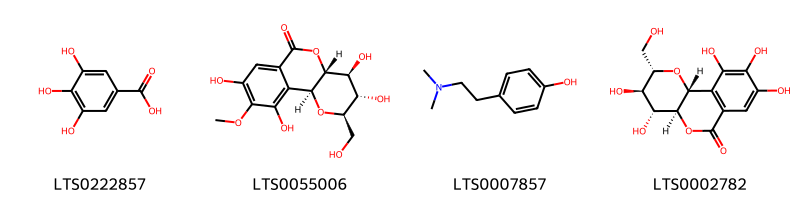{ width=100% }
    <figcaption>Hình ảnh cấu trúc hóa học của 4 hoạt chất thuộc nhóm Benzene and substituted derivatives gồm ['galop (LTS0222857)', 'bergenin (LTS0055006)', 'hordenine (LTS0007857)', '(2r,4s,5r,6r,7s)-5,6,12,13,14-pentahydroxy-4-(hydroxymethyl)-3,8-dioxatricyclo[8.4.0.0²,⁷]tetradeca-1(10),11,13-trien-9-one (LTS0002782)'].</figcaption>
</figure>
#### Nhóm Flavonoids
<figure markdown="span">
    { width=100% }
    <figcaption>Hình ảnh cấu trúc hóa học của 1 hoạt chất thuộc nhóm Flavonoids gồm ['quercetin (LTS0004651)'].</figcaption>
</figure>
#### Nhóm Indolizidines
<figure markdown="span">
    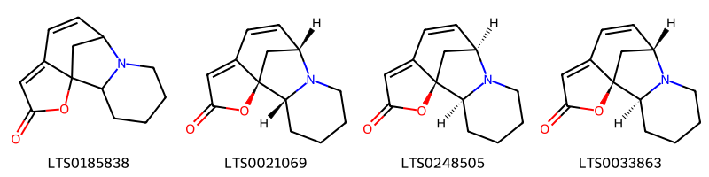{ width=100% }
    <figcaption>Hình ảnh cấu trúc hóa học của 4 hoạt chất thuộc nhóm Indolizidines gồm ['14-oxa-7-azatetracyclo[6.6.1.0¹,¹¹.0²,⁷]pentadeca-9,11-dien-13-one (LTS0185838)', '(1r,2r,8r)-14-oxa-7-azatetracyclo[6.6.1.0¹,¹¹.0²,⁷]pentadeca-9,11-dien-13-one (LTS0021069)', '(1r,2s,8s)-14-oxa-7-azatetracyclo[6.6.1.0¹,¹¹.0²,⁷]pentadeca-9,11-dien-13-one (LTS0248505)', '(1r,2s,8r)-14-oxa-7-azatetracyclo[6.6.1.0¹,¹¹.0²,⁷]pentadeca-9,11-dien-13-one (LTS0033863)'].</figcaption>
</figure>
#### Nhóm Prenol lipids
<figure markdown="span">
    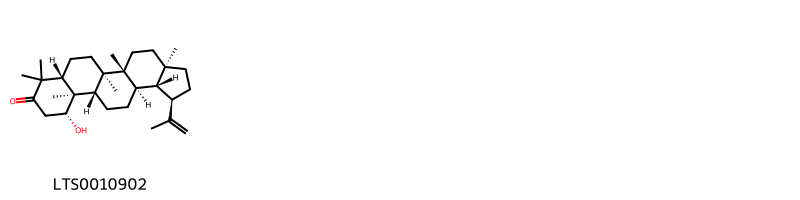{ width=100% }
    <figcaption>Hình ảnh cấu trúc hóa học của 1 hoạt chất thuộc nhóm Prenol lipids gồm ['glochidonol (LTS0010902)'].</figcaption>
</figure>
#### Nhóm Pyrrolizidines
<figure markdown="span">
    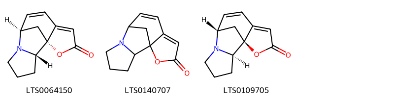{ width=100% }
    <figcaption>Hình ảnh cấu trúc hóa học của 3 hoạt chất thuộc nhóm Pyrrolizidines gồm ['(1r,8r,13s)-2-oxa-9-azatetracyclo[6.5.1.0¹,⁵.0⁹,¹³]tetradeca-4,6-dien-3-one (LTS0064150)', '2-oxa-9-azatetracyclo[6.5.1.0¹,⁵.0⁹,¹³]tetradeca-4,6-dien-3-one (LTS0140707)', '(1s,8s,13r)-2-oxa-9-azatetracyclo[6.5.1.0¹,⁵.0⁹,¹³]tetradeca-4,6-dien-3-one (LTS0109705)'].</figcaption>
</figure>
#### Nhóm Saturated hydrocarbons
<figure markdown="span">
    { width=100% }
    <figcaption>Hình ảnh cấu trúc hóa học của 1 hoạt chất thuộc nhóm Saturated hydrocarbons gồm ['hentriacontane (LTS0046415)'].</figcaption>
</figure>
#### Nhóm Steroids and steroid derivatives
<figure markdown="span">
    { width=100% }
    <figcaption>Hình ảnh cấu trúc hóa học của 4 hoạt chất thuộc nhóm Steroids and steroid derivatives gồm ['stigmast-5-en-3-ol (LTS0071224)', 'stigmast-5-en-3-ol, (3β)- (LTS0204616)', 'sitogluside (LTS0201798)', '2-{[1-(5-ethyl-6-methylheptan-2-yl)-9a,11a-dimethyl-1h,2h,3h,3ah,3bh,4h,6h,7h,8h,9h,9bh,10h,11h-cyclopenta[a]phenanthren-7-yl]oxy}-6-(hydroxymethyl)oxane-3,4,5-triol (LTS0158828)'].</figcaption>
</figure>
#### Nhóm Tannins
<figure markdown="span">
    { width=100% }
    <figcaption>Hình ảnh cấu trúc hóa học của 1 hoạt chất thuộc nhóm Tannins gồm ['ellagic acid (LTS0037297)'].</figcaption>
</figure>

---

### Dược dân tộc học

Danh sách các quốc gia có sử dụng *Flueggea virosa* trong điều trị các bệnh. 

| Country     | Disease                                                            | Bệnh                                                                                                                                                                                                |
|:------------|:-------------------------------------------------------------------|:----------------------------------------------------------------------------------------------------------------------------------------------------------------------------------------------------|
| Elsewhere   | Antiseptic, Aphrodisiac, Analgesic, Purgative, Sedative, Larvicide | MYMEMORY WARNING: YOU USED ALL AVAILABLE FREE TRANSLATIONS FOR TODAY. NEXT AVAILABLE IN  20 HOURS 54 MINUTES 35 SECONDS VISIT HTTPS://MYMEMORY.TRANSLATED.NET/DOC/USAGELIMITS.PHP TO TRANSLATE MORE |
| Philippines | Cicatrizant                                                        | MYMEMORY WARNING: YOU USED ALL AVAILABLE FREE TRANSLATIONS FOR TODAY. NEXT AVAILABLE IN  20 HOURS 54 MINUTES 31 SECONDS VISIT HTTPS://MYMEMORY.TRANSLATED.NET/DOC/USAGELIMITS.PHP TO TRANSLATE MORE |

---

# Chi Trewia

??? note "Danh sách các dược liệu thuộc chi"
    
	 - *Trewia nudiflora*

---
## Trewia nudiflora
### Thông tin về thực vật

!!! info "Phân loại thực vật của *Trewia nudiflora* từ GIBF:"
    - **Kingdom:** Plantae
    - **Phylum:** Tracheophyta
    - **Order:** Malpighiales
    - **Family:** Euphorbiaceae
    - **Genus:** Trewia
    - **Species:** *Trewia nudiflora*

 

| Label (VI)   | Label (EN)   | Scientific Name   | Descriptions (VI)   | Descriptions (EN)   | Also Known As (VI)   | Also Known As (EN)   |
|:-------------|:-------------|:------------------|:--------------------|:--------------------|:---------------------|:---------------------|
| N/A          | N/A          | Trewia nudiflora  | loài thực vật       | species of plant    | ['']                 | ['']                 |

#### Phân bố trên thế giới

**Từ CSDL GIBF** Thailand, Lao People’s Democratic Republic, Myanmar, India, Indonesia, United States of America, Singapore, China, Nepal

#### Phân bố tại Việt Nam

**Từ CSDL GIBF**: Không có ghi nhận ở Việt Nam

---
### Thành phần hóa học
        
- Theo cơ sở dữ liệu lotus: Từ loài *Trewia nudiflora* đã phân lập và xác định được Chưa có hoạt chất nào được phân lập. hoạt chất thuộc về các nhóm Không có hoạt chất nào được phân lập. 

Không có hình ảnh nào được tạo ra

---

### Dược dân tộc học

Danh sách các quốc gia có sử dụng *Trewia nudiflora* trong điều trị các bệnh. 

| Country   | Disease     | Bệnh                                                                                                                                                                                                |
|:----------|:------------|:----------------------------------------------------------------------------------------------------------------------------------------------------------------------------------------------------|
| Elsewhere | Carminative | MYMEMORY WARNING: YOU USED ALL AVAILABLE FREE TRANSLATIONS FOR TODAY. NEXT AVAILABLE IN  20 HOURS 53 MINUTES 52 SECONDS VISIT HTTPS://MYMEMORY.TRANSLATED.NET/DOC/USAGELIMITS.PHP TO TRANSLATE MORE |

---

# Chi Hippomane

??? note "Danh sách các dược liệu thuộc chi"
    
	 - *Hippomane mancinella*

---
## Hippomane mancinella
### Thông tin về thực vật

!!! info "Phân loại thực vật của *Hippomane mancinella* từ GIBF:"
    - **Kingdom:** Plantae
    - **Phylum:** Tracheophyta
    - **Order:** Malpighiales
    - **Family:** Euphorbiaceae
    - **Genus:** Hippomane
    - **Species:** *Hippomane mancinella*

 

| Label (VI)   | Label (EN)   | Scientific Name      | Descriptions (VI)   | Descriptions (EN)   | Also Known As (VI)   | Also Known As (EN)                          |
|:-------------|:-------------|:---------------------|:--------------------|:--------------------|:---------------------|:--------------------------------------------|
| N/A          | N/A          | Hippomane mancinella | loài thực vật       | species of plant    | ['']                 | ['Manchineel', 'Manchineel', 'Manchioneel'] |

#### Phân bố trên thế giới

**Từ CSDL GIBF** Virgin Islands (U.S.), Guadeloupe, Grenada, Saint Lucia, Nicaragua, Virgin Islands (British), Puerto Rico, United States of America, Bonaire, Sint Eustatius and Saba, El Salvador, Trinidad and Tobago, Barbados, Saint Barthélemy, Martinique, Bahamas, Mexico, Dominican Republic, Curaçao, Ecuador, Saint Kitts and Nevis, Aruba, Colombia, Montserrat, Costa Rica, Cayman Islands, Antigua and Barbuda

#### Phân bố tại Việt Nam

**Từ CSDL GIBF**: Không có ghi nhận ở Việt Nam

---
### Thành phần hóa học
        
- Theo cơ sở dữ liệu lotus: Từ loài *Hippomane mancinella* đã phân lập và xác định được 10 hoạt chất thuộc về các nhóm Fatty Acyls, Prenol lipids, Organooxygen compounds. 

|    | chemicalTaxonomyClassyfireClass   |   smiles_count |
|---:|:----------------------------------|---------------:|
|  0 | Fatty Acyls                       |              6 |
|  1 | Organooxygen compounds            |              1 |
|  2 | Prenol lipids                     |              3 |

#### Nhóm Fatty Acyls
<figure markdown="span">
    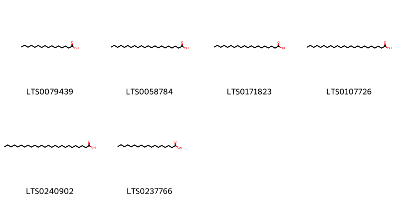{ width=100% }
    <figcaption>Hình ảnh cấu trúc hóa học của 6 hoạt chất thuộc nhóm Fatty Acyls gồm ['palmitic acid (LTS0079439)', 'behenic acid (LTS0058784)', 'arachidic acid (LTS0171823)', 'lignoceric acid (LTS0107726)', 'hexacosanoic acid (LTS0240902)', 'stearic acid (LTS0237766)'].</figcaption>
</figure>
#### Nhóm Organooxygen compounds
<figure markdown="span">
    { width=100% }
    <figcaption>Hình ảnh cấu trúc hóa học của 1 hoạt chất thuộc nhóm Organooxygen compounds gồm ['xanthoxylin (LTS0150432)'].</figcaption>
</figure>
#### Nhóm Prenol lipids
<figure markdown="span">
    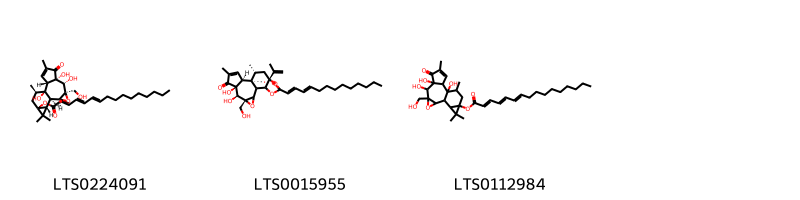{ width=100% }
    <figcaption>Hình ảnh cấu trúc hóa học của 3 hoạt chất thuộc nhóm Prenol lipids gồm ['mancinellin (LTS0224091)', '(1r,2r,6s,7s,8r,16r,18r)-6,7-dihydroxy-8-(hydroxymethyl)-4,18-dimethyl-16-(prop-1-en-2-yl)-14-[(1e,3e)-trideca-1,3-dien-1-yl]-9,13,15,19-tetraoxahexacyclo[12.4.1.0¹,¹¹.0²,⁶.0⁸,¹⁰.0¹²,¹⁶]nonadec-3-en-5-one (LTS0015955)', '5,6,11-trihydroxy-4-(hydroxymethyl)-8,12,15,15-tetramethyl-7-oxo-3-oxapentacyclo[9.5.0.0²,⁴.0⁶,¹⁰.0¹⁴,¹⁶]hexadec-8-en-14-yl hexadeca-2,4,6-trienoate (LTS0112984)'].</figcaption>
</figure>

---

### Dược dân tộc học

Danh sách các quốc gia có sử dụng *Hippomane mancinella* trong điều trị các bệnh. 

| Country            | Disease                                                            | Bệnh                                                                                                                                                                                                |
|:-------------------|:-------------------------------------------------------------------|:----------------------------------------------------------------------------------------------------------------------------------------------------------------------------------------------------|
| Dominican Republic | Diuretic                                                           | MYMEMORY WARNING: YOU USED ALL AVAILABLE FREE TRANSLATIONS FOR TODAY. NEXT AVAILABLE IN  20 HOURS 53 MINUTES 31 SECONDS VISIT HTTPS://MYMEMORY.TRANSLATED.NET/DOC/USAGELIMITS.PHP TO TRANSLATE MORE |
| Dutch              | Poison                                                             | MYMEMORY WARNING: YOU USED ALL AVAILABLE FREE TRANSLATIONS FOR TODAY. NEXT AVAILABLE IN  20 HOURS 53 MINUTES 29 SECONDS VISIT HTTPS://MYMEMORY.TRANSLATED.NET/DOC/USAGELIMITS.PHP TO TRANSLATE MORE |
| Elsewhere          | Cathartic, Diuretic, Diuretic, Piscicide, Poison, Poison, Vesicant | MYMEMORY WARNING: YOU USED ALL AVAILABLE FREE TRANSLATIONS FOR TODAY. NEXT AVAILABLE IN  20 HOURS 53 MINUTES 26 SECONDS VISIT HTTPS://MYMEMORY.TRANSLATED.NET/DOC/USAGELIMITS.PHP TO TRANSLATE MORE |
| English            | Emetic                                                             | MYMEMORY WARNING: YOU USED ALL AVAILABLE FREE TRANSLATIONS FOR TODAY. NEXT AVAILABLE IN  20 HOURS 53 MINUTES 23 SECONDS VISIT HTTPS://MYMEMORY.TRANSLATED.NET/DOC/USAGELIMITS.PHP TO TRANSLATE MORE |
| French             | Cathartic                                                          | MYMEMORY WARNING: YOU USED ALL AVAILABLE FREE TRANSLATIONS FOR TODAY. NEXT AVAILABLE IN  20 HOURS 53 MINUTES 18 SECONDS VISIT HTTPS://MYMEMORY.TRANSLATED.NET/DOC/USAGELIMITS.PHP TO TRANSLATE MORE |
| Guatemala          | Poison, Vesicant                                                   | MYMEMORY WARNING: YOU USED ALL AVAILABLE FREE TRANSLATIONS FOR TODAY. NEXT AVAILABLE IN  20 HOURS 53 MINUTES 14 SECONDS VISIT HTTPS://MYMEMORY.TRANSLATED.NET/DOC/USAGELIMITS.PHP TO TRANSLATE MORE |
| Guiana             | Vermifuge                                                          | MYMEMORY WARNING: YOU USED ALL AVAILABLE FREE TRANSLATIONS FOR TODAY. NEXT AVAILABLE IN  20 HOURS 53 MINUTES 07 SECONDS VISIT HTTPS://MYMEMORY.TRANSLATED.NET/DOC/USAGELIMITS.PHP TO TRANSLATE MORE |
| Haiti              | Cathartic, Poison, Poison, Diaphoretic                             | MYMEMORY WARNING: YOU USED ALL AVAILABLE FREE TRANSLATIONS FOR TODAY. NEXT AVAILABLE IN  20 HOURS 53 MINUTES 04 SECONDS VISIT HTTPS://MYMEMORY.TRANSLATED.NET/DOC/USAGELIMITS.PHP TO TRANSLATE MORE |
| Mexico             | Emetic, Poison                                                     | MYMEMORY WARNING: YOU USED ALL AVAILABLE FREE TRANSLATIONS FOR TODAY. NEXT AVAILABLE IN  20 HOURS 52 MINUTES 59 SECONDS VISIT HTTPS://MYMEMORY.TRANSLATED.NET/DOC/USAGELIMITS.PHP TO TRANSLATE MORE |
| US(Florida)        | Poison                                                             | MYMEMORY WARNING: YOU USED ALL AVAILABLE FREE TRANSLATIONS FOR TODAY. NEXT AVAILABLE IN  20 HOURS 52 MINUTES 55 SECONDS VISIT HTTPS://MYMEMORY.TRANSLATED.NET/DOC/USAGELIMITS.PHP TO TRANSLATE MORE |
| Venezuela          | Poison                                                             | MYMEMORY WARNING: YOU USED ALL AVAILABLE FREE TRANSLATIONS FOR TODAY. NEXT AVAILABLE IN  20 HOURS 52 MINUTES 52 SECONDS VISIT HTTPS://MYMEMORY.TRANSLATED.NET/DOC/USAGELIMITS.PHP TO TRANSLATE MORE |

---

# Chi Codiaeum

??? note "Danh sách các dược liệu thuộc chi"
    
	 - *Codiaeum variegatum*

---
## Codiaeum variegatum
### Thông tin về thực vật

!!! info "Phân loại thực vật của *Codiaeum variegatum* từ GIBF:"
    - **Kingdom:** Plantae
    - **Phylum:** Tracheophyta
    - **Order:** Malpighiales
    - **Family:** Euphorbiaceae
    - **Genus:** Codiaeum
    - **Species:** *Codiaeum variegatum*

 

| Label (VI)   | Label (EN)   | Scientific Name     | Descriptions (VI)   | Descriptions (EN)   | Also Known As (VI)   | Also Known As (EN)                                    |
|:-------------|:-------------|:--------------------|:--------------------|:--------------------|:---------------------|:------------------------------------------------------|
| N/A          | N/A          | Codiaeum variegatum | loài thực vật       | species of plant    | ['']                 | ['fire croton', 'garden croton', 'variegated croton'] |

#### Phân bố trên thế giới

**Từ CSDL GIBF** Virgin Islands (U.S.), nan, Sri Lanka, Micronesia (Federated States of), Australia, Guadeloupe, Cook Islands, Wallis and Futuna, Guatemala, Grenada, Saint Lucia, Benin, Bermuda, French Guiana, Puerto Rico, Réunion, Nigeria, Bolivia (Plurinational State of), Honduras, Jamaica, Bangladesh, United States of America, Bonaire, Sint Eustatius and Saba, El Salvador, Maldives, Belize, Trinidad and Tobago, South Africa, Fiji, Barbados, Hong Kong, Saint Vincent and the Grenadines, Thailand, Brazil, Bahamas, Egypt, Cuba, Dominican Republic, Viet Nam, Ecuador, French Polynesia, Saint Kitts and Nevis, Haiti, Colombia, Macao, Costa Rica, India, Indonesia, Antigua and Barbuda, Philippines, Malaysia, Northern Mariana Islands

#### Phân bố tại Việt Nam

**Từ CSDL GIBF**: Khánh Hòa

---
### Thành phần hóa học
        
- Theo cơ sở dữ liệu lotus: Từ loài *Codiaeum variegatum* đã phân lập và xác định được 17 hoạt chất thuộc về các nhóm Cinnamic acids and derivatives, Organonitrogen compounds, Benzene and substituted derivatives, Organooxygen compounds, Tannins. 

|    | chemicalTaxonomyClassyfireClass     |   smiles_count |
|---:|:------------------------------------|---------------:|
|  0 | Benzene and substituted derivatives |              3 |
|  1 | Cinnamic acids and derivatives      |              2 |
|  2 | Organonitrogen compounds            |              1 |
|  3 | Organooxygen compounds              |             10 |
|  4 | Tannins                             |              1 |

#### Nhóm Benzene and substituted derivatives
<figure markdown="span">
    { width=100% }
    <figcaption>Hình ảnh cấu trúc hóa học của 3 hoạt chất thuộc nhóm Benzene and substituted derivatives gồm ['p-hydroxybenzoic acid (LTS0263634)', '3,4-dihydroxybenzoic acid (LTS0018765)', 'vanillic acid (LTS0229113)'].</figcaption>
</figure>
#### Nhóm Cinnamic acids and derivatives
<figure markdown="span">
    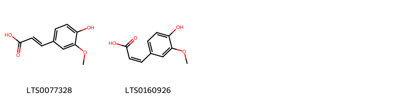{ width=100% }
    <figcaption>Hình ảnh cấu trúc hóa học của 2 hoạt chất thuộc nhóm Cinnamic acids and derivatives gồm ['ferulic acid (LTS0077328)', 'cis-ferulic acid (LTS0160926)'].</figcaption>
</figure>
#### Nhóm Organonitrogen compounds
<figure markdown="span">
    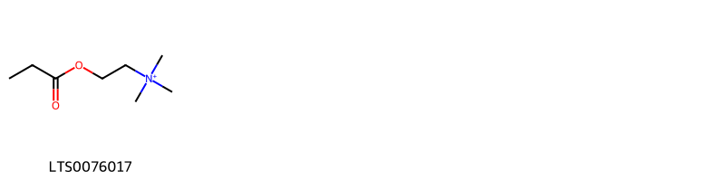{ width=100% }
    <figcaption>Hình ảnh cấu trúc hóa học của 1 hoạt chất thuộc nhóm Organonitrogen compounds gồm ['β-methylacetylcholine (LTS0076017)'].</figcaption>
</figure>
#### Nhóm Organooxygen compounds
<figure markdown="span">
    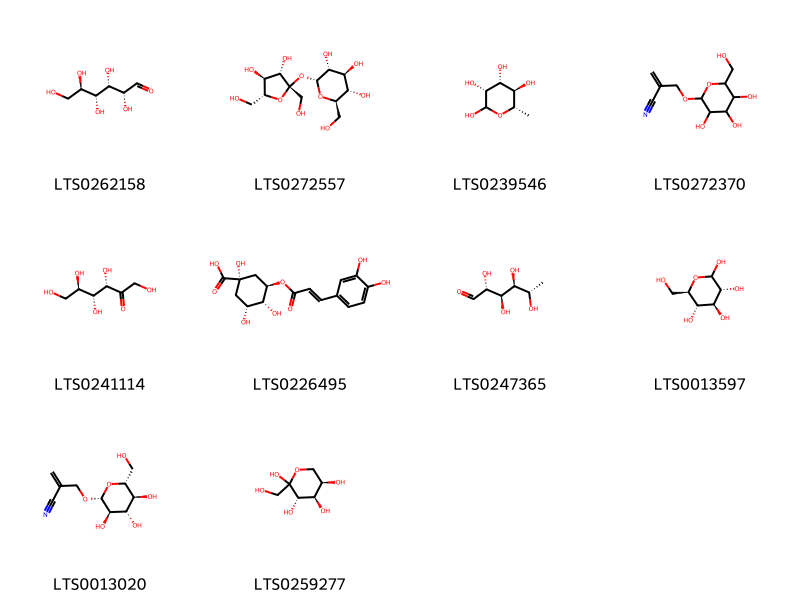{ width=100% }
    <figcaption>Hình ảnh cấu trúc hóa học của 10 hoạt chất thuộc nhóm Organooxygen compounds gồm ['(+)-glucose (LTS0262158)', 'sucrose (LTS0272557)', 'l-rhamnose (LTS0239546)', '2-({[3,4,5-trihydroxy-6-(hydroxymethyl)oxan-2-yl]oxy}methyl)prop-2-enenitrile (LTS0272370)', 'keto-d-fructose (LTS0241114)', 'chlorogenic acid (LTS0226495)', 'rhamnose (LTS0247365)', 'glucose (LTS0013597)', '2-({[(2r,3r,4s,5s,6r)-3,4,5-trihydroxy-6-(hydroxymethyl)oxan-2-yl]oxy}methyl)prop-2-enenitrile (LTS0013020)', 'd-fructopyranose (LTS0259277)'].</figcaption>
</figure>
#### Nhóm Tannins
<figure markdown="span">
    { width=100% }
    <figcaption>Hình ảnh cấu trúc hóa học của 1 hoạt chất thuộc nhóm Tannins gồm ['ellagic acid (LTS0037297)'].</figcaption>
</figure>

---

### Dược dân tộc học

Danh sách các quốc gia có sử dụng *Codiaeum variegatum* trong điều trị các bệnh. 

| Country   | Disease                                                | Bệnh                                                                                                                                                                                                |
|:----------|:-------------------------------------------------------|:----------------------------------------------------------------------------------------------------------------------------------------------------------------------------------------------------|
| Elsewhere | Refrigerant, Stimulant, Sudorific, Poultice, Purgative | MYMEMORY WARNING: YOU USED ALL AVAILABLE FREE TRANSLATIONS FOR TODAY. NEXT AVAILABLE IN  20 HOURS 52 MINUTES 23 SECONDS VISIT HTTPS://MYMEMORY.TRANSLATED.NET/DOC/USAGELIMITS.PHP TO TRANSLATE MORE |
| Malaya    | Purgative                                              | MYMEMORY WARNING: YOU USED ALL AVAILABLE FREE TRANSLATIONS FOR TODAY. NEXT AVAILABLE IN  20 HOURS 52 MINUTES 20 SECONDS VISIT HTTPS://MYMEMORY.TRANSLATED.NET/DOC/USAGELIMITS.PHP TO TRANSLATE MORE |
| Solomon I | Abortifacient                                          | MYMEMORY WARNING: YOU USED ALL AVAILABLE FREE TRANSLATIONS FOR TODAY. NEXT AVAILABLE IN  20 HOURS 52 MINUTES 17 SECONDS VISIT HTTPS://MYMEMORY.TRANSLATED.NET/DOC/USAGELIMITS.PHP TO TRANSLATE MORE |

---

# Chi Mercurialis

??? note "Danh sách các dược liệu thuộc chi"
    
	 - *Mercurialis annua*
	 - *Mercurialis leiocarpa*
	 - *Mercurialis perennis*
	 - *Mercurialis tomentosa*

---
## Mercurialis annua
### Thông tin về thực vật

!!! info "Phân loại thực vật của *Mercurialis annua* từ GIBF:"
    - **Kingdom:** Plantae
    - **Phylum:** Tracheophyta
    - **Order:** Malpighiales
    - **Family:** Euphorbiaceae
    - **Genus:** Mercurialis
    - **Species:** *Mercurialis annua*

 

| Label (VI)   | Label (EN)   | Scientific Name   | Descriptions (VI)   | Descriptions (EN)   | Also Known As (VI)   | Also Known As (EN)   |
|:-------------|:-------------|:------------------|:--------------------|:--------------------|:---------------------|:---------------------|
| N/A          | N/A          | Mercurialis annua | loài thực vật       | species of plant    | ['']                 | ['annual mercury']   |

#### Phân bố trên thế giới

**Từ CSDL GIBF** nan, Italy, Belgium, Palestine, State of, Israel, Ukraine, Netherlands, Luxembourg, Cyprus, Spain, Hungary, Portugal, Algeria, Russian Federation, Albania, Greece, Czechia, Germany, Switzerland, Austria, France, United Kingdom of Great Britain and Northern Ireland, Syrian Arab Republic

#### Phân bố tại Việt Nam

**Từ CSDL GIBF**: Không có ghi nhận ở Việt Nam

---
### Thành phần hóa học
        
- Theo cơ sở dữ liệu lotus: Từ loài *Mercurialis annua* đã phân lập và xác định được 5 hoạt chất thuộc về các nhóm Flavonoids, Purine nucleosides, Imidazopyrimidines. 

|    | chemicalTaxonomyClassyfireClass   |   smiles_count |
|---:|:----------------------------------|---------------:|
|  0 | Flavonoids                        |              2 |
|  1 | Imidazopyrimidines                |              2 |
|  2 | Purine nucleosides                |              1 |

#### Nhóm Flavonoids
<figure markdown="span">
    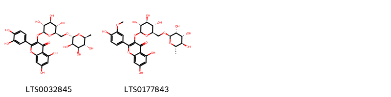{ width=100% }
    <figcaption>Hình ảnh cấu trúc hóa học của 2 hoạt chất thuộc nhóm Flavonoids gồm ['3-rutinosyl quercetin (LTS0032845)', 'narcissin (LTS0177843)'].</figcaption>
</figure>
#### Nhóm Imidazopyrimidines
<figure markdown="span">
    { width=100% }
    <figcaption>Hình ảnh cấu trúc hóa học của 2 hoạt chất thuộc nhóm Imidazopyrimidines gồm ['zeatine (LTS0032706)', '2ip (LTS0061765)'].</figcaption>
</figure>
#### Nhóm Purine nucleosides
<figure markdown="span">
    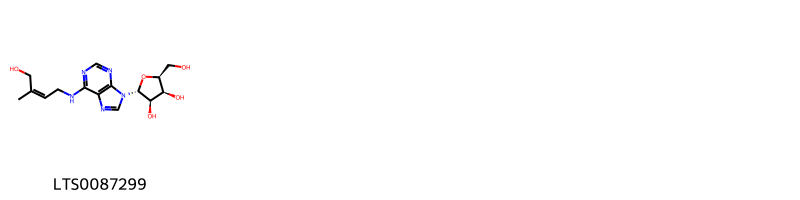{ width=100% }
    <figcaption>Hình ảnh cấu trúc hóa học của 1 hoạt chất thuộc nhóm Purine nucleosides gồm ['(2r,3r,4s,5s)-2-(6-{[(2z)-4-hydroxy-3-methylbut-2-en-1-yl]amino}purin-9-yl)-5-(hydroxymethyl)oxolane-3,4-diol (LTS0087299)'].</figcaption>
</figure>

---

### Dược dân tộc học

Danh sách các quốc gia có sử dụng *Mercurialis annua* trong điều trị các bệnh. 

| Country   | Disease                                                                | Bệnh                                                                                                                                                                                                |
|:----------|:-----------------------------------------------------------------------|:----------------------------------------------------------------------------------------------------------------------------------------------------------------------------------------------------|
| Turkey    | Cholagogue, Emetic, Emmenagogue, Poison, Diuretic, Laxative, Vermifuge | MYMEMORY WARNING: YOU USED ALL AVAILABLE FREE TRANSLATIONS FOR TODAY. NEXT AVAILABLE IN  20 HOURS 51 MINUTES 39 SECONDS VISIT HTTPS://MYMEMORY.TRANSLATED.NET/DOC/USAGELIMITS.PHP TO TRANSLATE MORE |
| US        | Poison                                                                 | MYMEMORY WARNING: YOU USED ALL AVAILABLE FREE TRANSLATIONS FOR TODAY. NEXT AVAILABLE IN  20 HOURS 51 MINUTES 36 SECONDS VISIT HTTPS://MYMEMORY.TRANSLATED.NET/DOC/USAGELIMITS.PHP TO TRANSLATE MORE |
| ain       | Purgative                                                              | MYMEMORY WARNING: YOU USED ALL AVAILABLE FREE TRANSLATIONS FOR TODAY. NEXT AVAILABLE IN  20 HOURS 51 MINUTES 34 SECONDS VISIT HTTPS://MYMEMORY.TRANSLATED.NET/DOC/USAGELIMITS.PHP TO TRANSLATE MORE |

---

---
## Mercurialis leiocarpa
### Thông tin về thực vật

!!! info "Phân loại thực vật của *Mercurialis leiocarpa* từ GIBF:"
    - **Kingdom:** Plantae
    - **Phylum:** Tracheophyta
    - **Order:** Malpighiales
    - **Family:** Euphorbiaceae
    - **Genus:** Mercurialis
    - **Species:** *Mercurialis leiocarpa*

 

| Label (VI)   | Label (EN)   | Scientific Name       | Descriptions (VI)   | Descriptions (EN)   | Also Known As (VI)   | Also Known As (EN)   |
|:-------------|:-------------|:----------------------|:--------------------|:--------------------|:---------------------|:---------------------|
| N/A          | N/A          | Mercurialis leiocarpa | loài thực vật       | species of plant    | ['']                 | ['']                 |

#### Phân bố trên thế giới

**Từ CSDL GIBF** nan, Japan, Korea, Republic of, Chinese Taipei, China, Nepal

#### Phân bố tại Việt Nam

**Từ CSDL GIBF**: Không có ghi nhận ở Việt Nam

---
### Thành phần hóa học
        
- Theo cơ sở dữ liệu lotus: Từ loài *Mercurialis leiocarpa* đã phân lập và xác định được 2 hoạt chất thuộc về các nhóm Carboxylic acids and derivatives. 

|    | chemicalTaxonomyClassyfireClass   |   smiles_count |
|---:|:----------------------------------|---------------:|
|  0 | Carboxylic acids and derivatives  |              2 |

#### Nhóm Carboxylic acids and derivatives
<figure markdown="span">
    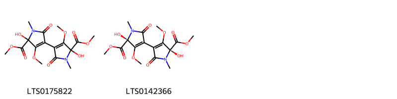{ width=100% }
    <figcaption>Hình ảnh cấu trúc hóa học của 2 hoạt chất thuộc nhóm Carboxylic acids and derivatives gồm ["5,5'-dimethyl 5,5'-dihydroxy-4,4'-dimethoxy-1,1'-dimethyl-2,2'-dioxo-[3,3'-bipyrrole]-5,5'-dicarboxylate (LTS0175822)", "5,5'-dimethyl (5s,5's)-5,5'-dihydroxy-4,4'-dimethoxy-1,1'-dimethyl-2,2'-dioxo-[3,3'-bipyrrole]-5,5'-dicarboxylate (LTS0142366)"].</figcaption>
</figure>

---

### Dược dân tộc học

Danh sách các quốc gia có sử dụng *Mercurialis leiocarpa* trong điều trị các bệnh. 

| Country   | Disease     | Bệnh                                                                                                                                                                                                |
|:----------|:------------|:----------------------------------------------------------------------------------------------------------------------------------------------------------------------------------------------------|
| China     | Diaphoretic | MYMEMORY WARNING: YOU USED ALL AVAILABLE FREE TRANSLATIONS FOR TODAY. NEXT AVAILABLE IN  20 HOURS 51 MINUTES 06 SECONDS VISIT HTTPS://MYMEMORY.TRANSLATED.NET/DOC/USAGELIMITS.PHP TO TRANSLATE MORE |

---

---
## Mercurialis perennis
### Thông tin về thực vật

!!! info "Phân loại thực vật của *Mercurialis perennis* từ GIBF:"
    - **Kingdom:** Plantae
    - **Phylum:** Tracheophyta
    - **Order:** Malpighiales
    - **Family:** Euphorbiaceae
    - **Genus:** Mercurialis
    - **Species:** *Mercurialis perennis*

 

| Label (VI)   | Label (EN)   | Scientific Name      | Descriptions (VI)   | Descriptions (EN)   | Also Known As (VI)   | Also Known As (EN)                |
|:-------------|:-------------|:---------------------|:--------------------|:--------------------|:---------------------|:----------------------------------|
| N/A          | N/A          | Mercurialis perennis | loài thực vật       | species of plant    | ['']                 | ["dog's mercury", 'herb mercury'] |

#### Phân bố trên thế giới

**Từ CSDL GIBF** Denmark, Netherlands, Italy, Luxembourg, Germany, Czechia, Spain, Poland, Hungary, Switzerland, Austria, France, Slovenia, Croatia, United Kingdom of Great Britain and Northern Ireland

#### Phân bố tại Việt Nam

**Từ CSDL GIBF**: Không có ghi nhận ở Việt Nam

---
### Thành phần hóa học
        
- Theo cơ sở dữ liệu lotus: Từ loài *Mercurialis perennis* đã phân lập và xác định được 2 hoạt chất thuộc về các nhóm Pyridines and derivatives. 

|    | chemicalTaxonomyClassyfireClass   |   smiles_count |
|---:|:----------------------------------|---------------:|
|  0 | Pyridines and derivatives         |              2 |

#### Nhóm Pyridines and derivatives
<figure markdown="span">
    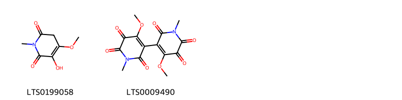{ width=100% }
    <figcaption>Hình ảnh cấu trúc hóa học của 2 hoạt chất thuộc nhóm Pyridines and derivatives gồm ['3-hydroxy-4-methoxy-1-methyl-5h-pyridine-2,6-dione (LTS0199058)', "4,4'-dimethoxy-1,1'-dimethyl-[3,3'-bipyridine]-2,2',5,5',6,6'-hexone (LTS0009490)"].</figcaption>
</figure>

---

### Dược dân tộc học

Danh sách các quốc gia có sử dụng *Mercurialis perennis* trong điều trị các bệnh. 

| Country   | Disease   | Bệnh                                                                                                                                                                                                |
|:----------|:----------|:----------------------------------------------------------------------------------------------------------------------------------------------------------------------------------------------------|
| US        | Poison    | MYMEMORY WARNING: YOU USED ALL AVAILABLE FREE TRANSLATIONS FOR TODAY. NEXT AVAILABLE IN  20 HOURS 50 MINUTES 22 SECONDS VISIT HTTPS://MYMEMORY.TRANSLATED.NET/DOC/USAGELIMITS.PHP TO TRANSLATE MORE |
| ain       | Purgative | MYMEMORY WARNING: YOU USED ALL AVAILABLE FREE TRANSLATIONS FOR TODAY. NEXT AVAILABLE IN  20 HOURS 50 MINUTES 18 SECONDS VISIT HTTPS://MYMEMORY.TRANSLATED.NET/DOC/USAGELIMITS.PHP TO TRANSLATE MORE |

---

---
## Mercurialis tomentosa
### Thông tin về thực vật

!!! info "Phân loại thực vật của *Mercurialis tomentosa* từ GIBF:"
    - **Kingdom:** Plantae
    - **Phylum:** Tracheophyta
    - **Order:** Malpighiales
    - **Family:** Euphorbiaceae
    - **Genus:** Mercurialis
    - **Species:** *Mercurialis tomentosa*

 

| Label (VI)   | Label (EN)   | Scientific Name       | Descriptions (VI)   | Descriptions (EN)   | Also Known As (VI)   | Also Known As (EN)   |
|:-------------|:-------------|:----------------------|:--------------------|:--------------------|:---------------------|:---------------------|
| N/A          | N/A          | Mercurialis tomentosa | loài thực vật       | species of plant    | ['']                 | ['']                 |

#### Phân bố trên thế giới

**Từ CSDL GIBF** France, Spain

#### Phân bố tại Việt Nam

**Từ CSDL GIBF**: Không có ghi nhận ở Việt Nam

---
### Thành phần hóa học
        
- Theo cơ sở dữ liệu lotus: Từ loài *Mercurialis tomentosa* đã phân lập và xác định được Chưa có hoạt chất nào được phân lập. hoạt chất thuộc về các nhóm Không có hoạt chất nào được phân lập. 

Không có hình ảnh nào được tạo ra

---

### Dược dân tộc học

Danh sách các quốc gia có sử dụng *Mercurialis tomentosa* trong điều trị các bệnh. 

| Country   | Disease   | Bệnh                                                                                                                                                                                                |
|:----------|:----------|:----------------------------------------------------------------------------------------------------------------------------------------------------------------------------------------------------|
| ain       | Purgative | MYMEMORY WARNING: YOU USED ALL AVAILABLE FREE TRANSLATIONS FOR TODAY. NEXT AVAILABLE IN  20 HOURS 49 MINUTES 50 SECONDS VISIT HTTPS://MYMEMORY.TRANSLATED.NET/DOC/USAGELIMITS.PHP TO TRANSLATE MORE |

---

# Chi Glochidion

??? note "Danh sách các dược liệu thuộc chi"
    
	 - *Glochidion concolor*
	 - *Glochidion hohenackeri*
	 - *Glochidion laevigatum*
	 - *Glochidion rubrum*
	 - *Glochidion sericeum*
	 - *Glochidion zeylanicum*

---
## Glochidion concolor
### Thông tin về thực vật

!!! info "Phân loại thực vật của *Phyllanthus concolor* từ GIBF:"
    - **Kingdom:** Plantae
    - **Phylum:** Tracheophyta
    - **Order:** Malpighiales
    - **Family:** Phyllanthaceae
    - **Genus:** Phyllanthus
    - **Species:** *Phyllanthus concolor*

 

| Label (VI)   | Label (EN)   | Scientific Name     | Descriptions (VI)   | Descriptions (EN)   | Also Known As (VI)   | Also Known As (EN)   |
|:-------------|:-------------|:--------------------|:--------------------|:--------------------|:---------------------|:---------------------|
| N/A          | N/A          | Glochidion concolor | loài thực vật       | species of plant    | ['']                 | ['']                 |

#### Phân bố trên thế giới

**Từ CSDL GIBF** nan, Fiji, Niue, Cook Islands, Tonga

#### Phân bố tại Việt Nam

**Từ CSDL GIBF**: Không có ghi nhận ở Việt Nam

---
### Thành phần hóa học
        
- Theo cơ sở dữ liệu lotus: Từ loài *Phyllanthus concolor* đã phân lập và xác định được Chưa có hoạt chất nào được phân lập. hoạt chất thuộc về các nhóm Không có hoạt chất nào được phân lập. 

Không có hình ảnh nào được tạo ra

---

### Dược dân tộc học

Danh sách các quốc gia có sử dụng *Phyllanthus concolor* trong điều trị các bệnh. 

| Country   | Disease   | Bệnh                                                                                                                                                                                                |
|:----------|:----------|:----------------------------------------------------------------------------------------------------------------------------------------------------------------------------------------------------|
| Fiji      | Hemostat  | MYMEMORY WARNING: YOU USED ALL AVAILABLE FREE TRANSLATIONS FOR TODAY. NEXT AVAILABLE IN  20 HOURS 49 MINUTES 20 SECONDS VISIT HTTPS://MYMEMORY.TRANSLATED.NET/DOC/USAGELIMITS.PHP TO TRANSLATE MORE |

---

---
## Glochidion hohenackeri
### Thông tin về thực vật

!!! info "Phân loại thực vật của *Glochidion hohenackeri* từ GIBF:"
    - **Kingdom:** Plantae
    - **Phylum:** Tracheophyta
    - **Order:** Malpighiales
    - **Family:** Phyllanthaceae
    - **Genus:** Glochidion
    - **Species:** *Glochidion hohenackeri*

 

| Label (VI)   | Label (EN)   | Scientific Name        | Descriptions (VI)   | Descriptions (EN)   | Also Known As (VI)   | Also Known As (EN)   |
|:-------------|:-------------|:-----------------------|:--------------------|:--------------------|:---------------------|:---------------------|
| N/A          | N/A          | Glochidion hohenackeri | loài thực vật       | species of plant    | ['']                 | ['']                 |

#### Phân bố trên thế giới

**Từ CSDL GIBF** nan, Thailand, Lao People’s Democratic Republic, Myanmar, Bhutan, India, unknown or invalid, Viet Nam, China

#### Phân bố tại Việt Nam

**Từ CSDL GIBF**: Ninh Thuan, Ho Chi Minh City

---
### Thành phần hóa học
        
- Theo cơ sở dữ liệu lotus: Từ loài *Glochidion hohenackeri* đã phân lập và xác định được Chưa có hoạt chất nào được phân lập. hoạt chất thuộc về các nhóm Không có hoạt chất nào được phân lập. 

Không có hình ảnh nào được tạo ra

---

### Dược dân tộc học

Danh sách các quốc gia có sử dụng *Glochidion hohenackeri* trong điều trị các bệnh. 

| Country   | Disease    | Bệnh                                                                                                                                                                                                |
|:----------|:-----------|:----------------------------------------------------------------------------------------------------------------------------------------------------------------------------------------------------|
| Elsewhere | Antiemetic | MYMEMORY WARNING: YOU USED ALL AVAILABLE FREE TRANSLATIONS FOR TODAY. NEXT AVAILABLE IN  20 HOURS 48 MINUTES 57 SECONDS VISIT HTTPS://MYMEMORY.TRANSLATED.NET/DOC/USAGELIMITS.PHP TO TRANSLATE MORE |

---

---
## Glochidion laevigatum
### Thông tin về thực vật

!!! info "Phân loại thực vật của *Glochidion lutescens* từ GIBF:"
    - **Kingdom:** Plantae
    - **Phylum:** Tracheophyta
    - **Order:** Malpighiales
    - **Family:** Phyllanthaceae
    - **Genus:** Glochidion
    - **Species:** *Glochidion lutescens*

 

| Label (VI)   | Label (EN)   | Scientific Name       | Descriptions (VI)   | Descriptions (EN)   | Also Known As (VI)   | Also Known As (EN)   |
|:-------------|:-------------|:----------------------|:--------------------|:--------------------|:---------------------|:---------------------|
| N/A          | N/A          | Glochidion laevigatum |                     |                     | ['']                 | ['']                 |

#### Phân bố trên thế giới

**Từ CSDL GIBF** nan, Thailand, Lao People’s Democratic Republic, Myanmar, Bhutan, India, unknown or invalid, Viet Nam, China

#### Phân bố tại Việt Nam

**Từ CSDL GIBF**: Ninh Thuan, Ho Chi Minh City

---
### Thành phần hóa học
        
- Theo cơ sở dữ liệu lotus: Từ loài *Glochidion lutescens* đã phân lập và xác định được Chưa có hoạt chất nào được phân lập. hoạt chất thuộc về các nhóm Không có hoạt chất nào được phân lập. 

Không có hình ảnh nào được tạo ra

---

### Dược dân tộc học

Danh sách các quốc gia có sử dụng *Glochidion lutescens* trong điều trị các bệnh. 

| Country   | Disease   | Bệnh                                                                                                                                                                                                |
|:----------|:----------|:----------------------------------------------------------------------------------------------------------------------------------------------------------------------------------------------------|
| Malaya    | Poison    | MYMEMORY WARNING: YOU USED ALL AVAILABLE FREE TRANSLATIONS FOR TODAY. NEXT AVAILABLE IN  20 HOURS 48 MINUTES 33 SECONDS VISIT HTTPS://MYMEMORY.TRANSLATED.NET/DOC/USAGELIMITS.PHP TO TRANSLATE MORE |

---

---
## Glochidion rubrum
### Thông tin về thực vật

!!! info "Phân loại thực vật của *Glochidion rubrum* từ GIBF:"
    - **Kingdom:** Plantae
    - **Phylum:** Tracheophyta
    - **Order:** Malpighiales
    - **Family:** Phyllanthaceae
    - **Genus:** Glochidion
    - **Species:** *Glochidion rubrum*

 

| Label (VI)   | Label (EN)   | Scientific Name   | Descriptions (VI)   | Descriptions (EN)   | Also Known As (VI)   | Also Known As (EN)   |
|:-------------|:-------------|:------------------|:--------------------|:--------------------|:---------------------|:---------------------|
| N/A          | N/A          | Glochidion rubrum | loài thực vật       | species of plant    | ['']                 | ['']                 |

#### Phân bố trên thế giới

**Từ CSDL GIBF** nan, Philippines, Chinese Taipei, Japan

#### Phân bố tại Việt Nam

**Từ CSDL GIBF**: Không có ghi nhận ở Việt Nam

---
### Thành phần hóa học
        
- Theo cơ sở dữ liệu lotus: Từ loài *Glochidion rubrum* đã phân lập và xác định được 6 hoạt chất thuộc về các nhóm Flavonoids, Organooxygen compounds. 

|    | chemicalTaxonomyClassyfireClass   |   smiles_count |
|---:|:----------------------------------|---------------:|
|  0 | Flavonoids                        |              2 |
|  1 | Organooxygen compounds            |              4 |

#### Nhóm Flavonoids
<figure markdown="span">
    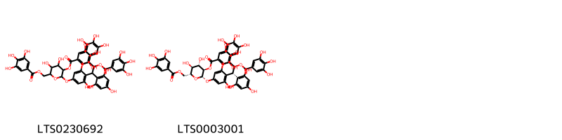{ width=100% }
    <figcaption>Hình ảnh cấu trúc hóa học của 2 hoạt chất thuộc nhóm Flavonoids gồm ['7-{[4,5-dihydroxy-3-(3,4,5-trihydroxybenzoyloxy)-6-[(3,4,5-trihydroxybenzoyloxy)methyl]oxan-2-yl]oxy}-5-hydroxy-4-(2,4,6-trihydroxyphenyl)-2-(3,4,5-trihydroxyphenyl)-3,4-dihydro-2h-1-benzopyran-3-yl 3,4,5-trihydroxybenzoate (LTS0230692)', '(2r,3s,4r)-7-{[(2s,3r,4s,5s,6r)-4,5-dihydroxy-3-(3,4,5-trihydroxybenzoyloxy)-6-[(3,4,5-trihydroxybenzoyloxy)methyl]oxan-2-yl]oxy}-5-hydroxy-4-(2,4,6-trihydroxyphenyl)-2-(3,4,5-trihydroxyphenyl)-3,4-dihydro-2h-1-benzopyran-3-yl 3,4,5-trihydroxybenzoate (LTS0003001)'].</figcaption>
</figure>
#### Nhóm Organooxygen compounds
<figure markdown="span">
    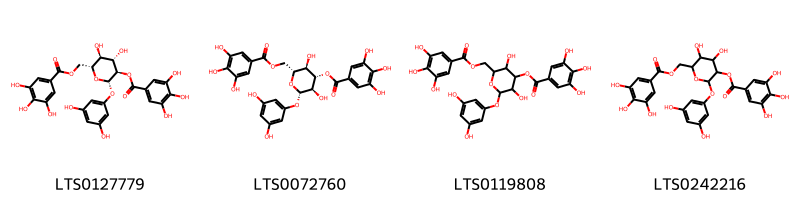{ width=100% }
    <figcaption>Hình ảnh cấu trúc hóa học của 4 hoạt chất thuộc nhóm Organooxygen compounds gồm ['(2s,3r,4s,5s,6r)-2-(3,5-dihydroxyphenoxy)-4,5-dihydroxy-6-[(3,4,5-trihydroxybenzoyloxy)methyl]oxan-3-yl 3,4,5-trihydroxybenzoate (LTS0127779)', '(2s,3r,4s,5r,6r)-2-(3,5-dihydroxyphenoxy)-3,5-dihydroxy-6-[(3,4,5-trihydroxybenzoyloxy)methyl]oxan-4-yl 3,4,5-trihydroxybenzoate (LTS0072760)', '2-(3,5-dihydroxyphenoxy)-3,5-dihydroxy-6-[(3,4,5-trihydroxybenzoyloxy)methyl]oxan-4-yl 3,4,5-trihydroxybenzoate (LTS0119808)', '2-(3,5-dihydroxyphenoxy)-4,5-dihydroxy-6-[(3,4,5-trihydroxybenzoyloxy)methyl]oxan-3-yl 3,4,5-trihydroxybenzoate (LTS0242216)'].</figcaption>
</figure>

---

### Dược dân tộc học

Danh sách các quốc gia có sử dụng *Glochidion rubrum* trong điều trị các bệnh. 

| Country   | Disease     | Bệnh                                                                                                                                                                                                |
|:----------|:------------|:----------------------------------------------------------------------------------------------------------------------------------------------------------------------------------------------------|
| Malaya    | Expectorant | MYMEMORY WARNING: YOU USED ALL AVAILABLE FREE TRANSLATIONS FOR TODAY. NEXT AVAILABLE IN  20 HOURS 48 MINUTES 06 SECONDS VISIT HTTPS://MYMEMORY.TRANSLATED.NET/DOC/USAGELIMITS.PHP TO TRANSLATE MORE |

---

---
## Glochidion sericeum
### Thông tin về thực vật

!!! info "Phân loại thực vật của *Glochidion sericeum* từ GIBF:"
    - **Kingdom:** Plantae
    - **Phylum:** Tracheophyta
    - **Order:** Malpighiales
    - **Family:** Phyllanthaceae
    - **Genus:** Glochidion
    - **Species:** *Glochidion sericeum*

 

| Label (VI)   | Label (EN)   | Scientific Name     | Descriptions (VI)   | Descriptions (EN)   | Also Known As (VI)   | Also Known As (EN)   |
|:-------------|:-------------|:--------------------|:--------------------|:--------------------|:---------------------|:---------------------|
| N/A          | N/A          | Glochidion sericeum | loài thực vật       | species of plant    | ['']                 | ['']                 |

#### Phân bố trên thế giới

**Từ CSDL GIBF** nan, Thailand, Cambodia, Indonesia, Philippines, Singapore, Malaysia, Brunei Darussalam

#### Phân bố tại Việt Nam

**Từ CSDL GIBF**: Không có ghi nhận ở Việt Nam

---
### Thành phần hóa học
        
- Theo cơ sở dữ liệu lotus: Từ loài *Glochidion sericeum* đã phân lập và xác định được Chưa có hoạt chất nào được phân lập. hoạt chất thuộc về các nhóm Không có hoạt chất nào được phân lập. 

Không có hình ảnh nào được tạo ra

---

### Dược dân tộc học

Danh sách các quốc gia có sử dụng *Glochidion sericeum* trong điều trị các bệnh. 

| Country   | Disease   | Bệnh                                                                                                                                                                                                |
|:----------|:----------|:----------------------------------------------------------------------------------------------------------------------------------------------------------------------------------------------------|
| Malaya    | Vermifuge | MYMEMORY WARNING: YOU USED ALL AVAILABLE FREE TRANSLATIONS FOR TODAY. NEXT AVAILABLE IN  20 HOURS 47 MINUTES 35 SECONDS VISIT HTTPS://MYMEMORY.TRANSLATED.NET/DOC/USAGELIMITS.PHP TO TRANSLATE MORE |

---

---
## Glochidion zeylanicum
### Thông tin về thực vật

!!! info "Phân loại thực vật của *Glochidion zeylanicum* từ GIBF:"
    - **Kingdom:** Plantae
    - **Phylum:** Tracheophyta
    - **Order:** Malpighiales
    - **Family:** Phyllanthaceae
    - **Genus:** Glochidion
    - **Species:** *Glochidion zeylanicum*

 

| Label (VI)   | Label (EN)   | Scientific Name       | Descriptions (VI)   | Descriptions (EN)                             | Also Known As (VI)   | Also Known As (EN)   |
|:-------------|:-------------|:----------------------|:--------------------|:----------------------------------------------|:---------------------|:---------------------|
| N/A          | N/A          | Glochidion zeylanicum | loài thực vật       | species of plant in the family Phyllanthaceae | ['']                 | ['']                 |

#### Phân bố trên thế giới

**Từ CSDL GIBF** Hong Kong, Chinese Taipei, Australia, Japan

#### Phân bố tại Việt Nam

**Từ CSDL GIBF**: Không có ghi nhận ở Việt Nam

---
### Thành phần hóa học
        
- Theo cơ sở dữ liệu lotus: Từ loài *Glochidion zeylanicum* đã phân lập và xác định được 89 hoạt chất thuộc về các nhóm Fatty Acyls, Flavonoids, Prenol lipids, Steroids and steroid derivatives, Benzene and substituted derivatives, 2-arylbenzofuran flavonoids, Organooxygen compounds, Lignan glycosides. 

|    | chemicalTaxonomyClassyfireClass     |   smiles_count |
|---:|:------------------------------------|---------------:|
|  0 | 2-arylbenzofuran flavonoids         |              8 |
|  1 | Benzene and substituted derivatives |              7 |
|  2 | Fatty Acyls                         |              4 |
|  3 | Flavonoids                          |             13 |
|  4 | Lignan glycosides                   |              4 |
|  5 | Organooxygen compounds              |             13 |
|  6 | Prenol lipids                       |             31 |
|  7 | Steroids and steroid derivatives    |              4 |

#### Nhóm 2-arylbenzofuran flavonoids
<figure markdown="span">
    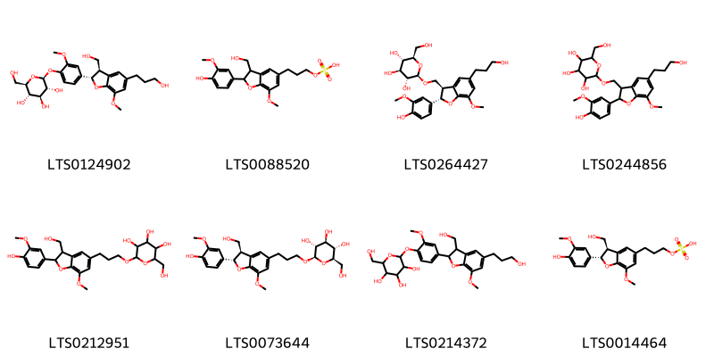{ width=100% }
    <figcaption>Hình ảnh cấu trúc hóa học của 8 hoạt chất thuộc nhóm 2-arylbenzofuran flavonoids gồm ['(2r,3s,4s,5r,6s)-2-(hydroxymethyl)-6-{4-[(2s,3r)-3-(hydroxymethyl)-5-(3-hydroxypropyl)-7-methoxy-2,3-dihydro-1-benzofuran-2-yl]-2-methoxyphenoxy}oxane-3,4,5-triol (LTS0124902)', '3-[2-(4-hydroxy-3-methoxyphenyl)-3-(hydroxymethyl)-7-methoxy-2,3-dihydro-1-benzofuran-5-yl]propoxysulfonic acid (LTS0088520)', '(2r,3r,4s,5s,6r)-2-{[(2s,3r)-2-(4-hydroxy-3-methoxyphenyl)-5-(3-hydroxypropyl)-7-methoxy-2,3-dihydro-1-benzofuran-3-yl]methoxy}-6-(hydroxymethyl)oxane-3,4,5-triol (LTS0264427)', '2-{[2-(4-hydroxy-3-methoxyphenyl)-5-(3-hydroxypropyl)-7-methoxy-2,3-dihydro-1-benzofuran-3-yl]methoxy}-6-(hydroxymethyl)oxane-3,4,5-triol (LTS0244856)', '2-{3-[2-(4-hydroxy-3-methoxyphenyl)-3-(hydroxymethyl)-7-methoxy-2,3-dihydro-1-benzofuran-5-yl]propoxy}-6-(hydroxymethyl)oxane-3,4,5-triol (LTS0212951)', '(2r,3r,4s,5s,6r)-2-{3-[(2s,3r)-2-(4-hydroxy-3-methoxyphenyl)-3-(hydroxymethyl)-7-methoxy-2,3-dihydro-1-benzofuran-5-yl]propoxy}-6-(hydroxymethyl)oxane-3,4,5-triol (LTS0073644)', '2-(hydroxymethyl)-6-{4-[3-(hydroxymethyl)-5-(3-hydroxypropyl)-7-methoxy-2,3-dihydro-1-benzofuran-2-yl]-2-methoxyphenoxy}oxane-3,4,5-triol (LTS0214372)', '3-[(2s,3r)-2-(4-hydroxy-3-methoxyphenyl)-3-(hydroxymethyl)-7-methoxy-2,3-dihydro-1-benzofuran-5-yl]propoxysulfonic acid (LTS0014464)'].</figcaption>
</figure>
#### Nhóm Benzene and substituted derivatives
<figure markdown="span">
    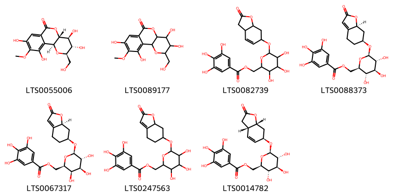{ width=100% }
    <figcaption>Hình ảnh cấu trúc hóa học của 7 hoạt chất thuộc nhóm Benzene and substituted derivatives gồm ['bergenin (LTS0055006)', '5,6,12,14-tetrahydroxy-4-(hydroxymethyl)-13-methoxy-3,8-dioxatricyclo[8.4.0.0²,⁷]tetradeca-1(14),10,12-trien-9-one (LTS0089177)', '{3,4,5-trihydroxy-6-[(2-oxo-3a,6,7,7a-tetrahydro-3h-1-benzofuran-6-yl)oxy]oxan-2-yl}methyl 3,4,5-trihydroxybenzoate (LTS0082739)', '[(2r,3s,4s,5r,6r)-6-{[(6s,7as)-2-oxo-5,6,7,7a-tetrahydro-4h-1-benzofuran-6-yl]oxy}-3,4,5-trihydroxyoxan-2-yl]methyl 3,4,5-trihydroxybenzoate (LTS0088373)', '[(2r,3r,4s,5r,6r)-6-{[(6s,7as)-2-oxo-5,6,7,7a-tetrahydro-4h-1-benzofuran-6-yl]oxy}-3,4,5-trihydroxyoxan-2-yl]methyl 3,4,5-trihydroxybenzoate (LTS0067317)', '{3,4,5-trihydroxy-6-[(2-oxo-5,6,7,7a-tetrahydro-4h-1-benzofuran-6-yl)oxy]oxan-2-yl}methyl 3,4,5-trihydroxybenzoate (LTS0247563)', '[(2r,3s,4s,5r,6r)-6-{[(3as,6r,7ar)-2-oxo-3a,6,7,7a-tetrahydro-3h-1-benzofuran-6-yl]oxy}-3,4,5-trihydroxyoxan-2-yl]methyl 3,4,5-trihydroxybenzoate (LTS0014782)'].</figcaption>
</figure>
#### Nhóm Fatty Acyls
<figure markdown="span">
    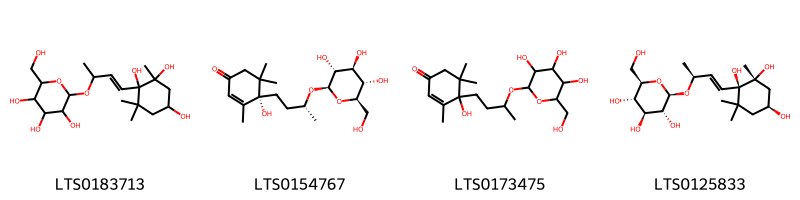{ width=100% }
    <figcaption>Hình ảnh cấu trúc hóa học của 4 hoạt chất thuộc nhóm Fatty Acyls gồm ['2-(hydroxymethyl)-6-{[4-(1,2,4-trihydroxy-2,6,6-trimethylcyclohexyl)but-3-en-2-yl]oxy}oxane-3,4,5-triol (LTS0183713)', '(4s)-4-hydroxy-3,5,5-trimethyl-4-[(3r)-3-{[(2r,3r,4s,5s,6r)-3,4,5-trihydroxy-6-(hydroxymethyl)oxan-2-yl]oxy}butyl]cyclohex-2-en-1-one (LTS0154767)', '4-hydroxy-3,5,5-trimethyl-4-(3-{[3,4,5-trihydroxy-6-(hydroxymethyl)oxan-2-yl]oxy}butyl)cyclohex-2-en-1-one (LTS0173475)', '(2r,3s,4s,5r,6r)-2-(hydroxymethyl)-6-{[(2s,3e)-4-[(1r,2r,4s)-1,2,4-trihydroxy-2,6,6-trimethylcyclohexyl]but-3-en-2-yl]oxy}oxane-3,4,5-triol (LTS0125833)'].</figcaption>
</figure>
#### Nhóm Flavonoids
<figure markdown="span">
    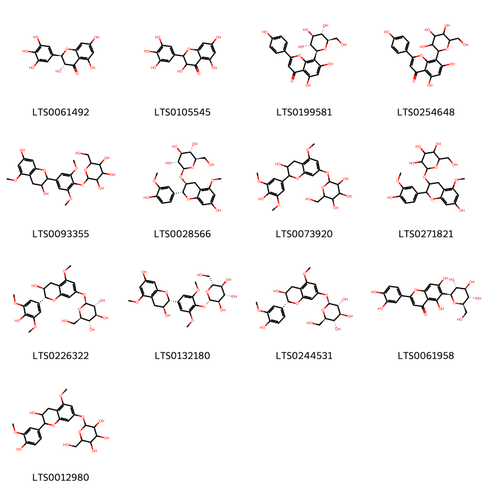{ width=100% }
    <figcaption>Hình ảnh cấu trúc hóa học của 13 hoạt chất thuộc nhóm Flavonoids gồm ['(+)-dihydromyricetin (LTS0061492)', 'dihydromyricetin (LTS0105545)', 'vitexin (LTS0199581)', 'vitexin (LTS0254648)', '2-[4-(3,7-dihydroxy-5-methoxy-3,4-dihydro-2h-1-benzopyran-2-yl)-2,6-dimethoxyphenoxy]-6-(hydroxymethyl)oxane-3,4,5-triol (LTS0093355)', '(2r,3r,4s,5s,6r)-2-{[(2r,3s)-7-hydroxy-2-(4-hydroxy-3-methoxyphenyl)-5-methoxy-3,4-dihydro-2h-1-benzopyran-3-yl]oxy}-6-(hydroxymethyl)oxane-3,4,5-triol (LTS0028566)', '2-{[3-hydroxy-2-(4-hydroxy-3,5-dimethoxyphenyl)-5-methoxy-3,4-dihydro-2h-1-benzopyran-7-yl]oxy}-6-(hydroxymethyl)oxane-3,4,5-triol (LTS0073920)', '2-{[7-hydroxy-2-(4-hydroxy-3-methoxyphenyl)-5-methoxy-3,4-dihydro-2h-1-benzopyran-3-yl]oxy}-6-(hydroxymethyl)oxane-3,4,5-triol (LTS0271821)', '(2s,3r,4s,5s,6r)-2-{[(2r,3s)-3-hydroxy-2-(4-hydroxy-3,5-dimethoxyphenyl)-5-methoxy-3,4-dihydro-2h-1-benzopyran-7-yl]oxy}-6-(hydroxymethyl)oxane-3,4,5-triol (LTS0226322)', '(2s,3r,4s,5s,6r)-2-{4-[(2r,3s)-3,7-dihydroxy-5-methoxy-3,4-dihydro-2h-1-benzopyran-2-yl]-2,6-dimethoxyphenoxy}-6-(hydroxymethyl)oxane-3,4,5-triol (LTS0132180)', '(2s,3r,4s,5s,6r)-2-{[(2r,3s)-3-hydroxy-2-(4-hydroxy-3-methoxyphenyl)-5-methoxy-3,4-dihydro-2h-1-benzopyran-7-yl]oxy}-6-(hydroxymethyl)oxane-3,4,5-triol (LTS0244531)', 'isoorientin (LTS0061958)', '2-{[3-hydroxy-2-(4-hydroxy-3-methoxyphenyl)-5-methoxy-3,4-dihydro-2h-1-benzopyran-7-yl]oxy}-6-(hydroxymethyl)oxane-3,4,5-triol (LTS0012980)'].</figcaption>
</figure>
#### Nhóm Lignan glycosides
<figure markdown="span">
    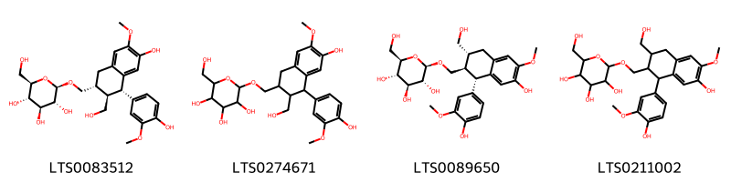{ width=100% }
    <figcaption>Hình ảnh cấu trúc hóa học của 4 hoạt chất thuộc nhóm Lignan glycosides gồm ['(2r,3r,4s,5s,6r)-2-{[(2r,3r,4s)-6-hydroxy-4-(4-hydroxy-3-methoxyphenyl)-3-(hydroxymethyl)-7-methoxy-1,2,3,4-tetrahydronaphthalen-2-yl]methoxy}-6-(hydroxymethyl)oxane-3,4,5-triol (LTS0083512)', '2-{[6-hydroxy-4-(4-hydroxy-3-methoxyphenyl)-3-(hydroxymethyl)-7-methoxy-1,2,3,4-tetrahydronaphthalen-2-yl]methoxy}-6-(hydroxymethyl)oxane-3,4,5-triol (LTS0274671)', '(2r,3r,4s,5s,6r)-2-{[(1s,2r,3r)-7-hydroxy-1-(4-hydroxy-3-methoxyphenyl)-3-(hydroxymethyl)-6-methoxy-1,2,3,4-tetrahydronaphthalen-2-yl]methoxy}-6-(hydroxymethyl)oxane-3,4,5-triol (LTS0089650)', '2-{[7-hydroxy-1-(4-hydroxy-3-methoxyphenyl)-3-(hydroxymethyl)-6-methoxy-1,2,3,4-tetrahydronaphthalen-2-yl]methoxy}-6-(hydroxymethyl)oxane-3,4,5-triol (LTS0211002)'].</figcaption>
</figure>
#### Nhóm Organooxygen compounds
<figure markdown="span">
    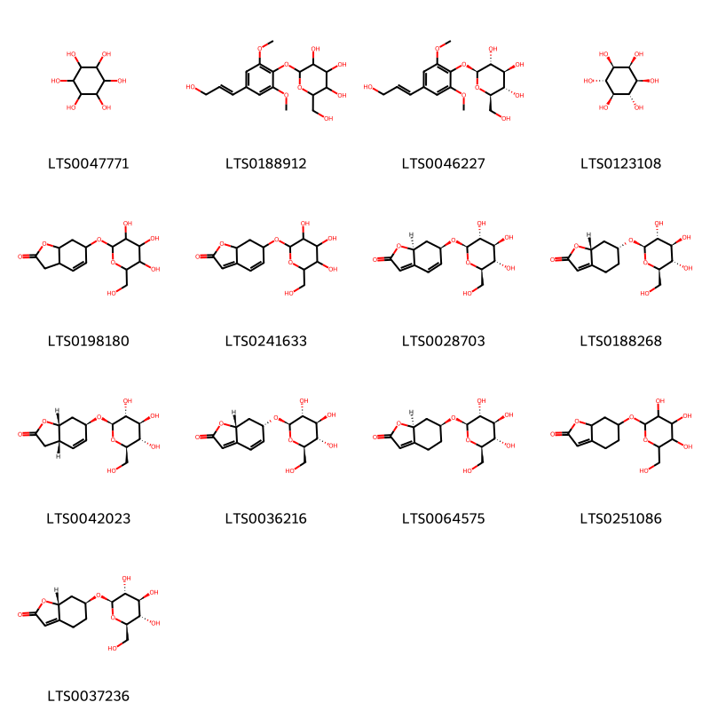{ width=100% }
    <figcaption>Hình ảnh cấu trúc hóa học của 13 hoạt chất thuộc nhóm Organooxygen compounds gồm ['(-)-inositol (LTS0047771)', '2-(hydroxymethyl)-6-[4-(3-hydroxyprop-1-en-1-yl)-2,6-dimethoxyphenoxy]oxane-3,4,5-triol (LTS0188912)', 'syringin (LTS0046227)', '(1r,2r,3s,4r,5s,6s)-cyclohexane-1,2,3,4,5,6-hexol (LTS0123108)', '6-{[3,4,5-trihydroxy-6-(hydroxymethyl)oxan-2-yl]oxy}-3a,6,7,7a-tetrahydro-3h-1-benzofuran-2-one (LTS0198180)', '6-{[3,4,5-trihydroxy-6-(hydroxymethyl)oxan-2-yl]oxy}-7,7a-dihydro-6h-1-benzofuran-2-one (LTS0241633)', '(6r,7as)-6-{[(2r,3r,4s,5s,6r)-3,4,5-trihydroxy-6-(hydroxymethyl)oxan-2-yl]oxy}-7,7a-dihydro-6h-1-benzofuran-2-one (LTS0028703)', '(6r,7ar)-6-{[(2r,3r,4s,5s,6r)-3,4,5-trihydroxy-6-(hydroxymethyl)oxan-2-yl]oxy}-5,6,7,7a-tetrahydro-4h-1-benzofuran-2-one (LTS0188268)', '(3as,6r,7ar)-6-{[(2r,3r,4s,5s,6r)-3,4,5-trihydroxy-6-(hydroxymethyl)oxan-2-yl]oxy}-3a,6,7,7a-tetrahydro-3h-1-benzofuran-2-one (LTS0042023)', '(6s,7ar)-6-{[(2r,3r,4s,5s,6r)-3,4,5-trihydroxy-6-(hydroxymethyl)oxan-2-yl]oxy}-7,7a-dihydro-6h-1-benzofuran-2-one (LTS0036216)', '(6s,7as)-6-{[(2r,3r,4s,5s,6r)-3,4,5-trihydroxy-6-(hydroxymethyl)oxan-2-yl]oxy}-5,6,7,7a-tetrahydro-4h-1-benzofuran-2-one (LTS0064575)', '6-{[3,4,5-trihydroxy-6-(hydroxymethyl)oxan-2-yl]oxy}-5,6,7,7a-tetrahydro-4h-1-benzofuran-2-one (LTS0251086)', '(6s,7ar)-6-{[(2r,3r,4s,5s,6r)-3,4,5-trihydroxy-6-(hydroxymethyl)oxan-2-yl]oxy}-5,6,7,7a-tetrahydro-4h-1-benzofuran-2-one (LTS0037236)'].</figcaption>
</figure>
#### Nhóm Prenol lipids
<figure markdown="span">
    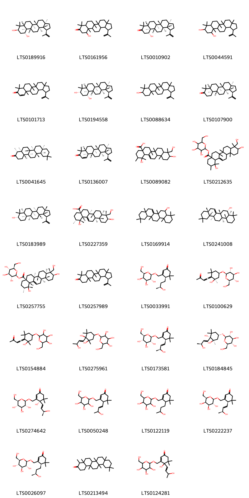{ width=100% }
    <figcaption>Hình ảnh cấu trúc hóa học của 31 hoạt chất thuộc nhóm Prenol lipids gồm ['(1r,3ar,5ar,5br,7as,9r,11r,11ar,11bs,13ar,13br)-3a,5a,5b,8,8,11a-hexamethyl-1-(prop-1-en-2-yl)-hexadecahydrocyclopenta[a]chrysene-9,11-diol (LTS0189916)', '11-hydroxy-3a,5a,5b,8,8,11a-hexamethyl-1-(prop-1-en-2-yl)-tetradecahydro-1h-cyclopenta[a]chrysen-9-one (LTS0161956)', 'glochidonol (LTS0010902)', '3a,5a,5b,8,8,11a-hexamethyl-1-(prop-1-en-2-yl)-hexadecahydrocyclopenta[a]chrysene-9,11-diol (LTS0044591)', '3a,5a,5b,8,8,11a-hexamethyl-1-(prop-1-en-2-yl)-1h,2h,3h,4h,5h,6h,7h,7ah,11bh,12h,13h,13ah,13bh-cyclopenta[a]chrysen-9-one (LTS0101713)', '(1r,3ar,5ar,5br,7as,9s,11r,11ar,11bs,13ar,13br)-3a,5a,5b,8,8,11a-hexamethyl-1-(prop-1-en-2-yl)-hexadecahydrocyclopenta[a]chrysene-9,11-diol (LTS0194558)', 'lupeol (LTS0088634)', 'lupenone (LTS0107900)', '(-)-friedelin (LTS0041645)', 'glochidone (LTS0136007)', '1,10-dihydroxy-9-(hydroxymethyl)-1,2,6a,6b,9,12a-hexamethyl-2,3,4,5,6,7,8,8a,10,11,12,12b,13,14b-tetradecahydropicene-4a-carboxylic acid (LTS0089082)', '3,4,5-trihydroxy-6-(hydroxymethyl)oxan-2-yl 1,10-dihydroxy-9-(hydroxymethyl)-1,2,6a,6b,9,12a-hexamethyl-2,3,4,5,6,7,8,8a,10,11,12,12b,13,14b-tetradecahydropicene-4a-carboxylate (LTS0212635)', '(1r,3as,5as,5br,7as,9s,11ar,11bs,13as,13br)-3a,5a,5b,8,8,11a-hexamethyl-1-(prop-1-en-2-yl)-hexadecahydrocyclopenta[a]chrysen-9-ol (LTS0183989)', 'rotundic acid (LTS0227359)', '4,4,6a,8a,11,11,12b,14b-octamethyl-1,2,3,4a,5,6,8,9,10,12,12a,13,14,14a-tetradecahydropicen-5-ol (LTS0169914)', '(4as,5s,6ar,8ar,12ar,12bs,14ar,14br)-4,4,6a,8a,11,11,12b,14b-octamethyl-1,2,3,4a,5,6,8,9,10,12,12a,13,14,14a-tetradecahydropicen-5-ol (LTS0241008)', '(2s,3r,4s,5s,6r)-3,4,5-trihydroxy-6-(hydroxymethyl)oxan-2-yl (1r,2r,4as,6as,6br,8ar,9r,10s,12ar,12br,14bs)-1,10-dihydroxy-9-(hydroxymethyl)-1,2,6a,6b,9,12a-hexamethyl-2,3,4,5,6,7,8,8a,10,11,12,12b,13,14b-tetradecahydropicene-4a-carboxylate (LTS0257755)', '3a,5a,5b,8,8,11a-hexamethyl-1-(prop-1-en-2-yl)-tetradecahydro-1h-cyclopenta[a]chrysen-9-one (LTS0257989)', '(4r)-4-[(3s)-3-hydroxybutyl]-5,5-dimethyl-3-({[(2r,3r,4s,5r,6r)-3,4,5-trihydroxy-6-(hydroxymethyl)oxan-2-yl]oxy}methyl)cyclohex-2-en-1-one (LTS0033991)', '4-[(2r,4r)-2-hydroxy-2,6,6-trimethyl-4-{[(2r,3r,4s,5s,6r)-3,4,5-trihydroxy-6-(hydroxymethyl)oxan-2-yl]oxy}cyclohexylidene]but-3-en-2-one (LTS0100629)', '4-(2-hydroxy-2,6,6-trimethyl-4-{[3,4,5-trihydroxy-6-(hydroxymethyl)oxan-2-yl]oxy}cyclohexylidene)but-3-en-2-one (LTS0154884)', '2-{[3,4-dihydroxy-4-(3-hydroxybut-1-en-1-yl)-3,5,5-trimethylcyclohexyl]oxy}-6-(hydroxymethyl)oxane-3,4,5-triol (LTS0275961)', '(4r)-4-[(1e,3s)-3-hydroxybut-1-en-1-yl]-5,5-dimethyl-3-({[(2r,3r,4s,5s,6r)-3,4,5-trihydroxy-6-(hydroxymethyl)oxan-2-yl]oxy}methyl)cyclohex-2-en-1-one (LTS0173581)', '(2r,3r,4s,5s,6r)-2-{[(1s,3r,4r)-3,4-dihydroxy-4-[(1e,3s)-3-hydroxybut-1-en-1-yl]-3,5,5-trimethylcyclohexyl]oxy}-6-(hydroxymethyl)oxane-3,4,5-triol (LTS0184845)', '(4s)-4-hydroxy-4-[(1e,3s)-3-hydroxybut-1-en-1-yl]-5,5-dimethyl-3-({[(2r,3r,4s,5s,6r)-3,4,5-trihydroxy-6-(hydroxymethyl)oxan-2-yl]oxy}methyl)cyclohex-2-en-1-one (LTS0274642)', '4-(3-hydroxybut-1-en-1-yl)-5,5-dimethyl-3-({[3,4,5-trihydroxy-6-(hydroxymethyl)oxan-2-yl]oxy}methyl)cyclohex-2-en-1-one (LTS0050248)', '4-(3-hydroxybutyl)-5,5-dimethyl-3-({[3,4,5-trihydroxy-6-(hydroxymethyl)oxan-2-yl]oxy}methyl)cyclohex-2-en-1-one (LTS0122119)', '(4r)-4-[(1e,3s)-3-hydroxybut-1-en-1-yl]-5,5-dimethyl-3-({[(2r,3r,4s,5r,6r)-3,4,5-trihydroxy-6-(hydroxymethyl)oxan-2-yl]oxy}methyl)cyclohex-2-en-1-one (LTS0222237)', '(4r)-4-[(3s)-3-hydroxybutyl]-5,5-dimethyl-3-({[(2r,3r,4s,5s,6r)-3,4,5-trihydroxy-6-(hydroxymethyl)oxan-2-yl]oxy}methyl)cyclohex-2-en-1-one (LTS0026097)', 'friedelin (LTS0213494)', '4-hydroxy-4-(3-hydroxybut-1-en-1-yl)-5,5-dimethyl-3-({[3,4,5-trihydroxy-6-(hydroxymethyl)oxan-2-yl]oxy}methyl)cyclohex-2-en-1-one (LTS0124281)'].</figcaption>
</figure>
#### Nhóm Steroids and steroid derivatives
<figure markdown="span">
    { width=100% }
    <figcaption>Hình ảnh cấu trúc hóa học của 4 hoạt chất thuộc nhóm Steroids and steroid derivatives gồm ['sitosterol (LTS0168132)', 'stigmast-5-en-3-ol, (3β)- (LTS0204616)', 'sitogluside (LTS0201798)', '2-{[1-(5-ethyl-6-methylheptan-2-yl)-9a,11a-dimethyl-1h,2h,3h,3ah,3bh,4h,6h,7h,8h,9h,9bh,10h,11h-cyclopenta[a]phenanthren-7-yl]oxy}-6-(hydroxymethyl)oxane-3,4,5-triol (LTS0158828)'].</figcaption>
</figure>

---

### Dược dân tộc học

Danh sách các quốc gia có sử dụng *Glochidion zeylanicum* trong điều trị các bệnh. 

| Country   | Disease                | Bệnh                                                                                                                                                                                                |
|:----------|:-----------------------|:----------------------------------------------------------------------------------------------------------------------------------------------------------------------------------------------------|
| India     | Refrigerant, Stomachic | MYMEMORY WARNING: YOU USED ALL AVAILABLE FREE TRANSLATIONS FOR TODAY. NEXT AVAILABLE IN  20 HOURS 47 MINUTES 04 SECONDS VISIT HTTPS://MYMEMORY.TRANSLATED.NET/DOC/USAGELIMITS.PHP TO TRANSLATE MORE |

---

# Chi Synadenium

??? note "Danh sách các dược liệu thuộc chi"
    
	 - *Synadenium glauscens?*
	 - *Synadenium grantii*

---
## Synadenium glauscens
### Thông tin về thực vật

!!! info "Phân loại thực vật của *Euphorbia neoglaucescens* từ GIBF:"
    - **Kingdom:** Plantae
    - **Phylum:** Tracheophyta
    - **Order:** Malpighiales
    - **Family:** Euphorbiaceae
    - **Genus:** Euphorbia
    - **Species:** *Euphorbia neoglaucescens*

 

| Label (VI)   | Label (EN)   | Scientific Name       | Descriptions (VI)   | Descriptions (EN)                             | Also Known As (VI)   | Also Known As (EN)   |
|:-------------|:-------------|:----------------------|:--------------------|:----------------------------------------------|:---------------------|:---------------------|
| N/A          | N/A          | Glochidion zeylanicum | loài thực vật       | species of plant in the family Phyllanthaceae | ['']                 | ['']                 |

#### Phân bố trên thế giới

**Từ CSDL GIBF** Malawi, nan, Mozambique, Burundi, Congo, Democratic Republic of the, Kenya, Tanzania, United Republic of

#### Phân bố tại Việt Nam

**Từ CSDL GIBF**: Không có ghi nhận ở Việt Nam

---
### Thành phần hóa học
        
- Theo cơ sở dữ liệu lotus: Từ loài *Euphorbia neoglaucescens* đã phân lập và xác định được Chưa có hoạt chất nào được phân lập. hoạt chất thuộc về các nhóm Không có hoạt chất nào được phân lập. 

Không có hình ảnh nào được tạo ra

---

### Dược dân tộc học

Danh sách các quốc gia có sử dụng *Euphorbia neoglaucescens* trong điều trị các bệnh. 

| Country   | Disease   | Bệnh                                                                                                                                                                                                |
|:----------|:----------|:----------------------------------------------------------------------------------------------------------------------------------------------------------------------------------------------------|
| Kenya     | Piscicide | MYMEMORY WARNING: YOU USED ALL AVAILABLE FREE TRANSLATIONS FOR TODAY. NEXT AVAILABLE IN  20 HOURS 46 MINUTES 16 SECONDS VISIT HTTPS://MYMEMORY.TRANSLATED.NET/DOC/USAGELIMITS.PHP TO TRANSLATE MORE |

---

---
## Synadenium grantii
### Thông tin về thực vật

!!! info "Phân loại thực vật của *Euphorbia umbellata* từ GIBF:"
    - **Kingdom:** Plantae
    - **Phylum:** Tracheophyta
    - **Order:** Malpighiales
    - **Family:** Euphorbiaceae
    - **Genus:** Euphorbia
    - **Species:** *Euphorbia umbellata*

 

| Label (VI)   | Label (EN)   | Scientific Name    | Descriptions (VI)   | Descriptions (EN)   | Also Known As (VI)   | Also Known As (EN)   |
|:-------------|:-------------|:-------------------|:--------------------|:--------------------|:---------------------|:---------------------|
| N/A          | N/A          | Synadenium grantii | loài thực vật       | species of plant    | ['']                 | ['']                 |

#### Phân bố trên thế giới

**Từ CSDL GIBF** nan, Sri Lanka, Cook Islands, Belgium, Guatemala, Rwanda, unknown or invalid, Nicaragua, Bermuda, Tanzania, United Republic of, Netherlands, United States of America, Congo, Democratic Republic of the, Paraguay, El Salvador, Uganda, Brazil, Cuba, Mexico, Costa Rica, Burundi, India, Kenya

#### Phân bố tại Việt Nam

**Từ CSDL GIBF**: Không có ghi nhận ở Việt Nam

---
### Thành phần hóa học
        
- Theo cơ sở dữ liệu lotus: Từ loài *Euphorbia umbellata* đã phân lập và xác định được Chưa có hoạt chất nào được phân lập. hoạt chất thuộc về các nhóm Không có hoạt chất nào được phân lập. 

Không có hình ảnh nào được tạo ra

---

### Dược dân tộc học

Danh sách các quốc gia có sử dụng *Euphorbia umbellata* trong điều trị các bệnh. 

| Country   | Disease   | Bệnh                                                                                                                                                                                                |
|:----------|:----------|:----------------------------------------------------------------------------------------------------------------------------------------------------------------------------------------------------|
| Elsewhere | Poison    | MYMEMORY WARNING: YOU USED ALL AVAILABLE FREE TRANSLATIONS FOR TODAY. NEXT AVAILABLE IN  20 HOURS 45 MINUTES 48 SECONDS VISIT HTTPS://MYMEMORY.TRANSLATED.NET/DOC/USAGELIMITS.PHP TO TRANSLATE MORE |
| Kenya     | Poison    | MYMEMORY WARNING: YOU USED ALL AVAILABLE FREE TRANSLATIONS FOR TODAY. NEXT AVAILABLE IN  20 HOURS 45 MINUTES 45 SECONDS VISIT HTTPS://MYMEMORY.TRANSLATED.NET/DOC/USAGELIMITS.PHP TO TRANSLATE MORE |

---

# Chi Cleidion

??? note "Danh sách các dược liệu thuộc chi"
    
	 - *Cleidion iciflorum*

---
## Cleidion iciflorum
### Thông tin về thực vật

!!! info "Phân loại thực vật của *N/A* từ GIBF:"
    - **Kingdom:** Plantae
    - **Phylum:** Tracheophyta
    - **Order:** Malpighiales
    - **Family:** Euphorbiaceae
    - **Genus:** Cleidion
    - **Species:** *N/A*

 

| Label (VI)   | Label (EN)   | Scientific Name    | Descriptions (VI)   | Descriptions (EN)   | Also Known As (VI)   | Also Known As (EN)   |
|:-------------|:-------------|:-------------------|:--------------------|:--------------------|:---------------------|:---------------------|
| N/A          | N/A          | Synadenium grantii | loài thực vật       | species of plant    | ['']                 | ['']                 |

#### Phân bố trên thế giới

**Từ CSDL GIBF** nan, Palau, Ghana, Australia, Lao People’s Democratic Republic, Myanmar, Panama, Bolivia (Plurinational State of), Papua New Guinea, Timor-Leste, Solomon Islands, Belize, Fiji, Thailand, Brazil, Côte d’Ivoire, New Caledonia, Mexico, Peru, Viet Nam, China, Ecuador, Madagascar, Colombia, Costa Rica, Vanuatu, Indonesia, Cameroon, Malaysia

#### Phân bố tại Việt Nam

**Từ CSDL GIBF**: Nghe An, Phu Tho, Ninh Bình, Ninh Binh

---
### Thành phần hóa học
        
- Theo cơ sở dữ liệu lotus: Từ loài *N/A* đã phân lập và xác định được Chưa có hoạt chất nào được phân lập. hoạt chất thuộc về các nhóm Không có hoạt chất nào được phân lập. 

Không có hình ảnh nào được tạo ra

---

### Dược dân tộc học

Danh sách các quốc gia có sử dụng *N/A* trong điều trị các bệnh. 

| Country     | Disease   | Bệnh                                                                                                                                                                                                |
|:------------|:----------|:----------------------------------------------------------------------------------------------------------------------------------------------------------------------------------------------------|
| Philippines | Poison    | MYMEMORY WARNING: YOU USED ALL AVAILABLE FREE TRANSLATIONS FOR TODAY. NEXT AVAILABLE IN  20 HOURS 45 MINUTES 23 SECONDS VISIT HTTPS://MYMEMORY.TRANSLATED.NET/DOC/USAGELIMITS.PHP TO TRANSLATE MORE |

---

# Chi Homonoia

??? note "Danh sách các dược liệu thuộc chi"
    
	 - *Homonoia riparia*

---
## Homonoia riparia
### Thông tin về thực vật

!!! info "Phân loại thực vật của *Homonoia riparia* từ GIBF:"
    - **Kingdom:** Plantae
    - **Phylum:** Tracheophyta
    - **Order:** Malpighiales
    - **Family:** Euphorbiaceae
    - **Genus:** Homonoia
    - **Species:** *Homonoia riparia*

 

| Label (VI)   | Label (EN)   | Scientific Name   | Descriptions (VI)   | Descriptions (EN)   | Also Known As (VI)   | Also Known As (EN)   |
|:-------------|:-------------|:------------------|:--------------------|:--------------------|:---------------------|:---------------------|
| N/A          | N/A          | Homonoia riparia  |                     | species of plant    | ['']                 | ['']                 |

#### Phân bố trên thế giới

**Từ CSDL GIBF** nan, Sri Lanka, Malaysia, Thailand, Lao People’s Democratic Republic, Cambodia, Chinese Taipei, Myanmar, Bhutan, India, Indonesia, Philippines, Viet Nam, China

#### Phân bố tại Việt Nam

**Từ CSDL GIBF**: Dak Lak, Thanh Hoa, Kontum, Nghe An, Kon Tum, Tỉnh Khánh Hòa, Quảng Bình, Đà Nẵng, Đồng Nai, Ninh Bình, Thừa Thiên - Huế, Phú Yên, Ninh Thuan, Thua Thien-Hue, Hà Tinh, Ha Giang

---
### Thành phần hóa học
        
- Theo cơ sở dữ liệu lotus: Từ loài *Homonoia riparia* đã phân lập và xác định được Chưa có hoạt chất nào được phân lập. hoạt chất thuộc về các nhóm Không có hoạt chất nào được phân lập. 

Không có hình ảnh nào được tạo ra

---

### Dược dân tộc học

Danh sách các quốc gia có sử dụng *Homonoia riparia* trong điều trị các bệnh. 

| Country   | Disease            | Bệnh                                                                                                                                                                                                |
|:----------|:-------------------|:----------------------------------------------------------------------------------------------------------------------------------------------------------------------------------------------------|
| India     | Diuretic, Laxative | MYMEMORY WARNING: YOU USED ALL AVAILABLE FREE TRANSLATIONS FOR TODAY. NEXT AVAILABLE IN  20 HOURS 44 MINUTES 52 SECONDS VISIT HTTPS://MYMEMORY.TRANSLATED.NET/DOC/USAGELIMITS.PHP TO TRANSLATE MORE |

---

# Chi Julocroton

??? note "Danh sách các dược liệu thuộc chi"
    
	 - *Julocroton argenteus*

---
## Julocroton argenteus
### Thông tin về thực vật

!!! info "Phân loại thực vật của *Croton argenteus* từ GIBF:"
    - **Kingdom:** Plantae
    - **Phylum:** Tracheophyta
    - **Order:** Malpighiales
    - **Family:** Euphorbiaceae
    - **Genus:** Croton
    - **Species:** *Croton argenteus*

 

| Label (VI)   | Label (EN)   | Scientific Name      | Descriptions (VI)   | Descriptions (EN)   | Also Known As (VI)   | Also Known As (EN)   |
|:-------------|:-------------|:---------------------|:--------------------|:--------------------|:---------------------|:---------------------|
| N/A          | N/A          | Julocroton argenteus |                     |                     | ['']                 | ['']                 |

#### Phân bố trên thế giới

**Từ CSDL GIBF** nan, Nicaragua, Colombia, Brazil, Guatemala, Bolivia (Plurinational State of), Costa Rica, Argentina, unknown or invalid, Honduras, United States of America, Mexico, Paraguay, El Salvador, Venezuela (Bolivarian Republic of)

#### Phân bố tại Việt Nam

**Từ CSDL GIBF**: Không có ghi nhận ở Việt Nam

---
### Thành phần hóa học
        
- Theo cơ sở dữ liệu lotus: Từ loài *Croton argenteus* đã phân lập và xác định được Chưa có hoạt chất nào được phân lập. hoạt chất thuộc về các nhóm Không có hoạt chất nào được phân lập. 

Không có hình ảnh nào được tạo ra

---

### Dược dân tộc học

Danh sách các quốc gia có sử dụng *Croton argenteus* trong điều trị các bệnh. 

| Country   | Disease   | Bệnh                                                                                                                                                                                                |
|:----------|:----------|:----------------------------------------------------------------------------------------------------------------------------------------------------------------------------------------------------|
| Argentina | Diuretic  | MYMEMORY WARNING: YOU USED ALL AVAILABLE FREE TRANSLATIONS FOR TODAY. NEXT AVAILABLE IN  20 HOURS 44 MINUTES 26 SECONDS VISIT HTTPS://MYMEMORY.TRANSLATED.NET/DOC/USAGELIMITS.PHP TO TRANSLATE MORE |

---

# Chi Pedilanthus

??? note "Danh sách các dược liệu thuộc chi"
    
	 - *Pedilanthus bracteatus*
	 - *Pedilanthus itzaeus*
	 - *Pedilanthus pavonis*
	 - *Pedilanthus tithymaloides*

---
## Pedilanthus bracteatus
### Thông tin về thực vật

!!! info "Phân loại thực vật của *Euphorbia bracteata* từ GIBF:"
    - **Kingdom:** Plantae
    - **Phylum:** Tracheophyta
    - **Order:** Malpighiales
    - **Family:** Euphorbiaceae
    - **Genus:** Euphorbia
    - **Species:** *Euphorbia bracteata*

 

| Label (VI)   | Label (EN)   | Scientific Name        | Descriptions (VI)   | Descriptions (EN)   | Also Known As (VI)   | Also Known As (EN)   |
|:-------------|:-------------|:-----------------------|:--------------------|:--------------------|:---------------------|:---------------------|
| N/A          | N/A          | Pedilanthus bracteatus | loài thực vật       | species of plant    | ['']                 | ['']                 |

#### Phân bố trên thế giới

**Từ CSDL GIBF** nan, unknown or invalid, United States of America, Mexico

#### Phân bố tại Việt Nam

**Từ CSDL GIBF**: Không có ghi nhận ở Việt Nam

---
### Thành phần hóa học
        
- Theo cơ sở dữ liệu lotus: Từ loài *Euphorbia bracteata* đã phân lập và xác định được Chưa có hoạt chất nào được phân lập. hoạt chất thuộc về các nhóm Không có hoạt chất nào được phân lập. 

Không có hình ảnh nào được tạo ra

---

### Dược dân tộc học

Danh sách các quốc gia có sử dụng *Euphorbia bracteata* trong điều trị các bệnh. 

| Country   | Disease   | Bệnh                                                                                                                                                                                                |
|:----------|:----------|:----------------------------------------------------------------------------------------------------------------------------------------------------------------------------------------------------|
| Mexico    | Purgative | MYMEMORY WARNING: YOU USED ALL AVAILABLE FREE TRANSLATIONS FOR TODAY. NEXT AVAILABLE IN  20 HOURS 44 MINUTES 01 SECONDS VISIT HTTPS://MYMEMORY.TRANSLATED.NET/DOC/USAGELIMITS.PHP TO TRANSLATE MORE |

---

---
## Pedilanthus itzaeus
### Thông tin về thực vật

!!! info "Phân loại thực vật của *Euphorbia tithymaloides* từ GIBF:"
    - **Kingdom:** Plantae
    - **Phylum:** Tracheophyta
    - **Order:** Malpighiales
    - **Family:** Euphorbiaceae
    - **Genus:** Euphorbia
    - **Species:** *Euphorbia tithymaloides*

 

| Label (VI)   | Label (EN)   | Scientific Name     | Descriptions (VI)   | Descriptions (EN)   | Also Known As (VI)   | Also Known As (EN)   |
|:-------------|:-------------|:--------------------|:--------------------|:--------------------|:---------------------|:---------------------|
| N/A          | N/A          | Pedilanthus itzaeus |                     |                     | ['']                 | ['']                 |

#### Phân bố trên thế giới

**Từ CSDL GIBF** nan, Mexico

#### Phân bố tại Việt Nam

**Từ CSDL GIBF**: Không có ghi nhận ở Việt Nam

---
### Thành phần hóa học
        
- Theo cơ sở dữ liệu lotus: Từ loài *Euphorbia tithymaloides* đã phân lập và xác định được Chưa có hoạt chất nào được phân lập. hoạt chất thuộc về các nhóm Không có hoạt chất nào được phân lập. 

Không có hình ảnh nào được tạo ra

---

### Dược dân tộc học

Danh sách các quốc gia có sử dụng *Euphorbia tithymaloides* trong điều trị các bệnh. 

| Country   | Disease              | Bệnh                                                                                                                                                                                                |
|:----------|:---------------------|:----------------------------------------------------------------------------------------------------------------------------------------------------------------------------------------------------|
| Mexico    | Purgative, Purgative | MYMEMORY WARNING: YOU USED ALL AVAILABLE FREE TRANSLATIONS FOR TODAY. NEXT AVAILABLE IN  20 HOURS 43 MINUTES 40 SECONDS VISIT HTTPS://MYMEMORY.TRANSLATED.NET/DOC/USAGELIMITS.PHP TO TRANSLATE MORE |

---

---
## Pedilanthus pavonis
### Thông tin về thực vật

!!! info "Phân loại thực vật của *Euphorbia bracteata* từ GIBF:"
    - **Kingdom:** Plantae
    - **Phylum:** Tracheophyta
    - **Order:** Malpighiales
    - **Family:** Euphorbiaceae
    - **Genus:** Euphorbia
    - **Species:** *Euphorbia bracteata*

 

| Label (VI)   | Label (EN)   | Scientific Name     | Descriptions (VI)   | Descriptions (EN)   | Also Known As (VI)   | Also Known As (EN)   |
|:-------------|:-------------|:--------------------|:--------------------|:--------------------|:---------------------|:---------------------|
| N/A          | N/A          | Pedilanthus pavonis |                     | species of plant    | ['']                 | ['']                 |

#### Phân bố trên thế giới

**Từ CSDL GIBF** nan, Mexico

#### Phân bố tại Việt Nam

**Từ CSDL GIBF**: Không có ghi nhận ở Việt Nam

---
### Thành phần hóa học
        
- Theo cơ sở dữ liệu lotus: Từ loài *Euphorbia bracteata* đã phân lập và xác định được Chưa có hoạt chất nào được phân lập. hoạt chất thuộc về các nhóm Không có hoạt chất nào được phân lập. 

Không có hình ảnh nào được tạo ra

---

### Dược dân tộc học

Danh sách các quốc gia có sử dụng *Euphorbia bracteata* trong điều trị các bệnh. 

| Country   | Disease                                                        | Bệnh                                                                                                                                                                                                |
|:----------|:---------------------------------------------------------------|:----------------------------------------------------------------------------------------------------------------------------------------------------------------------------------------------------|
| Mexico    | Emetic, Emmenagogue, Emmenagogue, Purgative, Purgative, Emetic | MYMEMORY WARNING: YOU USED ALL AVAILABLE FREE TRANSLATIONS FOR TODAY. NEXT AVAILABLE IN  20 HOURS 43 MINUTES 19 SECONDS VISIT HTTPS://MYMEMORY.TRANSLATED.NET/DOC/USAGELIMITS.PHP TO TRANSLATE MORE |

---

---
## Pedilanthus tithymaloides
### Thông tin về thực vật

!!! info "Phân loại thực vật của *Euphorbia tithymaloides* từ GIBF:"
    - **Kingdom:** Plantae
    - **Phylum:** Tracheophyta
    - **Order:** Malpighiales
    - **Family:** Euphorbiaceae
    - **Genus:** Euphorbia
    - **Species:** *Euphorbia tithymaloides*

 

| Label (VI)   | Label (EN)   | Scientific Name           | Descriptions (VI)   | Descriptions (EN)   | Also Known As (VI)   | Also Known As (EN)   |
|:-------------|:-------------|:--------------------------|:--------------------|:--------------------|:---------------------|:---------------------|
| N/A          | N/A          | Pedilanthus tithymaloides | loài thực vật       | species of plant    | ['']                 | ['']                 |

#### Phân bố trên thế giới

**Từ CSDL GIBF** French Southern Territories, Japan, Guadeloupe, Cook Islands, Cambodia, Guatemala, Benin, Venezuela (Bolivarian Republic of), Réunion, Senegal, Nigeria, Chinese Taipei, Papua New Guinea, Honduras, Jamaica, United States of America, El Salvador, Belize, Saint Martin (French part), South Africa, Sao Tome and Principe, Thailand, United States Minor Outlying Islands, Saint Barthélemy, Brazil, Bahamas, Guyana, Cuba, Mexico, France, Peru, Viet Nam, China, Curaçao, Equatorial Guinea, Colombia, Costa Rica, India, Philippines, Cameroon, Malaysia

#### Phân bố tại Việt Nam

**Từ CSDL GIBF**: Ninh Thuan

---
### Thành phần hóa học
        
- Theo cơ sở dữ liệu lotus: Từ loài *Euphorbia tithymaloides* đã phân lập và xác định được Chưa có hoạt chất nào được phân lập. hoạt chất thuộc về các nhóm Không có hoạt chất nào được phân lập. 

Không có hình ảnh nào được tạo ra

---

### Dược dân tộc học

Danh sách các quốc gia có sử dụng *Euphorbia tithymaloides* trong điều trị các bệnh. 

| Country       | Disease             | Bệnh                                                                                                                                                                                                |
|:--------------|:--------------------|:----------------------------------------------------------------------------------------------------------------------------------------------------------------------------------------------------|
| Elsewhere     | Emmenagogue         | MYMEMORY WARNING: YOU USED ALL AVAILABLE FREE TRANSLATIONS FOR TODAY. NEXT AVAILABLE IN  20 HOURS 43 MINUTES 01 SECONDS VISIT HTTPS://MYMEMORY.TRANSLATED.NET/DOC/USAGELIMITS.PHP TO TRANSLATE MORE |
| Guatemala     | Poison              | MYMEMORY WARNING: YOU USED ALL AVAILABLE FREE TRANSLATIONS FOR TODAY. NEXT AVAILABLE IN  20 HOURS 42 MINUTES 58 SECONDS VISIT HTTPS://MYMEMORY.TRANSLATED.NET/DOC/USAGELIMITS.PHP TO TRANSLATE MORE |
| Latin America | Poison              | MYMEMORY WARNING: YOU USED ALL AVAILABLE FREE TRANSLATIONS FOR TODAY. NEXT AVAILABLE IN  20 HOURS 42 MINUTES 55 SECONDS VISIT HTTPS://MYMEMORY.TRANSLATED.NET/DOC/USAGELIMITS.PHP TO TRANSLATE MORE |
| Mexico        | Emetic, Poison      | MYMEMORY WARNING: YOU USED ALL AVAILABLE FREE TRANSLATIONS FOR TODAY. NEXT AVAILABLE IN  20 HOURS 42 MINUTES 52 SECONDS VISIT HTTPS://MYMEMORY.TRANSLATED.NET/DOC/USAGELIMITS.PHP TO TRANSLATE MORE |
| Venezuela     | Emmenagogue, Emetic | MYMEMORY WARNING: YOU USED ALL AVAILABLE FREE TRANSLATIONS FOR TODAY. NEXT AVAILABLE IN  20 HOURS 42 MINUTES 49 SECONDS VISIT HTTPS://MYMEMORY.TRANSLATED.NET/DOC/USAGELIMITS.PHP TO TRANSLATE MORE |
| West Indies   | Emetic              | MYMEMORY WARNING: YOU USED ALL AVAILABLE FREE TRANSLATIONS FOR TODAY. NEXT AVAILABLE IN  20 HOURS 42 MINUTES 46 SECONDS VISIT HTTPS://MYMEMORY.TRANSLATED.NET/DOC/USAGELIMITS.PHP TO TRANSLATE MORE |

---

# Chi Andrachne

??? note "Danh sách các dược liệu thuộc chi"
    
	 - *Andrachne aera*
	 - *Andrachne cordifolia*

---
## Andrachne aera
### Thông tin về thực vật

!!! info "Phân loại thực vật của *N/A* từ GIBF:"
    - **Kingdom:** Plantae
    - **Phylum:** Tracheophyta
    - **Order:** Malpighiales
    - **Family:** Phyllanthaceae
    - **Genus:** Andrachne
    - **Species:** *N/A*

 

| Label (VI)   | Label (EN)   | Scientific Name           | Descriptions (VI)   | Descriptions (EN)   | Also Known As (VI)   | Also Known As (EN)   |
|:-------------|:-------------|:--------------------------|:--------------------|:--------------------|:---------------------|:---------------------|
| N/A          | N/A          | Pedilanthus tithymaloides | loài thực vật       | species of plant    | ['']                 | ['']                 |

#### Phân bố trên thế giới

**Từ CSDL GIBF** Italy, Somalia, Palestine, State of, Israel, Ukraine, Tajikistan, Cyprus, Kyrgyzstan, Spain, Türkiye, Russian Federation, Kazakhstan, Croatia, Greece, Saudi Arabia, Uzbekistan, Iran (Islamic Republic of), Mexico, France, Peru, Cabo Verde, Iraq, Western Sahara, Lebanon

#### Phân bố tại Việt Nam

**Từ CSDL GIBF**: Không có ghi nhận ở Việt Nam

---
### Thành phần hóa học
        
- Theo cơ sở dữ liệu lotus: Từ loài *N/A* đã phân lập và xác định được Chưa có hoạt chất nào được phân lập. hoạt chất thuộc về các nhóm Không có hoạt chất nào được phân lập. 

Không có hình ảnh nào được tạo ra

---

### Dược dân tộc học

Danh sách các quốc gia có sử dụng *N/A* trong điều trị các bệnh. 

| Country   | Disease             | Bệnh                                                                                                                                                                                                |
|:----------|:--------------------|:----------------------------------------------------------------------------------------------------------------------------------------------------------------------------------------------------|
| Iraq      | Poison, Insecticide | MYMEMORY WARNING: YOU USED ALL AVAILABLE FREE TRANSLATIONS FOR TODAY. NEXT AVAILABLE IN  20 HOURS 42 MINUTES 13 SECONDS VISIT HTTPS://MYMEMORY.TRANSLATED.NET/DOC/USAGELIMITS.PHP TO TRANSLATE MORE |

---

---
## Andrachne cordifolia
### Thông tin về thực vật

!!! info "Phân loại thực vật của *N/A* từ GIBF:"
    - **Kingdom:** Plantae
    - **Phylum:** Tracheophyta
    - **Order:** Malpighiales
    - **Family:** Phyllanthaceae
    - **Genus:** Leptopus
    - **Species:** *N/A*

 

| Label (VI)   | Label (EN)   | Scientific Name      | Descriptions (VI)   | Descriptions (EN)   | Also Known As (VI)   | Also Known As (EN)   |
|:-------------|:-------------|:---------------------|:--------------------|:--------------------|:---------------------|:---------------------|
| N/A          | N/A          | Andrachne cordifolia |                     |                     | ['']                 | ['']                 |

#### Phân bố trên thế giới

**Từ CSDL GIBF** nan, Pakistan, Australia, Germany, Belgium, Thailand, Georgia, Russian Federation, United States of America, Viet Nam, Malaysia, China, Nepal

#### Phân bố tại Việt Nam

**Từ CSDL GIBF**: Không có ghi nhận ở Việt Nam

---
### Thành phần hóa học
        
- Theo cơ sở dữ liệu lotus: Từ loài *N/A* đã phân lập và xác định được Chưa có hoạt chất nào được phân lập. hoạt chất thuộc về các nhóm Không có hoạt chất nào được phân lập. 

Không có hình ảnh nào được tạo ra

---

### Dược dân tộc học

Danh sách các quốc gia có sử dụng *N/A* trong điều trị các bệnh. 

| Country   | Disease   | Bệnh                                                                                                                                                                                                |
|:----------|:----------|:----------------------------------------------------------------------------------------------------------------------------------------------------------------------------------------------------|
| Elsewhere | Poison    | MYMEMORY WARNING: YOU USED ALL AVAILABLE FREE TRANSLATIONS FOR TODAY. NEXT AVAILABLE IN  20 HOURS 41 MINUTES 47 SECONDS VISIT HTTPS://MYMEMORY.TRANSLATED.NET/DOC/USAGELIMITS.PHP TO TRANSLATE MORE |

---

# Chi Clutia

??? note "Danh sách các dược liệu thuộc chi"
    
	 - *Clutia hirsuta*
	 - *Clutia pulchella*
	 - *Clutia similis*

---
## Clutia hirsuta
### Thông tin về thực vật

!!! info "Phân loại thực vật của *Clutia hirsuta* từ GIBF:"
    - **Kingdom:** Plantae
    - **Phylum:** Tracheophyta
    - **Order:** Malpighiales
    - **Family:** Peraceae
    - **Genus:** Clutia
    - **Species:** *Clutia hirsuta*

 

| Label (VI)   | Label (EN)   | Scientific Name   | Descriptions (VI)   | Descriptions (EN)   | Also Known As (VI)   | Also Known As (EN)   |
|:-------------|:-------------|:------------------|:--------------------|:--------------------|:---------------------|:---------------------|
| N/A          | N/A          | Clutia hirsuta    | loài thực vật       | species of plant    | ['']                 | ['Lightning Bush']   |

#### Phân bố trên thế giới

**Từ CSDL GIBF** nan, South Africa, Mozambique, Lesotho, unknown or invalid, Zimbabwe

#### Phân bố tại Việt Nam

**Từ CSDL GIBF**: Không có ghi nhận ở Việt Nam

---
### Thành phần hóa học
        
- Theo cơ sở dữ liệu lotus: Từ loài *Clutia hirsuta* đã phân lập và xác định được Chưa có hoạt chất nào được phân lập. hoạt chất thuộc về các nhóm Không có hoạt chất nào được phân lập. 

Không có hình ảnh nào được tạo ra

---

### Dược dân tộc học

Danh sách các quốc gia có sử dụng *Clutia hirsuta* trong điều trị các bệnh. 

| Country   | Disease   | Bệnh                                                                                                                                                                                                |
|:----------|:----------|:----------------------------------------------------------------------------------------------------------------------------------------------------------------------------------------------------|
| Africa    | Stomachic | MYMEMORY WARNING: YOU USED ALL AVAILABLE FREE TRANSLATIONS FOR TODAY. NEXT AVAILABLE IN  20 HOURS 41 MINUTES 23 SECONDS VISIT HTTPS://MYMEMORY.TRANSLATED.NET/DOC/USAGELIMITS.PHP TO TRANSLATE MORE |

---

---
## Clutia pulchella
### Thông tin về thực vật

!!! info "Phân loại thực vật của *Clutia pulchella* từ GIBF:"
    - **Kingdom:** Plantae
    - **Phylum:** Tracheophyta
    - **Order:** Malpighiales
    - **Family:** Peraceae
    - **Genus:** Clutia
    - **Species:** *Clutia pulchella*

 

| Label (VI)   | Label (EN)   | Scientific Name   | Descriptions (VI)   | Descriptions (EN)   | Also Known As (VI)   | Also Known As (EN)                                                          |
|:-------------|:-------------|:------------------|:--------------------|:--------------------|:---------------------|:----------------------------------------------------------------------------|
| N/A          | N/A          | Clutia pulchella  | loài thực vật       | species of plant    | ['']                 | ['common lightning bush', 'lightning bush', 'warty-fruited lightning bush'] |

#### Phân bố trên thế giới

**Từ CSDL GIBF** South Africa, Eswatini

#### Phân bố tại Việt Nam

**Từ CSDL GIBF**: Không có ghi nhận ở Việt Nam

---
### Thành phần hóa học
        
- Theo cơ sở dữ liệu lotus: Từ loài *Clutia pulchella* đã phân lập và xác định được Chưa có hoạt chất nào được phân lập. hoạt chất thuộc về các nhóm Không có hoạt chất nào được phân lập. 

Không có hình ảnh nào được tạo ra

---

### Dược dân tộc học

Danh sách các quốc gia có sử dụng *Clutia pulchella* trong điều trị các bệnh. 

| Country   | Disease   | Bệnh                                                                                                                                                                                                |
|:----------|:----------|:----------------------------------------------------------------------------------------------------------------------------------------------------------------------------------------------------|
| Lesotho   | Rennet    | MYMEMORY WARNING: YOU USED ALL AVAILABLE FREE TRANSLATIONS FOR TODAY. NEXT AVAILABLE IN  20 HOURS 40 MINUTES 56 SECONDS VISIT HTTPS://MYMEMORY.TRANSLATED.NET/DOC/USAGELIMITS.PHP TO TRANSLATE MORE |

---

---
## Clutia similis
### Thông tin về thực vật

!!! info "Phân loại thực vật của *Clutia heterophylla* từ GIBF:"
    - **Kingdom:** Plantae
    - **Phylum:** Tracheophyta
    - **Order:** Malpighiales
    - **Family:** Peraceae
    - **Genus:** Clutia
    - **Species:** *Clutia heterophylla*

 

| Label (VI)   | Label (EN)   | Scientific Name   | Descriptions (VI)   | Descriptions (EN)   | Also Known As (VI)   | Also Known As (EN)   |
|:-------------|:-------------|:------------------|:--------------------|:--------------------|:---------------------|:---------------------|
| N/A          | N/A          | Clutia similis    |                     |                     | ['']                 | ['']                 |

#### Phân bố trên thế giới

**Từ CSDL GIBF** nan, South Africa

#### Phân bố tại Việt Nam

**Từ CSDL GIBF**: Không có ghi nhận ở Việt Nam

---
### Thành phần hóa học
        
- Theo cơ sở dữ liệu lotus: Từ loài *Clutia heterophylla* đã phân lập và xác định được Chưa có hoạt chất nào được phân lập. hoạt chất thuộc về các nhóm Không có hoạt chất nào được phân lập. 

Không có hình ảnh nào được tạo ra

---

### Dược dân tộc học

Danh sách các quốc gia có sử dụng *Clutia heterophylla* trong điều trị các bệnh. 

| Country   | Disease   | Bệnh                                                                                                                                                                                                |
|:----------|:----------|:----------------------------------------------------------------------------------------------------------------------------------------------------------------------------------------------------|
| Africa    | Antidote  | MYMEMORY WARNING: YOU USED ALL AVAILABLE FREE TRANSLATIONS FOR TODAY. NEXT AVAILABLE IN  20 HOURS 40 MINUTES 28 SECONDS VISIT HTTPS://MYMEMORY.TRANSLATED.NET/DOC/USAGELIMITS.PHP TO TRANSLATE MORE |

---

# Chi Sapium

??? note "Danh sách các dược liệu thuộc chi"
    
	 - *Sapium appendiculatum*
	 - *Sapium biloculare*
	 - *Sapium grahami*
	 - *Sapium indicum*
	 - *Sapium lateriflorum*
	 - *Sapium sebiferum*

---
## Sapium appendiculatum
### Thông tin về thực vật

!!! info "Phân loại thực vật của *Sapium appendiculatum* từ GIBF:"
    - **Kingdom:** Plantae
    - **Phylum:** Tracheophyta
    - **Order:** Malpighiales
    - **Family:** Euphorbiaceae
    - **Genus:** Sapium
    - **Species:** *Sapium appendiculatum*

 

| Label (VI)   | Label (EN)   | Scientific Name       | Descriptions (VI)   | Descriptions (EN)   | Also Known As (VI)   | Also Known As (EN)   |
|:-------------|:-------------|:----------------------|:--------------------|:--------------------|:---------------------|:---------------------|
| N/A          | N/A          | Sapium appendiculatum |                     |                     | ['']                 | ['']                 |

#### Phân bố trên thế giới

**Từ CSDL GIBF** nan, Mexico

#### Phân bố tại Việt Nam

**Từ CSDL GIBF**: Không có ghi nhận ở Việt Nam

---
### Thành phần hóa học
        
- Theo cơ sở dữ liệu lotus: Từ loài *Sapium appendiculatum* đã phân lập và xác định được Chưa có hoạt chất nào được phân lập. hoạt chất thuộc về các nhóm Không có hoạt chất nào được phân lập. 

Không có hình ảnh nào được tạo ra

---

### Dược dân tộc học

Danh sách các quốc gia có sử dụng *Sapium appendiculatum* trong điều trị các bệnh. 

| Country   | Disease           | Bệnh                                                                                                                                                                                                |
|:----------|:------------------|:----------------------------------------------------------------------------------------------------------------------------------------------------------------------------------------------------|
| Mexico    | Poison, Piscicide | MYMEMORY WARNING: YOU USED ALL AVAILABLE FREE TRANSLATIONS FOR TODAY. NEXT AVAILABLE IN  20 HOURS 40 MINUTES 10 SECONDS VISIT HTTPS://MYMEMORY.TRANSLATED.NET/DOC/USAGELIMITS.PHP TO TRANSLATE MORE |

---

---
## Sapium biloculare
### Thông tin về thực vật

!!! info "Phân loại thực vật của *Pleradenophora bilocularis* từ GIBF:"
    - **Kingdom:** Plantae
    - **Phylum:** Tracheophyta
    - **Order:** Malpighiales
    - **Family:** Euphorbiaceae
    - **Genus:** Pleradenophora
    - **Species:** *Pleradenophora bilocularis*

 

| Label (VI)   | Label (EN)   | Scientific Name   | Descriptions (VI)   | Descriptions (EN)   | Also Known As (VI)   | Also Known As (EN)   |
|:-------------|:-------------|:------------------|:--------------------|:--------------------|:---------------------|:---------------------|
| N/A          | N/A          | Sapium biloculare |                     | species of plant    | ['']                 | ['']                 |

#### Phân bố trên thế giới

**Từ CSDL GIBF** United States of America, Mexico

#### Phân bố tại Việt Nam

**Từ CSDL GIBF**: Không có ghi nhận ở Việt Nam

---
### Thành phần hóa học
        
- Theo cơ sở dữ liệu lotus: Từ loài *Pleradenophora bilocularis* đã phân lập và xác định được Chưa có hoạt chất nào được phân lập. hoạt chất thuộc về các nhóm Không có hoạt chất nào được phân lập. 

Không có hình ảnh nào được tạo ra

---

### Dược dân tộc học

Danh sách các quốc gia có sử dụng *Pleradenophora bilocularis* trong điều trị các bệnh. 

| Country   | Disease                      | Bệnh                                                                                                                                                                                                |
|:----------|:-----------------------------|:----------------------------------------------------------------------------------------------------------------------------------------------------------------------------------------------------|
| Mexico    | Piscicide, Piscicide, Poison | MYMEMORY WARNING: YOU USED ALL AVAILABLE FREE TRANSLATIONS FOR TODAY. NEXT AVAILABLE IN  20 HOURS 39 MINUTES 46 SECONDS VISIT HTTPS://MYMEMORY.TRANSLATED.NET/DOC/USAGELIMITS.PHP TO TRANSLATE MORE |

---

---
## Sapium grahami
### Thông tin về thực vật

!!! info "Phân loại thực vật của *Excoecaria grahamii* từ GIBF:"
    - **Kingdom:** Plantae
    - **Phylum:** Tracheophyta
    - **Order:** Malpighiales
    - **Family:** Euphorbiaceae
    - **Genus:** Excoecaria
    - **Species:** *Excoecaria grahamii*

 

| Label (VI)   | Label (EN)   | Scientific Name   | Descriptions (VI)   | Descriptions (EN)   | Also Known As (VI)   | Also Known As (EN)   |
|:-------------|:-------------|:------------------|:--------------------|:--------------------|:---------------------|:---------------------|
| N/A          | N/A          | Sapium biloculare |                     | species of plant    | ['']                 | ['']                 |

#### Phân bố trên thế giới

**Từ CSDL GIBF** Ghana, Côte d’Ivoire, Benin, Burkina Faso, Togo

#### Phân bố tại Việt Nam

**Từ CSDL GIBF**: Không có ghi nhận ở Việt Nam

---
### Thành phần hóa học
        
- Theo cơ sở dữ liệu lotus: Từ loài *Excoecaria grahamii* đã phân lập và xác định được Chưa có hoạt chất nào được phân lập. hoạt chất thuộc về các nhóm Không có hoạt chất nào được phân lập. 

Không có hình ảnh nào được tạo ra

---

### Dược dân tộc học

Danh sách các quốc gia có sử dụng *Excoecaria grahamii* trong điều trị các bệnh. 

| Country   | Disease   | Bệnh                                                                                                                                                                                                |
|:----------|:----------|:----------------------------------------------------------------------------------------------------------------------------------------------------------------------------------------------------|
| Africa    | Cosmetic  | MYMEMORY WARNING: YOU USED ALL AVAILABLE FREE TRANSLATIONS FOR TODAY. NEXT AVAILABLE IN  20 HOURS 39 MINUTES 20 SECONDS VISIT HTTPS://MYMEMORY.TRANSLATED.NET/DOC/USAGELIMITS.PHP TO TRANSLATE MORE |

---

---
## Sapium indicum
### Thông tin về thực vật

!!! info "Phân loại thực vật của *Shirakiopsis indica* từ GIBF:"
    - **Kingdom:** Plantae
    - **Phylum:** Tracheophyta
    - **Order:** Malpighiales
    - **Family:** Euphorbiaceae
    - **Genus:** Shirakiopsis
    - **Species:** *Shirakiopsis indica*

 

| Label (VI)   | Label (EN)   | Scientific Name   | Descriptions (VI)   | Descriptions (EN)   | Also Known As (VI)   | Also Known As (EN)   |
|:-------------|:-------------|:------------------|:--------------------|:--------------------|:---------------------|:---------------------|
| N/A          | N/A          | Sapium indicum    | loài thực vật       | species of plant    | ['']                 | ['']                 |

#### Phân bố trên thế giới

**Từ CSDL GIBF** nan, Palau, Sri Lanka, Thailand, Myanmar, Papua New Guinea, India, Indonesia, Bangladesh, unknown or invalid, Viet Nam, Solomon Islands, Malaysia, Singapore

#### Phân bố tại Việt Nam

**Từ CSDL GIBF**: Không có ghi nhận ở Việt Nam

---
### Thành phần hóa học
        
- Theo cơ sở dữ liệu lotus: Từ loài *Shirakiopsis indica* đã phân lập và xác định được Chưa có hoạt chất nào được phân lập. hoạt chất thuộc về các nhóm Không có hoạt chất nào được phân lập. 

Không có hình ảnh nào được tạo ra

---

### Dược dân tộc học

Danh sách các quốc gia có sử dụng *Shirakiopsis indica* trong điều trị các bệnh. 

| Country    | Disease                             | Bệnh                                                                                                                                                                                                |
|:-----------|:------------------------------------|:----------------------------------------------------------------------------------------------------------------------------------------------------------------------------------------------------|
| Elsewhere  | Poison, Vesicant, Emetic, Purgative | MYMEMORY WARNING: YOU USED ALL AVAILABLE FREE TRANSLATIONS FOR TODAY. NEXT AVAILABLE IN  20 HOURS 38 MINUTES 57 SECONDS VISIT HTTPS://MYMEMORY.TRANSLATED.NET/DOC/USAGELIMITS.PHP TO TRANSLATE MORE |
| Malaya     | Piscicide                           | MYMEMORY WARNING: YOU USED ALL AVAILABLE FREE TRANSLATIONS FOR TODAY. NEXT AVAILABLE IN  20 HOURS 38 MINUTES 54 SECONDS VISIT HTTPS://MYMEMORY.TRANSLATED.NET/DOC/USAGELIMITS.PHP TO TRANSLATE MORE |
| Malaysia   | Piscicide                           | MYMEMORY WARNING: YOU USED ALL AVAILABLE FREE TRANSLATIONS FOR TODAY. NEXT AVAILABLE IN  20 HOURS 38 MINUTES 51 SECONDS VISIT HTTPS://MYMEMORY.TRANSLATED.NET/DOC/USAGELIMITS.PHP TO TRANSLATE MORE |
| New Guinea | Piscicide                           | MYMEMORY WARNING: YOU USED ALL AVAILABLE FREE TRANSLATIONS FOR TODAY. NEXT AVAILABLE IN  20 HOURS 38 MINUTES 48 SECONDS VISIT HTTPS://MYMEMORY.TRANSLATED.NET/DOC/USAGELIMITS.PHP TO TRANSLATE MORE |

---

---
## Sapium lateriflorum
### Thông tin về thực vật

!!! info "Phân loại thực vật của *Sapium lateriflorum* từ GIBF:"
    - **Kingdom:** Plantae
    - **Phylum:** Tracheophyta
    - **Order:** Malpighiales
    - **Family:** Euphorbiaceae
    - **Genus:** Sapium
    - **Species:** *Sapium lateriflorum*

 

| Label (VI)   | Label (EN)   | Scientific Name     | Descriptions (VI)   | Descriptions (EN)   | Also Known As (VI)   | Also Known As (EN)   |
|:-------------|:-------------|:--------------------|:--------------------|:--------------------|:---------------------|:---------------------|
| N/A          | N/A          | Sapium lateriflorum | loài thực vật       | species of plant    | ['']                 | ['']                 |

#### Phân bố trên thế giới

**Từ CSDL GIBF** Belize, nan, Guatemala, Honduras, Nicaragua, Mexico

#### Phân bố tại Việt Nam

**Từ CSDL GIBF**: Không có ghi nhận ở Việt Nam

---
### Thành phần hóa học
        
- Theo cơ sở dữ liệu lotus: Từ loài *Sapium lateriflorum* đã phân lập và xác định được Chưa có hoạt chất nào được phân lập. hoạt chất thuộc về các nhóm Không có hoạt chất nào được phân lập. 

Không có hình ảnh nào được tạo ra

---

### Dược dân tộc học

Danh sách các quốc gia có sử dụng *Sapium lateriflorum* trong điều trị các bệnh. 

| Country   | Disease                     | Bệnh                                                                                                                                                                                                |
|:----------|:----------------------------|:----------------------------------------------------------------------------------------------------------------------------------------------------------------------------------------------------|
| Guatemala | Piscicide, Poison, Vesicant | MYMEMORY WARNING: YOU USED ALL AVAILABLE FREE TRANSLATIONS FOR TODAY. NEXT AVAILABLE IN  20 HOURS 38 MINUTES 27 SECONDS VISIT HTTPS://MYMEMORY.TRANSLATED.NET/DOC/USAGELIMITS.PHP TO TRANSLATE MORE |
| Mexico    | Poison                      | MYMEMORY WARNING: YOU USED ALL AVAILABLE FREE TRANSLATIONS FOR TODAY. NEXT AVAILABLE IN  20 HOURS 38 MINUTES 23 SECONDS VISIT HTTPS://MYMEMORY.TRANSLATED.NET/DOC/USAGELIMITS.PHP TO TRANSLATE MORE |

---

---
## Sapium sebiferum
### Thông tin về thực vật

!!! info "Phân loại thực vật của *Triadica sebifera* từ GIBF:"
    - **Kingdom:** Plantae
    - **Phylum:** Tracheophyta
    - **Order:** Malpighiales
    - **Family:** Euphorbiaceae
    - **Genus:** Triadica
    - **Species:** *Triadica sebifera*

 

| Label (VI)   | Label (EN)   | Scientific Name   | Descriptions (VI)   | Descriptions (EN)   | Also Known As (VI)   | Also Known As (EN)   |
|:-------------|:-------------|:------------------|:--------------------|:--------------------|:---------------------|:---------------------|
| N/A          | N/A          | Sapium sebiferum  | loài thực vật       | species of plant    | ['']                 | ['']                 |

#### Phân bố trên thế giới

**Từ CSDL GIBF** Japan, Chinese Taipei, Honduras, United States of America, Mexico, China

#### Phân bố tại Việt Nam

**Từ CSDL GIBF**: Không có ghi nhận ở Việt Nam

---
### Thành phần hóa học
        
- Theo cơ sở dữ liệu lotus: Từ loài *Triadica sebifera* đã phân lập và xác định được Chưa có hoạt chất nào được phân lập. hoạt chất thuộc về các nhóm Không có hoạt chất nào được phân lập. 

Không có hình ảnh nào được tạo ra

---

### Dược dân tộc học

Danh sách các quốc gia có sử dụng *Triadica sebifera* trong điều trị các bệnh. 

| Country   | Disease                                       | Bệnh                                                                                                                                                                                                |
|:----------|:----------------------------------------------|:----------------------------------------------------------------------------------------------------------------------------------------------------------------------------------------------------|
| Asia      | Soap                                          | MYMEMORY WARNING: YOU USED ALL AVAILABLE FREE TRANSLATIONS FOR TODAY. NEXT AVAILABLE IN  20 HOURS 37 MINUTES 56 SECONDS VISIT HTTPS://MYMEMORY.TRANSLATED.NET/DOC/USAGELIMITS.PHP TO TRANSLATE MORE |
| China     | Laxative, Suppurative, Vulnerary, Alexiteric  | MYMEMORY WARNING: YOU USED ALL AVAILABLE FREE TRANSLATIONS FOR TODAY. NEXT AVAILABLE IN  20 HOURS 37 MINUTES 54 SECONDS VISIT HTTPS://MYMEMORY.TRANSLATED.NET/DOC/USAGELIMITS.PHP TO TRANSLATE MORE |
| Dutch     | Purgative                                     | MYMEMORY WARNING: YOU USED ALL AVAILABLE FREE TRANSLATIONS FOR TODAY. NEXT AVAILABLE IN  20 HOURS 37 MINUTES 50 SECONDS VISIT HTTPS://MYMEMORY.TRANSLATED.NET/DOC/USAGELIMITS.PHP TO TRANSLATE MORE |
| Elsewhere | Emetic, Purgative, Tonic, Vesicant, Vulnerary | MYMEMORY WARNING: YOU USED ALL AVAILABLE FREE TRANSLATIONS FOR TODAY. NEXT AVAILABLE IN  20 HOURS 37 MINUTES 47 SECONDS VISIT HTTPS://MYMEMORY.TRANSLATED.NET/DOC/USAGELIMITS.PHP TO TRANSLATE MORE |
| English   | Emetic                                        | MYMEMORY WARNING: YOU USED ALL AVAILABLE FREE TRANSLATIONS FOR TODAY. NEXT AVAILABLE IN  20 HOURS 37 MINUTES 45 SECONDS VISIT HTTPS://MYMEMORY.TRANSLATED.NET/DOC/USAGELIMITS.PHP TO TRANSLATE MORE |
| French    | Antidote                                      | MYMEMORY WARNING: YOU USED ALL AVAILABLE FREE TRANSLATIONS FOR TODAY. NEXT AVAILABLE IN  20 HOURS 37 MINUTES 42 SECONDS VISIT HTTPS://MYMEMORY.TRANSLATED.NET/DOC/USAGELIMITS.PHP TO TRANSLATE MORE |
| Hainan    | Purgative                                     | MYMEMORY WARNING: YOU USED ALL AVAILABLE FREE TRANSLATIONS FOR TODAY. NEXT AVAILABLE IN  20 HOURS 37 MINUTES 38 SECONDS VISIT HTTPS://MYMEMORY.TRANSLATED.NET/DOC/USAGELIMITS.PHP TO TRANSLATE MORE |

---

# Chi Macaranga

??? note "Danh sách các dược liệu thuộc chi"
    
	 - *Macaranga gigantea*
	 - *Macaranga grandifolia*
	 - *Macaranga harveyana*
	 - *Macaranga hypoleuca*
	 - *Macaranga major*
	 - *Macaranga tanarius*

---
## Macaranga gigantea
### Thông tin về thực vật

!!! info "Phân loại thực vật của *Macaranga gigantea* từ GIBF:"
    - **Kingdom:** Plantae
    - **Phylum:** Tracheophyta
    - **Order:** Malpighiales
    - **Family:** Euphorbiaceae
    - **Genus:** Macaranga
    - **Species:** *Macaranga gigantea*

 

| Label (VI)   | Label (EN)   | Scientific Name    | Descriptions (VI)   | Descriptions (EN)   | Also Known As (VI)   | Also Known As (EN)   |
|:-------------|:-------------|:-------------------|:--------------------|:--------------------|:---------------------|:---------------------|
| N/A          | N/A          | Macaranga gigantea | loài thực vật       | species of plant    | ['']                 | ['']                 |

#### Phân bố trên thế giới

**Từ CSDL GIBF** Thailand, Lao People’s Democratic Republic, Myanmar, Indonesia, Singapore, Malaysia, Brunei Darussalam

#### Phân bố tại Việt Nam

**Từ CSDL GIBF**: Không có ghi nhận ở Việt Nam

---
### Thành phần hóa học
        
- Theo cơ sở dữ liệu lotus: Từ loài *Macaranga gigantea* đã phân lập và xác định được Chưa có hoạt chất nào được phân lập. hoạt chất thuộc về các nhóm Không có hoạt chất nào được phân lập. 

Không có hình ảnh nào được tạo ra

---

### Dược dân tộc học

Danh sách các quốc gia có sử dụng *Macaranga gigantea* trong điều trị các bệnh. 

| Country   | Disease   | Bệnh                                                                                                                                                                                                |
|:----------|:----------|:----------------------------------------------------------------------------------------------------------------------------------------------------------------------------------------------------|
| Melabai   | Antidote  | MYMEMORY WARNING: YOU USED ALL AVAILABLE FREE TRANSLATIONS FOR TODAY. NEXT AVAILABLE IN  20 HOURS 37 MINUTES 15 SECONDS VISIT HTTPS://MYMEMORY.TRANSLATED.NET/DOC/USAGELIMITS.PHP TO TRANSLATE MORE |

---

---
## Macaranga grandifolia
### Thông tin về thực vật

!!! info "Phân loại thực vật của *Macaranga grandifolia* từ GIBF:"
    - **Kingdom:** Plantae
    - **Phylum:** Tracheophyta
    - **Order:** Malpighiales
    - **Family:** Euphorbiaceae
    - **Genus:** Macaranga
    - **Species:** *Macaranga grandifolia*

 

| Label (VI)   | Label (EN)   | Scientific Name       | Descriptions (VI)   | Descriptions (EN)   | Also Known As (VI)   | Also Known As (EN)   |
|:-------------|:-------------|:----------------------|:--------------------|:--------------------|:---------------------|:---------------------|
| N/A          | N/A          | Macaranga grandifolia | loài thực vật       | species of plant    | ['']                 | ['']                 |

#### Phân bố trên thế giới

**Từ CSDL GIBF** nan, Brazil, Indonesia, United States of America, Philippines

#### Phân bố tại Việt Nam

**Từ CSDL GIBF**: Không có ghi nhận ở Việt Nam

---
### Thành phần hóa học
        
- Theo cơ sở dữ liệu lotus: Từ loài *Macaranga grandifolia* đã phân lập và xác định được Chưa có hoạt chất nào được phân lập. hoạt chất thuộc về các nhóm Không có hoạt chất nào được phân lập. 

Không có hình ảnh nào được tạo ra

---

### Dược dân tộc học

Danh sách các quốc gia có sử dụng *Macaranga grandifolia* trong điều trị các bệnh. 

| Country     | Disease    | Bệnh                                                                                                                                                                                                |
|:------------|:-----------|:----------------------------------------------------------------------------------------------------------------------------------------------------------------------------------------------------|
| Philippines | Astringent | MYMEMORY WARNING: YOU USED ALL AVAILABLE FREE TRANSLATIONS FOR TODAY. NEXT AVAILABLE IN  20 HOURS 36 MINUTES 43 SECONDS VISIT HTTPS://MYMEMORY.TRANSLATED.NET/DOC/USAGELIMITS.PHP TO TRANSLATE MORE |

---

---
## Macaranga harveyana
### Thông tin về thực vật

!!! info "Phân loại thực vật của *Macaranga harveyana* từ GIBF:"
    - **Kingdom:** Plantae
    - **Phylum:** Tracheophyta
    - **Order:** Malpighiales
    - **Family:** Euphorbiaceae
    - **Genus:** Macaranga
    - **Species:** *Macaranga harveyana*

 

| Label (VI)   | Label (EN)   | Scientific Name     | Descriptions (VI)   | Descriptions (EN)   | Also Known As (VI)   | Also Known As (EN)   |
|:-------------|:-------------|:--------------------|:--------------------|:--------------------|:---------------------|:---------------------|
| N/A          | N/A          | Macaranga harveyana | loài thực vật       | species of plant    | ['']                 | ['']                 |

#### Phân bố trên thế giới

**Từ CSDL GIBF** nan, American Samoa, Fiji, French Polynesia, Niue, Cook Islands, Wallis and Futuna, Papua New Guinea, Vanuatu, Tonga, Samoa, Solomon Islands

#### Phân bố tại Việt Nam

**Từ CSDL GIBF**: Không có ghi nhận ở Việt Nam

---
### Thành phần hóa học
        
- Theo cơ sở dữ liệu lotus: Từ loài *Macaranga harveyana* đã phân lập và xác định được Chưa có hoạt chất nào được phân lập. hoạt chất thuộc về các nhóm Không có hoạt chất nào được phân lập. 

Không có hình ảnh nào được tạo ra

---

### Dược dân tộc học

Danh sách các quốc gia có sử dụng *Macaranga harveyana* trong điều trị các bệnh. 

| Country   | Disease   | Bệnh                                                                                                                                                                                                |
|:----------|:----------|:----------------------------------------------------------------------------------------------------------------------------------------------------------------------------------------------------|
| Tonga     | Laxative  | MYMEMORY WARNING: YOU USED ALL AVAILABLE FREE TRANSLATIONS FOR TODAY. NEXT AVAILABLE IN  20 HOURS 36 MINUTES 20 SECONDS VISIT HTTPS://MYMEMORY.TRANSLATED.NET/DOC/USAGELIMITS.PHP TO TRANSLATE MORE |

---

---
## Macaranga hypoleuca
### Thông tin về thực vật

!!! info "Phân loại thực vật của *Macaranga hypoleuca* từ GIBF:"
    - **Kingdom:** Plantae
    - **Phylum:** Tracheophyta
    - **Order:** Malpighiales
    - **Family:** Euphorbiaceae
    - **Genus:** Macaranga
    - **Species:** *Macaranga hypoleuca*

 

| Label (VI)   | Label (EN)   | Scientific Name     | Descriptions (VI)   | Descriptions (EN)   | Also Known As (VI)   | Also Known As (EN)   |
|:-------------|:-------------|:--------------------|:--------------------|:--------------------|:---------------------|:---------------------|
| N/A          | N/A          | Macaranga hypoleuca |                     | species of plant    | ['']                 | ['']                 |

#### Phân bố trên thế giới

**Từ CSDL GIBF** Thailand, Indonesia, Philippines, Singapore, Malaysia, Brunei Darussalam

#### Phân bố tại Việt Nam

**Từ CSDL GIBF**: Không có ghi nhận ở Việt Nam

---
### Thành phần hóa học
        
- Theo cơ sở dữ liệu lotus: Từ loài *Macaranga hypoleuca* đã phân lập và xác định được Chưa có hoạt chất nào được phân lập. hoạt chất thuộc về các nhóm Không có hoạt chất nào được phân lập. 

Không có hình ảnh nào được tạo ra

---

### Dược dân tộc học

Danh sách các quốc gia có sử dụng *Macaranga hypoleuca* trong điều trị các bệnh. 

| Country   | Disease                  | Bệnh                                                                                                                                                                                                |
|:----------|:-------------------------|:----------------------------------------------------------------------------------------------------------------------------------------------------------------------------------------------------|
| Malaya    | Expectorant, Expectorant | MYMEMORY WARNING: YOU USED ALL AVAILABLE FREE TRANSLATIONS FOR TODAY. NEXT AVAILABLE IN  20 HOURS 35 MINUTES 55 SECONDS VISIT HTTPS://MYMEMORY.TRANSLATED.NET/DOC/USAGELIMITS.PHP TO TRANSLATE MORE |

---

---
## Macaranga major
### Thông tin về thực vật

!!! info "Phân loại thực vật của *N/A* từ GIBF:"
    - **Kingdom:** Plantae
    - **Phylum:** Tracheophyta
    - **Order:** Malpighiales
    - **Family:** Euphorbiaceae
    - **Genus:** Macaranga
    - **Species:** *N/A*

 

| Label (VI)   | Label (EN)   | Scientific Name     | Descriptions (VI)   | Descriptions (EN)   | Also Known As (VI)   | Also Known As (EN)   |
|:-------------|:-------------|:--------------------|:--------------------|:--------------------|:---------------------|:---------------------|
| N/A          | N/A          | Macaranga hypoleuca |                     | species of plant    | ['']                 | ['']                 |

#### Phân bố trên thế giới

**Từ CSDL GIBF** Palau, South Africa, Sri Lanka, Hong Kong, Australia, Thailand, Gabon, Chinese Taipei, Macao, India, Indonesia, United States of America, Philippines, Singapore, Malaysia, China

#### Phân bố tại Việt Nam

**Từ CSDL GIBF**: Không có ghi nhận ở Việt Nam

---
### Thành phần hóa học
        
- Theo cơ sở dữ liệu lotus: Từ loài *N/A* đã phân lập và xác định được Chưa có hoạt chất nào được phân lập. hoạt chất thuộc về các nhóm Không có hoạt chất nào được phân lập. 

Không có hình ảnh nào được tạo ra

---

### Dược dân tộc học

Danh sách các quốc gia có sử dụng *N/A* trong điều trị các bệnh. 

| Country   | Disease               | Bệnh                                                                                                                                                                                                |
|:----------|:----------------------|:----------------------------------------------------------------------------------------------------------------------------------------------------------------------------------------------------|
| China     | Antiseptic, Deodorant | MYMEMORY WARNING: YOU USED ALL AVAILABLE FREE TRANSLATIONS FOR TODAY. NEXT AVAILABLE IN  20 HOURS 35 MINUTES 29 SECONDS VISIT HTTPS://MYMEMORY.TRANSLATED.NET/DOC/USAGELIMITS.PHP TO TRANSLATE MORE |

---

---
## Macaranga tanarius
### Thông tin về thực vật

!!! info "Phân loại thực vật của *Macaranga tanarius* từ GIBF:"
    - **Kingdom:** Plantae
    - **Phylum:** Tracheophyta
    - **Order:** Malpighiales
    - **Family:** Euphorbiaceae
    - **Genus:** Macaranga
    - **Species:** *Macaranga tanarius*

 

| Label (VI)   | Label (EN)   | Scientific Name    | Descriptions (VI)   | Descriptions (EN)   | Also Known As (VI)   | Also Known As (EN)    |
|:-------------|:-------------|:-------------------|:--------------------|:--------------------|:---------------------|:----------------------|
| N/A          | N/A          | Macaranga tanarius | loài thực vật       | species of plant    | ['']                 | ['Parasol leaf tree'] |

#### Phân bố trên thế giới

**Từ CSDL GIBF** Hong Kong, Australia, Thailand, Chinese Taipei, Macao, India, Indonesia, United States of America, Samoa, Philippines, Malaysia, China

#### Phân bố tại Việt Nam

**Từ CSDL GIBF**: Không có ghi nhận ở Việt Nam

---
### Thành phần hóa học
        
- Theo cơ sở dữ liệu lotus: Từ loài *Macaranga tanarius* đã phân lập và xác định được 187 hoạt chất thuộc về các nhóm Fatty Acyls, Flavonoids, Prenol lipids, Steroids and steroid derivatives, Oxepanes, Isocoumarins and derivatives, Benzene and substituted derivatives, 2-arylbenzofuran flavonoids, Organooxygen compounds, Tannins, Saccharolipids, Furanoid lignans, Lignan glycosides, Coumarins and derivatives, Pyridines and derivatives. 

|    | chemicalTaxonomyClassyfireClass     |   smiles_count |
|---:|:------------------------------------|---------------:|
|  0 | 2-arylbenzofuran flavonoids         |              2 |
|  1 | Benzene and substituted derivatives |              4 |
|  2 | Coumarins and derivatives           |              2 |
|  3 | Fatty Acyls                         |             27 |
|  4 | Flavonoids                          |             58 |
|  5 | Furanoid lignans                    |              1 |
|  6 | Isocoumarins and derivatives        |              2 |
|  7 | Lignan glycosides                   |              4 |
|  8 | Organooxygen compounds              |              4 |
|  9 | Oxepanes                            |              6 |
| 10 | Prenol lipids                       |             41 |
| 11 | Pyridines and derivatives           |              1 |
| 12 | Saccharolipids                      |              2 |
| 13 | Steroids and steroid derivatives    |              6 |
| 14 | Tannins                             |             27 |

#### Nhóm 2-arylbenzofuran flavonoids
<figure markdown="span">
    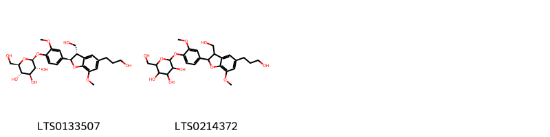{ width=100% }
    <figcaption>Hình ảnh cấu trúc hóa học của 2 hoạt chất thuộc nhóm 2-arylbenzofuran flavonoids gồm ['(2r,3s,4s,5r,6s)-2-(hydroxymethyl)-6-{4-[(2r,3s)-3-(hydroxymethyl)-5-(3-hydroxypropyl)-7-methoxy-2,3-dihydro-1-benzofuran-2-yl]-2-methoxyphenoxy}oxane-3,4,5-triol (LTS0133507)', '2-(hydroxymethyl)-6-{4-[3-(hydroxymethyl)-5-(3-hydroxypropyl)-7-methoxy-2,3-dihydro-1-benzofuran-2-yl]-2-methoxyphenoxy}oxane-3,4,5-triol (LTS0214372)'].</figcaption>
</figure>
#### Nhóm Benzene and substituted derivatives
<figure markdown="span">
    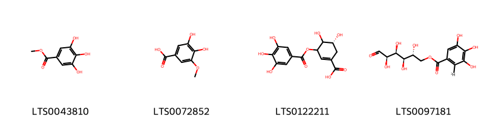{ width=100% }
    <figcaption>Hình ảnh cấu trúc hóa học của 4 hoạt chất thuộc nhóm Benzene and substituted derivatives gồm ['methyl gallate (LTS0043810)', '3-o-methylgallic acid (LTS0072852)', '(5r)-4,5-dihydroxy-3-(3,4,5-trihydroxybenzoyloxy)cyclohex-1-ene-1-carboxylic acid (LTS0122211)', '(2r,3r,4s,5r)-2,3,4,5-tetrahydroxy-6-oxohexyl 3,4,5-trihydroxy(2-²h)benzoate (LTS0097181)'].</figcaption>
</figure>
#### Nhóm Coumarins and derivatives
<figure markdown="span">
    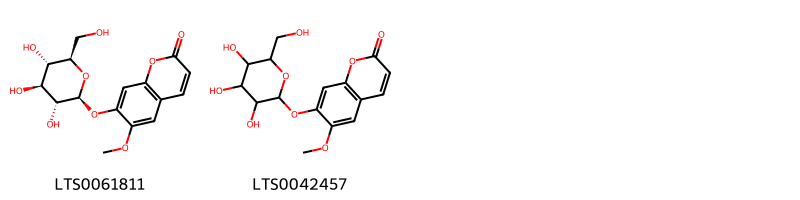{ width=100% }
    <figcaption>Hình ảnh cấu trúc hóa học của 2 hoạt chất thuộc nhóm Coumarins and derivatives gồm ['scopolin (LTS0061811)', '6-methoxy-7-{[3,4,5-trihydroxy-6-(hydroxymethyl)oxan-2-yl]oxy}chromen-2-one (LTS0042457)'].</figcaption>
</figure>
#### Nhóm Fatty Acyls
<figure markdown="span">
    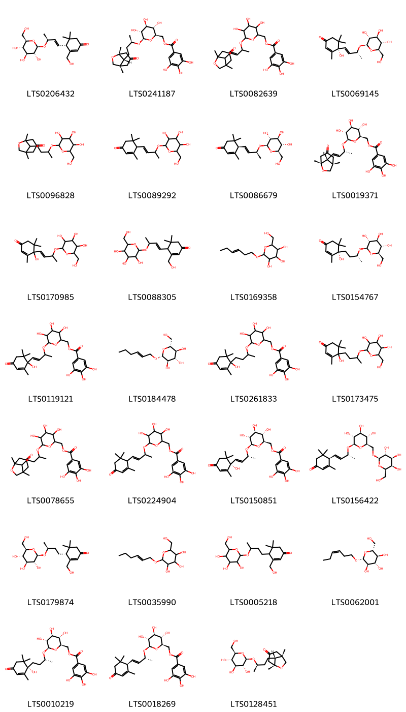{ width=100% }
    <figcaption>Hình ảnh cấu trúc hóa học của 27 hoạt chất thuộc nhóm Fatty Acyls gồm ['(4r)-3-(hydroxymethyl)-5,5-dimethyl-4-[(1e,3s)-3-{[(2r,3r,4s,5s,6r)-3,4,5-trihydroxy-6-(hydroxymethyl)oxan-2-yl]oxy}but-1-en-1-yl]cyclohex-2-en-1-one (LTS0206432)', '[(2r,3s,4s,5r,6r)-6-{[(2r)-4-[(1s,5r,8r)-1,5-dimethyl-3-oxo-6-oxabicyclo[3.2.1]octan-8-yl]butan-2-yl]oxy}-3,4,5-trihydroxyoxan-2-yl]methyl 3,4,5-trihydroxybenzoate (LTS0241187)', '{6-[(4-{1,5-dimethyl-3-oxo-6-oxabicyclo[3.2.1]octan-8-yl}but-3-en-2-yl)oxy]-3,4,5-trihydroxyoxan-2-yl}methyl 3,4,5-trihydroxybenzoate (LTS0082639)', '(4s)-4-hydroxy-3,5,5-trimethyl-4-[(1e,3r)-3-{[(2r,3r,4s,5s,6r)-3,4,5-trihydroxy-6-(hydroxymethyl)oxan-2-yl]oxy}but-1-en-1-yl]cyclohex-2-en-1-one (LTS0069145)', '1,5-dimethyl-8-(3-{[3,4,5-trihydroxy-6-(hydroxymethyl)oxan-2-yl]oxy}butyl)-6-oxabicyclo[3.2.1]octan-3-one (LTS0096828)', '3,5,5-trimethyl-4-(3-{[3,4,5-trihydroxy-6-(hydroxymethyl)oxan-2-yl]oxy}but-1-en-1-yl)cyclohex-2-en-1-one (LTS0089292)', '(4r)-3,5,5-trimethyl-4-[(1e,3s)-3-{[(2r,3r,4s,5s,6r)-3,4,5-trihydroxy-6-(hydroxymethyl)oxan-2-yl]oxy}but-1-en-1-yl]cyclohex-2-en-1-one (LTS0086679)', '[(2r,3s,4s,5r,6r)-6-{[(2r,3e)-4-[(1s,5r,8r)-1,5-dimethyl-3-oxo-6-oxabicyclo[3.2.1]octan-8-yl]but-3-en-2-yl]oxy}-3,4,5-trihydroxyoxan-2-yl]methyl 3,4,5-trihydroxybenzoate (LTS0019371)', '4-hydroxy-3,5,5-trimethyl-4-(3-{[3,4,5-trihydroxy-6-(hydroxymethyl)oxan-2-yl]oxy}but-1-en-1-yl)cyclohex-2-en-1-one (LTS0170985)', '3-(hydroxymethyl)-5,5-dimethyl-4-(3-{[3,4,5-trihydroxy-6-(hydroxymethyl)oxan-2-yl]oxy}but-1-en-1-yl)cyclohex-2-en-1-one (LTS0088305)', '2-(hex-3-en-1-yloxy)-6-(hydroxymethyl)oxane-3,4,5-triol (LTS0169358)', '(4s)-4-hydroxy-3,5,5-trimethyl-4-[(3r)-3-{[(2r,3r,4s,5s,6r)-3,4,5-trihydroxy-6-(hydroxymethyl)oxan-2-yl]oxy}butyl]cyclohex-2-en-1-one (LTS0154767)', '(3,4,5-trihydroxy-6-{[4-(1-hydroxy-2,6,6-trimethyl-4-oxocyclohex-2-en-1-yl)but-3-en-2-yl]oxy}oxan-2-yl)methyl 3,4,5-trihydroxybenzoate (LTS0119121)', '(2r,3r,4s,5s,6r)-2-[(2e)-hex-2-en-1-yloxy]-6-(hydroxymethyl)oxane-3,4,5-triol (LTS0184478)', '(3,4,5-trihydroxy-6-{[4-(1-hydroxy-2,6,6-trimethyl-4-oxocyclohex-2-en-1-yl)butan-2-yl]oxy}oxan-2-yl)methyl 3,4,5-trihydroxybenzoate (LTS0261833)', '4-hydroxy-3,5,5-trimethyl-4-(3-{[3,4,5-trihydroxy-6-(hydroxymethyl)oxan-2-yl]oxy}butyl)cyclohex-2-en-1-one (LTS0173475)', '{6-[(4-{1,5-dimethyl-3-oxo-6-oxabicyclo[3.2.1]octan-8-yl}butan-2-yl)oxy]-3,4,5-trihydroxyoxan-2-yl}methyl 3,4,5-trihydroxybenzoate (LTS0078655)', '(3,4,5-trihydroxy-6-{[4-(2,6,6-trimethyl-4-oxocyclohex-2-en-1-yl)but-3-en-2-yl]oxy}oxan-2-yl)methyl 3,4,5-trihydroxybenzoate (LTS0224904)', '[(2r,3s,4s,5r,6r)-3,4,5-trihydroxy-6-{[(2r,3e)-4-[(1s)-1-hydroxy-2,6,6-trimethyl-4-oxocyclohex-2-en-1-yl]but-3-en-2-yl]oxy}oxan-2-yl]methyl 3,4,5-trihydroxybenzoate (LTS0150851)', '(4r)-3,5,5-trimethyl-4-[(1e,3r)-3-{[(2r,3r,4s,5s,6r)-3,4,5-trihydroxy-6-({[(2r,3r,4s,5r,6r)-3,4,5-trihydroxy-6-(hydroxymethyl)oxan-2-yl]oxy}methyl)oxan-2-yl]oxy}but-1-en-1-yl]cyclohex-2-en-1-one (LTS0156422)', '(4r)-3-(hydroxymethyl)-5,5-dimethyl-4-[(3s)-3-{[(2r,3r,4s,5s,6r)-3,4,5-trihydroxy-6-(hydroxymethyl)oxan-2-yl]oxy}butyl]cyclohex-2-en-1-one (LTS0179874)', '2-(hex-2-en-1-yloxy)-6-(hydroxymethyl)oxane-3,4,5-triol (LTS0035990)', '3-(hydroxymethyl)-5,5-dimethyl-4-(3-{[3,4,5-trihydroxy-6-(hydroxymethyl)oxan-2-yl]oxy}butyl)cyclohex-2-en-1-one (LTS0005218)', '(2r,3r,4s,5s,6r)-2-[(3z)-hex-3-en-1-yloxy]-6-(hydroxymethyl)oxane-3,4,5-triol (LTS0062001)', '[(2r,3s,4s,5r,6r)-3,4,5-trihydroxy-6-{[(2r)-4-[(1s)-1-hydroxy-2,6,6-trimethyl-4-oxocyclohex-2-en-1-yl]butan-2-yl]oxy}oxan-2-yl]methyl 3,4,5-trihydroxybenzoate (LTS0010219)', '[(2r,3s,4s,5r,6r)-3,4,5-trihydroxy-6-{[(2r,3e)-4-[(1r)-2,6,6-trimethyl-4-oxocyclohex-2-en-1-yl]but-3-en-2-yl]oxy}oxan-2-yl]methyl 3,4,5-trihydroxybenzoate (LTS0018269)', '(1s,5r,8r)-1,5-dimethyl-8-[(3r)-3-{[(2r,3r,4s,5s,6r)-3,4,5-trihydroxy-6-(hydroxymethyl)oxan-2-yl]oxy}butyl]-6-oxabicyclo[3.2.1]octan-3-one (LTS0128451)'].</figcaption>
</figure>
#### Nhóm Flavonoids
<figure markdown="span">
    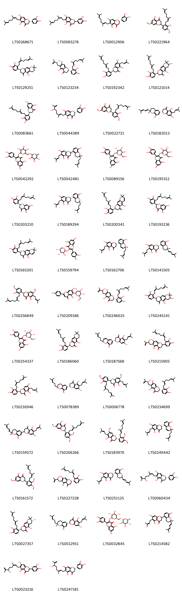{ width=100% }
    <figcaption>Hình ảnh cấu trúc hóa học của 58 hoạt chất thuộc nhóm Flavonoids gồm ['(2s)-2-(3,4-dihydroxyphenyl)-6-(3,7-dimethylocta-2,6-dien-1-yl)-5,7-dihydroxy-2,3-dihydro-1-benzopyran-4-one (LTS0268671)', '2-(3,4-dihydroxyphenyl)-6-(3,7-dimethylocta-2,6-dien-1-yl)-5,7-dihydroxy-2,3-dihydro-1-benzopyran-4-one (LTS0065276)', 'nymphaeol a (LTS0012906)', '2-[2-(3,7-dimethylocta-2,6-dien-1-yl)-3-hydroxy-4-methoxyphenyl]-5-hydroxy-7-methoxy-2,3-dihydro-1-benzopyran-4-one (LTS0221964)', '(5s)-5-[2-(3,7-dimethylocta-2,6-dien-1-yl)-3,4-dihydroxyphenyl]-9-hydroxy-13,13-dimethyl-4,14-dioxatricyclo[8.4.0.0³,⁸]tetradeca-1,3(8),9-trien-7-one (LTS0129251)', '(2s)-2-{2-[(2e)-3,7-dimethylocta-2,6-dien-1-yl]-3,4-dihydroxyphenyl}-5,7-dihydroxy-6-[(2r)-2-hydroxy-3-methylbut-3-en-1-yl]-2,3-dihydro-1-benzopyran-4-one (LTS0123234)', 'nymphaeol c (LTS0192342)', 'tanariflavanone a (LTS0121014)', 'nymphaeol b (LTS0083661)', '(2s)-2-(3,4-dihydroxyphenyl)-5,7-dihydroxy-6-[(2e,6r)-6-hydroxy-3,7-dimethylocta-2,7-dien-1-yl]-2,3-dihydro-1-benzopyran-4-one (LTS0044389)', '(2s)-2-{2-[(2e)-3,7-dimethylocta-2,6-dien-1-yl]-3-hydroxy-4-methoxyphenyl}-5-hydroxy-7-methoxy-2,3-dihydro-1-benzopyran-4-one (LTS0022721)', 'macaflavanone e (LTS0182013)', 'rutin (LTS0042292)', '5,7-dihydroxy-2-[8-hydroxy-2-methyl-2-(4-methylpent-3-en-1-yl)-3,4-dihydro-1-benzopyran-5-yl]-6-(3-methylbut-2-en-1-yl)-2,3-dihydro-1-benzopyran-4-one (LTS0042481)', 'hyperoside (LTS0089156)', '2-(3,4-dihydroxyphenyl)-5,7-dihydroxy-3-{[3,4,5-trihydroxy-6-(hydroxymethyl)oxan-2-yl]oxy}chromen-4-one (LTS0195312)', '(2s)-2-[2-(3,7-dimethylocta-2,6-dien-1-yl)-3,4-dihydroxyphenyl]-5,7-dihydroxy-2,3-dihydro-1-benzopyran-4-one (LTS0205210)', '(2s)-5,7-dihydroxy-2-[(2s)-8-hydroxy-2-methyl-2-(4-methylpent-3-en-1-yl)-3,4-dihydro-1-benzopyran-5-yl]-6-(3-methylbut-2-en-1-yl)-2,3-dihydro-1-benzopyran-4-one (LTS0189294)', '(2s)-2-{2-[(2e)-3,7-dimethylocta-2,6-dien-1-yl]-3,4-dihydroxyphenyl}-5-hydroxy-8,8-dimethyl-2h,3h-pyrano[3,2-g]chromen-4-one (LTS0200341)', '2-[2-(3,7-dimethylocta-2,6-dien-1-yl)-3,4-dihydroxyphenyl]-5,7-dihydroxy-2,3-dihydro-1-benzopyran-4-one (LTS0193136)', '2-[2-(3,7-dimethylocta-2,6-dien-1-yl)-3,4-dihydroxyphenyl]-5-hydroxy-8,8-dimethyl-2h,3h-pyrano[3,2-g]chromen-4-one (LTS0165201)', '2-(3,4-dihydroxyphenyl)-5,7-dihydroxy-3-{[(2s,3s,4r,5r)-3,4,5-trihydroxyoxan-2-yl]oxy}chromen-4-one (LTS0159794)', '(2s)-5,7-dihydroxy-2-[(2r)-8-hydroxy-2-methyl-2-(4-methylpent-3-en-1-yl)chromen-5-yl]-6-(3-methylbut-2-en-1-yl)-2,3-dihydro-1-benzopyran-4-one (LTS0162706)', '(2s)-5,7-dihydroxy-2-[(2s)-8-hydroxy-2-methyl-2-[(1e)-4-methylpenta-1,3-dien-1-yl]-3,4-dihydro-1-benzopyran-5-yl]-6-(3-methylbut-2-en-1-yl)-2,3-dihydro-1-benzopyran-4-one (LTS0141505)', '(2s)-2-{2-[(2e)-3,7-dimethylocta-2,6-dien-1-yl]-3-hydroxy-4-methoxyphenyl}-5-hydroxy-7-methoxy-6-(3-methylbut-2-en-1-yl)-2,3-dihydro-1-benzopyran-4-one (LTS0256849)', 'isovitexin (LTS0209186)', 'tanariflavanone c (LTS0246025)', '5-[2-(3,7-dimethylocta-2,6-dien-1-yl)-3,4-dihydroxyphenyl]-9,12-dihydroxy-13,13-dimethyl-4,14-dioxatricyclo[8.4.0.0³,⁸]tetradeca-1,3(8),9-trien-7-one (LTS0245141)', 'isoquercetin (LTS0254337)', '(5s)-5-{2-[(2e)-3,7-dimethylocta-2,6-dien-1-yl]-3,4-dihydroxyphenyl}-9-hydroxy-13,13-dimethyl-4,14-dioxatricyclo[8.4.0.0³,⁸]tetradeca-1,3(8),9-trien-7-one (LTS0186060)', '(2s)-5,7-dihydroxy-2-[(2s)-8-hydroxy-2-methyl-2-(4-methylpent-3-en-1-yl)chromen-6-yl]-6-(3-methylbut-2-en-1-yl)-2,3-dihydro-1-benzopyran-4-one (LTS0187568)', '2-[2-(3,7-dimethylocta-2,6-dien-1-yl)-3,4-dihydroxyphenyl]-5,7-dihydroxy-6-(2-hydroxy-3-methylbut-3-en-1-yl)-2,3-dihydro-1-benzopyran-4-one (LTS0215905)', '(2s)-2-[2-(3,7-dimethylocta-2,6-dien-1-yl)-3,4-dihydroxyphenyl]-5,7-dihydroxy-6-(3-methylbut-2-en-1-yl)-2,3-dihydro-1-benzopyran-4-one (LTS0216946)', 'macaflavanone d (LTS0078389)', '2-[2-(3,7-dimethylocta-2,6-dien-1-yl)-3-hydroxy-4-methoxyphenyl]-5-hydroxy-7-methoxy-6-(3-methylbut-2-en-1-yl)-2,3-dihydro-1-benzopyran-4-one (LTS0006778)', '(2s)-2-{2-[(2e)-3,7-dimethylocta-2,6-dien-1-yl]-3,4-dihydroxyphenyl}-5,7-dihydroxy-6-[(2s)-2-hydroxy-3-methylbut-3-en-1-yl]-2,3-dihydro-1-benzopyran-4-one (LTS0234699)', '5,7-dihydroxy-2-[8-hydroxy-2-methyl-2-(4-methylpenta-1,3-dien-1-yl)-3,4-dihydro-1-benzopyran-6-yl]-6-(3-methylbut-2-en-1-yl)-2,3-dihydro-1-benzopyran-4-one (LTS0159572)', '(2s)-2-{2-[(2e)-3,7-dimethylocta-2,6-dien-1-yl]-3,4-dimethoxyphenyl}-5-hydroxy-7-methoxy-2,3-dihydro-1-benzopyran-4-one (LTS0206266)', '(2s)-2-{2-[(2e)-3,7-dimethylocta-2,6-dien-1-yl]-3,4-dimethoxyphenyl}-5-hydroxy-7-methoxy-6-(3-methylbut-2-en-1-yl)-2,3-dihydro-1-benzopyran-4-one (LTS0183970)', 'tanariflavanone b (LTS0249442)', '2-[2-(3,7-dimethylocta-2,6-dien-1-yl)-3,4-dimethoxyphenyl]-5-hydroxy-7-methoxy-2,3-dihydro-1-benzopyran-4-one (LTS0161572)', '(2s)-2-[2-(3,7-dimethylocta-2,6-dien-1-yl)-3,4-dihydroxyphenyl]-5,7-dihydroxy-6-(2-hydroxy-3-methylbut-3-en-1-yl)-2,3-dihydro-1-benzopyran-4-one (LTS0227228)', '(2s)-5,7-dihydroxy-2-[(2r)-8-hydroxy-2-methyl-2-[(1e)-4-methylpenta-1,3-dien-1-yl]-3,4-dihydro-1-benzopyran-5-yl]-6-(3-methylbut-2-en-1-yl)-2,3-dihydro-1-benzopyran-4-one (LTS0251125)', '(2s)-2-(3,4-dihydroxyphenyl)-5,7-dihydroxy-6-(6-hydroxy-3,7-dimethylocta-2,7-dien-1-yl)-2,3-dihydro-1-benzopyran-4-one (LTS0060434)', '(5s,12r)-5-{2-[(2e)-3,7-dimethylocta-2,6-dien-1-yl]-3,4-dihydroxyphenyl}-9,12-dihydroxy-13,13-dimethyl-4,14-dioxatricyclo[8.4.0.0³,⁸]tetradeca-1,3(8),9-trien-7-one (LTS0027357)', '(2s)-5,7-dihydroxy-2-[(2r)-8-hydroxy-2-methyl-2-(4-methylpent-3-en-1-yl)-3,4-dihydro-1-benzopyran-6-yl]-6-(3-methylbut-2-en-1-yl)-2,3-dihydro-1-benzopyran-4-one (LTS0012951)', '3-rutinosyl quercetin (LTS0032845)', '5,7-dihydroxy-2-[8-hydroxy-2-methyl-2-(4-methylpenta-1,3-dien-1-yl)-3,4-dihydro-1-benzopyran-5-yl]-6-(3-methylbut-2-en-1-yl)-2,3-dihydro-1-benzopyran-4-one (LTS0214582)', '2-(3,4-dihydroxyphenyl)-5,7-dihydroxy-6-(6-hydroxy-3,7-dimethylocta-2,7-dien-1-yl)-2,3-dihydro-1-benzopyran-4-one (LTS0023216)', 'tanariflavanone d (LTS0247181)', '2-[2-(3,7-dimethylocta-2,6-dien-1-yl)-3,4-dihydroxyphenyl]-5,7-dihydroxy-6-(3-methylbut-2-en-1-yl)-2,3-dihydro-1-benzopyran-4-one (LTS0017166)', '5,7-dihydroxy-2-[8-hydroxy-2-methyl-2-(4-methylpent-3-en-1-yl)chromen-5-yl]-6-(3-methylbut-2-en-1-yl)-2,3-dihydro-1-benzopyran-4-one (LTS0033782)', '(2s)-5,7-dihydroxy-2-[(2s)-8-hydroxy-2-methyl-2-(4-methylpent-3-en-1-yl)chromen-5-yl]-6-(3-methylbut-2-en-1-yl)-2,3-dihydro-1-benzopyran-4-one (LTS0069313)', '2-(3,4-dimethoxyphenyl)-6-(3,7-dimethylocta-2,6-dien-1-yl)-5-hydroxy-7-methoxy-2,3-dihydro-1-benzopyran-4-one (LTS0095010)', '(2s)-2-(3,4-dimethoxyphenyl)-6-[(2e)-3,7-dimethylocta-2,6-dien-1-yl]-5-hydroxy-7-methoxy-2,3-dihydro-1-benzopyran-4-one (LTS0242510)', 'guaijaverin (LTS0119144)', '2-[2-(3,7-dimethylocta-2,6-dien-1-yl)-3,4-dimethoxyphenyl]-5-hydroxy-7-methoxy-6-(3-methylbut-2-en-1-yl)-2,3-dihydro-1-benzopyran-4-one (LTS0122808)', 'macaflavanone g (LTS0115908)'].</figcaption>
</figure>
#### Nhóm Furanoid lignans
<figure markdown="span">
    { width=100% }
    <figcaption>Hình ảnh cấu trúc hóa học của 1 hoạt chất thuộc nhóm Furanoid lignans gồm ['pinoresinol (LTS0057431)'].</figcaption>
</figure>
#### Nhóm Isocoumarins and derivatives
<figure markdown="span">
    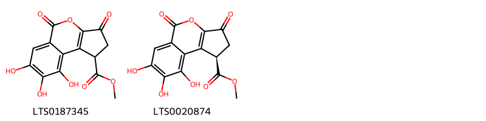{ width=100% }
    <figcaption>Hình ảnh cấu trúc hóa học của 2 hoạt chất thuộc nhóm Isocoumarins and derivatives gồm ['methyl brevifolincarboxylate (LTS0187345)', 'methyl (1r)-7,8,9-trihydroxy-3,5-dioxo-1h,2h-cyclopenta[c]isochromene-1-carboxylate (LTS0020874)'].</figcaption>
</figure>
#### Nhóm Lignan glycosides
<figure markdown="span">
    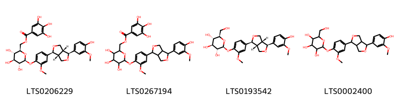{ width=100% }
    <figcaption>Hình ảnh cấu trúc hóa học của 4 hoạt chất thuộc nhóm Lignan glycosides gồm ['[(2r,3s,4s,5r,6s)-6-{4-[(1s,3ar,4s,6ar)-4-(4-hydroxy-3-methoxyphenyl)-hexahydrofuro[3,4-c]furan-1-yl]-2-methoxyphenoxy}-3,4,5-trihydroxyoxan-2-yl]methyl 3,4,5-trihydroxybenzoate (LTS0206229)', '(3,4,5-trihydroxy-6-{4-[4-(4-hydroxy-3-methoxyphenyl)-hexahydrofuro[3,4-c]furan-1-yl]-2-methoxyphenoxy}oxan-2-yl)methyl 3,4,5-trihydroxybenzoate (LTS0267194)', '(2s,3r,4s,5s,6r)-2-{4-[(1s,3ar,4s,6ar)-4-(4-hydroxy-3-methoxyphenyl)-hexahydrofuro[3,4-c]furan-1-yl]-2-methoxyphenoxy}-6-(hydroxymethyl)oxane-3,4,5-triol (LTS0193542)', '2-{4-[4-(4-hydroxy-3-methoxyphenyl)-hexahydrofuro[3,4-c]furan-1-yl]-2-methoxyphenoxy}-6-(hydroxymethyl)oxane-3,4,5-triol (LTS0002400)'].</figcaption>
</figure>
#### Nhóm Organooxygen compounds
<figure markdown="span">
    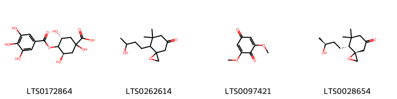{ width=100% }
    <figcaption>Hình ảnh cấu trúc hóa học của 4 hoạt chất thuộc nhóm Organooxygen compounds gồm ['(3r,5r)-1,3,5-trihydroxy-4-(3,4,5-trihydroxybenzoyloxy)cyclohexane-1-carboxylic acid (LTS0172864)', '8-(3-hydroxybutyl)-7,7-dimethyl-1-oxaspiro[2.5]octan-5-one (LTS0262614)', '2,6-dimethoxy-1,4-benzoquinone (LTS0097421)', '(3r,8r)-8-[(3s)-3-hydroxybutyl]-7,7-dimethyl-1-oxaspiro[2.5]octan-5-one (LTS0028654)'].</figcaption>
</figure>
#### Nhóm Oxepanes
<figure markdown="span">
    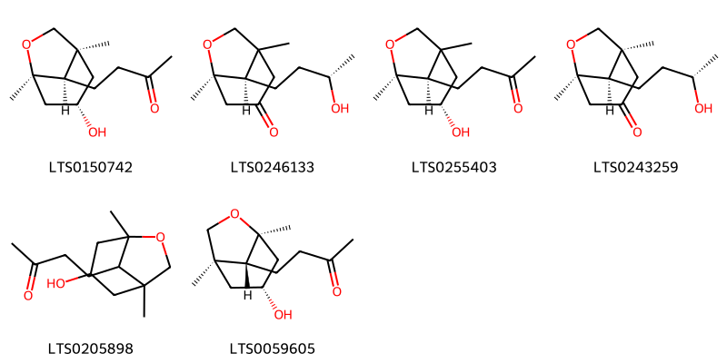{ width=100% }
    <figcaption>Hình ảnh cấu trúc hóa học của 6 hoạt chất thuộc nhóm Oxepanes gồm ['4-[(1s,3s,5r,8r)-3-hydroxy-1,5-dimethyl-6-oxabicyclo[3.2.1]octan-8-yl]butan-2-one (LTS0150742)', '(5r,8r)-8-[(3s)-3-hydroxybutyl]-1,5-dimethyl-6-oxabicyclo[3.2.1]octan-3-one (LTS0246133)', '4-[(3s,5r,8r)-3-hydroxy-1,5-dimethyl-6-oxabicyclo[3.2.1]octan-8-yl]butan-2-one (LTS0255403)', '(1s,5r,8r)-8-[(3s)-3-hydroxybutyl]-1,5-dimethyl-6-oxabicyclo[3.2.1]octan-3-one (LTS0243259)', '4-{3-hydroxy-1,5-dimethyl-6-oxabicyclo[3.2.1]octan-8-yl}butan-2-one (LTS0205898)', '4-[(1r,3r,5s,8r)-3-hydroxy-1,5-dimethyl-6-oxabicyclo[3.2.1]octan-8-yl]butan-2-one (LTS0059605)'].</figcaption>
</figure>
#### Nhóm Prenol lipids
<figure markdown="span">
    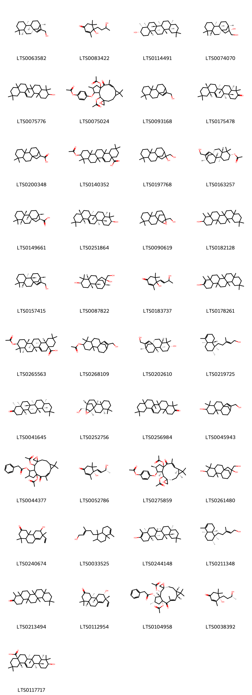{ width=100% }
    <figcaption>Hình ảnh cấu trúc hóa học của 41 hoạt chất thuộc nhóm Prenol lipids gồm ['[(1s,4s,9r,10r,13r)-5,5,9-trimethyltetracyclo[11.2.1.0¹,¹⁰.0⁴,⁹]hexadec-14-en-14-yl]methanol (LTS0063582)', '4-hydroxy-4-(3-hydroxybutyl)-3,5,5-trimethylcyclohex-2-en-1-one (LTS0083422)', 'epi-friedelanol (LTS0114491)', '(1s,4r,9r,10s,13r,14r)-14-(hydroxymethyl)-5,5,9-trimethyltetracyclo[11.2.1.0¹,¹⁰.0⁴,⁹]hexadecan-14-ol (LTS0074070)', 'β-amyrin (LTS0075776)', "1'-(acetyloxy)-13'-[4-(acetyloxy)phenoxy]-3',6',6',14'-tetramethyl-2'-oxospiro[oxirane-2,10'-tricyclo[10.3.0.0⁵,⁷]pentadecan]-3'-en-11'-yl acetate (LTS0075024)", '{5,5,9-trimethyltetracyclo[11.2.1.0¹,¹⁰.0⁴,⁹]hexadec-14-en-14-yl}methanol (LTS0093168)', '(4ar,6ar,6bs,8ar,12ar,14ar,14br)-4,4,6a,6b,8a,11,11,14b-octamethyl-2,4a,5,6,7,8,9,10,12,12a,14,14a-dodecahydro-1h-picen-3-one (LTS0175478)', '5,5,9-trimethyltetracyclo[11.2.1.0¹,¹⁰.0⁴,⁹]hexadecane-14-carboxylic acid (LTS0200348)', '10-(acetyloxy)-2,2,6b,9,9,12a,14a-heptamethyl-1,3,4,5,7,8,8a,10,11,12,12b,13,14,14b-tetradecahydropicene-4a-carboxylic acid (LTS0140352)', '14-(hydroxymethyl)-5,5,9-trimethyltetracyclo[11.2.1.0¹,¹⁰.0⁴,⁹]hexadecan-14-ol (LTS0197768)', '(1s,4s,6r,9s,10s,13r)-14-(hydroxymethyl)-5,5,9-trimethyltetracyclo[11.2.1.0¹,¹⁰.0⁴,⁹]hexadec-14-en-6-yl acetate (LTS0163257)', '(1r,4r,9s,10r,13s,14s)-5,5,9-trimethyltetracyclo[11.2.1.0¹,¹⁰.0⁴,⁹]hexadecane-14-carboxylic acid (LTS0149661)', 'β-amyrin (LTS0251864)', '{5,5,9-trimethyl-15-oxapentacyclo[11.3.1.0¹,¹⁰.0⁴,⁹.0¹⁴,¹⁶]heptadecan-14-yl}methanol (LTS0090619)', '4,4a,6b,8a,11,11,12b,14a-octamethyl-hexadecahydropicen-3-ol (LTS0182128)', '[(4r,9r,10s,13s)-5,5,9-trimethyltetracyclo[11.2.1.0¹,¹⁰.0⁴,⁹]hexadec-14-en-14-yl]methanol (LTS0157415)', '(1s,4r,6r,9s,10s,13r,14r)-14-(hydroxymethyl)-5,5,9-trimethyltetracyclo[11.2.1.0¹,¹⁰.0⁴,⁹]hexadecane-6,14-diol (LTS0087822)', '4-hydroxy-4-(3-hydroxybut-1-en-1-yl)-3,5,5-trimethylcyclohex-2-en-1-one (LTS0183737)', '4,4a,6b,8a,11,11,12b,14a-octamethyl-1,2,5,6,6a,7,8,9,10,12,12a,13,14,14b-tetradecahydropicen-3-ol (LTS0178261)', 'acetyl aleuritolic acid (LTS0265563)', '14-(hydroxymethyl)-5,5,9-trimethyltetracyclo[11.2.1.0¹,¹⁰.0⁴,⁹]hexadec-14-en-6-yl acetate (LTS0268109)', '(1s,4s,6r,9s,10s,13r)-14-(hydroxymethyl)-5,5,9-trimethyltetracyclo[11.2.1.0¹,¹⁰.0⁴,⁹]hexadec-14-en-6-ol (LTS0202610)', '(2e)-5-[(1s,2r,4ar,8ar)-1,2,4a,5-tetramethyl-2,3,4,7,8,8a-hexahydronaphthalen-1-yl]-3-methylpent-2-en-1-ol (LTS0219725)', '(-)-friedelin (LTS0041645)', '[(1r,4r,9r,10s,13r,14r,16r)-5,5,9-trimethyl-15-oxapentacyclo[11.3.1.0¹,¹⁰.0⁴,⁹.0¹⁴,¹⁶]heptadecan-14-yl]methanol (LTS0252756)', '4,4,6a,6b,8a,11,11,14b-octamethyl-2,4a,5,6,7,8,9,10,12,12a,14,14a-dodecahydro-1h-picen-3-one (LTS0256984)', '14-(hydroxymethyl)-5,5,9-trimethyltetracyclo[11.2.1.0¹,¹⁰.0⁴,⁹]hexadec-14-en-6-ol (LTS0045943)', "1',11'-bis(acetyloxy)-3',6',6',14'-tetramethyl-2'-oxospiro[oxirane-2,10'-tricyclo[10.3.0.0⁵,⁷]pentadecan]-3'-en-13'-yl 2-phenylacetate (LTS0044377)", '(6s,9r)-vomifoliol (LTS0052786)', "(1'r,2r,3'e,5'r,7's,11's,12'r,13's,14's)-1'-(acetyloxy)-13'-[4-(acetyloxy)phenoxy]-3',6',6',14'-tetramethyl-2'-oxospiro[oxirane-2,10'-tricyclo[10.3.0.0⁵,⁷]pentadecan]-3'-en-11'-yl acetate (LTS0275859)", '14-(hydroxymethyl)-5,5,9-trimethyltetracyclo[11.2.1.0¹,¹⁰.0⁴,⁹]hexadecane-6,14-diol (LTS0261480)', '7-ethenyl-6-hydroxy-1,1,4a,7-tetramethyl-2,4,4b,5,6,9,10,10a-octahydrophenanthren-3-one (LTS0240674)', '5-(1,2,4a,5-tetramethyl-2,3,4,7,8,8a-hexahydronaphthalen-1-yl)-3-methylpent-2-en-1-ol (LTS0033525)', '(4as,6as,6br,8ar,12as,12bs,14ar,14bs)-4,4a,6b,8a,11,11,12b,14a-octamethyl-1,2,5,6,6a,7,8,9,10,12,12a,13,14,14b-tetradecahydropicen-3-ol (LTS0244148)', '(2e)-5-[(1s,2r,4ar,8as)-1,2,4a,5-tetramethyl-2,3,4,7,8,8a-hexahydronaphthalen-1-yl]-3-methylpent-2-en-1-ol (LTS0211348)', 'friedelin (LTS0213494)', '(4ar,4br,6s,7r,10ar)-7-ethenyl-6-hydroxy-1,1,4a,7-tetramethyl-2,4,4b,5,6,9,10,10a-octahydrophenanthren-3-one (LTS0112954)', "(1'r,2r,3'e,5'r,7's,11's,12'r,13's,14's)-1',11'-bis(acetyloxy)-3',6',6',14'-tetramethyl-2'-oxospiro[oxirane-2,10'-tricyclo[10.3.0.0⁵,⁷]pentadecan]-3'-en-13'-yl 2-phenylacetate (LTS0104958)", '(4s)-4-hydroxy-4-[(3r)-3-hydroxybutyl]-3,5,5-trimethylcyclohex-2-en-1-one (LTS0038392)', 'oleanolic acid (LTS0117717)'].</figcaption>
</figure>
#### Nhóm Pyridines and derivatives
<figure markdown="span">
    { width=100% }
    <figcaption>Hình ảnh cấu trúc hóa học của 1 hoạt chất thuộc nhóm Pyridines and derivatives gồm ['3-cyano-4-methoxypyridin-1-ium-1-olate (LTS0144355)'].</figcaption>
</figure>
#### Nhóm Saccharolipids
<figure markdown="span">
    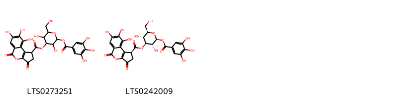{ width=100% }
    <figcaption>Hình ảnh cấu trúc hóa học của 2 hoạt chất thuộc nhóm Saccharolipids gồm ['3,5-dihydroxy-2-(hydroxymethyl)-6-(3,4,5-trihydroxybenzoyloxy)oxan-4-yl 7,8,9-trihydroxy-3,5-dioxo-1h,2h-cyclopenta[c]isochromene-1-carboxylate (LTS0273251)', '(2r,3r,4s,5r,6s)-3,5-dihydroxy-2-(hydroxymethyl)-6-(3,4,5-trihydroxybenzoyloxy)oxan-4-yl (1s)-7,8,9-trihydroxy-3,5-dioxo-1h,2h-cyclopenta[c]isochromene-1-carboxylate (LTS0242009)'].</figcaption>
</figure>
#### Nhóm Steroids and steroid derivatives
<figure markdown="span">
    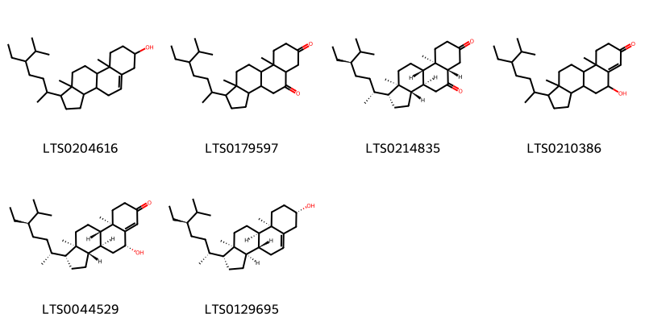{ width=100% }
    <figcaption>Hình ảnh cấu trúc hóa học của 6 hoạt chất thuộc nhóm Steroids and steroid derivatives gồm ['stigmast-5-en-3-ol, (3β)- (LTS0204616)', '1-(5-ethyl-6-methylheptan-2-yl)-9a,11a-dimethyl-dodecahydro-1h-cyclopenta[a]phenanthrene-5,7-dione (LTS0179597)', '(1r,3as,3bs,5as,9ar,9bs,11ar)-1-[(2r,5r)-5-ethyl-6-methylheptan-2-yl]-9a,11a-dimethyl-dodecahydro-1h-cyclopenta[a]phenanthrene-5,7-dione (LTS0214835)', '1-(5-ethyl-6-methylheptan-2-yl)-5-hydroxy-9a,11a-dimethyl-1h,2h,3h,3ah,3bh,4h,5h,8h,9h,9bh,10h,11h-cyclopenta[a]phenanthren-7-one (LTS0210386)', '(1r,3as,3bs,5r,9ar,9bs,11ar)-1-[(2r,5r)-5-ethyl-6-methylheptan-2-yl]-5-hydroxy-9a,11a-dimethyl-1h,2h,3h,3ah,3bh,4h,5h,8h,9h,9bh,10h,11h-cyclopenta[a]phenanthren-7-one (LTS0044529)', '(1r,3ar,3br,7s,9ar,9br,11ar)-1-[(2r,5r)-5-ethyl-6-methylheptan-2-yl]-9a,11a-dimethyl-1h,2h,3h,3ah,3bh,4h,6h,7h,8h,9h,9bh,10h,11h-cyclopenta[a]phenanthren-7-ol (LTS0129695)'].</figcaption>
</figure>
#### Nhóm Tannins
<figure markdown="span">
    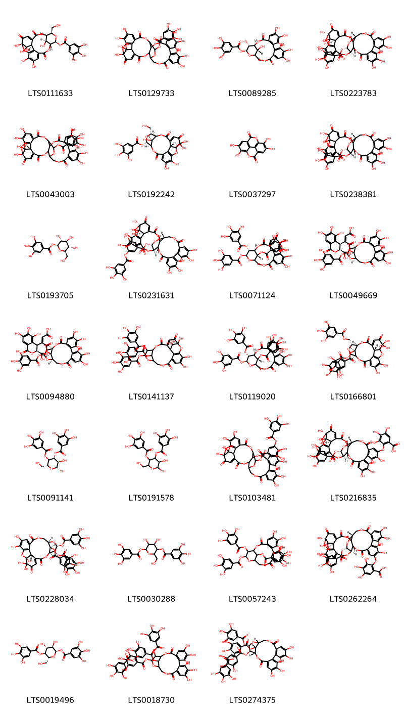{ width=100% }
    <figcaption>Hình ảnh cấu trúc hóa học của 27 hoạt chất thuộc nhóm Tannins gồm ['(1s,7s,9r,18r,19s,21r,22s)-7,8,8,12,13,22-hexahydroxy-21-(hydroxymethyl)-3,6,16-trioxo-2,17,20,23-tetraoxapentacyclo[16.3.1.1⁷,¹¹.0⁴,⁹.0¹⁰,¹⁵]tricosa-4,10,12,14-tetraen-19-yl 3,4,5-trihydroxybenzoate (LTS0111633)', '1,13,14,15,18,19,20,34,35,39,39-undecahydroxy-2,5,10,23,31-pentaoxo-6,9,24,27,30,40-hexaoxaoctacyclo[34.3.1.0⁴,³⁸.0⁷,²⁶.0⁸,²⁹.0¹¹,¹⁶.0¹⁷,²².0³²,³⁷]tetraconta-3,11(16),12,14,17,19,21,32,34,36-decaen-28-yl 3,4,5-trihydroxybenzoate (LTS0129733)', '(1s,19r,21s,22r,23r)-6,7,8,11,12,13,22,23-octahydroxy-3,16-dioxo-2,17,20-trioxatetracyclo[17.3.1.0⁴,⁹.0¹⁰,¹⁵]tricosa-4(9),5,7,10,12,14-hexaen-21-yl 3,4,5-trihydroxybenzoate (LTS0089285)', '(1r,7r,8s,26r,28s,29r,38r)-1,13,14,15,18,19,20,34,35,39,39-undecahydroxy-2,5,10,23,31-pentaoxo-6,9,24,27,30,40-hexaoxaoctacyclo[34.3.1.0⁴,³⁸.0⁷,²⁶.0⁸,²⁹.0¹¹,¹⁶.0¹⁷,²².0³²,³⁷]tetraconta-3,11,13,15,17(22),18,20,32,34,36-decaen-28-yl 3,4,5-trihydroxybenzoate (LTS0223783)', '(1r,38r)-1,13,14,15,18,19,20,34,35,39,39-undecahydroxy-2,5,10,23,31-pentaoxo-6,9,24,27,30,40-hexaoxaoctacyclo[34.3.1.0⁴,³⁸.0⁷,²⁶.0⁸,²⁹.0¹¹,¹⁶.0¹⁷,²².0³²,³⁷]tetraconta-3,11(16),12,14,17,19,21,32,34,36-decaen-28-yl 3,4,5-trihydroxybenzoate (LTS0043003)', '(1s,8r,9r,18r,19s,21r,22s)-7,7,8,12,13,22-hexahydroxy-21-(hydroxymethyl)-3,6,16-trioxo-2,17,20,23-tetraoxapentacyclo[16.3.1.1⁸,¹¹.0⁴,⁹.0¹⁰,¹⁵]tricosa-4,10,12,14-tetraen-19-yl 3,4,5-trihydroxybenzoate (LTS0192242)', 'ellagic acid (LTS0037297)', '(7r,8s,26r,28s,29s)-1,13,14,15,18,19,20,34,35,39,39-undecahydroxy-2,5,10,23,31-pentaoxo-6,9,24,27,30,40-hexaoxaoctacyclo[34.3.1.0⁴,³⁸.0⁷,²⁶.0⁸,²⁹.0¹¹,¹⁶.0¹⁷,²².0³²,³⁷]tetraconta-3,11,13,15,17(22),18,20,32,34,36-decaen-28-yl 3,4,5-trihydroxybenzoate (LTS0238381)', 'β-glucogallin (LTS0193705)', '(1r,7r,8s,26r,28s,29r,38r)-1,13,14,15,18,19,20,34,35,39,39-undecahydroxy-2,5,10,23,31-pentaoxo-6,9,24,27,30,40-hexaoxaoctacyclo[34.3.1.0⁴,³⁸.0⁷,²⁶.0⁸,²⁹.0¹¹,¹⁶.0¹⁷,²².0³²,³⁷]tetraconta-3,11,13,15,17(22),18,20,32,34,36-decaen-28-yl 3,4-dihydroxy-5-(3,4,5-trihydroxybenzoyloxy)benzoate (LTS0231631)', '(1s,9s,19r,21s,22r,23r)-7,8,8,12,13-pentahydroxy-3,6,16-trioxo-21,23-bis(3,4,5-trihydroxybenzoyloxy)-2,17,20,24-tetraoxapentacyclo[17.3.1.1⁷,¹¹.0⁴,⁹.0¹⁰,¹⁵]tetracosa-4,10,12,14-tetraen-22-yl 3,4,5-trihydroxybenzoate (LTS0071124)', '(3s,4s)-4-[(1z)-1-carboxy-3-{[(1r,19r,21s,22r,23r)-6,7,8,11,12,13,22-heptahydroxy-3,16-dioxo-21-(3,4,5-trihydroxybenzoyloxy)-2,17,20-trioxatetracyclo[17.3.1.0⁴,⁹.0¹⁰,¹⁵]tricosa-4(9),5,7,10,12,14-hexaen-23-yl]oxy}-3-oxoprop-1-en-2-yl]-5,6,7-trihydroxy-1-oxo-3,4-dihydro-2-benzopyran-3-carboxylic acid (LTS0049669)', '(3s)-4-[(1z)-1-carboxy-3-{[(1r,19r,21s,22r,23r)-6,7,8,11,12,13,22-heptahydroxy-3,16-dioxo-21-(3,4,5-trihydroxybenzoyloxy)-2,17,20-trioxatetracyclo[17.3.1.0⁴,⁹.0¹⁰,¹⁵]tricosa-4(9),5,7,10,12,14-hexaen-23-yl]oxy}-3-oxoprop-1-en-2-yl]-5,6,7-trihydroxy-1-oxo-3,4-dihydro-2-benzopyran-3-carboxylic acid (LTS0094880)', '7,8,8,12,13-pentahydroxy-3,6,16-trioxo-21,22-bis(3,4,5-trihydroxybenzoyloxy)-2,17,20,24-tetraoxapentacyclo[17.3.1.1⁷,¹¹.0⁴,⁹.0¹⁰,¹⁵]tetracosa-4,10,12,14-tetraen-23-yl 3,4,5-trihydroxybenzoate (LTS0141137)', '(1s,19r,21s,22r,23r)-6,7,8,11,12,13-hexahydroxy-3,16-dioxo-21,23-bis(3,4,5-trihydroxybenzoyloxy)-2,17,20-trioxatetracyclo[17.3.1.0⁴,⁹.0¹⁰,¹⁵]tricosa-4(9),5,7,10,12,14-hexaen-22-yl 3,4,5-trihydroxybenzoate (LTS0119020)', '(1r,10r,18r,19r,21s,22s)-6,7,11,12,12-pentahydroxy-3,13,16-trioxo-21-(3,4,5-trihydroxybenzoyloxy)-19-[(3,4,5-trihydroxybenzoyloxy)methyl]-2,17,20,23-tetraoxapentacyclo[16.3.1.1⁸,¹¹.0⁴,⁹.0¹⁰,¹⁵]tricosa-4,6,8,14-tetraen-22-yl 3,4,5-trihydroxybenzoate (LTS0166801)', '(2r,3r,4r,5r,6r)-2,3-dihydroxy-6-(hydroxymethyl)-5-(3,4,5-trihydroxybenzoyloxy)oxan-4-yl 3,4,5-trihydroxybenzoate (LTS0091141)', '2,3-dihydroxy-6-(hydroxymethyl)-5-(3,4,5-trihydroxybenzoyloxy)oxan-4-yl 3,4,5-trihydroxybenzoate (LTS0191578)', '1,13,14,15,18,19,20,34,35,39,39-undecahydroxy-2,5,10,23,31-pentaoxo-6,9,24,27,30,40-hexaoxaoctacyclo[34.3.1.0⁴,³⁸.0⁷,²⁶.0⁸,²⁹.0¹¹,¹⁶.0¹⁷,²².0³²,³⁷]tetraconta-3,11(16),12,14,17,19,21,32,34,36-decaen-28-yl 3,4-dihydroxy-5-(3,4,5-trihydroxybenzoyloxy)benzoate (LTS0103481)', 'mallotusinic acid (LTS0216835)', '(1s,8r,9r,19r,21s,22r,23r)-7,7,8,12,13-pentahydroxy-3,6,16-trioxo-21,23-bis(3,4,5-trihydroxybenzoyloxy)-2,17,20,24-tetraoxapentacyclo[17.3.1.1⁸,¹¹.0⁴,⁹.0¹⁰,¹⁵]tetracosa-4,10,12,14-tetraen-22-yl 3,4,5-trihydroxybenzoate (LTS0228034)', '4,5-dihydroxy-2-(hydroxymethyl)-6-(3,4,5-trihydroxybenzoyloxy)oxan-3-yl 3,4,5-trihydroxybenzoate (LTS0030288)', '6,7,8,11,12,13-hexahydroxy-3,16-dioxo-21,22-bis(3,4,5-trihydroxybenzoyloxy)-2,17,20-trioxatetracyclo[17.3.1.0⁴,⁹.0¹⁰,¹⁵]tricosa-4(9),5,7,10,12,14-hexaen-23-yl 3,4,5-trihydroxybenzoate (LTS0057243)', '2-{[(1r,7r,8s,26r,28s,29r,38r)-1,14,15,18,19,20,34,35,39,39-decahydroxy-2,5,10,23,31-pentaoxo-28-(3,4,5-trihydroxybenzoyloxy)-6,9,24,27,30,40-hexaoxaoctacyclo[34.3.1.0⁴,³⁸.0⁷,²⁶.0⁸,²⁹.0¹¹,¹⁶.0¹⁷,²².0³²,³⁷]tetraconta-3,11,13,15,17(22),18,20,32,34,36-decaen-13-yl]oxy}-3,4,5-trihydroxybenzoic acid (LTS0262264)', '(2r,3r,4r,5s,6r)-3,4-dihydroxy-6-(hydroxymethyl)-5-(3,4,5-trihydroxybenzoyloxy)oxan-2-yl 3,4,5-trihydroxybenzoate (LTS0019496)', '6,7,8,11,12,13-hexahydroxy-3,16-dioxo-21,22-bis(3,4,5-trihydroxybenzoyloxy)-2,17,20-trioxatetracyclo[17.3.1.0⁴,⁹.0¹⁰,¹⁵]tricosa-4(9),5,7,10,12,14-hexaen-23-yl 3,4-dihydroxy-5-(3,4,5-trihydroxybenzoyloxy)benzoate (LTS0018730)', '(1s,19r,21s,22r,23r)-6,7,8,11,12,13-hexahydroxy-3,16-dioxo-21,22-bis(3,4,5-trihydroxybenzoyloxy)-2,17,20-trioxatetracyclo[17.3.1.0⁴,⁹.0¹⁰,¹⁵]tricosa-4,6,8,10(15),11,13-hexaen-23-yl 3,4-dihydroxy-5-(3,4,5-trihydroxybenzoyloxy)benzoate (LTS0274375)'].</figcaption>
</figure>

---

### Dược dân tộc học

Danh sách các quốc gia có sử dụng *Macaranga tanarius* trong điều trị các bệnh. 

| Country              | Disease    | Bệnh                                                                                                                                                                                                |
|:---------------------|:-----------|:----------------------------------------------------------------------------------------------------------------------------------------------------------------------------------------------------|
| Philippines(Ilocano) | Intoxicant | MYMEMORY WARNING: YOU USED ALL AVAILABLE FREE TRANSLATIONS FOR TODAY. NEXT AVAILABLE IN  20 HOURS 35 MINUTES 04 SECONDS VISIT HTTPS://MYMEMORY.TRANSLATED.NET/DOC/USAGELIMITS.PHP TO TRANSLATE MORE |

---

# Chi Breynia

??? note "Danh sách các dược liệu thuộc chi"
    
	 - *Breynia rhamnoides*

---
## Breynia rhamnoides
### Thông tin về thực vật

!!! info "Phân loại thực vật của *Breynia vitis-idaea* từ GIBF:"
    - **Kingdom:** Plantae
    - **Phylum:** Tracheophyta
    - **Order:** Malpighiales
    - **Family:** Phyllanthaceae
    - **Genus:** Breynia
    - **Species:** *Breynia vitis-idaea*

 

| Label (VI)   | Label (EN)   | Scientific Name    | Descriptions (VI)   | Descriptions (EN)   | Also Known As (VI)   | Also Known As (EN)    |
|:-------------|:-------------|:-------------------|:--------------------|:--------------------|:---------------------|:----------------------|
| N/A          | N/A          | Macaranga tanarius | loài thực vật       | species of plant    | ['']                 | ['Parasol leaf tree'] |

#### Phân bố trên thế giới

**Từ CSDL GIBF** nan, Sri Lanka, Japan, Thailand, India, Indonesia, Bangladesh, United States of America, Viet Nam, Philippines, Singapore, Malaysia, China, Nepal

#### Phân bố tại Việt Nam

**Từ CSDL GIBF**: Không có ghi nhận ở Việt Nam

---
### Thành phần hóa học
        
- Theo cơ sở dữ liệu lotus: Từ loài *Breynia vitis-idaea* đã phân lập và xác định được Chưa có hoạt chất nào được phân lập. hoạt chất thuộc về các nhóm Không có hoạt chất nào được phân lập. 

Không có hình ảnh nào được tạo ra

---

### Dược dân tộc học

Danh sách các quốc gia có sử dụng *Breynia vitis-idaea* trong điều trị các bệnh. 

| Country     | Disease    | Bệnh                                                                                                                                                                                                |
|:------------|:-----------|:----------------------------------------------------------------------------------------------------------------------------------------------------------------------------------------------------|
| Philippines | Astringent | MYMEMORY WARNING: YOU USED ALL AVAILABLE FREE TRANSLATIONS FOR TODAY. NEXT AVAILABLE IN  20 HOURS 34 MINUTES 17 SECONDS VISIT HTTPS://MYMEMORY.TRANSLATED.NET/DOC/USAGELIMITS.PHP TO TRANSLATE MORE |

---

# Chi Sauropus

??? note "Danh sách các dược liệu thuộc chi"
    
	 - *Sauropus changiana*

---
## Sauropus changiana
### Thông tin về thực vật

!!! info "Phân loại thực vật của *Breynia spatulifolia* từ GIBF:"
    - **Kingdom:** Plantae
    - **Phylum:** Tracheophyta
    - **Order:** Malpighiales
    - **Family:** Phyllanthaceae
    - **Genus:** Breynia
    - **Species:** *Breynia spatulifolia*

 

| Label (VI)   | Label (EN)   | Scientific Name    | Descriptions (VI)   | Descriptions (EN)   | Also Known As (VI)   | Also Known As (EN)    |
|:-------------|:-------------|:-------------------|:--------------------|:--------------------|:---------------------|:----------------------|
| N/A          | N/A          | Macaranga tanarius | loài thực vật       | species of plant    | ['']                 | ['Parasol leaf tree'] |

#### Phân bố trên thế giới

**Từ CSDL GIBF** China

#### Phân bố tại Việt Nam

**Từ CSDL GIBF**: Không có ghi nhận ở Việt Nam

---
### Thành phần hóa học
        
- Theo cơ sở dữ liệu lotus: Từ loài *Breynia spatulifolia* đã phân lập và xác định được Chưa có hoạt chất nào được phân lập. hoạt chất thuộc về các nhóm Không có hoạt chất nào được phân lập. 

Không có hình ảnh nào được tạo ra

---

### Dược dân tộc học

Danh sách các quốc gia có sử dụng *Breynia spatulifolia* trong điều trị các bệnh. 

| Country   | Disease                             | Bệnh                                                                                                                                                                                                |
|:----------|:------------------------------------|:----------------------------------------------------------------------------------------------------------------------------------------------------------------------------------------------------|
| China     | Antiseptic, Antiseptic, Expectorant | MYMEMORY WARNING: YOU USED ALL AVAILABLE FREE TRANSLATIONS FOR TODAY. NEXT AVAILABLE IN  20 HOURS 33 MINUTES 52 SECONDS VISIT HTTPS://MYMEMORY.TRANSLATED.NET/DOC/USAGELIMITS.PHP TO TRANSLATE MORE |

---

# Chi Antidesma

??? note "Danh sách các dược liệu thuộc chi"
    
	 - *Antidesma bunius*
	 - *Antidesma venosum*

---
## Antidesma bunius
### Thông tin về thực vật

!!! info "Phân loại thực vật của *Antidesma bunius* từ GIBF:"
    - **Kingdom:** Plantae
    - **Phylum:** Tracheophyta
    - **Order:** Malpighiales
    - **Family:** Phyllanthaceae
    - **Genus:** Antidesma
    - **Species:** *Antidesma bunius*

 

| Label (VI)   | Label (EN)   | Scientific Name   | Descriptions (VI)   | Descriptions (EN)   | Also Known As (VI)   | Also Known As (EN)   |
|:-------------|:-------------|:------------------|:--------------------|:--------------------|:---------------------|:---------------------|
| N/A          | N/A          | Antidesma bunius  | loài thực vật       | species of plant    | ['']                 | ['Chinese-laurel']   |

#### Phân bố trên thế giới

**Từ CSDL GIBF** nan, Palau, Sri Lanka, Australia, Belgium, Lao People’s Democratic Republic, Cambodia, Puerto Rico, United States of America, Hong Kong, Thailand, Brazil, Egypt, Dominican Republic, Dominica, Singapore, Viet Nam, China, French Polynesia, Madagascar, India, Indonesia, Philippines, Malaysia, Brunei Darussalam, Nepal

#### Phân bố tại Việt Nam

**Từ CSDL GIBF**: Hà Tĩnh, Hải Phòng, Annam

---
### Thành phần hóa học
        
- Theo cơ sở dữ liệu lotus: Từ loài *Antidesma bunius* đã phân lập và xác định được Chưa có hoạt chất nào được phân lập. hoạt chất thuộc về các nhóm Không có hoạt chất nào được phân lập. 

Không có hình ảnh nào được tạo ra

---

### Dược dân tộc học

Danh sách các quốc gia có sử dụng *Antidesma bunius* trong điều trị các bệnh. 

| Country   | Disease   | Bệnh                                                                                                                                                                                                |
|:----------|:----------|:----------------------------------------------------------------------------------------------------------------------------------------------------------------------------------------------------|
| Elsewhere | Poison    | MYMEMORY WARNING: YOU USED ALL AVAILABLE FREE TRANSLATIONS FOR TODAY. NEXT AVAILABLE IN  20 HOURS 33 MINUTES 34 SECONDS VISIT HTTPS://MYMEMORY.TRANSLATED.NET/DOC/USAGELIMITS.PHP TO TRANSLATE MORE |

---

---
## Antidesma venosum
### Thông tin về thực vật

!!! info "Phân loại thực vật của *Antidesma venosum* từ GIBF:"
    - **Kingdom:** Plantae
    - **Phylum:** Tracheophyta
    - **Order:** Malpighiales
    - **Family:** Phyllanthaceae
    - **Genus:** Antidesma
    - **Species:** *Antidesma venosum*

 

| Label (VI)   | Label (EN)   | Scientific Name   | Descriptions (VI)   | Descriptions (EN)   | Also Known As (VI)   | Also Known As (EN)   |
|:-------------|:-------------|:------------------|:--------------------|:--------------------|:---------------------|:---------------------|
| N/A          | N/A          | Antidesma venosum | loài thực vật       | species of plant    | ['']                 | ['']                 |

#### Phân bố trên thế giới

**Từ CSDL GIBF** nan, Zambia, South Africa, Gabon, Namibia, Mozambique, Botswana, Sierra Leone, Guinea, Cameroon, Zimbabwe, Eswatini

#### Phân bố tại Việt Nam

**Từ CSDL GIBF**: Không có ghi nhận ở Việt Nam

---
### Thành phần hóa học
        
- Theo cơ sở dữ liệu lotus: Từ loài *Antidesma venosum* đã phân lập và xác định được 2 hoạt chất thuộc về các nhóm Organooxygen compounds. 

|    | chemicalTaxonomyClassyfireClass   |   smiles_count |
|---:|:----------------------------------|---------------:|
|  0 | Organooxygen compounds            |              2 |

#### Nhóm Organooxygen compounds
<figure markdown="span">
    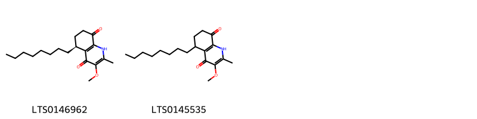{ width=100% }
    <figcaption>Hình ảnh cấu trúc hóa học của 2 hoạt chất thuộc nhóm Organooxygen compounds gồm ['(5s)-3-methoxy-2-methyl-5-octyl-1,5,6,7-tetrahydroquinoline-4,8-dione (LTS0146962)', '3-methoxy-2-methyl-5-octyl-1,5,6,7-tetrahydroquinoline-4,8-dione (LTS0145535)'].</figcaption>
</figure>

---

### Dược dân tộc học

Danh sách các quốc gia có sử dụng *Antidesma venosum* trong điều trị các bệnh. 

| Country   | Disease   | Bệnh                                                                                                                                                                                                |
|:----------|:----------|:----------------------------------------------------------------------------------------------------------------------------------------------------------------------------------------------------|
| Sudan     | Collyrium | MYMEMORY WARNING: YOU USED ALL AVAILABLE FREE TRANSLATIONS FOR TODAY. NEXT AVAILABLE IN  20 HOURS 33 MINUTES 08 SECONDS VISIT HTTPS://MYMEMORY.TRANSLATED.NET/DOC/USAGELIMITS.PHP TO TRANSLATE MORE |

---

# Chi Euphorbia

??? note "Danh sách các dược liệu thuộc chi"
    
	 - *Euphorbia aegyptiaca*
	 - *Euphorbia amygdaloides*
	 - *Euphorbia antiquorum*
	 - *Euphorbia antisyphilitica*
	 - *Euphorbia atoto*
	 - *Euphorbia californica*
	 - *Euphorbia calyculata*
	 - *Euphorbia caracasana*
	 - *Euphorbia chilensis*
	 - *Euphorbia corollata*
	 - *Euphorbia cotinifolia*
	 - *Euphorbia cyparissias*
	 - *Euphorbia dendroides*
	 - *Euphorbia glomerifera*
	 - *Euphorbia graminea*
	 - *Euphorbia helioscopia*
	 - *Euphorbia hermentiana*
	 - *Euphorbia heterophylla*
	 - *Euphorbia hirta*
	 - *Euphorbia humifusa*
	 - *Euphorbia ipecacuanha*
	 - *Euphorbia ipecacuanhae*
	 - *Euphorbia kansui*
	 - *Euphorbia kerrii*
	 - *Euphorbia lactea*
	 - *Euphorbia lancifolia*
	 - *Euphorbia lathryis*
	 - *Euphorbia lathyris*
	 - *Euphorbia maculata*
	 - *Euphorbia milii*
	 - *Euphorbia neriifolia*
	 - *Euphorbia nivulia*
	 - *Euphorbia nyikae*
	 - *Euphorbia officinarum*
	 - *Euphorbia parviflora*
	 - *Euphorbia pekinensis*
	 - *Euphorbia petiolaris*
	 - *Euphorbia petrina*
	 - *Euphorbia pilulifera*
	 - *Euphorbia plicata*
	 - *Euphorbia polycarpa*
	 - *Euphorbia primulaefolia*
	 - *Euphorbia procera*
	 - *Euphorbia pulcherrima*
	 - *Euphorbia resinifera*
	 - *Euphorbia rosea*
	 - *Euphorbia royleana*
	 - *Euphorbia schlechtendalii*
	 - *Euphorbia serpens*
	 - *Euphorbia sieboldiana*
	 - *Euphorbia thomsoniana*
	 - *Euphorbia thymifolia*
	 - *Euphorbia tinctoria*
	 - *Euphorbia tirucalli*
	 - *Euphorbia trigona*
	 - *Euphorbia xanti*

---
## Euphorbia aegyptiaca
### Thông tin về thực vật

!!! info "Phân loại thực vật của *Euphorbia forskaolii* từ GIBF:"
    - **Kingdom:** Plantae
    - **Phylum:** Tracheophyta
    - **Order:** Malpighiales
    - **Family:** Euphorbiaceae
    - **Genus:** Euphorbia
    - **Species:** *Euphorbia forskaolii*

 

| Label (VI)   | Label (EN)   | Scientific Name      | Descriptions (VI)   | Descriptions (EN)   | Also Known As (VI)   | Also Known As (EN)   |
|:-------------|:-------------|:---------------------|:--------------------|:--------------------|:---------------------|:---------------------|
| N/A          | N/A          | Euphorbia aegyptiaca |                     |                     | ['']                 | ['']                 |

#### Phân bố trên thế giới

**Từ CSDL GIBF** nan, Ghana, Central African Republic, Palestine, State of, unknown or invalid, Benin, Israel, Togo, Mali, Senegal, Nigeria, Chad, Sudan, Spain, Liberia, Niger, Côte d’Ivoire, Egypt, Cabo Verde, India, Burkina Faso, Cameroon, Mauritania, Ethiopia

#### Phân bố tại Việt Nam

**Từ CSDL GIBF**: Không có ghi nhận ở Việt Nam

---
### Thành phần hóa học
        
- Theo cơ sở dữ liệu lotus: Từ loài *Euphorbia forskaolii* đã phân lập và xác định được Chưa có hoạt chất nào được phân lập. hoạt chất thuộc về các nhóm Không có hoạt chất nào được phân lập. 

Không có hình ảnh nào được tạo ra

---

### Dược dân tộc học

Danh sách các quốc gia có sử dụng *Euphorbia forskaolii* trong điều trị các bệnh. 

| Country   | Disease   | Bệnh                                                                                                                                                                                                |
|:----------|:----------|:----------------------------------------------------------------------------------------------------------------------------------------------------------------------------------------------------|
| Elsewhere | Purgative | MYMEMORY WARNING: YOU USED ALL AVAILABLE FREE TRANSLATIONS FOR TODAY. NEXT AVAILABLE IN  20 HOURS 32 MINUTES 44 SECONDS VISIT HTTPS://MYMEMORY.TRANSLATED.NET/DOC/USAGELIMITS.PHP TO TRANSLATE MORE |
| Sudan     | Purgative | MYMEMORY WARNING: YOU USED ALL AVAILABLE FREE TRANSLATIONS FOR TODAY. NEXT AVAILABLE IN  20 HOURS 32 MINUTES 41 SECONDS VISIT HTTPS://MYMEMORY.TRANSLATED.NET/DOC/USAGELIMITS.PHP TO TRANSLATE MORE |

---

---
## Euphorbia amygdaloides
### Thông tin về thực vật

!!! info "Phân loại thực vật của *Euphorbia amygdaloides* từ GIBF:"
    - **Kingdom:** Plantae
    - **Phylum:** Tracheophyta
    - **Order:** Malpighiales
    - **Family:** Euphorbiaceae
    - **Genus:** Euphorbia
    - **Species:** *Euphorbia amygdaloides*

 

| Label (VI)   | Label (EN)   | Scientific Name        | Descriptions (VI)   | Descriptions (EN)   | Also Known As (VI)   | Also Known As (EN)   |
|:-------------|:-------------|:-----------------------|:--------------------|:--------------------|:---------------------|:---------------------|
| N/A          | N/A          | Euphorbia amygdaloides | loài thực vật       | species of plant    | ['']                 | ['']                 |

#### Phân bố trên thế giới

**Từ CSDL GIBF** Italy, Bulgaria, Belgium, Slovakia, Ukraine, Netherlands, Spain, Hungary, Russian Federation, Slovenia, Croatia, Bosnia and Herzegovina, Czechia, Germany, Romania, Switzerland, Austria, France, United Kingdom of Great Britain and Northern Ireland

#### Phân bố tại Việt Nam

**Từ CSDL GIBF**: Không có ghi nhận ở Việt Nam

---
### Thành phần hóa học
        
- Theo cơ sở dữ liệu lotus: Từ loài *Euphorbia amygdaloides* đã phân lập và xác định được 36 hoạt chất thuộc về các nhóm Prenol lipids. 

|    | chemicalTaxonomyClassyfireClass   |   smiles_count |
|---:|:----------------------------------|---------------:|
|  0 | Prenol lipids                     |             36 |

#### Nhóm Prenol lipids
<figure markdown="span">
    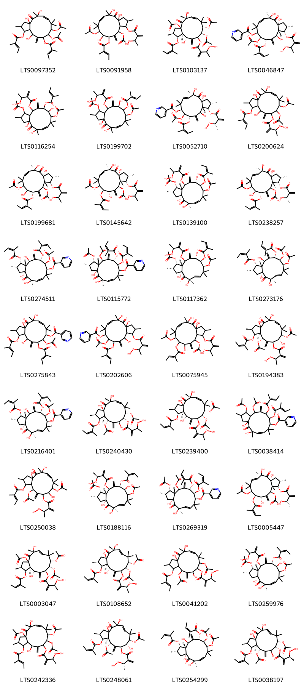{ width=100% }
    <figcaption>Hình ảnh cấu trúc hóa học của 36 hoạt chất thuộc nhóm Prenol lipids gồm ['9,10-bis(acetyloxy)-3a,5,13-trihydroxy-2,5,8,8-tetramethyl-11-[(2-methylbut-2-enoyl)oxy]-12-methylidene-4-oxo-1h,2h,3h,9h,10h,11h,13h,13ah-cyclopenta[12]annulen-1-yl 2-methylbut-2-enoate (LTS0097352)', '4,8-bis(acetyloxy)-3-[(3-hydroperoxy-2-methylidenebutanoyl)oxy]-7,12,13a-trihydroxy-2,9,9,12-tetramethyl-5-methylidene-13-oxo-1h,2h,3h,3ah,4h,6h,7h,8h-cyclopenta[12]annulen-6-yl 2-methylbut-2-enoate (LTS0091958)', '(1s,2s,3ar,5r,9s,10s,11s,13r,13as)-3a,9,10-tris(acetyloxy)-11-[(3-hydroperoxy-2-methylidenebutanoyl)oxy]-5,13-dihydroxy-2,5,8,8-tetramethyl-12-methylidene-4-oxo-1h,2h,3h,9h,10h,11h,13h,13ah-cyclopenta[12]annulen-1-yl (2z)-2-methylbut-2-enoate (LTS0103137)', '(2s,3s,3as,4r,6s,7s,8s,12r,13ar)-7-(acetyloxy)-3-[(3-hydroperoxy-2-methylidenebutanoyl)oxy]-4,12,13a-trihydroxy-2,9,9,12-tetramethyl-6-{[(2z)-2-methylbut-2-enoyl]oxy}-5-methylidene-13-oxo-1h,2h,3h,3ah,4h,6h,7h,8h-cyclopenta[12]annulen-8-yl pyridine-3-carboxylate (LTS0046847)', '3,8-bis(acetyloxy)-4-[(3-hydroperoxy-2-methylidenebutanoyl)oxy]-7,12,13a-trihydroxy-2,9,9,12-tetramethyl-5-methylidene-13-oxo-1h,2h,3h,3ah,4h,6h,7h,8h-cyclopenta[12]annulen-6-yl 2-methylbut-2-enoate (LTS0116254)', '3,8-bis(acetyloxy)-4-[(3-hydroperoxy-2-methylidenebutanoyl)oxy]-6,12,13a-trihydroxy-2,9,9,12-tetramethyl-5-methylidene-13-oxo-1h,2h,3h,3ah,4h,6h,7h,8h-cyclopenta[12]annulen-7-yl 2-methylbut-2-enoate (LTS0199702)', '(2s,3s,3as,4r,6s,7s,8s,12r,13ar)-7-(acetyloxy)-3-{[(3s)-3-hydroperoxy-2-methylidenebutanoyl]oxy}-4,12,13a-trihydroxy-2,9,9,12-tetramethyl-6-{[(2z)-2-methylbut-2-enoyl]oxy}-5-methylidene-13-oxo-1h,2h,3h,3ah,4h,6h,7h,8h-cyclopenta[12]annulen-8-yl pyridine-3-carboxylate (LTS0052710)', '9,10-bis(acetyloxy)-11-[(3-hydroperoxy-2-methylidenebutanoyl)oxy]-3a,5,13-trihydroxy-2,5,8,8-tetramethyl-12-methylidene-4-oxo-1h,2h,3h,9h,10h,11h,13h,13ah-cyclopenta[12]annulen-1-yl 2-methylbut-2-enoate (LTS0200624)', '(2s,3s,3ar,4r,6s,7s,8s,12r,13ar)-4,8-bis(acetyloxy)-3-[(3-hydroperoxy-2-methylidenebutanoyl)oxy]-7,12,13a-trihydroxy-2,9,9,12-tetramethyl-5-methylidene-13-oxo-1h,2h,3h,3ah,4h,6h,7h,8h-cyclopenta[12]annulen-6-yl (2z)-2-methylbut-2-enoate (LTS0199681)', '(2s,3s,3ar,4r,6s,7r,8s,12r,13ar)-4,8-bis(acetyloxy)-3-[(3-hydroperoxy-2-methylidenebutanoyl)oxy]-6,12,13a-trihydroxy-2,9,9,12-tetramethyl-5-methylidene-13-oxo-1h,2h,3h,3ah,4h,6h,7h,8h-cyclopenta[12]annulen-7-yl (2z)-2-methylbut-2-enoate (LTS0145642)', '(2s,3s,3ar,4r,6s,7r,8s,12r,13ar)-3,8-bis(acetyloxy)-4-[(3-hydroperoxy-2-methylidenebutanoyl)oxy]-6,12,13a-trihydroxy-2,9,9,12-tetramethyl-5-methylidene-13-oxo-1h,2h,3h,3ah,4h,6h,7h,8h-cyclopenta[12]annulen-7-yl (2z)-2-methylbut-2-enoate (LTS0139100)', '(2s,3s,3ar,4r,6s,7s,8s,12r,13ar)-4,8-bis(acetyloxy)-3-{[(3s)-3-hydroperoxy-2-methylidenebutanoyl]oxy}-7,12,13a-trihydroxy-2,9,9,12-tetramethyl-5-methylidene-13-oxo-1h,2h,3h,3ah,4h,6h,7h,8h-cyclopenta[12]annulen-6-yl (2z)-2-methylbut-2-enoate (LTS0238257)', '(2s,3s,3as,4r,6s,7s,8s,12r,13ar)-7-(acetyloxy)-4,12,13a-trihydroxy-2,9,9,12-tetramethyl-3,6-bis({[(2z)-2-methylbut-2-enoyl]oxy})-5-methylidene-13-oxo-1h,2h,3h,3ah,4h,6h,7h,8h-cyclopenta[12]annulen-8-yl pyridine-3-carboxylate (LTS0274511)', '(2s,3s,3ar,4r,6s,7s,8s,12r,13ar)-3,4-bis(acetyloxy)-12,13a-dihydroxy-2,9,9,12-tetramethyl-6,7-bis({[(2z)-2-methylbut-2-enoyl]oxy})-5-methylidene-13-oxo-1h,2h,3h,3ah,4h,6h,7h,8h-cyclopenta[12]annulen-8-yl pyridine-3-carboxylate (LTS0115772)', '(2s,3s,3ar,4r,6s,7r,8s,12r,13ar)-3,8-bis(acetyloxy)-4-{[(3s)-3-hydroperoxy-2-methylidenebutanoyl]oxy}-6,12,13a-trihydroxy-2,9,9,12-tetramethyl-5-methylidene-13-oxo-1h,2h,3h,3ah,4h,6h,7h,8h-cyclopenta[12]annulen-7-yl (2z)-2-methylbut-2-enoate (LTS0117362)', '(1s,2s,3ar,5r,9s,10s,11s,13r,13as)-9,10-bis(acetyloxy)-3a,5,13-trihydroxy-2,5,8,8-tetramethyl-11-{[(2z)-2-methylbut-2-enoyl]oxy}-12-methylidene-4-oxo-1h,2h,3h,9h,10h,11h,13h,13ah-cyclopenta[12]annulen-1-yl (2z)-2-methylbut-2-enoate (LTS0273176)', '7-(acetyloxy)-4,12,13a-trihydroxy-2,9,9,12-tetramethyl-3,6-bis[(2-methylbut-2-enoyl)oxy]-5-methylidene-13-oxo-1h,2h,3h,3ah,4h,6h,7h,8h-cyclopenta[12]annulen-8-yl pyridine-3-carboxylate (LTS0275843)', '7-(acetyloxy)-3-[(3-hydroperoxy-2-methylidenebutanoyl)oxy]-4,12,13a-trihydroxy-2,9,9,12-tetramethyl-6-[(2-methylbut-2-enoyl)oxy]-5-methylidene-13-oxo-1h,2h,3h,3ah,4h,6h,7h,8h-cyclopenta[12]annulen-8-yl pyridine-3-carboxylate (LTS0202606)', '4,8-bis(acetyloxy)-3-[(3-hydroperoxy-2-methylidenebutanoyl)oxy]-6,12,13a-trihydroxy-2,9,9,12-tetramethyl-5-methylidene-13-oxo-1h,2h,3h,3ah,4h,6h,7h,8h-cyclopenta[12]annulen-7-yl 2-methylbut-2-enoate (LTS0075945)', '(1s,2s,3ar,5r,9s,10s,11s,13r,13ar)-9,13-bis(acetyloxy)-11-[(3-hydroperoxy-2-methylidenebutanoyl)oxy]-3a,5,10-trihydroxy-2,5,8,8-tetramethyl-12-methylidene-4-oxo-1h,2h,3h,9h,10h,11h,13h,13ah-cyclopenta[12]annulen-1-yl (2z)-2-methylbut-2-enoate (LTS0194383)', '(2s,3s,3as,4r,6s,7s,8s,12r,13ar)-7-(acetyloxy)-4,12,13a-trihydroxy-2,9,9,12-tetramethyl-3,6-bis({[(2z)-2-methylbut-2-enoyl]oxy})-5-methylidene-13-oxo-1h,2h,3h,3ah,4h,6h,7h,8h-cyclopenta[12]annulen-8-yl pyridine-3-carboxylate (LTS0216401)', '(1s,2s,3ar,5r,9s,10r,11s,13r,13ar)-9,13-bis(acetyloxy)-10-[(3-hydroperoxy-2-methylidenebutanoyl)oxy]-3a,5,11-trihydroxy-2,5,8,8-tetramethyl-12-methylidene-4-oxo-1h,2h,3h,9h,10h,11h,13h,13ah-cyclopenta[12]annulen-1-yl (2z)-2-methylbut-2-enoate (LTS0240430)', '(1s,2s,3ar,5r,9s,10s,11s,13r,13as)-9,10-bis(acetyloxy)-11-[(3-hydroperoxy-2-methylidenebutanoyl)oxy]-3a,5,13-trihydroxy-2,5,8,8-tetramethyl-12-methylidene-4-oxo-1h,2h,3h,9h,10h,11h,13h,13ah-cyclopenta[12]annulen-1-yl (2z)-2-methylbut-2-enoate (LTS0239400)', '3,4-bis(acetyloxy)-12,13a-dihydroxy-2,9,9,12-tetramethyl-6,7-bis[(2-methylbut-2-enoyl)oxy]-5-methylidene-13-oxo-1h,2h,3h,3ah,4h,6h,7h,8h-cyclopenta[12]annulen-8-yl pyridine-3-carboxylate (LTS0038414)', '9,13-bis(acetyloxy)-11-[(3-hydroperoxy-2-methylidenebutanoyl)oxy]-3a,5,10-trihydroxy-2,5,8,8-tetramethyl-12-methylidene-4-oxo-1h,2h,3h,9h,10h,11h,13h,13ah-cyclopenta[12]annulen-1-yl 2-methylbut-2-enoate (LTS0250038)', '(2s,3s,3ar,4r,6s,7s,8s,12r,13ar)-3,8-bis(acetyloxy)-4-{[(3s)-3-hydroperoxy-2-methylidenebutanoyl]oxy}-7,12,13a-trihydroxy-2,9,9,12-tetramethyl-5-methylidene-13-oxo-1h,2h,3h,3ah,4h,6h,7h,8h-cyclopenta[12]annulen-6-yl (2z)-2-methylbut-2-enoate (LTS0188116)', '(2s,3s,3ar,4r,6s,7s,8s,12r,13ar)-3,4-bis(acetyloxy)-12,13a-dihydroxy-2,9,9,12-tetramethyl-6,7-bis({[(2z)-2-methylbut-2-enoyl]oxy})-5-methylidene-13-oxo-1h,2h,3h,3ah,4h,6h,7h,8h-cyclopenta[12]annulen-8-yl pyridine-3-carboxylate (LTS0269319)', '(2s,3s,3ar,4r,6s,7r,8s,12r,13ar)-4,8-bis(acetyloxy)-3-{[(3s)-3-hydroperoxy-2-methylidenebutanoyl]oxy}-6,12,13a-trihydroxy-2,9,9,12-tetramethyl-5-methylidene-13-oxo-1h,2h,3h,3ah,4h,6h,7h,8h-cyclopenta[12]annulen-7-yl (2z)-2-methylbut-2-enoate (LTS0005447)', '(1s,2s,3ar,5r,9s,10s,11s,13r,13as)-3a,9,10-tris(acetyloxy)-11-{[(3s)-3-hydroperoxy-2-methylidenebutanoyl]oxy}-5,13-dihydroxy-2,5,8,8-tetramethyl-12-methylidene-4-oxo-1h,2h,3h,9h,10h,11h,13h,13ah-cyclopenta[12]annulen-1-yl (2z)-2-methylbut-2-enoate (LTS0003047)', '(1s,2s,3ar,5r,9s,10s,11s,13r,13as)-9,10-bis(acetyloxy)-11-{[(3s)-3-hydroperoxy-2-methylidenebutanoyl]oxy}-3a,5,13-trihydroxy-2,5,8,8-tetramethyl-12-methylidene-4-oxo-1h,2h,3h,9h,10h,11h,13h,13ah-cyclopenta[12]annulen-1-yl (2z)-2-methylbut-2-enoate (LTS0108652)', '9,13-bis(acetyloxy)-10-[(3-hydroperoxy-2-methylidenebutanoyl)oxy]-3a,5,11-trihydroxy-2,5,8,8-tetramethyl-12-methylidene-4-oxo-1h,2h,3h,9h,10h,11h,13h,13ah-cyclopenta[12]annulen-1-yl 2-methylbut-2-enoate (LTS0041202)', '(2s,3s,3ar,4r,6s,7s,8s,12r,13ar)-3,8-bis(acetyloxy)-4-[(3-hydroperoxy-2-methylidenebutanoyl)oxy]-7,12,13a-trihydroxy-2,9,9,12-tetramethyl-5-methylidene-13-oxo-1h,2h,3h,3ah,4h,6h,7h,8h-cyclopenta[12]annulen-6-yl (2z)-2-methylbut-2-enoate (LTS0259976)', '3a,9,10-tris(acetyloxy)-11-[(3-hydroperoxy-2-methylidenebutanoyl)oxy]-5,13-dihydroxy-2,5,8,8-tetramethyl-12-methylidene-4-oxo-1h,2h,3h,9h,10h,11h,13h,13ah-cyclopenta[12]annulen-1-yl 2-methylbut-2-enoate (LTS0242336)', '(1s,2s,3ar,5r,9s,10s,11s,13r,13ar)-9,13-bis(acetyloxy)-11-{[(3s)-3-hydroperoxy-2-methylidenebutanoyl]oxy}-3a,5,10-trihydroxy-2,5,8,8-tetramethyl-12-methylidene-4-oxo-1h,2h,3h,9h,10h,11h,13h,13ah-cyclopenta[12]annulen-1-yl (2z)-2-methylbut-2-enoate (LTS0248061)', '(1s,2s,3ar,5r,9s,10s,11s,13r,13as)-9,10-bis(acetyloxy)-3a,5,13-trihydroxy-2,5,8,8-tetramethyl-11-{[(2z)-2-methylbut-2-enoyl]oxy}-12-methylidene-4-oxo-1h,2h,3h,9h,10h,11h,13h,13ah-cyclopenta[12]annulen-1-yl (2z)-2-methylbut-2-enoate (LTS0254299)', '(1s,2s,3ar,5r,9s,10r,11s,13r,13ar)-9,13-bis(acetyloxy)-10-{[(3s)-3-hydroperoxy-2-methylidenebutanoyl]oxy}-3a,5,11-trihydroxy-2,5,8,8-tetramethyl-12-methylidene-4-oxo-1h,2h,3h,9h,10h,11h,13h,13ah-cyclopenta[12]annulen-1-yl (2z)-2-methylbut-2-enoate (LTS0038197)'].</figcaption>
</figure>

---

### Dược dân tộc học

Danh sách các quốc gia có sử dụng *Euphorbia amygdaloides* trong điều trị các bệnh. 

| Country   | Disease            | Bệnh                                                                                                                                                                                                |
|:----------|:-------------------|:----------------------------------------------------------------------------------------------------------------------------------------------------------------------------------------------------|
| Turkey    | Discutient, Poison | MYMEMORY WARNING: YOU USED ALL AVAILABLE FREE TRANSLATIONS FOR TODAY. NEXT AVAILABLE IN  20 HOURS 32 MINUTES 17 SECONDS VISIT HTTPS://MYMEMORY.TRANSLATED.NET/DOC/USAGELIMITS.PHP TO TRANSLATE MORE |

---

---
## Euphorbia antiquorum
### Thông tin về thực vật

!!! info "Phân loại thực vật của *Euphorbia antiquorum* từ GIBF:"
    - **Kingdom:** Plantae
    - **Phylum:** Tracheophyta
    - **Order:** Malpighiales
    - **Family:** Euphorbiaceae
    - **Genus:** Euphorbia
    - **Species:** *Euphorbia antiquorum*

 

| Label (VI)   | Label (EN)   | Scientific Name      | Descriptions (VI)   | Descriptions (EN)   | Also Known As (VI)   | Also Known As (EN)   |
|:-------------|:-------------|:---------------------|:--------------------|:--------------------|:---------------------|:---------------------|
| N/A          | N/A          | Euphorbia antiquorum | loài thực vật       | species of plant    | ['']                 | ['']                 |

#### Phân bố trên thế giới

**Từ CSDL GIBF** Virgin Islands (U.S.), nan, Sri Lanka, Italy, Japan, Lao People’s Democratic Republic, Belgium, Cambodia, Myanmar, unknown or invalid, Tanzania, United Republic of, Netherlands, Chinese Taipei, Spain, Bangladesh, United States of America, Hong Kong, Thailand, Viet Nam, China, French Polynesia, Costa Rica, India, Indonesia, Nauru, Philippines, Malaysia

#### Phân bố tại Việt Nam

**Từ CSDL GIBF**: Hải Phòng

---
### Thành phần hóa học
        
- Theo cơ sở dữ liệu lotus: Từ loài *Euphorbia antiquorum* đã phân lập và xác định được 68 hoạt chất thuộc về các nhóm Prenol lipids, Steroids and steroid derivatives, Unsaturated hydrocarbons, Organooxygen compounds, Phenol esters. 

|    | chemicalTaxonomyClassyfireClass   |   smiles_count |
|---:|:----------------------------------|---------------:|
|  0 | Organooxygen compounds            |              2 |
|  1 | Phenol esters                     |              1 |
|  2 | Prenol lipids                     |             50 |
|  3 | Steroids and steroid derivatives  |             13 |
|  4 | Unsaturated hydrocarbons          |              2 |

#### Nhóm Organooxygen compounds
<figure markdown="span">
    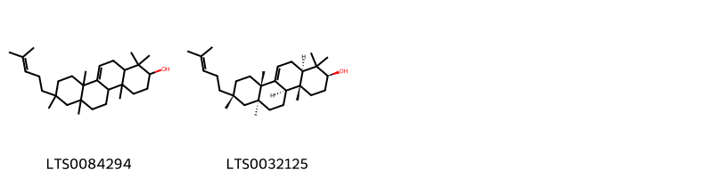{ width=100% }
    <figcaption>Hình ảnh cấu trúc hóa học của 2 hoạt chất thuộc nhóm Organooxygen compounds gồm ['1,1,4a,6a,8,10a-hexamethyl-8-(4-methylpent-3-en-1-yl)-3,4,4b,5,6,7,9,10,12,12a-decahydro-2h-chrysen-2-ol (LTS0084294)', '(2s,4ar,4br,6as,8r,10as,12ar)-1,1,4a,6a,8,10a-hexamethyl-8-(4-methylpent-3-en-1-yl)-3,4,4b,5,6,7,9,10,12,12a-decahydro-2h-chrysen-2-ol (LTS0032125)'].</figcaption>
</figure>
#### Nhóm Phenol esters
<figure markdown="span">
    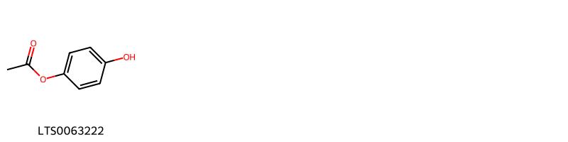{ width=100% }
    <figcaption>Hình ảnh cấu trúc hóa học của 1 hoạt chất thuộc nhóm Phenol esters gồm ['4-hydroxyphenyl acetate (LTS0063222)'].</figcaption>
</figure>
#### Nhóm Prenol lipids
<figure markdown="span">
    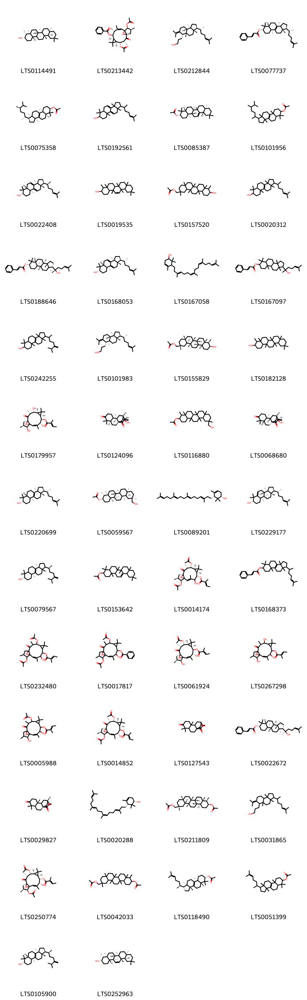{ width=100% }
    <figcaption>Hình ảnh cấu trúc hóa học của 50 hoạt chất thuộc nhóm Prenol lipids gồm ['epi-friedelanol (LTS0114491)', '(1r,3r,4r,5r,7s,8r,9r,10z,12s,13s,14s)-4,13-bis(acetyloxy)-9-hydroxy-3,6,6,10,14-pentamethyl-2-oxo-16-oxatetracyclo[10.3.1.0¹,¹².0⁵,⁷]hexadec-10-en-8-yl benzoate (LTS0213442)', '3-[(3s,3as,5ar,6s,9as,9br)-3a,5a,9b-trimethyl-3-[(2r)-6-methylhept-5-en-2-yl]-7-(propan-2-ylidene)-octahydro-1h-cyclopenta[a]naphthalen-6-yl]propan-1-ol (LTS0212844)', '(1s,3as,5ar,7s,9as,11as)-3a,6,6,9a,11a-pentamethyl-1-[(2r)-6-methylhept-5-en-2-yl]-1h,2h,3h,4h,5h,5ah,7h,8h,9h,10h,11h-cyclopenta[a]phenanthren-7-yl (2e)-3-phenylprop-2-enoate (LTS0077737)', '(1s,3as,5as,7r,9as,11ar)-1-[(2r,5r)-5,6-dimethylheptan-2-yl]-3a,6,6,9a,11a-pentamethyl-1h,2h,3h,4h,5h,5ah,7h,8h,9h,10h,11h-cyclopenta[a]phenanthren-7-yl acetate (LTS0075358)', '3a,6,6,9a,11a-pentamethyl-1-(6-methylhept-5-en-2-yl)-1h,2h,3h,5h,5ah,7h,8h,9h,11h-cyclopenta[a]phenanthren-7-ol (LTS0192561)', '(3s,4ar,6ar,6bs,8ar,12as,14ar,14br)-4,4,6a,6b,8a,11,11,14b-octamethyl-1,2,3,4a,5,6,7,8,9,10,12,12a,14,14a-tetradecahydropicen-3-yl acetate (LTS0085387)', '1-(5,6-dimethylheptan-2-yl)-3a,6,6,9a,11a-pentamethyl-1h,2h,3h,4h,5h,5ah,7h,8h,9h,10h,11h-cyclopenta[a]phenanthren-7-yl acetate (LTS0101956)', '(1s,3as,5ar,7s,9as,11as)-3a,6,6,9a,11a-pentamethyl-1-[(2s)-6-methylhept-5-en-2-yl]-1h,2h,3h,5h,5ah,7h,8h,9h,11h-cyclopenta[a]phenanthren-7-ol (LTS0022408)', '4,4a,6b,8a,11,11,12b,14a-octamethyl-1,2,3,4,5,6,6a,7,8,9,10,12,12a,14b-tetradecahydropicen-3-ol (LTS0019535)', '(10-hydroxy-2,4a,6a,8a,9,12b,14a-heptamethyl-hexadecahydropicen-2-yl)methyl acetate (LTS0157520)', 'lanster (LTS0020312)', '(1s,3as,3br,5ar,7s,9ar,9bs,11ar)-1-[(2s)-2-hydroxy-6-methylhept-5-en-2-yl]-3a,6,6,9a,11a-pentamethyl-dodecahydro-1h-cyclopenta[a]phenanthren-7-yl (2e)-3-phenylprop-2-enoate (LTS0188646)', '(1s,3as,5ar,7s,9as,11as)-3a,6,6,9a,11a-pentamethyl-1-[(2r)-6-methylhept-5-en-2-yl]-1h,2h,3h,5h,5ah,7h,8h,9h,11h-cyclopenta[a]phenanthren-7-ol (LTS0168053)', '4,6,6-trimethyl-5-(3,8,12,16-tetramethylheptadeca-3,7,11,15-tetraen-1-yl)cyclohex-3-en-1-ol (LTS0167058)', '1-(2-hydroxy-6-methylhept-5-en-2-yl)-3a,6,6,9a,11a-pentamethyl-dodecahydro-1h-cyclopenta[a]phenanthren-7-yl 3-phenylprop-2-enoate (LTS0167097)', '3a,6,6,9a,11a-pentamethyl-1-(6-methyl-5-methylideneheptan-2-yl)-1h,2h,3h,4h,5h,5ah,7h,8h,9h,10h,11h-cyclopenta[a]phenanthren-7-ol (LTS0242255)', '3-[(3s,3as,5as,6s,9as,9br)-3a,5a,9b-trimethyl-3-[(2r)-6-methylhept-5-en-2-yl]-7-(propan-2-ylidene)-octahydro-1h-cyclopenta[a]naphthalen-6-yl]propan-1-ol (LTS0101983)', '[(2r,4as,6ar,6br,8as,9r,10s,12ar,12bs,14ar,14bs)-10-hydroxy-2,4a,6a,8a,9,12b,14a-heptamethyl-hexadecahydropicen-2-yl]methyl acetate (LTS0155829)', '4,4a,6b,8a,11,11,12b,14a-octamethyl-hexadecahydropicen-3-ol (LTS0182128)', '(1r,3r,4r,5r,7s,8r,9r,10z,12s,13s,14s)-4,9,13-trihydroxy-3,6,6,10,14-pentamethyl-2-oxo-16-oxatetracyclo[10.3.1.0¹,¹².0⁵,⁷]hexadec-10-en-8-yl (2e)-2-methylbut-2-enoate (LTS0179957)', '(1r,4r,9r,10r,12r,13s)-13-hydroxy-5,5,9-trimethyl-16-methylidenetetracyclo[10.2.2.0¹,¹⁰.0⁴,⁹]hexadecane-6,14-dione (LTS0124096)', '11-(hydroxymethyl)-4,4a,6b,8a,11,12b,14a-heptamethyl-hexadecahydropicen-3-yl acetate (LTS0116880)', '(1s,4s,9r,10s,12r,13r)-13-hydroxy-5,5,9-trimethyl-16-methylidenetetracyclo[10.2.2.0¹,¹⁰.0⁴,⁹]hexadecane-6,14-dione (LTS0068680)', 'euphol (LTS0220699)', '(3s,4r,4as,6as,6br,8as,11r,12ar,12br,14as,14br)-11-(hydroxymethyl)-4,4a,6b,8a,11,12b,14a-heptamethyl-hexadecahydropicen-3-yl acetate (LTS0059567)', 'camelliol c (LTS0089201)', '(1s,3ar,3br,7s,9ar,9br,11as)-3a,6,6,9a,9b,11a-hexamethyl-1-[(2r)-6-methylhept-5-en-2-yl]-1h,2h,3h,3bh,4h,7h,8h,9h,10h,11h-cyclopenta[a]phenanthren-7-ol (LTS0229177)', '(3as,7s,9as)-3a,6,6,9a,11a-pentamethyl-1-[(2s)-6-methyl-5-methylideneheptan-2-yl]-1h,2h,3h,4h,5h,5ah,7h,8h,9h,10h,11h-cyclopenta[a]phenanthren-7-ol (LTS0079567)', '4,4,6a,6b,8a,11,11,14b-octamethyl-1,2,3,4a,5,6,7,8,9,10,12,12a,14,14a-tetradecahydropicen-3-yl acetate (LTS0153642)', '(1r,3r,4r,5r,7s,8s,10e,12s,13s,14s)-4,13-bis(acetyloxy)-9-hydroxy-3,6,6,10,14-pentamethyl-2-oxo-16-oxatetracyclo[10.3.1.0¹,¹².0⁵,⁷]hexadec-10-en-8-yl (2e)-2-methylbut-2-enoate (LTS0014174)', '3a,6,6,9a,11a-pentamethyl-1-(6-methylhept-5-en-2-yl)-1h,2h,3h,4h,5h,5ah,7h,8h,9h,10h,11h-cyclopenta[a]phenanthren-7-yl 3-phenylprop-2-enoate (LTS0168373)', '4,13-bis(acetyloxy)-9-hydroxy-3,6,6,10,14-pentamethyl-2-oxo-16-oxatetracyclo[10.3.1.0¹,¹².0⁵,⁷]hexadec-10-en-8-yl 2-methylbut-2-enoate (LTS0232480)', '4,13-bis(acetyloxy)-9-hydroxy-3,6,6,10,14-pentamethyl-2-oxo-16-oxatetracyclo[10.3.1.0¹,¹².0⁵,⁷]hexadec-10-en-8-yl benzoate (LTS0017817)', '(1r,3r,4r,5r,7s,8r,9r,10z,12s,13s,14s)-4-(acetyloxy)-9,13-dihydroxy-3,6,6,10,14-pentamethyl-2-oxo-16-oxatetracyclo[10.3.1.0¹,¹².0⁵,⁷]hexadec-10-en-8-yl (2e)-2-methylbut-2-enoate (LTS0061924)', '4,9,13-trihydroxy-3,6,6,10,14-pentamethyl-2-oxo-16-oxatetracyclo[10.3.1.0¹,¹².0⁵,⁷]hexadec-10-en-8-yl 2-methylbut-2-enoate (LTS0267298)', '4-(acetyloxy)-9,13-dihydroxy-3,6,6,10,14-pentamethyl-2-oxo-16-oxatetracyclo[10.3.1.0¹,¹².0⁵,⁷]hexadec-10-en-8-yl 2-methylbut-2-enoate (LTS0005988)', '(1r,3r,4r,5r,7s,8r,9r,10z,12s,13s,14s)-4,13-bis(acetyloxy)-9-hydroxy-3,6,6,10,14-pentamethyl-2-oxo-16-oxatetracyclo[10.3.1.0¹,¹².0⁵,⁷]hexadec-10-en-8-yl (2e)-2-methylbut-2-enoate (LTS0014852)', '13-hydroxy-5,5,9-trimethyl-16-methylidenetetracyclo[10.2.2.0¹,¹⁰.0⁴,⁹]hexadecane-6,14-dione (LTS0127543)', '(1s,3as,3br,5ar,7s,9ar,9bs,11ar)-1-[(2r)-2-hydroxy-6-methylhept-5-en-2-yl]-3a,6,6,9a,11a-pentamethyl-dodecahydro-1h-cyclopenta[a]phenanthren-7-yl (2e)-3-phenylprop-2-enoate (LTS0022672)', '(1r,9s,12r)-13-hydroxy-5,5,9-trimethyl-16-methylidenetetracyclo[10.2.2.0¹,¹⁰.0⁴,⁹]hexadecane-6,14-dione (LTS0029827)', '(1s,5r)-4,6,6-trimethyl-5-[(3e,11e)-3,8,12,16-tetramethylheptadeca-3,7,11,15-tetraen-1-yl]cyclohex-3-en-1-ol (LTS0020288)', '[(2r,4as,6ar,6br,8as,9r,10s,12as,12bs,14ar,14br)-10-(acetyloxy)-2,4a,6a,8a,9,12b,14a-heptamethyl-hexadecahydropicen-2-yl]methyl acetate (LTS0211809)', '3-[3a,5a,9b-trimethyl-3-(6-methylhept-5-en-2-yl)-7-(propan-2-ylidene)-octahydro-1h-cyclopenta[a]naphthalen-6-yl]propan-1-ol (LTS0031865)', '(1r,3r,4r,5r,7s,8s,9r,10e,12s,13s,14s)-4,13-bis(acetyloxy)-9-hydroxy-3,6,6,10,14-pentamethyl-2-oxo-16-oxatetracyclo[10.3.1.0¹,¹².0⁵,⁷]hexadec-10-en-8-yl (2e)-2-methylbut-2-enoate (LTS0250774)', '[10-(acetyloxy)-2,4a,6a,8a,9,12b,14a-heptamethyl-hexadecahydropicen-2-yl]methyl acetate (LTS0042033)', '(1r,3ar,5ar,7s,9as,11ar)-3a,6,6,9a,11a-pentamethyl-1-[(2s)-6-methylhept-5-en-2-yl]-1h,2h,3h,4h,5h,5ah,7h,8h,9h,10h,11h-cyclopenta[a]phenanthren-7-yl acetate (LTS0118490)', '3a,6,6,9a,11a-pentamethyl-1-(6-methylhept-5-en-2-yl)-1h,2h,3h,4h,5h,5ah,7h,8h,9h,10h,11h-cyclopenta[a]phenanthren-7-yl acetate (LTS0051399)', '(1s,3as,5ar,7s,9as,11as)-3a,6,6,9a,11a-pentamethyl-1-[(2s)-6-methyl-5-methylideneheptan-2-yl]-1h,2h,3h,4h,5h,5ah,7h,8h,9h,10h,11h-cyclopenta[a]phenanthren-7-ol (LTS0105900)', '(3s,4r,4as,6as,6br,8ar,12ar,12bs,14as,14br)-4,4a,6b,8a,11,11,12b,14a-octamethyl-1,2,3,4,5,6,6a,7,8,9,10,12,12a,14b-tetradecahydropicen-3-ol (LTS0252963)'].</figcaption>
</figure>
#### Nhóm Steroids and steroid derivatives
<figure markdown="span">
    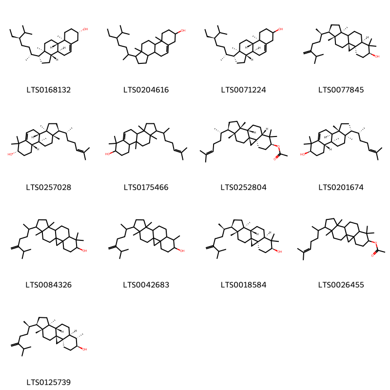{ width=100% }
    <figcaption>Hình ảnh cấu trúc hóa học của 13 hoạt chất thuộc nhóm Steroids and steroid derivatives gồm ['sitosterol (LTS0168132)', 'stigmast-5-en-3-ol, (3β)- (LTS0204616)', 'stigmast-5-en-3-ol (LTS0071224)', '24-methylene-cycloartanol (LTS0077845)', '(1s,3ar,3bs,7s,9as,9br,11as)-3a,6,6,9b,11a-pentamethyl-1-[(2r)-6-methylhept-5-en-2-yl]-1h,2h,3h,3bh,4h,7h,8h,9h,9ah,10h,11h-cyclopenta[a]phenanthren-7-ol (LTS0257028)', '3a,6,6,9b,11a-pentamethyl-1-(6-methylhept-5-en-2-yl)-1h,2h,3h,3bh,4h,7h,8h,9h,9ah,10h,11h-cyclopenta[a]phenanthren-7-ol (LTS0175466)', '(1s,3r,6s,8s,11s,12r,15r,16r)-7,7,12,16-tetramethyl-15-[(2s)-6-methylhept-5-en-2-yl]pentacyclo[9.7.0.0¹,³.0³,⁸.0¹²,¹⁶]octadecan-6-yl acetate (LTS0252804)', '(1r,3as,3br,7r,9as,9br,11ar)-3a,6,6,9b,11a-pentamethyl-1-[(2r)-6-methylhept-5-en-2-yl]-1h,2h,3h,3bh,4h,7h,8h,9h,9ah,10h,11h-cyclopenta[a]phenanthren-7-ol (LTS0201674)', '7,7,12,16-tetramethyl-15-(6-methyl-5-methylideneheptan-2-yl)pentacyclo[9.7.0.0¹,³.0³,⁸.0¹²,¹⁶]octadecan-6-ol (LTS0084326)', '7,12,16-trimethyl-15-(6-methyl-5-methylideneheptan-2-yl)pentacyclo[9.7.0.0¹,³.0³,⁸.0¹²,¹⁶]octadecan-6-ol (LTS0042683)', '24-methylenecycloartanol (LTS0018584)', '7,7,12,16-tetramethyl-15-(6-methylhept-5-en-2-yl)pentacyclo[9.7.0.0¹,³.0³,⁸.0¹²,¹⁶]octadecan-6-yl acetate (LTS0026455)', 'cycloeucalenol (LTS0125739)'].</figcaption>
</figure>
#### Nhóm Unsaturated hydrocarbons
<figure markdown="span">
    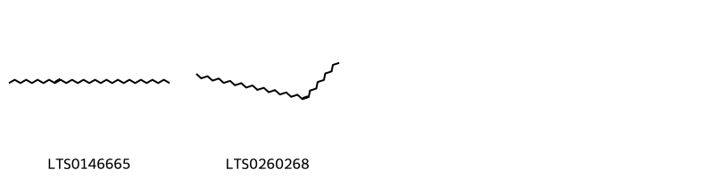{ width=100% }
    <figcaption>Hình ảnh cấu trúc hóa học của 2 hoạt chất thuộc nhóm Unsaturated hydrocarbons gồm ['nonacos-9-ene (LTS0146665)', '(9z)-nonacos-9-ene (LTS0260268)'].</figcaption>
</figure>

---

### Dược dân tộc học

Danh sách các quốc gia có sử dụng *Euphorbia antiquorum* trong điều trị các bệnh. 

| Country   | Disease                                      | Bệnh                                                                                                                                                                                                |
|:----------|:---------------------------------------------|:----------------------------------------------------------------------------------------------------------------------------------------------------------------------------------------------------|
| Borneo    | Piscicide                                    | MYMEMORY WARNING: YOU USED ALL AVAILABLE FREE TRANSLATIONS FOR TODAY. NEXT AVAILABLE IN  20 HOURS 31 MINUTES 47 SECONDS VISIT HTTPS://MYMEMORY.TRANSLATED.NET/DOC/USAGELIMITS.PHP TO TRANSLATE MORE |
| German    | Emetic                                       | MYMEMORY WARNING: YOU USED ALL AVAILABLE FREE TRANSLATIONS FOR TODAY. NEXT AVAILABLE IN  20 HOURS 31 MINUTES 43 SECONDS VISIT HTTPS://MYMEMORY.TRANSLATED.NET/DOC/USAGELIMITS.PHP TO TRANSLATE MORE |
| India     | nan, Purgative, Vesicant, Larvicide, Nervine | MYMEMORY WARNING: YOU USED ALL AVAILABLE FREE TRANSLATIONS FOR TODAY. NEXT AVAILABLE IN  20 HOURS 31 MINUTES 40 SECONDS VISIT HTTPS://MYMEMORY.TRANSLATED.NET/DOC/USAGELIMITS.PHP TO TRANSLATE MORE |
| Malaysia  | Poison                                       | MYMEMORY WARNING: YOU USED ALL AVAILABLE FREE TRANSLATIONS FOR TODAY. NEXT AVAILABLE IN  20 HOURS 31 MINUTES 37 SECONDS VISIT HTTPS://MYMEMORY.TRANSLATED.NET/DOC/USAGELIMITS.PHP TO TRANSLATE MORE |
| Sanscrit  | Rubefacient                                  | MYMEMORY WARNING: YOU USED ALL AVAILABLE FREE TRANSLATIONS FOR TODAY. NEXT AVAILABLE IN  20 HOURS 31 MINUTES 34 SECONDS VISIT HTTPS://MYMEMORY.TRANSLATED.NET/DOC/USAGELIMITS.PHP TO TRANSLATE MORE |
| US        | Laxative                                     | MYMEMORY WARNING: YOU USED ALL AVAILABLE FREE TRANSLATIONS FOR TODAY. NEXT AVAILABLE IN  20 HOURS 31 MINUTES 31 SECONDS VISIT HTTPS://MYMEMORY.TRANSLATED.NET/DOC/USAGELIMITS.PHP TO TRANSLATE MORE |
| anish     | Stomachic                                    | MYMEMORY WARNING: YOU USED ALL AVAILABLE FREE TRANSLATIONS FOR TODAY. NEXT AVAILABLE IN  20 HOURS 31 MINUTES 28 SECONDS VISIT HTTPS://MYMEMORY.TRANSLATED.NET/DOC/USAGELIMITS.PHP TO TRANSLATE MORE |

---

---
## Euphorbia antisyphilitica
### Thông tin về thực vật

!!! info "Phân loại thực vật của *Euphorbia antisyphilitica* từ GIBF:"
    - **Kingdom:** Plantae
    - **Phylum:** Tracheophyta
    - **Order:** Malpighiales
    - **Family:** Euphorbiaceae
    - **Genus:** Euphorbia
    - **Species:** *Euphorbia antisyphilitica*

 

| Label (VI)   | Label (EN)   | Scientific Name           | Descriptions (VI)   | Descriptions (EN)   | Also Known As (VI)   | Also Known As (EN)   |
|:-------------|:-------------|:--------------------------|:--------------------|:--------------------|:---------------------|:---------------------|
| N/A          | N/A          | Euphorbia antisyphilitica | loài thực vật       | species of plant    | ['']                 | ['candelilla']       |

#### Phân bố trên thế giới

**Từ CSDL GIBF** nan, United States of America, Mexico

#### Phân bố tại Việt Nam

**Từ CSDL GIBF**: Không có ghi nhận ở Việt Nam

---
### Thành phần hóa học
        
- Theo cơ sở dữ liệu lotus: Từ loài *Euphorbia antisyphilitica* đã phân lập và xác định được Chưa có hoạt chất nào được phân lập. hoạt chất thuộc về các nhóm Không có hoạt chất nào được phân lập. 

Không có hình ảnh nào được tạo ra

---

### Dược dân tộc học

Danh sách các quốc gia có sử dụng *Euphorbia antisyphilitica* trong điều trị các bệnh. 

| Country   | Disease                    | Bệnh                                                                                                                                                                                                |
|:----------|:---------------------------|:----------------------------------------------------------------------------------------------------------------------------------------------------------------------------------------------------|
| Mexico    | Purgative, Purgative, Soap | MYMEMORY WARNING: YOU USED ALL AVAILABLE FREE TRANSLATIONS FOR TODAY. NEXT AVAILABLE IN  20 HOURS 30 MINUTES 42 SECONDS VISIT HTTPS://MYMEMORY.TRANSLATED.NET/DOC/USAGELIMITS.PHP TO TRANSLATE MORE |

---

---
## Euphorbia atoto
### Thông tin về thực vật

!!! info "Phân loại thực vật của *Euphorbia atoto* từ GIBF:"
    - **Kingdom:** Plantae
    - **Phylum:** Tracheophyta
    - **Order:** Malpighiales
    - **Family:** Euphorbiaceae
    - **Genus:** Euphorbia
    - **Species:** *Euphorbia atoto*

 

| Label (VI)   | Label (EN)   | Scientific Name   | Descriptions (VI)   | Descriptions (EN)   | Also Known As (VI)   | Also Known As (EN)   |
|:-------------|:-------------|:------------------|:--------------------|:--------------------|:---------------------|:---------------------|
| N/A          | N/A          | Euphorbia atoto   | loài thực vật       | species of plant    | ['']                 | ['']                 |

#### Phân bố trên thế giới

**Từ CSDL GIBF** nan, Australia, Japan, Cook Islands, Lao People’s Democratic Republic, Chinese Taipei, Papua New Guinea, Timor-Leste, Solomon Islands, Fiji, Thailand, New Caledonia, Tonga, Viet Nam, China, French Polynesia, Niue, Vanuatu, Indonesia, Samoa, Philippines, Malaysia

#### Phân bố tại Việt Nam

**Từ CSDL GIBF**: Ninh Thuan

---
### Thành phần hóa học
        
- Theo cơ sở dữ liệu lotus: Từ loài *Euphorbia atoto* đã phân lập và xác định được Chưa có hoạt chất nào được phân lập. hoạt chất thuộc về các nhóm Không có hoạt chất nào được phân lập. 

Không có hình ảnh nào được tạo ra

---

### Dược dân tộc học

Danh sách các quốc gia có sử dụng *Euphorbia atoto* trong điều trị các bệnh. 

| Country   | Disease                    | Bệnh                                                                                                                                                                                                |
|:----------|:---------------------------|:----------------------------------------------------------------------------------------------------------------------------------------------------------------------------------------------------|
| India     | Abortifacient, Emmenagogue | MYMEMORY WARNING: YOU USED ALL AVAILABLE FREE TRANSLATIONS FOR TODAY. NEXT AVAILABLE IN  20 HOURS 30 MINUTES 14 SECONDS VISIT HTTPS://MYMEMORY.TRANSLATED.NET/DOC/USAGELIMITS.PHP TO TRANSLATE MORE |
| Indochina | Abortifacient, Emmenagogue | MYMEMORY WARNING: YOU USED ALL AVAILABLE FREE TRANSLATIONS FOR TODAY. NEXT AVAILABLE IN  20 HOURS 30 MINUTES 11 SECONDS VISIT HTTPS://MYMEMORY.TRANSLATED.NET/DOC/USAGELIMITS.PHP TO TRANSLATE MORE |

---

---
## Euphorbia californica
### Thông tin về thực vật

!!! info "Phân loại thực vật của *Euphorbia californica* từ GIBF:"
    - **Kingdom:** Plantae
    - **Phylum:** Tracheophyta
    - **Order:** Malpighiales
    - **Family:** Euphorbiaceae
    - **Genus:** Euphorbia
    - **Species:** *Euphorbia californica*

 

| Label (VI)   | Label (EN)   | Scientific Name       | Descriptions (VI)   | Descriptions (EN)   | Also Known As (VI)   | Also Known As (EN)   |
|:-------------|:-------------|:----------------------|:--------------------|:--------------------|:---------------------|:---------------------|
| N/A          | N/A          | Euphorbia californica | loài thực vật       | species of plant    | ['']                 | ['']                 |

#### Phân bố trên thế giới

**Từ CSDL GIBF** Belgium, United States of America, Mexico

#### Phân bố tại Việt Nam

**Từ CSDL GIBF**: Không có ghi nhận ở Việt Nam

---
### Thành phần hóa học
        
- Theo cơ sở dữ liệu lotus: Từ loài *Euphorbia californica* đã phân lập và xác định được Chưa có hoạt chất nào được phân lập. hoạt chất thuộc về các nhóm Không có hoạt chất nào được phân lập. 

Không có hình ảnh nào được tạo ra

---

### Dược dân tộc học

Danh sách các quốc gia có sử dụng *Euphorbia californica* trong điều trị các bệnh. 

| Country   | Disease   | Bệnh                                                                                                                                                                                                |
|:----------|:----------|:----------------------------------------------------------------------------------------------------------------------------------------------------------------------------------------------------|
| Mexico    | Purgative | MYMEMORY WARNING: YOU USED ALL AVAILABLE FREE TRANSLATIONS FOR TODAY. NEXT AVAILABLE IN  20 HOURS 29 MINUTES 46 SECONDS VISIT HTTPS://MYMEMORY.TRANSLATED.NET/DOC/USAGELIMITS.PHP TO TRANSLATE MORE |

---

---
## Euphorbia calyculata
### Thông tin về thực vật

!!! info "Phân loại thực vật của *Euphorbia calyculata* từ GIBF:"
    - **Kingdom:** Plantae
    - **Phylum:** Tracheophyta
    - **Order:** Malpighiales
    - **Family:** Euphorbiaceae
    - **Genus:** Euphorbia
    - **Species:** *Euphorbia calyculata*

 

| Label (VI)   | Label (EN)   | Scientific Name      | Descriptions (VI)   | Descriptions (EN)   | Also Known As (VI)   | Also Known As (EN)   |
|:-------------|:-------------|:---------------------|:--------------------|:--------------------|:---------------------|:---------------------|
| N/A          | N/A          | Euphorbia calyculata | loài thực vật       | species of plant    | ['']                 | ['']                 |

#### Phân bố trên thế giới

**Từ CSDL GIBF** nan, Mexico

#### Phân bố tại Việt Nam

**Từ CSDL GIBF**: Không có ghi nhận ở Việt Nam

---
### Thành phần hóa học
        
- Theo cơ sở dữ liệu lotus: Từ loài *Euphorbia calyculata* đã phân lập và xác định được Chưa có hoạt chất nào được phân lập. hoạt chất thuộc về các nhóm Không có hoạt chất nào được phân lập. 

Không có hình ảnh nào được tạo ra

---

### Dược dân tộc học

Danh sách các quốc gia có sử dụng *Euphorbia calyculata* trong điều trị các bệnh. 

| Country   | Disease                                     | Bệnh                                                                                                                                                                                                |
|:----------|:--------------------------------------------|:----------------------------------------------------------------------------------------------------------------------------------------------------------------------------------------------------|
| Mexico    | Purgative, Purgative, Vesicant, Rubefacient | MYMEMORY WARNING: YOU USED ALL AVAILABLE FREE TRANSLATIONS FOR TODAY. NEXT AVAILABLE IN  20 HOURS 29 MINUTES 20 SECONDS VISIT HTTPS://MYMEMORY.TRANSLATED.NET/DOC/USAGELIMITS.PHP TO TRANSLATE MORE |

---

---
## Euphorbia caracasana
### Thông tin về thực vật

!!! info "Phân loại thực vật của *Euphorbia cotinifolia* từ GIBF:"
    - **Kingdom:** Plantae
    - **Phylum:** Tracheophyta
    - **Order:** Malpighiales
    - **Family:** Euphorbiaceae
    - **Genus:** Euphorbia
    - **Species:** *Euphorbia cotinifolia*

 

| Label (VI)   | Label (EN)   | Scientific Name      | Descriptions (VI)   | Descriptions (EN)   | Also Known As (VI)   | Also Known As (EN)   |
|:-------------|:-------------|:---------------------|:--------------------|:--------------------|:---------------------|:---------------------|
| N/A          | N/A          | Euphorbia caracasana | loài thực vật       | species of plant    | ['']                 | ['']                 |

#### Phân bố trên thế giới

**Từ CSDL GIBF** nan, Belgium, Colombia, Brazil, Spain, United States of America, Peru, Mexico, Venezuela (Bolivarian Republic of)

#### Phân bố tại Việt Nam

**Từ CSDL GIBF**: Không có ghi nhận ở Việt Nam

---
### Thành phần hóa học
        
- Theo cơ sở dữ liệu lotus: Từ loài *Euphorbia cotinifolia* đã phân lập và xác định được Chưa có hoạt chất nào được phân lập. hoạt chất thuộc về các nhóm Không có hoạt chất nào được phân lập. 

Không có hình ảnh nào được tạo ra

---

### Dược dân tộc học

Danh sách các quốc gia có sử dụng *Euphorbia cotinifolia* trong điều trị các bệnh. 

| Country   | Disease   | Bệnh                                                                                                                                                                                                |
|:----------|:----------|:----------------------------------------------------------------------------------------------------------------------------------------------------------------------------------------------------|
| Venezuela | Vesicant  | MYMEMORY WARNING: YOU USED ALL AVAILABLE FREE TRANSLATIONS FOR TODAY. NEXT AVAILABLE IN  20 HOURS 28 MINUTES 56 SECONDS VISIT HTTPS://MYMEMORY.TRANSLATED.NET/DOC/USAGELIMITS.PHP TO TRANSLATE MORE |

---

---
## Euphorbia chilensis
### Thông tin về thực vật

!!! info "Phân loại thực vật của *Euphorbia chilensis* từ GIBF:"
    - **Kingdom:** Plantae
    - **Phylum:** Tracheophyta
    - **Order:** Malpighiales
    - **Family:** Euphorbiaceae
    - **Genus:** Euphorbia
    - **Species:** *Euphorbia chilensis*

 

| Label (VI)   | Label (EN)   | Scientific Name      | Descriptions (VI)   | Descriptions (EN)   | Also Known As (VI)   | Also Known As (EN)   |
|:-------------|:-------------|:---------------------|:--------------------|:--------------------|:---------------------|:---------------------|
| N/A          | N/A          | Euphorbia caracasana | loài thực vật       | species of plant    | ['']                 | ['']                 |

#### Phân bố trên thế giới

**Từ CSDL GIBF** nan, China, Argentina

#### Phân bố tại Việt Nam

**Từ CSDL GIBF**: Không có ghi nhận ở Việt Nam

---
### Thành phần hóa học
        
- Theo cơ sở dữ liệu lotus: Từ loài *Euphorbia chilensis* đã phân lập và xác định được Chưa có hoạt chất nào được phân lập. hoạt chất thuộc về các nhóm Không có hoạt chất nào được phân lập. 

Không có hình ảnh nào được tạo ra

---

### Dược dân tộc học

Danh sách các quốc gia có sử dụng *Euphorbia chilensis* trong điều trị các bệnh. 

| Country   | Disease   | Bệnh                                                                                                                                                                                                |
|:----------|:----------|:----------------------------------------------------------------------------------------------------------------------------------------------------------------------------------------------------|
| Argentina | Poison    | MYMEMORY WARNING: YOU USED ALL AVAILABLE FREE TRANSLATIONS FOR TODAY. NEXT AVAILABLE IN  20 HOURS 28 MINUTES 34 SECONDS VISIT HTTPS://MYMEMORY.TRANSLATED.NET/DOC/USAGELIMITS.PHP TO TRANSLATE MORE |

---

---
## Euphorbia corollata
### Thông tin về thực vật

!!! info "Phân loại thực vật của *Euphorbia corollata* từ GIBF:"
    - **Kingdom:** Plantae
    - **Phylum:** Tracheophyta
    - **Order:** Malpighiales
    - **Family:** Euphorbiaceae
    - **Genus:** Euphorbia
    - **Species:** *Euphorbia corollata*

 

| Label (VI)   | Label (EN)   | Scientific Name     | Descriptions (VI)   | Descriptions (EN)   | Also Known As (VI)   | Also Known As (EN)   |
|:-------------|:-------------|:--------------------|:--------------------|:--------------------|:---------------------|:---------------------|
| N/A          | N/A          | Euphorbia corollata | loài thực vật       | species of plant    | ['']                 | ['']                 |

#### Phân bố trên thế giới

**Từ CSDL GIBF** United States of America, Canada

#### Phân bố tại Việt Nam

**Từ CSDL GIBF**: Không có ghi nhận ở Việt Nam

---
### Thành phần hóa học
        
- Theo cơ sở dữ liệu lotus: Từ loài *Euphorbia corollata* đã phân lập và xác định được 4 hoạt chất thuộc về các nhóm Fatty Acyls, Prenol lipids. 

|    | chemicalTaxonomyClassyfireClass   |   smiles_count |
|---:|:----------------------------------|---------------:|
|  0 | Fatty Acyls                       |              2 |
|  1 | Prenol lipids                     |              2 |

#### Nhóm Fatty Acyls
<figure markdown="span">
    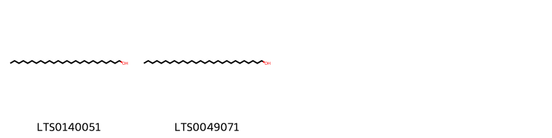{ width=100% }
    <figcaption>Hình ảnh cấu trúc hóa học của 2 hoạt chất thuộc nhóm Fatty Acyls gồm ['ceryl alcohol (LTS0140051)', 'octacosanol (LTS0049071)'].</figcaption>
</figure>
#### Nhóm Prenol lipids
<figure markdown="span">
    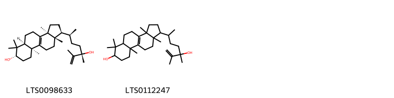{ width=100% }
    <figcaption>Hình ảnh cấu trúc hóa học của 2 hoạt chất thuộc nhóm Prenol lipids gồm ['(1s,3as,5as,7s,9as,11as)-1-[(2s,5s)-5-hydroxy-5,6-dimethylhept-6-en-2-yl]-3a,6,6,9a,11a-pentamethyl-1h,2h,3h,4h,5h,5ah,7h,8h,9h,10h,11h-cyclopenta[a]phenanthren-7-ol (LTS0098633)', '1-(5-hydroxy-5,6-dimethylhept-6-en-2-yl)-3a,6,6,9a,11a-pentamethyl-1h,2h,3h,4h,5h,5ah,7h,8h,9h,10h,11h-cyclopenta[a]phenanthren-7-ol (LTS0112247)'].</figcaption>
</figure>

---

### Dược dân tộc học

Danh sách các quốc gia có sử dụng *Euphorbia corollata* trong điều trị các bệnh. 

| Country        | Disease                                           | Bệnh                                                                                                                                                                                                |
|:---------------|:--------------------------------------------------|:----------------------------------------------------------------------------------------------------------------------------------------------------------------------------------------------------|
| Dutch          | Purgative                                         | MYMEMORY WARNING: YOU USED ALL AVAILABLE FREE TRANSLATIONS FOR TODAY. NEXT AVAILABLE IN  20 HOURS 28 MINUTES 13 SECONDS VISIT HTTPS://MYMEMORY.TRANSLATED.NET/DOC/USAGELIMITS.PHP TO TRANSLATE MORE |
| Elsewhere      | Emetic                                            | MYMEMORY WARNING: YOU USED ALL AVAILABLE FREE TRANSLATIONS FOR TODAY. NEXT AVAILABLE IN  20 HOURS 28 MINUTES 11 SECONDS VISIT HTTPS://MYMEMORY.TRANSLATED.NET/DOC/USAGELIMITS.PHP TO TRANSLATE MORE |
| German         | Emetic                                            | MYMEMORY WARNING: YOU USED ALL AVAILABLE FREE TRANSLATIONS FOR TODAY. NEXT AVAILABLE IN  20 HOURS 28 MINUTES 08 SECONDS VISIT HTTPS://MYMEMORY.TRANSLATED.NET/DOC/USAGELIMITS.PHP TO TRANSLATE MORE |
| US             | Cathartic, Diaphoretic, Emetic, Poison, Sudorific | MYMEMORY WARNING: YOU USED ALL AVAILABLE FREE TRANSLATIONS FOR TODAY. NEXT AVAILABLE IN  20 HOURS 28 MINUTES 05 SECONDS VISIT HTTPS://MYMEMORY.TRANSLATED.NET/DOC/USAGELIMITS.PHP TO TRANSLATE MORE |
| US(Amerindian) | Expectorant, Diaphoretic                          | MYMEMORY WARNING: YOU USED ALL AVAILABLE FREE TRANSLATIONS FOR TODAY. NEXT AVAILABLE IN  20 HOURS 28 MINUTES 02 SECONDS VISIT HTTPS://MYMEMORY.TRANSLATED.NET/DOC/USAGELIMITS.PHP TO TRANSLATE MORE |
| US(Appalachia) | Purgative                                         | MYMEMORY WARNING: YOU USED ALL AVAILABLE FREE TRANSLATIONS FOR TODAY. NEXT AVAILABLE IN  20 HOURS 28 MINUTES 00 SECONDS VISIT HTTPS://MYMEMORY.TRANSLATED.NET/DOC/USAGELIMITS.PHP TO TRANSLATE MORE |

---

---
## Euphorbia cotinifolia
### Thông tin về thực vật

!!! info "Phân loại thực vật của *Euphorbia cotinifolia* từ GIBF:"
    - **Kingdom:** Plantae
    - **Phylum:** Tracheophyta
    - **Order:** Malpighiales
    - **Family:** Euphorbiaceae
    - **Genus:** Euphorbia
    - **Species:** *Euphorbia cotinifolia*

 

| Label (VI)   | Label (EN)   | Scientific Name       | Descriptions (VI)   | Descriptions (EN)   | Also Known As (VI)   | Also Known As (EN)   |
|:-------------|:-------------|:----------------------|:--------------------|:--------------------|:---------------------|:---------------------|
| N/A          | N/A          | Euphorbia cotinifolia | loài thực vật       | species of plant    | ['']                 | ['']                 |

#### Phân bố trên thế giới

**Từ CSDL GIBF** Australia, Guatemala, Argentina, Philippines, Panama, Nigeria, Namibia, Spain, Bolivia (Plurinational State of), Portugal, Honduras, Morocco, United States of America, El Salvador, Uganda, South Africa, Brazil, Peru, Mexico, China, Ecuador, Madagascar, Haiti, Colombia, Costa Rica, India, Kenya, Ethiopia

#### Phân bố tại Việt Nam

**Từ CSDL GIBF**: Không có ghi nhận ở Việt Nam

---
### Thành phần hóa học
        
- Theo cơ sở dữ liệu lotus: Từ loài *Euphorbia cotinifolia* đã phân lập và xác định được 9 hoạt chất thuộc về các nhóm Prenol lipids. 

|    | chemicalTaxonomyClassyfireClass   |   smiles_count |
|---:|:----------------------------------|---------------:|
|  0 | Prenol lipids                     |              9 |

#### Nhóm Prenol lipids
<figure markdown="span">
    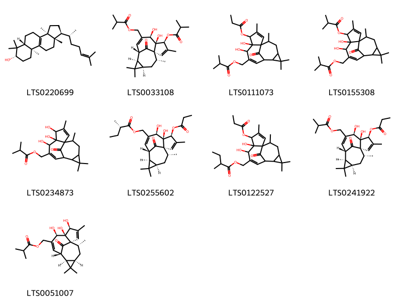{ width=100% }
    <figcaption>Hình ảnh cấu trúc hóa học của 9 hoạt chất thuộc nhóm Prenol lipids gồm ['euphol (LTS0220699)', '[(1s,4s,5s,6r,9s,10r,12r,14r)-5,6-dihydroxy-3,11,11,14-tetramethyl-4-[(2-methylpropanoyl)oxy]-15-oxotetracyclo[7.5.1.0¹,⁵.0¹⁰,¹²]pentadeca-2,7-dien-7-yl]methyl 2-methylpropanoate (LTS0033108)', '[5,6-dihydroxy-3,11,11,14-tetramethyl-15-oxo-4-(propanoyloxy)tetracyclo[7.5.1.0¹,⁵.0¹⁰,¹²]pentadeca-2,7-dien-7-yl]methyl 2-methylpropanoate (LTS0111073)', '{5,6-dihydroxy-3,11,11,14-tetramethyl-4-[(2-methylpropanoyl)oxy]-15-oxotetracyclo[7.5.1.0¹,⁵.0¹⁰,¹²]pentadeca-2,7-dien-7-yl}methyl 2-methylpropanoate (LTS0155308)', '{4,5,6-trihydroxy-3,11,11,14-tetramethyl-15-oxotetracyclo[7.5.1.0¹,⁵.0¹⁰,¹²]pentadeca-2,7-dien-7-yl}methyl 2-methylpropanoate (LTS0234873)', '[(1s,4s,5s,6r,9s,10r,12r,14r)-5,6-dihydroxy-3,11,11,14-tetramethyl-15-oxo-4-(propanoyloxy)tetracyclo[7.5.1.0¹,⁵.0¹⁰,¹²]pentadeca-2,7-dien-7-yl]methyl (2s)-2-methylbutanoate (LTS0255602)', '[5,6-dihydroxy-3,11,11,14-tetramethyl-15-oxo-4-(propanoyloxy)tetracyclo[7.5.1.0¹,⁵.0¹⁰,¹²]pentadeca-2,7-dien-7-yl]methyl 2-methylbutanoate (LTS0122527)', '[(1s,4s,5s,6r,9s,10r,12r,14r)-5,6-dihydroxy-3,11,11,14-tetramethyl-15-oxo-4-(propanoyloxy)tetracyclo[7.5.1.0¹,⁵.0¹⁰,¹²]pentadeca-2,7-dien-7-yl]methyl 2-methylpropanoate (LTS0241922)', '[(1s,4s,5r,6r,9s,10r,12r,14r)-4,5,6-trihydroxy-3,11,11,14-tetramethyl-15-oxotetracyclo[7.5.1.0¹,⁵.0¹⁰,¹²]pentadeca-2,7-dien-7-yl]methyl 2-methylpropanoate (LTS0051007)'].</figcaption>
</figure>

---

### Dược dân tộc học

Danh sách các quốc gia có sử dụng *Euphorbia cotinifolia* trong điều trị các bệnh. 

| Country        | Disease                                         | Bệnh                                                                                                                                                                                                |
|:---------------|:------------------------------------------------|:----------------------------------------------------------------------------------------------------------------------------------------------------------------------------------------------------|
| Brazil(Maku)   | Piscicide                                       | MYMEMORY WARNING: YOU USED ALL AVAILABLE FREE TRANSLATIONS FOR TODAY. NEXT AVAILABLE IN  20 HOURS 27 MINUTES 15 SECONDS VISIT HTTPS://MYMEMORY.TRANSLATED.NET/DOC/USAGELIMITS.PHP TO TRANSLATE MORE |
| Elsewhere      | Piscicide, Purgative, Cathartic, Emetic, Poison | MYMEMORY WARNING: YOU USED ALL AVAILABLE FREE TRANSLATIONS FOR TODAY. NEXT AVAILABLE IN  20 HOURS 27 MINUTES 12 SECONDS VISIT HTTPS://MYMEMORY.TRANSLATED.NET/DOC/USAGELIMITS.PHP TO TRANSLATE MORE |
| Guatemala      | Purgative                                       | MYMEMORY WARNING: YOU USED ALL AVAILABLE FREE TRANSLATIONS FOR TODAY. NEXT AVAILABLE IN  20 HOURS 27 MINUTES 09 SECONDS VISIT HTTPS://MYMEMORY.TRANSLATED.NET/DOC/USAGELIMITS.PHP TO TRANSLATE MORE |
| Mexico         | Emetic, Poison, Purgative                       | MYMEMORY WARNING: YOU USED ALL AVAILABLE FREE TRANSLATIONS FOR TODAY. NEXT AVAILABLE IN  20 HOURS 27 MINUTES 06 SECONDS VISIT HTTPS://MYMEMORY.TRANSLATED.NET/DOC/USAGELIMITS.PHP TO TRANSLATE MORE |
| South America  | Piscicide                                       | MYMEMORY WARNING: YOU USED ALL AVAILABLE FREE TRANSLATIONS FOR TODAY. NEXT AVAILABLE IN  20 HOURS 27 MINUTES 03 SECONDS VISIT HTTPS://MYMEMORY.TRANSLATED.NET/DOC/USAGELIMITS.PHP TO TRANSLATE MORE |
| US(Amerindian) | Piscicide                                       | MYMEMORY WARNING: YOU USED ALL AVAILABLE FREE TRANSLATIONS FOR TODAY. NEXT AVAILABLE IN  20 HOURS 27 MINUTES 01 SECONDS VISIT HTTPS://MYMEMORY.TRANSLATED.NET/DOC/USAGELIMITS.PHP TO TRANSLATE MORE |
| Venezuela      | Vesicant                                        | MYMEMORY WARNING: YOU USED ALL AVAILABLE FREE TRANSLATIONS FOR TODAY. NEXT AVAILABLE IN  20 HOURS 26 MINUTES 58 SECONDS VISIT HTTPS://MYMEMORY.TRANSLATED.NET/DOC/USAGELIMITS.PHP TO TRANSLATE MORE |

---

---
## Euphorbia cyparissias
### Thông tin về thực vật

!!! info "Phân loại thực vật của *Euphorbia cyparissias* từ GIBF:"
    - **Kingdom:** Plantae
    - **Phylum:** Tracheophyta
    - **Order:** Malpighiales
    - **Family:** Euphorbiaceae
    - **Genus:** Euphorbia
    - **Species:** *Euphorbia cyparissias*

 

| Label (VI)   | Label (EN)   | Scientific Name       | Descriptions (VI)   | Descriptions (EN)   | Also Known As (VI)   | Also Known As (EN)                          |
|:-------------|:-------------|:----------------------|:--------------------|:--------------------|:---------------------|:--------------------------------------------|
| N/A          | N/A          | Euphorbia cyparissias | loài thực vật       | species of plant    | ['']                 | ['Euphorbia Cyparissias', 'Cypress Spurge'] |

#### Phân bố trên thế giới

**Từ CSDL GIBF** Ukraine, Netherlands, Italy, Czechia, Germany, Romania, Slovakia, Luxembourg, Spain, Poland, Hungary, Serbia, Switzerland, United States of America, Austria, France, Slovenia, Croatia

#### Phân bố tại Việt Nam

**Từ CSDL GIBF**: Không có ghi nhận ở Việt Nam

---
### Thành phần hóa học
        
- Theo cơ sở dữ liệu lotus: Từ loài *Euphorbia cyparissias* đã phân lập và xác định được 48 hoạt chất thuộc về các nhóm Prenol lipids, Steroids and steroid derivatives, Organooxygen compounds. 

|    | chemicalTaxonomyClassyfireClass   |   smiles_count |
|---:|:----------------------------------|---------------:|
|  0 | Organooxygen compounds            |              1 |
|  1 | Prenol lipids                     |             24 |
|  2 | Steroids and steroid derivatives  |             22 |

#### Nhóm Organooxygen compounds
<figure markdown="span">
    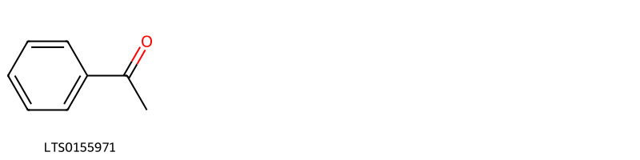{ width=100% }
    <figcaption>Hình ảnh cấu trúc hóa học của 1 hoạt chất thuộc nhóm Organooxygen compounds gồm ['acetophenone (LTS0155971)'].</figcaption>
</figure>
#### Nhóm Prenol lipids
<figure markdown="span">
    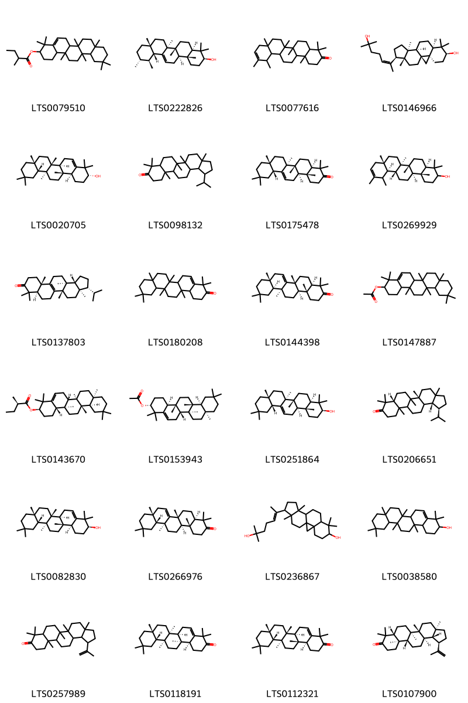{ width=100% }
    <figcaption>Hình ảnh cấu trúc hóa học của 24 hoạt chất thuộc nhóm Prenol lipids gồm ['4,4,6b,8a,11,11,12b,14a-octamethyl-1,2,3,6,6a,7,8,9,10,12,12a,13,14,14b-tetradecahydropicen-3-yl 2-methylbutanoate (LTS0079510)', 'amyrin (LTS0222826)', '4,4,6a,6b,8a,11,12,14b-octamethyl-1,2,4a,5,6,7,8,9,12,12a,12b,13,14,14a-tetradecahydropicen-3-one (LTS0077616)', '(1s,3r,6s,8r,11r,12s,15r,16r)-15-[(2z)-6-hydroxy-6-methylhept-2-en-2-yl]-7,7,12,16-tetramethylpentacyclo[9.7.0.0¹,³.0³,⁸.0¹²,¹⁶]octadecan-6-ol (LTS0146966)', 'α-glutinol (LTS0020705)', '1-isopropyl-3a,5a,5b,8,8,11a-hexamethyl-tetradecahydro-1h-cyclopenta[a]chrysen-9-one (LTS0098132)', '(4ar,6ar,6bs,8ar,12ar,14ar,14br)-4,4,6a,6b,8a,11,11,14b-octamethyl-2,4a,5,6,7,8,9,10,12,12a,14,14a-dodecahydro-1h-picen-3-one (LTS0175478)', '(4ar,6ar,6br,8as,12ar,12br,14ar,14br)-4,4,6a,6b,8a,11,12,14b-octamethyl-2,3,4a,5,6,7,8,9,12,12a,12b,13,14,14a-tetradecahydro-1h-picen-3-ol (LTS0269929)', '(3r,3ar,5as,7ar,11as,13as,13br)-3-isopropyl-3a,5a,8,8,11a,13a-hexamethyl-1h,2h,3h,4h,5h,6h,7h,7ah,10h,11h,12h,13h,13bh-cyclopenta[a]chrysen-9-one (LTS0137803)', '4,4,6b,8a,11,11,12b,14a-octamethyl-2,6,6a,7,8,9,10,12,12a,13,14,14b-dodecahydro-1h-picen-3-one (LTS0180208)', '(4ar,6ar,8ar,12as,12bs,14ar,14br)-4,4,6a,8a,11,11,12b,14b-octamethyl-2,4a,5,6,8,9,10,12,12a,13,14,14a-dodecahydro-1h-picen-3-one (LTS0144398)', '4,4,6b,8a,11,11,12b,14a-octamethyl-1,2,3,6,6a,7,8,9,10,12,12a,13,14,14b-tetradecahydropicen-3-yl acetate (LTS0147887)', '(3r,6as,6br,8ar,12ar,12bs,14ar,14bs)-4,4,6b,8a,11,11,12b,14a-octamethyl-1,2,3,6,6a,7,8,9,10,12,12a,13,14,14b-tetradecahydropicen-3-yl (2r)-2-methylbutanoate (LTS0143670)', '(3r,6ar,6bs,8as,12as,12br,14ar,14bs)-4,4,6b,8a,11,11,12b,14a-octamethyl-1,2,3,6,6a,7,8,9,10,12,12a,13,14,14b-tetradecahydropicen-3-yl acetate (LTS0153943)', 'β-amyrin (LTS0251864)', '(1s,5ar,7ar,13br)-1-isopropyl-3a,5a,5b,8,8,11a-hexamethyl-tetradecahydro-1h-cyclopenta[a]chrysen-9-one (LTS0206651)', 'glutinol (LTS0082830)', 'taraxerone (LTS0266976)', '15-(6-hydroxy-6-methylhept-2-en-2-yl)-7,7,12,16-tetramethylpentacyclo[9.7.0.0¹,³.0³,⁸.0¹²,¹⁶]octadecan-6-ol (LTS0236867)', '4,4,6b,8a,11,11,12b,14a-octamethyl-1,2,3,6,6a,7,8,9,10,12,12a,13,14,14b-tetradecahydropicen-3-ol (LTS0038580)', '3a,5a,5b,8,8,11a-hexamethyl-1-(prop-1-en-2-yl)-tetradecahydro-1h-cyclopenta[a]chrysen-9-one (LTS0257989)', '(6as,6bs,8ar,12ar,12bs,14as,14bs)-4,4,6b,8a,11,11,12b,14a-octamethyl-2,6,6a,7,8,9,10,12,12a,13,14,14b-dodecahydro-1h-picen-3-one (LTS0118191)', 'glutinone (LTS0112321)', 'lupenone (LTS0107900)'].</figcaption>
</figure>
#### Nhóm Steroids and steroid derivatives
<figure markdown="span">
    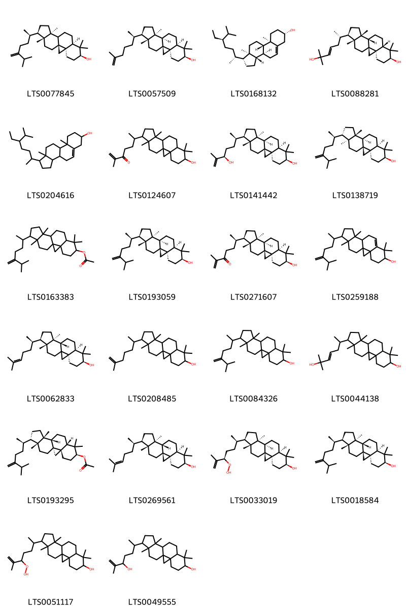{ width=100% }
    <figcaption>Hình ảnh cấu trúc hóa học của 22 hoạt chất thuộc nhóm Steroids and steroid derivatives gồm ['24-methylene-cycloartanol (LTS0077845)', '(1s,3r,6s,8r,11r,12s,15r,16r)-7,7,12,16-tetramethyl-15-[(2r)-6-methylhept-6-en-2-yl]pentacyclo[9.7.0.0¹,³.0³,⁸.0¹²,¹⁶]octadecan-6-ol (LTS0057509)', 'sitosterol (LTS0168132)', '(1s,3r,6s,8s,11s,12r,15r,16r)-15-[(2s,4e)-6-hydroxy-6-methylhept-4-en-2-yl]-7,7,12,16-tetramethylpentacyclo[9.7.0.0¹,³.0³,⁸.0¹²,¹⁶]octadecan-6-ol (LTS0088281)', 'stigmast-5-en-3-ol, (3β)- (LTS0204616)', '6-{6-hydroxy-7,7,12,16-tetramethylpentacyclo[9.7.0.0¹,³.0³,⁸.0¹²,¹⁶]octadecan-15-yl}-2-methylhept-1-en-3-one (LTS0124607)', '(1s,3r,6s,8r,11r,12s,15r,16r)-15-[(2r,5r)-5-hydroxy-6-methylhept-6-en-2-yl]-7,7,12,16-tetramethylpentacyclo[9.7.0.0¹,³.0³,⁸.0¹²,¹⁶]octadecan-6-ol (LTS0141442)', '(1s,3r,6s,8r,11r,12r,15s,16s)-7,7,12,16-tetramethyl-15-[(2r)-6-methyl-5-methylideneheptan-2-yl]pentacyclo[9.7.0.0¹,³.0³,⁸.0¹²,¹⁶]octadecan-6-ol (LTS0138719)', '7,7,12,16-tetramethyl-15-(6-methyl-5-methylideneheptan-2-yl)pentacyclo[9.7.0.0¹,³.0³,⁸.0¹²,¹⁶]octadecan-6-yl acetate (LTS0163383)', '(1s,3r,6s,8r,11r,12s,15r,16r)-7,7,12,16-tetramethyl-15-[(2r)-6-methyl-5-methylideneheptan-2-yl]pentacyclo[9.7.0.0¹,³.0³,⁸.0¹²,¹⁶]octadecan-6-ol (LTS0193059)', '(6r)-6-[(1s,3r,6s,8r,11r,12s,15r,16r)-6-hydroxy-7,7,12,16-tetramethylpentacyclo[9.7.0.0¹,³.0³,⁸.0¹²,¹⁶]octadecan-15-yl]-2-methylhept-1-en-3-one (LTS0271607)', '7,7,12,16-tetramethyl-15-(6-methyl-5-methylideneheptan-2-yl)pentacyclo[9.7.0.0¹,³.0³,⁸.0¹²,¹⁶]octadec-8-en-6-ol (LTS0259188)', '(3r,6s,8r,11s,12s,15r,16r)-7,7,12,16-tetramethyl-15-[(2r)-6-methylhept-5-en-2-yl]pentacyclo[9.7.0.0¹,³.0³,⁸.0¹²,¹⁶]octadecan-6-ol (LTS0062833)', '7,7,12,16-tetramethyl-15-(6-methylhept-6-en-2-yl)pentacyclo[9.7.0.0¹,³.0³,⁸.0¹²,¹⁶]octadecan-6-ol (LTS0208485)', '7,7,12,16-tetramethyl-15-(6-methyl-5-methylideneheptan-2-yl)pentacyclo[9.7.0.0¹,³.0³,⁸.0¹²,¹⁶]octadecan-6-ol (LTS0084326)', '15-(6-hydroxy-6-methylhept-4-en-2-yl)-7,7,12,16-tetramethylpentacyclo[9.7.0.0¹,³.0³,⁸.0¹²,¹⁶]octadecan-6-ol (LTS0044138)', '(1r,3s,6s,8s,11s,12r,15s,16r)-7,7,12,16-tetramethyl-15-[(2r)-6-methyl-5-methylideneheptan-2-yl]pentacyclo[9.7.0.0¹,³.0³,⁸.0¹²,¹⁶]octadecan-6-yl acetate (LTS0193295)', 'cycloartenol (LTS0269561)', '(1s,3r,6s,8r,11r,12s,15r,16r)-15-[(2r,5r)-5-hydroperoxy-6-methylhept-6-en-2-yl]-7,7,12,16-tetramethylpentacyclo[9.7.0.0¹,³.0³,⁸.0¹²,¹⁶]octadecan-6-ol (LTS0033019)', '24-methylenecycloartanol (LTS0018584)', '15-(5-hydroperoxy-6-methylhept-6-en-2-yl)-7,7,12,16-tetramethylpentacyclo[9.7.0.0¹,³.0³,⁸.0¹²,¹⁶]octadecan-6-ol (LTS0051117)', '15-(5-hydroxy-6-methylhept-6-en-2-yl)-7,7,12,16-tetramethylpentacyclo[9.7.0.0¹,³.0³,⁸.0¹²,¹⁶]octadecan-6-ol (LTS0049555)'].</figcaption>
</figure>

---

### Dược dân tộc học

Danh sách các quốc gia có sử dụng *Euphorbia cyparissias* trong điều trị các bệnh. 

| Country   | Disease                   | Bệnh                                                                                                                                                                                                |
|:----------|:--------------------------|:----------------------------------------------------------------------------------------------------------------------------------------------------------------------------------------------------|
| Turkey    | Emetic, Poison, Purgative | MYMEMORY WARNING: YOU USED ALL AVAILABLE FREE TRANSLATIONS FOR TODAY. NEXT AVAILABLE IN  20 HOURS 26 MINUTES 31 SECONDS VISIT HTTPS://MYMEMORY.TRANSLATED.NET/DOC/USAGELIMITS.PHP TO TRANSLATE MORE |

---

---
## Euphorbia dendroides
### Thông tin về thực vật

!!! info "Phân loại thực vật của *Euphorbia dendroides* từ GIBF:"
    - **Kingdom:** Plantae
    - **Phylum:** Tracheophyta
    - **Order:** Malpighiales
    - **Family:** Euphorbiaceae
    - **Genus:** Euphorbia
    - **Species:** *Euphorbia dendroides*

 

| Label (VI)   | Label (EN)   | Scientific Name      | Descriptions (VI)   | Descriptions (EN)   | Also Known As (VI)   | Also Known As (EN)   |
|:-------------|:-------------|:---------------------|:--------------------|:--------------------|:---------------------|:---------------------|
| N/A          | N/A          | Euphorbia dendroides | loài thực vật       | species of plant    | ['']                 | ['']                 |

#### Phân bố trên thế giới

**Từ CSDL GIBF** nan, Israel, Monaco, Italy, Montenegro, Australia, Malta, Spain, Albania, United States of America, France, Greece

#### Phân bố tại Việt Nam

**Từ CSDL GIBF**: Không có ghi nhận ở Việt Nam

---
### Thành phần hóa học
        
- Theo cơ sở dữ liệu lotus: Từ loài *Euphorbia dendroides* đã phân lập và xác định được 58 hoạt chất thuộc về các nhóm Fatty Acyls, Prenol lipids, Steroids and steroid derivatives, Lactones, Saturated hydrocarbons, Organooxygen compounds, Carboxylic acids and derivatives. 

|    | chemicalTaxonomyClassyfireClass   |   smiles_count |
|---:|:----------------------------------|---------------:|
|  0 | Carboxylic acids and derivatives  |              6 |
|  1 | Fatty Acyls                       |              1 |
|  2 | Lactones                          |             21 |
|  3 | Organooxygen compounds            |              1 |
|  4 | Prenol lipids                     |             24 |
|  5 | Saturated hydrocarbons            |              1 |
|  6 | Steroids and steroid derivatives  |              4 |

#### Nhóm Carboxylic acids and derivatives
<figure markdown="span">
    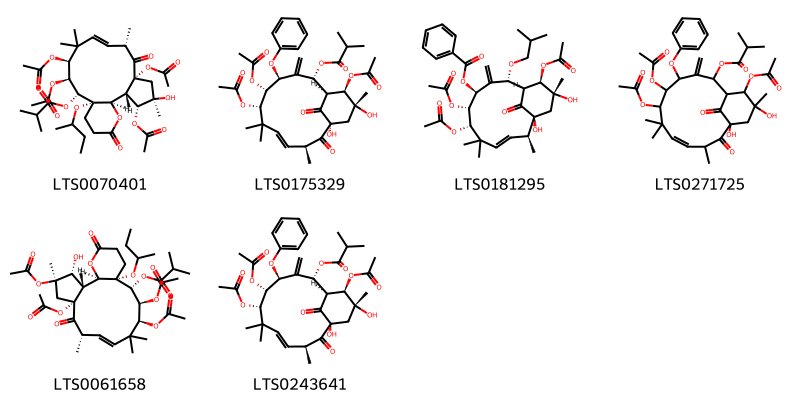{ width=100% }
    <figcaption>Hình ảnh cấu trúc hóa học của 6 hoạt chất thuộc nhóm Carboxylic acids and derivatives gồm ['(1r,2r,3r,4r,6r,8s,9e,12s,13s,14r,15s)-3,6,12,13-tetrakis(acetyloxy)-4-hydroxy-4,8,11,11-tetramethyl-7,18-dioxo-15-(sec-butoxy)-19-oxatricyclo[13.4.0.0²,⁶]nonadec-9-en-14-yl 2-methylpropanoate (LTS0070401)', '(1s,2r,4s,5r,6s,8e,10s,12r,14r,15r)-5,6,15-tris(acetyloxy)-12,14-dihydroxy-7,7,10,14-tetramethyl-3-methylidene-11,16-dioxo-4-phenoxybicyclo[10.3.1]hexadec-8-en-2-yl 2-methylpropanoate (LTS0175329)', '(1s,2r,4s,5s,6s,8e,10s,11s,13r,14r)-5,6,14-tris(acetyloxy)-11,13-dihydroxy-7,7,10,13-tetramethyl-3-methylidene-2-(2-methylpropoxy)-15-oxobicyclo[9.3.1]pentadec-8-en-4-yl benzoate (LTS0181295)', '5,6,15-tris(acetyloxy)-12,14-dihydroxy-7,7,10,14-tetramethyl-3-methylidene-11,16-dioxo-4-phenoxybicyclo[10.3.1]hexadec-8-en-2-yl 2-methylpropanoate (LTS0271725)', '(1r,2r,3r,4r,6r,8s,9e,12s,13s,14r,15s)-4,6,12,13-tetrakis(acetyloxy)-3-hydroxy-4,8,11,11-tetramethyl-7,18-dioxo-15-(sec-butoxy)-19-oxatricyclo[13.4.0.0²,⁶]nonadec-9-en-14-yl 2-methylpropanoate (LTS0061658)', '(1s,2r,4s,5r,6s,8e,10s,12s,14r,15r)-5,6,15-tris(acetyloxy)-12,14-dihydroxy-7,7,10,14-tetramethyl-3-methylidene-11,16-dioxo-4-phenoxybicyclo[10.3.1]hexadec-8-en-2-yl 2-methylpropanoate (LTS0243641)'].</figcaption>
</figure>
#### Nhóm Fatty Acyls
<figure markdown="span">
    { width=100% }
    <figcaption>Hình ảnh cấu trúc hóa học của 1 hoạt chất thuộc nhóm Fatty Acyls gồm ['triacontanol (LTS0026833)'].</figcaption>
</figure>
#### Nhóm Lactones
<figure markdown="span">
    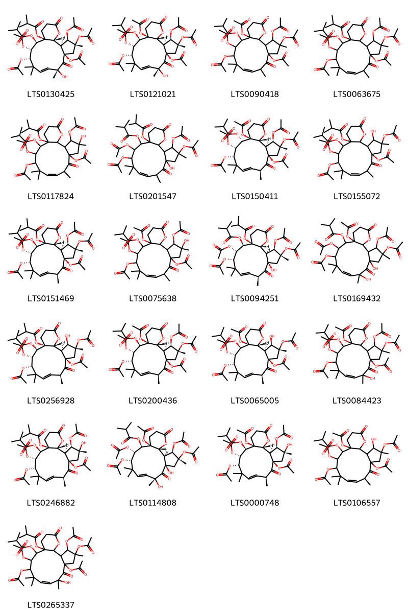{ width=100% }
    <figcaption>Hình ảnh cấu trúc hóa học của 21 hoạt chất thuộc nhóm Lactones gồm ['(1r,2r,3r,4r,6r,8r,9e,12s,13s,14r,15s)-3,4,6,12,13-pentakis(acetyloxy)-8-hydroxy-4,8,11,11-tetramethyl-14-[(2-methylpropanoyl)oxy]-7,18-dioxo-19-oxatricyclo[13.4.0.0²,⁶]nonadec-9-en-15-yl 2-methylpropanoate (LTS0130425)', '(1r,2r,3r,4r,6r,8r,9e,12s,13s,14r,15s)-3,4,6,12,13,15-hexakis(acetyloxy)-8-hydroxy-4,8,11,11-tetramethyl-7,18-dioxo-19-oxatricyclo[13.4.0.0²,⁶]nonadec-9-en-14-yl 2-methylpropanoate (LTS0121021)', '3,4,6,12,13,15-hexakis(acetyloxy)-4,8,11,11-tetramethyl-7,18-dioxo-19-oxatricyclo[13.4.0.0²,⁶]nonadec-9-en-14-yl 2-methylpropanoate (LTS0090418)', '3,4,6,12,13-pentakis(acetyloxy)-4,8,11,11-tetramethyl-14-[(2-methylpropanoyl)oxy]-7,18-dioxo-19-oxatricyclo[13.4.0.0²,⁶]nonadec-9-en-15-yl 2-methylpropanoate (LTS0063675)', '3,6,12,13-tetrakis(acetyloxy)-4-hydroxy-4,8,11,11-tetramethyl-14-[(2-methylpropanoyl)oxy]-7,18-dioxo-19-oxatricyclo[13.4.0.0²,⁶]nonadec-9-en-15-yl 2-methylpropanoate (LTS0117824)', '3,4,12,13-tetrakis(acetyloxy)-6-hydroxy-4,8,11,11-tetramethyl-14-[(2-methylpropanoyl)oxy]-7,18-dioxo-19-oxatricyclo[13.4.0.0²,⁶]nonadec-9-en-15-yl 2-methylpropanoate (LTS0201547)', '(1r,2r,3r,4r,6r,8s,9e,12s,13s,14s,15s)-3,4,6,12,13,15-hexakis(acetyloxy)-4,8,11,11-tetramethyl-7,18-dioxo-19-oxatricyclo[13.4.0.0²,⁶]nonadec-9-en-14-yl 2-methylpropanoate (LTS0150411)', '4,6,12,13-tetrakis(acetyloxy)-3-hydroxy-4,8,11,11-tetramethyl-14-[(2-methylpropanoyl)oxy]-7,18-dioxo-19-oxatricyclo[13.4.0.0²,⁶]nonadec-9-en-15-yl 2-methylpropanoate (LTS0155072)', '(1r,2r,3r,4r,6r,8s,9e,12s,13s,14r,15s)-3,4,6,12,13-pentakis(acetyloxy)-4,8,11,11-tetramethyl-14-[(2-methylpropanoyl)oxy]-7,18-dioxo-19-oxatricyclo[13.4.0.0²,⁶]nonadec-9-en-15-yl 2-methylpropanoate (LTS0151469)', '3,6,12,13,15-pentakis(acetyloxy)-4-hydroxy-4,8,11,11-tetramethyl-7,18-dioxo-19-oxatricyclo[13.4.0.0²,⁶]nonadec-9-en-14-yl 2-methylpropanoate (LTS0075638)', '(1r,2r,3r,4r,6r,8s,9e,12s,13s,14r,15s)-3,4,12,13-tetrakis(acetyloxy)-6-hydroxy-4,8,11,11-tetramethyl-14-[(2-methylpropanoyl)oxy]-7,18-dioxo-19-oxatricyclo[13.4.0.0²,⁶]nonadec-9-en-15-yl 2-methylpropanoate (LTS0094251)', '3,4,12,13,15-pentakis(acetyloxy)-6,8-dihydroxy-4,8,11,11-tetramethyl-7,18-dioxo-19-oxatricyclo[13.4.0.0²,⁶]nonadec-9-en-14-yl 2-methylpropanoate (LTS0169432)', '(1r,2r,3r,4r,6r,8s,9e,12s,13s,14r,15s)-4,6,12,13-tetrakis(acetyloxy)-3-hydroxy-4,8,11,11-tetramethyl-14-[(2-methylpropanoyl)oxy]-7,18-dioxo-19-oxatricyclo[13.4.0.0²,⁶]nonadec-9-en-15-yl 2-methylpropanoate (LTS0256928)', '(1r,2r,3r,4r,6r,8s,9e,12s,13s,14r,15s)-3,4,6,12,13,15-hexakis(acetyloxy)-4,8,11,11-tetramethyl-7,18-dioxo-19-oxatricyclo[13.4.0.0²,⁶]nonadec-9-en-14-yl 2-methylpropanoate (LTS0200436)', '(1r,2r,3r,4r,6r,8s,9e,12s,13s,14r,15s)-4,6,12,13,15-pentakis(acetyloxy)-3-hydroxy-4,8,11,11-tetramethyl-7,18-dioxo-19-oxatricyclo[13.4.0.0²,⁶]nonadec-9-en-14-yl 2-methylpropanoate (LTS0065005)', '3,4,6,12,13,15-hexakis(acetyloxy)-8-hydroxy-4,8,11,11-tetramethyl-7,18-dioxo-19-oxatricyclo[13.4.0.0²,⁶]nonadec-9-en-14-yl 2-methylpropanoate (LTS0084423)', '(1r,2r,3r,4r,6r,8s,9e,12s,13s,14r,15s)-3,6,12,13-tetrakis(acetyloxy)-4-hydroxy-4,8,11,11-tetramethyl-14-[(2-methylpropanoyl)oxy]-7,18-dioxo-19-oxatricyclo[13.4.0.0²,⁶]nonadec-9-en-15-yl 2-methylpropanoate (LTS0246882)', '(1r,2r,3r,4r,6r,8r,9e,12s,13s,14r,15s)-3,4,12,13,15-pentakis(acetyloxy)-6,8-dihydroxy-4,8,11,11-tetramethyl-7,18-dioxo-19-oxatricyclo[13.4.0.0²,⁶]nonadec-9-en-14-yl 2-methylpropanoate (LTS0114808)', '(1r,2r,3r,4r,6r,8s,9e,12s,13s,14r,15s)-3,6,12,13,15-pentakis(acetyloxy)-4-hydroxy-4,8,11,11-tetramethyl-7,18-dioxo-19-oxatricyclo[13.4.0.0²,⁶]nonadec-9-en-14-yl 2-methylpropanoate (LTS0000748)', '4,6,12,13,15-pentakis(acetyloxy)-3-hydroxy-4,8,11,11-tetramethyl-7,18-dioxo-19-oxatricyclo[13.4.0.0²,⁶]nonadec-9-en-14-yl 2-methylpropanoate (LTS0106557)', '3,4,6,12,13-pentakis(acetyloxy)-8-hydroxy-4,8,11,11-tetramethyl-14-[(2-methylpropanoyl)oxy]-7,18-dioxo-19-oxatricyclo[13.4.0.0²,⁶]nonadec-9-en-15-yl 2-methylpropanoate (LTS0265337)'].</figcaption>
</figure>
#### Nhóm Organooxygen compounds
<figure markdown="span">
    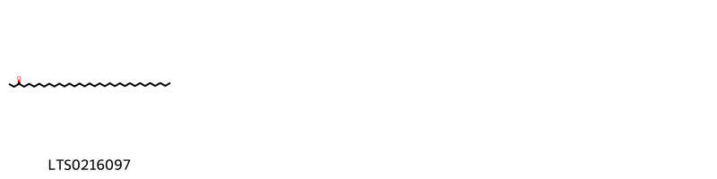{ width=100% }
    <figcaption>Hình ảnh cấu trúc hóa học của 1 hoạt chất thuộc nhóm Organooxygen compounds gồm ['tritriacontan-3-one (LTS0216097)'].</figcaption>
</figure>
#### Nhóm Prenol lipids
<figure markdown="span">
    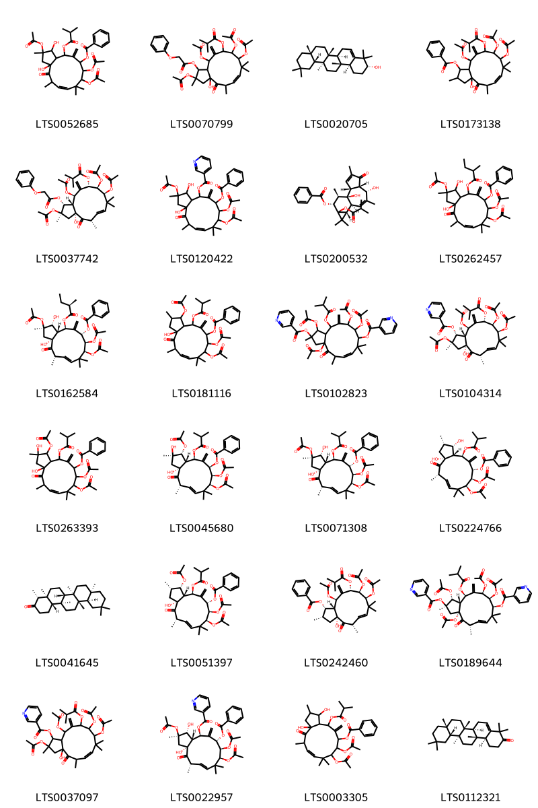{ width=100% }
    <figcaption>Hình ảnh cấu trúc hóa học của 24 hoạt chất thuộc nhóm Prenol lipids gồm ['2,7,8-tris(acetyloxy)-3,13a-dihydroxy-2,9,9,12-tetramethyl-5-methylidene-4-[(2-methylpropanoyl)oxy]-13-oxo-1h,3h,3ah,4h,6h,7h,8h,12h-cyclopenta[12]annulen-6-yl benzoate (LTS0052685)', '2,4,7,8-tetrakis(acetyloxy)-13a-hydroxy-2,9,9,12-tetramethyl-5-methylidene-13-oxo-3-[(2-phenoxyacetyl)oxy]-1h,3h,3ah,4h,6h,7h,8h,12h-cyclopenta[12]annulen-6-yl 2-methylpropanoate (LTS0070799)', 'α-glutinol (LTS0020705)', '9,10,13-tris(acetyloxy)-3a-hydroxy-2,5,8,8-tetramethyl-12-methylidene-11-[(2-methylpropanoyl)oxy]-4-oxo-1h,2h,3h,5h,9h,10h,11h,13h,13ah-cyclopenta[12]annulen-1-yl benzoate (LTS0173138)', '(2r,3r,3as,4r,6s,7s,8s,12s,13ar)-2,4,7,8-tetrakis(acetyloxy)-13a-hydroxy-2,9,9,12-tetramethyl-5-methylidene-13-oxo-3-[(2-phenoxyacetyl)oxy]-1h,3h,3ah,4h,6h,7h,8h,12h-cyclopenta[12]annulen-6-yl 2-methylpropanoate (LTS0037742)', '2,7,8-tris(acetyloxy)-6-(benzoyloxy)-3,13a-dihydroxy-2,9,9,12-tetramethyl-5-methylidene-13-oxo-1h,3h,3ah,4h,6h,7h,8h,12h-cyclopenta[12]annulen-4-yl pyridine-3-carboxylate (LTS0120422)', 'euphodendriane a, (rel)- (LTS0200532)', '2,7,8-tris(acetyloxy)-3,13a-dihydroxy-2,9,9,12-tetramethyl-4-[(2-methylbutanoyl)oxy]-5-methylidene-13-oxo-1h,3h,3ah,4h,6h,7h,8h,12h-cyclopenta[12]annulen-6-yl benzoate (LTS0262457)', '(2r,3r,3ar,4r,6s,7s,8s,12s,13ar)-2,7,8-tris(acetyloxy)-3,13a-dihydroxy-2,9,9,12-tetramethyl-4-{[(2r)-2-methylbutanoyl]oxy}-5-methylidene-13-oxo-1h,3h,3ah,4h,6h,7h,8h,12h-cyclopenta[12]annulen-6-yl benzoate (LTS0162584)', '3,7,8-tris(acetyloxy)-13a-hydroxy-2,9,9,12-tetramethyl-5-methylidene-4-[(2-methylpropanoyl)oxy]-13-oxo-1h,2h,3h,3ah,4h,6h,7h,8h,12h-cyclopenta[12]annulen-6-yl benzoate (LTS0181116)', '3,6,7,13a-tetrakis(acetyloxy)-2,9,9,12-tetramethyl-5-methylidene-4-[(2-methylpropanoyl)oxy]-13-oxo-2-(pyridine-3-carbonyloxy)-1h,3h,3ah,4h,6h,7h,8h,12h-cyclopenta[12]annulen-8-yl pyridine-3-carboxylate (LTS0102823)', '(1r,2r,3ar,5s,9s,10s,11s,13r,13as)-2,9,10,13-tetrakis(acetyloxy)-3a-hydroxy-2,5,8,8-tetramethyl-12-methylidene-11-[(2-methylpropanoyl)oxy]-4-oxo-1h,3h,5h,9h,10h,11h,13h,13ah-cyclopenta[12]annulen-1-yl pyridine-3-carboxylate (LTS0104314)', '3,7,8-tris(acetyloxy)-2,13a-dihydroxy-2,9,9,12-tetramethyl-5-methylidene-4-[(2-methylpropanoyl)oxy]-13-oxo-1h,3h,3ah,4h,6h,7h,8h,12h-cyclopenta[12]annulen-6-yl benzoate (LTS0263393)', '(2r,3r,3as,4r,6r,7s,8s,12s,13ar)-3,7,8-tris(acetyloxy)-2,13a-dihydroxy-2,9,9,12-tetramethyl-5-methylidene-4-[(2-methylpropanoyl)oxy]-13-oxo-1h,3h,3ah,4h,6h,7h,8h,12h-cyclopenta[12]annulen-6-yl benzoate (LTS0045680)', '(2r,3r,3ar,4r,6s,7s,8s,12s,13ar)-2,7,8-tris(acetyloxy)-3,13a-dihydroxy-2,9,9,12-tetramethyl-5-methylidene-4-[(2-methylpropanoyl)oxy]-13-oxo-1h,3h,3ah,4h,6h,7h,8h,12h-cyclopenta[12]annulen-6-yl benzoate (LTS0071308)', '(2s,3s,3ar,4r,6s,7s,8s,12s,13ar)-7,8-bis(acetyloxy)-3,13a-dihydroxy-2,9,9,12-tetramethyl-5-methylidene-4-[(2-methylpropanoyl)oxy]-13-oxo-1h,2h,3h,3ah,4h,6h,7h,8h,12h-cyclopenta[12]annulen-6-yl benzoate (LTS0224766)', '(-)-friedelin (LTS0041645)', '(2s,3s,3ar,4r,6s,7s,8s,12s,13ar)-3,7,8-tris(acetyloxy)-13a-hydroxy-2,9,9,12-tetramethyl-5-methylidene-4-[(2-methylpropanoyl)oxy]-13-oxo-1h,2h,3h,3ah,4h,6h,7h,8h,12h-cyclopenta[12]annulen-6-yl benzoate (LTS0051397)', '(1s,2s,3ar,5s,9s,10s,11s,13r,13ar)-9,10,13-tris(acetyloxy)-3a-hydroxy-2,5,8,8-tetramethyl-12-methylidene-11-[(2-methylpropanoyl)oxy]-4-oxo-1h,2h,3h,5h,9h,10h,11h,13h,13ah-cyclopenta[12]annulen-1-yl benzoate (LTS0242460)', '(2r,3r,3as,4r,6r,7s,8s,12s,13ar)-3,6,7,13a-tetrakis(acetyloxy)-2,9,9,12-tetramethyl-5-methylidene-4-[(2-methylpropanoyl)oxy]-13-oxo-2-(pyridine-3-carbonyloxy)-1h,3h,3ah,4h,6h,7h,8h,12h-cyclopenta[12]annulen-8-yl pyridine-3-carboxylate (LTS0189644)', '2,9,10,13-tetrakis(acetyloxy)-3a-hydroxy-2,5,8,8-tetramethyl-12-methylidene-11-[(2-methylpropanoyl)oxy]-4-oxo-1h,3h,5h,9h,10h,11h,13h,13ah-cyclopenta[12]annulen-1-yl pyridine-3-carboxylate (LTS0037097)', '(2r,3r,3ar,4r,6s,7s,8s,12s,13ar)-2,7,8-tris(acetyloxy)-6-(benzoyloxy)-3,13a-dihydroxy-2,9,9,12-tetramethyl-5-methylidene-13-oxo-1h,3h,3ah,4h,6h,7h,8h,12h-cyclopenta[12]annulen-4-yl pyridine-3-carboxylate (LTS0022957)', '7,8-bis(acetyloxy)-3,13a-dihydroxy-2,9,9,12-tetramethyl-5-methylidene-4-[(2-methylpropanoyl)oxy]-13-oxo-1h,2h,3h,3ah,4h,6h,7h,8h,12h-cyclopenta[12]annulen-6-yl benzoate (LTS0003305)', 'glutinone (LTS0112321)'].</figcaption>
</figure>
#### Nhóm Saturated hydrocarbons
<figure markdown="span">
    { width=100% }
    <figcaption>Hình ảnh cấu trúc hóa học của 1 hoạt chất thuộc nhóm Saturated hydrocarbons gồm ['hentriacontane (LTS0046415)'].</figcaption>
</figure>
#### Nhóm Steroids and steroid derivatives
<figure markdown="span">
    { width=100% }
    <figcaption>Hình ảnh cấu trúc hóa học của 4 hoạt chất thuộc nhóm Steroids and steroid derivatives gồm ['stigmast-5-en-3-ol (LTS0071224)', 'stigmast-5-en-3-ol, (3β)- (LTS0204616)', 'sitogluside (LTS0201798)', '2-{[1-(5-ethyl-6-methylheptan-2-yl)-9a,11a-dimethyl-1h,2h,3h,3ah,3bh,4h,6h,7h,8h,9h,9bh,10h,11h-cyclopenta[a]phenanthren-7-yl]oxy}-6-(hydroxymethyl)oxane-3,4,5-triol (LTS0158828)'].</figcaption>
</figure>

---

### Dược dân tộc học

Danh sách các quốc gia có sử dụng *Euphorbia dendroides* trong điều trị các bệnh. 

| Country   | Disease   | Bệnh                                                                                                                                                                                                |
|:----------|:----------|:----------------------------------------------------------------------------------------------------------------------------------------------------------------------------------------------------|
| Europe    | Piscicide | MYMEMORY WARNING: YOU USED ALL AVAILABLE FREE TRANSLATIONS FOR TODAY. NEXT AVAILABLE IN  20 HOURS 25 MINUTES 57 SECONDS VISIT HTTPS://MYMEMORY.TRANSLATED.NET/DOC/USAGELIMITS.PHP TO TRANSLATE MORE |
| Sicily    | Piscicide | MYMEMORY WARNING: YOU USED ALL AVAILABLE FREE TRANSLATIONS FOR TODAY. NEXT AVAILABLE IN  20 HOURS 25 MINUTES 53 SECONDS VISIT HTTPS://MYMEMORY.TRANSLATED.NET/DOC/USAGELIMITS.PHP TO TRANSLATE MORE |

---

---
## Euphorbia glomerifera
### Thông tin về thực vật

!!! info "Phân loại thực vật của *Euphorbia hypericifolia* từ GIBF:"
    - **Kingdom:** Plantae
    - **Phylum:** Tracheophyta
    - **Order:** Malpighiales
    - **Family:** Euphorbiaceae
    - **Genus:** Euphorbia
    - **Species:** *Euphorbia hypericifolia*

 

| Label (VI)   | Label (EN)   | Scientific Name       | Descriptions (VI)   | Descriptions (EN)   | Also Known As (VI)   | Also Known As (EN)   |
|:-------------|:-------------|:----------------------|:--------------------|:--------------------|:---------------------|:---------------------|
| N/A          | N/A          | Euphorbia glomerifera |                     | species of plant    | ['']                 | ['']                 |

#### Phân bố trên thế giới

**Từ CSDL GIBF** nan, Virgin Islands (U.S.), Ghana, Palau, Central African Republic, Micronesia (Federated States of), Cook Islands, Belgium, Guatemala, Grenada, unknown or invalid, Bermuda, Sierra Leone, Venezuela (Bolivarian Republic of), Tanzania, United Republic of, Togo, Puerto Rico, Netherlands, Kiribati, Senegal, Nigeria, Tuvalu, Spain, Jamaica, United States of America, Guinea, Liberia, Belize, Uganda, Trinidad and Tobago, Barbados, Marshall Islands, Suriname, United States Minor Outlying Islands, Côte d’Ivoire, Brazil, Bahamas, Guyana, Tonga, Cuba, Dominica, Mexico, Peru, Niue, Cabo Verde, Haiti, India, Burkina Faso, Samoa, Cameroon, Northern Mariana Islands

#### Phân bố tại Việt Nam

**Từ CSDL GIBF**: Không có ghi nhận ở Việt Nam

---
### Thành phần hóa học
        
- Theo cơ sở dữ liệu lotus: Từ loài *Euphorbia hypericifolia* đã phân lập và xác định được Chưa có hoạt chất nào được phân lập. hoạt chất thuộc về các nhóm Không có hoạt chất nào được phân lập. 

Không có hình ảnh nào được tạo ra

---

### Dược dân tộc học

Danh sách các quốc gia có sử dụng *Euphorbia hypericifolia* trong điều trị các bệnh. 

| Country   | Disease   | Bệnh                                                                                                                                                                                                |
|:----------|:----------|:----------------------------------------------------------------------------------------------------------------------------------------------------------------------------------------------------|
| Mexico    | Purgative | MYMEMORY WARNING: YOU USED ALL AVAILABLE FREE TRANSLATIONS FOR TODAY. NEXT AVAILABLE IN  20 HOURS 25 MINUTES 14 SECONDS VISIT HTTPS://MYMEMORY.TRANSLATED.NET/DOC/USAGELIMITS.PHP TO TRANSLATE MORE |

---

---
## Euphorbia graminea
### Thông tin về thực vật

!!! info "Phân loại thực vật của *Euphorbia graminea* từ GIBF:"
    - **Kingdom:** Plantae
    - **Phylum:** Tracheophyta
    - **Order:** Malpighiales
    - **Family:** Euphorbiaceae
    - **Genus:** Euphorbia
    - **Species:** *Euphorbia graminea*

 

| Label (VI)   | Label (EN)   | Scientific Name    | Descriptions (VI)   | Descriptions (EN)   | Also Known As (VI)   | Also Known As (EN)   |
|:-------------|:-------------|:-------------------|:--------------------|:--------------------|:---------------------|:---------------------|
| N/A          | N/A          | Euphorbia graminea | loài thực vật       | species of plant    | ['']                 | ['']                 |

#### Phân bố trên thế giới

**Từ CSDL GIBF** nan, Japan, Argentina, Palestine, State of, Tanzania, United Republic of, Israel, French Guiana, Panama, Puerto Rico, Chinese Taipei, Bolivia (Plurinational State of), United States of America, Zimbabwe, El Salvador, South Africa, Thailand, Guam, Brazil, Mexico, Dominican Republic, China, Ecuador, Saint Kitts and Nevis, Colombia, Kenya, India, Indonesia, Philippines

#### Phân bố tại Việt Nam

**Từ CSDL GIBF**: Không có ghi nhận ở Việt Nam

---
### Thành phần hóa học
        
- Theo cơ sở dữ liệu lotus: Từ loài *Euphorbia graminea* đã phân lập và xác định được Chưa có hoạt chất nào được phân lập. hoạt chất thuộc về các nhóm Không có hoạt chất nào được phân lập. 

Không có hình ảnh nào được tạo ra

---

### Dược dân tộc học

Danh sách các quốc gia có sử dụng *Euphorbia graminea* trong điều trị các bệnh. 

| Country   | Disease   | Bệnh                                                                                                                                                                                                |
|:----------|:----------|:----------------------------------------------------------------------------------------------------------------------------------------------------------------------------------------------------|
| Guatemala | Poison    | MYMEMORY WARNING: YOU USED ALL AVAILABLE FREE TRANSLATIONS FOR TODAY. NEXT AVAILABLE IN  20 HOURS 24 MINUTES 45 SECONDS VISIT HTTPS://MYMEMORY.TRANSLATED.NET/DOC/USAGELIMITS.PHP TO TRANSLATE MORE |

---

---
## Euphorbia helioscopia
### Thông tin về thực vật

!!! info "Phân loại thực vật của *Euphorbia helioscopia* từ GIBF:"
    - **Kingdom:** Plantae
    - **Phylum:** Tracheophyta
    - **Order:** Malpighiales
    - **Family:** Euphorbiaceae
    - **Genus:** Euphorbia
    - **Species:** *Euphorbia helioscopia*

 

| Label (VI)   | Label (EN)   | Scientific Name       | Descriptions (VI)   | Descriptions (EN)                              | Also Known As (VI)   | Also Known As (EN)   |
|:-------------|:-------------|:----------------------|:--------------------|:-----------------------------------------------|:---------------------|:---------------------|
| N/A          | N/A          | Euphorbia helioscopia | loài thực vật       | species of plant from the family Euphorbiaceae | ['']                 | ['sun spurge']       |

#### Phân bố trên thế giới

**Từ CSDL GIBF** nan, Italy, Australia, Japan, Israel, Netherlands, Cyprus, Malta, Spain, Hungary, Portugal, Türkiye, Albania, Morocco, United States of America, Algeria, Croatia, Greece, Uzbekistan, Germany, Romania, Switzerland, Austria, France, United Kingdom of Great Britain and Northern Ireland, China, Ireland, Serbia, New Zealand

#### Phân bố tại Việt Nam

**Từ CSDL GIBF**: Không có ghi nhận ở Việt Nam

---
### Thành phần hóa học
        
- Theo cơ sở dữ liệu lotus: Từ loài *Euphorbia helioscopia* đã phân lập và xác định được 190 hoạt chất thuộc về các nhóm Flavonoids, Prenol lipids, Steroids and steroid derivatives, Isoflavonoids, Linear 1,3-diarylpropanoids, Benzofurans, Benzene and substituted derivatives, Tetrahydrofurans, Organooxygen compounds, Tannins, Carboxylic acids and derivatives. 

|    | chemicalTaxonomyClassyfireClass     |   smiles_count |
|---:|:------------------------------------|---------------:|
|  0 | Benzene and substituted derivatives |              7 |
|  1 | Benzofurans                         |              1 |
|  2 | Carboxylic acids and derivatives    |              7 |
|  3 | Flavonoids                          |              1 |
|  4 | Isoflavonoids                       |              1 |
|  5 | Linear 1,3-diarylpropanoids         |              2 |
|  6 | Organooxygen compounds              |              9 |
|  7 | Prenol lipids                       |            110 |
|  8 | Steroids and steroid derivatives    |              1 |
|  9 | Tannins                             |             46 |
| 10 | Tetrahydrofurans                    |              3 |

#### Nhóm Benzene and substituted derivatives
<figure markdown="span">
    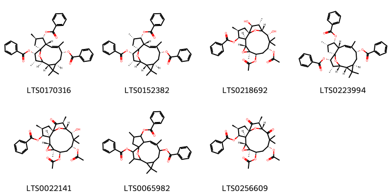{ width=100% }
    <figcaption>Hình ảnh cấu trúc hóa học của 7 hoạt chất thuộc nhóm Benzene and substituted derivatives gồm ['(1r,3r,4s,5s,6e,8r,10r,12r,13s,14s,15s)-8,15-bis(benzoyloxy)-3,7,11,11,14-pentamethyl-16-oxatetracyclo[11.2.1.0¹,⁵.0¹⁰,¹²]hexadec-6-en-4-yl benzoate (LTS0170316)', '(1r,3s,4s,5s,6e,8r,10r,12r,13r,14s,15s)-8,15-bis(benzoyloxy)-3,7,11,11,14-pentamethyl-16-oxatetracyclo[11.2.1.0¹,⁵.0¹⁰,¹²]hexadec-6-en-4-yl benzoate (LTS0152382)', '(1r,3s,4s,5r,6r,8r,9r,11r,13r,14r,15s,16s)-9,11-bis(acetyloxy)-13,16-dihydroxy-3,8,12,12,15-pentamethyl-7,17-dioxatetracyclo[12.2.1.0¹,⁵.0⁶,⁸]heptadecan-4-yl benzoate (LTS0218692)', '(1r,3s,4s,5s,6z,8r,10r,12r,13r,14s,15s)-8,15-bis(benzoyloxy)-3,7,11,11,14-pentamethyl-16-oxatetracyclo[11.2.1.0¹,⁵.0¹⁰,¹²]hexadec-6-en-4-yl benzoate (LTS0223994)', '(1r,3s,4s,5r,6r,8r,9r,11r,13r,14r,15s)-9,11-bis(acetyloxy)-13-hydroxy-3,8,12,12,15-pentamethyl-16-oxo-7,17-dioxatetracyclo[12.2.1.0¹,⁵.0⁶,⁸]heptadecan-4-yl benzoate (LTS0022141)', '8,15-bis(benzoyloxy)-3,7,11,11,14-pentamethyl-16-oxatetracyclo[11.2.1.0¹,⁵.0¹⁰,¹²]hexadec-6-en-4-yl benzoate (LTS0065982)', '(1r,3s,4s,5r,6r,8r,9r,11r,14r,15s)-9,11-bis(acetyloxy)-3,8,12,12,15-pentamethyl-13,16-dioxo-7,17-dioxatetracyclo[12.2.1.0¹,⁵.0⁶,⁸]heptadecan-4-yl benzoate (LTS0256609)'].</figcaption>
</figure>
#### Nhóm Benzofurans
<figure markdown="span">
    { width=100% }
    <figcaption>Hình ảnh cấu trúc hóa học của 1 hoạt chất thuộc nhóm Benzofurans gồm ['loliolide (LTS0254454)'].</figcaption>
</figure>
#### Nhóm Carboxylic acids and derivatives
<figure markdown="span">
    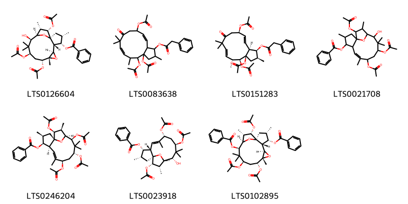{ width=100% }
    <figcaption>Hình ảnh cấu trúc hóa học của 7 hoạt chất thuộc nhóm Carboxylic acids and derivatives gồm ['(1r,3s,4s,5r,6r,8r,9r,11r,13r,14r,15s,16s)-9,11,16-tris(acetyloxy)-13-hydroxy-3,8,12,12,15-pentamethyl-7,17-dioxatetracyclo[12.2.1.0¹,⁵.0⁶,⁸]heptadecan-4-yl benzoate (LTS0126604)', '3a,4,11-tris(acetyloxy)-2,5,8,8-tetramethyl-9-oxo-1h,2h,3h,4h,5h,10h,11h,13ah-cyclopenta[12]annulen-1-yl 2-phenylacetate (LTS0083638)', '(1s,2s,3ar,4s,5r,11r,13as)-3a,4,11-tris(acetyloxy)-2,5,8,8-tetramethyl-9-oxo-1h,2h,3h,4h,5h,10h,11h,13ah-cyclopenta[12]annulen-1-yl 2-phenylacetate (LTS0151283)', '8,10,15-tris(acetyloxy)-12-hydroxy-3,7,11,11,14-pentamethyl-16-oxatricyclo[11.2.1.0¹,⁵]hexadec-6-en-4-yl benzoate (LTS0021708)', '(1r,3s,4s,5s,6e,8r,10r,12s,13s,14s,15s)-8,10,12,15-tetrakis(acetyloxy)-3,7,11,11,14-pentamethyl-16-oxatricyclo[11.2.1.0¹,⁵]hexadec-6-en-4-yl benzoate (LTS0246204)', '(1r,3s,4s,5s,6e,8r,10r,12s,13s,14s,15s)-8,10,15-tris(acetyloxy)-12-hydroxy-3,7,11,11,14-pentamethyl-16-oxatricyclo[11.2.1.0¹,⁵]hexadec-6-en-4-yl benzoate (LTS0023918)', '(1r,3s,4s,5r,6r,8r,9r,11r,13r,14r,15s,16s)-9,11,16-tris(acetyloxy)-13-(benzoyloxy)-3,8,12,12,15-pentamethyl-7,17-dioxatetracyclo[12.2.1.0¹,⁵.0⁶,⁸]heptadecan-4-yl benzoate (LTS0102895)'].</figcaption>
</figure>
#### Nhóm Flavonoids
<figure markdown="span">
    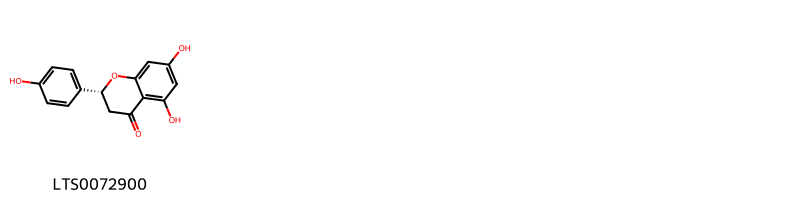{ width=100% }
    <figcaption>Hình ảnh cấu trúc hóa học của 1 hoạt chất thuộc nhóm Flavonoids gồm ['(-)-naringenin (LTS0072900)'].</figcaption>
</figure>
#### Nhóm Isoflavonoids
<figure markdown="span">
    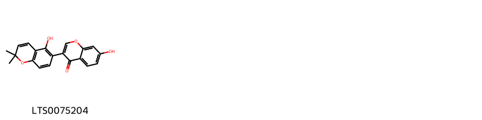{ width=100% }
    <figcaption>Hình ảnh cấu trúc hóa học của 1 hoạt chất thuộc nhóm Isoflavonoids gồm ['glabrone (LTS0075204)'].</figcaption>
</figure>
#### Nhóm Linear 1_3-diarylpropanoids
<figure markdown="span">
    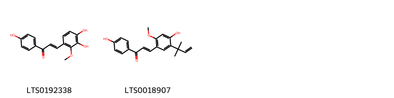{ width=100% }
    <figcaption>Hình ảnh cấu trúc hóa học của Không tìm thấy chú thích hoạt chất thuộc nhóm Linear 1_3-diarylpropanoids gồm Không tìm thấy chú thích.</figcaption>
</figure>
#### Nhóm Organooxygen compounds
<figure markdown="span">
    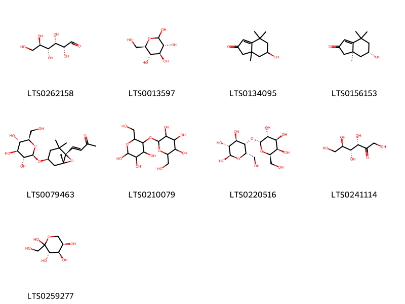{ width=100% }
    <figcaption>Hình ảnh cấu trúc hóa học của 9 hoạt chất thuộc nhóm Organooxygen compounds gồm ['(+)-glucose (LTS0262158)', 'glucose (LTS0013597)', '5-hydroxy-3a,7,7-trimethyl-3,4,5,6-tetrahydroinden-2-one (LTS0134095)', '(3as,5s)-5-hydroxy-3a,7,7-trimethyl-3,4,5,6-tetrahydroinden-2-one (LTS0156153)', '(3e)-4-[(1s,4s,6r)-2,2,6-trimethyl-4-{[(2r,3r,4s,5s,6r)-3,4,5-trihydroxy-6-(hydroxymethyl)oxan-2-yl]oxy}-7-oxabicyclo[4.1.0]heptan-1-yl]but-3-en-2-one (LTS0079463)', 'starch (LTS0210079)', '(2r,3r,4r,5s,6s)-6-(hydroxymethyl)-5-{[(2r,3r,4s,5r,6r)-3,4,5-trihydroxy-6-(hydroxymethyl)oxan-2-yl]oxy}oxane-2,3,4-triol (LTS0220516)', 'keto-d-fructose (LTS0241114)', 'd-fructopyranose (LTS0259277)'].</figcaption>
</figure>
#### Nhóm Prenol lipids
<figure markdown="span">
    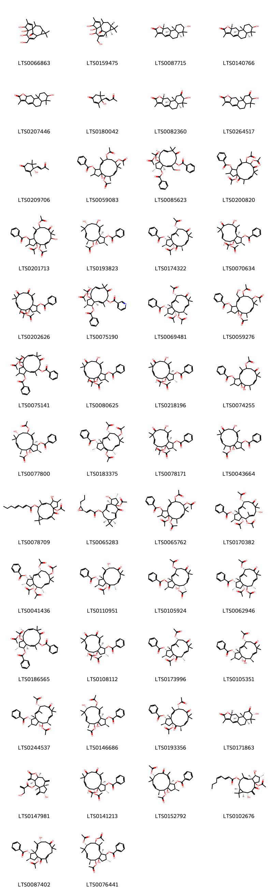{ width=100% }
    <figcaption>Hình ảnh cấu trúc hóa học của 110 hoạt chất thuộc nhóm Prenol lipids gồm ['4,5,6-trihydroxy-7-(hydroxymethyl)-3,11,11,14-tetramethyltetracyclo[7.5.1.0¹,⁵.0¹⁰,¹²]pentadeca-2,7-dien-15-one (LTS0066863)', '(1s,5r,9s,10r,12s)-4,5,6-trihydroxy-7-(hydroxymethyl)-3,11,11,14-tetramethyltetracyclo[7.5.1.0¹,⁵.0¹⁰,¹²]pentadeca-2,7-dien-15-one (LTS0159475)', '(3s,4as,10ar,11ar,11bs)-3-hydroxy-4,4,8,11b-tetramethyl-1h,2h,3h,4ah,5h,6h,10ah,11h,11ah-phenanthro[3,2-b]furan-9-one (LTS0087715)', '(3r,4as,10ar,11ar,11bs)-3-hydroxy-4,4,8,11b-tetramethyl-1h,2h,3h,4ah,5h,6h,10ah,11h,11ah-phenanthro[3,2-b]furan-9-one (LTS0140766)', '3-hydroxy-4,4,8,11b-tetramethyl-1h,2h,3h,4ah,5h,6h,10ah,11h,11ah-phenanthro[3,2-b]furan-9-one (LTS0207446)', '4-hydroxy-3,5,5-trimethyl-4-(3-oxobut-1-en-1-yl)cyclohex-2-en-1-one (LTS0180042)', '(3s,4as,10ar,11ar,11bs)-3-hydroxy-4,4,8,11b-tetramethyl-1h,3h,4ah,5h,6h,10ah,11h,11ah-phenanthro[3,2-b]furan-2,9-dione (LTS0082360)', '3-hydroxy-4,4,8,11b-tetramethyl-1h,3h,4ah,5h,6h,10ah,11h,11ah-phenanthro[3,2-b]furan-2,9-dione (LTS0264517)', 'dehydrovomifoliol (LTS0209706)', '4,9,11-tris(acetyloxy)-3a-hydroxy-2,5,8,8,12-pentamethyl-1h,2h,3h,4h,5h,9h,10h,11h,13ah-cyclopenta[12]annulen-1-yl benzoate (LTS0059083)', '(2r,3s,3as,6r,12r,13r,13ar)-13,13a-bis(acetyloxy)-3-(benzoyloxy)-5-(hydroxymethyl)-2,9,9,12-tetramethyl-8-oxo-1h,2h,3h,3ah,6h,7h,12h,13h-cyclopenta[12]annulen-6-yl benzoate (LTS0085623)', '3a,10,11-tris(acetyloxy)-2,5,8,8,12-pentamethyl-4,9-dioxo-1h,2h,3h,5h,10h,11h,13ah-cyclopenta[12]annulen-1-yl benzoate (LTS0200820)', '3a,4,11-tris(acetyloxy)-7-hydroxy-2,5,8,8,12-pentamethyl-9-oxo-1h,2h,3h,4h,7h,10h,11h,13ah-cyclopenta[12]annulen-1-yl benzoate (LTS0201713)', '(1s,2s,3ar,4s,5s,9r,11r,13as)-4-(acetyloxy)-3a,9,11-trihydroxy-2,5,8,8,12-pentamethyl-1h,2h,3h,4h,5h,9h,10h,11h,13ah-cyclopenta[12]annulen-1-yl benzoate (LTS0193823)', '(1s,2r,3ar,5r,11r,13as)-3a,11-bis(acetyloxy)-2,5,8,8,12-pentamethyl-4,9-dioxo-1h,2h,3h,5h,10h,11h,13ah-cyclopenta[12]annulen-1-yl benzoate (LTS0174322)', '(1s,2s,3ar,4r,5r,11r,13as)-3a,4-bis(acetyloxy)-11-hydroxy-2,5,8,8,12-pentamethyl-9-oxo-1h,2h,3h,4h,5h,10h,11h,13ah-cyclopenta[12]annulen-1-yl benzoate (LTS0070634)', '3a,4-bis(acetyloxy)-2,5,8,8,12-pentamethyl-9,11-dioxo-1h,2h,3h,4h,5h,10h,13ah-cyclopenta[12]annulen-1-yl benzoate (LTS0202626)', '(2s,3s,3as,6r,12r,13r,13ar)-13,13a-bis(acetyloxy)-3-(benzoyloxy)-2,5,9,9,12-pentamethyl-8-oxo-1h,2h,3h,3ah,6h,7h,12h,13h-cyclopenta[12]annulen-6-yl pyridine-3-carboxylate (LTS0075190)', '(1s,2r,3ar,4r,5r,11r,13as)-3a,4,11-tris(acetyloxy)-2,5,8,8,12-pentamethyl-9-oxo-1h,2h,3h,4h,5h,10h,11h,13ah-cyclopenta[12]annulen-1-yl benzoate (LTS0069481)', '4,9,11-tris(acetyloxy)-3a-hydroxy-12-(hydroxymethyl)-2,5,8,8-tetramethyl-1h,2h,3h,4h,5h,9h,10h,11h,13ah-cyclopenta[12]annulen-1-yl benzoate (LTS0059276)', '13,13a-bis(acetyloxy)-3-(benzoyloxy)-2,5,9,9,12-pentamethyl-8-oxo-1h,2h,3h,3ah,6h,7h,12h,13h-cyclopenta[12]annulen-6-yl benzoate (LTS0075141)', '3a,4-bis(acetyloxy)-11-hydroxy-2,5,8,8,12-pentamethyl-9-oxo-1h,2h,3h,4h,5h,10h,11h,13ah-cyclopenta[12]annulen-1-yl benzoate (LTS0080625)', '(1s,2r,3ar,4r,5r,11r,13as)-3a,4-bis(acetyloxy)-11-hydroxy-2,5,8,8,12-pentamethyl-9-oxo-1h,2h,3h,4h,5h,10h,11h,13ah-cyclopenta[12]annulen-1-yl benzoate (LTS0218196)', '11-(acetyloxy)-3a,4-dihydroxy-2,5,8,8,12-pentamethyl-9-oxo-1h,2h,3h,4h,5h,10h,11h,13ah-cyclopenta[12]annulen-1-yl benzoate (LTS0074255)', '(1s,2s,3ar,4s,5s,9r,11r,13as)-4,11-bis(acetyloxy)-3a,9-dihydroxy-2,5,8,8,12-pentamethyl-1h,2h,3h,4h,5h,9h,10h,11h,13ah-cyclopenta[12]annulen-1-yl benzoate (LTS0077800)', '(1s,2s,5s,9r,11r,13ar)-4,9,11-tris(acetyloxy)-2,5,8,8,12-pentamethyl-1h,2h,3h,5h,9h,10h,11h,13ah-cyclopenta[12]annulen-1-yl benzoate (LTS0183375)', '(1s,2s,3ar,4r,5s,11r,13as)-3a,4-bis(acetyloxy)-11-hydroxy-2,5,8,8,12-pentamethyl-9-oxo-1h,2h,3h,4h,5h,10h,11h,13ah-cyclopenta[12]annulen-1-yl benzoate (LTS0078171)', '4-(acetyloxy)-3a,11-dihydroxy-2,5,8,8,12-pentamethyl-9-oxo-1h,2h,3h,4h,5h,10h,11h,13ah-cyclopenta[12]annulen-1-yl benzoate (LTS0043664)', '1-(acetyloxy)-13-hydroxy-3,6,6,10,14-pentamethyl-2-oxotricyclo[10.3.0.0⁵,⁷]pentadeca-3,10-dien-9-yl octa-2,4-dienoate (LTS0078709)', '(1r,3e,5r,7s,9r,10e,12s,13s,14r)-1-(acetyloxy)-13-hydroxy-3,6,6,10,14-pentamethyl-2-oxotricyclo[10.3.0.0⁵,⁷]pentadeca-3,10-dien-9-yl (2e)-3-[(2r,3s)-3-propyloxiran-2-yl]prop-2-enoate (LTS0065283)', '3a,4,9,11-tetrakis(acetyloxy)-2,5,8,8,12-pentamethyl-1h,2h,3h,4h,5h,9h,10h,11h,13ah-cyclopenta[12]annulen-1-yl benzoate (LTS0065762)', '(1s,2r,3ar,4r,7r,11r,13as)-3a,4,11-tris(acetyloxy)-7-hydroxy-2,5,8,8,12-pentamethyl-9-oxo-1h,2h,3h,4h,7h,10h,11h,13ah-cyclopenta[12]annulen-1-yl benzoate (LTS0170382)', '(1s,2s,3ar,4r,5s,9r,11r,13as)-3a,4,9,11-tetrakis(acetyloxy)-2,5,8,8,12-pentamethyl-1h,2h,3h,4h,5h,9h,10h,11h,13ah-cyclopenta[12]annulen-1-yl benzoate (LTS0041436)', '(1s,2r,3ar,5s,11r,13as)-3a-(acetyloxy)-11-hydroxy-2,5,8,8,12-pentamethyl-4,9-dioxo-1h,2h,3h,5h,10h,11h,13ah-cyclopenta[12]annulen-1-yl benzoate (LTS0110951)', '(1r,2r,3ar,4s,5s,11s,13as)-4,11-bis(acetyloxy)-3a-hydroxy-2,5,8,8,12-pentamethyl-9-oxo-1h,2h,3h,4h,5h,10h,11h,13ah-cyclopenta[12]annulen-1-yl benzoate (LTS0105924)', '(1s,2s,3ar,4r,5s,11r,13as)-3a,4,11-tris(acetyloxy)-2,5,8,8,12-pentamethyl-9-oxo-1h,2h,3h,4h,5h,10h,11h,13ah-cyclopenta[12]annulen-1-yl benzoate (LTS0062946)', '(2r,3s,3as,6r,12r,13r,13ar)-13,13a-bis(acetyloxy)-3-(benzoyloxy)-2,5,9,9,12-pentamethyl-8-oxo-1h,2h,3h,3ah,6h,7h,12h,13h-cyclopenta[12]annulen-6-yl benzoate (LTS0186565)', '(1s,2r,3ar,4r,5r,13as)-3a,4-bis(acetyloxy)-2,5,8,8,12-pentamethyl-9,11-dioxo-1h,2h,3h,4h,5h,10h,13ah-cyclopenta[12]annulen-1-yl benzoate (LTS0108112)', '(1s,2r,3ar,5s,11r,13as)-3a,11-bis(acetyloxy)-2,5,8,8,12-pentamethyl-4,9-dioxo-1h,2h,3h,5h,10h,11h,13ah-cyclopenta[12]annulen-1-yl benzoate (LTS0173996)', '(1s,2r,3ar,4r,5r,11r,13as)-11-(acetyloxy)-3a,4-dihydroxy-2,5,8,8,12-pentamethyl-9-oxo-1h,2h,3h,4h,5h,10h,11h,13ah-cyclopenta[12]annulen-1-yl benzoate (LTS0105351)', '(1s,2r,3ar,4r,5r,11r,13as)-4,11-bis(acetyloxy)-3a-hydroxy-2,5,8,8,12-pentamethyl-9-oxo-1h,2h,3h,4h,5h,10h,11h,13ah-cyclopenta[12]annulen-1-yl benzoate (LTS0244537)', '(1s,2s,3ar,4s,5s,9r,11r,13as)-4,11-bis(acetyloxy)-3a,9-dihydroxy-2,5,8,8,12-pentamethyl-1h,2h,3h,4h,5h,9h,10h,11h,13ah-cyclopenta[12]annulen-1-yl benzoate (LTS0146686)', '(1s,2r,3ar,5r,11r,13as)-3a,11-bis(acetyloxy)-2,5,8,8,12-pentamethyl-4,9-dioxo-1h,2h,3h,5h,10h,11h,13ah-cyclopenta[12]annulen-1-yl benzoate (LTS0193356)', '(3r,4as,10ar,11ar,11bs)-3-hydroxy-4,4,8,11b-tetramethyl-1h,3h,4ah,5h,6h,10ah,11h,11ah-phenanthro[3,2-b]furan-2,9-dione (LTS0171863)', '(3as,4r,4ar,6s,7ar,9as)-6-hydroxy-3,5,8-trimethylidene-2-oxo-octahydroazuleno[6,5-b]furan-4-yl 2-(hydroxymethyl)prop-2-enoate (LTS0147981)', '(1s,2r,3ar,4r,5r,13as)-3a,4-bis(acetyloxy)-2,5,8,8,12-pentamethyl-9,11-dioxo-1h,2h,3h,4h,5h,10h,13ah-cyclopenta[12]annulen-1-yl benzoate (LTS0141213)', '(1s,2s,3ar,4s,5s,9r,13as)-4,9-bis(acetyloxy)-3a-hydroxy-2,5,8,8,12-pentamethyl-11-oxo-1h,2h,3h,4h,5h,9h,10h,13ah-cyclopenta[12]annulen-1-yl benzoate (LTS0152792)', '(1r,4r,5r,7s,9r,10e,12s,13s,14r)-1-(acetyloxy)-4,13-dihydroxy-6,6,10,14-tetramethyl-3-methylidene-2-oxotricyclo[10.3.0.0⁵,⁷]pentadec-10-en-9-yl (2e,4z)-octa-2,4-dienoate (LTS0102676)', '(1s,2r,3ar,11r,13as)-3a-(acetyloxy)-11-hydroxy-2,5,8,8,12-pentamethyl-4,9-dioxo-1h,2h,3h,7h,10h,11h,13ah-cyclopenta[12]annulen-1-yl benzoate (LTS0087402)', '(1s,2r,3ar,4s,5s,9r,11r,13as)-4,9,11-tris(acetyloxy)-3a-hydroxy-2,5,8,8,12-pentamethyl-1h,2h,3h,4h,5h,9h,10h,11h,13ah-cyclopenta[12]annulen-1-yl benzoate (LTS0076441)', '3a,11-bis(acetyloxy)-4-hydroxy-2,5,8,8,12-pentamethyl-9-oxo-1h,2h,3h,4h,5h,10h,11h,13ah-cyclopenta[12]annulen-1-yl benzoate (LTS0097377)', '(1s,2s,3ar,4s,5s,9r,11r,13as)-4,9,11-tris(acetyloxy)-3a-hydroxy-12-(hydroxymethyl)-2,5,8,8-tetramethyl-1h,2h,3h,4h,5h,9h,10h,11h,13ah-cyclopenta[12]annulen-1-yl benzoate (LTS0074853)', '1-(acetyloxy)-4,13-dihydroxy-6,6,10,14-tetramethyl-3-methylidene-2-oxotricyclo[10.3.0.0⁵,⁷]pentadec-10-en-9-yl (2e)-octa-2,4-dienoate (LTS0188195)', '3a,11-bis(acetyloxy)-2,5,8,8,12-pentamethyl-4,9-dioxo-1h,2h,3h,5h,10h,11h,13ah-cyclopenta[12]annulen-1-yl benzoate (LTS0269858)', '4,11-bis(acetyloxy)-3a-hydroxy-2,5,8,8,12-pentamethyl-9-oxo-1h,2h,3h,4h,5h,10h,11h,13ah-cyclopenta[12]annulen-1-yl benzoate (LTS0226168)', '13,13a-bis(acetyloxy)-3-(benzoyloxy)-2,5,9,9,12-pentamethyl-8-oxo-1h,2h,3h,3ah,6h,7h,12h,13h-cyclopenta[12]annulen-6-yl pyridine-3-carboxylate (LTS0162814)', '13,13a-bis(acetyloxy)-3-(benzoyloxy)-5-(hydroxymethyl)-2,9,9,12-tetramethyl-8-oxo-1h,2h,3h,3ah,6h,7h,12h,13h-cyclopenta[12]annulen-6-yl benzoate (LTS0189532)', '(1s,2s,3ar,4s,5s,9r,11r,13as)-4,9-bis(acetyloxy)-3a,11-dihydroxy-2,5,8,8,12-pentamethyl-1h,2h,3h,4h,5h,9h,10h,11h,13ah-cyclopenta[12]annulen-1-yl benzoate (LTS0175406)', '(1r,3e,5r,7s,9r,10e,12s,13s,14r)-1-(acetyloxy)-13-hydroxy-3,6,6,10,14-pentamethyl-2-oxotricyclo[10.3.0.0⁵,⁷]pentadeca-3,10-dien-9-yl (2e,4z)-octa-2,4-dienoate (LTS0106116)', '4,9,11-tris(acetyloxy)-2,5,8,8,12-pentamethyl-1h,2h,3h,5h,9h,10h,11h,13ah-cyclopenta[12]annulen-1-yl benzoate (LTS0117668)', '(1s,2r,3ar,4r,5r,11r,13as)-3a-(acetyloxy)-4,11-dihydroxy-2,5,8,8,12-pentamethyl-9-oxo-1h,2h,3h,4h,5h,10h,11h,13ah-cyclopenta[12]annulen-1-yl benzoate (LTS0269127)', '(1s,2r,3ar,5r,11r,13as)-3a-(acetyloxy)-11-hydroxy-2,5,8,8,12-pentamethyl-4,9-dioxo-1h,2h,3h,5h,10h,11h,13ah-cyclopenta[12]annulen-1-yl benzoate (LTS0046985)', '(1r,2r,3ar,4s,5s,9s,13ar)-4,9-bis(acetyloxy)-3a-hydroxy-2,5,8,8,12-pentamethyl-11-oxo-1h,2h,3h,4h,5h,9h,10h,13ah-cyclopenta[12]annulen-1-yl benzoate (LTS0086175)', '(1s,2s,3ar,4s,5s,9r,11r,13as)-4,9-bis(acetyloxy)-3a,11-dihydroxy-2,5,8,8,12-pentamethyl-1h,2h,3h,4h,5h,9h,10h,11h,13ah-cyclopenta[12]annulen-1-yl benzoate (LTS0076941)', '1-(acetyloxy)-13-hydroxy-3,6,6,10,14-pentamethyl-2-oxotricyclo[10.3.0.0⁵,⁷]pentadeca-3,10-dien-9-yl (2e)-octa-2,4-dienoate (LTS0250447)', '(1s,2s,3ar,4s,5s,9r,11r,13as)-3a,4,9,11-tetrakis(acetyloxy)-2,5,8,8,12-pentamethyl-1h,2h,3h,4h,5h,9h,10h,11h,13ah-cyclopenta[12]annulen-1-yl benzoate (LTS0276090)', '(1s,2r,3ar,4r,5r,11r,13as)-4-(acetyloxy)-3a,11-dihydroxy-2,5,8,8,12-pentamethyl-9-oxo-1h,2h,3h,4h,5h,10h,11h,13ah-cyclopenta[12]annulen-1-yl benzoate (LTS0052130)', '(1s,2r,3ar,4r,5s,13as)-3a,4-bis(acetyloxy)-2,5,8,8,12-pentamethyl-9,11-dioxo-1h,2h,3h,4h,5h,10h,13ah-cyclopenta[12]annulen-1-yl benzoate (LTS0208534)', '(1s,2r,3ar,5s,11r,13as)-3a-(acetyloxy)-11-hydroxy-2,5,8,8,12-pentamethyl-4,9-dioxo-1h,2h,3h,5h,10h,11h,13ah-cyclopenta[12]annulen-1-yl benzoate (LTS0223110)', '(2r,3s,3as,6r,12r,13r,13ar)-13,13a-bis(acetyloxy)-3-(benzoyloxy)-2,5,9,9,12-pentamethyl-8-oxo-1h,2h,3h,3ah,6h,7h,12h,13h-cyclopenta[12]annulen-6-yl benzoate (LTS0069194)', '(1r,2r,3as,4r,5s,11s,13as)-3a,4,11-tris(acetyloxy)-2,5,8,8,12-pentamethyl-9-oxo-1h,2h,3h,4h,5h,10h,11h,13ah-cyclopenta[12]annulen-1-yl benzoate (LTS0219456)', '(1s,2s,3ar,4s,5s,9r,11r,13as)-4,9,11-tris(acetyloxy)-3a-hydroxy-12-(hydroxymethyl)-2,5,8,8-tetramethyl-1h,2h,3h,4h,5h,9h,10h,11h,13ah-cyclopenta[12]annulen-1-yl benzoate (LTS0043017)', '4,11-bis(acetyloxy)-3a,9-dihydroxy-2,5,8,8,12-pentamethyl-1h,2h,3h,4h,5h,9h,10h,11h,13ah-cyclopenta[12]annulen-1-yl benzoate (LTS0183149)', '(1s,2r,3ar,5r,11r,13as)-3a-(acetyloxy)-11-hydroxy-2,5,8,8,12-pentamethyl-4,9-dioxo-1h,2h,3h,5h,10h,11h,13ah-cyclopenta[12]annulen-1-yl benzoate (LTS0226846)', '(1r,2r,3as,4s,5r,11s,13as)-3a,4-bis(acetyloxy)-11-hydroxy-2,5,8,8,12-pentamethyl-9-oxo-1h,2h,3h,4h,5h,10h,11h,13ah-cyclopenta[12]annulen-1-yl benzoate (LTS0042385)', '(1s,2r,3ar,4r,5r,11r,13as)-3a,4,11-tris(acetyloxy)-2,5,8,8,12-pentamethyl-9-oxo-1h,2h,3h,4h,5h,10h,11h,13ah-cyclopenta[12]annulen-1-yl benzoate (LTS0228977)', '(2r,3s,3as,6r,12r,13r,13ar)-13,13a-bis(acetyloxy)-3-(benzoyloxy)-5-(hydroxymethyl)-2,9,9,12-tetramethyl-8-oxo-1h,2h,3h,3ah,6h,7h,12h,13h-cyclopenta[12]annulen-6-yl benzoate (LTS0202785)', '3a-(acetyloxy)-4,11-dihydroxy-2,5,8,8,12-pentamethyl-9-oxo-1h,2h,3h,4h,5h,10h,11h,13ah-cyclopenta[12]annulen-1-yl benzoate (LTS0182875)', '4,9-bis(acetyloxy)-3a,11-dihydroxy-2,5,8,8,12-pentamethyl-1h,2h,3h,4h,5h,9h,10h,11h,13ah-cyclopenta[12]annulen-1-yl benzoate (LTS0176434)', '4,9,11-tris(acetyloxy)-3a-hydroxy-2,5,8,8,12-pentamethyl-1h,2h,3h,4h,5h,9h,10h,11h,13ah-cyclopenta[12]annulen-1-yl benzoate (LTS0257092)', '(1s,2s,3ar,4r,5r,11r,13as)-3a,4,11-tris(acetyloxy)-2,5,8,8,12-pentamethyl-9-oxo-1h,2h,3h,4h,5h,10h,11h,13ah-cyclopenta[12]annulen-1-yl benzoate (LTS0186988)', '(1s,2r,3ar,4s,5s,9r,11r,13as)-3a,4-bis(acetyloxy)-9,11-dihydroxy-2,5,8,8,12-pentamethyl-1h,2h,3h,4h,5h,9h,10h,11h,13ah-cyclopenta[12]annulen-1-yl benzoate (LTS0047957)', '(1s,2r,3ar,4r,5s,11r,13as)-3a,4,11-tris(acetyloxy)-2,5,8,8,12-pentamethyl-9-oxo-1h,2h,3h,4h,5h,10h,11h,13ah-cyclopenta[12]annulen-1-yl benzoate (LTS0227921)', '3a-(acetyloxy)-11-hydroxy-2,5,8,8,12-pentamethyl-4,9-dioxo-1h,2h,3h,7h,10h,11h,13ah-cyclopenta[12]annulen-1-yl benzoate (LTS0021831)', '4-(acetyloxy)-3a,9,11-trihydroxy-2,5,8,8,12-pentamethyl-1h,2h,3h,4h,5h,9h,10h,11h,13ah-cyclopenta[12]annulen-1-yl benzoate (LTS0254840)', '3a,4,11-tris(acetyloxy)-2,5,8,8,12-pentamethyl-9-oxo-1h,2h,3h,4h,5h,10h,11h,13ah-cyclopenta[12]annulen-1-yl benzoate (LTS0049302)', '1-(acetyloxy)-13-hydroxy-3,6,6,10,14-pentamethyl-2-oxotricyclo[10.3.0.0⁵,⁷]pentadeca-3,10-dien-9-yl 3-(3-propyloxiran-2-yl)prop-2-enoate (LTS0265925)', '(1s,2r,3ar,4r,5r,11r,13as)-3a,11-bis(acetyloxy)-4-hydroxy-2,5,8,8,12-pentamethyl-9-oxo-1h,2h,3h,4h,5h,10h,11h,13ah-cyclopenta[12]annulen-1-yl benzoate (LTS0008300)', '3a-(acetyloxy)-11-hydroxy-2,5,8,8,12-pentamethyl-4,9-dioxo-1h,2h,3h,5h,10h,11h,13ah-cyclopenta[12]annulen-1-yl benzoate (LTS0122004)', '3a,4-bis(acetyloxy)-9,11-dihydroxy-2,5,8,8,12-pentamethyl-1h,2h,3h,4h,5h,9h,10h,11h,13ah-cyclopenta[12]annulen-1-yl benzoate (LTS0054599)', '(1s,2r,3ar,4r,5r,9s,11s,13ar)-4,9-bis(acetyloxy)-3a,11-dihydroxy-2,5,8,8,12-pentamethyl-1h,2h,3h,4h,5h,9h,10h,11h,13ah-cyclopenta[12]annulen-1-yl benzoate (LTS0011642)', '(1s,2r,3ar,4r,7s,11r,13as)-3a,4,11-tris(acetyloxy)-7-hydroxy-2,5,8,8,12-pentamethyl-9-oxo-1h,2h,3h,4h,7h,10h,11h,13ah-cyclopenta[12]annulen-1-yl benzoate (LTS0053226)', '(1s,2r,3ar,5r,10s,11s,13as)-3a,10,11-tris(acetyloxy)-2,5,8,8,12-pentamethyl-4,9-dioxo-1h,2h,3h,5h,10h,11h,13ah-cyclopenta[12]annulen-1-yl benzoate (LTS0264232)', '(1s,2s,3ar,4s,5s,11r,13as)-4-(acetyloxy)-3a,11-dihydroxy-2,5,8,8,12-pentamethyl-9-oxo-1h,2h,3h,4h,5h,10h,11h,13ah-cyclopenta[12]annulen-1-yl benzoate (LTS0068129)', '(1s,2s,3ar,4s,5s,9r,13as)-4,9-bis(acetyloxy)-3a-hydroxy-2,5,8,8,12-pentamethyl-11-oxo-1h,2h,3h,4h,5h,9h,10h,13ah-cyclopenta[12]annulen-1-yl benzoate (LTS0029566)', '(1s,2s,3ar,7s,11r,13as)-3a-(acetyloxy)-7,11-dihydroxy-2,5,8,8,12-pentamethyl-4,9-dioxo-1h,2h,3h,7h,10h,11h,13ah-cyclopenta[12]annulen-1-yl benzoate (LTS0019377)', '(1r,3e,5r,7s,9r,10e,12s,13s,14r)-1-(acetyloxy)-13-hydroxy-3,6,6,10,14-pentamethyl-2-oxotricyclo[10.3.0.0⁵,⁷]pentadeca-3,10-dien-9-yl (2e)-3-[(2s,3r)-3-propyloxiran-2-yl]prop-2-enoate (LTS0219519)', '(1r,2r,3ar,4r,5r,9r,11r,13as)-4,9,11-tris(acetyloxy)-3a-hydroxy-2,5,8,8,12-pentamethyl-1h,2h,3h,4h,5h,9h,10h,11h,13ah-cyclopenta[12]annulen-1-yl benzoate (LTS0102274)', '(1s,2s,3ar,4s,5s,11r,13as)-4,11-bis(acetyloxy)-3a-hydroxy-2,5,8,8,12-pentamethyl-9-oxo-1h,2h,3h,4h,5h,10h,11h,13ah-cyclopenta[12]annulen-1-yl benzoate (LTS0240675)', '4,9-bis(acetyloxy)-3a-hydroxy-2,5,8,8,12-pentamethyl-11-oxo-1h,2h,3h,4h,5h,9h,10h,13ah-cyclopenta[12]annulen-1-yl benzoate (LTS0007424)', '3a,10,11-tris(acetyloxy)-2,5,8,8,12-pentamethyl-4,9-dioxo-1h,2h,3h,7h,10h,11h,13ah-cyclopenta[12]annulen-1-yl benzoate (LTS0030167)', '(1s,2s,3ar,4s,5s,9r,11r,13as)-4,9,11-tris(acetyloxy)-3a-hydroxy-2,5,8,8,12-pentamethyl-1h,2h,3h,4h,5h,9h,10h,11h,13ah-cyclopenta[12]annulen-1-yl benzoate (LTS0030761)', '(1r,2r,3as,4s,5r,11r,13as)-3a,11-bis(acetyloxy)-4-hydroxy-2,5,8,8,12-pentamethyl-9-oxo-1h,2h,3h,4h,5h,10h,11h,13ah-cyclopenta[12]annulen-1-yl benzoate (LTS0113726)', '(2s,3s,3ar,6r,12r,13s,13ar)-13,13a-bis(acetyloxy)-3-(benzoyloxy)-2,5,9,9,12-pentamethyl-8-oxo-1h,2h,3h,3ah,6h,7h,12h,13h-cyclopenta[12]annulen-6-yl benzoate (LTS0044933)', '(1s,2r,3ar,4r,5s,11r,13as)-3a,4-bis(acetyloxy)-11-hydroxy-2,5,8,8,12-pentamethyl-9-oxo-1h,2h,3h,4h,5h,10h,11h,13ah-cyclopenta[12]annulen-1-yl benzoate (LTS0020936)', '(2r,3s,3as,6r,12r,13r,13ar)-13,13a-bis(acetyloxy)-3-(benzoyloxy)-2,5,9,9,12-pentamethyl-8-oxo-1h,2h,3h,3ah,6h,7h,12h,13h-cyclopenta[12]annulen-6-yl pyridine-3-carboxylate (LTS0227561)', '(1s,2r,3ar,5r,11r,13as)-3a,11-bis(acetyloxy)-2,5,8,8,12-pentamethyl-4,9-dioxo-1h,2h,3h,5h,10h,11h,13ah-cyclopenta[12]annulen-1-yl benzoate (LTS0253433)', '(1r,2s,3as,4r,5s,9s,11r,13as)-4,11-bis(acetyloxy)-3a,9-dihydroxy-2,5,8,8,12-pentamethyl-1h,2h,3h,4h,5h,9h,10h,11h,13ah-cyclopenta[12]annulen-1-yl benzoate (LTS0021068)', '(1s,2r,3ar,4r,5r,11r,13as)-3a,4-bis(acetyloxy)-11-hydroxy-2,5,8,8,12-pentamethyl-9-oxo-1h,2h,3h,4h,5h,10h,11h,13ah-cyclopenta[12]annulen-1-yl benzoate (LTS0109253)', '(1s,2r,3ar,10s,11s,13as)-3a,10,11-tris(acetyloxy)-2,5,8,8,12-pentamethyl-4,9-dioxo-1h,2h,3h,7h,10h,11h,13ah-cyclopenta[12]annulen-1-yl benzoate (LTS0109328)'].</figcaption>
</figure>
#### Nhóm Steroids and steroid derivatives
<figure markdown="span">
    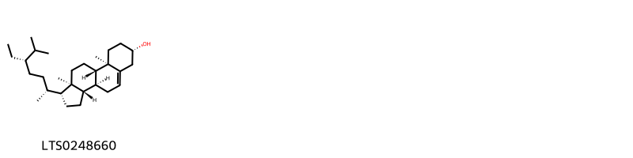{ width=100% }
    <figcaption>Hình ảnh cấu trúc hóa học của 1 hoạt chất thuộc nhóm Steroids and steroid derivatives gồm ['clionasterol (LTS0248660)'].</figcaption>
</figure>
#### Nhóm Tannins
<figure markdown="span">
    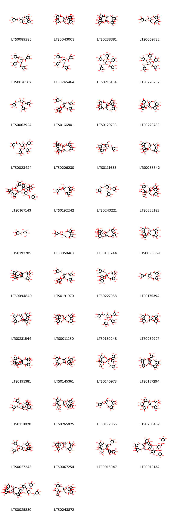{ width=100% }
    <figcaption>Hình ảnh cấu trúc hóa học của 46 hoạt chất thuộc nhóm Tannins gồm ['(1s,19r,21s,22r,23r)-6,7,8,11,12,13,22,23-octahydroxy-3,16-dioxo-2,17,20-trioxatetracyclo[17.3.1.0⁴,⁹.0¹⁰,¹⁵]tricosa-4(9),5,7,10,12,14-hexaen-21-yl 3,4,5-trihydroxybenzoate (LTS0089285)', '(1r,38r)-1,13,14,15,18,19,20,34,35,39,39-undecahydroxy-2,5,10,23,31-pentaoxo-6,9,24,27,30,40-hexaoxaoctacyclo[34.3.1.0⁴,³⁸.0⁷,²⁶.0⁸,²⁹.0¹¹,¹⁶.0¹⁷,²².0³²,³⁷]tetraconta-3,11(16),12,14,17,19,21,32,34,36-decaen-28-yl 3,4,5-trihydroxybenzoate (LTS0043003)', '(7r,8s,26r,28s,29s)-1,13,14,15,18,19,20,34,35,39,39-undecahydroxy-2,5,10,23,31-pentaoxo-6,9,24,27,30,40-hexaoxaoctacyclo[34.3.1.0⁴,³⁸.0⁷,²⁶.0⁸,²⁹.0¹¹,¹⁶.0¹⁷,²².0³²,³⁷]tetraconta-3,11,13,15,17(22),18,20,32,34,36-decaen-28-yl 3,4,5-trihydroxybenzoate (LTS0238381)', '6,7,8,11,12,13,22,23-octahydroxy-3,16-dioxo-2,17,20-trioxatetracyclo[17.3.1.0⁴,⁹.0¹⁰,¹⁵]tricosa-4(9),5,7,10,12,14-hexaen-21-yl 3,4,5-trihydroxybenzoate (LTS0069732)', '3-hydroxy-4,5-bis(3,4,5-trihydroxybenzoyloxy)-6-[(3,4,5-trihydroxybenzoyloxy)methyl]oxan-2-yl 3,4,5-trihydroxybenzoate (LTS0076562)', '(2s,3r,4r,5r,6r)-3-hydroxy-4,5-bis(3,4,5-trihydroxybenzoyloxy)-6-[(3,4,5-trihydroxybenzoyloxy)methyl]oxan-2-yl 3,4,5-trihydroxybenzoate (LTS0245464)', '(2s,3r,4s,5r,6r)-3,4,5-tris(3,4,5-trihydroxybenzoyloxy)-6-[(3,4,5-trihydroxybenzoyloxy)methyl]oxan-2-yl 3,4,5-trihydroxybenzoate (LTS0216134)', '3,4,5-tris(3,4,5-trihydroxybenzoyloxy)-6-[(3,4,5-trihydroxybenzoyloxy)methyl]oxan-2-yl 3,4,5-trihydroxybenzoate (LTS0226232)', '4,5-dihydroxy-3-(3,4,5-trihydroxybenzoyloxy)-6-[(3,4,5-trihydroxybenzoyloxy)methyl]oxan-2-yl 3,4,5-trihydroxybenzoate (LTS0063924)', '(1r,10r,18r,19r,21s,22s)-6,7,11,12,12-pentahydroxy-3,13,16-trioxo-21-(3,4,5-trihydroxybenzoyloxy)-19-[(3,4,5-trihydroxybenzoyloxy)methyl]-2,17,20,23-tetraoxapentacyclo[16.3.1.1⁸,¹¹.0⁴,⁹.0¹⁰,¹⁵]tricosa-4,6,8,14-tetraen-22-yl 3,4,5-trihydroxybenzoate (LTS0166801)', '1,13,14,15,18,19,20,34,35,39,39-undecahydroxy-2,5,10,23,31-pentaoxo-6,9,24,27,30,40-hexaoxaoctacyclo[34.3.1.0⁴,³⁸.0⁷,²⁶.0⁸,²⁹.0¹¹,¹⁶.0¹⁷,²².0³²,³⁷]tetraconta-3,11(16),12,14,17,19,21,32,34,36-decaen-28-yl 3,4,5-trihydroxybenzoate (LTS0129733)', '(1r,7r,8s,26r,28s,29r,38r)-1,13,14,15,18,19,20,34,35,39,39-undecahydroxy-2,5,10,23,31-pentaoxo-6,9,24,27,30,40-hexaoxaoctacyclo[34.3.1.0⁴,³⁸.0⁷,²⁶.0⁸,²⁹.0¹¹,¹⁶.0¹⁷,²².0³²,³⁷]tetraconta-3,11,13,15,17(22),18,20,32,34,36-decaen-28-yl 3,4,5-trihydroxybenzoate (LTS0223783)', '5-hydroxy-3,4-bis(3,4,5-trihydroxybenzoyloxy)-6-[(3,4,5-trihydroxybenzoyloxy)methyl]oxan-2-yl 3,4,5-trihydroxybenzoate (LTS0023424)', '(1r,8r,9s,27r,29s,30r,39r)-1,2,2,14,15,16,19,20,21,35,36-undecahydroxy-3,6,11,24,32-pentaoxo-7,10,25,28,31,40-hexaoxaoctacyclo[35.2.1.0⁵,³⁹.0⁸,²⁷.0⁹,³⁰.0¹²,¹⁷.0¹⁸,²³.0³³,³⁸]tetraconta-4,12,14,16,18(23),19,21,33,35,37-decaen-29-yl 3,4,5-trihydroxybenzoate (LTS0206230)', '(1s,7s,9r,18r,19s,21r,22s)-7,8,8,12,13,22-hexahydroxy-21-(hydroxymethyl)-3,6,16-trioxo-2,17,20,23-tetraoxapentacyclo[16.3.1.1⁷,¹¹.0⁴,⁹.0¹⁰,¹⁵]tricosa-4,10,12,14-tetraen-19-yl 3,4,5-trihydroxybenzoate (LTS0111633)', '1,2,2,14,15,16,19,20,21,35,36-undecahydroxy-3,6,11,24,32-pentaoxo-7,10,25,28,31,40-hexaoxaoctacyclo[35.2.1.0⁵,³⁹.0⁸,²⁷.0⁹,³⁰.0¹²,¹⁷.0¹⁸,²³.0³³,³⁸]tetraconta-4,12(17),13,15,18,20,22,33,35,37-decaen-29-yl 3,4,5-trihydroxybenzoate (LTS0088342)', '(2s,3r,4s,5s,6r)-4,5-dihydroxy-2-(3,4,5-trihydroxybenzoyloxy)-6-[(3,4,5-trihydroxybenzoyloxy)methyl]oxan-3-yl 3,4,5-trihydroxy-2-{[(1s,8r,9s,27r,29s,30r,39r)-2,2,14,15,16,19,20,35,36-nonahydroxy-3,6,11,24,32-pentaoxo-29-(3,4,5-trihydroxybenzoyloxy)-7,10,25,28,31,40-hexaoxaoctacyclo[35.2.1.0⁵,³⁹.0⁸,²⁷.0⁹,³⁰.0¹²,¹⁷.0¹⁸,²³.0³³,³⁸]tetraconta-4,12,14,16,18(23),19,21,33,35,37-decaen-21-yl]oxy}benzoate (LTS0167143)', '(1s,8r,9r,18r,19s,21r,22s)-7,7,8,12,13,22-hexahydroxy-21-(hydroxymethyl)-3,6,16-trioxo-2,17,20,23-tetraoxapentacyclo[16.3.1.1⁸,¹¹.0⁴,⁹.0¹⁰,¹⁵]tricosa-4,10,12,14-tetraen-19-yl 3,4,5-trihydroxybenzoate (LTS0192242)', '(2s,3r,4s,5s,6r)-4,5-dihydroxy-3-(3,4,5-trihydroxybenzoyloxy)-6-[(3,4,5-trihydroxybenzoyloxy)methyl]oxan-2-yl 3,4,5-trihydroxybenzoate (LTS0243221)', "3a,6,10',11',12',15',16',17',31',32',36',37'-dodecahydroxy-2,2',7',20',28',41'-hexaoxo-6,6a-dihydro-5h-3',6',21',24',27',38',42'-heptaoxaspiro[furo[3,2-b]furan-3,39'-nonacyclo[35.2.2.1³³,³⁶.0¹,³⁵.0⁴,²³.0⁵,²⁶.0⁸,¹³.0¹⁴,¹⁹.0²⁹,³⁴]dotetracontane]-8'(13'),9',11',14',16',18',29'(34'),30',32'-nonaen-25'-yl 3,4,5-trihydroxybenzoate (LTS0222182)", 'β-glucogallin (LTS0193705)', '6,7,8,11,12,13,20,22-octahydroxy-3,16-dioxo-2,17,23-trioxatetracyclo[17.3.1.0⁴,⁹.0¹⁰,¹⁵]tricosa-4(9),5,7,10,12,14-hexaen-21-yl 3,4,5-trihydroxybenzoate (LTS0050487)', '(1r,2r,19s,20s,39r)-8,9,9,13,14,25,26,27,30,31,32,35-dodecahydroxy-4,7,17,22-tetraoxo-3,18,21,36,38,40-hexaoxaoctacyclo[18.17.1.1²,¹⁹.1⁸,¹².0⁵,¹⁰.0¹¹,¹⁶.0²³,²⁸.0²⁹,³⁴]tetraconta-5,11,13,15,23(28),24,26,29,31,33-decaen-39-yl 3,4,5-trihydroxybenzoate (LTS0150744)', '2,3,14,15,16,19,20,21,35,36-decahydroxy-6,11,24,32-tetraoxo-7,10,25,28,31,40-hexaoxaoctacyclo[35.2.1.0⁵,³⁹.0⁸,²⁷.0⁹,³⁰.0¹²,¹⁷.0¹⁸,²³.0³³,³⁸]tetraconta-1(39),2,4,12(17),13,15,18,20,22,33,35,37-dodecaen-29-yl 3,4,5-trihydroxybenzoate (LTS0093059)', '(1r,2r,9r,10r,19r,20s,39s)-8,8,9,13,14,25,26,27,30,31,32-undecahydroxy-4,7,17,22,35-pentaoxo-3,18,21,36,38,40-hexaoxaoctacyclo[18.17.1.1²,¹⁹.1⁹,¹².0⁵,¹⁰.0¹¹,¹⁶.0²³,²⁸.0²⁹,³⁴]tetraconta-5,11,13,15,23,25,27,29(34),30,32-decaen-39-yl 3,4,5-trihydroxybenzoate (LTS0094840)', '(1r,10r,11r,18r,19r,21s,22s)-6,7,11,12,12-pentahydroxy-3,13,16-trioxo-21-(3,4,5-trihydroxybenzoyloxy)-19-[(3,4,5-trihydroxybenzoyloxy)methyl]-2,17,20,23-tetraoxapentacyclo[16.3.1.1⁸,¹¹.0⁴,⁹.0¹⁰,¹⁵]tricosa-4,6,8,14-tetraen-22-yl 3,4,5-trihydroxybenzoate (LTS0191970)', '[6,7,11,12,12-pentahydroxy-3,13,16-trioxo-21,22-bis(3,4,5-trihydroxybenzoyloxy)-2,17,20,23-tetraoxapentacyclo[16.3.1.1⁸,¹¹.0⁴,⁹.0¹⁰,¹⁵]tricosa-4,6,8,14-tetraen-19-yl]methyl 3,4,5-trihydroxybenzoate (LTS0227958)', '(1s,19r,20r,21s,22r)-6,7,8,11,12,13,20,22-octahydroxy-3,16-dioxo-2,17,23-trioxatetracyclo[17.3.1.0⁴,⁹.0¹⁰,¹⁵]tricosa-4,6,8,10(15),11,13-hexaen-21-yl 3,4,5-trihydroxybenzoate (LTS0175394)', '(8r,9s,27r,29s,30r)-2,3,14,15,16,19,20,21,35,36-decahydroxy-6,11,24,32-tetraoxo-7,10,25,28,31,40-hexaoxaoctacyclo[35.2.1.0⁵,³⁹.0⁸,²⁷.0⁹,³⁰.0¹²,¹⁷.0¹⁸,²³.0³³,³⁸]tetraconta-1(39),2,4,12(17),13,15,18,20,22,33,35,37-dodecaen-29-yl 3,4,5-trihydroxybenzoate (LTS0231544)', '8,8,9,13,14,25,26,27,30,31,32-undecahydroxy-4,7,17,22,35-pentaoxo-3,18,21,36,38,40-hexaoxaoctacyclo[18.17.1.1²,¹⁹.1⁹,¹².0⁵,¹⁰.0¹¹,¹⁶.0²³,²⁸.0²⁹,³⁴]tetraconta-5,11,13,15,23(28),24,26,29,31,33-decaen-39-yl 3,4,5-trihydroxybenzoate (LTS0011180)', '(2s,3r,4s,5r,6r)-5-hydroxy-3,4-bis(3,4,5-trihydroxybenzoyloxy)-6-[(3,4,5-trihydroxybenzoyloxy)methyl]oxan-2-yl 3,4,5-trihydroxybenzoate (LTS0130248)', '(1s,19r,20r,35r,37s)-6,7,8,11,12,13,24,25,29,29,30-undecahydroxy-37-methoxy-2,17,21,34,36,38-hexaoxaoctacyclo[17.16.1.1²⁰,³⁵.1²⁶,³⁰.0⁴,⁹.0¹⁰,¹⁵.0²²,²⁷.0²⁸,³³]octatriaconta-4(9),5,7,10,12,14,22(27),23,25,32-decaene-3,16,31-trione (LTS0269727)', '(1r,2r,11s,12s,19r,20s,39s)-7,8,12,13,13,25,26,27,30,31,32-undecahydroxy-4,14,17,22,35-pentaoxo-3,18,21,36,38,40-hexaoxaoctacyclo[18.17.1.1²,¹⁹.1⁹,¹².0⁵,¹⁰.0¹¹,¹⁶.0²³,²⁸.0²⁹,³⁴]tetraconta-5,7,9,15,23,25,27,29(34),30,32-decaen-39-yl 3,4,5-trihydroxybenzoate (LTS0191381)', '7,8,12,13,13,25,26,27,30,31,32-undecahydroxy-4,14,17,22,35-pentaoxo-3,18,21,36,38,40-hexaoxaoctacyclo[18.17.1.1²,¹⁹.1⁹,¹².0⁵,¹⁰.0¹¹,¹⁶.0²³,²⁸.0²⁹,³⁴]tetraconta-5,7,9,15,23,25,27,29(34),30,32-decaen-39-yl 3,4,5-trihydroxybenzoate (LTS0145361)', "3a,6,13',14',18',19'-hexahydroxy-2,2',10',23'-tetraoxo-25'-(3,4,5-trihydroxybenzoyloxy)-5'-[(3,4,5-trihydroxybenzoyloxy)methyl]-6,6a-dihydro-5h-3',6',9',20',24'-pentaoxaspiro[furo[3,2-b]furan-3,21'-hexacyclo[17.2.2.1⁴,⁸.1¹⁵,¹⁸.0¹,¹⁷.0¹¹,¹⁶]pentacosane]-11',13',15'-trien-7'-yl 3,4,5-trihydroxybenzoate (LTS0145973)", '(1s,2r,20r,22s,31s,32s,39r)-7,8,9,12,13,14,27,28,33,33-decahydroxy-4,17,24,34,37-pentaoxo-3,18,21,23,38,40-hexaoxaoctacyclo[20.16.1.1²⁹,³².0²,²⁰.0⁵,¹⁰.0¹¹,¹⁶.0²⁵,³⁰.0³¹,³⁶]tetraconta-5(10),6,8,11,13,15,25,27,29,35-decaen-39-yl 3,4,5-trihydroxybenzoate (LTS0157294)', '(1s,19r,21s,22r,23r)-6,7,8,11,12,13-hexahydroxy-3,16-dioxo-21,23-bis(3,4,5-trihydroxybenzoyloxy)-2,17,20-trioxatetracyclo[17.3.1.0⁴,⁹.0¹⁰,¹⁵]tricosa-4(9),5,7,10,12,14-hexaen-22-yl 3,4,5-trihydroxybenzoate (LTS0119020)', "(1's,3r,3as,4'r,5'r,6s,6ar,23's,24'r,33'r,34'r,35's,41's)-3a,6,11',12',13',16',17',18',29',30',34',35'-dodecahydroxy-2,2',8',21',26',39'-hexaoxo-6,6a-dihydro-5h-3',7',22',25',36',40',42'-heptaoxaspiro[furo[3,2-b]furan-3,37'-nonacyclo[33.2.2.1⁴,²⁴.1⁵,²³.1³¹,³⁴.0¹,³³.0⁹,¹⁴.0¹⁵,²⁰.0²⁷,³²]dotetracontane]-9',11',13',15'(20'),16',18',27',29',31'-nonaen-41'-yl 3,4,5-trihydroxybenzoate (LTS0265825)", '7,7,8,12,13,22-hexahydroxy-21-(hydroxymethyl)-3,6,16-trioxo-2,17,20,23-tetraoxapentacyclo[16.3.1.1⁸,¹¹.0⁴,⁹.0¹⁰,¹⁵]tricosa-4,10,12,14-tetraen-19-yl 3,4,5-trihydroxybenzoate (LTS0192865)', '7,8,9,12,13,14,28,28,29,33,34-undecahydroxy-4,17,24,27,37-pentaoxo-3,18,21,23,38,40-hexaoxaoctacyclo[20.16.1.1²⁹,³².0²,²⁰.0⁵,¹⁰.0¹¹,¹⁶.0²⁵,³⁰.0³¹,³⁶]tetraconta-5(10),6,8,11,13,15,25,31,33,35-decaen-39-yl 3,4,5-trihydroxybenzoate (LTS0256452)', '6,7,8,11,12,13-hexahydroxy-3,16-dioxo-21,22-bis(3,4,5-trihydroxybenzoyloxy)-2,17,20-trioxatetracyclo[17.3.1.0⁴,⁹.0¹⁰,¹⁵]tricosa-4(9),5,7,10,12,14-hexaen-23-yl 3,4,5-trihydroxybenzoate (LTS0057243)', '(1s,2r,20r,22s,29s,30s,39r)-7,8,9,12,13,14,28,28,29,33,34-undecahydroxy-4,17,24,27,37-pentaoxo-3,18,21,23,38,40-hexaoxaoctacyclo[20.16.1.1²⁹,³².0²,²⁰.0⁵,¹⁰.0¹¹,¹⁶.0²⁵,³⁰.0³¹,³⁶]tetraconta-5(10),6,8,11,13,15,25,31,33,35-decaen-39-yl 3,4,5-trihydroxybenzoate (LTS0067254)', "(1's,3s,3as,4'r,5'r,6s,6ar,7's,8'r,17'r,18'r,19's,25's)-3a,6,13',14',18',19'-hexahydroxy-2,2',10',23'-tetraoxo-25'-(3,4,5-trihydroxybenzoyloxy)-5'-[(3,4,5-trihydroxybenzoyloxy)methyl]-6,6a-dihydro-5h-3',6',9',20',24'-pentaoxaspiro[furo[3,2-b]furan-3,21'-hexacyclo[17.2.2.1⁴,⁸.1¹⁵,¹⁸.0¹,¹⁷.0¹¹,¹⁶]pentacosane]-11',13',15'-trien-7'-yl 3,4,5-trihydroxybenzoate (LTS0015047)", '4,5-dihydroxy-2-(3,4,5-trihydroxybenzoyloxy)-6-[(3,4,5-trihydroxybenzoyloxy)methyl]oxan-3-yl 2-{[1,13,14,15,18,19,34,35,39,39-decahydroxy-2,5,10,23,31-pentaoxo-28-(3,4,5-trihydroxybenzoyloxy)-6,9,24,27,30,40-hexaoxaoctacyclo[34.3.1.0⁴,³⁸.0⁷,²⁶.0⁸,²⁹.0¹¹,¹⁶.0¹⁷,²².0³²,³⁷]tetraconta-3,11(16),12,14,17,19,21,32,34,36-decaen-20-yl]oxy}-3,4,5-trihydroxybenzoate (LTS0013134)', '(2s,3r,4s,5s,6r)-4,5-dihydroxy-2-(3,4,5-trihydroxybenzoyloxy)-6-[(3,4,5-trihydroxybenzoyloxy)methyl]oxan-3-yl 2-{[(1r,7r,8s,26r,28s,29r,38r)-1,13,14,15,18,19,34,35,39,39-decahydroxy-2,5,10,23,31-pentaoxo-28-(3,4,5-trihydroxybenzoyloxy)-6,9,24,27,30,40-hexaoxaoctacyclo[34.3.1.0⁴,³⁸.0⁷,²⁶.0⁸,²⁹.0¹¹,¹⁶.0¹⁷,²².0³²,³⁷]tetraconta-3,11,13,15,17(22),18,20,32,34,36-decaen-20-yl]oxy}-3,4,5-trihydroxybenzoate (LTS0025830)', "3a,6,11',12',13',16',17',18',29',30',34',35'-dodecahydroxy-2,2',8',21',26',39'-hexaoxo-6,6a-dihydro-5h-3',7',22',25',36',40',42'-heptaoxaspiro[furo[3,2-b]furan-3,37'-nonacyclo[33.2.2.1⁴,²⁴.1⁵,²³.1³¹,³⁴.0¹,³³.0⁹,¹⁴.0¹⁵,²⁰.0²⁷,³²]dotetracontane]-9'(14'),10',12',15',17',19',27'(32'),28',30'-nonaen-41'-yl 3,4,5-trihydroxybenzoate (LTS0243872)"].</figcaption>
</figure>
#### Nhóm Tetrahydrofurans
<figure markdown="span">
    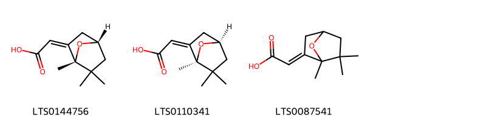{ width=100% }
    <figcaption>Hình ảnh cấu trúc hóa học của 3 hoạt chất thuộc nhóm Tetrahydrofurans gồm ['[(1r,2z,4s)-1,6,6-trimethyl-7-oxabicyclo[2.2.1]heptan-2-ylidene]acetic acid (LTS0144756)', '[(1s,2z,4r)-1,6,6-trimethyl-7-oxabicyclo[2.2.1]heptan-2-ylidene]acetic acid (LTS0110341)', '{1,6,6-trimethyl-7-oxabicyclo[2.2.1]heptan-2-ylidene}acetic acid (LTS0087541)'].</figcaption>
</figure>

---

### Dược dân tộc học

Danh sách các quốc gia có sử dụng *Euphorbia helioscopia* trong điều trị các bệnh. 

| Country   | Disease                         | Bệnh                                                                                                                                                                                                |
|:----------|:--------------------------------|:----------------------------------------------------------------------------------------------------------------------------------------------------------------------------------------------------|
| China     | Vermifuge                       | MYMEMORY WARNING: YOU USED ALL AVAILABLE FREE TRANSLATIONS FOR TODAY. NEXT AVAILABLE IN  20 HOURS 24 MINUTES 12 SECONDS VISIT HTTPS://MYMEMORY.TRANSLATED.NET/DOC/USAGELIMITS.PHP TO TRANSLATE MORE |
| Dutch     | Purgative                       | MYMEMORY WARNING: YOU USED ALL AVAILABLE FREE TRANSLATIONS FOR TODAY. NEXT AVAILABLE IN  20 HOURS 24 MINUTES 07 SECONDS VISIT HTTPS://MYMEMORY.TRANSLATED.NET/DOC/USAGELIMITS.PHP TO TRANSLATE MORE |
| Elsewhere | Cathartic, Piscicide, Purgative | MYMEMORY WARNING: YOU USED ALL AVAILABLE FREE TRANSLATIONS FOR TODAY. NEXT AVAILABLE IN  20 HOURS 24 MINUTES 04 SECONDS VISIT HTTPS://MYMEMORY.TRANSLATED.NET/DOC/USAGELIMITS.PHP TO TRANSLATE MORE |
| French    | Vesicant                        | MYMEMORY WARNING: YOU USED ALL AVAILABLE FREE TRANSLATIONS FOR TODAY. NEXT AVAILABLE IN  20 HOURS 24 MINUTES 01 SECONDS VISIT HTTPS://MYMEMORY.TRANSLATED.NET/DOC/USAGELIMITS.PHP TO TRANSLATE MORE |
| German    | Poison                          | MYMEMORY WARNING: YOU USED ALL AVAILABLE FREE TRANSLATIONS FOR TODAY. NEXT AVAILABLE IN  20 HOURS 23 MINUTES 57 SECONDS VISIT HTTPS://MYMEMORY.TRANSLATED.NET/DOC/USAGELIMITS.PHP TO TRANSLATE MORE |
| Iraq      | Vermifuge                       | MYMEMORY WARNING: YOU USED ALL AVAILABLE FREE TRANSLATIONS FOR TODAY. NEXT AVAILABLE IN  20 HOURS 23 MINUTES 53 SECONDS VISIT HTTPS://MYMEMORY.TRANSLATED.NET/DOC/USAGELIMITS.PHP TO TRANSLATE MORE |
| Japan     | Poison                          | MYMEMORY WARNING: YOU USED ALL AVAILABLE FREE TRANSLATIONS FOR TODAY. NEXT AVAILABLE IN  20 HOURS 23 MINUTES 50 SECONDS VISIT HTTPS://MYMEMORY.TRANSLATED.NET/DOC/USAGELIMITS.PHP TO TRANSLATE MORE |
| US        | Vermifuge                       | MYMEMORY WARNING: YOU USED ALL AVAILABLE FREE TRANSLATIONS FOR TODAY. NEXT AVAILABLE IN  20 HOURS 23 MINUTES 46 SECONDS VISIT HTTPS://MYMEMORY.TRANSLATED.NET/DOC/USAGELIMITS.PHP TO TRANSLATE MORE |

---

---
## Euphorbia hermentiana
### Thông tin về thực vật

!!! info "Phân loại thực vật của *Euphorbia trigona* từ GIBF:"
    - **Kingdom:** Plantae
    - **Phylum:** Tracheophyta
    - **Order:** Malpighiales
    - **Family:** Euphorbiaceae
    - **Genus:** Euphorbia
    - **Species:** *Euphorbia trigona*

 

| Label (VI)   | Label (EN)   | Scientific Name       | Descriptions (VI)   | Descriptions (EN)   | Also Known As (VI)   | Also Known As (EN)   |
|:-------------|:-------------|:----------------------|:--------------------|:--------------------|:---------------------|:---------------------|
| N/A          | N/A          | Euphorbia hermentiana |                     | species of plant    | ['']                 | ['']                 |

#### Phân bố trên thế giới

**Từ CSDL GIBF** nan, Italy, Australia, Japan, Israel, Netherlands, Cyprus, Malta, Spain, Hungary, Portugal, Türkiye, Albania, Morocco, United States of America, Algeria, Croatia, Greece, Uzbekistan, Germany, Romania, Switzerland, Austria, France, United Kingdom of Great Britain and Northern Ireland, China, Ireland, Serbia, New Zealand

#### Phân bố tại Việt Nam

**Từ CSDL GIBF**: Không có ghi nhận ở Việt Nam

---
### Thành phần hóa học
        
- Theo cơ sở dữ liệu lotus: Từ loài *Euphorbia trigona* đã phân lập và xác định được Chưa có hoạt chất nào được phân lập. hoạt chất thuộc về các nhóm Không có hoạt chất nào được phân lập. 

Không có hình ảnh nào được tạo ra

---

### Dược dân tộc học

Danh sách các quốc gia có sử dụng *Euphorbia trigona* trong điều trị các bệnh. 

| Country        | Disease   | Bệnh                                                                                                                                                                                                |
|:---------------|:----------|:----------------------------------------------------------------------------------------------------------------------------------------------------------------------------------------------------|
| Ethiopia(Bogo) | Poison    | MYMEMORY WARNING: YOU USED ALL AVAILABLE FREE TRANSLATIONS FOR TODAY. NEXT AVAILABLE IN  20 HOURS 23 MINUTES 07 SECONDS VISIT HTTPS://MYMEMORY.TRANSLATED.NET/DOC/USAGELIMITS.PHP TO TRANSLATE MORE |

---

---
## Euphorbia heterophylla
### Thông tin về thực vật

!!! info "Phân loại thực vật của *Euphorbia heterophylla* từ GIBF:"
    - **Kingdom:** Plantae
    - **Phylum:** Tracheophyta
    - **Order:** Malpighiales
    - **Family:** Euphorbiaceae
    - **Genus:** Euphorbia
    - **Species:** *Euphorbia heterophylla*

 

| Label (VI)   | Label (EN)   | Scientific Name        | Descriptions (VI)   | Descriptions (EN)   | Also Known As (VI)   | Also Known As (EN)                    |
|:-------------|:-------------|:-----------------------|:--------------------|:--------------------|:---------------------|:--------------------------------------|
| N/A          | N/A          | Euphorbia heterophylla | loài thực vật       | species of plant    | ['']                 | ['painted spurge', 'wild poinsettia'] |

#### Phân bố trên thế giới

**Từ CSDL GIBF** nan, Sri Lanka, Australia, Japan, Guadeloupe, Guatemala, Argentina, Benin, Bermuda, Tanzania, United Republic of, Venezuela (Bolivarian Republic of), Israel, Panama, Puerto Rico, Réunion, Namibia, Chinese Taipei, Honduras, Jamaica, United States of America, South Africa, Fiji, Thailand, Martinique, Brazil, Bahamas, New Caledonia, Tonga, Mexico, Dominican Republic, Singapore, Eswatini, China, Ecuador, French Polynesia, Niue, Seychelles, Colombia, Costa Rica, Vanuatu, India, Indonesia, Antigua and Barbuda, Kenya, Northern Mariana Islands

#### Phân bố tại Việt Nam

**Từ CSDL GIBF**: Không có ghi nhận ở Việt Nam

---
### Thành phần hóa học
        
- Theo cơ sở dữ liệu lotus: Từ loài *Euphorbia heterophylla* đã phân lập và xác định được Chưa có hoạt chất nào được phân lập. hoạt chất thuộc về các nhóm Không có hoạt chất nào được phân lập. 

Không có hình ảnh nào được tạo ra

---

### Dược dân tộc học

Danh sách các quốc gia có sử dụng *Euphorbia heterophylla* trong điều trị các bệnh. 

| Country   | Disease   | Bệnh                                                                                                                                                                                                |
|:----------|:----------|:----------------------------------------------------------------------------------------------------------------------------------------------------------------------------------------------------|
| Haiti     | Purgative | MYMEMORY WARNING: YOU USED ALL AVAILABLE FREE TRANSLATIONS FOR TODAY. NEXT AVAILABLE IN  20 HOURS 22 MINUTES 47 SECONDS VISIT HTTPS://MYMEMORY.TRANSLATED.NET/DOC/USAGELIMITS.PHP TO TRANSLATE MORE |
| Indonesia | Purgative | MYMEMORY WARNING: YOU USED ALL AVAILABLE FREE TRANSLATIONS FOR TODAY. NEXT AVAILABLE IN  20 HOURS 22 MINUTES 44 SECONDS VISIT HTTPS://MYMEMORY.TRANSLATED.NET/DOC/USAGELIMITS.PHP TO TRANSLATE MORE |
| Mexico    | Collyrium | MYMEMORY WARNING: YOU USED ALL AVAILABLE FREE TRANSLATIONS FOR TODAY. NEXT AVAILABLE IN  20 HOURS 22 MINUTES 41 SECONDS VISIT HTTPS://MYMEMORY.TRANSLATED.NET/DOC/USAGELIMITS.PHP TO TRANSLATE MORE |

---

---
## Euphorbia hirta
### Thông tin về thực vật

!!! info "Phân loại thực vật của *Euphorbia hirta* từ GIBF:"
    - **Kingdom:** Plantae
    - **Phylum:** Tracheophyta
    - **Order:** Malpighiales
    - **Family:** Euphorbiaceae
    - **Genus:** Euphorbia
    - **Species:** *Euphorbia hirta*

 

| Label (VI)   | Label (EN)   | Scientific Name   | Descriptions (VI)   | Descriptions (EN)                                                       | Also Known As (VI)   | Also Known As (EN)                                          |
|:-------------|:-------------|:------------------|:--------------------|:------------------------------------------------------------------------|:---------------------|:------------------------------------------------------------|
| N/A          | N/A          | Euphorbia hirta   |                     | species of hairy herb grown in open grasslands, roadsides, and pathways | ['']                 | ['asthma weed', "Cat's Hair Asthma Plant", 'Common Spurge'] |

#### Phân bố trên thế giới

**Từ CSDL GIBF** Virgin Islands (U.S.), United Arab Emirates, Sri Lanka, Australia, Philippines, Benin, Tanzania, United Republic of, Panama, Malawi, Puerto Rico, Réunion, Nigeria, Namibia, Chinese Taipei, Spain, Honduras, United States of America, Congo, Democratic Republic of the, South Africa, Uganda, Hong Kong, Thailand, Martinique, Brazil, Guam, Mexico, Dominican Republic, Singapore, China, Colombia, Costa Rica, India, Antigua and Barbuda, Kenya, Malaysia

#### Phân bố tại Việt Nam

**Từ CSDL GIBF**: Không có ghi nhận ở Việt Nam

---
### Thành phần hóa học
        
- Theo cơ sở dữ liệu lotus: Từ loài *Euphorbia hirta* đã phân lập và xác định được 85 hoạt chất thuộc về các nhóm Fatty Acyls, Flavonoids, Prenol lipids, Steroids and steroid derivatives, Cinnamic acids and derivatives, Benzofurans, Benzene and substituted derivatives, Heteroaromatic compounds, Saturated hydrocarbons, Tannins, Organooxygen compounds, Coumarins and derivatives, Carboxylic acids and derivatives. 

|    | chemicalTaxonomyClassyfireClass     |   smiles_count |
|---:|:------------------------------------|---------------:|
|  0 | Benzene and substituted derivatives |              3 |
|  1 | Benzofurans                         |              1 |
|  2 | Carboxylic acids and derivatives    |              1 |
|  3 | Cinnamic acids and derivatives      |              1 |
|  4 | Coumarins and derivatives           |              3 |
|  5 | Fatty Acyls                         |              8 |
|  6 | Flavonoids                          |             20 |
|  7 | Heteroaromatic compounds            |              1 |
|  8 | Organooxygen compounds              |             10 |
|  9 | Prenol lipids                       |             10 |
| 10 | Saturated hydrocarbons              |              1 |
| 11 | Steroids and steroid derivatives    |              6 |
| 12 | Tannins                             |             20 |

#### Nhóm Benzene and substituted derivatives
<figure markdown="span">
    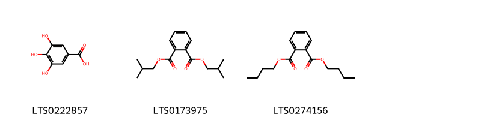{ width=100% }
    <figcaption>Hình ảnh cấu trúc hóa học của 3 hoạt chất thuộc nhóm Benzene and substituted derivatives gồm ['galop (LTS0222857)', 'diisobutyl phthalate (LTS0173975)', 'dibutyl-phthalate (LTS0274156)'].</figcaption>
</figure>
#### Nhóm Benzofurans
<figure markdown="span">
    { width=100% }
    <figcaption>Hình ảnh cấu trúc hóa học của 1 hoạt chất thuộc nhóm Benzofurans gồm ['loliolide (LTS0254454)'].</figcaption>
</figure>
#### Nhóm Carboxylic acids and derivatives
<figure markdown="span">
    { width=100% }
    <figcaption>Hình ảnh cấu trúc hóa học của 1 hoạt chất thuộc nhóm Carboxylic acids and derivatives gồm ['1,3-dihydroxypentane-1,3,5-tricarboxylic acid (LTS0248878)'].</figcaption>
</figure>
#### Nhóm Cinnamic acids and derivatives
<figure markdown="span">
    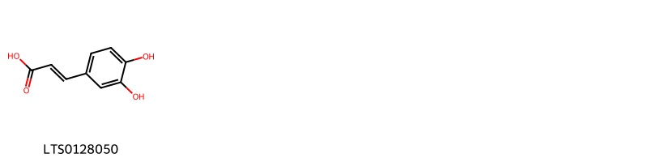{ width=100% }
    <figcaption>Hình ảnh cấu trúc hóa học của 1 hoạt chất thuộc nhóm Cinnamic acids and derivatives gồm ['3,4-dihydroxycinnamic acid (LTS0128050)'].</figcaption>
</figure>
#### Nhóm Coumarins and derivatives
<figure markdown="span">
    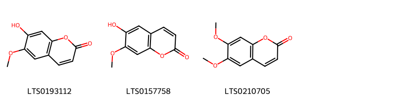{ width=100% }
    <figcaption>Hình ảnh cấu trúc hóa học của 3 hoạt chất thuộc nhóm Coumarins and derivatives gồm ['scopoletin (LTS0193112)', 'isoscopoletin (LTS0157758)', 'scoparone (LTS0210705)'].</figcaption>
</figure>
#### Nhóm Fatty Acyls
<figure markdown="span">
    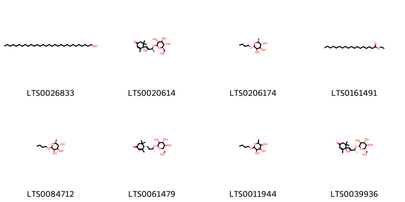{ width=100% }
    <figcaption>Hình ảnh cấu trúc hóa học của 8 hoạt chất thuộc nhóm Fatty Acyls gồm ['triacontanol (LTS0026833)', '(4s)-4-hydroxy-3,5,5-trimethyl-4-[(1e,3s)-3-{[(2r,3r,4s,5s,6r)-3,4,5-trihydroxy-6-(hydroxymethyl)oxan-2-yl]oxy}but-1-en-1-yl]cyclohex-2-en-1-one (LTS0020614)', '(2r,3r,4r,5r,6s)-2-butoxy-6-methyloxane-3,4,5-triol (LTS0206174)', 'ethyl stearate (LTS0161491)', '(2s,3r,4r,5r,6s)-2-butoxy-6-methyloxane-3,4,5-triol (LTS0084712)', '(4s)-3,5,5-trimethyl-4-[(3r)-3-{[(2s,3s,4r,5r,6s)-3,4,5-trihydroxy-6-(hydroxymethyl)oxan-2-yl]oxy}butyl]cyclohex-2-en-1-one (LTS0061479)', '2-butoxy-6-methyloxane-3,4,5-triol (LTS0011944)', '(4r)-4-hydroxy-3,5,5-trimethyl-4-[(1e,3r)-3-{[(2s,3s,4r,5r,6s)-3,4,5-trihydroxy-6-(hydroxymethyl)oxan-2-yl]oxy}but-1-en-1-yl]cyclohex-2-en-1-one (LTS0039936)'].</figcaption>
</figure>
#### Nhóm Flavonoids
<figure markdown="span">
    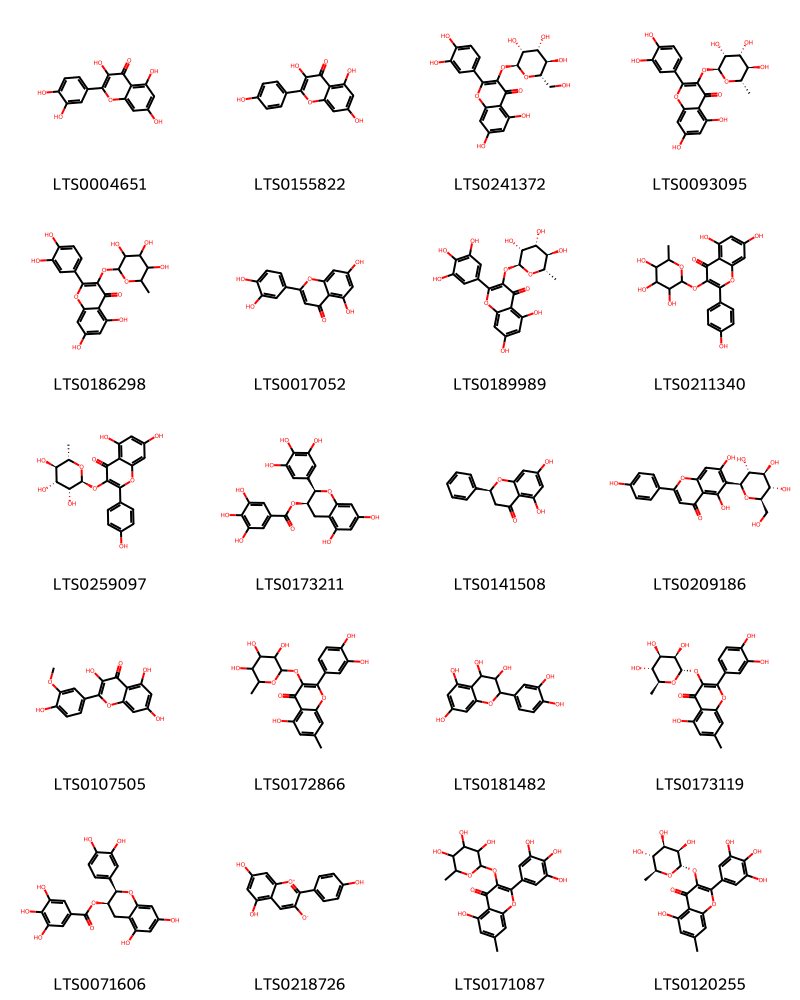{ width=100% }
    <figcaption>Hình ảnh cấu trúc hóa học của 20 hoạt chất thuộc nhóm Flavonoids gồm ['quercetin (LTS0004651)', 'kaempherol (LTS0155822)', '2-(3,4-dihydroxyphenyl)-5,7-dihydroxy-3-{[(2s,3r,4r,5r,6s)-3,4,5-trihydroxy-6-(hydroxymethyl)oxan-2-yl]oxy}chromen-4-one (LTS0241372)', 'quercitrin (LTS0093095)', 'quercitrin (LTS0186298)', 'luteolin (LTS0017052)', 'myricitrin (LTS0189989)', '5,7-dihydroxy-2-(4-hydroxyphenyl)-3-[(3,4,5-trihydroxy-6-methyloxan-2-yl)oxy]chromen-4-one (LTS0211340)', 'afzelin (LTS0259097)', '(-)-epigallocatechin gallate (LTS0173211)', 'pinocembrine (LTS0141508)', 'isovitexin (LTS0209186)', 'isorhamnetin (LTS0107505)', '2-(3,4-dihydroxyphenyl)-5-hydroxy-7-methyl-3-[(3,4,5-trihydroxy-6-methyloxan-2-yl)oxy]chromen-4-one (LTS0172866)', 'leucocyanidin (LTS0181482)', '2-(3,4-dihydroxyphenyl)-5-hydroxy-7-methyl-3-{[(2s,3r,4r,5r,6s)-3,4,5-trihydroxy-6-methyloxan-2-yl]oxy}chromen-4-one (LTS0173119)', 'epicatechin gallate (LTS0071606)', '5,7-dihydroxy-2-(4-hydroxyphenyl)-1λ⁴-chromen-1-ylium-3-olate (LTS0218726)', '5-hydroxy-7-methyl-3-[(3,4,5-trihydroxy-6-methyloxan-2-yl)oxy]-2-(3,4,5-trihydroxyphenyl)chromen-4-one (LTS0171087)', '5-hydroxy-7-methyl-3-{[(2s,3r,4r,5r,6s)-3,4,5-trihydroxy-6-methyloxan-2-yl]oxy}-2-(3,4,5-trihydroxyphenyl)chromen-4-one (LTS0120255)'].</figcaption>
</figure>
#### Nhóm Heteroaromatic compounds
<figure markdown="span">
    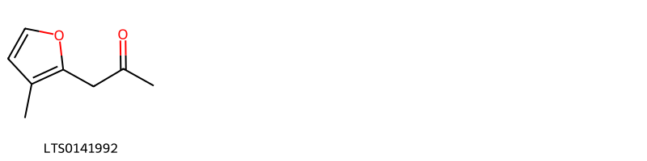{ width=100% }
    <figcaption>Hình ảnh cấu trúc hóa học của 1 hoạt chất thuộc nhóm Heteroaromatic compounds gồm ['1-(3-methylfuran-2-yl)propan-2-one (LTS0141992)'].</figcaption>
</figure>
#### Nhóm Organooxygen compounds
<figure markdown="span">
    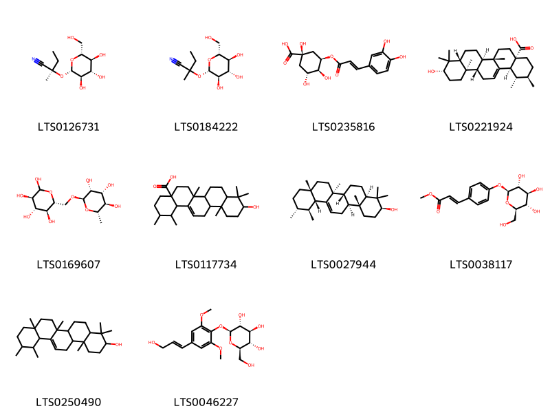{ width=100% }
    <figcaption>Hình ảnh cấu trúc hóa học của 10 hoạt chất thuộc nhóm Organooxygen compounds gồm ['lotaustralin (LTS0126731)', '2-methyl-2-{[(2s,3r,4s,5s,6r)-3,4,5-trihydroxy-6-(hydroxymethyl)oxan-2-yl]oxy}butanenitrile (LTS0184222)', 'neochlorogenic acid (LTS0235816)', '(1s,2r,4as,6as,6br,8ar,10s,12ar,12bs,14bs)-10-hydroxy-1,2,6a,9,9,12a-hexamethyl-1,2,3,4,5,6,6b,7,8,8a,10,11,12,12b,13,14b-hexadecahydropicene-4a-carboxylic acid (LTS0221924)', 'rutinoside (LTS0169607)', '10-hydroxy-1,2,6a,9,9,12a-hexamethyl-1,2,3,4,5,6,6b,7,8,8a,10,11,12,12b,13,14b-hexadecahydropicene-4a-carboxylic acid (LTS0117734)', '(3s,4ar,6ar,6bs,8ar,11r,12s,12ar,14as,14br)-4,4,6b,8a,11,12,14b-heptamethyl-1,2,3,4a,5,6,6a,7,8,9,10,11,12,12a,14,14a-hexadecahydropicen-3-ol (LTS0027944)', 'methyl (2e)-3-(4-{[(2s,3r,4s,5s,6r)-3,4,5-trihydroxy-6-(hydroxymethyl)oxan-2-yl]oxy}phenyl)prop-2-enoate (LTS0038117)', '4,4,6b,8a,11,12,14b-heptamethyl-1,2,3,4a,5,6,6a,7,8,9,10,11,12,12a,14,14a-hexadecahydropicen-3-ol (LTS0250490)', 'syringin (LTS0046227)'].</figcaption>
</figure>
#### Nhóm Prenol lipids
<figure markdown="span">
    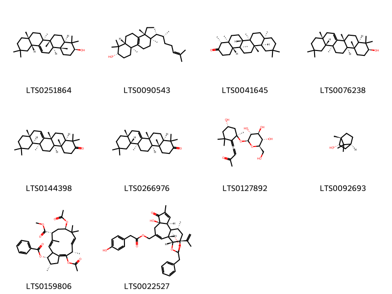{ width=100% }
    <figcaption>Hình ảnh cấu trúc hóa học của 10 hoạt chất thuộc nhóm Prenol lipids gồm ['β-amyrin (LTS0251864)', 'lanosterol (LTS0090543)', '(-)-friedelin (LTS0041645)', 'alnulin (LTS0076238)', '(4ar,6ar,8ar,12as,12bs,14ar,14br)-4,4,6a,8a,11,11,12b,14b-octamethyl-2,4a,5,6,8,9,10,12,12a,13,14,14a-dodecahydro-1h-picen-3-one (LTS0144398)', 'taraxerone (LTS0266976)', 'citroside b (LTS0127892)', '(1r,2s,4s)-1,7,7-trimethylbicyclo[2.2.1]heptan-2-ol (LTS0092693)', '(1s,2s,5s,9r,11r)-4,9-bis(acetyloxy)-11-(methoxycarbonyl)-2,5,8,8,12-pentamethyl-1h,2h,3h,5h,9h,10h,11h,13ah-cyclopenta[12]annulen-1-yl benzoate (LTS0159806)', 'tinyatoxin (LTS0022527)'].</figcaption>
</figure>
#### Nhóm Saturated hydrocarbons
<figure markdown="span">
    { width=100% }
    <figcaption>Hình ảnh cấu trúc hóa học của 1 hoạt chất thuộc nhóm Saturated hydrocarbons gồm ['hentriacontane (LTS0046415)'].</figcaption>
</figure>
#### Nhóm Steroids and steroid derivatives
<figure markdown="span">
    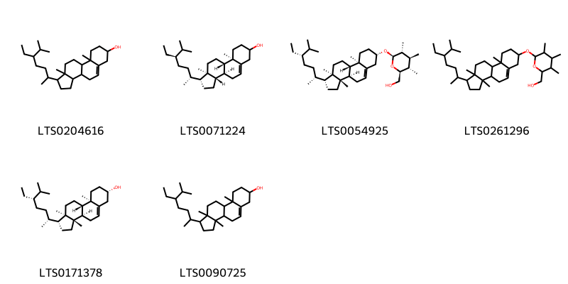{ width=100% }
    <figcaption>Hình ảnh cấu trúc hóa học của 6 hoạt chất thuộc nhóm Steroids and steroid derivatives gồm ['stigmast-5-en-3-ol, (3β)- (LTS0204616)', 'stigmast-5-en-3-ol (LTS0071224)', '[(2s,3s,4s,5r,6r)-6-{[(1r,3as,3br,7s,9ar,9bs,11ar)-1-[(2r,5s)-5-ethyl-6-methylheptan-2-yl]-3a,9a,11a-trimethyl-1h,2h,3h,3bh,4h,6h,7h,8h,9h,9bh,10h,11h-cyclopenta[a]phenanthren-7-yl]oxy}-3,4,5-trimethyloxan-2-yl]methanol (LTS0054925)', '(6-{[1-(5-ethyl-6-methylheptan-2-yl)-3a,9a,11a-trimethyl-1h,2h,3h,3bh,4h,6h,7h,8h,9h,9bh,10h,11h-cyclopenta[a]phenanthren-7-yl]oxy}-3,4,5-trimethyloxan-2-yl)methanol (LTS0261296)', '(1r,3as,3br,7s,9ar,9bs,11ar)-1-[(2r,5s)-5-ethyl-6-methylheptan-2-yl]-3a,9a,11a-trimethyl-1h,2h,3h,3bh,4h,6h,7h,8h,9h,9bh,10h,11h-cyclopenta[a]phenanthren-7-ol (LTS0171378)', '1-(5-ethyl-6-methylheptan-2-yl)-3a,9a,11a-trimethyl-1h,2h,3h,3bh,4h,6h,7h,8h,9h,9bh,10h,11h-cyclopenta[a]phenanthren-7-ol (LTS0090725)'].</figcaption>
</figure>
#### Nhóm Tannins
<figure markdown="span">
    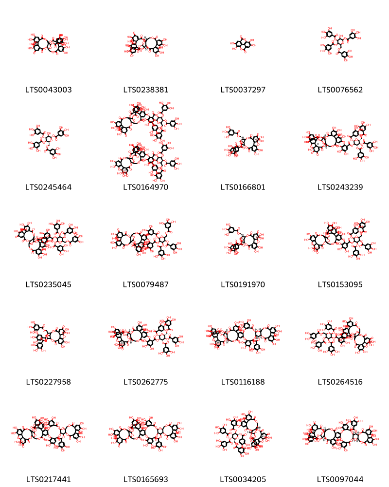{ width=100% }
    <figcaption>Hình ảnh cấu trúc hóa học của 20 hoạt chất thuộc nhóm Tannins gồm ['(1r,38r)-1,13,14,15,18,19,20,34,35,39,39-undecahydroxy-2,5,10,23,31-pentaoxo-6,9,24,27,30,40-hexaoxaoctacyclo[34.3.1.0⁴,³⁸.0⁷,²⁶.0⁸,²⁹.0¹¹,¹⁶.0¹⁷,²².0³²,³⁷]tetraconta-3,11(16),12,14,17,19,21,32,34,36-decaen-28-yl 3,4,5-trihydroxybenzoate (LTS0043003)', '(7r,8s,26r,28s,29s)-1,13,14,15,18,19,20,34,35,39,39-undecahydroxy-2,5,10,23,31-pentaoxo-6,9,24,27,30,40-hexaoxaoctacyclo[34.3.1.0⁴,³⁸.0⁷,²⁶.0⁸,²⁹.0¹¹,¹⁶.0¹⁷,²².0³²,³⁷]tetraconta-3,11,13,15,17(22),18,20,32,34,36-decaen-28-yl 3,4,5-trihydroxybenzoate (LTS0238381)', 'ellagic acid (LTS0037297)', '3-hydroxy-4,5-bis(3,4,5-trihydroxybenzoyloxy)-6-[(3,4,5-trihydroxybenzoyloxy)methyl]oxan-2-yl 3,4,5-trihydroxybenzoate (LTS0076562)', '(2s,3r,4r,5r,6r)-3-hydroxy-4,5-bis(3,4,5-trihydroxybenzoyloxy)-6-[(3,4,5-trihydroxybenzoyloxy)methyl]oxan-2-yl 3,4,5-trihydroxybenzoate (LTS0245464)', '2,4,5-tris(3,4,5-trihydroxybenzoyloxy)-6-[(3,4,5-trihydroxybenzoyloxy)methyl]oxan-3-yl 2-{[(1r,38r)-1,13,14,15,18,19,34,35,39,39-decahydroxy-2,5,10,23,31-pentaoxo-28-(3,4,5-trihydroxybenzoyloxy)-6,9,24,27,30,40-hexaoxaoctacyclo[34.3.1.0⁴,³⁸.0⁷,²⁶.0⁸,²⁹.0¹¹,¹⁶.0¹⁷,²².0³²,³⁷]tetraconta-3,11(16),12,14,17,19,21,32,34,36-decaen-20-yl]oxy}-3,4,5-trihydroxybenzoate; 2,4,5-tris(3,4,5-trihydroxybenzoyloxy)-6-[(3,4,5-trihydroxybenzoyloxy)methyl]oxan-3-yl 2-{[(1r,39r)-1,2,2,14,15,16,19,20,35,36-decahydroxy-3,6,11,24,32-pentaoxo-29-(3,4,5-trihydroxybenzoyloxy)-7,10,25,28,31,40-hexaoxaoctacyclo[35.2.1.0⁵,³⁹.0⁸,²⁷.0⁹,³⁰.0¹²,¹⁷.0¹⁸,²³.0³³,³⁸]tetraconta-4,12(17),13,15,18,20,22,33,35,37-decaen-21-yl]oxy}-3,4,5-trihydroxybenzoate (LTS0164970)', '(1r,10r,18r,19r,21s,22s)-6,7,11,12,12-pentahydroxy-3,13,16-trioxo-21-(3,4,5-trihydroxybenzoyloxy)-19-[(3,4,5-trihydroxybenzoyloxy)methyl]-2,17,20,23-tetraoxapentacyclo[16.3.1.1⁸,¹¹.0⁴,⁹.0¹⁰,¹⁵]tricosa-4,6,8,14-tetraen-22-yl 3,4,5-trihydroxybenzoate (LTS0166801)', '(2s,3r,4s,5r,6r)-2,4,5-tris(3,4,5-trihydroxybenzoyloxy)-6-[(3,4,5-trihydroxybenzoyloxy)methyl]oxan-3-yl 3,4,5-trihydroxy-2-{[(1r,8r,9s,27r,29s,30r,39r)-1,14,15,16,19,20,35,36-octahydroxy-2,3,6,11,24,32-hexaoxo-29-(3,4,5-trihydroxybenzoyloxy)-7,10,25,28,31,40-hexaoxaoctacyclo[35.2.1.0⁵,³⁹.0⁸,²⁷.0⁹,³⁰.0¹²,¹⁷.0¹⁸,²³.0³³,³⁸]tetraconta-4,12,14,16,18(23),19,21,33,35,37-decaen-21-yl]oxy}benzoate (LTS0243239)', '2,4,5-tris(3,4,5-trihydroxybenzoyloxy)-6-[(3,4,5-trihydroxybenzoyloxy)methyl]oxan-3-yl 2-{[1,14,15,18,19,20,34,35,39,39-decahydroxy-2,5,10,23,31-pentaoxo-28-(3,4,5-trihydroxybenzoyloxy)-6,9,24,27,30,40-hexaoxaoctacyclo[34.3.1.0⁴,³⁸.0⁷,²⁶.0⁸,²⁹.0¹¹,¹⁶.0¹⁷,²².0³²,³⁷]tetraconta-3,11(16),12,14,17,19,21,32,34,36-decaen-13-yl]oxy}-3,4,5-trihydroxybenzoate (LTS0235045)', '2,4,5-tris(3,4,5-trihydroxybenzoyloxy)-6-[(3,4,5-trihydroxybenzoyloxy)methyl]oxan-3-yl 2-{[1,13,14,15,18,20,34,35,39,39-decahydroxy-2,5,10,23,31-pentaoxo-28-(3,4,5-trihydroxybenzoyloxy)-6,9,24,27,30,40-hexaoxaoctacyclo[34.3.1.0⁴,³⁸.0⁷,²⁶.0⁸,²⁹.0¹¹,¹⁶.0¹⁷,²².0³²,³⁷]tetraconta-3,11(16),12,14,17,19,21,32,34,36-decaen-19-yl]oxy}-3,4,5-trihydroxybenzoate (LTS0079487)', '(1r,10r,11r,18r,19r,21s,22s)-6,7,11,12,12-pentahydroxy-3,13,16-trioxo-21-(3,4,5-trihydroxybenzoyloxy)-19-[(3,4,5-trihydroxybenzoyloxy)methyl]-2,17,20,23-tetraoxapentacyclo[16.3.1.1⁸,¹¹.0⁴,⁹.0¹⁰,¹⁵]tricosa-4,6,8,14-tetraen-22-yl 3,4,5-trihydroxybenzoate (LTS0191970)', '2,4,5-tris(3,4,5-trihydroxybenzoyloxy)-6-[(3,4,5-trihydroxybenzoyloxy)methyl]oxan-3-yl 2-{[1,2,2,14,15,16,19,20,35,36-decahydroxy-3,6,11,24,32-pentaoxo-29-(3,4,5-trihydroxybenzoyloxy)-7,10,25,28,31,40-hexaoxaoctacyclo[35.2.1.0⁵,³⁹.0⁸,²⁷.0⁹,³⁰.0¹²,¹⁷.0¹⁸,²³.0³³,³⁸]tetraconta-4,12(17),13,15,18,20,22,33,35,37-decaen-21-yl]oxy}-3,4,5-trihydroxybenzoate (LTS0153095)', '[6,7,11,12,12-pentahydroxy-3,13,16-trioxo-21,22-bis(3,4,5-trihydroxybenzoyloxy)-2,17,20,23-tetraoxapentacyclo[16.3.1.1⁸,¹¹.0⁴,⁹.0¹⁰,¹⁵]tricosa-4,6,8,14-tetraen-19-yl]methyl 3,4,5-trihydroxybenzoate (LTS0227958)', '(2s,3r,4s,5r,6r)-2,4,5-tris(3,4,5-trihydroxybenzoyloxy)-6-[(3,4,5-trihydroxybenzoyloxy)methyl]oxan-3-yl 2-{[(1r,8r,9s,27r,29s,30r,39r)-1,2,2,14,15,16,19,20,35,36-decahydroxy-3,6,11,24,32-pentaoxo-29-(3,4,5-trihydroxybenzoyloxy)-7,10,25,28,31,40-hexaoxaoctacyclo[35.2.1.0⁵,³⁹.0⁸,²⁷.0⁹,³⁰.0¹²,¹⁷.0¹⁸,²³.0³³,³⁸]tetraconta-4,12,14,16,18(23),19,21,33,35,37-decaen-21-yl]oxy}-3,4,5-trihydroxybenzoate (LTS0262775)', '(1r,8r,9s,30s,32r,50r,51s,52r,68r,70s,71r,80r)-1,2,2,14,15,16,19,23,24,25,38,39,40,43,44,45,57,58,59,76,77-henicosahydroxy-3,6,11,28,35,48,54,65,73-nonaoxo-70-(3,4,5-trihydroxybenzoyloxy)-7,10,21,29,31,34,49,53,61,66,69,72,81-tridecaoxapentadecacyclo[76.2.1.0⁵,⁸⁰.0⁸,⁶⁸.0⁹,⁷¹.0¹²,¹⁷.0¹⁸,⁶⁴.0²⁰,⁶².0²²,²⁷.0³⁰,⁵².0³²,⁵⁰.0³⁶,⁴¹.0⁴²,⁴⁷.0⁵⁵,⁶⁰.0⁷⁴,⁷⁹]henoctaconta-4,12,14,16,18(64),19,22(27),23,25,36,38,40,42(47),43,45,55,57,59,62,74,76,78-docosaen-51-yl 3,4,5-trihydroxybenzoate (LTS0116188)', '2,4,5-tris(3,4,5-trihydroxybenzoyloxy)-6-[(3,4,5-trihydroxybenzoyloxy)methyl]oxan-3-yl 2-{[1,2,2,15,16,19,20,21,35,36-decahydroxy-3,6,11,24,32-pentaoxo-29-(3,4,5-trihydroxybenzoyloxy)-7,10,25,28,31,40-hexaoxaoctacyclo[35.2.1.0⁵,³⁹.0⁸,²⁷.0⁹,³⁰.0¹²,¹⁷.0¹⁸,²³.0³³,³⁸]tetraconta-4,12(17),13,15,18,20,22,33,35,37-decaen-14-yl]oxy}-3,4,5-trihydroxybenzoate (LTS0264516)', '1,2,2,14,15,16,19,23,24,25,38,39,40,43,44,45,57,58,59,76,77-henicosahydroxy-3,6,11,28,35,48,54,65,73-nonaoxo-51-(3,4,5-trihydroxybenzoyloxy)-7,10,21,29,31,34,49,53,61,66,69,72,81-tridecaoxapentadecacyclo[76.2.1.0⁵,⁸⁰.0⁸,⁶⁸.0⁹,⁷¹.0¹²,¹⁷.0¹⁸,⁶⁴.0²⁰,⁶².0²²,²⁷.0³⁰,⁵².0³²,⁵⁰.0³⁶,⁴¹.0⁴²,⁴⁷.0⁵⁵,⁶⁰.0⁷⁴,⁷⁹]henoctaconta-4,12(17),13,15,18,20(62),22(27),23,25,36,38,40,42(47),43,45,55,57,59,63,74,76,78-docosaen-70-yl 3,4,5-trihydroxybenzoate (LTS0217441)', '1,13,14,15,18,22,23,24,37,38,39,42,43,44,56,57,58,75,76,80,80-henicosahydroxy-2,5,10,27,34,47,53,64,72-nonaoxo-50-(3,4,5-trihydroxybenzoyloxy)-6,9,20,28,30,33,48,52,60,65,68,71,81-tridecaoxapentadecacyclo[75.3.1.0⁴,⁷⁹.0⁷,⁶⁷.0⁸,⁷⁰.0¹¹,¹⁶.0¹⁷,⁶³.0¹⁹,⁶¹.0²¹,²⁶.0²⁹,⁵¹.0³¹,⁴⁹.0³⁵,⁴⁰.0⁴¹,⁴⁶.0⁵⁴,⁵⁹.0⁷³,⁷⁸]henoctaconta-3,11(16),12,14,17,19(61),21(26),22,24,35,37,39,41(46),42,44,54,56,58,62,73,75,77-docosaen-69-yl 3,4,5-trihydroxybenzoate (LTS0165693)', '(2s,3r,4s,5r,6r)-2,4,5-tris(3,4,5-trihydroxybenzoyloxy)-6-[(3,4,5-trihydroxybenzoyloxy)methyl]oxan-3-yl 2-{[(1r,8r,9s,27r,29s,30r,39r)-1,2,2,15,16,19,20,21,35,36-decahydroxy-3,6,11,24,32-pentaoxo-29-(3,4,5-trihydroxybenzoyloxy)-7,10,25,28,31,40-hexaoxaoctacyclo[35.2.1.0⁵,³⁹.0⁸,²⁷.0⁹,³⁰.0¹²,¹⁷.0¹⁸,²³.0³³,³⁸]tetraconta-4,12,14,16,18(23),19,21,33,35,37-decaen-14-yl]oxy}-3,4,5-trihydroxybenzoate (LTS0034205)', '(1r,7r,8s,29s,31r,49r,50s,51r,67r,69s,70r,79r)-1,13,14,15,18,22,23,24,37,38,39,42,43,44,56,57,58,75,76,80,80-henicosahydroxy-2,5,10,27,34,47,53,64,72-nonaoxo-69-(3,4,5-trihydroxybenzoyloxy)-6,9,20,28,30,33,48,52,60,65,68,71,81-tridecaoxapentadecacyclo[75.3.1.0⁴,⁷⁹.0⁷,⁶⁷.0⁸,⁷⁰.0¹¹,¹⁶.0¹⁷,⁶³.0¹⁹,⁶¹.0²¹,²⁶.0²⁹,⁵¹.0³¹,⁴⁹.0³⁵,⁴⁰.0⁴¹,⁴⁶.0⁵⁴,⁵⁹.0⁷³,⁷⁸]henoctaconta-3,11,13,15,17(63),18,21(26),22,24,35,37,39,41(46),42,44,54,56,58,61,73,75,77-docosaen-50-yl 3,4,5-trihydroxybenzoate (LTS0097044)'].</figcaption>
</figure>

---

### Dược dân tộc học

Danh sách các quốc gia có sử dụng *Euphorbia hirta* trong điều trị các bệnh. 

| Country   | Disease                 | Bệnh                                                                                                                                                                                                |
|:----------|:------------------------|:----------------------------------------------------------------------------------------------------------------------------------------------------------------------------------------------------|
| Africa    | Diuretic, Purgative     | MYMEMORY WARNING: YOU USED ALL AVAILABLE FREE TRANSLATIONS FOR TODAY. NEXT AVAILABLE IN  20 HOURS 22 MINUTES 15 SECONDS VISIT HTTPS://MYMEMORY.TRANSLATED.NET/DOC/USAGELIMITS.PHP TO TRANSLATE MORE |
| China     | Carminative, Alexiteric | MYMEMORY WARNING: YOU USED ALL AVAILABLE FREE TRANSLATIONS FOR TODAY. NEXT AVAILABLE IN  20 HOURS 22 MINUTES 12 SECONDS VISIT HTTPS://MYMEMORY.TRANSLATED.NET/DOC/USAGELIMITS.PHP TO TRANSLATE MORE |
| Elsewhere | Lactagogue              | MYMEMORY WARNING: YOU USED ALL AVAILABLE FREE TRANSLATIONS FOR TODAY. NEXT AVAILABLE IN  20 HOURS 22 MINUTES 09 SECONDS VISIT HTTPS://MYMEMORY.TRANSLATED.NET/DOC/USAGELIMITS.PHP TO TRANSLATE MORE |
| India     | Poultice, Vermifuge     | MYMEMORY WARNING: YOU USED ALL AVAILABLE FREE TRANSLATIONS FOR TODAY. NEXT AVAILABLE IN  20 HOURS 22 MINUTES 06 SECONDS VISIT HTTPS://MYMEMORY.TRANSLATED.NET/DOC/USAGELIMITS.PHP TO TRANSLATE MORE |
| Samoa     | Poison, Vesicant        | MYMEMORY WARNING: YOU USED ALL AVAILABLE FREE TRANSLATIONS FOR TODAY. NEXT AVAILABLE IN  20 HOURS 22 MINUTES 03 SECONDS VISIT HTTPS://MYMEMORY.TRANSLATED.NET/DOC/USAGELIMITS.PHP TO TRANSLATE MORE |

---

---
## Euphorbia humifusa
### Thông tin về thực vật

!!! info "Phân loại thực vật của *Euphorbia humifusa* từ GIBF:"
    - **Kingdom:** Plantae
    - **Phylum:** Tracheophyta
    - **Order:** Malpighiales
    - **Family:** Euphorbiaceae
    - **Genus:** Euphorbia
    - **Species:** *Euphorbia humifusa*

 

| Label (VI)   | Label (EN)   | Scientific Name    | Descriptions (VI)   | Descriptions (EN)   | Also Known As (VI)   | Also Known As (EN)   |
|:-------------|:-------------|:-------------------|:--------------------|:--------------------|:---------------------|:---------------------|
| N/A          | N/A          | Euphorbia humifusa | loài thực vật       | species of plant    | ['']                 | ['']                 |

#### Phân bố trên thế giới

**Từ CSDL GIBF** Ukraine, Czechia, Germany, Belgium, Japan, Korea, Republic of, Spain, Hungary, Kazakhstan, Switzerland, Russian Federation, Austria, France, Slovenia, Croatia, Mongolia, China, Uzbekistan

#### Phân bố tại Việt Nam

**Từ CSDL GIBF**: Không có ghi nhận ở Việt Nam

---
### Thành phần hóa học
        
- Theo cơ sở dữ liệu lotus: Từ loài *Euphorbia humifusa* đã phân lập và xác định được 76 hoạt chất thuộc về các nhóm Fatty Acyls, Flavonoids, Prenol lipids, Steroids and steroid derivatives, Benzene and substituted derivatives, Organooxygen compounds, Tannins, Saccharolipids, Coumarins and derivatives. 

|    | chemicalTaxonomyClassyfireClass     |   smiles_count |
|---:|:------------------------------------|---------------:|
|  0 | Benzene and substituted derivatives |              2 |
|  1 | Coumarins and derivatives           |              3 |
|  2 | Fatty Acyls                         |              1 |
|  3 | Flavonoids                          |             13 |
|  4 | Organooxygen compounds              |              1 |
|  5 | Prenol lipids                       |              4 |
|  6 | Saccharolipids                      |              2 |
|  7 | Steroids and steroid derivatives    |              7 |
|  8 | Tannins                             |             43 |

#### Nhóm Benzene and substituted derivatives
<figure markdown="span">
    { width=100% }
    <figcaption>Hình ảnh cấu trúc hóa học của 2 hoạt chất thuộc nhóm Benzene and substituted derivatives gồm ['galop (LTS0222857)', 'methyl gallate (LTS0043810)'].</figcaption>
</figure>
#### Nhóm Coumarins and derivatives
<figure markdown="span">
    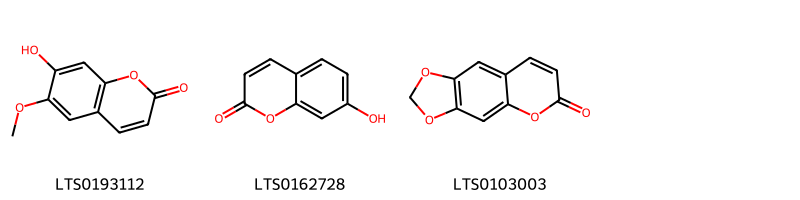{ width=100% }
    <figcaption>Hình ảnh cấu trúc hóa học của 3 hoạt chất thuộc nhóm Coumarins and derivatives gồm ['scopoletin (LTS0193112)', 'umbelliferone (LTS0162728)', 'ayapin (LTS0103003)'].</figcaption>
</figure>
#### Nhóm Fatty Acyls
<figure markdown="span">
    { width=100% }
    <figcaption>Hình ảnh cấu trúc hóa học của 1 hoạt chất thuộc nhóm Fatty Acyls gồm ['palmitic acid (LTS0079439)'].</figcaption>
</figure>
#### Nhóm Flavonoids
<figure markdown="span">
    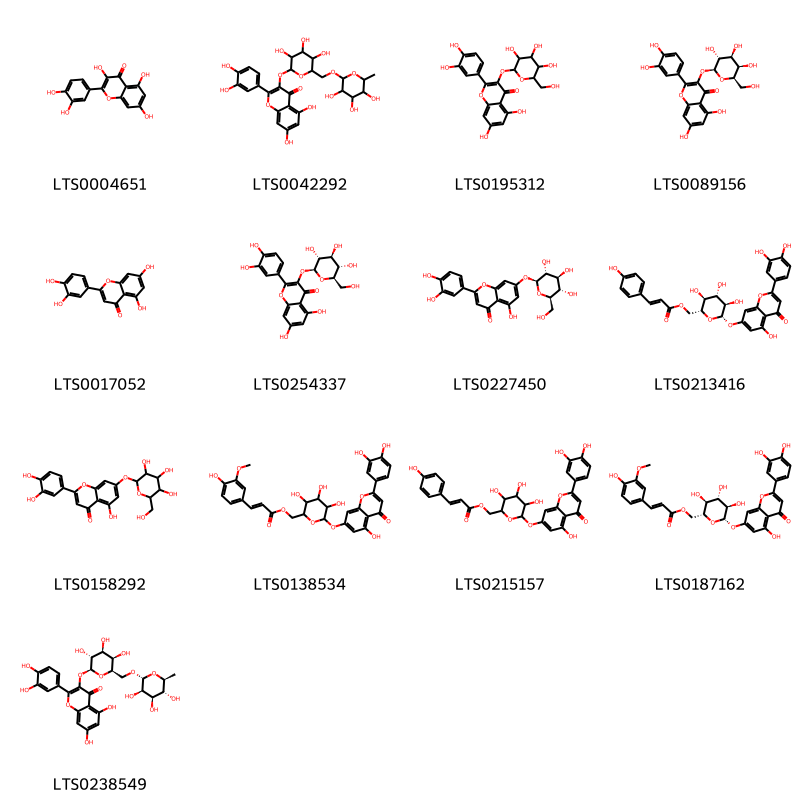{ width=100% }
    <figcaption>Hình ảnh cấu trúc hóa học của 13 hoạt chất thuộc nhóm Flavonoids gồm ['quercetin (LTS0004651)', 'rutin (LTS0042292)', '2-(3,4-dihydroxyphenyl)-5,7-dihydroxy-3-{[3,4,5-trihydroxy-6-(hydroxymethyl)oxan-2-yl]oxy}chromen-4-one (LTS0195312)', 'hyperoside (LTS0089156)', 'luteolin (LTS0017052)', 'isoquercetin (LTS0254337)', 'luteolin 7-o-glucoside (LTS0227450)', '[(2r,3s,4s,5r,6s)-6-{[2-(3,4-dihydroxyphenyl)-5-hydroxy-4-oxochromen-7-yl]oxy}-3,4,5-trihydroxyoxan-2-yl]methyl (2e)-3-(4-hydroxyphenyl)prop-2-enoate (LTS0213416)', '2-(3,4-dihydroxyphenyl)-5-hydroxy-7-{[3,4,5-trihydroxy-6-(hydroxymethyl)oxan-2-yl]oxy}chromen-4-one (LTS0158292)', '(6-{[2-(3,4-dihydroxyphenyl)-5-hydroxy-4-oxochromen-7-yl]oxy}-3,4,5-trihydroxyoxan-2-yl)methyl 3-(4-hydroxy-3-methoxyphenyl)prop-2-enoate (LTS0138534)', '(6-{[2-(3,4-dihydroxyphenyl)-5-hydroxy-4-oxochromen-7-yl]oxy}-3,4,5-trihydroxyoxan-2-yl)methyl 3-(4-hydroxyphenyl)prop-2-enoate (LTS0215157)', '[(2r,3s,4s,5r,6s)-6-{[2-(3,4-dihydroxyphenyl)-5-hydroxy-4-oxochromen-7-yl]oxy}-3,4,5-trihydroxyoxan-2-yl]methyl (2e)-3-(4-hydroxy-3-methoxyphenyl)prop-2-enoate (LTS0187162)', '2-(3,4-dihydroxyphenyl)-5,7-dihydroxy-3-{[(2s,3r,4s,5r,6r)-3,4,5-trihydroxy-6-({[(2r,3r,4r,5r,6s)-3,4,5-trihydroxy-6-methyloxan-2-yl]oxy}methyl)oxan-2-yl]oxy}chromen-4-one (LTS0238549)'].</figcaption>
</figure>
#### Nhóm Organooxygen compounds
<figure markdown="span">
    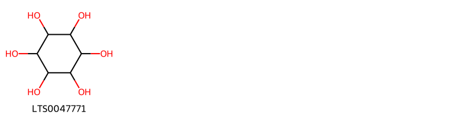{ width=100% }
    <figcaption>Hình ảnh cấu trúc hóa học của 1 hoạt chất thuộc nhóm Organooxygen compounds gồm ['(-)-inositol (LTS0047771)'].</figcaption>
</figure>
#### Nhóm Prenol lipids
<figure markdown="span">
    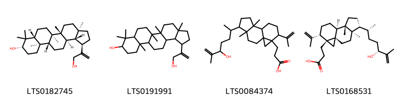{ width=100% }
    <figcaption>Hình ảnh cấu trúc hóa học của 4 hoạt chất thuộc nhóm Prenol lipids gồm ['(1r,3ar,5ar,5br,7ar,9s,11ar,11br,13ar,13bs)-1-(3-hydroxyprop-1-en-2-yl)-3a,5a,5b,8,8,11a-hexamethyl-hexadecahydrocyclopenta[a]chrysen-9-ol (LTS0182745)', '1-(3-hydroxyprop-1-en-2-yl)-3a,5a,5b,8,8,11a-hexamethyl-hexadecahydrocyclopenta[a]chrysen-9-ol (LTS0191991)', '3-[5-(5-hydroxy-6-methylhept-6-en-2-yl)-4,8-dimethyl-12-(prop-1-en-2-yl)tetracyclo[7.5.0.0¹,¹³.0⁴,⁸]tetradecan-13-yl]propanoic acid (LTS0084374)', '3-[(1s,4r,5r,8s,9s,12s,13r)-5-[(2r,5r)-5-hydroxy-6-methylhept-6-en-2-yl]-4,8-dimethyl-12-(prop-1-en-2-yl)tetracyclo[7.5.0.0¹,¹³.0⁴,⁸]tetradecan-13-yl]propanoic acid (LTS0168531)'].</figcaption>
</figure>
#### Nhóm Saccharolipids
<figure markdown="span">
    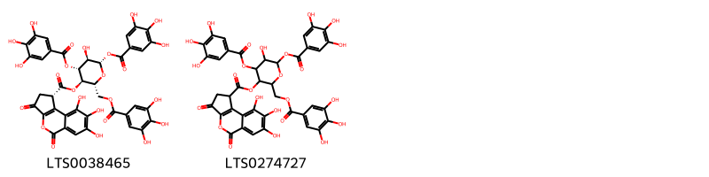{ width=100% }
    <figcaption>Hình ảnh cấu trúc hóa học của 2 hoạt chất thuộc nhóm Saccharolipids gồm ['(2r,3r,4r,5r,6s)-5-hydroxy-4,6-bis(3,4,5-trihydroxybenzoyloxy)-2-[(3,4,5-trihydroxybenzoyloxy)methyl]oxan-3-yl (1s)-7,8,9-trihydroxy-3,5-dioxo-1h,2h-cyclopenta[c]isochromene-1-carboxylate (LTS0038465)', '5-hydroxy-4,6-bis(3,4,5-trihydroxybenzoyloxy)-2-[(3,4,5-trihydroxybenzoyloxy)methyl]oxan-3-yl 7,8,9-trihydroxy-3,5-dioxo-1h,2h-cyclopenta[c]isochromene-1-carboxylate (LTS0274727)'].</figcaption>
</figure>
#### Nhóm Steroids and steroid derivatives
<figure markdown="span">
    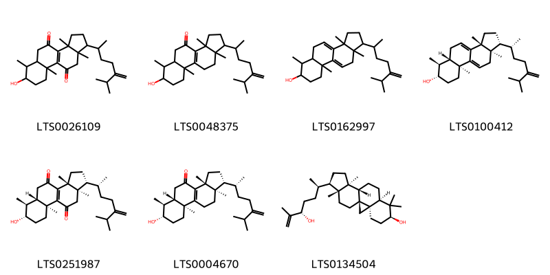{ width=100% }
    <figcaption>Hình ảnh cấu trúc hóa học của 7 hoạt chất thuộc nhóm Steroids and steroid derivatives gồm ['7-hydroxy-3a,6,9a,11a-tetramethyl-1-(6-methyl-5-methylideneheptan-2-yl)-1h,2h,3h,5h,5ah,6h,7h,8h,9h,11h-cyclopenta[a]phenanthrene-4,10-dione (LTS0026109)', '7-hydroxy-3a,6,9a,11a-tetramethyl-1-(6-methyl-5-methylideneheptan-2-yl)-1h,2h,3h,5h,5ah,6h,7h,8h,9h,10h,11h-cyclopenta[a]phenanthren-4-one (LTS0048375)', '3a,6,9a,11a-tetramethyl-1-(6-methyl-5-methylideneheptan-2-yl)-1h,2h,3h,5h,5ah,6h,7h,8h,9h,11h-cyclopenta[a]phenanthren-7-ol (LTS0162997)', '(1r,3ar,5as,6s,7s,9as,11ar)-3a,6,9a,11a-tetramethyl-1-[(2r)-6-methyl-5-methylideneheptan-2-yl]-1h,2h,3h,5h,5ah,6h,7h,8h,9h,11h-cyclopenta[a]phenanthren-7-ol (LTS0100412)', '(1r,3ar,5as,6s,7s,9as,11ar)-7-hydroxy-3a,6,9a,11a-tetramethyl-1-[(2r)-6-methyl-5-methylideneheptan-2-yl]-1h,2h,3h,5h,5ah,6h,7h,8h,9h,11h-cyclopenta[a]phenanthrene-4,10-dione (LTS0251987)', '(1r,3ar,5as,6s,7s,9as,11ar)-7-hydroxy-3a,6,9a,11a-tetramethyl-1-[(2r)-6-methyl-5-methylideneheptan-2-yl]-1h,2h,3h,5h,5ah,6h,7h,8h,9h,10h,11h-cyclopenta[a]phenanthren-4-one (LTS0004670)', '(1s,3r,6s,8r,11s,12s,15r,16r)-15-[(2r,5s)-5-hydroxy-6-methylhept-6-en-2-yl]-7,7,12,16-tetramethylpentacyclo[9.7.0.0¹,³.0³,⁸.0¹²,¹⁶]octadecan-6-ol (LTS0134504)'].</figcaption>
</figure>
#### Nhóm Tannins
<figure markdown="span">
    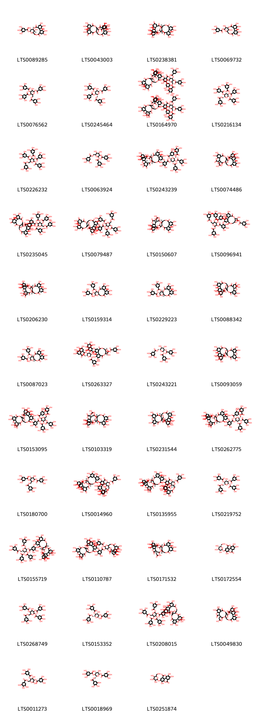{ width=100% }
    <figcaption>Hình ảnh cấu trúc hóa học của 43 hoạt chất thuộc nhóm Tannins gồm ['(1s,19r,21s,22r,23r)-6,7,8,11,12,13,22,23-octahydroxy-3,16-dioxo-2,17,20-trioxatetracyclo[17.3.1.0⁴,⁹.0¹⁰,¹⁵]tricosa-4(9),5,7,10,12,14-hexaen-21-yl 3,4,5-trihydroxybenzoate (LTS0089285)', '(1r,38r)-1,13,14,15,18,19,20,34,35,39,39-undecahydroxy-2,5,10,23,31-pentaoxo-6,9,24,27,30,40-hexaoxaoctacyclo[34.3.1.0⁴,³⁸.0⁷,²⁶.0⁸,²⁹.0¹¹,¹⁶.0¹⁷,²².0³²,³⁷]tetraconta-3,11(16),12,14,17,19,21,32,34,36-decaen-28-yl 3,4,5-trihydroxybenzoate (LTS0043003)', '(7r,8s,26r,28s,29s)-1,13,14,15,18,19,20,34,35,39,39-undecahydroxy-2,5,10,23,31-pentaoxo-6,9,24,27,30,40-hexaoxaoctacyclo[34.3.1.0⁴,³⁸.0⁷,²⁶.0⁸,²⁹.0¹¹,¹⁶.0¹⁷,²².0³²,³⁷]tetraconta-3,11,13,15,17(22),18,20,32,34,36-decaen-28-yl 3,4,5-trihydroxybenzoate (LTS0238381)', '6,7,8,11,12,13,22,23-octahydroxy-3,16-dioxo-2,17,20-trioxatetracyclo[17.3.1.0⁴,⁹.0¹⁰,¹⁵]tricosa-4(9),5,7,10,12,14-hexaen-21-yl 3,4,5-trihydroxybenzoate (LTS0069732)', '3-hydroxy-4,5-bis(3,4,5-trihydroxybenzoyloxy)-6-[(3,4,5-trihydroxybenzoyloxy)methyl]oxan-2-yl 3,4,5-trihydroxybenzoate (LTS0076562)', '(2s,3r,4r,5r,6r)-3-hydroxy-4,5-bis(3,4,5-trihydroxybenzoyloxy)-6-[(3,4,5-trihydroxybenzoyloxy)methyl]oxan-2-yl 3,4,5-trihydroxybenzoate (LTS0245464)', '2,4,5-tris(3,4,5-trihydroxybenzoyloxy)-6-[(3,4,5-trihydroxybenzoyloxy)methyl]oxan-3-yl 2-{[(1r,38r)-1,13,14,15,18,19,34,35,39,39-decahydroxy-2,5,10,23,31-pentaoxo-28-(3,4,5-trihydroxybenzoyloxy)-6,9,24,27,30,40-hexaoxaoctacyclo[34.3.1.0⁴,³⁸.0⁷,²⁶.0⁸,²⁹.0¹¹,¹⁶.0¹⁷,²².0³²,³⁷]tetraconta-3,11(16),12,14,17,19,21,32,34,36-decaen-20-yl]oxy}-3,4,5-trihydroxybenzoate; 2,4,5-tris(3,4,5-trihydroxybenzoyloxy)-6-[(3,4,5-trihydroxybenzoyloxy)methyl]oxan-3-yl 2-{[(1r,39r)-1,2,2,14,15,16,19,20,35,36-decahydroxy-3,6,11,24,32-pentaoxo-29-(3,4,5-trihydroxybenzoyloxy)-7,10,25,28,31,40-hexaoxaoctacyclo[35.2.1.0⁵,³⁹.0⁸,²⁷.0⁹,³⁰.0¹²,¹⁷.0¹⁸,²³.0³³,³⁸]tetraconta-4,12(17),13,15,18,20,22,33,35,37-decaen-21-yl]oxy}-3,4,5-trihydroxybenzoate (LTS0164970)', '(2s,3r,4s,5r,6r)-3,4,5-tris(3,4,5-trihydroxybenzoyloxy)-6-[(3,4,5-trihydroxybenzoyloxy)methyl]oxan-2-yl 3,4,5-trihydroxybenzoate (LTS0216134)', '3,4,5-tris(3,4,5-trihydroxybenzoyloxy)-6-[(3,4,5-trihydroxybenzoyloxy)methyl]oxan-2-yl 3,4,5-trihydroxybenzoate (LTS0226232)', '4,5-dihydroxy-3-(3,4,5-trihydroxybenzoyloxy)-6-[(3,4,5-trihydroxybenzoyloxy)methyl]oxan-2-yl 3,4,5-trihydroxybenzoate (LTS0063924)', '(2s,3r,4s,5r,6r)-2,4,5-tris(3,4,5-trihydroxybenzoyloxy)-6-[(3,4,5-trihydroxybenzoyloxy)methyl]oxan-3-yl 3,4,5-trihydroxy-2-{[(1r,8r,9s,27r,29s,30r,39r)-1,14,15,16,19,20,35,36-octahydroxy-2,3,6,11,24,32-hexaoxo-29-(3,4,5-trihydroxybenzoyloxy)-7,10,25,28,31,40-hexaoxaoctacyclo[35.2.1.0⁵,³⁹.0⁸,²⁷.0⁹,³⁰.0¹²,¹⁷.0¹⁸,²³.0³³,³⁸]tetraconta-4,12,14,16,18(23),19,21,33,35,37-decaen-21-yl]oxy}benzoate (LTS0243239)', '[13,14,15,18,19,20,31,35,36-nonahydroxy-2,10,23,28,32-pentaoxo-5-(3,4,5-trihydroxybenzoyloxy)-3,6,9,24,27,33-hexaoxaheptacyclo[28.7.1.0⁴,²⁵.0⁷,²⁶.0¹¹,¹⁶.0¹⁷,²².0³⁴,³⁸]octatriaconta-1(37),11,13,15,17(22),18,20,34(38),35-nonaen-29-yl]acetic acid (LTS0074486)', '2,4,5-tris(3,4,5-trihydroxybenzoyloxy)-6-[(3,4,5-trihydroxybenzoyloxy)methyl]oxan-3-yl 2-{[1,14,15,18,19,20,34,35,39,39-decahydroxy-2,5,10,23,31-pentaoxo-28-(3,4,5-trihydroxybenzoyloxy)-6,9,24,27,30,40-hexaoxaoctacyclo[34.3.1.0⁴,³⁸.0⁷,²⁶.0⁸,²⁹.0¹¹,¹⁶.0¹⁷,²².0³²,³⁷]tetraconta-3,11(16),12,14,17,19,21,32,34,36-decaen-13-yl]oxy}-3,4,5-trihydroxybenzoate (LTS0235045)', '2,4,5-tris(3,4,5-trihydroxybenzoyloxy)-6-[(3,4,5-trihydroxybenzoyloxy)methyl]oxan-3-yl 2-{[1,13,14,15,18,20,34,35,39,39-decahydroxy-2,5,10,23,31-pentaoxo-28-(3,4,5-trihydroxybenzoyloxy)-6,9,24,27,30,40-hexaoxaoctacyclo[34.3.1.0⁴,³⁸.0⁷,²⁶.0⁸,²⁹.0¹¹,¹⁶.0¹⁷,²².0³²,³⁷]tetraconta-3,11(16),12,14,17,19,21,32,34,36-decaen-19-yl]oxy}-3,4,5-trihydroxybenzoate (LTS0079487)', '[(5r,7r)-13,14,15,18,19,20,31,35,36-nonahydroxy-2,10,23,28,32-pentaoxo-5-(3,4,5-trihydroxybenzoyloxy)-3,6,9,24,27,33-hexaoxaheptacyclo[28.7.1.0⁴,²⁵.0⁷,²⁶.0¹¹,¹⁶.0¹⁷,²².0³⁴,³⁸]octatriaconta-1(37),11(16),12,14,17,19,21,34(38),35-nonaen-29-yl]acetic acid (LTS0150607)', '2,4,5-tris(3,4,5-trihydroxybenzoyloxy)-6-[(3,4,5-trihydroxybenzoyloxy)methyl]oxan-3-yl 2-{[6,7,8,11,12,22,23-heptahydroxy-3,16-dioxo-21-(3,4,5-trihydroxybenzoyloxy)-2,17,20-trioxatetracyclo[17.3.1.0⁴,⁹.0¹⁰,¹⁵]tricosa-4(9),5,7,10(15),11,13-hexaen-13-yl]oxy}-3,4,5-trihydroxybenzoate (LTS0096941)', '(1r,8r,9s,27r,29s,30r,39r)-1,2,2,14,15,16,19,20,21,35,36-undecahydroxy-3,6,11,24,32-pentaoxo-7,10,25,28,31,40-hexaoxaoctacyclo[35.2.1.0⁵,³⁹.0⁸,²⁷.0⁹,³⁰.0¹²,¹⁷.0¹⁸,²³.0³³,³⁸]tetraconta-4,12,14,16,18(23),19,21,33,35,37-decaen-29-yl 3,4,5-trihydroxybenzoate (LTS0206230)', '3,4,5,13,21,22,23-heptahydroxy-8,18-dioxo-12-(3,4,5-trihydroxybenzoyloxy)-9,14,17-trioxatetracyclo[17.4.0.0²,⁷.0¹⁰,¹⁵]tricosa-1(23),2(7),3,5,19,21-hexaen-11-yl 3,4,5-trihydroxybenzoate (LTS0159314)', '(10r,11s,12r,13r,15r)-3,4,5,13,21,22,23-heptahydroxy-8,18-dioxo-11-(3,4,5-trihydroxybenzoyloxy)-9,14,17-trioxatetracyclo[17.4.0.0²,⁷.0¹⁰,¹⁵]tricosa-1(23),2(7),3,5,19,21-hexaen-12-yl 3,4,5-trihydroxybenzoate (LTS0229223)', '1,2,2,14,15,16,19,20,21,35,36-undecahydroxy-3,6,11,24,32-pentaoxo-7,10,25,28,31,40-hexaoxaoctacyclo[35.2.1.0⁵,³⁹.0⁸,²⁷.0⁹,³⁰.0¹²,¹⁷.0¹⁸,²³.0³³,³⁸]tetraconta-4,12(17),13,15,18,20,22,33,35,37-decaen-29-yl 3,4,5-trihydroxybenzoate (LTS0088342)', '(10r,11s,12r,15r)-3,4,5,13,21,22,23-heptahydroxy-8,18-dioxo-11-(3,4,5-trihydroxybenzoyloxy)-9,14,17-trioxatetracyclo[17.4.0.0²,⁷.0¹⁰,¹⁵]tricosa-1(23),2(7),3,5,19,21-hexaen-12-yl 3,4,5-trihydroxybenzoate (LTS0087023)', '(2s,3r,4s,5r,6r)-2,4,5-tris(3,4,5-trihydroxybenzoyloxy)-6-[(3,4,5-trihydroxybenzoyloxy)methyl]oxan-3-yl 2-{[(1s,19r,21s,22r,23r)-6,7,8,11,12,22,23-heptahydroxy-3,16-dioxo-21-(3,4,5-trihydroxybenzoyloxy)-2,17,20-trioxatetracyclo[17.3.1.0⁴,⁹.0¹⁰,¹⁵]tricosa-4(9),5,7,10(15),11,13-hexaen-13-yl]oxy}-3,4,5-trihydroxybenzoate (LTS0263327)', '(2s,3r,4s,5s,6r)-4,5-dihydroxy-3-(3,4,5-trihydroxybenzoyloxy)-6-[(3,4,5-trihydroxybenzoyloxy)methyl]oxan-2-yl 3,4,5-trihydroxybenzoate (LTS0243221)', '2,3,14,15,16,19,20,21,35,36-decahydroxy-6,11,24,32-tetraoxo-7,10,25,28,31,40-hexaoxaoctacyclo[35.2.1.0⁵,³⁹.0⁸,²⁷.0⁹,³⁰.0¹²,¹⁷.0¹⁸,²³.0³³,³⁸]tetraconta-1(39),2,4,12(17),13,15,18,20,22,33,35,37-dodecaen-29-yl 3,4,5-trihydroxybenzoate (LTS0093059)', '2,4,5-tris(3,4,5-trihydroxybenzoyloxy)-6-[(3,4,5-trihydroxybenzoyloxy)methyl]oxan-3-yl 2-{[1,2,2,14,15,16,19,20,35,36-decahydroxy-3,6,11,24,32-pentaoxo-29-(3,4,5-trihydroxybenzoyloxy)-7,10,25,28,31,40-hexaoxaoctacyclo[35.2.1.0⁵,³⁹.0⁸,²⁷.0⁹,³⁰.0¹²,¹⁷.0¹⁸,²³.0³³,³⁸]tetraconta-4,12(17),13,15,18,20,22,33,35,37-decaen-21-yl]oxy}-3,4,5-trihydroxybenzoate (LTS0153095)', '[(4r,5s,7r,25s,26r,29s,30s,31s)-13,14,15,18,19,20,31,35,36-nonahydroxy-2,10,23,28,32-pentaoxo-5-(3,4,5-trihydroxybenzoyloxy)-3,6,9,24,27,33-hexaoxaheptacyclo[28.7.1.0⁴,²⁵.0⁷,²⁶.0¹¹,¹⁶.0¹⁷,²².0³⁴,³⁸]octatriaconta-1(37),11(16),12,14,17,19,21,34(38),35-nonaen-29-yl]acetic acid (LTS0103319)', '(8r,9s,27r,29s,30r)-2,3,14,15,16,19,20,21,35,36-decahydroxy-6,11,24,32-tetraoxo-7,10,25,28,31,40-hexaoxaoctacyclo[35.2.1.0⁵,³⁹.0⁸,²⁷.0⁹,³⁰.0¹²,¹⁷.0¹⁸,²³.0³³,³⁸]tetraconta-1(39),2,4,12(17),13,15,18,20,22,33,35,37-dodecaen-29-yl 3,4,5-trihydroxybenzoate (LTS0231544)', '(2s,3r,4s,5r,6r)-2,4,5-tris(3,4,5-trihydroxybenzoyloxy)-6-[(3,4,5-trihydroxybenzoyloxy)methyl]oxan-3-yl 2-{[(1r,8r,9s,27r,29s,30r,39r)-1,2,2,14,15,16,19,20,35,36-decahydroxy-3,6,11,24,32-pentaoxo-29-(3,4,5-trihydroxybenzoyloxy)-7,10,25,28,31,40-hexaoxaoctacyclo[35.2.1.0⁵,³⁹.0⁸,²⁷.0⁹,³⁰.0¹²,¹⁷.0¹⁸,²³.0³³,³⁸]tetraconta-4,12,14,16,18(23),19,21,33,35,37-decaen-21-yl]oxy}-3,4,5-trihydroxybenzoate (LTS0262775)', '3,4-dihydroxy-5-(3,4,5-trihydroxybenzoyloxy)-6-[(3,4,5-trihydroxybenzoyloxy)methyl]oxan-2-yl 3,4,5-trihydroxybenzoate (LTS0180700)', '(1s,21s,22r)-6,7,8,11,12,13-hexahydroxy-3,16-dioxo-21,23-bis(3,4,5-trihydroxybenzoyloxy)-2,17,20-trioxatetracyclo[17.3.1.0⁴,⁹.0¹⁰,¹⁵]tricosa-4(9),5,7,10,12,14-hexaen-22-yl 2-{[(11r,13s,14r,23r,25s,31r,32s)-3,4,19,20,24,24,25,36,37,38-decahydroxy-8,16,26,29,34-pentaoxo-13-(3,4,5-trihydroxybenzoyloxy)-9,12,15,30,33,40-hexaoxaoctacyclo[33.3.1.1²¹,²⁵.0²,⁷.0¹¹,³¹.0¹⁴,³².0¹⁷,²².0²³,²⁸]tetraconta-1(38),2(7),3,5,17,19,21,27,35(39),36-decaen-5-yl]oxy}-3,4,5-trihydroxybenzoate (LTS0014960)', '(1s,19r,21s,22r,23r)-6,7,8,11,12,13-hexahydroxy-3,16-dioxo-21,23-bis(3,4,5-trihydroxybenzoyloxy)-2,17,20-trioxatetracyclo[17.3.1.0⁴,⁹.0¹⁰,¹⁵]tricosa-4(9),5,7,10,12,14-hexaen-22-yl 2-{[(1r,8r,9s,27r,29s,30r,39r)-1,2,2,14,15,16,19,20,35,36-decahydroxy-3,6,11,24,32-pentaoxo-29-(3,4,5-trihydroxybenzoyloxy)-7,10,25,28,31,40-hexaoxaoctacyclo[35.2.1.0⁵,³⁹.0⁸,²⁷.0⁹,³⁰.0¹²,¹⁷.0¹⁸,²³.0³³,³⁸]tetraconta-4,12,14,16,18(23),19,21,33,35,37-decaen-21-yl]oxy}-3,4,5-trihydroxybenzoate (LTS0135955)', '(2s,3r,4s,5s,6r)-4-hydroxy-3,5-bis(3,4,5-trihydroxybenzoyloxy)-6-[(3,4,5-trihydroxybenzoyloxy)methyl]oxan-2-yl 3,4,5-trihydroxybenzoate (LTS0219752)', '(2s,3r,4s,5r,6r)-2,4,5-tris(3,4,5-trihydroxybenzoyloxy)-6-[(3,4,5-trihydroxybenzoyloxy)methyl]oxan-3-yl 5-{[(1r,8r,9s,27r,29s,30r,39r)-1,2,2,15,16,19,20,21,35,36-decahydroxy-3,6,11,24,32-pentaoxo-29-(3,4,5-trihydroxybenzoyloxy)-7,10,25,28,31,40-hexaoxaoctacyclo[35.2.1.0⁵,³⁹.0⁸,²⁷.0⁹,³⁰.0¹²,¹⁷.0¹⁸,²³.0³³,³⁸]tetraconta-4,12,14,16,18(23),19,21,33,35,37-decaen-14-yl]oxy}-2,3,4-trihydroxybenzoate (LTS0155719)', '6,7,8,11,12,13-hexahydroxy-3,16-dioxo-21,23-bis(3,4,5-trihydroxybenzoyloxy)-2,17,20-trioxatetracyclo[17.3.1.0⁴,⁹.0¹⁰,¹⁵]tricosa-4(9),5,7,10,12,14-hexaen-22-yl 2-{[1,2,2,14,15,16,19,20,35,36-decahydroxy-3,6,11,24,32-pentaoxo-29-(3,4,5-trihydroxybenzoyloxy)-7,10,25,28,31,40-hexaoxaoctacyclo[35.2.1.0⁵,³⁹.0⁸,²⁷.0⁹,³⁰.0¹²,¹⁷.0¹⁸,²³.0³³,³⁸]tetraconta-4,12(17),13,15,18,20,22,33,35,37-decaen-21-yl]oxy}-3,4,5-trihydroxybenzoate (LTS0110787)', '[(4r,5s,7r,25s,26r,29s,30s)-13,14,15,18,19,20,34,35-octahydroxy-2,10,23,28,31-pentaoxo-5-(3,4,5-trihydroxybenzoyloxy)-3,6,9,24,27,32-hexaoxaheptacyclo[28.6.1.0⁴,²⁵.0⁷,²⁶.0¹¹,¹⁶.0¹⁷,²².0³³,³⁷]heptatriaconta-1(36),11(16),12,14,17,19,21,33(37),34-nonaen-29-yl]acetic acid (LTS0171532)', '6,7,14-trihydroxy-13-{[(2s,3r,4s,5s,6r)-3,4,5-trihydroxy-6-(hydroxymethyl)oxan-2-yl]oxy}-2,9-dioxatetracyclo[6.6.2.0⁴,¹⁶.0¹¹,¹⁵]hexadeca-1(15),4,6,8(16),11,13-hexaene-3,10-dione (LTS0172554)', '4-hydroxy-3,5-bis(3,4,5-trihydroxybenzoyloxy)-6-[(3,4,5-trihydroxybenzoyloxy)methyl]oxan-2-yl 3,4,5-trihydroxybenzoate (LTS0268749)', '(2r,3r,4s,5s,6r)-2,4-dihydroxy-5-(3,4,5-trihydroxybenzoyloxy)-6-[(3,4,5-trihydroxybenzoyloxy)methyl]oxan-3-yl 3,4,5-trihydroxybenzoate (LTS0153352)', '2,4,5-tris(3,4,5-trihydroxybenzoyloxy)-6-[(3,4,5-trihydroxybenzoyloxy)methyl]oxan-3-yl 5-{[1,2,2,15,16,19,20,21,35,36-decahydroxy-3,6,11,24,32-pentaoxo-29-(3,4,5-trihydroxybenzoyloxy)-7,10,25,28,31,40-hexaoxaoctacyclo[35.2.1.0⁵,³⁹.0⁸,²⁷.0⁹,³⁰.0¹²,¹⁷.0¹⁸,²³.0³³,³⁸]tetraconta-4,12(17),13,15,18,20,22,33,35,37-decaen-14-yl]oxy}-2,3,4-trihydroxybenzoate (LTS0208015)', '[13,14,15,18,19,20,34,35-octahydroxy-2,10,23,28,31-pentaoxo-5-(3,4,5-trihydroxybenzoyloxy)-3,6,9,24,27,32-hexaoxaheptacyclo[28.6.1.0⁴,²⁵.0⁷,²⁶.0¹¹,¹⁶.0¹⁷,²².0³³,³⁷]heptatriaconta-1(36),11,13,15,17(22),18,20,33(37),34-nonaen-29-yl]acetic acid (LTS0049830)', '2,4-dihydroxy-5-(3,4,5-trihydroxybenzoyloxy)-6-[(3,4,5-trihydroxybenzoyloxy)methyl]oxan-3-yl 3,4,5-trihydroxybenzoate (LTS0011273)', '(2r,3r,4r,5s,6r)-3,4-dihydroxy-5-(3,4,5-trihydroxybenzoyloxy)-6-[(3,4,5-trihydroxybenzoyloxy)methyl]oxan-2-yl 3,4,5-trihydroxybenzoate (LTS0018969)', '6,7,14-trihydroxy-13-{[3,4,5-trihydroxy-6-(hydroxymethyl)oxan-2-yl]oxy}-2,9-dioxatetracyclo[6.6.2.0⁴,¹⁶.0¹¹,¹⁵]hexadeca-1(15),4,6,8(16),11,13-hexaene-3,10-dione (LTS0251874)'].</figcaption>
</figure>

---

### Dược dân tộc học

Danh sách các quốc gia có sử dụng *Euphorbia humifusa* trong điều trị các bệnh. 

| Country   | Disease                                   | Bệnh                                                                                                                                                                                                |
|:----------|:------------------------------------------|:----------------------------------------------------------------------------------------------------------------------------------------------------------------------------------------------------|
| China     | Diuretic, Hemostat, Vermifuge, Alexiteric | MYMEMORY WARNING: YOU USED ALL AVAILABLE FREE TRANSLATIONS FOR TODAY. NEXT AVAILABLE IN  20 HOURS 20 MINUTES 50 SECONDS VISIT HTTPS://MYMEMORY.TRANSLATED.NET/DOC/USAGELIMITS.PHP TO TRANSLATE MORE |

---

---
## Euphorbia ipecacuanha
### Thông tin về thực vật

!!! info "Phân loại thực vật của *Euphorbia ipecacuanha* từ GIBF:"
    - **Kingdom:** Plantae
    - **Phylum:** Tracheophyta
    - **Order:** Malpighiales
    - **Family:** Euphorbiaceae
    - **Genus:** Euphorbia
    - **Species:** *Euphorbia ipecacuanha*

 

| Label (VI)   | Label (EN)   | Scientific Name    | Descriptions (VI)   | Descriptions (EN)   | Also Known As (VI)   | Also Known As (EN)   |
|:-------------|:-------------|:-------------------|:--------------------|:--------------------|:---------------------|:---------------------|
| N/A          | N/A          | Euphorbia humifusa | loài thực vật       | species of plant    | ['']                 | ['']                 |

#### Phân bố trên thế giới

**Từ CSDL GIBF** nan, Netherlands, unknown or invalid, Cuba, United States of America

#### Phân bố tại Việt Nam

**Từ CSDL GIBF**: Không có ghi nhận ở Việt Nam

---
### Thành phần hóa học
        
- Theo cơ sở dữ liệu lotus: Từ loài *Euphorbia ipecacuanha* đã phân lập và xác định được Chưa có hoạt chất nào được phân lập. hoạt chất thuộc về các nhóm Không có hoạt chất nào được phân lập. 

Không có hình ảnh nào được tạo ra

---

### Dược dân tộc học

Danh sách các quốc gia có sử dụng *Euphorbia ipecacuanha* trong điều trị các bệnh. 

| Country   | Disease   | Bệnh                                                                                                                                                                                                |
|:----------|:----------|:----------------------------------------------------------------------------------------------------------------------------------------------------------------------------------------------------|
| Elsewhere | Emetic    | MYMEMORY WARNING: YOU USED ALL AVAILABLE FREE TRANSLATIONS FOR TODAY. NEXT AVAILABLE IN  20 HOURS 19 MINUTES 59 SECONDS VISIT HTTPS://MYMEMORY.TRANSLATED.NET/DOC/USAGELIMITS.PHP TO TRANSLATE MORE |

---

---
## Euphorbia ipecacuanhae
### Thông tin về thực vật

!!! info "Phân loại thực vật của *Euphorbia ipecacuanhae* từ GIBF:"
    - **Kingdom:** Plantae
    - **Phylum:** Tracheophyta
    - **Order:** Malpighiales
    - **Family:** Euphorbiaceae
    - **Genus:** Euphorbia
    - **Species:** *Euphorbia ipecacuanhae*

 

| Label (VI)   | Label (EN)   | Scientific Name        | Descriptions (VI)   | Descriptions (EN)   | Also Known As (VI)   | Also Known As (EN)   |
|:-------------|:-------------|:-----------------------|:--------------------|:--------------------|:---------------------|:---------------------|
| N/A          | N/A          | Euphorbia ipecacuanhae | loài thực vật       | species of plant    | ['']                 | ['']                 |

#### Phân bố trên thế giới

**Từ CSDL GIBF** United States of America

#### Phân bố tại Việt Nam

**Từ CSDL GIBF**: Không có ghi nhận ở Việt Nam

---
### Thành phần hóa học
        
- Theo cơ sở dữ liệu lotus: Từ loài *Euphorbia ipecacuanhae* đã phân lập và xác định được Chưa có hoạt chất nào được phân lập. hoạt chất thuộc về các nhóm Không có hoạt chất nào được phân lập. 

Không có hình ảnh nào được tạo ra

---

### Dược dân tộc học

Danh sách các quốc gia có sử dụng *Euphorbia ipecacuanhae* trong điều trị các bệnh. 

| Country   | Disease             | Bệnh                                                                                                                                                                                                |
|:----------|:--------------------|:----------------------------------------------------------------------------------------------------------------------------------------------------------------------------------------------------|
| US        | Diaphoretic, Emetic | MYMEMORY WARNING: YOU USED ALL AVAILABLE FREE TRANSLATIONS FOR TODAY. NEXT AVAILABLE IN  20 HOURS 19 MINUTES 34 SECONDS VISIT HTTPS://MYMEMORY.TRANSLATED.NET/DOC/USAGELIMITS.PHP TO TRANSLATE MORE |

---

---
## Euphorbia kansui
### Thông tin về thực vật

!!! info "Phân loại thực vật của *Euphorbia kansui* từ GIBF:"
    - **Kingdom:** Plantae
    - **Phylum:** Tracheophyta
    - **Order:** Malpighiales
    - **Family:** Euphorbiaceae
    - **Genus:** Euphorbia
    - **Species:** *Euphorbia kansui*

 

| Label (VI)   | Label (EN)   | Scientific Name   | Descriptions (VI)   | Descriptions (EN)   | Also Known As (VI)   | Also Known As (EN)   |
|:-------------|:-------------|:------------------|:--------------------|:--------------------|:---------------------|:---------------------|
| N/A          | N/A          | Euphorbia kansui  | loài thực vật       | species of plant    | ['']                 | ['']                 |

#### Phân bố trên thế giới

**Từ CSDL GIBF** China, United States of America

#### Phân bố tại Việt Nam

**Từ CSDL GIBF**: Không có ghi nhận ở Việt Nam

---
### Thành phần hóa học
        
- Theo cơ sở dữ liệu lotus: Từ loài *Euphorbia kansui* đã phân lập và xác định được 124 hoạt chất thuộc về các nhóm Fatty Acyls, Prenol lipids, Steroids and steroid derivatives, Benzene and substituted derivatives, Dihydrofurans, Organooxygen compounds, Carboxylic acids and derivatives. 

|    | chemicalTaxonomyClassyfireClass     |   smiles_count |
|---:|:------------------------------------|---------------:|
|  0 | Benzene and substituted derivatives |              1 |
|  1 | Carboxylic acids and derivatives    |             32 |
|  2 | Dihydrofurans                       |              2 |
|  3 | Fatty Acyls                         |              3 |
|  4 | Organooxygen compounds              |              2 |
|  5 | Prenol lipids                       |             65 |
|  6 | Steroids and steroid derivatives    |             18 |

#### Nhóm Benzene and substituted derivatives
<figure markdown="span">
    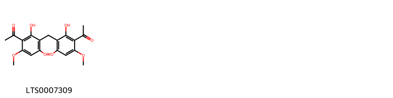{ width=100% }
    <figcaption>Hình ảnh cấu trúc hóa học của 1 hoạt chất thuộc nhóm Benzene and substituted derivatives gồm ['1-{3-[(3-acetyl-2,6-dihydroxy-4-methoxyphenyl)methyl]-2,4-dihydroxy-6-methoxyphenyl}ethanone (LTS0007309)'].</figcaption>
</figure>
#### Nhóm Carboxylic acids and derivatives
<figure markdown="span">
    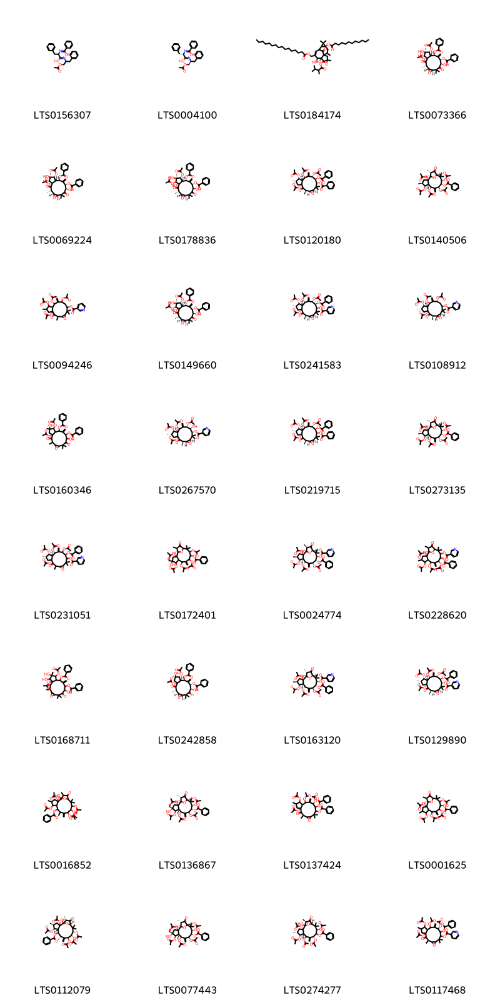{ width=100% }
    <figcaption>Hình ảnh cấu trúc hóa học của 32 hoạt chất thuộc nhóm Carboxylic acids and derivatives gồm ['n-[1-(acetyloxy)-3-phenylpropan-2-yl]-2-{[hydroxy(phenyl)methylidene]amino}-3-phenylpropanimidic acid (LTS0156307)', '(2s)-n-[(2s)-1-(acetyloxy)-3-phenylpropan-2-yl]-2-{[hydroxy(phenyl)methylidene]amino}-3-phenylpropanimidic acid (LTS0004100)', '{5-[(2,3-dimethylbutanoyl)oxy]-13-(dodecanoyloxy)-6,7-dihydroxy-3,12,12,15-tetramethyl-16-oxo-4-oxapentacyclo[8.5.1.0¹,⁶.0³,⁵.0¹¹,¹³]hexadec-8-en-8-yl}methyl hexadecanoate (LTS0184174)', '(1s,3s,4r,6r,9r,10s,12r,13s,14r,15r,16s)-1,14-bis(acetyloxy)-12-(benzoyloxy)-9,15,16-trihydroxy-3,7,7,15-tetramethyl-11-methylidene-2,8-dioxo-5-oxatricyclo[11.3.0.0⁴,⁶]hexadecan-10-yl benzoate (LTS0073366)', 'kansuinine b (LTS0069224)', '(1s,3s,4r,6r,9r,10s,12r,13s,14r,15s,16s)-14,16-bis(acetyloxy)-12-(benzoyloxy)-1,9,15-trihydroxy-3,7,7,15-tetramethyl-11-methylidene-2,8-dioxo-5-oxatricyclo[11.3.0.0⁴,⁶]hexadecan-10-yl benzoate (LTS0178836)', '(1r,3r,4s,6r,8r,9s,10s,12r,13r,14s,15s)-1,10,12,14-tetrakis(acetyloxy)-8-(benzoyloxy)-3,7,7,15-tetramethyl-11-methylidene-2-oxo-5-oxatricyclo[11.3.0.0⁴,⁶]hexadecan-9-yl benzoate (LTS0120180)', '(1r,2r,4s,5s,6r,7r,9s,10s,11s,13r,15r)-2,5,7,9,11-pentakis(acetyloxy)-1-hydroxy-4,12,12,15-tetramethyl-8-methylidene-14-oxo-16-oxatricyclo[11.2.1.0²,⁶]hexadecan-10-yl benzoate (LTS0140506)', '1,10,12,14-tetrakis(acetyloxy)-3,7,7,15-tetramethyl-11-methylidene-2-oxo-5-oxatricyclo[11.3.0.0⁴,⁶]hexadecan-8-yl pyridine-3-carboxylate (LTS0094246)', '(1s,3s,4s,6s,9r,10s,12r,13s,14r,15s,16s)-14,16-bis(acetyloxy)-12-(benzoyloxy)-1,9,15-trihydroxy-3,7,7,15-tetramethyl-11-methylidene-2,8-dioxo-5-oxatricyclo[11.3.0.0⁴,⁶]hexadecan-10-yl benzoate (LTS0149660)', '(1r,3r,4r,6r,8s,9s,10s,12r,13r,14s,15s)-1,10,12,14-tetrakis(acetyloxy)-9-(benzoyloxy)-3,7,7,15-tetramethyl-11-methylidene-2-oxo-5-oxatricyclo[11.3.0.0⁴,⁶]hexadecan-8-yl pyridine-3-carboxylate (LTS0241583)', '(1r,3r,4r,6r,8r,10r,12r,13r,14s,15s)-1,10,12,14-tetrakis(acetyloxy)-3,7,7,15-tetramethyl-11-methylidene-2-oxo-5-oxatricyclo[11.3.0.0⁴,⁶]hexadecan-8-yl pyridine-3-carboxylate (LTS0108912)', '1,14-bis(acetyloxy)-12-(benzoyloxy)-9,15-dihydroxy-3,7,7,15-tetramethyl-11-methylidene-2,8-dioxo-5-oxatricyclo[11.3.0.0⁴,⁶]hexadecan-10-yl benzoate (LTS0160346)', '(1r,3r,4s,6r,8r,9s,10s,12r,13r,14s,15s)-1,10,12,14-tetrakis(acetyloxy)-9-hydroxy-3,7,7,15-tetramethyl-11-methylidene-2-oxo-5-oxatricyclo[11.3.0.0⁴,⁶]hexadecan-8-yl pyridine-3-carboxylate (LTS0267570)', '(1r,3r,4r,6r,8s,9s,10s,12r,13r,14s,15s)-1,10,12,14-tetrakis(acetyloxy)-8-(benzoyloxy)-3,7,7,15-tetramethyl-11-methylidene-2-oxo-5-oxatricyclo[11.3.0.0⁴,⁶]hexadecan-9-yl benzoate (LTS0219715)', '(1r,2r,4s,5s,6r,7r,9r,10s,11s,13r,15r)-2,5,7,9,11-pentakis(acetyloxy)-1-hydroxy-4,12,12,15-tetramethyl-8-methylidene-14-oxo-16-oxatricyclo[11.2.1.0²,⁶]hexadecan-10-yl benzoate (LTS0273135)', '(1r,12r,13r,14s,15s)-1,10,12,14-tetrakis(acetyloxy)-9-(benzoyloxy)-3,7,7,15-tetramethyl-11-methylidene-2-oxo-5-oxatricyclo[11.3.0.0⁴,⁶]hexadecan-8-yl pyridine-3-carboxylate (LTS0231051)', '2,5,7,9,11-pentakis(acetyloxy)-1,4-dihydroxy-4,12,12,15-tetramethyl-8-methylidene-14-oxo-16-oxatricyclo[11.2.1.0²,⁶]hexadecan-10-yl benzoate (LTS0172401)', '(1r,2r,4s,5s,6r,7r,9r,10s,11s,13r,15s)-2,5,7,9-tetrakis(acetyloxy)-10-(benzoyloxy)-1-hydroxy-4,12,12,15-tetramethyl-8-methylidene-14-oxo-16-oxatricyclo[11.2.1.0²,⁶]hexadecan-11-yl pyridine-3-carboxylate (LTS0024774)', '2,5,7,9-tetrakis(acetyloxy)-10-(benzoyloxy)-1-hydroxy-4,12,12,15-tetramethyl-8-methylidene-14-oxo-16-oxatricyclo[11.2.1.0²,⁶]hexadecan-11-yl pyridine-3-carboxylate (LTS0228620)', '1,14-bis(acetyloxy)-12-(benzoyloxy)-9,15,16-trihydroxy-3,7,7,15-tetramethyl-11-methylidene-2,8-dioxo-5-oxatricyclo[11.3.0.0⁴,⁶]hexadecan-10-yl benzoate (LTS0168711)', '(1r,3s,4s,6s,9r,10s,12r,13r,14r,15r)-1,14-bis(acetyloxy)-12-(benzoyloxy)-9,15-dihydroxy-3,7,7,15-tetramethyl-11-methylidene-2,8-dioxo-5-oxatricyclo[11.3.0.0⁴,⁶]hexadecan-10-yl benzoate (LTS0242858)', '(1r,2r,4s,5s,6r,7r,9s,10s,11s,13r,15r)-2,5,7,9-tetrakis(acetyloxy)-10-(benzoyloxy)-1-hydroxy-4,12,12,15-tetramethyl-8-methylidene-14-oxo-16-oxatricyclo[11.2.1.0²,⁶]hexadecan-11-yl pyridine-3-carboxylate (LTS0163120)', '(1r,3r,4s,6r,8r,9s,10s,12r,13r,14s,15s)-1,10,12,14-tetrakis(acetyloxy)-9-(benzoyloxy)-3,7,7,15-tetramethyl-11-methylidene-2-oxo-5-oxatricyclo[11.3.0.0⁴,⁶]hexadecan-8-yl pyridine-3-carboxylate (LTS0129890)', '2,5,10,11,12-pentakis(acetyloxy)-1-hydroxy-4,8,13,13,16-pentamethyl-9-methylidene-15-oxo-17-oxatricyclo[12.2.1.0²,⁶]heptadecan-7-yl benzoate (LTS0016852)', '(1r,2r,4r,5r,6s,7r,9s,10s,11s,13r,15r)-2,5,7,9,11-pentakis(acetyloxy)-1,4-dihydroxy-4,12,12,15-tetramethyl-8-methylidene-14-oxo-16-oxatricyclo[11.2.1.0²,⁶]hexadecan-10-yl benzoate (LTS0136867)', '1,10,12,14-tetrakis(acetyloxy)-8-(benzoyloxy)-3,7,7,15-tetramethyl-11-methylidene-2-oxo-5-oxatricyclo[11.3.0.0⁴,⁶]hexadecan-9-yl benzoate (LTS0137424)', '2,5,7,9,11-pentakis(acetyloxy)-1-hydroxy-4,12,12,15-tetramethyl-8-methylidene-14-oxo-16-oxatricyclo[11.2.1.0²,⁶]hexadecan-10-yl benzoate (LTS0001625)', '(1s,2r,4s,5s,6s,7r,8s,10s,11r,12s,14r,16r)-2,5,10,11,12-pentakis(acetyloxy)-1-hydroxy-4,8,13,13,16-pentamethyl-9-methylidene-15-oxo-17-oxatricyclo[12.2.1.0²,⁶]heptadecan-7-yl benzoate (LTS0112079)', '(1r,2r,4r,5r,6s,7r,9s,10s,11s,13s,15r)-2,5,7,9,11-pentakis(acetyloxy)-1,4-dihydroxy-4,12,12,15-tetramethyl-8-methylidene-14-oxo-16-oxatricyclo[11.2.1.0²,⁶]hexadecan-10-yl benzoate (LTS0077443)', '(1s,2s,4r,5r,6s,9r,11r,13s,15s)-2,5,7,9,11-pentakis(acetyloxy)-1-hydroxy-4,12,12,15-tetramethyl-8-methylidene-14-oxo-16-oxatricyclo[11.2.1.0²,⁶]hexadecan-10-yl benzoate (LTS0274277)', '1,10,12,14-tetrakis(acetyloxy)-9-(benzoyloxy)-3,7,7,15-tetramethyl-11-methylidene-2-oxo-5-oxatricyclo[11.3.0.0⁴,⁶]hexadecan-8-yl pyridine-3-carboxylate (LTS0117468)'].</figcaption>
</figure>
#### Nhóm Dihydrofurans
<figure markdown="span">
    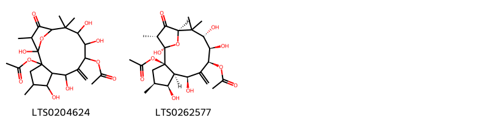{ width=100% }
    <figcaption>Hình ảnh cấu trúc hóa học của 2 hoạt chất thuộc nhóm Dihydrofurans gồm ['9-(acetyloxy)-1,5,7,10,11-pentahydroxy-4,12,12,15-tetramethyl-8-methylidene-14-oxo-16-oxatricyclo[11.2.1.0²,⁶]hexadecan-2-yl acetate (LTS0204624)', '(1r,2r,4s,5s,6r,7s,9s,10r,11s,13r,15r)-2-(acetyloxy)-1,5,7,10,11-pentahydroxy-4,12,12,15-tetramethyl-8-methylidene-14-oxo-16-oxatricyclo[11.2.1.0²,⁶]hexadecan-9-yl acetate (LTS0262577)'].</figcaption>
</figure>
#### Nhóm Fatty Acyls
<figure markdown="span">
    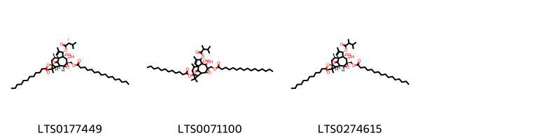{ width=100% }
    <figcaption>Hình ảnh cấu trúc hóa học của 3 hoạt chất thuộc nhóm Fatty Acyls gồm ['[(1s,4s,5s,6s,7s,9r,10r,11r,13s,15r)-4-{[(2r)-2,3-dimethylbutanoyl]oxy}-13-(dodecanoyloxy)-5,6-dihydroxy-3,12,12,15-tetramethyl-16-oxo-8-oxapentacyclo[8.5.1.0¹,⁵.0⁷,⁹.0¹¹,¹³]hexadec-2-en-7-yl]methyl hexadecanoate (LTS0177449)', '{4-[(2,3-dimethylbutanoyl)oxy]-13-(dodecanoyloxy)-5,6-dihydroxy-3,12,12,15-tetramethyl-16-oxo-8-oxapentacyclo[8.5.1.0¹,⁵.0⁷,⁹.0¹¹,¹³]hexadec-2-en-7-yl}methyl hexadecanoate (LTS0071100)', '[(1s,4s,5s,6s,7s,9r,10r,11r,13s,15r)-4-[(2,3-dimethylbutanoyl)oxy]-13-(dodecanoyloxy)-5,6-dihydroxy-3,12,12,15-tetramethyl-16-oxo-8-oxapentacyclo[8.5.1.0¹,⁵.0⁷,⁹.0¹¹,¹³]hexadec-2-en-7-yl]methyl hexadecanoate (LTS0274615)'].</figcaption>
</figure>
#### Nhóm Organooxygen compounds
<figure markdown="span">
    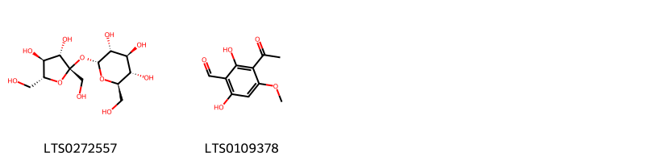{ width=100% }
    <figcaption>Hình ảnh cấu trúc hóa học của 2 hoạt chất thuộc nhóm Organooxygen compounds gồm ['sucrose (LTS0272557)', '3-acetyl-2,6-dihydroxy-4-methoxybenzaldehyde (LTS0109378)'].</figcaption>
</figure>
#### Nhóm Prenol lipids
<figure markdown="span">
    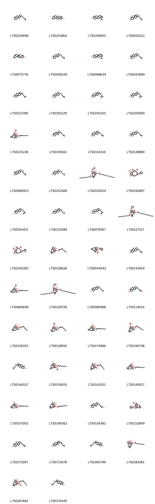{ width=100% }
    <figcaption>Hình ảnh cấu trúc hóa học của 65 hoạt chất thuộc nhóm Prenol lipids gồm ['euphol (LTS0220699)', 'β-amyrin (LTS0251864)', 'lupeol (LTS0256952)', 'lanster (LTS0020312)', 'β-amyrin (LTS0075776)', 'lanosterol (LTS0090543)', 'lupeol (LTS0088634)', '(3as,5ar,7s,9ar,11as)-3a,6,6,9a,11a-pentamethyl-1-[(2r)-6-methylhept-5-en-2-yl]-1h,2h,3h,5h,5ah,7h,8h,9h,9bh,10h,11h-cyclopenta[a]phenanthren-7-ol (LTS0041890)', '3a,6,6,9a,11a-pentamethyl-1-(6-methylhept-5-en-2-yl)-1h,2h,3h,5h,5ah,7h,8h,9h,9bh,10h,11h-cyclopenta[a]phenanthren-7-ol (LTS0213780)', '(1r,3ar,7s,9ar,11ar)-3a,6,6,9a,11a-pentamethyl-1-[(2r)-6-methylhept-5-en-2-yl]-1h,2h,3h,5h,5ah,7h,8h,9h,9bh,10h,11h-cyclopenta[a]phenanthren-7-ol (LTS0191529)', '3a,6,6,9a,11a-pentamethyl-1-(6-methyl-5-methylideneheptan-2-yl)-1h,2h,3h,4h,5h,5ah,7h,8h,9h,10h,11h-cyclopenta[a]phenanthren-7-ol (LTS0242255)', '(1s,3as,5ar,7s,9as,11as)-3a,6,6,9a,11a-pentamethyl-1-[(2s)-6-methyl-5-methylideneheptan-2-yl]-1h,2h,3h,4h,5h,5ah,7h,8h,9h,10h,11h-cyclopenta[a]phenanthren-7-ol (LTS0105900)', '7-[(acetyloxy)methyl]-5,6-dihydroxy-3,11,11,14-tetramethyl-15-oxotetracyclo[7.5.1.0¹,⁵.0¹⁰,¹²]pentadeca-2,7-dien-4-yl deca-2,4-dienoate (LTS0125228)', 'butyrospermol (LTS0159161)', '(1r,7s,9as)-3a,6,6,9a,11a-pentamethyl-1-[(2r)-6-methylhept-5-en-2-yl]-1h,2h,3h,4h,5h,5ah,7h,8h,9h,10h,11h-cyclopenta[a]phenanthren-7-ol (LTS0154110)', '(1r,3as,5ar,7s,9as,11as)-3a,6,6,9a,11a-pentamethyl-1-[(2r)-6-methylhept-5-en-2-yl]-1h,2h,3h,4h,5h,5ah,7h,8h,9h,10h,11h-cyclopenta[a]phenanthren-7-ol (LTS0128880)', 'dammaradienol (LTS0080913)', '24,25-dihydrolanosterol (LTS0252460)', '[(1s,4s,5s,6r,9s,10r,12s,14r)-4-{[(2r)-2,3-dimethylbutanoyl]oxy}-12-(dodecanoyloxy)-5,6-dihydroxy-3,11,11,14-tetramethyl-15-oxotetracyclo[7.5.1.0¹,⁵.0¹⁰,¹²]pentadeca-2,7-dien-7-yl]methyl hexadecanoate (LTS0105024)', '3,4,6,13a-tetrakis(acetyloxy)-2,9,9,12-tetramethyl-5-methylidene-13-oxo-1h,2h,3h,3ah,4h,6h,7h,8h,12h-cyclopenta[12]annulen-8-yl pyridine-3-carboxylate (LTS0192897)', 'eburicol (LTS0201421)', '3a,6,6,9a,11a-pentamethyl-1-(6-methylheptan-2-yl)-1h,2h,3h,4h,5h,5ah,7h,8h,9h,10h,11h-cyclopenta[a]phenanthren-7-ol (LTS0125589)', '(3as,7s,9as)-3a,6,6,9a,11a-pentamethyl-1-[(2s)-6-methyl-5-methylideneheptan-2-yl]-1h,2h,3h,4h,5h,5ah,7h,8h,9h,10h,11h-cyclopenta[a]phenanthren-7-ol (LTS0079567)', '{4-[(2,3-dimethylbutanoyl)oxy]-12-(dodecanoyloxy)-5,6-dihydroxy-3,11,11,14-tetramethyl-15-oxotetracyclo[7.5.1.0¹,⁵.0¹⁰,¹²]pentadeca-2,7-dien-7-yl}methyl hexadecanoate (LTS0157317)', '(2s,3s,3ar,4r,6r,8r,12r,13ar)-3,4,6,13a-tetrakis(acetyloxy)-2,9,9,12-tetramethyl-5-methylidene-13-oxo-1h,2h,3h,3ah,4h,6h,7h,8h,12h-cyclopenta[12]annulen-8-yl pyridine-3-carboxylate (LTS0245392)', '[(1s,4s,5r,6r,9s,10r,12r,14r)-4,5,6-trihydroxy-3,11,11,14-tetramethyl-15-oxotetracyclo[7.5.1.0¹,⁵.0¹⁰,¹²]pentadeca-2,7-dien-7-yl]methyl (2e,4z)-deca-2,4-dienoate (LTS0128626)', '6-(acetyloxy)-5-hydroxy-3,7,11,11,14-pentamethyl-15-oxotetracyclo[7.5.1.0¹,⁵.0¹⁰,¹²]pentadeca-2,7-dien-4-yl benzoate (LTS0044542)', '(1s,3as,5ar,7s,9as,11as)-7-hydroxy-3a,6,6,9a,11a-pentamethyl-1-[(2r)-6-methylhept-5-en-2-yl]-1h,2h,3h,5h,5ah,7h,8h,9h,10h,11h-cyclopenta[a]phenanthren-4-one (LTS0133454)', '(1s,4s,5s,6r,9s,10r,12r,14r)-7-[(acetyloxy)methyl]-5,6-dihydroxy-3,11,11,14-tetramethyl-15-oxotetracyclo[7.5.1.0¹,⁵.0¹⁰,¹²]pentadeca-2,7-dien-4-yl (2e,4e)-deca-2,4-dienoate (LTS0084690)', 'kansuiphorin a (LTS0129728)', '(1s,3as,5ar,7s,9as,11as)-3a,6,6,9a,11a-pentamethyl-1-[(2r)-6-methylheptan-2-yl]-1h,2h,3h,4h,5h,5ah,7h,8h,9h,10h,11h-cyclopenta[a]phenanthren-7-ol (LTS0080966)', '(1s,3as,5ar,7s,9as,11as)-7-hydroxy-1-[(2r,4e)-6-hydroxy-6-methylhept-4-en-2-yl]-3a,6,6,9a,11a-pentamethyl-1h,2h,3h,5h,5ah,7h,8h,9h,10h,11h-cyclopenta[a]phenanthren-4-one (LTS0114013)', '(1s,4s,5s,6r,9s,10r,12r,14r)-5,6-dihydroxy-7-(hydroxymethyl)-3,11,11,14-tetramethyl-15-oxotetracyclo[7.5.1.0¹,⁵.0¹⁰,¹²]pentadeca-2,7-dien-4-yl (2e,4z)-deca-2,4-dienoate (LTS0158103)', '(1s,4s,5s,6r,9s,10r,12r,14r)-7-[(acetyloxy)methyl]-5,6-dihydroxy-3,11,11,14-tetramethyl-15-oxotetracyclo[7.5.1.0¹,⁵.0¹⁰,¹²]pentadeca-2,7-dien-4-yl (2e,4z)-deca-2,4-dienoate (LTS0118910)', '5,6-dihydroxy-7-(hydroxymethyl)-3,11,11,14-tetramethyl-15-oxotetracyclo[7.5.1.0¹,⁵.0¹⁰,¹²]pentadeca-2,7-dien-4-yl (2e)-deca-2,4-dienoate (LTS0174466)', '(1s,4s,5s,6r,9r,10r,12r,14r)-7-[(acetyloxy)methyl]-5,6-dihydroxy-3,11,11,14-tetramethyl-15-oxotetracyclo[7.5.1.0¹,⁵.0¹⁰,¹²]pentadeca-2,7-dien-4-yl (2z,4e)-deca-2,4-dienoate (LTS0194728)', '3a,3b,6,6,9a-pentamethyl-1-(6-methylhept-5-en-2-yl)-2h,3h,4h,5h,5ah,7h,8h,9h,9bh,10h,11h-cyclopenta[a]phenanthren-7-ol (LTS0140527)', '7-[(acetyloxy)methyl]-4,5-dihydroxy-3,11,11,14-tetramethyl-15-oxotetracyclo[7.5.1.0¹,⁵.0¹⁰,¹²]pentadeca-2,7-dien-6-yl (2e)-deca-2,4-dienoate (LTS0154925)', '(1s,4s,5r,6r,9s,10r,12r,14r)-4,5-dihydroxy-7-(hydroxymethyl)-3,11,11,14-tetramethyl-15-oxotetracyclo[7.5.1.0¹,⁵.0¹⁰,¹²]pentadeca-2,7-dien-6-yl (2e,4z)-deca-2,4-dienoate (LTS0143251)', '(1s,4s,5s,6r,9s,10r,12r,14r)-5,6-dihydroxy-7-(hydroxymethyl)-3,11,11,14-tetramethyl-15-oxotetracyclo[7.5.1.0¹,⁵.0¹⁰,¹²]pentadeca-2,7-dien-4-yl (2e,4e)-deca-2,4-dienoate (LTS0145017)', '(1s,4s,5s,6r,9s,10r,12r,14r)-5,6-dihydroxy-7-(hydroxymethyl)-3,11,11,14-tetramethyl-15-oxotetracyclo[7.5.1.0¹,⁵.0¹⁰,¹²]pentadeca-2,7-dien-4-yl deca-2,4-dienoate (LTS0157002)', '[(1s,4s,5r,6r,9s,10r,12r,14r)-4,5,6-trihydroxy-3,11,11,14-tetramethyl-15-oxotetracyclo[7.5.1.0¹,⁵.0¹⁰,¹²]pentadeca-2,7-dien-7-yl]methyl (2e,4e)-deca-2,4-dienoate (LTS0149262)', '(1s,3as,5ar,7s,9as,11as)-1-[(2r,4e)-6-hydroxy-6-methylhept-4-en-2-yl]-3a,6,6,9a,11a-pentamethyl-1h,2h,3h,5h,5ah,7h,8h,9h,11h-cyclopenta[a]phenanthren-7-ol (LTS0154382)', '(4s,5r,6r,10r,12r,14r)-4-(acetyloxy)-5-hydroxy-3,7,11,11,14-pentamethyl-15-oxotetracyclo[7.5.1.0¹,⁵.0¹⁰,¹²]pentadeca-2,7-dien-6-yl benzoate (LTS0152849)', '(1s,3as,5ar,7s,9as,11as)-7-hydroxy-1-[(2r,4e)-6-hydroxy-6-methylhept-4-en-2-yl]-3a,6,6,9a,11a-pentamethyl-1h,2h,3h,5h,5ah,7h,8h,9h,11h-cyclopenta[a]phenanthrene-4,10-dione (LTS0171097)', '3a,3b,6,6,9a-pentamethyl-1-(6-methylhepta-2,5-dien-2-yl)-dodecahydro-1h-cyclopenta[a]phenanthren-7-ol (LTS0172678)', '(3as,3br,5ar,7s,9ar,9br)-3a,3b,6,6,9a-pentamethyl-1-[(2s)-6-methylhept-5-en-2-yl]-2h,3h,4h,5h,5ah,7h,8h,9h,9bh,10h,11h-cyclopenta[a]phenanthren-7-ol (LTS0265799)', '[(1s,4s,5r,6r,9s,10r,12r,14r)-4,5,6-trihydroxy-3,11,11,14-tetramethyl-15-oxotetracyclo[7.5.1.0¹,⁵.0¹⁰,¹²]pentadeca-2,7-dien-7-yl]methyl decanoate (LTS0183281)', '(1s,4s,5r,6r,9s,10r,12r,14r)-7-[(acetyloxy)methyl]-4,5-dihydroxy-3,11,11,14-tetramethyl-15-oxotetracyclo[7.5.1.0¹,⁵.0¹⁰,¹²]pentadeca-2,7-dien-6-yl (2e,4z)-deca-2,4-dienoate (LTS0267681)', '(3as,3br,5ar,7s,9ar,9br)-3a,3b,6,6,9a-pentamethyl-1-[(2r)-6-methylhept-5-en-2-yl]-2h,3h,4h,5h,5ah,7h,8h,9h,9bh,10h,11h-cyclopenta[a]phenanthren-7-ol (LTS0176445)', '(1s,4s,5s,6r,9r,10r,12r,14r)-5,6-dihydroxy-3,7,11,11,14-pentamethyl-15-oxotetracyclo[7.5.1.0¹,⁵.0¹⁰,¹²]pentadeca-2,7-dien-4-yl benzoate (LTS0072785)', '(4s,5s,6r,9r,10r,14r)-6-(acetyloxy)-5-hydroxy-3,7,11,11,14-pentamethyl-15-oxotetracyclo[7.5.1.0¹,⁵.0¹⁰,¹²]pentadeca-2,7-dien-4-yl benzoate (LTS0063490)', '(1s,4s,5r,6r,9s,10r,12r,14r)-4-(acetyloxy)-5-hydroxy-3,7,11,11,14-pentamethyl-15-oxotetracyclo[7.5.1.0¹,⁵.0¹⁰,¹²]pentadeca-2,7-dien-6-yl benzoate (LTS0037958)', '(1s,4s,5s,6r,9s,10r,12r,14r)-7-[(acetyloxy)methyl]-5,6-dihydroxy-3,11,11,14-tetramethyl-15-oxotetracyclo[7.5.1.0¹,⁵.0¹⁰,¹²]pentadeca-2,7-dien-4-yl deca-2,4-dienoate (LTS0057154)', '(1s,4s,5r,6r,9s,10r,12r,14r)-6-(acetyloxy)-5-hydroxy-7-(hydroxymethyl)-3,11,11,14-tetramethyl-15-oxotetracyclo[7.5.1.0¹,⁵.0¹⁰,¹²]pentadeca-2,7-dien-4-yl deca-2,4-dienoate (LTS0045225)', '(1s,4s,5r,6r,9r,10r,12r,14r)-4-(acetyloxy)-5-hydroxy-3,7,11,11,14-pentamethyl-15-oxotetracyclo[7.5.1.0¹,⁵.0¹⁰,¹²]pentadeca-2,7-dien-6-yl benzoate (LTS0054293)', '(1r,3ar,5ar,7s,9ar,9br,11ar)-3a,6,6,9a,11a-pentamethyl-1-[(2r)-6-methylhept-5-en-2-yl]-1h,2h,3h,5h,5ah,7h,8h,9h,9bh,10h,11h-cyclopenta[a]phenanthren-7-ol (LTS0195886)', '(1s,4s,5r,6r,9s,10r,12r,14r)-6-(acetyloxy)-5-hydroxy-7-(hydroxymethyl)-3,11,11,14-tetramethyl-15-oxotetracyclo[7.5.1.0¹,⁵.0¹⁰,¹²]pentadeca-2,7-dien-4-yl (2e,4z)-deca-2,4-dienoate (LTS0062932)', '(1s,4s,5s,6r,9s,10r,12r,14r)-6-(acetyloxy)-5-hydroxy-3,7,11,11,14-pentamethyl-15-oxotetracyclo[7.5.1.0¹,⁵.0¹⁰,¹²]pentadeca-2,7-dien-4-yl benzoate (LTS0262074)', '(1s,3ar,3br,5ar,7s,9ar,9br,11ar)-3a,3b,6,6,9a-pentamethyl-1-[(2z)-6-methylhepta-2,5-dien-2-yl]-dodecahydro-1h-cyclopenta[a]phenanthren-7-ol (LTS0059240)', '(1s,4s,5r,6r,9s,10r,12r,14r)-4,5-dihydroxy-7-(hydroxymethyl)-3,11,11,14-tetramethyl-15-oxotetracyclo[7.5.1.0¹,⁵.0¹⁰,¹²]pentadeca-2,7-dien-6-yl (2e,4e)-deca-2,4-dienoate (LTS0019197)', '(1s,3as,5ar,7s,9as,11as)-7-hydroxy-3a,6,6,9a,11a-pentamethyl-1-[(2s)-6-methylhept-5-en-2-yl]-1h,2h,3h,5h,5ah,7h,8h,9h,10h,11h-cyclopenta[a]phenanthren-4-one (LTS0023749)', '4-(acetyloxy)-5-hydroxy-3,7,11,11,14-pentamethyl-15-oxotetracyclo[7.5.1.0¹,⁵.0¹⁰,¹²]pentadeca-2,7-dien-6-yl benzoate (LTS0225280)', '[(1s,4s,5r,6r,9s,10r,12r,14r)-4,5,6-trihydroxy-3,11,11,14-tetramethyl-15-oxotetracyclo[7.5.1.0¹,⁵.0¹⁰,¹²]pentadeca-2,7-dien-7-yl]methyl deca-2,4-dienoate (LTS0025944)', '5,6-dihydroxy-3,7,11,11,14-pentamethyl-15-oxotetracyclo[7.5.1.0¹,⁵.0¹⁰,¹²]pentadeca-2,7-dien-4-yl benzoate (LTS0043729)'].</figcaption>
</figure>
#### Nhóm Steroids and steroid derivatives
<figure markdown="span">
    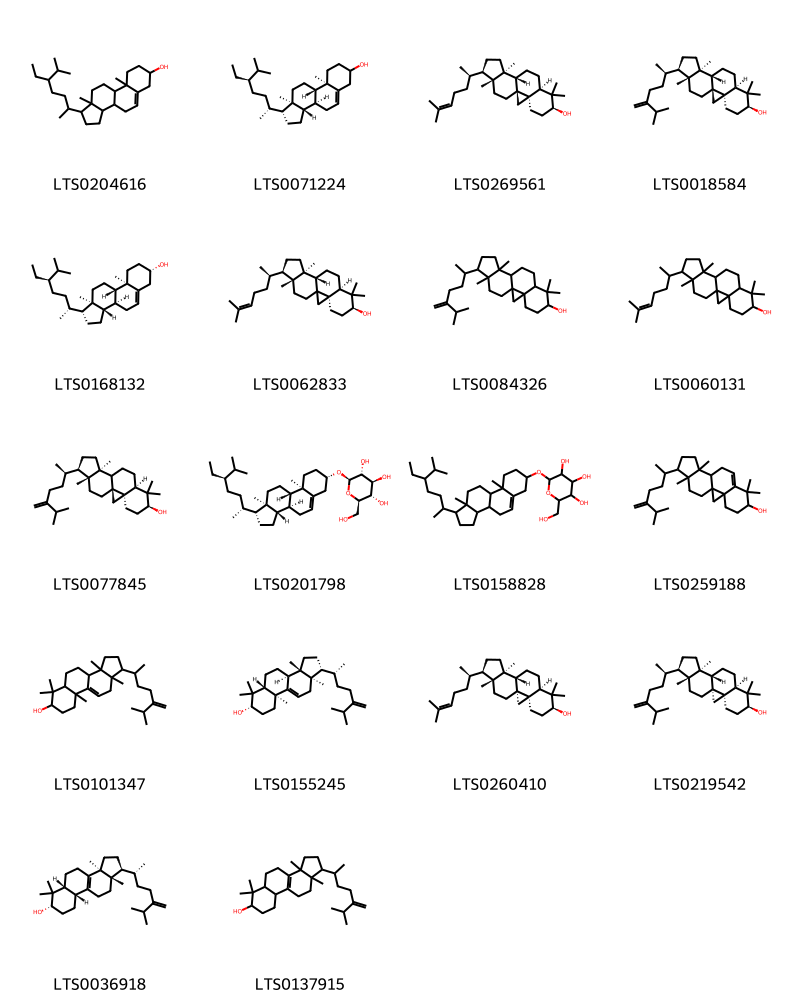{ width=100% }
    <figcaption>Hình ảnh cấu trúc hóa học của 18 hoạt chất thuộc nhóm Steroids and steroid derivatives gồm ['stigmast-5-en-3-ol, (3β)- (LTS0204616)', 'stigmast-5-en-3-ol (LTS0071224)', 'cycloartenol (LTS0269561)', '24-methylenecycloartanol (LTS0018584)', 'sitosterol (LTS0168132)', '(3r,6s,8r,11s,12s,15r,16r)-7,7,12,16-tetramethyl-15-[(2r)-6-methylhept-5-en-2-yl]pentacyclo[9.7.0.0¹,³.0³,⁸.0¹²,¹⁶]octadecan-6-ol (LTS0062833)', '7,7,12,16-tetramethyl-15-(6-methyl-5-methylideneheptan-2-yl)pentacyclo[9.7.0.0¹,³.0³,⁸.0¹²,¹⁶]octadecan-6-ol (LTS0084326)', 'cycloartenol (LTS0060131)', '24-methylene-cycloartanol (LTS0077845)', 'sitogluside (LTS0201798)', '2-{[1-(5-ethyl-6-methylheptan-2-yl)-9a,11a-dimethyl-1h,2h,3h,3ah,3bh,4h,6h,7h,8h,9h,9bh,10h,11h-cyclopenta[a]phenanthren-7-yl]oxy}-6-(hydroxymethyl)oxane-3,4,5-triol (LTS0158828)', '7,7,12,16-tetramethyl-15-(6-methyl-5-methylideneheptan-2-yl)pentacyclo[9.7.0.0¹,³.0³,⁸.0¹²,¹⁶]octadec-8-en-6-ol (LTS0259188)', '3a,6,6,9a,11a-pentamethyl-1-(6-methyl-5-methylideneheptan-2-yl)-1h,2h,3h,3bh,4h,5h,5ah,7h,8h,9h,11h-cyclopenta[a]phenanthren-7-ol (LTS0101347)', '(1r,3as,3bs,5ar,7s,9as,11ar)-3a,6,6,9a,11a-pentamethyl-1-[(2r)-6-methyl-5-methylideneheptan-2-yl]-1h,2h,3h,3bh,4h,5h,5ah,7h,8h,9h,11h-cyclopenta[a]phenanthren-7-ol (LTS0155245)', '(1r,3r,6s,8r,11s,12s,15r,16r)-7,7,12,16-tetramethyl-15-[(2r)-6-methylhept-5-en-2-yl]pentacyclo[9.7.0.0¹,³.0³,⁸.0¹²,¹⁶]octadecan-6-ol (LTS0260410)', '(1r,3r,6s,8r,11s,12s,15r,16r)-7,7,12,16-tetramethyl-15-[(2r)-6-methyl-5-methylideneheptan-2-yl]pentacyclo[9.7.0.0¹,³.0³,⁸.0¹²,¹⁶]octadecan-6-ol (LTS0219542)', '(1s,3as,5ar,7s,9ar,11as)-3a,6,6,11a-tetramethyl-1-[(2r)-6-methyl-5-methylideneheptan-2-yl]-1h,2h,3h,4h,5h,5ah,7h,8h,9h,9ah,10h,11h-cyclopenta[a]phenanthren-7-ol (LTS0036918)', '3a,6,6,11a-tetramethyl-1-(6-methyl-5-methylideneheptan-2-yl)-1h,2h,3h,4h,5h,5ah,7h,8h,9h,9ah,10h,11h-cyclopenta[a]phenanthren-7-ol (LTS0137915)'].</figcaption>
</figure>

---

### Dược dân tộc học

Danh sách các quốc gia có sử dụng *Euphorbia kansui* trong điều trị các bệnh. 

| Country   | Disease   | Bệnh                                                                                                                                                                                                |
|:----------|:----------|:----------------------------------------------------------------------------------------------------------------------------------------------------------------------------------------------------|
| China     | Laxative  | MYMEMORY WARNING: YOU USED ALL AVAILABLE FREE TRANSLATIONS FOR TODAY. NEXT AVAILABLE IN  20 HOURS 19 MINUTES 07 SECONDS VISIT HTTPS://MYMEMORY.TRANSLATED.NET/DOC/USAGELIMITS.PHP TO TRANSLATE MORE |

---

---
## Euphorbia kerrii
### Thông tin về thực vật

!!! info "Phân loại thực vật của *Euphorbia sessiliflora* từ GIBF:"
    - **Kingdom:** Plantae
    - **Phylum:** Tracheophyta
    - **Order:** Malpighiales
    - **Family:** Euphorbiaceae
    - **Genus:** Euphorbia
    - **Species:** *Euphorbia sessiliflora*

 

| Label (VI)   | Label (EN)   | Scientific Name   | Descriptions (VI)   | Descriptions (EN)   | Also Known As (VI)   | Also Known As (EN)   |
|:-------------|:-------------|:------------------|:--------------------|:--------------------|:---------------------|:---------------------|
| N/A          | N/A          | Euphorbia kerrii  | loài thực vật       | species of plant    | ['']                 | ['']                 |

#### Phân bố trên thế giới

**Từ CSDL GIBF** Thailand, India

#### Phân bố tại Việt Nam

**Từ CSDL GIBF**: Không có ghi nhận ở Việt Nam

---
### Thành phần hóa học
        
- Theo cơ sở dữ liệu lotus: Từ loài *Euphorbia sessiliflora* đã phân lập và xác định được Chưa có hoạt chất nào được phân lập. hoạt chất thuộc về các nhóm Không có hoạt chất nào được phân lập. 

Không có hình ảnh nào được tạo ra

---

### Dược dân tộc học

Danh sách các quốc gia có sử dụng *Euphorbia sessiliflora* trong điều trị các bệnh. 

| Country   | Disease   | Bệnh                                                                                                                                                                                                |
|:----------|:----------|:----------------------------------------------------------------------------------------------------------------------------------------------------------------------------------------------------|
| Laos      | Piscicide | MYMEMORY WARNING: YOU USED ALL AVAILABLE FREE TRANSLATIONS FOR TODAY. NEXT AVAILABLE IN  20 HOURS 18 MINUTES 11 SECONDS VISIT HTTPS://MYMEMORY.TRANSLATED.NET/DOC/USAGELIMITS.PHP TO TRANSLATE MORE |

---

---
## Euphorbia lactea
### Thông tin về thực vật

!!! info "Phân loại thực vật của *Euphorbia lactea* từ GIBF:"
    - **Kingdom:** Plantae
    - **Phylum:** Tracheophyta
    - **Order:** Malpighiales
    - **Family:** Euphorbiaceae
    - **Genus:** Euphorbia
    - **Species:** *Euphorbia lactea*

 

| Label (VI)   | Label (EN)   | Scientific Name   | Descriptions (VI)   | Descriptions (EN)   | Also Known As (VI)   | Also Known As (EN)                                                       |
|:-------------|:-------------|:------------------|:--------------------|:--------------------|:---------------------|:-------------------------------------------------------------------------|
| N/A          | N/A          | Euphorbia lactea  | loài thực vật       | species of plant    | ['']                 | ['Elkhorn', 'Candelabra Spurge', 'Frilled Fan Spurge', 'Mottled Spurge'] |

#### Phân bố trên thế giới

**Từ CSDL GIBF** Virgin Islands (U.S.), United Arab Emirates, nan, Guadeloupe, Grenada, Myanmar, Saint Lucia, Benin, Tanzania, United Republic of, Venezuela (Bolivarian Republic of), French Guiana, Pakistan, Puerto Rico, Réunion, Chinese Taipei, Spain, Bolivia (Plurinational State of), Jamaica, United States of America, Bonaire, Sint Eustatius and Saba, Zimbabwe, Saint Martin (French part), Trinidad and Tobago, Barbados, Hong Kong, Thailand, Turks and Caicos Islands, Saint Barthélemy, Martinique, Bahamas, Brazil, Sint Maarten (Dutch part), Cuba, Dominican Republic, Peru, Viet Nam, Curaçao, Ecuador, French Polynesia, Saint Kitts and Nevis, Madagascar, Seychelles, Aruba, Cabo Verde, Colombia, Haiti, Montserrat, Costa Rica, India, Anguilla, Cayman Islands, Antigua and Barbuda, Kenya, Malaysia, Northern Mariana Islands

#### Phân bố tại Việt Nam

**Từ CSDL GIBF**: Hồ Chí Minh city, Bà Rịa - Vũng Tàu

---
### Thành phần hóa học
        
- Theo cơ sở dữ liệu lotus: Từ loài *Euphorbia lactea* đã phân lập và xác định được 10 hoạt chất thuộc về các nhóm Prenol lipids, Steroids and steroid derivatives. 

|    | chemicalTaxonomyClassyfireClass   |   smiles_count |
|---:|:----------------------------------|---------------:|
|  0 | Prenol lipids                     |              8 |
|  1 | Steroids and steroid derivatives  |              2 |

#### Nhóm Prenol lipids
<figure markdown="span">
    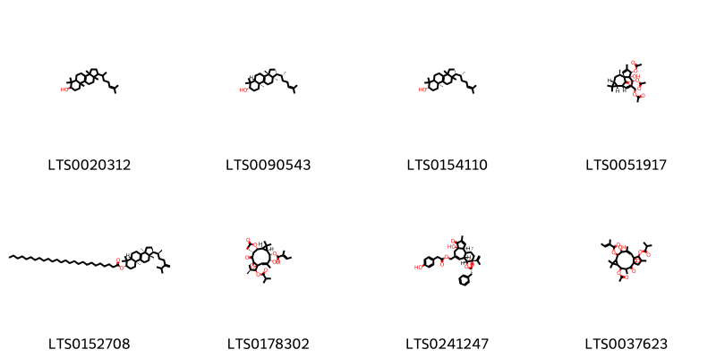{ width=100% }
    <figcaption>Hình ảnh cấu trúc hóa học của 8 hoạt chất thuộc nhóm Prenol lipids gồm ['lanster (LTS0020312)', 'lanosterol (LTS0090543)', '(1r,7s,9as)-3a,6,6,9a,11a-pentamethyl-1-[(2r)-6-methylhept-5-en-2-yl]-1h,2h,3h,4h,5h,5ah,7h,8h,9h,10h,11h-cyclopenta[a]phenanthren-7-ol (LTS0154110)', 'ingenol-3,5,20-triacetate (LTS0051917)', '(1s,3as,5ar,7s,9as,11as)-3a,6,6,9a,11a-pentamethyl-1-[(2s)-6-methyl-5-methylideneheptan-2-yl]-1h,2h,3h,4h,5h,5ah,7h,8h,9h,10h,11h-cyclopenta[a]phenanthren-7-yl hexacosanoate (LTS0152708)', '(1r,3r,4r,5r,7s,8s,9r,10e,12s,13s,14s)-4-(acetyloxy)-9-hydroxy-3,6,6,10,14-pentamethyl-13-[(2-methylpropanoyl)oxy]-2-oxo-16-oxatetracyclo[10.3.1.0¹,¹².0⁵,⁷]hexadec-10-en-8-yl (2e)-2-methylbut-2-enoate (LTS0178302)', 'tinyatoxin (LTS0241247)', '4-(acetyloxy)-9-hydroxy-3,6,6,10,14-pentamethyl-13-[(2-methylpropanoyl)oxy]-2-oxo-16-oxatetracyclo[10.3.1.0¹,¹².0⁵,⁷]hexadec-10-en-8-yl 2-methylbut-2-enoate (LTS0037623)'].</figcaption>
</figure>
#### Nhóm Steroids and steroid derivatives
<figure markdown="span">
    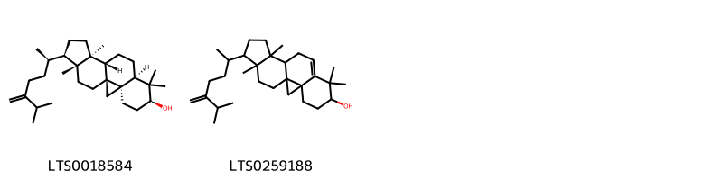{ width=100% }
    <figcaption>Hình ảnh cấu trúc hóa học của 2 hoạt chất thuộc nhóm Steroids and steroid derivatives gồm ['24-methylenecycloartanol (LTS0018584)', '7,7,12,16-tetramethyl-15-(6-methyl-5-methylideneheptan-2-yl)pentacyclo[9.7.0.0¹,³.0³,⁸.0¹²,¹⁶]octadec-8-en-6-ol (LTS0259188)'].</figcaption>
</figure>

---

### Dược dân tộc học

Danh sách các quốc gia có sử dụng *Euphorbia lactea* trong điều trị các bệnh. 

| Country   | Disease   | Bệnh                                                                                                                                                                                                |
|:----------|:----------|:----------------------------------------------------------------------------------------------------------------------------------------------------------------------------------------------------|
| Haiti     | Poison    | MYMEMORY WARNING: YOU USED ALL AVAILABLE FREE TRANSLATIONS FOR TODAY. NEXT AVAILABLE IN  20 HOURS 17 MINUTES 49 SECONDS VISIT HTTPS://MYMEMORY.TRANSLATED.NET/DOC/USAGELIMITS.PHP TO TRANSLATE MORE |

---

---
## Euphorbia lancifolia
### Thông tin về thực vật

!!! info "Phân loại thực vật của *Euphorbia lancifolia* từ GIBF:"
    - **Kingdom:** Plantae
    - **Phylum:** Tracheophyta
    - **Order:** Malpighiales
    - **Family:** Euphorbiaceae
    - **Genus:** Euphorbia
    - **Species:** *Euphorbia lancifolia*

 

| Label (VI)   | Label (EN)   | Scientific Name      | Descriptions (VI)   | Descriptions (EN)   | Also Known As (VI)   | Also Known As (EN)   |
|:-------------|:-------------|:---------------------|:--------------------|:--------------------|:---------------------|:---------------------|
| N/A          | N/A          | Euphorbia lancifolia | loài thực vật       | species of plant    | ['']                 | ['']                 |

#### Phân bố trên thế giới

**Từ CSDL GIBF** nan, Belize, Ecuador, Colombia, Guatemala, Brazil, Bolivia (Plurinational State of), Costa Rica, Honduras, Jamaica, United States of America, Cuba, Mexico, Dominican Republic, El Salvador

#### Phân bố tại Việt Nam

**Từ CSDL GIBF**: Không có ghi nhận ở Việt Nam

---
### Thành phần hóa học
        
- Theo cơ sở dữ liệu lotus: Từ loài *Euphorbia lancifolia* đã phân lập và xác định được 4 hoạt chất thuộc về các nhóm Diazines, Dihydrofurans, Prenol lipids, Pyridines and derivatives. 

|    | chemicalTaxonomyClassyfireClass   |   smiles_count |
|---:|:----------------------------------|---------------:|
|  0 | Diazines                          |              1 |
|  1 | Dihydrofurans                     |              1 |
|  2 | Prenol lipids                     |              1 |
|  3 | Pyridines and derivatives         |              1 |

#### Nhóm Diazines
<figure markdown="span">
    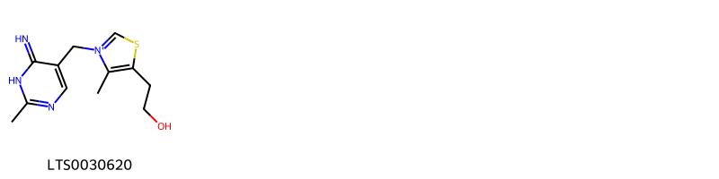{ width=100% }
    <figcaption>Hình ảnh cấu trúc hóa học của 1 hoạt chất thuộc nhóm Diazines gồm ['β-amin (LTS0030620)'].</figcaption>
</figure>
#### Nhóm Dihydrofurans
<figure markdown="span">
    { width=100% }
    <figcaption>Hình ảnh cấu trúc hóa học của 1 hoạt chất thuộc nhóm Dihydrofurans gồm ['vitamin c (LTS0022555)'].</figcaption>
</figure>
#### Nhóm Prenol lipids
<figure markdown="span">
    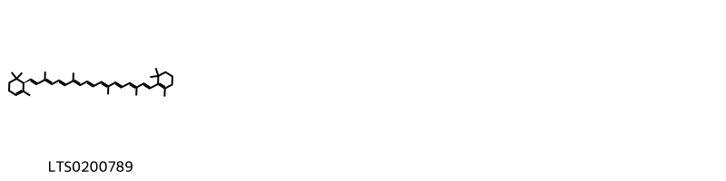{ width=100% }
    <figcaption>Hình ảnh cấu trúc hóa học của 1 hoạt chất thuộc nhóm Prenol lipids gồm ['(+)-α-carotene (LTS0200789)'].</figcaption>
</figure>
#### Nhóm Pyridines and derivatives
<figure markdown="span">
    { width=100% }
    <figcaption>Hình ảnh cấu trúc hóa học của 1 hoạt chất thuộc nhóm Pyridines and derivatives gồm ['niacin (LTS0216673)'].</figcaption>
</figure>

---

### Dược dân tộc học

Danh sách các quốc gia có sử dụng *Euphorbia lancifolia* trong điều trị các bệnh. 

| Country   | Disease            | Bệnh                                                                                                                                                                                                |
|:----------|:-------------------|:----------------------------------------------------------------------------------------------------------------------------------------------------------------------------------------------------|
| Guatemala | Lactagogue, Poison | MYMEMORY WARNING: YOU USED ALL AVAILABLE FREE TRANSLATIONS FOR TODAY. NEXT AVAILABLE IN  20 HOURS 17 MINUTES 21 SECONDS VISIT HTTPS://MYMEMORY.TRANSLATED.NET/DOC/USAGELIMITS.PHP TO TRANSLATE MORE |

---

---
## Euphorbia lathryis
### Thông tin về thực vật

!!! info "Phân loại thực vật của *Euphorbia lathyris* từ GIBF:"
    - **Kingdom:** Plantae
    - **Phylum:** Tracheophyta
    - **Order:** Malpighiales
    - **Family:** Euphorbiaceae
    - **Genus:** Euphorbia
    - **Species:** *Euphorbia lathyris*

 

| Label (VI)   | Label (EN)   | Scientific Name      | Descriptions (VI)   | Descriptions (EN)   | Also Known As (VI)   | Also Known As (EN)   |
|:-------------|:-------------|:---------------------|:--------------------|:--------------------|:---------------------|:---------------------|
| N/A          | N/A          | Euphorbia lancifolia | loài thực vật       | species of plant    | ['']                 | ['']                 |

#### Phân bố trên thế giới

**Từ CSDL GIBF** nan, Italy, Australia, Belgium, Denmark, Netherlands, Luxembourg, Spain, Hungary, Portugal, United States of America, Chile, Czechia, Germany, Romania, Switzerland, Austria, France, United Kingdom of Great Britain and Northern Ireland, Serbia, New Zealand

#### Phân bố tại Việt Nam

**Từ CSDL GIBF**: Không có ghi nhận ở Việt Nam

---
### Thành phần hóa học
        
- Theo cơ sở dữ liệu lotus: Từ loài *Euphorbia lathyris* đã phân lập và xác định được Chưa có hoạt chất nào được phân lập. hoạt chất thuộc về các nhóm Không có hoạt chất nào được phân lập. 

Không có hình ảnh nào được tạo ra

---

### Dược dân tộc học

Danh sách các quốc gia có sử dụng *Euphorbia lathyris* trong điều trị các bệnh. 

| Country   | Disease             | Bệnh                                                                                                                                                                                                |
|:----------|:--------------------|:----------------------------------------------------------------------------------------------------------------------------------------------------------------------------------------------------|
| Japan     | Cathartic, Diuretic | MYMEMORY WARNING: YOU USED ALL AVAILABLE FREE TRANSLATIONS FOR TODAY. NEXT AVAILABLE IN  20 HOURS 16 MINUTES 48 SECONDS VISIT HTTPS://MYMEMORY.TRANSLATED.NET/DOC/USAGELIMITS.PHP TO TRANSLATE MORE |

---

---
## Euphorbia lathyris
### Thông tin về thực vật

!!! info "Phân loại thực vật của *Euphorbia lathyris* từ GIBF:"
    - **Kingdom:** Plantae
    - **Phylum:** Tracheophyta
    - **Order:** Malpighiales
    - **Family:** Euphorbiaceae
    - **Genus:** Euphorbia
    - **Species:** *Euphorbia lathyris*

 

| Label (VI)   | Label (EN)   | Scientific Name    | Descriptions (VI)   | Descriptions (EN)   | Also Known As (VI)     | Also Known As (EN)                                                                    |
|:-------------|:-------------|:-------------------|:--------------------|:--------------------|:-----------------------|:--------------------------------------------------------------------------------------|
| N/A          | N/A          | Euphorbia lathyris | loài thực vật       | species of plant    | ['Euphorbia lathyrus'] | ['Caper Spurge', 'Gopher Plant', 'Gopher Spurge', 'Mole Plant', 'Euphorbia lathyrus'] |

#### Phân bố trên thế giới

**Từ CSDL GIBF** nan, Italy, Australia, Belgium, Denmark, Netherlands, Luxembourg, Spain, Hungary, Portugal, United States of America, Chile, Czechia, Germany, Romania, Switzerland, Austria, France, United Kingdom of Great Britain and Northern Ireland, Serbia, New Zealand

#### Phân bố tại Việt Nam

**Từ CSDL GIBF**: Không có ghi nhận ở Việt Nam

---
### Thành phần hóa học
        
- Theo cơ sở dữ liệu lotus: Từ loài *Euphorbia lathyris* đã phân lập và xác định được 74 hoạt chất thuộc về các nhóm Flavonoids, Prenol lipids, Steroids and steroid derivatives, Cinnamic acids and derivatives, Saturated hydrocarbons, Coumarins and derivatives, Carboxylic acids and derivatives. 

|    | chemicalTaxonomyClassyfireClass   |   smiles_count |
|---:|:----------------------------------|---------------:|
|  0 | Carboxylic acids and derivatives  |              2 |
|  1 | Cinnamic acids and derivatives    |              2 |
|  2 | Coumarins and derivatives         |              1 |
|  3 | Flavonoids                        |              2 |
|  4 | Prenol lipids                     |             46 |
|  5 | Saturated hydrocarbons            |              7 |
|  6 | Steroids and steroid derivatives  |             14 |

#### Nhóm Carboxylic acids and derivatives
<figure markdown="span">
    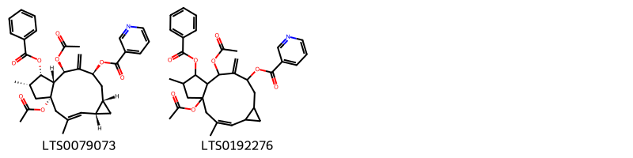{ width=100% }
    <figcaption>Hình ảnh cấu trúc hóa học của 2 hoạt chất thuộc nhóm Carboxylic acids and derivatives gồm ['(1s,3e,5s,7s,9s,11r,12r,13s,14s)-1,11-bis(acetyloxy)-13-(benzoyloxy)-3,14-dimethyl-10-methylidenetricyclo[10.3.0.0⁵,⁷]pentadec-3-en-9-yl pyridine-3-carboxylate (LTS0079073)', '1,11-bis(acetyloxy)-13-(benzoyloxy)-3,14-dimethyl-10-methylidenetricyclo[10.3.0.0⁵,⁷]pentadec-3-en-9-yl pyridine-3-carboxylate (LTS0192276)'].</figcaption>
</figure>
#### Nhóm Cinnamic acids and derivatives
<figure markdown="span">
    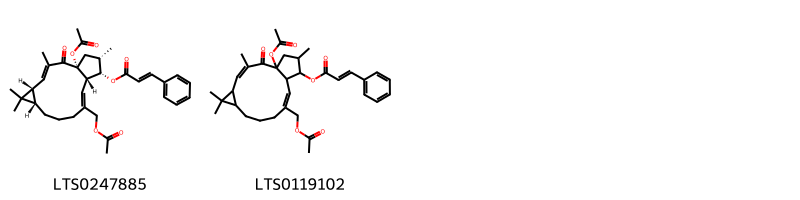{ width=100% }
    <figcaption>Hình ảnh cấu trúc hóa học của 2 hoạt chất thuộc nhóm Cinnamic acids and derivatives gồm ['(1r,3e,5r,7s,11z,13s,14s,15s)-1-(acetyloxy)-11-[(acetyloxy)methyl]-3,6,6,15-tetramethyl-2-oxotricyclo[11.3.0.0⁵,⁷]hexadeca-3,11-dien-14-yl (2e)-3-phenylprop-2-enoate (LTS0247885)', '1-(acetyloxy)-11-[(acetyloxy)methyl]-3,6,6,15-tetramethyl-2-oxotricyclo[11.3.0.0⁵,⁷]hexadeca-3,11-dien-14-yl 3-phenylprop-2-enoate (LTS0119102)'].</figcaption>
</figure>
#### Nhóm Coumarins and derivatives
<figure markdown="span">
    { width=100% }
    <figcaption>Hình ảnh cấu trúc hóa học của 1 hoạt chất thuộc nhóm Coumarins and derivatives gồm ['esculetin (LTS0067593)'].</figcaption>
</figure>
#### Nhóm Flavonoids
<figure markdown="span">
    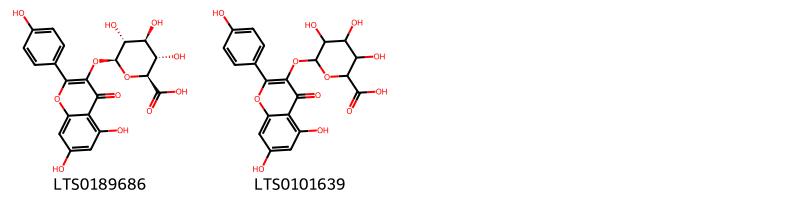{ width=100% }
    <figcaption>Hình ảnh cấu trúc hóa học của 2 hoạt chất thuộc nhóm Flavonoids gồm ['kaempferol 3-o-glucuronide (LTS0189686)', '6-{[5,7-dihydroxy-2-(4-hydroxyphenyl)-4-oxochromen-3-yl]oxy}-3,4,5-trihydroxyoxane-2-carboxylic acid (LTS0101639)'].</figcaption>
</figure>
#### Nhóm Prenol lipids
<figure markdown="span">
    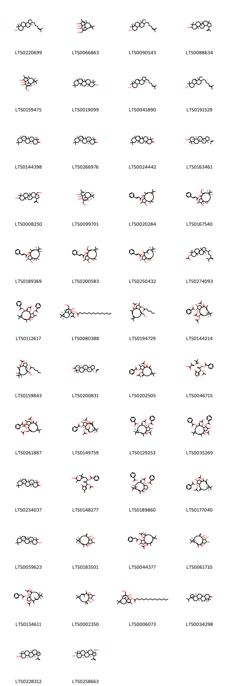{ width=100% }
    <figcaption>Hình ảnh cấu trúc hóa học của 46 hoạt chất thuộc nhóm Prenol lipids gồm ['euphol (LTS0220699)', '4,5,6-trihydroxy-7-(hydroxymethyl)-3,11,11,14-tetramethyltetracyclo[7.5.1.0¹,⁵.0¹⁰,¹²]pentadeca-2,7-dien-15-one (LTS0066863)', 'lanosterol (LTS0090543)', 'lupeol (LTS0088634)', '(1s,5r,9s,10r,12s)-4,5,6-trihydroxy-7-(hydroxymethyl)-3,11,11,14-tetramethyltetracyclo[7.5.1.0¹,⁵.0¹⁰,¹²]pentadeca-2,7-dien-15-one (LTS0159475)', 'taraxerol (LTS0019099)', '(3as,5ar,7s,9ar,11as)-3a,6,6,9a,11a-pentamethyl-1-[(2r)-6-methylhept-5-en-2-yl]-1h,2h,3h,5h,5ah,7h,8h,9h,9bh,10h,11h-cyclopenta[a]phenanthren-7-ol (LTS0041890)', '(1r,3ar,7s,9ar,11ar)-3a,6,6,9a,11a-pentamethyl-1-[(2r)-6-methylhept-5-en-2-yl]-1h,2h,3h,5h,5ah,7h,8h,9h,9bh,10h,11h-cyclopenta[a]phenanthren-7-ol (LTS0191529)', '(4ar,6ar,8ar,12as,12bs,14ar,14br)-4,4,6a,8a,11,11,12b,14b-octamethyl-2,4a,5,6,8,9,10,12,12a,13,14,14a-dodecahydro-1h-picen-3-one (LTS0144398)', 'taraxerone (LTS0266976)', '4,4,6a,8a,11,11,12b,14b-octamethyl-2,4a,5,6,8,9,10,12,12a,13,14,14a-dodecahydro-1h-picen-3-one (LTS0024442)', '(3s,3as,5ar,5br,7ar,9s,11ar,11br,13ar,13bs)-5a,5b,8,8,11a,13b-hexamethyl-3-(prop-1-en-2-yl)-hexadecahydrocyclopenta[a]chrysen-9-ol (LTS0163461)', '3a-(hydroxymethyl)-5a,5b,8,8,11a-pentamethyl-1-(prop-1-en-2-yl)-hexadecahydrocyclopenta[a]chrysen-9-ol (LTS0008250)', 'ingenol (LTS0099701)', 'jolkinol b (LTS0020284)', '(1s,4r,7s,9r,13r)-16-hydroxy-11-(hydroxymethyl)-4,8,8,15-tetramethyl-12-oxo-3-oxatetracyclo[11.3.0.0²,⁴.0⁷,⁹]hexadec-10-en-13-yl 3-phenylprop-2-enoate (LTS0167540)', '(1s,2s,4s,7r,9r,10z,13r,15s,16s)-16-hydroxy-4,8,8,11,15-pentamethyl-12-oxo-3-oxatetracyclo[11.3.0.0²,⁴.0⁷,⁹]hexadec-10-en-13-yl (2e)-3-phenylprop-2-enoate (LTS0189369)', '(10z)-16-hydroxy-11-(hydroxymethyl)-4,8,8,15-tetramethyl-12-oxo-3-oxatetracyclo[11.3.0.0²,⁴.0⁷,⁹]hexadec-10-en-13-yl (2e)-3-phenylprop-2-enoate (LTS0200583)', '(1r,2s,4r,7s,9r,10e,13r,15s,16s)-16-hydroxy-4,8,8,11,15-pentamethyl-12-oxo-3-oxatetracyclo[11.3.0.0²,⁴.0⁷,⁹]hexadec-10-en-13-yl (2e)-3-phenylprop-2-enoate (LTS0250432)', '3a,6,6,9a,11a-pentamethyl-1-(6-methyl-5-methylideneheptan-2-yl)-1h,2h,3h,4h,5h,5ah,7h,8h,9h,10h,11h-cyclopenta[a]phenanthren-7-yl acetate (LTS0274093)', '11-(acetyloxy)-13-(benzoyloxy)-1-hydroxy-3,6,6,14-tetramethyl-10-methylidene-2-oxotricyclo[10.3.0.0⁵,⁷]pentadec-3-en-9-yl benzoate (LTS0112617)', '(1s,4s,5s,6r,9s,10r,12r,14r)-5,6-dihydroxy-7-(hydroxymethyl)-3,11,11,14-tetramethyl-15-oxotetracyclo[7.5.1.0¹,⁵.0¹⁰,¹²]pentadeca-2,7-dien-4-yl hexadecanoate (LTS0080388)', '1-(acetyloxy)-10-(hydroxymethyl)-3,6,6,14-tetramethyl-2-oxotricyclo[10.3.0.0⁵,⁷]pentadeca-3,10-dien-13-yl hexanoate (LTS0194729)', '(1r,3e,5r,7s,9z,11r,12r,13s,14s)-1,11-bis(acetyloxy)-10-[(acetyloxy)methyl]-3,6,6,14-tetramethyl-2-oxotricyclo[10.3.0.0⁵,⁷]pentadeca-3,9-dien-13-yl benzoate (LTS0144214)', '(1r,3e,5r,7s,10z,12s,13s,14s)-1-(acetyloxy)-10-(hydroxymethyl)-3,6,6,14-tetramethyl-2-oxotricyclo[10.3.0.0⁵,⁷]pentadeca-3,10-dien-13-yl hexanoate (LTS0159843)', '(3s,3as,5ar,5br,7ar,11ar,11br,13ar,13bs)-5a,5b,8,8,11a,13b-hexamethyl-3-(prop-1-en-2-yl)-tetradecahydro-1h-cyclopenta[a]chrysen-9-one (LTS0200831)', 'diacetyl benzoyl lathyrol (LTS0202505)', '(2e)-3-[(1s,3r)-3-[(2s)-3-[(r)-(acetyloxy)[(3r)-3-methyl-5-oxocyclopent-1-en-1-yl]methyl]-2-(benzoyloxy)but-3-en-1-yl]-2,2-dimethylcyclopropyl]-2-methylprop-2-enoic acid (LTS0046715)', '1,11-bis(acetyloxy)-10-[(acetyloxy)methyl]-3,6,6,14-tetramethyl-2-oxotricyclo[10.3.0.0⁵,⁷]pentadeca-3,9-dien-13-yl benzoate (LTS0261887)', '(1r,3e,5r,7s,9e,11s,12r,13s,14s)-1,11-bis(acetyloxy)-10-[(acetyloxy)methyl]-3,6,6,14-tetramethyl-2-oxotricyclo[10.3.0.0⁵,⁷]pentadeca-3,9-dien-13-yl benzoate (LTS0149759)', '(1r,3e,5r,7s,9s,11r,12r,13s,14s)-1,11-bis(acetyloxy)-13-(benzoyloxy)-3,6,6,14-tetramethyl-10-methylidene-2-oxotricyclo[10.3.0.0⁵,⁷]pentadec-3-en-9-yl benzoate (LTS0129253)', '1,11-bis(acetyloxy)-13-(benzoyloxy)-3,6,6,14-tetramethyl-10-methylidene-2-oxotricyclo[10.3.0.0⁵,⁷]pentadec-3-en-9-yl benzoate (LTS0035269)', '(4ar,6ar,8ar,12ar,12bs,14as,14br)-4,4,6a,8a,11,11,12b,14b-octamethyl-2,4a,5,6,8,9,10,12,12a,13,14,14a-dodecahydro-1h-picen-3-one (LTS0234037)', '3-(3-{3-[(acetyloxy)(3-methyl-5-oxocyclopent-1-en-1-yl)methyl]-2-(benzoyloxy)but-3-en-1-yl}-2,2-dimethylcyclopropyl)-2-methylprop-2-enoic acid (LTS0148277)', '(1s,3e,5s,7r,9s,11s,12s,13r,14r)-11-(acetyloxy)-13-(benzoyloxy)-1-hydroxy-3,6,6,14-tetramethyl-10-methylidene-2-oxotricyclo[10.3.0.0⁵,⁷]pentadec-3-en-9-yl benzoate (LTS0189860)', 'diacetyl benzoyl lathyrol (LTS0177040)', '(3s,4ar,6ar,8ar,12ar,12bs,14as,14br)-4,4,6a,8a,11,11,12b,14b-octamethyl-1,2,3,4a,5,6,8,9,10,12,12a,13,14,14a-tetradecahydropicen-3-ol (LTS0059623)', '(1r,5s,7r,12s)-1,11,13-trihydroxy-3,6,6,14-tetramethyl-10-methylidenetricyclo[10.3.0.0⁵,⁷]pentadec-3-en-2-one (LTS0183501)', "1',11'-bis(acetyloxy)-3',6',6',14'-tetramethyl-2'-oxospiro[oxirane-2,10'-tricyclo[10.3.0.0⁵,⁷]pentadecan]-3'-en-13'-yl 2-phenylacetate (LTS0044377)", 'lathyrol (LTS0061710)', "(1'r,2s,3'e,5'r,7's,11'r,12'r,13's,14's)-1',11'-bis(acetyloxy)-3',6',6',14'-tetramethyl-2'-oxospiro[oxirane-2,10'-tricyclo[10.3.0.0⁵,⁷]pentadecan]-3'-en-13'-yl 2-phenylacetate (LTS0134611)", "(3'e)-1',11',13'-trihydroxy-3',6',6',14'-tetramethylspiro[oxirane-2,10'-tricyclo[10.3.0.0⁵,⁷]pentadecan]-3'-en-2'-one (LTS0002350)", '(4s,5s,6r,9r,14r)-5,6-dihydroxy-7-(hydroxymethyl)-3,11,11,14-tetramethyl-15-oxotetracyclo[7.5.1.0¹,⁵.0¹⁰,¹²]pentadeca-2,7-dien-4-yl hexadecanoate (LTS0006073)', '(5ar,5br,7ar,11ar,11br,13as,13br)-3-isopropyl-5a,5b,8,8,11a,13b-hexamethyl-1h,2h,4h,5h,6h,7h,7ah,10h,11h,11bh,12h,13h,13ah-cyclopenta[a]chrysen-9-one (LTS0034298)', '(1r,3ar,5ar,5br,7ar,9r,11ar,11bs,13as,13br)-3a,5a,5b,8,8,11a-hexamethyl-1-(prop-1-en-2-yl)-hexadecahydrocyclopenta[a]chrysen-9-ol (LTS0228312)', '(1r,3as,5ar,5br,7ar,9s,11ar,11bs,13ar,13br)-3a-(hydroxymethyl)-5a,5b,8,8,11a-pentamethyl-1-(prop-1-en-2-yl)-hexadecahydrocyclopenta[a]chrysen-9-ol (LTS0258663)'].</figcaption>
</figure>
#### Nhóm Saturated hydrocarbons
<figure markdown="span">
    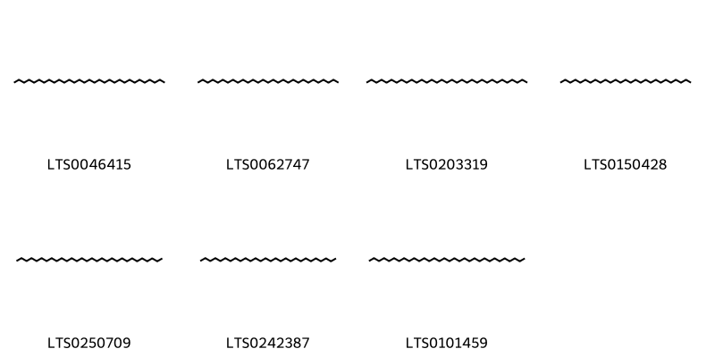{ width=100% }
    <figcaption>Hình ảnh cấu trúc hóa học của 7 hoạt chất thuộc nhóm Saturated hydrocarbons gồm ['hentriacontane (LTS0046415)', 'nonacosane (LTS0062747)', 'tritriacontane (LTS0203319)', 'heptacosane (LTS0150428)', 'triacontane (LTS0250709)', 'octacosane (LTS0242387)', 'dotriacontane (LTS0101459)'].</figcaption>
</figure>
#### Nhóm Steroids and steroid derivatives
<figure markdown="span">
    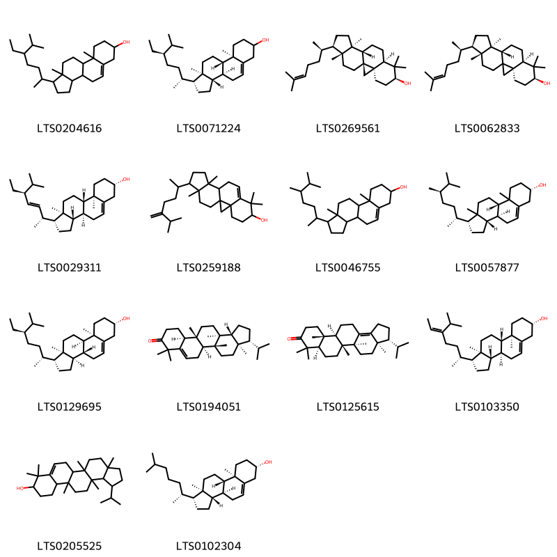{ width=100% }
    <figcaption>Hình ảnh cấu trúc hóa học của 14 hoạt chất thuộc nhóm Steroids and steroid derivatives gồm ['stigmast-5-en-3-ol, (3β)- (LTS0204616)', 'stigmast-5-en-3-ol (LTS0071224)', 'cycloartenol (LTS0269561)', '(3r,6s,8r,11s,12s,15r,16r)-7,7,12,16-tetramethyl-15-[(2r)-6-methylhept-5-en-2-yl]pentacyclo[9.7.0.0¹,³.0³,⁸.0¹²,¹⁶]octadecan-6-ol (LTS0062833)', 'phytosterol (LTS0029311)', '7,7,12,16-tetramethyl-15-(6-methyl-5-methylideneheptan-2-yl)pentacyclo[9.7.0.0¹,³.0³,⁸.0¹²,¹⁶]octadec-8-en-6-ol (LTS0259188)', 'campesterol (LTS0046755)', '(1r,3as,3bs,7s,9bs)-1-[(2r,5r)-5,6-dimethylheptan-2-yl]-9a,11a-dimethyl-1h,2h,3h,3ah,3bh,4h,6h,7h,8h,9h,9bh,10h,11h-cyclopenta[a]phenanthren-7-ol (LTS0057877)', '(1r,3ar,3br,7s,9ar,9br,11ar)-1-[(2r,5r)-5-ethyl-6-methylheptan-2-yl]-9a,11a-dimethyl-1h,2h,3h,3ah,3bh,4h,6h,7h,8h,9h,9bh,10h,11h-cyclopenta[a]phenanthren-7-ol (LTS0129695)', '(3r,3ar,5ar,5bs,11as,11br,13as,13br)-3-isopropyl-3a,5a,8,8,11b,13a-hexamethyl-1h,2h,3h,4h,5h,5bh,6h,10h,11h,11ah,12h,13h,13bh-cyclopenta[a]chrysen-9-one (LTS0194051)', '(3r,3ar,5as,5br,7ar,11ar,11br)-3-isopropyl-3a,5a,5b,8,8,11a-hexamethyl-1h,2h,3h,4h,5h,6h,7h,7ah,10h,11h,11bh,12h,13h-cyclopenta[a]chrysen-9-one (LTS0125615)', 'avenasterol (LTS0103350)', '1-isopropyl-3a,5a,8,8,11b,13a-hexamethyl-1h,2h,3h,4h,5h,5bh,6h,9h,10h,11h,11ah,12h,13h,13bh-cyclopenta[a]chrysen-9-ol (LTS0205525)', 'cholesterol (LTS0102304)'].</figcaption>
</figure>

---

### Dược dân tộc học

Danh sách các quốc gia có sử dụng *Euphorbia lathyris* trong điều trị các bệnh. 

| Country   | Disease                        | Bệnh                                                                                                                                                                                                |
|:----------|:-------------------------------|:----------------------------------------------------------------------------------------------------------------------------------------------------------------------------------------------------|
| China     | Antiseptic, Poison             | MYMEMORY WARNING: YOU USED ALL AVAILABLE FREE TRANSLATIONS FOR TODAY. NEXT AVAILABLE IN  20 HOURS 16 MINUTES 19 SECONDS VISIT HTTPS://MYMEMORY.TRANSLATED.NET/DOC/USAGELIMITS.PHP TO TRANSLATE MORE |
| Elsewhere | Purgative, Purgative, Diuretic | MYMEMORY WARNING: YOU USED ALL AVAILABLE FREE TRANSLATIONS FOR TODAY. NEXT AVAILABLE IN  20 HOURS 16 MINUTES 16 SECONDS VISIT HTTPS://MYMEMORY.TRANSLATED.NET/DOC/USAGELIMITS.PHP TO TRANSLATE MORE |
| Turkey    | Poison, Purgative, Emetic      | MYMEMORY WARNING: YOU USED ALL AVAILABLE FREE TRANSLATIONS FOR TODAY. NEXT AVAILABLE IN  20 HOURS 16 MINUTES 13 SECONDS VISIT HTTPS://MYMEMORY.TRANSLATED.NET/DOC/USAGELIMITS.PHP TO TRANSLATE MORE |
| ain       | Emetic                         | MYMEMORY WARNING: YOU USED ALL AVAILABLE FREE TRANSLATIONS FOR TODAY. NEXT AVAILABLE IN  20 HOURS 16 MINUTES 10 SECONDS VISIT HTTPS://MYMEMORY.TRANSLATED.NET/DOC/USAGELIMITS.PHP TO TRANSLATE MORE |

---

---
## Euphorbia maculata
### Thông tin về thực vật

!!! info "Phân loại thực vật của *Euphorbia maculata* từ GIBF:"
    - **Kingdom:** Plantae
    - **Phylum:** Tracheophyta
    - **Order:** Malpighiales
    - **Family:** Euphorbiaceae
    - **Genus:** Euphorbia
    - **Species:** *Euphorbia maculata*

 

| Label (VI)   | Label (EN)   | Scientific Name    | Descriptions (VI)   | Descriptions (EN)   | Also Known As (VI)   | Also Known As (EN)   |
|:-------------|:-------------|:-------------------|:--------------------|:--------------------|:---------------------|:---------------------|
| N/A          | N/A          | Euphorbia maculata | loài thực vật       | species of plant    | ['']                 | ['']                 |

#### Phân bố trên thế giới

**Từ CSDL GIBF** nan, Ukraine, South Africa, Italy, Australia, Japan, Belgium, New Zealand, Chinese Taipei, Macao, Türkiye, Portugal, Spain, United States of America, Austria, China, Saudi Arabia

#### Phân bố tại Việt Nam

**Từ CSDL GIBF**: Không có ghi nhận ở Việt Nam

---
### Thành phần hóa học
        
- Theo cơ sở dữ liệu lotus: Từ loài *Euphorbia maculata* đã phân lập và xác định được 184 hoạt chất thuộc về các nhóm Fatty Acyls, Flavonoids, Prenol lipids, Steroids and steroid derivatives, Oxepanes, Benzofurans, Benzene and substituted derivatives, Isocoumarins and derivatives, Organooxygen compounds, Tannins, Coumarins and derivatives. 

|    | chemicalTaxonomyClassyfireClass     |   smiles_count |
|---:|:------------------------------------|---------------:|
|  0 | Benzene and substituted derivatives |              2 |
|  1 | Benzofurans                         |              2 |
|  2 | Coumarins and derivatives           |              2 |
|  3 | Fatty Acyls                         |              7 |
|  4 | Flavonoids                          |             10 |
|  5 | Isocoumarins and derivatives        |              1 |
|  6 | Organooxygen compounds              |             33 |
|  7 | Oxepanes                            |              2 |
|  8 | Prenol lipids                       |             64 |
|  9 | Steroids and steroid derivatives    |             12 |
| 10 | Tannins                             |             47 |

#### Nhóm Benzene and substituted derivatives
<figure markdown="span">
    { width=100% }
    <figcaption>Hình ảnh cấu trúc hóa học của 2 hoạt chất thuộc nhóm Benzene and substituted derivatives gồm ['galop (LTS0222857)', 'ethyl gallate (LTS0270645)'].</figcaption>
</figure>
#### Nhóm Benzofurans
<figure markdown="span">
    { width=100% }
    <figcaption>Hình ảnh cấu trúc hóa học của 2 hoạt chất thuộc nhóm Benzofurans gồm ['(6r,7as)-6-hydroxy-4,4,7a-trimethyl-6,7-dihydro-5h-1-benzofuran-2-one (LTS0220994)', 'loliolide (LTS0119422)'].</figcaption>
</figure>
#### Nhóm Coumarins and derivatives
<figure markdown="span">
    { width=100% }
    <figcaption>Hình ảnh cấu trúc hóa học của 2 hoạt chất thuộc nhóm Coumarins and derivatives gồm ['scopoletin (LTS0193112)', 'umbelliferone (LTS0162728)'].</figcaption>
</figure>
#### Nhóm Fatty Acyls
<figure markdown="span">
    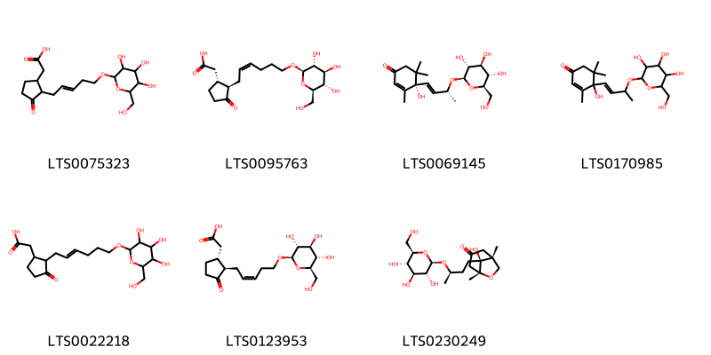{ width=100% }
    <figcaption>Hình ảnh cấu trúc hóa học của 7 hoạt chất thuộc nhóm Fatty Acyls gồm ['[3-oxo-2-(5-{[3,4,5-trihydroxy-6-(hydroxymethyl)oxan-2-yl]oxy}pent-2-en-1-yl)cyclopentyl]acetic acid (LTS0075323)', '[(1r,2r)-3-oxo-2-[(2z)-6-{[(2r,3r,4s,5s,6r)-3,4,5-trihydroxy-6-(hydroxymethyl)oxan-2-yl]oxy}hex-2-en-1-yl]cyclopentyl]acetic acid (LTS0095763)', '(4s)-4-hydroxy-3,5,5-trimethyl-4-[(1e,3r)-3-{[(2r,3r,4s,5s,6r)-3,4,5-trihydroxy-6-(hydroxymethyl)oxan-2-yl]oxy}but-1-en-1-yl]cyclohex-2-en-1-one (LTS0069145)', '4-hydroxy-3,5,5-trimethyl-4-(3-{[3,4,5-trihydroxy-6-(hydroxymethyl)oxan-2-yl]oxy}but-1-en-1-yl)cyclohex-2-en-1-one (LTS0170985)', '[3-oxo-2-(6-{[3,4,5-trihydroxy-6-(hydroxymethyl)oxan-2-yl]oxy}hex-2-en-1-yl)cyclopentyl]acetic acid (LTS0022218)', 'tuberonic acid glucoside (LTS0123953)', '(1r,5r,8s)-8-hydroxy-1,5-dimethyl-8-[(3r)-3-{[(2r,3r,4s,5s,6r)-3,4,5-trihydroxy-6-(hydroxymethyl)oxan-2-yl]oxy}butyl]-6-oxabicyclo[3.2.1]octan-3-one (LTS0230249)'].</figcaption>
</figure>
#### Nhóm Flavonoids
<figure markdown="span">
    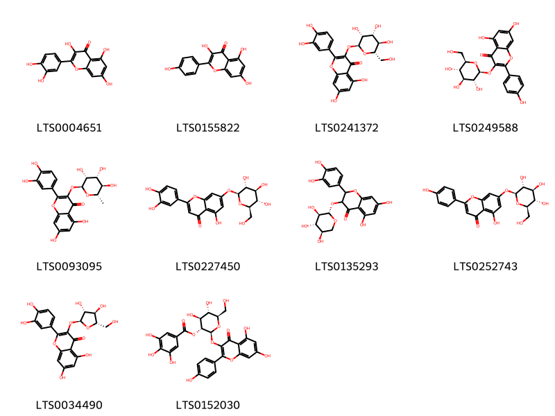{ width=100% }
    <figcaption>Hình ảnh cấu trúc hóa học của 10 hoạt chất thuộc nhóm Flavonoids gồm ['quercetin (LTS0004651)', 'kaempherol (LTS0155822)', '2-(3,4-dihydroxyphenyl)-5,7-dihydroxy-3-{[(2s,3r,4r,5r,6s)-3,4,5-trihydroxy-6-(hydroxymethyl)oxan-2-yl]oxy}chromen-4-one (LTS0241372)', 'astragalin (LTS0249588)', 'quercitrin (LTS0093095)', 'luteolin 7-o-glucoside (LTS0227450)', '2-(3,4-dihydroxyphenyl)-5,7-dihydroxy-3-{[(2s,3r,4s,5r)-3,4,5-trihydroxyoxan-2-yl]oxy}-2,3-dihydro-1-benzopyran-4-one (LTS0135293)', 'apigenin 7-o-β-glucoside (LTS0252743)', 'avicularin (LTS0034490)', '(2s,3r,4s,5s,6r)-2-{[5,7-dihydroxy-2-(4-hydroxyphenyl)-4-oxochromen-3-yl]oxy}-4,5-dihydroxy-6-(hydroxymethyl)oxan-3-yl 3,4,5-trihydroxybenzoate (LTS0152030)'].</figcaption>
</figure>
#### Nhóm Isocoumarins and derivatives
<figure markdown="span">
    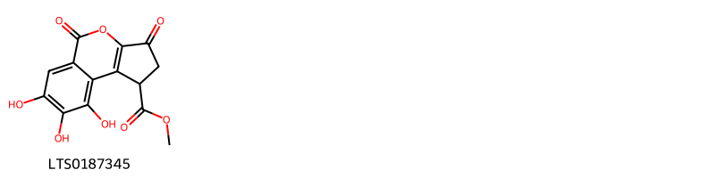{ width=100% }
    <figcaption>Hình ảnh cấu trúc hóa học của 1 hoạt chất thuộc nhóm Isocoumarins and derivatives gồm ['methyl brevifolincarboxylate (LTS0187345)'].</figcaption>
</figure>
#### Nhóm Organooxygen compounds
<figure markdown="span">
    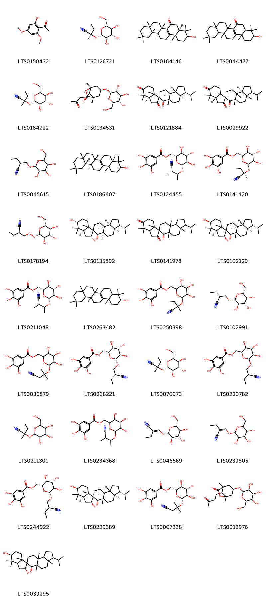{ width=100% }
    <figcaption>Hình ảnh cấu trúc hóa học của 33 hoạt chất thuộc nhóm Organooxygen compounds gồm ['xanthoxylin (LTS0150432)', 'lotaustralin (LTS0126731)', '(3s,4ar,6bs,8ar,12ar,12bs,14bs)-3-hydroxy-4,4,6b,8a,11,11,12b,14b-octamethyl-2,3,4a,5,7,8,9,10,12,12a,13,14-dodecahydro-1h-picen-6-one (LTS0164146)', '3-hydroxy-4,4,6b,8a,11,11,12b,14b-octamethyl-2,3,4a,5,7,8,9,10,12,12a,13,14-dodecahydro-1h-picen-6-one (LTS0044477)', '2-methyl-2-{[(2s,3r,4s,5s,6r)-3,4,5-trihydroxy-6-(hydroxymethyl)oxan-2-yl]oxy}butanenitrile (LTS0184222)', '(1s,3s,5r,8r)-1,5-dimethyl-8-(3-oxobutyl)-3-{[(2r,3r,4s,5s,6r)-3,4,5-trihydroxy-6-(hydroxymethyl)oxan-2-yl]oxy}-6-oxabicyclo[3.2.1]octan-7-one (LTS0134531)', "(3r,3ar,3'ar,5as,7r,7'as,9as,9br)-3-isopropyl-3a,4',4',5a,7'a,9a-hexamethyl-dodecahydrospiro[cyclopenta[a]naphthalene-7,1'-indene]-2',5',6-trione (LTS0121884)", "(3s,3as,3'as,5as,7r,7'ar,9ar,9bs)-3-isopropyl-3a,4',4',5a,7'a,9a-hexamethyl-dodecahydrospiro[cyclopenta[a]naphthalene-7,1'-indene]-2',5',6-trione (LTS0029922)", '2-({[3,4,5-trihydroxy-6-(hydroxymethyl)oxan-2-yl]oxy}methyl)butanenitrile (LTS0045615)', 'isomultiflorenol (LTS0186407)', '[(2r,3s,4s,5r,6r)-6-{[(1r,2s)-1-cyano-1-methylpropan-2-yl]oxy}-3,4,5-trihydroxyoxan-2-yl]methyl 3,4,5-trihydroxybenzoate (LTS0124455)', '[(2r,3s,4s,5r,6s)-6-[(1r)-1-cyano-1-methylpropoxy]-3,4,5-trihydroxyoxan-2-yl]methyl 3,4,5-trihydroxybenzoate (LTS0141420)', '2-({[(2s,3r,4s,5s,6r)-3,4,5-trihydroxy-6-(hydroxymethyl)oxan-2-yl]peroxy}methyl)butanenitrile (LTS0178194)', "(2'r,3r,3ar,3'ar,5'r,5ar,7s,7'as,9as,9bs)-2',5'-dihydroxy-3-isopropyl-3a,4',4',5a,7'a,9a-hexamethyl-tetradecahydrospiro[cyclopenta[a]naphthalene-7,1'-inden]-6-one (LTS0135892)", "3-isopropyl-3a,4',4',5a,7'a,9a-hexamethyl-dodecahydrospiro[cyclopenta[a]naphthalene-7,1'-indene]-2',5',6-trione (LTS0141978)", "(2's,3r,3ar,3'ar,5's,5as,7s,7'as,9as,9br)-2',5'-dihydroxy-3-isopropyl-3a,4',4',5a,7'a,9a-hexamethyl-tetradecahydrospiro[cyclopenta[a]naphthalene-7,1'-inden]-6-one (LTS0102129)", '[(2r,3s,4s,5r,6r)-6-[(1-cyano-1-methylpropan-2-yl)oxy]-3,4,5-trihydroxyoxan-2-yl]methyl 3,4,5-trihydroxybenzoate (LTS0211048)', '4,4,6b,8a,11,11,12b,14b-octamethyl-1,2,3,4a,5,6,7,8,9,10,12,12a,13,14-tetradecahydropicen-3-ol (LTS0263482)', '[6-(1-cyano-1-methylpropoxy)-3,4,5-trihydroxyoxan-2-yl]methyl 3,4,5-trihydroxybenzoate (LTS0250398)', '(2s)-2-({[(2r,3r,4s,5s,6r)-3,4,5-trihydroxy-6-(hydroxymethyl)oxan-2-yl]oxy}methyl)butanenitrile (LTS0102991)', '{6-[(1-cyano-2-methylpropan-2-yl)oxy]-3,4,5-trihydroxyoxan-2-yl}methyl 3,4,5-trihydroxybenzoate (LTS0036879)', '[(2r,3s,4s,5r,6r)-6-[(2s)-2-cyano-2-ethylethoxy]-3,4,5-trihydroxyoxan-2-yl]methyl 3,4,5-trihydroxybenzoate (LTS0268221)', '(s)-lotaustralin (LTS0070973)', '[6-(2-cyano-2-ethylethoxy)-3,4,5-trihydroxyoxan-2-yl]methyl 3,4,5-trihydroxybenzoate (LTS0220782)', '2-methyl-2-{[3,4,5-trihydroxy-6-(hydroxymethyl)oxan-2-yl]oxy}butanenitrile (LTS0211301)', '{6-[(1-cyano-1-methylpropan-2-yl)oxy]-3,4,5-trihydroxyoxan-2-yl}methyl 3,4,5-trihydroxybenzoate (LTS0234368)', '(2e)-2-({[(2r,3r,4s,5s,6r)-3,4,5-trihydroxy-6-(hydroxymethyl)oxan-2-yl]oxy}methylidene)butanenitrile (LTS0046569)', '2-({[3,4,5-trihydroxy-6-(hydroxymethyl)oxan-2-yl]oxy}methylidene)butanenitrile (LTS0239805)', '[(2r,3s,4s,5r,6r)-6-(2-cyano-2-ethylethoxy)-3,4,5-trihydroxyoxan-2-yl]methyl 3,4,5-trihydroxybenzoate (LTS0244922)', "(2's,3r,3ar,3'ar,5's,5as,7r,7'as,9as,9br)-2',5'-dihydroxy-3-isopropyl-3a,4',4',5a,7'a,9a-hexamethyl-tetradecahydrospiro[cyclopenta[a]naphthalene-7,1'-inden]-6-one (LTS0229389)", '[(2r,3s,4s,5r,6s)-6-[(1-cyano-2-methylpropan-2-yl)oxy]-3,4,5-trihydroxyoxan-2-yl]methyl 3,4,5-trihydroxybenzoate (LTS0007338)', '1,5-dimethyl-8-(3-oxobutyl)-3-{[3,4,5-trihydroxy-6-(hydroxymethyl)oxan-2-yl]oxy}-6-oxabicyclo[3.2.1]octan-7-one (LTS0013976)', "2',5'-dihydroxy-3-isopropyl-3a,4',4',5a,7'a,9a-hexamethyl-tetradecahydrospiro[cyclopenta[a]naphthalene-7,1'-inden]-6-one (LTS0039295)"].</figcaption>
</figure>
#### Nhóm Oxepanes
<figure markdown="span">
    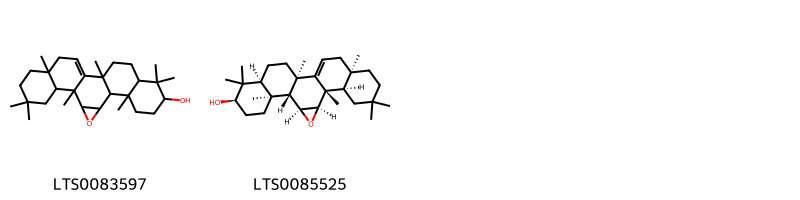{ width=100% }
    <figcaption>Hình ảnh cấu trúc hóa học của 2 hoạt chất thuộc nhóm Oxepanes gồm ['4,4,6a,8a,11,11,12b,13c-octamethyl-1h,2h,3h,4ah,5h,6h,8h,9h,10h,12h,12ah,12ch,13ah,13bh-piceno[13,14-b]oxiren-3-ol (LTS0083597)', '(3r,4as,6ar,8ar,12ar,12bs,12cr,13as,13br,13cs)-4,4,6a,8a,11,11,12b,13c-octamethyl-1h,2h,3h,4ah,5h,6h,8h,9h,10h,12h,12ah,12ch,13ah,13bh-piceno[13,14-b]oxiren-3-ol (LTS0085525)'].</figcaption>
</figure>
#### Nhóm Prenol lipids
<figure markdown="span">
    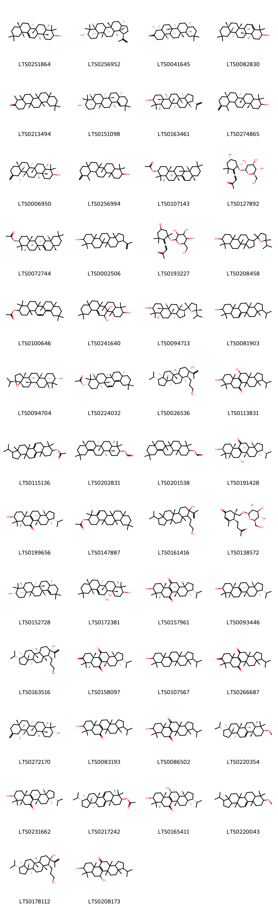{ width=100% }
    <figcaption>Hình ảnh cấu trúc hóa học của 64 hoạt chất thuộc nhóm Prenol lipids gồm ['β-amyrin (LTS0251864)', 'lupeol (LTS0256952)', '(-)-friedelin (LTS0041645)', 'glutinol (LTS0082830)', 'friedelin (LTS0213494)', 'germanicol (LTS0151098)', '(3s,3as,5ar,5br,7ar,9s,11ar,11br,13ar,13bs)-5a,5b,8,8,11a,13b-hexamethyl-3-(prop-1-en-2-yl)-hexadecahydrocyclopenta[a]chrysen-9-ol (LTS0163461)', '(6ar,6br,8ar,14br)-4,4,6a,6b,8a,12,14b-heptamethyl-11-methylidene-hexadecahydropicen-3-ol (LTS0274865)', 'taraxasterol (LTS0006950)', '4,4,6a,6b,8a,12,14b-heptamethyl-11-methylidene-hexadecahydropicen-3-ol (LTS0256994)', '(3s,4ar,6ar,8ar,12ar,14ar,14br)-4,4,6a,8a,11,11,12b,14b-octamethyl-1,2,3,4a,5,6,8,9,10,12,12a,13,14,14a-tetradecahydropicen-3-yl acetate (LTS0107143)', 'citroside b (LTS0127892)', '(3s,4ar,6ar,8ar,12ar,12bs,14ar,14br)-4,4,6a,8a,11,11,12b,14b-octamethyl-1,2,3,4a,5,6,8,9,10,12,12a,13,14,14a-tetradecahydropicen-3-yl acetate (LTS0072744)', '5a,5b,8,8,11a,13b-hexamethyl-3-(prop-1-en-2-yl)-hexadecahydrocyclopenta[a]chrysen-9-ol (LTS0002506)', '4-(4-hydroxy-2,2,6-trimethyl-6-{[3,4,5-trihydroxy-6-(hydroxymethyl)oxan-2-yl]oxy}cyclohexylidene)but-3-en-2-one (LTS0193227)', '1-(5-isopropyl-2,5-dimethyloxolan-2-yl)-3a,3b,6,6,9a-pentamethyl-dodecahydro-1h-cyclopenta[a]phenanthren-7-ol (LTS0208458)', '4,4,6a,6b,8a,11,11,14b-octamethyl-1,2,3,4a,5,6,7,8,9,10,12,14a-dodecahydropicen-3-yl acetate (LTS0100646)', '4,4,6a,6b,8a,11,11,14b-octamethyl-2,3,4a,5,6,7,8,9,10,12,12a,14-dodecahydro-1h-picene-3,14,14a-triol (LTS0241640)', '(1s,3ar,3br,5ar,7s,9ar,9bs,11ar)-1-[(2s,5r)-5-isopropyl-2,5-dimethyloxolan-2-yl]-3a,3b,6,6,9a-pentamethyl-dodecahydro-1h-cyclopenta[a]phenanthren-7-ol (LTS0094713)', '3-isopropyl-3a,5a,8,8,11a,13a-hexamethyl-1h,2h,3h,4h,5h,7h,7ah,9h,10h,11h,11bh,12h,13h,13bh-cyclopenta[a]chrysen-9-ol (LTS0081903)', '(1r,2r,5s,7s,10r,11s,14r,15r,18s,20r)-7-isopropyl-1,2,10,15,19,19-hexamethyl-6-oxahexacyclo[12.8.0.0²,¹¹.0⁵,⁷.0⁵,¹⁰.0¹⁵,²⁰]docosan-18-ol (LTS0094704)', '(3s,4ar,6ar,6bs,8ar,14ar,14bs)-4,4,6a,6b,8a,11,11,14b-octamethyl-1,2,3,4a,5,6,7,8,9,10,12,14a-dodecahydropicen-3-yl acetate (LTS0224032)', '(1r,3ar,3bs,5as,6s,7s,9as,9br,11ar)-6-(3-hydroxypropyl)-1-isopropyl-3b,5a,9b,11a-tetramethyl-7-(prop-1-en-2-yl)-dodecahydrocyclopenta[a]phenanthren-7-ol (LTS0026536)', '9,12-dihydroxy-3-isopropyl-3a,5a,8,8,11a,13a-hexamethyl-1h,2h,3h,4h,5h,7h,7ah,9h,10h,11h,12h,13h,13bh-cyclopenta[a]chrysen-6-one (LTS0113831)', '3-isopropyl-3a,5a,8,8,11a,13a-hexamethyl-1h,2h,3h,4h,5h,7h,7ah,9h,10h,11h,13h,13bh-cyclopenta[a]chrysen-9-yl acetate (LTS0115136)', '(3s,4ar,6ar,6bs,8ar,14ar,14br)-4,4,6a,6b,8a,11,11,14b-octamethyl-1,2,3,4a,5,6,7,8,9,10,12,13,14,14a-tetradecahydropicen-3-yl formate (LTS0202831)', '4,4,6a,6b,8a,11,11,14b-octamethyl-1,2,3,4a,5,6,7,8,9,10,12,13,14,14a-tetradecahydropicen-3-yl formate (LTS0201538)', '(3r,3ar,5as,6r,7as,9s,11as,13as,13br)-6,9-dihydroxy-3-isopropyl-3a,5a,8,8,11a,13a-hexamethyl-1h,2h,3h,4h,5h,6h,7h,7ah,9h,10h,11h,13h,13bh-cyclopenta[a]chrysen-12-one (LTS0191428)', '(3r,3ar,5as,7ar,9s,11as,13as,13br)-9-hydroxy-3-isopropyl-3a,5a,8,8,11a,13a-hexamethyl-1h,2h,3h,4h,5h,7h,7ah,9h,10h,11h,12h,13h,13bh-cyclopenta[a]chrysen-6-one (LTS0199656)', '4,4,6b,8a,11,11,12b,14a-octamethyl-1,2,3,6,6a,7,8,9,10,12,12a,13,14,14b-tetradecahydropicen-3-yl acetate (LTS0147887)', '6-(3-hydroxypropyl)-1-isopropyl-3b,5a,9b,11a-tetramethyl-7-(prop-1-en-2-yl)-dodecahydrocyclopenta[a]phenanthren-7-ol (LTS0161416)', '(4s,5s)-3,5-dimethyl-4-(3-oxobutyl)-5-({[(2r,3r,4s,5s,6r)-3,4,5-trihydroxy-6-(hydroxymethyl)oxan-2-yl]oxy}methyl)cyclohex-2-en-1-one (LTS0138572)', '(3s,4as,6ar,6br,8ar,12br,14ar,14br)-4,4,6a,6b,8a,11,11,14b-octamethyl-1,2,3,4a,5,6,7,8,9,10,12b,13,14,14a-tetradecahydropicen-3-ol (LTS0152728)', '(3s,4as,6as,6br,8ar,12ar,14r,14as,14bs)-4,4,6a,6b,8a,11,11,14b-octamethyl-2,3,4a,5,6,7,8,9,10,12,12a,14-dodecahydro-1h-picene-3,14,14a-triol (LTS0172381)', '(3r,3ar,5as,7ar,9s,11as,13as,13br)-9-hydroxy-3-isopropyl-3a,5a,8,8,11a,13a-hexamethyl-1h,2h,3h,4h,5h,7h,7ah,9h,10h,11h,13h,13bh-cyclopenta[a]chrysene-6,12-dione (LTS0157961)', '(3r,3ar,5as,7as,9s,11as,13as,13br)-3-isopropyl-3a,5a,8,8,11a,13a-hexamethyl-1h,2h,3h,4h,5h,6h,7h,7ah,9h,10h,11h,12h,13h,13bh-cyclopenta[a]chrysen-9-ol (LTS0093446)', '(1r,3ar,3bs,5ar,6s,7s,9as,9br,11ar)-6-(3-hydroxypropyl)-1-isopropyl-3b,5a,9b,11a-tetramethyl-7-(prop-1-en-2-yl)-dodecahydrocyclopenta[a]phenanthren-7-ol (LTS0163516)', '(3r,3ar,5as,7ar,11as,13as,13br)-3-isopropyl-3a,5a,8,8,11a,13a-hexamethyl-1h,2h,3h,4h,5h,7h,7ah,10h,11h,13h,13bh-cyclopenta[a]chrysene-6,9,12-trione (LTS0158097)', '3-isopropyl-3a,5a,8,8,11a,13a-hexamethyl-1h,2h,3h,4h,5h,6h,7h,7ah,9h,10h,11h,12h,13h,13bh-cyclopenta[a]chrysen-9-ol (LTS0107567)', '3-isopropyl-3a,5a,8,8,11a,13a-hexamethyl-1h,2h,3h,4h,5h,7h,7ah,10h,11h,13h,13bh-cyclopenta[a]chrysene-6,9,12-trione (LTS0266687)', '(3r,4ar,6ar,6br,8ar,12s,12ar,12br,14ar,14br)-4,4,6a,6b,8a,12,14b-heptamethyl-11-methylidene-hexadecahydropicen-3-ol (LTS0272170)', '9-hydroxy-3-isopropyl-3a,5a,8,8,11a,13a-hexamethyl-1h,2h,3h,4h,5h,7h,7ah,9h,10h,11h,12h,13h,13bh-cyclopenta[a]chrysen-6-one (LTS0083193)', '9-hydroxy-3-isopropyl-3a,5a,8,8,11a,13a-hexamethyl-1h,2h,3h,4h,5h,7h,7ah,9h,10h,11h,13h,13bh-cyclopenta[a]chrysene-6,12-dione (LTS0086502)', 'arundoin (LTS0220354)', '(3r,3ar,5as,7as,9s,11as,13as,13br)-9-hydroxy-3-isopropyl-3a,5a,8,8,11a,13a-hexamethyl-1h,2h,3h,4h,5h,7h,7ah,9h,10h,11h,12h,13h,13bh-cyclopenta[a]chrysen-6-one (LTS0231662)', '(3r,3ar,5as,7ar,9s,11as,13as,13br)-3-isopropyl-3a,5a,8,8,11a,13a-hexamethyl-1h,2h,3h,4h,5h,7h,7ah,9h,10h,11h,13h,13bh-cyclopenta[a]chrysen-9-yl acetate (LTS0217242)', '(3r,3ar,5as,7ar,9s,11as,12s,13as,13br)-9,12-dihydroxy-3-isopropyl-3a,5a,8,8,11a,13a-hexamethyl-1h,2h,3h,4h,5h,7h,7ah,9h,10h,11h,12h,13h,13bh-cyclopenta[a]chrysen-6-one (LTS0165411)', '3-isopropyl-9-methoxy-3a,5a,8,8,11a,13a-hexamethyl-1h,2h,3h,4h,5h,5bh,6h,7h,7ah,9h,10h,11h,13h,13bh-cyclopenta[a]chrysene (LTS0220043)', '(1r,3ar,3bs,5ar,6s,7r,9as,9br,11ar)-6-(3-hydroxypropyl)-1-isopropyl-3b,5a,9b,11a-tetramethyl-7-(prop-1-en-2-yl)-dodecahydrocyclopenta[a]phenanthren-7-ol (LTS0178112)', '6,9-dihydroxy-3-isopropyl-3a,5a,8,8,11a,13a-hexamethyl-1h,2h,3h,4h,5h,6h,7h,7ah,9h,10h,11h,13h,13bh-cyclopenta[a]chrysen-12-one (LTS0208173)', '(1r,3ar,3bs,5as,6s,7r,9as,9br,11ar)-6-(3-hydroxypropyl)-1-isopropyl-3b,5a,9b,11a-tetramethyl-7-(prop-1-en-2-yl)-dodecahydrocyclopenta[a]phenanthren-7-ol (LTS0226764)', 'delta-amyrin (LTS0120581)', '(3r,3ar,5as,7ar,9s,11ar,11br,13as,13br)-3-isopropyl-3a,5a,8,8,11a,13a-hexamethyl-1h,2h,3h,4h,5h,7h,7ah,9h,10h,11h,11bh,12h,13h,13bh-cyclopenta[a]chrysen-9-ol (LTS0001668)', '(4r,4as,6ar,6br,8ar,12ar,12bs,14as,14br)-4,4a,6b,8a,11,11,12b,14a-octamethyl-tetradecahydro-1h-picen-3-one (LTS0273631)', '4,4,6a,6b,8a,11,11,14b-octamethyl-1,2,3,4a,5,6,7,8,9,10,12b,13,14,14a-tetradecahydropicen-3-ol (LTS0015667)', '7-isopropyl-1,2,10,15,19,19-hexamethyl-6-oxahexacyclo[12.8.0.0²,¹¹.0⁵,⁷.0⁵,¹⁰.0¹⁵,²⁰]docosan-18-ol (LTS0001153)', '(3r,3ar,5as,7as,9s,11as,12s,13as,13br)-9,12-dihydroxy-3-isopropyl-3a,5a,8,8,11a,13a-hexamethyl-1h,2h,3h,4h,5h,7h,7ah,9h,10h,11h,12h,13h,13bh-cyclopenta[a]chrysen-6-one (LTS0025315)', '(3r,3ar,5as,7as,11as,13as,13br)-3-isopropyl-3a,5a,8,8,11a,13a-hexamethyl-1h,2h,3h,4h,5h,7h,7ah,10h,11h,13h,13bh-cyclopenta[a]chrysene-6,9,12-trione (LTS0131023)', '3,5-dimethyl-4-(3-oxobutyl)-5-({[3,4,5-trihydroxy-6-(hydroxymethyl)oxan-2-yl]oxy}methyl)cyclohex-2-en-1-one (LTS0043764)', '(1s,3ar,3br,5ar,7s,9ar,9br,11ar)-1-[(2s,5r)-5-isopropyl-2,5-dimethyloxolan-2-yl]-3a,3b,6,6,9a-pentamethyl-dodecahydro-1h-cyclopenta[a]phenanthren-7-ol (LTS0019263)', '4,4,6a,6b,8a,11,11,14b-octamethyl-1,2,3,4a,5,6,7,8,9,10,12,13,14,14a-tetradecahydropicen-3-ol (LTS0107550)', '4,4,6a,6b,8a,11,12,14b-octamethyl-2,3,4a,5,6,7,8,9,10,11,12,12a-dodecahydro-1h-picen-3-ol (LTS0213464)', '(3s,6as,6br,8ar,12ar,12bs,14ar,14bs)-4,4,6b,8a,11,11,12b,14a-octamethyl-1,2,3,6,6a,7,8,9,10,12,12a,13,14,14b-tetradecahydropicen-3-yl acetate (LTS0037326)', '(3s,4ar,6as,6br,8ar,11r,12s,12ar,14bs)-4,4,6a,6b,8a,11,12,14b-octamethyl-2,3,4a,5,6,7,8,9,10,11,12,12a-dodecahydro-1h-picen-3-ol (LTS0114929)'].</figcaption>
</figure>
#### Nhóm Steroids and steroid derivatives
<figure markdown="span">
    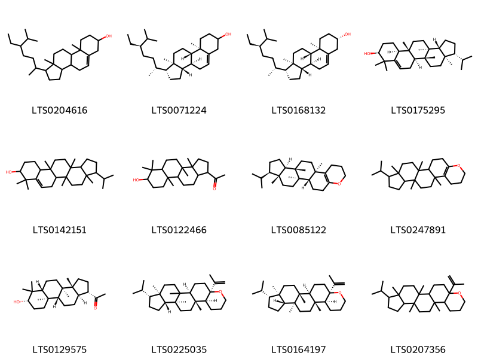{ width=100% }
    <figcaption>Hình ảnh cấu trúc hóa học của 12 hoạt chất thuộc nhóm Steroids and steroid derivatives gồm ['stigmast-5-en-3-ol, (3β)- (LTS0204616)', 'stigmast-5-en-3-ol (LTS0071224)', 'sitosterol (LTS0168132)', 'simiarenol (LTS0175295)', '3-isopropyl-3a,5a,8,8,11b,13a-hexamethyl-1h,2h,3h,4h,5h,5bh,6h,9h,10h,11h,11ah,12h,13h,13bh-cyclopenta[a]chrysen-9-ol (LTS0142151)', '1-{7-hydroxy-3a,3b,6,6,9a-pentamethyl-dodecahydro-1h-cyclopenta[a]phenanthren-1-yl}ethanone (LTS0122466)', '(1r,2r,5r,6r,9r,10s,13r)-6-isopropyl-2,5,10,13-tetramethyl-18-oxapentacyclo[11.8.0.0²,¹⁰.0⁵,⁹.0¹⁴,¹⁹]henicos-14(19)-ene (LTS0085122)', '6-isopropyl-2,5,10,13-tetramethyl-18-oxapentacyclo[11.8.0.0²,¹⁰.0⁵,⁹.0¹⁴,¹⁹]henicos-14(19)-ene (LTS0247891)', '1-[(1s,3ar,3br,5ar,7s,9ar,9br,11ar)-7-hydroxy-3a,3b,6,6,9a-pentamethyl-dodecahydro-1h-cyclopenta[a]phenanthren-1-yl]ethanone (LTS0129575)', '(1s,5r,6r,9r,10s,13r,14s,19r)-6-isopropyl-2,5,10,13-tetramethyl-19-(prop-1-en-2-yl)-18-oxapentacyclo[11.8.0.0²,¹⁰.0⁵,⁹.0¹⁴,¹⁹]henicosane (LTS0225035)', '(1s,2r,5r,6r,9r,10s,13r,14s,19r)-6-isopropyl-2,5,10,13-tetramethyl-19-(prop-1-en-2-yl)-18-oxapentacyclo[11.8.0.0²,¹⁰.0⁵,⁹.0¹⁴,¹⁹]henicosane (LTS0164197)', '6-isopropyl-2,5,10,13-tetramethyl-19-(prop-1-en-2-yl)-18-oxapentacyclo[11.8.0.0²,¹⁰.0⁵,⁹.0¹⁴,¹⁹]henicosane (LTS0207356)'].</figcaption>
</figure>
#### Nhóm Tannins
<figure markdown="span">
    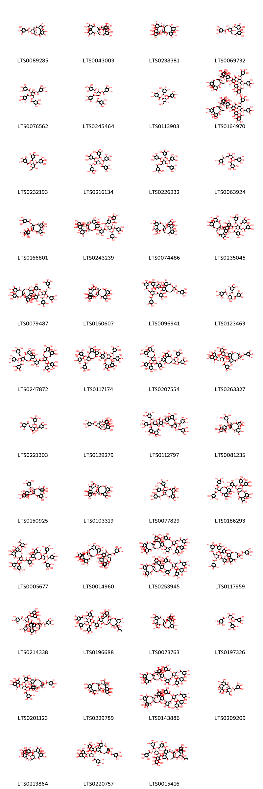{ width=100% }
    <figcaption>Hình ảnh cấu trúc hóa học của 47 hoạt chất thuộc nhóm Tannins gồm ['(1s,19r,21s,22r,23r)-6,7,8,11,12,13,22,23-octahydroxy-3,16-dioxo-2,17,20-trioxatetracyclo[17.3.1.0⁴,⁹.0¹⁰,¹⁵]tricosa-4(9),5,7,10,12,14-hexaen-21-yl 3,4,5-trihydroxybenzoate (LTS0089285)', '(1r,38r)-1,13,14,15,18,19,20,34,35,39,39-undecahydroxy-2,5,10,23,31-pentaoxo-6,9,24,27,30,40-hexaoxaoctacyclo[34.3.1.0⁴,³⁸.0⁷,²⁶.0⁸,²⁹.0¹¹,¹⁶.0¹⁷,²².0³²,³⁷]tetraconta-3,11(16),12,14,17,19,21,32,34,36-decaen-28-yl 3,4,5-trihydroxybenzoate (LTS0043003)', '(7r,8s,26r,28s,29s)-1,13,14,15,18,19,20,34,35,39,39-undecahydroxy-2,5,10,23,31-pentaoxo-6,9,24,27,30,40-hexaoxaoctacyclo[34.3.1.0⁴,³⁸.0⁷,²⁶.0⁸,²⁹.0¹¹,¹⁶.0¹⁷,²².0³²,³⁷]tetraconta-3,11,13,15,17(22),18,20,32,34,36-decaen-28-yl 3,4,5-trihydroxybenzoate (LTS0238381)', '6,7,8,11,12,13,22,23-octahydroxy-3,16-dioxo-2,17,20-trioxatetracyclo[17.3.1.0⁴,⁹.0¹⁰,¹⁵]tricosa-4(9),5,7,10,12,14-hexaen-21-yl 3,4,5-trihydroxybenzoate (LTS0069732)', '3-hydroxy-4,5-bis(3,4,5-trihydroxybenzoyloxy)-6-[(3,4,5-trihydroxybenzoyloxy)methyl]oxan-2-yl 3,4,5-trihydroxybenzoate (LTS0076562)', '(2s,3r,4r,5r,6r)-3-hydroxy-4,5-bis(3,4,5-trihydroxybenzoyloxy)-6-[(3,4,5-trihydroxybenzoyloxy)methyl]oxan-2-yl 3,4,5-trihydroxybenzoate (LTS0245464)', '(2r,3r,4s,5r,6s)-3-hydroxy-2-(hydroxymethyl)-5,6-bis(3,4,5-trihydroxybenzoyloxy)oxan-4-yl 3,4,5-trihydroxybenzoate (LTS0113903)', '2,4,5-tris(3,4,5-trihydroxybenzoyloxy)-6-[(3,4,5-trihydroxybenzoyloxy)methyl]oxan-3-yl 2-{[(1r,38r)-1,13,14,15,18,19,34,35,39,39-decahydroxy-2,5,10,23,31-pentaoxo-28-(3,4,5-trihydroxybenzoyloxy)-6,9,24,27,30,40-hexaoxaoctacyclo[34.3.1.0⁴,³⁸.0⁷,²⁶.0⁸,²⁹.0¹¹,¹⁶.0¹⁷,²².0³²,³⁷]tetraconta-3,11(16),12,14,17,19,21,32,34,36-decaen-20-yl]oxy}-3,4,5-trihydroxybenzoate; 2,4,5-tris(3,4,5-trihydroxybenzoyloxy)-6-[(3,4,5-trihydroxybenzoyloxy)methyl]oxan-3-yl 2-{[(1r,39r)-1,2,2,14,15,16,19,20,35,36-decahydroxy-3,6,11,24,32-pentaoxo-29-(3,4,5-trihydroxybenzoyloxy)-7,10,25,28,31,40-hexaoxaoctacyclo[35.2.1.0⁵,³⁹.0⁸,²⁷.0⁹,³⁰.0¹²,¹⁷.0¹⁸,²³.0³³,³⁸]tetraconta-4,12(17),13,15,18,20,22,33,35,37-decaen-21-yl]oxy}-3,4,5-trihydroxybenzoate (LTS0164970)', '3-hydroxy-2-(hydroxymethyl)-5,6-bis(3,4,5-trihydroxybenzoyloxy)oxan-4-yl 3,4,5-trihydroxybenzoate (LTS0232193)', '(2s,3r,4s,5r,6r)-3,4,5-tris(3,4,5-trihydroxybenzoyloxy)-6-[(3,4,5-trihydroxybenzoyloxy)methyl]oxan-2-yl 3,4,5-trihydroxybenzoate (LTS0216134)', '3,4,5-tris(3,4,5-trihydroxybenzoyloxy)-6-[(3,4,5-trihydroxybenzoyloxy)methyl]oxan-2-yl 3,4,5-trihydroxybenzoate (LTS0226232)', '4,5-dihydroxy-3-(3,4,5-trihydroxybenzoyloxy)-6-[(3,4,5-trihydroxybenzoyloxy)methyl]oxan-2-yl 3,4,5-trihydroxybenzoate (LTS0063924)', '(1r,10r,18r,19r,21s,22s)-6,7,11,12,12-pentahydroxy-3,13,16-trioxo-21-(3,4,5-trihydroxybenzoyloxy)-19-[(3,4,5-trihydroxybenzoyloxy)methyl]-2,17,20,23-tetraoxapentacyclo[16.3.1.1⁸,¹¹.0⁴,⁹.0¹⁰,¹⁵]tricosa-4,6,8,14-tetraen-22-yl 3,4,5-trihydroxybenzoate (LTS0166801)', '(2s,3r,4s,5r,6r)-2,4,5-tris(3,4,5-trihydroxybenzoyloxy)-6-[(3,4,5-trihydroxybenzoyloxy)methyl]oxan-3-yl 3,4,5-trihydroxy-2-{[(1r,8r,9s,27r,29s,30r,39r)-1,14,15,16,19,20,35,36-octahydroxy-2,3,6,11,24,32-hexaoxo-29-(3,4,5-trihydroxybenzoyloxy)-7,10,25,28,31,40-hexaoxaoctacyclo[35.2.1.0⁵,³⁹.0⁸,²⁷.0⁹,³⁰.0¹²,¹⁷.0¹⁸,²³.0³³,³⁸]tetraconta-4,12,14,16,18(23),19,21,33,35,37-decaen-21-yl]oxy}benzoate (LTS0243239)', '[13,14,15,18,19,20,31,35,36-nonahydroxy-2,10,23,28,32-pentaoxo-5-(3,4,5-trihydroxybenzoyloxy)-3,6,9,24,27,33-hexaoxaheptacyclo[28.7.1.0⁴,²⁵.0⁷,²⁶.0¹¹,¹⁶.0¹⁷,²².0³⁴,³⁸]octatriaconta-1(37),11,13,15,17(22),18,20,34(38),35-nonaen-29-yl]acetic acid (LTS0074486)', '2,4,5-tris(3,4,5-trihydroxybenzoyloxy)-6-[(3,4,5-trihydroxybenzoyloxy)methyl]oxan-3-yl 2-{[1,14,15,18,19,20,34,35,39,39-decahydroxy-2,5,10,23,31-pentaoxo-28-(3,4,5-trihydroxybenzoyloxy)-6,9,24,27,30,40-hexaoxaoctacyclo[34.3.1.0⁴,³⁸.0⁷,²⁶.0⁸,²⁹.0¹¹,¹⁶.0¹⁷,²².0³²,³⁷]tetraconta-3,11(16),12,14,17,19,21,32,34,36-decaen-13-yl]oxy}-3,4,5-trihydroxybenzoate (LTS0235045)', '2,4,5-tris(3,4,5-trihydroxybenzoyloxy)-6-[(3,4,5-trihydroxybenzoyloxy)methyl]oxan-3-yl 2-{[1,13,14,15,18,20,34,35,39,39-decahydroxy-2,5,10,23,31-pentaoxo-28-(3,4,5-trihydroxybenzoyloxy)-6,9,24,27,30,40-hexaoxaoctacyclo[34.3.1.0⁴,³⁸.0⁷,²⁶.0⁸,²⁹.0¹¹,¹⁶.0¹⁷,²².0³²,³⁷]tetraconta-3,11(16),12,14,17,19,21,32,34,36-decaen-19-yl]oxy}-3,4,5-trihydroxybenzoate (LTS0079487)', '[(5r,7r)-13,14,15,18,19,20,31,35,36-nonahydroxy-2,10,23,28,32-pentaoxo-5-(3,4,5-trihydroxybenzoyloxy)-3,6,9,24,27,33-hexaoxaheptacyclo[28.7.1.0⁴,²⁵.0⁷,²⁶.0¹¹,¹⁶.0¹⁷,²².0³⁴,³⁸]octatriaconta-1(37),11(16),12,14,17,19,21,34(38),35-nonaen-29-yl]acetic acid (LTS0150607)', '2,4,5-tris(3,4,5-trihydroxybenzoyloxy)-6-[(3,4,5-trihydroxybenzoyloxy)methyl]oxan-3-yl 2-{[6,7,8,11,12,22,23-heptahydroxy-3,16-dioxo-21-(3,4,5-trihydroxybenzoyloxy)-2,17,20-trioxatetracyclo[17.3.1.0⁴,⁹.0¹⁰,¹⁵]tricosa-4(9),5,7,10(15),11,13-hexaen-13-yl]oxy}-3,4,5-trihydroxybenzoate (LTS0096941)', '(2r,3r,4r,5r,6r)-2,3-dihydroxy-5-(3,4,5-trihydroxybenzoyloxy)-6-[(3,4,5-trihydroxybenzoyloxy)methyl]oxan-4-yl 3,4,5-trihydroxybenzoate (LTS0123463)', '3,4,5,21,22,23-hexahydroxy-8,18-dioxo-11,12-bis(3,4,5-trihydroxybenzoyloxy)-9,14,17-trioxatetracyclo[17.4.0.0²,⁷.0¹⁰,¹⁵]tricosa-1(23),2(7),3,5,19,21-hexaen-13-yl 3,4,5-trihydroxy-2-{[3,4,5,22,23-pentahydroxy-8,18-dioxo-11,12,13-tris(3,4,5-trihydroxybenzoyloxy)-9,14,17-trioxatetracyclo[17.4.0.0²,⁷.0¹⁰,¹⁵]tricosa-1(23),2(7),3,5,19,21-hexaen-21-yl]oxy}benzoate (LTS0247872)', '(10r,11s,12r,13s,15r)-3,4,5,21,22,23-hexahydroxy-8,18-dioxo-11,12-bis(3,4,5-trihydroxybenzoyloxy)-9,14,17-trioxatetracyclo[17.4.0.0²,⁷.0¹⁰,¹⁵]tricosa-1(23),2(7),3,5,19,21-hexaen-13-yl 3,4,5-trihydroxy-2-{[(10r,11s,12r,13s,15r)-3,4,5,22,23-pentahydroxy-8,18-dioxo-11,12,13-tris(3,4,5-trihydroxybenzoyloxy)-9,14,17-trioxatetracyclo[17.4.0.0²,⁷.0¹⁰,¹⁵]tricosa-1(23),2(7),3,5,19,21-hexaen-21-yl]oxy}benzoate (LTS0117174)', '3,4,5,21,22,23-hexahydroxy-8,18-dioxo-11,12-bis(3,4,5-trihydroxybenzoyloxy)-9,14,17-trioxatetracyclo[17.4.0.0²,⁷.0¹⁰,¹⁵]tricosa-1(23),2(7),3,5,19,21-hexaen-13-yl 2-{[3,4,5,13,22,23-hexahydroxy-8,18-dioxo-11,12-bis(3,4,5-trihydroxybenzoyloxy)-9,14,17-trioxatetracyclo[17.4.0.0²,⁷.0¹⁰,¹⁵]tricosa-1(23),2(7),3,5,19,21-hexaen-21-yl]oxy}-3,4,5-trihydroxybenzoate (LTS0207554)', '(2s,3r,4s,5r,6r)-2,4,5-tris(3,4,5-trihydroxybenzoyloxy)-6-[(3,4,5-trihydroxybenzoyloxy)methyl]oxan-3-yl 2-{[(1s,19r,21s,22r,23r)-6,7,8,11,12,22,23-heptahydroxy-3,16-dioxo-21-(3,4,5-trihydroxybenzoyloxy)-2,17,20-trioxatetracyclo[17.3.1.0⁴,⁹.0¹⁰,¹⁵]tricosa-4(9),5,7,10(15),11,13-hexaen-13-yl]oxy}-3,4,5-trihydroxybenzoate (LTS0263327)', '2,3-dihydroxy-5-(3,4,5-trihydroxybenzoyloxy)-6-[(3,4,5-trihydroxybenzoyloxy)methyl]oxan-4-yl 3,4,5-trihydroxybenzoate (LTS0221303)', '(1r,19r,21s,22r,23r)-6,7,8,11,12,13,22-heptahydroxy-3,16-dioxo-21-(3,4,5-trihydroxybenzoyloxy)-2,17,20-trioxatetracyclo[17.3.1.0⁴,⁹.0¹⁰,¹⁵]tricosa-4(9),5,7,10,12,14-hexaen-23-yl 3,4,5-trihydroxybenzoate (LTS0129279)', '(10r,11s,12r,13s,15r)-3,4,5,21,22,23-hexahydroxy-8,18-dioxo-11,12-bis(3,4,5-trihydroxybenzoyloxy)-9,14,17-trioxatetracyclo[17.4.0.0²,⁷.0¹⁰,¹⁵]tricosa-1(23),2(7),3,5,19,21-hexaen-13-yl 2-{[(10r,11s,12r,13s,15r)-3,4,5,13,22,23-hexahydroxy-8,18-dioxo-11,12-bis(3,4,5-trihydroxybenzoyloxy)-9,14,17-trioxatetracyclo[17.4.0.0²,⁷.0¹⁰,¹⁵]tricosa-1(23),2(7),3,5,19,21-hexaen-21-yl]oxy}-3,4,5-trihydroxybenzoate (LTS0112797)', '(1r,10s,11r,18r,19s,21r,22s)-6,7,11,12,12-pentahydroxy-3,13,16-trioxo-22-(3,4,5-trihydroxybenzoyloxy)-21-[(3,4,5-trihydroxybenzoyloxy)methyl]-2,17,20,23-tetraoxapentacyclo[16.3.1.1⁸,¹¹.0⁴,⁹.0¹⁰,¹⁵]tricosa-4,6,8,14-tetraen-19-yl 3,4,5-trihydroxybenzoate (LTS0081235)', '(1r,10s,11s,18r,19s,21r,22s)-6,7,11,12,12-pentahydroxy-3,13,16-trioxo-22-(3,4,5-trihydroxybenzoyloxy)-21-[(3,4,5-trihydroxybenzoyloxy)methyl]-2,17,20,23-tetraoxapentacyclo[16.3.1.1⁸,¹¹.0⁴,⁹.0¹⁰,¹⁵]tricosa-4,6,8,14-tetraen-19-yl 3,4,5-trihydroxybenzoate (LTS0150925)', '[(4r,5s,7r,25s,26r,29s,30s,31s)-13,14,15,18,19,20,31,35,36-nonahydroxy-2,10,23,28,32-pentaoxo-5-(3,4,5-trihydroxybenzoyloxy)-3,6,9,24,27,33-hexaoxaheptacyclo[28.7.1.0⁴,²⁵.0⁷,²⁶.0¹¹,¹⁶.0¹⁷,²².0³⁴,³⁸]octatriaconta-1(37),11(16),12,14,17,19,21,34(38),35-nonaen-29-yl]acetic acid (LTS0103319)', '6,7,11,12,12-pentahydroxy-3,13,16-trioxo-22-(3,4,5-trihydroxybenzoyloxy)-21-[(3,4,5-trihydroxybenzoyloxy)methyl]-2,17,20,23-tetraoxapentacyclo[16.3.1.1⁸,¹¹.0⁴,⁹.0¹⁰,¹⁵]tricosa-4,6,8,14-tetraen-19-yl 3,4,5-trihydroxybenzoate (LTS0077829)', '(10r,11s,12r,13s,15r)-3,4,5,21,22,23-hexahydroxy-8,18-dioxo-11,12-bis(3,4,5-trihydroxybenzoyloxy)-9,14,17-trioxatetracyclo[17.4.0.0²,⁷.0¹⁰,¹⁵]tricosa-1(23),2(7),3,5,19,21-hexaen-13-yl 2-{[(11r,12r)-3,4,11,17,18,19-hexahydroxy-8,14-dioxo-12-[(1s,2r)-3-oxo-1,2-bis(3,4,5-trihydroxybenzoyloxy)propyl]-9,13-dioxatricyclo[13.4.0.0²,⁷]nonadeca-1(19),2(7),3,5,15,17-hexaen-5-yl]oxy}-3,4,5-trihydroxybenzoate (LTS0186293)', '3,4,5-trihydroxy-2-{[3,4,5,22,23-pentahydroxy-8,18-dioxo-13-(3,4,5-trihydroxy-2-{[3,4,5,22,23-pentahydroxy-8,18-dioxo-11,12,13-tris(3,4,5-trihydroxybenzoyloxy)-9,14,17-trioxatetracyclo[17.4.0.0²,⁷.0¹⁰,¹⁵]tricosa-1(23),2(7),3,5,19,21-hexaen-21-yl]oxy}benzoyloxy)-11,12-bis(3,4,5-trihydroxybenzoyloxy)-9,14,17-trioxatetracyclo[17.4.0.0²,⁷.0¹⁰,¹⁵]tricosa-1(23),2(7),3,5,19,21-hexaen-21-yl]oxy}benzoic acid (LTS0005677)', '(1s,21s,22r)-6,7,8,11,12,13-hexahydroxy-3,16-dioxo-21,23-bis(3,4,5-trihydroxybenzoyloxy)-2,17,20-trioxatetracyclo[17.3.1.0⁴,⁹.0¹⁰,¹⁵]tricosa-4(9),5,7,10,12,14-hexaen-22-yl 2-{[(11r,13s,14r,23r,25s,31r,32s)-3,4,19,20,24,24,25,36,37,38-decahydroxy-8,16,26,29,34-pentaoxo-13-(3,4,5-trihydroxybenzoyloxy)-9,12,15,30,33,40-hexaoxaoctacyclo[33.3.1.1²¹,²⁵.0²,⁷.0¹¹,³¹.0¹⁴,³².0¹⁷,²².0²³,²⁸]tetraconta-1(38),2(7),3,5,17,19,21,27,35(39),36-decaen-5-yl]oxy}-3,4,5-trihydroxybenzoate (LTS0014960)', '1,13,14,15,18,22,23,24,39,40,41,58,59,63,63-pentadecahydroxy-2,5,10,27,36,47,55-heptaoxo-32,33-bis(3,4,5-trihydroxybenzoyloxy)-31-[(3,4,5-trihydroxybenzoyloxy)methyl]-6,9,20,28,30,35,43,48,51,54,64-undecaoxadodecacyclo[58.3.1.0⁴,⁶².0⁷,⁵⁰.0⁸,⁵³.0¹¹,¹⁶.0¹⁷,⁴⁶.0¹⁹,⁴⁴.0²¹,²⁶.0²⁹,³⁴.0³⁷,⁴².0⁵⁶,⁶¹]tetrahexaconta-3,11(16),12,14,17,19(44),21(26),22,24,37,39,41,45,56,58,60-hexadecaen-52-yl 3,4,5-trihydroxybenzoate; 1,2,2,14,15,16,19,23,24,25,40,41,42,59,60-pentadecahydroxy-3,6,11,28,37,48,56-heptaoxo-33,34-bis(3,4,5-trihydroxybenzoyloxy)-32-[(3,4,5-trihydroxybenzoyloxy)methyl]-7,10,21,29,31,36,44,49,52,55,64-undecaoxadodecacyclo[59.2.1.0⁵,⁶³.0⁸,⁵¹.0⁹,⁵⁴.0¹²,¹⁷.0¹⁸,⁴⁷.0²⁰,⁴⁵.0²²,²⁷.0³⁰,³⁵.0³⁸,⁴³.0⁵⁷,⁶²]tetrahexaconta-4,12(17),13,15,18,20(45),22(27),23,25,38,40,42,46,57,59,61-hexadecaen-53-yl 3,4,5-trihydroxybenzoate (LTS0253945)', '2,4,5-tris(3,4,5-trihydroxybenzoyloxy)-6-[(3,4,5-trihydroxybenzoyloxy)methyl]oxan-3-yl 2-{[6,7,8,11,13,22,23-heptahydroxy-3,16-dioxo-21-(3,4,5-trihydroxybenzoyloxy)-2,17,20-trioxatetracyclo[17.3.1.0⁴,⁹.0¹⁰,¹⁵]tricosa-4(9),5,7,10,12,14-hexaen-12-yl]oxy}-3,4,5-trihydroxybenzoate (LTS0117959)', '2,4,5-tris(3,4,5-trihydroxybenzoyloxy)-6-[(3,4,5-trihydroxybenzoyloxy)methyl]oxan-3-yl 2-{[6,7,8,12,13,22,23-heptahydroxy-3,16-dioxo-21-(3,4,5-trihydroxybenzoyloxy)-2,17,20-trioxatetracyclo[17.3.1.0⁴,⁹.0¹⁰,¹⁵]tricosa-4(9),5,7,10(15),11,13-hexaen-11-yl]oxy}-3,4,5-trihydroxybenzoate (LTS0214338)', '2,4,5-tris(3,4,5-trihydroxybenzoyloxy)-6-[(3,4,5-trihydroxybenzoyloxy)methyl]oxan-3-yl 2-{[31-(1,1-dihydroxy-2-oxobut-3-en-1-yl)-14,15,18,19,20,31,34,35-octahydroxy-2,10,23,28-tetraoxo-5-(3,4,5-trihydroxybenzoyloxy)-3,6,9,24,27,32-hexaoxaheptacyclo[28.6.1.0⁴,²⁵.0⁷,²⁶.0¹¹,¹⁶.0¹⁷,²².0³³,³⁷]heptatriaconta-1(37),11,13,15,17(22),18,20,33,35-nonaen-13-yl]oxy}-3,4,5-trihydroxybenzoate (LTS0196688)', '[20-(carboxymethyl)-13,14,18,29,33,34-hexahydroxy-2,10,17,21,26,30-hexaoxo-5-(3,4,5-trihydroxybenzoyloxy)-3,6,9,16,22,25,31-heptaoxaheptacyclo[26.7.1.1¹¹,¹⁵.0⁴,²³.0⁷,²⁴.0³²,³⁶.0¹⁹,³⁷]heptatriaconta-1(35),11,13,15(37),32(36),33-hexaen-27-yl]acetic acid (LTS0073763)', '(2r,3r,4s,5s,6r)-4,5-dihydroxy-3-(3,4,5-trihydroxybenzoyloxy)-6-[(3,4,5-trihydroxybenzoyloxy)methyl]oxan-2-yl 3,4,5-trihydroxybenzoate (LTS0197326)', '(2s,3r,4s,5r,6r)-2,4,5-tris(3,4,5-trihydroxybenzoyloxy)-6-[(3,4,5-trihydroxybenzoyloxy)methyl]oxan-3-yl 2-{[(1s,19r,21s,22r,23r)-6,7,8,12,13,22,23-heptahydroxy-3,16-dioxo-21-(3,4,5-trihydroxybenzoyloxy)-2,17,20-trioxatetracyclo[17.3.1.0⁴,⁹.0¹⁰,¹⁵]tricosa-4(9),5,7,10(15),11,13-hexaen-11-yl]oxy}-3,4,5-trihydroxybenzoate (LTS0201123)', '[(4r,5s,7r,18s,19s,20s,23s,24r,27s,28s,29s)-20-(carboxymethyl)-13,14,18,29,33,34-hexahydroxy-2,10,17,21,26,30-hexaoxo-5-(3,4,5-trihydroxybenzoyloxy)-3,6,9,16,22,25,31-heptaoxaheptacyclo[26.7.1.1¹¹,¹⁵.0⁴,²³.0⁷,²⁴.0³²,³⁶.0¹⁹,³⁷]heptatriaconta-1(35),11,13,15(37),32(36),33-hexaen-27-yl]acetic acid (LTS0229789)', '(1r,62r)-1,13,14,15,18,22,23,24,39,40,41,58,59,63,63-pentadecahydroxy-2,5,10,27,36,47,55-heptaoxo-32,33-bis(3,4,5-trihydroxybenzoyloxy)-31-[(3,4,5-trihydroxybenzoyloxy)methyl]-6,9,20,28,30,35,43,48,51,54,64-undecaoxadodecacyclo[58.3.1.0⁴,⁶².0⁷,⁵⁰.0⁸,⁵³.0¹¹,¹⁶.0¹⁷,⁴⁶.0¹⁹,⁴⁴.0²¹,²⁶.0²⁹,³⁴.0³⁷,⁴².0⁵⁶,⁶¹]tetrahexaconta-3,11(16),12,14,17,19(44),21(26),22,24,37,39,41,45,56,58,60-hexadecaen-52-yl 3,4,5-trihydroxybenzoate; (1r,63r)-1,2,2,14,15,16,19,23,24,25,40,41,42,59,60-pentadecahydroxy-3,6,11,28,37,48,56-heptaoxo-33,34-bis(3,4,5-trihydroxybenzoyloxy)-32-[(3,4,5-trihydroxybenzoyloxy)methyl]-7,10,21,29,31,36,44,49,52,55,64-undecaoxadodecacyclo[59.2.1.0⁵,⁶³.0⁸,⁵¹.0⁹,⁵⁴.0¹²,¹⁷.0¹⁸,⁴⁷.0²⁰,⁴⁵.0²²,²⁷.0³⁰,³⁵.0³⁸,⁴³.0⁵⁷,⁶²]tetrahexaconta-4,12(17),13,15,18,20(45),22(27),23,25,38,40,42,46,57,59,61-hexadecaen-53-yl 3,4,5-trihydroxybenzoate (LTS0143886)', '[(4s,5r,7s,8r,13r,21r)-13,17,18,21-tetrahydroxy-7-(hydroxymethyl)-2,10,14-trioxo-5-(3,4,5-trihydroxybenzoyloxy)-3,6,9,15-tetraoxatetracyclo[10.7.1.1⁴,⁸.0¹⁶,²⁰]henicosa-1(19),16(20),17-trien-11-yl]acetic acid (LTS0209209)', '1,16,17,18,21,22,23,34,35,39,39-undecahydroxy-2,5,13,26,31-pentaoxo-6,9,12,27,30,40-hexaoxaoctacyclo[34.3.1.0⁴,³⁸.0⁷,²⁸.0¹⁰,²⁹.0¹⁴,¹⁹.0²⁰,²⁵.0³²,³⁷]tetraconta-3,14,16,18,20(25),21,23,32,34,36-decaen-8-yl 3,4,5-trihydroxybenzoate (LTS0213864)', '(2s,3r,4s,5r,6r)-2,4,5-tris(3,4,5-trihydroxybenzoyloxy)-6-[(3,4,5-trihydroxybenzoyloxy)methyl]oxan-3-yl 2-{[(1s,19r,21s,22r,23r)-6,7,8,11,13,22,23-heptahydroxy-3,16-dioxo-21-(3,4,5-trihydroxybenzoyloxy)-2,17,20-trioxatetracyclo[17.3.1.0⁴,⁹.0¹⁰,¹⁵]tricosa-4(9),5,7,10,12,14-hexaen-12-yl]oxy}-3,4,5-trihydroxybenzoate (LTS0220757)', '(2s,3r,4s,5r,6r)-2,4,5-tris(3,4,5-trihydroxybenzoyloxy)-6-[(3,4,5-trihydroxybenzoyloxy)methyl]oxan-3-yl 2-{[(4r,5s,7r,25s,26r,30s,31r)-31-(1,1-dihydroxy-2-oxobut-3-en-1-yl)-14,15,18,19,20,31,34,35-octahydroxy-2,10,23,28-tetraoxo-5-(3,4,5-trihydroxybenzoyloxy)-3,6,9,24,27,32-hexaoxaheptacyclo[28.6.1.0⁴,²⁵.0⁷,²⁶.0¹¹,¹⁶.0¹⁷,²².0³³,³⁷]heptatriaconta-1(37),11(16),12,14,17,19,21,33,35-nonaen-13-yl]oxy}-3,4,5-trihydroxybenzoate (LTS0015416)'].</figcaption>
</figure>

---

### Dược dân tộc học

Danh sách các quốc gia có sử dụng *Euphorbia maculata* trong điều trị các bệnh. 

| Country        | Disease          | Bệnh                                                                                                                                                                                                |
|:---------------|:-----------------|:----------------------------------------------------------------------------------------------------------------------------------------------------------------------------------------------------|
| US             | Laxative, Emetic | MYMEMORY WARNING: YOU USED ALL AVAILABLE FREE TRANSLATIONS FOR TODAY. NEXT AVAILABLE IN  20 HOURS 15 MINUTES 17 SECONDS VISIT HTTPS://MYMEMORY.TRANSLATED.NET/DOC/USAGELIMITS.PHP TO TRANSLATE MORE |
| US(Amerindian) | Laxative         | MYMEMORY WARNING: YOU USED ALL AVAILABLE FREE TRANSLATIONS FOR TODAY. NEXT AVAILABLE IN  20 HOURS 15 MINUTES 14 SECONDS VISIT HTTPS://MYMEMORY.TRANSLATED.NET/DOC/USAGELIMITS.PHP TO TRANSLATE MORE |

---

---
## Euphorbia milii
### Thông tin về thực vật

!!! info "Phân loại thực vật của *Euphorbia milii* từ GIBF:"
    - **Kingdom:** Plantae
    - **Phylum:** Tracheophyta
    - **Order:** Malpighiales
    - **Family:** Euphorbiaceae
    - **Genus:** Euphorbia
    - **Species:** *Euphorbia milii*

 

| Label (VI)   | Label (EN)   | Scientific Name   | Descriptions (VI)   | Descriptions (EN)   | Also Known As (VI)                   | Also Known As (EN)                                  |
|:-------------|:-------------|:------------------|:--------------------|:--------------------|:-------------------------------------|:----------------------------------------------------|
| N/A          | N/A          | Euphorbia milii   |                     | species of plant    | ['Euphorbia milii', 'Cây xương rắn'] | ['Christ plant', 'Christ thorn', 'Crown of thorns'] |

#### Phân bố trên thế giới

**Từ CSDL GIBF** nan, United Arab Emirates, Sri Lanka, Italy, Australia, Guadeloupe, Wallis and Futuna, Lao People’s Democratic Republic, Guatemala, Myanmar, Mozambique, Saint Lucia, Benin, Nicaragua, Tanzania, United Republic of, French Guiana, Panama, Malawi, Zambia, Puerto Rico, Réunion, Senegal, Nigeria, Cyprus, Namibia, Chad, Malta, Spain, Bolivia (Plurinational State of), Papua New Guinea, Portugal, Algeria, Jamaica, Morocco, United States of America, El Salvador, Zimbabwe, Greece, South Africa, Monaco, Hong Kong, Barbados, Thailand, Brazil, Egypt, Bahamas, New Caledonia, Cuba, Dominican Republic, France, Mexico, Viet Nam, Curaçao, Ecuador, Madagascar, Cabo Verde, Colombia, Costa Rica, Botswana, India, Indonesia, Nepal, Gambia, Antigua and Barbuda, Kenya, Malaysia, Ethiopia

#### Phân bố tại Việt Nam

**Từ CSDL GIBF**: Hậu Giang, Quảng Nam

---
### Thành phần hóa học
        
- Theo cơ sở dữ liệu lotus: Từ loài *Euphorbia milii* đã phân lập và xác định được 31 hoạt chất thuộc về các nhóm Fatty Acyls, Flavonoids, Prenol lipids, Steroids and steroid derivatives, Macrolides and analogues, Carboxylic acids and derivatives. 

|    | chemicalTaxonomyClassyfireClass   |   smiles_count |
|---:|:----------------------------------|---------------:|
|  0 | Carboxylic acids and derivatives  |              1 |
|  1 | Fatty Acyls                       |              2 |
|  2 | Flavonoids                        |              1 |
|  3 | Macrolides and analogues          |              2 |
|  4 | Prenol lipids                     |             20 |
|  5 | Steroids and steroid derivatives  |              5 |

#### Nhóm Carboxylic acids and derivatives
<figure markdown="span">
    { width=100% }
    <figcaption>Hình ảnh cấu trúc hóa học của 1 hoạt chất thuộc nhóm Carboxylic acids and derivatives gồm ['1,3-dihydroxypentane-1,3,5-tricarboxylic acid (LTS0248878)'].</figcaption>
</figure>
#### Nhóm Fatty Acyls
<figure markdown="span">
    { width=100% }
    <figcaption>Hình ảnh cấu trúc hóa học của 2 hoạt chất thuộc nhóm Fatty Acyls gồm ['palmitic acid (LTS0079439)', 'linoleic (LTS0013198)'].</figcaption>
</figure>
#### Nhóm Flavonoids
<figure markdown="span">
    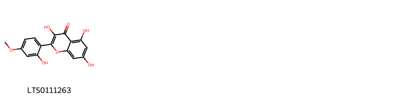{ width=100% }
    <figcaption>Hình ảnh cấu trúc hóa học của 1 hoạt chất thuộc nhóm Flavonoids gồm ['milimorin (LTS0111263)'].</figcaption>
</figure>
#### Nhóm Macrolides and analogues
<figure markdown="span">
    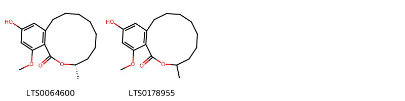{ width=100% }
    <figcaption>Hình ảnh cấu trúc hóa học của 2 hoạt chất thuộc nhóm Macrolides and analogues gồm ['lasiodiplodin (LTS0064600)', '12-hydroxy-14-methoxy-3-methyl-3,4,5,6,7,8,9,10-octahydro-2-benzoxacyclododecin-1-one (LTS0178955)'].</figcaption>
</figure>
#### Nhóm Prenol lipids
<figure markdown="span">
    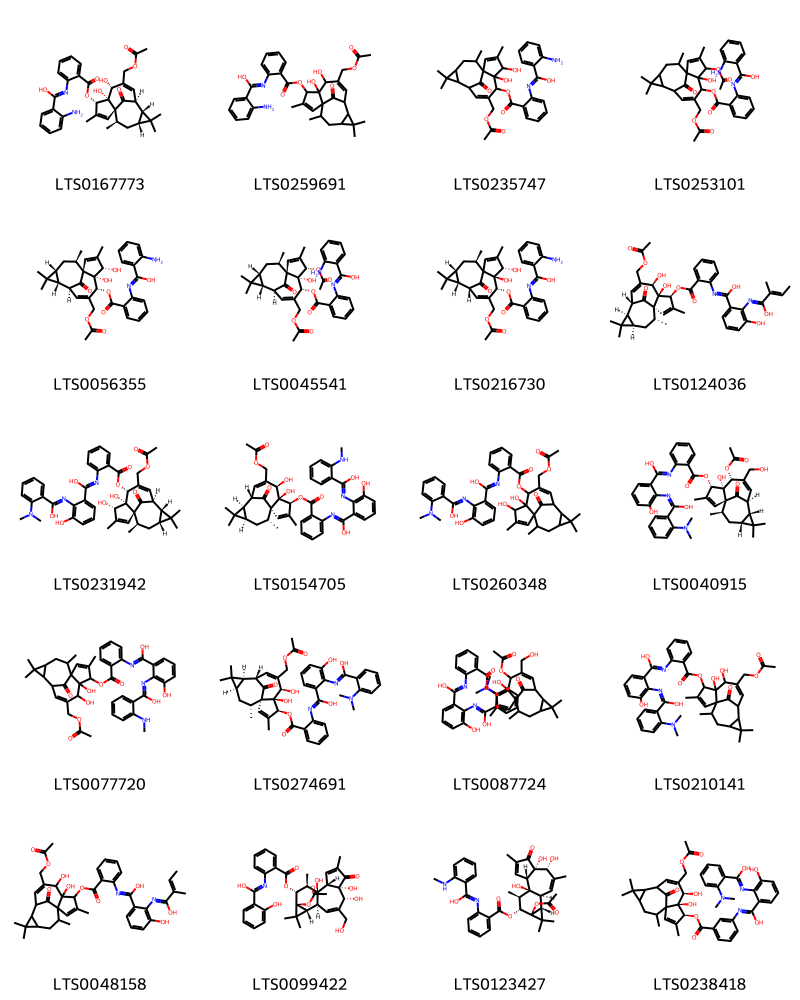{ width=100% }
    <figcaption>Hình ảnh cấu trúc hóa học của 20 hoạt chất thuộc nhóm Prenol lipids gồm ['n-[2-({[(1s,4s,5s,6r,9s,10r,12r,14r)-7-[(acetyloxy)methyl]-5,6-dihydroxy-3,11,11,14-tetramethyl-15-oxotetracyclo[7.5.1.0¹,⁵.0¹⁰,¹²]pentadeca-2,7-dien-4-yl]oxy}carbonyl)phenyl]-2-aminobenzenecarboximidic acid (LTS0167773)', 'n-{2-[({7-[(acetyloxy)methyl]-5,6-dihydroxy-3,11,11,14-tetramethyl-15-oxotetracyclo[7.5.1.0¹,⁵.0¹⁰,¹²]pentadeca-2,7-dien-4-yl}oxy)carbonyl]phenyl}-2-aminobenzenecarboximidic acid (LTS0259691)', 'n-{2-[({7-[(acetyloxy)methyl]-4,5-dihydroxy-3,11,11,14-tetramethyl-15-oxotetracyclo[7.5.1.0¹,⁵.0¹⁰,¹²]pentadeca-2,7-dien-6-yl}oxy)carbonyl]phenyl}-2-aminobenzenecarboximidic acid (LTS0235747)', 'n-[2-({[4-(acetyloxy)-7-[(acetyloxy)methyl]-5-hydroxy-3,11,11,14-tetramethyl-15-oxotetracyclo[7.5.1.0¹,⁵.0¹⁰,¹²]pentadeca-2,7-dien-6-yl]oxy}carbonyl)phenyl]-2-aminobenzenecarboximidic acid (LTS0253101)', 'n-[2-({[(1s,4s,5r,6r,9s,10r,12r,14r)-7-[(acetyloxy)methyl]-4,5-dihydroxy-3,11,11,14-tetramethyl-15-oxotetracyclo[7.5.1.0¹,⁵.0¹⁰,¹²]pentadeca-2,7-dien-6-yl]oxy}carbonyl)phenyl]-2-aminobenzenecarboximidic acid (LTS0056355)', 'n-[2-({[(1s,4s,5r,6r,9s,10r,12r,14r)-4-(acetyloxy)-7-[(acetyloxy)methyl]-5-hydroxy-3,11,11,14-tetramethyl-15-oxotetracyclo[7.5.1.0¹,⁵.0¹⁰,¹²]pentadeca-2,7-dien-6-yl]oxy}carbonyl)phenyl]-2-aminobenzenecarboximidic acid (LTS0045541)', 'n-[2-({[(4s,5s,6r,9r,10r,12r,14r)-7-[(acetyloxy)methyl]-4,5-dihydroxy-3,11,11,14-tetramethyl-15-oxotetracyclo[7.5.1.0¹,⁵.0¹⁰,¹²]pentadeca-2,7-dien-6-yl]oxy}carbonyl)phenyl]-2-aminobenzenecarboximidic acid (LTS0216730)', 'n-[2-({[(1s,4s,5s,6r,9s,10r,12r,14r)-7-[(acetyloxy)methyl]-5,6-dihydroxy-3,11,11,14-tetramethyl-15-oxotetracyclo[7.5.1.0¹,⁵.0¹⁰,¹²]pentadeca-2,7-dien-4-yl]oxy}carbonyl)phenyl]-3-hydroxy-2-{[(2e)-1-hydroxy-2-methylbut-2-en-1-ylidene]amino}benzenecarboximidic acid (LTS0124036)', 'n-[2-({[(1s,4s,5r,6r,9s,10r,12r,14r)-7-[(acetyloxy)methyl]-4,5-dihydroxy-3,11,11,14-tetramethyl-15-oxotetracyclo[7.5.1.0¹,⁵.0¹⁰,¹²]pentadeca-2,7-dien-6-yl]oxy}carbonyl)phenyl]-2-({[2-(dimethylamino)phenyl](hydroxy)methylidene}amino)-3-hydroxybenzenecarboximidic acid (LTS0231942)', 'n-[2-({[(1s,4s,5s,6r,9s,10r,12r,14r)-7-[(acetyloxy)methyl]-5,6-dihydroxy-3,11,11,14-tetramethyl-15-oxotetracyclo[7.5.1.0¹,⁵.0¹⁰,¹²]pentadeca-2,7-dien-4-yl]oxy}carbonyl)phenyl]-3-hydroxy-2-({hydroxy[2-(methylamino)phenyl]methylidene}amino)benzenecarboximidic acid (LTS0154705)', 'n-{2-[({7-[(acetyloxy)methyl]-4,5-dihydroxy-3,11,11,14-tetramethyl-15-oxotetracyclo[7.5.1.0¹,⁵.0¹⁰,¹²]pentadeca-2,7-dien-6-yl}oxy)carbonyl]phenyl}-2-({[2-(dimethylamino)phenyl](hydroxy)methylidene}amino)-3-hydroxybenzenecarboximidic acid (LTS0260348)', 'n-[2-({[(1s,4s,5r,6r,9s,10r,12r,14r)-6-(acetyloxy)-5-hydroxy-7-(hydroxymethyl)-3,11,11,14-tetramethyl-15-oxotetracyclo[7.5.1.0¹,⁵.0¹⁰,¹²]pentadeca-2,7-dien-4-yl]oxy}carbonyl)phenyl]-2-({[2-(dimethylamino)phenyl](hydroxy)methylidene}amino)-3-hydroxybenzenecarboximidic acid (LTS0040915)', 'n-{2-[({7-[(acetyloxy)methyl]-5,6-dihydroxy-3,11,11,14-tetramethyl-15-oxotetracyclo[7.5.1.0¹,⁵.0¹⁰,¹²]pentadeca-2,7-dien-4-yl}oxy)carbonyl]phenyl}-3-hydroxy-2-({hydroxy[2-(methylamino)phenyl]methylidene}amino)benzenecarboximidic acid (LTS0077720)', 'n-[2-({[(1s,4s,5s,6r,9s,10r,12r,14r)-7-[(acetyloxy)methyl]-5,6-dihydroxy-3,11,11,14-tetramethyl-15-oxotetracyclo[7.5.1.0¹,⁵.0¹⁰,¹²]pentadeca-2,7-dien-4-yl]oxy}carbonyl)phenyl]-2-({[2-(dimethylamino)phenyl](hydroxy)methylidene}amino)-3-hydroxybenzenecarboximidic acid (LTS0274691)', 'n-[2-({[6-(acetyloxy)-5-hydroxy-7-(hydroxymethyl)-3,11,11,14-tetramethyl-15-oxotetracyclo[7.5.1.0¹,⁵.0¹⁰,¹²]pentadeca-2,7-dien-4-yl]oxy}carbonyl)phenyl]-2-({[2-(dimethylamino)phenyl](hydroxy)methylidene}amino)-3-hydroxybenzenecarboximidic acid (LTS0087724)', 'n-{2-[({7-[(acetyloxy)methyl]-5,6-dihydroxy-3,11,11,14-tetramethyl-15-oxotetracyclo[7.5.1.0¹,⁵.0¹⁰,¹²]pentadeca-2,7-dien-4-yl}oxy)carbonyl]phenyl}-2-({[2-(dimethylamino)phenyl](hydroxy)methylidene}amino)-3-hydroxybenzenecarboximidic acid (LTS0210141)', 'n-{2-[({7-[(acetyloxy)methyl]-5,6-dihydroxy-3,11,11,14-tetramethyl-15-oxotetracyclo[7.5.1.0¹,⁵.0¹⁰,¹²]pentadeca-2,7-dien-4-yl}oxy)carbonyl]phenyl}-3-hydroxy-2-[(1-hydroxy-2-methylbut-2-en-1-ylidene)amino]benzenecarboximidic acid (LTS0048158)', 'n-[2-({[(1s,2s,6s,7r,10s,11r,13s,14r,15r)-13-(acetyloxy)-1,6,7-trihydroxy-8-(hydroxymethyl)-4,12,12,15-tetramethyl-5-oxotetracyclo[8.5.0.0²,⁶.0¹¹,¹³]pentadeca-3,8-dien-14-yl]oxy}carbonyl)phenyl]-2-hydroxybenzenecarboximidic acid (LTS0099422)', 'n-[2-({[(1s,2s,6s,7r,10s,11r,13s,14r,15r)-13-(acetyloxy)-1,6,7-trihydroxy-4,8,12,12,15-pentamethyl-5-oxotetracyclo[8.5.0.0²,⁶.0¹¹,¹³]pentadeca-3,8-dien-14-yl]oxy}carbonyl)phenyl]-2-(methylamino)benzenecarboximidic acid (LTS0123427)', 'n-[3-({[(4s,5s,6r)-7-[(acetyloxy)methyl]-5,6-dihydroxy-3,11,11,14-tetramethyl-15-oxotetracyclo[7.5.1.0¹,⁵.0¹⁰,¹²]pentadeca-2,7-dien-4-yl]oxy}carbonyl)phenyl]-2-({[2-(dimethylamino)phenyl](hydroxy)methylidene}amino)-3-hydroxybenzenecarboximidic acid (LTS0238418)'].</figcaption>
</figure>
#### Nhóm Steroids and steroid derivatives
<figure markdown="span">
    { width=100% }
    <figcaption>Hình ảnh cấu trúc hóa học của 5 hoạt chất thuộc nhóm Steroids and steroid derivatives gồm ['stigmast-5-en-3-ol, (3β)- (LTS0204616)', 'stigmast-5-en-3-ol (LTS0071224)', 'phytosterol (LTS0029311)', 'campesterol (LTS0046755)', '(1r,3as,3bs,7s,9bs)-1-[(2r,5r)-5,6-dimethylheptan-2-yl]-9a,11a-dimethyl-1h,2h,3h,3ah,3bh,4h,6h,7h,8h,9h,9bh,10h,11h-cyclopenta[a]phenanthren-7-ol (LTS0057877)'].</figcaption>
</figure>

---

### Dược dân tộc học

Danh sách các quốc gia có sử dụng *Euphorbia milii* trong điều trị các bệnh. 

| Country   | Disease   | Bệnh                                                                                                                                                                                                |
|:----------|:----------|:----------------------------------------------------------------------------------------------------------------------------------------------------------------------------------------------------|
| US        | Poison    | MYMEMORY WARNING: YOU USED ALL AVAILABLE FREE TRANSLATIONS FOR TODAY. NEXT AVAILABLE IN  20 HOURS 14 MINUTES 13 SECONDS VISIT HTTPS://MYMEMORY.TRANSLATED.NET/DOC/USAGELIMITS.PHP TO TRANSLATE MORE |

---

---
## Euphorbia neriifolia
### Thông tin về thực vật

!!! info "Phân loại thực vật của *Euphorbia neriifolia* từ GIBF:"
    - **Kingdom:** Plantae
    - **Phylum:** Tracheophyta
    - **Order:** Malpighiales
    - **Family:** Euphorbiaceae
    - **Genus:** Euphorbia
    - **Species:** *Euphorbia neriifolia*

 

| Label (VI)   | Label (EN)   | Scientific Name      | Descriptions (VI)   | Descriptions (EN)   | Also Known As (VI)   | Also Known As (EN)                        |
|:-------------|:-------------|:---------------------|:--------------------|:--------------------|:---------------------|:------------------------------------------|
| N/A          | N/A          | Euphorbia neriifolia | loài thực vật       | species of plant    | ['']                 | ['Hedge Euphorbia', 'Indian Spurge Tree'] |

#### Phân bố trên thế giới

**Từ CSDL GIBF** nan, Virgin Islands (U.S.), Palau, Micronesia (Federated States of), Japan, Guadeloupe, Belgium, Guatemala, Myanmar, unknown or invalid, Nicaragua, Venezuela (Bolivarian Republic of), French Guiana, Panama, Puerto Rico, Réunion, Chinese Taipei, Spain, Papua New Guinea, Honduras, Jamaica, United States of America, El Salvador, Trinidad and Tobago, Hong Kong, Thailand, Martinique, Brazil, Guam, Guyana, Cuba, Dominican Republic, Mexico, France, Singapore, Viet Nam, China, Haiti, Colombia, Montserrat, Macao, Costa Rica, India, Indonesia, Philippines, Malaysia, Northern Mariana Islands, Nepal

#### Phân bố tại Việt Nam

**Từ CSDL GIBF**: Không có ghi nhận ở Việt Nam

---
### Thành phần hóa học
        
- Theo cơ sở dữ liệu lotus: Từ loài *Euphorbia neriifolia* đã phân lập và xác định được 15 hoạt chất thuộc về các nhóm Prenol lipids, Steroids and steroid derivatives, Organooxygen compounds. 

|    | chemicalTaxonomyClassyfireClass   |   smiles_count |
|---:|:----------------------------------|---------------:|
|  0 | Organooxygen compounds            |              4 |
|  1 | Prenol lipids                     |              7 |
|  2 | Steroids and steroid derivatives  |              4 |

#### Nhóm Organooxygen compounds
<figure markdown="span">
    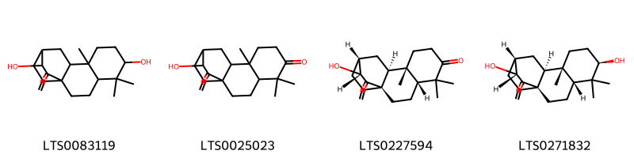{ width=100% }
    <figcaption>Hình ảnh cấu trúc hóa học của 4 hoạt chất thuộc nhóm Organooxygen compounds gồm ['6,13-dihydroxy-5,5,9-trimethyl-15-methylidenetetracyclo[10.2.2.0¹,¹⁰.0⁴,⁹]hexadecan-14-one (LTS0083119)', '13-hydroxy-5,5,9-trimethyl-15-methylidenetetracyclo[10.2.2.0¹,¹⁰.0⁴,⁹]hexadecane-6,14-dione (LTS0025023)', '(1r,4r,9r,10s,12s,13r)-13-hydroxy-5,5,9-trimethyl-15-methylidenetetracyclo[10.2.2.0¹,¹⁰.0⁴,⁹]hexadecane-6,14-dione (LTS0227594)', '(1r,4r,6r,9r,10s,12s,13r)-6,13-dihydroxy-5,5,9-trimethyl-15-methylidenetetracyclo[10.2.2.0¹,¹⁰.0⁴,⁹]hexadecan-14-one (LTS0271832)'].</figcaption>
</figure>
#### Nhóm Prenol lipids
<figure markdown="span">
    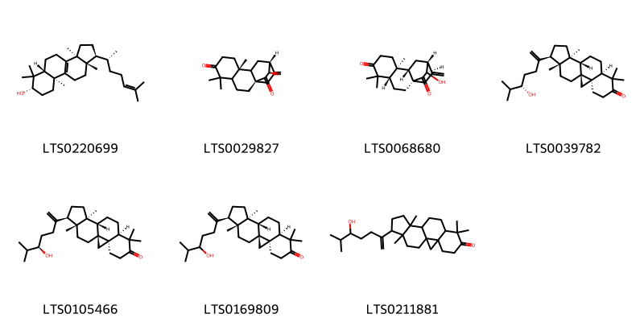{ width=100% }
    <figcaption>Hình ảnh cấu trúc hóa học của 7 hoạt chất thuộc nhóm Prenol lipids gồm ['euphol (LTS0220699)', '(1r,9s,12r)-13-hydroxy-5,5,9-trimethyl-16-methylidenetetracyclo[10.2.2.0¹,¹⁰.0⁴,⁹]hexadecane-6,14-dione (LTS0029827)', '(1s,4s,9r,10s,12r,13r)-13-hydroxy-5,5,9-trimethyl-16-methylidenetetracyclo[10.2.2.0¹,¹⁰.0⁴,⁹]hexadecane-6,14-dione (LTS0068680)', '(1s,3r,8r,11s,12s,15r,16r)-15-[(5s)-5-hydroxy-6-methylhept-1-en-2-yl]-7,7,12,16-tetramethylpentacyclo[9.7.0.0¹,³.0³,⁸.0¹²,¹⁶]octadecan-6-one (LTS0039782)', '(1s,3r,8r,11s,12s,15r,16r)-15-[(5r)-5-hydroxy-6-methylhept-1-en-2-yl]-7,7,12,16-tetramethylpentacyclo[9.7.0.0¹,³.0³,⁸.0¹²,¹⁶]octadecan-6-one (LTS0105466)', '(1s,3r,8r,11s,12s,15r,16r)-15-(5-hydroxy-6-methylhept-1-en-2-yl)-7,7,12,16-tetramethylpentacyclo[9.7.0.0¹,³.0³,⁸.0¹²,¹⁶]octadecan-6-one (LTS0169809)', '15-(5-hydroxy-6-methylhept-1-en-2-yl)-7,7,12,16-tetramethylpentacyclo[9.7.0.0¹,³.0³,⁸.0¹²,¹⁶]octadecan-6-one (LTS0211881)'].</figcaption>
</figure>
#### Nhóm Steroids and steroid derivatives
<figure markdown="span">
    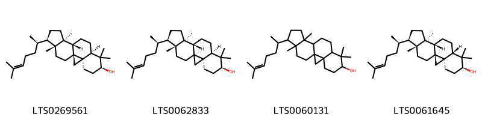{ width=100% }
    <figcaption>Hình ảnh cấu trúc hóa học của 4 hoạt chất thuộc nhóm Steroids and steroid derivatives gồm ['cycloartenol (LTS0269561)', '(3r,6s,8r,11s,12s,15r,16r)-7,7,12,16-tetramethyl-15-[(2r)-6-methylhept-5-en-2-yl]pentacyclo[9.7.0.0¹,³.0³,⁸.0¹²,¹⁶]octadecan-6-ol (LTS0062833)', 'cycloartenol (LTS0060131)', '(1s,3r,6s,8s,11s,12s,15r,16r)-7,7,12,16-tetramethyl-15-[(2r)-6-methylhept-5-en-2-yl]pentacyclo[9.7.0.0¹,³.0³,⁸.0¹²,¹⁶]octadecan-6-ol (LTS0061645)'].</figcaption>
</figure>

---

### Dược dân tộc học

Danh sách các quốc gia có sử dụng *Euphorbia neriifolia* trong điều trị các bệnh. 

| Country     | Disease                                        | Bệnh                                                                                                                                                                                                |
|:------------|:-----------------------------------------------|:----------------------------------------------------------------------------------------------------------------------------------------------------------------------------------------------------|
| Elsewhere   | Diuretic, Cathartic                            | MYMEMORY WARNING: YOU USED ALL AVAILABLE FREE TRANSLATIONS FOR TODAY. NEXT AVAILABLE IN  20 HOURS 13 MINUTES 31 SECONDS VISIT HTTPS://MYMEMORY.TRANSLATED.NET/DOC/USAGELIMITS.PHP TO TRANSLATE MORE |
| Guatemala   | Poison                                         | MYMEMORY WARNING: YOU USED ALL AVAILABLE FREE TRANSLATIONS FOR TODAY. NEXT AVAILABLE IN  20 HOURS 13 MINUTES 28 SECONDS VISIT HTTPS://MYMEMORY.TRANSLATED.NET/DOC/USAGELIMITS.PHP TO TRANSLATE MORE |
| India       | Expectorant, Piscicide, Purgative, Rubefacient | MYMEMORY WARNING: YOU USED ALL AVAILABLE FREE TRANSLATIONS FOR TODAY. NEXT AVAILABLE IN  20 HOURS 13 MINUTES 25 SECONDS VISIT HTTPS://MYMEMORY.TRANSLATED.NET/DOC/USAGELIMITS.PHP TO TRANSLATE MORE |
| Java        | Diuretic, Vermifuge                            | MYMEMORY WARNING: YOU USED ALL AVAILABLE FREE TRANSLATIONS FOR TODAY. NEXT AVAILABLE IN  20 HOURS 13 MINUTES 22 SECONDS VISIT HTTPS://MYMEMORY.TRANSLATED.NET/DOC/USAGELIMITS.PHP TO TRANSLATE MORE |
| Moluccas    | Purgative                                      | MYMEMORY WARNING: YOU USED ALL AVAILABLE FREE TRANSLATIONS FOR TODAY. NEXT AVAILABLE IN  20 HOURS 13 MINUTES 19 SECONDS VISIT HTTPS://MYMEMORY.TRANSLATED.NET/DOC/USAGELIMITS.PHP TO TRANSLATE MORE |
| Philippines | Piscicide                                      | MYMEMORY WARNING: YOU USED ALL AVAILABLE FREE TRANSLATIONS FOR TODAY. NEXT AVAILABLE IN  20 HOURS 13 MINUTES 16 SECONDS VISIT HTTPS://MYMEMORY.TRANSLATED.NET/DOC/USAGELIMITS.PHP TO TRANSLATE MORE |
| Turkey      | Expectorant, Laxative, Rubefacient, Poison     | MYMEMORY WARNING: YOU USED ALL AVAILABLE FREE TRANSLATIONS FOR TODAY. NEXT AVAILABLE IN  20 HOURS 13 MINUTES 13 SECONDS VISIT HTTPS://MYMEMORY.TRANSLATED.NET/DOC/USAGELIMITS.PHP TO TRANSLATE MORE |

---

---
## Euphorbia nivulia
### Thông tin về thực vật

!!! info "Phân loại thực vật của *Euphorbia nivulia* từ GIBF:"
    - **Kingdom:** Plantae
    - **Phylum:** Tracheophyta
    - **Order:** Malpighiales
    - **Family:** Euphorbiaceae
    - **Genus:** Euphorbia
    - **Species:** *Euphorbia nivulia*

 

| Label (VI)   | Label (EN)   | Scientific Name   | Descriptions (VI)   | Descriptions (EN)   | Also Known As (VI)   | Also Known As (EN)                                      |
|:-------------|:-------------|:------------------|:--------------------|:--------------------|:---------------------|:--------------------------------------------------------|
| N/A          | N/A          | Euphorbia nivulia |                     | species of plant    | ['']                 | ["Dog's Tongue", 'Holy Milk Hedge', 'Leafy Milk Hedge'] |

#### Phân bố trên thế giới

**Từ CSDL GIBF** nan, Pakistan, Belgium, Guatemala, Myanmar, India, United States of America, Mexico, Bermuda

#### Phân bố tại Việt Nam

**Từ CSDL GIBF**: Không có ghi nhận ở Việt Nam

---
### Thành phần hóa học
        
- Theo cơ sở dữ liệu lotus: Từ loài *Euphorbia nivulia* đã phân lập và xác định được 28 hoạt chất thuộc về các nhóm Prenol lipids, Steroids and steroid derivatives. 

|    | chemicalTaxonomyClassyfireClass   |   smiles_count |
|---:|:----------------------------------|---------------:|
|  0 | Prenol lipids                     |             18 |
|  1 | Steroids and steroid derivatives  |              9 |

#### Nhóm Prenol lipids
<figure markdown="span">
    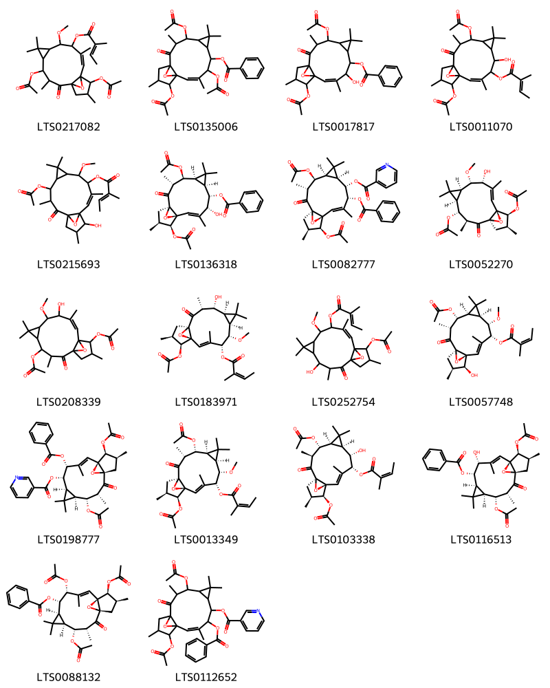{ width=100% }
    <figcaption>Hình ảnh cấu trúc hóa học của 18 hoạt chất thuộc nhóm Prenol lipids gồm ['4,13-bis(acetyloxy)-8-methoxy-3,6,6,10,14-pentamethyl-2-oxo-16-oxatetracyclo[10.3.1.0¹,¹².0⁵,⁷]hexadec-10-en-9-yl 2-methylbut-2-enoate (LTS0217082)', '4,9,13-tris(acetyloxy)-3,6,6,10,14-pentamethyl-2-oxo-16-oxatetracyclo[10.3.1.0¹,¹².0⁵,⁷]hexadec-10-en-8-yl benzoate (LTS0135006)', '4,13-bis(acetyloxy)-9-hydroxy-3,6,6,10,14-pentamethyl-2-oxo-16-oxatetracyclo[10.3.1.0¹,¹².0⁵,⁷]hexadec-10-en-8-yl benzoate (LTS0017817)', '4,13-bis(acetyloxy)-8-hydroxy-3,6,6,10,14-pentamethyl-2-oxo-16-oxatetracyclo[10.3.1.0¹,¹².0⁵,⁷]hexadec-10-en-9-yl 2-methylbut-2-enoate (LTS0011070)', '4-(acetyloxy)-13-hydroxy-8-methoxy-3,6,6,10,14-pentamethyl-2-oxo-16-oxatetracyclo[10.3.1.0¹,¹².0⁵,⁷]hexadec-10-en-9-yl 2-methylbut-2-enoate (LTS0215693)', '(1r,3r,4s,5r,7s,8s,9r,10e,12s,13s,14s)-4,13-bis(acetyloxy)-9-hydroxy-3,6,6,10,14-pentamethyl-2-oxo-16-oxatetracyclo[10.3.1.0¹,¹².0⁵,⁷]hexadec-10-en-8-yl benzoate (LTS0136318)', '(1r,3r,4s,5r,7s,8s,9r,10e,12s,13s,14s)-4,13-bis(acetyloxy)-9-(benzoyloxy)-3,6,6,10,14-pentamethyl-2-oxo-16-oxatetracyclo[10.3.1.0¹,¹².0⁵,⁷]hexadec-10-en-8-yl pyridine-3-carboxylate (LTS0082777)', '(1r,3s,4r,5r,7s,8s,9r,10e,12s,13s,14s)-13-(acetyloxy)-9-hydroxy-8-methoxy-3,6,6,10,14-pentamethyl-2-oxo-16-oxatetracyclo[10.3.1.0¹,¹².0⁵,⁷]hexadec-10-en-4-yl acetate (LTS0052270)', '4-(acetyloxy)-9-hydroxy-8-methoxy-3,6,6,10,14-pentamethyl-2-oxo-16-oxatetracyclo[10.3.1.0¹,¹².0⁵,⁷]hexadec-10-en-13-yl acetate (LTS0208339)', '(1r,3r,4r,5r,7s,8s,9r,10e,12s,13s,14s)-13-(acetyloxy)-4-hydroxy-8-methoxy-3,6,6,10,14-pentamethyl-2-oxo-16-oxatetracyclo[10.3.1.0¹,¹².0⁵,⁷]hexadec-10-en-9-yl (2z)-2-methylbut-2-enoate (LTS0183971)', '13-(acetyloxy)-4-hydroxy-8-methoxy-3,6,6,10,14-pentamethyl-2-oxo-16-oxatetracyclo[10.3.1.0¹,¹².0⁵,⁷]hexadec-10-en-9-yl 2-methylbut-2-enoate (LTS0252754)', '(1r,3r,4r,5r,7s,8s,9r,10e,12s,13s,14s)-4-(acetyloxy)-13-hydroxy-8-methoxy-3,6,6,10,14-pentamethyl-2-oxo-16-oxatetracyclo[10.3.1.0¹,¹².0⁵,⁷]hexadec-10-en-9-yl (2z)-2-methylbut-2-enoate (LTS0057748)', '(1r,3r,4r,5r,7s,8s,9r,10e,12s,13s,14s)-4,13-bis(acetyloxy)-9-(benzoyloxy)-3,6,6,10,14-pentamethyl-2-oxo-16-oxatetracyclo[10.3.1.0¹,¹².0⁵,⁷]hexadec-10-en-8-yl pyridine-3-carboxylate (LTS0198777)', '(1r,3r,4r,5r,7s,8s,9r,10e,12s,13s,14s)-4,13-bis(acetyloxy)-8-methoxy-3,6,6,10,14-pentamethyl-2-oxo-16-oxatetracyclo[10.3.1.0¹,¹².0⁵,⁷]hexadec-10-en-9-yl (2z)-2-methylbut-2-enoate (LTS0013349)', '(1r,3s,4r,5r,7s,8s,9r,10e,12s,13s,14s)-4,13-bis(acetyloxy)-8-hydroxy-3,6,6,10,14-pentamethyl-2-oxo-16-oxatetracyclo[10.3.1.0¹,¹².0⁵,⁷]hexadec-10-en-9-yl (2z)-2-methylbut-2-enoate (LTS0103338)', '(1r,3r,4r,5r,7s,8s,9r,10e,12s,13s,14s)-4,13-bis(acetyloxy)-9-hydroxy-3,6,6,10,14-pentamethyl-2-oxo-16-oxatetracyclo[10.3.1.0¹,¹².0⁵,⁷]hexadec-10-en-8-yl benzoate (LTS0116513)', '(1r,3r,4r,5r,7s,8s,9r,10e,12s,13s,14s)-4,9,13-tris(acetyloxy)-3,6,6,10,14-pentamethyl-2-oxo-16-oxatetracyclo[10.3.1.0¹,¹².0⁵,⁷]hexadec-10-en-8-yl benzoate (LTS0088132)', '4,13-bis(acetyloxy)-9-(benzoyloxy)-3,6,6,10,14-pentamethyl-2-oxo-16-oxatetracyclo[10.3.1.0¹,¹².0⁵,⁷]hexadec-10-en-8-yl pyridine-3-carboxylate (LTS0112652)'].</figcaption>
</figure>
#### Nhóm Steroids and steroid derivatives
<figure markdown="span">
    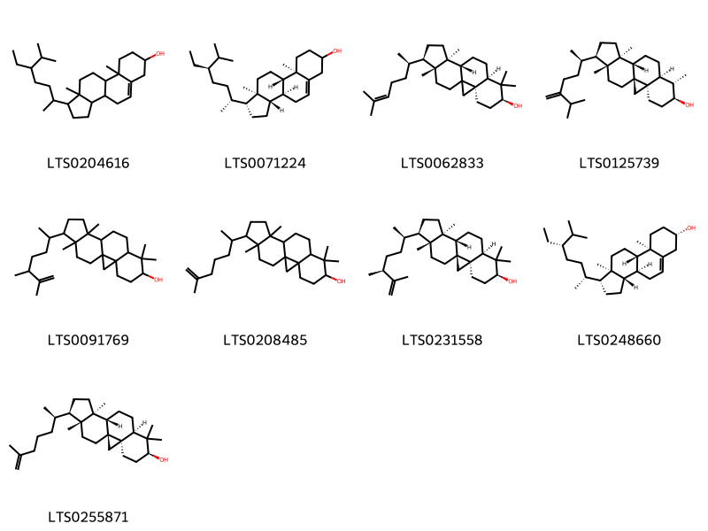{ width=100% }
    <figcaption>Hình ảnh cấu trúc hóa học của 9 hoạt chất thuộc nhóm Steroids and steroid derivatives gồm ['stigmast-5-en-3-ol, (3β)- (LTS0204616)', 'stigmast-5-en-3-ol (LTS0071224)', '(3r,6s,8r,11s,12s,15r,16r)-7,7,12,16-tetramethyl-15-[(2r)-6-methylhept-5-en-2-yl]pentacyclo[9.7.0.0¹,³.0³,⁸.0¹²,¹⁶]octadecan-6-ol (LTS0062833)', 'cycloeucalenol (LTS0125739)', '15-(5,6-dimethylhept-6-en-2-yl)-7,7,12,16-tetramethylpentacyclo[9.7.0.0¹,³.0³,⁸.0¹²,¹⁶]octadecan-6-ol (LTS0091769)', '7,7,12,16-tetramethyl-15-(6-methylhept-6-en-2-yl)pentacyclo[9.7.0.0¹,³.0³,⁸.0¹²,¹⁶]octadecan-6-ol (LTS0208485)', 'cyclolaudenol (LTS0231558)', 'clionasterol (LTS0248660)', '(1s,3r,6s,8r,11s,12s,15r,16r)-7,7,12,16-tetramethyl-15-[(2r)-6-methylhept-6-en-2-yl]pentacyclo[9.7.0.0¹,³.0³,⁸.0¹²,¹⁶]octadecan-6-ol (LTS0255871)'].</figcaption>
</figure>

---

### Dược dân tộc học

Danh sách các quốc gia có sử dụng *Euphorbia nivulia* trong điều trị các bệnh. 

| Country   | Disease             | Bệnh                                                                                                                                                                                                |
|:----------|:--------------------|:----------------------------------------------------------------------------------------------------------------------------------------------------------------------------------------------------|
| India     | Purgative, Diuretic | MYMEMORY WARNING: YOU USED ALL AVAILABLE FREE TRANSLATIONS FOR TODAY. NEXT AVAILABLE IN  20 HOURS 12 MINUTES 45 SECONDS VISIT HTTPS://MYMEMORY.TRANSLATED.NET/DOC/USAGELIMITS.PHP TO TRANSLATE MORE |

---

---
## Euphorbia nyikae
### Thông tin về thực vật

!!! info "Phân loại thực vật của *Euphorbia nyikae* từ GIBF:"
    - **Kingdom:** Plantae
    - **Phylum:** Tracheophyta
    - **Order:** Malpighiales
    - **Family:** Euphorbiaceae
    - **Genus:** Euphorbia
    - **Species:** *Euphorbia nyikae*

 

| Label (VI)   | Label (EN)   | Scientific Name   | Descriptions (VI)   | Descriptions (EN)   | Also Known As (VI)   | Also Known As (EN)   |
|:-------------|:-------------|:------------------|:--------------------|:--------------------|:---------------------|:---------------------|
| N/A          | N/A          | Euphorbia nyikae  | loài thực vật       | species of plant    | ['']                 | ['']                 |

#### Phân bố trên thế giới

**Từ CSDL GIBF** Belgium, Tanzania, United Republic of, Kenya

#### Phân bố tại Việt Nam

**Từ CSDL GIBF**: Không có ghi nhận ở Việt Nam

---
### Thành phần hóa học
        
- Theo cơ sở dữ liệu lotus: Từ loài *Euphorbia nyikae* đã phân lập và xác định được Chưa có hoạt chất nào được phân lập. hoạt chất thuộc về các nhóm Không có hoạt chất nào được phân lập. 

Không có hình ảnh nào được tạo ra

---

### Dược dân tộc học

Danh sách các quốc gia có sử dụng *Euphorbia nyikae* trong điều trị các bệnh. 

| Country   | Disease   | Bệnh                                                                                                                                                                                                |
|:----------|:----------|:----------------------------------------------------------------------------------------------------------------------------------------------------------------------------------------------------|
| Tanzania  | Piscicide | MYMEMORY WARNING: YOU USED ALL AVAILABLE FREE TRANSLATIONS FOR TODAY. NEXT AVAILABLE IN  20 HOURS 12 MINUTES 18 SECONDS VISIT HTTPS://MYMEMORY.TRANSLATED.NET/DOC/USAGELIMITS.PHP TO TRANSLATE MORE |

---

---
## Euphorbia officinarum
### Thông tin về thực vật

!!! info "Phân loại thực vật của *Euphorbia officinarum* từ GIBF:"
    - **Kingdom:** Plantae
    - **Phylum:** Tracheophyta
    - **Order:** Malpighiales
    - **Family:** Euphorbiaceae
    - **Genus:** Euphorbia
    - **Species:** *Euphorbia officinarum*

 

| Label (VI)   | Label (EN)   | Scientific Name       | Descriptions (VI)   | Descriptions (EN)   | Also Known As (VI)   | Also Known As (EN)   |
|:-------------|:-------------|:----------------------|:--------------------|:--------------------|:---------------------|:---------------------|
| N/A          | N/A          | Euphorbia officinarum | loài thực vật       | species of plant    | ['']                 | ['']                 |

#### Phân bố trên thế giới

**Từ CSDL GIBF** Italy, Belgium, Western Sahara, unknown or invalid, Morocco, United States of America, Saudi Arabia

#### Phân bố tại Việt Nam

**Từ CSDL GIBF**: Không có ghi nhận ở Việt Nam

---
### Thành phần hóa học
        
- Theo cơ sở dữ liệu lotus: Từ loài *Euphorbia officinarum* đã phân lập và xác định được 9 hoạt chất thuộc về các nhóm Prenol lipids, Steroids and steroid derivatives. 

|    | chemicalTaxonomyClassyfireClass   |   smiles_count |
|---:|:----------------------------------|---------------:|
|  0 | Prenol lipids                     |              4 |
|  1 | Steroids and steroid derivatives  |              5 |

#### Nhóm Prenol lipids
<figure markdown="span">
    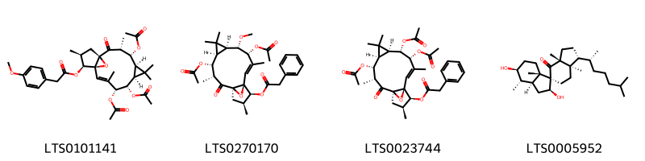{ width=100% }
    <figcaption>Hình ảnh cấu trúc hóa học của 4 hoạt chất thuộc nhóm Prenol lipids gồm ['(1r,3r,4r,5r,7s,8s,9r,10e,12s,13s,14s)-4,8,9-tris(acetyloxy)-3,6,6,10,14-pentamethyl-2-oxo-16-oxatetracyclo[10.3.1.0¹,¹².0⁵,⁷]hexadec-10-en-13-yl 2-(4-methoxyphenyl)acetate (LTS0101141)', '(1r,3r,4r,5r,7s,8s,9r,10e,12s,13s,14s)-4,9-bis(acetyloxy)-8-methoxy-3,6,6,10,14-pentamethyl-2-oxo-16-oxatetracyclo[10.3.1.0¹,¹².0⁵,⁷]hexadec-10-en-13-yl 2-phenylacetate (LTS0270170)', '(1r,3r,4r,5r,7s,8s,9r,10e,12s,13s,14s)-4,8,9-tris(acetyloxy)-3,6,6,10,14-pentamethyl-2-oxo-16-oxatetracyclo[10.3.1.0¹,¹².0⁵,⁷]hexadec-10-en-13-yl 2-phenylacetate (LTS0023744)', "(1r,1'r,2s,3as,3'ar,4s,5s,7as,7'ar)-2,5-dihydroxy-3'a,4,7a,7'a-tetramethyl-1'-[(2r)-6-methylheptan-2-yl]-decahydro-1'h,2h-1,5'-spirobi[inden]-4'-one (LTS0005952)"].</figcaption>
</figure>
#### Nhóm Steroids and steroid derivatives
<figure markdown="span">
    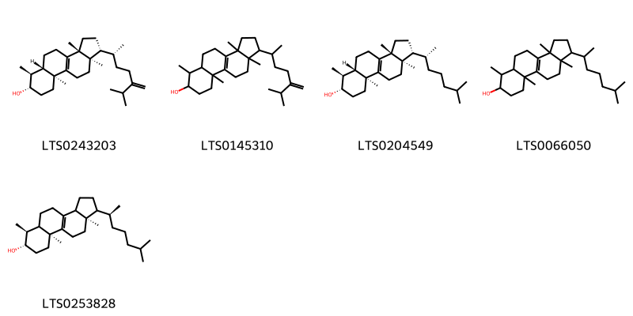{ width=100% }
    <figcaption>Hình ảnh cấu trúc hóa học của 5 hoạt chất thuộc nhóm Steroids and steroid derivatives gồm ['(1r,3ar,5as,6s,7s,9as,11ar)-3a,6,9a,11a-tetramethyl-1-[(2r)-6-methyl-5-methylideneheptan-2-yl]-1h,2h,3h,4h,5h,5ah,6h,7h,8h,9h,10h,11h-cyclopenta[a]phenanthren-7-ol (LTS0243203)', '3a,6,9a,11a-tetramethyl-1-(6-methyl-5-methylideneheptan-2-yl)-1h,2h,3h,4h,5h,5ah,6h,7h,8h,9h,10h,11h-cyclopenta[a]phenanthren-7-ol (LTS0145310)', '(1r,3ar,5as,6s,7s,9as,11ar)-3a,6,9a,11a-tetramethyl-1-[(2r)-6-methylheptan-2-yl]-1h,2h,3h,4h,5h,5ah,6h,7h,8h,9h,10h,11h-cyclopenta[a]phenanthren-7-ol (LTS0204549)', '3a,6,9a,11a-tetramethyl-1-(6-methylheptan-2-yl)-1h,2h,3h,4h,5h,5ah,6h,7h,8h,9h,10h,11h-cyclopenta[a]phenanthren-7-ol (LTS0066050)', '(6s,7s,9as,11ar)-6,9a,11a-trimethyl-1-[(2s)-6-methylheptan-2-yl]-1h,2h,3h,3ah,4h,5h,5ah,6h,7h,8h,9h,10h,11h-cyclopenta[a]phenanthren-7-ol (LTS0253828)'].</figcaption>
</figure>

---

### Dược dân tộc học

Danh sách các quốc gia có sử dụng *Euphorbia officinarum* trong điều trị các bệnh. 

| Country   | Disease   | Bệnh                                                                                                                                                                                                |
|:----------|:----------|:----------------------------------------------------------------------------------------------------------------------------------------------------------------------------------------------------|
| Africa    | Poison    | MYMEMORY WARNING: YOU USED ALL AVAILABLE FREE TRANSLATIONS FOR TODAY. NEXT AVAILABLE IN  20 HOURS 11 MINUTES 56 SECONDS VISIT HTTPS://MYMEMORY.TRANSLATED.NET/DOC/USAGELIMITS.PHP TO TRANSLATE MORE |
| English   | Purgative | MYMEMORY WARNING: YOU USED ALL AVAILABLE FREE TRANSLATIONS FOR TODAY. NEXT AVAILABLE IN  20 HOURS 11 MINUTES 53 SECONDS VISIT HTTPS://MYMEMORY.TRANSLATED.NET/DOC/USAGELIMITS.PHP TO TRANSLATE MORE |
| German    | Emetic    | MYMEMORY WARNING: YOU USED ALL AVAILABLE FREE TRANSLATIONS FOR TODAY. NEXT AVAILABLE IN  20 HOURS 11 MINUTES 51 SECONDS VISIT HTTPS://MYMEMORY.TRANSLATED.NET/DOC/USAGELIMITS.PHP TO TRANSLATE MORE |

---

---
## Euphorbia parviflora
### Thông tin về thực vật

!!! info "Phân loại thực vật của *Euphorbia parviflora* từ GIBF:"
    - **Kingdom:** Plantae
    - **Phylum:** Tracheophyta
    - **Order:** Malpighiales
    - **Family:** Euphorbiaceae
    - **Genus:** Euphorbia
    - **Species:** *Euphorbia parviflora*

 

| Label (VI)   | Label (EN)   | Scientific Name      | Descriptions (VI)   | Descriptions (EN)   | Also Known As (VI)   | Also Known As (EN)   |
|:-------------|:-------------|:---------------------|:--------------------|:--------------------|:---------------------|:---------------------|
| N/A          | N/A          | Euphorbia parviflora | loài thực vật       | species of plant    | ['']                 | ['']                 |

#### Phân bố trên thế giới

**Từ CSDL GIBF** nan, Virgin Islands (U.S.), Sri Lanka, Ghana, Australia, Japan, Lao People’s Democratic Republic, Cambodia, Argentina, Mozambique, unknown or invalid, Sierra Leone, Venezuela (Bolivarian Republic of), Malawi, Chinese Taipei, Spain, Bolivia (Plurinational State of), Papua New Guinea, United States of America, Bonaire, Sint Eustatius and Saba, Timor-Leste, Paraguay, South Africa, Hong Kong, Suriname, Thailand, Germany, Brazil, Bhutan, Pitcairn, Sint Maarten (Dutch part), Cuba, Mexico, Dominican Republic, Singapore, Viet Nam, China, Colombia, India, Indonesia, Anguilla, Philippines, Nepal

#### Phân bố tại Việt Nam

**Từ CSDL GIBF**: Hà Nôi

---
### Thành phần hóa học
        
- Theo cơ sở dữ liệu lotus: Từ loài *Euphorbia parviflora* đã phân lập và xác định được 2 hoạt chất thuộc về các nhóm Flavonoids. 

|    | chemicalTaxonomyClassyfireClass   |   smiles_count |
|---:|:----------------------------------|---------------:|
|  0 | Flavonoids                        |              2 |

#### Nhóm Flavonoids
<figure markdown="span">
    { width=100% }
    <figcaption>Hình ảnh cấu trúc hóa học của 2 hoạt chất thuộc nhóm Flavonoids gồm ['quercitrin (LTS0093095)', 'quercitrin (LTS0186298)'].</figcaption>
</figure>

---

### Dược dân tộc học

Danh sách các quốc gia có sử dụng *Euphorbia parviflora* trong điều trị các bệnh. 

| Country   | Disease              | Bệnh                                                                                                                                                                                                |
|:----------|:---------------------|:----------------------------------------------------------------------------------------------------------------------------------------------------------------------------------------------------|
| India     | Astringent, Narcotic | MYMEMORY WARNING: YOU USED ALL AVAILABLE FREE TRANSLATIONS FOR TODAY. NEXT AVAILABLE IN  20 HOURS 11 MINUTES 19 SECONDS VISIT HTTPS://MYMEMORY.TRANSLATED.NET/DOC/USAGELIMITS.PHP TO TRANSLATE MORE |

---

---
## Euphorbia pekinensis
### Thông tin về thực vật

!!! info "Phân loại thực vật của *Euphorbia pekinensis* từ GIBF:"
    - **Kingdom:** Plantae
    - **Phylum:** Tracheophyta
    - **Order:** Malpighiales
    - **Family:** Euphorbiaceae
    - **Genus:** Euphorbia
    - **Species:** *Euphorbia pekinensis*

 

| Label (VI)   | Label (EN)   | Scientific Name      | Descriptions (VI)   | Descriptions (EN)   | Also Known As (VI)   | Also Known As (EN)   |
|:-------------|:-------------|:---------------------|:--------------------|:--------------------|:---------------------|:---------------------|
| N/A          | N/A          | Euphorbia pekinensis | loài thực vật       | species of plant    | ['']                 | ['']                 |
| N/A          | N/A          | Euphorbia pekinensis |                     |                     | ['']                 | ['']                 |

#### Phân bố trên thế giới

**Từ CSDL GIBF** nan, Japan, Korea, Republic of, Russian Federation, China

#### Phân bố tại Việt Nam

**Từ CSDL GIBF**: Không có ghi nhận ở Việt Nam

---
### Thành phần hóa học
        
- Theo cơ sở dữ liệu lotus: Từ loài *Euphorbia pekinensis* đã phân lập và xác định được 15 hoạt chất thuộc về các nhóm Prenol lipids. 

|    | chemicalTaxonomyClassyfireClass   |   smiles_count |
|---:|:----------------------------------|---------------:|
|  0 | Prenol lipids                     |             15 |

#### Nhóm Prenol lipids
<figure markdown="span">
    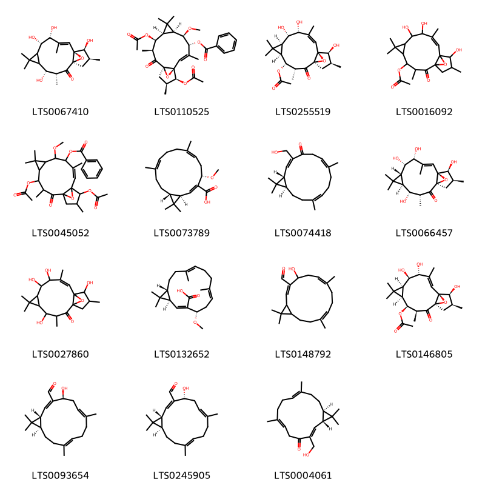{ width=100% }
    <figcaption>Hình ảnh cấu trúc hóa học của 15 hoạt chất thuộc nhóm Prenol lipids gồm ['ingol (LTS0067410)', '(1r,3s,4s,5r,7s,8r,9r,10e,12s,13s,14s)-4,13-bis(acetyloxy)-8-methoxy-3,6,6,10,14-pentamethyl-2-oxo-16-oxatetracyclo[10.3.1.0¹,¹².0⁵,⁷]hexadec-10-en-9-yl benzoate (LTS0110525)', '(1r,3r,4r,5r,7s,8s,9r,10z,12s,13s,14s)-8,9,13-trihydroxy-3,6,6,10,14-pentamethyl-2-oxo-16-oxatetracyclo[10.3.1.0¹,¹².0⁵,⁷]hexadec-10-en-4-yl acetate (LTS0255519)', '8,9,13-trihydroxy-3,6,6,10,14-pentamethyl-2-oxo-16-oxatetracyclo[10.3.1.0¹,¹².0⁵,⁷]hexadec-10-en-4-yl acetate (LTS0016092)', '4,13-bis(acetyloxy)-8-methoxy-3,6,6,10,14-pentamethyl-2-oxo-16-oxatetracyclo[10.3.1.0¹,¹².0⁵,⁷]hexadec-10-en-9-yl benzoate (LTS0045052)', '(1r,4s,14r)-4-methoxy-7,11,15,15-tetramethylbicyclo[12.1.0]pentadeca-2,6,10-triene-3-carboxylic acid (LTS0073789)', '(1r,14r)-3-(hydroxymethyl)-7,11,15,15-tetramethylbicyclo[12.1.0]pentadeca-2,6,10-trien-4-one (LTS0074418)', '(1r,3r,4r,5r,7r,8s,9r,10e,12s,13s,14s)-4,8,9,13-tetrahydroxy-3,6,6,10,14-pentamethyl-16-oxatetracyclo[10.3.1.0¹,¹².0⁵,⁷]hexadec-10-en-2-one (LTS0066457)', '4,8,9,13-tetrahydroxy-3,6,6,10,14-pentamethyl-16-oxatetracyclo[10.3.1.0¹,¹².0⁵,⁷]hexadec-10-en-2-one (LTS0027860)', '(1r,2z,4s,6e,10e,14r)-4-methoxy-7,11,15,15-tetramethylbicyclo[12.1.0]pentadeca-2,6,10-triene-3-carboxylic acid (LTS0132652)', '4-hydroxy-7,11,15,15-tetramethylbicyclo[12.1.0]pentadeca-2,6,10-triene-3-carbaldehyde (LTS0148792)', '(1r,3s,4s,5r,7s,8r,9r,10e,12s,13s,14s)-8,9,13-trihydroxy-3,6,6,10,14-pentamethyl-2-oxo-16-oxatetracyclo[10.3.1.0¹,¹².0⁵,⁷]hexadec-10-en-4-yl acetate (LTS0146805)', '(1r,2e,4s,6e,10e,14r)-4-hydroxy-7,11,15,15-tetramethylbicyclo[12.1.0]pentadeca-2,6,10-triene-3-carbaldehyde (LTS0093654)', '(1r,2e,4r,6e,10e,14r)-4-hydroxy-7,11,15,15-tetramethylbicyclo[12.1.0]pentadeca-2,6,10-triene-3-carbaldehyde (LTS0245905)', '(1r,2e,6e,10e,14r)-3-(hydroxymethyl)-7,11,15,15-tetramethylbicyclo[12.1.0]pentadeca-2,6,10-trien-4-one (LTS0004061)'].</figcaption>
</figure>

---

### Dược dân tộc học

Danh sách các quốc gia có sử dụng *Euphorbia pekinensis* trong điều trị các bệnh. 

| Country   | Disease                                | Bệnh                                                                                                                                                                                                |
|:----------|:---------------------------------------|:----------------------------------------------------------------------------------------------------------------------------------------------------------------------------------------------------|
| China     | Diuretic, Poison, Purgative, Cathartic | MYMEMORY WARNING: YOU USED ALL AVAILABLE FREE TRANSLATIONS FOR TODAY. NEXT AVAILABLE IN  20 HOURS 10 MINUTES 52 SECONDS VISIT HTTPS://MYMEMORY.TRANSLATED.NET/DOC/USAGELIMITS.PHP TO TRANSLATE MORE |

---

---
## Euphorbia petiolaris
### Thông tin về thực vật

!!! info "Phân loại thực vật của *Euphorbia petiolaris* từ GIBF:"
    - **Kingdom:** Plantae
    - **Phylum:** Tracheophyta
    - **Order:** Malpighiales
    - **Family:** Euphorbiaceae
    - **Genus:** Euphorbia
    - **Species:** *Euphorbia petiolaris*

 

| Label (VI)   | Label (EN)   | Scientific Name      | Descriptions (VI)   | Descriptions (EN)   | Also Known As (VI)   | Also Known As (EN)   |
|:-------------|:-------------|:---------------------|:--------------------|:--------------------|:---------------------|:---------------------|
| N/A          | N/A          | Euphorbia petiolaris | loài thực vật       | species of plant    | ['']                 | ['']                 |

#### Phân bố trên thế giới

**Từ CSDL GIBF** Virgin Islands (U.S.), nan, Guadeloupe, Belgium, Turkmenistan, unknown or invalid, Virgin Islands (British), Puerto Rico, Cyprus, Türkiye, Jamaica, Russian Federation, United States of America, Saint Martin (French part), Trinidad and Tobago, Iran (Islamic Republic of), Saint Barthélemy, Martinique, Dominican Republic, Syrian Arab Republic, Haiti, Colombia, Sint Maarten (Dutch part)

#### Phân bố tại Việt Nam

**Từ CSDL GIBF**: Không có ghi nhận ở Việt Nam

---
### Thành phần hóa học
        
- Theo cơ sở dữ liệu lotus: Từ loài *Euphorbia petiolaris* đã phân lập và xác định được Chưa có hoạt chất nào được phân lập. hoạt chất thuộc về các nhóm Không có hoạt chất nào được phân lập. 

Không có hình ảnh nào được tạo ra

---

### Dược dân tộc học

Danh sách các quốc gia có sử dụng *Euphorbia petiolaris* trong điều trị các bệnh. 

| Country   | Disease   | Bệnh                                                                                                                                                                                                |
|:----------|:----------|:----------------------------------------------------------------------------------------------------------------------------------------------------------------------------------------------------|
| Haiti     | Poison    | MYMEMORY WARNING: YOU USED ALL AVAILABLE FREE TRANSLATIONS FOR TODAY. NEXT AVAILABLE IN  20 HOURS 10 MINUTES 26 SECONDS VISIT HTTPS://MYMEMORY.TRANSLATED.NET/DOC/USAGELIMITS.PHP TO TRANSLATE MORE |

---

---
## Euphorbia petrina
### Thông tin về thực vật

!!! info "Phân loại thực vật của *Euphorbia petrina* từ GIBF:"
    - **Kingdom:** Plantae
    - **Phylum:** Tracheophyta
    - **Order:** Malpighiales
    - **Family:** Euphorbiaceae
    - **Genus:** Euphorbia
    - **Species:** *Euphorbia petrina*

 

| Label (VI)   | Label (EN)   | Scientific Name   | Descriptions (VI)   | Descriptions (EN)   | Also Known As (VI)   | Also Known As (EN)   |
|:-------------|:-------------|:------------------|:--------------------|:--------------------|:---------------------|:---------------------|
| N/A          | N/A          | Euphorbia petrina | loài thực vật       | species of plant    | ['']                 | ['']                 |

#### Phân bố trên thế giới

**Từ CSDL GIBF** nan, Mexico

#### Phân bố tại Việt Nam

**Từ CSDL GIBF**: Không có ghi nhận ở Việt Nam

---
### Thành phần hóa học
        
- Theo cơ sở dữ liệu lotus: Từ loài *Euphorbia petrina* đã phân lập và xác định được Chưa có hoạt chất nào được phân lập. hoạt chất thuộc về các nhóm Không có hoạt chất nào được phân lập. 

Không có hình ảnh nào được tạo ra

---

### Dược dân tộc học

Danh sách các quốc gia có sử dụng *Euphorbia petrina* trong điều trị các bệnh. 

| Country      | Disease   | Bệnh                                                                                                                                                                                                |
|:-------------|:----------|:----------------------------------------------------------------------------------------------------------------------------------------------------------------------------------------------------|
| Mexico(Seri) | Poultice  | MYMEMORY WARNING: YOU USED ALL AVAILABLE FREE TRANSLATIONS FOR TODAY. NEXT AVAILABLE IN  20 HOURS 09 MINUTES 57 SECONDS VISIT HTTPS://MYMEMORY.TRANSLATED.NET/DOC/USAGELIMITS.PHP TO TRANSLATE MORE |

---

---
## Euphorbia pilulifera
### Thông tin về thực vật

!!! info "Phân loại thực vật của *Euphorbia pilulifera* từ GIBF:"
    - **Kingdom:** Plantae
    - **Phylum:** Tracheophyta
    - **Order:** Malpighiales
    - **Family:** Euphorbiaceae
    - **Genus:** Euphorbia
    - **Species:** *Euphorbia pilulifera*

 

| Label (VI)   | Label (EN)   | Scientific Name      | Descriptions (VI)   | Descriptions (EN)   | Also Known As (VI)   | Also Known As (EN)   |
|:-------------|:-------------|:---------------------|:--------------------|:--------------------|:---------------------|:---------------------|
| N/A          | N/A          | Euphorbia pilulifera | loài thực vật       | species of plant    | ['']                 | ['']                 |

#### Phân bố trên thế giới

**Từ CSDL GIBF** nan, Virgin Islands (U.S.), Australia, Japan, Guatemala, Argentina, unknown or invalid, Venezuela (Bolivarian Republic of), Panama, Puerto Rico, Bolivia (Plurinational State of), Jamaica, United States of America, Martinique, Brazil, Cuba, Mexico, Peru, Dominican Republic, Viet Nam, China, Haiti, Colombia, Montserrat, India, Philippines

#### Phân bố tại Việt Nam

**Từ CSDL GIBF**: Không có ghi nhận ở Việt Nam

---
### Thành phần hóa học
        
- Theo cơ sở dữ liệu lotus: Từ loài *Euphorbia pilulifera* đã phân lập và xác định được 2 hoạt chất thuộc về các nhóm Flavonoids. 

|    | chemicalTaxonomyClassyfireClass   |   smiles_count |
|---:|:----------------------------------|---------------:|
|  0 | Flavonoids                        |              2 |

#### Nhóm Flavonoids
<figure markdown="span">
    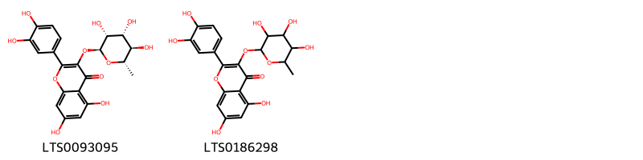{ width=100% }
    <figcaption>Hình ảnh cấu trúc hóa học của 2 hoạt chất thuộc nhóm Flavonoids gồm ['quercitrin (LTS0093095)', 'quercitrin (LTS0186298)'].</figcaption>
</figure>

---

### Dược dân tộc học

Danh sách các quốc gia có sử dụng *Euphorbia pilulifera* trong điều trị các bệnh. 

| Country   | Disease                         | Bệnh                                                                                                                                                                                                |
|:----------|:--------------------------------|:----------------------------------------------------------------------------------------------------------------------------------------------------------------------------------------------------|
| Dutch     | Diuretic                        | MYMEMORY WARNING: YOU USED ALL AVAILABLE FREE TRANSLATIONS FOR TODAY. NEXT AVAILABLE IN  20 HOURS 09 MINUTES 34 SECONDS VISIT HTTPS://MYMEMORY.TRANSLATED.NET/DOC/USAGELIMITS.PHP TO TRANSLATE MORE |
| Elsewhere | Sedative, Hemostatic, Soporific | MYMEMORY WARNING: YOU USED ALL AVAILABLE FREE TRANSLATIONS FOR TODAY. NEXT AVAILABLE IN  20 HOURS 09 MINUTES 31 SECONDS VISIT HTTPS://MYMEMORY.TRANSLATED.NET/DOC/USAGELIMITS.PHP TO TRANSLATE MORE |
| French    | Demulcent                       | MYMEMORY WARNING: YOU USED ALL AVAILABLE FREE TRANSLATIONS FOR TODAY. NEXT AVAILABLE IN  20 HOURS 09 MINUTES 27 SECONDS VISIT HTTPS://MYMEMORY.TRANSLATED.NET/DOC/USAGELIMITS.PHP TO TRANSLATE MORE |
| India     | Vermifuge                       | MYMEMORY WARNING: YOU USED ALL AVAILABLE FREE TRANSLATIONS FOR TODAY. NEXT AVAILABLE IN  20 HOURS 09 MINUTES 23 SECONDS VISIT HTTPS://MYMEMORY.TRANSLATED.NET/DOC/USAGELIMITS.PHP TO TRANSLATE MORE |
| Malaysia  | Poison                          | MYMEMORY WARNING: YOU USED ALL AVAILABLE FREE TRANSLATIONS FOR TODAY. NEXT AVAILABLE IN  20 HOURS 09 MINUTES 19 SECONDS VISIT HTTPS://MYMEMORY.TRANSLATED.NET/DOC/USAGELIMITS.PHP TO TRANSLATE MORE |
| US        | Expectorant                     | MYMEMORY WARNING: YOU USED ALL AVAILABLE FREE TRANSLATIONS FOR TODAY. NEXT AVAILABLE IN  20 HOURS 09 MINUTES 17 SECONDS VISIT HTTPS://MYMEMORY.TRANSLATED.NET/DOC/USAGELIMITS.PHP TO TRANSLATE MORE |

---

---
## Euphorbia plicata
### Thông tin về thực vật

!!! info "Phân loại thực vật của *Euphorbia colletioides* từ GIBF:"
    - **Kingdom:** Plantae
    - **Phylum:** Tracheophyta
    - **Order:** Malpighiales
    - **Family:** Euphorbiaceae
    - **Genus:** Euphorbia
    - **Species:** *Euphorbia colletioides*

 

| Label (VI)   | Label (EN)   | Scientific Name   | Descriptions (VI)   | Descriptions (EN)   | Also Known As (VI)   | Also Known As (EN)   |
|:-------------|:-------------|:------------------|:--------------------|:--------------------|:---------------------|:---------------------|
| N/A          | N/A          | Euphorbia plicata |                     |                     | ['']                 | ['']                 |

#### Phân bố trên thế giới

**Từ CSDL GIBF** Costa Rica, Nicaragua, nan, Mexico

#### Phân bố tại Việt Nam

**Từ CSDL GIBF**: Không có ghi nhận ở Việt Nam

---
### Thành phần hóa học
        
- Theo cơ sở dữ liệu lotus: Từ loài *Euphorbia colletioides* đã phân lập và xác định được Chưa có hoạt chất nào được phân lập. hoạt chất thuộc về các nhóm Không có hoạt chất nào được phân lập. 

Không có hình ảnh nào được tạo ra

---

### Dược dân tộc học

Danh sách các quốc gia có sử dụng *Euphorbia colletioides* trong điều trị các bệnh. 

| Country   | Disease   | Bệnh                                                                                                                                                                                                |
|:----------|:----------|:----------------------------------------------------------------------------------------------------------------------------------------------------------------------------------------------------|
| Mexico    | Purgative | MYMEMORY WARNING: YOU USED ALL AVAILABLE FREE TRANSLATIONS FOR TODAY. NEXT AVAILABLE IN  20 HOURS 08 MINUTES 48 SECONDS VISIT HTTPS://MYMEMORY.TRANSLATED.NET/DOC/USAGELIMITS.PHP TO TRANSLATE MORE |

---

---
## Euphorbia polycarpa
### Thông tin về thực vật

!!! info "Phân loại thực vật của *Euphorbia polycarpa* từ GIBF:"
    - **Kingdom:** Plantae
    - **Phylum:** Tracheophyta
    - **Order:** Malpighiales
    - **Family:** Euphorbiaceae
    - **Genus:** Euphorbia
    - **Species:** *Euphorbia polycarpa*

 

| Label (VI)   | Label (EN)   | Scientific Name     | Descriptions (VI)   | Descriptions (EN)   | Also Known As (VI)   | Also Known As (EN)   |
|:-------------|:-------------|:--------------------|:--------------------|:--------------------|:---------------------|:---------------------|
| N/A          | N/A          | Euphorbia polycarpa | loài thực vật       | species of plant    | ['']                 | ['']                 |

#### Phân bố trên thế giới

**Từ CSDL GIBF** United States of America, Mexico

#### Phân bố tại Việt Nam

**Từ CSDL GIBF**: Không có ghi nhận ở Việt Nam

---
### Thành phần hóa học
        
- Theo cơ sở dữ liệu lotus: Từ loài *Euphorbia polycarpa* đã phân lập và xác định được Chưa có hoạt chất nào được phân lập. hoạt chất thuộc về các nhóm Không có hoạt chất nào được phân lập. 

Không có hình ảnh nào được tạo ra

---

### Dược dân tộc học

Danh sách các quốc gia có sử dụng *Euphorbia polycarpa* trong điều trị các bệnh. 

| Country      | Disease   | Bệnh                                                                                                                                                                                                |
|:-------------|:----------|:----------------------------------------------------------------------------------------------------------------------------------------------------------------------------------------------------|
| Mexico(Seri) | Poultice  | MYMEMORY WARNING: YOU USED ALL AVAILABLE FREE TRANSLATIONS FOR TODAY. NEXT AVAILABLE IN  20 HOURS 08 MINUTES 26 SECONDS VISIT HTTPS://MYMEMORY.TRANSLATED.NET/DOC/USAGELIMITS.PHP TO TRANSLATE MORE |

---

---
## Euphorbia primulaefolia
### Thông tin về thực vật

!!! info "Phân loại thực vật của *Euphorbia primulifolia* từ GIBF:"
    - **Kingdom:** Plantae
    - **Phylum:** Tracheophyta
    - **Order:** Malpighiales
    - **Family:** Euphorbiaceae
    - **Genus:** Euphorbia
    - **Species:** *Euphorbia primulifolia*

 

| Label (VI)   | Label (EN)   | Scientific Name     | Descriptions (VI)   | Descriptions (EN)   | Also Known As (VI)   | Also Known As (EN)   |
|:-------------|:-------------|:--------------------|:--------------------|:--------------------|:---------------------|:---------------------|
| N/A          | N/A          | Euphorbia polycarpa | loài thực vật       | species of plant    | ['']                 | ['']                 |

#### Phân bố trên thế giới

**Từ CSDL GIBF** nan, Belgium, Madagascar

#### Phân bố tại Việt Nam

**Từ CSDL GIBF**: Không có ghi nhận ở Việt Nam

---
### Thành phần hóa học
        
- Theo cơ sở dữ liệu lotus: Từ loài *Euphorbia primulifolia* đã phân lập và xác định được Chưa có hoạt chất nào được phân lập. hoạt chất thuộc về các nhóm Không có hoạt chất nào được phân lập. 

Không có hình ảnh nào được tạo ra

---

### Dược dân tộc học

Danh sách các quốc gia có sử dụng *Euphorbia primulifolia* trong điều trị các bệnh. 

| Country    | Disease   | Bệnh                                                                                                                                                                                                |
|:-----------|:----------|:----------------------------------------------------------------------------------------------------------------------------------------------------------------------------------------------------|
| Elsewhere  | Purgative | MYMEMORY WARNING: YOU USED ALL AVAILABLE FREE TRANSLATIONS FOR TODAY. NEXT AVAILABLE IN  20 HOURS 07 MINUTES 57 SECONDS VISIT HTTPS://MYMEMORY.TRANSLATED.NET/DOC/USAGELIMITS.PHP TO TRANSLATE MORE |
| Madagascar | Raticide  | MYMEMORY WARNING: YOU USED ALL AVAILABLE FREE TRANSLATIONS FOR TODAY. NEXT AVAILABLE IN  20 HOURS 07 MINUTES 54 SECONDS VISIT HTTPS://MYMEMORY.TRANSLATED.NET/DOC/USAGELIMITS.PHP TO TRANSLATE MORE |

---

---
## Euphorbia procera
### Thông tin về thực vật

!!! info "Phân loại thực vật của *Euphorbia procera* từ GIBF:"
    - **Kingdom:** Plantae
    - **Phylum:** Tracheophyta
    - **Order:** Malpighiales
    - **Family:** Euphorbiaceae
    - **Genus:** Euphorbia
    - **Species:** *Euphorbia procera*

 

| Label (VI)   | Label (EN)   | Scientific Name   | Descriptions (VI)   | Descriptions (EN)   | Also Known As (VI)   | Also Known As (EN)   |
|:-------------|:-------------|:------------------|:--------------------|:--------------------|:---------------------|:---------------------|
| N/A          | N/A          | Euphorbia procera | loài thực vật       | species of plant    | ['']                 | ['']                 |

#### Phân bố trên thế giới

**Từ CSDL GIBF** Ukraine, nan, Italy, Germany, Romania, Georgia, Spain, Hungary, unknown or invalid, Russian Federation, Algeria, Armenia, Austria, France, China

#### Phân bố tại Việt Nam

**Từ CSDL GIBF**: Không có ghi nhận ở Việt Nam

---
### Thành phần hóa học
        
- Theo cơ sở dữ liệu lotus: Từ loài *Euphorbia procera* đã phân lập và xác định được Chưa có hoạt chất nào được phân lập. hoạt chất thuộc về các nhóm Không có hoạt chất nào được phân lập. 

Không có hình ảnh nào được tạo ra

---

### Dược dân tộc học

Danh sách các quốc gia có sử dụng *Euphorbia procera* trong điều trị các bệnh. 

| Country   | Disease   | Bệnh                                                                                                                                                                                                |
|:----------|:----------|:----------------------------------------------------------------------------------------------------------------------------------------------------------------------------------------------------|
| US        | Poison    | MYMEMORY WARNING: YOU USED ALL AVAILABLE FREE TRANSLATIONS FOR TODAY. NEXT AVAILABLE IN  20 HOURS 07 MINUTES 34 SECONDS VISIT HTTPS://MYMEMORY.TRANSLATED.NET/DOC/USAGELIMITS.PHP TO TRANSLATE MORE |

---

---
## Euphorbia pulcherrima
### Thông tin về thực vật

!!! info "Phân loại thực vật của *Euphorbia pulcherrima* từ GIBF:"
    - **Kingdom:** Plantae
    - **Phylum:** Tracheophyta
    - **Order:** Malpighiales
    - **Family:** Euphorbiaceae
    - **Genus:** Euphorbia
    - **Species:** *Euphorbia pulcherrima*

 

| Label (VI)   | Label (EN)   | Scientific Name       | Descriptions (VI)   | Descriptions (EN)            | Also Known As (VI)                                              | Also Known As (EN)               |
|:-------------|:-------------|:----------------------|:--------------------|:-----------------------------|:----------------------------------------------------------------|:---------------------------------|
| N/A          | N/A          | Euphorbia pulcherrima | loài thực vật       | species of plant, Poinsettia | ['Nhất phẩm hồng', 'Hoa trạng nguyên', 'Euphorbia pulcherrima'] | ['Christmas star', 'poinsettia'] |

#### Phân bố trên thế giới

**Từ CSDL GIBF** nan, Sri Lanka, Australia, Lao People’s Democratic Republic, Palestine, State of, Saint Lucia, Philippines, Argentina, Rwanda, Nicaragua, Panama, Malawi, Zambia, Puerto Rico, Réunion, Chinese Taipei, Spain, Bolivia (Plurinational State of), Türkiye, Portugal, Honduras, Jamaica, Morocco, United States of America, Congo, Democratic Republic of the, Ethiopia, Chile, Papua New Guinea, El Salvador, Zimbabwe, Greece, South Africa, Trinidad and Tobago, Hong Kong, Thailand, Brazil, Bhutan, Dominica, Dominican Republic, Mexico, Viet Nam, China, Ecuador, Madagascar, Cabo Verde, Colombia, Costa Rica, India, Indonesia, Lebanon, Kenya, Malaysia, New Zealand, Nepal

#### Phân bố tại Việt Nam

**Từ CSDL GIBF**: Khánh Hòa, Vĩnh Phúc, Ninh Bình, Hà Giang, Lâm Đồng

---
### Thành phần hóa học
        
- Theo cơ sở dữ liệu lotus: Từ loài *Euphorbia pulcherrima* đã phân lập và xác định được 29 hoạt chất thuộc về các nhóm Fatty Acyls, Prenol lipids, Steroids and steroid derivatives, Organooxygen compounds, Tannins, Carboxylic acids and derivatives. 

|    | chemicalTaxonomyClassyfireClass   |   smiles_count |
|---:|:----------------------------------|---------------:|
|  0 | Carboxylic acids and derivatives  |              1 |
|  1 | Fatty Acyls                       |             10 |
|  2 | Organooxygen compounds            |              1 |
|  3 | Prenol lipids                     |              6 |
|  4 | Steroids and steroid derivatives  |              9 |
|  5 | Tannins                           |              1 |

#### Nhóm Carboxylic acids and derivatives
<figure markdown="span">
    { width=100% }
    <figcaption>Hình ảnh cấu trúc hóa học của 1 hoạt chất thuộc nhóm Carboxylic acids and derivatives gồm ['1,3-dihydroxypentane-1,3,5-tricarboxylic acid (LTS0248878)'].</figcaption>
</figure>
#### Nhóm Fatty Acyls
<figure markdown="span">
    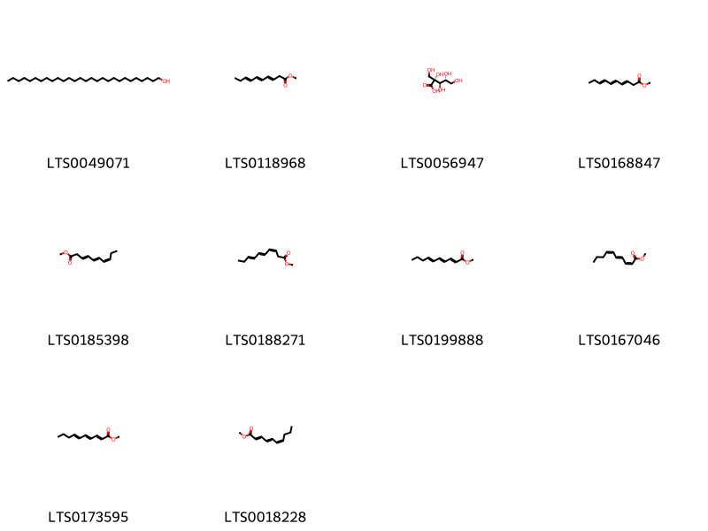{ width=100% }
    <figcaption>Hình ảnh cấu trúc hóa học của 10 hoạt chất thuộc nhóm Fatty Acyls gồm ['octacosanol (LTS0049071)', 'methyl (3e,5e)-deca-3,5,7-trienoate (LTS0118968)', '2-carboxy-d-arabinitol (LTS0056947)', 'methyl deca-3,5,7-trienoate (LTS0168847)', 'methyl (3e,5e,7z)-deca-3,5,7-trienoate (LTS0185398)', 'methyl (3z,5e,7e)-deca-3,5,7-trienoate (LTS0188271)', 'methyl (4e)-deca-2,4,6-trienoate (LTS0199888)', 'methyl (2z,4e,6z)-deca-2,4,6-trienoate (LTS0167046)', 'methyl (2e,4e)-deca-2,4,6-trienoate (LTS0173595)', 'methyl (2e,4e,6z)-deca-2,4,6-trienoate (LTS0018228)'].</figcaption>
</figure>
#### Nhóm Organooxygen compounds
<figure markdown="span">
    { width=100% }
    <figcaption>Hình ảnh cấu trúc hóa học của 1 hoạt chất thuộc nhóm Organooxygen compounds gồm ['sucrose (LTS0272557)'].</figcaption>
</figure>
#### Nhóm Prenol lipids
<figure markdown="span">
    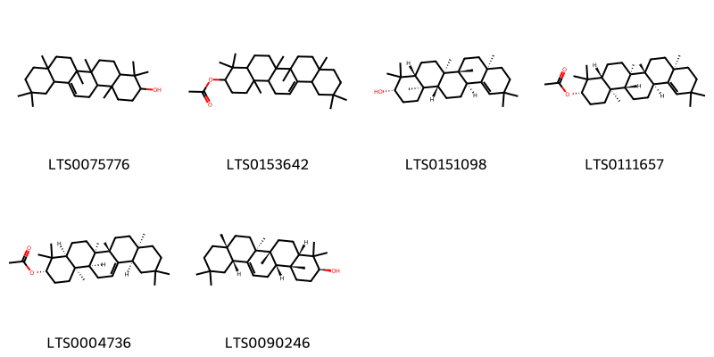{ width=100% }
    <figcaption>Hình ảnh cấu trúc hóa học của 6 hoạt chất thuộc nhóm Prenol lipids gồm ['β-amyrin (LTS0075776)', '4,4,6a,6b,8a,11,11,14b-octamethyl-1,2,3,4a,5,6,7,8,9,10,12,12a,14,14a-tetradecahydropicen-3-yl acetate (LTS0153642)', 'germanicol (LTS0151098)', '(3s,4ar,6ar,6br,8ar,12bs,14ar,14br)-4,4,6a,6b,8a,11,11,14b-octamethyl-1,2,3,4a,5,6,7,8,9,10,12b,13,14,14a-tetradecahydropicen-3-yl acetate (LTS0111657)', '(3s,4as,6ar,6bs,8ar,12ar,14as,14br)-4,4,6a,6b,8a,11,11,14b-octamethyl-1,2,3,4a,5,6,7,8,9,10,12,12a,14,14a-tetradecahydropicen-3-yl acetate (LTS0004736)', '(3s,4as,6ar,6bs,8ar,12ar,14as,14br)-4,4,6a,6b,8a,11,11,14b-octamethyl-1,2,3,4a,5,6,7,8,9,10,12,12a,14,14a-tetradecahydropicen-3-ol (LTS0090246)'].</figcaption>
</figure>
#### Nhóm Steroids and steroid derivatives
<figure markdown="span">
    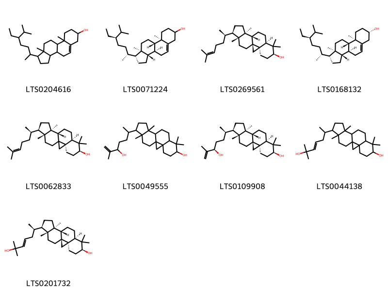{ width=100% }
    <figcaption>Hình ảnh cấu trúc hóa học của 9 hoạt chất thuộc nhóm Steroids and steroid derivatives gồm ['stigmast-5-en-3-ol, (3β)- (LTS0204616)', 'stigmast-5-en-3-ol (LTS0071224)', 'cycloartenol (LTS0269561)', 'sitosterol (LTS0168132)', '(3r,6s,8r,11s,12s,15r,16r)-7,7,12,16-tetramethyl-15-[(2r)-6-methylhept-5-en-2-yl]pentacyclo[9.7.0.0¹,³.0³,⁸.0¹²,¹⁶]octadecan-6-ol (LTS0062833)', '15-(5-hydroxy-6-methylhept-6-en-2-yl)-7,7,12,16-tetramethylpentacyclo[9.7.0.0¹,³.0³,⁸.0¹²,¹⁶]octadecan-6-ol (LTS0049555)', '(1s,3r,6s,8r,11s,12s,15r,16r)-15-[(2r,5r)-5-hydroxy-6-methylhept-6-en-2-yl]-7,7,12,16-tetramethylpentacyclo[9.7.0.0¹,³.0³,⁸.0¹²,¹⁶]octadecan-6-ol (LTS0109908)', '15-(6-hydroxy-6-methylhept-4-en-2-yl)-7,7,12,16-tetramethylpentacyclo[9.7.0.0¹,³.0³,⁸.0¹²,¹⁶]octadecan-6-ol (LTS0044138)', 'cycloart-23-ene-3β,25-diol (LTS0201732)'].</figcaption>
</figure>
#### Nhóm Tannins
<figure markdown="span">
    { width=100% }
    <figcaption>Hình ảnh cấu trúc hóa học của 1 hoạt chất thuộc nhóm Tannins gồm ['ellagic acid (LTS0037297)'].</figcaption>
</figure>

---

### Dược dân tộc học

Danh sách các quốc gia có sử dụng *Euphorbia pulcherrima* trong điều trị các bệnh. 

| Country   | Disease                | Bệnh                                                                                                                                                                                                |
|:----------|:-----------------------|:----------------------------------------------------------------------------------------------------------------------------------------------------------------------------------------------------|
| Elsewhere | nan                    | MYMEMORY WARNING: YOU USED ALL AVAILABLE FREE TRANSLATIONS FOR TODAY. NEXT AVAILABLE IN  20 HOURS 07 MINUTES 12 SECONDS VISIT HTTPS://MYMEMORY.TRANSLATED.NET/DOC/USAGELIMITS.PHP TO TRANSLATE MORE |
| Guatemala | Depilatory, Emetic     | MYMEMORY WARNING: YOU USED ALL AVAILABLE FREE TRANSLATIONS FOR TODAY. NEXT AVAILABLE IN  20 HOURS 07 MINUTES 09 SECONDS VISIT HTTPS://MYMEMORY.TRANSLATED.NET/DOC/USAGELIMITS.PHP TO TRANSLATE MORE |
| Mexico    | Lactagogue, Depilatory | MYMEMORY WARNING: YOU USED ALL AVAILABLE FREE TRANSLATIONS FOR TODAY. NEXT AVAILABLE IN  20 HOURS 07 MINUTES 05 SECONDS VISIT HTTPS://MYMEMORY.TRANSLATED.NET/DOC/USAGELIMITS.PHP TO TRANSLATE MORE |
| US        | Poison                 | MYMEMORY WARNING: YOU USED ALL AVAILABLE FREE TRANSLATIONS FOR TODAY. NEXT AVAILABLE IN  20 HOURS 07 MINUTES 02 SECONDS VISIT HTTPS://MYMEMORY.TRANSLATED.NET/DOC/USAGELIMITS.PHP TO TRANSLATE MORE |

---

---
## Euphorbia resinifera
### Thông tin về thực vật

!!! info "Phân loại thực vật của *Euphorbia resinifera* từ GIBF:"
    - **Kingdom:** Plantae
    - **Phylum:** Tracheophyta
    - **Order:** Malpighiales
    - **Family:** Euphorbiaceae
    - **Genus:** Euphorbia
    - **Species:** *Euphorbia resinifera*

 

| Label (VI)   | Label (EN)   | Scientific Name      | Descriptions (VI)   | Descriptions (EN)   | Also Known As (VI)   | Also Known As (EN)   |
|:-------------|:-------------|:---------------------|:--------------------|:--------------------|:---------------------|:---------------------|
| N/A          | N/A          | Euphorbia resinifera | loài thực vật       | species of plant    | ['']                 | ['']                 |

#### Phân bố trên thế giới

**Từ CSDL GIBF** nan, Suriname, Belgium, Spain, Egypt, unknown or invalid, India, Morocco, United States of America, Congo, Democratic Republic of the, New Zealand

#### Phân bố tại Việt Nam

**Từ CSDL GIBF**: Không có ghi nhận ở Việt Nam

---
### Thành phần hóa học
        
- Theo cơ sở dữ liệu lotus: Từ loài *Euphorbia resinifera* đã phân lập và xác định được 35 hoạt chất thuộc về các nhóm Hydroxy acids and derivatives, Prenol lipids, Oxepanes, Organooxygen compounds. 

|    | chemicalTaxonomyClassyfireClass   |   smiles_count |
|---:|:----------------------------------|---------------:|
|  0 | Hydroxy acids and derivatives     |              2 |
|  1 | Organooxygen compounds            |              4 |
|  2 | Oxepanes                          |              2 |
|  3 | Prenol lipids                     |             27 |

#### Nhóm Hydroxy acids and derivatives
<figure markdown="span">
    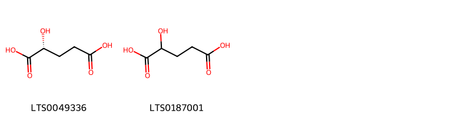{ width=100% }
    <figcaption>Hình ảnh cấu trúc hóa học của 2 hoạt chất thuộc nhóm Hydroxy acids and derivatives gồm ['d-2-hydroxyglutaric acid (LTS0049336)', '2-hydroxyglutaric acid (LTS0187001)'].</figcaption>
</figure>
#### Nhóm Organooxygen compounds
<figure markdown="span">
    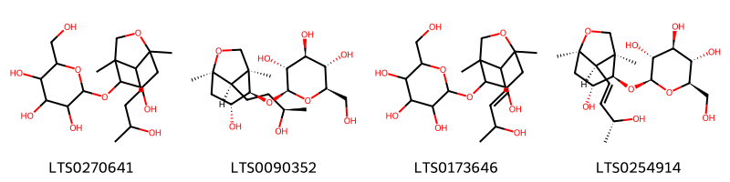{ width=100% }
    <figcaption>Hình ảnh cấu trúc hóa học của 4 hoạt chất thuộc nhóm Organooxygen compounds gồm ['2-{[3-hydroxy-8-(3-hydroxybutyl)-1,5-dimethyl-6-oxabicyclo[3.2.1]octan-2-yl]oxy}-6-(hydroxymethyl)oxane-3,4,5-triol (LTS0270641)', '(2r,3r,4s,5s,6r)-2-{[(1s,2r,3r,5r,8r)-3-hydroxy-8-[(3r)-3-hydroxybutyl]-1,5-dimethyl-6-oxabicyclo[3.2.1]octan-2-yl]oxy}-6-(hydroxymethyl)oxane-3,4,5-triol (LTS0090352)', '2-{[3-hydroxy-8-(3-hydroxybut-1-en-1-yl)-1,5-dimethyl-6-oxabicyclo[3.2.1]octan-2-yl]oxy}-6-(hydroxymethyl)oxane-3,4,5-triol (LTS0173646)', '(2r,3r,4s,5s,6r)-2-{[(1s,2r,3r,5r,8r)-3-hydroxy-8-[(1e,3r)-3-hydroxybut-1-en-1-yl]-1,5-dimethyl-6-oxabicyclo[3.2.1]octan-2-yl]oxy}-6-(hydroxymethyl)oxane-3,4,5-triol (LTS0254914)'].</figcaption>
</figure>
#### Nhóm Oxepanes
<figure markdown="span">
    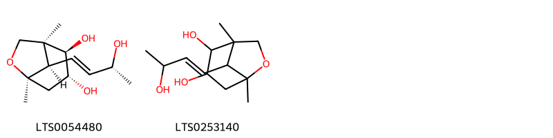{ width=100% }
    <figcaption>Hình ảnh cấu trúc hóa học của 2 hoạt chất thuộc nhóm Oxepanes gồm ['(1s,2r,3r,5r,8r)-8-[(1e,3r)-3-hydroxybut-1-en-1-yl]-1,5-dimethyl-6-oxabicyclo[3.2.1]octane-2,3-diol (LTS0054480)', '8-(3-hydroxybut-1-en-1-yl)-1,5-dimethyl-6-oxabicyclo[3.2.1]octane-2,3-diol (LTS0253140)'].</figcaption>
</figure>
#### Nhóm Prenol lipids
<figure markdown="span">
    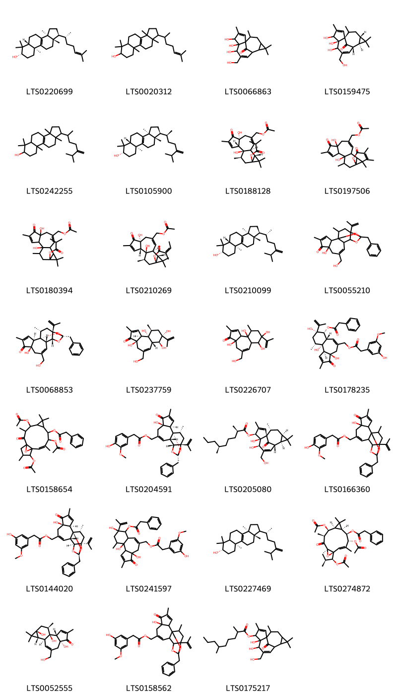{ width=100% }
    <figcaption>Hình ảnh cấu trúc hóa học của 27 hoạt chất thuộc nhóm Prenol lipids gồm ['euphol (LTS0220699)', 'lanster (LTS0020312)', '4,5,6-trihydroxy-7-(hydroxymethyl)-3,11,11,14-tetramethyltetracyclo[7.5.1.0¹,⁵.0¹⁰,¹²]pentadeca-2,7-dien-15-one (LTS0066863)', '(1s,5r,9s,10r,12s)-4,5,6-trihydroxy-7-(hydroxymethyl)-3,11,11,14-tetramethyltetracyclo[7.5.1.0¹,⁵.0¹⁰,¹²]pentadeca-2,7-dien-15-one (LTS0159475)', '3a,6,6,9a,11a-pentamethyl-1-(6-methyl-5-methylideneheptan-2-yl)-1h,2h,3h,4h,5h,5ah,7h,8h,9h,10h,11h-cyclopenta[a]phenanthren-7-ol (LTS0242255)', '(1s,3as,5ar,7s,9as,11as)-3a,6,6,9a,11a-pentamethyl-1-[(2s)-6-methyl-5-methylideneheptan-2-yl]-1h,2h,3h,4h,5h,5ah,7h,8h,9h,10h,11h-cyclopenta[a]phenanthren-7-ol (LTS0105900)', '(1r,2s,6r,10s,11r,13s,15r)-8-[(acetyloxy)methyl]-1,6-dihydroxy-4,12,12,15-tetramethyl-5-oxotetracyclo[8.5.0.0²,⁶.0¹¹,¹³]pentadeca-3,8-dien-13-yl 2-methylpropanoate (LTS0188128)', '8-[(acetyloxy)methyl]-1,6-dihydroxy-4,12,12,15-tetramethyl-5-oxotetracyclo[8.5.0.0²,⁶.0¹¹,¹³]pentadeca-3,8-dien-13-yl 2-methylbut-2-enoate (LTS0197506)', '8-[(acetyloxy)methyl]-1,6-dihydroxy-4,12,12,15-tetramethyl-5-oxotetracyclo[8.5.0.0²,⁶.0¹¹,¹³]pentadeca-3,8-dien-13-yl 2-methylpropanoate (LTS0180394)', '(1r,2s,6r,10s,11r,13s,15r)-8-[(acetyloxy)methyl]-1,6-dihydroxy-4,12,12,15-tetramethyl-5-oxotetracyclo[8.5.0.0²,⁶.0¹¹,¹³]pentadeca-3,8-dien-13-yl (2z)-2-methylbut-2-enoate (LTS0210269)', '(1s,3as,5ar,7s,9as,11as)-3a,6,6,9a,11a-pentamethyl-1-[(2r)-6-methyl-5-methylideneheptan-2-yl]-1h,2h,3h,4h,5h,5ah,7h,8h,9h,10h,11h-cyclopenta[a]phenanthren-7-ol (LTS0210099)', '13-benzyl-6-hydroxy-8-(hydroxymethyl)-4,17-dimethyl-15-(prop-1-en-2-yl)-12,14,18-trioxapentacyclo[11.4.1.0¹,¹⁰.0²,⁶.0¹¹,¹⁵]octadeca-3,8-dien-5-one (LTS0055210)', '(1r,2r,6r,10s,11r,13s,15r,17r)-13-benzyl-6-hydroxy-8-(hydroxymethyl)-4,17-dimethyl-15-(prop-1-en-2-yl)-12,14,18-trioxapentacyclo[11.4.1.0¹,¹⁰.0²,⁶.0¹¹,¹⁵]octadeca-3,8-dien-5-one (LTS0068853)', '(3ar,6as,7s,8r,10s,10ar,10bs)-3a,7,8,10a-tetrahydroxy-5-(hydroxymethyl)-2,10-dimethyl-8-(prop-1-en-2-yl)-4h,6ah,7h,9h,10h,10bh-cyclohexa[e]azulen-3-one (LTS0237759)', '3a,7,8,10a-tetrahydroxy-5-(hydroxymethyl)-2,10-dimethyl-8-(prop-1-en-2-yl)-4h,6ah,7h,9h,10h,10bh-cyclohexa[e]azulen-3-one (LTS0226707)', '[(3ar,6as,7r,8r,10r,10ar,10bs)-3a,8,10a-trihydroxy-2,10-dimethyl-3-oxo-7-[(2-phenylacetyl)oxy]-8-(prop-1-en-2-yl)-4h,6ah,7h,9h,10h,10bh-cyclohexa[e]azulen-5-yl]methyl 2-(3-hydroxy-5-methoxyphenyl)acetate (LTS0178235)', '4,9,13-tris(acetyloxy)-3,6,6,10,14-pentamethyl-2-oxo-16-oxatetracyclo[10.3.1.0¹,¹².0⁵,⁷]hexadec-10-en-8-yl 2-phenylacetate (LTS0158654)', 'resiniferatoxin (LTS0204591)', '(1r,4s,5s,6r,9s,10r,12r,14r)-5,6-dihydroxy-7-(hydroxymethyl)-3,11,11,14-tetramethyl-15-oxotetracyclo[7.5.1.0¹,⁵.0¹⁰,¹²]pentadeca-2,7-dien-4-yl (2r,6s)-2,6-dimethylnonanoate (LTS0205080)', '[13-benzyl-6-hydroxy-4,17-dimethyl-5-oxo-15-(prop-1-en-2-yl)-12,14,18-trioxapentacyclo[11.4.1.0¹,¹⁰.0²,⁶.0¹¹,¹⁵]octadeca-3,8-dien-8-yl]methyl 2-(4-hydroxy-3-methoxyphenyl)acetate (LTS0166360)', '[(1s,2r,6r,10s,11s,13r,15s,17r)-13-benzyl-6-hydroxy-4,17-dimethyl-5-oxo-15-(prop-1-en-2-yl)-12,14,18-trioxapentacyclo[11.4.1.0¹,¹⁰.0²,⁶.0¹¹,¹⁵]octadeca-3,8-dien-8-yl]methyl 2-(3-hydroxy-5-methoxyphenyl)acetate (LTS0144020)', '{3a,8,10a-trihydroxy-2,10-dimethyl-3-oxo-7-[(2-phenylacetyl)oxy]-8-(prop-1-en-2-yl)-4h,6ah,7h,9h,10h,10bh-cyclohexa[e]azulen-5-yl}methyl 2-(3-hydroxy-5-methoxyphenyl)acetate (LTS0241597)', '(3as,7s,9as,11as)-3a,6,6,9a,11a-pentamethyl-1-[(2r)-6-methyl-5-methylideneheptan-2-yl]-1h,2h,3h,4h,5h,5ah,7h,8h,9h,10h,11h-cyclopenta[a]phenanthren-7-ol (LTS0227469)', '(1r,3s,4s,5r,7s,8r,9r,10e,12s,13s,14s)-4,9,13-tris(acetyloxy)-3,6,6,10,14-pentamethyl-2-oxo-16-oxatetracyclo[10.3.1.0¹,¹².0⁵,⁷]hexadec-10-en-8-yl 2-phenylacetate (LTS0274872)', '(1r,2s,6r,10s,11r,13s,15r)-1,6,13-trihydroxy-8-(hydroxymethyl)-4,12,12,15-tetramethyltetracyclo[8.5.0.0²,⁶.0¹¹,¹³]pentadeca-3,8-dien-5-one (LTS0052555)', '[13-benzyl-6-hydroxy-4,17-dimethyl-5-oxo-15-(prop-1-en-2-yl)-12,14,18-trioxapentacyclo[11.4.1.0¹,¹⁰.0²,⁶.0¹¹,¹⁵]octadeca-3,8-dien-8-yl]methyl 2-(3-hydroxy-5-methoxyphenyl)acetate (LTS0158562)', '5,6-dihydroxy-7-(hydroxymethyl)-3,11,11,14-tetramethyl-15-oxotetracyclo[7.5.1.0¹,⁵.0¹⁰,¹²]pentadeca-2,7-dien-4-yl 2,6-dimethylnonanoate (LTS0175217)'].</figcaption>
</figure>

---

### Dược dân tộc học

Danh sách các quốc gia có sử dụng *Euphorbia resinifera* trong điều trị các bệnh. 

| Country   | Disease       | Bệnh                                                                                                                                                                                                |
|:----------|:--------------|:----------------------------------------------------------------------------------------------------------------------------------------------------------------------------------------------------|
| Danish    | Rubefacient   | MYMEMORY WARNING: YOU USED ALL AVAILABLE FREE TRANSLATIONS FOR TODAY. NEXT AVAILABLE IN  20 HOURS 06 MINUTES 23 SECONDS VISIT HTTPS://MYMEMORY.TRANSLATED.NET/DOC/USAGELIMITS.PHP TO TRANSLATE MORE |
| Dutch     | Vesicant      | MYMEMORY WARNING: YOU USED ALL AVAILABLE FREE TRANSLATIONS FOR TODAY. NEXT AVAILABLE IN  20 HOURS 06 MINUTES 20 SECONDS VISIT HTTPS://MYMEMORY.TRANSLATED.NET/DOC/USAGELIMITS.PHP TO TRANSLATE MORE |
| Elsewhere | Purgative     | MYMEMORY WARNING: YOU USED ALL AVAILABLE FREE TRANSLATIONS FOR TODAY. NEXT AVAILABLE IN  20 HOURS 06 MINUTES 17 SECONDS VISIT HTTPS://MYMEMORY.TRANSLATED.NET/DOC/USAGELIMITS.PHP TO TRANSLATE MORE |
| French    | Abortifacient | MYMEMORY WARNING: YOU USED ALL AVAILABLE FREE TRANSLATIONS FOR TODAY. NEXT AVAILABLE IN  20 HOURS 06 MINUTES 14 SECONDS VISIT HTTPS://MYMEMORY.TRANSLATED.NET/DOC/USAGELIMITS.PHP TO TRANSLATE MORE |
| German    | Poison        | MYMEMORY WARNING: YOU USED ALL AVAILABLE FREE TRANSLATIONS FOR TODAY. NEXT AVAILABLE IN  20 HOURS 06 MINUTES 11 SECONDS VISIT HTTPS://MYMEMORY.TRANSLATED.NET/DOC/USAGELIMITS.PHP TO TRANSLATE MORE |
| India     | Purgative     | MYMEMORY WARNING: YOU USED ALL AVAILABLE FREE TRANSLATIONS FOR TODAY. NEXT AVAILABLE IN  20 HOURS 06 MINUTES 08 SECONDS VISIT HTTPS://MYMEMORY.TRANSLATED.NET/DOC/USAGELIMITS.PHP TO TRANSLATE MORE |
| US        | Emetic        | MYMEMORY WARNING: YOU USED ALL AVAILABLE FREE TRANSLATIONS FOR TODAY. NEXT AVAILABLE IN  20 HOURS 06 MINUTES 06 SECONDS VISIT HTTPS://MYMEMORY.TRANSLATED.NET/DOC/USAGELIMITS.PHP TO TRANSLATE MORE |

---

---
## Euphorbia rosea
### Thông tin về thực vật

!!! info "Phân loại thực vật của *Euphorbia rosea* từ GIBF:"
    - **Kingdom:** Plantae
    - **Phylum:** Tracheophyta
    - **Order:** Malpighiales
    - **Family:** Euphorbiaceae
    - **Genus:** Euphorbia
    - **Species:** *Euphorbia rosea*

 

| Label (VI)   | Label (EN)   | Scientific Name   | Descriptions (VI)   | Descriptions (EN)   | Also Known As (VI)   | Also Known As (EN)   |
|:-------------|:-------------|:------------------|:--------------------|:--------------------|:---------------------|:---------------------|
| N/A          | N/A          | Euphorbia rosea   | loài thực vật       | species of plant    | ['']                 | ['']                 |

#### Phân bố trên thế giới

**Từ CSDL GIBF** nan, Sri Lanka, Spain, India, unknown or invalid, Viet Nam, Nepal

#### Phân bố tại Việt Nam

**Từ CSDL GIBF**: Không có ghi nhận ở Việt Nam

---
### Thành phần hóa học
        
- Theo cơ sở dữ liệu lotus: Từ loài *Euphorbia rosea* đã phân lập và xác định được Chưa có hoạt chất nào được phân lập. hoạt chất thuộc về các nhóm Không có hoạt chất nào được phân lập. 

Không có hình ảnh nào được tạo ra

---

### Dược dân tộc học

Danh sách các quốc gia có sử dụng *Euphorbia rosea* trong điều trị các bệnh. 

| Country   | Disease   | Bệnh                                                                                                                                                                                                |
|:----------|:----------|:----------------------------------------------------------------------------------------------------------------------------------------------------------------------------------------------------|
| India     | Vermifuge | MYMEMORY WARNING: YOU USED ALL AVAILABLE FREE TRANSLATIONS FOR TODAY. NEXT AVAILABLE IN  20 HOURS 05 MINUTES 42 SECONDS VISIT HTTPS://MYMEMORY.TRANSLATED.NET/DOC/USAGELIMITS.PHP TO TRANSLATE MORE |

---

---
## Euphorbia royleana
### Thông tin về thực vật

!!! info "Phân loại thực vật của *Euphorbia royleana* từ GIBF:"
    - **Kingdom:** Plantae
    - **Phylum:** Tracheophyta
    - **Order:** Malpighiales
    - **Family:** Euphorbiaceae
    - **Genus:** Euphorbia
    - **Species:** *Euphorbia royleana*

 

| Label (VI)   | Label (EN)   | Scientific Name    | Descriptions (VI)   | Descriptions (EN)   | Also Known As (VI)   | Also Known As (EN)                         |
|:-------------|:-------------|:-------------------|:--------------------|:--------------------|:---------------------|:-------------------------------------------|
| N/A          | N/A          | Euphorbia royleana | loài thực vật       | species of plant    | ['']                 | ['Churee', 'Danda Thor', "Royle's Spurge"] |

#### Phân bố trên thế giới

**Từ CSDL GIBF** nan, Pakistan, Belgium, Egypt, Bhutan, India, United States of America, China, Nepal

#### Phân bố tại Việt Nam

**Từ CSDL GIBF**: Không có ghi nhận ở Việt Nam

---
### Thành phần hóa học
        
- Theo cơ sở dữ liệu lotus: Từ loài *Euphorbia royleana* đã phân lập và xác định được 22 hoạt chất thuộc về các nhóm Carboxylic acids and derivatives, Prenol lipids, Benzene and substituted derivatives. 

|    | chemicalTaxonomyClassyfireClass     |   smiles_count |
|---:|:------------------------------------|---------------:|
|  0 | Benzene and substituted derivatives |              1 |
|  1 | Carboxylic acids and derivatives    |              5 |
|  2 | Prenol lipids                       |             16 |

#### Nhóm Benzene and substituted derivatives
<figure markdown="span">
    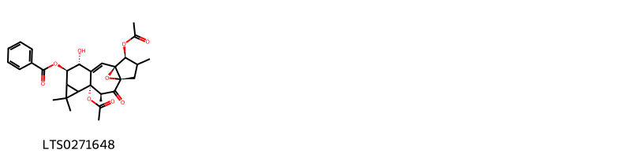{ width=100% }
    <figcaption>Hình ảnh cấu trúc hóa học của 1 hoạt chất thuộc nhóm Benzene and substituted derivatives gồm ['(1s,4r,5r,9s,10s,12r,15s)-9,15-bis(acetyloxy)-4-hydroxy-7,7,10,14-tetramethyl-11-oxo-16-oxapentacyclo[10.3.1.0¹,¹².0³,⁹.0⁶,⁸]hexadec-2-en-5-yl benzoate (LTS0271648)'].</figcaption>
</figure>
#### Nhóm Carboxylic acids and derivatives
<figure markdown="span">
    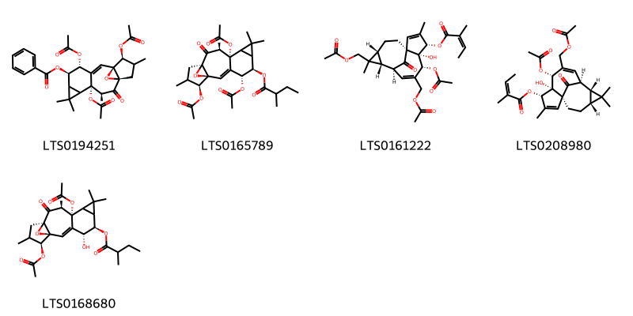{ width=100% }
    <figcaption>Hình ảnh cấu trúc hóa học của 5 hoạt chất thuộc nhóm Carboxylic acids and derivatives gồm ['(1s,4r,5r,9s,10s,12r,15s)-4,9,15-tris(acetyloxy)-7,7,10,14-tetramethyl-11-oxo-16-oxapentacyclo[10.3.1.0¹,¹².0³,⁹.0⁶,⁸]hexadec-2-en-5-yl benzoate (LTS0194251)', '(1s,4r,5r,9s,10s,12r,15s)-4,9,15-tris(acetyloxy)-7,7,10,14-tetramethyl-11-oxo-16-oxapentacyclo[10.3.1.0¹,¹².0³,⁹.0⁶,⁸]hexadec-2-en-5-yl 2-methylbutanoate (LTS0165789)', '(1s,4s,5r,6r,9s,10r,12r)-6-(acetyloxy)-7,11-bis[(acetyloxy)methyl]-5-hydroxy-3,11-dimethyl-15-oxotetracyclo[7.5.1.0¹,⁵.0¹⁰,¹²]pentadeca-2,7-dien-4-yl (2z)-2-methylbut-2-enoate (LTS0161222)', '(1s,4s,5r,6r,9s,10r,12r)-6-(acetyloxy)-7-[(acetyloxy)methyl]-5-hydroxy-3,11,11-trimethyl-15-oxotetracyclo[7.5.1.0¹,⁵.0¹⁰,¹²]pentadeca-2,7-dien-4-yl (2z)-2-methylbut-2-enoate (LTS0208980)', '(1s,4r,5r,9s,10s,12r,15s)-9,15-bis(acetyloxy)-4-hydroxy-7,7,10,14-tetramethyl-11-oxo-16-oxapentacyclo[10.3.1.0¹,¹².0³,⁹.0⁶,⁸]hexadec-2-en-5-yl 2-methylbutanoate (LTS0168680)'].</figcaption>
</figure>
#### Nhóm Prenol lipids
<figure markdown="span">
    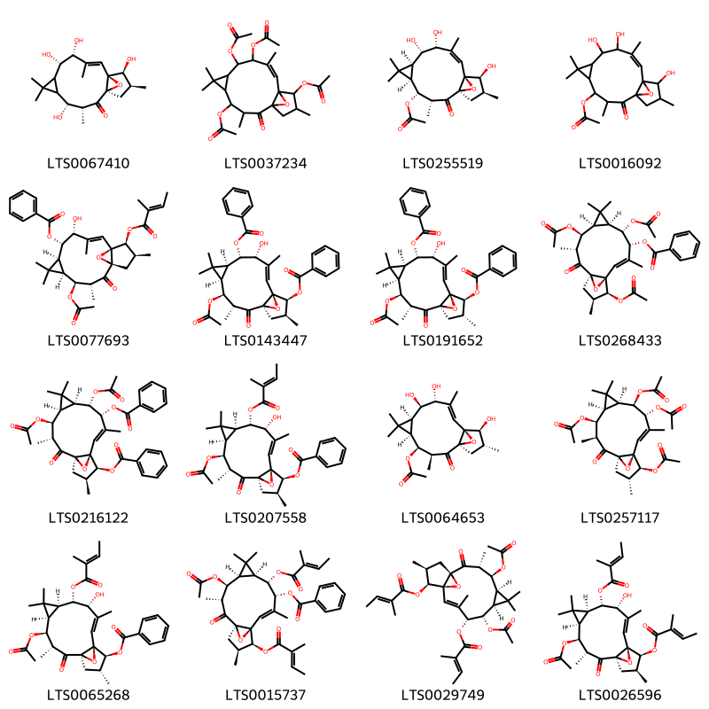{ width=100% }
    <figcaption>Hình ảnh cấu trúc hóa học của 16 hoạt chất thuộc nhóm Prenol lipids gồm ['ingol (LTS0067410)', '4,8,9-tris(acetyloxy)-3,6,6,10,14-pentamethyl-2-oxo-16-oxatetracyclo[10.3.1.0¹,¹².0⁵,⁷]hexadec-10-en-13-yl acetate (LTS0037234)', '(1r,3r,4r,5r,7s,8s,9r,10z,12s,13s,14s)-8,9,13-trihydroxy-3,6,6,10,14-pentamethyl-2-oxo-16-oxatetracyclo[10.3.1.0¹,¹².0⁵,⁷]hexadec-10-en-4-yl acetate (LTS0255519)', '8,9,13-trihydroxy-3,6,6,10,14-pentamethyl-2-oxo-16-oxatetracyclo[10.3.1.0¹,¹².0⁵,⁷]hexadec-10-en-4-yl acetate (LTS0016092)', '(1r,3r,4s,5r,7s,8s,9r,10e,12s,13s,14s)-4-(acetyloxy)-9-hydroxy-3,6,6,10,14-pentamethyl-13-{[(2e)-2-methylbut-2-enoyl]oxy}-2-oxo-16-oxatetracyclo[10.3.1.0¹,¹².0⁵,⁷]hexadec-10-en-8-yl benzoate (LTS0077693)', '(1r,3r,4s,5r,7s,8s,9r,10e,12s,13s,14s)-4-(acetyloxy)-8-(benzoyloxy)-9-hydroxy-3,6,6,10,14-pentamethyl-2-oxo-16-oxatetracyclo[10.3.1.0¹,¹².0⁵,⁷]hexadec-10-en-13-yl benzoate (LTS0143447)', '(1r,3r,4s,5r,7s,8s,9r,10e,12s,13s,14r)-4-(acetyloxy)-8-(benzoyloxy)-9-hydroxy-3,6,6,10,14-pentamethyl-2-oxo-16-oxatetracyclo[10.3.1.0¹,¹².0⁵,⁷]hexadec-10-en-13-yl benzoate (LTS0191652)', '(1r,3r,4s,5r,7s,8s,9r,10e,12s,13s,14s)-4,8,13-tris(acetyloxy)-3,6,6,10,14-pentamethyl-2-oxo-16-oxatetracyclo[10.3.1.0¹,¹².0⁵,⁷]hexadec-10-en-9-yl benzoate (LTS0268433)', '(1r,3r,4s,5r,7s,8s,9r,10e,12s,13s,14s)-4,8-bis(acetyloxy)-9-(benzoyloxy)-3,6,6,10,14-pentamethyl-2-oxo-16-oxatetracyclo[10.3.1.0¹,¹².0⁵,⁷]hexadec-10-en-13-yl benzoate (LTS0216122)', '(1r,3r,4s,5r,7s,8s,9r,10e,12s,13s,14s)-4-(acetyloxy)-9-hydroxy-3,6,6,10,14-pentamethyl-8-{[(2e)-2-methylbut-2-enoyl]oxy}-2-oxo-16-oxatetracyclo[10.3.1.0¹,¹².0⁵,⁷]hexadec-10-en-13-yl benzoate (LTS0207558)', '(1r,3s,4s,5r,7s,8r,9r,10e,12s,13s,14r)-8,9,13-trihydroxy-3,6,6,10,14-pentamethyl-2-oxo-16-oxatetracyclo[10.3.1.0¹,¹².0⁵,⁷]hexadec-10-en-4-yl acetate (LTS0064653)', '(1r,3s,4s,5r,7s,8r,9r,10e,12s,13s,14r)-4,8,9-tris(acetyloxy)-3,6,6,10,14-pentamethyl-2-oxo-16-oxatetracyclo[10.3.1.0¹,¹².0⁵,⁷]hexadec-10-en-13-yl acetate (LTS0257117)', '(1r,3r,4s,5r,7s,8s,9r,10e,12s,13s,14r)-4-(acetyloxy)-9-hydroxy-3,6,6,10,14-pentamethyl-8-{[(2e)-2-methylbut-2-enoyl]oxy}-2-oxo-16-oxatetracyclo[10.3.1.0¹,¹².0⁵,⁷]hexadec-10-en-13-yl benzoate (LTS0065268)', '(1r,3r,4s,5r,7s,8s,9r,10e,12s,13s,14s)-4-(acetyloxy)-3,6,6,10,14-pentamethyl-8,13-bis({[(2e)-2-methylbut-2-enoyl]oxy})-2-oxo-16-oxatetracyclo[10.3.1.0¹,¹².0⁵,⁷]hexadec-10-en-9-yl benzoate (LTS0015737)', '(1r,3r,4s,5r,7s,8s,9r,10e,12s,13s,14s)-4,8-bis(acetyloxy)-3,6,6,10,14-pentamethyl-9-{[(2e)-2-methylbut-2-enoyl]oxy}-2-oxo-16-oxatetracyclo[10.3.1.0¹,¹².0⁵,⁷]hexadec-10-en-13-yl (2e)-2-methylbut-2-enoate (LTS0029749)', '(1r,3r,4s,5r,7s,8s,9r,10e,12s,13s,14s)-4-(acetyloxy)-9-hydroxy-3,6,6,10,14-pentamethyl-13-{[(2e)-2-methylbut-2-enoyl]oxy}-2-oxo-16-oxatetracyclo[10.3.1.0¹,¹².0⁵,⁷]hexadec-10-en-8-yl (2e)-2-methylbut-2-enoate (LTS0026596)'].</figcaption>
</figure>

---

### Dược dân tộc học

Danh sách các quốc gia có sử dụng *Euphorbia royleana* trong điều trị các bệnh. 

| Country   | Disease              | Bệnh                                                                                                                                                                                                |
|:----------|:---------------------|:----------------------------------------------------------------------------------------------------------------------------------------------------------------------------------------------------|
| India     | Cathartic, Vermifuge | MYMEMORY WARNING: YOU USED ALL AVAILABLE FREE TRANSLATIONS FOR TODAY. NEXT AVAILABLE IN  20 HOURS 05 MINUTES 18 SECONDS VISIT HTTPS://MYMEMORY.TRANSLATED.NET/DOC/USAGELIMITS.PHP TO TRANSLATE MORE |

---

---
## Euphorbia schlechtendalii
### Thông tin về thực vật

!!! info "Phân loại thực vật của *Euphorbia schlechtendalii* từ GIBF:"
    - **Kingdom:** Plantae
    - **Phylum:** Tracheophyta
    - **Order:** Malpighiales
    - **Family:** Euphorbiaceae
    - **Genus:** Euphorbia
    - **Species:** *Euphorbia schlechtendalii*

 

| Label (VI)   | Label (EN)   | Scientific Name           | Descriptions (VI)   | Descriptions (EN)   | Also Known As (VI)   | Also Known As (EN)   |
|:-------------|:-------------|:--------------------------|:--------------------|:--------------------|:---------------------|:---------------------|
| N/A          | N/A          | Euphorbia schlechtendalii | loài thực vật       | species of plant    | ['']                 | ['']                 |

#### Phân bố trên thế giới

**Từ CSDL GIBF** Nicaragua, Guatemala, Costa Rica, Mexico, El Salvador

#### Phân bố tại Việt Nam

**Từ CSDL GIBF**: Không có ghi nhận ở Việt Nam

---
### Thành phần hóa học
        
- Theo cơ sở dữ liệu lotus: Từ loài *Euphorbia schlechtendalii* đã phân lập và xác định được Chưa có hoạt chất nào được phân lập. hoạt chất thuộc về các nhóm Không có hoạt chất nào được phân lập. 

Không có hình ảnh nào được tạo ra

---

### Dược dân tộc học

Danh sách các quốc gia có sử dụng *Euphorbia schlechtendalii* trong điều trị các bệnh. 

| Country   | Disease           | Bệnh                                                                                                                                                                                                |
|:----------|:------------------|:----------------------------------------------------------------------------------------------------------------------------------------------------------------------------------------------------|
| Mexico    | Piscicide, Poison | MYMEMORY WARNING: YOU USED ALL AVAILABLE FREE TRANSLATIONS FOR TODAY. NEXT AVAILABLE IN  20 HOURS 04 MINUTES 54 SECONDS VISIT HTTPS://MYMEMORY.TRANSLATED.NET/DOC/USAGELIMITS.PHP TO TRANSLATE MORE |

---

---
## Euphorbia serpens
### Thông tin về thực vật

!!! info "Phân loại thực vật của *Euphorbia serpens* từ GIBF:"
    - **Kingdom:** Plantae
    - **Phylum:** Tracheophyta
    - **Order:** Malpighiales
    - **Family:** Euphorbiaceae
    - **Genus:** Euphorbia
    - **Species:** *Euphorbia serpens*

 

| Label (VI)   | Label (EN)   | Scientific Name   | Descriptions (VI)   | Descriptions (EN)   | Also Known As (VI)   | Also Known As (EN)   |
|:-------------|:-------------|:------------------|:--------------------|:--------------------|:---------------------|:---------------------|
| N/A          | N/A          | Euphorbia serpens |                     | species of plant    | ['']                 | ['']                 |

#### Phân bố trên thế giới

**Từ CSDL GIBF** United Arab Emirates, Australia, Belgium, Argentina, Israel, Pakistan, Puerto Rico, Netherlands, Namibia, Chinese Taipei, Malta, Spain, Bolivia (Plurinational State of), United States of America, Uruguay, Chile, Saudi Arabia, Saint Martin (French part), South Africa, Thailand, Brazil, Switzerland, Peru, Mexico, China, Curaçao, Saint Kitts and Nevis, Cabo Verde, India, Antigua and Barbuda

#### Phân bố tại Việt Nam

**Từ CSDL GIBF**: Không có ghi nhận ở Việt Nam

---
### Thành phần hóa học
        
- Theo cơ sở dữ liệu lotus: Từ loài *Euphorbia serpens* đã phân lập và xác định được Chưa có hoạt chất nào được phân lập. hoạt chất thuộc về các nhóm Không có hoạt chất nào được phân lập. 

Không có hình ảnh nào được tạo ra

---

### Dược dân tộc học

Danh sách các quốc gia có sử dụng *Euphorbia serpens* trong điều trị các bệnh. 

| Country   | Disease               | Bệnh                                                                                                                                                                                                |
|:----------|:----------------------|:----------------------------------------------------------------------------------------------------------------------------------------------------------------------------------------------------|
| Argentina | Diuretic, Emmenagogue | MYMEMORY WARNING: YOU USED ALL AVAILABLE FREE TRANSLATIONS FOR TODAY. NEXT AVAILABLE IN  20 HOURS 04 MINUTES 20 SECONDS VISIT HTTPS://MYMEMORY.TRANSLATED.NET/DOC/USAGELIMITS.PHP TO TRANSLATE MORE |

---

---
## Euphorbia sieboldiana
### Thông tin về thực vật

!!! info "Phân loại thực vật của *Euphorbia sieboldiana* từ GIBF:"
    - **Kingdom:** Plantae
    - **Phylum:** Tracheophyta
    - **Order:** Malpighiales
    - **Family:** Euphorbiaceae
    - **Genus:** Euphorbia
    - **Species:** *Euphorbia sieboldiana*

 

| Label (VI)   | Label (EN)   | Scientific Name       | Descriptions (VI)   | Descriptions (EN)   | Also Known As (VI)   | Also Known As (EN)   |
|:-------------|:-------------|:----------------------|:--------------------|:--------------------|:---------------------|:---------------------|
| N/A          | N/A          | Euphorbia sieboldiana | loài thực vật       | species of plant    | ['']                 | ["Siebold's spurge"] |

#### Phân bố trên thế giới

**Từ CSDL GIBF** nan, Japan, Korea, Republic of, Russian Federation, China

#### Phân bố tại Việt Nam

**Từ CSDL GIBF**: Không có ghi nhận ở Việt Nam

---
### Thành phần hóa học
        
- Theo cơ sở dữ liệu lotus: Từ loài *Euphorbia sieboldiana* đã phân lập và xác định được 5 hoạt chất thuộc về các nhóm Prenol lipids. 

|    | chemicalTaxonomyClassyfireClass   |   smiles_count |
|---:|:----------------------------------|---------------:|
|  0 | Prenol lipids                     |              5 |

#### Nhóm Prenol lipids
<figure markdown="span">
    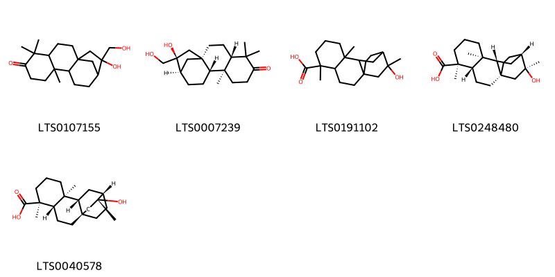{ width=100% }
    <figcaption>Hình ảnh cấu trúc hóa học của 5 hoạt chất thuộc nhóm Prenol lipids gồm ['14-hydroxy-14-(hydroxymethyl)-5,5,9-trimethyltetracyclo[11.2.1.0¹,¹⁰.0⁴,⁹]hexadecan-6-one (LTS0107155)', '(1s,4s,9s,10r,13r,14s)-14-hydroxy-14-(hydroxymethyl)-5,5,9-trimethyltetracyclo[11.2.1.0¹,¹⁰.0⁴,⁹]hexadecan-6-one (LTS0007239)', '13-hydroxy-5,9,13-trimethyltetracyclo[10.2.2.0¹,¹⁰.0⁴,⁹]hexadecane-5-carboxylic acid (LTS0191102)', '(1s,4s,5s,9s,10r,12s,13s)-13-hydroxy-5,9,13-trimethyltetracyclo[10.2.2.0¹,¹⁰.0⁴,⁹]hexadecane-5-carboxylic acid (LTS0248480)', '(1s,4s,5s,9s,10r,12s,13r)-13-hydroxy-5,9,13-trimethyltetracyclo[10.2.2.0¹,¹⁰.0⁴,⁹]hexadecane-5-carboxylic acid (LTS0040578)'].</figcaption>
</figure>

---

### Dược dân tộc học

Danh sách các quốc gia có sử dụng *Euphorbia sieboldiana* trong điều trị các bệnh. 

| Country   | Disease                                                | Bệnh                                                                                                                                                                                                |
|:----------|:-------------------------------------------------------|:----------------------------------------------------------------------------------------------------------------------------------------------------------------------------------------------------|
| China     | Diuretic, Laxative, Laxative, Poison, Poison, Diuretic | MYMEMORY WARNING: YOU USED ALL AVAILABLE FREE TRANSLATIONS FOR TODAY. NEXT AVAILABLE IN  20 HOURS 03 MINUTES 52 SECONDS VISIT HTTPS://MYMEMORY.TRANSLATED.NET/DOC/USAGELIMITS.PHP TO TRANSLATE MORE |

---

---
## Euphorbia thomsoniana
### Thông tin về thực vật

!!! info "Phân loại thực vật của *Euphorbia thomsoniana* từ GIBF:"
    - **Kingdom:** Plantae
    - **Phylum:** Tracheophyta
    - **Order:** Malpighiales
    - **Family:** Euphorbiaceae
    - **Genus:** Euphorbia
    - **Species:** *Euphorbia thomsoniana*

 

| Label (VI)   | Label (EN)   | Scientific Name       | Descriptions (VI)   | Descriptions (EN)   | Also Known As (VI)   | Also Known As (EN)   |
|:-------------|:-------------|:----------------------|:--------------------|:--------------------|:---------------------|:---------------------|
| N/A          | N/A          | Euphorbia thomsoniana | loài thực vật       | species of plant    | ['']                 | ['']                 |

#### Phân bố trên thế giới

**Từ CSDL GIBF** nan, Pakistan, Sri Lanka, Afghanistan, unknown or invalid, Nepal, India, Kazakhstan, Viet Nam, China, Uzbekistan

#### Phân bố tại Việt Nam

**Từ CSDL GIBF**: Dalat

---
### Thành phần hóa học
        
- Theo cơ sở dữ liệu lotus: Từ loài *Euphorbia thomsoniana* đã phân lập và xác định được Chưa có hoạt chất nào được phân lập. hoạt chất thuộc về các nhóm Không có hoạt chất nào được phân lập. 

Không có hình ảnh nào được tạo ra

---

### Dược dân tộc học

Danh sách các quốc gia có sử dụng *Euphorbia thomsoniana* trong điều trị các bệnh. 

| Country   | Disease   | Bệnh                                                                                                                                                                                                |
|:----------|:----------|:----------------------------------------------------------------------------------------------------------------------------------------------------------------------------------------------------|
| India     | Purgative | MYMEMORY WARNING: YOU USED ALL AVAILABLE FREE TRANSLATIONS FOR TODAY. NEXT AVAILABLE IN  20 HOURS 03 MINUTES 26 SECONDS VISIT HTTPS://MYMEMORY.TRANSLATED.NET/DOC/USAGELIMITS.PHP TO TRANSLATE MORE |
| Kashmir   | Purgative | MYMEMORY WARNING: YOU USED ALL AVAILABLE FREE TRANSLATIONS FOR TODAY. NEXT AVAILABLE IN  20 HOURS 03 MINUTES 23 SECONDS VISIT HTTPS://MYMEMORY.TRANSLATED.NET/DOC/USAGELIMITS.PHP TO TRANSLATE MORE |

---

---
## Euphorbia thymifolia
### Thông tin về thực vật

!!! info "Phân loại thực vật của *Euphorbia thymifolia* từ GIBF:"
    - **Kingdom:** Plantae
    - **Phylum:** Tracheophyta
    - **Order:** Malpighiales
    - **Family:** Euphorbiaceae
    - **Genus:** Euphorbia
    - **Species:** *Euphorbia thymifolia*

 

| Label (VI)   | Label (EN)   | Scientific Name      | Descriptions (VI)   | Descriptions (EN)   | Also Known As (VI)   | Also Known As (EN)   |
|:-------------|:-------------|:---------------------|:--------------------|:--------------------|:---------------------|:---------------------|
| N/A          | N/A          | Euphorbia thymifolia | loài thực vật       | species of plant    | ['']                 | ['']                 |

#### Phân bố trên thế giới

**Từ CSDL GIBF** nan, Sri Lanka, Ghana, Australia, Guadeloupe, Mauritius, Guatemala, Panama, French Guiana, Puerto Rico, Réunion, Chinese Taipei, United States of America, Liberia, Belize, Trinidad and Tobago, Fiji, Hong Kong, Saint Vincent and the Grenadines, Thailand, Brazil, Peru, Mexico, Singapore, Viet Nam, China, Ecuador, Saint Kitts and Nevis, Colombia, Montserrat, Macao, Costa Rica, India, Indonesia, Samoa, Philippines, Malaysia

#### Phân bố tại Việt Nam

**Từ CSDL GIBF**: Đà Nẵng

---
### Thành phần hóa học
        
- Theo cơ sở dữ liệu lotus: Từ loài *Euphorbia thymifolia* đã phân lập và xác định được 48 hoạt chất thuộc về các nhóm Prenol lipids, Benzene and substituted derivatives, Saturated hydrocarbons, Tannins, Saccharolipids. 

|    | chemicalTaxonomyClassyfireClass     |   smiles_count |
|---:|:------------------------------------|---------------:|
|  0 | Benzene and substituted derivatives |              3 |
|  1 | Prenol lipids                       |              4 |
|  2 | Saccharolipids                      |              1 |
|  3 | Saturated hydrocarbons              |              1 |
|  4 | Tannins                             |             38 |

#### Nhóm Benzene and substituted derivatives
<figure markdown="span">
    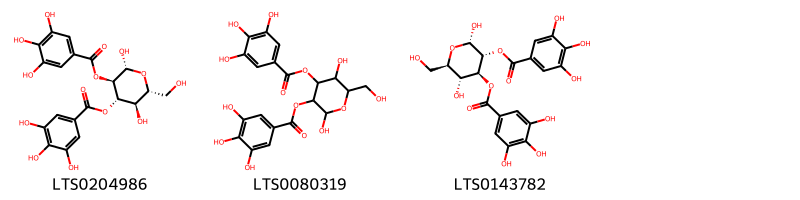{ width=100% }
    <figcaption>Hình ảnh cấu trúc hóa học của 3 hoạt chất thuộc nhóm Benzene and substituted derivatives gồm ['(2r,3r,4s,5r,6r)-2,5-dihydroxy-6-(hydroxymethyl)-4-(3,4,5-trihydroxybenzoyloxy)oxan-3-yl 3,4,5-trihydroxybenzoate (LTS0204986)', '2,5-dihydroxy-6-(hydroxymethyl)-3-(3,4,5-trihydroxybenzoyloxy)oxan-4-yl 3,4,5-trihydroxybenzoate (LTS0080319)', '(2s,3r,4s,5r,6r)-2,5-dihydroxy-6-(hydroxymethyl)-4-(3,4,5-trihydroxybenzoyloxy)oxan-3-yl 3,4,5-trihydroxybenzoate (LTS0143782)'].</figcaption>
</figure>
#### Nhóm Prenol lipids
<figure markdown="span">
    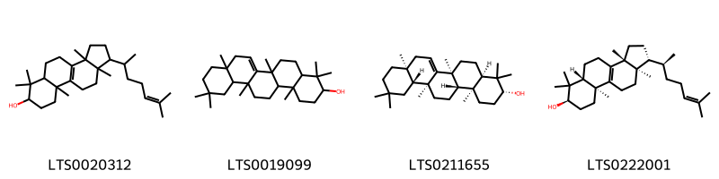{ width=100% }
    <figcaption>Hình ảnh cấu trúc hóa học của 4 hoạt chất thuộc nhóm Prenol lipids gồm ['lanster (LTS0020312)', 'taraxerol (LTS0019099)', '(3r,4ar,6as,8as,12ar,12bs,14as,14bs)-4,4,6a,8a,11,11,12b,14b-octamethyl-1,2,3,4a,5,6,8,9,10,12,12a,13,14,14a-tetradecahydropicen-3-ol (LTS0211655)', '(1r,3ar,5ar,7r,9as,11ar)-3a,6,6,9a,11a-pentamethyl-1-[(2s)-6-methylhept-5-en-2-yl]-1h,2h,3h,4h,5h,5ah,7h,8h,9h,10h,11h-cyclopenta[a]phenanthren-7-ol (LTS0222001)'].</figcaption>
</figure>
#### Nhóm Saccharolipids
<figure markdown="span">
    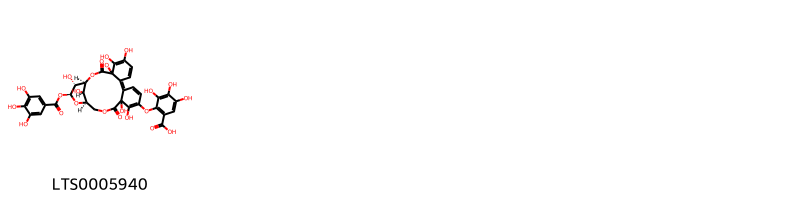{ width=100% }
    <figcaption>Hình ảnh cấu trúc hóa học của 1 hoạt chất thuộc nhóm Saccharolipids gồm ['2-{[(1s,9z,19r,21s,22r,23r)-4,5,6,14,15,22,23-heptahydroxy-3,16-dioxo-21-(3,4,5-trihydroxybenzoyloxy)-2,17,20-trioxatetracyclo[17.3.1.0⁴,⁹.0¹⁰,¹⁵]tricosa-5,7,9,11,13-pentaen-13-yl]oxy}-3,4,5-trihydroxybenzoic acid (LTS0005940)'].</figcaption>
</figure>
#### Nhóm Saturated hydrocarbons
<figure markdown="span">
    { width=100% }
    <figcaption>Hình ảnh cấu trúc hóa học của 1 hoạt chất thuộc nhóm Saturated hydrocarbons gồm ['hentriacontane (LTS0046415)'].</figcaption>
</figure>
#### Nhóm Tannins
<figure markdown="span">
    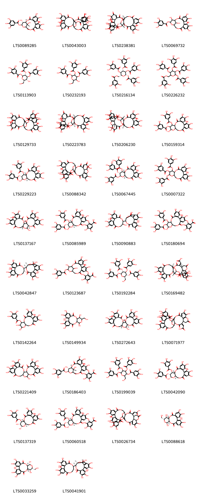{ width=100% }
    <figcaption>Hình ảnh cấu trúc hóa học của 38 hoạt chất thuộc nhóm Tannins gồm ['(1s,19r,21s,22r,23r)-6,7,8,11,12,13,22,23-octahydroxy-3,16-dioxo-2,17,20-trioxatetracyclo[17.3.1.0⁴,⁹.0¹⁰,¹⁵]tricosa-4(9),5,7,10,12,14-hexaen-21-yl 3,4,5-trihydroxybenzoate (LTS0089285)', '(1r,38r)-1,13,14,15,18,19,20,34,35,39,39-undecahydroxy-2,5,10,23,31-pentaoxo-6,9,24,27,30,40-hexaoxaoctacyclo[34.3.1.0⁴,³⁸.0⁷,²⁶.0⁸,²⁹.0¹¹,¹⁶.0¹⁷,²².0³²,³⁷]tetraconta-3,11(16),12,14,17,19,21,32,34,36-decaen-28-yl 3,4,5-trihydroxybenzoate (LTS0043003)', '(7r,8s,26r,28s,29s)-1,13,14,15,18,19,20,34,35,39,39-undecahydroxy-2,5,10,23,31-pentaoxo-6,9,24,27,30,40-hexaoxaoctacyclo[34.3.1.0⁴,³⁸.0⁷,²⁶.0⁸,²⁹.0¹¹,¹⁶.0¹⁷,²².0³²,³⁷]tetraconta-3,11,13,15,17(22),18,20,32,34,36-decaen-28-yl 3,4,5-trihydroxybenzoate (LTS0238381)', '6,7,8,11,12,13,22,23-octahydroxy-3,16-dioxo-2,17,20-trioxatetracyclo[17.3.1.0⁴,⁹.0¹⁰,¹⁵]tricosa-4(9),5,7,10,12,14-hexaen-21-yl 3,4,5-trihydroxybenzoate (LTS0069732)', '(2r,3r,4s,5r,6s)-3-hydroxy-2-(hydroxymethyl)-5,6-bis(3,4,5-trihydroxybenzoyloxy)oxan-4-yl 3,4,5-trihydroxybenzoate (LTS0113903)', '3-hydroxy-2-(hydroxymethyl)-5,6-bis(3,4,5-trihydroxybenzoyloxy)oxan-4-yl 3,4,5-trihydroxybenzoate (LTS0232193)', '(2s,3r,4s,5r,6r)-3,4,5-tris(3,4,5-trihydroxybenzoyloxy)-6-[(3,4,5-trihydroxybenzoyloxy)methyl]oxan-2-yl 3,4,5-trihydroxybenzoate (LTS0216134)', '3,4,5-tris(3,4,5-trihydroxybenzoyloxy)-6-[(3,4,5-trihydroxybenzoyloxy)methyl]oxan-2-yl 3,4,5-trihydroxybenzoate (LTS0226232)', '1,13,14,15,18,19,20,34,35,39,39-undecahydroxy-2,5,10,23,31-pentaoxo-6,9,24,27,30,40-hexaoxaoctacyclo[34.3.1.0⁴,³⁸.0⁷,²⁶.0⁸,²⁹.0¹¹,¹⁶.0¹⁷,²².0³²,³⁷]tetraconta-3,11(16),12,14,17,19,21,32,34,36-decaen-28-yl 3,4,5-trihydroxybenzoate (LTS0129733)', '(1r,7r,8s,26r,28s,29r,38r)-1,13,14,15,18,19,20,34,35,39,39-undecahydroxy-2,5,10,23,31-pentaoxo-6,9,24,27,30,40-hexaoxaoctacyclo[34.3.1.0⁴,³⁸.0⁷,²⁶.0⁸,²⁹.0¹¹,¹⁶.0¹⁷,²².0³²,³⁷]tetraconta-3,11,13,15,17(22),18,20,32,34,36-decaen-28-yl 3,4,5-trihydroxybenzoate (LTS0223783)', '(1r,8r,9s,27r,29s,30r,39r)-1,2,2,14,15,16,19,20,21,35,36-undecahydroxy-3,6,11,24,32-pentaoxo-7,10,25,28,31,40-hexaoxaoctacyclo[35.2.1.0⁵,³⁹.0⁸,²⁷.0⁹,³⁰.0¹²,¹⁷.0¹⁸,²³.0³³,³⁸]tetraconta-4,12,14,16,18(23),19,21,33,35,37-decaen-29-yl 3,4,5-trihydroxybenzoate (LTS0206230)', '3,4,5,13,21,22,23-heptahydroxy-8,18-dioxo-12-(3,4,5-trihydroxybenzoyloxy)-9,14,17-trioxatetracyclo[17.4.0.0²,⁷.0¹⁰,¹⁵]tricosa-1(23),2(7),3,5,19,21-hexaen-11-yl 3,4,5-trihydroxybenzoate (LTS0159314)', '(10r,11s,12r,13r,15r)-3,4,5,13,21,22,23-heptahydroxy-8,18-dioxo-11-(3,4,5-trihydroxybenzoyloxy)-9,14,17-trioxatetracyclo[17.4.0.0²,⁷.0¹⁰,¹⁵]tricosa-1(23),2(7),3,5,19,21-hexaen-12-yl 3,4,5-trihydroxybenzoate (LTS0229223)', '1,2,2,14,15,16,19,20,21,35,36-undecahydroxy-3,6,11,24,32-pentaoxo-7,10,25,28,31,40-hexaoxaoctacyclo[35.2.1.0⁵,³⁹.0⁸,²⁷.0⁹,³⁰.0¹²,¹⁷.0¹⁸,²³.0³³,³⁸]tetraconta-4,12(17),13,15,18,20,22,33,35,37-decaen-29-yl 3,4,5-trihydroxybenzoate (LTS0088342)', '(10r,11s,12r,13s,15r)-3,4,5,21,22,23-hexahydroxy-8,18-dioxo-12,13-bis(3,4,5-trihydroxybenzoyloxy)-9,14,17-trioxatetracyclo[17.4.0.0²,⁷.0¹⁰,¹⁵]tricosa-1(23),2(7),3,5,19,21-hexaen-11-yl 3,4,5-trihydroxybenzoate (LTS0067445)', '3,4,5,21,22,23-hexahydroxy-8,18-dioxo-12,13-bis(3,4,5-trihydroxybenzoyloxy)-9,14,17-trioxatetracyclo[17.4.0.0²,⁷.0¹⁰,¹⁵]tricosa-1(23),2(7),3,5,19,21-hexaen-11-yl 3,4,5-trihydroxybenzoate (LTS0007322)', '(1r,2s,19r,22r)-7,8,9,12,13,14,20,28,29,30,33,34,35-tridecahydroxy-3,18,21,24,39-pentaoxaheptacyclo[20.17.0.0²,¹⁹.0⁵,¹⁰.0¹¹,¹⁶.0²⁶,³¹.0³²,³⁷]nonatriaconta-5(10),6,8,11,13,15,26(31),27,29,32,34,36-dodecaene-4,17,25,38-tetrone (LTS0137167)', '2-{[(10r,11s,12r,13r,15r)-3,4,5,13,22,23-hexahydroxy-8,18-dioxo-11,12-bis(3,4,5-trihydroxybenzoyloxy)-9,14,17-trioxatetracyclo[17.4.0.0²,⁷.0¹⁰,¹⁵]tricosa-1(23),2(7),3,5,19,21-hexaen-21-yl]oxy}-3,4,5-trihydroxybenzoic acid (LTS0085989)', '14-{3,4,5,11,17,18,19-heptahydroxy-8,14-dioxo-9,13-dioxatricyclo[13.4.0.0²,⁷]nonadeca-1(15),2,4,6,16,18-hexaen-10-yl}-2,3,4,7,8,9,19-heptahydroxy-13,16-dioxatetracyclo[13.3.1.0⁵,¹⁸.0⁶,¹¹]nonadeca-1(18),2,4,6,8,10-hexaene-12,17-dione (LTS0090883)', '2-{[3,4,5,13,22,23-hexahydroxy-8,18-dioxo-11,12-bis(3,4,5-trihydroxybenzoyloxy)-9,14,17-trioxatetracyclo[17.4.0.0²,⁷.0¹⁰,¹⁵]tricosa-1(23),2(7),3,5,19,21-hexaen-21-yl]oxy}-3,4,5-trihydroxybenzoic acid (LTS0180694)', '(14r,15s,19s)-14-[(10r,11r)-3,4,5,11,17,18,19-heptahydroxy-8,14-dioxo-9,13-dioxatricyclo[13.4.0.0²,⁷]nonadeca-1(15),2,4,6,16,18-hexaen-10-yl]-2,3,4,7,8,9,19-heptahydroxy-13,16-dioxatetracyclo[13.3.1.0⁵,¹⁸.0⁶,¹¹]nonadeca-1(18),2,4,6,8,10-hexaene-12,17-dione (LTS0042847)', '2-{[6,7,8,11,12,22,23-heptahydroxy-3,16-dioxo-21-(3,4,5-trihydroxybenzoyloxy)-2,17,20-trioxatetracyclo[17.3.1.0⁴,⁹.0¹⁰,¹⁵]tricosa-4(9),5,7,10,12,14-hexaen-13-yl]oxy}-3,4,5-trihydroxybenzoic acid (LTS0123687)', '(2r,3r,4s,5r,6s)-2-(hydroxymethyl)-4,5,6-tris(3,4,5-trihydroxybenzoyloxy)oxan-3-yl 3,4,5-trihydroxybenzoate (LTS0192284)', '[(4r,5s,7r,25s,26r,29z,30r,34s,38s)-13,14,15,18,19,20,35,36-octahydroxy-2,10,23,28,32-pentaoxo-5-(3,4,5-trihydroxybenzoyloxy)-3,6,9,24,27,33-hexaoxaheptacyclo[28.7.1.0⁴,²⁵.0⁷,²⁶.0¹¹,¹⁶.0¹⁷,²².0³⁴,³⁸]octatriaconta-1(37),11(16),12,14,17,19,21,35-octaen-29-ylidene]acetic acid (LTS0169482)', '3,4,5,12,13,21,22,23-octahydroxy-8,18-dioxo-9,14,17-trioxatetracyclo[17.4.0.0²,⁷.0¹⁰,¹⁵]tricosa-1(23),2(7),3,5,19,21-hexaen-11-yl 3,4,5-trihydroxybenzoate (LTS0142264)', '3,4,5,11,14,20,21,22-octahydroxy-13-(hydroxymethyl)-9,12,16-trioxatetracyclo[16.4.0.0²,⁷.0¹⁰,¹⁵]docosa-1(22),2(7),3,5,18,20-hexaene-8,17-dione (LTS0149934)', '(1r,2s,19r,20s,22r)-7,8,9,12,13,14,20,28,29,30,33,34,35-tridecahydroxy-3,18,21,24,39-pentaoxaheptacyclo[20.17.0.0²,¹⁹.0⁵,¹⁰.0¹¹,¹⁶.0²⁶,³¹.0³²,³⁷]nonatriaconta-5(10),6,8,11,13,15,26(31),27,29,32,34,36-dodecaene-4,17,25,38-tetrone (LTS0272643)', '[(29z)-13,14,15,18,19,20,35,36-octahydroxy-2,10,23,28,32-pentaoxo-5-(3,4,5-trihydroxybenzoyloxy)-3,6,9,24,27,33-hexaoxaheptacyclo[28.7.1.0⁴,²⁵.0⁷,²⁶.0¹¹,¹⁶.0¹⁷,²².0³⁴,³⁸]octatriaconta-1(37),11,13,15,17(22),18,20,34(38),35-nonaen-29-ylidene]acetic acid (LTS0071977)', '7,8,9,12,13,14,20,28,29,30,33,34,35-tridecahydroxy-3,18,21,24,39-pentaoxaheptacyclo[20.17.0.0²,¹⁹.0⁵,¹⁰.0¹¹,¹⁶.0²⁶,³¹.0³²,³⁷]nonatriaconta-5(10),6,8,11,13,15,26(31),27,29,32,34,36-dodecaene-4,17,25,38-tetrone (LTS0221409)', '2-{[(1s,19r,21s,22r,23r)-6,7,8,11,12,22,23-heptahydroxy-3,16-dioxo-21-(3,4,5-trihydroxybenzoyloxy)-2,17,20-trioxatetracyclo[17.3.1.0⁴,⁹.0¹⁰,¹⁵]tricosa-4(9),5,7,10,12,14-hexaen-13-yl]oxy}-3,4,5-trihydroxybenzoic acid (LTS0186403)', '2-(hydroxymethyl)-4,5,6-tris(3,4,5-trihydroxybenzoyloxy)oxan-3-yl 3,4,5-trihydroxybenzoate (LTS0199039)', '(10r,11s,12r,13s,15r)-3,4,5,13,21,22,23-heptahydroxy-8,18-dioxo-11-(3,4,5-trihydroxybenzoyloxy)-9,14,17-trioxatetracyclo[17.4.0.0²,⁷.0¹⁰,¹⁵]tricosa-1(23),2(7),3,5,19,21-hexaen-12-yl 3,4,5-trihydroxybenzoate (LTS0042090)', '(10r,11r,12r,13s,15r)-3,4,5,12,13,21,22,23-octahydroxy-8,18-dioxo-9,14,17-trioxatetracyclo[17.4.0.0²,⁷.0¹⁰,¹⁵]tricosa-1(23),2(7),3,5,19,21-hexaen-11-yl 3,4,5-trihydroxybenzoate (LTS0137319)', '2-{[(10r,11s,12r,13s,15r)-3,4,5,13,22,23-hexahydroxy-8,18-dioxo-11,12-bis(3,4,5-trihydroxybenzoyloxy)-9,14,17-trioxatetracyclo[17.4.0.0²,⁷.0¹⁰,¹⁵]tricosa-1(23),2(7),3,5,19,21-hexaen-21-yl]oxy}-3,4,5-trihydroxybenzoic acid (LTS0060518)', '[13,14,15,18,19,20,35,36-octahydroxy-2,10,23,28,32-pentaoxo-5-(3,4,5-trihydroxybenzoyloxy)-3,6,9,24,27,33-hexaoxaheptacyclo[28.7.1.0⁴,²⁵.0⁷,²⁶.0¹¹,¹⁶.0¹⁷,²².0³⁴,³⁸]octatriaconta-1(37),11,13,15,17(22),18,20,35-octaen-29-ylidene]acetic acid (LTS0026734)', '(10r,11s,13r,14r,15s)-3,4,5,11,14,20,21,22-octahydroxy-13-(hydroxymethyl)-9,12,16-trioxatetracyclo[16.4.0.0²,⁷.0¹⁰,¹⁵]docosa-1(18),2,4,6,19,21-hexaene-8,17-dione (LTS0088618)', '(10r,11r,13r,14r,15s)-3,4,5,11,14,20,21,22-octahydroxy-13-(hydroxymethyl)-9,12,16-trioxatetracyclo[16.4.0.0²,⁷.0¹⁰,¹⁵]docosa-1(18),2,4,6,19,21-hexaene-8,17-dione (LTS0033259)', '(14r,15s,19r)-14-[(10r,11r)-3,4,5,11,17,18,19-heptahydroxy-8,14-dioxo-9,13-dioxatricyclo[13.4.0.0²,⁷]nonadeca-1(15),2,4,6,16,18-hexaen-10-yl]-2,3,4,7,8,9,19-heptahydroxy-13,16-dioxatetracyclo[13.3.1.0⁵,¹⁸.0⁶,¹¹]nonadeca-1(18),2,4,6,8,10-hexaene-12,17-dione (LTS0041901)'].</figcaption>
</figure>

---

### Dược dân tộc học

Danh sách các quốc gia có sử dụng *Euphorbia thymifolia* trong điều trị các bệnh. 

| Country   | Disease                                    | Bệnh                                                                                                                                                                                                |
|:----------|:-------------------------------------------|:----------------------------------------------------------------------------------------------------------------------------------------------------------------------------------------------------|
| India     | Astringent, Laxative, Vermifuge, Stimulant | MYMEMORY WARNING: YOU USED ALL AVAILABLE FREE TRANSLATIONS FOR TODAY. NEXT AVAILABLE IN  20 HOURS 03 MINUTES 02 SECONDS VISIT HTTPS://MYMEMORY.TRANSLATED.NET/DOC/USAGELIMITS.PHP TO TRANSLATE MORE |
| Trinidad  | Abortifacient, Abortifacient               | MYMEMORY WARNING: YOU USED ALL AVAILABLE FREE TRANSLATIONS FOR TODAY. NEXT AVAILABLE IN  20 HOURS 02 MINUTES 59 SECONDS VISIT HTTPS://MYMEMORY.TRANSLATED.NET/DOC/USAGELIMITS.PHP TO TRANSLATE MORE |

---

---
## Euphorbia tinctoria
### Thông tin về thực vật

!!! info "Phân loại thực vật của *Euphorbia macroclada* từ GIBF:"
    - **Kingdom:** Plantae
    - **Phylum:** Tracheophyta
    - **Order:** Malpighiales
    - **Family:** Euphorbiaceae
    - **Genus:** Euphorbia
    - **Species:** *Euphorbia macroclada*

 

| Label (VI)   | Label (EN)   | Scientific Name     | Descriptions (VI)   | Descriptions (EN)   | Also Known As (VI)   | Also Known As (EN)   |
|:-------------|:-------------|:--------------------|:--------------------|:--------------------|:---------------------|:---------------------|
| N/A          | N/A          | Euphorbia tinctoria | loài thực vật       | species of plant    | ['']                 | ['']                 |

#### Phân bố trên thế giới

**Từ CSDL GIBF** nan, Syrian Arab Republic, Iran (Islamic Republic of), Iraq, Türkiye, Switzerland, unknown or invalid, Armenia, Lebanon, Ethiopia

#### Phân bố tại Việt Nam

**Từ CSDL GIBF**: Không có ghi nhận ở Việt Nam

---
### Thành phần hóa học
        
- Theo cơ sở dữ liệu lotus: Từ loài *Euphorbia macroclada* đã phân lập và xác định được Chưa có hoạt chất nào được phân lập. hoạt chất thuộc về các nhóm Không có hoạt chất nào được phân lập. 

Không có hình ảnh nào được tạo ra

---

### Dược dân tộc học

Danh sách các quốc gia có sử dụng *Euphorbia macroclada* trong điều trị các bệnh. 

| Country   | Disease   | Bệnh                                                                                                                                                                                                |
|:----------|:----------|:----------------------------------------------------------------------------------------------------------------------------------------------------------------------------------------------------|
| Iraq      | Poison    | MYMEMORY WARNING: YOU USED ALL AVAILABLE FREE TRANSLATIONS FOR TODAY. NEXT AVAILABLE IN  20 HOURS 02 MINUTES 27 SECONDS VISIT HTTPS://MYMEMORY.TRANSLATED.NET/DOC/USAGELIMITS.PHP TO TRANSLATE MORE |
| Kurdistan | Poison    | MYMEMORY WARNING: YOU USED ALL AVAILABLE FREE TRANSLATIONS FOR TODAY. NEXT AVAILABLE IN  20 HOURS 02 MINUTES 23 SECONDS VISIT HTTPS://MYMEMORY.TRANSLATED.NET/DOC/USAGELIMITS.PHP TO TRANSLATE MORE |

---

---
## Euphorbia tirucalli
### Thông tin về thực vật

!!! info "Phân loại thực vật của *Euphorbia tirucalli* từ GIBF:"
    - **Kingdom:** Plantae
    - **Phylum:** Tracheophyta
    - **Order:** Malpighiales
    - **Family:** Euphorbiaceae
    - **Genus:** Euphorbia
    - **Species:** *Euphorbia tirucalli*

 

| Label (VI)   | Label (EN)   | Scientific Name     | Descriptions (VI)   | Descriptions (EN)   | Also Known As (VI)   | Also Known As (EN)         |
|:-------------|:-------------|:--------------------|:--------------------|:--------------------|:---------------------|:---------------------------|
| N/A          | N/A          | Euphorbia tirucalli | loài thực vật       | species of plant    | ['']                 | ['rubber-hedge euphorbia'] |

#### Phân bố trên thế giới

**Từ CSDL GIBF** Virgin Islands (U.S.), United Arab Emirates, Sri Lanka, Ghana, Australia, Mozambique, Philippines, Rwanda, Benin, Bermuda, Tanzania, United Republic of, Venezuela (Bolivarian Republic of), French Guiana, Puerto Rico, Réunion, Senegal, Nigeria, Cyprus, Namibia, Chinese Taipei, Spain, Bolivia (Plurinational State of), Portugal, Algeria, Honduras, Morocco, United States of America, Congo, Democratic Republic of the, Bonaire, Sint Eustatius and Saba, Zimbabwe, South Africa, Guinea-Bissau, Hong Kong, Thailand, Martinique, Côte d’Ivoire, Brazil, Bahamas, Cuba, Mexico, Dominican Republic, Eswatini, Curaçao, Ecuador, French Polynesia, Madagascar, Seychelles, Colombia, Montserrat, Botswana, India, Indonesia, Gambia, Antigua and Barbuda, Kenya, Malaysia, Ethiopia

#### Phân bố tại Việt Nam

**Từ CSDL GIBF**: Không có ghi nhận ở Việt Nam

---
### Thành phần hóa học
        
- Theo cơ sở dữ liệu lotus: Từ loài *Euphorbia tirucalli* đã phân lập và xác định được 61 hoạt chất thuộc về các nhóm Fatty Acyls, Flavonoids, Prenol lipids, Steroids and steroid derivatives, Organooxygen compounds, Tannins. 

|    | chemicalTaxonomyClassyfireClass   |   smiles_count |
|---:|:----------------------------------|---------------:|
|  0 | Fatty Acyls                       |              2 |
|  1 | Flavonoids                        |              4 |
|  2 | Organooxygen compounds            |              2 |
|  3 | Prenol lipids                     |             26 |
|  4 | Steroids and steroid derivatives  |              6 |
|  5 | Tannins                           |             21 |

#### Nhóm Fatty Acyls
<figure markdown="span">
    { width=100% }
    <figcaption>Hình ảnh cấu trúc hóa học của 2 hoạt chất thuộc nhóm Fatty Acyls gồm ['palmitic acid (LTS0079439)', 'linoleic (LTS0013198)'].</figcaption>
</figure>
#### Nhóm Flavonoids
<figure markdown="span">
    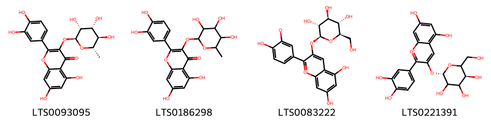{ width=100% }
    <figcaption>Hình ảnh cấu trúc hóa học của 4 hoạt chất thuộc nhóm Flavonoids gồm ['quercitrin (LTS0093095)', 'quercitrin (LTS0186298)', '5,7-dihydroxy-2-(4-hydroxy-3-oxidophenyl)-3-{[(2s,3r,4s,5s,6r)-3,4,5-trihydroxy-6-(hydroxymethyl)oxan-2-yl]oxy}-1λ⁴-chromen-1-ylium (LTS0083222)', 'chrysanthemin (LTS0221391)'].</figcaption>
</figure>
#### Nhóm Organooxygen compounds
<figure markdown="span">
    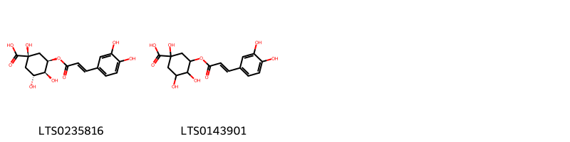{ width=100% }
    <figcaption>Hình ảnh cấu trúc hóa học của 2 hoạt chất thuộc nhóm Organooxygen compounds gồm ['neochlorogenic acid (LTS0235816)', '3-{[3-(3,4-dihydroxyphenyl)prop-2-enoyl]oxy}-1,4,5-trihydroxycyclohexane-1-carboxylic acid (LTS0143901)'].</figcaption>
</figure>
#### Nhóm Prenol lipids
<figure markdown="span">
    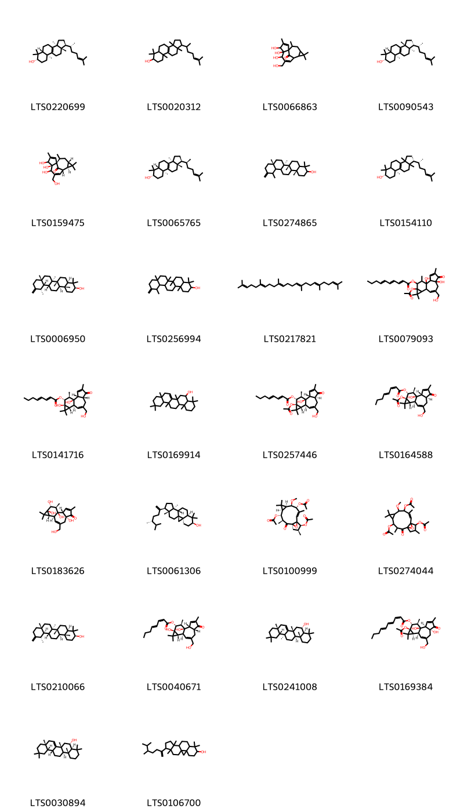{ width=100% }
    <figcaption>Hình ảnh cấu trúc hóa học của 26 hoạt chất thuộc nhóm Prenol lipids gồm ['euphol (LTS0220699)', 'lanster (LTS0020312)', '4,5,6-trihydroxy-7-(hydroxymethyl)-3,11,11,14-tetramethyltetracyclo[7.5.1.0¹,⁵.0¹⁰,¹²]pentadeca-2,7-dien-15-one (LTS0066863)', 'lanosterol (LTS0090543)', '(1s,5r,9s,10r,12s)-4,5,6-trihydroxy-7-(hydroxymethyl)-3,11,11,14-tetramethyltetracyclo[7.5.1.0¹,⁵.0¹⁰,¹²]pentadeca-2,7-dien-15-one (LTS0159475)', '(+)-tirucallol (LTS0065765)', '(6ar,6br,8ar,14br)-4,4,6a,6b,8a,12,14b-heptamethyl-11-methylidene-hexadecahydropicen-3-ol (LTS0274865)', '(1r,7s,9as)-3a,6,6,9a,11a-pentamethyl-1-[(2r)-6-methylhept-5-en-2-yl]-1h,2h,3h,4h,5h,5ah,7h,8h,9h,10h,11h-cyclopenta[a]phenanthren-7-ol (LTS0154110)', 'taraxasterol (LTS0006950)', '4,4,6a,6b,8a,12,14b-heptamethyl-11-methylidene-hexadecahydropicen-3-ol (LTS0256994)', 'squalene (LTS0217821)', '13-(acetyloxy)-1,6-dihydroxy-8-(hydroxymethyl)-4,12,12,15-tetramethyl-5-oxotetracyclo[8.5.0.0²,⁶.0¹¹,¹³]pentadeca-3,8-dien-14-yl deca-2,4,6-trienoate (LTS0079093)', '(1r,2r,6r,10s,11r,13s,14r,15r)-1,13-dihydroxy-8-(hydroxymethyl)-4,12,12,15-tetramethyl-5-oxotetracyclo[8.5.0.0²,⁶.0¹¹,¹³]pentadeca-3,8-dien-14-yl (4e)-octa-2,4-dienoate (LTS0141716)', '4,4,6a,8a,11,11,12b,14b-octamethyl-1,2,3,4a,5,6,8,9,10,12,12a,13,14,14a-tetradecahydropicen-5-ol (LTS0169914)', '(1r,2r,6s,10s,11r,13s,14r,15r)-13-(acetyloxy)-1-hydroxy-8-(hydroxymethyl)-4,12,12,15-tetramethyl-5-oxotetracyclo[8.5.0.0²,⁶.0¹¹,¹³]pentadeca-3,8-dien-14-yl (4e)-octa-2,4-dienoate (LTS0257446)', '(1r,2r,6s,10s,11r,13s,14r,15r)-13-(acetyloxy)-1-hydroxy-8-(hydroxymethyl)-4,12,12,15-tetramethyl-5-oxotetracyclo[8.5.0.0²,⁶.0¹¹,¹³]pentadeca-3,8-dien-14-yl (2z,4e)-octa-2,4-dienoate (LTS0164588)', 'phorbol (LTS0183626)', '(1s,3r,6s,8r,11s,12s,15r,16r)-15-[(5r)-5,6-dimethylhept-1-en-2-yl]-7,7,12,16-tetramethylpentacyclo[9.7.0.0¹,³.0³,⁸.0¹²,¹⁶]octadecan-6-ol (LTS0061306)', '(1r,3s,4r,5r,7s,8r,9r,10e,12s,13s,14s)-9,13-bis(acetyloxy)-8-methoxy-3,6,6,10,14-pentamethyl-2-oxo-16-oxatetracyclo[10.3.1.0¹,¹².0⁵,⁷]hexadec-10-en-4-yl acetate (LTS0100999)', '4,9-bis(acetyloxy)-8-methoxy-3,6,6,10,14-pentamethyl-2-oxo-16-oxatetracyclo[10.3.1.0¹,¹².0⁵,⁷]hexadec-10-en-13-yl acetate (LTS0274044)', 'taraxasterol (LTS0210066)', '(1r,2r,6r,10s,11r,13s,14r,15r)-1,13-dihydroxy-8-(hydroxymethyl)-4,12,12,15-tetramethyl-5-oxotetracyclo[8.5.0.0²,⁶.0¹¹,¹³]pentadeca-3,8-dien-14-yl (2z,4e)-octa-2,4-dienoate (LTS0040671)', '(4as,5s,6ar,8ar,12ar,12bs,14ar,14br)-4,4,6a,8a,11,11,12b,14b-octamethyl-1,2,3,4a,5,6,8,9,10,12,12a,13,14,14a-tetradecahydropicen-5-ol (LTS0241008)', '(1s,2r,6r,10s,11s,13s,14r,15r)-13-(acetyloxy)-1,6-dihydroxy-8-(hydroxymethyl)-4,12,12,15-tetramethyl-5-oxotetracyclo[8.5.0.0²,⁶.0¹¹,¹³]pentadeca-3,8-dien-14-yl (2z,4e,6e)-deca-2,4,6-trienoate (LTS0169384)', '(4as,5s,6ar,8ar,12as,12br,14ar,14br)-4,4,6a,8a,11,11,14b-heptamethyl-2,3,4a,5,6,8,9,10,12,12a,12b,13,14,14a-tetradecahydro-1h-picen-5-ol (LTS0030894)', '15-(5,6-dimethylhept-1-en-2-yl)-7,7,12,16-tetramethylpentacyclo[9.7.0.0¹,³.0³,⁸.0¹²,¹⁶]octadecan-6-ol (LTS0106700)'].</figcaption>
</figure>
#### Nhóm Steroids and steroid derivatives
<figure markdown="span">
    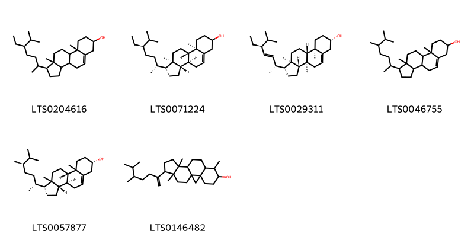{ width=100% }
    <figcaption>Hình ảnh cấu trúc hóa học của 6 hoạt chất thuộc nhóm Steroids and steroid derivatives gồm ['stigmast-5-en-3-ol, (3β)- (LTS0204616)', 'stigmast-5-en-3-ol (LTS0071224)', 'phytosterol (LTS0029311)', 'campesterol (LTS0046755)', '(1r,3as,3bs,7s,9bs)-1-[(2r,5r)-5,6-dimethylheptan-2-yl]-9a,11a-dimethyl-1h,2h,3h,3ah,3bh,4h,6h,7h,8h,9h,9bh,10h,11h-cyclopenta[a]phenanthren-7-ol (LTS0057877)', '15-(5,6-dimethylhept-1-en-2-yl)-7,12,16-trimethylpentacyclo[9.7.0.0¹,³.0³,⁸.0¹²,¹⁶]octadecan-6-ol (LTS0146482)'].</figcaption>
</figure>
#### Nhóm Tannins
<figure markdown="span">
    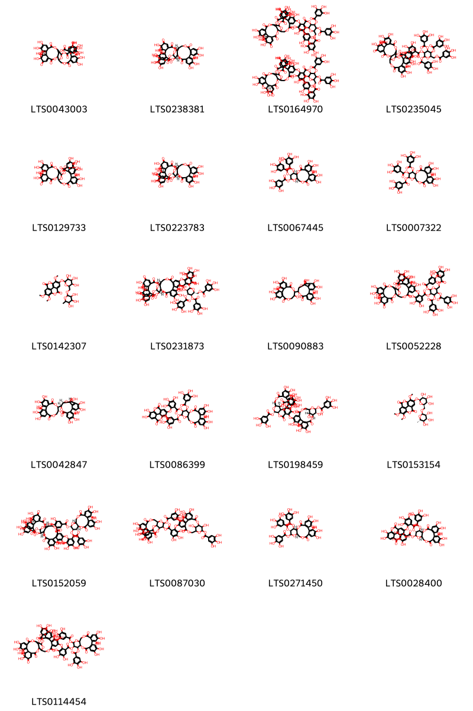{ width=100% }
    <figcaption>Hình ảnh cấu trúc hóa học của 21 hoạt chất thuộc nhóm Tannins gồm ['(1r,38r)-1,13,14,15,18,19,20,34,35,39,39-undecahydroxy-2,5,10,23,31-pentaoxo-6,9,24,27,30,40-hexaoxaoctacyclo[34.3.1.0⁴,³⁸.0⁷,²⁶.0⁸,²⁹.0¹¹,¹⁶.0¹⁷,²².0³²,³⁷]tetraconta-3,11(16),12,14,17,19,21,32,34,36-decaen-28-yl 3,4,5-trihydroxybenzoate (LTS0043003)', '(7r,8s,26r,28s,29s)-1,13,14,15,18,19,20,34,35,39,39-undecahydroxy-2,5,10,23,31-pentaoxo-6,9,24,27,30,40-hexaoxaoctacyclo[34.3.1.0⁴,³⁸.0⁷,²⁶.0⁸,²⁹.0¹¹,¹⁶.0¹⁷,²².0³²,³⁷]tetraconta-3,11,13,15,17(22),18,20,32,34,36-decaen-28-yl 3,4,5-trihydroxybenzoate (LTS0238381)', '2,4,5-tris(3,4,5-trihydroxybenzoyloxy)-6-[(3,4,5-trihydroxybenzoyloxy)methyl]oxan-3-yl 2-{[(1r,38r)-1,13,14,15,18,19,34,35,39,39-decahydroxy-2,5,10,23,31-pentaoxo-28-(3,4,5-trihydroxybenzoyloxy)-6,9,24,27,30,40-hexaoxaoctacyclo[34.3.1.0⁴,³⁸.0⁷,²⁶.0⁸,²⁹.0¹¹,¹⁶.0¹⁷,²².0³²,³⁷]tetraconta-3,11(16),12,14,17,19,21,32,34,36-decaen-20-yl]oxy}-3,4,5-trihydroxybenzoate; 2,4,5-tris(3,4,5-trihydroxybenzoyloxy)-6-[(3,4,5-trihydroxybenzoyloxy)methyl]oxan-3-yl 2-{[(1r,39r)-1,2,2,14,15,16,19,20,35,36-decahydroxy-3,6,11,24,32-pentaoxo-29-(3,4,5-trihydroxybenzoyloxy)-7,10,25,28,31,40-hexaoxaoctacyclo[35.2.1.0⁵,³⁹.0⁸,²⁷.0⁹,³⁰.0¹²,¹⁷.0¹⁸,²³.0³³,³⁸]tetraconta-4,12(17),13,15,18,20,22,33,35,37-decaen-21-yl]oxy}-3,4,5-trihydroxybenzoate (LTS0164970)', '2,4,5-tris(3,4,5-trihydroxybenzoyloxy)-6-[(3,4,5-trihydroxybenzoyloxy)methyl]oxan-3-yl 2-{[1,14,15,18,19,20,34,35,39,39-decahydroxy-2,5,10,23,31-pentaoxo-28-(3,4,5-trihydroxybenzoyloxy)-6,9,24,27,30,40-hexaoxaoctacyclo[34.3.1.0⁴,³⁸.0⁷,²⁶.0⁸,²⁹.0¹¹,¹⁶.0¹⁷,²².0³²,³⁷]tetraconta-3,11(16),12,14,17,19,21,32,34,36-decaen-13-yl]oxy}-3,4,5-trihydroxybenzoate (LTS0235045)', '1,13,14,15,18,19,20,34,35,39,39-undecahydroxy-2,5,10,23,31-pentaoxo-6,9,24,27,30,40-hexaoxaoctacyclo[34.3.1.0⁴,³⁸.0⁷,²⁶.0⁸,²⁹.0¹¹,¹⁶.0¹⁷,²².0³²,³⁷]tetraconta-3,11(16),12,14,17,19,21,32,34,36-decaen-28-yl 3,4,5-trihydroxybenzoate (LTS0129733)', '(1r,7r,8s,26r,28s,29r,38r)-1,13,14,15,18,19,20,34,35,39,39-undecahydroxy-2,5,10,23,31-pentaoxo-6,9,24,27,30,40-hexaoxaoctacyclo[34.3.1.0⁴,³⁸.0⁷,²⁶.0⁸,²⁹.0¹¹,¹⁶.0¹⁷,²².0³²,³⁷]tetraconta-3,11,13,15,17(22),18,20,32,34,36-decaen-28-yl 3,4,5-trihydroxybenzoate (LTS0223783)', '(10r,11s,12r,13s,15r)-3,4,5,21,22,23-hexahydroxy-8,18-dioxo-12,13-bis(3,4,5-trihydroxybenzoyloxy)-9,14,17-trioxatetracyclo[17.4.0.0²,⁷.0¹⁰,¹⁵]tricosa-1(23),2(7),3,5,19,21-hexaen-11-yl 3,4,5-trihydroxybenzoate (LTS0067445)', '3,4,5,21,22,23-hexahydroxy-8,18-dioxo-12,13-bis(3,4,5-trihydroxybenzoyloxy)-9,14,17-trioxatetracyclo[17.4.0.0²,⁷.0¹⁰,¹⁵]tricosa-1(23),2(7),3,5,19,21-hexaen-11-yl 3,4,5-trihydroxybenzoate (LTS0007322)', '6,7,14-trimethoxy-13-[(3,4,5-trihydroxy-6-{[(3,4,5-trihydroxy-6-methyloxan-2-yl)oxy]methyl}oxan-2-yl)oxy]-2,9-dioxatetracyclo[6.6.2.0⁴,¹⁶.0¹¹,¹⁵]hexadeca-1(15),4(16),5,7,11,13-hexaene-3,10-dione (LTS0142307)', '(2s,3r,4s,5r,6r)-2,4,5-tris(3,4,5-trihydroxybenzoyloxy)-6-[(3,4,5-trihydroxybenzoyloxy)methyl]oxan-3-yl 2-{[(1r,7r,8s,26r,28s,29r,38r)-1,13,14,15,18,19,34,35,39,39-decahydroxy-2,5,10,23,31-pentaoxo-28-(3,4,5-trihydroxybenzoyloxy)-6,9,24,27,30,40-hexaoxaoctacyclo[34.3.1.0⁴,³⁸.0⁷,²⁶.0⁸,²⁹.0¹¹,¹⁶.0¹⁷,²².0³²,³⁷]tetraconta-3,11,13,15,17(22),18,20,32,34,36-decaen-20-yl]oxy}-3,4,5-trihydroxybenzoate (LTS0231873)', '14-{3,4,5,11,17,18,19-heptahydroxy-8,14-dioxo-9,13-dioxatricyclo[13.4.0.0²,⁷]nonadeca-1(15),2,4,6,16,18-hexaen-10-yl}-2,3,4,7,8,9,19-heptahydroxy-13,16-dioxatetracyclo[13.3.1.0⁵,¹⁸.0⁶,¹¹]nonadeca-1(18),2,4,6,8,10-hexaene-12,17-dione (LTS0090883)', '2,4,5-tris(3,4,5-trihydroxybenzoyloxy)-6-[(3,4,5-trihydroxybenzoyloxy)methyl]oxan-3-yl 2-{[1,13,14,15,18,19,34,35,39,39-decahydroxy-2,5,10,23,31-pentaoxo-28-(3,4,5-trihydroxybenzoyloxy)-6,9,24,27,30,40-hexaoxaoctacyclo[34.3.1.0⁴,³⁸.0⁷,²⁶.0⁸,²⁹.0¹¹,¹⁶.0¹⁷,²².0³²,³⁷]tetraconta-3,11(16),12,14,17,19,21,32,34,36-decaen-20-yl]oxy}-3,4,5-trihydroxybenzoate (LTS0052228)', '(14r,15s,19s)-14-[(10r,11r)-3,4,5,11,17,18,19-heptahydroxy-8,14-dioxo-9,13-dioxatricyclo[13.4.0.0²,⁷]nonadeca-1(15),2,4,6,16,18-hexaen-10-yl]-2,3,4,7,8,9,19-heptahydroxy-13,16-dioxatetracyclo[13.3.1.0⁵,¹⁸.0⁶,¹¹]nonadeca-1(18),2,4,6,8,10-hexaene-12,17-dione (LTS0042847)', '3,4,5,21,22,23-hexahydroxy-8,18-dioxo-11,13-bis(3,4,5-trihydroxybenzoyloxy)-9,14,17-trioxatetracyclo[17.4.0.0²,⁷.0¹⁰,¹⁵]tricosa-1(23),2(7),3,5,19,21-hexaen-12-yl 3,4,5-trihydroxy-2-({7,13,14-trihydroxy-3,10-dioxo-2,9-dioxatetracyclo[6.6.2.0⁴,¹⁶.0¹¹,¹⁵]hexadeca-1(15),4(16),5,7,11,13-hexaen-6-yl}oxy)benzoate (LTS0086399)', '(1s,19r,21s,22r,23r)-6,7,8,11,12,13-hexahydroxy-3,16-dioxo-21,23-bis(3,4,5-trihydroxybenzoyloxy)-2,17,20-trioxatetracyclo[17.3.1.0⁴,⁹.0¹⁰,¹⁵]tricosa-4(9),5,7,10,12,14-hexaen-22-yl 2-{[(1s,19r,21s,22r,23r)-6,7,8,11,12,22,23-heptahydroxy-3,16-dioxo-21-(3,4,5-trihydroxybenzoyloxy)-2,17,20-trioxatetracyclo[17.3.1.0⁴,⁹.0¹⁰,¹⁵]tricosa-4(9),5,7,10,12,14-hexaen-13-yl]oxy}-3,4,5-trihydroxybenzoate (LTS0198459)', '6,7,14-trimethoxy-13-{[(2s,3r,4s,5s,6r)-3,4,5-trihydroxy-6-({[(2r,3r,4r,5r,6s)-3,4,5-trihydroxy-6-methyloxan-2-yl]oxy}methyl)oxan-2-yl]oxy}-2,9-dioxatetracyclo[6.6.2.0⁴,¹⁶.0¹¹,¹⁵]hexadeca-1(15),4(16),5,7,11,13-hexaene-3,10-dione (LTS0153154)', '(10r,11s,12r,13s,15r)-3,4,5,21,22,23-hexahydroxy-8,18-dioxo-11,13-bis(3,4,5-trihydroxybenzoyloxy)-9,14,17-trioxatetracyclo[17.4.0.0²,⁷.0¹⁰,¹⁵]tricosa-1(23),2(7),3,5,19,21-hexaen-12-yl 2-{[(1r,7r,8s,26r,28s,29r,38r)-1,13,14,15,18,19,34,35,39,39-decahydroxy-2,5,10,23,31-pentaoxo-28-(3,4,5-trihydroxybenzoyloxy)-6,9,24,27,30,40-hexaoxaoctacyclo[34.3.1.0⁴,³⁸.0⁷,²⁶.0⁸,²⁹.0¹¹,¹⁶.0¹⁷,²².0³²,³⁷]tetraconta-3,11,13,15,17(22),18,20,32,34,36-decaen-20-yl]oxy}-3,4,5-trihydroxybenzoate (LTS0152059)', '6,7,8,11,12,13-hexahydroxy-3,16-dioxo-21,23-bis(3,4,5-trihydroxybenzoyloxy)-2,17,20-trioxatetracyclo[17.3.1.0⁴,⁹.0¹⁰,¹⁵]tricosa-4(9),5,7,10,12,14-hexaen-22-yl 2-{[6,7,8,11,12,22,23-heptahydroxy-3,16-dioxo-21-(3,4,5-trihydroxybenzoyloxy)-2,17,20-trioxatetracyclo[17.3.1.0⁴,⁹.0¹⁰,¹⁵]tricosa-4(9),5,7,10,12,14-hexaen-13-yl]oxy}-3,4,5-trihydroxybenzoate (LTS0087030)', '(10r,11s,12r,15r)-3,4,5,21,22,23-hexahydroxy-8,18-dioxo-12,13-bis(3,4,5-trihydroxybenzoyloxy)-9,14,17-trioxatetracyclo[17.4.0.0²,⁷.0¹⁰,¹⁵]tricosa-1(23),2(7),3,5,19,21-hexaen-11-yl 3,4,5-trihydroxybenzoate (LTS0271450)', '(10r,11s,12r,13s,15r)-3,4,5,21,22,23-hexahydroxy-8,18-dioxo-11,13-bis(3,4,5-trihydroxybenzoyloxy)-9,14,17-trioxatetracyclo[17.4.0.0²,⁷.0¹⁰,¹⁵]tricosa-1(23),2(7),3,5,19,21-hexaen-12-yl 3,4,5-trihydroxy-2-({7,13,14-trihydroxy-3,10-dioxo-2,9-dioxatetracyclo[6.6.2.0⁴,¹⁶.0¹¹,¹⁵]hexadeca-1(15),4(16),5,7,11,13-hexaen-6-yl}oxy)benzoate (LTS0028400)', '3,4,5,21,22,23-hexahydroxy-8,18-dioxo-11,13-bis(3,4,5-trihydroxybenzoyloxy)-9,14,17-trioxatetracyclo[17.4.0.0²,⁷.0¹⁰,¹⁵]tricosa-1(23),2(7),3,5,19,21-hexaen-12-yl 2-{[1,13,14,15,18,19,34,35,39,39-decahydroxy-2,5,10,23,31-pentaoxo-28-(3,4,5-trihydroxybenzoyloxy)-6,9,24,27,30,40-hexaoxaoctacyclo[34.3.1.0⁴,³⁸.0⁷,²⁶.0⁸,²⁹.0¹¹,¹⁶.0¹⁷,²².0³²,³⁷]tetraconta-3,11(16),12,14,17,19,21,32,34,36-decaen-20-yl]oxy}-3,4,5-trihydroxybenzoate (LTS0114454)'].</figcaption>
</figure>

---

### Dược dân tộc học

Danh sách các quốc gia có sử dụng *Euphorbia tirucalli* trong điều trị các bệnh. 

| Country   | Disease                                  | Bệnh                                                                                                                                                                                                |
|:----------|:-----------------------------------------|:----------------------------------------------------------------------------------------------------------------------------------------------------------------------------------------------------|
| India     | Emetic, Purgative, Vesicant, Rubefacient | MYMEMORY WARNING: YOU USED ALL AVAILABLE FREE TRANSLATIONS FOR TODAY. NEXT AVAILABLE IN  20 HOURS 01 MINUTES 55 SECONDS VISIT HTTPS://MYMEMORY.TRANSLATED.NET/DOC/USAGELIMITS.PHP TO TRANSLATE MORE |
| Malaya    | Piscicide                                | MYMEMORY WARNING: YOU USED ALL AVAILABLE FREE TRANSLATIONS FOR TODAY. NEXT AVAILABLE IN  20 HOURS 01 MINUTES 51 SECONDS VISIT HTTPS://MYMEMORY.TRANSLATED.NET/DOC/USAGELIMITS.PHP TO TRANSLATE MORE |
| Tanzania  | Poison, Piscicide                        | MYMEMORY WARNING: YOU USED ALL AVAILABLE FREE TRANSLATIONS FOR TODAY. NEXT AVAILABLE IN  20 HOURS 01 MINUTES 48 SECONDS VISIT HTTPS://MYMEMORY.TRANSLATED.NET/DOC/USAGELIMITS.PHP TO TRANSLATE MORE |
| US        | Poison                                   | MYMEMORY WARNING: YOU USED ALL AVAILABLE FREE TRANSLATIONS FOR TODAY. NEXT AVAILABLE IN  20 HOURS 01 MINUTES 45 SECONDS VISIT HTTPS://MYMEMORY.TRANSLATED.NET/DOC/USAGELIMITS.PHP TO TRANSLATE MORE |

---

---
## Euphorbia trigona
### Thông tin về thực vật

!!! info "Phân loại thực vật của *Euphorbia trigona* từ GIBF:"
    - **Kingdom:** Plantae
    - **Phylum:** Tracheophyta
    - **Order:** Malpighiales
    - **Family:** Euphorbiaceae
    - **Genus:** Euphorbia
    - **Species:** *Euphorbia trigona*

 

| Label (VI)   | Label (EN)   | Scientific Name   | Descriptions (VI)   | Descriptions (EN)      | Also Known As (VI)   | Also Known As (EN)                                             |
|:-------------|:-------------|:------------------|:--------------------|:-----------------------|:---------------------|:---------------------------------------------------------------|
| N/A          | N/A          | Euphorbia trigona |                     | African spurge species | ['']                 | ['Abyssinian euphorbia', 'cathedral cactus', 'high chaparall'] |

#### Phân bố trên thế giới

**Từ CSDL GIBF** nan, Lao People’s Democratic Republic, Gabon, Guatemala, Myanmar, Mozambique, unknown or invalid, Nicaragua, Tanzania, United Republic of, French Guiana, Panama, Puerto Rico, Nigeria, Spain, Bolivia (Plurinational State of), Honduras, United States of America, Congo, Democratic Republic of the, Sweden, Thailand, Brazil, Cuba, Peru, China, Ecuador, Madagascar, Seychelles, Colombia, Costa Rica, India, Indonesia, Philippines, Malaysia, New Zealand

#### Phân bố tại Việt Nam

**Từ CSDL GIBF**: Không có ghi nhận ở Việt Nam

---
### Thành phần hóa học
        
- Theo cơ sở dữ liệu lotus: Từ loài *Euphorbia trigona* đã phân lập và xác định được 32 hoạt chất thuộc về các nhóm Prenol lipids, Steroids and steroid derivatives. 

|    | chemicalTaxonomyClassyfireClass   |   smiles_count |
|---:|:----------------------------------|---------------:|
|  0 | Prenol lipids                     |             28 |
|  1 | Steroids and steroid derivatives  |              4 |

#### Nhóm Prenol lipids
<figure markdown="span">
    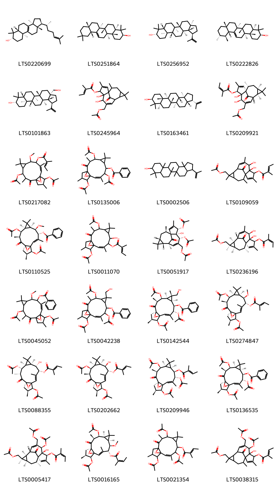{ width=100% }
    <figcaption>Hình ảnh cấu trúc hóa học của 28 hoạt chất thuộc nhóm Prenol lipids gồm ['euphol (LTS0220699)', 'β-amyrin (LTS0251864)', 'lupeol (LTS0256952)', 'amyrin (LTS0222826)', 'betulin (LTS0101863)', '7-[(acetyloxy)methyl]-5,6-dihydroxy-3,11,11,14-tetramethyl-15-oxotetracyclo[7.5.1.0¹,⁵.0¹⁰,¹²]pentadeca-2,7-dien-4-yl 2-methylbut-2-enoate (LTS0245964)', '(3s,3as,5ar,5br,7ar,9s,11ar,11br,13ar,13bs)-5a,5b,8,8,11a,13b-hexamethyl-3-(prop-1-en-2-yl)-hexadecahydrocyclopenta[a]chrysen-9-ol (LTS0163461)', '(1s,4s,5s,6r,9s,10r,12r,14r)-7-[(acetyloxy)methyl]-5,6-dihydroxy-3,11,11,14-tetramethyl-15-oxotetracyclo[7.5.1.0¹,⁵.0¹⁰,¹²]pentadeca-2,7-dien-4-yl (2z)-2-methylbut-2-enoate (LTS0209921)', '4,13-bis(acetyloxy)-8-methoxy-3,6,6,10,14-pentamethyl-2-oxo-16-oxatetracyclo[10.3.1.0¹,¹².0⁵,⁷]hexadec-10-en-9-yl 2-methylbut-2-enoate (LTS0217082)', '4,9,13-tris(acetyloxy)-3,6,6,10,14-pentamethyl-2-oxo-16-oxatetracyclo[10.3.1.0¹,¹².0⁵,⁷]hexadec-10-en-8-yl benzoate (LTS0135006)', '5a,5b,8,8,11a,13b-hexamethyl-3-(prop-1-en-2-yl)-hexadecahydrocyclopenta[a]chrysen-9-ol (LTS0002506)', '11-[(acetyloxy)methyl]-5,6-dihydroxy-3,7,11,14-tetramethyl-15-oxotetracyclo[7.5.1.0¹,⁵.0¹⁰,¹²]pentadeca-2,7-dien-4-yl 2-methylbut-2-enoate (LTS0109059)', '(1r,3s,4s,5r,7s,8r,9r,10e,12s,13s,14s)-4,13-bis(acetyloxy)-8-methoxy-3,6,6,10,14-pentamethyl-2-oxo-16-oxatetracyclo[10.3.1.0¹,¹².0⁵,⁷]hexadec-10-en-9-yl benzoate (LTS0110525)', '4,13-bis(acetyloxy)-8-hydroxy-3,6,6,10,14-pentamethyl-2-oxo-16-oxatetracyclo[10.3.1.0¹,¹².0⁵,⁷]hexadec-10-en-9-yl 2-methylbut-2-enoate (LTS0011070)', 'ingenol-3,5,20-triacetate (LTS0051917)', '(1s,4s,5s,6r,9s,10r,11r,12r,14r)-11-[(acetyloxy)methyl]-5,6-dihydroxy-3,7,11,14-tetramethyl-15-oxotetracyclo[7.5.1.0¹,⁵.0¹⁰,¹²]pentadeca-2,7-dien-4-yl (2z)-2-methylbut-2-enoate (LTS0236196)', '4,13-bis(acetyloxy)-8-methoxy-3,6,6,10,14-pentamethyl-2-oxo-16-oxatetracyclo[10.3.1.0¹,¹².0⁵,⁷]hexadec-10-en-9-yl benzoate (LTS0045052)', '4,9,13-tris(acetyloxy)-6-(hydroxymethyl)-3,6,10,14-tetramethyl-2-oxo-16-oxatetracyclo[10.3.1.0¹,¹².0⁵,⁷]hexadec-10-en-8-yl benzoate (LTS0042238)', '(1r,3s,4s,5r,6s,7s,8r,9r,10e,12s,13s,14s)-4,9,13-tris(acetyloxy)-6-(hydroxymethyl)-3,6,10,14-tetramethyl-2-oxo-16-oxatetracyclo[10.3.1.0¹,¹².0⁵,⁷]hexadec-10-en-8-yl benzoate (LTS0142544)', '(1r,3s,4s,5r,7s,8r,9r,10e,12s,13s,14s)-4,13-bis(acetyloxy)-8-methoxy-3,6,6,10,14-pentamethyl-2-oxo-16-oxatetracyclo[10.3.1.0¹,¹².0⁵,⁷]hexadec-10-en-9-yl (2e)-2-methylbut-2-enoate (LTS0274847)', '(1r,3r,4r,5r,7s,8s,9r,10e,12s,13s,14s)-4,13-bis(acetyloxy)-8-hydroxy-3,6,6,10,14-pentamethyl-2-oxo-16-oxatetracyclo[10.3.1.0¹,¹².0⁵,⁷]hexadec-10-en-9-yl (2e)-2-methylbut-2-enoate (LTS0088355)', '(1r,3s,4s,5r,7s,8r,9r,10e,12s,13s,14s)-4,13-bis(acetyloxy)-8-hydroxy-3,6,6,10,14-pentamethyl-2-oxo-16-oxatetracyclo[10.3.1.0¹,¹².0⁵,⁷]hexadec-10-en-9-yl (2e)-2-methylbut-2-enoate (LTS0202662)', '(1r,3s,4s,5r,7s,8r,9r,10e,12s,13s,14s)-4,9,13-tris(acetyloxy)-3,6,6,10,14-pentamethyl-2-oxo-16-oxatetracyclo[10.3.1.0¹,¹².0⁵,⁷]hexadec-10-en-8-yl (2e)-2-methylbut-2-enoate (LTS0209946)', '(1r,3s,4s,5r,7s,8r,9r,10e,12s,13s,14s)-4,9,13-tris(acetyloxy)-3,6,6,10,14-pentamethyl-2-oxo-16-oxatetracyclo[10.3.1.0¹,¹².0⁵,⁷]hexadec-10-en-8-yl benzoate (LTS0136535)', '(1s,4s,5r,6r,9s,10r,11r,12r,14r)-6-(acetyloxy)-7,11-bis[(acetyloxy)methyl]-5-hydroxy-3,11,14-trimethyl-15-oxotetracyclo[7.5.1.0¹,⁵.0¹⁰,¹²]pentadeca-2,7-dien-4-yl (2z)-2-methylbut-2-enoate (LTS0005417)', '(1r,3s,4s,5r,7s,8r,9r,10e,12s,13s,14s)-4,13-bis(acetyloxy)-8-methoxy-3,6,6,10,14-pentamethyl-2-oxo-16-oxatetracyclo[10.3.1.0¹,¹².0⁵,⁷]hexadec-10-en-9-yl (2z)-2-methylbut-2-enoate (LTS0016165)', '4,9,13-tris(acetyloxy)-3,6,6,10,14-pentamethyl-2-oxo-16-oxatetracyclo[10.3.1.0¹,¹².0⁵,⁷]hexadec-10-en-8-yl 2-methylbut-2-enoate (LTS0021354)', '6-(acetyloxy)-7,11-bis[(acetyloxy)methyl]-5-hydroxy-3,11,14-trimethyl-15-oxotetracyclo[7.5.1.0¹,⁵.0¹⁰,¹²]pentadeca-2,7-dien-4-yl 2-methylbut-2-enoate (LTS0038315)'].</figcaption>
</figure>
#### Nhóm Steroids and steroid derivatives
<figure markdown="span">
    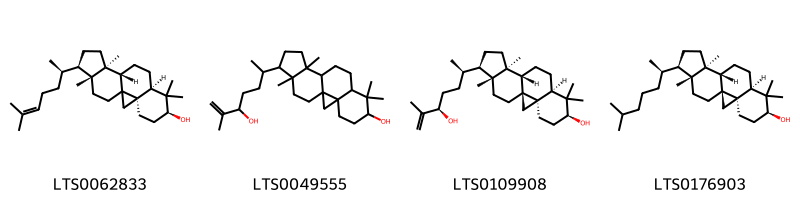{ width=100% }
    <figcaption>Hình ảnh cấu trúc hóa học của 4 hoạt chất thuộc nhóm Steroids and steroid derivatives gồm ['(3r,6s,8r,11s,12s,15r,16r)-7,7,12,16-tetramethyl-15-[(2r)-6-methylhept-5-en-2-yl]pentacyclo[9.7.0.0¹,³.0³,⁸.0¹²,¹⁶]octadecan-6-ol (LTS0062833)', '15-(5-hydroxy-6-methylhept-6-en-2-yl)-7,7,12,16-tetramethylpentacyclo[9.7.0.0¹,³.0³,⁸.0¹²,¹⁶]octadecan-6-ol (LTS0049555)', '(1s,3r,6s,8r,11s,12s,15r,16r)-15-[(2r,5r)-5-hydroxy-6-methylhept-6-en-2-yl]-7,7,12,16-tetramethylpentacyclo[9.7.0.0¹,³.0³,⁸.0¹²,¹⁶]octadecan-6-ol (LTS0109908)', 'cycloartanol (LTS0176903)'].</figcaption>
</figure>

---

### Dược dân tộc học

Danh sách các quốc gia có sử dụng *Euphorbia trigona* trong điều trị các bệnh. 

| Country   | Disease             | Bệnh                                                                                                                                                                                                |
|:----------|:--------------------|:----------------------------------------------------------------------------------------------------------------------------------------------------------------------------------------------------|
| India     | Purgative, Vesicant | MYMEMORY WARNING: YOU USED ALL AVAILABLE FREE TRANSLATIONS FOR TODAY. NEXT AVAILABLE IN  20 HOURS 01 MINUTES 05 SECONDS VISIT HTTPS://MYMEMORY.TRANSLATED.NET/DOC/USAGELIMITS.PHP TO TRANSLATE MORE |

---

---
## Euphorbia xanti
### Thông tin về thực vật

!!! info "Phân loại thực vật của *Euphorbia xanti* từ GIBF:"
    - **Kingdom:** Plantae
    - **Phylum:** Tracheophyta
    - **Order:** Malpighiales
    - **Family:** Euphorbiaceae
    - **Genus:** Euphorbia
    - **Species:** *Euphorbia xanti*

 

| Label (VI)   | Label (EN)   | Scientific Name   | Descriptions (VI)   | Descriptions (EN)   | Also Known As (VI)   | Also Known As (EN)   |
|:-------------|:-------------|:------------------|:--------------------|:--------------------|:---------------------|:---------------------|
| N/A          | N/A          | Euphorbia xanti   | loài thực vật       | species of plant    | ['']                 | ['']                 |

#### Phân bố trên thế giới

**Từ CSDL GIBF** South Africa, Madagascar, Namibia, Belgium, United States of America, Mexico

#### Phân bố tại Việt Nam

**Từ CSDL GIBF**: Không có ghi nhận ở Việt Nam

---
### Thành phần hóa học
        
- Theo cơ sở dữ liệu lotus: Từ loài *Euphorbia xanti* đã phân lập và xác định được Chưa có hoạt chất nào được phân lập. hoạt chất thuộc về các nhóm Không có hoạt chất nào được phân lập. 

Không có hình ảnh nào được tạo ra

---

### Dược dân tộc học

Danh sách các quốc gia có sử dụng *Euphorbia xanti* trong điều trị các bệnh. 

| Country   | Disease    | Bệnh                                                                                                                                                                                                |
|:----------|:-----------|:----------------------------------------------------------------------------------------------------------------------------------------------------------------------------------------------------|
| Mexico    | Depilatory | MYMEMORY WARNING: YOU USED ALL AVAILABLE FREE TRANSLATIONS FOR TODAY. NEXT AVAILABLE IN  20 HOURS 00 MINUTES 36 SECONDS VISIT HTTPS://MYMEMORY.TRANSLATED.NET/DOC/USAGELIMITS.PHP TO TRANSLATE MORE |

---

# Chi Pimelodendron

??? note "Danh sách các dược liệu thuộc chi"
    
	 - *Pimelodendron amboinicum*

---
## Pimelodendron amboinicum
### Thông tin về thực vật

!!! info "Phân loại thực vật của *Pimelodendron amboinicum* từ GIBF:"
    - **Kingdom:** Plantae
    - **Phylum:** Tracheophyta
    - **Order:** Malpighiales
    - **Family:** Euphorbiaceae
    - **Genus:** Pimelodendron
    - **Species:** *Pimelodendron amboinicum*

 

| Label (VI)   | Label (EN)   | Scientific Name          | Descriptions (VI)   | Descriptions (EN)   | Also Known As (VI)   | Also Known As (EN)   |
|:-------------|:-------------|:-------------------------|:--------------------|:--------------------|:---------------------|:---------------------|
| N/A          | N/A          | Pimelodendron amboinicum |                     | species of plant    | ['']                 | ['']                 |

#### Phân bố trên thế giới

**Từ CSDL GIBF** nan, Australia, Papua New Guinea, Vanuatu, Indonesia, Solomon Islands

#### Phân bố tại Việt Nam

**Từ CSDL GIBF**: Không có ghi nhận ở Việt Nam

---
### Thành phần hóa học
        
- Theo cơ sở dữ liệu lotus: Từ loài *Pimelodendron amboinicum* đã phân lập và xác định được Chưa có hoạt chất nào được phân lập. hoạt chất thuộc về các nhóm Không có hoạt chất nào được phân lập. 

Không có hình ảnh nào được tạo ra

---

### Dược dân tộc học

Danh sách các quốc gia có sử dụng *Pimelodendron amboinicum* trong điều trị các bệnh. 

| Country   | Disease   | Bệnh                                                                                                                                                                                                |
|:----------|:----------|:----------------------------------------------------------------------------------------------------------------------------------------------------------------------------------------------------|
| Malaya    | Purgative | MYMEMORY WARNING: YOU USED ALL AVAILABLE FREE TRANSLATIONS FOR TODAY. NEXT AVAILABLE IN  20 HOURS 00 MINUTES 04 SECONDS VISIT HTTPS://MYMEMORY.TRANSLATED.NET/DOC/USAGELIMITS.PHP TO TRANSLATE MORE |
| Moluccas  | Purgative | MYMEMORY WARNING: YOU USED ALL AVAILABLE FREE TRANSLATIONS FOR TODAY. NEXT AVAILABLE IN  20 HOURS 00 MINUTES 02 SECONDS VISIT HTTPS://MYMEMORY.TRANSLATED.NET/DOC/USAGELIMITS.PHP TO TRANSLATE MORE |

---

# Chi Colliguaja

??? note "Danh sách các dược liệu thuộc chi"
    
	 - *Colliguaja integerrima*

---
## Colliguaja integerrima
### Thông tin về thực vật

!!! info "Phân loại thực vật của *Colliguaja integerrima* từ GIBF:"
    - **Kingdom:** Plantae
    - **Phylum:** Tracheophyta
    - **Order:** Malpighiales
    - **Family:** Euphorbiaceae
    - **Genus:** Colliguaja
    - **Species:** *Colliguaja integerrima*

 

| Label (VI)   | Label (EN)   | Scientific Name        | Descriptions (VI)   | Descriptions (EN)   | Also Known As (VI)   | Also Known As (EN)   |
|:-------------|:-------------|:-----------------------|:--------------------|:--------------------|:---------------------|:---------------------|
| N/A          | N/A          | Colliguaja integerrima | loài thực vật       | species of plant    | ['']                 | ['']                 |

#### Phân bố trên thế giới

**Từ CSDL GIBF** Chile, Argentina

#### Phân bố tại Việt Nam

**Từ CSDL GIBF**: Không có ghi nhận ở Việt Nam

---
### Thành phần hóa học
        
- Theo cơ sở dữ liệu lotus: Từ loài *Colliguaja integerrima* đã phân lập và xác định được Chưa có hoạt chất nào được phân lập. hoạt chất thuộc về các nhóm Không có hoạt chất nào được phân lập. 

Không có hình ảnh nào được tạo ra

---

### Dược dân tộc học

Danh sách các quốc gia có sử dụng *Colliguaja integerrima* trong điều trị các bệnh. 

| Country   | Disease   | Bệnh                                                                                                                                                                                                |
|:----------|:----------|:----------------------------------------------------------------------------------------------------------------------------------------------------------------------------------------------------|
| Argentina | Poison    | MYMEMORY WARNING: YOU USED ALL AVAILABLE FREE TRANSLATIONS FOR TODAY. NEXT AVAILABLE IN  19 HOURS 59 MINUTES 35 SECONDS VISIT HTTPS://MYMEMORY.TRANSLATED.NET/DOC/USAGELIMITS.PHP TO TRANSLATE MORE |

---

# Chi Garcia

??? note "Danh sách các dược liệu thuộc chi"
    
	 - *Garcia nutans*

---
## Garcia nutans
### Thông tin về thực vật

!!! info "Phân loại thực vật của *Garcia nutans* từ GIBF:"
    - **Kingdom:** Plantae
    - **Phylum:** Tracheophyta
    - **Order:** Malpighiales
    - **Family:** Euphorbiaceae
    - **Genus:** Garcia
    - **Species:** *Garcia nutans*

 

| Label (VI)   | Label (EN)   | Scientific Name   | Descriptions (VI)   | Descriptions (EN)   | Also Known As (VI)   | Also Known As (EN)   |
|:-------------|:-------------|:------------------|:--------------------|:--------------------|:---------------------|:---------------------|
| N/A          | N/A          | Garcia nutans     | loài thực vật       | species of plant    | ['']                 | ['']                 |

#### Phân bố trên thế giới

**Từ CSDL GIBF** nan, Guadeloupe, Belgium, unknown or invalid, Nicaragua, Venezuela (Bolivarian Republic of), French Guiana, Panama, Puerto Rico, Honduras, United States of America, El Salvador, Trinidad and Tobago, Martinique, Brazil, Guyana, Mexico, China, Colombia, Costa Rica

#### Phân bố tại Việt Nam

**Từ CSDL GIBF**: Không có ghi nhận ở Việt Nam

---
### Thành phần hóa học
        
- Theo cơ sở dữ liệu lotus: Từ loài *Garcia nutans* đã phân lập và xác định được Chưa có hoạt chất nào được phân lập. hoạt chất thuộc về các nhóm Không có hoạt chất nào được phân lập. 

Không có hình ảnh nào được tạo ra

---

### Dược dân tộc học

Danh sách các quốc gia có sử dụng *Garcia nutans* trong điều trị các bệnh. 

| Country   | Disease           | Bệnh                                                                                                                                                                                                |
|:----------|:------------------|:----------------------------------------------------------------------------------------------------------------------------------------------------------------------------------------------------|
| Venezuela | Purgative, Emetic | MYMEMORY WARNING: YOU USED ALL AVAILABLE FREE TRANSLATIONS FOR TODAY. NEXT AVAILABLE IN  19 HOURS 59 MINUTES 08 SECONDS VISIT HTTPS://MYMEMORY.TRANSLATED.NET/DOC/USAGELIMITS.PHP TO TRANSLATE MORE |

---

# Chi Croton

??? note "Danh sách các dược liệu thuộc chi"
    
	 - *Croton bonplandianus*
	 - *Croton caudatum*
	 - *Croton ciliato-glandsulosus*
	 - *Croton corymbulosus*
	 - *Croton dioicus*
	 - *Croton draco*
	 - *Croton echinocarpus*
	 - *Croton eleuteria*
	 - *Croton eluteria*
	 - *Croton flavens*
	 - *Croton humilia*
	 - *Croton humilis*
	 - *Croton macrostachyus*
	 - *Croton malambo*
	 - *Croton morifolius*
	 - *Croton neomexicanus*
	 - *Croton niveus*
	 - *Croton oblongifolius*
	 - *Croton origanifolius*
	 - *Croton reflexifolius*
	 - *Croton roxburghii*
	 - *Croton setigerus*
	 - *Croton texensis*
	 - *Croton tiglium*
	 - *Croton xalapensis*

---
## Croton bonplandianus
### Thông tin về thực vật

!!! info "Phân loại thực vật của *Croton bonplandianus* từ GIBF:"
    - **Kingdom:** Plantae
    - **Phylum:** Tracheophyta
    - **Order:** Malpighiales
    - **Family:** Euphorbiaceae
    - **Genus:** Croton
    - **Species:** *Croton bonplandianus*

 

| Label (VI)   | Label (EN)   | Scientific Name      | Descriptions (VI)   | Descriptions (EN)   | Also Known As (VI)   | Also Known As (EN)   |
|:-------------|:-------------|:---------------------|:--------------------|:--------------------|:---------------------|:---------------------|
| N/A          | N/A          | Croton bonplandianus | loài thực vật       | species of plant    | ['']                 | ['Rush Foil']        |

#### Phân bố trên thế giới

**Từ CSDL GIBF** Pakistan, Sri Lanka, Réunion, Thailand, Mauritius, Chinese Taipei, Brazil, Argentina, India, Indonesia, Bangladesh, Mayotte, Timor-Leste, Paraguay, Nepal

#### Phân bố tại Việt Nam

**Từ CSDL GIBF**: Không có ghi nhận ở Việt Nam

---
### Thành phần hóa học
        
- Theo cơ sở dữ liệu lotus: Từ loài *Croton bonplandianus* đã phân lập và xác định được 26 hoạt chất thuộc về các nhóm Fatty Acyls, Proaporphines, Prenol lipids, Aporphines, Organooxygen compounds, Phenols. 

|    | chemicalTaxonomyClassyfireClass   |   smiles_count |
|---:|:----------------------------------|---------------:|
|  0 | Aporphines                        |              4 |
|  1 | Fatty Acyls                       |              2 |
|  2 | Organooxygen compounds            |              2 |
|  3 | Phenols                           |              1 |
|  4 | Prenol lipids                     |              5 |
|  5 | Proaporphines                     |             12 |

#### Nhóm Aporphines
<figure markdown="span">
    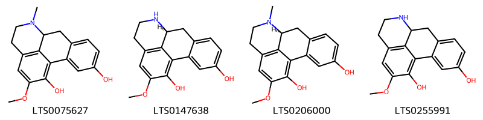{ width=100% }
    <figcaption>Hình ảnh cấu trúc hóa học của 4 hoạt chất thuộc nhóm Aporphines gồm ['15-methoxy-10-methyl-10-azatetracyclo[7.7.1.0²,⁷.0¹³,¹⁷]heptadeca-1(16),2,4,6,13(17),14-hexaene-4,16-diol (LTS0075627)', 'sparsiflorine (LTS0147638)', '(9s)-15-methoxy-10-methyl-10-azatetracyclo[7.7.1.0²,⁷.0¹³,¹⁷]heptadeca-1(16),2,4,6,13(17),14-hexaene-4,16-diol (LTS0206000)', '15-methoxy-10-azatetracyclo[7.7.1.0²,⁷.0¹³,¹⁷]heptadeca-1(16),2,4,6,13(17),14-hexaene-4,16-diol (LTS0255991)'].</figcaption>
</figure>
#### Nhóm Fatty Acyls
<figure markdown="span">
    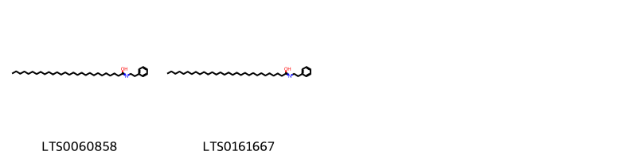{ width=100% }
    <figcaption>Hình ảnh cấu trúc hóa học của 2 hoạt chất thuộc nhóm Fatty Acyls gồm ['n-(2-phenylethyl)octacosanimidic acid (LTS0060858)', 'n-(2-phenylethyl)triacontanimidic acid (LTS0161667)'].</figcaption>
</figure>
#### Nhóm Organooxygen compounds
<figure markdown="span">
    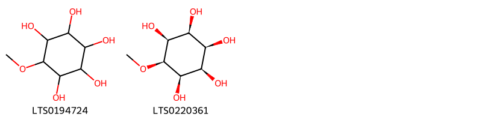{ width=100% }
    <figcaption>Hình ảnh cấu trúc hóa học của 2 hoạt chất thuộc nhóm Organooxygen compounds gồm ['pinitol (LTS0194724)', '(1r,2r,3r,4s,5s,6s)-6-methoxycyclohexane-1,2,3,4,5-pentol (LTS0220361)'].</figcaption>
</figure>
#### Nhóm Phenols
<figure markdown="span">
    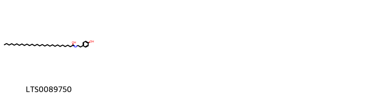{ width=100% }
    <figcaption>Hình ảnh cấu trúc hóa học của 1 hoạt chất thuộc nhóm Phenols gồm ['n-[2-(4-hydroxyphenyl)ethyl]octacosanimidic acid (LTS0089750)'].</figcaption>
</figure>
#### Nhóm Prenol lipids
<figure markdown="span">
    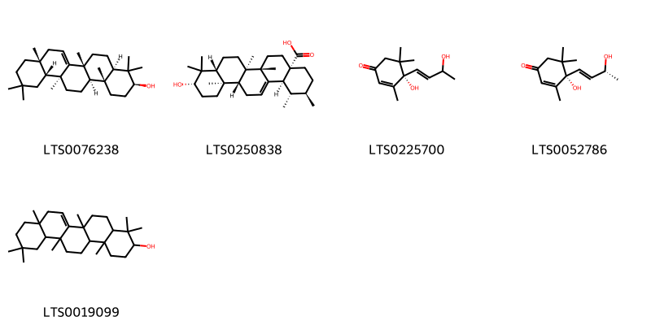{ width=100% }
    <figcaption>Hình ảnh cấu trúc hóa học của 5 hoạt chất thuộc nhóm Prenol lipids gồm ['alnulin (LTS0076238)', 'ursolic acid (LTS0250838)', '(4s)-4-hydroxy-4-(3-hydroxybut-1-en-1-yl)-3,5,5-trimethylcyclohex-2-en-1-one (LTS0225700)', '(6s,9r)-vomifoliol (LTS0052786)', 'taraxerol (LTS0019099)'].</figcaption>
</figure>
#### Nhóm Proaporphines
<figure markdown="span">
    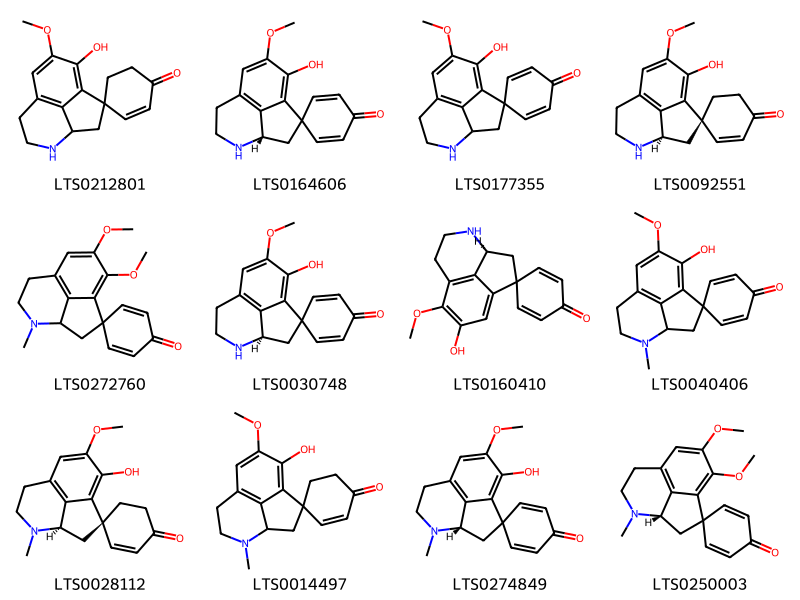{ width=100% }
    <figcaption>Hình ảnh cấu trúc hóa học của 12 hoạt chất thuộc nhóm Proaporphines gồm ["11'-hydroxy-10'-methoxy-5'-azaspiro[cyclohexane-1,2'-tricyclo[6.3.1.0⁴,¹²]dodecane]-1'(11'),2,8'(12'),9'-tetraen-4-one (LTS0212801)", "(4's)-11'-hydroxy-10'-methoxy-5'-azaspiro[cyclohexane-1,2'-tricyclo[6.3.1.0⁴,¹²]dodecane]-1'(11'),2,5,8'(12'),9'-pentaen-4-one (LTS0164606)", "11'-hydroxy-10'-methoxy-5'-azaspiro[cyclohexane-1,2'-tricyclo[6.3.1.0⁴,¹²]dodecane]-1'(11'),2,5,8'(12'),9'-pentaen-4-one (LTS0177355)", "(1s,4'r)-11'-hydroxy-10'-methoxy-5'-azaspiro[cyclohexane-1,2'-tricyclo[6.3.1.0⁴,¹²]dodecane]-1'(11'),2,8'(12'),9'-tetraen-4-one (LTS0092551)", "10',11'-dimethoxy-5'-methyl-5'-azaspiro[cyclohexane-1,2'-tricyclo[6.3.1.0⁴,¹²]dodecane]-1'(11'),2,5,8'(12'),9'-pentaen-4-one (LTS0272760)", "(4'r)-11'-hydroxy-10'-methoxy-5'-azaspiro[cyclohexane-1,2'-tricyclo[6.3.1.0⁴,¹²]dodecane]-1'(11'),2,5,8'(12'),9'-pentaen-4-one (LTS0030748)", "(4's)-10'-hydroxy-9'-methoxy-5'-azaspiro[cyclohexane-1,2'-tricyclo[6.3.1.0⁴,¹²]dodecane]-1'(11'),2,5,8'(12'),9'-pentaen-4-one (LTS0160410)", "11'-hydroxy-10'-methoxy-5'-methyl-5'-azaspiro[cyclohexane-1,2'-tricyclo[6.3.1.0⁴,¹²]dodecane]-1'(11'),2,5,8'(12'),9'-pentaen-4-one (LTS0040406)", "(1s,4'r)-11'-hydroxy-10'-methoxy-5'-methyl-5'-azaspiro[cyclohexane-1,2'-tricyclo[6.3.1.0⁴,¹²]dodecane]-1'(11'),2,8'(12'),9'-tetraen-4-one (LTS0028112)", "11'-hydroxy-10'-methoxy-5'-methyl-5'-azaspiro[cyclohexane-1,2'-tricyclo[6.3.1.0⁴,¹²]dodecane]-1'(11'),2,8'(12'),9'-tetraen-4-one (LTS0014497)", "(4's)-11'-hydroxy-10'-methoxy-5'-methyl-5'-azaspiro[cyclohexane-1,2'-tricyclo[6.3.1.0⁴,¹²]dodecane]-1'(11'),2,5,8'(12'),9'-pentaen-4-one (LTS0274849)", '(-)-pronuciferine (LTS0250003)'].</figcaption>
</figure>

---

### Dược dân tộc học

Danh sách các quốc gia có sử dụng *Croton bonplandianus* trong điều trị các bệnh. 

| Country   | Disease    | Bệnh                                                                                                                                                                                                |
|:----------|:-----------|:----------------------------------------------------------------------------------------------------------------------------------------------------------------------------------------------------|
| Argentina | Antiseptic | MYMEMORY WARNING: YOU USED ALL AVAILABLE FREE TRANSLATIONS FOR TODAY. NEXT AVAILABLE IN  19 HOURS 58 MINUTES 40 SECONDS VISIT HTTPS://MYMEMORY.TRANSLATED.NET/DOC/USAGELIMITS.PHP TO TRANSLATE MORE |

---

---
## Croton caudatum
### Thông tin về thực vật

!!! info "Phân loại thực vật của *Croton caudatus* từ GIBF:"
    - **Kingdom:** Plantae
    - **Phylum:** Tracheophyta
    - **Order:** Malpighiales
    - **Family:** Euphorbiaceae
    - **Genus:** Croton
    - **Species:** *Croton caudatus*

 

| Label (VI)   | Label (EN)   | Scientific Name      | Descriptions (VI)   | Descriptions (EN)   | Also Known As (VI)   | Also Known As (EN)   |
|:-------------|:-------------|:---------------------|:--------------------|:--------------------|:---------------------|:---------------------|
| N/A          | N/A          | Croton bonplandianus | loài thực vật       | species of plant    | ['']                 | ['Rush Foil']        |

#### Phân bố trên thế giới

**Từ CSDL GIBF** nan, Sri Lanka, Christmas Island, Australia, Lao People’s Democratic Republic, Cambodia, Myanmar, unknown or invalid, Thailand, Bhutan, Singapore, Viet Nam, China, India, Indonesia, Philippines, Malaysia, Brunei Darussalam, Nepal

#### Phân bố tại Việt Nam

**Từ CSDL GIBF**: Hoa Binh, Khanh Hoa

---
### Thành phần hóa học
        
- Theo cơ sở dữ liệu lotus: Từ loài *Croton caudatus* đã phân lập và xác định được Chưa có hoạt chất nào được phân lập. hoạt chất thuộc về các nhóm Không có hoạt chất nào được phân lập. 

Không có hình ảnh nào được tạo ra

---

### Dược dân tộc học

Danh sách các quốc gia có sử dụng *Croton caudatus* trong điều trị các bệnh. 

| Country   | Disease   | Bệnh                                                                                                                                                                                                |
|:----------|:----------|:----------------------------------------------------------------------------------------------------------------------------------------------------------------------------------------------------|
| Malaya    | Purgative | MYMEMORY WARNING: YOU USED ALL AVAILABLE FREE TRANSLATIONS FOR TODAY. NEXT AVAILABLE IN  19 HOURS 58 MINUTES 12 SECONDS VISIT HTTPS://MYMEMORY.TRANSLATED.NET/DOC/USAGELIMITS.PHP TO TRANSLATE MORE |

---

---
## Croton ciliatoglandsulosus
### Thông tin về thực vật

!!! info "Phân loại thực vật của *Croton ciliatoglandulifer* từ GIBF:"
    - **Kingdom:** Plantae
    - **Phylum:** Tracheophyta
    - **Order:** Malpighiales
    - **Family:** Euphorbiaceae
    - **Genus:** Croton
    - **Species:** *Croton ciliatoglandulifer*

 

| Label (VI)   | Label (EN)   | Scientific Name      | Descriptions (VI)   | Descriptions (EN)   | Also Known As (VI)   | Also Known As (EN)   |
|:-------------|:-------------|:---------------------|:--------------------|:--------------------|:---------------------|:---------------------|
| N/A          | N/A          | Croton bonplandianus | loài thực vật       | species of plant    | ['']                 | ['Rush Foil']        |

#### Phân bố trên thế giới

**Từ CSDL GIBF** Honduras, El Salvador, Guatemala, Mexico

#### Phân bố tại Việt Nam

**Từ CSDL GIBF**: Không có ghi nhận ở Việt Nam

---
### Thành phần hóa học
        
- Theo cơ sở dữ liệu lotus: Từ loài *Croton ciliatoglandulifer* đã phân lập và xác định được Chưa có hoạt chất nào được phân lập. hoạt chất thuộc về các nhóm Không có hoạt chất nào được phân lập. 

Không có hình ảnh nào được tạo ra

---

### Dược dân tộc học

Danh sách các quốc gia có sử dụng *Croton ciliatoglandulifer* trong điều trị các bệnh. 

| Country   | Disease   | Bệnh                                                                                                                                                                                                |
|:----------|:----------|:----------------------------------------------------------------------------------------------------------------------------------------------------------------------------------------------------|
| Elsewhere | Purgative | MYMEMORY WARNING: YOU USED ALL AVAILABLE FREE TRANSLATIONS FOR TODAY. NEXT AVAILABLE IN  19 HOURS 57 MINUTES 44 SECONDS VISIT HTTPS://MYMEMORY.TRANSLATED.NET/DOC/USAGELIMITS.PHP TO TRANSLATE MORE |

---

---
## Croton corymbulosus
### Thông tin về thực vật

!!! info "Phân loại thực vật của *Croton corymbulosus* từ GIBF:"
    - **Kingdom:** Plantae
    - **Phylum:** Tracheophyta
    - **Order:** Malpighiales
    - **Family:** Euphorbiaceae
    - **Genus:** Croton
    - **Species:** *Croton corymbulosus*

 

| Label (VI)   | Label (EN)   | Scientific Name      | Descriptions (VI)   | Descriptions (EN)   | Also Known As (VI)   | Also Known As (EN)   |
|:-------------|:-------------|:---------------------|:--------------------|:--------------------|:---------------------|:---------------------|
| N/A          | N/A          | Croton bonplandianus | loài thực vật       | species of plant    | ['']                 | ['Rush Foil']        |

#### Phân bố trên thế giới

**Từ CSDL GIBF** nan, United States of America, Mexico

#### Phân bố tại Việt Nam

**Từ CSDL GIBF**: Không có ghi nhận ở Việt Nam

---
### Thành phần hóa học
        
- Theo cơ sở dữ liệu lotus: Từ loài *Croton corymbulosus* đã phân lập và xác định được Chưa có hoạt chất nào được phân lập. hoạt chất thuộc về các nhóm Không có hoạt chất nào được phân lập. 

Không có hình ảnh nào được tạo ra

---

### Dược dân tộc học

Danh sách các quốc gia có sử dụng *Croton corymbulosus* trong điều trị các bệnh. 

| Country   | Disease          | Bệnh                                                                                                                                                                                                |
|:----------|:-----------------|:----------------------------------------------------------------------------------------------------------------------------------------------------------------------------------------------------|
| Mexico    | Sudorific, Tonic | MYMEMORY WARNING: YOU USED ALL AVAILABLE FREE TRANSLATIONS FOR TODAY. NEXT AVAILABLE IN  19 HOURS 57 MINUTES 20 SECONDS VISIT HTTPS://MYMEMORY.TRANSLATED.NET/DOC/USAGELIMITS.PHP TO TRANSLATE MORE |

---

---
## Croton dioicus
### Thông tin về thực vật

!!! info "Phân loại thực vật của *Croton dioicus* từ GIBF:"
    - **Kingdom:** Plantae
    - **Phylum:** Tracheophyta
    - **Order:** Malpighiales
    - **Family:** Euphorbiaceae
    - **Genus:** Croton
    - **Species:** *Croton dioicus*

 

| Label (VI)   | Label (EN)   | Scientific Name   | Descriptions (VI)   | Descriptions (EN)   | Also Known As (VI)   | Also Known As (EN)   |
|:-------------|:-------------|:------------------|:--------------------|:--------------------|:---------------------|:---------------------|
| N/A          | N/A          | Croton dioicus    | loài thực vật       | species of plant    | ['']                 | ['']                 |

#### Phân bố trên thế giới

**Từ CSDL GIBF** United States of America, Mexico

#### Phân bố tại Việt Nam

**Từ CSDL GIBF**: Không có ghi nhận ở Việt Nam

---
### Thành phần hóa học
        
- Theo cơ sở dữ liệu lotus: Từ loài *Croton dioicus* đã phân lập và xác định được Chưa có hoạt chất nào được phân lập. hoạt chất thuộc về các nhóm Không có hoạt chất nào được phân lập. 

Không có hình ảnh nào được tạo ra

---

### Dược dân tộc học

Danh sách các quốc gia có sử dụng *Croton dioicus* trong điều trị các bệnh. 

| Country   | Disease              | Bệnh                                                                                                                                                                                                |
|:----------|:---------------------|:----------------------------------------------------------------------------------------------------------------------------------------------------------------------------------------------------|
| Mexico    | Purgative, Purgative | MYMEMORY WARNING: YOU USED ALL AVAILABLE FREE TRANSLATIONS FOR TODAY. NEXT AVAILABLE IN  19 HOURS 56 MINUTES 54 SECONDS VISIT HTTPS://MYMEMORY.TRANSLATED.NET/DOC/USAGELIMITS.PHP TO TRANSLATE MORE |

---

---
## Croton draco
### Thông tin về thực vật

!!! info "Phân loại thực vật của *Croton draco* từ GIBF:"
    - **Kingdom:** Plantae
    - **Phylum:** Tracheophyta
    - **Order:** Malpighiales
    - **Family:** Euphorbiaceae
    - **Genus:** Croton
    - **Species:** *Croton draco*

 

| Label (VI)   | Label (EN)   | Scientific Name   | Descriptions (VI)   | Descriptions (EN)   | Also Known As (VI)   | Also Known As (EN)   |
|:-------------|:-------------|:------------------|:--------------------|:--------------------|:---------------------|:---------------------|
| N/A          | N/A          | Croton draco      | loài thực vật       | species of plant    | ['']                 | ['']                 |

#### Phân bố trên thế giới

**Từ CSDL GIBF** Colombia, Guatemala, Costa Rica, Honduras, Nicaragua, Mexico, Panama

#### Phân bố tại Việt Nam

**Từ CSDL GIBF**: Không có ghi nhận ở Việt Nam

---
### Thành phần hóa học
        
- Theo cơ sở dữ liệu lotus: Từ loài *Croton draco* đã phân lập và xác định được 8 hoạt chất thuộc về các nhóm Aporphines, Flavonoids, Prenol lipids, Coumarins and derivatives. 

|    | chemicalTaxonomyClassyfireClass   |   smiles_count |
|---:|:----------------------------------|---------------:|
|  0 | Aporphines                        |              4 |
|  1 | Coumarins and derivatives         |              1 |
|  2 | Flavonoids                        |              2 |
|  3 | Prenol lipids                     |              1 |

#### Nhóm Aporphines
<figure markdown="span">
    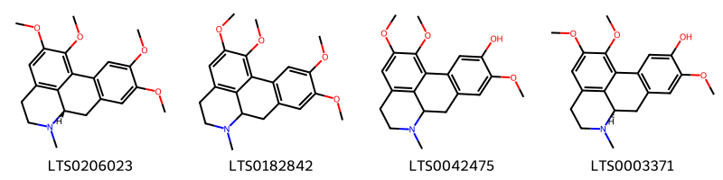{ width=100% }
    <figcaption>Hình ảnh cấu trúc hóa học của 4 hoạt chất thuộc nhóm Aporphines gồm ['(9s)-4,5,15,16-tetramethoxy-10-methyl-10-azatetracyclo[7.7.1.0²,⁷.0¹³,¹⁷]heptadeca-1(16),2(7),3,5,13(17),14-hexaene (LTS0206023)', '4,5,15,16-tetramethoxy-10-methyl-10-azatetracyclo[7.7.1.0²,⁷.0¹³,¹⁷]heptadeca-1(16),2(7),3,5,13(17),14-hexaene (LTS0182842)', '5,15,16-trimethoxy-10-methyl-10-azatetracyclo[7.7.1.0²,⁷.0¹³,¹⁷]heptadeca-1(16),2(7),3,5,13(17),14-hexaen-4-ol (LTS0042475)', '(9r)-5,15,16-trimethoxy-10-methyl-10-azatetracyclo[7.7.1.0²,⁷.0¹³,¹⁷]heptadeca-1(16),2(7),3,5,13(17),14-hexaen-4-ol (LTS0003371)'].</figcaption>
</figure>
#### Nhóm Coumarins and derivatives
<figure markdown="span">
    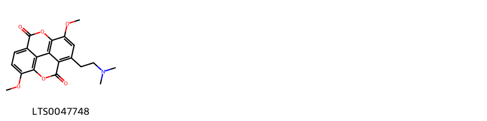{ width=100% }
    <figcaption>Hình ảnh cấu trúc hóa học của 1 hoạt chất thuộc nhóm Coumarins and derivatives gồm ['5-[2-(dimethylamino)ethyl]-7,14-dimethoxy-2,9-dioxatetracyclo[6.6.2.0⁴,¹⁶.0¹¹,¹⁵]hexadeca-1(15),4,6,8(16),11,13-hexaene-3,10-dione (LTS0047748)'].</figcaption>
</figure>
#### Nhóm Flavonoids
<figure markdown="span">
    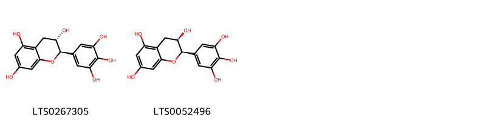{ width=100% }
    <figcaption>Hình ảnh cấu trúc hóa học của 2 hoạt chất thuộc nhóm Flavonoids gồm ['gallocatechol (LTS0267305)', 'epigallocatechin (LTS0052496)'].</figcaption>
</figure>
#### Nhóm Prenol lipids
<figure markdown="span">
    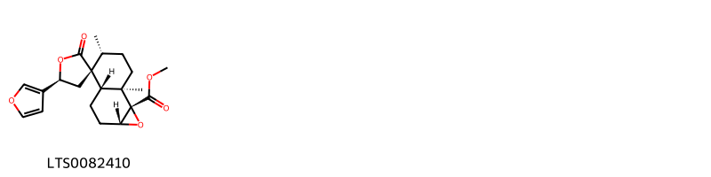{ width=100% }
    <figcaption>Hình ảnh cấu trúc hóa học của 1 hoạt chất thuộc nhóm Prenol lipids gồm ["methyl (1ar,3as,4r,5r,5's,7ar,7bs)-5'-(furan-3-yl)-5,7a-dimethyl-2'-oxo-hexahydro-1ah-spiro[naphtho[1,2-b]oxirene-4,3'-oxolane]-7b-carboxylate (LTS0082410)"].</figcaption>
</figure>

---

### Dược dân tộc học

Danh sách các quốc gia có sử dụng *Croton draco* trong điều trị các bệnh. 

| Country           | Disease    | Bệnh                                                                                                                                                                                                |
|:------------------|:-----------|:----------------------------------------------------------------------------------------------------------------------------------------------------------------------------------------------------|
| Mexico            | Astringent | MYMEMORY WARNING: YOU USED ALL AVAILABLE FREE TRANSLATIONS FOR TODAY. NEXT AVAILABLE IN  19 HOURS 56 MINUTES 30 SECONDS VISIT HTTPS://MYMEMORY.TRANSLATED.NET/DOC/USAGELIMITS.PHP TO TRANSLATE MORE |
| Mexico(Chinantec) | Hemostat   | MYMEMORY WARNING: YOU USED ALL AVAILABLE FREE TRANSLATIONS FOR TODAY. NEXT AVAILABLE IN  19 HOURS 56 MINUTES 27 SECONDS VISIT HTTPS://MYMEMORY.TRANSLATED.NET/DOC/USAGELIMITS.PHP TO TRANSLATE MORE |

---

---
## Croton echinocarpus
### Thông tin về thực vật

!!! info "Phân loại thực vật của *N/A* từ GIBF:"
    - **Kingdom:** Plantae
    - **Phylum:** Tracheophyta
    - **Order:** Malpighiales
    - **Family:** Euphorbiaceae
    - **Genus:** Croton
    - **Species:** *N/A*

 

| Label (VI)   | Label (EN)   | Scientific Name     | Descriptions (VI)   | Descriptions (EN)   | Also Known As (VI)   | Also Known As (EN)   |
|:-------------|:-------------|:--------------------|:--------------------|:--------------------|:---------------------|:---------------------|
| N/A          | N/A          | Croton echinocarpus |                     |                     | ['']                 | ['']                 |

#### Phân bố trên thế giới

**Từ CSDL GIBF** Virgin Islands (U.S.), Sri Lanka, Australia, Guadeloupe, Argentina, Virgin Islands (British), Yemen, French Guiana, Panama, Puerto Rico, Namibia, Chinese Taipei, United States of America, Uruguay, South Africa, Martinique, Brazil, Bahamas, Mexico, Ecuador, Madagascar, Haiti, Costa Rica, Botswana, India, Indonesia, Antigua and Barbuda, Kenya, Malaysia

#### Phân bố tại Việt Nam

**Từ CSDL GIBF**: Không có ghi nhận ở Việt Nam

---
### Thành phần hóa học
        
- Theo cơ sở dữ liệu lotus: Từ loài *N/A* đã phân lập và xác định được 1 hoạt chất thuộc về các nhóm Aporphines. 

|    | chemicalTaxonomyClassyfireClass   |   smiles_count |
|---:|:----------------------------------|---------------:|
|  0 | Aporphines                        |              1 |

#### Nhóm Aporphines
<figure markdown="span">
    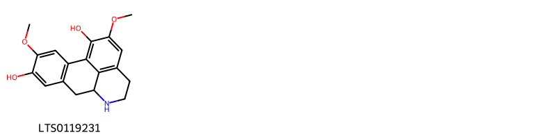{ width=100% }
    <figcaption>Hình ảnh cấu trúc hóa học của 1 hoạt chất thuộc nhóm Aporphines gồm ['4,15-dimethoxy-10-azatetracyclo[7.7.1.0²,⁷.0¹³,¹⁷]heptadeca-1(17),2(7),3,5,13,15-hexaene-5,16-diol (LTS0119231)'].</figcaption>
</figure>

---

### Dược dân tộc học

Danh sách các quốc gia có sử dụng *N/A* trong điều trị các bệnh. 

| Country   | Disease   | Bệnh                                                                                                                                                                                                |
|:----------|:----------|:----------------------------------------------------------------------------------------------------------------------------------------------------------------------------------------------------|
| Brazil    | Purgative | MYMEMORY WARNING: YOU USED ALL AVAILABLE FREE TRANSLATIONS FOR TODAY. NEXT AVAILABLE IN  19 HOURS 55 MINUTES 45 SECONDS VISIT HTTPS://MYMEMORY.TRANSLATED.NET/DOC/USAGELIMITS.PHP TO TRANSLATE MORE |

---

---
## Croton eleuteria
### Thông tin về thực vật

!!! info "Phân loại thực vật của *N/A* từ GIBF:"
    - **Kingdom:** Plantae
    - **Phylum:** Tracheophyta
    - **Order:** Malpighiales
    - **Family:** Euphorbiaceae
    - **Genus:** Croton
    - **Species:** *N/A*

 

| Label (VI)   | Label (EN)   | Scientific Name     | Descriptions (VI)   | Descriptions (EN)   | Also Known As (VI)   | Also Known As (EN)   |
|:-------------|:-------------|:--------------------|:--------------------|:--------------------|:---------------------|:---------------------|
| N/A          | N/A          | Croton echinocarpus |                     |                     | ['']                 | ['']                 |

#### Phân bố trên thế giới

**Từ CSDL GIBF** Virgin Islands (U.S.), Sri Lanka, Australia, Guadeloupe, Argentina, Virgin Islands (British), Yemen, French Guiana, Panama, Puerto Rico, Namibia, Chinese Taipei, United States of America, Uruguay, South Africa, Martinique, Brazil, Bahamas, Mexico, Ecuador, Madagascar, Haiti, Costa Rica, Botswana, India, Indonesia, Antigua and Barbuda, Kenya, Malaysia

#### Phân bố tại Việt Nam

**Từ CSDL GIBF**: Không có ghi nhận ở Việt Nam

---
### Thành phần hóa học
        
- Theo cơ sở dữ liệu lotus: Từ loài *N/A* đã phân lập và xác định được Chưa có hoạt chất nào được phân lập. hoạt chất thuộc về các nhóm Không có hoạt chất nào được phân lập. 

Không có hình ảnh nào được tạo ra

---

### Dược dân tộc học

Danh sách các quốc gia có sử dụng *N/A* trong điều trị các bệnh. 

| Country   | Disease   | Bệnh                                                                                                                                                                                                |
|:----------|:----------|:----------------------------------------------------------------------------------------------------------------------------------------------------------------------------------------------------|
| Mexico    | Tonic     | MYMEMORY WARNING: YOU USED ALL AVAILABLE FREE TRANSLATIONS FOR TODAY. NEXT AVAILABLE IN  19 HOURS 55 MINUTES 19 SECONDS VISIT HTTPS://MYMEMORY.TRANSLATED.NET/DOC/USAGELIMITS.PHP TO TRANSLATE MORE |

---

---
## Croton eluteria
### Thông tin về thực vật

!!! info "Phân loại thực vật của *Croton eluteria* từ GIBF:"
    - **Kingdom:** Plantae
    - **Phylum:** Tracheophyta
    - **Order:** Malpighiales
    - **Family:** Euphorbiaceae
    - **Genus:** Croton
    - **Species:** *Croton eluteria*

 

| Label (VI)   | Label (EN)   | Scientific Name   | Descriptions (VI)   | Descriptions (EN)   | Also Known As (VI)   | Also Known As (EN)   |
|:-------------|:-------------|:------------------|:--------------------|:--------------------|:---------------------|:---------------------|
| N/A          | N/A          | Croton eluteria   | loài thực vật       | species of plant    | ['']                 | ['']                 |

#### Phân bố trên thế giới

**Từ CSDL GIBF** nan, Netherlands, Turks and Caicos Islands, Haiti, Bahamas, Jamaica, Cuba, United States of America, Dominican Republic, Cayman Islands, France

#### Phân bố tại Việt Nam

**Từ CSDL GIBF**: Không có ghi nhận ở Việt Nam

---
### Thành phần hóa học
        
- Theo cơ sở dữ liệu lotus: Từ loài *Croton eluteria* đã phân lập và xác định được 143 hoạt chất thuộc về các nhóm Phenol ethers, Fatty Acyls, Prenol lipids, Tetralins, Benzene and substituted derivatives, Unsaturated hydrocarbons, Organooxygen compounds, Carboxylic acids and derivatives. 

|    | chemicalTaxonomyClassyfireClass     |   smiles_count |
|---:|:------------------------------------|---------------:|
|  0 | Benzene and substituted derivatives |              3 |
|  1 | Carboxylic acids and derivatives    |              1 |
|  2 | Fatty Acyls                         |              2 |
|  3 | Organooxygen compounds              |              9 |
|  4 | Phenol ethers                       |              2 |
|  5 | Prenol lipids                       |            124 |
|  6 | Tetralins                           |              1 |
|  7 | Unsaturated hydrocarbons            |              1 |

#### Nhóm Benzene and substituted derivatives
<figure markdown="span">
    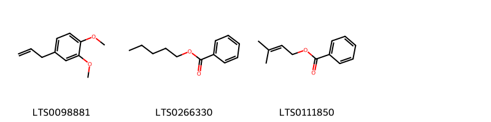{ width=100% }
    <figcaption>Hình ảnh cấu trúc hóa học của 3 hoạt chất thuộc nhóm Benzene and substituted derivatives gồm ['methyl eugenol (LTS0098881)', 'amyl benzoate (LTS0266330)', 'prenyl benzoate (LTS0111850)'].</figcaption>
</figure>
#### Nhóm Carboxylic acids and derivatives
<figure markdown="span">
    { width=100% }
    <figcaption>Hình ảnh cấu trúc hóa học của 1 hoạt chất thuộc nhóm Carboxylic acids and derivatives gồm ['1,3-dihydroxypentane-1,3,5-tricarboxylic acid (LTS0248878)'].</figcaption>
</figure>
#### Nhóm Fatty Acyls
<figure markdown="span">
    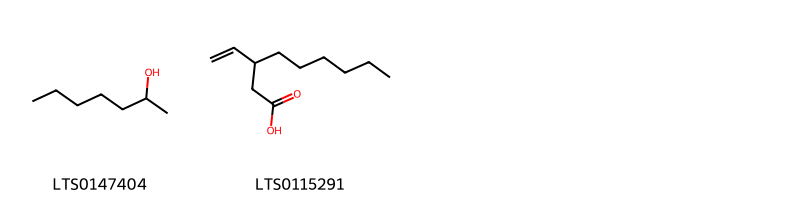{ width=100% }
    <figcaption>Hình ảnh cấu trúc hóa học của 2 hoạt chất thuộc nhóm Fatty Acyls gồm ['2-heptanol (LTS0147404)', '3-ethenylnonanoic acid (LTS0115291)'].</figcaption>
</figure>
#### Nhóm Organooxygen compounds
<figure markdown="span">
    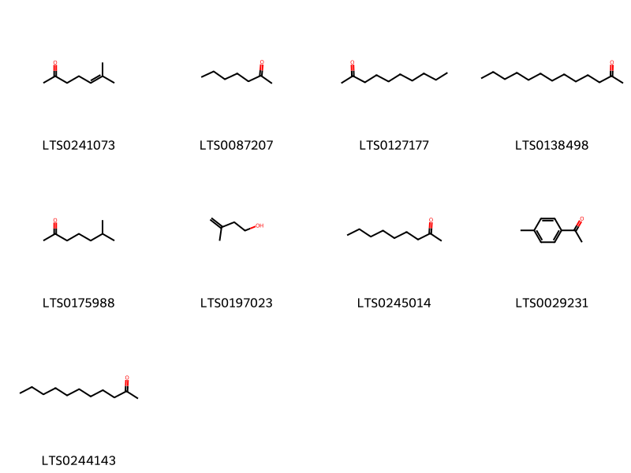{ width=100% }
    <figcaption>Hình ảnh cấu trúc hóa học của 9 hoạt chất thuộc nhóm Organooxygen compounds gồm ['6-methyl-5-hepten-2-one (LTS0241073)', '2-heptanone (LTS0087207)', '2-decanone (LTS0127177)', '2-tridecanone (LTS0138498)', '2-isooctanone (LTS0175988)', '3-methyl-3-buten-1-ol (LTS0197023)', '2-nonanone (LTS0245014)', 'p-methylacetophenone (LTS0029231)', 'undecan-2-one (LTS0244143)'].</figcaption>
</figure>
#### Nhóm Phenol ethers
<figure markdown="span">
    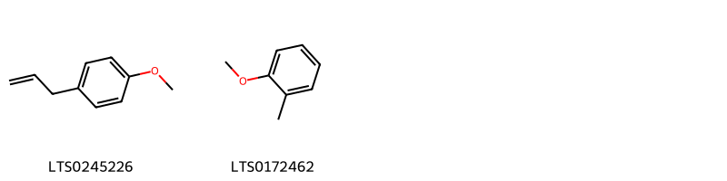{ width=100% }
    <figcaption>Hình ảnh cấu trúc hóa học của 2 hoạt chất thuộc nhóm Phenol ethers gồm ['tarragon (LTS0245226)', '2-methylanisole (LTS0172462)'].</figcaption>
</figure>
#### Nhóm Prenol lipids
<figure markdown="span">
    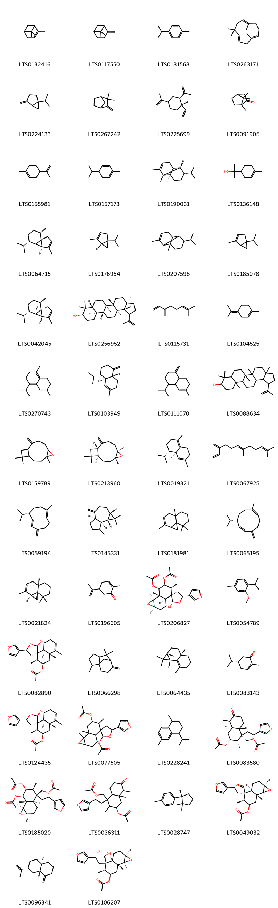{ width=100% }
    <figcaption>Hình ảnh cấu trúc hóa học của 124 hoạt chất thuộc nhóm Prenol lipids gồm ['α pinene (LTS0132416)', 'β-pinene (LTS0117550)', 'cymene (LTS0181568)', 'humulene (LTS0263171)', 'sabinene (LTS0224133)', 'camphene (LTS0267242)', 'β-elemene (LTS0225699)', 'camphor (LTS0091905)', 'limonene,  (LTS0155981)', 'phellandrene (LTS0157173)', '(1r,2s,7s,8s)-8-isopropyl-1,3-dimethyltricyclo[4.4.0.0²,⁷]dec-3-ene (LTS0190031)', 'terpineol (LTS0136148)', '(1s,5r,7s,10r)-7-isopropyl-4,10-dimethyltricyclo[4.4.0.0¹,⁵]dec-3-ene (LTS0064715)', 'α-thujene (LTS0176954)', 'α-copaene (LTS0207598)', 'α-thujene (LTS0185078)', '(-)-α-cubebene (LTS0042045)', 'lupeol (LTS0256952)', 'α-myrcene (LTS0115731)', 'terpinolene (LTS0104525)', '4-isopropyl-1,6-dimethyl-2,3,4,4a,7,8-hexahydronaphthalene (LTS0270743)', '(+)-gamma-cadinene (LTS0103949)', '4-isopropyl-6-methyl-1-methylidene-3,4,4a,7,8,8a-hexahydro-2h-naphthalene (LTS0111070)', 'lupeol (LTS0088634)', 'caryophyllene oxide (LTS0159789)', 'β-caryophyllene oxide (LTS0213960)', 'delta-cadinene (LTS0019321)', 'β-farnesene (LTS0067925)', '(-)-germacrene d (LTS0059194)', '(1as,4ar,7as,7br)-1,1,7-trimethyl-4-methylidene-octahydro-1ah-cyclopropa[e]azulene (LTS0145331)', 'thujopsene (LTS0181981)', '(1z,6z,8s)-8-isopropyl-1-methyl-5-methylidenecyclodeca-1,6-diene (LTS0065195)', '(-)-thujopsene (LTS0021824)', 'carvone (LTS0196605)', "(1ar,2's,3as,4s,5s,5'r,6s,7r,7as,7bs)-6-(acetyloxy)-5'-(furan-3-yl)-2'-hydroxy-5,7a,7b-trimethyl-hexahydro-1ah-spiro[naphtho[1,2-b]oxirene-4,3'-oxolan]-7-yl acetate (LTS0206827)", '2-isopropyl-5-methylanisole (LTS0054789)', "(1s,2s,2'r,3r,4ar,5's,8as)-5'-(furan-3-yl)-2'-hydroxy-2,4a,5-trimethyl-2,3,4,7,8,8a-hexahydrospiro[naphthalene-1,3'-oxolan]-3-yl acetate (LTS0082890)", '2,6,6-trimethyl-8-methylidenetricyclo[5.3.1.0¹,⁵]undecane (LTS0066298)', '(1ar,3as,7bs)-1,1,3a,7-tetramethyl-1ah,2h,3h,4h,5h,6h,7bh-cyclopropa[a]naphthalene (LTS0064435)', '(5s)-5-isopropyl-2-methylcyclohex-2-en-1-one (LTS0083143)', "(1s,2s,2'r,3r,4ar,5'r,8as)-5'-(furan-3-yl)-2'-hydroxy-2,4a,5-trimethyl-2,3,4,7,8,8a-hexahydrospiro[naphthalene-1,3'-oxolan]-3-yl acetate (LTS0124435)", "6-(acetyloxy)-5'-(furan-3-yl)-5,7a,7b-trimethyl-hexahydro-1ah-spiro[naphtho[1,2-b]oxirene-4,3'-oxolan]-2'-yl acetate (LTS0077505)", '(e)-calamene (LTS0228241)', '[(1s,2s,3r,4ar,5r,8as)-3-(acetyloxy)-1-[2-(furan-3-yl)ethyl]-2,4a,5-trimethyl-6-oxo-hexahydro-2h-naphthalen-1-yl]methyl acetate (LTS0083580)', '[(1ar,3ar,4s,5s,6s,7r,7as,7bs)-6,7-bis(acetyloxy)-4-[2-(furan-3-yl)ethyl]-5,7a,7b-trimethyl-hexahydro-1ah-naphtho[1,2-b]oxiren-4-yl]methyl acetate (LTS0185020)', '[3-(acetyloxy)-1-[2-(furan-3-yl)ethyl]-2,4a,5-trimethyl-6-oxo-hexahydro-2h-naphthalen-1-yl]methyl acetate (LTS0036311)', 'cuparene (LTS0028747)', '(1ar,3as,4s,5s,6r,7ar,7bs)-4-formyl-4-[2-(furan-3-yl)ethyl]-5,7a,7b-trimethyl-hexahydro-1ah-naphtho[1,2-b]oxiren-6-yl acetate (LTS0049032)', 'β-selinene (LTS0096341)', '(1ar,3ar,4s,5s,6r,7ar,7bs)-4-[(2r)-2-(furan-3-yl)-2-hydroxyethyl]-4-(hydroxymethyl)-5,7a,7b-trimethyl-hexahydro-1ah-naphtho[1,2-b]oxiren-6-yl acetate (LTS0106207)', '8-isopropyl-1,2-dimethyltetracyclo[4.4.0.0²,⁴.0³,⁷]decane (LTS0040030)', 'trans-β-ocimene (LTS0049765)', '4,6,6-trimethyl-3-(2,6,6-trimethyl-3-{2,6,6-trimethylbicyclo[3.1.1]hept-1-en-3-yl}bicyclo[3.1.1]hept-1-en-3-yl)bicyclo[3.1.1]hept-4-en-2-yl acetate (LTS0107905)', "(1r,2s,2's,3r,4ar,5s,5'r,6r,8as)-5'-(furan-3-yl)-5,6-dihydroxy-2'-methoxy-2,4a,5-trimethyl-hexahydro-2h-spiro[naphthalene-1,3'-oxolan]-3-yl acetate (LTS0185869)", "5'-(furan-3-yl)-2',5,6-trihydroxy-2,4a,5-trimethyl-hexahydro-2h-spiro[naphthalene-1,3'-oxolan]-3-yl acetate (LTS0194237)", '(1s,4s)-4-isopropyl-1,6-dimethyl-1,2,3,4-tetrahydronaphthalene (LTS0139634)', '{4-[2-(furan-3-yl)ethyl]-6-hydroxy-5,7a,7b-trimethyl-hexahydro-1ah-naphtho[1,2-b]oxiren-4-yl}methyl acetate (LTS0138655)', '4-isopropyl-1,6-dimethyl-3,4,4a,7,8,8a-hexahydronaphthalene (LTS0154650)', '4-[2-(furan-3-yl)-2-hydroxyethyl]-4-(hydroxymethyl)-5,7a,7b-trimethyl-hexahydro-1ah-naphtho[1,2-b]oxiren-6-yl acetate (LTS0140759)', "5'-(furan-3-yl)-5,7a,7b-trimethyl-4'-oxo-hexahydro-1ah-spiro[naphtho[1,2-b]oxirene-4,3'-oxolan]-6-yl acetate (LTS0199614)", '(1ar,3as,4s,5s,6s,7r,7as,7bs)-6-(acetyloxy)-4-formyl-4-[2-(furan-3-yl)ethyl]-5,7a,7b-trimethyl-hexahydro-1ah-naphtho[1,2-b]oxiren-7-yl acetate (LTS0147929)', '[(1r,2s,3r,6r)-3-(acetyloxy)-1-[2-(furan-3-yl)ethyl]-6-hydroxy-2,5,5-trimethyl-2,3,4,6,7,8-hexahydronaphthalen-1-yl]methyl acetate (LTS0146650)', "(1s,2s,2's,3r,4ar,5s,5'r,6r,8as)-5'-(furan-3-yl)-5,6-dihydroxy-2'-methoxy-2,4a,5-trimethyl-hexahydro-2h-spiro[naphthalene-1,3'-oxolan]-3-yl acetate (LTS0140074)", "5'-(furan-3-yl)-2'-hydroxy-5,7a,7b-trimethyl-hexahydro-1ah-spiro[naphtho[1,2-b]oxirene-4,3'-oxolan]-6-yl acetate (LTS0153842)", "(1s,2s,2's,3r,4ar,5r,5'r,6r,8as)-5'-(furan-3-yl)-2',5,6-trihydroxy-2,4a,5-trimethyl-hexahydro-2h-spiro[naphthalene-1,3'-oxolan]-3-yl acetate (LTS0152554)", "(1ar,2's,3as,4s,5s,5'r,6r,7ar,7bs)-6-(acetyloxy)-5'-(furan-3-yl)-5,7a,7b-trimethyl-hexahydro-1ah-spiro[naphtho[1,2-b]oxirene-4,3'-oxolan]-2'-yl acetate (LTS0167484)", '(1r,4r,5s)-thujan-3-one (LTS0258679)', 'carvacrol methyl ether (LTS0226265)', "5'-(furan-3-yl)-5,6-dihydroxy-2'-methoxy-2,4a,5-trimethyl-hexahydro-2h-spiro[naphthalene-1,3'-oxolan]-3-yl acetate (LTS0254128)", '(4r,4as,7r,8s,8as)-8-[2-(furan-3-yl)-2-oxoethyl]-4,4a,7,8-tetramethyl-hexahydro-1h-naphthalen-2-one (LTS0181490)', "(1r,2r,3r,4as,8ar)-5'-(furan-3-yl)-2'-hydroxy-2,4a,5-trimethyl-2,3,4,7,8,8a-hexahydrospiro[naphthalene-1,3'-oxolan]-3-yl acetate (LTS0242864)", '3-isothujone (LTS0158119)', '(4s)-4-isopropyl-1,6-dimethyl-3,4-dihydronaphthalene (LTS0261978)', '3,7,7-trimethylbicyclo[4.1.0]hept-2-ene (LTS0237770)', '1-methyl-4-(1,2,2-trimethylcyclopentyl)benzene (LTS0261288)', '(4e,8e)-4,8,11,11-tetramethylcycloundeca-1,4,8-triene (LTS0118116)', '1,1,3a,7-tetramethyl-1ah,2h,3h,4h,5h,6h,7bh-cyclopropa[a]naphthalene (LTS0273480)', '(-)-α-curcumene (LTS0216936)', 'cadalene (LTS0077722)', 'phellandral (LTS0209940)', "(1s,2s,2's,3r,4ar,5's,8as)-5'-(furan-3-yl)-2'-hydroxy-2,4a,5-trimethyl-2,3,4,7,8,8a-hexahydrospiro[naphthalene-1,3'-oxolan]-3-yl acetate (LTS0214114)", '(3ar,4r,5r,6r,7as,7bs)-4-formyl-4-[2-(furan-3-yl)-2-oxoethyl]-5,7a,7b-trimethyl-hexahydro-1ah-naphtho[1,2-b]oxiren-6-yl acetate (LTS0229988)', "(1ar,3as,4r,5s,5's,6r,7ar,7bs)-5'-(furan-3-yl)-5,7a,7b-trimethyl-4'-oxo-hexahydro-1ah-spiro[naphtho[1,2-b]oxirene-4,3'-oxolan]-6-yl acetate (LTS0152309)", '4-formyl-4-[2-(furan-3-yl)-2-oxoethyl]-5,7a,7b-trimethyl-hexahydro-1ah-naphtho[1,2-b]oxiren-6-yl acetate (LTS0240703)', "(1s,2s,2's,3r,4ar,5s,5'r,6r,8as)-5'-(furan-3-yl)-2',5,6-trihydroxy-2,4a,5-trimethyl-hexahydro-2h-spiro[naphthalene-1,3'-oxolan]-3-yl acetate (LTS0162345)", '[3-(acetyloxy)-1-[2-(furan-3-yl)ethyl]-6-hydroxy-2,4a-dimethyl-5-methylidene-hexahydro-2h-naphthalen-1-yl]methyl acetate (LTS0022526)', '[(1ar,3ar,4s,5s,6r,7ar,7bs)-4-[2-(furan-3-yl)ethyl]-6-hydroxy-5,7a,7b-trimethyl-hexahydro-1ah-naphtho[1,2-b]oxiren-4-yl]methyl acetate (LTS0023286)', 'cuminaldehyde (LTS0037806)', "2'-(acetyloxy)-5'-(furan-3-yl)-2,4a,5-trimethyl-2,3,4,7,8,8a-hexahydrospiro[naphthalene-1,3'-oxolan]-3-yl acetate (LTS0248960)", '4-isopropyl-6-methyl-1-methylidene-3,4-dihydro-2h-naphthalene (LTS0241394)', 'linalyl acetate (LTS0167325)', '(1r,5r)-5-[(2s,5e)-2-hydroxy-6,10-dimethylundeca-5,9-dien-2-yl]-2-methylcyclohex-2-en-1-ol (LTS0179601)', 'β-ocimene (LTS0242381)', '8-[2-(furan-3-yl)-2-oxoethyl]-4,4a,7,8-tetramethyl-hexahydro-1h-naphthalen-2-one (LTS0227379)', 'curcumene (LTS0190074)', '[(1s,2s,3r,4ar,6r,8as)-3-(acetyloxy)-1-[2-(furan-3-yl)ethyl]-6-hydroxy-2,4a-dimethyl-5-methylidene-hexahydro-2h-naphthalen-1-yl]methyl acetate (LTS0059609)', '4-[2-(furan-3-yl)ethyl]-4-(hydroxymethyl)-5,7a,7b-trimethyl-hexahydro-1ah-naphtho[1,2-b]oxiren-6-yl acetate (LTS0123298)', '(1ar,3ar,4s,5s,6r,7ar,7bs)-4-[2-(furan-3-yl)ethyl]-4-(hydroxymethyl)-5,7a,7b-trimethyl-hexahydro-1ah-naphtho[1,2-b]oxiren-6-yl acetate (LTS0001844)', '(-)-chamigrene (LTS0274399)', "(1s,2s,2's,3r,4ar,5'r,8as)-2'-(acetyloxy)-5'-(furan-3-yl)-2,4a,5-trimethyl-2,3,4,7,8,8a-hexahydrospiro[naphthalene-1,3'-oxolan]-3-yl acetate (LTS0068276)", '5-(2-hydroxy-6,10-dimethylundeca-5,9-dien-2-yl)-2-methylcyclohex-2-en-1-ol (LTS0060774)', '4-formyl-4-[2-(furan-3-yl)ethyl]-5,7a,7b-trimethyl-hexahydro-1ah-naphtho[1,2-b]oxiren-6-yl acetate (LTS0019652)', 'α-muurolene (LTS0022607)', 'α-chamigrene (LTS0068662)', '[3,4-bis(acetyloxy)-1-[2-(furan-3-yl)ethyl]-2,4a,5-trimethyl-2,3,4,7,8,8a-hexahydronaphthalen-1-yl]methyl acetate (LTS0015307)', '3,4-dihydrocadalene (LTS0015523)', 'terpinene 4-acetate (LTS0008191)', "5'-(furan-3-yl)-2'-hydroxy-2,4a,5-trimethyl-2,3,4,7,8,8a-hexahydrospiro[naphthalene-1,3'-oxolan]-3-yl acetate (LTS0096854)", '6-(acetyloxy)-4-formyl-4-[2-(furan-3-yl)ethyl]-5,7a,7b-trimethyl-hexahydro-1ah-naphtho[1,2-b]oxiren-7-yl acetate (LTS0020000)', "(1ar,2'r,3as,4s,5s,5'r,6r,7ar,7bs)-6-(acetyloxy)-5'-(furan-3-yl)-5,7a,7b-trimethyl-hexahydro-1ah-spiro[naphtho[1,2-b]oxirene-4,3'-oxolan]-2'-yl acetate (LTS0219173)", "(1ar,2's,3as,4s,5s,5's,6r,7ar,7bs)-5'-(furan-3-yl)-2'-hydroxy-5,7a,7b-trimethyl-hexahydro-1ah-spiro[naphtho[1,2-b]oxirene-4,3'-oxolan]-6-yl acetate (LTS0025450)", 'valencene (LTS0031707)', '(1ar,3as,4s,5s,6r,7ar,7bs)-4-formyl-4-[2-(furan-3-yl)-2-oxoethyl]-5,7a,7b-trimethyl-hexahydro-1ah-naphtho[1,2-b]oxiren-6-yl acetate (LTS0007001)', 'valencene (LTS0110395)', '[6,7-bis(acetyloxy)-4-[2-(furan-3-yl)ethyl]-5,7a,7b-trimethyl-hexahydro-1ah-naphtho[1,2-b]oxiren-4-yl]methyl acetate (LTS0043987)', 'cascarillin (LTS0114198)', 'carvone, (+)- (LTS0027671)', "6-(acetyloxy)-5'-(furan-3-yl)-2'-hydroxy-5,7a,7b-trimethyl-hexahydro-1ah-spiro[naphtho[1,2-b]oxirene-4,3'-oxolan]-7-yl acetate (LTS0107576)", 'geranylacetone (LTS0231623)', '(-)-β-cubebene (LTS0123697)', '[3-(acetyloxy)-1-[2-(furan-3-yl)ethyl]-6-hydroxy-2,5,5-trimethyl-2,3,4,6,7,8-hexahydronaphthalen-1-yl]methyl acetate (LTS0043377)', "(1ar,2's,3as,4s,5s,5's,6s,7r,7as,7bs)-6-(acetyloxy)-5'-(furan-3-yl)-2'-hydroxy-5,7a,7b-trimethyl-hexahydro-1ah-spiro[naphtho[1,2-b]oxirene-4,3'-oxolan]-7-yl acetate (LTS0126595)", '[(1s,2s,3s,4r,4ar,8ar)-3,4-bis(acetyloxy)-1-[2-(furan-3-yl)ethyl]-2,4a,5-trimethyl-2,3,4,7,8,8a-hexahydronaphthalen-1-yl]methyl acetate (LTS0244772)', "(1ar,2's,3as,4s,5s,5'r,6r,7ar,7bs)-5'-(furan-3-yl)-2'-hydroxy-5,7a,7b-trimethyl-hexahydro-1ah-spiro[naphtho[1,2-b]oxirene-4,3'-oxolan]-6-yl acetate (LTS0246958)"].</figcaption>
</figure>
#### Nhóm Tetralins
<figure markdown="span">
    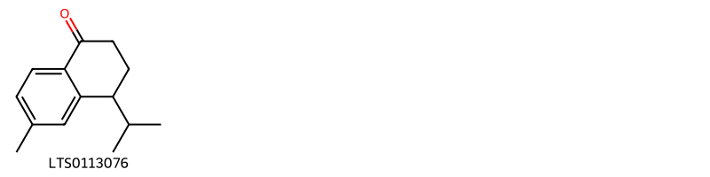{ width=100% }
    <figcaption>Hình ảnh cấu trúc hóa học của 1 hoạt chất thuộc nhóm Tetralins gồm ['4-isopropyl-6-methyl-3,4-dihydro-2h-naphthalen-1-one (LTS0113076)'].</figcaption>
</figure>
#### Nhóm Unsaturated hydrocarbons
<figure markdown="span">
    { width=100% }
    <figcaption>Hình ảnh cấu trúc hóa học của 1 hoạt chất thuộc nhóm Unsaturated hydrocarbons gồm ['α terpinene (LTS0232891)'].</figcaption>
</figure>

---

### Dược dân tộc học

Danh sách các quốc gia có sử dụng *Croton eluteria* trong điều trị các bệnh. 

| Country   | Disease                              | Bệnh                                                                                                                                                                                                |
|:----------|:-------------------------------------|:----------------------------------------------------------------------------------------------------------------------------------------------------------------------------------------------------|
| Elsewhere | Tonic                                | MYMEMORY WARNING: YOU USED ALL AVAILABLE FREE TRANSLATIONS FOR TODAY. NEXT AVAILABLE IN  19 HOURS 54 MINUTES 51 SECONDS VISIT HTTPS://MYMEMORY.TRANSLATED.NET/DOC/USAGELIMITS.PHP TO TRANSLATE MORE |
| Turkey    | Fumigant, Narcotic, Tonic, Digestive | MYMEMORY WARNING: YOU USED ALL AVAILABLE FREE TRANSLATIONS FOR TODAY. NEXT AVAILABLE IN  19 HOURS 54 MINUTES 48 SECONDS VISIT HTTPS://MYMEMORY.TRANSLATED.NET/DOC/USAGELIMITS.PHP TO TRANSLATE MORE |

---

---
## Croton flavens
### Thông tin về thực vật

!!! info "Phân loại thực vật của *Croton flavens* từ GIBF:"
    - **Kingdom:** Plantae
    - **Phylum:** Tracheophyta
    - **Order:** Malpighiales
    - **Family:** Euphorbiaceae
    - **Genus:** Croton
    - **Species:** *Croton flavens*

 

| Label (VI)   | Label (EN)   | Scientific Name   | Descriptions (VI)   | Descriptions (EN)   | Also Known As (VI)   | Also Known As (EN)   |
|:-------------|:-------------|:------------------|:--------------------|:--------------------|:---------------------|:---------------------|
| N/A          | N/A          | Croton flavens    | loài thực vật       | species of plant    | ['']                 | ['']                 |

#### Phân bố trên thế giới

**Từ CSDL GIBF** Virgin Islands (U.S.), nan, Guadeloupe, Virgin Islands (British), Venezuela (Bolivarian Republic of), Puerto Rico, United States of America, Bonaire, Sint Eustatius and Saba, Saint Martin (French part), Barbados, Saint Vincent and the Grenadines, Saint Barthélemy, Martinique, Dominican Republic, Dominica, Curaçao, Saint Kitts and Nevis, Aruba, Montserrat, Anguilla, Antigua and Barbuda, Sint Maarten (Dutch part)

#### Phân bố tại Việt Nam

**Từ CSDL GIBF**: Không có ghi nhận ở Việt Nam

---
### Thành phần hóa học
        
- Theo cơ sở dữ liệu lotus: Từ loài *Croton flavens* đã phân lập và xác định được 25 hoạt chất thuộc về các nhóm Phenanthrenes and derivatives, Prenol lipids, Protoberberine alkaloids and derivatives. 

|    | chemicalTaxonomyClassyfireClass          |   smiles_count |
|---:|:-----------------------------------------|---------------:|
|  0 | Phenanthrenes and derivatives            |              5 |
|  1 | Prenol lipids                            |             16 |
|  2 | Protoberberine alkaloids and derivatives |              4 |

#### Nhóm Phenanthrenes and derivatives
<figure markdown="span">
    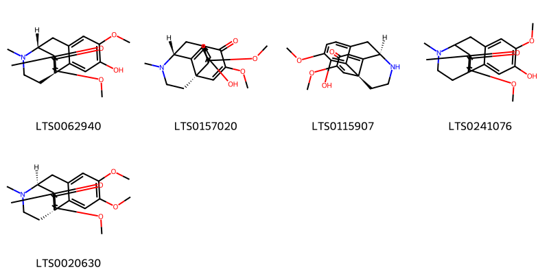{ width=100% }
    <figcaption>Hình ảnh cấu trúc hóa học của 5 hoạt chất thuộc nhóm Phenanthrenes and derivatives gồm ['(1r,9r)-4-hydroxy-5,13-dimethoxy-17-methyl-17-azatetracyclo[7.5.3.0¹,¹⁰.0²,⁷]heptadeca-2,4,6,10,13-pentaen-12-one (LTS0062940)', 'salutaridine (LTS0157020)', '(1s,9r)-3-hydroxy-4,13-dimethoxy-17-azatetracyclo[7.5.3.0¹,¹⁰.0²,⁷]heptadeca-2,4,6,10,13-pentaen-12-one (LTS0115907)', '4-hydroxy-5,13-dimethoxy-17-methyl-17-azatetracyclo[7.5.3.0¹,¹⁰.0²,⁷]heptadeca-2,4,6,10,13-pentaen-12-one (LTS0241076)', '(1s,9s)-4,5,13-trimethoxy-17-methyl-17-azatetracyclo[7.5.3.0¹,¹⁰.0²,⁷]heptadeca-2,4,6,10,13-pentaen-12-one (LTS0020630)'].</figcaption>
</figure>
#### Nhóm Prenol lipids
<figure markdown="span">
    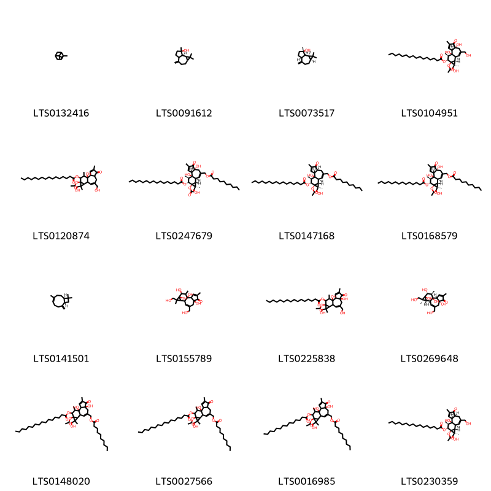{ width=100% }
    <figcaption>Hình ảnh cấu trúc hóa học của 16 hoạt chất thuộc nhóm Prenol lipids gồm ['α pinene (LTS0132416)', '(7ar)-1,1,7-trimethyl-4-methylidene-octahydrocyclopropa[e]azulen-7-ol (LTS0091612)', '(1as,4as,7s,7ar,7bs)-1,1,7-trimethyl-4-methylidene-octahydrocyclopropa[e]azulen-7-ol (LTS0073517)', 'croton factor f1 (LTS0104951)', '13-(acetyloxy)-1-hydroxy-8,12-bis(hydroxymethyl)-4,12,15-trimethyl-5-oxotetracyclo[8.5.0.0²,⁶.0¹¹,¹³]pentadeca-3,8-dien-14-yl hexadecanoate (LTS0120874)', '(1s,2s,6r,10s,11r,12s,13s,14r,15r)-13-(acetyloxy)-8-[(decanoyloxy)methyl]-1,6-dihydroxy-12-(hydroxymethyl)-4,12,15-trimethyl-5-oxotetracyclo[8.5.0.0²,⁶.0¹¹,¹³]pentadeca-3,8-dien-14-yl hexadecanoate (LTS0247679)', '(1r,2r,6s,10s,11r,12s,13s,14r,15r)-13-(acetyloxy)-8-[(decanoyloxy)methyl]-1-hydroxy-12-(hydroxymethyl)-4,12,15-trimethyl-5-oxotetracyclo[8.5.0.0²,⁶.0¹¹,¹³]pentadeca-3,8-dien-14-yl hexadecanoate (LTS0147168)', '(1s,2s,6r,10s,11r,12s,13s,14r,15r)-13-(acetyloxy)-8-[(decanoyloxy)methyl]-1,6-dihydroxy-12-(hydroxymethyl)-4,12,15-trimethyl-5-oxotetracyclo[8.5.0.0²,⁶.0¹¹,¹³]pentadeca-3,8-dien-14-yl tetradecanoate (LTS0168579)', 'β-caryophyllen (LTS0141501)', '1,6,13,14-tetrahydroxy-8,12-bis(hydroxymethyl)-4,12,15-trimethyltetracyclo[8.5.0.0²,⁶.0¹¹,¹³]pentadeca-3,8-dien-5-one (LTS0155789)', '13-(acetyloxy)-1,6-dihydroxy-8,12-bis(hydroxymethyl)-4,12,15-trimethyl-5-oxotetracyclo[8.5.0.0²,⁶.0¹¹,¹³]pentadeca-3,8-dien-14-yl hexadecanoate (LTS0225838)', '(1s,2s,6r,10s,11r,12s,13s,14r,15r)-1,6,13,14-tetrahydroxy-8,12-bis(hydroxymethyl)-4,12,15-trimethyltetracyclo[8.5.0.0²,⁶.0¹¹,¹³]pentadeca-3,8-dien-5-one (LTS0269648)', '13-(acetyloxy)-8-[(decanoyloxy)methyl]-1,6-dihydroxy-12-(hydroxymethyl)-4,12,15-trimethyl-5-oxotetracyclo[8.5.0.0²,⁶.0¹¹,¹³]pentadeca-3,8-dien-14-yl hexadecanoate (LTS0148020)', '13-(acetyloxy)-8-[(decanoyloxy)methyl]-1-hydroxy-12-(hydroxymethyl)-4,12,15-trimethyl-5-oxotetracyclo[8.5.0.0²,⁶.0¹¹,¹³]pentadeca-3,8-dien-14-yl hexadecanoate (LTS0027566)', '13-(acetyloxy)-8-[(decanoyloxy)methyl]-1,6-dihydroxy-12-(hydroxymethyl)-4,12,15-trimethyl-5-oxotetracyclo[8.5.0.0²,⁶.0¹¹,¹³]pentadeca-3,8-dien-14-yl tetradecanoate (LTS0016985)', '(1r,2r,6s,10s,11r,12s,13s,14r,15r)-13-(acetyloxy)-1-hydroxy-8,12-bis(hydroxymethyl)-4,12,15-trimethyl-5-oxotetracyclo[8.5.0.0²,⁶.0¹¹,¹³]pentadeca-3,8-dien-14-yl hexadecanoate (LTS0230359)'].</figcaption>
</figure>
#### Nhóm Protoberberine alkaloids and derivatives
<figure markdown="span">
    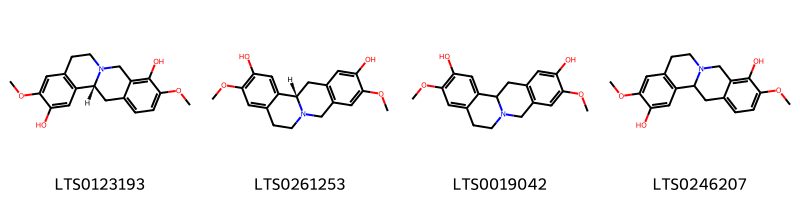{ width=100% }
    <figcaption>Hình ảnh cấu trúc hóa học của 4 hoạt chất thuộc nhóm Protoberberine alkaloids and derivatives gồm ['(12br)-3,10-dimethoxy-7,8,12b,13-tetrahydro-5h-6-azatetraphene-4,11-diol (LTS0123193)', 'coreximine (LTS0261253)', 'coreximine (LTS0019042)', '(s)-scoulerine (LTS0246207)'].</figcaption>
</figure>

---

### Dược dân tộc học

Danh sách các quốc gia có sử dụng *Croton flavens* trong điều trị các bệnh. 

| Country   | Disease                                                      | Bệnh                                                                                                                                                                                                |
|:----------|:-------------------------------------------------------------|:----------------------------------------------------------------------------------------------------------------------------------------------------------------------------------------------------|
| Curacao   | Emmenagogue, Emmenagogue, Stimulant, Stimulant, Tonic        | MYMEMORY WARNING: YOU USED ALL AVAILABLE FREE TRANSLATIONS FOR TODAY. NEXT AVAILABLE IN  19 HOURS 53 MINUTES 54 SECONDS VISIT HTTPS://MYMEMORY.TRANSLATED.NET/DOC/USAGELIMITS.PHP TO TRANSLATE MORE |
| Mexico    | Expectorant, Tonic, Tonic, Stimulant, Expectorant, Stimulant | MYMEMORY WARNING: YOU USED ALL AVAILABLE FREE TRANSLATIONS FOR TODAY. NEXT AVAILABLE IN  19 HOURS 53 MINUTES 51 SECONDS VISIT HTTPS://MYMEMORY.TRANSLATED.NET/DOC/USAGELIMITS.PHP TO TRANSLATE MORE |

---

---
## Croton humilia
### Thông tin về thực vật

!!! info "Phân loại thực vật của *Croton humilis* từ GIBF:"
    - **Kingdom:** Plantae
    - **Phylum:** Tracheophyta
    - **Order:** Malpighiales
    - **Family:** Euphorbiaceae
    - **Genus:** Croton
    - **Species:** *Croton humilis*

 

| Label (VI)   | Label (EN)   | Scientific Name   | Descriptions (VI)   | Descriptions (EN)   | Also Known As (VI)   | Also Known As (EN)   |
|:-------------|:-------------|:------------------|:--------------------|:--------------------|:---------------------|:---------------------|
| N/A          | N/A          | Croton flavens    | loài thực vật       | species of plant    | ['']                 | ['']                 |

#### Phân bố trên thế giới

**Từ CSDL GIBF** nan, Puerto Rico, Brazil, Jamaica, United States of America, Dominican Republic, Mexico

#### Phân bố tại Việt Nam

**Từ CSDL GIBF**: Không có ghi nhận ở Việt Nam

---
### Thành phần hóa học
        
- Theo cơ sở dữ liệu lotus: Từ loài *Croton humilis* đã phân lập và xác định được Chưa có hoạt chất nào được phân lập. hoạt chất thuộc về các nhóm Không có hoạt chất nào được phân lập. 

Không có hình ảnh nào được tạo ra

---

### Dược dân tộc học

Danh sách các quốc gia có sử dụng *Croton humilis* trong điều trị các bệnh. 

| Country   | Disease   | Bệnh                                                                                                                                                                                                |
|:----------|:----------|:----------------------------------------------------------------------------------------------------------------------------------------------------------------------------------------------------|
| Mexico    | Stimulant | MYMEMORY WARNING: YOU USED ALL AVAILABLE FREE TRANSLATIONS FOR TODAY. NEXT AVAILABLE IN  19 HOURS 53 MINUTES 20 SECONDS VISIT HTTPS://MYMEMORY.TRANSLATED.NET/DOC/USAGELIMITS.PHP TO TRANSLATE MORE |

---

---
## Croton humilis
### Thông tin về thực vật

!!! info "Phân loại thực vật của *Croton humilis* từ GIBF:"
    - **Kingdom:** Plantae
    - **Phylum:** Tracheophyta
    - **Order:** Malpighiales
    - **Family:** Euphorbiaceae
    - **Genus:** Croton
    - **Species:** *Croton humilis*

 

| Label (VI)   | Label (EN)   | Scientific Name   | Descriptions (VI)   | Descriptions (EN)   | Also Known As (VI)   | Also Known As (EN)   |
|:-------------|:-------------|:------------------|:--------------------|:--------------------|:---------------------|:---------------------|
| N/A          | N/A          | Croton humilis    |                     | species of plant    | ['']                 | ['']                 |

#### Phân bố trên thế giới

**Từ CSDL GIBF** nan, Puerto Rico, Brazil, Jamaica, United States of America, Dominican Republic, Mexico

#### Phân bố tại Việt Nam

**Từ CSDL GIBF**: Không có ghi nhận ở Việt Nam

---
### Thành phần hóa học
        
- Theo cơ sở dữ liệu lotus: Từ loài *Croton humilis* đã phân lập và xác định được 10 hoạt chất thuộc về các nhóm Carboxylic acids and derivatives, Benzene and substituted derivatives. 

|    | chemicalTaxonomyClassyfireClass     |   smiles_count |
|---:|:------------------------------------|---------------:|
|  0 | Benzene and substituted derivatives |              5 |
|  1 | Carboxylic acids and derivatives    |              5 |

#### Nhóm Benzene and substituted derivatives
<figure markdown="span">
    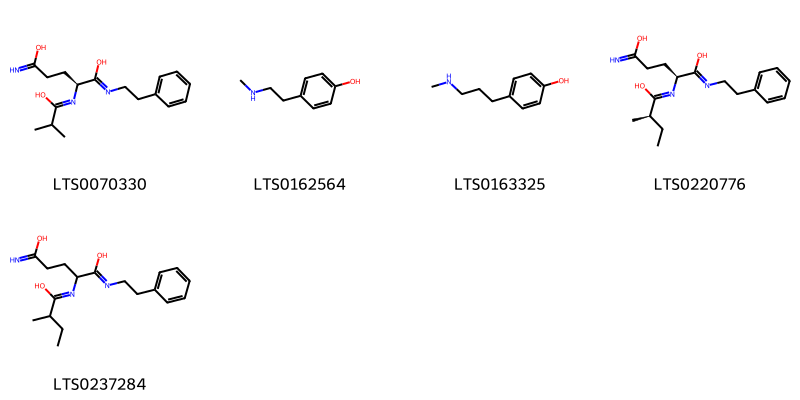{ width=100% }
    <figcaption>Hình ảnh cấu trúc hóa học của 5 hoạt chất thuộc nhóm Benzene and substituted derivatives gồm ['(2s)-2-[(1-hydroxy-2-methylpropylidene)amino]-n-(2-phenylethyl)pentanediimidic acid (LTS0070330)', 'n-methyltyramine (LTS0162564)', '4-[3-(methylamino)propyl]phenol (LTS0163325)', '(2s)-2-{[(2r)-1-hydroxy-2-methylbutylidene]amino}-n-(2-phenylethyl)pentanediimidic acid (LTS0220776)', '2-[(1-hydroxy-2-methylbutylidene)amino]-n-(2-phenylethyl)pentanediimidic acid (LTS0237284)'].</figcaption>
</figure>
#### Nhóm Carboxylic acids and derivatives
<figure markdown="span">
    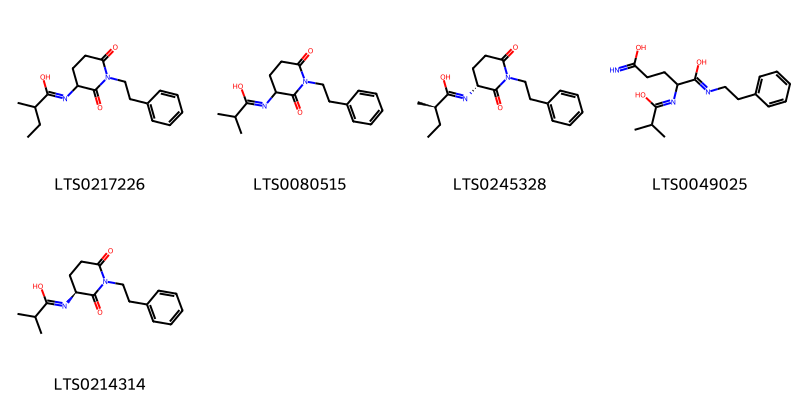{ width=100% }
    <figcaption>Hình ảnh cấu trúc hóa học của 5 hoạt chất thuộc nhóm Carboxylic acids and derivatives gồm ['n-[2,6-dioxo-1-(2-phenylethyl)piperidin-3-yl]-2-methylbutanimidic acid (LTS0217226)', 'n-[2,6-dioxo-1-(2-phenylethyl)piperidin-3-yl]-2-methylpropanimidic acid (LTS0080515)', '(2r)-n-[(3r)-2,6-dioxo-1-(2-phenylethyl)piperidin-3-yl]-2-methylbutanimidic acid (LTS0245328)', '2-[(1-hydroxy-2-methylpropylidene)amino]-n-(2-phenylethyl)pentanediimidic acid (LTS0049025)', 'n-[(3s)-2,6-dioxo-1-(2-phenylethyl)piperidin-3-yl]-2-methylpropanimidic acid (LTS0214314)'].</figcaption>
</figure>

---

### Dược dân tộc học

Danh sách các quốc gia có sử dụng *Croton humilis* trong điều trị các bệnh. 

| Country   | Disease     | Bệnh                                                                                                                                                                                                |
|:----------|:------------|:----------------------------------------------------------------------------------------------------------------------------------------------------------------------------------------------------|
| Mexico    | Diaphoretic | MYMEMORY WARNING: YOU USED ALL AVAILABLE FREE TRANSLATIONS FOR TODAY. NEXT AVAILABLE IN  19 HOURS 52 MINUTES 53 SECONDS VISIT HTTPS://MYMEMORY.TRANSLATED.NET/DOC/USAGELIMITS.PHP TO TRANSLATE MORE |

---

---
## Croton macrostachyus
### Thông tin về thực vật

!!! info "Phân loại thực vật của *Croton macrostachyus* từ GIBF:"
    - **Kingdom:** Plantae
    - **Phylum:** Tracheophyta
    - **Order:** Malpighiales
    - **Family:** Euphorbiaceae
    - **Genus:** Croton
    - **Species:** *Croton macrostachyus*

 

| Label (VI)   | Label (EN)   | Scientific Name      | Descriptions (VI)   | Descriptions (EN)   | Also Known As (VI)   | Also Known As (EN)   |
|:-------------|:-------------|:---------------------|:--------------------|:--------------------|:---------------------|:---------------------|
| N/A          | N/A          | Croton macrostachyus | loài thực vật       | species of plant    | ['']                 | ['']                 |

#### Phân bố trên thế giới

**Từ CSDL GIBF** Malawi, Uganda, Nigeria, Eritrea, Niger, Kenya, Somalia, Côte d’Ivoire, Benin, Congo, Democratic Republic of the, Guinea, Cameroon, Tanzania, United Republic of, Yemen, Ethiopia

#### Phân bố tại Việt Nam

**Từ CSDL GIBF**: Không có ghi nhận ở Việt Nam

---
### Thành phần hóa học
        
- Theo cơ sở dữ liệu lotus: Từ loài *Croton macrostachyus* đã phân lập và xác định được 2 hoạt chất thuộc về các nhóm Prenol lipids. 

|    | chemicalTaxonomyClassyfireClass   |   smiles_count |
|---:|:----------------------------------|---------------:|
|  0 | Prenol lipids                     |              2 |

#### Nhóm Prenol lipids
<figure markdown="span">
    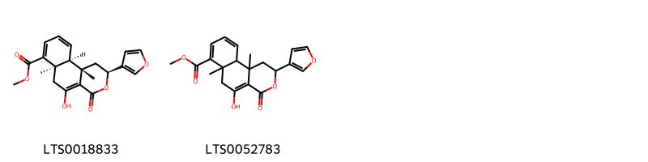{ width=100% }
    <figcaption>Hình ảnh cấu trúc hóa học của 2 hoạt chất thuộc nhóm Prenol lipids gồm ['methyl (2s,6ar,10ar,10bs)-2-(furan-3-yl)-5-hydroxy-6a,10b-dimethyl-4-oxo-1h,2h,6h,10ah-naphtho[2,1-c]pyran-7-carboxylate (LTS0018833)', 'methyl 2-(furan-3-yl)-5-hydroxy-6a,10b-dimethyl-4-oxo-1h,2h,6h,10ah-naphtho[2,1-c]pyran-7-carboxylate (LTS0052783)'].</figcaption>
</figure>

---

### Dược dân tộc học

Danh sách các quốc gia có sử dụng *Croton macrostachyus* trong điều trị các bệnh. 

| Country   | Disease                  | Bệnh                                                                                                                                                                                                |
|:----------|:-------------------------|:----------------------------------------------------------------------------------------------------------------------------------------------------------------------------------------------------|
| Ethiopia  | Abortifacient, Purgative | MYMEMORY WARNING: YOU USED ALL AVAILABLE FREE TRANSLATIONS FOR TODAY. NEXT AVAILABLE IN  19 HOURS 52 MINUTES 26 SECONDS VISIT HTTPS://MYMEMORY.TRANSLATED.NET/DOC/USAGELIMITS.PHP TO TRANSLATE MORE |

---

---
## Croton malambo
### Thông tin về thực vật

!!! info "Phân loại thực vật của *Croton malambo* từ GIBF:"
    - **Kingdom:** Plantae
    - **Phylum:** Tracheophyta
    - **Order:** Malpighiales
    - **Family:** Euphorbiaceae
    - **Genus:** Croton
    - **Species:** *Croton malambo*

 

| Label (VI)   | Label (EN)   | Scientific Name   | Descriptions (VI)   | Descriptions (EN)   | Also Known As (VI)   | Also Known As (EN)   |
|:-------------|:-------------|:------------------|:--------------------|:--------------------|:---------------------|:---------------------|
| N/A          | N/A          | Croton malambo    |                     | species of plant    | ['']                 | ['']                 |

#### Phân bố trên thế giới

**Từ CSDL GIBF** nan, unknown or invalid, Colombia, Venezuela (Bolivarian Republic of)

#### Phân bố tại Việt Nam

**Từ CSDL GIBF**: Không có ghi nhận ở Việt Nam

---
### Thành phần hóa học
        
- Theo cơ sở dữ liệu lotus: Từ loài *Croton malambo* đã phân lập và xác định được 10 hoạt chất thuộc về các nhóm Fatty Acyls, Prenol lipids, Benzene and substituted derivatives. 

|    | chemicalTaxonomyClassyfireClass     |   smiles_count |
|---:|:------------------------------------|---------------:|
|  0 | Benzene and substituted derivatives |              1 |
|  1 | Fatty Acyls                         |              1 |
|  2 | Prenol lipids                       |              8 |

#### Nhóm Benzene and substituted derivatives
<figure markdown="span">
    { width=100% }
    <figcaption>Hình ảnh cấu trúc hóa học của 1 hoạt chất thuộc nhóm Benzene and substituted derivatives gồm ['methyl eugenol (LTS0098881)'].</figcaption>
</figure>
#### Nhóm Fatty Acyls
<figure markdown="span">
    { width=100% }
    <figcaption>Hình ảnh cấu trúc hóa học của 1 hoạt chất thuộc nhóm Fatty Acyls gồm ['palmitic acid (LTS0079439)'].</figcaption>
</figure>
#### Nhóm Prenol lipids
<figure markdown="span">
    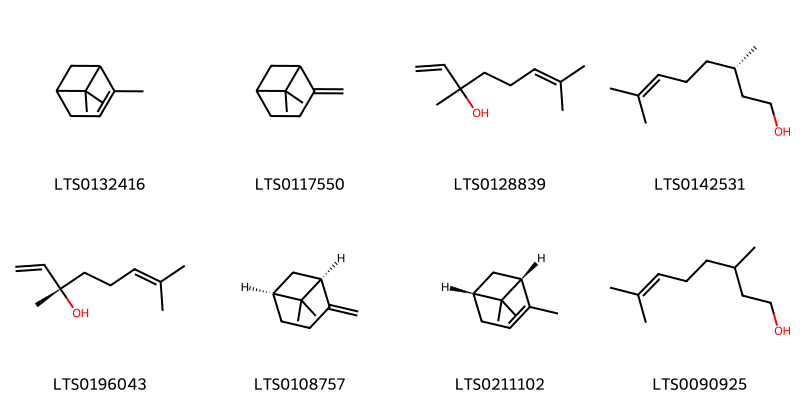{ width=100% }
    <figcaption>Hình ảnh cấu trúc hóa học của 8 hoạt chất thuộc nhóm Prenol lipids gồm ['α pinene (LTS0132416)', 'β-pinene (LTS0117550)', 'linalool, (+-)- (LTS0128839)', '(-)-citronellol (LTS0142531)', '(+)-linalool (LTS0196043)', '(-)-β-pinene (LTS0108757)', '(+)-α-pinene (LTS0211102)', 'citronellol, (+-)- (LTS0090925)'].</figcaption>
</figure>

---

### Dược dân tộc học

Danh sách các quốc gia có sử dụng *Croton malambo* trong điều trị các bệnh. 

| Country   | Disease   | Bệnh                                                                                                                                                                                                |
|:----------|:----------|:----------------------------------------------------------------------------------------------------------------------------------------------------------------------------------------------------|
| Venezuela | Sedative  | MYMEMORY WARNING: YOU USED ALL AVAILABLE FREE TRANSLATIONS FOR TODAY. NEXT AVAILABLE IN  19 HOURS 52 MINUTES 01 SECONDS VISIT HTTPS://MYMEMORY.TRANSLATED.NET/DOC/USAGELIMITS.PHP TO TRANSLATE MORE |

---

---
## Croton morifolius
### Thông tin về thực vật

!!! info "Phân loại thực vật của *Croton morifolius* từ GIBF:"
    - **Kingdom:** Plantae
    - **Phylum:** Tracheophyta
    - **Order:** Malpighiales
    - **Family:** Euphorbiaceae
    - **Genus:** Croton
    - **Species:** *Croton morifolius*

 

| Label (VI)   | Label (EN)   | Scientific Name   | Descriptions (VI)   | Descriptions (EN)   | Also Known As (VI)   | Also Known As (EN)   |
|:-------------|:-------------|:------------------|:--------------------|:--------------------|:---------------------|:---------------------|
| N/A          | N/A          | Croton morifolius | loài thực vật       | species of plant    | ['']                 | ['']                 |

#### Phân bố trên thế giới

**Từ CSDL GIBF** Colombia, Brazil, Costa Rica, Honduras, Nicaragua, Mexico

#### Phân bố tại Việt Nam

**Từ CSDL GIBF**: Không có ghi nhận ở Việt Nam

---
### Thành phần hóa học
        
- Theo cơ sở dữ liệu lotus: Từ loài *Croton morifolius* đã phân lập và xác định được Chưa có hoạt chất nào được phân lập. hoạt chất thuộc về các nhóm Không có hoạt chất nào được phân lập. 

Không có hình ảnh nào được tạo ra

---

### Dược dân tộc học

Danh sách các quốc gia có sử dụng *Croton morifolius* trong điều trị các bệnh. 

| Country   | Disease   | Bệnh                                                                                                                                                                                                |
|:----------|:----------|:----------------------------------------------------------------------------------------------------------------------------------------------------------------------------------------------------|
| Mexico    | Purgative | MYMEMORY WARNING: YOU USED ALL AVAILABLE FREE TRANSLATIONS FOR TODAY. NEXT AVAILABLE IN  19 HOURS 51 MINUTES 28 SECONDS VISIT HTTPS://MYMEMORY.TRANSLATED.NET/DOC/USAGELIMITS.PHP TO TRANSLATE MORE |

---

---
## Croton neomexicanus
### Thông tin về thực vật

!!! info "Phân loại thực vật của *Croton dioicus* từ GIBF:"
    - **Kingdom:** Plantae
    - **Phylum:** Tracheophyta
    - **Order:** Malpighiales
    - **Family:** Euphorbiaceae
    - **Genus:** Croton
    - **Species:** *Croton dioicus*

 

| Label (VI)   | Label (EN)   | Scientific Name     | Descriptions (VI)   | Descriptions (EN)   | Also Known As (VI)   | Also Known As (EN)   |
|:-------------|:-------------|:--------------------|:--------------------|:--------------------|:---------------------|:---------------------|
| N/A          | N/A          | Croton neomexicanus | loài thực vật       | species of plant    | ['']                 | ['']                 |

#### Phân bố trên thế giới

**Từ CSDL GIBF** nan, United States of America, Mexico

#### Phân bố tại Việt Nam

**Từ CSDL GIBF**: Không có ghi nhận ở Việt Nam

---
### Thành phần hóa học
        
- Theo cơ sở dữ liệu lotus: Từ loài *Croton dioicus* đã phân lập và xác định được Chưa có hoạt chất nào được phân lập. hoạt chất thuộc về các nhóm Không có hoạt chất nào được phân lập. 

Không có hình ảnh nào được tạo ra

---

### Dược dân tộc học

Danh sách các quốc gia có sử dụng *Croton dioicus* trong điều trị các bệnh. 

| Country   | Disease   | Bệnh                                                                                                                                                                                                |
|:----------|:----------|:----------------------------------------------------------------------------------------------------------------------------------------------------------------------------------------------------|
| Mexico    | Purgative | MYMEMORY WARNING: YOU USED ALL AVAILABLE FREE TRANSLATIONS FOR TODAY. NEXT AVAILABLE IN  19 HOURS 51 MINUTES 01 SECONDS VISIT HTTPS://MYMEMORY.TRANSLATED.NET/DOC/USAGELIMITS.PHP TO TRANSLATE MORE |

---

---
## Croton niveus
### Thông tin về thực vật

!!! info "Phân loại thực vật của *Croton niveus* từ GIBF:"
    - **Kingdom:** Plantae
    - **Phylum:** Tracheophyta
    - **Order:** Malpighiales
    - **Family:** Euphorbiaceae
    - **Genus:** Croton
    - **Species:** *Croton niveus*

 

| Label (VI)   | Label (EN)   | Scientific Name   | Descriptions (VI)   | Descriptions (EN)   | Also Known As (VI)   | Also Known As (EN)   |
|:-------------|:-------------|:------------------|:--------------------|:--------------------|:---------------------|:---------------------|
| N/A          | N/A          | Croton niveus     | loài thực vật       | species of plant    | ['']                 | ['']                 |

#### Phân bố trên thế giới

**Từ CSDL GIBF** Curaçao, Trinidad and Tobago, Saint Vincent and the Grenadines, Colombia, Costa Rica, Nicaragua, Bonaire, Sint Eustatius and Saba, Mexico, El Salvador

#### Phân bố tại Việt Nam

**Từ CSDL GIBF**: Không có ghi nhận ở Việt Nam

---
### Thành phần hóa học
        
- Theo cơ sở dữ liệu lotus: Từ loài *Croton niveus* đã phân lập và xác định được 1 hoạt chất thuộc về các nhóm Prenol lipids. 

|    | chemicalTaxonomyClassyfireClass   |   smiles_count |
|---:|:----------------------------------|---------------:|
|  0 | Prenol lipids                     |              1 |

#### Nhóm Prenol lipids
<figure markdown="span">
    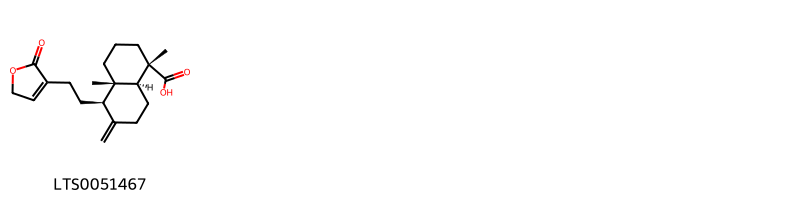{ width=100% }
    <figcaption>Hình ảnh cấu trúc hóa học của 1 hoạt chất thuộc nhóm Prenol lipids gồm ['(1s,4as,5r,8as)-1,4a-dimethyl-6-methylidene-5-[2-(2-oxo-5h-furan-3-yl)ethyl]-hexahydro-2h-naphthalene-1-carboxylic acid (LTS0051467)'].</figcaption>
</figure>

---

### Dược dân tộc học

Danh sách các quốc gia có sử dụng *Croton niveus* trong điều trị các bệnh. 

| Country   | Disease   | Bệnh                                                                                                                                                                                                |
|:----------|:----------|:----------------------------------------------------------------------------------------------------------------------------------------------------------------------------------------------------|
| Elsewhere | Tonic     | MYMEMORY WARNING: YOU USED ALL AVAILABLE FREE TRANSLATIONS FOR TODAY. NEXT AVAILABLE IN  19 HOURS 50 MINUTES 36 SECONDS VISIT HTTPS://MYMEMORY.TRANSLATED.NET/DOC/USAGELIMITS.PHP TO TRANSLATE MORE |
| Mexico    | Tonic     | MYMEMORY WARNING: YOU USED ALL AVAILABLE FREE TRANSLATIONS FOR TODAY. NEXT AVAILABLE IN  19 HOURS 50 MINUTES 33 SECONDS VISIT HTTPS://MYMEMORY.TRANSLATED.NET/DOC/USAGELIMITS.PHP TO TRANSLATE MORE |

---

---
## Croton oblongifolius
### Thông tin về thực vật

!!! info "Phân loại thực vật của *Croton oblongifolius* từ GIBF:"
    - **Kingdom:** Plantae
    - **Phylum:** Tracheophyta
    - **Order:** Malpighiales
    - **Family:** Euphorbiaceae
    - **Genus:** Croton
    - **Species:** *Croton oblongifolius*

 

| Label (VI)   | Label (EN)   | Scientific Name      | Descriptions (VI)   | Descriptions (EN)   | Also Known As (VI)   | Also Known As (EN)   |
|:-------------|:-------------|:---------------------|:--------------------|:--------------------|:---------------------|:---------------------|
| N/A          | N/A          | Croton oblongifolius |                     |                     | ['']                 | ['']                 |

#### Phân bố trên thế giới

**Từ CSDL GIBF** Thailand, nan, India, China

#### Phân bố tại Việt Nam

**Từ CSDL GIBF**: Không có ghi nhận ở Việt Nam

---
### Thành phần hóa học
        
- Theo cơ sở dữ liệu lotus: Từ loài *Croton oblongifolius* đã phân lập và xác định được 108 hoạt chất thuộc về các nhóm Fatty Acyls, Prenol lipids, Steroids and steroid derivatives, Heteroaromatic compounds, Lactones, Organooxygen compounds. 

|    | chemicalTaxonomyClassyfireClass   |   smiles_count |
|---:|:----------------------------------|---------------:|
|  0 | Fatty Acyls                       |              2 |
|  1 | Heteroaromatic compounds          |             10 |
|  2 | Lactones                          |              2 |
|  3 | Organooxygen compounds            |              1 |
|  4 | Prenol lipids                     |             91 |
|  5 | Steroids and steroid derivatives  |              2 |

#### Nhóm Fatty Acyls
<figure markdown="span">
    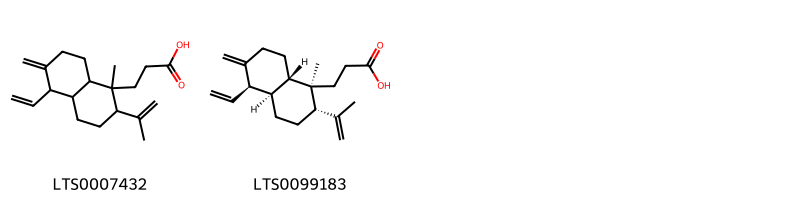{ width=100% }
    <figcaption>Hình ảnh cấu trúc hóa học của 2 hoạt chất thuộc nhóm Fatty Acyls gồm ['3-[5-ethenyl-1-methyl-6-methylidene-2-(prop-1-en-2-yl)-octahydronaphthalen-1-yl]propanoic acid (LTS0007432)', '3-[(1r,2s,4ar,5r,8as)-5-ethenyl-1-methyl-6-methylidene-2-(prop-1-en-2-yl)-octahydronaphthalen-1-yl]propanoic acid (LTS0099183)'].</figcaption>
</figure>
#### Nhóm Heteroaromatic compounds
<figure markdown="span">
    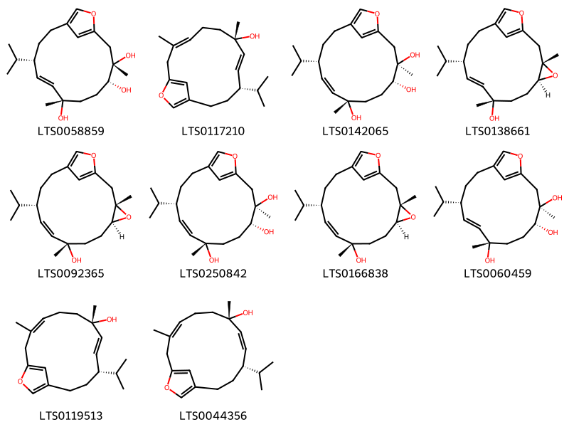{ width=100% }
    <figcaption>Hình ảnh cấu trúc hóa học của 10 hoạt chất thuộc nhóm Heteroaromatic compounds gồm ['(4s,5e,7s,10r,11s)-4-isopropyl-7,11-dimethyl-14-oxabicyclo[11.2.1]hexadeca-1(15),5,13(16)-triene-7,10,11-triol (LTS0058859)', '(4s,5e,7s,10e)-4-isopropyl-7,11-dimethyl-14-oxabicyclo[11.2.1]hexadeca-1(15),5,10,13(16)-tetraen-7-ol (LTS0117210)', '(4s,7s,10r,11r)-4-isopropyl-7,11-dimethyl-14-oxabicyclo[11.2.1]hexadeca-1(15),5,13(16)-triene-7,10,11-triol (LTS0142065)', '(3s,5s,8s,9e,11s)-11-isopropyl-3,8-dimethyl-4,16-dioxatricyclo[12.2.1.0³,⁵]heptadeca-1(17),9,14-trien-8-ol (LTS0138661)', '(3s,5s,8s,11s)-11-isopropyl-3,8-dimethyl-4,16-dioxatricyclo[12.2.1.0³,⁵]heptadeca-1(17),9,14-trien-8-ol (LTS0092365)', '(4s,5z,7s,10r,11r)-4-isopropyl-7,11-dimethyl-14-oxabicyclo[11.2.1]hexadeca-1(15),5,13(16)-triene-7,10,11-triol (LTS0250842)', '(3s,5s,8s,9z,11s)-11-isopropyl-3,8-dimethyl-4,16-dioxatricyclo[12.2.1.0³,⁵]heptadeca-1(17),9,14-trien-8-ol (LTS0166838)', '(4s,5e,7s,10r,11r)-4-isopropyl-7,11-dimethyl-14-oxabicyclo[11.2.1]hexadeca-1(15),5,13(16)-triene-7,10,11-triol (LTS0060459)', '(4s,5e,7s)-4-isopropyl-7,11-dimethyl-14-oxabicyclo[11.2.1]hexadeca-1(15),5,10,13(16)-tetraen-7-ol (LTS0119513)', '(4s,7s)-4-isopropyl-7,11-dimethyl-14-oxabicyclo[11.2.1]hexadeca-1(15),5,10,13(16)-tetraen-7-ol (LTS0044356)'].</figcaption>
</figure>
#### Nhóm Lactones
<figure markdown="span">
    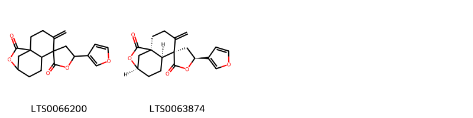{ width=100% }
    <figcaption>Hình ảnh cấu trúc hóa học của 2 hoạt chất thuộc nhóm Lactones gồm ["5-(furan-3-yl)-4'-methylidene-10'-oxaspiro[oxolane-3,5'-tricyclo[7.2.1.0¹,⁶]dodecane]-2,11'-dione (LTS0066200)", "(1'r,3s,5s,6's,9'r)-5-(furan-3-yl)-4'-methylidene-10'-oxaspiro[oxolane-3,5'-tricyclo[7.2.1.0¹,⁶]dodecane]-2,11'-dione (LTS0063874)"].</figcaption>
</figure>
#### Nhóm Organooxygen compounds
<figure markdown="span">
    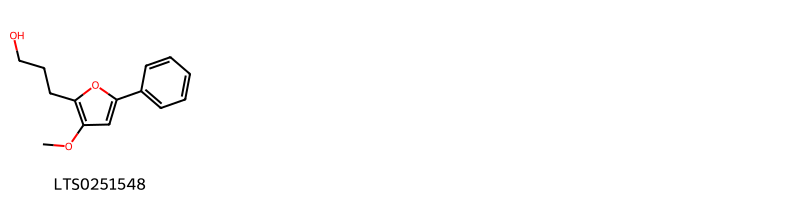{ width=100% }
    <figcaption>Hình ảnh cấu trúc hóa học của 1 hoạt chất thuộc nhóm Organooxygen compounds gồm ['3-(3-methoxy-5-phenylfuran-2-yl)propan-1-ol (LTS0251548)'].</figcaption>
</figure>
#### Nhóm Prenol lipids
<figure markdown="span">
    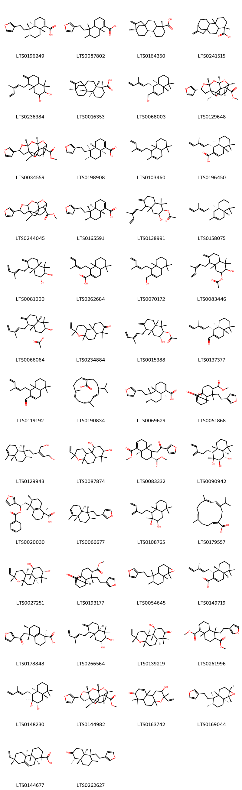{ width=100% }
    <figcaption>Hình ảnh cấu trúc hóa học của 91 hoạt chất thuộc nhóm Prenol lipids gồm ['(4ar,5s,6r,8ar)-5-[2-(furan-3-yl)ethyl]-5,6,8a-trimethyl-3,4,4a,6,7,8-hexahydronaphthalene-1-carboxylic acid (LTS0196249)', '5-[2-(furan-3-yl)ethyl]-5,6,8a-trimethyl-3,4,4a,6,7,8-hexahydronaphthalene-1-carboxylic acid (LTS0087802)', '(5r,9s,13s)-5,9-dimethyl-14-methylidenetetracyclo[11.2.1.0¹,¹⁰.0⁴,⁹]hexadecane-5-carboxylic acid (LTS0164350)', '5,9-dimethyl-14-methylidenetetracyclo[11.2.1.0¹,¹⁰.0⁴,⁹]hexadecane-5-carboxylic acid (LTS0241515)', '1,1,4a-trimethyl-6-methylidene-5-(3-methylpenta-2,4-dien-1-yl)-hexahydro-2h-naphthalene-2,3-diol (LTS0236384)', 'ent-kaur-16-en-19-oic acid (LTS0016353)', '[(1r,4as,8as)-5,5,8a-trimethyl-1-[(2e)-3-methylpenta-2,4-dien-1-yl]-1,4,4a,6,7,8-hexahydronaphthalen-2-yl]methanol (LTS0068003)', 'methyl (1s,4s,5s,7r,9r,11r,13r,16r,17r)-7-(furan-3-yl)-4-methyl-8,10,12-trioxapentacyclo[11.3.1.0¹,¹¹.0⁵,⁹.0⁵,¹⁶]heptadecane-17-carboxylate (LTS0129648)', 'methyl (7s,9r,11r,16r,17r)-7-(furan-3-yl)-4-methyl-8,10,12-trioxapentacyclo[11.3.1.0¹,¹¹.0⁵,⁹.0⁵,¹⁶]heptadecane-17-carboxylate (LTS0034559)', '(4as,5r,6s,8as)-5-[2-(furan-3-yl)ethyl]-5,6,8a-trimethyl-3,4,4a,6,7,8-hexahydronaphthalene-1-carboxylic acid (LTS0198908)', '1,1,4a,6-tetramethyl-5-(3-methylpenta-2,4-dien-1-yl)-2,3,4,5,8,8a-hexahydronaphthalene (LTS0103460)', '(1r,4as,8as)-5,5,8a-trimethyl-1-[(2e)-3-methylpenta-2,4-dien-1-yl]-1,4,4a,6,7,8-hexahydronaphthalene-2-carboxylic acid (LTS0196450)', 'methyl 7-(furan-3-yl)-4-methyl-8,10,12-trioxapentacyclo[11.3.1.0¹,¹¹.0⁵,⁹.0⁵,¹⁶]heptadecane-17-carboxylate (LTS0244045)', '(4as,5s,6r,8ar)-5-[2-(furan-3-yl)ethyl]-5,6-dimethyl-4,4a,6,7,8,8a-hexahydro-3h-naphthalene-1-carboxylic acid (LTS0165591)', '3-hydroxy-1,1,4a-trimethyl-6-methylidene-5-(3-methylpenta-2,4-dien-1-yl)-hexahydro-2h-naphthalen-2-yl acetate (LTS0138991)', '(4as,5s,8as)-1,1,4a,6-tetramethyl-5-[(2e)-3-methylpenta-2,4-dien-1-yl]-2,3,4,5,8,8a-hexahydronaphthalene (LTS0158075)', '(2r,3r,4ar,5s,8as)-1,1,4a-trimethyl-6-methylidene-5-[(2e)-3-methylpenta-2,4-dien-1-yl]-hexahydro-2h-naphthalene-2,3-diol (LTS0081000)', '5,5,8a-trimethyl-1-(3-methylpenta-2,4-dien-1-yl)-1,4,4a,6,7,8-hexahydronaphthalene-2-carboxylic acid (LTS0262684)', '[5,5,8a-trimethyl-1-(3-methylpenta-2,4-dien-1-yl)-1,4,4a,6,7,8-hexahydronaphthalen-2-yl]methanol (LTS0070172)', '3-hydroxy-4,4,8a-trimethyl-7-methylidene-8-(3-methylpenta-2,4-dien-1-yl)-hexahydro-1h-naphthalen-2-yl acetate (LTS0083446)', '(2r,3r,4as,8s,8ar)-3-hydroxy-4,4,8a-trimethyl-7-methylidene-8-[(2e)-3-methylpenta-2,4-dien-1-yl]-hexahydro-1h-naphthalen-2-yl acetate (LTS0066064)', '3-ethenyl-3,4a,7,7,10a-pentamethyl-octahydronaphtho[2,1-b]pyran-8-one (LTS0234884)', '(2r,3r,4ar,5s,8as)-3-hydroxy-1,1,4a-trimethyl-6-methylidene-5-[(2e)-3-methylpenta-2,4-dien-1-yl]-hexahydro-2h-naphthalen-2-yl acetate (LTS0015388)', '(1r,4as,8as)-5,5,8a-trimethyl-1-[(2e)-3-methylpenta-2,4-dien-1-yl]-1,4,4a,6,7,8-hexahydronaphthalene-2-carbaldehyde (LTS0137377)', '5,5,8a-trimethyl-1-(3-methylpenta-2,4-dien-1-yl)-1,4,4a,6,7,8-hexahydronaphthalene-2-carbaldehyde (LTS0119192)', '(1z,5e,8z,10e,12s)-12-isopropyl-5,9-dimethylcyclotetradeca-1,5,8,10-tetraene-1-carboxylic acid (LTS0190834)', '(4as,5s,6r,8as)-5-[2-(furan-3-yl)ethyl]-5,6,8a-trimethyl-3,4,4a,6,7,8-hexahydronaphthalene-1-carboxylic acid (LTS0069629)', 'methyl 7-[2-(furan-3-yl)ethyl]-7-methyl-3-oxo-1h,5h,6h,6ah,8h,9h,10h-naphtho[4,4a-c]furan-8-carboxylate (LTS0051868)', '2-{2-[(1r,2s,4as,8as)-1,2,4a,5-tetramethyl-2,3,4,7,8,8a-hexahydronaphthalen-1-yl]ethyl}but-2-ene-1,4-diol (LTS0129943)', '3-ethenyl-3,4a,7,7,10a-pentamethyl-octahydro-1h-naphtho[2,1-b]pyran-8,10-diol (LTS0087874)', '1,6-dimethyl (4ar,5r,6r,8ar)-5-[2-(furan-3-yl)-2-oxoethyl]-5,8a-dimethyl-3,4,4a,6,7,8-hexahydronaphthalene-1,6-dicarboxylate (LTS0083332)', '(1s,2r,3r,4r,4ar,8ar)-3,4a,8,8-tetramethyl-4-(3-methylidenepent-4-en-1-yl)-hexahydro-1h-naphthalene-1,2,3-triol (LTS0090942)', '(1s,5r,6s)-5-[(2s)-2-(benzoyloxy)-2-(furan-3-yl)ethyl]-1,5,6-trimethyl-2,3,4,6,7,8-hexahydronaphthalene-1-carboxylic acid (LTS0020030)', '3-{2-[(1r,2s,4as,8as)-1,2,4a,5-tetramethyl-2,3,4,7,8,8a-hexahydronaphthalen-1-yl]ethyl}furan (LTS0066677)', '2,5,5,8a-tetramethyl-1-(3-methylidenepent-4-en-1-yl)-hexahydro-1h-naphthalene-2,3-diol (LTS0108765)', '(1z,5e,9e,11e)-12-isopropyl-5,9-dimethylcyclotetradeca-1,5,9,11-tetraene-1-carboxylic acid (LTS0179557)', '(3s,4as,6ar,8s,10s,10ar,10bs)-3-ethenyl-3,4a,7,7,10a-pentamethyl-octahydro-1h-naphtho[2,1-b]pyran-8,10-diol (LTS0027251)', 'methyl (6ar,7r,8r,10as)-7-[2-(furan-3-yl)ethyl]-7-methyl-3-oxo-1h,5h,6h,6ah,8h,9h,10h-naphtho[4,4a-c]furan-8-carboxylate (LTS0193177)', '3-(2-{4,5,7a,7b-tetramethyl-hexahydro-1ah-naphtho[1,2-b]oxiren-4-yl}ethyl)furan (LTS0054645)', '(1r,4as,8ar)-5,5,8a-trimethyl-1-[(2e)-3-methylpenta-2,4-dien-1-yl]-1,4,4a,6,7,8-hexahydronaphthalene-2-carboxylic acid (LTS0149719)', '(1s,5r,6s)-5-[2-(furan-3-yl)-2-oxoethyl]-1,5,6-trimethyl-2,3,4,6,7,8-hexahydronaphthalene-1-carboxylic acid (LTS0178848)', '(2r,3r,4ar,5s,8ar)-1,1,4a-trimethyl-6-methylidene-5-[(2e)-3-methylpenta-2,4-dien-1-yl]-hexahydro-2h-naphthalene-2,3-diol (LTS0266564)', '(3s,4as,6as,10s,10ar,10bs)-3-ethenyl-10-hydroxy-3,4a,7,7,10a-pentamethyl-octahydronaphtho[2,1-b]pyran-8-one (LTS0139219)', '1,6-dimethyl 5-[2-(furan-3-yl)ethyl]-5,8a-dimethyl-3,4,4a,6,7,8-hexahydronaphthalene-1,6-dicarboxylate (LTS0261996)', '(1r,2s,3s,4as,8as)-2,5,5,8a-tetramethyl-1-[(2e)-3-methylpenta-2,4-dien-1-yl]-hexahydro-1h-naphthalene-2,3-diol (LTS0148230)', 'methyl (1s,4r,5r,7s,9r,11s,13r,16r,17r)-7-(furan-3-yl)-4-methyl-8,10,12-trioxapentacyclo[11.3.1.0¹,¹¹.0⁵,⁹.0⁵,¹⁶]heptadecane-17-carboxylate (LTS0144982)', '3-ethenyl-2-hydroxy-3,4a,7,7,10a-pentamethyl-1h,2h,5h,6h,6ah,10bh-naphtho[2,1-b]pyran-8-one (LTS0163742)', '3-{2-[(1as,3as,4r,5s,7as,7br)-4,5,7a,7b-tetramethyl-hexahydro-1ah-naphtho[1,2-b]oxiren-4-yl]ethyl}furan (LTS0169044)', '(1r,4as,4br,7r,10as)-7-ethenyl-1,4a,7-trimethyl-3,4,4b,5,6,8,10,10a-octahydro-2h-phenanthrene-1-carboxylic acid (LTS0144677)', '(1s,4as,5r,6s,8as)-5-[2-(furan-3-yl)ethyl]-1,5,6,8a-tetramethyl-hexahydro-1h-naphthalen-2-one (LTS0262627)', '5-[2-(furan-3-yl)-2-oxoethyl]-1,5,6-trimethyl-2,3,4,6,7,8-hexahydronaphthalene-1-carboxylic acid (LTS0149360)', '(3s,4as,6as,8s,10ar,10bs)-3-ethenyl-3,4a,7,7,10a-pentamethyl-octahydro-1h-naphtho[2,1-b]pyran-8-ol (LTS0149563)', '5-[2-(furan-3-yl)ethyl]-1,5,6-trimethyl-2,3,4,6,7,8-hexahydronaphthalene-1-carboxylic acid (LTS0114020)', '(2r,3r,4ar,8s,8ar)-3-hydroxy-4,4,8a-trimethyl-7-methylidene-8-[(2e)-3-methylpenta-2,4-dien-1-yl]-hexahydro-1h-naphthalen-2-yl acetate (LTS0167362)', 'methyl 7-[2-(furan-3-yl)-2-oxoethyl]-7-methyl-3-oxo-1h,5h,6h,6ah,8h,9h,10h-naphtho[4,4a-c]furan-8-carboxylate (LTS0164545)', '3-ethenyl-10-hydroxy-3,4a,7,7,10a-pentamethyl-octahydronaphtho[2,1-b]pyran-8-one (LTS0152793)', '(10e,12s)-12-isopropyl-5,9-dimethylcyclotetradeca-1,5,8,10-tetraene-1-carboxylic acid (LTS0237343)', '(3s,4as,6as,10ar,10bs)-3-ethenyl-3,4a,7,7,10a-pentamethyl-1h,2h,5h,6h,6ah,10bh-naphtho[2,1-b]pyran-8-one (LTS0134568)', '(2z)-2-{2-[(1r,2s,4as,8as)-1,2,4a,5-tetramethyl-2,3,4,7,8,8a-hexahydronaphthalen-1-yl]ethyl}but-2-ene-1,4-diol (LTS0125737)', '(1r,7s,10r)-4,10,11,11-tetramethyltricyclo[5.3.1.0¹,⁵]undec-4-en-6-one (LTS0246067)', '3-ethenyl-3,4a,7,7,10a-pentamethyl-octahydro-1h-naphtho[2,1-b]pyran-8-ol (LTS0198244)', '(1s,2s,4r,7s,10s,11r,13s)-4-(furan-3-yl)-2,10,11-trimethyl-5,12-dioxatetracyclo[8.5.0.0²,⁷.0¹¹,¹³]pentadecan-6-one (LTS0272943)', '(4s,5z,7s,10r,11r)-7,10,11-trihydroxy-4-isopropyl-7,11-dimethyl-14-oxabicyclo[11.2.1]hexadeca-1(16),5-dien-15-one (LTS0223703)', '(2r,3r,4ar,5s,8ar)-3-hydroxy-1,1,4a-trimethyl-6-methylidene-5-[(2e)-3-methylpenta-2,4-dien-1-yl]-hexahydro-2h-naphthalen-2-yl acetate (LTS0216645)', '5-[2-(benzoyloxy)-2-(furan-3-yl)ethyl]-1,5,6-trimethyl-2,3,4,6,7,8-hexahydronaphthalene-1-carboxylic acid (LTS0213631)', '(1s,5r,6s)-5-[2-(furan-3-yl)ethyl]-1,5,6-trimethyl-2,3,4,6,7,8-hexahydronaphthalene-1-carboxylic acid (LTS0217432)', '[(1r,4as,8ar)-5,5,8a-trimethyl-1-[(2e)-3-methylpenta-2,4-dien-1-yl]-1,4,4a,6,7,8-hexahydronaphthalen-2-yl]methanol (LTS0209136)', '(1r,4as,8ar)-5,5,8a-trimethyl-1-[(2e)-3-methylpenta-2,4-dien-1-yl]-1,4,4a,6,7,8-hexahydronaphthalene-2-carbaldehyde (LTS0019990)', '12-isopropyl-5,9-dimethylcyclotetradeca-1,5,9,11-tetraene-1-carbaldehyde (LTS0225450)', '(4s,7s,10r,11r,13s)-7,10,11-trihydroxy-4-isopropyl-7,11-dimethyl-14-oxabicyclo[11.2.1]hexadeca-1(16),5-dien-15-one (LTS0225446)', 'isopimaric acid (LTS0238294)', '1,6-dimethyl 5-[2-(furan-3-yl)-2-oxoethyl]-5,8a-dimethyl-3,4,4a,6,7,8-hexahydronaphthalene-1,6-dicarboxylate (LTS0239599)', 'methyl (1s,2r,4r,6s,8r,9r,13r,16r)-2-(benzoyloxy)-6-(furan-3-yl)-13-hydroxy-16-methyl-12-oxo-3,5-dioxatetracyclo[6.5.3.0¹,⁹.0⁴,⁸]hexadecane-13-carboxylate (LTS0234220)', '(1e,5e,9e,11e)-12-isopropyl-5,9-dimethylcyclotetradeca-1,5,9,11-tetraene-1-carbaldehyde (LTS0045149)', '4,10,11,11-tetramethyltricyclo[5.3.1.0¹,⁵]undec-4-en-6-one (LTS0241841)', '(2e)-5-[(1s,2r,4as,8ar)-1,2,4a,5-tetramethyl-2,3,4,7,8,8a-hexahydronaphthalen-1-yl]-3-methylpent-2-en-1-ol (LTS0132915)', '(4s,5e,7s,10r,11s,13s)-7,10,11-trihydroxy-4-isopropyl-7,11-dimethyl-14-oxabicyclo[11.2.1]hexadeca-1(16),5-dien-15-one (LTS0007022)', '(3s,4as,6as,10ar,10bs)-3-ethenyl-3,4a,7,7,10a-pentamethyl-octahydronaphtho[2,1-b]pyran-8-one (LTS0272142)', '(2r,3r,4as,6as,10ar,10bs)-3-ethenyl-2-hydroxy-3,4a,7,7,10a-pentamethyl-1h,2h,5h,6h,6ah,10bh-naphtho[2,1-b]pyran-8-one (LTS0012846)', '(4ar,5s,8as)-1,1,4a,6-tetramethyl-5-[(2e)-3-methylpenta-2,4-dien-1-yl]-2,3,4,5,8,8a-hexahydronaphthalene (LTS0008533)', 'methyl (6ar,7r,8r,10as)-7-[2-(furan-3-yl)-2-oxoethyl]-7-methyl-3-oxo-1h,5h,6h,6ah,8h,9h,10h-naphtho[4,4a-c]furan-8-carboxylate (LTS0005142)', '1,6-dimethyl (4ar,5r,6r,8ar)-5-[2-(furan-3-yl)ethyl]-5,8a-dimethyl-3,4,4a,6,7,8-hexahydronaphthalene-1,6-dicarboxylate (LTS0012263)', '(1e,5e,9e,11e)-12-isopropyl-5,9-dimethylcyclotetradeca-1,5,9,11-tetraene-1-carboxylic acid (LTS0006822)', '(1e,5z,9z,11e)-12-isopropyl-5,9-dimethylcyclotetradeca-1,5,9,11-tetraene-1-carbaldehyde (LTS0257387)', '(1r,2r,3r,4ar,8ar)-2,5,5,8a-tetramethyl-1-(3-methylidenepent-4-en-1-yl)-hexahydro-1h-naphthalene-2,3-diol (LTS0029733)', '5-(1,2,4a,5-tetramethyl-2,3,4,7,8,8a-hexahydronaphthalen-1-yl)-3-methylpent-2-en-1-ol (LTS0033525)', '12-isopropyl-5,9-dimethylcyclotetradeca-1,5,9,11-tetraene-1-carboxylic acid (LTS0245353)', 'methyl 2-(benzoyloxy)-6-(furan-3-yl)-13-hydroxy-16-methyl-12-oxo-3,5-dioxatetracyclo[6.5.3.0¹,⁹.0⁴,⁸]hexadecane-13-carboxylate (LTS0031554)', '3,4a,8,8-tetramethyl-4-(3-methylidenepent-4-en-1-yl)-hexahydro-1h-naphthalene-1,2,3-triol (LTS0034446)', '3-ethenyl-3,4a,7,7,10a-pentamethyl-1h,2h,5h,6h,6ah,10bh-naphtho[2,1-b]pyran-8-one (LTS0256146)', '(4s,5e,7s,10r,11r,13s)-7,10,11-trihydroxy-4-isopropyl-7,11-dimethyl-14-oxabicyclo[11.2.1]hexadeca-1(16),5-dien-15-one (LTS0117943)'].</figcaption>
</figure>
#### Nhóm Steroids and steroid derivatives
<figure markdown="span">
    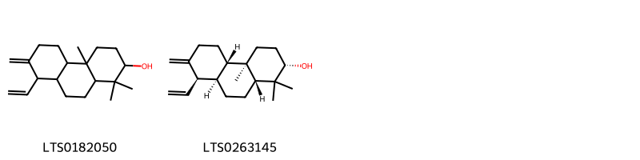{ width=100% }
    <figcaption>Hình ảnh cấu trúc hóa học của 2 hoạt chất thuộc nhóm Steroids and steroid derivatives gồm ['8-ethenyl-1,1,4a-trimethyl-7-methylidene-decahydro-2h-phenanthren-2-ol (LTS0182050)', '(2s,4ar,4bs,8r,8ar,10ar)-8-ethenyl-1,1,4a-trimethyl-7-methylidene-decahydro-2h-phenanthren-2-ol (LTS0263145)'].</figcaption>
</figure>

---

### Dược dân tộc học

Danh sách các quốc gia có sử dụng *Croton oblongifolius* trong điều trị các bệnh. 

| Country       | Disease                           | Bệnh                                                                                                                                                                                                |
|:--------------|:----------------------------------|:----------------------------------------------------------------------------------------------------------------------------------------------------------------------------------------------------|
| India         | Insecticide, Piscicide, Purgative | MYMEMORY WARNING: YOU USED ALL AVAILABLE FREE TRANSLATIONS FOR TODAY. NEXT AVAILABLE IN  19 HOURS 50 MINUTES 07 SECONDS VISIT HTTPS://MYMEMORY.TRANSLATED.NET/DOC/USAGELIMITS.PHP TO TRANSLATE MORE |
| India(Santal) | Laxative                          | MYMEMORY WARNING: YOU USED ALL AVAILABLE FREE TRANSLATIONS FOR TODAY. NEXT AVAILABLE IN  19 HOURS 50 MINUTES 04 SECONDS VISIT HTTPS://MYMEMORY.TRANSLATED.NET/DOC/USAGELIMITS.PHP TO TRANSLATE MORE |

---

---
## Croton origanifolius
### Thông tin về thực vật

!!! info "Phân loại thực vật của *Croton origanifolius* từ GIBF:"
    - **Kingdom:** Plantae
    - **Phylum:** Tracheophyta
    - **Order:** Malpighiales
    - **Family:** Euphorbiaceae
    - **Genus:** Croton
    - **Species:** *Croton origanifolius*

 

| Label (VI)   | Label (EN)   | Scientific Name      | Descriptions (VI)   | Descriptions (EN)   | Also Known As (VI)   | Also Known As (EN)   |
|:-------------|:-------------|:---------------------|:--------------------|:--------------------|:---------------------|:---------------------|
| N/A          | N/A          | Croton origanifolius | loài thực vật       | species of plant    | ['']                 | ['']                 |

#### Phân bố trên thế giới

**Từ CSDL GIBF** nan, Ecuador, Dominica, Puerto Rico, Haiti, Brazil, Jamaica, United States of America, Cuba, Mexico, Dominican Republic, El Salvador, Venezuela (Bolivarian Republic of)

#### Phân bố tại Việt Nam

**Từ CSDL GIBF**: Không có ghi nhận ở Việt Nam

---
### Thành phần hóa học
        
- Theo cơ sở dữ liệu lotus: Từ loài *Croton origanifolius* đã phân lập và xác định được Chưa có hoạt chất nào được phân lập. hoạt chất thuộc về các nhóm Không có hoạt chất nào được phân lập. 

Không có hình ảnh nào được tạo ra

---

### Dược dân tộc học

Danh sách các quốc gia có sử dụng *Croton origanifolius* trong điều trị các bệnh. 

| Country   | Disease     | Bệnh                                                                                                                                                                                                |
|:----------|:------------|:----------------------------------------------------------------------------------------------------------------------------------------------------------------------------------------------------|
| Haiti     | Carminative | MYMEMORY WARNING: YOU USED ALL AVAILABLE FREE TRANSLATIONS FOR TODAY. NEXT AVAILABLE IN  19 HOURS 49 MINUTES 37 SECONDS VISIT HTTPS://MYMEMORY.TRANSLATED.NET/DOC/USAGELIMITS.PHP TO TRANSLATE MORE |

---

---
## Croton reflexifolius
### Thông tin về thực vật

!!! info "Phân loại thực vật của *Croton reflexifolius* từ GIBF:"
    - **Kingdom:** Plantae
    - **Phylum:** Tracheophyta
    - **Order:** Malpighiales
    - **Family:** Euphorbiaceae
    - **Genus:** Croton
    - **Species:** *Croton reflexifolius*

 

| Label (VI)   | Label (EN)   | Scientific Name      | Descriptions (VI)   | Descriptions (EN)   | Also Known As (VI)   | Also Known As (EN)   |
|:-------------|:-------------|:---------------------|:--------------------|:--------------------|:---------------------|:---------------------|
| N/A          | N/A          | Croton reflexifolius |                     | species of plant    | ['']                 | ['']                 |

#### Phân bố trên thế giới

**Từ CSDL GIBF** Belize, Angola, Guatemala, Honduras, El Salvador, Mexico, Tanzania, United Republic of

#### Phân bố tại Việt Nam

**Từ CSDL GIBF**: Không có ghi nhận ở Việt Nam

---
### Thành phần hóa học
        
- Theo cơ sở dữ liệu lotus: Từ loài *Croton reflexifolius* đã phân lập và xác định được Chưa có hoạt chất nào được phân lập. hoạt chất thuộc về các nhóm Không có hoạt chất nào được phân lập. 

Không có hình ảnh nào được tạo ra

---

### Dược dân tộc học

Danh sách các quốc gia có sử dụng *Croton reflexifolius* trong điều trị các bệnh. 

| Country         | Disease    | Bệnh                                                                                                                                                                                                |
|:----------------|:-----------|:----------------------------------------------------------------------------------------------------------------------------------------------------------------------------------------------------|
| Central America | nan, Tonic | MYMEMORY WARNING: YOU USED ALL AVAILABLE FREE TRANSLATIONS FOR TODAY. NEXT AVAILABLE IN  19 HOURS 49 MINUTES 12 SECONDS VISIT HTTPS://MYMEMORY.TRANSLATED.NET/DOC/USAGELIMITS.PHP TO TRANSLATE MORE |
| Guatemala       | Tonic      | MYMEMORY WARNING: YOU USED ALL AVAILABLE FREE TRANSLATIONS FOR TODAY. NEXT AVAILABLE IN  19 HOURS 49 MINUTES 09 SECONDS VISIT HTTPS://MYMEMORY.TRANSLATED.NET/DOC/USAGELIMITS.PHP TO TRANSLATE MORE |

---

---
## Croton roxburghii
### Thông tin về thực vật

!!! info "Phân loại thực vật của *N/A* từ GIBF:"
    - **Kingdom:** Plantae
    - **Phylum:** Tracheophyta
    - **Order:** Malpighiales
    - **Family:** Euphorbiaceae
    - **Genus:** N/A
    - **Species:** *N/A*

 

| Label (VI)   | Label (EN)   | Scientific Name      | Descriptions (VI)   | Descriptions (EN)   | Also Known As (VI)   | Also Known As (EN)   |
|:-------------|:-------------|:---------------------|:--------------------|:--------------------|:---------------------|:---------------------|
| N/A          | N/A          | Croton reflexifolius |                     | species of plant    | ['']                 | ['']                 |

#### Phân bố trên thế giới

**Từ CSDL GIBF** Italy, Australia, Argentina, Tanzania, United Republic of, Israel, Panama, Ukraine, Puerto Rico, Netherlands, Luxembourg, Namibia, Chinese Taipei, Spain, Bolivia (Plurinational State of), Hungary, Portugal, United States of America, Chile, Slovenia, South Africa, Guinea-Bissau, Trinidad and Tobago, Hong Kong, Germany, Thailand, Brazil, Switzerland, Austria, France, Mexico, Peru, Singapore, Eswatini, China, United Kingdom of Great Britain and Northern Ireland, Ecuador, Niue, Colombia, Ireland, Costa Rica, India, Indonesia, Botswana, Gambia, Antigua and Barbuda, Kuwait, New Zealand, Ethiopia

#### Phân bố tại Việt Nam

**Từ CSDL GIBF**: Không có ghi nhận ở Việt Nam

---
### Thành phần hóa học
        
- Theo cơ sở dữ liệu lotus: Từ loài *N/A* đã phân lập và xác định được Chưa có hoạt chất nào được phân lập. hoạt chất thuộc về các nhóm Không có hoạt chất nào được phân lập. 

Không có hình ảnh nào được tạo ra

---

### Dược dân tộc học

Danh sách các quốc gia có sử dụng *N/A* trong điều trị các bệnh. 

| Country   | Disease    | Bệnh                                                                                                                                                                                                |
|:----------|:-----------|:----------------------------------------------------------------------------------------------------------------------------------------------------------------------------------------------------|
| India     | Intoxicant | MYMEMORY WARNING: YOU USED ALL AVAILABLE FREE TRANSLATIONS FOR TODAY. NEXT AVAILABLE IN  19 HOURS 48 MINUTES 42 SECONDS VISIT HTTPS://MYMEMORY.TRANSLATED.NET/DOC/USAGELIMITS.PHP TO TRANSLATE MORE |

---

---
## Croton setigerus
### Thông tin về thực vật

!!! info "Phân loại thực vật của *Croton setigerus* từ GIBF:"
    - **Kingdom:** Plantae
    - **Phylum:** Tracheophyta
    - **Order:** Malpighiales
    - **Family:** Euphorbiaceae
    - **Genus:** Croton
    - **Species:** *Croton setigerus*

 

| Label (VI)   | Label (EN)   | Scientific Name   | Descriptions (VI)   | Descriptions (EN)   | Also Known As (VI)   | Also Known As (EN)              |
|:-------------|:-------------|:------------------|:--------------------|:--------------------|:---------------------|:--------------------------------|
| N/A          | N/A          | Croton setigerus  | loài thực vật       | species of plant    | ['']                 | ['Croton setiger', 'dove weed'] |

#### Phân bố trên thế giới

**Từ CSDL GIBF** nan, United States of America, Chile, Mexico

#### Phân bố tại Việt Nam

**Từ CSDL GIBF**: Không có ghi nhận ở Việt Nam

---
### Thành phần hóa học
        
- Theo cơ sở dữ liệu lotus: Từ loài *Croton setigerus* đã phân lập và xác định được 5 hoạt chất thuộc về các nhóm Flavonoids, Prenol lipids. 

|    | chemicalTaxonomyClassyfireClass   |   smiles_count |
|---:|:----------------------------------|---------------:|
|  0 | Flavonoids                        |              1 |
|  1 | Prenol lipids                     |              4 |

#### Nhóm Flavonoids
<figure markdown="span">
    { width=100% }
    <figcaption>Hình ảnh cấu trúc hóa học của 1 hoạt chất thuộc nhóm Flavonoids gồm ['tiliroside (LTS0222327)'].</figcaption>
</figure>
#### Nhóm Prenol lipids
<figure markdown="span">
    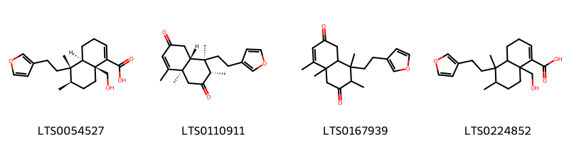{ width=100% }
    <figcaption>Hình ảnh cấu trúc hóa học của 4 hoạt chất thuộc nhóm Prenol lipids gồm ['(4ar,5s,6r,8as)-5-[2-(furan-3-yl)ethyl]-8a-(hydroxymethyl)-5,6-dimethyl-3,4,4a,6,7,8-hexahydronaphthalene-1-carboxylic acid (LTS0054527)', '(3s,4r,4ar,8ar)-4-[2-(furan-3-yl)ethyl]-3,4,8,8a-tetramethyl-1,3,4a,5-tetrahydronaphthalene-2,6-dione (LTS0110911)', '4-[2-(furan-3-yl)ethyl]-3,4,8,8a-tetramethyl-1,3,4a,5-tetrahydronaphthalene-2,6-dione (LTS0167939)', '5-[2-(furan-3-yl)ethyl]-8a-(hydroxymethyl)-5,6-dimethyl-3,4,4a,6,7,8-hexahydronaphthalene-1-carboxylic acid (LTS0224852)'].</figcaption>
</figure>

---

### Dược dân tộc học

Danh sách các quốc gia có sử dụng *Croton setigerus* trong điều trị các bệnh. 

| Country   | Disease   | Bệnh                                                                                                                                                                                                |
|:----------|:----------|:----------------------------------------------------------------------------------------------------------------------------------------------------------------------------------------------------|
| Elsewhere | Piscicide | MYMEMORY WARNING: YOU USED ALL AVAILABLE FREE TRANSLATIONS FOR TODAY. NEXT AVAILABLE IN  19 HOURS 48 MINUTES 08 SECONDS VISIT HTTPS://MYMEMORY.TRANSLATED.NET/DOC/USAGELIMITS.PHP TO TRANSLATE MORE |

---

---
## Croton texensis
### Thông tin về thực vật

!!! info "Phân loại thực vật của *Croton texensis* từ GIBF:"
    - **Kingdom:** Plantae
    - **Phylum:** Tracheophyta
    - **Order:** Malpighiales
    - **Family:** Euphorbiaceae
    - **Genus:** Croton
    - **Species:** *Croton texensis*

 

| Label (VI)   | Label (EN)   | Scientific Name   | Descriptions (VI)   | Descriptions (EN)   | Also Known As (VI)   | Also Known As (EN)   |
|:-------------|:-------------|:------------------|:--------------------|:--------------------|:---------------------|:---------------------|
| N/A          | N/A          | Croton texensis   | loài thực vật       | species of plant    | ['']                 | ['']                 |

#### Phân bố trên thế giới

**Từ CSDL GIBF** nan, United States of America, Mexico

#### Phân bố tại Việt Nam

**Từ CSDL GIBF**: Không có ghi nhận ở Việt Nam

---
### Thành phần hóa học
        
- Theo cơ sở dữ liệu lotus: Từ loài *Croton texensis* đã phân lập và xác định được Chưa có hoạt chất nào được phân lập. hoạt chất thuộc về các nhóm Không có hoạt chất nào được phân lập. 

Không có hình ảnh nào được tạo ra

---

### Dược dân tộc học

Danh sách các quốc gia có sử dụng *Croton texensis* trong điều trị các bệnh. 

| Country        | Disease           | Bệnh                                                                                                                                                                                                |
|:---------------|:------------------|:----------------------------------------------------------------------------------------------------------------------------------------------------------------------------------------------------|
| US(Amerindian) | Insecticide       | MYMEMORY WARNING: YOU USED ALL AVAILABLE FREE TRANSLATIONS FOR TODAY. NEXT AVAILABLE IN  19 HOURS 47 MINUTES 41 SECONDS VISIT HTTPS://MYMEMORY.TRANSLATED.NET/DOC/USAGELIMITS.PHP TO TRANSLATE MORE |
| US(Hopi)       | Collyrium, Emetic | MYMEMORY WARNING: YOU USED ALL AVAILABLE FREE TRANSLATIONS FOR TODAY. NEXT AVAILABLE IN  19 HOURS 47 MINUTES 38 SECONDS VISIT HTTPS://MYMEMORY.TRANSLATED.NET/DOC/USAGELIMITS.PHP TO TRANSLATE MORE |

---

---
## Croton tiglium
### Thông tin về thực vật

!!! info "Phân loại thực vật của *Croton tiglium* từ GIBF:"
    - **Kingdom:** Plantae
    - **Phylum:** Tracheophyta
    - **Order:** Malpighiales
    - **Family:** Euphorbiaceae
    - **Genus:** Croton
    - **Species:** *Croton tiglium*

 

| Label (VI)   | Label (EN)   | Scientific Name   | Descriptions (VI)   | Descriptions (EN)   | Also Known As (VI)   | Also Known As (EN)   |
|:-------------|:-------------|:------------------|:--------------------|:--------------------|:---------------------|:---------------------|
| N/A          | N/A          | Croton tiglium    | loài thực vật       | species of plant    | ['Cây ba đậu']       | ['']                 |

#### Phân bố trên thế giới

**Từ CSDL GIBF** nan, Sri Lanka, Japan, Lao People’s Democratic Republic, Benin, Malawi, Chinese Taipei, Bangladesh, United States of America, Hong Kong, Thailand, Egypt, Mexico, Viet Nam, China, Ecuador, India, Indonesia, Philippines, Malaysia

#### Phân bố tại Việt Nam

**Từ CSDL GIBF**: Hoa Binh, Ha Tinh, Thai Nguyen, Ninh Binh

---
### Thành phần hóa học
        
- Theo cơ sở dữ liệu lotus: Từ loài *Croton tiglium* đã phân lập và xác định được 57 hoạt chất thuộc về các nhóm Fatty Acyls, Prenol lipids, Purine nucleosides. 

|    | chemicalTaxonomyClassyfireClass   |   smiles_count |
|---:|:----------------------------------|---------------:|
|  0 | Fatty Acyls                       |              3 |
|  1 | Prenol lipids                     |             51 |
|  2 | Purine nucleosides                |              3 |

#### Nhóm Fatty Acyls
<figure markdown="span">
    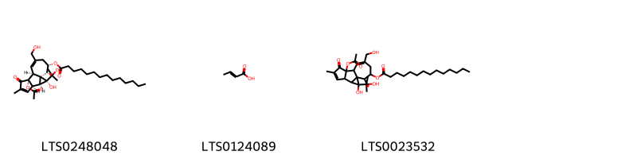{ width=100% }
    <figcaption>Hình ảnh cấu trúc hóa học của 3 hoạt chất thuộc nhóm Fatty Acyls gồm ['(1s,2r,3s,4r,8s,9s,13s,14r)-8-(acetyloxy)-2-hydroxy-11-(hydroxymethyl)-2-(2-hydroxypropan-2-yl)-6,14-dimethyl-7-oxotetracyclo[7.5.0.0¹,³.0⁴,⁸]tetradeca-5,10-dien-13-yl tetradecanoate (LTS0248048)', 'butenoic acid (LTS0124089)', '8-(acetyloxy)-2-hydroxy-11-(hydroxymethyl)-2-(2-hydroxypropan-2-yl)-6,14-dimethyl-7-oxotetracyclo[7.5.0.0¹,³.0⁴,⁸]tetradeca-5,10-dien-13-yl tetradecanoate (LTS0023532)'].</figcaption>
</figure>
#### Nhóm Prenol lipids
<figure markdown="span">
    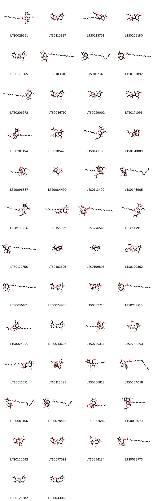{ width=100% }
    <figcaption>Hình ảnh cấu trúc hóa học của 51 hoạt chất thuộc nhóm Prenol lipids gồm ['tetradecanoylphorbol acetate (LTS0029561)', '(1r,2r,6r,10s,11r,13s,14r,15r)-1-hydroxy-8-(hydroxymethyl)-4,12,12,15-tetramethyl-13-[(2-methylbutanoyl)oxy]-5-oxotetracyclo[8.5.0.0²,⁶.0¹¹,¹³]pentadeca-3,8-dien-14-yl (2e)-2-methylbut-2-enoate (LTS0110937)', '(1r,2r,6r,10s,11r,13s,14r,15r)-1-hydroxy-8-(hydroxymethyl)-4,12,12,15-tetramethyl-14-{[(2e)-2-methylbut-2-enoyl]oxy}-5-oxotetracyclo[8.5.0.0²,⁶.0¹¹,¹³]pentadeca-3,8-dien-13-yl decanoate (LTS0213701)', '(1s,2s,6r,10s,11r,13s,14r,15r)-1,6-dihydroxy-8-(hydroxymethyl)-4,12,12,15-tetramethyl-5-oxo-13-(propanoyloxy)tetracyclo[8.5.0.0²,⁶.0¹¹,¹³]pentadeca-3,8-dien-14-yl (2e)-2-methylbut-2-enoate (LTS0205180)', '(1s,2s,6r,10s,11r,13s,14r,15r)-1,6-dihydroxy-8-(hydroxymethyl)-4,12,12,15-tetramethyl-13-[(2-methylbutanoyl)oxy]-5-oxotetracyclo[8.5.0.0²,⁶.0¹¹,¹³]pentadeca-3,8-dien-14-yl (2e)-2-methylbut-2-enoate (LTS0178365)', '[13-(acetyloxy)-1,6,14-trihydroxy-4,12,12,15-tetramethyl-5-oxotetracyclo[8.5.0.0²,⁶.0¹¹,¹³]pentadeca-3,8-dien-8-yl]methyl octadeca-9,12-dienoate (LTS0103810)', '[(1s,2s,6r,10s,11r,13s,14r,15r)-13-(acetyloxy)-1,6,14-trihydroxy-4,12,12,15-tetramethyl-5-oxotetracyclo[8.5.0.0²,⁶.0¹¹,¹³]pentadeca-3,8-dien-8-yl]methyl (9z,12z)-octadeca-9,12-dienoate (LTS0107346)', '[(1r,2r,6r,10s,11r,13s,14r,15r)-13-(acetyloxy)-1,14-dihydroxy-4,12,12,15-tetramethyl-5-oxotetracyclo[8.5.0.0²,⁶.0¹¹,¹³]pentadeca-3,8-dien-8-yl]methyl octadeca-9,12-dienoate (LTS0133892)', '(1s,2s,6r,10s,11r,13s,14r,15r)-13-(acetyloxy)-1,6-dihydroxy-8-(hydroxymethyl)-4,12,12,15-tetramethyl-5-oxotetracyclo[8.5.0.0²,⁶.0¹¹,¹³]pentadeca-3,8-dien-14-yl hexadecanoate (LTS0206972)', '(1s,6r,11r,13s,14r,15r)-1,6-dihydroxy-8-(hydroxymethyl)-4,12,12,15-tetramethyl-13-[(2-methylpropanoyl)oxy]-5-oxotetracyclo[8.5.0.0²,⁶.0¹¹,¹³]pentadeca-3,8-dien-14-yl (2e)-2-methylbut-2-enoate (LTS0086710)', '(1s,2s,6r,10s,11r,13s,14r,15r)-1,6-dihydroxy-8-(hydroxymethyl)-4,12,12,15-tetramethyl-13-[(2-methylpropanoyl)oxy]-5-oxotetracyclo[8.5.0.0²,⁶.0¹¹,¹³]pentadeca-3,8-dien-14-yl (2e)-2-methylbut-2-enoate (LTS0029002)', '(1s,6r,13s,14r,15r)-1,6-dihydroxy-8-(hydroxymethyl)-4,12,12,15-tetramethyl-13-[(2-methylbutanoyl)oxy]-5-oxotetracyclo[8.5.0.0²,⁶.0¹¹,¹³]pentadeca-3,8-dien-14-yl (2e)-2-methylbut-2-enoate (LTS0171096)', '(1s,2r,6r,10r,11s,13s,14r,15r)-1,6-dihydroxy-8-(hydroxymethyl)-4,12,12,15-tetramethyl-14-{[(2r)-2-methylbutanoyl]oxy}-5-oxotetracyclo[8.5.0.0²,⁶.0¹¹,¹³]pentadeca-3,8-dien-13-yl dodecanoate (LTS0201154)', '(1s,2s,6r,10s,11r,13s,14r,15r)-1,6-dihydroxy-8-(hydroxymethyl)-4,12,12,15-tetramethyl-13-[(2-methylpropanoyl)oxy]-5-oxotetracyclo[8.5.0.0²,⁶.0¹¹,¹³]pentadeca-3,8-dien-14-yl 2-methylbutanoate (LTS0205470)', '(1s,2s,6r,10s,11r,13s,14r,15r)-1,6-dihydroxy-8-(hydroxymethyl)-4,12,12,15-tetramethyl-13-{[(2r)-2-methylbutanoyl]oxy}-5-oxotetracyclo[8.5.0.0²,⁶.0¹¹,¹³]pentadeca-3,8-dien-14-yl decanoate (LTS0141190)', '(1s,2s,6r,10s,11r,13s,14r,15r)-1,6-dihydroxy-8-(hydroxymethyl)-4,12,12,15-tetramethyl-14-[(2-methylbutanoyl)oxy]-5-oxotetracyclo[8.5.0.0²,⁶.0¹¹,¹³]pentadeca-3,8-dien-13-yl (2e)-2-methylbut-2-enoate (LTS0170089)', '(1s,2s,6r,10s,11r,13s,14r,15r)-14-(acetyloxy)-1,6-dihydroxy-8-(hydroxymethyl)-4,12,12,15-tetramethyl-5-oxotetracyclo[8.5.0.0²,⁶.0¹¹,¹³]pentadeca-3,8-dien-13-yl decanoate (LTS0096867)', 'phorbol (LTS0084490)', '(1s,2s,6r,10s,11r,13s,14r,15r)-1,6-dihydroxy-8-(hydroxymethyl)-4,12,12,15-tetramethyl-14-[(2-methylbutanoyl)oxy]-5-oxotetracyclo[8.5.0.0²,⁶.0¹¹,¹³]pentadeca-3,8-dien-13-yl dodecanoate (LTS0113420)', '[(1s,2r,6r,10r,11s,13s,14r,15r)-13-(acetyloxy)-1,6,14-trihydroxy-4,12,12,15-tetramethyl-5-oxotetracyclo[8.5.0.0²,⁶.0¹¹,¹³]pentadeca-3,8-dien-8-yl]methyl (9z,12z)-octadeca-9,12-dienoate (LTS0146905)', '(1s,2r,6r,10r,11s,13s,14r,15r)-1,6-dihydroxy-8-(hydroxymethyl)-4,12,12,15-tetramethyl-13-{[(2r)-2-methylbutanoyl]oxy}-5-oxotetracyclo[8.5.0.0²,⁶.0¹¹,¹³]pentadeca-3,8-dien-14-yl decanoate (LTS0100956)', '1,6-dihydroxy-8-(hydroxymethyl)-4,12,12,15-tetramethyl-13-[(2-methylbutanoyl)oxy]-5-oxotetracyclo[8.5.0.0²,⁶.0¹¹,¹³]pentadeca-3,8-dien-14-yl decanoate (LTS0155899)', '[(1s,2r,6r,10r,11s,13s,14r,15r)-1,6,14-trihydroxy-4,12,12,15-tetramethyl-13-{[(2e)-2-methylbut-2-enoyl]oxy}-5-oxotetracyclo[8.5.0.0²,⁶.0¹¹,¹³]pentadeca-3,8-dien-8-yl]methyl (9e,12e)-octadeca-9,12-dienoate (LTS0226545)', '(1s,6r,13s,14r,15r)-1,6-dihydroxy-8-(hydroxymethyl)-4,12,12,15-tetramethyl-13-[(2-methylbutanoyl)oxy]-5-oxotetracyclo[8.5.0.0²,⁶.0¹¹,¹³]pentadeca-3,8-dien-14-yl decanoate (LTS0112916)', '{1,6,14-trihydroxy-4,12,12,15-tetramethyl-13-[(2-methylbut-2-enoyl)oxy]-5-oxotetracyclo[8.5.0.0²,⁶.0¹¹,¹³]pentadeca-3,8-dien-8-yl}methyl octadeca-9,12-dienoate (LTS0179768)', 'phorbol (LTS0183626)', 'phorbol-13-acetate (LTS0199896)', '(1r,2r,6r,10s,11r,13s,14r,15r)-1-hydroxy-8-(hydroxymethyl)-4,12,12,15-tetramethyl-5-oxo-13-[(2-phenylacetyl)oxy]tetracyclo[8.5.0.0²,⁶.0¹¹,¹³]pentadeca-3,8-dien-14-yl (2e)-2-methylbut-2-enoate (LTS0190362)', '[(1s,2s,6r,10s,11r,13s,14r,15r)-13-(acetyloxy)-1,6,14-trihydroxy-4,12,12,15-tetramethyl-5-oxotetracyclo[8.5.0.0²,⁶.0¹¹,¹³]pentadeca-3,8-dien-8-yl]methyl octadeca-9,12-dienoate (LTS0056181)', '(1r,2r,6r,10s,11r,13s,14r,15r)-1-hydroxy-8-(hydroxymethyl)-4,12,12,15-tetramethyl-13-[(2-methylpropanoyl)oxy]-5-oxotetracyclo[8.5.0.0²,⁶.0¹¹,¹³]pentadeca-3,8-dien-14-yl (2e)-2-methylbut-2-enoate (LTS0074986)', '(1s,2s,6r,10s,11r,13s,14r,15r)-14-(acetyloxy)-1,6-dihydroxy-8-(hydroxymethyl)-4,12,12,15-tetramethyl-5-oxotetracyclo[8.5.0.0²,⁶.0¹¹,¹³]pentadeca-3,8-dien-13-yl (2e)-2-methylbut-2-enoate (LTS0259716)', '[(1s,2s,6r,10s,11r,13s,14r,15r)-13-(acetyloxy)-1,6,14-trihydroxy-4,12,12,15-tetramethyl-5-oxotetracyclo[8.5.0.0²,⁶.0¹¹,¹³]pentadeca-3,8-dien-8-yl]methyl octadec-9-enoate (LTS0222215)', '(1s,6r,14r,15r)-1,6-dihydroxy-8-(hydroxymethyl)-4,12,12,15-tetramethyl-14-[(2-methylbutanoyl)oxy]-5-oxotetracyclo[8.5.0.0²,⁶.0¹¹,¹³]pentadeca-3,8-dien-13-yl dodecanoate (LTS0024020)', '1,6-dihydroxy-8-(hydroxymethyl)-4,12,12,15-tetramethyl-13-[(2-methylbutanoyl)oxy]-5-oxotetracyclo[8.5.0.0²,⁶.0¹¹,¹³]pentadeca-3,8-dien-14-yl 2-methylbut-2-enoate (LTS0043696)', '(1s,2s,6r,10s,11r,13s,14r,15r)-14-(acetyloxy)-1,6-dihydroxy-8-(hydroxymethyl)-4,12,12,15-tetramethyl-5-oxotetracyclo[8.5.0.0²,⁶.0¹¹,¹³]pentadeca-3,8-dien-13-yl dodecanoate (LTS0239317)', '(1s,2s,6r,10s,11r,13s,14r,15r)-14-(acetyloxy)-1,6-dihydroxy-8-(hydroxymethyl)-4,12,12,15-tetramethyl-5-oxotetracyclo[8.5.0.0²,⁶.0¹¹,¹³]pentadeca-3,8-dien-13-yl acetate (LTS0244893)', 'tetradecanoylphorbol acetate (LTS0011071)', '(1s,2r,6r,10r,11s,13s,14r,15r)-14-(acetyloxy)-1,6-dihydroxy-8-(hydroxymethyl)-4,12,12,15-tetramethyl-5-oxotetracyclo[8.5.0.0²,⁶.0¹¹,¹³]pentadeca-3,8-dien-13-yl (2e)-2-methylbut-2-enoate (LTS0113085)', '14-(acetyloxy)-1,6-dihydroxy-8-(hydroxymethyl)-4,12,12,15-tetramethyl-5-oxotetracyclo[8.5.0.0²,⁶.0¹¹,¹³]pentadeca-3,8-dien-13-yl decanoate (LTS0266812)', '[(1s,2s,6r,10s,11r,13s,14r,15r)-13-(acetyloxy)-1,6,14-trihydroxy-4,12,12,15-tetramethyl-5-oxotetracyclo[8.5.0.0²,⁶.0¹¹,¹³]pentadeca-3,8-dien-8-yl]methyl (9z)-octadec-9-enoate (LTS0264058)', '[(1r,2r,6r,10s,11r,13s,14r,15r)-13-(acetyloxy)-1,14-dihydroxy-4,12,12,15-tetramethyl-5-oxotetracyclo[8.5.0.0²,⁶.0¹¹,¹³]pentadeca-3,8-dien-8-yl]methyl (9z,12z)-octadeca-9,12-dienoate (LTS0001166)', '[(1s,2s,6r,10s,11r,13s,14r,15r)-1,6,14-trihydroxy-4,12,12,15-tetramethyl-13-{[(2e)-2-methylbut-2-enoyl]oxy}-5-oxotetracyclo[8.5.0.0²,⁶.0¹¹,¹³]pentadeca-3,8-dien-8-yl]methyl (9z,12z)-octadeca-9,12-dienoate (LTS0028465)', '(1s,2r,6r,10r,11s,13s,14r,15r)-14-(acetyloxy)-1,6-dihydroxy-8-(hydroxymethyl)-4,12,12,15-tetramethyl-5-oxotetracyclo[8.5.0.0²,⁶.0¹¹,¹³]pentadeca-3,8-dien-13-yl decanoate (LTS0062646)', '1,6-dihydroxy-8-(hydroxymethyl)-4,12,12,15-tetramethyl-14-[(2-methylbutanoyl)oxy]-5-oxotetracyclo[8.5.0.0²,⁶.0¹¹,¹³]pentadeca-3,8-dien-13-yl dodecanoate (LTS0016670)', '(1s,6r,13s,14r,15r)-14-(acetyloxy)-1,6-dihydroxy-8-(hydroxymethyl)-4,12,12,15-tetramethyl-5-oxotetracyclo[8.5.0.0²,⁶.0¹¹,¹³]pentadeca-3,8-dien-13-yl (2z)-2-methylbut-2-enoate (LTS0120542)', '(1s,2r,6r,10r,11s,13s,14r,15r)-1,6-dihydroxy-8-(hydroxymethyl)-4,12,12,15-tetramethyl-13-{[(2r)-2-methylbutanoyl]oxy}-5-oxotetracyclo[8.5.0.0²,⁶.0¹¹,¹³]pentadeca-3,8-dien-14-yl (2e)-2-methylbut-2-enoate (LTS0077091)', '14-(acetyloxy)-1,6-dihydroxy-8-(hydroxymethyl)-4,12,12,15-tetramethyl-5-oxotetracyclo[8.5.0.0²,⁶.0¹¹,¹³]pentadeca-3,8-dien-13-yl 2-methylbut-2-enoate (LTS0254184)', '[(1r,2r,6r,10s,11r,13s,14r,15r)-13-(acetyloxy)-1,14-dihydroxy-4,12,12,15-tetramethyl-5-oxotetracyclo[8.5.0.0²,⁶.0¹¹,¹³]pentadeca-3,8-dien-8-yl]methyl octadec-9-enoate (LTS0038775)', '(1r,2r,6r,10s,11r,13s,14r,15r)-13-(acetyloxy)-1-hydroxy-8-(hydroxymethyl)-4,12,12,15-tetramethyl-5-oxotetracyclo[8.5.0.0²,⁶.0¹¹,¹³]pentadeca-3,8-dien-14-yl (2e)-2-methylbut-2-enoate (LTS0125382)', '(1s,2s,6r,10s,11r,13s,14r,15r)-1,6-dihydroxy-8-(hydroxymethyl)-4,12,12,15-tetramethyl-13-{[(2r)-2-methylbutanoyl]oxy}-5-oxotetracyclo[8.5.0.0²,⁶.0¹¹,¹³]pentadeca-3,8-dien-14-yl (2e)-2-methylbut-2-enoate (LTS0043065)', '[(1r,2r,6r,10s,11r,13s,14r,15r)-13-(acetyloxy)-1,14-dihydroxy-4,12,12,15-tetramethyl-5-oxotetracyclo[8.5.0.0²,⁶.0¹¹,¹³]pentadeca-3,8-dien-8-yl]methyl (9z)-octadec-9-enoate (LTS0021757)'].</figcaption>
</figure>
#### Nhóm Purine nucleosides
<figure markdown="span">
    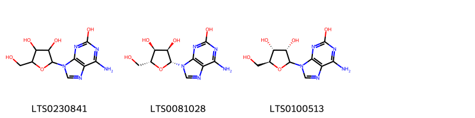{ width=100% }
    <figcaption>Hình ảnh cấu trúc hóa học của 3 hoạt chất thuộc nhóm Purine nucleosides gồm ['2-(6-amino-2-hydroxypurin-9-yl)-5-(hydroxymethyl)oxolane-3,4-diol (LTS0230841)', 'isoguanosine (LTS0081028)', '(3s,4r,5s)-2-(6-amino-2-hydroxypurin-9-yl)-5-(hydroxymethyl)oxolane-3,4-diol (LTS0100513)'].</figcaption>
</figure>

---

### Dược dân tộc học

Danh sách các quốc gia có sử dụng *Croton tiglium* trong điều trị các bệnh. 

| Country             | Disease                                                                           | Bệnh                                                                                                                                                                                                |
|:--------------------|:----------------------------------------------------------------------------------|:----------------------------------------------------------------------------------------------------------------------------------------------------------------------------------------------------|
| China               | Emmenagogue, Poison, Poison, Purgative, Poison                                    | MYMEMORY WARNING: YOU USED ALL AVAILABLE FREE TRANSLATIONS FOR TODAY. NEXT AVAILABLE IN  19 HOURS 47 MINUTES 09 SECONDS VISIT HTTPS://MYMEMORY.TRANSLATED.NET/DOC/USAGELIMITS.PHP TO TRANSLATE MORE |
| Elsewhere           | Diaphoretic, Emetic, Piscicide, Poison, Purgative, Vesicant, Purgative, Purgative | MYMEMORY WARNING: YOU USED ALL AVAILABLE FREE TRANSLATIONS FOR TODAY. NEXT AVAILABLE IN  19 HOURS 47 MINUTES 06 SECONDS VISIT HTTPS://MYMEMORY.TRANSLATED.NET/DOC/USAGELIMITS.PHP TO TRANSLATE MORE |
| Hainan              | Piscicide                                                                         | MYMEMORY WARNING: YOU USED ALL AVAILABLE FREE TRANSLATIONS FOR TODAY. NEXT AVAILABLE IN  19 HOURS 46 MINUTES 58 SECONDS VISIT HTTPS://MYMEMORY.TRANSLATED.NET/DOC/USAGELIMITS.PHP TO TRANSLATE MORE |
| Indochina           | Purgative                                                                         | MYMEMORY WARNING: YOU USED ALL AVAILABLE FREE TRANSLATIONS FOR TODAY. NEXT AVAILABLE IN  19 HOURS 46 MINUTES 55 SECONDS VISIT HTTPS://MYMEMORY.TRANSLATED.NET/DOC/USAGELIMITS.PHP TO TRANSLATE MORE |
| Java                | Piscicide                                                                         | MYMEMORY WARNING: YOU USED ALL AVAILABLE FREE TRANSLATIONS FOR TODAY. NEXT AVAILABLE IN  19 HOURS 46 MINUTES 52 SECONDS VISIT HTTPS://MYMEMORY.TRANSLATED.NET/DOC/USAGELIMITS.PHP TO TRANSLATE MORE |
| Malaya              | Purgative                                                                         | MYMEMORY WARNING: YOU USED ALL AVAILABLE FREE TRANSLATIONS FOR TODAY. NEXT AVAILABLE IN  19 HOURS 46 MINUTES 48 SECONDS VISIT HTTPS://MYMEMORY.TRANSLATED.NET/DOC/USAGELIMITS.PHP TO TRANSLATE MORE |
| Philippines(Ifugao) | Piscicide                                                                         | MYMEMORY WARNING: YOU USED ALL AVAILABLE FREE TRANSLATIONS FOR TODAY. NEXT AVAILABLE IN  19 HOURS 46 MINUTES 45 SECONDS VISIT HTTPS://MYMEMORY.TRANSLATED.NET/DOC/USAGELIMITS.PHP TO TRANSLATE MORE |
| Turkey              | Cathartic, Rubefacient, Poison                                                    | MYMEMORY WARNING: YOU USED ALL AVAILABLE FREE TRANSLATIONS FOR TODAY. NEXT AVAILABLE IN  19 HOURS 46 MINUTES 42 SECONDS VISIT HTTPS://MYMEMORY.TRANSLATED.NET/DOC/USAGELIMITS.PHP TO TRANSLATE MORE |

---

---
## Croton xalapensis
### Thông tin về thực vật

!!! info "Phân loại thực vật của *Croton xalapensis* từ GIBF:"
    - **Kingdom:** Plantae
    - **Phylum:** Tracheophyta
    - **Order:** Malpighiales
    - **Family:** Euphorbiaceae
    - **Genus:** Croton
    - **Species:** *Croton xalapensis*

 

| Label (VI)   | Label (EN)   | Scientific Name   | Descriptions (VI)   | Descriptions (EN)   | Also Known As (VI)   | Also Known As (EN)   |
|:-------------|:-------------|:------------------|:--------------------|:--------------------|:---------------------|:---------------------|
| N/A          | N/A          | Croton xalapensis |                     | species of plant    | ['']                 | ['']                 |

#### Phân bố trên thế giới

**Từ CSDL GIBF** Belize, Guatemala, Costa Rica, Honduras, Nicaragua, Mexico, El Salvador

#### Phân bố tại Việt Nam

**Từ CSDL GIBF**: Không có ghi nhận ở Việt Nam

---
### Thành phần hóa học
        
- Theo cơ sở dữ liệu lotus: Từ loài *Croton xalapensis* đã phân lập và xác định được Chưa có hoạt chất nào được phân lập. hoạt chất thuộc về các nhóm Không có hoạt chất nào được phân lập. 

Không có hình ảnh nào được tạo ra

---

### Dược dân tộc học

Danh sách các quốc gia có sử dụng *Croton xalapensis* trong điều trị các bệnh. 

| Country   | Disease    | Bệnh                                                                                                                                                                                                |
|:----------|:-----------|:----------------------------------------------------------------------------------------------------------------------------------------------------------------------------------------------------|
| Mexico    | Dentifrice | MYMEMORY WARNING: YOU USED ALL AVAILABLE FREE TRANSLATIONS FOR TODAY. NEXT AVAILABLE IN  19 HOURS 46 MINUTES 12 SECONDS VISIT HTTPS://MYMEMORY.TRANSLATED.NET/DOC/USAGELIMITS.PHP TO TRANSLATE MORE |

---

# Chi Cnidoscolus

??? note "Danh sách các dược liệu thuộc chi"
    
	 - *Cnidoscolus souzae*
	 - *Cnidoscolus urens*
	 - *Cnidoscolus vitifolius*

---
## Cnidoscolus souzae
### Thông tin về thực vật

!!! info "Phân loại thực vật của *Cnidoscolus souzae* từ GIBF:"
    - **Kingdom:** Plantae
    - **Phylum:** Tracheophyta
    - **Order:** Malpighiales
    - **Family:** Euphorbiaceae
    - **Genus:** Cnidoscolus
    - **Species:** *Cnidoscolus souzae*

 

| Label (VI)   | Label (EN)   | Scientific Name    | Descriptions (VI)   | Descriptions (EN)   | Also Known As (VI)   | Also Known As (EN)   |
|:-------------|:-------------|:-------------------|:--------------------|:--------------------|:---------------------|:---------------------|
| N/A          | N/A          | Cnidoscolus souzae | loài thực vật       | species of plant    | ['']                 | ['']                 |

#### Phân bố trên thế giới

**Từ CSDL GIBF** Belize, nan, Guatemala, Mexico

#### Phân bố tại Việt Nam

**Từ CSDL GIBF**: Không có ghi nhận ở Việt Nam

---
### Thành phần hóa học
        
- Theo cơ sở dữ liệu lotus: Từ loài *Cnidoscolus souzae* đã phân lập và xác định được Chưa có hoạt chất nào được phân lập. hoạt chất thuộc về các nhóm Không có hoạt chất nào được phân lập. 

Không có hình ảnh nào được tạo ra

---

### Dược dân tộc học

Danh sách các quốc gia có sử dụng *Cnidoscolus souzae* trong điều trị các bệnh. 

| Country   | Disease   | Bệnh                                                                                                                                                                                                |
|:----------|:----------|:----------------------------------------------------------------------------------------------------------------------------------------------------------------------------------------------------|
| Mexico    | Diuretic  | MYMEMORY WARNING: YOU USED ALL AVAILABLE FREE TRANSLATIONS FOR TODAY. NEXT AVAILABLE IN  19 HOURS 45 MINUTES 48 SECONDS VISIT HTTPS://MYMEMORY.TRANSLATED.NET/DOC/USAGELIMITS.PHP TO TRANSLATE MORE |

---

---
## Cnidoscolus urens
### Thông tin về thực vật

!!! info "Phân loại thực vật của *Cnidoscolus urens* từ GIBF:"
    - **Kingdom:** Plantae
    - **Phylum:** Tracheophyta
    - **Order:** Malpighiales
    - **Family:** Euphorbiaceae
    - **Genus:** Cnidoscolus
    - **Species:** *Cnidoscolus urens*

 

| Label (VI)   | Label (EN)   | Scientific Name   | Descriptions (VI)   | Descriptions (EN)   | Also Known As (VI)   | Also Known As (EN)   |
|:-------------|:-------------|:------------------|:--------------------|:--------------------|:---------------------|:---------------------|
| N/A          | N/A          | Cnidoscolus urens |                     | species of plant    | ['']                 | ['']                 |

#### Phân bố trên thế giới

**Từ CSDL GIBF** Guatemala, Argentina, Nicaragua, Venezuela (Bolivarian Republic of), French Guiana, Panama, Honduras, United States of America, Paraguay, El Salvador, Saint Vincent and the Grenadines, Brazil, Mexico, Curaçao, Ecuador, Saint Kitts and Nevis, Aruba, Colombia, Costa Rica, Anguilla

#### Phân bố tại Việt Nam

**Từ CSDL GIBF**: Không có ghi nhận ở Việt Nam

---
### Thành phần hóa học
        
- Theo cơ sở dữ liệu lotus: Từ loài *Cnidoscolus urens* đã phân lập và xác định được 7 hoạt chất thuộc về các nhóm Prenol lipids, Organooxygen compounds. 

|    | chemicalTaxonomyClassyfireClass   |   smiles_count |
|---:|:----------------------------------|---------------:|
|  0 | Organooxygen compounds            |              1 |
|  1 | Prenol lipids                     |              5 |

#### Nhóm Organooxygen compounds
<figure markdown="span">
    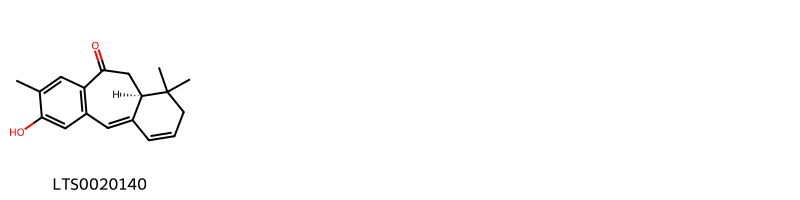{ width=100% }
    <figcaption>Hình ảnh cấu trúc hóa học của 1 hoạt chất thuộc nhóm Organooxygen compounds gồm ['(11s)-5-hydroxy-6,12,12-trimethyltricyclo[9.4.0.0³,⁸]pentadeca-1,3(8),4,6,14-pentaen-9-one (LTS0020140)'].</figcaption>
</figure>
#### Nhóm Prenol lipids
<figure markdown="span">
    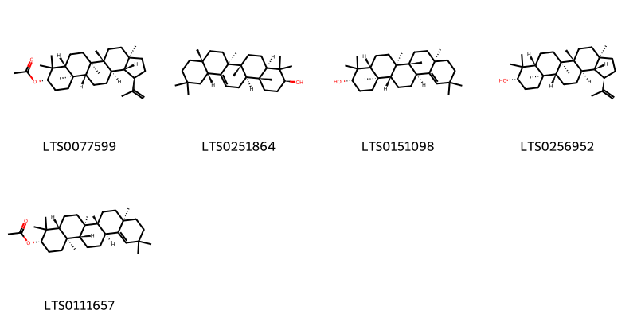{ width=100% }
    <figcaption>Hình ảnh cấu trúc hóa học của 5 hoạt chất thuộc nhóm Prenol lipids gồm ['lupeol acetate (LTS0077599)', 'β-amyrin (LTS0251864)', 'germanicol (LTS0151098)', 'lupeol (LTS0256952)', '(3s,4ar,6ar,6br,8ar,12bs,14ar,14br)-4,4,6a,6b,8a,11,11,14b-octamethyl-1,2,3,4a,5,6,7,8,9,10,12b,13,14,14a-tetradecahydropicen-3-yl acetate (LTS0111657)'].</figcaption>
</figure>

---

### Dược dân tộc học

Danh sách các quốc gia có sử dụng *Cnidoscolus urens* trong điều trị các bệnh. 

| Country   | Disease   | Bệnh                                                                                                                                                                                                |
|:----------|:----------|:----------------------------------------------------------------------------------------------------------------------------------------------------------------------------------------------------|
| Colombia  | Purgative | MYMEMORY WARNING: YOU USED ALL AVAILABLE FREE TRANSLATIONS FOR TODAY. NEXT AVAILABLE IN  19 HOURS 45 MINUTES 22 SECONDS VISIT HTTPS://MYMEMORY.TRANSLATED.NET/DOC/USAGELIMITS.PHP TO TRANSLATE MORE |

---

---
## Cnidoscolus vitifolius
### Thông tin về thực vật

!!! info "Phân loại thực vật của *Cnidoscolus vitifolius* từ GIBF:"
    - **Kingdom:** Plantae
    - **Phylum:** Tracheophyta
    - **Order:** Malpighiales
    - **Family:** Euphorbiaceae
    - **Genus:** Cnidoscolus
    - **Species:** *Cnidoscolus vitifolius*

 

| Label (VI)   | Label (EN)   | Scientific Name        | Descriptions (VI)   | Descriptions (EN)   | Also Known As (VI)   | Also Known As (EN)   |
|:-------------|:-------------|:-----------------------|:--------------------|:--------------------|:---------------------|:---------------------|
| N/A          | N/A          | Cnidoscolus vitifolius | loài thực vật       | species of plant    | ['']                 | ['']                 |

#### Phân bố trên thế giới

**Từ CSDL GIBF** Brazil, Argentina

#### Phân bố tại Việt Nam

**Từ CSDL GIBF**: Không có ghi nhận ở Việt Nam

---
### Thành phần hóa học
        
- Theo cơ sở dữ liệu lotus: Từ loài *Cnidoscolus vitifolius* đã phân lập và xác định được 10 hoạt chất thuộc về các nhóm Prenol lipids. 

|    | chemicalTaxonomyClassyfireClass   |   smiles_count |
|---:|:----------------------------------|---------------:|
|  0 | Prenol lipids                     |             10 |

#### Nhóm Prenol lipids
<figure markdown="span">
    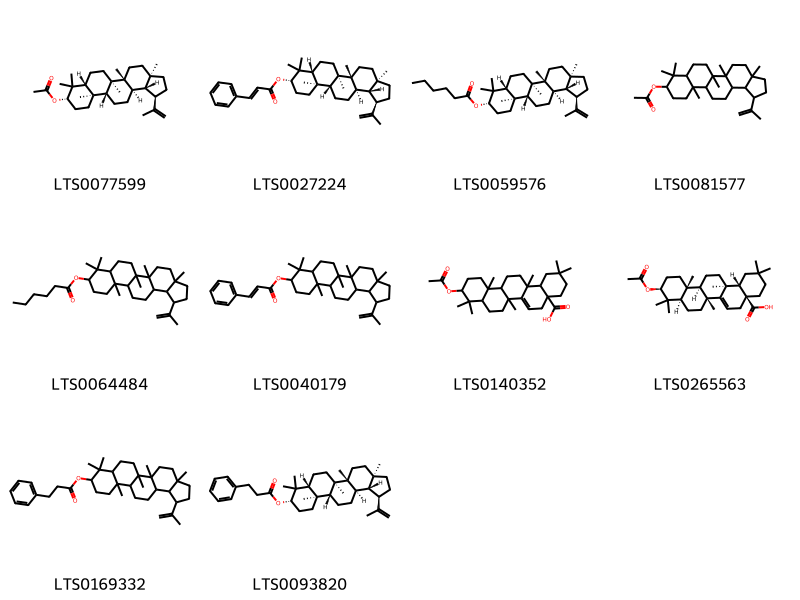{ width=100% }
    <figcaption>Hình ảnh cấu trúc hóa học của 10 hoạt chất thuộc nhóm Prenol lipids gồm ['lupeol acetate (LTS0077599)', '(1r,3ar,5ar,5br,7ar,9s,11ar,11br,13ar,13br)-3a,5a,5b,8,8,11a-hexamethyl-1-(prop-1-en-2-yl)-hexadecahydrocyclopenta[a]chrysen-9-yl (2e)-3-phenylprop-2-enoate (LTS0027224)', '(1r,3ar,5ar,5br,7ar,9s,11ar,11br,13ar,13br)-3a,5a,5b,8,8,11a-hexamethyl-1-(prop-1-en-2-yl)-hexadecahydrocyclopenta[a]chrysen-9-yl hexanoate (LTS0059576)', '3a,5a,5b,8,8,11a-hexamethyl-1-(prop-1-en-2-yl)-hexadecahydrocyclopenta[a]chrysen-9-yl acetate (LTS0081577)', '3a,5a,5b,8,8,11a-hexamethyl-1-(prop-1-en-2-yl)-hexadecahydrocyclopenta[a]chrysen-9-yl hexanoate (LTS0064484)', '3a,5a,5b,8,8,11a-hexamethyl-1-(prop-1-en-2-yl)-hexadecahydrocyclopenta[a]chrysen-9-yl 3-phenylprop-2-enoate (LTS0040179)', '10-(acetyloxy)-2,2,6b,9,9,12a,14a-heptamethyl-1,3,4,5,7,8,8a,10,11,12,12b,13,14,14b-tetradecahydropicene-4a-carboxylic acid (LTS0140352)', 'acetyl aleuritolic acid (LTS0265563)', '3a,5a,5b,8,8,11a-hexamethyl-1-(prop-1-en-2-yl)-hexadecahydrocyclopenta[a]chrysen-9-yl 3-phenylpropanoate (LTS0169332)', '(1r,3ar,5ar,5br,7ar,9s,11ar,11br,13ar,13br)-3a,5a,5b,8,8,11a-hexamethyl-1-(prop-1-en-2-yl)-hexadecahydrocyclopenta[a]chrysen-9-yl 3-phenylpropanoate (LTS0093820)'].</figcaption>
</figure>

---

### Dược dân tộc học

Danh sách các quốc gia có sử dụng *Cnidoscolus vitifolius* trong điều trị các bệnh. 

| Country   | Disease   | Bệnh                                                                                                                                                                                                |
|:----------|:----------|:----------------------------------------------------------------------------------------------------------------------------------------------------------------------------------------------------|
| Argentina | Poison    | MYMEMORY WARNING: YOU USED ALL AVAILABLE FREE TRANSLATIONS FOR TODAY. NEXT AVAILABLE IN  19 HOURS 44 MINUTES 43 SECONDS VISIT HTTPS://MYMEMORY.TRANSLATED.NET/DOC/USAGELIMITS.PHP TO TRANSLATE MORE |

---

# Chi Claoxylon

??? note "Danh sách các dược liệu thuộc chi"
    
	 - *Claoxylon indicum*
	 - *Claoxylon polot*

---
## Claoxylon polot
### Thông tin về thực vật

!!! info "Phân loại thực vật của *Claoxylon indicum* từ GIBF:"
    - **Kingdom:** Plantae
    - **Phylum:** Tracheophyta
    - **Order:** Malpighiales
    - **Family:** Euphorbiaceae
    - **Genus:** Claoxylon
    - **Species:** *Claoxylon indicum*

 

| Label (VI)   | Label (EN)   | Scientific Name   | Descriptions (VI)   | Descriptions (EN)   | Also Known As (VI)   | Also Known As (EN)   |
|:-------------|:-------------|:------------------|:--------------------|:--------------------|:---------------------|:---------------------|
| N/A          | N/A          | Claoxylon polot   | loài thực vật       | species of plant    | ['']                 | ['']                 |

#### Phân bố trên thế giới

**Từ CSDL GIBF** nan, Hong Kong, Christmas Island, Japan, Thailand, Papua New Guinea, India, Indonesia, Solomon Islands, Viet Nam, Singapore, Malaysia, China

#### Phân bố tại Việt Nam

**Từ CSDL GIBF**: Tonkin

---
### Thành phần hóa học
        
- Theo cơ sở dữ liệu lotus: Từ loài *Claoxylon indicum* đã phân lập và xác định được Chưa có hoạt chất nào được phân lập. hoạt chất thuộc về các nhóm Không có hoạt chất nào được phân lập. 

Không có hình ảnh nào được tạo ra

---

### Dược dân tộc học

Danh sách các quốc gia có sử dụng *Claoxylon indicum* trong điều trị các bệnh. 

| Country   | Disease   | Bệnh                                                                                                                                                                                                |
|:----------|:----------|:----------------------------------------------------------------------------------------------------------------------------------------------------------------------------------------------------|
| Java      | Purgative | MYMEMORY WARNING: YOU USED ALL AVAILABLE FREE TRANSLATIONS FOR TODAY. NEXT AVAILABLE IN  19 HOURS 43 MINUTES 49 SECONDS VISIT HTTPS://MYMEMORY.TRANSLATED.NET/DOC/USAGELIMITS.PHP TO TRANSLATE MORE |

---

# Chi Reverchonia

??? note "Danh sách các dược liệu thuộc chi"
    
	 - *Reverchonia arenaria*

---
## Reverchonia arenaria
### Thông tin về thực vật

!!! info "Phân loại thực vật của *Phyllanthus warnockii* từ GIBF:"
    - **Kingdom:** Plantae
    - **Phylum:** Tracheophyta
    - **Order:** Malpighiales
    - **Family:** Phyllanthaceae
    - **Genus:** Phyllanthus
    - **Species:** *Phyllanthus warnockii*

 

| Label (VI)   | Label (EN)   | Scientific Name      | Descriptions (VI)   | Descriptions (EN)   | Also Known As (VI)   | Also Known As (EN)   |
|:-------------|:-------------|:---------------------|:--------------------|:--------------------|:---------------------|:---------------------|
| N/A          | N/A          | Reverchonia arenaria | loài thực vật       | species of plant    | ['']                 | ['']                 |

#### Phân bố trên thế giới

**Từ CSDL GIBF** United States of America, Mexico

#### Phân bố tại Việt Nam

**Từ CSDL GIBF**: Không có ghi nhận ở Việt Nam

---
### Thành phần hóa học
        
- Theo cơ sở dữ liệu lotus: Từ loài *Phyllanthus warnockii* đã phân lập và xác định được Chưa có hoạt chất nào được phân lập. hoạt chất thuộc về các nhóm Không có hoạt chất nào được phân lập. 

Không có hình ảnh nào được tạo ra

---

### Dược dân tộc học

Danh sách các quốc gia có sử dụng *Phyllanthus warnockii* trong điều trị các bệnh. 

| Country   | Disease   | Bệnh                                                                                                                                                                                                |
|:----------|:----------|:----------------------------------------------------------------------------------------------------------------------------------------------------------------------------------------------------|
| US        | Poison    | MYMEMORY WARNING: YOU USED ALL AVAILABLE FREE TRANSLATIONS FOR TODAY. NEXT AVAILABLE IN  19 HOURS 43 MINUTES 19 SECONDS VISIT HTTPS://MYMEMORY.TRANSLATED.NET/DOC/USAGELIMITS.PHP TO TRANSLATE MORE |

---

# Chi Richeria

??? note "Danh sách các dược liệu thuộc chi"
    
	 - *Richeria grandis*

---
## Richeria grandis
### Thông tin về thực vật

!!! info "Phân loại thực vật của *Richeria grandis* từ GIBF:"
    - **Kingdom:** Plantae
    - **Phylum:** Tracheophyta
    - **Order:** Malpighiales
    - **Family:** Phyllanthaceae
    - **Genus:** Richeria
    - **Species:** *Richeria grandis*

 

| Label (VI)   | Label (EN)   | Scientific Name   | Descriptions (VI)   | Descriptions (EN)   | Also Known As (VI)   | Also Known As (EN)   |
|:-------------|:-------------|:------------------|:--------------------|:--------------------|:---------------------|:---------------------|
| N/A          | N/A          | Richeria grandis  | loài thực vật       | species of plant    | ['']                 | ['']                 |

#### Phân bố trên thế giới

**Từ CSDL GIBF** Ecuador, Guadeloupe, Colombia, Brazil, Bolivia (Plurinational State of), Peru, Venezuela (Bolivarian Republic of)

#### Phân bố tại Việt Nam

**Từ CSDL GIBF**: Không có ghi nhận ở Việt Nam

---
### Thành phần hóa học
        
- Theo cơ sở dữ liệu lotus: Từ loài *Richeria grandis* đã phân lập và xác định được Chưa có hoạt chất nào được phân lập. hoạt chất thuộc về các nhóm Không có hoạt chất nào được phân lập. 

Không có hình ảnh nào được tạo ra

---

### Dược dân tộc học

Danh sách các quốc gia có sử dụng *Richeria grandis* trong điều trị các bệnh. 

| Country     | Disease     | Bệnh                                                                                                                                                                                                |
|:------------|:------------|:----------------------------------------------------------------------------------------------------------------------------------------------------------------------------------------------------|
| West Indies | Aphrodisiac | MYMEMORY WARNING: YOU USED ALL AVAILABLE FREE TRANSLATIONS FOR TODAY. NEXT AVAILABLE IN  19 HOURS 42 MINUTES 49 SECONDS VISIT HTTPS://MYMEMORY.TRANSLATED.NET/DOC/USAGELIMITS.PHP TO TRANSLATE MORE |

---

# Chi Tragia

??? note "Danh sách các dược liệu thuộc chi"
    
	 - *Tragia involucrata*
	 - *Tragia volubilis*

---
## Tragia involucrata
### Thông tin về thực vật

!!! info "Phân loại thực vật của *Tragia involucrata* từ GIBF:"
    - **Kingdom:** Plantae
    - **Phylum:** Tracheophyta
    - **Order:** Malpighiales
    - **Family:** Euphorbiaceae
    - **Genus:** Tragia
    - **Species:** *Tragia involucrata*

 

| Label (VI)   | Label (EN)   | Scientific Name    | Descriptions (VI)   | Descriptions (EN)   | Also Known As (VI)   | Also Known As (EN)   |
|:-------------|:-------------|:-------------------|:--------------------|:--------------------|:---------------------|:---------------------|
| N/A          | N/A          | Tragia involucrata | loài thực vật       | species of plant    | ['']                 | ['']                 |

#### Phân bố trên thế giới

**Từ CSDL GIBF** nan, Sri Lanka, Bhutan, India, unknown or invalid, Bangladesh, United States of America, Mexico, Kenya, China, Nepal

#### Phân bố tại Việt Nam

**Từ CSDL GIBF**: Không có ghi nhận ở Việt Nam

---
### Thành phần hóa học
        
- Theo cơ sở dữ liệu lotus: Từ loài *Tragia involucrata* đã phân lập và xác định được Chưa có hoạt chất nào được phân lập. hoạt chất thuộc về các nhóm Không có hoạt chất nào được phân lập. 

Không có hình ảnh nào được tạo ra

---

### Dược dân tộc học

Danh sách các quốc gia có sử dụng *Tragia involucrata* trong điều trị các bệnh. 

| Country   | Disease     | Bệnh                                                                                                                                                                                                |
|:----------|:------------|:----------------------------------------------------------------------------------------------------------------------------------------------------------------------------------------------------|
| Elsewhere | Diaphoretic | MYMEMORY WARNING: YOU USED ALL AVAILABLE FREE TRANSLATIONS FOR TODAY. NEXT AVAILABLE IN  19 HOURS 42 MINUTES 23 SECONDS VISIT HTTPS://MYMEMORY.TRANSLATED.NET/DOC/USAGELIMITS.PHP TO TRANSLATE MORE |

---

---
## Tragia volubilis
### Thông tin về thực vật

!!! info "Phân loại thực vật của *Tragia volubilis* từ GIBF:"
    - **Kingdom:** Plantae
    - **Phylum:** Tracheophyta
    - **Order:** Malpighiales
    - **Family:** Euphorbiaceae
    - **Genus:** Tragia
    - **Species:** *Tragia volubilis*

 

| Label (VI)   | Label (EN)   | Scientific Name   | Descriptions (VI)   | Descriptions (EN)   | Also Known As (VI)   | Also Known As (EN)   |
|:-------------|:-------------|:------------------|:--------------------|:--------------------|:---------------------|:---------------------|
| N/A          | N/A          | Tragia volubilis  | loài thực vật       | species of plant    | ['']                 | ['']                 |

#### Phân bố trên thế giới

**Từ CSDL GIBF** Virgin Islands (U.S.), Guadeloupe, Argentina, Benin, Nicaragua, Virgin Islands (British), Venezuela (Bolivarian Republic of), French Guiana, Togo, Puerto Rico, Honduras, Jamaica, Uruguay, Bonaire, Sint Eustatius and Saba, El Salvador, Saint Martin (French part), Martinique, Brazil, Côte d’Ivoire, Cuba, Dominican Republic, Mexico, Haiti, Colombia, Montserrat, Sint Maarten (Dutch part)

#### Phân bố tại Việt Nam

**Từ CSDL GIBF**: Không có ghi nhận ở Việt Nam

---
### Thành phần hóa học
        
- Theo cơ sở dữ liệu lotus: Từ loài *Tragia volubilis* đã phân lập và xác định được Chưa có hoạt chất nào được phân lập. hoạt chất thuộc về các nhóm Không có hoạt chất nào được phân lập. 

Không có hình ảnh nào được tạo ra

---

### Dược dân tộc học

Danh sách các quốc gia có sử dụng *Tragia volubilis* trong điều trị các bệnh. 

| Country            | Disease             | Bệnh                                                                                                                                                                                                |
|:-------------------|:--------------------|:----------------------------------------------------------------------------------------------------------------------------------------------------------------------------------------------------|
| Dominican Republic | Cicatrizant         | MYMEMORY WARNING: YOU USED ALL AVAILABLE FREE TRANSLATIONS FOR TODAY. NEXT AVAILABLE IN  19 HOURS 41 MINUTES 54 SECONDS VISIT HTTPS://MYMEMORY.TRANSLATED.NET/DOC/USAGELIMITS.PHP TO TRANSLATE MORE |
| Haiti              | Vermifuge           | MYMEMORY WARNING: YOU USED ALL AVAILABLE FREE TRANSLATIONS FOR TODAY. NEXT AVAILABLE IN  19 HOURS 41 MINUTES 51 SECONDS VISIT HTTPS://MYMEMORY.TRANSLATED.NET/DOC/USAGELIMITS.PHP TO TRANSLATE MORE |
| Mexico             | Diuretic, Sudorific | MYMEMORY WARNING: YOU USED ALL AVAILABLE FREE TRANSLATIONS FOR TODAY. NEXT AVAILABLE IN  19 HOURS 41 MINUTES 46 SECONDS VISIT HTTPS://MYMEMORY.TRANSLATED.NET/DOC/USAGELIMITS.PHP TO TRANSLATE MORE |

---

# Chi Hevea

??? note "Danh sách các dược liệu thuộc chi"
    
	 - *Hevea brasiliensis*

---
## Hevea brasiliensis
### Thông tin về thực vật

!!! info "Phân loại thực vật của *Hevea brasiliensis* từ GIBF:"
    - **Kingdom:** Plantae
    - **Phylum:** Tracheophyta
    - **Order:** Malpighiales
    - **Family:** Euphorbiaceae
    - **Genus:** Hevea
    - **Species:** *Hevea brasiliensis*

 

| Label (VI)   | Label (EN)   | Scientific Name    | Descriptions (VI)   | Descriptions (EN)   | Also Known As (VI)                   | Also Known As (EN)                  |
|:-------------|:-------------|:-------------------|:--------------------|:--------------------|:-------------------------------------|:------------------------------------|
| N/A          | N/A          | Hevea brasiliensis | loài thực vật       | species of plant    | ['Hevea brasiliensis', 'Cây cao su'] | ['Para rubber tree', 'rubber tree'] |

#### Phân bố trên thế giới

**Từ CSDL GIBF** Ghana, Sri Lanka, Lao People’s Democratic Republic, Benin, Panama, Bolivia (Plurinational State of), United States of America, Guinea, Liberia, Trinidad and Tobago, Sao Tome and Principe, Thailand, Brazil, Côte d’Ivoire, Singapore, Viet Nam, China, Seychelles, Colombia, Costa Rica, India, Indonesia, Philippines, Malaysia

#### Phân bố tại Việt Nam

**Từ CSDL GIBF**: Lâm Đồng

---
### Thành phần hóa học
        
- Theo cơ sở dữ liệu lotus: Từ loài *Hevea brasiliensis* đã phân lập và xác định được 19 hoạt chất thuộc về các nhóm Fatty Acyls, Prenol lipids, Organooxygen compounds, Coumarins and derivatives, Carboxylic acids and derivatives. 

|    | chemicalTaxonomyClassyfireClass   |   smiles_count |
|---:|:----------------------------------|---------------:|
|  0 | Carboxylic acids and derivatives  |              3 |
|  1 | Coumarins and derivatives         |              2 |
|  2 | Fatty Acyls                       |              2 |
|  3 | Organooxygen compounds            |              5 |
|  4 | Prenol lipids                     |              7 |

#### Nhóm Carboxylic acids and derivatives
<figure markdown="span">
    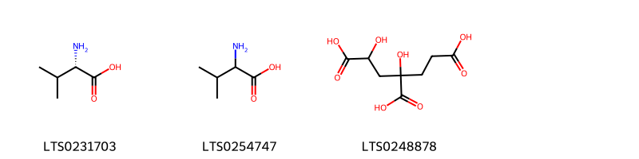{ width=100% }
    <figcaption>Hình ảnh cấu trúc hóa học của 3 hoạt chất thuộc nhóm Carboxylic acids and derivatives gồm ['l-valine (LTS0231703)', 'valin (LTS0254747)', '1,3-dihydroxypentane-1,3,5-tricarboxylic acid (LTS0248878)'].</figcaption>
</figure>
#### Nhóm Coumarins and derivatives
<figure markdown="span">
    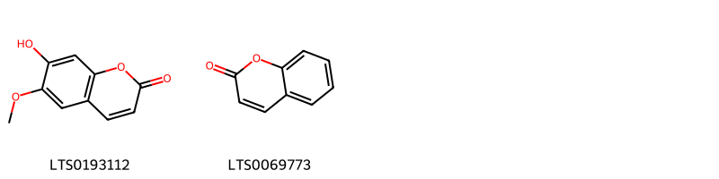{ width=100% }
    <figcaption>Hình ảnh cấu trúc hóa học của 2 hoạt chất thuộc nhóm Coumarins and derivatives gồm ['scopoletin (LTS0193112)', '2h-1-benzopyran-2-one (LTS0069773)'].</figcaption>
</figure>
#### Nhóm Fatty Acyls
<figure markdown="span">
    { width=100% }
    <figcaption>Hình ảnh cấu trúc hóa học của 2 hoạt chất thuộc nhóm Fatty Acyls gồm ['ricinoleic acid (LTS0040547)', '12-hydroxy-9-octadecenoic acid (LTS0020460)'].</figcaption>
</figure>
#### Nhóm Organooxygen compounds
<figure markdown="span">
    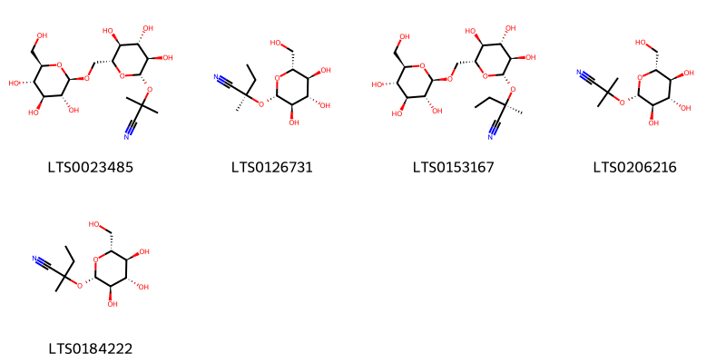{ width=100% }
    <figcaption>Hình ảnh cấu trúc hóa học của 5 hoạt chất thuộc nhóm Organooxygen compounds gồm ['linustatin (LTS0023485)', 'lotaustralin (LTS0126731)', 'neolinustatin (LTS0153167)', 'linamarin (LTS0206216)', '2-methyl-2-{[(2s,3r,4s,5s,6r)-3,4,5-trihydroxy-6-(hydroxymethyl)oxan-2-yl]oxy}butanenitrile (LTS0184222)'].</figcaption>
</figure>
#### Nhóm Prenol lipids
<figure markdown="span">
    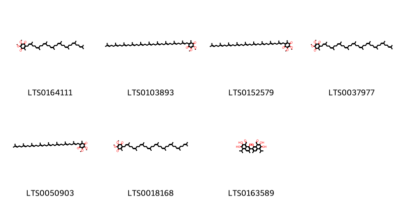{ width=100% }
    <figcaption>Hình ảnh cấu trúc hóa học của 7 hoạt chất thuộc nhóm Prenol lipids gồm ['2,3-dimethoxy-5-methyl-6-(3,7,11,15,19,23,27,31-octamethyldotriaconta-2,6,10,14,18,22,26,30-octaen-1-yl)cyclohexa-2,5-diene-1,4-dione (LTS0164111)', 'coenzyme q10 (LTS0103893)', 'ubiquinone-9 (LTS0152579)', '2-(3,7,11,15,19,23,27,31,35,39-decamethyltetraconta-2,6,10,14,18,22,26,30,34,38-decaen-1-yl)-5,6-dimethoxy-3-methylcyclohexa-2,5-diene-1,4-dione (LTS0037977)', 'ubiquinone 8 (LTS0050903)', '2,3-dimethoxy-5-methyl-6-(3,7,11,15,19,23,27,31,35-nonamethylhexatriaconta-2,6,10,14,18,22,26,30,34-nonaen-1-yl)cyclohexa-2,5-diene-1,4-dione (LTS0018168)', '(-)-gossypol (LTS0163589)'].</figcaption>
</figure>

---

### Dược dân tộc học

Danh sách các quốc gia có sử dụng *Hevea brasiliensis* trong điều trị các bệnh. 

| Country   | Disease   | Bệnh                                                                                                                                                                                                |
|:----------|:----------|:----------------------------------------------------------------------------------------------------------------------------------------------------------------------------------------------------|
| Elsewhere | Soap      | MYMEMORY WARNING: YOU USED ALL AVAILABLE FREE TRANSLATIONS FOR TODAY. NEXT AVAILABLE IN  19 HOURS 41 MINUTES 18 SECONDS VISIT HTTPS://MYMEMORY.TRANSLATED.NET/DOC/USAGELIMITS.PHP TO TRANSLATE MORE |

---

# Chi Caryodendron

??? note "Danh sách các dược liệu thuộc chi"
    
	 - *Caryodendron orinocense*

---
## Caryodendron orinocense
### Thông tin về thực vật

!!! info "Phân loại thực vật của *Caryodendron orinocense* từ GIBF:"
    - **Kingdom:** Plantae
    - **Phylum:** Tracheophyta
    - **Order:** Malpighiales
    - **Family:** Euphorbiaceae
    - **Genus:** Caryodendron
    - **Species:** *Caryodendron orinocense*

 

| Label (VI)   | Label (EN)   | Scientific Name         | Descriptions (VI)   | Descriptions (EN)   | Also Known As (VI)   | Also Known As (EN)   |
|:-------------|:-------------|:------------------------|:--------------------|:--------------------|:---------------------|:---------------------|
| N/A          | N/A          | Caryodendron orinocense |                     | species of tree     | ['']                 | ['']                 |

#### Phân bố trên thế giới

**Từ CSDL GIBF** Ecuador, Colombia

#### Phân bố tại Việt Nam

**Từ CSDL GIBF**: Không có ghi nhận ở Việt Nam

---
### Thành phần hóa học
        
- Theo cơ sở dữ liệu lotus: Từ loài *Caryodendron orinocense* đã phân lập và xác định được 7 hoạt chất thuộc về các nhóm Fatty Acyls, Prenol lipids. 

|    | chemicalTaxonomyClassyfireClass   |   smiles_count |
|---:|:----------------------------------|---------------:|
|  0 | Fatty Acyls                       |              1 |
|  1 | Prenol lipids                     |              6 |

#### Nhóm Fatty Acyls
<figure markdown="span">
    { width=100% }
    <figcaption>Hình ảnh cấu trúc hóa học của 1 hoạt chất thuộc nhóm Fatty Acyls gồm ['linoleic (LTS0013198)'].</figcaption>
</figure>
#### Nhóm Prenol lipids
<figure markdown="span">
    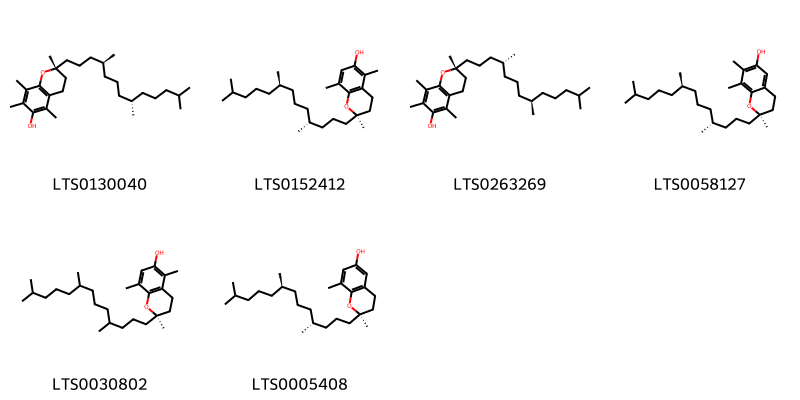{ width=100% }
    <figcaption>Hình ảnh cấu trúc hóa học của 6 hoạt chất thuộc nhóm Prenol lipids gồm ['(2r)-2,5,7,8-tetramethyl-2-[(4s,8s)-4,8,12-trimethyltridecyl]-3,4-dihydro-1-benzopyran-6-ol (LTS0130040)', 'β-tocopherol (LTS0152412)', 'vitamin e (LTS0263269)', 'gamma-tocopherol (LTS0058127)', '(2r)-2,5,8-trimethyl-2-(4,8,12-trimethyltridecyl)-3,4-dihydro-1-benzopyran-6-ol (LTS0030802)', 'delta-tocopherol (LTS0005408)'].</figcaption>
</figure>

---

### Dược dân tộc học

Danh sách các quốc gia có sử dụng *Caryodendron orinocense* trong điều trị các bệnh. 

| Country   | Disease   | Bệnh                                                                                                                                                                                                |
|:----------|:----------|:----------------------------------------------------------------------------------------------------------------------------------------------------------------------------------------------------|
| Amazon    | Soap      | MYMEMORY WARNING: YOU USED ALL AVAILABLE FREE TRANSLATIONS FOR TODAY. NEXT AVAILABLE IN  19 HOURS 40 MINUTES 41 SECONDS VISIT HTTPS://MYMEMORY.TRANSLATED.NET/DOC/USAGELIMITS.PHP TO TRANSLATE MORE |

---

# Chi Homalanthus

??? note "Danh sách các dược liệu thuộc chi"
    
	 - *Homalanthus populneus*

---
## Homalanthus populneus
### Thông tin về thực vật

!!! info "Phân loại thực vật của *Homalanthus populneus* từ GIBF:"
    - **Kingdom:** Plantae
    - **Phylum:** Tracheophyta
    - **Order:** Malpighiales
    - **Family:** Euphorbiaceae
    - **Genus:** Homalanthus
    - **Species:** *Homalanthus populneus*

 

| Label (VI)   | Label (EN)   | Scientific Name       | Descriptions (VI)   | Descriptions (EN)   | Also Known As (VI)   | Also Known As (EN)   |
|:-------------|:-------------|:----------------------|:--------------------|:--------------------|:---------------------|:---------------------|
| N/A          | N/A          | Homalanthus populneus | loài thực vật       | species of plant    | ['']                 | ['']                 |

#### Phân bố trên thế giới

**Từ CSDL GIBF** Sri Lanka, Malaysia, Portugal, Indonesia, United States of America, Philippines, Viet Nam, Brunei Darussalam

#### Phân bố tại Việt Nam

**Từ CSDL GIBF**: Tỉnh Khánh Hòa

---
### Thành phần hóa học
        
- Theo cơ sở dữ liệu lotus: Từ loài *Homalanthus populneus* đã phân lập và xác định được Chưa có hoạt chất nào được phân lập. hoạt chất thuộc về các nhóm Không có hoạt chất nào được phân lập. 

Không có hình ảnh nào được tạo ra

---

### Dược dân tộc học

Danh sách các quốc gia có sử dụng *Homalanthus populneus* trong điều trị các bệnh. 

| Country     | Disease   | Bệnh                                                                                                                                                                                                |
|:------------|:----------|:----------------------------------------------------------------------------------------------------------------------------------------------------------------------------------------------------|
| Philippines | Piscicide | MYMEMORY WARNING: YOU USED ALL AVAILABLE FREE TRANSLATIONS FOR TODAY. NEXT AVAILABLE IN  19 HOURS 40 MINUTES 05 SECONDS VISIT HTTPS://MYMEMORY.TRANSLATED.NET/DOC/USAGELIMITS.PHP TO TRANSLATE MORE |

---

# Chi Stillingia

??? note "Danh sách các dược liệu thuộc chi"
    
	 - *Stillingia acutifolia*
	 - *Stillingia sebifera*
	 - *Stillingia sylvatica*
	 - *Stillingia texana*
	 - *Stillingia treculeana*

---
## Stillingia acutifolia
### Thông tin về thực vật

!!! info "Phân loại thực vật của *Stillingia acutifolia* từ GIBF:"
    - **Kingdom:** Plantae
    - **Phylum:** Tracheophyta
    - **Order:** Malpighiales
    - **Family:** Euphorbiaceae
    - **Genus:** Stillingia
    - **Species:** *Stillingia acutifolia*

 

| Label (VI)   | Label (EN)   | Scientific Name       | Descriptions (VI)   | Descriptions (EN)   | Also Known As (VI)   | Also Known As (EN)   |
|:-------------|:-------------|:----------------------|:--------------------|:--------------------|:---------------------|:---------------------|
| N/A          | N/A          | Stillingia acutifolia | loài thực vật       | species of plant    | ['']                 | ['']                 |

#### Phân bố trên thế giới

**Từ CSDL GIBF** Costa Rica, Honduras, Guatemala, Mexico

#### Phân bố tại Việt Nam

**Từ CSDL GIBF**: Không có ghi nhận ở Việt Nam

---
### Thành phần hóa học
        
- Theo cơ sở dữ liệu lotus: Từ loài *Stillingia acutifolia* đã phân lập và xác định được Chưa có hoạt chất nào được phân lập. hoạt chất thuộc về các nhóm Không có hoạt chất nào được phân lập. 

Không có hình ảnh nào được tạo ra

---

### Dược dân tộc học

Danh sách các quốc gia có sử dụng *Stillingia acutifolia* trong điều trị các bệnh. 

| Country   | Disease                  | Bệnh                                                                                                                                                                                                |
|:----------|:-------------------------|:----------------------------------------------------------------------------------------------------------------------------------------------------------------------------------------------------|
| Guatemala | Poison, Poison, Vesicant | MYMEMORY WARNING: YOU USED ALL AVAILABLE FREE TRANSLATIONS FOR TODAY. NEXT AVAILABLE IN  19 HOURS 39 MINUTES 41 SECONDS VISIT HTTPS://MYMEMORY.TRANSLATED.NET/DOC/USAGELIMITS.PHP TO TRANSLATE MORE |
| Mexico    | Poison                   | MYMEMORY WARNING: YOU USED ALL AVAILABLE FREE TRANSLATIONS FOR TODAY. NEXT AVAILABLE IN  19 HOURS 39 MINUTES 38 SECONDS VISIT HTTPS://MYMEMORY.TRANSLATED.NET/DOC/USAGELIMITS.PHP TO TRANSLATE MORE |

---

---
## Stillingia sebifera
### Thông tin về thực vật

!!! info "Phân loại thực vật của *Triadica sebifera* từ GIBF:"
    - **Kingdom:** Plantae
    - **Phylum:** Tracheophyta
    - **Order:** Malpighiales
    - **Family:** Euphorbiaceae
    - **Genus:** Triadica
    - **Species:** *Triadica sebifera*

 

| Label (VI)   | Label (EN)   | Scientific Name     | Descriptions (VI)   | Descriptions (EN)   | Also Known As (VI)   | Also Known As (EN)   |
|:-------------|:-------------|:--------------------|:--------------------|:--------------------|:---------------------|:---------------------|
| N/A          | N/A          | Stillingia sebifera |                     | species of plant    | ['']                 | ['']                 |

#### Phân bố trên thế giới

**Từ CSDL GIBF** nan, Australia, Japan, Mauritius, Algeria, Indonesia, unknown or invalid, Cuba, United States of America, France, China

#### Phân bố tại Việt Nam

**Từ CSDL GIBF**: Không có ghi nhận ở Việt Nam

---
### Thành phần hóa học
        
- Theo cơ sở dữ liệu lotus: Từ loài *Triadica sebifera* đã phân lập và xác định được Chưa có hoạt chất nào được phân lập. hoạt chất thuộc về các nhóm Không có hoạt chất nào được phân lập. 

Không có hình ảnh nào được tạo ra

---

### Dược dân tộc học

Danh sách các quốc gia có sử dụng *Triadica sebifera* trong điều trị các bệnh. 

| Country   | Disease                                       | Bệnh                                                                                                                                                                                                |
|:----------|:----------------------------------------------|:----------------------------------------------------------------------------------------------------------------------------------------------------------------------------------------------------|
| China     | Diuretic, Emetic, Poison, Purgative, Antidote | MYMEMORY WARNING: YOU USED ALL AVAILABLE FREE TRANSLATIONS FOR TODAY. NEXT AVAILABLE IN  19 HOURS 39 MINUTES 12 SECONDS VISIT HTTPS://MYMEMORY.TRANSLATED.NET/DOC/USAGELIMITS.PHP TO TRANSLATE MORE |

---

---
## Stillingia sylvatica
### Thông tin về thực vật

!!! info "Phân loại thực vật của *Stillingia sylvatica* từ GIBF:"
    - **Kingdom:** Plantae
    - **Phylum:** Tracheophyta
    - **Order:** Malpighiales
    - **Family:** Euphorbiaceae
    - **Genus:** Stillingia
    - **Species:** *Stillingia sylvatica*

 

| Label (VI)   | Label (EN)   | Scientific Name      | Descriptions (VI)   | Descriptions (EN)   | Also Known As (VI)   | Also Known As (EN)   |
|:-------------|:-------------|:---------------------|:--------------------|:--------------------|:---------------------|:---------------------|
| N/A          | N/A          | Stillingia sylvatica | loài thực vật       | species of plant    | ['']                 | ['']                 |

#### Phân bố trên thế giới

**Từ CSDL GIBF** nan, United States of America

#### Phân bố tại Việt Nam

**Từ CSDL GIBF**: Không có ghi nhận ở Việt Nam

---
### Thành phần hóa học
        
- Theo cơ sở dữ liệu lotus: Từ loài *Stillingia sylvatica* đã phân lập và xác định được Chưa có hoạt chất nào được phân lập. hoạt chất thuộc về các nhóm Không có hoạt chất nào được phân lập. 

Không có hình ảnh nào được tạo ra

---

### Dược dân tộc học

Danh sách các quốc gia có sử dụng *Stillingia sylvatica* trong điều trị các bệnh. 

| Country      | Disease                                        | Bệnh                                                                                                                                                                                                |
|:-------------|:-----------------------------------------------|:----------------------------------------------------------------------------------------------------------------------------------------------------------------------------------------------------|
| English      | Diuretic, Expectorant, Laxative, Tonic, Poison | MYMEMORY WARNING: YOU USED ALL AVAILABLE FREE TRANSLATIONS FOR TODAY. NEXT AVAILABLE IN  19 HOURS 38 MINUTES 45 SECONDS VISIT HTTPS://MYMEMORY.TRANSLATED.NET/DOC/USAGELIMITS.PHP TO TRANSLATE MORE |
| French       | Sialogogue                                     | MYMEMORY WARNING: YOU USED ALL AVAILABLE FREE TRANSLATIONS FOR TODAY. NEXT AVAILABLE IN  19 HOURS 38 MINUTES 42 SECONDS VISIT HTTPS://MYMEMORY.TRANSLATED.NET/DOC/USAGELIMITS.PHP TO TRANSLATE MORE |
| Mexico       | Cathartic, Emetic                              | MYMEMORY WARNING: YOU USED ALL AVAILABLE FREE TRANSLATIONS FOR TODAY. NEXT AVAILABLE IN  19 HOURS 38 MINUTES 39 SECONDS VISIT HTTPS://MYMEMORY.TRANSLATED.NET/DOC/USAGELIMITS.PHP TO TRANSLATE MORE |
| US           | Laxative, Tonic, Diuretic                      | MYMEMORY WARNING: YOU USED ALL AVAILABLE FREE TRANSLATIONS FOR TODAY. NEXT AVAILABLE IN  19 HOURS 38 MINUTES 36 SECONDS VISIT HTTPS://MYMEMORY.TRANSLATED.NET/DOC/USAGELIMITS.PHP TO TRANSLATE MORE |
| US(Colonial) | Emetic, Laxative                               | MYMEMORY WARNING: YOU USED ALL AVAILABLE FREE TRANSLATIONS FOR TODAY. NEXT AVAILABLE IN  19 HOURS 38 MINUTES 33 SECONDS VISIT HTTPS://MYMEMORY.TRANSLATED.NET/DOC/USAGELIMITS.PHP TO TRANSLATE MORE |

---

---
## Stillingia texana
### Thông tin về thực vật

!!! info "Phân loại thực vật của *Stillingia texana* từ GIBF:"
    - **Kingdom:** Plantae
    - **Phylum:** Tracheophyta
    - **Order:** Malpighiales
    - **Family:** Euphorbiaceae
    - **Genus:** Stillingia
    - **Species:** *Stillingia texana*

 

| Label (VI)   | Label (EN)   | Scientific Name   | Descriptions (VI)   | Descriptions (EN)   | Also Known As (VI)   | Also Known As (EN)   |
|:-------------|:-------------|:------------------|:--------------------|:--------------------|:---------------------|:---------------------|
| N/A          | N/A          | Stillingia texana | loài thực vật       | species of plant    | ['']                 | ['']                 |

#### Phân bố trên thế giới

**Từ CSDL GIBF** United States of America

#### Phân bố tại Việt Nam

**Từ CSDL GIBF**: Không có ghi nhận ở Việt Nam

---
### Thành phần hóa học
        
- Theo cơ sở dữ liệu lotus: Từ loài *Stillingia texana* đã phân lập và xác định được Chưa có hoạt chất nào được phân lập. hoạt chất thuộc về các nhóm Không có hoạt chất nào được phân lập. 

Không có hình ảnh nào được tạo ra

---

### Dược dân tộc học

Danh sách các quốc gia có sử dụng *Stillingia texana* trong điều trị các bệnh. 

| Country   | Disease   | Bệnh                                                                                                                                                                                                |
|:----------|:----------|:----------------------------------------------------------------------------------------------------------------------------------------------------------------------------------------------------|
| US        | Vesicant  | MYMEMORY WARNING: YOU USED ALL AVAILABLE FREE TRANSLATIONS FOR TODAY. NEXT AVAILABLE IN  19 HOURS 38 MINUTES 07 SECONDS VISIT HTTPS://MYMEMORY.TRANSLATED.NET/DOC/USAGELIMITS.PHP TO TRANSLATE MORE |

---

---
## Stillingia treculeana
### Thông tin về thực vật

!!! info "Phân loại thực vật của *Stillingia treculiana* từ GIBF:"
    - **Kingdom:** Plantae
    - **Phylum:** Tracheophyta
    - **Order:** Malpighiales
    - **Family:** Euphorbiaceae
    - **Genus:** Stillingia
    - **Species:** *Stillingia treculiana*

 

| Label (VI)   | Label (EN)   | Scientific Name   | Descriptions (VI)   | Descriptions (EN)   | Also Known As (VI)   | Also Known As (EN)   |
|:-------------|:-------------|:------------------|:--------------------|:--------------------|:---------------------|:---------------------|
| N/A          | N/A          | Stillingia texana | loài thực vật       | species of plant    | ['']                 | ['']                 |

#### Phân bố trên thế giới

**Từ CSDL GIBF** Brazil, United States of America, Mexico

#### Phân bố tại Việt Nam

**Từ CSDL GIBF**: Không có ghi nhận ở Việt Nam

---
### Thành phần hóa học
        
- Theo cơ sở dữ liệu lotus: Từ loài *Stillingia treculiana* đã phân lập và xác định được Chưa có hoạt chất nào được phân lập. hoạt chất thuộc về các nhóm Không có hoạt chất nào được phân lập. 

Không có hình ảnh nào được tạo ra

---

### Dược dân tộc học

Danh sách các quốc gia có sử dụng *Stillingia treculiana* trong điều trị các bệnh. 

| Country   | Disease   | Bệnh                                                                                                                                                                                                |
|:----------|:----------|:----------------------------------------------------------------------------------------------------------------------------------------------------------------------------------------------------|
| US        | Poison    | MYMEMORY WARNING: YOU USED ALL AVAILABLE FREE TRANSLATIONS FOR TODAY. NEXT AVAILABLE IN  19 HOURS 36 MINUTES 00 SECONDS VISIT HTTPS://MYMEMORY.TRANSLATED.NET/DOC/USAGELIMITS.PHP TO TRANSLATE MORE |

---

# Chi Jatropha

??? note "Danh sách các dược liệu thuộc chi"
    
	 - *Jatropha angusti*
	 - *Jatropha athulata*
	 - *Jatropha ciliata*
	 - *Jatropha cinerea*
	 - *Jatropha curcas*
	 - *Jatropha gaumeri*
	 - *Jatropha glandsulifera*
	 - *Jatropha gossypifolia*
	 - *Jatropha gossypiifolia*
	 - *Jatropha integerrima*
	 - *Jatropha isabelli*
	 - *Jatropha macrorhiza*
	 - *Jatropha multifida*
	 - *Jatropha urens*

---
## Jatropha angusti
### Thông tin về thực vật

!!! info "Phân loại thực vật của *Jatropha augusti* từ GIBF:"
    - **Kingdom:** Plantae
    - **Phylum:** Tracheophyta
    - **Order:** Malpighiales
    - **Family:** Euphorbiaceae
    - **Genus:** Jatropha
    - **Species:** *Jatropha augusti*

 

| Label (VI)   | Label (EN)   | Scientific Name   | Descriptions (VI)   | Descriptions (EN)   | Also Known As (VI)   | Also Known As (EN)   |
|:-------------|:-------------|:------------------|:--------------------|:--------------------|:---------------------|:---------------------|
| N/A          | N/A          | Stillingia texana | loài thực vật       | species of plant    | ['']                 | ['']                 |

#### Phân bố trên thế giới

**Từ CSDL GIBF** nan, Ecuador, United States of America, Peru, Mexico

#### Phân bố tại Việt Nam

**Từ CSDL GIBF**: Không có ghi nhận ở Việt Nam

---
### Thành phần hóa học
        
- Theo cơ sở dữ liệu lotus: Từ loài *Jatropha augusti* đã phân lập và xác định được Chưa có hoạt chất nào được phân lập. hoạt chất thuộc về các nhóm Không có hoạt chất nào được phân lập. 

Không có hình ảnh nào được tạo ra

---

### Dược dân tộc học

Danh sách các quốc gia có sử dụng *Jatropha augusti* trong điều trị các bệnh. 

| Country   | Disease     | Bệnh                                                                                                                                                                                                |
|:----------|:------------|:----------------------------------------------------------------------------------------------------------------------------------------------------------------------------------------------------|
| Peru      | Aphrodisiac | MYMEMORY WARNING: YOU USED ALL AVAILABLE FREE TRANSLATIONS FOR TODAY. NEXT AVAILABLE IN  19 HOURS 34 MINUTES 40 SECONDS VISIT HTTPS://MYMEMORY.TRANSLATED.NET/DOC/USAGELIMITS.PHP TO TRANSLATE MORE |

---

---
## Jatropha athulata
### Thông tin về thực vật

!!! info "Phân loại thực vật của *Jatropha spinosa* từ GIBF:"
    - **Kingdom:** Plantae
    - **Phylum:** Tracheophyta
    - **Order:** Malpighiales
    - **Family:** Euphorbiaceae
    - **Genus:** Jatropha
    - **Species:** *Jatropha spinosa*

 

| Label (VI)   | Label (EN)   | Scientific Name   | Descriptions (VI)   | Descriptions (EN)   | Also Known As (VI)   | Also Known As (EN)   |
|:-------------|:-------------|:------------------|:--------------------|:--------------------|:---------------------|:---------------------|
| N/A          | N/A          | Stillingia texana | loài thực vật       | species of plant    | ['']                 | ['']                 |

#### Phân bố trên thế giới

**Từ CSDL GIBF** nan, Yemen

#### Phân bố tại Việt Nam

**Từ CSDL GIBF**: Không có ghi nhận ở Việt Nam

---
### Thành phần hóa học
        
- Theo cơ sở dữ liệu lotus: Từ loài *Jatropha spinosa* đã phân lập và xác định được Chưa có hoạt chất nào được phân lập. hoạt chất thuộc về các nhóm Không có hoạt chất nào được phân lập. 

Không có hình ảnh nào được tạo ra

---

### Dược dân tộc học

Danh sách các quốc gia có sử dụng *Jatropha spinosa* trong điều trị các bệnh. 

| Country   | Disease    | Bệnh                                                                                                                                                                                                |
|:----------|:-----------|:----------------------------------------------------------------------------------------------------------------------------------------------------------------------------------------------------|
| Mexico    | Dentifrice | MYMEMORY WARNING: YOU USED ALL AVAILABLE FREE TRANSLATIONS FOR TODAY. NEXT AVAILABLE IN  19 HOURS 34 MINUTES 11 SECONDS VISIT HTTPS://MYMEMORY.TRANSLATED.NET/DOC/USAGELIMITS.PHP TO TRANSLATE MORE |

---

---
## Jatropha ciliata
### Thông tin về thực vật

!!! info "Phân loại thực vật của *Jatropha ciliata* từ GIBF:"
    - **Kingdom:** Plantae
    - **Phylum:** Tracheophyta
    - **Order:** Malpighiales
    - **Family:** Euphorbiaceae
    - **Genus:** Jatropha
    - **Species:** *Jatropha ciliata*

 

| Label (VI)   | Label (EN)   | Scientific Name   | Descriptions (VI)   | Descriptions (EN)   | Also Known As (VI)   | Also Known As (EN)   |
|:-------------|:-------------|:------------------|:--------------------|:--------------------|:---------------------|:---------------------|
| N/A          | N/A          | Jatropha ciliata  | loài thực vật       | species of plant    | ['']                 | ['']                 |

#### Phân bố trên thế giới

**Từ CSDL GIBF** nan, Ecuador, Peru, Mexico

#### Phân bố tại Việt Nam

**Từ CSDL GIBF**: Không có ghi nhận ở Việt Nam

---
### Thành phần hóa học
        
- Theo cơ sở dữ liệu lotus: Từ loài *Jatropha ciliata* đã phân lập và xác định được 3 hoạt chất thuộc về các nhóm Flavonoids, Coumarins and derivatives. 

|    | chemicalTaxonomyClassyfireClass   |   smiles_count |
|---:|:----------------------------------|---------------:|
|  0 | Coumarins and derivatives         |              1 |
|  1 | Flavonoids                        |              2 |

#### Nhóm Coumarins and derivatives
<figure markdown="span">
    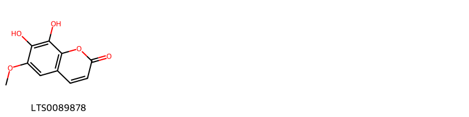{ width=100% }
    <figcaption>Hình ảnh cấu trúc hóa học của 1 hoạt chất thuộc nhóm Coumarins and derivatives gồm ['fraxetin (LTS0089878)'].</figcaption>
</figure>
#### Nhóm Flavonoids
<figure markdown="span">
    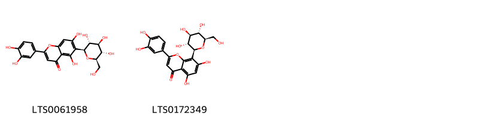{ width=100% }
    <figcaption>Hình ảnh cấu trúc hóa học của 2 hoạt chất thuộc nhóm Flavonoids gồm ['isoorientin (LTS0061958)', 'orientin (LTS0172349)'].</figcaption>
</figure>

---

### Dược dân tộc học

Danh sách các quốc gia có sử dụng *Jatropha ciliata* trong điều trị các bệnh. 

| Country   | Disease     | Bệnh                                                                                                                                                                                                |
|:----------|:------------|:----------------------------------------------------------------------------------------------------------------------------------------------------------------------------------------------------|
| Peru      | Aphrodisiac | MYMEMORY WARNING: YOU USED ALL AVAILABLE FREE TRANSLATIONS FOR TODAY. NEXT AVAILABLE IN  19 HOURS 33 MINUTES 44 SECONDS VISIT HTTPS://MYMEMORY.TRANSLATED.NET/DOC/USAGELIMITS.PHP TO TRANSLATE MORE |

---

---
## Jatropha cinerea
### Thông tin về thực vật

!!! info "Phân loại thực vật của *Jatropha cinerea* từ GIBF:"
    - **Kingdom:** Plantae
    - **Phylum:** Tracheophyta
    - **Order:** Malpighiales
    - **Family:** Euphorbiaceae
    - **Genus:** Jatropha
    - **Species:** *Jatropha cinerea*

 

| Label (VI)   | Label (EN)   | Scientific Name   | Descriptions (VI)   | Descriptions (EN)   | Also Known As (VI)   | Also Known As (EN)   |
|:-------------|:-------------|:------------------|:--------------------|:--------------------|:---------------------|:---------------------|
| N/A          | N/A          | Jatropha cinerea  | loài thực vật       | species of plant    | ['']                 | ['']                 |

#### Phân bố trên thế giới

**Từ CSDL GIBF** United States of America, Mexico

#### Phân bố tại Việt Nam

**Từ CSDL GIBF**: Không có ghi nhận ở Việt Nam

---
### Thành phần hóa học
        
- Theo cơ sở dữ liệu lotus: Từ loài *Jatropha cinerea* đã phân lập và xác định được Chưa có hoạt chất nào được phân lập. hoạt chất thuộc về các nhóm Không có hoạt chất nào được phân lập. 

Không có hình ảnh nào được tạo ra

---

### Dược dân tộc học

Danh sách các quốc gia có sử dụng *Jatropha cinerea* trong điều trị các bệnh. 

| Country   | Disease    | Bệnh                                                                                                                                                                                                |
|:----------|:-----------|:----------------------------------------------------------------------------------------------------------------------------------------------------------------------------------------------------|
| Mexico    | Astringent | MYMEMORY WARNING: YOU USED ALL AVAILABLE FREE TRANSLATIONS FOR TODAY. NEXT AVAILABLE IN  19 HOURS 33 MINUTES 04 SECONDS VISIT HTTPS://MYMEMORY.TRANSLATED.NET/DOC/USAGELIMITS.PHP TO TRANSLATE MORE |

---

---
## Jatropha curcas
### Thông tin về thực vật

!!! info "Phân loại thực vật của *Jatropha curcas* từ GIBF:"
    - **Kingdom:** Plantae
    - **Phylum:** Tracheophyta
    - **Order:** Malpighiales
    - **Family:** Euphorbiaceae
    - **Genus:** Jatropha
    - **Species:** *Jatropha curcas*

 

| Label (VI)   | Label (EN)   | Scientific Name   | Descriptions (VI)   | Descriptions (EN)   | Also Known As (VI)                                                                                 | Also Known As (EN)                                             |
|:-------------|:-------------|:------------------|:--------------------|:--------------------|:---------------------------------------------------------------------------------------------------|:---------------------------------------------------------------|
| N/A          | N/A          | Jatropha curcas   | loài thực vật       | species of plant    | ['Jatropha curcas', 'Cọc rào', 'Cọc giậu', 'Cây dầu mè', 'Cây cọc rào', 'Cây cọc giậu', 'Dầu lai'] | ['Jatropha curcas', 'physic nut', 'purging nut', 'bubblebush'] |

#### Phân bố trên thế giới

**Từ CSDL GIBF** nan, Sri Lanka, Ghana, Australia, Cook Islands, Lao People’s Democratic Republic, Guadeloupe, Guatemala, Mozambique, Argentina, Benin, Nicaragua, French Guiana, Panama, Malawi, Togo, Puerto Rico, Réunion, Senegal, Nigeria, Namibia, Chinese Taipei, Bolivia (Plurinational State of), Honduras, United States of America, Timor-Leste, El Salvador, Uganda, Suriname, Thailand, Brazil, Côte d’Ivoire, Guyana, New Caledonia, Mexico, Dominican Republic, Peru, Singapore, Viet Nam, China, Ecuador, Cabo Verde, Haiti, Colombia, Costa Rica, India, Indonesia, Nepal, Cayman Islands, Philippines, Malaysia, Northern Mariana Islands, Ethiopia

#### Phân bố tại Việt Nam

**Từ CSDL GIBF**: Bình Định, Hòa Bình

---
### Thành phần hóa học
        
- Theo cơ sở dữ liệu lotus: Từ loài *Jatropha curcas* đã phân lập và xác định được 91 hoạt chất thuộc về các nhóm Fatty Acyls, Naphthalenes, Macrolactams, Prenol lipids, Pyrrolidines, Cinnamic acids and derivatives, Azoles, Tetralins, Indanes, Organooxygen compounds, Phenols, Coumarins and derivatives, Carboxylic acids and derivatives, Diazines, Anthracenes. 

|    | chemicalTaxonomyClassyfireClass   |   smiles_count |
|---:|:----------------------------------|---------------:|
|  0 | Anthracenes                       |              2 |
|  1 | Azoles                            |              1 |
|  2 | Carboxylic acids and derivatives  |              2 |
|  3 | Cinnamic acids and derivatives    |              2 |
|  4 | Coumarins and derivatives         |              1 |
|  5 | Diazines                          |              1 |
|  6 | Fatty Acyls                       |              5 |
|  7 | Indanes                           |              6 |
|  8 | Macrolactams                      |              2 |
|  9 | Naphthalenes                      |              1 |
| 10 | Organooxygen compounds            |              2 |
| 11 | Phenols                           |              3 |
| 12 | Prenol lipids                     |             58 |
| 13 | Pyrrolidines                      |              1 |
| 14 | Tetralins                         |              4 |

#### Nhóm Anthracenes
<figure markdown="span">
    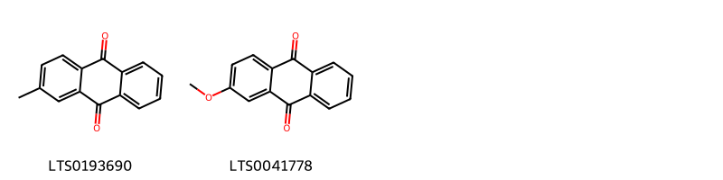{ width=100% }
    <figcaption>Hình ảnh cấu trúc hóa học của 2 hoạt chất thuộc nhóm Anthracenes gồm ['2-methylanthraquinone (LTS0193690)', '2-methoxy-9,10-anthracenedione (LTS0041778)'].</figcaption>
</figure>
#### Nhóm Azoles
<figure markdown="span">
    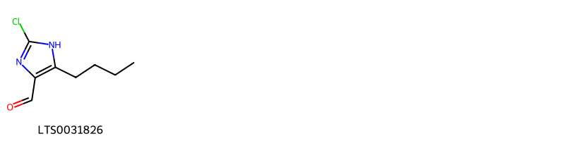{ width=100% }
    <figcaption>Hình ảnh cấu trúc hóa học của 1 hoạt chất thuộc nhóm Azoles gồm ['5-butyl-2-chloro-1h-imidazole-4-carbaldehyde (LTS0031826)'].</figcaption>
</figure>
#### Nhóm Carboxylic acids and derivatives
<figure markdown="span">
    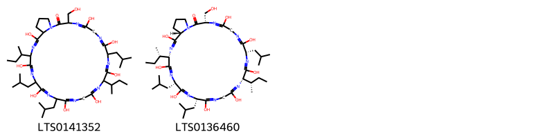{ width=100% }
    <figcaption>Hình ảnh cấu trúc hóa học của 2 hoạt chất thuộc nhóm Carboxylic acids and derivatives gồm ['1,4,7,10,13,16,19,22-octahydroxy-24-(hydroxymethyl)-6,9,18-tris(2-methylpropyl)-3,15-bis(sec-butyl)-3h,6h,9h,12h,15h,18h,21h,24h,27h,28h,29h,29ah-pyrrolo[1,2-a]1,4,7,10,13,16,19,22,25-nonaazacycloheptacosan-25-one (LTS0141352)', '(3s,6s,9s,15s,18s,24s,29as)-3,15-bis[(2s)-butan-2-yl]-1,4,7,10,13,16,19,22-octahydroxy-24-(hydroxymethyl)-6,9,18-tris(2-methylpropyl)-3h,6h,9h,12h,15h,18h,21h,24h,27h,28h,29h,29ah-pyrrolo[1,2-a]1,4,7,10,13,16,19,22,25-nonaazacycloheptacosan-25-one (LTS0136460)'].</figcaption>
</figure>
#### Nhóm Cinnamic acids and derivatives
<figure markdown="span">
    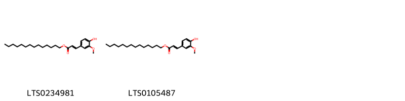{ width=100% }
    <figcaption>Hình ảnh cấu trúc hóa học của 2 hoạt chất thuộc nhóm Cinnamic acids and derivatives gồm ['tetradecyl 3-(4-hydroxy-3-methoxyphenyl)prop-2-enoate (LTS0234981)', 'tetradecyl (2e)-3-(4-hydroxy-3-methoxyphenyl)prop-2-enoate (LTS0105487)'].</figcaption>
</figure>
#### Nhóm Coumarins and derivatives
<figure markdown="span">
    { width=100% }
    <figcaption>Hình ảnh cấu trúc hóa học của 1 hoạt chất thuộc nhóm Coumarins and derivatives gồm ['scoparone (LTS0210705)'].</figcaption>
</figure>
#### Nhóm Diazines
<figure markdown="span">
    { width=100% }
    <figcaption>Hình ảnh cấu trúc hóa học của 1 hoạt chất thuộc nhóm Diazines gồm ['pirod (LTS0008205)'].</figcaption>
</figure>
#### Nhóm Fatty Acyls
<figure markdown="span">
    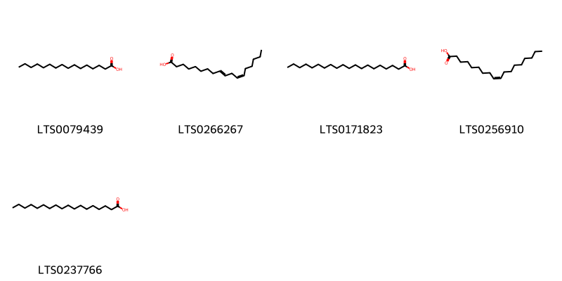{ width=100% }
    <figcaption>Hình ảnh cấu trúc hóa học của 5 hoạt chất thuộc nhóm Fatty Acyls gồm ['palmitic acid (LTS0079439)', '10-trans,12-cis-linoleic acid (LTS0266267)', 'arachidic acid (LTS0171823)', 'oleic acid (LTS0256910)', 'stearic acid (LTS0237766)'].</figcaption>
</figure>
#### Nhóm Indanes
<figure markdown="span">
    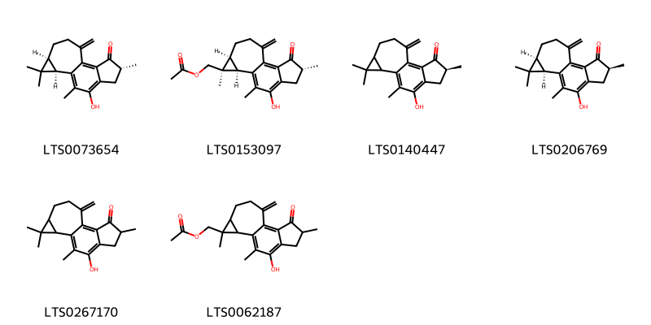{ width=100% }
    <figcaption>Hình ảnh cấu trúc hóa học của 6 hoạt chất thuộc nhóm Indanes gồm ['(4r,10r,12s)-7-hydroxy-4,8,11,11-tetramethyl-15-methylidenetetracyclo[7.6.0.0²,⁶.0¹⁰,¹²]pentadeca-1,6,8-trien-3-one (LTS0073654)', '[(4r,10s,11s,12s)-7-hydroxy-4,8,11-trimethyl-15-methylidene-3-oxotetracyclo[7.6.0.0²,⁶.0¹⁰,¹²]pentadeca-1,6,8-trien-11-yl]methyl acetate (LTS0153097)', '(4s)-7-hydroxy-4,8,11,11-tetramethyl-15-methylidenetetracyclo[7.6.0.0²,⁶.0¹⁰,¹²]pentadeca-1,6,8-trien-3-one (LTS0140447)', '(4s,10r,12s)-7-hydroxy-4,8,11,11-tetramethyl-15-methylidenetetracyclo[7.6.0.0²,⁶.0¹⁰,¹²]pentadeca-1,6,8-trien-3-one (LTS0206769)', '7-hydroxy-4,8,11,11-tetramethyl-15-methylidenetetracyclo[7.6.0.0²,⁶.0¹⁰,¹²]pentadeca-1,6,8-trien-3-one (LTS0267170)', '{7-hydroxy-4,8,11-trimethyl-15-methylidene-3-oxotetracyclo[7.6.0.0²,⁶.0¹⁰,¹²]pentadeca-1,6,8-trien-11-yl}methyl acetate (LTS0062187)'].</figcaption>
</figure>
#### Nhóm Macrolactams
<figure markdown="span">
    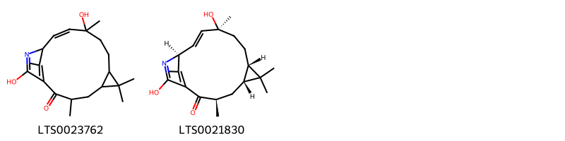{ width=100% }
    <figcaption>Hình ảnh cấu trúc hóa học của 2 hoạt chất thuộc nhóm Macrolactams gồm ['10,15-dihydroxy-3,6,6,10,16-pentamethyl-14-azatricyclo[11.2.1.0⁵,⁷]hexadeca-1(16),11,14-trien-2-one (LTS0023762)', '(3r,5r,7s,10s,11e,13s)-10,15-dihydroxy-3,6,6,10,16-pentamethyl-14-azatricyclo[11.2.1.0⁵,⁷]hexadeca-1(16),11,14-trien-2-one (LTS0021830)'].</figcaption>
</figure>
#### Nhóm Naphthalenes
<figure markdown="span">
    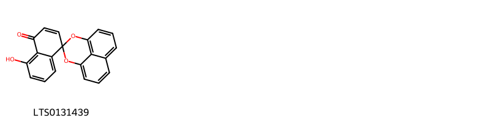{ width=100% }
    <figcaption>Hình ảnh cấu trúc hóa học của 1 hoạt chất thuộc nhóm Naphthalenes gồm ["5-hydroxy-2',4'-dioxaspiro[naphthalene-1,3'-tricyclo[7.3.1.0⁵,¹³]tridecane]-1'(13'),5',7',9',11'-pentaen-4-one (LTS0131439)"].</figcaption>
</figure>
#### Nhóm Organooxygen compounds
<figure markdown="span">
    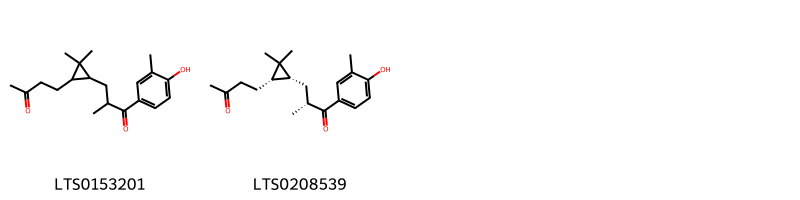{ width=100% }
    <figcaption>Hình ảnh cấu trúc hóa học của 2 hoạt chất thuộc nhóm Organooxygen compounds gồm ['4-{3-[3-(4-hydroxy-3-methylphenyl)-2-methyl-3-oxopropyl]-2,2-dimethylcyclopropyl}butan-2-one (LTS0153201)', '4-[(1s,3r)-3-[(2r)-3-(4-hydroxy-3-methylphenyl)-2-methyl-3-oxopropyl]-2,2-dimethylcyclopropyl]butan-2-one (LTS0208539)'].</figcaption>
</figure>
#### Nhóm Phenols
<figure markdown="span">
    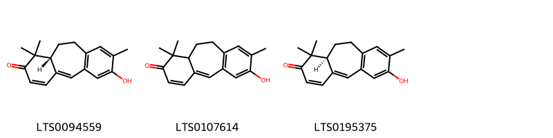{ width=100% }
    <figcaption>Hình ảnh cấu trúc hóa học của 3 hoạt chất thuộc nhóm Phenols gồm ['(8r)-14-hydroxy-7,7,13-trimethyltricyclo[9.4.0.0³,⁸]pentadeca-1(11),2,4,12,14-pentaen-6-one (LTS0094559)', '14-hydroxy-7,7,13-trimethyltricyclo[9.4.0.0³,⁸]pentadeca-1(11),2,4,12,14-pentaen-6-one (LTS0107614)', '(8s)-14-hydroxy-7,7,13-trimethyltricyclo[9.4.0.0³,⁸]pentadeca-1(11),2,4,12,14-pentaen-6-one (LTS0195375)'].</figcaption>
</figure>
#### Nhóm Prenol lipids
<figure markdown="span">
    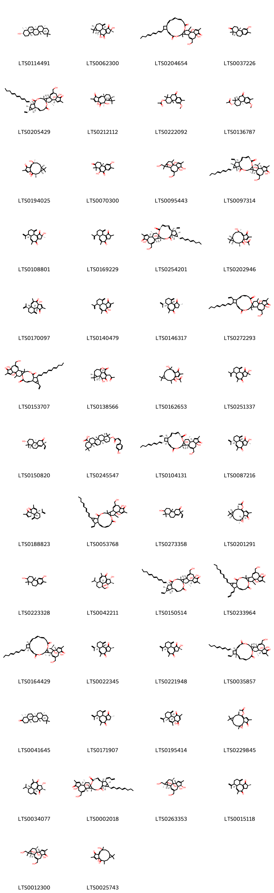{ width=100% }
    <figcaption>Hình ảnh cấu trúc hóa học của 58 hoạt chất thuộc nhóm Prenol lipids gồm ['epi-friedelanol (LTS0114491)', '(1s,4r,8s,9r,10s,12s)-4,8-dihydroxy-4,8,11,11-tetramethyl-15-methylidenetetracyclo[7.6.0.0²,⁶.0¹⁰,¹²]pentadec-2(6)-ene-3,7-dione (LTS0062300)', '(5e,7e)-26,31-dihydroxy-24-(hydroxymethyl)-20,28,32-trimethyl-13-(nona-1,3,5-trien-1-yl)-2,18-dioxahexacyclo[18.13.0.0¹,²¹.0¹¹,¹⁴.0²²,³¹.0²⁶,³⁰]tritriaconta-5,7,9,15,23,28-hexaene-3,17,27-trione (LTS0204654)', '(4as,10ar)-6-hydroxy-1,1,4a,7-tetramethyl-4,9,10,10a-tetrahydro-3h-phenanthren-2-one (LTS0037226)', '(1s,5e,7s,8s,9s,10r,11s,12r,16s,17r,18s,22r,26s,27r,28r)-9-ethenyl-22,27-dihydroxy-20-(hydroxymethyl)-16,24,28-trimethyl-11-[(1e,3e,5e,7e)-undeca-1,3,5,7-tetraen-1-yl]-2,14-dioxaheptacyclo[14.13.0.0¹,¹⁷.0⁷,¹².0⁸,¹⁰.0¹⁸,²⁷.0²²,²⁶]nonacosa-5,19,24-triene-3,13,23-trione (LTS0205429)', '(1s,7s,9r,10r,11s,13s)-7,9-dihydroxy-1,5,9,12,12-pentamethyltetracyclo[8.5.0.0³,⁷.0¹¹,¹³]pentadeca-2,5-diene-4,8-dione (LTS0212112)', '6-methoxy-1,1,4a,7-tetramethyl-9-oxo-3,4,10,10a-tetrahydro-2h-phenanthren-2-yl acetate (LTS0222092)', '(2s,4as,10ar)-6-methoxy-1,1,4a,7-tetramethyl-9-oxo-3,4,10,10a-tetrahydro-2h-phenanthren-2-yl acetate (LTS0136787)', '(1s,3r,5r,7s,10s,11e)-1,10-dihydroxy-3,6,6,10,14-pentamethyltricyclo[10.3.0.0⁵,⁷]pentadeca-11,14-diene-2,13-dione (LTS0194025)', '(4ar)-6,10-dihydroxy-1,1,4a,7-tetramethyl-3,4-dihydrophenanthrene-2,9-dione (LTS0070300)', '8,12-bis(hydroxymethyl)-4,12,15-trimethyltetracyclo[8.5.0.0²,⁶.0¹¹,¹³]pentadeca-3,8-diene-1,5,6,13-tetrol (LTS0095443)', '(1s,5e,7e,9r,10r,11r,12r,13r,14r,18s,19r,20s,24r,28s,29r,30r)-10-ethenyl-24,29-dihydroxy-22-(hydroxymethyl)-18,26,30-trimethyl-12-[(1e,3e,5e)-nona-1,3,5-trien-1-yl]-2,16-dioxaheptacyclo[16.13.0.0¹,¹⁹.0⁹,¹⁴.0¹¹,¹³.0²⁰,²⁹.0²⁴,²⁸]hentriaconta-5,7,21,26-tetraene-3,15,25-trione (LTS0097314)', '(2s,6as)-2-hydroxy-2,5-dimethyl-10-methylidene-7-(prop-1-en-2-yl)-3h,6ah,7h,8h,9h,10ah-cyclohexa[e]azulene-1,4-dione (LTS0108801)', '2,5-dimethyl-10-methylidene-7-(prop-1-en-2-yl)-2h,3h,6ah,7h,8h,9h,10ah-cyclohexa[e]azulene-1,4-dione (LTS0169229)', '(1s,5e,7e,9r,10r,11r,12s,13r,14r,18s,19r,20s,24r,28s,29r,30r)-10-ethenyl-24,29-dihydroxy-22-(hydroxymethyl)-18,26,30-trimethyl-12-[(1e,3e,5e)-nona-1,3,5-trien-1-yl]-2,16-dioxaheptacyclo[16.13.0.0¹,¹⁹.0⁹,¹⁴.0¹¹,¹³.0²⁰,²⁹.0²⁴,²⁸]hentriaconta-5,7,21,26-tetraene-3,15,25-trione (LTS0254201)', '(1r,3s,5s,7r,10r,11e)-10-hydroxy-3,6,6,10,14-pentamethyl-2,13-dioxotricyclo[10.3.0.0⁵,⁷]pentadeca-11,14-dien-1-yl acetate (LTS0202946)', '(3ar,6as,7r,10as,10br)-3a-hydroxy-2,5-dimethyl-10-methylidene-7-(prop-1-en-2-yl)-6ah,7h,8h,9h,10ah,10bh-cyclohexa[e]azulene-1,4-dione (LTS0170097)', '3a-hydroxy-2,5-dimethyl-10-methylidene-7-(prop-1-en-2-yl)-6ah,7h,8h,9h,10ah,10bh-cyclohexa[e]azulene-1,4-dione (LTS0140479)', '(2r,6as,7r,10ar)-2,5-dimethyl-10-methylidene-7-(prop-1-en-2-yl)-2h,3h,6ah,7h,8h,9h,10ah-cyclohexa[e]azulene-1,4-dione (LTS0146317)', '10-ethenyl-24,29-dihydroxy-22-(hydroxymethyl)-18,26,30-trimethyl-11-(nona-1,3,5-trien-1-yl)-2,16-dioxahexacyclo[16.13.0.0¹,¹⁹.0⁹,¹².0²⁰,²⁹.0²⁴,²⁸]hentriaconta-5,7,13,21,26-pentaene-3,15,25-trione (LTS0272293)', '9-ethenyl-22,27-dihydroxy-20-(hydroxymethyl)-16,24,28-trimethyl-11-(undeca-1,3,5,7-tetraen-1-yl)-2,14-dioxaheptacyclo[14.13.0.0¹,¹⁷.0⁷,¹².0⁸,¹⁰.0¹⁸,²⁷.0²²,²⁶]nonacosa-5,19,24-triene-3,13,23-trione (LTS0153707)', '(1s,7s,8r,9s,11s,14r)-7-hydroxy-1,7,10,10-tetramethyl-5-(2-oxopropyl)-2-oxatetracyclo[6.5.1.0⁴,¹⁴.0⁹,¹¹]tetradec-4-ene-3,6-dione (LTS0138566)', '10-hydroxy-3,6,6,10,14-pentamethyl-2,13-dioxotricyclo[10.3.0.0⁵,⁷]pentadeca-11,14-dien-1-yl acetate (LTS0162653)', '2-hydroxy-2,5-dimethyl-10-methylidene-7-(prop-1-en-2-yl)-3h,6ah,7h,8h,9h,10ah-cyclohexa[e]azulene-1,4-dione (LTS0251337)', '(2r,4ar,4bs,7r,8as)-2-ethenyl-7-hydroxy-2,4b,8,8-tetramethyl-4,4a,5,6,7,8a,9,10-octahydrophenanthren-3-one (LTS0150820)', '(4as,6as,6br,8ar,10s,12ar,12br,14bs)-10-{[(2z)-3-(4-hydroxyphenyl)prop-2-enoyl]oxy}-2,2,6a,6b,9,9,12a-heptamethyl-1,3,4,5,6,7,8,8a,10,11,12,12b,13,14b-tetradecahydropicene-4a-carboxylic acid (LTS0245547)', '(1r,5e,7e,9r,10r,11r,12r,13z,18r,19s,20r,24s,28r,29s,30s)-10-ethenyl-24,29-dihydroxy-22-(hydroxymethyl)-18,26,30-trimethyl-11-[(1e,3e,5e)-nona-1,3,5-trien-1-yl]-2,16-dioxahexacyclo[16.13.0.0¹,¹⁹.0⁹,¹².0²⁰,²⁹.0²⁴,²⁸]hentriaconta-5,7,13,21,26-pentaene-3,15,25-trione (LTS0104131)', '(2s,6as,7r,10ar)-2-hydroxy-2,5-dimethyl-10-methylidene-7-(prop-1-en-2-yl)-3h,6ah,7h,8h,9h,10ah-cyclohexa[e]azulene-1,4-dione (LTS0087216)', "(1s,4'as,5'r,8'ar)-3,3'-dimethyl-8'-methylidene-5'-(prop-1-en-2-yl)-5',6',7',8'a-tetrahydro-4'ah-spiro[cyclopentane-1,1'-naphthalen]-3-ene-2,2'-dione (LTS0188823)", '10-ethenyl-24,29-dihydroxy-22-(hydroxymethyl)-18,26,30-trimethyl-12-(nona-1,3,5-trien-1-yl)-2,16-dioxaheptacyclo[16.13.0.0¹,¹⁹.0⁹,¹⁴.0¹¹,¹³.0²⁰,²⁹.0²⁴,²⁸]hentriaconta-5,7,21,26-tetraene-3,15,25-trione (LTS0053768)', '2-ethenyl-7-hydroxy-2,4b,8,8-tetramethyl-4,4a,5,6,7,8a,9,10-octahydrophenanthren-3-one (LTS0273358)', '(1r,2r,4s,7s,9r,11r,12e)-4,8,8,11,15-pentamethyl-16-oxo-3-oxatetracyclo[11.3.0.0²,⁴.0⁷,⁹]hexadeca-12,14-dien-12-yl acetate (LTS0201291)', '1,1,4a,7-tetramethyl-2,3,4,9,10,10a-hexahydrophenanthrene-2,6-diol (LTS0223328)', '(1r,4s,7s,8r,13r,14r,16s)-13-hydroxy-7-isopropyl-10,14-dimethyl-2,3,18-trioxapentacyclo[6.6.2.2¹,⁴.0⁴,¹⁶.0¹²,¹⁵]octadeca-9,12(15)-dien-11-one (LTS0042211)', '(1s,5e,7s,8s,9r,10r,11s,12r,16s,17r,18s,22r,26s,27r,28r)-9-ethenyl-22,27-dihydroxy-20-(hydroxymethyl)-16,24,28-trimethyl-11-[(1e,3e,5e,7e)-undeca-1,3,5,7-tetraen-1-yl]-2,14-dioxaheptacyclo[14.13.0.0¹,¹⁷.0⁷,¹².0⁸,¹⁰.0¹⁸,²⁷.0²²,²⁶]nonacosa-5,19,24-triene-3,13,23-trione (LTS0150514)', '8-(buta-1,3-dien-1-yl)-22,27-dihydroxy-20-(hydroxymethyl)-16,24,28-trimethyl-10-(nona-1,3,5-trien-1-yl)-2,14-dioxaheptacyclo[14.13.0.0¹,¹⁷.0⁷,¹².0⁹,¹¹.0¹⁸,²⁷.0²²,²⁶]nonacosa-5,19,24-triene-3,13,23-trione (LTS0233964)', '(1s,5e,7e,9z,11r,13r,14s,15z,20s,21r,22s,26r,30s,31r,32r)-26,31-dihydroxy-24-(hydroxymethyl)-20,28,32-trimethyl-13-[(1e,3e,5e)-nona-1,3,5-trien-1-yl]-2,18-dioxahexacyclo[18.13.0.0¹,²¹.0¹¹,¹⁴.0²²,³¹.0²⁶,³⁰]tritriaconta-5,7,9,15,23,28-hexaene-3,17,27-trione (LTS0164429)', '(2s,6as,7r,10ar)-2,5-dimethyl-10-methylidene-7-(prop-1-en-2-yl)-2h,3h,6ah,7h,8h,9h,10ah-cyclohexa[e]azulene-1,4-dione (LTS0022345)', '(2r,6as)-2-hydroxy-2,5-dimethyl-10-methylidene-7-(prop-1-en-2-yl)-3h,6ah,7h,8h,9h,10ah-cyclohexa[e]azulene-1,4-dione (LTS0221948)', '(1s,5e,7e,9r,10r,11s,12r,13z,18s,19r,20s,24r,28s,29r,30r)-10-ethenyl-24,29-dihydroxy-22-(hydroxymethyl)-18,26,30-trimethyl-11-[(1e,3e,5e)-nona-1,3,5-trien-1-yl]-2,16-dioxahexacyclo[16.13.0.0¹,¹⁹.0⁹,¹².0²⁰,²⁹.0²⁴,²⁸]hentriaconta-5,7,13,21,26-pentaene-3,15,25-trione (LTS0035857)', '(-)-friedelin (LTS0041645)', '(2r,6as)-2,5-dimethyl-10-methylidene-7-(prop-1-en-2-yl)-2h,3h,6ah,7h,8h,9h,10ah-cyclohexa[e]azulene-1,4-dione (LTS0171907)', '(4ar,4br,8s,8ar,10as)-10a-hydroxy-3,10-dimethyl-5-methylidene-8-(prop-1-en-2-yl)-4a,4b,6,7,8,8a-hexahydrophenanthrene-1,4-dione (LTS0195414)', '(12e)-4,8,8,11,15-pentamethyl-16-oxo-3-oxatetracyclo[11.3.0.0²,⁴.0⁷,⁹]hexadeca-12,14-dien-12-yl acetate (LTS0229845)', '(2r,3r,6ar,7s,10ar)-3-hydroxy-7-isopropyl-2,5-dimethyl-10-methylidene-2h,3h,6ah,7h,8h,9h,10ah-cyclohexa[e]azulene-1,4-dione (LTS0034077)', '(1s,5e,7r,8s,9r,10r,11r,12r,16s,17r,18s,22r,26s,27r,28r)-8-[(1z)-buta-1,3-dien-1-yl]-22,27-dihydroxy-20-(hydroxymethyl)-16,24,28-trimethyl-10-[(1e,3e,5e)-nona-1,3,5-trien-1-yl]-2,14-dioxaheptacyclo[14.13.0.0¹,¹⁷.0⁷,¹².0⁹,¹¹.0¹⁸,²⁷.0²²,²⁶]nonacosa-5,19,24-triene-3,13,23-trione (LTS0002018)', '(1r,2s,5r,6r,10s,11r,12s,13s,15r)-8,12-bis(hydroxymethyl)-4,12,15-trimethyltetracyclo[8.5.0.0²,⁶.0¹¹,¹³]pentadeca-3,8-diene-1,5,6,13-tetrol (LTS0263353)', '(2s,6as)-2,5-dimethyl-10-methylidene-7-(prop-1-en-2-yl)-2h,3h,6ah,7h,8h,9h,10ah-cyclohexa[e]azulene-1,4-dione (LTS0015118)', '(1r,2s,6r,10s,11r,13s,15r)-1,6,13-trihydroxy-8,12-bis(hydroxymethyl)-4,12,15-trimethyltetracyclo[8.5.0.0²,⁶.0¹¹,¹³]pentadeca-3,8-dien-5-one (LTS0012300)', '1,10-dihydroxy-3,6,6,10,14-pentamethyltricyclo[10.3.0.0⁵,⁷]pentadeca-11,14-diene-2,13-dione (LTS0025743)', '6-hydroxy-1,1,4a,7-tetramethyl-4,9,10,10a-tetrahydro-3h-phenanthren-2-one (LTS0014071)', '(2s,3r,6ar,7s,10ar)-3-hydroxy-7-isopropyl-2,5-dimethyl-10-methylidene-2h,3h,6ah,7h,8h,9h,10ah-cyclohexa[e]azulene-1,4-dione (LTS0019667)', '(2s,4as,10ar)-1,1,4a,7-tetramethyl-2,3,4,9,10,10a-hexahydrophenanthrene-2,6-diol (LTS0239705)', "3,3'-dimethyl-8'-methylidene-5'-(prop-1-en-2-yl)-5',6',7',8'a-tetrahydro-4'ah-spiro[cyclopentane-1,1'-naphthalen]-3-ene-2,2'-dione (LTS0103069)", '(1r,3r,5r,7s,10s,11e)-1,10-dihydroxy-3,6,6,10,14-pentamethyltricyclo[10.3.0.0⁵,⁷]pentadeca-11,14-diene-2,13-dione (LTS0043875)', '(2r,6as,7r,10ar)-2-hydroxy-2,5-dimethyl-10-methylidene-7-(prop-1-en-2-yl)-3h,6ah,7h,8h,9h,10ah-cyclohexa[e]azulene-1,4-dione (LTS0034921)', '10-{[3-(4-hydroxyphenyl)prop-2-enoyl]oxy}-2,2,6a,6b,9,9,12a-heptamethyl-1,3,4,5,6,7,8,8a,10,11,12,12b,13,14b-tetradecahydropicene-4a-carboxylic acid (LTS0035824)', '(1r,5e,7s,8r,9s,10s,11s,12s,16r,17s,18r,22s,26r,27s,28s)-8-[(1z)-buta-1,3-dien-1-yl]-22,27-dihydroxy-20-(hydroxymethyl)-16,24,28-trimethyl-10-[(1e,3e,5e)-nona-1,3,5-trien-1-yl]-2,14-dioxaheptacyclo[14.13.0.0¹,¹⁷.0⁷,¹².0⁹,¹¹.0¹⁸,²⁷.0²²,²⁶]nonacosa-5,19,24-triene-3,13,23-trione (LTS0245574)'].</figcaption>
</figure>
#### Nhóm Pyrrolidines
<figure markdown="span">
    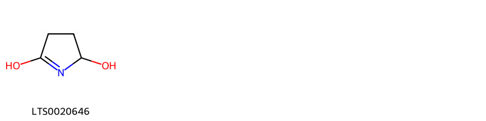{ width=100% }
    <figcaption>Hình ảnh cấu trúc hóa học của 1 hoạt chất thuộc nhóm Pyrrolidines gồm ['3,4-dihydro-2h-pyrrole-2,5-diol (LTS0020646)'].</figcaption>
</figure>
#### Nhóm Tetralins
<figure markdown="span">
    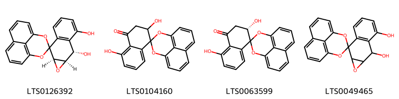{ width=100% }
    <figcaption>Hình ảnh cấu trúc hóa học của 4 hoạt chất thuộc nhóm Tetralins gồm ["(1ar,7s,7ar)-7,7a-dihydro-1ah-2',4'-dioxaspiro[naphtho[2,3-b]oxirene-2,3'-tricyclo[7.3.1.0⁵,¹³]tridecane]-1'(13'),5',7',9',11'-pentaene-6,7-diol (LTS0126392)", "2,5-dihydroxy-2,3-dihydro-2',4'-dioxaspiro[naphthalene-1,3'-tricyclo[7.3.1.0⁵,¹³]tridecane]-1'(13'),5',7',9',11'-pentaen-4-one (LTS0104160)", "(2s)-2,5-dihydroxy-2,3-dihydro-2',4'-dioxaspiro[naphthalene-1,3'-tricyclo[7.3.1.0⁵,¹³]tridecane]-1'(13'),5',7',9',11'-pentaen-4-one (LTS0063599)", "7,7a-dihydro-1ah-2',4'-dioxaspiro[naphtho[2,3-b]oxirene-2,3'-tricyclo[7.3.1.0⁵,¹³]tridecane]-1'(13'),5',7',9',11'-pentaene-6,7-diol (LTS0049465)"].</figcaption>
</figure>

---

### Dược dân tộc học

Danh sách các quốc gia có sử dụng *Jatropha curcas* trong điều trị các bệnh. 

| Country            | Disease                                                                                                                                            | Bệnh                                                                                                                                                                                                |
|:-------------------|:---------------------------------------------------------------------------------------------------------------------------------------------------|:----------------------------------------------------------------------------------------------------------------------------------------------------------------------------------------------------|
| Africa             | Dentifrice, Diuretic, Hemostat, Styptic, Raticide                                                                                                  | MYMEMORY WARNING: YOU USED ALL AVAILABLE FREE TRANSLATIONS FOR TODAY. NEXT AVAILABLE IN  19 HOURS 32 MINUTES 30 SECONDS VISIT HTTPS://MYMEMORY.TRANSLATED.NET/DOC/USAGELIMITS.PHP TO TRANSLATE MORE |
| Bolivia            | Purgative                                                                                                                                          | MYMEMORY WARNING: YOU USED ALL AVAILABLE FREE TRANSLATIONS FOR TODAY. NEXT AVAILABLE IN  19 HOURS 32 MINUTES 27 SECONDS VISIT HTTPS://MYMEMORY.TRANSLATED.NET/DOC/USAGELIMITS.PHP TO TRANSLATE MORE |
| Brazil             | Vermifuge                                                                                                                                          | MYMEMORY WARNING: YOU USED ALL AVAILABLE FREE TRANSLATIONS FOR TODAY. NEXT AVAILABLE IN  19 HOURS 32 MINUTES 24 SECONDS VISIT HTTPS://MYMEMORY.TRANSLATED.NET/DOC/USAGELIMITS.PHP TO TRANSLATE MORE |
| Central America    | Cicatrizant                                                                                                                                        | MYMEMORY WARNING: YOU USED ALL AVAILABLE FREE TRANSLATIONS FOR TODAY. NEXT AVAILABLE IN  19 HOURS 32 MINUTES 20 SECONDS VISIT HTTPS://MYMEMORY.TRANSLATED.NET/DOC/USAGELIMITS.PHP TO TRANSLATE MORE |
| Colombia           | Poison                                                                                                                                             | MYMEMORY WARNING: YOU USED ALL AVAILABLE FREE TRANSLATIONS FOR TODAY. NEXT AVAILABLE IN  19 HOURS 32 MINUTES 17 SECONDS VISIT HTTPS://MYMEMORY.TRANSLATED.NET/DOC/USAGELIMITS.PHP TO TRANSLATE MORE |
| Dominican Republic | Soap                                                                                                                                               | MYMEMORY WARNING: YOU USED ALL AVAILABLE FREE TRANSLATIONS FOR TODAY. NEXT AVAILABLE IN  19 HOURS 32 MINUTES 14 SECONDS VISIT HTTPS://MYMEMORY.TRANSLATED.NET/DOC/USAGELIMITS.PHP TO TRANSLATE MORE |
| Elsewhere          | Abortifacient, Antiseptic, Insecticide, Piscicide, Purgative, Purgative, Purgative, Raticide, Rubefacient, Emetic, Fumigant, Poison, Soap, Styptic | MYMEMORY WARNING: YOU USED ALL AVAILABLE FREE TRANSLATIONS FOR TODAY. NEXT AVAILABLE IN  19 HOURS 32 MINUTES 11 SECONDS VISIT HTTPS://MYMEMORY.TRANSLATED.NET/DOC/USAGELIMITS.PHP TO TRANSLATE MORE |
| English            | Purgative                                                                                                                                          | MYMEMORY WARNING: YOU USED ALL AVAILABLE FREE TRANSLATIONS FOR TODAY. NEXT AVAILABLE IN  19 HOURS 32 MINUTES 08 SECONDS VISIT HTTPS://MYMEMORY.TRANSLATED.NET/DOC/USAGELIMITS.PHP TO TRANSLATE MORE |
| Gabon              | Raticide                                                                                                                                           | MYMEMORY WARNING: YOU USED ALL AVAILABLE FREE TRANSLATIONS FOR TODAY. NEXT AVAILABLE IN  19 HOURS 32 MINUTES 06 SECONDS VISIT HTTPS://MYMEMORY.TRANSLATED.NET/DOC/USAGELIMITS.PHP TO TRANSLATE MORE |
| Guatemala          | Lactagogue, Soap, Poison                                                                                                                           | MYMEMORY WARNING: YOU USED ALL AVAILABLE FREE TRANSLATIONS FOR TODAY. NEXT AVAILABLE IN  19 HOURS 32 MINUTES 03 SECONDS VISIT HTTPS://MYMEMORY.TRANSLATED.NET/DOC/USAGELIMITS.PHP TO TRANSLATE MORE |
| Haiti              | Emollient, Rubefacient                                                                                                                             | MYMEMORY WARNING: YOU USED ALL AVAILABLE FREE TRANSLATIONS FOR TODAY. NEXT AVAILABLE IN  19 HOURS 31 MINUTES 59 SECONDS VISIT HTTPS://MYMEMORY.TRANSLATED.NET/DOC/USAGELIMITS.PHP TO TRANSLATE MORE |
| India              | Poison, Purgative                                                                                                                                  | MYMEMORY WARNING: YOU USED ALL AVAILABLE FREE TRANSLATIONS FOR TODAY. NEXT AVAILABLE IN  19 HOURS 31 MINUTES 56 SECONDS VISIT HTTPS://MYMEMORY.TRANSLATED.NET/DOC/USAGELIMITS.PHP TO TRANSLATE MORE |
| India(Travancore)  | Antidote                                                                                                                                           | MYMEMORY WARNING: YOU USED ALL AVAILABLE FREE TRANSLATIONS FOR TODAY. NEXT AVAILABLE IN  19 HOURS 31 MINUTES 53 SECONDS VISIT HTTPS://MYMEMORY.TRANSLATED.NET/DOC/USAGELIMITS.PHP TO TRANSLATE MORE |
| Java               | Hemostat, Purgative                                                                                                                                | MYMEMORY WARNING: YOU USED ALL AVAILABLE FREE TRANSLATIONS FOR TODAY. NEXT AVAILABLE IN  19 HOURS 31 MINUTES 50 SECONDS VISIT HTTPS://MYMEMORY.TRANSLATED.NET/DOC/USAGELIMITS.PHP TO TRANSLATE MORE |
| Latin America      | Poison                                                                                                                                             | MYMEMORY WARNING: YOU USED ALL AVAILABLE FREE TRANSLATIONS FOR TODAY. NEXT AVAILABLE IN  19 HOURS 31 MINUTES 47 SECONDS VISIT HTTPS://MYMEMORY.TRANSLATED.NET/DOC/USAGELIMITS.PHP TO TRANSLATE MORE |
| Malaya             | Laxative                                                                                                                                           | MYMEMORY WARNING: YOU USED ALL AVAILABLE FREE TRANSLATIONS FOR TODAY. NEXT AVAILABLE IN  19 HOURS 31 MINUTES 45 SECONDS VISIT HTTPS://MYMEMORY.TRANSLATED.NET/DOC/USAGELIMITS.PHP TO TRANSLATE MORE |
| Malaysia           | Narcotic                                                                                                                                           | MYMEMORY WARNING: YOU USED ALL AVAILABLE FREE TRANSLATIONS FOR TODAY. NEXT AVAILABLE IN  19 HOURS 31 MINUTES 43 SECONDS VISIT HTTPS://MYMEMORY.TRANSLATED.NET/DOC/USAGELIMITS.PHP TO TRANSLATE MORE |
| Mexico             | Emetic, Piscicide, Poison, Purgative, Purgative, Soap, Vulnerary                                                                                   | MYMEMORY WARNING: YOU USED ALL AVAILABLE FREE TRANSLATIONS FOR TODAY. NEXT AVAILABLE IN  19 HOURS 31 MINUTES 41 SECONDS VISIT HTTPS://MYMEMORY.TRANSLATED.NET/DOC/USAGELIMITS.PHP TO TRANSLATE MORE |
| Natal              | Purgative                                                                                                                                          | MYMEMORY WARNING: YOU USED ALL AVAILABLE FREE TRANSLATIONS FOR TODAY. NEXT AVAILABLE IN  19 HOURS 31 MINUTES 38 SECONDS VISIT HTTPS://MYMEMORY.TRANSLATED.NET/DOC/USAGELIMITS.PHP TO TRANSLATE MORE |
| Panama(Cuna)       | Purgative                                                                                                                                          | MYMEMORY WARNING: YOU USED ALL AVAILABLE FREE TRANSLATIONS FOR TODAY. NEXT AVAILABLE IN  19 HOURS 31 MINUTES 36 SECONDS VISIT HTTPS://MYMEMORY.TRANSLATED.NET/DOC/USAGELIMITS.PHP TO TRANSLATE MORE |
| Philippines        | Piscicide, Purgative, Piscicide                                                                                                                    | MYMEMORY WARNING: YOU USED ALL AVAILABLE FREE TRANSLATIONS FOR TODAY. NEXT AVAILABLE IN  19 HOURS 31 MINUTES 31 SECONDS VISIT HTTPS://MYMEMORY.TRANSLATED.NET/DOC/USAGELIMITS.PHP TO TRANSLATE MORE |
| Samoa              | Laxative, Poison                                                                                                                                   | MYMEMORY WARNING: YOU USED ALL AVAILABLE FREE TRANSLATIONS FOR TODAY. NEXT AVAILABLE IN  19 HOURS 31 MINUTES 28 SECONDS VISIT HTTPS://MYMEMORY.TRANSLATED.NET/DOC/USAGELIMITS.PHP TO TRANSLATE MORE |
| Sudan              | Poison, Purgative                                                                                                                                  | MYMEMORY WARNING: YOU USED ALL AVAILABLE FREE TRANSLATIONS FOR TODAY. NEXT AVAILABLE IN  19 HOURS 31 MINUTES 24 SECONDS VISIT HTTPS://MYMEMORY.TRANSLATED.NET/DOC/USAGELIMITS.PHP TO TRANSLATE MORE |
| Trinidad           | Emetic, Purgative                                                                                                                                  | MYMEMORY WARNING: YOU USED ALL AVAILABLE FREE TRANSLATIONS FOR TODAY. NEXT AVAILABLE IN  19 HOURS 31 MINUTES 21 SECONDS VISIT HTTPS://MYMEMORY.TRANSLATED.NET/DOC/USAGELIMITS.PHP TO TRANSLATE MORE |
| Venezuela          | Purgative, Rubefacient, Vermifuge, Poison, Soap                                                                                                    | MYMEMORY WARNING: YOU USED ALL AVAILABLE FREE TRANSLATIONS FOR TODAY. NEXT AVAILABLE IN  19 HOURS 31 MINUTES 18 SECONDS VISIT HTTPS://MYMEMORY.TRANSLATED.NET/DOC/USAGELIMITS.PHP TO TRANSLATE MORE |
| anish              | Poison                                                                                                                                             | MYMEMORY WARNING: YOU USED ALL AVAILABLE FREE TRANSLATIONS FOR TODAY. NEXT AVAILABLE IN  19 HOURS 31 MINUTES 15 SECONDS VISIT HTTPS://MYMEMORY.TRANSLATED.NET/DOC/USAGELIMITS.PHP TO TRANSLATE MORE |

---

---
## Jatropha gaumeri
### Thông tin về thực vật

!!! info "Phân loại thực vật của *Jatropha gaumeri* từ GIBF:"
    - **Kingdom:** Plantae
    - **Phylum:** Tracheophyta
    - **Order:** Malpighiales
    - **Family:** Euphorbiaceae
    - **Genus:** Jatropha
    - **Species:** *Jatropha gaumeri*

 

| Label (VI)   | Label (EN)   | Scientific Name   | Descriptions (VI)   | Descriptions (EN)   | Also Known As (VI)   | Also Known As (EN)   |
|:-------------|:-------------|:------------------|:--------------------|:--------------------|:---------------------|:---------------------|
| N/A          | N/A          | Jatropha gaumeri  | loài thực vật       | species of plant    | ['']                 | ['']                 |

#### Phân bố trên thế giới

**Từ CSDL GIBF** Belize, Costa Rica, Guatemala, Mexico

#### Phân bố tại Việt Nam

**Từ CSDL GIBF**: Không có ghi nhận ở Việt Nam

---
### Thành phần hóa học
        
- Theo cơ sở dữ liệu lotus: Từ loài *Jatropha gaumeri* đã phân lập và xác định được Chưa có hoạt chất nào được phân lập. hoạt chất thuộc về các nhóm Không có hoạt chất nào được phân lập. 

Không có hình ảnh nào được tạo ra

---

### Dược dân tộc học

Danh sách các quốc gia có sử dụng *Jatropha gaumeri* trong điều trị các bệnh. 

| Country   | Disease   | Bệnh                                                                                                                                                                                                |
|:----------|:----------|:----------------------------------------------------------------------------------------------------------------------------------------------------------------------------------------------------|
| Mexico    | Poison    | MYMEMORY WARNING: YOU USED ALL AVAILABLE FREE TRANSLATIONS FOR TODAY. NEXT AVAILABLE IN  19 HOURS 30 MINUTES 22 SECONDS VISIT HTTPS://MYMEMORY.TRANSLATED.NET/DOC/USAGELIMITS.PHP TO TRANSLATE MORE |

---

---
## Jatropha glandsulifera
### Thông tin về thực vật

!!! info "Phân loại thực vật của *Jatropha glandulifera* từ GIBF:"
    - **Kingdom:** Plantae
    - **Phylum:** Tracheophyta
    - **Order:** Malpighiales
    - **Family:** Euphorbiaceae
    - **Genus:** Jatropha
    - **Species:** *Jatropha glandulifera*

 

| Label (VI)   | Label (EN)   | Scientific Name   | Descriptions (VI)   | Descriptions (EN)   | Also Known As (VI)   | Also Known As (EN)   |
|:-------------|:-------------|:------------------|:--------------------|:--------------------|:---------------------|:---------------------|
| N/A          | N/A          | Jatropha gaumeri  | loài thực vật       | species of plant    | ['']                 | ['']                 |

#### Phân bố trên thế giới

**Từ CSDL GIBF** nan, Sri Lanka, Hong Kong, Angola, Egypt, Mozambique, India, unknown or invalid, Indonesia, Philippines

#### Phân bố tại Việt Nam

**Từ CSDL GIBF**: Không có ghi nhận ở Việt Nam

---
### Thành phần hóa học
        
- Theo cơ sở dữ liệu lotus: Từ loài *Jatropha glandulifera* đã phân lập và xác định được Chưa có hoạt chất nào được phân lập. hoạt chất thuộc về các nhóm Không có hoạt chất nào được phân lập. 

Không có hình ảnh nào được tạo ra

---

### Dược dân tộc học

Danh sách các quốc gia có sử dụng *Jatropha glandulifera* trong điều trị các bệnh. 

| Country   | Disease   | Bệnh                                                                                                                                                                                                |
|:----------|:----------|:----------------------------------------------------------------------------------------------------------------------------------------------------------------------------------------------------|
| India     | Purgative | MYMEMORY WARNING: YOU USED ALL AVAILABLE FREE TRANSLATIONS FOR TODAY. NEXT AVAILABLE IN  19 HOURS 29 MINUTES 54 SECONDS VISIT HTTPS://MYMEMORY.TRANSLATED.NET/DOC/USAGELIMITS.PHP TO TRANSLATE MORE |

---

---
## Jatropha gossypifolia
### Thông tin về thực vật

!!! info "Phân loại thực vật của *Jatropha gossypiifolia* từ GIBF:"
    - **Kingdom:** Plantae
    - **Phylum:** Tracheophyta
    - **Order:** Malpighiales
    - **Family:** Euphorbiaceae
    - **Genus:** Jatropha
    - **Species:** *Jatropha gossypiifolia*

 

| Label (VI)   | Label (EN)   | Scientific Name   | Descriptions (VI)   | Descriptions (EN)   | Also Known As (VI)   | Also Known As (EN)   |
|:-------------|:-------------|:------------------|:--------------------|:--------------------|:---------------------|:---------------------|
| N/A          | N/A          | Jatropha gaumeri  | loài thực vật       | species of plant    | ['']                 | ['']                 |

#### Phân bố trên thế giới

**Từ CSDL GIBF** Virgin Islands (U.S.), nan, Ghana, Australia, Guadeloupe, Saint Lucia, Philippines, Benin, Nicaragua, Virgin Islands (British), Tanzania, United Republic of, Venezuela (Bolivarian Republic of), French Guiana, Malawi, Puerto Rico, Nigeria, Chinese Taipei, Bolivia (Plurinational State of), Jamaica, Bangladesh, United States of America, Maldives, South Africa, Turks and Caicos Islands, Thailand, Brazil, Guyana, Mexico, Dominican Republic, Peru, Saint Kitts and Nevis, Aruba, Cabo Verde, Haiti, Montserrat, Colombia, Costa Rica, Gambia, Indonesia, India, Antigua and Barbuda, Sint Maarten (Dutch part), Malaysia

#### Phân bố tại Việt Nam

**Từ CSDL GIBF**: Không có ghi nhận ở Việt Nam

---
### Thành phần hóa học
        
- Theo cơ sở dữ liệu lotus: Từ loài *Jatropha gossypiifolia* đã phân lập và xác định được 24 hoạt chất thuộc về các nhóm Fatty Acyls, Prenol lipids, Indanes, Dihydrofurans, Furanoid lignans, Carboxylic acids and derivatives. 

|    | chemicalTaxonomyClassyfireClass   |   smiles_count |
|---:|:----------------------------------|---------------:|
|  0 | Carboxylic acids and derivatives  |              1 |
|  1 | Dihydrofurans                     |              1 |
|  2 | Fatty Acyls                       |              2 |
|  3 | Furanoid lignans                  |              5 |
|  4 | Indanes                           |              3 |
|  5 | Prenol lipids                     |              5 |

#### Nhóm Carboxylic acids and derivatives
<figure markdown="span">
    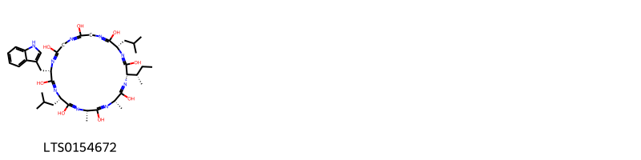{ width=100% }
    <figcaption>Hình ảnh cấu trúc hóa học của 1 hoạt chất thuộc nhóm Carboxylic acids and derivatives gồm ['(3s,6s,9s,12s,15s,18s)-6-[(2s)-butan-2-yl]-18-(1h-indol-3-ylmethyl)-9,12-dimethyl-3,15-bis(2-methylpropyl)-1,4,7,10,13,16,19,22-octaazacyclotetracosa-1,4,7,10,13,16,19,22-octaen-2,5,8,11,14,17,20,23-octol (LTS0154672)'].</figcaption>
</figure>
#### Nhóm Dihydrofurans
<figure markdown="span">
    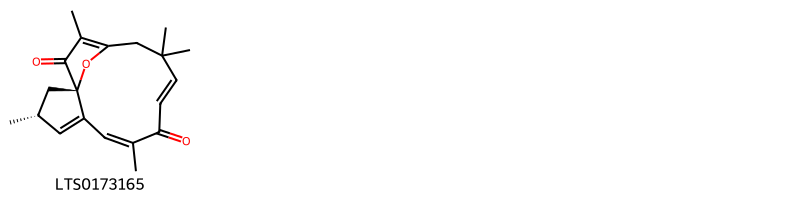{ width=100% }
    <figcaption>Hình ảnh cấu trúc hóa học của 1 hoạt chất thuộc nhóm Dihydrofurans gồm ['jatrophone (LTS0173165)'].</figcaption>
</figure>
#### Nhóm Fatty Acyls
<figure markdown="span">
    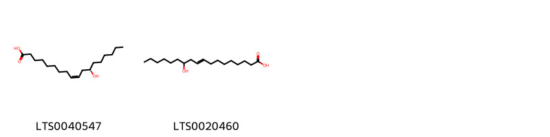{ width=100% }
    <figcaption>Hình ảnh cấu trúc hóa học của 2 hoạt chất thuộc nhóm Fatty Acyls gồm ['ricinoleic acid (LTS0040547)', '12-hydroxy-9-octadecenoic acid (LTS0020460)'].</figcaption>
</figure>
#### Nhóm Furanoid lignans
<figure markdown="span">
    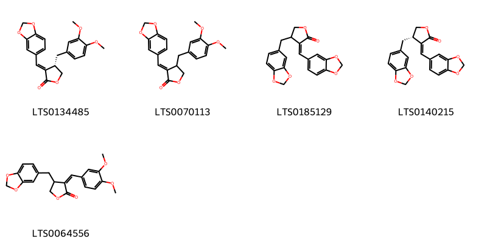{ width=100% }
    <figcaption>Hình ảnh cấu trúc hóa học của 5 hoạt chất thuộc nhóm Furanoid lignans gồm ['(3e,4s)-3-(2h-1,3-benzodioxol-5-ylmethylidene)-4-[(3,4-dimethoxyphenyl)methyl]oxolan-2-one (LTS0134485)', '(3e)-3-(2h-1,3-benzodioxol-5-ylmethylidene)-4-[(3,4-dimethoxyphenyl)methyl]oxolan-2-one (LTS0070113)', '(3z)-4-(2h-1,3-benzodioxol-5-ylmethyl)-3-(2h-1,3-benzodioxol-5-ylmethylidene)oxolan-2-one (LTS0185129)', '(3z,4s)-4-(2h-1,3-benzodioxol-5-ylmethyl)-3-(2h-1,3-benzodioxol-5-ylmethylidene)oxolan-2-one (LTS0140215)', '4-(2h-1,3-benzodioxol-5-ylmethyl)-3-[(3,4-dimethoxyphenyl)methylidene]oxolan-2-one (LTS0064556)'].</figcaption>
</figure>
#### Nhóm Indanes
<figure markdown="span">
    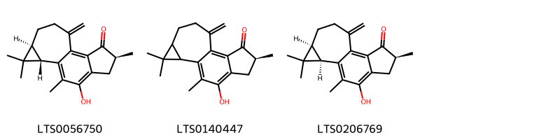{ width=100% }
    <figcaption>Hình ảnh cấu trúc hóa học của 3 hoạt chất thuộc nhóm Indanes gồm ['(4s,10s,12s)-7-hydroxy-4,8,11,11-tetramethyl-15-methylidenetetracyclo[7.6.0.0²,⁶.0¹⁰,¹²]pentadeca-1,6,8-trien-3-one (LTS0056750)', '(4s)-7-hydroxy-4,8,11,11-tetramethyl-15-methylidenetetracyclo[7.6.0.0²,⁶.0¹⁰,¹²]pentadeca-1,6,8-trien-3-one (LTS0140447)', '(4s,10r,12s)-7-hydroxy-4,8,11,11-tetramethyl-15-methylidenetetracyclo[7.6.0.0²,⁶.0¹⁰,¹²]pentadeca-1,6,8-trien-3-one (LTS0206769)'].</figcaption>
</figure>
#### Nhóm Prenol lipids
<figure markdown="span">
    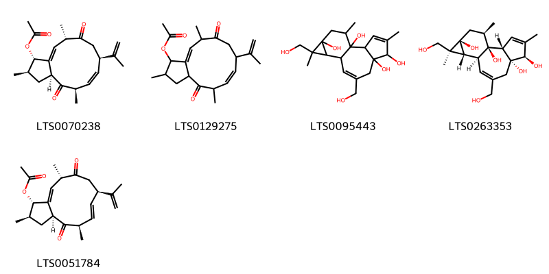{ width=100% }
    <figcaption>Hình ảnh cấu trúc hóa học của 5 hoạt chất thuộc nhóm Prenol lipids gồm ['(1s,2r,3as,5r,8r,11s)-2,5,11-trimethyl-4,10-dioxo-8-(prop-1-en-2-yl)-1h,2h,3h,3ah,5h,8h,9h,11h-cyclopenta[11]annulen-1-yl acetate (LTS0070238)', '2,5,11-trimethyl-4,10-dioxo-8-(prop-1-en-2-yl)-1h,2h,3h,3ah,5h,8h,9h,11h-cyclopenta[11]annulen-1-yl acetate (LTS0129275)', '8,12-bis(hydroxymethyl)-4,12,15-trimethyltetracyclo[8.5.0.0²,⁶.0¹¹,¹³]pentadeca-3,8-diene-1,5,6,13-tetrol (LTS0095443)', '(1r,2s,5r,6r,10s,11r,12s,13s,15r)-8,12-bis(hydroxymethyl)-4,12,15-trimethyltetracyclo[8.5.0.0²,⁶.0¹¹,¹³]pentadeca-3,8-diene-1,5,6,13-tetrol (LTS0263353)', '(1s,2r,3as,5r,8r,11s)-2,5,11-trimethyl-4,10-dioxo-8-(prop-1-en-2-yl)-1h,2h,3h,3ah,5h,8h,9h,11h-cyclopenta[11]annulen-1-yl acetate (LTS0051784)'].</figcaption>
</figure>

---

### Dược dân tộc học

Danh sách các quốc gia có sử dụng *Jatropha gossypiifolia* trong điều trị các bệnh. 

| Country       | Disease                                                | Bệnh                                                                                                                                                                                                |
|:--------------|:-------------------------------------------------------|:----------------------------------------------------------------------------------------------------------------------------------------------------------------------------------------------------|
| Curacao       | Disinfectant, Laxative, Poison                         | MYMEMORY WARNING: YOU USED ALL AVAILABLE FREE TRANSLATIONS FOR TODAY. NEXT AVAILABLE IN  19 HOURS 29 MINUTES 34 SECONDS VISIT HTTPS://MYMEMORY.TRANSLATED.NET/DOC/USAGELIMITS.PHP TO TRANSLATE MORE |
| Elsewhere     | Emetic, Emmenagogue, Emmenagogue, Purgative, Purgative | MYMEMORY WARNING: YOU USED ALL AVAILABLE FREE TRANSLATIONS FOR TODAY. NEXT AVAILABLE IN  19 HOURS 29 MINUTES 32 SECONDS VISIT HTTPS://MYMEMORY.TRANSLATED.NET/DOC/USAGELIMITS.PHP TO TRANSLATE MORE |
| Haiti         | Emetic, Purgative                                      | MYMEMORY WARNING: YOU USED ALL AVAILABLE FREE TRANSLATIONS FOR TODAY. NEXT AVAILABLE IN  19 HOURS 29 MINUTES 29 SECONDS VISIT HTTPS://MYMEMORY.TRANSLATED.NET/DOC/USAGELIMITS.PHP TO TRANSLATE MORE |
| India         | Antibiotic                                             | MYMEMORY WARNING: YOU USED ALL AVAILABLE FREE TRANSLATIONS FOR TODAY. NEXT AVAILABLE IN  19 HOURS 29 MINUTES 27 SECONDS VISIT HTTPS://MYMEMORY.TRANSLATED.NET/DOC/USAGELIMITS.PHP TO TRANSLATE MORE |
| Java          | Purgative                                              | MYMEMORY WARNING: YOU USED ALL AVAILABLE FREE TRANSLATIONS FOR TODAY. NEXT AVAILABLE IN  19 HOURS 29 MINUTES 24 SECONDS VISIT HTTPS://MYMEMORY.TRANSLATED.NET/DOC/USAGELIMITS.PHP TO TRANSLATE MORE |
| Latin America | Poison                                                 | MYMEMORY WARNING: YOU USED ALL AVAILABLE FREE TRANSLATIONS FOR TODAY. NEXT AVAILABLE IN  19 HOURS 29 MINUTES 19 SECONDS VISIT HTTPS://MYMEMORY.TRANSLATED.NET/DOC/USAGELIMITS.PHP TO TRANSLATE MORE |
| Panama        | Vermifuge, Laxative                                    | MYMEMORY WARNING: YOU USED ALL AVAILABLE FREE TRANSLATIONS FOR TODAY. NEXT AVAILABLE IN  19 HOURS 29 MINUTES 16 SECONDS VISIT HTTPS://MYMEMORY.TRANSLATED.NET/DOC/USAGELIMITS.PHP TO TRANSLATE MORE |
| Trinidad      | Emetic, Purgative                                      | MYMEMORY WARNING: YOU USED ALL AVAILABLE FREE TRANSLATIONS FOR TODAY. NEXT AVAILABLE IN  19 HOURS 29 MINUTES 13 SECONDS VISIT HTTPS://MYMEMORY.TRANSLATED.NET/DOC/USAGELIMITS.PHP TO TRANSLATE MORE |
| Venezuela     | Emetic, Purgative, Stomachic, Purgative                | MYMEMORY WARNING: YOU USED ALL AVAILABLE FREE TRANSLATIONS FOR TODAY. NEXT AVAILABLE IN  19 HOURS 29 MINUTES 08 SECONDS VISIT HTTPS://MYMEMORY.TRANSLATED.NET/DOC/USAGELIMITS.PHP TO TRANSLATE MORE |
| West Indies   | Emmenagogue, nan                                       | MYMEMORY WARNING: YOU USED ALL AVAILABLE FREE TRANSLATIONS FOR TODAY. NEXT AVAILABLE IN  19 HOURS 29 MINUTES 00 SECONDS VISIT HTTPS://MYMEMORY.TRANSLATED.NET/DOC/USAGELIMITS.PHP TO TRANSLATE MORE |

---

---
## Jatropha gossypiifolia
### Thông tin về thực vật

!!! info "Phân loại thực vật của *Jatropha gossypiifolia* từ GIBF:"
    - **Kingdom:** Plantae
    - **Phylum:** Tracheophyta
    - **Order:** Malpighiales
    - **Family:** Euphorbiaceae
    - **Genus:** Jatropha
    - **Species:** *Jatropha gossypiifolia*

 

| Label (VI)   | Label (EN)   | Scientific Name        | Descriptions (VI)   | Descriptions (EN)   | Also Known As (VI)        | Also Known As (EN)                          |
|:-------------|:-------------|:-----------------------|:--------------------|:--------------------|:--------------------------|:--------------------------------------------|
| N/A          | N/A          | Jatropha gossypiifolia | loài thực vật       | species of plant    | ['Jatropha gossypifolia'] | ['Bellyache Bush', 'Jatropha gossypifolia'] |

#### Phân bố trên thế giới

**Từ CSDL GIBF** Virgin Islands (U.S.), nan, Ghana, Australia, Guadeloupe, Saint Lucia, Philippines, Benin, Nicaragua, Virgin Islands (British), Tanzania, United Republic of, Venezuela (Bolivarian Republic of), French Guiana, Malawi, Puerto Rico, Nigeria, Chinese Taipei, Bolivia (Plurinational State of), Jamaica, Bangladesh, United States of America, Maldives, South Africa, Turks and Caicos Islands, Thailand, Brazil, Guyana, Mexico, Dominican Republic, Peru, Saint Kitts and Nevis, Aruba, Cabo Verde, Haiti, Montserrat, Colombia, Costa Rica, Gambia, Indonesia, India, Antigua and Barbuda, Sint Maarten (Dutch part), Malaysia

#### Phân bố tại Việt Nam

**Từ CSDL GIBF**: Không có ghi nhận ở Việt Nam

---
### Thành phần hóa học
        
- Theo cơ sở dữ liệu lotus: Từ loài *Jatropha gossypiifolia* đã phân lập và xác định được 45 hoạt chất thuộc về các nhóm Fatty Acyls, Coumarinolignans, Prenol lipids, Steroids and steroid derivatives, Oxanes, Indanes, Dihydrofurans, Organooxygen compounds, Furanoid lignans, Carboxylic acids and derivatives. 

|    | chemicalTaxonomyClassyfireClass   |   smiles_count |
|---:|:----------------------------------|---------------:|
|  0 |                                   |              2 |
|  1 | Carboxylic acids and derivatives  |             12 |
|  2 | Coumarinolignans                  |              4 |
|  3 | Dihydrofurans                     |              6 |
|  4 | Fatty Acyls                       |              5 |
|  5 | Furanoid lignans                  |              2 |
|  6 | Indanes                           |              3 |
|  7 | Organooxygen compounds            |              3 |
|  8 | Oxanes                            |              2 |
|  9 | Prenol lipids                     |              3 |
| 10 | Steroids and steroid derivatives  |              2 |

#### Nhóm 
<figure markdown="span">
    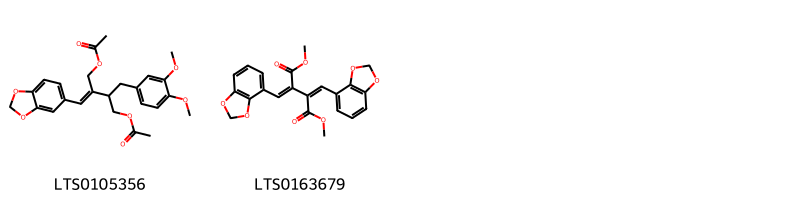{ width=100% }
    <figcaption>Hình ảnh cấu trúc hóa học của 2 hoạt chất thuộc nhóm  gồm ['(3z)-3-[(acetyloxy)methyl]-4-(2h-1,3-benzodioxol-5-yl)-2-[(3,4-dimethoxyphenyl)methyl]but-3-en-1-yl acetate (LTS0105356)', '1,4-dimethyl (2z,3z)-2,3-bis(2h-1,3-benzodioxol-4-ylmethylidene)butanedioate (LTS0163679)'].</figcaption>
</figure>
#### Nhóm Carboxylic acids and derivatives
<figure markdown="span">
    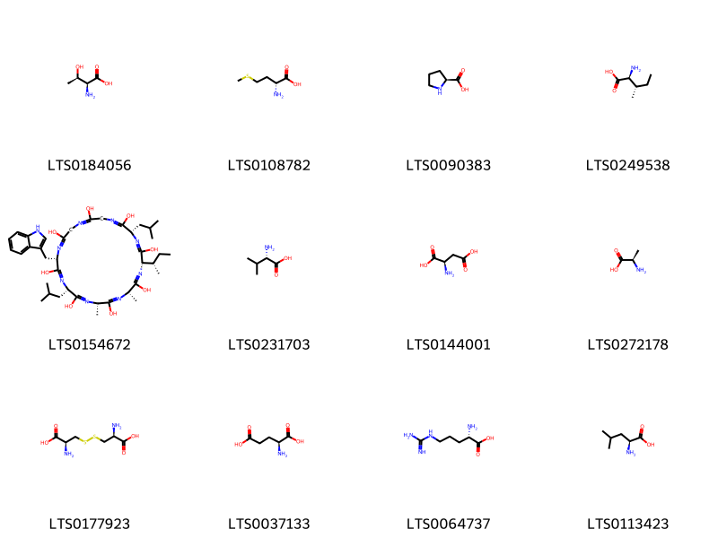{ width=100% }
    <figcaption>Hình ảnh cấu trúc hóa học của 12 hoạt chất thuộc nhóm Carboxylic acids and derivatives gồm ['l-threonine (LTS0184056)', 'd-methionine (LTS0108782)', 'l-proline (LTS0090383)', 'l-isoleucine (LTS0249538)', '(3s,6s,9s,12s,15s,18s)-6-[(2s)-butan-2-yl]-18-(1h-indol-3-ylmethyl)-9,12-dimethyl-3,15-bis(2-methylpropyl)-1,4,7,10,13,16,19,22-octaazacyclotetracosa-1,4,7,10,13,16,19,22-octaen-2,5,8,11,14,17,20,23-octol (LTS0154672)', 'l-valine (LTS0231703)', 'd-aspartic acid (LTS0144001)', 'd-alanine (LTS0272178)', 'd-cystine (LTS0177923)', 'l-glutamic acid (LTS0037133)', 'l-arginine (LTS0064737)', 'l-leucine (LTS0113423)'].</figcaption>
</figure>
#### Nhóm Coumarinolignans
<figure markdown="span">
    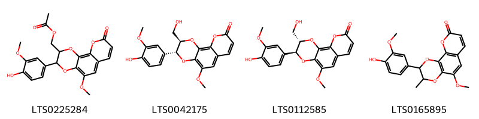{ width=100% }
    <figcaption>Hình ảnh cấu trúc hóa học của 4 hoạt chất thuộc nhóm Coumarinolignans gồm ['[3-(4-hydroxy-3-methoxyphenyl)-5-methoxy-9-oxo-2h,3h-[1,4]dioxino[2,3-h]chromen-2-yl]methyl acetate (LTS0225284)', 'cleomiscosin a (LTS0042175)', '(2s,3s)-3-(4-hydroxy-3-methoxyphenyl)-2-(hydroxymethyl)-5-methoxy-2h,3h-[1,4]dioxino[2,3-h]chromen-9-one (LTS0112585)', '2-(4-hydroxy-3-methoxyphenyl)-5-methoxy-3-methyl-2h,3h-[1,4]dioxino[2,3-h]chromen-9-one (LTS0165895)'].</figcaption>
</figure>
#### Nhóm Dihydrofurans
<figure markdown="span">
    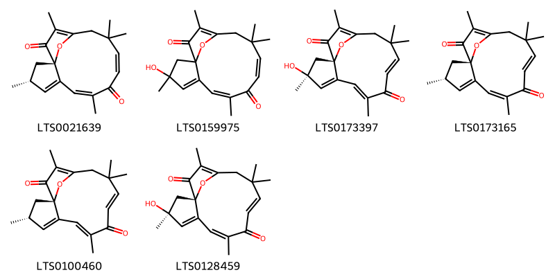{ width=100% }
    <figcaption>Hình ảnh cấu trúc hóa học của 6 hoạt chất thuộc nhóm Dihydrofurans gồm ['(1r,3r)-3,7,11,11,14-pentamethyl-16-oxatricyclo[11.2.1.0¹,⁵]hexadeca-4,6,9,13-tetraene-8,15-dione (LTS0021639)', '3-hydroxy-3,7,11,11,14-pentamethyl-16-oxatricyclo[11.2.1.0¹,⁵]hexadeca-4,6,9,13-tetraene-8,15-dione (LTS0159975)', '(1r,3s,6e,9e)-3-hydroxy-3,7,11,11,14-pentamethyl-16-oxatricyclo[11.2.1.0¹,⁵]hexadeca-4,6,9,13-tetraene-8,15-dione (LTS0173397)', 'jatrophone (LTS0173165)', '(1r,3r,6e,9e)-3,7,11,11,14-pentamethyl-16-oxatricyclo[11.2.1.0¹,⁵]hexadeca-4,6,9,13-tetraene-8,15-dione (LTS0100460)', '(1r,3s,6z,9e)-3-hydroxy-3,7,11,11,14-pentamethyl-16-oxatricyclo[11.2.1.0¹,⁵]hexadeca-4,6,9,13-tetraene-8,15-dione (LTS0128459)'].</figcaption>
</figure>
#### Nhóm Fatty Acyls
<figure markdown="span">
    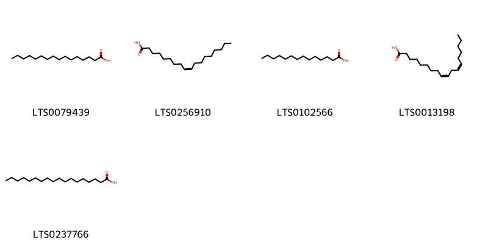{ width=100% }
    <figcaption>Hình ảnh cấu trúc hóa học của 5 hoạt chất thuộc nhóm Fatty Acyls gồm ['palmitic acid (LTS0079439)', 'oleic acid (LTS0256910)', 'myristic acid (LTS0102566)', 'linoleic (LTS0013198)', 'stearic acid (LTS0237766)'].</figcaption>
</figure>
#### Nhóm Furanoid lignans
<figure markdown="span">
    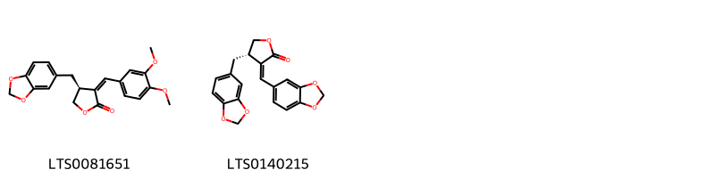{ width=100% }
    <figcaption>Hình ảnh cấu trúc hóa học của 2 hoạt chất thuộc nhóm Furanoid lignans gồm ['(3z,4s)-4-(2h-1,3-benzodioxol-5-ylmethyl)-3-[(3,4-dimethoxyphenyl)methylidene]oxolan-2-one (LTS0081651)', '(3z,4s)-4-(2h-1,3-benzodioxol-5-ylmethyl)-3-(2h-1,3-benzodioxol-5-ylmethylidene)oxolan-2-one (LTS0140215)'].</figcaption>
</figure>
#### Nhóm Indanes
<figure markdown="span">
    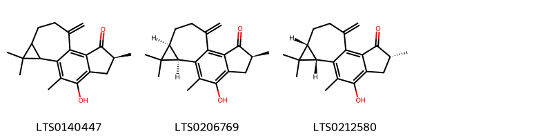{ width=100% }
    <figcaption>Hình ảnh cấu trúc hóa học của 3 hoạt chất thuộc nhóm Indanes gồm ['(4s)-7-hydroxy-4,8,11,11-tetramethyl-15-methylidenetetracyclo[7.6.0.0²,⁶.0¹⁰,¹²]pentadeca-1,6,8-trien-3-one (LTS0140447)', '(4s,10r,12s)-7-hydroxy-4,8,11,11-tetramethyl-15-methylidenetetracyclo[7.6.0.0²,⁶.0¹⁰,¹²]pentadeca-1,6,8-trien-3-one (LTS0206769)', '(4r,10s,12r)-7-hydroxy-4,8,11,11-tetramethyl-15-methylidenetetracyclo[7.6.0.0²,⁶.0¹⁰,¹²]pentadeca-1,6,8-trien-3-one (LTS0212580)'].</figcaption>
</figure>
#### Nhóm Organooxygen compounds
<figure markdown="span">
    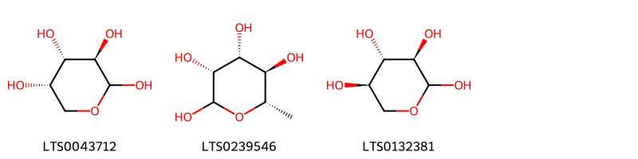{ width=100% }
    <figcaption>Hình ảnh cấu trúc hóa học của 3 hoạt chất thuộc nhóm Organooxygen compounds gồm ['l-arabinopyranose (LTS0043712)', 'l-rhamnose (LTS0239546)', 'd-xylose (LTS0132381)'].</figcaption>
</figure>
#### Nhóm Oxanes
<figure markdown="span">
    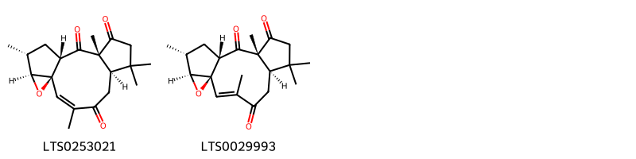{ width=100% }
    <figcaption>Hình ảnh cấu trúc hóa học của 2 hoạt chất thuộc nhóm Oxanes gồm ['(1r,2z,6r,10s,12s,14r,15s)-3,7,7,10,14-pentamethyl-16-oxatetracyclo[10.4.0.0¹,¹⁵.0⁶,¹⁰]hexadec-2-ene-4,9,11-trione (LTS0253021)', '(1r,2e,6r,10s,12s,14r,15s)-3,7,7,10,14-pentamethyl-16-oxatetracyclo[10.4.0.0¹,¹⁵.0⁶,¹⁰]hexadec-2-ene-4,9,11-trione (LTS0029993)'].</figcaption>
</figure>
#### Nhóm Prenol lipids
<figure markdown="span">
    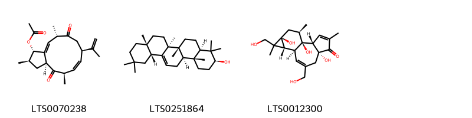{ width=100% }
    <figcaption>Hình ảnh cấu trúc hóa học của 3 hoạt chất thuộc nhóm Prenol lipids gồm ['(1s,2r,3as,5r,8r,11s)-2,5,11-trimethyl-4,10-dioxo-8-(prop-1-en-2-yl)-1h,2h,3h,3ah,5h,8h,9h,11h-cyclopenta[11]annulen-1-yl acetate (LTS0070238)', 'β-amyrin (LTS0251864)', '(1r,2s,6r,10s,11r,13s,15r)-1,6,13-trihydroxy-8,12-bis(hydroxymethyl)-4,12,15-trimethyltetracyclo[8.5.0.0²,⁶.0¹¹,¹³]pentadeca-3,8-dien-5-one (LTS0012300)'].</figcaption>
</figure>
#### Nhóm Steroids and steroid derivatives
<figure markdown="span">
    { width=100% }
    <figcaption>Hình ảnh cấu trúc hóa học của 2 hoạt chất thuộc nhóm Steroids and steroid derivatives gồm ['stigmast-5-en-3-ol (LTS0071224)', 'stigmast-5-en-3-ol, (3β)- (LTS0204616)'].</figcaption>
</figure>

---

### Dược dân tộc học

Danh sách các quốc gia có sử dụng *Jatropha gossypiifolia* trong điều trị các bệnh. 

| Country   | Disease                     | Bệnh                                                                                                                                                                                                |
|:----------|:----------------------------|:----------------------------------------------------------------------------------------------------------------------------------------------------------------------------------------------------|
| Guatemala | Emetic, Purgative           | MYMEMORY WARNING: YOU USED ALL AVAILABLE FREE TRANSLATIONS FOR TODAY. NEXT AVAILABLE IN  19 HOURS 28 MINUTES 29 SECONDS VISIT HTTPS://MYMEMORY.TRANSLATED.NET/DOC/USAGELIMITS.PHP TO TRANSLATE MORE |
| Mexico    | Antidote, Emetic, Purgative | MYMEMORY WARNING: YOU USED ALL AVAILABLE FREE TRANSLATIONS FOR TODAY. NEXT AVAILABLE IN  19 HOURS 28 MINUTES 27 SECONDS VISIT HTTPS://MYMEMORY.TRANSLATED.NET/DOC/USAGELIMITS.PHP TO TRANSLATE MORE |

---

---
## Jatropha integerrima
### Thông tin về thực vật

!!! info "Phân loại thực vật của *Jatropha integerrima* từ GIBF:"
    - **Kingdom:** Plantae
    - **Phylum:** Tracheophyta
    - **Order:** Malpighiales
    - **Family:** Euphorbiaceae
    - **Genus:** Jatropha
    - **Species:** *Jatropha integerrima*

 

| Label (VI)   | Label (EN)   | Scientific Name      | Descriptions (VI)   | Descriptions (EN)   | Also Known As (VI)                                 | Also Known As (EN)              |
|:-------------|:-------------|:---------------------|:--------------------|:--------------------|:---------------------------------------------------|:--------------------------------|
| N/A          | N/A          | Jatropha integerrima | loài thực vật       | species of plant    | ['Jatropha integerrima', 'Jatropha panduraefolia'] | ['Peregrina', 'Spicy Jatropha'] |

#### Phân bố trên thế giới

**Từ CSDL GIBF** nan, United Arab Emirates, Ghana, Cook Islands, Guadeloupe, Wallis and Futuna, Guatemala, Philippines, Benin, Bermuda, Sierra Leone, French Guiana, Pakistan, Puerto Rico, Senegal, Nigeria, Honduras, Jamaica, Morocco, United States of America, El Salvador, Saudi Arabia, Saint Martin (French part), South Africa, Trinidad and Tobago, Hong Kong, Saint Vincent and the Grenadines, Barbados, Thailand, Guam, Bahamas, Egypt, Cuba, Mexico, Dominican Republic, Singapore, China, Curaçao, Saint Kitts and Nevis, Niue, Haiti, Colombia, Macao, Costa Rica, India, Indonesia, Cayman Islands, Samoa, Sint Maarten (Dutch part), Malaysia

#### Phân bố tại Việt Nam

**Từ CSDL GIBF**: Không có ghi nhận ở Việt Nam

---
### Thành phần hóa học
        
- Theo cơ sở dữ liệu lotus: Từ loài *Jatropha integerrima* đã phân lập và xác định được 41 hoạt chất thuộc về các nhóm Prenol lipids, Steroids and steroid derivatives, Oxanes, Indanes, Carboxylic acids and derivatives. 

|    | chemicalTaxonomyClassyfireClass   |   smiles_count |
|---:|:----------------------------------|---------------:|
|  0 | Carboxylic acids and derivatives  |              7 |
|  1 | Indanes                           |             10 |
|  2 | Oxanes                            |              3 |
|  3 | Prenol lipids                     |             20 |
|  4 | Steroids and steroid derivatives  |              1 |

#### Nhóm Carboxylic acids and derivatives
<figure markdown="span">
    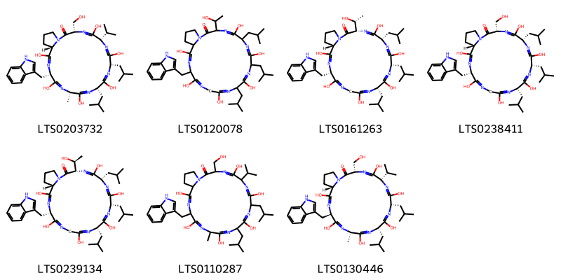{ width=100% }
    <figcaption>Hình ảnh cấu trúc hóa học của 7 hoạt chất thuộc nhóm Carboxylic acids and derivatives gồm ['(3s,6s,9s,12s,15s,18s,23as)-1,4,7,10,13,16-hexahydroxy-18-(hydroxymethyl)-3-(1h-indol-3-ylmethyl)-15-isopropyl-6-methyl-9,12-bis(2-methylpropyl)-3h,6h,9h,12h,15h,18h,21h,22h,23h,23ah-pyrrolo[1,2-a]1,4,7,10,13,16,19-heptaazacyclohenicosan-19-one (LTS0203732)', '1,4,7,10,13,16-hexahydroxy-18-(1-hydroxyethyl)-3-(1h-indol-3-ylmethyl)-9,12,15-tris(2-methylpropyl)-3h,6h,9h,12h,15h,18h,21h,22h,23h,23ah-pyrrolo[1,2-a]1,4,7,10,13,16,19-heptaazacyclohenicosan-19-one (LTS0120078)', '(3s,9s,12s,15s,18s,23as)-1,4,7,10,13,16-hexahydroxy-18-[(1r)-1-hydroxyethyl]-3-(1h-indol-3-ylmethyl)-9,12,15-tris(2-methylpropyl)-3h,6h,9h,12h,15h,18h,21h,22h,23h,23ah-pyrrolo[1,2-a]1,4,7,10,13,16,19-heptaazacyclohenicosan-19-one (LTS0161263)', '(3s,9s,12s,15s,18s,23as)-1,4,7,10,13,16-hexahydroxy-18-(hydroxymethyl)-3-(1h-indol-3-ylmethyl)-9,12,15-tris(2-methylpropyl)-3h,6h,9h,12h,15h,18h,21h,22h,23h,23ah-pyrrolo[1,2-a]1,4,7,10,13,16,19-heptaazacyclohenicosan-19-one (LTS0238411)', '(3s,9s,12s,15s,18s,23as)-1,4,7,10,13,16-hexahydroxy-18-[(1s)-1-hydroxyethyl]-3-(1h-indol-3-ylmethyl)-9,12,15-tris(2-methylpropyl)-3h,6h,9h,12h,15h,18h,21h,22h,23h,23ah-pyrrolo[1,2-a]1,4,7,10,13,16,19-heptaazacyclohenicosan-19-one (LTS0239134)', '1,4,7,10,13,16-hexahydroxy-18-(hydroxymethyl)-3-(1h-indol-3-ylmethyl)-15-isopropyl-6-methyl-9,12-bis(2-methylpropyl)-3h,6h,9h,12h,15h,18h,21h,22h,23h,23ah-pyrrolo[1,2-a]1,4,7,10,13,16,19-heptaazacyclohenicosan-19-one (LTS0110287)', '(3r,6s,9s,12s,15s,18s,23as)-1,4,7,10,13,16-hexahydroxy-18-(hydroxymethyl)-3-(1h-indol-3-ylmethyl)-15-isopropyl-6-methyl-9,12-bis(2-methylpropyl)-3h,6h,9h,12h,15h,18h,21h,22h,23h,23ah-pyrrolo[1,2-a]1,4,7,10,13,16,19-heptaazacyclohenicosan-19-one (LTS0130446)'].</figcaption>
</figure>
#### Nhóm Indanes
<figure markdown="span">
    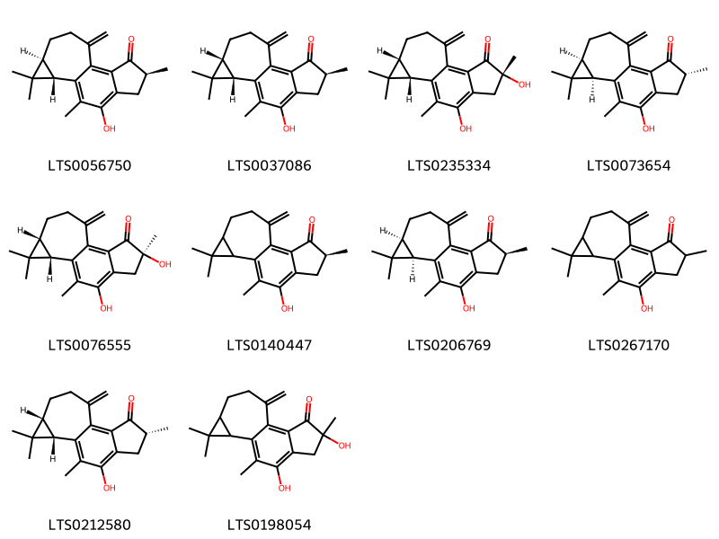{ width=100% }
    <figcaption>Hình ảnh cấu trúc hóa học của 10 hoạt chất thuộc nhóm Indanes gồm ['(4s,10s,12s)-7-hydroxy-4,8,11,11-tetramethyl-15-methylidenetetracyclo[7.6.0.0²,⁶.0¹⁰,¹²]pentadeca-1,6,8-trien-3-one (LTS0056750)', '(4s,10s,12r)-7-hydroxy-4,8,11,11-tetramethyl-15-methylidenetetracyclo[7.6.0.0²,⁶.0¹⁰,¹²]pentadeca-1,6,8-trien-3-one (LTS0037086)', '(4r,10s,12r)-4,7-dihydroxy-4,8,11,11-tetramethyl-15-methylidenetetracyclo[7.6.0.0²,⁶.0¹⁰,¹²]pentadeca-1,6,8-trien-3-one (LTS0235334)', '(4r,10r,12s)-7-hydroxy-4,8,11,11-tetramethyl-15-methylidenetetracyclo[7.6.0.0²,⁶.0¹⁰,¹²]pentadeca-1,6,8-trien-3-one (LTS0073654)', '(4s,10s,12r)-4,7-dihydroxy-4,8,11,11-tetramethyl-15-methylidenetetracyclo[7.6.0.0²,⁶.0¹⁰,¹²]pentadeca-1,6,8-trien-3-one (LTS0076555)', '(4s)-7-hydroxy-4,8,11,11-tetramethyl-15-methylidenetetracyclo[7.6.0.0²,⁶.0¹⁰,¹²]pentadeca-1,6,8-trien-3-one (LTS0140447)', '(4s,10r,12s)-7-hydroxy-4,8,11,11-tetramethyl-15-methylidenetetracyclo[7.6.0.0²,⁶.0¹⁰,¹²]pentadeca-1,6,8-trien-3-one (LTS0206769)', '7-hydroxy-4,8,11,11-tetramethyl-15-methylidenetetracyclo[7.6.0.0²,⁶.0¹⁰,¹²]pentadeca-1,6,8-trien-3-one (LTS0267170)', '(4r,10s,12r)-7-hydroxy-4,8,11,11-tetramethyl-15-methylidenetetracyclo[7.6.0.0²,⁶.0¹⁰,¹²]pentadeca-1,6,8-trien-3-one (LTS0212580)', '4,7-dihydroxy-4,8,11,11-tetramethyl-15-methylidenetetracyclo[7.6.0.0²,⁶.0¹⁰,¹²]pentadeca-1,6,8-trien-3-one (LTS0198054)'].</figcaption>
</figure>
#### Nhóm Oxanes
<figure markdown="span">
    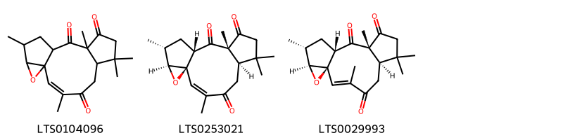{ width=100% }
    <figcaption>Hình ảnh cấu trúc hóa học của 3 hoạt chất thuộc nhóm Oxanes gồm ['3,7,7,10,14-pentamethyl-16-oxatetracyclo[10.4.0.0¹,¹⁵.0⁶,¹⁰]hexadec-2-ene-4,9,11-trione (LTS0104096)', '(1r,2z,6r,10s,12s,14r,15s)-3,7,7,10,14-pentamethyl-16-oxatetracyclo[10.4.0.0¹,¹⁵.0⁶,¹⁰]hexadec-2-ene-4,9,11-trione (LTS0253021)', '(1r,2e,6r,10s,12s,14r,15s)-3,7,7,10,14-pentamethyl-16-oxatetracyclo[10.4.0.0¹,¹⁵.0⁶,¹⁰]hexadec-2-ene-4,9,11-trione (LTS0029993)'].</figcaption>
</figure>
#### Nhóm Prenol lipids
<figure markdown="span">
    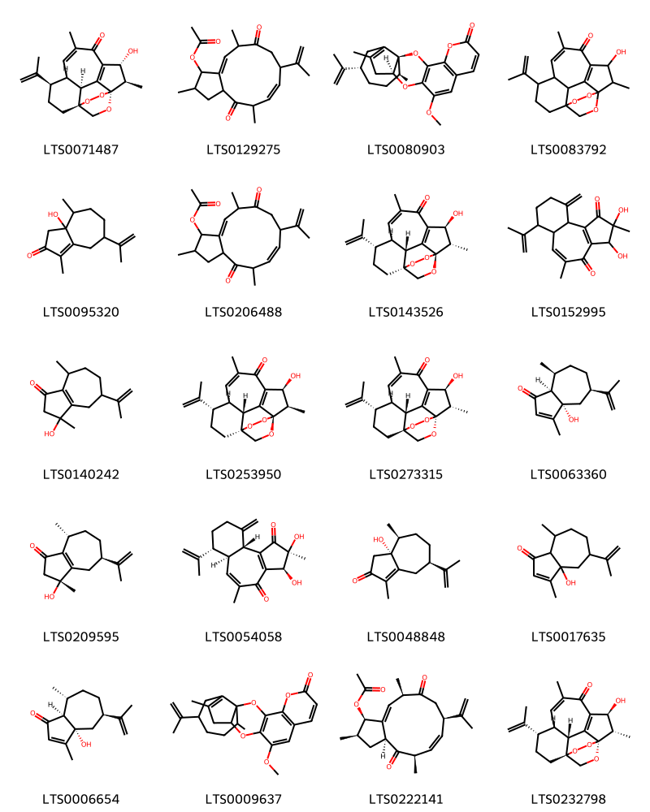{ width=100% }
    <figcaption>Hình ảnh cấu trúc hóa học của 20 hoạt chất thuộc nhóm Prenol lipids gồm ['(1r,4s,7r,8r,13r,14r,16s)-13-hydroxy-10,14-dimethyl-7-(prop-1-en-2-yl)-2,3,18-trioxapentacyclo[6.6.2.2¹,⁴.0⁴,¹⁶.0¹²,¹⁵]octadeca-9,12(15)-dien-11-one (LTS0071487)', '2,5,11-trimethyl-4,10-dioxo-8-(prop-1-en-2-yl)-1h,2h,3h,3ah,5h,8h,9h,11h-cyclopenta[11]annulen-1-yl acetate (LTS0129275)', '(1r,14s,19s,22s)-11-methoxy-16,22-dimethyl-19-(prop-1-en-2-yl)-2,5,13-trioxapentacyclo[12.8.0.0¹,¹⁷.0³,¹².0⁴,⁹]docosa-3,7,9,11,16-pentaen-6-one (LTS0080903)', '13-hydroxy-10,14-dimethyl-7-(prop-1-en-2-yl)-2,3,18-trioxapentacyclo[6.6.2.2¹,⁴.0⁴,¹⁶.0¹²,¹⁵]octadeca-9,12(15)-dien-11-one (LTS0083792)', '3a-hydroxy-1,4-dimethyl-7-(prop-1-en-2-yl)-3,4,5,6,7,8-hexahydroazulen-2-one (LTS0095320)', '2,5,11-trimethyl-4,10-dioxo-8-(prop-1-en-2-yl)-1h,2h,3h,3ah,5h,8h,9h,11h-cyclopenta[11]annulen-1-yl acetate (LTS0206488)', '(1s,4r,7s,8r,13s,14s,16r)-13-hydroxy-10,14-dimethyl-7-(prop-1-en-2-yl)-2,3,18-trioxapentacyclo[6.6.2.2¹,⁴.0⁴,¹⁶.0¹²,¹⁵]octadeca-9,12(15)-dien-11-one (LTS0143526)', '2,3-dihydroxy-2,5-dimethyl-10-methylidene-7-(prop-1-en-2-yl)-3h,6ah,7h,8h,9h,10ah-cyclohexa[e]azulene-1,4-dione (LTS0152995)', '3-hydroxy-3,8-dimethyl-5-(prop-1-en-2-yl)-2,4,5,6,7,8-hexahydroazulen-1-one (LTS0140242)', '(1s,4r,7s,8r,13s,14r,16r)-13-hydroxy-10,14-dimethyl-7-(prop-1-en-2-yl)-2,3,18-trioxapentacyclo[6.6.2.2¹,⁴.0⁴,¹⁶.0¹²,¹⁵]octadeca-9,12(15)-dien-11-one (LTS0253950)', '(1r,4s,7s,8r,13s,14s,16r)-13-hydroxy-10,14-dimethyl-7-(prop-1-en-2-yl)-2,3,18-trioxapentacyclo[6.6.2.2¹,⁴.0⁴,¹⁶.0¹²,¹⁵]octadeca-9,12(15)-dien-11-one (LTS0273315)', '(3as,5r,8s,8as)-3a-hydroxy-3,8-dimethyl-5-(prop-1-en-2-yl)-4,5,6,7,8,8a-hexahydroazulen-1-one (LTS0063360)', '(3r,5r,8r)-3-hydroxy-3,8-dimethyl-5-(prop-1-en-2-yl)-2,4,5,6,7,8-hexahydroazulen-1-one (LTS0209595)', '(2s,3s,6as,7r,10ar)-2,3-dihydroxy-2,5-dimethyl-10-methylidene-7-(prop-1-en-2-yl)-3h,6ah,7h,8h,9h,10ah-cyclohexa[e]azulene-1,4-dione (LTS0054058)', '(3ar,4s,7r)-3a-hydroxy-1,4-dimethyl-7-(prop-1-en-2-yl)-3,4,5,6,7,8-hexahydroazulen-2-one (LTS0048848)', '3a-hydroxy-3,8-dimethyl-5-(prop-1-en-2-yl)-4,5,6,7,8,8a-hexahydroazulen-1-one (LTS0017635)', '(3as,5r,8r,8as)-3a-hydroxy-3,8-dimethyl-5-(prop-1-en-2-yl)-4,5,6,7,8,8a-hexahydroazulen-1-one (LTS0006654)', '11-methoxy-16,22-dimethyl-19-(prop-1-en-2-yl)-2,5,13-trioxapentacyclo[12.8.0.0¹,¹⁷.0³,¹².0⁴,⁹]docosa-3,7,9,11,16-pentaen-6-one (LTS0009637)', '(1r,2r,3as,5r,8r,11r)-2,5,11-trimethyl-4,10-dioxo-8-(prop-1-en-2-yl)-1h,2h,3h,3ah,5h,8h,9h,11h-cyclopenta[11]annulen-1-yl acetate (LTS0222141)', '(1r,4s,7s,8s,13s,14s,16r)-13-hydroxy-10,14-dimethyl-7-(prop-1-en-2-yl)-2,3,18-trioxapentacyclo[6.6.2.2¹,⁴.0⁴,¹⁶.0¹²,¹⁵]octadeca-9,12(15)-dien-11-one (LTS0232798)'].</figcaption>
</figure>
#### Nhóm Steroids and steroid derivatives
<figure markdown="span">
    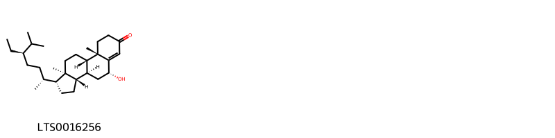{ width=100% }
    <figcaption>Hình ảnh cấu trúc hóa học của 1 hoạt chất thuộc nhóm Steroids and steroid derivatives gồm ['(1r,3as,3bs,5r,9as,9bs,11ar)-1-[(2r,5r)-5-ethyl-6-methylheptan-2-yl]-5-hydroxy-9a,11a-dimethyl-1h,2h,3h,3ah,3bh,4h,5h,8h,9h,9bh,10h,11h-cyclopenta[a]phenanthren-7-one (LTS0016256)'].</figcaption>
</figure>

---

### Dược dân tộc học

Danh sách các quốc gia có sử dụng *Jatropha integerrima* trong điều trị các bệnh. 

| Country       | Disease   | Bệnh                                                                                                                                                                                                |
|:--------------|:----------|:----------------------------------------------------------------------------------------------------------------------------------------------------------------------------------------------------|
| Latin America | Poison    | MYMEMORY WARNING: YOU USED ALL AVAILABLE FREE TRANSLATIONS FOR TODAY. NEXT AVAILABLE IN  19 HOURS 27 MINUTES 45 SECONDS VISIT HTTPS://MYMEMORY.TRANSLATED.NET/DOC/USAGELIMITS.PHP TO TRANSLATE MORE |

---

---
## Jatropha isabelli
### Thông tin về thực vật

!!! info "Phân loại thực vật của *Jatropha isabellei* từ GIBF:"
    - **Kingdom:** Plantae
    - **Phylum:** Tracheophyta
    - **Order:** Malpighiales
    - **Family:** Euphorbiaceae
    - **Genus:** Jatropha
    - **Species:** *Jatropha isabellei*

 

| Label (VI)   | Label (EN)   | Scientific Name      | Descriptions (VI)   | Descriptions (EN)   | Also Known As (VI)                                 | Also Known As (EN)              |
|:-------------|:-------------|:---------------------|:--------------------|:--------------------|:---------------------------------------------------|:--------------------------------|
| N/A          | N/A          | Jatropha integerrima | loài thực vật       | species of plant    | ['Jatropha integerrima', 'Jatropha panduraefolia'] | ['Peregrina', 'Spicy Jatropha'] |

#### Phân bố trên thế giới

**Từ CSDL GIBF** nan, Cabo Verde, Brazil, Bolivia (Plurinational State of), Argentina, Paraguay

#### Phân bố tại Việt Nam

**Từ CSDL GIBF**: Không có ghi nhận ở Việt Nam

---
### Thành phần hóa học
        
- Theo cơ sở dữ liệu lotus: Từ loài *Jatropha isabellei* đã phân lập và xác định được Chưa có hoạt chất nào được phân lập. hoạt chất thuộc về các nhóm Không có hoạt chất nào được phân lập. 

Không có hình ảnh nào được tạo ra

---

### Dược dân tộc học

Danh sách các quốc gia có sử dụng *Jatropha isabellei* trong điều trị các bệnh. 

| Country   | Disease       | Bệnh                                                                                                                                                                                                |
|:----------|:--------------|:----------------------------------------------------------------------------------------------------------------------------------------------------------------------------------------------------|
| Paraguay  | Antifertility | MYMEMORY WARNING: YOU USED ALL AVAILABLE FREE TRANSLATIONS FOR TODAY. NEXT AVAILABLE IN  19 HOURS 27 MINUTES 19 SECONDS VISIT HTTPS://MYMEMORY.TRANSLATED.NET/DOC/USAGELIMITS.PHP TO TRANSLATE MORE |

---

---
## Jatropha macrorhiza
### Thông tin về thực vật

!!! info "Phân loại thực vật của *Jatropha macrorhiza* từ GIBF:"
    - **Kingdom:** Plantae
    - **Phylum:** Tracheophyta
    - **Order:** Malpighiales
    - **Family:** Euphorbiaceae
    - **Genus:** Jatropha
    - **Species:** *Jatropha macrorhiza*

 

| Label (VI)   | Label (EN)   | Scientific Name     | Descriptions (VI)   | Descriptions (EN)   | Also Known As (VI)   | Also Known As (EN)   |
|:-------------|:-------------|:--------------------|:--------------------|:--------------------|:---------------------|:---------------------|
| N/A          | N/A          | Jatropha macrorhiza | loài thực vật       | species of plant    | ['']                 | ['']                 |

#### Phân bố trên thế giới

**Từ CSDL GIBF** nan, United States of America, Mexico

#### Phân bố tại Việt Nam

**Từ CSDL GIBF**: Không có ghi nhận ở Việt Nam

---
### Thành phần hóa học
        
- Theo cơ sở dữ liệu lotus: Từ loài *Jatropha macrorhiza* đã phân lập và xác định được 4 hoạt chất thuộc về các nhóm Pyrrolines, Carboximidic acids and derivatives, Prenol lipids. 

|    | chemicalTaxonomyClassyfireClass    |   smiles_count |
|---:|:-----------------------------------|---------------:|
|  0 | Carboximidic acids and derivatives |              1 |
|  1 | Prenol lipids                      |              2 |
|  2 | Pyrrolines                         |              1 |

#### Nhóm Carboximidic acids and derivatives
<figure markdown="span">
    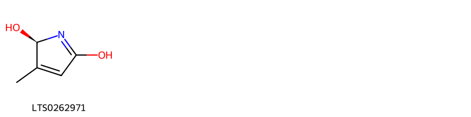{ width=100% }
    <figcaption>Hình ảnh cấu trúc hóa học của 1 hoạt chất thuộc nhóm Carboximidic acids and derivatives gồm ['(2r)-3-methyl-2h-pyrrole-2,5-diol (LTS0262971)'].</figcaption>
</figure>
#### Nhóm Prenol lipids
<figure markdown="span">
    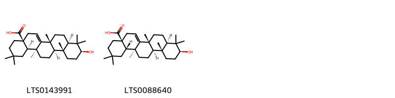{ width=100% }
    <figcaption>Hình ảnh cấu trúc hóa học của 2 hoạt chất thuộc nhóm Prenol lipids gồm ['(4as,6br,8ar,10s,12ar,12br,14as,14br)-10-hydroxy-2,2,6b,9,9,12a,14a-heptamethyl-1,3,4,5,7,8,8a,10,11,12,12b,13,14,14b-tetradecahydropicene-4a-carboxylic acid (LTS0143991)', 'maprounic acid (LTS0088640)'].</figcaption>
</figure>
#### Nhóm Pyrrolines
<figure markdown="span">
    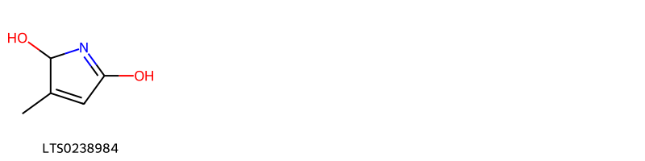{ width=100% }
    <figcaption>Hình ảnh cấu trúc hóa học của 1 hoạt chất thuộc nhóm Pyrrolines gồm ['3-methyl-2h-pyrrole-2,5-diol (LTS0238984)'].</figcaption>
</figure>

---

### Dược dân tộc học

Danh sách các quốc gia có sử dụng *Jatropha macrorhiza* trong điều trị các bệnh. 

| Country   | Disease   | Bệnh                                                                                                                                                                                                |
|:----------|:----------|:----------------------------------------------------------------------------------------------------------------------------------------------------------------------------------------------------|
| Mexico    | Purgative | MYMEMORY WARNING: YOU USED ALL AVAILABLE FREE TRANSLATIONS FOR TODAY. NEXT AVAILABLE IN  19 HOURS 26 MINUTES 44 SECONDS VISIT HTTPS://MYMEMORY.TRANSLATED.NET/DOC/USAGELIMITS.PHP TO TRANSLATE MORE |

---

---
## Jatropha multifida
### Thông tin về thực vật

!!! info "Phân loại thực vật của *Jatropha multifida* từ GIBF:"
    - **Kingdom:** Plantae
    - **Phylum:** Tracheophyta
    - **Order:** Malpighiales
    - **Family:** Euphorbiaceae
    - **Genus:** Jatropha
    - **Species:** *Jatropha multifida*

 

| Label (VI)   | Label (EN)   | Scientific Name    | Descriptions (VI)   | Descriptions (EN)   | Also Known As (VI)   | Also Known As (EN)   |
|:-------------|:-------------|:-------------------|:--------------------|:--------------------|:---------------------|:---------------------|
| N/A          | N/A          | Jatropha multifida | loài thực vật       | species of plant    | ['']                 | ['']                 |

#### Phân bố trên thế giới

**Từ CSDL GIBF** Virgin Islands (U.S.), Guadeloupe, Mozambique, Benin, Nicaragua, Tanzania, United Republic of, Venezuela (Bolivarian Republic of), French Guiana, Panama, Zambia, Puerto Rico, Senegal, Nigeria, Bolivia (Plurinational State of), Honduras, Jamaica, United States of America, Bonaire, Sint Eustatius and Saba, Paraguay, El Salvador, Belize, Trinidad and Tobago, Fiji, South Africa, Barbados, Thailand, Martinique, Brazil, Guyana, Mexico, Dominica, Dominican Republic, Singapore, Viet Nam, Ecuador, Comoros, Madagascar, Haiti, Colombia, Costa Rica, India, Indonesia, Antigua and Barbuda, Philippines, Malaysia

#### Phân bố tại Việt Nam

**Từ CSDL GIBF**: Long An

---
### Thành phần hóa học
        
- Theo cơ sở dữ liệu lotus: Từ loài *Jatropha multifida* đã phân lập và xác định được 61 hoạt chất thuộc về các nhóm Fatty Acyls, Coumarinolignans, Prenol lipids, Flavonoids, Oxanes, Cinnamic acids and derivatives, Azoles, Tetrahydrofurans, Oxolanes, Indanes, Dihydrofurans, Organooxygen compounds, Coumarins and derivatives. 

|    | chemicalTaxonomyClassyfireClass   |   smiles_count |
|---:|:----------------------------------|---------------:|
|  0 | Azoles                            |              1 |
|  1 | Cinnamic acids and derivatives    |              2 |
|  2 | Coumarinolignans                  |              3 |
|  3 | Coumarins and derivatives         |              1 |
|  4 | Dihydrofurans                     |              2 |
|  5 | Fatty Acyls                       |              2 |
|  6 | Flavonoids                        |              2 |
|  7 | Indanes                           |              6 |
|  8 | Organooxygen compounds            |             12 |
|  9 | Oxanes                            |              3 |
| 10 | Oxolanes                          |              2 |
| 11 | Prenol lipids                     |             21 |
| 12 | Tetrahydrofurans                  |              3 |

#### Nhóm Azoles
<figure markdown="span">
    { width=100% }
    <figcaption>Hình ảnh cấu trúc hóa học của 1 hoạt chất thuộc nhóm Azoles gồm ['5-butyl-2-chloro-1h-imidazole-4-carbaldehyde (LTS0031826)'].</figcaption>
</figure>
#### Nhóm Cinnamic acids and derivatives
<figure markdown="span">
    { width=100% }
    <figcaption>Hình ảnh cấu trúc hóa học của 2 hoạt chất thuộc nhóm Cinnamic acids and derivatives gồm ['tetradecyl 3-(4-hydroxy-3-methoxyphenyl)prop-2-enoate (LTS0234981)', 'tetradecyl (2e)-3-(4-hydroxy-3-methoxyphenyl)prop-2-enoate (LTS0105487)'].</figcaption>
</figure>
#### Nhóm Coumarinolignans
<figure markdown="span">
    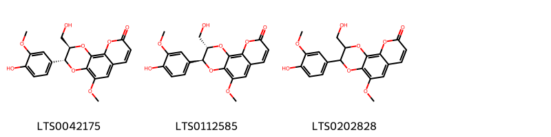{ width=100% }
    <figcaption>Hình ảnh cấu trúc hóa học của 3 hoạt chất thuộc nhóm Coumarinolignans gồm ['cleomiscosin a (LTS0042175)', '(2s,3s)-3-(4-hydroxy-3-methoxyphenyl)-2-(hydroxymethyl)-5-methoxy-2h,3h-[1,4]dioxino[2,3-h]chromen-9-one (LTS0112585)', '3-(4-hydroxy-3-methoxyphenyl)-2-(hydroxymethyl)-5-methoxy-2h,3h-[1,4]dioxino[2,3-h]chromen-9-one (LTS0202828)'].</figcaption>
</figure>
#### Nhóm Coumarins and derivatives
<figure markdown="span">
    { width=100% }
    <figcaption>Hình ảnh cấu trúc hóa học của 1 hoạt chất thuộc nhóm Coumarins and derivatives gồm ['fraxidin (LTS0182118)'].</figcaption>
</figure>
#### Nhóm Dihydrofurans
<figure markdown="span">
    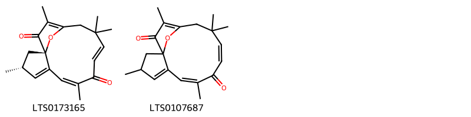{ width=100% }
    <figcaption>Hình ảnh cấu trúc hóa học của 2 hoạt chất thuộc nhóm Dihydrofurans gồm ['jatrophone (LTS0173165)', '3,7,11,11,14-pentamethyl-16-oxatricyclo[11.2.1.0¹,⁵]hexadeca-4,6,9,13-tetraene-8,15-dione (LTS0107687)'].</figcaption>
</figure>
#### Nhóm Fatty Acyls
<figure markdown="span">
    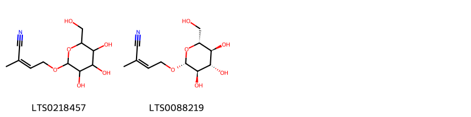{ width=100% }
    <figcaption>Hình ảnh cấu trúc hóa học của 2 hoạt chất thuộc nhóm Fatty Acyls gồm ['2-methyl-4-{[3,4,5-trihydroxy-6-(hydroxymethyl)oxan-2-yl]oxy}but-2-enenitrile (LTS0218457)', 'rhodiocyanoside a (LTS0088219)'].</figcaption>
</figure>
#### Nhóm Flavonoids
<figure markdown="span">
    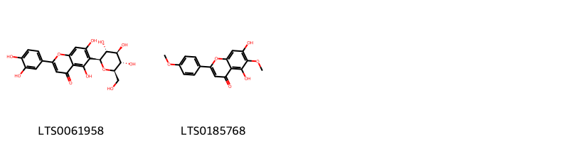{ width=100% }
    <figcaption>Hình ảnh cấu trúc hóa học của 2 hoạt chất thuộc nhóm Flavonoids gồm ['isoorientin (LTS0061958)', 'pectolinarigenin (LTS0185768)'].</figcaption>
</figure>
#### Nhóm Indanes
<figure markdown="span">
    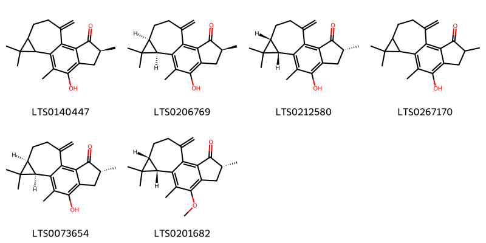{ width=100% }
    <figcaption>Hình ảnh cấu trúc hóa học của 6 hoạt chất thuộc nhóm Indanes gồm ['(4s)-7-hydroxy-4,8,11,11-tetramethyl-15-methylidenetetracyclo[7.6.0.0²,⁶.0¹⁰,¹²]pentadeca-1,6,8-trien-3-one (LTS0140447)', '(4s,10r,12s)-7-hydroxy-4,8,11,11-tetramethyl-15-methylidenetetracyclo[7.6.0.0²,⁶.0¹⁰,¹²]pentadeca-1,6,8-trien-3-one (LTS0206769)', '(4r,10s,12r)-7-hydroxy-4,8,11,11-tetramethyl-15-methylidenetetracyclo[7.6.0.0²,⁶.0¹⁰,¹²]pentadeca-1,6,8-trien-3-one (LTS0212580)', '7-hydroxy-4,8,11,11-tetramethyl-15-methylidenetetracyclo[7.6.0.0²,⁶.0¹⁰,¹²]pentadeca-1,6,8-trien-3-one (LTS0267170)', '(4r,10r,12s)-7-hydroxy-4,8,11,11-tetramethyl-15-methylidenetetracyclo[7.6.0.0²,⁶.0¹⁰,¹²]pentadeca-1,6,8-trien-3-one (LTS0073654)', '(4r,10s,12r)-7-methoxy-4,8,11,11-tetramethyl-15-methylidenetetracyclo[7.6.0.0²,⁶.0¹⁰,¹²]pentadeca-1,6,8-trien-3-one (LTS0201682)'].</figcaption>
</figure>
#### Nhóm Organooxygen compounds
<figure markdown="span">
    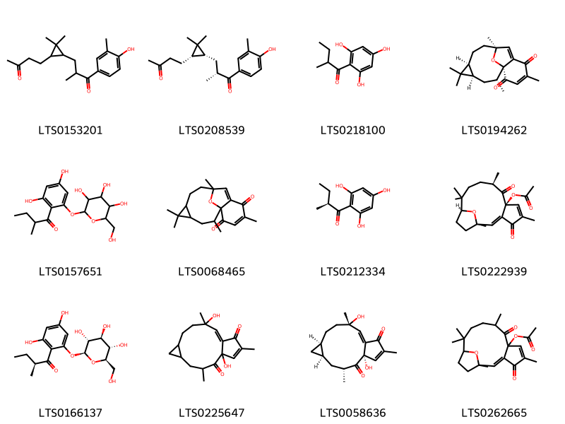{ width=100% }
    <figcaption>Hình ảnh cấu trúc hóa học của 12 hoạt chất thuộc nhóm Organooxygen compounds gồm ['4-{3-[3-(4-hydroxy-3-methylphenyl)-2-methyl-3-oxopropyl]-2,2-dimethylcyclopropyl}butan-2-one (LTS0153201)', '4-[(1s,3r)-3-[(2r)-3-(4-hydroxy-3-methylphenyl)-2-methyl-3-oxopropyl]-2,2-dimethylcyclopropyl]butan-2-one (LTS0208539)', 'multifidol (LTS0218100)', '(1r,2r,4r,6s,9s)-2,5,5,9,13-pentamethyl-16-oxatetracyclo[7.6.1.0¹,¹¹.0⁴,⁶]hexadeca-10,13-diene-12,15-dione (LTS0194262)', '1-(2,4-dihydroxy-6-{[3,4,5-trihydroxy-6-(hydroxymethyl)oxan-2-yl]oxy}phenyl)-2-methylbutan-1-one (LTS0157651)', '2,5,5,9,13-pentamethyl-16-oxatetracyclo[7.6.1.0¹,¹¹.0⁴,⁶]hexadeca-10,13-diene-12,15-dione (LTS0068465)', 'multifidol (LTS0212334)', '(1s,2e,7s,9r,13s)-1,5,9,12,12-pentamethyl-4,8-dioxo-16-oxatricyclo[11.2.1.0³,⁷]hexadeca-2,5-dien-7-yl acetate (LTS0222939)', 'multifidol glucoside (LTS0166137)', '1,10-dihydroxy-3,10,14-trimethyltricyclo[10.3.0.0⁵,⁷]pentadeca-11,14-diene-2,13-dione (LTS0225647)', '(1s,3r,5r,7r,10s,11e)-1,10-dihydroxy-3,10,14-trimethyltricyclo[10.3.0.0⁵,⁷]pentadeca-11,14-diene-2,13-dione (LTS0058636)', '1,5,9,12,12-pentamethyl-4,8-dioxo-16-oxatricyclo[11.2.1.0³,⁷]hexadeca-2,5-dien-7-yl acetate (LTS0262665)'].</figcaption>
</figure>
#### Nhóm Oxanes
<figure markdown="span">
    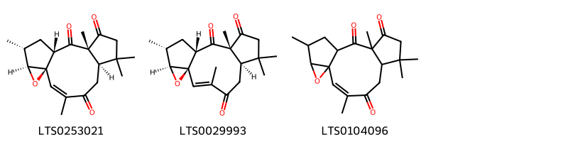{ width=100% }
    <figcaption>Hình ảnh cấu trúc hóa học của 3 hoạt chất thuộc nhóm Oxanes gồm ['(1r,2z,6r,10s,12s,14r,15s)-3,7,7,10,14-pentamethyl-16-oxatetracyclo[10.4.0.0¹,¹⁵.0⁶,¹⁰]hexadec-2-ene-4,9,11-trione (LTS0253021)', '(1r,2e,6r,10s,12s,14r,15s)-3,7,7,10,14-pentamethyl-16-oxatetracyclo[10.4.0.0¹,¹⁵.0⁶,¹⁰]hexadec-2-ene-4,9,11-trione (LTS0029993)', '3,7,7,10,14-pentamethyl-16-oxatetracyclo[10.4.0.0¹,¹⁵.0⁶,¹⁰]hexadec-2-ene-4,9,11-trione (LTS0104096)'].</figcaption>
</figure>
#### Nhóm Oxolanes
<figure markdown="span">
    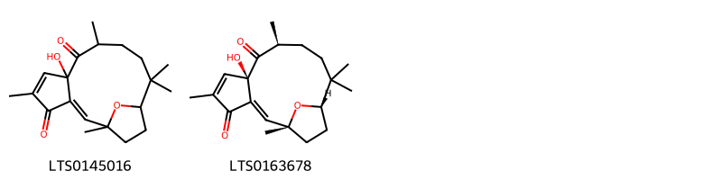{ width=100% }
    <figcaption>Hình ảnh cấu trúc hóa học của 2 hoạt chất thuộc nhóm Oxolanes gồm ['7-hydroxy-1,5,9,12,12-pentamethyl-16-oxatricyclo[11.2.1.0³,⁷]hexadeca-2,5-diene-4,8-dione (LTS0145016)', '(1r,2e,7r,9s,13s)-7-hydroxy-1,5,9,12,12-pentamethyl-16-oxatricyclo[11.2.1.0³,⁷]hexadeca-2,5-diene-4,8-dione (LTS0163678)'].</figcaption>
</figure>
#### Nhóm Prenol lipids
<figure markdown="span">
    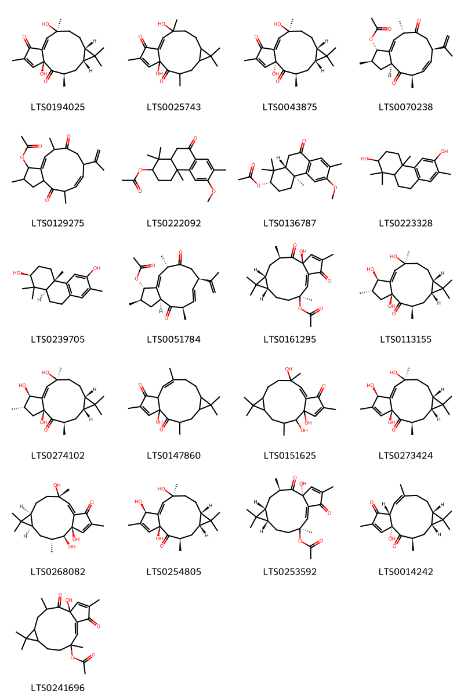{ width=100% }
    <figcaption>Hình ảnh cấu trúc hóa học của 21 hoạt chất thuộc nhóm Prenol lipids gồm ['(1s,3r,5r,7s,10s,11e)-1,10-dihydroxy-3,6,6,10,14-pentamethyltricyclo[10.3.0.0⁵,⁷]pentadeca-11,14-diene-2,13-dione (LTS0194025)', '1,10-dihydroxy-3,6,6,10,14-pentamethyltricyclo[10.3.0.0⁵,⁷]pentadeca-11,14-diene-2,13-dione (LTS0025743)', '(1r,3r,5r,7s,10s,11e)-1,10-dihydroxy-3,6,6,10,14-pentamethyltricyclo[10.3.0.0⁵,⁷]pentadeca-11,14-diene-2,13-dione (LTS0043875)', '(1s,2r,3as,5r,8r,11s)-2,5,11-trimethyl-4,10-dioxo-8-(prop-1-en-2-yl)-1h,2h,3h,3ah,5h,8h,9h,11h-cyclopenta[11]annulen-1-yl acetate (LTS0070238)', '2,5,11-trimethyl-4,10-dioxo-8-(prop-1-en-2-yl)-1h,2h,3h,3ah,5h,8h,9h,11h-cyclopenta[11]annulen-1-yl acetate (LTS0129275)', '6-methoxy-1,1,4a,7-tetramethyl-9-oxo-3,4,10,10a-tetrahydro-2h-phenanthren-2-yl acetate (LTS0222092)', '(2s,4as,10ar)-6-methoxy-1,1,4a,7-tetramethyl-9-oxo-3,4,10,10a-tetrahydro-2h-phenanthren-2-yl acetate (LTS0136787)', '1,1,4a,7-tetramethyl-2,3,4,9,10,10a-hexahydrophenanthrene-2,6-diol (LTS0223328)', '(2s,4as,10ar)-1,1,4a,7-tetramethyl-2,3,4,9,10,10a-hexahydrophenanthrene-2,6-diol (LTS0239705)', '(1s,2r,3as,5r,8r,11s)-2,5,11-trimethyl-4,10-dioxo-8-(prop-1-en-2-yl)-1h,2h,3h,3ah,5h,8h,9h,11h-cyclopenta[11]annulen-1-yl acetate (LTS0051784)', '(1s,3r,5r,7s,10s,11e)-1-hydroxy-3,6,6,10,14-pentamethyl-2,13-dioxotricyclo[10.3.0.0⁵,⁷]pentadeca-11,14-dien-10-yl acetate (LTS0161295)', '(1s,3r,5r,7s,10s,11z,13r,14s)-1,10,13-trihydroxy-3,6,6,10,14-pentamethyltricyclo[10.3.0.0⁵,⁷]pentadec-11-en-2-one (LTS0113155)', '(1s,3r,5r,7s,10s,13r,14s)-1,10,13-trihydroxy-3,6,6,10,14-pentamethyltricyclo[10.3.0.0⁵,⁷]pentadec-11-en-2-one (LTS0274102)', '1-hydroxy-3,6,6,10,14-pentamethyltricyclo[10.3.0.0⁵,⁷]pentadeca-10,14-diene-2,13-dione (LTS0147860)', '1,2,10-trihydroxy-3,6,6,10,14-pentamethyltricyclo[10.3.0.0⁵,⁷]pentadeca-11,14-dien-13-one (LTS0151625)', '(1s,3r,5r,7s,10s,13r)-1,10,13-trihydroxy-3,6,6,10,14-pentamethyltricyclo[10.3.0.0⁵,⁷]pentadeca-11,14-dien-2-one (LTS0273424)', '(1r,2s,3r,5r,7s,10s,11e)-1,2,10-trihydroxy-3,6,6,10,14-pentamethyltricyclo[10.3.0.0⁵,⁷]pentadeca-11,14-dien-13-one (LTS0268082)', '(1s,3r,5r,7s,10s,11z,13r)-1,10,13-trihydroxy-3,6,6,10,14-pentamethyltricyclo[10.3.0.0⁵,⁷]pentadeca-11,14-dien-2-one (LTS0254805)', '(1r,3r,5r,7s,10s,11e)-1-hydroxy-3,6,6,10,14-pentamethyl-2,13-dioxotricyclo[10.3.0.0⁵,⁷]pentadeca-11,14-dien-10-yl acetate (LTS0253592)', '(1r,3r,5r,7s,10z,12r)-1-hydroxy-3,6,6,10,14-pentamethyltricyclo[10.3.0.0⁵,⁷]pentadeca-10,14-diene-2,13-dione (LTS0014242)', '1-hydroxy-3,6,6,10,14-pentamethyl-2,13-dioxotricyclo[10.3.0.0⁵,⁷]pentadeca-11,14-dien-10-yl acetate (LTS0241696)'].</figcaption>
</figure>
#### Nhóm Tetrahydrofurans
<figure markdown="span">
    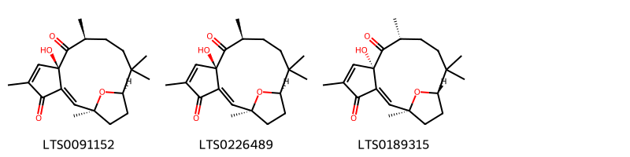{ width=100% }
    <figcaption>Hình ảnh cấu trúc hóa học của 3 hoạt chất thuộc nhóm Tetrahydrofurans gồm ['(1s,2e,7r,9s,13r)-7-hydroxy-1,5,9,12,12-pentamethyl-16-oxatricyclo[11.2.1.0³,⁷]hexadeca-2,5-diene-4,8-dione (LTS0091152)', '(1s,7r,9s,13r)-7-hydroxy-1,5,9,12,12-pentamethyl-16-oxatricyclo[11.2.1.0³,⁷]hexadeca-2,5-diene-4,8-dione (LTS0226489)', '(1s,2e,7s,9r,13s)-7-hydroxy-1,5,9,12,12-pentamethyl-16-oxatricyclo[11.2.1.0³,⁷]hexadeca-2,5-diene-4,8-dione (LTS0189315)'].</figcaption>
</figure>

---

### Dược dân tộc học

Danh sách các quốc gia có sử dụng *Jatropha multifida* trong điều trị các bệnh. 

| Country       | Disease                                   | Bệnh                                                                                                                                                                                                |
|:--------------|:------------------------------------------|:----------------------------------------------------------------------------------------------------------------------------------------------------------------------------------------------------|
| Brazil        | Cathartic                                 | MYMEMORY WARNING: YOU USED ALL AVAILABLE FREE TRANSLATIONS FOR TODAY. NEXT AVAILABLE IN  19 HOURS 26 MINUTES 04 SECONDS VISIT HTTPS://MYMEMORY.TRANSLATED.NET/DOC/USAGELIMITS.PHP TO TRANSLATE MORE |
| Elsewhere     | Poison, Poison, Purgative, Purgative, nan | MYMEMORY WARNING: YOU USED ALL AVAILABLE FREE TRANSLATIONS FOR TODAY. NEXT AVAILABLE IN  19 HOURS 26 MINUTES 01 SECONDS VISIT HTTPS://MYMEMORY.TRANSLATED.NET/DOC/USAGELIMITS.PHP TO TRANSLATE MORE |
| Indochina     | Tonic                                     | MYMEMORY WARNING: YOU USED ALL AVAILABLE FREE TRANSLATIONS FOR TODAY. NEXT AVAILABLE IN  19 HOURS 25 MINUTES 58 SECONDS VISIT HTTPS://MYMEMORY.TRANSLATED.NET/DOC/USAGELIMITS.PHP TO TRANSLATE MORE |
| Java          | Purgative                                 | MYMEMORY WARNING: YOU USED ALL AVAILABLE FREE TRANSLATIONS FOR TODAY. NEXT AVAILABLE IN  19 HOURS 25 MINUTES 53 SECONDS VISIT HTTPS://MYMEMORY.TRANSLATED.NET/DOC/USAGELIMITS.PHP TO TRANSLATE MORE |
| Latin America | Poison                                    | MYMEMORY WARNING: YOU USED ALL AVAILABLE FREE TRANSLATIONS FOR TODAY. NEXT AVAILABLE IN  19 HOURS 25 MINUTES 50 SECONDS VISIT HTTPS://MYMEMORY.TRANSLATED.NET/DOC/USAGELIMITS.PHP TO TRANSLATE MORE |
| Mexico        | Purgative                                 | MYMEMORY WARNING: YOU USED ALL AVAILABLE FREE TRANSLATIONS FOR TODAY. NEXT AVAILABLE IN  19 HOURS 25 MINUTES 47 SECONDS VISIT HTTPS://MYMEMORY.TRANSLATED.NET/DOC/USAGELIMITS.PHP TO TRANSLATE MORE |
| Philippines   | Piscicide                                 | MYMEMORY WARNING: YOU USED ALL AVAILABLE FREE TRANSLATIONS FOR TODAY. NEXT AVAILABLE IN  19 HOURS 25 MINUTES 45 SECONDS VISIT HTTPS://MYMEMORY.TRANSLATED.NET/DOC/USAGELIMITS.PHP TO TRANSLATE MORE |
| Venezuela     | Emetic, Purgative                         | MYMEMORY WARNING: YOU USED ALL AVAILABLE FREE TRANSLATIONS FOR TODAY. NEXT AVAILABLE IN  19 HOURS 25 MINUTES 42 SECONDS VISIT HTTPS://MYMEMORY.TRANSLATED.NET/DOC/USAGELIMITS.PHP TO TRANSLATE MORE |

---

---
## Jatropha urens
### Thông tin về thực vật

!!! info "Phân loại thực vật của *Jatropha urens* từ GIBF:"
    - **Kingdom:** Plantae
    - **Phylum:** Tracheophyta
    - **Order:** Malpighiales
    - **Family:** Euphorbiaceae
    - **Genus:** Jatropha
    - **Species:** *Jatropha urens*

 

| Label (VI)   | Label (EN)   | Scientific Name   | Descriptions (VI)   | Descriptions (EN)   | Also Known As (VI)   | Also Known As (EN)   |
|:-------------|:-------------|:------------------|:--------------------|:--------------------|:---------------------|:---------------------|
| N/A          | N/A          | Jatropha urens    | loài thực vật       | species of plant    | ['']                 | ['']                 |

#### Phân bố trên thế giới

**Từ CSDL GIBF** nan, Trinidad and Tobago, Colombia, Guam, United States of America, Venezuela (Bolivarian Republic of), French Guiana

#### Phân bố tại Việt Nam

**Từ CSDL GIBF**: Không có ghi nhận ở Việt Nam

---
### Thành phần hóa học
        
- Theo cơ sở dữ liệu lotus: Từ loài *Jatropha urens* đã phân lập và xác định được Chưa có hoạt chất nào được phân lập. hoạt chất thuộc về các nhóm Không có hoạt chất nào được phân lập. 

Không có hình ảnh nào được tạo ra

---

### Dược dân tộc học

Danh sách các quốc gia có sử dụng *Jatropha urens* trong điều trị các bệnh. 

| Country   | Disease   | Bệnh                                                                                                                                                                                                |
|:----------|:----------|:----------------------------------------------------------------------------------------------------------------------------------------------------------------------------------------------------|
| Elsewhere | Diuretic  | MYMEMORY WARNING: YOU USED ALL AVAILABLE FREE TRANSLATIONS FOR TODAY. NEXT AVAILABLE IN  19 HOURS 25 MINUTES 15 SECONDS VISIT HTTPS://MYMEMORY.TRANSLATED.NET/DOC/USAGELIMITS.PHP TO TRANSLATE MORE |

---

# Chi Uapaca

??? note "Danh sách các dược liệu thuộc chi"
    
	 - *Uapaca heudelotii*
	 - *Uapaca staudtii*

---
## Uapaca heudelotii
### Thông tin về thực vật

!!! info "Phân loại thực vật của *Uapaca heudelotii* từ GIBF:"
    - **Kingdom:** Plantae
    - **Phylum:** Tracheophyta
    - **Order:** Malpighiales
    - **Family:** Phyllanthaceae
    - **Genus:** Uapaca
    - **Species:** *Uapaca heudelotii*

 

| Label (VI)   | Label (EN)   | Scientific Name   | Descriptions (VI)   | Descriptions (EN)   | Also Known As (VI)   | Also Known As (EN)   |
|:-------------|:-------------|:------------------|:--------------------|:--------------------|:---------------------|:---------------------|
| N/A          | N/A          | Uapaca heudelotii | loài thực vật       | species of plant    | ['']                 | ['']                 |

#### Phân bố trên thế giới

**Từ CSDL GIBF** Ghana, Liberia, Nigeria, Gabon, Benin, Congo, Democratic Republic of the, Guinea, Cameroon, Sierra Leone, Togo

#### Phân bố tại Việt Nam

**Từ CSDL GIBF**: Không có ghi nhận ở Việt Nam

---
### Thành phần hóa học
        
- Theo cơ sở dữ liệu lotus: Từ loài *Uapaca heudelotii* đã phân lập và xác định được Chưa có hoạt chất nào được phân lập. hoạt chất thuộc về các nhóm Không có hoạt chất nào được phân lập. 

Không có hình ảnh nào được tạo ra

---

### Dược dân tộc học

Danh sách các quốc gia có sử dụng *Uapaca heudelotii* trong điều trị các bệnh. 

| Country   | Disease   | Bệnh                                                                                                                                                                                                |
|:----------|:----------|:----------------------------------------------------------------------------------------------------------------------------------------------------------------------------------------------------|
| Nigeria   | Sweetener | MYMEMORY WARNING: YOU USED ALL AVAILABLE FREE TRANSLATIONS FOR TODAY. NEXT AVAILABLE IN  19 HOURS 24 MINUTES 47 SECONDS VISIT HTTPS://MYMEMORY.TRANSLATED.NET/DOC/USAGELIMITS.PHP TO TRANSLATE MORE |

---

---
## Uapaca staudtii
### Thông tin về thực vật

!!! info "Phân loại thực vật của *Uapaca staudtii* từ GIBF:"
    - **Kingdom:** Plantae
    - **Phylum:** Tracheophyta
    - **Order:** Malpighiales
    - **Family:** Phyllanthaceae
    - **Genus:** Uapaca
    - **Species:** *Uapaca staudtii*

 

| Label (VI)   | Label (EN)   | Scientific Name   | Descriptions (VI)   | Descriptions (EN)   | Also Known As (VI)   | Also Known As (EN)   |
|:-------------|:-------------|:------------------|:--------------------|:--------------------|:---------------------|:---------------------|
| N/A          | N/A          | Uapaca staudtii   | loài thực vật       | species of plant    | ['']                 | ['']                 |

#### Phân bố trên thế giới

**Từ CSDL GIBF** Gabon, Cameroon, Equatorial Guinea, Nigeria

#### Phân bố tại Việt Nam

**Từ CSDL GIBF**: Không có ghi nhận ở Việt Nam

---
### Thành phần hóa học
        
- Theo cơ sở dữ liệu lotus: Từ loài *Uapaca staudtii* đã phân lập và xác định được Chưa có hoạt chất nào được phân lập. hoạt chất thuộc về các nhóm Không có hoạt chất nào được phân lập. 

Không có hình ảnh nào được tạo ra

---

### Dược dân tộc học

Danh sách các quốc gia có sử dụng *Uapaca staudtii* trong điều trị các bệnh. 

| Country   | Disease   | Bệnh                                                                                                                                                                                                |
|:----------|:----------|:----------------------------------------------------------------------------------------------------------------------------------------------------------------------------------------------------|
| Nigeria   | Sweetener | MYMEMORY WARNING: YOU USED ALL AVAILABLE FREE TRANSLATIONS FOR TODAY. NEXT AVAILABLE IN  19 HOURS 24 MINUTES 14 SECONDS VISIT HTTPS://MYMEMORY.TRANSLATED.NET/DOC/USAGELIMITS.PHP TO TRANSLATE MORE |

---

# Chi Mareya

??? note "Danh sách các dược liệu thuộc chi"
    
	 - *Mareya micrantha*

---
## Mareya micrantha
### Thông tin về thực vật

!!! info "Phân loại thực vật của *Mareya micrantha* từ GIBF:"
    - **Kingdom:** Plantae
    - **Phylum:** Tracheophyta
    - **Order:** Malpighiales
    - **Family:** Euphorbiaceae
    - **Genus:** Mareya
    - **Species:** *Mareya micrantha*

 

| Label (VI)   | Label (EN)   | Scientific Name   | Descriptions (VI)   | Descriptions (EN)   | Also Known As (VI)   | Also Known As (EN)   |
|:-------------|:-------------|:------------------|:--------------------|:--------------------|:---------------------|:---------------------|
| N/A          | N/A          | Mareya micrantha  | loài thực vật       | species of plant    | ['']                 | ['']                 |

#### Phân bố trên thế giới

**Từ CSDL GIBF** Ghana, Gabon, Côte d’Ivoire, Guinea, Liberia, Sierra Leone, Cameroon, Togo

#### Phân bố tại Việt Nam

**Từ CSDL GIBF**: Không có ghi nhận ở Việt Nam

---
### Thành phần hóa học
        
- Theo cơ sở dữ liệu lotus: Từ loài *Mareya micrantha* đã phân lập và xác định được Chưa có hoạt chất nào được phân lập. hoạt chất thuộc về các nhóm Không có hoạt chất nào được phân lập. 

Không có hình ảnh nào được tạo ra

---

### Dược dân tộc học

Danh sách các quốc gia có sử dụng *Mareya micrantha* trong điều trị các bệnh. 

| Country     | Disease                      | Bệnh                                                                                                                                                                                                |
|:------------|:-----------------------------|:----------------------------------------------------------------------------------------------------------------------------------------------------------------------------------------------------|
| Africa      | Abortifacient, Cathartic     | MYMEMORY WARNING: YOU USED ALL AVAILABLE FREE TRANSLATIONS FOR TODAY. NEXT AVAILABLE IN  19 HOURS 23 MINUTES 51 SECONDS VISIT HTTPS://MYMEMORY.TRANSLATED.NET/DOC/USAGELIMITS.PHP TO TRANSLATE MORE |
| Ghana       | Laxative                     | MYMEMORY WARNING: YOU USED ALL AVAILABLE FREE TRANSLATIONS FOR TODAY. NEXT AVAILABLE IN  19 HOURS 23 MINUTES 48 SECONDS VISIT HTTPS://MYMEMORY.TRANSLATED.NET/DOC/USAGELIMITS.PHP TO TRANSLATE MORE |
| Upper Volta | Emetic, Antidote, Anesthetic | MYMEMORY WARNING: YOU USED ALL AVAILABLE FREE TRANSLATIONS FOR TODAY. NEXT AVAILABLE IN  19 HOURS 23 MINUTES 44 SECONDS VISIT HTTPS://MYMEMORY.TRANSLATED.NET/DOC/USAGELIMITS.PHP TO TRANSLATE MORE |

---

# Chi Bischofia

??? note "Danh sách các dược liệu thuộc chi"
    
	 - *Bischofia javanica*

---
## Bischofia javanica
### Thông tin về thực vật

!!! info "Phân loại thực vật của *Bischofia javanica* từ GIBF:"
    - **Kingdom:** Plantae
    - **Phylum:** Tracheophyta
    - **Order:** Malpighiales
    - **Family:** Phyllanthaceae
    - **Genus:** Bischofia
    - **Species:** *Bischofia javanica*

 

| Label (VI)   | Label (EN)   | Scientific Name    | Descriptions (VI)   | Descriptions (EN)                             | Also Known As (VI)   | Also Known As (EN)   |
|:-------------|:-------------|:-------------------|:--------------------|:----------------------------------------------|:---------------------|:---------------------|
| N/A          | N/A          | Bischofia javanica |                     | species of plant in the family Phyllanthaceae | ['']                 | ['Bishop wood']      |

#### Phân bố trên thế giới

**Từ CSDL GIBF** Hong Kong, Japan, Thailand, Chinese Taipei, United States of America, China

#### Phân bố tại Việt Nam

**Từ CSDL GIBF**: Không có ghi nhận ở Việt Nam

---
### Thành phần hóa học
        
- Theo cơ sở dữ liệu lotus: Từ loài *Bischofia javanica* đã phân lập và xác định được 26 hoạt chất thuộc về các nhóm Flavonoids, Prenol lipids, Steroids and steroid derivatives, Saturated hydrocarbons, Tannins. 

|    | chemicalTaxonomyClassyfireClass   |   smiles_count |
|---:|:----------------------------------|---------------:|
|  0 | Flavonoids                        |              7 |
|  1 | Prenol lipids                     |              3 |
|  2 | Saturated hydrocarbons            |              1 |
|  3 | Steroids and steroid derivatives  |              1 |
|  4 | Tannins                           |             14 |

#### Nhóm Flavonoids
<figure markdown="span">
    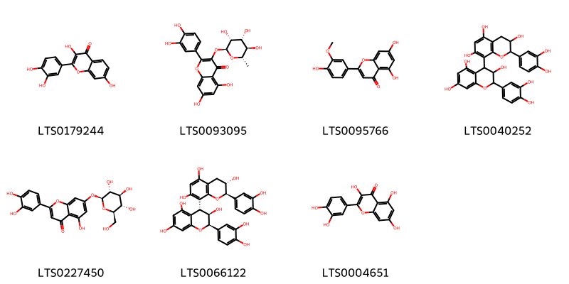{ width=100% }
    <figcaption>Hình ảnh cấu trúc hóa học của 7 hoạt chất thuộc nhóm Flavonoids gồm ["3,7,3',4'-tetrahydroxyflavone (LTS0179244)", 'quercitrin (LTS0093095)', 'chrysoeriol (LTS0095766)', '2-(3,4-dihydroxyphenyl)-4-[2-(3,4-dihydroxyphenyl)-3,5,7-trihydroxy-3,4-dihydro-2h-1-benzopyran-8-yl]-3,4-dihydro-2h-1-benzopyran-3,5,7-triol (LTS0040252)', 'luteolin 7-o-glucoside (LTS0227450)', '(2r,3r,4r)-2-(3,4-dihydroxyphenyl)-4-[(2r,3s)-2-(3,4-dihydroxyphenyl)-3,5,7-trihydroxy-3,4-dihydro-2h-1-benzopyran-8-yl]-3,4-dihydro-2h-1-benzopyran-3,5,7-triol (LTS0066122)', 'quercetin (LTS0004651)'].</figcaption>
</figure>
#### Nhóm Prenol lipids
<figure markdown="span">
    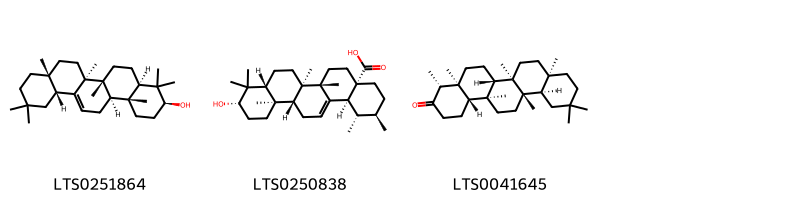{ width=100% }
    <figcaption>Hình ảnh cấu trúc hóa học của 3 hoạt chất thuộc nhóm Prenol lipids gồm ['β-amyrin (LTS0251864)', 'ursolic acid (LTS0250838)', '(-)-friedelin (LTS0041645)'].</figcaption>
</figure>
#### Nhóm Saturated hydrocarbons
<figure markdown="span">
    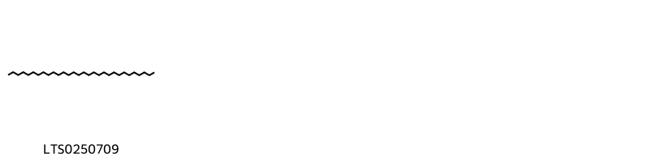{ width=100% }
    <figcaption>Hình ảnh cấu trúc hóa học của 1 hoạt chất thuộc nhóm Saturated hydrocarbons gồm ['triacontane (LTS0250709)'].</figcaption>
</figure>
#### Nhóm Steroids and steroid derivatives
<figure markdown="span">
    { width=100% }
    <figcaption>Hình ảnh cấu trúc hóa học của 1 hoạt chất thuộc nhóm Steroids and steroid derivatives gồm ['stigmast-5-en-3-ol, (3β)- (LTS0204616)'].</figcaption>
</figure>
#### Nhóm Tannins
<figure markdown="span">
    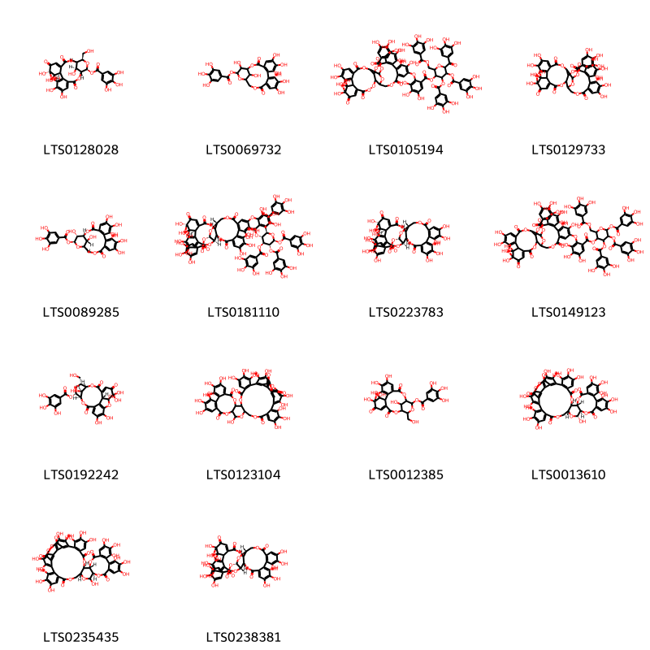{ width=100% }
    <figcaption>Hình ảnh cấu trúc hóa học của 14 hoạt chất thuộc nhóm Tannins gồm ['(1s,7r,9r,18r,19s,21r,22s)-7,8,8,12,13,22-hexahydroxy-21-(hydroxymethyl)-3,6,16-trioxo-2,17,20,23-tetraoxapentacyclo[16.3.1.1⁷,¹¹.0⁴,⁹.0¹⁰,¹⁵]tricosa-4,10,12,14-tetraen-19-yl 3,4,5-trihydroxybenzoate (LTS0128028)', '6,7,8,11,12,13,22,23-octahydroxy-3,16-dioxo-2,17,20-trioxatetracyclo[17.3.1.0⁴,⁹.0¹⁰,¹⁵]tricosa-4(9),5,7,10,12,14-hexaen-21-yl 3,4,5-trihydroxybenzoate (LTS0069732)', '6-(3,4,5-trihydroxybenzoyl)-4,5-bis(3,4,5-trihydroxybenzoyloxy)-2-[(3,4,5-trihydroxybenzoyloxy)methyl]oxan-3-yl 2-{[1,14,15,16,19,20,35,36,40,40-decahydroxy-2,5,11,24,32-pentaoxo-29-(3,4,5-trihydroxybenzoyloxy)-6,7,10,25,28,31,41-heptaoxaoctacyclo[35.3.1.0⁴,³⁹.0⁸,²⁷.0⁹,³⁰.0¹²,¹⁷.0¹⁸,²³.0³³,³⁸]hentetraconta-3,12(17),13,15,18,20,22,33,35,37-decaen-21-yl]oxy}-3,4,5-trihydroxybenzoate (LTS0105194)', '1,13,14,15,18,19,20,34,35,39,39-undecahydroxy-2,5,10,23,31-pentaoxo-6,9,24,27,30,40-hexaoxaoctacyclo[34.3.1.0⁴,³⁸.0⁷,²⁶.0⁸,²⁹.0¹¹,¹⁶.0¹⁷,²².0³²,³⁷]tetraconta-3,11(16),12,14,17,19,21,32,34,36-decaen-28-yl 3,4,5-trihydroxybenzoate (LTS0129733)', '(1s,19r,21s,22r,23r)-6,7,8,11,12,13,22,23-octahydroxy-3,16-dioxo-2,17,20-trioxatetracyclo[17.3.1.0⁴,⁹.0¹⁰,¹⁵]tricosa-4(9),5,7,10,12,14-hexaen-21-yl 3,4,5-trihydroxybenzoate (LTS0089285)', '(2r,3r,4s,5r,6s)-4,5,6-tris(3,4,5-trihydroxybenzoyloxy)-2-[(3,4,5-trihydroxybenzoyloxy)methyl]oxan-3-yl 2-{[(1r,7r,8s,26r,28s,29r,38r)-1,13,14,15,18,19,34,35,39,39-decahydroxy-2,5,10,23,31-pentaoxo-28-(3,4,5-trihydroxybenzoyloxy)-6,9,24,27,30,40-hexaoxaoctacyclo[34.3.1.0⁴,³⁸.0⁷,²⁶.0⁸,²⁹.0¹¹,¹⁶.0¹⁷,²².0³²,³⁷]tetraconta-3,11,13,15,17(22),18,20,32,34,36-decaen-20-yl]oxy}-3,4,5-trihydroxybenzoate (LTS0181110)', '(1r,7r,8s,26r,28s,29r,38r)-1,13,14,15,18,19,20,34,35,39,39-undecahydroxy-2,5,10,23,31-pentaoxo-6,9,24,27,30,40-hexaoxaoctacyclo[34.3.1.0⁴,³⁸.0⁷,²⁶.0⁸,²⁹.0¹¹,¹⁶.0¹⁷,²².0³²,³⁷]tetraconta-3,11,13,15,17(22),18,20,32,34,36-decaen-28-yl 3,4,5-trihydroxybenzoate (LTS0223783)', '4,5,6-tris(3,4,5-trihydroxybenzoyloxy)-2-[(3,4,5-trihydroxybenzoyloxy)methyl]oxan-3-yl 2-{[1,13,14,15,18,19,34,35,39,39-decahydroxy-2,5,10,23,31-pentaoxo-28-(3,4,5-trihydroxybenzoyloxy)-6,9,24,27,30,40-hexaoxaoctacyclo[34.3.1.0⁴,³⁸.0⁷,²⁶.0⁸,²⁹.0¹¹,¹⁶.0¹⁷,²².0³²,³⁷]tetraconta-3,11(16),12,14,17,19,21,32,34,36-decaen-20-yl]oxy}-3,4,5-trihydroxybenzoate (LTS0149123)', '(1s,8r,9r,18r,19s,21r,22s)-7,7,8,12,13,22-hexahydroxy-21-(hydroxymethyl)-3,6,16-trioxo-2,17,20,23-tetraoxapentacyclo[16.3.1.1⁸,¹¹.0⁴,⁹.0¹⁰,¹⁵]tricosa-4,10,12,14-tetraen-19-yl 3,4,5-trihydroxybenzoate (LTS0192242)', '6,7,8,11,12,23,24,27,28,29,37,43,44,45,48,49,50-heptadecahydroxy-2,14,21,33,36,39,54-heptaoxaundecacyclo[33.20.0.0⁴,⁹.0¹⁰,¹⁹.0¹³,¹⁸.0¹⁶,²⁵.0¹⁷,²².0²⁶,³¹.0³⁸,⁵⁵.0⁴¹,⁴⁶.0⁴⁷,⁵²]pentapentaconta-4(9),5,7,10,12,16,18,22,24,26,28,30,41(46),42,44,47,49,51-octadecaene-3,15,20,32,40,53-hexone (LTS0123104)', '7,8,8,12,13,22-hexahydroxy-21-(hydroxymethyl)-3,6,16-trioxo-2,17,20,23-tetraoxapentacyclo[16.3.1.1⁷,¹¹.0⁴,⁹.0¹⁰,¹⁵]tricosa-4,10,12,14-tetraen-19-yl 3,4,5-trihydroxybenzoate (LTS0012385)', '(1r,35r,37r,38r,55s)-6,7,8,11,12,23,24,27,28,29,37,43,44,45,48,49,50-heptadecahydroxy-2,14,21,33,36,39,54-heptaoxaundecacyclo[33.20.0.0⁴,⁹.0¹⁰,¹⁹.0¹³,¹⁸.0¹⁶,²⁵.0¹⁷,²².0²⁶,³¹.0³⁸,⁵⁵.0⁴¹,⁴⁶.0⁴⁷,⁵²]pentapentaconta-4(9),5,7,10,12,16,18,22,24,26,28,30,41,43,45,47(52),48,50-octadecaene-3,15,20,32,40,53-hexone (LTS0013610)', '(1r,35r,38r,55s)-6,7,8,11,12,23,24,27,28,29,37,43,44,45,48,49,50-heptadecahydroxy-2,14,21,33,36,39,54-heptaoxaundecacyclo[33.20.0.0⁴,⁹.0¹⁰,¹⁹.0¹³,¹⁸.0¹⁶,²⁵.0¹⁷,²².0²⁶,³¹.0³⁸,⁵⁵.0⁴¹,⁴⁶.0⁴⁷,⁵²]pentapentaconta-4(9),5,7,10,12,16,18,22,24,26,28,30,41,43,45,47(52),48,50-octadecaene-3,15,20,32,40,53-hexone (LTS0235435)', '(7r,8s,26r,28s,29s)-1,13,14,15,18,19,20,34,35,39,39-undecahydroxy-2,5,10,23,31-pentaoxo-6,9,24,27,30,40-hexaoxaoctacyclo[34.3.1.0⁴,³⁸.0⁷,²⁶.0⁸,²⁹.0¹¹,¹⁶.0¹⁷,²².0³²,³⁷]tetraconta-3,11,13,15,17(22),18,20,32,34,36-decaen-28-yl 3,4,5-trihydroxybenzoate (LTS0238381)'].</figcaption>
</figure>

---

### Dược dân tộc học

Danh sách các quốc gia có sử dụng *Bischofia javanica* trong điều trị các bệnh. 

| Country   | Disease            | Bệnh                                                                                                                                                                                                |
|:----------|:-------------------|:----------------------------------------------------------------------------------------------------------------------------------------------------------------------------------------------------|
| Samoa     | Astringent, Poison | MYMEMORY WARNING: YOU USED ALL AVAILABLE FREE TRANSLATIONS FOR TODAY. NEXT AVAILABLE IN  19 HOURS 23 MINUTES 20 SECONDS VISIT HTTPS://MYMEMORY.TRANSLATED.NET/DOC/USAGELIMITS.PHP TO TRANSLATE MORE |

---

# Chi Gelonium

??? note "Danh sách các dược liệu thuộc chi"
    
	 - *Gelonium multiflorum_*

---
## Gelonium multiflorum
### Thông tin về thực vật

!!! info "Phân loại thực vật của *Suregada multiflora* từ GIBF:"
    - **Kingdom:** Plantae
    - **Phylum:** Tracheophyta
    - **Order:** Malpighiales
    - **Family:** Euphorbiaceae
    - **Genus:** Suregada
    - **Species:** *Suregada multiflora*

 

| Label (VI)   | Label (EN)   | Scientific Name      | Descriptions (VI)   | Descriptions (EN)   | Also Known As (VI)   | Also Known As (EN)   |
|:-------------|:-------------|:---------------------|:--------------------|:--------------------|:---------------------|:---------------------|
| N/A          | N/A          | Gelonium multiflorum | loài thực vật       | species of plant    | ['']                 | ['']                 |

#### Phân bố trên thế giới

**Từ CSDL GIBF** nan, Thailand, Myanmar, Costa Rica, India, Indonesia, Bangladesh, Viet Nam, Malaysia, China

#### Phân bố tại Việt Nam

**Từ CSDL GIBF**: Binh Duong, Ninh Thuan

---
### Thành phần hóa học
        
- Theo cơ sở dữ liệu lotus: Từ loài *Suregada multiflora* đã phân lập và xác định được Chưa có hoạt chất nào được phân lập. hoạt chất thuộc về các nhóm Không có hoạt chất nào được phân lập. 

Không có hình ảnh nào được tạo ra

---

### Dược dân tộc học

Danh sách các quốc gia có sử dụng *Suregada multiflora* trong điều trị các bệnh. 

| Country   | Disease   | Bệnh                                                                                                                                                                                                |
|:----------|:----------|:----------------------------------------------------------------------------------------------------------------------------------------------------------------------------------------------------|
| Cambodia  | Purgative | MYMEMORY WARNING: YOU USED ALL AVAILABLE FREE TRANSLATIONS FOR TODAY. NEXT AVAILABLE IN  19 HOURS 22 MINUTES 13 SECONDS VISIT HTTPS://MYMEMORY.TRANSLATED.NET/DOC/USAGELIMITS.PHP TO TRANSLATE MORE |

---

# Chi Elaeophorbia

??? note "Danh sách các dược liệu thuộc chi"
    
	 - *Elaeophorbia drupifera*

---
## Elaeophorbia drupifera
### Thông tin về thực vật

!!! info "Phân loại thực vật của *Euphorbia drupifera* từ GIBF:"
    - **Kingdom:** Plantae
    - **Phylum:** Tracheophyta
    - **Order:** Malpighiales
    - **Family:** Euphorbiaceae
    - **Genus:** Euphorbia
    - **Species:** *Euphorbia drupifera*

 

| Label (VI)   | Label (EN)   | Scientific Name        | Descriptions (VI)   | Descriptions (EN)   | Also Known As (VI)   | Also Known As (EN)   |
|:-------------|:-------------|:-----------------------|:--------------------|:--------------------|:---------------------|:---------------------|
| N/A          | N/A          | Elaeophorbia drupifera | loài thực vật       | species of plant    | ['']                 | ['']                 |

#### Phân bố trên thế giới

**Từ CSDL GIBF** nan, Virgin Islands (U.S.), Ghana, Central African Republic, Belgium, Gabon, Benin, Congo, Togo, Puerto Rico, Nigeria, Chad, United States of America, Congo, Democratic Republic of the, Guinea, Uganda, Sao Tome and Principe, Côte d’Ivoire, Cuba, Equatorial Guinea, Cameroon

#### Phân bố tại Việt Nam

**Từ CSDL GIBF**: Không có ghi nhận ở Việt Nam

---
### Thành phần hóa học
        
- Theo cơ sở dữ liệu lotus: Từ loài *Euphorbia drupifera* đã phân lập và xác định được Chưa có hoạt chất nào được phân lập. hoạt chất thuộc về các nhóm Không có hoạt chất nào được phân lập. 

Không có hình ảnh nào được tạo ra

---

### Dược dân tộc học

Danh sách các quốc gia có sử dụng *Euphorbia drupifera* trong điều trị các bệnh. 

| Country     | Disease   | Bệnh                                                                                                                                                                                                |
|:------------|:----------|:----------------------------------------------------------------------------------------------------------------------------------------------------------------------------------------------------|
| Africa      | Poison    | MYMEMORY WARNING: YOU USED ALL AVAILABLE FREE TRANSLATIONS FOR TODAY. NEXT AVAILABLE IN  19 HOURS 21 MINUTES 52 SECONDS VISIT HTTPS://MYMEMORY.TRANSLATED.NET/DOC/USAGELIMITS.PHP TO TRANSLATE MORE |
| Elsewhere   | Piscicide | MYMEMORY WARNING: YOU USED ALL AVAILABLE FREE TRANSLATIONS FOR TODAY. NEXT AVAILABLE IN  19 HOURS 21 MINUTES 49 SECONDS VISIT HTTPS://MYMEMORY.TRANSLATED.NET/DOC/USAGELIMITS.PHP TO TRANSLATE MORE |
| Ivory Coast | Purgative | MYMEMORY WARNING: YOU USED ALL AVAILABLE FREE TRANSLATIONS FOR TODAY. NEXT AVAILABLE IN  19 HOURS 21 MINUTES 46 SECONDS VISIT HTTPS://MYMEMORY.TRANSLATED.NET/DOC/USAGELIMITS.PHP TO TRANSLATE MORE |
| Upper Volta | Purgative | MYMEMORY WARNING: YOU USED ALL AVAILABLE FREE TRANSLATIONS FOR TODAY. NEXT AVAILABLE IN  19 HOURS 21 MINUTES 44 SECONDS VISIT HTTPS://MYMEMORY.TRANSLATED.NET/DOC/USAGELIMITS.PHP TO TRANSLATE MORE |

---

# Chi Hura

??? note "Danh sách các dược liệu thuộc chi"
    
	 - *Hura crepitans*
	 - *Hura polyandra*

---
## Hura crepitans
### Thông tin về thực vật

!!! info "Phân loại thực vật của *Hura crepitans* từ GIBF:"
    - **Kingdom:** Plantae
    - **Phylum:** Tracheophyta
    - **Order:** Malpighiales
    - **Family:** Euphorbiaceae
    - **Genus:** Hura
    - **Species:** *Hura crepitans*

 

| Label (VI)   | Label (EN)   | Scientific Name   | Descriptions (VI)   | Descriptions (EN)   | Also Known As (VI)   | Also Known As (EN)   |
|:-------------|:-------------|:------------------|:--------------------|:--------------------|:---------------------|:---------------------|
| N/A          | N/A          | Hura crepitans    |                     | species of plant    | ['Hura crepitans']   | ['sandbox tree']     |

#### Phân bố trên thế giới

**Từ CSDL GIBF** Virgin Islands (U.S.), Guadeloupe, Gabon, Saint Lucia, Benin, Nicaragua, Venezuela (Bolivarian Republic of), French Guiana, Panama, Puerto Rico, Senegal, Nigeria, Chinese Taipei, Bolivia (Plurinational State of), United States of America, Bonaire, Sint Eustatius and Saba, Trinidad and Tobago, Barbados, Suriname, Martinique, Bahamas, Brazil, Côte d’Ivoire, Cuba, Peru, Dominican Republic, Saint Kitts and Nevis, Madagascar, Haiti, Colombia, Montserrat, Costa Rica, Cayman Islands, Antigua and Barbuda, Malaysia

#### Phân bố tại Việt Nam

**Từ CSDL GIBF**: Không có ghi nhận ở Việt Nam

---
### Thành phần hóa học
        
- Theo cơ sở dữ liệu lotus: Từ loài *Hura crepitans* đã phân lập và xác định được Chưa có hoạt chất nào được phân lập. hoạt chất thuộc về các nhóm Không có hoạt chất nào được phân lập. 

Không có hình ảnh nào được tạo ra

---

### Dược dân tộc học

Danh sách các quốc gia có sử dụng *Hura crepitans* trong điều trị các bệnh. 

| Country            | Disease                                                       | Bệnh                                                                                                                                                                                                |
|:-------------------|:--------------------------------------------------------------|:----------------------------------------------------------------------------------------------------------------------------------------------------------------------------------------------------|
| Dominican Republic | Emetic, Poison, Purgative                                     | MYMEMORY WARNING: YOU USED ALL AVAILABLE FREE TRANSLATIONS FOR TODAY. NEXT AVAILABLE IN  19 HOURS 21 MINUTES 21 SECONDS VISIT HTTPS://MYMEMORY.TRANSLATED.NET/DOC/USAGELIMITS.PHP TO TRANSLATE MORE |
| Elsewhere          | Antidote, Aperient, Insecticide, Piscicide, Vermifuge, Poison | MYMEMORY WARNING: YOU USED ALL AVAILABLE FREE TRANSLATIONS FOR TODAY. NEXT AVAILABLE IN  19 HOURS 21 MINUTES 19 SECONDS VISIT HTTPS://MYMEMORY.TRANSLATED.NET/DOC/USAGELIMITS.PHP TO TRANSLATE MORE |
| Haiti              | Piscicide                                                     | MYMEMORY WARNING: YOU USED ALL AVAILABLE FREE TRANSLATIONS FOR TODAY. NEXT AVAILABLE IN  19 HOURS 21 MINUTES 16 SECONDS VISIT HTTPS://MYMEMORY.TRANSLATED.NET/DOC/USAGELIMITS.PHP TO TRANSLATE MORE |
| India              | Poison, Purgative                                             | MYMEMORY WARNING: YOU USED ALL AVAILABLE FREE TRANSLATIONS FOR TODAY. NEXT AVAILABLE IN  19 HOURS 21 MINUTES 13 SECONDS VISIT HTTPS://MYMEMORY.TRANSLATED.NET/DOC/USAGELIMITS.PHP TO TRANSLATE MORE |
| Java               | Purgative                                                     | MYMEMORY WARNING: YOU USED ALL AVAILABLE FREE TRANSLATIONS FOR TODAY. NEXT AVAILABLE IN  19 HOURS 21 MINUTES 11 SECONDS VISIT HTTPS://MYMEMORY.TRANSLATED.NET/DOC/USAGELIMITS.PHP TO TRANSLATE MORE |
| Latin America      | Carcinogenic, Poison                                          | MYMEMORY WARNING: YOU USED ALL AVAILABLE FREE TRANSLATIONS FOR TODAY. NEXT AVAILABLE IN  19 HOURS 21 MINUTES 08 SECONDS VISIT HTTPS://MYMEMORY.TRANSLATED.NET/DOC/USAGELIMITS.PHP TO TRANSLATE MORE |
| Mexico             | Poison, Purgative                                             | MYMEMORY WARNING: YOU USED ALL AVAILABLE FREE TRANSLATIONS FOR TODAY. NEXT AVAILABLE IN  19 HOURS 21 MINUTES 05 SECONDS VISIT HTTPS://MYMEMORY.TRANSLATED.NET/DOC/USAGELIMITS.PHP TO TRANSLATE MORE |
| Venezuela          | Purgative                                                     | MYMEMORY WARNING: YOU USED ALL AVAILABLE FREE TRANSLATIONS FOR TODAY. NEXT AVAILABLE IN  19 HOURS 21 MINUTES 03 SECONDS VISIT HTTPS://MYMEMORY.TRANSLATED.NET/DOC/USAGELIMITS.PHP TO TRANSLATE MORE |

---

---
## Hura polyandra
### Thông tin về thực vật

!!! info "Phân loại thực vật của *Hura polyandra* từ GIBF:"
    - **Kingdom:** Plantae
    - **Phylum:** Tracheophyta
    - **Order:** Malpighiales
    - **Family:** Euphorbiaceae
    - **Genus:** Hura
    - **Species:** *Hura polyandra*

 

| Label (VI)   | Label (EN)   | Scientific Name   | Descriptions (VI)   | Descriptions (EN)   | Also Known As (VI)   | Also Known As (EN)   |
|:-------------|:-------------|:------------------|:--------------------|:--------------------|:---------------------|:---------------------|
| N/A          | N/A          | Hura polyandra    | loài thực vật       | species of plant    | ['']                 | ['']                 |

#### Phân bố trên thế giới

**Từ CSDL GIBF** Costa Rica, Honduras, El Salvador, Mexico

#### Phân bố tại Việt Nam

**Từ CSDL GIBF**: Không có ghi nhận ở Việt Nam

---
### Thành phần hóa học
        
- Theo cơ sở dữ liệu lotus: Từ loài *Hura polyandra* đã phân lập và xác định được Chưa có hoạt chất nào được phân lập. hoạt chất thuộc về các nhóm Không có hoạt chất nào được phân lập. 

Không có hình ảnh nào được tạo ra

---

### Dược dân tộc học

Danh sách các quốc gia có sử dụng *Hura polyandra* trong điều trị các bệnh. 

| Country   | Disease                                                                                                        | Bệnh                                                                                                                                                                                                |
|:----------|:---------------------------------------------------------------------------------------------------------------|:----------------------------------------------------------------------------------------------------------------------------------------------------------------------------------------------------|
| Guatemala | Purgative, Vermifuge, Vesicant, Poison, Canicide                                                               | MYMEMORY WARNING: YOU USED ALL AVAILABLE FREE TRANSLATIONS FOR TODAY. NEXT AVAILABLE IN  19 HOURS 20 MINUTES 38 SECONDS VISIT HTTPS://MYMEMORY.TRANSLATED.NET/DOC/USAGELIMITS.PHP TO TRANSLATE MORE |
| Mexico    | Canicide, Canicide, Piscicide, Piscicide, Poison, Poison, Purgative, Purgative, Purgative, Canicide, Purgative | MYMEMORY WARNING: YOU USED ALL AVAILABLE FREE TRANSLATIONS FOR TODAY. NEXT AVAILABLE IN  19 HOURS 20 MINUTES 35 SECONDS VISIT HTTPS://MYMEMORY.TRANSLATED.NET/DOC/USAGELIMITS.PHP TO TRANSLATE MORE |

---

# Chi Joannesia

??? note "Danh sách các dược liệu thuộc chi"
    
	 - *Joannesia princeps*

---
## Joannesia princeps
### Thông tin về thực vật

!!! info "Phân loại thực vật của *Joannesia princeps* từ GIBF:"
    - **Kingdom:** Plantae
    - **Phylum:** Tracheophyta
    - **Order:** Malpighiales
    - **Family:** Euphorbiaceae
    - **Genus:** Joannesia
    - **Species:** *Joannesia princeps*

 

| Label (VI)   | Label (EN)   | Scientific Name    | Descriptions (VI)   | Descriptions (EN)   | Also Known As (VI)   | Also Known As (EN)   |
|:-------------|:-------------|:-------------------|:--------------------|:--------------------|:---------------------|:---------------------|
| N/A          | N/A          | Joannesia princeps | loài thực vật       | species of plant    | ['']                 | ['']                 |

#### Phân bố trên thế giới

**Từ CSDL GIBF** Belgium, India, Colombia, Brazil

#### Phân bố tại Việt Nam

**Từ CSDL GIBF**: Không có ghi nhận ở Việt Nam

---
### Thành phần hóa học
        
- Theo cơ sở dữ liệu lotus: Từ loài *Joannesia princeps* đã phân lập và xác định được 79 hoạt chất thuộc về các nhóm Benzodioxanes, Flavonoids, Prenol lipids, Steroids and steroid derivatives, Pyrrolidines, Organic oxides, Organooxygen compounds, Tannins, Furanoid lignans. 

|    | chemicalTaxonomyClassyfireClass   |   smiles_count |
|---:|:----------------------------------|---------------:|
|  0 |                                   |              3 |
|  1 | Benzodioxanes                     |             16 |
|  2 | Flavonoids                        |              5 |
|  3 | Furanoid lignans                  |              4 |
|  4 | Organic oxides                    |              2 |
|  5 | Organooxygen compounds            |             10 |
|  6 | Prenol lipids                     |             21 |
|  7 | Pyrrolidines                      |              2 |
|  8 | Steroids and steroid derivatives  |             12 |
|  9 | Tannins                           |              4 |

#### Nhóm 
<figure markdown="span">
    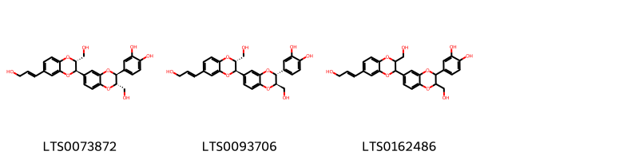{ width=100% }
    <figcaption>Hình ảnh cấu trúc hóa học của 3 hoạt chất thuộc nhóm  gồm ['4-[(2s,3s)-3-(hydroxymethyl)-7-[(2r,3r)-3-(hydroxymethyl)-7-[(1e)-3-hydroxyprop-1-en-1-yl]-2,3-dihydro-1,4-benzodioxin-2-yl]-2,3-dihydro-1,4-benzodioxin-2-yl]benzene-1,2-diol (LTS0073872)', '4-[(2r,3r)-3-(hydroxymethyl)-7-[(2r,3r)-3-(hydroxymethyl)-7-[(1e)-3-hydroxyprop-1-en-1-yl]-2,3-dihydro-1,4-benzodioxin-2-yl]-2,3-dihydro-1,4-benzodioxin-2-yl]benzene-1,2-diol (LTS0093706)', '4-[3-(hydroxymethyl)-7-[3-(hydroxymethyl)-7-(3-hydroxyprop-1-en-1-yl)-2,3-dihydro-1,4-benzodioxin-2-yl]-2,3-dihydro-1,4-benzodioxin-2-yl]benzene-1,2-diol (LTS0162486)'].</figcaption>
</figure>
#### Nhóm Benzodioxanes
<figure markdown="span">
    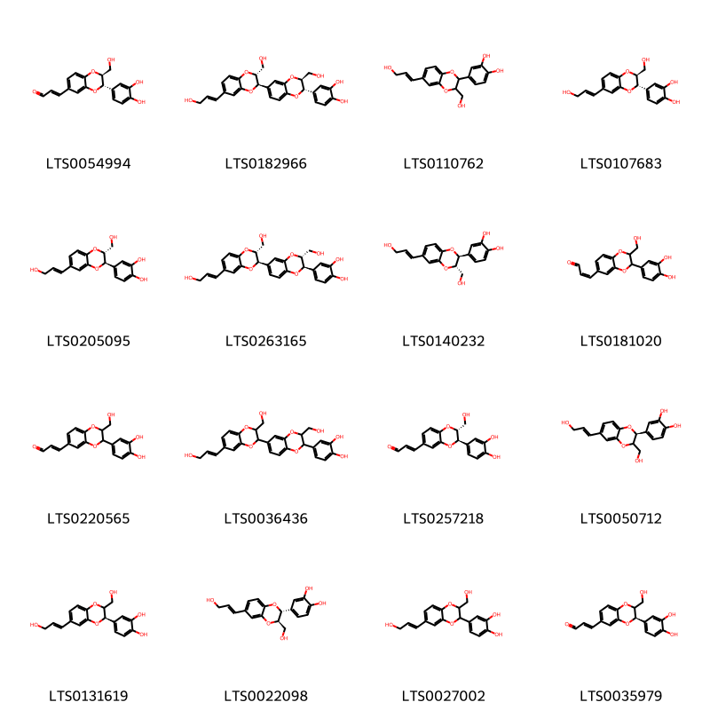{ width=100% }
    <figcaption>Hình ảnh cấu trúc hóa học của 16 hoạt chất thuộc nhóm Benzodioxanes gồm ['(2e)-3-[(2s,3s)-3-(3,4-dihydroxyphenyl)-2-(hydroxymethyl)-2,3-dihydro-1,4-benzodioxin-6-yl]prop-2-enal (LTS0054994)', '4-[(2s,3s)-3-(hydroxymethyl)-6-[(2r,3r)-3-(hydroxymethyl)-7-[(1e)-3-hydroxyprop-1-en-1-yl]-2,3-dihydro-1,4-benzodioxin-2-yl]-2,3-dihydro-1,4-benzodioxin-2-yl]benzene-1,2-diol (LTS0182966)', '4-[3-(hydroxymethyl)-6-(3-hydroxyprop-1-en-1-yl)-2,3-dihydro-1,4-benzodioxin-2-yl]benzene-1,2-diol (LTS0110762)', '4-[(2s,3s)-3-(hydroxymethyl)-7-[(1e)-3-hydroxyprop-1-en-1-yl]-2,3-dihydro-1,4-benzodioxin-2-yl]benzene-1,2-diol (LTS0107683)', 'isoamericanol a (LTS0205095)', '4-[(2r,3r)-3-(hydroxymethyl)-6-[(2r,3r)-3-(hydroxymethyl)-7-[(1e)-3-hydroxyprop-1-en-1-yl]-2,3-dihydro-1,4-benzodioxin-2-yl]-2,3-dihydro-1,4-benzodioxin-2-yl]benzene-1,2-diol (LTS0263165)', '4-[(2s,3s)-3-(hydroxymethyl)-6-[(1e)-3-hydroxyprop-1-en-1-yl]-2,3-dihydro-1,4-benzodioxin-2-yl]benzene-1,2-diol (LTS0140232)', '(2z)-3-[3-(3,4-dihydroxyphenyl)-2-(hydroxymethyl)-2,3-dihydro-1,4-benzodioxin-6-yl]prop-2-enal (LTS0181020)', '3-[3-(3,4-dihydroxyphenyl)-2-(hydroxymethyl)-2,3-dihydro-1,4-benzodioxin-6-yl]prop-2-enal (LTS0220565)', '4-[3-(hydroxymethyl)-6-[3-(hydroxymethyl)-7-(3-hydroxyprop-1-en-1-yl)-2,3-dihydro-1,4-benzodioxin-2-yl]-2,3-dihydro-1,4-benzodioxin-2-yl]benzene-1,2-diol (LTS0036436)', '(2e)-3-[(2r,3r)-3-(3,4-dihydroxyphenyl)-2-(hydroxymethyl)-2,3-dihydro-1,4-benzodioxin-6-yl]prop-2-enal (LTS0257218)', '4-[(2s)-3-(hydroxymethyl)-6-[(1e)-3-hydroxyprop-1-en-1-yl]-2,3-dihydro-1,4-benzodioxin-2-yl]benzene-1,2-diol (LTS0050712)', '4-[(2r)-3-(hydroxymethyl)-7-[(1e)-3-hydroxyprop-1-en-1-yl]-2,3-dihydro-1,4-benzodioxin-2-yl]benzene-1,2-diol (LTS0131619)', '4-[(2r,3r)-3-(hydroxymethyl)-6-[(1e)-3-hydroxyprop-1-en-1-yl]-2,3-dihydro-1,4-benzodioxin-2-yl]benzene-1,2-diol (LTS0022098)', '4-[3-(hydroxymethyl)-7-(3-hydroxyprop-1-en-1-yl)-2,3-dihydro-1,4-benzodioxin-2-yl]benzene-1,2-diol (LTS0027002)', '(2e)-3-[(3r)-3-(3,4-dihydroxyphenyl)-2-(hydroxymethyl)-2,3-dihydro-1,4-benzodioxin-6-yl]prop-2-enal (LTS0035979)'].</figcaption>
</figure>
#### Nhóm Flavonoids
<figure markdown="span">
    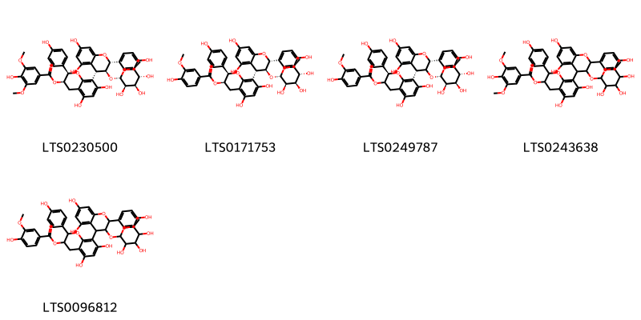{ width=100% }
    <figcaption>Hình ảnh cấu trúc hóa học của 5 hoạt chất thuộc nhóm Flavonoids gồm ['(2r,3r)-8-[(2r,3s,4s)-5,7-dihydroxy-2-(4-hydroxyphenyl)-3-{[(2s,3r,4r,5r,6s)-3,4,5-trihydroxy-6-methyloxan-2-yl]oxy}-3,4-dihydro-2h-1-benzopyran-4-yl]-5,7-dihydroxy-2-(4-hydroxyphenyl)-3,4-dihydro-2h-1-benzopyran-3-yl 4-hydroxy-3,5-dimethoxybenzoate (LTS0230500)', '(2r,3r)-8-[(2r,3s,4s)-5,7-dihydroxy-2-(4-hydroxyphenyl)-3-{[(2s,3r,4r,5r,6s)-3,4,5-trihydroxy-6-methyloxan-2-yl]oxy}-3,4-dihydro-2h-1-benzopyran-4-yl]-5,7-dihydroxy-2-(4-hydroxyphenyl)-3,4-dihydro-2h-1-benzopyran-3-yl 4-hydroxy-3-methoxybenzoate (LTS0171753)', '(2r)-8-[(2r,4s)-5,7-dihydroxy-2-(4-hydroxyphenyl)-3-{[(2s,3r,4r,5r,6s)-3,4,5-trihydroxy-6-methyloxan-2-yl]oxy}-3,4-dihydro-2h-1-benzopyran-4-yl]-5,7-dihydroxy-2-(4-hydroxyphenyl)-3,4-dihydro-2h-1-benzopyran-3-yl 4-hydroxy-3-methoxybenzoate (LTS0249787)', '8-[5,7-dihydroxy-2-(4-hydroxyphenyl)-3-[(3,4,5-trihydroxy-6-methyloxan-2-yl)oxy]-3,4-dihydro-2h-1-benzopyran-4-yl]-5,7-dihydroxy-2-(4-hydroxyphenyl)-3,4-dihydro-2h-1-benzopyran-3-yl 4-hydroxy-3,5-dimethoxybenzoate (LTS0243638)', '8-[5,7-dihydroxy-2-(4-hydroxyphenyl)-3-[(3,4,5-trihydroxy-6-methyloxan-2-yl)oxy]-3,4-dihydro-2h-1-benzopyran-4-yl]-5,7-dihydroxy-2-(4-hydroxyphenyl)-3,4-dihydro-2h-1-benzopyran-3-yl 4-hydroxy-3-methoxybenzoate (LTS0096812)'].</figcaption>
</figure>
#### Nhóm Furanoid lignans
<figure markdown="span">
    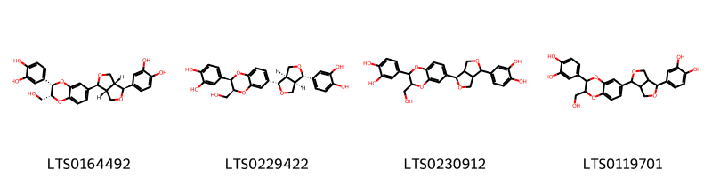{ width=100% }
    <figcaption>Hình ảnh cấu trúc hóa học của 4 hoạt chất thuộc nhóm Furanoid lignans gồm ['4-[(1s,3ar,4s,6ar)-4-[(2r,3s)-3-(3,4-dihydroxyphenyl)-2-(hydroxymethyl)-2,3-dihydro-1,4-benzodioxin-6-yl]-hexahydrofuro[3,4-c]furan-1-yl]benzene-1,2-diol (LTS0164492)', '4-[(1s,3ar,4s,6ar)-4-[(2r,3s)-2-(3,4-dihydroxyphenyl)-3-(hydroxymethyl)-2,3-dihydro-1,4-benzodioxin-6-yl]-hexahydrofuro[3,4-c]furan-1-yl]benzene-1,2-diol (LTS0229422)', '4-{4-[2-(3,4-dihydroxyphenyl)-3-(hydroxymethyl)-2,3-dihydro-1,4-benzodioxin-6-yl]-hexahydrofuro[3,4-c]furan-1-yl}benzene-1,2-diol (LTS0230912)', '4-{4-[3-(3,4-dihydroxyphenyl)-2-(hydroxymethyl)-2,3-dihydro-1,4-benzodioxin-6-yl]-hexahydrofuro[3,4-c]furan-1-yl}benzene-1,2-diol (LTS0119701)'].</figcaption>
</figure>
#### Nhóm Organic oxides
<figure markdown="span">
    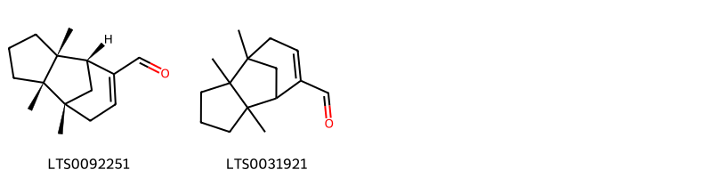{ width=100% }
    <figcaption>Hình ảnh cấu trúc hóa học của 2 hoạt chất thuộc nhóm Organic oxides gồm ['(1s,2s,6r,7r)-1,2,6-trimethyltricyclo[5.3.1.0²,⁶]undec-8-ene-8-carbaldehyde (LTS0092251)', '1,2,6-trimethyltricyclo[5.3.1.0²,⁶]undec-8-ene-8-carbaldehyde (LTS0031921)'].</figcaption>
</figure>
#### Nhóm Organooxygen compounds
<figure markdown="span">
    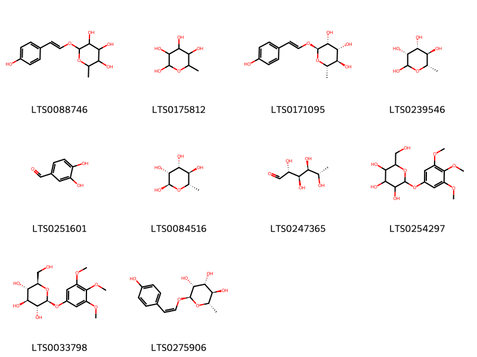{ width=100% }
    <figcaption>Hình ảnh cấu trúc hóa học của 10 hoạt chất thuộc nhóm Organooxygen compounds gồm ['2-{[2-(4-hydroxyphenyl)ethenyl]oxy}-6-methyloxane-3,4,5-triol (LTS0088746)', '6-methyloxane-2,3,4,5-tetrol (LTS0175812)', '(2r,3r,4r,5r,6s)-2-{[(1e)-2-(4-hydroxyphenyl)ethenyl]oxy}-6-methyloxane-3,4,5-triol (LTS0171095)', 'l-rhamnose (LTS0239546)', '3,4-dihydroxybenzaldehyde (LTS0251601)', 'α-l-rhamnopyranose (LTS0084516)', 'rhamnose (LTS0247365)', '2-(hydroxymethyl)-6-(3,4,5-trimethoxyphenoxy)oxane-3,4,5-triol (LTS0254297)', 'koaburside (LTS0033798)', '(2r,3r,4r,5r,6s)-2-{[(1z)-2-(4-hydroxyphenyl)ethenyl]oxy}-6-methyloxane-3,4,5-triol (LTS0275906)'].</figcaption>
</figure>
#### Nhóm Prenol lipids
<figure markdown="span">
    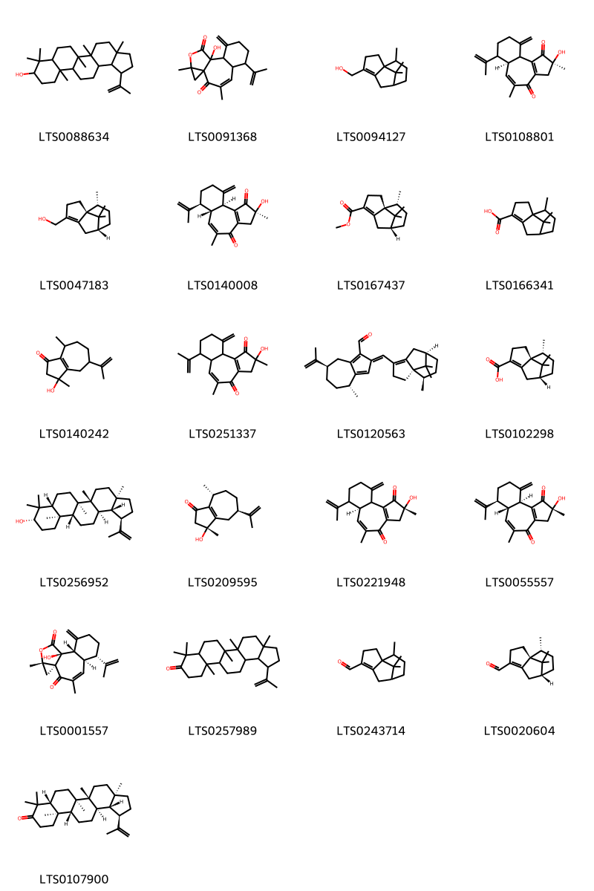{ width=100% }
    <figcaption>Hình ảnh cấu trúc hóa học của 21 hoạt chất thuộc nhóm Prenol lipids gồm ['lupeol (LTS0088634)', '11-hydroxy-3,14-dimethyl-9-methylidene-6-(prop-1-en-2-yl)-13-oxatetracyclo[9.4.0.0¹,¹⁴.0⁵,¹⁰]pentadec-3-ene-2,12-dione (LTS0091368)', '{10,11,11-trimethyltricyclo[5.3.1.0¹,⁵]undec-4-en-4-yl}methanol (LTS0094127)', '(2s,6as)-2-hydroxy-2,5-dimethyl-10-methylidene-7-(prop-1-en-2-yl)-3h,6ah,7h,8h,9h,10ah-cyclohexa[e]azulene-1,4-dione (LTS0108801)', '[(1r,7r,10r)-10,11,11-trimethyltricyclo[5.3.1.0¹,⁵]undec-4-en-4-yl]methanol (LTS0047183)', '(2s,6ar,7s,10as)-2-hydroxy-2,5-dimethyl-10-methylidene-7-(prop-1-en-2-yl)-3h,6ah,7h,8h,9h,10ah-cyclohexa[e]azulene-1,4-dione (LTS0140008)', 'methyl (1r,7r,10r)-10,11,11-trimethyltricyclo[5.3.1.0¹,⁵]undec-4-ene-4-carboxylate (LTS0167437)', '10,11,11-trimethyltricyclo[5.3.1.0¹,⁵]undec-4-ene-4-carboxylic acid (LTS0166341)', '3-hydroxy-3,8-dimethyl-5-(prop-1-en-2-yl)-2,4,5,6,7,8-hexahydroazulen-1-one (LTS0140242)', '2-hydroxy-2,5-dimethyl-10-methylidene-7-(prop-1-en-2-yl)-3h,6ah,7h,8h,9h,10ah-cyclohexa[e]azulene-1,4-dione (LTS0251337)', '(2e,4r,7r)-4-methyl-7-(prop-1-en-2-yl)-2-{[(1r,7r,10r)-10,11,11-trimethyltricyclo[5.3.1.0¹,⁵]undec-4-en-4-yl]methylidene}-5,6,7,8-tetrahydro-4h-azulene-1-carbaldehyde (LTS0120563)', '(1r,7r,10r)-10,11,11-trimethyltricyclo[5.3.1.0¹,⁵]undec-4-ene-4-carboxylic acid (LTS0102298)', 'lupeol (LTS0256952)', '(3r,5r,8r)-3-hydroxy-3,8-dimethyl-5-(prop-1-en-2-yl)-2,4,5,6,7,8-hexahydroazulen-1-one (LTS0209595)', '(2r,6as)-2-hydroxy-2,5-dimethyl-10-methylidene-7-(prop-1-en-2-yl)-3h,6ah,7h,8h,9h,10ah-cyclohexa[e]azulene-1,4-dione (LTS0221948)', '(2r,6ar,7s,10as)-2-hydroxy-2,5-dimethyl-10-methylidene-7-(prop-1-en-2-yl)-3h,6ah,7h,8h,9h,10ah-cyclohexa[e]azulene-1,4-dione (LTS0055557)', '(1r,5r,6s,10s,11s,14s)-11-hydroxy-3,14-dimethyl-9-methylidene-6-(prop-1-en-2-yl)-13-oxatetracyclo[9.4.0.0¹,¹⁴.0⁵,¹⁰]pentadec-3-ene-2,12-dione (LTS0001557)', '3a,5a,5b,8,8,11a-hexamethyl-1-(prop-1-en-2-yl)-tetradecahydro-1h-cyclopenta[a]chrysen-9-one (LTS0257989)', '10,11,11-trimethyltricyclo[5.3.1.0¹,⁵]undec-4-ene-4-carbaldehyde (LTS0243714)', '(1r,7r,10r)-10,11,11-trimethyltricyclo[5.3.1.0¹,⁵]undec-4-ene-4-carbaldehyde (LTS0020604)', 'lupenone (LTS0107900)'].</figcaption>
</figure>
#### Nhóm Pyrrolidines
<figure markdown="span">
    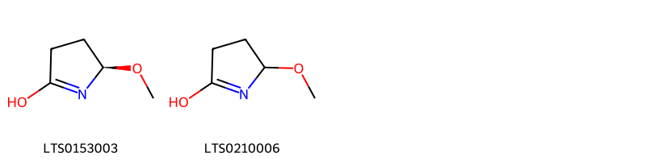{ width=100% }
    <figcaption>Hình ảnh cấu trúc hóa học của 2 hoạt chất thuộc nhóm Pyrrolidines gồm ['(5r)-5-methoxy-4,5-dihydro-3h-pyrrol-2-ol (LTS0153003)', '5-methoxy-4,5-dihydro-3h-pyrrol-2-ol (LTS0210006)'].</figcaption>
</figure>
#### Nhóm Steroids and steroid derivatives
<figure markdown="span">
    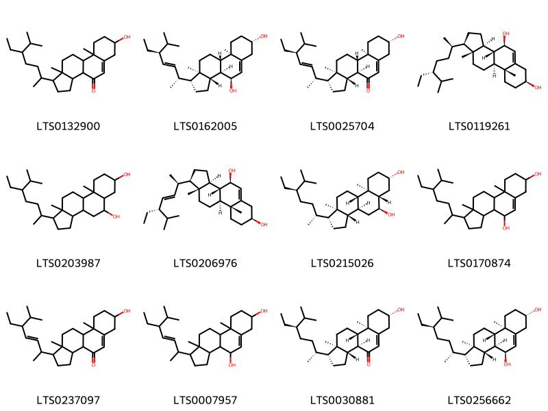{ width=100% }
    <figcaption>Hình ảnh cấu trúc hóa học của 12 hoạt chất thuộc nhóm Steroids and steroid derivatives gồm ['1-(5-ethyl-6-methylheptan-2-yl)-7-hydroxy-9a,11a-dimethyl-1h,2h,3h,3ah,3bh,6h,7h,8h,9h,9bh,10h,11h-cyclopenta[a]phenanthren-4-one (LTS0132900)', '(1r,3as,3bs,4s,7s,9ar,9bs,11ar)-1-[(2r,3e,5s)-5-ethyl-6-methylhept-3-en-2-yl]-9a,11a-dimethyl-1h,2h,3h,3ah,3bh,4h,6h,7h,8h,9h,9bh,10h,11h-cyclopenta[a]phenanthrene-4,7-diol (LTS0162005)', '(1r,3as,3bs,7s,9ar,9bs,11ar)-1-[(2r,3e,5s)-5-ethyl-6-methylhept-3-en-2-yl]-7-hydroxy-9a,11a-dimethyl-1h,2h,3h,3ah,3bh,6h,7h,8h,9h,9bh,10h,11h-cyclopenta[a]phenanthren-4-one (LTS0025704)', '7β-hydroxysitosterol (LTS0119261)', '1-(5-ethyl-6-methylheptan-2-yl)-9a,11a-dimethyl-tetradecahydro-1h-cyclopenta[a]phenanthrene-5,7-diol (LTS0203987)', '(1r,3as,3bs,4r,7s,9ar,9bs,11ar)-1-[(2r,3e,5s)-5-ethyl-6-methylhept-3-en-2-yl]-9a,11a-dimethyl-1h,2h,3h,3ah,3bh,4h,6h,7h,8h,9h,9bh,10h,11h-cyclopenta[a]phenanthrene-4,7-diol (LTS0206976)', '(1r,3as,3bs,5s,5as,7s,9ar,9bs,11ar)-1-[(2r,5r)-5-ethyl-6-methylheptan-2-yl]-9a,11a-dimethyl-tetradecahydro-1h-cyclopenta[a]phenanthrene-5,7-diol (LTS0215026)', '1-(5-ethyl-6-methylheptan-2-yl)-9a,11a-dimethyl-1h,2h,3h,3ah,3bh,4h,6h,7h,8h,9h,9bh,10h,11h-cyclopenta[a]phenanthrene-4,7-diol (LTS0170874)', '1-(5-ethyl-6-methylhept-3-en-2-yl)-7-hydroxy-9a,11a-dimethyl-1h,2h,3h,3ah,3bh,6h,7h,8h,9h,9bh,10h,11h-cyclopenta[a]phenanthren-4-one (LTS0237097)', '1-(5-ethyl-6-methylhept-3-en-2-yl)-9a,11a-dimethyl-1h,2h,3h,3ah,3bh,4h,6h,7h,8h,9h,9bh,10h,11h-cyclopenta[a]phenanthrene-4,7-diol (LTS0007957)', '(1r,3as,3bs,7s,9ar,9bs,11ar)-1-[(2r,5r)-5-ethyl-6-methylheptan-2-yl]-7-hydroxy-9a,11a-dimethyl-1h,2h,3h,3ah,3bh,6h,7h,8h,9h,9bh,10h,11h-cyclopenta[a]phenanthren-4-one (LTS0030881)', '(1r,3as,3bs,4s,7s,9ar,9bs,11ar)-1-[(2r,5r)-5-ethyl-6-methylheptan-2-yl]-9a,11a-dimethyl-1h,2h,3h,3ah,3bh,4h,6h,7h,8h,9h,9bh,10h,11h-cyclopenta[a]phenanthrene-4,7-diol (LTS0256662)'].</figcaption>
</figure>
#### Nhóm Tannins
<figure markdown="span">
    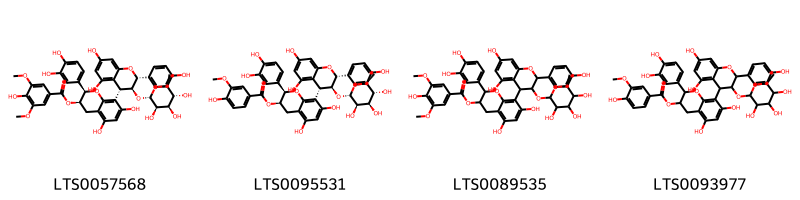{ width=100% }
    <figcaption>Hình ảnh cấu trúc hóa học của 4 hoạt chất thuộc nhóm Tannins gồm ['(2r,3r)-8-[(2r,3s,4s)-5,7-dihydroxy-2-(4-hydroxyphenyl)-3-{[(2s,3r,4r,5r,6s)-3,4,5-trihydroxy-6-methyloxan-2-yl]oxy}-3,4-dihydro-2h-1-benzopyran-4-yl]-2-(3,4-dihydroxyphenyl)-5,7-dihydroxy-3,4-dihydro-2h-1-benzopyran-3-yl 4-hydroxy-3,5-dimethoxybenzoate (LTS0057568)', '(2r,3r)-8-[(2r,3s,4s)-5,7-dihydroxy-2-(4-hydroxyphenyl)-3-{[(2s,3r,4r,5r,6s)-3,4,5-trihydroxy-6-methyloxan-2-yl]oxy}-3,4-dihydro-2h-1-benzopyran-4-yl]-2-(3,4-dihydroxyphenyl)-5,7-dihydroxy-3,4-dihydro-2h-1-benzopyran-3-yl 4-hydroxy-3-methoxybenzoate (LTS0095531)', '8-[5,7-dihydroxy-2-(4-hydroxyphenyl)-3-[(3,4,5-trihydroxy-6-methyloxan-2-yl)oxy]-3,4-dihydro-2h-1-benzopyran-4-yl]-2-(3,4-dihydroxyphenyl)-5,7-dihydroxy-3,4-dihydro-2h-1-benzopyran-3-yl 4-hydroxy-3,5-dimethoxybenzoate (LTS0089535)', '8-[5,7-dihydroxy-2-(4-hydroxyphenyl)-3-[(3,4,5-trihydroxy-6-methyloxan-2-yl)oxy]-3,4-dihydro-2h-1-benzopyran-4-yl]-2-(3,4-dihydroxyphenyl)-5,7-dihydroxy-3,4-dihydro-2h-1-benzopyran-3-yl 4-hydroxy-3-methoxybenzoate (LTS0093977)'].</figcaption>
</figure>

---

### Dược dân tộc học

Danh sách các quốc gia có sử dụng *Joannesia princeps* trong điều trị các bệnh. 

| Country   | Disease                         | Bệnh                                                                                                                                                                                                |
|:----------|:--------------------------------|:----------------------------------------------------------------------------------------------------------------------------------------------------------------------------------------------------|
| Brazil    | Purgative                       | MYMEMORY WARNING: YOU USED ALL AVAILABLE FREE TRANSLATIONS FOR TODAY. NEXT AVAILABLE IN  19 HOURS 20 MINUTES 05 SECONDS VISIT HTTPS://MYMEMORY.TRANSLATED.NET/DOC/USAGELIMITS.PHP TO TRANSLATE MORE |
| Elsewhere | Piscicide, Vermifuge, Purgative | MYMEMORY WARNING: YOU USED ALL AVAILABLE FREE TRANSLATIONS FOR TODAY. NEXT AVAILABLE IN  19 HOURS 20 MINUTES 02 SECONDS VISIT HTTPS://MYMEMORY.TRANSLATED.NET/DOC/USAGELIMITS.PHP TO TRANSLATE MORE |

---

# Chi Sebastiania

??? note "Danh sách các dược liệu thuộc chi"
    
	 - *Sebastiania adenophora*
	 - *Sebastiania pachyphylla*
	 - *Sebastiania pringlei*
	 - *Sebastiania ramirexii*

---
## Sebastiania adenophora
### Thông tin về thực vật

!!! info "Phân loại thực vật của *Sebastiania glandulosa* từ GIBF:"
    - **Kingdom:** Plantae
    - **Phylum:** Tracheophyta
    - **Order:** Malpighiales
    - **Family:** Euphorbiaceae
    - **Genus:** Sebastiania
    - **Species:** *Sebastiania glandulosa*

 

| Label (VI)   | Label (EN)   | Scientific Name        | Descriptions (VI)   | Descriptions (EN)   | Also Known As (VI)   | Also Known As (EN)   |
|:-------------|:-------------|:-----------------------|:--------------------|:--------------------|:---------------------|:---------------------|
| N/A          | N/A          | Sebastiania adenophora | loài thực vật       | species of plant    | ['']                 | ['']                 |

#### Phân bố trên thế giới

**Từ CSDL GIBF** Belize, Mexico

#### Phân bố tại Việt Nam

**Từ CSDL GIBF**: Không có ghi nhận ở Việt Nam

---
### Thành phần hóa học
        
- Theo cơ sở dữ liệu lotus: Từ loài *Sebastiania glandulosa* đã phân lập và xác định được Chưa có hoạt chất nào được phân lập. hoạt chất thuộc về các nhóm Không có hoạt chất nào được phân lập. 

Không có hình ảnh nào được tạo ra

---

### Dược dân tộc học

Danh sách các quốc gia có sử dụng *Sebastiania glandulosa* trong điều trị các bệnh. 

| Country   | Disease          | Bệnh                                                                                                                                                                                                |
|:----------|:-----------------|:----------------------------------------------------------------------------------------------------------------------------------------------------------------------------------------------------|
| Guatemala | Poison, Vesicant | MYMEMORY WARNING: YOU USED ALL AVAILABLE FREE TRANSLATIONS FOR TODAY. NEXT AVAILABLE IN  19 HOURS 19 MINUTES 24 SECONDS VISIT HTTPS://MYMEMORY.TRANSLATED.NET/DOC/USAGELIMITS.PHP TO TRANSLATE MORE |

---

---
## Sebastiania pachyphylla
### Thông tin về thực vật

!!! info "Phân loại thực vật của *Sebastiania pachyphylla* từ GIBF:"
    - **Kingdom:** Plantae
    - **Phylum:** Tracheophyta
    - **Order:** Malpighiales
    - **Family:** Euphorbiaceae
    - **Genus:** Sebastiania
    - **Species:** *Sebastiania pachyphylla*

 

| Label (VI)   | Label (EN)   | Scientific Name         | Descriptions (VI)   | Descriptions (EN)   | Also Known As (VI)   | Also Known As (EN)   |
|:-------------|:-------------|:------------------------|:--------------------|:--------------------|:---------------------|:---------------------|
| N/A          | N/A          | Sebastiania pachyphylla | loài thực vật       | species of plant    | ['']                 | ['']                 |

#### Phân bố trên thế giới

**Từ CSDL GIBF** nan, Paraguay

#### Phân bố tại Việt Nam

**Từ CSDL GIBF**: Không có ghi nhận ở Việt Nam

---
### Thành phần hóa học
        
- Theo cơ sở dữ liệu lotus: Từ loài *Sebastiania pachyphylla* đã phân lập và xác định được Chưa có hoạt chất nào được phân lập. hoạt chất thuộc về các nhóm Không có hoạt chất nào được phân lập. 

Không có hình ảnh nào được tạo ra

---

### Dược dân tộc học

Danh sách các quốc gia có sử dụng *Sebastiania pachyphylla* trong điều trị các bệnh. 

| Country   | Disease           | Bệnh                                                                                                                                                                                                |
|:----------|:------------------|:----------------------------------------------------------------------------------------------------------------------------------------------------------------------------------------------------|
| Peru      | Emetic, Purgative | MYMEMORY WARNING: YOU USED ALL AVAILABLE FREE TRANSLATIONS FOR TODAY. NEXT AVAILABLE IN  19 HOURS 18 MINUTES 59 SECONDS VISIT HTTPS://MYMEMORY.TRANSLATED.NET/DOC/USAGELIMITS.PHP TO TRANSLATE MORE |

---

---
## Sebastiania pringlei
### Thông tin về thực vật

!!! info "Phân loại thực vật của *Sebastiania pavoniana* từ GIBF:"
    - **Kingdom:** Plantae
    - **Phylum:** Tracheophyta
    - **Order:** Malpighiales
    - **Family:** Euphorbiaceae
    - **Genus:** Sebastiania
    - **Species:** *Sebastiania pavoniana*

 

| Label (VI)   | Label (EN)   | Scientific Name      | Descriptions (VI)   | Descriptions (EN)   | Also Known As (VI)   | Also Known As (EN)   |
|:-------------|:-------------|:---------------------|:--------------------|:--------------------|:---------------------|:---------------------|
| N/A          | N/A          | Sebastiania pringlei | loài thực vật       | species of plant    | ['']                 | ['']                 |

#### Phân bố trên thế giới

**Từ CSDL GIBF** nan, Mexico

#### Phân bố tại Việt Nam

**Từ CSDL GIBF**: Không có ghi nhận ở Việt Nam

---
### Thành phần hóa học
        
- Theo cơ sở dữ liệu lotus: Từ loài *Sebastiania pavoniana* đã phân lập và xác định được Chưa có hoạt chất nào được phân lập. hoạt chất thuộc về các nhóm Không có hoạt chất nào được phân lập. 

Không có hình ảnh nào được tạo ra

---

### Dược dân tộc học

Danh sách các quốc gia có sử dụng *Sebastiania pavoniana* trong điều trị các bệnh. 

| Country         | Disease   | Bệnh                                                                                                                                                                                                |
|:----------------|:----------|:----------------------------------------------------------------------------------------------------------------------------------------------------------------------------------------------------|
| Mexico(Warihio) | Piscicide | MYMEMORY WARNING: YOU USED ALL AVAILABLE FREE TRANSLATIONS FOR TODAY. NEXT AVAILABLE IN  19 HOURS 18 MINUTES 38 SECONDS VISIT HTTPS://MYMEMORY.TRANSLATED.NET/DOC/USAGELIMITS.PHP TO TRANSLATE MORE |

---

---
## Sebastiania ramirexii
### Thông tin về thực vật

!!! info "Phân loại thực vật của *Sebastiania pavoniana* từ GIBF:"
    - **Kingdom:** Plantae
    - **Phylum:** Tracheophyta
    - **Order:** Malpighiales
    - **Family:** Euphorbiaceae
    - **Genus:** Sebastiania
    - **Species:** *Sebastiania pavoniana*

 

| Label (VI)   | Label (EN)   | Scientific Name      | Descriptions (VI)   | Descriptions (EN)   | Also Known As (VI)   | Also Known As (EN)   |
|:-------------|:-------------|:---------------------|:--------------------|:--------------------|:---------------------|:---------------------|
| N/A          | N/A          | Sebastiania pringlei | loài thực vật       | species of plant    | ['']                 | ['']                 |

#### Phân bố trên thế giới

**Từ CSDL GIBF** nan, Mexico

#### Phân bố tại Việt Nam

**Từ CSDL GIBF**: Không có ghi nhận ở Việt Nam

---
### Thành phần hóa học
        
- Theo cơ sở dữ liệu lotus: Từ loài *Sebastiania pavoniana* đã phân lập và xác định được Chưa có hoạt chất nào được phân lập. hoạt chất thuộc về các nhóm Không có hoạt chất nào được phân lập. 

Không có hình ảnh nào được tạo ra

---

### Dược dân tộc học

Danh sách các quốc gia có sử dụng *Sebastiania pavoniana* trong điều trị các bệnh. 

| Country   | Disease   | Bệnh                                                                                                                                                                                                |
|:----------|:----------|:----------------------------------------------------------------------------------------------------------------------------------------------------------------------------------------------------|
| Mexico    | Piscicide | MYMEMORY WARNING: YOU USED ALL AVAILABLE FREE TRANSLATIONS FOR TODAY. NEXT AVAILABLE IN  19 HOURS 18 MINUTES 16 SECONDS VISIT HTTPS://MYMEMORY.TRANSLATED.NET/DOC/USAGELIMITS.PHP TO TRANSLATE MORE |

---

# Chi Tetrorchidium

??? note "Danh sách các dược liệu thuộc chi"
    
	 - *Tetrorchidium didymostemon*

---
## Tetrorchidium didymostemon
### Thông tin về thực vật

!!! info "Phân loại thực vật của *Tetrorchidium didymostemon* từ GIBF:"
    - **Kingdom:** Plantae
    - **Phylum:** Tracheophyta
    - **Order:** Malpighiales
    - **Family:** Euphorbiaceae
    - **Genus:** Tetrorchidium
    - **Species:** *Tetrorchidium didymostemon*

 

| Label (VI)   | Label (EN)   | Scientific Name            | Descriptions (VI)   | Descriptions (EN)   | Also Known As (VI)   | Also Known As (EN)   |
|:-------------|:-------------|:---------------------------|:--------------------|:--------------------|:---------------------|:---------------------|
| N/A          | N/A          | Tetrorchidium didymostemon | loài thực vật       | species of plant    | ['']                 | ['']                 |

#### Phân bố trên thế giới

**Từ CSDL GIBF** Ghana, Sao Tome and Principe, Nigeria, Gabon, Côte d’Ivoire, Benin, Guinea, Liberia, Sierra Leone, Cameroon

#### Phân bố tại Việt Nam

**Từ CSDL GIBF**: Không có ghi nhận ở Việt Nam

---
### Thành phần hóa học
        
- Theo cơ sở dữ liệu lotus: Từ loài *Tetrorchidium didymostemon* đã phân lập và xác định được Chưa có hoạt chất nào được phân lập. hoạt chất thuộc về các nhóm Không có hoạt chất nào được phân lập. 

Không có hình ảnh nào được tạo ra

---

### Dược dân tộc học

Danh sách các quốc gia có sử dụng *Tetrorchidium didymostemon* trong điều trị các bệnh. 

| Country     | Disease   | Bệnh                                                                                                                                                                                                |
|:------------|:----------|:----------------------------------------------------------------------------------------------------------------------------------------------------------------------------------------------------|
| Africa      | Purgative | MYMEMORY WARNING: YOU USED ALL AVAILABLE FREE TRANSLATIONS FOR TODAY. NEXT AVAILABLE IN  19 HOURS 17 MINUTES 57 SECONDS VISIT HTTPS://MYMEMORY.TRANSLATED.NET/DOC/USAGELIMITS.PHP TO TRANSLATE MORE |
| Ivory Coast | Purgative | MYMEMORY WARNING: YOU USED ALL AVAILABLE FREE TRANSLATIONS FOR TODAY. NEXT AVAILABLE IN  19 HOURS 17 MINUTES 53 SECONDS VISIT HTTPS://MYMEMORY.TRANSLATED.NET/DOC/USAGELIMITS.PHP TO TRANSLATE MORE |
| S Africa    | Laxative  | MYMEMORY WARNING: YOU USED ALL AVAILABLE FREE TRANSLATIONS FOR TODAY. NEXT AVAILABLE IN  19 HOURS 17 MINUTES 50 SECONDS VISIT HTTPS://MYMEMORY.TRANSLATED.NET/DOC/USAGELIMITS.PHP TO TRANSLATE MORE |

---

