!!! abstract "Tóm tắt"

    Họ Fabaceae gồm khoảng 172 chi và 484 loài được một số cộng đồng tại các quốc gia như Ghana, South America, Central African Republic, Arabia, Australia, Japan, Guatemala, Brazil(Waika), Brazil(Maku), Argentina, French Guinea, India(Gujarat), Sierra Leone, Brazil(Jamamadi), Italian, Mexico(Kickapoo), Mexico(Maya), Sudan, Mexico(Zapotec), East Indies, Bolivia, Guiana(Wapisiana), ain, Guinea, Paraguay, El Salvador, Borneo, Zaire, Vietnam, Turkey, Nc, Brazil(Paumari), India(Ayurvedic), Bahamas, Arabic, Brazil, Egypt, India(Santal), Ivory Coast, Venezuela(Yanomama), Hawaii, Malagasy, Peru, France, Malaya, Canada(Kwakiutl), Singapore, anish, Colombia, US(Cherokee), Chinese, Panama(Cuna), Elsewhere, Kurdistan, Java, Brazil(Deni), Samoa, Latin America, Japan*, Panama(Choco), Colombia(Guahibo), Philippines, Malaysia, Cameroon, Ethiopia, Africa, Moluccas, Indochina, USSR, Salvador, Guiana, South Africa(Hottentot), Mozambique, Tanzania, Dutch, India(Hindu), Curacao, Panama, US(Hawaii), Sa(Amazon), Nigeria, US(Amerindian), English, Mexico(Chinantec), Guam?, Sumatra, Honduras, Lesotho, Portugal, Guiana(Akawio), C Africa, India(Bengal), Burma, Africa(Swahili), Asia, Mediterranean, Belize, South Africa, Eritrea, US(Blackfoot), Guyana, French, West Indies, US, Amboina, Mexico, Dominican Republic, Eurasia, Iran, China, Hindu, Canada(Salish), W Africa, Trinidad, Philippines(Ifugao), Europe, Haiti, Upper Volta, Iraq, German, Mexico(Seri), India, Venezuela, Sanscrit, Wi(Carib), Nepal sử dụng trong một số trường hợp QUERY LENGTH LIMIT EXCEEDED. MAX ALLOWED QUERY : 500 CHARS QUERY LENGTH LIMIT EXCEEDED. MAX ALLOWED QUERY : 500 CHARS QUERY LENGTH LIMIT EXCEEDED. MAX ALLOWED QUERY : 500 CHARS QUERY LENGTH LIMIT EXCEEDED. MAX ALLOWED QUERY : 500 CHARS QUERY LENGTH LIMIT EXCEEDED. MAX ALLOWED QUERY : 500 CHARS QUERY LENGTH LIMIT EXCEEDED. MAX ALLOWED QUERY : 500 CHARS QUERY LENGTH LIMIT EXCEEDED. MAX ALLOWED QUERY : 500 CHARS QUERY LENGTH LIMIT EXCEEDED. MAX ALLOWED QUERY : 500 CHARS QUERY LENGTH LIMIT EXCEEDED. MAX ALLOWED QUERY : 500 CHARS QUERY LENGTH LIMIT EXCEEDED. MAX ALLOWED QUERY : 500 CHARS QUERY LENGTH LIMIT EXCEEDED. MAX ALLOWED QUERY : 500 CHARS QUERY LENGTH LIMIT EXCEEDED. MAX ALLOWED QUERY : 500 CHARS QUERY LENGTH LIMIT EXCEEDED. MAX ALLOWED QUERY : 500 CHARS MYMEMORY WARNING: YOU USED ALL AVAILABLE FREE TRANSLATIONS FOR TODAY. NEXT AVAILABLE IN  18 HOURS 46 MINUTES 30 SECONDS VISIT HTTPS://MYMEMORY.TRANSLATED.NET/DOC/USAGELIMITS.PHP TO TRANSLATE MORE.

!!! info "DrDuke"

    James A. Duke sinh năm 1929-2017 là một nhà thực vật học người Mỹ. Đây là một trong những tác giả hàng đầu trong lĩnh vực dược dân tộc học với cuốn *CRC Handbook of Medicinal Herbs* và chính là người xây dựng lên cơ sở dữ liệu về hợp chất tự nhiên và dược dân tộc học tại Bộ nông nghiệp Hoa Kỳ. Các thông tin được đăng tải tại website [Dr. Duke's Phytochemical and Ethnobotanical Databases](https://phytochem.nal.usda.gov/). 
    Trong suốt thập niên 1970, ông lãnh đạo the Plant Taxonomy Laboratory, Plant Genetics and Germplasm Institute of the Agricultural Research Service, U.S. Department of Agriculture.
    Trong tài liệu này, các thông tin về dược dân tộc của các dược liệu được trích dẫn từ tài liệu của James A. Ducke với sự trợ giúp của phần mềm dịch thuật từ tiếng Anh sang tiếng Việt.
   

# Chi Medicago

??? note "Danh sách các dược liệu thuộc chi"
    
	 - *Medicago lupulina*
	 - *Medicago sativa*

---
## Medicago lupulina
### Thông tin về thực vật

!!! info "Phân loại thực vật của *Medicago lupulina* từ GIBF:"
    - **Kingdom:** Plantae
    - **Phylum:** Tracheophyta
    - **Order:** Fabales
    - **Family:** Fabaceae
    - **Genus:** Medicago
    - **Species:** *Medicago lupulina*

 

| Label (VI)   | Label (EN)   | Scientific Name   | Descriptions (VI)   | Descriptions (EN)   | Also Known As (VI)    | Also Known As (EN)                         |
|:-------------|:-------------|:------------------|:--------------------|:--------------------|:----------------------|:-------------------------------------------|
| N/A          | N/A          | Medicago lupulina | loài thực vật       | species of plant    | ['Medicago lupulina'] | ['black medick', 'hop clover', 'nonesuch'] |

#### Phân bố trên thế giới

**Từ CSDL GIBF** Italy, Australia, Argentina, Israel, Canada, Netherlands, Spain, Bolivia (Plurinational State of), Portugal, United States of America, Sweden, Greece, Uzbekistan, Germany, Switzerland, Peru, France, Dominican Republic, United Kingdom of Great Britain and Northern Ireland, China, Ecuador, New Zealand

#### Phân bố tại Việt Nam

**Từ CSDL GIBF**: Không có ghi nhận ở Việt Nam

---
### Thành phần hóa học
        
- Theo cơ sở dữ liệu lotus: Từ loài *Medicago lupulina* đã phân lập và xác định được 27 hoạt chất thuộc về các nhóm Flavonoids, Prenol lipids, Organooxygen compounds. 

|    | chemicalTaxonomyClassyfireClass   |   smiles_count |
|---:|:----------------------------------|---------------:|
|  0 | Flavonoids                        |              4 |
|  1 | Organooxygen compounds            |             13 |
|  2 | Prenol lipids                     |             10 |

#### Nhóm Flavonoids
<figure markdown="span">
    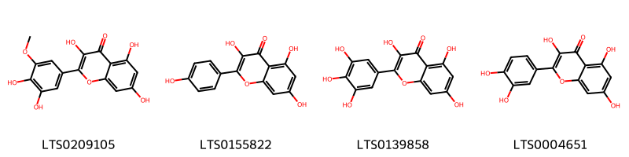{ width=100% }
    <figcaption>Hình ảnh cấu trúc hóa học của 4 hoạt chất thuộc nhóm Flavonoids gồm ['laricitrin (LTS0209105)', 'kaempherol (LTS0155822)', 'myricetin (LTS0139858)', 'quercetin (LTS0004651)'].</figcaption>
</figure>
#### Nhóm Organooxygen compounds
<figure markdown="span">
    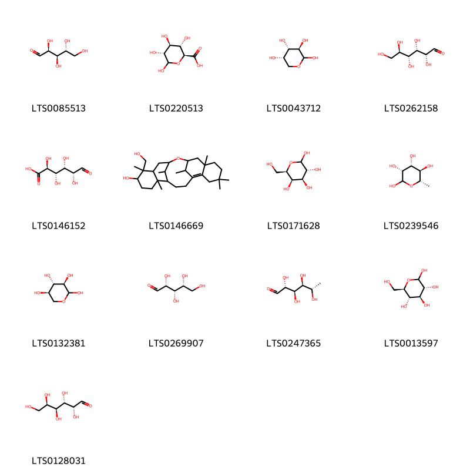{ width=100% }
    <figcaption>Hình ảnh cấu trúc hóa học của 13 hoạt chất thuộc nhóm Organooxygen compounds gồm ['arabinose (LTS0085513)', 'd-glucopyranuronic acid (LTS0220513)', 'l-arabinopyranose (LTS0043712)', '(+)-glucose (LTS0262158)', 'aldehydo-d-glucuronic acid (LTS0146152)', '6-(hydroxymethyl)-6,10,17,17,20,22,23-heptamethyl-2-oxapentacyclo[12.7.1.1³,¹¹.0⁵,¹⁰.0¹⁵,²⁰]tricos-14-en-7-ol (LTS0146669)', 'galactose (LTS0171628)', 'l-rhamnose (LTS0239546)', 'd-xylose (LTS0132381)', '(d)-xylose (LTS0269907)', 'rhamnose (LTS0247365)', 'glucose (LTS0013597)', 'aldehydo-d-galactose (LTS0128031)'].</figcaption>
</figure>
#### Nhóm Prenol lipids
<figure markdown="span">
    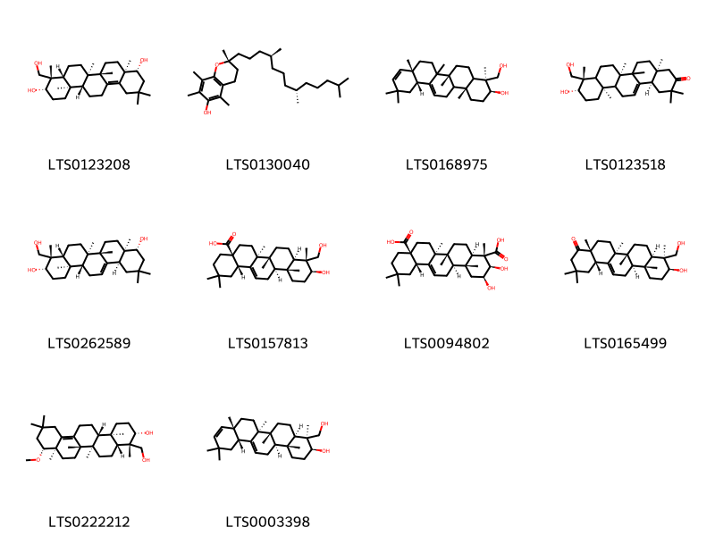{ width=100% }
    <figcaption>Hình ảnh cấu trúc hóa học của 10 hoạt chất thuộc nhóm Prenol lipids gồm ['soyasapogenol f (LTS0123208)', '(2r)-2,5,7,8-tetramethyl-2-[(4s,8s)-4,8,12-trimethyltridecyl]-3,4-dihydro-1-benzopyran-6-ol (LTS0130040)', '(3s,4s,6ar,8as,12ar,14br)-4-(hydroxymethyl)-4,6a,6b,8a,11,11,14b-heptamethyl-1,2,3,4a,5,6,7,8,12,12a,14,14a-dodecahydropicen-3-ol (LTS0168975)', '(4as,6br,9s,10s,12ar,14br)-10-hydroxy-9-(hydroxymethyl)-2,2,4a,6a,6b,9,12a-heptamethyl-4,5,6,7,8,8a,10,11,12,12b,13,14b-dodecahydro-1h-picen-3-one (LTS0123518)', 'soyasapogenol b (LTS0262589)', 'hederagenin (LTS0157813)', 'medicagenic acid (LTS0094802)', 'soyasapogenol-e (LTS0165499)', 'soyasapogenol d (LTS0222212)', 'soyasapogenol c (LTS0003398)'].</figcaption>
</figure>

---

### Dược dân tộc học

Danh sách các quốc gia có sử dụng *Medicago lupulina* trong điều trị các bệnh. 

| Country   |   Disease | Bệnh                                                                                                                                                                                                |
|:----------|----------:|:----------------------------------------------------------------------------------------------------------------------------------------------------------------------------------------------------|
| Elsewhere |       nan | MYMEMORY WARNING: YOU USED ALL AVAILABLE FREE TRANSLATIONS FOR TODAY. NEXT AVAILABLE IN  18 HOURS 46 MINUTES 28 SECONDS VISIT HTTPS://MYMEMORY.TRANSLATED.NET/DOC/USAGELIMITS.PHP TO TRANSLATE MORE |

---

---
## Medicago sativa
### Thông tin về thực vật

!!! info "Phân loại thực vật của *Medicago sativa* từ GIBF:"
    - **Kingdom:** Plantae
    - **Phylum:** Tracheophyta
    - **Order:** Fabales
    - **Family:** Fabaceae
    - **Genus:** Medicago
    - **Species:** *Medicago sativa*

 

| Label (VI)   | Label (EN)   | Scientific Name   | Descriptions (VI)   | Descriptions (EN)         | Also Known As (VI)   | Also Known As (EN)     |
|:-------------|:-------------|:------------------|:--------------------|:--------------------------|:---------------------|:-----------------------|
| N/A          | N/A          | Medicago sativa   |                     | species of plant, alfalfa | ['Medicago sativa']  | ['alfalfa', 'lucerne'] |

#### Phân bố trên thế giới

**Từ CSDL GIBF** Italy, Australia, Belgium, Argentina, Palestine, State of, Canada, Denmark, Netherlands, Chinese Taipei, Spain, Bolivia (Plurinational State of), Hungary, Portugal, United States of America, Chile, South Africa, Germany, Switzerland, Mexico, France, Austria, United Kingdom of Great Britain and Northern Ireland, Ecuador, Colombia, New Zealand

#### Phân bố tại Việt Nam

**Từ CSDL GIBF**: Không có ghi nhận ở Việt Nam

---
### Thành phần hóa học
        
- Theo cơ sở dữ liệu lotus: Từ loài *Medicago sativa* đã phân lập và xác định được 309 hoạt chất thuộc về các nhóm Organic oxides, Hydroxy acids and derivatives, Stilbenes, Phenols, Carboxylic acids and derivatives, Fatty Acyls, Cinnamic acids and derivatives, Glycerophospholipids, Heteroaromatic compounds, Glycerolipids, Prenol lipids, Linear 1,3-diarylpropanoids, Purine nucleosides, Benzene and substituted derivatives, Dihydrofurans, Organooxygen compounds, Pyridines and derivatives, Flavonoids, Steroids and steroid derivatives, Isoflavonoids, Organonitrogen compounds, 2-arylbenzofuran flavonoids, Keto acids and derivatives, Imidazopyrimidines. 

|    | chemicalTaxonomyClassyfireClass     |   smiles_count |
|---:|:------------------------------------|---------------:|
|  0 |                                     |              1 |
|  1 | 2-arylbenzofuran flavonoids         |              2 |
|  2 | Benzene and substituted derivatives |              5 |
|  3 | Carboxylic acids and derivatives    |             29 |
|  4 | Cinnamic acids and derivatives      |              7 |
|  5 | Dihydrofurans                       |              2 |
|  6 | Fatty Acyls                         |             26 |
|  7 | Flavonoids                          |             72 |
|  8 | Glycerolipids                       |              1 |
|  9 | Glycerophospholipids                |              1 |
| 10 | Heteroaromatic compounds            |              1 |
| 11 | Hydroxy acids and derivatives       |              1 |
| 12 | Imidazopyrimidines                  |              1 |
| 13 | Isoflavonoids                       |             15 |
| 14 | Keto acids and derivatives          |              2 |
| 15 | Linear 1,3-diarylpropanoids         |              2 |
| 16 | Organic oxides                      |              2 |
| 17 | Organonitrogen compounds            |              2 |
| 18 | Organooxygen compounds              |             57 |
| 19 | Phenols                             |              1 |
| 20 | Prenol lipids                       |             65 |
| 21 | Purine nucleosides                  |              9 |
| 22 | Pyridines and derivatives           |              1 |
| 23 | Steroids and steroid derivatives    |              3 |
| 24 | Stilbenes                           |              1 |

#### Nhóm 
<figure markdown="span">
    { width=100% }
    <figcaption>Hình ảnh cấu trúc hóa học của 1 hoạt chất thuộc nhóm  gồm ['trigonelline (LTS0040106)'].</figcaption>
</figure>
#### Nhóm 2-arylbenzofuran flavonoids
<figure markdown="span">
    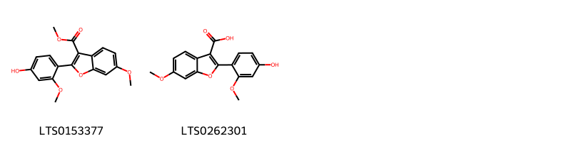{ width=100% }
    <figcaption>Hình ảnh cấu trúc hóa học của 2 hoạt chất thuộc nhóm 2-arylbenzofuran flavonoids gồm ['methyl 2-(4-hydroxy-2-methoxyphenyl)-6-methoxy-1-benzofuran-3-carboxylate (LTS0153377)', '2-(4-hydroxy-2-methoxyphenyl)-6-methoxy-1-benzofuran-3-carboxylic acid (LTS0262301)'].</figcaption>
</figure>
#### Nhóm Benzene and substituted derivatives
<figure markdown="span">
    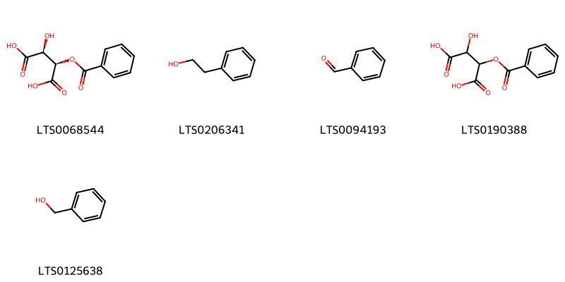{ width=100% }
    <figcaption>Hình ảnh cấu trúc hóa học của 5 hoạt chất thuộc nhóm Benzene and substituted derivatives gồm ['(2r,3s)-2-(benzoyloxy)-3-hydroxybutanedioic acid (LTS0068544)', '2-phenyl-ethanol (LTS0206341)', 'benzaldehyde (LTS0094193)', '2-(benzoyloxy)-3-hydroxybutanedioic acid (LTS0190388)', 'benzyl alcohol (LTS0125638)'].</figcaption>
</figure>
#### Nhóm Carboxylic acids and derivatives
<figure markdown="span">
    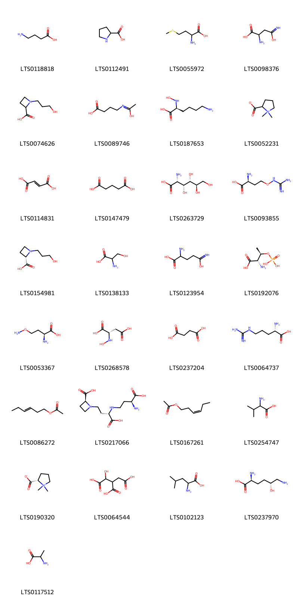{ width=100% }
    <figcaption>Hình ảnh cấu trúc hóa học của 29 hoạt chất thuộc nhóm Carboxylic acids and derivatives gồm ['gamma(amino)-butyric acid (LTS0118818)', 'proline (LTS0112491)', 'methionin (LTS0055972)', 'asparagine (LTS0098376)', '1-(3-hydroxypropyl)azetidine-2-carboxylic acid (LTS0074626)', '4-[(1-hydroxyethylidene)amino]butanoic acid (LTS0089746)', '(2s)-6-amino-2-(hydroxyamino)hexanoic acid (LTS0187653)', '1,1-dimethylpyrrolidin-1-ium-2-carboxylate (LTS0052231)', 'fumaric acid (LTS0114831)', 'glutaric acid (LTS0147479)', '(2r,3r,4s,5r)-2-amino-3,4,5,6-tetrahydroxyhexanoic acid (LTS0263729)', '(l)-canavanine (LTS0093855)', '(2s)-1-(3-hydroxypropyl)azetidine-2-carboxylic acid (LTS0154981)', 'serin (LTS0138133)', 'glutamine (LTS0123954)', 'phosphothreonine (LTS0192076)', 'canaline (LTS0053367)', '(2s)-2-(hydroxyamino)butanedioic acid (LTS0268578)', 'succinic acid (LTS0237204)', 'l-arginine (LTS0064737)', '3-hexenyl acetate (LTS0086272)', 'nicotianamine (LTS0217066)', '(z)-3-hexenyl acetate (LTS0167261)', 'valin (LTS0254747)', 'stachydrine (LTS0190320)', 'isocitric acid (LTS0064544)', 'leucine (LTS0102123)', 'l-hydroxylysine (LTS0237970)', 'alanine (LTS0117512)'].</figcaption>
</figure>
#### Nhóm Cinnamic acids and derivatives
<figure markdown="span">
    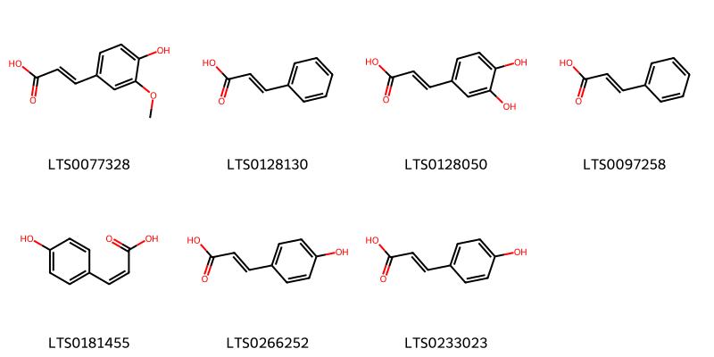{ width=100% }
    <figcaption>Hình ảnh cấu trúc hóa học của 7 hoạt chất thuộc nhóm Cinnamic acids and derivatives gồm ['ferulic acid (LTS0077328)', 'cinnamic acid (LTS0128130)', '3,4-dihydroxycinnamic acid (LTS0128050)', 'phenylacrylic acid (LTS0097258)', 'cis-p-coumaric acid (LTS0181455)', 'para-coumaric acid (LTS0266252)', 'hydroxycinnamic acid (LTS0233023)'].</figcaption>
</figure>
#### Nhóm Dihydrofurans
<figure markdown="span">
    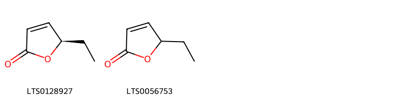{ width=100% }
    <figcaption>Hình ảnh cấu trúc hóa học của 2 hoạt chất thuộc nhóm Dihydrofurans gồm ['(5r)-5-ethyl-5h-furan-2-one (LTS0128927)', '5-ethyl-2(5h)-furanone (LTS0056753)'].</figcaption>
</figure>
#### Nhóm Fatty Acyls
<figure markdown="span">
    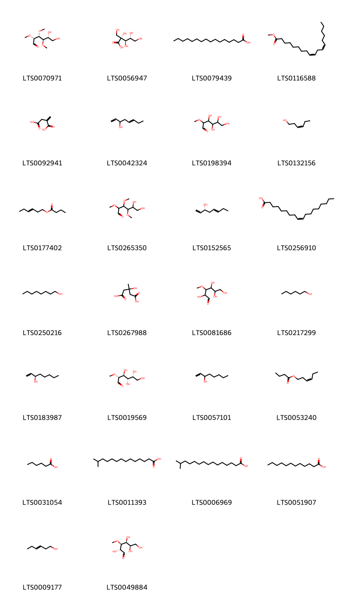{ width=100% }
    <figcaption>Hình ảnh cấu trúc hóa học của 26 hoạt chất thuộc nhóm Fatty Acyls gồm ['(2r,3r,4r,5r)-5,6-dihydroxy-2,3,4-trimethoxyhexanal (LTS0070971)', '2-carboxy-d-arabinitol (LTS0056947)', 'palmitic acid (LTS0079439)', 'methyl linoleate (LTS0116588)', 'itaconic acid (LTS0092941)', 'octa-1,5-dien-3-ol (LTS0042324)', '3,4,5,6-tetrahydroxy-2-methoxyhexanal (LTS0198394)', 'cis-3-hexenol (LTS0132156)', 'hex-3-en-1-yl butanoate (LTS0177402)', '5,6-dihydroxy-2,3,4-trimethoxyhexanal (LTS0265350)', '(3r,5e)-octa-1,5-dien-3-ol (LTS0152565)', 'oleic acid (LTS0256910)', 'octanol (LTS0250216)', 'meglutol (LTS0267988)', '2,4,5,6-tetrahydroxy-3-methoxyhexanal (LTS0081686)', 'hexanol (LTS0217299)', '1-octen-3-ol (LTS0183987)', '2-o-methylgalactose (LTS0019569)', '1-octen-3-ol (LTS0057101)', 'cis-3-hexenyl butyrate (LTS0053240)', 'hexanoic acid (LTS0031054)', '13-methyltetradecanoic acid (LTS0011393)', 'isopalmitic acid (LTS0006969)', 'lauric acid (LTS0051907)', '3-hexenol (LTS0009177)', '(2r,3s,4s,5r)-2,4,5,6-tetrahydroxy-3-methoxyhexanal (LTS0049884)'].</figcaption>
</figure>
#### Nhóm Flavonoids
<figure markdown="span">
    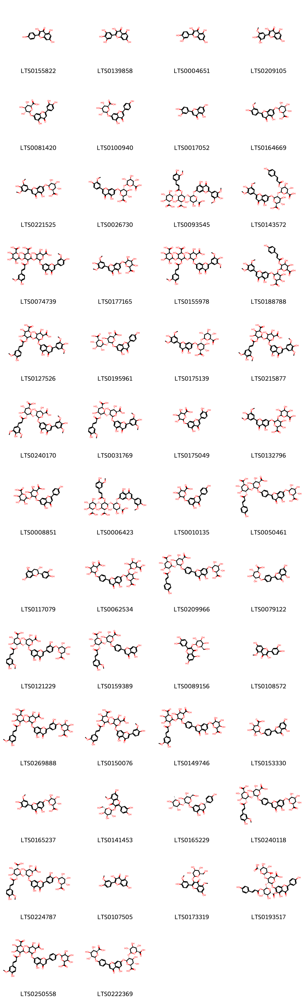{ width=100% }
    <figcaption>Hình ảnh cấu trúc hóa học của 72 hoạt chất thuộc nhóm Flavonoids gồm ['kaempherol (LTS0155822)', 'myricetin (LTS0139858)', 'quercetin (LTS0004651)', 'laricitrin (LTS0209105)', 'luteolin 7-o-glucuronide (LTS0081420)', '(2s,3s,4s,5r,6s)-3,4,5-trihydroxy-6-{[5-hydroxy-2-(4-hydroxyphenyl)-4-oxochromen-7-yl]oxy}oxane-2-carboxylic acid (LTS0100940)', 'luteolin (LTS0017052)', '(2s,3s,4s,5r,6s)-3,4,5-trihydroxy-6-{[5-hydroxy-2-(4-hydroxy-3-methoxyphenyl)-4-oxochromen-7-yl]oxy}oxane-2-carboxylic acid (LTS0164669)', '(2s,3s,4s,5r,6s)-3,4,5-trihydroxy-6-{[5-hydroxy-2-(4-hydroxy-3,5-dimethoxyphenyl)-4-oxochromen-7-yl]oxy}oxane-2-carboxylic acid (LTS0221525)', '(2s,3s,4s,5r,6s)-5-{[(2r,3r,4s,5s,6s)-6-carboxy-3,4,5-trihydroxyoxan-2-yl]oxy}-3,4-dihydroxy-6-{[5-hydroxy-2-(4-hydroxy-3-methoxyphenyl)-4-oxochromen-7-yl]oxy}oxane-2-carboxylic acid (LTS0026730)', '(2s,3s,4s,5r,6r)-4-{[(2r,3r,4s,5s,6s)-6-carboxy-3,4,5-trihydroxyoxan-2-yl]oxy}-6-{[(2s,3r,4s,5s,6s)-6-carboxy-4,5-dihydroxy-2-{[5-hydroxy-2-(4-hydroxy-3,5-dimethoxyphenyl)-4-oxochromen-7-yl]oxy}oxan-3-yl]oxy}-3-hydroxy-5-{[(2e)-3-(4-hydroxy-3-methoxyphenyl)prop-2-enoyl]oxy}oxane-2-carboxylic acid (LTS0093545)', '(2s,3s,4s,5r,6s)-5-{[(2r,3r,4s,5s,6s)-6-carboxy-4,5-dihydroxy-3-{[(2e)-3-(4-hydroxyphenyl)prop-2-enoyl]oxy}oxan-2-yl]oxy}-3,4-dihydroxy-6-{[5-hydroxy-2-(4-hydroxy-3,5-dimethoxyphenyl)-4-oxochromen-7-yl]oxy}oxane-2-carboxylic acid (LTS0143572)', '4-[(6-carboxy-3,4,5-trihydroxyoxan-2-yl)oxy]-6-[(6-carboxy-4,5-dihydroxy-2-{[5-hydroxy-2-(4-hydroxy-3-methoxyphenyl)-4-oxochromen-7-yl]oxy}oxan-3-yl)oxy]-3-hydroxy-5-{[3-(4-hydroxy-3-methoxyphenyl)prop-2-enoyl]oxy}oxane-2-carboxylic acid (LTS0074739)', '3,4,5-trihydroxy-6-{[5-hydroxy-2-(4-hydroxy-3,5-dimethoxyphenyl)-4-oxochromen-7-yl]oxy}oxane-2-carboxylic acid (LTS0177165)', '4-[(6-carboxy-3,4,5-trihydroxyoxan-2-yl)oxy]-6-[(6-carboxy-4,5-dihydroxy-2-{[5-hydroxy-2-(4-hydroxy-3,5-dimethoxyphenyl)-4-oxochromen-7-yl]oxy}oxan-3-yl)oxy]-3-hydroxy-5-{[3-(4-hydroxy-3-methoxyphenyl)prop-2-enoyl]oxy}oxane-2-carboxylic acid (LTS0155978)', '5-[(6-carboxy-4,5-dihydroxy-3-{[3-(4-hydroxyphenyl)prop-2-enoyl]oxy}oxan-2-yl)oxy]-3,4-dihydroxy-6-{[5-hydroxy-2-(4-hydroxy-3,5-dimethoxyphenyl)-4-oxochromen-7-yl]oxy}oxane-2-carboxylic acid (LTS0188788)', '6-[(6-carboxy-4,5-dihydroxy-2-{[5-hydroxy-2-(4-hydroxy-3,5-dimethoxyphenyl)-4-oxochromen-7-yl]oxy}oxan-3-yl)oxy]-3,4-dihydroxy-5-{[3-(4-hydroxy-3-methoxyphenyl)prop-2-enoyl]oxy}oxane-2-carboxylic acid (LTS0127526)', '(2s,3s,4s,5r,6s)-5-{[(2r,3r,4s,5s,6s)-6-carboxy-3,4,5-trihydroxyoxan-2-yl]oxy}-3,4-dihydroxy-6-{[5-hydroxy-2-(4-hydroxyphenyl)-4-oxochromen-7-yl]oxy}oxane-2-carboxylic acid (LTS0195961)', '(2s,3s,4s,5r,6s)-5-{[(2r,3r,4s,5s,6s)-6-carboxy-3,4,5-trihydroxyoxan-2-yl]oxy}-3,4-dihydroxy-6-{[5-hydroxy-2-(4-hydroxy-3,5-dimethoxyphenyl)-4-oxochromen-7-yl]oxy}oxane-2-carboxylic acid (LTS0175139)', '6-[(6-carboxy-4,5-dihydroxy-2-{[5-hydroxy-2-(4-hydroxy-3,5-dimethoxyphenyl)-4-oxochromen-7-yl]oxy}oxan-3-yl)oxy]-3,4-dihydroxy-5-{[3-(4-hydroxy-3,5-dimethoxyphenyl)prop-2-enoyl]oxy}oxane-2-carboxylic acid (LTS0215877)', '(2s,3s,4s,5r,6r)-6-{[(2s,3r,4s,5s,6s)-6-carboxy-4,5-dihydroxy-2-{[5-hydroxy-2-(4-hydroxy-3,5-dimethoxyphenyl)-4-oxochromen-7-yl]oxy}oxan-3-yl]oxy}-3,4-dihydroxy-5-{[(2e)-3-(4-hydroxy-3,5-dimethoxyphenyl)prop-2-enoyl]oxy}oxane-2-carboxylic acid (LTS0240170)', '(2s,3s,4s,5r,6r)-6-{[(2s,3r,4s,5s,6s)-6-carboxy-4,5-dihydroxy-2-{[5-hydroxy-2-(4-hydroxy-3,5-dimethoxyphenyl)-4-oxochromen-7-yl]oxy}oxan-3-yl]oxy}-3,4-dihydroxy-5-{[(2e)-3-(4-hydroxy-3-methoxyphenyl)prop-2-enoyl]oxy}oxane-2-carboxylic acid (LTS0031769)', '6-{[2-(3,4-dihydroxyphenyl)-5-hydroxy-4-oxochromen-7-yl]oxy}-3,4,5-trihydroxyoxane-2-carboxylic acid (LTS0175049)', '5-[(6-carboxy-3,4,5-trihydroxyoxan-2-yl)oxy]-3,4-dihydroxy-6-{[5-hydroxy-2-(4-hydroxy-3,5-dimethoxyphenyl)-4-oxochromen-7-yl]oxy}oxane-2-carboxylic acid (LTS0132796)', '6-[(6-carboxy-4,5-dihydroxy-2-{[5-hydroxy-2-(4-hydroxyphenyl)-4-oxochromen-7-yl]oxy}oxan-3-yl)oxy]-3,4,5-trihydroxyoxane-2-carboxylic acid (LTS0008851)', '(2s,3s,4s,5r,6r)-4-{[(2r,3r,4s,5s,6s)-6-carboxy-3,4,5-trihydroxyoxan-2-yl]oxy}-6-{[(2s,3r,4s,5s,6s)-6-carboxy-4,5-dihydroxy-2-{[5-hydroxy-2-(4-hydroxy-3-methoxyphenyl)-4-oxochromen-7-yl]oxy}oxan-3-yl]oxy}-3-hydroxy-5-{[(2e)-3-(4-hydroxy-3-methoxyphenyl)prop-2-enoyl]oxy}oxane-2-carboxylic acid (LTS0006423)', '3,4,5-trihydroxy-6-{[5-hydroxy-2-(4-hydroxyphenyl)-4-oxochromen-7-yl]oxy}oxane-2-carboxylic acid (LTS0010135)', '(2s,3s,4s,5r,6r)-6-{[(2s,3s,4s,5s,6s)-6-carboxy-2-[4-(7-{[(2s,3r,4s,5s,6s)-6-carboxy-3,4,5-trihydroxyoxan-2-yl]oxy}-5-hydroxy-4-oxochromen-2-yl)phenoxy]-4,5-dihydroxyoxan-3-yl]oxy}-3,4-dihydroxy-5-{[(2e)-3-(4-hydroxyphenyl)prop-2-enoyl]oxy}oxane-2-carboxylic acid (LTS0050461)', '(+)-catechol (LTS0117079)', '6-{4-[7-({6-carboxy-3-[(6-carboxy-3,4,5-trihydroxyoxan-2-yl)oxy]-4,5-dihydroxyoxan-2-yl}oxy)-5-hydroxy-4-oxochromen-2-yl]phenoxy}-3,4,5-trihydroxyoxane-2-carboxylic acid (LTS0062534)', '(2s,3s,4s,5r,6r)-6-{[(2s,3r,4s,5s,6s)-6-carboxy-2-[4-(7-{[(2s,3r,4s,5s,6s)-6-carboxy-3,4,5-trihydroxyoxan-2-yl]oxy}-5-hydroxy-4-oxochromen-2-yl)phenoxy]-4,5-dihydroxyoxan-3-yl]oxy}-3,4-dihydroxy-5-{[(2e)-3-(4-hydroxyphenyl)prop-2-enoyl]oxy}oxane-2-carboxylic acid (LTS0209966)', '(2s,3s,4s,5r,6s)-6-[4-(5,7-dihydroxy-4-oxochromen-2-yl)phenoxy]-3,4,5-trihydroxyoxane-2-carboxylic acid (LTS0079122)', '(2s,3s,4s,5r,6r)-6-{[(2s,3r,4s,5s,6s)-6-carboxy-2-{[2-(4-{[(2s,3r,4s,5s,6s)-6-carboxy-3,4,5-trihydroxyoxan-2-yl]oxy}-3-hydroxyphenyl)-5-hydroxy-4-oxochromen-7-yl]oxy}-4,5-dihydroxyoxan-3-yl]oxy}-3,4-dihydroxy-5-{[(2e)-3-(4-hydroxy-3-methoxyphenyl)prop-2-enoyl]oxy}oxane-2-carboxylic acid (LTS0121229)', '(2s,3s,4s,5r,6r)-6-{[(2s,3r,4s,5s,6s)-6-carboxy-2-[4-(5,7-dihydroxy-4-oxochromen-2-yl)phenoxy]-4,5-dihydroxyoxan-3-yl]oxy}-3,4-dihydroxy-5-{[(2e)-3-(4-hydroxy-3-methoxyphenyl)prop-2-enoyl]oxy}oxane-2-carboxylic acid (LTS0159389)', 'hyperoside (LTS0089156)', 'azaleatin (LTS0108572)', '6-({6-carboxy-2-[(2-{4-[(6-carboxy-3,4,5-trihydroxyoxan-2-yl)oxy]-3-hydroxyphenyl}-5-hydroxy-4-oxochromen-7-yl)oxy]-4,5-dihydroxyoxan-3-yl}oxy)-3,4-dihydroxy-5-{[3-(4-hydroxy-3-methoxyphenyl)prop-2-enoyl]oxy}oxane-2-carboxylic acid (LTS0269888)', '6-[(6-carboxy-4,5-dihydroxy-2-{[5-hydroxy-2-(4-hydroxy-3-methoxyphenyl)-4-oxochromen-7-yl]oxy}oxan-3-yl)oxy]-3,4-dihydroxy-5-{[3-(4-hydroxy-3-methoxyphenyl)prop-2-enoyl]oxy}oxane-2-carboxylic acid (LTS0150076)', '6-{[6-carboxy-2-(4-{7-[(6-carboxy-3,4,5-trihydroxyoxan-2-yl)oxy]-5-hydroxy-4-oxochromen-2-yl}phenoxy)-4,5-dihydroxyoxan-3-yl]oxy}-3,4-dihydroxy-5-{[3-(4-hydroxy-3-methoxyphenyl)prop-2-enoyl]oxy}oxane-2-carboxylic acid (LTS0149746)', '6-[4-(5,7-dihydroxy-4-oxochromen-2-yl)phenoxy]-3,4,5-trihydroxyoxane-2-carboxylic acid (LTS0153330)', '(2s,3s,4s,5s,6s)-6-{[2-(3,4-dihydroxy-5-methoxyphenyl)-5-hydroxy-4-oxochromen-7-yl]oxy}-3,4,5-trihydroxyoxane-2-carboxylic acid (LTS0165237)', '2-(3,4-dihydroxyphenyl)-7-hydroxy-5-methoxy-3-{[(2s,3r,4s,5r,6s)-3,4,5-trihydroxy-6-(hydroxymethyl)oxan-2-yl]oxy}chromen-4-one (LTS0141453)', 'naringin (LTS0165229)', '(2s,3s,4s,5r,6r)-6-{[(2s,3r,4s,5s,6s)-6-carboxy-2-[4-(7-{[(2s,3r,4s,5s,6s)-6-carboxy-3,4,5-trihydroxyoxan-2-yl]oxy}-5-hydroxy-4-oxochromen-2-yl)phenoxy]-4,5-dihydroxyoxan-3-yl]oxy}-3,4-dihydroxy-5-{[(2e)-3-(4-hydroxy-3-methoxyphenyl)prop-2-enoyl]oxy}oxane-2-carboxylic acid (LTS0240118)', '(2r,3s,4s,5r,6r)-6-{[(2s,3r,4s,5s,6s)-6-carboxy-2-{[2-(4-{[(2s,3r,4r,5s,6s)-6-carboxy-3,4,5-trihydroxyoxan-2-yl]oxy}-3-hydroxyphenyl)-5-hydroxy-4-oxochromen-7-yl]oxy}-4,5-dihydroxyoxan-3-yl]oxy}-3,4-dihydroxy-5-{[(2e)-3-(4-hydroxy-3-methoxyphenyl)prop-2-enoyl]oxy}oxane-2-carboxylic acid (LTS0224787)', 'isorhamnetin (LTS0107505)', '7-hydroxy-2-(4-hydroxy-3-methoxyphenyl)-5-methoxy-3-{[(2s,3r,4s,5s,6r)-3,4,5-trihydroxy-6-(hydroxymethyl)oxan-2-yl]oxy}chromen-4-one (LTS0173319)', '(2s,3s,4s,5r,6r)-6-{[(2s,3r,4s,5s,6s)-6-carboxy-4-{[(2r,3r,4s,5s,6s)-6-carboxy-3,4,5-trihydroxyoxan-2-yl]oxy}-5-hydroxy-2-{[5-hydroxy-2-(4-hydroxyphenyl)-4-oxochromen-7-yl]oxy}oxan-3-yl]oxy}-3,4-dihydroxy-5-{[(2e)-3-(4-hydroxyphenyl)prop-2-enoyl]oxy}oxane-2-carboxylic acid (LTS0193517)', '6-({6-carboxy-2-[(2-{4-[(6-carboxy-3,4,5-trihydroxyoxan-2-yl)oxy]phenyl}-5-hydroxy-4-oxochromen-7-yl)oxy]-4,5-dihydroxyoxan-3-yl}oxy)-3,4-dihydroxy-5-{[3-(4-hydroxy-3-methoxyphenyl)prop-2-enoyl]oxy}oxane-2-carboxylic acid (LTS0250558)', '(2s,3s,4s,5r,6s)-6-[4-(7-{[(2s,3r,4s,5s,6s)-6-carboxy-3-{[(2r,3r,4s,5s,6s)-6-carboxy-3,4,5-trihydroxyoxan-2-yl]oxy}-4,5-dihydroxyoxan-2-yl]oxy}-5-hydroxy-4-oxochromen-2-yl)phenoxy]-3,4,5-trihydroxyoxane-2-carboxylic acid (LTS0222369)', '(2s,3s,4s,5r,6s)-6-{[2-(4-{[(2s,3r,4s,5s,6s)-6-carboxy-3,4,5-trihydroxyoxan-2-yl]oxy}-3-methoxyphenyl)-5-hydroxy-4-oxochromen-7-yl]oxy}-3,4,5-trihydroxyoxane-2-carboxylic acid (LTS0197473)', '(2r,3s,4s,5s,6r)-6-{[(2s,3s,4s,5s,6s)-6-carboxy-4,5-dihydroxy-2-{[5-hydroxy-2-(4-hydroxy-3-methoxyphenyl)-4-oxochromen-7-yl]oxy}oxan-3-yl]oxy}-3,4-dihydroxy-5-{[(2e)-3-(4-hydroxy-3-methoxyphenyl)prop-2-enoyl]oxy}oxane-2-carboxylic acid (LTS0213808)', '(2s,3s,4s,5r,6s)-6-[4-(7-{[(2s,3s,4s,5s,6r)-6-carboxy-4,5-dihydroxy-3-{[(2s,3r,4s,5s,6r)-3,4,5-trihydroxy-6-(hydroxymethyl)oxan-2-yl]oxy}oxan-2-yl]oxy}-5-hydroxy-4-oxochromen-2-yl)phenoxy]-3,4,5-trihydroxyoxane-2-carboxylic acid (LTS0081030)', '(2r,3s,4s,5r,6r)-6-{[(2s,3s,4s,5s,6s)-6-carboxy-4-{[(2r,3r,4s,5s,6s)-6-carboxy-3,4,5-trihydroxyoxan-2-yl]oxy}-5-hydroxy-2-{[5-hydroxy-2-(4-hydroxyphenyl)-4-oxochromen-7-yl]oxy}oxan-3-yl]oxy}-3,4-dihydroxy-5-{[(2e)-3-(4-hydroxyphenyl)prop-2-enoyl]oxy}oxane-2-carboxylic acid (LTS0144745)', '(2r,3s,4r,5r,6r)-6-{[(2s,3s,4s,5s,6r)-6-carboxy-2-[4-(7-{[(2s,3s,4s,5s,6s)-6-carboxy-3,4,5-trihydroxyoxan-2-yl]oxy}-5-hydroxy-4-oxochromen-2-yl)phenoxy]-4,5-dihydroxyoxan-3-yl]oxy}-3,4-dihydroxy-5-{[(2e)-3-(4-hydroxyphenyl)prop-2-enoyl]oxy}oxane-2-carboxylic acid (LTS0155504)', '(2s,3s,4s,5r,6r)-6-{[(2s,3r,4s,5s,6s)-6-carboxy-4,5-dihydroxy-2-{[5-hydroxy-2-(4-hydroxy-3-methoxyphenyl)-4-oxochromen-7-yl]oxy}oxan-3-yl]oxy}-3,4-dihydroxy-5-{[(2e)-3-(4-hydroxy-3-methoxyphenyl)prop-2-enoyl]oxy}oxane-2-carboxylic acid (LTS0039896)', '6-({6-carboxy-4-[(6-carboxy-3,4,5-trihydroxyoxan-2-yl)oxy]-5-hydroxy-2-{[5-hydroxy-2-(4-hydroxyphenyl)-4-oxochromen-7-yl]oxy}oxan-3-yl}oxy)-3,4-dihydroxy-5-{[3-(4-hydroxyphenyl)prop-2-enoyl]oxy}oxane-2-carboxylic acid (LTS0254400)', '6-[(2-{4-[(6-carboxy-3,4,5-trihydroxyoxan-2-yl)oxy]-3-methoxyphenyl}-5-hydroxy-4-oxochromen-7-yl)oxy]-3,4,5-trihydroxyoxane-2-carboxylic acid (LTS0246111)', '6-({6-carboxy-2-[4-(5,7-dihydroxy-4-oxochromen-2-yl)phenoxy]-4,5-dihydroxyoxan-3-yl}oxy)-3,4-dihydroxy-5-{[3-(4-hydroxy-3-methoxyphenyl)prop-2-enoyl]oxy}oxane-2-carboxylic acid (LTS0197874)', "7,4'-dihydroxyflavone (LTS0260159)", '(2r,3r,4r,5r,6s)-6-{[(2s,3s,4r,5r,6s)-6-carboxy-2-[4-(7-{[(2r,3s,4r,5s,6r)-6-carboxy-3,4,5-trihydroxyoxan-2-yl]oxy}-5-hydroxy-4-oxochromen-2-yl)phenoxy]-4,5-dihydroxyoxan-3-yl]oxy}-3,4-dihydroxy-5-{[(2e)-3-(4-hydroxy-3-methoxyphenyl)prop-2-enoyl]oxy}oxane-2-carboxylic acid (LTS0037882)', '(2s,3s,4s,5r,6s)-6-{[2-(3,4-dihydroxy-5-methoxyphenyl)-5-hydroxy-4-oxochromen-7-yl]oxy}-3,4,5-trihydroxyoxane-2-carboxylic acid (LTS0270703)', '(2s,3r,4s,5r,6r)-6-{[(2s,3r,4s,5s,6r)-6-carboxy-2-[4-(5,7-dihydroxy-4-oxochromen-2-yl)phenoxy]-4,5-dihydroxyoxan-3-yl]oxy}-3,4-dihydroxy-5-{[(2e)-3-(4-hydroxy-3-methoxyphenyl)prop-2-enoyl]oxy}oxane-2-carboxylic acid (LTS0133015)', '(2s,3s,4s,5r,6r)-6-{[(2s,3r,4s,5s,6s)-6-carboxy-2-{[2-(4-{[(2s,3r,4s,5s,6s)-6-carboxy-3,4,5-trihydroxyoxan-2-yl]oxy}phenyl)-5-hydroxy-4-oxochromen-7-yl]oxy}-4,5-dihydroxyoxan-3-yl]oxy}-3,4-dihydroxy-5-{[(2e)-3-(4-hydroxy-3-methoxyphenyl)prop-2-enoyl]oxy}oxane-2-carboxylic acid (LTS0013528)', '6-{[6-carboxy-2-(4-{7-[(6-carboxy-3,4,5-trihydroxyoxan-2-yl)oxy]-5-hydroxy-4-oxochromen-2-yl}phenoxy)-4,5-dihydroxyoxan-3-yl]oxy}-3,4-dihydroxy-5-{[3-(4-hydroxyphenyl)prop-2-enoyl]oxy}oxane-2-carboxylic acid (LTS0062474)', '(2s,3s,4s,5r,6s)-5-{[(2r,3r,4s,5s,6r)-6-carboxy-4,5-dihydroxy-3-{[(2e)-3-(4-hydroxyphenyl)prop-2-enoyl]oxy}oxan-2-yl]oxy}-3,4-dihydroxy-6-{[5-hydroxy-2-(4-hydroxy-3,5-dimethoxyphenyl)-4-oxochromen-7-yl]oxy}oxane-2-carboxylic acid (LTS0001986)', 'isokaempferide (LTS0011732)', '6-({6-carboxy-4-[(6-carboxy-3,4,5-trihydroxyoxan-2-yl)oxy]-5-hydroxy-2-{[5-hydroxy-2-(4-hydroxyphenyl)-4-oxochromen-7-yl]oxy}oxan-3-yl}oxy)-3,4-dihydroxy-5-{[3-(4-hydroxy-3-methoxyphenyl)prop-2-enoyl]oxy}oxane-2-carboxylic acid (LTS0013019)', '(2s,3s,4s,5r,6r)-6-{[(2s,3r,4s,5s,6s)-6-carboxy-4-{[(2r,3r,4s,5s,6s)-6-carboxy-3,4,5-trihydroxyoxan-2-yl]oxy}-5-hydroxy-2-{[5-hydroxy-2-(4-hydroxyphenyl)-4-oxochromen-7-yl]oxy}oxan-3-yl]oxy}-3,4-dihydroxy-5-{[(2e)-3-(4-hydroxy-3-methoxyphenyl)prop-2-enoyl]oxy}oxane-2-carboxylic acid (LTS0015188)', '(2r,3s,4s,5s,6s)-6-{[2-(4-{[(2s,3r,4s,5s,6s)-6-carboxy-3,4,5-trihydroxyoxan-2-yl]oxy}-3-methoxyphenyl)-5-hydroxy-4-oxochromen-7-yl]oxy}-3,4,5-trihydroxyoxane-2-carboxylic acid (LTS0022352)', '6-{[2-(3,4-dihydroxy-5-methoxyphenyl)-5-hydroxy-4-oxochromen-7-yl]oxy}-3,4,5-trihydroxyoxane-2-carboxylic acid (LTS0021561)', 'ent-epicatechin (LTS0265245)'].</figcaption>
</figure>
#### Nhóm Glycerolipids
<figure markdown="span">
    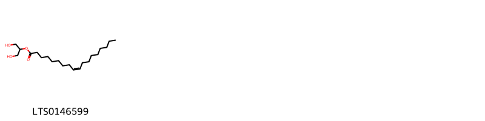{ width=100% }
    <figcaption>Hình ảnh cấu trúc hóa học của 1 hoạt chất thuộc nhóm Glycerolipids gồm ['2-oleoylglycerol (LTS0146599)'].</figcaption>
</figure>
#### Nhóm Glycerophospholipids
<figure markdown="span">
    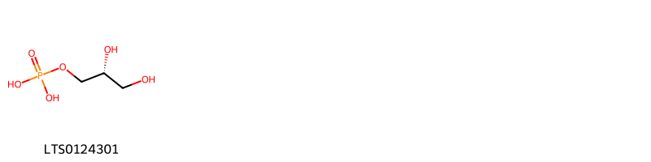{ width=100% }
    <figcaption>Hình ảnh cấu trúc hóa học của 1 hoạt chất thuộc nhóm Glycerophospholipids gồm ['3-phosphoglycerol (LTS0124301)'].</figcaption>
</figure>
#### Nhóm Heteroaromatic compounds
<figure markdown="span">
    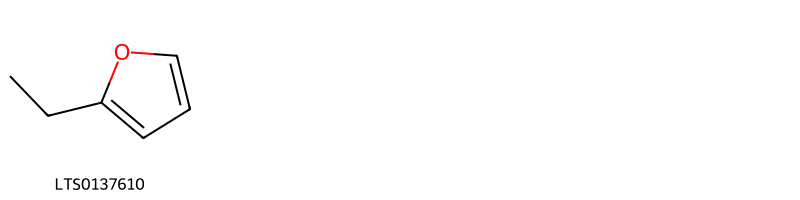{ width=100% }
    <figcaption>Hình ảnh cấu trúc hóa học của 1 hoạt chất thuộc nhóm Heteroaromatic compounds gồm ['2-ethylfuran (LTS0137610)'].</figcaption>
</figure>
#### Nhóm Hydroxy acids and derivatives
<figure markdown="span">
    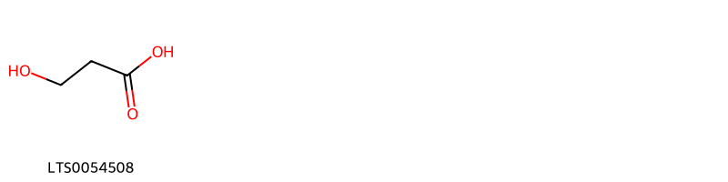{ width=100% }
    <figcaption>Hình ảnh cấu trúc hóa học của 1 hoạt chất thuộc nhóm Hydroxy acids and derivatives gồm ['3-hydroxy-propanoic acid (LTS0054508)'].</figcaption>
</figure>
#### Nhóm Imidazopyrimidines
<figure markdown="span">
    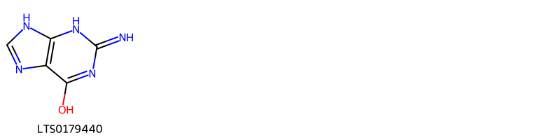{ width=100% }
    <figcaption>Hình ảnh cấu trúc hóa học của 1 hoạt chất thuộc nhóm Imidazopyrimidines gồm ['stella polaris (LTS0179440)'].</figcaption>
</figure>
#### Nhóm Isoflavonoids
<figure markdown="span">
    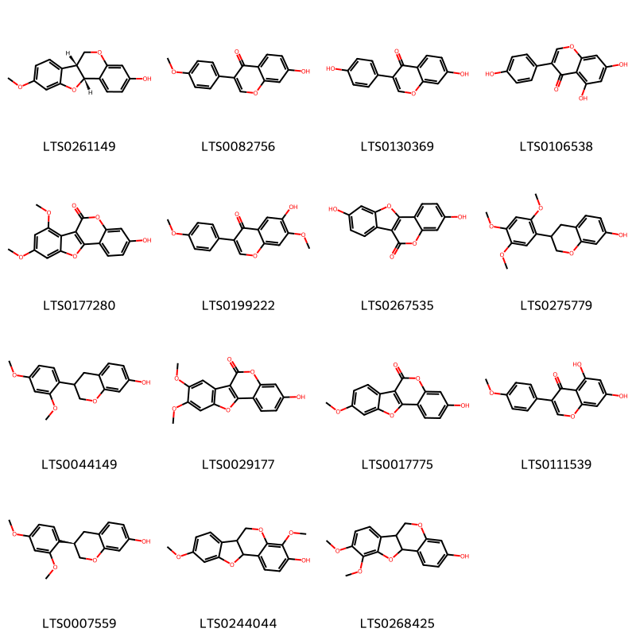{ width=100% }
    <figcaption>Hình ảnh cấu trúc hóa học của 15 hoạt chất thuộc nhóm Isoflavonoids gồm ['medicarpin, (-)- (LTS0261149)', 'formononetin (LTS0082756)', 'daidzein (LTS0130369)', 'genistein (LTS0106538)', 'wairol (LTS0177280)', 'alfalone (LTS0199222)', 'coumestrol (LTS0267535)', '3-(2,4,5-trimethoxyphenyl)-3,4-dihydro-2h-1-benzopyran-7-ol (LTS0275779)', '3-(2,4-dimethoxyphenyl)-3,4-dihydro-2h-1-benzopyran-7-ol (LTS0044149)', '5-hydroxy-13,14-dimethoxy-8,17-dioxatetracyclo[8.7.0.0²,⁷.0¹¹,¹⁶]heptadeca-1(10),2(7),3,5,11(16),12,14-heptaen-9-one (LTS0029177)', "4'-o-methylcoumestrol (LTS0017775)", 'biochanin (LTS0111539)', '(-)-sativan (LTS0007559)', '4-methoxymedicarpin (LTS0244044)', 'methylnissolin (LTS0268425)'].</figcaption>
</figure>
#### Nhóm Keto acids and derivatives
<figure markdown="span">
    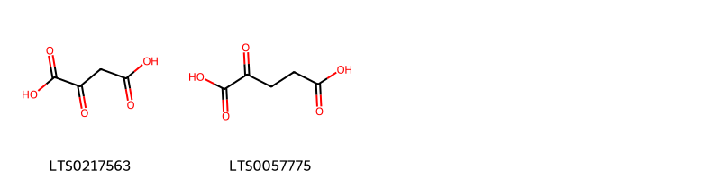{ width=100% }
    <figcaption>Hình ảnh cấu trúc hóa học của 2 hoạt chất thuộc nhóm Keto acids and derivatives gồm ['oxalacetate (LTS0217563)', 'oxoglutarate (LTS0057775)'].</figcaption>
</figure>
#### Nhóm Linear 1_3-diarylpropanoids
<figure markdown="span">
    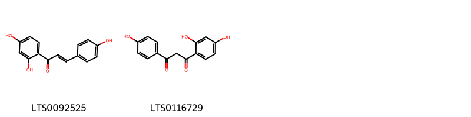{ width=100% }
    <figcaption>Hình ảnh cấu trúc hóa học của Không tìm thấy chú thích hoạt chất thuộc nhóm Linear 1_3-diarylpropanoids gồm Không tìm thấy chú thích.</figcaption>
</figure>
#### Nhóm Organic oxides
<figure markdown="span">
    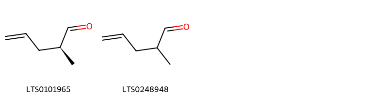{ width=100% }
    <figcaption>Hình ảnh cấu trúc hóa học của 2 hoạt chất thuộc nhóm Organic oxides gồm ['(2s)-2-methylpent-4-enal (LTS0101965)', '2-methylpent-4-enal (LTS0248948)'].</figcaption>
</figure>
#### Nhóm Organonitrogen compounds
<figure markdown="span">
    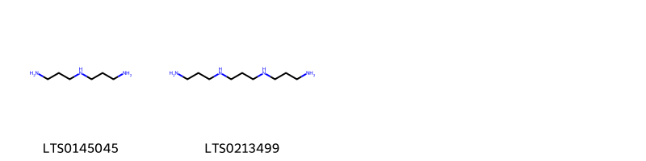{ width=100% }
    <figcaption>Hình ảnh cấu trúc hóa học của 2 hoạt chất thuộc nhóm Organonitrogen compounds gồm ['norspermidine (LTS0145045)', 'norspermine (LTS0213499)'].</figcaption>
</figure>
#### Nhóm Organooxygen compounds
<figure markdown="span">
    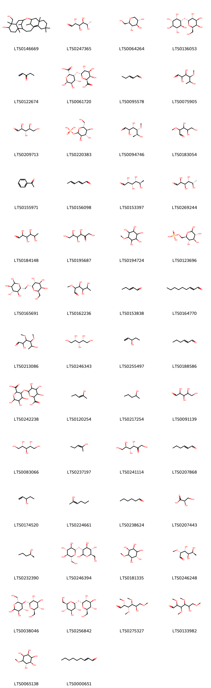{ width=100% }
    <figcaption>Hình ảnh cấu trúc hóa học của 57 hoạt chất thuộc nhóm Organooxygen compounds gồm ['6-(hydroxymethyl)-6,10,17,17,20,22,23-heptamethyl-2-oxapentacyclo[12.7.1.1³,¹¹.0⁵,¹⁰.0¹⁵,²⁰]tricos-14-en-7-ol (LTS0146669)', 'rhamnose (LTS0247365)', '1,5-anhydroglucitol (LTS0064264)', 'galactinol (LTS0136053)', '1-penten-3-one (LTS0122674)', '(2s,3r,4s,5r,6s)-6-{[(2s,3r,4r,5r,6s)-2-carboxy-4,5,6-trihydroxyoxan-3-yl]oxy}-3,4,5-trihydroxyoxane-2-carboxylic acid (LTS0061720)', '(2e)-2-pentenal (LTS0095578)', '2,3,5-trihydroxy-4-methoxyhexanal (LTS0075905)', 'l-ribose (LTS0209713)', 'glucose 1-phosphate (LTS0220383)', '(2r,3s,4r,5s)-2,3,5-trihydroxy-4-methoxyhexanal (LTS0094746)', '3,4,5-trihydroxy-2-methoxypentanal (LTS0183054)', 'acetophenone (LTS0155971)', '2,4-hexadienal (LTS0156098)', 'l-rhamnose (LTS0153397)', 'aldehydo-l-fucose (LTS0269244)', 'lrhamnose (LTS0184148)', 'sorbose (LTS0195687)', 'pinitol (LTS0194724)', 'glucose 6-phosphate (LTS0123696)', 'd-melibiose (LTS0165691)', '3,4,5-trihydroxy-2-methoxyhexanal (LTS0162236)', '2-pentenal (LTS0153838)', '(2e)-2-nonenal (LTS0164770)', '2,5-dihydroxy-3,4-dimethoxyhexanal (LTS0213086)', 'd-xylitol (LTS0246343)', '(3r)-pent-1-en-3-ol (LTS0255497)', 'hexenal (LTS0188586)', '6-[(2-carboxy-4,5,6-trihydroxyoxan-3-yl)oxy]-3,4,5-trihydroxyoxane-2-carboxylic acid (LTS0242238)', 'pent-2-en-2-ol (LTS0120254)', '2-pentanol (LTS0217254)', 'xylose (LTS0091139)', 'ribitol (LTS0083066)', '(2e)-pent-2-en-2-ol (LTS0237197)', 'keto-d-fructose (LTS0241114)', '(e)-2-hexenal (LTS0207868)', '1-penten-3-ol (LTS0174520)', 'hex-2-en-2-ol (LTS0224661)', 'hexanal (LTS0238624)', 'd-glyceric acid (LTS0207443)', '(s)-2-pentanol (LTS0232390)', '(3r,4s,5s,6r)-6-(hydroxymethyl)-3-{[(2s,3r,4s,5s,6r)-3,4,5-trihydroxy-6-(hydroxymethyl)oxan-2-yl]oxy}oxane-2,4,5-triol (LTS0246394)', 'methylinositol (LTS0181335)', '(2r,3r,4r,5s)-3,4,5-trihydroxy-2-methoxyhexanal (LTS0246248)', 'maltose (LTS0038046)', "α,α'-trehalose (LTS0256842)", '(2r,3s,4s,5r)-5-hydroxy-2,3,4,6-tetramethoxyhexanal (LTS0275327)', '5-hydroxy-2,3,4,6-tetramethoxyhexanal (LTS0133982)', '(1s,2r,4s,5s)-6-methoxycyclohexane-1,2,3,4,5-pentol (LTS0065138)', '2-nonenal (LTS0000651)', '3-pentanone (LTS0030661)', '2,4-hexadienal (LTS0089108)', '(2e)-hex-2-en-2-ol (LTS0249357)', 'isoamyl alcohol (LTS0112297)', '3-octanone (LTS0272728)', '(2r,3r,4r,5s)-2,5-dihydroxy-3,4-dimethoxyhexanal (LTS0046172)', '2-o-methylxylose (LTS0115564)'].</figcaption>
</figure>
#### Nhóm Phenols
<figure markdown="span">
    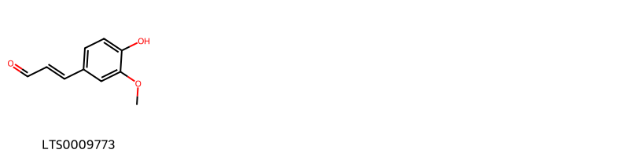{ width=100% }
    <figcaption>Hình ảnh cấu trúc hóa học của 1 hoạt chất thuộc nhóm Phenols gồm ['coniferaldehyde (LTS0009773)'].</figcaption>
</figure>
#### Nhóm Prenol lipids
<figure markdown="span">
    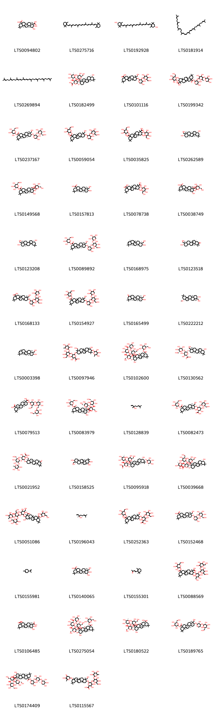{ width=100% }
    <figcaption>Hình ảnh cấu trúc hóa học của 65 hoạt chất thuộc nhóm Prenol lipids gồm ['medicagenic acid (LTS0094802)', 'β-carotene (LTS0275716)', 'zeaxanthin (LTS0192928)', 'phytofluene (LTS0181914)', 'all-trans-phytofluene (LTS0269894)', 'soyasaponin i (LTS0182499)', '10-[(4,5-dihydroxy-3-{[3,4,5-trihydroxy-6-(hydroxymethyl)oxan-2-yl]oxy}oxan-2-yl)oxy]-9-(hydroxymethyl)-2,2,6a,6b,9,12a-hexamethyl-1,3,4,5,6,7,8,8a,10,11,12,12b,13,14b-tetradecahydropicene-4a-carboxylic acid (LTS0101116)', '8a-({[3-({3,4-dihydroxy-6-methyl-5-[(3,4,5-trihydroxyoxan-2-yl)oxy]oxan-2-yl}oxy)-4,5-dihydroxyoxan-2-yl]oxy}carbonyl)-2-hydroxy-4,6a,6b,11,11,14b-hexamethyl-3-{[3,4,5-trihydroxy-6-(hydroxymethyl)oxan-2-yl]oxy}-1,2,3,4a,5,6,7,8,9,10,12,12a,14,14a-tetradecahydropicene-4-carboxylic acid (LTS0199342)', '(2s,3r,4s,5s,6r)-3,4,5-trihydroxy-6-(hydroxymethyl)oxan-2-yl (4as,6as,6br,8ar,9r,10s,12ar,12br,14bs)-10-{[(2s,3r,4s,5s)-4,5-dihydroxy-3-{[(2s,3r,4s,5s,6r)-3,4,5-trihydroxy-6-(hydroxymethyl)oxan-2-yl]oxy}oxan-2-yl]oxy}-9-(hydroxymethyl)-2,2,6a,6b,9,12a-hexamethyl-1,3,4,5,6,7,8,8a,10,11,12,12b,13,14b-tetradecahydropicene-4a-carboxylate (LTS0237167)', '3,4,5-trihydroxy-6-(hydroxymethyl)oxan-2-yl 10-[(4,5-dihydroxy-3-{[3,4,5-trihydroxy-6-(hydroxymethyl)oxan-2-yl]oxy}oxan-2-yl)oxy]-9-(hydroxymethyl)-2,2,6a,6b,9,12a-hexamethyl-1,3,4,5,6,7,8,8a,10,11,12,12b,13,14b-tetradecahydropicene-4a-carboxylate (LTS0059054)', '2-hydroxy-4,6a,6b,11,11,14b-hexamethyl-3-{[3,4,5-trihydroxy-6-(hydroxymethyl)oxan-2-yl]oxy}-8a-({[3,4,5-trihydroxy-6-(hydroxymethyl)oxan-2-yl]oxy}carbonyl)-1,2,3,4a,5,6,7,8,9,10,12,12a,14,14a-tetradecahydropicene-4-carboxylic acid (LTS0035825)', 'soyasapogenol b (LTS0262589)', '(2s,3r,4s,4ar,6ar,6bs,8as,12as,14ar,14br)-2-hydroxy-4,6a,6b,11,11,14b-hexamethyl-3-{[(2r,3r,4s,5s,6r)-3,4,5-trihydroxy-6-(hydroxymethyl)oxan-2-yl]oxy}-8a-({[(2s,3r,4s,5s,6r)-3,4,5-trihydroxy-6-(hydroxymethyl)oxan-2-yl]oxy}carbonyl)-1,2,3,4a,5,6,7,8,9,10,12,12a,14,14a-tetradecahydropicene-4-carboxylic acid (LTS0149568)', 'hederagenin (LTS0157813)', '2-hydroxy-4,6a,6b,11,11,14b-hexamethyl-3-{[3,4,5-trihydroxy-6-(hydroxymethyl)oxan-2-yl]oxy}-1,2,3,4a,5,6,7,8,9,10,12,12a,14,14a-tetradecahydropicene-4,8a-dicarboxylic acid (LTS0078738)', '(2s,3r,4s,4ar,6ar,6bs,8as,12as,14ar,14br)-2-hydroxy-4,6a,6b,11,11,14b-hexamethyl-3-{[(2r,3r,4s,5s,6r)-3,4,5-trihydroxy-6-(hydroxymethyl)oxan-2-yl]oxy}-1,2,3,4a,5,6,7,8,9,10,12,12a,14,14a-tetradecahydropicene-4,8a-dicarboxylic acid (LTS0038749)', 'soyasapogenol f (LTS0123208)', '(2s,3r,4s,5s,6r)-3,4,5-trihydroxy-6-(hydroxymethyl)oxan-2-yl (4as,6as,6br,8ar,9r,10s,12ar,12br,14bs)-10-{[(2s,3r,4s,5s)-3-{[(2s,3r,4s,5s,6r)-4,5-dihydroxy-6-(hydroxymethyl)-3-{[(2s,3r,4s,5s)-3,4,5-trihydroxyoxan-2-yl]oxy}oxan-2-yl]oxy}-4,5-dihydroxyoxan-2-yl]oxy}-9-(hydroxymethyl)-2,2,6a,6b,9,12a-hexamethyl-1,3,4,5,6,7,8,8a,10,11,12,12b,13,14b-tetradecahydropicene-4a-carboxylate (LTS0089892)', '(3s,4s,6ar,8as,12ar,14br)-4-(hydroxymethyl)-4,6a,6b,8a,11,11,14b-heptamethyl-1,2,3,4a,5,6,7,8,12,12a,14,14a-dodecahydropicen-3-ol (LTS0168975)', '(4as,6br,9s,10s,12ar,14br)-10-hydroxy-9-(hydroxymethyl)-2,2,4a,6a,6b,9,12a-heptamethyl-4,5,6,7,8,8a,10,11,12,12b,13,14b-dodecahydro-1h-picen-3-one (LTS0123518)', '10-[(3-{[4,5-dihydroxy-6-(hydroxymethyl)-3-[(3,4,5-trihydroxyoxan-2-yl)oxy]oxan-2-yl]oxy}-4,5-dihydroxyoxan-2-yl)oxy]-9-(hydroxymethyl)-2,2,6a,6b,9,12a-hexamethyl-1,3,4,5,6,7,8,8a,10,11,12,12b,13,14b-tetradecahydropicene-4a-carboxylic acid (LTS0168133)', '3,4,5-trihydroxy-6-(hydroxymethyl)oxan-2-yl 10-[(3-{[4,5-dihydroxy-6-(hydroxymethyl)-3-[(3,4,5-trihydroxyoxan-2-yl)oxy]oxan-2-yl]oxy}-4,5-dihydroxyoxan-2-yl)oxy]-9-(hydroxymethyl)-2,2,6a,6b,9,12a-hexamethyl-1,3,4,5,6,7,8,8a,10,11,12,12b,13,14b-tetradecahydropicene-4a-carboxylate (LTS0154927)', 'soyasapogenol-e (LTS0165499)', 'soyasapogenol d (LTS0222212)', 'soyasapogenol c (LTS0003398)', '5-{[4,5-dihydroxy-6-(hydroxymethyl)-3-[(3,4,5-trihydroxy-6-methyloxan-2-yl)oxy]oxan-2-yl]oxy}-3,4-dihydroxy-6-{[9-hydroxy-4-(hydroxymethyl)-4,6a,6b,8a,11,11,14b-heptamethyl-10-[(3,4,5-trihydroxy-6-methyloxan-2-yl)oxy]-1,2,3,4a,5,6,7,8,9,10,12,12a,14,14a-tetradecahydropicen-3-yl]oxy}oxane-2-carboxylic acid (LTS0097946)', '(2s,3r,4s,4ar,6ar,6bs,8as,12as,14ar,14br)-3-{[(2r,3r,4s,5s,6r)-4,5-dihydroxy-3-{[(2s,3r,4s,5r,6r)-5-hydroxy-6-(hydroxymethyl)-3-{[(2s,3r,4s,5s,6r)-3,4,5-trihydroxy-6-(hydroxymethyl)oxan-2-yl]oxy}-4-{[(2s,3r,4r,5r,6s)-3,4,5-trihydroxy-6-methyloxan-2-yl]oxy}oxan-2-yl]oxy}-6-(hydroxymethyl)oxan-2-yl]oxy}-2-hydroxy-4,6a,6b,11,11,14b-hexamethyl-8a-({[(2s,3r,4s,5s,6r)-3,4,5-trihydroxy-6-(hydroxymethyl)oxan-2-yl]oxy}carbonyl)-1,2,3,4a,5,6,7,8,9,10,12,12a,14,14a-tetradecahydropicene-4-carboxylic acid (LTS0102600)', '(2s,3s,4s,5r,6r)-6-{[(3s,4s,4ar,6ar,6bs,8ar,9r,12as,14ar,14br)-9-hydroxy-4-(hydroxymethyl)-4,6a,6b,8a,11,11,14b-heptamethyl-1,2,3,4a,5,6,7,8,9,10,12,12a,14,14a-tetradecahydropicen-3-yl]oxy}-3,4-dihydroxy-5-{[(2s,3r,4s,5s,6r)-3,4,5-trihydroxy-6-(hydroxymethyl)oxan-2-yl]oxy}oxane-2-carboxylic acid (LTS0130562)', '(3s,4s,4ar,6ar,6br,8as,12ar,12br,14ar,14br)-3-{[(2r,3r,4s,5r,6r)-3,5-dihydroxy-6-(hydroxymethyl)-4-{[(2s,3r,4s,5s,6r)-3,4,5-trihydroxy-6-({[(2r,3r,4s,5s,6r)-3,4,5-trihydroxy-6-(hydroxymethyl)oxan-2-yl]oxy}methyl)oxan-2-yl]oxy}oxan-2-yl]oxy}-4,6a,6b,11,11,14b-hexamethyl-hexadecahydropicene-4,8a-dicarboxylic acid (LTS0079513)', '(2s,3r,4s,4ar,6ar,6bs,8as,12as,14ar,14br)-3-{[(2r,3r,4s,5s,6r)-3-{[(2s,3r,4s,5s,6r)-4,5-dihydroxy-6-(hydroxymethyl)-3-{[(2s,3r,4s,5s,6r)-3,4,5-trihydroxy-6-(hydroxymethyl)oxan-2-yl]oxy}oxan-2-yl]oxy}-4,5-dihydroxy-6-(hydroxymethyl)oxan-2-yl]oxy}-2-hydroxy-4,6a,6b,11,11,14b-hexamethyl-8a-({[(2s,3r,4s,5s,6r)-3,4,5-trihydroxy-6-(hydroxymethyl)oxan-2-yl]oxy}carbonyl)-1,2,3,4a,5,6,7,8,9,10,12,12a,14,14a-tetradecahydropicene-4-carboxylic acid (LTS0083979)', 'linalool, (+-)- (LTS0128839)', '(2s,3s,4s,5r,6r)-6-{[(2s,3r,4s,4ar,6ar,6bs,8as,12as,14ar,14br)-2-hydroxy-4-(hydroxymethyl)-4,6a,6b,11,11,14b-hexamethyl-8a-({[(2s,3r,4s,5s,6r)-3,4,5-trihydroxy-6-(hydroxymethyl)oxan-2-yl]oxy}carbonyl)-1,2,3,4a,5,6,7,8,9,10,12,12a,14,14a-tetradecahydropicen-3-yl]oxy}-3,4-dihydroxy-5-{[(2s,3r,4s,5r,6r)-3,4,5-trihydroxy-6-(hydroxymethyl)oxan-2-yl]oxy}oxane-2-carboxylic acid (LTS0082473)', '(2r,3r,4r,5s,6s)-6-{[(3r,4r,6as,6br,8as,12ar,14bs)-4-(hydroxymethyl)-4,6a,6b,8a,11,11,14b-heptamethyl-9-oxo-2,3,4a,5,6,7,8,10,12,12a,14,14a-dodecahydro-1h-picen-3-yl]oxy}-5-{[(2r,3s,4r,5s,6s)-4,5-dihydroxy-6-(hydroxymethyl)-3-{[(2r,3s,4s,5s,6r)-3,4,5-trihydroxy-6-methyloxan-2-yl]oxy}oxan-2-yl]oxy}-3,4-dihydroxyoxane-2-carboxylic acid (LTS0021952)', '(4ar,6br,9s,10s,12ar,14bs)-9-(hydroxymethyl)-2,2,4a,6a,6b,9,12a-heptamethyl-1,3,4,5,6,7,8,8a,10,11,12,12b,13,14b-tetradecahydropicene-3,4,10-triol (LTS0158525)', '(2s,3s,4s,5r,6r)-6-{[(3s,4s,4ar,6ar,6bs,8ar,9s,10r,12as,14ar,14br)-9-hydroxy-4-(hydroxymethyl)-4,6a,6b,8a,11,11,14b-heptamethyl-10-{[(2s,3r,4r,5r,6s)-3,4,5-trihydroxy-6-methyloxan-2-yl]oxy}-1,2,3,4a,5,6,7,8,9,10,12,12a,14,14a-tetradecahydropicen-3-yl]oxy}-5-{[(2s,3r,4s,5r,6r)-4,5-dihydroxy-6-(hydroxymethyl)-3-{[(2s,3r,4r,5r,6s)-3,4,5-trihydroxy-6-methyloxan-2-yl]oxy}oxan-2-yl]oxy}-3,4-dihydroxyoxane-2-carboxylic acid (LTS0095918)', '(2s,3s,4s,5r,6r)-6-{[(3s,4s,4ar,6ar,6bs,8ar,9r,12as,14ar,14br)-9-hydroxy-4-(hydroxymethyl)-4,6a,6b,8a,11,11,14b-heptamethyl-1,2,3,4a,5,6,7,8,9,10,12,12a,14,14a-tetradecahydropicen-3-yl]oxy}-5-{[(2s,3r,4s,5s,6r)-3-{[(2s,3r,4s,5r,6r)-4,5-dihydroxy-6-(hydroxymethyl)-3-{[(2s,3r,4r,5r,6s)-3,4,5-trihydroxy-6-methyloxan-2-yl]oxy}oxan-2-yl]oxy}-4,5-dihydroxy-6-(hydroxymethyl)oxan-2-yl]oxy}-3,4-dihydroxyoxane-2-carboxylic acid (LTS0039668)', '3-[(4,5-dihydroxy-3-{[5-hydroxy-6-(hydroxymethyl)-3-{[3,4,5-trihydroxy-6-(hydroxymethyl)oxan-2-yl]oxy}-4-[(3,4,5-trihydroxy-6-methyloxan-2-yl)oxy]oxan-2-yl]oxy}-6-(hydroxymethyl)oxan-2-yl)oxy]-2-hydroxy-4,6a,6b,11,11,14b-hexamethyl-8a-({[3,4,5-trihydroxy-6-(hydroxymethyl)oxan-2-yl]oxy}carbonyl)-1,2,3,4a,5,6,7,8,9,10,12,12a,14,14a-tetradecahydropicene-4-carboxylic acid (LTS0051086)', '(+)-linalool (LTS0196043)', '3,4-dihydroxy-6-{[2-hydroxy-4-(hydroxymethyl)-4,6a,6b,11,11,14b-hexamethyl-8a-({[3,4,5-trihydroxy-6-(hydroxymethyl)oxan-2-yl]oxy}carbonyl)-1,2,3,4a,5,6,7,8,9,10,12,12a,14,14a-tetradecahydropicen-3-yl]oxy}-5-{[3,4,5-trihydroxy-6-(hydroxymethyl)oxan-2-yl]oxy}oxane-2-carboxylic acid (LTS0252363)', '(4as,6as,6br,8ar,9r,10s,12ar,12br,14br)-10-{[(2s,3r,4s,5s)-4,5-dihydroxy-3-{[(2s,3r,4s,5s,6r)-3,4,5-trihydroxy-6-(hydroxymethyl)oxan-2-yl]oxy}oxan-2-yl]oxy}-9-(hydroxymethyl)-2,2,6a,6b,9,12a-hexamethyl-1,3,4,5,6,7,8,8a,10,11,12,12b,13,14b-tetradecahydropicene-4a-carboxylic acid (LTS0152468)', 'limonene,  (LTS0155981)', 'bayogenin (LTS0140065)', 'β-ionone (LTS0155301)', '3-[(3-{[4,5-dihydroxy-6-(hydroxymethyl)-3-{[3,4,5-trihydroxy-6-(hydroxymethyl)oxan-2-yl]oxy}oxan-2-yl]oxy}-4,5-dihydroxy-6-(hydroxymethyl)oxan-2-yl)oxy]-2-hydroxy-4,6a,6b,11,11,14b-hexamethyl-8a-({[3,4,5-trihydroxy-6-(hydroxymethyl)oxan-2-yl]oxy}carbonyl)-1,2,3,4a,5,6,7,8,9,10,12,12a,14,14a-tetradecahydropicene-4-carboxylic acid (LTS0088569)', '(2s,3r,4s,4ar,6ar,6bs,8s,8ar,12as,14ar,14br)-2,3,8-trihydroxy-4,6a,6b,11,11,14b-hexamethyl-1,2,3,4a,5,6,7,8,9,10,12,12a,14,14a-tetradecahydropicene-4,8a-dicarboxylic acid (LTS0106485)', '(2s,3s,4s,4ar,6ar,6bs,8ar,12ar,14ar,14br)-3-{[(2r,3r,4s,5s,6r)-4,5-dihydroxy-3-{[(2s,3r,4s,5r,6r)-5-hydroxy-6-(hydroxymethyl)-3-{[(2s,3r,4s,5s,6r)-3,4,5-trihydroxy-6-(hydroxymethyl)oxan-2-yl]oxy}-4-{[(2s,3r,4r,5r,6s)-3,4,5-trihydroxy-6-methyloxan-2-yl]oxy}oxan-2-yl]oxy}-6-(hydroxymethyl)oxan-2-yl]oxy}-2-hydroxy-4,6a,6b,11,11,14b-hexamethyl-8a-({[(2s,3r,4s,5s,6r)-3,4,5-trihydroxy-6-(hydroxymethyl)oxan-2-yl]oxy}carbonyl)-1,2,3,4a,5,6,7,8,9,10,12,12a,14,14a-tetradecahydropicene-4-carboxylic acid (LTS0275054)', '(2s,3r,4s,4ar,6ar,6bs,8as,12as,14ar,14br)-3-{[(2r,3r,4s,5s,6r)-3-{[(2s,3r,4s,5s,6r)-4,5-dihydroxy-6-(hydroxymethyl)-3-{[(2s,3r,4r,5r,6s)-3,4,5-trihydroxy-6-methyloxan-2-yl]oxy}oxan-2-yl]oxy}-4,5-dihydroxy-6-(hydroxymethyl)oxan-2-yl]oxy}-2-hydroxy-4,6a,6b,11,11,14b-hexamethyl-1,2,3,4a,5,6,7,8,9,10,12,12a,14,14a-tetradecahydropicene-4,8a-dicarboxylic acid (LTS0180522)', '(2s,3r,4s,5s,6r)-3,4,5-trihydroxy-6-(hydroxymethyl)oxan-2-yl (4as,6as,6br,8ar,9r,10s,12ar,12br,14bs)-10-{[(2s,3r,4s,5r)-3,5-dihydroxy-4-{[(2s,3r,4s,5s,6r)-3,4,5-trihydroxy-6-(hydroxymethyl)oxan-2-yl]oxy}oxan-2-yl]oxy}-9-(hydroxymethyl)-2,2,6a,6b,9,12a-hexamethyl-1,3,4,5,6,7,8,8a,10,11,12,12b,13,14b-tetradecahydropicene-4a-carboxylate (LTS0189765)', '(2s,3r,4s,4ar,6ar,6bs,8as,12as,14ar,14br)-3-{[(2r,3r,4s,5s,6r)-3-{[(2s,3r,4s,5s,6r)-4,5-dihydroxy-6-(hydroxymethyl)-3-{[(2s,3r,4s,5s,6r)-3,4,5-trihydroxy-6-(hydroxymethyl)oxan-2-yl]oxy}oxan-2-yl]oxy}-4,5-dihydroxy-6-(hydroxymethyl)oxan-2-yl]oxy}-8a-({[(2s,3r,4s,5s)-3-{[(2s,3r,4s,5r,6s)-3,4-dihydroxy-6-methyl-5-{[(2s,3r,4s,5r)-3,4,5-trihydroxyoxan-2-yl]oxy}oxan-2-yl]oxy}-4,5-dihydroxyoxan-2-yl]oxy}carbonyl)-2-hydroxy-4,6a,6b,11,11,14b-hexamethyl-1,2,3,4a,5,6,7,8,9,10,12,12a,14,14a-tetradecahydropicene-4-carboxylic acid (LTS0174409)', '5-{[4,5-dihydroxy-6-(hydroxymethyl)-3-[(3,4,5-trihydroxy-6-methyloxan-2-yl)oxy]oxan-2-yl]oxy}-3,4-dihydroxy-6-({9-[(5-hydroxy-6-methyl-4-oxo-2,3-dihydropyran-2-yl)oxy]-4-(hydroxymethyl)-4,6a,6b,8a,11,11,14b-heptamethyl-1,2,3,4a,5,6,7,8,9,10,12,12a,14,14a-tetradecahydropicen-3-yl}oxy)oxane-2-carboxylic acid (LTS0115567)', '8a-({[3-({3,4-dihydroxy-6-methyl-5-[(3,4,5-trihydroxyoxan-2-yl)oxy]oxan-2-yl}oxy)-4,5-dihydroxyoxan-2-yl]oxy}carbonyl)-2-hydroxy-4,6a,6b,11,11,14b-hexamethyl-3-{[3,4,5-trihydroxy-6-(methoxycarbonyl)oxan-2-yl]oxy}-1,2,3,4a,5,6,7,8,9,10,12,12a,14,14a-tetradecahydropicene-4-carboxylic acid (LTS0103379)', '3,4,5-trihydroxy-6-(hydroxymethyl)oxan-2-yl 10-[(3,5-dihydroxy-4-{[3,4,5-trihydroxy-6-(hydroxymethyl)oxan-2-yl]oxy}oxan-2-yl)oxy]-9-(hydroxymethyl)-2,2,6a,6b,9,12a-hexamethyl-1,3,4,5,6,7,8,8a,10,11,12,12b,13,14b-tetradecahydropicene-4a-carboxylate (LTS0208873)', 'soyasapogenol a (LTS0262827)', 'α-limonene (LTS0244943)', '3-[(3-{[4,5-dihydroxy-6-(hydroxymethyl)-3-{[3,4,5-trihydroxy-6-(hydroxymethyl)oxan-2-yl]oxy}oxan-2-yl]oxy}-4,5-dihydroxy-6-(hydroxymethyl)oxan-2-yl)oxy]-8a-({[3-({3,4-dihydroxy-6-methyl-5-[(3,4,5-trihydroxyoxan-2-yl)oxy]oxan-2-yl}oxy)-4,5-dihydroxyoxan-2-yl]oxy}carbonyl)-2-hydroxy-4,6a,6b,11,11,14b-hexamethyl-1,2,3,4a,5,6,7,8,9,10,12,12a,14,14a-tetradecahydropicene-4-carboxylic acid (LTS0215406)', '(2s,3r,4s,4ar,6ar,6bs,8as,12as,14ar,14br)-8a-({[(2r,3r,4s,5s)-4,5-dihydroxy-3-{[(2s,3r,4r,5r,6s)-3,4,5-trihydroxy-6-methyloxan-2-yl]oxy}oxan-2-yl]oxy}carbonyl)-2-hydroxy-4,6a,6b,11,11,14b-hexamethyl-3-{[(2r,3r,4s,5s,6r)-3,4,5-trihydroxy-6-(hydroxymethyl)oxan-2-yl]oxy}-1,2,3,4a,5,6,7,8,9,10,12,12a,14,14a-tetradecahydropicene-4-carboxylic acid (LTS0218089)', '5-[(3-{[4,5-dihydroxy-6-(hydroxymethyl)-3-[(3,4,5-trihydroxy-6-methyloxan-2-yl)oxy]oxan-2-yl]oxy}-4,5-dihydroxy-6-(hydroxymethyl)oxan-2-yl)oxy]-3,4-dihydroxy-6-{[9-hydroxy-4-(hydroxymethyl)-4,6a,6b,8a,11,11,14b-heptamethyl-1,2,3,4a,5,6,7,8,9,10,12,12a,14,14a-tetradecahydropicen-3-yl]oxy}oxane-2-carboxylic acid (LTS0030977)', 'geraniol (LTS0258838)', '(2s,3r,6ar,6bs,8as,12ar,14ar,14br)-2-hydroxy-4,6a,6b,11,11,14b-hexamethyl-3-{[(2r,3r,4s,5s,6r)-3,4,5-trihydroxy-6-(hydroxymethyl)oxan-2-yl]oxy}-1,2,3,4a,5,6,7,8,9,10,12,12a,14,14a-tetradecahydropicene-4,8a-dicarboxylic acid (LTS0187106)', '(2s,3r,4s,4ar,6ar,6bs,8as,12as,14ar,14br)-8a-({[(2r,3r,4s,5s)-3-{[(2s,3r,4s,5r,6s)-3,4-dihydroxy-6-methyl-5-{[(2s,3r,4s,5r)-3,4,5-trihydroxyoxan-2-yl]oxy}oxan-2-yl]oxy}-4,5-dihydroxyoxan-2-yl]oxy}carbonyl)-2-hydroxy-4,6a,6b,11,11,14b-hexamethyl-3-{[(2r,3r,4s,5s,6r)-3,4,5-trihydroxy-6-(hydroxymethyl)oxan-2-yl]oxy}-1,2,3,4a,5,6,7,8,9,10,12,12a,14,14a-tetradecahydropicene-4-carboxylic acid (LTS0037249)', '3-[(3-{[4,5-dihydroxy-6-(hydroxymethyl)-3-[(3,4,5-trihydroxy-6-methyloxan-2-yl)oxy]oxan-2-yl]oxy}-4,5-dihydroxy-6-(hydroxymethyl)oxan-2-yl)oxy]-2-hydroxy-4,6a,6b,11,11,14b-hexamethyl-1,2,3,4a,5,6,7,8,9,10,12,12a,14,14a-tetradecahydropicene-4,8a-dicarboxylic acid (LTS0035207)', '(2s,3r,4s,4ar,6ar,6bs,8as,12as,14ar,14br)-8a-({[(2s,3r,4s,5s)-3-{[(2s,3r,4s,5r,6s)-3,4-dihydroxy-6-methyl-5-{[(2s,3r,4s,5r)-3,4,5-trihydroxyoxan-2-yl]oxy}oxan-2-yl]oxy}-4,5-dihydroxyoxan-2-yl]oxy}carbonyl)-2-hydroxy-4,6a,6b,11,11,14b-hexamethyl-3-{[(2r,3r,4s,5s,6s)-3,4,5-trihydroxy-6-(methoxycarbonyl)oxan-2-yl]oxy}-1,2,3,4a,5,6,7,8,9,10,12,12a,14,14a-tetradecahydropicene-4-carboxylic acid (LTS0001391)', '3-{[3,5-dihydroxy-6-(hydroxymethyl)-4-{[3,4,5-trihydroxy-6-({[3,4,5-trihydroxy-6-(hydroxymethyl)oxan-2-yl]oxy}methyl)oxan-2-yl]oxy}oxan-2-yl]oxy}-4,6a,6b,11,11,14b-hexamethyl-hexadecahydropicene-4,8a-dicarboxylic acid (LTS0081581)', '(2s,3s,4s,5r,6r)-6-{[(3s,4s,4ar,6ar,6bs,8ar,9r,12as,14ar,14br)-9-{[(2r)-5-hydroxy-6-methyl-4-oxo-2,3-dihydropyran-2-yl]oxy}-4-(hydroxymethyl)-4,6a,6b,8a,11,11,14b-heptamethyl-1,2,3,4a,5,6,7,8,9,10,12,12a,14,14a-tetradecahydropicen-3-yl]oxy}-5-{[(2s,3r,4s,5r,6r)-4,5-dihydroxy-6-(hydroxymethyl)-3-{[(2s,3r,4r,5r,6s)-3,4,5-trihydroxy-6-methyloxan-2-yl]oxy}oxan-2-yl]oxy}-3,4-dihydroxyoxane-2-carboxylic acid (LTS0259660)', '(4as,6as,6br,8ar,9r,10s,12ar,12br,14br)-10-{[(2s,3r,4s,5s)-3-{[(2s,3r,4s,5s,6r)-4,5-dihydroxy-6-(hydroxymethyl)-3-{[(2s,3r,4s,5s)-3,4,5-trihydroxyoxan-2-yl]oxy}oxan-2-yl]oxy}-4,5-dihydroxyoxan-2-yl]oxy}-9-(hydroxymethyl)-2,2,6a,6b,9,12a-hexamethyl-1,3,4,5,6,7,8,8a,10,11,12,12b,13,14b-tetradecahydropicene-4a-carboxylic acid (LTS0118301)'].</figcaption>
</figure>
#### Nhóm Purine nucleosides
<figure markdown="span">
    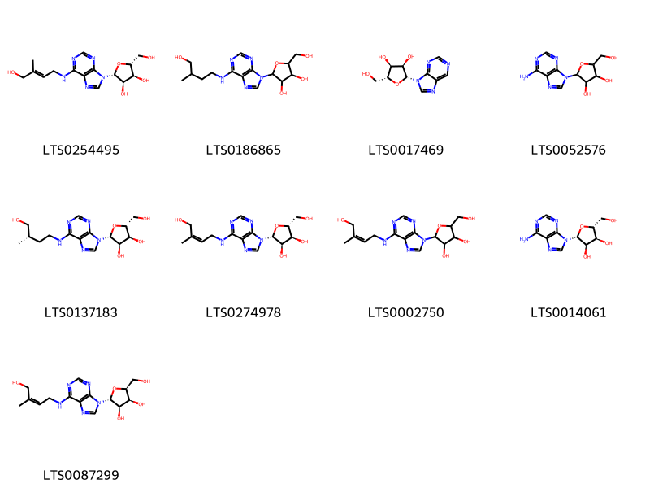{ width=100% }
    <figcaption>Hình ảnh cấu trúc hóa học của 9 hoạt chất thuộc nhóm Purine nucleosides gồm ['zeatin riboside (LTS0254495)', '2-{6-[(4-hydroxy-3-methylbutyl)amino]purin-9-yl}-5-(hydroxymethyl)oxolane-3,4-diol (LTS0186865)', 'purine nucleoside (LTS0017469)', 'adenosine (LTS0052576)', 'dihydrozeatin riboside (LTS0137183)', 'cis-zeatin riboside (LTS0274978)', '2-{6-[(4-hydroxy-3-methylbut-2-en-1-yl)amino]purin-9-yl}-5-(hydroxymethyl)oxolane-3,4-diol (LTS0002750)', 'adenosine (LTS0014061)', '(2r,3r,4s,5s)-2-(6-{[(2z)-4-hydroxy-3-methylbut-2-en-1-yl]amino}purin-9-yl)-5-(hydroxymethyl)oxolane-3,4-diol (LTS0087299)'].</figcaption>
</figure>
#### Nhóm Pyridines and derivatives
<figure markdown="span">
    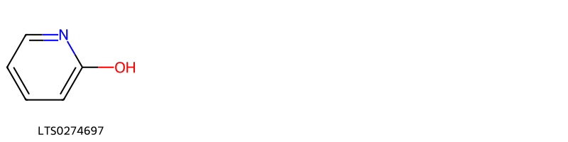{ width=100% }
    <figcaption>Hình ảnh cấu trúc hóa học của 1 hoạt chất thuộc nhóm Pyridines and derivatives gồm ['2-hydroxypyridine (LTS0274697)'].</figcaption>
</figure>
#### Nhóm Steroids and steroid derivatives
<figure markdown="span">
    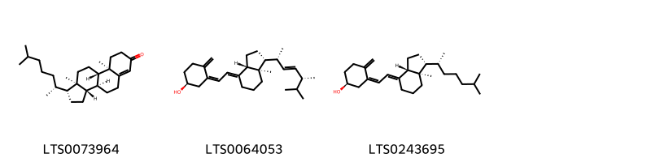{ width=100% }
    <figcaption>Hình ảnh cấu trúc hóa học của 3 hoạt chất thuộc nhóm Steroids and steroid derivatives gồm ['cholestenone (LTS0073964)', 'ergocalciferol (LTS0064053)', 'vitamin d3 (LTS0243695)'].</figcaption>
</figure>
#### Nhóm Stilbenes
<figure markdown="span">
    { width=100% }
    <figcaption>Hình ảnh cấu trúc hóa học của 1 hoạt chất thuộc nhóm Stilbenes gồm ['piceatannol (LTS0129442)'].</figcaption>
</figure>

---

### Dược dân tộc học

Danh sách các quốc gia có sử dụng *Medicago sativa* trong điều trị các bệnh. 

| Country   | Disease                      | Bệnh                                                                                                                                                                                                |
|:----------|:-----------------------------|:----------------------------------------------------------------------------------------------------------------------------------------------------------------------------------------------------|
| China     | Emetic                       | MYMEMORY WARNING: YOU USED ALL AVAILABLE FREE TRANSLATIONS FOR TODAY. NEXT AVAILABLE IN  18 HOURS 45 MINUTES 37 SECONDS VISIT HTTPS://MYMEMORY.TRANSLATED.NET/DOC/USAGELIMITS.PHP TO TRANSLATE MORE |
| Elsewhere | nan, Emmenagogue, Lactagogue | MYMEMORY WARNING: YOU USED ALL AVAILABLE FREE TRANSLATIONS FOR TODAY. NEXT AVAILABLE IN  18 HOURS 45 MINUTES 35 SECONDS VISIT HTTPS://MYMEMORY.TRANSLATED.NET/DOC/USAGELIMITS.PHP TO TRANSLATE MORE |
| Turkey    | Cardiotonic                  | MYMEMORY WARNING: YOU USED ALL AVAILABLE FREE TRANSLATIONS FOR TODAY. NEXT AVAILABLE IN  18 HOURS 45 MINUTES 32 SECONDS VISIT HTTPS://MYMEMORY.TRANSLATED.NET/DOC/USAGELIMITS.PHP TO TRANSLATE MORE |

---

# Chi Camptosema

??? note "Danh sách các dược liệu thuộc chi"
    
	 - *Camptosema paraguariense*

---
## Camptosema paraguariense
### Thông tin về thực vật

!!! info "Phân loại thực vật của *Caetangil paraguariensis* từ GIBF:"
    - **Kingdom:** Plantae
    - **Phylum:** Tracheophyta
    - **Order:** Fabales
    - **Family:** Fabaceae
    - **Genus:** Caetangil
    - **Species:** *Caetangil paraguariensis*

 

| Label (VI)   | Label (EN)   | Scientific Name          | Descriptions (VI)   | Descriptions (EN)   | Also Known As (VI)   | Also Known As (EN)   |
|:-------------|:-------------|:-------------------------|:--------------------|:--------------------|:---------------------|:---------------------|
| N/A          | N/A          | Camptosema paraguariense | loài thực vật       | species of plant    | ['']                 | ['']                 |

#### Phân bố trên thế giới

**Từ CSDL GIBF** nan, Brazil, Argentina, Bolivia (Plurinational State of), Paraguay

#### Phân bố tại Việt Nam

**Từ CSDL GIBF**: Không có ghi nhận ở Việt Nam

---
### Thành phần hóa học
        
- Theo cơ sở dữ liệu lotus: Từ loài *Caetangil paraguariensis* đã phân lập và xác định được Chưa có hoạt chất nào được phân lập. hoạt chất thuộc về các nhóm Không có hoạt chất nào được phân lập. 

Không có hình ảnh nào được tạo ra

---

### Dược dân tộc học

Danh sách các quốc gia có sử dụng *Caetangil paraguariensis* trong điều trị các bệnh. 

| Country   | Disease       | Bệnh                                                                                                                                                                                                |
|:----------|:--------------|:----------------------------------------------------------------------------------------------------------------------------------------------------------------------------------------------------|
| Paraguay  | Contraceptive | MYMEMORY WARNING: YOU USED ALL AVAILABLE FREE TRANSLATIONS FOR TODAY. NEXT AVAILABLE IN  18 HOURS 44 MINUTES 10 SECONDS VISIT HTTPS://MYMEMORY.TRANSLATED.NET/DOC/USAGELIMITS.PHP TO TRANSLATE MORE |

---

# Chi Pisum

??? note "Danh sách các dược liệu thuộc chi"
    
	 - *Pisum sativum*

---
## Pisum sativum
### Thông tin về thực vật

!!! info "Phân loại thực vật của *Lathyrus oleraceus* từ GIBF:"
    - **Kingdom:** Plantae
    - **Phylum:** Tracheophyta
    - **Order:** Fabales
    - **Family:** Fabaceae
    - **Genus:** Lathyrus
    - **Species:** *Lathyrus oleraceus*

 

| Label (VI)   | Label (EN)   | Scientific Name   | Descriptions (VI)   | Descriptions (EN)   | Also Known As (VI)   | Also Known As (EN)           |
|:-------------|:-------------|:------------------|:--------------------|:--------------------|:---------------------|:-----------------------------|
| N/A          | N/A          | Pisum sativum     | loài thực vật       | species of plant    | ['']                 | ['Pea', 'pea plant', 'peas'] |

#### Phân bố trên thế giới

**Từ CSDL GIBF** nan, Italy, Belgium, Georgia, Palestine, State of, Gibraltar, Israel, Ukraine, Denmark, Netherlands, Cyprus, Chinese Taipei, Spain, Türkiye, Portugal, Albania, Russian Federation, United States of America, Sweden, Croatia, Greece, Czechia, Germany, Switzerland, Dominican Republic, France, Mexico, Austria, United Kingdom of Great Britain and Northern Ireland, Ecuador, India, New Zealand

#### Phân bố tại Việt Nam

**Từ CSDL GIBF**: Không có ghi nhận ở Việt Nam

---
### Thành phần hóa học
        
- Theo cơ sở dữ liệu lotus: Từ loài *Lathyrus oleraceus* đã phân lập và xác định được 307 hoạt chất thuộc về các nhóm Azoles, 5'-deoxyribonucleosides, Phenols, Carboxylic acids and derivatives, Anthracenes, Fatty Acyls, Purine nucleotides, Indoles and derivatives, Cinnamic acids and derivatives, Dibenzylbutane lignans, Furopyrans, Saturated hydrocarbons, Saccharolipids, Glycerolipids, Diazines, Prenol lipids, Linear 1,3-diarylpropanoids, Azolidines, Purine nucleosides, Benzene and substituted derivatives, Organooxygen compounds, Furanoid lignans, Pyridines and derivatives, Flavonoids, Steroids and steroid derivatives, Isoflavonoids, Organonitrogen compounds, Imidazopyrimidines. 

|    | chemicalTaxonomyClassyfireClass     |   smiles_count |
|---:|:------------------------------------|---------------:|
|  0 |                                     |              1 |
|  1 | 5'-deoxyribonucleosides             |              1 |
|  2 | Anthracenes                         |              3 |
|  3 | Azoles                              |              1 |
|  4 | Azolidines                          |              1 |
|  5 | Benzene and substituted derivatives |              2 |
|  6 | Carboxylic acids and derivatives    |             39 |
|  7 | Cinnamic acids and derivatives      |              4 |
|  8 | Diazines                            |              3 |
|  9 | Dibenzylbutane lignans              |              2 |
| 10 | Fatty Acyls                         |             14 |
| 11 | Flavonoids                          |             40 |
| 12 | Furanoid lignans                    |              1 |
| 13 | Furopyrans                          |              2 |
| 14 | Glycerolipids                       |              2 |
| 15 | Imidazopyrimidines                  |              2 |
| 16 | Indoles and derivatives             |             12 |
| 17 | Isoflavonoids                       |             11 |
| 18 | Linear 1,3-diarylpropanoids         |             13 |
| 19 | Organonitrogen compounds            |              7 |
| 20 | Organooxygen compounds              |             30 |
| 21 | Phenols                             |              2 |
| 22 | Prenol lipids                       |             80 |
| 23 | Purine nucleosides                  |              3 |
| 24 | Purine nucleotides                  |              6 |
| 25 | Pyridines and derivatives           |              5 |
| 26 | Saccharolipids                      |              2 |
| 27 | Saturated hydrocarbons              |              1 |
| 28 | Steroids and steroid derivatives    |             13 |

#### Nhóm 
<figure markdown="span">
    { width=100% }
    <figcaption>Hình ảnh cấu trúc hóa học của 1 hoạt chất thuộc nhóm  gồm ['trigonelline (LTS0040106)'].</figcaption>
</figure>
#### Nhóm 5_-deoxyribonucleosides
<figure markdown="span">
    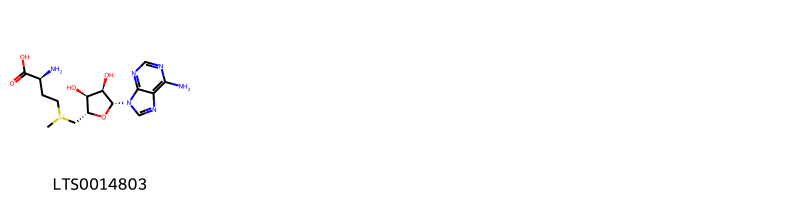{ width=100% }
    <figcaption>Hình ảnh cấu trúc hóa học của Không tìm thấy chú thích hoạt chất thuộc nhóm 5_-deoxyribonucleosides gồm Không tìm thấy chú thích.</figcaption>
</figure>
#### Nhóm Anthracenes
<figure markdown="span">
    { width=100% }
    <figcaption>Hình ảnh cấu trúc hóa học của 3 hoạt chất thuộc nhóm Anthracenes gồm ['emodin (LTS0163480)', 'turkey rhubarb (LTS0160968)', 'physcion (LTS0052688)'].</figcaption>
</figure>
#### Nhóm Azoles
<figure markdown="span">
    { width=100% }
    <figcaption>Hình ảnh cấu trúc hóa học của 1 hoạt chất thuộc nhóm Azoles gồm ['allantoin (LTS0106609)'].</figcaption>
</figure>
#### Nhóm Azolidines
<figure markdown="span">
    { width=100% }
    <figcaption>Hình ảnh cấu trúc hóa học của 1 hoạt chất thuộc nhóm Azolidines gồm ['n-[(4s)-2,5-dihydroxy-4h-imidazol-4-yl]carbamimidic acid (LTS0174328)'].</figcaption>
</figure>
#### Nhóm Benzene and substituted derivatives
<figure markdown="span">
    { width=100% }
    <figcaption>Hình ảnh cấu trúc hóa học của 2 hoạt chất thuộc nhóm Benzene and substituted derivatives gồm ['syringic acid (LTS0210036)', 'p-hydroxybenzoic acid (LTS0263634)'].</figcaption>
</figure>
#### Nhóm Carboxylic acids and derivatives
<figure markdown="span">
    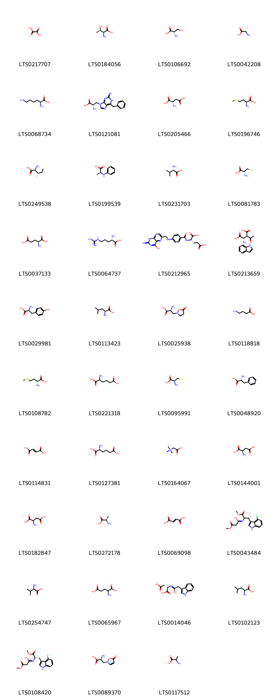{ width=100% }
    <figcaption>Hình ảnh cấu trúc hóa học của 39 hoạt chất thuộc nhóm Carboxylic acids and derivatives gồm ['oxalic acid (LTS0217707)', 'l-threonine (LTS0184056)', 'l-serine (LTS0106692)', 'l-alanine (LTS0042208)', 'l-lysine (LTS0068734)', '(2s)-2-amino-3-(6-benzyl-2-imino-1h-purin-9-yl)propanoic acid (LTS0121081)', 'l-aspartic acid (LTS0205466)', 'l-methionine (LTS0196746)', 'l-isoleucine (LTS0249538)', '(2s)-2-(phenylamino)propanoic acid (LTS0199539)', 'l-valine (LTS0231703)', 'l-cysteine (LTS0081783)', 'l-glutamic acid (LTS0037133)', 'l-arginine (LTS0064737)', 'acid, folic (LTS0212965)', '(3s)-2-acetyl-3-aminobutanedioic acid; indole (LTS0213659)', 'l-tyrosine (LTS0029981)', 'l-leucine (LTS0113423)', '(2s)-2-amino-3-(5-oxo-1,2-oxazolidin-2-yl)propanoic acid (LTS0025938)', 'gamma(amino)-butyric acid (LTS0118818)', 'd-methionine (LTS0108782)', 'aminoadipic acid (LTS0221318)', 'd-cysteine (LTS0095991)', 'd-phenylalanine (LTS0048920)', 'fumaric acid (LTS0114831)', 'aminoadipate (LTS0127381)', 'bet (LTS0164067)', 'd-aspartic acid (LTS0144001)', 'aspartic acid (LTS0182847)', 'd-alanine (LTS0272178)', 'butenedioic acid (LTS0069098)', 'n-[3-(4-chloro-1h-indol-3-yl)-1-methoxy-1-oxopropan-2-yl]-3-methoxy-3-oxopropanimidic acid (LTS0043484)', 'valin (LTS0254747)', 'glutaminsaeure (LTS0065967)', '(2s)-2-{[1-hydroxy-2-(1h-indol-3-yl)ethylidene]amino}butanedioic acid (LTS0014046)', 'leucine (LTS0102123)', 'n-[(2s)-3-(4-chloro-1h-indol-3-yl)-1-methoxy-1-oxopropan-2-yl]-3-methoxy-3-oxopropanimidic acid (LTS0108420)', '(2s)-2-amino-3-(5-oxo-1,2-oxazol-2-yl)propanoic acid (LTS0089370)', 'alanine (LTS0117512)'].</figcaption>
</figure>
#### Nhóm Cinnamic acids and derivatives
<figure markdown="span">
    { width=100% }
    <figcaption>Hình ảnh cấu trúc hóa học của 4 hoạt chất thuộc nhóm Cinnamic acids and derivatives gồm ['ferulic acid (LTS0077328)', 'para-coumaric acid (LTS0266252)', 'hydroxycinnamic acid (LTS0233023)', 'ferulic acid (LTS0273002)'].</figcaption>
</figure>
#### Nhóm Diazines
<figure markdown="span">
    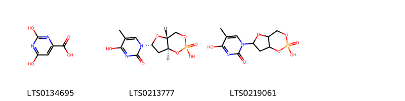{ width=100% }
    <figcaption>Hình ảnh cấu trúc hóa học của 3 hoạt chất thuộc nhóm Diazines gồm ['vitamin b13 (LTS0134695)', '1-[(4ar,6r,7as)-2-hydroxy-2-oxo-tetrahydro-4h-2λ⁵-furo[3,2-d][1,3,2]dioxaphosphinin-6-yl]-4-hydroxy-5-methylpyrimidin-2-one (LTS0213777)', '4-hydroxy-1-{2-hydroxy-2-oxo-tetrahydro-4h-2λ⁵-furo[3,2-d][1,3,2]dioxaphosphinin-6-yl}-5-methylpyrimidin-2-one (LTS0219061)'].</figcaption>
</figure>
#### Nhóm Dibenzylbutane lignans
<figure markdown="span">
    { width=100% }
    <figcaption>Hình ảnh cấu trúc hóa học của 2 hoạt chất thuộc nhóm Dibenzylbutane lignans gồm ['(2s,3r)-2,3-bis[(4-hydroxy-3-methoxyphenyl)(¹³c)methyl](1-¹³c)butane-1,4-diol (LTS0268699)', 'secoisolariciresinol (LTS0086727)'].</figcaption>
</figure>
#### Nhóm Fatty Acyls
<figure markdown="span">
    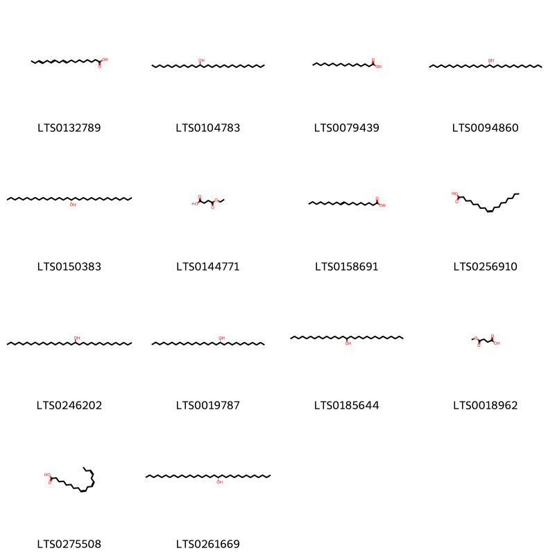{ width=100% }
    <figcaption>Hình ảnh cấu trúc hóa học của 14 hoạt chất thuộc nhóm Fatty Acyls gồm ['α linolenic acid (LTS0132789)', '(13r)-nonacosan-13-ol (LTS0104783)', 'palmitic acid (LTS0079439)', '(14r)-nonacosan-14-ol (LTS0094860)', '(16s)-dotriacontan-16-ol (LTS0150383)', '4-ethoxy-4-oxobutanoic acid (LTS0144771)', '9 octadecenoic acid (LTS0158691)', 'oleic acid (LTS0256910)', '(15s)-dotriacontan-15-ol (LTS0246202)', '(12r)-nonacosan-12-ol (LTS0019787)', 'nonacosan-15-ol (LTS0185644)', 'butanedioic acid, monomethyl ester (LTS0018962)', 'α-linolenic acid (LTS0275508)', '(14s)-dotriacontan-14-ol (LTS0261669)'].</figcaption>
</figure>
#### Nhóm Flavonoids
<figure markdown="span">
    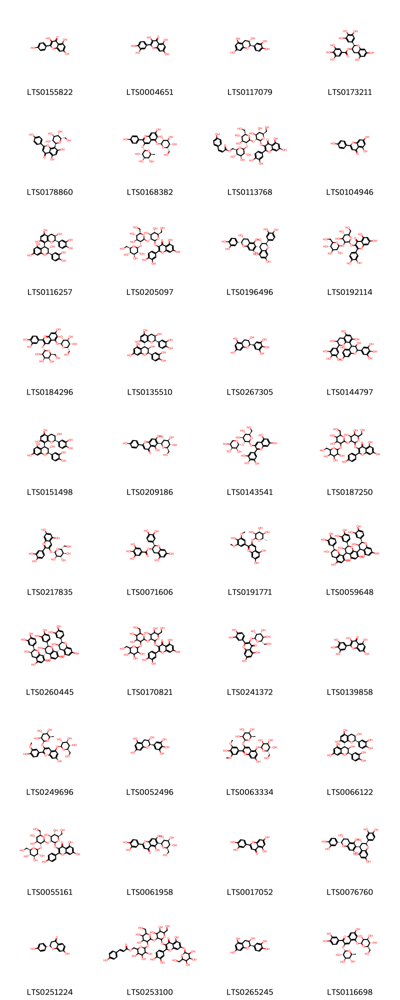{ width=100% }
    <figcaption>Hình ảnh cấu trúc hóa học của 40 hoạt chất thuộc nhóm Flavonoids gồm ['kaempherol (LTS0155822)', 'quercetin (LTS0004651)', '(+)-catechol (LTS0117079)', '(-)-epigallocatechin gallate (LTS0173211)', '5,7-dihydroxy-2-(4-hydroxyphenyl)-8-[(2s,3r,4r,5s,6s)-3,4,5-trihydroxy-6-(hydroxymethyl)oxan-2-yl]chromen-4-one (LTS0178860)', '7-hydroxy-2-(4-hydroxyphenyl)-5-{[(2s,3r,4s,5s,6s)-3,4,5-trihydroxy-6-(hydroxymethyl)oxan-2-yl]oxy}-3-{[(2s,3s,4r,5r,6s)-3,4,5-trihydroxy-6-methyloxan-2-yl]oxy}-1λ⁴-chromen-1-ylium (LTS0168382)', '[(2r,3s,4s,5r,6s)-6-{[(2s,3r,4s,5s,6r)-2-{[(2s,3r,4s,5s,6r)-2-{[2-(3,4-dihydroxyphenyl)-5,7-dihydroxy-4-oxochromen-3-yl]oxy}-4,5-dihydroxy-6-(hydroxymethyl)oxan-3-yl]oxy}-4,5-dihydroxy-6-(hydroxymethyl)oxan-3-yl]oxy}-3,4,5-trihydroxyoxan-2-yl]methyl (2z)-3-(4-hydroxyphenyl)prop-2-enoate (LTS0113768)', 'chamomile (LTS0104946)', '(2r,3s,4s)-2-(3,4-dihydroxyphenyl)-4-[(2r,3r)-2-(3,4-dihydroxyphenyl)-3,5,7-trihydroxy-3,4-dihydro-2h-1-benzopyran-8-yl]-3,4-dihydro-2h-1-benzopyran-3,5,7-triol (LTS0116257)', 'quercetin (LTS0205097)', '(2r,3s,4s)-2-(3,4-dihydroxyphenyl)-4-[(2r,3r)-2-(3,4-dihydroxyphenyl)-3,5,7-trihydroxy-3,4-dihydro-2h-1-benzopyran-6-yl]-3,4-dihydro-2h-1-benzopyran-3,5,7-triol (LTS0196496)', 'quercetin 3-sophoroside (LTS0192114)', '2-(3,4-dihydroxyphenyl)-7-hydroxy-3-{[(2s,3r,4r,5s,6s)-3,4,5-trihydroxy-6-(hydroxymethyl)oxan-2-yl]oxy}-5-{[(2s,3r,4s,5s,6s)-3,4,5-trihydroxy-6-(hydroxymethyl)oxan-2-yl]oxy}-1λ⁴-chromen-1-ylium (LTS0184296)', '(2r,3r,4r)-2-(3,4-dihydroxyphenyl)-4-[(2r,3r)-2-(3,4-dihydroxyphenyl)-3,5,7-trihydroxy-3,4-dihydro-2h-1-benzopyran-8-yl]-3,4-dihydro-2h-1-benzopyran-3,5,7-triol (LTS0135510)', 'gallocatechol (LTS0267305)', '4-[3,5,7-trihydroxy-2-(3,4,5-trihydroxyphenyl)-3,4-dihydro-2h-1-benzopyran-8-yl]-2-(3,4,5-trihydroxyphenyl)-3,4-dihydro-2h-1-benzopyran-3,5,7-triol (LTS0144797)', '(2r,3s,4s)-2-(3,4-dihydroxyphenyl)-4-[(2r,3s)-2-(3,4-dihydroxyphenyl)-3,5,7-trihydroxy-3,4-dihydro-2h-1-benzopyran-8-yl]-3,4-dihydro-2h-1-benzopyran-3,5,7-triol (LTS0151498)', 'isovitexin (LTS0209186)', '3-{[(2s,3r,4s,5s,6r)-4,5-dihydroxy-6-(hydroxymethyl)-3-{[(2r,3s,4s,5s)-3,4,5-trihydroxyoxan-2-yl]oxy}oxan-2-yl]oxy}-5,7-dihydroxy-2-(3,4,5-trihydroxyphenyl)-1λ⁴-chromen-1-ylium (LTS0143541)', '3-[(3-{[4,5-dihydroxy-6-(hydroxymethyl)-3-{[3,4,5-trihydroxy-6-(hydroxymethyl)oxan-2-yl]oxy}oxan-2-yl]oxy}-4,5-dihydroxy-6-(hydroxymethyl)oxan-2-yl)oxy]-5,7-dihydroxy-2-(4-hydroxyphenyl)chromen-4-one (LTS0187250)', 'cyanidin 3-glucoside (LTS0217835)', 'epicatechin gallate (LTS0071606)', '5,7-dihydroxy-2-(4-hydroxy-3,5-dimethoxyphenyl)-3-{[(2s,3s,4r,5r,6s)-3,4,5-trihydroxy-6-methyloxan-2-yl]oxy}-1λ⁴-chromen-1-ylium (LTS0191771)', '(2r,3r)-2-(3,4-dihydroxyphenyl)-8-[(2r,3r)-2-(3,4-dihydroxyphenyl)-3,5,7-trihydroxy-3,4-dihydro-2h-1-benzopyran-4-yl]-4-[(2r,3s)-2-(3,4-dihydroxyphenyl)-3,5,7-trihydroxy-3,4-dihydro-2h-1-benzopyran-8-yl]-3,4-dihydro-2h-1-benzopyran-3,5,7-triol (LTS0059648)', 'procyanidin c1 (LTS0260445)', '3-[(3-{[4,5-dihydroxy-6-(hydroxymethyl)-3-{[3,4,5-trihydroxy-6-(hydroxymethyl)oxan-2-yl]oxy}oxan-2-yl]oxy}-4,5-dihydroxy-6-(hydroxymethyl)oxan-2-yl)oxy]-2-(3,4-dihydroxyphenyl)-5,7-dihydroxychromen-4-one (LTS0170821)', '2-(3,4-dihydroxyphenyl)-5,7-dihydroxy-3-{[(2s,3r,4r,5r,6s)-3,4,5-trihydroxy-6-(hydroxymethyl)oxan-2-yl]oxy}chromen-4-one (LTS0241372)', 'myricetin (LTS0139858)', '7-hydroxy-2-(4-hydroxy-3-methoxyphenyl)-5-{[(2s,3r,4s,5s,6r)-3,4,5-trihydroxy-6-(hydroxymethyl)oxan-2-yl]oxy}-3-{[(2s,3s,4r,5r,6r)-3,4,5-trihydroxy-6-methyloxan-2-yl]oxy}-1λ⁴-chromen-1-ylium (LTS0249696)', 'epigallocatechin (LTS0052496)', '7-hydroxy-2-(4-hydroxy-3,5-dimethoxyphenyl)-5-{[(2s,3s,4s,5s,6s)-3,4,5-trihydroxy-6-(hydroxymethyl)oxan-2-yl]oxy}-3-{[(2s,3s,4r,5r,6r)-3,4,5-trihydroxy-6-methyloxan-2-yl]oxy}-1λ⁴-chromen-1-ylium (LTS0063334)', '(2r,3r,4r)-2-(3,4-dihydroxyphenyl)-4-[(2r,3s)-2-(3,4-dihydroxyphenyl)-3,5,7-trihydroxy-3,4-dihydro-2h-1-benzopyran-8-yl]-3,4-dihydro-2h-1-benzopyran-3,5,7-triol (LTS0066122)', 'kaempferol (LTS0055161)', 'isoorientin (LTS0061958)', 'luteolin (LTS0017052)', '(2r,3s,4r)-2-(3,4-dihydroxyphenyl)-4-[(2r,3r)-2-(3,4-dihydroxyphenyl)-3,5,7-trihydroxy-3,4-dihydro-2h-1-benzopyran-6-yl]-3,4-dihydro-2h-1-benzopyran-3,5,7-triol (LTS0076760)', '5-deoxyflavanone (LTS0251224)', '[6-({2-[(2-{[2-(3,4-dihydroxyphenyl)-5-hydroxy-4-oxo-7-{[3,4,5-trihydroxy-6-(hydroxymethyl)oxan-2-yl]oxy}chromen-3-yl]oxy}-4,5-dihydroxy-6-(hydroxymethyl)oxan-3-yl)oxy]-4,5-dihydroxy-6-(hydroxymethyl)oxan-3-yl}oxy)-3,4,5-trihydroxyoxan-2-yl]methyl (2e)-3-(4-hydroxyphenyl)prop-2-enoate (LTS0253100)', 'ent-epicatechin (LTS0265245)', '2-(3,4-dihydroxyphenyl)-7-hydroxy-5-{[(2s,3s,4s,5s,6r)-3,4,5-trihydroxy-6-(hydroxymethyl)oxan-2-yl]oxy}-3-{[(2s,3s,4r,5r,6s)-3,4,5-trihydroxy-6-methyloxan-2-yl]oxy}-1λ⁴-chromen-1-ylium (LTS0116698)'].</figcaption>
</figure>
#### Nhóm Furanoid lignans
<figure markdown="span">
    { width=100% }
    <figcaption>Hình ảnh cấu trúc hóa học của 1 hoạt chất thuộc nhóm Furanoid lignans gồm ['matairesinol (LTS0193475)'].</figcaption>
</figure>
#### Nhóm Furopyrans
<figure markdown="span">
    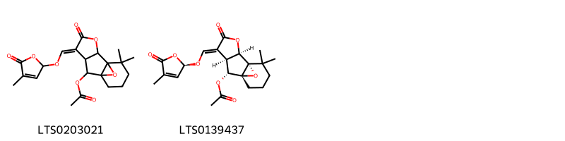{ width=100% }
    <figcaption>Hình ảnh cấu trúc hóa học của 2 hoạt chất thuộc nhóm Furopyrans gồm ['(5e)-12,12-dimethyl-5-{[(4-methyl-5-oxo-2h-furan-2-yl)oxy]methylidene}-4-oxo-3,13-dioxatetracyclo[6.4.1.0¹,⁸.0²,⁶]tridecan-7-yl acetate (LTS0203021)', '(1s,2r,5e,6r,7r,8r)-12,12-dimethyl-5-({[(2r)-4-methyl-5-oxo-2h-furan-2-yl]oxy}methylidene)-4-oxo-3,13-dioxatetracyclo[6.4.1.0¹,⁸.0²,⁶]tridecan-7-yl acetate (LTS0139437)'].</figcaption>
</figure>
#### Nhóm Glycerolipids
<figure markdown="span">
    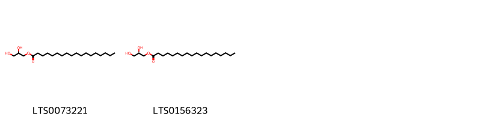{ width=100% }
    <figcaption>Hình ảnh cấu trúc hóa học của 2 hoạt chất thuộc nhóm Glycerolipids gồm ['glyceryl stearate (LTS0073221)', '3-stearoyl-sn-glycerol (LTS0156323)'].</figcaption>
</figure>
#### Nhóm Imidazopyrimidines
<figure markdown="span">
    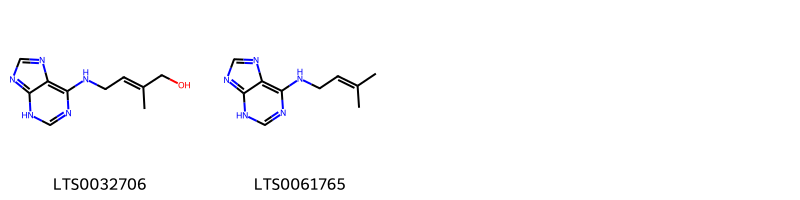{ width=100% }
    <figcaption>Hình ảnh cấu trúc hóa học của 2 hoạt chất thuộc nhóm Imidazopyrimidines gồm ['zeatine (LTS0032706)', '2ip (LTS0061765)'].</figcaption>
</figure>
#### Nhóm Indoles and derivatives
<figure markdown="span">
    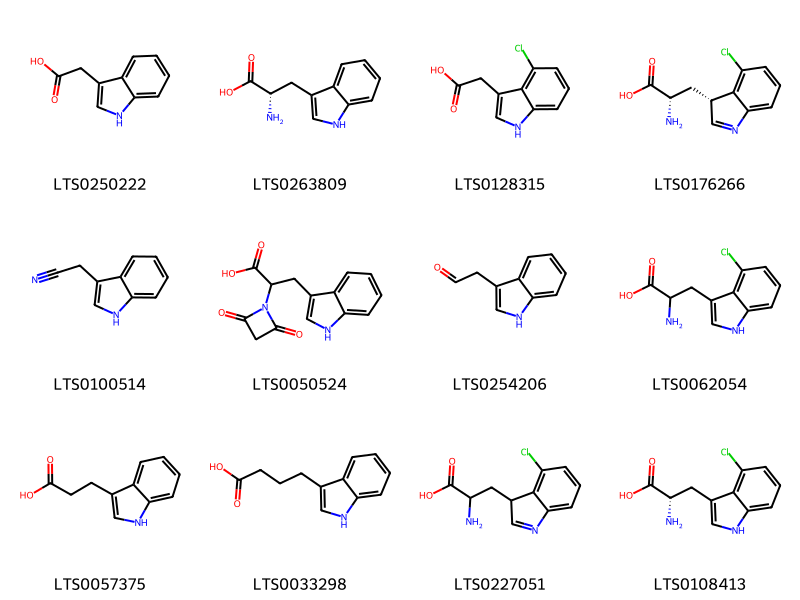{ width=100% }
    <figcaption>Hình ảnh cấu trúc hóa học của 12 hoạt chất thuộc nhóm Indoles and derivatives gồm ['β-indole-3-acetic acid (LTS0250222)', 'l-tryptophan (LTS0263809)', '4-chloroindole-3-acetic acid (LTS0128315)', '(2s)-2-amino-3-[(3r)-4-chloro-3h-indol-3-yl]propanoic acid (LTS0176266)', 'indole-3-acetonitrile (LTS0100514)', '2-(2,4-dioxoazetidin-1-yl)-3-(1h-indol-3-yl)propanoic acid (LTS0050524)', 'indole-3-acetaldehyde (LTS0254206)', '2-amino-3-(4-chloro-1h-indol-3-yl)propanoic acid (LTS0062054)', 'indolylpropionic acid (LTS0057375)', '3-indolebutyric acid (LTS0033298)', '2-amino-3-(4-chloro-3h-indol-3-yl)propanoic acid (LTS0227051)', '(2s)-2-amino-3-(4-chloro-1h-indol-3-yl)propanoic acid (LTS0108413)'].</figcaption>
</figure>
#### Nhóm Isoflavonoids
<figure markdown="span">
    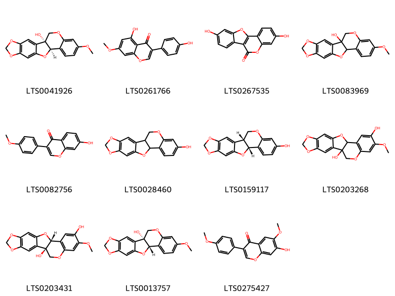{ width=100% }
    <figcaption>Hình ảnh cấu trúc hóa học của 11 hoạt chất thuộc nhóm Isoflavonoids gồm ['pisatin (LTS0041926)', 'prunetin (LTS0261766)', 'coumestrol (LTS0267535)', 'pisatin (LTS0083969)', 'formononetin (LTS0082756)', 'maackiain (LTS0028460)', '(-)-maackiain (LTS0159117)', '16-methoxy-5,7,11,19-tetraoxapentacyclo[10.8.0.0²,¹⁰.0⁴,⁸.0¹³,¹⁸]icosa-2,4(8),9,13(18),14,16-hexaene-1,15-diol (LTS0203268)', '(1r,12r)-16-methoxy-5,7,11,19-tetraoxapentacyclo[10.8.0.0²,¹⁰.0⁴,⁸.0¹³,¹⁸]icosa-2,4(8),9,13(18),14,16-hexaene-1,15-diol (LTS0203431)', '(1r,12s)-16-methoxy-5,7,11,19-tetraoxapentacyclo[10.8.0.0²,¹⁰.0⁴,⁸.0¹³,¹⁸]icosa-2,4(8),9,13,15,17-hexaen-1-ol (LTS0013757)', 'afrormosin (LTS0275427)'].</figcaption>
</figure>
#### Nhóm Linear 1_3-diarylpropanoids
<figure markdown="span">
    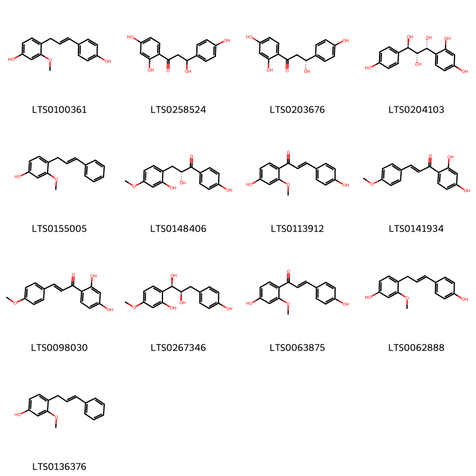{ width=100% }
    <figcaption>Hình ảnh cấu trúc hóa học của Không tìm thấy chú thích hoạt chất thuộc nhóm Linear 1_3-diarylpropanoids gồm Không tìm thấy chú thích.</figcaption>
</figure>
#### Nhóm Organonitrogen compounds
<figure markdown="span">
    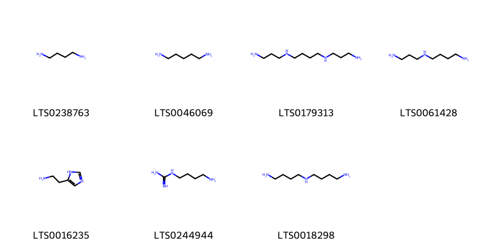{ width=100% }
    <figcaption>Hình ảnh cấu trúc hóa học của 7 hoạt chất thuộc nhóm Organonitrogen compounds gồm ['putrescine (LTS0238763)', 'pentane-1,5-diamine (LTS0046069)', 'spermine (LTS0179313)', 'spermidine (LTS0061428)', '1h-imidazole-5-ethanamine (LTS0016235)', 'agmatine (LTS0244944)', 'homospermidine (LTS0018298)'].</figcaption>
</figure>
#### Nhóm Organooxygen compounds
<figure markdown="span">
    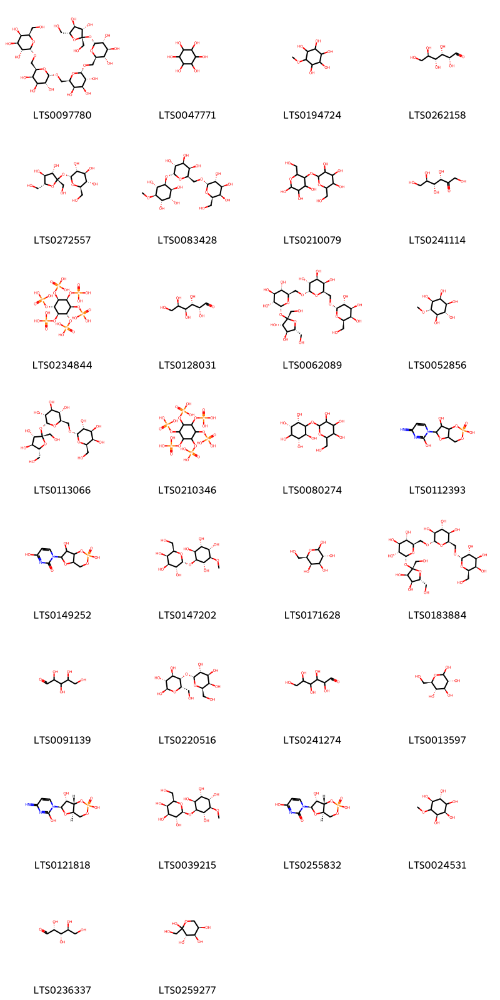{ width=100% }
    <figcaption>Hình ảnh cấu trúc hóa học của 30 hoạt chất thuộc nhóm Organooxygen compounds gồm ['verbascose (LTS0097780)', '(-)-inositol (LTS0047771)', 'pinitol (LTS0194724)', '(+)-glucose (LTS0262158)', 'sucrose (LTS0272557)', '(1s,2r,3s,4r,5s,6s)-4-methoxy-6-{[(2r,3r,4s,5r,6r)-3,4,5-trihydroxy-6-({[(2s,3r,4s,5r,6r)-3,4,5-trihydroxy-6-(hydroxymethyl)oxan-2-yl]oxy}methyl)oxan-2-yl]oxy}cyclohexane-1,2,3,5-tetrol (LTS0083428)', 'starch (LTS0210079)', 'keto-d-fructose (LTS0241114)', '[(1r,2r,3s,4r,5s,6s)-2,3,4,5,6-pentakis(phosphonooxy)cyclohexyl]oxyphosphonic acid (LTS0234844)', 'aldehydo-d-galactose (LTS0128031)', 'stachyose (LTS0062089)', 'ononitol (LTS0052856)', 'raffinose (LTS0113066)', 'phytic acid (LTS0210346)', '(1s,2r,4s,5s)-6-{[3,4,5-trihydroxy-6-(hydroxymethyl)oxan-2-yl]oxy}cyclohexane-1,2,3,4,5-pentol (LTS0080274)', '2,7-dihydroxy-6-(2-hydroxy-4-iminopyrimidin-1-yl)-tetrahydro-4h-2λ⁵-furo[3,2-d][1,3,2]dioxaphosphinin-2-one (LTS0112393)', '1-{2,7-dihydroxy-2-oxo-tetrahydro-4h-2λ⁵-furo[3,2-d][1,3,2]dioxaphosphinin-6-yl}-4-hydroxypyrimidin-2-one (LTS0149252)', '(1s,2r,3s,4r,5s,6s)-4-methoxy-6-{[(2r,3r,4s,5r,6r)-3,4,5-trihydroxy-6-(hydroxymethyl)oxan-2-yl]oxy}cyclohexane-1,2,3,5-tetrol (LTS0147202)', 'galactose (LTS0171628)', '(2r,3r,4s,5s,6r)-2-{[(2s,3r,4s,5r)-3,4-dihydroxy-2,5-bis(hydroxymethyl)oxolan-2-yl]oxy}-6-({[(2s,3s,4r,5r,6r)-3,4,5-trihydroxy-6-({[(2s,3r,4s,5r,6r)-3,4,5-trihydroxy-6-(hydroxymethyl)oxan-2-yl]oxy}methyl)oxan-2-yl]oxy}methyl)oxane-3,4,5-triol (LTS0183884)', 'xylose (LTS0091139)', '(2r,3r,4r,5s,6s)-6-(hydroxymethyl)-5-{[(2r,3r,4s,5r,6r)-3,4,5-trihydroxy-6-(hydroxymethyl)oxan-2-yl]oxy}oxane-2,3,4-triol (LTS0220516)', 'dextrose (LTS0241274)', 'glucose (LTS0013597)', '(4ar,6r,7r,7as)-2,7-dihydroxy-6-(2-hydroxy-4-iminopyrimidin-1-yl)-tetrahydro-4h-2λ⁵-furo[3,2-d][1,3,2]dioxaphosphinin-2-one (LTS0121818)', '(1s,2r,3s,4r,5s,6s)-4-methoxy-6-{[(2s,3r,4s,5r,6r)-3,4,5-trihydroxy-6-(hydroxymethyl)oxan-2-yl]oxy}cyclohexane-1,2,3,5-tetrol (LTS0039215)', '1-[(4ar,6r,7r,7as)-2,7-dihydroxy-2-oxo-tetrahydro-4h-2λ⁵-furo[3,2-d][1,3,2]dioxaphosphinin-6-yl]-4-hydroxypyrimidin-2-one (LTS0255832)', '(1r,2r,4r,5s)-6-methoxycyclohexane-1,2,3,4,5-pentol (LTS0024531)', 'l-arabinose (LTS0236337)', 'd-fructopyranose (LTS0259277)'].</figcaption>
</figure>
#### Nhóm Phenols
<figure markdown="span">
    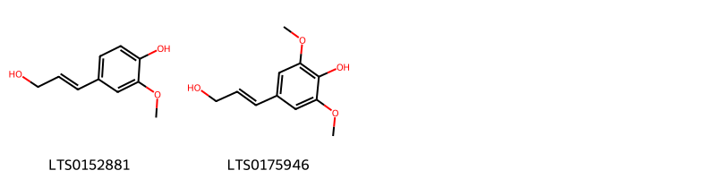{ width=100% }
    <figcaption>Hình ảnh cấu trúc hóa học của 2 hoạt chất thuộc nhóm Phenols gồm ['coniferyl alcohol (LTS0152881)', 'sinapyl alcohol (LTS0175946)'].</figcaption>
</figure>
#### Nhóm Prenol lipids
<figure markdown="span">
    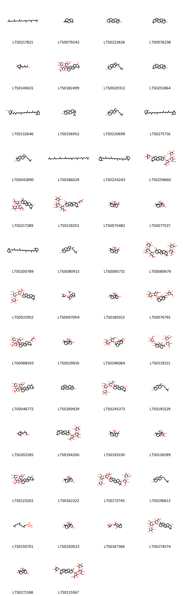{ width=100% }
    <figcaption>Hình ảnh cấu trúc hóa học của 80 hoạt chất thuộc nhóm Prenol lipids gồm ['squalene (LTS0217821)', '5,5,9-trimethyl-14-methylidenetetracyclo[11.2.1.0¹,¹⁰.0⁴,⁹]hexadecane (LTS0079242)', 'amyrin (LTS0222826)', 'alnulin (LTS0076238)', 'abscisic acid,  (LTS0140631)', 'soyasaponin i (LTS0182499)', 'lanster (LTS0020312)', 'β-amyrin (LTS0251864)', 'cryptoxanthin (LTS0132646)', 'lupeol (LTS0256952)', 'euphol (LTS0220699)', 'β-carotene (LTS0275716)', '(3as,5ar,7s,9ar,11as)-3a,6,6,9a,11a-pentamethyl-1-[(2r)-6-methylhept-5-en-2-yl]-1h,2h,3h,5h,5ah,7h,8h,9h,9bh,10h,11h-cyclopenta[a]phenanthren-7-ol (LTS0041890)', 'phytoene (LTS0186029)', 'α-carotene (LTS0224243)', '(2s,3s,4s,5r,6r)-6-{[(3s,4s,4ar,6ar,6bs,8ar,9r,12as,14ar,14br)-9-{[(2r)-5-hydroxy-6-methyl-4-oxo-2,3-dihydropyran-2-yl]oxy}-4-(hydroxymethyl)-4,6a,6b,8a,11,11,14b-heptamethyl-1,2,3,4a,5,6,7,8,9,10,12,12a,14,14a-tetradecahydropicen-3-yl]oxy}-5-{[(2s,3r,4s,5r,6r)-4,5-dihydroxy-6-(hydroxymethyl)-3-{[(2s,3r,4r,5r,6s)-3,4,5-trihydroxy-6-methyloxan-2-yl]oxy}oxan-2-yl]oxy}-3,4-dihydroxyoxane-2-carboxylic acid (LTS0259660)', 'methyl 5-{[4,5-dihydroxy-6-(hydroxymethyl)-3-[(3,4,5-trihydroxy-6-methyloxan-2-yl)oxy]oxan-2-yl]oxy}-3,4-dihydroxy-6-{[9-hydroxy-4-(hydroxymethyl)-4,6a,6b,8a,11,11,14b-heptamethyl-1,2,3,4a,5,6,7,8,9,10,12,12a,14,14a-tetradecahydropicen-3-yl]oxy}oxane-2-carboxylate (LTS0217289)', '6-({9-[(2-carboxyacetyl)oxy]-4-(hydroxymethyl)-4,6a,6b,8a,11,11,14b-heptamethyl-1,2,3,4a,5,6,7,8,9,10,12,12a,14,14a-tetradecahydropicen-3-yl}oxy)-5-{[4,5-dihydroxy-6-(hydroxymethyl)-3-[(3,4,5-trihydroxy-6-methyloxan-2-yl)oxy]oxan-2-yl]oxy}-3,4-dihydroxyoxane-2-carboxylic acid (LTS0119253)', 'gibberellin a25 (LTS0075482)', 'gibberellin a29 (LTS0077537)', '(+)-α-carotene (LTS0200789)', 'dammaradienol (LTS0080913)', 'gibberellin a12 (LTS0085731)', '5-{[4,5-dihydroxy-6-(hydroxymethyl)-3-[(3,4,5-trihydroxy-6-methyloxan-2-yl)oxy]oxan-2-yl]oxy}-6-[(9-{[4,5-dihydroxy-6-(hydroxymethyl)-3-{[3,4,5-trihydroxy-6-(hydroxymethyl)oxan-2-yl]oxy}oxan-2-yl]oxy}-4-(hydroxymethyl)-4,6a,6b,8a,11,11,14b-heptamethyl-1,2,3,4a,5,6,7,8,9,10,12,12a,14,14a-tetradecahydropicen-3-yl)oxy]-3,4-dihydroxyoxane-2-carboxylic acid (LTS0080679)', '(2r,3r,4r,5s,6s)-6-{[(3r,4r,6as,6br,8as,12ar,14bs)-4-(hydroxymethyl)-4,6a,6b,8a,11,11,14b-heptamethyl-9-oxo-2,3,4a,5,6,7,8,10,12,12a,14,14a-dodecahydro-1h-picen-3-yl]oxy}-5-{[(2r,3s,4r,5s,6s)-4,5-dihydroxy-6-(hydroxymethyl)-3-{[(2r,3s,4s,5s,6r)-3,4,5-trihydroxy-6-methyloxan-2-yl]oxy}oxan-2-yl]oxy}-3,4-dihydroxyoxane-2-carboxylic acid (LTS0021952)', '(3e,3as,4s,8bs)-8,8-dimethyl-3-({[(2r)-4-methyl-5-oxo-2h-furan-2-yl]oxy}methylidene)-2-oxo-3ah,4h,5h,6h,7h,8bh-indeno[1,2-b]furan-4-yl acetate (LTS0097004)', 'gibberellin a3 (LTS0185015)', '4,5-dihydroxy-6-(hydroxymethyl)-3-{[3,4,5-trihydroxy-6-(hydroxymethyl)oxan-2-yl]oxy}oxan-2-yl 2,3,13-trihydroxy-5,9-dimethyl-14-({[3,4,5-trihydroxy-6-(hydroxymethyl)oxan-2-yl]oxy}methyl)tetracyclo[11.2.1.0¹,¹⁰.0⁴,⁹]hexadecane-5-carboxylate (LTS0076791)', '(2s,3s,4s,5r,6r)-6-{[(3s,4s,4as,6ar,6bs,8ar,9r,12as,14ar,14br)-9-[(2-carboxyacetyl)oxy]-4-(hydroxymethyl)-4,6a,6b,8a,11,11,14b-heptamethyl-1,2,3,4a,5,6,7,8,9,10,12,12a,14,14a-tetradecahydropicen-3-yl]oxy}-5-{[(2s,3r,4s,5r,6r)-4,5-dihydroxy-6-(hydroxymethyl)-3-{[(2s,3r,4r,5r,6s)-3,4,5-trihydroxy-6-methyloxan-2-yl]oxy}oxan-2-yl]oxy}-3,4-dihydroxyoxane-2-carboxylic acid (LTS0088593)', 'gibberellin a4 (LTS0029910)', '4,5-dihydroxy-6-(hydroxymethyl)-3-{[3,4,5-trihydroxy-6-(hydroxymethyl)oxan-2-yl]oxy}oxan-2-yl 2,3,13-trihydroxy-14-(hydroxymethyl)-5,9-dimethyltetracyclo[11.2.1.0¹,¹⁰.0⁴,⁹]hexadecane-5-carboxylate (LTS0196084)', '(2s,3r,4s,5s,6r)-4,5-dihydroxy-6-(hydroxymethyl)-3-{[(2s,3r,4s,5s,6r)-3,4,5-trihydroxy-6-(hydroxymethyl)oxan-2-yl]oxy}oxan-2-yl (1s,2r,3s,4s,5r,9s,10s,13s,14r)-2,3,13-trihydroxy-5,9-dimethyl-14-({[(2r,3r,4s,5s,6r)-3,4,5-trihydroxy-6-(hydroxymethyl)oxan-2-yl]oxy}methyl)tetracyclo[11.2.1.0¹,¹⁰.0⁴,⁹]hexadecane-5-carboxylate (LTS0119131)', '(2s,3s,4s,5r,6r)-6-{[(3s,4r,4as,6ar,6bs,8ar,12as,14ar,14br)-4-formyl-4,6a,6b,8a,11,11,14b-heptamethyl-9-oxo-2,3,4a,5,6,7,8,10,12,12a,14,14a-dodecahydro-1h-picen-3-yl]oxy}-5-{[(2s,3r,4s,5r,6r)-4,5-dihydroxy-6-(hydroxymethyl)-3-{[(2s,3r,4r,5r,6s)-3,4,5-trihydroxy-6-methyloxan-2-yl]oxy}oxan-2-yl]oxy}-3,4-dihydroxyoxane-2-carboxylic acid (LTS0046772)', '(4ar,6ar,6br,8as,12ar,12br,14ar,14br)-4,4,6a,6b,8a,11,12,14b-octamethyl-2,3,4a,5,6,7,8,9,12,12a,12b,13,14,14a-tetradecahydro-1h-picen-3-ol (LTS0269929)', 'methyl (2s,3s,4s,5r,6r)-6-{[(3s,4s,4as,6ar,6bs,8ar,9r,12as,14ar,14br)-9-hydroxy-4-(hydroxymethyl)-4,6a,6b,8a,11,11,14b-heptamethyl-1,2,3,4a,5,6,7,8,9,10,12,12a,14,14a-tetradecahydropicen-3-yl]oxy}-5-{[(2s,3r,4s,5r,6r)-4,5-dihydroxy-6-(hydroxymethyl)-3-{[(2s,3r,4r,5r,6s)-3,4,5-trihydroxy-6-methyloxan-2-yl]oxy}oxan-2-yl]oxy}-3,4-dihydroxyoxane-2-carboxylate (LTS0245373)', '(1r,3ar,7s,9ar,11ar)-3a,6,6,9a,11a-pentamethyl-1-[(2r)-6-methylhept-5-en-2-yl]-1h,2h,3h,5h,5ah,7h,8h,9h,9bh,10h,11h-cyclopenta[a]phenanthren-7-ol (LTS0191529)', '(-)-abscisic acid (LTS0202185)', '5-{[4,5-dihydroxy-6-(hydroxymethyl)-3-[(3,4,5-trihydroxy-6-methyloxan-2-yl)oxy]oxan-2-yl]oxy}-6-[(4-formyl-4,6a,6b,8a,11,11,14b-heptamethyl-9-oxo-2,3,4a,5,6,7,8,10,12,12a,14,14a-dodecahydro-1h-picen-3-yl)oxy]-3,4-dihydroxyoxane-2-carboxylic acid (LTS0194200)', 'gibberellin a24 (LTS0193150)', 'gibberellin a8 (LTS0126599)', '(2s,3s,4s,5r,6r)-6-{[(3s,4r,4as,6ar,6bs,8ar,9r,12as,14ar,14br)-4-formyl-9-hydroxy-4,6a,6b,8a,11,11,14b-heptamethyl-1,2,3,4a,5,6,7,8,9,10,12,12a,14,14a-tetradecahydropicen-3-yl]oxy}-5-{[(2s,3r,4s,5r,6r)-4,5-dihydroxy-6-(hydroxymethyl)-3-{[(2s,3r,4r,5r,6s)-3,4,5-trihydroxy-6-methyloxan-2-yl]oxy}oxan-2-yl]oxy}-3,4-dihydroxyoxane-2-carboxylic acid (LTS0123202)', '(1r,2r,5s,8s,9s,10r,11r,13s)-5,13-dihydroxy-11-methyl-6-methylidene-16-oxo-15-oxapentacyclo[9.3.2.1⁵,⁸.0¹,¹⁰.0²,⁸]heptadecane-9-carboxylic acid (LTS0162322)', 'methyl (2s,3s,4s,5r,6r)-6-{[(3s,4s,4as,6ar,6bs,8ar,9r,12as,14ar,14br)-9-{[(2r,3r,4s,5s,6r)-4,5-dihydroxy-6-(hydroxymethyl)-3-{[(2s,3r,4s,5s,6r)-3,4,5-trihydroxy-6-(hydroxymethyl)oxan-2-yl]oxy}oxan-2-yl]oxy}-4-(hydroxymethyl)-4,6a,6b,8a,11,11,14b-heptamethyl-1,2,3,4a,5,6,7,8,9,10,12,12a,14,14a-tetradecahydropicen-3-yl]oxy}-5-{[(2s,3r,4s,5r,6r)-4,5-dihydroxy-6-(hydroxymethyl)-3-{[(2s,3r,4r,5r,6s)-3,4,5-trihydroxy-6-methyloxan-2-yl]oxy}oxan-2-yl]oxy}-3,4-dihydroxyoxane-2-carboxylate (LTS0172745)', 'parkeol (LTS0196613)', 'farnesyl trihydrogen pyrophosphate (LTS0150701)', 'gibberellin a29 (LTS0250023)', '5-({4-hydroxy-8,8-dimethyl-2-oxo-3ah,4h,5h,6h,7h,8bh-indeno[1,2-b]furan-3-ylidene}methoxy)-3-methyl-5h-furan-2-one (LTS0167366)', 'methyl (2s,3s,4s,5r,6r)-6-{[(3s,4s,4ar,6ar,6bs,8ar,9r,12as,14ar,14br)-9-hydroxy-4-(hydroxymethyl)-4,6a,6b,8a,11,11,14b-heptamethyl-1,2,3,4a,5,6,7,8,9,10,12,12a,14,14a-tetradecahydropicen-3-yl]oxy}-5-{[(2s,3r,4s,5r,6r)-4,5-dihydroxy-6-(hydroxymethyl)-3-{[(2s,3r,4r,5r,6s)-3,4,5-trihydroxy-6-methyloxan-2-yl]oxy}oxan-2-yl]oxy}-3,4-dihydroxyoxane-2-carboxylate (LTS0274574)', '5,13-dihydroxy-11-methyl-6-methylidene-16-oxo-15-oxapentacyclo[9.3.2.1⁵,⁸.0¹,¹⁰.0²,⁸]heptadecane-9-carboxylic acid (LTS0271168)', '5-{[4,5-dihydroxy-6-(hydroxymethyl)-3-[(3,4,5-trihydroxy-6-methyloxan-2-yl)oxy]oxan-2-yl]oxy}-3,4-dihydroxy-6-({9-[(5-hydroxy-6-methyl-4-oxo-2,3-dihydropyran-2-yl)oxy]-4-(hydroxymethyl)-4,6a,6b,8a,11,11,14b-heptamethyl-1,2,3,4a,5,6,7,8,9,10,12,12a,14,14a-tetradecahydropicen-3-yl}oxy)oxane-2-carboxylic acid (LTS0115567)', '5-{[4,5-dihydroxy-6-(hydroxymethyl)-3-[(3,4,5-trihydroxy-6-methyloxan-2-yl)oxy]oxan-2-yl]oxy}-6-[(4-formyl-9-hydroxy-4,6a,6b,8a,11,11,14b-heptamethyl-1,2,3,4a,5,6,7,8,9,10,12,12a,14,14a-tetradecahydropicen-3-yl)oxy]-3,4-dihydroxyoxane-2-carboxylic acid (LTS0255346)', '(5r)-5-{[(3e,3as,4s,8bs)-4-hydroxy-8,8-dimethyl-2-oxo-3ah,4h,5h,6h,7h,8bh-indeno[1,2-b]furan-3-ylidene]methoxy}-3-methyl-5h-furan-2-one (LTS0274129)', '(2s,3r,4s,5s,6r)-4,5-dihydroxy-6-(hydroxymethyl)-3-{[(2s,3r,4s,5s,6r)-3,4,5-trihydroxy-6-(hydroxymethyl)oxan-2-yl]oxy}oxan-2-yl (1s,2r,3s,4s,5r,9s,10s,13r,14s)-2,3,13-trihydroxy-14-(hydroxymethyl)-5,9-dimethyltetracyclo[11.2.1.0¹,¹⁰.0⁴,⁹]hexadecane-5-carboxylate (LTS0074715)', 'gibberellin a44 (LTS0078749)', 'abscisic acid (LTS0200774)', '(2s,3s,4s,5r,6r)-6-{[(3s,4s,4as,6ar,6bs,8ar,9r,12as,14ar,14br)-9-hydroxy-4-(hydroxymethyl)-4,6a,6b,8a,11,11,14b-heptamethyl-1,2,3,4a,5,6,7,8,9,10,12,12a,14,14a-tetradecahydropicen-3-yl]oxy}-5-{[(2s,3r,4s,5r,6r)-4,5-dihydroxy-6-(hydroxymethyl)-3-{[(2s,3r,4r,5r,6s)-3,4,5-trihydroxy-6-methyloxan-2-yl]oxy}oxan-2-yl]oxy}-3,4-dihydroxyoxane-2-carboxylic acid (LTS0210578)', 'methyl (2s,3s,4s,5r,6r)-6-{[(3s,4s,4ar,6ar,6bs,8ar,9r,12as,14ar,14br)-9-{[(2r,3r,4s,5s,6r)-4,5-dihydroxy-6-(hydroxymethyl)-3-{[(2s,3r,4s,5s,6r)-3,4,5-trihydroxy-6-(hydroxymethyl)oxan-2-yl]oxy}oxan-2-yl]oxy}-4-(hydroxymethyl)-4,6a,6b,8a,11,11,14b-heptamethyl-1,2,3,4a,5,6,7,8,9,10,12,12a,14,14a-tetradecahydropicen-3-yl]oxy}-5-{[(2s,3r,4s,5r,6r)-4,5-dihydroxy-6-(hydroxymethyl)-3-{[(2s,3r,4r,5r,6s)-3,4,5-trihydroxy-6-methyloxan-2-yl]oxy}oxan-2-yl]oxy}-3,4-dihydroxyoxane-2-carboxylate (LTS0086284)', '(4r,9r,10s)-5,5,9-trimethyl-14-methylidenetetracyclo[11.2.1.0¹,¹⁰.0⁴,⁹]hexadecane (LTS0219579)', '(1r,7s,9as)-3a,6,6,9a,11a-pentamethyl-1-[(2r)-6-methylhept-5-en-2-yl]-1h,2h,3h,4h,5h,5ah,7h,8h,9h,10h,11h-cyclopenta[a]phenanthren-7-ol (LTS0154110)', '2-formyl-4,8-dimethyl-13-methylidenetetracyclo[10.2.1.0¹,⁹.0³,⁸]pentadecane-4-carboxylic acid (LTS0031239)', '(2s,3s,4s,5r,6r)-6-{[(3s,4s,4as,6ar,6bs,8ar,9r,12as,14ar,14br)-9-{[(2r,3r,4s,5s,6r)-4,5-dihydroxy-6-(hydroxymethyl)-3-{[(2s,3r,4s,5s,6r)-3,4,5-trihydroxy-6-(hydroxymethyl)oxan-2-yl]oxy}oxan-2-yl]oxy}-4-(hydroxymethyl)-4,6a,6b,8a,11,11,14b-heptamethyl-1,2,3,4a,5,6,7,8,9,10,12,12a,14,14a-tetradecahydropicen-3-yl]oxy}-5-{[(2s,3r,4s,5r,6r)-4,5-dihydroxy-6-(hydroxymethyl)-3-{[(2s,3r,4r,5r,6s)-3,4,5-trihydroxy-6-methyloxan-2-yl]oxy}oxan-2-yl]oxy}-3,4-dihydroxyoxane-2-carboxylic acid (LTS0235956)', '(2s,3r,4s,5s,6r)-4,5-dihydroxy-6-(hydroxymethyl)-3-{[(2s,3r,4s,5s,6r)-3,4,5-trihydroxy-6-(hydroxymethyl)oxan-2-yl]oxy}oxan-2-yl (1s,2r,3s,4s,5r,9s,10s,14s)-2,3,13-trihydroxy-5,9-dimethyl-14-({[(2r,3r,4s,5s,6r)-3,4,5-trihydroxy-6-(hydroxymethyl)oxan-2-yl]oxy}methyl)tetracyclo[11.2.1.0¹,¹⁰.0⁴,⁹]hexadecane-5-carboxylate (LTS0005245)', 'gibberellin a19 (LTS0044672)', 'gibberellin a9 (LTS0243888)', '(3e)-4-(1,2-dihydroxy-2,6,6-trimethyl-4-{[3,4,5-trihydroxy-6-(hydroxymethyl)oxan-2-yl]oxy}cyclohexyl)but-3-en-2-one (LTS0006675)', 'gibberellin a51 (LTS0062532)', '5-{[4,5-dihydroxy-6-(hydroxymethyl)-3-[(3,4,5-trihydroxy-6-methyloxan-2-yl)oxy]oxan-2-yl]oxy}-3,4-dihydroxy-6-{[9-hydroxy-4-(hydroxymethyl)-4,6a,6b,8a,11,11,14b-heptamethyl-1,2,3,4a,5,6,7,8,9,10,12,12a,14,14a-tetradecahydropicen-3-yl]oxy}oxane-2-carboxylic acid (LTS0005407)', 'gibberellin a17 (LTS0014876)', '(2s,3s,4s,5r,6r)-6-{[(3s,4s,4ar,6ar,6bs,8ar,9r,12as,14ar,14br)-9-{[(2s)-5-hydroxy-6-methyl-4-oxo-2,3-dihydropyran-2-yl]oxy}-4-(hydroxymethyl)-4,6a,6b,8a,11,11,14b-heptamethyl-1,2,3,4a,5,6,7,8,9,10,12,12a,14,14a-tetradecahydropicen-3-yl]oxy}-5-{[(2s,3r,4s,5r,6r)-4,5-dihydroxy-6-(hydroxymethyl)-3-{[(2s,3r,4r,5r,6s)-3,4,5-trihydroxy-6-methyloxan-2-yl]oxy}oxan-2-yl]oxy}-3,4-dihydroxyoxane-2-carboxylic acid (LTS0129358)', 'gibberellin a1 (LTS0013777)', '(1s,3ar,3br,5ar,7s,9ar,9br,11ar)-3a,3b,6,6,9a-pentamethyl-1-(6-methyl-5-methylidenehept-1-en-2-yl)-dodecahydro-1h-cyclopenta[a]phenanthren-7-ol (LTS0008613)', 'gibberellin a12 aldehyde (LTS0097359)', 'farnesyl diphosphate (LTS0094975)', '(3e)-8,8-dimethyl-3-{[(4-methyl-5-oxo-2h-furan-2-yl)oxy]methylidene}-2-oxo-3ah,4h,5h,6h,7h,8bh-indeno[1,2-b]furan-4-yl acetate (LTS0024880)', '(4e)-5-[(1s)-1-hydroxy-2,6,6-trimethyl-4-oxocyclohex-2-en-1-yl]-3-methylpenta-2,4-dienoic acid (LTS0268716)', 'methyl 5-{[4,5-dihydroxy-6-(hydroxymethyl)-3-[(3,4,5-trihydroxy-6-methyloxan-2-yl)oxy]oxan-2-yl]oxy}-6-[(9-{[4,5-dihydroxy-6-(hydroxymethyl)-3-{[3,4,5-trihydroxy-6-(hydroxymethyl)oxan-2-yl]oxy}oxan-2-yl]oxy}-4-(hydroxymethyl)-4,6a,6b,8a,11,11,14b-heptamethyl-1,2,3,4a,5,6,7,8,9,10,12,12a,14,14a-tetradecahydropicen-3-yl)oxy]-3,4-dihydroxyoxane-2-carboxylate (LTS0234121)', '(2e,4e)-5-[1,4-dihydroxy-6-(hydroxymethyl)-2,6-dimethylcyclohex-2-en-1-yl]-3-methylpenta-2,4-dienoic acid (LTS0106913)', '5-(1-hydroxy-2,6,6-trimethyl-4-oxocyclohex-2-en-1-yl)-3-methylpenta-2,4-dienoic acid (LTS0021517)', '(1r,2r,5s,8s,9s,10s,11s,17s)-5,17-dihydroxy-11-methyl-6-methylidene-12-oxo-13-oxapentacyclo[9.3.3.1⁵,⁸.0¹,¹⁰.0²,⁸]octadecane-9-carboxylic acid (LTS0047818)', '(1s,2r,5s,8s,9s,10s,11s)-11-methyl-6-methylidene-12-oxo-13-oxapentacyclo[9.3.3.1⁵,⁸.0¹,¹⁰.0²,⁸]octadecane-9-carboxylic acid (LTS0046848)'].</figcaption>
</figure>
#### Nhóm Purine nucleosides
<figure markdown="span">
    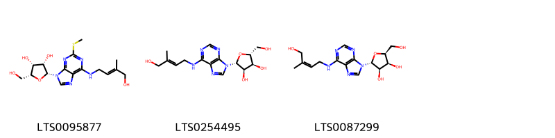{ width=100% }
    <figcaption>Hình ảnh cấu trúc hóa học của 3 hoạt chất thuộc nhóm Purine nucleosides gồm ['(2r,3s,4r,5r)-2-(6-{[(2e)-4-hydroxy-3-methylbut-2-en-1-yl]amino}-2-(methylsulfanyl)purin-9-yl)-5-(hydroxymethyl)oxolane-3,4-diol (LTS0095877)', 'zeatin riboside (LTS0254495)', '(2r,3r,4s,5s)-2-(6-{[(2z)-4-hydroxy-3-methylbut-2-en-1-yl]amino}purin-9-yl)-5-(hydroxymethyl)oxolane-3,4-diol (LTS0087299)'].</figcaption>
</figure>
#### Nhóm Purine nucleotides
<figure markdown="span">
    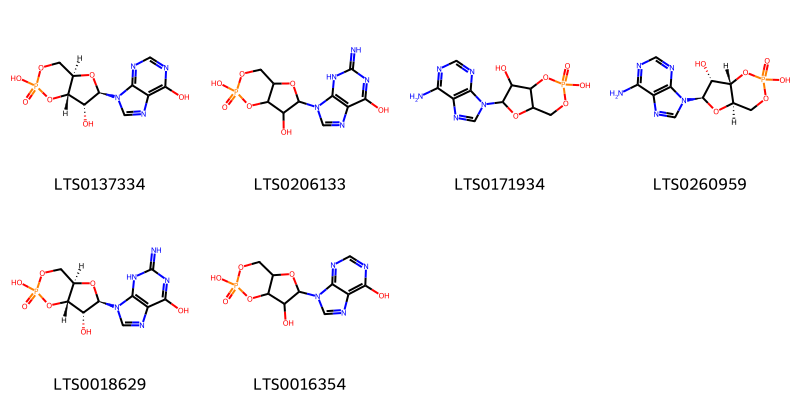{ width=100% }
    <figcaption>Hình ảnh cấu trúc hóa học của 6 hoạt chất thuộc nhóm Purine nucleotides gồm ['cyclic imp (LTS0137334)', '2,7-dihydroxy-6-(6-hydroxy-2-imino-3h-purin-9-yl)-tetrahydro-4h-2λ⁵-furo[3,2-d][1,3,2]dioxaphosphinin-2-one (LTS0206133)', 'cyclic amp (LTS0171934)', 'cyclic adenosine monophosphate (LTS0260959)', 'cyclic guanosine monophosphate (LTS0018629)', '2,7-dihydroxy-6-(6-hydroxypurin-9-yl)-tetrahydro-4h-2λ⁵-furo[3,2-d][1,3,2]dioxaphosphinin-2-one (LTS0016354)'].</figcaption>
</figure>
#### Nhóm Pyridines and derivatives
<figure markdown="span">
    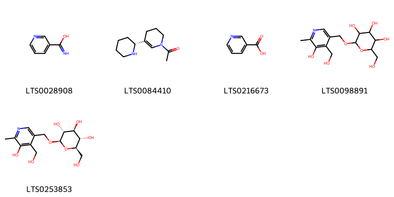{ width=100% }
    <figcaption>Hình ảnh cấu trúc hóa học của 5 hoạt chất thuộc nhóm Pyridines and derivatives gồm ['vitamin b>3< (LTS0028908)', 'ammodendrine (LTS0084410)', 'niacin (LTS0216673)', '2-{[5-hydroxy-4-(hydroxymethyl)-6-methylpyridin-3-yl]methoxy}-6-(hydroxymethyl)oxane-3,4,5-triol (LTS0098891)', 'pyridoxine-α-glucoside (LTS0253853)'].</figcaption>
</figure>
#### Nhóm Saccharolipids
<figure markdown="span">
    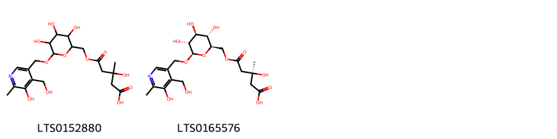{ width=100% }
    <figcaption>Hình ảnh cấu trúc hóa học của 2 hoạt chất thuộc nhóm Saccharolipids gồm ['3-hydroxy-3-methyl-5-oxo-5-[(3,4,5-trihydroxy-6-{[5-hydroxy-4-(hydroxymethyl)-6-methylpyridin-3-yl]methoxy}oxan-2-yl)methoxy]pentanoic acid (LTS0152880)', '(3s)-3-hydroxy-3-methyl-5-oxo-5-{[(2r,3s,4s,5r,6r)-3,4,5-trihydroxy-6-{[5-hydroxy-4-(hydroxymethyl)-6-methylpyridin-3-yl]methoxy}oxan-2-yl]methoxy}pentanoic acid (LTS0165576)'].</figcaption>
</figure>
#### Nhóm Saturated hydrocarbons
<figure markdown="span">
    { width=100% }
    <figcaption>Hình ảnh cấu trúc hóa học của 1 hoạt chất thuộc nhóm Saturated hydrocarbons gồm ['heptadecane (LTS0038303)'].</figcaption>
</figure>
#### Nhóm Steroids and steroid derivatives
<figure markdown="span">
    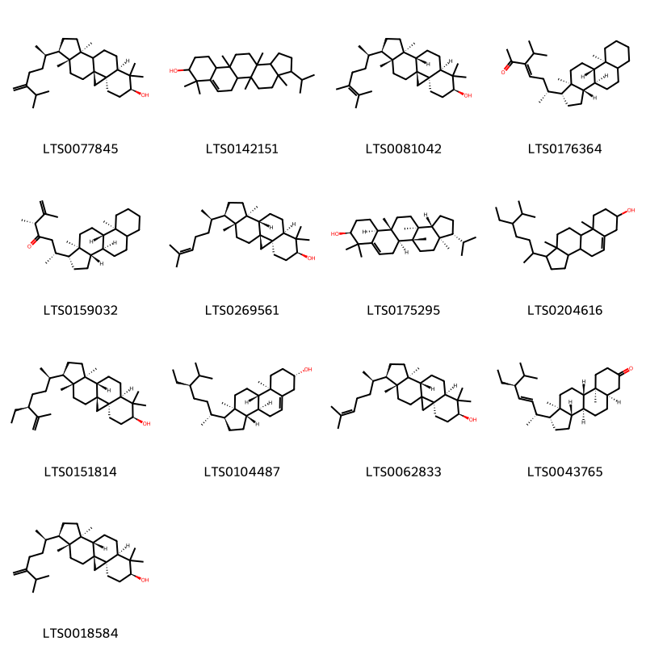{ width=100% }
    <figcaption>Hình ảnh cấu trúc hóa học của 13 hoạt chất thuộc nhóm Steroids and steroid derivatives gồm ['24-methylene-cycloartanol (LTS0077845)', '3-isopropyl-3a,5a,8,8,11b,13a-hexamethyl-1h,2h,3h,4h,5h,5bh,6h,9h,10h,11h,11ah,12h,13h,13bh-cyclopenta[a]chrysen-9-ol (LTS0142151)', '(1s,3r,6s,8r,11s,12s,15r,16r)-15-[(2r)-5,6-dimethylhept-5-en-2-yl]-7,7,12,16-tetramethylpentacyclo[9.7.0.0¹,³.0³,⁸.0¹²,¹⁶]octadecan-6-ol (LTS0081042)', '(6r)-6-[(1r,3as,3br,9as,9bs,11ar)-9a,11a-dimethyl-tetradecahydro-1h-cyclopenta[a]phenanthren-1-yl]-3-isopropylhept-3-en-2-one (LTS0176364)', '(3r,6r)-6-[(1r,3as,3br,9as,9bs,11ar)-9a,11a-dimethyl-tetradecahydro-1h-cyclopenta[a]phenanthren-1-yl]-2,3-dimethylhept-1-en-4-one (LTS0159032)', 'cycloartenol (LTS0269561)', 'simiarenol (LTS0175295)', 'stigmast-5-en-3-ol, (3β)- (LTS0204616)', '(1s,3r,6s,8r,11s,12s,15r,16r)-15-[(2r,5s)-5-ethyl-6-methylhept-6-en-2-yl]-7,7,12,16-tetramethylpentacyclo[9.7.0.0¹,³.0³,⁸.0¹²,¹⁶]octadecan-6-ol (LTS0151814)', '(1s,3as,3bs,7s,9ar,9bs,11ar)-1-[(2r,5r)-5-ethyl-6-methylheptan-2-yl]-9a,11a-dimethyl-1h,2h,3h,3ah,3bh,4h,6h,7h,8h,9h,9bh,10h,11h-cyclopenta[a]phenanthren-7-ol (LTS0104487)', '(3r,6s,8r,11s,12s,15r,16r)-7,7,12,16-tetramethyl-15-[(2r)-6-methylhept-5-en-2-yl]pentacyclo[9.7.0.0¹,³.0³,⁸.0¹²,¹⁶]octadecan-6-ol (LTS0062833)', 'stigmastenone (LTS0043765)', '24-methylenecycloartanol (LTS0018584)'].</figcaption>
</figure>

---

### Dược dân tộc học

Danh sách các quốc gia có sử dụng *Lathyrus oleraceus* trong điều trị các bệnh. 

| Country   | Disease            | Bệnh                                                                                                                                                                                                |
|:----------|:-------------------|:----------------------------------------------------------------------------------------------------------------------------------------------------------------------------------------------------|
| China     | Refrigerant        | MYMEMORY WARNING: YOU USED ALL AVAILABLE FREE TRANSLATIONS FOR TODAY. NEXT AVAILABLE IN  18 HOURS 43 MINUTES 52 SECONDS VISIT HTTPS://MYMEMORY.TRANSLATED.NET/DOC/USAGELIMITS.PHP TO TRANSLATE MORE |
| Elsewhere | Emollient          | MYMEMORY WARNING: YOU USED ALL AVAILABLE FREE TRANSLATIONS FOR TODAY. NEXT AVAILABLE IN  18 HOURS 43 MINUTES 50 SECONDS VISIT HTTPS://MYMEMORY.TRANSLATED.NET/DOC/USAGELIMITS.PHP TO TRANSLATE MORE |
| Haiti     | Diuretic, Diuretic | MYMEMORY WARNING: YOU USED ALL AVAILABLE FREE TRANSLATIONS FOR TODAY. NEXT AVAILABLE IN  18 HOURS 43 MINUTES 47 SECONDS VISIT HTTPS://MYMEMORY.TRANSLATED.NET/DOC/USAGELIMITS.PHP TO TRANSLATE MORE |
| India     | Contraceptive      | MYMEMORY WARNING: YOU USED ALL AVAILABLE FREE TRANSLATIONS FOR TODAY. NEXT AVAILABLE IN  18 HOURS 43 MINUTES 45 SECONDS VISIT HTTPS://MYMEMORY.TRANSLATED.NET/DOC/USAGELIMITS.PHP TO TRANSLATE MORE |
| Turkey    | Contraceptive      | MYMEMORY WARNING: YOU USED ALL AVAILABLE FREE TRANSLATIONS FOR TODAY. NEXT AVAILABLE IN  18 HOURS 43 MINUTES 42 SECONDS VISIT HTTPS://MYMEMORY.TRANSLATED.NET/DOC/USAGELIMITS.PHP TO TRANSLATE MORE |

---

# Chi Euchresta

??? note "Danh sách các dược liệu thuộc chi"
    
	 - *Euchresta horsfieldii*
	 - *Euchresta japonica*
	 - *Euchresta japonicum*

---
## Euchresta horsfieldii
### Thông tin về thực vật

!!! info "Phân loại thực vật của *Euchresta horsfieldii* từ GIBF:"
    - **Kingdom:** Plantae
    - **Phylum:** Tracheophyta
    - **Order:** Fabales
    - **Family:** Fabaceae
    - **Genus:** Euchresta
    - **Species:** *Euchresta horsfieldii*

 

| Label (VI)   | Label (EN)   | Scientific Name       | Descriptions (VI)   | Descriptions (EN)   | Also Known As (VI)   | Also Known As (EN)   |
|:-------------|:-------------|:----------------------|:--------------------|:--------------------|:---------------------|:---------------------|
| N/A          | N/A          | Euchresta horsfieldii | loài thực vật       | species of plant    | ['']                 | ['']                 |

#### Phân bố trên thế giới

**Từ CSDL GIBF** nan, Japan, Thailand, Lao People’s Democratic Republic, Chinese Taipei, Bhutan, India, Indonesia, unknown or invalid, Philippines, Malaysia, China, Nepal

#### Phân bố tại Việt Nam

**Từ CSDL GIBF**: Không có ghi nhận ở Việt Nam

---
### Thành phần hóa học
        
- Theo cơ sở dữ liệu lotus: Từ loài *Euchresta horsfieldii* đã phân lập và xác định được 36 hoạt chất thuộc về các nhóm Cinnamic acids and derivatives, Flavonoids, Lupin alkaloids, Isoflavonoids. 

|    | chemicalTaxonomyClassyfireClass   |   smiles_count |
|---:|:----------------------------------|---------------:|
|  0 | Cinnamic acids and derivatives    |              2 |
|  1 | Flavonoids                        |             14 |
|  2 | Isoflavonoids                     |             17 |
|  3 | Lupin alkaloids                   |              3 |

#### Nhóm Cinnamic acids and derivatives
<figure markdown="span">
    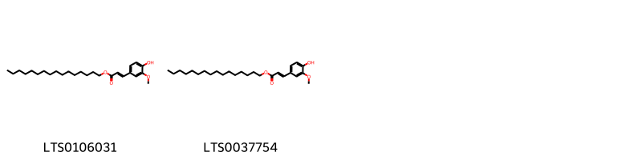{ width=100% }
    <figcaption>Hình ảnh cấu trúc hóa học của 2 hoạt chất thuộc nhóm Cinnamic acids and derivatives gồm ['hexadecyl 3-(4-hydroxy-3-methoxyphenyl)prop-2-enoate (LTS0106031)', 'hexadecyl (2e)-3-(4-hydroxy-3-methoxyphenyl)prop-2-enoate (LTS0037754)'].</figcaption>
</figure>
#### Nhóm Flavonoids
<figure markdown="span">
    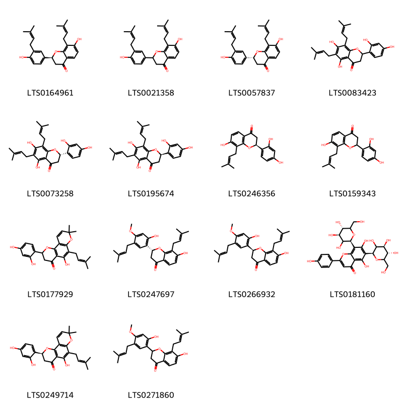{ width=100% }
    <figcaption>Hình ảnh cấu trúc hóa học của 14 hoạt chất thuộc nhóm Flavonoids gồm ['glabrol (LTS0164961)', 'glabrol (LTS0021358)', '(2r)-7-hydroxy-2-[4-hydroxy-3-(3-methylbut-2-en-1-yl)phenyl]-8-(3-methylbut-2-en-1-yl)-2,3-dihydro-1-benzopyran-4-one (LTS0057837)', 'kushenol e (LTS0083423)', '(2s)-2-(2,4-dihydroxyphenyl)-5,7-dihydroxy-6,8-bis(3-methylbut-2-en-1-yl)-2,3-dihydro-1-benzopyran-4-one (LTS0073258)', '(2r)-2-(2,4-dihydroxyphenyl)-5,7-dihydroxy-6,8-bis(3-methylbut-2-en-1-yl)-2,3-dihydro-1-benzopyran-4-one (LTS0195674)', '(2s)-2-(2,4-dihydroxyphenyl)-7-hydroxy-8-(3-methylbut-2-en-1-yl)-2,3-dihydro-1-benzopyran-4-one (LTS0246356)', 'euchrenone a7 (LTS0159343)', 'euchrenone a9 (LTS0177929)', '(2r)-7-hydroxy-2-[2-hydroxy-4-methoxy-5-(3-methylbut-2-en-1-yl)phenyl]-8-(3-methylbut-2-en-1-yl)-2,3-dihydro-1-benzopyran-4-one (LTS0247697)', '(2s)-7-hydroxy-2-[2-hydroxy-4-methoxy-5-(3-methylbut-2-en-1-yl)phenyl]-8-(3-methylbut-2-en-1-yl)-2,3-dihydro-1-benzopyran-4-one (LTS0266932)', 'vicenin 2 (LTS0181160)', '(2s)-2-(2,4-dihydroxyphenyl)-5-hydroxy-8,8-dimethyl-6-(3-methylbut-2-en-1-yl)-2h,3h-pyrano[2,3-f]chromen-4-one (LTS0249714)', 'euchrenone a8 (LTS0271860)'].</figcaption>
</figure>
#### Nhóm Isoflavonoids
<figure markdown="span">
    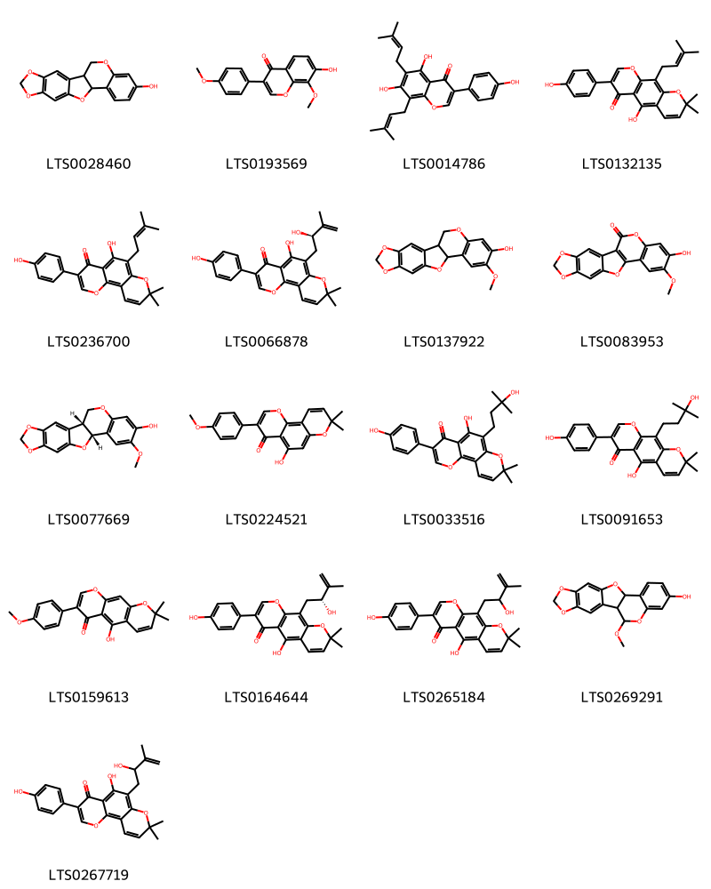{ width=100% }
    <figcaption>Hình ảnh cấu trúc hóa học của 17 hoạt chất thuộc nhóm Isoflavonoids gồm ['maackiain (LTS0028460)', '8-o-methylretusin (LTS0193569)', '6,8-diprenylgenistein (LTS0014786)', 'warangalone (LTS0132135)', 'osajin (LTS0236700)', '5-hydroxy-6-[(2r)-2-hydroxy-3-methylbut-3-en-1-yl]-3-(4-hydroxyphenyl)-8,8-dimethylpyrano[2,3-f]chromen-4-one (LTS0066878)', '15-methoxy-5,7,11,19-tetraoxapentacyclo[10.8.0.0²,¹⁰.0⁴,⁸.0¹³,¹⁸]icosa-2,4(8),9,13(18),14,16-hexaen-16-ol (LTS0137922)', 'tephrosol (LTS0083953)', '(1r,12r)-15-methoxy-5,7,11,19-tetraoxapentacyclo[10.8.0.0²,¹⁰.0⁴,⁸.0¹³,¹⁸]icosa-2,4(8),9,13(18),14,16-hexaen-16-ol (LTS0077669)', "4'-o-methylderrone (LTS0224521)", 'euchrenone b7 (LTS0033516)', 'euchrenone b6 (LTS0091653)', "4'-o-methylalpinumisoflavone (LTS0159613)", '5-hydroxy-10-[(2r)-2-hydroxy-3-methylbut-3-en-1-yl]-3-(4-hydroxyphenyl)-8,8-dimethylpyrano[3,2-g]chromen-4-one (LTS0164644)', 'euchrenone b8 (LTS0265184)', 'sophoracarpan b (LTS0269291)', 'euchrenone b9 (LTS0267719)'].</figcaption>
</figure>
#### Nhóm Lupin alkaloids
<figure markdown="span">
    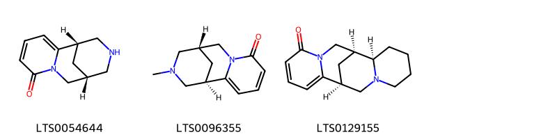{ width=100% }
    <figcaption>Hình ảnh cấu trúc hóa học của 3 hoạt chất thuộc nhóm Lupin alkaloids gồm ['(1s,9r)-7,11-diazatricyclo[7.3.1.0²,⁷]trideca-2,4-dien-6-one (LTS0054644)', '(1r,9r)-11-methyl-7,11-diazatricyclo[7.3.1.0²,⁷]trideca-2,4-dien-6-one (LTS0096355)', '(-)-anagyrine (LTS0129155)'].</figcaption>
</figure>

---

### Dược dân tộc học

Danh sách các quốc gia có sử dụng *Euchresta horsfieldii* trong điều trị các bệnh. 

| Country   | Disease                                                                               | Bệnh                                                                                                                                                                                                |
|:----------|:--------------------------------------------------------------------------------------|:----------------------------------------------------------------------------------------------------------------------------------------------------------------------------------------------------|
| Chinese   | Aphrodisiac                                                                           | MYMEMORY WARNING: YOU USED ALL AVAILABLE FREE TRANSLATIONS FOR TODAY. NEXT AVAILABLE IN  18 HOURS 40 MINUTES 59 SECONDS VISIT HTTPS://MYMEMORY.TRANSLATED.NET/DOC/USAGELIMITS.PHP TO TRANSLATE MORE |
| India     | Insecticide, Poison                                                                   | MYMEMORY WARNING: YOU USED ALL AVAILABLE FREE TRANSLATIONS FOR TODAY. NEXT AVAILABLE IN  18 HOURS 40 MINUTES 56 SECONDS VISIT HTTPS://MYMEMORY.TRANSLATED.NET/DOC/USAGELIMITS.PHP TO TRANSLATE MORE |
| Java      | Antidote, Aphrodisiac, Aphrodisiac, Expectorant, Poison, Antidote, Aphrodisiac, Tonic | MYMEMORY WARNING: YOU USED ALL AVAILABLE FREE TRANSLATIONS FOR TODAY. NEXT AVAILABLE IN  18 HOURS 40 MINUTES 54 SECONDS VISIT HTTPS://MYMEMORY.TRANSLATED.NET/DOC/USAGELIMITS.PHP TO TRANSLATE MORE |

---

---
## Euchresta japonica
### Thông tin về thực vật

!!! info "Phân loại thực vật của *Euchresta japonica* từ GIBF:"
    - **Kingdom:** Plantae
    - **Phylum:** Tracheophyta
    - **Order:** Fabales
    - **Family:** Fabaceae
    - **Genus:** Euchresta
    - **Species:** *Euchresta japonica*

 

| Label (VI)   | Label (EN)   | Scientific Name    | Descriptions (VI)   | Descriptions (EN)   | Also Known As (VI)   | Also Known As (EN)   |
|:-------------|:-------------|:-------------------|:--------------------|:--------------------|:---------------------|:---------------------|
| N/A          | N/A          | Euchresta japonica | loài thực vật       | species of plant    | ['']                 | ['']                 |

#### Phân bố trên thế giới

**Từ CSDL GIBF** nan, Korea, Republic of, China, Japan

#### Phân bố tại Việt Nam

**Từ CSDL GIBF**: Không có ghi nhận ở Việt Nam

---
### Thành phần hóa học
        
- Theo cơ sở dữ liệu lotus: Từ loài *Euchresta japonica* đã phân lập và xác định được 64 hoạt chất thuộc về các nhóm Flavonoids, Lupin alkaloids, Steroids and steroid derivatives, Isoflavonoids. 

|    | chemicalTaxonomyClassyfireClass   |   smiles_count |
|---:|:----------------------------------|---------------:|
|  0 | Flavonoids                        |             26 |
|  1 | Isoflavonoids                     |             24 |
|  2 | Lupin alkaloids                   |             12 |
|  3 | Steroids and steroid derivatives  |              2 |

#### Nhóm Flavonoids
<figure markdown="span">
    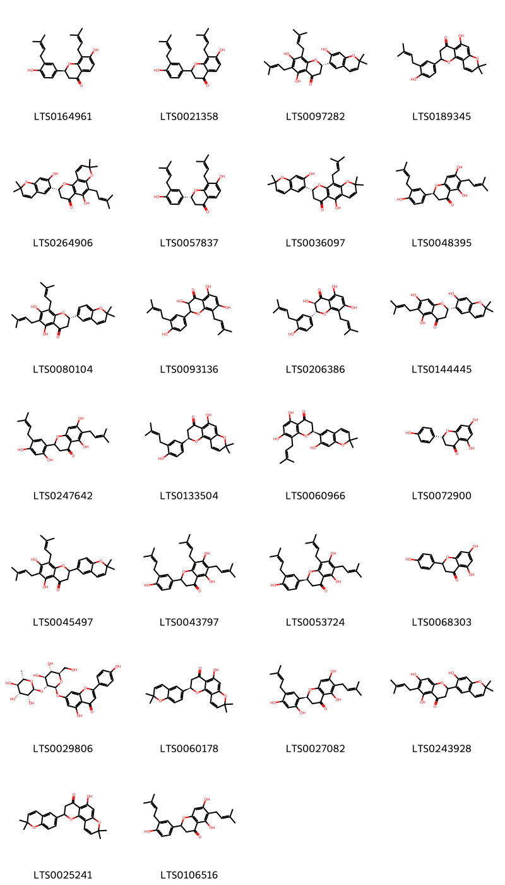{ width=100% }
    <figcaption>Hình ảnh cấu trúc hóa học của 26 hoạt chất thuộc nhóm Flavonoids gồm ['glabrol (LTS0164961)', 'glabrol (LTS0021358)', '(2s)-5,7-dihydroxy-2-(7-hydroxy-2,2-dimethylchromen-6-yl)-6,8-bis(3-methylbut-2-en-1-yl)-2,3-dihydro-1-benzopyran-4-one (LTS0097282)', 'euchrenone a2 (LTS0189345)', '(2r)-5-hydroxy-2-(7-hydroxy-2,2-dimethylchromen-6-yl)-8,8-dimethyl-6-(3-methylbut-2-en-1-yl)-2h,3h-pyrano[2,3-f]chromen-4-one (LTS0264906)', '(2r)-7-hydroxy-2-[4-hydroxy-3-(3-methylbut-2-en-1-yl)phenyl]-8-(3-methylbut-2-en-1-yl)-2,3-dihydro-1-benzopyran-4-one (LTS0057837)', '(2r)-5-hydroxy-2-(7-hydroxy-2,2-dimethylchromen-6-yl)-8,8-dimethyl-10-(3-methylbut-2-en-1-yl)-2h,3h-pyrano[3,2-g]chromen-4-one (LTS0036097)', 'paratocarpin l (LTS0048395)', '(2s)-2-(2,2-dimethylchromen-6-yl)-5,7-dihydroxy-6,8-bis(3-methylbut-2-en-1-yl)-2,3-dihydro-1-benzopyran-4-one (LTS0080104)', '3,5,7-trihydroxy-2-[4-hydroxy-3-(3-methylbut-2-en-1-yl)phenyl]-8-(3-methylbut-2-en-1-yl)-2,3-dihydro-1-benzopyran-4-one (LTS0093136)', '(2r,3r)-3,5,7-trihydroxy-2-[4-hydroxy-3-(3-methylbut-2-en-1-yl)phenyl]-8-(3-methylbut-2-en-1-yl)-2,3-dihydro-1-benzopyran-4-one (LTS0206386)', '(2s)-5,7-dihydroxy-2-(7-hydroxy-2,2-dimethylchromen-6-yl)-6-(3-methylbut-2-en-1-yl)-2,3-dihydro-1-benzopyran-4-one (LTS0144445)', '2-[2,4-dihydroxy-5-(3-methylbut-2-en-1-yl)phenyl]-5,7-dihydroxy-6-(3-methylbut-2-en-1-yl)-2,3-dihydro-1-benzopyran-4-one (LTS0247642)', '(2r)-5-hydroxy-2-[4-hydroxy-3-(3-methylbut-2-en-1-yl)phenyl]-8,8-dimethyl-2h,3h-pyrano[2,3-f]chromen-4-one (LTS0133504)', '(2s)-5,7-dihydroxy-2-(7-hydroxy-2,2-dimethylchromen-6-yl)-8-(3-methylbut-2-en-1-yl)-2,3-dihydro-1-benzopyran-4-one (LTS0060966)', '(-)-naringenin (LTS0072900)', 'euchrenone a4 (LTS0045497)', 'amorilin (LTS0043797)', '(2s)-5,7-dihydroxy-2-[4-hydroxy-3-(3-methylbut-2-en-1-yl)phenyl]-6,8-bis(3-methylbut-2-en-1-yl)-2,3-dihydro-1-benzopyran-4-one (LTS0053724)', 'asahina (LTS0068303)', 'rhoifolin (LTS0029806)', '(2r)-2-(2,2-dimethylchromen-6-yl)-5-hydroxy-8,8-dimethyl-2h,3h-pyrano[2,3-f]chromen-4-one (LTS0060178)', '(2s)-2-[2,4-dihydroxy-5-(3-methylbut-2-en-1-yl)phenyl]-5,7-dihydroxy-6-(3-methylbut-2-en-1-yl)-2,3-dihydro-1-benzopyran-4-one (LTS0027082)', 'cudraflavanone a (LTS0243928)', 'euchrenone a1 (LTS0025241)', '5,7-dihydroxy-2-[4-hydroxy-3-(3-methylbut-2-en-1-yl)phenyl]-6-(3-methylbut-2-en-1-yl)-2,3-dihydro-1-benzopyran-4-one (LTS0106516)'].</figcaption>
</figure>
#### Nhóm Isoflavonoids
<figure markdown="span">
    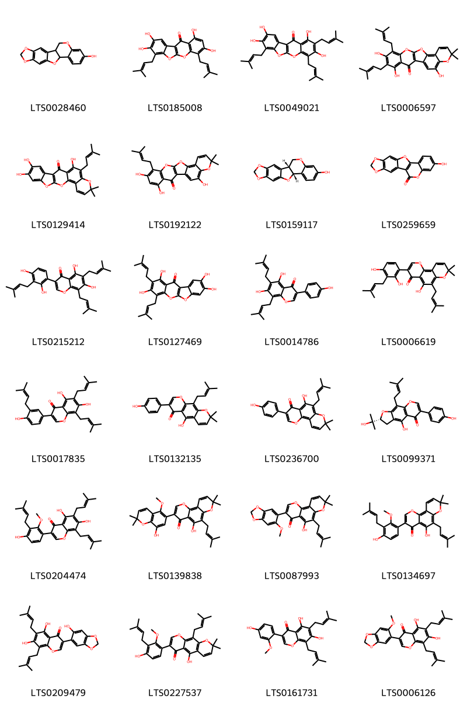{ width=100% }
    <figcaption>Hình ảnh cấu trúc hóa học của 24 hoạt chất thuộc nhóm Isoflavonoids gồm ['maackiain (LTS0028460)', 'euchretin b (LTS0185008)', 'euchretin c (LTS0049021)', 'euchretin a (LTS0006597)', '6,7,21-trihydroxy-17,17-dimethyl-20-(3-methylbut-2-en-1-yl)-10,12,18-trioxapentacyclo[11.8.0.0³,¹¹.0⁴,⁹.0¹⁴,¹⁹]henicosa-1(21),3(11),4(9),5,7,13,15,19-octaen-2-one (LTS0129414)', '5,7,20-trihydroxy-17,17-dimethyl-8-(3-methylbut-2-en-1-yl)-10,12,18-trioxapentacyclo[11.8.0.0²,¹¹.0⁴,⁹.0¹⁴,¹⁹]henicosa-1(13),2(11),4,6,8,14(19),15,20-octaen-3-one (LTS0192122)', '(-)-maackiain (LTS0159117)', 'medicagol (LTS0259659)', 'euchrenone b2 (LTS0215212)', '5,7,13,14-tetrahydroxy-4,6-bis(3-methylbut-2-en-1-yl)-2,17-dioxatetracyclo[8.7.0.0³,⁸.0¹¹,¹⁶]heptadeca-1(10),3,5,7,11(16),12,14-heptaen-9-one (LTS0127469)', '6,8-diprenylgenistein (LTS0014786)', '3-[2,4-dihydroxy-3-(3-methylbut-2-en-1-yl)phenyl]-5-hydroxy-8,8-dimethyl-6-(3-methylbut-2-en-1-yl)pyrano[2,3-h]chromen-4-one (LTS0006619)', 'euchrenone b1 (LTS0017835)', 'warangalone (LTS0132135)', 'osajin (LTS0236700)', '(2r)-4-hydroxy-6-(4-hydroxyphenyl)-2-(2-hydroxypropan-2-yl)-9-(3-methylbut-2-en-1-yl)-2h,3h-furo[3,2-g]chromen-5-one (LTS0099371)', '5,7-dihydroxy-3-[4-hydroxy-2-methoxy-3-(3-methylbut-2-en-1-yl)phenyl]-6,8-bis(3-methylbut-2-en-1-yl)chromen-4-one (LTS0204474)', '5-hydroxy-3-(8-hydroxy-5-methoxy-2,2-dimethylchromen-6-yl)-8,8-dimethyl-6-(3-methylbut-2-en-1-yl)pyrano[2,3-h]chromen-4-one (LTS0139838)', 'euchrenone b3 (LTS0087993)', '5-hydroxy-3-[4-hydroxy-2-methoxy-3-(3-methylbut-2-en-1-yl)phenyl]-8,8-dimethyl-6-(3-methylbut-2-en-1-yl)pyrano[2,3-h]chromen-4-one (LTS0134697)', 'euchrenone b5 (LTS0209479)', '5-hydroxy-3-[4-hydroxy-2-methoxy-3-(3-methylbut-2-en-1-yl)phenyl]-8,8-dimethyl-10-(3-methylbut-2-en-1-yl)pyrano[3,2-g]chromen-4-one (LTS0227537)', '5,7-dihydroxy-3-(4-hydroxy-2-methoxyphenyl)-6,8-bis(3-methylbut-2-en-1-yl)chromen-4-one (LTS0161731)', 'euchrenone b4 (LTS0006126)'].</figcaption>
</figure>
#### Nhóm Lupin alkaloids
<figure markdown="span">
    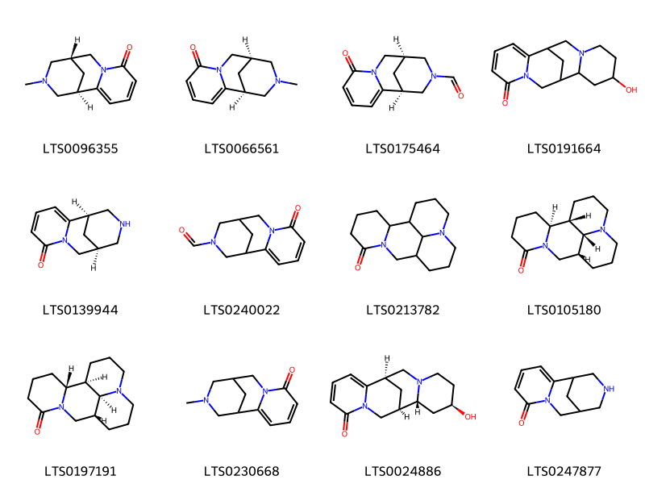{ width=100% }
    <figcaption>Hình ảnh cấu trúc hóa học của 12 hoạt chất thuộc nhóm Lupin alkaloids gồm ['(1r,9r)-11-methyl-7,11-diazatricyclo[7.3.1.0²,⁷]trideca-2,4-dien-6-one (LTS0096355)', '(1s,9r)-11-methyl-7,11-diazatricyclo[7.3.1.0²,⁷]trideca-2,4-dien-6-one (LTS0066561)', '(1s,9r)-6-oxo-7,11-diazatricyclo[7.3.1.0²,⁷]trideca-2,4-diene-11-carbaldehyde (LTS0175464)', '12-hydroxy-7,15-diazatetracyclo[7.7.1.0²,⁷.0¹⁰,¹⁵]heptadeca-2,4-dien-6-one (LTS0191664)', 'cytisine (LTS0139944)', '6-oxo-7,11-diazatricyclo[7.3.1.0²,⁷]trideca-2,4-diene-11-carbaldehyde (LTS0240022)', 'matrine (LTS0213782)', '(1s,2s,9r,17r)-7,13-diazatetracyclo[7.7.1.0²,⁷.0¹³,¹⁷]heptadecan-6-one (LTS0105180)', 'sophoridine (LTS0197191)', 'n-methylcytisine (LTS0230668)', '(1r,9r,10r,12r)-12-hydroxy-7,15-diazatetracyclo[7.7.1.0²,⁷.0¹⁰,¹⁵]heptadeca-2,4-dien-6-one (LTS0024886)', 'citizin (LTS0247877)'].</figcaption>
</figure>
#### Nhóm Steroids and steroid derivatives
<figure markdown="span">
    { width=100% }
    <figcaption>Hình ảnh cấu trúc hóa học của 2 hoạt chất thuộc nhóm Steroids and steroid derivatives gồm ['stigmast-5-en-3-ol, (3β)- (LTS0204616)', 'sitosterol (LTS0168132)'].</figcaption>
</figure>

---

### Dược dân tộc học

Danh sách các quốc gia có sử dụng *Euchresta japonica* trong điều trị các bệnh. 

| Country   | Disease                  | Bệnh                                                                                                                                                                                                |
|:----------|:-------------------------|:----------------------------------------------------------------------------------------------------------------------------------------------------------------------------------------------------|
| China     | Alexiteric               | MYMEMORY WARNING: YOU USED ALL AVAILABLE FREE TRANSLATIONS FOR TODAY. NEXT AVAILABLE IN  18 HOURS 40 MINUTES 28 SECONDS VISIT HTTPS://MYMEMORY.TRANSLATED.NET/DOC/USAGELIMITS.PHP TO TRANSLATE MORE |
| Elsewhere | Antidote, Antiphlogistic | MYMEMORY WARNING: YOU USED ALL AVAILABLE FREE TRANSLATIONS FOR TODAY. NEXT AVAILABLE IN  18 HOURS 40 MINUTES 25 SECONDS VISIT HTTPS://MYMEMORY.TRANSLATED.NET/DOC/USAGELIMITS.PHP TO TRANSLATE MORE |

---

---
## Euchresta japonicum
### Thông tin về thực vật

!!! info "Phân loại thực vật của *Euchresta japonica* từ GIBF:"
    - **Kingdom:** Plantae
    - **Phylum:** Tracheophyta
    - **Order:** Fabales
    - **Family:** Fabaceae
    - **Genus:** Euchresta
    - **Species:** *Euchresta japonica*

 

| Label (VI)   | Label (EN)   | Scientific Name    | Descriptions (VI)   | Descriptions (EN)   | Also Known As (VI)   | Also Known As (EN)   |
|:-------------|:-------------|:-------------------|:--------------------|:--------------------|:---------------------|:---------------------|
| N/A          | N/A          | Euchresta japonica | loài thực vật       | species of plant    | ['']                 | ['']                 |

#### Phân bố trên thế giới

**Từ CSDL GIBF** nan, Korea, Republic of, China, Japan

#### Phân bố tại Việt Nam

**Từ CSDL GIBF**: Không có ghi nhận ở Việt Nam

---
### Thành phần hóa học
        
- Theo cơ sở dữ liệu lotus: Từ loài *Euchresta japonica* đã phân lập và xác định được Chưa có hoạt chất nào được phân lập. hoạt chất thuộc về các nhóm Không có hoạt chất nào được phân lập. 

Không có hình ảnh nào được tạo ra

---

### Dược dân tộc học

Danh sách các quốc gia có sử dụng *Euchresta japonica* trong điều trị các bệnh. 

| Country   | Disease                  | Bệnh                                                                                                                                                                                                |
|:----------|:-------------------------|:----------------------------------------------------------------------------------------------------------------------------------------------------------------------------------------------------|
| China     | Antidote, Antiphlogistic | MYMEMORY WARNING: YOU USED ALL AVAILABLE FREE TRANSLATIONS FOR TODAY. NEXT AVAILABLE IN  18 HOURS 39 MINUTES 49 SECONDS VISIT HTTPS://MYMEMORY.TRANSLATED.NET/DOC/USAGELIMITS.PHP TO TRANSLATE MORE |

---

# Chi Cajanus

??? note "Danh sách các dược liệu thuộc chi"
    
	 - *Cajanus cajan*

---
## Cajanus cajan
### Thông tin về thực vật

!!! info "Phân loại thực vật của *Cajanus cajan* từ GIBF:"
    - **Kingdom:** Plantae
    - **Phylum:** Tracheophyta
    - **Order:** Fabales
    - **Family:** Fabaceae
    - **Genus:** Cajanus
    - **Species:** *Cajanus cajan*

 

| Label (VI)   | Label (EN)   | Scientific Name   | Descriptions (VI)   | Descriptions (EN)   | Also Known As (VI)   | Also Known As (EN)                                           |
|:-------------|:-------------|:------------------|:--------------------|:--------------------|:---------------------|:-------------------------------------------------------------|
| N/A          | N/A          | Cajanus cajan     | loài thực vật       | species of plant    | ['']                 | ['tur', 'pigeon pea', 'gungo peas', 'pigeonpea', 'red gram'] |

#### Phân bố trên thế giới

**Từ CSDL GIBF** Virgin Islands (U.S.), nan, Australia, Guadeloupe, Lao People’s Democratic Republic, Grenada, Mozambique, Saint Lucia, Philippines, Benin, French Guiana, Panama, Puerto Rico, Senegal, Chinese Taipei, Honduras, Jamaica, United States of America, El Salvador, Belize, South Africa, Trinidad and Tobago, Hong Kong, Barbados, Saint Vincent and the Grenadines, Bahamas, Brazil, New Caledonia, Cuba, Peru, Dominican Republic, Mexico, Dominica, China, Ecuador, Madagascar, Cabo Verde, Haiti, Colombia, Montserrat, Costa Rica, India, Indonesia, Kenya, Cameroon, Ethiopia

#### Phân bố tại Việt Nam

**Từ CSDL GIBF**: Không có ghi nhận ở Việt Nam

---
### Thành phần hóa học
        
- Theo cơ sở dữ liệu lotus: Từ loài *Cajanus cajan* đã phân lập và xác định được 150 hoạt chất thuộc về các nhóm Fatty Acyls, Flavonoids, Prenol lipids, Steroids and steroid derivatives, Isoflavonoids, Linear 1,3-diarylpropanoids, Cinnamic acids and derivatives, Benzene and substituted derivatives, Stilbenes, Organooxygen compounds, Tannins, Neoflavonoids, Carboxylic acids and derivatives. 

|    | chemicalTaxonomyClassyfireClass     |   smiles_count |
|---:|:------------------------------------|---------------:|
|  0 | Benzene and substituted derivatives |              4 |
|  1 | Carboxylic acids and derivatives    |             15 |
|  2 | Cinnamic acids and derivatives      |              5 |
|  3 | Fatty Acyls                         |              1 |
|  4 | Flavonoids                          |              9 |
|  5 | Isoflavonoids                       |              8 |
|  6 | Linear 1,3-diarylpropanoids         |              2 |
|  7 | Neoflavonoids                       |              1 |
|  8 | Organooxygen compounds              |             31 |
|  9 | Prenol lipids                       |             32 |
| 10 | Steroids and steroid derivatives    |             29 |
| 11 | Stilbenes                           |             11 |
| 12 | Tannins                             |              1 |

#### Nhóm Benzene and substituted derivatives
<figure markdown="span">
    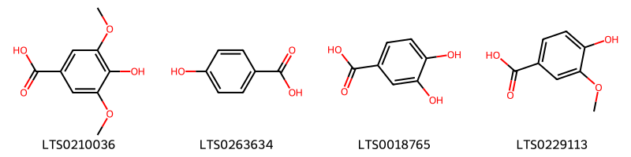{ width=100% }
    <figcaption>Hình ảnh cấu trúc hóa học của 4 hoạt chất thuộc nhóm Benzene and substituted derivatives gồm ['syringic acid (LTS0210036)', 'p-hydroxybenzoic acid (LTS0263634)', '3,4-dihydroxybenzoic acid (LTS0018765)', 'vanillic acid (LTS0229113)'].</figcaption>
</figure>
#### Nhóm Carboxylic acids and derivatives
<figure markdown="span">
    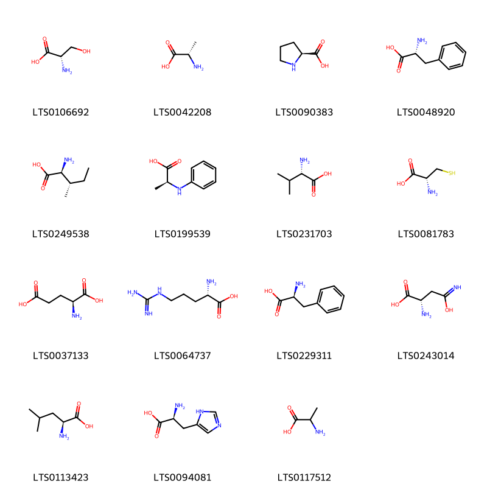{ width=100% }
    <figcaption>Hình ảnh cấu trúc hóa học của 15 hoạt chất thuộc nhóm Carboxylic acids and derivatives gồm ['l-serine (LTS0106692)', 'l-alanine (LTS0042208)', 'l-proline (LTS0090383)', 'd-phenylalanine (LTS0048920)', 'l-isoleucine (LTS0249538)', '(2s)-2-(phenylamino)propanoic acid (LTS0199539)', 'l-valine (LTS0231703)', 'l-cysteine (LTS0081783)', 'l-glutamic acid (LTS0037133)', 'l-arginine (LTS0064737)', 'l-phenylalanine (LTS0229311)', 'aspartamate (LTS0243014)', 'l-leucine (LTS0113423)', 'l-histidine (LTS0094081)', 'alanine (LTS0117512)'].</figcaption>
</figure>
#### Nhóm Cinnamic acids and derivatives
<figure markdown="span">
    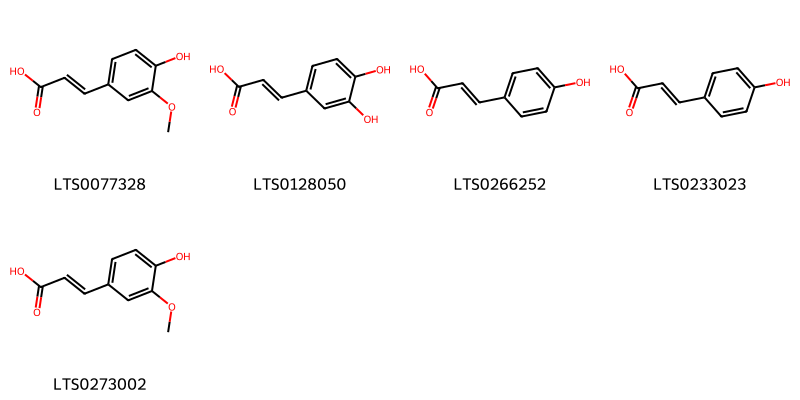{ width=100% }
    <figcaption>Hình ảnh cấu trúc hóa học của 5 hoạt chất thuộc nhóm Cinnamic acids and derivatives gồm ['ferulic acid (LTS0077328)', '3,4-dihydroxycinnamic acid (LTS0128050)', 'para-coumaric acid (LTS0266252)', 'hydroxycinnamic acid (LTS0233023)', 'ferulic acid (LTS0273002)'].</figcaption>
</figure>
#### Nhóm Fatty Acyls
<figure markdown="span">
    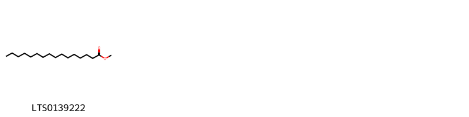{ width=100% }
    <figcaption>Hình ảnh cấu trúc hóa học của 1 hoạt chất thuộc nhóm Fatty Acyls gồm ['methyl palmitate (LTS0139222)'].</figcaption>
</figure>
#### Nhóm Flavonoids
<figure markdown="span">
    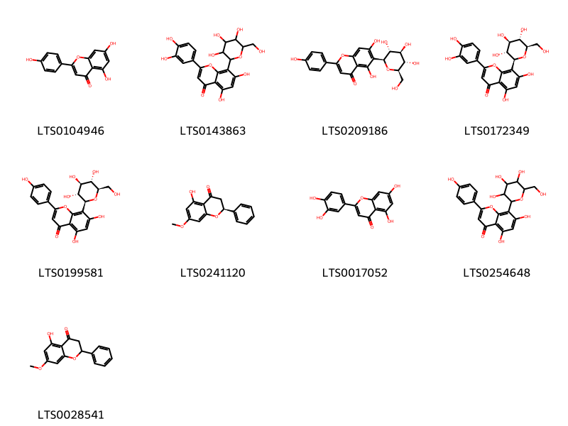{ width=100% }
    <figcaption>Hình ảnh cấu trúc hóa học của 9 hoạt chất thuộc nhóm Flavonoids gồm ['chamomile (LTS0104946)', 'orientin (LTS0143863)', 'isovitexin (LTS0209186)', 'orientin (LTS0172349)', 'vitexin (LTS0199581)', 'pinostrobin (LTS0241120)', 'luteolin (LTS0017052)', 'vitexin (LTS0254648)', 'pinostrobin (LTS0028541)'].</figcaption>
</figure>
#### Nhóm Isoflavonoids
<figure markdown="span">
    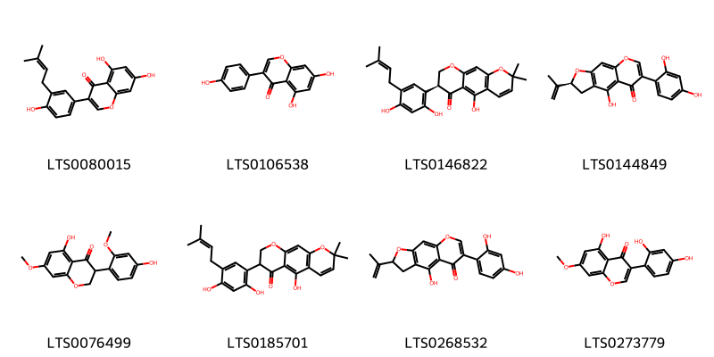{ width=100% }
    <figcaption>Hình ảnh cấu trúc hóa học của 8 hoạt chất thuộc nhóm Isoflavonoids gồm ['isowighteone (LTS0080015)', 'genistein (LTS0106538)', '(3s)-3-[2,4-dihydroxy-5-(3-methylbut-2-en-1-yl)phenyl]-5-hydroxy-8,8-dimethyl-2h,3h-pyrano[3,2-g]chromen-4-one (LTS0146822)', '(2s)-6-(2,4-dihydroxyphenyl)-4-hydroxy-2-(prop-1-en-2-yl)-2h,3h-furo[3,2-g]chromen-5-one (LTS0144849)', 'cajanol (LTS0076499)', 'cajanone (LTS0185701)', 'lupinisoflavone a (LTS0268532)', 'cajanin (LTS0273779)'].</figcaption>
</figure>
#### Nhóm Linear 1_3-diarylpropanoids
<figure markdown="span">
    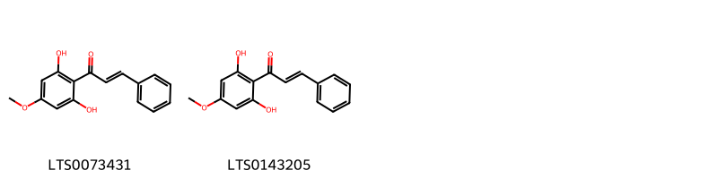{ width=100% }
    <figcaption>Hình ảnh cấu trúc hóa học của Không tìm thấy chú thích hoạt chất thuộc nhóm Linear 1_3-diarylpropanoids gồm Không tìm thấy chú thích.</figcaption>
</figure>
#### Nhóm Neoflavonoids
<figure markdown="span">
    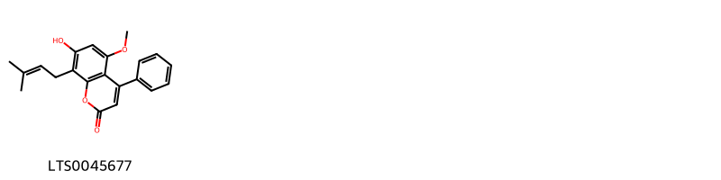{ width=100% }
    <figcaption>Hình ảnh cấu trúc hóa học của 1 hoạt chất thuộc nhóm Neoflavonoids gồm ['7-hydroxy-5-methoxy-8-(3-methylbut-2-en-1-yl)-4-phenylchromen-2-one (LTS0045677)'].</figcaption>
</figure>
#### Nhóm Organooxygen compounds
<figure markdown="span">
    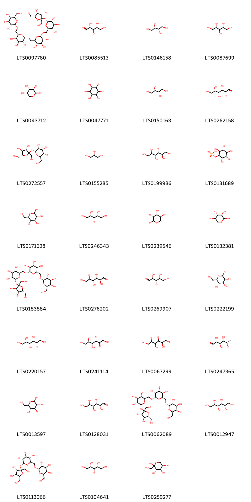{ width=100% }
    <figcaption>Hình ảnh cấu trúc hóa học của 31 hoạt chất thuộc nhóm Organooxygen compounds gồm ['verbascose (LTS0097780)', 'arabinose (LTS0085513)', '(-)-threitol (LTS0146158)', 'arabitol (LTS0087699)', 'l-arabinopyranose (LTS0043712)', '(-)-inositol (LTS0047771)', 'meso-erythritol (LTS0150163)', '(+)-glucose (LTS0262158)', 'sucrose (LTS0272557)', 'glycerol (LTS0155285)', 'mannitol (LTS0199986)', '[(2r,3r,5r,6s)-2,3,4,5,6-pentahydroxycyclohexyl]oxyphosphonic acid (LTS0131689)', 'galactose (LTS0171628)', 'd-xylitol (LTS0246343)', 'l-rhamnose (LTS0239546)', 'd-xylose (LTS0132381)', '(2r,3r,4s,5s,6r)-2-{[(2s,3r,4s,5r)-3,4-dihydroxy-2,5-bis(hydroxymethyl)oxolan-2-yl]oxy}-6-({[(2s,3s,4r,5r,6r)-3,4,5-trihydroxy-6-({[(2s,3r,4s,5r,6r)-3,4,5-trihydroxy-6-(hydroxymethyl)oxan-2-yl]oxy}methyl)oxan-2-yl]oxy}methyl)oxane-3,4,5-triol (LTS0183884)', '(+-)-mannose (LTS0276202)', '(d)-xylose (LTS0269907)', 'β-glucose (LTS0222199)', 'd-sorbitol (LTS0220157)', 'keto-d-fructose (LTS0241114)', 'sorbo (LTS0067299)', 'rhamnose (LTS0247365)', 'glucose (LTS0013597)', 'aldehydo-d-galactose (LTS0128031)', 'stachyose (LTS0062089)', 'galactitol (LTS0012947)', 'raffinose (LTS0113066)', '(2r,4s)-pentane-1,2,3,4,5-pentol (LTS0104641)', 'd-fructopyranose (LTS0259277)'].</figcaption>
</figure>
#### Nhóm Prenol lipids
<figure markdown="span">
    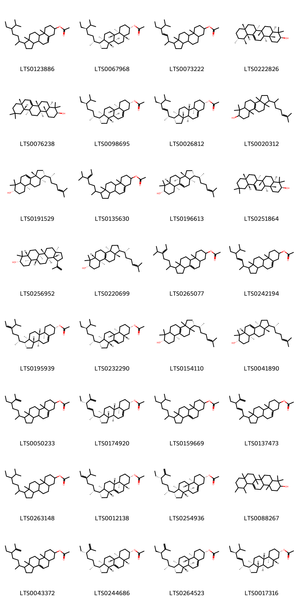{ width=100% }
    <figcaption>Hình ảnh cấu trúc hóa học của 32 hoạt chất thuộc nhóm Prenol lipids gồm ['1-(5-ethyl-6-methylheptan-2-yl)-9a,11a-dimethyl-1h,2h,3h,3ah,3bh,4h,6h,7h,8h,9h,9bh,10h,11h-cyclopenta[a]phenanthren-7-yl acetate (LTS0123886)', 'stigmastanol acetate (LTS0067968)', '1-(5-ethyl-6-methylhept-3-en-2-yl)-9a,11a-dimethyl-tetradecahydro-1h-cyclopenta[a]phenanthren-7-yl acetate (LTS0073222)', 'amyrin (LTS0222826)', 'alnulin (LTS0076238)', 'β-sitosteryl acetate (LTS0098695)', 'stigmasteryl acetate (LTS0026812)', 'lanster (LTS0020312)', '(1r,3ar,7s,9ar,11ar)-3a,6,6,9a,11a-pentamethyl-1-[(2r)-6-methylhept-5-en-2-yl]-1h,2h,3h,5h,5ah,7h,8h,9h,9bh,10h,11h-cyclopenta[a]phenanthren-7-ol (LTS0191529)', '1-(5-isopropylhept-5-en-2-yl)-9a,11a-dimethyl-1h,2h,3h,3ah,3bh,4h,6h,7h,8h,9h,9bh,10h,11h-cyclopenta[a]phenanthren-7-yl acetate (LTS0135630)', 'parkeol (LTS0196613)', 'β-amyrin (LTS0251864)', 'lupeol (LTS0256952)', 'euphol (LTS0220699)', '1-(5-isopropylhept-5-en-2-yl)-9a,11a-dimethyl-1h,2h,3h,3ah,5h,5ah,6h,7h,8h,9h,9bh,10h,11h-cyclopenta[a]phenanthren-7-yl acetate (LTS0265077)', '1-(5-ethyl-6-methylhept-3-en-2-yl)-9a,11a-dimethyl-1h,2h,3h,3ah,3bh,4h,6h,7h,8h,9h,9bh,10h,11h-cyclopenta[a]phenanthren-7-yl acetate (LTS0242194)', '(1r,3as,3bs,7s,9ar,9bs,11ar)-1-[(2r,5z)-5-isopropylhept-5-en-2-yl]-9a,11a-dimethyl-1h,2h,3h,3ah,3bh,4h,6h,7h,8h,9h,9bh,10h,11h-cyclopenta[a]phenanthren-7-yl acetate (LTS0195939)', '(1r,3ar,5as,7s,9as,9br,11ar)-1-[(2r,5r)-5-ethyl-6-methylheptan-2-yl]-9a,11a-dimethyl-1h,2h,3h,3ah,5h,5ah,6h,7h,8h,9h,9bh,10h,11h-cyclopenta[a]phenanthren-7-yl acetate (LTS0232290)', '(1r,7s,9as)-3a,6,6,9a,11a-pentamethyl-1-[(2r)-6-methylhept-5-en-2-yl]-1h,2h,3h,4h,5h,5ah,7h,8h,9h,10h,11h-cyclopenta[a]phenanthren-7-ol (LTS0154110)', '(3as,5ar,7s,9ar,11as)-3a,6,6,9a,11a-pentamethyl-1-[(2r)-6-methylhept-5-en-2-yl]-1h,2h,3h,5h,5ah,7h,8h,9h,9bh,10h,11h-cyclopenta[a]phenanthren-7-ol (LTS0041890)', '1-(5-ethyl-6-methylhept-6-en-2-yl)-9a,11a-dimethyl-1h,2h,3h,3ah,3bh,4h,6h,7h,8h,9h,9bh,10h,11h-cyclopenta[a]phenanthren-7-yl acetate (LTS0050233)', '(1r,3as,3bs,7s,9ar,9bs,11ar)-1-[(2r,3e,5s)-5-ethyl-6-methylhepta-3,6-dien-2-yl]-9a,11a-dimethyl-1h,2h,3h,3ah,3bh,4h,6h,7h,8h,9h,9bh,10h,11h-cyclopenta[a]phenanthren-7-yl acetate (LTS0174920)', '1-(5-ethyl-6-methylheptan-2-yl)-9a,11a-dimethyl-1h,2h,3h,3ah,5h,5ah,6h,7h,8h,9h,9bh,10h,11h-cyclopenta[a]phenanthren-7-yl acetate (LTS0159669)', '1-(5-ethyl-6-methylhepta-3,6-dien-2-yl)-9a,11a-dimethyl-1h,2h,3h,3ah,3bh,4h,6h,7h,8h,9h,9bh,10h,11h-cyclopenta[a]phenanthren-7-yl acetate (LTS0137473)', '1-(5-ethyl-6-methylheptan-2-yl)-9a,11a-dimethyl-tetradecahydro-1h-cyclopenta[a]phenanthren-7-yl acetate (LTS0263148)', '(1r,3ar,5as,7s,9as,9br,11ar)-1-[(2r,5z)-5-isopropylhept-5-en-2-yl]-9a,11a-dimethyl-1h,2h,3h,3ah,5h,5ah,6h,7h,8h,9h,9bh,10h,11h-cyclopenta[a]phenanthren-7-yl acetate (LTS0012138)', '(1r,3as,3bs,7s,9ar,9bs,11ar)-1-[(2r,5s)-5-ethyl-6-methylhept-6-en-2-yl]-9a,11a-dimethyl-1h,2h,3h,3ah,3bh,4h,6h,7h,8h,9h,9bh,10h,11h-cyclopenta[a]phenanthren-7-yl acetate (LTS0254936)', 'α-amyrin (LTS0088267)', '1-(5-ethyl-6-methylhept-6-en-2-yl)-9a,11a-dimethyl-1h,2h,3h,3ah,5h,5ah,6h,7h,8h,9h,9bh,10h,11h-cyclopenta[a]phenanthren-7-yl acetate (LTS0043372)', '(1r,3ar,5as,7s,9as,9br,11ar)-1-[(2r,5s)-5-ethyl-6-methylhept-6-en-2-yl]-9a,11a-dimethyl-1h,2h,3h,3ah,5h,5ah,6h,7h,8h,9h,9bh,10h,11h-cyclopenta[a]phenanthren-7-yl acetate (LTS0244686)', '(1r,3as,3bs,7s,9ar,9bs,11ar)-1-[(2r,5r)-5-ethyl-6-methylhept-6-en-2-yl]-9a,11a-dimethyl-1h,2h,3h,3ah,3bh,4h,6h,7h,8h,9h,9bh,10h,11h-cyclopenta[a]phenanthren-7-yl acetate (LTS0264523)', '(1r,3as,3br,5as,7s,9as,9bs,11ar)-1-[(2r,3e,5s)-5-ethyl-6-methylhept-3-en-2-yl]-9a,11a-dimethyl-tetradecahydro-1h-cyclopenta[a]phenanthren-7-yl acetate (LTS0017316)'].</figcaption>
</figure>
#### Nhóm Steroids and steroid derivatives
<figure markdown="span">
    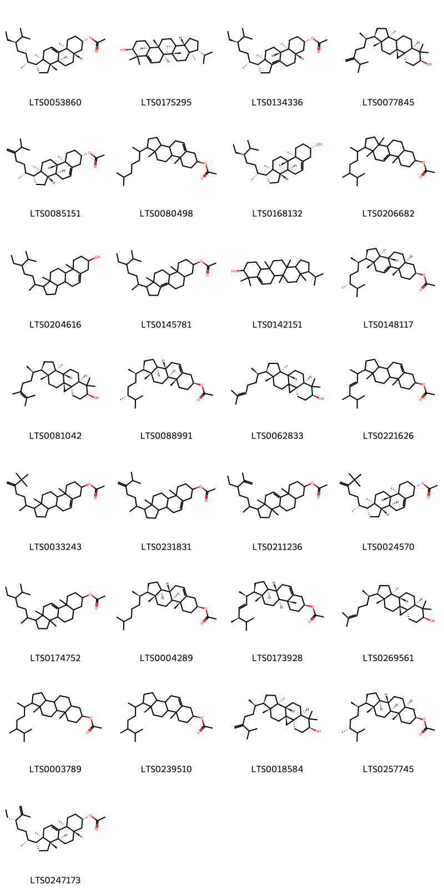{ width=100% }
    <figcaption>Hình ảnh cấu trúc hóa học của 29 hoạt chất thuộc nhóm Steroids and steroid derivatives gồm ['(1r,3as,3bs,5as,7s,9as,11ar)-1-[(2r,5r)-5-ethyl-6-methylheptan-2-yl]-3a,9a,11a-trimethyl-1h,2h,3h,3bh,4h,5h,5ah,6h,7h,8h,9h,11h-cyclopenta[a]phenanthren-7-yl acetate (LTS0053860)', 'simiarenol (LTS0175295)', '(1r,5as,7s,9as,9br,11ar)-1-[(2r,5r)-5-ethyl-6-methylheptan-2-yl]-9a,11a-dimethyl-1h,2h,3h,4h,5h,5ah,6h,7h,8h,9h,9bh,10h,11h-cyclopenta[a]phenanthren-7-yl acetate (LTS0134336)', '24-methylene-cycloartanol (LTS0077845)', '(1r,3as,3bs,7s,9ar,9bs,11ar)-9a,11a-dimethyl-1-[(2r)-6-methyl-5-methylideneheptan-2-yl]-1h,2h,3h,3ah,3bh,4h,6h,7h,8h,9h,9bh,10h,11h-cyclopenta[a]phenanthren-7-yl acetate (LTS0085151)', 'cholesteryl acetate (LTS0080498)', 'sitosterol (LTS0168132)', '1-(5,6-dimethylheptan-2-yl)-3a,9a,11a-trimethyl-1h,2h,3h,3bh,4h,5h,5ah,6h,7h,8h,9h,11h-cyclopenta[a]phenanthren-7-yl acetate (LTS0206682)', 'stigmast-5-en-3-ol, (3β)- (LTS0204616)', '1-(5-ethyl-6-methylheptan-2-yl)-9a,11a-dimethyl-1h,2h,3h,4h,5h,5ah,6h,7h,8h,9h,9bh,10h,11h-cyclopenta[a]phenanthren-7-yl acetate (LTS0145781)', '3-isopropyl-3a,5a,8,8,11b,13a-hexamethyl-1h,2h,3h,4h,5h,5bh,6h,9h,10h,11h,11ah,12h,13h,13bh-cyclopenta[a]chrysen-9-ol (LTS0142151)', '(1r,3as,3bs,5as,7s,9as,11ar)-1-[(2r,5r)-5,6-dimethylheptan-2-yl]-3a,9a,11a-trimethyl-1h,2h,3h,3bh,4h,5h,5ah,6h,7h,8h,9h,11h-cyclopenta[a]phenanthren-7-yl acetate (LTS0148117)', '(1s,3r,6s,8r,11s,12s,15r,16r)-15-[(2r)-5,6-dimethylhept-5-en-2-yl]-7,7,12,16-tetramethylpentacyclo[9.7.0.0¹,³.0³,⁸.0¹²,¹⁶]octadecan-6-ol (LTS0081042)', 'campesteryl acetate (LTS0088991)', '(3r,6s,8r,11s,12s,15r,16r)-7,7,12,16-tetramethyl-15-[(2r)-6-methylhept-5-en-2-yl]pentacyclo[9.7.0.0¹,³.0³,⁸.0¹²,¹⁶]octadecan-6-ol (LTS0062833)', '1-(5,6-dimethylhept-3-en-2-yl)-9a,11a-dimethyl-1h,2h,3h,3ah,3bh,4h,6h,7h,8h,9h,9bh,10h,11h-cyclopenta[a]phenanthren-7-yl acetate (LTS0221626)', '1-(6,6-dimethyl-5-methylideneheptan-2-yl)-9a,11a-dimethyl-1h,2h,3h,3ah,3bh,4h,6h,7h,8h,9h,9bh,10h,11h-cyclopenta[a]phenanthren-7-yl acetate (LTS0033243)', '9a,11a-dimethyl-1-(6-methyl-5-methylideneheptan-2-yl)-1h,2h,3h,3ah,3bh,4h,6h,7h,8h,9h,9bh,10h,11h-cyclopenta[a]phenanthren-7-yl acetate (LTS0231831)', '1-(5-ethyl-6-methylhept-6-en-2-yl)-3a,9a,11a-trimethyl-1h,2h,3h,3bh,4h,5h,5ah,6h,7h,8h,9h,11h-cyclopenta[a]phenanthren-7-yl acetate (LTS0211236)', '(1r,3as,3bs,7s,9ar,9bs,11ar)-1-[(2r)-6,6-dimethyl-5-methylideneheptan-2-yl]-9a,11a-dimethyl-1h,2h,3h,3ah,3bh,4h,6h,7h,8h,9h,9bh,10h,11h-cyclopenta[a]phenanthren-7-yl acetate (LTS0024570)', '1-(5-ethyl-6-methylheptan-2-yl)-3a,9a,11a-trimethyl-1h,2h,3h,3bh,4h,5h,5ah,6h,7h,8h,9h,11h-cyclopenta[a]phenanthren-7-yl acetate (LTS0174752)', 'cholesteryl acetate (LTS0004289)', '(1r,3as,3bs,7s,9ar,9bs,11ar)-1-[(2r,3e,5r)-5,6-dimethylhept-3-en-2-yl]-9a,11a-dimethyl-1h,2h,3h,3ah,3bh,4h,6h,7h,8h,9h,9bh,10h,11h-cyclopenta[a]phenanthren-7-yl acetate (LTS0173928)', 'cycloartenol (LTS0269561)', '1-(5,6-dimethylheptan-2-yl)-9a,11a-dimethyl-tetradecahydro-1h-cyclopenta[a]phenanthren-7-yl acetate (LTS0003789)', '1-(5,6-dimethylheptan-2-yl)-9a,11a-dimethyl-1h,2h,3h,3ah,3bh,4h,6h,7h,8h,9h,9bh,10h,11h-cyclopenta[a]phenanthren-7-yl acetate (LTS0239510)', '24-methylenecycloartanol (LTS0018584)', '(1r,3as,3br,5as,7s,9as,9bs,11ar)-1-[(2r,5r)-5,6-dimethylheptan-2-yl]-9a,11a-dimethyl-tetradecahydro-1h-cyclopenta[a]phenanthren-7-yl acetate (LTS0257745)', '(1r,3as,3bs,5as,7s,9as,11ar)-1-[(2r,5s)-5-ethyl-6-methylhept-6-en-2-yl]-3a,9a,11a-trimethyl-1h,2h,3h,3bh,4h,5h,5ah,6h,7h,8h,9h,11h-cyclopenta[a]phenanthren-7-yl acetate (LTS0247173)'].</figcaption>
</figure>
#### Nhóm Stilbenes
<figure markdown="span">
    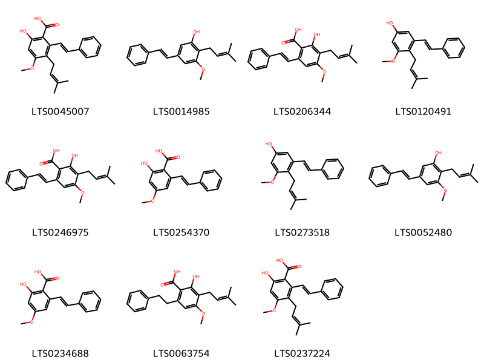{ width=100% }
    <figcaption>Hình ảnh cấu trúc hóa học của 11 hoạt chất thuộc nhóm Stilbenes gồm ['6-hydroxy-4-methoxy-3-(3-methylbut-2-en-1-yl)-2-(2-phenylethenyl)benzoic acid (LTS0045007)', '3-methoxy-2-(3-methylbut-2-en-1-yl)-5-[(1e)-2-phenylethenyl]phenol (LTS0014985)', '2-hydroxy-4-methoxy-3-(3-methylbut-2-en-1-yl)-6-[(1e)-2-phenylethenyl]benzoic acid (LTS0206344)', '3-methoxy-4-(3-methylbut-2-en-1-yl)-5-[(1e)-2-phenylethenyl]phenol (LTS0120491)', '2-hydroxy-4-methoxy-3-(3-methylbut-2-en-1-yl)-6-(2-phenylethenyl)benzoic acid (LTS0246975)', '2-hydroxy-4-methoxy-6-[(1e)-2-phenylethenyl]benzoic acid (LTS0254370)', '3-methoxy-4-(3-methylbut-2-en-1-yl)-5-(2-phenylethenyl)phenol (LTS0273518)', '3-methoxy-2-(3-methylbut-2-en-1-yl)-5-(2-phenylethenyl)phenol (LTS0052480)', '2-hydroxy-4-methoxy-6-(2-phenylethenyl)benzoic acid (LTS0234688)', 'amorfrutin 1 (LTS0063754)', '6-hydroxy-4-methoxy-3-(3-methylbut-2-en-1-yl)-2-[(1e)-2-phenylethenyl]benzoic acid (LTS0237224)'].</figcaption>
</figure>
#### Nhóm Tannins
<figure markdown="span">
    { width=100% }
    <figcaption>Hình ảnh cấu trúc hóa học của 1 hoạt chất thuộc nhóm Tannins gồm ['3,5-dihydroxy-4-(3,4,5-trihydroxybenzoyloxy)-6-[(3,4,5-trihydroxybenzoyloxy)methyl]oxan-2-yl 3,4,5-trihydroxybenzoate (LTS0104575)'].</figcaption>
</figure>

---

### Dược dân tộc học

Danh sách các quốc gia có sử dụng *Cajanus cajan* trong điều trị các bệnh. 

| Country            | Disease                                               | Bệnh                                                                                                                                                                                                |
|:-------------------|:------------------------------------------------------|:----------------------------------------------------------------------------------------------------------------------------------------------------------------------------------------------------|
| China              | Antidote, Expectorant, Vermifuge, Vulnerary, Sedative | MYMEMORY WARNING: YOU USED ALL AVAILABLE FREE TRANSLATIONS FOR TODAY. NEXT AVAILABLE IN  18 HOURS 39 MINUTES 28 SECONDS VISIT HTTPS://MYMEMORY.TRANSLATED.NET/DOC/USAGELIMITS.PHP TO TRANSLATE MORE |
| Dominican Republic | Vulnerary                                             | MYMEMORY WARNING: YOU USED ALL AVAILABLE FREE TRANSLATIONS FOR TODAY. NEXT AVAILABLE IN  18 HOURS 39 MINUTES 26 SECONDS VISIT HTTPS://MYMEMORY.TRANSLATED.NET/DOC/USAGELIMITS.PHP TO TRANSLATE MORE |
| Elsewhere          | Soporific, Antidote                                   | MYMEMORY WARNING: YOU USED ALL AVAILABLE FREE TRANSLATIONS FOR TODAY. NEXT AVAILABLE IN  18 HOURS 39 MINUTES 23 SECONDS VISIT HTTPS://MYMEMORY.TRANSLATED.NET/DOC/USAGELIMITS.PHP TO TRANSLATE MORE |
| Haiti              | Vulnerary                                             | MYMEMORY WARNING: YOU USED ALL AVAILABLE FREE TRANSLATIONS FOR TODAY. NEXT AVAILABLE IN  18 HOURS 39 MINUTES 20 SECONDS VISIT HTTPS://MYMEMORY.TRANSLATED.NET/DOC/USAGELIMITS.PHP TO TRANSLATE MORE |
| Mexico             | Astringent, Diuretic, Vulnerary, Laxative             | MYMEMORY WARNING: YOU USED ALL AVAILABLE FREE TRANSLATIONS FOR TODAY. NEXT AVAILABLE IN  18 HOURS 39 MINUTES 18 SECONDS VISIT HTTPS://MYMEMORY.TRANSLATED.NET/DOC/USAGELIMITS.PHP TO TRANSLATE MORE |
| Trinidad           | Antidote, Antidote, Antidote                          | MYMEMORY WARNING: YOU USED ALL AVAILABLE FREE TRANSLATIONS FOR TODAY. NEXT AVAILABLE IN  18 HOURS 39 MINUTES 15 SECONDS VISIT HTTPS://MYMEMORY.TRANSLATED.NET/DOC/USAGELIMITS.PHP TO TRANSLATE MORE |

---

# Chi Elephantorrhiza

??? note "Danh sách các dược liệu thuộc chi"
    
	 - *Elephantorrhiza elephantina*

---
## Elephantorrhiza elephantina
### Thông tin về thực vật

!!! info "Phân loại thực vật của *Elephantorrhiza elephantina* từ GIBF:"
    - **Kingdom:** Plantae
    - **Phylum:** Tracheophyta
    - **Order:** Fabales
    - **Family:** Fabaceae
    - **Genus:** Elephantorrhiza
    - **Species:** *Elephantorrhiza elephantina*

 

| Label (VI)   | Label (EN)   | Scientific Name             | Descriptions (VI)   | Descriptions (EN)              | Also Known As (VI)   | Also Known As (EN)                    |
|:-------------|:-------------|:----------------------------|:--------------------|:-------------------------------|:---------------------|:--------------------------------------|
| N/A          | N/A          | Elephantorrhiza elephantina |                     | Southern African plant species | ['']                 | ["Eland's wattle", "Elephant's root"] |

#### Phân bố trên thế giới

**Từ CSDL GIBF** South Africa, Namibia, Botswana, Zimbabwe, Eswatini

#### Phân bố tại Việt Nam

**Từ CSDL GIBF**: Không có ghi nhận ở Việt Nam

---
### Thành phần hóa học
        
- Theo cơ sở dữ liệu lotus: Từ loài *Elephantorrhiza elephantina* đã phân lập và xác định được Chưa có hoạt chất nào được phân lập. hoạt chất thuộc về các nhóm Không có hoạt chất nào được phân lập. 

Không có hình ảnh nào được tạo ra

---

### Dược dân tộc học

Danh sách các quốc gia có sử dụng *Elephantorrhiza elephantina* trong điều trị các bệnh. 

| Country   | Disease       | Bệnh                                                                                                                                                                                                |
|:----------|:--------------|:----------------------------------------------------------------------------------------------------------------------------------------------------------------------------------------------------|
| Lesotho   | Hemostat, Dye | MYMEMORY WARNING: YOU USED ALL AVAILABLE FREE TRANSLATIONS FOR TODAY. NEXT AVAILABLE IN  18 HOURS 38 MINUTES 12 SECONDS VISIT HTTPS://MYMEMORY.TRANSLATED.NET/DOC/USAGELIMITS.PHP TO TRANSLATE MORE |

---

# Chi Berlinia

??? note "Danh sách các dược liệu thuộc chi"
    
	 - *Berlinia globiflora*

---
## Berlinia globiflora
### Thông tin về thực vật

!!! info "Phân loại thực vật của *Julbernardia globiflora* từ GIBF:"
    - **Kingdom:** Plantae
    - **Phylum:** Tracheophyta
    - **Order:** Fabales
    - **Family:** Fabaceae
    - **Genus:** Julbernardia
    - **Species:** *Julbernardia globiflora*

 

| Label (VI)   | Label (EN)   | Scientific Name             | Descriptions (VI)   | Descriptions (EN)              | Also Known As (VI)   | Also Known As (EN)                    |
|:-------------|:-------------|:----------------------------|:--------------------|:-------------------------------|:---------------------|:--------------------------------------|
| N/A          | N/A          | Elephantorrhiza elephantina |                     | Southern African plant species | ['']                 | ["Eland's wattle", "Elephant's root"] |

#### Phân bố trên thế giới

**Từ CSDL GIBF** South Africa, Namibia, Botswana, Zimbabwe, Eswatini

#### Phân bố tại Việt Nam

**Từ CSDL GIBF**: Không có ghi nhận ở Việt Nam

---
### Thành phần hóa học
        
- Theo cơ sở dữ liệu lotus: Từ loài *Julbernardia globiflora* đã phân lập và xác định được Chưa có hoạt chất nào được phân lập. hoạt chất thuộc về các nhóm Không có hoạt chất nào được phân lập. 

Không có hình ảnh nào được tạo ra

---

### Dược dân tộc học

Danh sách các quốc gia có sử dụng *Julbernardia globiflora* trong điều trị các bệnh. 

| Country   | Disease   | Bệnh                                                                                                                                                                                                |
|:----------|:----------|:----------------------------------------------------------------------------------------------------------------------------------------------------------------------------------------------------|
| Elsewhere | Poison    | MYMEMORY WARNING: YOU USED ALL AVAILABLE FREE TRANSLATIONS FOR TODAY. NEXT AVAILABLE IN  18 HOURS 37 MINUTES 47 SECONDS VISIT HTTPS://MYMEMORY.TRANSLATED.NET/DOC/USAGELIMITS.PHP TO TRANSLATE MORE |

---

# Chi Dioclea

??? note "Danh sách các dược liệu thuộc chi"
    
	 - *Dioclea reflexa*

---
## Dioclea reflexa
### Thông tin về thực vật

!!! info "Phân loại thực vật của *N/A* từ GIBF:"
    - **Kingdom:** Plantae
    - **Phylum:** Tracheophyta
    - **Order:** Fabales
    - **Family:** Fabaceae
    - **Genus:** Macropsychanthus
    - **Species:** *N/A*

 

| Label (VI)   | Label (EN)   | Scientific Name   | Descriptions (VI)   | Descriptions (EN)   | Also Known As (VI)   | Also Known As (EN)   |
|:-------------|:-------------|:------------------|:--------------------|:--------------------|:---------------------|:---------------------|
| N/A          | N/A          | Dioclea reflexa   | loài thực vật       | species of plant    | ['']                 | ['']                 |

#### Phân bố trên thế giới

**Từ CSDL GIBF** nan, Puerto Rico, Panama, Madagascar, Gabon, Colombia, Brazil, Bolivia (Plurinational State of), Costa Rica, Benin, United States of America, Nicaragua, Bermuda, Cameroon, French Guiana

#### Phân bố tại Việt Nam

**Từ CSDL GIBF**: Không có ghi nhận ở Việt Nam

---
### Thành phần hóa học
        
- Theo cơ sở dữ liệu lotus: Từ loài *N/A* đã phân lập và xác định được Chưa có hoạt chất nào được phân lập. hoạt chất thuộc về các nhóm Không có hoạt chất nào được phân lập. 

Không có hình ảnh nào được tạo ra

---

### Dược dân tộc học

Danh sách các quốc gia có sử dụng *N/A* trong điều trị các bệnh. 

| Country   | Disease                        | Bệnh                                                                                                                                                                                                |
|:----------|:-------------------------------|:----------------------------------------------------------------------------------------------------------------------------------------------------------------------------------------------------|
| Africa    | Pediculicide, Stimulant, Tonic | MYMEMORY WARNING: YOU USED ALL AVAILABLE FREE TRANSLATIONS FOR TODAY. NEXT AVAILABLE IN  18 HOURS 37 MINUTES 29 SECONDS VISIT HTTPS://MYMEMORY.TRANSLATED.NET/DOC/USAGELIMITS.PHP TO TRANSLATE MORE |

---

# Chi Laburnum

??? note "Danh sách các dược liệu thuộc chi"
    
	 - *Laburnum anagyroides*

---
## Laburnum anagyroides
### Thông tin về thực vật

!!! info "Phân loại thực vật của *Laburnum anagyroides* từ GIBF:"
    - **Kingdom:** Plantae
    - **Phylum:** Tracheophyta
    - **Order:** Fabales
    - **Family:** Fabaceae
    - **Genus:** Laburnum
    - **Species:** *Laburnum anagyroides*

 

| Label (VI)   | Label (EN)   | Scientific Name      | Descriptions (VI)   | Descriptions (EN)   | Also Known As (VI)   | Also Known As (EN)   |
|:-------------|:-------------|:---------------------|:--------------------|:--------------------|:---------------------|:---------------------|
| N/A          | N/A          | Laburnum anagyroides | loài thực vật       | species of plant    | ['']                 | ['Common Laburnum']  |

#### Phân bố trên thế giới

**Từ CSDL GIBF** Italy, Belgium, Slovakia, Georgia, Canada, Netherlands, Luxembourg, Hungary, Russian Federation, United States of America, Sweden, Croatia, Czechia, Germany, Romania, Switzerland, Austria, France, United Kingdom of Great Britain and Northern Ireland, New Zealand

#### Phân bố tại Việt Nam

**Từ CSDL GIBF**: Không có ghi nhận ở Việt Nam

---
### Thành phần hóa học
        
- Theo cơ sở dữ liệu lotus: Từ loài *Laburnum anagyroides* đã phân lập và xác định được 43 hoạt chất thuộc về các nhóm Prenol lipids, Isoflavonoids, Pyridodiazepines, Lupin alkaloids, Organooxygen compounds, Carboxylic acids and derivatives, Pyridines and derivatives. 

|    | chemicalTaxonomyClassyfireClass   |   smiles_count |
|---:|:----------------------------------|---------------:|
|  0 | Carboxylic acids and derivatives  |              2 |
|  1 | Isoflavonoids                     |             14 |
|  2 | Lupin alkaloids                   |             16 |
|  3 | Organooxygen compounds            |              2 |
|  4 | Prenol lipids                     |              3 |
|  5 | Pyridines and derivatives         |              1 |
|  6 | Pyridodiazepines                  |              2 |

#### Nhóm Carboxylic acids and derivatives
<figure markdown="span">
    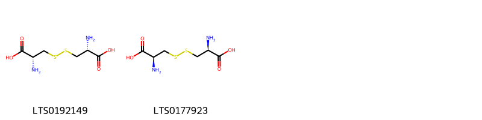{ width=100% }
    <figcaption>Hình ảnh cấu trúc hóa học của 2 hoạt chất thuộc nhóm Carboxylic acids and derivatives gồm ['l-cystine (LTS0192149)', 'd-cystine (LTS0177923)'].</figcaption>
</figure>
#### Nhóm Isoflavonoids
<figure markdown="span">
    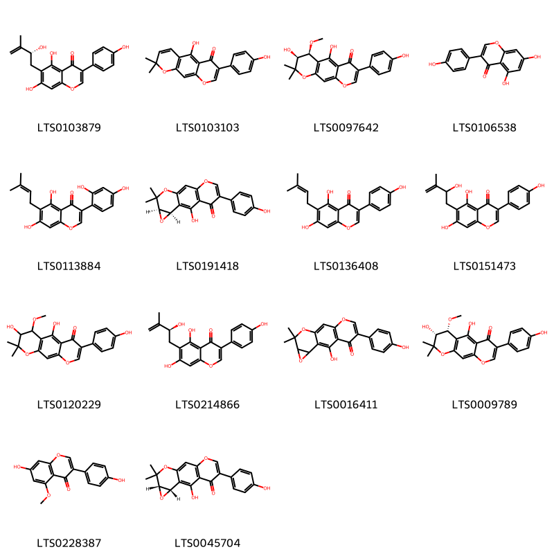{ width=100% }
    <figcaption>Hình ảnh cấu trúc hóa học của 14 hoạt chất thuộc nhóm Isoflavonoids gồm ['5,7-dihydroxy-6-[(2r)-2-hydroxy-3-methylbut-3-en-1-yl]-3-(4-hydroxyphenyl)chromen-4-one (LTS0103879)', 'alpinumisoflavone (LTS0103103)', '(6s,7s)-5,7-dihydroxy-3-(4-hydroxyphenyl)-6-methoxy-8,8-dimethyl-6h,7h-pyrano[3,2-g]chromen-4-one (LTS0097642)', 'genistein (LTS0106538)', 'luteone (LTS0113884)', '(11r,13r)-9-hydroxy-6-(4-hydroxyphenyl)-14,14-dimethyl-4,12,15-trioxatetracyclo[8.5.0.0³,⁸.0¹¹,¹³]pentadeca-1(10),2,5,8-tetraen-7-one (LTS0191418)', 'wighteone (LTS0136408)', '5,7-dihydroxy-6-(2-hydroxy-3-methylbut-3-en-1-yl)-3-(4-hydroxyphenyl)chromen-4-one (LTS0151473)', '5,7-dihydroxy-3-(4-hydroxyphenyl)-6-methoxy-8,8-dimethyl-6h,7h-pyrano[3,2-g]chromen-4-one (LTS0120229)', '5,7-dihydroxy-6-[(2s)-2-hydroxy-3-methylbut-3-en-1-yl]-3-(4-hydroxyphenyl)chromen-4-one (LTS0214866)', '9-hydroxy-6-(4-hydroxyphenyl)-14,14-dimethyl-4,12,15-trioxatetracyclo[8.5.0.0³,⁸.0¹¹,¹³]pentadeca-1(10),2,5,8-tetraen-7-one (LTS0016411)', '(6r,7r)-5,7-dihydroxy-3-(4-hydroxyphenyl)-6-methoxy-8,8-dimethyl-6h,7h-pyrano[3,2-g]chromen-4-one (LTS0009789)', '5-o-methylgenistein (LTS0228387)', '(11s,13s)-9-hydroxy-6-(4-hydroxyphenyl)-14,14-dimethyl-4,12,15-trioxatetracyclo[8.5.0.0³,⁸.0¹¹,¹³]pentadeca-1(10),2,5,8-tetraen-7-one (LTS0045704)'].</figcaption>
</figure>
#### Nhóm Lupin alkaloids
<figure markdown="span">
    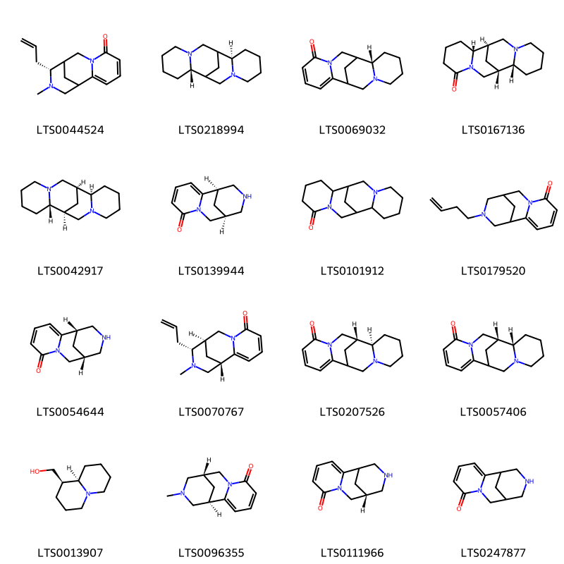{ width=100% }
    <figcaption>Hình ảnh cấu trúc hóa học của 16 hoạt chất thuộc nhóm Lupin alkaloids gồm ['tinctorine (LTS0044524)', '(2r,10s)-7,15-diazatetracyclo[7.7.1.0²,⁷.0¹⁰,¹⁵]heptadecane (LTS0218994)', 'thermospine (LTS0069032)', '(1r,2r,9s,10r)-7,15-diazatetracyclo[7.7.1.0²,⁷.0¹⁰,¹⁵]heptadecan-6-one (LTS0167136)', 'sparteine (LTS0042917)', 'cytisine (LTS0139944)', 'lupanine l-form (LTS0101912)', 'rhombifoline (LTS0179520)', '(1s,9r)-7,11-diazatricyclo[7.3.1.0²,⁷]trideca-2,4-dien-6-one (LTS0054644)', '(1s,9r,10r)-11-methyl-10-(prop-2-en-1-yl)-7,11-diazatricyclo[7.3.1.0²,⁷]trideca-2,4-dien-6-one (LTS0070767)', '(9r,10r)-7,15-diazatetracyclo[7.7.1.0²,⁷.0¹⁰,¹⁵]heptadeca-2,4-dien-6-one (LTS0207526)', '(9r,10s)-7,15-diazatetracyclo[7.7.1.0²,⁷.0¹⁰,¹⁵]heptadeca-2,4-dien-6-one (LTS0057406)', '(-)-lupinine (LTS0013907)', '(1r,9r)-11-methyl-7,11-diazatricyclo[7.3.1.0²,⁷]trideca-2,4-dien-6-one (LTS0096355)', '(9r)-7,11-diazatricyclo[7.3.1.0²,⁷]trideca-2,4-dien-6-one (LTS0111966)', 'citizin (LTS0247877)'].</figcaption>
</figure>
#### Nhóm Organooxygen compounds
<figure markdown="span">
    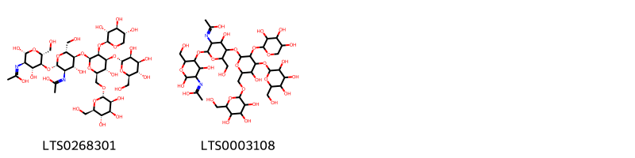{ width=100% }
    <figcaption>Hình ảnh cấu trúc hóa học của 2 hoạt chất thuộc nhóm Organooxygen compounds gồm ['n-[(2s,3r,4r,5s,6r)-2-{[(2r,3s,4r,5r,6r)-4,6-dihydroxy-5-[(1-hydroxyethylidene)amino]-2-(hydroxymethyl)oxan-3-yl]oxy}-4-hydroxy-5-{[(2s,3s,4s,5r,6r)-5-hydroxy-4-{[(2r,3s,4s,5s,6r)-3,4,5-trihydroxy-6-(hydroxymethyl)oxan-2-yl]oxy}-6-({[(2s,3s,4s,5s,6r)-3,4,5-trihydroxy-6-(hydroxymethyl)oxan-2-yl]oxy}methyl)-3-{[(2s,3r,4s,5r)-3,4,5-trihydroxyoxan-2-yl]oxy}oxan-2-yl]oxy}-6-(hydroxymethyl)oxan-3-yl]ethanimidic acid (LTS0268301)', 'n-[2,4-dihydroxy-5-({4-hydroxy-5-[(5-hydroxy-4-{[3,4,5-trihydroxy-6-(hydroxymethyl)oxan-2-yl]oxy}-6-({[3,4,5-trihydroxy-6-(hydroxymethyl)oxan-2-yl]oxy}methyl)-3-[(3,4,5-trihydroxyoxan-2-yl)oxy]oxan-2-yl)oxy]-3-[(1-hydroxyethylidene)amino]-6-(hydroxymethyl)oxan-2-yl}oxy)-6-(hydroxymethyl)oxan-3-yl]ethanimidic acid (LTS0003108)'].</figcaption>
</figure>
#### Nhóm Prenol lipids
<figure markdown="span">
    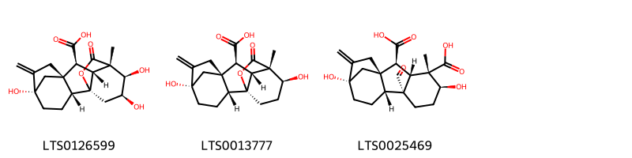{ width=100% }
    <figcaption>Hình ảnh cấu trúc hóa học của 3 hoạt chất thuộc nhóm Prenol lipids gồm ['gibberellin a8 (LTS0126599)', 'gibberellin a1 (LTS0013777)', '(1s,2s,3s,4s,5s,8r,9r,12s)-8-formyl-5,12-dihydroxy-4-methyl-13-methylidenetetracyclo[10.2.1.0¹,⁹.0³,⁸]pentadecane-2,4-dicarboxylic acid (LTS0025469)'].</figcaption>
</figure>
#### Nhóm Pyridines and derivatives
<figure markdown="span">
    { width=100% }
    <figcaption>Hình ảnh cấu trúc hóa học của 1 hoạt chất thuộc nhóm Pyridines and derivatives gồm ['ammodendrine (LTS0084410)'].</figcaption>
</figure>
#### Nhóm Pyridodiazepines
<figure markdown="span">
    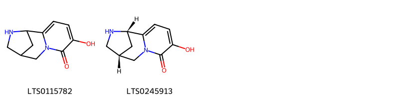{ width=100% }
    <figcaption>Hình ảnh cấu trúc hóa học của 2 hoạt chất thuộc nhóm Pyridodiazepines gồm ['5-hydroxy-7,11-diazatricyclo[7.2.1.0²,⁷]dodeca-2,4-dien-6-one (LTS0115782)', '(1s,9s)-5-hydroxy-7,11-diazatricyclo[7.2.1.0²,⁷]dodeca-2,4-dien-6-one (LTS0245913)'].</figcaption>
</figure>

---

### Dược dân tộc học

Danh sách các quốc gia có sử dụng *Laburnum anagyroides* trong điều trị các bệnh. 

| Country   | Disease   | Bệnh                                                                                                                                                                                                |
|:----------|:----------|:----------------------------------------------------------------------------------------------------------------------------------------------------------------------------------------------------|
| US        | Poison    | MYMEMORY WARNING: YOU USED ALL AVAILABLE FREE TRANSLATIONS FOR TODAY. NEXT AVAILABLE IN  18 HOURS 37 MINUTES 06 SECONDS VISIT HTTPS://MYMEMORY.TRANSLATED.NET/DOC/USAGELIMITS.PHP TO TRANSLATE MORE |

---

# Chi Genistella

??? note "Danh sách các dược liệu thuộc chi"
    
	 - *Genistella sagittata*
	 - *Genistella tridentata*

---
## Genistella sagittata
### Thông tin về thực vật

!!! info "Phân loại thực vật của *N/A* từ GIBF:"
    - **Kingdom:** Plantae
    - **Phylum:** Tracheophyta
    - **Order:** Fabales
    - **Family:** Fabaceae
    - **Genus:** Genista
    - **Species:** *N/A*

 

| Label (VI)   | Label (EN)   | Scientific Name      | Descriptions (VI)   | Descriptions (EN)   | Also Known As (VI)   | Also Known As (EN)   |
|:-------------|:-------------|:---------------------|:--------------------|:--------------------|:---------------------|:---------------------|
| N/A          | N/A          | Laburnum anagyroides | loài thực vật       | species of plant    | ['']                 | ['Common Laburnum']  |

#### Phân bố trên thế giới

**Từ CSDL GIBF** nan, Luxembourg, Spain, Türkiye, unknown or invalid, Morocco

#### Phân bố tại Việt Nam

**Từ CSDL GIBF**: Không có ghi nhận ở Việt Nam

---
### Thành phần hóa học
        
- Theo cơ sở dữ liệu lotus: Từ loài *N/A* đã phân lập và xác định được Chưa có hoạt chất nào được phân lập. hoạt chất thuộc về các nhóm Không có hoạt chất nào được phân lập. 

Không có hình ảnh nào được tạo ra

---

### Dược dân tộc học

Danh sách các quốc gia có sử dụng *N/A* trong điều trị các bệnh. 

| Country   | Disease   | Bệnh                                                                                                                                                                                                |
|:----------|:----------|:----------------------------------------------------------------------------------------------------------------------------------------------------------------------------------------------------|
| ain       | Diuretic  | MYMEMORY WARNING: YOU USED ALL AVAILABLE FREE TRANSLATIONS FOR TODAY. NEXT AVAILABLE IN  18 HOURS 36 MINUTES 37 SECONDS VISIT HTTPS://MYMEMORY.TRANSLATED.NET/DOC/USAGELIMITS.PHP TO TRANSLATE MORE |

---

---
## Genistella tridentata
### Thông tin về thực vật

!!! info "Phân loại thực vật của *Genista tridentata* từ GIBF:"
    - **Kingdom:** Plantae
    - **Phylum:** Tracheophyta
    - **Order:** Fabales
    - **Family:** Fabaceae
    - **Genus:** Genista
    - **Species:** *Genista tridentata*

 

| Label (VI)   | Label (EN)   | Scientific Name       | Descriptions (VI)   | Descriptions (EN)   | Also Known As (VI)   | Also Known As (EN)   |
|:-------------|:-------------|:----------------------|:--------------------|:--------------------|:---------------------|:---------------------|
| N/A          | N/A          | Genistella tridentata |                     |                     | ['']                 | ['']                 |

#### Phân bố trên thế giới

**Từ CSDL GIBF** Portugal, Spain

#### Phân bố tại Việt Nam

**Từ CSDL GIBF**: Không có ghi nhận ở Việt Nam

---
### Thành phần hóa học
        
- Theo cơ sở dữ liệu lotus: Từ loài *Genista tridentata* đã phân lập và xác định được Chưa có hoạt chất nào được phân lập. hoạt chất thuộc về các nhóm Không có hoạt chất nào được phân lập. 

Không có hình ảnh nào được tạo ra

---

### Dược dân tộc học

Danh sách các quốc gia có sử dụng *Genista tridentata* trong điều trị các bệnh. 

| Country   | Disease   | Bệnh                                                                                                                                                                                                |
|:----------|:----------|:----------------------------------------------------------------------------------------------------------------------------------------------------------------------------------------------------|
| Portugal  | Emollient | MYMEMORY WARNING: YOU USED ALL AVAILABLE FREE TRANSLATIONS FOR TODAY. NEXT AVAILABLE IN  18 HOURS 36 MINUTES 21 SECONDS VISIT HTTPS://MYMEMORY.TRANSLATED.NET/DOC/USAGELIMITS.PHP TO TRANSLATE MORE |
| ain       | Diuretic  | MYMEMORY WARNING: YOU USED ALL AVAILABLE FREE TRANSLATIONS FOR TODAY. NEXT AVAILABLE IN  18 HOURS 36 MINUTES 19 SECONDS VISIT HTTPS://MYMEMORY.TRANSLATED.NET/DOC/USAGELIMITS.PHP TO TRANSLATE MORE |

---

# Chi Flemingia

??? note "Danh sách các dược liệu thuộc chi"
    
	 - *Flemingia bracteata*
	 - *Flemingia grahamiana*
	 - *Flemingia strobilifera*

---
## Flemingia bracteata
### Thông tin về thực vật

!!! info "Phân loại thực vật của *Flemingia bracteata* từ GIBF:"
    - **Kingdom:** Plantae
    - **Phylum:** Tracheophyta
    - **Order:** Fabales
    - **Family:** Fabaceae
    - **Genus:** Flemingia
    - **Species:** *Flemingia bracteata*

 

| Label (VI)   | Label (EN)   | Scientific Name     | Descriptions (VI)   | Descriptions (EN)   | Also Known As (VI)   | Also Known As (EN)   |
|:-------------|:-------------|:--------------------|:--------------------|:--------------------|:---------------------|:---------------------|
| N/A          | N/A          | Flemingia bracteata |                     |                     | ['']                 | ['']                 |

#### Phân bố trên thế giới

**Từ CSDL GIBF** nan, Trinidad and Tobago, Thailand, Myanmar, India, Indonesia, Bangladesh, China, Nepal

#### Phân bố tại Việt Nam

**Từ CSDL GIBF**: Không có ghi nhận ở Việt Nam

---
### Thành phần hóa học
        
- Theo cơ sở dữ liệu lotus: Từ loài *Flemingia bracteata* đã phân lập và xác định được Chưa có hoạt chất nào được phân lập. hoạt chất thuộc về các nhóm Không có hoạt chất nào được phân lập. 

Không có hình ảnh nào được tạo ra

---

### Dược dân tộc học

Danh sách các quốc gia có sử dụng *Flemingia bracteata* trong điều trị các bệnh. 

| Country   | Disease   | Bệnh                                                                                                                                                                                                |
|:----------|:----------|:----------------------------------------------------------------------------------------------------------------------------------------------------------------------------------------------------|
| India     | Sedative  | MYMEMORY WARNING: YOU USED ALL AVAILABLE FREE TRANSLATIONS FOR TODAY. NEXT AVAILABLE IN  18 HOURS 36 MINUTES 01 SECONDS VISIT HTTPS://MYMEMORY.TRANSLATED.NET/DOC/USAGELIMITS.PHP TO TRANSLATE MORE |

---

---
## Flemingia grahamiana
### Thông tin về thực vật

!!! info "Phân loại thực vật của *Flemingia grahamiana* từ GIBF:"
    - **Kingdom:** Plantae
    - **Phylum:** Tracheophyta
    - **Order:** Fabales
    - **Family:** Fabaceae
    - **Genus:** Flemingia
    - **Species:** *Flemingia grahamiana*

 

| Label (VI)   | Label (EN)   | Scientific Name      | Descriptions (VI)   | Descriptions (EN)   | Also Known As (VI)   | Also Known As (EN)   |
|:-------------|:-------------|:---------------------|:--------------------|:--------------------|:---------------------|:---------------------|
| N/A          | N/A          | Flemingia grahamiana | loài thực vật       | species of plant    | ['']                 | ['']                 |

#### Phân bố trên thế giới

**Từ CSDL GIBF** nan, Central African Republic, Lao People’s Democratic Republic, Cambodia, Angola, Myanmar, Mozambique, Tanzania, United Republic of, Malawi, Zambia, Nigeria, Sudan, Congo, Democratic Republic of the, Guinea, Zimbabwe, South Africa, Uganda, Thailand, Côte d’Ivoire, Brazil, Viet Nam, Eswatini, China, Burundi, India, Kenya, Cameroon, Ethiopia

#### Phân bố tại Việt Nam

**Từ CSDL GIBF**: Không có ghi nhận ở Việt Nam

---
### Thành phần hóa học
        
- Theo cơ sở dữ liệu lotus: Từ loài *Flemingia grahamiana* đã phân lập và xác định được 4 hoạt chất thuộc về các nhóm Linear 1,3-diarylpropanoids. 

|    | chemicalTaxonomyClassyfireClass   |   smiles_count |
|---:|:----------------------------------|---------------:|
|  0 | Linear 1,3-diarylpropanoids       |              4 |

#### Nhóm Linear 1_3-diarylpropanoids
<figure markdown="span">
    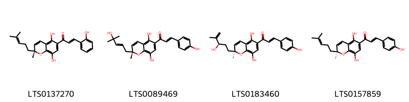{ width=100% }
    <figcaption>Hình ảnh cấu trúc hóa học của Không tìm thấy chú thích hoạt chất thuộc nhóm Linear 1_3-diarylpropanoids gồm Không tìm thấy chú thích.</figcaption>
</figure>

---

### Dược dân tộc học

Danh sách các quốc gia có sử dụng *Flemingia grahamiana* trong điều trị các bệnh. 

| Country   | Disease   | Bệnh                                                                                                                                                                                                |
|:----------|:----------|:----------------------------------------------------------------------------------------------------------------------------------------------------------------------------------------------------|
| Arabia    | Vermifuge | MYMEMORY WARNING: YOU USED ALL AVAILABLE FREE TRANSLATIONS FOR TODAY. NEXT AVAILABLE IN  18 HOURS 35 MINUTES 42 SECONDS VISIT HTTPS://MYMEMORY.TRANSLATED.NET/DOC/USAGELIMITS.PHP TO TRANSLATE MORE |

---

---
## Flemingia strobilifera
### Thông tin về thực vật

!!! info "Phân loại thực vật của *Flemingia strobilifera* từ GIBF:"
    - **Kingdom:** Plantae
    - **Phylum:** Tracheophyta
    - **Order:** Fabales
    - **Family:** Fabaceae
    - **Genus:** Flemingia
    - **Species:** *Flemingia strobilifera*

 

| Label (VI)   | Label (EN)   | Scientific Name        | Descriptions (VI)   | Descriptions (EN)   | Also Known As (VI)   | Also Known As (EN)   |
|:-------------|:-------------|:-----------------------|:--------------------|:--------------------|:---------------------|:---------------------|
| N/A          | N/A          | Flemingia strobilifera | loài thực vật       | species of plant    | ['']                 | ['']                 |

#### Phân bố trên thế giới

**Từ CSDL GIBF** nan, Guadeloupe, Lao People’s Democratic Republic, Myanmar, Saint Lucia, Nicaragua, Panama, Chinese Taipei, Jamaica, Trinidad and Tobago, Barbados, Saint Vincent and the Grenadines, Thailand, Martinique, Guam, Bhutan, Dominica, Dominican Republic, Singapore, French Polynesia, Madagascar, Colombia, Costa Rica, Vanuatu, India, Indonesia, Samoa, Philippines, Malaysia, Nepal

#### Phân bố tại Việt Nam

**Từ CSDL GIBF**: Không có ghi nhận ở Việt Nam

---
### Thành phần hóa học
        
- Theo cơ sở dữ liệu lotus: Từ loài *Flemingia strobilifera* đã phân lập và xác định được 1 hoạt chất thuộc về các nhóm Linear 1,3-diarylpropanoids. 

|    | chemicalTaxonomyClassyfireClass   |   smiles_count |
|---:|:----------------------------------|---------------:|
|  0 | Linear 1,3-diarylpropanoids       |              1 |

#### Nhóm Linear 1_3-diarylpropanoids
<figure markdown="span">
    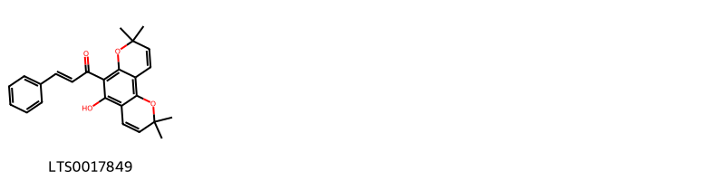{ width=100% }
    <figcaption>Hình ảnh cấu trúc hóa học của Không tìm thấy chú thích hoạt chất thuộc nhóm Linear 1_3-diarylpropanoids gồm Không tìm thấy chú thích.</figcaption>
</figure>

---

### Dược dân tộc học

Danh sách các quốc gia có sử dụng *Flemingia strobilifera* trong điều trị các bệnh. 

| Country       | Disease              | Bệnh                                                                                                                                                                                                |
|:--------------|:---------------------|:----------------------------------------------------------------------------------------------------------------------------------------------------------------------------------------------------|
| India(Santal) | Sedative             | MYMEMORY WARNING: YOU USED ALL AVAILABLE FREE TRANSLATIONS FOR TODAY. NEXT AVAILABLE IN  18 HOURS 35 MINUTES 21 SECONDS VISIT HTTPS://MYMEMORY.TRANSLATED.NET/DOC/USAGELIMITS.PHP TO TRANSLATE MORE |
| Java          | Vermifuge, Vermifuge | MYMEMORY WARNING: YOU USED ALL AVAILABLE FREE TRANSLATIONS FOR TODAY. NEXT AVAILABLE IN  18 HOURS 35 MINUTES 19 SECONDS VISIT HTTPS://MYMEMORY.TRANSLATED.NET/DOC/USAGELIMITS.PHP TO TRANSLATE MORE |

---

# Chi Parkinsonia

??? note "Danh sách các dược liệu thuộc chi"
    
	 - *Parkinsonia aculeata*

---
## Parkinsonia aculeata
### Thông tin về thực vật

!!! info "Phân loại thực vật của *Parkinsonia aculeata* từ GIBF:"
    - **Kingdom:** Plantae
    - **Phylum:** Tracheophyta
    - **Order:** Fabales
    - **Family:** Fabaceae
    - **Genus:** Parkinsonia
    - **Species:** *Parkinsonia aculeata*

 

| Label (VI)   | Label (EN)   | Scientific Name      | Descriptions (VI)   | Descriptions (EN)   | Also Known As (VI)   | Also Known As (EN)   |
|:-------------|:-------------|:---------------------|:--------------------|:--------------------|:---------------------|:---------------------|
| N/A          | N/A          | Parkinsonia aculeata | loài thực vật       | species of plant    | ['']                 | ['taxon']            |

#### Phân bố trên thế giới

**Từ CSDL GIBF** nan, Australia, Argentina, Nicaragua, Israel, Spain, Honduras, Morocco, United States of America, Uruguay, Chile, Greece, Martinique, Brazil, Peru, Mexico, Ecuador, Cabo Verde, Botswana, India, Antigua and Barbuda, Kenya

#### Phân bố tại Việt Nam

**Từ CSDL GIBF**: Không có ghi nhận ở Việt Nam

---
### Thành phần hóa học
        
- Theo cơ sở dữ liệu lotus: Từ loài *Parkinsonia aculeata* đã phân lập và xác định được 36 hoạt chất thuộc về các nhóm Fatty Acyls, Flavonoids, Prenol lipids. 

|    | chemicalTaxonomyClassyfireClass   |   smiles_count |
|---:|:----------------------------------|---------------:|
|  0 | Fatty Acyls                       |              1 |
|  1 | Flavonoids                        |             31 |
|  2 | Prenol lipids                     |              4 |

#### Nhóm Fatty Acyls
<figure markdown="span">
    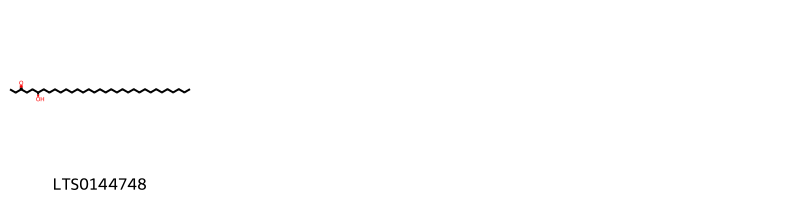{ width=100% }
    <figcaption>Hình ảnh cấu trúc hóa học của 1 hoạt chất thuộc nhóm Fatty Acyls gồm ['6-hydroxytritriacontan-3-one (LTS0144748)'].</figcaption>
</figure>
#### Nhóm Flavonoids
<figure markdown="span">
    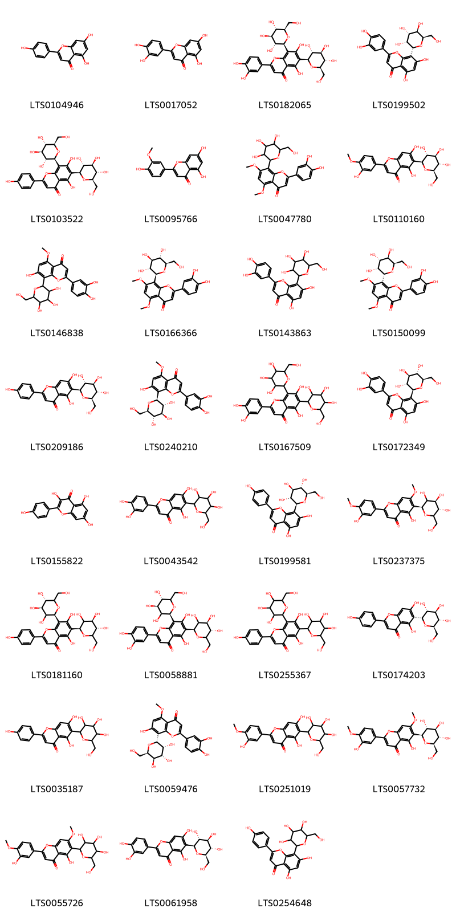{ width=100% }
    <figcaption>Hình ảnh cấu trúc hóa học của 31 hoạt chất thuộc nhóm Flavonoids gồm ['chamomile (LTS0104946)', 'luteolin (LTS0017052)', 'lucenin-2 (LTS0182065)', '2-(3,4-dihydroxyphenyl)-5,7-dihydroxy-8-[(2r,3r,4s,5r,6r)-3,4,5-trihydroxy-6-(hydroxymethyl)oxan-2-yl]chromen-4-one (LTS0199502)', 'vicenin-2 (LTS0103522)', 'chrysoeriol (LTS0095766)', '2-(3,4-dihydroxyphenyl)-5,7-dimethoxy-8-[3,4,5-trihydroxy-6-(hydroxymethyl)oxan-2-yl]chromen-4-one (LTS0047780)', '5,7-dihydroxy-2-(3-hydroxy-4-methoxyphenyl)-6-[(2s,3r,4r,5s,6r)-3,4,5-trihydroxy-6-(hydroxymethyl)oxan-2-yl]chromen-4-one (LTS0110160)', '2-(3,4-dihydroxyphenyl)-7-hydroxy-5-methoxy-8-[3,4,5-trihydroxy-6-(hydroxymethyl)oxan-2-yl]chromen-4-one (LTS0146838)', '2-(3,4-dihydroxyphenyl)-5,7-dimethoxy-8-[(2s,3r,4r,5s,6r)-3,4,5-trihydroxy-6-(hydroxymethyl)oxan-2-yl]chromen-4-one (LTS0166366)', 'orientin (LTS0143863)', '2-(3,4-dihydroxyphenyl)-5,7-dimethoxy-8-[(2r,3r,4s,5r,6r)-3,4,5-trihydroxy-6-(hydroxymethyl)oxan-2-yl]chromen-4-one (LTS0150099)', 'isovitexin (LTS0209186)', '2-(3,4-dihydroxyphenyl)-7-hydroxy-5-methoxy-8-[(2s,3r,4r,5s,6r)-3,4,5-trihydroxy-6-(hydroxymethyl)oxan-2-yl]chromen-4-one (LTS0240210)', '2-(3,4-dihydroxyphenyl)-5,7-dihydroxy-6,8-bis[3,4,5-trihydroxy-6-(hydroxymethyl)oxan-2-yl]chromen-4-one (LTS0167509)', 'orientin (LTS0172349)', 'kaempherol (LTS0155822)', 'isoorientin (LTS0043542)', 'vitexin (LTS0199581)', '6-c-glucopyranosylpilloin (LTS0237375)', 'vicenin 2 (LTS0181160)', 'lucenin 2 (LTS0058881)', '5,7-dihydroxy-2-(4-hydroxyphenyl)-6,8-bis[3,4,5-trihydroxy-6-(hydroxymethyl)oxan-2-yl]chromen-4-one (LTS0255367)', '5,7-dihydroxy-2-(4-hydroxyphenyl)-6-[(2r,3r,4r,5s,6r)-3,4,5-trihydroxy-6-(hydroxymethyl)oxan-2-yl]chromen-4-one (LTS0174203)', 'isovitexin (LTS0035187)', '2-(3,4-dihydroxyphenyl)-7-hydroxy-5-methoxy-8-[(2r,3r,4s,5r,6r)-3,4,5-trihydroxy-6-(hydroxymethyl)oxan-2-yl]chromen-4-one (LTS0059476)', '5,7-dihydroxy-2-(3-hydroxy-4-methoxyphenyl)-6-[3,4,5-trihydroxy-6-(hydroxymethyl)oxan-2-yl]chromen-4-one (LTS0251019)', '5-hydroxy-2-(3-hydroxy-4-methoxyphenyl)-7-methoxy-6-[(2s,3r,4r,5s,6r)-3,4,5-trihydroxy-6-(hydroxymethyl)oxan-2-yl]chromen-4-one (LTS0057732)', '5-hydroxy-2-(3-hydroxy-4-methoxyphenyl)-7-methoxy-6-[3,4,5-trihydroxy-6-(hydroxymethyl)oxan-2-yl]chromen-4-one (LTS0055726)', 'isoorientin (LTS0061958)', 'vitexin (LTS0254648)'].</figcaption>
</figure>
#### Nhóm Prenol lipids
<figure markdown="span">
    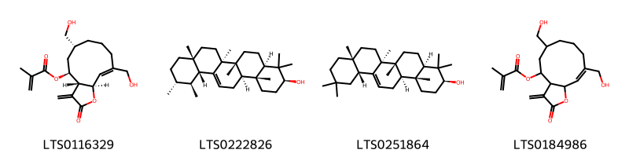{ width=100% }
    <figcaption>Hình ảnh cấu trúc hóa học của 4 hoạt chất thuộc nhóm Prenol lipids gồm ['(3ar,4s,6r,11ar)-6,10-bis(hydroxymethyl)-3-methylidene-2-oxo-3ah,4h,5h,6h,7h,8h,9h,11ah-cyclodeca[b]furan-4-yl 2-methylprop-2-enoate (LTS0116329)', 'amyrin (LTS0222826)', 'β-amyrin (LTS0251864)', '6,10-bis(hydroxymethyl)-3-methylidene-2-oxo-3ah,4h,5h,6h,7h,8h,9h,11ah-cyclodeca[b]furan-4-yl 2-methylprop-2-enoate (LTS0184986)'].</figcaption>
</figure>

---

### Dược dân tộc học

Danh sách các quốc gia có sử dụng *Parkinsonia aculeata* trong điều trị các bệnh. 

| Country   | Disease                                            | Bệnh                                                                                                                                                                                                |
|:----------|:---------------------------------------------------|:----------------------------------------------------------------------------------------------------------------------------------------------------------------------------------------------------|
| Elsewhere | Abortifacient, Diaphoretic                         | MYMEMORY WARNING: YOU USED ALL AVAILABLE FREE TRANSLATIONS FOR TODAY. NEXT AVAILABLE IN  18 HOURS 34 MINUTES 54 SECONDS VISIT HTTPS://MYMEMORY.TRANSLATED.NET/DOC/USAGELIMITS.PHP TO TRANSLATE MORE |
| Haiti     | Sudorific                                          | MYMEMORY WARNING: YOU USED ALL AVAILABLE FREE TRANSLATIONS FOR TODAY. NEXT AVAILABLE IN  18 HOURS 34 MINUTES 52 SECONDS VISIT HTTPS://MYMEMORY.TRANSLATED.NET/DOC/USAGELIMITS.PHP TO TRANSLATE MORE |
| Mexico    | Abortifacient, Sudorific, Abortifacient, Sudorific | MYMEMORY WARNING: YOU USED ALL AVAILABLE FREE TRANSLATIONS FOR TODAY. NEXT AVAILABLE IN  18 HOURS 34 MINUTES 49 SECONDS VISIT HTTPS://MYMEMORY.TRANSLATED.NET/DOC/USAGELIMITS.PHP TO TRANSLATE MORE |

---

# Chi Saraca

??? note "Danh sách các dược liệu thuộc chi"
    
	 - *Saraca asoca*

---
## Saraca asoca
### Thông tin về thực vật

!!! info "Phân loại thực vật của *Saraca asoca* từ GIBF:"
    - **Kingdom:** Plantae
    - **Phylum:** Tracheophyta
    - **Order:** Fabales
    - **Family:** Fabaceae
    - **Genus:** Saraca
    - **Species:** *Saraca asoca*

 

| Label (VI)   | Label (EN)   | Scientific Name   | Descriptions (VI)   | Descriptions (EN)   | Also Known As (VI)                | Also Known As (EN)   |
|:-------------|:-------------|:------------------|:--------------------|:--------------------|:----------------------------------|:---------------------|
| N/A          | N/A          | Saraca asoca      | loài thực vật       | species of plant    | ['Saraca indica', 'Saraca asoca'] | ['Ashoka tree']      |

#### Phân bố trên thế giới

**Từ CSDL GIBF** India

#### Phân bố tại Việt Nam

**Từ CSDL GIBF**: Không có ghi nhận ở Việt Nam

---
### Thành phần hóa học
        
- Theo cơ sở dữ liệu lotus: Từ loài *Saraca asoca* đã phân lập và xác định được 20 hoạt chất thuộc về các nhóm Flavonoids, Steroids and steroid derivatives, Stilbenes, Lignan glycosides. 

|    | chemicalTaxonomyClassyfireClass   |   smiles_count |
|---:|:----------------------------------|---------------:|
|  0 | Flavonoids                        |              9 |
|  1 | Lignan glycosides                 |              6 |
|  2 | Steroids and steroid derivatives  |              3 |
|  3 | Stilbenes                         |              1 |

#### Nhóm Flavonoids
<figure markdown="span">
    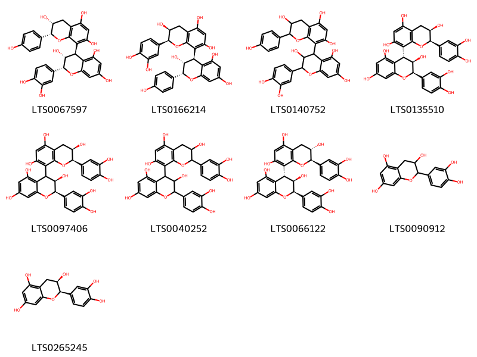{ width=100% }
    <figcaption>Hình ảnh cấu trúc hóa học của 9 hoạt chất thuộc nhóm Flavonoids gồm ['(2r,3r)-8-[(2r,3r,4r)-2-(3,4-dihydroxyphenyl)-3,5,7-trihydroxy-3,4-dihydro-2h-1-benzopyran-4-yl]-2-(4-hydroxyphenyl)-3,4-dihydro-2h-1-benzopyran-3,5,7-triol (LTS0067597)', '(2r,3r,4r)-4-[(2s,3s)-2-(3,4-dihydroxyphenyl)-3,5,7-trihydroxy-3,4-dihydro-2h-1-benzopyran-8-yl]-2-(4-hydroxyphenyl)-3,4-dihydro-2h-1-benzopyran-3,5,7-triol (LTS0166214)', '8-[2-(3,4-dihydroxyphenyl)-3,5,7-trihydroxy-3,4-dihydro-2h-1-benzopyran-4-yl]-2-(4-hydroxyphenyl)-3,4-dihydro-2h-1-benzopyran-3,5,7-triol (LTS0140752)', '(2r,3r,4r)-2-(3,4-dihydroxyphenyl)-4-[(2r,3r)-2-(3,4-dihydroxyphenyl)-3,5,7-trihydroxy-3,4-dihydro-2h-1-benzopyran-8-yl]-3,4-dihydro-2h-1-benzopyran-3,5,7-triol (LTS0135510)', '(2r,3r)-2-(3,4-dihydroxyphenyl)-4-[(2r,3r)-2-(3,4-dihydroxyphenyl)-3,5,7-trihydroxy-3,4-dihydro-2h-1-benzopyran-8-yl]-3,4-dihydro-2h-1-benzopyran-3,5,7-triol (LTS0097406)', '2-(3,4-dihydroxyphenyl)-4-[2-(3,4-dihydroxyphenyl)-3,5,7-trihydroxy-3,4-dihydro-2h-1-benzopyran-8-yl]-3,4-dihydro-2h-1-benzopyran-3,5,7-triol (LTS0040252)', '(2r,3r,4r)-2-(3,4-dihydroxyphenyl)-4-[(2r,3s)-2-(3,4-dihydroxyphenyl)-3,5,7-trihydroxy-3,4-dihydro-2h-1-benzopyran-8-yl]-3,4-dihydro-2h-1-benzopyran-3,5,7-triol (LTS0066122)', 'catechol (LTS0090912)', 'ent-epicatechin (LTS0265245)'].</figcaption>
</figure>
#### Nhóm Lignan glycosides
<figure markdown="span">
    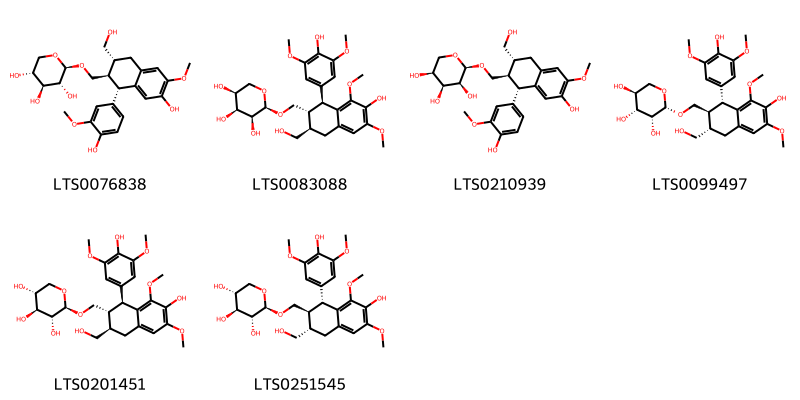{ width=100% }
    <figcaption>Hình ảnh cấu trúc hóa học của 6 hoạt chất thuộc nhóm Lignan glycosides gồm ['(2r,3r,4s,5r)-2-{[(1s,2r,3r)-7-hydroxy-1-(4-hydroxy-3-methoxyphenyl)-3-(hydroxymethyl)-6-methoxy-1,2,3,4-tetrahydronaphthalen-2-yl]methoxy}oxane-3,4,5-triol (LTS0076838)', '(2r,3s,4s,5s)-2-{[(1s,2r,3r)-7-hydroxy-1-(4-hydroxy-3,5-dimethoxyphenyl)-3-(hydroxymethyl)-6,8-dimethoxy-1,2,3,4-tetrahydronaphthalen-2-yl]methoxy}oxane-3,4,5-triol (LTS0083088)', '(2r,3s,4s,5s)-2-{[(1s,2r,3r)-7-hydroxy-1-(4-hydroxy-3-methoxyphenyl)-3-(hydroxymethyl)-6-methoxy-1,2,3,4-tetrahydronaphthalen-2-yl]methoxy}oxane-3,4,5-triol (LTS0210939)', '(2s,3r,4r,5s)-2-{[(1r,2s,3s)-7-hydroxy-1-(4-hydroxy-3,5-dimethoxyphenyl)-3-(hydroxymethyl)-6,8-dimethoxy-1,2,3,4-tetrahydronaphthalen-2-yl]methoxy}oxane-3,4,5-triol (LTS0099497)', '(2r,3r,4s,5r)-2-{[(1s,2r,3r)-7-hydroxy-1-(4-hydroxy-3,5-dimethoxyphenyl)-3-(hydroxymethyl)-6,8-dimethoxy-1,2,3,4-tetrahydronaphthalen-2-yl]methoxy}oxane-3,4,5-triol (LTS0201451)', '(2r,3r,4s,5r)-2-{[(1r,2s,3s)-7-hydroxy-1-(4-hydroxy-3,5-dimethoxyphenyl)-3-(hydroxymethyl)-6,8-dimethoxy-1,2,3,4-tetrahydronaphthalen-2-yl]methoxy}oxane-3,4,5-triol (LTS0251545)'].</figcaption>
</figure>
#### Nhóm Steroids and steroid derivatives
<figure markdown="span">
    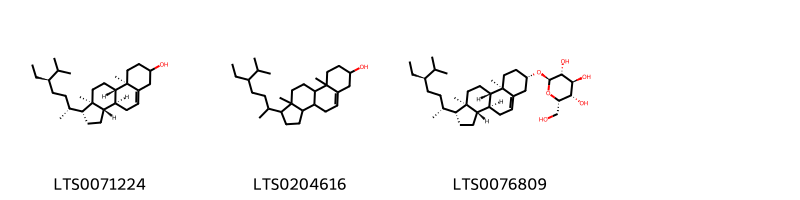{ width=100% }
    <figcaption>Hình ảnh cấu trúc hóa học của 3 hoạt chất thuộc nhóm Steroids and steroid derivatives gồm ['stigmast-5-en-3-ol (LTS0071224)', 'stigmast-5-en-3-ol, (3β)- (LTS0204616)', '(2r,3r,4s,5s,6s)-2-{[(1r,3as,3bs,7s,9ar,9bs,11ar)-1-[(2r,5r)-5-ethyl-6-methylheptan-2-yl]-9a,11a-dimethyl-1h,2h,3h,3ah,3bh,4h,6h,7h,8h,9h,9bh,10h,11h-cyclopenta[a]phenanthren-7-yl]oxy}-6-(hydroxymethyl)oxane-3,4,5-triol (LTS0076809)'].</figcaption>
</figure>
#### Nhóm Stilbenes
<figure markdown="span">
    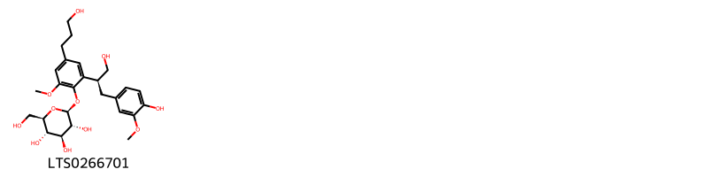{ width=100% }
    <figcaption>Hình ảnh cấu trúc hóa học của 1 hoạt chất thuộc nhóm Stilbenes gồm ['(2s,3r,4s,5s,6r)-2-{2-[(2s)-1-hydroxy-3-(4-hydroxy-3-methoxyphenyl)propan-2-yl]-4-(3-hydroxypropyl)-6-methoxyphenoxy}-6-(hydroxymethyl)oxane-3,4,5-triol (LTS0266701)'].</figcaption>
</figure>

---

### Dược dân tộc học

Danh sách các quốc gia có sử dụng *Saraca asoca* trong điều trị các bệnh. 

| Country   | Disease                                     | Bệnh                                                                                                                                                                                                |
|:----------|:--------------------------------------------|:----------------------------------------------------------------------------------------------------------------------------------------------------------------------------------------------------|
| Elsewhere | Oxytoxic, nan                               | MYMEMORY WARNING: YOU USED ALL AVAILABLE FREE TRANSLATIONS FOR TODAY. NEXT AVAILABLE IN  18 HOURS 34 MINUTES 00 SECONDS VISIT HTTPS://MYMEMORY.TRANSLATED.NET/DOC/USAGELIMITS.PHP TO TRANSLATE MORE |
| India     | Androgenic, Sedative, Uterotonic, Stimulant | MYMEMORY WARNING: YOU USED ALL AVAILABLE FREE TRANSLATIONS FOR TODAY. NEXT AVAILABLE IN  18 HOURS 33 MINUTES 58 SECONDS VISIT HTTPS://MYMEMORY.TRANSLATED.NET/DOC/USAGELIMITS.PHP TO TRANSLATE MORE |

---

# Chi Eriosema

??? note "Danh sách các dược liệu thuộc chi"
    
	 - *Eriosema cordatum*
	 - *Eriosema grandiflorum*
	 - *Eriosema montanum*
	 - *Eriosema psoraleoides*

---
## Eriosema cordatum
### Thông tin về thực vật

!!! info "Phân loại thực vật của *Eriosema cordatum* từ GIBF:"
    - **Kingdom:** Plantae
    - **Phylum:** Tracheophyta
    - **Order:** Fabales
    - **Family:** Fabaceae
    - **Genus:** Eriosema
    - **Species:** *Eriosema cordatum*

 

| Label (VI)   | Label (EN)   | Scientific Name   | Descriptions (VI)   | Descriptions (EN)   | Also Known As (VI)   | Also Known As (EN)   |
|:-------------|:-------------|:------------------|:--------------------|:--------------------|:---------------------|:---------------------|
| N/A          | N/A          | Eriosema cordatum | loài thực vật       | species of plant    | ['']                 | ['']                 |

#### Phân bố trên thế giới

**Từ CSDL GIBF** South Africa, Eswatini, Mozambique

#### Phân bố tại Việt Nam

**Từ CSDL GIBF**: Không có ghi nhận ở Việt Nam

---
### Thành phần hóa học
        
- Theo cơ sở dữ liệu lotus: Từ loài *Eriosema cordatum* đã phân lập và xác định được Chưa có hoạt chất nào được phân lập. hoạt chất thuộc về các nhóm Không có hoạt chất nào được phân lập. 

Không có hình ảnh nào được tạo ra

---

### Dược dân tộc học

Danh sách các quốc gia có sử dụng *Eriosema cordatum* trong điều trị các bệnh. 

| Country   | Disease   | Bệnh                                                                                                                                                                                                |
|:----------|:----------|:----------------------------------------------------------------------------------------------------------------------------------------------------------------------------------------------------|
| Lesotho   | Stimulant | MYMEMORY WARNING: YOU USED ALL AVAILABLE FREE TRANSLATIONS FOR TODAY. NEXT AVAILABLE IN  18 HOURS 33 MINUTES 13 SECONDS VISIT HTTPS://MYMEMORY.TRANSLATED.NET/DOC/USAGELIMITS.PHP TO TRANSLATE MORE |

---

---
## Eriosema grandiflorum
### Thông tin về thực vật

!!! info "Phân loại thực vật của *Eriosema grandiflorum* từ GIBF:"
    - **Kingdom:** Plantae
    - **Phylum:** Tracheophyta
    - **Order:** Fabales
    - **Family:** Fabaceae
    - **Genus:** Eriosema
    - **Species:** *Eriosema grandiflorum*

 

| Label (VI)   | Label (EN)   | Scientific Name       | Descriptions (VI)   | Descriptions (EN)   | Also Known As (VI)   | Also Known As (EN)   |
|:-------------|:-------------|:----------------------|:--------------------|:--------------------|:---------------------|:---------------------|
| N/A          | N/A          | Eriosema grandiflorum | loài thực vật       | species of plant    | ['']                 | ['']                 |

#### Phân bố trên thế giới

**Từ CSDL GIBF** South Africa, United States of America, Mexico

#### Phân bố tại Việt Nam

**Từ CSDL GIBF**: Không có ghi nhận ở Việt Nam

---
### Thành phần hóa học
        
- Theo cơ sở dữ liệu lotus: Từ loài *Eriosema grandiflorum* đã phân lập và xác định được Chưa có hoạt chất nào được phân lập. hoạt chất thuộc về các nhóm Không có hoạt chất nào được phân lập. 

Không có hình ảnh nào được tạo ra

---

### Dược dân tộc học

Danh sách các quốc gia có sử dụng *Eriosema grandiflorum* trong điều trị các bệnh. 

| Country   | Disease     | Bệnh                                                                                                                                                                                                |
|:----------|:------------|:----------------------------------------------------------------------------------------------------------------------------------------------------------------------------------------------------|
| Mexico    | Insecticide | MYMEMORY WARNING: YOU USED ALL AVAILABLE FREE TRANSLATIONS FOR TODAY. NEXT AVAILABLE IN  18 HOURS 32 MINUTES 31 SECONDS VISIT HTTPS://MYMEMORY.TRANSLATED.NET/DOC/USAGELIMITS.PHP TO TRANSLATE MORE |

---

---
## Eriosema montanum
### Thông tin về thực vật

!!! info "Phân loại thực vật của *Eriosema montanum* từ GIBF:"
    - **Kingdom:** Plantae
    - **Phylum:** Tracheophyta
    - **Order:** Fabales
    - **Family:** Fabaceae
    - **Genus:** Eriosema
    - **Species:** *Eriosema montanum*

 

| Label (VI)   | Label (EN)   | Scientific Name   | Descriptions (VI)   | Descriptions (EN)   | Also Known As (VI)   | Also Known As (EN)   |
|:-------------|:-------------|:------------------|:--------------------|:--------------------|:---------------------|:---------------------|
| N/A          | N/A          | Eriosema montanum | loài thực vật       | species of plant    | ['']                 | ['']                 |

#### Phân bố trên thế giới

**Từ CSDL GIBF** Malawi, Zambia, Uganda, Malaysia, South Sudan, Equatorial Guinea, Sudan, Mozambique, Rwanda, Burundi, Congo, Democratic Republic of the, Tanzania, United Republic of, Kenya, Cameroon, Zimbabwe, Togo

#### Phân bố tại Việt Nam

**Từ CSDL GIBF**: Không có ghi nhận ở Việt Nam

---
### Thành phần hóa học
        
- Theo cơ sở dữ liệu lotus: Từ loài *Eriosema montanum* đã phân lập và xác định được Chưa có hoạt chất nào được phân lập. hoạt chất thuộc về các nhóm Không có hoạt chất nào được phân lập. 

Không có hình ảnh nào được tạo ra

---

### Dược dân tộc học

Danh sách các quốc gia có sử dụng *Eriosema montanum* trong điều trị các bệnh. 

| Country   | Disease              | Bệnh                                                                                                                                                                                                |
|:----------|:---------------------|:----------------------------------------------------------------------------------------------------------------------------------------------------------------------------------------------------|
| Elsewhere | Purgative, Vermifuge | MYMEMORY WARNING: YOU USED ALL AVAILABLE FREE TRANSLATIONS FOR TODAY. NEXT AVAILABLE IN  18 HOURS 31 MINUTES 44 SECONDS VISIT HTTPS://MYMEMORY.TRANSLATED.NET/DOC/USAGELIMITS.PHP TO TRANSLATE MORE |

---

---
## Eriosema psoraleoides
### Thông tin về thực vật

!!! info "Phân loại thực vật của *Eriosema psoraleoides* từ GIBF:"
    - **Kingdom:** Plantae
    - **Phylum:** Tracheophyta
    - **Order:** Fabales
    - **Family:** Fabaceae
    - **Genus:** Eriosema
    - **Species:** *Eriosema psoraleoides*

 

| Label (VI)   | Label (EN)   | Scientific Name       | Descriptions (VI)   | Descriptions (EN)   | Also Known As (VI)   | Also Known As (EN)   |
|:-------------|:-------------|:----------------------|:--------------------|:--------------------|:---------------------|:---------------------|
| N/A          | N/A          | Eriosema psoraleoides | loài thực vật       | species of plant    | ['']                 | ['']                 |

#### Phân bố trên thế giới

**Từ CSDL GIBF** Malawi, Zambia, South Africa, Madagascar, Nigeria, Gabon, South Sudan, Angola, Kenya, Côte d’Ivoire, Mozambique, Benin, Congo, Tanzania, United Republic of, Guinea, Zimbabwe, Eswatini, Togo

#### Phân bố tại Việt Nam

**Từ CSDL GIBF**: Không có ghi nhận ở Việt Nam

---
### Thành phần hóa học
        
- Theo cơ sở dữ liệu lotus: Từ loài *Eriosema psoraleoides* đã phân lập và xác định được Chưa có hoạt chất nào được phân lập. hoạt chất thuộc về các nhóm Không có hoạt chất nào được phân lập. 

Không có hình ảnh nào được tạo ra

---

### Dược dân tộc học

Danh sách các quốc gia có sử dụng *Eriosema psoraleoides* trong điều trị các bệnh. 

| Country   | Disease   | Bệnh                                                                                                                                                                                                |
|:----------|:----------|:----------------------------------------------------------------------------------------------------------------------------------------------------------------------------------------------------|
| Tanzania  | Piscicide | MYMEMORY WARNING: YOU USED ALL AVAILABLE FREE TRANSLATIONS FOR TODAY. NEXT AVAILABLE IN  18 HOURS 30 MINUTES 51 SECONDS VISIT HTTPS://MYMEMORY.TRANSLATED.NET/DOC/USAGELIMITS.PHP TO TRANSLATE MORE |

---

# Chi Pterocarpus

??? note "Danh sách các dược liệu thuộc chi"
    
	 - *Pterocarpus angolensis*
	 - *Pterocarpus erinaceus*
	 - *Pterocarpus indicus*
	 - *Pterocarpus lucens*
	 - *Pterocarpus marsupium*
	 - *Pterocarpus officinalis*
	 - *Pterocarpus osun*
	 - *Pterocarpus santalinus*
	 - *Pterocarpus soyauxii*
	 - *Pterocarpus tinctorius*

---
## Pterocarpus angolensis
### Thông tin về thực vật

!!! info "Phân loại thực vật của *Pterocarpus angolensis* từ GIBF:"
    - **Kingdom:** Plantae
    - **Phylum:** Tracheophyta
    - **Order:** Fabales
    - **Family:** Fabaceae
    - **Genus:** Pterocarpus
    - **Species:** *Pterocarpus angolensis*

 

| Label (VI)   | Label (EN)   | Scientific Name        | Descriptions (VI)   | Descriptions (EN)   | Also Known As (VI)   | Also Known As (EN)                    |
|:-------------|:-------------|:-----------------------|:--------------------|:--------------------|:---------------------|:--------------------------------------|
| N/A          | N/A          | Pterocarpus angolensis | loài thực vật       | species of plant    | ['']                 | ['Bleedwood tree', 'Kiaat Bloodwood'] |

#### Phân bố trên thế giới

**Từ CSDL GIBF** Malawi, Zambia, South Africa, Namibia, Angola, Mozambique, Botswana, Tanzania, United Republic of, Zimbabwe, Eswatini

#### Phân bố tại Việt Nam

**Từ CSDL GIBF**: Không có ghi nhận ở Việt Nam

---
### Thành phần hóa học
        
- Theo cơ sở dữ liệu lotus: Từ loài *Pterocarpus angolensis* đã phân lập và xác định được 20 hoạt chất thuộc về các nhóm Flavonoids, Isoflavonoids, Linear 1,3-diarylpropanoids, Benzene and substituted derivatives, Alpha-methyldeoxybenzoin flavonoids. 

|    | chemicalTaxonomyClassyfireClass     |   smiles_count |
|---:|:------------------------------------|---------------:|
|  0 | Alpha-methyldeoxybenzoin flavonoids |              7 |
|  1 | Benzene and substituted derivatives |              2 |
|  2 | Flavonoids                          |              2 |
|  3 | Isoflavonoids                       |              7 |
|  4 | Linear 1,3-diarylpropanoids         |              2 |

#### Nhóm Alpha-methyldeoxybenzoin flavonoids
<figure markdown="span">
    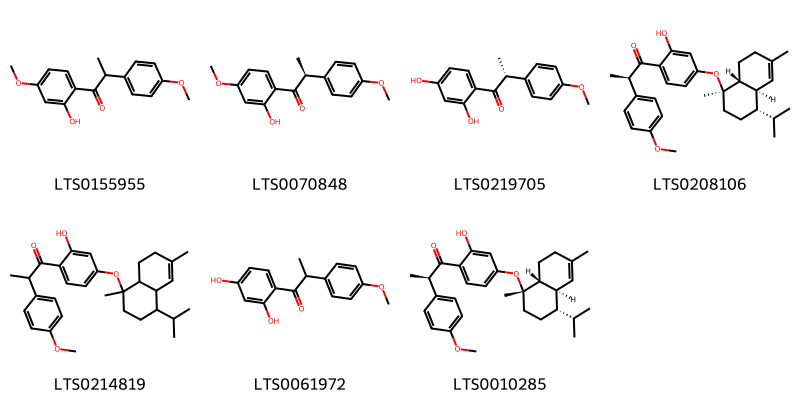{ width=100% }
    <figcaption>Hình ảnh cấu trúc hóa học của 7 hoạt chất thuộc nhóm Alpha-methyldeoxybenzoin flavonoids gồm ['4-o-methylangolensin (LTS0155955)', '(2s)-1-(2-hydroxy-4-methoxyphenyl)-2-(4-methoxyphenyl)propan-1-one (LTS0070848)', '(2r)-1-(2,4-dihydroxyphenyl)-2-(4-methoxyphenyl)propan-1-one (LTS0219705)', '(2r)-1-(4-{[(1r,4s,4ar,8ar)-4-isopropyl-1,6-dimethyl-3,4,4a,7,8,8a-hexahydro-2h-naphthalen-1-yl]oxy}-2-hydroxyphenyl)-2-(4-methoxyphenyl)propan-1-one (LTS0208106)', '1-{2-hydroxy-4-[(4-isopropyl-1,6-dimethyl-3,4,4a,7,8,8a-hexahydro-2h-naphthalen-1-yl)oxy]phenyl}-2-(4-methoxyphenyl)propan-1-one (LTS0214819)', 'angolensin (LTS0061972)', '(2r)-1-(4-{[(1s,4s,4ar,8ar)-4-isopropyl-1,6-dimethyl-3,4,4a,7,8,8a-hexahydro-2h-naphthalen-1-yl]oxy}-2-hydroxyphenyl)-2-(4-methoxyphenyl)propan-1-one (LTS0010285)'].</figcaption>
</figure>
#### Nhóm Benzene and substituted derivatives
<figure markdown="span">
    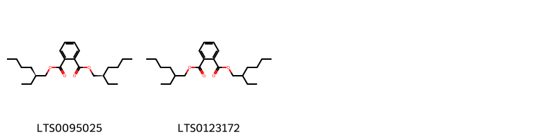{ width=100% }
    <figcaption>Hình ảnh cấu trúc hóa học của 2 hoạt chất thuộc nhóm Benzene and substituted derivatives gồm ['1-(2r)-2-ethylhexyl 2-(2s)-2-ethylhexyl phthalate (LTS0095025)', 'etalon (LTS0123172)'].</figcaption>
</figure>
#### Nhóm Flavonoids
<figure markdown="span">
    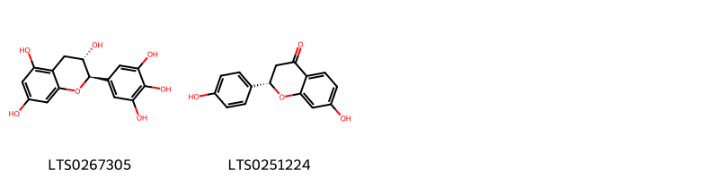{ width=100% }
    <figcaption>Hình ảnh cấu trúc hóa học của 2 hoạt chất thuộc nhóm Flavonoids gồm ['gallocatechol (LTS0267305)', '5-deoxyflavanone (LTS0251224)'].</figcaption>
</figure>
#### Nhóm Isoflavonoids
<figure markdown="span">
    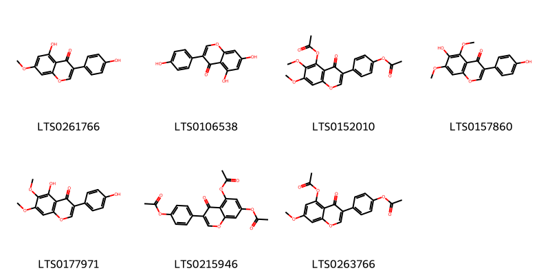{ width=100% }
    <figcaption>Hình ảnh cấu trúc hóa học của 7 hoạt chất thuộc nhóm Isoflavonoids gồm ['prunetin (LTS0261766)', 'genistein (LTS0106538)', '3-[4-(acetyloxy)phenyl]-6,7-dimethoxy-4-oxochromen-5-yl acetate (LTS0152010)', 'muningin (LTS0157860)', '7-o-methyltectorigenin (LTS0177971)', '4-[5,7-bis(acetyloxy)-4-oxochromen-3-yl]phenyl acetate (LTS0215946)', '3-[4-(acetyloxy)phenyl]-7-methoxy-4-oxochromen-5-yl acetate (LTS0263766)'].</figcaption>
</figure>
#### Nhóm Linear 1_3-diarylpropanoids
<figure markdown="span">
    { width=100% }
    <figcaption>Hình ảnh cấu trúc hóa học của Không tìm thấy chú thích hoạt chất thuộc nhóm Linear 1_3-diarylpropanoids gồm Không tìm thấy chú thích.</figcaption>
</figure>

---

### Dược dân tộc học

Danh sách các quốc gia có sử dụng *Pterocarpus angolensis* trong điều trị các bệnh. 

| Country   | Disease     | Bệnh                                                                                                                                                                                                |
|:----------|:------------|:----------------------------------------------------------------------------------------------------------------------------------------------------------------------------------------------------|
| Africa    | Aphrodisiac | MYMEMORY WARNING: YOU USED ALL AVAILABLE FREE TRANSLATIONS FOR TODAY. NEXT AVAILABLE IN  18 HOURS 30 MINUTES 22 SECONDS VISIT HTTPS://MYMEMORY.TRANSLATED.NET/DOC/USAGELIMITS.PHP TO TRANSLATE MORE |

---

---
## Pterocarpus erinaceus
### Thông tin về thực vật

!!! info "Phân loại thực vật của *Pterocarpus erinaceus* từ GIBF:"
    - **Kingdom:** Plantae
    - **Phylum:** Tracheophyta
    - **Order:** Fabales
    - **Family:** Fabaceae
    - **Genus:** Pterocarpus
    - **Species:** *Pterocarpus erinaceus*

 

| Label (VI)   | Label (EN)   | Scientific Name       | Descriptions (VI)   | Descriptions (EN)   | Also Known As (VI)   | Also Known As (EN)   |
|:-------------|:-------------|:----------------------|:--------------------|:--------------------|:---------------------|:---------------------|
| N/A          | N/A          | Pterocarpus erinaceus |                     | species of plant    | ['']                 | ['barwood']          |

#### Phân bố trên thế giới

**Từ CSDL GIBF** Nigeria, Côte d’Ivoire, Gambia, Benin, Guinea, Sierra Leone

#### Phân bố tại Việt Nam

**Từ CSDL GIBF**: Không có ghi nhận ở Việt Nam

---
### Thành phần hóa học
        
- Theo cơ sở dữ liệu lotus: Từ loài *Pterocarpus erinaceus* đã phân lập và xác định được 2 hoạt chất thuộc về các nhóm Alpha-methyldeoxybenzoin flavonoids. 

|    | chemicalTaxonomyClassyfireClass     |   smiles_count |
|---:|:------------------------------------|---------------:|
|  0 | Alpha-methyldeoxybenzoin flavonoids |              2 |

#### Nhóm Alpha-methyldeoxybenzoin flavonoids
<figure markdown="span">
    { width=100% }
    <figcaption>Hình ảnh cấu trúc hóa học của 2 hoạt chất thuộc nhóm Alpha-methyldeoxybenzoin flavonoids gồm ['(2r)-1-(2,4-dihydroxyphenyl)-2-(4-methoxyphenyl)propan-1-one (LTS0219705)', 'angolensin (LTS0061972)'].</figcaption>
</figure>

---

### Dược dân tộc học

Danh sách các quốc gia có sử dụng *Pterocarpus erinaceus* trong điều trị các bệnh. 

| Country   | Disease       | Bệnh                                                                                                                                                                                                |
|:----------|:--------------|:----------------------------------------------------------------------------------------------------------------------------------------------------------------------------------------------------|
| Nigeria   | Abortifacient | MYMEMORY WARNING: YOU USED ALL AVAILABLE FREE TRANSLATIONS FOR TODAY. NEXT AVAILABLE IN  18 HOURS 29 MINUTES 38 SECONDS VISIT HTTPS://MYMEMORY.TRANSLATED.NET/DOC/USAGELIMITS.PHP TO TRANSLATE MORE |

---

---
## Pterocarpus indicus
### Thông tin về thực vật

!!! info "Phân loại thực vật của *Pterocarpus indicus* từ GIBF:"
    - **Kingdom:** Plantae
    - **Phylum:** Tracheophyta
    - **Order:** Fabales
    - **Family:** Fabaceae
    - **Genus:** Pterocarpus
    - **Species:** *Pterocarpus indicus*

 

| Label (VI)   | Label (EN)   | Scientific Name     | Descriptions (VI)   | Descriptions (EN)   | Also Known As (VI)   | Also Known As (EN)                                                                |
|:-------------|:-------------|:--------------------|:--------------------|:--------------------|:---------------------|:----------------------------------------------------------------------------------|
| N/A          | N/A          | Pterocarpus indicus | loài thực vật       | species of plant    | ['']                 | ['Burmese rosewood', 'Amboyna wood', 'Malay padauk', 'Papua New Guinea rosewood'] |

#### Phân bố trên thế giới

**Từ CSDL GIBF** Sri Lanka, Australia, Belgium, Lao People’s Democratic Republic, Myanmar, Puerto Rico, Réunion, Nigeria, Chinese Taipei, Papua New Guinea, Honduras, United States of America, Timor-Leste, Solomon Islands, El Salvador, Maldives, Hong Kong, Thailand, Brazil, Guam, New Caledonia, Mayotte, Singapore, Viet Nam, China, French Polynesia, Seychelles, Vanuatu, India, Indonesia, Philippines, Malaysia

#### Phân bố tại Việt Nam

**Từ CSDL GIBF**: Hồ Chí Minh city, Quảng Nam

---
### Thành phần hóa học
        
- Theo cơ sở dữ liệu lotus: Từ loài *Pterocarpus indicus* đã phân lập và xác định được 6 hoạt chất thuộc về các nhóm 2-arylbenzofuran flavonoids, Alpha-methyldeoxybenzoin flavonoids, Isoflavonoids, Linear 1,3-diarylpropanoids. 

|    | chemicalTaxonomyClassyfireClass     |   smiles_count |
|---:|:------------------------------------|---------------:|
|  0 | 2-arylbenzofuran flavonoids         |              1 |
|  1 | Alpha-methyldeoxybenzoin flavonoids |              2 |
|  2 | Isoflavonoids                       |              1 |
|  3 | Linear 1,3-diarylpropanoids         |              2 |

#### Nhóm 2-arylbenzofuran flavonoids
<figure markdown="span">
    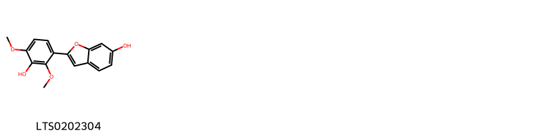{ width=100% }
    <figcaption>Hình ảnh cấu trúc hóa học của 1 hoạt chất thuộc nhóm 2-arylbenzofuran flavonoids gồm ['pterofuran (LTS0202304)'].</figcaption>
</figure>
#### Nhóm Alpha-methyldeoxybenzoin flavonoids
<figure markdown="span">
    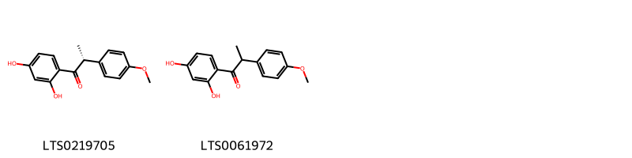{ width=100% }
    <figcaption>Hình ảnh cấu trúc hóa học của 2 hoạt chất thuộc nhóm Alpha-methyldeoxybenzoin flavonoids gồm ['(2r)-1-(2,4-dihydroxyphenyl)-2-(4-methoxyphenyl)propan-1-one (LTS0219705)', 'angolensin (LTS0061972)'].</figcaption>
</figure>
#### Nhóm Isoflavonoids
<figure markdown="span">
    { width=100% }
    <figcaption>Hình ảnh cấu trúc hóa học của 1 hoạt chất thuộc nhóm Isoflavonoids gồm ['formononetin (LTS0082756)'].</figcaption>
</figure>
#### Nhóm Linear 1_3-diarylpropanoids
<figure markdown="span">
    { width=100% }
    <figcaption>Hình ảnh cấu trúc hóa học của Không tìm thấy chú thích hoạt chất thuộc nhóm Linear 1_3-diarylpropanoids gồm Không tìm thấy chú thích.</figcaption>
</figure>

---

### Dược dân tộc học

Danh sách các quốc gia có sử dụng *Pterocarpus indicus* trong điều trị các bệnh. 

| Country   | Disease              | Bệnh                                                                                                                                                                                                |
|:----------|:---------------------|:----------------------------------------------------------------------------------------------------------------------------------------------------------------------------------------------------|
| Elsewhere | Emetic, Sternutatory | MYMEMORY WARNING: YOU USED ALL AVAILABLE FREE TRANSLATIONS FOR TODAY. NEXT AVAILABLE IN  18 HOURS 29 MINUTES 07 SECONDS VISIT HTTPS://MYMEMORY.TRANSLATED.NET/DOC/USAGELIMITS.PHP TO TRANSLATE MORE |

---

---
## Pterocarpus lucens
### Thông tin về thực vật

!!! info "Phân loại thực vật của *Pterocarpus lucens* từ GIBF:"
    - **Kingdom:** Plantae
    - **Phylum:** Tracheophyta
    - **Order:** Fabales
    - **Family:** Fabaceae
    - **Genus:** Pterocarpus
    - **Species:** *Pterocarpus lucens*

 

| Label (VI)   | Label (EN)   | Scientific Name    | Descriptions (VI)   | Descriptions (EN)   | Also Known As (VI)   | Also Known As (EN)   |
|:-------------|:-------------|:-------------------|:--------------------|:--------------------|:---------------------|:---------------------|
| N/A          | N/A          | Pterocarpus lucens | loài thực vật       | species of plant    | ['']                 | ['']                 |

#### Phân bố trên thế giới

**Từ CSDL GIBF** Ghana, Central African Republic, Angola, Somalia, Mozambique, Malawi, Zambia, Mali, Senegal, Nigeria, Namibia, Chad, Congo, Democratic Republic of the, Guinea, Zimbabwe, South Africa, Uganda, Burkina Faso, Cameroon, Mauritania, Ethiopia

#### Phân bố tại Việt Nam

**Từ CSDL GIBF**: Không có ghi nhận ở Việt Nam

---
### Thành phần hóa học
        
- Theo cơ sở dữ liệu lotus: Từ loài *Pterocarpus lucens* đã phân lập và xác định được Chưa có hoạt chất nào được phân lập. hoạt chất thuộc về các nhóm Không có hoạt chất nào được phân lập. 

Không có hình ảnh nào được tạo ra

---

### Dược dân tộc học

Danh sách các quốc gia có sử dụng *Pterocarpus lucens* trong điều trị các bệnh. 

| Country   | Disease    | Bệnh                                                                                                                                                                                                |
|:----------|:-----------|:----------------------------------------------------------------------------------------------------------------------------------------------------------------------------------------------------|
| Sudan     | Astringent | MYMEMORY WARNING: YOU USED ALL AVAILABLE FREE TRANSLATIONS FOR TODAY. NEXT AVAILABLE IN  18 HOURS 28 MINUTES 36 SECONDS VISIT HTTPS://MYMEMORY.TRANSLATED.NET/DOC/USAGELIMITS.PHP TO TRANSLATE MORE |

---

---
## Pterocarpus marsupium
### Thông tin về thực vật

!!! info "Phân loại thực vật của *Pterocarpus marsupium* từ GIBF:"
    - **Kingdom:** Plantae
    - **Phylum:** Tracheophyta
    - **Order:** Fabales
    - **Family:** Fabaceae
    - **Genus:** Pterocarpus
    - **Species:** *Pterocarpus marsupium*

 

| Label (VI)   | Label (EN)   | Scientific Name       | Descriptions (VI)   | Descriptions (EN)   | Also Known As (VI)   | Also Known As (EN)                |
|:-------------|:-------------|:----------------------|:--------------------|:--------------------|:---------------------|:----------------------------------|
| N/A          | N/A          | Pterocarpus marsupium | loài thực vật       | species of plant    | ['']                 | ['bija tree', 'East Indian kino'] |

#### Phân bố trên thế giới

**Từ CSDL GIBF** nan, Sri Lanka, Puerto Rico, Chinese Taipei, India, United States of America

#### Phân bố tại Việt Nam

**Từ CSDL GIBF**: Không có ghi nhận ở Việt Nam

---
### Thành phần hóa học
        
- Theo cơ sở dữ liệu lotus: Từ loài *Pterocarpus marsupium* đã phân lập và xác định được 77 hoạt chất thuộc về các nhóm Flavonoids, Phenylpropanoic acids, Steroids and steroid derivatives, Isoflavonoids, Linear 1,3-diarylpropanoids, Prenol lipids, Stilbenes, Organooxygen compounds, Aurone flavonoids, Homoisoflavonoids. 

|    | chemicalTaxonomyClassyfireClass   |   smiles_count |
|---:|:----------------------------------|---------------:|
|  0 | Aurone flavonoids                 |              5 |
|  1 | Flavonoids                        |             20 |
|  2 | Homoisoflavonoids                 |              3 |
|  3 | Isoflavonoids                     |             13 |
|  4 | Linear 1,3-diarylpropanoids       |              7 |
|  5 | Organooxygen compounds            |             10 |
|  6 | Phenylpropanoic acids             |              1 |
|  7 | Prenol lipids                     |              6 |
|  8 | Steroids and steroid derivatives  |              3 |
|  9 | Stilbenes                         |              7 |

#### Nhóm Aurone flavonoids
<figure markdown="span">
    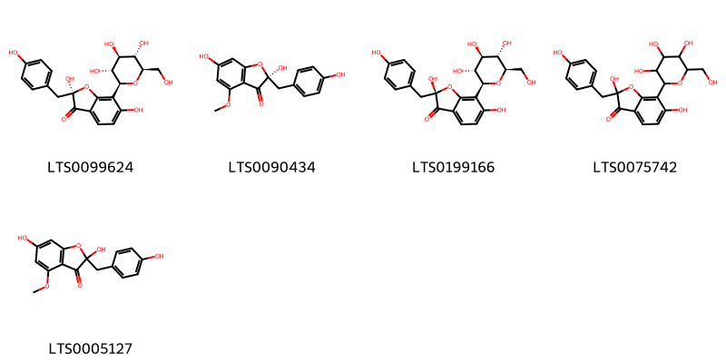{ width=100% }
    <figcaption>Hình ảnh cấu trúc hóa học của 5 hoạt chất thuộc nhóm Aurone flavonoids gồm ['(2r)-2,6-dihydroxy-2-[(4-hydroxyphenyl)methyl]-7-[(2s,3r,4r,5s,6r)-3,4,5-trihydroxy-6-(hydroxymethyl)oxan-2-yl]-1-benzofuran-3-one (LTS0099624)', '(2s)-2,6-dihydroxy-2-[(4-hydroxyphenyl)methyl]-4-methoxy-1-benzofuran-3-one (LTS0090434)', '(2s)-2,6-dihydroxy-2-[(4-hydroxyphenyl)methyl]-7-[(2s,3r,4r,5s,6r)-3,4,5-trihydroxy-6-(hydroxymethyl)oxan-2-yl]-1-benzofuran-3-one (LTS0199166)', '2,6-dihydroxy-2-[(4-hydroxyphenyl)methyl]-7-[3,4,5-trihydroxy-6-(hydroxymethyl)oxan-2-yl]-1-benzofuran-3-one (LTS0075742)', 'carpusin (LTS0005127)'].</figcaption>
</figure>
#### Nhóm Flavonoids
<figure markdown="span">
    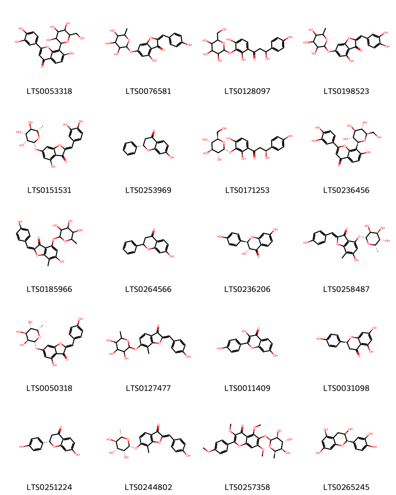{ width=100% }
    <figcaption>Hình ảnh cấu trúc hóa học của 20 hoạt chất thuộc nhóm Flavonoids gồm ['2-(3,4-dihydroxyphenyl)-7-hydroxy-8-[3,4,5-trihydroxy-6-(hydroxymethyl)oxan-2-yl]chromen-4-one (LTS0053318)', '4-hydroxy-2-[(4-hydroxyphenyl)methylidene]-6-[(3,4,5-trihydroxy-6-methyloxan-2-yl)oxy]-1-benzofuran-3-one (LTS0076581)', '1-(2,4-dihydroxy-3-{[3,4,5-trihydroxy-6-(hydroxymethyl)oxan-2-yl]oxy}phenyl)-3-hydroxy-3-(4-hydroxyphenyl)propan-1-one (LTS0128097)', '2-[(3,4-dihydroxyphenyl)methylidene]-4-hydroxy-6-[(3,4,5-trihydroxy-6-methyloxan-2-yl)oxy]-1-benzofuran-3-one (LTS0198523)', '(2z)-2-[(3,4-dihydroxyphenyl)methylidene]-4-hydroxy-6-{[(2r,3r,4r,5r,6s)-3,4,5-trihydroxy-6-methyloxan-2-yl]oxy}-1-benzofuran-3-one (LTS0151531)', '(2s)-7-hydroxyflavanone (LTS0253969)', '(3s)-1-(2,4-dihydroxy-3-{[(2r,3r,4s,5s,6r)-3,4,5-trihydroxy-6-(hydroxymethyl)oxan-2-yl]oxy}phenyl)-3-hydroxy-3-(4-hydroxyphenyl)propan-1-one (LTS0171253)', '2-(3,4-dihydroxyphenyl)-7-hydroxy-8-[(2s,3r,4r,5s,6r)-3,4,5-trihydroxy-6-(hydroxymethyl)oxan-2-yl]chromen-4-one (LTS0236456)', '6-hydroxy-2-[(4-hydroxyphenyl)methylidene]-7-methyl-4-[(3,4,5-trihydroxy-6-methyloxan-2-yl)oxy]-1-benzofuran-3-one (LTS0185966)', '7-hydroxyflavanone (LTS0264566)', 'garbanzol (LTS0236206)', '(2z)-6-hydroxy-2-[(4-hydroxyphenyl)methylidene]-7-methyl-4-{[(2r,3s,4s,5s,6s)-3,4,5-trihydroxy-6-methyloxan-2-yl]oxy}-1-benzofuran-3-one (LTS0258487)', '(2z)-4-hydroxy-2-[(4-hydroxyphenyl)methylidene]-6-{[(2r,3s,4s,5s,6s)-3,4,5-trihydroxy-6-methyloxan-2-yl]oxy}-1-benzofuran-3-one (LTS0050318)', '2-[(4-hydroxyphenyl)methylidene]-7-methyl-6-[(3,4,5-trihydroxy-6-methyloxan-2-yl)oxy]-1-benzofuran-3-one (LTS0127477)', "3,7,4'-trihydroxyflavone (LTS0011409)", 'naringenin (LTS0031098)', '5-deoxyflavanone (LTS0251224)', '(2z)-2-[(4-hydroxyphenyl)methylidene]-7-methyl-6-{[(2r,3r,4r,5r,6s)-3,4,5-trihydroxy-6-methyloxan-2-yl]oxy}-1-benzofuran-3-one (LTS0244802)', '3,5,7-trimethoxy-2-(4-methoxyphenyl)-6-{[(2s,3s,4r,5r,6r)-3,4,5-trihydroxy-6-methyloxan-2-yl]oxy}chromen-4-one (LTS0257358)', 'ent-epicatechin (LTS0265245)'].</figcaption>
</figure>
#### Nhóm Homoisoflavonoids
<figure markdown="span">
    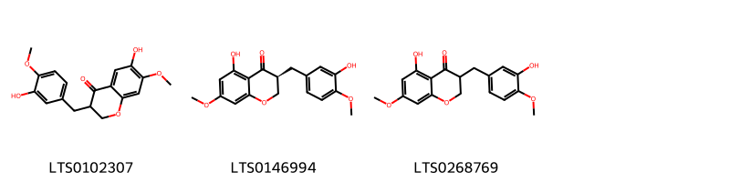{ width=100% }
    <figcaption>Hình ảnh cấu trúc hóa học của 3 hoạt chất thuộc nhóm Homoisoflavonoids gồm ['6-hydroxy-3-[(3-hydroxy-4-methoxyphenyl)methyl]-7-methoxy-2,3-dihydro-1-benzopyran-4-one (LTS0102307)', '(3s)-5-hydroxy-3-[(3-hydroxy-4-methoxyphenyl)methyl]-7-methoxy-2,3-dihydro-1-benzopyran-4-one (LTS0146994)', '5-hydroxy-3-[(3-hydroxy-4-methoxyphenyl)methyl]-7-methoxy-2,3-dihydro-1-benzopyran-4-one (LTS0268769)'].</figcaption>
</figure>
#### Nhóm Isoflavonoids
<figure markdown="span">
    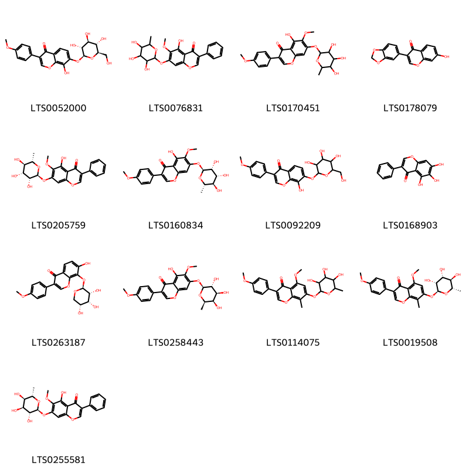{ width=100% }
    <figcaption>Hình ảnh cấu trúc hóa học của 13 hoạt chất thuộc nhóm Isoflavonoids gồm ['8-hydroxy-3-(4-methoxyphenyl)-7-{[(2s,3r,4s,5s,6r)-3,4,5-trihydroxy-6-(hydroxymethyl)oxan-2-yl]oxy}chromen-4-one (LTS0052000)', '5-hydroxy-6-methoxy-3-phenyl-7-[(3,4,5-trihydroxy-6-methyloxan-2-yl)oxy]chromen-4-one (LTS0076831)', '5-hydroxy-6-methoxy-3-(4-methoxyphenyl)-7-[(3,4,5-trihydroxy-6-methyloxan-2-yl)oxy]chromen-4-one (LTS0170451)', 'pseudobaptigenin (LTS0178079)', '5-hydroxy-6-methoxy-3-phenyl-7-{[(2s,3r,4r,5r,6s)-3,4,5-trihydroxy-6-methyloxan-2-yl]oxy}chromen-4-one (LTS0205759)', '5-hydroxy-6-methoxy-3-(4-methoxyphenyl)-7-{[(2s,3r,4r,5r,6s)-3,4,5-trihydroxy-6-methyloxan-2-yl]oxy}chromen-4-one (LTS0160834)', '8-hydroxy-3-(4-methoxyphenyl)-7-{[3,4,5-trihydroxy-6-(hydroxymethyl)oxan-2-yl]oxy}chromen-4-one (LTS0092209)', '5,6,7-trihydroxy-3-phenylchromen-4-one (LTS0168903)', '7-hydroxy-3-(4-methoxyphenyl)-8-{[(2s,3r,4r,5r)-3,4,5-trihydroxyoxan-2-yl]oxy}chromen-4-one (LTS0263187)', '5-hydroxy-6-methoxy-3-(4-methoxyphenyl)-7-{[(2s,3r,4s,5r,6r)-3,4,5-trihydroxy-6-methyloxan-2-yl]oxy}chromen-4-one (LTS0258443)', '5-methoxy-3-(4-methoxyphenyl)-8-methyl-7-[(3,4,5-trihydroxy-6-methyloxan-2-yl)oxy]chromen-4-one (LTS0114075)', '5-methoxy-3-(4-methoxyphenyl)-8-methyl-7-{[(2s,3r,4r,5r,6s)-3,4,5-trihydroxy-6-methyloxan-2-yl]oxy}chromen-4-one (LTS0019508)', '5-hydroxy-6-methoxy-3-phenyl-7-{[(2s,3r,4s,5r,6s)-3,4,5-trihydroxy-6-methyloxan-2-yl]oxy}chromen-4-one (LTS0255581)'].</figcaption>
</figure>
#### Nhóm Linear 1_3-diarylpropanoids
<figure markdown="span">
    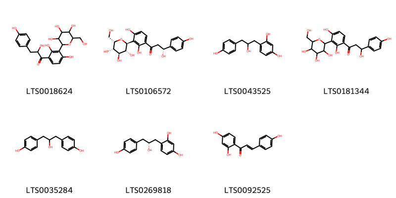{ width=100% }
    <figcaption>Hình ảnh cấu trúc hóa học của Không tìm thấy chú thích hoạt chất thuộc nhóm Linear 1_3-diarylpropanoids gồm Không tìm thấy chú thích.</figcaption>
</figure>
#### Nhóm Organooxygen compounds
<figure markdown="span">
    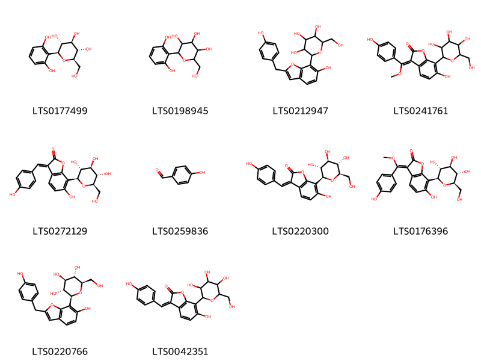{ width=100% }
    <figcaption>Hình ảnh cấu trúc hóa học của 10 hoạt chất thuộc nhóm Organooxygen compounds gồm ['(2s,3r,4r,5s,6r)-2-(2,6-dihydroxyphenyl)-6-(hydroxymethyl)oxane-3,4,5-triol (LTS0177499)', '2-(2,6-dihydroxyphenyl)-6-(hydroxymethyl)oxane-3,4,5-triol (LTS0198945)', '2-{6-hydroxy-2-[(4-hydroxyphenyl)methyl]-1-benzofuran-7-yl}-6-(hydroxymethyl)oxane-3,4,5-triol (LTS0212947)', '6-hydroxy-3-[(4-hydroxyphenyl)(methoxy)methylidene]-7-[3,4,5-trihydroxy-6-(hydroxymethyl)oxan-2-yl]-1-benzofuran-2-one (LTS0241761)', '(3e)-6-hydroxy-3-[(4-hydroxyphenyl)methylidene]-7-[(2s,3r,4r,5s,6r)-3,4,5-trihydroxy-6-(hydroxymethyl)oxan-2-yl]-1-benzofuran-2-one (LTS0272129)', 'p-hydroxybenzaldehyde (LTS0259836)', '(3z)-6-hydroxy-3-[(4-hydroxyphenyl)methylidene]-7-[(2s,3r,4r,5s,6r)-3,4,5-trihydroxy-6-(hydroxymethyl)oxan-2-yl]-1-benzofuran-2-one (LTS0220300)', '(3z)-6-hydroxy-3-[(4-hydroxyphenyl)(methoxy)methylidene]-7-[(2s,3r,4r,5s,6r)-3,4,5-trihydroxy-6-(hydroxymethyl)oxan-2-yl]-1-benzofuran-2-one (LTS0176396)', '(2s,3r,4r,5s,6r)-2-{6-hydroxy-2-[(4-hydroxyphenyl)methyl]-1-benzofuran-7-yl}-6-(hydroxymethyl)oxane-3,4,5-triol (LTS0220766)', '6-hydroxy-3-[(4-hydroxyphenyl)methylidene]-7-[3,4,5-trihydroxy-6-(hydroxymethyl)oxan-2-yl]-1-benzofuran-2-one (LTS0042351)'].</figcaption>
</figure>
#### Nhóm Phenylpropanoic acids
<figure markdown="span">
    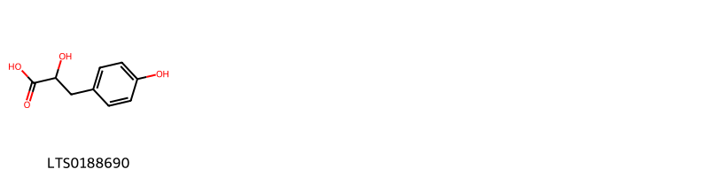{ width=100% }
    <figcaption>Hình ảnh cấu trúc hóa học của 1 hoạt chất thuộc nhóm Phenylpropanoic acids gồm ['hydroxyphenyllactic acid (LTS0188690)'].</figcaption>
</figure>
#### Nhóm Prenol lipids
<figure markdown="span">
    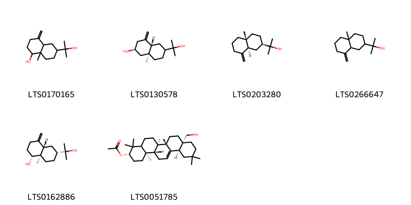{ width=100% }
    <figcaption>Hình ảnh cấu trúc hóa học của 6 hoạt chất thuộc nhóm Prenol lipids gồm ['6-(2-hydroxypropan-2-yl)-8a-methyl-4-methylidene-octahydronaphthalen-1-ol (LTS0170165)', '(2s,4as,8as)-6-(2-hydroxypropan-2-yl)-8a-methyl-4-methylidene-octahydronaphthalen-2-ol (LTS0130578)', 'β-eudesmol (LTS0203280)', 'β-eudesmol (LTS0266647)', '(1r,4as,6r,8ar)-6-(2-hydroxypropan-2-yl)-8a-methyl-4-methylidene-octahydronaphthalen-1-ol (LTS0162886)', '(3s,6ar,6bs,8as,12as,14ar,14br)-8a-(hydroxymethyl)-4,4,6a,6b,11,11,14b-heptamethyl-1,2,3,4a,5,6,7,8,9,10,12,12a,14,14a-tetradecahydropicen-3-yl acetate (LTS0051785)'].</figcaption>
</figure>
#### Nhóm Steroids and steroid derivatives
<figure markdown="span">
    { width=100% }
    <figcaption>Hình ảnh cấu trúc hóa học của 3 hoạt chất thuộc nhóm Steroids and steroid derivatives gồm ['stigmast-5-en-3-ol (LTS0071224)', 'stigmast-5-en-3-ol, (3β)- (LTS0204616)', 'phytosterol (LTS0029311)'].</figcaption>
</figure>
#### Nhóm Stilbenes
<figure markdown="span">
    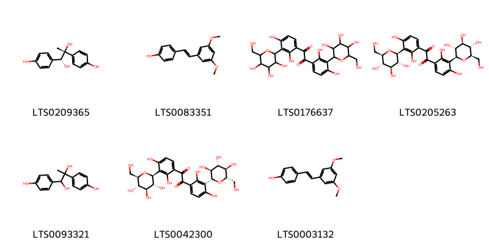{ width=100% }
    <figcaption>Hình ảnh cấu trúc hóa học của 7 hoạt chất thuộc nhóm Stilbenes gồm ['(1r,2r)-1,2-bis(4-hydroxyphenyl)propane-1,2-diol (LTS0209365)', "3',5'-dimethoxy-4-stilbenol (LTS0083351)", 'bis({2,4-dihydroxy-3-[3,4,5-trihydroxy-6-(hydroxymethyl)oxan-2-yl]phenyl})ethane-1,2-dione (LTS0176637)', 'bis({2,4-dihydroxy-3-[(2s,3r,4r,5s,6r)-3,4,5-trihydroxy-6-(hydroxymethyl)oxan-2-yl]phenyl})ethane-1,2-dione (LTS0205263)', '1,2-bis(4-hydroxyphenyl)propane-1,2-diol (LTS0093321)', '1-{2,4-dihydroxy-3-[(2r,3s,4s,5r,6s)-3,4,5-trihydroxy-6-(hydroxymethyl)oxan-2-yl]phenyl}-2-{2,4-dihydroxy-3-[(2s,3r,4r,5s,6r)-3,4,5-trihydroxy-6-(hydroxymethyl)oxan-2-yl]phenyl}ethane-1,2-dione (LTS0042300)', 'pterostilbene (LTS0003132)'].</figcaption>
</figure>

---

### Dược dân tộc học

Danh sách các quốc gia có sử dụng *Pterocarpus marsupium* trong điều trị các bệnh. 

| Country     | Disease              | Bệnh                                                                                                                                                                                                |
|:------------|:---------------------|:----------------------------------------------------------------------------------------------------------------------------------------------------------------------------------------------------|
| East Indies | Astringent           | MYMEMORY WARNING: YOU USED ALL AVAILABLE FREE TRANSLATIONS FOR TODAY. NEXT AVAILABLE IN  18 HOURS 28 MINUTES 02 SECONDS VISIT HTTPS://MYMEMORY.TRANSLATED.NET/DOC/USAGELIMITS.PHP TO TRANSLATE MORE |
| Elsewhere   | Astringent, Hemostat | MYMEMORY WARNING: YOU USED ALL AVAILABLE FREE TRANSLATIONS FOR TODAY. NEXT AVAILABLE IN  18 HOURS 27 MINUTES 56 SECONDS VISIT HTTPS://MYMEMORY.TRANSLATED.NET/DOC/USAGELIMITS.PHP TO TRANSLATE MORE |
| French      | Astringent           | MYMEMORY WARNING: YOU USED ALL AVAILABLE FREE TRANSLATIONS FOR TODAY. NEXT AVAILABLE IN  18 HOURS 27 MINUTES 53 SECONDS VISIT HTTPS://MYMEMORY.TRANSLATED.NET/DOC/USAGELIMITS.PHP TO TRANSLATE MORE |
| Iran        | Hemostat             | MYMEMORY WARNING: YOU USED ALL AVAILABLE FREE TRANSLATIONS FOR TODAY. NEXT AVAILABLE IN  18 HOURS 27 MINUTES 50 SECONDS VISIT HTTPS://MYMEMORY.TRANSLATED.NET/DOC/USAGELIMITS.PHP TO TRANSLATE MORE |

---

---
## Pterocarpus officinalis
### Thông tin về thực vật

!!! info "Phân loại thực vật của *Pterocarpus officinalis* từ GIBF:"
    - **Kingdom:** Plantae
    - **Phylum:** Tracheophyta
    - **Order:** Fabales
    - **Family:** Fabaceae
    - **Genus:** Pterocarpus
    - **Species:** *Pterocarpus officinalis*

 

| Label (VI)   | Label (EN)   | Scientific Name         | Descriptions (VI)   | Descriptions (EN)   | Also Known As (VI)   | Also Known As (EN)   |
|:-------------|:-------------|:------------------------|:--------------------|:--------------------|:---------------------|:---------------------|
| N/A          | N/A          | Pterocarpus officinalis | loài thực vật       | species of plant    | ['']                 | ['']                 |

#### Phân bố trên thế giới

**Từ CSDL GIBF** nan, Ecuador, Puerto Rico, Panama, Nicaragua, Belize, Guadeloupe, Martinique, Colombia, Brazil, Costa Rica, Honduras, United States of America, Dominica, Philippines, French Guiana

#### Phân bố tại Việt Nam

**Từ CSDL GIBF**: Không có ghi nhận ở Việt Nam

---
### Thành phần hóa học
        
- Theo cơ sở dữ liệu lotus: Từ loài *Pterocarpus officinalis* đã phân lập và xác định được Chưa có hoạt chất nào được phân lập. hoạt chất thuộc về các nhóm Không có hoạt chất nào được phân lập. 

Không có hình ảnh nào được tạo ra

---

### Dược dân tộc học

Danh sách các quốc gia có sử dụng *Pterocarpus officinalis* trong điều trị các bệnh. 

| Country            | Disease                         | Bệnh                                                                                                                                                                                                |
|:-------------------|:--------------------------------|:----------------------------------------------------------------------------------------------------------------------------------------------------------------------------------------------------|
| Dominican Republic | Hemostat                        | MYMEMORY WARNING: YOU USED ALL AVAILABLE FREE TRANSLATIONS FOR TODAY. NEXT AVAILABLE IN  18 HOURS 26 MINUTES 31 SECONDS VISIT HTTPS://MYMEMORY.TRANSLATED.NET/DOC/USAGELIMITS.PHP TO TRANSLATE MORE |
| Elsewhere          | Astringent, Hemostat            | MYMEMORY WARNING: YOU USED ALL AVAILABLE FREE TRANSLATIONS FOR TODAY. NEXT AVAILABLE IN  18 HOURS 26 MINUTES 28 SECONDS VISIT HTTPS://MYMEMORY.TRANSLATED.NET/DOC/USAGELIMITS.PHP TO TRANSLATE MORE |
| Haiti              | Astringent                      | MYMEMORY WARNING: YOU USED ALL AVAILABLE FREE TRANSLATIONS FOR TODAY. NEXT AVAILABLE IN  18 HOURS 26 MINUTES 25 SECONDS VISIT HTTPS://MYMEMORY.TRANSLATED.NET/DOC/USAGELIMITS.PHP TO TRANSLATE MORE |
| Venezuela          | Sudorific, Astringent, Hemostat | MYMEMORY WARNING: YOU USED ALL AVAILABLE FREE TRANSLATIONS FOR TODAY. NEXT AVAILABLE IN  18 HOURS 26 MINUTES 22 SECONDS VISIT HTTPS://MYMEMORY.TRANSLATED.NET/DOC/USAGELIMITS.PHP TO TRANSLATE MORE |

---

---
## Pterocarpus osun
### Thông tin về thực vật

!!! info "Phân loại thực vật của *Pterocarpus osun* từ GIBF:"
    - **Kingdom:** Plantae
    - **Phylum:** Tracheophyta
    - **Order:** Fabales
    - **Family:** Fabaceae
    - **Genus:** Pterocarpus
    - **Species:** *Pterocarpus osun*

 

| Label (VI)   | Label (EN)   | Scientific Name   | Descriptions (VI)   | Descriptions (EN)   | Also Known As (VI)   | Also Known As (EN)   |
|:-------------|:-------------|:------------------|:--------------------|:--------------------|:---------------------|:---------------------|
| N/A          | N/A          | Pterocarpus osun  |                     | species of plant    | ['']                 | ['']                 |

#### Phân bố trên thế giới

**Từ CSDL GIBF** nan, Cameroon, unknown or invalid, Nigeria

#### Phân bố tại Việt Nam

**Từ CSDL GIBF**: Không có ghi nhận ở Việt Nam

---
### Thành phần hóa học
        
- Theo cơ sở dữ liệu lotus: Từ loài *Pterocarpus osun* đã phân lập và xác định được Chưa có hoạt chất nào được phân lập. hoạt chất thuộc về các nhóm Không có hoạt chất nào được phân lập. 

Không có hình ảnh nào được tạo ra

---

### Dược dân tộc học

Danh sách các quốc gia có sử dụng *Pterocarpus osun* trong điều trị các bệnh. 

| Country   | Disease   | Bệnh                                                                                                                                                                                                |
|:----------|:----------|:----------------------------------------------------------------------------------------------------------------------------------------------------------------------------------------------------|
| Nigeria   | Cosmetic  | MYMEMORY WARNING: YOU USED ALL AVAILABLE FREE TRANSLATIONS FOR TODAY. NEXT AVAILABLE IN  18 HOURS 25 MINUTES 51 SECONDS VISIT HTTPS://MYMEMORY.TRANSLATED.NET/DOC/USAGELIMITS.PHP TO TRANSLATE MORE |

---

---
## Pterocarpus santalinus
### Thông tin về thực vật

!!! info "Phân loại thực vật của *Pterocarpus santalinus* từ GIBF:"
    - **Kingdom:** Plantae
    - **Phylum:** Tracheophyta
    - **Order:** Fabales
    - **Family:** Fabaceae
    - **Genus:** Pterocarpus
    - **Species:** *Pterocarpus santalinus*

 

| Label (VI)   | Label (EN)   | Scientific Name        | Descriptions (VI)   | Descriptions (EN)   | Also Known As (VI)   | Also Known As (EN)   |
|:-------------|:-------------|:-----------------------|:--------------------|:--------------------|:---------------------|:---------------------|
| N/A          | N/A          | Pterocarpus santalinus | loài thực vật       | species of plant    | ['']                 | ['Red sandalwood']   |

#### Phân bố trên thế giới

**Từ CSDL GIBF** nan, Sri Lanka, Japan, Thailand, Chinese Taipei, Brazil, Myanmar, India, Jamaica, Indonesia, United States of America, unknown or invalid, China

#### Phân bố tại Việt Nam

**Từ CSDL GIBF**: Không có ghi nhận ở Việt Nam

---
### Thành phần hóa học
        
- Theo cơ sở dữ liệu lotus: Từ loài *Pterocarpus santalinus* đã phân lập và xác định được 95 hoạt chất thuộc về các nhóm Naphthalenes, Flavonoids, Prenol lipids, Steroids and steroid derivatives, Isoflavonoids, Linear 1,3-diarylpropanoids, Diarylheptanoids, Tetralins, Benzofurans, Benzene and substituted derivatives, 2-arylbenzofuran flavonoids, Stilbenes, Phenols, Neoflavonoids, Furanoid lignans. 

|    | chemicalTaxonomyClassyfireClass     |   smiles_count |
|---:|:------------------------------------|---------------:|
|  0 | 2-arylbenzofuran flavonoids         |              4 |
|  1 | Benzene and substituted derivatives |              3 |
|  2 | Benzofurans                         |              1 |
|  3 | Diarylheptanoids                    |              3 |
|  4 | Flavonoids                          |             10 |
|  5 | Furanoid lignans                    |              4 |
|  6 | Isoflavonoids                       |              4 |
|  7 | Linear 1,3-diarylpropanoids         |              4 |
|  8 | Naphthalenes                        |              1 |
|  9 | Neoflavonoids                       |              6 |
| 10 | Phenols                             |              4 |
| 11 | Prenol lipids                       |             42 |
| 12 | Steroids and steroid derivatives    |              5 |
| 13 | Stilbenes                           |              2 |
| 14 | Tetralins                           |              1 |

#### Nhóm 2-arylbenzofuran flavonoids
<figure markdown="span">
    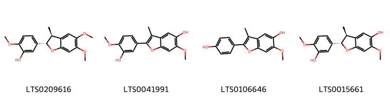{ width=100% }
    <figcaption>Hình ảnh cấu trúc hóa học của 4 hoạt chất thuộc nhóm 2-arylbenzofuran flavonoids gồm ['pterolinus c (LTS0209616)', 'dehydromelanoxin (LTS0041991)', 'pterolinus b (LTS0106646)', 'melanoxin, (-)- (LTS0015661)'].</figcaption>
</figure>
#### Nhóm Benzene and substituted derivatives
<figure markdown="span">
    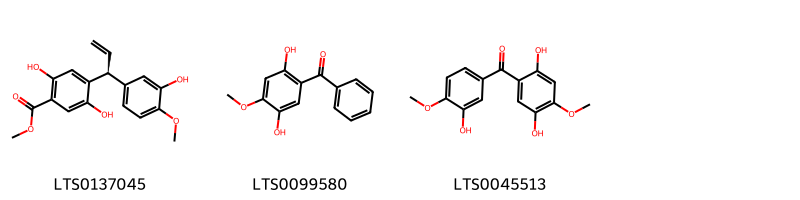{ width=100% }
    <figcaption>Hình ảnh cấu trúc hóa học của 3 hoạt chất thuộc nhóm Benzene and substituted derivatives gồm ['pterolinus f (LTS0137045)', '2-benzoyl-5-methoxybenzene-1,4-diol (LTS0099580)', 'melanoxoin (LTS0045513)'].</figcaption>
</figure>
#### Nhóm Benzofurans
<figure markdown="span">
    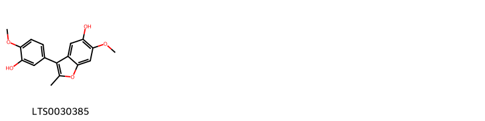{ width=100% }
    <figcaption>Hình ảnh cấu trúc hóa học của 1 hoạt chất thuộc nhóm Benzofurans gồm ['pterolinus a (LTS0030385)'].</figcaption>
</figure>
#### Nhóm Diarylheptanoids
<figure markdown="span">
    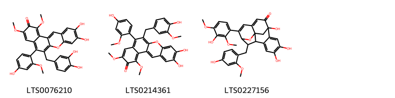{ width=100% }
    <figcaption>Hình ảnh cấu trúc hóa học của 3 hoạt chất thuộc nhóm Diarylheptanoids gồm ['6-[(3,4-dihydroxyphenyl)methyl]-2,3-dihydroxy-7-(4-hydroxy-2-methoxyphenyl)-9,11-dimethoxy-5-oxatetraphen-10-one (LTS0076210)', '2,3-dihydroxy-7-(4-hydroxy-2-methoxyphenyl)-6-[(4-hydroxy-3-methoxyphenyl)methyl]-9,11-dimethoxy-5-oxatetraphen-10-one (LTS0214361)', '5,6,9-trihydroxy-14-(3-hydroxy-2,4-dimethoxyphenyl)-18-[(4-hydroxy-2-methoxyphenyl)methyl]-16-oxapentacyclo[7.7.1.1²,¹⁵.0¹,¹².0³,⁸]octadeca-3,5,7,11,13-pentaen-10-one (LTS0227156)'].</figcaption>
</figure>
#### Nhóm Flavonoids
<figure markdown="span">
    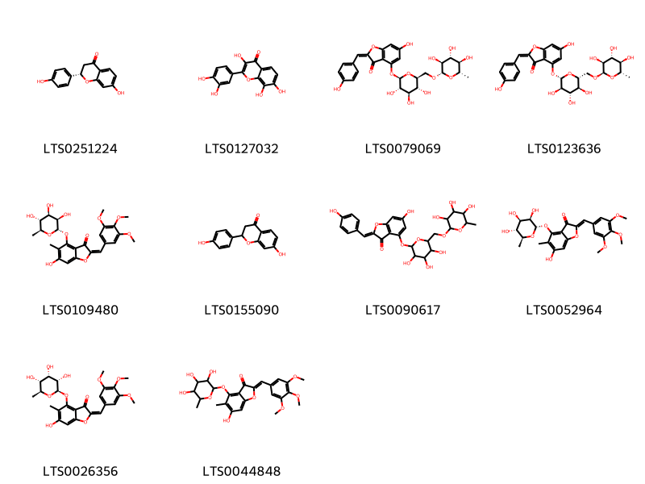{ width=100% }
    <figcaption>Hình ảnh cấu trúc hóa học của 10 hoạt chất thuộc nhóm Flavonoids gồm ['5-deoxyflavanone (LTS0251224)', 'melanoxetin (LTS0127032)', '(2e)-6-hydroxy-2-[(4-hydroxyphenyl)methylidene]-4-{[(2r,3s,4r,5r,6s)-3,4,5-trihydroxy-6-({[(2s,3s,4r,5r,6s)-3,4,5-trihydroxy-6-methyloxan-2-yl]oxy}methyl)oxan-2-yl]oxy}-1-benzofuran-3-one (LTS0079069)', '(2e)-6-hydroxy-2-[(4-hydroxyphenyl)methylidene]-4-{[(2s,3r,4s,5s,6r)-3,4,5-trihydroxy-6-({[(2r,3s,4r,5r,6s)-3,4,5-trihydroxy-6-methyloxan-2-yl]oxy}methyl)oxan-2-yl]oxy}-1-benzofuran-3-one (LTS0123636)', '(2e)-6-hydroxy-5-methyl-4-{[(2s,3r,4r,5r,6s)-3,4,5-trihydroxy-6-methyloxan-2-yl]oxy}-2-[(3,4,5-trimethoxyphenyl)methylidene]-1-benzofuran-3-one (LTS0109480)', "7,4'-dihydroxyflavanone (LTS0155090)", '6-hydroxy-2-[(4-hydroxyphenyl)methylidene]-4-[(3,4,5-trihydroxy-6-{[(3,4,5-trihydroxy-6-methyloxan-2-yl)oxy]methyl}oxan-2-yl)oxy]-1-benzofuran-3-one (LTS0090617)', '(2z)-6-hydroxy-5-methyl-4-{[(2s,3r,4r,5r,6s)-3,4,5-trihydroxy-6-methyloxan-2-yl]oxy}-2-[(3,4,5-trimethoxyphenyl)methylidene]-1-benzofuran-3-one (LTS0052964)', '(2e)-6-hydroxy-5-methyl-4-{[(2r,3s,4s,5r,6s)-3,4,5-trihydroxy-6-methyloxan-2-yl]oxy}-2-[(3,4,5-trimethoxyphenyl)methylidene]-1-benzofuran-3-one (LTS0026356)', '6-hydroxy-5-methyl-4-[(3,4,5-trihydroxy-6-methyloxan-2-yl)oxy]-2-[(3,4,5-trimethoxyphenyl)methylidene]-1-benzofuran-3-one (LTS0044848)'].</figcaption>
</figure>
#### Nhóm Furanoid lignans
<figure markdown="span">
    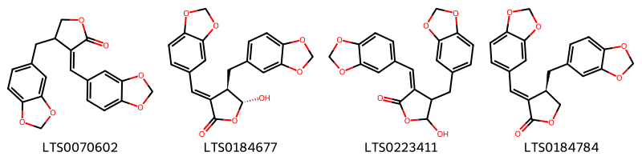{ width=100% }
    <figcaption>Hình ảnh cấu trúc hóa học của 4 hoạt chất thuộc nhóm Furanoid lignans gồm ['4-(2h-1,3-benzodioxol-5-ylmethyl)-3-(2h-1,3-benzodioxol-5-ylmethylidene)oxolan-2-one (LTS0070602)', '(3e,4r,5r)-4-(2h-1,3-benzodioxol-5-ylmethyl)-3-(2h-1,3-benzodioxol-5-ylmethylidene)-5-hydroxyoxolan-2-one (LTS0184677)', '4-(2h-1,3-benzodioxol-5-ylmethyl)-3-(2h-1,3-benzodioxol-5-ylmethylidene)-5-hydroxyoxolan-2-one (LTS0223411)', 'savinin (LTS0184784)'].</figcaption>
</figure>
#### Nhóm Isoflavonoids
<figure markdown="span">
    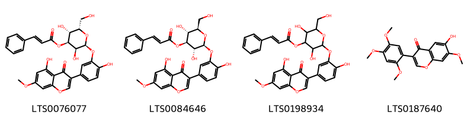{ width=100% }
    <figcaption>Hình ảnh cấu trúc hóa học của 4 hoạt chất thuộc nhóm Isoflavonoids gồm ['(2s,3s,4s,5r,6s)-3,5-dihydroxy-2-[2-hydroxy-5-(5-hydroxy-7-methoxy-4-oxochromen-3-yl)phenoxy]-6-(hydroxymethyl)oxan-4-yl (2e)-3-phenylprop-2-enoate (LTS0076077)', '(2s,3r,4s,5r,6r)-3,5-dihydroxy-2-[2-hydroxy-5-(5-hydroxy-7-methoxy-4-oxochromen-3-yl)phenoxy]-6-(hydroxymethyl)oxan-4-yl (2e)-3-phenylprop-2-enoate (LTS0084646)', '3,5-dihydroxy-2-[2-hydroxy-5-(5-hydroxy-7-methoxy-4-oxochromen-3-yl)phenoxy]-6-(hydroxymethyl)oxan-4-yl 3-phenylprop-2-enoate (LTS0198934)', '6-hydroxy-7-methoxy-3-(2,4,5-trimethoxyphenyl)chromen-4-one (LTS0187640)'].</figcaption>
</figure>
#### Nhóm Linear 1_3-diarylpropanoids
<figure markdown="span">
    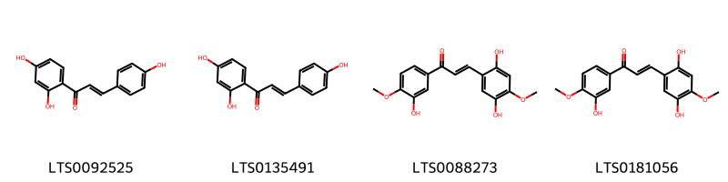{ width=100% }
    <figcaption>Hình ảnh cấu trúc hóa học của Không tìm thấy chú thích hoạt chất thuộc nhóm Linear 1_3-diarylpropanoids gồm Không tìm thấy chú thích.</figcaption>
</figure>
#### Nhóm Naphthalenes
<figure markdown="span">
    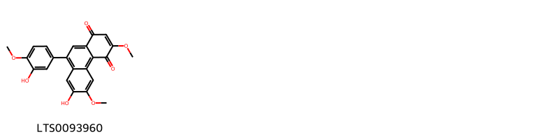{ width=100% }
    <figcaption>Hình ảnh cấu trúc hóa học của 1 hoạt chất thuộc nhóm Naphthalenes gồm ['7-hydroxy-9-(3-hydroxy-4-methoxyphenyl)-3,6-dimethoxyphenanthrene-1,4-dione (LTS0093960)'].</figcaption>
</figure>
#### Nhóm Neoflavonoids
<figure markdown="span">
    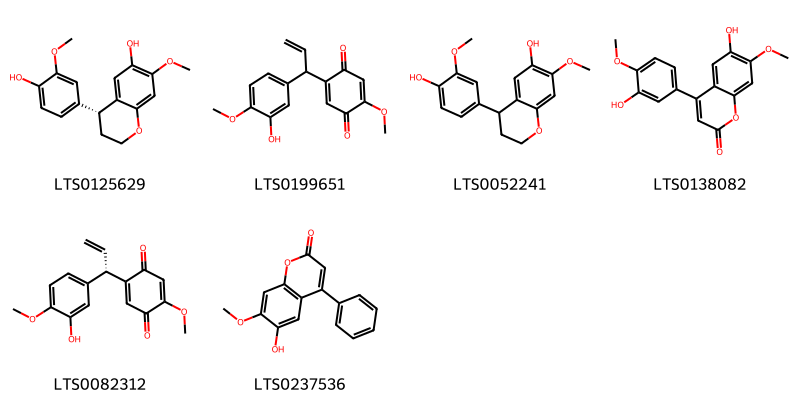{ width=100% }
    <figcaption>Hình ảnh cấu trúc hóa học của 6 hoạt chất thuộc nhóm Neoflavonoids gồm ['(4r)-4-(4-hydroxy-3-methoxyphenyl)-7-methoxy-3,4-dihydro-2h-1-benzopyran-6-ol (LTS0125629)', '2-[1-(3-hydroxy-4-methoxyphenyl)prop-2-en-1-yl]-5-methoxycyclohexa-2,5-diene-1,4-dione (LTS0199651)', 'pterolinus j (LTS0052241)', 'melannein (LTS0138082)', '2-[(1s)-1-(3-hydroxy-4-methoxyphenyl)prop-2-en-1-yl]-5-methoxycyclohexa-2,5-diene-1,4-dione (LTS0082312)', 'dalbergin (LTS0237536)'].</figcaption>
</figure>
#### Nhóm Phenols
<figure markdown="span">
    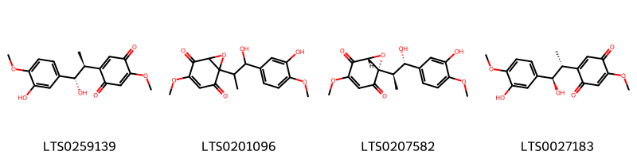{ width=100% }
    <figcaption>Hình ảnh cấu trúc hóa học của 4 hoạt chất thuộc nhóm Phenols gồm ['2-[(1s,2s)-1-hydroxy-1-(3-hydroxy-4-methoxyphenyl)propan-2-yl]-5-methoxycyclohexa-2,5-diene-1,4-dione (LTS0259139)', 'pterolinus d (LTS0201096)', '(1s,6r)-1-[(1s,2r)-1-hydroxy-1-(3-hydroxy-4-methoxyphenyl)propan-2-yl]-4-methoxy-7-oxabicyclo[4.1.0]hept-3-ene-2,5-dione (LTS0207582)', 'pterolinus e (LTS0027183)'].</figcaption>
</figure>
#### Nhóm Prenol lipids
<figure markdown="span">
    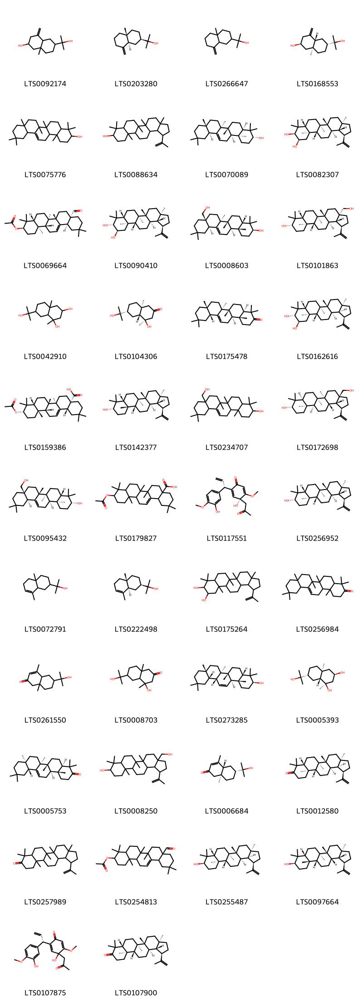{ width=100% }
    <figcaption>Hình ảnh cấu trúc hóa học của 42 hoạt chất thuộc nhóm Prenol lipids gồm ['6-(2-hydroxypropan-2-yl)-8a-methyl-4-methylidene-octahydronaphthalen-2-ol (LTS0092174)', 'β-eudesmol (LTS0203280)', 'β-eudesmol (LTS0266647)', '(2s,4as,6r,8as)-6-(2-hydroxypropan-2-yl)-8a-methyl-4-methylidene-octahydronaphthalen-2-ol (LTS0168553)', 'β-amyrin (LTS0075776)', 'lupeol (LTS0088634)', '(3r,4ar,6ar,6bs,8ar,12as,14ar,14bs)-4,4,6a,6b,8a,11,11,14b-octamethyl-1,2,3,4a,5,6,7,8,9,10,12,12a,14,14a-tetradecahydropicen-3-ol (LTS0070089)', '(1r,3ar,5ar,5br,7ar,9s,10r,11ar,11br,13ar,13br)-3a,5a,5b,8,8,11a-hexamethyl-1-(prop-1-en-2-yl)-hexadecahydrocyclopenta[a]chrysene-9,10-diol (LTS0082307)', '(3r,4ar,6ar,6bs,8as,12as,14ar,14br)-8a-formyl-4,4,6a,6b,11,11,14b-heptamethyl-1,2,3,4a,5,6,7,8,9,10,12,12a,14,14a-tetradecahydropicen-3-yl acetate (LTS0069664)', '(1r,3ar,5ar,5br,7ar,9r,10r,11ar,11br,13ar,13br)-3a,5a,5b,8,8,11a-hexamethyl-1-(prop-1-en-2-yl)-hexadecahydrocyclopenta[a]chrysene-9,10-diol (LTS0090410)', '(3s,4as,6ar,6bs,8as,12ar,14ar,14br)-8a-(hydroxymethyl)-4,4,6a,6b,11,11,14b-heptamethyl-1,2,3,4a,5,6,7,8,9,10,12,12a,14,14a-tetradecahydropicen-3-ol (LTS0008603)', 'betulin (LTS0101863)', '7-(2-hydroxypropan-2-yl)-1,4a-dimethyl-octahydronaphthalene-1,3-diol (LTS0042910)', '(4r,4ar,6r,8as)-4-hydroxy-6-(2-hydroxypropan-2-yl)-4,8a-dimethyl-hexahydro-1h-naphthalen-2-one (LTS0104306)', '(4ar,6ar,6bs,8ar,12ar,14ar,14br)-4,4,6a,6b,8a,11,11,14b-octamethyl-2,4a,5,6,7,8,9,10,12,12a,14,14a-dodecahydro-1h-picen-3-one (LTS0175478)', '(1r,3ar,5ar,5br,7ar,9r,10r,11ar,11br,13ar,13bs)-3a,5a,5b,8,8,11a-hexamethyl-1-(prop-1-en-2-yl)-hexadecahydrocyclopenta[a]chrysene-9,10-diol (LTS0162616)', '(4as,6ar,6bs,8ar,10s,12as,12br,14br)-10-(acetyloxy)-2,2,6a,6b,9,9,12a-heptamethyl-1,3,4,5,6,7,8,8a,10,11,12,12b,13,14b-tetradecahydropicene-4a-carboxylic acid (LTS0159386)', '(1r,3ar,5ar,5br,7ar,9s,11as,11br,13ar,13br)-3a,5a,5b,8,8,11a-hexamethyl-1-(prop-1-en-2-yl)-hexadecahydrocyclopenta[a]chrysen-9-ol (LTS0142377)', '8a-(hydroxymethyl)-4,4,6a,6b,11,11,14b-heptamethyl-1,2,3,4a,5,6,7,8,9,10,12,12a,14,14a-tetradecahydropicen-3-ol (LTS0234707)', '(1r,3ar,5as,5br,7as,9s,11ar,11bs,13as,13br)-3a-(hydroxymethyl)-5a,5b,8,8,11a-pentamethyl-1-(prop-1-en-2-yl)-hexadecahydrocyclopenta[a]chrysen-9-ol (LTS0172698)', '(3r,4as,6as,6br,8as,12ar,14ar,14bs)-8a-(hydroxymethyl)-4,4,6a,6b,11,11,14b-heptamethyl-1,2,3,4a,5,6,7,8,9,10,12,12a,14,14a-tetradecahydropicen-3-ol (LTS0095432)', '10-(acetyloxy)-2,2,6a,6b,9,9,12a-heptamethyl-1,3,4,5,6,7,8,8a,10,11,12,12b,13,14b-tetradecahydropicene-4a-carboxylic acid (LTS0179827)', '(4r)-4-hydroxy-2-[(1s)-1-(3-hydroxy-4-methoxyphenyl)prop-2-en-1-yl]-5-methoxy-4-(2-oxopropyl)cyclohexa-2,5-dien-1-one (LTS0117551)', 'lupeol (LTS0256952)', '2-(4a,8-dimethyl-2,3,4,5,6,8a-hexahydro-1h-naphthalen-2-yl)propan-2-ol (LTS0072791)', 'α-eudesmol (LTS0222498)', '3a,5a,5b,8,8,11a-hexamethyl-1-(prop-1-en-2-yl)-hexadecahydrocyclopenta[a]chrysene-9,10-diol (LTS0175264)', '4,4,6a,6b,8a,11,11,14b-octamethyl-2,4a,5,6,7,8,9,10,12,12a,14,14a-dodecahydro-1h-picen-3-one (LTS0256984)', '6-(2-hydroxypropan-2-yl)-4,8a-dimethyl-1,4a,5,6,7,8-hexahydronaphthalen-2-one (LTS0261550)', '4-hydroxy-6-(2-hydroxypropan-2-yl)-4,8a-dimethyl-hexahydro-1h-naphthalen-2-one (LTS0008703)', '(3s,4as,6ar,6br,8ar,12as,12br,14ar,14bs)-4,4,6a,6b,8a,11,11,14b-octamethyl-1,2,3,4a,5,6,7,8,9,10,12,12a,12b,14a-tetradecahydropicen-3-ol (LTS0273285)', '(1r,3r,4as,7r,8ar)-7-(2-hydroxypropan-2-yl)-1,4a-dimethyl-octahydronaphthalene-1,3-diol (LTS0005393)', '(4ar,6ar,6bs,8as,12ar,14ar,14br)-4,4,6a,6b,8a,11,11,14b-octamethyl-2,4a,5,6,7,8,9,10,12,12a,14,14a-dodecahydro-1h-picen-3-one (LTS0005753)', '3a-(hydroxymethyl)-5a,5b,8,8,11a-pentamethyl-1-(prop-1-en-2-yl)-hexadecahydrocyclopenta[a]chrysen-9-ol (LTS0008250)', '(4ar,6r,8as)-6-(2-hydroxypropan-2-yl)-4,8a-dimethyl-1,4a,5,6,7,8-hexahydronaphthalen-2-one (LTS0006684)', '(1r,3ar,5ar,5br,7ar,11ar,11br,13ar,13bs)-3a,5a,5b,8,8,11a-hexamethyl-1-(prop-1-en-2-yl)-tetradecahydro-1h-cyclopenta[a]chrysen-9-one (LTS0012580)', '3a,5a,5b,8,8,11a-hexamethyl-1-(prop-1-en-2-yl)-tetradecahydro-1h-cyclopenta[a]chrysen-9-one (LTS0257989)', '8a-formyl-4,4,6a,6b,11,11,14b-heptamethyl-1,2,3,4a,5,6,7,8,9,10,12,12a,14,14a-tetradecahydropicen-3-yl acetate (LTS0254813)', '(1r,3ar,5ar,5br,7ar,9r,11ar,11br,13ar,13bs)-3a,5a,5b,8,8,11a-hexamethyl-1-(prop-1-en-2-yl)-hexadecahydrocyclopenta[a]chrysen-9-ol (LTS0255487)', '(1r,3ar,5ar,5br,7ar,9r,11as,11br,13as,13br)-3a,5a,5b,8,8,11a-hexamethyl-1-(prop-1-en-2-yl)-hexadecahydrocyclopenta[a]chrysen-9-ol (LTS0097664)', 'pterolinus h (LTS0107875)', 'lupenone (LTS0107900)'].</figcaption>
</figure>
#### Nhóm Steroids and steroid derivatives
<figure markdown="span">
    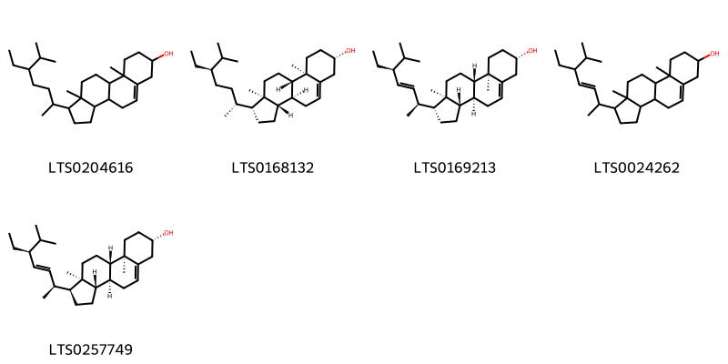{ width=100% }
    <figcaption>Hình ảnh cấu trúc hóa học của 5 hoạt chất thuộc nhóm Steroids and steroid derivatives gồm ['stigmast-5-en-3-ol, (3β)- (LTS0204616)', 'sitosterol (LTS0168132)', '(1r,3as,3bs,7s,9ar,9bs,11ar)-1-[(2s,3e,5s)-5-ethyl-6-methylhept-3-en-2-yl]-9a,11a-dimethyl-1h,2h,3h,3ah,3bh,4h,6h,7h,8h,9h,9bh,10h,11h-cyclopenta[a]phenanthren-7-ol (LTS0169213)', 'stigmasterol (LTS0024262)', '(1s,3as,3bs,7s,9ar,9bs,11ar)-1-[(2s,3e,5s)-5-ethyl-6-methylhept-3-en-2-yl]-9a,11a-dimethyl-1h,2h,3h,3ah,3bh,4h,6h,7h,8h,9h,9bh,10h,11h-cyclopenta[a]phenanthren-7-ol (LTS0257749)'].</figcaption>
</figure>
#### Nhóm Stilbenes
<figure markdown="span">
    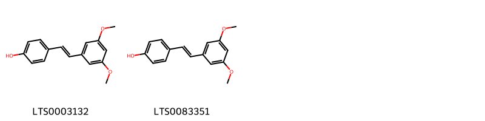{ width=100% }
    <figcaption>Hình ảnh cấu trúc hóa học của 2 hoạt chất thuộc nhóm Stilbenes gồm ['pterostilbene (LTS0003132)', "3',5'-dimethoxy-4-stilbenol (LTS0083351)"].</figcaption>
</figure>
#### Nhóm Tetralins
<figure markdown="span">
    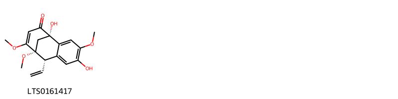{ width=100% }
    <figcaption>Hình ảnh cấu trúc hóa học của 1 hoạt chất thuộc nhóm Tetralins gồm ['pterolinus i (LTS0161417)'].</figcaption>
</figure>

---

### Dược dân tộc học

Danh sách các quốc gia có sử dụng *Pterocarpus santalinus* trong điều trị các bệnh. 

| Country      | Disease                        | Bệnh                                                                                                                                                                                                |
|:-------------|:-------------------------------|:----------------------------------------------------------------------------------------------------------------------------------------------------------------------------------------------------|
| Asia         | Emetic                         | MYMEMORY WARNING: YOU USED ALL AVAILABLE FREE TRANSLATIONS FOR TODAY. NEXT AVAILABLE IN  18 HOURS 25 MINUTES 13 SECONDS VISIT HTTPS://MYMEMORY.TRANSLATED.NET/DOC/USAGELIMITS.PHP TO TRANSLATE MORE |
| China        | Suppurative                    | MYMEMORY WARNING: YOU USED ALL AVAILABLE FREE TRANSLATIONS FOR TODAY. NEXT AVAILABLE IN  18 HOURS 25 MINUTES 11 SECONDS VISIT HTTPS://MYMEMORY.TRANSLATED.NET/DOC/USAGELIMITS.PHP TO TRANSLATE MORE |
| Elsewhere    | Astringent, Tonic, Diaphoretic | MYMEMORY WARNING: YOU USED ALL AVAILABLE FREE TRANSLATIONS FOR TODAY. NEXT AVAILABLE IN  18 HOURS 25 MINUTES 07 SECONDS VISIT HTTPS://MYMEMORY.TRANSLATED.NET/DOC/USAGELIMITS.PHP TO TRANSLATE MORE |
| India(Hindu) | Cosmetic                       | MYMEMORY WARNING: YOU USED ALL AVAILABLE FREE TRANSLATIONS FOR TODAY. NEXT AVAILABLE IN  18 HOURS 25 MINUTES 04 SECONDS VISIT HTTPS://MYMEMORY.TRANSLATED.NET/DOC/USAGELIMITS.PHP TO TRANSLATE MORE |
| Java         | Diuretic, Antidote             | MYMEMORY WARNING: YOU USED ALL AVAILABLE FREE TRANSLATIONS FOR TODAY. NEXT AVAILABLE IN  18 HOURS 25 MINUTES 00 SECONDS VISIT HTTPS://MYMEMORY.TRANSLATED.NET/DOC/USAGELIMITS.PHP TO TRANSLATE MORE |
| Turkey       | Astringent, Tonic              | MYMEMORY WARNING: YOU USED ALL AVAILABLE FREE TRANSLATIONS FOR TODAY. NEXT AVAILABLE IN  18 HOURS 24 MINUTES 57 SECONDS VISIT HTTPS://MYMEMORY.TRANSLATED.NET/DOC/USAGELIMITS.PHP TO TRANSLATE MORE |

---

---
## Pterocarpus soyauxii
### Thông tin về thực vật

!!! info "Phân loại thực vật của *Pterocarpus soyauxii* từ GIBF:"
    - **Kingdom:** Plantae
    - **Phylum:** Tracheophyta
    - **Order:** Fabales
    - **Family:** Fabaceae
    - **Genus:** Pterocarpus
    - **Species:** *Pterocarpus soyauxii*

 

| Label (VI)   | Label (EN)   | Scientific Name      | Descriptions (VI)   | Descriptions (EN)   | Also Known As (VI)   | Also Known As (EN)                      |
|:-------------|:-------------|:---------------------|:--------------------|:--------------------|:---------------------|:----------------------------------------|
| N/A          | N/A          | Pterocarpus soyauxii | loài thực vật       | species of plant    | ['']                 | ['African coralwood', 'African padauk'] |

#### Phân bố trên thế giới

**Từ CSDL GIBF** Spain, Gabon, Cameroon, Congo, Democratic Republic of the

#### Phân bố tại Việt Nam

**Từ CSDL GIBF**: Không có ghi nhận ở Việt Nam

---
### Thành phần hóa học
        
- Theo cơ sở dữ liệu lotus: Từ loài *Pterocarpus soyauxii* đã phân lập và xác định được 10 hoạt chất thuộc về các nhóm Stilbenes, Organooxygen compounds, Isoflavonoids. 

|    | chemicalTaxonomyClassyfireClass   |   smiles_count |
|---:|:----------------------------------|---------------:|
|  0 | Isoflavonoids                     |              8 |
|  1 | Organooxygen compounds            |              1 |
|  2 | Stilbenes                         |              1 |

#### Nhóm Isoflavonoids
<figure markdown="span">
    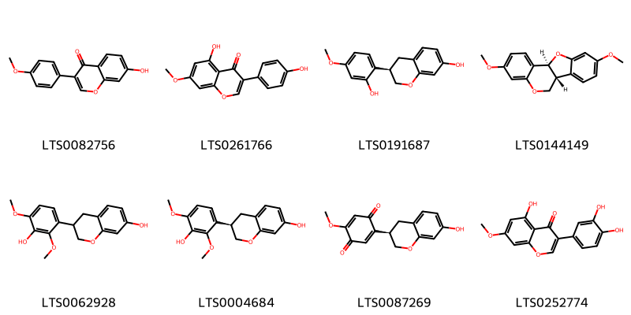{ width=100% }
    <figcaption>Hình ảnh cấu trúc hóa học của 8 hoạt chất thuộc nhóm Isoflavonoids gồm ['formononetin (LTS0082756)', 'prunetin (LTS0261766)', '(-)-vestitol (LTS0191687)', '(1s,10r)-5,14-dimethoxy-8,17-dioxatetracyclo[8.7.0.0²,⁷.0¹¹,¹⁶]heptadeca-2,4,6,11,13,15-hexaene (LTS0144149)', '3-(3-hydroxy-2,4-dimethoxyphenyl)-3,4-dihydro-2h-1-benzopyran-7-ol (LTS0062928)', '(3r)-3-(3-hydroxy-2,4-dimethoxyphenyl)-3,4-dihydro-2h-1-benzopyran-7-ol (LTS0004684)', '2-[(3r)-7-hydroxy-3,4-dihydro-2h-1-benzopyran-3-yl]-5-methoxycyclohexa-2,5-diene-1,4-dione (LTS0087269)', 'santal (LTS0252774)'].</figcaption>
</figure>
#### Nhóm Organooxygen compounds
<figure markdown="span">
    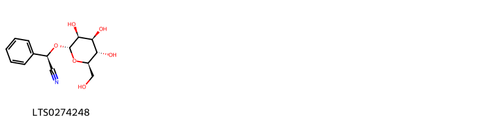{ width=100% }
    <figcaption>Hình ảnh cấu trúc hóa học của 1 hoạt chất thuộc nhóm Organooxygen compounds gồm ['(2r)-2-phenyl-2-{[(2s,3s,4s,5s,6r)-3,4,5-trihydroxy-6-(hydroxymethyl)oxan-2-yl]oxy}acetonitrile (LTS0274248)'].</figcaption>
</figure>
#### Nhóm Stilbenes
<figure markdown="span">
    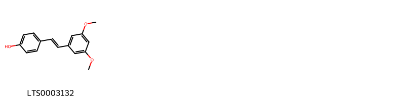{ width=100% }
    <figcaption>Hình ảnh cấu trúc hóa học của 1 hoạt chất thuộc nhóm Stilbenes gồm ['pterostilbene (LTS0003132)'].</figcaption>
</figure>

---

### Dược dân tộc học

Danh sách các quốc gia có sử dụng *Pterocarpus soyauxii* trong điều trị các bệnh. 

| Country   | Disease   | Bệnh                                                                                                                                                                                                |
|:----------|:----------|:----------------------------------------------------------------------------------------------------------------------------------------------------------------------------------------------------|
| Africa    | Cosmetic  | MYMEMORY WARNING: YOU USED ALL AVAILABLE FREE TRANSLATIONS FOR TODAY. NEXT AVAILABLE IN  18 HOURS 24 MINUTES 01 SECONDS VISIT HTTPS://MYMEMORY.TRANSLATED.NET/DOC/USAGELIMITS.PHP TO TRANSLATE MORE |

---

---
## Pterocarpus tinctorius
### Thông tin về thực vật

!!! info "Phân loại thực vật của *Pterocarpus tinctorius* từ GIBF:"
    - **Kingdom:** Plantae
    - **Phylum:** Tracheophyta
    - **Order:** Fabales
    - **Family:** Fabaceae
    - **Genus:** Pterocarpus
    - **Species:** *Pterocarpus tinctorius*

 

| Label (VI)   | Label (EN)   | Scientific Name        | Descriptions (VI)   | Descriptions (EN)   | Also Known As (VI)   | Also Known As (EN)   |
|:-------------|:-------------|:-----------------------|:--------------------|:--------------------|:---------------------|:---------------------|
| N/A          | N/A          | Pterocarpus tinctorius | loài thực vật       | species of plant    | ['']                 | ['']                 |

#### Phân bố trên thế giới

**Từ CSDL GIBF** Malawi, Zambia, nan, Malaysia, Mali, Senegal, Angola, Mozambique, Burundi, unknown or invalid, Congo, Congo, Democratic Republic of the, Burkina Faso, Cameroon, Tanzania, United Republic of

#### Phân bố tại Việt Nam

**Từ CSDL GIBF**: Không có ghi nhận ở Việt Nam

---
### Thành phần hóa học
        
- Theo cơ sở dữ liệu lotus: Từ loài *Pterocarpus tinctorius* đã phân lập và xác định được 1 hoạt chất thuộc về các nhóm Stilbenes. 

|    | chemicalTaxonomyClassyfireClass   |   smiles_count |
|---:|:----------------------------------|---------------:|
|  0 | Stilbenes                         |              1 |

#### Nhóm Stilbenes
<figure markdown="span">
    { width=100% }
    <figcaption>Hình ảnh cấu trúc hóa học của 1 hoạt chất thuộc nhóm Stilbenes gồm ['pterostilbene (LTS0003132)'].</figcaption>
</figure>

---

### Dược dân tộc học

Danh sách các quốc gia có sử dụng *Pterocarpus tinctorius* trong điều trị các bệnh. 

| Country   | Disease   | Bệnh                                                                                                                                                                                                |
|:----------|:----------|:----------------------------------------------------------------------------------------------------------------------------------------------------------------------------------------------------|
| Africa    | Cosmetic  | MYMEMORY WARNING: YOU USED ALL AVAILABLE FREE TRANSLATIONS FOR TODAY. NEXT AVAILABLE IN  18 HOURS 23 MINUTES 30 SECONDS VISIT HTTPS://MYMEMORY.TRANSLATED.NET/DOC/USAGELIMITS.PHP TO TRANSLATE MORE |

---

# Chi Lotus

??? note "Danh sách các dược liệu thuộc chi"
    
	 - *Lotus arabicus*
	 - *Lotus corniculatus*

---
## Lotus arabicus
### Thông tin về thực vật

!!! info "Phân loại thực vật của *Lotus arabicus* từ GIBF:"
    - **Kingdom:** Plantae
    - **Phylum:** Tracheophyta
    - **Order:** Fabales
    - **Family:** Fabaceae
    - **Genus:** Lotus
    - **Species:** *Lotus arabicus*

 

| Label (VI)   | Label (EN)   | Scientific Name   | Descriptions (VI)   | Descriptions (EN)   | Also Known As (VI)   | Also Known As (EN)   |
|:-------------|:-------------|:------------------|:--------------------|:--------------------|:---------------------|:---------------------|
| N/A          | N/A          | Lotus arabicus    |                     | species of plant    | ['']                 | ['']                 |

#### Phân bố trên thế giới

**Từ CSDL GIBF** nan, Angola, Mozambique, Argentina, unknown or invalid, Tanzania, United Republic of, Malawi, Mali, Senegal, Nigeria, Chad, Sudan, Spain, United States of America, Zimbabwe, Saudi Arabia, South Africa, Eritrea, Niger, Egypt, France, United Kingdom of Great Britain and Northern Ireland, Gambia, Djibouti, Kenya, Cameroon, Mauritania, Ethiopia

#### Phân bố tại Việt Nam

**Từ CSDL GIBF**: Không có ghi nhận ở Việt Nam

---
### Thành phần hóa học
        
- Theo cơ sở dữ liệu lotus: Từ loài *Lotus arabicus* đã phân lập và xác định được 3 hoạt chất thuộc về các nhóm Organooxygen compounds. 

|    | chemicalTaxonomyClassyfireClass   |   smiles_count |
|---:|:----------------------------------|---------------:|
|  0 | Organooxygen compounds            |              3 |

#### Nhóm Organooxygen compounds
<figure markdown="span">
    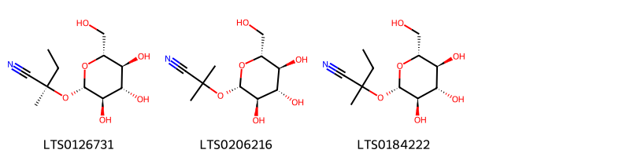{ width=100% }
    <figcaption>Hình ảnh cấu trúc hóa học của 3 hoạt chất thuộc nhóm Organooxygen compounds gồm ['lotaustralin (LTS0126731)', 'linamarin (LTS0206216)', '2-methyl-2-{[(2s,3r,4s,5s,6r)-3,4,5-trihydroxy-6-(hydroxymethyl)oxan-2-yl]oxy}butanenitrile (LTS0184222)'].</figcaption>
</figure>

---

### Dược dân tộc học

Danh sách các quốc gia có sử dụng *Lotus arabicus* trong điều trị các bệnh. 

| Country   | Disease   | Bệnh                                                                                                                                                                                                |
|:----------|:----------|:----------------------------------------------------------------------------------------------------------------------------------------------------------------------------------------------------|
| Sudan     | Poison    | MYMEMORY WARNING: YOU USED ALL AVAILABLE FREE TRANSLATIONS FOR TODAY. NEXT AVAILABLE IN  18 HOURS 22 MINUTES 51 SECONDS VISIT HTTPS://MYMEMORY.TRANSLATED.NET/DOC/USAGELIMITS.PHP TO TRANSLATE MORE |

---

---
## Lotus corniculatus
### Thông tin về thực vật

!!! info "Phân loại thực vật của *Lotus corniculatus* từ GIBF:"
    - **Kingdom:** Plantae
    - **Phylum:** Tracheophyta
    - **Order:** Fabales
    - **Family:** Fabaceae
    - **Genus:** Lotus
    - **Species:** *Lotus corniculatus*

 

| Label (VI)   | Label (EN)   | Scientific Name    | Descriptions (VI)   | Descriptions (EN)          | Also Known As (VI)   | Also Known As (EN)                                    |
|:-------------|:-------------|:-------------------|:--------------------|:---------------------------|:---------------------|:------------------------------------------------------|
| N/A          | N/A          | Lotus corniculatus |                     | species of flowering plant | ['']                 | ["Bird's-foot Trefoil", "Common Bird's-foot-trefoil"] |

#### Phân bố trên thế giới

**Từ CSDL GIBF** Italy, Australia, Belgium, Argentina, Norway, Canada, Denmark, Netherlands, Spain, Hungary, Portugal, Russian Federation, United States of America, Sweden, Finland, Uruguay, Slovenia, Croatia, Czechia, Germany, Switzerland, Austria, France, United Kingdom of Great Britain and Northern Ireland, Ireland, New Zealand

#### Phân bố tại Việt Nam

**Từ CSDL GIBF**: Không có ghi nhận ở Việt Nam

---
### Thành phần hóa học
        
- Theo cơ sở dữ liệu lotus: Từ loài *Lotus corniculatus* đã phân lập và xác định được 300 hoạt chất thuộc về các nhóm Hydroxy acids and derivatives, Phenols, Carboxylic acids and derivatives, Fatty Acyls, Cinnamic acids and derivatives, Saturated hydrocarbons, Tannins, Diazines, Prenol lipids, Organic phosphoric acids and derivatives, Benzene and substituted derivatives, Purine nucleosides, Dihydrofurans, Organooxygen compounds, Pyridines and derivatives, Flavonoids, Phenylpropanoic acids, Steroids and steroid derivatives, Isoflavonoids, Oxepanes, Organonitrogen compounds, Lactones, Imidazopyrimidines. 

|    | chemicalTaxonomyClassyfireClass          |   smiles_count |
|---:|:-----------------------------------------|---------------:|
|  0 | Benzene and substituted derivatives      |             29 |
|  1 | Carboxylic acids and derivatives         |             28 |
|  2 | Cinnamic acids and derivatives           |              4 |
|  3 | Diazines                                 |              2 |
|  4 | Dihydrofurans                            |              1 |
|  5 | Fatty Acyls                              |             13 |
|  6 | Flavonoids                               |             46 |
|  7 | Hydroxy acids and derivatives            |              5 |
|  8 | Imidazopyrimidines                       |              1 |
|  9 | Isoflavonoids                            |              3 |
| 10 | Lactones                                 |              1 |
| 11 | Organic phosphoric acids and derivatives |              1 |
| 12 | Organonitrogen compounds                 |              3 |
| 13 | Organooxygen compounds                   |             49 |
| 14 | Oxepanes                                 |              1 |
| 15 | Phenols                                  |              1 |
| 16 | Phenylpropanoic acids                    |              2 |
| 17 | Prenol lipids                            |             13 |
| 18 | Purine nucleosides                       |              1 |
| 19 | Pyridines and derivatives                |              3 |
| 20 | Saturated hydrocarbons                   |              6 |
| 21 | Steroids and steroid derivatives         |             21 |
| 22 | Tannins                                  |             61 |

#### Nhóm Benzene and substituted derivatives
<figure markdown="span">
    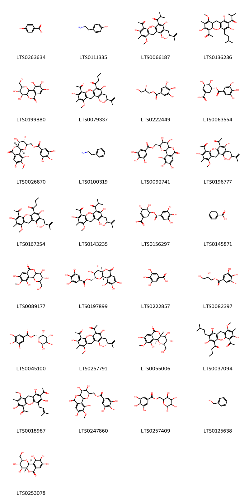{ width=100% }
    <figcaption>Hình ảnh cấu trúc hóa học của 29 hoạt chất thuộc nhóm Benzene and substituted derivatives gồm ['p-hydroxybenzoic acid (LTS0263634)', 'tyramine (LTS0111335)', '1-{3-[(3-acetyl-2,4-dihydroxy-6-methoxy-5-methylphenyl)methyl]-2,4,6-trihydroxy-5-[(2r)-2-hydroxy-3-methylbut-3-en-1-yl]phenyl}-2-methylpropan-1-one (LTS0066187)', '1-{3-[(3-acetyl-2,4-dihydroxy-6-methoxy-5-methylphenyl)methyl]-2,4,6-trihydroxy-5-(3-methylbutyl)phenyl}-2-methylpropan-1-one (LTS0136236)', '5,6,12,13,14-pentahydroxy-4-(hydroxymethyl)-3,8-dioxatricyclo[8.4.0.0²,⁷]tetradeca-1(10),11,13-trien-9-one (LTS0199880)', '1-{3-[(3-acetyl-2,4-dihydroxy-6-methoxy-5-methylphenyl)methyl]-2,4,6-trihydroxy-5-(2-hydroxy-3-methylbut-3-en-1-yl)phenyl}butan-1-one (LTS0079337)', '2,3-dihydroxypropyl 3,4,5-trihydroxybenzoate (LTS0222449)', '5-galloylshikimic acid (LTS0063554)', '[(2s,4r,5s,6s,7r)-5,6,12,14-tetrahydroxy-13-methoxy-9-oxo-3,8-dioxatricyclo[8.4.0.0²,⁷]tetradeca-1(14),10,12-trien-4-yl]methyl 3,4,5-trihydroxybenzoate (LTS0026870)', '2-phenylethylamine (LTS0100319)', '{5,6,12,13,14-pentahydroxy-9-oxo-3,8-dioxatricyclo[8.4.0.0²,⁷]tetradeca-1(10),11,13-trien-4-yl}methyl 3,4,5-trihydroxybenzoate (LTS0092741)', '1-{3-[(3-acetyl-2,4-dihydroxy-6-methoxy-5-methylphenyl)methyl]-2,4,6-trihydroxy-5-(2-hydroxy-3-methylbut-3-en-1-yl)phenyl}ethanone (LTS0196777)', '1-{3-[(3-acetyl-2,4-dihydroxy-6-methoxy-5-methylphenyl)methyl]-2,4,6-trihydroxy-5-[(2r)-2-hydroxy-3-methylbut-3-en-1-yl]phenyl}butan-1-one (LTS0167254)', '1-{3-[(3-acetyl-2,4-dihydroxy-6-methoxy-5-methylphenyl)methyl]-2,4,6-trihydroxy-5-(2-hydroxy-3-methylbut-3-en-1-yl)phenyl}-2-methylpropan-1-one (LTS0143235)', '3,4-dihydroxy-5-(3,4,5-trihydroxybenzoyloxy)cyclohex-1-ene-1-carboxylic acid (LTS0156297)', 'benzoic acid (LTS0145871)', '5,6,12,14-tetrahydroxy-4-(hydroxymethyl)-13-methoxy-3,8-dioxatricyclo[8.4.0.0²,⁷]tetradeca-1(14),10,12-trien-9-one (LTS0089177)', '[(2s,4r,5s,6s,7r)-5,6,12,13,14-pentahydroxy-9-oxo-3,8-dioxatricyclo[8.4.0.0²,⁷]tetradeca-1(10),11,13-trien-4-yl]methyl 3,4,5-trihydroxybenzoate (LTS0197899)', 'galop (LTS0222857)', '(2s)-2,3-dihydroxypropyl 3,4,5-trihydroxybenzoate (LTS0082397)', '[(2r,3s,4s,5r,6s)-3,4,5,6-tetrahydroxyoxan-2-yl]methyl 3,4,5-trihydroxybenzoate (LTS0045100)', '1-{3-[(3-acetyl-2,4-dihydroxy-6-methoxy-5-methylphenyl)methyl]-2,4,6-trihydroxy-5-[(2r)-2-hydroxy-3-methylbut-3-en-1-yl]phenyl}ethanone (LTS0257791)', 'bergenin (LTS0055006)', '1-{3-[(3-acetyl-2,4-dihydroxy-6-methoxy-5-methylphenyl)methyl]-2,4,6-trihydroxy-5-(3-methylbutyl)phenyl}butan-1-one (LTS0037094)', '1-(3-{[3-acetyl-2,4,6-trihydroxy-5-(3-methylbut-2-en-1-yl)phenyl]methyl}-2,6-dihydroxy-4-methoxy-5-methylphenyl)ethanone (LTS0018987)', '11-o-galloylbergenin (LTS0247860)', '(3,4,5,6-tetrahydroxyoxan-2-yl)methyl 3,4,5-trihydroxybenzoate (LTS0257409)', 'benzyl alcohol (LTS0125638)', 'norbergenin (LTS0253078)'].</figcaption>
</figure>
#### Nhóm Carboxylic acids and derivatives
<figure markdown="span">
    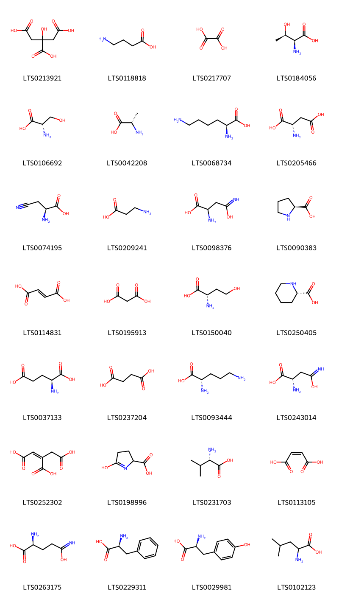{ width=100% }
    <figcaption>Hình ảnh cấu trúc hóa học của 28 hoạt chất thuộc nhóm Carboxylic acids and derivatives gồm ['citric acid (LTS0213921)', 'gamma(amino)-butyric acid (LTS0118818)', 'oxalic acid (LTS0217707)', 'l-threonine (LTS0184056)', 'l-serine (LTS0106692)', 'l-alanine (LTS0042208)', 'l-lysine (LTS0068734)', 'l-aspartic acid (LTS0205466)', '3-cyanoalanine (LTS0074195)', 'β alanine (LTS0209241)', 'asparagine (LTS0098376)', 'l-proline (LTS0090383)', 'fumaric acid (LTS0114831)', 'malonic acid (LTS0195913)', 'l-homoserine (LTS0150040)', '(-)-pipecolic acid (LTS0250405)', 'l-glutamic acid (LTS0037133)', 'succinic acid (LTS0237204)', 'l-ornithine (LTS0093444)', 'aspartamate (LTS0243014)', 'aconitate (LTS0252302)', 'pyroglutamic acid (LTS0198996)', 'l-valine (LTS0231703)', 'maleic acid (LTS0113105)', 'l glutamine (LTS0263175)', 'l-phenylalanine (LTS0229311)', 'l-tyrosine (LTS0029981)', 'leucine (LTS0102123)'].</figcaption>
</figure>
#### Nhóm Cinnamic acids and derivatives
<figure markdown="span">
    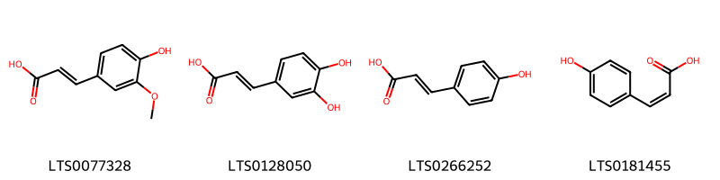{ width=100% }
    <figcaption>Hình ảnh cấu trúc hóa học của 4 hoạt chất thuộc nhóm Cinnamic acids and derivatives gồm ['ferulic acid (LTS0077328)', '3,4-dihydroxycinnamic acid (LTS0128050)', 'para-coumaric acid (LTS0266252)', 'cis-p-coumaric acid (LTS0181455)'].</figcaption>
</figure>
#### Nhóm Diazines
<figure markdown="span">
    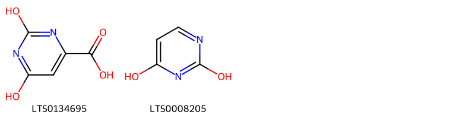{ width=100% }
    <figcaption>Hình ảnh cấu trúc hóa học của 2 hoạt chất thuộc nhóm Diazines gồm ['vitamin b13 (LTS0134695)', 'pirod (LTS0008205)'].</figcaption>
</figure>
#### Nhóm Dihydrofurans
<figure markdown="span">
    { width=100% }
    <figcaption>Hình ảnh cấu trúc hóa học của 1 hoạt chất thuộc nhóm Dihydrofurans gồm ['vitamin c (LTS0022555)'].</figcaption>
</figure>
#### Nhóm Fatty Acyls
<figure markdown="span">
    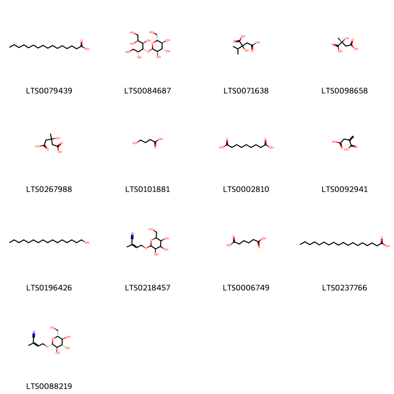{ width=100% }
    <figcaption>Hình ảnh cấu trúc hóa học của 13 hoạt chất thuộc nhóm Fatty Acyls gồm ['palmitic acid (LTS0079439)', 'maltitol (LTS0084687)', '2-isopropylmalic acid (LTS0071638)', 'pyrotartaric acid (LTS0098658)', 'meglutol (LTS0267988)', 'gamma hydroxybutyric acid (LTS0101881)', 'azelaic acid (LTS0002810)', 'itaconic acid (LTS0092941)', 'cetyl alcohol (LTS0196426)', '2-methyl-4-{[3,4,5-trihydroxy-6-(hydroxymethyl)oxan-2-yl]oxy}but-2-enenitrile (LTS0218457)', 'adipic acid (LTS0006749)', 'stearic acid (LTS0237766)', 'rhodiocyanoside a (LTS0088219)'].</figcaption>
</figure>
#### Nhóm Flavonoids
<figure markdown="span">
    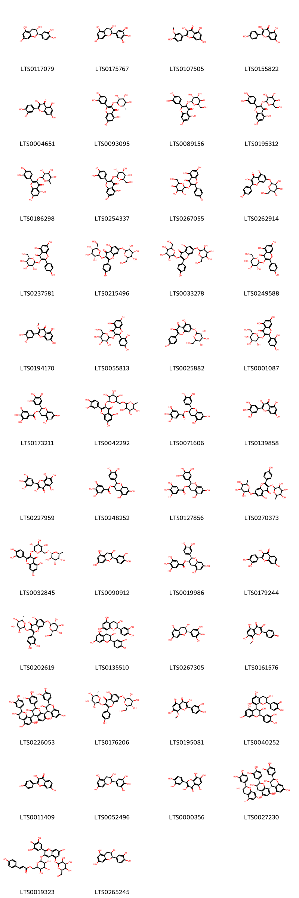{ width=100% }
    <figcaption>Hình ảnh cấu trúc hóa học của 46 hoạt chất thuộc nhóm Flavonoids gồm ['(+)-catechol (LTS0117079)', 'epigallocatechin (LTS0175767)', 'isorhamnetin (LTS0107505)', 'kaempherol (LTS0155822)', 'quercetin (LTS0004651)', 'quercitrin (LTS0093095)', 'hyperoside (LTS0089156)', '2-(3,4-dihydroxyphenyl)-5,7-dihydroxy-3-{[3,4,5-trihydroxy-6-(hydroxymethyl)oxan-2-yl]oxy}chromen-4-one (LTS0195312)', 'quercitrin (LTS0186298)', 'isoquercetin (LTS0254337)', 'trifolin (LTS0267055)', '3,5-dihydroxy-2-(4-hydroxyphenyl)-7-{[3,4,5-trihydroxy-6-(hydroxymethyl)oxan-2-yl]oxy}chromen-4-one (LTS0262914)', 'trifolin (LTS0237581)', '5-hydroxy-2-(4-hydroxyphenyl)-3,7-bis({[(2s,3r,4s,5s,6r)-3,4,5-trihydroxy-6-(hydroxymethyl)oxan-2-yl]oxy})chromen-4-one (LTS0215496)', '5-hydroxy-2-(4-hydroxyphenyl)-3,7-bis({[3,4,5-trihydroxy-6-(hydroxymethyl)oxan-2-yl]oxy})chromen-4-one (LTS0033278)', 'astragalin (LTS0249588)', 'quercetin 3-methyl ether (LTS0194170)', '2-(2,4-dihydroxyphenyl)-5,7-dihydroxy-3-{[3,4,5-trihydroxy-6-(hydroxymethyl)oxan-2-yl]oxy}chromen-4-one (LTS0055813)', 'kaempferol 7-o-glucoside (LTS0025882)', '2-(2,4-dihydroxyphenyl)-5,7-dihydroxy-3-{[(2s,3r,4s,5r,6r)-3,4,5-trihydroxy-6-(hydroxymethyl)oxan-2-yl]oxy}chromen-4-one (LTS0001087)', '(-)-epigallocatechin gallate (LTS0173211)', 'rutin (LTS0042292)', 'epicatechin gallate (LTS0071606)', 'myricetin (LTS0139858)', 'hibiscetin (LTS0227959)', '2-(3,4-dihydroxyphenyl)-5,7-dihydroxy-3,4-dihydro-2h-1-benzopyran-3-yl 3,4,5-trihydroxybenzoate (LTS0248252)', '5,7-dihydroxy-2-(3,4,5-trihydroxyphenyl)-3,4-dihydro-2h-1-benzopyran-3-yl 3,4,5-trihydroxybenzoate (LTS0127856)', 'kaempferitrin (LTS0270373)', '3-rutinosyl quercetin (LTS0032845)', 'catechol (LTS0090912)', 'catechin 3-o-gallate (LTS0019986)', "3,7,3',4'-tetrahydroxyflavone (LTS0179244)", '2-(3,4-dihydroxyphenyl)-5-hydroxy-7-{[(2s,3r,4s,5s,6r)-3,4,5-trihydroxy-6-(hydroxymethyl)oxan-2-yl]oxy}-3-{[(2s,3s,4r,5r,6s)-3,4,5-trihydroxy-6-methyloxan-2-yl]oxy}chromen-4-one (LTS0202619)', '(2r,3r,4r)-2-(3,4-dihydroxyphenyl)-4-[(2r,3r)-2-(3,4-dihydroxyphenyl)-3,5,7-trihydroxy-3,4-dihydro-2h-1-benzopyran-8-yl]-3,4-dihydro-2h-1-benzopyran-3,5,7-triol (LTS0135510)', 'gallocatechol (LTS0267305)', 'sexangularetin (LTS0161576)', 'procyanidin c2 (LTS0226053)', '5-hydroxy-2-(4-hydroxyphenyl)-7-{[(2s,3r,4s,5s,6r)-3,4,5-trihydroxy-6-(hydroxymethyl)oxan-2-yl]oxy}-3-{[(2s,3s,4r,5r,6s)-3,4,5-trihydroxy-6-methyloxan-2-yl]oxy}chromen-4-one (LTS0176206)', 'corniculatusin (LTS0195081)', '2-(3,4-dihydroxyphenyl)-4-[2-(3,4-dihydroxyphenyl)-3,5,7-trihydroxy-3,4-dihydro-2h-1-benzopyran-8-yl]-3,4-dihydro-2h-1-benzopyran-3,5,7-triol (LTS0040252)', "3,7,4'-trihydroxyflavone (LTS0011409)", 'epigallocatechin (LTS0052496)', 'gossypetin (LTS0000356)', '(2r,3r,4s)-2-(3,4-dihydroxyphenyl)-8-[(2r,3r,4r)-2-(3,4-dihydroxyphenyl)-3,5,7-trihydroxy-3,4-dihydro-2h-1-benzopyran-4-yl]-4-[(2r,3s)-2-(3,4-dihydroxyphenyl)-3,5,7-trihydroxy-3,4-dihydro-2h-1-benzopyran-8-yl]-3,4-dihydro-2h-1-benzopyran-3,5,7-triol (LTS0027230)', '7-hydroxy-5-{[3,4,5-trihydroxy-6-(hydroxymethyl)oxan-2-yl]oxy}-3-{[3,4,5-trihydroxy-6-({[3-(4-hydroxyphenyl)prop-2-enoyl]oxy}methyl)oxan-2-yl]oxy}-2-(3,4,5-trihydroxyphenyl)-1λ⁴-chromen-1-ylium (LTS0019323)', 'ent-epicatechin (LTS0265245)'].</figcaption>
</figure>
#### Nhóm Hydroxy acids and derivatives
<figure markdown="span">
    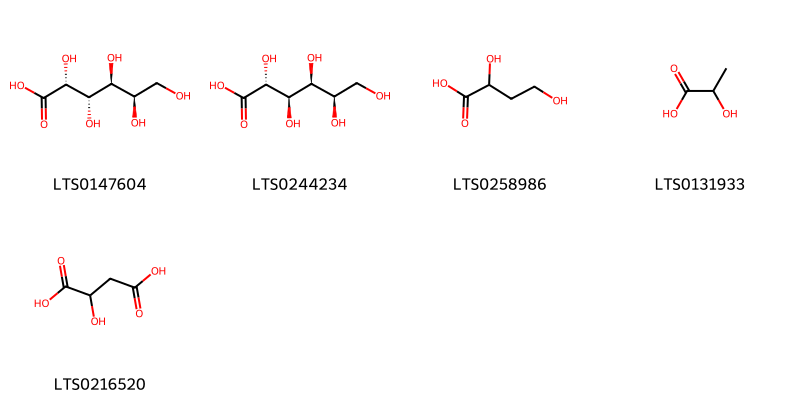{ width=100% }
    <figcaption>Hình ảnh cấu trúc hóa học của 5 hoạt chất thuộc nhóm Hydroxy acids and derivatives gồm ['galactonic acid (LTS0147604)', 'gulonic acid (LTS0244234)', '2,4-dihydroxybutyric acid (LTS0258986)', 'lactic acid (LTS0131933)', 'malic acid (LTS0216520)'].</figcaption>
</figure>
#### Nhóm Imidazopyrimidines
<figure markdown="span">
    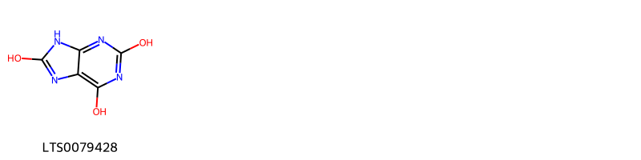{ width=100% }
    <figcaption>Hình ảnh cấu trúc hóa học của 1 hoạt chất thuộc nhóm Imidazopyrimidines gồm ['9h-purine-2,6,8-triol (LTS0079428)'].</figcaption>
</figure>
#### Nhóm Isoflavonoids
<figure markdown="span">
    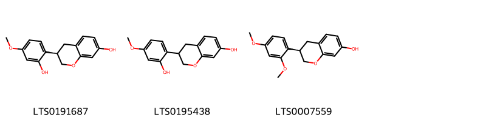{ width=100% }
    <figcaption>Hình ảnh cấu trúc hóa học của 3 hoạt chất thuộc nhóm Isoflavonoids gồm ['(-)-vestitol (LTS0191687)', '(+/-)-vestitol (LTS0195438)', '(-)-sativan (LTS0007559)'].</figcaption>
</figure>
#### Nhóm Lactones
<figure markdown="span">
    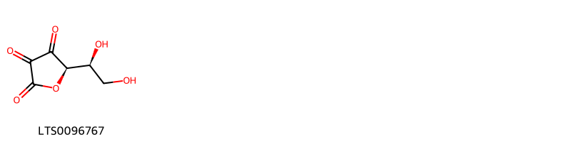{ width=100% }
    <figcaption>Hình ảnh cấu trúc hóa học của 1 hoạt chất thuộc nhóm Lactones gồm ['dehydroascorbic acid (LTS0096767)'].</figcaption>
</figure>
#### Nhóm Organic phosphoric acids and derivatives
<figure markdown="span">
    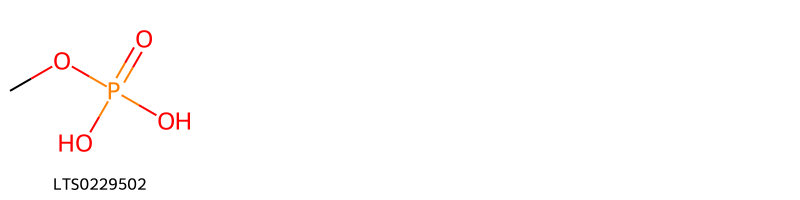{ width=100% }
    <figcaption>Hình ảnh cấu trúc hóa học của 1 hoạt chất thuộc nhóm Organic phosphoric acids and derivatives gồm ['methyl phosphate (LTS0229502)'].</figcaption>
</figure>
#### Nhóm Organonitrogen compounds
<figure markdown="span">
    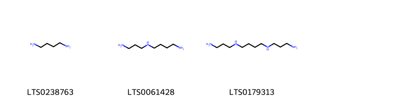{ width=100% }
    <figcaption>Hình ảnh cấu trúc hóa học của 3 hoạt chất thuộc nhóm Organonitrogen compounds gồm ['putrescine (LTS0238763)', 'spermidine (LTS0061428)', 'spermine (LTS0179313)'].</figcaption>
</figure>
#### Nhóm Organooxygen compounds
<figure markdown="span">
    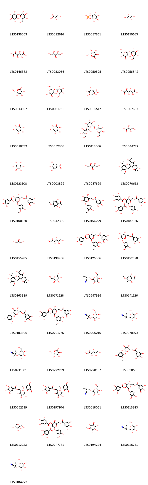{ width=100% }
    <figcaption>Hình ảnh cấu trúc hóa học của 49 hoạt chất thuộc nhóm Organooxygen compounds gồm ['galactinol (LTS0136053)', 'l-glycerate (LTS0022616)', 'inositol 1-phosphate (LTS0037861)', 'meso-erythritol (LTS0150163)', 'mucin (LTS0146382)', 'ribitol (LTS0083066)', 'gluconolactone (LTS0250595)', "α,α'-trehalose (LTS0256842)", 'glucose (LTS0013597)', 'β-maltose (LTS0061751)', '(-)-quinic acid (LTS0005517)', 'saccharic acid (LTS0007607)', 'pinit (LTS0010732)', 'ononitol (LTS0052856)', 'raffinose (LTS0113066)', 'threonate (LTS0044772)', '(1r,2r,3s,4r,5s,6s)-cyclohexane-1,2,3,4,5,6-hexol (LTS0123108)', '(-)-shikimate (LTS0003899)', 'arabitol (LTS0087699)', '1-(3-{[(3r)-6-acetyl-3,5,7-trihydroxy-2,2-dimethyl-3,4-dihydro-1-benzopyran-8-yl]methyl}-2,6-dihydroxy-4-methoxy-5-methylphenyl)ethanone (LTS0070613)', '[(2r,3s,4s,5r,6s)-3,4-dihydroxy-6-(4-hydroxy-3-methoxyphenoxy)-5-(3,4,5-trihydroxybenzoyloxy)oxan-2-yl]methyl 3,4,5-trihydroxybenzoate (LTS0100150)', '1-(2,6-dihydroxy-4-methoxy-3,5-dimethylphenyl)ethanone (LTS0042309)', '[3,4,5-trihydroxy-6-(4-hydroxy-3-methoxyphenoxy)oxan-2-yl]methyl 3,4,5-trihydroxybenzoate (LTS0156299)', '[(2r,3r,4s,5r,6s)-3-hydroxy-6-(4-hydroxy-3-methoxyphenoxy)-4,5-bis(3,4,5-trihydroxybenzoyloxy)oxan-2-yl]methyl 3,4,5-trihydroxybenzoate (LTS0187356)', 'glycerol (LTS0155285)', 'mannitol (LTS0199986)', '[(2r,3s,4s,5r,6s)-3,4-dihydroxy-5-(3,4,5-trihydroxybenzoyloxy)-6-(3,4,5-trimethoxyphenoxy)oxan-2-yl]methyl 3,4,5-trihydroxybenzoate (LTS0126886)', '[(2r,3s,4s,5r,6s)-3,4,5-trihydroxy-6-(4-hydroxy-3-methoxyphenoxy)oxan-2-yl]methyl 3,4,5-trihydroxybenzoate (LTS0152670)', '1-{3-[(6-acetyl-3,5,7-trihydroxy-2,2-dimethyl-3,4-dihydro-1-benzopyran-8-yl)methyl]-2,6-dihydroxy-4-methoxy-5-methylphenyl}ethanone (LTS0163889)', 'galactose (LTS0171628)', '2-({[3,4,5-trihydroxy-6-(hydroxymethyl)oxan-2-yl]oxy}methyl)but-2-enenitrile (LTS0247986)', '1-(2,6-dihydroxy-4-methoxy-3-methylphenyl)ethanone (LTS0141126)', '[(2r,3s,4s,5r,6s)-3,4,5-trihydroxy-6-(4-hydroxy-2-methoxyphenoxy)oxan-2-yl]methyl 3,4,5-trihydroxybenzoate (LTS0183806)', '[3,4-dihydroxy-5-(3,4,5-trihydroxybenzoyloxy)-6-(3,4,5-trimethoxyphenoxy)oxan-2-yl]methyl 3,4,5-trihydroxybenzoate (LTS0201776)', 'linamarin (LTS0206216)', '(s)-lotaustralin (LTS0070973)', '2-methyl-2-{[3,4,5-trihydroxy-6-(hydroxymethyl)oxan-2-yl]oxy}butanenitrile (LTS0211301)', 'β-glucose (LTS0222199)', 'd-sorbitol (LTS0220157)', '[3,4,5-trihydroxy-6-(4-hydroxy-2-methoxyphenoxy)oxan-2-yl]methyl 3,4,5-trihydroxybenzoate (LTS0038565)', '[(2r,3s,4s,5r,6s)-3,4,5-trihydroxy-6-(4-hydroxy-2,6-dimethoxyphenoxy)oxan-2-yl]methyl 3,4,5-trihydroxybenzoate (LTS0252139)', '[3,4,5-trihydroxy-6-(4-hydroxy-2,6-dimethoxyphenoxy)oxan-2-yl]methyl 3,4,5-trihydroxybenzoate (LTS0197104)', '(2e)-2-({[(2r,3r,4s,5s,6r)-3,4,5-trihydroxy-6-(hydroxymethyl)oxan-2-yl]oxy}methyl)but-2-enenitrile (LTS0018061)', '[3,4-dihydroxy-6-(4-hydroxy-3-methoxyphenoxy)-5-(3,4,5-trihydroxybenzoyloxy)oxan-2-yl]methyl 3,4,5-trihydroxybenzoate (LTS0116383)', 'α-d-ribulose (LTS0112223)', '[3-hydroxy-6-(4-hydroxy-3-methoxyphenoxy)-4,5-bis(3,4,5-trihydroxybenzoyloxy)oxan-2-yl]methyl 3,4,5-trihydroxybenzoate (LTS0247781)', 'pinitol (LTS0194724)', 'lotaustralin (LTS0126731)', '2-methyl-2-{[(2s,3r,4s,5s,6r)-3,4,5-trihydroxy-6-(hydroxymethyl)oxan-2-yl]oxy}butanenitrile (LTS0184222)'].</figcaption>
</figure>
#### Nhóm Oxepanes
<figure markdown="span">
    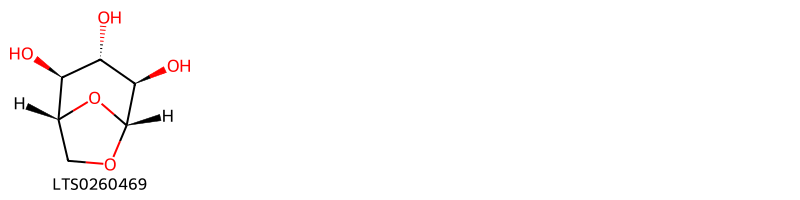{ width=100% }
    <figcaption>Hình ảnh cấu trúc hóa học của 1 hoạt chất thuộc nhóm Oxepanes gồm ['levoglucosan (LTS0260469)'].</figcaption>
</figure>
#### Nhóm Phenols
<figure markdown="span">
    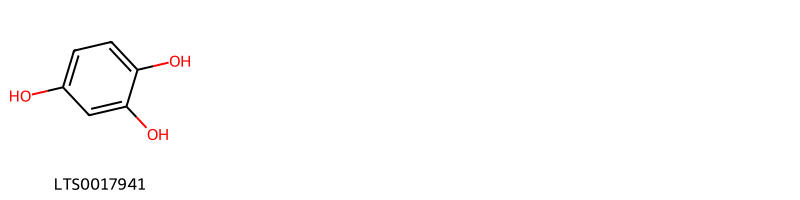{ width=100% }
    <figcaption>Hình ảnh cấu trúc hóa học của 1 hoạt chất thuộc nhóm Phenols gồm ['1,2,4-benzenetriol (LTS0017941)'].</figcaption>
</figure>
#### Nhóm Phenylpropanoic acids
<figure markdown="span">
    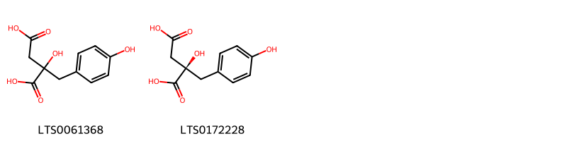{ width=100% }
    <figcaption>Hình ảnh cấu trúc hóa học của 2 hoạt chất thuộc nhóm Phenylpropanoic acids gồm ['2-hydroxy-2-[(4-hydroxyphenyl)methyl]butanedioic acid (LTS0061368)', 'eucomic acid, (-)- (LTS0172228)'].</figcaption>
</figure>
#### Nhóm Prenol lipids
<figure markdown="span">
    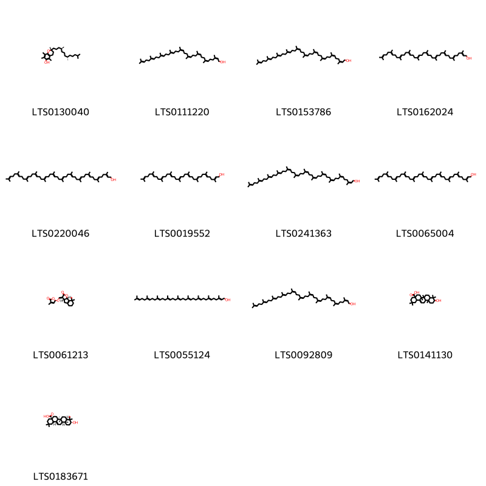{ width=100% }
    <figcaption>Hình ảnh cấu trúc hóa học của 13 hoạt chất thuộc nhóm Prenol lipids gồm ['(2r)-2,5,7,8-tetramethyl-2-[(4s,8s)-4,8,12-trimethyltridecyl]-3,4-dihydro-1-benzopyran-6-ol (LTS0130040)', '(2z,6z,10z,14z,18z,22e,26e,30e)-3,7,11,15,19,23,27,31,35-nonamethylhexatriaconta-2,6,10,14,18,22,26,30,34-nonaen-1-ol (LTS0111220)', '(2z,6z,10z,14z,18z,22z,26e,30e,34e)-3,7,11,15,19,23,27,31,35,39-decamethyltetraconta-2,6,10,14,18,22,26,30,34,38-decaen-1-ol (LTS0153786)', '3,7,11,15,19,23,27,31,35,39-decamethyltetraconta-2,6,10,14,18,22,26,30,34,38-decaen-1-ol (LTS0162024)', '3,7,11,15,19,23,27,31,35,39,43,47-dodecamethyloctatetraconta-2,6,10,14,18,22,26,30,34,38,42,46-dodecaen-1-ol (LTS0220046)', '3,7,11,15,19,23,27,31,35-nonamethylhexatriaconta-2,6,10,14,18,22,26,30,34-nonaen-1-ol (LTS0019552)', '(2z,6z,10z,14z,18z,22z,26z,30z,34e,38e,42e)-3,7,11,15,19,23,27,31,35,39,43,47-dodecamethyloctatetraconta-2,6,10,14,18,22,26,30,34,38,42,46-dodecaen-1-ol (LTS0241363)', '3,7,11,15,19,23,27,31,35,39,43-undecamethyltetratetraconta-2,6,10,14,18,22,26,30,34,38,42-undecaen-1-ol (LTS0065004)', '5-deoxystrigol (LTS0061213)', 'solanesol (LTS0055124)', '(2z,6z,10z,14z,18z,22z,26z,30e,34e,38e)-3,7,11,15,19,23,27,31,35,39,43-undecamethyltetratetraconta-2,6,10,14,18,22,26,30,34,38,42-undecaen-1-ol (LTS0092809)', 'oleanolic acid (LTS0141130)', '3-epioleanolic acid (LTS0183671)'].</figcaption>
</figure>
#### Nhóm Purine nucleosides
<figure markdown="span">
    { width=100% }
    <figcaption>Hình ảnh cấu trúc hóa học của 1 hoạt chất thuộc nhóm Purine nucleosides gồm ['adenosine (LTS0014061)'].</figcaption>
</figure>
#### Nhóm Pyridines and derivatives
<figure markdown="span">
    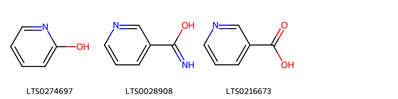{ width=100% }
    <figcaption>Hình ảnh cấu trúc hóa học của 3 hoạt chất thuộc nhóm Pyridines and derivatives gồm ['2-hydroxypyridine (LTS0274697)', 'vitamin b>3< (LTS0028908)', 'niacin (LTS0216673)'].</figcaption>
</figure>
#### Nhóm Saturated hydrocarbons
<figure markdown="span">
    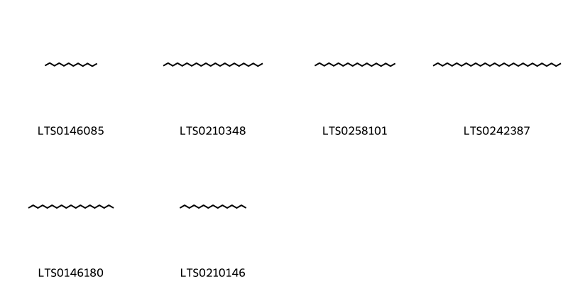{ width=100% }
    <figcaption>Hình ảnh cấu trúc hóa học của 6 hoạt chất thuộc nhóm Saturated hydrocarbons gồm ['dodecane (LTS0146085)', 'docosane (LTS0210348)', 'octadecane (LTS0258101)', 'octacosane (LTS0242387)', 'nonadecane (LTS0146180)', 'pentadecane (LTS0210146)'].</figcaption>
</figure>
#### Nhóm Steroids and steroid derivatives
<figure markdown="span">
    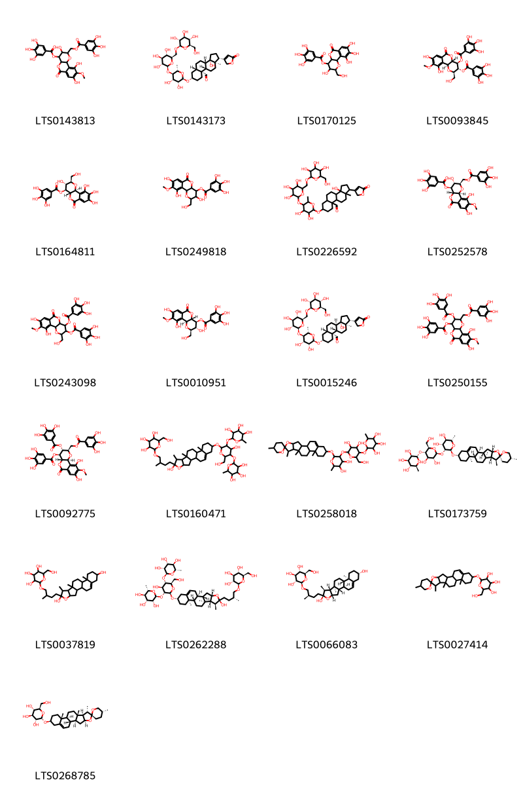{ width=100% }
    <figcaption>Hình ảnh cấu trúc hóa học của 21 hoạt chất thuộc nhóm Steroids and steroid derivatives gồm ['[5,12,14-trihydroxy-13-methoxy-9-oxo-6-(3,4,5-trihydroxybenzoyloxy)-3,8-dioxatricyclo[8.4.0.0²,⁷]tetradeca-1(14),10,12-trien-4-yl]methyl 3,4,5-trihydroxybenzoate (LTS0143813)', '(1r,3as,3bs,5as,7s,9ar,9bs,11ar)-7-{[(2r,3r,4s,5r,6s)-3,4-dihydroxy-6-methyl-5-{[(2s,3r,4s,5s,6r)-3,4,5-trihydroxy-6-({[(2r,3r,4s,5s,6r)-3,4,5-trihydroxy-6-(hydroxymethyl)oxan-2-yl]oxy}methyl)oxan-2-yl]oxy}oxan-2-yl]oxy}-3a-hydroxy-11a-methyl-1-(5-oxo-2h-furan-3-yl)-tetradecahydrocyclopenta[a]phenanthrene-9a-carbaldehyde (LTS0143173)', '5,12,13,14-tetrahydroxy-4-(hydroxymethyl)-9-oxo-3,8-dioxatricyclo[8.4.0.0²,⁷]tetradeca-1(10),11,13-trien-6-yl 3,4,5-trihydroxybenzoate (LTS0170125)', '(2s,4r,5r,6r,7s)-12,14-dihydroxy-4-(hydroxymethyl)-13-methoxy-9-oxo-6-(3,4,5-trihydroxybenzoyloxy)-3,8-dioxatricyclo[8.4.0.0²,⁷]tetradeca-1(14),10,12-trien-5-yl 3,4,5-trihydroxybenzoate (LTS0093845)', '(2s,4r,5r,6s,7s)-5,12,13,14-tetrahydroxy-4-(hydroxymethyl)-9-oxo-3,8-dioxatricyclo[8.4.0.0²,⁷]tetradeca-1(14),10,12-trien-6-yl 3,4,5-trihydroxybenzoate (LTS0164811)', '4-o-galloylbergenin (LTS0249818)', '7-[(3,4-dihydroxy-6-methyl-5-{[3,4,5-trihydroxy-6-({[3,4,5-trihydroxy-6-(hydroxymethyl)oxan-2-yl]oxy}methyl)oxan-2-yl]oxy}oxan-2-yl)oxy]-3a-hydroxy-11a-methyl-1-(5-oxo-2h-furan-3-yl)-tetradecahydrocyclopenta[a]phenanthrene-9a-carbaldehyde (LTS0226592)', '[(2s,4r,5r,6s,7s)-5,12,14-trihydroxy-13-methoxy-9-oxo-6-(3,4,5-trihydroxybenzoyloxy)-3,8-dioxatricyclo[8.4.0.0²,⁷]tetradeca-1(14),10,12-trien-4-yl]methyl 3,4,5-trihydroxybenzoate (LTS0252578)', '12,14-dihydroxy-4-(hydroxymethyl)-13-methoxy-9-oxo-6-(3,4,5-trihydroxybenzoyloxy)-3,8-dioxatricyclo[8.4.0.0²,⁷]tetradeca-1(14),10,12-trien-5-yl 3,4,5-trihydroxybenzoate (LTS0243098)', '(2s,4r,5r,6s,7s)-5,12,14-trihydroxy-4-(hydroxymethyl)-13-methoxy-9-oxo-3,8-dioxatricyclo[8.4.0.0²,⁷]tetradeca-1(14),10,12-trien-6-yl 3,4,5-trihydroxybenzoate (LTS0010951)', '(1r,3as,3br,5as,7s,9ar,9bs,11ar)-7-{[(2r,3r,4s,5r,6s)-3,4-dihydroxy-6-methyl-5-{[(2s,3r,4s,5s,6r)-3,4,5-trihydroxy-6-({[(2r,3r,4s,5s,6r)-3,4,5-trihydroxy-6-(hydroxymethyl)oxan-2-yl]oxy}methyl)oxan-2-yl]oxy}oxan-2-yl]oxy}-3a-hydroxy-11a-methyl-1-(5-oxo-2h-furan-3-yl)-tetradecahydrocyclopenta[a]phenanthrene-9a-carbaldehyde (LTS0015246)', '[12,14-dihydroxy-13-methoxy-9-oxo-5,6-bis(3,4,5-trihydroxybenzoyloxy)-3,8-dioxatricyclo[8.4.0.0²,⁷]tetradeca-1(14),10,12-trien-4-yl]methyl 3,4,5-trihydroxybenzoate (LTS0250155)', '[(2s,4r,5r,6r,7s)-12,14-dihydroxy-13-methoxy-9-oxo-5,6-bis(3,4,5-trihydroxybenzoyloxy)-3,8-dioxatricyclo[8.4.0.0²,⁷]tetradeca-1(14),10,12-trien-4-yl]methyl 3,4,5-trihydroxybenzoate (LTS0092775)', '2-[(4-hydroxy-6-{[6-hydroxy-7,9,13-trimethyl-6-(3-methyl-4-{[3,4,5-trihydroxy-6-(hydroxymethyl)oxan-2-yl]oxy}butyl)-5-oxapentacyclo[10.8.0.0²,⁹.0⁴,⁸.0¹³,¹⁸]icos-18-en-16-yl]oxy}-2-(hydroxymethyl)-5-[(3,4,5-trihydroxy-6-methyloxan-2-yl)oxy]oxan-3-yl)oxy]-6-methyloxane-3,4,5-triol (LTS0160471)', "2-({6-[(4,5-dihydroxy-6-methyl-2-{5,7',9',13'-tetramethyl-5'-oxaspiro[oxane-2,6'-pentacyclo[10.8.0.0²,⁹.0⁴,⁸.0¹³,¹⁸]icosan]-18'-eneoxy}oxan-3-yl)oxy]-4,5-dihydroxy-2-(hydroxymethyl)oxan-3-yl}oxy)-6-methyloxane-3,4,5-triol (LTS0258018)", "(2s,3r,4r,5r,6s)-2-{[(2r,3s,4r,5r,6s)-6-{[(2r,3r,4r,5r,6s)-4,5-dihydroxy-6-methyl-2-[(1's,2r,2's,4's,5r,7's,8'r,9's,12's,13'r,16's)-5,7',9',13'-tetramethyl-5'-oxaspiro[oxane-2,6'-pentacyclo[10.8.0.0²,⁹.0⁴,⁸.0¹³,¹⁸]icosan]-18'-eneoxy]oxan-3-yl]oxy}-4,5-dihydroxy-2-(hydroxymethyl)oxan-3-yl]oxy}-6-methyloxane-3,4,5-triol (LTS0173759)", '2-(4-{6,16-dihydroxy-7,9,13-trimethyl-5-oxapentacyclo[10.8.0.0²,⁹.0⁴,⁸.0¹³,¹⁸]icos-18-en-6-yl}-2-methylbutoxy)-6-(hydroxymethyl)oxane-3,4,5-triol (LTS0037819)', 'protodioscin (LTS0262288)', '(2r,3r,4s,5s,6r)-2-[(2r)-4-[(1s,2s,4s,6r,7s,8r,9s,12s,13r,16s)-6,16-dihydroxy-7,9,13-trimethyl-5-oxapentacyclo[10.8.0.0²,⁹.0⁴,⁸.0¹³,¹⁸]icos-18-en-6-yl]-2-methylbutoxy]-6-(hydroxymethyl)oxane-3,4,5-triol (LTS0066083)', "2-(hydroxymethyl)-6-{5,7',9',13'-tetramethyl-5'-oxaspiro[oxane-2,6'-pentacyclo[10.8.0.0²,⁹.0⁴,⁸.0¹³,¹⁸]icosan]-18'-eneoxy}oxane-3,4,5-triol (LTS0027414)", "(2r,3s,4s,5r,6s)-2-(hydroxymethyl)-6-[(1's,2r,2's,4's,5r,7's,8'r,9's,12's,13'r,16's)-5,7',9',13'-tetramethyl-5'-oxaspiro[oxane-2,6'-pentacyclo[10.8.0.0²,⁹.0⁴,⁸.0¹³,¹⁸]icosan]-18'-eneoxy]oxane-3,4,5-triol (LTS0268785)"].</figcaption>
</figure>
#### Nhóm Tannins
<figure markdown="span">
    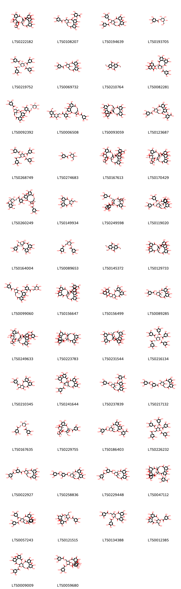{ width=100% }
    <figcaption>Hình ảnh cấu trúc hóa học của 61 hoạt chất thuộc nhóm Tannins gồm ["3a,6,10',11',12',15',16',17',31',32',36',37'-dodecahydroxy-2,2',7',20',28',41'-hexaoxo-6,6a-dihydro-5h-3',6',21',24',27',38',42'-heptaoxaspiro[furo[3,2-b]furan-3,39'-nonacyclo[35.2.2.1³³,³⁶.0¹,³⁵.0⁴,²³.0⁵,²⁶.0⁸,¹³.0¹⁴,¹⁹.0²⁹,³⁴]dotetracontane]-8'(13'),9',11',14',16',18',29'(34'),30',32'-nonaen-25'-yl 3,4,5-trihydroxybenzoate (LTS0222182)", '2-{[7,8,11,12,13,22,23-heptahydroxy-3,16-dioxo-21-(3,4,5-trihydroxybenzoyloxy)-2,17,20-trioxatetracyclo[17.3.1.0⁴,⁹.0¹⁰,¹⁵]tricosa-4(9),5,7,10,12,14-hexaen-6-yl]oxy}-3,4,5-trihydroxybenzoic acid (LTS0108207)', '6,7,8,11,12,13,23-heptahydroxy-3,16-dioxo-21-(3,4,5-trihydroxybenzoyloxy)-2,17,20-trioxatetracyclo[17.3.1.0⁴,⁹.0¹⁰,¹⁵]tricosa-4(9),5,7,10,12,14-hexaen-22-yl 3,4,5-trihydroxybenzoate (LTS0194639)', 'β-glucogallin (LTS0193705)', '(2s,3r,4s,5s,6r)-4-hydroxy-3,5-bis(3,4,5-trihydroxybenzoyloxy)-6-[(3,4,5-trihydroxybenzoyloxy)methyl]oxan-2-yl 3,4,5-trihydroxybenzoate (LTS0219752)', '6,7,8,11,12,13,22,23-octahydroxy-3,16-dioxo-2,17,20-trioxatetracyclo[17.3.1.0⁴,⁹.0¹⁰,¹⁵]tricosa-4(9),5,7,10,12,14-hexaen-21-yl 3,4,5-trihydroxybenzoate (LTS0069732)', '7,14-dihydroxy-6,13-dimethoxy-2,9-dioxatetracyclo[6.6.2.0⁴,¹⁶.0¹¹,¹⁵]hexadeca-1(15),4(16),5,7,11,13-hexaene-3,10-dione (LTS0210764)', '(10r,11s,13r,14r,15s)-3,4,5,20,21,22-hexahydroxy-8,17-dioxo-14-(3,4,5-trihydroxybenzoyloxy)-13-[(3,4,5-trihydroxybenzoyloxy)methyl]-9,12,16-trioxatetracyclo[16.4.0.0²,⁷.0¹⁰,¹⁵]docosa-1(18),2,4,6,19,21-hexaen-11-yl 3,4,5-trihydroxybenzoate (LTS0082281)', '[(2r,3s,4s,5r,6r)-3,4,5,6-tetrahydroxyoxan-2-yl]methyl 2-{[(1s,19r,21s,22r,23r)-7,8,11,12,13,22,23-heptahydroxy-3,16-dioxo-21-(3,4,5-trihydroxybenzoyloxy)-2,17,20-trioxatetracyclo[17.3.1.0⁴,⁹.0¹⁰,¹⁵]tricosa-4(9),5,7,10,12,14-hexaen-6-yl]oxy}-3,4,5-trihydroxybenzoate (LTS0092392)', '{5,6,12,14-tetrahydroxy-13-methoxy-9-oxo-3,8-dioxatricyclo[8.4.0.0²,⁷]tetradeca-1(14),10,12-trien-4-yl}methyl 2-{[7,8,11,12,13,22,23-heptahydroxy-3,16-dioxo-21-(3,4,5-trihydroxybenzoyloxy)-2,17,20-trioxatetracyclo[17.3.1.0⁴,⁹.0¹⁰,¹⁵]tricosa-4(9),5,7,10(15),11,13-hexaen-6-yl]oxy}-3,4,5-trihydroxybenzoate (LTS0006508)', '2,3,14,15,16,19,20,21,35,36-decahydroxy-6,11,24,32-tetraoxo-7,10,25,28,31,40-hexaoxaoctacyclo[35.2.1.0⁵,³⁹.0⁸,²⁷.0⁹,³⁰.0¹²,¹⁷.0¹⁸,²³.0³³,³⁸]tetraconta-1(39),2,4,12(17),13,15,18,20,22,33,35,37-dodecaen-29-yl 3,4,5-trihydroxybenzoate (LTS0093059)', '2-{[6,7,8,11,12,22,23-heptahydroxy-3,16-dioxo-21-(3,4,5-trihydroxybenzoyloxy)-2,17,20-trioxatetracyclo[17.3.1.0⁴,⁹.0¹⁰,¹⁵]tricosa-4(9),5,7,10,12,14-hexaen-13-yl]oxy}-3,4,5-trihydroxybenzoic acid (LTS0123687)', '4-hydroxy-3,5-bis(3,4,5-trihydroxybenzoyloxy)-6-[(3,4,5-trihydroxybenzoyloxy)methyl]oxan-2-yl 3,4,5-trihydroxybenzoate (LTS0268749)', '3,4,5-trihydroxy-6-(hydroxymethyl)oxan-2-yl 3,4,5-trihydroxybenzoate (LTS0274683)', "2-[3a,6,11',12',15',16',17',31',32',36',37'-undecahydroxy-25'-(3,4,5-trihydroxybenzoyloxy)-6,6a-dihydro-5h-3',6',21',24',27',38',42'-heptaoxaspiro[furo[3,2-b]furan-3,39'-nonacyclo[35.2.2.1³³,³⁶.0¹,³⁵.0⁴,²³.0⁵,²⁶.0⁸,¹³.0¹⁴,¹⁹.0²⁹,³⁴]dotetracontane]-8'(13'),9',11',14',16',18',29'(34'),30',32'-nonaene-2,2',7',20',28',41'-hexoneoxy]-3,4,5-trihydroxybenzoic acid (LTS0167613)", "(1'r,3r,3as,4'r,5's,6s,6ar,23'r,25's,26'r,35'r,36'r,37'r)-3a,6,10',11',12',15',16',17',31',32',36',37'-dodecahydroxy-2,2',7',20',28',41'-hexaoxo-6,6a-dihydro-5h-3',6',21',24',27',38',42'-heptaoxaspiro[furo[3,2-b]furan-3,39'-nonacyclo[35.2.2.1³³,³⁶.0¹,³⁵.0⁴,²³.0⁵,²⁶.0⁸,¹³.0¹⁴,¹⁹.0²⁹,³⁴]dotetracontane]-8'(13'),9',11',14',16',18',29',31',33'-nonaen-25'-yl 3,4,5-trihydroxybenzoate (LTS0170429)", '[(2r,4r,5s,6s,7s)-5,6,12,14-tetrahydroxy-13-methoxy-9-oxo-3,8-dioxatricyclo[8.4.0.0²,⁷]tetradeca-1(14),10,12-trien-4-yl]methyl 2-{[(1s,19r,21s,22r,23r)-7,8,11,12,13,22,23-heptahydroxy-3,16-dioxo-21-(3,4,5-trihydroxybenzoyloxy)-2,17,20-trioxatetracyclo[17.3.1.0⁴,⁹.0¹⁰,¹⁵]tricosa-4(9),5,7,10(15),11,13-hexaen-6-yl]oxy}-3,4,5-trihydroxybenzoate (LTS0260249)', '3,4,5,11,14,20,21,22-octahydroxy-13-(hydroxymethyl)-9,12,16-trioxatetracyclo[16.4.0.0²,⁷.0¹⁰,¹⁵]docosa-1(22),2(7),3,5,18,20-hexaene-8,17-dione (LTS0149934)', '(1r,7s,9s,18r,19s,21r,22s)-7,8,8,12,13-pentahydroxy-3,6,16-trioxo-19-(3,4,5-trihydroxybenzoyloxy)-21-[(3,4,5-trihydroxybenzoyloxy)methyl]-2,17,20,23-tetraoxapentacyclo[16.3.1.1⁷,¹¹.0⁴,⁹.0¹⁰,¹⁵]tricosa-4,10,12,14-tetraen-22-yl 3,4,5-trihydroxybenzoate (LTS0249598)', '(1s,19r,21s,22r,23r)-6,7,8,11,12,13-hexahydroxy-3,16-dioxo-21,23-bis(3,4,5-trihydroxybenzoyloxy)-2,17,20-trioxatetracyclo[17.3.1.0⁴,⁹.0¹⁰,¹⁵]tricosa-4(9),5,7,10,12,14-hexaen-22-yl 3,4,5-trihydroxybenzoate (LTS0119020)', '(10r,11r,13r,14r,15s)-3,4,5,11,20,21,22-heptahydroxy-13-(hydroxymethyl)-8,17-dioxo-9,12,16-trioxatetracyclo[16.4.0.0²,⁷.0¹⁰,¹⁵]docosa-1(22),2(7),3,5,18,20-hexaen-14-yl 3,4,5-trihydroxybenzoate (LTS0164004)', '3,4,5-trihydroxy-6-[(3,4,5-trihydroxybenzoyloxy)methyl]oxan-2-yl 3,4,5-trihydroxybenzoate (LTS0089653)', '7-hydroxy-6,13,14-trimethoxy-2,9-dioxatetracyclo[6.6.2.0⁴,¹⁶.0¹¹,¹⁵]hexadeca-1(15),4(16),5,7,11,13-hexaene-3,10-dione (LTS0145372)', '1,13,14,15,18,19,20,34,35,39,39-undecahydroxy-2,5,10,23,31-pentaoxo-6,9,24,27,30,40-hexaoxaoctacyclo[34.3.1.0⁴,³⁸.0⁷,²⁶.0⁸,²⁹.0¹¹,¹⁶.0¹⁷,²².0³²,³⁷]tetraconta-3,11(16),12,14,17,19,21,32,34,36-decaen-28-yl 3,4,5-trihydroxybenzoate (LTS0129733)', '(3,4,5,6-tetrahydroxyoxan-2-yl)methyl 2-{[7,8,11,12,13,22,23-heptahydroxy-3,16-dioxo-21-(3,4,5-trihydroxybenzoyloxy)-2,17,20-trioxatetracyclo[17.3.1.0⁴,⁹.0¹⁰,¹⁵]tricosa-4(9),5,7,10,12,14-hexaen-6-yl]oxy}-3,4,5-trihydroxybenzoate (LTS0099060)', 'mallojaponin (LTS0156647)', '3,4,5,11,20,21,22-heptahydroxy-8,17-dioxo-13-[(3,4,5-trihydroxybenzoyloxy)methyl]-9,12,16-trioxatetracyclo[16.4.0.0²,⁷.0¹⁰,¹⁵]docosa-1(18),2,4,6,19,21-hexaen-14-yl 3,4,5-trihydroxybenzoate (LTS0156499)', '(1s,19r,21s,22r,23r)-6,7,8,11,12,13,22,23-octahydroxy-3,16-dioxo-2,17,20-trioxatetracyclo[17.3.1.0⁴,⁹.0¹⁰,¹⁵]tricosa-4(9),5,7,10,12,14-hexaen-21-yl 3,4,5-trihydroxybenzoate (LTS0089285)', "2-[(1'r,3r,3as,4'r,5's,6s,6ar,23'r,25's,26'r,35'r,36'r,37'r)-3a,6,11',12',15',16',17',31',32',36',37'-undecahydroxy-25'-(3,4,5-trihydroxybenzoyloxy)-6,6a-dihydro-5h-3',6',21',24',27',38',42'-heptaoxaspiro[furo[3,2-b]furan-3,39'-nonacyclo[35.2.2.1³³,³⁶.0¹,³⁵.0⁴,²³.0⁵,²⁶.0⁸,¹³.0¹⁴,¹⁹.0²⁹,³⁴]dotetracontane]-8'(13'),9',11',14',16',18',29',31',33'-nonaene-2,2',7',20',28',41'-hexoneoxy]-3,4,5-trihydroxybenzoic acid (LTS0249633)", '(1r,7r,8s,26r,28s,29r,38r)-1,13,14,15,18,19,20,34,35,39,39-undecahydroxy-2,5,10,23,31-pentaoxo-6,9,24,27,30,40-hexaoxaoctacyclo[34.3.1.0⁴,³⁸.0⁷,²⁶.0⁸,²⁹.0¹¹,¹⁶.0¹⁷,²².0³²,³⁷]tetraconta-3,11,13,15,17(22),18,20,32,34,36-decaen-28-yl 3,4,5-trihydroxybenzoate (LTS0223783)', '(8r,9s,27r,29s,30r)-2,3,14,15,16,19,20,21,35,36-decahydroxy-6,11,24,32-tetraoxo-7,10,25,28,31,40-hexaoxaoctacyclo[35.2.1.0⁵,³⁹.0⁸,²⁷.0⁹,³⁰.0¹²,¹⁷.0¹⁸,²³.0³³,³⁸]tetraconta-1(39),2,4,12(17),13,15,18,20,22,33,35,37-dodecaen-29-yl 3,4,5-trihydroxybenzoate (LTS0231544)', '(2s,3r,4s,5r,6r)-3,4,5-tris(3,4,5-trihydroxybenzoyloxy)-6-[(3,4,5-trihydroxybenzoyloxy)methyl]oxan-2-yl 3,4,5-trihydroxybenzoate (LTS0216134)', '3,4,5,11,20,21,22-heptahydroxy-13-(hydroxymethyl)-8,17-dioxo-9,12,16-trioxatetracyclo[16.4.0.0²,⁷.0¹⁰,¹⁵]docosa-1(18),2,4,6,19,21-hexaen-14-yl 3,4,5-trihydroxybenzoate (LTS0210345)', 'casuarictin (LTS0241644)', '2-{[(1s,19r,21s,22r,23r)-7,8,11,12,13,22,23-heptahydroxy-3,16-dioxo-21-(3,4,5-trihydroxybenzoyloxy)-2,17,20-trioxatetracyclo[17.3.1.0⁴,⁹.0¹⁰,¹⁵]tricosa-4(9),5,7,10,12,14-hexaen-6-yl]oxy}-3,4,5-trihydroxybenzoic acid (LTS0237839)', '6,7,8,11,12,13,22,23-octahydroxy-3,16-dioxo-2,17,20-trioxatetracyclo[17.3.1.0⁴,⁹.0¹⁰,¹⁵]tricosa-4(9),5,7,10,12,14-hexaen-21-yl 3,5-dihydroxy-4-(3,4,5-trihydroxybenzoyloxy)benzoate (LTS0217132)', '(2s,3r,4s,5s,6r)-3,4,5-trihydroxy-6-[(3,4,5-trihydroxybenzoyloxy)methyl]oxan-2-yl 3,4,5-trihydroxybenzoate (LTS0167635)', "(1'r,3r,3as,4's,5'r,6s,6ar,7's,8'r,17'r,18'r,19'r,25's)-3a,6,13',14',18',19',25'-heptahydroxy-5'-(hydroxymethyl)-2,2',10',23'-tetraoxo-6,6a-dihydro-5h-3',6',9',20',24'-pentaoxaspiro[furo[3,2-b]furan-3,21'-hexacyclo[17.2.2.1⁴,⁸.1¹⁵,¹⁸.0¹,¹⁷.0¹¹,¹⁶]pentacosane]-11'(16'),12',14'-trien-7'-yl 3,4,5-trihydroxybenzoate (LTS0229755)", '2-{[(1s,19r,21s,22r,23r)-6,7,8,11,12,22,23-heptahydroxy-3,16-dioxo-21-(3,4,5-trihydroxybenzoyloxy)-2,17,20-trioxatetracyclo[17.3.1.0⁴,⁹.0¹⁰,¹⁵]tricosa-4(9),5,7,10,12,14-hexaen-13-yl]oxy}-3,4,5-trihydroxybenzoic acid (LTS0186403)', '3,4,5-tris(3,4,5-trihydroxybenzoyloxy)-6-[(3,4,5-trihydroxybenzoyloxy)methyl]oxan-2-yl 3,4,5-trihydroxybenzoate (LTS0226232)', '6,7,8,11,12,13,22,23-octahydroxy-3,16-dioxo-2,17,20-trioxatetracyclo[17.3.1.0⁴,⁹.0¹⁰,¹⁵]tricosa-4(9),5,7,10,12,14-hexaen-21-yl 3,4-dihydroxy-5-(3,4,5-trihydroxybenzoyloxy)benzoate (LTS0022927)', '(1s,19r,21s,22r,23r)-6,7,8,11,12,13,22,23-octahydroxy-3,16-dioxo-2,17,20-trioxatetracyclo[17.3.1.0⁴,⁹.0¹⁰,¹⁵]tricosa-4(9),5,7,10,12,14-hexaen-21-yl 3,5-dihydroxy-4-(3,4,5-trihydroxybenzoyloxy)benzoate (LTS0258836)', '(1s,19r,21s,22r,23r)-6,7,8,11,12,13,22,23-octahydroxy-3,16-dioxo-2,17,20-trioxatetracyclo[17.3.1.0⁴,⁹.0¹⁰,¹⁵]tricosa-4(9),5,7,10,12,14-hexaen-21-yl 3,4-dihydroxy-5-(3,4,5-trihydroxybenzoyloxy)benzoate (LTS0229448)', '2-{[(1s,7r,8s,26r,28s,29r,38s)-1,14,15,18,19,20,34,35,39,39-decahydroxy-2,5,10,23,31-pentaoxo-28-(3,4,5-trihydroxybenzoyloxy)-6,9,24,27,30,40-hexaoxaoctacyclo[34.3.1.0⁴,³⁸.0⁷,²⁶.0⁸,²⁹.0¹¹,¹⁶.0¹⁷,²².0³²,³⁷]tetraconta-3,11,13,15,17(22),18,20,32,34,36-decaen-13-yl]oxy}-3,4,5-trihydroxybenzoic acid (LTS0047112)', '6,7,8,11,12,13-hexahydroxy-3,16-dioxo-21,22-bis(3,4,5-trihydroxybenzoyloxy)-2,17,20-trioxatetracyclo[17.3.1.0⁴,⁹.0¹⁰,¹⁵]tricosa-4(9),5,7,10,12,14-hexaen-23-yl 3,4,5-trihydroxybenzoate (LTS0057243)', '(1s,7s,9s,18r,19s,21r,22s)-7,8,8,12,13,22-hexahydroxy-21-(hydroxymethyl)-3,6,16-trioxo-2,17,20,23-tetraoxapentacyclo[16.3.1.1⁷,¹¹.0⁴,⁹.0¹⁰,¹⁵]tricosa-4,10,12,14-tetraen-19-yl 3,4,5-trihydroxybenzoate (LTS0121515)', '3,4,5,14,20,21,22-heptahydroxy-8,17-dioxo-13-[(3,4,5-trihydroxybenzoyloxy)methyl]-9,12,16-trioxatetracyclo[16.4.0.0²,⁷.0¹⁰,¹⁵]docosa-1(18),2,4,6,19,21-hexaen-11-yl 3,4,5-trihydroxybenzoate (LTS0134388)', '7,8,8,12,13,22-hexahydroxy-21-(hydroxymethyl)-3,6,16-trioxo-2,17,20,23-tetraoxapentacyclo[16.3.1.1⁷,¹¹.0⁴,⁹.0¹⁰,¹⁵]tricosa-4,10,12,14-tetraen-19-yl 3,4,5-trihydroxybenzoate (LTS0012385)', '7,8,9,12,13,14,28,29,30,33,34,35-dodecahydroxy-4,17,25,38-tetraoxo-3,18,21,24,39-pentaoxaheptacyclo[20.17.0.0²,¹⁹.0⁵,¹⁰.0¹¹,¹⁶.0²⁶,³¹.0³²,³⁷]nonatriaconta-5,7,9,11(16),12,14,26,28,30,32(37),33,35-dodecaen-20-yl 3,4,5-trihydroxybenzoate (LTS0009009)', '[7,8,8,12,13-pentahydroxy-3,6,16-trioxo-19,22-bis(3,4,5-trihydroxybenzoyloxy)-2,17,20,23-tetraoxapentacyclo[16.3.1.1⁷,¹¹.0⁴,⁹.0¹⁰,¹⁵]tricosa-4,10,12,14-tetraen-21-yl]methyl 3,4,5-trihydroxybenzoate (LTS0059680)', '(10r,11s,13r,14r,15s)-3,4,5,14,20,21,22-heptahydroxy-8,17-dioxo-13-[(3,4,5-trihydroxybenzoyloxy)methyl]-9,12,16-trioxatetracyclo[16.4.0.0²,⁷.0¹⁰,¹⁵]docosa-1(18),2,4,6,19,21-hexaen-11-yl 3,4,5-trihydroxybenzoate (LTS0019334)', "3a,6,13',14',18',19',25'-heptahydroxy-5'-(hydroxymethyl)-2,2',10',23'-tetraoxo-6,6a-dihydro-5h-3',6',9',20',24'-pentaoxaspiro[furo[3,2-b]furan-3,21'-hexacyclo[17.2.2.1⁴,⁸.1¹⁵,¹⁸.0¹,¹⁷.0¹¹,¹⁶]pentacosane]-11'(16'),12',14'-trien-7'-yl 3,4,5-trihydroxybenzoate (LTS0090111)", '(10r,11r,13r,14r,15s)-3,4,5,11,20,21,22-heptahydroxy-8,17-dioxo-13-[(3,4,5-trihydroxybenzoyloxy)methyl]-9,12,16-trioxatetracyclo[16.4.0.0²,⁷.0¹⁰,¹⁵]docosa-1(18),2,4,6,19,21-hexaen-14-yl 3,4,5-trihydroxybenzoate (LTS0104997)', '5-hydroxy-3,4-bis(3,4,5-trihydroxybenzoyloxy)-6-[(3,4,5-trihydroxybenzoyloxy)methyl]oxan-2-yl 3,4,5-trihydroxybenzoate (LTS0023424)', '(10r,11r,13r,14r,15s)-3,4,5,11,14,20,21,22-octahydroxy-13-(hydroxymethyl)-9,12,16-trioxatetracyclo[16.4.0.0²,⁷.0¹⁰,¹⁵]docosa-1(18),2,4,6,19,21-hexaene-8,17-dione (LTS0033259)', '(2s,3r,4s,5r,6r)-5-hydroxy-3,4-bis(3,4,5-trihydroxybenzoyloxy)-6-[(3,4,5-trihydroxybenzoyloxy)methyl]oxan-2-yl 3,4,5-trihydroxybenzoate (LTS0130248)', 'ellagic acid (LTS0037297)', '(1s,19r,21s,22r,23r)-6,7,8,11,12,13,23-heptahydroxy-3,16-dioxo-21-(3,4,5-trihydroxybenzoyloxy)-2,17,20-trioxatetracyclo[17.3.1.0⁴,⁹.0¹⁰,¹⁵]tricosa-4(9),5,7,10,12,14-hexaen-22-yl 3,4,5-trihydroxybenzoate (LTS0104297)', '[(10r,11r,13r,14r,15s)-3,4,5,11,14,20,21,22-octahydroxy-8,17-dioxo-9,12,16-trioxatetracyclo[16.4.0.0²,⁷.0¹⁰,¹⁵]docosa-1(18),2,4,6,19,21-hexaen-13-yl]methyl 3,4,5-trihydroxybenzoate (LTS0036285)', '3,4,5,20,21,22-hexahydroxy-8,17-dioxo-14-(3,4,5-trihydroxybenzoyloxy)-13-[(3,4,5-trihydroxybenzoyloxy)methyl]-9,12,16-trioxatetracyclo[16.4.0.0²,⁷.0¹⁰,¹⁵]docosa-1(18),2,4,6,19,21-hexaen-11-yl 3,4,5-trihydroxybenzoate (LTS0259543)', '{3,4,5,11,14,20,21,22-octahydroxy-8,17-dioxo-9,12,16-trioxatetracyclo[16.4.0.0²,⁷.0¹⁰,¹⁵]docosa-1(18),2,4,6,19,21-hexaen-13-yl}methyl 3,4,5-trihydroxybenzoate (LTS0038542)'].</figcaption>
</figure>

---

### Dược dân tộc học

Danh sách các quốc gia có sử dụng *Lotus corniculatus* trong điều trị các bệnh. 

| Country   | Disease            | Bệnh                                                                                                                                                                                                |
|:----------|:-------------------|:----------------------------------------------------------------------------------------------------------------------------------------------------------------------------------------------------|
| China     | Carminative, Tonic | MYMEMORY WARNING: YOU USED ALL AVAILABLE FREE TRANSLATIONS FOR TODAY. NEXT AVAILABLE IN  18 HOURS 22 MINUTES 22 SECONDS VISIT HTTPS://MYMEMORY.TRANSLATED.NET/DOC/USAGELIMITS.PHP TO TRANSLATE MORE |
| US        | Poison             | MYMEMORY WARNING: YOU USED ALL AVAILABLE FREE TRANSLATIONS FOR TODAY. NEXT AVAILABLE IN  18 HOURS 22 MINUTES 18 SECONDS VISIT HTTPS://MYMEMORY.TRANSLATED.NET/DOC/USAGELIMITS.PHP TO TRANSLATE MORE |

---

# Chi Gleditsia

??? note "Danh sách các dược liệu thuộc chi"
    
	 - *Gleditsia chinensis*
	 - *Gleditsia macrantha*
	 - *Gleditsia sinensis*
	 - *Gleditsia triacanthos*

---
## Gleditsia chinensis
### Thông tin về thực vật

!!! info "Phân loại thực vật của *Gleditsia chinensis* từ GIBF:"
    - **Kingdom:** Plantae
    - **Phylum:** Tracheophyta
    - **Order:** Fabales
    - **Family:** Fabaceae
    - **Genus:** Gleditsia
    - **Species:** *Gleditsia chinensis*

 

| Label (VI)   | Label (EN)   | Scientific Name    | Descriptions (VI)   | Descriptions (EN)          | Also Known As (VI)   | Also Known As (EN)                                    |
|:-------------|:-------------|:-------------------|:--------------------|:---------------------------|:---------------------|:------------------------------------------------------|
| N/A          | N/A          | Lotus corniculatus |                     | species of flowering plant | ['']                 | ["Bird's-foot Trefoil", "Common Bird's-foot-trefoil"] |

#### Phân bố trên thế giới

**Từ CSDL GIBF** nan, unknown or invalid, China

#### Phân bố tại Việt Nam

**Từ CSDL GIBF**: Không có ghi nhận ở Việt Nam

---
### Thành phần hóa học
        
- Theo cơ sở dữ liệu lotus: Từ loài *Gleditsia chinensis* đã phân lập và xác định được Chưa có hoạt chất nào được phân lập. hoạt chất thuộc về các nhóm Không có hoạt chất nào được phân lập. 

Không có hình ảnh nào được tạo ra

---

### Dược dân tộc học

Danh sách các quốc gia có sử dụng *Gleditsia chinensis* trong điều trị các bệnh. 

| Country   | Disease                                                                   | Bệnh                                                                                                                                                                                                |
|:----------|:--------------------------------------------------------------------------|:----------------------------------------------------------------------------------------------------------------------------------------------------------------------------------------------------|
| China     | Aphrodisiac, Carminative, Diuretic, Expectorant, Purgative, Emetic, Tonic | MYMEMORY WARNING: YOU USED ALL AVAILABLE FREE TRANSLATIONS FOR TODAY. NEXT AVAILABLE IN  18 HOURS 20 MINUTES 42 SECONDS VISIT HTTPS://MYMEMORY.TRANSLATED.NET/DOC/USAGELIMITS.PHP TO TRANSLATE MORE |

---

---
## Gleditsia macrantha
### Thông tin về thực vật

!!! info "Phân loại thực vật của *Gleditsia sinensis* từ GIBF:"
    - **Kingdom:** Plantae
    - **Phylum:** Tracheophyta
    - **Order:** Fabales
    - **Family:** Fabaceae
    - **Genus:** Gleditsia
    - **Species:** *Gleditsia sinensis*

 

| Label (VI)   | Label (EN)   | Scientific Name    | Descriptions (VI)   | Descriptions (EN)          | Also Known As (VI)   | Also Known As (EN)                                    |
|:-------------|:-------------|:-------------------|:--------------------|:---------------------------|:---------------------|:------------------------------------------------------|
| N/A          | N/A          | Lotus corniculatus |                     | species of flowering plant | ['']                 | ["Bird's-foot Trefoil", "Common Bird's-foot-trefoil"] |

#### Phân bố trên thế giới

**Từ CSDL GIBF** nan, Korea, Republic of, Spain, India, United States of America, France, China

#### Phân bố tại Việt Nam

**Từ CSDL GIBF**: Không có ghi nhận ở Việt Nam

---
### Thành phần hóa học
        
- Theo cơ sở dữ liệu lotus: Từ loài *Gleditsia sinensis* đã phân lập và xác định được Chưa có hoạt chất nào được phân lập. hoạt chất thuộc về các nhóm Không có hoạt chất nào được phân lập. 

Không có hình ảnh nào được tạo ra

---

### Dược dân tộc học

Danh sách các quốc gia có sử dụng *Gleditsia sinensis* trong điều trị các bệnh. 

| Country   | Disease   | Bệnh                                                                                                                                                                                                |
|:----------|:----------|:----------------------------------------------------------------------------------------------------------------------------------------------------------------------------------------------------|
| China     | Soap      | MYMEMORY WARNING: YOU USED ALL AVAILABLE FREE TRANSLATIONS FOR TODAY. NEXT AVAILABLE IN  18 HOURS 20 MINUTES 19 SECONDS VISIT HTTPS://MYMEMORY.TRANSLATED.NET/DOC/USAGELIMITS.PHP TO TRANSLATE MORE |

---

---
## Gleditsia sinensis
### Thông tin về thực vật

!!! info "Phân loại thực vật của *Gleditsia sinensis* từ GIBF:"
    - **Kingdom:** Plantae
    - **Phylum:** Tracheophyta
    - **Order:** Fabales
    - **Family:** Fabaceae
    - **Genus:** Gleditsia
    - **Species:** *Gleditsia sinensis*

 

| Label (VI)   | Label (EN)   | Scientific Name    | Descriptions (VI)   | Descriptions (EN)   | Also Known As (VI)   | Also Known As (EN)   |
|:-------------|:-------------|:-------------------|:--------------------|:--------------------|:---------------------|:---------------------|
| N/A          | N/A          | Gleditsia sinensis | loài thực vật       | species of plant    | ['']                 | ['']                 |

#### Phân bố trên thế giới

**Từ CSDL GIBF** nan, Australia, Japan, Belgium, Argentina, Norway, Korea, Republic of, Chinese Taipei, Spain, Russian Federation, United States of America, Greece, Hong Kong, Greenland, Brazil, France, United Kingdom of Great Britain and Northern Ireland, China, Curaçao, Korea (Democratic People’s Republic of), Lebanon, Nepal

#### Phân bố tại Việt Nam

**Từ CSDL GIBF**: Không có ghi nhận ở Việt Nam

---
### Thành phần hóa học
        
- Theo cơ sở dữ liệu lotus: Từ loài *Gleditsia sinensis* đã phân lập và xác định được 50 hoạt chất thuộc về các nhóm Flavonoids, Prenol lipids, Steroids and steroid derivatives. 

|    | chemicalTaxonomyClassyfireClass   |   smiles_count |
|---:|:----------------------------------|---------------:|
|  0 | Flavonoids                        |              5 |
|  1 | Prenol lipids                     |             34 |
|  2 | Steroids and steroid derivatives  |             11 |

#### Nhóm Flavonoids
<figure markdown="span">
    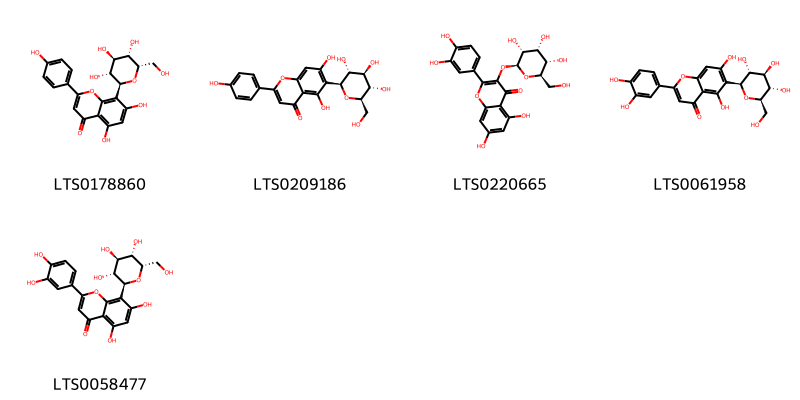{ width=100% }
    <figcaption>Hình ảnh cấu trúc hóa học của 5 hoạt chất thuộc nhóm Flavonoids gồm ['5,7-dihydroxy-2-(4-hydroxyphenyl)-8-[(2s,3r,4r,5s,6s)-3,4,5-trihydroxy-6-(hydroxymethyl)oxan-2-yl]chromen-4-one (LTS0178860)', 'isovitexin (LTS0209186)', '2-(3,4-dihydroxyphenyl)-5,7-dihydroxy-3-{[(2s,3r,4r,5s,6r)-3,4,5-trihydroxy-6-(hydroxymethyl)oxan-2-yl]oxy}chromen-4-one (LTS0220665)', 'isoorientin (LTS0061958)', '2-(3,4-dihydroxyphenyl)-5,7-dihydroxy-8-[(2s,3r,4r,5s,6s)-3,4,5-trihydroxy-6-(hydroxymethyl)oxan-2-yl]chromen-4-one (LTS0058477)'].</figcaption>
</figure>
#### Nhóm Prenol lipids
<figure markdown="span">
    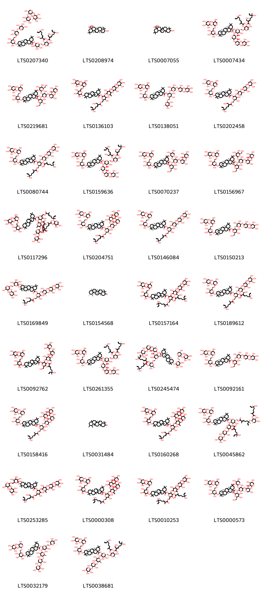{ width=100% }
    <figcaption>Hình ảnh cấu trúc hóa học của 34 hoạt chất thuộc nhóm Prenol lipids gồm ['(2s,3r,4s,5r,6s)-2-{[(2s,3r,4s,5r)-3,5-dihydroxy-4-{[(2s,3r,4s,5r)-3,4,5-trihydroxyoxan-2-yl]oxy}oxan-2-yl]oxy}-6-methyloxane-3,4,5-triol; (2s,3r,4s,5s,6r)-3,4,5-trihydroxy-6-({[(2r,3r,4r,5s,6s)-5-hydroxy-3,4-bis({[(2e,6s)-6-hydroxy-2-(hydroxymethyl)-6-methylocta-2,7-dienoyl]oxy})-6-methyloxan-2-yl]oxy}methyl)oxan-2-yl (5r,6as,6br,8ar,10s,12ar,12br)-10-{[(2r,3r,4s,5s,6r)-6-({[(2s,3r,4r,5r)-3,4-dihydroxy-5-{[(2r,3r,4s,5r)-3,4,5-trihydroxyoxan-2-yl]oxy}oxan-2-yl]oxy}methyl)-3,4,5-trihydroxyoxan-2-yl]oxy}-5-hydroxy-2,2,6a,6b,9,9,12a-heptamethyl-1,3,4,5,6,7,8,8a,10,11,12,12b,13,14b-tetradecahydropicene-4a-carboxylate (LTS0207340)', 'echinocystic acid (LTS0208974)', '5,10-dihydroxy-2,2,6a,6b,9,9,12a-heptamethyl-1,3,4,5,6,7,8,8a,10,11,12,12b,13,14b-tetradecahydropicene-4a-carboxylic acid (LTS0007055)', '(2s,3r,4s,5s,6r)-3-{[(2s,3r,4s,5r,6s)-5-{[(2s,3r,4s,5r)-3,5-dihydroxy-4-{[(2s,3r,4s,5r)-3,4,5-trihydroxyoxan-2-yl]oxy}oxan-2-yl]oxy}-3,4-dihydroxy-6-methyloxan-2-yl]oxy}-4,5-dihydroxy-6-({[(2r,3r,4r,5s,6s)-5-hydroxy-3-{[(2e,6s)-6-hydroxy-2,6-dimethylocta-2,7-dienoyl]oxy}-4-{[(2e)-6-hydroxy-2-(hydroxymethyl)-6-methylocta-2,7-dienoyl]oxy}-6-methyloxan-2-yl]oxy}methyl)oxan-2-yl (4ar,5r,6as,6br,8ar,10s,12ar,12br,14bs)-10-{[(2r,3r,4s,5s,6r)-6-({[(2s,3r,4s,5s)-4,5-dihydroxy-3-{[(2s,3r,4s,5r)-3,4,5-trihydroxyoxan-2-yl]oxy}oxan-2-yl]oxy}methyl)-3,4,5-trihydroxyoxan-2-yl]oxy}-5-hydroxy-2,2,6a,6b,9,9,12a-heptamethyl-1,3,4,5,6,7,8,8a,10,11,12,12b,13,14b-tetradecahydropicene-4a-carboxylate (LTS0007434)', '(2s,3r,4s,5s,6r)-3-{[(2s,3r,4r,5r,6s)-5-{[(2s,3r,4s,5r)-3,5-dihydroxy-4-{[(2s,3r,4s,5r)-3,4,5-trihydroxyoxan-2-yl]oxy}oxan-2-yl]oxy}-4-hydroxy-6-methyl-3-{[(2s,3r,4s,5r,6r)-3,4,5-trihydroxy-6-(hydroxymethyl)oxan-2-yl]oxy}oxan-2-yl]oxy}-4,5-dihydroxy-6-(hydroxymethyl)oxan-2-yl (4ar,5r,6as,6br,8ar,10s,12ar,12br,14bs)-10-{[(2r,3r,4s,5s,6r)-6-({[(2s,3r,4s,5s)-4,5-dihydroxy-3-{[(2s,3r,4s,5r)-3,4,5-trihydroxyoxan-2-yl]oxy}oxan-2-yl]oxy}methyl)-3,4,5-trihydroxyoxan-2-yl]oxy}-5-hydroxy-2,2,6a,6b,9,9,12a-heptamethyl-1,3,4,5,6,7,8,8a,10,11,12,12b,13,14b-tetradecahydropicene-4a-carboxylate (LTS0219681)', '3-{[5-({3,5-dihydroxy-4-[(3,4,5-trihydroxyoxan-2-yl)oxy]oxan-2-yl}oxy)-3,4-dihydroxy-6-methyloxan-2-yl]oxy}-4,5-dihydroxy-6-({[6-hydroxy-2-(hydroxymethyl)-6-methylocta-2,7-dienoyl]oxy}methyl)oxan-2-yl 10-({6-[({4,5-dihydroxy-3-[(3,4,5-trihydroxyoxan-2-yl)oxy]oxan-2-yl}oxy)methyl]-3,4,5-trihydroxyoxan-2-yl}oxy)-2,2,6a,6b,9,9,12a-heptamethyl-1,3,4,5,6,7,8,8a,10,11,12,12b,13,14b-tetradecahydropicene-4a-carboxylate (LTS0136103)', '(2s,3r,4s,5s,6r)-3-{[(2s,3r,4s,5r,6s)-5-{[(2s,3r,4s,5r)-3,5-dihydroxy-4-{[(2s,3r,4s,5r)-3,4,5-trihydroxyoxan-2-yl]oxy}oxan-2-yl]oxy}-3,4-dihydroxy-6-methyloxan-2-yl]oxy}-4,5-dihydroxy-6-({[(2r,3r,4r,5r,6s)-3,4,5-trihydroxy-6-methyloxan-2-yl]oxy}methyl)oxan-2-yl (4as,6as,6br,8ar,10s,12ar,12br,14bs)-10-{[(2r,3r,4s,5s,6r)-6-({[(2s,3r,4s,5s)-4,5-dihydroxy-3-{[(2s,3r,4s,5r)-3,4,5-trihydroxyoxan-2-yl]oxy}oxan-2-yl]oxy}methyl)-3,4,5-trihydroxyoxan-2-yl]oxy}-2,2,6a,6b,9,9,12a-heptamethyl-1,3,4,5,6,7,8,8a,10,11,12,12b,13,14b-tetradecahydropicene-4a-carboxylate (LTS0138051)', '(2s,3r,4s,5s,6r)-3-{[(2s,3r,4s,5r,6s)-5-{[(2s,3r,4s,5r)-3,5-dihydroxy-4-{[(2s,3r,4s,5r)-3,4,5-trihydroxyoxan-2-yl]oxy}oxan-2-yl]oxy}-3,4-dihydroxy-6-methyloxan-2-yl]oxy}-4,5-dihydroxy-6-({[(2e,6s)-6-hydroxy-2-(hydroxymethyl)-6-methylocta-2,7-dienoyl]oxy}methyl)oxan-2-yl (4as,6as,6br,8ar,10s,12ar,12br,14bs)-10-{[(2r,3r,4s,5s,6r)-6-({[(2s,3r,4s,5s)-4,5-dihydroxy-3-{[(2s,3r,4s,5r)-3,4,5-trihydroxyoxan-2-yl]oxy}oxan-2-yl]oxy}methyl)-3,4,5-trihydroxyoxan-2-yl]oxy}-2,2,6a,6b,9,9,12a-heptamethyl-1,3,4,5,6,7,8,8a,10,11,12,12b,13,14b-tetradecahydropicene-4a-carboxylate (LTS0202458)', '(2s,3r,4s,5r,6r)-3-{[(2s,3r,4s,5r,6s)-5-{[(2s,3r,4s,5r)-3,5-dihydroxy-4-{[(2s,3r,4s,5r)-3,4,5-trihydroxyoxan-2-yl]oxy}oxan-2-yl]oxy}-3,4-dihydroxy-6-methyloxan-2-yl]oxy}-5-hydroxy-4-{[(2e,6s)-6-hydroxy-2,6-dimethylocta-2,7-dienoyl]oxy}-6-({[(2e,6s)-6-hydroxy-2,6-dimethylocta-2,7-dienoyl]oxy}methyl)oxan-2-yl (4as,6as,6br,8ar,10s,12ar,12br,14bs)-10-{[(2r,3r,4s,5s,6r)-6-({[(2r,3r,4s,5r)-4,5-dihydroxy-3-{[(2s,3r,4s,5r)-3,4,5-trihydroxyoxan-2-yl]oxy}oxan-2-yl]oxy}methyl)-3,4,5-trihydroxyoxan-2-yl]oxy}-2,2,6a,6b,9,9,12a-heptamethyl-1,3,4,5,6,7,8,8a,10,11,12,12b,13,14b-tetradecahydropicene-4a-carboxylate (LTS0080744)', '(2s,3r,4s,5s,6r)-3-{[(2s,3r,4s,5r,6s)-5-{[(2s,3r,4s,5r)-3,5-dihydroxy-4-{[(2s,3r,4s,5r)-3,4,5-trihydroxyoxan-2-yl]oxy}oxan-2-yl]oxy}-3,4-dihydroxy-6-methyloxan-2-yl]oxy}-4,5-dihydroxy-6-({[(2r,3r,4r,5s,6s)-5-hydroxy-3,4-bis({[(2e)-6-hydroxy-2-(hydroxymethyl)-6-methylocta-2,7-dienoyl]oxy})-6-methyloxan-2-yl]oxy}methyl)oxan-2-yl (4ar,5r,6as,6br,8ar,10s,12ar,12br,14bs)-10-{[(2r,3r,4s,5s,6r)-6-({[(2s,3r,4s,5s)-4,5-dihydroxy-3-{[(2s,3r,4s,5r)-3,4,5-trihydroxyoxan-2-yl]oxy}oxan-2-yl]oxy}methyl)-3,4,5-trihydroxyoxan-2-yl]oxy}-5-hydroxy-2,2,6a,6b,9,9,12a-heptamethyl-1,3,4,5,6,7,8,8a,10,11,12,12b,13,14b-tetradecahydropicene-4a-carboxylate (LTS0159636)', '(2s,3r,4s,5s,6r)-3-{[(2s,3r,4r,5r,6s)-5-{[(2s,3r,4s,5r)-3,5-dihydroxy-4-{[(2s,3r,4s,5r)-3,4,5-trihydroxyoxan-2-yl]oxy}oxan-2-yl]oxy}-4-hydroxy-6-methyl-3-{[(2s,3r,4s,5r)-3,4,5-trihydroxyoxan-2-yl]oxy}oxan-2-yl]oxy}-4,5-dihydroxy-6-(hydroxymethyl)oxan-2-yl (4ar,5r,6as,6br,8ar,10s,12ar,12br,14bs)-10-{[(2r,3r,4s,5s,6r)-6-({[(2s,3r,4s,5s)-4,5-dihydroxy-3-{[(2s,3r,4s,5r)-3,4,5-trihydroxyoxan-2-yl]oxy}oxan-2-yl]oxy}methyl)-3,4,5-trihydroxyoxan-2-yl]oxy}-5-hydroxy-2,2,6a,6b,9,9,12a-heptamethyl-1,3,4,5,6,7,8,8a,10,11,12,12b,13,14b-tetradecahydropicene-4a-carboxylate (LTS0070237)', '(2s,3r,4s,5s,6r)-3-{[(2s,3r,4r,5r,6s)-5-{[(2s,3r,4s,5r)-3,5-dihydroxy-4-{[(2s,3r,4s,5r)-3,4,5-trihydroxyoxan-2-yl]oxy}oxan-2-yl]oxy}-4-hydroxy-6-methyl-3-{[(2s,3r,4s,5r,6r)-3,4,5-trihydroxy-6-(hydroxymethyl)oxan-2-yl]oxy}oxan-2-yl]oxy}-4,5-dihydroxy-6-(hydroxymethyl)oxan-2-yl (4ar,5r,6as,6br,8ar,10s,12ar,12br,14bs)-10-{[(2r,3r,4s,5s,6r)-6-({[(2r,3r,4s,5s)-4,5-dihydroxy-3-{[(2s,3r,4s,5r)-3,4,5-trihydroxyoxan-2-yl]oxy}oxan-2-yl]oxy}methyl)-3,4,5-trihydroxyoxan-2-yl]oxy}-5-hydroxy-2,2,6a,6b,9,9,12a-heptamethyl-1,3,4,5,6,7,8,8a,10,11,12,12b,13,14b-tetradecahydropicene-4a-carboxylate (LTS0156967)', '6-({[6-({4,5-dihydroxy-3-[(6-hydroxy-2,6-dimethylocta-2,7-dienoyl)oxy]oxan-2-yl}oxy)-2,6-dimethylocta-2,7-dienoyl]oxy}methyl)-3-{[5-({3,5-dihydroxy-4-[(3,4,5-trihydroxyoxan-2-yl)oxy]oxan-2-yl}oxy)-3,4-dihydroxy-6-methyloxan-2-yl]oxy}-5-hydroxy-4-[(6-hydroxy-2,6-dimethylocta-2,7-dienoyl)oxy]oxan-2-yl 10-({6-[({4,5-dihydroxy-3-[(3,4,5-trihydroxyoxan-2-yl)oxy]oxan-2-yl}oxy)methyl]-3,4,5-trihydroxyoxan-2-yl}oxy)-2,2,6a,6b,9,9,12a-heptamethyl-1,3,4,5,6,7,8,8a,10,11,12,12b,13,14b-tetradecahydropicene-4a-carboxylate (LTS0117296)', '(2s,3r,4s,5s,6r)-3-{[(2s,3r,4r,5r,6s)-5-{[(2s,3r,4s,5r)-3,5-dihydroxy-4-{[(2s,3r,4s,5r)-3,4,5-trihydroxyoxan-2-yl]oxy}oxan-2-yl]oxy}-4-hydroxy-6-methyl-3-{[(2s,3r,4s,5r,6r)-3,4,5-trihydroxy-6-(hydroxymethyl)oxan-2-yl]oxy}oxan-2-yl]oxy}-4,5-dihydroxy-6-({[(2e,6s)-6-hydroxy-2-(hydroxymethyl)-6-methylocta-2,7-dienoyl]oxy}methyl)oxan-2-yl (4ar,5r,6as,6br,8ar,10s,12ar,12br,14bs)-10-{[(2r,3r,4s,5s,6r)-6-({[(2r,3s,4r,5s)-4,5-dihydroxy-3-{[(2s,3r,4s,5r)-3,4,5-trihydroxyoxan-2-yl]oxy}oxan-2-yl]oxy}methyl)-3,4,5-trihydroxyoxan-2-yl]oxy}-5-hydroxy-2,2,6a,6b,9,9,12a-heptamethyl-1,3,4,5,6,7,8,8a,10,11,12,12b,13,14b-tetradecahydropicene-4a-carboxylate (LTS0204751)', '(2s,3r,4s,5s,6r)-3-{[(2s,3r,4s,5r,6s)-5-{[(2s,3r,4s,5r)-3,5-dihydroxy-4-{[(2s,3r,4s,5r)-3,4,5-trihydroxyoxan-2-yl]oxy}oxan-2-yl]oxy}-3,4-dihydroxy-6-methyloxan-2-yl]oxy}-4,5-dihydroxy-6-({[(2e,6s)-6-hydroxy-2,6-dimethylocta-2,7-dienoyl]oxy}methyl)oxan-2-yl (4as,6as,6br,8ar,10s,12ar,12br,14bs)-10-{[(2r,3r,4s,5s,6r)-6-({[(2s,3r,4s,5r)-4,5-dihydroxy-3-{[(2s,3r,4s,5r)-3,4,5-trihydroxyoxan-2-yl]oxy}oxan-2-yl]oxy}methyl)-3,4,5-trihydroxyoxan-2-yl]oxy}-2,2,6a,6b,9,9,12a-heptamethyl-1,3,4,5,6,7,8,8a,10,11,12,12b,13,14b-tetradecahydropicene-4a-carboxylate (LTS0146084)', '(2s,3r,4s,5s,6r)-3-{[(2s,3r,4s,5r,6s)-5-{[(2s,3r,4s,5r)-3,5-dihydroxy-4-{[(2s,3r,4s,5r)-3,4,5-trihydroxyoxan-2-yl]oxy}oxan-2-yl]oxy}-3,4-dihydroxy-6-methyloxan-2-yl]oxy}-4,5-dihydroxy-6-(hydroxymethyl)oxan-2-yl (4as,6as,6br,8ar,10s,12ar,12br,14bs)-10-{[(2r,3r,4s,5s,6r)-6-({[(2s,3r,4s,5s)-4,5-dihydroxy-3-{[(2s,3r,4s,5r)-3,4,5-trihydroxyoxan-2-yl]oxy}oxan-2-yl]oxy}methyl)-3,4,5-trihydroxyoxan-2-yl]oxy}-2,2,6a,6b,9,9,12a-heptamethyl-1,3,4,5,6,7,8,8a,10,11,12,12b,13,14b-tetradecahydropicene-4a-carboxylate (LTS0150213)', '(2s,3r,4s,5s,6r)-3-{[(2s,3r,4s,5r,6s)-5-{[(2s,3r,4s,5r)-3,5-dihydroxy-4-{[(2s,3r,4s,5r)-3,4,5-trihydroxyoxan-2-yl]oxy}oxan-2-yl]oxy}-3,4-dihydroxy-6-methyloxan-2-yl]oxy}-4,5-dihydroxy-6-({[(2e,6s)-6-hydroxy-2-(hydroxymethyl)-6-methylocta-2,7-dienoyl]oxy}methyl)oxan-2-yl (4as,6as,6br,8ar,10s,12ar,12br,14bs)-10-{[(2s,3r,4s,5s,6r)-6-({[(2s,3r,4s,5s)-4,5-dihydroxy-3-{[(2s,3r,4s,5r)-3,4,5-trihydroxyoxan-2-yl]oxy}oxan-2-yl]oxy}methyl)-2,3,4,5-tetrahydroxyoxan-2-yl]oxy}-2,2,6a,6b,9,9,12a-heptamethyl-1,3,4,5,6,7,8,8a,10,11,12,12b,13,14b-tetradecahydropicene-4a-carboxylate (LTS0169849)', '(4ar,6bs,8ar,11r,12s,12ar,12bs,14ar,14br)-4,4,6b,8a,11,12,12b,14b-octamethyl-1,2,4a,5,7,8,9,10,11,12,12a,13,14,14a-tetradecahydropicen-3-one (LTS0154568)', '3-{[5-({3,5-dihydroxy-4-[(3,4,5-trihydroxyoxan-2-yl)oxy]oxan-2-yl}oxy)-3,4-dihydroxy-6-methyloxan-2-yl]oxy}-5-hydroxy-6-{[(6-hydroxy-2,6-dimethylocta-2,7-dienoyl)oxy]methyl}-4-{[6-hydroxy-2-(hydroxymethyl)-6-methylocta-2,7-dienoyl]oxy}oxan-2-yl 10-({6-[({4,5-dihydroxy-3-[(3,4,5-trihydroxyoxan-2-yl)oxy]oxan-2-yl}oxy)methyl]-3,4,5-trihydroxyoxan-2-yl}oxy)-2,2,6a,6b,9,9,12a-heptamethyl-1,3,4,5,6,7,8,8a,10,11,12,12b,13,14b-tetradecahydropicene-4a-carboxylate (LTS0157164)', '(2s,3r,4s,5r,6r)-3-{[(2s,3r,4s,5r,6s)-5-{[(2s,3r,4s,5r)-3,5-dihydroxy-4-{[(2s,3r,4s,5r)-3,4,5-trihydroxyoxan-2-yl]oxy}oxan-2-yl]oxy}-3,4-dihydroxy-6-methyloxan-2-yl]oxy}-5-hydroxy-6-({[(2e,6s)-6-hydroxy-2,6-dimethylocta-2,7-dienoyl]oxy}methyl)-4-{[(2e,6s)-6-hydroxy-2-(hydroxymethyl)-6-methylocta-2,7-dienoyl]oxy}oxan-2-yl (4as,6as,6br,8ar,10s,12ar,12br,14bs)-10-{[(2r,3r,4s,5r,6r)-6-({[(2s,3r,4r,5r)-4,5-dihydroxy-3-{[(2s,3r,4s,5r)-3,4,5-trihydroxyoxan-2-yl]oxy}oxan-2-yl]oxy}methyl)-3,4,5-trihydroxyoxan-2-yl]oxy}-2,2,6a,6b,9,9,12a-heptamethyl-1,3,4,5,6,7,8,8a,10,11,12,12b,13,14b-tetradecahydropicene-4a-carboxylate (LTS0189612)', '3-{[5-({3,5-dihydroxy-4-[(3,4,5-trihydroxyoxan-2-yl)oxy]oxan-2-yl}oxy)-3,4-dihydroxy-6-methyloxan-2-yl]oxy}-5-hydroxy-4-[(6-hydroxy-2,6-dimethylocta-2,7-dienoyl)oxy]-6-(hydroxymethyl)oxan-2-yl 10-({6-[({4,5-dihydroxy-3-[(3,4,5-trihydroxyoxan-2-yl)oxy]oxan-2-yl}oxy)methyl]-3,4,5-trihydroxyoxan-2-yl}oxy)-2,2,6a,6b,9,9,12a-heptamethyl-1,3,4,5,6,7,8,8a,10,11,12,12b,13,14b-tetradecahydropicene-4a-carboxylate (LTS0092762)', '(2s,3r,4s,5s,6r)-3-{[(2s,3r,4s,5r,6s)-5-{[(2s,3r,4s,5r)-3,5-dihydroxy-4-{[(2s,3r,4s,5r)-3,4,5-trihydroxyoxan-2-yl]oxy}oxan-2-yl]oxy}-3,4-dihydroxy-6-methyloxan-2-yl]oxy}-4,5-dihydroxy-6-({[(2r,3r,4r,5s,6s)-5-hydroxy-3,4-bis({[(2e,6s)-6-hydroxy-2,6-dimethylocta-2,7-dienoyl]oxy})-6-methyloxan-2-yl]oxy}methyl)oxan-2-yl (4ar,5r,6as,6br,8ar,10s,12ar,12br,14bs)-10-{[(2r,3r,4s,5s,6r)-6-({[(2s,3r,4s,5s)-4,5-dihydroxy-3-{[(2s,3r,4s,5r)-3,4,5-trihydroxyoxan-2-yl]oxy}oxan-2-yl]oxy}methyl)-3,4,5-trihydroxyoxan-2-yl]oxy}-5-hydroxy-2,2,6a,6b,9,9,12a-heptamethyl-1,3,4,5,6,7,8,8a,10,11,12,12b,13,14b-tetradecahydropicene-4a-carboxylate (LTS0261355)', '(2s,3r,4s,5s,6r)-3-{[(2s,3r,4s,5r,6s)-5-{[(2s,3r,4s,5r)-3,5-dihydroxy-4-{[(2s,3r,4s,5r)-3,4,5-trihydroxyoxan-2-yl]oxy}oxan-2-yl]oxy}-3,4-dihydroxy-6-methyloxan-2-yl]oxy}-4,5-dihydroxy-6-({[(2r,3r,4r,5s,6s)-5-hydroxy-4-{[(2e,6s)-6-hydroxy-2,6-dimethylocta-2,7-dienoyl]oxy}-3-{[(2e)-6-hydroxy-2-(hydroxymethyl)-6-methylocta-2,7-dienoyl]oxy}-6-methyloxan-2-yl]oxy}methyl)oxan-2-yl (4ar,5r,6as,6br,8ar,10s,12ar,12br,14bs)-10-{[(2r,3r,4s,5s,6r)-6-({[(2s,3r,4s,5s)-4,5-dihydroxy-3-{[(2s,3r,4s,5r)-3,4,5-trihydroxyoxan-2-yl]oxy}oxan-2-yl]oxy}methyl)-3,4,5-trihydroxyoxan-2-yl]oxy}-5-hydroxy-2,2,6a,6b,9,9,12a-heptamethyl-1,3,4,5,6,7,8,8a,10,11,12,12b,13,14b-tetradecahydropicene-4a-carboxylate (LTS0245474)', '(2s,3r,4s,5s,6r)-3-{[(2s,3r,4s,5r,6s)-5-{[(2s,3r,4s,5r)-3,5-dihydroxy-4-{[(2s,3r,4s,5r)-3,4,5-trihydroxyoxan-2-yl]oxy}oxan-2-yl]oxy}-3,4-dihydroxy-6-methyloxan-2-yl]oxy}-4,5-dihydroxy-6-(hydroxymethyl)oxan-2-yl (4as,6as,6br,8ar,10s,12ar,12br,14bs)-10-{[(2r,3r,4s,5s,6r)-6-({[(2r,3r,4r,5s)-4,5-dihydroxy-3-{[(2s,3r,4s,5r)-3,4,5-trihydroxyoxan-2-yl]oxy}oxan-2-yl]oxy}methyl)-3,4,5-trihydroxyoxan-2-yl]oxy}-2,2,6a,6b,9,9,12a-heptamethyl-1,3,4,5,6,7,8,8a,10,11,12,12b,13,14b-tetradecahydropicene-4a-carboxylate (LTS0092161)', '(2s,3r,4s,5r,6r)-3-{[(2s,3r,4r,5r,6s)-5-{[(2s,3r,4s,5r)-3,5-dihydroxy-4-{[(2s,3r,4s,5r)-3,4,5-trihydroxyoxan-2-yl]oxy}oxan-2-yl]oxy}-4-hydroxy-6-methyl-3-{[(2s,3r,4s,5s,6r)-3,4,5-trihydroxy-6-(hydroxymethyl)oxan-2-yl]oxy}oxan-2-yl]oxy}-4,5-dihydroxy-6-({[(2e,6s)-6-hydroxy-2,6-dimethylocta-2,7-dienoyl]oxy}methyl)oxan-2-yl (4ar,5r,6as,6br,8ar,10s,12ar,12br,14bs)-10-{[(2r,3r,4s,5r,6r)-6-({[(2r,3s,4r,5r)-4,5-dihydroxy-3-{[(2s,3r,4s,5r)-3,4,5-trihydroxyoxan-2-yl]oxy}oxan-2-yl]oxy}methyl)-3,4,5-trihydroxyoxan-2-yl]oxy}-5-hydroxy-2,2,6a,6b,9,9,12a-heptamethyl-1,3,4,5,6,7,8,8a,10,11,12,12b,13,14b-tetradecahydropicene-4a-carboxylate (LTS0158416)', '4,4,6b,8a,11,12,12b,14b-octamethyl-1,2,4a,5,7,8,9,10,11,12,12a,13,14,14a-tetradecahydropicen-3-one (LTS0031484)', '3-{[5-({3,5-dihydroxy-4-[(3,4,5-trihydroxyoxan-2-yl)oxy]oxan-2-yl}oxy)-4-hydroxy-6-methyl-3-{[3,4,5-trihydroxy-6-(hydroxymethyl)oxan-2-yl]oxy}oxan-2-yl]oxy}-4,5-dihydroxy-6-({[6-hydroxy-2-(hydroxymethyl)-6-methylocta-2,7-dienoyl]oxy}methyl)oxan-2-yl 10-({6-[({4,5-dihydroxy-3-[(3,4,5-trihydroxyoxan-2-yl)oxy]oxan-2-yl}oxy)methyl]-3,4,5-trihydroxyoxan-2-yl}oxy)-5-hydroxy-2,2,6a,6b,9,9,12a-heptamethyl-1,3,4,5,6,7,8,8a,10,11,12,12b,13,14b-tetradecahydropicene-4a-carboxylate (LTS0160268)', '(2s,3r,4s,5r,6r)-6-({[(2e,6s)-6-{[(2r,3s,4s,5r)-4,5-dihydroxy-3-{[(2e,6s)-6-hydroxy-2,6-dimethylocta-2,7-dienoyl]oxy}oxan-2-yl]oxy}-2,6-dimethylocta-2,7-dienoyl]oxy}methyl)-3-{[(2s,3r,4s,5r,6s)-5-{[(2s,3r,4s,5r)-3,5-dihydroxy-4-{[(2s,3r,4s,5r)-3,4,5-trihydroxyoxan-2-yl]oxy}oxan-2-yl]oxy}-3,4-dihydroxy-6-methyloxan-2-yl]oxy}-5-hydroxy-4-{[(2e,6s)-6-hydroxy-2,6-dimethylocta-2,7-dienoyl]oxy}oxan-2-yl (4as,6as,6br,8ar,10s,12ar,12br,14bs)-10-{[(2r,3r,4s,5r,6r)-6-({[(2r,3r,4r,5r)-4,5-dihydroxy-3-{[(2s,3r,4s,5r)-3,4,5-trihydroxyoxan-2-yl]oxy}oxan-2-yl]oxy}methyl)-3,4,5-trihydroxyoxan-2-yl]oxy}-2,2,6a,6b,9,9,12a-heptamethyl-1,3,4,5,6,7,8,8a,10,11,12,12b,13,14b-tetradecahydropicene-4a-carboxylate (LTS0045862)', '3-{[5-({3,5-dihydroxy-4-[(3,4,5-trihydroxyoxan-2-yl)oxy]oxan-2-yl}oxy)-3,4-dihydroxy-6-methyloxan-2-yl]oxy}-4,5-dihydroxy-6-({[6-hydroxy-2-(hydroxymethyl)-6-methylocta-2,7-dienoyl]oxy}methyl)oxan-2-yl 10-({6-[({4,5-dihydroxy-3-[(3,4,5-trihydroxyoxan-2-yl)oxy]oxan-2-yl}oxy)methyl]-2,3,4,5-tetrahydroxyoxan-2-yl}oxy)-2,2,6a,6b,9,9,12a-heptamethyl-1,3,4,5,6,7,8,8a,10,11,12,12b,13,14b-tetradecahydropicene-4a-carboxylate (LTS0253285)', '3-{[5-({3,5-dihydroxy-4-[(3,4,5-trihydroxyoxan-2-yl)oxy]oxan-2-yl}oxy)-4-hydroxy-6-methyl-3-{[3,4,5-trihydroxy-6-(hydroxymethyl)oxan-2-yl]oxy}oxan-2-yl]oxy}-4,5-dihydroxy-6-{[(6-hydroxy-2,6-dimethylocta-2,7-dienoyl)oxy]methyl}oxan-2-yl 10-({6-[({4,5-dihydroxy-3-[(3,4,5-trihydroxyoxan-2-yl)oxy]oxan-2-yl}oxy)methyl]-3,4,5-trihydroxyoxan-2-yl}oxy)-5-hydroxy-2,2,6a,6b,9,9,12a-heptamethyl-1,3,4,5,6,7,8,8a,10,11,12,12b,13,14b-tetradecahydropicene-4a-carboxylate (LTS0000308)', '3-{[5-({3,5-dihydroxy-4-[(3,4,5-trihydroxyoxan-2-yl)oxy]oxan-2-yl}oxy)-3,4-dihydroxy-6-methyloxan-2-yl]oxy}-5-hydroxy-4-[(6-hydroxy-2,6-dimethylocta-2,7-dienoyl)oxy]-6-{[(6-hydroxy-2,6-dimethylocta-2,7-dienoyl)oxy]methyl}oxan-2-yl 10-({6-[({4,5-dihydroxy-3-[(3,4,5-trihydroxyoxan-2-yl)oxy]oxan-2-yl}oxy)methyl]-3,4,5-trihydroxyoxan-2-yl}oxy)-2,2,6a,6b,9,9,12a-heptamethyl-1,3,4,5,6,7,8,8a,10,11,12,12b,13,14b-tetradecahydropicene-4a-carboxylate (LTS0010253)', '(2s,3r,4s,5s,6r)-3-{[(2s,3r,4r,5r,6s)-5-{[(2s,3r,4s,5r)-3,5-dihydroxy-4-{[(2s,3r,4s,5r)-3,4,5-trihydroxyoxan-2-yl]oxy}oxan-2-yl]oxy}-4-hydroxy-6-methyl-3-{[(2s,3r,4s,5s)-3,4,5-trihydroxyoxan-2-yl]oxy}oxan-2-yl]oxy}-4,5-dihydroxy-6-(hydroxymethyl)oxan-2-yl (4ar,5r,6as,6br,8ar,10s,12ar,12br,14bs)-10-{[(2r,3r,4s,5s,6r)-6-({[(2s,3r,4s,5s)-4,5-dihydroxy-3-{[(2s,3r,4s,5r)-3,4,5-trihydroxyoxan-2-yl]oxy}oxan-2-yl]oxy}methyl)-3,4,5-trihydroxyoxan-2-yl]oxy}-5-hydroxy-2,2,6a,6b,9,9,12a-heptamethyl-1,3,4,5,6,7,8,8a,10,11,12,12b,13,14b-tetradecahydropicene-4a-carboxylate (LTS0000573)', '(2s,3r,4s,5s,6r)-3-{[(2s,3r,4r,5r,6s)-5-{[(2s,3r,4s,5r)-3,5-dihydroxy-4-{[(2s,3r,4s,5r)-3,4,5-trihydroxyoxan-2-yl]oxy}oxan-2-yl]oxy}-3,4-dihydroxy-6-methyloxan-2-yl]oxy}-4,5-dihydroxy-6-({[(2r,3r,4r,5r,6s)-3,4,5-trihydroxy-6-methyloxan-2-yl]oxy}methyl)oxan-2-yl (4as,6as,6br,8ar,10s,12ar,12br,14bs)-10-{[(2r,3r,4s,5s,6r)-6-({[(2r,3s,4s,5r)-4,5-dihydroxy-3-{[(2s,3r,4s,5r)-3,4,5-trihydroxyoxan-2-yl]oxy}oxan-2-yl]oxy}methyl)-3,4,5-trihydroxyoxan-2-yl]oxy}-2,2,6a,6b,9,9,12a-heptamethyl-1,3,4,5,6,7,8,8a,10,11,12,12b,13,14b-tetradecahydropicene-4a-carboxylate (LTS0032179)', '(2s,3r,4s,5s,6r)-3-{[(2s,3r,4s,5r,6s)-5-{[(2s,3r,4s,5r)-3,5-dihydroxy-4-{[(2s,3r,4s,5r)-3,4,5-trihydroxyoxan-2-yl]oxy}oxan-2-yl]oxy}-3,4-dihydroxy-6-methyloxan-2-yl]oxy}-4,5-dihydroxy-6-({[(2r,3r,4r,5s,6s)-5-hydroxy-3-{[(2e,6s)-6-hydroxy-2,6-dimethylocta-2,7-dienoyl]oxy}-4-{[(2e)-6-hydroxy-2-(hydroxymethyl)-6-methylocta-2,7-dienoyl]oxy}-6-methyloxan-2-yl]oxy}methyl)oxan-2-yl (4as,6as,6br,8ar,10s,12ar,12br,14bs)-10-{[(2r,3r,4s,5s,6r)-6-({[(2s,3r,4s,5s)-4,5-dihydroxy-3-{[(2s,3r,4s,5r)-3,4,5-trihydroxyoxan-2-yl]oxy}oxan-2-yl]oxy}methyl)-3,4,5-trihydroxyoxan-2-yl]oxy}-2,2,6a,6b,9,9,12a-heptamethyl-1,3,4,5,6,7,8,8a,10,11,12,12b,13,14b-tetradecahydropicene-4a-carboxylate (LTS0038681)'].</figcaption>
</figure>
#### Nhóm Steroids and steroid derivatives
<figure markdown="span">
    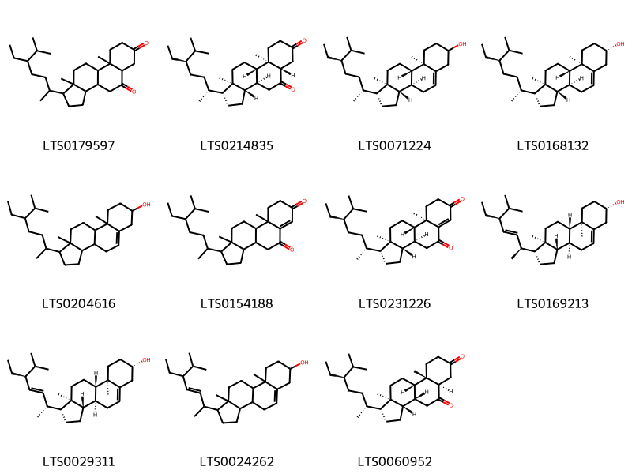{ width=100% }
    <figcaption>Hình ảnh cấu trúc hóa học của 11 hoạt chất thuộc nhóm Steroids and steroid derivatives gồm ['1-(5-ethyl-6-methylheptan-2-yl)-9a,11a-dimethyl-dodecahydro-1h-cyclopenta[a]phenanthrene-5,7-dione (LTS0179597)', '(1r,3as,3bs,5as,9ar,9bs,11ar)-1-[(2r,5r)-5-ethyl-6-methylheptan-2-yl]-9a,11a-dimethyl-dodecahydro-1h-cyclopenta[a]phenanthrene-5,7-dione (LTS0214835)', 'stigmast-5-en-3-ol (LTS0071224)', 'sitosterol (LTS0168132)', 'stigmast-5-en-3-ol, (3β)- (LTS0204616)', '1-(5-ethyl-6-methylheptan-2-yl)-9a,11a-dimethyl-1h,2h,3h,3ah,3bh,4h,8h,9h,9bh,10h,11h-cyclopenta[a]phenanthrene-5,7-dione (LTS0154188)', '(1r,3as,3bs,9ar,9bs,11ar)-1-[(2r,5r)-5-ethyl-6-methylheptan-2-yl]-9a,11a-dimethyl-1h,2h,3h,3ah,3bh,4h,8h,9h,9bh,10h,11h-cyclopenta[a]phenanthrene-5,7-dione (LTS0231226)', '(1r,3as,3bs,7s,9ar,9bs,11ar)-1-[(2s,3e,5s)-5-ethyl-6-methylhept-3-en-2-yl]-9a,11a-dimethyl-1h,2h,3h,3ah,3bh,4h,6h,7h,8h,9h,9bh,10h,11h-cyclopenta[a]phenanthren-7-ol (LTS0169213)', 'phytosterol (LTS0029311)', 'stigmasterol (LTS0024262)', '(1r,3as,3br,5ar,9as,9bs,11ar)-1-[(2r,5r)-5-ethyl-6-methylheptan-2-yl]-9a,11a-dimethyl-dodecahydro-1h-cyclopenta[a]phenanthrene-5,7-dione (LTS0060952)'].</figcaption>
</figure>

---

### Dược dân tộc học

Danh sách các quốc gia có sử dụng *Gleditsia sinensis* trong điều trị các bệnh. 

| Country   | Disease                                                     | Bệnh                                                                                                                                                                                                |
|:----------|:------------------------------------------------------------|:----------------------------------------------------------------------------------------------------------------------------------------------------------------------------------------------------|
| China     | Emetic, Expectorant, Purgative, Soap, Expectorant, Laxative | MYMEMORY WARNING: YOU USED ALL AVAILABLE FREE TRANSLATIONS FOR TODAY. NEXT AVAILABLE IN  18 HOURS 19 MINUTES 54 SECONDS VISIT HTTPS://MYMEMORY.TRANSLATED.NET/DOC/USAGELIMITS.PHP TO TRANSLATE MORE |
| Elsewhere | Antidote, Expectorant                                       | MYMEMORY WARNING: YOU USED ALL AVAILABLE FREE TRANSLATIONS FOR TODAY. NEXT AVAILABLE IN  18 HOURS 19 MINUTES 50 SECONDS VISIT HTTPS://MYMEMORY.TRANSLATED.NET/DOC/USAGELIMITS.PHP TO TRANSLATE MORE |

---

---
## Gleditsia triacanthos
### Thông tin về thực vật

!!! info "Phân loại thực vật của *Gleditsia triacanthos* từ GIBF:"
    - **Kingdom:** Plantae
    - **Phylum:** Tracheophyta
    - **Order:** Fabales
    - **Family:** Fabaceae
    - **Genus:** Gleditsia
    - **Species:** *Gleditsia triacanthos*

 

| Label (VI)   | Label (EN)   | Scientific Name       | Descriptions (VI)   | Descriptions (EN)   | Also Known As (VI)        | Also Known As (EN)                                                                                              |
|:-------------|:-------------|:----------------------|:--------------------|:--------------------|:--------------------------|:----------------------------------------------------------------------------------------------------------------|
| N/A          | N/A          | Gleditsia triacanthos |                     | species of tree     | ['Gleditsia triacanthos'] | ['honey locust', 'honey shuck', 'honeylocust', 'thornless honey locust', 'thorny honeylocust', 'thorny locust'] |

#### Phân bố trên thế giới

**Từ CSDL GIBF** Ukraine, South Africa, Netherlands, Italy, Australia, Georgia, Spain, Argentina, Hungary, Portugal, Russian Federation, United States of America, Austria, Mexico, France, Canada

#### Phân bố tại Việt Nam

**Từ CSDL GIBF**: Không có ghi nhận ở Việt Nam

---
### Thành phần hóa học
        
- Theo cơ sở dữ liệu lotus: Từ loài *Gleditsia triacanthos* đã phân lập và xác định được 25 hoạt chất thuộc về các nhóm Fatty Acyls, Prenol lipids, Benzene and substituted derivatives, Carboxylic acids and derivatives, Imidazopyrimidines. 

|    | chemicalTaxonomyClassyfireClass     |   smiles_count |
|---:|:------------------------------------|---------------:|
|  0 | Benzene and substituted derivatives |              2 |
|  1 | Carboxylic acids and derivatives    |              1 |
|  2 | Fatty Acyls                         |             12 |
|  3 | Imidazopyrimidines                  |              2 |
|  4 | Prenol lipids                       |              8 |

#### Nhóm Benzene and substituted derivatives
<figure markdown="span">
    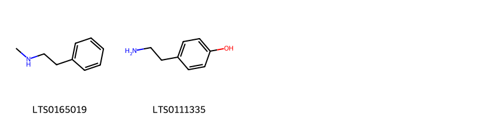{ width=100% }
    <figcaption>Hình ảnh cấu trúc hóa học của 2 hoạt chất thuộc nhóm Benzene and substituted derivatives gồm ['benzeneethanamine, n-methyl- (LTS0165019)', 'tyramine (LTS0111335)'].</figcaption>
</figure>
#### Nhóm Carboxylic acids and derivatives
<figure markdown="span">
    { width=100% }
    <figcaption>Hình ảnh cấu trúc hóa học của 1 hoạt chất thuộc nhóm Carboxylic acids and derivatives gồm ['oxalic acid (LTS0217707)'].</figcaption>
</figure>
#### Nhóm Fatty Acyls
<figure markdown="span">
    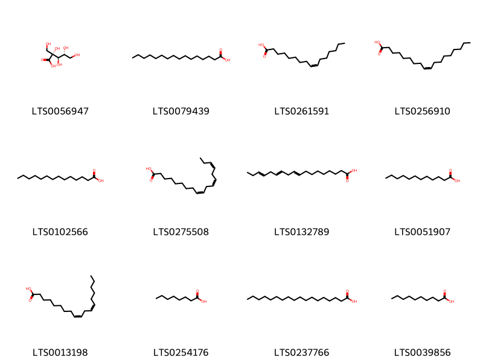{ width=100% }
    <figcaption>Hình ảnh cấu trúc hóa học của 12 hoạt chất thuộc nhóm Fatty Acyls gồm ['2-carboxy-d-arabinitol (LTS0056947)', 'palmitic acid (LTS0079439)', 'palmitoleic acid (LTS0261591)', 'oleic acid (LTS0256910)', 'myristic acid (LTS0102566)', 'α-linolenic acid (LTS0275508)', 'α linolenic acid (LTS0132789)', 'lauric acid (LTS0051907)', 'linoleic (LTS0013198)', 'caprylic acid (LTS0254176)', 'stearic acid (LTS0237766)', 'capric acid (LTS0039856)'].</figcaption>
</figure>
#### Nhóm Imidazopyrimidines
<figure markdown="span">
    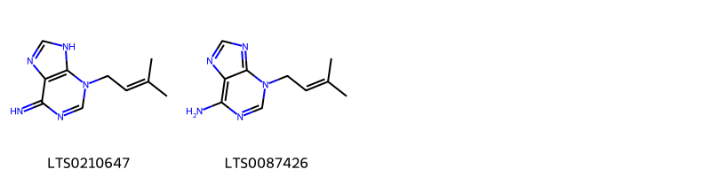{ width=100% }
    <figcaption>Hình ảnh cấu trúc hóa học của 2 hoạt chất thuộc nhóm Imidazopyrimidines gồm ['3-(3-methylbut-2-en-1-yl)-9h-purin-6-imine (LTS0210647)', '3-(3-methylbut-2-en-1-yl)purin-6-amine (LTS0087426)'].</figcaption>
</figure>
#### Nhóm Prenol lipids
<figure markdown="span">
    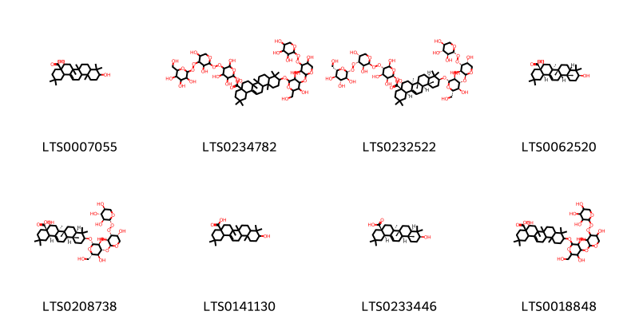{ width=100% }
    <figcaption>Hình ảnh cấu trúc hóa học của 8 hoạt chất thuộc nhóm Prenol lipids gồm ['5,10-dihydroxy-2,2,6a,6b,9,9,12a-heptamethyl-1,3,4,5,6,7,8,8a,10,11,12,12b,13,14b-tetradecahydropicene-4a-carboxylic acid (LTS0007055)', '5-[(3,5-dihydroxy-4-{[3,4,5-trihydroxy-6-(hydroxymethyl)oxan-2-yl]peroxy}oxan-2-yl)peroxy]-3,4,6-trihydroxyoxan-2-yl 10-{[4-({3,5-dihydroxy-4-[(3,4,5-trihydroxyoxan-2-yl)peroxy]oxan-2-yl}oxy)-3,5-dihydroxy-6-(hydroxymethyl)oxan-2-yl]oxy}-5-hydroxy-2,2,6a,6b,9,9,12a-heptamethyl-1,3,4,5,6,7,8,8a,10,11,12,12b,13,14b-tetradecahydropicene-4a-carboxylate (LTS0234782)', '(2s,3s,4r,5s,6s)-5-{[(2s,3s,4r,5r)-3,5-dihydroxy-4-{[(2r,3s,4r,5r,6s)-3,4,5-trihydroxy-6-(hydroxymethyl)oxan-2-yl]peroxy}oxan-2-yl]peroxy}-3,4,6-trihydroxyoxan-2-yl (4ar,5r,6as,6br,8ar,10s,12ar,12br,14br)-10-{[(2s,3s,4r,5s,6s)-4-{[(2s,3s,4r,5r)-3,5-dihydroxy-4-{[(2r,3s,4r,5s)-3,4,5-trihydroxyoxan-2-yl]peroxy}oxan-2-yl]oxy}-3,5-dihydroxy-6-(hydroxymethyl)oxan-2-yl]oxy}-5-hydroxy-2,2,6a,6b,9,9,12a-heptamethyl-1,3,4,5,6,7,8,8a,10,11,12,12b,13,14b-tetradecahydropicene-4a-carboxylate (LTS0232522)', '(4ar,5r,6as,6br,8as,10s,12ar,12bs,14br)-5,10-dihydroxy-2,2,6a,6b,9,9,12a-heptamethyl-1,3,4,5,6,7,8,8a,10,11,12,12b,13,14b-tetradecahydropicene-4a-carboxylic acid (LTS0062520)', '(4ar,5r,6as,6br,8ar,10s,12ar,12br,14br)-10-{[(2s,3s,4r,5s,6s)-4-{[(2s,3s,4r,5r)-3,5-dihydroxy-4-{[(2r,3s,4r,5s)-3,4,5-trihydroxyoxan-2-yl]peroxy}oxan-2-yl]oxy}-3,5-dihydroxy-6-(hydroxymethyl)oxan-2-yl]oxy}-5-hydroxy-2,2,6a,6b,9,9,12a-heptamethyl-1,3,4,5,6,7,8,8a,10,11,12,12b,13,14b-tetradecahydropicene-4a-carboxylic acid (LTS0208738)', 'oleanolic acid (LTS0141130)', '(4as,6as,6br,8ar,10s,12ar,12br,14br)-10-hydroxy-2,2,6a,6b,9,9,12a-heptamethyl-1,3,4,5,6,7,8,8a,10,11,12,12b,13,14b-tetradecahydropicene-4a-carboxylic acid (LTS0233446)', '10-{[4-({3,5-dihydroxy-4-[(3,4,5-trihydroxyoxan-2-yl)peroxy]oxan-2-yl}oxy)-3,5-dihydroxy-6-(hydroxymethyl)oxan-2-yl]oxy}-5-hydroxy-2,2,6a,6b,9,9,12a-heptamethyl-1,3,4,5,6,7,8,8a,10,11,12,12b,13,14b-tetradecahydropicene-4a-carboxylic acid (LTS0018848)'].</figcaption>
</figure>

---

### Dược dân tộc học

Danh sách các quốc gia có sử dụng *Gleditsia triacanthos* trong điều trị các bệnh. 

| Country   | Disease   | Bệnh                                                                                                                                                                                                |
|:----------|:----------|:----------------------------------------------------------------------------------------------------------------------------------------------------------------------------------------------------|
| Elsewhere | Oxytoxic  | MYMEMORY WARNING: YOU USED ALL AVAILABLE FREE TRANSLATIONS FOR TODAY. NEXT AVAILABLE IN  18 HOURS 18 MINUTES 35 SECONDS VISIT HTTPS://MYMEMORY.TRANSLATED.NET/DOC/USAGELIMITS.PHP TO TRANSLATE MORE |
| French    | Mydriatic | MYMEMORY WARNING: YOU USED ALL AVAILABLE FREE TRANSLATIONS FOR TODAY. NEXT AVAILABLE IN  18 HOURS 18 MINUTES 29 SECONDS VISIT HTTPS://MYMEMORY.TRANSLATED.NET/DOC/USAGELIMITS.PHP TO TRANSLATE MORE |
| anish     | Narcotic  | MYMEMORY WARNING: YOU USED ALL AVAILABLE FREE TRANSLATIONS FOR TODAY. NEXT AVAILABLE IN  18 HOURS 18 MINUTES 24 SECONDS VISIT HTTPS://MYMEMORY.TRANSLATED.NET/DOC/USAGELIMITS.PHP TO TRANSLATE MORE |

---

# Chi Ulex

??? note "Danh sách các dược liệu thuộc chi"
    
	 - *Ulex europaeus*

---
## Ulex europaeus
### Thông tin về thực vật

!!! info "Phân loại thực vật của *Ulex europaeus* từ GIBF:"
    - **Kingdom:** Plantae
    - **Phylum:** Tracheophyta
    - **Order:** Fabales
    - **Family:** Fabaceae
    - **Genus:** Ulex
    - **Species:** *Ulex europaeus*

 

| Label (VI)   | Label (EN)   | Scientific Name   | Descriptions (VI)   | Descriptions (EN)   | Also Known As (VI)   | Also Known As (EN)   |
|:-------------|:-------------|:------------------|:--------------------|:--------------------|:---------------------|:---------------------|
| N/A          | N/A          | Ulex europaeus    |                     | species of plant    | ['']                 | ['common gorse']     |

#### Phân bố trên thế giới

**Từ CSDL GIBF** Sri Lanka, Italy, Australia, Belgium, Canada, Netherlands, Réunion, Spain, Portugal, United States of America, Falkland Islands (Malvinas), Germany, Isle of Man, France, United Kingdom of Great Britain and Northern Ireland, Ecuador, Colombia, Ireland, New Zealand

#### Phân bố tại Việt Nam

**Từ CSDL GIBF**: Không có ghi nhận ở Việt Nam

---
### Thành phần hóa học
        
- Theo cơ sở dữ liệu lotus: Từ loài *Ulex europaeus* đã phân lập và xác định được 45 hoạt chất thuộc về các nhóm Flavonoids, Lupin alkaloids, Prenol lipids, Isoflavonoids. 

|    | chemicalTaxonomyClassyfireClass   |   smiles_count |
|---:|:----------------------------------|---------------:|
|  0 | Flavonoids                        |              4 |
|  1 | Isoflavonoids                     |             17 |
|  2 | Lupin alkaloids                   |             23 |
|  3 | Prenol lipids                     |              1 |

#### Nhóm Flavonoids
<figure markdown="span">
    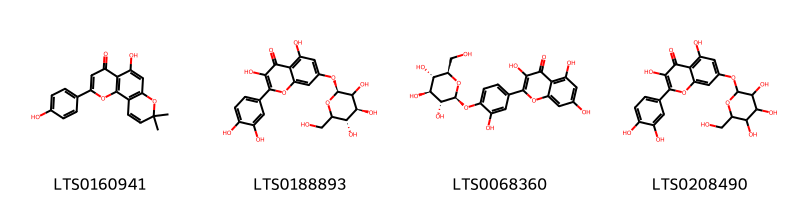{ width=100% }
    <figcaption>Hình ảnh cấu trúc hóa học của 4 hoạt chất thuộc nhóm Flavonoids gồm ['atalantoflavone (LTS0160941)', 'quercimeritrin (LTS0188893)', 'spiraeoside (LTS0068360)', 'quercimeritrin (LTS0208490)'].</figcaption>
</figure>
#### Nhóm Isoflavonoids
<figure markdown="span">
    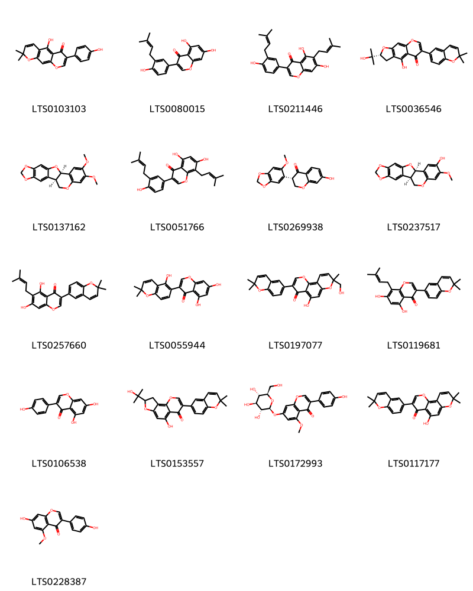{ width=100% }
    <figcaption>Hình ảnh cấu trúc hóa học của 17 hoạt chất thuộc nhóm Isoflavonoids gồm ['alpinumisoflavone (LTS0103103)', 'isowighteone (LTS0080015)', 'lupalbigenin (LTS0211446)', '(2r)-6-(2,2-dimethylchromen-6-yl)-4-hydroxy-2-(2-hydroxypropan-2-yl)-2h,3h-furo[3,2-g]chromen-5-one (LTS0036546)', '(1r,12r)-15,16-dimethoxy-5,7,11,19-tetraoxapentacyclo[10.8.0.0²,¹⁰.0⁴,⁸.0¹³,¹⁸]icosa-2,4(8),9,13(18),14,16-hexaene (LTS0137162)', '5,7-dihydroxy-3-[4-hydroxy-3-(3-methylbut-2-en-1-yl)phenyl]-8-(3-methylbut-2-en-1-yl)chromen-4-one (LTS0051766)', '(3s)-7-hydroxy-3-(6-methoxy-2h-1,3-benzodioxol-5-yl)-2,3-dihydro-1-benzopyran-4-one (LTS0269938)', '(1r,12r)-16-methoxy-5,7,11,19-tetraoxapentacyclo[10.8.0.0²,¹⁰.0⁴,⁸.0¹³,¹⁸]icosa-2,4(8),9,13(18),14,16-hexaen-15-ol (LTS0237517)', 'isochandalone (LTS0257660)', 'licoisoflavone b (LTS0055944)', 'ulexone d (LTS0197077)', 'ulexone a (LTS0119681)', 'genistein (LTS0106538)', 'ulexone c (LTS0153557)', '3-(4-hydroxyphenyl)-5-methoxy-7-{[(2s,3r,4s,5s,6r)-3,4,5-trihydroxy-6-(hydroxymethyl)oxan-2-yl]oxy}chromen-4-one (LTS0172993)', 'ulexone b (LTS0117177)', '5-o-methylgenistein (LTS0228387)'].</figcaption>
</figure>
#### Nhóm Lupin alkaloids
<figure markdown="span">
    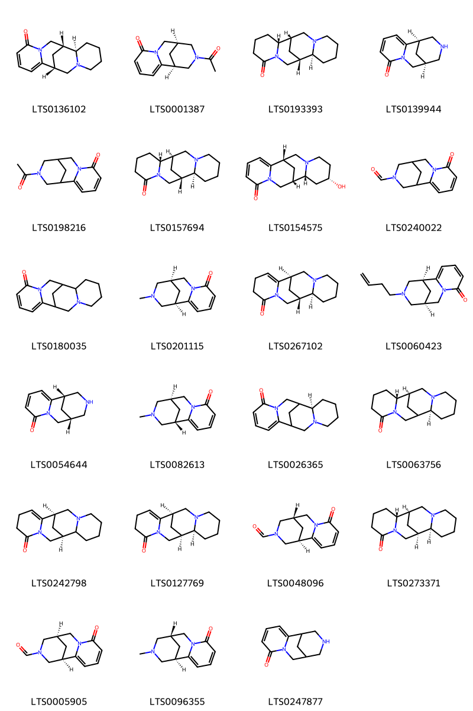{ width=100% }
    <figcaption>Hình ảnh cấu trúc hóa học của 23 hoạt chất thuộc nhóm Lupin alkaloids gồm ['(1r,9r,10r)-7,15-diazatetracyclo[7.7.1.0²,⁷.0¹⁰,¹⁵]heptadeca-2,4-dien-6-one (LTS0136102)', '(1s,9r)-11-acetyl-7,11-diazatricyclo[7.3.1.0²,⁷]trideca-2,4-dien-6-one (LTS0001387)', '(+)-lupanine (LTS0193393)', 'cytisine (LTS0139944)', '11-acetyl-7,11-diazatricyclo[7.3.1.0²,⁷]trideca-2,4-dien-6-one (LTS0198216)', '(1r,2r,9s,10s)-7,15-diazatetracyclo[7.7.1.0²,⁷.0¹⁰,¹⁵]heptadecan-6-one (LTS0157694)', 'baptifoline (LTS0154575)', '6-oxo-7,11-diazatricyclo[7.3.1.0²,⁷]trideca-2,4-diene-11-carbaldehyde (LTS0240022)', 'anagyrine (LTS0180035)', '(1r,9s)-11-methyl-7,11-diazatricyclo[7.3.1.0²,⁷]trideca-2,4-dien-6-one (LTS0201115)', '(1r,9s,10s)-7,15-diazatetracyclo[7.7.1.0²,⁷.0¹⁰,¹⁵]heptadec-2-en-6-one (LTS0267102)', '(1s,9r)-11-(but-3-en-1-yl)-7,11-diazatricyclo[7.3.1.0²,⁷]trideca-2,4-dien-6-one (LTS0060423)', '(1s,9r)-7,11-diazatricyclo[7.3.1.0²,⁷]trideca-2,4-dien-6-one (LTS0054644)', '(1s,9s)-11-methyl-7,11-diazatricyclo[7.3.1.0²,⁷]trideca-2,4-dien-6-one (LTS0082613)', 'anagyrine (LTS0026365)', '(1r,2r,10s)-7,15-diazatetracyclo[7.7.1.0²,⁷.0¹⁰,¹⁵]heptadecan-6-one (LTS0063756)', '(1r,9r)-7,15-diazatetracyclo[7.7.1.0²,⁷.0¹⁰,¹⁵]heptadec-2-en-6-one (LTS0242798)', '(1r,9r,10s)-7,15-diazatetracyclo[7.7.1.0²,⁷.0¹⁰,¹⁵]heptadec-2-en-6-one (LTS0127769)', '(1r,9r)-6-oxo-7,11-diazatricyclo[7.3.1.0²,⁷]trideca-2,4-diene-11-carbaldehyde (LTS0048096)', '(1r,2r,9r,10s)-7,15-diazatetracyclo[7.7.1.0²,⁷.0¹⁰,¹⁵]heptadecan-6-one (LTS0273371)', '(-)-n-formylcytisine (LTS0005905)', '(1r,9r)-11-methyl-7,11-diazatricyclo[7.3.1.0²,⁷]trideca-2,4-dien-6-one (LTS0096355)', 'citizin (LTS0247877)'].</figcaption>
</figure>
#### Nhóm Prenol lipids
<figure markdown="span">
    { width=100% }
    <figcaption>Hình ảnh cấu trúc hóa học của 1 hoạt chất thuộc nhóm Prenol lipids gồm ['β-carotene (LTS0275716)'].</figcaption>
</figure>

---

### Dược dân tộc học

Danh sách các quốc gia có sử dụng *Ulex europaeus* trong điều trị các bệnh. 

| Country   | Disease     | Bệnh                                                                                                                                                                                                |
|:----------|:------------|:----------------------------------------------------------------------------------------------------------------------------------------------------------------------------------------------------|
| Elsewhere | Poison      | MYMEMORY WARNING: YOU USED ALL AVAILABLE FREE TRANSLATIONS FOR TODAY. NEXT AVAILABLE IN  18 HOURS 17 MINUTES 44 SECONDS VISIT HTTPS://MYMEMORY.TRANSLATED.NET/DOC/USAGELIMITS.PHP TO TRANSLATE MORE |
| Turkey    | Diuretic    | MYMEMORY WARNING: YOU USED ALL AVAILABLE FREE TRANSLATIONS FOR TODAY. NEXT AVAILABLE IN  18 HOURS 17 MINUTES 39 SECONDS VISIT HTTPS://MYMEMORY.TRANSLATED.NET/DOC/USAGELIMITS.PHP TO TRANSLATE MORE |
| ain       | Cardiotonic | MYMEMORY WARNING: YOU USED ALL AVAILABLE FREE TRANSLATIONS FOR TODAY. NEXT AVAILABLE IN  18 HOURS 17 MINUTES 35 SECONDS VISIT HTTPS://MYMEMORY.TRANSLATED.NET/DOC/USAGELIMITS.PHP TO TRANSLATE MORE |

---

# Chi Piptadenia

??? note "Danh sách các dược liệu thuộc chi"
    
	 - *Piptadenia colubrina*
	 - *Piptadenia peregrina*

---
## Piptadenia colubrina
### Thông tin về thực vật

!!! info "Phân loại thực vật của *Anadenanthera colubrina* từ GIBF:"
    - **Kingdom:** Plantae
    - **Phylum:** Tracheophyta
    - **Order:** Fabales
    - **Family:** Fabaceae
    - **Genus:** Anadenanthera
    - **Species:** *Anadenanthera colubrina*

 

| Label (VI)   | Label (EN)   | Scientific Name      | Descriptions (VI)   | Descriptions (EN)   | Also Known As (VI)   | Also Known As (EN)   |
|:-------------|:-------------|:---------------------|:--------------------|:--------------------|:---------------------|:---------------------|
| N/A          | N/A          | Piptadenia colubrina | loài thực vật       | species of plant    | ['']                 | ['']                 |

#### Phân bố trên thế giới

**Từ CSDL GIBF** nan, Brazil, Bolivia (Plurinational State of), unknown or invalid, Peru, Paraguay

#### Phân bố tại Việt Nam

**Từ CSDL GIBF**: Không có ghi nhận ở Việt Nam

---
### Thành phần hóa học
        
- Theo cơ sở dữ liệu lotus: Từ loài *Anadenanthera colubrina* đã phân lập và xác định được Chưa có hoạt chất nào được phân lập. hoạt chất thuộc về các nhóm Không có hoạt chất nào được phân lập. 

Không có hình ảnh nào được tạo ra

---

### Dược dân tộc học

Danh sách các quốc gia có sử dụng *Anadenanthera colubrina* trong điều trị các bệnh. 

| Country       | Disease    | Bệnh                                                                                                                                                                                                |
|:--------------|:-----------|:----------------------------------------------------------------------------------------------------------------------------------------------------------------------------------------------------|
| Peru          | Narcotic   | MYMEMORY WARNING: YOU USED ALL AVAILABLE FREE TRANSLATIONS FOR TODAY. NEXT AVAILABLE IN  18 HOURS 16 MINUTES 46 SECONDS VISIT HTTPS://MYMEMORY.TRANSLATED.NET/DOC/USAGELIMITS.PHP TO TRANSLATE MORE |
| South America | Astringent | MYMEMORY WARNING: YOU USED ALL AVAILABLE FREE TRANSLATIONS FOR TODAY. NEXT AVAILABLE IN  18 HOURS 16 MINUTES 43 SECONDS VISIT HTTPS://MYMEMORY.TRANSLATED.NET/DOC/USAGELIMITS.PHP TO TRANSLATE MORE |

---

---
## Piptadenia peregrina
### Thông tin về thực vật

!!! info "Phân loại thực vật của *Anadenanthera peregrina* từ GIBF:"
    - **Kingdom:** Plantae
    - **Phylum:** Tracheophyta
    - **Order:** Fabales
    - **Family:** Fabaceae
    - **Genus:** Anadenanthera
    - **Species:** *Anadenanthera peregrina*

 

| Label (VI)   | Label (EN)   | Scientific Name      | Descriptions (VI)   | Descriptions (EN)   | Also Known As (VI)   | Also Known As (EN)   |
|:-------------|:-------------|:---------------------|:--------------------|:--------------------|:---------------------|:---------------------|
| N/A          | N/A          | Piptadenia peregrina | loài thực vật       | species of plant    | ['']                 | ['']                 |

#### Phân bố trên thế giới

**Từ CSDL GIBF** nan, Trinidad and Tobago, Puerto Rico, Haiti, Colombia, Brazil, Guyana, Jamaica, Guinea, Paraguay, Venezuela (Bolivarian Republic of)

#### Phân bố tại Việt Nam

**Từ CSDL GIBF**: Không có ghi nhận ở Việt Nam

---
### Thành phần hóa học
        
- Theo cơ sở dữ liệu lotus: Từ loài *Anadenanthera peregrina* đã phân lập và xác định được Chưa có hoạt chất nào được phân lập. hoạt chất thuộc về các nhóm Không có hoạt chất nào được phân lập. 

Không có hình ảnh nào được tạo ra

---

### Dược dân tộc học

Danh sách các quốc gia có sử dụng *Anadenanthera peregrina* trong điều trị các bệnh. 

| Country       | Disease      | Bệnh                                                                                                                                                                                                |
|:--------------|:-------------|:----------------------------------------------------------------------------------------------------------------------------------------------------------------------------------------------------|
| Brazil(Waika) | Hallucinogen | MYMEMORY WARNING: YOU USED ALL AVAILABLE FREE TRANSLATIONS FOR TODAY. NEXT AVAILABLE IN  18 HOURS 16 MINUTES 21 SECONDS VISIT HTTPS://MYMEMORY.TRANSLATED.NET/DOC/USAGELIMITS.PHP TO TRANSLATE MORE |
| Elsewhere     | Narcotic     | MYMEMORY WARNING: YOU USED ALL AVAILABLE FREE TRANSLATIONS FOR TODAY. NEXT AVAILABLE IN  18 HOURS 16 MINUTES 17 SECONDS VISIT HTTPS://MYMEMORY.TRANSLATED.NET/DOC/USAGELIMITS.PHP TO TRANSLATE MORE |
| Latin America | Poison       | MYMEMORY WARNING: YOU USED ALL AVAILABLE FREE TRANSLATIONS FOR TODAY. NEXT AVAILABLE IN  18 HOURS 16 MINUTES 14 SECONDS VISIT HTTPS://MYMEMORY.TRANSLATED.NET/DOC/USAGELIMITS.PHP TO TRANSLATE MORE |
| Mexico        | Narcotic     | MYMEMORY WARNING: YOU USED ALL AVAILABLE FREE TRANSLATIONS FOR TODAY. NEXT AVAILABLE IN  18 HOURS 16 MINUTES 11 SECONDS VISIT HTTPS://MYMEMORY.TRANSLATED.NET/DOC/USAGELIMITS.PHP TO TRANSLATE MORE |
| South America | Intoxicant   | MYMEMORY WARNING: YOU USED ALL AVAILABLE FREE TRANSLATIONS FOR TODAY. NEXT AVAILABLE IN  18 HOURS 16 MINUTES 08 SECONDS VISIT HTTPS://MYMEMORY.TRANSLATED.NET/DOC/USAGELIMITS.PHP TO TRANSLATE MORE |
| Venezuela     | Intoxicant   | MYMEMORY WARNING: YOU USED ALL AVAILABLE FREE TRANSLATIONS FOR TODAY. NEXT AVAILABLE IN  18 HOURS 16 MINUTES 05 SECONDS VISIT HTTPS://MYMEMORY.TRANSLATED.NET/DOC/USAGELIMITS.PHP TO TRANSLATE MORE |

---

# Chi Erythrophleum

??? note "Danh sách các dược liệu thuộc chi"
    
	 - *Erythrophleum guineemse*
	 - *Erythrophleum guineense*
	 - *Erythrophleum guinense*
	 - *Erythrophleum suaveolens*

---
## Erythrophleum guineemse
### Thông tin về thực vật

!!! info "Phân loại thực vật của *N/A* từ GIBF:"
    - **Kingdom:** Plantae
    - **Phylum:** Tracheophyta
    - **Order:** Fabales
    - **Family:** Fabaceae
    - **Genus:** Erythrophleum
    - **Species:** *N/A*

 

| Label (VI)   | Label (EN)   | Scientific Name      | Descriptions (VI)   | Descriptions (EN)   | Also Known As (VI)   | Also Known As (EN)   |
|:-------------|:-------------|:---------------------|:--------------------|:--------------------|:---------------------|:---------------------|
| N/A          | N/A          | Piptadenia peregrina | loài thực vật       | species of plant    | ['']                 | ['']                 |

#### Phân bố trên thế giới

**Từ CSDL GIBF** Zambia, South Africa, Malaysia, Liberia, Senegal, Australia, Madagascar, Thailand, Gabon, Namibia, Côte d’Ivoire, Mozambique, Guinea, Cameroon, Sierra Leone, Singapore

#### Phân bố tại Việt Nam

**Từ CSDL GIBF**: Không có ghi nhận ở Việt Nam

---
### Thành phần hóa học
        
- Theo cơ sở dữ liệu lotus: Từ loài *N/A* đã phân lập và xác định được Chưa có hoạt chất nào được phân lập. hoạt chất thuộc về các nhóm Không có hoạt chất nào được phân lập. 

Không có hình ảnh nào được tạo ra

---

### Dược dân tộc học

Danh sách các quốc gia có sử dụng *N/A* trong điều trị các bệnh. 

| Country   | Disease   | Bệnh                                                                                                                                                                                                |
|:----------|:----------|:----------------------------------------------------------------------------------------------------------------------------------------------------------------------------------------------------|
| US        | Narcotic  | MYMEMORY WARNING: YOU USED ALL AVAILABLE FREE TRANSLATIONS FOR TODAY. NEXT AVAILABLE IN  18 HOURS 15 MINUTES 37 SECONDS VISIT HTTPS://MYMEMORY.TRANSLATED.NET/DOC/USAGELIMITS.PHP TO TRANSLATE MORE |

---

---
## Erythrophleum guineense
### Thông tin về thực vật

!!! info "Phân loại thực vật của *N/A* từ GIBF:"
    - **Kingdom:** Plantae
    - **Phylum:** Tracheophyta
    - **Order:** Fabales
    - **Family:** Fabaceae
    - **Genus:** Erythrophleum
    - **Species:** *N/A*

 

| Label (VI)   | Label (EN)   | Scientific Name         | Descriptions (VI)   | Descriptions (EN)   | Also Known As (VI)   | Also Known As (EN)   |
|:-------------|:-------------|:------------------------|:--------------------|:--------------------|:---------------------|:---------------------|
| N/A          | N/A          | Erythrophleum guineense | loài thực vật       | species of plant    | ['']                 | ['']                 |

#### Phân bố trên thế giới

**Từ CSDL GIBF** Zambia, South Africa, Malaysia, Liberia, Senegal, Australia, Madagascar, Thailand, Gabon, Namibia, Côte d’Ivoire, Mozambique, Guinea, Cameroon, Sierra Leone, Singapore

#### Phân bố tại Việt Nam

**Từ CSDL GIBF**: Không có ghi nhận ở Việt Nam

---
### Thành phần hóa học
        
- Theo cơ sở dữ liệu lotus: Từ loài *N/A* đã phân lập và xác định được 31 hoạt chất thuộc về các nhóm Phenanthrenes and derivatives, Prenol lipids. 

|    | chemicalTaxonomyClassyfireClass   |   smiles_count |
|---:|:----------------------------------|---------------:|
|  0 | Phenanthrenes and derivatives     |              2 |
|  1 | Prenol lipids                     |             29 |

#### Nhóm Phenanthrenes and derivatives
<figure markdown="span">
    { width=100% }
    <figcaption>Hình ảnh cấu trúc hóa học của 2 hoạt chất thuộc nhóm Phenanthrenes and derivatives gồm ['2-(dimethylamino)ethyl 2-[(1r,2e,4as,4br,8s,8as,9r,10ar)-8-(acetyloxy)-9-hydroxy-1,8-dimethyl-10-oxo-decahydro-1h-phenanthren-2-ylidene]acetate (LTS0072753)', '2-(dimethylamino)ethyl 2-[8-(acetyloxy)-9-hydroxy-1,8-dimethyl-10-oxo-decahydro-1h-phenanthren-2-ylidene]acetate (LTS0089753)'].</figcaption>
</figure>
#### Nhóm Prenol lipids
<figure markdown="span">
    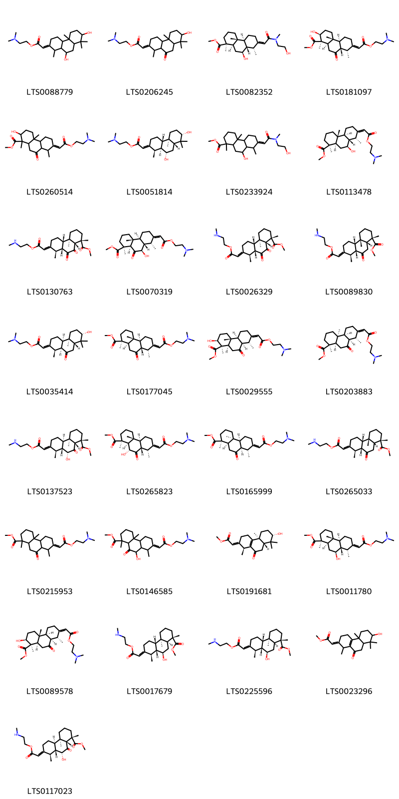{ width=100% }
    <figcaption>Hình ảnh cấu trúc hóa học của 29 hoạt chất thuộc nhóm Prenol lipids gồm ['2-(dimethylamino)ethyl 2-(7,10-dihydroxy-1,4b,8,8-tetramethyl-decahydro-1h-phenanthren-2-ylidene)acetate (LTS0088779)', '2-(dimethylamino)ethyl 2-(7-hydroxy-1,4b,8,8-tetramethyl-10-oxo-decahydrophenanthren-2-ylidene)acetate (LTS0206245)', 'methyl (1s,4ar,4bs,7e,8r,8as,9s,10ar)-9-hydroxy-7-{[(2-hydroxyethyl)(methyl)carbamoyl]methylidene}-1,4a,8-trimethyl-decahydro-2h-phenanthrene-1-carboxylate (LTS0082352)', 'erythrophlamine (LTS0181097)', 'methyl 7-{2-[2-(dimethylamino)ethoxy]-2-oxoethylidene}-2-hydroxy-1,4a,8-trimethyl-9-oxo-decahydrophenanthrene-1-carboxylate (LTS0260514)', 'cassaidine (LTS0051814)', 'methyl 9-hydroxy-7-{[(2-hydroxyethyl)(methyl)carbamoyl]methylidene}-1,4a,8-trimethyl-decahydro-2h-phenanthrene-1-carboxylate (LTS0233924)', 'methyl (1s,4ar,4bs,8r,8as,9s,10ar)-7-{2-[2-(dimethylamino)ethoxy]-2-oxoethylidene}-9-hydroxy-1,4a,8-trimethyl-decahydro-2h-phenanthrene-1-carboxylate (LTS0113478)', 'methyl (1s,4ar,4bs,7e,8r,8ar,10ar)-1,4a,8-trimethyl-7-{2-[2-(methylamino)ethoxy]-2-oxoethylidene}-9,10-dioxo-octahydro-2h-phenanthrene-1-carboxylate (LTS0130763)', 'methyl (1s,4ar,4bs,7z,8r,8as,9r,10ar)-7-{2-[2-(dimethylamino)ethoxy]-2-oxoethylidene}-9-hydroxy-1,4a,8-trimethyl-10-oxo-decahydrophenanthrene-1-carboxylate (LTS0070319)', 'methyl (1s,4ar,4bs,8r,8ar,10ar)-1,4a,8-trimethyl-7-{2-[2-(methylamino)ethoxy]-2-oxoethylidene}-9,10-dioxo-octahydro-2h-phenanthrene-1-carboxylate (LTS0026329)', 'methyl (1s,4as,4bs,8r,8ar,10ar)-1,4a,8-trimethyl-7-{2-[2-(methylamino)ethoxy]-2-oxoethylidene}-9-oxo-decahydrophenanthrene-1-carboxylate (LTS0089830)', '2-(dimethylamino)ethyl 2-[(1r,2e,4ar,4br,7s,8ar,10as)-7-hydroxy-1,4b,8,8-tetramethyl-10-oxo-decahydrophenanthren-2-ylidene]acetate (LTS0035414)', 'cassamine (LTS0177045)', 'methyl (1r,2s,4ar,4bs,7z,8r,8ar,10ar)-7-{2-[2-(dimethylamino)ethoxy]-2-oxoethylidene}-2-hydroxy-1,4a,8-trimethyl-9-oxo-decahydrophenanthrene-1-carboxylate (LTS0029555)', 'methyl (1s,4as,4bs,8r,8ar,10ar)-7-{2-[2-(dimethylamino)ethoxy]-2-oxoethylidene}-1,4a,8-trimethyl-9-oxo-decahydrophenanthrene-1-carboxylate (LTS0203883)', 'methyl (1s,4ar,4br,7e,8r,8ar,9r,10ar)-9-hydroxy-1,4a,8-trimethyl-7-{2-[2-(methylamino)ethoxy]-2-oxoethylidene}-10-oxo-decahydrophenanthrene-1-carboxylate (LTS0137523)', 'erythrophleguine (LTS0265823)', 'methyl (1s,4as,4bs,7e,8r,8ar,10ar)-7-{2-[2-(dimethylamino)ethoxy]-2-oxoethylidene}-1,4a,8-trimethyl-9-oxo-decahydrophenanthrene-1-carboxylate (LTS0165999)', 'methyl (1s,4as,4bs,7e,8r,8ar,10ar)-1,4a,8-trimethyl-7-{2-[2-(methylamino)ethoxy]-2-oxoethylidene}-9-oxo-decahydrophenanthrene-1-carboxylate (LTS0265033)', 'methyl 7-{2-[2-(dimethylamino)ethoxy]-2-oxoethylidene}-1,4a,8-trimethyl-9-oxo-decahydrophenanthrene-1-carboxylate (LTS0215953)', 'methyl 7-{2-[2-(dimethylamino)ethoxy]-2-oxoethylidene}-9-hydroxy-1,4a,8-trimethyl-10-oxo-decahydrophenanthrene-1-carboxylate (LTS0146585)', 'methyl 2-[(1s,2e,4bs,7s,8ar)-7-hydroxy-1,4b,8,8-tetramethyl-10-oxo-1,3,4,5,6,7,8a,9-octahydrophenanthren-2-ylidene]acetate (LTS0191681)', 'methyl (1s,4ar,4bs,7e,8r,8as,9s,10ar)-7-{2-[2-(dimethylamino)ethoxy]-2-oxoethylidene}-9-hydroxy-1,4a,8-trimethyl-decahydro-2h-phenanthrene-1-carboxylate (LTS0011780)', 'methyl (1r,2s,4ar,4bs,8r,8ar,10ar)-7-{2-[2-(dimethylamino)ethoxy]-2-oxoethylidene}-2-hydroxy-1,4a,8-trimethyl-9-oxo-decahydrophenanthrene-1-carboxylate (LTS0089578)', 'methyl (1s,4ar,4bs,8r,8ar,9r,10as)-9-hydroxy-1,4a,8-trimethyl-7-{2-[2-(methylamino)ethoxy]-2-oxoethylidene}-decahydro-2h-phenanthrene-1-carboxylate (LTS0017679)', 'methyl (1s,4ar,4bs,7e,8r,8ar,9r,10as)-9-hydroxy-1,4a,8-trimethyl-7-{2-[2-(methylamino)ethoxy]-2-oxoethylidene}-decahydro-2h-phenanthrene-1-carboxylate (LTS0225596)', 'methyl 2-(7-hydroxy-1,4b,8,8-tetramethyl-10-oxo-1,3,4,5,6,7,8a,9-octahydrophenanthren-2-ylidene)acetate (LTS0023296)', 'methyl (1s,4ar,4br,8r,8ar,9r,10ar)-9-hydroxy-1,4a,8-trimethyl-7-{2-[2-(methylamino)ethoxy]-2-oxoethylidene}-10-oxo-decahydrophenanthrene-1-carboxylate (LTS0117023)'].</figcaption>
</figure>

---

### Dược dân tộc học

Danh sách các quốc gia có sử dụng *N/A* trong điều trị các bệnh. 

| Country   | Disease                               | Bệnh                                                                                                                                                                                                |
|:----------|:--------------------------------------|:----------------------------------------------------------------------------------------------------------------------------------------------------------------------------------------------------|
| Dutch     | Laxative, Stimulant                   | MYMEMORY WARNING: YOU USED ALL AVAILABLE FREE TRANSLATIONS FOR TODAY. NEXT AVAILABLE IN  18 HOURS 15 MINUTES 11 SECONDS VISIT HTTPS://MYMEMORY.TRANSLATED.NET/DOC/USAGELIMITS.PHP TO TRANSLATE MORE |
| French    | Astringent                            | MYMEMORY WARNING: YOU USED ALL AVAILABLE FREE TRANSLATIONS FOR TODAY. NEXT AVAILABLE IN  18 HOURS 15 MINUTES 08 SECONDS VISIT HTTPS://MYMEMORY.TRANSLATED.NET/DOC/USAGELIMITS.PHP TO TRANSLATE MORE |
| German    | Diuretic, Poison, Sedative, Analgesic | MYMEMORY WARNING: YOU USED ALL AVAILABLE FREE TRANSLATIONS FOR TODAY. NEXT AVAILABLE IN  18 HOURS 15 MINUTES 04 SECONDS VISIT HTTPS://MYMEMORY.TRANSLATED.NET/DOC/USAGELIMITS.PHP TO TRANSLATE MORE |
| US        | Cardiotonic                           | MYMEMORY WARNING: YOU USED ALL AVAILABLE FREE TRANSLATIONS FOR TODAY. NEXT AVAILABLE IN  18 HOURS 15 MINUTES 01 SECONDS VISIT HTTPS://MYMEMORY.TRANSLATED.NET/DOC/USAGELIMITS.PHP TO TRANSLATE MORE |

---

---
## Erythrophleum guinense
### Thông tin về thực vật

!!! info "Phân loại thực vật của *N/A* từ GIBF:"
    - **Kingdom:** Plantae
    - **Phylum:** Tracheophyta
    - **Order:** Fabales
    - **Family:** Fabaceae
    - **Genus:** Erythrophleum
    - **Species:** *N/A*

 

| Label (VI)   | Label (EN)   | Scientific Name         | Descriptions (VI)   | Descriptions (EN)   | Also Known As (VI)   | Also Known As (EN)   |
|:-------------|:-------------|:------------------------|:--------------------|:--------------------|:---------------------|:---------------------|
| N/A          | N/A          | Erythrophleum guineense | loài thực vật       | species of plant    | ['']                 | ['']                 |

#### Phân bố trên thế giới

**Từ CSDL GIBF** Zambia, South Africa, Malaysia, Liberia, Senegal, Australia, Madagascar, Thailand, Gabon, Namibia, Côte d’Ivoire, Mozambique, Guinea, Cameroon, Sierra Leone, Singapore

#### Phân bố tại Việt Nam

**Từ CSDL GIBF**: Không có ghi nhận ở Việt Nam

---
### Thành phần hóa học
        
- Theo cơ sở dữ liệu lotus: Từ loài *N/A* đã phân lập và xác định được Chưa có hoạt chất nào được phân lập. hoạt chất thuộc về các nhóm Không có hoạt chất nào được phân lập. 

Không có hình ảnh nào được tạo ra

---

### Dược dân tộc học

Danh sách các quốc gia có sử dụng *N/A* trong điều trị các bệnh. 

| Country   | Disease                                         | Bệnh                                                                                                                                                                                                |
|:----------|:------------------------------------------------|:----------------------------------------------------------------------------------------------------------------------------------------------------------------------------------------------------|
| Elsewhere | Cardiotonic, Astringent, Anesthetic, Dentifrice | MYMEMORY WARNING: YOU USED ALL AVAILABLE FREE TRANSLATIONS FOR TODAY. NEXT AVAILABLE IN  18 HOURS 14 MINUTES 32 SECONDS VISIT HTTPS://MYMEMORY.TRANSLATED.NET/DOC/USAGELIMITS.PHP TO TRANSLATE MORE |

---

---
## Erythrophleum suaveolens
### Thông tin về thực vật

!!! info "Phân loại thực vật của *Erythrophleum suaveolens* từ GIBF:"
    - **Kingdom:** Plantae
    - **Phylum:** Tracheophyta
    - **Order:** Fabales
    - **Family:** Fabaceae
    - **Genus:** Erythrophleum
    - **Species:** *Erythrophleum suaveolens*

 

| Label (VI)   | Label (EN)   | Scientific Name          | Descriptions (VI)   | Descriptions (EN)   | Also Known As (VI)   | Also Known As (EN)   |
|:-------------|:-------------|:-------------------------|:--------------------|:--------------------|:---------------------|:---------------------|
| N/A          | N/A          | Erythrophleum suaveolens | loài thực vật       | species of plant    | ['']                 | ['']                 |

#### Phân bố trên thế giới

**Từ CSDL GIBF** Malaysia, Liberia, Senegal, Nigeria, Gabon, Belgium, Kenya, Côte d’Ivoire, Mozambique, Benin, Congo, Democratic Republic of the, Tanzania, United Republic of, Guinea, Cameroon, Sierra Leone, Singapore, Togo

#### Phân bố tại Việt Nam

**Từ CSDL GIBF**: Không có ghi nhận ở Việt Nam

---
### Thành phần hóa học
        
- Theo cơ sở dữ liệu lotus: Từ loài *Erythrophleum suaveolens* đã phân lập và xác định được 31 hoạt chất thuộc về các nhóm Phenanthrenes and derivatives, Prenol lipids. 

|    | chemicalTaxonomyClassyfireClass   |   smiles_count |
|---:|:----------------------------------|---------------:|
|  0 | Phenanthrenes and derivatives     |              2 |
|  1 | Prenol lipids                     |             29 |

#### Nhóm Phenanthrenes and derivatives
<figure markdown="span">
    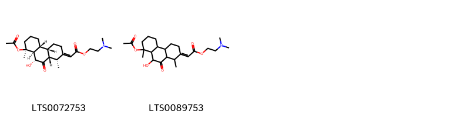{ width=100% }
    <figcaption>Hình ảnh cấu trúc hóa học của 2 hoạt chất thuộc nhóm Phenanthrenes and derivatives gồm ['2-(dimethylamino)ethyl 2-[(1r,2e,4as,4br,8s,8as,9r,10ar)-8-(acetyloxy)-9-hydroxy-1,8-dimethyl-10-oxo-decahydro-1h-phenanthren-2-ylidene]acetate (LTS0072753)', '2-(dimethylamino)ethyl 2-[8-(acetyloxy)-9-hydroxy-1,8-dimethyl-10-oxo-decahydro-1h-phenanthren-2-ylidene]acetate (LTS0089753)'].</figcaption>
</figure>
#### Nhóm Prenol lipids
<figure markdown="span">
    { width=100% }
    <figcaption>Hình ảnh cấu trúc hóa học của 29 hoạt chất thuộc nhóm Prenol lipids gồm ['2-(dimethylamino)ethyl 2-(7,10-dihydroxy-1,4b,8,8-tetramethyl-decahydro-1h-phenanthren-2-ylidene)acetate (LTS0088779)', '2-(dimethylamino)ethyl 2-(7-hydroxy-1,4b,8,8-tetramethyl-10-oxo-decahydrophenanthren-2-ylidene)acetate (LTS0206245)', 'methyl (1s,4ar,4bs,7e,8r,8as,9s,10ar)-9-hydroxy-7-{[(2-hydroxyethyl)(methyl)carbamoyl]methylidene}-1,4a,8-trimethyl-decahydro-2h-phenanthrene-1-carboxylate (LTS0082352)', 'erythrophlamine (LTS0181097)', 'methyl 7-{2-[2-(dimethylamino)ethoxy]-2-oxoethylidene}-2-hydroxy-1,4a,8-trimethyl-9-oxo-decahydrophenanthrene-1-carboxylate (LTS0260514)', 'cassaidine (LTS0051814)', 'methyl 9-hydroxy-7-{[(2-hydroxyethyl)(methyl)carbamoyl]methylidene}-1,4a,8-trimethyl-decahydro-2h-phenanthrene-1-carboxylate (LTS0233924)', 'methyl (1s,4ar,4bs,8r,8as,9s,10ar)-7-{2-[2-(dimethylamino)ethoxy]-2-oxoethylidene}-9-hydroxy-1,4a,8-trimethyl-decahydro-2h-phenanthrene-1-carboxylate (LTS0113478)', 'methyl (1s,4ar,4bs,7e,8r,8ar,10ar)-1,4a,8-trimethyl-7-{2-[2-(methylamino)ethoxy]-2-oxoethylidene}-9,10-dioxo-octahydro-2h-phenanthrene-1-carboxylate (LTS0130763)', 'methyl (1s,4ar,4bs,7z,8r,8as,9r,10ar)-7-{2-[2-(dimethylamino)ethoxy]-2-oxoethylidene}-9-hydroxy-1,4a,8-trimethyl-10-oxo-decahydrophenanthrene-1-carboxylate (LTS0070319)', 'methyl (1s,4ar,4bs,8r,8ar,10ar)-1,4a,8-trimethyl-7-{2-[2-(methylamino)ethoxy]-2-oxoethylidene}-9,10-dioxo-octahydro-2h-phenanthrene-1-carboxylate (LTS0026329)', 'methyl (1s,4as,4bs,8r,8ar,10ar)-1,4a,8-trimethyl-7-{2-[2-(methylamino)ethoxy]-2-oxoethylidene}-9-oxo-decahydrophenanthrene-1-carboxylate (LTS0089830)', '2-(dimethylamino)ethyl 2-[(1r,2e,4ar,4br,7s,8ar,10as)-7-hydroxy-1,4b,8,8-tetramethyl-10-oxo-decahydrophenanthren-2-ylidene]acetate (LTS0035414)', 'cassamine (LTS0177045)', 'methyl (1r,2s,4ar,4bs,7z,8r,8ar,10ar)-7-{2-[2-(dimethylamino)ethoxy]-2-oxoethylidene}-2-hydroxy-1,4a,8-trimethyl-9-oxo-decahydrophenanthrene-1-carboxylate (LTS0029555)', 'methyl (1s,4as,4bs,8r,8ar,10ar)-7-{2-[2-(dimethylamino)ethoxy]-2-oxoethylidene}-1,4a,8-trimethyl-9-oxo-decahydrophenanthrene-1-carboxylate (LTS0203883)', 'methyl (1s,4ar,4br,7e,8r,8ar,9r,10ar)-9-hydroxy-1,4a,8-trimethyl-7-{2-[2-(methylamino)ethoxy]-2-oxoethylidene}-10-oxo-decahydrophenanthrene-1-carboxylate (LTS0137523)', 'erythrophleguine (LTS0265823)', 'methyl (1s,4as,4bs,7e,8r,8ar,10ar)-7-{2-[2-(dimethylamino)ethoxy]-2-oxoethylidene}-1,4a,8-trimethyl-9-oxo-decahydrophenanthrene-1-carboxylate (LTS0165999)', 'methyl (1s,4as,4bs,7e,8r,8ar,10ar)-1,4a,8-trimethyl-7-{2-[2-(methylamino)ethoxy]-2-oxoethylidene}-9-oxo-decahydrophenanthrene-1-carboxylate (LTS0265033)', 'methyl 7-{2-[2-(dimethylamino)ethoxy]-2-oxoethylidene}-1,4a,8-trimethyl-9-oxo-decahydrophenanthrene-1-carboxylate (LTS0215953)', 'methyl 7-{2-[2-(dimethylamino)ethoxy]-2-oxoethylidene}-9-hydroxy-1,4a,8-trimethyl-10-oxo-decahydrophenanthrene-1-carboxylate (LTS0146585)', 'methyl 2-[(1s,2e,4bs,7s,8ar)-7-hydroxy-1,4b,8,8-tetramethyl-10-oxo-1,3,4,5,6,7,8a,9-octahydrophenanthren-2-ylidene]acetate (LTS0191681)', 'methyl (1s,4ar,4bs,7e,8r,8as,9s,10ar)-7-{2-[2-(dimethylamino)ethoxy]-2-oxoethylidene}-9-hydroxy-1,4a,8-trimethyl-decahydro-2h-phenanthrene-1-carboxylate (LTS0011780)', 'methyl (1r,2s,4ar,4bs,8r,8ar,10ar)-7-{2-[2-(dimethylamino)ethoxy]-2-oxoethylidene}-2-hydroxy-1,4a,8-trimethyl-9-oxo-decahydrophenanthrene-1-carboxylate (LTS0089578)', 'methyl (1s,4ar,4bs,8r,8ar,9r,10as)-9-hydroxy-1,4a,8-trimethyl-7-{2-[2-(methylamino)ethoxy]-2-oxoethylidene}-decahydro-2h-phenanthrene-1-carboxylate (LTS0017679)', 'methyl (1s,4ar,4bs,7e,8r,8ar,9r,10as)-9-hydroxy-1,4a,8-trimethyl-7-{2-[2-(methylamino)ethoxy]-2-oxoethylidene}-decahydro-2h-phenanthrene-1-carboxylate (LTS0225596)', 'methyl 2-(7-hydroxy-1,4b,8,8-tetramethyl-10-oxo-1,3,4,5,6,7,8a,9-octahydrophenanthren-2-ylidene)acetate (LTS0023296)', 'methyl (1s,4ar,4br,8r,8ar,9r,10ar)-9-hydroxy-1,4a,8-trimethyl-7-{2-[2-(methylamino)ethoxy]-2-oxoethylidene}-10-oxo-decahydrophenanthrene-1-carboxylate (LTS0117023)'].</figcaption>
</figure>

---

### Dược dân tộc học

Danh sách các quốc gia có sử dụng *Erythrophleum suaveolens* trong điều trị các bệnh. 

| Country    | Disease                                                          | Bệnh                                                                                                                                                                                                |
|:-----------|:-----------------------------------------------------------------|:----------------------------------------------------------------------------------------------------------------------------------------------------------------------------------------------------|
| Africa     | Astringent, Emetic, Cardiotonic, Cathartic, Poison, Sternutatory | MYMEMORY WARNING: YOU USED ALL AVAILABLE FREE TRANSLATIONS FOR TODAY. NEXT AVAILABLE IN  18 HOURS 14 MINUTES 05 SECONDS VISIT HTTPS://MYMEMORY.TRANSLATED.NET/DOC/USAGELIMITS.PHP TO TRANSLATE MORE |
| Cameroon   | Emetic, Purgative                                                | MYMEMORY WARNING: YOU USED ALL AVAILABLE FREE TRANSLATIONS FOR TODAY. NEXT AVAILABLE IN  18 HOURS 14 MINUTES 02 SECONDS VISIT HTTPS://MYMEMORY.TRANSLATED.NET/DOC/USAGELIMITS.PHP TO TRANSLATE MORE |
| Mozambique | Convulsant                                                       | MYMEMORY WARNING: YOU USED ALL AVAILABLE FREE TRANSLATIONS FOR TODAY. NEXT AVAILABLE IN  18 HOURS 13 MINUTES 59 SECONDS VISIT HTTPS://MYMEMORY.TRANSLATED.NET/DOC/USAGELIMITS.PHP TO TRANSLATE MORE |
| Tanzania   | Vermifuge                                                        | MYMEMORY WARNING: YOU USED ALL AVAILABLE FREE TRANSLATIONS FOR TODAY. NEXT AVAILABLE IN  18 HOURS 13 MINUTES 54 SECONDS VISIT HTTPS://MYMEMORY.TRANSLATED.NET/DOC/USAGELIMITS.PHP TO TRANSLATE MORE |

---

# Chi Copaifera

??? note "Danh sách các dược liệu thuộc chi"
    
	 - *Copaifera coriacea*
	 - *Copaifera officinalis*

---
## Copaifera coriacea
### Thông tin về thực vật

!!! info "Phân loại thực vật của *Copaifera coriacea* từ GIBF:"
    - **Kingdom:** Plantae
    - **Phylum:** Tracheophyta
    - **Order:** Fabales
    - **Family:** Fabaceae
    - **Genus:** Copaifera
    - **Species:** *Copaifera coriacea*

 

| Label (VI)   | Label (EN)   | Scientific Name    | Descriptions (VI)   | Descriptions (EN)   | Also Known As (VI)   | Also Known As (EN)   |
|:-------------|:-------------|:-------------------|:--------------------|:--------------------|:---------------------|:---------------------|
| N/A          | N/A          | Copaifera coriacea | loài thực vật       | species of plant    | ['']                 | ['']                 |

#### Phân bố trên thế giới

**Từ CSDL GIBF** Brazil

#### Phân bố tại Việt Nam

**Từ CSDL GIBF**: Không có ghi nhận ở Việt Nam

---
### Thành phần hóa học
        
- Theo cơ sở dữ liệu lotus: Từ loài *Copaifera coriacea* đã phân lập và xác định được Chưa có hoạt chất nào được phân lập. hoạt chất thuộc về các nhóm Không có hoạt chất nào được phân lập. 

Không có hình ảnh nào được tạo ra

---

### Dược dân tộc học

Danh sách các quốc gia có sử dụng *Copaifera coriacea* trong điều trị các bệnh. 

| Country   | Disease                                        | Bệnh                                                                                                                                                                                                |
|:----------|:-----------------------------------------------|:----------------------------------------------------------------------------------------------------------------------------------------------------------------------------------------------------|
| Elsewhere | Disinfectant, Diuretic, Stimulant, Expectorant | MYMEMORY WARNING: YOU USED ALL AVAILABLE FREE TRANSLATIONS FOR TODAY. NEXT AVAILABLE IN  18 HOURS 13 MINUTES 08 SECONDS VISIT HTTPS://MYMEMORY.TRANSLATED.NET/DOC/USAGELIMITS.PHP TO TRANSLATE MORE |

---

---
## Copaifera officinalis
### Thông tin về thực vật

!!! info "Phân loại thực vật của *Copaifera officinalis* từ GIBF:"
    - **Kingdom:** Plantae
    - **Phylum:** Tracheophyta
    - **Order:** Fabales
    - **Family:** Fabaceae
    - **Genus:** Copaifera
    - **Species:** *Copaifera officinalis*

 

| Label (VI)   | Label (EN)   | Scientific Name       | Descriptions (VI)   | Descriptions (EN)   | Also Known As (VI)   | Also Known As (EN)   |
|:-------------|:-------------|:----------------------|:--------------------|:--------------------|:---------------------|:---------------------|
| N/A          | N/A          | Copaifera officinalis | loài thực vật       | species of plant    | ['']                 | ['']                 |

#### Phân bố trên thế giới

**Từ CSDL GIBF** nan, Belize, Trinidad and Tobago, Puerto Rico, Colombia, Brazil, Chinese Taipei, Bolivia (Plurinational State of), Guyana, Argentina, United States of America, Congo, Democratic Republic of the, Nicaragua, Singapore, Venezuela (Bolivarian Republic of)

#### Phân bố tại Việt Nam

**Từ CSDL GIBF**: Không có ghi nhận ở Việt Nam

---
### Thành phần hóa học
        
- Theo cơ sở dữ liệu lotus: Từ loài *Copaifera officinalis* đã phân lập và xác định được 2 hoạt chất thuộc về các nhóm Carboxylic acids and derivatives, Prenol lipids. 

|    | chemicalTaxonomyClassyfireClass   |   smiles_count |
|---:|:----------------------------------|---------------:|
|  0 | Carboxylic acids and derivatives  |              1 |
|  1 | Prenol lipids                     |              1 |

#### Nhóm Carboxylic acids and derivatives
<figure markdown="span">
    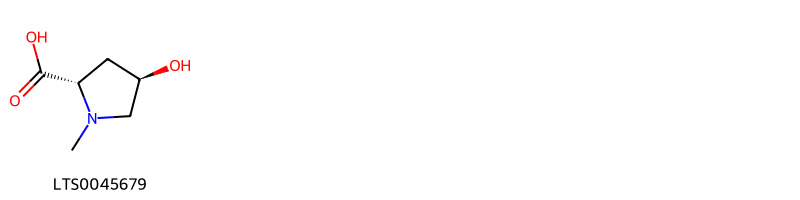{ width=100% }
    <figcaption>Hình ảnh cấu trúc hóa học của 1 hoạt chất thuộc nhóm Carboxylic acids and derivatives gồm ['(2s,4r)-4-hydroxy-1-methylpyrrolidine-2-carboxylic acid (LTS0045679)'].</figcaption>
</figure>
#### Nhóm Prenol lipids
<figure markdown="span">
    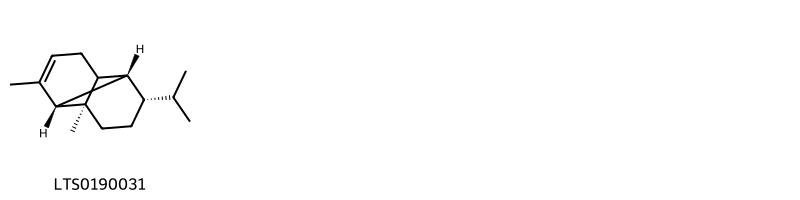{ width=100% }
    <figcaption>Hình ảnh cấu trúc hóa học của 1 hoạt chất thuộc nhóm Prenol lipids gồm ['(1r,2s,7s,8s)-8-isopropyl-1,3-dimethyltricyclo[4.4.0.0²,⁷]dec-3-ene (LTS0190031)'].</figcaption>
</figure>

---

### Dược dân tộc học

Danh sách các quốc gia có sử dụng *Copaifera officinalis* trong điều trị các bệnh. 

| Country   | Disease                                             | Bệnh                                                                                                                                                                                                |
|:----------|:----------------------------------------------------|:----------------------------------------------------------------------------------------------------------------------------------------------------------------------------------------------------|
| Elsewhere | Vermifuge                                           | MYMEMORY WARNING: YOU USED ALL AVAILABLE FREE TRANSLATIONS FOR TODAY. NEXT AVAILABLE IN  18 HOURS 12 MINUTES 41 SECONDS VISIT HTTPS://MYMEMORY.TRANSLATED.NET/DOC/USAGELIMITS.PHP TO TRANSLATE MORE |
| Turkey    | Diuretic, Purgative, Stimulant, Vulnerary, Laxative | MYMEMORY WARNING: YOU USED ALL AVAILABLE FREE TRANSLATIONS FOR TODAY. NEXT AVAILABLE IN  18 HOURS 12 MINUTES 34 SECONDS VISIT HTTPS://MYMEMORY.TRANSLATED.NET/DOC/USAGELIMITS.PHP TO TRANSLATE MORE |

---

# Chi Pueraria

??? note "Danh sách các dược liệu thuộc chi"
    
	 - *Pueraria lobata*
	 - *Pueraria peduncularis*

---
## Pueraria lobata
### Thông tin về thực vật

!!! info "Phân loại thực vật của *Pueraria montana* từ GIBF:"
    - **Kingdom:** Plantae
    - **Phylum:** Tracheophyta
    - **Order:** Fabales
    - **Family:** Fabaceae
    - **Genus:** Pueraria
    - **Species:** *Pueraria montana*

 

| Label (VI)   | Label (EN)   | Scientific Name   | Descriptions (VI)   | Descriptions (EN)   | Also Known As (VI)   | Also Known As (EN)   |
|:-------------|:-------------|:------------------|:--------------------|:--------------------|:---------------------|:---------------------|
| N/A          | N/A          | Pueraria lobata   | loài thực vật       | species of plant    | ['']                 | ['kudzu']            |

#### Phân bố trên thế giới

**Từ CSDL GIBF** Italy, Australia, Japan, Korea, Republic of, Chinese Taipei, Switzerland, Croatia

#### Phân bố tại Việt Nam

**Từ CSDL GIBF**: Không có ghi nhận ở Việt Nam

---
### Thành phần hóa học
        
- Theo cơ sở dữ liệu lotus: Từ loài *Pueraria montana* đã phân lập và xác định được Chưa có hoạt chất nào được phân lập. hoạt chất thuộc về các nhóm Không có hoạt chất nào được phân lập. 

Không có hình ảnh nào được tạo ra

---

### Dược dân tộc học

Danh sách các quốc gia có sử dụng *Pueraria montana* trong điều trị các bệnh. 

| Country   | Disease                                                  | Bệnh                                                                                                                                                                                                |
|:----------|:---------------------------------------------------------|:----------------------------------------------------------------------------------------------------------------------------------------------------------------------------------------------------|
| China     | Antidote, Antidote, Emetic, Poison, Refrigerant, Styptic | MYMEMORY WARNING: YOU USED ALL AVAILABLE FREE TRANSLATIONS FOR TODAY. NEXT AVAILABLE IN  18 HOURS 11 MINUTES 48 SECONDS VISIT HTTPS://MYMEMORY.TRANSLATED.NET/DOC/USAGELIMITS.PHP TO TRANSLATE MORE |
| Japan*    | Diaphoretic, nan                                         | MYMEMORY WARNING: YOU USED ALL AVAILABLE FREE TRANSLATIONS FOR TODAY. NEXT AVAILABLE IN  18 HOURS 11 MINUTES 44 SECONDS VISIT HTTPS://MYMEMORY.TRANSLATED.NET/DOC/USAGELIMITS.PHP TO TRANSLATE MORE |

---

---
## Pueraria peduncularis
### Thông tin về thực vật

!!! info "Phân loại thực vật của *Toxicopueraria peduncularis* từ GIBF:"
    - **Kingdom:** Plantae
    - **Phylum:** Tracheophyta
    - **Order:** Fabales
    - **Family:** Fabaceae
    - **Genus:** Toxicopueraria
    - **Species:** *Toxicopueraria peduncularis*

 

| Label (VI)   | Label (EN)   | Scientific Name       | Descriptions (VI)   | Descriptions (EN)   | Also Known As (VI)   | Also Known As (EN)           |
|:-------------|:-------------|:----------------------|:--------------------|:--------------------|:---------------------|:-----------------------------|
| N/A          | N/A          | Pueraria peduncularis | loài thực vật       | species of plant    | ['']                 | ['Pueraria peduncularis ex'] |

#### Phân bố trên thế giới

**Từ CSDL GIBF** nan, Japan, Thailand, India, China, Nepal

#### Phân bố tại Việt Nam

**Từ CSDL GIBF**: Không có ghi nhận ở Việt Nam

---
### Thành phần hóa học
        
- Theo cơ sở dữ liệu lotus: Từ loài *Toxicopueraria peduncularis* đã phân lập và xác định được 4 hoạt chất thuộc về các nhóm Isoflavonoids. 

|    | chemicalTaxonomyClassyfireClass   |   smiles_count |
|---:|:----------------------------------|---------------:|
|  0 | Isoflavonoids                     |              2 |

#### Nhóm Isoflavonoids
<figure markdown="span">
    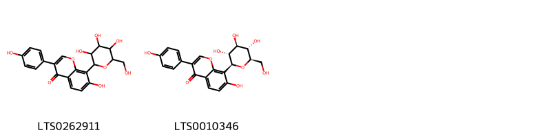{ width=100% }
    <figcaption>Hình ảnh cấu trúc hóa học của 2 hoạt chất thuộc nhóm Isoflavonoids gồm ['puerarin (LTS0262911)', 'puerarin (LTS0010346)'].</figcaption>
</figure>

---

### Dược dân tộc học

Danh sách các quốc gia có sử dụng *Toxicopueraria peduncularis* trong điều trị các bệnh. 

| Country   | Disease   | Bệnh                                                                                                                                                                                                |
|:----------|:----------|:----------------------------------------------------------------------------------------------------------------------------------------------------------------------------------------------------|
| China     | Piscicide | MYMEMORY WARNING: YOU USED ALL AVAILABLE FREE TRANSLATIONS FOR TODAY. NEXT AVAILABLE IN  18 HOURS 11 MINUTES 20 SECONDS VISIT HTTPS://MYMEMORY.TRANSLATED.NET/DOC/USAGELIMITS.PHP TO TRANSLATE MORE |

---

# Chi Phaseolus

??? note "Danh sách các dược liệu thuộc chi"
    
	 - *Phaseolus angularis*
	 - *Phaseolus lunatus*
	 - *Phaseolus multiflorus*
	 - *Phaseolus ritensis*
	 - *Phaseolus vulgaris*

---
## Phaseolus angularis
### Thông tin về thực vật

!!! info "Phân loại thực vật của *Vigna angularis* từ GIBF:"
    - **Kingdom:** Plantae
    - **Phylum:** Tracheophyta
    - **Order:** Fabales
    - **Family:** Fabaceae
    - **Genus:** Vigna
    - **Species:** *Vigna angularis*

 

| Label (VI)   | Label (EN)   | Scientific Name     | Descriptions (VI)   | Descriptions (EN)   | Also Known As (VI)   | Also Known As (EN)   |
|:-------------|:-------------|:--------------------|:--------------------|:--------------------|:---------------------|:---------------------|
| N/A          | N/A          | Phaseolus angularis | loài thực vật       | species of plant    | ['']                 | ['']                 |

#### Phân bố trên thế giới

**Từ CSDL GIBF** nan, Ecuador, Hong Kong, Japan, Romania, Korea, Republic of, Chinese Taipei, Brazil, unknown or invalid, India, United States of America, China

#### Phân bố tại Việt Nam

**Từ CSDL GIBF**: Không có ghi nhận ở Việt Nam

---
### Thành phần hóa học
        
- Theo cơ sở dữ liệu lotus: Từ loài *Vigna angularis* đã phân lập và xác định được Chưa có hoạt chất nào được phân lập. hoạt chất thuộc về các nhóm Không có hoạt chất nào được phân lập. 

Không có hình ảnh nào được tạo ra

---

### Dược dân tộc học

Danh sách các quốc gia có sử dụng *Vigna angularis* trong điều trị các bệnh. 

| Country   | Disease               | Bệnh                                                                                                                                                                                                |
|:----------|:----------------------|:----------------------------------------------------------------------------------------------------------------------------------------------------------------------------------------------------|
| China     | Diuretic, Suppurative | MYMEMORY WARNING: YOU USED ALL AVAILABLE FREE TRANSLATIONS FOR TODAY. NEXT AVAILABLE IN  18 HOURS 10 MINUTES 38 SECONDS VISIT HTTPS://MYMEMORY.TRANSLATED.NET/DOC/USAGELIMITS.PHP TO TRANSLATE MORE |

---

---
## Phaseolus lunatus
### Thông tin về thực vật

!!! info "Phân loại thực vật của *Phaseolus lunatus* từ GIBF:"
    - **Kingdom:** Plantae
    - **Phylum:** Tracheophyta
    - **Order:** Fabales
    - **Family:** Fabaceae
    - **Genus:** Phaseolus
    - **Species:** *Phaseolus lunatus*

 

| Label (VI)   | Label (EN)   | Scientific Name   | Descriptions (VI)   | Descriptions (EN)   | Also Known As (VI)   | Also Known As (EN)   |
|:-------------|:-------------|:------------------|:--------------------|:--------------------|:---------------------|:---------------------|
| N/A          | N/A          | Phaseolus lunatus | loài thực vật       | species of plant    | ['']                 | ['Lima bean']        |

#### Phân bố trên thế giới

**Từ CSDL GIBF** nan, Australia, Guadeloupe, Gabon, Benin, Nicaragua, Togo, Malawi, Puerto Rico, Réunion, Chinese Taipei, Spain, Papua New Guinea, United States of America, Timor-Leste, Guinea, Chile, El Salvador, Belize, South Africa, Germany, Brazil, Cuba, Mexico, Mayotte, China, Ecuador, Madagascar, Haiti, Colombia, Costa Rica, India, Indonesia, Philippines

#### Phân bố tại Việt Nam

**Từ CSDL GIBF**: Không có ghi nhận ở Việt Nam

---
### Thành phần hóa học
        
- Theo cơ sở dữ liệu lotus: Từ loài *Phaseolus lunatus* đã phân lập và xác định được 68 hoạt chất thuộc về các nhóm Fatty Acyls, Prenol lipids, Isoflavonoids, Cinnamic acids and derivatives, Benzene and substituted derivatives, Organooxygen compounds, Tannins, Carboxylic acids and derivatives. 

|    | chemicalTaxonomyClassyfireClass     |   smiles_count |
|---:|:------------------------------------|---------------:|
|  0 | Benzene and substituted derivatives |              2 |
|  1 | Carboxylic acids and derivatives    |              2 |
|  2 | Cinnamic acids and derivatives      |              4 |
|  3 | Fatty Acyls                         |              1 |
|  4 | Isoflavonoids                       |             42 |
|  5 | Organooxygen compounds              |             15 |
|  6 | Prenol lipids                       |              1 |
|  7 | Tannins                             |              1 |

#### Nhóm Benzene and substituted derivatives
<figure markdown="span">
    { width=100% }
    <figcaption>Hình ảnh cấu trúc hóa học của 2 hoạt chất thuộc nhóm Benzene and substituted derivatives gồm ['syringic acid (LTS0210036)', 'p-hydroxybenzoic acid (LTS0263634)'].</figcaption>
</figure>
#### Nhóm Carboxylic acids and derivatives
<figure markdown="span">
    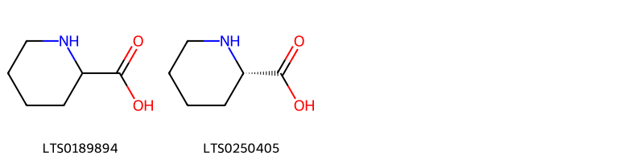{ width=100% }
    <figcaption>Hình ảnh cấu trúc hóa học của 2 hoạt chất thuộc nhóm Carboxylic acids and derivatives gồm ['(+,-)-pipecolic acid (LTS0189894)', '(-)-pipecolic acid (LTS0250405)'].</figcaption>
</figure>
#### Nhóm Cinnamic acids and derivatives
<figure markdown="span">
    { width=100% }
    <figcaption>Hình ảnh cấu trúc hóa học của 4 hoạt chất thuộc nhóm Cinnamic acids and derivatives gồm ['ferulic acid (LTS0077328)', 'para-coumaric acid (LTS0266252)', 'hydroxycinnamic acid (LTS0233023)', 'ferulic acid (LTS0273002)'].</figcaption>
</figure>
#### Nhóm Fatty Acyls
<figure markdown="span">
    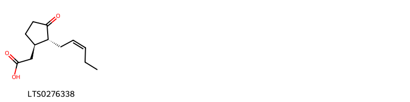{ width=100% }
    <figcaption>Hình ảnh cấu trúc hóa học của 1 hoạt chất thuộc nhóm Fatty Acyls gồm ['jasmonic acid (LTS0276338)'].</figcaption>
</figure>
#### Nhóm Isoflavonoids
<figure markdown="span">
    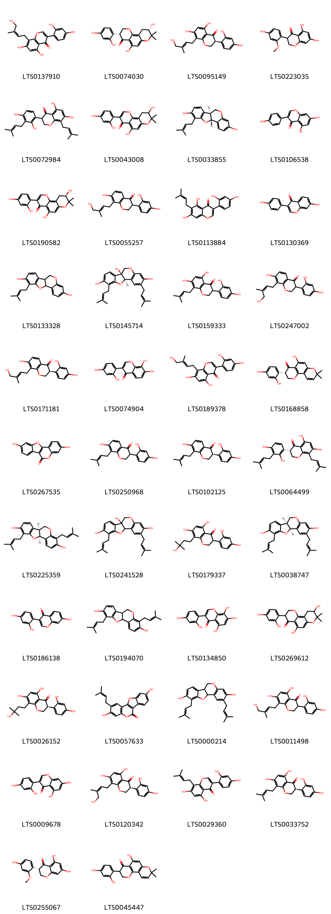{ width=100% }
    <figcaption>Hình ảnh cấu trúc hóa học của 42 hoạt chất thuộc nhóm Isoflavonoids gồm ['3-(2,4-dihydroxyphenyl)-5,7-dihydroxy-8-(4-hydroxy-3-methylbut-2-en-1-yl)chromen-4-one (LTS0137910)', '(5r,13s)-5-(2,4-dihydroxyphenyl)-8,13-dihydroxy-12,12-dimethyl-3,11-dioxatricyclo[8.4.0.0²,⁷]tetradeca-1,7,9-trien-6-one (LTS0074030)', '(3s)-3-(2,4-dihydroxyphenyl)-5,7-dihydroxy-8-[(2e)-4-hydroxy-3-methylbut-2-en-1-yl]-2,3-dihydro-1-benzopyran-4-one (LTS0095149)', 'isoferreirin (LTS0223035)', "3'-dimethylallylkievitone (LTS0072984)", '3-(2,4-dihydroxyphenyl)-5,9-dihydroxy-8,8-dimethyl-9h,10h-pyrano[2,3-h]chromen-4-one (LTS0043008)', '(1r,10s)-15-(3-methylbut-2-en-1-yl)-8,17-dioxatetracyclo[8.7.0.0²,⁷.0¹¹,¹⁶]heptadeca-2,4,6,11(16),12,14-hexaene-5,14-diol (LTS0033855)', 'genistein (LTS0106538)', '(9r)-3-(2,4-dihydroxyphenyl)-5,9-dihydroxy-8,8-dimethyl-9h,10h-pyrano[2,3-h]chromen-4-one (LTS0190582)', '5-deoxykievitol (LTS0055257)', 'luteone (LTS0113884)', 'daidzein (LTS0130369)', '15-(3-methylbut-2-en-1-yl)-8,17-dioxatetracyclo[8.7.0.0²,⁷.0¹¹,¹⁶]heptadeca-2,4,6,11(16),12,14-hexaene-5,14-diol (LTS0133328)', '(1r,10s)-4,15-bis(3-methylbut-2-en-1-yl)-8,17-dioxatetracyclo[8.7.0.0²,⁷.0¹¹,¹⁶]heptadeca-2(7),3,5,11,13,15-hexaene-5,10,14-triol (LTS0145714)', 'kievitone (LTS0159333)', '3-(2,4-dihydroxyphenyl)-7-hydroxy-8-(4-hydroxy-3-methylbut-2-en-1-yl)-2,3-dihydro-1-benzopyran-4-one (LTS0247002)', '(3s)-3-(2,4-dihydroxyphenyl)-7-hydroxy-8-[(2e)-4-hydroxy-3-methylbut-2-en-1-yl]-2,3-dihydro-1-benzopyran-4-one (LTS0171181)', '3-(2,4-dihydroxyphenyl)-7,8-dihydroxychromen-4-one (LTS0074904)', '2,3-dehydrokievitol (LTS0189378)', '(3s)-3-(2,4-dihydroxyphenyl)-5-hydroxy-8,8-dimethyl-2h,3h-pyrano[2,3-f]chromen-4-one (LTS0168858)', 'coumestrol (LTS0267535)', '5-deoxykievitone (LTS0250968)', '(3s)-3-(2,4-dihydroxyphenyl)-7-hydroxy-8-(3-methylbut-2-en-1-yl)-2,3-dihydro-1-benzopyran-4-one (LTS0102125)', '(3s)-3-[2,4-dihydroxy-3-(3-methylbut-2-en-1-yl)phenyl]-5,7-dihydroxy-8-(3-methylbut-2-en-1-yl)-2,3-dihydro-1-benzopyran-4-one (LTS0064499)', '(1s,10s)-6,15-bis(3-methylbut-2-en-1-yl)-8,17-dioxatetracyclo[8.7.0.0²,⁷.0¹¹,¹⁶]heptadeca-2,4,6,11(16),12,14-hexaene-5,14-diol (LTS0225359)', '4,15-bis(3-methylbut-2-en-1-yl)-8,17-dioxatetracyclo[8.7.0.0²,⁷.0¹¹,¹⁶]heptadeca-2(7),3,5,11,13,15-hexaene-5,10,14-triol (LTS0241528)', 'kievitone hydrate (LTS0179337)', '(1s,10s)-4,15-bis(3-methylbut-2-en-1-yl)-8,17-dioxatetracyclo[8.7.0.0²,⁷.0¹¹,¹⁶]heptadeca-2(7),3,5,11,13,15-hexaene-5,14-diol (LTS0038747)', "2'-hydroxydaidzein (LTS0186138)", '6,15-bis(3-methylbut-2-en-1-yl)-8,17-dioxatetracyclo[8.7.0.0²,⁷.0¹¹,¹⁶]heptadeca-2,4,6,11(16),12,14-hexaene-5,14-diol (LTS0194070)', '3-(2,4-dihydroxyphenyl)-5,7,8-trihydroxychromen-4-one (LTS0134850)', '5-(2,4-dihydroxyphenyl)-8,13-dihydroxy-12,12-dimethyl-3,11-dioxatricyclo[8.4.0.0²,⁷]tetradeca-1,7,9-trien-6-one (LTS0269612)', '(3s)-3-(2,4-dihydroxyphenyl)-5,7-dihydroxy-8-(3-hydroxy-3-methylbutyl)-2,3-dihydro-1-benzopyran-4-one (LTS0026152)', 'psoralidin (LTS0057633)', 'erythrabyssin ii (LTS0000214)', 'kievitol (LTS0011498)', "2'-hydroxygenistein (LTS0009678)", '(3s)-3-(2,4-dihydroxyphenyl)-5,7-dihydroxy-8-(4-hydroxy-3-methylbut-2-en-1-yl)-2,3-dihydro-1-benzopyran-4-one (LTS0120342)', '2,3-dehydrokievitone (LTS0029360)', '(3s)-3-(2,4-dihydroxyphenyl)-5,7-dihydroxy-8-(3-methylbut-2-en-1-yl)-2,3-dihydro-1-benzopyran-4-one (LTS0033752)', '(3s)-5,7-dihydroxy-3-(4-hydroxy-2-methoxyphenyl)-2,3-dihydro-1-benzopyran-4-one (LTS0255067)', 'cyclokievitone (LTS0045447)'].</figcaption>
</figure>
#### Nhóm Organooxygen compounds
<figure markdown="span">
    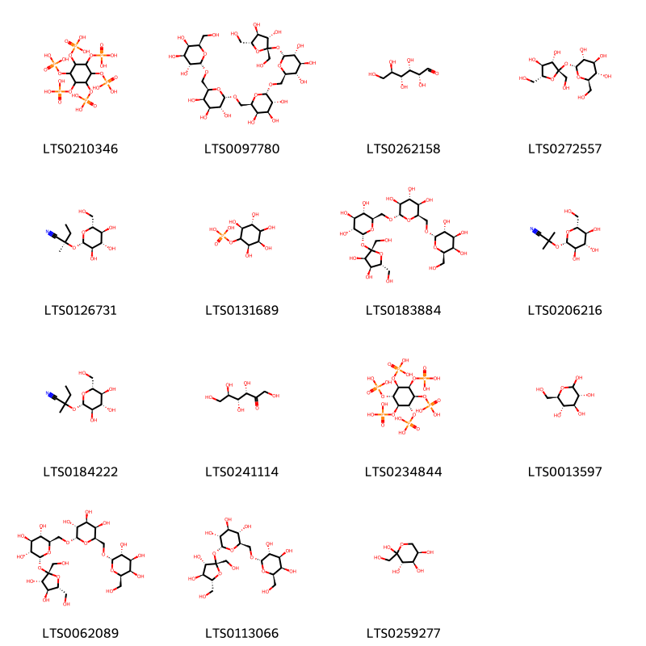{ width=100% }
    <figcaption>Hình ảnh cấu trúc hóa học của 15 hoạt chất thuộc nhóm Organooxygen compounds gồm ['phytic acid (LTS0210346)', 'verbascose (LTS0097780)', '(+)-glucose (LTS0262158)', 'sucrose (LTS0272557)', 'lotaustralin (LTS0126731)', '[(2r,3r,5r,6s)-2,3,4,5,6-pentahydroxycyclohexyl]oxyphosphonic acid (LTS0131689)', '(2r,3r,4s,5s,6r)-2-{[(2s,3r,4s,5r)-3,4-dihydroxy-2,5-bis(hydroxymethyl)oxolan-2-yl]oxy}-6-({[(2s,3s,4r,5r,6r)-3,4,5-trihydroxy-6-({[(2s,3r,4s,5r,6r)-3,4,5-trihydroxy-6-(hydroxymethyl)oxan-2-yl]oxy}methyl)oxan-2-yl]oxy}methyl)oxane-3,4,5-triol (LTS0183884)', 'linamarin (LTS0206216)', '2-methyl-2-{[(2s,3r,4s,5s,6r)-3,4,5-trihydroxy-6-(hydroxymethyl)oxan-2-yl]oxy}butanenitrile (LTS0184222)', 'keto-d-fructose (LTS0241114)', '[(1r,2r,3s,4r,5s,6s)-2,3,4,5,6-pentakis(phosphonooxy)cyclohexyl]oxyphosphonic acid (LTS0234844)', 'glucose (LTS0013597)', 'stachyose (LTS0062089)', 'raffinose (LTS0113066)', 'd-fructopyranose (LTS0259277)'].</figcaption>
</figure>
#### Nhóm Prenol lipids
<figure markdown="span">
    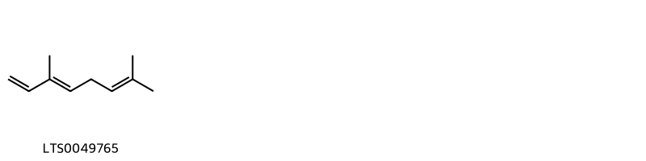{ width=100% }
    <figcaption>Hình ảnh cấu trúc hóa học của 1 hoạt chất thuộc nhóm Prenol lipids gồm ['trans-β-ocimene (LTS0049765)'].</figcaption>
</figure>
#### Nhóm Tannins
<figure markdown="span">
    { width=100% }
    <figcaption>Hình ảnh cấu trúc hóa học của 1 hoạt chất thuộc nhóm Tannins gồm ['3,5-dihydroxy-4-(3,4,5-trihydroxybenzoyloxy)-6-[(3,4,5-trihydroxybenzoyloxy)methyl]oxan-2-yl 3,4,5-trihydroxybenzoate (LTS0104575)'].</figcaption>
</figure>

---

### Dược dân tộc học

Danh sách các quốc gia có sử dụng *Phaseolus lunatus* trong điều trị các bệnh. 

| Country            | Disease   | Bệnh                                                                                                                                                                                                |
|:-------------------|:----------|:----------------------------------------------------------------------------------------------------------------------------------------------------------------------------------------------------|
| Dominican Republic | Poison    | MYMEMORY WARNING: YOU USED ALL AVAILABLE FREE TRANSLATIONS FOR TODAY. NEXT AVAILABLE IN  18 HOURS 10 MINUTES 18 SECONDS VISIT HTTPS://MYMEMORY.TRANSLATED.NET/DOC/USAGELIMITS.PHP TO TRANSLATE MORE |
| Elsewhere          | Poison    | MYMEMORY WARNING: YOU USED ALL AVAILABLE FREE TRANSLATIONS FOR TODAY. NEXT AVAILABLE IN  18 HOURS 10 MINUTES 13 SECONDS VISIT HTTPS://MYMEMORY.TRANSLATED.NET/DOC/USAGELIMITS.PHP TO TRANSLATE MORE |
| Guatemala          | Poison    | MYMEMORY WARNING: YOU USED ALL AVAILABLE FREE TRANSLATIONS FOR TODAY. NEXT AVAILABLE IN  18 HOURS 10 MINUTES 08 SECONDS VISIT HTTPS://MYMEMORY.TRANSLATED.NET/DOC/USAGELIMITS.PHP TO TRANSLATE MORE |
| US                 | Poison    | MYMEMORY WARNING: YOU USED ALL AVAILABLE FREE TRANSLATIONS FOR TODAY. NEXT AVAILABLE IN  18 HOURS 10 MINUTES 03 SECONDS VISIT HTTPS://MYMEMORY.TRANSLATED.NET/DOC/USAGELIMITS.PHP TO TRANSLATE MORE |

---

---
## Phaseolus multiflorus
### Thông tin về thực vật

!!! info "Phân loại thực vật của *N/A* từ GIBF:"
    - **Kingdom:** Plantae
    - **Phylum:** Tracheophyta
    - **Order:** Fabales
    - **Family:** Fabaceae
    - **Genus:** Phaseolus
    - **Species:** *N/A*

 

| Label (VI)   | Label (EN)   | Scientific Name   | Descriptions (VI)   | Descriptions (EN)   | Also Known As (VI)   | Also Known As (EN)   |
|:-------------|:-------------|:------------------|:--------------------|:--------------------|:---------------------|:---------------------|
| N/A          | N/A          | Phaseolus lunatus | loài thực vật       | species of plant    | ['']                 | ['Lima bean']        |

#### Phân bố trên thế giới

**Từ CSDL GIBF** nan, Australia, Belgium, Argentina, Mozambique, Ukraine, Belarus, Korea, Republic of, Spain, Russian Federation, United States of America, Sweden, El Salvador, Germany, Romania, Brazil, Mexico, Austria, Peru, United Kingdom of Great Britain and Northern Ireland, Ecuador, Haiti, Colombia, Costa Rica, India, Philippines, Malaysia, New Zealand

#### Phân bố tại Việt Nam

**Từ CSDL GIBF**: Không có ghi nhận ở Việt Nam

---
### Thành phần hóa học
        
- Theo cơ sở dữ liệu lotus: Từ loài *N/A* đã phân lập và xác định được Chưa có hoạt chất nào được phân lập. hoạt chất thuộc về các nhóm Không có hoạt chất nào được phân lập. 

Không có hình ảnh nào được tạo ra

---

### Dược dân tộc học

Danh sách các quốc gia có sử dụng *N/A* trong điều trị các bệnh. 

| Country   | Disease   | Bệnh                                                                                                                                                                                                |
|:----------|:----------|:----------------------------------------------------------------------------------------------------------------------------------------------------------------------------------------------------|
| Venezuela | Narcotic  | MYMEMORY WARNING: YOU USED ALL AVAILABLE FREE TRANSLATIONS FOR TODAY. NEXT AVAILABLE IN  18 HOURS 09 MINUTES 12 SECONDS VISIT HTTPS://MYMEMORY.TRANSLATED.NET/DOC/USAGELIMITS.PHP TO TRANSLATE MORE |

---

---
## Phaseolus ritensis
### Thông tin về thực vật

!!! info "Phân loại thực vật của *Phaseolus maculatus* từ GIBF:"
    - **Kingdom:** Plantae
    - **Phylum:** Tracheophyta
    - **Order:** Fabales
    - **Family:** Fabaceae
    - **Genus:** Phaseolus
    - **Species:** *Phaseolus maculatus*

 

| Label (VI)   | Label (EN)   | Scientific Name    | Descriptions (VI)   | Descriptions (EN)   | Also Known As (VI)   | Also Known As (EN)   |
|:-------------|:-------------|:-------------------|:--------------------|:--------------------|:---------------------|:---------------------|
| N/A          | N/A          | Phaseolus ritensis | loài thực vật       | species of plant    | ['']                 | ['']                 |

#### Phân bố trên thế giới

**Từ CSDL GIBF** Netherlands, Belgium, Guatemala, Colombia, United States of America, Mexico, Venezuela (Bolivarian Republic of)

#### Phân bố tại Việt Nam

**Từ CSDL GIBF**: Không có ghi nhận ở Việt Nam

---
### Thành phần hóa học
        
- Theo cơ sở dữ liệu lotus: Từ loài *Phaseolus maculatus* đã phân lập và xác định được Chưa có hoạt chất nào được phân lập. hoạt chất thuộc về các nhóm Không có hoạt chất nào được phân lập. 

Không có hình ảnh nào được tạo ra

---

### Dược dân tộc học

Danh sách các quốc gia có sử dụng *Phaseolus maculatus* trong điều trị các bệnh. 

| Country   | Disease    | Bệnh                                                                                                                                                                                                |
|:----------|:-----------|:----------------------------------------------------------------------------------------------------------------------------------------------------------------------------------------------------|
| Mexico    | Intoxicant | MYMEMORY WARNING: YOU USED ALL AVAILABLE FREE TRANSLATIONS FOR TODAY. NEXT AVAILABLE IN  18 HOURS 08 MINUTES 34 SECONDS VISIT HTTPS://MYMEMORY.TRANSLATED.NET/DOC/USAGELIMITS.PHP TO TRANSLATE MORE |

---

---
## Phaseolus vulgaris
### Thông tin về thực vật

!!! info "Phân loại thực vật của *Phaseolus vulgaris* từ GIBF:"
    - **Kingdom:** Plantae
    - **Phylum:** Tracheophyta
    - **Order:** Fabales
    - **Family:** Fabaceae
    - **Genus:** Phaseolus
    - **Species:** *Phaseolus vulgaris*

 

| Label (VI)   | Label (EN)   | Scientific Name    | Descriptions (VI)   | Descriptions (EN)   | Also Known As (VI)                             | Also Known As (EN)                          |
|:-------------|:-------------|:-------------------|:--------------------|:--------------------|:-----------------------------------------------|:--------------------------------------------|
| N/A          | N/A          | Phaseolus vulgaris | loài thực vật       | species of plant    | ['Phaseolus vulgaris', 'Đậu tây', 'Đậu cô-ve'] | ['common bean', 'snap bean', 'string bean'] |

#### Phân bố trên thế giới

**Từ CSDL GIBF** nan, Ghana, Australia, Belgium, Estonia, Slovakia, Guatemala, Mozambique, Argentina, Rwanda, Norway, Tanzania, United Republic of, Canada, Panama, Ukraine, Denmark, Puerto Rico, Netherlands, Belarus, Korea, Republic of, Chinese Taipei, Spain, Portugal, Russian Federation, United States of America, Sweden, El Salvador, Uzbekistan, South Africa, Trinidad and Tobago, Czechia, Germany, Romania, Brazil, Switzerland, Mexico, Austria, France, Peru, Dominican Republic, China, Ecuador, Iraq, Colombia, Montserrat, India, Poland, Kenya, Malaysia, New Zealand, Nepal

#### Phân bố tại Việt Nam

**Từ CSDL GIBF**: Không có ghi nhận ở Việt Nam

---
### Thành phần hóa học
        
- Theo cơ sở dữ liệu lotus: Từ loài *Phaseolus vulgaris* đã phân lập và xác định được 355 hoạt chất thuộc về các nhóm Naphthalenes, Hydroxy acids and derivatives, Phenols, Carboxylic acids and derivatives, Fatty Acyls, Purine nucleotides, Cinnamic acids and derivatives, Dibenzylbutane lignans, Heteroaromatic compounds, Tannins, Tetrapyrroles and derivatives, Diazines, Prenol lipids, Furans, Purine nucleosides, Benzene and substituted derivatives, Dihydrofurans, Organooxygen compounds, Furanoid lignans, Pyridines and derivatives, Flavonoids, Steroids and steroid derivatives, Isoflavonoids, Peptidomimetics, Pyrans, Unsaturated hydrocarbons, Coumarins and derivatives, Imidazopyrimidines. 

|    | chemicalTaxonomyClassyfireClass     |   smiles_count |
|---:|:------------------------------------|---------------:|
|  0 |                                     |              1 |
|  1 | Benzene and substituted derivatives |             12 |
|  2 | Carboxylic acids and derivatives    |             16 |
|  3 | Cinnamic acids and derivatives      |              8 |
|  4 | Coumarins and derivatives           |              7 |
|  5 | Diazines                            |              1 |
|  6 | Dibenzylbutane lignans              |              2 |
|  7 | Dihydrofurans                       |              1 |
|  8 | Fatty Acyls                         |             14 |
|  9 | Flavonoids                          |             69 |
| 10 | Furanoid lignans                    |              3 |
| 11 | Furans                              |              2 |
| 12 | Heteroaromatic compounds            |              1 |
| 13 | Hydroxy acids and derivatives       |              1 |
| 14 | Imidazopyrimidines                  |              2 |
| 15 | Isoflavonoids                       |             30 |
| 16 | Naphthalenes                        |              4 |
| 17 | Organooxygen compounds              |             28 |
| 18 | Peptidomimetics                     |              2 |
| 19 | Phenols                             |              2 |
| 20 | Prenol lipids                       |             65 |
| 21 | Purine nucleosides                  |              2 |
| 22 | Purine nucleotides                  |              2 |
| 23 | Pyrans                              |              1 |
| 24 | Pyridines and derivatives           |              3 |
| 25 | Steroids and steroid derivatives    |             66 |
| 26 | Tannins                             |              1 |
| 27 | Tetrapyrroles and derivatives       |              4 |
| 28 | Unsaturated hydrocarbons            |              1 |

#### Nhóm 
<figure markdown="span">
    { width=100% }
    <figcaption>Hình ảnh cấu trúc hóa học của 1 hoạt chất thuộc nhóm  gồm ['trigonelline (LTS0040106)'].</figcaption>
</figure>
#### Nhóm Benzene and substituted derivatives
<figure markdown="span">
    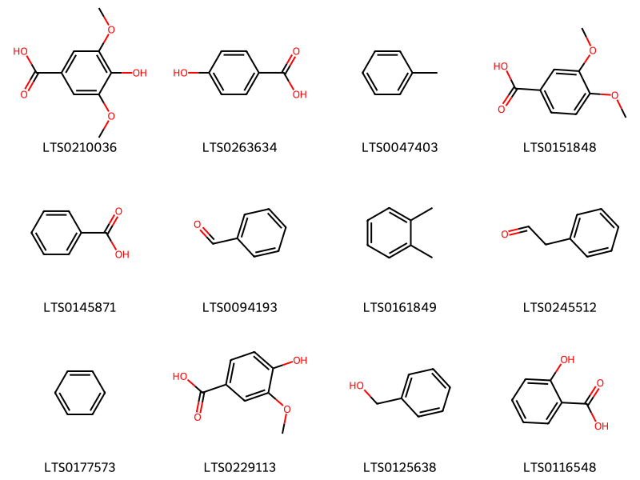{ width=100% }
    <figcaption>Hình ảnh cấu trúc hóa học của 12 hoạt chất thuộc nhóm Benzene and substituted derivatives gồm ['syringic acid (LTS0210036)', 'p-hydroxybenzoic acid (LTS0263634)', 'toluene (LTS0047403)', 'veratric acid (LTS0151848)', 'benzoic acid (LTS0145871)', 'benzaldehyde (LTS0094193)', 'ortho-xylene (LTS0161849)', 'phenylacetaldehyde (LTS0245512)', 'benzene (LTS0177573)', 'vanillic acid (LTS0229113)', 'benzyl alcohol (LTS0125638)', 'salicyclic acid (LTS0116548)'].</figcaption>
</figure>
#### Nhóm Carboxylic acids and derivatives
<figure markdown="span">
    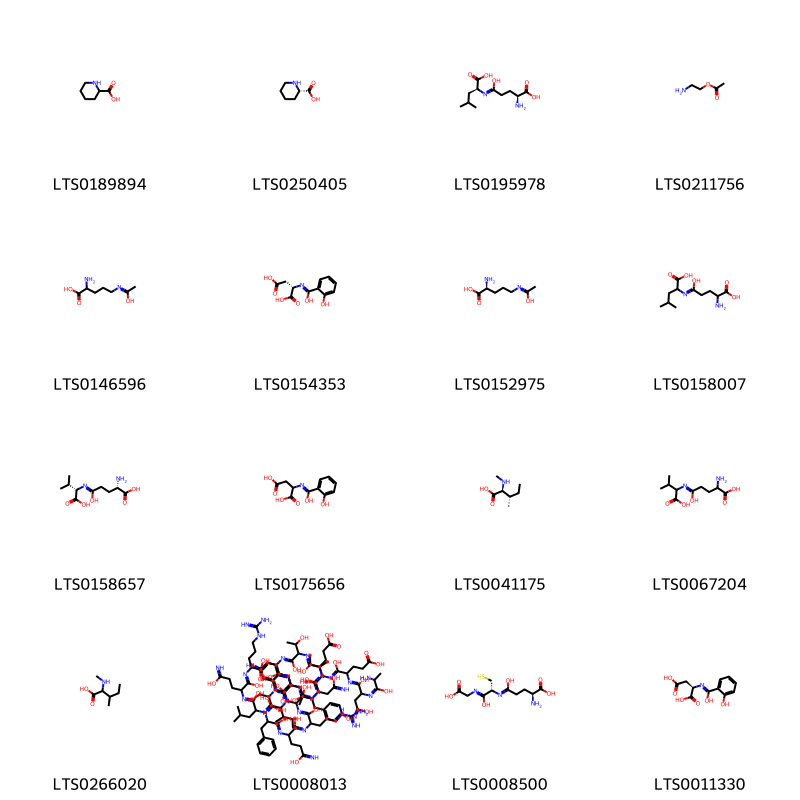{ width=100% }
    <figcaption>Hình ảnh cấu trúc hóa học của 16 hoạt chất thuộc nhóm Carboxylic acids and derivatives gồm ['(+,-)-pipecolic acid (LTS0189894)', '(-)-pipecolic acid (LTS0250405)', '(2s)-2-{[(4s)-4-amino-4-carboxy-1-hydroxybutylidene]amino}-4-methylpentanoic acid (LTS0195978)', 'ethanolamine acetate (LTS0211756)', '2-amino-5-[(1-hydroxyethylidene)amino]pentanoic acid (LTS0146596)', '(2s)-2-{[hydroxy(2-hydroxyphenyl)methylidene]amino}butanedioic acid (LTS0154353)', '(2s)-2-amino-5-[(1-hydroxyethylidene)amino]pentanoic acid (LTS0152975)', '2-[(4-amino-4-carboxy-1-hydroxybutylidene)amino]-4-methylpentanoic acid (LTS0158007)', '(2s)-2-amino-4-{[(1s)-1-carboxy-2-methylpropyl]-c-hydroxycarbonimidoyl}butanoic acid (LTS0158657)', '2-{[hydroxy(2-hydroxyphenyl)methylidene]amino}butanedioic acid (LTS0175656)', 'n-methylisoleucine (LTS0041175)', '2-amino-4-[(1-carboxy-2-methylpropyl)-c-hydroxycarbonimidoyl]butanoic acid (LTS0067204)', 'n-methylisoleucine (LTS0266020)', '4-({2-[(2-amino-1-hydroxypropylidene)amino]-1-hydroxy-3-(c-hydroxycarbonimidoyl)propylidene}amino)-4-({1-[(1-{[1-({1-[(1-{[1-({4-carbamimidamido-1-[(1-{[1-({1-[(1-{[1-({1-[(1-{[1-({1-[(4-carbamimidamido-1-carboxybutyl)-c-hydroxycarbonimidoyl]-3-(c-hydroxycarbonimidoyl)propyl}-c-hydroxycarbonimidoyl)-3-methylbutyl]-c-hydroxycarbonimidoyl}-2-methylbutyl)-c-hydroxycarbonimidoyl]-3-methylbutyl}-c-hydroxycarbonimidoyl)-2-(c-hydroxycarbonimidoyl)ethyl]-c-hydroxycarbonimidoyl}-2-hydroxypropyl)-c-hydroxycarbonimidoyl]-3-carboxypropyl}-c-hydroxycarbonimidoyl)-2-(c-hydroxycarbonimidoyl)ethyl]-c-hydroxycarbonimidoyl}-2-phenylethyl)-c-hydroxycarbonimidoyl]butyl}-c-hydroxycarbonimidoyl)-3-(c-hydroxycarbonimidoyl)propyl]-c-hydroxycarbonimidoyl}-2-phenylethyl)-c-hydroxycarbonimidoyl]-2-hydroxyethyl}-c-hydroxycarbonimidoyl)-2-phenylethyl]-c-hydroxycarbonimidoyl}-2-(4-hydroxyphenyl)ethyl)-c-hydroxycarbonimidoyl]-2-methylbutyl}-c-hydroxycarbonimidoyl)butanoic acid (LTS0008013)', '(2s)-2-amino-4-{[(1r)-1-(carboxymethyl-c-hydroxycarbonimidoyl)-2-sulfanylethyl]-c-hydroxycarbonimidoyl}butanoic acid (LTS0008500)', '(2r)-2-{[hydroxy(2-hydroxyphenyl)methylidene]amino}butanedioic acid (LTS0011330)'].</figcaption>
</figure>
#### Nhóm Cinnamic acids and derivatives
<figure markdown="span">
    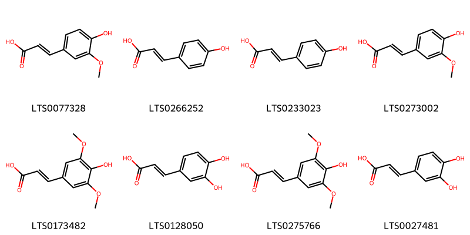{ width=100% }
    <figcaption>Hình ảnh cấu trúc hóa học của 8 hoạt chất thuộc nhóm Cinnamic acids and derivatives gồm ['ferulic acid (LTS0077328)', 'para-coumaric acid (LTS0266252)', 'hydroxycinnamic acid (LTS0233023)', 'ferulic acid (LTS0273002)', 'sinapinate (LTS0173482)', '3,4-dihydroxycinnamic acid (LTS0128050)', 'sinapoyl alcohol (LTS0275766)', 'caffeic acid (LTS0027481)'].</figcaption>
</figure>
#### Nhóm Coumarins and derivatives
<figure markdown="span">
    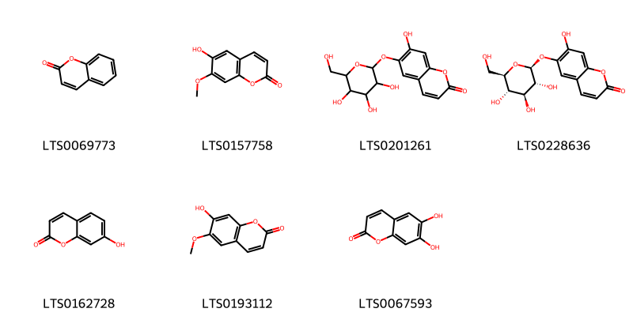{ width=100% }
    <figcaption>Hình ảnh cấu trúc hóa học của 7 hoạt chất thuộc nhóm Coumarins and derivatives gồm ['2h-1-benzopyran-2-one (LTS0069773)', 'isoscopoletin (LTS0157758)', 'esculin (LTS0201261)', 'esculin (LTS0228636)', 'umbelliferone (LTS0162728)', 'scopoletin (LTS0193112)', 'esculetin (LTS0067593)'].</figcaption>
</figure>
#### Nhóm Diazines
<figure markdown="span">
    { width=100% }
    <figcaption>Hình ảnh cấu trúc hóa học của 1 hoạt chất thuộc nhóm Diazines gồm ['β-amin (LTS0030620)'].</figcaption>
</figure>
#### Nhóm Dibenzylbutane lignans
<figure markdown="span">
    { width=100% }
    <figcaption>Hình ảnh cấu trúc hóa học của 2 hoạt chất thuộc nhóm Dibenzylbutane lignans gồm ['(2s,3r)-2,3-bis[(4-hydroxy-3-methoxyphenyl)(¹³c)methyl](1-¹³c)butane-1,4-diol (LTS0268699)', 'secoisolariciresinol (LTS0086727)'].</figcaption>
</figure>
#### Nhóm Dihydrofurans
<figure markdown="span">
    { width=100% }
    <figcaption>Hình ảnh cấu trúc hóa học của 1 hoạt chất thuộc nhóm Dihydrofurans gồm ['vitamin c (LTS0022555)'].</figcaption>
</figure>
#### Nhóm Fatty Acyls
<figure markdown="span">
    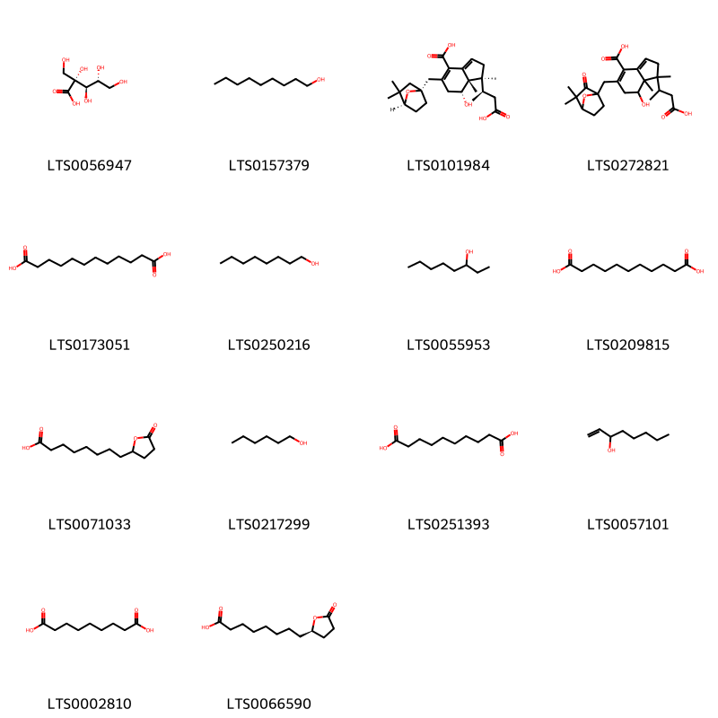{ width=100% }
    <figcaption>Hình ảnh cấu trúc hóa học của 14 hoạt chất thuộc nhóm Fatty Acyls gồm ['2-carboxy-d-arabinitol (LTS0056947)', 'nonan-1-ol (LTS0157379)', 'glycinoeclepin a (LTS0101984)', '1-(1-carboxypropan-2-yl)-5-({3,3-dimethyl-2-oxo-7-oxabicyclo[2.2.1]heptan-1-yl}methyl)-7-hydroxy-1,7a-dimethyl-6,7-dihydro-2h-indene-4-carboxylic acid (LTS0272821)', 'dodecanedioic acid (LTS0173051)', 'octanol (LTS0250216)', '3-octanol (LTS0055953)', 'undecanedioic acid (LTS0209815)', '8-(5-oxooxolan-2-yl)octanoic acid (LTS0071033)', 'hexanol (LTS0217299)', 'sebacic acid (LTS0251393)', '1-octen-3-ol (LTS0057101)', 'azelaic acid (LTS0002810)', '8-[(2r)-5-oxooxolan-2-yl]octanoic acid (LTS0066590)'].</figcaption>
</figure>
#### Nhóm Flavonoids
<figure markdown="span">
    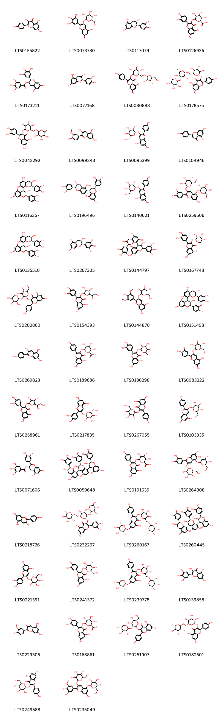{ width=100% }
    <figcaption>Hình ảnh cấu trúc hóa học của 69 hoạt chất thuộc nhóm Flavonoids gồm ['kaempherol (LTS0155822)', '5-hydroxy-3-{[(2s,3r,4s,5s,6r)-3,4,5-trihydroxy-6-(hydroxymethyl)oxan-2-yl]oxy}-2-(3,4,5-trihydroxyphenyl)chromen-7-one (LTS0073780)', '(+)-catechol (LTS0117079)', 'miquelianin (LTS0126936)', '(-)-epigallocatechin gallate (LTS0173211)', 'cyanidin (LTS0077168)', '3-{[(2s,3r,4s,5s,6r)-6-({[(2r,3r,4r,5r)-3,4-dihydroxy-5-(hydroxymethyl)oxolan-2-yl]oxy}methyl)-3,4,5-trihydroxyoxan-2-yl]oxy}-5,7-dihydroxy-2-(4-hydroxyphenyl)chromen-4-one (LTS0080888)', '3-{[(2s,3r,4s,5s,6r)-6-({[(2r,3r,4r,5s,6s)-3,5-dihydroxy-6-methyl-4-{[(2s,3r,4r,5r,6s)-3,4,5-trihydroxy-6-methyloxan-2-yl]oxy}oxan-2-yl]oxy}methyl)-3,4,5-trihydroxyoxan-2-yl]oxy}-5,7-dihydroxy-2-(4-hydroxyphenyl)chromen-4-one (LTS0178575)', 'rutin (LTS0042292)', 'peonidin (LTS0099343)', 'pelargonidin 3-glucoside (LTS0095399)', 'chamomile (LTS0104946)', '(2r,3s,4s)-2-(3,4-dihydroxyphenyl)-4-[(2r,3r)-2-(3,4-dihydroxyphenyl)-3,5,7-trihydroxy-3,4-dihydro-2h-1-benzopyran-8-yl]-3,4-dihydro-2h-1-benzopyran-3,5,7-triol (LTS0116257)', '(2r,3s,4s)-2-(3,4-dihydroxyphenyl)-4-[(2r,3r)-2-(3,4-dihydroxyphenyl)-3,5,7-trihydroxy-3,4-dihydro-2h-1-benzopyran-6-yl]-3,4-dihydro-2h-1-benzopyran-3,5,7-triol (LTS0196496)', '5,7-dihydroxy-2-(4-hydroxyphenyl)-3-{[(2r,3s,4r,5r,6s)-3,4,5-trihydroxy-6-(hydroxymethyl)oxan-2-yl]oxy}-1λ⁴-chromen-1-ylium (LTS0140621)', 'cyanin betaine (LTS0259506)', '(2r,3r,4r)-2-(3,4-dihydroxyphenyl)-4-[(2r,3r)-2-(3,4-dihydroxyphenyl)-3,5,7-trihydroxy-3,4-dihydro-2h-1-benzopyran-8-yl]-3,4-dihydro-2h-1-benzopyran-3,5,7-triol (LTS0135510)', 'gallocatechol (LTS0267305)', '4-[3,5,7-trihydroxy-2-(3,4,5-trihydroxyphenyl)-3,4-dihydro-2h-1-benzopyran-8-yl]-2-(3,4,5-trihydroxyphenyl)-3,4-dihydro-2h-1-benzopyran-3,5,7-triol (LTS0144797)', '2-(3,4-dihydroxyphenyl)-5,7-dihydroxy-3-{[(2s,3s,4r,5s,6s)-3,4,5-trihydroxy-6-methyloxan-2-yl]oxy}chromen-4-one (LTS0167743)', '3-{[4,5-dihydroxy-6-(hydroxymethyl)-3-[(3,4,5-trihydroxyoxan-2-yl)oxy]oxan-2-yl]oxy}-5,7-dihydroxy-2-(4-hydroxyphenyl)chromen-4-one (LTS0202860)', 'quercetin-3-glucoside (LTS0154393)', 'oenin (LTS0144870)', '(2r,3s,4s)-2-(3,4-dihydroxyphenyl)-4-[(2r,3s)-2-(3,4-dihydroxyphenyl)-3,5,7-trihydroxy-3,4-dihydro-2h-1-benzopyran-8-yl]-3,4-dihydro-2h-1-benzopyran-3,5,7-triol (LTS0151498)', 'pelargonidin (LTS0269823)', 'kaempferol 3-o-glucuronide (LTS0189686)', 'quercitrin (LTS0186298)', '5,7-dihydroxy-2-(4-hydroxy-3-oxidophenyl)-3-{[(2s,3r,4s,5s,6r)-3,4,5-trihydroxy-6-(hydroxymethyl)oxan-2-yl]oxy}-1λ⁴-chromen-1-ylium (LTS0083222)', '3-{[5-(1,2-dihydroxyethyl)-3,4-dihydroxyoxolan-2-yl]oxy}-2-(3,4-dihydroxyphenyl)-5,7-dihydroxychromen-4-one (LTS0258961)', 'cyanidin 3-glucoside (LTS0217835)', 'trifolin (LTS0267055)', '5-hydroxy-2-(4-hydroxyphenyl)-3-{[(2s,3r,4s,5s,6r)-3,4,5-trihydroxy-6-(hydroxymethyl)oxan-2-yl]oxy}chromen-7-one (LTS0103335)', 'epicatechin gallate (LTS0071606)', '(2r,3r)-2-(3,4-dihydroxyphenyl)-8-[(2r,3r)-2-(3,4-dihydroxyphenyl)-3,5,7-trihydroxy-3,4-dihydro-2h-1-benzopyran-4-yl]-4-[(2r,3s)-2-(3,4-dihydroxyphenyl)-3,5,7-trihydroxy-3,4-dihydro-2h-1-benzopyran-8-yl]-3,4-dihydro-2h-1-benzopyran-3,5,7-triol (LTS0059648)', '6-{[5,7-dihydroxy-2-(4-hydroxyphenyl)-4-oxochromen-3-yl]oxy}-3,4,5-trihydroxyoxane-2-carboxylic acid (LTS0101639)', 'cyanin (LTS0264308)', '5,7-dihydroxy-2-(4-hydroxyphenyl)-1λ⁴-chromen-1-ylium-3-olate (LTS0218726)', 'qxrg (LTS0232267)', 'robinin (LTS0260167)', 'procyanidin c1 (LTS0260445)', 'chrysanthemin (LTS0221391)', '2-(3,4-dihydroxyphenyl)-5,7-dihydroxy-3-{[(2s,3r,4r,5r,6s)-3,4,5-trihydroxy-6-(hydroxymethyl)oxan-2-yl]oxy}chromen-4-one (LTS0241372)', '5-hydroxy-2-(4-hydroxyphenyl)-3-{[(2s,3r,4s,5s,6r)-3,4,5-trihydroxy-6-({[(2r,3r,4r,5r,6s)-3,4,5-trihydroxy-6-methyloxan-2-yl]oxy}methyl)oxan-2-yl]oxy}-7-{[(2s,3r,4r,5r,6s)-3,4,5-trihydroxy-6-methyloxan-2-yl]oxy}chromen-4-one (LTS0239778)', 'myricetin (LTS0139858)', '5,7-dihydroxy-2-(4-hydroxy-3-methoxyphenyl)-1λ⁴-chromen-1-ylium-3-olate (LTS0229305)', 'querciturone (LTS0168861)', '3-{[(2s,3r,4s,5s,6r)-4,5-dihydroxy-6-(hydroxymethyl)-3-{[(2s,3r,4s,5r)-3,4,5-trihydroxyoxan-2-yl]oxy}oxan-2-yl]oxy}-5,7-dihydroxy-2-(4-hydroxyphenyl)chromen-4-one (LTS0251907)', 'nictoflorin (LTS0182501)', 'astragalin (LTS0249588)', '2-(3,4-dihydroxy-5-methoxyphenyl)-7-hydroxy-3,5-bis({[3,4,5-trihydroxy-6-(hydroxymethyl)oxan-2-yl]oxy})-1λ⁴-chromen-1-ylium (LTS0235049)', 'miquelianin (LTS0045574)', '2-(4-hydroxyphenyl)-3,5-bis({[(2s,3r,4s,5s,6r)-3,4,5-trihydroxy-6-(hydroxymethyl)oxan-2-yl]oxy})chromen-7-one (LTS0189760)', 'robinin (LTS0227269)', 'delphinidin 3-glucoside (LTS0010677)', 'epigallocatechin (LTS0052496)', '2-(3,5-dimethoxy-4-oxidophenyl)-5,7-dihydroxy-3-{[(3r,4s,5s,6r)-3,4,5-trihydroxy-6-(hydroxymethyl)oxan-2-yl]oxy}-1λ⁴-chromen-1-ylium (LTS0272884)', 'petunidin 3-glucoside (LTS0001367)', 'asahina (LTS0068303)', '(2r,3r,4r)-2-(3,4-dihydroxyphenyl)-4-[(2r,3s)-2-(3,4-dihydroxyphenyl)-3,5,7-trihydroxy-3,4-dihydro-2h-1-benzopyran-8-yl]-3,4-dihydro-2h-1-benzopyran-3,5,7-triol (LTS0066122)', 'quercetin (LTS0004651)', 'naringenin (LTS0031098)', 'luteolin (LTS0017052)', '3-rutinosyl quercetin (LTS0032845)', '2-(3,5-dimethoxy-4-oxidophenyl)-7-hydroxy-3,5-bis({[(2s,3r,4s,5s,6r)-3,4,5-trihydroxy-6-(hydroxymethyl)oxan-2-yl]oxy})-1λ⁴-chromen-1-ylium (LTS0235194)', 'catechol (LTS0090912)', 'hesperetin (LTS0087195)', '(2r,3s,4r)-2-(3,4-dihydroxyphenyl)-4-[(2r,3r)-2-(3,4-dihydroxyphenyl)-3,5,7-trihydroxy-3,4-dihydro-2h-1-benzopyran-6-yl]-3,4-dihydro-2h-1-benzopyran-3,5,7-triol (LTS0076760)', 'kaempferol 3-o-rutinoside (LTS0097007)', 'ent-epicatechin (LTS0265245)'].</figcaption>
</figure>
#### Nhóm Furanoid lignans
<figure markdown="span">
    { width=100% }
    <figcaption>Hình ảnh cấu trúc hóa học của 3 hoạt chất thuộc nhóm Furanoid lignans gồm ['pinoresinol (LTS0057431)', 'matairesinol (LTS0193475)', 'lariciresinol (LTS0010950)'].</figcaption>
</figure>
#### Nhóm Furans
<figure markdown="span">
    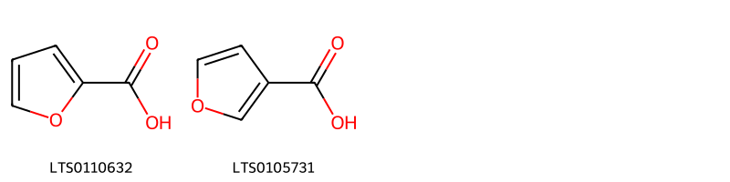{ width=100% }
    <figcaption>Hình ảnh cấu trúc hóa học của 2 hoạt chất thuộc nhóm Furans gồm ['furoic acid (LTS0110632)', '3-furoic acid (LTS0105731)'].</figcaption>
</figure>
#### Nhóm Heteroaromatic compounds
<figure markdown="span">
    { width=100% }
    <figcaption>Hình ảnh cấu trúc hóa học của 1 hoạt chất thuộc nhóm Heteroaromatic compounds gồm ['amylfuran (LTS0044471)'].</figcaption>
</figure>
#### Nhóm Hydroxy acids and derivatives
<figure markdown="span">
    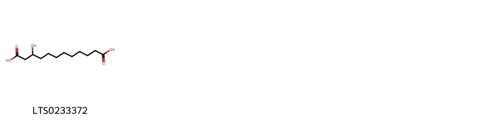{ width=100% }
    <figcaption>Hình ảnh cấu trúc hóa học của 1 hoạt chất thuộc nhóm Hydroxy acids and derivatives gồm ['3-hydroxydodecanedioic acid (LTS0233372)'].</figcaption>
</figure>
#### Nhóm Imidazopyrimidines
<figure markdown="span">
    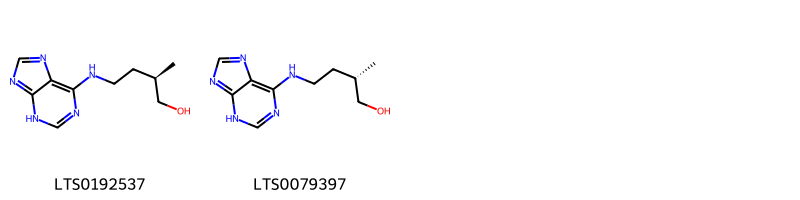{ width=100% }
    <figcaption>Hình ảnh cấu trúc hóa học của 2 hoạt chất thuộc nhóm Imidazopyrimidines gồm ['(2r)-2-methyl-4-(3h-purin-6-ylamino)butan-1-ol (LTS0192537)', 'racemic dihydrozeatin (LTS0079397)'].</figcaption>
</figure>
#### Nhóm Isoflavonoids
<figure markdown="span">
    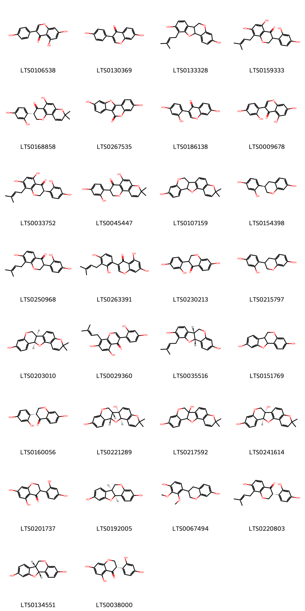{ width=100% }
    <figcaption>Hình ảnh cấu trúc hóa học của 30 hoạt chất thuộc nhóm Isoflavonoids gồm ['genistein (LTS0106538)', 'daidzein (LTS0130369)', '15-(3-methylbut-2-en-1-yl)-8,17-dioxatetracyclo[8.7.0.0²,⁷.0¹¹,¹⁶]heptadeca-2,4,6,11(16),12,14-hexaene-5,14-diol (LTS0133328)', 'kievitone (LTS0159333)', '(3s)-3-(2,4-dihydroxyphenyl)-5-hydroxy-8,8-dimethyl-2h,3h-pyrano[2,3-f]chromen-4-one (LTS0168858)', 'coumestrol (LTS0267535)', "2'-hydroxydaidzein (LTS0186138)", "2'-hydroxygenistein (LTS0009678)", '(3s)-3-(2,4-dihydroxyphenyl)-5,7-dihydroxy-8-(3-methylbut-2-en-1-yl)-2,3-dihydro-1-benzopyran-4-one (LTS0033752)', 'cyclokievitone (LTS0045447)', '17,17-dimethyl-4,12,18-trioxapentacyclo[11.8.0.0²,¹¹.0⁵,¹⁰.0¹⁴,¹⁹]henicosa-1(13),5,7,9,14(19),15,20-heptaen-7-ol (LTS0107159)', '(r)-demethylvestitol (LTS0154398)', '5-deoxykievitone (LTS0250968)', 'licoisoflavone a (LTS0263391)', "2'-hydroxydihydrodaidzein (LTS0230213)", 'demethylvestitol (LTS0215797)', '(-)-phaseollin (LTS0203010)', '2,3-dehydrokievitone (LTS0029360)', '(1r,10r)-15-(3-methylbut-2-en-1-yl)-8,17-dioxatetracyclo[8.7.0.0²,⁷.0¹¹,¹⁶]heptadeca-2,4,6,11(16),12,14-hexaene-5,14-diol (LTS0035516)', 'demethylmedicarpin (LTS0151769)', '(3r)-3-(2,4-dihydroxyphenyl)-7-hydroxy-2,3-dihydro-1-benzopyran-4-one (LTS0160056)', '(1s,2s,11s,13r)-17,17-dimethyl-4,12,18-trioxapentacyclo[11.8.0.0²,¹¹.0⁵,¹⁰.0¹⁴,¹⁹]henicosa-5,7,9,14(19),15,20-hexaene-1,7-diol (LTS0221289)', '17,17-dimethyl-4,12,18-trioxapentacyclo[11.8.0.0²,¹¹.0⁵,¹⁰.0¹⁴,¹⁹]henicosa-1(13),5,7,9,14(19),15,20-heptaene-2,7-diol (LTS0217592)', '(2s,11s)-17,17-dimethyl-4,12,18-trioxapentacyclo[11.8.0.0²,¹¹.0⁵,¹⁰.0¹⁴,¹⁹]henicosa-1(13),5,7,9,14(19),15,20-heptaene-2,7-diol (LTS0241614)', '(+-)-dalbergioidin (LTS0201737)', '(1s,10s)-8,17-dioxatetracyclo[8.7.0.0²,⁷.0¹¹,¹⁶]heptadeca-2,4,6,11,13,15-hexaene-5,14-diol (LTS0192005)', 'sphaerosin (LTS0067494)', '(3r)-3-(2,4-dihydroxyphenyl)-7-hydroxy-8-(3-methylbut-2-en-1-yl)-2,3-dihydro-1-benzopyran-4-one (LTS0220803)', '3,9-dihydroxypterocarpan (LTS0134551)', '(3s)-3-(2,4-dihydroxyphenyl)-5,7-dihydroxy-2,3-dihydro-1-benzopyran-4-one (LTS0038000)'].</figcaption>
</figure>
#### Nhóm Naphthalenes
<figure markdown="span">
    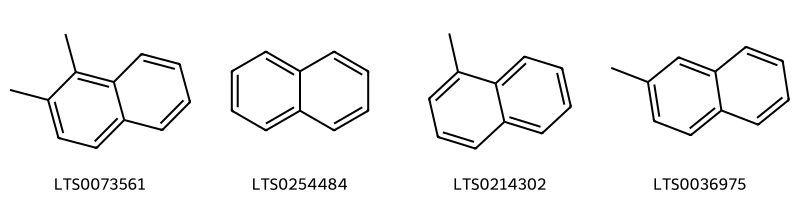{ width=100% }
    <figcaption>Hình ảnh cấu trúc hóa học của 4 hoạt chất thuộc nhóm Naphthalenes gồm ['1,2-dimethylnaphthalene (LTS0073561)', 'naphthalene (LTS0254484)', '1-methylnaphthalene (LTS0214302)', '2-methylnaphthalene (LTS0036975)'].</figcaption>
</figure>
#### Nhóm Organooxygen compounds
<figure markdown="span">
    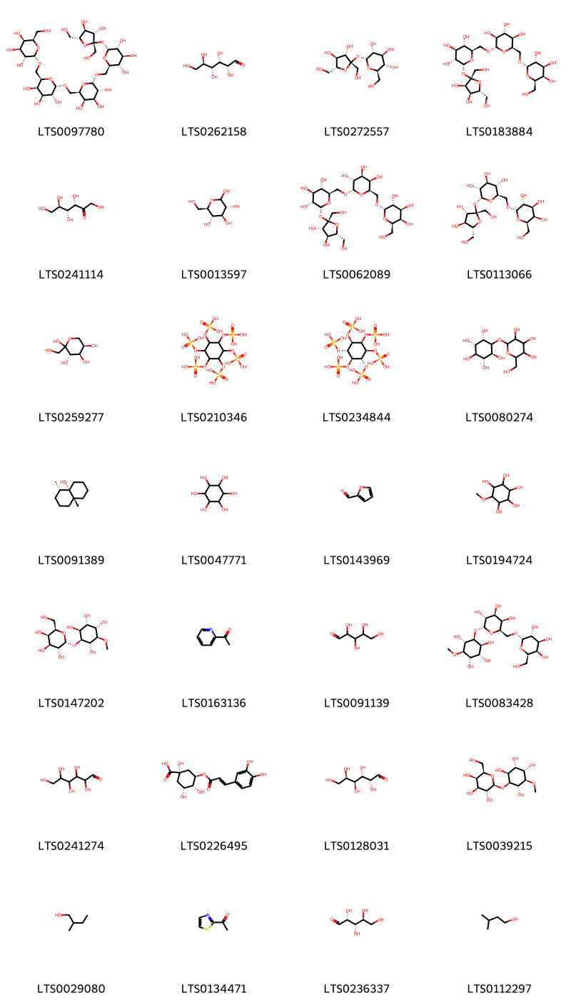{ width=100% }
    <figcaption>Hình ảnh cấu trúc hóa học của 28 hoạt chất thuộc nhóm Organooxygen compounds gồm ['verbascose (LTS0097780)', '(+)-glucose (LTS0262158)', 'sucrose (LTS0272557)', '(2r,3r,4s,5s,6r)-2-{[(2s,3r,4s,5r)-3,4-dihydroxy-2,5-bis(hydroxymethyl)oxolan-2-yl]oxy}-6-({[(2s,3s,4r,5r,6r)-3,4,5-trihydroxy-6-({[(2s,3r,4s,5r,6r)-3,4,5-trihydroxy-6-(hydroxymethyl)oxan-2-yl]oxy}methyl)oxan-2-yl]oxy}methyl)oxane-3,4,5-triol (LTS0183884)', 'keto-d-fructose (LTS0241114)', 'glucose (LTS0013597)', 'stachyose (LTS0062089)', 'raffinose (LTS0113066)', 'd-fructopyranose (LTS0259277)', 'phytic acid (LTS0210346)', '[(1r,2r,3s,4r,5s,6s)-2,3,4,5,6-pentakis(phosphonooxy)cyclohexyl]oxyphosphonic acid (LTS0234844)', '(1s,2r,4s,5s)-6-{[3,4,5-trihydroxy-6-(hydroxymethyl)oxan-2-yl]oxy}cyclohexane-1,2,3,4,5-pentol (LTS0080274)', 'geosmin (LTS0091389)', '(-)-inositol (LTS0047771)', 'bran oil (LTS0143969)', 'pinitol (LTS0194724)', '(1s,2r,3s,4r,5s,6s)-4-methoxy-6-{[(2r,3r,4s,5r,6r)-3,4,5-trihydroxy-6-(hydroxymethyl)oxan-2-yl]oxy}cyclohexane-1,2,3,5-tetrol (LTS0147202)', '2-acetylpyridine (LTS0163136)', 'xylose (LTS0091139)', '(1s,2r,3s,4r,5s,6s)-4-methoxy-6-{[(2r,3r,4s,5r,6r)-3,4,5-trihydroxy-6-({[(2s,3r,4s,5r,6r)-3,4,5-trihydroxy-6-(hydroxymethyl)oxan-2-yl]oxy}methyl)oxan-2-yl]oxy}cyclohexane-1,2,3,5-tetrol (LTS0083428)', 'dextrose (LTS0241274)', 'chlorogenic acid (LTS0226495)', 'aldehydo-d-galactose (LTS0128031)', '(1s,2r,3s,4r,5s,6s)-4-methoxy-6-{[(2s,3r,4s,5r,6r)-3,4,5-trihydroxy-6-(hydroxymethyl)oxan-2-yl]oxy}cyclohexane-1,2,3,5-tetrol (LTS0039215)', '2-methyl-1-butanol (LTS0029080)', '2-acetylthiazole (LTS0134471)', 'l-arabinose (LTS0236337)', 'isoamyl alcohol (LTS0112297)'].</figcaption>
</figure>
#### Nhóm Peptidomimetics
<figure markdown="span">
    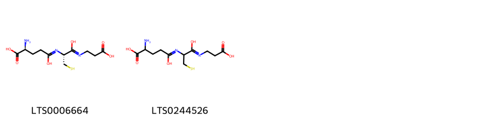{ width=100% }
    <figcaption>Hình ảnh cấu trúc hóa học của 2 hoạt chất thuộc nhóm Peptidomimetics gồm ['(2s)-2-amino-4-{[(1r)-1-[(2-carboxyethyl)-c-hydroxycarbonimidoyl]-2-sulfanylethyl]-c-hydroxycarbonimidoyl}butanoic acid (LTS0006664)', '2-amino-4-({1-[(2-carboxyethyl)-c-hydroxycarbonimidoyl]-2-sulfanylethyl}-c-hydroxycarbonimidoyl)butanoic acid (LTS0244526)'].</figcaption>
</figure>
#### Nhóm Phenols
<figure markdown="span">
    { width=100% }
    <figcaption>Hình ảnh cấu trúc hóa học của 2 hoạt chất thuộc nhóm Phenols gồm ['2-methoxy-4-vinyl-phenol (LTS0128961)', '5-ethenyl-2-methoxyphenol (LTS0076260)'].</figcaption>
</figure>
#### Nhóm Prenol lipids
<figure markdown="span">
    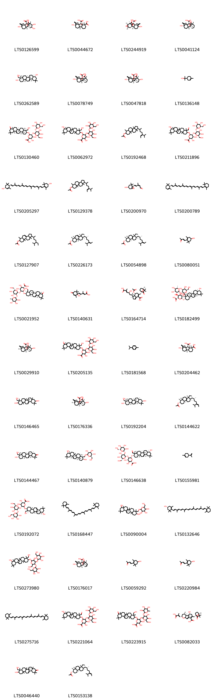{ width=100% }
    <figcaption>Hình ảnh cấu trúc hóa học của 65 hoạt chất thuộc nhóm Prenol lipids gồm ['gibberellin a8 (LTS0126599)', 'gibberellin a19 (LTS0044672)', 'gibberellin a6 (LTS0244919)', 'gibberellin a20 (LTS0041124)', 'soyasapogenol b (LTS0262589)', 'gibberellin a44 (LTS0078749)', '(1r,2r,5s,8s,9s,10s,11s,17s)-5,17-dihydroxy-11-methyl-6-methylidene-12-oxo-13-oxapentacyclo[9.3.3.1⁵,⁸.0¹,¹⁰.0²,⁸]octadecane-9-carboxylic acid (LTS0047818)', 'terpineol (LTS0136148)', '(2s,3s,4s,5r,6r)-6-{[(3s,4s,4ar,6ar,6bs,8ar,12as,14ar,14br)-4-(hydroxymethyl)-4,6a,6b,8a,11,11,14b-heptamethyl-9-oxo-2,3,4a,5,6,7,8,10,12,12a,14,14a-dodecahydro-1h-picen-3-yl]oxy}-5-{[(2s,3r,4s,5r,6r)-4,5-dihydroxy-6-(hydroxymethyl)-3-{[(2s,3r,4s,5s,6r)-3,4,5-trihydroxy-6-(hydroxymethyl)oxan-2-yl]oxy}oxan-2-yl]oxy}-3,4-dihydroxyoxane-2-carboxylic acid (LTS0130460)', '5-{[4,5-dihydroxy-6-(hydroxymethyl)-3-{[3,4,5-trihydroxy-6-(hydroxymethyl)oxan-2-yl]oxy}oxan-2-yl]oxy}-3,4-dihydroxy-6-{[9-hydroxy-4-(hydroxymethyl)-4,6a,6b,8a,11,11,14b-heptamethyl-1,2,3,4a,5,6,7,8,9,10,12,12a,14,14a-tetradecahydropicen-3-yl]oxy}oxane-2-carboxylic acid (LTS0062972)', '1-(5-isopropylhept-5-en-2-yl)-3a,6,9a,11a-tetramethyl-1h,2h,3h,4h,5h,5ah,6h,7h,8h,9h,10h,11h-cyclopenta[a]phenanthren-7-yl acetate (LTS0192468)', '(2s,3s,4s,5r,6r)-5-{[(2s,3r,4s,5r,6r)-4,5-dihydroxy-6-(hydroxymethyl)-3-{[(2s,3r,4s,5s,6r)-3,4,5-trihydroxy-6-(hydroxymethyl)oxan-2-yl]oxy}oxan-2-yl]oxy}-6-[(4-formyl-9-hydroxy-4,6a,6b,8a,11,11,14b-heptamethyl-1,2,3,4a,5,6,7,8,9,10,12,12a,14,14a-tetradecahydropicen-3-yl)oxy]-3,4-dihydroxyoxane-2-carboxylic acid (LTS0211896)', 'carotenoid (LTS0205297)', '1-(5-isopropylhept-5-en-2-yl)-6,9a,11a-trimethyl-1h,2h,3h,3ah,4h,5h,5ah,6h,7h,8h,9h,10h,11h-cyclopenta[a]phenanthren-7-yl acetate (LTS0129378)', 'xanthoxin (LTS0200970)', '(+)-α-carotene (LTS0200789)', '1-(5-ethyl-6-methylheptan-2-yl)-6,9a,11a-trimethyl-1h,2h,3h,3ah,5h,5ah,6h,7h,8h,9h,9bh,10h,11h-cyclopenta[a]phenanthren-7-yl acetate (LTS0127907)', '(1r,3ar,5as,6s,7s,9as,9br,11ar)-1-[(2r,5e)-5-isopropylhept-5-en-2-yl]-6,9a,11a-trimethyl-1h,2h,3h,3ah,5h,5ah,6h,7h,8h,9h,9bh,10h,11h-cyclopenta[a]phenanthren-7-yl acetate (LTS0226173)', '(1r,3ar,5as,6s,7s,9as,11ar)-1-[(2r,5e)-5-isopropylhept-5-en-2-yl]-3a,6,9a,11a-tetramethyl-1h,2h,3h,4h,5h,5ah,6h,7h,8h,9h,10h,11h-cyclopenta[a]phenanthren-7-yl acetate (LTS0054898)', '4-(4-hydroxy-2,6,6-trimethylcyclohex-1-en-1-yl)but-3-en-2-one (LTS0080051)', '(2r,3r,4r,5s,6s)-6-{[(3r,4r,6as,6br,8as,12ar,14bs)-4-(hydroxymethyl)-4,6a,6b,8a,11,11,14b-heptamethyl-9-oxo-2,3,4a,5,6,7,8,10,12,12a,14,14a-dodecahydro-1h-picen-3-yl]oxy}-5-{[(2r,3s,4r,5s,6s)-4,5-dihydroxy-6-(hydroxymethyl)-3-{[(2r,3s,4s,5s,6r)-3,4,5-trihydroxy-6-methyloxan-2-yl]oxy}oxan-2-yl]oxy}-3,4-dihydroxyoxane-2-carboxylic acid (LTS0021952)', 'abscisic acid,  (LTS0140631)', '(1s,7r,7as)-7-(acetyloxy)-1-[(2r,4s,5e)-6-carboxy-4-hydroxy-6-methylhex-5-en-2-yl]-5-{[(1s,4s)-3,3-dimethyl-2-oxo-7-oxabicyclo[2.2.1]heptan-1-yl]methyl}-1,7a-dimethyl-6,7-dihydro-2h-indene-4-carboxylic acid (LTS0164714)', 'soyasaponin i (LTS0182499)', 'gibberellin a4 (LTS0029910)', '5-{[4,5-dihydroxy-6-(hydroxymethyl)-3-{[3,4,5-trihydroxy-6-(hydroxymethyl)oxan-2-yl]oxy}oxan-2-yl]oxy}-3,4-dihydroxy-6-{[4-(hydroxymethyl)-4,6a,6b,8a,11,11,14b-heptamethyl-9-oxo-2,3,4a,5,6,7,8,10,12,12a,14,14a-dodecahydro-1h-picen-3-yl]oxy}oxane-2-carboxylic acid (LTS0205135)', 'cymene (LTS0181568)', 'gibberellin a53 (LTS0204462)', '9-(hydroxymethyl)-2,2,4a,6a,6b,9,12a-heptamethyl-1,3,4,5,6,7,8,8a,10,11,12,12b,13,14b-tetradecahydropicene-3,10-diol (LTS0146465)', 'gibberellin a37 (LTS0176336)', '(3r,4as,6as,6br,8ar,9s,10s,12ar,12br,14br)-9-(hydroxymethyl)-2,2,4a,6a,6b,9,12a-heptamethyl-1,3,4,5,6,7,8,8a,10,11,12,12b,13,14b-tetradecahydropicene-3,10-diol (LTS0192204)', '(1r,3ar,5as,6s,7s,9as,11ar)-1-[(2r,5z)-5-isopropylhept-5-en-2-yl]-6,9a,11a-trimethyl-1h,2h,3h,3ah,4h,5h,5ah,6h,7h,8h,9h,10h,11h-cyclopenta[a]phenanthren-7-yl acetate (LTS0144622)', '(4as,6as,6br,8ar,9s,10s,12ar,12br,14br)-10-hydroxy-9-(hydroxymethyl)-2,2,4a,6a,6b,9,12a-heptamethyl-4,5,6,7,8,8a,10,11,12,12b,13,14b-dodecahydro-1h-picen-3-one (LTS0144467)', '(2r,3r,4s,5s,6r)-2-{[(3s,4s,4ar,6ar,6br,8ar,9r,12ar,14ar,14br)-3,9-dihydroxy-4,6a,6b,8a,11,11,14b-heptamethyl-1,2,3,4a,5,6,7,8,9,10,12,12a,14,14a-tetradecahydropicen-4-yl]methoxy}-6-(hydroxymethyl)oxane-3,4,5-triol (LTS0140879)', '(2s,3s,4s,5r,6r)-6-{[(3s,4r,4ar,6ar,6bs,8ar,9r,12as,14ar,14br)-4-formyl-9-hydroxy-4,6a,6b,8a,11,11,14b-heptamethyl-1,2,3,4a,5,6,7,8,9,10,12,12a,14,14a-tetradecahydropicen-3-yl]oxy}-5-{[(2s,3r,4s,5r,6r)-4,5-dihydroxy-6-(hydroxymethyl)-3-{[(2s,3r,4s,5s,6r)-3,4,5-trihydroxy-6-(hydroxymethyl)oxan-2-yl]oxy}oxan-2-yl]oxy}-3,4-dihydroxyoxane-2-carboxylic acid (LTS0146638)', 'limonene,  (LTS0155981)', '(2s,3s,4s,5r,6r)-6-{[(3s,4s,6ar,8ar,9r,14br)-9-hydroxy-4-(hydroxymethyl)-4,6a,6b,8a,11,11,14b-heptamethyl-1,2,3,4a,5,6,7,8,9,10,12,12a,14,14a-tetradecahydropicen-3-yl]oxy}-5-{[(2s,3r,4s,5r,6r)-4,5-dihydroxy-6-(hydroxymethyl)-3-{[(2s,3r,4s,5s,6r)-3,4,5-trihydroxy-6-(hydroxymethyl)oxan-2-yl]oxy}oxan-2-yl]oxy}-3,4-dihydroxyoxane-2-carboxylic acid (LTS0192072)', 'β,β-carotene (LTS0168447)', '2-[(3,9-dihydroxy-4,6a,6b,8a,11,11,14b-heptamethyl-1,2,3,4a,5,6,7,8,9,10,12,12a,14,14a-tetradecahydropicen-4-yl)methoxy]-6-(hydroxymethyl)oxane-3,4,5-triol (LTS0090004)', 'cryptoxanthin (LTS0132646)', '2-[(5-hydroxy-6-{[9-hydroxy-4-(hydroxymethyl)-4,6a,6b,8a,11,11,14b-heptamethyl-1,2,3,4a,5,6,7,8,9,10,12,12a,14,14a-tetradecahydropicen-3-yl]oxy}-2-(hydroxymethyl)-4-{[3,4,5-trihydroxy-6-(hydroxymethyl)oxan-2-yl]oxy}oxan-3-yl)oxy]-6-(hydroxymethyl)oxane-3,4,5-triol (LTS0273980)', 'gibberellin a5 (LTS0176017)', '(3e)-4-(4-hydroxy-2,6,6-trimethylcyclohex-1-en-1-yl)but-3-en-2-one (LTS0059292)', '(3r)-hydroxy-β-ionone (LTS0220984)', 'β-carotene (LTS0275716)', '5-{[4,5-dihydroxy-6-(hydroxymethyl)-3-{[3,4,5-trihydroxy-6-(hydroxymethyl)oxan-2-yl]oxy}oxan-2-yl]oxy}-6-[(4-formyl-9-hydroxy-4,6a,6b,8a,11,11,14b-heptamethyl-1,2,3,4a,5,6,7,8,9,10,12,12a,14,14a-tetradecahydropicen-3-yl)oxy]-3,4-dihydroxyoxane-2-carboxylic acid (LTS0221064)', '5-{[4,5-dihydroxy-6-(hydroxymethyl)-3-[(3,4,5-trihydroxy-6-methyloxan-2-yl)oxy]oxan-2-yl]oxy}-3,4-dihydroxy-6-{[4-(hydroxymethyl)-4,6a,6b,8a,11,11,14b-heptamethyl-9-oxo-2,3,4a,5,6,7,8,10,12,12a,14,14a-dodecahydro-1h-picen-3-yl]oxy}oxane-2-carboxylic acid (LTS0223915)', '(2s,4r,4as,4br,5r)-2-[(1e)-2-carboxy-2-methyleth-1-en-1-yl]-7-{[(1s,4s)-3,3-dimethyl-2-oxo-7-oxabicyclo[2.2.1]heptan-1-yl]methyl}-5-hydroxy-4,4a,4b-trimethyl-2h,3h,4h,5h,6h,9ah-indeno[2,1-b]pyran-8-carboxylic acid (LTS0082033)', '10-hydroxy-9-(hydroxymethyl)-2,2,4a,6a,6b,9,12a-heptamethyl-4,5,6,7,8,8a,10,11,12,12b,13,14b-dodecahydro-1h-picen-3-one (LTS0046440)', '(1r,3ar,5as,6s,7s,9as,11ar)-1-[(2r,5z)-5-isopropylhept-5-en-2-yl]-3a,6,9a,11a-tetramethyl-1h,2h,3h,4h,5h,5ah,6h,7h,8h,9h,10h,11h-cyclopenta[a]phenanthren-7-yl acetate (LTS0153138)', '(9z)-β-carotene (LTS0252839)', 'dehydrosoyasaponin i (LTS0258496)', 'dihydrophaseic acid (LTS0019935)', '(1r,3ar,5as,6s,7s,9as,9br,11ar)-1-[(2r,5s)-5-ethyl-6-methylheptan-2-yl]-6,9a,11a-trimethyl-1h,2h,3h,3ah,5h,5ah,6h,7h,8h,9h,9bh,10h,11h-cyclopenta[a]phenanthren-7-yl acetate (LTS0058330)', '(6s,9r)-vomifoliol (LTS0052786)', '5-{[4,5-dihydroxy-6-(hydroxymethyl)-3-[(3,4,5-trihydroxy-6-methyloxan-2-yl)oxy]oxan-2-yl]oxy}-3,4-dihydroxy-6-{[9-hydroxy-4-(hydroxymethyl)-4,6a,6b,8a,11,11,14b-heptamethyl-1,2,3,4a,5,6,7,8,9,10,12,12a,14,14a-tetradecahydropicen-3-yl]oxy}oxane-2-carboxylic acid (LTS0005407)', '(2s,3s,4s,5r,6r)-6-{[(3s,4s,4ar,6ar,6bs,8ar,9r,12as,14ar,14br)-9-hydroxy-4-(hydroxymethyl)-4,6a,6b,8a,11,11,14b-heptamethyl-1,2,3,4a,5,6,7,8,9,10,12,12a,14,14a-tetradecahydropicen-3-yl]oxy}-5-{[(2s,3r,4s,5r,6r)-4,5-dihydroxy-6-(hydroxymethyl)-3-{[(2s,3r,4s,5s,6r)-3,4,5-trihydroxy-6-(hydroxymethyl)oxan-2-yl]oxy}oxan-2-yl]oxy}-3,4-dihydroxyoxane-2-carboxylic acid (LTS0012179)', '(3s,4s,4as,6ar,6bs,8ar,9r,12ar,14ar,14br)-4-(hydroxymethyl)-4,6a,6b,8a,11,11,14b-heptamethyl-1,2,3,4a,5,6,7,8,9,10,12,12a,14,14a-tetradecahydropicene-3,9-diol (LTS0110540)', 'α-carotene (LTS0224243)', '1-(5-isopropylhept-5-en-2-yl)-6,9a,11a-trimethyl-1h,2h,3h,3ah,5h,5ah,6h,7h,8h,9h,9bh,10h,11h-cyclopenta[a]phenanthren-7-yl acetate (LTS0240460)', '2-trans,4-trans-xanthoxin (LTS0019226)', 'dehydrovomifoliol (LTS0209706)', '(4e)-5-[(1s)-1-hydroxy-2,6,6-trimethyl-4-oxocyclohex-2-en-1-yl]-3-methylpenta-2,4-dienoic acid (LTS0268716)', '(1r,3ar,5as,6s,7s,9as,9br,11ar)-1-[(2r,5z)-5-isopropylhept-5-en-2-yl]-6,9a,11a-trimethyl-1h,2h,3h,3ah,5h,5ah,6h,7h,8h,9h,9bh,10h,11h-cyclopenta[a]phenanthren-7-yl acetate (LTS0097152)', '(2s,3s,4s,5r,6r)-5-{[(2s,3r,4s,5r,6r)-4,5-dihydroxy-6-(hydroxymethyl)-3-{[(2s,3r,4s,5s,6r)-3,4,5-trihydroxy-6-(hydroxymethyl)oxan-2-yl]oxy}oxan-2-yl]oxy}-3,4-dihydroxy-6-{[4-(hydroxymethyl)-4,6a,6b,8a,11,11,14b-heptamethyl-9-oxo-2,3,4a,5,6,7,8,10,12,12a,14,14a-dodecahydro-1h-picen-3-yl]oxy}oxane-2-carboxylic acid (LTS0244635)'].</figcaption>
</figure>
#### Nhóm Purine nucleosides
<figure markdown="span">
    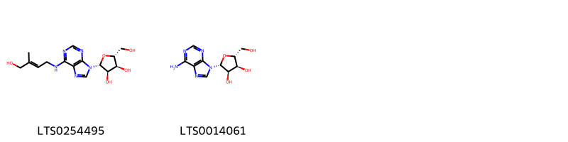{ width=100% }
    <figcaption>Hình ảnh cấu trúc hóa học của 2 hoạt chất thuộc nhóm Purine nucleosides gồm ['zeatin riboside (LTS0254495)', 'adenosine (LTS0014061)'].</figcaption>
</figure>
#### Nhóm Purine nucleotides
<figure markdown="span">
    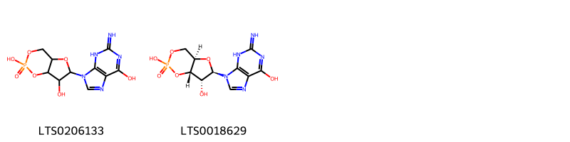{ width=100% }
    <figcaption>Hình ảnh cấu trúc hóa học của 2 hoạt chất thuộc nhóm Purine nucleotides gồm ['2,7-dihydroxy-6-(6-hydroxy-2-imino-3h-purin-9-yl)-tetrahydro-4h-2λ⁵-furo[3,2-d][1,3,2]dioxaphosphinin-2-one (LTS0206133)', 'cyclic guanosine monophosphate (LTS0018629)'].</figcaption>
</figure>
#### Nhóm Pyrans
<figure markdown="span">
    { width=100% }
    <figcaption>Hình ảnh cấu trúc hóa học của 1 hoạt chất thuộc nhóm Pyrans gồm ['talmon (LTS0152081)'].</figcaption>
</figure>
#### Nhóm Pyridines and derivatives
<figure markdown="span">
    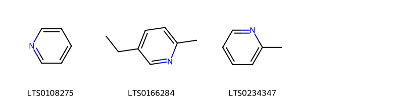{ width=100% }
    <figcaption>Hình ảnh cấu trúc hóa học của 3 hoạt chất thuộc nhóm Pyridines and derivatives gồm ['pyridine (LTS0108275)', '5-ethyl-2-methylpyridine (LTS0166284)', 'α-methylpyridine (LTS0234347)'].</figcaption>
</figure>
#### Nhóm Steroids and steroid derivatives
<figure markdown="span">
    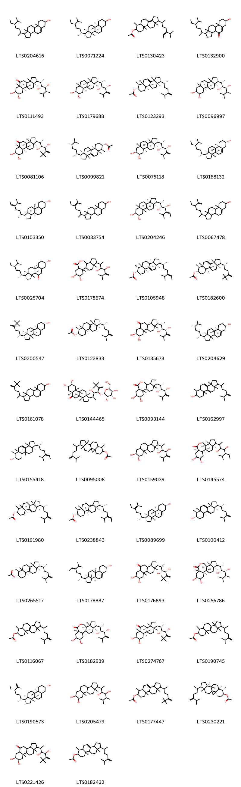{ width=100% }
    <figcaption>Hình ảnh cấu trúc hóa học của 66 hoạt chất thuộc nhóm Steroids and steroid derivatives gồm ['stigmast-5-en-3-ol, (3β)- (LTS0204616)', 'stigmast-5-en-3-ol (LTS0071224)', '1-(5-isopropylhept-5-en-2-yl)-6,9a,11a-trimethyl-1h,2h,3h,4h,5h,5ah,6h,7h,8h,9h,9bh,10h,11h-cyclopenta[a]phenanthren-7-yl acetate (LTS0130423)', '1-(5-ethyl-6-methylheptan-2-yl)-7-hydroxy-9a,11a-dimethyl-1h,2h,3h,3ah,3bh,6h,7h,8h,9h,9bh,10h,11h-cyclopenta[a]phenanthren-4-one (LTS0132900)', 'castasterone (LTS0111493)', '(2s,3r,4r)-2-[(1r,3as,3br,5as,7s,8r,9as,9bs,11as)-7,8-dihydroxy-9a,11a-dimethyl-tetradecahydro-1h-cyclopenta[a]phenanthren-1-yl]-6-methyl-5-methylideneheptane-3,4-diol (LTS0179688)', '(1r,3ar,5as,6s,7s,9as,9br,11ar)-6,9a,11a-trimethyl-1-[(2r)-6-methyl-5-methylideneheptan-2-yl]-1h,2h,3h,3ah,5h,5ah,6h,7h,8h,9h,9bh,10h,11h-cyclopenta[a]phenanthren-7-yl acetate (LTS0123293)', '(2s,3r,4r,5s)-2-[(1r,3as,3br,5as,7s,8r,9as,9br,11as)-7,8-dihydroxy-9a,11a-dimethyl-tetradecahydro-1h-cyclopenta[a]phenanthren-1-yl]-5,6-dimethylheptane-3,4-diol (LTS0096997)', '(1r,3as,3bs,5as,7s,8r,9ar,9bs,11as)-1-[(2s,3r,4r)-3,4-dihydroxy-6,6-dimethyl-5-methylideneheptan-2-yl]-7,8-dihydroxy-9a,11a-dimethyl-tetradecahydrocyclopenta[a]phenanthren-5-one (LTS0081106)', '(1r,3ar,5as,6s,7s,9as,9br,11ar)-1-[(2r,5s)-5,6-dimethylheptan-2-yl]-6,9a,11a-trimethyl-1h,2h,3h,3ah,5h,5ah,6h,7h,8h,9h,9bh,10h,11h-cyclopenta[a]phenanthren-7-yl acetate (LTS0099821)', '(2s,3r,4r)-2-[(1r,3as,3br,5as,7s,8r,9as,9br,11as)-7,8-dihydroxy-9a,11a-dimethyl-tetradecahydro-1h-cyclopenta[a]phenanthren-1-yl]-6-methyl-5-methylideneheptane-3,4-diol (LTS0075118)', 'sitosterol (LTS0168132)', 'avenasterol (LTS0103350)', '1-(5-ethyl-6-methylhept-5-en-2-yl)-9a,11a-dimethyl-1h,2h,3h,3ah,3bh,4h,6h,7h,8h,9h,9bh,10h,11h-cyclopenta[a]phenanthren-7-ol (LTS0033754)', '(1s,3ar,3br,5as,7s,8r,9ar,9br,11as)-1-[(2s,3r,4r,5e)-3,4-dihydroxy-5-isopropylhept-5-en-2-yl]-9a,11a-dimethyl-tetradecahydro-1h-cyclopenta[a]phenanthrene-7,8-diol (LTS0204246)', '1-(5-ethyl-6-methylhept-6-en-2-yl)-9a,11a-dimethyl-1h,2h,3h,3ah,3bh,4h,6h,7h,8h,9h,9bh,10h,11h-cyclopenta[a]phenanthren-7-ol (LTS0067478)', '(1r,3as,3bs,7s,9ar,9bs,11ar)-1-[(2r,3e,5s)-5-ethyl-6-methylhept-3-en-2-yl]-7-hydroxy-9a,11a-dimethyl-1h,2h,3h,3ah,3bh,6h,7h,8h,9h,9bh,10h,11h-cyclopenta[a]phenanthren-4-one (LTS0025704)', '15-(3,4-dihydroxy-6-methyl-5-methylideneheptan-2-yl)-4,5-dihydroxy-2,16-dimethyl-9-oxatetracyclo[9.7.0.0²,⁷.0¹²,¹⁶]octadecan-8-one (LTS0178674)', '(1r,3as,3bs,5as,6s,7s,9as,11ar)-1-[(2r,5z)-5-isopropylhept-5-en-2-yl]-3a,6,9a,11a-tetramethyl-1h,2h,3h,3bh,4h,5h,5ah,6h,7h,8h,9h,11h-cyclopenta[a]phenanthren-7-yl acetate (LTS0105948)', '(1r,3ar,5as,6s,7s,9as,9br,11ar)-1-[(2r)-6,6-dimethyl-5-methylideneheptan-2-yl]-6,9a,11a-trimethyl-1h,2h,3h,3ah,5h,5ah,6h,7h,8h,9h,9bh,10h,11h-cyclopenta[a]phenanthren-7-yl acetate (LTS0182600)', '(1r,3as,3bs,7s,9ar,9bs,11ar)-1-[(2r)-6,6-dimethyl-5-methylideneheptan-2-yl]-9a,11a-dimethyl-1h,2h,3h,3ah,3bh,4h,6h,7h,8h,9h,9bh,10h,11h-cyclopenta[a]phenanthren-7-ol (LTS0200547)', '(1r,3ar,5as,6s,7s,9as,11ar)-6,9a,11a-trimethyl-1-[(2r)-6-methyl-5-methylideneheptan-2-yl]-1h,2h,3h,3ah,4h,5h,5ah,6h,7h,8h,9h,10h,11h-cyclopenta[a]phenanthren-7-yl acetate (LTS0122833)', '(1r,7s,8r)-1-[(2s,3r,4r)-3,4-dihydroxy-6-methyl-5-methylideneheptan-2-yl]-7,8-dihydroxy-9a,11a-dimethyl-tetradecahydrocyclopenta[a]phenanthren-5-one (LTS0135678)', '22,23-dihydrobrassicasterol (LTS0204629)', '1-(6,6-dimethyl-5-methylideneheptan-2-yl)-9a,11a-dimethyl-1h,2h,3h,3ah,3bh,4h,6h,7h,8h,9h,9bh,10h,11h-cyclopenta[a]phenanthren-7-ol (LTS0161078)', '(1r,3ar,3bs,5as,7s,8r,9ar,9br,11as)-7,8-dihydroxy-1-[(2s,3r,4r)-3-hydroxy-6,6-dimethyl-5-methylidene-4-{[(2r,3s,4s,5s,6r)-3,4,5-trihydroxy-6-(hydroxymethyl)oxan-2-yl]oxy}heptan-2-yl]-9a,11a-dimethyl-tetradecahydrocyclopenta[a]phenanthren-5-one (LTS0144465)', '(4r,5s,15r)-15-[(2s,3r,4r)-3,4-dihydroxy-6-methyl-5-methylideneheptan-2-yl]-4,5-dihydroxy-2,16-dimethyl-9-oxatetracyclo[9.7.0.0²,⁷.0¹²,¹⁶]octadecan-8-one (LTS0093144)', '3a,6,9a,11a-tetramethyl-1-(6-methyl-5-methylideneheptan-2-yl)-1h,2h,3h,5h,5ah,6h,7h,8h,9h,11h-cyclopenta[a]phenanthren-7-ol (LTS0162997)', '(z)-24-ethylidenelophenol (LTS0155418)', '7,12,16-trimethyl-15-(6-methyl-5-methylideneheptan-2-yl)pentacyclo[9.7.0.0¹,³.0³,⁸.0¹²,¹⁶]octadecan-6-yl acetate (LTS0095008)', '2-{7,8-dihydroxy-9a,11a-dimethyl-tetradecahydro-1h-cyclopenta[a]phenanthren-1-yl}-6-methyl-5-methylideneheptane-3,4-diol (LTS0159039)', '(1r,2r,7r,11r,12s,16s)-15-(5-ethyl-3,4-dihydroxy-6-methylheptan-2-yl)-4,5-dihydroxy-2,16-dimethyl-9-oxatetracyclo[9.7.0.0²,⁷.0¹²,¹⁶]octadecan-8-one (LTS0145574)', '(1r,3as,3bs,5as,6s,7s,9as,11ar)-3a,6,9a,11a-tetramethyl-1-[(2r)-6-methyl-5-methylideneheptan-2-yl]-1h,2h,3h,3bh,4h,5h,5ah,6h,7h,8h,9h,11h-cyclopenta[a]phenanthren-7-yl acetate (LTS0161980)', '(1r,5as,6s,7s,9as,9br,11ar)-1-[(2r,5z)-5-isopropylhept-5-en-2-yl]-6,9a,11a-trimethyl-1h,2h,3h,4h,5h,5ah,6h,7h,8h,9h,9bh,10h,11h-cyclopenta[a]phenanthren-7-yl acetate (LTS0238843)', 'stigmasta-5,24-dien-3β-ol (LTS0089699)', '(1r,3ar,5as,6s,7s,9as,11ar)-3a,6,9a,11a-tetramethyl-1-[(2r)-6-methyl-5-methylideneheptan-2-yl]-1h,2h,3h,5h,5ah,6h,7h,8h,9h,11h-cyclopenta[a]phenanthren-7-ol (LTS0100412)', '(1r,3ar,5as,6s,7s,9as,11ar)-3a,6,9a,11a-tetramethyl-1-[(2r)-6-methyl-5-methylideneheptan-2-yl]-1h,2h,3h,4h,5h,5ah,6h,7h,8h,9h,10h,11h-cyclopenta[a]phenanthren-7-yl acetate (LTS0265517)', 'fucosterol (LTS0178887)', '(1r,7s,8r)-1-[(2s,3r,4r)-3,4-dihydroxy-6,6-dimethyl-5-methylideneheptan-2-yl]-7,8-dihydroxy-9a,11a-dimethyl-tetradecahydrocyclopenta[a]phenanthren-5-one (LTS0176893)', 'brassinolide (LTS0256786)', '6,9a,11a-trimethyl-1-(6-methyl-5-methylideneheptan-2-yl)-1h,2h,3h,3ah,4h,5h,5ah,6h,7h,8h,9h,10h,11h-cyclopenta[a]phenanthren-7-yl acetate (LTS0116067)', '(1r,2r,4r,5s,7s,11s,12s,15r,16s)-15-[(2s,3r,4r)-3,4-dihydroxy-6-methyl-5-methylideneheptan-2-yl]-4,5-dihydroxy-2,16-dimethyl-9-oxatetracyclo[9.7.0.0²,⁷.0¹²,¹⁶]octadecan-8-one (LTS0182939)', '(1r,3as,3bs,5as,7s,8r,9ar,9bs,11ar)-1-[(2s,3r,4r)-3,4-dihydroxy-6,6-dimethyl-5-methylideneheptan-2-yl]-7,8-dihydroxy-9a,11a-dimethyl-tetradecahydrocyclopenta[a]phenanthren-5-one (LTS0274767)', '3a,6,9a,11a-tetramethyl-1-(6-methyl-5-methylideneheptan-2-yl)-1h,2h,3h,4h,5h,5ah,6h,7h,8h,9h,10h,11h-cyclopenta[a]phenanthren-7-yl acetate (LTS0190745)', '(1r,3as,3bs,7s,9ar,9bs,11ar)-1-[(2r,5s)-5-ethyl-6-methylhept-6-en-2-yl]-9a,11a-dimethyl-1h,2h,3h,3ah,3bh,4h,6h,7h,8h,9h,9bh,10h,11h-cyclopenta[a]phenanthren-7-ol (LTS0190573)', '2-{7,8-dihydroxy-9a,11a-dimethyl-tetradecahydro-1h-cyclopenta[a]phenanthren-1-yl}-5,6-dimethylheptane-3,4-diol (LTS0205479)', '1-(6,6-dimethyl-5-methylideneheptan-2-yl)-6,9a,11a-trimethyl-1h,2h,3h,3ah,5h,5ah,6h,7h,8h,9h,9bh,10h,11h-cyclopenta[a]phenanthren-7-yl acetate (LTS0177447)', '(1s,3r,6s,7s,8s,11s,12s,15r,16r)-7,12,16-trimethyl-15-[(2r)-6-methyl-5-methylideneheptan-2-yl]pentacyclo[9.7.0.0¹,³.0³,⁸.0¹²,¹⁶]octadecan-6-yl acetate (LTS0230221)', '1-(3,4-dihydroxy-6,6-dimethyl-5-methylideneheptan-2-yl)-7,8-dihydroxy-9a,11a-dimethyl-tetradecahydrocyclopenta[a]phenanthren-5-one (LTS0221426)', '6,9a,11a-trimethyl-1-(6-methyl-5-methylideneheptan-2-yl)-1h,2h,3h,3ah,5h,5ah,6h,7h,8h,9h,9bh,10h,11h-cyclopenta[a]phenanthren-7-yl acetate (LTS0182432)', '3a,6,9a,11a-tetramethyl-1-(6-methyl-5-methylideneheptan-2-yl)-1h,2h,3h,3bh,4h,5h,5ah,6h,7h,8h,9h,11h-cyclopenta[a]phenanthren-7-yl acetate (LTS0018937)', '1-(6,6-dimethyl-5-methylideneheptan-2-yl)-6,9a,11a-trimethyl-1h,2h,3h,3ah,5h,5ah,6h,7h,8h,9h,9bh,10h,11h-cyclopenta[a]phenanthren-7-ol (LTS0211925)', '(1r,3as,3bs,7s,9ar,9bs,11ar)-1-[(2s,3e,5s)-5-ethyl-6-methylhept-3-en-2-yl]-9a,11a-dimethyl-1h,2h,3h,3ah,3bh,4h,6h,7h,8h,9h,9bh,10h,11h-cyclopenta[a]phenanthren-7-ol (LTS0169213)', 'phytosterol (LTS0029311)', '1-(5-ethyl-6-methylhept-3-en-2-yl)-7-hydroxy-9a,11a-dimethyl-1h,2h,3h,3ah,3bh,6h,7h,8h,9h,9bh,10h,11h-cyclopenta[a]phenanthren-4-one (LTS0237097)', 'stigmasterol (LTS0024262)', '(1r,3as,3bs,5as,7s,8r,9ar,9br,11as)-1-[(2s,3r,4r,5s)-3,4-dihydroxy-5,6-dimethylheptan-2-yl]-7,8-dihydroxy-9a,11a-dimethyl-tetradecahydrocyclopenta[a]phenanthren-5-one (LTS0188996)', '(1r,3as,3bs,7s,9ar,9bs,11as)-1-[(2r,5z)-5-isopropylhept-5-en-2-yl]-9a,11a-dimethyl-1h,2h,3h,3ah,3bh,4h,6h,7h,8h,9h,9bh,10h,11h-cyclopenta[a]phenanthren-7-ol (LTS0267036)', '6-deoxocastasterone (LTS0057195)', '(1r,3as,3bs,7s,9ar,9bs,11ar)-1-[(2r,5r)-5-ethyl-6-methylheptan-2-yl]-7-hydroxy-9a,11a-dimethyl-1h,2h,3h,3ah,3bh,6h,7h,8h,9h,9bh,10h,11h-cyclopenta[a]phenanthren-4-one (LTS0030881)', '24-methylidenelophenol (LTS0024189)', '1-(3,4-dihydroxy-5,6-dimethylheptan-2-yl)-7,8-dihydroxy-9a,11a-dimethyl-tetradecahydrocyclopenta[a]phenanthren-5-one (LTS0020071)', '1-(5,6-dimethylheptan-2-yl)-6,9a,11a-trimethyl-1h,2h,3h,3ah,5h,5ah,6h,7h,8h,9h,9bh,10h,11h-cyclopenta[a]phenanthren-7-yl acetate (LTS0233166)', '1-(5-isopropylhept-5-en-2-yl)-3a,6,9a,11a-tetramethyl-1h,2h,3h,3bh,4h,5h,5ah,6h,7h,8h,9h,11h-cyclopenta[a]phenanthren-7-yl acetate (LTS0030242)', 'cycloeucalenol (LTS0125739)', '(1r,3ar,5as,6s,7s,9as,11ar)-3a,6,9a,11a-tetramethyl-1-[(2r)-6-methyl-5-methylideneheptan-2-yl]-1h,2h,3h,4h,5h,5ah,6h,7h,8h,9h,10h,11h-cyclopenta[a]phenanthren-7-ol (LTS0243203)'].</figcaption>
</figure>
#### Nhóm Tannins
<figure markdown="span">
    { width=100% }
    <figcaption>Hình ảnh cấu trúc hóa học của 1 hoạt chất thuộc nhóm Tannins gồm ['ellagic acid (LTS0037297)'].</figcaption>
</figure>
#### Nhóm Tetrapyrroles and derivatives
<figure markdown="span">
    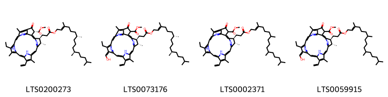{ width=100% }
    <figcaption>Hình ảnh cấu trúc hóa học của 4 hoạt chất thuộc nhóm Tetrapyrroles and derivatives gồm ['methyl (3r,21s,22s)-16-ethenyl-11-ethyl-12,17,21,26-tetramethyl-4-oxo-22-(3-oxo-3-{[(2e,7r,11r)-3,7,11,15-tetramethylhexadec-2-en-1-yl]oxy}propyl)-7,23,24,25-tetraazahexacyclo[18.2.1.1⁵,⁸.1¹⁰,¹³.1¹⁵,¹⁸.0²,⁶]hexacosa-1(23),2(6),5(26),7,9,11,13,15,17,19-decaene-3-carboxylate (LTS0200273)', 'methyl (21s,22s)-16-ethenyl-11-ethyl-12-(hydroxymethylidene)-17,21,26-trimethyl-4-oxo-22-(3-oxo-3-{[(2e,7r,11r)-3,7,11,15-tetramethylhexadec-2-en-1-yl]oxy}propyl)-7,23,24,25-tetraazahexacyclo[18.2.1.1⁵,⁸.1¹⁰,¹³.1¹⁵,¹⁸.0²,⁶]hexacosa-1,5(26),6,8,10,13(25),14,16,18,20(23)-decaene-3-carboxylate (LTS0073176)', 'methyl (21s,22s)-16-ethenyl-11-ethyl-12,17,21,26-tetramethyl-4-oxo-22-(3-oxo-3-{[(2e)-3,7,11,15-tetramethylhexadec-2-en-1-yl]oxy}propyl)-7,23,24,25-tetraazahexacyclo[18.2.1.1⁵,⁸.1¹⁰,¹³.1¹⁵,¹⁸.0²,⁶]hexacosa-1(23),2(6),5(26),7,9,11,13,15,17,19-decaene-3-carboxylate (LTS0002371)', 'methyl (21s,22s)-16-ethenyl-11-ethyl-12-(hydroxymethylidene)-17,21,26-trimethyl-4-oxo-22-(3-oxo-3-{[(2e)-3,7,11,15-tetramethylhexadec-2-en-1-yl]oxy}propyl)-7,23,24,25-tetraazahexacyclo[18.2.1.1⁵,⁸.1¹⁰,¹³.1¹⁵,¹⁸.0²,⁶]hexacosa-1,5(26),6,8,10,13(25),14,16,18,20(23)-decaene-3-carboxylate (LTS0059915)'].</figcaption>
</figure>
#### Nhóm Unsaturated hydrocarbons
<figure markdown="span">
    { width=100% }
    <figcaption>Hình ảnh cấu trúc hóa học của 1 hoạt chất thuộc nhóm Unsaturated hydrocarbons gồm ['α terpinene (LTS0232891)'].</figcaption>
</figure>

---

### Dược dân tộc học

Danh sách các quốc gia có sử dụng *Phaseolus vulgaris* trong điều trị các bệnh. 

| Country   | Disease                        | Bệnh                                                                                                                                                                                                |
|:----------|:-------------------------------|:----------------------------------------------------------------------------------------------------------------------------------------------------------------------------------------------------|
| China     | Diaphoretic, Digestive         | MYMEMORY WARNING: YOU USED ALL AVAILABLE FREE TRANSLATIONS FOR TODAY. NEXT AVAILABLE IN  18 HOURS 08 MINUTES 05 SECONDS VISIT HTTPS://MYMEMORY.TRANSLATED.NET/DOC/USAGELIMITS.PHP TO TRANSLATE MORE |
| Elsewhere | Emmenagogue                    | MYMEMORY WARNING: YOU USED ALL AVAILABLE FREE TRANSLATIONS FOR TODAY. NEXT AVAILABLE IN  18 HOURS 08 MINUTES 02 SECONDS VISIT HTTPS://MYMEMORY.TRANSLATED.NET/DOC/USAGELIMITS.PHP TO TRANSLATE MORE |
| Haiti     | Cardiac, Diuretic              | MYMEMORY WARNING: YOU USED ALL AVAILABLE FREE TRANSLATIONS FOR TODAY. NEXT AVAILABLE IN  18 HOURS 07 MINUTES 58 SECONDS VISIT HTTPS://MYMEMORY.TRANSLATED.NET/DOC/USAGELIMITS.PHP TO TRANSLATE MORE |
| Turkey    | Cardiac, Carminative, Diuretic | MYMEMORY WARNING: YOU USED ALL AVAILABLE FREE TRANSLATIONS FOR TODAY. NEXT AVAILABLE IN  18 HOURS 07 MINUTES 52 SECONDS VISIT HTTPS://MYMEMORY.TRANSLATED.NET/DOC/USAGELIMITS.PHP TO TRANSLATE MORE |

---

# Chi Benthamantha

??? note "Danh sách các dược liệu thuộc chi"
    
	 - *Benthamantha greenmanii*

---
## Benthamantha greenmanii
### Thông tin về thực vật

!!! info "Phân loại thực vật của *Coursetia greenmanii* từ GIBF:"
    - **Kingdom:** Plantae
    - **Phylum:** Tracheophyta
    - **Order:** Fabales
    - **Family:** Fabaceae
    - **Genus:** Coursetia
    - **Species:** *Coursetia greenmanii*

 

| Label (VI)   | Label (EN)   | Scientific Name    | Descriptions (VI)   | Descriptions (EN)   | Also Known As (VI)                             | Also Known As (EN)                          |
|:-------------|:-------------|:-------------------|:--------------------|:--------------------|:-----------------------------------------------|:--------------------------------------------|
| N/A          | N/A          | Phaseolus vulgaris | loài thực vật       | species of plant    | ['Phaseolus vulgaris', 'Đậu tây', 'Đậu cô-ve'] | ['common bean', 'snap bean', 'string bean'] |

#### Phân bố trên thế giới

**Từ CSDL GIBF** nan, Ghana, Australia, Belgium, Estonia, Slovakia, Guatemala, Mozambique, Argentina, Rwanda, Norway, Tanzania, United Republic of, Canada, Panama, Ukraine, Denmark, Puerto Rico, Netherlands, Belarus, Korea, Republic of, Chinese Taipei, Spain, Portugal, Russian Federation, United States of America, Sweden, El Salvador, Uzbekistan, South Africa, Trinidad and Tobago, Czechia, Germany, Romania, Brazil, Switzerland, Mexico, Austria, France, Peru, Dominican Republic, China, Ecuador, Iraq, Colombia, Montserrat, India, Poland, Kenya, Malaysia, New Zealand, Nepal

#### Phân bố tại Việt Nam

**Từ CSDL GIBF**: Không có ghi nhận ở Việt Nam

---
### Thành phần hóa học
        
- Theo cơ sở dữ liệu lotus: Từ loài *Coursetia greenmanii* đã phân lập và xác định được Chưa có hoạt chất nào được phân lập. hoạt chất thuộc về các nhóm Không có hoạt chất nào được phân lập. 

Không có hình ảnh nào được tạo ra

---

### Dược dân tộc học

Danh sách các quốc gia có sử dụng *Coursetia greenmanii* trong điều trị các bệnh. 

| Country   | Disease   | Bệnh                                                                                                                                                                                                |
|:----------|:----------|:----------------------------------------------------------------------------------------------------------------------------------------------------------------------------------------------------|
| Mexico    | Vermifuge | MYMEMORY WARNING: YOU USED ALL AVAILABLE FREE TRANSLATIONS FOR TODAY. NEXT AVAILABLE IN  18 HOURS 05 MINUTES 34 SECONDS VISIT HTTPS://MYMEMORY.TRANSLATED.NET/DOC/USAGELIMITS.PHP TO TRANSLATE MORE |

---

# Chi Hymenaea

??? note "Danh sách các dược liệu thuộc chi"
    
	 - *Hymenaea courbaril*

---
## Hymenaea courbaril
### Thông tin về thực vật

!!! info "Phân loại thực vật của *Hymenaea courbaril* từ GIBF:"
    - **Kingdom:** Plantae
    - **Phylum:** Tracheophyta
    - **Order:** Fabales
    - **Family:** Fabaceae
    - **Genus:** Hymenaea
    - **Species:** *Hymenaea courbaril*

 

| Label (VI)   | Label (EN)   | Scientific Name    | Descriptions (VI)   | Descriptions (EN)   | Also Known As (VI)   | Also Known As (EN)   |
|:-------------|:-------------|:-------------------|:--------------------|:--------------------|:---------------------|:---------------------|
| N/A          | N/A          | Hymenaea courbaril | loài thực vật       | species of plant    | ['']                 | ['']                 |

#### Phân bố trên thế giới

**Từ CSDL GIBF** Virgin Islands (U.S.), Guadeloupe, Guatemala, Saint Lucia, Benin, Nicaragua, Venezuela (Bolivarian Republic of), Panama, French Guiana, Puerto Rico, Chinese Taipei, Bolivia (Plurinational State of), Jamaica, United States of America, Bonaire, Sint Eustatius and Saba, El Salvador, Trinidad and Tobago, Saint Vincent and the Grenadines, Martinique, Brazil, Dominican Republic, Mexico, Dominica, Singapore, Haiti, Colombia, Montserrat, Costa Rica, Indonesia, Cayman Islands, Antigua and Barbuda

#### Phân bố tại Việt Nam

**Từ CSDL GIBF**: Không có ghi nhận ở Việt Nam

---
### Thành phần hóa học
        
- Theo cơ sở dữ liệu lotus: Từ loài *Hymenaea courbaril* đã phân lập và xác định được 29 hoạt chất thuộc về các nhóm Fatty Acyls, Prenol lipids, Organooxygen compounds. 

|    | chemicalTaxonomyClassyfireClass   |   smiles_count |
|---:|:----------------------------------|---------------:|
|  0 | Fatty Acyls                       |              4 |
|  1 | Organooxygen compounds            |              6 |
|  2 | Prenol lipids                     |             19 |

#### Nhóm Fatty Acyls
<figure markdown="span">
    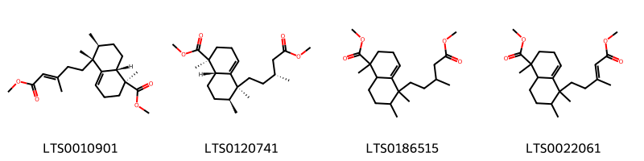{ width=100% }
    <figcaption>Hình ảnh cấu trúc hóa học của 4 hoạt chất thuộc nhóm Fatty Acyls gồm ['methyl (1s,5r,6s,8as)-5-[(3e)-5-methoxy-3-methyl-5-oxopent-3-en-1-yl]-1,5,6-trimethyl-2,3,6,7,8,8a-hexahydronaphthalene-1-carboxylate (LTS0010901)', 'methyl (1s,5s,6s,8as)-5-[(3r)-5-methoxy-3-methyl-5-oxopentyl]-1,5,6-trimethyl-2,3,6,7,8,8a-hexahydronaphthalene-1-carboxylate (LTS0120741)', 'methyl 5-(5-methoxy-3-methyl-5-oxopentyl)-1,5,6-trimethyl-2,3,6,7,8,8a-hexahydronaphthalene-1-carboxylate (LTS0186515)', 'methyl 5-(5-methoxy-3-methyl-5-oxopent-3-en-1-yl)-1,5,6-trimethyl-2,3,6,7,8,8a-hexahydronaphthalene-1-carboxylate (LTS0022061)'].</figcaption>
</figure>
#### Nhóm Organooxygen compounds
<figure markdown="span">
    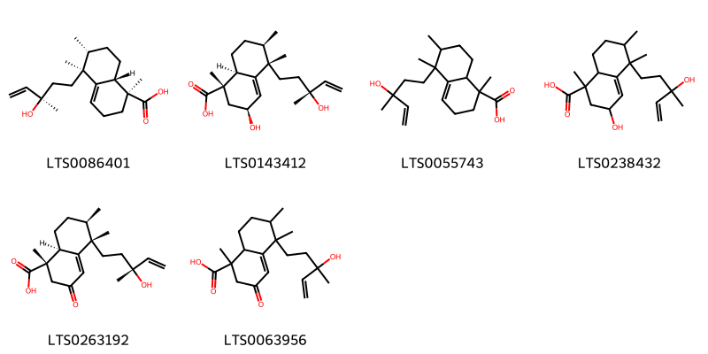{ width=100% }
    <figcaption>Hình ảnh cấu trúc hóa học của 6 hoạt chất thuộc nhóm Organooxygen compounds gồm ['(1s,5s,6r,8as)-5-[(3r)-3-hydroxy-3-methylpent-4-en-1-yl]-1,5,6-trimethyl-2,3,6,7,8,8a-hexahydronaphthalene-1-carboxylic acid (LTS0086401)', '(1s,3s,5s,6r,8as)-3-hydroxy-5-[(3r)-3-hydroxy-3-methylpent-4-en-1-yl]-1,5,6-trimethyl-2,3,6,7,8,8a-hexahydronaphthalene-1-carboxylic acid (LTS0143412)', '5-(3-hydroxy-3-methylpent-4-en-1-yl)-1,5,6-trimethyl-2,3,6,7,8,8a-hexahydronaphthalene-1-carboxylic acid (LTS0055743)', '3-hydroxy-5-(3-hydroxy-3-methylpent-4-en-1-yl)-1,5,6-trimethyl-2,3,6,7,8,8a-hexahydronaphthalene-1-carboxylic acid (LTS0238432)', '(1s,5s,6r,8as)-5-[(3r)-3-hydroxy-3-methylpent-4-en-1-yl]-1,5,6-trimethyl-3-oxo-6,7,8,8a-tetrahydro-2h-naphthalene-1-carboxylic acid (LTS0263192)', '5-(3-hydroxy-3-methylpent-4-en-1-yl)-1,5,6-trimethyl-3-oxo-6,7,8,8a-tetrahydro-2h-naphthalene-1-carboxylic acid (LTS0063956)'].</figcaption>
</figure>
#### Nhóm Prenol lipids
<figure markdown="span">
    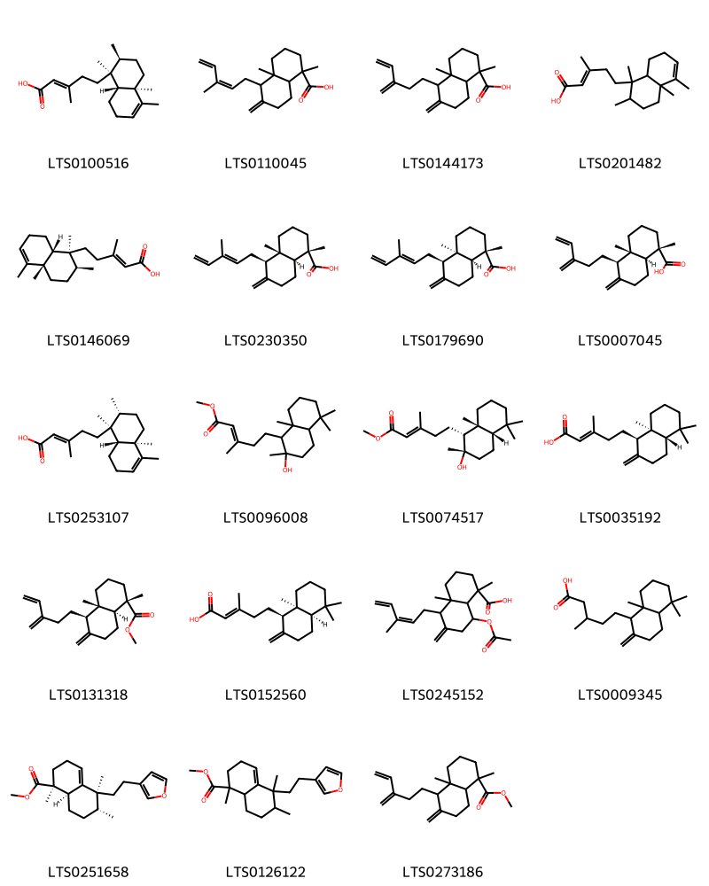{ width=100% }
    <figcaption>Hình ảnh cấu trúc hóa học của 19 hoạt chất thuộc nhóm Prenol lipids gồm ['(2e)-5-[(1s,2s,4ar,8ar)-1,2,4a,5-tetramethyl-2,3,4,7,8,8a-hexahydronaphthalen-1-yl]-3-methylpent-2-enoic acid (LTS0100516)', '1,4a-dimethyl-6-methylidene-5-(3-methylpenta-2,4-dien-1-yl)-hexahydro-2h-naphthalene-1-carboxylic acid (LTS0110045)', '1,4a-dimethyl-6-methylidene-5-(3-methylidenepent-4-en-1-yl)-hexahydro-2h-naphthalene-1-carboxylic acid (LTS0144173)', '5-(1,2,4a,5-tetramethyl-2,3,4,7,8,8a-hexahydronaphthalen-1-yl)-3-methylpent-2-enoic acid (LTS0201482)', '(2e)-5-[(1s,2s,4as,8ar)-1,2,4a,5-tetramethyl-2,3,4,7,8,8a-hexahydronaphthalen-1-yl]-3-methylpent-2-enoic acid (LTS0146069)', '(1s,4as,5r,8as)-1,4a-dimethyl-6-methylidene-5-[(2e)-3-methylpenta-2,4-dien-1-yl]-hexahydro-2h-naphthalene-1-carboxylic acid (LTS0230350)', '(1s,4ar,5r,8as)-1,4a-dimethyl-6-methylidene-5-[(2e)-3-methylpenta-2,4-dien-1-yl]-hexahydro-2h-naphthalene-1-carboxylic acid (LTS0179690)', '(1s,4as,5r,8as)-1,4a-dimethyl-6-methylidene-5-(3-methylidenepent-4-en-1-yl)-hexahydro-2h-naphthalene-1-carboxylic acid (LTS0007045)', '(2e)-5-[(1s,2r,4ar,8ar)-1,2,4a,5-tetramethyl-2,3,4,7,8,8a-hexahydronaphthalen-1-yl]-3-methylpent-2-enoic acid (LTS0253107)', 'methyl 5-(2-hydroxy-2,5,5,8a-tetramethyl-hexahydro-1h-naphthalen-1-yl)-3-methylpent-2-enoate (LTS0096008)', 'methyl (2e)-5-[(1r,2s,4as,8ar)-2-hydroxy-2,5,5,8a-tetramethyl-hexahydro-1h-naphthalen-1-yl]-3-methylpent-2-enoate (LTS0074517)', '(2e)-5-[(1r,4as,8as)-5,5,8a-trimethyl-2-methylidene-hexahydro-1h-naphthalen-1-yl]-3-methylpent-2-enoic acid (LTS0035192)', 'methyl (1s,4as,5r,8as)-1,4a-dimethyl-6-methylidene-5-(3-methylidenepent-4-en-1-yl)-hexahydro-2h-naphthalene-1-carboxylate (LTS0131318)', '(2e)-5-[(1r,4ar,8as)-5,5,8a-trimethyl-2-methylidene-hexahydro-1h-naphthalen-1-yl]-3-methylpent-2-enoic acid (LTS0152560)', '8-(acetyloxy)-1,4a-dimethyl-6-methylidene-5-(3-methylpenta-2,4-dien-1-yl)-hexahydro-2h-naphthalene-1-carboxylic acid (LTS0245152)', '5-(5,5,8a-trimethyl-2-methylidene-hexahydro-1h-naphthalen-1-yl)-3-methylpentanoic acid (LTS0009345)', 'methyl (1s,5s,6r,8ar)-5-[2-(furan-3-yl)ethyl]-1,5,6-trimethyl-2,3,6,7,8,8a-hexahydronaphthalene-1-carboxylate (LTS0251658)', 'methyl 5-[2-(furan-3-yl)ethyl]-1,5,6-trimethyl-2,3,6,7,8,8a-hexahydronaphthalene-1-carboxylate (LTS0126122)', 'methyl 1,4a-dimethyl-6-methylidene-5-(3-methylidenepent-4-en-1-yl)-hexahydro-2h-naphthalene-1-carboxylate (LTS0273186)'].</figcaption>
</figure>

---

### Dược dân tộc học

Danh sách các quốc gia có sử dụng *Hymenaea courbaril* trong điều trị các bệnh. 

| Country   | Disease                          | Bệnh                                                                                                                                                                                                |
|:----------|:---------------------------------|:----------------------------------------------------------------------------------------------------------------------------------------------------------------------------------------------------|
| Elsewhere | Stomachic, Expectorant           | MYMEMORY WARNING: YOU USED ALL AVAILABLE FREE TRANSLATIONS FOR TODAY. NEXT AVAILABLE IN  18 HOURS 05 MINUTES 03 SECONDS VISIT HTTPS://MYMEMORY.TRANSLATED.NET/DOC/USAGELIMITS.PHP TO TRANSLATE MORE |
| Haiti     | Antiseptic, Antiseptic, Laxative | MYMEMORY WARNING: YOU USED ALL AVAILABLE FREE TRANSLATIONS FOR TODAY. NEXT AVAILABLE IN  18 HOURS 04 MINUTES 56 SECONDS VISIT HTTPS://MYMEMORY.TRANSLATED.NET/DOC/USAGELIMITS.PHP TO TRANSLATE MORE |
| Mexico    | Purgative, Sedative              | MYMEMORY WARNING: YOU USED ALL AVAILABLE FREE TRANSLATIONS FOR TODAY. NEXT AVAILABLE IN  18 HOURS 04 MINUTES 51 SECONDS VISIT HTTPS://MYMEMORY.TRANSLATED.NET/DOC/USAGELIMITS.PHP TO TRANSLATE MORE |
| Venezuela | Vermifuge                        | MYMEMORY WARNING: YOU USED ALL AVAILABLE FREE TRANSLATIONS FOR TODAY. NEXT AVAILABLE IN  18 HOURS 04 MINUTES 44 SECONDS VISIT HTTPS://MYMEMORY.TRANSLATED.NET/DOC/USAGELIMITS.PHP TO TRANSLATE MORE |

---

# Chi Uraria

??? note "Danh sách các dược liệu thuộc chi"
    
	 - *Uraria crinita*
	 - *Uraria lagopodioides*
	 - *Uraria picta*

---
## Uraria crinita
### Thông tin về thực vật

!!! info "Phân loại thực vật của *Uraria crinita* từ GIBF:"
    - **Kingdom:** Plantae
    - **Phylum:** Tracheophyta
    - **Order:** Fabales
    - **Family:** Fabaceae
    - **Genus:** Uraria
    - **Species:** *Uraria crinita*

 

| Label (VI)   | Label (EN)   | Scientific Name   | Descriptions (VI)   | Descriptions (EN)   | Also Known As (VI)   | Also Known As (EN)   |
|:-------------|:-------------|:------------------|:--------------------|:--------------------|:---------------------|:---------------------|
| N/A          | N/A          | Uraria crinita    | loài thực vật       | species of plant    | ['']                 | ['']                 |

#### Phân bố trên thế giới

**Từ CSDL GIBF** Hong Kong, Thailand, Cambodia, Chinese Taipei, Myanmar, Macao, India, Indonesia, Philippines, Singapore, Malaysia, China

#### Phân bố tại Việt Nam

**Từ CSDL GIBF**: Không có ghi nhận ở Việt Nam

---
### Thành phần hóa học
        
- Theo cơ sở dữ liệu lotus: Từ loài *Uraria crinita* đã phân lập và xác định được Chưa có hoạt chất nào được phân lập. hoạt chất thuộc về các nhóm Không có hoạt chất nào được phân lập. 

Không có hình ảnh nào được tạo ra

---

### Dược dân tộc học

Danh sách các quốc gia có sử dụng *Uraria crinita* trong điều trị các bệnh. 

| Country   | Disease                 | Bệnh                                                                                                                                                                                                |
|:----------|:------------------------|:----------------------------------------------------------------------------------------------------------------------------------------------------------------------------------------------------|
| Elsewhere | Piscicide, Pediculicide | MYMEMORY WARNING: YOU USED ALL AVAILABLE FREE TRANSLATIONS FOR TODAY. NEXT AVAILABLE IN  18 HOURS 04 MINUTES 08 SECONDS VISIT HTTPS://MYMEMORY.TRANSLATED.NET/DOC/USAGELIMITS.PHP TO TRANSLATE MORE |
| Java      | Pediculicide            | MYMEMORY WARNING: YOU USED ALL AVAILABLE FREE TRANSLATIONS FOR TODAY. NEXT AVAILABLE IN  18 HOURS 04 MINUTES 05 SECONDS VISIT HTTPS://MYMEMORY.TRANSLATED.NET/DOC/USAGELIMITS.PHP TO TRANSLATE MORE |
| Malaya    | Vermifuge               | MYMEMORY WARNING: YOU USED ALL AVAILABLE FREE TRANSLATIONS FOR TODAY. NEXT AVAILABLE IN  18 HOURS 04 MINUTES 00 SECONDS VISIT HTTPS://MYMEMORY.TRANSLATED.NET/DOC/USAGELIMITS.PHP TO TRANSLATE MORE |
| Malaysia  | Pediculicide            | MYMEMORY WARNING: YOU USED ALL AVAILABLE FREE TRANSLATIONS FOR TODAY. NEXT AVAILABLE IN  18 HOURS 03 MINUTES 56 SECONDS VISIT HTTPS://MYMEMORY.TRANSLATED.NET/DOC/USAGELIMITS.PHP TO TRANSLATE MORE |

---

---
## Uraria lagopodioides
### Thông tin về thực vật

!!! info "Phân loại thực vật của *Uraria lagopodioides* từ GIBF:"
    - **Kingdom:** Plantae
    - **Phylum:** Tracheophyta
    - **Order:** Fabales
    - **Family:** Fabaceae
    - **Genus:** Uraria
    - **Species:** *Uraria lagopodioides*

 

| Label (VI)   | Label (EN)   | Scientific Name      | Descriptions (VI)   | Descriptions (EN)   | Also Known As (VI)   | Also Known As (EN)   |
|:-------------|:-------------|:---------------------|:--------------------|:--------------------|:---------------------|:---------------------|
| N/A          | N/A          | Uraria lagopodioides | loài thực vật       | species of plant    | ['']                 | ['']                 |

#### Phân bố trên thế giới

**Từ CSDL GIBF** nan, Australia, Thailand, Chinese Taipei, Papua New Guinea, Indonesia, Philippines, Viet Nam, China

#### Phân bố tại Việt Nam

**Từ CSDL GIBF**: Ninh Bình

---
### Thành phần hóa học
        
- Theo cơ sở dữ liệu lotus: Từ loài *Uraria lagopodioides* đã phân lập và xác định được Chưa có hoạt chất nào được phân lập. hoạt chất thuộc về các nhóm Không có hoạt chất nào được phân lập. 

Không có hình ảnh nào được tạo ra

---

### Dược dân tộc học

Danh sách các quốc gia có sử dụng *Uraria lagopodioides* trong điều trị các bệnh. 

| Country          | Disease       | Bệnh                                                                                                                                                                                                |
|:-----------------|:--------------|:----------------------------------------------------------------------------------------------------------------------------------------------------------------------------------------------------|
| Elsewhere        | Oxytoxic      | MYMEMORY WARNING: YOU USED ALL AVAILABLE FREE TRANSLATIONS FOR TODAY. NEXT AVAILABLE IN  18 HOURS 03 MINUTES 18 SECONDS VISIT HTTPS://MYMEMORY.TRANSLATED.NET/DOC/USAGELIMITS.PHP TO TRANSLATE MORE |
| India(Ayurvedic) | Abortifacient | MYMEMORY WARNING: YOU USED ALL AVAILABLE FREE TRANSLATIONS FOR TODAY. NEXT AVAILABLE IN  18 HOURS 03 MINUTES 16 SECONDS VISIT HTTPS://MYMEMORY.TRANSLATED.NET/DOC/USAGELIMITS.PHP TO TRANSLATE MORE |

---

---
## Uraria picta
### Thông tin về thực vật

!!! info "Phân loại thực vật của *Uraria picta* từ GIBF:"
    - **Kingdom:** Plantae
    - **Phylum:** Tracheophyta
    - **Order:** Fabales
    - **Family:** Fabaceae
    - **Genus:** Uraria
    - **Species:** *Uraria picta*

 

| Label (VI)   | Label (EN)   | Scientific Name   | Descriptions (VI)   | Descriptions (EN)   | Also Known As (VI)   | Also Known As (EN)   |
|:-------------|:-------------|:------------------|:--------------------|:--------------------|:---------------------|:---------------------|
| N/A          | N/A          | Uraria picta      | loài thực vật       | species of plant    | ['']                 | ['']                 |

#### Phân bố trên thế giới

**Từ CSDL GIBF** Ghana, Uganda, Sao Tome and Principe, Gabon, Chinese Taipei, Côte d’Ivoire, India, Benin, Guinea

#### Phân bố tại Việt Nam

**Từ CSDL GIBF**: Không có ghi nhận ở Việt Nam

---
### Thành phần hóa học
        
- Theo cơ sở dữ liệu lotus: Từ loài *Uraria picta* đã phân lập và xác định được 17 hoạt chất thuộc về các nhóm Prenol lipids, Isoflavonoids. 

|    | chemicalTaxonomyClassyfireClass   |   smiles_count |
|---:|:----------------------------------|---------------:|
|  0 | Isoflavonoids                     |             15 |
|  1 | Prenol lipids                     |              2 |

#### Nhóm Isoflavonoids
<figure markdown="span">
    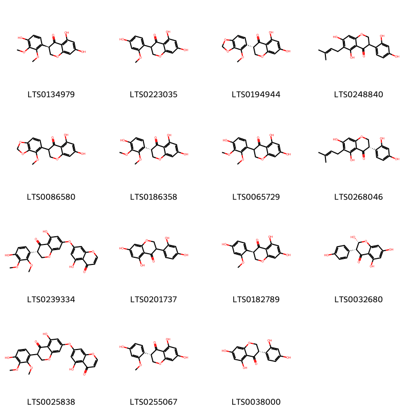{ width=100% }
    <figcaption>Hình ảnh cấu trúc hóa học của 15 hoạt chất thuộc nhóm Isoflavonoids gồm ['(3r)-5,7-dihydroxy-3-(4-hydroxy-2,3-dimethoxyphenyl)-2,3-dihydro-1-benzopyran-4-one (LTS0134979)', 'isoferreirin (LTS0223035)', '(3s)-5,7-dihydroxy-3-(4-methoxy-2h-1,3-benzodioxol-5-yl)-2,3-dihydro-1-benzopyran-4-one (LTS0194944)', 'diphysolone (LTS0248840)', '5,7-dihydroxy-3-(4-methoxy-2h-1,3-benzodioxol-5-yl)-2,3-dihydro-1-benzopyran-4-one (LTS0086580)', '(3s)-5,7-dihydroxy-3-(4-hydroxy-2,3-dimethoxyphenyl)-2,3-dihydro-1-benzopyran-4-one (LTS0186358)', 'parvisoflavanone (LTS0065729)', '(3s)-3-(2,4-dihydroxyphenyl)-5,7-dihydroxy-6-(3-methylbut-2-en-1-yl)-2,3-dihydro-1-benzopyran-4-one (LTS0268046)', '5-hydroxy-7-{[(3s)-5-hydroxy-3-(4-hydroxy-2,3-dimethoxyphenyl)-4-oxo-2,3-dihydro-1-benzopyran-7-yl]oxy}chromen-4-one (LTS0239334)', '(+-)-dalbergioidin (LTS0201737)', '(3r)-5,7-dihydroxy-3-(4-hydroxy-2-methoxyphenyl)-2,3-dihydro-1-benzopyran-4-one (LTS0182789)', '(2r,3r)-2,5,7-trihydroxy-3-(4-hydroxyphenyl)-2,3-dihydro-1-benzopyran-4-one (LTS0032680)', '5-hydroxy-7-{[5-hydroxy-3-(4-hydroxy-2,3-dimethoxyphenyl)-4-oxo-2,3-dihydro-1-benzopyran-7-yl]oxy}chromen-4-one (LTS0025838)', '(3s)-5,7-dihydroxy-3-(4-hydroxy-2-methoxyphenyl)-2,3-dihydro-1-benzopyran-4-one (LTS0255067)', '(3s)-3-(2,4-dihydroxyphenyl)-5,7-dihydroxy-2,3-dihydro-1-benzopyran-4-one (LTS0038000)'].</figcaption>
</figure>
#### Nhóm Prenol lipids
<figure markdown="span">
    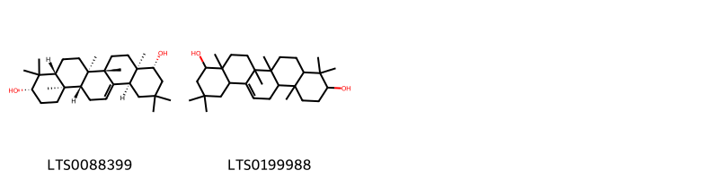{ width=100% }
    <figcaption>Hình ảnh cấu trúc hóa học của 2 hoạt chất thuộc nhóm Prenol lipids gồm ['sophoradiol (LTS0088399)', '4,4,6a,6b,8a,11,11,14b-octamethyl-1,2,3,4a,5,6,7,8,9,10,12,12a,14,14a-tetradecahydropicene-3,9-diol (LTS0199988)'].</figcaption>
</figure>

---

### Dược dân tộc học

Danh sách các quốc gia có sử dụng *Uraria picta* trong điều trị các bệnh. 

| Country   | Disease                 | Bệnh                                                                                                                                                                                                |
|:----------|:------------------------|:----------------------------------------------------------------------------------------------------------------------------------------------------------------------------------------------------|
| India     | Aphrodisiac, Antiseptic | MYMEMORY WARNING: YOU USED ALL AVAILABLE FREE TRANSLATIONS FOR TODAY. NEXT AVAILABLE IN  18 HOURS 02 MINUTES 48 SECONDS VISIT HTTPS://MYMEMORY.TRANSLATED.NET/DOC/USAGELIMITS.PHP TO TRANSLATE MORE |

---

# Chi Cologania

??? note "Danh sách các dược liệu thuộc chi"
    
	 - *Cologania angustifolia*

---
## Cologania angustifolia
### Thông tin về thực vật

!!! info "Phân loại thực vật của *Cologania angustifolia* từ GIBF:"
    - **Kingdom:** Plantae
    - **Phylum:** Tracheophyta
    - **Order:** Fabales
    - **Family:** Fabaceae
    - **Genus:** Cologania
    - **Species:** *Cologania angustifolia*

 

| Label (VI)   | Label (EN)   | Scientific Name        | Descriptions (VI)   | Descriptions (EN)   | Also Known As (VI)   | Also Known As (EN)   |
|:-------------|:-------------|:-----------------------|:--------------------|:--------------------|:---------------------|:---------------------|
| N/A          | N/A          | Cologania angustifolia | loài thực vật       | species of plant    | ['']                 | ['']                 |

#### Phân bố trên thế giới

**Từ CSDL GIBF** United States of America, Mexico

#### Phân bố tại Việt Nam

**Từ CSDL GIBF**: Không có ghi nhận ở Việt Nam

---
### Thành phần hóa học
        
- Theo cơ sở dữ liệu lotus: Từ loài *Cologania angustifolia* đã phân lập và xác định được Chưa có hoạt chất nào được phân lập. hoạt chất thuộc về các nhóm Không có hoạt chất nào được phân lập. 

Không có hình ảnh nào được tạo ra

---

### Dược dân tộc học

Danh sách các quốc gia có sử dụng *Cologania angustifolia* trong điều trị các bệnh. 

| Country   | Disease   | Bệnh                                                                                                                                                                                                |
|:----------|:----------|:----------------------------------------------------------------------------------------------------------------------------------------------------------------------------------------------------|
| Mexico    | Purgative | MYMEMORY WARNING: YOU USED ALL AVAILABLE FREE TRANSLATIONS FOR TODAY. NEXT AVAILABLE IN  18 HOURS 02 MINUTES 09 SECONDS VISIT HTTPS://MYMEMORY.TRANSLATED.NET/DOC/USAGELIMITS.PHP TO TRANSLATE MORE |

---

# Chi Xylia

??? note "Danh sách các dược liệu thuộc chi"
    
	 - *Xylia xylocarpa*

---
## Xylia xylocarpa
### Thông tin về thực vật

!!! info "Phân loại thực vật của *Xylia xylocarpa* từ GIBF:"
    - **Kingdom:** Plantae
    - **Phylum:** Tracheophyta
    - **Order:** Fabales
    - **Family:** Fabaceae
    - **Genus:** Xylia
    - **Species:** *Xylia xylocarpa*

 

| Label (VI)   | Label (EN)   | Scientific Name   | Descriptions (VI)   | Descriptions (EN)   | Also Known As (VI)            | Also Known As (EN)   |
|:-------------|:-------------|:------------------|:--------------------|:--------------------|:------------------------------|:---------------------|
| N/A          | N/A          | Xylia xylocarpa   | loài thực vật       | species of plant    | ['Xylia xylocarpa', 'Cẩm xe'] | ['']                 |

#### Phân bố trên thế giới

**Từ CSDL GIBF** nan, Sri Lanka, Australia, Nigeria, Thailand, Lao People’s Democratic Republic, Cambodia, Chinese Taipei, Myanmar, India, unknown or invalid, Bangladesh, Viet Nam

#### Phân bố tại Việt Nam

**Từ CSDL GIBF**: Dak Lak

---
### Thành phần hóa học
        
- Theo cơ sở dữ liệu lotus: Từ loài *Xylia xylocarpa* đã phân lập và xác định được 13 hoạt chất thuộc về các nhóm Prenol lipids, Steroids and steroid derivatives. 

|    | chemicalTaxonomyClassyfireClass   |   smiles_count |
|---:|:----------------------------------|---------------:|
|  0 | Prenol lipids                     |             11 |
|  1 | Steroids and steroid derivatives  |              2 |

#### Nhóm Prenol lipids
<figure markdown="span">
    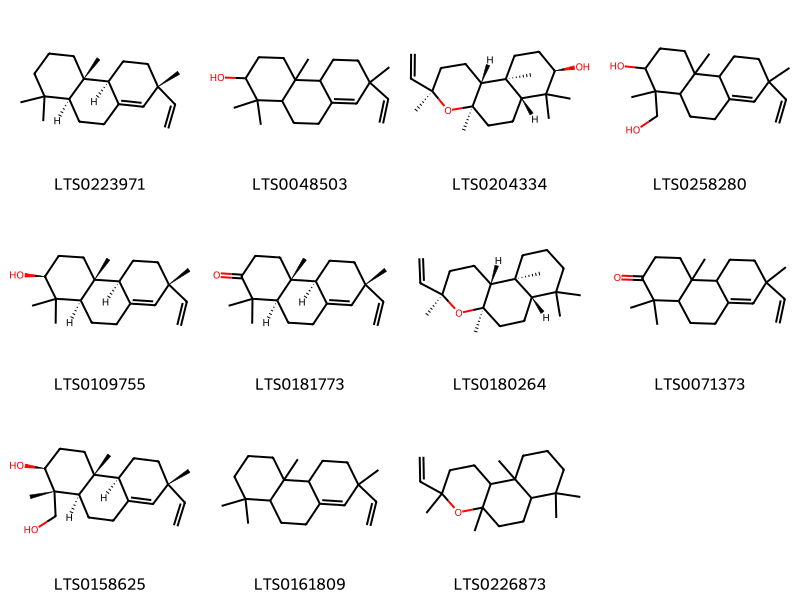{ width=100% }
    <figcaption>Hình ảnh cấu trúc hóa học của 11 hoạt chất thuộc nhóm Prenol lipids gồm ['(+)-sandaracopimaradiene (LTS0223971)', '7-ethenyl-1,1,4a,7-tetramethyl-3,4,4b,5,6,9,10,10a-octahydro-2h-phenanthren-2-ol (LTS0048503)', '(3r,4ar,6ar,8r,10as,10br)-3-ethenyl-3,4a,7,7,10a-pentamethyl-octahydro-1h-naphtho[2,1-b]pyran-8-ol (LTS0204334)', '7-ethenyl-1-(hydroxymethyl)-1,4a,7-trimethyl-3,4,4b,5,6,9,10,10a-octahydro-2h-phenanthren-2-ol (LTS0258280)', '(2s,4ar,4bs,7r,10ar)-7-ethenyl-1,1,4a,7-tetramethyl-3,4,4b,5,6,9,10,10a-octahydro-2h-phenanthren-2-ol (LTS0109755)', '(4ar,4bs,7r,10ar)-7-ethenyl-1,1,4a,7-tetramethyl-3,4,4b,5,6,9,10,10a-octahydrophenanthren-2-one (LTS0181773)', '(3r,4ar,6as,10as,10br)-3-ethenyl-3,4a,7,7,10a-pentamethyl-octahydro-1h-naphtho[2,1-b]pyran (LTS0180264)', '7-ethenyl-1,1,4a,7-tetramethyl-3,4,4b,5,6,9,10,10a-octahydrophenanthren-2-one (LTS0071373)', 'sandaracopimaradienediol (LTS0158625)', '7-ethenyl-1,1,4a,7-tetramethyl-3,4,4b,5,6,9,10,10a-octahydro-2h-phenanthrene (LTS0161809)', '3-ethenyl-3,4a,7,7,10a-pentamethyl-octahydro-1h-naphtho[2,1-b]pyran (LTS0226873)'].</figcaption>
</figure>
#### Nhóm Steroids and steroid derivatives
<figure markdown="span">
    { width=100% }
    <figcaption>Hình ảnh cấu trúc hóa học của 2 hoạt chất thuộc nhóm Steroids and steroid derivatives gồm ['stigmast-5-en-3-ol, (3β)- (LTS0204616)', '(1r,3ar,3br,7s,9ar,9br,11ar)-1-[(2r,5r)-5-ethyl-6-methylheptan-2-yl]-9a,11a-dimethyl-1h,2h,3h,3ah,3bh,4h,6h,7h,8h,9h,9bh,10h,11h-cyclopenta[a]phenanthren-7-ol (LTS0129695)'].</figcaption>
</figure>

---

### Dược dân tộc học

Danh sách các quốc gia có sử dụng *Xylia xylocarpa* trong điều trị các bệnh. 

| Country   | Disease   | Bệnh                                                                                                                                                                                                |
|:----------|:----------|:----------------------------------------------------------------------------------------------------------------------------------------------------------------------------------------------------|
| Elsewhere | Vermifuge | MYMEMORY WARNING: YOU USED ALL AVAILABLE FREE TRANSLATIONS FOR TODAY. NEXT AVAILABLE IN  18 HOURS 01 MINUTES 43 SECONDS VISIT HTTPS://MYMEMORY.TRANSLATED.NET/DOC/USAGELIMITS.PHP TO TRANSLATE MORE |

---

# Chi Anadenanthera

??? note "Danh sách các dược liệu thuộc chi"
    
	 - *Anadenanthera peregrina*

---
## Anadenanthera peregrina
### Thông tin về thực vật

!!! info "Phân loại thực vật của *Anadenanthera peregrina* từ GIBF:"
    - **Kingdom:** Plantae
    - **Phylum:** Tracheophyta
    - **Order:** Fabales
    - **Family:** Fabaceae
    - **Genus:** Anadenanthera
    - **Species:** *Anadenanthera peregrina*

 

| Label (VI)   | Label (EN)   | Scientific Name         | Descriptions (VI)   | Descriptions (EN)   | Also Known As (VI)   | Also Known As (EN)   |
|:-------------|:-------------|:------------------------|:--------------------|:--------------------|:---------------------|:---------------------|
| N/A          | N/A          | Anadenanthera peregrina | loài thực vật       | species of plant    | ['']                 | ['Yopo']             |

#### Phân bố trên thế giới

**Từ CSDL GIBF** Puerto Rico, Colombia, Brazil, Dominican Republic, Venezuela (Bolivarian Republic of)

#### Phân bố tại Việt Nam

**Từ CSDL GIBF**: Không có ghi nhận ở Việt Nam

---
### Thành phần hóa học
        
- Theo cơ sở dữ liệu lotus: Từ loài *Anadenanthera peregrina* đã phân lập và xác định được 4 hoạt chất thuộc về các nhóm Indoles and derivatives. 

|    | chemicalTaxonomyClassyfireClass   |   smiles_count |
|---:|:----------------------------------|---------------:|
|  0 | Indoles and derivatives           |              4 |

#### Nhóm Indoles and derivatives
<figure markdown="span">
    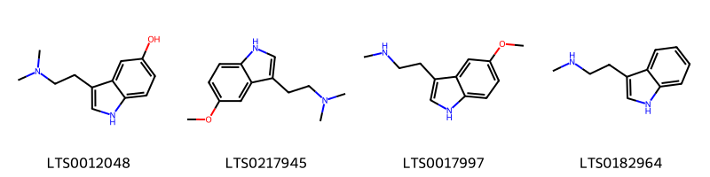{ width=100% }
    <figcaption>Hình ảnh cấu trúc hóa học của 4 hoạt chất thuộc nhóm Indoles and derivatives gồm ['bufotenine (LTS0012048)', '5-meo-dmt (LTS0217945)', '5-meo-nmt (LTS0017997)', 'methyltryptamine (LTS0182964)'].</figcaption>
</figure>

---

### Dược dân tộc học

Danh sách các quốc gia có sử dụng *Anadenanthera peregrina* trong điều trị các bệnh. 

| Country             | Disease      | Bệnh                                                                                                                                                                                                |
|:--------------------|:-------------|:----------------------------------------------------------------------------------------------------------------------------------------------------------------------------------------------------|
| Colombia(Guahibo)   | Hallucinogen | MYMEMORY WARNING: YOU USED ALL AVAILABLE FREE TRANSLATIONS FOR TODAY. NEXT AVAILABLE IN  18 HOURS 00 MINUTES 57 SECONDS VISIT HTTPS://MYMEMORY.TRANSLATED.NET/DOC/USAGELIMITS.PHP TO TRANSLATE MORE |
| Venezuela(Yanomama) | Hallucinogen | MYMEMORY WARNING: YOU USED ALL AVAILABLE FREE TRANSLATIONS FOR TODAY. NEXT AVAILABLE IN  18 HOURS 00 MINUTES 52 SECONDS VISIT HTTPS://MYMEMORY.TRANSLATED.NET/DOC/USAGELIMITS.PHP TO TRANSLATE MORE |

---

# Chi Acacia

??? note "Danh sách các dược liệu thuộc chi"
    
	 - *Acacia aroma*
	 - *Acacia berlandieri*
	 - *Acacia catechu*
	 - *Acacia concinna*
	 - *Acacia farnesiana*
	 - *Acacia ferruginea*
	 - *Acacia georginae*
	 - *Acacia kamerunensis*
	 - *Acacia lutea*
	 - *Acacia nilotica*
	 - *Acacia pennata*
	 - *Acacia pentagona*
	 - *Acacia senegal*
	 - *Acacia sieberana*
	 - *Acacia tortuosa*
	 - *Acacia villosa*

---
## Acacia aroma
### Thông tin về thực vật

!!! info "Phân loại thực vật của *Vachellia aroma* từ GIBF:"
    - **Kingdom:** Plantae
    - **Phylum:** Tracheophyta
    - **Order:** Fabales
    - **Family:** Fabaceae
    - **Genus:** Vachellia
    - **Species:** *Vachellia aroma*

 

| Label (VI)   | Label (EN)   | Scientific Name   | Descriptions (VI)   | Descriptions (EN)   | Also Known As (VI)   | Also Known As (EN)   |
|:-------------|:-------------|:------------------|:--------------------|:--------------------|:---------------------|:---------------------|
| N/A          | N/A          | Acacia aroma      | loài thực vật       | species of plant    | ['']                 | ['']                 |

#### Phân bố trên thế giới

**Từ CSDL GIBF** Ecuador, Brazil, Bolivia (Plurinational State of), Argentina, Peru, Paraguay

#### Phân bố tại Việt Nam

**Từ CSDL GIBF**: Không có ghi nhận ở Việt Nam

---
### Thành phần hóa học
        
- Theo cơ sở dữ liệu lotus: Từ loài *Vachellia aroma* đã phân lập và xác định được 4 hoạt chất thuộc về các nhóm Organooxygen compounds. 

|    | chemicalTaxonomyClassyfireClass   |   smiles_count |
|---:|:----------------------------------|---------------:|
|  0 | Organooxygen compounds            |              4 |

#### Nhóm Organooxygen compounds
<figure markdown="span">
    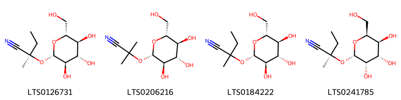{ width=100% }
    <figcaption>Hình ảnh cấu trúc hóa học của 4 hoạt chất thuộc nhóm Organooxygen compounds gồm ['lotaustralin (LTS0126731)', 'linamarin (LTS0206216)', '2-methyl-2-{[(2s,3r,4s,5s,6r)-3,4,5-trihydroxy-6-(hydroxymethyl)oxan-2-yl]oxy}butanenitrile (LTS0184222)', '(2r)-2-methyl-2-{[(2s,3s,4s,5s,6s)-3,4,5-trihydroxy-6-(hydroxymethyl)oxan-2-yl]oxy}butanenitrile (LTS0241785)'].</figcaption>
</figure>

---

### Dược dân tộc học

Danh sách các quốc gia có sử dụng *Vachellia aroma* trong điều trị các bệnh. 

| Country   | Disease    | Bệnh                                                                                                                                                                                                |
|:----------|:-----------|:----------------------------------------------------------------------------------------------------------------------------------------------------------------------------------------------------|
| Argentina | Antiseptic | MYMEMORY WARNING: YOU USED ALL AVAILABLE FREE TRANSLATIONS FOR TODAY. NEXT AVAILABLE IN  18 HOURS 00 MINUTES 20 SECONDS VISIT HTTPS://MYMEMORY.TRANSLATED.NET/DOC/USAGELIMITS.PHP TO TRANSLATE MORE |

---

---
## Acacia berlandieri
### Thông tin về thực vật

!!! info "Phân loại thực vật của *Senegalia berlandieri* từ GIBF:"
    - **Kingdom:** Plantae
    - **Phylum:** Tracheophyta
    - **Order:** Fabales
    - **Family:** Fabaceae
    - **Genus:** Senegalia
    - **Species:** *Senegalia berlandieri*

 

| Label (VI)   | Label (EN)   | Scientific Name    | Descriptions (VI)   | Descriptions (EN)   | Also Known As (VI)   | Also Known As (EN)   |
|:-------------|:-------------|:-------------------|:--------------------|:--------------------|:---------------------|:---------------------|
| N/A          | N/A          | Acacia berlandieri | loài thực vật       | species of plant    | ['']                 | ['']                 |

#### Phân bố trên thế giới

**Từ CSDL GIBF** United States of America, Mexico

#### Phân bố tại Việt Nam

**Từ CSDL GIBF**: Không có ghi nhận ở Việt Nam

---
### Thành phần hóa học
        
- Theo cơ sở dữ liệu lotus: Từ loài *Senegalia berlandieri* đã phân lập và xác định được 32 hoạt chất thuộc về các nhóm Fatty Acyls, Dibenzocycloheptenes, Organonitrogen compounds, Benzene and substituted derivatives, Oxolanes, Phenols, Tetrahydroisoquinolines, Carboxylic acids and derivatives, Pyridines and derivatives. 

|    | chemicalTaxonomyClassyfireClass     |   smiles_count |
|---:|:------------------------------------|---------------:|
|  0 | Benzene and substituted derivatives |             14 |
|  1 | Carboxylic acids and derivatives    |              1 |
|  2 | Dibenzocycloheptenes                |              1 |
|  3 | Fatty Acyls                         |              1 |
|  4 | Organonitrogen compounds            |              1 |
|  5 | Oxolanes                            |              1 |
|  6 | Phenols                             |              6 |
|  7 | Pyridines and derivatives           |              3 |
|  8 | Tetrahydroisoquinolines             |              3 |

#### Nhóm Benzene and substituted derivatives
<figure markdown="span">
    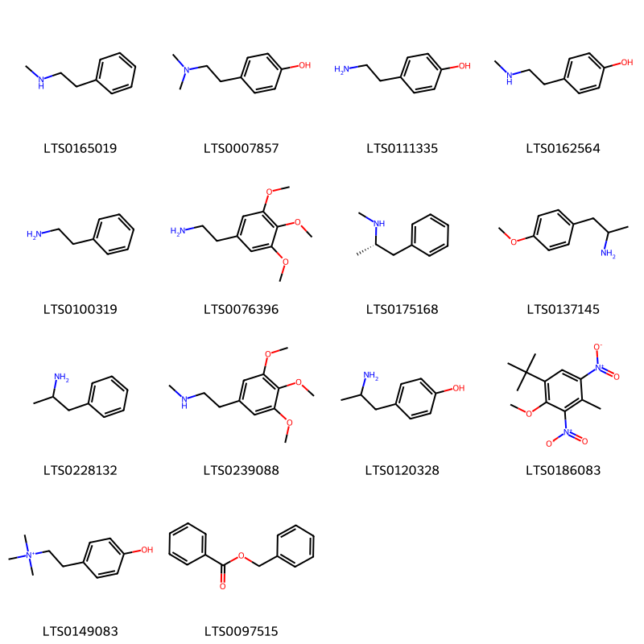{ width=100% }
    <figcaption>Hình ảnh cấu trúc hóa học của 14 hoạt chất thuộc nhóm Benzene and substituted derivatives gồm ['benzeneethanamine, n-methyl- (LTS0165019)', 'hordenine (LTS0007857)', 'tyramine (LTS0111335)', 'n-methyltyramine (LTS0162564)', '2-phenylethylamine (LTS0100319)', 'mescaline (LTS0076396)', 'methamphetamine (LTS0175168)', 'p-methoxyamphetamine (LTS0137145)', 'amphetamine (LTS0228132)', 'n-methylmescaline (LTS0239088)', 'hydroxyamfetamine (LTS0120328)', 'musk ambrette (LTS0186083)', 'candicine (LTS0149083)', 'benzyl benzoate (LTS0097515)'].</figcaption>
</figure>
#### Nhóm Carboxylic acids and derivatives
<figure markdown="span">
    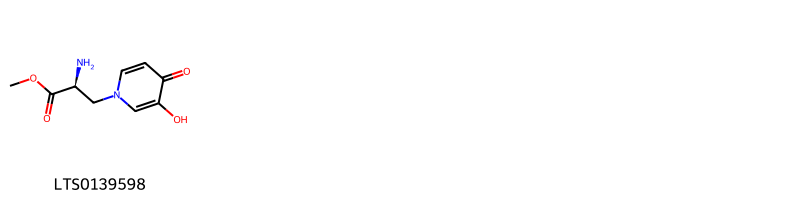{ width=100% }
    <figcaption>Hình ảnh cấu trúc hóa học của 1 hoạt chất thuộc nhóm Carboxylic acids and derivatives gồm ['methyl (2s)-2-amino-3-(3-hydroxy-4-oxopyridin-1-yl)propanoate (LTS0139598)'].</figcaption>
</figure>
#### Nhóm Dibenzocycloheptenes
<figure markdown="span">
    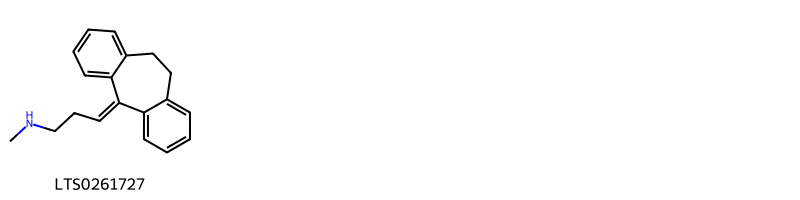{ width=100% }
    <figcaption>Hình ảnh cấu trúc hóa học của 1 hoạt chất thuộc nhóm Dibenzocycloheptenes gồm ['nortriptyline (LTS0261727)'].</figcaption>
</figure>
#### Nhóm Fatty Acyls
<figure markdown="span">
    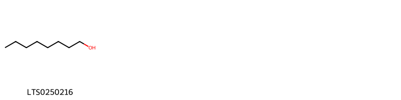{ width=100% }
    <figcaption>Hình ảnh cấu trúc hóa học của 1 hoạt chất thuộc nhóm Fatty Acyls gồm ['octanol (LTS0250216)'].</figcaption>
</figure>
#### Nhóm Organonitrogen compounds
<figure markdown="span">
    { width=100% }
    <figcaption>Hình ảnh cấu trúc hóa học của 1 hoạt chất thuộc nhóm Organonitrogen compounds gồm ['(+/-)-α-methylbenzylamine (LTS0263690)'].</figcaption>
</figure>
#### Nhóm Oxolanes
<figure markdown="span">
    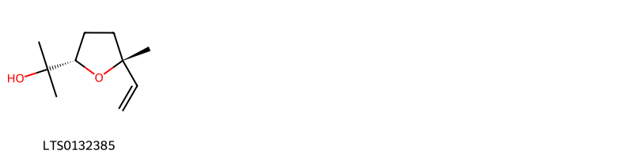{ width=100% }
    <figcaption>Hình ảnh cấu trúc hóa học của 1 hoạt chất thuộc nhóm Oxolanes gồm ['2-[(2s,5r)-5-ethenyl-5-methyloxolan-2-yl]propan-2-ol (LTS0132385)'].</figcaption>
</figure>
#### Nhóm Phenols
<figure markdown="span">
    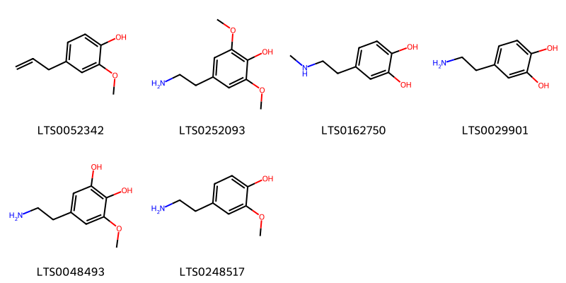{ width=100% }
    <figcaption>Hình ảnh cấu trúc hóa học của 6 hoạt chất thuộc nhóm Phenols gồm ['eugenol (LTS0052342)', '4-(2-aminoethyl)-2,6-dimethoxyphenol (LTS0252093)', 'methyldopamine (LTS0162750)', 'dopamine (LTS0029901)', '5-(2-aminoethyl)-3-methoxybenzene-1,2-diol (LTS0048493)', 'methoxytyramine (LTS0248517)'].</figcaption>
</figure>
#### Nhóm Pyridines and derivatives
<figure markdown="span">
    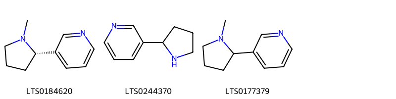{ width=100% }
    <figcaption>Hình ảnh cấu trúc hóa học của 3 hoạt chất thuộc nhóm Pyridines and derivatives gồm ['(-)-nicotine (LTS0184620)', '(+-)-nornicotine (LTS0244370)', 'nicotine (LTS0177379)'].</figcaption>
</figure>
#### Nhóm Tetrahydroisoquinolines
<figure markdown="span">
    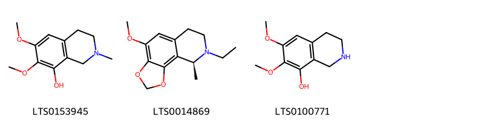{ width=100% }
    <figcaption>Hình ảnh cấu trúc hóa học của 3 hoạt chất thuộc nhóm Tetrahydroisoquinolines gồm ['anhalidine (LTS0153945)', '(9s)-8-ethyl-4-methoxy-9-methyl-2h,6h,7h,9h-[1,3]dioxolo[4,5-h]isoquinoline (LTS0014869)', 'anhalamine (LTS0100771)'].</figcaption>
</figure>

---

### Dược dân tộc học

Danh sách các quốc gia có sử dụng *Senegalia berlandieri* trong điều trị các bệnh. 

| Country   | Disease   | Bệnh                                                                                                                                                                                                |
|:----------|:----------|:----------------------------------------------------------------------------------------------------------------------------------------------------------------------------------------------------|
| Mexico    | Poison    | MYMEMORY WARNING: YOU USED ALL AVAILABLE FREE TRANSLATIONS FOR TODAY. NEXT AVAILABLE IN  17 HOURS 59 MINUTES 44 SECONDS VISIT HTTPS://MYMEMORY.TRANSLATED.NET/DOC/USAGELIMITS.PHP TO TRANSLATE MORE |

---

---
## Acacia catechu
### Thông tin về thực vật

!!! info "Phân loại thực vật của *N/A* từ GIBF:"
    - **Kingdom:** Plantae
    - **Phylum:** Tracheophyta
    - **Order:** Fabales
    - **Family:** Fabaceae
    - **Genus:** Senegalia
    - **Species:** *N/A*

 

| Label (VI)   | Label (EN)   | Scientific Name   | Descriptions (VI)   | Descriptions (EN)   | Also Known As (VI)               | Also Known As (EN)   |
|:-------------|:-------------|:------------------|:--------------------|:--------------------|:---------------------------------|:---------------------|
| N/A          | N/A          | Acacia catechu    | loài thực vật       | species of plant    | ['Senegalia catechu', 'keo cao'] | ['']                 |

#### Phân bố trên thế giới

**Từ CSDL GIBF** Virgin Islands (U.S.), South Africa, Puerto Rico, Namibia, Martinique, Brazil, Chinese Taipei, Argentina, Botswana, Bolivia (Plurinational State of), India, Benin, United States of America, Mexico, Uruguay, Kenya

#### Phân bố tại Việt Nam

**Từ CSDL GIBF**: Không có ghi nhận ở Việt Nam

---
### Thành phần hóa học
        
- Theo cơ sở dữ liệu lotus: Từ loài *N/A* đã phân lập và xác định được 39 hoạt chất thuộc về các nhóm Fatty Acyls, Flavonoids, Prenol lipids, Benzene and substituted derivatives, Stilbenes, Phenols, Imidazopyrimidines. 

|    | chemicalTaxonomyClassyfireClass     |   smiles_count |
|---:|:------------------------------------|---------------:|
|  0 | Benzene and substituted derivatives |              1 |
|  1 | Fatty Acyls                         |             16 |
|  2 | Flavonoids                          |             18 |
|  3 | Imidazopyrimidines                  |              1 |
|  4 | Phenols                             |              1 |
|  5 | Prenol lipids                       |              1 |
|  6 | Stilbenes                           |              1 |

#### Nhóm Benzene and substituted derivatives
<figure markdown="span">
    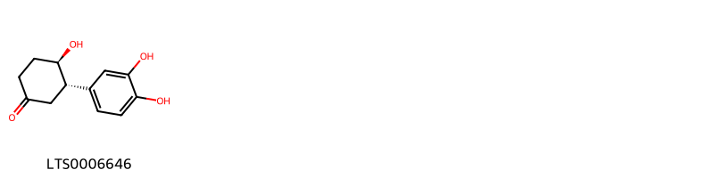{ width=100% }
    <figcaption>Hình ảnh cấu trúc hóa học của 1 hoạt chất thuộc nhóm Benzene and substituted derivatives gồm ['(3s,4r)-3-(3,4-dihydroxyphenyl)-4-hydroxycyclohexan-1-one (LTS0006646)'].</figcaption>
</figure>
#### Nhóm Fatty Acyls
<figure markdown="span">
    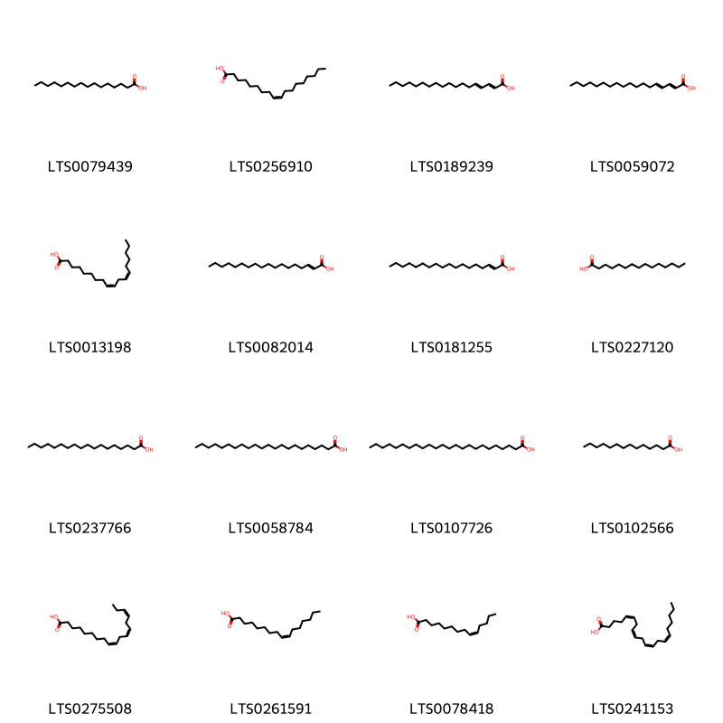{ width=100% }
    <figcaption>Hình ảnh cấu trúc hóa học của 16 hoạt chất thuộc nhóm Fatty Acyls gồm ['palmitic acid (LTS0079439)', 'oleic acid (LTS0256910)', 'isomerized safflower acid (LTS0189239)', 'octadeca-2,4-dienoic acid (LTS0059072)', 'linoleic (LTS0013198)', 'trans-2-octadecenoic acid (LTS0082014)', '2-octadecenoic acid (LTS0181255)', 'pentadecanoic acid (LTS0227120)', 'stearic acid (LTS0237766)', 'behenic acid (LTS0058784)', 'lignoceric acid (LTS0107726)', 'myristic acid (LTS0102566)', 'α-linolenic acid (LTS0275508)', 'palmitoleic acid (LTS0261591)', 'myristoleic acid (LTS0078418)', 'arachidonic acid (LTS0241153)'].</figcaption>
</figure>
#### Nhóm Flavonoids
<figure markdown="span">
    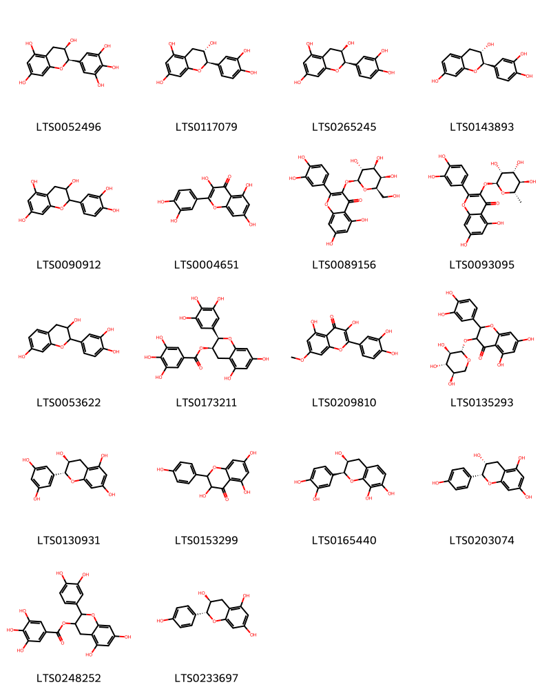{ width=100% }
    <figcaption>Hình ảnh cấu trúc hóa học của 18 hoạt chất thuộc nhóm Flavonoids gồm ['epigallocatechin (LTS0052496)', '(+)-catechol (LTS0117079)', 'ent-epicatechin (LTS0265245)', 'fisetinidol (LTS0143893)', 'catechol (LTS0090912)', 'quercetin (LTS0004651)', 'hyperoside (LTS0089156)', 'quercitrin (LTS0093095)', "3,7,3',4'-tetrahydroxyflavan (LTS0053622)", '(-)-epigallocatechin gallate (LTS0173211)', 'rhamnetin (LTS0209810)', '2-(3,4-dihydroxyphenyl)-5,7-dihydroxy-3-{[(2s,3r,4s,5r)-3,4,5-trihydroxyoxan-2-yl]oxy}-2,3-dihydro-1-benzopyran-4-one (LTS0135293)', '(2r,3s)-2-(3,5-dihydroxyphenyl)-3,4-dihydro-2h-1-benzopyran-3,5,7-triol (LTS0130931)', 'aromadendrin (LTS0153299)', '(2s,3s)-2-(3,4-dihydroxyphenyl)-3,4-dihydro-2h-1-benzopyran-3,7,8-triol (LTS0165440)', 'epiafzelechin (LTS0203074)', '2-(3,4-dihydroxyphenyl)-5,7-dihydroxy-3,4-dihydro-2h-1-benzopyran-3-yl 3,4,5-trihydroxybenzoate (LTS0248252)', 'afzelechin (LTS0233697)'].</figcaption>
</figure>
#### Nhóm Imidazopyrimidines
<figure markdown="span">
    { width=100% }
    <figcaption>Hình ảnh cấu trúc hóa học của 1 hoạt chất thuộc nhóm Imidazopyrimidines gồm ['caffeine (LTS0075508)'].</figcaption>
</figure>
#### Nhóm Phenols
<figure markdown="span">
    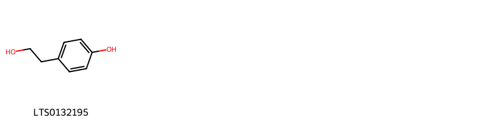{ width=100% }
    <figcaption>Hình ảnh cấu trúc hóa học của 1 hoạt chất thuộc nhóm Phenols gồm ['tyrosol (LTS0132195)'].</figcaption>
</figure>
#### Nhóm Prenol lipids
<figure markdown="span">
    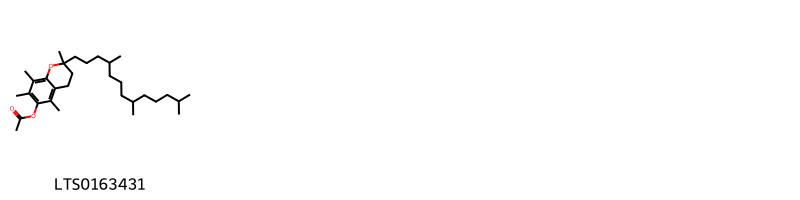{ width=100% }
    <figcaption>Hình ảnh cấu trúc hóa học của 1 hoạt chất thuộc nhóm Prenol lipids gồm ['vitamin e acetate (LTS0163431)'].</figcaption>
</figure>
#### Nhóm Stilbenes
<figure markdown="span">
    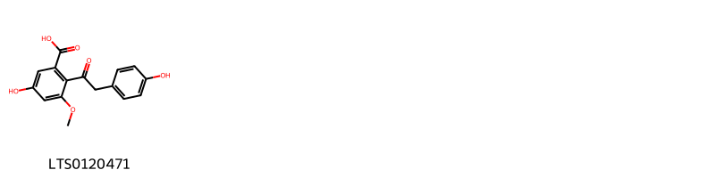{ width=100% }
    <figcaption>Hình ảnh cấu trúc hóa học của 1 hoạt chất thuộc nhóm Stilbenes gồm ['5-hydroxy-2-[2-(4-hydroxyphenyl)acetyl]-3-methoxybenzoic acid (LTS0120471)'].</figcaption>
</figure>

---

### Dược dân tộc học

Danh sách các quốc gia có sử dụng *N/A* trong điều trị các bệnh. 

| Country   | Disease                                        | Bệnh                                                                                                                                                                                                |
|:----------|:-----------------------------------------------|:----------------------------------------------------------------------------------------------------------------------------------------------------------------------------------------------------|
| China     | Antiphlogistic, Astringent, Stimulant, Styptic | MYMEMORY WARNING: YOU USED ALL AVAILABLE FREE TRANSLATIONS FOR TODAY. NEXT AVAILABLE IN  17 HOURS 59 MINUTES 07 SECONDS VISIT HTTPS://MYMEMORY.TRANSLATED.NET/DOC/USAGELIMITS.PHP TO TRANSLATE MORE |
| Dutch     | Expectorant                                    | MYMEMORY WARNING: YOU USED ALL AVAILABLE FREE TRANSLATIONS FOR TODAY. NEXT AVAILABLE IN  17 HOURS 59 MINUTES 04 SECONDS VISIT HTTPS://MYMEMORY.TRANSLATED.NET/DOC/USAGELIMITS.PHP TO TRANSLATE MORE |
| Elsewhere | Astringent, Astringent, Digestive, Refrigerant | MYMEMORY WARNING: YOU USED ALL AVAILABLE FREE TRANSLATIONS FOR TODAY. NEXT AVAILABLE IN  17 HOURS 58 MINUTES 59 SECONDS VISIT HTTPS://MYMEMORY.TRANSLATED.NET/DOC/USAGELIMITS.PHP TO TRANSLATE MORE |
| French    | Stimulant                                      | MYMEMORY WARNING: YOU USED ALL AVAILABLE FREE TRANSLATIONS FOR TODAY. NEXT AVAILABLE IN  17 HOURS 58 MINUTES 56 SECONDS VISIT HTTPS://MYMEMORY.TRANSLATED.NET/DOC/USAGELIMITS.PHP TO TRANSLATE MORE |
| India     | nan, Styptic                                   | MYMEMORY WARNING: YOU USED ALL AVAILABLE FREE TRANSLATIONS FOR TODAY. NEXT AVAILABLE IN  17 HOURS 58 MINUTES 52 SECONDS VISIT HTTPS://MYMEMORY.TRANSLATED.NET/DOC/USAGELIMITS.PHP TO TRANSLATE MORE |
| Turkey    | Astringent                                     | MYMEMORY WARNING: YOU USED ALL AVAILABLE FREE TRANSLATIONS FOR TODAY. NEXT AVAILABLE IN  17 HOURS 58 MINUTES 47 SECONDS VISIT HTTPS://MYMEMORY.TRANSLATED.NET/DOC/USAGELIMITS.PHP TO TRANSLATE MORE |

---

---
## Acacia concinna
### Thông tin về thực vật

!!! info "Phân loại thực vật của *N/A* từ GIBF:"
    - **Kingdom:** Plantae
    - **Phylum:** Tracheophyta
    - **Order:** Fabales
    - **Family:** Fabaceae
    - **Genus:** N/A
    - **Species:** *N/A*

 

| Label (VI)   | Label (EN)   | Scientific Name   | Descriptions (VI)   | Descriptions (EN)   | Also Known As (VI)             | Also Known As (EN)   |
|:-------------|:-------------|:------------------|:--------------------|:--------------------|:-------------------------------|:---------------------|
| N/A          | N/A          | Acacia concinna   |                     | species of plant    | ['keo đẹp', 'Acacia concinna'] | ['']                 |

#### Phân bố trên thế giới

**Từ CSDL GIBF** Sri Lanka, Italy, Australia, Cambodia, Argentina, Tanzania, United Republic of, Chinese Taipei, Spain, Portugal, United States of America, Chile, Croatia, South Africa, Thailand, Germany, Brazil, Guam, France, Norfolk Island, Viet Nam, China, United Kingdom of Great Britain and Northern Ireland, Ireland, Gambia, India, Malaysia, New Zealand

#### Phân bố tại Việt Nam

**Từ CSDL GIBF**: Đà Nẵng, Bà Rịa - Vũng Tàu

---
### Thành phần hóa học
        
- Theo cơ sở dữ liệu lotus: Từ loài *N/A* đã phân lập và xác định được 72 hoạt chất thuộc về các nhóm Fatty Acyls, Prenol lipids, Steroids and steroid derivatives, Azepines, Hydroxy acids and derivatives, Organooxygen compounds. 

|    | chemicalTaxonomyClassyfireClass   |   smiles_count |
|---:|:----------------------------------|---------------:|
|  0 | Azepines                          |              2 |
|  1 | Fatty Acyls                       |              3 |
|  2 | Hydroxy acids and derivatives     |              2 |
|  3 | Organooxygen compounds            |             15 |
|  4 | Prenol lipids                     |             48 |
|  5 | Steroids and steroid derivatives  |              2 |

#### Nhóm Azepines
<figure markdown="span">
    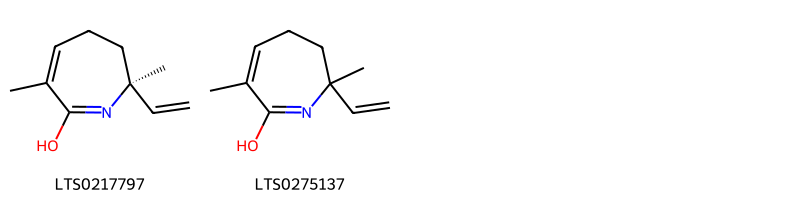{ width=100% }
    <figcaption>Hình ảnh cấu trúc hóa học của 2 hoạt chất thuộc nhóm Azepines gồm ['(7s)-7-ethenyl-3,7-dimethyl-5,6-dihydroazepin-2-ol (LTS0217797)', '7-ethenyl-3,7-dimethyl-5,6-dihydroazepin-2-ol (LTS0275137)'].</figcaption>
</figure>
#### Nhóm Fatty Acyls
<figure markdown="span">
    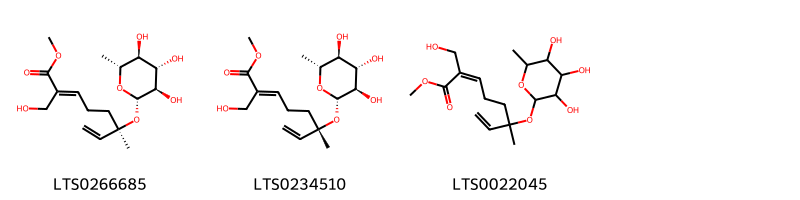{ width=100% }
    <figcaption>Hình ảnh cấu trúc hóa học của 3 hoạt chất thuộc nhóm Fatty Acyls gồm ['methyl (2e,6r)-2-(hydroxymethyl)-6-methyl-6-{[(2s,3r,4s,5s,6r)-3,4,5-trihydroxy-6-methyloxan-2-yl]oxy}octa-2,7-dienoate (LTS0266685)', 'methyl (2e,6s)-2-(hydroxymethyl)-6-methyl-6-{[(2s,3r,4s,5s,6r)-3,4,5-trihydroxy-6-methyloxan-2-yl]oxy}octa-2,7-dienoate (LTS0234510)', 'methyl 2-(hydroxymethyl)-6-methyl-6-[(3,4,5-trihydroxy-6-methyloxan-2-yl)oxy]octa-2,7-dienoate (LTS0022045)'].</figcaption>
</figure>
#### Nhóm Hydroxy acids and derivatives
<figure markdown="span">
    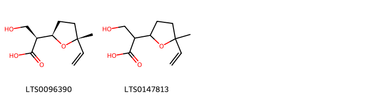{ width=100% }
    <figcaption>Hình ảnh cấu trúc hóa học của 2 hoạt chất thuộc nhóm Hydroxy acids and derivatives gồm ['(2s)-2-[(2r,5r)-5-ethenyl-5-methyloxolan-2-yl]-3-hydroxypropanoic acid (LTS0096390)', '2-(5-ethenyl-5-methyloxolan-2-yl)-3-hydroxypropanoic acid (LTS0147813)'].</figcaption>
</figure>
#### Nhóm Organooxygen compounds
<figure markdown="span">
    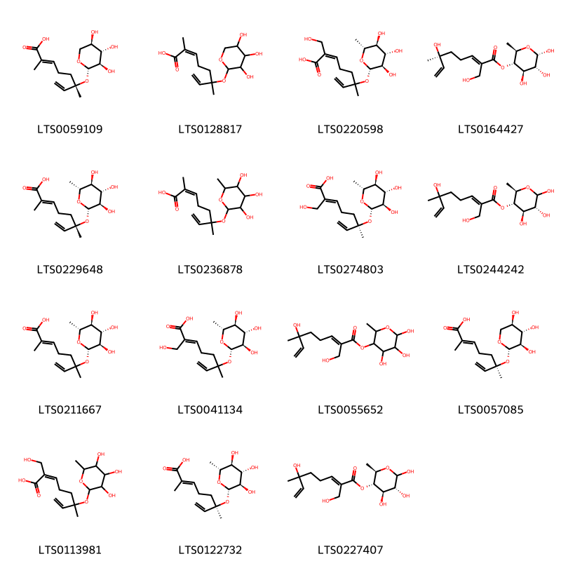{ width=100% }
    <figcaption>Hình ảnh cấu trúc hóa học của 15 hoạt chất thuộc nhóm Organooxygen compounds gồm ['(2e,6s)-2,6-dimethyl-6-{[(2s,3r,4s,5r)-3,4,5-trihydroxyoxan-2-yl]oxy}octa-2,7-dienoic acid (LTS0059109)', '2,6-dimethyl-6-[(3,4,5-trihydroxyoxan-2-yl)oxy]octa-2,7-dienoic acid (LTS0128817)', '2-(hydroxymethyl)-6-methyl-6-{[(2s,3r,4s,5s,6r)-3,4,5-trihydroxy-6-methyloxan-2-yl]oxy}octa-2,7-dienoic acid (LTS0220598)', '(2r,3s,4r,5r,6s)-4,5,6-trihydroxy-2-methyloxan-3-yl (2e,6s)-6-hydroxy-2-(hydroxymethyl)-6-methylocta-2,7-dienoate (LTS0164427)', '(2e,6s)-2,6-dimethyl-6-{[(2s,3r,4s,5s,6r)-3,4,5-trihydroxy-6-methyloxan-2-yl]oxy}octa-2,7-dienoic acid (LTS0229648)', '2,6-dimethyl-6-[(3,4,5-trihydroxy-6-methyloxan-2-yl)oxy]octa-2,7-dienoic acid (LTS0236878)', '(2e,6r)-2-(hydroxymethyl)-6-methyl-6-{[(2s,3r,4s,5s,6r)-3,4,5-trihydroxy-6-methyloxan-2-yl]oxy}octa-2,7-dienoic acid (LTS0274803)', '(2r,3s,4r,5r)-4,5,6-trihydroxy-2-methyloxan-3-yl (2e)-6-hydroxy-2-(hydroxymethyl)-6-methylocta-2,7-dienoate (LTS0244242)', '(2e)-2,6-dimethyl-6-{[(2s,3r,4s,5s,6r)-3,4,5-trihydroxy-6-methyloxan-2-yl]oxy}octa-2,7-dienoic acid (LTS0211667)', '(2e)-2-(hydroxymethyl)-6-methyl-6-{[(2s,3r,4s,5s,6r)-3,4,5-trihydroxy-6-methyloxan-2-yl]oxy}octa-2,7-dienoic acid (LTS0041134)', '4,5,6-trihydroxy-2-methyloxan-3-yl 6-hydroxy-2-(hydroxymethyl)-6-methylocta-2,7-dienoate (LTS0055652)', '(2e,6r)-2,6-dimethyl-6-{[(2s,3r,4s,5r)-3,4,5-trihydroxyoxan-2-yl]oxy}octa-2,7-dienoic acid (LTS0057085)', '2-(hydroxymethyl)-6-methyl-6-[(3,4,5-trihydroxy-6-methyloxan-2-yl)oxy]octa-2,7-dienoic acid (LTS0113981)', '(2e,6r)-2,6-dimethyl-6-{[(2s,3r,4s,5s,6r)-3,4,5-trihydroxy-6-methyloxan-2-yl]oxy}octa-2,7-dienoic acid (LTS0122732)', '(2r,3s,4r,5r)-4,5,6-trihydroxy-2-methyloxan-3-yl 6-hydroxy-2-(hydroxymethyl)-6-methylocta-2,7-dienoate (LTS0227407)'].</figcaption>
</figure>
#### Nhóm Prenol lipids
<figure markdown="span">
    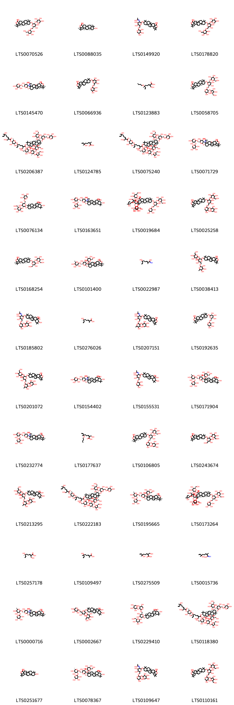{ width=100% }
    <figcaption>Hình ảnh cấu trúc hóa học của 48 hoạt chất thuộc nhóm Prenol lipids gồm ['(1r,2r,4s,5r,8r,10s,13r,14r,18s,21s)-10-{[(2r,3r,4s,5s,6r)-4,5-dihydroxy-6-({[(2r,3r,4s,5s,6r)-3,4,5-trihydroxy-6-(hydroxymethyl)oxan-2-yl]oxy}methyl)-3-{[(2s,3r,4s,5s)-3,4,5-trihydroxyoxan-2-yl]oxy}oxan-2-yl]oxy}-2-hydroxy-4,5,9,9,13,20,20-heptamethyl-22-oxahexacyclo[19.2.1.0¹,¹⁸.0⁴,¹⁷.0⁵,¹⁴.0⁸,¹³]tetracos-16-en-23-one (LTS0070526)', 'acacic acid lactone (LTS0088035)', 'n-[4,5-dihydroxy-2-({2-hydroxy-4,5,9,9,13,20,20-heptamethyl-23-oxo-22-oxahexacyclo[19.2.1.0¹,¹⁸.0⁴,¹⁷.0⁵,¹⁴.0⁸,¹³]tetracos-16-en-10-yl}oxy)-6-{[(3,4,5-trihydroxyoxan-2-yl)oxy]methyl}oxan-3-yl]ethanimidic acid (LTS0149920)', '10-{[4,5-dihydroxy-6-({[3,4,5-trihydroxy-6-(hydroxymethyl)oxan-2-yl]oxy}methyl)-3-[(3,4,5-trihydroxyoxan-2-yl)oxy]oxan-2-yl]oxy}-2-hydroxy-4,5,9,9,13,20,20-heptamethyl-22-oxahexacyclo[19.2.1.0¹,¹⁸.0⁴,¹⁷.0⁵,¹⁴.0⁸,¹³]tetracos-16-en-23-one (LTS0178820)', 'n-[(2r,3r,4r,5s,6r)-4,5-dihydroxy-2-{[(1r,2r,4s,5r,8r,10s,13r,14r,18s,21s)-2-hydroxy-4,5,9,9,13,20,20-heptamethyl-23-oxo-22-oxahexacyclo[19.2.1.0¹,¹⁸.0⁴,¹⁷.0⁵,¹⁴.0⁸,¹³]tetracos-16-en-10-yl]oxy}-6-({[(2s,3r,4s,5s)-3,4,5-trihydroxyoxan-2-yl]oxy}methyl)oxan-3-yl]ethanimidic acid (LTS0145470)', '2-hydroxy-4,5,9,9,13,20,20-heptamethyl-10-[(3,4,5-trihydroxy-6-{[(3,4,5-trihydroxyoxan-2-yl)oxy]methyl}oxan-2-yl)oxy]-22-oxahexacyclo[19.2.1.0¹,¹⁸.0⁴,¹⁷.0⁵,¹⁴.0⁸,¹³]tetracos-16-en-23-one (LTS0066936)', '(2e,6r)-6-butoxy-2-(hydroxymethyl)-6-methylocta-2,7-dienoic acid (LTS0123883)', '(1r,2r,4s,5r,8r,10s,13r,14r,18s,21s)-10-{[(2r,3r,4s,5s,6r)-6-({[(2s,3r,4s,5s)-3-{[(2s,3r,4r,5r)-3,4-dihydroxy-5-(hydroxymethyl)oxolan-2-yl]oxy}-4,5-dihydroxyoxan-2-yl]oxy}methyl)-4,5-dihydroxy-3-{[(2s,3r,4s,5s,6r)-3,4,5-trihydroxy-6-(hydroxymethyl)oxan-2-yl]oxy}oxan-2-yl]oxy}-2-hydroxy-4,5,9,9,13,20,20-heptamethyl-22-oxahexacyclo[19.2.1.0¹,¹⁸.0⁴,¹⁷.0⁵,¹⁴.0⁸,¹³]tetracos-16-en-23-one (LTS0058705)', '(2s,3r,4s,5s,6r)-3-{[(2s,3r,4s,5s,6s)-5-{[(2r,3r,4r,5s)-3,4-dihydroxy-5-(hydroxymethyl)oxolan-2-yl]oxy}-3-hydroxy-6-methyl-4-{[(2s,3r,4s,5s,6r)-3,4,5-trihydroxy-6-(hydroxymethyl)oxan-2-yl]oxy}oxan-2-yl]oxy}-4,5-dihydroxy-6-(hydroxymethyl)oxan-2-yl (3s,4ar,5r,6as,6br,8ar,10s,12ar,12br,14bs)-10-{[(2r,3r,4s,5s,6r)-4,5-dihydroxy-3-{[(2s,3r,4s,5s,6r)-3,4,5-trihydroxy-6-(hydroxymethyl)oxan-2-yl]oxy}-6-({[(2s,3r,4s,5s)-3,4,5-trihydroxyoxan-2-yl]oxy}methyl)oxan-2-yl]oxy}-3-{[(2e,6s)-6-{[(2s,3r,4r,5s,6r)-3,4-dihydroxy-5-{[(2e)-6-hydroxy-2-(hydroxymethyl)-6-methylocta-2,7-dienoyl]oxy}-6-methyloxan-2-yl]oxy}-2-(hydroxymethyl)-6-methylocta-2,7-dienoyl]oxy}-5-hydroxy-2,2,6a,6b,9,9,12a-heptamethyl-1,3,4,5,6,7,8,8a,10,11,12,12b,13,14b-tetradecahydropicene-4a-carboxylate (LTS0206387)', '6-hydroxy-2,6-dimethylocta-2,7-dienoic acid (LTS0124785)', '(2s,3r,4s,5s,6r)-3-{[(2s,3r,4s,5s,6s)-5-{[(2s,3r,4r,5s)-3,4-dihydroxy-5-(hydroxymethyl)oxolan-2-yl]oxy}-3-hydroxy-6-methyl-4-{[(2s,3r,4s,5s,6r)-3,4,5-trihydroxy-6-(hydroxymethyl)oxan-2-yl]oxy}oxan-2-yl]oxy}-4,5-dihydroxy-6-(hydroxymethyl)oxan-2-yl (4ar,5r,6as,6br,8ar,10s,12ar,12br,14bs)-10-{[(2r,3r,4s,5s,6r)-4,5-dihydroxy-3-{[(2s,3r,4s,5s,6r)-3,4,5-trihydroxy-6-(hydroxymethyl)oxan-2-yl]oxy}-6-({[(2s,3r,4s,5s)-3,4,5-trihydroxyoxan-2-yl]oxy}methyl)oxan-2-yl]oxy}-3-{[(2e,6s)-6-{[(2s,3r,4r,5s,6r)-3,4-dihydroxy-5-{[(2e)-6-hydroxy-2-(hydroxymethyl)-6-methylocta-2,7-dienoyl]oxy}-6-methyloxan-2-yl]oxy}-2-(hydroxymethyl)-6-methylocta-2,7-dienoyl]oxy}-5-hydroxy-2,2,6a,6b,9,9,12a-heptamethyl-1,3,4,5,6,7,8,8a,10,11,12,12b,13,14b-tetradecahydropicene-4a-carboxylate (LTS0075240)', 'n-[(2r,3r,4r,5s,6r)-6-({[(2s,3r,4s,5s)-4,5-dihydroxy-3-{[(2s,3r,4s,5s)-3,4,5-trihydroxyoxan-2-yl]oxy}oxan-2-yl]oxy}methyl)-4,5-dihydroxy-2-{[(1r,2r,4s,5r,8r,10s,13r,14r,18s,21s)-2-hydroxy-4,5,9,9,13,20,20-heptamethyl-23-oxo-22-oxahexacyclo[19.2.1.0¹,¹⁸.0⁴,¹⁷.0⁵,¹⁴.0⁸,¹³]tetracos-16-en-10-yl]oxy}oxan-3-yl]ethanimidic acid (LTS0071729)', '(3s,4ar,5r,6as,6br,8ar,10s,12ar,12br,14bs)-10-{[(2r,3r,4s,5s,6r)-4,5-dihydroxy-3-{[(2s,3r,4s,5s,6r)-3,4,5-trihydroxy-6-(hydroxymethyl)oxan-2-yl]oxy}-6-({[(2s,3r,4s,5s)-3,4,5-trihydroxyoxan-2-yl]oxy}methyl)oxan-2-yl]oxy}-3,5-dihydroxy-2,2,6a,6b,9,9,12a-heptamethyl-1,3,4,5,6,7,8,8a,10,11,12,12b,13,14b-tetradecahydropicene-4a-carboxylic acid (LTS0076134)', '(3s,4ar,5r,6as,6br,8ar,10s,12ar,12br,14bs)-10-{[(2r,3r,4r,5s,6r)-6-({[(2s,3r,4s,5s)-4,5-dihydroxy-3-{[(2s,3r,4s,5r)-3,4,5-trihydroxyoxan-2-yl]oxy}oxan-2-yl]oxy}methyl)-4,5-dihydroxy-3-[(1-hydroxyethylidene)amino]oxan-2-yl]oxy}-3,5-dihydroxy-2,2,6a,6b,9,9,12a-heptamethyl-1,3,4,5,6,7,8,8a,10,11,12,12b,13,14b-tetradecahydropicene-4a-carboxylic acid (LTS0163651)', '(2s,3r,4s,5s,6r)-3-{[(2s,3r,4s,5s,6s)-5-{[(2s,3r,4r,5s)-3,4-dihydroxy-5-(hydroxymethyl)oxolan-2-yl]oxy}-3-hydroxy-6-methyl-4-{[(2s,3r,4s,5s,6r)-3,4,5-trihydroxy-6-(hydroxymethyl)oxan-2-yl]oxy}oxan-2-yl]oxy}-4,5-dihydroxy-6-(hydroxymethyl)oxan-2-yl (4ar,5r,6as,6br,8ar,10s,12ar,12br,14bs)-10-{[(2r,3r,4s,5s,6r)-4,5-dihydroxy-3-{[(2s,3r,4s,5s,6r)-3,4,5-trihydroxy-6-(hydroxymethyl)oxan-2-yl]oxy}-6-({[(2s,3r,4s,5s)-3,4,5-trihydroxyoxan-2-yl]oxy}methyl)oxan-2-yl]oxy}-5-hydroxy-3-{[(2e)-6-hydroxy-2-(hydroxymethyl)-6-methylocta-2,7-dienoyl]oxy}-2,2,6a,6b,9,9,12a-heptamethyl-1,3,4,5,6,7,8,8a,10,11,12,12b,13,14b-tetradecahydropicene-4a-carboxylate (LTS0019684)', '10-({6-[({4,5-dihydroxy-3-[(3,4,5-trihydroxyoxan-2-yl)oxy]oxan-2-yl}oxy)methyl]-4,5-dihydroxy-3-{[3,4,5-trihydroxy-6-(hydroxymethyl)oxan-2-yl]oxy}oxan-2-yl}oxy)-2-hydroxy-4,5,9,9,13,20,20-heptamethyl-22-oxahexacyclo[19.2.1.0¹,¹⁸.0⁴,¹⁷.0⁵,¹⁴.0⁸,¹³]tetracos-16-en-23-one (LTS0025258)', '(1r,2r,4s,5r,8r,10s,13r,14r,18s,21s)-10-{[(2r,3r,4s,5s,6r)-4,5-dihydroxy-6-(hydroxymethyl)-3-{[(2s,3r,4s,5s,6r)-3,4,5-trihydroxy-6-(hydroxymethyl)oxan-2-yl]oxy}oxan-2-yl]oxy}-2-hydroxy-4,5,9,9,13,20,20-heptamethyl-22-oxahexacyclo[19.2.1.0¹,¹⁸.0⁴,¹⁷.0⁵,¹⁴.0⁸,¹³]tetracos-16-en-23-one (LTS0168254)', '(1r,2r,4s,5r,8r,10s,13r,14r,18s,21s)-10-{[(2r,3r,4s,5s,6r)-4,5-dihydroxy-3-{[(2s,3r,4s,5s,6r)-3,4,5-trihydroxy-6-(hydroxymethyl)oxan-2-yl]oxy}-6-({[(2r,3r,4s,5r,6r)-3,4,5-trihydroxy-6-methyloxan-2-yl]oxy}methyl)oxan-2-yl]oxy}-2-hydroxy-4,5,9,9,13,20,20-heptamethyl-22-oxahexacyclo[19.2.1.0¹,¹⁸.0⁴,¹⁷.0⁵,¹⁴.0⁸,¹³]tetracos-16-en-23-one (LTS0101400)', '(2e,6s)-6-hydroxy-2,6-dimethylocta-2,7-dienimidic acid (LTS0022987)', '10-[(4,5-dihydroxy-3-{[3,4,5-trihydroxy-6-(hydroxymethyl)oxan-2-yl]oxy}-6-{[(3,4,5-trihydroxy-6-methyloxan-2-yl)oxy]methyl}oxan-2-yl)oxy]-2-hydroxy-4,5,9,9,13,20,20-heptamethyl-22-oxahexacyclo[19.2.1.0¹,¹⁸.0⁴,¹⁷.0⁵,¹⁴.0⁸,¹³]tetracos-16-en-23-one (LTS0038413)', '10-({6-[({4,5-dihydroxy-3-[(3,4,5-trihydroxyoxan-2-yl)oxy]oxan-2-yl}oxy)methyl]-4,5-dihydroxy-3-[(1-hydroxyethylidene)amino]oxan-2-yl}oxy)-3,5-dihydroxy-2,2,6a,6b,9,9,12a-heptamethyl-1,3,4,5,6,7,8,8a,10,11,12,12b,13,14b-tetradecahydropicene-4a-carboxylic acid (LTS0185802)', '(2e,6s)-6-hydroxy-2,6-dimethylocta-2,7-dienoic acid (LTS0276026)', 'n-{6-[({4,5-dihydroxy-6-methyl-3-[(3,4,5-trihydroxyoxan-2-yl)oxy]oxan-2-yl}oxy)methyl]-4,5-dihydroxy-2-({2-hydroxy-4,5,9,9,13,20,20-heptamethyl-23-oxo-22-oxahexacyclo[19.2.1.0¹,¹⁸.0⁴,¹⁷.0⁵,¹⁴.0⁸,¹³]tetracos-16-en-10-yl}oxy)oxan-3-yl}ethanimidic acid (LTS0207151)', '(1r,2r,4s,5r,8r,10s,13r,14r,18s,21s)-2-hydroxy-4,5,9,9,13,20,20-heptamethyl-10-{[(2r,3r,4s,5s,6r)-3,4,5-trihydroxy-6-({[(2s,3r,4s,5s)-3,4,5-trihydroxyoxan-2-yl]oxy}methyl)oxan-2-yl]oxy}-22-oxahexacyclo[19.2.1.0¹,¹⁸.0⁴,¹⁷.0⁵,¹⁴.0⁸,¹³]tetracos-16-en-23-one (LTS0192635)', '10-({6-[({4,5-dihydroxy-6-methyl-3-[(3,4,5-trihydroxyoxan-2-yl)oxy]oxan-2-yl}oxy)methyl]-4,5-dihydroxy-3-{[3,4,5-trihydroxy-6-(hydroxymethyl)oxan-2-yl]oxy}oxan-2-yl}oxy)-2-hydroxy-4,5,9,9,13,20,20-heptamethyl-22-oxahexacyclo[19.2.1.0¹,¹⁸.0⁴,¹⁷.0⁵,¹⁴.0⁸,¹³]tetracos-16-en-23-one (LTS0201072)', '(3s,4ar,5r,6as,6br,8ar,10s,12ar,12br,14bs)-10-{[(2r,3r,4r,5s,6r)-4,5-dihydroxy-3-[(1-hydroxyethylidene)amino]-6-({[(2s,3r,4s,5s)-3,4,5-trihydroxyoxan-2-yl]oxy}methyl)oxan-2-yl]oxy}-3,5-dihydroxy-2,2,6a,6b,9,9,12a-heptamethyl-1,3,4,5,6,7,8,8a,10,11,12,12b,13,14b-tetradecahydropicene-4a-carboxylic acid (LTS0154402)', '10-({4,5-dihydroxy-3-[(1-hydroxyethylidene)amino]-6-{[(3,4,5-trihydroxyoxan-2-yl)oxy]methyl}oxan-2-yl}oxy)-3,5-dihydroxy-2,2,6a,6b,9,9,12a-heptamethyl-1,3,4,5,6,7,8,8a,10,11,12,12b,13,14b-tetradecahydropicene-4a-carboxylic acid (LTS0155531)', '(3s,4ar,5r,6as,6br,8ar,10s,12ar,12br,14bs)-10-{[(2r,3r,4s,5s,6r)-6-({[(2r,3r,4s,5r,6r)-4,5-dihydroxy-6-methyl-3-{[(2s,3r,4s,5r)-3,4,5-trihydroxyoxan-2-yl]oxy}oxan-2-yl]oxy}methyl)-4,5-dihydroxy-3-{[(2s,3r,4s,5s,6r)-3,4,5-trihydroxy-6-(hydroxymethyl)oxan-2-yl]oxy}oxan-2-yl]oxy}-3,5-dihydroxy-2,2,6a,6b,9,9,12a-heptamethyl-1,3,4,5,6,7,8,8a,10,11,12,12b,13,14b-tetradecahydropicene-4a-carboxylic acid (LTS0171904)', 'n-[(2r,3r,4r,5s,6r)-6-({[(2s,3r,4s,5s)-4,5-dihydroxy-3-{[(2s,3r,4s,5r)-3,4,5-trihydroxyoxan-2-yl]oxy}oxan-2-yl]oxy}methyl)-4,5-dihydroxy-2-{[(1r,2r,4s,5r,8r,10s,13r,14r,18s,21s)-2-hydroxy-4,5,9,9,13,20,20-heptamethyl-23-oxo-22-oxahexacyclo[19.2.1.0¹,¹⁸.0⁴,¹⁷.0⁵,¹⁴.0⁸,¹³]tetracos-16-en-10-yl]oxy}oxan-3-yl]ethanimidic acid (LTS0232774)', '6-butoxy-2-(hydroxymethyl)-6-methylocta-2,7-dienoic acid (LTS0177637)', '(1r,2r,4s,5r,8r,10s,13r,14r,18s,21s)-10-{[(2r,3r,4s,5s,6r)-6-({[(2s,3r,4s,5s)-4,5-dihydroxy-3-{[(2s,3r,4s,5r)-3,4,5-trihydroxyoxan-2-yl]oxy}oxan-2-yl]oxy}methyl)-4,5-dihydroxy-3-{[(2s,3r,4s,5s,6r)-3,4,5-trihydroxy-6-(hydroxymethyl)oxan-2-yl]oxy}oxan-2-yl]oxy}-2-hydroxy-4,5,9,9,13,20,20-heptamethyl-22-oxahexacyclo[19.2.1.0¹,¹⁸.0⁴,¹⁷.0⁵,¹⁴.0⁸,¹³]tetracos-16-en-23-one (LTS0106805)', '10-{[4,5-dihydroxy-6-(hydroxymethyl)-3-{[3,4,5-trihydroxy-6-(hydroxymethyl)oxan-2-yl]oxy}oxan-2-yl]oxy}-2-hydroxy-4,5,9,9,13,20,20-heptamethyl-22-oxahexacyclo[19.2.1.0¹,¹⁸.0⁴,¹⁷.0⁵,¹⁴.0⁸,¹³]tetracos-16-en-23-one (LTS0243674)', '10-({6-[({4,5-dihydroxy-6-methyl-3-[(3,4,5-trihydroxyoxan-2-yl)oxy]oxan-2-yl}oxy)methyl]-4,5-dihydroxy-3-{[3,4,5-trihydroxy-6-(hydroxymethyl)oxan-2-yl]oxy}oxan-2-yl}oxy)-3,5-dihydroxy-2,2,6a,6b,9,9,12a-heptamethyl-1,3,4,5,6,7,8,8a,10,11,12,12b,13,14b-tetradecahydropicene-4a-carboxylic acid (LTS0213295)', '(2s,3r,4s,5s,6r)-3-{[(2s,3r,4s,5s,6s)-5-{[(2s,3r,4r,5s)-3,4-dihydroxy-5-(hydroxymethyl)oxolan-2-yl]oxy}-3-hydroxy-6-methyl-4-{[(2s,3r,4s,5s,6r)-3,4,5-trihydroxy-6-(hydroxymethyl)oxan-2-yl]oxy}oxan-2-yl]oxy}-4,5-dihydroxy-6-(hydroxymethyl)oxan-2-yl (4ar,5r,6as,6br,8ar,10s,12ar,12br,14bs)-10-{[(2r,3r,4s,5s,6r)-4,5-dihydroxy-3-{[(2s,3r,4s,5s,6r)-3,4,5-trihydroxy-6-(hydroxymethyl)oxan-2-yl]oxy}-6-({[(2s,3r,4s,5s)-3,4,5-trihydroxyoxan-2-yl]oxy}methyl)oxan-2-yl]oxy}-3-{[(2e,6r)-6-{[(2s,3r,4r,5s,6r)-3,4-dihydroxy-5-{[(2e)-6-hydroxy-2-(hydroxymethyl)-6-methylocta-2,7-dienoyl]oxy}-6-methyloxan-2-yl]oxy}-2-(hydroxymethyl)-6-methylocta-2,7-dienoyl]oxy}-5-hydroxy-2,2,6a,6b,9,9,12a-heptamethyl-1,3,4,5,6,7,8,8a,10,11,12,12b,13,14b-tetradecahydropicene-4a-carboxylate (LTS0222183)', '(1r,2r,4s,5r,8r,10s,13r,14r,18s,21s)-10-{[(2r,3r,4s,5s,6r)-6-({[(2r,3r,4s,5r,6r)-4,5-dihydroxy-6-methyl-3-{[(2s,3r,4s,5r)-3,4,5-trihydroxyoxan-2-yl]oxy}oxan-2-yl]oxy}methyl)-4,5-dihydroxy-3-{[(2s,3r,4s,5s,6r)-3,4,5-trihydroxy-6-(hydroxymethyl)oxan-2-yl]oxy}oxan-2-yl]oxy}-2-hydroxy-4,5,9,9,13,20,20-heptamethyl-22-oxahexacyclo[19.2.1.0¹,¹⁸.0⁴,¹⁷.0⁵,¹⁴.0⁸,¹³]tetracos-16-en-23-one (LTS0195665)', '(2s,3r,4s,5s,6r)-3-{[(2s,3r,4s,5s,6s)-5-{[(2r,3r,4r,5s)-3,4-dihydroxy-5-(hydroxymethyl)oxolan-2-yl]oxy}-3-hydroxy-6-methyl-4-{[(2s,3r,4s,5s,6r)-3,4,5-trihydroxy-6-(hydroxymethyl)oxan-2-yl]oxy}oxan-2-yl]oxy}-4,5-dihydroxy-6-(hydroxymethyl)oxan-2-yl (3s,4ar,5r,6as,6br,8ar,10s,12ar,12br,14bs)-10-{[(2r,3r,4s,5s,6r)-4,5-dihydroxy-3-{[(2s,3r,4s,5s,6r)-3,4,5-trihydroxy-6-(hydroxymethyl)oxan-2-yl]oxy}-6-({[(2s,3r,4s,5s)-3,4,5-trihydroxyoxan-2-yl]oxy}methyl)oxan-2-yl]oxy}-5-hydroxy-3-{[(2e)-6-hydroxy-2-(hydroxymethyl)-6-methylocta-2,7-dienoyl]oxy}-2,2,6a,6b,9,9,12a-heptamethyl-1,3,4,5,6,7,8,8a,10,11,12,12b,13,14b-tetradecahydropicene-4a-carboxylate (LTS0173264)', '(2e,6s)-6-hydroxy-2-(hydroxymethyl)-6-methylocta-2,7-dienoic acid (LTS0257178)', '(2e)-6-hydroxy-2,6-dimethylocta-2,7-dienoic acid (LTS0109497)', '6-hydroxy-2-(hydroxymethyl)-6-methylocta-2,7-dienoic acid (LTS0275509)', '6-hydroxy-2,6-dimethylocta-2,7-dienimidic acid (LTS0015736)', 'n-[(2r,3r,4r,5s,6r)-6-({[(2r,3r,4s,5r,6r)-4,5-dihydroxy-6-methyl-3-{[(2s,3r,4s,5r)-3,4,5-trihydroxyoxan-2-yl]oxy}oxan-2-yl]oxy}methyl)-4,5-dihydroxy-2-{[(1r,2r,4s,5r,8r,10s,13r,14r,18s,21s)-2-hydroxy-4,5,9,9,13,20,20-heptamethyl-23-oxo-22-oxahexacyclo[19.2.1.0¹,¹⁸.0⁴,¹⁷.0⁵,¹⁴.0⁸,¹³]tetracos-16-en-10-yl]oxy}oxan-3-yl]ethanimidic acid (LTS0000716)', '10-[(4,5-dihydroxy-3-{[3,4,5-trihydroxy-6-(hydroxymethyl)oxan-2-yl]oxy}-6-{[(3,4,5-trihydroxyoxan-2-yl)oxy]methyl}oxan-2-yl)oxy]-3,5-dihydroxy-2,2,6a,6b,9,9,12a-heptamethyl-1,3,4,5,6,7,8,8a,10,11,12,12b,13,14b-tetradecahydropicene-4a-carboxylic acid (LTS0002667)', '(3s,4ar,5r,6as,6br,8ar,10s,12ar,12br,14bs)-10-{[(2r,3r,4s,5s,6r)-6-({[(2s,3r,4s,5s)-4,5-dihydroxy-3-{[(2s,3r,4s,5r)-3,4,5-trihydroxyoxan-2-yl]oxy}oxan-2-yl]oxy}methyl)-4,5-dihydroxy-3-{[(2s,3r,4s,5s,6r)-3,4,5-trihydroxy-6-(hydroxymethyl)oxan-2-yl]oxy}oxan-2-yl]oxy}-3,5-dihydroxy-2,2,6a,6b,9,9,12a-heptamethyl-1,3,4,5,6,7,8,8a,10,11,12,12b,13,14b-tetradecahydropicene-4a-carboxylic acid (LTS0229410)', '(2s,3r,4s,5s,6r)-3-{[(2s,3r,4s,5s,6s)-5-{[(2r,3r,4r,5s)-3,4-dihydroxy-5-(hydroxymethyl)oxolan-2-yl]oxy}-3-hydroxy-6-methyl-4-{[(2s,3r,4s,5s,6r)-3,4,5-trihydroxy-6-(hydroxymethyl)oxan-2-yl]oxy}oxan-2-yl]oxy}-4,5-dihydroxy-6-(hydroxymethyl)oxan-2-yl (3s,4ar,5r,6as,6br,8ar,10s,12ar,12br,14bs)-10-{[(2r,3r,4s,5s,6r)-4,5-dihydroxy-3-{[(2s,3r,4s,5s,6r)-3,4,5-trihydroxy-6-(hydroxymethyl)oxan-2-yl]oxy}-6-({[(2s,3r,4s,5s)-3,4,5-trihydroxyoxan-2-yl]oxy}methyl)oxan-2-yl]oxy}-3-{[(2e,6r)-6-{[(2s,3r,4r,5s,6r)-3,4-dihydroxy-5-{[(2e)-6-hydroxy-2-(hydroxymethyl)-6-methylocta-2,7-dienoyl]oxy}-6-methyloxan-2-yl]oxy}-2-(hydroxymethyl)-6-methylocta-2,7-dienoyl]oxy}-5-hydroxy-2,2,6a,6b,9,9,12a-heptamethyl-1,3,4,5,6,7,8,8a,10,11,12,12b,13,14b-tetradecahydropicene-4a-carboxylate (LTS0118380)', '2,10-dihydroxy-4,5,9,9,13,20,20-heptamethyl-22-oxahexacyclo[19.2.1.0¹,¹⁸.0⁴,¹⁷.0⁵,¹⁴.0⁸,¹³]tetracos-16-en-23-one (LTS0251677)', '(3s,4ar,5r,6as,6br,8ar,10s,12ar,12br,14bs)-10-{[(2r,3r,4s,5s,6r)-6-({[(2r,3s,4r,5s,6s)-4,5-dihydroxy-6-methyl-3-{[(2s,3r,4s,5r)-3,4,5-trihydroxyoxan-2-yl]oxy}oxan-2-yl]oxy}methyl)-4,5-dihydroxy-3-{[(2s,3r,4s,5s,6r)-3,4,5-trihydroxy-6-(hydroxymethyl)oxan-2-yl]oxy}oxan-2-yl]oxy}-3,5-dihydroxy-2,2,6a,6b,9,9,12a-heptamethyl-1,3,4,5,6,7,8,8a,10,11,12,12b,13,14b-tetradecahydropicene-4a-carboxylic acid (LTS0078367)', 'n-{6-[({4,5-dihydroxy-3-[(3,4,5-trihydroxyoxan-2-yl)oxy]oxan-2-yl}oxy)methyl]-4,5-dihydroxy-2-({2-hydroxy-4,5,9,9,13,20,20-heptamethyl-23-oxo-22-oxahexacyclo[19.2.1.0¹,¹⁸.0⁴,¹⁷.0⁵,¹⁴.0⁸,¹³]tetracos-16-en-10-yl}oxy)oxan-3-yl}ethanimidic acid (LTS0109647)', '10-[(6-{[(3-{[3,4-dihydroxy-5-(hydroxymethyl)oxolan-2-yl]oxy}-4,5-dihydroxyoxan-2-yl)oxy]methyl}-4,5-dihydroxy-3-{[3,4,5-trihydroxy-6-(hydroxymethyl)oxan-2-yl]oxy}oxan-2-yl)oxy]-2-hydroxy-4,5,9,9,13,20,20-heptamethyl-22-oxahexacyclo[19.2.1.0¹,¹⁸.0⁴,¹⁷.0⁵,¹⁴.0⁸,¹³]tetracos-16-en-23-one (LTS0110161)'].</figcaption>
</figure>
#### Nhóm Steroids and steroid derivatives
<figure markdown="span">
    { width=100% }
    <figcaption>Hình ảnh cấu trúc hóa học của 2 hoạt chất thuộc nhóm Steroids and steroid derivatives gồm ['(2r,3r,4s,5s,6r)-2-{[(1r,3ar,5as,7s,9as,9br,11ar)-1-[(2r,3e,5s)-5-ethyl-6-methylhept-3-en-2-yl]-9a,11a-dimethyl-1h,2h,3h,3ah,5h,5ah,6h,7h,8h,9h,9bh,10h,11h-cyclopenta[a]phenanthren-7-yl]oxy}-6-(hydroxymethyl)oxane-3,4,5-triol (LTS0179842)', '2-{[1-(5-ethyl-6-methylhept-3-en-2-yl)-9a,11a-dimethyl-1h,2h,3h,3ah,5h,5ah,6h,7h,8h,9h,9bh,10h,11h-cyclopenta[a]phenanthren-7-yl]oxy}-6-(hydroxymethyl)oxane-3,4,5-triol (LTS0274888)'].</figcaption>
</figure>

---

### Dược dân tộc học

Danh sách các quốc gia có sử dụng *N/A* trong điều trị các bệnh. 

| Country       | Disease           | Bệnh                                                                                                                                                                                                |
|:--------------|:------------------|:----------------------------------------------------------------------------------------------------------------------------------------------------------------------------------------------------|
| India         | Insecticide, Soap | MYMEMORY WARNING: YOU USED ALL AVAILABLE FREE TRANSLATIONS FOR TODAY. NEXT AVAILABLE IN  17 HOURS 57 MINUTES 26 SECONDS VISIT HTTPS://MYMEMORY.TRANSLATED.NET/DOC/USAGELIMITS.PHP TO TRANSLATE MORE |
| India(Bengal) | Piscicide         | MYMEMORY WARNING: YOU USED ALL AVAILABLE FREE TRANSLATIONS FOR TODAY. NEXT AVAILABLE IN  17 HOURS 57 MINUTES 23 SECONDS VISIT HTTPS://MYMEMORY.TRANSLATED.NET/DOC/USAGELIMITS.PHP TO TRANSLATE MORE |

---

---
## Acacia farnesiana
### Thông tin về thực vật

!!! info "Phân loại thực vật của *Vachellia farnesiana* từ GIBF:"
    - **Kingdom:** Plantae
    - **Phylum:** Tracheophyta
    - **Order:** Fabales
    - **Family:** Fabaceae
    - **Genus:** Vachellia
    - **Species:** *Vachellia farnesiana*

 

| Label (VI)   | Label (EN)   | Scientific Name   | Descriptions (VI)   | Descriptions (EN)   | Also Known As (VI)   | Also Known As (EN)   |
|:-------------|:-------------|:------------------|:--------------------|:--------------------|:---------------------|:---------------------|
| N/A          | N/A          | Acacia farnesiana | loài thực vật       | species of plant    | ['']                 | ['']                 |

#### Phân bố trên thế giới

**Từ CSDL GIBF** Pakistan, Puerto Rico, Réunion, Madagascar, Colombia, Chinese Taipei, Spain, Portugal, United States of America, Mayotte, Mexico, El Salvador, Greece

#### Phân bố tại Việt Nam

**Từ CSDL GIBF**: Không có ghi nhận ở Việt Nam

---
### Thành phần hóa học
        
- Theo cơ sở dữ liệu lotus: Từ loài *Vachellia farnesiana* đã phân lập và xác định được Chưa có hoạt chất nào được phân lập. hoạt chất thuộc về các nhóm Không có hoạt chất nào được phân lập. 

Không có hình ảnh nào được tạo ra

---

### Dược dân tộc học

Danh sách các quốc gia có sử dụng *Vachellia farnesiana* trong điều trị các bệnh. 

| Country   | Disease                                                             | Bệnh                                                                                                                                                                                                |
|:----------|:--------------------------------------------------------------------|:----------------------------------------------------------------------------------------------------------------------------------------------------------------------------------------------------|
| Brazil    | Aphrodisiac, Demulcent, Insecticide, Perfume, Stimulant, Astringent | MYMEMORY WARNING: YOU USED ALL AVAILABLE FREE TRANSLATIONS FOR TODAY. NEXT AVAILABLE IN  17 HOURS 56 MINUTES 43 SECONDS VISIT HTTPS://MYMEMORY.TRANSLATED.NET/DOC/USAGELIMITS.PHP TO TRANSLATE MORE |
| Java      | Emetic                                                              | MYMEMORY WARNING: YOU USED ALL AVAILABLE FREE TRANSLATIONS FOR TODAY. NEXT AVAILABLE IN  17 HOURS 56 MINUTES 39 SECONDS VISIT HTTPS://MYMEMORY.TRANSLATED.NET/DOC/USAGELIMITS.PHP TO TRANSLATE MORE |
| Mexico    | Astringent                                                          | MYMEMORY WARNING: YOU USED ALL AVAILABLE FREE TRANSLATIONS FOR TODAY. NEXT AVAILABLE IN  17 HOURS 56 MINUTES 35 SECONDS VISIT HTTPS://MYMEMORY.TRANSLATED.NET/DOC/USAGELIMITS.PHP TO TRANSLATE MORE |
| Venezuela | Stomachic                                                           | MYMEMORY WARNING: YOU USED ALL AVAILABLE FREE TRANSLATIONS FOR TODAY. NEXT AVAILABLE IN  17 HOURS 56 MINUTES 27 SECONDS VISIT HTTPS://MYMEMORY.TRANSLATED.NET/DOC/USAGELIMITS.PHP TO TRANSLATE MORE |

---

---
## Acacia ferruginea
### Thông tin về thực vật

!!! info "Phân loại thực vật của *Acacia ferruginea* từ GIBF:"
    - **Kingdom:** Plantae
    - **Phylum:** Tracheophyta
    - **Order:** Fabales
    - **Family:** Fabaceae
    - **Genus:** Acacia
    - **Species:** *Acacia ferruginea*

 

| Label (VI)   | Label (EN)   | Scientific Name   | Descriptions (VI)   | Descriptions (EN)   | Also Known As (VI)   | Also Known As (EN)   |
|:-------------|:-------------|:------------------|:--------------------|:--------------------|:---------------------|:---------------------|
| N/A          | N/A          | Acacia ferruginea | loài thực vật       | species of plant    | ['']                 | ['Rusty Acacia']     |

#### Phân bố trên thế giới

**Từ CSDL GIBF** Pakistan, Puerto Rico, Réunion, Madagascar, Colombia, Chinese Taipei, Spain, Portugal, United States of America, Mayotte, Mexico, El Salvador, Greece

#### Phân bố tại Việt Nam

**Từ CSDL GIBF**: Không có ghi nhận ở Việt Nam

---
### Thành phần hóa học
        
- Theo cơ sở dữ liệu lotus: Từ loài *Acacia ferruginea* đã phân lập và xác định được Chưa có hoạt chất nào được phân lập. hoạt chất thuộc về các nhóm Không có hoạt chất nào được phân lập. 

Không có hình ảnh nào được tạo ra

---

### Dược dân tộc học

Danh sách các quốc gia có sử dụng *Acacia ferruginea* trong điều trị các bệnh. 

| Country   | Disease    | Bệnh                                                                                                                                                                                                |
|:----------|:-----------|:----------------------------------------------------------------------------------------------------------------------------------------------------------------------------------------------------|
| Elsewhere | Astringent | MYMEMORY WARNING: YOU USED ALL AVAILABLE FREE TRANSLATIONS FOR TODAY. NEXT AVAILABLE IN  17 HOURS 55 MINUTES 57 SECONDS VISIT HTTPS://MYMEMORY.TRANSLATED.NET/DOC/USAGELIMITS.PHP TO TRANSLATE MORE |

---

---
## Acacia georginae
### Thông tin về thực vật

!!! info "Phân loại thực vật của *Acacia georginae* từ GIBF:"
    - **Kingdom:** Plantae
    - **Phylum:** Tracheophyta
    - **Order:** Fabales
    - **Family:** Fabaceae
    - **Genus:** Acacia
    - **Species:** *Acacia georginae*

 

| Label (VI)   | Label (EN)   | Scientific Name   | Descriptions (VI)   | Descriptions (EN)   | Also Known As (VI)   | Also Known As (EN)   |
|:-------------|:-------------|:------------------|:--------------------|:--------------------|:---------------------|:---------------------|
| N/A          | N/A          | Acacia georginae  | loài thực vật       | species of plant    | ['']                 | ['']                 |

#### Phân bố trên thế giới

**Từ CSDL GIBF** nan, Australia

#### Phân bố tại Việt Nam

**Từ CSDL GIBF**: Không có ghi nhận ở Việt Nam

---
### Thành phần hóa học
        
- Theo cơ sở dữ liệu lotus: Từ loài *Acacia georginae* đã phân lập và xác định được 4 hoạt chất thuộc về các nhóm Carboxylic acids and derivatives. 

|    | chemicalTaxonomyClassyfireClass   |   smiles_count |
|---:|:----------------------------------|---------------:|
|  0 | Carboxylic acids and derivatives  |              4 |

#### Nhóm Carboxylic acids and derivatives
<figure markdown="span">
    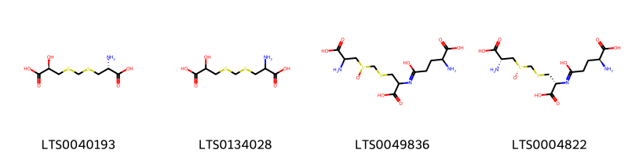{ width=100% }
    <figcaption>Hình ảnh cấu trúc hóa học của 4 hoạt chất thuộc nhóm Carboxylic acids and derivatives gồm ['(2r)-3-[({[(2r)-2-amino-2-carboxyethyl]sulfanyl}methyl)sulfanyl]-2-hydroxypropanoic acid (LTS0040193)', '2-amino-3-({[(2-carboxy-2-hydroxyethyl)sulfanyl]methyl}sulfanyl)propanoic acid (LTS0134028)', '2-amino-4-[(2-{[(2-amino-2-carboxyethanesulfinyl)methyl]sulfanyl}-1-carboxyethyl)-c-hydroxycarbonimidoyl]butanoic acid (LTS0049836)', '(2s)-2-amino-4-{[(1r)-2-({[(r)-(2r)-2-amino-2-carboxyethanesulfinyl]methyl}sulfanyl)-1-carboxyethyl]-c-hydroxycarbonimidoyl}butanoic acid (LTS0004822)'].</figcaption>
</figure>

---

### Dược dân tộc học

Danh sách các quốc gia có sử dụng *Acacia georginae* trong điều trị các bệnh. 

| Country   | Disease   | Bệnh                                                                                                                                                                                                |
|:----------|:----------|:----------------------------------------------------------------------------------------------------------------------------------------------------------------------------------------------------|
| Australia | Poison    | MYMEMORY WARNING: YOU USED ALL AVAILABLE FREE TRANSLATIONS FOR TODAY. NEXT AVAILABLE IN  17 HOURS 55 MINUTES 37 SECONDS VISIT HTTPS://MYMEMORY.TRANSLATED.NET/DOC/USAGELIMITS.PHP TO TRANSLATE MORE |

---

---
## Acacia kamerunensis
### Thông tin về thực vật

!!! info "Phân loại thực vật của *Senegalia kamerunensis* từ GIBF:"
    - **Kingdom:** Plantae
    - **Phylum:** Tracheophyta
    - **Order:** Fabales
    - **Family:** Fabaceae
    - **Genus:** Senegalia
    - **Species:** *Senegalia kamerunensis*

 

| Label (VI)   | Label (EN)   | Scientific Name     | Descriptions (VI)   | Descriptions (EN)   | Also Known As (VI)   | Also Known As (EN)   |
|:-------------|:-------------|:--------------------|:--------------------|:--------------------|:---------------------|:---------------------|
| N/A          | N/A          | Acacia kamerunensis | loài thực vật       | species of plant    | ['']                 | ['']                 |

#### Phân bố trên thế giới

**Từ CSDL GIBF** nan, Ghana, Guinea-Bissau, Uganda, Central African Republic, South Africa, Nigeria, Gabon, Equatorial Guinea, Côte d’Ivoire, Burundi, Congo, Congo, Democratic Republic of the, Burkina Faso, Guinea, Liberia, Cameroon

#### Phân bố tại Việt Nam

**Từ CSDL GIBF**: Không có ghi nhận ở Việt Nam

---
### Thành phần hóa học
        
- Theo cơ sở dữ liệu lotus: Từ loài *Senegalia kamerunensis* đã phân lập và xác định được Chưa có hoạt chất nào được phân lập. hoạt chất thuộc về các nhóm Không có hoạt chất nào được phân lập. 

Không có hình ảnh nào được tạo ra

---

### Dược dân tộc học

Danh sách các quốc gia có sử dụng *Senegalia kamerunensis* trong điều trị các bệnh. 

| Country     | Disease                | Bệnh                                                                                                                                                                                                |
|:------------|:-----------------------|:----------------------------------------------------------------------------------------------------------------------------------------------------------------------------------------------------|
| Ghana       | Dentifrice, Dentifrice | MYMEMORY WARNING: YOU USED ALL AVAILABLE FREE TRANSLATIONS FOR TODAY. NEXT AVAILABLE IN  17 HOURS 55 MINUTES 02 SECONDS VISIT HTTPS://MYMEMORY.TRANSLATED.NET/DOC/USAGELIMITS.PHP TO TRANSLATE MORE |
| Upper Volta | Piscicide              | MYMEMORY WARNING: YOU USED ALL AVAILABLE FREE TRANSLATIONS FOR TODAY. NEXT AVAILABLE IN  17 HOURS 54 MINUTES 58 SECONDS VISIT HTTPS://MYMEMORY.TRANSLATED.NET/DOC/USAGELIMITS.PHP TO TRANSLATE MORE |

---

---
## Acacia lutea
### Thông tin về thực vật

!!! info "Phân loại thực vật của *N/A* từ GIBF:"
    - **Kingdom:** Plantae
    - **Phylum:** Tracheophyta
    - **Order:** Fabales
    - **Family:** Fabaceae
    - **Genus:** N/A
    - **Species:** *N/A*

 

| Label (VI)   | Label (EN)   | Scientific Name   | Descriptions (VI)   | Descriptions (EN)   | Also Known As (VI)   | Also Known As (EN)   |
|:-------------|:-------------|:------------------|:--------------------|:--------------------|:---------------------|:---------------------|
| N/A          | N/A          | Acacia lutea      | loài thực vật       | species of plant    | ['']                 | ['']                 |

#### Phân bố trên thế giới

**Từ CSDL GIBF** Sri Lanka, Italy, Australia, Cambodia, Argentina, Tanzania, United Republic of, Chinese Taipei, Spain, Portugal, United States of America, Chile, Croatia, South Africa, Thailand, Germany, Brazil, Guam, France, Norfolk Island, Viet Nam, China, United Kingdom of Great Britain and Northern Ireland, Ireland, Gambia, India, Malaysia, New Zealand

#### Phân bố tại Việt Nam

**Từ CSDL GIBF**: Đà Nẵng, Bà Rịa - Vũng Tàu

---
### Thành phần hóa học
        
- Theo cơ sở dữ liệu lotus: Từ loài *N/A* đã phân lập và xác định được Chưa có hoạt chất nào được phân lập. hoạt chất thuộc về các nhóm Không có hoạt chất nào được phân lập. 

Không có hình ảnh nào được tạo ra

---

### Dược dân tộc học

Danh sách các quốc gia có sử dụng *N/A* trong điều trị các bệnh. 

| Country   | Disease                                                     | Bệnh                                                                                                                                                                                                |
|:----------|:------------------------------------------------------------|:----------------------------------------------------------------------------------------------------------------------------------------------------------------------------------------------------|
| Haiti     | Astringent, Cicatrizant, Diaphoretic, Antiseptic, Deodorant | MYMEMORY WARNING: YOU USED ALL AVAILABLE FREE TRANSLATIONS FOR TODAY. NEXT AVAILABLE IN  17 HOURS 54 MINUTES 31 SECONDS VISIT HTTPS://MYMEMORY.TRANSLATED.NET/DOC/USAGELIMITS.PHP TO TRANSLATE MORE |

---

---
## Acacia nilotica
### Thông tin về thực vật

!!! info "Phân loại thực vật của *Vachellia nilotica* từ GIBF:"
    - **Kingdom:** Plantae
    - **Phylum:** Tracheophyta
    - **Order:** Fabales
    - **Family:** Fabaceae
    - **Genus:** Vachellia
    - **Species:** *Vachellia nilotica*

 

| Label (VI)   | Label (EN)   | Scientific Name   | Descriptions (VI)   | Descriptions (EN)   | Also Known As (VI)   | Also Known As (EN)   |
|:-------------|:-------------|:------------------|:--------------------|:--------------------|:---------------------|:---------------------|
| N/A          | N/A          | Acacia nilotica   |                     | species of plant    | ['']                 | ['Gum arabic tree']  |

#### Phân bố trên thế giới

**Từ CSDL GIBF** Sri Lanka, Italy, Australia, Cambodia, Argentina, Tanzania, United Republic of, Chinese Taipei, Spain, Portugal, United States of America, Chile, Croatia, South Africa, Thailand, Germany, Brazil, Guam, France, Norfolk Island, Viet Nam, China, United Kingdom of Great Britain and Northern Ireland, Ireland, Gambia, India, Malaysia, New Zealand

#### Phân bố tại Việt Nam

**Từ CSDL GIBF**: Đà Nẵng, Bà Rịa - Vũng Tàu

---
### Thành phần hóa học
        
- Theo cơ sở dữ liệu lotus: Từ loài *Vachellia nilotica* đã phân lập và xác định được 46 hoạt chất thuộc về các nhóm Fatty Acyls, Flavonoids, Prenol lipids, Steroids and steroid derivatives, Benzene and substituted derivatives, Organooxygen compounds, Tannins, Phenols, Depsides and depsidones. 

|    | chemicalTaxonomyClassyfireClass     |   smiles_count |
|---:|:------------------------------------|---------------:|
|  0 | Benzene and substituted derivatives |              2 |
|  1 | Depsides and depsidones             |              1 |
|  2 | Fatty Acyls                         |             12 |
|  3 | Flavonoids                          |             19 |
|  4 | Organooxygen compounds              |              2 |
|  5 | Phenols                             |              1 |
|  6 | Prenol lipids                       |              1 |
|  7 | Steroids and steroid derivatives    |              4 |
|  8 | Tannins                             |              4 |

#### Nhóm Benzene and substituted derivatives
<figure markdown="span">
    { width=100% }
    <figcaption>Hình ảnh cấu trúc hóa học của 2 hoạt chất thuộc nhóm Benzene and substituted derivatives gồm ['galop (LTS0222857)', 'methyl gallate (LTS0043810)'].</figcaption>
</figure>
#### Nhóm Depsides and depsidones
<figure markdown="span">
    { width=100% }
    <figcaption>Hình ảnh cấu trúc hóa học của 1 hoạt chất thuộc nhóm Depsides and depsidones gồm ['digallic acid (LTS0019534)'].</figcaption>
</figure>
#### Nhóm Fatty Acyls
<figure markdown="span">
    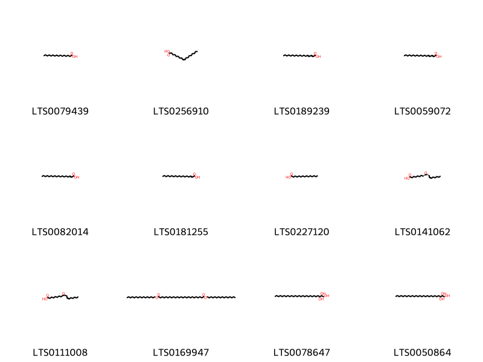{ width=100% }
    <figcaption>Hình ảnh cấu trúc hóa học của 12 hoạt chất thuộc nhóm Fatty Acyls gồm ['palmitic acid (LTS0079439)', 'oleic acid (LTS0256910)', 'isomerized safflower acid (LTS0189239)', 'octadeca-2,4-dienoic acid (LTS0059072)', 'trans-2-octadecenoic acid (LTS0082014)', '2-octadecenoic acid (LTS0181255)', 'pentadecanoic acid (LTS0227120)', 'coronaric acid (LTS0141062)', 'coronaric acid (LTS0111008)', '1,25-dihexadecyl pentacosanedioate (LTS0169947)', '(2r,3s)-heptacosane-1,2,3-triol (LTS0078647)', 'heptacosane-1,2,3-triol (LTS0050864)'].</figcaption>
</figure>
#### Nhóm Flavonoids
<figure markdown="span">
    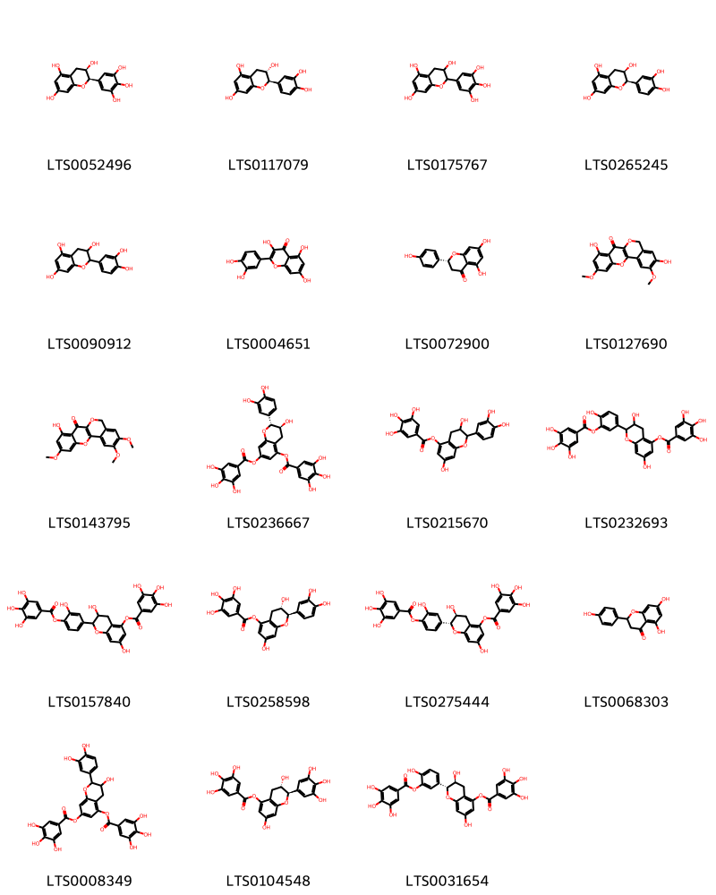{ width=100% }
    <figcaption>Hình ảnh cấu trúc hóa học của 19 hoạt chất thuộc nhóm Flavonoids gồm ['epigallocatechin (LTS0052496)', '(+)-catechol (LTS0117079)', 'epigallocatechin (LTS0175767)', 'ent-epicatechin (LTS0265245)', 'catechol (LTS0090912)', 'quercetin (LTS0004651)', '(-)-naringenin (LTS0072900)', '1,8-dihydroxy-3,7-dimethoxy-10h-5,11-dioxatetraphen-12-one (LTS0127690)', '1-hydroxy-3,7,8-trimethoxy-10h-5,11-dioxatetraphen-12-one (LTS0143795)', 'catechin 5,7,-di-o-gallate (LTS0236667)', '2-(3,4-dihydroxyphenyl)-3,7-dihydroxy-3,4-dihydro-2h-1-benzopyran-5-yl 3,4,5-trihydroxybenzoate (LTS0215670)', '3,7-dihydroxy-2-[4-hydroxy-3-(3,4,5-trihydroxybenzoyloxy)phenyl]-3,4-dihydro-2h-1-benzopyran-5-yl 3,4,5-trihydroxybenzoate (LTS0232693)', '3,7-dihydroxy-2-[3-hydroxy-4-(3,4,5-trihydroxybenzoyloxy)phenyl]-3,4-dihydro-2h-1-benzopyran-5-yl 3,4,5-trihydroxybenzoate (LTS0157840)', 'catechin 5-o-gallate (LTS0258598)', "catechin 5,4'-di-o-gallate (LTS0275444)", 'asahina (LTS0068303)', '2-(3,4-dihydroxyphenyl)-3-hydroxy-7-(3,4,5-trihydroxybenzoyloxy)-3,4-dihydro-2h-1-benzopyran-5-yl 3,4,5-trihydroxybenzoate (LTS0008349)', '(2r,3s)-3,7-dihydroxy-2-(3,4,5-trihydroxyphenyl)-3,4-dihydro-2h-1-benzopyran-5-yl 3,4,5-trihydroxybenzoate (LTS0104548)', "catechin 5,3'-di-o-gallate (LTS0031654)"].</figcaption>
</figure>
#### Nhóm Organooxygen compounds
<figure markdown="span">
    { width=100% }
    <figcaption>Hình ảnh cấu trúc hóa học của 2 hoạt chất thuộc nhóm Organooxygen compounds gồm ['phytic acid (LTS0210346)', '[(1r,2r,3s,4r,5s,6s)-2,3,4,5,6-pentakis(phosphonooxy)cyclohexyl]oxyphosphonic acid (LTS0234844)'].</figcaption>
</figure>
#### Nhóm Phenols
<figure markdown="span">
    { width=100% }
    <figcaption>Hình ảnh cấu trúc hóa học của 1 hoạt chất thuộc nhóm Phenols gồm ['catechol (LTS0178554)'].</figcaption>
</figure>
#### Nhóm Prenol lipids
<figure markdown="span">
    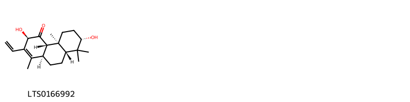{ width=100% }
    <figcaption>Hình ảnh cấu trúc hóa học của 1 hoạt chất thuộc nhóm Prenol lipids gồm ['(3r,4as,4bs,7s,8ar,10ar)-2-ethenyl-3,7-dihydroxy-1,4b,8,8-tetramethyl-4a,5,6,7,8a,9,10,10a-octahydro-3h-phenanthren-4-one (LTS0166992)'].</figcaption>
</figure>
#### Nhóm Steroids and steroid derivatives
<figure markdown="span">
    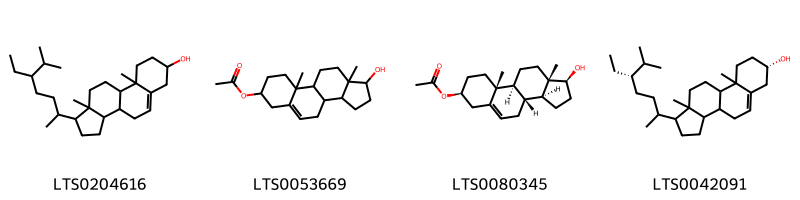{ width=100% }
    <figcaption>Hình ảnh cấu trúc hóa học của 4 hoạt chất thuộc nhóm Steroids and steroid derivatives gồm ['stigmast-5-en-3-ol, (3β)- (LTS0204616)', '1-hydroxy-9a,11a-dimethyl-1h,2h,3h,3ah,3bh,4h,6h,7h,8h,9h,9bh,10h,11h-cyclopenta[a]phenanthren-7-yl acetate (LTS0053669)', 'androstenediol 3β-acetate (LTS0080345)', '(7s)-1-[(5s)-5-ethyl-6-methylheptan-2-yl]-9a,11a-dimethyl-1h,2h,3h,3ah,3bh,4h,6h,7h,8h,9h,9bh,10h,11h-cyclopenta[a]phenanthren-7-ol (LTS0042091)'].</figcaption>
</figure>
#### Nhóm Tannins
<figure markdown="span">
    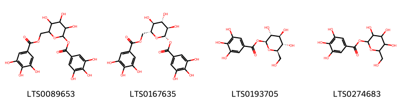{ width=100% }
    <figcaption>Hình ảnh cấu trúc hóa học của 4 hoạt chất thuộc nhóm Tannins gồm ['3,4,5-trihydroxy-6-[(3,4,5-trihydroxybenzoyloxy)methyl]oxan-2-yl 3,4,5-trihydroxybenzoate (LTS0089653)', '(2s,3r,4s,5s,6r)-3,4,5-trihydroxy-6-[(3,4,5-trihydroxybenzoyloxy)methyl]oxan-2-yl 3,4,5-trihydroxybenzoate (LTS0167635)', 'β-glucogallin (LTS0193705)', '3,4,5-trihydroxy-6-(hydroxymethyl)oxan-2-yl 3,4,5-trihydroxybenzoate (LTS0274683)'].</figcaption>
</figure>

---

### Dược dân tộc học

Danh sách các quốc gia có sử dụng *Vachellia nilotica* trong điều trị các bệnh. 

| Country   | Disease      | Bệnh                                                                                                                                                                                                |
|:----------|:-------------|:----------------------------------------------------------------------------------------------------------------------------------------------------------------------------------------------------|
| Egypt     | Decongestant | MYMEMORY WARNING: YOU USED ALL AVAILABLE FREE TRANSLATIONS FOR TODAY. NEXT AVAILABLE IN  17 HOURS 53 MINUTES 53 SECONDS VISIT HTTPS://MYMEMORY.TRANSLATED.NET/DOC/USAGELIMITS.PHP TO TRANSLATE MORE |

---

---
## Acacia pennata
### Thông tin về thực vật

!!! info "Phân loại thực vật của *N/A* từ GIBF:"
    - **Kingdom:** Plantae
    - **Phylum:** Tracheophyta
    - **Order:** Fabales
    - **Family:** Fabaceae
    - **Genus:** Senegalia
    - **Species:** *N/A*

 

| Label (VI)   | Label (EN)   | Scientific Name   | Descriptions (VI)   | Descriptions (EN)   | Also Known As (VI)   | Also Known As (EN)    |
|:-------------|:-------------|:------------------|:--------------------|:--------------------|:---------------------|:----------------------|
| N/A          | N/A          | Acacia pennata    | loài thực vật       | species of plant    | ['']                 | ['Senegalia pennata'] |

#### Phân bố trên thế giới

**Từ CSDL GIBF** Virgin Islands (U.S.), South Africa, Puerto Rico, Namibia, Martinique, Brazil, Chinese Taipei, Argentina, Botswana, Bolivia (Plurinational State of), India, Benin, United States of America, Mexico, Uruguay, Kenya

#### Phân bố tại Việt Nam

**Từ CSDL GIBF**: Không có ghi nhận ở Việt Nam

---
### Thành phần hóa học
        
- Theo cơ sở dữ liệu lotus: Từ loài *N/A* đã phân lập và xác định được Chưa có hoạt chất nào được phân lập. hoạt chất thuộc về các nhóm Không có hoạt chất nào được phân lập. 

Không có hình ảnh nào được tạo ra

---

### Dược dân tộc học

Danh sách các quốc gia có sử dụng *N/A* trong điều trị các bệnh. 

| Country   | Disease   | Bệnh                                                                                                                                                                                                |
|:----------|:----------|:----------------------------------------------------------------------------------------------------------------------------------------------------------------------------------------------------|
| India     | Piscicide | MYMEMORY WARNING: YOU USED ALL AVAILABLE FREE TRANSLATIONS FOR TODAY. NEXT AVAILABLE IN  17 HOURS 51 MINUTES 24 SECONDS VISIT HTTPS://MYMEMORY.TRANSLATED.NET/DOC/USAGELIMITS.PHP TO TRANSLATE MORE |

---

---
## Acacia pentagona
### Thông tin về thực vật

!!! info "Phân loại thực vật của *Senegalia pentagona* từ GIBF:"
    - **Kingdom:** Plantae
    - **Phylum:** Tracheophyta
    - **Order:** Fabales
    - **Family:** Fabaceae
    - **Genus:** Senegalia
    - **Species:** *Senegalia pentagona*

 

| Label (VI)   | Label (EN)   | Scientific Name   | Descriptions (VI)   | Descriptions (EN)   | Also Known As (VI)   | Also Known As (EN)   |
|:-------------|:-------------|:------------------|:--------------------|:--------------------|:---------------------|:---------------------|
| N/A          | N/A          | Acacia pentagona  | loài thực vật       | species of plant    | ['']                 | ['']                 |

#### Phân bố trên thế giới

**Từ CSDL GIBF** Uganda, Ghana, Mayotte, Madagascar, Gabon, Equatorial Guinea, Angola, Côte d’Ivoire, Mozambique, Benin, Congo, Congo, Democratic Republic of the, Guinea, Kenya, Cameroon, Tanzania, United Republic of, Ethiopia

#### Phân bố tại Việt Nam

**Từ CSDL GIBF**: Không có ghi nhận ở Việt Nam

---
### Thành phần hóa học
        
- Theo cơ sở dữ liệu lotus: Từ loài *Senegalia pentagona* đã phân lập và xác định được Chưa có hoạt chất nào được phân lập. hoạt chất thuộc về các nhóm Không có hoạt chất nào được phân lập. 

Không có hình ảnh nào được tạo ra

---

### Dược dân tộc học

Danh sách các quốc gia có sử dụng *Senegalia pentagona* trong điều trị các bệnh. 

| Country   | Disease    | Bệnh                                                                                                                                                                                                |
|:----------|:-----------|:----------------------------------------------------------------------------------------------------------------------------------------------------------------------------------------------------|
| Ghana     | Dentifrice | MYMEMORY WARNING: YOU USED ALL AVAILABLE FREE TRANSLATIONS FOR TODAY. NEXT AVAILABLE IN  17 HOURS 50 MINUTES 52 SECONDS VISIT HTTPS://MYMEMORY.TRANSLATED.NET/DOC/USAGELIMITS.PHP TO TRANSLATE MORE |

---

---
## Acacia senegal
### Thông tin về thực vật

!!! info "Phân loại thực vật của *Senegalia senegal* từ GIBF:"
    - **Kingdom:** Plantae
    - **Phylum:** Tracheophyta
    - **Order:** Fabales
    - **Family:** Fabaceae
    - **Genus:** Senegalia
    - **Species:** *Senegalia senegal*

 

| Label (VI)   | Label (EN)   | Scientific Name   | Descriptions (VI)   | Descriptions (EN)   | Also Known As (VI)   | Also Known As (EN)   |
|:-------------|:-------------|:------------------|:--------------------|:--------------------|:---------------------|:---------------------|
| N/A          | N/A          | Acacia senegal    | loài thực vật       | species of plant    | ['']                 | ['']                 |

#### Phân bố trên thế giới

**Từ CSDL GIBF** Pakistan, Uganda, Senegal, Nigeria, Oman, Belgium, Togo, India, Benin, Burkina Faso, Kenya, Tanzania, United Republic of, Ethiopia

#### Phân bố tại Việt Nam

**Từ CSDL GIBF**: Không có ghi nhận ở Việt Nam

---
### Thành phần hóa học
        
- Theo cơ sở dữ liệu lotus: Từ loài *Senegalia senegal* đã phân lập và xác định được 2 hoạt chất thuộc về các nhóm Fatty Acyls. 

|    | chemicalTaxonomyClassyfireClass   |   smiles_count |
|---:|:----------------------------------|---------------:|
|  0 | Fatty Acyls                       |              2 |

#### Nhóm Fatty Acyls
<figure markdown="span">
    { width=100% }
    <figcaption>Hình ảnh cấu trúc hóa học của 2 hoạt chất thuộc nhóm Fatty Acyls gồm ['trans-2-octadecenoic acid (LTS0082014)', '2-octadecenoic acid (LTS0181255)'].</figcaption>
</figure>

---

### Dược dân tộc học

Danh sách các quốc gia có sử dụng *Senegalia senegal* trong điều trị các bệnh. 

| Country   | Disease     | Bệnh                                                                                                                                                                                                |
|:----------|:------------|:----------------------------------------------------------------------------------------------------------------------------------------------------------------------------------------------------|
| Elsewhere | Demulcent   | MYMEMORY WARNING: YOU USED ALL AVAILABLE FREE TRANSLATIONS FOR TODAY. NEXT AVAILABLE IN  17 HOURS 50 MINUTES 12 SECONDS VISIT HTTPS://MYMEMORY.TRANSLATED.NET/DOC/USAGELIMITS.PHP TO TRANSLATE MORE |
| French    | Astringent  | MYMEMORY WARNING: YOU USED ALL AVAILABLE FREE TRANSLATIONS FOR TODAY. NEXT AVAILABLE IN  17 HOURS 50 MINUTES 09 SECONDS VISIT HTTPS://MYMEMORY.TRANSLATED.NET/DOC/USAGELIMITS.PHP TO TRANSLATE MORE |
| Iran      | Expectorant | MYMEMORY WARNING: YOU USED ALL AVAILABLE FREE TRANSLATIONS FOR TODAY. NEXT AVAILABLE IN  17 HOURS 50 MINUTES 06 SECONDS VISIT HTTPS://MYMEMORY.TRANSLATED.NET/DOC/USAGELIMITS.PHP TO TRANSLATE MORE |
| Nc        | Emollient   | MYMEMORY WARNING: YOU USED ALL AVAILABLE FREE TRANSLATIONS FOR TODAY. NEXT AVAILABLE IN  17 HOURS 50 MINUTES 02 SECONDS VISIT HTTPS://MYMEMORY.TRANSLATED.NET/DOC/USAGELIMITS.PHP TO TRANSLATE MORE |
| Turkey    | Demulcent   | MYMEMORY WARNING: YOU USED ALL AVAILABLE FREE TRANSLATIONS FOR TODAY. NEXT AVAILABLE IN  17 HOURS 49 MINUTES 58 SECONDS VISIT HTTPS://MYMEMORY.TRANSLATED.NET/DOC/USAGELIMITS.PHP TO TRANSLATE MORE |

---

---
## Acacia sieberana
### Thông tin về thực vật

!!! info "Phân loại thực vật của *Vachellia sieberiana* từ GIBF:"
    - **Kingdom:** Plantae
    - **Phylum:** Tracheophyta
    - **Order:** Fabales
    - **Family:** Fabaceae
    - **Genus:** Vachellia
    - **Species:** *Vachellia sieberiana*

 

| Label (VI)   | Label (EN)   | Scientific Name   | Descriptions (VI)   | Descriptions (EN)   | Also Known As (VI)   | Also Known As (EN)   |
|:-------------|:-------------|:------------------|:--------------------|:--------------------|:---------------------|:---------------------|
| N/A          | N/A          | Acacia sieberana  | loài thực vật       | species of plant    | ['']                 | ['']                 |

#### Phân bố trên thế giới

**Từ CSDL GIBF** Pakistan, Uganda, Senegal, Nigeria, Oman, Belgium, Togo, India, Benin, Burkina Faso, Kenya, Tanzania, United Republic of, Ethiopia

#### Phân bố tại Việt Nam

**Từ CSDL GIBF**: Không có ghi nhận ở Việt Nam

---
### Thành phần hóa học
        
- Theo cơ sở dữ liệu lotus: Từ loài *Vachellia sieberiana* đã phân lập và xác định được 10 hoạt chất thuộc về các nhóm Fatty Acyls, Organooxygen compounds, Organonitrogen compounds. 

|    | chemicalTaxonomyClassyfireClass   |   smiles_count |
|---:|:----------------------------------|---------------:|
|  0 | Fatty Acyls                       |              2 |
|  1 | Organonitrogen compounds          |              1 |
|  2 | Organooxygen compounds            |              7 |

#### Nhóm Fatty Acyls
<figure markdown="span">
    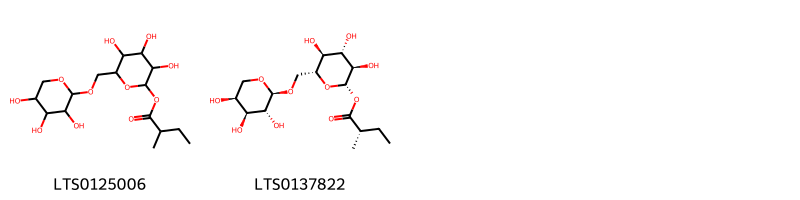{ width=100% }
    <figcaption>Hình ảnh cấu trúc hóa học của 2 hoạt chất thuộc nhóm Fatty Acyls gồm ['3,4,5-trihydroxy-6-{[(3,4,5-trihydroxyoxan-2-yl)oxy]methyl}oxan-2-yl 2-methylbutanoate (LTS0125006)', '(2s,3r,4s,5s,6r)-3,4,5-trihydroxy-6-({[(2s,3r,4s,5s)-3,4,5-trihydroxyoxan-2-yl]oxy}methyl)oxan-2-yl (2s)-2-methylbutanoate (LTS0137822)'].</figcaption>
</figure>
#### Nhóm Organonitrogen compounds
<figure markdown="span">
    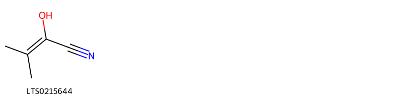{ width=100% }
    <figcaption>Hình ảnh cấu trúc hóa học của 1 hoạt chất thuộc nhóm Organonitrogen compounds gồm ['2-hydroxy-3-methylbut-2-enenitrile (LTS0215644)'].</figcaption>
</figure>
#### Nhóm Organooxygen compounds
<figure markdown="span">
    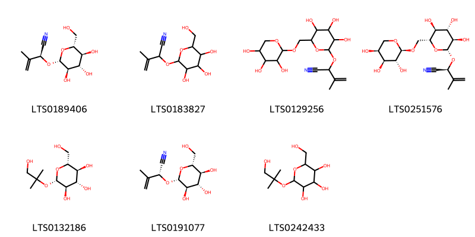{ width=100% }
    <figcaption>Hình ảnh cấu trúc hóa học của 7 hoạt chất thuộc nhóm Organooxygen compounds gồm ['proacacipetalin (LTS0189406)', '3-methyl-2-{[3,4,5-trihydroxy-6-(hydroxymethyl)oxan-2-yl]oxy}but-3-enenitrile (LTS0183827)', '3-methyl-2-[(3,4,5-trihydroxy-6-{[(3,4,5-trihydroxyoxan-2-yl)oxy]methyl}oxan-2-yl)oxy]but-3-enenitrile (LTS0129256)', 'proacaciberin (LTS0251576)', '(2s,3r,4s,5s,6r)-2-[(1-hydroxy-2-methylpropan-2-yl)oxy]-6-(hydroxymethyl)oxane-3,4,5-triol (LTS0132186)', '(2r)-3-methyl-2-{[(2r,3r,4s,5s,6r)-3,4,5-trihydroxy-6-(hydroxymethyl)oxan-2-yl]oxy}but-3-enenitrile (LTS0191077)', '2-[(1-hydroxy-2-methylpropan-2-yl)oxy]-6-(hydroxymethyl)oxane-3,4,5-triol (LTS0242433)'].</figcaption>
</figure>

---

### Dược dân tộc học

Danh sách các quốc gia có sử dụng *Vachellia sieberiana* trong điều trị các bệnh. 

| Country   | Disease               | Bệnh                                                                                                                                                                                                |
|:----------|:----------------------|:----------------------------------------------------------------------------------------------------------------------------------------------------------------------------------------------------|
| Guinea    | Taenifuge             | MYMEMORY WARNING: YOU USED ALL AVAILABLE FREE TRANSLATIONS FOR TODAY. NEXT AVAILABLE IN  17 HOURS 49 MINUTES 30 SECONDS VISIT HTTPS://MYMEMORY.TRANSLATED.NET/DOC/USAGELIMITS.PHP TO TRANSLATE MORE |
| Nigeria   | Vermifuge             | MYMEMORY WARNING: YOU USED ALL AVAILABLE FREE TRANSLATIONS FOR TODAY. NEXT AVAILABLE IN  17 HOURS 49 MINUTES 27 SECONDS VISIT HTTPS://MYMEMORY.TRANSLATED.NET/DOC/USAGELIMITS.PHP TO TRANSLATE MORE |
| Zaire     | Astringent, Emollient | MYMEMORY WARNING: YOU USED ALL AVAILABLE FREE TRANSLATIONS FOR TODAY. NEXT AVAILABLE IN  17 HOURS 49 MINUTES 23 SECONDS VISIT HTTPS://MYMEMORY.TRANSLATED.NET/DOC/USAGELIMITS.PHP TO TRANSLATE MORE |

---

---
## Acacia tortuosa
### Thông tin về thực vật

!!! info "Phân loại thực vật của *N/A* từ GIBF:"
    - **Kingdom:** Plantae
    - **Phylum:** Tracheophyta
    - **Order:** Fabales
    - **Family:** Fabaceae
    - **Genus:** N/A
    - **Species:** *N/A*

 

| Label (VI)   | Label (EN)   | Scientific Name   | Descriptions (VI)   | Descriptions (EN)   | Also Known As (VI)   | Also Known As (EN)   |
|:-------------|:-------------|:------------------|:--------------------|:--------------------|:---------------------|:---------------------|
| N/A          | N/A          | Acacia tortuosa   | loài thực vật       | species of plant    | ['']                 | ['']                 |

#### Phân bố trên thế giới

**Từ CSDL GIBF** Sri Lanka, Italy, Australia, Cambodia, Argentina, Tanzania, United Republic of, Chinese Taipei, Spain, Portugal, United States of America, Chile, Croatia, South Africa, Thailand, Germany, Brazil, Guam, France, Norfolk Island, Viet Nam, China, United Kingdom of Great Britain and Northern Ireland, Ireland, Gambia, India, Malaysia, New Zealand

#### Phân bố tại Việt Nam

**Từ CSDL GIBF**: Đà Nẵng, Bà Rịa - Vũng Tàu

---
### Thành phần hóa học
        
- Theo cơ sở dữ liệu lotus: Từ loài *N/A* đã phân lập và xác định được 11 hoạt chất thuộc về các nhóm Organooxygen compounds. 

|    | chemicalTaxonomyClassyfireClass   |   smiles_count |
|---:|:----------------------------------|---------------:|
|  0 | Organooxygen compounds            |             11 |

#### Nhóm Organooxygen compounds
<figure markdown="span">
    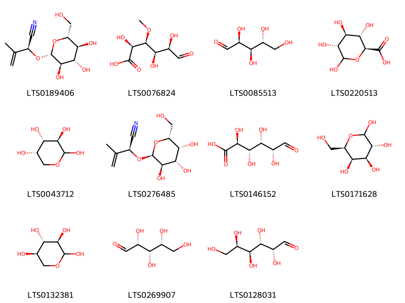{ width=100% }
    <figcaption>Hình ảnh cấu trúc hóa học của 11 hoạt chất thuộc nhóm Organooxygen compounds gồm ['proacacipetalin (LTS0189406)', '(2s,3s,4r,5r)-2,4,5-trihydroxy-3-methoxy-6-oxohexanoic acid (LTS0076824)', 'arabinose (LTS0085513)', 'd-glucopyranuronic acid (LTS0220513)', 'l-arabinopyranose (LTS0043712)', '(2s)-3-methyl-2-{[(2s,3r,4s,5r,6r)-3,4,5-trihydroxy-6-(hydroxymethyl)oxan-2-yl]oxy}but-3-enenitrile (LTS0276485)', 'aldehydo-d-glucuronic acid (LTS0146152)', 'galactose (LTS0171628)', 'd-xylose (LTS0132381)', '(d)-xylose (LTS0269907)', 'aldehydo-d-galactose (LTS0128031)'].</figcaption>
</figure>

---

### Dược dân tộc học

Danh sách các quốc gia có sử dụng *N/A* trong điều trị các bệnh. 

| Country            | Disease                                                                 | Bệnh                                                                                                                                                                                                |
|:-------------------|:------------------------------------------------------------------------|:----------------------------------------------------------------------------------------------------------------------------------------------------------------------------------------------------|
| Dominican Republic | Deodorant, Astringent                                                   | MYMEMORY WARNING: YOU USED ALL AVAILABLE FREE TRANSLATIONS FOR TODAY. NEXT AVAILABLE IN  17 HOURS 48 MINUTES 52 SECONDS VISIT HTTPS://MYMEMORY.TRANSLATED.NET/DOC/USAGELIMITS.PHP TO TRANSLATE MORE |
| Haiti              | Antiseptic, Antiseptic, Astringent, Cicatrizant, Deodorant, Diaphoretic | MYMEMORY WARNING: YOU USED ALL AVAILABLE FREE TRANSLATIONS FOR TODAY. NEXT AVAILABLE IN  17 HOURS 48 MINUTES 47 SECONDS VISIT HTTPS://MYMEMORY.TRANSLATED.NET/DOC/USAGELIMITS.PHP TO TRANSLATE MORE |

---

---
## Acacia villosa
### Thông tin về thực vật

!!! info "Phân loại thực vật của *Acaciella villosa* từ GIBF:"
    - **Kingdom:** Plantae
    - **Phylum:** Tracheophyta
    - **Order:** Fabales
    - **Family:** Fabaceae
    - **Genus:** Acaciella
    - **Species:** *Acaciella villosa*

 

| Label (VI)   | Label (EN)   | Scientific Name   | Descriptions (VI)   | Descriptions (EN)   | Also Known As (VI)   | Also Known As (EN)   |
|:-------------|:-------------|:------------------|:--------------------|:--------------------|:---------------------|:---------------------|
| N/A          | N/A          | Acacia villosa    | loài thực vật       | species of plant    | ['']                 | ['']                 |

#### Phân bố trên thế giới

**Từ CSDL GIBF** Curaçao, Ecuador, nan, Nicaragua, Colombia, Brazil, Costa Rica, Honduras, unknown or invalid, Indonesia, Jamaica, United States of America, Cuba, Mexico, El Salvador, Venezuela (Bolivarian Republic of), Panama

#### Phân bố tại Việt Nam

**Từ CSDL GIBF**: Không có ghi nhận ở Việt Nam

---
### Thành phần hóa học
        
- Theo cơ sở dữ liệu lotus: Từ loài *Acaciella villosa* đã phân lập và xác định được Chưa có hoạt chất nào được phân lập. hoạt chất thuộc về các nhóm Không có hoạt chất nào được phân lập. 

Không có hình ảnh nào được tạo ra

---

### Dược dân tộc học

Danh sách các quốc gia có sử dụng *Acaciella villosa* trong điều trị các bệnh. 

| Country   | Disease     | Bệnh                                                                                                                                                                                                |
|:----------|:------------|:----------------------------------------------------------------------------------------------------------------------------------------------------------------------------------------------------|
| Curacao   | Expectorant | MYMEMORY WARNING: YOU USED ALL AVAILABLE FREE TRANSLATIONS FOR TODAY. NEXT AVAILABLE IN  17 HOURS 48 MINUTES 10 SECONDS VISIT HTTPS://MYMEMORY.TRANSLATED.NET/DOC/USAGELIMITS.PHP TO TRANSLATE MORE |

---

# Chi Dialium

??? note "Danh sách các dược liệu thuộc chi"
    
	 - *Dialium dinklagei*
	 - *Dialium guineense*

---
## Dialium dinklagei
### Thông tin về thực vật

!!! info "Phân loại thực vật của *Dialium dinklagei* từ GIBF:"
    - **Kingdom:** Plantae
    - **Phylum:** Tracheophyta
    - **Order:** Fabales
    - **Family:** Fabaceae
    - **Genus:** Dialium
    - **Species:** *Dialium dinklagei*

 

| Label (VI)   | Label (EN)   | Scientific Name   | Descriptions (VI)   | Descriptions (EN)   | Also Known As (VI)   | Also Known As (EN)   |
|:-------------|:-------------|:------------------|:--------------------|:--------------------|:---------------------|:---------------------|
| N/A          | N/A          | Dialium dinklagei | loài thực vật       | species of plant    | ['']                 | ['']                 |

#### Phân bố trên thế giới

**Từ CSDL GIBF** Ghana, Gabon, Côte d’Ivoire, Guinea, Liberia, Sierra Leone, Cameroon

#### Phân bố tại Việt Nam

**Từ CSDL GIBF**: Không có ghi nhận ở Việt Nam

---
### Thành phần hóa học
        
- Theo cơ sở dữ liệu lotus: Từ loài *Dialium dinklagei* đã phân lập và xác định được Chưa có hoạt chất nào được phân lập. hoạt chất thuộc về các nhóm Không có hoạt chất nào được phân lập. 

Không có hình ảnh nào được tạo ra

---

### Dược dân tộc học

Danh sách các quốc gia có sử dụng *Dialium dinklagei* trong điều trị các bệnh. 

| Country     | Disease   | Bệnh                                                                                                                                                                                                |
|:------------|:----------|:----------------------------------------------------------------------------------------------------------------------------------------------------------------------------------------------------|
| Africa      | Diuretic  | MYMEMORY WARNING: YOU USED ALL AVAILABLE FREE TRANSLATIONS FOR TODAY. NEXT AVAILABLE IN  17 HOURS 47 MINUTES 37 SECONDS VISIT HTTPS://MYMEMORY.TRANSLATED.NET/DOC/USAGELIMITS.PHP TO TRANSLATE MORE |
| Ivory Coast | Purgative | MYMEMORY WARNING: YOU USED ALL AVAILABLE FREE TRANSLATIONS FOR TODAY. NEXT AVAILABLE IN  17 HOURS 47 MINUTES 35 SECONDS VISIT HTTPS://MYMEMORY.TRANSLATED.NET/DOC/USAGELIMITS.PHP TO TRANSLATE MORE |

---

---
## Dialium guineense
### Thông tin về thực vật

!!! info "Phân loại thực vật của *Dialium guineense* từ GIBF:"
    - **Kingdom:** Plantae
    - **Phylum:** Tracheophyta
    - **Order:** Fabales
    - **Family:** Fabaceae
    - **Genus:** Dialium
    - **Species:** *Dialium guineense*

 

| Label (VI)   | Label (EN)   | Scientific Name   | Descriptions (VI)   | Descriptions (EN)   | Also Known As (VI)   | Also Known As (EN)   |
|:-------------|:-------------|:------------------|:--------------------|:--------------------|:---------------------|:---------------------|
| N/A          | N/A          | Dialium guineense | loài thực vật       | species of plant    | ['']                 | ['']                 |

#### Phân bố trên thế giới

**Từ CSDL GIBF** Ecuador, Ghana, Senegal, Nigeria, Gabon, Colombia, Brazil, Gambia, Benin, Guinea, Liberia

#### Phân bố tại Việt Nam

**Từ CSDL GIBF**: Không có ghi nhận ở Việt Nam

---
### Thành phần hóa học
        
- Theo cơ sở dữ liệu lotus: Từ loài *Dialium guineense* đã phân lập và xác định được 1 hoạt chất thuộc về các nhóm Prenol lipids. 

|    | chemicalTaxonomyClassyfireClass   |   smiles_count |
|---:|:----------------------------------|---------------:|
|  0 | Prenol lipids                     |              1 |

#### Nhóm Prenol lipids
<figure markdown="span">
    { width=100% }
    <figcaption>Hình ảnh cấu trúc hóa học của 1 hoạt chất thuộc nhóm Prenol lipids gồm ['oleanolic acid (LTS0117717)'].</figcaption>
</figure>

---

### Dược dân tộc học

Danh sách các quốc gia có sử dụng *Dialium guineense* trong điều trị các bệnh. 

| Country   | Disease               | Bệnh                                                                                                                                                                                                |
|:----------|:----------------------|:----------------------------------------------------------------------------------------------------------------------------------------------------------------------------------------------------|
| Africa    | Collyrium, Astringent | MYMEMORY WARNING: YOU USED ALL AVAILABLE FREE TRANSLATIONS FOR TODAY. NEXT AVAILABLE IN  17 HOURS 47 MINUTES 11 SECONDS VISIT HTTPS://MYMEMORY.TRANSLATED.NET/DOC/USAGELIMITS.PHP TO TRANSLATE MORE |
| Ghana     | Dentifrice            | MYMEMORY WARNING: YOU USED ALL AVAILABLE FREE TRANSLATIONS FOR TODAY. NEXT AVAILABLE IN  17 HOURS 47 MINUTES 08 SECONDS VISIT HTTPS://MYMEMORY.TRANSLATED.NET/DOC/USAGELIMITS.PHP TO TRANSLATE MORE |

---

# Chi Butea

??? note "Danh sách các dược liệu thuộc chi"
    
	 - *Butea comoerma*
	 - *Butea frondosa*
	 - *Butea monoerma*

---
## Butea comoerma
### Thông tin về thực vật

!!! info "Phân loại thực vật của *N/A* từ GIBF:"
    - **Kingdom:** Plantae
    - **Phylum:** Tracheophyta
    - **Order:** Fabales
    - **Family:** Fabaceae
    - **Genus:** Butea
    - **Species:** *N/A*

 

| Label (VI)   | Label (EN)   | Scientific Name   | Descriptions (VI)   | Descriptions (EN)   | Also Known As (VI)   | Also Known As (EN)   |
|:-------------|:-------------|:------------------|:--------------------|:--------------------|:---------------------|:---------------------|
| N/A          | N/A          | Dialium guineense | loài thực vật       | species of plant    | ['']                 | ['']                 |

#### Phân bố trên thế giới

**Từ CSDL GIBF** Thailand, Lao People’s Democratic Republic, India, Bangladesh, Nepal

#### Phân bố tại Việt Nam

**Từ CSDL GIBF**: Không có ghi nhận ở Việt Nam

---
### Thành phần hóa học
        
- Theo cơ sở dữ liệu lotus: Từ loài *N/A* đã phân lập và xác định được Chưa có hoạt chất nào được phân lập. hoạt chất thuộc về các nhóm Không có hoạt chất nào được phân lập. 

Không có hình ảnh nào được tạo ra

---

### Dược dân tộc học

Danh sách các quốc gia có sử dụng *N/A* trong điều trị các bệnh. 

| Country   | Disease    | Bệnh                                                                                                                                                                                                |
|:----------|:-----------|:----------------------------------------------------------------------------------------------------------------------------------------------------------------------------------------------------|
| Elsewhere | Astringent | MYMEMORY WARNING: YOU USED ALL AVAILABLE FREE TRANSLATIONS FOR TODAY. NEXT AVAILABLE IN  17 HOURS 46 MINUTES 28 SECONDS VISIT HTTPS://MYMEMORY.TRANSLATED.NET/DOC/USAGELIMITS.PHP TO TRANSLATE MORE |

---

---
## Butea frondosa
### Thông tin về thực vật

!!! info "Phân loại thực vật của *Butea frondosa* từ GIBF:"
    - **Kingdom:** Plantae
    - **Phylum:** Tracheophyta
    - **Order:** Fabales
    - **Family:** Fabaceae
    - **Genus:** Butea
    - **Species:** *Butea frondosa*

 

| Label (VI)   | Label (EN)   | Scientific Name   | Descriptions (VI)   | Descriptions (EN)      | Also Known As (VI)   | Also Known As (EN)   |
|:-------------|:-------------|:------------------|:--------------------|:-----------------------|:---------------------|:---------------------|
| N/A          | N/A          | Butea frondosa    |                     | type of flowering tree | ['']                 | ['dhak tree']        |

#### Phân bố trên thế giới

**Từ CSDL GIBF** Thailand, Lao People’s Democratic Republic, India, Bangladesh, Nepal

#### Phân bố tại Việt Nam

**Từ CSDL GIBF**: Không có ghi nhận ở Việt Nam

---
### Thành phần hóa học
        
- Theo cơ sở dữ liệu lotus: Từ loài *Butea frondosa* đã phân lập và xác định được 27 hoạt chất thuộc về các nhóm Flavonoids, Isoflavonoids, Linear 1,3-diarylpropanoids. 

|    | chemicalTaxonomyClassyfireClass   |   smiles_count |
|---:|:----------------------------------|---------------:|
|  0 | Flavonoids                        |              6 |
|  1 | Isoflavonoids                     |             19 |
|  2 | Linear 1,3-diarylpropanoids       |              2 |

#### Nhóm Flavonoids
<figure markdown="span">
    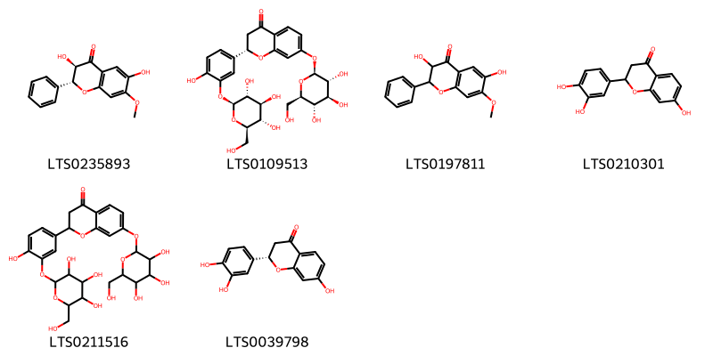{ width=100% }
    <figcaption>Hình ảnh cấu trúc hóa học của 6 hoạt chất thuộc nhóm Flavonoids gồm ['(2r,3r)-3,6-dihydroxy-7-methoxy-2-phenyl-2,3-dihydro-1-benzopyran-4-one (LTS0235893)', "butin 7,3'-di-o-glucoside (LTS0109513)", '3,6-dihydroxy-7-methoxy-2-phenyl-2,3-dihydro-1-benzopyran-4-one (LTS0197811)', "7,3',4'-trihydroxyflavanone (LTS0210301)", '2-(4-hydroxy-3-{[3,4,5-trihydroxy-6-(hydroxymethyl)oxan-2-yl]oxy}phenyl)-7-{[3,4,5-trihydroxy-6-(hydroxymethyl)oxan-2-yl]oxy}-2,3-dihydro-1-benzopyran-4-one (LTS0211516)', 'butin (LTS0039798)'].</figcaption>
</figure>
#### Nhóm Isoflavonoids
<figure markdown="span">
    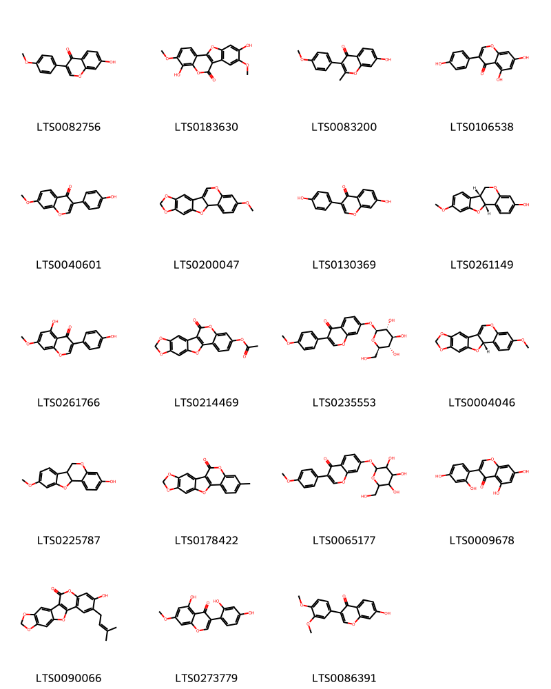{ width=100% }
    <figcaption>Hình ảnh cấu trúc hóa học của 19 hoạt chất thuộc nhóm Isoflavonoids gồm ['formononetin (LTS0082756)', '6,14-dihydroxy-5,13-dimethoxy-8,17-dioxatetracyclo[8.7.0.0²,⁷.0¹¹,¹⁶]heptadeca-1(10),2(7),3,5,11(16),12,14-heptaen-9-one (LTS0183630)', '7-hydroxy-3-(4-methoxyphenyl)-2-methylchromen-4-one (LTS0083200)', 'genistein (LTS0106538)', 'isoformononetin (LTS0040601)', '16-methoxy-5,7,11,19-tetraoxapentacyclo[10.8.0.0²,¹⁰.0⁴,⁸.0¹³,¹⁸]icosa-1(20),2,4(8),9,13,15,17-heptaene (LTS0200047)', 'daidzein (LTS0130369)', 'medicarpin, (-)- (LTS0261149)', 'prunetin (LTS0261766)', '20-oxo-5,7,11,19-tetraoxapentacyclo[10.8.0.0²,¹⁰.0⁴,⁸.0¹³,¹⁸]icosa-1(12),2(10),3,8,13(18),14,16-heptaen-16-yl acetate (LTS0214469)', 'ononin (LTS0235553)', '(12r)-16-methoxy-5,7,11,19-tetraoxapentacyclo[10.8.0.0²,¹⁰.0⁴,⁸.0¹³,¹⁸]icosa-1(20),2,4(8),9,13,15,17-heptaene (LTS0004046)', 'medicarpin (LTS0225787)', '16-methyl-5,7,11,19-tetraoxapentacyclo[10.8.0.0²,¹⁰.0⁴,⁸.0¹³,¹⁸]icosa-1(12),2(10),3,8,13(18),14,16-heptaen-20-one (LTS0178422)', 'ononin (LTS0065177)', "2'-hydroxygenistein (LTS0009678)", '16-hydroxy-15-(3-methylbut-2-en-1-yl)-5,7,11,19-tetraoxapentacyclo[10.8.0.0²,¹⁰.0⁴,⁸.0¹³,¹⁸]icosa-1(12),2(10),3,8,13(18),14,16-heptaen-20-one (LTS0090066)', 'cajanin (LTS0273779)', 'cladrin (LTS0086391)'].</figcaption>
</figure>
#### Nhóm Linear 1_3-diarylpropanoids
<figure markdown="span">
    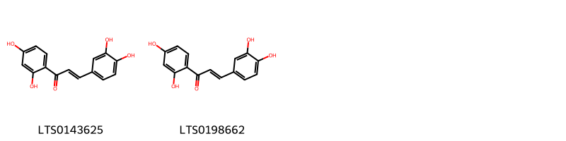{ width=100% }
    <figcaption>Hình ảnh cấu trúc hóa học của Không tìm thấy chú thích hoạt chất thuộc nhóm Linear 1_3-diarylpropanoids gồm Không tìm thấy chú thích.</figcaption>
</figure>

---

### Dược dân tộc học

Danh sách các quốc gia có sử dụng *Butea frondosa* trong điều trị các bệnh. 

| Country   | Disease    | Bệnh                                                                                                                                                                                                |
|:----------|:-----------|:----------------------------------------------------------------------------------------------------------------------------------------------------------------------------------------------------|
| Sanscrit  | Astringent | MYMEMORY WARNING: YOU USED ALL AVAILABLE FREE TRANSLATIONS FOR TODAY. NEXT AVAILABLE IN  17 HOURS 46 MINUTES 02 SECONDS VISIT HTTPS://MYMEMORY.TRANSLATED.NET/DOC/USAGELIMITS.PHP TO TRANSLATE MORE |
| US        | Vermifuge  | MYMEMORY WARNING: YOU USED ALL AVAILABLE FREE TRANSLATIONS FOR TODAY. NEXT AVAILABLE IN  17 HOURS 45 MINUTES 59 SECONDS VISIT HTTPS://MYMEMORY.TRANSLATED.NET/DOC/USAGELIMITS.PHP TO TRANSLATE MORE |

---

---
## Butea monoerma
### Thông tin về thực vật

!!! info "Phân loại thực vật của *Butea monosperma* từ GIBF:"
    - **Kingdom:** Plantae
    - **Phylum:** Tracheophyta
    - **Order:** Fabales
    - **Family:** Fabaceae
    - **Genus:** Butea
    - **Species:** *Butea monosperma*

 

| Label (VI)   | Label (EN)   | Scientific Name   | Descriptions (VI)   | Descriptions (EN)      | Also Known As (VI)   | Also Known As (EN)   |
|:-------------|:-------------|:------------------|:--------------------|:-----------------------|:---------------------|:---------------------|
| N/A          | N/A          | Butea frondosa    |                     | type of flowering tree | ['']                 | ['dhak tree']        |

#### Phân bố trên thế giới

**Từ CSDL GIBF** Thailand, Lao People’s Democratic Republic, India, Bangladesh, Nepal

#### Phân bố tại Việt Nam

**Từ CSDL GIBF**: Không có ghi nhận ở Việt Nam

---
### Thành phần hóa học
        
- Theo cơ sở dữ liệu lotus: Từ loài *Butea monosperma* đã phân lập và xác định được Chưa có hoạt chất nào được phân lập. hoạt chất thuộc về các nhóm Không có hoạt chất nào được phân lập. 

Không có hình ảnh nào được tạo ra

---

### Dược dân tộc học

Danh sách các quốc gia có sử dụng *Butea monosperma* trong điều trị các bệnh. 

| Country   | Disease                                                                         | Bệnh                                                                                                                                                                                                |
|:----------|:--------------------------------------------------------------------------------|:----------------------------------------------------------------------------------------------------------------------------------------------------------------------------------------------------|
| Elsewhere | Vermifuge, Vermifuge, Aphrodisiac, Astringent, Diuretic, Rubefacient, Purgative | MYMEMORY WARNING: YOU USED ALL AVAILABLE FREE TRANSLATIONS FOR TODAY. NEXT AVAILABLE IN  17 HOURS 45 MINUTES 23 SECONDS VISIT HTTPS://MYMEMORY.TRANSLATED.NET/DOC/USAGELIMITS.PHP TO TRANSLATE MORE |
| Java      | Vermifuge                                                                       | MYMEMORY WARNING: YOU USED ALL AVAILABLE FREE TRANSLATIONS FOR TODAY. NEXT AVAILABLE IN  17 HOURS 45 MINUTES 20 SECONDS VISIT HTTPS://MYMEMORY.TRANSLATED.NET/DOC/USAGELIMITS.PHP TO TRANSLATE MORE |

---

# Chi Vicia

??? note "Danh sách các dược liệu thuộc chi"
    
	 - *Vicia angustifolia*
	 - *Vicia ervilia*
	 - *Vicia faba*
	 - *Vicia gigantea*
	 - *Vicia sativa*
	 - *Vicia villosa*

---
## Vicia angustifolia
### Thông tin về thực vật

!!! info "Phân loại thực vật của *N/A* từ GIBF:"
    - **Kingdom:** Plantae
    - **Phylum:** Tracheophyta
    - **Order:** Fabales
    - **Family:** Fabaceae
    - **Genus:** Vicia
    - **Species:** *N/A*

 

| Label (VI)   | Label (EN)   | Scientific Name    | Descriptions (VI)   | Descriptions (EN)   | Also Known As (VI)   | Also Known As (EN)   |
|:-------------|:-------------|:-------------------|:--------------------|:--------------------|:---------------------|:---------------------|
| N/A          | N/A          | Vicia angustifolia | loài thực vật       | species of plant    | ['']                 | ['']                 |

#### Phân bố trên thế giới

**Từ CSDL GIBF** Italy, Australia, Japan, Belgium, Argentina, Norway, Israel, Canada, Denmark, Netherlands, Luxembourg, Chinese Taipei, Spain, Portugal, Algeria, Russian Federation, United States of America, Sweden, Greece, South Africa, Germany, Switzerland, Austria, Peru, France, Mexico, China, United Kingdom of Great Britain and Northern Ireland, Ecuador, Ireland, India, Lebanon, New Zealand

#### Phân bố tại Việt Nam

**Từ CSDL GIBF**: Không có ghi nhận ở Việt Nam

---
### Thành phần hóa học
        
- Theo cơ sở dữ liệu lotus: Từ loài *N/A* đã phân lập và xác định được Chưa có hoạt chất nào được phân lập. hoạt chất thuộc về các nhóm Không có hoạt chất nào được phân lập. 

Không có hình ảnh nào được tạo ra

---

### Dược dân tộc học

Danh sách các quốc gia có sử dụng *N/A* trong điều trị các bệnh. 

| Country   | Disease    | Bệnh                                                                                                                                                                                                |
|:----------|:-----------|:----------------------------------------------------------------------------------------------------------------------------------------------------------------------------------------------------|
| Elsewhere | Astringent | MYMEMORY WARNING: YOU USED ALL AVAILABLE FREE TRANSLATIONS FOR TODAY. NEXT AVAILABLE IN  17 HOURS 44 MINUTES 47 SECONDS VISIT HTTPS://MYMEMORY.TRANSLATED.NET/DOC/USAGELIMITS.PHP TO TRANSLATE MORE |

---

---
## Vicia ervilia
### Thông tin về thực vật

!!! info "Phân loại thực vật của *Vicia ervilia* từ GIBF:"
    - **Kingdom:** Plantae
    - **Phylum:** Tracheophyta
    - **Order:** Fabales
    - **Family:** Fabaceae
    - **Genus:** Vicia
    - **Species:** *Vicia ervilia*

 

| Label (VI)   | Label (EN)   | Scientific Name   | Descriptions (VI)   | Descriptions (EN)   | Also Known As (VI)   | Also Known As (EN)   |
|:-------------|:-------------|:------------------|:--------------------|:--------------------|:---------------------|:---------------------|
| N/A          | N/A          | Vicia ervilia     |                     | Bitter vetch        | ['']                 | ['bitter vetch']     |

#### Phân bố trên thế giới

**Từ CSDL GIBF** Italy, Estonia, Turkmenistan, Palestine, State of, Jordan, Israel, Ukraine, Tajikistan, Spain, Azerbaijan, Türkiye, Morocco, Czechia, Germany, Iran (Islamic Republic of), North Macedonia, Switzerland, Armenia, France, United Kingdom of Great Britain and Northern Ireland, Syrian Arab Republic, Iraq, Lebanon

#### Phân bố tại Việt Nam

**Từ CSDL GIBF**: Không có ghi nhận ở Việt Nam

---
### Thành phần hóa học
        
- Theo cơ sở dữ liệu lotus: Từ loài *Vicia ervilia* đã phân lập và xác định được 3 hoạt chất thuộc về các nhóm Flavonoids, Prenol lipids. 

|    | chemicalTaxonomyClassyfireClass   |   smiles_count |
|---:|:----------------------------------|---------------:|
|  0 | Flavonoids                        |              1 |
|  1 | Prenol lipids                     |              2 |

#### Nhóm Flavonoids
<figure markdown="span">
    { width=100% }
    <figcaption>Hình ảnh cấu trúc hóa học của 1 hoạt chất thuộc nhóm Flavonoids gồm ['luteolin (LTS0017052)'].</figcaption>
</figure>
#### Nhóm Prenol lipids
<figure markdown="span">
    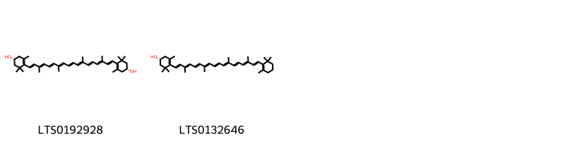{ width=100% }
    <figcaption>Hình ảnh cấu trúc hóa học của 2 hoạt chất thuộc nhóm Prenol lipids gồm ['zeaxanthin (LTS0192928)', 'cryptoxanthin (LTS0132646)'].</figcaption>
</figure>

---

### Dược dân tộc học

Danh sách các quốc gia có sử dụng *Vicia ervilia* trong điều trị các bệnh. 

| Country       | Disease   | Bệnh                                                                                                                                                                                                |
|:--------------|:----------|:----------------------------------------------------------------------------------------------------------------------------------------------------------------------------------------------------|
| Mediterranean | Poison    | MYMEMORY WARNING: YOU USED ALL AVAILABLE FREE TRANSLATIONS FOR TODAY. NEXT AVAILABLE IN  17 HOURS 44 MINUTES 17 SECONDS VISIT HTTPS://MYMEMORY.TRANSLATED.NET/DOC/USAGELIMITS.PHP TO TRANSLATE MORE |

---

---
## Vicia faba
### Thông tin về thực vật

!!! info "Phân loại thực vật của *Vicia faba* từ GIBF:"
    - **Kingdom:** Plantae
    - **Phylum:** Tracheophyta
    - **Order:** Fabales
    - **Family:** Fabaceae
    - **Genus:** Vicia
    - **Species:** *Vicia faba*

 

| Label (VI)   | Label (EN)   | Scientific Name   | Descriptions (VI)   | Descriptions (EN)           | Also Known As (VI)   | Also Known As (EN)                                                                            |
|:-------------|:-------------|:------------------|:--------------------|:----------------------------|:---------------------|:----------------------------------------------------------------------------------------------|
| N/A          | N/A          | Vicia faba        | loài thực vật       | species of plant, vegetable | ['Vicia faba']       | ['bell bean', 'faba bean', 'fava bean', 'field bean', 'horse bean', 'tic bean', 'Vicia faba'] |

#### Phân bố trên thế giới

**Từ CSDL GIBF** Italy, Belgium, Palestine, State of, Jordan, Israel, Netherlands, Chinese Taipei, Spain, Bolivia (Plurinational State of), Türkiye, Portugal, Algeria, United States of America, Slovenia, Greece, Germany, Switzerland, Peru, France, Mexico, Austria, China, United Kingdom of Great Britain and Northern Ireland, Ecuador, Ireland, India, New Zealand

#### Phân bố tại Việt Nam

**Từ CSDL GIBF**: Không có ghi nhận ở Việt Nam

---
### Thành phần hóa học
        
- Theo cơ sở dữ liệu lotus: Từ loài *Vicia faba* đã phân lập và xác định được 154 hoạt chất thuộc về các nhóm Fatty Acyls, Flavonoids, Prenol lipids, Steroids and steroid derivatives, Indoles and derivatives, Linear 1,3-diarylpropanoids, Cinnamic acids and derivatives, Dibenzylbutane lignans, Benzene and substituted derivatives, Organooxygen compounds, Phenols, Furanoid lignans, Carboxylic acids and derivatives. 

|    | chemicalTaxonomyClassyfireClass     |   smiles_count |
|---:|:------------------------------------|---------------:|
|  0 |                                     |              1 |
|  1 | Benzene and substituted derivatives |              2 |
|  2 | Carboxylic acids and derivatives    |             13 |
|  3 | Cinnamic acids and derivatives      |              7 |
|  4 | Dibenzylbutane lignans              |              2 |
|  5 | Fatty Acyls                         |              9 |
|  6 | Flavonoids                          |             68 |
|  7 | Furanoid lignans                    |              1 |
|  8 | Indoles and derivatives             |              4 |
|  9 | Linear 1,3-diarylpropanoids         |              1 |
| 10 | Organooxygen compounds              |             19 |
| 11 | Phenols                             |              2 |
| 12 | Prenol lipids                       |             16 |
| 13 | Steroids and steroid derivatives    |              8 |

#### Nhóm 
<figure markdown="span">
    { width=100% }
    <figcaption>Hình ảnh cấu trúc hóa học của 1 hoạt chất thuộc nhóm  gồm ['trigonelline (LTS0040106)'].</figcaption>
</figure>
#### Nhóm Benzene and substituted derivatives
<figure markdown="span">
    { width=100% }
    <figcaption>Hình ảnh cấu trúc hóa học của 2 hoạt chất thuộc nhóm Benzene and substituted derivatives gồm ['syringic acid (LTS0210036)', 'p-hydroxybenzoic acid (LTS0263634)'].</figcaption>
</figure>
#### Nhóm Carboxylic acids and derivatives
<figure markdown="span">
    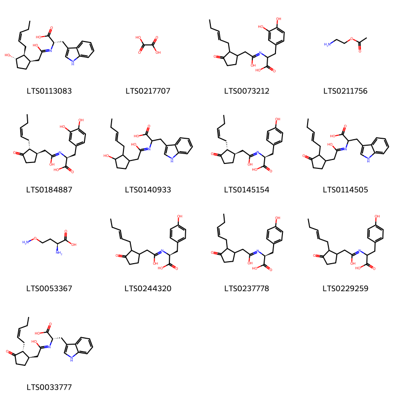{ width=100% }
    <figcaption>Hình ảnh cấu trúc hóa học của 13 hoạt chất thuộc nhóm Carboxylic acids and derivatives gồm ['(2s)-2-({1-hydroxy-2-[(1r,2s,3s)-3-hydroxy-2-[(2z)-pent-2-en-1-yl]cyclopentyl]ethylidene}amino)-3-(1h-indol-3-yl)propanoic acid (LTS0113083)', 'oxalic acid (LTS0217707)', '3-(3,4-dihydroxyphenyl)-2-({1-hydroxy-2-[3-oxo-2-(pent-2-en-1-yl)cyclopentyl]ethylidene}amino)propanoic acid (LTS0073212)', 'ethanolamine acetate (LTS0211756)', '(2s)-3-(3,4-dihydroxyphenyl)-2-({1-hydroxy-2-[(1r,2r)-3-oxo-2-[(2z)-pent-2-en-1-yl]cyclopentyl]ethylidene}amino)propanoic acid (LTS0184887)', '2-({1-hydroxy-2-[3-hydroxy-2-(pent-2-en-1-yl)cyclopentyl]ethylidene}amino)-3-(1h-indol-3-yl)propanoic acid (LTS0140933)', '(2s)-2-({1-hydroxy-2-[(1r,2r)-3-oxo-2-[(2z)-pent-2-en-1-yl]cyclopentyl]ethylidene}amino)-3-(4-hydroxyphenyl)propanoic acid (LTS0145154)', '2-({1-hydroxy-2-[3-oxo-2-(pent-2-en-1-yl)cyclopentyl]ethylidene}amino)-3-(1h-indol-3-yl)propanoic acid (LTS0114505)', 'canaline (LTS0053367)', '(2s)-2-({1-hydroxy-2-[3-oxo-2-(pent-2-en-1-yl)cyclopentyl]ethylidene}amino)-3-(4-hydroxyphenyl)propanoic acid (LTS0244320)', '(2s)-2-[(1-hydroxy-2-{3-oxo-2-[(2z)-pent-2-en-1-yl]cyclopentyl}ethylidene)amino]-3-(4-hydroxyphenyl)propanoic acid (LTS0237778)', '2-({1-hydroxy-2-[3-oxo-2-(pent-2-en-1-yl)cyclopentyl]ethylidene}amino)-3-(4-hydroxyphenyl)propanoic acid (LTS0229259)', '(2s)-2-({1-hydroxy-2-[(1r,2r)-3-oxo-2-[(2z)-pent-2-en-1-yl]cyclopentyl]ethylidene}amino)-3-(1h-indol-3-yl)propanoic acid (LTS0033777)'].</figcaption>
</figure>
#### Nhóm Cinnamic acids and derivatives
<figure markdown="span">
    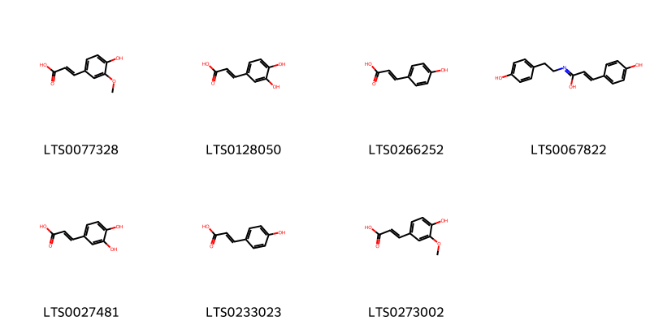{ width=100% }
    <figcaption>Hình ảnh cấu trúc hóa học của 7 hoạt chất thuộc nhóm Cinnamic acids and derivatives gồm ['ferulic acid (LTS0077328)', '3,4-dihydroxycinnamic acid (LTS0128050)', 'para-coumaric acid (LTS0266252)', '(2e)-3-(4-hydroxyphenyl)-n-[2-(4-hydroxyphenyl)ethyl]prop-2-enimidic acid (LTS0067822)', 'caffeic acid (LTS0027481)', 'hydroxycinnamic acid (LTS0233023)', 'ferulic acid (LTS0273002)'].</figcaption>
</figure>
#### Nhóm Dibenzylbutane lignans
<figure markdown="span">
    { width=100% }
    <figcaption>Hình ảnh cấu trúc hóa học của 2 hoạt chất thuộc nhóm Dibenzylbutane lignans gồm ['(2s,3r)-2,3-bis[(4-hydroxy-3-methoxyphenyl)(¹³c)methyl](1-¹³c)butane-1,4-diol (LTS0268699)', 'secoisolariciresinol (LTS0086727)'].</figcaption>
</figure>
#### Nhóm Fatty Acyls
<figure markdown="span">
    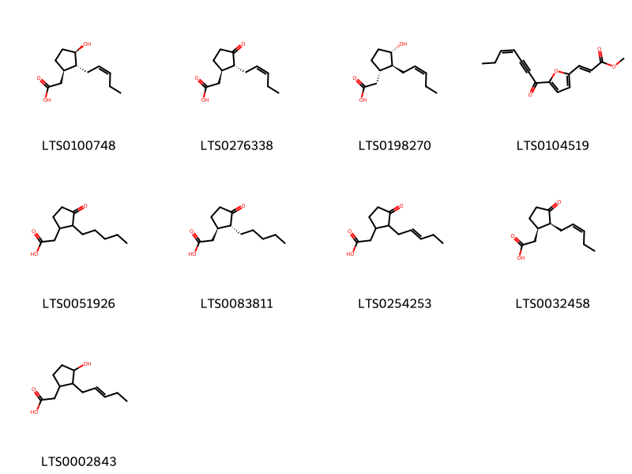{ width=100% }
    <figcaption>Hình ảnh cấu trúc hóa học của 9 hoạt chất thuộc nhóm Fatty Acyls gồm ['[(1r,2r,3r)-3-hydroxy-2-[(2z)-pent-2-en-1-yl]cyclopentyl]acetic acid (LTS0100748)', 'jasmonic acid (LTS0276338)', '[(1s,2s,3s)-3-hydroxy-2-[(2z)-pent-2-en-1-yl]cyclopentyl]acetic acid (LTS0198270)', 'wyerone (LTS0104519)', '(3-oxo-2-pentylcyclopentyl)acetic acid (LTS0051926)', '(-)-dihydrojasmonic acid (LTS0083811)', '[3-oxo-2-(pent-2-en-1-yl)cyclopentyl]acetic acid (LTS0254253)', '(+)-7-iso-jasmonic acid (LTS0032458)', '[3-hydroxy-2-(pent-2-en-1-yl)cyclopentyl]acetic acid (LTS0002843)'].</figcaption>
</figure>
#### Nhóm Flavonoids
<figure markdown="span">
    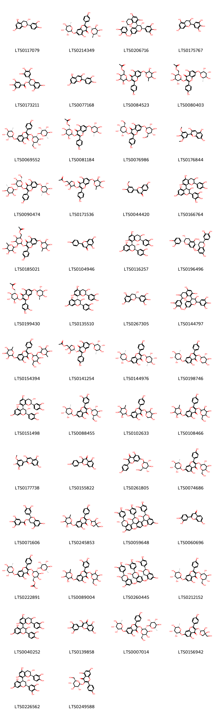{ width=100% }
    <figcaption>Hình ảnh cấu trúc hóa học của 68 hoạt chất thuộc nhóm Flavonoids gồm ['(+)-catechol (LTS0117079)', '5-hydroxy-2-(4-hydroxyphenyl)-3-{[(2r,3s,4s,5s,6r)-3,4,5-trihydroxy-6-methyloxan-2-yl]oxy}-7-{[(2s,3r,4r,5r,6s)-3,4,5-trihydroxy-6-methyloxan-2-yl]oxy}chromen-4-one (LTS0214349)', '(2r,3s,4s)-4-[(2r,3r)-3,5,7-trihydroxy-2-(3,4,5-trihydroxyphenyl)-3,4-dihydro-2h-1-benzopyran-8-yl]-2-(3,4,5-trihydroxyphenyl)-3,4-dihydro-2h-1-benzopyran-3,5,7-triol (LTS0206716)', 'epigallocatechin (LTS0175767)', '(-)-epigallocatechin gallate (LTS0173211)', 'cyanidin (LTS0077168)', '(3,4,5-trihydroxy-6-{[5-hydroxy-2-(4-hydroxyphenyl)-4-oxo-7-[(3,4,5-trihydroxy-6-methyloxan-2-yl)oxy]chromen-3-yl]oxy}oxan-2-yl)methyl acetate (LTS0084523)', '[(2r,3r,4s,5r,6s)-3,4,5-trihydroxy-6-{[5-hydroxy-2-(4-hydroxyphenyl)-4-oxo-7-{[(2s,3r,4r,5r,6s)-3,4,5-trihydroxy-6-methyloxan-2-yl]oxy}chromen-3-yl]oxy}oxan-2-yl]methyl acetate (LTS0080403)', '3-{[(2s,3r,4s,5s,6r)-4,5-dihydroxy-6-(hydroxymethyl)-3-{[(2s,3r,4r,5r,6s)-3,4,5-trihydroxy-6-methyloxan-2-yl]oxy}oxan-2-yl]oxy}-5-hydroxy-2-(4-hydroxyphenyl)-7-{[(2s,3r,4r,5r,6s)-3,4,5-trihydroxy-6-methyloxan-2-yl]oxy}chromen-4-one (LTS0069552)', '[(2s,3r,4s,5s,6s)-3,4,5-trihydroxy-6-{[5-hydroxy-2-(4-hydroxyphenyl)-4-oxo-7-{[(2s,3r,4s,5r,6s)-3,4,5-trihydroxy-6-methyloxan-2-yl]oxy}chromen-3-yl]oxy}oxan-2-yl]methyl acetate (LTS0081184)', 'kaempferol 3,7-diglucoside (LTS0076986)', 'malvidin (LTS0176844)', '3-{[(2s,3r,4s,5r,6s)-4,5-dihydroxy-6-(hydroxymethyl)-3-{[(2s,3s,4s,5r,6s)-3,4,5-trihydroxy-6-methyloxan-2-yl]oxy}oxan-2-yl]oxy}-5-hydroxy-2-(4-hydroxyphenyl)-7-{[(2s,3r,4s,5r,6s)-3,4,5-trihydroxy-6-methyloxan-2-yl]oxy}chromen-4-one (LTS0090474)', '(3,4-dihydroxy-5-{[5-hydroxy-2-(4-hydroxyphenyl)-4-oxo-7-[(3,4,5-trihydroxy-6-methyloxan-2-yl)oxy]chromen-3-yl]oxy}oxolan-3-yl)methyl acetate (LTS0171536)', 'geraldone (LTS0044420)', '4-[2-(3,4-dihydroxyphenyl)-3,5,7-trihydroxy-3,4-dihydro-2h-1-benzopyran-8-yl]-2-(3,4,5-trihydroxyphenyl)-3,4-dihydro-2h-1-benzopyran-3,5,7-triol (LTS0166764)', '(3,4-dihydroxy-6-{[5-hydroxy-2-(4-hydroxyphenyl)-4-oxo-7-[(3,4,5-trihydroxy-6-methyloxan-2-yl)oxy]chromen-3-yl]oxy}-5-[(3,4,5-trihydroxy-6-methyloxan-2-yl)oxy]oxan-2-yl)methyl acetate (LTS0185021)', 'chamomile (LTS0104946)', '(2r,3s,4s)-2-(3,4-dihydroxyphenyl)-4-[(2r,3r)-2-(3,4-dihydroxyphenyl)-3,5,7-trihydroxy-3,4-dihydro-2h-1-benzopyran-8-yl]-3,4-dihydro-2h-1-benzopyran-3,5,7-triol (LTS0116257)', '(2r,3s,4s)-2-(3,4-dihydroxyphenyl)-4-[(2r,3r)-2-(3,4-dihydroxyphenyl)-3,5,7-trihydroxy-3,4-dihydro-2h-1-benzopyran-6-yl]-3,4-dihydro-2h-1-benzopyran-3,5,7-triol (LTS0196496)', '[(2s,3r,4r,5s,6s)-6-{[2-(3,4-dihydroxyphenyl)-5-hydroxy-4-oxo-7-{[(2s,3r,4s,5r,6r)-3,4,5-trihydroxy-6-methyloxan-2-yl]oxy}chromen-3-yl]oxy}-3,4,5-trihydroxyoxan-2-yl]methyl acetate (LTS0199430)', '(2r,3r,4r)-2-(3,4-dihydroxyphenyl)-4-[(2r,3r)-2-(3,4-dihydroxyphenyl)-3,5,7-trihydroxy-3,4-dihydro-2h-1-benzopyran-8-yl]-3,4-dihydro-2h-1-benzopyran-3,5,7-triol (LTS0135510)', 'gallocatechol (LTS0267305)', '4-[3,5,7-trihydroxy-2-(3,4,5-trihydroxyphenyl)-3,4-dihydro-2h-1-benzopyran-8-yl]-2-(3,4,5-trihydroxyphenyl)-3,4-dihydro-2h-1-benzopyran-3,5,7-triol (LTS0144797)', '3-{[4,5-dihydroxy-6-(hydroxymethyl)-3-[(3,4,5-trihydroxy-6-methyloxan-2-yl)oxy]oxan-2-yl]oxy}-5-hydroxy-2-(4-hydroxyphenyl)-7-[(3,4,5-trihydroxy-6-methyloxan-2-yl)oxy]chromen-4-one (LTS0154394)', '[(3r,4s,5r)-3,4-dihydroxy-5-{[5-hydroxy-2-(4-hydroxyphenyl)-4-oxo-7-{[(2s,3r,4r,5r,6s)-3,4,5-trihydroxy-6-methyloxan-2-yl]oxy}chromen-3-yl]oxy}oxolan-3-yl]methyl acetate (LTS0141254)', 'lespedin (LTS0144976)', '5-hydroxy-2-(4-hydroxyphenyl)-7-{[(2s,3r,4r,5r,6s)-3,4,5-trihydroxy-6-methyloxan-2-yl]oxy}-3-{[(2s,3r,4s,5s)-3,4,5-trihydroxyoxan-2-yl]oxy}chromen-4-one (LTS0198746)', '(2r,3s,4s)-2-(3,4-dihydroxyphenyl)-4-[(2r,3s)-2-(3,4-dihydroxyphenyl)-3,5,7-trihydroxy-3,4-dihydro-2h-1-benzopyran-8-yl]-3,4-dihydro-2h-1-benzopyran-3,5,7-triol (LTS0151498)', '2-(3,4-dihydroxyphenyl)-5-hydroxy-3-{[(2s,3r,4s,5r,6r)-3,4,5-trihydroxy-6-(hydroxymethyl)oxan-2-yl]oxy}-7-{[(2s,3r,4r,5r,6s)-3,4,5-trihydroxy-6-methyloxan-2-yl]oxy}chromen-4-one (LTS0088455)', '5-hydroxy-2-(4-hydroxyphenyl)-7-[(3,4,5-trihydroxy-6-methyloxan-2-yl)oxy]-3-[(3,4,5-trihydroxyoxan-2-yl)oxy]chromen-4-one (LTS0102633)', '5-hydroxy-2-(4-hydroxyphenyl)-3-{[3,4,5-trihydroxy-6-(hydroxymethyl)oxan-2-yl]oxy}-7-[(3,4,5-trihydroxy-6-methyloxan-2-yl)oxy]chromen-4-one (LTS0108466)', '3,5,7-trihydroxy-2-(3-hydroxy-5-methoxy-4-oxidophenyl)-1λ⁴-chromen-1-ylium (LTS0177738)', 'kaempherol (LTS0155822)', '3,5-dihydroxy-2-(4-hydroxyphenyl)-7-{[(3r,4s,5s,6r)-3,4,5-trihydroxy-6-(hydroxymethyl)oxan-2-yl]oxy}chromen-4-one (LTS0261805)', '5-hydroxy-2-(4-hydroxyphenyl)-3-{[(2s,3r,4s,5r,6r)-3,4,5-trihydroxy-6-(hydroxymethyl)oxan-2-yl]oxy}-7-{[(2s,3r,4r,5r,6s)-3,4,5-trihydroxy-6-methyloxan-2-yl]oxy}chromen-4-one (LTS0074686)', 'epicatechin gallate (LTS0071606)', '3-{[3,4-dihydroxy-4-(hydroxymethyl)oxolan-2-yl]oxy}-5-hydroxy-2-(4-hydroxyphenyl)-7-[(3,4,5-trihydroxy-6-methyloxan-2-yl)oxy]chromen-4-one (LTS0245853)', '(2r,3r)-2-(3,4-dihydroxyphenyl)-8-[(2r,3r)-2-(3,4-dihydroxyphenyl)-3,5,7-trihydroxy-3,4-dihydro-2h-1-benzopyran-4-yl]-4-[(2r,3s)-2-(3,4-dihydroxyphenyl)-3,5,7-trihydroxy-3,4-dihydro-2h-1-benzopyran-8-yl]-3,4-dihydro-2h-1-benzopyran-3,5,7-triol (LTS0059648)', "7,3',4'-trihydroxyflavone (LTS0060696)", '[(2r,3r,4s,5r,6s)-3,4-dihydroxy-6-{[5-hydroxy-2-(4-hydroxyphenyl)-4-oxo-7-{[(2s,3r,4r,5r,6s)-3,4,5-trihydroxy-6-methyloxan-2-yl]oxy}chromen-3-yl]oxy}-5-{[(2s,3r,4r,5r,6s)-3,4,5-trihydroxy-6-methyloxan-2-yl]oxy}oxan-2-yl]methyl hydrogen carbonate (LTS0222891)', '2-(3,4-dihydroxyphenyl)-5-hydroxy-3-{[3,4,5-trihydroxy-6-(hydroxymethyl)oxan-2-yl]oxy}-7-[(3,4,5-trihydroxy-6-methyloxan-2-yl)oxy]chromen-4-one (LTS0089004)', 'procyanidin c1 (LTS0260445)', '5-hydroxy-2-(4-hydroxyphenyl)-3-{[(2s,3r,4s,5s,6r)-3,4,5-trihydroxy-6-(hydroxymethyl)oxan-2-yl]oxy}-7-{[(2s,3r,4r,5r,6s)-3,4,5-trihydroxy-6-methyloxan-2-yl]oxy}chromen-4-one (LTS0212152)', '2-(3,4-dihydroxyphenyl)-4-[2-(3,4-dihydroxyphenyl)-3,5,7-trihydroxy-3,4-dihydro-2h-1-benzopyran-8-yl]-3,4-dihydro-2h-1-benzopyran-3,5,7-triol (LTS0040252)', 'myricetin (LTS0139858)', '3-{[(2s,3r,4s,5r,6r)-4,5-dihydroxy-6-(hydroxymethyl)-3-{[(2s,3r,4r,5r,6s)-3,4,5-trihydroxy-6-methyloxan-2-yl]oxy}oxan-2-yl]oxy}-5-hydroxy-2-(4-hydroxyphenyl)-7-{[(2s,3r,4r,5r,6s)-3,4,5-trihydroxy-6-methyloxan-2-yl]oxy}chromen-4-one (LTS0007014)', '3-{[(2r,3s,4s)-3,4-dihydroxy-4-(hydroxymethyl)oxolan-2-yl]oxy}-5-hydroxy-2-(4-hydroxyphenyl)-7-{[(2s,3r,4r,5r,6s)-3,4,5-trihydroxy-6-methyloxan-2-yl]oxy}chromen-4-one (LTS0156942)', '(2r,3s,4s)-4-[(2r,3s)-2-(3,4-dihydroxyphenyl)-3,5,7-trihydroxy-3,4-dihydro-2h-1-benzopyran-8-yl]-2-(3,4,5-trihydroxyphenyl)-3,4-dihydro-2h-1-benzopyran-3,5,7-triol (LTS0226562)', 'astragalin (LTS0249588)', 'petunidin (LTS0237489)', '[(2r,3r,4s,5r,6s)-3,4-dihydroxy-6-{[5-hydroxy-2-(4-hydroxyphenyl)-4-oxo-7-{[(2s,3r,4r,5r,6s)-3,4,5-trihydroxy-6-methyloxan-2-yl]oxy}chromen-3-yl]oxy}-5-{[(2s,3r,4r,5r,6s)-3,4,5-trihydroxy-6-methyloxan-2-yl]oxy}oxan-2-yl]methyl acetate (LTS0206423)', 'epigallocatechin (LTS0052496)', "7,4'-dihydroxyflavone (LTS0260159)", '2-(3,5-dimethoxy-4-oxidophenyl)-3,5,7-trihydroxy-1λ⁴-chromen-1-ylium (LTS0036473)', 'kaempferitrin (LTS0270373)', '(2r,3r,4r)-2-(3,4-dihydroxyphenyl)-4-[(2r,3s)-2-(3,4-dihydroxyphenyl)-3,5,7-trihydroxy-3,4-dihydro-2h-1-benzopyran-8-yl]-3,4-dihydro-2h-1-benzopyran-3,5,7-triol (LTS0066122)', '[(2r,3r,4s,5s,6s)-3,4-dihydroxy-6-{[5-hydroxy-2-(4-hydroxyphenyl)-4-oxo-7-{[(2s,3r,4s,5r,6r)-3,4,5-trihydroxy-6-methyloxan-2-yl]oxy}chromen-3-yl]oxy}-5-{[(2s,3s,4s,5r,6s)-3,4,5-trihydroxy-6-methyloxan-2-yl]oxy}oxan-2-yl]methyl acetate (LTS0133393)', 'quercetin (LTS0004651)', '(2r,3s,4s)-4-[(2r,3r)-2-(3,4-dihydroxyphenyl)-3,5,7-trihydroxy-3,4-dihydro-2h-1-benzopyran-8-yl]-2-(3,4,5-trihydroxyphenyl)-3,4-dihydro-2h-1-benzopyran-3,5,7-triol (LTS0003647)', 'luteolin (LTS0017052)', '(6-{[2-(3,4-dihydroxyphenyl)-5-hydroxy-4-oxo-7-[(3,4,5-trihydroxy-6-methyloxan-2-yl)oxy]chromen-3-yl]oxy}-3,4,5-trihydroxyoxan-2-yl)methyl acetate (LTS0073810)', 'catechol (LTS0090912)', '2-(3,5-dihydroxy-4-oxidophenyl)-3,5,7-trihydroxy-1λ⁴-chromen-1-ylium (LTS0276138)', '(2r,3s,4r)-2-(3,4-dihydroxyphenyl)-4-[(2r,3r)-2-(3,4-dihydroxyphenyl)-3,5,7-trihydroxy-3,4-dihydro-2h-1-benzopyran-6-yl]-3,4-dihydro-2h-1-benzopyran-3,5,7-triol (LTS0076760)', '[(2r,3r,4s,5r,6s)-6-{[2-(3,4-dihydroxyphenyl)-5-hydroxy-4-oxo-7-{[(2s,3r,4r,5r,6s)-3,4,5-trihydroxy-6-methyloxan-2-yl]oxy}chromen-3-yl]oxy}-3,4,5-trihydroxyoxan-2-yl]methyl acetate (LTS0039016)', 'delphinidin (LTS0036798)', 'ent-epicatechin (LTS0265245)'].</figcaption>
</figure>
#### Nhóm Furanoid lignans
<figure markdown="span">
    { width=100% }
    <figcaption>Hình ảnh cấu trúc hóa học của 1 hoạt chất thuộc nhóm Furanoid lignans gồm ['matairesinol (LTS0193475)'].</figcaption>
</figure>
#### Nhóm Indoles and derivatives
<figure markdown="span">
    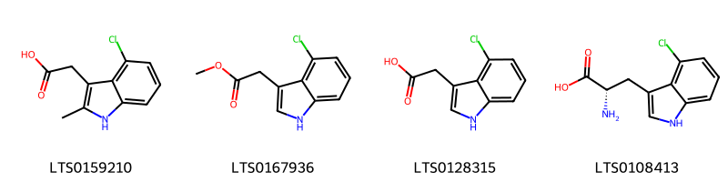{ width=100% }
    <figcaption>Hình ảnh cấu trúc hóa học của 4 hoạt chất thuộc nhóm Indoles and derivatives gồm ['(4-chloro-2-methyl-1h-indol-3-yl)acetic acid (LTS0159210)', 'methyl 2-(4-chloro-1h-indol-3-yl)acetate (LTS0167936)', '4-chloroindole-3-acetic acid (LTS0128315)', '(2s)-2-amino-3-(4-chloro-1h-indol-3-yl)propanoic acid (LTS0108413)'].</figcaption>
</figure>
#### Nhóm Linear 1_3-diarylpropanoids
<figure markdown="span">
    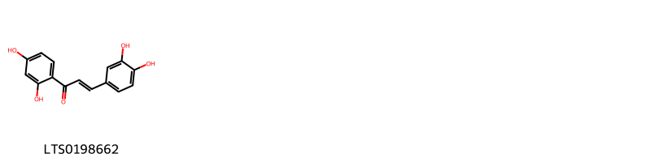{ width=100% }
    <figcaption>Hình ảnh cấu trúc hóa học của Không tìm thấy chú thích hoạt chất thuộc nhóm Linear 1_3-diarylpropanoids gồm Không tìm thấy chú thích.</figcaption>
</figure>
#### Nhóm Organooxygen compounds
<figure markdown="span">
    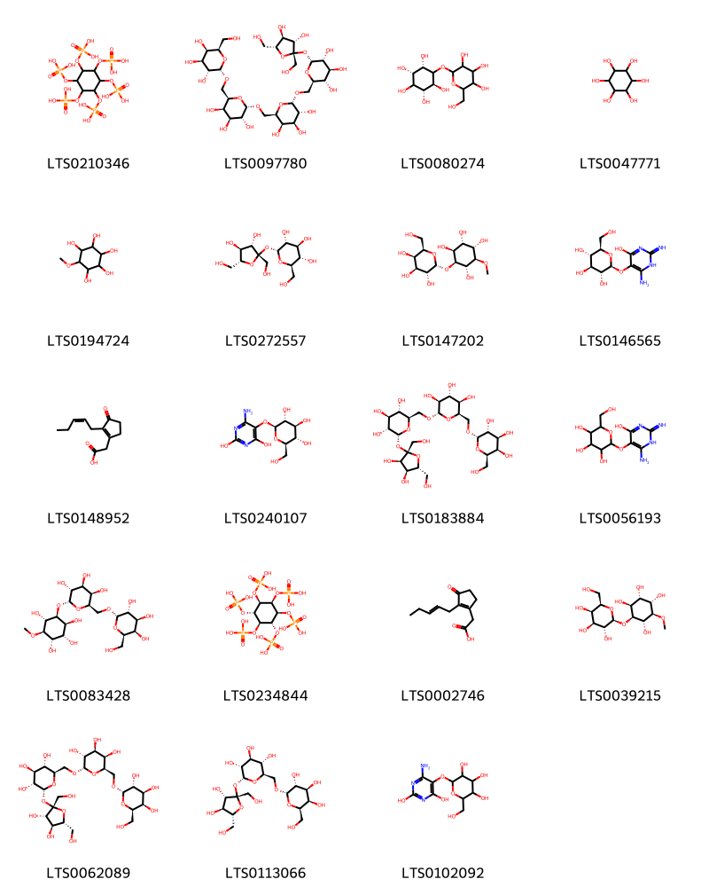{ width=100% }
    <figcaption>Hình ảnh cấu trúc hóa học của 19 hoạt chất thuộc nhóm Organooxygen compounds gồm ['phytic acid (LTS0210346)', 'verbascose (LTS0097780)', '(1s,2r,4s,5s)-6-{[3,4,5-trihydroxy-6-(hydroxymethyl)oxan-2-yl]oxy}cyclohexane-1,2,3,4,5-pentol (LTS0080274)', '(-)-inositol (LTS0047771)', 'pinitol (LTS0194724)', 'sucrose (LTS0272557)', '(1s,2r,3s,4r,5s,6s)-4-methoxy-6-{[(2r,3r,4s,5r,6r)-3,4,5-trihydroxy-6-(hydroxymethyl)oxan-2-yl]oxy}cyclohexane-1,2,3,5-tetrol (LTS0147202)', 'vicine (van) (8ci) (LTS0146565)', '{3-oxo-2-[(2z)-pent-2-en-1-yl]cyclopent-1-en-1-yl}acetic acid (LTS0148952)', 'convicine (LTS0240107)', '(2r,3r,4s,5s,6r)-2-{[(2s,3r,4s,5r)-3,4-dihydroxy-2,5-bis(hydroxymethyl)oxolan-2-yl]oxy}-6-({[(2s,3s,4r,5r,6r)-3,4,5-trihydroxy-6-({[(2s,3r,4s,5r,6r)-3,4,5-trihydroxy-6-(hydroxymethyl)oxan-2-yl]oxy}methyl)oxan-2-yl]oxy}methyl)oxane-3,4,5-triol (LTS0183884)', '2-[(4-amino-6-hydroxy-2-imino-3h-pyrimidin-5-yl)oxy]-6-(hydroxymethyl)oxane-3,4,5-triol (LTS0056193)', '(1s,2r,3s,4r,5s,6s)-4-methoxy-6-{[(2r,3r,4s,5r,6r)-3,4,5-trihydroxy-6-({[(2s,3r,4s,5r,6r)-3,4,5-trihydroxy-6-(hydroxymethyl)oxan-2-yl]oxy}methyl)oxan-2-yl]oxy}cyclohexane-1,2,3,5-tetrol (LTS0083428)', '[(1r,2r,3s,4r,5s,6s)-2,3,4,5,6-pentakis(phosphonooxy)cyclohexyl]oxyphosphonic acid (LTS0234844)', '[3-oxo-2-(pent-2-en-1-yl)cyclopent-1-en-1-yl]acetic acid (LTS0002746)', '(1s,2r,3s,4r,5s,6s)-4-methoxy-6-{[(2s,3r,4s,5r,6r)-3,4,5-trihydroxy-6-(hydroxymethyl)oxan-2-yl]oxy}cyclohexane-1,2,3,5-tetrol (LTS0039215)', 'stachyose (LTS0062089)', 'raffinose (LTS0113066)', '2-[(4-amino-2,6-dihydroxypyrimidin-5-yl)oxy]-6-(hydroxymethyl)oxane-3,4,5-triol (LTS0102092)'].</figcaption>
</figure>
#### Nhóm Phenols
<figure markdown="span">
    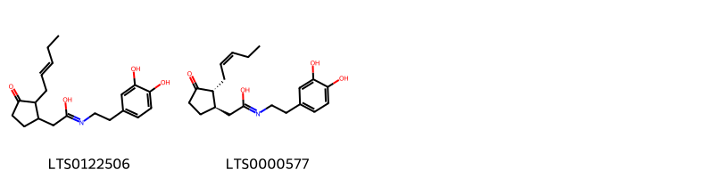{ width=100% }
    <figcaption>Hình ảnh cấu trúc hóa học của 2 hoạt chất thuộc nhóm Phenols gồm ['n-[2-(3,4-dihydroxyphenyl)ethyl]-2-[3-oxo-2-(pent-2-en-1-yl)cyclopentyl]ethanimidic acid (LTS0122506)', 'n-[2-(3,4-dihydroxyphenyl)ethyl]-2-[(1r,2r)-3-oxo-2-[(2z)-pent-2-en-1-yl]cyclopentyl]ethanimidic acid (LTS0000577)'].</figcaption>
</figure>
#### Nhóm Prenol lipids
<figure markdown="span">
    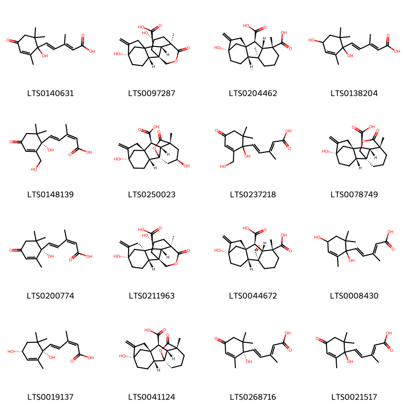{ width=100% }
    <figcaption>Hình ảnh cấu trúc hóa học của 16 hoạt chất thuộc nhóm Prenol lipids gồm ['abscisic acid,  (LTS0140631)', '(1r,2r,5s,9s,10s,11r,16s)-5,16-dihydroxy-11-methyl-6-methylidene-12-oxo-13-oxapentacyclo[9.3.3.1⁵,⁸.0¹,¹⁰.0²,⁸]octadecane-9-carboxylic acid (LTS0097287)', 'gibberellin a53 (LTS0204462)', '(2e,4e)-5-(1,4-dihydroxy-2,6,6-trimethylcyclohex-2-en-1-yl)-3-methylpenta-2,4-dienoic acid (LTS0138204)', '(2z,4e)-5-[(1s)-1-hydroxy-2-(hydroxymethyl)-6,6-dimethyl-4-oxocyclohex-2-en-1-yl]-3-methylpenta-2,4-dienoic acid (LTS0148139)', 'gibberellin a29 (LTS0250023)', '5-[1-hydroxy-2-(hydroxymethyl)-6,6-dimethyl-4-oxocyclohex-2-en-1-yl]-3-methylpenta-2,4-dienoic acid (LTS0237218)', 'gibberellin a44 (LTS0078749)', 'abscisic acid (LTS0200774)', '(1r,2r,5s,8r,9s,10s,11r,16s)-5,16-dihydroxy-11-methyl-6-methylidene-12-oxo-13-oxapentacyclo[9.3.3.1⁵,⁸.0¹,¹⁰.0²,⁸]octadecane-9-carboxylic acid (LTS0211963)', 'gibberellin a19 (LTS0044672)', '5-(1,4-dihydroxy-2,6,6-trimethylcyclohex-2-en-1-yl)-3-methylpenta-2,4-dienoic acid (LTS0008430)', '(2z,4e)-5-[(1s,4r)-1,4-dihydroxy-2,6,6-trimethylcyclohex-2-en-1-yl]-3-methylpenta-2,4-dienoic acid (LTS0019137)', 'gibberellin a20 (LTS0041124)', '(4e)-5-[(1s)-1-hydroxy-2,6,6-trimethyl-4-oxocyclohex-2-en-1-yl]-3-methylpenta-2,4-dienoic acid (LTS0268716)', '5-(1-hydroxy-2,6,6-trimethyl-4-oxocyclohex-2-en-1-yl)-3-methylpenta-2,4-dienoic acid (LTS0021517)'].</figcaption>
</figure>
#### Nhóm Steroids and steroid derivatives
<figure markdown="span">
    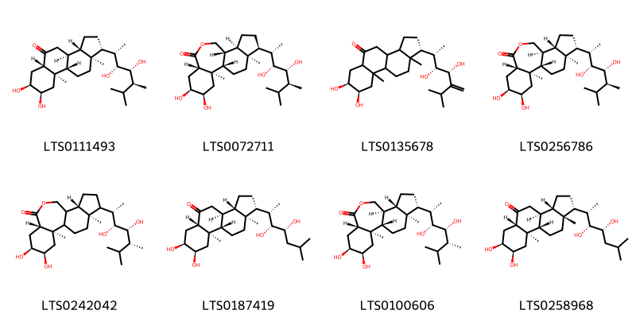{ width=100% }
    <figcaption>Hình ảnh cấu trúc hóa học của 8 hoạt chất thuộc nhóm Steroids and steroid derivatives gồm ['castasterone (LTS0111493)', '(1s,2r,4r,5s,7s,11r,12r,15s,16s)-15-[(2s,3r,4r,5s)-3,4-dihydroxy-5,6-dimethylheptan-2-yl]-4,5-dihydroxy-2,16-dimethyl-9-oxatetracyclo[9.7.0.0²,⁷.0¹²,¹⁶]octadecan-8-one (LTS0072711)', '(1r,7s,8r)-1-[(2s,3r,4r)-3,4-dihydroxy-6-methyl-5-methylideneheptan-2-yl]-7,8-dihydroxy-9a,11a-dimethyl-tetradecahydrocyclopenta[a]phenanthren-5-one (LTS0135678)', 'brassinolide (LTS0256786)', '(2r,4r,5s,7s,12s,16s)-15-[(2s,3r,4r,5r)-3,4-dihydroxy-5,6-dimethylheptan-2-yl]-4,5-dihydroxy-2,16-dimethyl-9-oxatetracyclo[9.7.0.0²,⁷.0¹²,¹⁶]octadecan-8-one (LTS0242042)', '(1r,3as,3bs,5as,7s,8r,9ar,9bs,11as)-1-[(2s,3r,4r)-3,4-dihydroxy-6-methylheptan-2-yl]-7,8-dihydroxy-9a,11a-dimethyl-tetradecahydrocyclopenta[a]phenanthren-5-one (LTS0187419)', '24-epibrassinolide (LTS0100606)', '(1r,3as,3bs,5as,7s,8r,9ar,9bs,11ar)-1-[(2s,3r,4r)-3,4-dihydroxy-6-methylheptan-2-yl]-7,8-dihydroxy-9a,11a-dimethyl-tetradecahydrocyclopenta[a]phenanthren-5-one (LTS0258968)'].</figcaption>
</figure>

---

### Dược dân tộc học

Danh sách các quốc gia có sử dụng *Vicia faba* trong điều trị các bệnh. 

| Country   | Disease                                      | Bệnh                                                                                                                                                                                                |
|:----------|:---------------------------------------------|:----------------------------------------------------------------------------------------------------------------------------------------------------------------------------------------------------|
| Elsewhere | Aphrodisiac, Stomachic, Diuretic, Estrogenic | MYMEMORY WARNING: YOU USED ALL AVAILABLE FREE TRANSLATIONS FOR TODAY. NEXT AVAILABLE IN  17 HOURS 43 MINUTES 31 SECONDS VISIT HTTPS://MYMEMORY.TRANSLATED.NET/DOC/USAGELIMITS.PHP TO TRANSLATE MORE |
| Turkey    | Diuretic, Expectorant, Tonic                 | MYMEMORY WARNING: YOU USED ALL AVAILABLE FREE TRANSLATIONS FOR TODAY. NEXT AVAILABLE IN  17 HOURS 43 MINUTES 29 SECONDS VISIT HTTPS://MYMEMORY.TRANSLATED.NET/DOC/USAGELIMITS.PHP TO TRANSLATE MORE |
| US        | Poison                                       | MYMEMORY WARNING: YOU USED ALL AVAILABLE FREE TRANSLATIONS FOR TODAY. NEXT AVAILABLE IN  17 HOURS 43 MINUTES 27 SECONDS VISIT HTTPS://MYMEMORY.TRANSLATED.NET/DOC/USAGELIMITS.PHP TO TRANSLATE MORE |
| ain       | Diuretic                                     | MYMEMORY WARNING: YOU USED ALL AVAILABLE FREE TRANSLATIONS FOR TODAY. NEXT AVAILABLE IN  17 HOURS 43 MINUTES 24 SECONDS VISIT HTTPS://MYMEMORY.TRANSLATED.NET/DOC/USAGELIMITS.PHP TO TRANSLATE MORE |

---

---
## Vicia gigantea
### Thông tin về thực vật

!!! info "Phân loại thực vật của *N/A* từ GIBF:"
    - **Kingdom:** Plantae
    - **Phylum:** Tracheophyta
    - **Order:** Fabales
    - **Family:** Fabaceae
    - **Genus:** Vicia
    - **Species:** *N/A*

 

| Label (VI)   | Label (EN)   | Scientific Name   | Descriptions (VI)   | Descriptions (EN)   | Also Known As (VI)   | Also Known As (EN)   |
|:-------------|:-------------|:------------------|:--------------------|:--------------------|:---------------------|:---------------------|
| N/A          | N/A          | Vicia gigantea    | loài thực vật       | species of plant    | ['']                 | ['']                 |

#### Phân bố trên thế giới

**Từ CSDL GIBF** Italy, Australia, Japan, Belgium, Argentina, Norway, Israel, Canada, Denmark, Netherlands, Luxembourg, Chinese Taipei, Spain, Portugal, Algeria, Russian Federation, United States of America, Sweden, Greece, South Africa, Germany, Switzerland, Austria, Peru, France, Mexico, China, United Kingdom of Great Britain and Northern Ireland, Ecuador, Ireland, India, Lebanon, New Zealand

#### Phân bố tại Việt Nam

**Từ CSDL GIBF**: Không có ghi nhận ở Việt Nam

---
### Thành phần hóa học
        
- Theo cơ sở dữ liệu lotus: Từ loài *N/A* đã phân lập và xác định được Chưa có hoạt chất nào được phân lập. hoạt chất thuộc về các nhóm Không có hoạt chất nào được phân lập. 

Không có hình ảnh nào được tạo ra

---

### Dược dân tộc học

Danh sách các quốc gia có sử dụng *N/A* trong điều trị các bệnh. 

| Country        | Disease   | Bệnh                                                                                                                                                                                                |
|:---------------|:----------|:----------------------------------------------------------------------------------------------------------------------------------------------------------------------------------------------------|
| Canada(Salish) | Poison    | MYMEMORY WARNING: YOU USED ALL AVAILABLE FREE TRANSLATIONS FOR TODAY. NEXT AVAILABLE IN  17 HOURS 41 MINUTES 51 SECONDS VISIT HTTPS://MYMEMORY.TRANSLATED.NET/DOC/USAGELIMITS.PHP TO TRANSLATE MORE |

---

---
## Vicia sativa
### Thông tin về thực vật

!!! info "Phân loại thực vật của *Vicia sativa* từ GIBF:"
    - **Kingdom:** Plantae
    - **Phylum:** Tracheophyta
    - **Order:** Fabales
    - **Family:** Fabaceae
    - **Genus:** Vicia
    - **Species:** *Vicia sativa*

 

| Label (VI)   | Label (EN)   | Scientific Name   | Descriptions (VI)   | Descriptions (EN)   | Also Known As (VI)   | Also Known As (EN)                        |
|:-------------|:-------------|:------------------|:--------------------|:--------------------|:---------------------|:------------------------------------------|
| N/A          | N/A          | Vicia sativa      | loài thực vật       | species of plant    | ['']                 | ['Vetch', 'common vetch', 'meadow vetch'] |

#### Phân bố trên thế giới

**Từ CSDL GIBF** Italy, Australia, Japan, Belgium, Israel, Canada, Denmark, Netherlands, Cyprus, Chinese Taipei, Spain, Portugal, Algeria, United States of America, South Africa, Germany, Mexico, France, United Kingdom of Great Britain and Northern Ireland, China, New Zealand

#### Phân bố tại Việt Nam

**Từ CSDL GIBF**: Không có ghi nhận ở Việt Nam

---
### Thành phần hóa học
        
- Theo cơ sở dữ liệu lotus: Từ loài *Vicia sativa* đã phân lập và xác định được 53 hoạt chất thuộc về các nhóm Flavonoids, Prenol lipids, Indoles and derivatives, Cinnamic acids and derivatives, Organonitrogen compounds, Organooxygen compounds, Coumarins and derivatives, Carboxylic acids and derivatives. 

|    | chemicalTaxonomyClassyfireClass   |   smiles_count |
|---:|:----------------------------------|---------------:|
|  0 | Carboxylic acids and derivatives  |             10 |
|  1 | Cinnamic acids and derivatives    |              1 |
|  2 | Coumarins and derivatives         |              5 |
|  3 | Flavonoids                        |             19 |
|  4 | Indoles and derivatives           |              2 |
|  5 | Organonitrogen compounds          |              3 |
|  6 | Organooxygen compounds            |              6 |
|  7 | Prenol lipids                     |              1 |

#### Nhóm Carboxylic acids and derivatives
<figure markdown="span">
    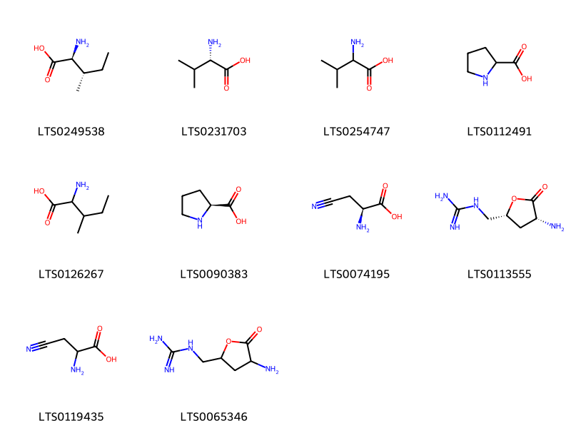{ width=100% }
    <figcaption>Hình ảnh cấu trúc hóa học của 10 hoạt chất thuộc nhóm Carboxylic acids and derivatives gồm ['l-isoleucine (LTS0249538)', 'l-valine (LTS0231703)', 'valin (LTS0254747)', 'proline (LTS0112491)', 'lisoleucine (LTS0126267)', 'l-proline (LTS0090383)', '3-cyanoalanine (LTS0074195)', 'n-{[(2r,4r)-4-amino-5-oxooxolan-2-yl]methyl}guanidine (LTS0113555)', 'cyanoalanine (LTS0119435)', 'n-[(4-amino-5-oxooxolan-2-yl)methyl]guanidine (LTS0065346)'].</figcaption>
</figure>
#### Nhóm Cinnamic acids and derivatives
<figure markdown="span">
    { width=100% }
    <figcaption>Hình ảnh cấu trúc hóa học của 1 hoạt chất thuộc nhóm Cinnamic acids and derivatives gồm ['(2e)-3-(4-hydroxyphenyl)-n-[2-(4-hydroxyphenyl)ethyl]prop-2-enimidic acid (LTS0067822)'].</figcaption>
</figure>
#### Nhóm Coumarins and derivatives
<figure markdown="span">
    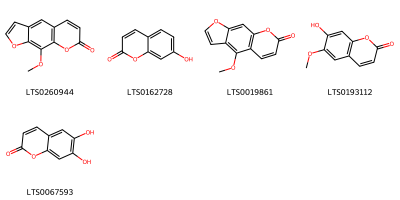{ width=100% }
    <figcaption>Hình ảnh cấu trúc hóa học của 5 hoạt chất thuộc nhóm Coumarins and derivatives gồm ['methoxsalen (LTS0260944)', 'umbelliferone (LTS0162728)', 'bergapten (LTS0019861)', 'scopoletin (LTS0193112)', 'esculetin (LTS0067593)'].</figcaption>
</figure>
#### Nhóm Flavonoids
<figure markdown="span">
    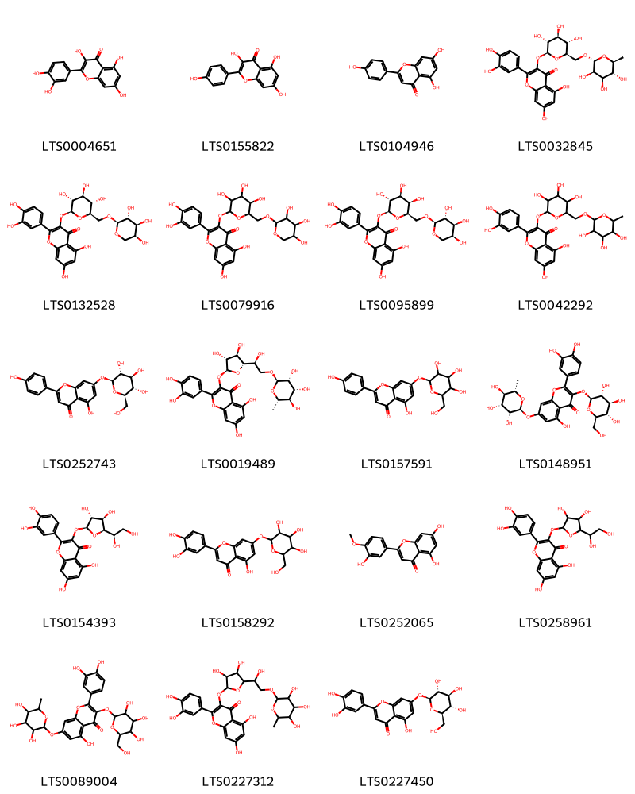{ width=100% }
    <figcaption>Hình ảnh cấu trúc hóa học của 19 hoạt chất thuộc nhóm Flavonoids gồm ['quercetin (LTS0004651)', 'kaempherol (LTS0155822)', 'chamomile (LTS0104946)', '3-rutinosyl quercetin (LTS0032845)', '2-(3,4-dihydroxyphenyl)-5,7-dihydroxy-3-{[(2s,3r,4s,5s,6r)-3,4,5-trihydroxy-6-({[(2s,3r,4s,5s)-3,4,5-trihydroxyoxan-2-yl]oxy}methyl)oxan-2-yl]oxy}chromen-4-one (LTS0132528)', '2-(3,4-dihydroxyphenyl)-5,7-dihydroxy-3-[(3,4,5-trihydroxy-6-{[(3,4,5-trihydroxyoxan-2-yl)oxy]methyl}oxan-2-yl)oxy]chromen-4-one (LTS0079916)', '2-(3,4-dihydroxyphenyl)-5,7-dihydroxy-3-{[(2s,3r,4s,5r,6r)-3,4,5-trihydroxy-6-({[(2s,3r,4s,5s)-3,4,5-trihydroxyoxan-2-yl]oxy}methyl)oxan-2-yl]oxy}chromen-4-one (LTS0095899)', 'rutin (LTS0042292)', 'apigenin 7-o-β-glucoside (LTS0252743)', '3-{[(2s,3r,4r,5s)-3,4-dihydroxy-5-[(1s)-1-hydroxy-2-{[(2r,3r,4r,5r,6s)-3,4,5-trihydroxy-6-methyloxan-2-yl]oxy}ethyl]oxolan-2-yl]oxy}-2-(3,4-dihydroxyphenyl)-5,7-dihydroxychromen-4-one (LTS0019489)', 'apigetrin (LTS0157591)', 'petiolaroside (LTS0148951)', 'quercetin-3-glucoside (LTS0154393)', '2-(3,4-dihydroxyphenyl)-5-hydroxy-7-{[3,4,5-trihydroxy-6-(hydroxymethyl)oxan-2-yl]oxy}chromen-4-one (LTS0158292)', 'diosmetin (LTS0252065)', '3-{[5-(1,2-dihydroxyethyl)-3,4-dihydroxyoxolan-2-yl]oxy}-2-(3,4-dihydroxyphenyl)-5,7-dihydroxychromen-4-one (LTS0258961)', '2-(3,4-dihydroxyphenyl)-5-hydroxy-3-{[3,4,5-trihydroxy-6-(hydroxymethyl)oxan-2-yl]oxy}-7-[(3,4,5-trihydroxy-6-methyloxan-2-yl)oxy]chromen-4-one (LTS0089004)', '3-[(3,4-dihydroxy-5-{1-hydroxy-2-[(3,4,5-trihydroxy-6-methyloxan-2-yl)oxy]ethyl}oxolan-2-yl)oxy]-2-(3,4-dihydroxyphenyl)-5,7-dihydroxychromen-4-one (LTS0227312)', 'luteolin 7-o-glucoside (LTS0227450)'].</figcaption>
</figure>
#### Nhóm Indoles and derivatives
<figure markdown="span">
    { width=100% }
    <figcaption>Hình ảnh cấu trúc hóa học của 2 hoạt chất thuộc nhóm Indoles and derivatives gồm ['l-tryptophan (LTS0263809)', 'optimax (LTS0014343)'].</figcaption>
</figure>
#### Nhóm Organonitrogen compounds
<figure markdown="span">
    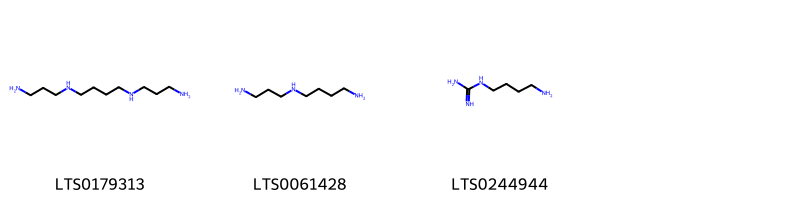{ width=100% }
    <figcaption>Hình ảnh cấu trúc hóa học của 3 hoạt chất thuộc nhóm Organonitrogen compounds gồm ['spermine (LTS0179313)', 'spermidine (LTS0061428)', 'agmatine (LTS0244944)'].</figcaption>
</figure>
#### Nhóm Organooxygen compounds
<figure markdown="span">
    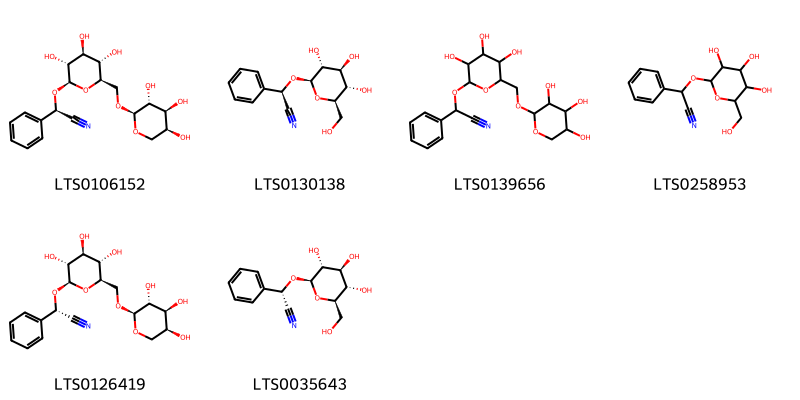{ width=100% }
    <figcaption>Hình ảnh cấu trúc hóa học của 6 hoạt chất thuộc nhóm Organooxygen compounds gồm ['vicianin (LTS0106152)', 'prunasin (LTS0130138)', '2-phenyl-2-[(3,4,5-trihydroxy-6-{[(3,4,5-trihydroxyoxan-2-yl)oxy]methyl}oxan-2-yl)oxy]acetonitrile (LTS0139656)', '2-phenyl-2-{[3,4,5-trihydroxy-6-(hydroxymethyl)oxan-2-yl]oxy}acetonitrile (LTS0258953)', '(2s)-2-phenyl-2-{[(2r,3r,4s,5s,6r)-3,4,5-trihydroxy-6-({[(2s,3r,4s,5s)-3,4,5-trihydroxyoxan-2-yl]oxy}methyl)oxan-2-yl]oxy}acetonitrile (LTS0126419)', '(s)-prunasin (LTS0035643)'].</figcaption>
</figure>
#### Nhóm Prenol lipids
<figure markdown="span">
    { width=100% }
    <figcaption>Hình ảnh cấu trúc hóa học của 1 hoạt chất thuộc nhóm Prenol lipids gồm ['zeaxanthin (LTS0192928)'].</figcaption>
</figure>

---

### Dược dân tộc học

Danh sách các quốc gia có sử dụng *Vicia sativa* trong điều trị các bệnh. 

| Country   | Disease    | Bệnh                                                                                                                                                                                                |
|:----------|:-----------|:----------------------------------------------------------------------------------------------------------------------------------------------------------------------------------------------------|
| Elsewhere | Astringent | MYMEMORY WARNING: YOU USED ALL AVAILABLE FREE TRANSLATIONS FOR TODAY. NEXT AVAILABLE IN  17 HOURS 41 MINUTES 14 SECONDS VISIT HTTPS://MYMEMORY.TRANSLATED.NET/DOC/USAGELIMITS.PHP TO TRANSLATE MORE |

---

---
## Vicia villosa
### Thông tin về thực vật

!!! info "Phân loại thực vật của *Vicia villosa* từ GIBF:"
    - **Kingdom:** Plantae
    - **Phylum:** Tracheophyta
    - **Order:** Fabales
    - **Family:** Fabaceae
    - **Genus:** Vicia
    - **Species:** *Vicia villosa*

 

| Label (VI)   | Label (EN)   | Scientific Name   | Descriptions (VI)   | Descriptions (EN)   | Also Known As (VI)   | Also Known As (EN)   |
|:-------------|:-------------|:------------------|:--------------------|:--------------------|:---------------------|:---------------------|
| N/A          | N/A          | Vicia villosa     | loài thực vật       | species of plant    | ['']                 | ['']                 |

#### Phân bố trên thế giới

**Từ CSDL GIBF** Italy, Australia, Japan, Belgium, Argentina, Israel, Netherlands, Chinese Taipei, Spain, Bolivia (Plurinational State of), Hungary, Portugal, United States of America, Greece, Czechia, Germany, Mexico, France, China, Poland

#### Phân bố tại Việt Nam

**Từ CSDL GIBF**: Không có ghi nhận ở Việt Nam

---
### Thành phần hóa học
        
- Theo cơ sở dữ liệu lotus: Từ loài *Vicia villosa* đã phân lập và xác định được 15 hoạt chất thuộc về các nhóm Flavonoids, Prenol lipids, Organooxygen compounds. 

|    | chemicalTaxonomyClassyfireClass   |   smiles_count |
|---:|:----------------------------------|---------------:|
|  0 | Flavonoids                        |              8 |
|  1 | Organooxygen compounds            |              6 |
|  2 | Prenol lipids                     |              1 |

#### Nhóm Flavonoids
<figure markdown="span">
    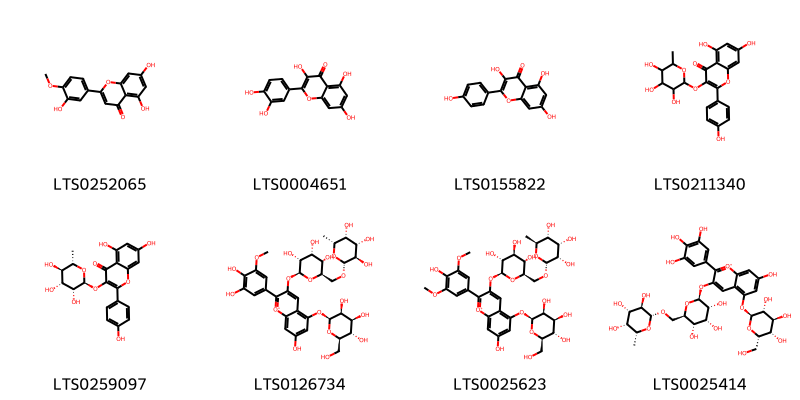{ width=100% }
    <figcaption>Hình ảnh cấu trúc hóa học của 8 hoạt chất thuộc nhóm Flavonoids gồm ['diosmetin (LTS0252065)', 'quercetin (LTS0004651)', 'kaempherol (LTS0155822)', '5,7-dihydroxy-2-(4-hydroxyphenyl)-3-[(3,4,5-trihydroxy-6-methyloxan-2-yl)oxy]chromen-4-one (LTS0211340)', 'afzelin (LTS0259097)', '2-(3,4-dihydroxy-5-methoxyphenyl)-7-hydroxy-5-{[(2s,3s,4s,5s,6r)-3,4,5-trihydroxy-6-(hydroxymethyl)oxan-2-yl]oxy}-3-{[(2s,3r,4r,5s,6r)-3,4,5-trihydroxy-6-({[(2r,3r,4s,5r,6r)-3,4,5-trihydroxy-6-methyloxan-2-yl]oxy}methyl)oxan-2-yl]oxy}-1λ⁴-chromen-1-ylium (LTS0126734)', '7-hydroxy-2-(4-hydroxy-3,5-dimethoxyphenyl)-5-{[(2s,3s,4s,5s,6r)-3,4,5-trihydroxy-6-(hydroxymethyl)oxan-2-yl]oxy}-3-{[(2s,3r,4s,5s,6r)-3,4,5-trihydroxy-6-({[(2r,3s,4s,5r,6s)-3,4,5-trihydroxy-6-methyloxan-2-yl]oxy}methyl)oxan-2-yl]oxy}-1λ⁴-chromen-1-ylium (LTS0025623)', '7-hydroxy-5-{[(2s,3r,4s,5s,6s)-3,4,5-trihydroxy-6-(hydroxymethyl)oxan-2-yl]oxy}-3-{[(2s,3r,4r,5s,6r)-3,4,5-trihydroxy-6-({[(2r,3r,4s,5r,6r)-3,4,5-trihydroxy-6-methyloxan-2-yl]oxy}methyl)oxan-2-yl]oxy}-2-(3,4,5-trihydroxyphenyl)-1λ⁴-chromen-1-ylium (LTS0025414)'].</figcaption>
</figure>
#### Nhóm Organooxygen compounds
<figure markdown="span">
    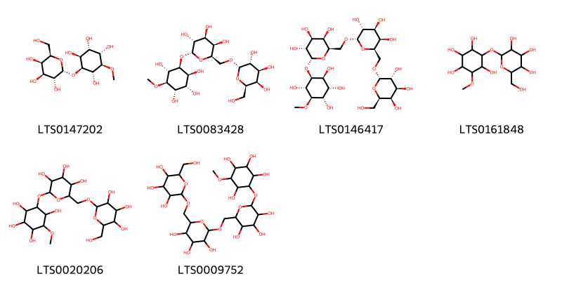{ width=100% }
    <figcaption>Hình ảnh cấu trúc hóa học của 6 hoạt chất thuộc nhóm Organooxygen compounds gồm ['(1s,2r,3s,4r,5s,6s)-4-methoxy-6-{[(2r,3r,4s,5r,6r)-3,4,5-trihydroxy-6-(hydroxymethyl)oxan-2-yl]oxy}cyclohexane-1,2,3,5-tetrol (LTS0147202)', '(1s,2r,3s,4r,5s,6s)-4-methoxy-6-{[(2r,3r,4s,5r,6r)-3,4,5-trihydroxy-6-({[(2s,3r,4s,5r,6r)-3,4,5-trihydroxy-6-(hydroxymethyl)oxan-2-yl]oxy}methyl)oxan-2-yl]oxy}cyclohexane-1,2,3,5-tetrol (LTS0083428)', '(1s,2r,3s,4r,5s,6s)-4-methoxy-6-{[(2r,3r,4s,5r,6r)-3,4,5-trihydroxy-6-({[(2s,3r,4s,5r,6r)-3,4,5-trihydroxy-6-({[(2s,3r,4s,5r,6r)-3,4,5-trihydroxy-6-(hydroxymethyl)oxan-2-yl]oxy}methyl)oxan-2-yl]oxy}methyl)oxan-2-yl]oxy}cyclohexane-1,2,3,5-tetrol (LTS0146417)', '4-methoxy-6-{[3,4,5-trihydroxy-6-(hydroxymethyl)oxan-2-yl]oxy}cyclohexane-1,2,3,5-tetrol (LTS0161848)', 'ciceritol (LTS0020206)', '4-methoxy-6-{[3,4,5-trihydroxy-6-({[3,4,5-trihydroxy-6-({[3,4,5-trihydroxy-6-(hydroxymethyl)oxan-2-yl]oxy}methyl)oxan-2-yl]oxy}methyl)oxan-2-yl]oxy}cyclohexane-1,2,3,5-tetrol (LTS0009752)'].</figcaption>
</figure>
#### Nhóm Prenol lipids
<figure markdown="span">
    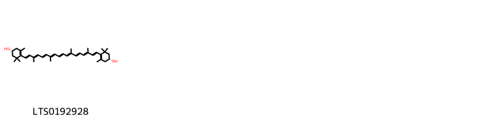{ width=100% }
    <figcaption>Hình ảnh cấu trúc hóa học của 1 hoạt chất thuộc nhóm Prenol lipids gồm ['zeaxanthin (LTS0192928)'].</figcaption>
</figure>

---

### Dược dân tộc học

Danh sách các quốc gia có sử dụng *Vicia villosa* trong điều trị các bệnh. 

| Country   | Disease   | Bệnh                                                                                                                                                                                                |
|:----------|:----------|:----------------------------------------------------------------------------------------------------------------------------------------------------------------------------------------------------|
| Elsewhere | Poison    | MYMEMORY WARNING: YOU USED ALL AVAILABLE FREE TRANSLATIONS FOR TODAY. NEXT AVAILABLE IN  17 HOURS 38 MINUTES 30 SECONDS VISIT HTTPS://MYMEMORY.TRANSLATED.NET/DOC/USAGELIMITS.PHP TO TRANSLATE MORE |

---

# Chi Rafnia

??? note "Danh sách các dược liệu thuộc chi"
    
	 - *Rafnia perfoliata*

---
## Rafnia perfoliata
### Thông tin về thực vật

!!! info "Phân loại thực vật của *N/A* từ GIBF:"
    - **Kingdom:** Plantae
    - **Phylum:** Tracheophyta
    - **Order:** Fabales
    - **Family:** Fabaceae
    - **Genus:** N/A
    - **Species:** *N/A*

 

| Label (VI)   | Label (EN)   | Scientific Name   | Descriptions (VI)   | Descriptions (EN)   | Also Known As (VI)   | Also Known As (EN)   |
|:-------------|:-------------|:------------------|:--------------------|:--------------------|:---------------------|:---------------------|
| N/A          | N/A          | Rafnia perfoliata | loài thực vật       | species of plant    | ['']                 | ['']                 |

#### Phân bố trên thế giới

**Từ CSDL GIBF** Sri Lanka, Italy, Australia, Cambodia, Argentina, Tanzania, United Republic of, Chinese Taipei, Spain, Portugal, United States of America, Chile, Croatia, South Africa, Thailand, Germany, Brazil, Guam, France, Norfolk Island, Viet Nam, China, United Kingdom of Great Britain and Northern Ireland, Ireland, Gambia, India, Malaysia, New Zealand

#### Phân bố tại Việt Nam

**Từ CSDL GIBF**: Đà Nẵng, Bà Rịa - Vũng Tàu

---
### Thành phần hóa học
        
- Theo cơ sở dữ liệu lotus: Từ loài *N/A* đã phân lập và xác định được 6 hoạt chất thuộc về các nhóm Lupin alkaloids. 

|    | chemicalTaxonomyClassyfireClass   |   smiles_count |
|---:|:----------------------------------|---------------:|
|  0 | Lupin alkaloids                   |              6 |

#### Nhóm Lupin alkaloids
<figure markdown="span">
    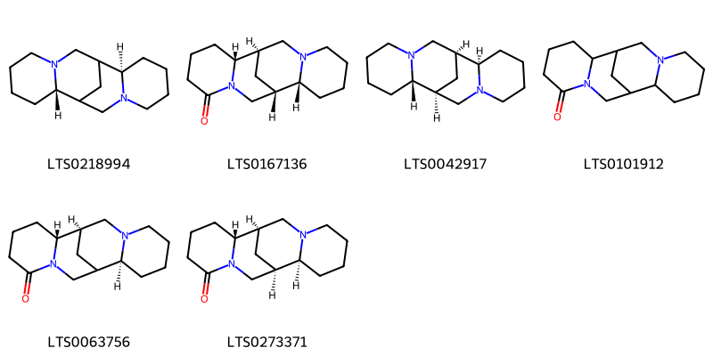{ width=100% }
    <figcaption>Hình ảnh cấu trúc hóa học của 6 hoạt chất thuộc nhóm Lupin alkaloids gồm ['(2r,10s)-7,15-diazatetracyclo[7.7.1.0²,⁷.0¹⁰,¹⁵]heptadecane (LTS0218994)', '(1r,2r,9s,10r)-7,15-diazatetracyclo[7.7.1.0²,⁷.0¹⁰,¹⁵]heptadecan-6-one (LTS0167136)', 'sparteine (LTS0042917)', 'lupanine l-form (LTS0101912)', '(1r,2r,10s)-7,15-diazatetracyclo[7.7.1.0²,⁷.0¹⁰,¹⁵]heptadecan-6-one (LTS0063756)', '(1r,2r,9r,10s)-7,15-diazatetracyclo[7.7.1.0²,⁷.0¹⁰,¹⁵]heptadecan-6-one (LTS0273371)'].</figcaption>
</figure>

---

### Dược dân tộc học

Danh sách các quốc gia có sử dụng *N/A* trong điều trị các bệnh. 

| Country                 | Disease   | Bệnh                                                                                                                                                                                                |
|:------------------------|:----------|:----------------------------------------------------------------------------------------------------------------------------------------------------------------------------------------------------|
| South Africa(Hottentot) | Diuretic  | MYMEMORY WARNING: YOU USED ALL AVAILABLE FREE TRANSLATIONS FOR TODAY. NEXT AVAILABLE IN  17 HOURS 37 MINUTES 50 SECONDS VISIT HTTPS://MYMEMORY.TRANSLATED.NET/DOC/USAGELIMITS.PHP TO TRANSLATE MORE |

---

# Chi Melilotus

??? note "Danh sách các dược liệu thuộc chi"
    
	 - *Melilotus alba*
	 - *Melilotus albus*
	 - *Melilotus arvensis*
	 - *Melilotus indica*
	 - *Melilotus officinalis*

---
## Melilotus alba
### Thông tin về thực vật

!!! info "Phân loại thực vật của *Melilotus officinalis* từ GIBF:"
    - **Kingdom:** Plantae
    - **Phylum:** Tracheophyta
    - **Order:** Fabales
    - **Family:** Fabaceae
    - **Genus:** Melilotus
    - **Species:** *Melilotus officinalis*

 

| Label (VI)   | Label (EN)   | Scientific Name   | Descriptions (VI)   | Descriptions (EN)   | Also Known As (VI)   | Also Known As (EN)   |
|:-------------|:-------------|:------------------|:--------------------|:--------------------|:---------------------|:---------------------|
| N/A          | N/A          | Rafnia perfoliata | loài thực vật       | species of plant    | ['']                 | ['']                 |

#### Phân bố trên thế giới

**Từ CSDL GIBF** nan, Pakistan, South Africa, Netherlands, Japan, Germany, Korea, Republic of, Brazil, Spain, United States of America, Poland, Norway, China, Canada

#### Phân bố tại Việt Nam

**Từ CSDL GIBF**: Không có ghi nhận ở Việt Nam

---
### Thành phần hóa học
        
- Theo cơ sở dữ liệu lotus: Từ loài *Melilotus officinalis* đã phân lập và xác định được Chưa có hoạt chất nào được phân lập. hoạt chất thuộc về các nhóm Không có hoạt chất nào được phân lập. 

Không có hình ảnh nào được tạo ra

---

### Dược dân tộc học

Danh sách các quốc gia có sử dụng *Melilotus officinalis* trong điều trị các bệnh. 

| Country   | Disease   | Bệnh                                                                                                                                                                                                |
|:----------|:----------|:----------------------------------------------------------------------------------------------------------------------------------------------------------------------------------------------------|
| Elsewhere | Poison    | MYMEMORY WARNING: YOU USED ALL AVAILABLE FREE TRANSLATIONS FOR TODAY. NEXT AVAILABLE IN  17 HOURS 37 MINUTES 13 SECONDS VISIT HTTPS://MYMEMORY.TRANSLATED.NET/DOC/USAGELIMITS.PHP TO TRANSLATE MORE |

---

---
## Melilotus albus
### Thông tin về thực vật

!!! info "Phân loại thực vật của *Melilotus albus* từ GIBF:"
    - **Kingdom:** Plantae
    - **Phylum:** Tracheophyta
    - **Order:** Fabales
    - **Family:** Fabaceae
    - **Genus:** Melilotus
    - **Species:** *Melilotus albus*

 

| Label (VI)   | Label (EN)   | Scientific Name   | Descriptions (VI)   | Descriptions (EN)   | Also Known As (VI)   | Also Known As (EN)                                            |
|:-------------|:-------------|:------------------|:--------------------|:--------------------|:---------------------|:--------------------------------------------------------------|
| N/A          | N/A          | Melilotus albus   | loài thực vật       | species of plant    | ['']                 | ['white sweet clover', 'white sweet-clover', 'white melilot'] |

#### Phân bố trên thế giới

**Từ CSDL GIBF** Italy, Australia, Belgium, Argentina, Norway, Canada, Netherlands, Spain, United States of America, Sweden, Chile, South Africa, Germany, Switzerland, Peru, France, Mexico, China, United Kingdom of Great Britain and Northern Ireland, Ecuador, India, New Zealand, Nepal

#### Phân bố tại Việt Nam

**Từ CSDL GIBF**: Không có ghi nhận ở Việt Nam

---
### Thành phần hóa học
        
- Theo cơ sở dữ liệu lotus: Từ loài *Melilotus albus* đã phân lập và xác định được 34 hoạt chất thuộc về các nhóm Phenylpropanoic acids, Flavonoids, Prenol lipids, Isoflavonoids, 3,4-dihydrocoumarins, Cinnamic acids and derivatives, Coumarins and derivatives. 

|    | chemicalTaxonomyClassyfireClass   |   smiles_count |
|---:|:----------------------------------|---------------:|
|  0 | 3,4-dihydrocoumarins              |              1 |
|  1 | Cinnamic acids and derivatives    |              1 |
|  2 | Coumarins and derivatives         |              2 |
|  3 | Flavonoids                        |              8 |
|  4 | Isoflavonoids                     |             10 |
|  5 | Phenylpropanoic acids             |              1 |
|  6 | Prenol lipids                     |             11 |

#### Nhóm 3_4-dihydrocoumarins
<figure markdown="span">
    { width=100% }
    <figcaption>Hình ảnh cấu trúc hóa học của Không tìm thấy chú thích hoạt chất thuộc nhóm 3_4-dihydrocoumarins gồm Không tìm thấy chú thích.</figcaption>
</figure>
#### Nhóm Cinnamic acids and derivatives
<figure markdown="span">
    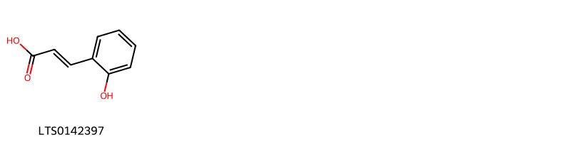{ width=100% }
    <figcaption>Hình ảnh cấu trúc hóa học của 1 hoạt chất thuộc nhóm Cinnamic acids and derivatives gồm ['trans-2-hydroxycinnamic acid (LTS0142397)'].</figcaption>
</figure>
#### Nhóm Coumarins and derivatives
<figure markdown="span">
    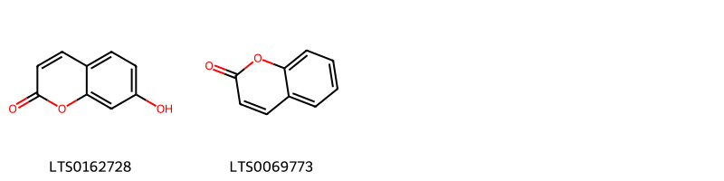{ width=100% }
    <figcaption>Hình ảnh cấu trúc hóa học của 2 hoạt chất thuộc nhóm Coumarins and derivatives gồm ['umbelliferone (LTS0162728)', '2h-1-benzopyran-2-one (LTS0069773)'].</figcaption>
</figure>
#### Nhóm Flavonoids
<figure markdown="span">
    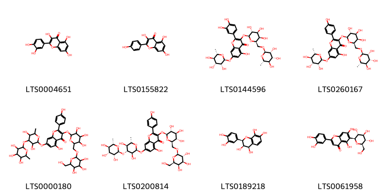{ width=100% }
    <figcaption>Hình ảnh cấu trúc hóa học của 8 hoạt chất thuộc nhóm Flavonoids gồm ['quercetin (LTS0004651)', 'kaempherol (LTS0155822)', '2-(3,4-dihydroxyphenyl)-5-hydroxy-3-{[(2s,3r,4s,5r,6r)-3,4,5-trihydroxy-6-({[(2r,3r,4r,5r,6s)-3,4,5-trihydroxy-6-methyloxan-2-yl]oxy}methyl)oxan-2-yl]oxy}-7-{[(2s,3r,4r,5r,6s)-3,4,5-trihydroxy-6-methyloxan-2-yl]oxy}chromen-4-one (LTS0144596)', 'robinin (LTS0260167)', '7-({3,5-dihydroxy-6-methyl-4-[(3,4,5-trihydroxy-6-methyloxan-2-yl)oxy]oxan-2-yl}oxy)-5-hydroxy-2-(4-hydroxyphenyl)-3-{[3,4,5-trihydroxy-6-({[3,4,5-trihydroxy-6-(hydroxymethyl)oxan-2-yl]oxy}methyl)oxan-2-yl]oxy}chromen-4-one (LTS0000180)', '7-{[(2s,3s,4r,5s,6s)-3,5-dihydroxy-6-methyl-4-{[(2s,3r,4r,5r,6s)-3,4,5-trihydroxy-6-methyloxan-2-yl]oxy}oxan-2-yl]oxy}-5-hydroxy-2-(4-hydroxyphenyl)-3-{[(2s,3r,4s,5s,6r)-3,4,5-trihydroxy-6-({[(2r,3r,4s,5r,6r)-3,4,5-trihydroxy-6-(hydroxymethyl)oxan-2-yl]oxy}methyl)oxan-2-yl]oxy}chromen-4-one (LTS0200814)', 'melacacidin (LTS0189218)', 'isoorientin (LTS0061958)'].</figcaption>
</figure>
#### Nhóm Isoflavonoids
<figure markdown="span">
    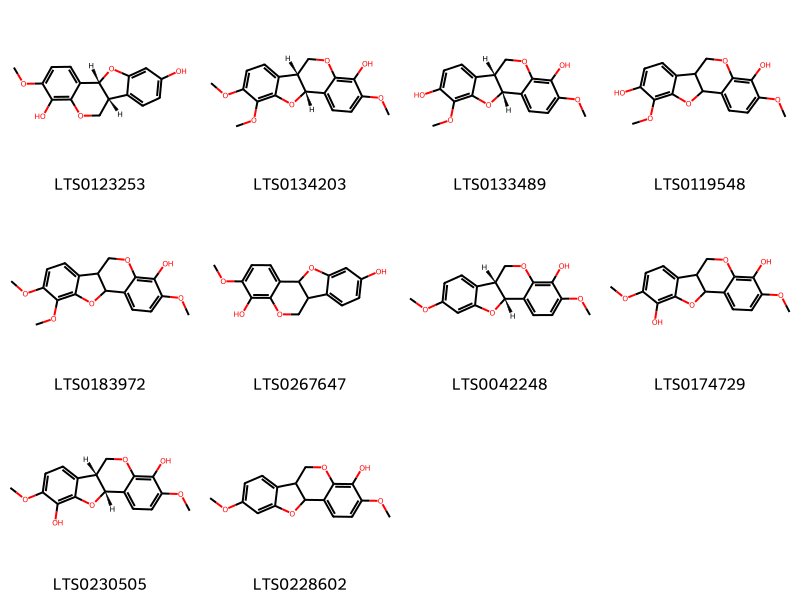{ width=100% }
    <figcaption>Hình ảnh cấu trúc hóa học của 10 hoạt chất thuộc nhóm Isoflavonoids gồm ['(1r,10r)-5-methoxy-8,17-dioxatetracyclo[8.7.0.0²,⁷.0¹¹,¹⁶]heptadeca-2,4,6,11,13,15-hexaene-6,14-diol (LTS0123253)', '(1r,10r)-5,14,15-trimethoxy-8,17-dioxatetracyclo[8.7.0.0²,⁷.0¹¹,¹⁶]heptadeca-2,4,6,11,13,15-hexaen-6-ol (LTS0134203)', '(1r,10r)-5,15-dimethoxy-8,17-dioxatetracyclo[8.7.0.0²,⁷.0¹¹,¹⁶]heptadeca-2,4,6,11,13,15-hexaene-6,14-diol (LTS0133489)', '5,15-dimethoxy-8,17-dioxatetracyclo[8.7.0.0²,⁷.0¹¹,¹⁶]heptadeca-2,4,6,11,13,15-hexaene-6,14-diol (LTS0119548)', '5,14,15-trimethoxy-8,17-dioxatetracyclo[8.7.0.0²,⁷.0¹¹,¹⁶]heptadeca-2,4,6,11,13,15-hexaen-6-ol (LTS0183972)', 'melilotocarpan b (LTS0267647)', 'melilotocarpan a (LTS0042248)', 'melilotocarpan d (LTS0174729)', '(1r,10r)-5,14-dimethoxy-8,17-dioxatetracyclo[8.7.0.0²,⁷.0¹¹,¹⁶]heptadeca-2,4,6,11,13,15-hexaene-6,15-diol (LTS0230505)', '5,14-dimethoxy-8,17-dioxatetracyclo[8.7.0.0²,⁷.0¹¹,¹⁶]heptadeca-2,4,6,11,13,15-hexaen-6-ol (LTS0228602)'].</figcaption>
</figure>
#### Nhóm Phenylpropanoic acids
<figure markdown="span">
    { width=100% }
    <figcaption>Hình ảnh cấu trúc hóa học của 1 hoạt chất thuộc nhóm Phenylpropanoic acids gồm ['melilotic acid (LTS0176151)'].</figcaption>
</figure>
#### Nhóm Prenol lipids
<figure markdown="span">
    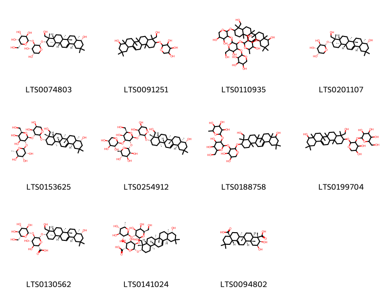{ width=100% }
    <figcaption>Hình ảnh cấu trúc hóa học của 11 hoạt chất thuộc nhóm Prenol lipids gồm ['(2s,3r,4s,5r,6r)-2-{[(2s,3r,4s,5s)-2-{[(3s,4s,4ar,6ar,6bs,8ar,9r,12as,14ar,14br)-9-hydroxy-4-(hydroxymethyl)-4,6a,6b,8a,11,11,14b-heptamethyl-1,2,3,4a,5,6,7,8,9,10,12,12a,14,14a-tetradecahydropicen-3-yl]oxy}-4,5-dihydroxyoxan-3-yl]oxy}-6-(hydroxymethyl)oxane-3,4,5-triol (LTS0074803)', '2-{[9-hydroxy-4-(hydroxymethyl)-4,6a,6b,8a,11,11,14b-heptamethyl-1,2,3,4a,5,6,7,8,9,10,12,12a,14,14a-tetradecahydropicen-3-yl]oxy}oxane-3,4,5-triol (LTS0091251)', '2-({2-[(4,5-dihydroxy-2-{[9-hydroxy-4-(hydroxymethyl)-4,6a,6b,8a,11,11,14b-heptamethyl-1,2,3,4a,5,6,7,8,9,10,12,12a,14,14a-tetradecahydropicen-3-yl]oxy}oxan-3-yl)oxy]-5-hydroxy-6-(hydroxymethyl)-4-[(3,4,5-trihydroxyoxan-2-yl)oxy]oxan-3-yl}oxy)-6-methyloxane-3,4,5-triol (LTS0110935)', '(2s,3r,4s,5s)-2-{[(3s,4s,4ar,6ar,6bs,8ar,9r,12as,14ar,14br)-9-hydroxy-4-(hydroxymethyl)-4,6a,6b,8a,11,11,14b-heptamethyl-1,2,3,4a,5,6,7,8,9,10,12,12a,14,14a-tetradecahydropicen-3-yl]oxy}oxane-3,4,5-triol (LTS0201107)', '(2s,3r,4r,5r,6s)-2-{[(2s,3r,4s,5r,6r)-2-{[(2s,3r,4s,5s)-2-{[(3s,4s,4ar,6ar,6bs,8ar,9r,12as,14ar,14br)-9-hydroxy-4-(hydroxymethyl)-4,6a,6b,8a,11,11,14b-heptamethyl-1,2,3,4a,5,6,7,8,9,10,12,12a,14,14a-tetradecahydropicen-3-yl]oxy}-4,5-dihydroxyoxan-3-yl]oxy}-4,5-dihydroxy-6-(hydroxymethyl)oxan-3-yl]oxy}-6-methyloxane-3,4,5-triol (LTS0153625)', '(2r,3s,4s,5s,6r)-2-{[(2s,3r,4s,5s,6r)-2-{[(2s,3r,4s,5s)-2-{[(3s,4s,4ar,6ar,6bs,8ar,9r,12as,14ar,14br)-9-hydroxy-4-(hydroxymethyl)-4,6a,6b,8a,11,11,14b-heptamethyl-1,2,3,4a,5,6,7,8,9,10,12,12a,14,14a-tetradecahydropicen-3-yl]oxy}-4,5-dihydroxyoxan-3-yl]oxy}-5-hydroxy-6-(hydroxymethyl)-4-{[(2s,3r,4s,5s)-3,4,5-trihydroxyoxan-2-yl]oxy}oxan-3-yl]oxy}-6-methyloxane-3,4,5-triol (LTS0254912)', '2-({2-[(4,5-dihydroxy-2-{[9-hydroxy-4-(hydroxymethyl)-4,6a,6b,8a,11,11,14b-heptamethyl-1,2,3,4a,5,6,7,8,9,10,12,12a,14,14a-tetradecahydropicen-3-yl]oxy}oxan-3-yl)oxy]-4,5-dihydroxy-6-(hydroxymethyl)oxan-3-yl}oxy)-6-methyloxane-3,4,5-triol (LTS0188758)', '2-[(4,5-dihydroxy-2-{[9-hydroxy-4-(hydroxymethyl)-4,6a,6b,8a,11,11,14b-heptamethyl-1,2,3,4a,5,6,7,8,9,10,12,12a,14,14a-tetradecahydropicen-3-yl]oxy}oxan-3-yl)oxy]-6-(hydroxymethyl)oxane-3,4,5-triol (LTS0199704)', '(2s,3s,4s,5r,6r)-6-{[(3s,4s,4ar,6ar,6bs,8ar,9r,12as,14ar,14br)-9-hydroxy-4-(hydroxymethyl)-4,6a,6b,8a,11,11,14b-heptamethyl-1,2,3,4a,5,6,7,8,9,10,12,12a,14,14a-tetradecahydropicen-3-yl]oxy}-3,4-dihydroxy-5-{[(2s,3r,4s,5s,6r)-3,4,5-trihydroxy-6-(hydroxymethyl)oxan-2-yl]oxy}oxane-2-carboxylic acid (LTS0130562)', '(2s,3s,4s,5r,6r)-6-{[(3s,4s,4ar,6ar,6bs,8ar,9r,12as,14ar,14br)-9-hydroxy-4-(hydroxymethyl)-4,6a,6b,8a,11,11,14b-heptamethyl-1,2,3,4a,5,6,7,8,9,10,12,12a,14,14a-tetradecahydropicen-3-yl]oxy}-5-{[(2s,3r,4s,5r,6r)-4,5-dihydroxy-6-(hydroxymethyl)-3-{[(2s,3r,4s,5s,6s)-3,4,5-trihydroxy-6-methyloxan-2-yl]oxy}oxan-2-yl]oxy}-3,4-dihydroxyoxane-2-carboxylic acid (LTS0141024)', 'medicagenic acid (LTS0094802)'].</figcaption>
</figure>

---

### Dược dân tộc học

Danh sách các quốc gia có sử dụng *Melilotus albus* trong điều trị các bệnh. 

| Country   | Disease     | Bệnh                                                                                                                                                                                                |
|:----------|:------------|:----------------------------------------------------------------------------------------------------------------------------------------------------------------------------------------------------|
| Elsewhere | Expectorant | MYMEMORY WARNING: YOU USED ALL AVAILABLE FREE TRANSLATIONS FOR TODAY. NEXT AVAILABLE IN  17 HOURS 36 MINUTES 40 SECONDS VISIT HTTPS://MYMEMORY.TRANSLATED.NET/DOC/USAGELIMITS.PHP TO TRANSLATE MORE |

---

---
## Melilotus arvensis
### Thông tin về thực vật

!!! info "Phân loại thực vật của *Melilotus officinalis* từ GIBF:"
    - **Kingdom:** Plantae
    - **Phylum:** Tracheophyta
    - **Order:** Fabales
    - **Family:** Fabaceae
    - **Genus:** Melilotus
    - **Species:** *Melilotus officinalis*

 

| Label (VI)   | Label (EN)   | Scientific Name    | Descriptions (VI)   | Descriptions (EN)   | Also Known As (VI)   | Also Known As (EN)   |
|:-------------|:-------------|:-------------------|:--------------------|:--------------------|:---------------------|:---------------------|
| N/A          | N/A          | Melilotus arvensis | loài thực vật       | species of plant    | ['']                 | ['']                 |

#### Phân bố trên thế giới

**Từ CSDL GIBF** nan, Netherlands, Italy, United Kingdom of Great Britain and Northern Ireland, Belgium, Germany, Spain, Hungary, unknown or invalid, United States of America, Sweden, Mexico, France, China

#### Phân bố tại Việt Nam

**Từ CSDL GIBF**: Không có ghi nhận ở Việt Nam

---
### Thành phần hóa học
        
- Theo cơ sở dữ liệu lotus: Từ loài *Melilotus officinalis* đã phân lập và xác định được Chưa có hoạt chất nào được phân lập. hoạt chất thuộc về các nhóm Không có hoạt chất nào được phân lập. 

Không có hình ảnh nào được tạo ra

---

### Dược dân tộc học

Danh sách các quốc gia có sử dụng *Melilotus officinalis* trong điều trị các bệnh. 

| Country   | Disease                                                       | Bệnh                                                                                                                                                                                                |
|:----------|:--------------------------------------------------------------|:----------------------------------------------------------------------------------------------------------------------------------------------------------------------------------------------------|
| China     | Carminative, Deodorant, Sedative, Tonic, Astringent, Cosmetic | MYMEMORY WARNING: YOU USED ALL AVAILABLE FREE TRANSLATIONS FOR TODAY. NEXT AVAILABLE IN  17 HOURS 35 MINUTES 54 SECONDS VISIT HTTPS://MYMEMORY.TRANSLATED.NET/DOC/USAGELIMITS.PHP TO TRANSLATE MORE |

---

---
## Melilotus indica
### Thông tin về thực vật

!!! info "Phân loại thực vật của *Melilotus indicus* từ GIBF:"
    - **Kingdom:** Plantae
    - **Phylum:** Tracheophyta
    - **Order:** Fabales
    - **Family:** Fabaceae
    - **Genus:** Melilotus
    - **Species:** *Melilotus indicus*

 

| Label (VI)   | Label (EN)   | Scientific Name    | Descriptions (VI)   | Descriptions (EN)   | Also Known As (VI)   | Also Known As (EN)   |
|:-------------|:-------------|:-------------------|:--------------------|:--------------------|:---------------------|:---------------------|
| N/A          | N/A          | Melilotus arvensis | loài thực vật       | species of plant    | ['']                 | ['']                 |

#### Phân bố trên thế giới

**Từ CSDL GIBF** Israel, Australia, Iraq, Malta, Egypt, Argentina, Spain, Portugal, India, Chinese Taipei, United States of America, Mexico, Bermuda, Greece, New Zealand

#### Phân bố tại Việt Nam

**Từ CSDL GIBF**: Không có ghi nhận ở Việt Nam

---
### Thành phần hóa học
        
- Theo cơ sở dữ liệu lotus: Từ loài *Melilotus indicus* đã phân lập và xác định được Chưa có hoạt chất nào được phân lập. hoạt chất thuộc về các nhóm Không có hoạt chất nào được phân lập. 

Không có hình ảnh nào được tạo ra

---

### Dược dân tộc học

Danh sách các quốc gia có sử dụng *Melilotus indicus* trong điều trị các bệnh. 

| Country   | Disease                                     | Bệnh                                                                                                                                                                                                |
|:----------|:--------------------------------------------|:----------------------------------------------------------------------------------------------------------------------------------------------------------------------------------------------------|
| Elsewhere | Discutient, Astringent, Narcotic, Emollient | MYMEMORY WARNING: YOU USED ALL AVAILABLE FREE TRANSLATIONS FOR TODAY. NEXT AVAILABLE IN  17 HOURS 35 MINUTES 26 SECONDS VISIT HTTPS://MYMEMORY.TRANSLATED.NET/DOC/USAGELIMITS.PHP TO TRANSLATE MORE |

---

---
## Melilotus officinalis
### Thông tin về thực vật

!!! info "Phân loại thực vật của *Melilotus officinalis* từ GIBF:"
    - **Kingdom:** Plantae
    - **Phylum:** Tracheophyta
    - **Order:** Fabales
    - **Family:** Fabaceae
    - **Genus:** Melilotus
    - **Species:** *Melilotus officinalis*

 

| Label (VI)   | Label (EN)   | Scientific Name       | Descriptions (VI)   | Descriptions (EN)   | Also Known As (VI)   | Also Known As (EN)                      |
|:-------------|:-------------|:----------------------|:--------------------|:--------------------|:---------------------|:----------------------------------------|
| N/A          | N/A          | Melilotus officinalis | loài thực vật       | species of plant    | ['']                 | ['yellow sweetclover', 'field melilot'] |

#### Phân bố trên thế giới

**Từ CSDL GIBF** Italy, Germany, Belgium, Spain, Argentina, Hungary, Serbia, Switzerland, Russian Federation, United States of America, Mexico, France, Canada, China, Austria

#### Phân bố tại Việt Nam

**Từ CSDL GIBF**: Không có ghi nhận ở Việt Nam

---
### Thành phần hóa học
        
- Theo cơ sở dữ liệu lotus: Từ loài *Melilotus officinalis* đã phân lập và xác định được 41 hoạt chất thuộc về các nhóm Phenylpropanoic acids, Flavonoids, Prenol lipids, Organooxygen compounds, Coumarins and derivatives. 

|    | chemicalTaxonomyClassyfireClass   |   smiles_count |
|---:|:----------------------------------|---------------:|
|  0 |                                   |              1 |
|  1 | Coumarins and derivatives         |              1 |
|  2 | Flavonoids                        |              6 |
|  3 | Organooxygen compounds            |              8 |
|  4 | Phenylpropanoic acids             |              1 |
|  5 | Prenol lipids                     |             24 |

#### Nhóm 
<figure markdown="span">
    { width=100% }
    <figcaption>Hình ảnh cấu trúc hóa học của 1 hoạt chất thuộc nhóm  gồm ['trigonelline (LTS0040106)'].</figcaption>
</figure>
#### Nhóm Coumarins and derivatives
<figure markdown="span">
    { width=100% }
    <figcaption>Hình ảnh cấu trúc hóa học của 1 hoạt chất thuộc nhóm Coumarins and derivatives gồm ['2h-1-benzopyran-2-one (LTS0069773)'].</figcaption>
</figure>
#### Nhóm Flavonoids
<figure markdown="span">
    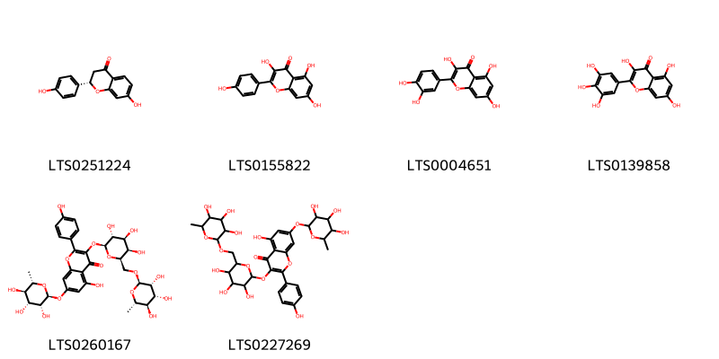{ width=100% }
    <figcaption>Hình ảnh cấu trúc hóa học của 6 hoạt chất thuộc nhóm Flavonoids gồm ['5-deoxyflavanone (LTS0251224)', 'kaempherol (LTS0155822)', 'quercetin (LTS0004651)', 'myricetin (LTS0139858)', 'robinin (LTS0260167)', 'robinin (LTS0227269)'].</figcaption>
</figure>
#### Nhóm Organooxygen compounds
<figure markdown="span">
    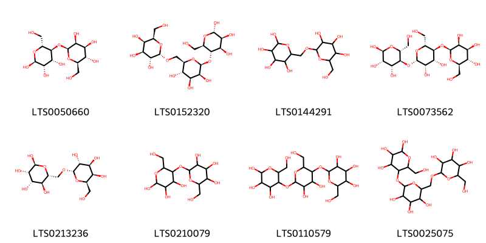{ width=100% }
    <figcaption>Hình ảnh cấu trúc hóa học của 8 hoạt chất thuộc nhóm Organooxygen compounds gồm ['α-mannobiose (LTS0050660)', '(2s,3s,4r,5s,6r)-6-(hydroxymethyl)-5-{[(2s,3s,4s,5s,6r)-3,4,5-trihydroxy-6-({[(2s,3r,4s,5r,6r)-3,4,5-trihydroxy-6-(hydroxymethyl)oxan-2-yl]oxy}methyl)oxan-2-yl]oxy}oxane-2,3,4-triol (LTS0152320)', 'polydextrose (LTS0144291)', '(2s,3s,4s,5s,6r)-2-{[(2r,3s,4r,5s,6s)-4,5-dihydroxy-2-(hydroxymethyl)-6-{[(2r,3s,4r,5s,6s)-4,5,6-trihydroxy-2-(hydroxymethyl)oxan-3-yl]oxy}oxan-3-yl]oxy}-6-(hydroxymethyl)oxane-3,4,5-triol (LTS0073562)', '(2s,3s,4s,5s,6r)-6-({[(2s,3r,4s,5r,6r)-3,4,5-trihydroxy-6-(hydroxymethyl)oxan-2-yl]oxy}methyl)oxane-2,3,4,5-tetrol (LTS0213236)', 'starch (LTS0210079)', 'amylose (LTS0110579)', '2-(hydroxymethyl)-6-[(3,4,5-trihydroxy-6-{[4,5,6-trihydroxy-2-(hydroxymethyl)oxan-3-yl]oxy}oxan-2-yl)methoxy]oxane-3,4,5-triol (LTS0025075)'].</figcaption>
</figure>
#### Nhóm Phenylpropanoic acids
<figure markdown="span">
    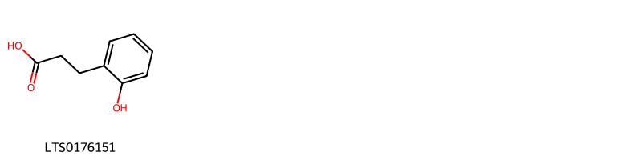{ width=100% }
    <figcaption>Hình ảnh cấu trúc hóa học của 1 hoạt chất thuộc nhóm Phenylpropanoic acids gồm ['melilotic acid (LTS0176151)'].</figcaption>
</figure>
#### Nhóm Prenol lipids
<figure markdown="span">
    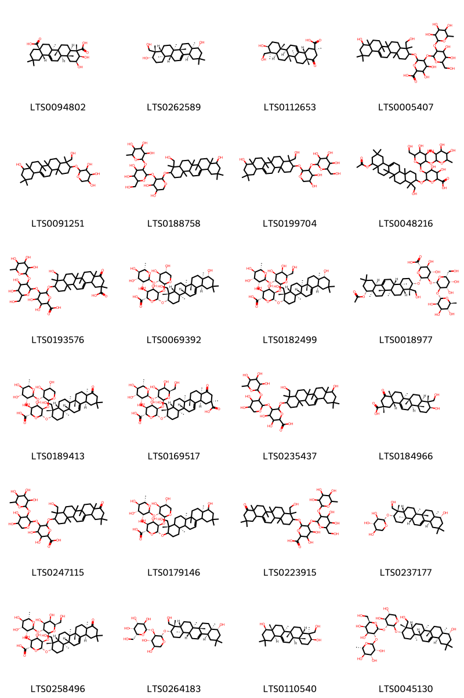{ width=100% }
    <figcaption>Hình ảnh cấu trúc hóa học của 24 hoạt chất thuộc nhóm Prenol lipids gồm ['medicagenic acid (LTS0094802)', 'soyasapogenol b (LTS0262589)', '(2r,4ar,6as,6br,8ar,9s,10s,12ar,12br,14bs)-10-hydroxy-9-(hydroxymethyl)-2,4a,6a,6b,9,12a-hexamethyl-4-oxo-3,5,6,7,8,8a,10,11,12,12b,13,14b-dodecahydro-1h-picene-2-carboxylic acid (LTS0112653)', '5-{[4,5-dihydroxy-6-(hydroxymethyl)-3-[(3,4,5-trihydroxy-6-methyloxan-2-yl)oxy]oxan-2-yl]oxy}-3,4-dihydroxy-6-{[9-hydroxy-4-(hydroxymethyl)-4,6a,6b,8a,11,11,14b-heptamethyl-1,2,3,4a,5,6,7,8,9,10,12,12a,14,14a-tetradecahydropicen-3-yl]oxy}oxane-2-carboxylic acid (LTS0005407)', '2-{[9-hydroxy-4-(hydroxymethyl)-4,6a,6b,8a,11,11,14b-heptamethyl-1,2,3,4a,5,6,7,8,9,10,12,12a,14,14a-tetradecahydropicen-3-yl]oxy}oxane-3,4,5-triol (LTS0091251)', '2-({2-[(4,5-dihydroxy-2-{[9-hydroxy-4-(hydroxymethyl)-4,6a,6b,8a,11,11,14b-heptamethyl-1,2,3,4a,5,6,7,8,9,10,12,12a,14,14a-tetradecahydropicen-3-yl]oxy}oxan-3-yl)oxy]-4,5-dihydroxy-6-(hydroxymethyl)oxan-3-yl}oxy)-6-methyloxane-3,4,5-triol (LTS0188758)', '2-[(4,5-dihydroxy-2-{[9-hydroxy-4-(hydroxymethyl)-4,6a,6b,8a,11,11,14b-heptamethyl-1,2,3,4a,5,6,7,8,9,10,12,12a,14,14a-tetradecahydropicen-3-yl]oxy}oxan-3-yl)oxy]-6-(hydroxymethyl)oxane-3,4,5-triol (LTS0199704)', '6-{[9-(acetyloxy)-4-(hydroxymethyl)-4,6a,6b,8a,11,11,14b-heptamethyl-1,2,3,4a,5,6,7,8,9,10,12,12a,14,14a-tetradecahydropicen-3-yl]oxy}-5-{[4,5-dihydroxy-6-(hydroxymethyl)-3-[(3,4,5-trihydroxy-6-methyloxan-2-yl)oxy]oxan-2-yl]oxy}-3,4-dihydroxyoxane-2-carboxylic acid (LTS0048216)', '6-{[11-carboxy-4-(hydroxymethyl)-4,6a,6b,8a,11,14b-hexamethyl-9-oxo-2,3,4a,5,6,7,8,10,12,12a,14,14a-dodecahydro-1h-picen-3-yl]oxy}-5-{[4,5-dihydroxy-6-(hydroxymethyl)-3-[(3,4,5-trihydroxy-6-methyloxan-2-yl)oxy]oxan-2-yl]oxy}-3,4-dihydroxyoxane-2-carboxylic acid (LTS0193576)', '(2s,3s,4s,5r,6r)-6-{[(3s,4s,4ar,6ar,6bs,8ar,9r,12as,14ar,14br)-9-hydroxy-4-(hydroxymethyl)-4,6a,6b,8a,11,11,14b-heptamethyl-1,2,3,4a,5,6,7,8,9,10,12,12a,14,14a-tetradecahydropicen-3-yl]oxy}-5-{[(2s,3r,4s,5r)-4,5-dihydroxy-3-{[(2s,3r,4r,5r,6s)-3,4,5-trihydroxy-6-methyloxan-2-yl]oxy}oxan-2-yl]oxy}-3,4-dihydroxyoxane-2-carboxylic acid (LTS0069392)', 'soyasaponin i (LTS0182499)', '(2s,3s,4s,5r,6r)-6-{[(3s,4s,4ar,6ar,6bs,8ar,9r,12as,14ar,14br)-9-(acetyloxy)-4-(hydroxymethyl)-4,6a,6b,8a,11,11,14b-heptamethyl-1,2,3,4a,5,6,7,8,9,10,12,12a,14,14a-tetradecahydropicen-3-yl]oxy}-5-{[(2s,3r,4s,5r,6r)-4,5-dihydroxy-6-(hydroxymethyl)-3-{[(2s,3r,4r,5r,6s)-3,4,5-trihydroxy-6-methyloxan-2-yl]oxy}oxan-2-yl]oxy}-3,4-dihydroxyoxane-2-carboxylic acid (LTS0018977)', '(2s,3s,4s,5r,6r)-6-{[(3s,4s,4ar,6ar,6bs,8ar,12as,14ar,14br)-4-(hydroxymethyl)-4,6a,6b,8a,11,11,14b-heptamethyl-9-oxo-2,3,4a,5,6,7,8,10,12,12a,14,14a-dodecahydro-1h-picen-3-yl]oxy}-5-{[(2s,3r,4s,5r)-4,5-dihydroxy-3-{[(2s,3r,4r,5r,6s)-3,4,5-trihydroxy-6-methyloxan-2-yl]oxy}oxan-2-yl]oxy}-3,4-dihydroxyoxane-2-carboxylic acid (LTS0189413)', '(2s,3s,4s,5r,6r)-6-{[(3s,4s,4ar,6ar,6bs,8ar,11s,12as,14ar,14br)-11-carboxy-4-(hydroxymethyl)-4,6a,6b,8a,11,14b-hexamethyl-9-oxo-2,3,4a,5,6,7,8,10,12,12a,14,14a-dodecahydro-1h-picen-3-yl]oxy}-5-{[(2s,3r,4s,5r,6r)-4,5-dihydroxy-6-(hydroxymethyl)-3-{[(2s,3r,4r,5r,6s)-3,4,5-trihydroxy-6-methyloxan-2-yl]oxy}oxan-2-yl]oxy}-3,4-dihydroxyoxane-2-carboxylic acid (LTS0169517)', '5-({4,5-dihydroxy-3-[(3,4,5-trihydroxy-6-methyloxan-2-yl)oxy]oxan-2-yl}oxy)-3,4-dihydroxy-6-{[9-hydroxy-4-(hydroxymethyl)-4,6a,6b,8a,11,11,14b-heptamethyl-1,2,3,4a,5,6,7,8,9,10,12,12a,14,14a-tetradecahydropicen-3-yl]oxy}oxane-2-carboxylic acid (LTS0235437)', '(2s,4ar,6as,6br,8ar,9r,10s,12ar,12br,14bs)-10-hydroxy-9-(hydroxymethyl)-2,4a,6a,6b,9,12a-hexamethyl-4-oxo-3,5,6,7,8,8a,10,11,12,12b,13,14b-dodecahydro-1h-picene-2-carboxylic acid (LTS0184966)', '5-({4,5-dihydroxy-3-[(3,4,5-trihydroxy-6-methyloxan-2-yl)oxy]oxan-2-yl}oxy)-3,4-dihydroxy-6-{[4-(hydroxymethyl)-4,6a,6b,8a,11,11,14b-heptamethyl-9-oxo-2,3,4a,5,6,7,8,10,12,12a,14,14a-dodecahydro-1h-picen-3-yl]oxy}oxane-2-carboxylic acid (LTS0247115)', '(2s,3s,4s,5r,6r)-6-{[(4s,6ar,8ar,14br)-9-hydroxy-4-(hydroxymethyl)-4,6a,6b,8a,11,11,14b-heptamethyl-1,2,3,4a,5,6,7,8,9,10,12,12a,14,14a-tetradecahydropicen-3-yl]oxy}-5-{[(2s,3r,4s,5r)-4,5-dihydroxy-3-{[(2s,3r,4r,5r,6s)-3,4,5-trihydroxy-6-methyloxan-2-yl]oxy}oxan-2-yl]oxy}-3,4-dihydroxyoxane-2-carboxylic acid (LTS0179146)', '5-{[4,5-dihydroxy-6-(hydroxymethyl)-3-[(3,4,5-trihydroxy-6-methyloxan-2-yl)oxy]oxan-2-yl]oxy}-3,4-dihydroxy-6-{[4-(hydroxymethyl)-4,6a,6b,8a,11,11,14b-heptamethyl-9-oxo-2,3,4a,5,6,7,8,10,12,12a,14,14a-dodecahydro-1h-picen-3-yl]oxy}oxane-2-carboxylic acid (LTS0223915)', '(2s,3r,4s,5r)-2-{[(3s,4s,4ar,6ar,6bs,8ar,9r,12as,14ar,14br)-9-hydroxy-4-(hydroxymethyl)-4,6a,6b,8a,11,11,14b-heptamethyl-1,2,3,4a,5,6,7,8,9,10,12,12a,14,14a-tetradecahydropicen-3-yl]oxy}oxane-3,4,5-triol (LTS0237177)', 'dehydrosoyasaponin i (LTS0258496)', '(2s,3r,4s,5r,6r)-2-{[(2s,3r,4s,5r)-2-{[(3s,4s,4ar,6ar,6bs,8ar,9r,12as,14ar,14br)-9-hydroxy-4-(hydroxymethyl)-4,6a,6b,8a,11,11,14b-heptamethyl-1,2,3,4a,5,6,7,8,9,10,12,12a,14,14a-tetradecahydropicen-3-yl]oxy}-4,5-dihydroxyoxan-3-yl]oxy}-6-(hydroxymethyl)oxane-3,4,5-triol (LTS0264183)', '(3s,4s,4as,6ar,6bs,8ar,9r,12ar,14ar,14br)-4-(hydroxymethyl)-4,6a,6b,8a,11,11,14b-heptamethyl-1,2,3,4a,5,6,7,8,9,10,12,12a,14,14a-tetradecahydropicene-3,9-diol (LTS0110540)', '(2s,3r,4r,5r,6s)-2-{[(2s,3r,4s,5r,6r)-2-{[(2s,3r,4s,5r)-2-{[(3s,4s,4ar,6ar,6bs,8ar,9r,12as,14ar,14br)-9-hydroxy-4-(hydroxymethyl)-4,6a,6b,8a,11,11,14b-heptamethyl-1,2,3,4a,5,6,7,8,9,10,12,12a,14,14a-tetradecahydropicen-3-yl]oxy}-4,5-dihydroxyoxan-3-yl]oxy}-4,5-dihydroxy-6-(hydroxymethyl)oxan-3-yl]oxy}-6-methyloxane-3,4,5-triol (LTS0045130)'].</figcaption>
</figure>

---

### Dược dân tộc học

Danh sách các quốc gia có sử dụng *Melilotus officinalis* trong điều trị các bệnh. 

| Country   | Disease                                                                           | Bệnh                                                                                                                                                                                                |
|:----------|:----------------------------------------------------------------------------------|:----------------------------------------------------------------------------------------------------------------------------------------------------------------------------------------------------|
| Elsewhere | Carminative, Emollient, Styptic, Poison                                           | MYMEMORY WARNING: YOU USED ALL AVAILABLE FREE TRANSLATIONS FOR TODAY. NEXT AVAILABLE IN  17 HOURS 34 MINUTES 57 SECONDS VISIT HTTPS://MYMEMORY.TRANSLATED.NET/DOC/USAGELIMITS.PHP TO TRANSLATE MORE |
| Turkey    | Astringent, Carminative, Diuretic, Emollient, Laxative, Nervine, Stimulant, Tonic | MYMEMORY WARNING: YOU USED ALL AVAILABLE FREE TRANSLATIONS FOR TODAY. NEXT AVAILABLE IN  17 HOURS 34 MINUTES 53 SECONDS VISIT HTTPS://MYMEMORY.TRANSLATED.NET/DOC/USAGELIMITS.PHP TO TRANSLATE MORE |
| US        | Poison                                                                            | MYMEMORY WARNING: YOU USED ALL AVAILABLE FREE TRANSLATIONS FOR TODAY. NEXT AVAILABLE IN  17 HOURS 34 MINUTES 50 SECONDS VISIT HTTPS://MYMEMORY.TRANSLATED.NET/DOC/USAGELIMITS.PHP TO TRANSLATE MORE |

---

# Chi Dolichos

??? note "Danh sách các dược liệu thuộc chi"
    
	 - *Dolichos lablab*
	 - *Dolichos pseudo-pachyrhizus*
	 - *Dolichos pseudopachyrrhizus*

---
## Dolichos lablab
### Thông tin về thực vật

!!! info "Phân loại thực vật của *Lablab purpureus* từ GIBF:"
    - **Kingdom:** Plantae
    - **Phylum:** Tracheophyta
    - **Order:** Fabales
    - **Family:** Fabaceae
    - **Genus:** Lablab
    - **Species:** *Lablab purpureus*

 

| Label (VI)   | Label (EN)   | Scientific Name   | Descriptions (VI)   | Descriptions (EN)   | Also Known As (VI)   | Also Known As (EN)   |
|:-------------|:-------------|:------------------|:--------------------|:--------------------|:---------------------|:---------------------|
| N/A          | N/A          | Dolichos lablab   | loài thực vật       | species of plant    | ['']                 | ['wall', 'lablab']   |

#### Phân bố trên thế giới

**Từ CSDL GIBF** nan, Sri Lanka, Australia, Japan, Cook Islands, Guadeloupe, Argentina, unknown or invalid, Venezuela (Bolivarian Republic of), Malawi, Puerto Rico, Netherlands, Chinese Taipei, Spain, Honduras, United States of America, South Africa, Uganda, Eritrea, Brazil, Bahamas, Egypt, Tonga, Cuba, Peru, Mexico, Norfolk Island, China, Ecuador, French Polynesia, India, Indonesia, Samoa, Malaysia, Northern Mariana Islands, Ethiopia

#### Phân bố tại Việt Nam

**Từ CSDL GIBF**: Không có ghi nhận ở Việt Nam

---
### Thành phần hóa học
        
- Theo cơ sở dữ liệu lotus: Từ loài *Lablab purpureus* đã phân lập và xác định được Chưa có hoạt chất nào được phân lập. hoạt chất thuộc về các nhóm Không có hoạt chất nào được phân lập. 

Không có hình ảnh nào được tạo ra

---

### Dược dân tộc học

Danh sách các quốc gia có sử dụng *Lablab purpureus* trong điều trị các bệnh. 

| Country   | Disease                                                       | Bệnh                                                                                                                                                                                                |
|:----------|:--------------------------------------------------------------|:----------------------------------------------------------------------------------------------------------------------------------------------------------------------------------------------------|
| China     | Alexiteric, Antidote                                          | MYMEMORY WARNING: YOU USED ALL AVAILABLE FREE TRANSLATIONS FOR TODAY. NEXT AVAILABLE IN  17 HOURS 33 MINUTES 54 SECONDS VISIT HTTPS://MYMEMORY.TRANSLATED.NET/DOC/USAGELIMITS.PHP TO TRANSLATE MORE |
| Elsewhere | Antidote, Aphrodisiac, Astringent, Diuretic, Stomachic, Tonic | MYMEMORY WARNING: YOU USED ALL AVAILABLE FREE TRANSLATIONS FOR TODAY. NEXT AVAILABLE IN  17 HOURS 33 MINUTES 51 SECONDS VISIT HTTPS://MYMEMORY.TRANSLATED.NET/DOC/USAGELIMITS.PHP TO TRANSLATE MORE |
| Indochina | Emmenagogue                                                   | MYMEMORY WARNING: YOU USED ALL AVAILABLE FREE TRANSLATIONS FOR TODAY. NEXT AVAILABLE IN  17 HOURS 33 MINUTES 48 SECONDS VISIT HTTPS://MYMEMORY.TRANSLATED.NET/DOC/USAGELIMITS.PHP TO TRANSLATE MORE |
| Iraq      | Stomachic, Aphrodisiac                                        | MYMEMORY WARNING: YOU USED ALL AVAILABLE FREE TRANSLATIONS FOR TODAY. NEXT AVAILABLE IN  17 HOURS 33 MINUTES 45 SECONDS VISIT HTTPS://MYMEMORY.TRANSLATED.NET/DOC/USAGELIMITS.PHP TO TRANSLATE MORE |

---

---
## Dolichos pseudopachyrhizus
### Thông tin về thực vật

!!! info "Phân loại thực vật của *Neorautanenia mitis* từ GIBF:"
    - **Kingdom:** Plantae
    - **Phylum:** Tracheophyta
    - **Order:** Fabales
    - **Family:** Fabaceae
    - **Genus:** Neorautanenia
    - **Species:** *Neorautanenia mitis*

 

| Label (VI)   | Label (EN)   | Scientific Name            | Descriptions (VI)   | Descriptions (EN)   | Also Known As (VI)   | Also Known As (EN)   |
|:-------------|:-------------|:---------------------------|:--------------------|:--------------------|:---------------------|:---------------------|
| N/A          | N/A          | Dolichos pseudopachyrhizus |                     |                     | ['']                 | ['']                 |

#### Phân bố trên thế giới

**Từ CSDL GIBF** nan, unknown or invalid, Congo, Democratic Republic of the, Kenya, Tanzania, United Republic of

#### Phân bố tại Việt Nam

**Từ CSDL GIBF**: Không có ghi nhận ở Việt Nam

---
### Thành phần hóa học
        
- Theo cơ sở dữ liệu lotus: Từ loài *Neorautanenia mitis* đã phân lập và xác định được Chưa có hoạt chất nào được phân lập. hoạt chất thuộc về các nhóm Không có hoạt chất nào được phân lập. 

Không có hình ảnh nào được tạo ra

---

### Dược dân tộc học

Danh sách các quốc gia có sử dụng *Neorautanenia mitis* trong điều trị các bệnh. 

| Country   | Disease         | Bệnh                                                                                                                                                                                                |
|:----------|:----------------|:----------------------------------------------------------------------------------------------------------------------------------------------------------------------------------------------------|
| Sudan     | Piscicide, Soap | MYMEMORY WARNING: YOU USED ALL AVAILABLE FREE TRANSLATIONS FOR TODAY. NEXT AVAILABLE IN  17 HOURS 33 MINUTES 09 SECONDS VISIT HTTPS://MYMEMORY.TRANSLATED.NET/DOC/USAGELIMITS.PHP TO TRANSLATE MORE |

---

---
## Dolichos pseudopachyrrhizus
### Thông tin về thực vật

!!! info "Phân loại thực vật của *Neorautanenia mitis* từ GIBF:"
    - **Kingdom:** Plantae
    - **Phylum:** Tracheophyta
    - **Order:** Fabales
    - **Family:** Fabaceae
    - **Genus:** Neorautanenia
    - **Species:** *Neorautanenia mitis*

 

| Label (VI)   | Label (EN)   | Scientific Name            | Descriptions (VI)   | Descriptions (EN)   | Also Known As (VI)   | Also Known As (EN)   |
|:-------------|:-------------|:---------------------------|:--------------------|:--------------------|:---------------------|:---------------------|
| N/A          | N/A          | Dolichos pseudopachyrhizus |                     |                     | ['']                 | ['']                 |

#### Phân bố trên thế giới

**Từ CSDL GIBF** nan, unknown or invalid, Congo, Democratic Republic of the, Kenya, Tanzania, United Republic of

#### Phân bố tại Việt Nam

**Từ CSDL GIBF**: Không có ghi nhận ở Việt Nam

---
### Thành phần hóa học
        
- Theo cơ sở dữ liệu lotus: Từ loài *Neorautanenia mitis* đã phân lập và xác định được Chưa có hoạt chất nào được phân lập. hoạt chất thuộc về các nhóm Không có hoạt chất nào được phân lập. 

Không có hình ảnh nào được tạo ra

---

### Dược dân tộc học

Danh sách các quốc gia có sử dụng *Neorautanenia mitis* trong điều trị các bệnh. 

| Country   | Disease     | Bệnh                                                                                                                                                                                                |
|:----------|:------------|:----------------------------------------------------------------------------------------------------------------------------------------------------------------------------------------------------|
| Africa    | Insecticide | MYMEMORY WARNING: YOU USED ALL AVAILABLE FREE TRANSLATIONS FOR TODAY. NEXT AVAILABLE IN  17 HOURS 32 MINUTES 46 SECONDS VISIT HTTPS://MYMEMORY.TRANSLATED.NET/DOC/USAGELIMITS.PHP TO TRANSLATE MORE |

---

# Chi Sutherlandia

??? note "Danh sách các dược liệu thuộc chi"
    
	 - *Sutherlandia frutescens*

---
## Sutherlandia frutescens
### Thông tin về thực vật

!!! info "Phân loại thực vật của *Lessertia frutescens* từ GIBF:"
    - **Kingdom:** Plantae
    - **Phylum:** Tracheophyta
    - **Order:** Fabales
    - **Family:** Fabaceae
    - **Genus:** Lessertia
    - **Species:** *Lessertia frutescens*

 

| Label (VI)   | Label (EN)   | Scientific Name         | Descriptions (VI)   | Descriptions (EN)   | Also Known As (VI)   | Also Known As (EN)   |
|:-------------|:-------------|:------------------------|:--------------------|:--------------------|:---------------------|:---------------------|
| N/A          | N/A          | Sutherlandia frutescens |                     | species of plant    | ['']                 | ['']                 |

#### Phân bố trên thế giới

**Từ CSDL GIBF** nan, South Africa, Netherlands, Namibia, Spain, Bolivia (Plurinational State of), Argentina, Lesotho, Portugal, unknown or invalid, Poland, United States of America, Mexico, United Kingdom of Great Britain and Northern Ireland, Austria

#### Phân bố tại Việt Nam

**Từ CSDL GIBF**: Không có ghi nhận ở Việt Nam

---
### Thành phần hóa học
        
- Theo cơ sở dữ liệu lotus: Từ loài *Lessertia frutescens* đã phân lập và xác định được 14 hoạt chất thuộc về các nhóm Fatty Acyls, Prenol lipids, Steroids and steroid derivatives, Benzene and substituted derivatives. 

|    | chemicalTaxonomyClassyfireClass     |   smiles_count |
|---:|:------------------------------------|---------------:|
|  0 | Benzene and substituted derivatives |              2 |
|  1 | Fatty Acyls                         |              1 |
|  2 | Prenol lipids                       |              4 |
|  3 | Steroids and steroid derivatives    |              7 |

#### Nhóm Benzene and substituted derivatives
<figure markdown="span">
    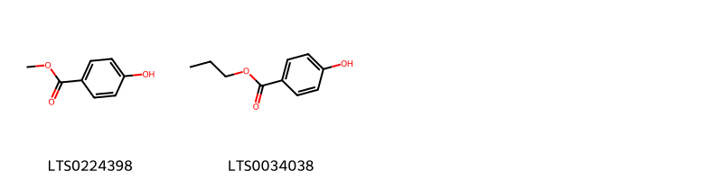{ width=100% }
    <figcaption>Hình ảnh cấu trúc hóa học của 2 hoạt chất thuộc nhóm Benzene and substituted derivatives gồm ['paraben (LTS0224398)', 'propylparaben (LTS0034038)'].</figcaption>
</figure>
#### Nhóm Fatty Acyls
<figure markdown="span">
    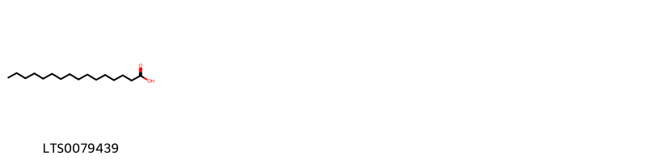{ width=100% }
    <figcaption>Hình ảnh cấu trúc hóa học của 1 hoạt chất thuộc nhóm Fatty Acyls gồm ['palmitic acid (LTS0079439)'].</figcaption>
</figure>
#### Nhóm Prenol lipids
<figure markdown="span">
    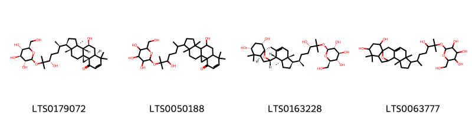{ width=100% }
    <figcaption>Hình ảnh cấu trúc hóa học của 4 hoạt chất thuộc nhóm Prenol lipids gồm ['(1s,3s,8s,10s,11s,12s,15r,16r)-10-hydroxy-15-[(2r,5s)-5-hydroxy-6-methyl-6-{[(2s,3r,4s,5s,6r)-3,4,5-trihydroxy-6-(hydroxymethyl)oxan-2-yl]oxy}heptan-2-yl]-7,7,12,16-tetramethylpentacyclo[9.7.0.0¹,³.0³,⁸.0¹²,¹⁶]octadec-5-en-4-one (LTS0179072)', '10-hydroxy-15-(5-hydroxy-6-methyl-6-{[3,4,5-trihydroxy-6-(hydroxymethyl)oxan-2-yl]oxy}heptan-2-yl)-7,7,12,16-tetramethylpentacyclo[9.7.0.0¹,³.0³,⁸.0¹²,¹⁶]octadec-5-en-4-one (LTS0050188)', '(2s,3r,4s,5s,6r)-2-{[(3s,6r)-6-[(1s,6r,7r,10s,11r,12s,14s,16r,18s)-16,18-dihydroxy-6,10,15,15-tetramethyl-19-oxapentacyclo[10.6.1.0¹,¹⁴.0³,¹¹.0⁶,¹⁰]nonadec-3-en-7-yl]-3-hydroxy-2-methylheptan-2-yl]oxy}-6-(hydroxymethyl)oxane-3,4,5-triol (LTS0163228)', '2-[(6-{16,18-dihydroxy-6,10,15,15-tetramethyl-19-oxapentacyclo[10.6.1.0¹,¹⁴.0³,¹¹.0⁶,¹⁰]nonadec-3-en-7-yl}-3-hydroxy-2-methylheptan-2-yl)oxy]-6-(hydroxymethyl)oxane-3,4,5-triol (LTS0063777)'].</figcaption>
</figure>
#### Nhóm Steroids and steroid derivatives
<figure markdown="span">
    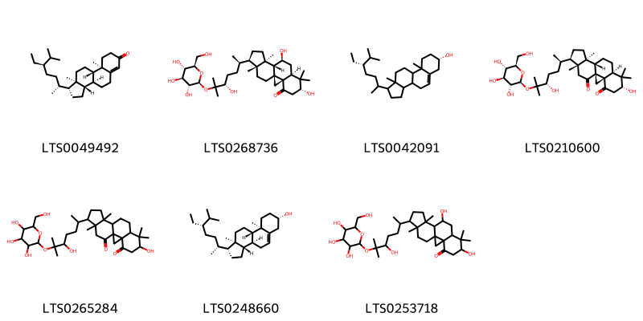{ width=100% }
    <figcaption>Hình ảnh cấu trúc hóa học của 7 hoạt chất thuộc nhóm Steroids and steroid derivatives gồm ['β-sitostenone (LTS0049492)', '(1s,3s,6r,8s,10s,11s,12s,15r,16r)-6,10-dihydroxy-15-[(2r,5s)-5-hydroxy-6-methyl-6-{[(2s,3r,4s,5s,6r)-3,4,5-trihydroxy-6-(hydroxymethyl)oxan-2-yl]oxy}heptan-2-yl]-7,7,12,16-tetramethylpentacyclo[9.7.0.0¹,³.0³,⁸.0¹²,¹⁶]octadecan-4-one (LTS0268736)', '(7s)-1-[(5s)-5-ethyl-6-methylheptan-2-yl]-9a,11a-dimethyl-1h,2h,3h,3ah,3bh,4h,6h,7h,8h,9h,9bh,10h,11h-cyclopenta[a]phenanthren-7-ol (LTS0042091)', '(1r,3s,6r,8s,11s,12s,15r,16r)-6-hydroxy-15-[(2r,5s)-5-hydroxy-6-methyl-6-{[(2s,3r,4s,5s,6r)-3,4,5-trihydroxy-6-(hydroxymethyl)oxan-2-yl]oxy}heptan-2-yl]-7,7,12,16-tetramethylpentacyclo[9.7.0.0¹,³.0³,⁸.0¹²,¹⁶]octadecane-4,18-dione (LTS0210600)', '6-hydroxy-15-(5-hydroxy-6-methyl-6-{[3,4,5-trihydroxy-6-(hydroxymethyl)oxan-2-yl]oxy}heptan-2-yl)-7,7,12,16-tetramethylpentacyclo[9.7.0.0¹,³.0³,⁸.0¹²,¹⁶]octadecane-4,18-dione (LTS0265284)', 'clionasterol (LTS0248660)', '6,10-dihydroxy-15-(5-hydroxy-6-methyl-6-{[3,4,5-trihydroxy-6-(hydroxymethyl)oxan-2-yl]oxy}heptan-2-yl)-7,7,12,16-tetramethylpentacyclo[9.7.0.0¹,³.0³,⁸.0¹²,¹⁶]octadecan-4-one (LTS0253718)'].</figcaption>
</figure>

---

### Dược dân tộc học

Danh sách các quốc gia có sử dụng *Lessertia frutescens* trong điều trị các bệnh. 

| Country      | Disease   | Bệnh                                                                                                                                                                                                |
|:-------------|:----------|:----------------------------------------------------------------------------------------------------------------------------------------------------------------------------------------------------|
| Lesotho      | nan       | MYMEMORY WARNING: YOU USED ALL AVAILABLE FREE TRANSLATIONS FOR TODAY. NEXT AVAILABLE IN  17 HOURS 32 MINUTES 12 SECONDS VISIT HTTPS://MYMEMORY.TRANSLATED.NET/DOC/USAGELIMITS.PHP TO TRANSLATE MORE |
| South Africa | Tonic     | MYMEMORY WARNING: YOU USED ALL AVAILABLE FREE TRANSLATIONS FOR TODAY. NEXT AVAILABLE IN  17 HOURS 32 MINUTES 09 SECONDS VISIT HTTPS://MYMEMORY.TRANSLATED.NET/DOC/USAGELIMITS.PHP TO TRANSLATE MORE |

---

# Chi Drepanocarpus

??? note "Danh sách các dược liệu thuộc chi"
    
	 - *Drepanocarpus lunatus*

---
## Drepanocarpus lunatus
### Thông tin về thực vật

!!! info "Phân loại thực vật của *Machaerium lunatum* từ GIBF:"
    - **Kingdom:** Plantae
    - **Phylum:** Tracheophyta
    - **Order:** Fabales
    - **Family:** Fabaceae
    - **Genus:** Machaerium
    - **Species:** *Machaerium lunatum*

 

| Label (VI)   | Label (EN)   | Scientific Name       | Descriptions (VI)   | Descriptions (EN)   | Also Known As (VI)   | Also Known As (EN)   |
|:-------------|:-------------|:----------------------|:--------------------|:--------------------|:---------------------|:---------------------|
| N/A          | N/A          | Drepanocarpus lunatus |                     |                     | ['']                 | ['']                 |

#### Phân bố trên thế giới

**Từ CSDL GIBF** nan, Ghana, Gabon, Angola, unknown or invalid, Benin, Sierra Leone, Togo, Puerto Rico, Senegal, Nigeria, Bolivia (Plurinational State of), Guinea, Liberia, Suriname, Côte d’Ivoire, Brazil, Guyana, Mexico, Equatorial Guinea, Cameroon

#### Phân bố tại Việt Nam

**Từ CSDL GIBF**: Không có ghi nhận ở Việt Nam

---
### Thành phần hóa học
        
- Theo cơ sở dữ liệu lotus: Từ loài *Machaerium lunatum* đã phân lập và xác định được Chưa có hoạt chất nào được phân lập. hoạt chất thuộc về các nhóm Không có hoạt chất nào được phân lập. 

Không có hình ảnh nào được tạo ra

---

### Dược dân tộc học

Danh sách các quốc gia có sử dụng *Machaerium lunatum* trong điều trị các bệnh. 

| Country   | Disease                                  | Bệnh                                                                                                                                                                                                |
|:----------|:-----------------------------------------|:----------------------------------------------------------------------------------------------------------------------------------------------------------------------------------------------------|
| Elsewhere | Aphrodisiac, Poison, Purgative, Raticide | MYMEMORY WARNING: YOU USED ALL AVAILABLE FREE TRANSLATIONS FOR TODAY. NEXT AVAILABLE IN  17 HOURS 31 MINUTES 26 SECONDS VISIT HTTPS://MYMEMORY.TRANSLATED.NET/DOC/USAGELIMITS.PHP TO TRANSLATE MORE |

---

# Chi Teramnus

??? note "Danh sách các dược liệu thuộc chi"
    
	 - *Teramnus labialis*

---
## Teramnus labialis
### Thông tin về thực vật

!!! info "Phân loại thực vật của *Teramnus labialis* từ GIBF:"
    - **Kingdom:** Plantae
    - **Phylum:** Tracheophyta
    - **Order:** Fabales
    - **Family:** Fabaceae
    - **Genus:** Teramnus
    - **Species:** *Teramnus labialis*

 

| Label (VI)   | Label (EN)   | Scientific Name   | Descriptions (VI)   | Descriptions (EN)   | Also Known As (VI)   | Also Known As (EN)   |
|:-------------|:-------------|:------------------|:--------------------|:--------------------|:---------------------|:---------------------|
| N/A          | N/A          | Teramnus labialis | loài thực vật       | species of plant    | ['']                 | ['']                 |

#### Phân bố trên thế giới

**Từ CSDL GIBF** Guadeloupe, Mauritius, Rwanda, Benin, Tanzania, United Republic of, Togo, Zambia, Puerto Rico, Réunion, Chinese Taipei, United States of America, Zimbabwe, Belize, Saint Martin (French part), South Africa, Saint Barthélemy, Martinique, Cuba, Mayotte, Mexico, Comoros, Madagascar, Cabo Verde, Colombia, India, Antigua and Barbuda, Kenya

#### Phân bố tại Việt Nam

**Từ CSDL GIBF**: Không có ghi nhận ở Việt Nam

---
### Thành phần hóa học
        
- Theo cơ sở dữ liệu lotus: Từ loài *Teramnus labialis* đã phân lập và xác định được 1 hoạt chất thuộc về các nhóm Coumarins and derivatives. 

|    | chemicalTaxonomyClassyfireClass   |   smiles_count |
|---:|:----------------------------------|---------------:|
|  0 | Coumarins and derivatives         |              1 |

#### Nhóm Coumarins and derivatives
<figure markdown="span">
    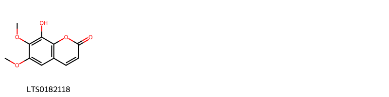{ width=100% }
    <figcaption>Hình ảnh cấu trúc hóa học của 1 hoạt chất thuộc nhóm Coumarins and derivatives gồm ['fraxidin (LTS0182118)'].</figcaption>
</figure>

---

### Dược dân tộc học

Danh sách các quốc gia có sử dụng *Teramnus labialis* trong điều trị các bệnh. 

| Country   | Disease               | Bệnh                                                                                                                                                                                                |
|:----------|:----------------------|:----------------------------------------------------------------------------------------------------------------------------------------------------------------------------------------------------|
| Elsewhere | Astringent, Stomachic | MYMEMORY WARNING: YOU USED ALL AVAILABLE FREE TRANSLATIONS FOR TODAY. NEXT AVAILABLE IN  17 HOURS 31 MINUTES 01 SECONDS VISIT HTTPS://MYMEMORY.TRANSLATED.NET/DOC/USAGELIMITS.PHP TO TRANSLATE MORE |

---

# Chi Phylloxylon

??? note "Danh sách các dược liệu thuộc chi"
    
	 - *Phylloxylon ensifolius*

---
## Phylloxylon ensifolius
### Thông tin về thực vật

!!! info "Phân loại thực vật của *Phylloxylon ensifolius* từ GIBF:"
    - **Kingdom:** Plantae
    - **Phylum:** Tracheophyta
    - **Order:** Fabales
    - **Family:** Fabaceae
    - **Genus:** Phylloxylon
    - **Species:** *Phylloxylon ensifolius*

 

| Label (VI)   | Label (EN)   | Scientific Name   | Descriptions (VI)   | Descriptions (EN)   | Also Known As (VI)   | Also Known As (EN)   |
|:-------------|:-------------|:------------------|:--------------------|:--------------------|:---------------------|:---------------------|
| N/A          | N/A          | Teramnus labialis | loài thực vật       | species of plant    | ['']                 | ['']                 |

#### Phân bố trên thế giới

**Từ CSDL GIBF** Guadeloupe, Mauritius, Rwanda, Benin, Tanzania, United Republic of, Togo, Zambia, Puerto Rico, Réunion, Chinese Taipei, United States of America, Zimbabwe, Belize, Saint Martin (French part), South Africa, Saint Barthélemy, Martinique, Cuba, Mayotte, Mexico, Comoros, Madagascar, Cabo Verde, Colombia, India, Antigua and Barbuda, Kenya

#### Phân bố tại Việt Nam

**Từ CSDL GIBF**: Không có ghi nhận ở Việt Nam

---
### Thành phần hóa học
        
- Theo cơ sở dữ liệu lotus: Từ loài *Phylloxylon ensifolius* đã phân lập và xác định được Chưa có hoạt chất nào được phân lập. hoạt chất thuộc về các nhóm Không có hoạt chất nào được phân lập. 

Không có hình ảnh nào được tạo ra

---

### Dược dân tộc học

Danh sách các quốc gia có sử dụng *Phylloxylon ensifolius* trong điều trị các bệnh. 

| Country   | Disease   | Bệnh                                                                                                                                                                                                |
|:----------|:----------|:----------------------------------------------------------------------------------------------------------------------------------------------------------------------------------------------------|
| Malagasy  | Piscicide | MYMEMORY WARNING: YOU USED ALL AVAILABLE FREE TRANSLATIONS FOR TODAY. NEXT AVAILABLE IN  17 HOURS 30 MINUTES 15 SECONDS VISIT HTTPS://MYMEMORY.TRANSLATED.NET/DOC/USAGELIMITS.PHP TO TRANSLATE MORE |

---

# Chi Smithia

??? note "Danh sách các dược liệu thuộc chi"
    
	 - *Smithia conferta*
	 - *Smithia sensitiva*

---
## Smithia conferta
### Thông tin về thực vật

!!! info "Phân loại thực vật của *Smithia conferta* từ GIBF:"
    - **Kingdom:** Plantae
    - **Phylum:** Tracheophyta
    - **Order:** Fabales
    - **Family:** Fabaceae
    - **Genus:** Smithia
    - **Species:** *Smithia conferta*

 

| Label (VI)   | Label (EN)   | Scientific Name   | Descriptions (VI)   | Descriptions (EN)   | Also Known As (VI)   | Also Known As (EN)   |
|:-------------|:-------------|:------------------|:--------------------|:--------------------|:---------------------|:---------------------|
| N/A          | N/A          | Smithia conferta  | loài thực vật       | species of plant    | ['']                 | ['']                 |

#### Phân bố trên thế giới

**Từ CSDL GIBF** nan, Sri Lanka, Malaysia, Hong Kong, Australia, Myanmar, Papua New Guinea, India, Indonesia, unknown or invalid, Philippines, Viet Nam, China, Nepal

#### Phân bố tại Việt Nam

**Từ CSDL GIBF**: Không có ghi nhận ở Việt Nam

---
### Thành phần hóa học
        
- Theo cơ sở dữ liệu lotus: Từ loài *Smithia conferta* đã phân lập và xác định được Chưa có hoạt chất nào được phân lập. hoạt chất thuộc về các nhóm Không có hoạt chất nào được phân lập. 

Không có hình ảnh nào được tạo ra

---

### Dược dân tộc học

Danh sách các quốc gia có sử dụng *Smithia conferta* trong điều trị các bệnh. 

| Country   | Disease         | Bệnh                                                                                                                                                                                                |
|:----------|:----------------|:----------------------------------------------------------------------------------------------------------------------------------------------------------------------------------------------------|
| Elsewhere | Laxative, Tonic | MYMEMORY WARNING: YOU USED ALL AVAILABLE FREE TRANSLATIONS FOR TODAY. NEXT AVAILABLE IN  17 HOURS 29 MINUTES 49 SECONDS VISIT HTTPS://MYMEMORY.TRANSLATED.NET/DOC/USAGELIMITS.PHP TO TRANSLATE MORE |

---

---
## Smithia sensitiva
### Thông tin về thực vật

!!! info "Phân loại thực vật của *Smithia sensitiva* từ GIBF:"
    - **Kingdom:** Plantae
    - **Phylum:** Tracheophyta
    - **Order:** Fabales
    - **Family:** Fabaceae
    - **Genus:** Smithia
    - **Species:** *Smithia sensitiva*

 

| Label (VI)   | Label (EN)   | Scientific Name   | Descriptions (VI)   | Descriptions (EN)   | Also Known As (VI)   | Also Known As (EN)   |
|:-------------|:-------------|:------------------|:--------------------|:--------------------|:---------------------|:---------------------|
| N/A          | N/A          | Smithia sensitiva | loài thực vật       | species of plant    | ['rút roi']          | ['']                 |

#### Phân bố trên thế giới

**Từ CSDL GIBF** nan, Sri Lanka, Malaysia, Australia, Madagascar, Thailand, Japan, Chinese Taipei, Myanmar, Papua New Guinea, India, Indonesia, unknown or invalid, Timor-Leste, Philippines, Viet Nam, China, Nepal

#### Phân bố tại Việt Nam

**Từ CSDL GIBF**: Lam Dong (林同省), Lam Dong, Ha Giang

---
### Thành phần hóa học
        
- Theo cơ sở dữ liệu lotus: Từ loài *Smithia sensitiva* đã phân lập và xác định được Chưa có hoạt chất nào được phân lập. hoạt chất thuộc về các nhóm Không có hoạt chất nào được phân lập. 

Không có hình ảnh nào được tạo ra

---

### Dược dân tộc học

Danh sách các quốc gia có sử dụng *Smithia sensitiva* trong điều trị các bệnh. 

| Country   | Disease     | Bệnh                                                                                                                                                                                                |
|:----------|:------------|:----------------------------------------------------------------------------------------------------------------------------------------------------------------------------------------------------|
| Elsewhere | Refrigerant | MYMEMORY WARNING: YOU USED ALL AVAILABLE FREE TRANSLATIONS FOR TODAY. NEXT AVAILABLE IN  17 HOURS 29 MINUTES 23 SECONDS VISIT HTTPS://MYMEMORY.TRANSLATED.NET/DOC/USAGELIMITS.PHP TO TRANSLATE MORE |

---

# Chi Parkia

??? note "Danh sách các dược liệu thuộc chi"
    
	 - *Parkia biglandsulosa*
	 - *Parkia eciosa*
	 - *Parkia javanica*
	 - *Parkia multijuga*
	 - *Parkia roxburghii*

---
## Parkia biglandsulosa
### Thông tin về thực vật

!!! info "Phân loại thực vật của *Parkia biglandulosa* từ GIBF:"
    - **Kingdom:** Plantae
    - **Phylum:** Tracheophyta
    - **Order:** Fabales
    - **Family:** Fabaceae
    - **Genus:** Parkia
    - **Species:** *Parkia biglandulosa*

 

| Label (VI)   | Label (EN)   | Scientific Name   | Descriptions (VI)   | Descriptions (EN)   | Also Known As (VI)   | Also Known As (EN)   |
|:-------------|:-------------|:------------------|:--------------------|:--------------------|:---------------------|:---------------------|
| N/A          | N/A          | Smithia sensitiva | loài thực vật       | species of plant    | ['rút roi']          | ['']                 |

#### Phân bố trên thế giới

**Từ CSDL GIBF** nan, Puerto Rico, Sri Lanka, Trinidad and Tobago, Seychelles, Brazil, Myanmar, Mozambique, Saint Lucia, India, Indonesia, unknown or invalid, Malaysia

#### Phân bố tại Việt Nam

**Từ CSDL GIBF**: Không có ghi nhận ở Việt Nam

---
### Thành phần hóa học
        
- Theo cơ sở dữ liệu lotus: Từ loài *Parkia biglandulosa* đã phân lập và xác định được Chưa có hoạt chất nào được phân lập. hoạt chất thuộc về các nhóm Không có hoạt chất nào được phân lập. 

Không có hình ảnh nào được tạo ra

---

### Dược dân tộc học

Danh sách các quốc gia có sử dụng *Parkia biglandulosa* trong điều trị các bệnh. 

| Country   | Disease                 | Bệnh                                                                                                                                                                                                |
|:----------|:------------------------|:----------------------------------------------------------------------------------------------------------------------------------------------------------------------------------------------------|
| Elsewhere | Astringent, Refrigerant | MYMEMORY WARNING: YOU USED ALL AVAILABLE FREE TRANSLATIONS FOR TODAY. NEXT AVAILABLE IN  17 HOURS 28 MINUTES 51 SECONDS VISIT HTTPS://MYMEMORY.TRANSLATED.NET/DOC/USAGELIMITS.PHP TO TRANSLATE MORE |

---

---
## Parkia eciosa
### Thông tin về thực vật

!!! info "Phân loại thực vật của *N/A* từ GIBF:"
    - **Kingdom:** N/A
    - **Phylum:** N/A
    - **Order:** N/A
    - **Family:** N/A
    - **Genus:** N/A
    - **Species:** *N/A*

 

| Label (VI)   | Label (EN)   | Scientific Name   | Descriptions (VI)   | Descriptions (EN)   | Also Known As (VI)   | Also Known As (EN)   |
|:-------------|:-------------|:------------------|:--------------------|:--------------------|:---------------------|:---------------------|
| N/A          | N/A          | Smithia sensitiva | loài thực vật       | species of plant    | ['rút roi']          | ['']                 |

#### Phân bố trên thế giới

**Từ CSDL GIBF** Không có kết quả phù hợp

#### Phân bố tại Việt Nam

**Từ CSDL GIBF**: Không có ghi nhận ở Việt Nam

---
### Thành phần hóa học
        
- Theo cơ sở dữ liệu lotus: Từ loài *N/A* đã phân lập và xác định được Chưa có hoạt chất nào được phân lập. hoạt chất thuộc về các nhóm Không có hoạt chất nào được phân lập. 

Không có hình ảnh nào được tạo ra

---

### Dược dân tộc học

Danh sách các quốc gia có sử dụng *N/A* trong điều trị các bệnh. 

| Country   | Disease   | Bệnh                                                                                                                                                                                                |
|:----------|:----------|:----------------------------------------------------------------------------------------------------------------------------------------------------------------------------------------------------|
| Java      | Diuretic  | MYMEMORY WARNING: YOU USED ALL AVAILABLE FREE TRANSLATIONS FOR TODAY. NEXT AVAILABLE IN  17 HOURS 28 MINUTES 27 SECONDS VISIT HTTPS://MYMEMORY.TRANSLATED.NET/DOC/USAGELIMITS.PHP TO TRANSLATE MORE |

---

---
## Parkia javanica
### Thông tin về thực vật

!!! info "Phân loại thực vật của *Parkia javanica* từ GIBF:"
    - **Kingdom:** Plantae
    - **Phylum:** Tracheophyta
    - **Order:** Fabales
    - **Family:** Fabaceae
    - **Genus:** Parkia
    - **Species:** *Parkia javanica*

 

| Label (VI)   | Label (EN)   | Scientific Name   | Descriptions (VI)   | Descriptions (EN)   | Also Known As (VI)   | Also Known As (EN)   |
|:-------------|:-------------|:------------------|:--------------------|:--------------------|:---------------------|:---------------------|
| N/A          | N/A          | Parkia javanica   | loài thực vật       | species of plant    | ['']                 | ['']                 |

#### Phân bố trên thế giới

**Từ CSDL GIBF** nan, French Polynesia, Belgium, Mozambique, unknown or invalid, Indonesia, Philippines, Malaysia

#### Phân bố tại Việt Nam

**Từ CSDL GIBF**: Không có ghi nhận ở Việt Nam

---
### Thành phần hóa học
        
- Theo cơ sở dữ liệu lotus: Từ loài *Parkia javanica* đã phân lập và xác định được Chưa có hoạt chất nào được phân lập. hoạt chất thuộc về các nhóm Không có hoạt chất nào được phân lập. 

Không có hình ảnh nào được tạo ra

---

### Dược dân tộc học

Danh sách các quốc gia có sử dụng *Parkia javanica* trong điều trị các bệnh. 

| Country   | Disease   | Bệnh                                                                                                                                                                                                |
|:----------|:----------|:----------------------------------------------------------------------------------------------------------------------------------------------------------------------------------------------------|
| Malaya    | Cosmetic  | MYMEMORY WARNING: YOU USED ALL AVAILABLE FREE TRANSLATIONS FOR TODAY. NEXT AVAILABLE IN  17 HOURS 28 MINUTES 07 SECONDS VISIT HTTPS://MYMEMORY.TRANSLATED.NET/DOC/USAGELIMITS.PHP TO TRANSLATE MORE |
| Singapore | Tonic     | MYMEMORY WARNING: YOU USED ALL AVAILABLE FREE TRANSLATIONS FOR TODAY. NEXT AVAILABLE IN  17 HOURS 28 MINUTES 04 SECONDS VISIT HTTPS://MYMEMORY.TRANSLATED.NET/DOC/USAGELIMITS.PHP TO TRANSLATE MORE |

---

---
## Parkia multijuga
### Thông tin về thực vật

!!! info "Phân loại thực vật của *Parkia multijuga* từ GIBF:"
    - **Kingdom:** Plantae
    - **Phylum:** Tracheophyta
    - **Order:** Fabales
    - **Family:** Fabaceae
    - **Genus:** Parkia
    - **Species:** *Parkia multijuga*

 

| Label (VI)   | Label (EN)   | Scientific Name   | Descriptions (VI)   | Descriptions (EN)   | Also Known As (VI)   | Also Known As (EN)   |
|:-------------|:-------------|:------------------|:--------------------|:--------------------|:---------------------|:---------------------|
| N/A          | N/A          | Parkia multijuga  | loài thực vật       | species of plant    | ['']                 | ['']                 |

#### Phân bố trên thế giới

**Từ CSDL GIBF** nan, Ecuador, Colombia, Brazil, Peru

#### Phân bố tại Việt Nam

**Từ CSDL GIBF**: Không có ghi nhận ở Việt Nam

---
### Thành phần hóa học
        
- Theo cơ sở dữ liệu lotus: Từ loài *Parkia multijuga* đã phân lập và xác định được Chưa có hoạt chất nào được phân lập. hoạt chất thuộc về các nhóm Không có hoạt chất nào được phân lập. 

Không có hình ảnh nào được tạo ra

---

### Dược dân tộc học

Danh sách các quốc gia có sử dụng *Parkia multijuga* trong điều trị các bệnh. 

| Country   | Disease   | Bệnh                                                                                                                                                                                                |
|:----------|:----------|:----------------------------------------------------------------------------------------------------------------------------------------------------------------------------------------------------|
| Brazil    | Soap      | MYMEMORY WARNING: YOU USED ALL AVAILABLE FREE TRANSLATIONS FOR TODAY. NEXT AVAILABLE IN  17 HOURS 27 MINUTES 32 SECONDS VISIT HTTPS://MYMEMORY.TRANSLATED.NET/DOC/USAGELIMITS.PHP TO TRANSLATE MORE |

---

---
## Parkia roxburghii
### Thông tin về thực vật

!!! info "Phân loại thực vật của *Parkia timoriana* từ GIBF:"
    - **Kingdom:** Plantae
    - **Phylum:** Tracheophyta
    - **Order:** Fabales
    - **Family:** Fabaceae
    - **Genus:** Parkia
    - **Species:** *Parkia timoriana*

 

| Label (VI)   | Label (EN)   | Scientific Name   | Descriptions (VI)   | Descriptions (EN)   | Also Known As (VI)   | Also Known As (EN)   |
|:-------------|:-------------|:------------------|:--------------------|:--------------------|:---------------------|:---------------------|
| N/A          | N/A          | Parkia roxburghii | loài thực vật       | species of plant    | ['']                 | ['']                 |

#### Phân bố trên thế giới

**Từ CSDL GIBF** nan, Sri Lanka, Chinese Taipei, Mozambique, India, Indonesia, unknown or invalid, United States of America, Bangladesh, Philippines, Singapore, Malaysia, China

#### Phân bố tại Việt Nam

**Từ CSDL GIBF**: Không có ghi nhận ở Việt Nam

---
### Thành phần hóa học
        
- Theo cơ sở dữ liệu lotus: Từ loài *Parkia timoriana* đã phân lập và xác định được Chưa có hoạt chất nào được phân lập. hoạt chất thuộc về các nhóm Không có hoạt chất nào được phân lập. 

Không có hình ảnh nào được tạo ra

---

### Dược dân tộc học

Danh sách các quốc gia có sử dụng *Parkia timoriana* trong điều trị các bệnh. 

| Country   | Disease   | Bệnh                                                                                                                                                                                                |
|:----------|:----------|:----------------------------------------------------------------------------------------------------------------------------------------------------------------------------------------------------|
| Malaysia  | Soap      | MYMEMORY WARNING: YOU USED ALL AVAILABLE FREE TRANSLATIONS FOR TODAY. NEXT AVAILABLE IN  17 HOURS 27 MINUTES 07 SECONDS VISIT HTTPS://MYMEMORY.TRANSLATED.NET/DOC/USAGELIMITS.PHP TO TRANSLATE MORE |

---

# Chi Pentaclethra

??? note "Danh sách các dược liệu thuộc chi"
    
	 - *Pentaclethra filamentosa*
	 - *Pentaclethra macrophylla*

---
## Pentaclethra filamentosa
### Thông tin về thực vật

!!! info "Phân loại thực vật của *Pentaclethra macroloba* từ GIBF:"
    - **Kingdom:** Plantae
    - **Phylum:** Tracheophyta
    - **Order:** Fabales
    - **Family:** Fabaceae
    - **Genus:** Pentaclethra
    - **Species:** *Pentaclethra macroloba*

 

| Label (VI)   | Label (EN)   | Scientific Name          | Descriptions (VI)   | Descriptions (EN)   | Also Known As (VI)   | Also Known As (EN)   |
|:-------------|:-------------|:-------------------------|:--------------------|:--------------------|:---------------------|:---------------------|
| N/A          | N/A          | Pentaclethra filamentosa | loài thực vật       | species of plant    | ['']                 | ['']                 |

#### Phân bố trên thế giới

**Từ CSDL GIBF** nan, Trinidad and Tobago, Suriname, Martinique, Brazil, Guyana, Costa Rica, unknown or invalid, Singapore, Venezuela (Bolivarian Republic of), Panama

#### Phân bố tại Việt Nam

**Từ CSDL GIBF**: Không có ghi nhận ở Việt Nam

---
### Thành phần hóa học
        
- Theo cơ sở dữ liệu lotus: Từ loài *Pentaclethra macroloba* đã phân lập và xác định được Chưa có hoạt chất nào được phân lập. hoạt chất thuộc về các nhóm Không có hoạt chất nào được phân lập. 

Không có hình ảnh nào được tạo ra

---

### Dược dân tộc học

Danh sách các quốc gia có sử dụng *Pentaclethra macroloba* trong điều trị các bệnh. 

| Country   | Disease        | Bệnh                                                                                                                                                                                                |
|:----------|:---------------|:----------------------------------------------------------------------------------------------------------------------------------------------------------------------------------------------------|
| Brazil    | Emetic, Poison | MYMEMORY WARNING: YOU USED ALL AVAILABLE FREE TRANSLATIONS FOR TODAY. NEXT AVAILABLE IN  17 HOURS 26 MINUTES 29 SECONDS VISIT HTTPS://MYMEMORY.TRANSLATED.NET/DOC/USAGELIMITS.PHP TO TRANSLATE MORE |
| Venezuela | Astringent     | MYMEMORY WARNING: YOU USED ALL AVAILABLE FREE TRANSLATIONS FOR TODAY. NEXT AVAILABLE IN  17 HOURS 26 MINUTES 26 SECONDS VISIT HTTPS://MYMEMORY.TRANSLATED.NET/DOC/USAGELIMITS.PHP TO TRANSLATE MORE |

---

---
## Pentaclethra macrophylla
### Thông tin về thực vật

!!! info "Phân loại thực vật của *Pentaclethra macrophylla* từ GIBF:"
    - **Kingdom:** Plantae
    - **Phylum:** Tracheophyta
    - **Order:** Fabales
    - **Family:** Fabaceae
    - **Genus:** Pentaclethra
    - **Species:** *Pentaclethra macrophylla*

 

| Label (VI)   | Label (EN)   | Scientific Name          | Descriptions (VI)   | Descriptions (EN)   | Also Known As (VI)   | Also Known As (EN)   |
|:-------------|:-------------|:-------------------------|:--------------------|:--------------------|:---------------------|:---------------------|
| N/A          | N/A          | Pentaclethra macrophylla | loài thực vật       | species of plant    | ['']                 | ['']                 |

#### Phân bố trên thế giới

**Từ CSDL GIBF** Gabon, Côte d’Ivoire, Costa Rica, Guinea, Liberia, Sierra Leone

#### Phân bố tại Việt Nam

**Từ CSDL GIBF**: Không có ghi nhận ở Việt Nam

---
### Thành phần hóa học
        
- Theo cơ sở dữ liệu lotus: Từ loài *Pentaclethra macrophylla* đã phân lập và xác định được 32 hoạt chất thuộc về các nhóm Fatty Acyls, Carboxylic acids and derivatives, Indoles and derivatives. 

|    | chemicalTaxonomyClassyfireClass   |   smiles_count |
|---:|:----------------------------------|---------------:|
|  0 | Carboxylic acids and derivatives  |             23 |
|  1 | Fatty Acyls                       |              8 |
|  2 | Indoles and derivatives           |              1 |

#### Nhóm Carboxylic acids and derivatives
<figure markdown="span">
    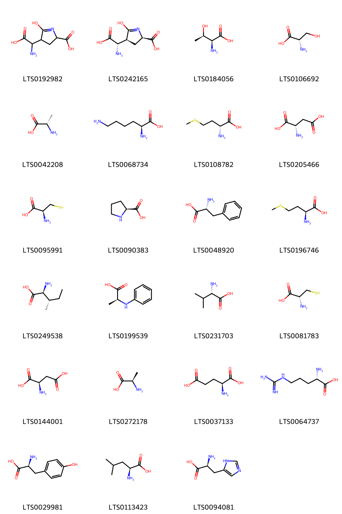{ width=100% }
    <figcaption>Hình ảnh cấu trúc hóa học của 23 hoạt chất thuộc nhóm Carboxylic acids and derivatives gồm ['4-[amino(carboxy)methyl]-5-hydroxy-3,4-dihydro-2h-pyrrole-2-carboxylic acid (LTS0192982)', '(2r,4s)-4-[(s)-amino(carboxy)methyl]-5-hydroxy-3,4-dihydro-2h-pyrrole-2-carboxylic acid (LTS0242165)', 'l-threonine (LTS0184056)', 'l-serine (LTS0106692)', 'l-alanine (LTS0042208)', 'l-lysine (LTS0068734)', 'd-methionine (LTS0108782)', 'l-aspartic acid (LTS0205466)', 'd-cysteine (LTS0095991)', 'l-proline (LTS0090383)', 'd-phenylalanine (LTS0048920)', 'l-methionine (LTS0196746)', 'l-isoleucine (LTS0249538)', '(2s)-2-(phenylamino)propanoic acid (LTS0199539)', 'l-valine (LTS0231703)', 'l-cysteine (LTS0081783)', 'd-aspartic acid (LTS0144001)', 'd-alanine (LTS0272178)', 'l-glutamic acid (LTS0037133)', 'l-arginine (LTS0064737)', 'l-tyrosine (LTS0029981)', 'l-leucine (LTS0113423)', 'l-histidine (LTS0094081)'].</figcaption>
</figure>
#### Nhóm Fatty Acyls
<figure markdown="span">
    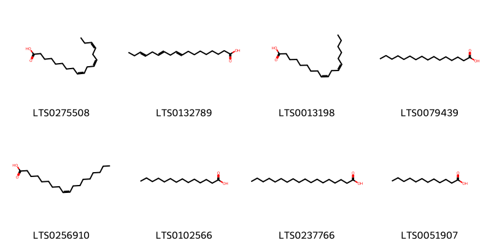{ width=100% }
    <figcaption>Hình ảnh cấu trúc hóa học của 8 hoạt chất thuộc nhóm Fatty Acyls gồm ['α-linolenic acid (LTS0275508)', 'α linolenic acid (LTS0132789)', 'linoleic (LTS0013198)', 'palmitic acid (LTS0079439)', 'oleic acid (LTS0256910)', 'myristic acid (LTS0102566)', 'stearic acid (LTS0237766)', 'lauric acid (LTS0051907)'].</figcaption>
</figure>
#### Nhóm Indoles and derivatives
<figure markdown="span">
    { width=100% }
    <figcaption>Hình ảnh cấu trúc hóa học của 1 hoạt chất thuộc nhóm Indoles and derivatives gồm ['l-tryptophan (LTS0263809)'].</figcaption>
</figure>

---

### Dược dân tộc học

Danh sách các quốc gia có sử dụng *Pentaclethra macrophylla* trong điều trị các bệnh. 

| Country   | Disease                             | Bệnh                                                                                                                                                                                                |
|:----------|:------------------------------------|:----------------------------------------------------------------------------------------------------------------------------------------------------------------------------------------------------|
| Elsewhere | Ecbolic, Piscicide, Soap, Vermifuge | MYMEMORY WARNING: YOU USED ALL AVAILABLE FREE TRANSLATIONS FOR TODAY. NEXT AVAILABLE IN  17 HOURS 26 MINUTES 03 SECONDS VISIT HTTPS://MYMEMORY.TRANSLATED.NET/DOC/USAGELIMITS.PHP TO TRANSLATE MORE |

---

# Chi Gymnocladus

??? note "Danh sách các dược liệu thuộc chi"
    
	 - *Gymnocladus chinensis*
	 - *Gymnocladus dioica*

---
## Gymnocladus chinensis
### Thông tin về thực vật

!!! info "Phân loại thực vật của *Gymnocladus chinensis* từ GIBF:"
    - **Kingdom:** Plantae
    - **Phylum:** Tracheophyta
    - **Order:** Fabales
    - **Family:** Fabaceae
    - **Genus:** Gymnocladus
    - **Species:** *Gymnocladus chinensis*

 

| Label (VI)   | Label (EN)   | Scientific Name       | Descriptions (VI)   | Descriptions (EN)   | Also Known As (VI)   | Also Known As (EN)   |
|:-------------|:-------------|:----------------------|:--------------------|:--------------------|:---------------------|:---------------------|
| N/A          | N/A          | Gymnocladus chinensis | loài thực vật       | species of plant    | ['']                 | ['']                 |

#### Phân bố trên thế giới

**Từ CSDL GIBF** Japan, Korea, Republic of, Myanmar, unknown or invalid, China

#### Phân bố tại Việt Nam

**Từ CSDL GIBF**: Không có ghi nhận ở Việt Nam

---
### Thành phần hóa học
        
- Theo cơ sở dữ liệu lotus: Từ loài *Gymnocladus chinensis* đã phân lập và xác định được 11 hoạt chất thuộc về các nhóm Prenol lipids, Organooxygen compounds, Saccharolipids. 

|    | chemicalTaxonomyClassyfireClass   |   smiles_count |
|---:|:----------------------------------|---------------:|
|  0 | Organooxygen compounds            |              2 |
|  1 | Prenol lipids                     |              7 |
|  2 | Saccharolipids                    |              2 |

#### Nhóm Organooxygen compounds
<figure markdown="span">
    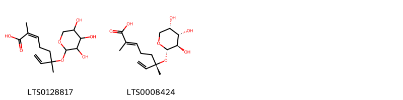{ width=100% }
    <figcaption>Hình ảnh cấu trúc hóa học của 2 hoạt chất thuộc nhóm Organooxygen compounds gồm ['2,6-dimethyl-6-[(3,4,5-trihydroxyoxan-2-yl)oxy]octa-2,7-dienoic acid (LTS0128817)', '(2e,6s)-2,6-dimethyl-6-{[(2s,3r,4s,5s)-3,4,5-trihydroxyoxan-2-yl]oxy}octa-2,7-dienoic acid (LTS0008424)'].</figcaption>
</figure>
#### Nhóm Prenol lipids
<figure markdown="span">
    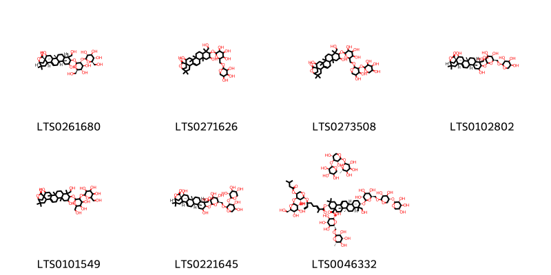{ width=100% }
    <figcaption>Hình ảnh cấu trúc hóa học của 7 hoạt chất thuộc nhóm Prenol lipids gồm ['(1r,2s,4s,5r,8s,9r,10r,11s,13r,14s,18s,21s)-10-{[(2r,3r,4s,5s,6r)-4,5-dihydroxy-6-(hydroxymethyl)-3-{[(2s,3r,4s,5s,6r)-3,4,5-trihydroxy-6-(hydroxymethyl)oxan-2-yl]oxy}oxan-2-yl]oxy}-2,11-dihydroxy-9-(hydroxymethyl)-4,5,9,13,20,20-hexamethyl-22-oxahexacyclo[19.2.1.0¹,¹⁸.0⁴,¹⁷.0⁵,¹⁴.0⁸,¹³]tetracos-16-en-23-one (LTS0261680)', '2,11-dihydroxy-9-(hydroxymethyl)-4,5,9,13,20,20-hexamethyl-10-[(3,4,5-trihydroxy-6-{[(3,4,5-trihydroxyoxan-2-yl)oxy]methyl}oxan-2-yl)oxy]-22-oxahexacyclo[19.2.1.0¹,¹⁸.0⁴,¹⁷.0⁵,¹⁴.0⁸,¹³]tetracos-16-en-23-one (LTS0271626)', '10-({6-[({4,5-dihydroxy-3-[(3,4,5-trihydroxyoxan-2-yl)oxy]oxan-2-yl}oxy)methyl]-3,4,5-trihydroxyoxan-2-yl}oxy)-2,11-dihydroxy-9-(hydroxymethyl)-4,5,9,13,20,20-hexamethyl-22-oxahexacyclo[19.2.1.0¹,¹⁸.0⁴,¹⁷.0⁵,¹⁴.0⁸,¹³]tetracos-16-en-23-one (LTS0273508)', '(1r,2s,4s,5r,8r,9r,10r,11s,13r,14r,18s,21s)-2,11-dihydroxy-9-(hydroxymethyl)-4,5,9,13,20,20-hexamethyl-10-{[(2r,3r,4s,5s,6r)-3,4,5-trihydroxy-6-({[(2s,3r,4s,5s)-3,4,5-trihydroxyoxan-2-yl]oxy}methyl)oxan-2-yl]oxy}-22-oxahexacyclo[19.2.1.0¹,¹⁸.0⁴,¹⁷.0⁵,¹⁴.0⁸,¹³]tetracos-16-en-23-one (LTS0102802)', '10-{[4,5-dihydroxy-6-(hydroxymethyl)-3-{[3,4,5-trihydroxy-6-(hydroxymethyl)oxan-2-yl]oxy}oxan-2-yl]oxy}-2,11-dihydroxy-9-(hydroxymethyl)-4,5,9,13,20,20-hexamethyl-22-oxahexacyclo[19.2.1.0¹,¹⁸.0⁴,¹⁷.0⁵,¹⁴.0⁸,¹³]tetracos-16-en-23-one (LTS0101549)', '(1r,2s,4s,5r,8r,9r,10r,11s,13r,14r,18s,21s)-10-{[(2r,3r,4s,5s,6r)-6-({[(2s,3r,4s,5s)-4,5-dihydroxy-3-{[(2s,3r,4s,5r)-3,4,5-trihydroxyoxan-2-yl]oxy}oxan-2-yl]oxy}methyl)-3,4,5-trihydroxyoxan-2-yl]oxy}-2,11-dihydroxy-9-(hydroxymethyl)-4,5,9,13,20,20-hexamethyl-22-oxahexacyclo[19.2.1.0¹,¹⁸.0⁴,¹⁷.0⁵,¹⁴.0⁸,¹³]tetracos-16-en-23-one (LTS0221645)', '(2s,3r,4s,5r,6s)-2-{[(2s,3r,4s,5r)-3,5-dihydroxy-4-{[(2s,3r,4s,5r)-3,4,5-trihydroxyoxan-2-yl]oxy}oxan-2-yl]oxy}-6-methyloxane-3,4,5-triol; (2s,3r,4s,5s,6r)-3,4,5-trihydroxy-6-({[(2r,3r,4r,5r,6s)-3,4,5-trihydroxy-6-methyloxan-2-yl]oxy}methyl)oxan-2-yl (3s,5s,6as,6br,8ar,10s,12ar,12br)-10-{[(2r,3r,4s,5s,6r)-6-({[(2s,3r,4r,5r)-3,4-dihydroxy-5-{[(2r,3r,4s,5r)-3,4,5-trihydroxyoxan-2-yl]oxy}oxan-2-yl]oxy}methyl)-3,4,5-trihydroxyoxan-2-yl]oxy}-5-hydroxy-3-{[(2e,6s)-6-{[(2s,3r,4r,5s)-3-hydroxy-5-[(3-methylbutanoyl)oxy]-4-{[(2s,3r,4s,5s,6r)-3,4,5-trihydroxy-6-(hydroxymethyl)oxan-2-yl]oxy}oxan-2-yl]oxy}-2,6-dimethylocta-2,7-dienoyl]oxy}-9-(hydroxymethyl)-2,2,6a,6b,9,12a-hexamethyl-1,3,4,5,6,7,8,8a,10,11,12,12b,13,14b-tetradecahydropicene-4a-carboxylate (LTS0046332)'].</figcaption>
</figure>
#### Nhóm Saccharolipids
<figure markdown="span">
    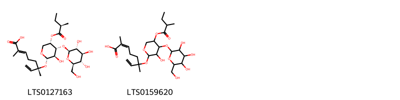{ width=100% }
    <figcaption>Hình ảnh cấu trúc hóa học của 2 hoạt chất thuộc nhóm Saccharolipids gồm ['(2e,6s)-6-{[(2s,3r,4r,5s)-3-hydroxy-5-{[(2r)-2-methylbutanoyl]oxy}-4-{[(2s,3r,4s,5s,6r)-3,4,5-trihydroxy-6-(hydroxymethyl)oxan-2-yl]oxy}oxan-2-yl]oxy}-2,6-dimethylocta-2,7-dienoic acid (LTS0127163)', '6-({3-hydroxy-5-[(2-methylbutanoyl)oxy]-4-{[3,4,5-trihydroxy-6-(hydroxymethyl)oxan-2-yl]oxy}oxan-2-yl}oxy)-2,6-dimethylocta-2,7-dienoic acid (LTS0159620)'].</figcaption>
</figure>

---

### Dược dân tộc học

Danh sách các quốc gia có sử dụng *Gymnocladus chinensis* trong điều trị các bệnh. 

| Country   | Disease                            | Bệnh                                                                                                                                                                                                |
|:----------|:-----------------------------------|:----------------------------------------------------------------------------------------------------------------------------------------------------------------------------------------------------|
| China     | Piscicide, Soap, Carminative, Soap | MYMEMORY WARNING: YOU USED ALL AVAILABLE FREE TRANSLATIONS FOR TODAY. NEXT AVAILABLE IN  17 HOURS 25 MINUTES 14 SECONDS VISIT HTTPS://MYMEMORY.TRANSLATED.NET/DOC/USAGELIMITS.PHP TO TRANSLATE MORE |

---

---
## Gymnocladus dioica
### Thông tin về thực vật

!!! info "Phân loại thực vật của *Gymnocladus dioicus* từ GIBF:"
    - **Kingdom:** Plantae
    - **Phylum:** Tracheophyta
    - **Order:** Fabales
    - **Family:** Fabaceae
    - **Genus:** Gymnocladus
    - **Species:** *Gymnocladus dioicus*

 

| Label (VI)   | Label (EN)   | Scientific Name    | Descriptions (VI)   | Descriptions (EN)           | Also Known As (VI)   | Also Known As (EN)   |
|:-------------|:-------------|:-------------------|:--------------------|:----------------------------|:---------------------|:---------------------|
| N/A          | N/A          | Gymnocladus dioica |                     | Synonymous species of plant | ['']                 | ['']                 |

#### Phân bố trên thế giới

**Từ CSDL GIBF** Ukraine, United States of America, Canada

#### Phân bố tại Việt Nam

**Từ CSDL GIBF**: Không có ghi nhận ở Việt Nam

---
### Thành phần hóa học
        
- Theo cơ sở dữ liệu lotus: Từ loài *Gymnocladus dioicus* đã phân lập và xác định được 6 hoạt chất thuộc về các nhóm Fatty Acyls, Phenylpropanoic acids, Carboxylic acids and derivatives, Steroids and steroid derivatives. 

|    | chemicalTaxonomyClassyfireClass   |   smiles_count |
|---:|:----------------------------------|---------------:|
|  0 | Carboxylic acids and derivatives  |              2 |
|  1 | Fatty Acyls                       |              1 |
|  2 | Phenylpropanoic acids             |              1 |
|  3 | Steroids and steroid derivatives  |              2 |

#### Nhóm Carboxylic acids and derivatives
<figure markdown="span">
    { width=100% }
    <figcaption>Hình ảnh cấu trúc hóa học của 2 hoạt chất thuộc nhóm Carboxylic acids and derivatives gồm ['(+,-)-pipecolic acid (LTS0189894)', '5-hydroxypipecolic acid (LTS0145112)'].</figcaption>
</figure>
#### Nhóm Fatty Acyls
<figure markdown="span">
    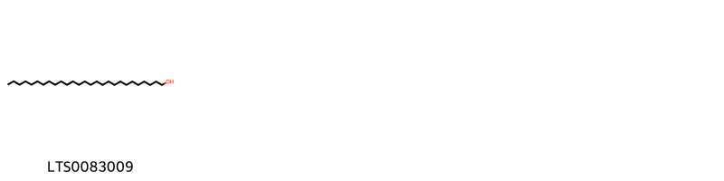{ width=100% }
    <figcaption>Hình ảnh cấu trúc hóa học của 1 hoạt chất thuộc nhóm Fatty Acyls gồm ['heptacosanol (LTS0083009)'].</figcaption>
</figure>
#### Nhóm Phenylpropanoic acids
<figure markdown="span">
    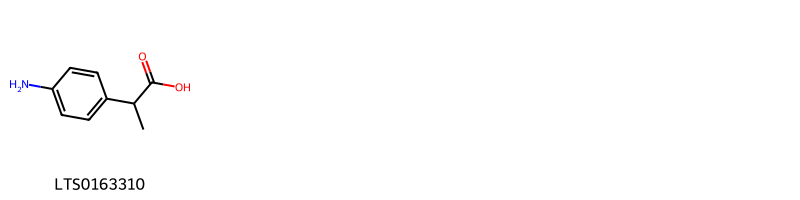{ width=100% }
    <figcaption>Hình ảnh cấu trúc hóa học của 1 hoạt chất thuộc nhóm Phenylpropanoic acids gồm ['2-(4-aminophenyl)propanoic acid (LTS0163310)'].</figcaption>
</figure>
#### Nhóm Steroids and steroid derivatives
<figure markdown="span">
    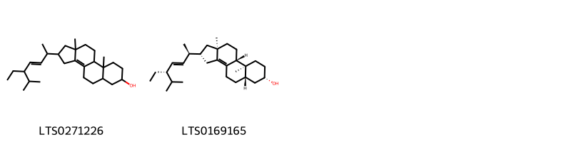{ width=100% }
    <figcaption>Hình ảnh cấu trúc hóa học của 2 hoạt chất thuộc nhóm Steroids and steroid derivatives gồm ['2-(5-ethyl-6-methylhept-3-en-2-yl)-9a,11a-dimethyl-1h,2h,3h,4h,5h,5ah,6h,7h,8h,9h,9bh,10h,11h-cyclopenta[a]phenanthren-7-ol (LTS0271226)', '(2r,5as,7s,9as,9br,11ar)-2-[(2s,3e,5s)-5-ethyl-6-methylhept-3-en-2-yl]-9a,11a-dimethyl-1h,2h,3h,4h,5h,5ah,6h,7h,8h,9h,9bh,10h,11h-cyclopenta[a]phenanthren-7-ol (LTS0169165)'].</figcaption>
</figure>

---

### Dược dân tộc học

Danh sách các quốc gia có sử dụng *Gymnocladus dioicus* trong điều trị các bệnh. 

| Country   | Disease   | Bệnh                                                                                                                                                                                                |
|:----------|:----------|:----------------------------------------------------------------------------------------------------------------------------------------------------------------------------------------------------|
| US        | Poison    | MYMEMORY WARNING: YOU USED ALL AVAILABLE FREE TRANSLATIONS FOR TODAY. NEXT AVAILABLE IN  17 HOURS 24 MINUTES 50 SECONDS VISIT HTTPS://MYMEMORY.TRANSLATED.NET/DOC/USAGELIMITS.PHP TO TRANSLATE MORE |

---

# Chi Sweetia

??? note "Danh sách các dược liệu thuộc chi"
    
	 - *Sweetia panamemsis*

---
## Sweetia panamemsis
### Thông tin về thực vật

!!! info "Phân loại thực vật của *Leptolobium panamense* từ GIBF:"
    - **Kingdom:** Plantae
    - **Phylum:** Tracheophyta
    - **Order:** Fabales
    - **Family:** Fabaceae
    - **Genus:** Leptolobium
    - **Species:** *Leptolobium panamense*

 

| Label (VI)   | Label (EN)   | Scientific Name    | Descriptions (VI)   | Descriptions (EN)           | Also Known As (VI)   | Also Known As (EN)   |
|:-------------|:-------------|:-------------------|:--------------------|:----------------------------|:---------------------|:---------------------|
| N/A          | N/A          | Gymnocladus dioica |                     | Synonymous species of plant | ['']                 | ['']                 |

#### Phân bố trên thế giới

**Từ CSDL GIBF** Belize, nan, Guatemala, Côte d’Ivoire, Brazil, Costa Rica, Honduras, unknown or invalid, United States of America, Mexico, El Salvador, Panama

#### Phân bố tại Việt Nam

**Từ CSDL GIBF**: Không có ghi nhận ở Việt Nam

---
### Thành phần hóa học
        
- Theo cơ sở dữ liệu lotus: Từ loài *Leptolobium panamense* đã phân lập và xác định được Chưa có hoạt chất nào được phân lập. hoạt chất thuộc về các nhóm Không có hoạt chất nào được phân lập. 

Không có hình ảnh nào được tạo ra

---

### Dược dân tộc học

Danh sách các quốc gia có sử dụng *Leptolobium panamense* trong điều trị các bệnh. 

| Country   | Disease   | Bệnh                                                                                                                                                                                                |
|:----------|:----------|:----------------------------------------------------------------------------------------------------------------------------------------------------------------------------------------------------|
| Mexico    | Tonic     | MYMEMORY WARNING: YOU USED ALL AVAILABLE FREE TRANSLATIONS FOR TODAY. NEXT AVAILABLE IN  17 HOURS 24 MINUTES 11 SECONDS VISIT HTTPS://MYMEMORY.TRANSLATED.NET/DOC/USAGELIMITS.PHP TO TRANSLATE MORE |

---

# Chi Tephrosia

??? note "Danh sách các dược liệu thuộc chi"
    
	 - *Tephrosia bracteolata*
	 - *Tephrosia brevipes*
	 - *Tephrosia candida*
	 - *Tephrosia cinerea*
	 - *Tephrosia densiflora*
	 - *Tephrosia grandiflora*
	 - *Tephrosia hamiltonii*
	 - *Tephrosia heydeana*
	 - *Tephrosia incana*
	 - *Tephrosia multifolia*
	 - *Tephrosia nitens*
	 - *Tephrosia noctiflora*
	 - *Tephrosia periculosa*
	 - *Tephrosia piscatoria*
	 - *Tephrosia procumbens*
	 - *Tephrosia purpurea*
	 - *Tephrosia sinapou*
	 - *Tephrosia singapou*
	 - *Tephrosia toxicaria*
	 - *Tephrosia virginiana*
	 - *Tephrosia vogelii*

---
## Tephrosia bracteolata
### Thông tin về thực vật

!!! info "Phân loại thực vật của *Tephrosia bracteolata* từ GIBF:"
    - **Kingdom:** Plantae
    - **Phylum:** Tracheophyta
    - **Order:** Fabales
    - **Family:** Fabaceae
    - **Genus:** Tephrosia
    - **Species:** *Tephrosia bracteolata*

 

| Label (VI)   | Label (EN)   | Scientific Name       | Descriptions (VI)   | Descriptions (EN)   | Also Known As (VI)   | Also Known As (EN)   |
|:-------------|:-------------|:----------------------|:--------------------|:--------------------|:---------------------|:---------------------|
| N/A          | N/A          | Tephrosia bracteolata | loài thực vật       | species of plant    | ['']                 | ['']                 |

#### Phân bố trên thế giới

**Từ CSDL GIBF** Mali, Nigeria, Ethiopia, Cabo Verde, Chad, Gambia, Benin, Congo, Democratic Republic of the, Burkina Faso, Guinea, Tanzania, United Republic of, Togo

#### Phân bố tại Việt Nam

**Từ CSDL GIBF**: Không có ghi nhận ở Việt Nam

---
### Thành phần hóa học
        
- Theo cơ sở dữ liệu lotus: Từ loài *Tephrosia bracteolata* đã phân lập và xác định được 7 hoạt chất thuộc về các nhóm Flavonoids. 

|    | chemicalTaxonomyClassyfireClass   |   smiles_count |
|---:|:----------------------------------|---------------:|
|  0 | Flavonoids                        |              7 |

#### Nhóm Flavonoids
<figure markdown="span">
    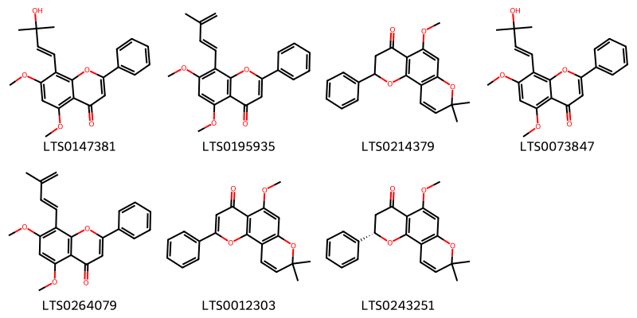{ width=100% }
    <figcaption>Hình ảnh cấu trúc hóa học của 7 hoạt chất thuộc nhóm Flavonoids gồm ['8-(3-hydroxy-3-methylbut-1-en-1-yl)-5,7-dimethoxy-2-phenylchromen-4-one (LTS0147381)', 'trans-anhydrotephrostachin (LTS0195935)', 'obovatin methyl ether (LTS0214379)', 'trans-tephrostachin (LTS0073847)', '5,7-dimethoxy-8-(3-methylbuta-1,3-dien-1-yl)-2-phenylchromen-4-one (LTS0264079)', 'isopongaflavone (LTS0012303)', '(2s)-5-methoxy-8,8-dimethyl-2-phenyl-2h,3h-pyrano[2,3-f]chromen-4-one (LTS0243251)'].</figcaption>
</figure>

---

### Dược dân tộc học

Danh sách các quốc gia có sử dụng *Tephrosia bracteolata* trong điều trị các bệnh. 

| Country   | Disease     | Bệnh                                                                                                                                                                                                |
|:----------|:------------|:----------------------------------------------------------------------------------------------------------------------------------------------------------------------------------------------------|
| India     | Insecticide | MYMEMORY WARNING: YOU USED ALL AVAILABLE FREE TRANSLATIONS FOR TODAY. NEXT AVAILABLE IN  17 HOURS 23 MINUTES 48 SECONDS VISIT HTTPS://MYMEMORY.TRANSLATED.NET/DOC/USAGELIMITS.PHP TO TRANSLATE MORE |

---

---
## Tephrosia brevipes
### Thông tin về thực vật

!!! info "Phân loại thực vật của *Tephrosia sessiliflora* từ GIBF:"
    - **Kingdom:** Plantae
    - **Phylum:** Tracheophyta
    - **Order:** Fabales
    - **Family:** Fabaceae
    - **Genus:** Tephrosia
    - **Species:** *Tephrosia sessiliflora*

 

| Label (VI)   | Label (EN)   | Scientific Name    | Descriptions (VI)   | Descriptions (EN)   | Also Known As (VI)   | Also Known As (EN)   |
|:-------------|:-------------|:-------------------|:--------------------|:--------------------|:---------------------|:---------------------|
| N/A          | N/A          | Tephrosia brevipes | loài thực vật       | species of plant    | ['']                 | ['']                 |

#### Phân bố trên thế giới

**Từ CSDL GIBF** nan, Trinidad and Tobago, Brazil, Guyana, Venezuela (Bolivarian Republic of)

#### Phân bố tại Việt Nam

**Từ CSDL GIBF**: Không có ghi nhận ở Việt Nam

---
### Thành phần hóa học
        
- Theo cơ sở dữ liệu lotus: Từ loài *Tephrosia sessiliflora* đã phân lập và xác định được Chưa có hoạt chất nào được phân lập. hoạt chất thuộc về các nhóm Không có hoạt chất nào được phân lập. 

Không có hình ảnh nào được tạo ra

---

### Dược dân tộc học

Danh sách các quốc gia có sử dụng *Tephrosia sessiliflora* trong điều trị các bệnh. 

| Country   | Disease   | Bệnh                                                                                                                                                                                                |
|:----------|:----------|:----------------------------------------------------------------------------------------------------------------------------------------------------------------------------------------------------|
| Guiana    | Piscicide | MYMEMORY WARNING: YOU USED ALL AVAILABLE FREE TRANSLATIONS FOR TODAY. NEXT AVAILABLE IN  17 HOURS 23 MINUTES 15 SECONDS VISIT HTTPS://MYMEMORY.TRANSLATED.NET/DOC/USAGELIMITS.PHP TO TRANSLATE MORE |

---

---
## Tephrosia candida
### Thông tin về thực vật

!!! info "Phân loại thực vật của *Tephrosia candida* từ GIBF:"
    - **Kingdom:** Plantae
    - **Phylum:** Tracheophyta
    - **Order:** Fabales
    - **Family:** Fabaceae
    - **Genus:** Tephrosia
    - **Species:** *Tephrosia candida*

 

| Label (VI)   | Label (EN)   | Scientific Name   | Descriptions (VI)   | Descriptions (EN)   | Also Known As (VI)   | Also Known As (EN)                    |
|:-------------|:-------------|:------------------|:--------------------|:--------------------|:---------------------|:--------------------------------------|
| N/A          | N/A          | Tephrosia candida | loài thực vật       | species of plant    | ['']                 | ['White Hoary Pea', 'white hoarypea'] |

#### Phân bố trên thế giới

**Từ CSDL GIBF** nan, Palau, Australia, Cook Islands, Lao People’s Democratic Republic, Benin, Tanzania, United Republic of, Puerto Rico, Réunion, Chinese Taipei, Papua New Guinea, Bangladesh, United States of America, South Africa, Sao Tome and Principe, Thailand, Brazil, Côte d’Ivoire, Peru, Dominica, Mexico, Viet Nam, China, Ecuador, French Polynesia, Madagascar, Colombia, India, Samoa, Philippines, Malaysia, Nepal

#### Phân bố tại Việt Nam

**Từ CSDL GIBF**: Không có ghi nhận ở Việt Nam

---
### Thành phần hóa học
        
- Theo cơ sở dữ liệu lotus: Từ loài *Tephrosia candida* đã phân lập và xác định được 58 hoạt chất thuộc về các nhóm Flavonoids, Prenol lipids, Steroids and steroid derivatives, Isoflavonoids, Linear 1,3-diarylpropanoids, Cinnamic acids and derivatives, Benzopyrans. 

|    | chemicalTaxonomyClassyfireClass   |   smiles_count |
|---:|:----------------------------------|---------------:|
|  0 | Benzopyrans                       |              3 |
|  1 | Cinnamic acids and derivatives    |              1 |
|  2 | Flavonoids                        |             17 |
|  3 | Isoflavonoids                     |             25 |
|  4 | Linear 1,3-diarylpropanoids       |              6 |
|  5 | Prenol lipids                     |              1 |
|  6 | Steroids and steroid derivatives  |              5 |

#### Nhóm Benzopyrans
<figure markdown="span">
    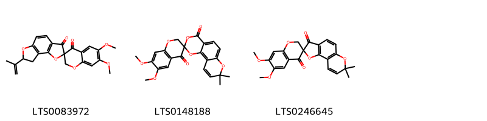{ width=100% }
    <figcaption>Hình ảnh cấu trúc hóa học của 3 hoạt chất thuộc nhóm Benzopyrans gồm ["6,7-dimethoxy-11'-(prop-1-en-2-yl)-2h-3',10'-dioxaspiro[1-benzopyran-3,4'-tricyclo[7.3.0.0²,⁶]dodecane]-1'(9'),2'(6'),7'-triene-4,5'-dione (LTS0083972)", "6',7'-dimethoxy-8,8-dimethyl-2'h-spiro[[1,3]dioxino[4,5-f]chromene-2,3'-[1]benzopyran]-4,4'-dione (LTS0148188)", "6,7-dimethoxy-7',7'-dimethyl-2h-spiro[1-benzopyran-3,2'-furo[2,3-f]chromene]-3',4-dione (LTS0246645)"].</figcaption>
</figure>
#### Nhóm Cinnamic acids and derivatives
<figure markdown="span">
    { width=100% }
    <figcaption>Hình ảnh cấu trúc hóa học của 1 hoạt chất thuộc nhóm Cinnamic acids and derivatives gồm ['3,4-dihydroxycinnamic acid (LTS0128050)'].</figcaption>
</figure>
#### Nhóm Flavonoids
<figure markdown="span">
    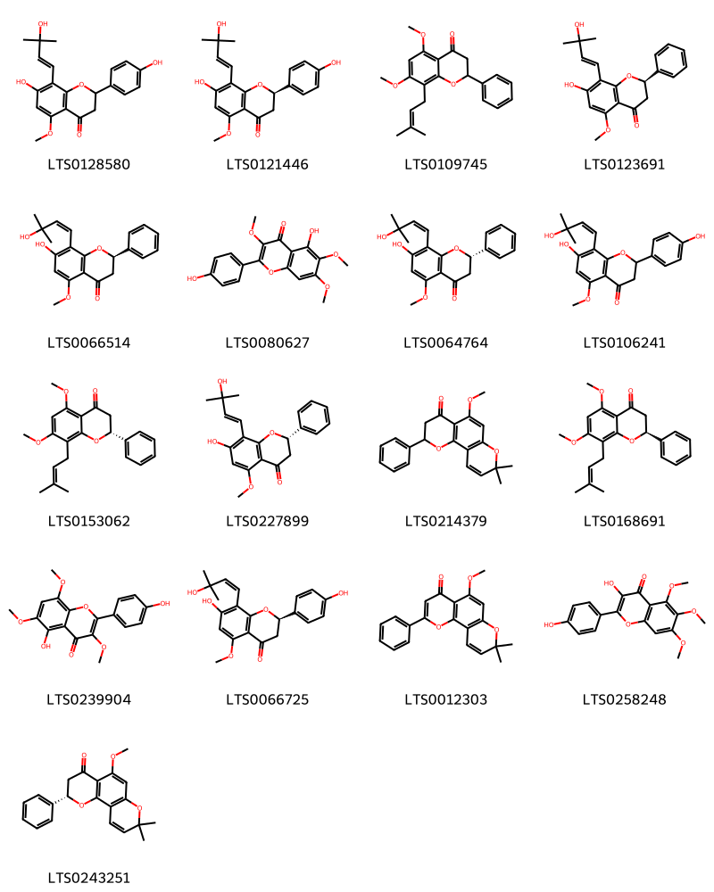{ width=100% }
    <figcaption>Hình ảnh cấu trúc hóa học của 17 hoạt chất thuộc nhóm Flavonoids gồm ['7-hydroxy-8-(3-hydroxy-3-methylbut-1-en-1-yl)-2-(4-hydroxyphenyl)-5-methoxy-2,3-dihydro-1-benzopyran-4-one (LTS0128580)', '(2r)-7-hydroxy-8-(3-hydroxy-3-methylbut-1-en-1-yl)-2-(4-hydroxyphenyl)-5-methoxy-2,3-dihydro-1-benzopyran-4-one (LTS0121446)', 'candidone (LTS0109745)', '(2r)-7-hydroxy-8-(3-hydroxy-3-methylbut-1-en-1-yl)-5-methoxy-2-phenyl-2,3-dihydro-1-benzopyran-4-one (LTS0123691)', '(2r)-7-hydroxy-8-[(1z)-3-hydroxy-3-methylbut-1-en-1-yl]-5-methoxy-2-phenyl-2,3-dihydro-1-benzopyran-4-one (LTS0066514)', 'penduletin (LTS0080627)', 'tephrocandidin a (LTS0064764)', '7-hydroxy-8-[(1z)-3-hydroxy-3-methylbut-1-en-1-yl]-2-(4-hydroxyphenyl)-5-methoxy-2,3-dihydro-1-benzopyran-4-one (LTS0106241)', '(2r)-5,7-dimethoxy-8-(3-methylbut-2-en-1-yl)-2-phenyl-2,3-dihydro-1-benzopyran-4-one (LTS0153062)', '(2s)-7-hydroxy-8-(3-hydroxy-3-methylbut-1-en-1-yl)-5-methoxy-2-phenyl-2,3-dihydro-1-benzopyran-4-one (LTS0227899)', 'obovatin methyl ether (LTS0214379)', '(2s)-5,7-dimethoxy-8-(3-methylbut-2-en-1-yl)-2-phenyl-2,3-dihydro-1-benzopyran-4-one (LTS0168691)', '5-hydroxy-2-(4-hydroxyphenyl)-3,6,8-trimethoxychromen-4-one (LTS0239904)', '(2r)-7-hydroxy-8-[(1z)-3-hydroxy-3-methylbut-1-en-1-yl]-2-(4-hydroxyphenyl)-5-methoxy-2,3-dihydro-1-benzopyran-4-one (LTS0066725)', 'isopongaflavone (LTS0012303)', 'candidol (LTS0258248)', '(2s)-5-methoxy-8,8-dimethyl-2-phenyl-2h,3h-pyrano[2,3-f]chromen-4-one (LTS0243251)'].</figcaption>
</figure>
#### Nhóm Isoflavonoids
<figure markdown="span">
    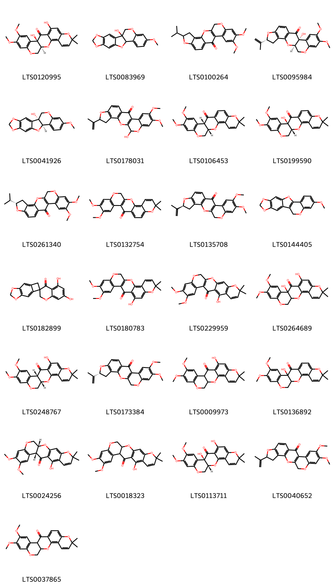{ width=100% }
    <figcaption>Hình ảnh cấu trúc hóa học của 25 hoạt chất thuộc nhóm Isoflavonoids gồm ['(1s,14r)-11,14-dihydroxy-17,18-dimethoxy-7,7-dimethyl-2,8,21-trioxapentacyclo[12.8.0.0³,¹².0⁴,⁹.0¹⁵,²⁰]docosa-3,5,9,11,15(20),16,18-heptaen-13-one (LTS0120995)', 'pisatin (LTS0083969)', 'dehydrodihydrorotenone (LTS0100264)', '12a-hydroxyrotenone (LTS0095984)', 'pisatin (LTS0041926)', '21-hydroxy-16,17-dimethoxy-6-(prop-1-en-2-yl)-2,7,20-trioxapentacyclo[11.8.0.0³,¹¹.0⁴,⁸.0¹⁴,¹⁹]henicosa-1(13),3,8,10,14,16,18-heptaen-12-one (LTS0178031)', 'deguelin (LTS0106453)', 'tephrosin (LTS0199590)', '(6s)-6-isopropyl-16,17-dimethoxy-2,7,20-trioxapentacyclo[11.8.0.0³,¹¹.0⁴,⁸.0¹⁴,¹⁹]henicosa-1(13),3,8,10,14(19),15,17-heptaen-12-one (LTS0261340)', '17,18-dimethoxy-7,7-dimethyl-2,8,21-trioxapentacyclo[12.8.0.0³,¹².0⁴,⁹.0¹⁵,²⁰]docosa-1(14),3,5,9,11,15(20),16,18-octaen-13-one (LTS0132754)', '(6s)-16,17-dimethoxy-6-(prop-1-en-2-yl)-2,7,20-trioxapentacyclo[11.8.0.0³,¹¹.0⁴,⁸.0¹⁴,¹⁹]henicosa-1(13),3,8,10,14,16,18-heptaen-12-one (LTS0135708)', 'anhydropisatin (LTS0144405)', "5,7-dihydroxy-2h-9',11'-dioxaspiro[1-benzopyran-3,4'-tricyclo[6.3.0.0³,⁶]undecane]-1'(8'),2',6'-trien-4-one (LTS0182899)", 'dehydrotoxicarol (LTS0180783)', '22-hydroxy-6,7-dimethoxy-18,18-dimethyl-10,13,17-trioxapentacyclo[12.8.0.0³,¹².0⁴,⁹.0¹⁶,²¹]docosa-1(22),3(12),4(9),5,7,14,16(21),19-octaen-2-one (LTS0229959)', '11-hydroxytephrosin (LTS0264689)', 'toxicarol (LTS0248767)', '(6r)-16,17-dimethoxy-6-(prop-1-en-2-yl)-2,7,20-trioxapentacyclo[11.8.0.0³,¹¹.0⁴,⁸.0¹⁴,¹⁹]henicosa-1(13),3,8,10,14,16,18-heptaen-12-one (LTS0173384)', '11-hydroxy-17,18-dimethoxy-7,7-dimethyl-2,8,21-trioxapentacyclo[12.8.0.0³,¹².0⁴,⁹.0¹⁵,²⁰]docosa-3,5,9,11,15(20),16,18-heptaen-13-one (LTS0009973)', '14-hydroxy-17,18-dimethoxy-7,7-dimethyl-2,8,21-trioxapentacyclo[12.8.0.0³,¹².0⁴,⁹.0¹⁵,²⁰]docosa-3,5,9,11,15(20),16,18-heptaen-13-one (LTS0136892)', '(3r,12r)-22-hydroxy-6,7-dimethoxy-18,18-dimethyl-10,13,17-trioxapentacyclo[12.8.0.0³,¹².0⁴,⁹.0¹⁶,²¹]docosa-1(14),4(9),5,7,15,19,21-heptaen-2-one (LTS0024256)', '22-hydroxy-6,7-dimethoxy-18,18-dimethyl-10,13,17-trioxapentacyclo[12.8.0.0³,¹².0⁴,⁹.0¹⁶,²¹]docosa-1(14),4(9),5,7,15,19,21-heptaen-2-one (LTS0018323)', '(1r,14r)-11,14-dihydroxy-17,18-dimethoxy-7,7-dimethyl-2,8,21-trioxapentacyclo[12.8.0.0³,¹².0⁴,⁹.0¹⁵,²⁰]docosa-3,5,9,11,15(20),16,18-heptaen-13-one (LTS0113711)', '16,17-dimethoxy-6-(prop-1-en-2-yl)-2,7,20-trioxapentacyclo[11.8.0.0³,¹¹.0⁴,⁸.0¹⁴,¹⁹]henicosa-1(13),3,8,10,14,16,18-heptaen-12-one (LTS0040652)', '17,18-dimethoxy-7,7-dimethyl-2,8,21-trioxapentacyclo[12.8.0.0³,¹².0⁴,⁹.0¹⁵,²⁰]docosa-3,5,9,11,15(20),16,18-heptaen-13-one (LTS0037865)'].</figcaption>
</figure>
#### Nhóm Linear 1_3-diarylpropanoids
<figure markdown="span">
    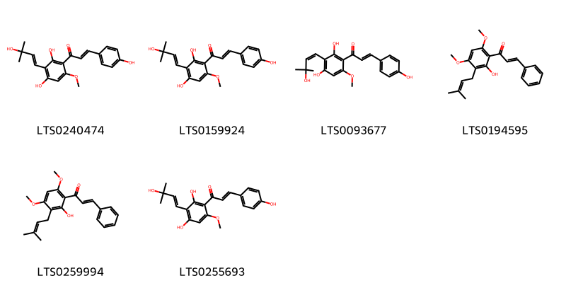{ width=100% }
    <figcaption>Hình ảnh cấu trúc hóa học của Không tìm thấy chú thích hoạt chất thuộc nhóm Linear 1_3-diarylpropanoids gồm Không tìm thấy chú thích.</figcaption>
</figure>
#### Nhóm Prenol lipids
<figure markdown="span">
    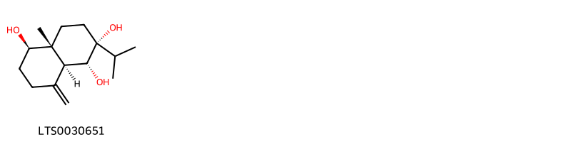{ width=100% }
    <figcaption>Hình ảnh cấu trúc hóa học của 1 hoạt chất thuộc nhóm Prenol lipids gồm ['(1r,2r,4ar,5r,8as)-2-isopropyl-4a-methyl-8-methylidene-hexahydro-1h-naphthalene-1,2,5-triol (LTS0030651)'].</figcaption>
</figure>
#### Nhóm Steroids and steroid derivatives
<figure markdown="span">
    { width=100% }
    <figcaption>Hình ảnh cấu trúc hóa học của 5 hoạt chất thuộc nhóm Steroids and steroid derivatives gồm ['stigmast-5-en-3-ol (LTS0071224)', 'sitosterol (LTS0168132)', 'stigmast-5-en-3-ol, (3β)- (LTS0204616)', 'sitogluside (LTS0201798)', '2-{[1-(5-ethyl-6-methylheptan-2-yl)-9a,11a-dimethyl-1h,2h,3h,3ah,3bh,4h,6h,7h,8h,9h,9bh,10h,11h-cyclopenta[a]phenanthren-7-yl]oxy}-6-(hydroxymethyl)oxane-3,4,5-triol (LTS0158828)'].</figcaption>
</figure>

---

### Dược dân tộc học

Danh sách các quốc gia có sử dụng *Tephrosia candida* trong điều trị các bệnh. 

| Country   | Disease                | Bệnh                                                                                                                                                                                                |
|:----------|:-----------------------|:----------------------------------------------------------------------------------------------------------------------------------------------------------------------------------------------------|
| Elsewhere | Piscicide              | MYMEMORY WARNING: YOU USED ALL AVAILABLE FREE TRANSLATIONS FOR TODAY. NEXT AVAILABLE IN  17 HOURS 22 MINUTES 42 SECONDS VISIT HTTPS://MYMEMORY.TRANSLATED.NET/DOC/USAGELIMITS.PHP TO TRANSLATE MORE |
| India     | Insecticide, Piscicide | MYMEMORY WARNING: YOU USED ALL AVAILABLE FREE TRANSLATIONS FOR TODAY. NEXT AVAILABLE IN  17 HOURS 22 MINUTES 38 SECONDS VISIT HTTPS://MYMEMORY.TRANSLATED.NET/DOC/USAGELIMITS.PHP TO TRANSLATE MORE |
| Java      | Piscicide              | MYMEMORY WARNING: YOU USED ALL AVAILABLE FREE TRANSLATIONS FOR TODAY. NEXT AVAILABLE IN  17 HOURS 22 MINUTES 35 SECONDS VISIT HTTPS://MYMEMORY.TRANSLATED.NET/DOC/USAGELIMITS.PHP TO TRANSLATE MORE |

---

---
## Tephrosia cinerea
### Thông tin về thực vật

!!! info "Phân loại thực vật của *Tephrosia cinerea* từ GIBF:"
    - **Kingdom:** Plantae
    - **Phylum:** Tracheophyta
    - **Order:** Fabales
    - **Family:** Fabaceae
    - **Genus:** Tephrosia
    - **Species:** *Tephrosia cinerea*

 

| Label (VI)   | Label (EN)   | Scientific Name   | Descriptions (VI)   | Descriptions (EN)   | Also Known As (VI)   | Also Known As (EN)   |
|:-------------|:-------------|:------------------|:--------------------|:--------------------|:---------------------|:---------------------|
| N/A          | N/A          | Tephrosia cinerea | loài thực vật       | species of plant    | ['']                 | ['']                 |

#### Phân bố trên thế giới

**Từ CSDL GIBF** Virgin Islands (U.S.), Guadeloupe, Saint Lucia, Nicaragua, Virgin Islands (British), Venezuela (Bolivarian Republic of), French Guiana, Puerto Rico, Bolivia (Plurinational State of), Jamaica, United States of America, Uruguay, Bonaire, Sint Eustatius and Saba, El Salvador, Saint Martin (French part), Saint Barthélemy, Brazil, Cuba, Dominican Republic, Mexico, Peru, Curaçao, Ecuador, Saint Kitts and Nevis, Aruba, Haiti, Colombia, Montserrat, Costa Rica, Anguilla, Cayman Islands, Sint Maarten (Dutch part)

#### Phân bố tại Việt Nam

**Từ CSDL GIBF**: Không có ghi nhận ở Việt Nam

---
### Thành phần hóa học
        
- Theo cơ sở dữ liệu lotus: Từ loài *Tephrosia cinerea* đã phân lập và xác định được Chưa có hoạt chất nào được phân lập. hoạt chất thuộc về các nhóm Không có hoạt chất nào được phân lập. 

Không có hình ảnh nào được tạo ra

---

### Dược dân tộc học

Danh sách các quốc gia có sử dụng *Tephrosia cinerea* trong điều trị các bệnh. 

| Country   | Disease                        | Bệnh                                                                                                                                                                                                |
|:----------|:-------------------------------|:----------------------------------------------------------------------------------------------------------------------------------------------------------------------------------------------------|
| Guiana    | Narcotic, Piscicide, Piscicide | MYMEMORY WARNING: YOU USED ALL AVAILABLE FREE TRANSLATIONS FOR TODAY. NEXT AVAILABLE IN  17 HOURS 21 MINUTES 49 SECONDS VISIT HTTPS://MYMEMORY.TRANSLATED.NET/DOC/USAGELIMITS.PHP TO TRANSLATE MORE |
| Mexico    | Narcotic, Piscicide            | MYMEMORY WARNING: YOU USED ALL AVAILABLE FREE TRANSLATIONS FOR TODAY. NEXT AVAILABLE IN  17 HOURS 21 MINUTES 43 SECONDS VISIT HTTPS://MYMEMORY.TRANSLATED.NET/DOC/USAGELIMITS.PHP TO TRANSLATE MORE |
| Venezuela | Piscicide, Piscicide           | MYMEMORY WARNING: YOU USED ALL AVAILABLE FREE TRANSLATIONS FOR TODAY. NEXT AVAILABLE IN  17 HOURS 21 MINUTES 39 SECONDS VISIT HTTPS://MYMEMORY.TRANSLATED.NET/DOC/USAGELIMITS.PHP TO TRANSLATE MORE |

---

---
## Tephrosia densiflora
### Thông tin về thực vật

!!! info "Phân loại thực vật của *Tephrosia densiflora* từ GIBF:"
    - **Kingdom:** Plantae
    - **Phylum:** Tracheophyta
    - **Order:** Fabales
    - **Family:** Fabaceae
    - **Genus:** Tephrosia
    - **Species:** *Tephrosia densiflora*

 

| Label (VI)   | Label (EN)   | Scientific Name      | Descriptions (VI)   | Descriptions (EN)   | Also Known As (VI)   | Also Known As (EN)   |
|:-------------|:-------------|:---------------------|:--------------------|:--------------------|:---------------------|:---------------------|
| N/A          | N/A          | Tephrosia densiflora | loài thực vật       | species of plant    | ['']                 | ['']                 |

#### Phân bố trên thế giới

**Từ CSDL GIBF** nan, Ghana, Central African Republic, Senegal, Nigeria, Gabon, Niger, Sudan, Benin, Sierra Leone, Guinea, Cameroon, Tanzania, United Republic of

#### Phân bố tại Việt Nam

**Từ CSDL GIBF**: Không có ghi nhận ở Việt Nam

---
### Thành phần hóa học
        
- Theo cơ sở dữ liệu lotus: Từ loài *Tephrosia densiflora* đã phân lập và xác định được Chưa có hoạt chất nào được phân lập. hoạt chất thuộc về các nhóm Không có hoạt chất nào được phân lập. 

Không có hình ảnh nào được tạo ra

---

### Dược dân tộc học

Danh sách các quốc gia có sử dụng *Tephrosia densiflora* trong điều trị các bệnh. 

| Country   | Disease   | Bệnh                                                                                                                                                                                                |
|:----------|:----------|:----------------------------------------------------------------------------------------------------------------------------------------------------------------------------------------------------|
| Africa    | Piscicide | MYMEMORY WARNING: YOU USED ALL AVAILABLE FREE TRANSLATIONS FOR TODAY. NEXT AVAILABLE IN  17 HOURS 21 MINUTES 11 SECONDS VISIT HTTPS://MYMEMORY.TRANSLATED.NET/DOC/USAGELIMITS.PHP TO TRANSLATE MORE |

---

---
## Tephrosia grandiflora
### Thông tin về thực vật

!!! info "Phân loại thực vật của *Tephrosia grandiflora* từ GIBF:"
    - **Kingdom:** Plantae
    - **Phylum:** Tracheophyta
    - **Order:** Fabales
    - **Family:** Fabaceae
    - **Genus:** Tephrosia
    - **Species:** *Tephrosia grandiflora*

 

| Label (VI)   | Label (EN)   | Scientific Name       | Descriptions (VI)   | Descriptions (EN)   | Also Known As (VI)   | Also Known As (EN)   |
|:-------------|:-------------|:----------------------|:--------------------|:--------------------|:---------------------|:---------------------|
| N/A          | N/A          | Tephrosia grandiflora | loài thực vật       | species of plant    | ['']                 | ['']                 |

#### Phân bố trên thế giới

**Từ CSDL GIBF** South Africa, Eswatini, Brazil, Australia

#### Phân bố tại Việt Nam

**Từ CSDL GIBF**: Không có ghi nhận ở Việt Nam

---
### Thành phần hóa học
        
- Theo cơ sở dữ liệu lotus: Từ loài *Tephrosia grandiflora* đã phân lập và xác định được Chưa có hoạt chất nào được phân lập. hoạt chất thuộc về các nhóm Không có hoạt chất nào được phân lập. 

Không có hình ảnh nào được tạo ra

---

### Dược dân tộc học

Danh sách các quốc gia có sử dụng *Tephrosia grandiflora* trong điều trị các bệnh. 

| Country   | Disease                              | Bệnh                                                                                                                                                                                                |
|:----------|:-------------------------------------|:----------------------------------------------------------------------------------------------------------------------------------------------------------------------------------------------------|
| India     | Insecticide, Parasiticide, Piscicide | MYMEMORY WARNING: YOU USED ALL AVAILABLE FREE TRANSLATIONS FOR TODAY. NEXT AVAILABLE IN  17 HOURS 20 MINUTES 45 SECONDS VISIT HTTPS://MYMEMORY.TRANSLATED.NET/DOC/USAGELIMITS.PHP TO TRANSLATE MORE |

---

---
## Tephrosia hamiltonii
### Thông tin về thực vật

!!! info "Phân loại thực vật của *Tephrosia purpurea* từ GIBF:"
    - **Kingdom:** Plantae
    - **Phylum:** Tracheophyta
    - **Order:** Fabales
    - **Family:** Fabaceae
    - **Genus:** Tephrosia
    - **Species:** *Tephrosia purpurea*

 

| Label (VI)   | Label (EN)   | Scientific Name       | Descriptions (VI)   | Descriptions (EN)   | Also Known As (VI)   | Also Known As (EN)   |
|:-------------|:-------------|:----------------------|:--------------------|:--------------------|:---------------------|:---------------------|
| N/A          | N/A          | Tephrosia grandiflora | loài thực vật       | species of plant    | ['']                 | ['']                 |

#### Phân bố trên thế giới

**Từ CSDL GIBF** South Africa, Eswatini, Brazil, Australia

#### Phân bố tại Việt Nam

**Từ CSDL GIBF**: Không có ghi nhận ở Việt Nam

---
### Thành phần hóa học
        
- Theo cơ sở dữ liệu lotus: Từ loài *Tephrosia purpurea* đã phân lập và xác định được 11 hoạt chất thuộc về các nhóm Flavonoids, Steroids and steroid derivatives, Isoflavonoids, Linear 1,3-diarylpropanoids. 

|    | chemicalTaxonomyClassyfireClass   |   smiles_count |
|---:|:----------------------------------|---------------:|
|  0 | Flavonoids                        |              4 |
|  1 | Isoflavonoids                     |              3 |
|  2 | Linear 1,3-diarylpropanoids       |              1 |
|  3 | Steroids and steroid derivatives  |              2 |

#### Nhóm Flavonoids
<figure markdown="span">
    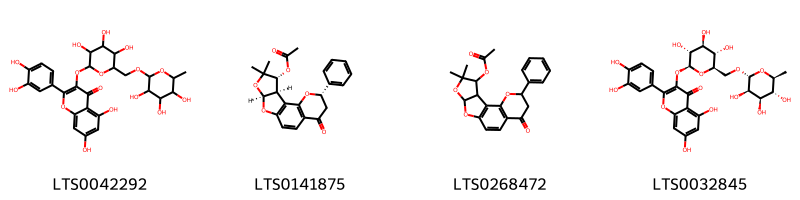{ width=100% }
    <figcaption>Hình ảnh cấu trúc hóa học của 4 hoạt chất thuộc nhóm Flavonoids gồm ['rutin (LTS0042292)', '(4s,12s,15r,16r)-14,14-dimethyl-6-oxo-4-phenyl-3,11,13-trioxatetracyclo[8.6.0.0²,⁷.0¹²,¹⁶]hexadeca-1(10),2(7),8-trien-15-yl acetate (LTS0141875)', '14,14-dimethyl-6-oxo-4-phenyl-3,11,13-trioxatetracyclo[8.6.0.0²,⁷.0¹²,¹⁶]hexadeca-1(10),2(7),8-trien-15-yl acetate (LTS0268472)', '3-rutinosyl quercetin (LTS0032845)'].</figcaption>
</figure>
#### Nhóm Isoflavonoids
<figure markdown="span">
    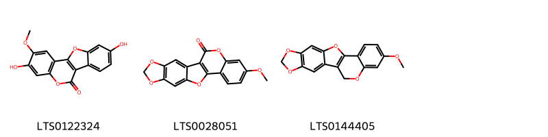{ width=100% }
    <figcaption>Hình ảnh cấu trúc hóa học của 3 hoạt chất thuộc nhóm Isoflavonoids gồm ['5,14-dihydroxy-4-methoxy-8,17-dioxatetracyclo[8.7.0.0²,⁷.0¹¹,¹⁶]heptadeca-1(10),2(7),3,5,11(16),12,14-heptaen-9-one (LTS0122324)', 'flemichapparin c (LTS0028051)', 'anhydropisatin (LTS0144405)'].</figcaption>
</figure>
#### Nhóm Linear 1_3-diarylpropanoids
<figure markdown="span">
    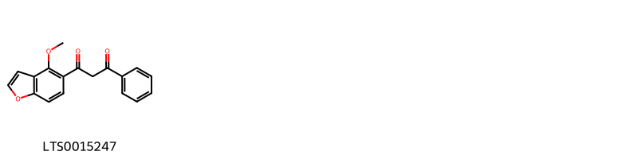{ width=100% }
    <figcaption>Hình ảnh cấu trúc hóa học của Không tìm thấy chú thích hoạt chất thuộc nhóm Linear 1_3-diarylpropanoids gồm Không tìm thấy chú thích.</figcaption>
</figure>
#### Nhóm Steroids and steroid derivatives
<figure markdown="span">
    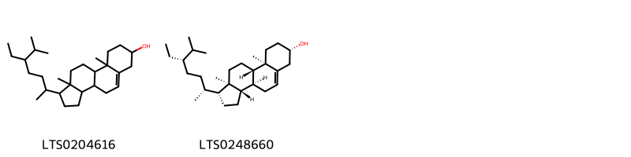{ width=100% }
    <figcaption>Hình ảnh cấu trúc hóa học của 2 hoạt chất thuộc nhóm Steroids and steroid derivatives gồm ['stigmast-5-en-3-ol, (3β)- (LTS0204616)', 'clionasterol (LTS0248660)'].</figcaption>
</figure>

---

### Dược dân tộc học

Danh sách các quốc gia có sử dụng *Tephrosia purpurea* trong điều trị các bệnh. 

| Country        | Disease     | Bệnh                                                                                                                                                                                                |
|:---------------|:------------|:----------------------------------------------------------------------------------------------------------------------------------------------------------------------------------------------------|
| India(Gujarat) | Antitussive | MYMEMORY WARNING: YOU USED ALL AVAILABLE FREE TRANSLATIONS FOR TODAY. NEXT AVAILABLE IN  17 HOURS 20 MINUTES 14 SECONDS VISIT HTTPS://MYMEMORY.TRANSLATED.NET/DOC/USAGELIMITS.PHP TO TRANSLATE MORE |

---

---
## Tephrosia heydeana
### Thông tin về thực vật

!!! info "Phân loại thực vật của *Tephrosia multifolia* từ GIBF:"
    - **Kingdom:** Plantae
    - **Phylum:** Tracheophyta
    - **Order:** Fabales
    - **Family:** Fabaceae
    - **Genus:** Tephrosia
    - **Species:** *Tephrosia multifolia*

 

| Label (VI)   | Label (EN)   | Scientific Name    | Descriptions (VI)   | Descriptions (EN)   | Also Known As (VI)   | Also Known As (EN)   |
|:-------------|:-------------|:-------------------|:--------------------|:--------------------|:---------------------|:---------------------|
| N/A          | N/A          | Tephrosia heydeana |                     |                     | ['']                 | ['']                 |

#### Phân bố trên thế giới

**Từ CSDL GIBF** South Africa, Eswatini, Brazil, Australia

#### Phân bố tại Việt Nam

**Từ CSDL GIBF**: Không có ghi nhận ở Việt Nam

---
### Thành phần hóa học
        
- Theo cơ sở dữ liệu lotus: Từ loài *Tephrosia multifolia* đã phân lập và xác định được Chưa có hoạt chất nào được phân lập. hoạt chất thuộc về các nhóm Không có hoạt chất nào được phân lập. 

Không có hình ảnh nào được tạo ra

---

### Dược dân tộc học

Danh sách các quốc gia có sử dụng *Tephrosia multifolia* trong điều trị các bệnh. 

| Country   | Disease     | Bệnh                                                                                                                                                                                                |
|:----------|:------------|:----------------------------------------------------------------------------------------------------------------------------------------------------------------------------------------------------|
| Guatemala | Insecticide | MYMEMORY WARNING: YOU USED ALL AVAILABLE FREE TRANSLATIONS FOR TODAY. NEXT AVAILABLE IN  17 HOURS 19 MINUTES 35 SECONDS VISIT HTTPS://MYMEMORY.TRANSLATED.NET/DOC/USAGELIMITS.PHP TO TRANSLATE MORE |

---

---
## Tephrosia incana
### Thông tin về thực vật

!!! info "Phân loại thực vật của *Tephrosia villosa* từ GIBF:"
    - **Kingdom:** Plantae
    - **Phylum:** Tracheophyta
    - **Order:** Fabales
    - **Family:** Fabaceae
    - **Genus:** Tephrosia
    - **Species:** *Tephrosia villosa*

 

| Label (VI)   | Label (EN)   | Scientific Name   | Descriptions (VI)   | Descriptions (EN)   | Also Known As (VI)   | Also Known As (EN)   |
|:-------------|:-------------|:------------------|:--------------------|:--------------------|:---------------------|:---------------------|
| N/A          | N/A          | Tephrosia incana  |                     | species of plant    | ['']                 | ['']                 |

#### Phân bố trên thế giới

**Từ CSDL GIBF** South Africa, Eswatini, Brazil, Australia

#### Phân bố tại Việt Nam

**Từ CSDL GIBF**: Không có ghi nhận ở Việt Nam

---
### Thành phần hóa học
        
- Theo cơ sở dữ liệu lotus: Từ loài *Tephrosia villosa* đã phân lập và xác định được Chưa có hoạt chất nào được phân lập. hoạt chất thuộc về các nhóm Không có hoạt chất nào được phân lập. 

Không có hình ảnh nào được tạo ra

---

### Dược dân tộc học

Danh sách các quốc gia có sử dụng *Tephrosia villosa* trong điều trị các bệnh. 

| Country   | Disease   | Bệnh                                                                                                                                                                                                |
|:----------|:----------|:----------------------------------------------------------------------------------------------------------------------------------------------------------------------------------------------------|
| Elsewhere | Piscicide | MYMEMORY WARNING: YOU USED ALL AVAILABLE FREE TRANSLATIONS FOR TODAY. NEXT AVAILABLE IN  17 HOURS 19 MINUTES 05 SECONDS VISIT HTTPS://MYMEMORY.TRANSLATED.NET/DOC/USAGELIMITS.PHP TO TRANSLATE MORE |

---

---
## Tephrosia multifolia
### Thông tin về thực vật

!!! info "Phân loại thực vật của *Tephrosia multifolia* từ GIBF:"
    - **Kingdom:** Plantae
    - **Phylum:** Tracheophyta
    - **Order:** Fabales
    - **Family:** Fabaceae
    - **Genus:** Tephrosia
    - **Species:** *Tephrosia multifolia*

 

| Label (VI)   | Label (EN)   | Scientific Name      | Descriptions (VI)   | Descriptions (EN)   | Also Known As (VI)   | Also Known As (EN)   |
|:-------------|:-------------|:---------------------|:--------------------|:--------------------|:---------------------|:---------------------|
| N/A          | N/A          | Tephrosia multifolia | loài thực vật       | species of plant    | ['']                 | ['']                 |

#### Phân bố trên thế giới

**Từ CSDL GIBF** Belize, Guatemala, Costa Rica, Nicaragua, Mexico, El Salvador, Panama

#### Phân bố tại Việt Nam

**Từ CSDL GIBF**: Không có ghi nhận ở Việt Nam

---
### Thành phần hóa học
        
- Theo cơ sở dữ liệu lotus: Từ loài *Tephrosia multifolia* đã phân lập và xác định được Chưa có hoạt chất nào được phân lập. hoạt chất thuộc về các nhóm Không có hoạt chất nào được phân lập. 

Không có hình ảnh nào được tạo ra

---

### Dược dân tộc học

Danh sách các quốc gia có sử dụng *Tephrosia multifolia* trong điều trị các bệnh. 

| Country   | Disease   | Bệnh                                                                                                                                                                                                |
|:----------|:----------|:----------------------------------------------------------------------------------------------------------------------------------------------------------------------------------------------------|
| Salvador  | Piscicide | MYMEMORY WARNING: YOU USED ALL AVAILABLE FREE TRANSLATIONS FOR TODAY. NEXT AVAILABLE IN  17 HOURS 18 MINUTES 42 SECONDS VISIT HTTPS://MYMEMORY.TRANSLATED.NET/DOC/USAGELIMITS.PHP TO TRANSLATE MORE |

---

---
## Tephrosia nitens
### Thông tin về thực vật

!!! info "Phân loại thực vật của *Tephrosia nitens* từ GIBF:"
    - **Kingdom:** Plantae
    - **Phylum:** Tracheophyta
    - **Order:** Fabales
    - **Family:** Fabaceae
    - **Genus:** Tephrosia
    - **Species:** *Tephrosia nitens*

 

| Label (VI)   | Label (EN)   | Scientific Name   | Descriptions (VI)   | Descriptions (EN)   | Also Known As (VI)   | Also Known As (EN)   |
|:-------------|:-------------|:------------------|:--------------------|:--------------------|:---------------------|:---------------------|
| N/A          | N/A          | Tephrosia nitens  | loài thực vật       | species of plant    | ['']                 | ['']                 |

#### Phân bố trên thế giới

**Từ CSDL GIBF** Belize, Nicaragua, nan, Trinidad and Tobago, Colombia, Brazil, Bolivia (Plurinational State of), Costa Rica, Honduras, unknown or invalid, United States of America, Peru, Mexico, Panama

#### Phân bố tại Việt Nam

**Từ CSDL GIBF**: Không có ghi nhận ở Việt Nam

---
### Thành phần hóa học
        
- Theo cơ sở dữ liệu lotus: Từ loài *Tephrosia nitens* đã phân lập và xác định được Chưa có hoạt chất nào được phân lập. hoạt chất thuộc về các nhóm Không có hoạt chất nào được phân lập. 

Không có hình ảnh nào được tạo ra

---

### Dược dân tộc học

Danh sách các quốc gia có sử dụng *Tephrosia nitens* trong điều trị các bệnh. 

| Country   | Disease   | Bệnh                                                                                                                                                                                                |
|:----------|:----------|:----------------------------------------------------------------------------------------------------------------------------------------------------------------------------------------------------|
| Brazil    | Piscicide | MYMEMORY WARNING: YOU USED ALL AVAILABLE FREE TRANSLATIONS FOR TODAY. NEXT AVAILABLE IN  17 HOURS 17 MINUTES 58 SECONDS VISIT HTTPS://MYMEMORY.TRANSLATED.NET/DOC/USAGELIMITS.PHP TO TRANSLATE MORE |

---

---
## Tephrosia noctiflora
### Thông tin về thực vật

!!! info "Phân loại thực vật của *Tephrosia noctiflora* từ GIBF:"
    - **Kingdom:** Plantae
    - **Phylum:** Tracheophyta
    - **Order:** Fabales
    - **Family:** Fabaceae
    - **Genus:** Tephrosia
    - **Species:** *Tephrosia noctiflora*

 

| Label (VI)   | Label (EN)   | Scientific Name      | Descriptions (VI)   | Descriptions (EN)   | Also Known As (VI)   | Also Known As (EN)   |
|:-------------|:-------------|:---------------------|:--------------------|:--------------------|:---------------------|:---------------------|
| N/A          | N/A          | Tephrosia noctiflora | loài thực vật       | species of plant    | ['']                 | ['']                 |

#### Phân bố trên thế giới

**Từ CSDL GIBF** Sri Lanka, Australia, Mauritius, Benin, Tanzania, United Republic of, Réunion, Chinese Taipei, United States of America, Timor-Leste, Solomon Islands, Zimbabwe, South Africa, Thailand, Brazil, New Caledonia, Mayotte, Singapore, Viet Nam, Saint Kitts and Nevis, Seychelles, India, Malaysia

#### Phân bố tại Việt Nam

**Từ CSDL GIBF**: Không có ghi nhận ở Việt Nam

---
### Thành phần hóa học
        
- Theo cơ sở dữ liệu lotus: Từ loài *Tephrosia noctiflora* đã phân lập và xác định được 2 hoạt chất thuộc về các nhóm Carboxylic acids and derivatives. 

|    | chemicalTaxonomyClassyfireClass   |   smiles_count |
|---:|:----------------------------------|---------------:|
|  0 | Carboxylic acids and derivatives  |              2 |

#### Nhóm Carboxylic acids and derivatives
<figure markdown="span">
    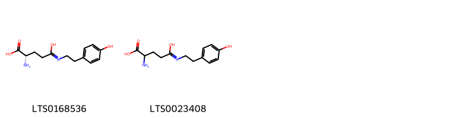{ width=100% }
    <figcaption>Hình ảnh cấu trúc hóa học của 2 hoạt chất thuộc nhóm Carboxylic acids and derivatives gồm ['(2s)-2-amino-4-{[2-(4-hydroxyphenyl)ethyl]-c-hydroxycarbonimidoyl}butanoic acid (LTS0168536)', '2-amino-4-{[2-(4-hydroxyphenyl)ethyl]-c-hydroxycarbonimidoyl}butanoic acid (LTS0023408)'].</figcaption>
</figure>

---

### Dược dân tộc học

Danh sách các quốc gia có sử dụng *Tephrosia noctiflora* trong điều trị các bệnh. 

| Country   | Disease                | Bệnh                                                                                                                                                                                                |
|:----------|:-----------------------|:----------------------------------------------------------------------------------------------------------------------------------------------------------------------------------------------------|
| India     | Insecticide, Piscicide | MYMEMORY WARNING: YOU USED ALL AVAILABLE FREE TRANSLATIONS FOR TODAY. NEXT AVAILABLE IN  17 HOURS 17 MINUTES 34 SECONDS VISIT HTTPS://MYMEMORY.TRANSLATED.NET/DOC/USAGELIMITS.PHP TO TRANSLATE MORE |

---

---
## Tephrosia periculosa
### Thông tin về thực vật

!!! info "Phân loại thực vật của *Tephrosia vogelii* từ GIBF:"
    - **Kingdom:** Plantae
    - **Phylum:** Tracheophyta
    - **Order:** Fabales
    - **Family:** Fabaceae
    - **Genus:** Tephrosia
    - **Species:** *Tephrosia vogelii*

 

| Label (VI)   | Label (EN)   | Scientific Name      | Descriptions (VI)   | Descriptions (EN)   | Also Known As (VI)   | Also Known As (EN)   |
|:-------------|:-------------|:---------------------|:--------------------|:--------------------|:---------------------|:---------------------|
| N/A          | N/A          | Tephrosia periculosa |                     |                     | ['']                 | ['']                 |

#### Phân bố trên thế giới

**Từ CSDL GIBF** Sri Lanka, Australia, Mauritius, Benin, Tanzania, United Republic of, Réunion, Chinese Taipei, United States of America, Timor-Leste, Solomon Islands, Zimbabwe, South Africa, Thailand, Brazil, New Caledonia, Mayotte, Singapore, Viet Nam, Saint Kitts and Nevis, Seychelles, India, Malaysia

#### Phân bố tại Việt Nam

**Từ CSDL GIBF**: Không có ghi nhận ở Việt Nam

---
### Thành phần hóa học
        
- Theo cơ sở dữ liệu lotus: Từ loài *Tephrosia vogelii* đã phân lập và xác định được Chưa có hoạt chất nào được phân lập. hoạt chất thuộc về các nhóm Không có hoạt chất nào được phân lập. 

Không có hình ảnh nào được tạo ra

---

### Dược dân tộc học

Danh sách các quốc gia có sử dụng *Tephrosia vogelii* trong điều trị các bệnh. 

| Country   | Disease   | Bệnh                                                                                                                                                                                                |
|:----------|:----------|:----------------------------------------------------------------------------------------------------------------------------------------------------------------------------------------------------|
| Africa    | Piscicide | MYMEMORY WARNING: YOU USED ALL AVAILABLE FREE TRANSLATIONS FOR TODAY. NEXT AVAILABLE IN  17 HOURS 17 MINUTES 07 SECONDS VISIT HTTPS://MYMEMORY.TRANSLATED.NET/DOC/USAGELIMITS.PHP TO TRANSLATE MORE |

---

---
## Tephrosia piscatoria
### Thông tin về thực vật

!!! info "Phân loại thực vật của *Tephrosia purpurea* từ GIBF:"
    - **Kingdom:** Plantae
    - **Phylum:** Tracheophyta
    - **Order:** Fabales
    - **Family:** Fabaceae
    - **Genus:** Tephrosia
    - **Species:** *Tephrosia purpurea*

 

| Label (VI)   | Label (EN)   | Scientific Name      | Descriptions (VI)   | Descriptions (EN)   | Also Known As (VI)   | Also Known As (EN)   |
|:-------------|:-------------|:---------------------|:--------------------|:--------------------|:---------------------|:---------------------|
| N/A          | N/A          | Tephrosia piscatoria | loài thực vật       | species of plant    | ['']                 | ['']                 |

#### Phân bố trên thế giới

**Từ CSDL GIBF** nan, French Polynesia, Fiji, Cook Islands, unknown or invalid, Tonga, New Caledonia, United States of America, Samoa, Mexico

#### Phân bố tại Việt Nam

**Từ CSDL GIBF**: Không có ghi nhận ở Việt Nam

---
### Thành phần hóa học
        
- Theo cơ sở dữ liệu lotus: Từ loài *Tephrosia purpurea* đã phân lập và xác định được Chưa có hoạt chất nào được phân lập. hoạt chất thuộc về các nhóm Không có hoạt chất nào được phân lập. 

Không có hình ảnh nào được tạo ra

---

### Dược dân tộc học

Danh sách các quốc gia có sử dụng *Tephrosia purpurea* trong điều trị các bệnh. 

| Country   | Disease                                         | Bệnh                                                                                                                                                                                                |
|:----------|:------------------------------------------------|:----------------------------------------------------------------------------------------------------------------------------------------------------------------------------------------------------|
| Samoa     | Antidote, Diuretic, Piscicide, Tonic, Piscicide | MYMEMORY WARNING: YOU USED ALL AVAILABLE FREE TRANSLATIONS FOR TODAY. NEXT AVAILABLE IN  17 HOURS 16 MINUTES 33 SECONDS VISIT HTTPS://MYMEMORY.TRANSLATED.NET/DOC/USAGELIMITS.PHP TO TRANSLATE MORE |

---

---
## Tephrosia procumbens
### Thông tin về thực vật

!!! info "Phân loại thực vật của *N/A* từ GIBF:"
    - **Kingdom:** Plantae
    - **Phylum:** Tracheophyta
    - **Order:** Fabales
    - **Family:** Fabaceae
    - **Genus:** Tephrosia
    - **Species:** *N/A*

 

| Label (VI)   | Label (EN)   | Scientific Name      | Descriptions (VI)   | Descriptions (EN)   | Also Known As (VI)   | Also Known As (EN)   |
|:-------------|:-------------|:---------------------|:--------------------|:--------------------|:---------------------|:---------------------|
| N/A          | N/A          | Tephrosia procumbens |                     |                     | ['']                 | ['']                 |

#### Phân bố trên thế giới

**Từ CSDL GIBF** United Arab Emirates, Australia, Nicaragua, Virgin Islands (British), Israel, Yemen, French Guiana, Puerto Rico, Namibia, Chinese Taipei, United States of America, Belize, South Africa, Brazil, Dominican Republic, Mexico, Singapore, Aruba, Colombia, Montserrat, Botswana, India

#### Phân bố tại Việt Nam

**Từ CSDL GIBF**: Không có ghi nhận ở Việt Nam

---
### Thành phần hóa học
        
- Theo cơ sở dữ liệu lotus: Từ loài *N/A* đã phân lập và xác định được 10 hoạt chất thuộc về các nhóm Flavonoids, Benzopyrans, Isoflavonoids, Linear 1,3-diarylpropanoids. 

|    | chemicalTaxonomyClassyfireClass   |   smiles_count |
|---:|:----------------------------------|---------------:|
|  0 | Benzopyrans                       |              2 |
|  1 | Flavonoids                        |              2 |
|  2 | Isoflavonoids                     |              4 |
|  3 | Linear 1,3-diarylpropanoids       |              2 |

#### Nhóm Benzopyrans
<figure markdown="span">
    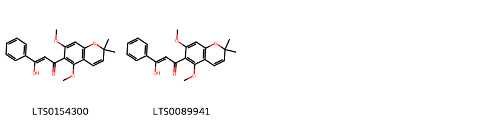{ width=100% }
    <figcaption>Hình ảnh cấu trúc hóa học của 2 hoạt chất thuộc nhóm Benzopyrans gồm ['praecansone b (LTS0154300)', '1-(5,7-dimethoxy-2,2-dimethylchromen-6-yl)-3-hydroxy-3-phenylprop-2-en-1-one (LTS0089941)'].</figcaption>
</figure>
#### Nhóm Flavonoids
<figure markdown="span">
    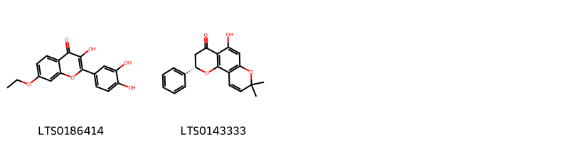{ width=100% }
    <figcaption>Hình ảnh cấu trúc hóa học của 2 hoạt chất thuộc nhóm Flavonoids gồm ['2-(3,4-dihydroxyphenyl)-7-ethoxy-3-hydroxychromen-4-one (LTS0186414)', 'obovatin (LTS0143333)'].</figcaption>
</figure>
#### Nhóm Isoflavonoids
<figure markdown="span">
    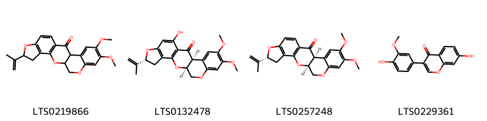{ width=100% }
    <figcaption>Hình ảnh cấu trúc hóa học của 4 hoạt chất thuộc nhóm Isoflavonoids gồm ['16,17-dimethoxy-6-(prop-1-en-2-yl)-2,7,20-trioxapentacyclo[11.8.0.0³,¹¹.0⁴,⁸.0¹⁴,¹⁹]henicosa-3(11),4(8),9,14,16,18-hexaen-12-one (LTS0219866)', 'sumatrol (LTS0132478)', 'cube root (LTS0257248)', "3'-methoxydaidzein (LTS0229361)"].</figcaption>
</figure>
#### Nhóm Linear 1_3-diarylpropanoids
<figure markdown="span">
    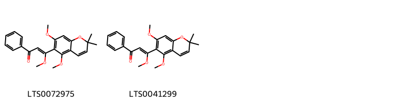{ width=100% }
    <figcaption>Hình ảnh cấu trúc hóa học của Không tìm thấy chú thích hoạt chất thuộc nhóm Linear 1_3-diarylpropanoids gồm Không tìm thấy chú thích.</figcaption>
</figure>

---

### Dược dân tộc học

Danh sách các quốc gia có sử dụng *N/A* trong điều trị các bệnh. 

| Country   | Disease     | Bệnh                                                                                                                                                                                                |
|:----------|:------------|:----------------------------------------------------------------------------------------------------------------------------------------------------------------------------------------------------|
| India     | Insecticide | MYMEMORY WARNING: YOU USED ALL AVAILABLE FREE TRANSLATIONS FOR TODAY. NEXT AVAILABLE IN  17 HOURS 16 MINUTES 09 SECONDS VISIT HTTPS://MYMEMORY.TRANSLATED.NET/DOC/USAGELIMITS.PHP TO TRANSLATE MORE |

---

---
## Tephrosia purpurea
### Thông tin về thực vật

!!! info "Phân loại thực vật của *Tephrosia purpurea* từ GIBF:"
    - **Kingdom:** Plantae
    - **Phylum:** Tracheophyta
    - **Order:** Fabales
    - **Family:** Fabaceae
    - **Genus:** Tephrosia
    - **Species:** *Tephrosia purpurea*

 

| Label (VI)   | Label (EN)   | Scientific Name    | Descriptions (VI)   | Descriptions (EN)   | Also Known As (VI)     | Also Known As (EN)   |
|:-------------|:-------------|:-------------------|:--------------------|:--------------------|:-----------------------|:---------------------|
| N/A          | N/A          | Tephrosia purpurea | loài thực vật       | species of plant    | ['Tephrosia purpurea'] | ['Wild indigo']      |

#### Phân bố trên thế giới

**Từ CSDL GIBF** Sri Lanka, Australia, Gabon, Myanmar, Mozambique, Benin, Tanzania, United Republic of, Yemen, Pakistan, Zambia, Réunion, Nigeria, Chinese Taipei, United States of America, Zimbabwe, Saudi Arabia, South Africa, Hong Kong, Thailand, Oman, Brazil, New Caledonia, Mayotte, Madagascar, Colombia, Botswana, India, Kenya, Ethiopia

#### Phân bố tại Việt Nam

**Từ CSDL GIBF**: Không có ghi nhận ở Việt Nam

---
### Thành phần hóa học
        
- Theo cơ sở dữ liệu lotus: Từ loài *Tephrosia purpurea* đã phân lập và xác định được 99 hoạt chất thuộc về các nhóm Flavonoids, Prenol lipids, Steroids and steroid derivatives, Isoflavonoids, Linear 1,3-diarylpropanoids, Benzofurans, Anthracenes, Benzene and substituted derivatives, Saturated hydrocarbons, Benzopyrans. 

|    | chemicalTaxonomyClassyfireClass     |   smiles_count |
|---:|:------------------------------------|---------------:|
|  0 | Anthracenes                         |              1 |
|  1 | Benzene and substituted derivatives |              4 |
|  2 | Benzofurans                         |              2 |
|  3 | Benzopyrans                         |              2 |
|  4 | Flavonoids                          |             48 |
|  5 | Isoflavonoids                       |             15 |
|  6 | Linear 1,3-diarylpropanoids         |             12 |
|  7 | Prenol lipids                       |              3 |
|  8 | Saturated hydrocarbons              |              1 |
|  9 | Steroids and steroid derivatives    |              9 |

#### Nhóm Anthracenes
<figure markdown="span">
    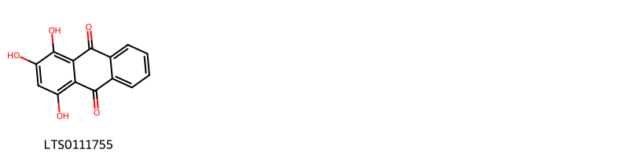{ width=100% }
    <figcaption>Hình ảnh cấu trúc hóa học của 1 hoạt chất thuộc nhóm Anthracenes gồm ['purpurin (LTS0111755)'].</figcaption>
</figure>
#### Nhóm Benzene and substituted derivatives
<figure markdown="span">
    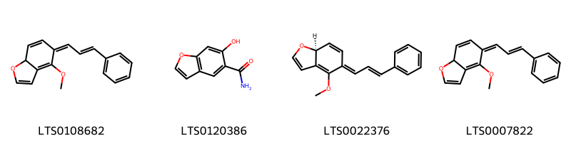{ width=100% }
    <figcaption>Hình ảnh cấu trúc hóa học của 4 hoạt chất thuộc nhóm Benzene and substituted derivatives gồm ['4-methoxy-5-(3-phenylprop-2-en-1-ylidene)-7ah-1-benzofuran (LTS0108682)', '6-hydroxy-1-benzofuran-5-carboxamide (LTS0120386)', '(5e,7as)-4-methoxy-5-[(2e)-3-phenylprop-2-en-1-ylidene]-7ah-1-benzofuran (LTS0022376)', '(5z)-4-methoxy-5-[(2e)-3-phenylprop-2-en-1-ylidene]-7ah-1-benzofuran (LTS0007822)'].</figcaption>
</figure>
#### Nhóm Benzofurans
<figure markdown="span">
    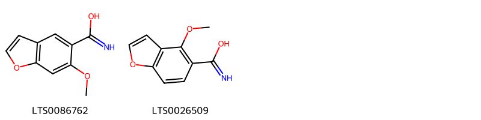{ width=100% }
    <figcaption>Hình ảnh cấu trúc hóa học của 2 hoạt chất thuộc nhóm Benzofurans gồm ['6-methoxy-1-benzofuran-5-carboximidic acid (LTS0086762)', '4-methoxy-1-benzofuran-5-carboximidic acid (LTS0026509)'].</figcaption>
</figure>
#### Nhóm Benzopyrans
<figure markdown="span">
    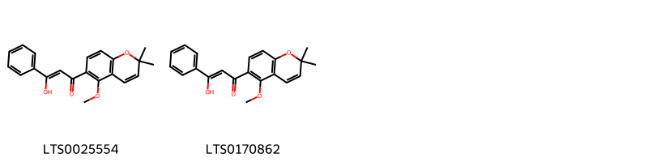{ width=100% }
    <figcaption>Hình ảnh cấu trúc hóa học của 2 hoạt chất thuộc nhóm Benzopyrans gồm ['3-hydroxy-1-(5-methoxy-2,2-dimethylchromen-6-yl)-3-phenylprop-2-en-1-one (LTS0025554)', "6'-demethoxypraecansone b (LTS0170862)"].</figcaption>
</figure>
#### Nhóm Flavonoids
<figure markdown="span">
    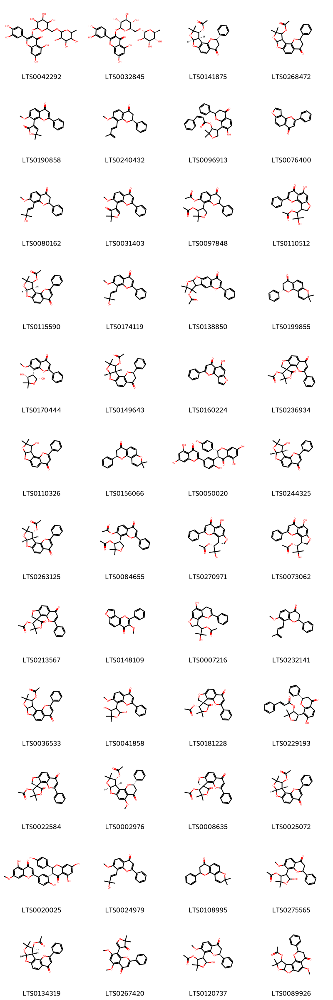{ width=100% }
    <figcaption>Hình ảnh cấu trúc hóa học của 48 hoạt chất thuộc nhóm Flavonoids gồm ['rutin (LTS0042292)', '3-rutinosyl quercetin (LTS0032845)', '(4s,12s,15r,16r)-14,14-dimethyl-6-oxo-4-phenyl-3,11,13-trioxatetracyclo[8.6.0.0²,⁷.0¹²,¹⁶]hexadeca-1(10),2(7),8-trien-15-yl acetate (LTS0141875)', '14,14-dimethyl-6-oxo-4-phenyl-3,11,13-trioxatetracyclo[8.6.0.0²,⁷.0¹²,¹⁶]hexadeca-1(10),2(7),8-trien-15-yl acetate (LTS0268472)', '8-(5,5-dimethyl-2-oxofuran-3-yl)-7-methoxy-2-phenylchromen-4-one (LTS0190858)', '(2s)-7-methoxy-8-[(1e)-3-methylbuta-1,3-dien-1-yl]-2-phenyl-2,3-dihydro-1-benzopyran-4-one (LTS0240432)', '4-(7-hydroxy-4-oxo-2-phenyl-2,3-dihydro-1-benzopyran-8-yl)-2,2-dimethyloxolan-3-yl 3-phenylprop-2-enoate (LTS0096913)', '2-phenylfuro[2,3-h]chromen-4-one (LTS0076400)', '8-(3-hydroxy-3-methylbut-1-en-1-yl)-7-methoxy-2-phenyl-2,3-dihydro-1-benzopyran-4-one (LTS0080162)', '8-(5,5-dimethyl-4-oxofuran-3-yl)-7-methoxy-2-phenylchromen-4-one (LTS0031403)', '4-[7-(acetyloxy)-4-oxo-2-phenyl-2,3-dihydro-1-benzopyran-8-yl]-2,2-dimethyloxolan-3-yl acetate (LTS0097848)', '2-hydroxy-1-{5-hydroxy-4-oxo-2-phenyl-8h,9h-furo[2,3-h]chromen-9-yl}-2-methylpropyl acetate (LTS0110512)', 'pseudosemiglabrin (LTS0115590)', 'lanceolatin a (LTS0174119)', '12,13,13-trimethyl-4-oxo-6-phenyl-7,14,16-trioxatetracyclo[8.6.0.0³,⁸.0¹¹,¹⁵]hexadeca-1(10),2,5,8-tetraen-12-yl acetate (LTS0138850)', '(2s)-8,8-dimethyl-2-phenyl-2h,3h-pyrano[2,3-f]chromen-4-one (LTS0199855)', '8-[(2r,3s,4r)-2,4-dihydroxy-5,5-dimethyloxolan-3-yl]-7-methoxy-2-phenylchromen-4-one (LTS0170444)', '(4r,12r,15s,16s)-14,14-dimethyl-6-oxo-4-phenyl-3,11,13-trioxatetracyclo[8.6.0.0²,⁷.0¹²,¹⁶]hexadeca-1(10),2(7),8-trien-15-yl acetate (LTS0149643)', 'pongaglabol (LTS0160224)', "5',5'-dimethyl-2',4-dioxo-2-phenyl-8h-spiro[furo[2,3-h]chromene-9,3'-oxolan]-4'-yl acetate (LTS0236934)", '15-hydroxy-14,14-dimethyl-4-phenyl-3,11,13-trioxatetracyclo[8.6.0.0²,⁷.0¹²,¹⁶]hexadeca-1,4,7,9-tetraen-6-one (LTS0110326)', '(2r)-8,8-dimethyl-2-phenyl-2h,3h-pyrano[2,3-f]chromen-4-one (LTS0156066)', '2-{3-[(2r,3s)-5,7-dihydroxy-2-(4-hydroxyphenyl)-4-oxo-2,3-dihydro-1-benzopyran-3-yl]-4-hydroxyphenyl}-5,7-dihydroxychromen-4-one (LTS0050020)', '(12r,15s,16s)-15-hydroxy-14,14-dimethyl-4-phenyl-3,11,13-trioxatetracyclo[8.6.0.0²,⁷.0¹²,¹⁶]hexadeca-1,4,7,9-tetraen-6-one (LTS0244325)', '(12r,15r,16s)-14,14-dimethyl-6-oxo-4-phenyl-3,11,13-trioxatetracyclo[8.6.0.0²,⁷.0¹²,¹⁶]hexadeca-1,4,7,9-tetraen-15-yl acetate (LTS0263125)', '(3s,4s)-4-[7-(acetyloxy)-4-oxo-2-phenylchromen-8-yl]-2,2-dimethyloxolan-3-yl acetate (LTS0084655)', '(1r)-2-hydroxy-1-[(9r)-5-hydroxy-4-oxo-2-phenyl-8h,9h-furo[2,3-h]chromen-9-yl]-2-methylpropyl acetate (LTS0270971)', '(1r)-2-hydroxy-1-[(9s)-5-hydroxy-4-oxo-2-phenyl-8h,9h-furo[2,3-h]chromen-9-yl]-2-methylpropyl acetate (LTS0073062)', "(4's)-5',5'-dimethyl-2',4-dioxo-2-phenyl-8h-spiro[furo[2,3-h]chromene-9,3'-oxolan]-4'-yl acetate (LTS0213567)", 'karanjin (LTS0148109)', '2-hydroxy-1-{5-hydroxy-2-phenyl-4h,8h,9h-furo[2,3-h]chromen-9-yl}-2-methylpropyl acetate (LTS0007216)', '7-methoxy-8-(3-methylbuta-1,3-dien-1-yl)-2-phenyl-2,3-dihydro-1-benzopyran-4-one (LTS0232141)', 'semiglabrin (LTS0036533)', '8-(2,4-dihydroxy-5,5-dimethyloxolan-3-yl)-7-methoxy-2-phenylchromen-4-one (LTS0041858)', "(4'r,9r)-5',5'-dimethyl-2',4-dioxo-2-phenyl-8h-spiro[furo[2,3-h]chromene-9,3'-oxolan]-4'-yl acetate (LTS0181228)", '(+)-tephrorin b (LTS0229193)', 'glabratephrin (LTS0022584)', '(4s,12s,15r,16r)-8-methoxy-14,14-dimethyl-6-oxo-4-phenyl-3,11,13-trioxatetracyclo[8.6.0.0²,⁷.0¹²,¹⁶]hexadeca-1(10),2(7),8-trien-15-yl acetate (LTS0002976)', "(4's,9s)-5',5'-dimethyl-2',4-dioxo-2-phenyl-8h-spiro[furo[2,3-h]chromene-9,3'-oxolan]-4'-yl acetate (LTS0008635)", '(12r,15s,16s)-14,14-dimethyl-6-oxo-4-phenyl-3,11,13-trioxatetracyclo[8.6.0.0²,⁷.0¹²,¹⁶]hexadeca-1,4,7,9-tetraen-15-yl acetate (LTS0025072)', '2-{3-[(2s,3r)-5,7-dihydroxy-2-(4-hydroxyphenyl)-4-oxo-2,3-dihydro-1-benzopyran-3-yl]-4-hydroxyphenyl}-5-hydroxy-7-methoxychromen-4-one (LTS0020025)', '8-(3-hydroxy-3-methylbut-1-en-1-yl)-7-methoxy-2-phenylchromen-4-one (LTS0024979)', 'isolonchocarpin (LTS0108995)', '5-hydroxy-4-(7-methoxy-4-oxo-2-phenyl-2,3-dihydro-1-benzopyran-8-yl)-2,2-dimethyloxolan-3-yl acetate (LTS0275565)', '(12r,15s,16s)-14,14,15-trimethyl-6-oxo-4-phenyl-3,11,13-trioxatetracyclo[8.6.0.0²,⁷.0¹²,¹⁶]hexadeca-1,4,7,9-tetraen-15-yl acetate (LTS0134319)', '8-(5,5-dimethyl-4-oxofuran-3-yl)-5,7-dimethoxy-2-phenylchromen-4-one (LTS0267420)', '(+)-tephrorin a (LTS0120737)', '8-methoxy-14,14-dimethyl-6-oxo-4-phenyl-3,11,13-trioxatetracyclo[8.6.0.0²,⁷.0¹²,¹⁶]hexadeca-1(10),2(7),8-trien-15-yl acetate (LTS0089926)'].</figcaption>
</figure>
#### Nhóm Isoflavonoids
<figure markdown="span">
    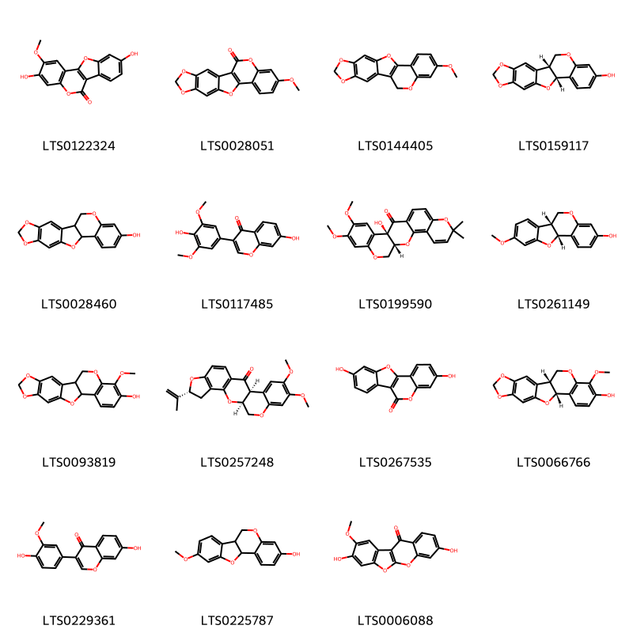{ width=100% }
    <figcaption>Hình ảnh cấu trúc hóa học của 15 hoạt chất thuộc nhóm Isoflavonoids gồm ['5,14-dihydroxy-4-methoxy-8,17-dioxatetracyclo[8.7.0.0²,⁷.0¹¹,¹⁶]heptadeca-1(10),2(7),3,5,11(16),12,14-heptaen-9-one (LTS0122324)', 'flemichapparin c (LTS0028051)', 'anhydropisatin (LTS0144405)', '(-)-maackiain (LTS0159117)', 'maackiain (LTS0028460)', '7-hydroxy-3-(4-hydroxy-3,5-dimethoxyphenyl)chromen-4-one (LTS0117485)', 'tephrosin (LTS0199590)', 'medicarpin, (-)- (LTS0261149)', '4-methoxymaackiain (LTS0093819)', 'cube root (LTS0257248)', 'coumestrol (LTS0267535)', '(1r,12r)-17-methoxy-5,7,11,19-tetraoxapentacyclo[10.8.0.0²,¹⁰.0⁴,⁸.0¹³,¹⁸]icosa-2,4(8),9,13(18),14,16-hexaen-16-ol (LTS0066766)', "3'-methoxydaidzein (LTS0229361)", 'medicarpin (LTS0225787)', '5,14-dihydroxy-13-methoxy-2,17-dioxatetracyclo[8.7.0.0³,⁸.0¹¹,¹⁶]heptadeca-1(10),3,5,7,11(16),12,14-heptaen-9-one (LTS0006088)'].</figcaption>
</figure>
#### Nhóm Linear 1_3-diarylpropanoids
<figure markdown="span">
    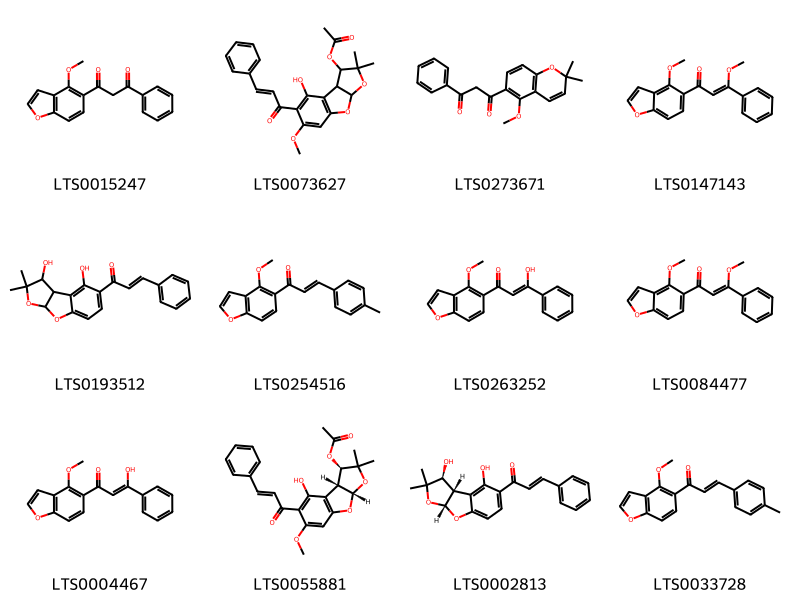{ width=100% }
    <figcaption>Hình ảnh cấu trúc hóa học của Không tìm thấy chú thích hoạt chất thuộc nhóm Linear 1_3-diarylpropanoids gồm Không tìm thấy chú thích.</figcaption>
</figure>
#### Nhóm Prenol lipids
<figure markdown="span">
    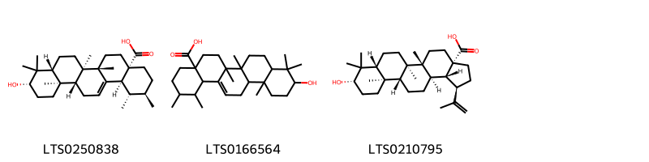{ width=100% }
    <figcaption>Hình ảnh cấu trúc hóa học của 3 hoạt chất thuộc nhóm Prenol lipids gồm ['ursolic acid (LTS0250838)', '10-hydroxy-1,2,6a,6b,9,9,12a-heptamethyl-2,3,4,5,6,7,8,8a,10,11,12,12b,13,14b-tetradecahydro-1h-picene-4a-carboxylic acid (LTS0166564)', 'betulinic acid (LTS0210795)'].</figcaption>
</figure>
#### Nhóm Saturated hydrocarbons
<figure markdown="span">
    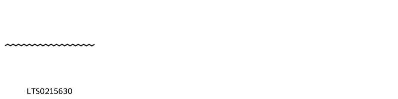{ width=100% }
    <figcaption>Hình ảnh cấu trúc hóa học của 1 hoạt chất thuộc nhóm Saturated hydrocarbons gồm ['tetratriacontane (LTS0215630)'].</figcaption>
</figure>
#### Nhóm Steroids and steroid derivatives
<figure markdown="span">
    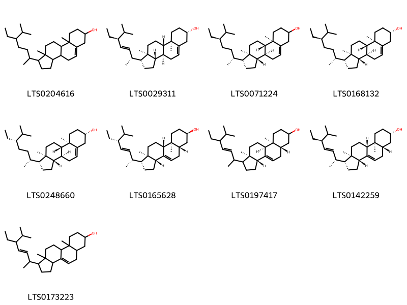{ width=100% }
    <figcaption>Hình ảnh cấu trúc hóa học của 9 hoạt chất thuộc nhóm Steroids and steroid derivatives gồm ['stigmast-5-en-3-ol, (3β)- (LTS0204616)', 'phytosterol (LTS0029311)', 'stigmast-5-en-3-ol (LTS0071224)', 'sitosterol (LTS0168132)', 'clionasterol (LTS0248660)', '(1r,3ar,5as,7r,9as,9br,11ar)-1-[(2r,3e,5r)-5-ethyl-6-methylhept-3-en-2-yl]-9a,11a-dimethyl-1h,2h,3h,3ah,5h,5ah,6h,7h,8h,9h,9bh,10h,11h-cyclopenta[a]phenanthren-7-ol (LTS0165628)', '(3ar,5as,9as,9bs,11ar)-1-(5-ethyl-6-methylhept-3-en-2-yl)-9a,11a-dimethyl-1h,2h,3h,3ah,5h,5ah,6h,7h,8h,9h,9bh,10h,11h-cyclopenta[a]phenanthren-7-ol (LTS0197417)', 'chondrillasterol (LTS0142259)', '1-(5-ethyl-6-methylhept-3-en-2-yl)-9a,11a-dimethyl-1h,2h,3h,3ah,5h,5ah,6h,7h,8h,9h,9bh,10h,11h-cyclopenta[a]phenanthren-7-ol (LTS0173223)'].</figcaption>
</figure>

---

### Dược dân tộc học

Danh sách các quốc gia có sử dụng *Tephrosia purpurea* trong điều trị các bệnh. 

| Country       | Disease                                | Bệnh                                                                                                                                                                                                |
|:--------------|:---------------------------------------|:----------------------------------------------------------------------------------------------------------------------------------------------------------------------------------------------------|
| Elsewhere     | Diuretic, Laxative, Tonic, Insecticide | MYMEMORY WARNING: YOU USED ALL AVAILABLE FREE TRANSLATIONS FOR TODAY. NEXT AVAILABLE IN  17 HOURS 15 MINUTES 32 SECONDS VISIT HTTPS://MYMEMORY.TRANSLATED.NET/DOC/USAGELIMITS.PHP TO TRANSLATE MORE |
| Guiana        | Piscicide                              | MYMEMORY WARNING: YOU USED ALL AVAILABLE FREE TRANSLATIONS FOR TODAY. NEXT AVAILABLE IN  17 HOURS 15 MINUTES 29 SECONDS VISIT HTTPS://MYMEMORY.TRANSLATED.NET/DOC/USAGELIMITS.PHP TO TRANSLATE MORE |
| India         | Piscicide                              | MYMEMORY WARNING: YOU USED ALL AVAILABLE FREE TRANSLATIONS FOR TODAY. NEXT AVAILABLE IN  17 HOURS 15 MINUTES 26 SECONDS VISIT HTTPS://MYMEMORY.TRANSLATED.NET/DOC/USAGELIMITS.PHP TO TRANSLATE MORE |
| Latin America | Piscicide                              | MYMEMORY WARNING: YOU USED ALL AVAILABLE FREE TRANSLATIONS FOR TODAY. NEXT AVAILABLE IN  17 HOURS 15 MINUTES 20 SECONDS VISIT HTTPS://MYMEMORY.TRANSLATED.NET/DOC/USAGELIMITS.PHP TO TRANSLATE MORE |
| Mexico        | Piscicide, Poison                      | MYMEMORY WARNING: YOU USED ALL AVAILABLE FREE TRANSLATIONS FOR TODAY. NEXT AVAILABLE IN  17 HOURS 15 MINUTES 16 SECONDS VISIT HTTPS://MYMEMORY.TRANSLATED.NET/DOC/USAGELIMITS.PHP TO TRANSLATE MORE |

---

---
## Tephrosia sinapou
### Thông tin về thực vật

!!! info "Phân loại thực vật của *Tephrosia sinapou* từ GIBF:"
    - **Kingdom:** Plantae
    - **Phylum:** Tracheophyta
    - **Order:** Fabales
    - **Family:** Fabaceae
    - **Genus:** Tephrosia
    - **Species:** *Tephrosia sinapou*

 

| Label (VI)   | Label (EN)   | Scientific Name   | Descriptions (VI)   | Descriptions (EN)   | Also Known As (VI)   | Also Known As (EN)   |
|:-------------|:-------------|:------------------|:--------------------|:--------------------|:---------------------|:---------------------|
| N/A          | N/A          | Tephrosia sinapou | loài thực vật       | species of plant    | ['']                 | ['']                 |

#### Phân bố trên thế giới

**Từ CSDL GIBF** Dominican Republic, Ecuador, Panama, Suriname, Thailand, Colombia, Brazil, Bolivia (Plurinational State of), Guyana, unknown or invalid, Jamaica, Peru, Nicaragua, Mexico, El Salvador, Venezuela (Bolivarian Republic of), French Guiana

#### Phân bố tại Việt Nam

**Từ CSDL GIBF**: Không có ghi nhận ở Việt Nam

---
### Thành phần hóa học
        
- Theo cơ sở dữ liệu lotus: Từ loài *Tephrosia sinapou* đã phân lập và xác định được 34 hoạt chất thuộc về các nhóm Flavonoids, Prenol lipids, Isoflavonoids, Linear 1,3-diarylpropanoids, Cinnamic acids and derivatives, Benzene and substituted derivatives, Coumarins and derivatives, Benzopyrans. 

|    | chemicalTaxonomyClassyfireClass     |   smiles_count |
|---:|:------------------------------------|---------------:|
|  0 | Benzene and substituted derivatives |              1 |
|  1 | Benzopyrans                         |              2 |
|  2 | Cinnamic acids and derivatives      |              2 |
|  3 | Coumarins and derivatives           |              2 |
|  4 | Flavonoids                          |              5 |
|  5 | Isoflavonoids                       |             17 |
|  6 | Linear 1,3-diarylpropanoids         |              2 |
|  7 | Prenol lipids                       |              3 |

#### Nhóm Benzene and substituted derivatives
<figure markdown="span">
    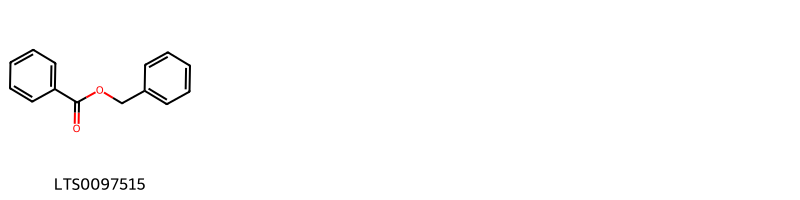{ width=100% }
    <figcaption>Hình ảnh cấu trúc hóa học của 1 hoạt chất thuộc nhóm Benzene and substituted derivatives gồm ['benzyl benzoate (LTS0097515)'].</figcaption>
</figure>
#### Nhóm Benzopyrans
<figure markdown="span">
    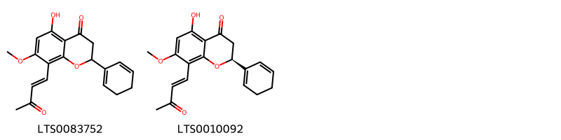{ width=100% }
    <figcaption>Hình ảnh cấu trúc hóa học của 2 hoạt chất thuộc nhóm Benzopyrans gồm ['2-(cyclohexa-1,5-dien-1-yl)-5-hydroxy-7-methoxy-8-(3-oxobut-1-en-1-yl)-2,3-dihydro-1-benzopyran-4-one (LTS0083752)', '(2s)-2-(cyclohexa-1,5-dien-1-yl)-5-hydroxy-7-methoxy-8-[(1e)-3-oxobut-1-en-1-yl]-2,3-dihydro-1-benzopyran-4-one (LTS0010092)'].</figcaption>
</figure>
#### Nhóm Cinnamic acids and derivatives
<figure markdown="span">
    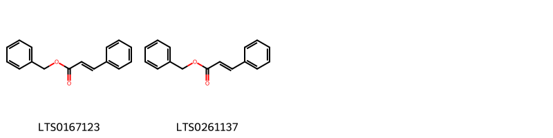{ width=100% }
    <figcaption>Hình ảnh cấu trúc hóa học của 2 hoạt chất thuộc nhóm Cinnamic acids and derivatives gồm ['benzyl cinnamate (LTS0167123)', 'benzyl cinnamate (LTS0261137)'].</figcaption>
</figure>
#### Nhóm Coumarins and derivatives
<figure markdown="span">
    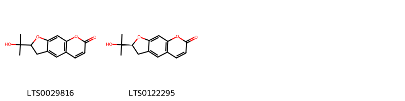{ width=100% }
    <figcaption>Hình ảnh cấu trúc hóa học của 2 hoạt chất thuộc nhóm Coumarins and derivatives gồm ['marmesin (LTS0029816)', 'marmesin (LTS0122295)'].</figcaption>
</figure>
#### Nhóm Flavonoids
<figure markdown="span">
    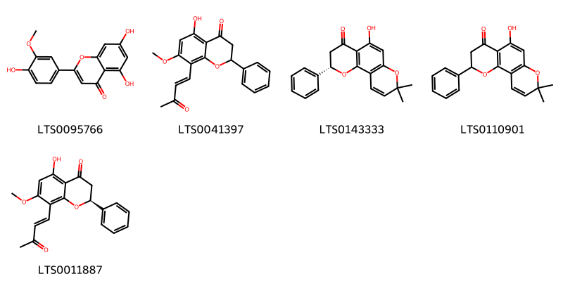{ width=100% }
    <figcaption>Hình ảnh cấu trúc hóa học của 5 hoạt chất thuộc nhóm Flavonoids gồm ['chrysoeriol (LTS0095766)', '5-hydroxy-7-methoxy-8-(3-oxobut-1-en-1-yl)-2-phenyl-2,3-dihydro-1-benzopyran-4-one (LTS0041397)', 'obovatin (LTS0143333)', 'obovatin (LTS0110901)', '(2s)-5-hydroxy-7-methoxy-8-[(1e)-3-oxobut-1-en-1-yl]-2-phenyl-2,3-dihydro-1-benzopyran-4-one (LTS0011887)'].</figcaption>
</figure>
#### Nhóm Isoflavonoids
<figure markdown="span">
    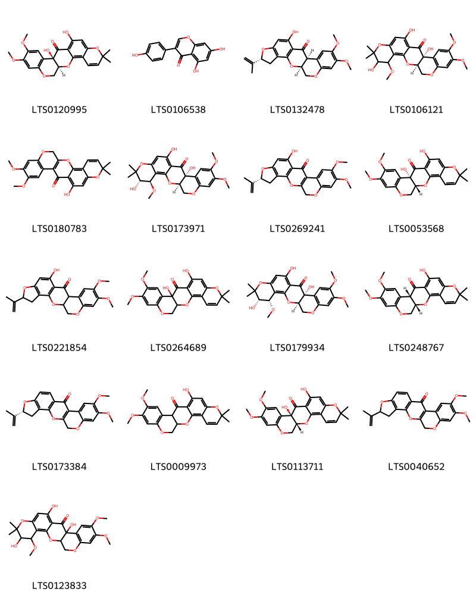{ width=100% }
    <figcaption>Hình ảnh cấu trúc hóa học của 17 hoạt chất thuộc nhóm Isoflavonoids gồm ['(1s,14r)-11,14-dihydroxy-17,18-dimethoxy-7,7-dimethyl-2,8,21-trioxapentacyclo[12.8.0.0³,¹².0⁴,⁹.0¹⁵,²⁰]docosa-3,5,9,11,15(20),16,18-heptaen-13-one (LTS0120995)', 'genistein (LTS0106538)', 'sumatrol (LTS0132478)', '(1r,14r)-6,11,14-trihydroxy-5,17,18-trimethoxy-7,7-dimethyl-2,8,21-trioxapentacyclo[12.8.0.0³,¹².0⁴,⁹.0¹⁵,²⁰]docosa-3,9,11,15(20),16,18-hexaen-13-one (LTS0106121)', 'dehydrotoxicarol (LTS0180783)', '(1r,5r,6s,14r)-6,11,14-trihydroxy-5,17,18-trimethoxy-7,7-dimethyl-2,8,21-trioxapentacyclo[12.8.0.0³,¹².0⁴,⁹.0¹⁵,²⁰]docosa-3,9,11,15(20),16,18-hexaen-13-one (LTS0173971)', '(6r)-10-hydroxy-16,17-dimethoxy-6-(prop-1-en-2-yl)-2,7,20-trioxapentacyclo[11.8.0.0³,¹¹.0⁴,⁸.0¹⁴,¹⁹]henicosa-1(13),3,8,10,14,16,18-heptaen-12-one (LTS0269241)', '(1r,14s)-11,14-dihydroxy-17,18-dimethoxy-7,7-dimethyl-2,8,21-trioxapentacyclo[12.8.0.0³,¹².0⁴,⁹.0¹⁵,²⁰]docosa-3,5,9,11,15(20),16,18-heptaen-13-one (LTS0053568)', '10-hydroxy-16,17-dimethoxy-6-(prop-1-en-2-yl)-2,7,20-trioxapentacyclo[11.8.0.0³,¹¹.0⁴,⁸.0¹⁴,¹⁹]henicosa-3(11),4(8),9,14,16,18-hexaen-12-one (LTS0221854)', '11-hydroxytephrosin (LTS0264689)', '(1r,5s,6s,14r)-6,11,14-trihydroxy-5,17,18-trimethoxy-7,7-dimethyl-2,8,21-trioxapentacyclo[12.8.0.0³,¹².0⁴,⁹.0¹⁵,²⁰]docosa-3,9,11,15(20),16,18-hexaen-13-one (LTS0179934)', 'toxicarol (LTS0248767)', '(6r)-16,17-dimethoxy-6-(prop-1-en-2-yl)-2,7,20-trioxapentacyclo[11.8.0.0³,¹¹.0⁴,⁸.0¹⁴,¹⁹]henicosa-1(13),3,8,10,14,16,18-heptaen-12-one (LTS0173384)', '11-hydroxy-17,18-dimethoxy-7,7-dimethyl-2,8,21-trioxapentacyclo[12.8.0.0³,¹².0⁴,⁹.0¹⁵,²⁰]docosa-3,5,9,11,15(20),16,18-heptaen-13-one (LTS0009973)', '(1r,14r)-11,14-dihydroxy-17,18-dimethoxy-7,7-dimethyl-2,8,21-trioxapentacyclo[12.8.0.0³,¹².0⁴,⁹.0¹⁵,²⁰]docosa-3,5,9,11,15(20),16,18-heptaen-13-one (LTS0113711)', '16,17-dimethoxy-6-(prop-1-en-2-yl)-2,7,20-trioxapentacyclo[11.8.0.0³,¹¹.0⁴,⁸.0¹⁴,¹⁹]henicosa-1(13),3,8,10,14,16,18-heptaen-12-one (LTS0040652)', '6,11,14-trihydroxy-5,17,18-trimethoxy-7,7-dimethyl-2,8,21-trioxapentacyclo[12.8.0.0³,¹².0⁴,⁹.0¹⁵,²⁰]docosa-3,9,11,15(20),16,18-hexaen-13-one (LTS0123833)'].</figcaption>
</figure>
#### Nhóm Linear 1_3-diarylpropanoids
<figure markdown="span">
    { width=100% }
    <figcaption>Hình ảnh cấu trúc hóa học của Không tìm thấy chú thích hoạt chất thuộc nhóm Linear 1_3-diarylpropanoids gồm Không tìm thấy chú thích.</figcaption>
</figure>
#### Nhóm Prenol lipids
<figure markdown="span">
    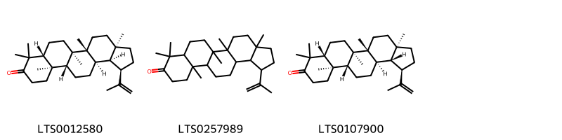{ width=100% }
    <figcaption>Hình ảnh cấu trúc hóa học của 3 hoạt chất thuộc nhóm Prenol lipids gồm ['(1r,3ar,5ar,5br,7ar,11ar,11br,13ar,13bs)-3a,5a,5b,8,8,11a-hexamethyl-1-(prop-1-en-2-yl)-tetradecahydro-1h-cyclopenta[a]chrysen-9-one (LTS0012580)', '3a,5a,5b,8,8,11a-hexamethyl-1-(prop-1-en-2-yl)-tetradecahydro-1h-cyclopenta[a]chrysen-9-one (LTS0257989)', 'lupenone (LTS0107900)'].</figcaption>
</figure>

---

### Dược dân tộc học

Danh sách các quốc gia có sử dụng *Tephrosia sinapou* trong điều trị các bệnh. 

| Country   | Disease                        | Bệnh                                                                                                                                                                                                |
|:----------|:-------------------------------|:----------------------------------------------------------------------------------------------------------------------------------------------------------------------------------------------------|
| Haiti     | Purgative, Sedative, Piscicide | MYMEMORY WARNING: YOU USED ALL AVAILABLE FREE TRANSLATIONS FOR TODAY. NEXT AVAILABLE IN  17 HOURS 14 MINUTES 09 SECONDS VISIT HTTPS://MYMEMORY.TRANSLATED.NET/DOC/USAGELIMITS.PHP TO TRANSLATE MORE |

---

---
## Tephrosia singapou
### Thông tin về thực vật

!!! info "Phân loại thực vật của *Tephrosia sinapou* từ GIBF:"
    - **Kingdom:** Plantae
    - **Phylum:** Tracheophyta
    - **Order:** Fabales
    - **Family:** Fabaceae
    - **Genus:** Tephrosia
    - **Species:** *Tephrosia sinapou*

 

| Label (VI)   | Label (EN)   | Scientific Name   | Descriptions (VI)   | Descriptions (EN)   | Also Known As (VI)   | Also Known As (EN)   |
|:-------------|:-------------|:------------------|:--------------------|:--------------------|:---------------------|:---------------------|
| N/A          | N/A          | Tephrosia sinapou | loài thực vật       | species of plant    | ['']                 | ['']                 |

#### Phân bố trên thế giới

**Từ CSDL GIBF** Dominican Republic, Ecuador, Panama, Suriname, Thailand, Colombia, Brazil, Bolivia (Plurinational State of), Guyana, unknown or invalid, Jamaica, Peru, Nicaragua, Mexico, El Salvador, Venezuela (Bolivarian Republic of), French Guiana

#### Phân bố tại Việt Nam

**Từ CSDL GIBF**: Không có ghi nhận ở Việt Nam

---
### Thành phần hóa học
        
- Theo cơ sở dữ liệu lotus: Từ loài *Tephrosia sinapou* đã phân lập và xác định được Chưa có hoạt chất nào được phân lập. hoạt chất thuộc về các nhóm Không có hoạt chất nào được phân lập. 

Không có hình ảnh nào được tạo ra

---

### Dược dân tộc học

Danh sách các quốc gia có sử dụng *Tephrosia sinapou* trong điều trị các bệnh. 

| Country   | Disease                           | Bệnh                                                                                                                                                                                                |
|:----------|:----------------------------------|:----------------------------------------------------------------------------------------------------------------------------------------------------------------------------------------------------|
| Elsewhere | Insecticide, Piscicide, Purgative | MYMEMORY WARNING: YOU USED ALL AVAILABLE FREE TRANSLATIONS FOR TODAY. NEXT AVAILABLE IN  17 HOURS 13 MINUTES 31 SECONDS VISIT HTTPS://MYMEMORY.TRANSLATED.NET/DOC/USAGELIMITS.PHP TO TRANSLATE MORE |

---

---
## Tephrosia toxicaria
### Thông tin về thực vật

!!! info "Phân loại thực vật của *Tephrosia sinapou* từ GIBF:"
    - **Kingdom:** Plantae
    - **Phylum:** Tracheophyta
    - **Order:** Fabales
    - **Family:** Fabaceae
    - **Genus:** Tephrosia
    - **Species:** *Tephrosia sinapou*

 

| Label (VI)   | Label (EN)   | Scientific Name     | Descriptions (VI)   | Descriptions (EN)   | Also Known As (VI)   | Also Known As (EN)   |
|:-------------|:-------------|:--------------------|:--------------------|:--------------------|:---------------------|:---------------------|
| N/A          | N/A          | Tephrosia toxicaria |                     | species of plant    | ['']                 | ['']                 |

#### Phân bố trên thế giới

**Từ CSDL GIBF** nan, Ecuador, Belize, Dominican Republic, Trinidad and Tobago, Suriname, Colombia, Brazil, Angola, Bolivia (Plurinational State of), Guyana, unknown or invalid, United States of America, Peru, Mexico, El Salvador, Venezuela (Bolivarian Republic of)

#### Phân bố tại Việt Nam

**Từ CSDL GIBF**: Không có ghi nhận ở Việt Nam

---
### Thành phần hóa học
        
- Theo cơ sở dữ liệu lotus: Từ loài *Tephrosia sinapou* đã phân lập và xác định được Chưa có hoạt chất nào được phân lập. hoạt chất thuộc về các nhóm Không có hoạt chất nào được phân lập. 

Không có hình ảnh nào được tạo ra

---

### Dược dân tộc học

Danh sách các quốc gia có sử dụng *Tephrosia sinapou* trong điều trị các bệnh. 

| Country           | Disease                | Bệnh                                                                                                                                                                                                |
|:------------------|:-----------------------|:----------------------------------------------------------------------------------------------------------------------------------------------------------------------------------------------------|
| Guiana(Akawio)    | Piscicide              | MYMEMORY WARNING: YOU USED ALL AVAILABLE FREE TRANSLATIONS FOR TODAY. NEXT AVAILABLE IN  17 HOURS 13 MINUTES 06 SECONDS VISIT HTTPS://MYMEMORY.TRANSLATED.NET/DOC/USAGELIMITS.PHP TO TRANSLATE MORE |
| Guiana(Wapisiana) | Piscicide              | MYMEMORY WARNING: YOU USED ALL AVAILABLE FREE TRANSLATIONS FOR TODAY. NEXT AVAILABLE IN  17 HOURS 13 MINUTES 03 SECONDS VISIT HTTPS://MYMEMORY.TRANSLATED.NET/DOC/USAGELIMITS.PHP TO TRANSLATE MORE |
| Haiti             | Purgative              | MYMEMORY WARNING: YOU USED ALL AVAILABLE FREE TRANSLATIONS FOR TODAY. NEXT AVAILABLE IN  17 HOURS 13 MINUTES 00 SECONDS VISIT HTTPS://MYMEMORY.TRANSLATED.NET/DOC/USAGELIMITS.PHP TO TRANSLATE MORE |
| Latin America     | Piscicide, Insecticide | MYMEMORY WARNING: YOU USED ALL AVAILABLE FREE TRANSLATIONS FOR TODAY. NEXT AVAILABLE IN  17 HOURS 12 MINUTES 56 SECONDS VISIT HTTPS://MYMEMORY.TRANSLATED.NET/DOC/USAGELIMITS.PHP TO TRANSLATE MORE |
| Mexico            | Piscicide, Purgative   | MYMEMORY WARNING: YOU USED ALL AVAILABLE FREE TRANSLATIONS FOR TODAY. NEXT AVAILABLE IN  17 HOURS 12 MINUTES 51 SECONDS VISIT HTTPS://MYMEMORY.TRANSLATED.NET/DOC/USAGELIMITS.PHP TO TRANSLATE MORE |
| Venezuela         | Piscicide              | MYMEMORY WARNING: YOU USED ALL AVAILABLE FREE TRANSLATIONS FOR TODAY. NEXT AVAILABLE IN  17 HOURS 12 MINUTES 43 SECONDS VISIT HTTPS://MYMEMORY.TRANSLATED.NET/DOC/USAGELIMITS.PHP TO TRANSLATE MORE |

---

---
## Tephrosia virginiana
### Thông tin về thực vật

!!! info "Phân loại thực vật của *Tephrosia virginiana* từ GIBF:"
    - **Kingdom:** Plantae
    - **Phylum:** Tracheophyta
    - **Order:** Fabales
    - **Family:** Fabaceae
    - **Genus:** Tephrosia
    - **Species:** *Tephrosia virginiana*

 

| Label (VI)   | Label (EN)   | Scientific Name      | Descriptions (VI)   | Descriptions (EN)   | Also Known As (VI)   | Also Known As (EN)   |
|:-------------|:-------------|:---------------------|:--------------------|:--------------------|:---------------------|:---------------------|
| N/A          | N/A          | Tephrosia virginiana | loài thực vật       | species of plant    | ['']                 | ['']                 |

#### Phân bố trên thế giới

**Từ CSDL GIBF** United States of America

#### Phân bố tại Việt Nam

**Từ CSDL GIBF**: Không có ghi nhận ở Việt Nam

---
### Thành phần hóa học
        
- Theo cơ sở dữ liệu lotus: Từ loài *Tephrosia virginiana* đã phân lập và xác định được 5 hoạt chất thuộc về các nhóm Isoflavonoids. 

|    | chemicalTaxonomyClassyfireClass   |   smiles_count |
|---:|:----------------------------------|---------------:|
|  0 | Isoflavonoids                     |              5 |

#### Nhóm Isoflavonoids
<figure markdown="span">
    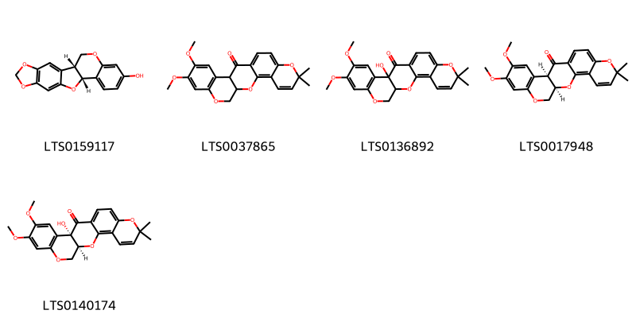{ width=100% }
    <figcaption>Hình ảnh cấu trúc hóa học của 5 hoạt chất thuộc nhóm Isoflavonoids gồm ['(-)-maackiain (LTS0159117)', '17,18-dimethoxy-7,7-dimethyl-2,8,21-trioxapentacyclo[12.8.0.0³,¹².0⁴,⁹.0¹⁵,²⁰]docosa-3,5,9,11,15(20),16,18-heptaen-13-one (LTS0037865)', '14-hydroxy-17,18-dimethoxy-7,7-dimethyl-2,8,21-trioxapentacyclo[12.8.0.0³,¹².0⁴,⁹.0¹⁵,²⁰]docosa-3,5,9,11,15(20),16,18-heptaen-13-one (LTS0136892)', '(1r,14r)-17,18-dimethoxy-7,7-dimethyl-2,8,21-trioxapentacyclo[12.8.0.0³,¹².0⁴,⁹.0¹⁵,²⁰]docosa-3,5,9,11,15(20),16,18-heptaen-13-one (LTS0017948)', '(1s,14s)-14-hydroxy-17,18-dimethoxy-7,7-dimethyl-2,8,21-trioxapentacyclo[12.8.0.0³,¹².0⁴,⁹.0¹⁵,²⁰]docosa-3,5,9,11,15(20),16,18-heptaen-13-one (LTS0140174)'].</figcaption>
</figure>

---

### Dược dân tộc học

Danh sách các quốc gia có sử dụng *Tephrosia virginiana* trong điều trị các bệnh. 

| Country        | Disease                                                       | Bệnh                                                                                                                                                                                                |
|:---------------|:--------------------------------------------------------------|:----------------------------------------------------------------------------------------------------------------------------------------------------------------------------------------------------|
| Mexico         | Diaphoretic, Vermifuge, Piscicide                             | MYMEMORY WARNING: YOU USED ALL AVAILABLE FREE TRANSLATIONS FOR TODAY. NEXT AVAILABLE IN  17 HOURS 12 MINUTES 17 SECONDS VISIT HTTPS://MYMEMORY.TRANSLATED.NET/DOC/USAGELIMITS.PHP TO TRANSLATE MORE |
| US             | Cathartic, Diaphoretic, Laxative, Tonic, Vermifuge, Stimulant | MYMEMORY WARNING: YOU USED ALL AVAILABLE FREE TRANSLATIONS FOR TODAY. NEXT AVAILABLE IN  17 HOURS 12 MINUTES 14 SECONDS VISIT HTTPS://MYMEMORY.TRANSLATED.NET/DOC/USAGELIMITS.PHP TO TRANSLATE MORE |
| US(Amerindian) | Piscicide, Vermifuge                                          | MYMEMORY WARNING: YOU USED ALL AVAILABLE FREE TRANSLATIONS FOR TODAY. NEXT AVAILABLE IN  17 HOURS 12 MINUTES 11 SECONDS VISIT HTTPS://MYMEMORY.TRANSLATED.NET/DOC/USAGELIMITS.PHP TO TRANSLATE MORE |
| US(Cherokee)   | Tonic                                                         | MYMEMORY WARNING: YOU USED ALL AVAILABLE FREE TRANSLATIONS FOR TODAY. NEXT AVAILABLE IN  17 HOURS 12 MINUTES 09 SECONDS VISIT HTTPS://MYMEMORY.TRANSLATED.NET/DOC/USAGELIMITS.PHP TO TRANSLATE MORE |

---

---
## Tephrosia vogelii
### Thông tin về thực vật

!!! info "Phân loại thực vật của *Tephrosia vogelii* từ GIBF:"
    - **Kingdom:** Plantae
    - **Phylum:** Tracheophyta
    - **Order:** Fabales
    - **Family:** Fabaceae
    - **Genus:** Tephrosia
    - **Species:** *Tephrosia vogelii*

 

| Label (VI)   | Label (EN)   | Scientific Name   | Descriptions (VI)   | Descriptions (EN)   | Also Known As (VI)    | Also Known As (EN)   |
|:-------------|:-------------|:------------------|:--------------------|:--------------------|:----------------------|:---------------------|
| N/A          | N/A          | Tephrosia vogelii |                     | species of plant    | ['Tephrosia vogelii'] | ['']                 |

#### Phân bố trên thế giới

**Từ CSDL GIBF** Sri Lanka, Australia, Gabon, Guatemala, Angola, Mozambique, Rwanda, Benin, Nicaragua, Tanzania, United Republic of, Malawi, Zambia, Nigeria, Chinese Taipei, Bolivia (Plurinational State of), Papua New Guinea, Congo, Democratic Republic of the, Timor-Leste, Guinea, Liberia, El Salvador, Uganda, Brazil, Mexico, Peru, Mayotte, Madagascar, Colombia, India, Kenya, Cameroon, Ethiopia

#### Phân bố tại Việt Nam

**Từ CSDL GIBF**: Không có ghi nhận ở Việt Nam

---
### Thành phần hóa học
        
- Theo cơ sở dữ liệu lotus: Từ loài *Tephrosia vogelii* đã phân lập và xác định được 26 hoạt chất thuộc về các nhóm Flavonoids, Prenol lipids, Isoflavonoids, Furanoid lignans, Benzopyrans. 

|    | chemicalTaxonomyClassyfireClass   |   smiles_count |
|---:|:----------------------------------|---------------:|
|  0 | Benzopyrans                       |              1 |
|  1 | Flavonoids                        |              9 |
|  2 | Furanoid lignans                  |              2 |
|  3 | Isoflavonoids                     |             12 |
|  4 | Prenol lipids                     |              2 |

#### Nhóm Benzopyrans
<figure markdown="span">
    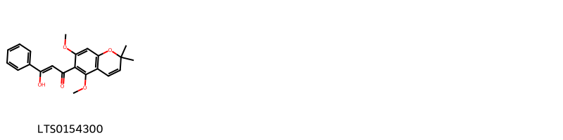{ width=100% }
    <figcaption>Hình ảnh cấu trúc hóa học của 1 hoạt chất thuộc nhóm Benzopyrans gồm ['praecansone b (LTS0154300)'].</figcaption>
</figure>
#### Nhóm Flavonoids
<figure markdown="span">
    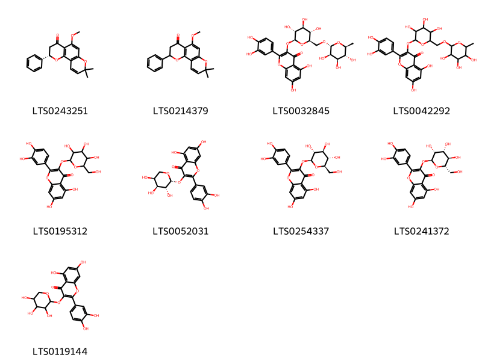{ width=100% }
    <figcaption>Hình ảnh cấu trúc hóa học của 9 hoạt chất thuộc nhóm Flavonoids gồm ['(2s)-5-methoxy-8,8-dimethyl-2-phenyl-2h,3h-pyrano[2,3-f]chromen-4-one (LTS0243251)', 'obovatin methyl ether (LTS0214379)', '3-rutinosyl quercetin (LTS0032845)', 'rutin (LTS0042292)', '2-(3,4-dihydroxyphenyl)-5,7-dihydroxy-3-{[3,4,5-trihydroxy-6-(hydroxymethyl)oxan-2-yl]oxy}chromen-4-one (LTS0195312)', '2-(3,4-dihydroxyphenyl)-5,7-dihydroxy-3-{[(2r,3r,4s,5s)-3,4,5-trihydroxyoxan-2-yl]oxy}chromen-4-one (LTS0052031)', 'isoquercetin (LTS0254337)', '2-(3,4-dihydroxyphenyl)-5,7-dihydroxy-3-{[(2s,3r,4r,5r,6s)-3,4,5-trihydroxy-6-(hydroxymethyl)oxan-2-yl]oxy}chromen-4-one (LTS0241372)', 'guaijaverin (LTS0119144)'].</figcaption>
</figure>
#### Nhóm Furanoid lignans
<figure markdown="span">
    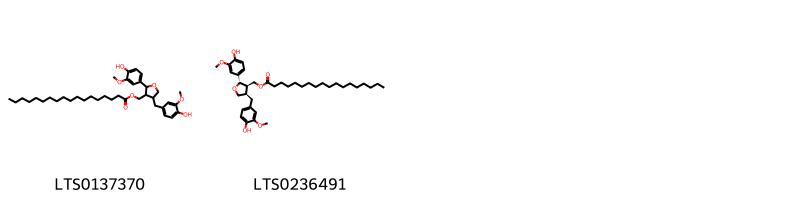{ width=100% }
    <figcaption>Hình ảnh cấu trúc hóa học của 2 hoạt chất thuộc nhóm Furanoid lignans gồm ['[2-(4-hydroxy-3-methoxyphenyl)-4-[(4-hydroxy-3-methoxyphenyl)methyl]oxolan-3-yl]methyl octadecanoate (LTS0137370)', '[(2s,3r,4r)-2-(4-hydroxy-3-methoxyphenyl)-4-[(4-hydroxy-3-methoxyphenyl)methyl]oxolan-3-yl]methyl octadecanoate (LTS0236491)'].</figcaption>
</figure>
#### Nhóm Isoflavonoids
<figure markdown="span">
    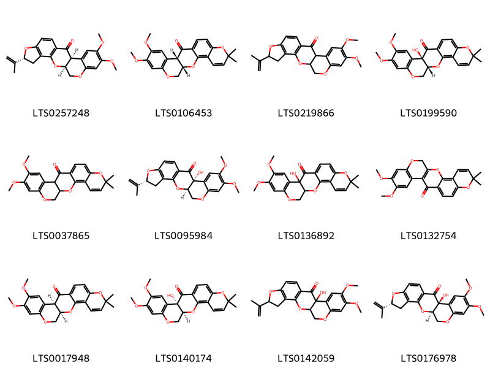{ width=100% }
    <figcaption>Hình ảnh cấu trúc hóa học của 12 hoạt chất thuộc nhóm Isoflavonoids gồm ['cube root (LTS0257248)', 'deguelin (LTS0106453)', '16,17-dimethoxy-6-(prop-1-en-2-yl)-2,7,20-trioxapentacyclo[11.8.0.0³,¹¹.0⁴,⁸.0¹⁴,¹⁹]henicosa-3(11),4(8),9,14,16,18-hexaen-12-one (LTS0219866)', 'tephrosin (LTS0199590)', '17,18-dimethoxy-7,7-dimethyl-2,8,21-trioxapentacyclo[12.8.0.0³,¹².0⁴,⁹.0¹⁵,²⁰]docosa-3,5,9,11,15(20),16,18-heptaen-13-one (LTS0037865)', '12a-hydroxyrotenone (LTS0095984)', '14-hydroxy-17,18-dimethoxy-7,7-dimethyl-2,8,21-trioxapentacyclo[12.8.0.0³,¹².0⁴,⁹.0¹⁵,²⁰]docosa-3,5,9,11,15(20),16,18-heptaen-13-one (LTS0136892)', '17,18-dimethoxy-7,7-dimethyl-2,8,21-trioxapentacyclo[12.8.0.0³,¹².0⁴,⁹.0¹⁵,²⁰]docosa-1(14),3,5,9,11,15(20),16,18-octaen-13-one (LTS0132754)', '(1r,14r)-17,18-dimethoxy-7,7-dimethyl-2,8,21-trioxapentacyclo[12.8.0.0³,¹².0⁴,⁹.0¹⁵,²⁰]docosa-3,5,9,11,15(20),16,18-heptaen-13-one (LTS0017948)', '(1s,14s)-14-hydroxy-17,18-dimethoxy-7,7-dimethyl-2,8,21-trioxapentacyclo[12.8.0.0³,¹².0⁴,⁹.0¹⁵,²⁰]docosa-3,5,9,11,15(20),16,18-heptaen-13-one (LTS0140174)', '13-hydroxy-16,17-dimethoxy-6-(prop-1-en-2-yl)-2,7,20-trioxapentacyclo[11.8.0.0³,¹¹.0⁴,⁸.0¹⁴,¹⁹]henicosa-3(11),4(8),9,14,16,18-hexaen-12-one (LTS0142059)', 'rotenolone (LTS0176978)'].</figcaption>
</figure>
#### Nhóm Prenol lipids
<figure markdown="span">
    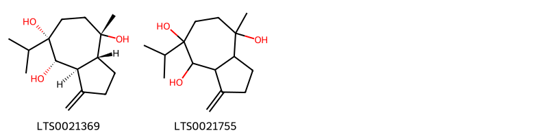{ width=100% }
    <figcaption>Hình ảnh cấu trúc hóa học của 2 hoạt chất thuộc nhóm Prenol lipids gồm ['(3as,4s,5s,8s,8ar)-5-isopropyl-8-methyl-3-methylidene-hexahydro-1h-azulene-4,5,8-triol (LTS0021369)', '5-isopropyl-8-methyl-3-methylidene-hexahydro-1h-azulene-4,5,8-triol (LTS0021755)'].</figcaption>
</figure>

---

### Dược dân tộc học

Danh sách các quốc gia có sử dụng *Tephrosia vogelii* trong điều trị các bệnh. 

| Country   | Disease                                                                                                                   | Bệnh                                                                                                                                                                                                |
|:----------|:--------------------------------------------------------------------------------------------------------------------------|:----------------------------------------------------------------------------------------------------------------------------------------------------------------------------------------------------|
| Africa    | Insecticide, Piscicide                                                                                                    | MYMEMORY WARNING: YOU USED ALL AVAILABLE FREE TRANSLATIONS FOR TODAY. NEXT AVAILABLE IN  17 HOURS 11 MINUTES 34 SECONDS VISIT HTTPS://MYMEMORY.TRANSLATED.NET/DOC/USAGELIMITS.PHP TO TRANSLATE MORE |
| Elsewhere | Abortifacient, Emetic, Insecticide, Insecticide, Insecticide, Piscicide, Purgative, Molluscicide, Parasiticide, Piscicide | MYMEMORY WARNING: YOU USED ALL AVAILABLE FREE TRANSLATIONS FOR TODAY. NEXT AVAILABLE IN  17 HOURS 11 MINUTES 30 SECONDS VISIT HTTPS://MYMEMORY.TRANSLATED.NET/DOC/USAGELIMITS.PHP TO TRANSLATE MORE |
| India     | Insecticide                                                                                                               | MYMEMORY WARNING: YOU USED ALL AVAILABLE FREE TRANSLATIONS FOR TODAY. NEXT AVAILABLE IN  17 HOURS 11 MINUTES 25 SECONDS VISIT HTTPS://MYMEMORY.TRANSLATED.NET/DOC/USAGELIMITS.PHP TO TRANSLATE MORE |
| Sudan     | Piscicide                                                                                                                 | MYMEMORY WARNING: YOU USED ALL AVAILABLE FREE TRANSLATIONS FOR TODAY. NEXT AVAILABLE IN  17 HOURS 11 MINUTES 23 SECONDS VISIT HTTPS://MYMEMORY.TRANSLATED.NET/DOC/USAGELIMITS.PHP TO TRANSLATE MORE |
| Tanzania  | Piscicide                                                                                                                 | MYMEMORY WARNING: YOU USED ALL AVAILABLE FREE TRANSLATIONS FOR TODAY. NEXT AVAILABLE IN  17 HOURS 11 MINUTES 19 SECONDS VISIT HTTPS://MYMEMORY.TRANSLATED.NET/DOC/USAGELIMITS.PHP TO TRANSLATE MORE |

---

# Chi Azukia

??? note "Danh sách các dược liệu thuộc chi"
    
	 - *Azukia angularis*

---
## Azukia angularis
### Thông tin về thực vật

!!! info "Phân loại thực vật của *Vigna angularis* từ GIBF:"
    - **Kingdom:** Plantae
    - **Phylum:** Tracheophyta
    - **Order:** Fabales
    - **Family:** Fabaceae
    - **Genus:** Vigna
    - **Species:** *Vigna angularis*

 

| Label (VI)   | Label (EN)   | Scientific Name   | Descriptions (VI)   | Descriptions (EN)   | Also Known As (VI)    | Also Known As (EN)   |
|:-------------|:-------------|:------------------|:--------------------|:--------------------|:----------------------|:---------------------|
| N/A          | N/A          | Tephrosia vogelii |                     | species of plant    | ['Tephrosia vogelii'] | ['']                 |

#### Phân bố trên thế giới

**Từ CSDL GIBF** Sri Lanka, Australia, Gabon, Guatemala, Angola, Mozambique, Rwanda, Benin, Nicaragua, Tanzania, United Republic of, Malawi, Zambia, Nigeria, Chinese Taipei, Bolivia (Plurinational State of), Papua New Guinea, Congo, Democratic Republic of the, Timor-Leste, Guinea, Liberia, El Salvador, Uganda, Brazil, Mexico, Peru, Mayotte, Madagascar, Colombia, India, Kenya, Cameroon, Ethiopia

#### Phân bố tại Việt Nam

**Từ CSDL GIBF**: Không có ghi nhận ở Việt Nam

---
### Thành phần hóa học
        
- Theo cơ sở dữ liệu lotus: Từ loài *Vigna angularis* đã phân lập và xác định được Chưa có hoạt chất nào được phân lập. hoạt chất thuộc về các nhóm Không có hoạt chất nào được phân lập. 

Không có hình ảnh nào được tạo ra

---

### Dược dân tộc học

Danh sách các quốc gia có sử dụng *Vigna angularis* trong điều trị các bệnh. 

| Country   | Disease                  | Bệnh                                                                                                                                                                                                |
|:----------|:-------------------------|:----------------------------------------------------------------------------------------------------------------------------------------------------------------------------------------------------|
| Elsewhere | Diuretic, Antiphlogistic | MYMEMORY WARNING: YOU USED ALL AVAILABLE FREE TRANSLATIONS FOR TODAY. NEXT AVAILABLE IN  17 HOURS 10 MINUTES 30 SECONDS VISIT HTTPS://MYMEMORY.TRANSLATED.NET/DOC/USAGELIMITS.PHP TO TRANSLATE MORE |

---

# Chi Mimosa

??? note "Danh sách các dược liệu thuộc chi"
    
	 - *Mimosa invisa*
	 - *Mimosa palmeri*
	 - *Mimosa pudica*
	 - *Mimosa purpurascens*
	 - *Mimosa rubicaulis*

---
## Mimosa invisa
### Thông tin về thực vật

!!! info "Phân loại thực vật của *Mimosa invisa* từ GIBF:"
    - **Kingdom:** Plantae
    - **Phylum:** Tracheophyta
    - **Order:** Fabales
    - **Family:** Fabaceae
    - **Genus:** Mimosa
    - **Species:** *Mimosa invisa*

 

| Label (VI)   | Label (EN)   | Scientific Name   | Descriptions (VI)   | Descriptions (EN)   | Also Known As (VI)   | Also Known As (EN)   |
|:-------------|:-------------|:------------------|:--------------------|:--------------------|:---------------------|:---------------------|
| N/A          | N/A          | Mimosa invisa     | loài thực vật       | species of plant    | ['']                 | ['']                 |

#### Phân bố trên thế giới

**Từ CSDL GIBF** nan, Micronesia (Federated States of), Christmas Island, Nigeria, Colombia, Brazil, Côte d’Ivoire, Guatemala, El Salvador, India, Benin, Indonesia, Burkina Faso, Mayotte, Guinea, Cameroon, Malaysia, Togo

#### Phân bố tại Việt Nam

**Từ CSDL GIBF**: Không có ghi nhận ở Việt Nam

---
### Thành phần hóa học
        
- Theo cơ sở dữ liệu lotus: Từ loài *Mimosa invisa* đã phân lập và xác định được Chưa có hoạt chất nào được phân lập. hoạt chất thuộc về các nhóm Không có hoạt chất nào được phân lập. 

Không có hình ảnh nào được tạo ra

---

### Dược dân tộc học

Danh sách các quốc gia có sử dụng *Mimosa invisa* trong điều trị các bệnh. 

| Country   | Disease       | Bệnh                                                                                                                                                                                                |
|:----------|:--------------|:----------------------------------------------------------------------------------------------------------------------------------------------------------------------------------------------------|
| Mexico    | Tonic, Emetic | MYMEMORY WARNING: YOU USED ALL AVAILABLE FREE TRANSLATIONS FOR TODAY. NEXT AVAILABLE IN  17 HOURS 10 MINUTES 04 SECONDS VISIT HTTPS://MYMEMORY.TRANSLATED.NET/DOC/USAGELIMITS.PHP TO TRANSLATE MORE |

---

---
## Mimosa palmeri
### Thông tin về thực vật

!!! info "Phân loại thực vật của *Mimosa palmeri* từ GIBF:"
    - **Kingdom:** Plantae
    - **Phylum:** Tracheophyta
    - **Order:** Fabales
    - **Family:** Fabaceae
    - **Genus:** Mimosa
    - **Species:** *Mimosa palmeri*

 

| Label (VI)   | Label (EN)   | Scientific Name   | Descriptions (VI)   | Descriptions (EN)   | Also Known As (VI)   | Also Known As (EN)   |
|:-------------|:-------------|:------------------|:--------------------|:--------------------|:---------------------|:---------------------|
| N/A          | N/A          | Mimosa palmeri    | loài thực vật       | species of plant    | ['']                 | ['']                 |

#### Phân bố trên thế giới

**Từ CSDL GIBF** nan, Mexico

#### Phân bố tại Việt Nam

**Từ CSDL GIBF**: Không có ghi nhận ở Việt Nam

---
### Thành phần hóa học
        
- Theo cơ sở dữ liệu lotus: Từ loài *Mimosa palmeri* đã phân lập và xác định được Chưa có hoạt chất nào được phân lập. hoạt chất thuộc về các nhóm Không có hoạt chất nào được phân lập. 

Không có hình ảnh nào được tạo ra

---

### Dược dân tộc học

Danh sách các quốc gia có sử dụng *Mimosa palmeri* trong điều trị các bệnh. 

| Country   | Disease    | Bệnh                                                                                                                                                                                                |
|:----------|:-----------|:----------------------------------------------------------------------------------------------------------------------------------------------------------------------------------------------------|
| Mexico    | Dentifrice | MYMEMORY WARNING: YOU USED ALL AVAILABLE FREE TRANSLATIONS FOR TODAY. NEXT AVAILABLE IN  17 HOURS 09 MINUTES 30 SECONDS VISIT HTTPS://MYMEMORY.TRANSLATED.NET/DOC/USAGELIMITS.PHP TO TRANSLATE MORE |

---

---
## Mimosa pudica
### Thông tin về thực vật

!!! info "Phân loại thực vật của *Mimosa pudica* từ GIBF:"
    - **Kingdom:** Plantae
    - **Phylum:** Tracheophyta
    - **Order:** Fabales
    - **Family:** Fabaceae
    - **Genus:** Mimosa
    - **Species:** *Mimosa pudica*

 

| Label (VI)   | Label (EN)   | Scientific Name   | Descriptions (VI)   | Descriptions (EN)                                                          | Also Known As (VI)                                                                                       | Also Known As (EN)                                                |
|:-------------|:-------------|:------------------|:--------------------|:---------------------------------------------------------------------------|:---------------------------------------------------------------------------------------------------------|:------------------------------------------------------------------|
| N/A          | N/A          | Mimosa pudica     | loài thực vật       | species of plant whose leaves fold inward and droop when touched or shaken | ['Mimosa pudica', 'Hàm tu thảo', 'Cây xấu hổ', 'Cây trinh nữ', 'Cây thẹn', 'Cây mắc cỡ', 'Hoa trinh nữ'] | ['Touch-me-not', 'Dormilones', 'Sensitive plant', 'Sleepy plant'] |

#### Phân bố trên thế giới

**Từ CSDL GIBF** American Samoa, Sri Lanka, Ghana, Australia, Guadeloupe, Lao People’s Democratic Republic, Cambodia, Myanmar, Argentina, Benin, Sierra Leone, Panama, French Guiana, Puerto Rico, Réunion, Chinese Taipei, Spain, Honduras, Jamaica, United States of America, Timor-Leste, Belize, Uganda, South Africa, Trinidad and Tobago, Hong Kong, Suriname, Fiji, Thailand, Martinique, Guam, Brazil, Cuba, Mexico, Dominican Republic, Peru, Singapore, Viet Nam, China, Ecuador, Madagascar, Colombia, Costa Rica, Vanuatu, India, Indonesia, Samoa, Antigua and Barbuda, Philippines, Cameroon, Malaysia

#### Phân bố tại Việt Nam

**Từ CSDL GIBF**: Đà Nẵng, Quảng Nam

---
### Thành phần hóa học
        
- Theo cơ sở dữ liệu lotus: Từ loài *Mimosa pudica* đã phân lập và xác định được 21 hoạt chất thuộc về các nhóm Fatty Acyls, Flavonoids, Indoles and derivatives, Cinnamic acids and derivatives, Organooxygen compounds, Pyridines and derivatives. 

|    | chemicalTaxonomyClassyfireClass   |   smiles_count |
|---:|:----------------------------------|---------------:|
|  0 | Cinnamic acids and derivatives    |              1 |
|  1 | Fatty Acyls                       |              1 |
|  2 | Flavonoids                        |             11 |
|  3 | Indoles and derivatives           |              2 |
|  4 | Organooxygen compounds            |              4 |
|  5 | Pyridines and derivatives         |              2 |

#### Nhóm Cinnamic acids and derivatives
<figure markdown="span">
    { width=100% }
    <figcaption>Hình ảnh cấu trúc hóa học của 1 hoạt chất thuộc nhóm Cinnamic acids and derivatives gồm ['para-coumaric acid (LTS0266252)'].</figcaption>
</figure>
#### Nhóm Fatty Acyls
<figure markdown="span">
    { width=100% }
    <figcaption>Hình ảnh cấu trúc hóa học của 1 hoạt chất thuộc nhóm Fatty Acyls gồm ['jasmonic acid (LTS0276338)'].</figcaption>
</figure>
#### Nhóm Flavonoids
<figure markdown="span">
    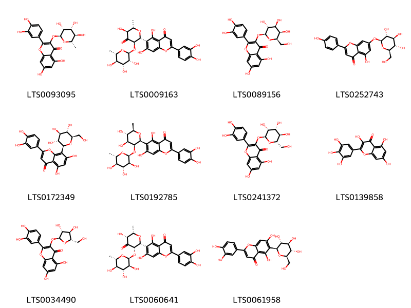{ width=100% }
    <figcaption>Hình ảnh cấu trúc hóa học của 11 hoạt chất thuộc nhóm Flavonoids gồm ['quercitrin (LTS0093095)', 'cassiaoccidentalin b (LTS0009163)', 'hyperoside (LTS0089156)', 'apigenin 7-o-β-glucoside (LTS0252743)', 'orientin (LTS0172349)', '6-[(2s,3s,4s,5s,6r)-4,5-dihydroxy-6-methyl-3-{[(2s,3s,4r,5r,6s)-3,4,5-trihydroxy-6-methyloxan-2-yl]oxy}oxan-2-yl]-2-(3,4-dihydroxyphenyl)-5,7-dihydroxychromen-4-one (LTS0192785)', '2-(3,4-dihydroxyphenyl)-5,7-dihydroxy-3-{[(2s,3r,4r,5r,6s)-3,4,5-trihydroxy-6-(hydroxymethyl)oxan-2-yl]oxy}chromen-4-one (LTS0241372)', 'myricetin (LTS0139858)', 'avicularin (LTS0034490)', '2-(3,4-dihydroxyphenyl)-5,7-dihydroxy-6-[(2r,3s,5r,6s)-5-hydroxy-6-methyl-4-oxo-3-{[(2s,3s,4r,5r,6s)-3,4,5-trihydroxy-6-methyloxan-2-yl]oxy}oxan-2-yl]chromen-4-one (LTS0060641)', 'isoorientin (LTS0061958)'].</figcaption>
</figure>
#### Nhóm Indoles and derivatives
<figure markdown="span">
    { width=100% }
    <figcaption>Hình ảnh cấu trúc hóa học của 2 hoạt chất thuộc nhóm Indoles and derivatives gồm ['l-tryptophan (LTS0263809)', 'optimax (LTS0014343)'].</figcaption>
</figure>
#### Nhóm Organooxygen compounds
<figure markdown="span">
    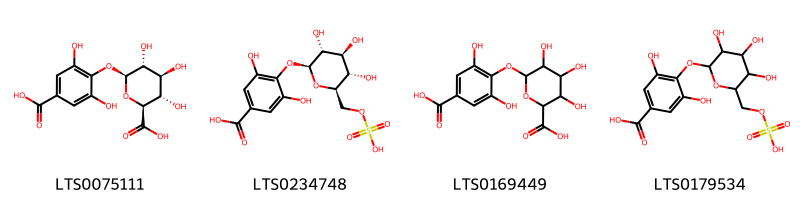{ width=100% }
    <figcaption>Hình ảnh cấu trúc hóa học của 4 hoạt chất thuộc nhóm Organooxygen compounds gồm ['(2s,3s,4s,5r,6s)-6-(4-carboxy-2,6-dihydroxyphenoxy)-3,4,5-trihydroxyoxane-2-carboxylic acid (LTS0075111)', '3,5-dihydroxy-4-{[(2s,3r,4s,5s,6r)-3,4,5-trihydroxy-6-[(sulfooxy)methyl]oxan-2-yl]oxy}benzoic acid (LTS0234748)', '6-(4-carboxy-2,6-dihydroxyphenoxy)-3,4,5-trihydroxyoxane-2-carboxylic acid (LTS0169449)', '3,5-dihydroxy-4-({3,4,5-trihydroxy-6-[(sulfooxy)methyl]oxan-2-yl}oxy)benzoic acid (LTS0179534)'].</figcaption>
</figure>
#### Nhóm Pyridines and derivatives
<figure markdown="span">
    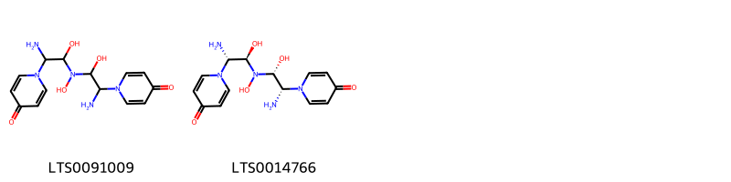{ width=100% }
    <figcaption>Hình ảnh cấu trúc hóa học của 2 hoạt chất thuộc nhóm Pyridines and derivatives gồm ['1-(1-amino-2-{[2-amino-1-hydroxy-2-(4-oxopyridin-1-yl)ethyl](hydroxy)amino}-2-hydroxyethyl)pyridin-4-one (LTS0091009)', '1-[(1s,2r)-1-amino-2-{[(1r,2s)-2-amino-1-hydroxy-2-(4-oxopyridin-1-yl)ethyl](hydroxy)amino}-2-hydroxyethyl]pyridin-4-one (LTS0014766)'].</figcaption>
</figure>

---

### Dược dân tộc học

Danh sách các quốc gia có sử dụng *Mimosa pudica* trong điều trị các bệnh. 

| Country            | Disease               | Bệnh                                                                                                                                                                                                |
|:-------------------|:----------------------|:----------------------------------------------------------------------------------------------------------------------------------------------------------------------------------------------------|
| Dominican Republic | Tonic                 | MYMEMORY WARNING: YOU USED ALL AVAILABLE FREE TRANSLATIONS FOR TODAY. NEXT AVAILABLE IN  17 HOURS 08 MINUTES 50 SECONDS VISIT HTTPS://MYMEMORY.TRANSLATED.NET/DOC/USAGELIMITS.PHP TO TRANSLATE MORE |
| Elsewhere          | nan                   | MYMEMORY WARNING: YOU USED ALL AVAILABLE FREE TRANSLATIONS FOR TODAY. NEXT AVAILABLE IN  17 HOURS 08 MINUTES 46 SECONDS VISIT HTTPS://MYMEMORY.TRANSLATED.NET/DOC/USAGELIMITS.PHP TO TRANSLATE MORE |
| Guatemala          | Sedative              | MYMEMORY WARNING: YOU USED ALL AVAILABLE FREE TRANSLATIONS FOR TODAY. NEXT AVAILABLE IN  17 HOURS 08 MINUTES 40 SECONDS VISIT HTTPS://MYMEMORY.TRANSLATED.NET/DOC/USAGELIMITS.PHP TO TRANSLATE MORE |
| Haiti              | Emetic, Emetic        | MYMEMORY WARNING: YOU USED ALL AVAILABLE FREE TRANSLATIONS FOR TODAY. NEXT AVAILABLE IN  17 HOURS 08 MINUTES 35 SECONDS VISIT HTTPS://MYMEMORY.TRANSLATED.NET/DOC/USAGELIMITS.PHP TO TRANSLATE MORE |
| Java               | Sedative              | MYMEMORY WARNING: YOU USED ALL AVAILABLE FREE TRANSLATIONS FOR TODAY. NEXT AVAILABLE IN  17 HOURS 08 MINUTES 28 SECONDS VISIT HTTPS://MYMEMORY.TRANSLATED.NET/DOC/USAGELIMITS.PHP TO TRANSLATE MORE |
| Panama             | Emetic                | MYMEMORY WARNING: YOU USED ALL AVAILABLE FREE TRANSLATIONS FOR TODAY. NEXT AVAILABLE IN  17 HOURS 08 MINUTES 24 SECONDS VISIT HTTPS://MYMEMORY.TRANSLATED.NET/DOC/USAGELIMITS.PHP TO TRANSLATE MORE |
| Trinidad           | nan                   | MYMEMORY WARNING: YOU USED ALL AVAILABLE FREE TRANSLATIONS FOR TODAY. NEXT AVAILABLE IN  17 HOURS 08 MINUTES 20 SECONDS VISIT HTTPS://MYMEMORY.TRANSLATED.NET/DOC/USAGELIMITS.PHP TO TRANSLATE MORE |
| Venezuela          | Emetic, Tonic, Poison | MYMEMORY WARNING: YOU USED ALL AVAILABLE FREE TRANSLATIONS FOR TODAY. NEXT AVAILABLE IN  17 HOURS 08 MINUTES 17 SECONDS VISIT HTTPS://MYMEMORY.TRANSLATED.NET/DOC/USAGELIMITS.PHP TO TRANSLATE MORE |

---

---
## Mimosa purpurascens
### Thông tin về thực vật

!!! info "Phân loại thực vật của *Mimosa distachya* từ GIBF:"
    - **Kingdom:** Plantae
    - **Phylum:** Tracheophyta
    - **Order:** Fabales
    - **Family:** Fabaceae
    - **Genus:** Mimosa
    - **Species:** *Mimosa distachya*

 

| Label (VI)   | Label (EN)   | Scientific Name     | Descriptions (VI)   | Descriptions (EN)   | Also Known As (VI)   | Also Known As (EN)   |
|:-------------|:-------------|:--------------------|:--------------------|:--------------------|:---------------------|:---------------------|
| N/A          | N/A          | Mimosa purpurascens | loài thực vật       | species of plant    | ['']                 | ['']                 |

#### Phân bố trên thế giới

**Từ CSDL GIBF** nan, Mexico

#### Phân bố tại Việt Nam

**Từ CSDL GIBF**: Không có ghi nhận ở Việt Nam

---
### Thành phần hóa học
        
- Theo cơ sở dữ liệu lotus: Từ loài *Mimosa distachya* đã phân lập và xác định được Chưa có hoạt chất nào được phân lập. hoạt chất thuộc về các nhóm Không có hoạt chất nào được phân lập. 

Không có hình ảnh nào được tạo ra

---

### Dược dân tộc học

Danh sách các quốc gia có sử dụng *Mimosa distachya* trong điều trị các bệnh. 

| Country   | Disease    | Bệnh                                                                                                                                                                                                |
|:----------|:-----------|:----------------------------------------------------------------------------------------------------------------------------------------------------------------------------------------------------|
| Mexico    | Astringent | MYMEMORY WARNING: YOU USED ALL AVAILABLE FREE TRANSLATIONS FOR TODAY. NEXT AVAILABLE IN  17 HOURS 07 MINUTES 29 SECONDS VISIT HTTPS://MYMEMORY.TRANSLATED.NET/DOC/USAGELIMITS.PHP TO TRANSLATE MORE |

---

---
## Mimosa rubicaulis
### Thông tin về thực vật

!!! info "Phân loại thực vật của *Mimosa rubicaulis* từ GIBF:"
    - **Kingdom:** Plantae
    - **Phylum:** Tracheophyta
    - **Order:** Fabales
    - **Family:** Fabaceae
    - **Genus:** Mimosa
    - **Species:** *Mimosa rubicaulis*

 

| Label (VI)   | Label (EN)   | Scientific Name   | Descriptions (VI)   | Descriptions (EN)   | Also Known As (VI)   | Also Known As (EN)   |
|:-------------|:-------------|:------------------|:--------------------|:--------------------|:---------------------|:---------------------|
| N/A          | N/A          | Mimosa rubicaulis | loài thực vật       | species of plant    | ['']                 | ['Himalayan Mimosa'] |

#### Phân bố trên thế giới

**Từ CSDL GIBF** nan, Pakistan, Japan, Myanmar, Bhutan, India, Indonesia, Bangladesh, unknown or invalid, Singapore, Malaysia, Brunei Darussalam, Nepal

#### Phân bố tại Việt Nam

**Từ CSDL GIBF**: Không có ghi nhận ở Việt Nam

---
### Thành phần hóa học
        
- Theo cơ sở dữ liệu lotus: Từ loài *Mimosa rubicaulis* đã phân lập và xác định được 2 hoạt chất thuộc về các nhóm Organooxygen compounds, Benzene and substituted derivatives. 

|    | chemicalTaxonomyClassyfireClass     |   smiles_count |
|---:|:------------------------------------|---------------:|
|  0 | Benzene and substituted derivatives |              1 |
|  1 | Organooxygen compounds              |              1 |

#### Nhóm Benzene and substituted derivatives
<figure markdown="span">
    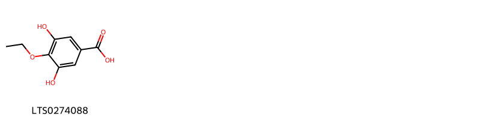{ width=100% }
    <figcaption>Hình ảnh cấu trúc hóa học của 1 hoạt chất thuộc nhóm Benzene and substituted derivatives gồm ['4-ethoxy-3,5-dihydroxybenzoic acid (LTS0274088)'].</figcaption>
</figure>
#### Nhóm Organooxygen compounds
<figure markdown="span">
    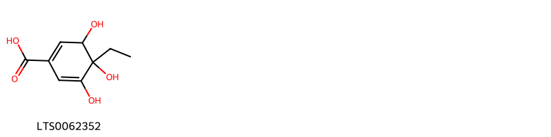{ width=100% }
    <figcaption>Hình ảnh cấu trúc hóa học của 1 hoạt chất thuộc nhóm Organooxygen compounds gồm ['4-ethyl-3,4,5-trihydroxycyclohexa-1,5-diene-1-carboxylic acid (LTS0062352)'].</figcaption>
</figure>

---

### Dược dân tộc học

Danh sách các quốc gia có sử dụng *Mimosa rubicaulis* trong điều trị các bệnh. 

| Country       | Disease   | Bệnh                                                                                                                                                                                                |
|:--------------|:----------|:----------------------------------------------------------------------------------------------------------------------------------------------------------------------------------------------------|
| India(Santal) | Laxative  | MYMEMORY WARNING: YOU USED ALL AVAILABLE FREE TRANSLATIONS FOR TODAY. NEXT AVAILABLE IN  17 HOURS 06 MINUTES 58 SECONDS VISIT HTTPS://MYMEMORY.TRANSLATED.NET/DOC/USAGELIMITS.PHP TO TRANSLATE MORE |

---

# Chi Mucuna

??? note "Danh sách các dược liệu thuộc chi"
    
	 - *Mucuna bracteata*
	 - *Mucuna gigantea*
	 - *Mucuna monoerma*
	 - *Mucuna poggei*
	 - *Mucuna pruriens*
	 - *Mucuna prurita*
	 - *Mucuna sloanei*

---
## Mucuna bracteata
### Thông tin về thực vật

!!! info "Phân loại thực vật của *Mucuna bracteata* từ GIBF:"
    - **Kingdom:** Plantae
    - **Phylum:** Tracheophyta
    - **Order:** Fabales
    - **Family:** Fabaceae
    - **Genus:** Mucuna
    - **Species:** *Mucuna bracteata*

 

| Label (VI)   | Label (EN)   | Scientific Name   | Descriptions (VI)   | Descriptions (EN)   | Also Known As (VI)   | Also Known As (EN)   |
|:-------------|:-------------|:------------------|:--------------------|:--------------------|:---------------------|:---------------------|
| N/A          | N/A          | Mucuna bracteata  | loài thực vật       | species of plant    | ['']                 | ['']                 |

#### Phân bố trên thế giới

**Từ CSDL GIBF** nan, Thailand, Gabon, Lao People’s Democratic Republic, Myanmar, India, Indonesia, unknown or invalid, Viet Nam, Malaysia, China, Panama

#### Phân bố tại Việt Nam

**Từ CSDL GIBF**: Kon Tum, Tonkin, Vinh Phúc

---
### Thành phần hóa học
        
- Theo cơ sở dữ liệu lotus: Từ loài *Mucuna bracteata* đã phân lập và xác định được Chưa có hoạt chất nào được phân lập. hoạt chất thuộc về các nhóm Không có hoạt chất nào được phân lập. 

Không có hình ảnh nào được tạo ra

---

### Dược dân tộc học

Danh sách các quốc gia có sử dụng *Mucuna bracteata* trong điều trị các bệnh. 

| Country   | Disease                                                            | Bệnh                                                                                                                                                                                                |
|:----------|:-------------------------------------------------------------------|:----------------------------------------------------------------------------------------------------------------------------------------------------------------------------------------------------|
| Elsewhere | Astringent, Diuretic, Emmenagogue, Stimulant, Vermifuge, Purgative | MYMEMORY WARNING: YOU USED ALL AVAILABLE FREE TRANSLATIONS FOR TODAY. NEXT AVAILABLE IN  17 HOURS 06 MINUTES 19 SECONDS VISIT HTTPS://MYMEMORY.TRANSLATED.NET/DOC/USAGELIMITS.PHP TO TRANSLATE MORE |

---

---
## Mucuna gigantea
### Thông tin về thực vật

!!! info "Phân loại thực vật của *Mucuna gigantea* từ GIBF:"
    - **Kingdom:** Plantae
    - **Phylum:** Tracheophyta
    - **Order:** Fabales
    - **Family:** Fabaceae
    - **Genus:** Mucuna
    - **Species:** *Mucuna gigantea*

 

| Label (VI)   | Label (EN)   | Scientific Name   | Descriptions (VI)   | Descriptions (EN)                       | Also Known As (VI)   | Also Known As (EN)                        |
|:-------------|:-------------|:------------------|:--------------------|:----------------------------------------|:---------------------|:------------------------------------------|
| N/A          | N/A          | Mucuna gigantea   | loài thực vật       | species of plant in the family Fabaceae | ['']                 | ['Velvet bean', 'Sea bean', 'Burny bean'] |

#### Phân bố trên thế giới

**Từ CSDL GIBF** nan, American Samoa, French Southern Territories, Australia, Christmas Island, Japan, Tanzania, United Republic of, Réunion, Chinese Taipei, United States of America, Solomon Islands, Maldives, South Africa, Thailand, Guam, New Caledonia, Tonga, Mayotte, France, Ecuador, Comoros, Madagascar, Seychelles, India, Indonesia, Northern Mariana Islands

#### Phân bố tại Việt Nam

**Từ CSDL GIBF**: Không có ghi nhận ở Việt Nam

---
### Thành phần hóa học
        
- Theo cơ sở dữ liệu lotus: Từ loài *Mucuna gigantea* đã phân lập và xác định được Chưa có hoạt chất nào được phân lập. hoạt chất thuộc về các nhóm Không có hoạt chất nào được phân lập. 

Không có hình ảnh nào được tạo ra

---

### Dược dân tộc học

Danh sách các quốc gia có sử dụng *Mucuna gigantea* trong điều trị các bệnh. 

| Country   | Disease     | Bệnh                                                                                                                                                                                                |
|:----------|:------------|:----------------------------------------------------------------------------------------------------------------------------------------------------------------------------------------------------|
| Guam?     | Aphrodisiac | MYMEMORY WARNING: YOU USED ALL AVAILABLE FREE TRANSLATIONS FOR TODAY. NEXT AVAILABLE IN  17 HOURS 05 MINUTES 55 SECONDS VISIT HTTPS://MYMEMORY.TRANSLATED.NET/DOC/USAGELIMITS.PHP TO TRANSLATE MORE |
| Hawaii    | Laxative    | MYMEMORY WARNING: YOU USED ALL AVAILABLE FREE TRANSLATIONS FOR TODAY. NEXT AVAILABLE IN  17 HOURS 05 MINUTES 52 SECONDS VISIT HTTPS://MYMEMORY.TRANSLATED.NET/DOC/USAGELIMITS.PHP TO TRANSLATE MORE |

---

---
## Mucuna monoerma
### Thông tin về thực vật

!!! info "Phân loại thực vật của *Mucuna monosperma* từ GIBF:"
    - **Kingdom:** Plantae
    - **Phylum:** Tracheophyta
    - **Order:** Fabales
    - **Family:** Fabaceae
    - **Genus:** Mucuna
    - **Species:** *Mucuna monosperma*

 

| Label (VI)   | Label (EN)   | Scientific Name   | Descriptions (VI)   | Descriptions (EN)                       | Also Known As (VI)   | Also Known As (EN)                        |
|:-------------|:-------------|:------------------|:--------------------|:----------------------------------------|:---------------------|:------------------------------------------|
| N/A          | N/A          | Mucuna gigantea   | loài thực vật       | species of plant in the family Fabaceae | ['']                 | ['Velvet bean', 'Sea bean', 'Burny bean'] |

#### Phân bố trên thế giới

**Từ CSDL GIBF** nan, Thailand, Korea, Republic of, Myanmar, Bhutan, India, unknown or invalid, China

#### Phân bố tại Việt Nam

**Từ CSDL GIBF**: Không có ghi nhận ở Việt Nam

---
### Thành phần hóa học
        
- Theo cơ sở dữ liệu lotus: Từ loài *Mucuna monosperma* đã phân lập và xác định được Chưa có hoạt chất nào được phân lập. hoạt chất thuộc về các nhóm Không có hoạt chất nào được phân lập. 

Không có hình ảnh nào được tạo ra

---

### Dược dân tộc học

Danh sách các quốc gia có sử dụng *Mucuna monosperma* trong điều trị các bệnh. 

| Country      | Disease               | Bệnh                                                                                                                                                                                                |
|:-------------|:----------------------|:----------------------------------------------------------------------------------------------------------------------------------------------------------------------------------------------------|
| Elsewhere    | Expectorant, Sedative | MYMEMORY WARNING: YOU USED ALL AVAILABLE FREE TRANSLATIONS FOR TODAY. NEXT AVAILABLE IN  17 HOURS 05 MINUTES 16 SECONDS VISIT HTTPS://MYMEMORY.TRANSLATED.NET/DOC/USAGELIMITS.PHP TO TRANSLATE MORE |
| India(Hindu) | Sedative              | MYMEMORY WARNING: YOU USED ALL AVAILABLE FREE TRANSLATIONS FOR TODAY. NEXT AVAILABLE IN  17 HOURS 05 MINUTES 12 SECONDS VISIT HTTPS://MYMEMORY.TRANSLATED.NET/DOC/USAGELIMITS.PHP TO TRANSLATE MORE |

---

---
## Mucuna poggei
### Thông tin về thực vật

!!! info "Phân loại thực vật của *Mucuna poggei* từ GIBF:"
    - **Kingdom:** Plantae
    - **Phylum:** Tracheophyta
    - **Order:** Fabales
    - **Family:** Fabaceae
    - **Genus:** Mucuna
    - **Species:** *Mucuna poggei*

 

| Label (VI)   | Label (EN)   | Scientific Name   | Descriptions (VI)   | Descriptions (EN)   | Also Known As (VI)   | Also Known As (EN)   |
|:-------------|:-------------|:------------------|:--------------------|:--------------------|:---------------------|:---------------------|
| N/A          | N/A          | Mucuna poggei     | loài thực vật       | species of plant    | ['']                 | ['']                 |

#### Phân bố trên thế giới

**Từ CSDL GIBF** nan, Ghana, Angola, Mozambique, Benin, Tanzania, United Republic of, Togo, Malawi, Zambia, Mali, Congo, Democratic Republic of the, Guinea, Uganda, Guinea-Bissau, Côte d’Ivoire, Burundi, Burkina Faso, Kenya, Cameroon, Malaysia

#### Phân bố tại Việt Nam

**Từ CSDL GIBF**: Không có ghi nhận ở Việt Nam

---
### Thành phần hóa học
        
- Theo cơ sở dữ liệu lotus: Từ loài *Mucuna poggei* đã phân lập và xác định được Chưa có hoạt chất nào được phân lập. hoạt chất thuộc về các nhóm Không có hoạt chất nào được phân lập. 

Không có hình ảnh nào được tạo ra

---

### Dược dân tộc học

Danh sách các quốc gia có sử dụng *Mucuna poggei* trong điều trị các bệnh. 

| Country   | Disease   | Bệnh                                                                                                                                                                                                |
|:----------|:----------|:----------------------------------------------------------------------------------------------------------------------------------------------------------------------------------------------------|
| Africa    | Piscicide | MYMEMORY WARNING: YOU USED ALL AVAILABLE FREE TRANSLATIONS FOR TODAY. NEXT AVAILABLE IN  17 HOURS 04 MINUTES 51 SECONDS VISIT HTTPS://MYMEMORY.TRANSLATED.NET/DOC/USAGELIMITS.PHP TO TRANSLATE MORE |

---

---
## Mucuna pruriens
### Thông tin về thực vật

!!! info "Phân loại thực vật của *Mucuna pruriens* từ GIBF:"
    - **Kingdom:** Plantae
    - **Phylum:** Tracheophyta
    - **Order:** Fabales
    - **Family:** Fabaceae
    - **Genus:** Mucuna
    - **Species:** *Mucuna pruriens*

 

| Label (VI)   | Label (EN)   | Scientific Name   | Descriptions (VI)   | Descriptions (EN)   | Also Known As (VI)   | Also Known As (EN)   |
|:-------------|:-------------|:------------------|:--------------------|:--------------------|:---------------------|:---------------------|
| N/A          | N/A          | Mucuna pruriens   | loài thực vật       | species of plant    | ['']                 | ['Velvet Bean']      |

#### Phân bố trên thế giới

**Từ CSDL GIBF** Sri Lanka, Guatemala, Myanmar, Mozambique, Benin, Nicaragua, Venezuela (Bolivarian Republic of), Panama, Malawi, Puerto Rico, Réunion, Senegal, Nigeria, Chinese Taipei, Bolivia (Plurinational State of), Honduras, United States of America, El Salvador, Maldives, Belize, South Africa, Barbados, Thailand, Martinique, Brazil, Côte d’Ivoire, Bahamas, Mexico, Dominican Republic, Mayotte, Singapore, China, Ecuador, Madagascar, Costa Rica, India, Gambia, Indonesia, Cayman Islands

#### Phân bố tại Việt Nam

**Từ CSDL GIBF**: Không có ghi nhận ở Việt Nam

---
### Thành phần hóa học
        
- Theo cơ sở dữ liệu lotus: Từ loài *Mucuna pruriens* đã phân lập và xác định được 18 hoạt chất thuộc về các nhóm Fatty Acyls, Indoles and derivatives, Glycerophospholipids, Phenols, Tetrahydroisoquinolines, Carboxylic acids and derivatives, Diazines. 

|    | chemicalTaxonomyClassyfireClass   |   smiles_count |
|---:|:----------------------------------|---------------:|
|  0 | Carboxylic acids and derivatives  |              2 |
|  1 | Diazines                          |              1 |
|  2 | Fatty Acyls                       |              3 |
|  3 | Glycerophospholipids              |              1 |
|  4 | Indoles and derivatives           |              1 |
|  5 | Phenols                           |              1 |
|  6 | Tetrahydroisoquinolines           |              9 |

#### Nhóm Carboxylic acids and derivatives
<figure markdown="span">
    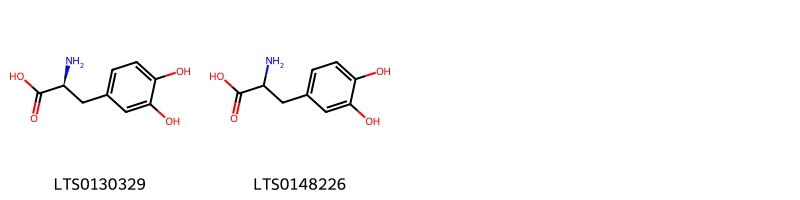{ width=100% }
    <figcaption>Hình ảnh cấu trúc hóa học của 2 hoạt chất thuộc nhóm Carboxylic acids and derivatives gồm ['levodopa (LTS0130329)', "3',4'-dihydroxyphenylalanine (LTS0148226)"].</figcaption>
</figure>
#### Nhóm Diazines
<figure markdown="span">
    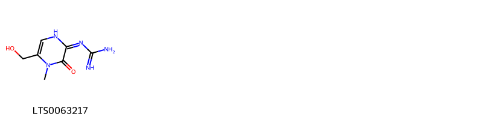{ width=100% }
    <figcaption>Hình ảnh cấu trúc hóa học của 1 hoạt chất thuộc nhóm Diazines gồm ['n-[5-(hydroxymethyl)-4-methyl-3-oxo-1h-pyrazin-2-ylidene]guanidine (LTS0063217)'].</figcaption>
</figure>
#### Nhóm Fatty Acyls
<figure markdown="span">
    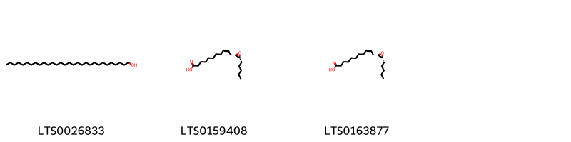{ width=100% }
    <figcaption>Hình ảnh cấu trúc hóa học của 3 hoạt chất thuộc nhóm Fatty Acyls gồm ['triacontanol (LTS0026833)', '(-)-vernolic acid (LTS0159408)', '(+)-vernolic acid (LTS0163877)'].</figcaption>
</figure>
#### Nhóm Glycerophospholipids
<figure markdown="span">
    { width=100% }
    <figcaption>Hình ảnh cấu trúc hóa học của 1 hoạt chất thuộc nhóm Glycerophospholipids gồm ['2,3-bis[(9e)-nonadec-9-enoyloxy]propoxy(2-(trimethylammonio)ethoxy)phosphinic acid (LTS0223825)'].</figcaption>
</figure>
#### Nhóm Indoles and derivatives
<figure markdown="span">
    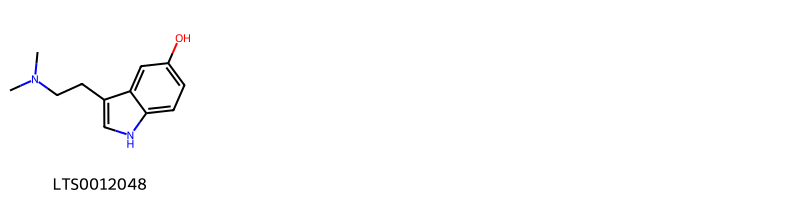{ width=100% }
    <figcaption>Hình ảnh cấu trúc hóa học của 1 hoạt chất thuộc nhóm Indoles and derivatives gồm ['bufotenine (LTS0012048)'].</figcaption>
</figure>
#### Nhóm Phenols
<figure markdown="span">
    { width=100% }
    <figcaption>Hình ảnh cấu trúc hóa học của 1 hoạt chất thuộc nhóm Phenols gồm ['dopamine (LTS0029901)'].</figcaption>
</figure>
#### Nhóm Tetrahydroisoquinolines
<figure markdown="span">
    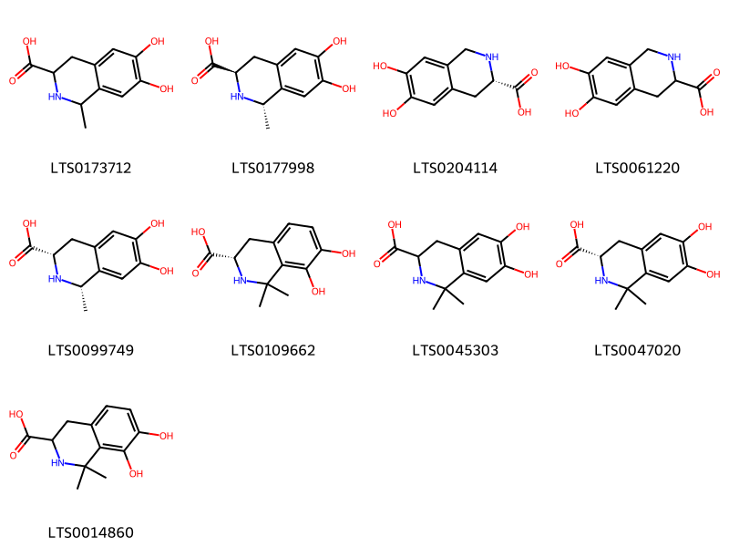{ width=100% }
    <figcaption>Hình ảnh cấu trúc hóa học của 9 hoạt chất thuộc nhóm Tetrahydroisoquinolines gồm ['6,7-dihydroxy-1-methyl-1,2,3,4-tetrahydroisoquinoline-3-carboxylic acid (LTS0173712)', '(1s,3r)-6,7-dihydroxy-1-methyl-1,2,3,4-tetrahydroisoquinoline-3-carboxylic acid (LTS0177998)', '(3s)-6,7-dihydroxy-1,2,3,4-tetrahydroisoquinoline-3-carboxylic acid (LTS0204114)', '6,7-dihydroxy-1,2,3,4-tetrahydroisoquinoline-3-carboxylic acid (LTS0061220)', '(1s,3s)-6,7-dihydroxy-1-methyl-1,2,3,4-tetrahydroisoquinoline-3-carboxylic acid (LTS0099749)', '(3s)-7,8-dihydroxy-1,1-dimethyl-3,4-dihydro-2h-isoquinoline-3-carboxylic acid (LTS0109662)', '6,7-dihydroxy-1,1-dimethyl-3,4-dihydro-2h-isoquinoline-3-carboxylic acid (LTS0045303)', '(3s)-6,7-dihydroxy-1,1-dimethyl-3,4-dihydro-2h-isoquinoline-3-carboxylic acid (LTS0047020)', '7,8-dihydroxy-1,1-dimethyl-3,4-dihydro-2h-isoquinoline-3-carboxylic acid (LTS0014860)'].</figcaption>
</figure>

---

### Dược dân tộc học

Danh sách các quốc gia có sử dụng *Mucuna pruriens* trong điều trị các bệnh. 

| Country            | Disease                                                     | Bệnh                                                                                                                                                                                                |
|:-------------------|:------------------------------------------------------------|:----------------------------------------------------------------------------------------------------------------------------------------------------------------------------------------------------|
| China              | Rubefacient, Ascaricide                                     | MYMEMORY WARNING: YOU USED ALL AVAILABLE FREE TRANSLATIONS FOR TODAY. NEXT AVAILABLE IN  17 HOURS 04 MINUTES 18 SECONDS VISIT HTTPS://MYMEMORY.TRANSLATED.NET/DOC/USAGELIMITS.PHP TO TRANSLATE MORE |
| Dominican Republic | Diuretic                                                    | MYMEMORY WARNING: YOU USED ALL AVAILABLE FREE TRANSLATIONS FOR TODAY. NEXT AVAILABLE IN  17 HOURS 04 MINUTES 09 SECONDS VISIT HTTPS://MYMEMORY.TRANSLATED.NET/DOC/USAGELIMITS.PHP TO TRANSLATE MORE |
| Dutch              | Vermifuge                                                   | MYMEMORY WARNING: YOU USED ALL AVAILABLE FREE TRANSLATIONS FOR TODAY. NEXT AVAILABLE IN  17 HOURS 04 MINUTES 03 SECONDS VISIT HTTPS://MYMEMORY.TRANSLATED.NET/DOC/USAGELIMITS.PHP TO TRANSLATE MORE |
| East Indies        | Vermifuge                                                   | MYMEMORY WARNING: YOU USED ALL AVAILABLE FREE TRANSLATIONS FOR TODAY. NEXT AVAILABLE IN  17 HOURS 03 MINUTES 59 SECONDS VISIT HTTPS://MYMEMORY.TRANSLATED.NET/DOC/USAGELIMITS.PHP TO TRANSLATE MORE |
| Elsewhere          | Aphrodisiac, Vermifuge                                      | MYMEMORY WARNING: YOU USED ALL AVAILABLE FREE TRANSLATIONS FOR TODAY. NEXT AVAILABLE IN  17 HOURS 03 MINUTES 55 SECONDS VISIT HTTPS://MYMEMORY.TRANSLATED.NET/DOC/USAGELIMITS.PHP TO TRANSLATE MORE |
| French             | Nervine                                                     | MYMEMORY WARNING: YOU USED ALL AVAILABLE FREE TRANSLATIONS FOR TODAY. NEXT AVAILABLE IN  17 HOURS 03 MINUTES 52 SECONDS VISIT HTTPS://MYMEMORY.TRANSLATED.NET/DOC/USAGELIMITS.PHP TO TRANSLATE MORE |
| German             | Aphrodisiac                                                 | MYMEMORY WARNING: YOU USED ALL AVAILABLE FREE TRANSLATIONS FOR TODAY. NEXT AVAILABLE IN  17 HOURS 03 MINUTES 49 SECONDS VISIT HTTPS://MYMEMORY.TRANSLATED.NET/DOC/USAGELIMITS.PHP TO TRANSLATE MORE |
| Haiti              | Vermifuge                                                   | MYMEMORY WARNING: YOU USED ALL AVAILABLE FREE TRANSLATIONS FOR TODAY. NEXT AVAILABLE IN  17 HOURS 03 MINUTES 46 SECONDS VISIT HTTPS://MYMEMORY.TRANSLATED.NET/DOC/USAGELIMITS.PHP TO TRANSLATE MORE |
| Java               | Diuretic, Vermifuge                                         | MYMEMORY WARNING: YOU USED ALL AVAILABLE FREE TRANSLATIONS FOR TODAY. NEXT AVAILABLE IN  17 HOURS 03 MINUTES 43 SECONDS VISIT HTTPS://MYMEMORY.TRANSLATED.NET/DOC/USAGELIMITS.PHP TO TRANSLATE MORE |
| Mexico             | Aphrodisiac, Aphrodisiac, Rubefacient, Vermifuge, Vermifuge | MYMEMORY WARNING: YOU USED ALL AVAILABLE FREE TRANSLATIONS FOR TODAY. NEXT AVAILABLE IN  17 HOURS 03 MINUTES 40 SECONDS VISIT HTTPS://MYMEMORY.TRANSLATED.NET/DOC/USAGELIMITS.PHP TO TRANSLATE MORE |
| Panama(Cuna)       | Aphrodisiac                                                 | MYMEMORY WARNING: YOU USED ALL AVAILABLE FREE TRANSLATIONS FOR TODAY. NEXT AVAILABLE IN  17 HOURS 03 MINUTES 36 SECONDS VISIT HTTPS://MYMEMORY.TRANSLATED.NET/DOC/USAGELIMITS.PHP TO TRANSLATE MORE |
| Trinidad           | Vermifuge, Vermifuge                                        | MYMEMORY WARNING: YOU USED ALL AVAILABLE FREE TRANSLATIONS FOR TODAY. NEXT AVAILABLE IN  17 HOURS 03 MINUTES 33 SECONDS VISIT HTTPS://MYMEMORY.TRANSLATED.NET/DOC/USAGELIMITS.PHP TO TRANSLATE MORE |
| Venezuela          | Vermifuge                                                   | MYMEMORY WARNING: YOU USED ALL AVAILABLE FREE TRANSLATIONS FOR TODAY. NEXT AVAILABLE IN  17 HOURS 03 MINUTES 31 SECONDS VISIT HTTPS://MYMEMORY.TRANSLATED.NET/DOC/USAGELIMITS.PHP TO TRANSLATE MORE |

---

---
## Mucuna prurita
### Thông tin về thực vật

!!! info "Phân loại thực vật của *Mucuna pruriens* từ GIBF:"
    - **Kingdom:** Plantae
    - **Phylum:** Tracheophyta
    - **Order:** Fabales
    - **Family:** Fabaceae
    - **Genus:** Mucuna
    - **Species:** *Mucuna pruriens*

 

| Label (VI)   | Label (EN)   | Scientific Name   | Descriptions (VI)   | Descriptions (EN)   | Also Known As (VI)   | Also Known As (EN)   |
|:-------------|:-------------|:------------------|:--------------------|:--------------------|:---------------------|:---------------------|
| N/A          | N/A          | Mucuna prurita    | loài thực vật       | species of plant    | ['']                 | ['']                 |

#### Phân bố trên thế giới

**Từ CSDL GIBF** Sri Lanka, Guatemala, Myanmar, Mozambique, Benin, Nicaragua, Venezuela (Bolivarian Republic of), Panama, Malawi, Puerto Rico, Réunion, Senegal, Nigeria, Chinese Taipei, Bolivia (Plurinational State of), Honduras, United States of America, El Salvador, Maldives, Belize, South Africa, Barbados, Thailand, Martinique, Brazil, Côte d’Ivoire, Bahamas, Mexico, Dominican Republic, Mayotte, Singapore, China, Ecuador, Madagascar, Costa Rica, India, Gambia, Indonesia, Cayman Islands

#### Phân bố tại Việt Nam

**Từ CSDL GIBF**: Không có ghi nhận ở Việt Nam

---
### Thành phần hóa học
        
- Theo cơ sở dữ liệu lotus: Từ loài *Mucuna pruriens* đã phân lập và xác định được Chưa có hoạt chất nào được phân lập. hoạt chất thuộc về các nhóm Không có hoạt chất nào được phân lập. 

Không có hình ảnh nào được tạo ra

---

### Dược dân tộc học

Danh sách các quốc gia có sử dụng *Mucuna pruriens* trong điều trị các bệnh. 

| Country   | Disease                                                                   | Bệnh                                                                                                                                                                                                |
|:----------|:--------------------------------------------------------------------------|:----------------------------------------------------------------------------------------------------------------------------------------------------------------------------------------------------|
| Elsewhere | Diuretic, Emmenagogue, Purgative, Stimulant, Tonic, Vermifuge, Astringent | MYMEMORY WARNING: YOU USED ALL AVAILABLE FREE TRANSLATIONS FOR TODAY. NEXT AVAILABLE IN  17 HOURS 03 MINUTES 07 SECONDS VISIT HTTPS://MYMEMORY.TRANSLATED.NET/DOC/USAGELIMITS.PHP TO TRANSLATE MORE |

---

---
## Mucuna sloanei
### Thông tin về thực vật

!!! info "Phân loại thực vật của *Mucuna sloanei* từ GIBF:"
    - **Kingdom:** Plantae
    - **Phylum:** Tracheophyta
    - **Order:** Fabales
    - **Family:** Fabaceae
    - **Genus:** Mucuna
    - **Species:** *Mucuna sloanei*

 

| Label (VI)   | Label (EN)   | Scientific Name   | Descriptions (VI)   | Descriptions (EN)   | Also Known As (VI)   | Also Known As (EN)   |
|:-------------|:-------------|:------------------|:--------------------|:--------------------|:---------------------|:---------------------|
| N/A          | N/A          | Mucuna sloanei    | loài thực vật       | species of plant    | ['']                 | ['']                 |

#### Phân bố trên thế giới

**Từ CSDL GIBF** Ghana, Gabon, Angola, Argentina, Benin, Nicaragua, Bermuda, French Guiana, Netherlands, Nigeria, Bolivia (Plurinational State of), United States of America, Congo, Democratic Republic of the, El Salvador, Belize, Suriname, Brazil, Mexico, Peru, French Polynesia, Equatorial Guinea, Colombia, Costa Rica, Cayman Islands, Cameroon

#### Phân bố tại Việt Nam

**Từ CSDL GIBF**: Không có ghi nhận ở Việt Nam

---
### Thành phần hóa học
        
- Theo cơ sở dữ liệu lotus: Từ loài *Mucuna sloanei* đã phân lập và xác định được Chưa có hoạt chất nào được phân lập. hoạt chất thuộc về các nhóm Không có hoạt chất nào được phân lập. 

Không có hình ảnh nào được tạo ra

---

### Dược dân tộc học

Danh sách các quốc gia có sử dụng *Mucuna sloanei* trong điều trị các bệnh. 

| Country   | Disease             | Bệnh                                                                                                                                                                                                |
|:----------|:--------------------|:----------------------------------------------------------------------------------------------------------------------------------------------------------------------------------------------------|
| Mexico    | Diuretic, Purgative | MYMEMORY WARNING: YOU USED ALL AVAILABLE FREE TRANSLATIONS FOR TODAY. NEXT AVAILABLE IN  17 HOURS 02 MINUTES 50 SECONDS VISIT HTTPS://MYMEMORY.TRANSLATED.NET/DOC/USAGELIMITS.PHP TO TRANSLATE MORE |

---

# Chi Astragalus

??? note "Danh sách các dược liệu thuộc chi"
    
	 - *Astragalus garbancillo*
	 - *Astragalus gummifer*
	 - *Astragalus hamosus*
	 - *Astragalus hoantchy*
	 - *Astragalus membranaceus*
	 - *Astragalus molissimus*
	 - *Astragalus tragacanthi*
	 - *Astragalus tribuloides*

---
## Astragalus garbancillo
### Thông tin về thực vật

!!! info "Phân loại thực vật của *Astragalus garbancillo* từ GIBF:"
    - **Kingdom:** Plantae
    - **Phylum:** Tracheophyta
    - **Order:** Fabales
    - **Family:** Fabaceae
    - **Genus:** Astragalus
    - **Species:** *Astragalus garbancillo*

 

| Label (VI)   | Label (EN)   | Scientific Name        | Descriptions (VI)   | Descriptions (EN)   | Also Known As (VI)   | Also Known As (EN)   |
|:-------------|:-------------|:-----------------------|:--------------------|:--------------------|:---------------------|:---------------------|
| N/A          | N/A          | Astragalus garbancillo | loài thực vật       | species of plant    | ['']                 | ['']                 |

#### Phân bố trên thế giới

**Từ CSDL GIBF** nan, Ecuador, Bolivia (Plurinational State of), Argentina, Peru, Mexico

#### Phân bố tại Việt Nam

**Từ CSDL GIBF**: Không có ghi nhận ở Việt Nam

---
### Thành phần hóa học
        
- Theo cơ sở dữ liệu lotus: Từ loài *Astragalus garbancillo* đã phân lập và xác định được Chưa có hoạt chất nào được phân lập. hoạt chất thuộc về các nhóm Không có hoạt chất nào được phân lập. 

Không có hình ảnh nào được tạo ra

---

### Dược dân tộc học

Danh sách các quốc gia có sử dụng *Astragalus garbancillo* trong điều trị các bệnh. 

| Country   | Disease     | Bệnh                                                                                                                                                                                                |
|:----------|:------------|:----------------------------------------------------------------------------------------------------------------------------------------------------------------------------------------------------|
| Elsewhere | Insecticide | MYMEMORY WARNING: YOU USED ALL AVAILABLE FREE TRANSLATIONS FOR TODAY. NEXT AVAILABLE IN  17 HOURS 02 MINUTES 29 SECONDS VISIT HTTPS://MYMEMORY.TRANSLATED.NET/DOC/USAGELIMITS.PHP TO TRANSLATE MORE |
| Peru      | Soap        | MYMEMORY WARNING: YOU USED ALL AVAILABLE FREE TRANSLATIONS FOR TODAY. NEXT AVAILABLE IN  17 HOURS 02 MINUTES 27 SECONDS VISIT HTTPS://MYMEMORY.TRANSLATED.NET/DOC/USAGELIMITS.PHP TO TRANSLATE MORE |

---

---
## Astragalus gummifer
### Thông tin về thực vật

!!! info "Phân loại thực vật của *Astragalus gummifer* từ GIBF:"
    - **Kingdom:** Plantae
    - **Phylum:** Tracheophyta
    - **Order:** Fabales
    - **Family:** Fabaceae
    - **Genus:** Astragalus
    - **Species:** *Astragalus gummifer*

 

| Label (VI)   | Label (EN)   | Scientific Name     | Descriptions (VI)   | Descriptions (EN)   | Also Known As (VI)   | Also Known As (EN)   |
|:-------------|:-------------|:--------------------|:--------------------|:--------------------|:---------------------|:---------------------|
| N/A          | N/A          | Astragalus gummifer |                     | species of plant    | ['']                 | ['']                 |

#### Phân bố trên thế giới

**Từ CSDL GIBF** nan, Syrian Arab Republic, United Kingdom of Great Britain and Northern Ireland, Iran (Islamic Republic of), Iraq, Egypt, Palestine, State of, Türkiye, India, unknown or invalid, United States of America, Lebanon, Armenia, Chile, Greece, Israel, Austria

#### Phân bố tại Việt Nam

**Từ CSDL GIBF**: Không có ghi nhận ở Việt Nam

---
### Thành phần hóa học
        
- Theo cơ sở dữ liệu lotus: Từ loài *Astragalus gummifer* đã phân lập và xác định được 1 hoạt chất thuộc về các nhóm Organooxygen compounds. 

|    | chemicalTaxonomyClassyfireClass   |   smiles_count |
|---:|:----------------------------------|---------------:|
|  0 | Organooxygen compounds            |              1 |

#### Nhóm Organooxygen compounds
<figure markdown="span">
    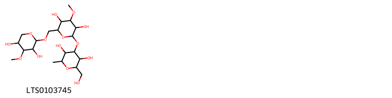{ width=100% }
    <figcaption>Hình ảnh cấu trúc hóa học của 1 hoạt chất thuộc nhóm Organooxygen compounds gồm ['galactoarabinan (LTS0103745)'].</figcaption>
</figure>

---

### Dược dân tộc học

Danh sách các quốc gia có sử dụng *Astragalus gummifer* trong điều trị các bệnh. 

| Country   | Disease   | Bệnh                                                                                                                                                                                                |
|:----------|:----------|:----------------------------------------------------------------------------------------------------------------------------------------------------------------------------------------------------|
| India     | Emollient | MYMEMORY WARNING: YOU USED ALL AVAILABLE FREE TRANSLATIONS FOR TODAY. NEXT AVAILABLE IN  17 HOURS 02 MINUTES 06 SECONDS VISIT HTTPS://MYMEMORY.TRANSLATED.NET/DOC/USAGELIMITS.PHP TO TRANSLATE MORE |

---

---
## Astragalus hamosus
### Thông tin về thực vật

!!! info "Phân loại thực vật của *Astragalus hamosus* từ GIBF:"
    - **Kingdom:** Plantae
    - **Phylum:** Tracheophyta
    - **Order:** Fabales
    - **Family:** Fabaceae
    - **Genus:** Astragalus
    - **Species:** *Astragalus hamosus*

 

| Label (VI)   | Label (EN)   | Scientific Name    | Descriptions (VI)   | Descriptions (EN)   | Also Known As (VI)   | Also Known As (EN)   |
|:-------------|:-------------|:-------------------|:--------------------|:--------------------|:---------------------|:---------------------|
| N/A          | N/A          | Astragalus hamosus | loài thực vật       | species of plant    | ['']                 | ['']                 |

#### Phân bố trên thế giới

**Từ CSDL GIBF** Ukraine, Israel, Italy, Iraq, Spain, Palestine, State of, Azerbaijan, Portugal, Türkiye, Algeria, Russian Federation, Albania, France, Croatia, Greece

#### Phân bố tại Việt Nam

**Từ CSDL GIBF**: Không có ghi nhận ở Việt Nam

---
### Thành phần hóa học
        
- Theo cơ sở dữ liệu lotus: Từ loài *Astragalus hamosus* đã phân lập và xác định được 21 hoạt chất thuộc về các nhóm Fatty Acyls, Carboxylic acids and derivatives, Organooxygen compounds. 

|    | chemicalTaxonomyClassyfireClass   |   smiles_count |
|---:|:----------------------------------|---------------:|
|  0 | Carboxylic acids and derivatives  |             10 |
|  1 | Fatty Acyls                       |              7 |
|  2 | Organooxygen compounds            |              4 |

#### Nhóm Carboxylic acids and derivatives
<figure markdown="span">
    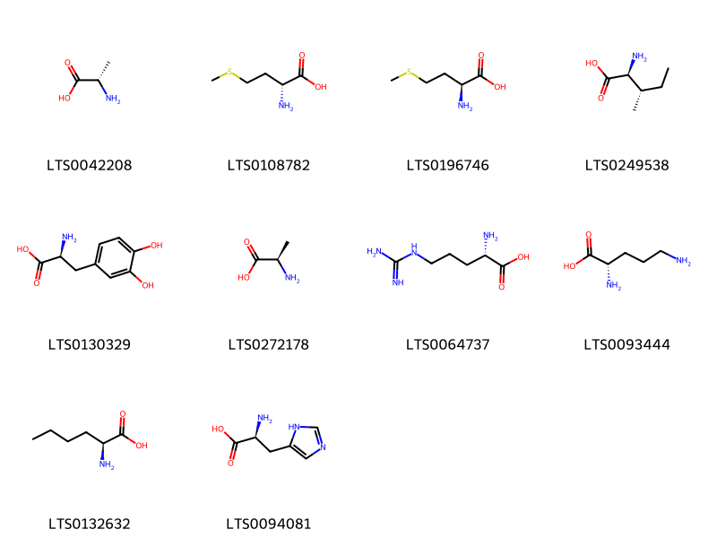{ width=100% }
    <figcaption>Hình ảnh cấu trúc hóa học của 10 hoạt chất thuộc nhóm Carboxylic acids and derivatives gồm ['l-alanine (LTS0042208)', 'd-methionine (LTS0108782)', 'l-methionine (LTS0196746)', 'l-isoleucine (LTS0249538)', 'levodopa (LTS0130329)', 'd-alanine (LTS0272178)', 'l-arginine (LTS0064737)', 'l-ornithine (LTS0093444)', 'norleucine (LTS0132632)', 'l-histidine (LTS0094081)'].</figcaption>
</figure>
#### Nhóm Fatty Acyls
<figure markdown="span">
    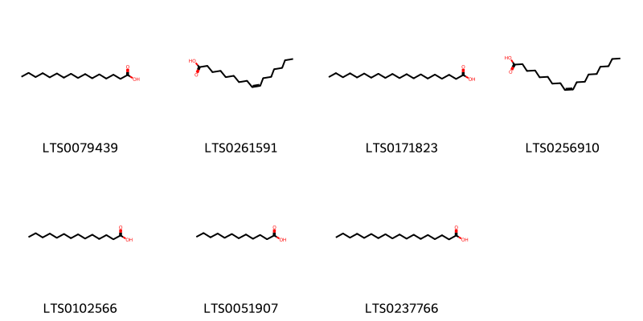{ width=100% }
    <figcaption>Hình ảnh cấu trúc hóa học của 7 hoạt chất thuộc nhóm Fatty Acyls gồm ['palmitic acid (LTS0079439)', 'palmitoleic acid (LTS0261591)', 'arachidic acid (LTS0171823)', 'oleic acid (LTS0256910)', 'myristic acid (LTS0102566)', 'lauric acid (LTS0051907)', 'stearic acid (LTS0237766)'].</figcaption>
</figure>
#### Nhóm Organooxygen compounds
<figure markdown="span">
    { width=100% }
    <figcaption>Hình ảnh cấu trúc hóa học của 4 hoạt chất thuộc nhóm Organooxygen compounds gồm ['(+)-glucose (LTS0262158)', 'keto-d-fructose (LTS0241114)', 'glucose (LTS0013597)', 'd-fructopyranose (LTS0259277)'].</figcaption>
</figure>

---

### Dược dân tộc học

Danh sách các quốc gia có sử dụng *Astragalus hamosus* trong điều trị các bệnh. 

| Country   | Disease                         | Bệnh                                                                                                                                                                                                |
|:----------|:--------------------------------|:----------------------------------------------------------------------------------------------------------------------------------------------------------------------------------------------------|
| Iraq      | Astringent, Carminative, Emetic | MYMEMORY WARNING: YOU USED ALL AVAILABLE FREE TRANSLATIONS FOR TODAY. NEXT AVAILABLE IN  17 HOURS 01 MINUTES 42 SECONDS VISIT HTTPS://MYMEMORY.TRANSLATED.NET/DOC/USAGELIMITS.PHP TO TRANSLATE MORE |

---

---
## Astragalus hoantchy
### Thông tin về thực vật

!!! info "Phân loại thực vật của *Astragalus hoantchy* từ GIBF:"
    - **Kingdom:** Plantae
    - **Phylum:** Tracheophyta
    - **Order:** Fabales
    - **Family:** Fabaceae
    - **Genus:** Astragalus
    - **Species:** *Astragalus hoantchy*

 

| Label (VI)   | Label (EN)   | Scientific Name     | Descriptions (VI)   | Descriptions (EN)   | Also Known As (VI)   | Also Known As (EN)   |
|:-------------|:-------------|:--------------------|:--------------------|:--------------------|:---------------------|:---------------------|
| N/A          | N/A          | Astragalus hoantchy | loài thực vật       | species of plant    | ['']                 | ['']                 |

#### Phân bố trên thế giới

**Từ CSDL GIBF** Korea, Republic of, China

#### Phân bố tại Việt Nam

**Từ CSDL GIBF**: Không có ghi nhận ở Việt Nam

---
### Thành phần hóa học
        
- Theo cơ sở dữ liệu lotus: Từ loài *Astragalus hoantchy* đã phân lập và xác định được 9 hoạt chất thuộc về các nhóm Carboxylic acids and derivatives, Steroids and steroid derivatives, Isoflavonoids. 

|    | chemicalTaxonomyClassyfireClass   |   smiles_count |
|---:|:----------------------------------|---------------:|
|  0 | Carboxylic acids and derivatives  |              1 |
|  1 | Isoflavonoids                     |              2 |
|  2 | Steroids and steroid derivatives  |              6 |

#### Nhóm Carboxylic acids and derivatives
<figure markdown="span">
    { width=100% }
    <figcaption>Hình ảnh cấu trúc hóa học của 1 hoạt chất thuộc nhóm Carboxylic acids and derivatives gồm ['gamma(amino)-butyric acid (LTS0118818)'].</figcaption>
</figure>
#### Nhóm Isoflavonoids
<figure markdown="span">
    { width=100% }
    <figcaption>Hình ảnh cấu trúc hóa học của 2 hoạt chất thuộc nhóm Isoflavonoids gồm ['formononetin 7-o-glucoside (LTS0073369)', 'ononin (LTS0235553)'].</figcaption>
</figure>
#### Nhóm Steroids and steroid derivatives
<figure markdown="span">
    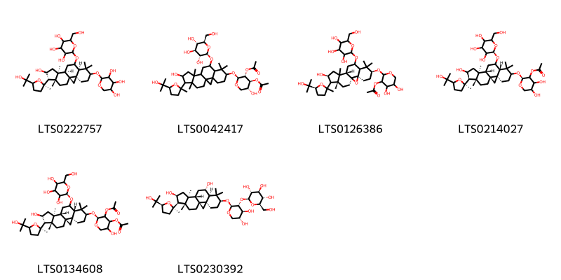{ width=100% }
    <figcaption>Hình ảnh cấu trúc hóa học của 6 hoạt chất thuộc nhóm Steroids and steroid derivatives gồm ['2-{[(1s,3r,8r,11r,12s,15s,16r)-14-hydroxy-15-[(2r)-5-(2-hydroxypropan-2-yl)-2-methyloxolan-2-yl]-7,7,12,16-tetramethyl-6-[(3,4,5-trihydroxyoxan-2-yl)oxy]pentacyclo[9.7.0.0¹,³.0³,⁸.0¹²,¹⁶]octadecan-9-yl]oxy}-6-(hydroxymethyl)oxane-3,4,5-triol (LTS0222757)', '(2s,3r,4s,5r)-4-(acetyloxy)-5-hydroxy-2-({14-hydroxy-15-[5-(2-hydroxypropan-2-yl)-2-methyloxolan-2-yl]-7,7,12,16-tetramethyl-9-{[(2r,3r,4s,5s,6r)-3,4,5-trihydroxy-6-(hydroxymethyl)oxan-2-yl]oxy}pentacyclo[9.7.0.0¹,³.0³,⁸.0¹²,¹⁶]octadecan-6-yl}oxy)oxan-3-yl acetate (LTS0042417)', '4,5-dihydroxy-2-{[(1s,3r,6s,11s,14s,16r)-14-hydroxy-15-[(5s)-5-(2-hydroxypropan-2-yl)-2-methyloxolan-2-yl]-7,7,12,16-tetramethyl-9-{[3,4,5-trihydroxy-6-(hydroxymethyl)oxan-2-yl]oxy}-2-oxapentacyclo[9.7.0.0¹,³.0³,⁸.0¹²,¹⁶]octadecan-6-yl]oxy}oxan-3-yl acetate (LTS0126386)', '(2s)-4,5-dihydroxy-2-{[(1s,3r,8s,11s,12s,15r,16r)-14-hydroxy-15-[(2r)-5-(2-hydroxypropan-2-yl)-2-methyloxolan-2-yl]-7,7,12,16-tetramethyl-9-{[(2r)-3,4,5-trihydroxy-6-(hydroxymethyl)oxan-2-yl]oxy}pentacyclo[9.7.0.0¹,³.0³,⁸.0¹²,¹⁶]octadecan-6-yl]oxy}oxan-3-yl acetate (LTS0214027)', '(2s)-4-(acetyloxy)-5-hydroxy-2-{[(1s,3r,8s,11s,12s,15s,16r)-14-hydroxy-15-[(2r)-5-(2-hydroxypropan-2-yl)-2-methyloxolan-2-yl]-7,7,12,16-tetramethyl-9-{[(2r)-3,4,5-trihydroxy-6-(hydroxymethyl)oxan-2-yl]oxy}pentacyclo[9.7.0.0¹,³.0³,⁸.0¹²,¹⁶]octadecan-6-yl]oxy}oxan-3-yl acetate (LTS0134608)', 'astragaloside iii (LTS0230392)'].</figcaption>
</figure>

---

### Dược dân tộc học

Danh sách các quốc gia có sử dụng *Astragalus hoantchy* trong điều trị các bệnh. 

| Country   | Disease                          | Bệnh                                                                                                                                                                                                |
|:----------|:---------------------------------|:----------------------------------------------------------------------------------------------------------------------------------------------------------------------------------------------------|
| China     | Diuretic, Tonic, Diuretic, Tonic | MYMEMORY WARNING: YOU USED ALL AVAILABLE FREE TRANSLATIONS FOR TODAY. NEXT AVAILABLE IN  17 HOURS 01 MINUTES 09 SECONDS VISIT HTTPS://MYMEMORY.TRANSLATED.NET/DOC/USAGELIMITS.PHP TO TRANSLATE MORE |

---

---
## Astragalus membranaceus
### Thông tin về thực vật

!!! info "Phân loại thực vật của *N/A* từ GIBF:"
    - **Kingdom:** Plantae
    - **Phylum:** Tracheophyta
    - **Order:** Fabales
    - **Family:** Fabaceae
    - **Genus:** Astragalus
    - **Species:** *N/A*

 

| Label (VI)   | Label (EN)   | Scientific Name         | Descriptions (VI)   | Descriptions (EN)   | Also Known As (VI)   | Also Known As (EN)   |
|:-------------|:-------------|:------------------------|:--------------------|:--------------------|:---------------------|:---------------------|
| N/A          | N/A          | Astragalus membranaceus | loài thực vật       | species of plant    | ['']                 | ['']                 |

#### Phân bố trên thế giới

**Từ CSDL GIBF** Italy, Argentina, Palestine, State of, Israel, Canada, Ukraine, Chinese Taipei, Spain, Bolivia (Plurinational State of), Malta, Portugal, Russian Federation, United States of America, Chile, Hong Kong, Mexico, Peru, Austria, France, China

#### Phân bố tại Việt Nam

**Từ CSDL GIBF**: Không có ghi nhận ở Việt Nam

---
### Thành phần hóa học
        
- Theo cơ sở dữ liệu lotus: Từ loài *N/A* đã phân lập và xác định được 128 hoạt chất thuộc về các nhóm Fatty Acyls, Flavonoids, Prenol lipids, Steroids and steroid derivatives, Isoflavonoids, Cinnamic acids and derivatives, Heteroaromatic compounds, Organooxygen compounds, Keto acids and derivatives, Glycerolipids, Carboxylic acids and derivatives. 

|    | chemicalTaxonomyClassyfireClass   |   smiles_count |
|---:|:----------------------------------|---------------:|
|  0 | Carboxylic acids and derivatives  |              3 |
|  1 | Cinnamic acids and derivatives    |              3 |
|  2 | Fatty Acyls                       |             20 |
|  3 | Flavonoids                        |              8 |
|  4 | Glycerolipids                     |              1 |
|  5 | Heteroaromatic compounds          |              1 |
|  6 | Isoflavonoids                     |             20 |
|  7 | Keto acids and derivatives        |              1 |
|  8 | Organooxygen compounds            |              3 |
|  9 | Prenol lipids                     |             16 |
| 10 | Steroids and steroid derivatives  |             51 |

#### Nhóm Carboxylic acids and derivatives
<figure markdown="span">
    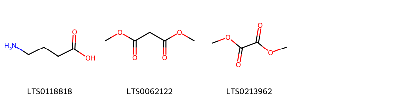{ width=100% }
    <figcaption>Hình ảnh cấu trúc hóa học của 3 hoạt chất thuộc nhóm Carboxylic acids and derivatives gồm ['gamma(amino)-butyric acid (LTS0118818)', 'dimethyl malonate (LTS0062122)', 'dimethyl oxalate (LTS0213962)'].</figcaption>
</figure>
#### Nhóm Cinnamic acids and derivatives
<figure markdown="span">
    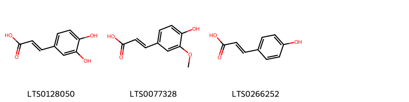{ width=100% }
    <figcaption>Hình ảnh cấu trúc hóa học của 3 hoạt chất thuộc nhóm Cinnamic acids and derivatives gồm ['3,4-dihydroxycinnamic acid (LTS0128050)', 'ferulic acid (LTS0077328)', 'para-coumaric acid (LTS0266252)'].</figcaption>
</figure>
#### Nhóm Fatty Acyls
<figure markdown="span">
    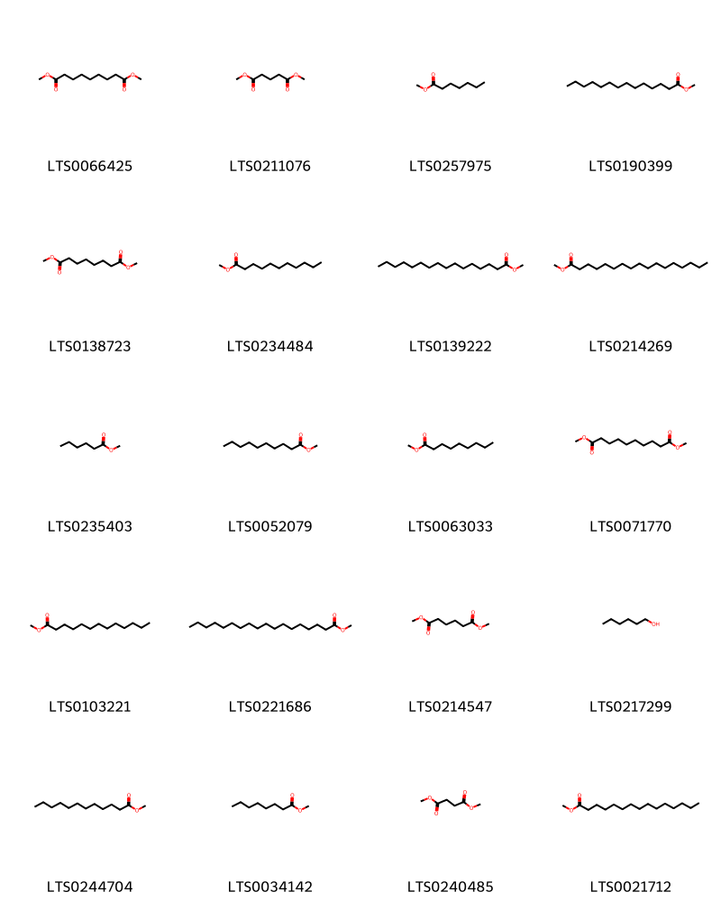{ width=100% }
    <figcaption>Hình ảnh cấu trúc hóa học của 20 hoạt chất thuộc nhóm Fatty Acyls gồm ['dimethyl azelate (LTS0066425)', 'methyl glutarate (LTS0211076)', 'methyl heptanoate (LTS0257975)', 'methyl myristate (LTS0190399)', 'dimethyl suberate (LTS0138723)', 'methyl undecanoate (LTS0234484)', 'methyl palmitate (LTS0139222)', 'methyl margarate (LTS0214269)', 'methyl caproate (LTS0235403)', 'methyl caprate (LTS0052079)', 'methyl nonanoate (ester) (LTS0063033)', 'dimethyl sebacate (LTS0071770)', 'methyl cocoate (LTS0103221)', 'methyl stearate (LTS0221686)', 'dimethyl adipate (LTS0214547)', 'hexanol (LTS0217299)', 'methyl laurate (LTS0244704)', 'methyl caprylate (LTS0034142)', 'dimethyl succinate (LTS0240485)', 'methyl pentadecanoate (LTS0021712)'].</figcaption>
</figure>
#### Nhóm Flavonoids
<figure markdown="span">
    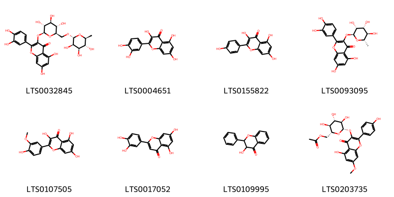{ width=100% }
    <figcaption>Hình ảnh cấu trúc hóa học của 8 hoạt chất thuộc nhóm Flavonoids gồm ['3-rutinosyl quercetin (LTS0032845)', 'quercetin (LTS0004651)', 'kaempherol (LTS0155822)', 'quercitrin (LTS0093095)', 'isorhamnetin (LTS0107505)', 'luteolin (LTS0017052)', 'dihydroflavonol (LTS0109995)', '[(2r,3s,4s,5r,6s)-3,4,5-trihydroxy-6-{[5-hydroxy-2-(4-hydroxyphenyl)-7-methoxy-4-oxochromen-3-yl]oxy}oxan-2-yl]methyl acetate (LTS0203735)'].</figcaption>
</figure>
#### Nhóm Glycerolipids
<figure markdown="span">
    { width=100% }
    <figcaption>Hình ảnh cấu trúc hóa học của 1 hoạt chất thuộc nhóm Glycerolipids gồm ['glyceryl palmitate (LTS0073260)'].</figcaption>
</figure>
#### Nhóm Heteroaromatic compounds
<figure markdown="span">
    { width=100% }
    <figcaption>Hình ảnh cấu trúc hóa học của 1 hoạt chất thuộc nhóm Heteroaromatic compounds gồm ['amylfuran (LTS0044471)'].</figcaption>
</figure>
#### Nhóm Isoflavonoids
<figure markdown="span">
    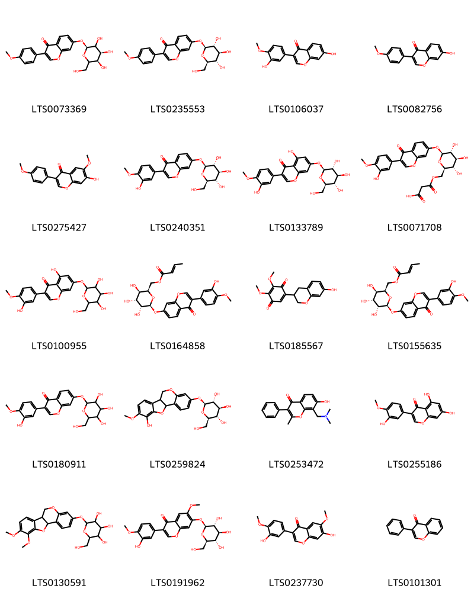{ width=100% }
    <figcaption>Hình ảnh cấu trúc hóa học của 20 hoạt chất thuộc nhóm Isoflavonoids gồm ['formononetin 7-o-glucoside (LTS0073369)', 'ononin (LTS0235553)', 'calycosin (LTS0106037)', 'formononetin (LTS0082756)', 'afrormosin (LTS0275427)', 'calycosin 7-o-β-d-glucoside (LTS0240351)', '5-hydroxy-3-(3-hydroxy-4-methoxyphenyl)-7-{[(2s,3r,4s,5s,6r)-3,4,5-trihydroxy-6-(hydroxymethyl)oxan-2-yl]oxy}chromen-4-one (LTS0133789)', '3-oxo-3-{[(2r,3s,4s,5r,6s)-3,4,5-trihydroxy-6-{[3-(3-hydroxy-4-methoxyphenyl)-4-oxochromen-7-yl]oxy}oxan-2-yl]methoxy}propanoic acid (LTS0071708)', '5-hydroxy-3-(3-hydroxy-4-methoxyphenyl)-7-{[3,4,5-trihydroxy-6-(hydroxymethyl)oxan-2-yl]oxy}chromen-4-one (LTS0100955)', '[(2r,3r,4r,5r,6s)-3,4,5-trihydroxy-6-{[3-(3-hydroxy-4-methoxyphenyl)-4-oxochromen-7-yl]oxy}oxan-2-yl]methyl but-2-enoate (LTS0164858)', 'pendulone (LTS0185567)', '[(2r,3r,4r,5r,6s)-3,4,5-trihydroxy-6-{[3-(3-hydroxy-4-methoxyphenyl)-4-oxochromen-7-yl]oxy}oxan-2-yl]methyl (2e)-but-2-enoate (LTS0155635)', '3-(3-hydroxy-4-methoxyphenyl)-7-{[3,4,5-trihydroxy-6-(hydroxymethyl)oxan-2-yl]oxy}chromen-4-one (LTS0180911)', '(2s,3r,4s,5s,6r)-2-({15-hydroxy-14-methoxy-8,17-dioxatetracyclo[8.7.0.0²,⁷.0¹¹,¹⁶]heptadeca-2,4,6,11,13,15-hexaen-5-yl}oxy)-6-(hydroxymethyl)oxane-3,4,5-triol (LTS0259824)', '8-[(dimethylamino)methyl]-7-hydroxy-2-methyl-3-phenylchromen-4-one (LTS0253472)', 'pratensein (LTS0255186)', '2-({14,15-dimethoxy-8,17-dioxatetracyclo[8.7.0.0²,⁷.0¹¹,¹⁶]heptadeca-2,4,6,11,13,15-hexaen-5-yl}oxy)-6-(hydroxymethyl)oxane-3,4,5-triol (LTS0130591)', '3-(3-hydroxy-4-methoxyphenyl)-6-methoxy-7-{[(2s,3r,4s,5s,6r)-3,4,5-trihydroxy-6-(hydroxymethyl)oxan-2-yl]oxy}chromen-4-one (LTS0191962)', 'odoratin (LTS0237730)', 'isoflavone (LTS0101301)'].</figcaption>
</figure>
#### Nhóm Keto acids and derivatives
<figure markdown="span">
    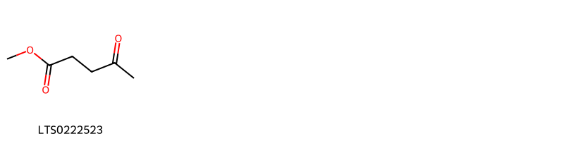{ width=100% }
    <figcaption>Hình ảnh cấu trúc hóa học của 1 hoạt chất thuộc nhóm Keto acids and derivatives gồm ['methyl levulinate (LTS0222523)'].</figcaption>
</figure>
#### Nhóm Organooxygen compounds
<figure markdown="span">
    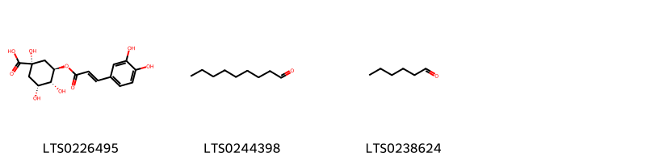{ width=100% }
    <figcaption>Hình ảnh cấu trúc hóa học của 3 hoạt chất thuộc nhóm Organooxygen compounds gồm ['chlorogenic acid (LTS0226495)', 'nonanal (LTS0244398)', 'hexanal (LTS0238624)'].</figcaption>
</figure>
#### Nhóm Prenol lipids
<figure markdown="span">
    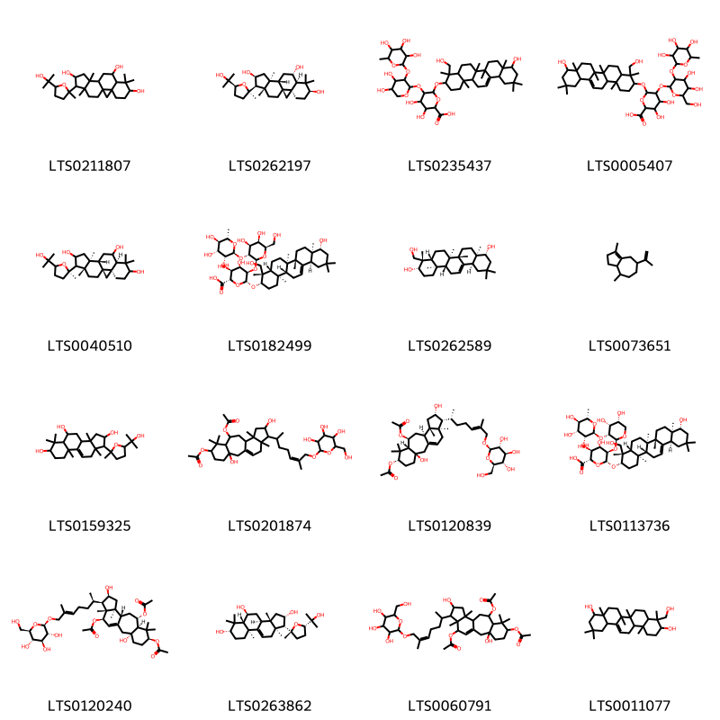{ width=100% }
    <figcaption>Hình ảnh cấu trúc hóa học của 16 hoạt chất thuộc nhóm Prenol lipids gồm ['15-[5-(2-hydroxypropan-2-yl)-2-methyloxolan-2-yl]-7,7,12,16-tetramethylpentacyclo[9.7.0.0¹,³.0³,⁸.0¹²,¹⁶]octadecane-6,9,14-triol (LTS0211807)', 'cycloastragenol (LTS0262197)', '5-({4,5-dihydroxy-3-[(3,4,5-trihydroxy-6-methyloxan-2-yl)oxy]oxan-2-yl}oxy)-3,4-dihydroxy-6-{[9-hydroxy-4-(hydroxymethyl)-4,6a,6b,8a,11,11,14b-heptamethyl-1,2,3,4a,5,6,7,8,9,10,12,12a,14,14a-tetradecahydropicen-3-yl]oxy}oxane-2-carboxylic acid (LTS0235437)', '5-{[4,5-dihydroxy-6-(hydroxymethyl)-3-[(3,4,5-trihydroxy-6-methyloxan-2-yl)oxy]oxan-2-yl]oxy}-3,4-dihydroxy-6-{[9-hydroxy-4-(hydroxymethyl)-4,6a,6b,8a,11,11,14b-heptamethyl-1,2,3,4a,5,6,7,8,9,10,12,12a,14,14a-tetradecahydropicen-3-yl]oxy}oxane-2-carboxylic acid (LTS0005407)', '(1s,3r,8r,11s,12s,16r)-15-[(2r)-5-(2-hydroxypropan-2-yl)-2-methyloxolan-2-yl]-7,7,12,16-tetramethylpentacyclo[9.7.0.0¹,³.0³,⁸.0¹²,¹⁶]octadecane-6,9,14-triol (LTS0040510)', 'soyasaponin i (LTS0182499)', 'soyasapogenol b (LTS0262589)', '1,4-dimethyl-7-(prop-1-en-2-yl)-2,3,3a,4,5,6,7,8-octahydroazulene (LTS0073651)', '1-[5-(2-hydroxypropan-2-yl)-2-methyloxolan-2-yl]-3a,6,6,9a,11a-pentamethyl-1h,2h,3h,3bh,4h,5h,5ah,7h,8h,9h,11h-cyclopenta[a]phenanthrene-2,5,7-triol (LTS0159325)', '6-(acetyloxy)-3,14-dihydroxy-7,7,12,16-tetramethyl-15-(6-methyl-7-{[3,4,5-trihydroxy-6-(hydroxymethyl)oxan-2-yl]oxy}hept-5-en-2-yl)tetracyclo[9.7.0.0³,⁸.0¹²,¹⁶]octadec-1(18)-en-9-yl acetate (LTS0201874)', '(3r,6s,8r,9s,11r,12s,14s,15r,16r)-6-(acetyloxy)-3,14-dihydroxy-7,7,12,16-tetramethyl-15-[(2r,5e)-6-methyl-7-{[(2r,3r,4s,5s,6r)-3,4,5-trihydroxy-6-(hydroxymethyl)oxan-2-yl]oxy}hept-5-en-2-yl]tetracyclo[9.7.0.0³,⁸.0¹²,¹⁶]octadec-1(18)-en-9-yl acetate (LTS0120839)', '(2s,3s,4s,5r,6r)-6-{[(3s,4s,4ar,6ar,6bs,8ar,9r,12as,14ar,14br)-9-hydroxy-4-(hydroxymethyl)-4,6a,6b,8a,11,11,14b-heptamethyl-1,2,3,4a,5,6,7,8,9,10,12,12a,14,14a-tetradecahydropicen-3-yl]oxy}-5-{[(2s,3r,4r,5r)-4,5-dihydroxy-3-{[(2s,3r,4r,5r,6s)-3,4,5-trihydroxy-6-methyloxan-2-yl]oxy}oxan-2-yl]oxy}-3,4-dihydroxyoxane-2-carboxylic acid (LTS0113736)', '(3r,6s,8r,9s,11r,12s,14s,15r,16r,17r)-6,9-bis(acetyloxy)-3,14-dihydroxy-7,7,12,16-tetramethyl-15-[(2r,5e)-6-methyl-7-{[(2r,3r,4s,5s,6r)-3,4,5-trihydroxy-6-(hydroxymethyl)oxan-2-yl]oxy}hept-5-en-2-yl]tetracyclo[9.7.0.0³,⁸.0¹²,¹⁶]octadec-1(18)-en-17-yl acetate (LTS0120240)', '(1r,2s,3as,3bs,5s,5ar,7s,9as,11ar)-1-[(2r,5s)-5-(2-hydroxypropan-2-yl)-2-methyloxolan-2-yl]-3a,6,6,9a,11a-pentamethyl-1h,2h,3h,3bh,4h,5h,5ah,7h,8h,9h,11h-cyclopenta[a]phenanthrene-2,5,7-triol (LTS0263862)', '6,9-bis(acetyloxy)-3,14-dihydroxy-7,7,12,16-tetramethyl-15-(6-methyl-7-{[3,4,5-trihydroxy-6-(hydroxymethyl)oxan-2-yl]oxy}hept-5-en-2-yl)tetracyclo[9.7.0.0³,⁸.0¹²,¹⁶]octadec-1(18)-en-17-yl acetate (LTS0060791)', '4-(hydroxymethyl)-4,6a,6b,8a,11,11,14b-heptamethyl-1,2,3,4a,5,6,7,8,9,10,12,12a,14,14a-tetradecahydropicene-3,9-diol (LTS0011077)'].</figcaption>
</figure>
#### Nhóm Steroids and steroid derivatives
<figure markdown="span">
    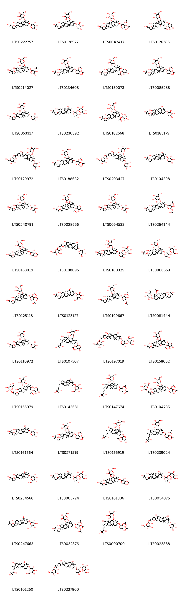{ width=100% }
    <figcaption>Hình ảnh cấu trúc hóa học của 51 hoạt chất thuộc nhóm Steroids and steroid derivatives gồm ['2-{[(1s,3r,8r,11r,12s,15s,16r)-14-hydroxy-15-[(2r)-5-(2-hydroxypropan-2-yl)-2-methyloxolan-2-yl]-7,7,12,16-tetramethyl-6-[(3,4,5-trihydroxyoxan-2-yl)oxy]pentacyclo[9.7.0.0¹,³.0³,⁸.0¹²,¹⁶]octadecan-9-yl]oxy}-6-(hydroxymethyl)oxane-3,4,5-triol (LTS0222757)', '2-({14-hydroxy-15-[5-(2-hydroxypropan-2-yl)-2-methyloxolan-2-yl]-7,7,12,16-tetramethyl-6-[(3,4,5-trihydroxyoxan-2-yl)oxy]pentacyclo[9.7.0.0¹,³.0³,⁸.0¹²,¹⁶]octadecan-9-yl}oxy)-6-(hydroxymethyl)oxane-3,4,5-triol (LTS0128977)', '(2s,3r,4s,5r)-4-(acetyloxy)-5-hydroxy-2-({14-hydroxy-15-[5-(2-hydroxypropan-2-yl)-2-methyloxolan-2-yl]-7,7,12,16-tetramethyl-9-{[(2r,3r,4s,5s,6r)-3,4,5-trihydroxy-6-(hydroxymethyl)oxan-2-yl]oxy}pentacyclo[9.7.0.0¹,³.0³,⁸.0¹²,¹⁶]octadecan-6-yl}oxy)oxan-3-yl acetate (LTS0042417)', '4,5-dihydroxy-2-{[(1s,3r,6s,11s,14s,16r)-14-hydroxy-15-[(5s)-5-(2-hydroxypropan-2-yl)-2-methyloxolan-2-yl]-7,7,12,16-tetramethyl-9-{[3,4,5-trihydroxy-6-(hydroxymethyl)oxan-2-yl]oxy}-2-oxapentacyclo[9.7.0.0¹,³.0³,⁸.0¹²,¹⁶]octadecan-6-yl]oxy}oxan-3-yl acetate (LTS0126386)', '(2s)-4,5-dihydroxy-2-{[(1s,3r,8s,11s,12s,15r,16r)-14-hydroxy-15-[(2r)-5-(2-hydroxypropan-2-yl)-2-methyloxolan-2-yl]-7,7,12,16-tetramethyl-9-{[(2r)-3,4,5-trihydroxy-6-(hydroxymethyl)oxan-2-yl]oxy}pentacyclo[9.7.0.0¹,³.0³,⁸.0¹²,¹⁶]octadecan-6-yl]oxy}oxan-3-yl acetate (LTS0214027)', '(2s)-4-(acetyloxy)-5-hydroxy-2-{[(1s,3r,8s,11s,12s,15s,16r)-14-hydroxy-15-[(2r)-5-(2-hydroxypropan-2-yl)-2-methyloxolan-2-yl]-7,7,12,16-tetramethyl-9-{[(2r)-3,4,5-trihydroxy-6-(hydroxymethyl)oxan-2-yl]oxy}pentacyclo[9.7.0.0¹,³.0³,⁸.0¹²,¹⁶]octadecan-6-yl]oxy}oxan-3-yl acetate (LTS0134608)', '4,5-dihydroxy-2-({14-hydroxy-15-[5-(2-hydroxypropan-2-yl)-2-methyloxolan-2-yl]-7,7,12,16-tetramethyl-9-{[3,4,5-trihydroxy-6-(hydroxymethyl)oxan-2-yl]oxy}pentacyclo[9.7.0.0¹,³.0³,⁸.0¹²,¹⁶]octadecan-6-yl}oxy)oxan-3-yl acetate (LTS0150073)', '4-(acetyloxy)-5-hydroxy-2-({14-hydroxy-15-[5-(2-hydroxypropan-2-yl)-2-methyloxolan-2-yl]-7,7,12,16-tetramethyl-9-{[3,4,5-trihydroxy-6-(hydroxymethyl)oxan-2-yl]oxy}pentacyclo[9.7.0.0¹,³.0³,⁸.0¹²,¹⁶]octadecan-6-yl}oxy)oxan-3-yl acetate (LTS0085288)', 'astragaloside iv (LTS0053317)', 'astragaloside iii (LTS0230392)', 'astragaloside ii (LTS0182668)', '2-({9,14-dihydroxy-15-[5-(2-hydroxypropan-2-yl)-2-methyloxolan-2-yl]-7,7,12,16-tetramethylpentacyclo[9.7.0.0¹,³.0³,⁸.0¹²,¹⁶]octadecan-6-yl}oxy)oxane-3,4,5-triol (LTS0185179)', '2-({2-[5-(14-hydroxy-7,7,12,16-tetramethyl-9-{[3,4,5-trihydroxy-6-(hydroxymethyl)oxan-2-yl]oxy}-6-[(3,4,5-trihydroxyoxan-2-yl)oxy]pentacyclo[9.7.0.0¹,³.0³,⁸.0¹²,¹⁶]octadecan-15-yl)-5-methyloxolan-2-yl]propan-2-yl}oxy)-6-(hydroxymethyl)oxane-3,4,5-triol (LTS0129972)', 'astragaloside i (LTS0188632)', '(2s,3r,4s,5s,6r)-2-({2-[(2s,5r)-5-[(1s,3r,6s,8r,9s,11s,12s,14s,15r,16r)-14-hydroxy-7,7,12,16-tetramethyl-9-{[(2r,3r,4s,5s,6r)-3,4,5-trihydroxy-6-(hydroxymethyl)oxan-2-yl]oxy}-6-{[(2s,3r,4s,5r)-3,4,5-trihydroxyoxan-2-yl]oxy}pentacyclo[9.7.0.0¹,³.0³,⁸.0¹²,¹⁶]octadecan-15-yl]-5-methyloxolan-2-yl]propan-2-yl}oxy)-6-(hydroxymethyl)oxane-3,4,5-triol (LTS0203427)', '(2s,3r,4s,5r)-2-{[(1s,3r,6s,8r,9s,11s,12s,14s,15r,16r)-9,14-dihydroxy-15-[(2r,5s)-5-(2-hydroxypropan-2-yl)-2-methyloxolan-2-yl]-7,7,12,16-tetramethylpentacyclo[9.7.0.0¹,³.0³,⁸.0¹²,¹⁶]octadecan-6-yl]oxy}oxane-3,4,5-triol (LTS0104398)', 'astragaloside a (LTS0240791)', '(2s,3s,4s,5r)-4,5-dihydroxy-2-{[(1r,3s,6r,8r,9r,11r,12r,14s,15s,16s)-14-hydroxy-15-[(2s,5s)-5-(2-hydroxypropan-2-yl)-2-methyloxolan-2-yl]-7,7,12,16-tetramethyl-9-{[(2r,3s,4r,5s,6r)-3,4,5-trihydroxy-6-(hydroxymethyl)oxan-2-yl]oxy}pentacyclo[9.7.0.0¹,³.0³,⁸.0¹²,¹⁶]octadecan-6-yl]oxy}oxan-3-yl acetate (LTS0028656)', '(2r,3r,4r,5s,6r)-2-{[(1s,3r,6s,8s,9r,11s,12s,14s,15r,16s)-14-hydroxy-15-[(2s,5r)-5-(2-hydroxypropan-2-yl)-2-methyloxolan-2-yl]-7,7,12,16-tetramethyl-6-{[(2s,3s,4s,5r)-3,4,5-trihydroxyoxan-2-yl]oxy}pentacyclo[9.7.0.0¹,³.0³,⁸.0¹²,¹⁶]octadecan-9-yl]oxy}-6-(hydroxymethyl)oxane-3,4,5-triol (LTS0054533)', '5-(acetyloxy)-4-hydroxy-2-({14-hydroxy-15-[5-(2-hydroxypropan-2-yl)-2-methyloxolan-2-yl]-7,7,12,16-tetramethyl-9-{[3,4,5-trihydroxy-6-(hydroxymethyl)oxan-2-yl]oxy}pentacyclo[9.7.0.0¹,³.0³,⁸.0¹²,¹⁶]octadecan-6-yl}oxy)oxan-3-yl acetate (LTS0264144)', '(2s,3r,4s,5r)-3,5-dihydroxy-2-{[(1s,3r,6s,8r,9s,11s,12s,14s,15r,16r)-14-hydroxy-15-[(2r,5s)-5-(2-hydroxypropan-2-yl)-2-methyloxolan-2-yl]-7,7,12,16-tetramethyl-9-{[(2r,3r,4s,5s,6r)-3,4,5-trihydroxy-6-(hydroxymethyl)oxan-2-yl]oxy}pentacyclo[9.7.0.0¹,³.0³,⁸.0¹²,¹⁶]octadecan-6-yl]oxy}oxan-4-yl acetate (LTS0163019)', '2-{[2-(5-{9,14-dihydroxy-7,7,12,16-tetramethyl-6-[(3,4,5-trihydroxyoxan-2-yl)oxy]pentacyclo[9.7.0.0¹,³.0³,⁸.0¹²,¹⁶]octadecan-15-yl}-5-methyloxolan-2-yl)propan-2-yl]oxy}-6-(hydroxymethyl)oxane-3,4,5-triol (LTS0108095)', '2-({6-[(4,5-dihydroxy-3-{[3,4,5-trihydroxy-6-(hydroxymethyl)oxan-2-yl]oxy}oxan-2-yl)oxy]-14-hydroxy-15-[5-(2-hydroxypropan-2-yl)-2-methyloxolan-2-yl]-7,7,12,16-tetramethylpentacyclo[9.7.0.0¹,³.0³,⁸.0¹²,¹⁶]octadecan-9-yl}oxy)-6-(hydroxymethyl)oxane-3,4,5-triol (LTS0180325)', '(2r,3r,4s,5s,6r)-2-{[(1s,3r,6s,8r,9s,11s,12s,14s,15r,16r)-6-{[(2s,3r,4s,5r)-4,5-dihydroxy-3-{[(2s,3r,4s,5s,6r)-3,4,5-trihydroxy-6-(hydroxymethyl)oxan-2-yl]oxy}oxan-2-yl]oxy}-14-hydroxy-15-[(2r,5s)-5-(2-hydroxypropan-2-yl)-2-methyloxolan-2-yl]-7,7,12,16-tetramethylpentacyclo[9.7.0.0¹,³.0³,⁸.0¹²,¹⁶]octadecan-9-yl]oxy}-6-(hydroxymethyl)oxane-3,4,5-triol (LTS0006659)', '(3r,4s,5r,6s)-4,5-bis(acetyloxy)-6-{[(1s,3r,6s,8r,9s,11s,12s,14s,15r,16r)-14-hydroxy-15-[(2r,5s)-5-(2-hydroxypropan-2-yl)-2-methyloxolan-2-yl]-7,7,12,16-tetramethyl-9-{[(2r,3r,4s,5s,6r)-3,4,5-trihydroxy-6-(hydroxymethyl)oxan-2-yl]oxy}pentacyclo[9.7.0.0¹,³.0³,⁸.0¹²,¹⁶]octadecan-6-yl]oxy}oxan-3-yl acetate (LTS0125118)', '14-hydroxy-15-[5-(2-hydroxypropan-2-yl)-2-methyloxolan-2-yl]-7,7,12,16-tetramethyl-6-{[3,4,5-trihydroxy-6-(hydroxymethyl)oxan-2-yl]oxy}pentacyclo[9.7.0.0¹,³.0³,⁸.0¹²,¹⁶]octadecan-9-one (LTS0123127)', '(2s,3r,4s,5r)-5-(acetyloxy)-4-hydroxy-2-{[(1s,3r,6s,8r,9s,11s,12s,14s,15r,16r)-14-hydroxy-15-[(2r,5s)-5-(2-hydroxypropan-2-yl)-2-methyloxolan-2-yl]-7,7,12,16-tetramethyl-9-{[(2r,3r,4s,5s,6r)-3,4,5-trihydroxy-6-(hydroxymethyl)oxan-2-yl]oxy}pentacyclo[9.7.0.0¹,³.0³,⁸.0¹²,¹⁶]octadecan-6-yl]oxy}oxan-3-yl acetate (LTS0199667)', '(1s,3r,6s,8r,9s,11s,12s,14s,15r,16r)-14-hydroxy-15-[(2r,5s)-5-(2-hydroxypropan-2-yl)-2-methyloxolan-2-yl]-7,7,12,16-tetramethyl-6-{[(2r,3r,4s,5s,6r)-3,4,5-trihydroxy-6-(hydroxymethyl)oxan-2-yl]oxy}pentacyclo[9.7.0.0¹,³.0³,⁸.0¹²,¹⁶]octadecan-9-yl acetate (LTS0081444)', '(2r,3r,4s,5s,6r)-2-{[(1s,3r,6s,8s,9s,11s,12s,14s,15s,16r)-14-hydroxy-15-[(2r,5s)-5-(2-hydroxypropan-2-yl)-2-methyloxolan-2-yl]-7,7,12,16-tetramethyl-6-{[(2r,3r,4s,5r)-3,4,5-trihydroxyoxan-2-yl]oxy}pentacyclo[9.7.0.0¹,³.0³,⁸.0¹²,¹⁶]octadecan-9-yl]oxy}-6-(hydroxymethyl)oxane-3,4,5-triol (LTS0110972)', '2-{[15-(5,6-dihydroxy-6-methylheptan-2-yl)-14-hydroxy-7,7,12,16-tetramethyl-9-{[3,4,5-trihydroxy-6-(hydroxymethyl)oxan-2-yl]oxy}pentacyclo[9.7.0.0¹,³.0³,⁸.0¹²,¹⁶]octadecan-6-yl]oxy}-4,5-dihydroxyoxan-3-yl acetate (LTS0107507)', '2-{[2-(5-{6-[(4,5-dihydroxy-3-{[3,4,5-trihydroxy-6-(hydroxymethyl)oxan-2-yl]oxy}oxan-2-yl)oxy]-9,14-dihydroxy-7,7,12,16-tetramethylpentacyclo[9.7.0.0¹,³.0³,⁸.0¹²,¹⁶]octadecan-15-yl}-5-methyloxolan-2-yl)propan-2-yl]oxy}-6-(hydroxymethyl)oxane-3,4,5-triol (LTS0197019)', '4,5-dihydroxy-2-({14-hydroxy-15-[5-(2-hydroxypropan-2-yl)-2-methyloxolan-2-yl]-7,7,12,16-tetramethyl-9-{[3,4,5-trihydroxy-6-(hydroxymethyl)oxan-2-yl]oxy}-2-oxapentacyclo[9.7.0.0¹,³.0³,⁸.0¹²,¹⁶]octadecan-6-yl}oxy)oxan-3-yl acetate (LTS0158062)', '(2s,3r,4s,5r)-4,5-dihydroxy-2-{[(1s,3r,6s,8r,9s,11s,12s,14s,15r,16r)-14-hydroxy-7,7,12,16-tetramethyl-15-[(2r,5s)-2-methyl-5-(2-{[(2s,3r,4s,5s,6r)-3,4,5-trihydroxy-6-(hydroxymethyl)oxan-2-yl]oxy}propan-2-yl)oxolan-2-yl]-9-{[(2r,3r,4s,5s,6r)-3,4,5-trihydroxy-6-(hydroxymethyl)oxan-2-yl]oxy}pentacyclo[9.7.0.0¹,³.0³,⁸.0¹²,¹⁶]octadecan-6-yl]oxy}oxan-3-yl acetate (LTS0155079)', '(1s,3r,6s,8r,11s,12s,14s,15r,16r)-15-[(2r,5s)-5,6-dihydroxy-6-methylheptan-2-yl]-14-hydroxy-7,7,12,16-tetramethyl-6-{[(2r,3r,4s,5s,6r)-3,4,5-trihydroxy-6-(hydroxymethyl)oxan-2-yl]oxy}pentacyclo[9.7.0.0¹,³.0³,⁸.0¹²,¹⁶]octadecan-9-one (LTS0143681)', '(2s,3r,4s,5r)-4-(acetyloxy)-2-{[(1s,3r,6s,8r,9s,11s,12s,14s,15r,16r)-15-[(2r,5s)-5,6-dihydroxy-6-methylheptan-2-yl]-14-hydroxy-7,7,12,16-tetramethyl-9-{[(2r,3r,4s,5s,6r)-3,4,5-trihydroxy-6-(hydroxymethyl)oxan-2-yl]oxy}pentacyclo[9.7.0.0¹,³.0³,⁸.0¹²,¹⁶]octadecan-6-yl]oxy}-5-hydroxyoxan-3-yl acetate (LTS0147674)', '(2s,3r,4s,5r)-4-(acetyloxy)-5-hydroxy-2-{[(1s,3r,6s,8r,9s,11s,12s,14s,15r,16r)-14-hydroxy-7,7,12,16-tetramethyl-15-[(2r,5s)-2-methyl-5-(2-{[(2s,3r,4s,5s,6r)-3,4,5-trihydroxy-6-(hydroxymethyl)oxan-2-yl]oxy}propan-2-yl)oxolan-2-yl]-9-{[(2r,3r,4s,5s,6r)-3,4,5-trihydroxy-6-(hydroxymethyl)oxan-2-yl]oxy}pentacyclo[9.7.0.0¹,³.0³,⁸.0¹²,¹⁶]octadecan-6-yl]oxy}oxan-3-yl acetate (LTS0104235)', '(2s,3r,4s,5r)-2-{[(1s,3r,6s,8r,9s,11s,12s,14s,15r,16r)-9,14-dihydroxy-15-[(2s,5s)-5-(2-hydroxypropan-2-yl)-2-methyloxolan-2-yl]-7,7,12,16-tetramethylpentacyclo[9.7.0.0¹,³.0³,⁸.0¹²,¹⁶]octadecan-6-yl]oxy}oxane-3,4,5-triol (LTS0161664)', '(2s,3r,4s,5r)-4-(acetyloxy)-5-hydroxy-2-{[(1s,3r,6s,8s,9s,11s,12s,14s,15s,16r)-14-hydroxy-15-[(2r,5s)-5-(2-hydroxypropan-2-yl)-2-methyloxolan-2-yl]-7,7,12,16-tetramethyl-9-{[(2r,3r,4s,5s,6r)-3,4,5-trihydroxy-6-(hydroxymethyl)oxan-2-yl]oxy}pentacyclo[9.7.0.0¹,³.0³,⁸.0¹²,¹⁶]octadecan-6-yl]oxy}oxan-3-yl acetate (LTS0271519)', '(2s,3r,4s,5r)-2-{[(1s,3r,6s,8r,9s,11s,12s,14s,15r,16r)-15-[(2r,5s)-5,6-dihydroxy-6-methylheptan-2-yl]-14-hydroxy-7,7,12,16-tetramethyl-9-{[(2r,3r,4s,5s,6r)-3,4,5-trihydroxy-6-(hydroxymethyl)oxan-2-yl]oxy}pentacyclo[9.7.0.0¹,³.0³,⁸.0¹²,¹⁶]octadecan-6-yl]oxy}-4,5-dihydroxyoxan-3-yl acetate (LTS0165919)', '(2s,3r,4s,5r)-4-(acetyloxy)-2-{[(1s,3r,6s,8s,9s,11s,12s,14r,15r,16r)-15-[(2r,5s)-5,6-dihydroxy-6-methylheptan-2-yl]-14-hydroxy-7,7,12,16-tetramethyl-9-{[(2r,3r,4s,5s,6r)-3,4,5-trihydroxy-6-(hydroxymethyl)oxan-2-yl]oxy}pentacyclo[9.7.0.0¹,³.0³,⁸.0¹²,¹⁶]octadecan-6-yl]oxy}-5-hydroxyoxan-3-yl acetate (LTS0239024)', '(1s,3r,6s,8r,11s,12s,14s,15r,16r)-14-hydroxy-15-[(2r,5s)-5-(2-hydroxypropan-2-yl)-2-methyloxolan-2-yl]-7,7,12,16-tetramethyl-6-{[(2r,3r,4s,5s,6r)-3,4,5-trihydroxy-6-(hydroxymethyl)oxan-2-yl]oxy}pentacyclo[9.7.0.0¹,³.0³,⁸.0¹²,¹⁶]octadecan-9-one (LTS0234568)', '(2s,3r,4s,5s,6r)-2-{[(2s,3r,4s,5r)-2-{[(1s,3r,6s,8s,9s,11s,12s,14s,15r,16r)-9,14-dihydroxy-15-[(2r,5s)-5-(2-hydroxypropan-2-yl)-2-methyloxolan-2-yl]-7,7,12,16-tetramethylpentacyclo[9.7.0.0¹,³.0³,⁸.0¹²,¹⁶]octadecan-6-yl]oxy}-4,5-dihydroxyoxan-3-yl]oxy}-6-(hydroxymethyl)oxane-3,4,5-triol (LTS0005724)', '3,5-dihydroxy-2-({14-hydroxy-15-[5-(2-hydroxypropan-2-yl)-2-methyloxolan-2-yl]-7,7,12,16-tetramethyl-9-{[3,4,5-trihydroxy-6-(hydroxymethyl)oxan-2-yl]oxy}pentacyclo[9.7.0.0¹,³.0³,⁸.0¹²,¹⁶]octadecan-6-yl}oxy)oxan-4-yl acetate (LTS0181306)', '2-{[2-({9,14-dihydroxy-15-[5-(2-hydroxypropan-2-yl)-2-methyloxolan-2-yl]-7,7,12,16-tetramethylpentacyclo[9.7.0.0¹,³.0³,⁸.0¹²,¹⁶]octadecan-6-yl}oxy)-4,5-dihydroxyoxan-3-yl]oxy}-6-(hydroxymethyl)oxane-3,4,5-triol (LTS0034375)', '(1s,3r,8r,11s,12s,14s,15r,16r)-14-hydroxy-15-[(2s)-5-isopropyl-2-methyloxolan-2-yl]-7,7,12,16-tetramethyl-6-{[(2r,3r,4s,5s,6r)-3,4,5-trihydroxy-6-(hydroxymethyl)oxan-2-yl]oxy}pentacyclo[9.7.0.0¹,³.0³,⁸.0¹²,¹⁶]octadecan-9-one (LTS0247663)', '(3r,4s,5r,6s)-4,5-bis(acetyloxy)-6-{[(1s,3r,6s,8s,9s,11s,12s,14s,15r,16r)-14-hydroxy-15-[(2r,5s)-5-(2-hydroxypropan-2-yl)-2-methyloxolan-2-yl]-7,7,12,16-tetramethyl-9-{[(2r,3r,4s,5s,6r)-3,4,5-trihydroxy-6-(hydroxymethyl)oxan-2-yl]oxy}pentacyclo[9.7.0.0¹,³.0³,⁸.0¹²,¹⁶]octadecan-6-yl]oxy}oxan-3-yl acetate (LTS0032876)', '4-(acetyloxy)-2-{[15-(5,6-dihydroxy-6-methylheptan-2-yl)-14-hydroxy-7,7,12,16-tetramethyl-9-{[3,4,5-trihydroxy-6-(hydroxymethyl)oxan-2-yl]oxy}pentacyclo[9.7.0.0¹,³.0³,⁸.0¹²,¹⁶]octadecan-6-yl]oxy}-5-hydroxyoxan-3-yl acetate (LTS0000700)', '(2s,3r,4s,5s,6r)-2-({2-[(2s,5r)-5-[(1s,3r,6s,8r,9s,11s,12s,14s,15r,16r)-9,14-dihydroxy-7,7,12,16-tetramethyl-6-{[(2s,3r,4s,5r)-3,4,5-trihydroxyoxan-2-yl]oxy}pentacyclo[9.7.0.0¹,³.0³,⁸.0¹²,¹⁶]octadecan-15-yl]-5-methyloxolan-2-yl]propan-2-yl}oxy)-6-(hydroxymethyl)oxane-3,4,5-triol (LTS0023888)', '15-(5,6-dihydroxy-6-methylheptan-2-yl)-14-hydroxy-7,7,12,16-tetramethyl-6-{[3,4,5-trihydroxy-6-(hydroxymethyl)oxan-2-yl]oxy}pentacyclo[9.7.0.0¹,³.0³,⁸.0¹²,¹⁶]octadecan-9-one (LTS0101260)', '(2s,3r,4s,5s,6r)-2-({2-[(2s,5r)-5-[(1s,3r,6s,8r,9s,11s,12s,14s,15r,16r)-6-{[(2s,3r,4s,5r)-4,5-dihydroxy-3-{[(2s,3r,4s,5s,6r)-3,4,5-trihydroxy-6-(hydroxymethyl)oxan-2-yl]oxy}oxan-2-yl]oxy}-9,14-dihydroxy-7,7,12,16-tetramethylpentacyclo[9.7.0.0¹,³.0³,⁸.0¹²,¹⁶]octadecan-15-yl]-5-methyloxolan-2-yl]propan-2-yl}oxy)-6-(hydroxymethyl)oxane-3,4,5-triol (LTS0227800)', '4,5-bis(acetyloxy)-2-({14-hydroxy-15-[5-(2-hydroxypropan-2-yl)-2-methyloxolan-2-yl]-7,7,12,16-tetramethyl-9-{[3,4,5-trihydroxy-6-(hydroxymethyl)oxan-2-yl]oxy}pentacyclo[9.7.0.0¹,³.0³,⁸.0¹²,¹⁶]octadecan-6-yl}oxy)oxan-3-yl acetate (LTS0048544)'].</figcaption>
</figure>

---

### Dược dân tộc học

Danh sách các quốc gia có sử dụng *N/A* trong điều trị các bệnh. 

| Country   | Disease                      | Bệnh                                                                                                                                                                                                |
|:----------|:-----------------------------|:----------------------------------------------------------------------------------------------------------------------------------------------------------------------------------------------------|
| Elsewhere | nan                          | MYMEMORY WARNING: YOU USED ALL AVAILABLE FREE TRANSLATIONS FOR TODAY. NEXT AVAILABLE IN  17 HOURS 00 MINUTES 49 SECONDS VISIT HTTPS://MYMEMORY.TRANSLATED.NET/DOC/USAGELIMITS.PHP TO TRANSLATE MORE |
| Japan*    | Diuretic, Tonic, Cardiotonic | MYMEMORY WARNING: YOU USED ALL AVAILABLE FREE TRANSLATIONS FOR TODAY. NEXT AVAILABLE IN  17 HOURS 00 MINUTES 46 SECONDS VISIT HTTPS://MYMEMORY.TRANSLATED.NET/DOC/USAGELIMITS.PHP TO TRANSLATE MORE |

---

---
## Astragalus molissimus
### Thông tin về thực vật

!!! info "Phân loại thực vật của *Astragalus mollissimus* từ GIBF:"
    - **Kingdom:** Plantae
    - **Phylum:** Tracheophyta
    - **Order:** Fabales
    - **Family:** Fabaceae
    - **Genus:** Astragalus
    - **Species:** *Astragalus mollissimus*

 

| Label (VI)   | Label (EN)   | Scientific Name         | Descriptions (VI)   | Descriptions (EN)   | Also Known As (VI)   | Also Known As (EN)   |
|:-------------|:-------------|:------------------------|:--------------------|:--------------------|:---------------------|:---------------------|
| N/A          | N/A          | Astragalus membranaceus | loài thực vật       | species of plant    | ['']                 | ['']                 |

#### Phân bố trên thế giới

**Từ CSDL GIBF** United States of America, Mexico

#### Phân bố tại Việt Nam

**Từ CSDL GIBF**: Không có ghi nhận ở Việt Nam

---
### Thành phần hóa học
        
- Theo cơ sở dữ liệu lotus: Từ loài *Astragalus mollissimus* đã phân lập và xác định được Chưa có hoạt chất nào được phân lập. hoạt chất thuộc về các nhóm Không có hoạt chất nào được phân lập. 

Không có hình ảnh nào được tạo ra

---

### Dược dân tộc học

Danh sách các quốc gia có sử dụng *Astragalus mollissimus* trong điều trị các bệnh. 

| Country   | Disease                                                  | Bệnh                                                                                                                                                                                                |
|:----------|:---------------------------------------------------------|:----------------------------------------------------------------------------------------------------------------------------------------------------------------------------------------------------|
| Turkey    | Nervine, Poison, Refrigerant, Tonic, Sudorific, Diuretic | MYMEMORY WARNING: YOU USED ALL AVAILABLE FREE TRANSLATIONS FOR TODAY. NEXT AVAILABLE IN  16 HOURS 58 MINUTES 27 SECONDS VISIT HTTPS://MYMEMORY.TRANSLATED.NET/DOC/USAGELIMITS.PHP TO TRANSLATE MORE |

---

---
## Astragalus tragacanthi
### Thông tin về thực vật

!!! info "Phân loại thực vật của *Astragalus tragacantha* từ GIBF:"
    - **Kingdom:** Plantae
    - **Phylum:** Tracheophyta
    - **Order:** Fabales
    - **Family:** Fabaceae
    - **Genus:** Astragalus
    - **Species:** *Astragalus tragacantha*

 

| Label (VI)   | Label (EN)   | Scientific Name         | Descriptions (VI)   | Descriptions (EN)   | Also Known As (VI)   | Also Known As (EN)   |
|:-------------|:-------------|:------------------------|:--------------------|:--------------------|:---------------------|:---------------------|
| N/A          | N/A          | Astragalus membranaceus | loài thực vật       | species of plant    | ['']                 | ['']                 |

#### Phân bố trên thế giới

**Từ CSDL GIBF** France, Portugal, Italy, Spain

#### Phân bố tại Việt Nam

**Từ CSDL GIBF**: Không có ghi nhận ở Việt Nam

---
### Thành phần hóa học
        
- Theo cơ sở dữ liệu lotus: Từ loài *Astragalus tragacantha* đã phân lập và xác định được Chưa có hoạt chất nào được phân lập. hoạt chất thuộc về các nhóm Không có hoạt chất nào được phân lập. 

Không có hình ảnh nào được tạo ra

---

### Dược dân tộc học

Danh sách các quốc gia có sử dụng *Astragalus tragacantha* trong điều trị các bệnh. 

| Country   | Disease                        | Bệnh                                                                                                                                                                                                |
|:----------|:-------------------------------|:----------------------------------------------------------------------------------------------------------------------------------------------------------------------------------------------------|
| Turkey    | Demulcent, Emollient, Laxative | MYMEMORY WARNING: YOU USED ALL AVAILABLE FREE TRANSLATIONS FOR TODAY. NEXT AVAILABLE IN  16 HOURS 58 MINUTES 06 SECONDS VISIT HTTPS://MYMEMORY.TRANSLATED.NET/DOC/USAGELIMITS.PHP TO TRANSLATE MORE |

---

---
## Astragalus tribuloides
### Thông tin về thực vật

!!! info "Phân loại thực vật của *Astragalus tribuloides* từ GIBF:"
    - **Kingdom:** Plantae
    - **Phylum:** Tracheophyta
    - **Order:** Fabales
    - **Family:** Fabaceae
    - **Genus:** Astragalus
    - **Species:** *Astragalus tribuloides*

 

| Label (VI)   | Label (EN)   | Scientific Name        | Descriptions (VI)   | Descriptions (EN)   | Also Known As (VI)   | Also Known As (EN)   |
|:-------------|:-------------|:-----------------------|:--------------------|:--------------------|:---------------------|:---------------------|
| N/A          | N/A          | Astragalus tribuloides | loài thực vật       | species of plant    | ['']                 | ['']                 |

#### Phân bố trên thế giới

**Từ CSDL GIBF** nan, United Arab Emirates, Turkmenistan, unknown or invalid, Jordan, Tunisia, Israel, Tajikistan, Pakistan, Afghanistan, Bahrain, Türkiye, Algeria, Russian Federation, Morocco, Kazakhstan, Uzbekistan, Saudi Arabia, Oman, Iran (Islamic Republic of), Egypt, Armenia, Qatar, Syrian Arab Republic, Iraq, Kuwait

#### Phân bố tại Việt Nam

**Từ CSDL GIBF**: Không có ghi nhận ở Việt Nam

---
### Thành phần hóa học
        
- Theo cơ sở dữ liệu lotus: Từ loài *Astragalus tribuloides* đã phân lập và xác định được Chưa có hoạt chất nào được phân lập. hoạt chất thuộc về các nhóm Không có hoạt chất nào được phân lập. 

Không có hình ảnh nào được tạo ra

---

### Dược dân tộc học

Danh sách các quốc gia có sử dụng *Astragalus tribuloides* trong điều trị các bệnh. 

| Country   | Disease              | Bệnh                                                                                                                                                                                                |
|:----------|:---------------------|:----------------------------------------------------------------------------------------------------------------------------------------------------------------------------------------------------|
| India     | Demulcent            | MYMEMORY WARNING: YOU USED ALL AVAILABLE FREE TRANSLATIONS FOR TODAY. NEXT AVAILABLE IN  16 HOURS 57 MINUTES 45 SECONDS VISIT HTTPS://MYMEMORY.TRANSLATED.NET/DOC/USAGELIMITS.PHP TO TRANSLATE MORE |
| Iraq      | Demulcent, Emollient | MYMEMORY WARNING: YOU USED ALL AVAILABLE FREE TRANSLATIONS FOR TODAY. NEXT AVAILABLE IN  16 HOURS 57 MINUTES 43 SECONDS VISIT HTTPS://MYMEMORY.TRANSLATED.NET/DOC/USAGELIMITS.PHP TO TRANSLATE MORE |

---

# Chi Alhagi

??? note "Danh sách các dược liệu thuộc chi"
    
	 - *Alhagi pseudalhagi*

---
## Alhagi pseudalhagi
### Thông tin về thực vật

!!! info "Phân loại thực vật của *Alhagi pseudalhagi* từ GIBF:"
    - **Kingdom:** Plantae
    - **Phylum:** Tracheophyta
    - **Order:** Fabales
    - **Family:** Fabaceae
    - **Genus:** Alhagi
    - **Species:** *Alhagi pseudalhagi*

 

| Label (VI)   | Label (EN)   | Scientific Name    | Descriptions (VI)   | Descriptions (EN)   | Also Known As (VI)   | Also Known As (EN)   |
|:-------------|:-------------|:-------------------|:--------------------|:--------------------|:---------------------|:---------------------|
| N/A          | N/A          | Alhagi pseudalhagi | loài thực vật       | species of plant    | ['']                 | ['']                 |

#### Phân bố trên thế giới

**Từ CSDL GIBF** Kyrgyzstan, Turkmenistan, Türkiye, Russian Federation, Armenia, Kazakhstan, Uzbekistan

#### Phân bố tại Việt Nam

**Từ CSDL GIBF**: Không có ghi nhận ở Việt Nam

---
### Thành phần hóa học
        
- Theo cơ sở dữ liệu lotus: Từ loài *Alhagi pseudalhagi* đã phân lập và xác định được Chưa có hoạt chất nào được phân lập. hoạt chất thuộc về các nhóm Không có hoạt chất nào được phân lập. 

Không có hình ảnh nào được tạo ra

---

### Dược dân tộc học

Danh sách các quốc gia có sử dụng *Alhagi pseudalhagi* trong điều trị các bệnh. 

| Country   | Disease     | Bệnh                                                                                                                                                                                                |
|:----------|:------------|:----------------------------------------------------------------------------------------------------------------------------------------------------------------------------------------------------|
| Iraq      | Laxative    | MYMEMORY WARNING: YOU USED ALL AVAILABLE FREE TRANSLATIONS FOR TODAY. NEXT AVAILABLE IN  16 HOURS 57 MINUTES 21 SECONDS VISIT HTTPS://MYMEMORY.TRANSLATED.NET/DOC/USAGELIMITS.PHP TO TRANSLATE MORE |
| Kurdistan | Expectorant | MYMEMORY WARNING: YOU USED ALL AVAILABLE FREE TRANSLATIONS FOR TODAY. NEXT AVAILABLE IN  16 HOURS 57 MINUTES 19 SECONDS VISIT HTTPS://MYMEMORY.TRANSLATED.NET/DOC/USAGELIMITS.PHP TO TRANSLATE MORE |

---

# Chi Ougeinia

??? note "Danh sách các dược liệu thuộc chi"
    
	 - *Ougeinia dalbergioides*
	 - *Ougeinia oojeinensis*

---
## Ougeinia dalbergioides
### Thông tin về thực vật

!!! info "Phân loại thực vật của *Ougeinia oojeinensis* từ GIBF:"
    - **Kingdom:** Plantae
    - **Phylum:** Tracheophyta
    - **Order:** Fabales
    - **Family:** Fabaceae
    - **Genus:** Ougeinia
    - **Species:** *Ougeinia oojeinensis*

 

| Label (VI)   | Label (EN)   | Scientific Name        | Descriptions (VI)   | Descriptions (EN)   | Also Known As (VI)   | Also Known As (EN)   |
|:-------------|:-------------|:-----------------------|:--------------------|:--------------------|:---------------------|:---------------------|
| N/A          | N/A          | Ougeinia dalbergioides |                     |                     | ['']                 | ['']                 |

#### Phân bố trên thế giới

**Từ CSDL GIBF** nan, India, unknown or invalid, United States of America, Nepal

#### Phân bố tại Việt Nam

**Từ CSDL GIBF**: Không có ghi nhận ở Việt Nam

---
### Thành phần hóa học
        
- Theo cơ sở dữ liệu lotus: Từ loài *Ougeinia oojeinensis* đã phân lập và xác định được 4 hoạt chất thuộc về các nhóm Isoflavonoids. 

|    | chemicalTaxonomyClassyfireClass   |   smiles_count |
|---:|:----------------------------------|---------------:|
|  0 | Isoflavonoids                     |              4 |

#### Nhóm Isoflavonoids
<figure markdown="span">
    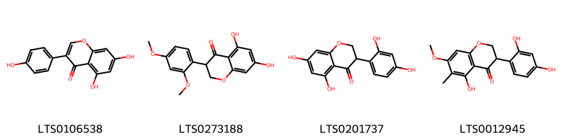{ width=100% }
    <figcaption>Hình ảnh cấu trúc hóa học của 4 hoạt chất thuộc nhóm Isoflavonoids gồm ['genistein (LTS0106538)', 'homoferreirin (LTS0273188)', '(+-)-dalbergioidin (LTS0201737)', 'ougenin (LTS0012945)'].</figcaption>
</figure>

---

### Dược dân tộc học

Danh sách các quốc gia có sử dụng *Ougeinia oojeinensis* trong điều trị các bệnh. 

| Country   | Disease   | Bệnh                                                                                                                                                                                                |
|:----------|:----------|:----------------------------------------------------------------------------------------------------------------------------------------------------------------------------------------------------|
| India     | Piscicide | MYMEMORY WARNING: YOU USED ALL AVAILABLE FREE TRANSLATIONS FOR TODAY. NEXT AVAILABLE IN  16 HOURS 56 MINUTES 56 SECONDS VISIT HTTPS://MYMEMORY.TRANSLATED.NET/DOC/USAGELIMITS.PHP TO TRANSLATE MORE |

---

---
## Ougeinia oojeinensis
### Thông tin về thực vật

!!! info "Phân loại thực vật của *Ougeinia oojeinensis* từ GIBF:"
    - **Kingdom:** Plantae
    - **Phylum:** Tracheophyta
    - **Order:** Fabales
    - **Family:** Fabaceae
    - **Genus:** Ougeinia
    - **Species:** *Ougeinia oojeinensis*

 

| Label (VI)   | Label (EN)   | Scientific Name      | Descriptions (VI)   | Descriptions (EN)   | Also Known As (VI)   | Also Known As (EN)   |
|:-------------|:-------------|:---------------------|:--------------------|:--------------------|:---------------------|:---------------------|
| N/A          | N/A          | Ougeinia oojeinensis |                     |                     | ['']                 | ['']                 |

#### Phân bố trên thế giới

**Từ CSDL GIBF** nan, South Africa, Bhutan, India, unknown or invalid, United States of America, Nepal

#### Phân bố tại Việt Nam

**Từ CSDL GIBF**: Không có ghi nhận ở Việt Nam

---
### Thành phần hóa học
        
- Theo cơ sở dữ liệu lotus: Từ loài *Ougeinia oojeinensis* đã phân lập và xác định được Chưa có hoạt chất nào được phân lập. hoạt chất thuộc về các nhóm Không có hoạt chất nào được phân lập. 

Không có hình ảnh nào được tạo ra

---

### Dược dân tộc học

Danh sách các quốc gia có sử dụng *Ougeinia oojeinensis* trong điều trị các bệnh. 

| Country   | Disease   | Bệnh                                                                                                                                                                                                |
|:----------|:----------|:----------------------------------------------------------------------------------------------------------------------------------------------------------------------------------------------------|
| Elsewhere | Piscicide | MYMEMORY WARNING: YOU USED ALL AVAILABLE FREE TRANSLATIONS FOR TODAY. NEXT AVAILABLE IN  16 HOURS 56 MINUTES 34 SECONDS VISIT HTTPS://MYMEMORY.TRANSLATED.NET/DOC/USAGELIMITS.PHP TO TRANSLATE MORE |

---

# Chi Gliricidia

??? note "Danh sách các dược liệu thuộc chi"
    
	 - *Gliricidia sepium*

---
## Gliricidia sepium
### Thông tin về thực vật

!!! info "Phân loại thực vật của *Gliricidia sepium* từ GIBF:"
    - **Kingdom:** Plantae
    - **Phylum:** Tracheophyta
    - **Order:** Fabales
    - **Family:** Fabaceae
    - **Genus:** Gliricidia
    - **Species:** *Gliricidia sepium*

 

| Label (VI)   | Label (EN)   | Scientific Name   | Descriptions (VI)   | Descriptions (EN)   | Also Known As (VI)   | Also Known As (EN)   |
|:-------------|:-------------|:------------------|:--------------------|:--------------------|:---------------------|:---------------------|
| N/A          | N/A          | Gliricidia sepium | loài thực vật       | species of plant    | ['']                 | ['Quickstick']       |

#### Phân bố trên thế giới

**Từ CSDL GIBF** Virgin Islands (U.S.), Sri Lanka, Guatemala, Benin, Nicaragua, French Guiana, Puerto Rico, Nigeria, Jamaica, Bonaire, Sint Eustatius and Saba, El Salvador, Belize, Thailand, Martinique, Guam, Cuba, Dominican Republic, Mexico, Dominica, Saint Kitts and Nevis, Colombia, Montserrat, Costa Rica, India, Indonesia, Antigua and Barbuda

#### Phân bố tại Việt Nam

**Từ CSDL GIBF**: Không có ghi nhận ở Việt Nam

---
### Thành phần hóa học
        
- Theo cơ sở dữ liệu lotus: Từ loài *Gliricidia sepium* đã phân lập và xác định được 73 hoạt chất thuộc về các nhóm Flavonoids, Prenol lipids, Steroids and steroid derivatives, Isoflavonoids, Linear 1,3-diarylpropanoids, Cinnamic acids and derivatives, Benzene and substituted derivatives, Organooxygen compounds, Phenols, Saturated hydrocarbons, Coumarins and derivatives, Furanoid lignans, Carboxylic acids and derivatives. 

|    | chemicalTaxonomyClassyfireClass     |   smiles_count |
|---:|:------------------------------------|---------------:|
|  0 | Benzene and substituted derivatives |              6 |
|  1 | Carboxylic acids and derivatives    |              1 |
|  2 | Cinnamic acids and derivatives      |              5 |
|  3 | Coumarins and derivatives           |              1 |
|  4 | Flavonoids                          |              8 |
|  5 | Furanoid lignans                    |              3 |
|  6 | Isoflavonoids                       |             24 |
|  7 | Linear 1,3-diarylpropanoids         |              2 |
|  8 | Organooxygen compounds              |              5 |
|  9 | Phenols                             |              2 |
| 10 | Prenol lipids                       |             14 |
| 11 | Saturated hydrocarbons              |              1 |
| 12 | Steroids and steroid derivatives    |              1 |

#### Nhóm Benzene and substituted derivatives
<figure markdown="span">
    { width=100% }
    <figcaption>Hình ảnh cấu trúc hóa học của 6 hoạt chất thuộc nhóm Benzene and substituted derivatives gồm ['syringic acid (LTS0210036)', '2,5-dihydroxybenzoic acid (LTS0170793)', 'galop (LTS0222857)', 'p-hydroxybenzoic acid (LTS0263634)', '3,4-dihydroxybenzoic acid (LTS0018765)', 'vanillic acid (LTS0229113)'].</figcaption>
</figure>
#### Nhóm Carboxylic acids and derivatives
<figure markdown="span">
    { width=100% }
    <figcaption>Hình ảnh cấu trúc hóa học của 1 hoạt chất thuộc nhóm Carboxylic acids and derivatives gồm ['(l)-canavanine (LTS0093855)'].</figcaption>
</figure>
#### Nhóm Cinnamic acids and derivatives
<figure markdown="span">
    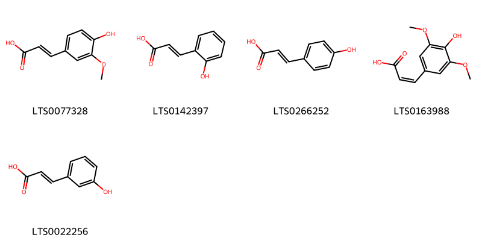{ width=100% }
    <figcaption>Hình ảnh cấu trúc hóa học của 5 hoạt chất thuộc nhóm Cinnamic acids and derivatives gồm ['ferulic acid (LTS0077328)', 'trans-2-hydroxycinnamic acid (LTS0142397)', 'para-coumaric acid (LTS0266252)', '(z)-sinapic acid (LTS0163988)', 'm-coumaric acid (LTS0022256)'].</figcaption>
</figure>
#### Nhóm Coumarins and derivatives
<figure markdown="span">
    { width=100% }
    <figcaption>Hình ảnh cấu trúc hóa học của 1 hoạt chất thuộc nhóm Coumarins and derivatives gồm ['2h-1-benzopyran-2-one (LTS0069773)'].</figcaption>
</figure>
#### Nhóm Flavonoids
<figure markdown="span">
    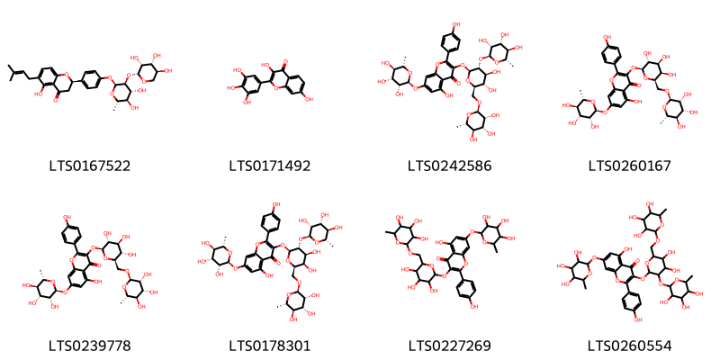{ width=100% }
    <figcaption>Hình ảnh cấu trúc hóa học của 8 hoạt chất thuộc nhóm Flavonoids gồm ['(2r)-2-(4-{[(2s,3s,4r,5r,6s)-4,5-dihydroxy-6-methyl-3-{[(2r,3r,4r,5s)-3,4,5-trihydroxyoxan-2-yl]oxy}oxan-2-yl]oxy}phenyl)-5-hydroxy-6-(3-methylbut-2-en-1-yl)-2,3-dihydro-1-benzopyran-4-one (LTS0167522)', 'robinetin (LTS0171492)', '3-{[(2s,3r,4s,5s,6r)-4,5-dihydroxy-3-{[(2s,3r,4r,5r,6s)-3,4,5-trihydroxy-6-methyloxan-2-yl]oxy}-6-({[(2r,3r,4r,5r,6s)-3,4,5-trihydroxy-6-methyloxan-2-yl]oxy}methyl)oxan-2-yl]oxy}-5-hydroxy-2-(4-hydroxyphenyl)-7-{[(2s,3r,4r,5r,6s)-3,4,5-trihydroxy-6-methyloxan-2-yl]oxy}chromen-4-one (LTS0242586)', 'robinin (LTS0260167)', '5-hydroxy-2-(4-hydroxyphenyl)-3-{[(2s,3r,4s,5s,6r)-3,4,5-trihydroxy-6-({[(2r,3r,4r,5r,6s)-3,4,5-trihydroxy-6-methyloxan-2-yl]oxy}methyl)oxan-2-yl]oxy}-7-{[(2s,3r,4r,5r,6s)-3,4,5-trihydroxy-6-methyloxan-2-yl]oxy}chromen-4-one (LTS0239778)', '3-{[(2s,3r,4s,5r,6r)-4,5-dihydroxy-3-{[(2s,3r,4r,5r,6s)-3,4,5-trihydroxy-6-methyloxan-2-yl]oxy}-6-({[(2r,3r,4r,5r,6s)-3,4,5-trihydroxy-6-methyloxan-2-yl]oxy}methyl)oxan-2-yl]oxy}-5-hydroxy-2-(4-hydroxyphenyl)-7-{[(2s,3r,4r,5r,6s)-3,4,5-trihydroxy-6-methyloxan-2-yl]oxy}chromen-4-one (LTS0178301)', 'robinin (LTS0227269)', '3-({4,5-dihydroxy-3-[(3,4,5-trihydroxy-6-methyloxan-2-yl)oxy]-6-{[(3,4,5-trihydroxy-6-methyloxan-2-yl)oxy]methyl}oxan-2-yl}oxy)-5-hydroxy-2-(4-hydroxyphenyl)-7-[(3,4,5-trihydroxy-6-methyloxan-2-yl)oxy]chromen-4-one (LTS0260554)'].</figcaption>
</figure>
#### Nhóm Furanoid lignans
<figure markdown="span">
    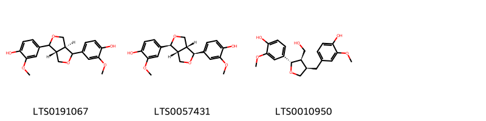{ width=100% }
    <figcaption>Hình ảnh cấu trúc hóa học của 3 hoạt chất thuộc nhóm Furanoid lignans gồm ['4-[(3ar,6as)-4-(4-hydroxy-3-methoxyphenyl)-hexahydrofuro[3,4-c]furan-1-yl]-2-methoxyphenol (LTS0191067)', 'pinoresinol (LTS0057431)', 'lariciresinol (LTS0010950)'].</figcaption>
</figure>
#### Nhóm Isoflavonoids
<figure markdown="span">
    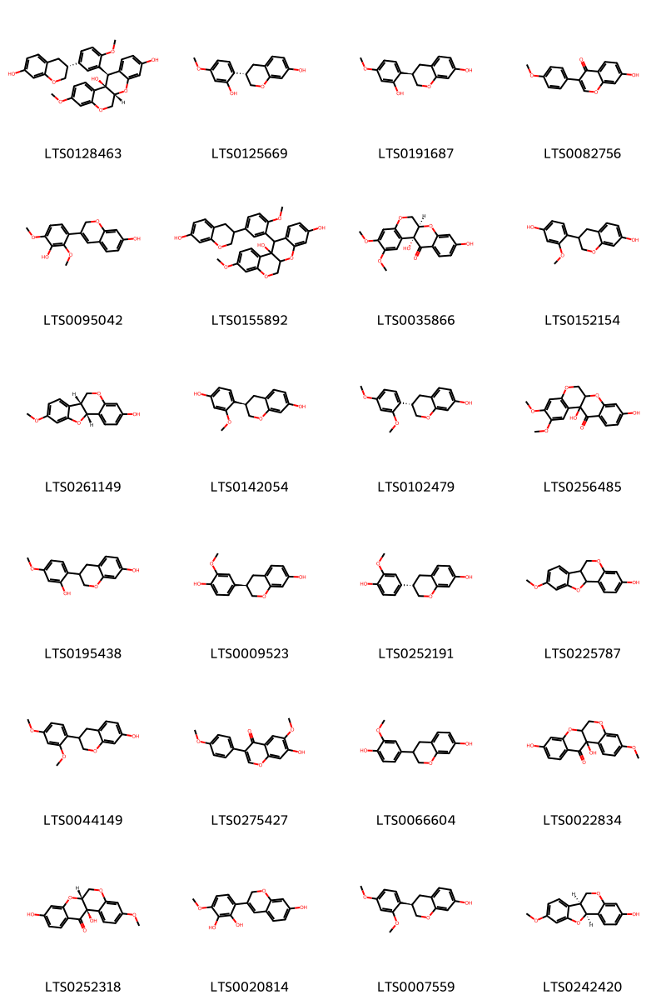{ width=100% }
    <figcaption>Hình ảnh cấu trúc hóa học của 24 hoạt chất thuộc nhóm Isoflavonoids gồm ['(6ar,12r,12ar)-12-{5-[(3r)-7-hydroxy-3,4-dihydro-2h-1-benzopyran-3-yl]-2-methoxyphenyl}-3-methoxy-6a,12-dihydro-6h-5,7-dioxatetraphene-9,12a-diol (LTS0128463)', 'vestitol (LTS0125669)', '(-)-vestitol (LTS0191687)', 'formononetin (LTS0082756)', "2'-o-methylsepiol (LTS0095042)", '12-[5-(7-hydroxy-3,4-dihydro-2h-1-benzopyran-3-yl)-2-methoxyphenyl]-3-methoxy-6a,12-dihydro-6h-5,7-dioxatetraphene-9,12a-diol (LTS0155892)', '(6ar,12ar)-9,12a-dihydroxy-2,3-dimethoxy-6,6a-dihydro-5,7-dioxatetraphen-12-one (LTS0035866)', 'isovestitol (LTS0152154)', 'medicarpin, (-)- (LTS0261149)', '(r)-isovestitol (LTS0142054)', '(3s)-3-(2,4-dimethoxyphenyl)-3,4-dihydro-2h-1-benzopyran-7-ol (LTS0102479)', '9,12a-dihydroxy-2,3-dimethoxy-6,6a-dihydro-5,7-dioxatetraphen-12-one (LTS0256485)', '(+/-)-vestitol (LTS0195438)', '(3r)-3-(4-hydroxy-3-methoxyphenyl)-3,4-dihydro-2h-1-benzopyran-7-ol (LTS0009523)', '(3s)-3-(4-hydroxy-3-methoxyphenyl)-3,4-dihydro-2h-1-benzopyran-7-ol (LTS0252191)', 'medicarpin (LTS0225787)', '3-(2,4-dimethoxyphenyl)-3,4-dihydro-2h-1-benzopyran-7-ol (LTS0044149)', 'afrormosin (LTS0275427)', '3-(4-hydroxy-3-methoxyphenyl)-3,4-dihydro-2h-1-benzopyran-7-ol (LTS0066604)', '9,12a-dihydroxy-3-methoxy-6,6a-dihydro-5,7-dioxatetraphen-12-one (LTS0022834)', '(6ar,12ar)-9,12a-dihydroxy-3-methoxy-6,6a-dihydro-5,7-dioxatetraphen-12-one (LTS0252318)', 'sepiol (LTS0020814)', '(-)-sativan (LTS0007559)', '(+)-medicarpin (LTS0242420)'].</figcaption>
</figure>
#### Nhóm Linear 1_3-diarylpropanoids
<figure markdown="span">
    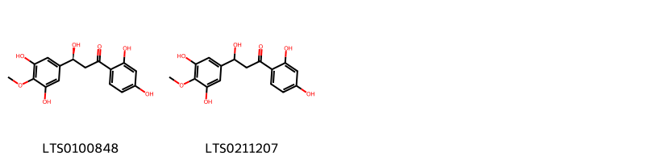{ width=100% }
    <figcaption>Hình ảnh cấu trúc hóa học của Không tìm thấy chú thích hoạt chất thuộc nhóm Linear 1_3-diarylpropanoids gồm Không tìm thấy chú thích.</figcaption>
</figure>
#### Nhóm Organooxygen compounds
<figure markdown="span">
    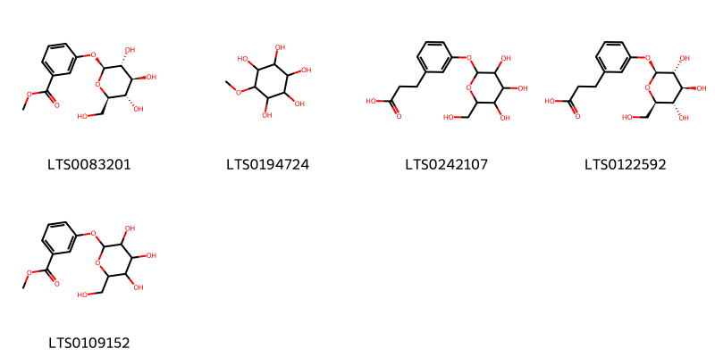{ width=100% }
    <figcaption>Hình ảnh cấu trúc hóa học của 5 hoạt chất thuộc nhóm Organooxygen compounds gồm ['methyl 3-{[(2s,3r,4s,5s,6r)-3,4,5-trihydroxy-6-(hydroxymethyl)oxan-2-yl]oxy}benzoate (LTS0083201)', 'pinitol (LTS0194724)', '3-(3-{[3,4,5-trihydroxy-6-(hydroxymethyl)oxan-2-yl]oxy}phenyl)propanoic acid (LTS0242107)', '3-(3-{[(2s,3r,4s,5s,6r)-3,4,5-trihydroxy-6-(hydroxymethyl)oxan-2-yl]oxy}phenyl)propanoic acid (LTS0122592)', 'methyl 3-{[3,4,5-trihydroxy-6-(hydroxymethyl)oxan-2-yl]oxy}benzoate (LTS0109152)'].</figcaption>
</figure>
#### Nhóm Phenols
<figure markdown="span">
    { width=100% }
    <figcaption>Hình ảnh cấu trúc hóa học của 2 hoạt chất thuộc nhóm Phenols gồm ['coniferyl aldehyde (LTS0140691)', 'coniferaldehyde (LTS0009773)'].</figcaption>
</figure>
#### Nhóm Prenol lipids
<figure markdown="span">
    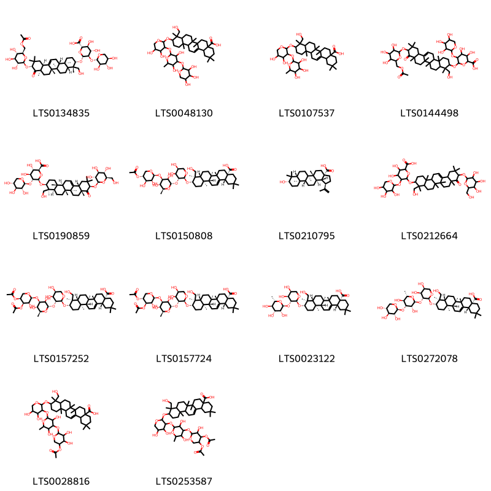{ width=100% }
    <figcaption>Hình ảnh cấu trúc hóa học của 14 hoạt chất thuộc nhóm Prenol lipids gồm ['(2s,3s,4s,5r,6r)-6-{[(3s,4s,4ar,6ar,6bs,8ar,10r,12as,14ar,14br)-10-{[(2s,3r,4s,5s,6r)-6-[(acetyloxy)methyl]-3,4,5-trihydroxyoxan-2-yl]oxy}-4-(hydroxymethyl)-4,6a,6b,8a,11,11,14b-heptamethyl-9-oxo-2,3,4a,5,6,7,8,10,12,12a,14,14a-dodecahydro-1h-picen-3-yl]oxy}-3,4-dihydroxy-5-{[(2s,3r,4s,5r)-3,4,5-trihydroxyoxan-2-yl]oxy}oxane-2-carboxylic acid (LTS0134835)', '10-{[3-({3,5-dihydroxy-6-methyl-4-[(3,4,5-trihydroxyoxan-2-yl)oxy]oxan-2-yl}oxy)-4,5-dihydroxyoxan-2-yl]oxy}-9-(hydroxymethyl)-2,2,6a,6b,9,12a-hexamethyl-1,3,4,5,6,7,8,8a,10,11,12,12b,13,14b-tetradecahydropicene-4a-carboxylic acid (LTS0048130)', '10-({4,5-dihydroxy-3-[(3,4,5-trihydroxy-6-methyloxan-2-yl)oxy]oxan-2-yl}oxy)-9-(hydroxymethyl)-2,2,6a,6b,9,12a-hexamethyl-1,3,4,5,6,7,8,8a,10,11,12,12b,13,14b-tetradecahydropicene-4a-carboxylic acid (LTS0107537)', '6-{[10-({6-[(acetyloxy)methyl]-3,4,5-trihydroxyoxan-2-yl}oxy)-4-(hydroxymethyl)-4,6a,6b,8a,11,11,14b-heptamethyl-9-oxo-2,3,4a,5,6,7,8,10,12,12a,14,14a-dodecahydro-1h-picen-3-yl]oxy}-3,4-dihydroxy-5-[(3,4,5-trihydroxyoxan-2-yl)oxy]oxane-2-carboxylic acid (LTS0144498)', '(2s,3s,4s,5r,6r)-6-{[(3s,4s,4ar,6ar,6bs,8ar,10r,12as,14ar,14br)-4-(hydroxymethyl)-4,6a,6b,8a,11,11,14b-heptamethyl-9-oxo-10-{[(2s,3r,4s,5s,6r)-3,4,5-trihydroxy-6-(hydroxymethyl)oxan-2-yl]oxy}-2,3,4a,5,6,7,8,10,12,12a,14,14a-dodecahydro-1h-picen-3-yl]oxy}-3,4-dihydroxy-5-{[(2s,3r,4s,5r)-3,4,5-trihydroxyoxan-2-yl]oxy}oxane-2-carboxylic acid (LTS0190859)', '(4as,6as,6br,8ar,9r,10s,12ar,12br,14br)-10-{[(2s,3r,4s,5s)-3-{[(2s,3r,4r,5s,6s)-4-{[(2s,3r,4r,5r)-5-(acetyloxy)-3,4-dihydroxyoxan-2-yl]oxy}-3,5-dihydroxy-6-methyloxan-2-yl]oxy}-4,5-dihydroxyoxan-2-yl]oxy}-9-(hydroxymethyl)-2,2,6a,6b,9,12a-hexamethyl-1,3,4,5,6,7,8,8a,10,11,12,12b,13,14b-tetradecahydropicene-4a-carboxylic acid (LTS0150808)', 'betulinic acid (LTS0210795)', '3,4-dihydroxy-6-{[4-(hydroxymethyl)-4,6a,6b,8a,11,11,14b-heptamethyl-9-oxo-10-{[3,4,5-trihydroxy-6-(hydroxymethyl)oxan-2-yl]oxy}-2,3,4a,5,6,7,8,10,12,12a,14,14a-dodecahydro-1h-picen-3-yl]oxy}-5-[(3,4,5-trihydroxyoxan-2-yl)oxy]oxane-2-carboxylic acid (LTS0212664)', '(4as,6as,6br,8ar,9r,10s,12ar,12br,14br)-10-{[(2s,3r,4s,5s)-3-{[(2s,3r,4r,5s,6s)-4-{[(2s,3r,4r,5s)-4,5-bis(acetyloxy)-3-hydroxyoxan-2-yl]oxy}-3,5-dihydroxy-6-methyloxan-2-yl]oxy}-4,5-dihydroxyoxan-2-yl]oxy}-9-(hydroxymethyl)-2,2,6a,6b,9,12a-hexamethyl-1,3,4,5,6,7,8,8a,10,11,12,12b,13,14b-tetradecahydropicene-4a-carboxylic acid (LTS0157252)', '(4as,6as,6br,8ar,9r,10s,12ar,12br,14br)-10-{[(2s,3r,4s,5s)-3-{[(2s,3r,4r,5s,6s)-4-{[(2s,3r,4r,5r)-4,5-bis(acetyloxy)-3-hydroxyoxan-2-yl]oxy}-3,5-dihydroxy-6-methyloxan-2-yl]oxy}-4,5-dihydroxyoxan-2-yl]oxy}-9-(hydroxymethyl)-2,2,6a,6b,9,12a-hexamethyl-1,3,4,5,6,7,8,8a,10,11,12,12b,13,14b-tetradecahydropicene-4a-carboxylic acid (LTS0157724)', '(4as,6as,6br,8ar,9r,10s,12ar,12br,14br)-10-{[(2s,3r,4s,5s)-4,5-dihydroxy-3-{[(2s,3r,4r,5r,6s)-3,4,5-trihydroxy-6-methyloxan-2-yl]oxy}oxan-2-yl]oxy}-9-(hydroxymethyl)-2,2,6a,6b,9,12a-hexamethyl-1,3,4,5,6,7,8,8a,10,11,12,12b,13,14b-tetradecahydropicene-4a-carboxylic acid (LTS0023122)', '(4as,6as,6br,8ar,9r,10s,12ar,12br,14br)-10-{[(2s,3r,4s,5s)-3-{[(2s,3r,4r,5s,6s)-3,5-dihydroxy-6-methyl-4-{[(2s,3r,4s,5r)-3,4,5-trihydroxyoxan-2-yl]oxy}oxan-2-yl]oxy}-4,5-dihydroxyoxan-2-yl]oxy}-9-(hydroxymethyl)-2,2,6a,6b,9,12a-hexamethyl-1,3,4,5,6,7,8,8a,10,11,12,12b,13,14b-tetradecahydropicene-4a-carboxylic acid (LTS0272078)', '10-({3-[(4-{[5-(acetyloxy)-3,4-dihydroxyoxan-2-yl]oxy}-3,5-dihydroxy-6-methyloxan-2-yl)oxy]-4,5-dihydroxyoxan-2-yl}oxy)-9-(hydroxymethyl)-2,2,6a,6b,9,12a-hexamethyl-1,3,4,5,6,7,8,8a,10,11,12,12b,13,14b-tetradecahydropicene-4a-carboxylic acid (LTS0028816)', '10-({3-[(4-{[4,5-bis(acetyloxy)-3-hydroxyoxan-2-yl]oxy}-3,5-dihydroxy-6-methyloxan-2-yl)oxy]-4,5-dihydroxyoxan-2-yl}oxy)-9-(hydroxymethyl)-2,2,6a,6b,9,12a-hexamethyl-1,3,4,5,6,7,8,8a,10,11,12,12b,13,14b-tetradecahydropicene-4a-carboxylic acid (LTS0253587)'].</figcaption>
</figure>
#### Nhóm Saturated hydrocarbons
<figure markdown="span">
    { width=100% }
    <figcaption>Hình ảnh cấu trúc hóa học của 1 hoạt chất thuộc nhóm Saturated hydrocarbons gồm ['heptacosane (LTS0150428)'].</figcaption>
</figure>
#### Nhóm Steroids and steroid derivatives
<figure markdown="span">
    { width=100% }
    <figcaption>Hình ảnh cấu trúc hóa học của 1 hoạt chất thuộc nhóm Steroids and steroid derivatives gồm ['(2r,3r,4s,5s,6r)-2-{[(1r,3as,3bs,7s,9ar,9bs,11ar)-1-[(2r,3e,5s)-5-ethyl-6-methylhept-3-en-2-yl]-9a,11a-dimethyl-1h,2h,3h,3ah,3bh,4h,6h,7h,8h,9h,9bh,10h,11h-cyclopenta[a]phenanthren-7-yl]oxy}-6-(hydroxymethyl)oxane-3,4,5-triol (LTS0088971)'].</figcaption>
</figure>

---

### Dược dân tộc học

Danh sách các quốc gia có sử dụng *Gliricidia sepium* trong điều trị các bệnh. 

| Country   | Disease                                                        | Bệnh                                                                                                                                                                                                |
|:----------|:---------------------------------------------------------------|:----------------------------------------------------------------------------------------------------------------------------------------------------------------------------------------------------|
| Curacao   | Expectorant, Sedative                                          | MYMEMORY WARNING: YOU USED ALL AVAILABLE FREE TRANSLATIONS FOR TODAY. NEXT AVAILABLE IN  16 HOURS 56 MINUTES 15 SECONDS VISIT HTTPS://MYMEMORY.TRANSLATED.NET/DOC/USAGELIMITS.PHP TO TRANSLATE MORE |
| Elsewhere | Insecticide, Poison, Raticide, Raticide, Rodenticide, Raticide | MYMEMORY WARNING: YOU USED ALL AVAILABLE FREE TRANSLATIONS FOR TODAY. NEXT AVAILABLE IN  16 HOURS 56 MINUTES 12 SECONDS VISIT HTTPS://MYMEMORY.TRANSLATED.NET/DOC/USAGELIMITS.PHP TO TRANSLATE MORE |
| Guatemala | Raticide                                                       | MYMEMORY WARNING: YOU USED ALL AVAILABLE FREE TRANSLATIONS FOR TODAY. NEXT AVAILABLE IN  16 HOURS 56 MINUTES 10 SECONDS VISIT HTTPS://MYMEMORY.TRANSLATED.NET/DOC/USAGELIMITS.PHP TO TRANSLATE MORE |
| Honduras  | Raticide                                                       | MYMEMORY WARNING: YOU USED ALL AVAILABLE FREE TRANSLATIONS FOR TODAY. NEXT AVAILABLE IN  16 HOURS 56 MINUTES 07 SECONDS VISIT HTTPS://MYMEMORY.TRANSLATED.NET/DOC/USAGELIMITS.PHP TO TRANSLATE MORE |
| Mexico    | Raticide                                                       | MYMEMORY WARNING: YOU USED ALL AVAILABLE FREE TRANSLATIONS FOR TODAY. NEXT AVAILABLE IN  16 HOURS 56 MINUTES 05 SECONDS VISIT HTTPS://MYMEMORY.TRANSLATED.NET/DOC/USAGELIMITS.PHP TO TRANSLATE MORE |
| Panama    | Poison, Raticide                                               | MYMEMORY WARNING: YOU USED ALL AVAILABLE FREE TRANSLATIONS FOR TODAY. NEXT AVAILABLE IN  16 HOURS 56 MINUTES 03 SECONDS VISIT HTTPS://MYMEMORY.TRANSLATED.NET/DOC/USAGELIMITS.PHP TO TRANSLATE MORE |
| Salvador  | Suppurative, Raticide                                          | MYMEMORY WARNING: YOU USED ALL AVAILABLE FREE TRANSLATIONS FOR TODAY. NEXT AVAILABLE IN  16 HOURS 56 MINUTES 00 SECONDS VISIT HTTPS://MYMEMORY.TRANSLATED.NET/DOC/USAGELIMITS.PHP TO TRANSLATE MORE |
| Venezuela | Raticide, Poison                                               | MYMEMORY WARNING: YOU USED ALL AVAILABLE FREE TRANSLATIONS FOR TODAY. NEXT AVAILABLE IN  16 HOURS 55 MINUTES 58 SECONDS VISIT HTTPS://MYMEMORY.TRANSLATED.NET/DOC/USAGELIMITS.PHP TO TRANSLATE MORE |

---

# Chi Zornia

??? note "Danh sách các dược liệu thuộc chi"
    
	 - *Zornia diphylla*

---
## Zornia diphylla
### Thông tin về thực vật

!!! info "Phân loại thực vật của *Zornia diphylla* từ GIBF:"
    - **Kingdom:** Plantae
    - **Phylum:** Tracheophyta
    - **Order:** Fabales
    - **Family:** Fabaceae
    - **Genus:** Zornia
    - **Species:** *Zornia diphylla*

 

| Label (VI)   | Label (EN)   | Scientific Name   | Descriptions (VI)   | Descriptions (EN)   | Also Known As (VI)   | Also Known As (EN)   |
|:-------------|:-------------|:------------------|:--------------------|:--------------------|:---------------------|:---------------------|
| N/A          | N/A          | Zornia diphylla   | loài thực vật       | species of plant    | ['']                 | ['']                 |

#### Phân bố trên thế giới

**Từ CSDL GIBF** nan, Gabon, Guatemala, Argentina, Venezuela (Bolivarian Republic of), French Guiana, Malawi, Bolivia (Plurinational State of), United States of America, El Salvador, Belize, Uganda, Suriname, Thailand, Brazil, Guyana, Tonga, Peru, Mexico, Ecuador, Madagascar, Colombia, Costa Rica, India, Indonesia, Malaysia

#### Phân bố tại Việt Nam

**Từ CSDL GIBF**: Không có ghi nhận ở Việt Nam

---
### Thành phần hóa học
        
- Theo cơ sở dữ liệu lotus: Từ loài *Zornia diphylla* đã phân lập và xác định được Chưa có hoạt chất nào được phân lập. hoạt chất thuộc về các nhóm Không có hoạt chất nào được phân lập. 

Không có hình ảnh nào được tạo ra

---

### Dược dân tộc học

Danh sách các quốc gia có sử dụng *Zornia diphylla* trong điều trị các bệnh. 

| Country   | Disease   | Bệnh                                                                                                                                                                                                |
|:----------|:----------|:----------------------------------------------------------------------------------------------------------------------------------------------------------------------------------------------------|
| India     | Soporific | MYMEMORY WARNING: YOU USED ALL AVAILABLE FREE TRANSLATIONS FOR TODAY. NEXT AVAILABLE IN  16 HOURS 55 MINUTES 21 SECONDS VISIT HTTPS://MYMEMORY.TRANSLATED.NET/DOC/USAGELIMITS.PHP TO TRANSLATE MORE |

---

# Chi Prosopis

??? note "Danh sách các dược liệu thuộc chi"
    
	 - *Prosopis africana*
	 - *Prosopis alba*
	 - *Prosopis cineraria*
	 - *Prosopis glandsulosa*
	 - *Prosopis juliflora*
	 - *Prosopis nigra*
	 - *Prosopis oblonga*
	 - *Prosopis pubescens*
	 - *Prosopis ruscifolia*
	 - *Prosopis stephaniana*

---
## Prosopis africana
### Thông tin về thực vật

!!! info "Phân loại thực vật của *Prosopis africana* từ GIBF:"
    - **Kingdom:** Plantae
    - **Phylum:** Tracheophyta
    - **Order:** Fabales
    - **Family:** Fabaceae
    - **Genus:** Prosopis
    - **Species:** *Prosopis africana*

 

| Label (VI)   | Label (EN)   | Scientific Name   | Descriptions (VI)   | Descriptions (EN)   | Also Known As (VI)   | Also Known As (EN)   |
|:-------------|:-------------|:------------------|:--------------------|:--------------------|:---------------------|:---------------------|
| N/A          | N/A          | Prosopis africana |                     | species of plant    | ['']                 | ['']                 |

#### Phân bố trên thế giới

**Từ CSDL GIBF** Central African Republic, Senegal, Nigeria, Algeria, Gambia, Benin, Guinea

#### Phân bố tại Việt Nam

**Từ CSDL GIBF**: Không có ghi nhận ở Việt Nam

---
### Thành phần hóa học
        
- Theo cơ sở dữ liệu lotus: Từ loài *Prosopis africana* đã phân lập và xác định được 2 hoạt chất thuộc về các nhóm . 

|    | chemicalTaxonomyClassyfireClass   |   smiles_count |
|---:|:----------------------------------|---------------:|
|  0 |                                   |              2 |

#### Nhóm 
<figure markdown="span">
    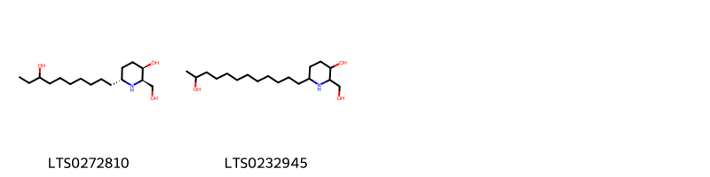{ width=100% }
    <figcaption>Hình ảnh cấu trúc hóa học của 2 hoạt chất thuộc nhóm  gồm ['prosopinine (LTS0272810)', 'prosopine (LTS0232945)'].</figcaption>
</figure>

---

### Dược dân tộc học

Danh sách các quốc gia có sử dụng *Prosopis africana* trong điều trị các bệnh. 

| Country   | Disease     | Bệnh                                                                                                                                                                                                |
|:----------|:------------|:----------------------------------------------------------------------------------------------------------------------------------------------------------------------------------------------------|
| Sudan     | Aphrodisiac | MYMEMORY WARNING: YOU USED ALL AVAILABLE FREE TRANSLATIONS FOR TODAY. NEXT AVAILABLE IN  16 HOURS 54 MINUTES 59 SECONDS VISIT HTTPS://MYMEMORY.TRANSLATED.NET/DOC/USAGELIMITS.PHP TO TRANSLATE MORE |

---

---
## Prosopis alba
### Thông tin về thực vật

!!! info "Phân loại thực vật của *Prosopis alba* từ GIBF:"
    - **Kingdom:** Plantae
    - **Phylum:** Tracheophyta
    - **Order:** Fabales
    - **Family:** Fabaceae
    - **Genus:** Prosopis
    - **Species:** *Prosopis alba*

 

| Label (VI)   | Label (EN)   | Scientific Name   | Descriptions (VI)   | Descriptions (EN)   | Also Known As (VI)   | Also Known As (EN)   |
|:-------------|:-------------|:------------------|:--------------------|:--------------------|:---------------------|:---------------------|
| N/A          | N/A          | Prosopis alba     | loài thực vật       | species of plant    | ['']                 | ['ibopé', 'igopé']   |

#### Phân bố trên thế giới

**Từ CSDL GIBF** Argentina, Bolivia (Plurinational State of), United States of America, Chile, Israel

#### Phân bố tại Việt Nam

**Từ CSDL GIBF**: Không có ghi nhận ở Việt Nam

---
### Thành phần hóa học
        
- Theo cơ sở dữ liệu lotus: Từ loài *Prosopis alba* đã phân lập và xác định được 4 hoạt chất thuộc về các nhóm Organonitrogen compounds, Benzene and substituted derivatives. 

|    | chemicalTaxonomyClassyfireClass     |   smiles_count |
|---:|:------------------------------------|---------------:|
|  0 |                                     |              2 |
|  1 | Benzene and substituted derivatives |              1 |
|  2 | Organonitrogen compounds            |              1 |

#### Nhóm 
<figure markdown="span">
    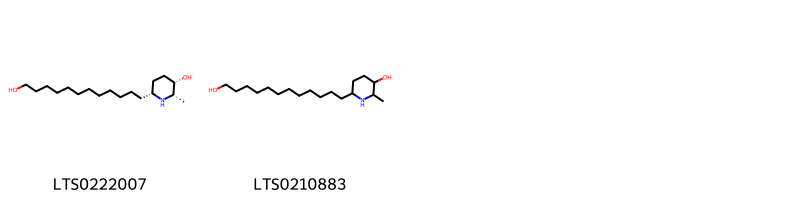{ width=100% }
    <figcaption>Hình ảnh cấu trúc hóa học của 2 hoạt chất thuộc nhóm  gồm ['(2s,3s,6r)-6-(12-hydroxydodecyl)-2-methylpiperidin-3-ol (LTS0222007)', '6-(12-hydroxydodecyl)-2-methylpiperidin-3-ol (LTS0210883)'].</figcaption>
</figure>
#### Nhóm Benzene and substituted derivatives
<figure markdown="span">
    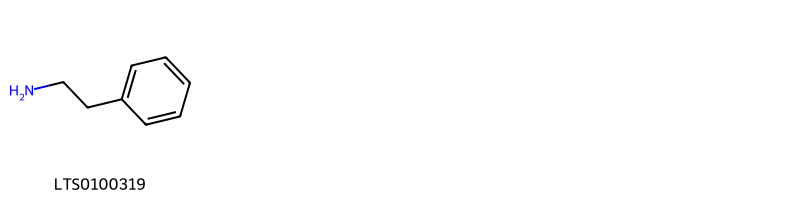{ width=100% }
    <figcaption>Hình ảnh cấu trúc hóa học của 1 hoạt chất thuộc nhóm Benzene and substituted derivatives gồm ['2-phenylethylamine (LTS0100319)'].</figcaption>
</figure>
#### Nhóm Organonitrogen compounds
<figure markdown="span">
    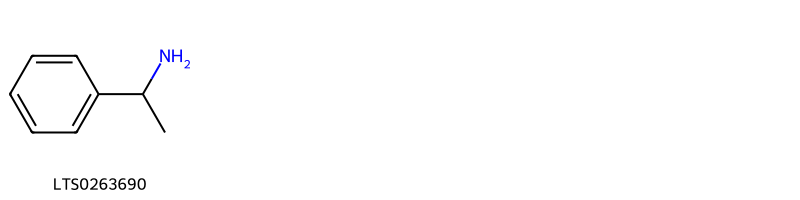{ width=100% }
    <figcaption>Hình ảnh cấu trúc hóa học của 1 hoạt chất thuộc nhóm Organonitrogen compounds gồm ['(+/-)-α-methylbenzylamine (LTS0263690)'].</figcaption>
</figure>

---

### Dược dân tộc học

Danh sách các quốc gia có sử dụng *Prosopis alba* trong điều trị các bệnh. 

| Country   | Disease           | Bệnh                                                                                                                                                                                                |
|:----------|:------------------|:----------------------------------------------------------------------------------------------------------------------------------------------------------------------------------------------------|
| Argentina | Astringent, Tonic | MYMEMORY WARNING: YOU USED ALL AVAILABLE FREE TRANSLATIONS FOR TODAY. NEXT AVAILABLE IN  16 HOURS 54 MINUTES 38 SECONDS VISIT HTTPS://MYMEMORY.TRANSLATED.NET/DOC/USAGELIMITS.PHP TO TRANSLATE MORE |

---

---
## Prosopis cineraria
### Thông tin về thực vật

!!! info "Phân loại thực vật của *Prosopis cineraria* từ GIBF:"
    - **Kingdom:** Plantae
    - **Phylum:** Tracheophyta
    - **Order:** Fabales
    - **Family:** Fabaceae
    - **Genus:** Prosopis
    - **Species:** *Prosopis cineraria*

 

| Label (VI)   | Label (EN)   | Scientific Name    | Descriptions (VI)   | Descriptions (EN)   | Also Known As (VI)   | Also Known As (EN)   |
|:-------------|:-------------|:-------------------|:--------------------|:--------------------|:---------------------|:---------------------|
| N/A          | N/A          | Prosopis cineraria |                     | species of plant    | ['']                 | ['Ghaf']             |

#### Phân bố trên thế giới

**Từ CSDL GIBF** nan, United Arab Emirates, Pakistan, Oman, Iran (Islamic Republic of), Bahrain, Sudan, India, unknown or invalid, United States of America, Qatar, Yemen, Saudi Arabia

#### Phân bố tại Việt Nam

**Từ CSDL GIBF**: Không có ghi nhận ở Việt Nam

---
### Thành phần hóa học
        
- Theo cơ sở dữ liệu lotus: Từ loài *Prosopis cineraria* đã phân lập và xác định được 15 hoạt chất thuộc về các nhóm Fatty Acyls, Flavonoids, Steroids and steroid derivatives, Linear 1,3-diarylpropanoids, Benzene and substituted derivatives. 

|    | chemicalTaxonomyClassyfireClass     |   smiles_count |
|---:|:------------------------------------|---------------:|
|  0 | Benzene and substituted derivatives |              1 |
|  1 | Fatty Acyls                         |              3 |
|  2 | Flavonoids                          |              6 |
|  3 | Linear 1,3-diarylpropanoids         |              1 |
|  4 | Steroids and steroid derivatives    |              4 |

#### Nhóm Benzene and substituted derivatives
<figure markdown="span">
    { width=100% }
    <figcaption>Hình ảnh cấu trúc hóa học của 1 hoạt chất thuộc nhóm Benzene and substituted derivatives gồm ['galop (LTS0222857)'].</figcaption>
</figure>
#### Nhóm Fatty Acyls
<figure markdown="span">
    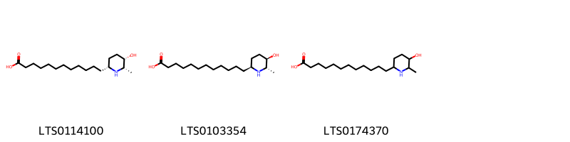{ width=100% }
    <figcaption>Hình ảnh cấu trúc hóa học của 3 hoạt chất thuộc nhóm Fatty Acyls gồm ['12-[(2r,5s,6s)-5-hydroxy-6-methylpiperidin-2-yl]dodecanoic acid (LTS0114100)', '12-[(2s,5r,6s)-5-hydroxy-6-methylpiperidin-2-yl]dodecanoic acid (LTS0103354)', '12-(5-hydroxy-6-methylpiperidin-2-yl)dodecanoic acid (LTS0174370)'].</figcaption>
</figure>
#### Nhóm Flavonoids
<figure markdown="span">
    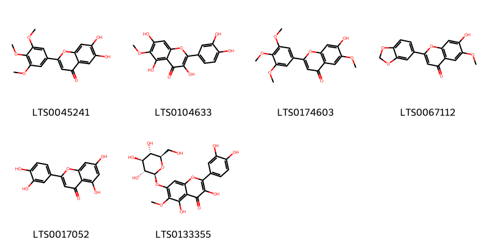{ width=100% }
    <figcaption>Hình ảnh cấu trúc hóa học của 6 hoạt chất thuộc nhóm Flavonoids gồm ['prosogerin e (LTS0045241)', 'patuletin (LTS0104633)', 'prosogerin d (LTS0174603)', 'prosogerin a (LTS0067112)', 'luteolin (LTS0017052)', '2-(3,4-dihydroxyphenyl)-3,5-dihydroxy-6-methoxy-7-{[(2s,3r,4s,5s,6r)-3,4,5-trihydroxy-6-(hydroxymethyl)oxan-2-yl]oxy}chromen-4-one (LTS0133355)'].</figcaption>
</figure>
#### Nhóm Linear 1_3-diarylpropanoids
<figure markdown="span">
    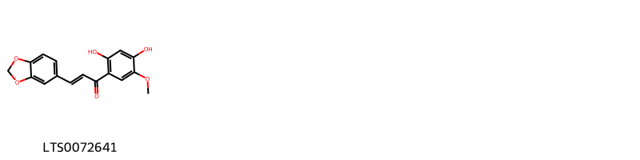{ width=100% }
    <figcaption>Hình ảnh cấu trúc hóa học của Không tìm thấy chú thích hoạt chất thuộc nhóm Linear 1_3-diarylpropanoids gồm Không tìm thấy chú thích.</figcaption>
</figure>
#### Nhóm Steroids and steroid derivatives
<figure markdown="span">
    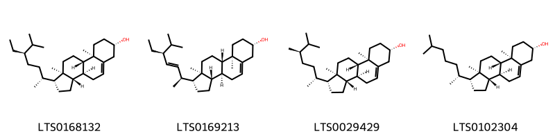{ width=100% }
    <figcaption>Hình ảnh cấu trúc hóa học của 4 hoạt chất thuộc nhóm Steroids and steroid derivatives gồm ['sitosterol (LTS0168132)', '(1r,3as,3bs,7s,9ar,9bs,11ar)-1-[(2s,3e,5s)-5-ethyl-6-methylhept-3-en-2-yl]-9a,11a-dimethyl-1h,2h,3h,3ah,3bh,4h,6h,7h,8h,9h,9bh,10h,11h-cyclopenta[a]phenanthren-7-ol (LTS0169213)', 'campesterol (LTS0029429)', 'cholesterol (LTS0102304)'].</figcaption>
</figure>

---

### Dược dân tộc học

Danh sách các quốc gia có sử dụng *Prosopis cineraria* trong điều trị các bệnh. 

| Country   | Disease               | Bệnh                                                                                                                                                                                                |
|:----------|:----------------------|:----------------------------------------------------------------------------------------------------------------------------------------------------------------------------------------------------|
| India     | Astringent, Demulcent | MYMEMORY WARNING: YOU USED ALL AVAILABLE FREE TRANSLATIONS FOR TODAY. NEXT AVAILABLE IN  16 HOURS 54 MINUTES 14 SECONDS VISIT HTTPS://MYMEMORY.TRANSLATED.NET/DOC/USAGELIMITS.PHP TO TRANSLATE MORE |

---

---
## Prosopis glandsulosa
### Thông tin về thực vật

!!! info "Phân loại thực vật của *Prosopis glandulosa* từ GIBF:"
    - **Kingdom:** Plantae
    - **Phylum:** Tracheophyta
    - **Order:** Fabales
    - **Family:** Fabaceae
    - **Genus:** Prosopis
    - **Species:** *Prosopis glandulosa*

 

| Label (VI)   | Label (EN)   | Scientific Name    | Descriptions (VI)   | Descriptions (EN)   | Also Known As (VI)   | Also Known As (EN)   |
|:-------------|:-------------|:-------------------|:--------------------|:--------------------|:---------------------|:---------------------|
| N/A          | N/A          | Prosopis cineraria |                     | species of plant    | ['']                 | ['Ghaf']             |

#### Phân bố trên thế giới

**Từ CSDL GIBF** nan, South Africa, United States of America, Mexico

#### Phân bố tại Việt Nam

**Từ CSDL GIBF**: Không có ghi nhận ở Việt Nam

---
### Thành phần hóa học
        
- Theo cơ sở dữ liệu lotus: Từ loài *Prosopis glandulosa* đã phân lập và xác định được Chưa có hoạt chất nào được phân lập. hoạt chất thuộc về các nhóm Không có hoạt chất nào được phân lập. 

Không có hình ảnh nào được tạo ra

---

### Dược dân tộc học

Danh sách các quốc gia có sử dụng *Prosopis glandulosa* trong điều trị các bệnh. 

| Country        | Disease                     | Bệnh                                                                                                                                                                                                |
|:---------------|:----------------------------|:----------------------------------------------------------------------------------------------------------------------------------------------------------------------------------------------------|
| Mexico         | Collyrium                   | MYMEMORY WARNING: YOU USED ALL AVAILABLE FREE TRANSLATIONS FOR TODAY. NEXT AVAILABLE IN  16 HOURS 53 MINUTES 47 SECONDS VISIT HTTPS://MYMEMORY.TRANSLATED.NET/DOC/USAGELIMITS.PHP TO TRANSLATE MORE |
| Mexico(Seri)   | Collyrium, Emetic, Laxative | MYMEMORY WARNING: YOU USED ALL AVAILABLE FREE TRANSLATIONS FOR TODAY. NEXT AVAILABLE IN  16 HOURS 53 MINUTES 45 SECONDS VISIT HTTPS://MYMEMORY.TRANSLATED.NET/DOC/USAGELIMITS.PHP TO TRANSLATE MORE |
| US(Amerindian) | Collyrium                   | MYMEMORY WARNING: YOU USED ALL AVAILABLE FREE TRANSLATIONS FOR TODAY. NEXT AVAILABLE IN  16 HOURS 53 MINUTES 42 SECONDS VISIT HTTPS://MYMEMORY.TRANSLATED.NET/DOC/USAGELIMITS.PHP TO TRANSLATE MORE |

---

---
## Prosopis juliflora
### Thông tin về thực vật

!!! info "Phân loại thực vật của *Prosopis juliflora* từ GIBF:"
    - **Kingdom:** Plantae
    - **Phylum:** Tracheophyta
    - **Order:** Fabales
    - **Family:** Fabaceae
    - **Genus:** Prosopis
    - **Species:** *Prosopis juliflora*

 

| Label (VI)   | Label (EN)   | Scientific Name    | Descriptions (VI)   | Descriptions (EN)   | Also Known As (VI)   | Also Known As (EN)    |
|:-------------|:-------------|:-------------------|:--------------------|:--------------------|:---------------------|:----------------------|
| N/A          | N/A          | Prosopis juliflora | loài thực vật       | species of plant    | ['']                 | ['Acacia cumanensis'] |

#### Phân bố trên thế giới

**Từ CSDL GIBF** United Arab Emirates, Benin, Nicaragua, Israel, Puerto Rico, Spain, United States of America, Bonaire, Sint Eustatius and Saba, Iran (Islamic Republic of), Brazil, Dominican Republic, Mexico, Curaçao, Ecuador, Aruba, Cabo Verde, Colombia, Haiti, India, Antigua and Barbuda, Kenya

#### Phân bố tại Việt Nam

**Từ CSDL GIBF**: Không có ghi nhận ở Việt Nam

---
### Thành phần hóa học
        
- Theo cơ sở dữ liệu lotus: Từ loài *Prosopis juliflora* đã phân lập và xác định được 34 hoạt chất thuộc về các nhóm Flavonoids, Indoles and derivatives, Isoflavonoids, Organooxygen compounds, Tannins, Furanoid lignans. 

|    | chemicalTaxonomyClassyfireClass   |   smiles_count |
|---:|:----------------------------------|---------------:|
|  0 |                                   |              9 |
|  1 | Flavonoids                        |             11 |
|  2 | Furanoid lignans                  |              1 |
|  3 | Indoles and derivatives           |              1 |
|  4 | Isoflavonoids                     |              2 |
|  5 | Organooxygen compounds            |              6 |
|  6 | Tannins                           |              4 |

#### Nhóm 
<figure markdown="span">
    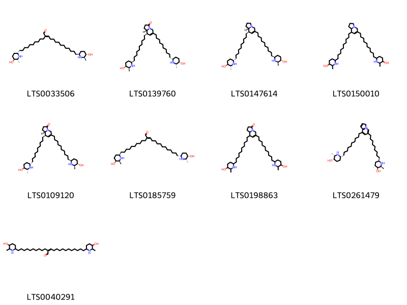{ width=100% }
    <figcaption>Hình ảnh cấu trúc hóa học của 9 hoạt chất thuộc nhóm  gồm ['(2e)-14-[(2s,5s,6r)-5-hydroxy-6-methylpiperidin-2-yl]-2-{10-[(2s,5s,6r)-5-hydroxy-6-methylpiperidin-2-yl]decyl}tetradec-2-enal (LTS0033506)', '(8r,8as)-6,8-bis({10-[(2r,5s,6s)-5-hydroxy-6-methylpiperidin-2-yl]decyl})-2,5,8,8a-tetrahydro-1h-indolizin-3-one (LTS0139760)', '(2r,3s,6s)-6-{10-[(8r,8as)-8-{10-[(2s,5s,6r)-5-hydroxy-6-methylpiperidin-2-yl]decyl}-1,2,3,5,8,8a-hexahydroindolizin-6-yl]decyl}-2-methylpiperidin-3-ol (LTS0147614)', '6-(10-{8-[10-(5-hydroxy-6-methylpiperidin-2-yl)decyl]-1,2,3,5,8,8a-hexahydroindolizin-6-yl}decyl)-2-methylpiperidin-3-ol (LTS0150010)', '(8r,8as)-6,8-bis({10-[(2s,5s,6r)-5-hydroxy-6-methylpiperidin-2-yl]decyl})-2,5,8,8a-tetrahydro-1h-indolizin-3-one (LTS0109120)', '(2e)-14-[(2r,5s,6s)-5-hydroxy-6-methylpiperidin-2-yl]-2-{10-[(2r,5s,6s)-5-hydroxy-6-methylpiperidin-2-yl]decyl}tetradec-2-enal (LTS0185759)', '6,8-bis[10-(5-hydroxy-6-methylpiperidin-2-yl)decyl]-2,5,8,8a-tetrahydro-1h-indolizin-3-one (LTS0198863)', '8-{10-[(2r,5s,6s)-5-hydroxy-6-methylpiperidin-2-yl]decyl}-6-{9-[(2r,5s,6s)-5-hydroxy-6-methylpiperidin-2-yl]nonyl}-3h-4λ⁵-indolizin-4-ylium (LTS0261479)', '14-(5-hydroxy-6-methylpiperidin-2-yl)-2-[10-(5-hydroxy-6-methylpiperidin-2-yl)decyl]tetradec-2-enal (LTS0040291)'].</figcaption>
</figure>
#### Nhóm Flavonoids
<figure markdown="span">
    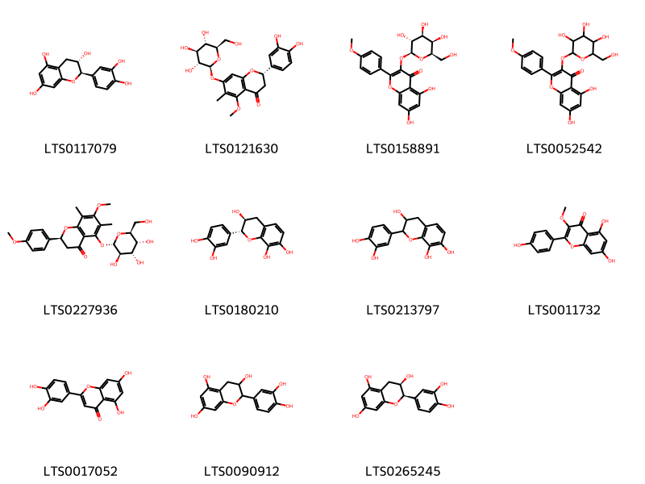{ width=100% }
    <figcaption>Hình ảnh cấu trúc hóa học của 11 hoạt chất thuộc nhóm Flavonoids gồm ['(+)-catechol (LTS0117079)', '(2s)-2-(3,4-dihydroxyphenyl)-5-methoxy-6-methyl-7-{[(2s,3r,4s,5s,6r)-3,4,5-trihydroxy-6-(hydroxymethyl)oxan-2-yl]oxy}-2,3-dihydro-1-benzopyran-4-one (LTS0121630)', '5,7-dihydroxy-2-(4-methoxyphenyl)-3-{[(2s,3r,4s,5r,6r)-3,4,5-trihydroxy-6-(hydroxymethyl)oxan-2-yl]oxy}chromen-4-one (LTS0158891)', '5,7-dihydroxy-2-(4-methoxyphenyl)-3-{[3,4,5-trihydroxy-6-(hydroxymethyl)oxan-2-yl]oxy}chromen-4-one (LTS0052542)', '(2s)-7-methoxy-2-(4-methoxyphenyl)-6,8-dimethyl-5-{[(2s,3r,4s,5r,6s)-3,4,5-trihydroxy-6-(hydroxymethyl)oxan-2-yl]oxy}-2,3-dihydro-1-benzopyran-4-one (LTS0227936)', 'mesquitol (LTS0180210)', 'mesquitol (LTS0213797)', 'isokaempferide (LTS0011732)', 'luteolin (LTS0017052)', 'catechol (LTS0090912)', 'ent-epicatechin (LTS0265245)'].</figcaption>
</figure>
#### Nhóm Furanoid lignans
<figure markdown="span">
    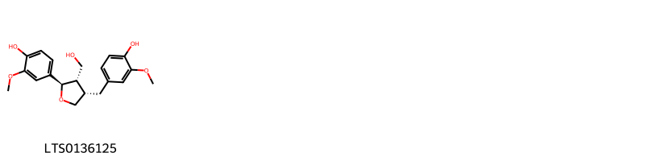{ width=100% }
    <figcaption>Hình ảnh cấu trúc hóa học của 1 hoạt chất thuộc nhóm Furanoid lignans gồm ['(-)-lariciresinol (LTS0136125)'].</figcaption>
</figure>
#### Nhóm Indoles and derivatives
<figure markdown="span">
    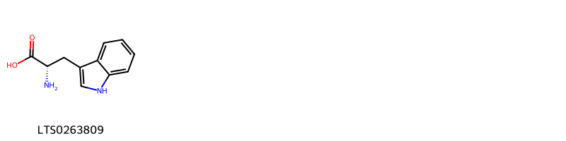{ width=100% }
    <figcaption>Hình ảnh cấu trúc hóa học của 1 hoạt chất thuộc nhóm Indoles and derivatives gồm ['l-tryptophan (LTS0263809)'].</figcaption>
</figure>
#### Nhóm Isoflavonoids
<figure markdown="span">
    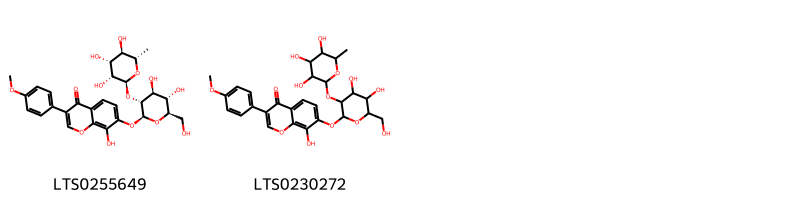{ width=100% }
    <figcaption>Hình ảnh cấu trúc hóa học của 2 hoạt chất thuộc nhóm Isoflavonoids gồm ['7-{[(2s,3r,4s,5s,6r)-4,5-dihydroxy-6-(hydroxymethyl)-3-{[(2s,3r,4r,5r,6s)-3,4,5-trihydroxy-6-methyloxan-2-yl]oxy}oxan-2-yl]oxy}-8-hydroxy-3-(4-methoxyphenyl)chromen-4-one (LTS0255649)', '7-{[4,5-dihydroxy-6-(hydroxymethyl)-3-[(3,4,5-trihydroxy-6-methyloxan-2-yl)oxy]oxan-2-yl]oxy}-8-hydroxy-3-(4-methoxyphenyl)chromen-4-one (LTS0230272)'].</figcaption>
</figure>
#### Nhóm Organooxygen compounds
<figure markdown="span">
    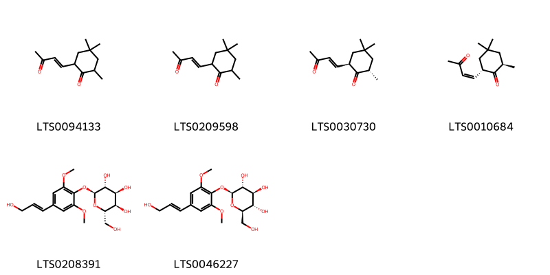{ width=100% }
    <figcaption>Hình ảnh cấu trúc hóa học của 6 hoạt chất thuộc nhóm Organooxygen compounds gồm ['2,4,4-trimethyl-6-[(1e)-3-oxobut-1-en-1-yl]cyclohexan-1-one (LTS0094133)', '2,4,4-trimethyl-6-(3-oxobut-1-en-1-yl)cyclohexan-1-one (LTS0209598)', '(2s,6r)-2,4,4-trimethyl-6-[(1e)-3-oxobut-1-en-1-yl]cyclohexan-1-one (LTS0030730)', '(2r,6s)-2,4,4-trimethyl-6-[(1z)-3-oxobut-1-en-1-yl]cyclohexan-1-one (LTS0010684)', '(2s,3r,4s,5r,6s)-2-(hydroxymethyl)-6-{4-[(1e)-3-hydroxyprop-1-en-1-yl]-2,6-dimethoxyphenoxy}oxane-3,4,5-triol (LTS0208391)', 'syringin (LTS0046227)'].</figcaption>
</figure>
#### Nhóm Tannins
<figure markdown="span">
    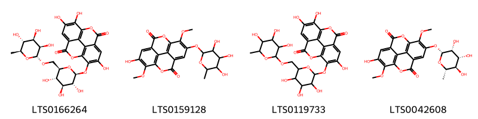{ width=100% }
    <figcaption>Hình ảnh cấu trúc hóa học của 4 hoạt chất thuộc nhóm Tannins gồm ['6,7,13-trihydroxy-14-{[(2s,3r,4s,5s,6r)-3,4,5-trihydroxy-6-({[(2r,3r,4r,5r,6s)-3,4,5-trihydroxy-6-methyloxan-2-yl]oxy}methyl)oxan-2-yl]oxy}-2,9-dioxatetracyclo[6.6.2.0⁴,¹⁶.0¹¹,¹⁵]hexadeca-1(15),4,6,8(16),11,13-hexaene-3,10-dione (LTS0166264)', '6-hydroxy-7,14-dimethoxy-13-[(3,4,5-trihydroxy-6-methyloxan-2-yl)oxy]-2,9-dioxatetracyclo[6.6.2.0⁴,¹⁶.0¹¹,¹⁵]hexadeca-1(15),4,6,8(16),11,13-hexaene-3,10-dione (LTS0159128)', '6,7,13-trihydroxy-14-[(3,4,5-trihydroxy-6-{[(3,4,5-trihydroxy-6-methyloxan-2-yl)oxy]methyl}oxan-2-yl)oxy]-2,9-dioxatetracyclo[6.6.2.0⁴,¹⁶.0¹¹,¹⁵]hexadeca-1(15),4,6,8(16),11,13-hexaene-3,10-dione (LTS0119733)', '6-hydroxy-7,14-dimethoxy-13-{[(2r,3r,4r,5r,6s)-3,4,5-trihydroxy-6-methyloxan-2-yl]oxy}-2,9-dioxatetracyclo[6.6.2.0⁴,¹⁶.0¹¹,¹⁵]hexadeca-1(15),4,6,8(16),11,13-hexaene-3,10-dione (LTS0042608)'].</figcaption>
</figure>

---

### Dược dân tộc học

Danh sách các quốc gia có sử dụng *Prosopis juliflora* trong điều trị các bệnh. 

| Country            | Disease                   | Bệnh                                                                                                                                                                                                |
|:-------------------|:--------------------------|:----------------------------------------------------------------------------------------------------------------------------------------------------------------------------------------------------|
| Dominican Republic | Vulnerary, Stomachic      | MYMEMORY WARNING: YOU USED ALL AVAILABLE FREE TRANSLATIONS FOR TODAY. NEXT AVAILABLE IN  16 HOURS 53 MINUTES 20 SECONDS VISIT HTTPS://MYMEMORY.TRANSLATED.NET/DOC/USAGELIMITS.PHP TO TRANSLATE MORE |
| Haiti              | Discutient, Stomachic     | MYMEMORY WARNING: YOU USED ALL AVAILABLE FREE TRANSLATIONS FOR TODAY. NEXT AVAILABLE IN  16 HOURS 53 MINUTES 18 SECONDS VISIT HTTPS://MYMEMORY.TRANSLATED.NET/DOC/USAGELIMITS.PHP TO TRANSLATE MORE |
| Mexico             | Cathartic, Emetic, Rennet | MYMEMORY WARNING: YOU USED ALL AVAILABLE FREE TRANSLATIONS FOR TODAY. NEXT AVAILABLE IN  16 HOURS 53 MINUTES 16 SECONDS VISIT HTTPS://MYMEMORY.TRANSLATED.NET/DOC/USAGELIMITS.PHP TO TRANSLATE MORE |
| US                 | Poison                    | MYMEMORY WARNING: YOU USED ALL AVAILABLE FREE TRANSLATIONS FOR TODAY. NEXT AVAILABLE IN  16 HOURS 53 MINUTES 13 SECONDS VISIT HTTPS://MYMEMORY.TRANSLATED.NET/DOC/USAGELIMITS.PHP TO TRANSLATE MORE |

---

---
## Prosopis nigra
### Thông tin về thực vật

!!! info "Phân loại thực vật của *Prosopis nigra* từ GIBF:"
    - **Kingdom:** Plantae
    - **Phylum:** Tracheophyta
    - **Order:** Fabales
    - **Family:** Fabaceae
    - **Genus:** Prosopis
    - **Species:** *Prosopis nigra*

 

| Label (VI)   | Label (EN)   | Scientific Name   | Descriptions (VI)   | Descriptions (EN)   | Also Known As (VI)   | Also Known As (EN)   |
|:-------------|:-------------|:------------------|:--------------------|:--------------------|:---------------------|:---------------------|
| N/A          | N/A          | Prosopis nigra    | loài thực vật       | species of plant    | ['']                 | ['black mesquite']   |

#### Phân bố trên thế giới

**Từ CSDL GIBF** Brazil, Argentina, Bolivia (Plurinational State of), Mexico, Uruguay, Paraguay, Chile

#### Phân bố tại Việt Nam

**Từ CSDL GIBF**: Không có ghi nhận ở Việt Nam

---
### Thành phần hóa học
        
- Theo cơ sở dữ liệu lotus: Từ loài *Prosopis nigra* đã phân lập và xác định được 4 hoạt chất thuộc về các nhóm Indoles and derivatives, Benzene and substituted derivatives. 

|    | chemicalTaxonomyClassyfireClass     |   smiles_count |
|---:|:------------------------------------|---------------:|
|  0 |                                     |              1 |
|  1 | Benzene and substituted derivatives |              1 |
|  2 | Indoles and derivatives             |              2 |

#### Nhóm 
<figure markdown="span">
    { width=100% }
    <figcaption>Hình ảnh cấu trúc hóa học của 1 hoạt chất thuộc nhóm  gồm ['12-[(2s,5s,6s)-5-hydroxy-1,6-dimethylpiperidin-2-yl]dodecan-2-one (LTS0040929)'].</figcaption>
</figure>
#### Nhóm Benzene and substituted derivatives
<figure markdown="span">
    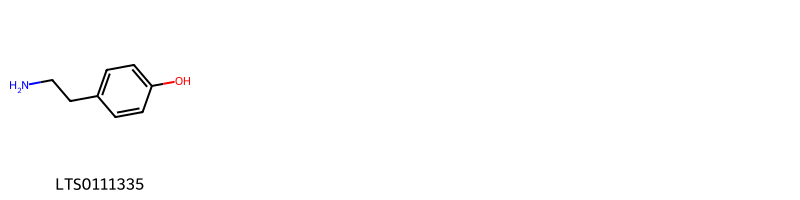{ width=100% }
    <figcaption>Hình ảnh cấu trúc hóa học của 1 hoạt chất thuộc nhóm Benzene and substituted derivatives gồm ['tyramine (LTS0111335)'].</figcaption>
</figure>
#### Nhóm Indoles and derivatives
<figure markdown="span">
    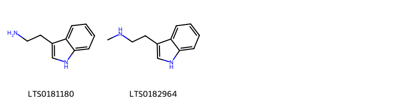{ width=100% }
    <figcaption>Hình ảnh cấu trúc hóa học của 2 hoạt chất thuộc nhóm Indoles and derivatives gồm ['tryptamine (LTS0181180)', 'methyltryptamine (LTS0182964)'].</figcaption>
</figure>

---

### Dược dân tộc học

Danh sách các quốc gia có sử dụng *Prosopis nigra* trong điều trị các bệnh. 

| Country   | Disease    | Bệnh                                                                                                                                                                                                |
|:----------|:-----------|:----------------------------------------------------------------------------------------------------------------------------------------------------------------------------------------------------|
| Brazil    | Intoxicant | MYMEMORY WARNING: YOU USED ALL AVAILABLE FREE TRANSLATIONS FOR TODAY. NEXT AVAILABLE IN  16 HOURS 52 MINUTES 47 SECONDS VISIT HTTPS://MYMEMORY.TRANSLATED.NET/DOC/USAGELIMITS.PHP TO TRANSLATE MORE |

---

---
## Prosopis oblonga
### Thông tin về thực vật

!!! info "Phân loại thực vật của *Prosopis africana* từ GIBF:"
    - **Kingdom:** Plantae
    - **Phylum:** Tracheophyta
    - **Order:** Fabales
    - **Family:** Fabaceae
    - **Genus:** Prosopis
    - **Species:** *Prosopis africana*

 

| Label (VI)   | Label (EN)   | Scientific Name   | Descriptions (VI)   | Descriptions (EN)   | Also Known As (VI)   | Also Known As (EN)   |
|:-------------|:-------------|:------------------|:--------------------|:--------------------|:---------------------|:---------------------|
| N/A          | N/A          | Prosopis oblonga  | loài thực vật       | species of plant    | ['']                 | ['']                 |

#### Phân bố trên thế giới

**Từ CSDL GIBF** Brazil, Argentina, Bolivia (Plurinational State of), Mexico, Uruguay, Paraguay, Chile

#### Phân bố tại Việt Nam

**Từ CSDL GIBF**: Không có ghi nhận ở Việt Nam

---
### Thành phần hóa học
        
- Theo cơ sở dữ liệu lotus: Từ loài *Prosopis africana* đã phân lập và xác định được Chưa có hoạt chất nào được phân lập. hoạt chất thuộc về các nhóm Không có hoạt chất nào được phân lập. 

Không có hình ảnh nào được tạo ra

---

### Dược dân tộc học

Danh sách các quốc gia có sử dụng *Prosopis africana* trong điều trị các bệnh. 

| Country   | Disease   | Bệnh                                                                                                                                                                                                |
|:----------|:----------|:----------------------------------------------------------------------------------------------------------------------------------------------------------------------------------------------------|
| Africa    | Piscicide | MYMEMORY WARNING: YOU USED ALL AVAILABLE FREE TRANSLATIONS FOR TODAY. NEXT AVAILABLE IN  16 HOURS 52 MINUTES 24 SECONDS VISIT HTTPS://MYMEMORY.TRANSLATED.NET/DOC/USAGELIMITS.PHP TO TRANSLATE MORE |

---

---
## Prosopis pubescens
### Thông tin về thực vật

!!! info "Phân loại thực vật của *Prosopis pubescens* từ GIBF:"
    - **Kingdom:** Plantae
    - **Phylum:** Tracheophyta
    - **Order:** Fabales
    - **Family:** Fabaceae
    - **Genus:** Prosopis
    - **Species:** *Prosopis pubescens*

 

| Label (VI)   | Label (EN)   | Scientific Name    | Descriptions (VI)   | Descriptions (EN)   | Also Known As (VI)   | Also Known As (EN)   |
|:-------------|:-------------|:-------------------|:--------------------|:--------------------|:---------------------|:---------------------|
| N/A          | N/A          | Prosopis pubescens | loài thực vật       | species of plant    | ['']                 | ['']                 |

#### Phân bố trên thế giới

**Từ CSDL GIBF** Namibia, South Africa, United States of America, Mexico

#### Phân bố tại Việt Nam

**Từ CSDL GIBF**: Không có ghi nhận ở Việt Nam

---
### Thành phần hóa học
        
- Theo cơ sở dữ liệu lotus: Từ loài *Prosopis pubescens* đã phân lập và xác định được Chưa có hoạt chất nào được phân lập. hoạt chất thuộc về các nhóm Không có hoạt chất nào được phân lập. 

Không có hình ảnh nào được tạo ra

---

### Dược dân tộc học

Danh sách các quốc gia có sử dụng *Prosopis pubescens* trong điều trị các bệnh. 

| Country        | Disease    | Bệnh                                                                                                                                                                                                |
|:---------------|:-----------|:----------------------------------------------------------------------------------------------------------------------------------------------------------------------------------------------------|
| US(Amerindian) | Intoxicant | MYMEMORY WARNING: YOU USED ALL AVAILABLE FREE TRANSLATIONS FOR TODAY. NEXT AVAILABLE IN  16 HOURS 52 MINUTES 07 SECONDS VISIT HTTPS://MYMEMORY.TRANSLATED.NET/DOC/USAGELIMITS.PHP TO TRANSLATE MORE |

---

---
## Prosopis ruscifolia
### Thông tin về thực vật

!!! info "Phân loại thực vật của *Prosopis ruscifolia* từ GIBF:"
    - **Kingdom:** Plantae
    - **Phylum:** Tracheophyta
    - **Order:** Fabales
    - **Family:** Fabaceae
    - **Genus:** Prosopis
    - **Species:** *Prosopis ruscifolia*

 

| Label (VI)   | Label (EN)   | Scientific Name     | Descriptions (VI)   | Descriptions (EN)   | Also Known As (VI)   | Also Known As (EN)   |
|:-------------|:-------------|:--------------------|:--------------------|:--------------------|:---------------------|:---------------------|
| N/A          | N/A          | Prosopis ruscifolia | loài thực vật       | species of plant    | ['']                 | ['']                 |

#### Phân bố trên thế giới

**Từ CSDL GIBF** Brazil, Bolivia (Plurinational State of), Argentina, unknown or invalid, United States of America, Uruguay, Paraguay

#### Phân bố tại Việt Nam

**Từ CSDL GIBF**: Không có ghi nhận ở Việt Nam

---
### Thành phần hóa học
        
- Theo cơ sở dữ liệu lotus: Từ loài *Prosopis ruscifolia* đã phân lập và xác định được 1 hoạt chất thuộc về các nhóm . 

|    | chemicalTaxonomyClassyfireClass   |   smiles_count |
|---:|:----------------------------------|---------------:|
|  0 |                                   |              1 |

#### Nhóm 
<figure markdown="span">
    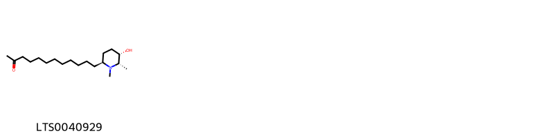{ width=100% }
    <figcaption>Hình ảnh cấu trúc hóa học của 1 hoạt chất thuộc nhóm  gồm ['12-[(2s,5s,6s)-5-hydroxy-1,6-dimethylpiperidin-2-yl]dodecan-2-one (LTS0040929)'].</figcaption>
</figure>

---

### Dược dân tộc học

Danh sách các quốc gia có sử dụng *Prosopis ruscifolia* trong điều trị các bệnh. 

| Country   | Disease       | Bệnh                                                                                                                                                                                                |
|:----------|:--------------|:----------------------------------------------------------------------------------------------------------------------------------------------------------------------------------------------------|
| Paraguay  | Abortifacient | MYMEMORY WARNING: YOU USED ALL AVAILABLE FREE TRANSLATIONS FOR TODAY. NEXT AVAILABLE IN  16 HOURS 51 MINUTES 44 SECONDS VISIT HTTPS://MYMEMORY.TRANSLATED.NET/DOC/USAGELIMITS.PHP TO TRANSLATE MORE |

---

# Chi Baphia

??? note "Danh sách các dược liệu thuộc chi"
    
	 - *Baphia nitida*

---
## Baphia nitida
### Thông tin về thực vật

!!! info "Phân loại thực vật của *Baphia nitida* từ GIBF:"
    - **Kingdom:** Plantae
    - **Phylum:** Tracheophyta
    - **Order:** Fabales
    - **Family:** Fabaceae
    - **Genus:** Baphia
    - **Species:** *Baphia nitida*

 

| Label (VI)   | Label (EN)   | Scientific Name   | Descriptions (VI)   | Descriptions (EN)         | Also Known As (VI)   | Also Known As (EN)         |
|:-------------|:-------------|:------------------|:--------------------|:--------------------------|:---------------------|:---------------------------|
| N/A          | N/A          | Baphia nitida     | loài thực vật       | species of plant, Camwood | ['']                 | ['Category:Baphia nitida'] |

#### Phân bố trên thế giới

**Từ CSDL GIBF** Ghana, Liberia, Nigeria, Côte d’Ivoire, Benin, Sierra Leone, Guinea, Singapore, Malaysia, Cameroon

#### Phân bố tại Việt Nam

**Từ CSDL GIBF**: Không có ghi nhận ở Việt Nam

---
### Thành phần hóa học
        
- Theo cơ sở dữ liệu lotus: Từ loài *Baphia nitida* đã phân lập và xác định được 8 hoạt chất thuộc về các nhóm Diarylheptanoids, Flavonoids, Isoflavonoids. 

|    | chemicalTaxonomyClassyfireClass   |   smiles_count |
|---:|:----------------------------------|---------------:|
|  0 | Diarylheptanoids                  |              2 |
|  1 | Flavonoids                        |              2 |
|  2 | Isoflavonoids                     |              4 |

#### Nhóm Diarylheptanoids
<figure markdown="span">
    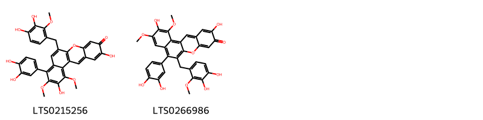{ width=100% }
    <figcaption>Hình ảnh cấu trúc hóa học của 2 hoạt chất thuộc nhóm Diarylheptanoids gồm ['6-[(3,4-dihydroxy-2-methoxyphenyl)methyl]-8-(3,4-dihydroxyphenyl)-2,10-dihydroxy-9,11-dimethoxy-5-oxatetraphen-3-one (LTS0215256)', '6-[(3,4-dihydroxy-2-methoxyphenyl)methyl]-7-(3,4-dihydroxyphenyl)-2,10-dihydroxy-9,11-dimethoxy-5-oxatetraphen-3-one (LTS0266986)'].</figcaption>
</figure>
#### Nhóm Flavonoids
<figure markdown="span">
    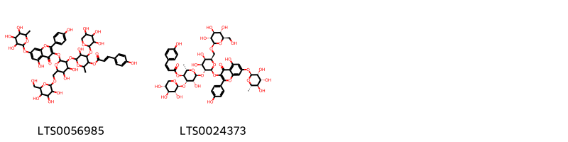{ width=100% }
    <figcaption>Hình ảnh cấu trúc hóa học của 2 hoạt chất thuộc nhóm Flavonoids gồm ['6-[(4,5-dihydroxy-2-{[5-hydroxy-2-(4-hydroxyphenyl)-4-oxo-7-[(3,4,5-trihydroxy-6-methyloxan-2-yl)oxy]chromen-3-yl]oxy}-6-({[3,4,5-trihydroxy-6-(hydroxymethyl)oxan-2-yl]oxy}methyl)oxan-3-yl)oxy]-5-hydroxy-2-methyl-4-[(3,4,5-trihydroxyoxan-2-yl)oxy]oxan-3-yl 3-(4-hydroxyphenyl)prop-2-enoate (LTS0056985)', '(2s,3s,4s,5r,6s)-6-{[(2s,3r,4s,5r,6r)-4,5-dihydroxy-2-{[5-hydroxy-2-(4-hydroxyphenyl)-4-oxo-7-{[(2s,3r,4r,5r,6s)-3,4,5-trihydroxy-6-methyloxan-2-yl]oxy}chromen-3-yl]oxy}-6-({[(2r,3r,4s,5s,6r)-3,4,5-trihydroxy-6-(hydroxymethyl)oxan-2-yl]oxy}methyl)oxan-3-yl]oxy}-5-hydroxy-2-methyl-4-{[(2s,3r,4s,5r)-3,4,5-trihydroxyoxan-2-yl]oxy}oxan-3-yl (2z)-3-(4-hydroxyphenyl)prop-2-enoate (LTS0024373)'].</figcaption>
</figure>
#### Nhóm Isoflavonoids
<figure markdown="span">
    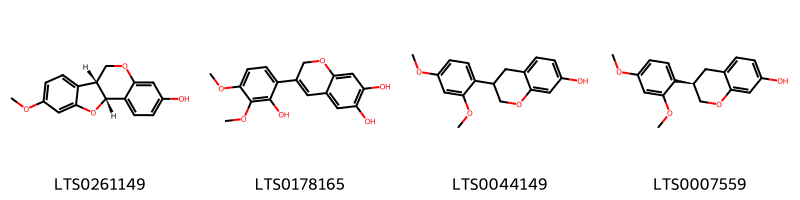{ width=100% }
    <figcaption>Hình ảnh cấu trúc hóa học của 4 hoạt chất thuộc nhóm Isoflavonoids gồm ['medicarpin, (-)- (LTS0261149)', '3-(2-hydroxy-3,4-dimethoxyphenyl)-2h-chromene-6,7-diol (LTS0178165)', '3-(2,4-dimethoxyphenyl)-3,4-dihydro-2h-1-benzopyran-7-ol (LTS0044149)', '(-)-sativan (LTS0007559)'].</figcaption>
</figure>

---

### Dược dân tộc học

Danh sách các quốc gia có sử dụng *Baphia nitida* trong điều trị các bệnh. 

| Country      | Disease                | Bệnh                                                                                                                                                                                                |
|:-------------|:-----------------------|:----------------------------------------------------------------------------------------------------------------------------------------------------------------------------------------------------|
| Ghana        | Laxative               | MYMEMORY WARNING: YOU USED ALL AVAILABLE FREE TRANSLATIONS FOR TODAY. NEXT AVAILABLE IN  16 HOURS 50 MINUTES 34 SECONDS VISIT HTTPS://MYMEMORY.TRANSLATED.NET/DOC/USAGELIMITS.PHP TO TRANSLATE MORE |
| Nigeria      | Carminative, Fungicide | MYMEMORY WARNING: YOU USED ALL AVAILABLE FREE TRANSLATIONS FOR TODAY. NEXT AVAILABLE IN  16 HOURS 50 MINUTES 32 SECONDS VISIT HTTPS://MYMEMORY.TRANSLATED.NET/DOC/USAGELIMITS.PHP TO TRANSLATE MORE |
| Sierra Leone | Parasiticide           | MYMEMORY WARNING: YOU USED ALL AVAILABLE FREE TRANSLATIONS FOR TODAY. NEXT AVAILABLE IN  16 HOURS 50 MINUTES 29 SECONDS VISIT HTTPS://MYMEMORY.TRANSLATED.NET/DOC/USAGELIMITS.PHP TO TRANSLATE MORE |

---

# Chi Ceratonia

??? note "Danh sách các dược liệu thuộc chi"
    
	 - *Ceratonia siliqua*

---
## Ceratonia siliqua
### Thông tin về thực vật

!!! info "Phân loại thực vật của *Ceratonia siliqua* từ GIBF:"
    - **Kingdom:** Plantae
    - **Phylum:** Tracheophyta
    - **Order:** Fabales
    - **Family:** Fabaceae
    - **Genus:** Ceratonia
    - **Species:** *Ceratonia siliqua*

 

| Label (VI)   | Label (EN)   | Scientific Name   | Descriptions (VI)   | Descriptions (EN)   | Also Known As (VI)   | Also Known As (EN)                               |
|:-------------|:-------------|:------------------|:--------------------|:--------------------|:---------------------|:-------------------------------------------------|
| N/A          | N/A          | Ceratonia siliqua |                     | species of plant    | ['']                 | ['carob tree', 'locust bean', "St John's-bread"] |

#### Phân bố trên thế giới

**Từ CSDL GIBF** nan, South Africa, Italy, Australia, Cyprus, Malta, Spain, Türkiye, Portugal, Algeria, Morocco, United States of America, France, Greece, Israel, Chile

#### Phân bố tại Việt Nam

**Từ CSDL GIBF**: Không có ghi nhận ở Việt Nam

---
### Thành phần hóa học
        
- Theo cơ sở dữ liệu lotus: Từ loài *Ceratonia siliqua* đã phân lập và xác định được 24 hoạt chất thuộc về các nhóm Flavonoids, Organooxygen compounds, Tannins. 

|    | chemicalTaxonomyClassyfireClass   |   smiles_count |
|---:|:----------------------------------|---------------:|
|  0 | Flavonoids                        |             12 |
|  1 | Organooxygen compounds            |             11 |
|  2 | Tannins                           |              1 |

#### Nhóm Flavonoids
<figure markdown="span">
    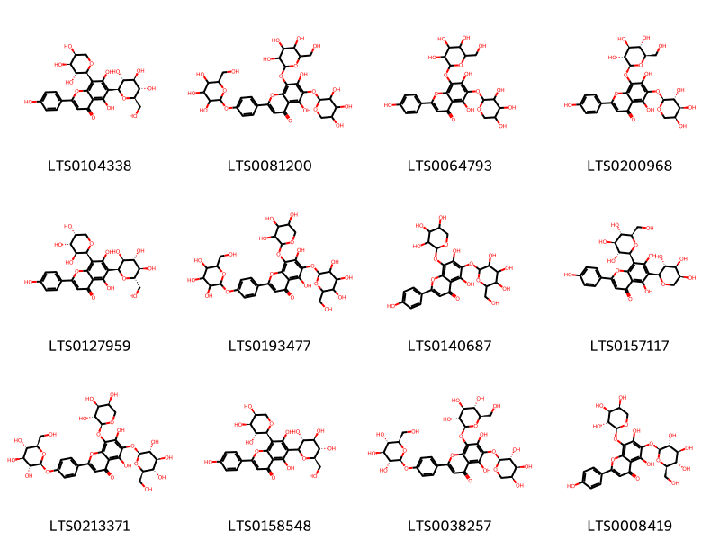{ width=100% }
    <figcaption>Hình ảnh cấu trúc hóa học của 12 hoạt chất thuộc nhóm Flavonoids gồm ['schaftoside (LTS0104338)', '5,7-dihydroxy-8-{[3,4,5-trihydroxy-6-(hydroxymethyl)oxan-2-yl]oxy}-2-(4-{[3,4,5-trihydroxy-6-(hydroxymethyl)oxan-2-yl]oxy}phenyl)-6-[(3,4,5-trihydroxyoxan-2-yl)oxy]chromen-4-one (LTS0081200)', '5,7-dihydroxy-2-(4-hydroxyphenyl)-8-{[3,4,5-trihydroxy-6-(hydroxymethyl)oxan-2-yl]oxy}-6-[(3,4,5-trihydroxyoxan-2-yl)oxy]chromen-4-one (LTS0064793)', '5,7-dihydroxy-2-(4-hydroxyphenyl)-8-{[(2s,3r,4s,5s,6r)-3,4,5-trihydroxy-6-(hydroxymethyl)oxan-2-yl]oxy}-6-{[(2s,3r,4s,5s)-3,4,5-trihydroxyoxan-2-yl]oxy}chromen-4-one (LTS0200968)', '5,7-dihydroxy-2-(4-hydroxyphenyl)-6-[(2s,3s,4s,5r,6s)-3,4,5-trihydroxy-6-(hydroxymethyl)oxan-2-yl]-8-[(2s,3s,4r,5r)-3,4,5-trihydroxyoxan-2-yl]chromen-4-one (LTS0127959)', '5,7-dihydroxy-6-{[3,4,5-trihydroxy-6-(hydroxymethyl)oxan-2-yl]oxy}-2-(4-{[3,4,5-trihydroxy-6-(hydroxymethyl)oxan-2-yl]oxy}phenyl)-8-[(3,4,5-trihydroxyoxan-2-yl)oxy]chromen-4-one (LTS0193477)', '5,7-dihydroxy-2-(4-hydroxyphenyl)-6-{[3,4,5-trihydroxy-6-(hydroxymethyl)oxan-2-yl]oxy}-8-[(3,4,5-trihydroxyoxan-2-yl)oxy]chromen-4-one (LTS0140687)', 'isoschaftoside (LTS0157117)', '5,7-dihydroxy-6-{[(2s,3r,4s,5s,6r)-3,4,5-trihydroxy-6-(hydroxymethyl)oxan-2-yl]oxy}-2-(4-{[(2s,3r,4s,5s,6r)-3,4,5-trihydroxy-6-(hydroxymethyl)oxan-2-yl]oxy}phenyl)-8-{[(2s,3r,4s,5s)-3,4,5-trihydroxyoxan-2-yl]oxy}chromen-4-one (LTS0213371)', '5,7-dihydroxy-2-(4-hydroxyphenyl)-6-[(3r,4r,5s,6r)-3,4,5-trihydroxy-6-(hydroxymethyl)oxan-2-yl]-8-[(2s,3r,4s,5s)-3,4,5-trihydroxyoxan-2-yl]chromen-4-one (LTS0158548)', '5,7-dihydroxy-8-{[(2s,3r,4s,5s,6r)-3,4,5-trihydroxy-6-(hydroxymethyl)oxan-2-yl]oxy}-2-(4-{[(2s,3r,4s,5s,6r)-3,4,5-trihydroxy-6-(hydroxymethyl)oxan-2-yl]oxy}phenyl)-6-{[(2s,3r,4s,5s)-3,4,5-trihydroxyoxan-2-yl]oxy}chromen-4-one (LTS0038257)', '5,7-dihydroxy-2-(4-hydroxyphenyl)-6-{[(2s,3r,4s,5s,6r)-3,4,5-trihydroxy-6-(hydroxymethyl)oxan-2-yl]oxy}-8-{[(2s,3r,4s,5s)-3,4,5-trihydroxyoxan-2-yl]oxy}chromen-4-one (LTS0008419)'].</figcaption>
</figure>
#### Nhóm Organooxygen compounds
<figure markdown="span">
    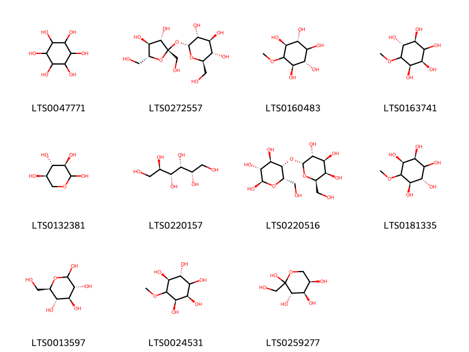{ width=100% }
    <figcaption>Hình ảnh cấu trúc hóa học của 11 hoạt chất thuộc nhóm Organooxygen compounds gồm ['(-)-inositol (LTS0047771)', 'sucrose (LTS0272557)', '(1r,2s,4r,5s)-6-methoxycyclohexane-1,2,3,4,5-pentol (LTS0160483)', '(1r,2r,4s,5r)-6-methoxycyclohexane-1,2,3,4,5-pentol (LTS0163741)', 'd-xylose (LTS0132381)', 'd-sorbitol (LTS0220157)', '(2r,3r,4r,5s,6s)-6-(hydroxymethyl)-5-{[(2r,3r,4s,5r,6r)-3,4,5-trihydroxy-6-(hydroxymethyl)oxan-2-yl]oxy}oxane-2,3,4-triol (LTS0220516)', 'methylinositol (LTS0181335)', 'glucose (LTS0013597)', '(1r,2r,4r,5s)-6-methoxycyclohexane-1,2,3,4,5-pentol (LTS0024531)', 'd-fructopyranose (LTS0259277)'].</figcaption>
</figure>
#### Nhóm Tannins
<figure markdown="span">
    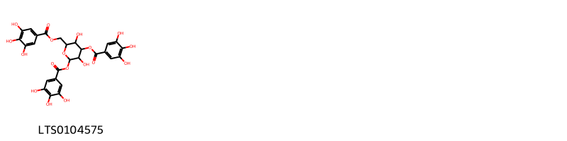{ width=100% }
    <figcaption>Hình ảnh cấu trúc hóa học của 1 hoạt chất thuộc nhóm Tannins gồm ['3,5-dihydroxy-4-(3,4,5-trihydroxybenzoyloxy)-6-[(3,4,5-trihydroxybenzoyloxy)methyl]oxan-2-yl 3,4,5-trihydroxybenzoate (LTS0104575)'].</figcaption>
</figure>

---

### Dược dân tộc học

Danh sách các quốc gia có sử dụng *Ceratonia siliqua* trong điều trị các bệnh. 

| Country   | Disease               | Bệnh                                                                                                                                                                                                |
|:----------|:----------------------|:----------------------------------------------------------------------------------------------------------------------------------------------------------------------------------------------------|
| Turkey    | Astringent, Purgative | MYMEMORY WARNING: YOU USED ALL AVAILABLE FREE TRANSLATIONS FOR TODAY. NEXT AVAILABLE IN  16 HOURS 50 MINUTES 03 SECONDS VISIT HTTPS://MYMEMORY.TRANSLATED.NET/DOC/USAGELIMITS.PHP TO TRANSLATE MORE |
| ain       | Laxative              | MYMEMORY WARNING: YOU USED ALL AVAILABLE FREE TRANSLATIONS FOR TODAY. NEXT AVAILABLE IN  16 HOURS 50 MINUTES 01 SECONDS VISIT HTTPS://MYMEMORY.TRANSLATED.NET/DOC/USAGELIMITS.PHP TO TRANSLATE MORE |

---

# Chi Centrosema

??? note "Danh sách các dược liệu thuộc chi"
    
	 - *Centrosema plumieri*
	 - *Centrosema virginianum*

---
## Centrosema plumieri
### Thông tin về thực vật

!!! info "Phân loại thực vật của *Centrosema plumieri* từ GIBF:"
    - **Kingdom:** Plantae
    - **Phylum:** Tracheophyta
    - **Order:** Fabales
    - **Family:** Fabaceae
    - **Genus:** Centrosema
    - **Species:** *Centrosema plumieri*

 

| Label (VI)   | Label (EN)   | Scientific Name     | Descriptions (VI)   | Descriptions (EN)   | Also Known As (VI)   | Also Known As (EN)   |
|:-------------|:-------------|:--------------------|:--------------------|:--------------------|:---------------------|:---------------------|
| N/A          | N/A          | Centrosema plumieri | loài thực vật       | species of plant    | ['']                 | ['']                 |

#### Phân bố trên thế giới

**Từ CSDL GIBF** Ghana, Australia, Guatemala, Benin, Nicaragua, Venezuela (Bolivarian Republic of), Panama, French Guiana, Puerto Rico, Chinese Taipei, Bolivia (Plurinational State of), Honduras, Jamaica, El Salvador, Belize, Barbados, Suriname, Sao Tome and Principe, Brazil, Cuba, Peru, Mexico, Dominican Republic, Ecuador, Haiti, Colombia, Costa Rica, Indonesia

#### Phân bố tại Việt Nam

**Từ CSDL GIBF**: Không có ghi nhận ở Việt Nam

---
### Thành phần hóa học
        
- Theo cơ sở dữ liệu lotus: Từ loài *Centrosema plumieri* đã phân lập và xác định được Chưa có hoạt chất nào được phân lập. hoạt chất thuộc về các nhóm Không có hoạt chất nào được phân lập. 

Không có hình ảnh nào được tạo ra

---

### Dược dân tộc học

Danh sách các quốc gia có sử dụng *Centrosema plumieri* trong điều trị các bệnh. 

| Country   | Disease   | Bệnh                                                                                                                                                                                                |
|:----------|:----------|:----------------------------------------------------------------------------------------------------------------------------------------------------------------------------------------------------|
| Colombia  | Piscicide | MYMEMORY WARNING: YOU USED ALL AVAILABLE FREE TRANSLATIONS FOR TODAY. NEXT AVAILABLE IN  16 HOURS 49 MINUTES 36 SECONDS VISIT HTTPS://MYMEMORY.TRANSLATED.NET/DOC/USAGELIMITS.PHP TO TRANSLATE MORE |
| Elsewhere | Piscicide | MYMEMORY WARNING: YOU USED ALL AVAILABLE FREE TRANSLATIONS FOR TODAY. NEXT AVAILABLE IN  16 HOURS 49 MINUTES 34 SECONDS VISIT HTTPS://MYMEMORY.TRANSLATED.NET/DOC/USAGELIMITS.PHP TO TRANSLATE MORE |

---

---
## Centrosema virginianum
### Thông tin về thực vật

!!! info "Phân loại thực vật của *Centrosema virginianum* từ GIBF:"
    - **Kingdom:** Plantae
    - **Phylum:** Tracheophyta
    - **Order:** Fabales
    - **Family:** Fabaceae
    - **Genus:** Centrosema
    - **Species:** *Centrosema virginianum*

 

| Label (VI)   | Label (EN)   | Scientific Name        | Descriptions (VI)   | Descriptions (EN)   | Also Known As (VI)   | Also Known As (EN)   |
|:-------------|:-------------|:-----------------------|:--------------------|:--------------------|:---------------------|:---------------------|
| N/A          | N/A          | Centrosema virginianum | loài thực vật       | species of plant    | ['']                 | ['']                 |

#### Phân bố trên thế giới

**Từ CSDL GIBF** Virgin Islands (U.S.), nan, Sri Lanka, Guadeloupe, Argentina, Saint Lucia, Virgin Islands (British), Puerto Rico, United States of America, Paraguay, Belize, Trinidad and Tobago, Martinique, Brazil, Bahamas, Mexico, Dominican Republic, Saint Kitts and Nevis, Haiti, Montserrat, Antigua and Barbuda, Sint Maarten (Dutch part)

#### Phân bố tại Việt Nam

**Từ CSDL GIBF**: Không có ghi nhận ở Việt Nam

---
### Thành phần hóa học
        
- Theo cơ sở dữ liệu lotus: Từ loài *Centrosema virginianum* đã phân lập và xác định được 1 hoạt chất thuộc về các nhóm Isoflavonoids. 

|    | chemicalTaxonomyClassyfireClass   |   smiles_count |
|---:|:----------------------------------|---------------:|
|  0 | Isoflavonoids                     |              1 |

#### Nhóm Isoflavonoids
<figure markdown="span">
    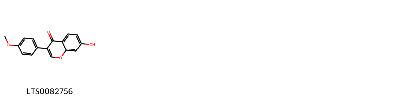{ width=100% }
    <figcaption>Hình ảnh cấu trúc hóa học của 1 hoạt chất thuộc nhóm Isoflavonoids gồm ['formononetin (LTS0082756)'].</figcaption>
</figure>

---

### Dược dân tộc học

Danh sách các quốc gia có sử dụng *Centrosema virginianum* trong điều trị các bệnh. 

| Country   | Disease                  | Bệnh                                                                                                                                                                                                |
|:----------|:-------------------------|:----------------------------------------------------------------------------------------------------------------------------------------------------------------------------------------------------|
| Haiti     | Aphrodisiac, Aphrodisiac | MYMEMORY WARNING: YOU USED ALL AVAILABLE FREE TRANSLATIONS FOR TODAY. NEXT AVAILABLE IN  16 HOURS 49 MINUTES 12 SECONDS VISIT HTTPS://MYMEMORY.TRANSLATED.NET/DOC/USAGELIMITS.PHP TO TRANSLATE MORE |

---

# Chi Inga

??? note "Danh sách các dược liệu thuộc chi"
    
	 - *Inga edulis*
	 - *Inga vera*

---
## Inga edulis
### Thông tin về thực vật

!!! info "Phân loại thực vật của *Inga edulis* từ GIBF:"
    - **Kingdom:** Plantae
    - **Phylum:** Tracheophyta
    - **Order:** Fabales
    - **Family:** Fabaceae
    - **Genus:** Inga
    - **Species:** *Inga edulis*

 

| Label (VI)   | Label (EN)   | Scientific Name   | Descriptions (VI)   | Descriptions (EN)   | Also Known As (VI)   | Also Known As (EN)   |
|:-------------|:-------------|:------------------|:--------------------|:--------------------|:---------------------|:---------------------|
| N/A          | N/A          | Inga edulis       | loài thực vật       | species of plant    | ['']                 | ['']                 |

#### Phân bố trên thế giới

**Từ CSDL GIBF** Belize, Ecuador, Trinidad and Tobago, Panama, Australia, Haiti, Colombia, Brazil, Bolivia (Plurinational State of), Costa Rica, Vanuatu, United States of America, Peru, Mexico, Dominican Republic, French Guiana

#### Phân bố tại Việt Nam

**Từ CSDL GIBF**: Không có ghi nhận ở Việt Nam

---
### Thành phần hóa học
        
- Theo cơ sở dữ liệu lotus: Từ loài *Inga edulis* đã phân lập và xác định được Chưa có hoạt chất nào được phân lập. hoạt chất thuộc về các nhóm Không có hoạt chất nào được phân lập. 

Không có hình ảnh nào được tạo ra

---

### Dược dân tộc học

Danh sách các quốc gia có sử dụng *Inga edulis* trong điều trị các bệnh. 

| Country      | Disease   | Bệnh                                                                                                                                                                                                |
|:-------------|:----------|:----------------------------------------------------------------------------------------------------------------------------------------------------------------------------------------------------|
| Panama(Cuna) | Nervine   | MYMEMORY WARNING: YOU USED ALL AVAILABLE FREE TRANSLATIONS FOR TODAY. NEXT AVAILABLE IN  16 HOURS 48 MINUTES 49 SECONDS VISIT HTTPS://MYMEMORY.TRANSLATED.NET/DOC/USAGELIMITS.PHP TO TRANSLATE MORE |

---

---
## Inga vera
### Thông tin về thực vật

!!! info "Phân loại thực vật của *Inga vera* từ GIBF:"
    - **Kingdom:** Plantae
    - **Phylum:** Tracheophyta
    - **Order:** Fabales
    - **Family:** Fabaceae
    - **Genus:** Inga
    - **Species:** *Inga vera*

 

| Label (VI)   | Label (EN)   | Scientific Name   | Descriptions (VI)   | Descriptions (EN)   | Also Known As (VI)   | Also Known As (EN)   |
|:-------------|:-------------|:------------------|:--------------------|:--------------------|:---------------------|:---------------------|
| N/A          | N/A          | Inga vera         | loài thực vật       | species of plant    | ['']                 | ['']                 |

#### Phân bố trên thế giới

**Từ CSDL GIBF** Belize, Puerto Rico, Haiti, Colombia, Brazil, Guatemala, Bolivia (Plurinational State of), Costa Rica, Honduras, Jamaica, Mexico, Dominican Republic, El Salvador, Panama

#### Phân bố tại Việt Nam

**Từ CSDL GIBF**: Không có ghi nhận ở Việt Nam

---
### Thành phần hóa học
        
- Theo cơ sở dữ liệu lotus: Từ loài *Inga vera* đã phân lập và xác định được Chưa có hoạt chất nào được phân lập. hoạt chất thuộc về các nhóm Không có hoạt chất nào được phân lập. 

Không có hình ảnh nào được tạo ra

---

### Dược dân tộc học

Danh sách các quốc gia có sử dụng *Inga vera* trong điều trị các bệnh. 

| Country            | Disease            | Bệnh                                                                                                                                                                                                |
|:-------------------|:-------------------|:----------------------------------------------------------------------------------------------------------------------------------------------------------------------------------------------------|
| Dominican Republic | Astringent         | MYMEMORY WARNING: YOU USED ALL AVAILABLE FREE TRANSLATIONS FOR TODAY. NEXT AVAILABLE IN  16 HOURS 48 MINUTES 27 SECONDS VISIT HTTPS://MYMEMORY.TRANSLATED.NET/DOC/USAGELIMITS.PHP TO TRANSLATE MORE |
| Haiti              | Diuretic, Diuretic | MYMEMORY WARNING: YOU USED ALL AVAILABLE FREE TRANSLATIONS FOR TODAY. NEXT AVAILABLE IN  16 HOURS 48 MINUTES 24 SECONDS VISIT HTTPS://MYMEMORY.TRANSLATED.NET/DOC/USAGELIMITS.PHP TO TRANSLATE MORE |

---

# Chi Wisteria

??? note "Danh sách các dược liệu thuộc chi"
    
	 - *Wisteria floribunda*
	 - *Wisteria sinensis*

---
## Wisteria floribunda
### Thông tin về thực vật

!!! info "Phân loại thực vật của *Wisteria floribunda* từ GIBF:"
    - **Kingdom:** Plantae
    - **Phylum:** Tracheophyta
    - **Order:** Fabales
    - **Family:** Fabaceae
    - **Genus:** Wisteria
    - **Species:** *Wisteria floribunda*

 

| Label (VI)   | Label (EN)   | Scientific Name     | Descriptions (VI)   | Descriptions (EN)   | Also Known As (VI)   | Also Known As (EN)            |
|:-------------|:-------------|:--------------------|:--------------------|:--------------------|:---------------------|:------------------------------|
| N/A          | N/A          | Wisteria floribunda | loài thực vật       | species of plant    | ['']                 | ['fuji', 'Japanese wisteria'] |

#### Phân bố trên thế giới

**Từ CSDL GIBF** South Africa, Australia, Japan, Germany, United Kingdom of Great Britain and Northern Ireland, Korea, Republic of, Spain, Poland, Serbia, Portugal, Switzerland, United States of America, Austria, France, New Zealand, Canada

#### Phân bố tại Việt Nam

**Từ CSDL GIBF**: Không có ghi nhận ở Việt Nam

---
### Thành phần hóa học
        
- Theo cơ sở dữ liệu lotus: Từ loài *Wisteria floribunda* đã phân lập và xác định được 48 hoạt chất thuộc về các nhóm Flavonoids, Prenol lipids, Steroids and steroid derivatives, Organonitrogen compounds, Benzene and substituted derivatives, Furanoid lignans. 

|    | chemicalTaxonomyClassyfireClass     |   smiles_count |
|---:|:------------------------------------|---------------:|
|  0 | Benzene and substituted derivatives |              1 |
|  1 | Flavonoids                          |             25 |
|  2 | Furanoid lignans                    |              4 |
|  3 | Organonitrogen compounds            |              1 |
|  4 | Prenol lipids                       |             12 |
|  5 | Steroids and steroid derivatives    |              5 |

#### Nhóm Benzene and substituted derivatives
<figure markdown="span">
    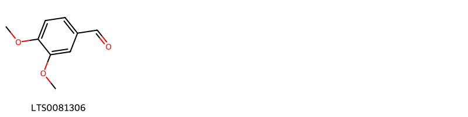{ width=100% }
    <figcaption>Hình ảnh cấu trúc hóa học của 1 hoạt chất thuộc nhóm Benzene and substituted derivatives gồm ['veratraldehyde (LTS0081306)'].</figcaption>
</figure>
#### Nhóm Flavonoids
<figure markdown="span">
    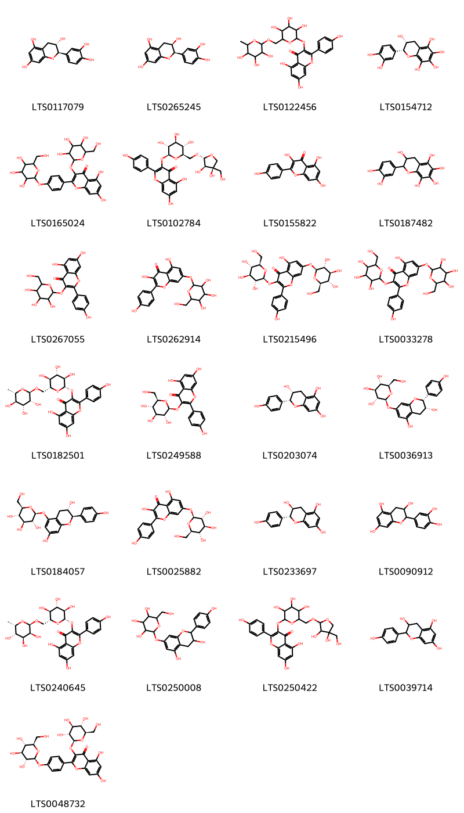{ width=100% }
    <figcaption>Hình ảnh cấu trúc hóa học của 25 hoạt chất thuộc nhóm Flavonoids gồm ['(+)-catechol (LTS0117079)', 'ent-epicatechin (LTS0265245)', '5,7-dihydroxy-2-(4-hydroxyphenyl)-3-[(3,4,5-trihydroxy-6-{[(3,4,5-trihydroxy-6-methyloxan-2-yl)oxy]methyl}oxan-2-yl)oxy]chromen-4-one (LTS0122456)', '(2r,3r)-2-(3,4-dihydroxyphenyl)-3,4-dihydro-2h-1-benzopyran-3,5,6,7,8-pentol (LTS0154712)', '5,7-dihydroxy-3-{[3,4,5-trihydroxy-6-(hydroxymethyl)oxan-2-yl]oxy}-2-(4-{[3,4,5-trihydroxy-6-(hydroxymethyl)oxan-2-yl]oxy}phenyl)chromen-4-one (LTS0165024)', '3-{[(2s,3r,4s,5s,6r)-6-({[(2r,3r,4r)-3,4-dihydroxy-4-(hydroxymethyl)oxolan-2-yl]oxy}methyl)-3,4,5-trihydroxyoxan-2-yl]oxy}-5,7-dihydroxy-2-(4-hydroxyphenyl)chromen-4-one (LTS0102784)', 'kaempherol (LTS0155822)', '2-(3,4-dihydroxyphenyl)-3,4-dihydro-2h-1-benzopyran-3,5,6,7,8-pentol (LTS0187482)', 'trifolin (LTS0267055)', '3,5-dihydroxy-2-(4-hydroxyphenyl)-7-{[3,4,5-trihydroxy-6-(hydroxymethyl)oxan-2-yl]oxy}chromen-4-one (LTS0262914)', '5-hydroxy-2-(4-hydroxyphenyl)-3,7-bis({[(2s,3r,4s,5s,6r)-3,4,5-trihydroxy-6-(hydroxymethyl)oxan-2-yl]oxy})chromen-4-one (LTS0215496)', '5-hydroxy-2-(4-hydroxyphenyl)-3,7-bis({[3,4,5-trihydroxy-6-(hydroxymethyl)oxan-2-yl]oxy})chromen-4-one (LTS0033278)', 'nictoflorin (LTS0182501)', 'astragalin (LTS0249588)', 'epiafzelechin (LTS0203074)', '(2s,3r,4s,5s,6r)-2-{[(2r,3r)-3,5-dihydroxy-2-(4-hydroxyphenyl)-3,4-dihydro-2h-1-benzopyran-7-yl]oxy}-6-(hydroxymethyl)oxane-3,4,5-triol (LTS0036913)', '(2s,3r,4s,5s,6r)-2-{[(2r,3s)-3,7-dihydroxy-2-(4-hydroxyphenyl)-3,4-dihydro-2h-1-benzopyran-5-yl]oxy}-6-(hydroxymethyl)oxane-3,4,5-triol (LTS0184057)', 'kaempferol 7-o-glucoside (LTS0025882)', 'afzelechin (LTS0233697)', 'catechol (LTS0090912)', '5,7-dihydroxy-2-(4-hydroxyphenyl)-3-{[(2s,3r,4s,5s,6r)-3,4,5-trihydroxy-6-({[(2r,3s,4s,5s,6s)-3,4,5-trihydroxy-6-methyloxan-2-yl]oxy}methyl)oxan-2-yl]oxy}chromen-4-one (LTS0240645)', '2-{[3,5-dihydroxy-2-(4-hydroxyphenyl)-3,4-dihydro-2h-1-benzopyran-7-yl]oxy}-6-(hydroxymethyl)oxane-3,4,5-triol (LTS0250008)', '3-{[6-({[3,4-dihydroxy-4-(hydroxymethyl)oxolan-2-yl]oxy}methyl)-3,4,5-trihydroxyoxan-2-yl]oxy}-5,7-dihydroxy-2-(4-hydroxyphenyl)chromen-4-one (LTS0250422)', "3,5,7,4'-tetrahydroxyflavan (LTS0039714)", '5,7-dihydroxy-3-{[(2s,3r,4s,5s,6r)-3,4,5-trihydroxy-6-(hydroxymethyl)oxan-2-yl]oxy}-2-(4-{[(2s,3r,4s,5s,6r)-3,4,5-trihydroxy-6-(hydroxymethyl)oxan-2-yl]oxy}phenyl)chromen-4-one (LTS0048732)'].</figcaption>
</figure>
#### Nhóm Furanoid lignans
<figure markdown="span">
    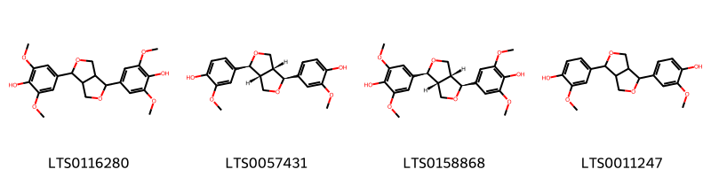{ width=100% }
    <figcaption>Hình ảnh cấu trúc hóa học của 4 hoạt chất thuộc nhóm Furanoid lignans gồm ['syringaresinol (LTS0116280)', 'pinoresinol (LTS0057431)', '(+)-syringaresinol (LTS0158868)', 'pinoresinol (LTS0011247)'].</figcaption>
</figure>
#### Nhóm Organonitrogen compounds
<figure markdown="span">
    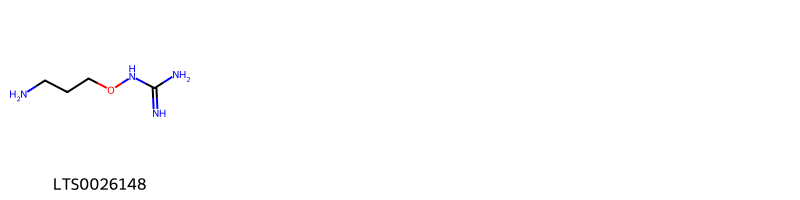{ width=100% }
    <figcaption>Hình ảnh cấu trúc hóa học của 1 hoạt chất thuộc nhóm Organonitrogen compounds gồm ['n-(3-aminopropoxy)guanidine (LTS0026148)'].</figcaption>
</figure>
#### Nhóm Prenol lipids
<figure markdown="span">
    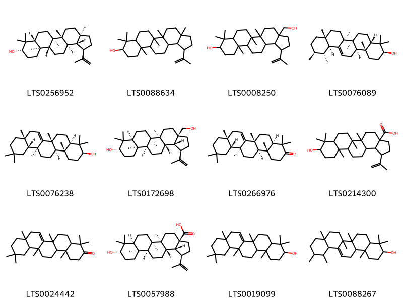{ width=100% }
    <figcaption>Hình ảnh cấu trúc hóa học của 12 hoạt chất thuộc nhóm Prenol lipids gồm ['lupeol (LTS0256952)', 'lupeol (LTS0088634)', '3a-(hydroxymethyl)-5a,5b,8,8,11a-pentamethyl-1-(prop-1-en-2-yl)-hexadecahydrocyclopenta[a]chrysen-9-ol (LTS0008250)', '(3s,4as,6as,6bs,8ar,11s,12r,12as,14ar,14br)-4,4,6a,6b,8a,11,12,14b-octamethyl-2,3,4a,5,6,7,8,9,10,11,12,12a,14,14a-tetradecahydro-1h-picen-3-ol (LTS0076089)', 'alnulin (LTS0076238)', '(1r,3ar,5as,5br,7as,9s,11ar,11bs,13as,13br)-3a-(hydroxymethyl)-5a,5b,8,8,11a-pentamethyl-1-(prop-1-en-2-yl)-hexadecahydrocyclopenta[a]chrysen-9-ol (LTS0172698)', 'taraxerone (LTS0266976)', '9-hydroxy-5a,5b,8,8,11a-pentamethyl-1-(prop-1-en-2-yl)-hexadecahydrocyclopenta[a]chrysene-3a-carboxylic acid (LTS0214300)', '4,4,6a,8a,11,11,12b,14b-octamethyl-2,4a,5,6,8,9,10,12,12a,13,14,14a-dodecahydro-1h-picen-3-one (LTS0024442)', '(1r,3ar,5as,5br,7as,9s,11ar,11bs,13as,13br)-9-hydroxy-5a,5b,8,8,11a-pentamethyl-1-(prop-1-en-2-yl)-hexadecahydrocyclopenta[a]chrysene-3a-carboxylic acid (LTS0057988)', 'taraxerol (LTS0019099)', 'α-amyrin (LTS0088267)'].</figcaption>
</figure>
#### Nhóm Steroids and steroid derivatives
<figure markdown="span">
    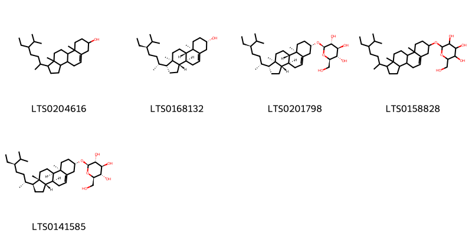{ width=100% }
    <figcaption>Hình ảnh cấu trúc hóa học của 5 hoạt chất thuộc nhóm Steroids and steroid derivatives gồm ['stigmast-5-en-3-ol, (3β)- (LTS0204616)', 'sitosterol (LTS0168132)', 'sitogluside (LTS0201798)', '2-{[1-(5-ethyl-6-methylheptan-2-yl)-9a,11a-dimethyl-1h,2h,3h,3ah,3bh,4h,6h,7h,8h,9h,9bh,10h,11h-cyclopenta[a]phenanthren-7-yl]oxy}-6-(hydroxymethyl)oxane-3,4,5-triol (LTS0158828)', '(2r,3r,4s,5s,6r)-2-{[(1s,3as,3bs,7s,9ar,9br,11as)-1-[(2r,5r)-5-ethyl-6-methylheptan-2-yl]-9a,11a-dimethyl-1h,2h,3h,3ah,3bh,4h,6h,7h,8h,9h,9bh,10h,11h-cyclopenta[a]phenanthren-7-yl]oxy}-6-(hydroxymethyl)oxane-3,4,5-triol (LTS0141585)'].</figcaption>
</figure>

---

### Dược dân tộc học

Danh sách các quốc gia có sử dụng *Wisteria floribunda* trong điều trị các bệnh. 

| Country   | Disease   | Bệnh                                                                                                                                                                                                |
|:----------|:----------|:----------------------------------------------------------------------------------------------------------------------------------------------------------------------------------------------------|
| US        | Poison    | MYMEMORY WARNING: YOU USED ALL AVAILABLE FREE TRANSLATIONS FOR TODAY. NEXT AVAILABLE IN  16 HOURS 48 MINUTES 02 SECONDS VISIT HTTPS://MYMEMORY.TRANSLATED.NET/DOC/USAGELIMITS.PHP TO TRANSLATE MORE |

---

---
## Wisteria sinensis
### Thông tin về thực vật

!!! info "Phân loại thực vật của *Wisteria sinensis* từ GIBF:"
    - **Kingdom:** Plantae
    - **Phylum:** Tracheophyta
    - **Order:** Fabales
    - **Family:** Fabaceae
    - **Genus:** Wisteria
    - **Species:** *Wisteria sinensis*

 

| Label (VI)   | Label (EN)   | Scientific Name   | Descriptions (VI)   | Descriptions (EN)   | Also Known As (VI)   | Also Known As (EN)   |
|:-------------|:-------------|:------------------|:--------------------|:--------------------|:---------------------|:---------------------|
| N/A          | N/A          | Wisteria sinensis |                     | species of plant    | ['']                 | ['Chinese wisteria'] |

#### Phân bố trên thế giới

**Từ CSDL GIBF** nan, Italy, Australia, Belgium, Argentina, Canada, Ukraine, Spain, Portugal, Algeria, Russian Federation, United States of America, Sweden, Uruguay, Slovenia, Croatia, Greece, South Africa, Hong Kong, Czechia, Switzerland, Austria, France, United Kingdom of Great Britain and Northern Ireland, China, Ireland, New Zealand

#### Phân bố tại Việt Nam

**Từ CSDL GIBF**: Không có ghi nhận ở Việt Nam

---
### Thành phần hóa học
        
- Theo cơ sở dữ liệu lotus: Từ loài *Wisteria sinensis* đã phân lập và xác định được 2 hoạt chất thuộc về các nhóm Benzopyrans. 

|    | chemicalTaxonomyClassyfireClass   |   smiles_count |
|---:|:----------------------------------|---------------:|
|  0 | Benzopyrans                       |              2 |

#### Nhóm Benzopyrans
<figure markdown="span">
    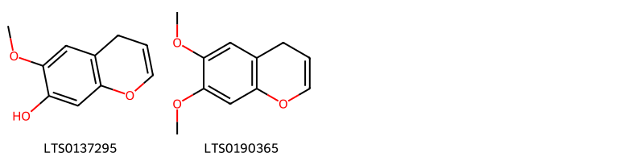{ width=100% }
    <figcaption>Hình ảnh cấu trúc hóa học của 2 hoạt chất thuộc nhóm Benzopyrans gồm ['6-methoxy-4h-chromen-7-ol (LTS0137295)', '6,7-dimethoxy-4h-chromene (LTS0190365)'].</figcaption>
</figure>

---

### Dược dân tộc học

Danh sách các quốc gia có sử dụng *Wisteria sinensis* trong điều trị các bệnh. 

| Country   | Disease          | Bệnh                                                                                                                                                                                                |
|:----------|:-----------------|:----------------------------------------------------------------------------------------------------------------------------------------------------------------------------------------------------|
| Elsewhere | Diuretic, Poison | MYMEMORY WARNING: YOU USED ALL AVAILABLE FREE TRANSLATIONS FOR TODAY. NEXT AVAILABLE IN  16 HOURS 47 MINUTES 24 SECONDS VISIT HTTPS://MYMEMORY.TRANSLATED.NET/DOC/USAGELIMITS.PHP TO TRANSLATE MORE |
| US        | Poison           | MYMEMORY WARNING: YOU USED ALL AVAILABLE FREE TRANSLATIONS FOR TODAY. NEXT AVAILABLE IN  16 HOURS 47 MINUTES 21 SECONDS VISIT HTTPS://MYMEMORY.TRANSLATED.NET/DOC/USAGELIMITS.PHP TO TRANSLATE MORE |

---

# Chi Abrus

??? note "Danh sách các dược liệu thuộc chi"
    
	 - *Abrus laevigatus*
	 - *Abrus precatorius*
	 - *Abrus prectorius*

---
## Abrus laevigatus
### Thông tin về thực vật

!!! info "Phân loại thực vật của *Abrus laevigatus* từ GIBF:"
    - **Kingdom:** Plantae
    - **Phylum:** Tracheophyta
    - **Order:** Fabales
    - **Family:** Fabaceae
    - **Genus:** Abrus
    - **Species:** *Abrus laevigatus*

 

| Label (VI)   | Label (EN)   | Scientific Name   | Descriptions (VI)   | Descriptions (EN)   | Also Known As (VI)   | Also Known As (EN)   |
|:-------------|:-------------|:------------------|:--------------------|:--------------------|:---------------------|:---------------------|
| N/A          | N/A          | Abrus laevigatus  |                     | species of plant    | ['']                 | ['']                 |

#### Phân bố trên thế giới

**Từ CSDL GIBF** nan, South Africa, Sri Lanka, Indonesia, Philippines, Eswatini

#### Phân bố tại Việt Nam

**Từ CSDL GIBF**: Không có ghi nhận ở Việt Nam

---
### Thành phần hóa học
        
- Theo cơ sở dữ liệu lotus: Từ loài *Abrus laevigatus* đã phân lập và xác định được Chưa có hoạt chất nào được phân lập. hoạt chất thuộc về các nhóm Không có hoạt chất nào được phân lập. 

Không có hình ảnh nào được tạo ra

---

### Dược dân tộc học

Danh sách các quốc gia có sử dụng *Abrus laevigatus* trong điều trị các bệnh. 

| Country   | Disease       | Bệnh                                                                                                                                                                                                |
|:----------|:--------------|:----------------------------------------------------------------------------------------------------------------------------------------------------------------------------------------------------|
| Elsewhere | Abortifacient | MYMEMORY WARNING: YOU USED ALL AVAILABLE FREE TRANSLATIONS FOR TODAY. NEXT AVAILABLE IN  16 HOURS 46 MINUTES 58 SECONDS VISIT HTTPS://MYMEMORY.TRANSLATED.NET/DOC/USAGELIMITS.PHP TO TRANSLATE MORE |

---

---
## Abrus precatorius
### Thông tin về thực vật

!!! info "Phân loại thực vật của *Abrus precatorius* từ GIBF:"
    - **Kingdom:** Plantae
    - **Phylum:** Tracheophyta
    - **Order:** Fabales
    - **Family:** Fabaceae
    - **Genus:** Abrus
    - **Species:** *Abrus precatorius*

 

| Label (VI)   | Label (EN)   | Scientific Name   | Descriptions (VI)   | Descriptions (EN)   | Also Known As (VI)                                                                                                        | Also Known As (EN)                                                                    |
|:-------------|:-------------|:------------------|:--------------------|:--------------------|:--------------------------------------------------------------------------------------------------------------------------|:--------------------------------------------------------------------------------------|
| N/A          | N/A          | Abrus precatorius | loài thực vật       | species of plant    | ['Tương tư thảo', 'Tương tư đằng', 'Hương tư tử', 'Cườm thảo đỏ', 'Cườm cườm', 'Chi chi', 'Cảm sảo', 'Abrus precatorius'] | ["crab's eye", "crab's eye vine", 'precatory pea or bean', 'rosary pea', 'rosarypea'] |

#### Phân bố trên thế giới

**Từ CSDL GIBF** Virgin Islands (U.S.), nan, Australia, Guadeloupe, Benin, Virgin Islands (British), French Guiana, Zambia, Puerto Rico, Namibia, Chinese Taipei, United States of America, South Africa, Trinidad and Tobago, Hong Kong, Thailand, Turks and Caicos Islands, Brazil, Bahamas, Guam, New Caledonia, Cuba, Mexico, Mayotte, Dominican Republic, Singapore, China, Curaçao, Ecuador, Cabo Verde, Montserrat, Botswana, India, Cayman Islands, Antigua and Barbuda, Philippines, Northern Mariana Islands

#### Phân bố tại Việt Nam

**Từ CSDL GIBF**: Không có ghi nhận ở Việt Nam

---
### Thành phần hóa học
        
- Theo cơ sở dữ liệu lotus: Từ loài *Abrus precatorius* đã phân lập và xác định được 99 hoạt chất thuộc về các nhóm Fatty Acyls, Flavonoids, Prenol lipids, Steroids and steroid derivatives, Isoflavonoids, Organonitrogen compounds, Organooxygen compounds, Carboxylic acids and derivatives. 

|    | chemicalTaxonomyClassyfireClass   |   smiles_count |
|---:|:----------------------------------|---------------:|
|  0 |                                   |              1 |
|  1 | Carboxylic acids and derivatives  |              5 |
|  2 | Fatty Acyls                       |              8 |
|  3 | Flavonoids                        |             24 |
|  4 | Isoflavonoids                     |             11 |
|  5 | Organonitrogen compounds          |              1 |
|  6 | Organooxygen compounds            |              1 |
|  7 | Prenol lipids                     |             40 |
|  8 | Steroids and steroid derivatives  |              7 |

#### Nhóm 
<figure markdown="span">
    { width=100% }
    <figcaption>Hình ảnh cấu trúc hóa học của 1 hoạt chất thuộc nhóm  gồm ['trigonelline (LTS0040106)'].</figcaption>
</figure>
#### Nhóm Carboxylic acids and derivatives
<figure markdown="span">
    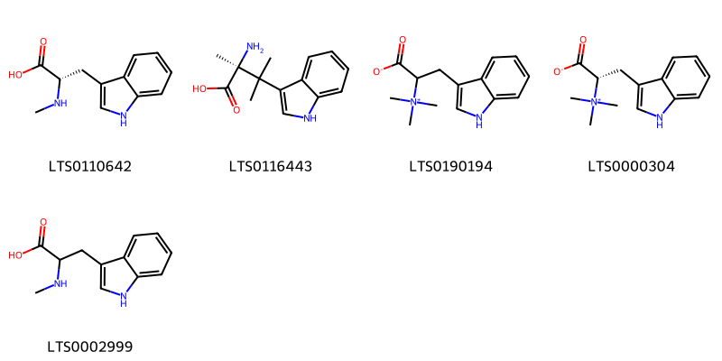{ width=100% }
    <figcaption>Hình ảnh cấu trúc hóa học của 5 hoạt chất thuộc nhóm Carboxylic acids and derivatives gồm ['abrine (LTS0110642)', '(2s)-2-amino-3-(1h-indol-3-yl)-2,3-dimethylbutanoic acid (LTS0116443)', '3-(1h-indol-3-yl)-2-(trimethylammonio)propanoate (LTS0190194)', 'hypaphorine (LTS0000304)', '3-(1h-indol-3-yl)-2-(methylamino)propanoic acid (LTS0002999)'].</figcaption>
</figure>
#### Nhóm Fatty Acyls
<figure markdown="span">
    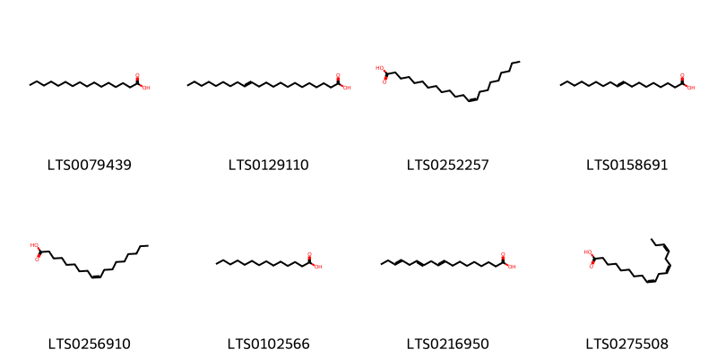{ width=100% }
    <figcaption>Hình ảnh cấu trúc hóa học của 8 hoạt chất thuộc nhóm Fatty Acyls gồm ['palmitic acid (LTS0079439)', '13-docosenoic acid (LTS0129110)', 'erucic acid (LTS0252257)', '9 octadecenoic acid (LTS0158691)', 'oleic acid (LTS0256910)', 'myristic acid (LTS0102566)', 'octadeca-9,12,15-trienoic acid (LTS0216950)', 'α-linolenic acid (LTS0275508)'].</figcaption>
</figure>
#### Nhóm Flavonoids
<figure markdown="span">
    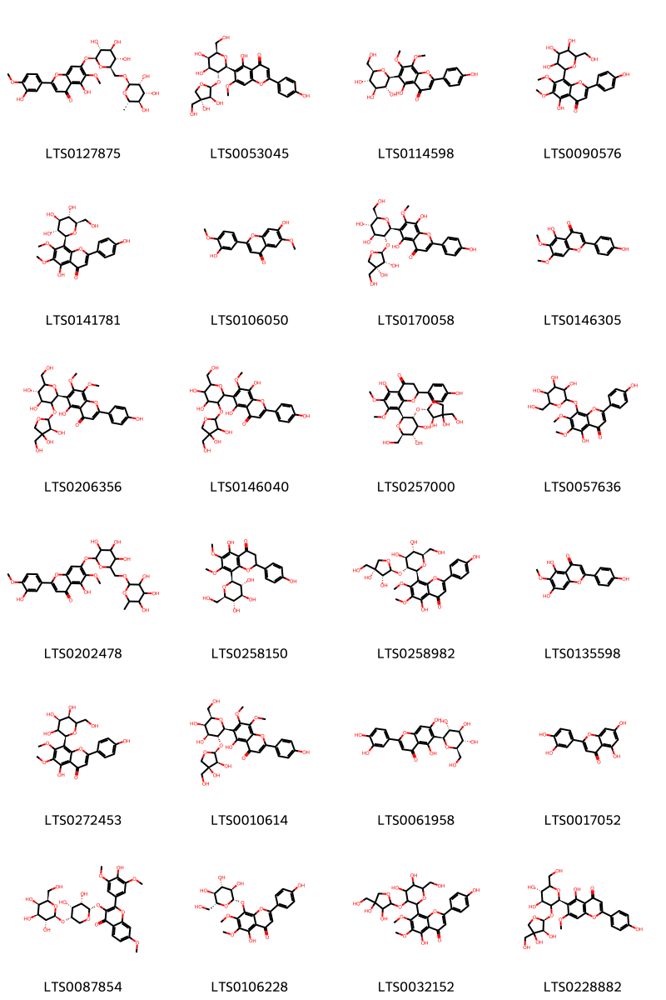{ width=100% }
    <figcaption>Hình ảnh cấu trúc hóa học của 24 hoạt chất thuộc nhóm Flavonoids gồm ['5-hydroxy-2-(3-hydroxy-4-methoxyphenyl)-6-methoxy-7-{[(2s,3r,4s,5s,6r)-3,4,5-trihydroxy-6-({[(2r,3r,4r,5r,6s)-3,4,5-trihydroxy-6-methyloxan-2-yl]oxy}methyl)oxan-2-yl]oxy}chromen-4-one (LTS0127875)', '6-[(2s,3r,4s,5r,6r)-3-{[(2s,3s,4r)-3,4-dihydroxy-4-(hydroxymethyl)oxolan-2-yl]oxy}-4,5-dihydroxy-6-(hydroxymethyl)oxan-2-yl]-5-hydroxy-2-(4-hydroxyphenyl)-7-methoxychromen-4-one (LTS0053045)', '5-hydroxy-2-(4-hydroxyphenyl)-7,8-dimethoxy-6-[(2s,3r,4r,5s,6r)-3,4,5-trihydroxy-6-(hydroxymethyl)oxan-2-yl]chromen-4-one (LTS0114598)', '5-hydroxy-2-(4-hydroxyphenyl)-6,7-dimethoxy-8-[3,4,5-trihydroxy-6-(hydroxymethyl)oxan-2-yl]chromen-4-one (LTS0090576)', '5-hydroxy-2-(4-hydroxyphenyl)-6,7-dimethoxy-8-[(2s,3r,4r,5s,6r)-3,4,5-trihydroxy-6-(hydroxymethyl)oxan-2-yl]chromen-4-one (LTS0141781)', 'abrectorin (LTS0106050)', '6-[(2s,3r,4s,5s,6r)-3-{[(2s,3r,4r)-3,4-dihydroxy-4-(hydroxymethyl)oxolan-2-yl]oxy}-4,5-dihydroxy-6-(hydroxymethyl)oxan-2-yl]-5,8-dihydroxy-2-(4-hydroxyphenyl)-7-methoxychromen-4-one (LTS0170058)', 'cirsimaritin (LTS0146305)', 'precatorin ii (LTS0206356)', '6-(3-{[3,4-dihydroxy-4-(hydroxymethyl)oxolan-2-yl]oxy}-4,5-dihydroxy-6-(hydroxymethyl)oxan-2-yl)-5,8-dihydroxy-2-(4-hydroxyphenyl)-7-methoxychromen-4-one (LTS0146040)', '8-[(2s,3r,4s,5s,6r)-3-{[(2s,3r)-3,4-dihydroxy-4-(hydroxymethyl)oxolan-2-yl]oxy}-4,5-dihydroxy-6-(hydroxymethyl)oxan-2-yl]-5-hydroxy-2-(4-hydroxyphenyl)-6,7-dimethoxy-2,3-dihydro-1-benzopyran-4-one (LTS0257000)', '5-hydroxy-2-(4-hydroxyphenyl)-6,7-dimethoxy-8-{[3,4,5-trihydroxy-6-(hydroxymethyl)oxan-2-yl]oxy}chromen-4-one (LTS0057636)', '5-hydroxy-2-(3-hydroxy-4-methoxyphenyl)-6-methoxy-7-[(3,4,5-trihydroxy-6-{[(3,4,5-trihydroxy-6-methyloxan-2-yl)oxy]methyl}oxan-2-yl)oxy]chromen-4-one (LTS0202478)', '5-hydroxy-2-(4-hydroxyphenyl)-6,7-dimethoxy-8-[(2s,3r,4r,5s,6r)-3,4,5-trihydroxy-6-(hydroxymethyl)oxan-2-yl]-2,3-dihydro-1-benzopyran-4-one (LTS0258150)', '8-[(2s,3r,4s,5s,6r)-3-{[(2s,3r,4r)-3,4-dihydroxy-4-(hydroxymethyl)oxolan-2-yl]oxy}-4,5-dihydroxy-6-(hydroxymethyl)oxan-2-yl]-5-hydroxy-2-(4-hydroxyphenyl)-6,7-dimethoxychromen-4-one (LTS0258982)', 'hispidulin (LTS0135598)', 'abrusin (LTS0272453)', '6-[(2s,3r,4s,5r,6r)-3-{[(2s,3s,4s)-3,4-dihydroxy-4-(hydroxymethyl)oxolan-2-yl]oxy}-4,5-dihydroxy-6-(hydroxymethyl)oxan-2-yl]-5-hydroxy-2-(4-hydroxyphenyl)-7,8-dimethoxychromen-4-one (LTS0010614)', 'isoorientin (LTS0061958)', 'luteolin (LTS0017052)', '3-{[(2s,3s,4r,5s)-3,4-dihydroxy-5-{[(2s,3r,4s,5r,6r)-3,4,5-trihydroxy-6-(hydroxymethyl)oxan-2-yl]oxy}oxan-2-yl]oxy}-2-(4-hydroxy-3,5-dimethoxyphenyl)-7-methoxychromen-4-one (LTS0087854)', '5-hydroxy-2-(4-hydroxyphenyl)-6,7-dimethoxy-8-{[(2s,3r,4s,5s,6r)-3,4,5-trihydroxy-6-(hydroxymethyl)oxan-2-yl]oxy}chromen-4-one (LTS0106228)', "abrusin 2''-o-β-apiofuranoside (LTS0032152)", 'precatorin iii (LTS0228882)'].</figcaption>
</figure>
#### Nhóm Isoflavonoids
<figure markdown="span">
    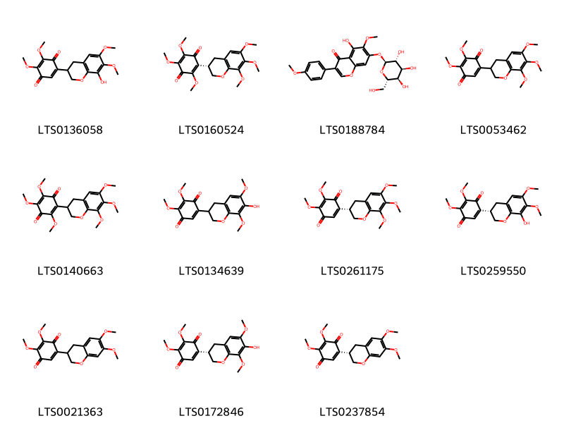{ width=100% }
    <figcaption>Hình ảnh cấu trúc hóa học của 11 hoạt chất thuộc nhóm Isoflavonoids gồm ['5-(8-hydroxy-6,7-dimethoxy-3,4-dihydro-2h-1-benzopyran-3-yl)-2,3-dimethoxycyclohexa-2,5-diene-1,4-dione (LTS0136058)', '2,3,5-trimethoxy-6-[(3s)-6,7,8-trimethoxy-3,4-dihydro-2h-1-benzopyran-3-yl]cyclohexa-2,5-diene-1,4-dione (LTS0160524)', '5-hydroxy-6-methoxy-3-(4-methoxyphenyl)-7-{[(2s,3r,4s,5r,6s)-3,4,5-trihydroxy-6-(hydroxymethyl)oxan-2-yl]oxy}chromen-4-one (LTS0188784)', 'abruquinone b (LTS0053462)', '2,3,5-trimethoxy-6-(6,7,8-trimethoxy-3,4-dihydro-2h-1-benzopyran-3-yl)cyclohexa-2,5-diene-1,4-dione (LTS0140663)', '5-(7-hydroxy-6,8-dimethoxy-3,4-dihydro-2h-1-benzopyran-3-yl)-2,3-dimethoxycyclohexa-2,5-diene-1,4-dione (LTS0134639)', '2,3-dimethoxy-5-[(3s)-6,7,8-trimethoxy-3,4-dihydro-2h-1-benzopyran-3-yl]cyclohexa-2,5-diene-1,4-dione (LTS0261175)', '5-[(3s)-8-hydroxy-6,7-dimethoxy-3,4-dihydro-2h-1-benzopyran-3-yl]-2,3-dimethoxycyclohexa-2,5-diene-1,4-dione (LTS0259550)', 'abruquinone a (LTS0021363)', '5-[(3s)-7-hydroxy-6,8-dimethoxy-3,4-dihydro-2h-1-benzopyran-3-yl]-2,3-dimethoxycyclohexa-2,5-diene-1,4-dione (LTS0172846)', '5-[(3s)-6,7-dimethoxy-3,4-dihydro-2h-1-benzopyran-3-yl]-2,3-dimethoxycyclohexa-2,5-diene-1,4-dione (LTS0237854)'].</figcaption>
</figure>
#### Nhóm Organonitrogen compounds
<figure markdown="span">
    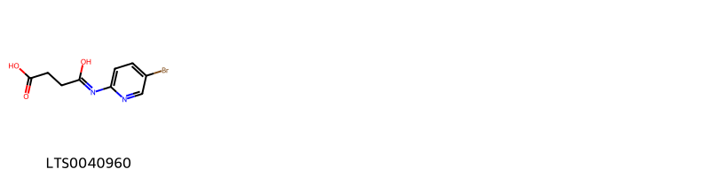{ width=100% }
    <figcaption>Hình ảnh cấu trúc hóa học của 1 hoạt chất thuộc nhóm Organonitrogen compounds gồm ['3-[(5-bromopyridin-2-yl)-c-hydroxycarbonimidoyl]propanoic acid (LTS0040960)'].</figcaption>
</figure>
#### Nhóm Organooxygen compounds
<figure markdown="span">
    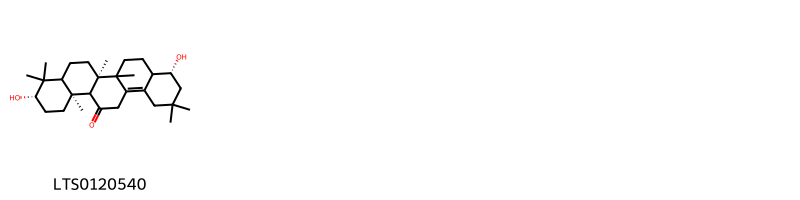{ width=100% }
    <figcaption>Hình ảnh cấu trúc hóa học của 1 hoạt chất thuộc nhóm Organooxygen compounds gồm ['(4r,6br,10s,12as)-4,10-dihydroxy-2,2,6a,6b,9,9,12a-heptamethyl-1,3,4,4a,5,6,7,8,8a,10,11,12,12b,14-tetradecahydropicen-13-one (LTS0120540)'].</figcaption>
</figure>
#### Nhóm Prenol lipids
<figure markdown="span">
    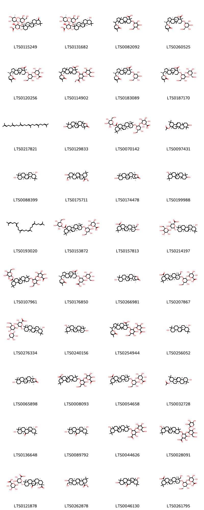{ width=100% }
    <figcaption>Hình ảnh cấu trúc hóa học của 40 hoạt chất thuộc nhóm Prenol lipids gồm ['(2s,3s,4s,5r,6r)-6-{[(3s,4ar,6ar,6bs,8ar,12as,14ar,14br)-4,4,6a,6b,8a,11,11,14b-octamethyl-9-oxo-2,3,4a,5,6,7,8,10,12,12a,14,14a-dodecahydro-1h-picen-3-yl]oxy}-5-{[(2s,3r,4s,5r,6r)-4,5-dihydroxy-6-(hydroxymethyl)-3-{[(2s,3r,4r,5r,6s)-3,4,5-trihydroxy-6-methyloxan-2-yl]oxy}oxan-2-yl]oxy}-3,4-dihydroxyoxane-2-carboxylic acid (LTS0115249)', '(2s,3s,4s,5r,6r)-6-{[(3s,4ar,6ar,6bs,8ar,9r,12as,14ar,14br)-9-hydroxy-4,4,6a,6b,8a,11,11,14b-octamethyl-1,2,3,4a,5,6,7,8,9,10,12,12a,14,14a-tetradecahydropicen-3-yl]oxy}-5-{[(2s,3r,4s,5r,6r)-4,5-dihydroxy-6-(hydroxymethyl)-3-{[(2s,3r,4r,5r,6s)-3,4,5-trihydroxy-6-methyloxan-2-yl]oxy}oxan-2-yl]oxy}-3,4-dihydroxyoxane-2-carboxylic acid (LTS0131682)', '7,12,16-trimethyl-15-[1-(5-methyl-6-oxo-2,3-dihydropyran-2-yl)ethyl]-6-{[3,4,5-trihydroxy-6-(hydroxymethyl)oxan-2-yl]oxy}pentacyclo[9.7.0.0¹,³.0³,⁸.0¹²,¹⁶]octadecane-7-carboxylic acid (LTS0082092)', '(1s,3r,6s,7s,8r,11s,12s,16r)-7,12,16-trimethyl-15-[(1s)-1-[(2s)-5-methyl-6-oxo-2,3-dihydropyran-2-yl]ethyl]-6-{[(2r,3r,4s,5s,6r)-3,4,5-trihydroxy-6-(hydroxymethyl)oxan-2-yl]oxy}pentacyclo[9.7.0.0¹,³.0³,⁸.0¹²,¹⁶]octadecane-7-carboxylic acid (LTS0260525)', '(2s,3s,4s,5r,6r)-6-{[(2r,3r,4s,5s,6r)-2-{[(1s,3r,6s,7s,8r,11s,12s,15r,16r)-7-carboxy-7,12,16-trimethyl-15-[(1s)-1-[(2s)-5-methyl-6-oxo-2,3-dihydropyran-2-yl]ethyl]pentacyclo[9.7.0.0¹,³.0³,⁸.0¹²,¹⁶]octadecan-6-yl]oxy}-4,5-dihydroxy-6-(hydroxymethyl)oxan-3-yl]oxy}-3,4,5-trihydroxyoxane-2-carboxylic acid (LTS0120256)', '6-{[4,5-dihydroxy-6-(methoxycarbonyl)-3-{[3,4,5-trihydroxy-6-(hydroxymethyl)oxan-2-yl]oxy}oxan-2-yl]oxy}-7,12,16-trimethyl-15-[1-(5-methyl-6-oxo-2,3-dihydropyran-2-yl)ethyl]pentacyclo[9.7.0.0¹,³.0³,⁸.0¹²,¹⁶]octadecane-7-carboxylic acid (LTS0114902)', 'abrusoside a (LTS0183089)', '(1s,3r,6s,7r,8r,11s,12s,15r,16r)-6-{[(2r,3r,4s,5s,6r)-4,5-dihydroxy-6-(hydroxymethyl)-3-{[(2s,3r,4s,5s,6r)-3,4,5-trihydroxy-6-(hydroxymethyl)oxan-2-yl]oxy}oxan-2-yl]oxy}-7,12,16-trimethyl-15-[(1s)-1-[(2s)-5-methyl-6-oxo-2,3-dihydropyran-2-yl]ethyl]pentacyclo[9.7.0.0¹,³.0³,⁸.0¹²,¹⁶]octadecane-7-carboxylic acid (LTS0187170)', 'squalene (LTS0217821)', '11-hydroxy-2,5,6,10,10,14,21-heptamethyl-23-oxahexacyclo[19.2.1.0²,¹⁹.0⁵,¹⁸.0⁶,¹⁵.0⁹,¹⁴]tetracos-17-en-22-one (LTS0129833)', '(2s,3s,4s,5s,6r)-6-{[(2r,3s,4r,5s,6r)-2-{[(3s,4ar,6ar,6bs,8as,12as,14ar,14br)-4,4,6a,6b,11,11,14b-heptamethyl-8a-({[(2s,3s,4s,5s,6r)-3,4,5-trihydroxy-6-(hydroxymethyl)oxan-2-yl]oxy}carbonyl)-1,2,3,4a,5,6,7,8,9,10,12,12a,14,14a-tetradecahydropicen-3-yl]oxy}-4,5-dihydroxy-6-(hydroxymethyl)oxan-3-yl]oxy}-3,4,5-trihydroxyoxane-2-carboxylic acid (LTS0070142)', '10-hydroxy-2,2,4a,6a,6b,9,9,12a-octamethyl-1,3,4,5,6,7,8,8a,10,11,12,12b,13,14b-tetradecahydropicen-4-yl acetate (LTS0097431)', 'sophoradiol (LTS0088399)', 'methyl 10-hydroxy-9-(hydroxymethyl)-2,2,6a,6b,9,12a-hexamethyl-1,3,4,5,6,7,8,8a,10,11,12,12b,13,14b-tetradecahydropicene-4a-carboxylate (LTS0175711)', '(1s,2r,5s,6r,9r,11r,14r,15r,19s,21s)-11-hydroxy-2,5,6,10,10,14,21-heptamethyl-23-oxahexacyclo[19.2.1.0²,¹⁹.0⁵,¹⁸.0⁶,¹⁵.0⁹,¹⁴]tetracos-17-en-22-one (LTS0174478)', '4,4,6a,6b,8a,11,11,14b-octamethyl-1,2,3,4a,5,6,7,8,9,10,12,12a,14,14a-tetradecahydropicene-3,9-diol (LTS0199988)', '2,6,10,15,19,23-hexamethyltetracosa-2,6,10,14,18,22-hexaene (LTS0193020)', '(2s,3s,4s,5r,6r)-6-{[(2r,3r,4s,5s,6r)-2-{[(3s,4ar,6ar,6bs,8as,12as,14ar,14br)-4,4,6a,6b,11,11,14b-heptamethyl-8a-({[(2s,3r,4s,5s,6r)-3,4,5-trihydroxy-6-(hydroxymethyl)oxan-2-yl]oxy}carbonyl)-1,2,3,4a,5,6,7,8,9,10,12,12a,14,14a-tetradecahydropicen-3-yl]oxy}-4,5-dihydroxy-6-(hydroxymethyl)oxan-3-yl]oxy}-3,4,5-trihydroxyoxane-2-carboxylic acid (LTS0153872)', 'hederagenin (LTS0157813)', '(2s,3s,4s,5r,6r)-6-{[(3s,4ar,6ar,6bs,8ar,9r,12as,14ar,14br)-9-hydroxy-4,4,6a,6b,8a,11,11,14b-octamethyl-1,2,3,4a,5,6,7,8,9,10,12,12a,14,14a-tetradecahydropicen-3-yl]oxy}-3,4-dihydroxy-5-{[(2s,3r,4s,5r,6r)-3,4,5-trihydroxy-6-(hydroxymethyl)oxan-2-yl]oxy}oxane-2-carboxylic acid (LTS0214197)', '6-[(2-{[4,4,6a,6b,11,11,14b-heptamethyl-8a-({[3,4,5-trihydroxy-6-(hydroxymethyl)oxan-2-yl]oxy}carbonyl)-1,2,3,4a,5,6,7,8,9,10,12,12a,14,14a-tetradecahydropicen-3-yl]oxy}-4,5-dihydroxy-6-(hydroxymethyl)oxan-3-yl)oxy]-3,4,5-trihydroxyoxane-2-carboxylic acid (LTS0107961)', '(2s,3s,4s,5r,6r)-6-{[(1s,3r,6s,7r,8r,11s,12s,15r,16r)-7-carboxy-7,12,16-trimethyl-15-[(1s)-1-[(2s)-5-methyl-6-oxo-2,3-dihydropyran-2-yl]ethyl]pentacyclo[9.7.0.0¹,³.0³,⁸.0¹²,¹⁶]octadecan-6-yl]oxy}-3,4-dihydroxy-5-{[(2s,3r,4s,5s,6r)-3,4,5-trihydroxy-6-(hydroxymethyl)oxan-2-yl]oxy}oxane-2-carboxylic acid (LTS0176850)', '(2r,6r,11s,14r,19s,21s)-11-hydroxy-2,5,6,10,10,14,21-heptamethyl-23-oxahexacyclo[19.2.1.0²,¹⁹.0⁵,¹⁸.0⁶,¹⁵.0⁹,¹⁴]tetracos-17-en-22-one (LTS0266981)', '(2s,3s,4s,5r,6r)-6-{[(2r,3r,4s,5s,6r)-2-{[(3s,4r,4ar,6ar,6bs,8as,12as,14ar,14br)-8a-carboxy-4-(hydroxymethyl)-4,6a,6b,11,11,14b-hexamethyl-1,2,3,4a,5,6,7,8,9,10,12,12a,14,14a-tetradecahydropicen-3-yl]oxy}-4,5-dihydroxy-6-(hydroxymethyl)oxan-3-yl]oxy}-3,4,5-trihydroxyoxane-2-carboxylic acid (LTS0207867)', '(2s,3s,4s,5r,6r)-6-{[(3s,4ar,6ar,6bs,8ar,9r,12as,14ar,14br)-9-hydroxy-4,4,6a,6b,8a,11,11,14b-octamethyl-1,2,3,4a,5,6,7,8,9,10,12,12a,14,14a-tetradecahydropicen-3-yl]oxy}-5-{[(2s,3r,4s,5r,6r)-4,5-dihydroxy-6-(hydroxymethyl)-3-{[(2s,3r,4s,5r)-3,4,5-trihydroxyoxan-2-yl]oxy}oxan-2-yl]oxy}-3,4-dihydroxyoxane-2-carboxylic acid (LTS0276334)', '(3s,4as,6ar,6bs,8ar,9r,12ar,14as,14br)-4,4,6a,6b,8a,11,11,14b-octamethyl-1,2,3,4a,5,6,7,8,9,10,12,12a,14,14a-tetradecahydropicene-3,9-diol (LTS0240156)', '6-{[2-({7-carboxy-7,12,16-trimethyl-15-[1-(5-methyl-6-oxo-2,3-dihydropyran-2-yl)ethyl]pentacyclo[9.7.0.0¹,³.0³,⁸.0¹²,¹⁶]octadecan-6-yl}oxy)-4,5-dihydroxy-6-(hydroxymethyl)oxan-3-yl]oxy}-3,4,5-trihydroxyoxane-2-carboxylic acid (LTS0254944)', '(3s,6ar,6bs,8ar,9r,14br)-4,4,6a,6b,8a,11,11,14b-octamethyl-1,2,3,4a,5,6,7,8,9,10,12,12a,14,14a-tetradecahydropicene-3,9-diol (LTS0256052)', '(1s,2r,5s,6r,9r,11s,14r,15r,19s,21s)-11-hydroxy-2,5,6,10,10,14,21-heptamethyl-23-oxahexacyclo[19.2.1.0²,¹⁹.0⁵,¹⁸.0⁶,¹⁵.0⁹,¹⁴]tetracos-17-en-22-one (LTS0065898)', '6-({2-[(8a-carboxy-4,4,6a,6b,11,11,14b-heptamethyl-1,2,3,4a,5,6,7,8,9,10,12,12a,14,14a-tetradecahydropicen-3-yl)oxy]-4,5-dihydroxy-6-(hydroxymethyl)oxan-3-yl}oxy)-3,4,5-trihydroxyoxane-2-carboxylic acid (LTS0008093)', '(2s,3s,4s,5r,6r)-6-{[(2r,3r,4s,5s,6r)-2-{[(3s,4ar,6ar,6bs,8as,12as,14ar,14br)-8a-carboxy-4,4,6a,6b,11,11,14b-heptamethyl-1,2,3,4a,5,6,7,8,9,10,12,12a,14,14a-tetradecahydropicen-3-yl]oxy}-4,5-dihydroxy-6-(hydroxymethyl)oxan-3-yl]oxy}-3,4,5-trihydroxyoxane-2-carboxylic acid (LTS0054658)', '(4r,4ar,6as,6br,8as,10s,12ar,12bs,14bs)-10-hydroxy-2,2,4a,6a,6b,9,9,12a-octamethyl-1,3,4,5,6,7,8,8a,10,11,12,12b,13,14b-tetradecahydropicen-4-yl acetate (LTS0032728)', '(4r,4ar,6as,6br,8ar,10s,12as,12bs)-4,10-dihydroxy-2,2,4a,6a,6b,9,9,12a-octamethyl-3,4,5,6,7,8,8a,10,11,12,12b,14-dodecahydro-1h-picen-13-one (LTS0136648)', '(4r,4ar,6as,6br,8ar,10s,12as,12br)-4,10-dihydroxy-2,2,4a,6a,6b,9,9,12a-octamethyl-3,4,5,6,7,8,8a,10,11,12,12b,14-dodecahydro-1h-picen-13-one (LTS0089792)', '3,4-dihydroxy-6-[(9-hydroxy-4,4,6a,6b,8a,11,11,14b-octamethyl-1,2,3,4a,5,6,7,8,9,10,12,12a,14,14a-tetradecahydropicen-3-yl)oxy]-5-{[3,4,5-trihydroxy-6-(hydroxymethyl)oxan-2-yl]oxy}oxane-2-carboxylic acid (LTS0044626)', '5-{[4,5-dihydroxy-6-(hydroxymethyl)-3-[(3,4,5-trihydroxyoxan-2-yl)oxy]oxan-2-yl]oxy}-3,4-dihydroxy-6-[(9-hydroxy-4,4,6a,6b,8a,11,11,14b-octamethyl-1,2,3,4a,5,6,7,8,9,10,12,12a,14,14a-tetradecahydropicen-3-yl)oxy]oxane-2-carboxylic acid (LTS0028091)', 'glycyrrhizin (LTS0121878)', 'methyl (4as,6as,6br,8as,9r,10s,12ar,12br,14bs)-10-hydroxy-9-(hydroxymethyl)-2,2,6a,6b,9,12a-hexamethyl-1,3,4,5,6,7,8,8a,10,11,12,12b,13,14b-tetradecahydropicene-4a-carboxylate (LTS0262878)', '4,10-dihydroxy-2,2,4a,6a,6b,9,9,12a-octamethyl-3,4,5,6,7,8,8a,10,11,12,12b,14-dodecahydro-1h-picen-13-one (LTS0046130)', '(2s,3s,4s,5s,6r)-6-{[(2r,3s,4s,5s,6s)-2-{[(3s,4r,4ar,6ar,6bs,8as,12as,14ar,14br)-8a-carboxy-4-(hydroxymethyl)-4,6a,6b,11,11,14b-hexamethyl-1,2,3,4a,5,6,7,8,9,10,12,12a,14,14a-tetradecahydropicen-3-yl]oxy}-4,5-dihydroxy-6-(hydroxymethyl)oxan-3-yl]oxy}-3,4,5-trihydroxyoxane-2-carboxylic acid (LTS0261795)'].</figcaption>
</figure>
#### Nhóm Steroids and steroid derivatives
<figure markdown="span">
    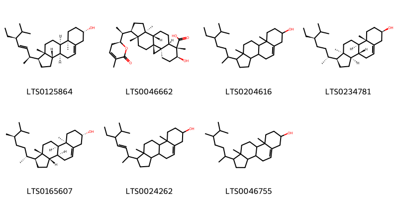{ width=100% }
    <figcaption>Hình ảnh cấu trúc hóa học của 7 hoạt chất thuộc nhóm Steroids and steroid derivatives gồm ['(1s,3as,3bs,7s,9ar,9br,11as)-1-[(2s,3e,5s)-5-ethyl-6-methylhept-3-en-2-yl]-9a,11a-dimethyl-1h,2h,3h,3ah,3bh,4h,6h,7h,8h,9h,9bh,10h,11h-cyclopenta[a]phenanthren-7-ol (LTS0125864)', '(1s,3r,6s,7s,8r,11s,12s,15r,16r)-6-hydroxy-7,12,16-trimethyl-15-[(1s)-1-[(2s)-5-methyl-6-oxo-2,3-dihydropyran-2-yl]ethyl]pentacyclo[9.7.0.0¹,³.0³,⁸.0¹²,¹⁶]octadecane-7-carboxylic acid (LTS0046662)', 'stigmast-5-en-3-ol, (3β)- (LTS0204616)', '(1s,3ar,3br,7r,9as,9br,11ar)-1-[(2r,5r)-5-ethyl-6-methylheptan-2-yl]-9a,11a-dimethyl-1h,2h,3h,3ah,3bh,4h,6h,7h,8h,9h,9bh,10h,11h-cyclopenta[a]phenanthren-7-ol (LTS0234781)', '(1s,3as,3bs,7s,9ar,9br,11as)-1-[(2r,5r)-5,6-dimethylheptan-2-yl]-9a,11a-dimethyl-1h,2h,3h,3ah,3bh,4h,6h,7h,8h,9h,9bh,10h,11h-cyclopenta[a]phenanthren-7-ol (LTS0165607)', 'stigmasterol (LTS0024262)', 'campesterol (LTS0046755)'].</figcaption>
</figure>

---

### Dược dân tộc học

Danh sách các quốc gia có sử dụng *Abrus precatorius* trong điều trị các bệnh. 

| Country        | Disease                                                                                                        | Bệnh                                                                                                                                                                                                |
|:---------------|:---------------------------------------------------------------------------------------------------------------|:----------------------------------------------------------------------------------------------------------------------------------------------------------------------------------------------------|
| Africa         | Poison                                                                                                         | MYMEMORY WARNING: YOU USED ALL AVAILABLE FREE TRANSLATIONS FOR TODAY. NEXT AVAILABLE IN  16 HOURS 46 MINUTES 38 SECONDS VISIT HTTPS://MYMEMORY.TRANSLATED.NET/DOC/USAGELIMITS.PHP TO TRANSLATE MORE |
| Arabic         | Sedative                                                                                                       | MYMEMORY WARNING: YOU USED ALL AVAILABLE FREE TRANSLATIONS FOR TODAY. NEXT AVAILABLE IN  16 HOURS 46 MINUTES 36 SECONDS VISIT HTTPS://MYMEMORY.TRANSLATED.NET/DOC/USAGELIMITS.PHP TO TRANSLATE MORE |
| Bahamas        | Poison                                                                                                         | MYMEMORY WARNING: YOU USED ALL AVAILABLE FREE TRANSLATIONS FOR TODAY. NEXT AVAILABLE IN  16 HOURS 46 MINUTES 34 SECONDS VISIT HTTPS://MYMEMORY.TRANSLATED.NET/DOC/USAGELIMITS.PHP TO TRANSLATE MORE |
| C Africa       | Contraceptive, Vermifuge                                                                                       | MYMEMORY WARNING: YOU USED ALL AVAILABLE FREE TRANSLATIONS FOR TODAY. NEXT AVAILABLE IN  16 HOURS 46 MINUTES 31 SECONDS VISIT HTTPS://MYMEMORY.TRANSLATED.NET/DOC/USAGELIMITS.PHP TO TRANSLATE MORE |
| China          | Expectorant, Vermifuge                                                                                         | MYMEMORY WARNING: YOU USED ALL AVAILABLE FREE TRANSLATIONS FOR TODAY. NEXT AVAILABLE IN  16 HOURS 46 MINUTES 29 SECONDS VISIT HTTPS://MYMEMORY.TRANSLATED.NET/DOC/USAGELIMITS.PHP TO TRANSLATE MORE |
| Chinese        | nan                                                                                                            | MYMEMORY WARNING: YOU USED ALL AVAILABLE FREE TRANSLATIONS FOR TODAY. NEXT AVAILABLE IN  16 HOURS 46 MINUTES 26 SECONDS VISIT HTTPS://MYMEMORY.TRANSLATED.NET/DOC/USAGELIMITS.PHP TO TRANSLATE MORE |
| Dutch          | Emetic                                                                                                         | MYMEMORY WARNING: YOU USED ALL AVAILABLE FREE TRANSLATIONS FOR TODAY. NEXT AVAILABLE IN  16 HOURS 46 MINUTES 24 SECONDS VISIT HTTPS://MYMEMORY.TRANSLATED.NET/DOC/USAGELIMITS.PHP TO TRANSLATE MORE |
| Elsewhere      | Abortifacient, Antidote, Aphrodisiac, Collyrium, Diuretic, Expectorant, Fatal, Poison, Poison, Poison, Styptic | MYMEMORY WARNING: YOU USED ALL AVAILABLE FREE TRANSLATIONS FOR TODAY. NEXT AVAILABLE IN  16 HOURS 46 MINUTES 21 SECONDS VISIT HTTPS://MYMEMORY.TRANSLATED.NET/DOC/USAGELIMITS.PHP TO TRANSLATE MORE |
| Eritrea        | Emetic, Vermifuge                                                                                              | MYMEMORY WARNING: YOU USED ALL AVAILABLE FREE TRANSLATIONS FOR TODAY. NEXT AVAILABLE IN  16 HOURS 46 MINUTES 19 SECONDS VISIT HTTPS://MYMEMORY.TRANSLATED.NET/DOC/USAGELIMITS.PHP TO TRANSLATE MORE |
| German         | Sweetener                                                                                                      | MYMEMORY WARNING: YOU USED ALL AVAILABLE FREE TRANSLATIONS FOR TODAY. NEXT AVAILABLE IN  16 HOURS 46 MINUTES 16 SECONDS VISIT HTTPS://MYMEMORY.TRANSLATED.NET/DOC/USAGELIMITS.PHP TO TRANSLATE MORE |
| Ghana          | Laxative                                                                                                       | MYMEMORY WARNING: YOU USED ALL AVAILABLE FREE TRANSLATIONS FOR TODAY. NEXT AVAILABLE IN  16 HOURS 46 MINUTES 14 SECONDS VISIT HTTPS://MYMEMORY.TRANSLATED.NET/DOC/USAGELIMITS.PHP TO TRANSLATE MORE |
| Guinea         | Sweetener                                                                                                      | MYMEMORY WARNING: YOU USED ALL AVAILABLE FREE TRANSLATIONS FOR TODAY. NEXT AVAILABLE IN  16 HOURS 46 MINUTES 12 SECONDS VISIT HTTPS://MYMEMORY.TRANSLATED.NET/DOC/USAGELIMITS.PHP TO TRANSLATE MORE |
| Haiti          | Emollient, Poison                                                                                              | MYMEMORY WARNING: YOU USED ALL AVAILABLE FREE TRANSLATIONS FOR TODAY. NEXT AVAILABLE IN  16 HOURS 46 MINUTES 09 SECONDS VISIT HTTPS://MYMEMORY.TRANSLATED.NET/DOC/USAGELIMITS.PHP TO TRANSLATE MORE |
| India(Gujarat) | Refrigerant                                                                                                    | MYMEMORY WARNING: YOU USED ALL AVAILABLE FREE TRANSLATIONS FOR TODAY. NEXT AVAILABLE IN  16 HOURS 46 MINUTES 06 SECONDS VISIT HTTPS://MYMEMORY.TRANSLATED.NET/DOC/USAGELIMITS.PHP TO TRANSLATE MORE |
| Ivory Coast    | Sweetener                                                                                                      | MYMEMORY WARNING: YOU USED ALL AVAILABLE FREE TRANSLATIONS FOR TODAY. NEXT AVAILABLE IN  16 HOURS 46 MINUTES 04 SECONDS VISIT HTTPS://MYMEMORY.TRANSLATED.NET/DOC/USAGELIMITS.PHP TO TRANSLATE MORE |
| Mexico         | Poison                                                                                                         | MYMEMORY WARNING: YOU USED ALL AVAILABLE FREE TRANSLATIONS FOR TODAY. NEXT AVAILABLE IN  16 HOURS 46 MINUTES 02 SECONDS VISIT HTTPS://MYMEMORY.TRANSLATED.NET/DOC/USAGELIMITS.PHP TO TRANSLATE MORE |
| Samoa          | Poison                                                                                                         | MYMEMORY WARNING: YOU USED ALL AVAILABLE FREE TRANSLATIONS FOR TODAY. NEXT AVAILABLE IN  16 HOURS 45 MINUTES 59 SECONDS VISIT HTTPS://MYMEMORY.TRANSLATED.NET/DOC/USAGELIMITS.PHP TO TRANSLATE MORE |
| Sudan          | Poison, Purgative                                                                                              | MYMEMORY WARNING: YOU USED ALL AVAILABLE FREE TRANSLATIONS FOR TODAY. NEXT AVAILABLE IN  16 HOURS 45 MINUTES 57 SECONDS VISIT HTTPS://MYMEMORY.TRANSLATED.NET/DOC/USAGELIMITS.PHP TO TRANSLATE MORE |
| Trinidad       | Expectorant                                                                                                    | MYMEMORY WARNING: YOU USED ALL AVAILABLE FREE TRANSLATIONS FOR TODAY. NEXT AVAILABLE IN  16 HOURS 45 MINUTES 54 SECONDS VISIT HTTPS://MYMEMORY.TRANSLATED.NET/DOC/USAGELIMITS.PHP TO TRANSLATE MORE |
| Turkey         | Poison                                                                                                         | MYMEMORY WARNING: YOU USED ALL AVAILABLE FREE TRANSLATIONS FOR TODAY. NEXT AVAILABLE IN  16 HOURS 45 MINUTES 52 SECONDS VISIT HTTPS://MYMEMORY.TRANSLATED.NET/DOC/USAGELIMITS.PHP TO TRANSLATE MORE |
| Upper Volta    | Hemostat, Aphrodisiac                                                                                          | MYMEMORY WARNING: YOU USED ALL AVAILABLE FREE TRANSLATIONS FOR TODAY. NEXT AVAILABLE IN  16 HOURS 45 MINUTES 50 SECONDS VISIT HTTPS://MYMEMORY.TRANSLATED.NET/DOC/USAGELIMITS.PHP TO TRANSLATE MORE |

---

---
## Abrus prectorius
### Thông tin về thực vật

!!! info "Phân loại thực vật của *Abrus precatorius* từ GIBF:"
    - **Kingdom:** Plantae
    - **Phylum:** Tracheophyta
    - **Order:** Fabales
    - **Family:** Fabaceae
    - **Genus:** Abrus
    - **Species:** *Abrus precatorius*

 

| Label (VI)   | Label (EN)   | Scientific Name   | Descriptions (VI)   | Descriptions (EN)   | Also Known As (VI)                                                                                                        | Also Known As (EN)                                                                    |
|:-------------|:-------------|:------------------|:--------------------|:--------------------|:--------------------------------------------------------------------------------------------------------------------------|:--------------------------------------------------------------------------------------|
| N/A          | N/A          | Abrus precatorius | loài thực vật       | species of plant    | ['Tương tư thảo', 'Tương tư đằng', 'Hương tư tử', 'Cườm thảo đỏ', 'Cườm cườm', 'Chi chi', 'Cảm sảo', 'Abrus precatorius'] | ["crab's eye", "crab's eye vine", 'precatory pea or bean', 'rosary pea', 'rosarypea'] |

#### Phân bố trên thế giới

**Từ CSDL GIBF** Virgin Islands (U.S.), nan, Australia, Guadeloupe, Benin, Virgin Islands (British), French Guiana, Zambia, Puerto Rico, Namibia, Chinese Taipei, United States of America, South Africa, Trinidad and Tobago, Hong Kong, Thailand, Turks and Caicos Islands, Brazil, Bahamas, Guam, New Caledonia, Cuba, Mexico, Mayotte, Dominican Republic, Singapore, China, Curaçao, Ecuador, Cabo Verde, Montserrat, Botswana, India, Cayman Islands, Antigua and Barbuda, Philippines, Northern Mariana Islands

#### Phân bố tại Việt Nam

**Từ CSDL GIBF**: Không có ghi nhận ở Việt Nam

---
### Thành phần hóa học
        
- Theo cơ sở dữ liệu lotus: Từ loài *Abrus precatorius* đã phân lập và xác định được Chưa có hoạt chất nào được phân lập. hoạt chất thuộc về các nhóm Không có hoạt chất nào được phân lập. 

Không có hình ảnh nào được tạo ra

---

### Dược dân tộc học

Danh sách các quốc gia có sử dụng *Abrus precatorius* trong điều trị các bệnh. 

| Country   | Disease   | Bệnh                                                                                                                                                                                                |
|:----------|:----------|:----------------------------------------------------------------------------------------------------------------------------------------------------------------------------------------------------|
| Nigeria   | Sweetener | MYMEMORY WARNING: YOU USED ALL AVAILABLE FREE TRANSLATIONS FOR TODAY. NEXT AVAILABLE IN  16 HOURS 45 MINUTES 19 SECONDS VISIT HTTPS://MYMEMORY.TRANSLATED.NET/DOC/USAGELIMITS.PHP TO TRANSLATE MORE |

---

# Chi Castanoermum

??? note "Danh sách các dược liệu thuộc chi"
    
	 - *Castanoermum australe*

---
## Castanoermum australe
### Thông tin về thực vật

!!! info "Phân loại thực vật của *N/A* từ GIBF:"
    - **Kingdom:** N/A
    - **Phylum:** N/A
    - **Order:** N/A
    - **Family:** N/A
    - **Genus:** N/A
    - **Species:** *N/A*

 

| Label (VI)   | Label (EN)   | Scientific Name   | Descriptions (VI)   | Descriptions (EN)   | Also Known As (VI)                                                                                                        | Also Known As (EN)                                                                    |
|:-------------|:-------------|:------------------|:--------------------|:--------------------|:--------------------------------------------------------------------------------------------------------------------------|:--------------------------------------------------------------------------------------|
| N/A          | N/A          | Abrus precatorius | loài thực vật       | species of plant    | ['Tương tư thảo', 'Tương tư đằng', 'Hương tư tử', 'Cườm thảo đỏ', 'Cườm cườm', 'Chi chi', 'Cảm sảo', 'Abrus precatorius'] | ["crab's eye", "crab's eye vine", 'precatory pea or bean', 'rosary pea', 'rosarypea'] |

#### Phân bố trên thế giới

**Từ CSDL GIBF** Không có kết quả phù hợp

#### Phân bố tại Việt Nam

**Từ CSDL GIBF**: Không có ghi nhận ở Việt Nam

---
### Thành phần hóa học
        
- Theo cơ sở dữ liệu lotus: Từ loài *N/A* đã phân lập và xác định được Chưa có hoạt chất nào được phân lập. hoạt chất thuộc về các nhóm Không có hoạt chất nào được phân lập. 

Không có hình ảnh nào được tạo ra

---

### Dược dân tộc học

Danh sách các quốc gia có sử dụng *N/A* trong điều trị các bệnh. 

| Country   | Disease   | Bệnh                                                                                                                                                                                                |
|:----------|:----------|:----------------------------------------------------------------------------------------------------------------------------------------------------------------------------------------------------|
| Elsewhere | Poison    | MYMEMORY WARNING: YOU USED ALL AVAILABLE FREE TRANSLATIONS FOR TODAY. NEXT AVAILABLE IN  16 HOURS 44 MINUTES 59 SECONDS VISIT HTTPS://MYMEMORY.TRANSLATED.NET/DOC/USAGELIMITS.PHP TO TRANSLATE MORE |

---

# Chi Brachystegia

??? note "Danh sách các dược liệu thuộc chi"
    
	 - *Brachystegia iciformis*

---
## Brachystegia iciformis
### Thông tin về thực vật

!!! info "Phân loại thực vật của *N/A* từ GIBF:"
    - **Kingdom:** Plantae
    - **Phylum:** Tracheophyta
    - **Order:** Fabales
    - **Family:** Fabaceae
    - **Genus:** Brachystegia
    - **Species:** *N/A*

 

| Label (VI)   | Label (EN)   | Scientific Name   | Descriptions (VI)   | Descriptions (EN)   | Also Known As (VI)                                                                                                        | Also Known As (EN)                                                                    |
|:-------------|:-------------|:------------------|:--------------------|:--------------------|:--------------------------------------------------------------------------------------------------------------------------|:--------------------------------------------------------------------------------------|
| N/A          | N/A          | Abrus precatorius | loài thực vật       | species of plant    | ['Tương tư thảo', 'Tương tư đằng', 'Hương tư tử', 'Cườm thảo đỏ', 'Cườm cườm', 'Chi chi', 'Cảm sảo', 'Abrus precatorius'] | ["crab's eye", "crab's eye vine", 'precatory pea or bean', 'rosary pea', 'rosarypea'] |

#### Phân bố trên thế giới

**Từ CSDL GIBF** Malawi, Zambia, South Africa, Sierra Leone, Nigeria, Gabon, Angola, Côte d’Ivoire, Mozambique, Burundi, Congo, Democratic Republic of the, Tanzania, United Republic of, Kenya, Liberia, Zimbabwe, Cameroon

#### Phân bố tại Việt Nam

**Từ CSDL GIBF**: Không có ghi nhận ở Việt Nam

---
### Thành phần hóa học
        
- Theo cơ sở dữ liệu lotus: Từ loài *N/A* đã phân lập và xác định được Chưa có hoạt chất nào được phân lập. hoạt chất thuộc về các nhóm Không có hoạt chất nào được phân lập. 

Không có hình ảnh nào được tạo ra

---

### Dược dân tộc học

Danh sách các quốc gia có sử dụng *N/A* trong điều trị các bệnh. 

| Country      | Disease    | Bệnh                                                                                                                                                                                                |
|:-------------|:-----------|:----------------------------------------------------------------------------------------------------------------------------------------------------------------------------------------------------|
| South Africa | Antiseptic | MYMEMORY WARNING: YOU USED ALL AVAILABLE FREE TRANSLATIONS FOR TODAY. NEXT AVAILABLE IN  16 HOURS 44 MINUTES 47 SECONDS VISIT HTTPS://MYMEMORY.TRANSLATED.NET/DOC/USAGELIMITS.PHP TO TRANSLATE MORE |

---

# Chi Dalea

??? note "Danh sách các dược liệu thuộc chi"
    
	 - *Dalea mollis*
	 - *Dalea parryi*

---
## Dalea mollis
### Thông tin về thực vật

!!! info "Phân loại thực vật của *Dalea mollis* từ GIBF:"
    - **Kingdom:** Plantae
    - **Phylum:** Tracheophyta
    - **Order:** Fabales
    - **Family:** Fabaceae
    - **Genus:** Dalea
    - **Species:** *Dalea mollis*

 

| Label (VI)   | Label (EN)   | Scientific Name   | Descriptions (VI)   | Descriptions (EN)   | Also Known As (VI)   | Also Known As (EN)   |
|:-------------|:-------------|:------------------|:--------------------|:--------------------|:---------------------|:---------------------|
| N/A          | N/A          | Dalea mollis      | loài thực vật       | species of plant    | ['']                 | ['']                 |

#### Phân bố trên thế giới

**Từ CSDL GIBF** United States of America, Mexico

#### Phân bố tại Việt Nam

**Từ CSDL GIBF**: Không có ghi nhận ở Việt Nam

---
### Thành phần hóa học
        
- Theo cơ sở dữ liệu lotus: Từ loài *Dalea mollis* đã phân lập và xác định được Chưa có hoạt chất nào được phân lập. hoạt chất thuộc về các nhóm Không có hoạt chất nào được phân lập. 

Không có hình ảnh nào được tạo ra

---

### Dược dân tộc học

Danh sách các quốc gia có sử dụng *Dalea mollis* trong điều trị các bệnh. 

| Country      | Disease   | Bệnh                                                                                                                                                                                                |
|:-------------|:----------|:----------------------------------------------------------------------------------------------------------------------------------------------------------------------------------------------------|
| Mexico(Seri) | Poultice  | MYMEMORY WARNING: YOU USED ALL AVAILABLE FREE TRANSLATIONS FOR TODAY. NEXT AVAILABLE IN  16 HOURS 44 MINUTES 25 SECONDS VISIT HTTPS://MYMEMORY.TRANSLATED.NET/DOC/USAGELIMITS.PHP TO TRANSLATE MORE |

---

---
## Dalea parryi
### Thông tin về thực vật

!!! info "Phân loại thực vật của *Marina parryi* từ GIBF:"
    - **Kingdom:** Plantae
    - **Phylum:** Tracheophyta
    - **Order:** Fabales
    - **Family:** Fabaceae
    - **Genus:** Marina
    - **Species:** *Marina parryi*

 

| Label (VI)   | Label (EN)   | Scientific Name   | Descriptions (VI)   | Descriptions (EN)   | Also Known As (VI)   | Also Known As (EN)   |
|:-------------|:-------------|:------------------|:--------------------|:--------------------|:---------------------|:---------------------|
| N/A          | N/A          | Dalea parryi      | loài thực vật       | species of plant    | ['']                 | ['']                 |

#### Phân bố trên thế giới

**Từ CSDL GIBF** nan, United States of America, Mexico

#### Phân bố tại Việt Nam

**Từ CSDL GIBF**: Không có ghi nhận ở Việt Nam

---
### Thành phần hóa học
        
- Theo cơ sở dữ liệu lotus: Từ loài *Marina parryi* đã phân lập và xác định được Chưa có hoạt chất nào được phân lập. hoạt chất thuộc về các nhóm Không có hoạt chất nào được phân lập. 

Không có hình ảnh nào được tạo ra

---

### Dược dân tộc học

Danh sách các quốc gia có sử dụng *Marina parryi* trong điều trị các bệnh. 

| Country      | Disease   | Bệnh                                                                                                                                                                                                |
|:-------------|:----------|:----------------------------------------------------------------------------------------------------------------------------------------------------------------------------------------------------|
| Mexico(Seri) | Tonic     | MYMEMORY WARNING: YOU USED ALL AVAILABLE FREE TRANSLATIONS FOR TODAY. NEXT AVAILABLE IN  16 HOURS 44 MINUTES 01 SECONDS VISIT HTTPS://MYMEMORY.TRANSLATED.NET/DOC/USAGELIMITS.PHP TO TRANSLATE MORE |

---

# Chi Geoffroea

??? note "Danh sách các dược liệu thuộc chi"
    
	 - *Geoffroea superba*
	 - *Geoffroea surinamensis*

---
## Geoffroea superba
### Thông tin về thực vật

!!! info "Phân loại thực vật của *Geoffroea spinosa* từ GIBF:"
    - **Kingdom:** Plantae
    - **Phylum:** Tracheophyta
    - **Order:** Fabales
    - **Family:** Fabaceae
    - **Genus:** Geoffroea
    - **Species:** *Geoffroea spinosa*

 

| Label (VI)   | Label (EN)   | Scientific Name   | Descriptions (VI)   | Descriptions (EN)   | Also Known As (VI)   | Also Known As (EN)   |
|:-------------|:-------------|:------------------|:--------------------|:--------------------|:---------------------|:---------------------|
| N/A          | N/A          | Geoffroea superba |                     | species of plant    | ['']                 | ['']                 |

#### Phân bố trên thế giới

**Từ CSDL GIBF** Curaçao, Ecuador, nan, Brazil, Argentina, unknown or invalid, Peru, Paraguay, Venezuela (Bolivarian Republic of)

#### Phân bố tại Việt Nam

**Từ CSDL GIBF**: Không có ghi nhận ở Việt Nam

---
### Thành phần hóa học
        
- Theo cơ sở dữ liệu lotus: Từ loài *Geoffroea spinosa* đã phân lập và xác định được Chưa có hoạt chất nào được phân lập. hoạt chất thuộc về các nhóm Không có hoạt chất nào được phân lập. 

Không có hình ảnh nào được tạo ra

---

### Dược dân tộc học

Danh sách các quốc gia có sử dụng *Geoffroea spinosa* trong điều trị các bệnh. 

| Country   | Disease   | Bệnh                                                                                                                                                                                                |
|:----------|:----------|:----------------------------------------------------------------------------------------------------------------------------------------------------------------------------------------------------|
| Venezuela | Vermifuge | MYMEMORY WARNING: YOU USED ALL AVAILABLE FREE TRANSLATIONS FOR TODAY. NEXT AVAILABLE IN  16 HOURS 43 MINUTES 40 SECONDS VISIT HTTPS://MYMEMORY.TRANSLATED.NET/DOC/USAGELIMITS.PHP TO TRANSLATE MORE |

---

---
## Geoffroea surinamensis
### Thông tin về thực vật

!!! info "Phân loại thực vật của *Andira surinamensis* từ GIBF:"
    - **Kingdom:** Plantae
    - **Phylum:** Tracheophyta
    - **Order:** Fabales
    - **Family:** Fabaceae
    - **Genus:** Andira
    - **Species:** *Andira surinamensis*

 

| Label (VI)   | Label (EN)   | Scientific Name        | Descriptions (VI)   | Descriptions (EN)   | Also Known As (VI)   | Also Known As (EN)   |
|:-------------|:-------------|:-----------------------|:--------------------|:--------------------|:---------------------|:---------------------|
| N/A          | N/A          | Geoffroea surinamensis | loài thực vật       | species of plant    | ['']                 | ['']                 |

#### Phân bố trên thế giới

**Từ CSDL GIBF** Brazil

#### Phân bố tại Việt Nam

**Từ CSDL GIBF**: Không có ghi nhận ở Việt Nam

---
### Thành phần hóa học
        
- Theo cơ sở dữ liệu lotus: Từ loài *Andira surinamensis* đã phân lập và xác định được Chưa có hoạt chất nào được phân lập. hoạt chất thuộc về các nhóm Không có hoạt chất nào được phân lập. 

Không có hình ảnh nào được tạo ra

---

### Dược dân tộc học

Danh sách các quốc gia có sử dụng *Andira surinamensis* trong điều trị các bệnh. 

| Country   | Disease   | Bệnh                                                                                                                                                                                                |
|:----------|:----------|:----------------------------------------------------------------------------------------------------------------------------------------------------------------------------------------------------|
| Dutch     | Narcotic  | MYMEMORY WARNING: YOU USED ALL AVAILABLE FREE TRANSLATIONS FOR TODAY. NEXT AVAILABLE IN  16 HOURS 43 MINUTES 23 SECONDS VISIT HTTPS://MYMEMORY.TRANSLATED.NET/DOC/USAGELIMITS.PHP TO TRANSLATE MORE |
| Elsewhere | Vermifuge | MYMEMORY WARNING: YOU USED ALL AVAILABLE FREE TRANSLATIONS FOR TODAY. NEXT AVAILABLE IN  16 HOURS 43 MINUTES 20 SECONDS VISIT HTTPS://MYMEMORY.TRANSLATED.NET/DOC/USAGELIMITS.PHP TO TRANSLATE MORE |
| English   | Vermifuge | MYMEMORY WARNING: YOU USED ALL AVAILABLE FREE TRANSLATIONS FOR TODAY. NEXT AVAILABLE IN  16 HOURS 43 MINUTES 18 SECONDS VISIT HTTPS://MYMEMORY.TRANSLATED.NET/DOC/USAGELIMITS.PHP TO TRANSLATE MORE |
| French    | Laxative  | MYMEMORY WARNING: YOU USED ALL AVAILABLE FREE TRANSLATIONS FOR TODAY. NEXT AVAILABLE IN  16 HOURS 43 MINUTES 15 SECONDS VISIT HTTPS://MYMEMORY.TRANSLATED.NET/DOC/USAGELIMITS.PHP TO TRANSLATE MORE |
| anish     | Emetic    | MYMEMORY WARNING: YOU USED ALL AVAILABLE FREE TRANSLATIONS FOR TODAY. NEXT AVAILABLE IN  16 HOURS 43 MINUTES 13 SECONDS VISIT HTTPS://MYMEMORY.TRANSLATED.NET/DOC/USAGELIMITS.PHP TO TRANSLATE MORE |

---

# Chi Lupinus

??? note "Danh sách các dược liệu thuộc chi"
    
	 - *Lupinus albus*
	 - *Lupinus gentryanus*
	 - *Lupinus littoralis*
	 - *Lupinus luteus*
	 - *Lupinus polyphyllus?*

---
## Lupinus albus
### Thông tin về thực vật

!!! info "Phân loại thực vật của *Lupinus albus* từ GIBF:"
    - **Kingdom:** Plantae
    - **Phylum:** Tracheophyta
    - **Order:** Fabales
    - **Family:** Fabaceae
    - **Genus:** Lupinus
    - **Species:** *Lupinus albus*

 

| Label (VI)   | Label (EN)   | Scientific Name   | Descriptions (VI)   | Descriptions (EN)   | Also Known As (VI)   | Also Known As (EN)   |
|:-------------|:-------------|:------------------|:--------------------|:--------------------|:---------------------|:---------------------|
| N/A          | N/A          | Lupinus albus     | loài thực vật       | species of plant    | ['']                 | ['Gibto']            |

#### Phân bố trên thế giới

**Từ CSDL GIBF** nan, Italy, Australia, Belgium, Estonia, Israel, Netherlands, Luxembourg, Spain, Türkiye, Portugal, Algeria, Russian Federation, Sweden, Finland, Greece, Montenegro, Germany, Switzerland, France

#### Phân bố tại Việt Nam

**Từ CSDL GIBF**: Không có ghi nhận ở Việt Nam

---
### Thành phần hóa học
        
- Theo cơ sở dữ liệu lotus: Từ loài *Lupinus albus* đã phân lập và xác định được 189 hoạt chất thuộc về các nhóm Quinolizidines, Flavonoids, Prenol lipids, Indoles and derivatives, Isoflavonoids, Organonitrogen compounds, Benzene and substituted derivatives, Lupin alkaloids, Organooxygen compounds, Carboxylic acids and derivatives, Quinolizines, Pyridines and derivatives. 

|    | chemicalTaxonomyClassyfireClass     |   smiles_count |
|---:|:------------------------------------|---------------:|
|  0 | Benzene and substituted derivatives |              1 |
|  1 | Carboxylic acids and derivatives    |             12 |
|  2 | Flavonoids                          |              4 |
|  3 | Indoles and derivatives             |              2 |
|  4 | Isoflavonoids                       |             94 |
|  5 | Lupin alkaloids                     |             23 |
|  6 | Organonitrogen compounds            |              1 |
|  7 | Organooxygen compounds              |             11 |
|  8 | Prenol lipids                       |              8 |
|  9 | Pyridines and derivatives           |              8 |
| 10 | Quinolizidines                      |             10 |
| 11 | Quinolizines                        |              1 |

#### Nhóm Benzene and substituted derivatives
<figure markdown="span">
    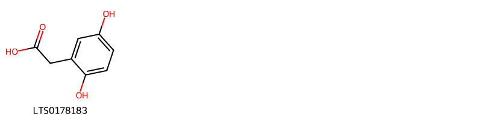{ width=100% }
    <figcaption>Hình ảnh cấu trúc hóa học của 1 hoạt chất thuộc nhóm Benzene and substituted derivatives gồm ['homogentisic acid (LTS0178183)'].</figcaption>
</figure>
#### Nhóm Carboxylic acids and derivatives
<figure markdown="span">
    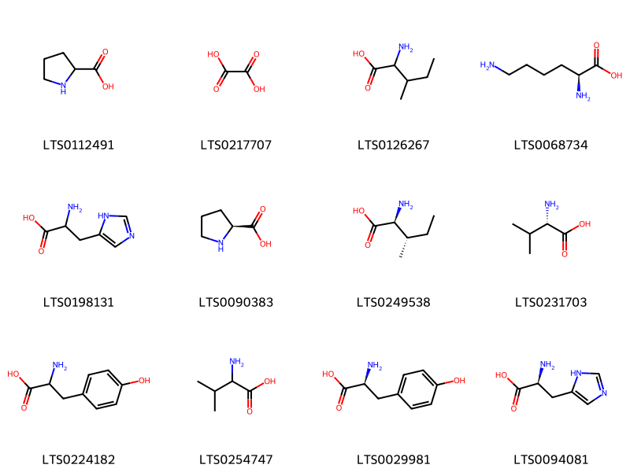{ width=100% }
    <figcaption>Hình ảnh cấu trúc hóa học của 12 hoạt chất thuộc nhóm Carboxylic acids and derivatives gồm ['proline (LTS0112491)', 'oxalic acid (LTS0217707)', 'lisoleucine (LTS0126267)', 'l-lysine (LTS0068734)', 'histidine (LTS0198131)', 'l-proline (LTS0090383)', 'l-isoleucine (LTS0249538)', 'l-valine (LTS0231703)', 'tyrosin (LTS0224182)', 'valin (LTS0254747)', 'l-tyrosine (LTS0029981)', 'l-histidine (LTS0094081)'].</figcaption>
</figure>
#### Nhóm Flavonoids
<figure markdown="span">
    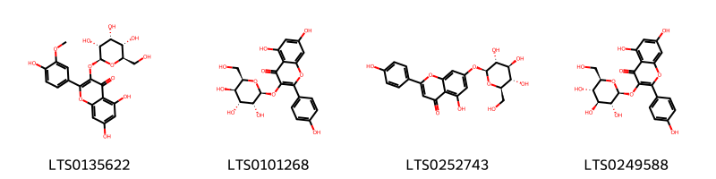{ width=100% }
    <figcaption>Hình ảnh cấu trúc hóa học của 4 hoạt chất thuộc nhóm Flavonoids gồm ['isorhamnetin 3-glucoside (LTS0135622)', '5,7-dihydroxy-2-(4-hydroxyphenyl)-3-{[(2s,3r,4r,5r,6r)-3,4,5-trihydroxy-6-(hydroxymethyl)oxan-2-yl]oxy}chromen-4-one (LTS0101268)', 'apigenin 7-o-β-glucoside (LTS0252743)', 'astragalin (LTS0249588)'].</figcaption>
</figure>
#### Nhóm Indoles and derivatives
<figure markdown="span">
    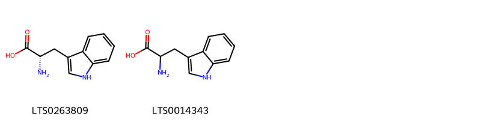{ width=100% }
    <figcaption>Hình ảnh cấu trúc hóa học của 2 hoạt chất thuộc nhóm Indoles and derivatives gồm ['l-tryptophan (LTS0263809)', 'optimax (LTS0014343)'].</figcaption>
</figure>
#### Nhóm Isoflavonoids
<figure markdown="span">
    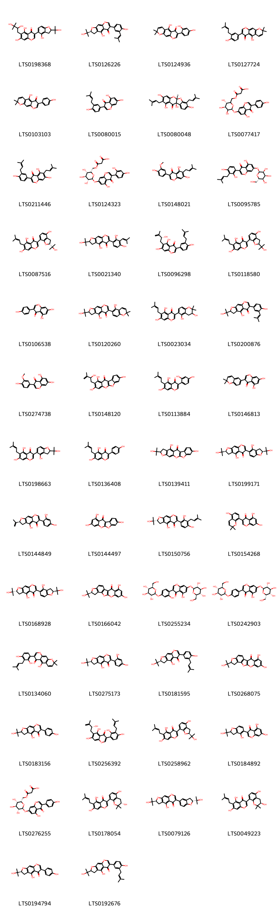{ width=100% }
    <figcaption>Hình ảnh cấu trúc hóa học của 94 hoạt chất thuộc nhóm Isoflavonoids gồm ['lupinisoflavone n (LTS0198368)', '(2s)-4-hydroxy-6-[4-hydroxy-3-(2-methylprop-1-en-1-yl)phenyl]-2-(2-hydroxypropan-2-yl)-2h,3h-furo[3,2-g]chromen-5-one (LTS0126226)', 'parvisoflavone b (LTS0124936)', 'chandalone (LTS0127724)', 'alpinumisoflavone (LTS0103103)', 'isowighteone (LTS0080015)', '(1r,10r)-5,7,10,14-tetrahydroxy-6,15-bis(3-methylbut-2-en-1-yl)-2,17-dioxatetracyclo[8.7.0.0³,⁸.0¹¹,¹⁶]heptadeca-3,5,7,11,13,15-hexaen-9-one (LTS0080048)', '3-oxo-3-{[(3s,4s,6s)-3,4,5-trihydroxy-6-{[5-hydroxy-3-(4-hydroxyphenyl)-4-oxochromen-7-yl]oxy}oxan-2-yl]methoxy}propanoic acid (LTS0077417)', 'lupalbigenin (LTS0211446)', '3-{[(2s,3s,4s,5r,6s)-6-{[3-(2,4-dihydroxyphenyl)-5-hydroxy-4-oxochromen-7-yl]oxy}-3,4,5-trihydroxyoxan-2-yl]methoxy}-3-oxopropanoic acid (LTS0124323)', '5,7-dihydroxy-3-(4-hydroxy-3-methoxyphenyl)-6-(3-methylbut-2-en-1-yl)chromen-4-one (LTS0148021)', '3-[2,4-dihydroxy-3-(3-methylbut-2-en-1-yl)phenyl]-5-hydroxy-7-{[(2s,3s,4s,5r,6s)-3,4,5-trihydroxy-6-(hydroxymethyl)oxan-2-yl]oxy}chromen-4-one (LTS0095785)', '5,7-dihydroxy-3-[(2r)-4-hydroxy-2-(2-hydroxypropan-2-yl)-2,3-dihydro-1-benzofuran-7-yl]-6-(3-methylbut-2-en-1-yl)chromen-4-one (LTS0087516)', '6-[2,4-dihydroxy-3-(2-methylprop-1-en-1-yl)phenyl]-4-hydroxy-2-(2-hydroxypropan-2-yl)-2h,3h-furo[3,2-g]chromen-5-one (LTS0021340)', '5,7-dihydroxy-3-[4-hydroxy-3-(3-methylbut-2-en-1-yl)phenyl]-6-[(2r)-2-hydroxy-3-methylbut-3-en-1-yl]chromen-4-one (LTS0096298)', 'lupinisoflavone j (LTS0118580)', 'genistein (LTS0106538)', 'lupinisoflavone k (LTS0120260)', 'lupinisolone b (LTS0023034)', '4-hydroxy-6-[4-hydroxy-3-(2-methylprop-1-en-1-yl)phenyl]-2-(2-hydroxypropan-2-yl)-2h,3h-furo[3,2-g]chromen-5-one (LTS0200876)', "3'-o-methylorobol (LTS0274738)", '5,7,14-trihydroxy-6-(2-hydroxy-3-methylbut-3-en-1-yl)-2,17-dioxatetracyclo[8.7.0.0³,⁸.0¹¹,¹⁶]heptadeca-1(10),3,5,7,11(16),12,14-heptaen-9-one (LTS0148120)', 'luteone (LTS0113884)', 'isoderrone (LTS0146813)', 'lupinisoflavone i (LTS0198663)', 'wighteone (LTS0136408)', 'lupinalbin c (LTS0139411)', '(2s)-4-hydroxy-6-[(2s)-4-hydroxy-2-(2-hydroxypropan-2-yl)-2,3-dihydro-1-benzofuran-5-yl]-2-(2-hydroxypropan-2-yl)-2h,3h-furo[3,2-g]chromen-5-one (LTS0199171)', '(2s)-6-(2,4-dihydroxyphenyl)-4-hydroxy-2-(prop-1-en-2-yl)-2h,3h-furo[3,2-g]chromen-5-one (LTS0144849)', 'lupinalbin a (LTS0144497)', '(2r)-6-[2,4-dihydroxy-3-(3-methylbut-2-en-1-yl)phenyl]-4-hydroxy-2-(2-hydroxypropan-2-yl)-2h,3h-furo[3,2-g]chromen-5-one (LTS0150756)', 'sophoraisoflavone a (LTS0154268)', '(2r)-4-hydroxy-6-[(2s)-4-hydroxy-2-(2-hydroxypropan-2-yl)-2,3-dihydro-1-benzofuran-5-yl]-2-(2-hydroxypropan-2-yl)-2h,3h-furo[3,2-g]chromen-5-one (LTS0168928)', '(7s)-16,18-dihydroxy-7-(2-hydroxypropan-2-yl)-6,11,13-trioxapentacyclo[10.8.0.0²,¹⁰.0⁵,⁹.0¹⁴,¹⁹]icosa-1(12),2(10),3,5(9),14,16,18-heptaen-20-one (LTS0166042)', '5-hydroxy-3-(2-hydroxy-4-{[(2s,3r,4s,5s,6r)-3,4,5-trihydroxy-6-(hydroxymethyl)oxan-2-yl]oxy}phenyl)-7-{[(2s,3r,4s,5s,6r)-3,4,5-trihydroxy-6-(hydroxymethyl)oxan-2-yl]oxy}chromen-4-one (LTS0255234)', '5-hydroxy-7-{[(2s,3r,4s,5s,6s)-3,4,5-trihydroxy-6-(hydroxymethyl)oxan-2-yl]oxy}-3-(4-{[(2s,3r,4s,5s,6r)-3,4,5-trihydroxy-6-(hydroxymethyl)oxan-2-yl]oxy}phenyl)chromen-4-one (LTS0242903)', 'angustone c (LTS0134060)', '(2s)-6-(2,4-dihydroxyphenyl)-4-hydroxy-2-(2-hydroxypropan-2-yl)-2h,3h-furo[3,2-g]chromen-5-one (LTS0275173)', '(2s)-4-hydroxy-6-[4-hydroxy-3-(3-methylbut-2-en-1-yl)phenyl]-2-(2-hydroxypropan-2-yl)-2h,3h-furo[3,2-g]chromen-5-one (LTS0181595)', 'lupinalbin e (LTS0268075)', 'erythrinin c (LTS0183156)', '3-[2,4-dihydroxy-3-(3-methylbut-2-en-1-yl)phenyl]-5,7-dihydroxy-6-[(2r)-2-hydroxy-3-methylbut-3-en-1-yl]chromen-4-one (LTS0256392)', '5,7-dihydroxy-3-[(2s)-4-hydroxy-2-(2-hydroxypropan-2-yl)-2,3-dihydro-1-benzofuran-7-yl]-6-(3-methylbut-2-en-1-yl)chromen-4-one (LTS0258962)', 'lupinisoflavone d (LTS0184892)', '3-oxo-3-{[(2s,3s,4s,5r,6s)-3,4,5-trihydroxy-6-{[5-hydroxy-3-(4-hydroxyphenyl)-4-oxochromen-7-yl]oxy}oxan-2-yl]methoxy}propanoic acid (LTS0276255)', '3-[(3s)-3,5-dihydroxy-2,2-dimethyl-3,4-dihydro-1-benzopyran-8-yl]-5,7-dihydroxy-6-(3-methylbut-2-en-1-yl)chromen-4-one (LTS0178054)', '(2s)-4-hydroxy-2-(2-hydroxypropan-2-yl)-6-[(2r)-2-(2-hydroxypropan-2-yl)-2,3-dihydro-1-benzofuran-5-yl]-2h,3h-furo[3,2-g]chromen-5-one (LTS0079126)', '3-[(3r)-3,5-dihydroxy-2,2-dimethyl-3,4-dihydro-1-benzopyran-8-yl]-5,7-dihydroxy-6-(3-methylbut-2-en-1-yl)chromen-4-one (LTS0049223)', '(2s)-4-hydroxy-6-(4-hydroxyphenyl)-2-(2-hydroxypropan-2-yl)-2h,3h-furo[3,2-g]chromen-5-one (LTS0194794)', 'lupinisoflavone g (LTS0192676)', "2'-hydroxyisolupalbigenin (LTS0214581)", 'angustone a (LTS0074685)', 'licoisoflavone a (LTS0263391)', 'lupinisoflavone l (LTS0221817)', '5,7-dihydroxy-3-[(2s)-4-hydroxy-2-(2-hydroxypropan-2-yl)-2,3-dihydro-1-benzofuran-5-yl]-6-(3-methylbut-2-en-1-yl)chromen-4-one (LTS0220890)', 'lupinisoflavone h (LTS0267560)', 'genistin (LTS0084994)', '5,7-dihydroxy-3-(4-{[(2r,3r,4s,5r,6s)-3,4,5-trihydroxy-6-(hydroxymethyl)oxan-2-yl]oxy}phenyl)chromen-4-one (LTS0027197)', '3-[(3r)-3,5-dihydroxy-2,2-dimethyl-3,4-dihydro-1-benzopyran-6-yl]-5,7-dihydroxy-6-(3-methylbut-2-en-1-yl)chromen-4-one (LTS0228891)', '(2s)-6-[2,4-dihydroxy-3-(2-methylprop-1-en-1-yl)phenyl]-4-hydroxy-2-(2-hydroxypropan-2-yl)-2h,3h-furo[3,2-g]chromen-5-one (LTS0230491)', '(1s,10r)-5,7,14-trihydroxy-10-methoxy-6-(3-methylbut-2-en-1-yl)-2,17-dioxatetracyclo[8.7.0.0³,⁸.0¹¹,¹⁶]heptadeca-3(8),4,6,11,13,15-hexaen-9-one (LTS0020609)', 'lupinalbin b (LTS0045620)', 'isochandalone (LTS0257660)', 'lupinisol b (LTS0258678)', 'lupiwighteone (LTS0229079)', '3-(2,4-dihydroxyphenyl)-5-hydroxy-6-(3-methylbut-2-en-1-yl)-7-{[(2s,3r,4s,5r,6r)-3,4,5-trihydroxy-6-(hydroxymethyl)oxan-2-yl]oxy}chromen-4-one (LTS0040350)', 'lupinisolone a (LTS0038064)', 'licoisoflavone b (LTS0055944)', '4-hydroxy-2-(2-hydroxypropan-2-yl)-6-[2-(2-hydroxypropan-2-yl)-2,3-dihydro-1-benzofuran-5-yl]-2h,3h-furo[3,2-g]chromen-5-one (LTS0121368)', '5,7-dihydroxy-3-(2-hydroxy-4-{[(2s,3r,4s,5s,6r)-3,4,5-trihydroxy-6-(hydroxymethyl)oxan-2-yl]oxy}phenyl)chromen-4-one (LTS0000969)', '3-(3,4-dihydroxyphenyl)-5-hydroxy-7-{[(2s,3r,4s,5s,6s)-3,4,5-trihydroxy-6-(hydroxymethyl)oxan-2-yl]oxy}chromen-4-one (LTS0063335)', '(2r)-4-hydroxy-2-(2-hydroxypropan-2-yl)-6-[(2s)-2-(2-hydroxypropan-2-yl)-2,3-dihydro-1-benzofuran-5-yl]-2h,3h-furo[3,2-g]chromen-5-one (LTS0270326)', 'lupinisoflavone a (LTS0268532)', '3-{2,4-dihydroxy-3-[(2r)-2-hydroxy-3-methylbut-3-en-1-yl]phenyl}-5,7-dihydroxy-6-(3-methylbut-2-en-1-yl)chromen-4-one (LTS0007176)', '5,7-dihydroxy-3-[2-hydroxy-3-(3-methylbut-2-en-1-yl)-4-{[(2s,3r,4s,5r,6r)-3,4,5-trihydroxy-6-(hydroxymethyl)oxan-2-yl]oxy}phenyl]chromen-4-one (LTS0005986)', 'lupinalbin f (LTS0270134)', '3-(2,4-dihydroxyphenyl)-5-hydroxy-7-{[(2s,3r,4s,5s,6s)-3,4,5-trihydroxy-6-(hydroxymethyl)oxan-2-yl]oxy}chromen-4-one (LTS0056482)', 'angustone b (LTS0004570)', "2'-hydroxygenistein (LTS0009678)", 'lupinalbin d (LTS0002730)', '5,7-dihydroxy-3-[(2r)-2-(2-hydroxypropan-2-yl)-2,3-dihydro-1-benzofuran-5-yl]chromen-4-one (LTS0009478)', 'lupinisol a (LTS0014133)', 'lupinisol c (LTS0094923)', '(7r)-5,7-dihydroxy-3-[4-hydroxy-3-(3-methylbut-2-en-1-yl)phenyl]-8,8-dimethyl-6h,7h-pyrano[3,2-g]chromen-4-one (LTS0226831)', 'biochanin (LTS0111539)', '4-hydroxy-6-[4-hydroxy-2-(2-hydroxypropan-2-yl)-2,3-dihydro-1-benzofuran-5-yl]-2-(2-hydroxypropan-2-yl)-2h,3h-furo[3,2-g]chromen-5-one (LTS0000808)', '(7s)-5,7-dihydroxy-3-[4-hydroxy-3-(3-methylbut-2-en-1-yl)phenyl]-8,8-dimethyl-6h,7h-pyrano[3,2-g]chromen-4-one (LTS0017245)', 'lupinisoflavone m (LTS0111350)', 'lupinisoflavone c (LTS0273865)', '(17s)-7,20-dihydroxy-17-(2-hydroxypropan-2-yl)-10,12,16-trioxapentacyclo[11.7.0.0³,¹¹.0⁴,⁹.0¹⁵,¹⁹]icosa-1(20),3(11),4(9),5,7,13,15(19)-heptaen-2-one (LTS0237124)', '5,7-dihydroxy-3-[(2r)-4-hydroxy-2-(2-hydroxypropan-2-yl)-2,3-dihydro-1-benzofuran-5-yl]chromen-4-one (LTS0259175)', 'lupinisoflavone b (LTS0263342)', 'lupinisolone c (LTS0118641)', '5-hydroxy-3-(4-hydroxyphenyl)-7-{[(2s,3r,4s,5s,6s)-3,4,5-trihydroxy-6-(hydroxymethyl)oxan-2-yl]oxy}chromen-4-one (LTS0115026)'].</figcaption>
</figure>
#### Nhóm Lupin alkaloids
<figure markdown="span">
    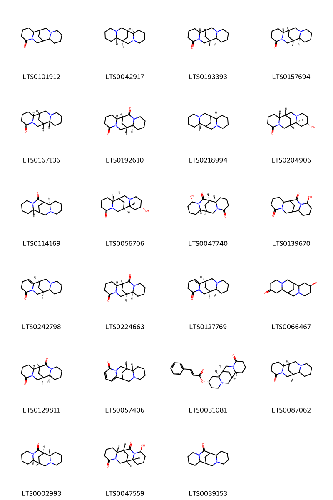{ width=100% }
    <figcaption>Hình ảnh cấu trúc hóa học của 23 hoạt chất thuộc nhóm Lupin alkaloids gồm ['lupanine l-form (LTS0101912)', 'sparteine (LTS0042917)', '(+)-lupanine (LTS0193393)', '(1r,2r,9s,10s)-7,15-diazatetracyclo[7.7.1.0²,⁷.0¹⁰,¹⁵]heptadecan-6-one (LTS0157694)', '(1r,2r,9s,10r)-7,15-diazatetracyclo[7.7.1.0²,⁷.0¹⁰,¹⁵]heptadecan-6-one (LTS0167136)', '17-oxolupanine (LTS0192610)', '(2r,10s)-7,15-diazatetracyclo[7.7.1.0²,⁷.0¹⁰,¹⁵]heptadecane (LTS0218994)', 'hydroxylupanine (LTS0204906)', '17-oxosparteine (LTS0114169)', '13-hydroxylupanine (LTS0056706)', '(1r,2r,9s,10s,14s)-14-hydroxy-7,15-diazatetracyclo[7.7.1.0²,⁷.0¹⁰,¹⁵]heptadecane-6,16-dione (LTS0047740)', '14-hydroxy-7,15-diazatetracyclo[7.7.1.0²,⁷.0¹⁰,¹⁵]heptadecane-6,16-dione (LTS0139670)', '(1r,9r)-7,15-diazatetracyclo[7.7.1.0²,⁷.0¹⁰,¹⁵]heptadec-2-en-6-one (LTS0242798)', '(1r,2r,9r,10s)-7,15-diazatetracyclo[7.7.1.0²,⁷.0¹⁰,¹⁵]heptadecane-6,16-dione (LTS0224663)', '(1r,9r,10s)-7,15-diazatetracyclo[7.7.1.0²,⁷.0¹⁰,¹⁵]heptadec-2-en-6-one (LTS0127769)', '12-hydroxy-7,15-diazatetracyclo[7.7.1.0²,⁷.0¹⁰,¹⁵]heptadecan-4-one (LTS0066467)', '(1r,2s,9r,10s)-7,15-diazatetracyclo[7.7.1.0²,⁷.0¹⁰,¹⁵]heptadecane-6,16-dione (LTS0129811)', '(9r,10s)-7,15-diazatetracyclo[7.7.1.0²,⁷.0¹⁰,¹⁵]heptadeca-2,4-dien-6-one (LTS0057406)', '(1r,2s,4s,9r,10r)-14-oxo-7,15-diazatetracyclo[7.7.1.0²,⁷.0¹⁰,¹⁵]heptadecan-4-yl (2e)-3-phenylprop-2-enoate (LTS0031081)', '(1r,2r,9r)-7,15-diazatetracyclo[7.7.1.0²,⁷.0¹⁰,¹⁵]heptadecan-6-one (LTS0087062)', '(1s,2r,9r,10s)-7,15-diazatetracyclo[7.7.1.0²,⁷.0¹⁰,¹⁵]heptadecan-8-one (LTS0002993)', '(1r,2r,9s,10r,14s)-14-hydroxy-7,15-diazatetracyclo[7.7.1.0²,⁷.0¹⁰,¹⁵]heptadecane-6,16-dione (LTS0047559)', 'lupanine (LTS0039153)'].</figcaption>
</figure>
#### Nhóm Organonitrogen compounds
<figure markdown="span">
    { width=100% }
    <figcaption>Hình ảnh cấu trúc hóa học của 1 hoạt chất thuộc nhóm Organonitrogen compounds gồm ['pentane-1,5-diamine (LTS0046069)'].</figcaption>
</figure>
#### Nhóm Organooxygen compounds
<figure markdown="span">
    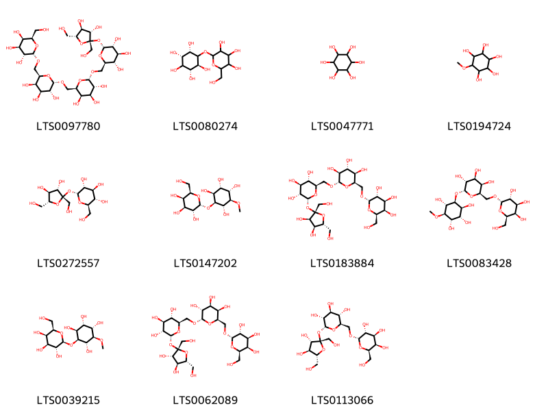{ width=100% }
    <figcaption>Hình ảnh cấu trúc hóa học của 11 hoạt chất thuộc nhóm Organooxygen compounds gồm ['verbascose (LTS0097780)', '(1s,2r,4s,5s)-6-{[3,4,5-trihydroxy-6-(hydroxymethyl)oxan-2-yl]oxy}cyclohexane-1,2,3,4,5-pentol (LTS0080274)', '(-)-inositol (LTS0047771)', 'pinitol (LTS0194724)', 'sucrose (LTS0272557)', '(1s,2r,3s,4r,5s,6s)-4-methoxy-6-{[(2r,3r,4s,5r,6r)-3,4,5-trihydroxy-6-(hydroxymethyl)oxan-2-yl]oxy}cyclohexane-1,2,3,5-tetrol (LTS0147202)', '(2r,3r,4s,5s,6r)-2-{[(2s,3r,4s,5r)-3,4-dihydroxy-2,5-bis(hydroxymethyl)oxolan-2-yl]oxy}-6-({[(2s,3s,4r,5r,6r)-3,4,5-trihydroxy-6-({[(2s,3r,4s,5r,6r)-3,4,5-trihydroxy-6-(hydroxymethyl)oxan-2-yl]oxy}methyl)oxan-2-yl]oxy}methyl)oxane-3,4,5-triol (LTS0183884)', '(1s,2r,3s,4r,5s,6s)-4-methoxy-6-{[(2r,3r,4s,5r,6r)-3,4,5-trihydroxy-6-({[(2s,3r,4s,5r,6r)-3,4,5-trihydroxy-6-(hydroxymethyl)oxan-2-yl]oxy}methyl)oxan-2-yl]oxy}cyclohexane-1,2,3,5-tetrol (LTS0083428)', '(1s,2r,3s,4r,5s,6s)-4-methoxy-6-{[(2s,3r,4s,5r,6r)-3,4,5-trihydroxy-6-(hydroxymethyl)oxan-2-yl]oxy}cyclohexane-1,2,3,5-tetrol (LTS0039215)', 'stachyose (LTS0062089)', 'raffinose (LTS0113066)'].</figcaption>
</figure>
#### Nhóm Prenol lipids
<figure markdown="span">
    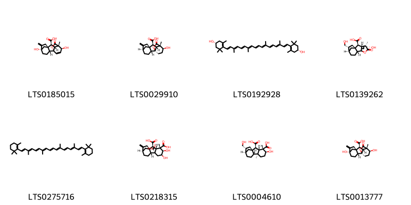{ width=100% }
    <figcaption>Hình ảnh cấu trúc hóa học của 8 hoạt chất thuộc nhóm Prenol lipids gồm ['gibberellin a3 (LTS0185015)', 'gibberellin a4 (LTS0029910)', 'zeaxanthin (LTS0192928)', '(1r,2r,5r,6r,8r,9s,10r,11s,12s)-12-hydroxy-6-(hydroxymethyl)-11-methyl-16-oxo-15-oxapentacyclo[9.3.2.1⁵,⁸.0¹,¹⁰.0²,⁸]heptadecane-9-carboxylic acid (LTS0139262)', 'β-carotene (LTS0275716)', '(1r,2s,3s,4s,5r,6s,8r,9r,12r)-5,6-dihydroxy-4-methyl-13-methylidenetetracyclo[10.2.1.0¹,⁹.0³,⁸]pentadecane-2,4,8-tricarboxylic acid (LTS0218315)', '(1r,2s,3s,4s,5s,8s,9s,12r,13r)-5-hydroxy-13-(hydroxymethyl)-4,8-dimethyltetracyclo[10.2.1.0¹,⁹.0³,⁸]pentadecane-2,4-dicarboxylic acid (LTS0004610)', 'gibberellin a1 (LTS0013777)'].</figcaption>
</figure>
#### Nhóm Pyridines and derivatives
<figure markdown="span">
    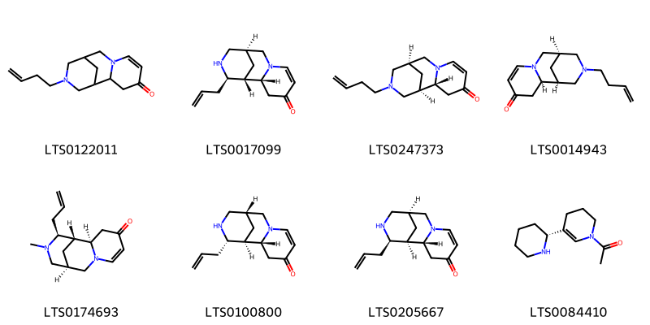{ width=100% }
    <figcaption>Hình ảnh cấu trúc hóa học của 8 hoạt chất thuộc nhóm Pyridines and derivatives gồm ['11-(but-3-en-1-yl)-7,11-diazatricyclo[7.3.1.0²,⁷]tridec-5-en-4-one (LTS0122011)', 'albine (LTS0017099)', '(1r,2r,9s)-11-(but-3-en-1-yl)-7,11-diazatricyclo[7.3.1.0²,⁷]tridec-5-en-4-one (LTS0247373)', '(1s,2r,9r)-11-(but-3-en-1-yl)-7,11-diazatricyclo[7.3.1.0²,⁷]tridec-5-en-4-one (LTS0014943)', '(1r,2r,9r,12s)-11-methyl-12-(prop-2-en-1-yl)-7,11-diazatricyclo[7.3.1.0²,⁷]tridec-5-en-4-one (LTS0174693)', '(1r,2r,9r,12s)-12-(prop-2-en-1-yl)-7,11-diazatricyclo[7.3.1.0²,⁷]tridec-5-en-4-one (LTS0100800)', '(1r,2r,9s,12r)-12-(prop-2-en-1-yl)-7,11-diazatricyclo[7.3.1.0²,⁷]tridec-5-en-4-one (LTS0205667)', 'ammodendrine (LTS0084410)'].</figcaption>
</figure>
#### Nhóm Quinolizidines
<figure markdown="span">
    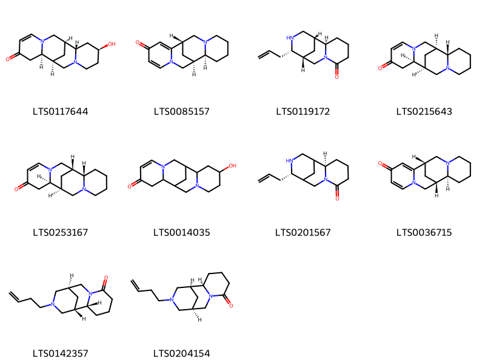{ width=100% }
    <figcaption>Hình ảnh cấu trúc hóa học của 10 hoạt chất thuộc nhóm Quinolizidines gồm ['(1s,2r,9s,10s,12s)-12-hydroxy-7,15-diazatetracyclo[7.7.1.0²,⁷.0¹⁰,¹⁵]heptadec-5-en-4-one (LTS0117644)', '(1s,9r,10s)-7,15-diazatetracyclo[7.7.1.0²,⁷.0¹⁰,¹⁵]heptadeca-2,5-dien-4-one (LTS0085157)', '(1r,2r,9r,10s)-10-(prop-2-en-1-yl)-7,11-diazatricyclo[7.3.1.0²,⁷]tridecan-6-one (LTS0119172)', 'multiflorine (LTS0215643)', '(1s,2r,9r,10s)-7,15-diazatetracyclo[7.7.1.0²,⁷.0¹⁰,¹⁵]heptadec-5-en-4-one (LTS0253167)', '12-hydroxy-7,15-diazatetracyclo[7.7.1.0²,⁷.0¹⁰,¹⁵]heptadec-5-en-4-one (LTS0014035)', 'angustifoline (LTS0201567)', '(1s,9s,10s)-7,15-diazatetracyclo[7.7.1.0²,⁷.0¹⁰,¹⁵]heptadeca-2,5-dien-4-one (LTS0036715)', '(1s,2r,9s)-11-(but-3-en-1-yl)-7,11-diazatricyclo[7.3.1.0²,⁷]tridecan-6-one (LTS0142357)', '(1s,2r,9r)-11-(but-3-en-1-yl)-7,11-diazatricyclo[7.3.1.0²,⁷]tridecan-6-one (LTS0204154)'].</figcaption>
</figure>
#### Nhóm Quinolizines
<figure markdown="span">
    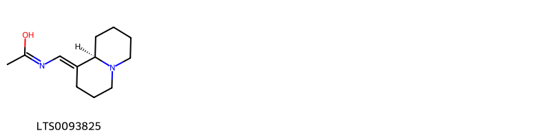{ width=100% }
    <figcaption>Hình ảnh cấu trúc hóa học của 1 hoạt chất thuộc nhóm Quinolizines gồm ['n-[(1e,9ar)-octahydroquinolizin-1-ylidenemethyl]ethanimidic acid (LTS0093825)'].</figcaption>
</figure>

---

### Dược dân tộc học

Danh sách các quốc gia có sử dụng *Lupinus albus* trong điều trị các bệnh. 

| Country   | Disease                                                         | Bệnh                                                                                                                                                                                                |
|:----------|:----------------------------------------------------------------|:----------------------------------------------------------------------------------------------------------------------------------------------------------------------------------------------------|
| Elsewhere | Carminative, Vermifuge                                          | MYMEMORY WARNING: YOU USED ALL AVAILABLE FREE TRANSLATIONS FOR TODAY. NEXT AVAILABLE IN  16 HOURS 42 MINUTES 57 SECONDS VISIT HTTPS://MYMEMORY.TRANSLATED.NET/DOC/USAGELIMITS.PHP TO TRANSLATE MORE |
| Turkey    | Digestive, Diuretic, Emmenagogue, Poison, Vermifuge, Discutient | MYMEMORY WARNING: YOU USED ALL AVAILABLE FREE TRANSLATIONS FOR TODAY. NEXT AVAILABLE IN  16 HOURS 42 MINUTES 55 SECONDS VISIT HTTPS://MYMEMORY.TRANSLATED.NET/DOC/USAGELIMITS.PHP TO TRANSLATE MORE |

---

---
## Lupinus gentryanus
### Thông tin về thực vật

!!! info "Phân loại thực vật của *Lupinus gentryanus* từ GIBF:"
    - **Kingdom:** Plantae
    - **Phylum:** Tracheophyta
    - **Order:** Fabales
    - **Family:** Fabaceae
    - **Genus:** Lupinus
    - **Species:** *Lupinus gentryanus*

 

| Label (VI)   | Label (EN)   | Scientific Name    | Descriptions (VI)   | Descriptions (EN)   | Also Known As (VI)   | Also Known As (EN)   |
|:-------------|:-------------|:-------------------|:--------------------|:--------------------|:---------------------|:---------------------|
| N/A          | N/A          | Lupinus gentryanus |                     |                     | ['']                 | ['']                 |

#### Phân bố trên thế giới

**Từ CSDL GIBF** nan, Mexico

#### Phân bố tại Việt Nam

**Từ CSDL GIBF**: Không có ghi nhận ở Việt Nam

---
### Thành phần hóa học
        
- Theo cơ sở dữ liệu lotus: Từ loài *Lupinus gentryanus* đã phân lập và xác định được Chưa có hoạt chất nào được phân lập. hoạt chất thuộc về các nhóm Không có hoạt chất nào được phân lập. 

Không có hình ảnh nào được tạo ra

---

### Dược dân tộc học

Danh sách các quốc gia có sử dụng *Lupinus gentryanus* trong điều trị các bệnh. 

| Country   | Disease      | Bệnh                                                                                                                                                                                                |
|:----------|:-------------|:----------------------------------------------------------------------------------------------------------------------------------------------------------------------------------------------------|
| Mexico    | Pediculicide | MYMEMORY WARNING: YOU USED ALL AVAILABLE FREE TRANSLATIONS FOR TODAY. NEXT AVAILABLE IN  16 HOURS 42 MINUTES 24 SECONDS VISIT HTTPS://MYMEMORY.TRANSLATED.NET/DOC/USAGELIMITS.PHP TO TRANSLATE MORE |

---

---
## Lupinus littoralis
### Thông tin về thực vật

!!! info "Phân loại thực vật của *Lupinus littoralis* từ GIBF:"
    - **Kingdom:** Plantae
    - **Phylum:** Tracheophyta
    - **Order:** Fabales
    - **Family:** Fabaceae
    - **Genus:** Lupinus
    - **Species:** *Lupinus littoralis*

 

| Label (VI)   | Label (EN)   | Scientific Name    | Descriptions (VI)   | Descriptions (EN)   | Also Known As (VI)   | Also Known As (EN)   |
|:-------------|:-------------|:-------------------|:--------------------|:--------------------|:---------------------|:---------------------|
| N/A          | N/A          | Lupinus littoralis | loài thực vật       | species of plant    | ['']                 | ['']                 |

#### Phân bố trên thế giới

**Từ CSDL GIBF** United States of America, Canada

#### Phân bố tại Việt Nam

**Từ CSDL GIBF**: Không có ghi nhận ở Việt Nam

---
### Thành phần hóa học
        
- Theo cơ sở dữ liệu lotus: Từ loài *Lupinus littoralis* đã phân lập và xác định được 2 hoạt chất thuộc về các nhóm Lupin alkaloids. 

|    | chemicalTaxonomyClassyfireClass   |   smiles_count |
|---:|:----------------------------------|---------------:|
|  0 | Lupin alkaloids                   |              1 |

#### Nhóm Lupin alkaloids
<figure markdown="span">
    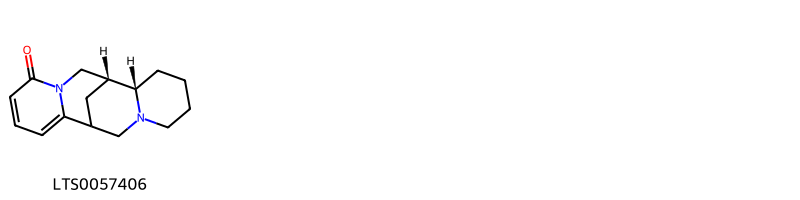{ width=100% }
    <figcaption>Hình ảnh cấu trúc hóa học của 1 hoạt chất thuộc nhóm Lupin alkaloids gồm ['(9r,10s)-7,15-diazatetracyclo[7.7.1.0²,⁷.0¹⁰,¹⁵]heptadeca-2,4-dien-6-one (LTS0057406)'].</figcaption>
</figure>

---

### Dược dân tộc học

Danh sách các quốc gia có sử dụng *Lupinus littoralis* trong điều trị các bệnh. 

| Country          | Disease              | Bệnh                                                                                                                                                                                                |
|:-----------------|:---------------------|:----------------------------------------------------------------------------------------------------------------------------------------------------------------------------------------------------|
| Canada(Kwakiutl) | Sedative, Intoxicant | MYMEMORY WARNING: YOU USED ALL AVAILABLE FREE TRANSLATIONS FOR TODAY. NEXT AVAILABLE IN  16 HOURS 42 MINUTES 09 SECONDS VISIT HTTPS://MYMEMORY.TRANSLATED.NET/DOC/USAGELIMITS.PHP TO TRANSLATE MORE |

---

---
## Lupinus luteus
### Thông tin về thực vật

!!! info "Phân loại thực vật của *Lupinus luteus* từ GIBF:"
    - **Kingdom:** Plantae
    - **Phylum:** Tracheophyta
    - **Order:** Fabales
    - **Family:** Fabaceae
    - **Genus:** Lupinus
    - **Species:** *Lupinus luteus*

 

| Label (VI)   | Label (EN)   | Scientific Name   | Descriptions (VI)   | Descriptions (EN)                                                 | Also Known As (VI)   | Also Known As (EN)                      |
|:-------------|:-------------|:------------------|:--------------------|:------------------------------------------------------------------|:---------------------|:----------------------------------------|
| N/A          | N/A          | Lupinus luteus    | loài thực vật       | legume grown mainly in Europe as a green manure and for its grain | ['']                 | ['Annual Yellow-lupin', 'Yellow lupin'] |

#### Phân bố trên thế giới

**Từ CSDL GIBF** Denmark, South Africa, Netherlands, Italy, Australia, Belgium, Estonia, Spain, Poland, Portugal, Algeria, Russian Federation, United States of America, Finland, Israel, Austria

#### Phân bố tại Việt Nam

**Từ CSDL GIBF**: Không có ghi nhận ở Việt Nam

---
### Thành phần hóa học
        
- Theo cơ sở dữ liệu lotus: Từ loài *Lupinus luteus* đã phân lập và xác định được 122 hoạt chất thuộc về các nhóm Quinolizidines, Flavonoids, Prenol lipids, Indoles and derivatives, Isoflavonoids, Cinnamic acids and derivatives, Organonitrogen compounds, Hydroxy acids and derivatives, Lupin alkaloids, Organooxygen compounds, Imidazopyrimidines, Carboxylic acids and derivatives, Benzopyrans, Pyridines and derivatives. 

|    | chemicalTaxonomyClassyfireClass   |   smiles_count |
|---:|:----------------------------------|---------------:|
|  0 | Benzopyrans                       |              1 |
|  1 | Carboxylic acids and derivatives  |             10 |
|  2 | Cinnamic acids and derivatives    |              3 |
|  3 | Flavonoids                        |             29 |
|  4 | Hydroxy acids and derivatives     |              2 |
|  5 | Imidazopyrimidines                |              2 |
|  6 | Indoles and derivatives           |              1 |
|  7 | Isoflavonoids                     |             51 |
|  8 | Lupin alkaloids                   |             12 |
|  9 | Organonitrogen compounds          |              1 |
| 10 | Organooxygen compounds            |              2 |
| 11 | Prenol lipids                     |              6 |
| 12 | Pyridines and derivatives         |              1 |
| 13 | Quinolizidines                    |              1 |

#### Nhóm Benzopyrans
<figure markdown="span">
    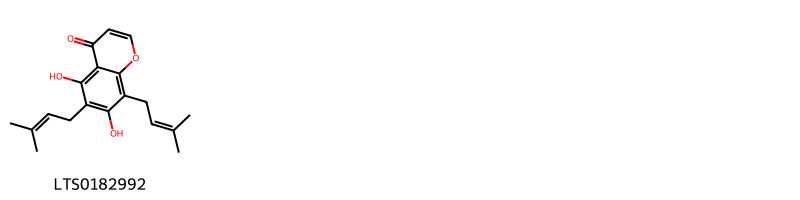{ width=100% }
    <figcaption>Hình ảnh cấu trúc hóa học của 1 hoạt chất thuộc nhóm Benzopyrans gồm ['5,7-dihydroxy-6,8-bis(3-methylbut-2-en-1-yl)chromen-4-one (LTS0182992)'].</figcaption>
</figure>
#### Nhóm Carboxylic acids and derivatives
<figure markdown="span">
    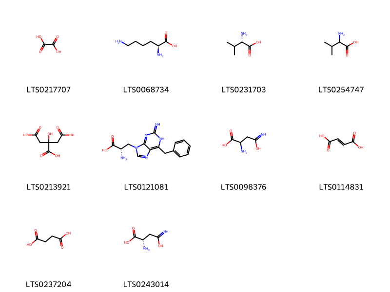{ width=100% }
    <figcaption>Hình ảnh cấu trúc hóa học của 10 hoạt chất thuộc nhóm Carboxylic acids and derivatives gồm ['oxalic acid (LTS0217707)', 'l-lysine (LTS0068734)', 'l-valine (LTS0231703)', 'valin (LTS0254747)', 'citric acid (LTS0213921)', '(2s)-2-amino-3-(6-benzyl-2-imino-1h-purin-9-yl)propanoic acid (LTS0121081)', 'asparagine (LTS0098376)', 'fumaric acid (LTS0114831)', 'succinic acid (LTS0237204)', 'aspartamate (LTS0243014)'].</figcaption>
</figure>
#### Nhóm Cinnamic acids and derivatives
<figure markdown="span">
    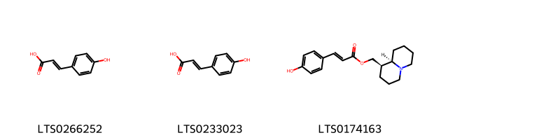{ width=100% }
    <figcaption>Hình ảnh cấu trúc hóa học của 3 hoạt chất thuộc nhóm Cinnamic acids and derivatives gồm ['para-coumaric acid (LTS0266252)', 'hydroxycinnamic acid (LTS0233023)', '(1r,9ar)-octahydro-1h-quinolizin-1-ylmethyl (2e)-3-(4-hydroxyphenyl)prop-2-enoate (LTS0174163)'].</figcaption>
</figure>
#### Nhóm Flavonoids
<figure markdown="span">
    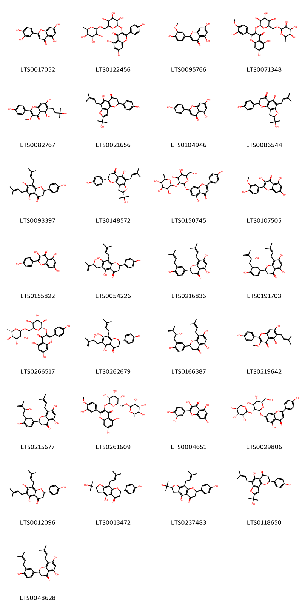{ width=100% }
    <figcaption>Hình ảnh cấu trúc hóa học của 29 hoạt chất thuộc nhóm Flavonoids gồm ['luteolin (LTS0017052)', '5,7-dihydroxy-2-(4-hydroxyphenyl)-3-[(3,4,5-trihydroxy-6-{[(3,4,5-trihydroxy-6-methyloxan-2-yl)oxy]methyl}oxan-2-yl)oxy]chromen-4-one (LTS0122456)', 'chrysoeriol (LTS0095766)', '5,7-dihydroxy-2-(3-hydroxy-4-methoxyphenyl)-3-[(3,4,5-trihydroxy-6-{[(3,4,5-trihydroxy-6-methyloxan-2-yl)oxy]methyl}oxan-2-yl)oxy]chromen-4-one (LTS0071348)', 'topazolin hydrate (LTS0082767)', 'lupinenol (LTS0021656)', 'chamomile (LTS0104946)', '8-hydroxy-12-(4-hydroxyphenyl)-4-(2-hydroxypropan-2-yl)-7-(3-methylbut-2-en-1-yl)-5,13-dioxatricyclo[7.4.0.0²,⁶]trideca-1(9),2(6),7-trien-10-one (LTS0086544)', '5,7-dihydroxy-2-(4-hydroxyphenyl)-6,8-bis(3-methylbut-2-en-1-yl)-2,3-dihydro-1-benzopyran-4-one (LTS0093397)', '(4s,12s)-8-hydroxy-12-(4-hydroxyphenyl)-4-(2-hydroxypropan-2-yl)-7-(3-methylbut-2-en-1-yl)-5,13-dioxatricyclo[7.4.0.0²,⁶]trideca-1(9),2(6),7-trien-10-one (LTS0148572)', 'rhoifolin (LTS0150745)', 'isorhamnetin (LTS0107505)', 'kaempherol (LTS0155822)', '5,7-dihydroxy-6-(2-hydroxy-3-methylbut-3-en-1-yl)-2-(4-hydroxyphenyl)-8-(3-methylbut-2-en-1-yl)-2,3-dihydro-1-benzopyran-4-one (LTS0054226)', 'lespedezaflavanone b (LTS0216836)', '(2s)-5,7-dihydroxy-2-{4-hydroxy-3-[(2r)-2-hydroxy-3-methylbut-3-en-1-yl]phenyl}-8-(3-methylbut-2-en-1-yl)-2,3-dihydro-1-benzopyran-4-one (LTS0191703)', '5,7-dihydroxy-2-(4-hydroxyphenyl)-3-{[(2s,3r,4s,5s,6s)-3,4,5-trihydroxy-6-({[(2r,3r,4r,5r,6s)-3,4,5-trihydroxy-6-methyloxan-2-yl]oxy}methyl)oxan-2-yl]oxy}chromen-4-one (LTS0266517)', '(2s)-5,7-dihydroxy-6-[(2r)-2-hydroxy-3-methylbut-3-en-1-yl]-2-(4-hydroxyphenyl)-8-(3-methylbut-2-en-1-yl)-2,3-dihydro-1-benzopyran-4-one (LTS0262679)', '5,7-dihydroxy-2-[4-hydroxy-3-(2-hydroxy-3-methylbut-3-en-1-yl)phenyl]-8-(3-methylbut-2-en-1-yl)-2,3-dihydro-1-benzopyran-4-one (LTS0166387)', 'topazolin (LTS0219642)', 'lupiniol b (LTS0215677)', '5,7-dihydroxy-2-(3-hydroxy-4-methoxyphenyl)-3-{[(2s,3r,4s,5s,6s)-3,4,5-trihydroxy-6-({[(2r,3r,4r,5r,6s)-3,4,5-trihydroxy-6-methyloxan-2-yl]oxy}methyl)oxan-2-yl]oxy}chromen-4-one (LTS0261609)', 'quercetin (LTS0004651)', 'rhoifolin (LTS0029806)', 'lonchocarpol a (LTS0012096)', '(5r,12s)-8-hydroxy-12-(4-hydroxyphenyl)-5-(2-hydroxypropan-2-yl)-2-(3-methylbut-2-en-1-yl)-4,13-dioxatricyclo[7.4.0.0³,⁷]trideca-1(9),2,7-trien-10-one (LTS0013472)', '8-hydroxy-12-(4-hydroxyphenyl)-5-(2-hydroxypropan-2-yl)-2-(3-methylbut-2-en-1-yl)-4,13-dioxatricyclo[7.4.0.0³,⁷]trideca-1(9),2,7-trien-10-one (LTS0237483)', '(12s)-8-hydroxy-12-(4-hydroxyphenyl)-4-(2-hydroxypropan-2-yl)-7-(3-methylbut-2-en-1-yl)-5,13-dioxatricyclo[7.4.0.0²,⁶]trideca-1,3,6,8-tetraen-10-one (LTS0118650)', 'euchrestaflavanone a (LTS0048628)'].</figcaption>
</figure>
#### Nhóm Hydroxy acids and derivatives
<figure markdown="span">
    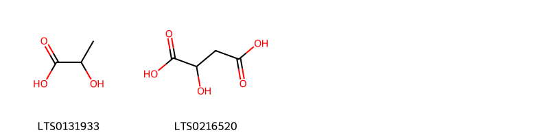{ width=100% }
    <figcaption>Hình ảnh cấu trúc hóa học của 2 hoạt chất thuộc nhóm Hydroxy acids and derivatives gồm ['lactic acid (LTS0131933)', 'malic acid (LTS0216520)'].</figcaption>
</figure>
#### Nhóm Imidazopyrimidines
<figure markdown="span">
    { width=100% }
    <figcaption>Hình ảnh cấu trúc hóa học của 2 hoạt chất thuộc nhóm Imidazopyrimidines gồm ['(2r)-2-methyl-4-(3h-purin-6-ylamino)butan-1-ol (LTS0192537)', 'racemic dihydrozeatin (LTS0079397)'].</figcaption>
</figure>
#### Nhóm Indoles and derivatives
<figure markdown="span">
    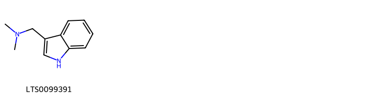{ width=100% }
    <figcaption>Hình ảnh cấu trúc hóa học của 1 hoạt chất thuộc nhóm Indoles and derivatives gồm ['gramin (LTS0099391)'].</figcaption>
</figure>
#### Nhóm Isoflavonoids
<figure markdown="span">
    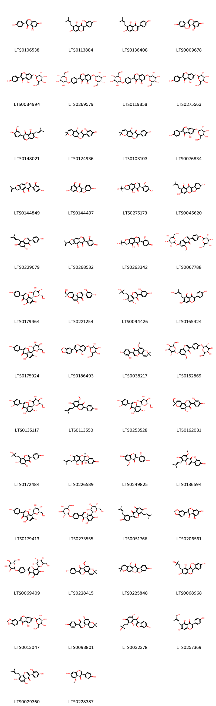{ width=100% }
    <figcaption>Hình ảnh cấu trúc hóa học của 51 hoạt chất thuộc nhóm Isoflavonoids gồm ['genistein (LTS0106538)', 'luteone (LTS0113884)', 'wighteone (LTS0136408)', "2'-hydroxygenistein (LTS0009678)", 'genistin (LTS0084994)', '5-hydroxy-7-{[(2s,3r,4s,5s,6r)-3,4,5-trihydroxy-6-(hydroxymethyl)oxan-2-yl]oxy}-3-(4-{[(2s,3r,4s,5s,6r)-3,4,5-trihydroxy-6-(hydroxymethyl)oxan-2-yl]oxy}phenyl)chromen-4-one (LTS0269579)', '5-hydroxy-7-{[3,4,5-trihydroxy-6-(hydroxymethyl)oxan-2-yl]oxy}-3-(4-{[3,4,5-trihydroxy-6-(hydroxymethyl)oxan-2-yl]oxy}phenyl)chromen-4-one (LTS0119858)', '5-hydroxy-3-(4-hydroxyphenyl)-7-{[3,4,5-trihydroxy-6-(hydroxymethyl)oxan-2-yl]oxy}chromen-4-one (LTS0275563)', '5,7-dihydroxy-3-(4-hydroxy-3-methoxyphenyl)-6-(3-methylbut-2-en-1-yl)chromen-4-one (LTS0148021)', 'parvisoflavone b (LTS0124936)', 'alpinumisoflavone (LTS0103103)', '5-hydroxy-3-(4-hydroxyphenyl)-7-{[(2r,3r,4s,5s,6r)-3,4,5-trihydroxy-6-(hydroxymethyl)oxan-2-yl]oxy}chromen-4-one (LTS0076834)', '(2s)-6-(2,4-dihydroxyphenyl)-4-hydroxy-2-(prop-1-en-2-yl)-2h,3h-furo[3,2-g]chromen-5-one (LTS0144849)', 'lupinalbin a (LTS0144497)', '(2s)-6-(2,4-dihydroxyphenyl)-4-hydroxy-2-(2-hydroxypropan-2-yl)-2h,3h-furo[3,2-g]chromen-5-one (LTS0275173)', 'lupinalbin b (LTS0045620)', 'lupiwighteone (LTS0229079)', 'lupinisoflavone a (LTS0268532)', 'lupinisoflavone b (LTS0263342)', '5-methoxy-7-{[(2s,3r,4s,5s,6r)-3,4,5-trihydroxy-6-(hydroxymethyl)oxan-2-yl]oxy}-3-(4-{[(2s,3r,4s,5s,6r)-3,4,5-trihydroxy-6-(hydroxymethyl)oxan-2-yl]oxy}phenyl)chromen-4-one (LTS0067788)', '5,7-dihydroxy-3-(4-hydroxyphenyl)-8-[(2r,3s,4s,5r,6s)-3,4,5-trihydroxy-6-(hydroxymethyl)oxan-2-yl]chromen-4-one (LTS0179464)', '(8s)-3-(2,4-dihydroxyphenyl)-5-hydroxy-8-(hydroxymethyl)-8-methylpyrano[2,3-f]chromen-4-one (LTS0221254)', '2,3-dehydrokievitone hydrate (LTS0094426)', '5,7-dihydroxy-6-(4-hydroxy-3-methylbut-2-en-1-yl)-3-(4-hydroxyphenyl)chromen-4-one (LTS0165424)', '5,7-dihydroxy-3-(4-hydroxyphenyl)-8-[3,4,5-trihydroxy-6-(hydroxymethyl)oxan-2-yl]chromen-4-one (LTS0175924)', '3-(2h-1,3-benzodioxol-5-yl)-5-hydroxy-7-{[3,4,5-trihydroxy-6-(hydroxymethyl)oxan-2-yl]oxy}chromen-4-one (LTS0186493)', 'barpisoflavone c (LTS0038217)', '5-methoxy-7-{[3,4,5-trihydroxy-6-(hydroxymethyl)oxan-2-yl]oxy}-3-(4-{[3,4,5-trihydroxy-6-(hydroxymethyl)oxan-2-yl]oxy}phenyl)chromen-4-one (LTS0152869)', '3-(3,4-dihydroxyphenyl)-5,7-dihydroxy-8-[3,4,5-trihydroxy-6-(hydroxymethyl)oxan-2-yl]chromen-4-one (LTS0135117)', '5-o-methyllupiwighteone (LTS0113550)', '3-(3,4-dihydroxyphenyl)-5,7-dihydroxy-8-[(2r,3s,4s,5r,6s)-3,4,5-trihydroxy-6-(hydroxymethyl)oxan-2-yl]chromen-4-one (LTS0253528)', '3-(2,4-dihydroxyphenyl)-5-hydroxy-8-(hydroxymethyl)-8-methylpyrano[2,3-f]chromen-4-one (LTS0162031)', '5,7-dihydroxy-8-(3-hydroxy-3-methylbutyl)-3-(4-hydroxyphenyl)chromen-4-one (LTS0172484)', '(1r,10s)-5,7,10,14-tetrahydroxy-6-(3-methylbut-2-en-1-yl)-2,17-dioxatetracyclo[8.7.0.0³,⁸.0¹¹,¹⁶]heptadeca-3,5,7,11,13,15-hexaen-9-one (LTS0226589)', '3-(2,4-dihydroxyphenyl)-7-hydroxy-5-methoxychromen-4-one (LTS0249825)', 'barpisoflavone b (LTS0186594)', 'genistein 8-c-glucoside (LTS0179413)', '5,7-dihydroxy-8-[(2s,3r,4r,5s,6r)-3,4,5-trihydroxy-6-(hydroxymethyl)oxan-2-yl]-3-(4-{[(2s,3r,4s,5s,6r)-3,4,5-trihydroxy-6-(hydroxymethyl)oxan-2-yl]oxy}phenyl)chromen-4-one (LTS0273555)', '5,7-dihydroxy-3-[4-hydroxy-3-(3-methylbut-2-en-1-yl)phenyl]-8-(3-methylbut-2-en-1-yl)chromen-4-one (LTS0051766)', '5-hydroxypseudobaptigenin (LTS0206561)', '5,7-dihydroxy-8-[3,4,5-trihydroxy-6-(hydroxymethyl)oxan-2-yl]-3-(4-{[3,4,5-trihydroxy-6-(hydroxymethyl)oxan-2-yl]oxy}phenyl)chromen-4-one (LTS0069409)', '3-(4-hydroxyphenyl)-5-methoxy-8,8-dimethylpyrano[2,3-f]chromen-4-one (LTS0228415)', '7,21-dihydroxy-17,17-dimethyl-10,12,16-trioxapentacyclo[11.8.0.0³,¹¹.0⁴,⁹.0¹⁵,²⁰]henicosa-1(21),3(11),4(9),5,7,13,15(20),18-octaen-2-one (LTS0225848)', '3-(2,4-dihydroxyphenyl)-5,7-dihydroxy-6-(3-hydroxy-3-methylbutyl)chromen-4-one (LTS0068968)', '3-(2h-1,3-benzodioxol-5-yl)-5-hydroxy-7-{[(2s,3r,4s,5s,6r)-3,4,5-trihydroxy-6-(hydroxymethyl)oxan-2-yl]oxy}chromen-4-one (LTS0013047)', 'derrone (LTS0093801)', '5,7,14-trihydroxy-4-(3-hydroxy-3-methylbutyl)-2,17-dioxatetracyclo[8.7.0.0³,⁸.0¹¹,¹⁶]heptadeca-1(10),3,5,7,11(16),12,14-heptaen-9-one (LTS0032378)', 'hydroxywighteone (LTS0257369)', '2,3-dehydrokievitone (LTS0029360)', '5-o-methylgenistein (LTS0228387)', 'parvisoflavone a (LTS0024071)'].</figcaption>
</figure>
#### Nhóm Lupin alkaloids
<figure markdown="span">
    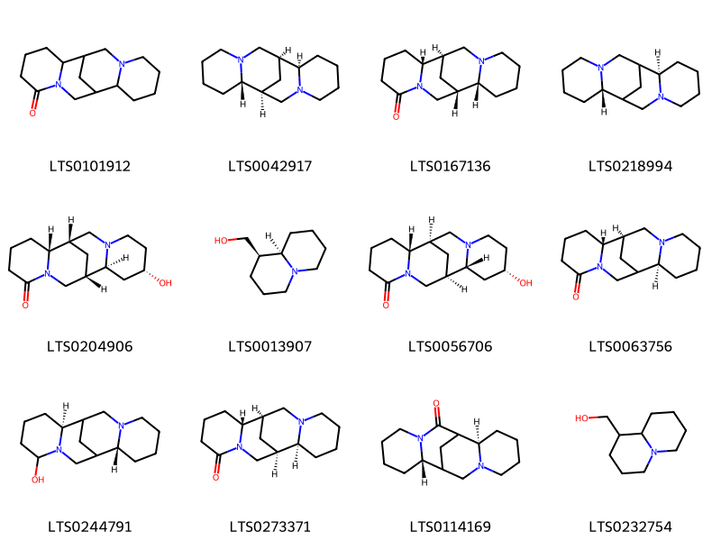{ width=100% }
    <figcaption>Hình ảnh cấu trúc hóa học của 12 hoạt chất thuộc nhóm Lupin alkaloids gồm ['lupanine l-form (LTS0101912)', 'sparteine (LTS0042917)', '(1r,2r,9s,10r)-7,15-diazatetracyclo[7.7.1.0²,⁷.0¹⁰,¹⁵]heptadecan-6-one (LTS0167136)', '(2r,10s)-7,15-diazatetracyclo[7.7.1.0²,⁷.0¹⁰,¹⁵]heptadecane (LTS0218994)', 'hydroxylupanine (LTS0204906)', '(-)-lupinine (LTS0013907)', '13-hydroxylupanine (LTS0056706)', '(1r,2r,10s)-7,15-diazatetracyclo[7.7.1.0²,⁷.0¹⁰,¹⁵]heptadecan-6-one (LTS0063756)', '(2s,10r)-7,15-diazatetracyclo[7.7.1.0²,⁷.0¹⁰,¹⁵]heptadecan-6-ol (LTS0244791)', '(1r,2r,9r,10s)-7,15-diazatetracyclo[7.7.1.0²,⁷.0¹⁰,¹⁵]heptadecan-6-one (LTS0273371)', '17-oxosparteine (LTS0114169)', 'lupinine (LTS0232754)'].</figcaption>
</figure>
#### Nhóm Organonitrogen compounds
<figure markdown="span">
    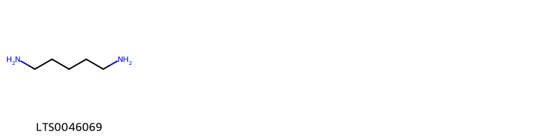{ width=100% }
    <figcaption>Hình ảnh cấu trúc hóa học của 1 hoạt chất thuộc nhóm Organonitrogen compounds gồm ['pentane-1,5-diamine (LTS0046069)'].</figcaption>
</figure>
#### Nhóm Organooxygen compounds
<figure markdown="span">
    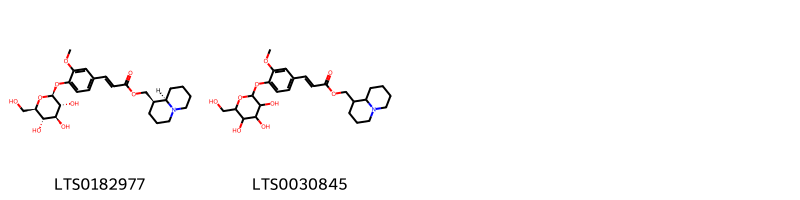{ width=100% }
    <figcaption>Hình ảnh cấu trúc hóa học của 2 hoạt chất thuộc nhóm Organooxygen compounds gồm ['(1r,9ar)-octahydro-1h-quinolizin-1-ylmethyl (2e)-3-(3-methoxy-4-{[(2s,3r,4s,5s,6r)-3,4,5-trihydroxy-6-(hydroxymethyl)oxan-2-yl]oxy}phenyl)prop-2-enoate (LTS0182977)', 'octahydro-1h-quinolizin-1-ylmethyl 3-(3-methoxy-4-{[3,4,5-trihydroxy-6-(hydroxymethyl)oxan-2-yl]oxy}phenyl)prop-2-enoate (LTS0030845)'].</figcaption>
</figure>
#### Nhóm Prenol lipids
<figure markdown="span">
    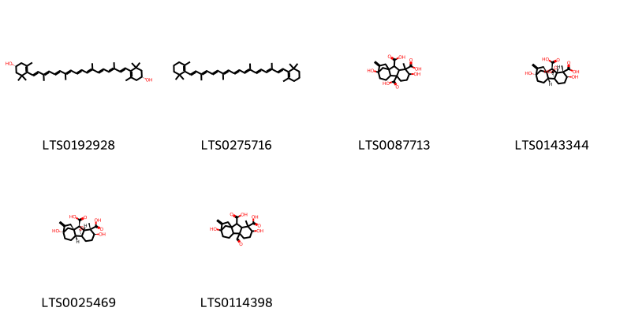{ width=100% }
    <figcaption>Hình ảnh cấu trúc hóa học của 6 hoạt chất thuộc nhóm Prenol lipids gồm ['zeaxanthin (LTS0192928)', 'β-carotene (LTS0275716)', '5,12-dihydroxy-4-methyl-13-methylidenetetracyclo[10.2.1.0¹,⁹.0³,⁸]pentadecane-2,4,8-tricarboxylic acid (LTS0087713)', 'gibberellin 28 (LTS0143344)', '(1s,2s,3s,4s,5s,8r,9r,12s)-8-formyl-5,12-dihydroxy-4-methyl-13-methylidenetetracyclo[10.2.1.0¹,⁹.0³,⁸]pentadecane-2,4-dicarboxylic acid (LTS0025469)', '8-formyl-5,12-dihydroxy-4-methyl-13-methylidenetetracyclo[10.2.1.0¹,⁹.0³,⁸]pentadecane-2,4-dicarboxylic acid (LTS0114398)'].</figcaption>
</figure>
#### Nhóm Pyridines and derivatives
<figure markdown="span">
    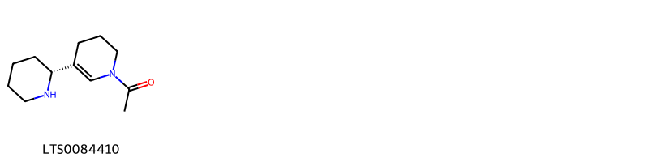{ width=100% }
    <figcaption>Hình ảnh cấu trúc hóa học của 1 hoạt chất thuộc nhóm Pyridines and derivatives gồm ['ammodendrine (LTS0084410)'].</figcaption>
</figure>
#### Nhóm Quinolizidines
<figure markdown="span">
    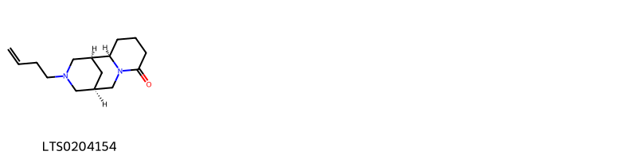{ width=100% }
    <figcaption>Hình ảnh cấu trúc hóa học của 1 hoạt chất thuộc nhóm Quinolizidines gồm ['(1s,2r,9r)-11-(but-3-en-1-yl)-7,11-diazatricyclo[7.3.1.0²,⁷]tridecan-6-one (LTS0204154)'].</figcaption>
</figure>

---

### Dược dân tộc học

Danh sách các quốc gia có sử dụng *Lupinus luteus* trong điều trị các bệnh. 

| Country   | Disease   | Bệnh                                                                                                                                                                                                |
|:----------|:----------|:----------------------------------------------------------------------------------------------------------------------------------------------------------------------------------------------------|
| India     | Poison    | MYMEMORY WARNING: YOU USED ALL AVAILABLE FREE TRANSLATIONS FOR TODAY. NEXT AVAILABLE IN  16 HOURS 41 MINUTES 44 SECONDS VISIT HTTPS://MYMEMORY.TRANSLATED.NET/DOC/USAGELIMITS.PHP TO TRANSLATE MORE |

---

---
## Lupinus polyphyllus
### Thông tin về thực vật

!!! info "Phân loại thực vật của *Lupinus polyphyllus* từ GIBF:"
    - **Kingdom:** Plantae
    - **Phylum:** Tracheophyta
    - **Order:** Fabales
    - **Family:** Fabaceae
    - **Genus:** Lupinus
    - **Species:** *Lupinus polyphyllus*

 

| Label (VI)   | Label (EN)   | Scientific Name     | Descriptions (VI)   | Descriptions (EN)   | Also Known As (VI)   | Also Known As (EN)   |
|:-------------|:-------------|:--------------------|:--------------------|:--------------------|:---------------------|:---------------------|
| N/A          | N/A          | Lupinus polyphyllus | loài thực vật       | species of plant    | ['']                 | ['Bigleaf Lupine']   |

#### Phân bố trên thế giới

**Từ CSDL GIBF** Japan, Belgium, Argentina, Rwanda, Norway, Canada, Denmark, Netherlands, Belarus, Portugal, Russian Federation, United States of America, Sweden, Finland, Chile, Falkland Islands (Malvinas), Czechia, Germany, Switzerland, Austria, France, United Kingdom of Great Britain and Northern Ireland, Poland, New Zealand

#### Phân bố tại Việt Nam

**Từ CSDL GIBF**: Không có ghi nhận ở Việt Nam

---
### Thành phần hóa học
        
- Theo cơ sở dữ liệu lotus: Từ loài *Lupinus polyphyllus* đã phân lập và xác định được 74 hoạt chất thuộc về các nhóm Quinolizidines, Flavonoids, Prenol lipids, Isoflavonoids, Lupin alkaloids, Pyridines and derivatives. 

|    | chemicalTaxonomyClassyfireClass   |   smiles_count |
|---:|:----------------------------------|---------------:|
|  0 | Flavonoids                        |              7 |
|  1 | Isoflavonoids                     |             14 |
|  2 | Lupin alkaloids                   |             26 |
|  3 | Prenol lipids                     |              2 |
|  4 | Pyridines and derivatives         |              5 |
|  5 | Quinolizidines                    |             15 |

#### Nhóm Flavonoids
<figure markdown="span">
    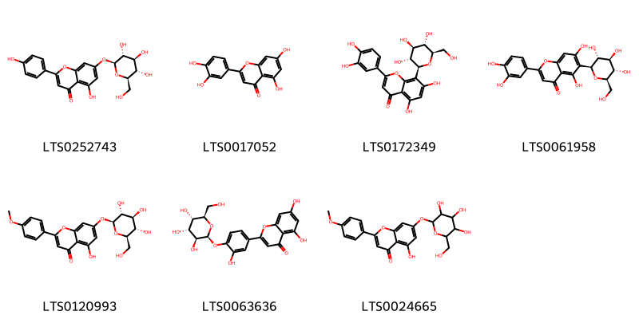{ width=100% }
    <figcaption>Hình ảnh cấu trúc hóa học của 7 hoạt chất thuộc nhóm Flavonoids gồm ['apigenin 7-o-β-glucoside (LTS0252743)', 'luteolin (LTS0017052)', 'orientin (LTS0172349)', 'isoorientin (LTS0061958)', '5-hydroxy-2-(4-methoxyphenyl)-7-{[(2s,3r,4s,5s,6r)-3,4,5-trihydroxy-6-(hydroxymethyl)oxan-2-yl]oxy}chromen-4-one (LTS0120993)', "luteolin 4'-glucoside (LTS0063636)", '5-hydroxy-2-(4-methoxyphenyl)-7-{[3,4,5-trihydroxy-6-(hydroxymethyl)oxan-2-yl]oxy}chromen-4-one (LTS0024665)'].</figcaption>
</figure>
#### Nhóm Isoflavonoids
<figure markdown="span">
    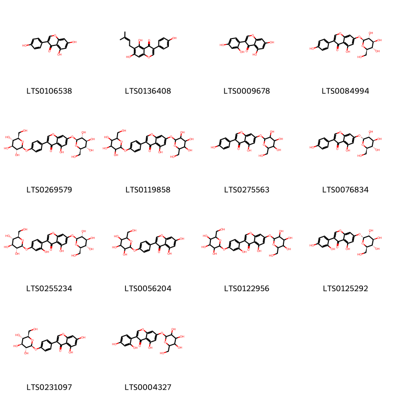{ width=100% }
    <figcaption>Hình ảnh cấu trúc hóa học của 14 hoạt chất thuộc nhóm Isoflavonoids gồm ['genistein (LTS0106538)', 'wighteone (LTS0136408)', "2'-hydroxygenistein (LTS0009678)", 'genistin (LTS0084994)', '5-hydroxy-7-{[(2s,3r,4s,5s,6r)-3,4,5-trihydroxy-6-(hydroxymethyl)oxan-2-yl]oxy}-3-(4-{[(2s,3r,4s,5s,6r)-3,4,5-trihydroxy-6-(hydroxymethyl)oxan-2-yl]oxy}phenyl)chromen-4-one (LTS0269579)', '5-hydroxy-7-{[3,4,5-trihydroxy-6-(hydroxymethyl)oxan-2-yl]oxy}-3-(4-{[3,4,5-trihydroxy-6-(hydroxymethyl)oxan-2-yl]oxy}phenyl)chromen-4-one (LTS0119858)', '5-hydroxy-3-(4-hydroxyphenyl)-7-{[3,4,5-trihydroxy-6-(hydroxymethyl)oxan-2-yl]oxy}chromen-4-one (LTS0275563)', '5-hydroxy-3-(4-hydroxyphenyl)-7-{[(2r,3r,4s,5s,6r)-3,4,5-trihydroxy-6-(hydroxymethyl)oxan-2-yl]oxy}chromen-4-one (LTS0076834)', '5-hydroxy-3-(2-hydroxy-4-{[(2s,3r,4s,5s,6r)-3,4,5-trihydroxy-6-(hydroxymethyl)oxan-2-yl]oxy}phenyl)-7-{[(2s,3r,4s,5s,6r)-3,4,5-trihydroxy-6-(hydroxymethyl)oxan-2-yl]oxy}chromen-4-one (LTS0255234)', '5,7-dihydroxy-3-(4-{[3,4,5-trihydroxy-6-(hydroxymethyl)oxan-2-yl]oxy}phenyl)chromen-4-one (LTS0056204)', '5-hydroxy-3-(2-hydroxy-4-{[3,4,5-trihydroxy-6-(hydroxymethyl)oxan-2-yl]oxy}phenyl)-7-{[3,4,5-trihydroxy-6-(hydroxymethyl)oxan-2-yl]oxy}chromen-4-one (LTS0122956)', '3-(2,4-dihydroxyphenyl)-5-hydroxy-7-{[(2r,3r,4s,5s,6r)-3,4,5-trihydroxy-6-(hydroxymethyl)oxan-2-yl]oxy}chromen-4-one (LTS0125292)', 'sophoricoside (LTS0231097)', '3-(2,4-dihydroxyphenyl)-5-hydroxy-7-{[3,4,5-trihydroxy-6-(hydroxymethyl)oxan-2-yl]oxy}chromen-4-one (LTS0004327)'].</figcaption>
</figure>
#### Nhóm Lupin alkaloids
<figure markdown="span">
    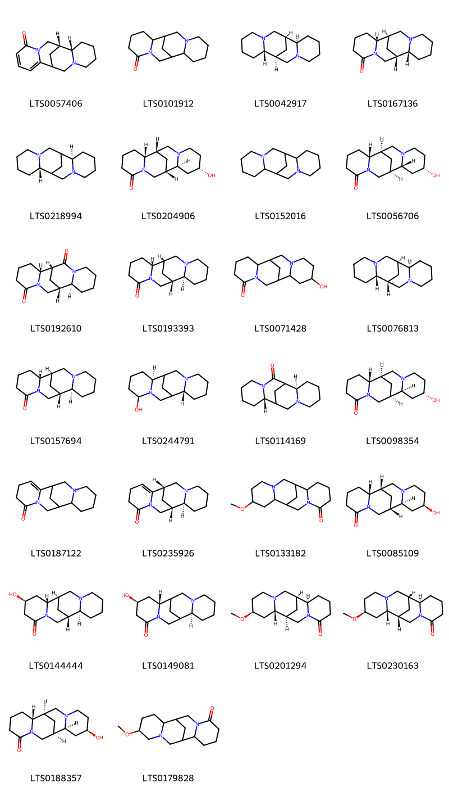{ width=100% }
    <figcaption>Hình ảnh cấu trúc hóa học của 26 hoạt chất thuộc nhóm Lupin alkaloids gồm ['(9r,10s)-7,15-diazatetracyclo[7.7.1.0²,⁷.0¹⁰,¹⁵]heptadeca-2,4-dien-6-one (LTS0057406)', 'lupanine l-form (LTS0101912)', 'sparteine (LTS0042917)', '(1r,2r,9s,10r)-7,15-diazatetracyclo[7.7.1.0²,⁷.0¹⁰,¹⁵]heptadecan-6-one (LTS0167136)', '(2r,10s)-7,15-diazatetracyclo[7.7.1.0²,⁷.0¹⁰,¹⁵]heptadecane (LTS0218994)', 'hydroxylupanine (LTS0204906)', 'genisteine-alkaloid (LTS0152016)', '13-hydroxylupanine (LTS0056706)', '17-oxolupanine (LTS0192610)', '(+)-lupanine (LTS0193393)', '12-hydroxy-7,15-diazatetracyclo[7.7.1.0²,⁷.0¹⁰,¹⁵]heptadecan-6-one (LTS0071428)', '(1r,2s,9s,10r)-7,15-diazatetracyclo[7.7.1.0²,⁷.0¹⁰,¹⁵]heptadecane (LTS0076813)', '(1r,2r,9s,10s)-7,15-diazatetracyclo[7.7.1.0²,⁷.0¹⁰,¹⁵]heptadecan-6-one (LTS0157694)', '(2s,10r)-7,15-diazatetracyclo[7.7.1.0²,⁷.0¹⁰,¹⁵]heptadecan-6-ol (LTS0244791)', '17-oxosparteine (LTS0114169)', '(1r,2r,9r,10s,12s)-12-hydroxy-7,15-diazatetracyclo[7.7.1.0²,⁷.0¹⁰,¹⁵]heptadecan-6-one (LTS0098354)', '7,15-diazatetracyclo[7.7.1.0²,⁷.0¹⁰,¹⁵]heptadec-2-en-6-one (LTS0187122)', '5,6-dehydrolupanine (LTS0235926)', '12-methoxy-7,15-diazatetracyclo[7.7.1.0²,⁷.0¹⁰,¹⁵]heptadecan-6-one (LTS0133182)', '(1s,2r,9s,10s,12r)-12-hydroxy-7,15-diazatetracyclo[7.7.1.0²,⁷.0¹⁰,¹⁵]heptadecan-6-one (LTS0085109)', '(1r,2r,4s,9s,10s)-4-hydroxy-7,15-diazatetracyclo[7.7.1.0²,⁷.0¹⁰,¹⁵]heptadecan-6-one (LTS0144444)', 'nuttalline (LTS0149081)', '(1s,2r,9s,10s,12s)-12-methoxy-7,15-diazatetracyclo[7.7.1.0²,⁷.0¹⁰,¹⁵]heptadecan-6-one (LTS0201294)', '(1r,2r,9r,10s,12s)-12-methoxy-7,15-diazatetracyclo[7.7.1.0²,⁷.0¹⁰,¹⁵]heptadecan-6-one (LTS0230163)', '(1r,2r,9r,10s,12r)-12-hydroxy-7,15-diazatetracyclo[7.7.1.0²,⁷.0¹⁰,¹⁵]heptadecan-6-one (LTS0188357)', '13-methoxy-7,15-diazatetracyclo[7.7.1.0²,⁷.0¹⁰,¹⁵]heptadecan-6-one (LTS0179828)'].</figcaption>
</figure>
#### Nhóm Prenol lipids
<figure markdown="span">
    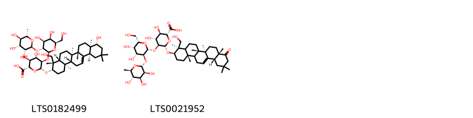{ width=100% }
    <figcaption>Hình ảnh cấu trúc hóa học của 2 hoạt chất thuộc nhóm Prenol lipids gồm ['soyasaponin i (LTS0182499)', '(2r,3r,4r,5s,6s)-6-{[(3r,4r,6as,6br,8as,12ar,14bs)-4-(hydroxymethyl)-4,6a,6b,8a,11,11,14b-heptamethyl-9-oxo-2,3,4a,5,6,7,8,10,12,12a,14,14a-dodecahydro-1h-picen-3-yl]oxy}-5-{[(2r,3s,4r,5s,6s)-4,5-dihydroxy-6-(hydroxymethyl)-3-{[(2r,3s,4s,5s,6r)-3,4,5-trihydroxy-6-methyloxan-2-yl]oxy}oxan-2-yl]oxy}-3,4-dihydroxyoxane-2-carboxylic acid (LTS0021952)'].</figcaption>
</figure>
#### Nhóm Pyridines and derivatives
<figure markdown="span">
    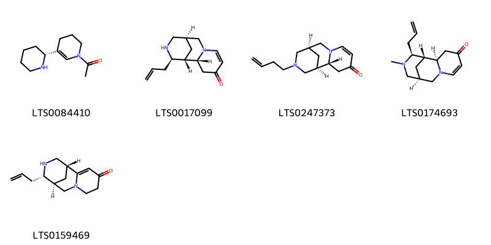{ width=100% }
    <figcaption>Hình ảnh cấu trúc hóa học của 5 hoạt chất thuộc nhóm Pyridines and derivatives gồm ['ammodendrine (LTS0084410)', 'albine (LTS0017099)', '(1r,2r,9s)-11-(but-3-en-1-yl)-7,11-diazatricyclo[7.3.1.0²,⁷]tridec-5-en-4-one (LTS0247373)', '(1r,2r,9r,12s)-11-methyl-12-(prop-2-en-1-yl)-7,11-diazatricyclo[7.3.1.0²,⁷]tridec-5-en-4-one (LTS0174693)', '(1r,9s,10s)-10-(prop-2-en-1-yl)-7,11-diazatricyclo[7.3.1.0²,⁷]tridec-2-en-4-one (LTS0159469)'].</figcaption>
</figure>
#### Nhóm Quinolizidines
<figure markdown="span">
    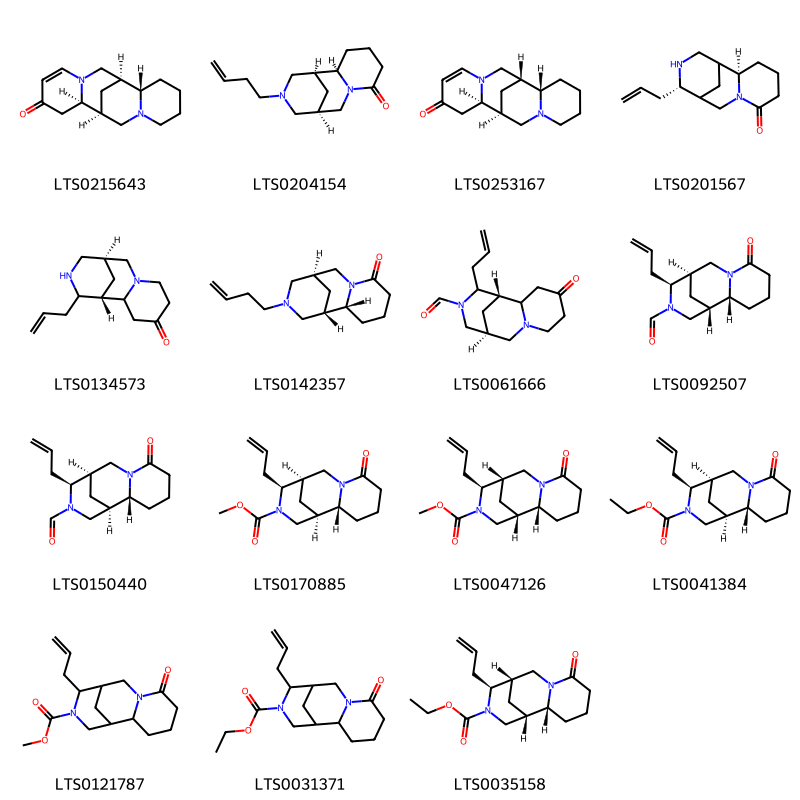{ width=100% }
    <figcaption>Hình ảnh cấu trúc hóa học của 15 hoạt chất thuộc nhóm Quinolizidines gồm ['multiflorine (LTS0215643)', '(1s,2r,9r)-11-(but-3-en-1-yl)-7,11-diazatricyclo[7.3.1.0²,⁷]tridecan-6-one (LTS0204154)', '(1s,2r,9r,10s)-7,15-diazatetracyclo[7.7.1.0²,⁷.0¹⁰,¹⁵]heptadec-5-en-4-one (LTS0253167)', 'angustifoline (LTS0201567)', '(1s,9s)-12-(prop-2-en-1-yl)-7,11-diazatricyclo[7.3.1.0²,⁷]tridecan-4-one (LTS0134573)', '(1s,2r,9s)-11-(but-3-en-1-yl)-7,11-diazatricyclo[7.3.1.0²,⁷]tridecan-6-one (LTS0142357)', '(1s,9s)-4-oxo-12-(prop-2-en-1-yl)-7,11-diazatricyclo[7.3.1.0²,⁷]tridecane-11-carbaldehyde (LTS0061666)', '(1s,2r,9r,10s)-6-oxo-10-(prop-2-en-1-yl)-7,11-diazatricyclo[7.3.1.0²,⁷]tridecane-11-carbaldehyde (LTS0092507)', '(1r,2r,9r,10s)-6-oxo-10-(prop-2-en-1-yl)-7,11-diazatricyclo[7.3.1.0²,⁷]tridecane-11-carbaldehyde (LTS0150440)', 'methyl (1r,2r,9r,10s)-6-oxo-10-(prop-2-en-1-yl)-7,11-diazatricyclo[7.3.1.0²,⁷]tridecane-11-carboxylate (LTS0170885)', 'methyl (1s,2r,9s,10s)-6-oxo-10-(prop-2-en-1-yl)-7,11-diazatricyclo[7.3.1.0²,⁷]tridecane-11-carboxylate (LTS0047126)', 'ethyl (1r,2r,9r,10s)-6-oxo-10-(prop-2-en-1-yl)-7,11-diazatricyclo[7.3.1.0²,⁷]tridecane-11-carboxylate (LTS0041384)', 'methyl 6-oxo-10-(prop-2-en-1-yl)-7,11-diazatricyclo[7.3.1.0²,⁷]tridecane-11-carboxylate (LTS0121787)', 'ethyl 6-oxo-10-(prop-2-en-1-yl)-7,11-diazatricyclo[7.3.1.0²,⁷]tridecane-11-carboxylate (LTS0031371)', 'ethyl (1s,2r,9s,10s)-6-oxo-10-(prop-2-en-1-yl)-7,11-diazatricyclo[7.3.1.0²,⁷]tridecane-11-carboxylate (LTS0035158)'].</figcaption>
</figure>

---

### Dược dân tộc học

Danh sách các quốc gia có sử dụng *Lupinus polyphyllus* trong điều trị các bệnh. 

| Country        | Disease   | Bệnh                                                                                                                                                                                                |
|:---------------|:----------|:----------------------------------------------------------------------------------------------------------------------------------------------------------------------------------------------------|
| Canada(Salish) | Sedative  | MYMEMORY WARNING: YOU USED ALL AVAILABLE FREE TRANSLATIONS FOR TODAY. NEXT AVAILABLE IN  16 HOURS 41 MINUTES 07 SECONDS VISIT HTTPS://MYMEMORY.TRANSLATED.NET/DOC/USAGELIMITS.PHP TO TRANSLATE MORE |

---

# Chi Dalbergia

??? note "Danh sách các dược liệu thuộc chi"
    
	 - *Dalbergia hainanensis*
	 - *Dalbergia hupeana*
	 - *Dalbergia latifolia*
	 - *Dalbergia parviflora*
	 - *Dalbergia pinnata*
	 - *Dalbergia sissoo*
	 - *Dalbergia stipulacea*

---
## Dalbergia hainanensis
### Thông tin về thực vật

!!! info "Phân loại thực vật của *Dalbergia hainanensis* từ GIBF:"
    - **Kingdom:** Plantae
    - **Phylum:** Tracheophyta
    - **Order:** Fabales
    - **Family:** Fabaceae
    - **Genus:** Dalbergia
    - **Species:** *Dalbergia hainanensis*

 

| Label (VI)   | Label (EN)   | Scientific Name       | Descriptions (VI)   | Descriptions (EN)   | Also Known As (VI)   | Also Known As (EN)   |
|:-------------|:-------------|:----------------------|:--------------------|:--------------------|:---------------------|:---------------------|
| N/A          | N/A          | Dalbergia hainanensis | loài thực vật       | species of plant    | ['']                 | ['']                 |

#### Phân bố trên thế giới

**Từ CSDL GIBF** China, nan, Viet Nam, United States of America

#### Phân bố tại Việt Nam

**Từ CSDL GIBF**: Không có ghi nhận ở Việt Nam

---
### Thành phần hóa học
        
- Theo cơ sở dữ liệu lotus: Từ loài *Dalbergia hainanensis* đã phân lập và xác định được Chưa có hoạt chất nào được phân lập. hoạt chất thuộc về các nhóm Không có hoạt chất nào được phân lập. 

Không có hình ảnh nào được tạo ra

---

### Dược dân tộc học

Danh sách các quốc gia có sử dụng *Dalbergia hainanensis* trong điều trị các bệnh. 

| Country   | Disease   | Bệnh                                                                                                                                                                                                |
|:----------|:----------|:----------------------------------------------------------------------------------------------------------------------------------------------------------------------------------------------------|
| China     | Analgesic | MYMEMORY WARNING: YOU USED ALL AVAILABLE FREE TRANSLATIONS FOR TODAY. NEXT AVAILABLE IN  16 HOURS 40 MINUTES 38 SECONDS VISIT HTTPS://MYMEMORY.TRANSLATED.NET/DOC/USAGELIMITS.PHP TO TRANSLATE MORE |

---

---
## Dalbergia hupeana
### Thông tin về thực vật

!!! info "Phân loại thực vật của *Dalbergia hupeana* từ GIBF:"
    - **Kingdom:** Plantae
    - **Phylum:** Tracheophyta
    - **Order:** Fabales
    - **Family:** Fabaceae
    - **Genus:** Dalbergia
    - **Species:** *Dalbergia hupeana*

 

| Label (VI)   | Label (EN)   | Scientific Name   | Descriptions (VI)   | Descriptions (EN)   | Also Known As (VI)   | Also Known As (EN)   |
|:-------------|:-------------|:------------------|:--------------------|:--------------------|:---------------------|:---------------------|
| N/A          | N/A          | Dalbergia hupeana | loài thực vật       | species of plant    | ['']                 | ['']                 |

#### Phân bố trên thế giới

**Từ CSDL GIBF** Chinese Taipei, China, United States of America

#### Phân bố tại Việt Nam

**Từ CSDL GIBF**: Không có ghi nhận ở Việt Nam

---
### Thành phần hóa học
        
- Theo cơ sở dữ liệu lotus: Từ loài *Dalbergia hupeana* đã phân lập và xác định được 13 hoạt chất thuộc về các nhóm Flavonoids, Prenol lipids, Isoflavonoids. 

|    | chemicalTaxonomyClassyfireClass   |   smiles_count |
|---:|:----------------------------------|---------------:|
|  0 | Flavonoids                        |              2 |
|  1 | Isoflavonoids                     |              5 |
|  2 | Prenol lipids                     |              6 |

#### Nhóm Flavonoids
<figure markdown="span">
    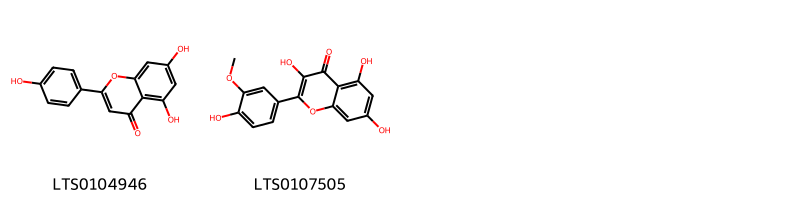{ width=100% }
    <figcaption>Hình ảnh cấu trúc hóa học của 2 hoạt chất thuộc nhóm Flavonoids gồm ['chamomile (LTS0104946)', 'isorhamnetin (LTS0107505)'].</figcaption>
</figure>
#### Nhóm Isoflavonoids
<figure markdown="span">
    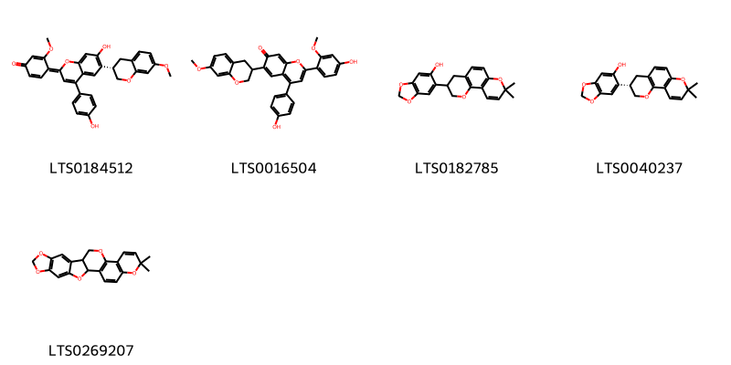{ width=100% }
    <figcaption>Hình ảnh cấu trúc hóa học của 5 hoạt chất thuộc nhóm Isoflavonoids gồm ['4-[(2z)-7-hydroxy-4-(4-hydroxyphenyl)-6-[(3s)-7-methoxy-3,4-dihydro-2h-1-benzopyran-3-yl]chromen-2-ylidene]-3-methoxycyclohexa-2,5-dien-1-one (LTS0184512)', '2-(4-hydroxy-2-methoxyphenyl)-4-(4-hydroxyphenyl)-6-(7-methoxy-3,4-dihydro-2h-1-benzopyran-3-yl)chromen-7-one (LTS0016504)', 'leiocin (LTS0182785)', '6-[(3s)-8,8-dimethyl-2h,3h,4h-pyrano[2,3-f]chromen-3-yl]-2h-1,3-benzodioxol-5-ol (LTS0040237)', 'leiocarpin (LTS0269207)'].</figcaption>
</figure>
#### Nhóm Prenol lipids
<figure markdown="span">
    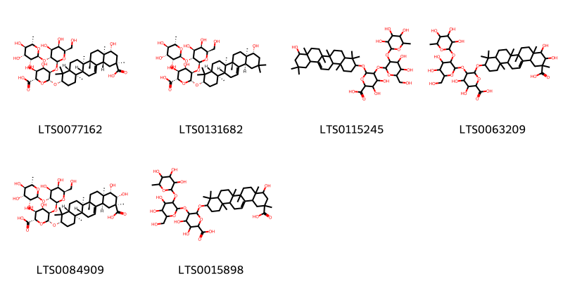{ width=100% }
    <figcaption>Hình ảnh cấu trúc hóa học của 6 hoạt chất thuộc nhóm Prenol lipids gồm ['(2s,3s,4s,5r,6r)-6-{[(3s,4ar,6ar,6bs,8ar,9r,11s,12ar,14ar,14br)-11-carboxy-9-hydroxy-4,4,6a,6b,8a,11,14b-heptamethyl-1,2,3,4a,5,6,7,8,9,10,12,12a,14,14a-tetradecahydropicen-3-yl]oxy}-5-{[(2s,3r,4s,5r,6r)-4,5-dihydroxy-6-(hydroxymethyl)-3-{[(2s,3r,4r,5r,6s)-3,4,5-trihydroxy-6-methyloxan-2-yl]oxy}oxan-2-yl]oxy}-3,4-dihydroxyoxane-2-carboxylic acid (LTS0077162)', '(2s,3s,4s,5r,6r)-6-{[(3s,4ar,6ar,6bs,8ar,9r,12as,14ar,14br)-9-hydroxy-4,4,6a,6b,8a,11,11,14b-octamethyl-1,2,3,4a,5,6,7,8,9,10,12,12a,14,14a-tetradecahydropicen-3-yl]oxy}-5-{[(2s,3r,4s,5r,6r)-4,5-dihydroxy-6-(hydroxymethyl)-3-{[(2s,3r,4r,5r,6s)-3,4,5-trihydroxy-6-methyloxan-2-yl]oxy}oxan-2-yl]oxy}-3,4-dihydroxyoxane-2-carboxylic acid (LTS0131682)', '5-{[4,5-dihydroxy-6-(hydroxymethyl)-3-[(3,4,5-trihydroxy-6-methyloxan-2-yl)oxy]oxan-2-yl]oxy}-3,4-dihydroxy-6-[(9-hydroxy-4,4,6a,6b,8a,11,11,14b-octamethyl-1,2,3,4a,5,6,7,8,9,10,12,12a,14,14a-tetradecahydropicen-3-yl)oxy]oxane-2-carboxylic acid (LTS0115245)', '6-[(11-carboxy-9,10-dihydroxy-4,4,6a,6b,8a,11,14b-heptamethyl-1,2,3,4a,5,6,7,8,9,10,12,12a,14,14a-tetradecahydropicen-3-yl)oxy]-5-{[4,5-dihydroxy-6-(hydroxymethyl)-3-[(3,4,5-trihydroxy-6-methyloxan-2-yl)oxy]oxan-2-yl]oxy}-3,4-dihydroxyoxane-2-carboxylic acid (LTS0063209)', '(2s,3s,4s,5r,6r)-6-{[(3s,4ar,6ar,6bs,8ar,9s,10r,11s,12as,14ar,14br)-11-carboxy-9,10-dihydroxy-4,4,6a,6b,8a,11,14b-heptamethyl-1,2,3,4a,5,6,7,8,9,10,12,12a,14,14a-tetradecahydropicen-3-yl]oxy}-5-{[(2s,3r,4s,5r,6r)-4,5-dihydroxy-6-(hydroxymethyl)-3-{[(2s,3r,4r,5r,6s)-3,4,5-trihydroxy-6-methyloxan-2-yl]oxy}oxan-2-yl]oxy}-3,4-dihydroxyoxane-2-carboxylic acid (LTS0084909)', '6-[(11-carboxy-9-hydroxy-4,4,6a,6b,8a,11,14b-heptamethyl-1,2,3,4a,5,6,7,8,9,10,12,12a,14,14a-tetradecahydropicen-3-yl)oxy]-5-{[4,5-dihydroxy-6-(hydroxymethyl)-3-[(3,4,5-trihydroxy-6-methyloxan-2-yl)oxy]oxan-2-yl]oxy}-3,4-dihydroxyoxane-2-carboxylic acid (LTS0015898)'].</figcaption>
</figure>

---

### Dược dân tộc học

Danh sách các quốc gia có sử dụng *Dalbergia hupeana* trong điều trị các bệnh. 

| Country   | Disease                                                | Bệnh                                                                                                                                                                                                |
|:----------|:-------------------------------------------------------|:----------------------------------------------------------------------------------------------------------------------------------------------------------------------------------------------------|
| China     | Larvicide, Parasiticide, Poison, Poultice, Insecticide | MYMEMORY WARNING: YOU USED ALL AVAILABLE FREE TRANSLATIONS FOR TODAY. NEXT AVAILABLE IN  16 HOURS 40 MINUTES 20 SECONDS VISIT HTTPS://MYMEMORY.TRANSLATED.NET/DOC/USAGELIMITS.PHP TO TRANSLATE MORE |

---

---
## Dalbergia latifolia
### Thông tin về thực vật

!!! info "Phân loại thực vật của *Dalbergia latifolia* từ GIBF:"
    - **Kingdom:** Plantae
    - **Phylum:** Tracheophyta
    - **Order:** Fabales
    - **Family:** Fabaceae
    - **Genus:** Dalbergia
    - **Species:** *Dalbergia latifolia*

 

| Label (VI)   | Label (EN)   | Scientific Name     | Descriptions (VI)   | Descriptions (EN)   | Also Known As (VI)   | Also Known As (EN)                                                                                               |
|:-------------|:-------------|:--------------------|:--------------------|:--------------------|:---------------------|:-----------------------------------------------------------------------------------------------------------------|
| N/A          | N/A          | Dalbergia latifolia |                     | species of plant    | ['']                 | ['Indian rosewood', 'Blackwood', 'rosewood', 'Amerimnon latifolium', 'Indonesian Rosewood', 'Indian palisandre'] |

#### Phân bố trên thế giới

**Từ CSDL GIBF** nan, Sri Lanka, Australia, Japan, unknown or invalid, Benin, Tanzania, United Republic of, Réunion, Nigeria, Chinese Taipei, United States of America, Congo, Democratic Republic of the, Thailand, Guyana, Cuba, Mexico, Singapore, China, India, Indonesia, Philippines, Malaysia, Nepal

#### Phân bố tại Việt Nam

**Từ CSDL GIBF**: Không có ghi nhận ở Việt Nam

---
### Thành phần hóa học
        
- Theo cơ sở dữ liệu lotus: Từ loài *Dalbergia latifolia* đã phân lập và xác định được 15 hoạt chất thuộc về các nhóm Naphthalenes, Flavonoids, Prenol lipids, Steroids and steroid derivatives, Isoflavonoids, Benzene and substituted derivatives, Saturated hydrocarbons, Neoflavonoids. 

|    | chemicalTaxonomyClassyfireClass     |   smiles_count |
|---:|:------------------------------------|---------------:|
|  0 | Benzene and substituted derivatives |              2 |
|  1 | Flavonoids                          |              1 |
|  2 | Isoflavonoids                       |              2 |
|  3 | Naphthalenes                        |              1 |
|  4 | Neoflavonoids                       |              4 |
|  5 | Prenol lipids                       |              2 |
|  6 | Saturated hydrocarbons              |              1 |
|  7 | Steroids and steroid derivatives    |              2 |

#### Nhóm Benzene and substituted derivatives
<figure markdown="span">
    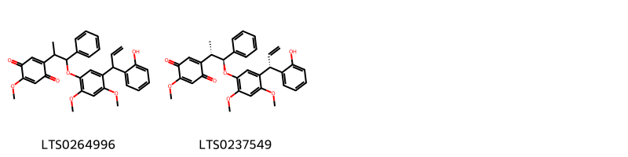{ width=100% }
    <figcaption>Hình ảnh cấu trúc hóa học của 2 hoạt chất thuộc nhóm Benzene and substituted derivatives gồm ['2-(1-{5-[1-(2-hydroxyphenyl)prop-2-en-1-yl]-2,4-dimethoxyphenoxy}-1-phenylpropan-2-yl)-5-methoxycyclohexa-2,5-diene-1,4-dione (LTS0264996)', '2-[(1s,2s)-1-{5-[(1r)-1-(2-hydroxyphenyl)prop-2-en-1-yl]-2,4-dimethoxyphenoxy}-1-phenylpropan-2-yl]-5-methoxycyclohexa-2,5-diene-1,4-dione (LTS0237549)'].</figcaption>
</figure>
#### Nhóm Flavonoids
<figure markdown="span">
    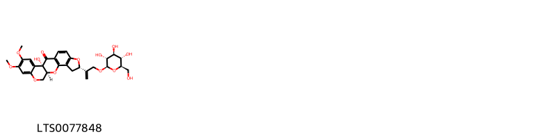{ width=100% }
    <figcaption>Hình ảnh cấu trúc hóa học của 1 hoạt chất thuộc nhóm Flavonoids gồm ['(1s,6s,13s)-13-hydroxy-16,17-dimethoxy-6-(3-{[(2r,3r,4s,5s,6r)-3,4,5-trihydroxy-6-(hydroxymethyl)oxan-2-yl]oxy}prop-1-en-2-yl)-2,7,20-trioxapentacyclo[11.8.0.0³,¹¹.0⁴,⁸.0¹⁴,¹⁹]henicosa-3(11),4(8),9,14,16,18-hexaen-12-one (LTS0077848)'].</figcaption>
</figure>
#### Nhóm Isoflavonoids
<figure markdown="span">
    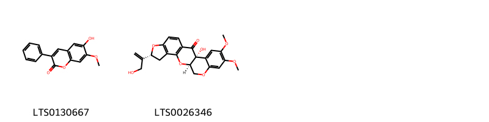{ width=100% }
    <figcaption>Hình ảnh cấu trúc hóa học của 2 hoạt chất thuộc nhóm Isoflavonoids gồm ['6-hydroxy-7-methoxy-3-phenylchromen-2-one (LTS0130667)', '(1r,6r,13r)-13-hydroxy-6-(3-hydroxyprop-1-en-2-yl)-16,17-dimethoxy-2,7,20-trioxapentacyclo[11.8.0.0³,¹¹.0⁴,⁸.0¹⁴,¹⁹]henicosa-3(11),4(8),9,14,16,18-hexaen-12-one (LTS0026346)'].</figcaption>
</figure>
#### Nhóm Naphthalenes
<figure markdown="span">
    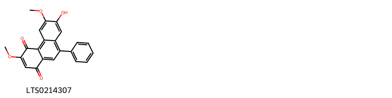{ width=100% }
    <figcaption>Hình ảnh cấu trúc hóa học của 1 hoạt chất thuộc nhóm Naphthalenes gồm ['7-hydroxy-3,6-dimethoxy-9-phenylphenanthrene-1,4-dione (LTS0214307)'].</figcaption>
</figure>
#### Nhóm Neoflavonoids
<figure markdown="span">
    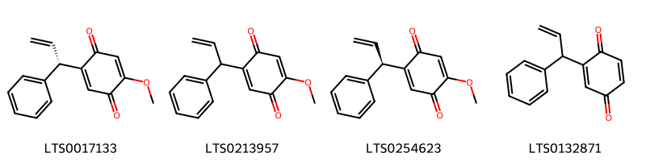{ width=100% }
    <figcaption>Hình ảnh cấu trúc hóa học của 4 hoạt chất thuộc nhóm Neoflavonoids gồm ['2-methoxy-5-[(1s)-1-phenylprop-2-en-1-yl]cyclohexa-2,5-diene-1,4-dione (LTS0017133)', '2-methoxy-5-(1-phenylprop-2-en-1-yl)cyclohexa-2,5-diene-1,4-dione (LTS0213957)', '(r)-4-methoxydalbergione (LTS0254623)', 'dalbergione (LTS0132871)'].</figcaption>
</figure>
#### Nhóm Prenol lipids
<figure markdown="span">
    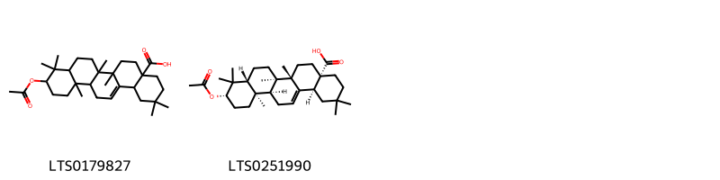{ width=100% }
    <figcaption>Hình ảnh cấu trúc hóa học của 2 hoạt chất thuộc nhóm Prenol lipids gồm ['10-(acetyloxy)-2,2,6a,6b,9,9,12a-heptamethyl-1,3,4,5,6,7,8,8a,10,11,12,12b,13,14b-tetradecahydropicene-4a-carboxylic acid (LTS0179827)', '(4as,6as,6br,8ar,10s,12ar,12bs,14bs)-10-(acetyloxy)-2,2,6a,6b,9,9,12a-heptamethyl-1,3,4,5,6,7,8,8a,10,11,12,12b,13,14b-tetradecahydropicene-4a-carboxylic acid (LTS0251990)'].</figcaption>
</figure>
#### Nhóm Saturated hydrocarbons
<figure markdown="span">
    { width=100% }
    <figcaption>Hình ảnh cấu trúc hóa học của 1 hoạt chất thuộc nhóm Saturated hydrocarbons gồm ['triacontane (LTS0250709)'].</figcaption>
</figure>
#### Nhóm Steroids and steroid derivatives
<figure markdown="span">
    { width=100% }
    <figcaption>Hình ảnh cấu trúc hóa học của 2 hoạt chất thuộc nhóm Steroids and steroid derivatives gồm ['stigmast-5-en-3-ol, (3β)- (LTS0204616)', '(1r,3ar,3br,7s,9ar,9br,11ar)-1-[(2r,5r)-5-ethyl-6-methylheptan-2-yl]-9a,11a-dimethyl-1h,2h,3h,3ah,3bh,4h,6h,7h,8h,9h,9bh,10h,11h-cyclopenta[a]phenanthren-7-ol (LTS0129695)'].</figcaption>
</figure>

---

### Dược dân tộc học

Danh sách các quốc gia có sử dụng *Dalbergia latifolia* trong điều trị các bệnh. 

| Country   | Disease              | Bệnh                                                                                                                                                                                                |
|:----------|:---------------------|:----------------------------------------------------------------------------------------------------------------------------------------------------------------------------------------------------|
| India     | Stimulant, Vermifuge | MYMEMORY WARNING: YOU USED ALL AVAILABLE FREE TRANSLATIONS FOR TODAY. NEXT AVAILABLE IN  16 HOURS 39 MINUTES 57 SECONDS VISIT HTTPS://MYMEMORY.TRANSLATED.NET/DOC/USAGELIMITS.PHP TO TRANSLATE MORE |

---

---
## Dalbergia parviflora
### Thông tin về thực vật

!!! info "Phân loại thực vật của *Dalbergia parviflora* từ GIBF:"
    - **Kingdom:** Plantae
    - **Phylum:** Tracheophyta
    - **Order:** Fabales
    - **Family:** Fabaceae
    - **Genus:** Dalbergia
    - **Species:** *Dalbergia parviflora*

 

| Label (VI)   | Label (EN)   | Scientific Name      | Descriptions (VI)   | Descriptions (EN)   | Also Known As (VI)   | Also Known As (EN)   |
|:-------------|:-------------|:---------------------|:--------------------|:--------------------|:---------------------|:---------------------|
| N/A          | N/A          | Dalbergia parviflora | loài thực vật       | species of plant    | ['']                 | ['']                 |

#### Phân bố trên thế giới

**Từ CSDL GIBF** nan, Thailand, Brazil, Myanmar, unknown or invalid, Indonesia, India, Philippines, Malaysia, Brunei Darussalam

#### Phân bố tại Việt Nam

**Từ CSDL GIBF**: Không có ghi nhận ở Việt Nam

---
### Thành phần hóa học
        
- Theo cơ sở dữ liệu lotus: Từ loài *Dalbergia parviflora* đã phân lập và xác định được 136 hoạt chất thuộc về các nhóm Flavonoids, Isoflavonoids, Linear 1,3-diarylpropanoids, Benzofurans, Benzene and substituted derivatives, 2-arylbenzofuran flavonoids, Tetrahydrofurans, Phenols, Neoflavonoids, Benzopyrans. 

|    | chemicalTaxonomyClassyfireClass     |   smiles_count |
|---:|:------------------------------------|---------------:|
|  0 | 2-arylbenzofuran flavonoids         |              1 |
|  1 | Benzene and substituted derivatives |             10 |
|  2 | Benzofurans                         |              1 |
|  3 | Benzopyrans                         |              2 |
|  4 | Flavonoids                          |             22 |
|  5 | Isoflavonoids                       |             82 |
|  6 | Linear 1,3-diarylpropanoids         |             12 |
|  7 | Neoflavonoids                       |              2 |
|  8 | Phenols                             |              1 |
|  9 | Tetrahydrofurans                    |              2 |

#### Nhóm 2-arylbenzofuran flavonoids
<figure markdown="span">
    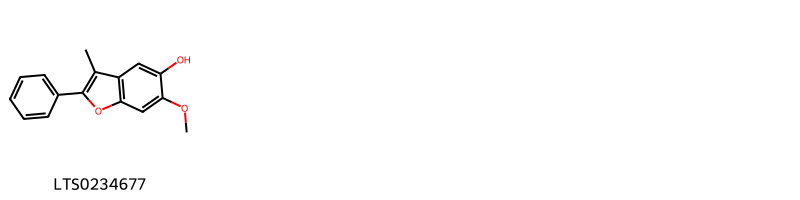{ width=100% }
    <figcaption>Hình ảnh cấu trúc hóa học của 1 hoạt chất thuộc nhóm 2-arylbenzofuran flavonoids gồm ['parvifuran (LTS0234677)'].</figcaption>
</figure>
#### Nhóm Benzene and substituted derivatives
<figure markdown="span">
    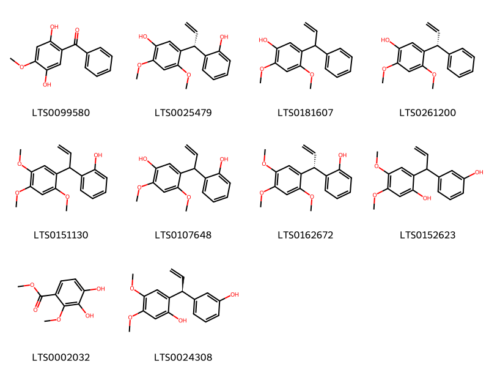{ width=100% }
    <figcaption>Hình ảnh cấu trúc hóa học của 10 hoạt chất thuộc nhóm Benzene and substituted derivatives gồm ['2-benzoyl-5-methoxybenzene-1,4-diol (LTS0099580)', 'latifolin (LTS0025479)', '2,4-dimethoxy-5-(1-phenylprop-2-en-1-yl)phenol (LTS0181607)', '2,4-dimethoxy-5-[(1r)-1-phenylprop-2-en-1-yl]phenol (LTS0261200)', '2-[1-(2,4,5-trimethoxyphenyl)prop-2-en-1-yl]phenol (LTS0151130)', '5-[1-(2-hydroxyphenyl)prop-2-en-1-yl]-2,4-dimethoxyphenol (LTS0107648)', '5-o-methyllatifolin (LTS0162672)', '2-[1-(3-hydroxyphenyl)prop-2-en-1-yl]-4,5-dimethoxyphenol (LTS0152623)', 'methyl 3,4-dihydroxy-2-methoxybenzoate (LTS0002032)', '2-[(1s)-1-(3-hydroxyphenyl)prop-2-en-1-yl]-4,5-dimethoxyphenol (LTS0024308)'].</figcaption>
</figure>
#### Nhóm Benzofurans
<figure markdown="span">
    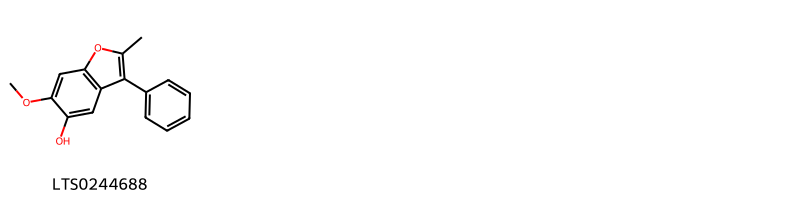{ width=100% }
    <figcaption>Hình ảnh cấu trúc hóa học của 1 hoạt chất thuộc nhóm Benzofurans gồm ['6-methoxy-2-methyl-3-phenyl-1-benzofuran-5-ol (LTS0244688)'].</figcaption>
</figure>
#### Nhóm Benzopyrans
<figure markdown="span">
    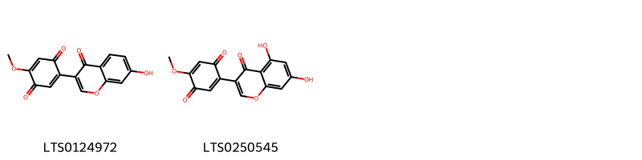{ width=100% }
    <figcaption>Hình ảnh cấu trúc hóa học của 2 hoạt chất thuộc nhóm Benzopyrans gồm ['bowdichione (LTS0124972)', '5-hydroxybowdichione (LTS0250545)'].</figcaption>
</figure>
#### Nhóm Flavonoids
<figure markdown="span">
    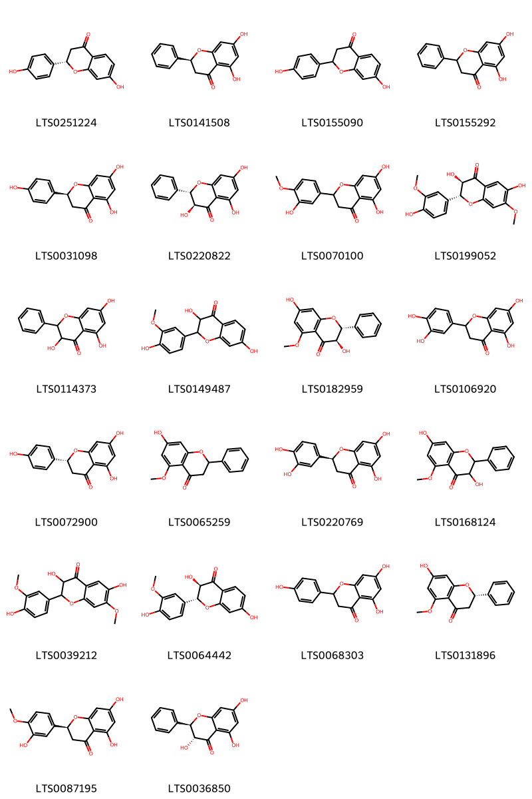{ width=100% }
    <figcaption>Hình ảnh cấu trúc hóa học của 22 hoạt chất thuộc nhóm Flavonoids gồm ['5-deoxyflavanone (LTS0251224)', 'pinocembrine (LTS0141508)', "7,4'-dihydroxyflavanone (LTS0155090)", 'pinocembrin (LTS0155292)', 'naringenin (LTS0031098)', '(2s,3s)-3,5,7-trihydroxy-2-phenyl-2,3-dihydro-1-benzopyran-4-one (LTS0220822)', 'hesperetine (LTS0070100)', '(2r,3r)-3,6-dihydroxy-2-(4-hydroxy-3-methoxyphenyl)-7-methoxy-2,3-dihydro-1-benzopyran-4-one (LTS0199052)', '3,5,7-trihydroxyflavanone (LTS0114373)', '3,7-dihydroxy-2-(4-hydroxy-3-methoxyphenyl)-2,3-dihydro-1-benzopyran-4-one (LTS0149487)', '(2r,3r)-3,7-dihydroxy-5-methoxy-2-phenyl-2,3-dihydro-1-benzopyran-4-one (LTS0182959)', '(+/-)-eriodictyol (LTS0106920)', '(-)-naringenin (LTS0072900)', 'alpinetin (LTS0065259)', 'eriodictyol (LTS0220769)', '3,7-dihydroxy-5-methoxy-2-phenyl-2,3-dihydro-1-benzopyran-4-one (LTS0168124)', '3,6-dihydroxy-2-(4-hydroxy-3-methoxyphenyl)-7-methoxy-2,3-dihydro-1-benzopyran-4-one (LTS0039212)', '(2r,3r)-3,7-dihydroxy-2-(4-hydroxy-3-methoxyphenyl)-2,3-dihydro-1-benzopyran-4-one (LTS0064442)', 'asahina (LTS0068303)', 'alpinetin (LTS0131896)', 'hesperetin (LTS0087195)', 'pinobanksin (LTS0036850)'].</figcaption>
</figure>
#### Nhóm Isoflavonoids
<figure markdown="span">
    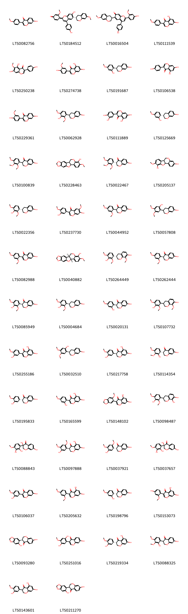{ width=100% }
    <figcaption>Hình ảnh cấu trúc hóa học của 82 hoạt chất thuộc nhóm Isoflavonoids gồm ['formononetin (LTS0082756)', '4-[(2z)-7-hydroxy-4-(4-hydroxyphenyl)-6-[(3s)-7-methoxy-3,4-dihydro-2h-1-benzopyran-3-yl]chromen-2-ylidene]-3-methoxycyclohexa-2,5-dien-1-one (LTS0184512)', '2-(4-hydroxy-2-methoxyphenyl)-4-(4-hydroxyphenyl)-6-(7-methoxy-3,4-dihydro-2h-1-benzopyran-3-yl)chromen-7-one (LTS0016504)', 'biochanin (LTS0111539)', 'tectorigenin (LTS0250238)', "3'-o-methylorobol (LTS0274738)", '(-)-vestitol (LTS0191687)', 'genistein (LTS0106538)', "3'-methoxydaidzein (LTS0229361)", '3-(3-hydroxy-2,4-dimethoxyphenyl)-3,4-dihydro-2h-1-benzopyran-7-ol (LTS0062928)', 'quercitin (LTS0111889)', 'vestitol (LTS0125669)', "3'-o-methylviolanone (LTS0100839)", '4-hydroxypterocarpin (LTS0228463)', '(3s)-7-hydroxy-3-(2,3,4-trimethoxyphenyl)-2,3-dihydro-1-benzopyran-4-one (LTS0022467)', 'vesticarpan (LTS0205137)', '(-)-mucronulatol (LTS0022356)', 'odoratin (LTS0237730)', 'sativanone (LTS0044952)', 'methoxyvestitol (LTS0057808)', '3-(2,4-dimethoxyphenyl)-7-hydroxychromen-4-one (LTS0082988)', '(1r,12r)-16-methoxy-5,7,11,19-tetraoxapentacyclo[10.8.0.0²,¹⁰.0⁴,⁸.0¹³,¹⁸]icosa-2,4(8),9,13,15,17-hexaen-17-ol (LTS0040882)', '(3s)-3-(3-hydroxy-2,4-dimethoxyphenyl)-8-methoxy-3,4-dihydro-2h-1-benzopyran-7-ol (LTS0264449)', '(3r)-3-(2,4-dimethoxyphenyl)-7-hydroxy-2,3-dihydro-1-benzopyran-4-one (LTS0262444)', '(3r)-7-hydroxy-3-(3-hydroxy-2,4-dimethoxyphenyl)-2,3-dihydro-1-benzopyran-4-one (LTS0085949)', '(3r)-3-(3-hydroxy-2,4-dimethoxyphenyl)-3,4-dihydro-2h-1-benzopyran-7-ol (LTS0004684)', 'vestitone (LTS0020131)', 'duartin (LTS0107732)', 'pratensein (LTS0255186)', '(3r)-3-(2-hydroxy-4,5-dimethoxyphenyl)-3,4-dihydro-2h-1-benzopyran-7-ol (LTS0032510)', '(3r)-5,7-dihydroxy-3-(3-hydroxy-4-methoxyphenyl)-2,3-dihydro-1-benzopyran-4-one (LTS0217758)', '(3s)-7-hydroxy-3-(2-hydroxy-3,4-dimethoxyphenyl)-2,3-dihydro-1-benzopyran-4-one (LTS0114354)', '(3s)-7-hydroxy-3-(3-hydroxy-4-methoxyphenyl)-2,3-dihydro-1-benzopyran-4-one (LTS0195833)', "2'-hydroxybiochanin a (LTS0165599)", 'khrinone d (LTS0148102)', '8-demethylduartin (LTS0098487)', '3-(2,3-dihydroxy-4-methoxyphenyl)-3,7-dihydroxy-2h-1-benzopyran-4-one (LTS0088843)', '(3r)-5,7-dihydroxy-3-(5-hydroxy-2,4-dimethoxyphenyl)-2,3-dihydro-1-benzopyran-4-one (LTS0097888)', '(3s)-7-hydroxy-3-(5-hydroxy-2,4-dimethoxyphenyl)-2,3-dihydro-1-benzopyran-4-one (LTS0037921)', 'isodarparvinol b (LTS0037657)', 'calycosin (LTS0106037)', "2'-methoxybiochanin a (LTS0205632)", '(3s)-7-hydroxy-3-(2-hydroxy-4-methoxyphenyl)-2,3-dihydro-1-benzopyran-4-one (LTS0198796)', '5,7-dihydroxy-3-(4-hydroxy-2-methoxyphenyl)chromen-4-one (LTS0153073)', '(+)-sophorol (LTS0093280)', 'khrinone a (LTS0251016)', '(3s)-5,7-dihydroxy-3-(3-hydroxy-4-methoxyphenyl)-2,3-dihydro-1-benzopyran-4-one (LTS0219334)', '7-hydroxy-3-(2-hydroxy-3,4-dimethoxyphenyl)-2,3-dihydro-1-benzopyran-4-one (LTS0088325)', '5,7-dihydroxy-3-(3-hydroxy-4-methoxyphenyl)-2,3-dihydro-1-benzopyran-4-one (LTS0143601)', '7-hydroxy-3-(6-hydroxy-2h-1,3-benzodioxol-5-yl)-2,3-dihydro-1-benzopyran-4-one (LTS0211270)', '(1r,10r)-14-methoxy-8,17-dioxatetracyclo[8.7.0.0²,⁷.0¹¹,¹⁶]heptadeca-2,4,6,11(16),12,14-hexaene-5,13-diol (LTS0103513)', 'khrinone b (LTS0043639)', '(3s)-3,7-dihydroxy-3-(2-hydroxy-3,4-dimethoxyphenyl)-2h-1-benzopyran-4-one (LTS0205391)', '3,7-dihydroxy-3-(2-hydroxy-3,4-dimethoxyphenyl)-2h-1-benzopyran-4-one (LTS0060892)', '(3s)-7-hydroxy-3-(6-methoxy-2h-1,3-benzodioxol-5-yl)-2,3-dihydro-1-benzopyran-4-one (LTS0269938)', '(3s)-3-(2,4-dimethoxyphenyl)-7-hydroxy-2,3-dihydro-1-benzopyran-4-one (LTS0191108)', 'dalparvin (LTS0232323)', 'vestitone (LTS0239015)', 'khrinone e (LTS0163245)', '5,7-dihydroxy-3-(3-hydroxy-2,4-dimethoxyphenyl)-2,3-dihydro-1-benzopyran-4-one (LTS0229477)', 'khrinone c (LTS0211061)', '3-[(3s)-7-hydroxy-8-methoxy-3,4-dihydro-2h-1-benzopyran-3-yl]-6-methoxybenzene-1,2-diol (LTS0188624)', '3-(4,5-dihydroxy-2-methoxyphenyl)-5,7-dihydroxychromen-4-one (LTS0243047)', 'teralin (LTS0196220)', '14-methoxy-8,17-dioxatetracyclo[8.7.0.0²,⁷.0¹¹,¹⁶]heptadeca-2,4,6,11(16),12,14-hexaene-5,13-diol (LTS0136073)', '(3s)-5,7-dihydroxy-3-(5-hydroxy-2,4-dimethoxyphenyl)-2,3-dihydro-1-benzopyran-4-one (LTS0130746)', '(3s)-7-hydroxy-3-(3-hydroxy-2,4-dimethoxyphenyl)-2,3-dihydro-1-benzopyran-4-one (LTS0064015)', '(3s)-7-hydroxy-3-(4-methoxyphenyl)-2,3-dihydro-1-benzopyran-4-one (LTS0063169)', '5-methoxyvestitol (LTS0001282)', 'onogenin (LTS0013316)', '(1r,10r)-14-methoxy-8,17-dioxatetracyclo[8.7.0.0²,⁷.0¹¹,¹⁶]heptadeca-2,4,6,11,13,15-hexaene-5,15-diol (LTS0000155)', '3-(7-hydroxy-8-methoxy-3,4-dihydro-2h-1-benzopyran-3-yl)-6-methoxybenzene-1,2-diol (LTS0013098)', '(1s,10s)-14-methoxy-8,17-dioxatetracyclo[8.7.0.0²,⁷.0¹¹,¹⁶]heptadeca-2,4,6,11(16),12,14-hexaene-5,13-diol (LTS0225257)', 'violanone (LTS0090075)', 'cajanin (LTS0273779)', '(3s)-5,7-dihydroxy-3-(3-hydroxy-2,4-dimethoxyphenyl)-2,3-dihydro-1-benzopyran-4-one (LTS0029289)', '5,7-dihydroxy-3-(6-methoxy-2h-1,3-benzodioxol-5-yl)-2,3-dihydro-1-benzopyran-4-one (LTS0092572)', '5,7-dihydroxy-3-(2,4,5-trimethoxyphenyl)chromen-4-one (LTS0092700)', '5,7-dihydroxy-3-(5-hydroxy-2,4-dimethoxyphenyl)chromen-4-one (LTS0102934)', '(3s)-3-(3-hydroxy-2,4-dimethoxyphenyl)-3,4-dihydro-2h-1-benzopyran-7,8-diol (LTS0105350)', "3'-hydroxydihydroformononetin (LTS0119204)", '7-hydroxy-3-(5-hydroxy-2,4-dimethoxyphenyl)-2,3-dihydro-1-benzopyran-4-one (LTS0018895)'].</figcaption>
</figure>
#### Nhóm Linear 1_3-diarylpropanoids
<figure markdown="span">
    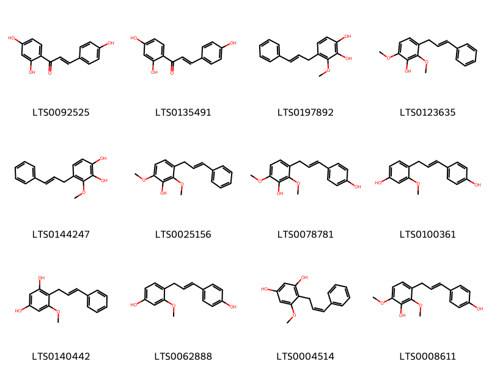{ width=100% }
    <figcaption>Hình ảnh cấu trúc hóa học của Không tìm thấy chú thích hoạt chất thuộc nhóm Linear 1_3-diarylpropanoids gồm Không tìm thấy chú thích.</figcaption>
</figure>
#### Nhóm Neoflavonoids
<figure markdown="span">
    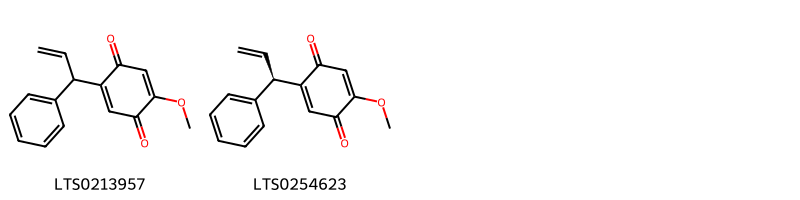{ width=100% }
    <figcaption>Hình ảnh cấu trúc hóa học của 2 hoạt chất thuộc nhóm Neoflavonoids gồm ['2-methoxy-5-(1-phenylprop-2-en-1-yl)cyclohexa-2,5-diene-1,4-dione (LTS0213957)', '(r)-4-methoxydalbergione (LTS0254623)'].</figcaption>
</figure>
#### Nhóm Phenols
<figure markdown="span">
    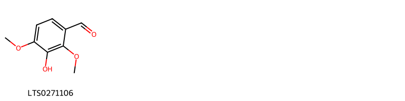{ width=100% }
    <figcaption>Hình ảnh cấu trúc hóa học của 1 hoạt chất thuộc nhóm Phenols gồm ['3-hydroxy-2,4-dimethoxybenzaldehyde (LTS0271106)'].</figcaption>
</figure>
#### Nhóm Tetrahydrofurans
<figure markdown="span">
    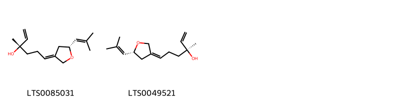{ width=100% }
    <figcaption>Hình ảnh cấu trúc hóa học của 2 hoạt chất thuộc nhóm Tetrahydrofurans gồm ['(3s)-3-methyl-6-[(5r)-5-(2-methylprop-1-en-1-yl)oxolan-3-ylidene]hex-1-en-3-ol (LTS0085031)', '(3s)-3-methyl-6-[(3z,5r)-5-(2-methylprop-1-en-1-yl)oxolan-3-ylidene]hex-1-en-3-ol (LTS0049521)'].</figcaption>
</figure>

---

### Dược dân tộc học

Danh sách các quốc gia có sử dụng *Dalbergia parviflora* trong điều trị các bệnh. 

| Country   | Disease   | Bệnh                                                                                                                                                                                                |
|:----------|:----------|:----------------------------------------------------------------------------------------------------------------------------------------------------------------------------------------------------|
| Malaya    | Tonic     | MYMEMORY WARNING: YOU USED ALL AVAILABLE FREE TRANSLATIONS FOR TODAY. NEXT AVAILABLE IN  16 HOURS 39 MINUTES 31 SECONDS VISIT HTTPS://MYMEMORY.TRANSLATED.NET/DOC/USAGELIMITS.PHP TO TRANSLATE MORE |

---

---
## Dalbergia pinnata
### Thông tin về thực vật

!!! info "Phân loại thực vật của *Dalbergia pinnata* từ GIBF:"
    - **Kingdom:** Plantae
    - **Phylum:** Tracheophyta
    - **Order:** Fabales
    - **Family:** Fabaceae
    - **Genus:** Dalbergia
    - **Species:** *Dalbergia pinnata*

 

| Label (VI)   | Label (EN)   | Scientific Name   | Descriptions (VI)   | Descriptions (EN)   | Also Known As (VI)   | Also Known As (EN)   |
|:-------------|:-------------|:------------------|:--------------------|:--------------------|:---------------------|:---------------------|
| N/A          | N/A          | Dalbergia pinnata | loài thực vật       | species of plant    | ['']                 | ['']                 |

#### Phân bố trên thế giới

**Từ CSDL GIBF** Gabon, Lao People’s Democratic Republic, Cambodia, Myanmar, unknown or invalid, Bangladesh, Guinea, Thailand, Brazil, Bhutan, Viet Nam, China, Equatorial Guinea, India, Indonesia, Philippines, Malaysia, Brunei Darussalam, Nepal

#### Phân bố tại Việt Nam

**Từ CSDL GIBF**: Không có ghi nhận ở Việt Nam

---
### Thành phần hóa học
        
- Theo cơ sở dữ liệu lotus: Từ loài *Dalbergia pinnata* đã phân lập và xác định được Chưa có hoạt chất nào được phân lập. hoạt chất thuộc về các nhóm Không có hoạt chất nào được phân lập. 

Không có hình ảnh nào được tạo ra

---

### Dược dân tộc học

Danh sách các quốc gia có sử dụng *Dalbergia pinnata* trong điều trị các bệnh. 

| Country   | Disease   | Bệnh                                                                                                                                                                                                |
|:----------|:----------|:----------------------------------------------------------------------------------------------------------------------------------------------------------------------------------------------------|
| Indochina | Vermifuge | MYMEMORY WARNING: YOU USED ALL AVAILABLE FREE TRANSLATIONS FOR TODAY. NEXT AVAILABLE IN  16 HOURS 39 MINUTES 07 SECONDS VISIT HTTPS://MYMEMORY.TRANSLATED.NET/DOC/USAGELIMITS.PHP TO TRANSLATE MORE |

---

---
## Dalbergia sissoo
### Thông tin về thực vật

!!! info "Phân loại thực vật của *Dalbergia sissoo* từ GIBF:"
    - **Kingdom:** Plantae
    - **Phylum:** Tracheophyta
    - **Order:** Fabales
    - **Family:** Fabaceae
    - **Genus:** Dalbergia
    - **Species:** *Dalbergia sissoo*

 

| Label (VI)   | Label (EN)   | Scientific Name   | Descriptions (VI)   | Descriptions (EN)   | Also Known As (VI)   | Also Known As (EN)                                                                             |
|:-------------|:-------------|:------------------|:--------------------|:--------------------|:---------------------|:-----------------------------------------------------------------------------------------------|
| N/A          | N/A          | Dalbergia sissoo  | loài thực vật       | species of plant    | ['']                 | ['Indian rosewood', 'Sisu', 'Rose wood', 'Shisham', 'Sisoo', 'Sissoo', 'Sissoo tree', 'Sissu'] |

#### Phân bố trên thế giới

**Từ CSDL GIBF** Pakistan, Hong Kong, Thailand, Iran (Islamic Republic of), Chinese Taipei, Egypt, India, United States of America

#### Phân bố tại Việt Nam

**Từ CSDL GIBF**: Không có ghi nhận ở Việt Nam

---
### Thành phần hóa học
        
- Theo cơ sở dữ liệu lotus: Từ loài *Dalbergia sissoo* đã phân lập và xác định được 130 hoạt chất thuộc về các nhóm Flavonoids, Prenol lipids, Steroids and steroid derivatives, Isoflavonoids, Linear 1,3-diarylpropanoids, Cinnamic acids and derivatives, Benzene and substituted derivatives, Organooxygen compounds, Neoflavonoids, Lignan glycosides. 

|    | chemicalTaxonomyClassyfireClass     |   smiles_count |
|---:|:------------------------------------|---------------:|
|  0 | Benzene and substituted derivatives |             16 |
|  1 | Cinnamic acids and derivatives      |              2 |
|  2 | Flavonoids                          |             17 |
|  3 | Isoflavonoids                       |             61 |
|  4 | Lignan glycosides                   |              3 |
|  5 | Linear 1,3-diarylpropanoids         |              9 |
|  6 | Neoflavonoids                       |              9 |
|  7 | Organooxygen compounds              |              6 |
|  8 | Prenol lipids                       |              1 |
|  9 | Steroids and steroid derivatives    |              4 |

#### Nhóm Benzene and substituted derivatives
<figure markdown="span">
    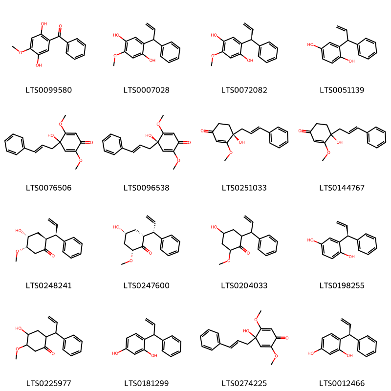{ width=100% }
    <figcaption>Hình ảnh cấu trúc hóa học của 16 hoạt chất thuộc nhóm Benzene and substituted derivatives gồm ['2-benzoyl-5-methoxybenzene-1,4-diol (LTS0099580)', 'obtusaquinol (LTS0007028)', '2-methoxy-5-[(1s)-1-phenylprop-2-en-1-yl]benzene-1,4-diol (LTS0072082)', '2-(1-phenylprop-2-en-1-yl)benzene-1,4-diol (LTS0051139)', '4-hydroxy-2,5-dimethoxy-4-[(2e)-3-phenylprop-2-en-1-yl]cyclohexa-2,5-dien-1-one (LTS0076506)', '(4r)-4-hydroxy-2,5-dimethoxy-4-[(2e)-3-phenylprop-2-en-1-yl]cyclohexa-2,5-dien-1-one (LTS0096538)', '(4s)-4-hydroxy-3-methoxy-4-[(2e)-3-phenylprop-2-en-1-yl]cyclohex-2-en-1-one (LTS0251033)', '4-hydroxy-3-methoxy-4-(3-phenylprop-2-en-1-yl)cyclohex-2-en-1-one (LTS0144767)', '(2s,4r,5s)-4-hydroxy-5-methoxy-2-[(1r)-1-phenylprop-2-en-1-yl]cyclohexan-1-one (LTS0248241)', '(2r,4r,6r)-4-hydroxy-2-methoxy-6-[(1s)-1-phenylprop-2-en-1-yl]cyclohexan-1-one (LTS0247600)', '4-hydroxy-2-methoxy-6-(1-phenylprop-2-en-1-yl)cyclohexan-1-one (LTS0204033)', '2-[(1s)-1-phenylprop-2-en-1-yl]benzene-1,4-diol (LTS0198255)', '4-hydroxy-5-methoxy-2-(1-phenylprop-2-en-1-yl)cyclohexan-1-one (LTS0225977)', '4-(1-phenylprop-2-en-1-yl)benzene-1,3-diol (LTS0181299)', '4-hydroxy-2,5-dimethoxy-4-(3-phenylprop-2-en-1-yl)cyclohexa-2,5-dien-1-one (LTS0274225)', '4-[(1s)-1-phenylprop-2-en-1-yl]benzene-1,3-diol (LTS0012466)'].</figcaption>
</figure>
#### Nhóm Cinnamic acids and derivatives
<figure markdown="span">
    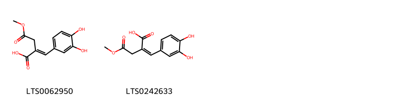{ width=100% }
    <figcaption>Hình ảnh cấu trúc hóa học của 2 hoạt chất thuộc nhóm Cinnamic acids and derivatives gồm ['(2e)-2-[(3,4-dihydroxyphenyl)methylidene]-4-methoxy-4-oxobutanoic acid (LTS0062950)', '2-[(3,4-dihydroxyphenyl)methylidene]-4-methoxy-4-oxobutanoic acid (LTS0242633)'].</figcaption>
</figure>
#### Nhóm Flavonoids
<figure markdown="span">
    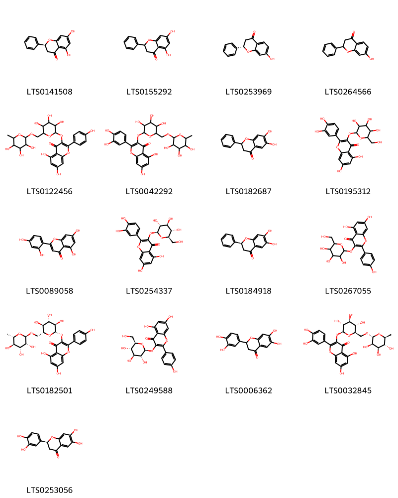{ width=100% }
    <figcaption>Hình ảnh cấu trúc hóa học của 17 hoạt chất thuộc nhóm Flavonoids gồm ['pinocembrine (LTS0141508)', 'pinocembrin (LTS0155292)', '(2s)-7-hydroxyflavanone (LTS0253969)', '7-hydroxyflavanone (LTS0264566)', '5,7-dihydroxy-2-(4-hydroxyphenyl)-3-[(3,4,5-trihydroxy-6-{[(3,4,5-trihydroxy-6-methyloxan-2-yl)oxy]methyl}oxan-2-yl)oxy]chromen-4-one (LTS0122456)', 'rutin (LTS0042292)', '6,7-dihydroxy-2-phenyl-2,3-dihydro-1-benzopyran-4-one (LTS0182687)', '2-(3,4-dihydroxyphenyl)-5,7-dihydroxy-3-{[3,4,5-trihydroxy-6-(hydroxymethyl)oxan-2-yl]oxy}chromen-4-one (LTS0195312)', 'norartocarpetin (LTS0089058)', 'isoquercetin (LTS0254337)', '(2s)-6,7-dihydroxy-2-phenyl-2,3-dihydro-1-benzopyran-4-one (LTS0184918)', 'trifolin (LTS0267055)', 'nictoflorin (LTS0182501)', 'astragalin (LTS0249588)', 'plathymenin (LTS0006362)', '3-rutinosyl quercetin (LTS0032845)', '(2s)-2-(3,4-dihydroxyphenyl)-6,7-dihydroxy-2,3-dihydro-1-benzopyran-4-one (LTS0253056)'].</figcaption>
</figure>
#### Nhóm Isoflavonoids
<figure markdown="span">
    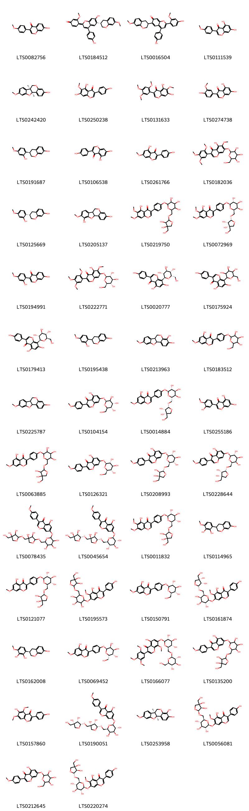{ width=100% }
    <figcaption>Hình ảnh cấu trúc hóa học của 61 hoạt chất thuộc nhóm Isoflavonoids gồm ['formononetin (LTS0082756)', '4-[(2z)-7-hydroxy-4-(4-hydroxyphenyl)-6-[(3s)-7-methoxy-3,4-dihydro-2h-1-benzopyran-3-yl]chromen-2-ylidene]-3-methoxycyclohexa-2,5-dien-1-one (LTS0184512)', '2-(4-hydroxy-2-methoxyphenyl)-4-(4-hydroxyphenyl)-6-(7-methoxy-3,4-dihydro-2h-1-benzopyran-3-yl)chromen-7-one (LTS0016504)', 'biochanin (LTS0111539)', '(+)-medicarpin (LTS0242420)', 'tectorigenin (LTS0250238)', 'caviunin (LTS0131633)', "3'-o-methylorobol (LTS0274738)", '(-)-vestitol (LTS0191687)', 'genistein (LTS0106538)', 'prunetin (LTS0261766)', '5-hydroxy-6-methoxy-7-{[3,4,5-trihydroxy-6-(hydroxymethyl)oxan-2-yl]oxy}-3-(2,4,5-trimethoxyphenyl)chromen-4-one (LTS0182036)', 'vestitol (LTS0125669)', 'vesticarpan (LTS0205137)', '3-(4-{[6-({[3,4-dihydroxy-4-(hydroxymethyl)oxolan-2-yl]oxy}methyl)-3,4,5-trihydroxyoxan-2-yl]oxy}phenyl)-5-hydroxy-6,7-dimethoxychromen-4-one (LTS0219750)', '3-(4-{[(2s,3r,4s,5r,6r)-6-({[(2r,3s,4s)-3,4-dihydroxy-4-(hydroxymethyl)oxolan-2-yl]oxy}methyl)-3,4,5-trihydroxyoxan-2-yl]oxy}phenyl)-5-hydroxy-6,7-dimethoxychromen-4-one (LTS0072969)', "2'-hydroxyformononetin (LTS0194991)", '5-hydroxy-6-methoxy-7-{[(2s,3r,4s,5s,6r)-3,4,5-trihydroxy-6-(hydroxymethyl)oxan-2-yl]oxy}-3-(2,4,5-trimethoxyphenyl)chromen-4-one (LTS0222771)', '5,7-dihydroxy-3-(4-hydroxyphenyl)-8-[(2s,3r,4r,5s,6s)-3,4,5-trihydroxy-6-(hydroxymethyl)oxan-2-yl]chromen-4-one (LTS0020777)', '5,7-dihydroxy-3-(4-hydroxyphenyl)-8-[3,4,5-trihydroxy-6-(hydroxymethyl)oxan-2-yl]chromen-4-one (LTS0175924)', 'genistein 8-c-glucoside (LTS0179413)', '(+/-)-vestitol (LTS0195438)', '4-hydroxymedicarpin (LTS0213963)', '5-hydroxy-7-methoxy-3-(4-{[3,4,5-trihydroxy-6-(hydroxymethyl)oxan-2-yl]oxy}phenyl)chromen-4-one (LTS0183512)', 'medicarpin (LTS0225787)', '5-hydroxy-3-(4-methoxyphenyl)-7-{[(2s,4r,5s)-3,4,5-trihydroxy-6-(hydroxymethyl)oxan-2-yl]oxy}chromen-4-one (LTS0104154)', '3-(4-{[(2s,3r,4s,5r,6s)-6-({[(2r,3s,4s)-3,4-dihydroxy-4-(hydroxymethyl)oxolan-2-yl]oxy}methyl)-3,4,5-trihydroxyoxan-2-yl]oxy}phenyl)-5-hydroxy-7-methoxychromen-4-one (LTS0014884)', 'pratensein (LTS0255186)', '3-(4-{[6-({[3,4-dihydroxy-4-(hydroxymethyl)oxolan-2-yl]oxy}methyl)-3,4,5-trihydroxyoxan-2-yl]oxy}phenyl)-5-hydroxy-7-methoxychromen-4-one (LTS0063885)', 'sissotrin (LTS0126321)', 'lanceolarin (LTS0208993)', '7-{[(2s,3r,4s,5r,6r)-6-({[(2r,3s,4s)-3,4-dihydroxy-4-(hydroxymethyl)oxolan-2-yl]oxy}methyl)-3,4,5-trihydroxyoxan-2-yl]oxy}-5-hydroxy-3-(4-methoxyphenyl)chromen-4-one (LTS0228644)', '7-{[6-({[4-({[3,4-dihydroxy-4-(hydroxymethyl)oxolan-2-yl]oxy}methyl)-3,4-dihydroxyoxolan-2-yl]oxy}methyl)-3,4,5-trihydroxyoxan-2-yl]oxy}-5-hydroxy-3-(4-methoxyphenyl)chromen-4-one (LTS0078435)', '7-{[(2s,3r,4s,5s,6r)-6-({[(2r,3r,4s)-4-({[(2s,3r,4r)-3,4-dihydroxy-4-(hydroxymethyl)oxolan-2-yl]oxy}methyl)-3,4-dihydroxyoxolan-2-yl]oxy}methyl)-3,4,5-trihydroxyoxan-2-yl]oxy}-5-hydroxy-3-(4-methoxyphenyl)chromen-4-one (LTS0045654)', '3-(4-{[(2s,3r,4s,5s,6r)-6-({[(2s,3r,4r)-3,4-dihydroxy-4-(hydroxymethyl)oxolan-2-yl]oxy}methyl)-3,4,5-trihydroxyoxan-2-yl]oxy}phenyl)-5-hydroxy-6,7-dimethoxychromen-4-one (LTS0011832)', '3-(7-hydroxy-3,4-dihydro-2h-1-benzopyran-3-yl)-6-methoxybenzene-1,2-diol (LTS0114965)', '3-(4-{[(2s,3r,4s,5s,6r)-6-({[(2s,3r,4r)-3,4-dihydroxy-4-(hydroxymethyl)oxolan-2-yl]oxy}methyl)-3,4,5-trihydroxyoxan-2-yl]oxy}phenyl)-5-hydroxy-7-methoxychromen-4-one (LTS0121077)', '7-{[6-({[3,4-dihydroxy-4-(hydroxymethyl)oxolan-2-yl]oxy}methyl)-3,4,5-trihydroxyoxan-2-yl]oxy}-5-hydroxy-3-(4-hydroxyphenyl)-6-methoxychromen-4-one (LTS0195573)', "prunetin 4'-o-glucoside (LTS0150791)", '7-{[(2s,3r,4s,5r,6r)-6-({[(2r,3s,4s)-3,4-dihydroxy-4-(hydroxymethyl)oxolan-2-yl]oxy}methyl)-3,4,5-trihydroxyoxan-2-yl]oxy}-5-hydroxy-3-(4-hydroxyphenyl)-6-methoxychromen-4-one (LTS0161874)', '3-[(3r)-7-hydroxy-3,4-dihydro-2h-1-benzopyran-3-yl]-6-methoxybenzene-1,2-diol (LTS0162008)', '5-hydroxy-7-methoxy-3-(4-{[(2s,3s,4s,5s,6s)-3,4,5-trihydroxy-6-(hydroxymethyl)oxan-2-yl]oxy}phenyl)chromen-4-one (LTS0069452)', '5-hydroxy-8-methoxy-7-{[(2s,3r,4s,5s,6r)-3,4,5-trihydroxy-6-({[(2r,3r,4s,5s,6r)-3,4,5-trihydroxy-6-(hydroxymethyl)oxan-2-yl]oxy}methyl)oxan-2-yl]oxy}-3-(2,4,5-trimethoxyphenyl)chromen-4-one (LTS0166077)', '7-{[6-({[3,4-dihydroxy-4-(hydroxymethyl)oxolan-2-yl]oxy}methyl)-3,4,5-trihydroxyoxan-2-yl]oxy}-5-hydroxy-3-(4-methoxyphenyl)chromen-4-one (LTS0135200)', 'muningin (LTS0157860)', '7-{[(2s,3r,4s,5r,6r)-6-({[(2r,3s,4r)-4-({[(2s,3s,4s)-3,4-dihydroxy-4-(hydroxymethyl)oxolan-2-yl]oxy}methyl)-3,4-dihydroxyoxolan-2-yl]oxy}methyl)-3,4,5-trihydroxyoxan-2-yl]oxy}-5-hydroxy-3-(4-methoxyphenyl)chromen-4-one (LTS0190051)', '(1s,10s)-14-methoxy-8,17-dioxatetracyclo[8.7.0.0²,⁷.0¹¹,¹⁶]heptadeca-2,4,6,11,13,15-hexaene-5,6-diol (LTS0253958)', '7-{[(2s,3r,4s,5s,6r)-6-({[(2s,3r,4r)-3,4-dihydroxy-4-(hydroxymethyl)oxolan-2-yl]oxy}methyl)-3,4,5-trihydroxyoxan-2-yl]oxy}-5-hydroxy-3-(4-hydroxyphenyl)-6-methoxychromen-4-one (LTS0056081)', '5-hydroxy-3-(4-methoxyphenyl)-7-{[3,4,5-trihydroxy-6-(hydroxymethyl)oxan-2-yl]oxy}chromen-4-one (LTS0212645)', '7-{[(2s,3r,4s,5s,6r)-6-({[(2r,3r,4r)-3,4-dihydroxy-4-(hydroxymethyl)oxolan-2-yl]oxy}methyl)-3,4,5-trihydroxyoxan-2-yl]oxy}-5-hydroxy-3-(4-hydroxyphenyl)-6-methoxychromen-4-one (LTS0220274)', 'genistin (LTS0084994)', '7-{[(2s,3r,4s,5s,6r)-6-({[(2s,3r,4r)-3,4-dihydroxy-4-(hydroxymethyl)oxolan-2-yl]oxy}methyl)-3,4,5-trihydroxyoxan-2-yl]oxy}-5-hydroxy-3-(4-methoxyphenyl)chromen-4-one (LTS0156164)', '5-hydroxy-8-methoxy-7-{[3,4,5-trihydroxy-6-(hydroxymethyl)oxan-2-yl]oxy}-3-(2,4,5-trimethoxyphenyl)chromen-4-one (LTS0200430)', '(2s,3r,4s,5s,6r)-3,4,5-trihydroxy-6-(hydroxymethyl)oxan-2-yl 5,7-dihydroxy-3-(4-hydroxyphenyl)-4-oxochromene-8-carboxylate (LTS0027703)', 'irisolidone (LTS0005015)', '7-{[(2s,3r,4s,5s,6r)-6-({[(2s,3r,4s)-4-({[(2r,3r,4r)-3,4-dihydroxy-4-(hydroxymethyl)oxolan-2-yl]oxy}methyl)-3,4-dihydroxyoxolan-2-yl]oxy}methyl)-3,4,5-trihydroxyoxan-2-yl]oxy}-5-hydroxy-3-(4-methoxyphenyl)chromen-4-one (LTS0005875)', '7-{[(2s,3r,4s,5s,6r)-6-({[(2r,3r,4r)-3,4-dihydroxy-4-(hydroxymethyl)oxolan-2-yl]oxy}methyl)-3,4,5-trihydroxyoxan-2-yl]oxy}-5-hydroxy-6-methoxy-3-(2,4,5-trimethoxyphenyl)chromen-4-one (LTS0005184)', '5-hydroxy-8-methoxy-7-{[3,4,5-trihydroxy-6-({[3,4,5-trihydroxy-6-(hydroxymethyl)oxan-2-yl]oxy}methyl)oxan-2-yl]oxy}-3-(2,4,5-trimethoxyphenyl)chromen-4-one (LTS0092570)', '4-methoxymedicarpin (LTS0244044)', '5-hydroxy-8-methoxy-7-{[(2s,3r,4s,5s,6r)-3,4,5-trihydroxy-6-(hydroxymethyl)oxan-2-yl]oxy}-3-(2,4,5-trimethoxyphenyl)chromen-4-one (LTS0026043)', '(1s,10s)-14-methoxy-8,17-dioxatetracyclo[8.7.0.0²,⁷.0¹¹,¹⁶]heptadeca-2,4,6,11,13,15-hexaene-5,15-diol (LTS0103564)'].</figcaption>
</figure>
#### Nhóm Lignan glycosides
<figure markdown="span">
    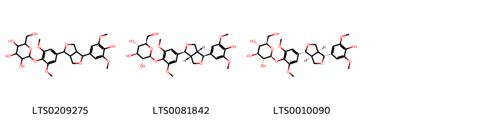{ width=100% }
    <figcaption>Hình ảnh cấu trúc hóa học của 3 hoạt chất thuộc nhóm Lignan glycosides gồm ['2-{4-[4-(4-hydroxy-3,5-dimethoxyphenyl)-hexahydrofuro[3,4-c]furan-1-yl]-2,6-dimethoxyphenoxy}-6-(hydroxymethyl)oxane-3,4,5-triol (LTS0209275)', 'acanthoside b (LTS0081842)', '(2s,3r,4s,5s,6r)-2-{4-[(1r,3as,4r,6as)-4-(4-hydroxy-3,5-dimethoxyphenyl)-hexahydrofuro[3,4-c]furan-1-yl]-2,6-dimethoxyphenoxy}-6-(hydroxymethyl)oxane-3,4,5-triol (LTS0010090)'].</figcaption>
</figure>
#### Nhóm Linear 1_3-diarylpropanoids
<figure markdown="span">
    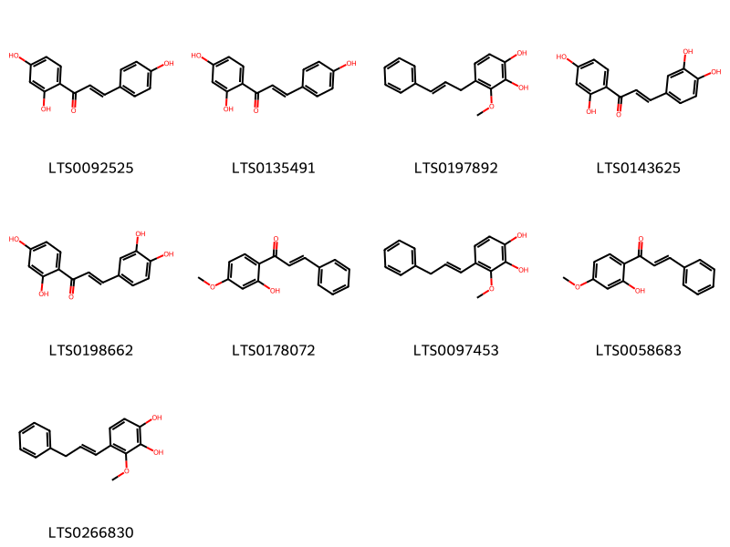{ width=100% }
    <figcaption>Hình ảnh cấu trúc hóa học của Không tìm thấy chú thích hoạt chất thuộc nhóm Linear 1_3-diarylpropanoids gồm Không tìm thấy chú thích.</figcaption>
</figure>
#### Nhóm Neoflavonoids
<figure markdown="span">
    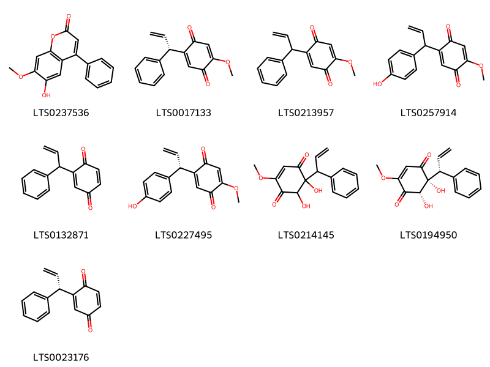{ width=100% }
    <figcaption>Hình ảnh cấu trúc hóa học của 9 hoạt chất thuộc nhóm Neoflavonoids gồm ['dalbergin (LTS0237536)', '2-methoxy-5-[(1s)-1-phenylprop-2-en-1-yl]cyclohexa-2,5-diene-1,4-dione (LTS0017133)', '2-methoxy-5-(1-phenylprop-2-en-1-yl)cyclohexa-2,5-diene-1,4-dione (LTS0213957)', '2-[1-(4-hydroxyphenyl)prop-2-en-1-yl]-5-methoxycyclohexa-2,5-diene-1,4-dione (LTS0257914)', 'dalbergione (LTS0132871)', '2-[(1s)-1-(4-hydroxyphenyl)prop-2-en-1-yl]-5-methoxycyclohexa-2,5-diene-1,4-dione (LTS0227495)', '5,6-dihydroxy-2-methoxy-5-(1-phenylprop-2-en-1-yl)cyclohex-2-ene-1,4-dione (LTS0214145)', '(5r,6s)-5,6-dihydroxy-2-methoxy-5-[(1r)-1-phenylprop-2-en-1-yl]cyclohex-2-ene-1,4-dione (LTS0194950)', '2-[(1s)-1-phenylprop-2-en-1-yl]cyclohexa-2,5-diene-1,4-dione (LTS0023176)'].</figcaption>
</figure>
#### Nhóm Organooxygen compounds
<figure markdown="span">
    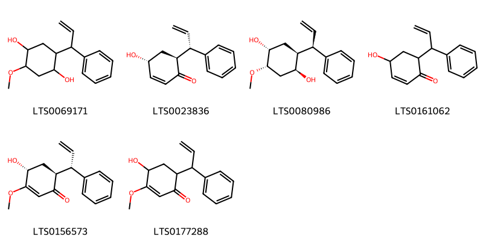{ width=100% }
    <figcaption>Hình ảnh cấu trúc hóa học của 6 hoạt chất thuộc nhóm Organooxygen compounds gồm ['2-methoxy-5-(1-phenylprop-2-en-1-yl)cyclohexane-1,4-diol (LTS0069171)', '(4r,6s)-4-hydroxy-6-[(1s)-1-phenylprop-2-en-1-yl]cyclohex-2-en-1-one (LTS0023836)', '(1r,2s,4s,5s)-2-methoxy-5-[(1r)-1-phenylprop-2-en-1-yl]cyclohexane-1,4-diol (LTS0080986)', '4-hydroxy-6-(1-phenylprop-2-en-1-yl)cyclohex-2-en-1-one (LTS0161062)', '(4r,6s)-4-hydroxy-3-methoxy-6-[(1s)-1-phenylprop-2-en-1-yl]cyclohex-2-en-1-one (LTS0156573)', '4-hydroxy-3-methoxy-6-(1-phenylprop-2-en-1-yl)cyclohex-2-en-1-one (LTS0177288)'].</figcaption>
</figure>
#### Nhóm Prenol lipids
<figure markdown="span">
    { width=100% }
    <figcaption>Hình ảnh cấu trúc hóa học của 1 hoạt chất thuộc nhóm Prenol lipids gồm ['β-amyrin (LTS0251864)'].</figcaption>
</figure>
#### Nhóm Steroids and steroid derivatives
<figure markdown="span">
    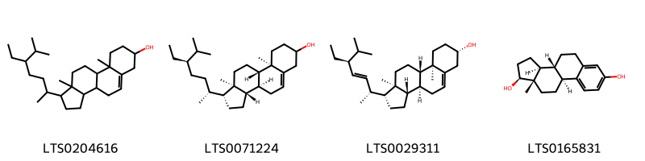{ width=100% }
    <figcaption>Hình ảnh cấu trúc hóa học của 4 hoạt chất thuộc nhóm Steroids and steroid derivatives gồm ['stigmast-5-en-3-ol, (3β)- (LTS0204616)', 'stigmast-5-en-3-ol (LTS0071224)', 'phytosterol (LTS0029311)', 'estradiol (LTS0165831)'].</figcaption>
</figure>

---

### Dược dân tộc học

Danh sách các quốc gia có sử dụng *Dalbergia sissoo* trong điều trị các bệnh. 

| Country   | Disease   | Bệnh                                                                                                                                                                                                |
|:----------|:----------|:----------------------------------------------------------------------------------------------------------------------------------------------------------------------------------------------------|
| India     | Stimulant | MYMEMORY WARNING: YOU USED ALL AVAILABLE FREE TRANSLATIONS FOR TODAY. NEXT AVAILABLE IN  16 HOURS 38 MINUTES 45 SECONDS VISIT HTTPS://MYMEMORY.TRANSLATED.NET/DOC/USAGELIMITS.PHP TO TRANSLATE MORE |

---

---
## Dalbergia stipulacea
### Thông tin về thực vật

!!! info "Phân loại thực vật của *Dalbergia stipulacea* từ GIBF:"
    - **Kingdom:** Plantae
    - **Phylum:** Tracheophyta
    - **Order:** Fabales
    - **Family:** Fabaceae
    - **Genus:** Dalbergia
    - **Species:** *Dalbergia stipulacea*

 

| Label (VI)   | Label (EN)   | Scientific Name      | Descriptions (VI)   | Descriptions (EN)   | Also Known As (VI)   | Also Known As (EN)   |
|:-------------|:-------------|:---------------------|:--------------------|:--------------------|:---------------------|:---------------------|
| N/A          | N/A          | Dalbergia stipulacea | loài thực vật       | species of plant    | ['']                 | ['']                 |

#### Phân bố trên thế giới

**Từ CSDL GIBF** Denmark, Sri Lanka, Thailand, Lao People’s Democratic Republic, Cambodia, Myanmar, Papua New Guinea, Bhutan, India, unknown or invalid, Bangladesh, Viet Nam, China, Nepal

#### Phân bố tại Việt Nam

**Từ CSDL GIBF**: Không có ghi nhận ở Việt Nam

---
### Thành phần hóa học
        
- Theo cơ sở dữ liệu lotus: Từ loài *Dalbergia stipulacea* đã phân lập và xác định được 11 hoạt chất thuộc về các nhóm Flavonoids, Prenol lipids, Steroids and steroid derivatives, Linear 1,3-diarylpropanoids. 

|    | chemicalTaxonomyClassyfireClass   |   smiles_count |
|---:|:----------------------------------|---------------:|
|  0 | Flavonoids                        |              4 |
|  1 | Linear 1,3-diarylpropanoids       |              2 |
|  2 | Prenol lipids                     |              2 |
|  3 | Steroids and steroid derivatives  |              2 |

#### Nhóm Flavonoids
<figure markdown="span">
    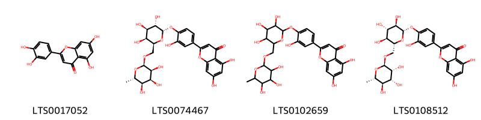{ width=100% }
    <figcaption>Hình ảnh cấu trúc hóa học của 4 hoạt chất thuộc nhóm Flavonoids gồm ['luteolin (LTS0017052)', '5,7-dihydroxy-2-(3-hydroxy-4-{[(2s,3s,4r,5s,6s)-3,4,5-trihydroxy-6-({[(2r,3s,4s,5r,6s)-3,4,5-trihydroxy-6-methyloxan-2-yl]oxy}methyl)oxan-2-yl]oxy}phenyl)chromen-4-one (LTS0074467)', '5,7-dihydroxy-2-{3-hydroxy-4-[(3,4,5-trihydroxy-6-{[(3,4,5-trihydroxy-6-methyloxan-2-yl)oxy]methyl}oxan-2-yl)oxy]phenyl}chromen-4-one (LTS0102659)', '5,7-dihydroxy-2-(3-hydroxy-4-{[(2s,3r,4s,5s,6r)-3,4,5-trihydroxy-6-({[(2r,3r,4r,5r,6s)-3,4,5-trihydroxy-6-methyloxan-2-yl]oxy}methyl)oxan-2-yl]oxy}phenyl)chromen-4-one (LTS0108512)'].</figcaption>
</figure>
#### Nhóm Linear 1_3-diarylpropanoids
<figure markdown="span">
    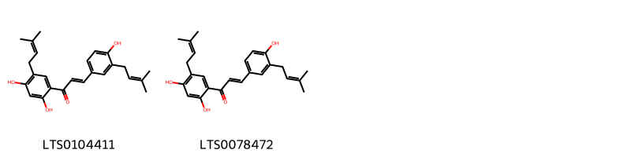{ width=100% }
    <figcaption>Hình ảnh cấu trúc hóa học của Không tìm thấy chú thích hoạt chất thuộc nhóm Linear 1_3-diarylpropanoids gồm Không tìm thấy chú thích.</figcaption>
</figure>
#### Nhóm Prenol lipids
<figure markdown="span">
    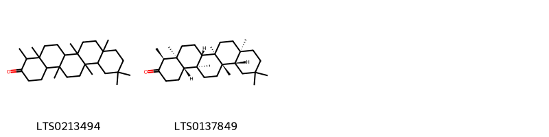{ width=100% }
    <figcaption>Hình ảnh cấu trúc hóa học của 2 hoạt chất thuộc nhóm Prenol lipids gồm ['friedelin (LTS0213494)', '(4s,4as,6as,6br,8ar,12as,12bs,14as,14bs)-4,4a,6b,8a,11,11,12b,14a-octamethyl-tetradecahydro-1h-picen-3-one (LTS0137849)'].</figcaption>
</figure>
#### Nhóm Steroids and steroid derivatives
<figure markdown="span">
    { width=100% }
    <figcaption>Hình ảnh cấu trúc hóa học của 2 hoạt chất thuộc nhóm Steroids and steroid derivatives gồm ['stigmast-5-en-3-ol, (3β)- (LTS0204616)', '(1s,3ar,3br,7r,9as,9br,11ar)-1-[(2r,5r)-5-ethyl-6-methylheptan-2-yl]-9a,11a-dimethyl-1h,2h,3h,3ah,3bh,4h,6h,7h,8h,9h,9bh,10h,11h-cyclopenta[a]phenanthren-7-ol (LTS0234781)'].</figcaption>
</figure>

---

### Dược dân tộc học

Danh sách các quốc gia có sử dụng *Dalbergia stipulacea* trong điều trị các bệnh. 

| Country   | Disease       | Bệnh                                                                                                                                                                                                |
|:----------|:--------------|:----------------------------------------------------------------------------------------------------------------------------------------------------------------------------------------------------|
| Elsewhere | Abortifacient | MYMEMORY WARNING: YOU USED ALL AVAILABLE FREE TRANSLATIONS FOR TODAY. NEXT AVAILABLE IN  16 HOURS 38 MINUTES 14 SECONDS VISIT HTTPS://MYMEMORY.TRANSLATED.NET/DOC/USAGELIMITS.PHP TO TRANSLATE MORE |
| India     | Piscicide     | MYMEMORY WARNING: YOU USED ALL AVAILABLE FREE TRANSLATIONS FOR TODAY. NEXT AVAILABLE IN  16 HOURS 38 MINUTES 11 SECONDS VISIT HTTPS://MYMEMORY.TRANSLATED.NET/DOC/USAGELIMITS.PHP TO TRANSLATE MORE |

---

# Chi Arachis

??? note "Danh sách các dược liệu thuộc chi"
    
	 - *Arachis hypogaea*

---
## Arachis hypogaea
### Thông tin về thực vật

!!! info "Phân loại thực vật của *Arachis hypogaea* từ GIBF:"
    - **Kingdom:** Plantae
    - **Phylum:** Tracheophyta
    - **Order:** Fabales
    - **Family:** Fabaceae
    - **Genus:** Arachis
    - **Species:** *Arachis hypogaea*

 

| Label (VI)   | Label (EN)   | Scientific Name   | Descriptions (VI)   | Descriptions (EN)                         | Also Known As (VI)                                                               | Also Known As (EN)                                                                                        |
|:-------------|:-------------|:------------------|:--------------------|:------------------------------------------|:---------------------------------------------------------------------------------|:----------------------------------------------------------------------------------------------------------|
| N/A          | N/A          | Arachis hypogaea  | loài thực vật       | legume cultivated as a grain and oil crop | ['Đỗ lạc', 'Đậu phụng', 'Đậu phộng', 'Đậu phọng', 'Đậu lạc', 'Arachis hypogaea'] | ['ground nuts', 'peanuts', 'Arachis hypogaea', 'earthnut', 'goober', 'groundnut', 'monkey nut', 'pindar'] |

#### Phân bố trên thế giới

**Từ CSDL GIBF** Libya, Ghana, Central African Republic, Belgium, Mozambique, Benin, Tanzania, United Republic of, Yemen, Canada, French Guiana, Togo, Pakistan, Ukraine, Netherlands, Senegal, Belarus, Nigeria, Chinese Taipei, Portugal, Russian Federation, Bangladesh, United States of America, Congo, Democratic Republic of the, Guinea, Liberia, South Africa, Uganda, Germany, Thailand, Niger, Brazil, Mexico, Singapore, Viet Nam, United Kingdom of Great Britain and Northern Ireland, China, Ecuador, Colombia, Costa Rica, India, Indonesia, Burkina Faso, Philippines, Cameroon, Malaysia

#### Phân bố tại Việt Nam

**Từ CSDL GIBF**: Không có ghi nhận ở Việt Nam

---
### Thành phần hóa học
        
- Theo cơ sở dữ liệu lotus: Từ loài *Arachis hypogaea* đã phân lập và xác định được 127 hoạt chất thuộc về các nhóm Fatty Acyls, Flavonoids, Prenol lipids, Steroids and steroid derivatives, Isoflavonoids, Cinnamic acids and derivatives, Dibenzylbutane lignans, Organonitrogen compounds, Benzene and substituted derivatives, Stilbenes, Organooxygen compounds, Keto acids and derivatives, Phenols, Coumarins and derivatives, Furanoid lignans, Carboxylic acids and derivatives. 

|    | chemicalTaxonomyClassyfireClass     |   smiles_count |
|---:|:------------------------------------|---------------:|
|  0 |                                     |              1 |
|  1 | Benzene and substituted derivatives |              2 |
|  2 | Carboxylic acids and derivatives    |              4 |
|  3 | Cinnamic acids and derivatives      |             12 |
|  4 | Coumarins and derivatives           |              1 |
|  5 | Dibenzylbutane lignans              |              2 |
|  6 | Fatty Acyls                         |              9 |
|  7 | Flavonoids                          |             27 |
|  8 | Furanoid lignans                    |              3 |
|  9 | Isoflavonoids                       |              8 |
| 10 | Keto acids and derivatives          |              2 |
| 11 | Organonitrogen compounds            |              1 |
| 12 | Organooxygen compounds              |             10 |
| 13 | Phenols                             |              1 |
| 14 | Prenol lipids                       |             27 |
| 15 | Steroids and steroid derivatives    |              4 |
| 16 | Stilbenes                           |             13 |

#### Nhóm 
<figure markdown="span">
    { width=100% }
    <figcaption>Hình ảnh cấu trúc hóa học của 1 hoạt chất thuộc nhóm  gồm ['trigonelline (LTS0040106)'].</figcaption>
</figure>
#### Nhóm Benzene and substituted derivatives
<figure markdown="span">
    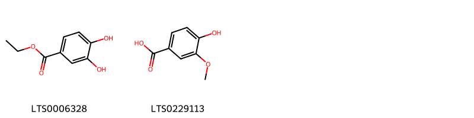{ width=100% }
    <figcaption>Hình ảnh cấu trúc hóa học của 2 hoạt chất thuộc nhóm Benzene and substituted derivatives gồm ['ethyl protocatechuate (LTS0006328)', 'vanillic acid (LTS0229113)'].</figcaption>
</figure>
#### Nhóm Carboxylic acids and derivatives
<figure markdown="span">
    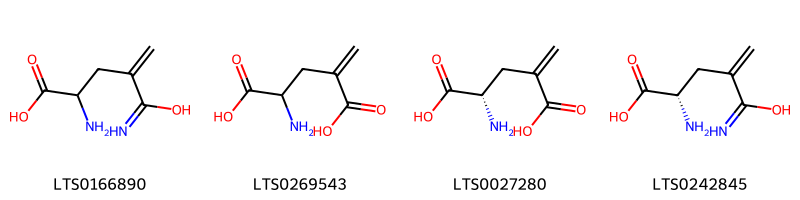{ width=100% }
    <figcaption>Hình ảnh cấu trúc hóa học của 4 hoạt chất thuộc nhóm Carboxylic acids and derivatives gồm ['2-amino-4-(c-hydroxycarbonimidoyl)pent-4-enoic acid (LTS0166890)', '4-methyleneglutamic acid (LTS0269543)', '4-methylene-l-glutamic acid (LTS0027280)', '4-methylene-l-glutamine (LTS0242845)'].</figcaption>
</figure>
#### Nhóm Cinnamic acids and derivatives
<figure markdown="span">
    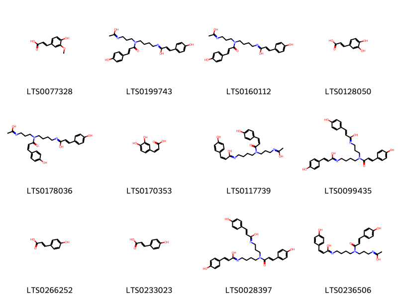{ width=100% }
    <figcaption>Hình ảnh cấu trúc hóa học của 12 hoạt chất thuộc nhóm Cinnamic acids and derivatives gồm ['ferulic acid (LTS0077328)', 'n-[4-(n-{3-[(1-hydroxyethylidene)amino]propyl}-3-(4-hydroxyphenyl)prop-2-enamido)butyl]-3-(4-hydroxyphenyl)prop-2-enimidic acid (LTS0199743)', '(2e)-n-{4-[(2e)-n-{3-[(1-hydroxyethylidene)amino]propyl}-3-(4-hydroxyphenyl)prop-2-enamido]butyl}-3-(4-hydroxyphenyl)prop-2-enimidic acid (LTS0160112)', '3,4-dihydroxycinnamic acid (LTS0128050)', '(2e)-n-{4-[(2z)-n-{3-[(1-hydroxyethylidene)amino]propyl}-3-(4-hydroxyphenyl)prop-2-enamido]butyl}-3-(4-hydroxyphenyl)prop-2-enimidic acid (LTS0178036)', 'caffeicacid (LTS0170353)', '(2z)-n-{4-[(2z)-n-{3-[(1-hydroxyethylidene)amino]propyl}-3-(4-hydroxyphenyl)prop-2-enamido]butyl}-3-(4-hydroxyphenyl)prop-2-enimidic acid (LTS0117739)', 'n-{3-[n-(4-{[1-hydroxy-3-(4-hydroxyphenyl)prop-2-en-1-ylidene]amino}butyl)-3-(4-hydroxyphenyl)prop-2-enamido]propyl}-3-(4-hydroxyphenyl)prop-2-enimidic acid (LTS0099435)', 'para-coumaric acid (LTS0266252)', 'hydroxycinnamic acid (LTS0233023)', '(2e)-n-{3-[(2e)-n-(4-{[(2e)-1-hydroxy-3-(4-hydroxyphenyl)prop-2-en-1-ylidene]amino}butyl)-3-(4-hydroxyphenyl)prop-2-enamido]propyl}-3-(4-hydroxyphenyl)prop-2-enimidic acid (LTS0028397)', '(2z)-n-{4-[(2e)-n-{3-[(1-hydroxyethylidene)amino]propyl}-3-(4-hydroxyphenyl)prop-2-enamido]butyl}-3-(4-hydroxyphenyl)prop-2-enimidic acid (LTS0236506)'].</figcaption>
</figure>
#### Nhóm Coumarins and derivatives
<figure markdown="span">
    { width=100% }
    <figcaption>Hình ảnh cấu trúc hóa học của 1 hoạt chất thuộc nhóm Coumarins and derivatives gồm ['esculetin (LTS0067593)'].</figcaption>
</figure>
#### Nhóm Dibenzylbutane lignans
<figure markdown="span">
    { width=100% }
    <figcaption>Hình ảnh cấu trúc hóa học của 2 hoạt chất thuộc nhóm Dibenzylbutane lignans gồm ['(2s,3r)-2,3-bis[(4-hydroxy-3-methoxyphenyl)(¹³c)methyl](1-¹³c)butane-1,4-diol (LTS0268699)', 'secoisolariciresinol (LTS0086727)'].</figcaption>
</figure>
#### Nhóm Fatty Acyls
<figure markdown="span">
    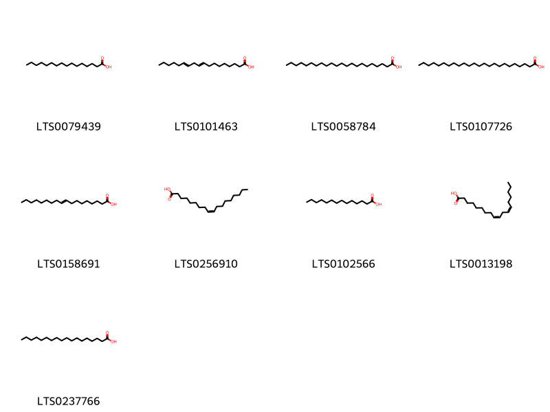{ width=100% }
    <figcaption>Hình ảnh cấu trúc hóa học của 9 hoạt chất thuộc nhóm Fatty Acyls gồm ['palmitic acid (LTS0079439)', '9,12-octadecadienoic acid (LTS0101463)', 'behenic acid (LTS0058784)', 'lignoceric acid (LTS0107726)', '9 octadecenoic acid (LTS0158691)', 'oleic acid (LTS0256910)', 'myristic acid (LTS0102566)', 'linoleic (LTS0013198)', 'stearic acid (LTS0237766)'].</figcaption>
</figure>
#### Nhóm Flavonoids
<figure markdown="span">
    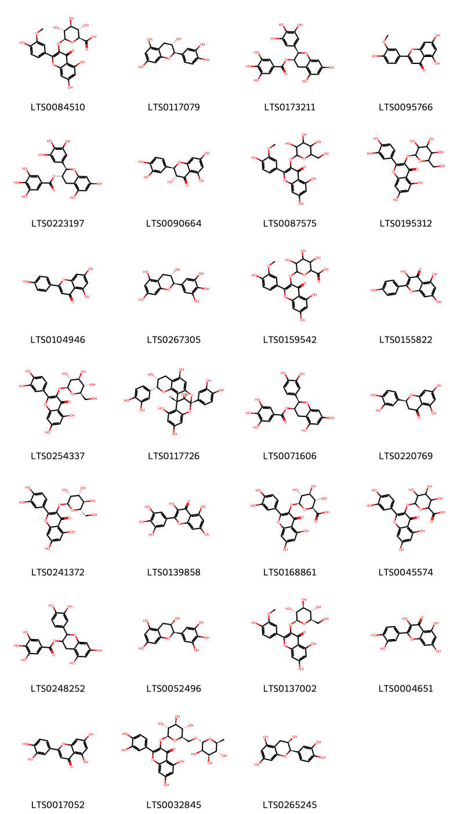{ width=100% }
    <figcaption>Hình ảnh cấu trúc hóa học của 27 hoạt chất thuộc nhóm Flavonoids gồm ['isorhamnetin-3-glucuronide (LTS0084510)', '(+)-catechol (LTS0117079)', '(-)-epigallocatechin gallate (LTS0173211)', 'chrysoeriol (LTS0095766)', 'gallocatechin 3-o-gallate (LTS0223197)', '(+)-taxifolin (LTS0090664)', 'isorhamnetin 3-galactoside (LTS0087575)', '2-(3,4-dihydroxyphenyl)-5,7-dihydroxy-3-{[3,4,5-trihydroxy-6-(hydroxymethyl)oxan-2-yl]oxy}chromen-4-one (LTS0195312)', 'chamomile (LTS0104946)', 'gallocatechol (LTS0267305)', '6-{[5,7-dihydroxy-2-(4-hydroxy-3-methoxyphenyl)-4-oxochromen-3-yl]oxy}-3,4,5-trihydroxyoxane-2-carboxylic acid (LTS0159542)', 'kaempherol (LTS0155822)', 'isoquercetin (LTS0254337)', 'proanthocyanidin a2 (LTS0117726)', 'epicatechin gallate (LTS0071606)', 'eriodictyol (LTS0220769)', '2-(3,4-dihydroxyphenyl)-5,7-dihydroxy-3-{[(2s,3r,4r,5r,6s)-3,4,5-trihydroxy-6-(hydroxymethyl)oxan-2-yl]oxy}chromen-4-one (LTS0241372)', 'myricetin (LTS0139858)', 'querciturone (LTS0168861)', 'miquelianin (LTS0045574)', '2-(3,4-dihydroxyphenyl)-5,7-dihydroxy-3,4-dihydro-2h-1-benzopyran-3-yl 3,4,5-trihydroxybenzoate (LTS0248252)', 'epigallocatechin (LTS0052496)', 'isorhamnetin 3-o-glucoside (LTS0137002)', 'quercetin (LTS0004651)', 'luteolin (LTS0017052)', '3-rutinosyl quercetin (LTS0032845)', 'ent-epicatechin (LTS0265245)'].</figcaption>
</figure>
#### Nhóm Furanoid lignans
<figure markdown="span">
    { width=100% }
    <figcaption>Hình ảnh cấu trúc hóa học của 3 hoạt chất thuộc nhóm Furanoid lignans gồm ['pinoresinol (LTS0057431)', 'matairesinol (LTS0193475)', 'lariciresinol (LTS0010950)'].</figcaption>
</figure>
#### Nhóm Isoflavonoids
<figure markdown="span">
    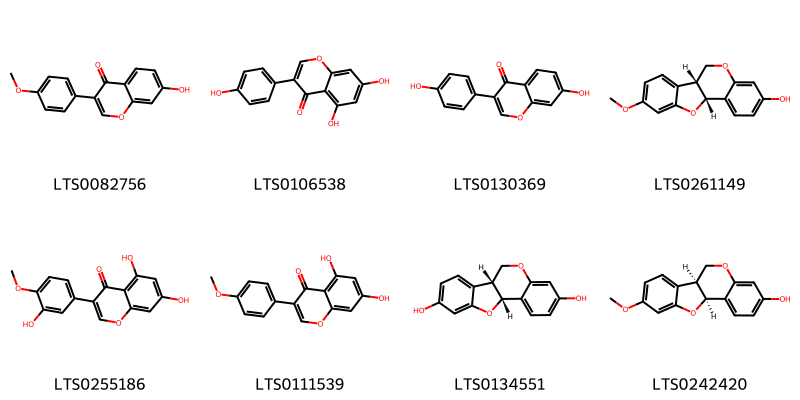{ width=100% }
    <figcaption>Hình ảnh cấu trúc hóa học của 8 hoạt chất thuộc nhóm Isoflavonoids gồm ['formononetin (LTS0082756)', 'genistein (LTS0106538)', 'daidzein (LTS0130369)', 'medicarpin, (-)- (LTS0261149)', 'pratensein (LTS0255186)', 'biochanin (LTS0111539)', '3,9-dihydroxypterocarpan (LTS0134551)', '(+)-medicarpin (LTS0242420)'].</figcaption>
</figure>
#### Nhóm Keto acids and derivatives
<figure markdown="span">
    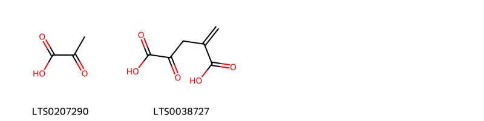{ width=100% }
    <figcaption>Hình ảnh cấu trúc hóa học của 2 hoạt chất thuộc nhóm Keto acids and derivatives gồm ['pyruvic acid (LTS0207290)', '4-methylene-2-oxoglutarate (LTS0038727)'].</figcaption>
</figure>
#### Nhóm Organonitrogen compounds
<figure markdown="span">
    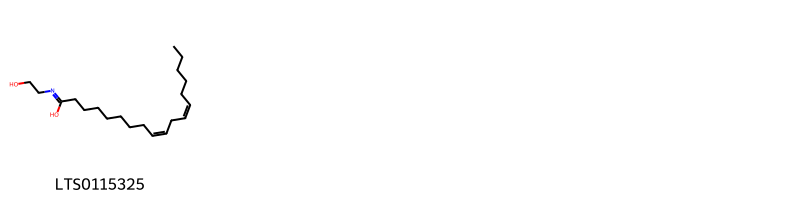{ width=100% }
    <figcaption>Hình ảnh cấu trúc hóa học của 1 hoạt chất thuộc nhóm Organonitrogen compounds gồm ['(9z,12z)-n-(2-hydroxyethyl)octadeca-9,12-dienimidic acid (LTS0115325)'].</figcaption>
</figure>
#### Nhóm Organooxygen compounds
<figure markdown="span">
    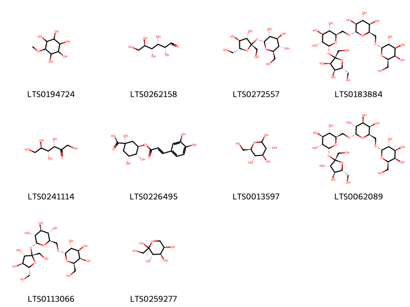{ width=100% }
    <figcaption>Hình ảnh cấu trúc hóa học của 10 hoạt chất thuộc nhóm Organooxygen compounds gồm ['pinitol (LTS0194724)', '(+)-glucose (LTS0262158)', 'sucrose (LTS0272557)', '(2r,3r,4s,5s,6r)-2-{[(2s,3r,4s,5r)-3,4-dihydroxy-2,5-bis(hydroxymethyl)oxolan-2-yl]oxy}-6-({[(2s,3s,4r,5r,6r)-3,4,5-trihydroxy-6-({[(2s,3r,4s,5r,6r)-3,4,5-trihydroxy-6-(hydroxymethyl)oxan-2-yl]oxy}methyl)oxan-2-yl]oxy}methyl)oxane-3,4,5-triol (LTS0183884)', 'keto-d-fructose (LTS0241114)', 'chlorogenic acid (LTS0226495)', 'glucose (LTS0013597)', 'stachyose (LTS0062089)', 'raffinose (LTS0113066)', 'd-fructopyranose (LTS0259277)'].</figcaption>
</figure>
#### Nhóm Phenols
<figure markdown="span">
    { width=100% }
    <figcaption>Hình ảnh cấu trúc hóa học của 1 hoạt chất thuộc nhóm Phenols gồm ['tyrosol (LTS0132195)'].</figcaption>
</figure>
#### Nhóm Prenol lipids
<figure markdown="span">
    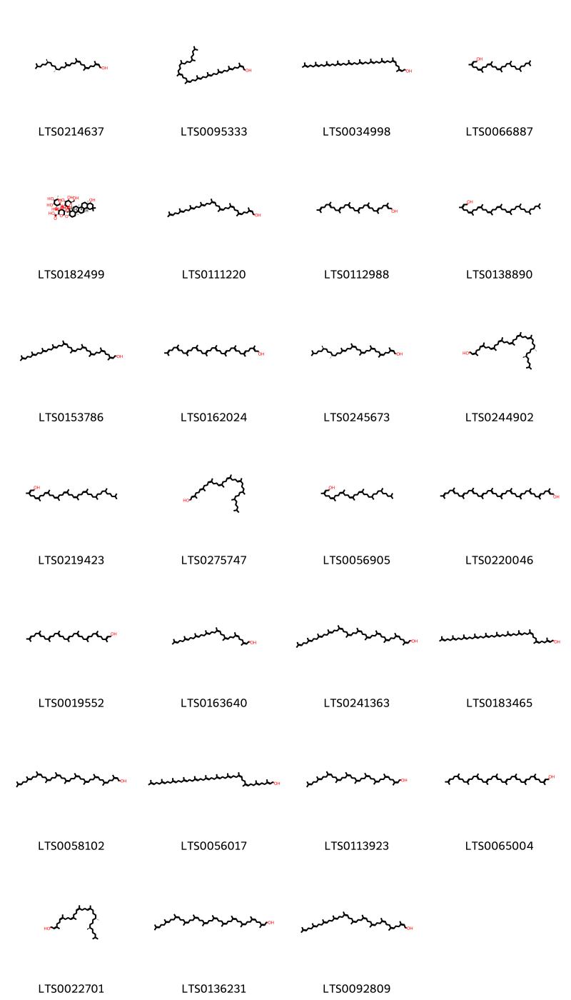{ width=100% }
    <figcaption>Hình ảnh cấu trúc hóa học của 27 hoạt chất thuộc nhóm Prenol lipids gồm ['(2z,6z,10z,14e,19r,23r)-3,7,11,15,19,23,27-heptamethyloctacosa-2,6,10,14-tetraen-1-ol (LTS0214637)', '(2z,6e,10e,14e,18e,22z,26e)-3,7,11,15,19,23,27,31,35,39-decamethyltetraconta-2,6,10,14,18,22,26-heptaen-1-ol (LTS0095333)', '(2z,6z,10e,14e,18e,22e,26e,30e,34e)-3,7,11,15,19,23,27,31,35,39-decamethyltetraconta-2,6,10,14,18,22,26,30,34,38-decaen-1-ol (LTS0034998)', '3,7,11,15,19,23,27-heptamethyloctacosa-2,6,10,14-tetraen-1-ol (LTS0066887)', 'soyasaponin i (LTS0182499)', '(2z,6z,10z,14z,18z,22e,26e,30e)-3,7,11,15,19,23,27,31,35-nonamethylhexatriaconta-2,6,10,14,18,22,26,30,34-nonaen-1-ol (LTS0111220)', '3,7,11,15,19,23,27,31-octamethyldotriaconta-2,6,10,14,18,22,26,30-octaen-1-ol (LTS0112988)', '3,7,11,15,19,23,27,31,35-nonamethylhexatriaconta-2,6,10,14,18,22-hexaen-1-ol (LTS0138890)', '(2z,6z,10z,14z,18z,22z,26e,30e,34e)-3,7,11,15,19,23,27,31,35,39-decamethyltetraconta-2,6,10,14,18,22,26,30,34,38-decaen-1-ol (LTS0153786)', '3,7,11,15,19,23,27,31,35,39-decamethyltetraconta-2,6,10,14,18,22,26,30,34,38-decaen-1-ol (LTS0162024)', '(2z,6z,10z,14z,18z,22e,27r,31r)-3,7,11,15,19,23,27,31,35-nonamethylhexatriaconta-2,6,10,14,18,22-hexaen-1-ol (LTS0245673)', '(2z,6z,10z,14z,18z,22z,26e,31r,35r)-3,7,11,15,19,23,27,31,35,39-decamethyltetraconta-2,6,10,14,18,22,26-heptaen-1-ol (LTS0244902)', '3,7,11,15,19,23,27,31,35,39-decamethyltetraconta-2,6,10,14,18,22,26-heptaen-1-ol (LTS0219423)', '(2e,6e,10z,14z,18z,22e)-3,7,11,15,19,23,27,31,35-nonamethylhexatriaconta-2,6,10,14,18,22-hexaen-1-ol (LTS0275747)', '3,7,11,15,19,23,27,31-octamethyldotriaconta-2,6,10,14,18-pentaen-1-ol (LTS0056905)', '3,7,11,15,19,23,27,31,35,39,43,47-dodecamethyloctatetraconta-2,6,10,14,18,22,26,30,34,38,42,46-dodecaen-1-ol (LTS0220046)', '3,7,11,15,19,23,27,31,35-nonamethylhexatriaconta-2,6,10,14,18,22,26,30,34-nonaen-1-ol (LTS0019552)', '(2z,6z,10z,14z,18e,22e,26e)-3,7,11,15,19,23,27,31-octamethyldotriaconta-2,6,10,14,18,22,26,30-octaen-1-ol (LTS0163640)', '(2z,6z,10z,14z,18z,22z,26z,30z,34e,38e,42e)-3,7,11,15,19,23,27,31,35,39,43,47-dodecamethyloctatetraconta-2,6,10,14,18,22,26,30,34,38,42,46-dodecaen-1-ol (LTS0241363)', '(2e,6z,10z,14e,18e,22e,26e,30e,34e,38e)-3,7,11,15,19,23,27,31,35,39,43-undecamethyltetratetraconta-2,6,10,14,18,22,26,30,34,38,42-undecaen-1-ol (LTS0183465)', '(2z,6z,10z,14z,18z,22z,26z,30z,34z,38e)-3,7,11,15,19,23,27,31,35,39,43-undecamethyltetratetraconta-2,6,10,14,18,22,26,30,34,38,42-undecaen-1-ol (LTS0058102)', '(2e,6e,10z,14z,18e,22e,26e,30e,34e,38e,42e)-3,7,11,15,19,23,27,31,35,39,43,47-dodecamethyloctatetraconta-2,6,10,14,18,22,26,30,34,38,42,46-dodecaen-1-ol (LTS0056017)', '(2z,6z,10z,14z,18z,22z,26z,30z,34e)-3,7,11,15,19,23,27,31,35,39-decamethyltetraconta-2,6,10,14,18,22,26,30,34,38-decaen-1-ol (LTS0113923)', '3,7,11,15,19,23,27,31,35,39,43-undecamethyltetratetraconta-2,6,10,14,18,22,26,30,34,38,42-undecaen-1-ol (LTS0065004)', '(2z,6z,10z,14z,18e,23r,27r)-3,7,11,15,19,23,27,31-octamethyldotriaconta-2,6,10,14,18-pentaen-1-ol (LTS0022701)', '(2z,6z,10z,14z,18z,22z,26z,30z,34z,38z,42e)-3,7,11,15,19,23,27,31,35,39,43,47-dodecamethyloctatetraconta-2,6,10,14,18,22,26,30,34,38,42,46-dodecaen-1-ol (LTS0136231)', '(2z,6z,10z,14z,18z,22z,26z,30e,34e,38e)-3,7,11,15,19,23,27,31,35,39,43-undecamethyltetratetraconta-2,6,10,14,18,22,26,30,34,38,42-undecaen-1-ol (LTS0092809)'].</figcaption>
</figure>
#### Nhóm Steroids and steroid derivatives
<figure markdown="span">
    { width=100% }
    <figcaption>Hình ảnh cấu trúc hóa học của 4 hoạt chất thuộc nhóm Steroids and steroid derivatives gồm ['stigmast-5-en-3-ol (LTS0071224)', 'stigmast-5-en-3-ol, (3β)- (LTS0204616)', 'sitogluside (LTS0201798)', '2-{[1-(5-ethyl-6-methylheptan-2-yl)-9a,11a-dimethyl-1h,2h,3h,3ah,3bh,4h,6h,7h,8h,9h,9bh,10h,11h-cyclopenta[a]phenanthren-7-yl]oxy}-6-(hydroxymethyl)oxane-3,4,5-triol (LTS0158828)'].</figcaption>
</figure>
#### Nhóm Stilbenes
<figure markdown="span">
    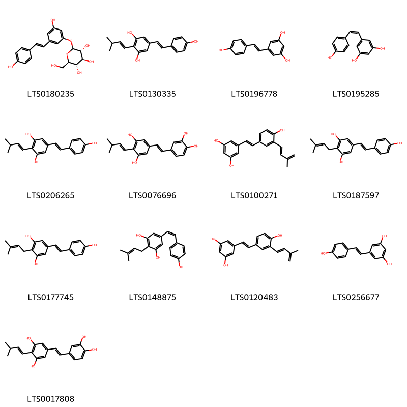{ width=100% }
    <figcaption>Hình ảnh cấu trúc hóa học của 13 hoạt chất thuộc nhóm Stilbenes gồm ['piceid (LTS0180235)', '5-[2-(4-hydroxyphenyl)ethenyl]-2-(3-methylbut-1-en-1-yl)benzene-1,3-diol (LTS0130335)', 'tocilizumab (LTS0196778)', 'cis-resveratrol (LTS0195285)', 'trans-arachidin-3 (LTS0206265)', '5-[(1e)-2-(3,4-dihydroxyphenyl)ethenyl]-2-[(1e)-3-methylbut-1-en-1-yl]benzene-1,3-diol (LTS0076696)', '5-{2-[4-hydroxy-3-(3-methylbuta-1,3-dien-1-yl)phenyl]ethenyl}benzene-1,3-diol (LTS0100271)', 'trans-arachidin-2 (LTS0187597)', '5-[2-(4-hydroxyphenyl)ethenyl]-2-(3-methylbut-2-en-1-yl)benzene-1,3-diol (LTS0177745)', '5-[(1z)-2-(4-hydroxyphenyl)ethenyl]-2-(3-methylbut-2-en-1-yl)benzene-1,3-diol (LTS0148875)', '5-[(1e)-2-{4-hydroxy-3-[(1e)-3-methylbuta-1,3-dien-1-yl]phenyl}ethenyl]benzene-1,3-diol (LTS0120483)', 'resveratrol (LTS0256677)', '5-[2-(3,4-dihydroxyphenyl)ethenyl]-2-(3-methylbut-1-en-1-yl)benzene-1,3-diol (LTS0017808)'].</figcaption>
</figure>

---

### Dược dân tộc học

Danh sách các quốc gia có sử dụng *Arachis hypogaea* trong điều trị các bệnh. 

| Country   | Disease     | Bệnh                                                                                                                                                                                                |
|:----------|:------------|:----------------------------------------------------------------------------------------------------------------------------------------------------------------------------------------------------|
| Africa    | Aphrodisiac | MYMEMORY WARNING: YOU USED ALL AVAILABLE FREE TRANSLATIONS FOR TODAY. NEXT AVAILABLE IN  16 HOURS 37 MINUTES 44 SECONDS VISIT HTTPS://MYMEMORY.TRANSLATED.NET/DOC/USAGELIMITS.PHP TO TRANSLATE MORE |
| Haiti     | Emollient   | MYMEMORY WARNING: YOU USED ALL AVAILABLE FREE TRANSLATIONS FOR TODAY. NEXT AVAILABLE IN  16 HOURS 37 MINUTES 42 SECONDS VISIT HTTPS://MYMEMORY.TRANSLATED.NET/DOC/USAGELIMITS.PHP TO TRANSLATE MORE |
| Iraq      | Soap        | MYMEMORY WARNING: YOU USED ALL AVAILABLE FREE TRANSLATIONS FOR TODAY. NEXT AVAILABLE IN  16 HOURS 37 MINUTES 39 SECONDS VISIT HTTPS://MYMEMORY.TRANSLATED.NET/DOC/USAGELIMITS.PHP TO TRANSLATE MORE |

---

# Chi Melolobium

??? note "Danh sách các dược liệu thuộc chi"
    
	 - *Melolobium alpinum*

---
## Melolobium alpinum
### Thông tin về thực vật

!!! info "Phân loại thực vật của *Melolobium alpinum* từ GIBF:"
    - **Kingdom:** Plantae
    - **Phylum:** Tracheophyta
    - **Order:** Fabales
    - **Family:** Fabaceae
    - **Genus:** Melolobium
    - **Species:** *Melolobium alpinum*

 

| Label (VI)   | Label (EN)   | Scientific Name    | Descriptions (VI)   | Descriptions (EN)   | Also Known As (VI)   | Also Known As (EN)   |
|:-------------|:-------------|:-------------------|:--------------------|:--------------------|:---------------------|:---------------------|
| N/A          | N/A          | Melolobium alpinum | loài thực vật       | species of plant    | ['']                 | ['']                 |

#### Phân bố trên thế giới

**Từ CSDL GIBF** nan, Lesotho, South Africa, unknown or invalid

#### Phân bố tại Việt Nam

**Từ CSDL GIBF**: Không có ghi nhận ở Việt Nam

---
### Thành phần hóa học
        
- Theo cơ sở dữ liệu lotus: Từ loài *Melolobium alpinum* đã phân lập và xác định được 13 hoạt chất thuộc về các nhóm Lupin alkaloids, Indolizidines. 

|    | chemicalTaxonomyClassyfireClass   |   smiles_count |
|---:|:----------------------------------|---------------:|
|  0 | Indolizidines                     |              3 |
|  1 | Lupin alkaloids                   |              8 |

#### Nhóm Indolizidines
<figure markdown="span">
    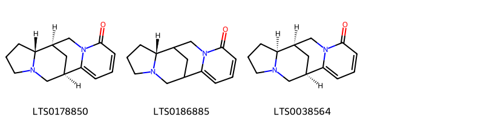{ width=100% }
    <figcaption>Hình ảnh cấu trúc hóa học của 3 hoạt chất thuộc nhóm Indolizidines gồm ['(1r,9r,10r)-7,14-diazatetracyclo[7.6.1.0²,⁷.0¹⁰,¹⁴]hexadeca-2,4-dien-6-one (LTS0178850)', 'camoensine (LTS0186885)', '(1r,9r,10s)-7,14-diazatetracyclo[7.6.1.0²,⁷.0¹⁰,¹⁴]hexadeca-2,4-dien-6-one (LTS0038564)'].</figcaption>
</figure>
#### Nhóm Lupin alkaloids
<figure markdown="span">
    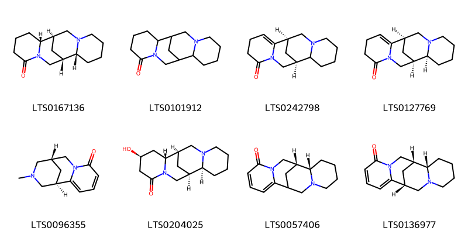{ width=100% }
    <figcaption>Hình ảnh cấu trúc hóa học của 8 hoạt chất thuộc nhóm Lupin alkaloids gồm ['(1r,2r,9s,10r)-7,15-diazatetracyclo[7.7.1.0²,⁷.0¹⁰,¹⁵]heptadecan-6-one (LTS0167136)', 'lupanine l-form (LTS0101912)', '(1r,9r)-7,15-diazatetracyclo[7.7.1.0²,⁷.0¹⁰,¹⁵]heptadec-2-en-6-one (LTS0242798)', '(1r,9r,10s)-7,15-diazatetracyclo[7.7.1.0²,⁷.0¹⁰,¹⁵]heptadec-2-en-6-one (LTS0127769)', '(1r,9r)-11-methyl-7,11-diazatricyclo[7.3.1.0²,⁷]trideca-2,4-dien-6-one (LTS0096355)', '(1r,2r,4s,9r,10s)-4-hydroxy-7,15-diazatetracyclo[7.7.1.0²,⁷.0¹⁰,¹⁵]heptadecan-6-one (LTS0204025)', '(9r,10s)-7,15-diazatetracyclo[7.7.1.0²,⁷.0¹⁰,¹⁵]heptadeca-2,4-dien-6-one (LTS0057406)', '(1r,9r,10s)-7,15-diazatetracyclo[7.7.1.0²,⁷.0¹⁰,¹⁵]heptadeca-2,4-dien-6-one (LTS0136977)'].</figcaption>
</figure>

---

### Dược dân tộc học

Danh sách các quốc gia có sử dụng *Melolobium alpinum* trong điều trị các bệnh. 

| Country   | Disease   | Bệnh                                                                                                                                                                                                |
|:----------|:----------|:----------------------------------------------------------------------------------------------------------------------------------------------------------------------------------------------------|
| Lesotho   | Sedative  | MYMEMORY WARNING: YOU USED ALL AVAILABLE FREE TRANSLATIONS FOR TODAY. NEXT AVAILABLE IN  16 HOURS 36 MINUTES 55 SECONDS VISIT HTTPS://MYMEMORY.TRANSLATED.NET/DOC/USAGELIMITS.PHP TO TRANSLATE MORE |

---

# Chi Dolicholus

??? note "Danh sách các dược liệu thuộc chi"
    
	 - *Dolicholus phaseoloides*

---
## Dolicholus phaseoloides
### Thông tin về thực vật

!!! info "Phân loại thực vật của *Rhynchosia phaseoloides* từ GIBF:"
    - **Kingdom:** Plantae
    - **Phylum:** Tracheophyta
    - **Order:** Fabales
    - **Family:** Fabaceae
    - **Genus:** Rhynchosia
    - **Species:** *Rhynchosia phaseoloides*

 

| Label (VI)   | Label (EN)   | Scientific Name         | Descriptions (VI)   | Descriptions (EN)   | Also Known As (VI)   | Also Known As (EN)   |
|:-------------|:-------------|:------------------------|:--------------------|:--------------------|:---------------------|:---------------------|
| N/A          | N/A          | Dolicholus phaseoloides | loài thực vật       | species of plant    | ['']                 | ['']                 |

#### Phân bố trên thế giới

**Từ CSDL GIBF** Bolivia (Plurinational State of)

#### Phân bố tại Việt Nam

**Từ CSDL GIBF**: Không có ghi nhận ở Việt Nam

---
### Thành phần hóa học
        
- Theo cơ sở dữ liệu lotus: Từ loài *Rhynchosia phaseoloides* đã phân lập và xác định được Chưa có hoạt chất nào được phân lập. hoạt chất thuộc về các nhóm Không có hoạt chất nào được phân lập. 

Không có hình ảnh nào được tạo ra

---

### Dược dân tộc học

Danh sách các quốc gia có sử dụng *Rhynchosia phaseoloides* trong điều trị các bệnh. 

| Country   | Disease   | Bệnh                                                                                                                                                                                                |
|:----------|:----------|:----------------------------------------------------------------------------------------------------------------------------------------------------------------------------------------------------|
| Elsewhere | Poison    | MYMEMORY WARNING: YOU USED ALL AVAILABLE FREE TRANSLATIONS FOR TODAY. NEXT AVAILABLE IN  16 HOURS 36 MINUTES 33 SECONDS VISIT HTTPS://MYMEMORY.TRANSLATED.NET/DOC/USAGELIMITS.PHP TO TRANSLATE MORE |

---

# Chi Moghania

??? note "Danh sách các dược liệu thuộc chi"
    
	 - *Moghania vestita*

---
## Moghania vestita
### Thông tin về thực vật

!!! info "Phân loại thực vật của *Flemingia procumbens* từ GIBF:"
    - **Kingdom:** Plantae
    - **Phylum:** Tracheophyta
    - **Order:** Fabales
    - **Family:** Fabaceae
    - **Genus:** Flemingia
    - **Species:** *Flemingia procumbens*

 

| Label (VI)   | Label (EN)   | Scientific Name         | Descriptions (VI)   | Descriptions (EN)   | Also Known As (VI)   | Also Known As (EN)   |
|:-------------|:-------------|:------------------------|:--------------------|:--------------------|:---------------------|:---------------------|
| N/A          | N/A          | Dolicholus phaseoloides | loài thực vật       | species of plant    | ['']                 | ['']                 |

#### Phân bố trên thế giới

**Từ CSDL GIBF** Bolivia (Plurinational State of)

#### Phân bố tại Việt Nam

**Từ CSDL GIBF**: Không có ghi nhận ở Việt Nam

---
### Thành phần hóa học
        
- Theo cơ sở dữ liệu lotus: Từ loài *Flemingia procumbens* đã phân lập và xác định được Chưa có hoạt chất nào được phân lập. hoạt chất thuộc về các nhóm Không có hoạt chất nào được phân lập. 

Không có hình ảnh nào được tạo ra

---

### Dược dân tộc học

Danh sách các quốc gia có sử dụng *Flemingia procumbens* trong điều trị các bệnh. 

| Country   | Disease   | Bệnh                                                                                                                                                                                                |
|:----------|:----------|:----------------------------------------------------------------------------------------------------------------------------------------------------------------------------------------------------|
| India     | Piscicide | MYMEMORY WARNING: YOU USED ALL AVAILABLE FREE TRANSLATIONS FOR TODAY. NEXT AVAILABLE IN  16 HOURS 36 MINUTES 18 SECONDS VISIT HTTPS://MYMEMORY.TRANSLATED.NET/DOC/USAGELIMITS.PHP TO TRANSLATE MORE |

---

# Chi Lonchocarpus

??? note "Danh sách các dược liệu thuộc chi"
    
	 - *Lonchocarpus benthamianus*
	 - *Lonchocarpus chrysophyllus*
	 - *Lonchocarpus cyanescens*
	 - *Lonchocarpus densiflorus*
	 - *Lonchocarpus latifolius*
	 - *Lonchocarpus longistylis*
	 - *Lonchocarpus longistylus*
	 - *Lonchocarpus martynii*
	 - *Lonchocarpus nicou*
	 - *Lonchocarpus sericeus*
	 - *Lonchocarpus urucu*
	 - *Lonchocarpus utilis*

---
## Lonchocarpus benthamianus
### Thông tin về thực vật

!!! info "Phân loại thực vật của *Lonchocarpus punctatus* từ GIBF:"
    - **Kingdom:** Plantae
    - **Phylum:** Tracheophyta
    - **Order:** Fabales
    - **Family:** Fabaceae
    - **Genus:** Lonchocarpus
    - **Species:** *Lonchocarpus punctatus*

 

| Label (VI)   | Label (EN)   | Scientific Name           | Descriptions (VI)   | Descriptions (EN)   | Also Known As (VI)   | Also Known As (EN)   |
|:-------------|:-------------|:--------------------------|:--------------------|:--------------------|:---------------------|:---------------------|
| N/A          | N/A          | Lonchocarpus benthamianus | loài thực vật       | species of plant    | ['']                 | ['']                 |

#### Phân bố trên thế giới

**Từ CSDL GIBF** nan, Guadeloupe, Brazil, Saint Lucia, Jamaica, Cuba, United States of America, Dominica, Antigua and Barbuda

#### Phân bố tại Việt Nam

**Từ CSDL GIBF**: Không có ghi nhận ở Việt Nam

---
### Thành phần hóa học
        
- Theo cơ sở dữ liệu lotus: Từ loài *Lonchocarpus punctatus* đã phân lập và xác định được Chưa có hoạt chất nào được phân lập. hoạt chất thuộc về các nhóm Không có hoạt chất nào được phân lập. 

Không có hình ảnh nào được tạo ra

---

### Dược dân tộc học

Danh sách các quốc gia có sử dụng *Lonchocarpus punctatus* trong điều trị các bệnh. 

| Country     | Disease   | Bệnh                                                                                                                                                                                                |
|:------------|:----------|:----------------------------------------------------------------------------------------------------------------------------------------------------------------------------------------------------|
| West Indies | Piscicide | MYMEMORY WARNING: YOU USED ALL AVAILABLE FREE TRANSLATIONS FOR TODAY. NEXT AVAILABLE IN  16 HOURS 36 MINUTES 03 SECONDS VISIT HTTPS://MYMEMORY.TRANSLATED.NET/DOC/USAGELIMITS.PHP TO TRANSLATE MORE |

---

---
## Lonchocarpus chrysophyllus
### Thông tin về thực vật

!!! info "Phân loại thực vật của *Deguelia chrysophylla* từ GIBF:"
    - **Kingdom:** Plantae
    - **Phylum:** Tracheophyta
    - **Order:** Fabales
    - **Family:** Fabaceae
    - **Genus:** Deguelia
    - **Species:** *Deguelia chrysophylla*

 

| Label (VI)   | Label (EN)   | Scientific Name            | Descriptions (VI)   | Descriptions (EN)   | Also Known As (VI)   | Also Known As (EN)   |
|:-------------|:-------------|:---------------------------|:--------------------|:--------------------|:---------------------|:---------------------|
| N/A          | N/A          | Lonchocarpus chrysophyllus | loài thực vật       | species of plant    | ['']                 | ['']                 |

#### Phân bố trên thế giới

**Từ CSDL GIBF** nan, Puerto Rico, Suriname, Brazil, Guyana, French Guiana

#### Phân bố tại Việt Nam

**Từ CSDL GIBF**: Không có ghi nhận ở Việt Nam

---
### Thành phần hóa học
        
- Theo cơ sở dữ liệu lotus: Từ loài *Deguelia chrysophylla* đã phân lập và xác định được Chưa có hoạt chất nào được phân lập. hoạt chất thuộc về các nhóm Không có hoạt chất nào được phân lập. 

Không có hình ảnh nào được tạo ra

---

### Dược dân tộc học

Danh sách các quốc gia có sử dụng *Deguelia chrysophylla* trong điều trị các bệnh. 

| Country   | Disease   | Bệnh                                                                                                                                                                                                |
|:----------|:----------|:----------------------------------------------------------------------------------------------------------------------------------------------------------------------------------------------------|
| Guiana    | Piscicide | MYMEMORY WARNING: YOU USED ALL AVAILABLE FREE TRANSLATIONS FOR TODAY. NEXT AVAILABLE IN  16 HOURS 35 MINUTES 45 SECONDS VISIT HTTPS://MYMEMORY.TRANSLATED.NET/DOC/USAGELIMITS.PHP TO TRANSLATE MORE |

---

---
## Lonchocarpus cyanescens
### Thông tin về thực vật

!!! info "Phân loại thực vật của *Philenoptera cyanescens* từ GIBF:"
    - **Kingdom:** Plantae
    - **Phylum:** Tracheophyta
    - **Order:** Fabales
    - **Family:** Fabaceae
    - **Genus:** Philenoptera
    - **Species:** *Philenoptera cyanescens*

 

| Label (VI)   | Label (EN)   | Scientific Name         | Descriptions (VI)   | Descriptions (EN)   | Also Known As (VI)   | Also Known As (EN)   |
|:-------------|:-------------|:------------------------|:--------------------|:--------------------|:---------------------|:---------------------|
| N/A          | N/A          | Lonchocarpus cyanescens |                     | species of plant    | ['']                 | ['']                 |

#### Phân bố trên thế giới

**Từ CSDL GIBF** Nigeria, Côte d’Ivoire, Benin, Burkina Faso, Guinea, Togo

#### Phân bố tại Việt Nam

**Từ CSDL GIBF**: Không có ghi nhận ở Việt Nam

---
### Thành phần hóa học
        
- Theo cơ sở dữ liệu lotus: Từ loài *Philenoptera cyanescens* đã phân lập và xác định được Chưa có hoạt chất nào được phân lập. hoạt chất thuộc về các nhóm Không có hoạt chất nào được phân lập. 

Không có hình ảnh nào được tạo ra

---

### Dược dân tộc học

Danh sách các quốc gia có sử dụng *Philenoptera cyanescens* trong điều trị các bệnh. 

| Country   | Disease   | Bệnh                                                                                                                                                                                                |
|:----------|:----------|:----------------------------------------------------------------------------------------------------------------------------------------------------------------------------------------------------|
| Ghana     | Stomachic | MYMEMORY WARNING: YOU USED ALL AVAILABLE FREE TRANSLATIONS FOR TODAY. NEXT AVAILABLE IN  16 HOURS 35 MINUTES 27 SECONDS VISIT HTTPS://MYMEMORY.TRANSLATED.NET/DOC/USAGELIMITS.PHP TO TRANSLATE MORE |

---

---
## Lonchocarpus densiflorus
### Thông tin về thực vật

!!! info "Phân loại thực vật của *Deguelia densiflora* từ GIBF:"
    - **Kingdom:** Plantae
    - **Phylum:** Tracheophyta
    - **Order:** Fabales
    - **Family:** Fabaceae
    - **Genus:** Deguelia
    - **Species:** *Deguelia densiflora*

 

| Label (VI)   | Label (EN)   | Scientific Name          | Descriptions (VI)   | Descriptions (EN)   | Also Known As (VI)   | Also Known As (EN)   |
|:-------------|:-------------|:-------------------------|:--------------------|:--------------------|:---------------------|:---------------------|
| N/A          | N/A          | Lonchocarpus densiflorus | loài thực vật       | species of plant    | ['']                 | ['']                 |

#### Phân bố trên thế giới

**Từ CSDL GIBF** nan, Ecuador, Colombia, Brazil, Bolivia (Plurinational State of), Costa Rica, Guyana, unknown or invalid, Peru, Venezuela (Bolivarian Republic of), Panama

#### Phân bố tại Việt Nam

**Từ CSDL GIBF**: Không có ghi nhận ở Việt Nam

---
### Thành phần hóa học
        
- Theo cơ sở dữ liệu lotus: Từ loài *Deguelia densiflora* đã phân lập và xác định được Chưa có hoạt chất nào được phân lập. hoạt chất thuộc về các nhóm Không có hoạt chất nào được phân lập. 

Không có hình ảnh nào được tạo ra

---

### Dược dân tộc học

Danh sách các quốc gia có sử dụng *Deguelia densiflora* trong điều trị các bệnh. 

| Country   | Disease   | Bệnh                                                                                                                                                                                                |
|:----------|:----------|:----------------------------------------------------------------------------------------------------------------------------------------------------------------------------------------------------|
| Guyana    | Piscicide | MYMEMORY WARNING: YOU USED ALL AVAILABLE FREE TRANSLATIONS FOR TODAY. NEXT AVAILABLE IN  16 HOURS 35 MINUTES 07 SECONDS VISIT HTTPS://MYMEMORY.TRANSLATED.NET/DOC/USAGELIMITS.PHP TO TRANSLATE MORE |

---

---
## Lonchocarpus latifolius
### Thông tin về thực vật

!!! info "Phân loại thực vật của *N/A* từ GIBF:"
    - **Kingdom:** Plantae
    - **Phylum:** Tracheophyta
    - **Order:** Fabales
    - **Family:** Fabaceae
    - **Genus:** N/A
    - **Species:** *N/A*

 

| Label (VI)   | Label (EN)   | Scientific Name         | Descriptions (VI)   | Descriptions (EN)   | Also Known As (VI)   | Also Known As (EN)   |
|:-------------|:-------------|:------------------------|:--------------------|:--------------------|:---------------------|:---------------------|
| N/A          | N/A          | Lonchocarpus latifolius |                     |                     | ['']                 | ['']                 |

#### Phân bố trên thế giới

**Từ CSDL GIBF** Sri Lanka, Italy, Australia, Cambodia, Argentina, Tanzania, United Republic of, Chinese Taipei, Spain, Portugal, United States of America, Chile, Croatia, South Africa, Thailand, Germany, Brazil, Guam, France, Norfolk Island, Viet Nam, China, United Kingdom of Great Britain and Northern Ireland, Ireland, Gambia, India, Malaysia, New Zealand

#### Phân bố tại Việt Nam

**Từ CSDL GIBF**: Đà Nẵng, Bà Rịa - Vũng Tàu

---
### Thành phần hóa học
        
- Theo cơ sở dữ liệu lotus: Từ loài *N/A* đã phân lập và xác định được 20 hoạt chất thuộc về các nhóm Flavonoids, Piperidines, Isoflavonoids, Linear 1,3-diarylpropanoids. 

|    | chemicalTaxonomyClassyfireClass   |   smiles_count |
|---:|:----------------------------------|---------------:|
|  0 | Flavonoids                        |             11 |
|  1 | Isoflavonoids                     |              1 |
|  2 | Linear 1,3-diarylpropanoids       |              5 |
|  3 | Piperidines                       |              3 |

#### Nhóm Flavonoids
<figure markdown="span">
    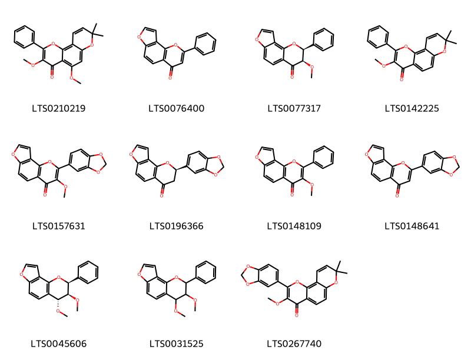{ width=100% }
    <figcaption>Hình ảnh cấu trúc hóa học của 11 hoạt chất thuộc nhóm Flavonoids gồm ['3,5-dimethoxy-8,8-dimethyl-2-phenylpyrano[2,3-h]chromen-4-one (LTS0210219)', '2-phenylfuro[2,3-h]chromen-4-one (LTS0076400)', '(11r,12s)-11-methoxy-12-phenyl-5,13-dioxatricyclo[7.4.0.0²,⁶]trideca-1,3,6,8-tetraen-10-one (LTS0077317)', 'karanjachromene (LTS0142225)', 'pongapin (LTS0157631)', '(12r)-12-(2h-1,3-benzodioxol-5-yl)-5,13-dioxatricyclo[7.4.0.0²,⁶]trideca-1,3,6,8-tetraen-10-one (LTS0196366)', 'karanjin (LTS0148109)', '2-(2h-1,3-benzodioxol-5-yl)furo[2,3-h]chromen-4-one (LTS0148641)', '(10r,11s,12s)-10,11-dimethoxy-12-phenyl-5,13-dioxatricyclo[7.4.0.0²,⁶]trideca-1,3,6,8-tetraene (LTS0045606)', '10,11-dimethoxy-12-phenyl-5,13-dioxatricyclo[7.4.0.0²,⁶]trideca-1,3,6,8-tetraene (LTS0031525)', 'pongachromene (LTS0267740)'].</figcaption>
</figure>
#### Nhóm Isoflavonoids
<figure markdown="span">
    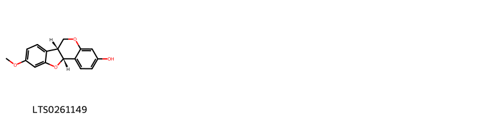{ width=100% }
    <figcaption>Hình ảnh cấu trúc hóa học của 1 hoạt chất thuộc nhóm Isoflavonoids gồm ['medicarpin, (-)- (LTS0261149)'].</figcaption>
</figure>
#### Nhóm Linear 1_3-diarylpropanoids
<figure markdown="span">
    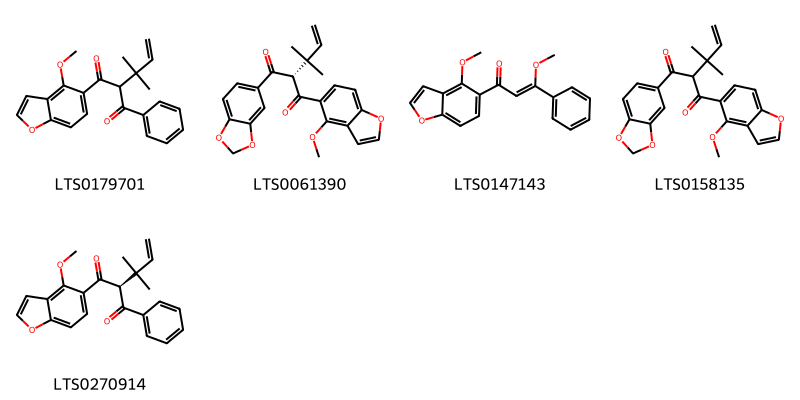{ width=100% }
    <figcaption>Hình ảnh cấu trúc hóa học của Không tìm thấy chú thích hoạt chất thuộc nhóm Linear 1_3-diarylpropanoids gồm Không tìm thấy chú thích.</figcaption>
</figure>
#### Nhóm Piperidines
<figure markdown="span">
    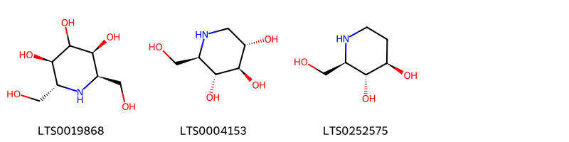{ width=100% }
    <figcaption>Hình ảnh cấu trúc hóa học của 3 hoạt chất thuộc nhóm Piperidines gồm ['(2r,3r,5s,6r)-2,6-bis(hydroxymethyl)piperidine-3,4,5-triol (LTS0019868)', '1-deoxynojirimycin (LTS0004153)', 'fagomine (LTS0252575)'].</figcaption>
</figure>

---

### Dược dân tộc học

Danh sách các quốc gia có sử dụng *N/A* trong điều trị các bệnh. 

| Country   | Disease     | Bệnh                                                                                                                                                                                                |
|:----------|:------------|:----------------------------------------------------------------------------------------------------------------------------------------------------------------------------------------------------|
| Elsewhere | Insecticide | MYMEMORY WARNING: YOU USED ALL AVAILABLE FREE TRANSLATIONS FOR TODAY. NEXT AVAILABLE IN  16 HOURS 34 MINUTES 46 SECONDS VISIT HTTPS://MYMEMORY.TRANSLATED.NET/DOC/USAGELIMITS.PHP TO TRANSLATE MORE |

---

---
## Lonchocarpus longistylis
### Thông tin về thực vật

!!! info "Phân loại thực vật của *Lonchocarpus longistylus* từ GIBF:"
    - **Kingdom:** Plantae
    - **Phylum:** Tracheophyta
    - **Order:** Fabales
    - **Family:** Fabaceae
    - **Genus:** Lonchocarpus
    - **Species:** *Lonchocarpus longistylus*

 

| Label (VI)   | Label (EN)   | Scientific Name         | Descriptions (VI)   | Descriptions (EN)   | Also Known As (VI)   | Also Known As (EN)   |
|:-------------|:-------------|:------------------------|:--------------------|:--------------------|:---------------------|:---------------------|
| N/A          | N/A          | Lonchocarpus latifolius |                     |                     | ['']                 | ['']                 |

#### Phân bố trên thế giới

**Từ CSDL GIBF** Belize, nan, Martinique, Guatemala, Brazil, Cuba, Mexico

#### Phân bố tại Việt Nam

**Từ CSDL GIBF**: Không có ghi nhận ở Việt Nam

---
### Thành phần hóa học
        
- Theo cơ sở dữ liệu lotus: Từ loài *Lonchocarpus longistylus* đã phân lập và xác định được Chưa có hoạt chất nào được phân lập. hoạt chất thuộc về các nhóm Không có hoạt chất nào được phân lập. 

Không có hình ảnh nào được tạo ra

---

### Dược dân tộc học

Danh sách các quốc gia có sử dụng *Lonchocarpus longistylus* trong điều trị các bệnh. 

| Country   | Disease    | Bệnh                                                                                                                                                                                                |
|:----------|:-----------|:----------------------------------------------------------------------------------------------------------------------------------------------------------------------------------------------------|
| Guatemala | Intoxicant | MYMEMORY WARNING: YOU USED ALL AVAILABLE FREE TRANSLATIONS FOR TODAY. NEXT AVAILABLE IN  16 HOURS 34 MINUTES 22 SECONDS VISIT HTTPS://MYMEMORY.TRANSLATED.NET/DOC/USAGELIMITS.PHP TO TRANSLATE MORE |

---

---
## Lonchocarpus longistylus
### Thông tin về thực vật

!!! info "Phân loại thực vật của *Lonchocarpus longistylus* từ GIBF:"
    - **Kingdom:** Plantae
    - **Phylum:** Tracheophyta
    - **Order:** Fabales
    - **Family:** Fabaceae
    - **Genus:** Lonchocarpus
    - **Species:** *Lonchocarpus longistylus*

 

| Label (VI)   | Label (EN)   | Scientific Name          | Descriptions (VI)   | Descriptions (EN)   | Also Known As (VI)   | Also Known As (EN)   |
|:-------------|:-------------|:-------------------------|:--------------------|:--------------------|:---------------------|:---------------------|
| N/A          | N/A          | Lonchocarpus longistylus | loài thực vật       | species of plant    | ['']                 | ['']                 |

#### Phân bố trên thế giới

**Từ CSDL GIBF** Belize, nan, Martinique, Guatemala, Brazil, Cuba, Mexico

#### Phân bố tại Việt Nam

**Từ CSDL GIBF**: Không có ghi nhận ở Việt Nam

---
### Thành phần hóa học
        
- Theo cơ sở dữ liệu lotus: Từ loài *Lonchocarpus longistylus* đã phân lập và xác định được Chưa có hoạt chất nào được phân lập. hoạt chất thuộc về các nhóm Không có hoạt chất nào được phân lập. 

Không có hình ảnh nào được tạo ra

---

### Dược dân tộc học

Danh sách các quốc gia có sử dụng *Lonchocarpus longistylus* trong điều trị các bệnh. 

| Country      | Disease    | Bệnh                                                                                                                                                                                                |
|:-------------|:-----------|:----------------------------------------------------------------------------------------------------------------------------------------------------------------------------------------------------|
| Mexico(Maya) | Intoxicant | MYMEMORY WARNING: YOU USED ALL AVAILABLE FREE TRANSLATIONS FOR TODAY. NEXT AVAILABLE IN  16 HOURS 34 MINUTES 02 SECONDS VISIT HTTPS://MYMEMORY.TRANSLATED.NET/DOC/USAGELIMITS.PHP TO TRANSLATE MORE |

---

---
## Lonchocarpus martynii
### Thông tin về thực vật

!!! info "Phân loại thực vật của *Deguelia martynii* từ GIBF:"
    - **Kingdom:** Plantae
    - **Phylum:** Tracheophyta
    - **Order:** Fabales
    - **Family:** Fabaceae
    - **Genus:** Deguelia
    - **Species:** *Deguelia martynii*

 

| Label (VI)   | Label (EN)   | Scientific Name       | Descriptions (VI)   | Descriptions (EN)   | Also Known As (VI)   | Also Known As (EN)   |
|:-------------|:-------------|:----------------------|:--------------------|:--------------------|:---------------------|:---------------------|
| N/A          | N/A          | Lonchocarpus martynii | loài thực vật       | species of plant    | ['']                 | ['']                 |

#### Phân bố trên thế giới

**Từ CSDL GIBF** nan, Suriname, Brazil, Guyana, French Guiana

#### Phân bố tại Việt Nam

**Từ CSDL GIBF**: Không có ghi nhận ở Việt Nam

---
### Thành phần hóa học
        
- Theo cơ sở dữ liệu lotus: Từ loài *Deguelia martynii* đã phân lập và xác định được Chưa có hoạt chất nào được phân lập. hoạt chất thuộc về các nhóm Không có hoạt chất nào được phân lập. 

Không có hình ảnh nào được tạo ra

---

### Dược dân tộc học

Danh sách các quốc gia có sử dụng *Deguelia martynii* trong điều trị các bệnh. 

| Country   | Disease   | Bệnh                                                                                                                                                                                                |
|:----------|:----------|:----------------------------------------------------------------------------------------------------------------------------------------------------------------------------------------------------|
| Guiana    | Piscicide | MYMEMORY WARNING: YOU USED ALL AVAILABLE FREE TRANSLATIONS FOR TODAY. NEXT AVAILABLE IN  16 HOURS 33 MINUTES 41 SECONDS VISIT HTTPS://MYMEMORY.TRANSLATED.NET/DOC/USAGELIMITS.PHP TO TRANSLATE MORE |

---

---
## Lonchocarpus nicou
### Thông tin về thực vật

!!! info "Phân loại thực vật của *Lonchocarpus heptaphyllus* từ GIBF:"
    - **Kingdom:** Plantae
    - **Phylum:** Tracheophyta
    - **Order:** Fabales
    - **Family:** Fabaceae
    - **Genus:** Lonchocarpus
    - **Species:** *Lonchocarpus heptaphyllus*

 

| Label (VI)   | Label (EN)   | Scientific Name    | Descriptions (VI)   | Descriptions (EN)   | Also Known As (VI)   | Also Known As (EN)   |
|:-------------|:-------------|:-------------------|:--------------------|:--------------------|:---------------------|:---------------------|
| N/A          | N/A          | Lonchocarpus nicou |                     | taxon (species)     | ['']                 | ['']                 |

#### Phân bố trên thế giới

**Từ CSDL GIBF** nan, Ecuador, Puerto Rico, Dominica, Suriname, Colombia, Brazil, Costa Rica, Guyana, Peru, Venezuela (Bolivarian Republic of), French Guiana

#### Phân bố tại Việt Nam

**Từ CSDL GIBF**: Không có ghi nhận ở Việt Nam

---
### Thành phần hóa học
        
- Theo cơ sở dữ liệu lotus: Từ loài *Lonchocarpus heptaphyllus* đã phân lập và xác định được Chưa có hoạt chất nào được phân lập. hoạt chất thuộc về các nhóm Không có hoạt chất nào được phân lập. 

Không có hình ảnh nào được tạo ra

---

### Dược dân tộc học

Danh sách các quốc gia có sử dụng *Lonchocarpus heptaphyllus* trong điều trị các bệnh. 

| Country   | Disease     | Bệnh                                                                                                                                                                                                |
|:----------|:------------|:----------------------------------------------------------------------------------------------------------------------------------------------------------------------------------------------------|
| Brazil    | Insecticide | MYMEMORY WARNING: YOU USED ALL AVAILABLE FREE TRANSLATIONS FOR TODAY. NEXT AVAILABLE IN  16 HOURS 33 MINUTES 24 SECONDS VISIT HTTPS://MYMEMORY.TRANSLATED.NET/DOC/USAGELIMITS.PHP TO TRANSLATE MORE |

---

---
## Lonchocarpus sericeus
### Thông tin về thực vật

!!! info "Phân loại thực vật của *Lonchocarpus sericeus* từ GIBF:"
    - **Kingdom:** Plantae
    - **Phylum:** Tracheophyta
    - **Order:** Fabales
    - **Family:** Fabaceae
    - **Genus:** Lonchocarpus
    - **Species:** *Lonchocarpus sericeus*

 

| Label (VI)   | Label (EN)   | Scientific Name       | Descriptions (VI)   | Descriptions (EN)   | Also Known As (VI)   | Also Known As (EN)           |
|:-------------|:-------------|:----------------------|:--------------------|:--------------------|:---------------------|:-----------------------------|
| N/A          | N/A          | Lonchocarpus sericeus | loài thực vật       | species of plant    | ['']                 | ['Lonchocarpus sericeus ex'] |

#### Phân bố trên thế giới

**Từ CSDL GIBF** Sao Tome and Principe, Gabon, Colombia, Brazil, India, Benin, Cuba, Mexico

#### Phân bố tại Việt Nam

**Từ CSDL GIBF**: Không có ghi nhận ở Việt Nam

---
### Thành phần hóa học
        
- Theo cơ sở dữ liệu lotus: Từ loài *Lonchocarpus sericeus* đã phân lập và xác định được 13 hoạt chất thuộc về các nhóm Flavonoids, Piperidines, Linear 1,3-diarylpropanoids. 

|    | chemicalTaxonomyClassyfireClass   |   smiles_count |
|---:|:----------------------------------|---------------:|
|  0 | Flavonoids                        |              2 |
|  1 | Linear 1,3-diarylpropanoids       |              9 |
|  2 | Piperidines                       |              2 |

#### Nhóm Flavonoids
<figure markdown="span">
    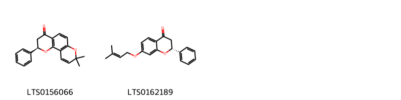{ width=100% }
    <figcaption>Hình ảnh cấu trúc hóa học của 2 hoạt chất thuộc nhóm Flavonoids gồm ['(2r)-8,8-dimethyl-2-phenyl-2h,3h-pyrano[2,3-f]chromen-4-one (LTS0156066)', '(2r)-7-[(3-methylbut-2-en-1-yl)oxy]-2-phenyl-2,3-dihydro-1-benzopyran-4-one (LTS0162189)'].</figcaption>
</figure>
#### Nhóm Linear 1_3-diarylpropanoids
<figure markdown="span">
    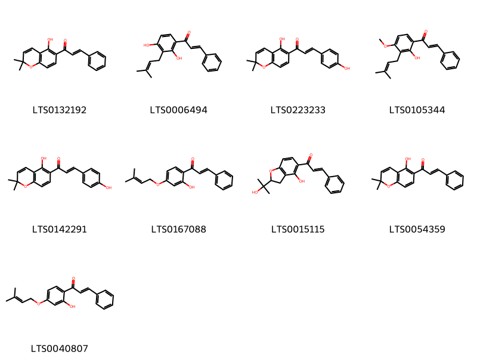{ width=100% }
    <figcaption>Hình ảnh cấu trúc hóa học của Không tìm thấy chú thích hoạt chất thuộc nhóm Linear 1_3-diarylpropanoids gồm Không tìm thấy chú thích.</figcaption>
</figure>
#### Nhóm Piperidines
<figure markdown="span">
    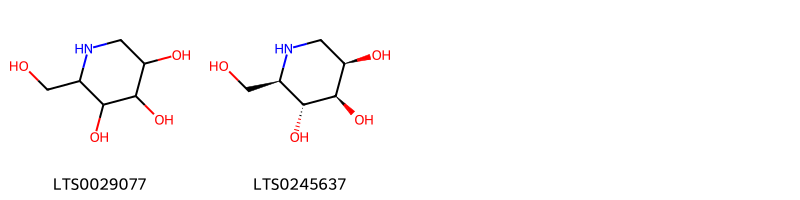{ width=100% }
    <figcaption>Hình ảnh cấu trúc hóa học của 2 hoạt chất thuộc nhóm Piperidines gồm ['1 deoxynojirimycin (LTS0029077)', 'deoxymannojirimycin (LTS0245637)'].</figcaption>
</figure>

---

### Dược dân tộc học

Danh sách các quốc gia có sử dụng *Lonchocarpus sericeus* trong điều trị các bệnh. 

| Country            | Disease           | Bệnh                                                                                                                                                                                                |
|:-------------------|:------------------|:----------------------------------------------------------------------------------------------------------------------------------------------------------------------------------------------------|
| Africa             | Poison, Stomachic | MYMEMORY WARNING: YOU USED ALL AVAILABLE FREE TRANSLATIONS FOR TODAY. NEXT AVAILABLE IN  16 HOURS 33 MINUTES 04 SECONDS VISIT HTTPS://MYMEMORY.TRANSLATED.NET/DOC/USAGELIMITS.PHP TO TRANSLATE MORE |
| Dominican Republic | Diuretic          | MYMEMORY WARNING: YOU USED ALL AVAILABLE FREE TRANSLATIONS FOR TODAY. NEXT AVAILABLE IN  16 HOURS 33 MINUTES 02 SECONDS VISIT HTTPS://MYMEMORY.TRANSLATED.NET/DOC/USAGELIMITS.PHP TO TRANSLATE MORE |
| Ghana              | Laxative          | MYMEMORY WARNING: YOU USED ALL AVAILABLE FREE TRANSLATIONS FOR TODAY. NEXT AVAILABLE IN  16 HOURS 32 MINUTES 59 SECONDS VISIT HTTPS://MYMEMORY.TRANSLATED.NET/DOC/USAGELIMITS.PHP TO TRANSLATE MORE |
| Nigeria            | Parasiticide      | MYMEMORY WARNING: YOU USED ALL AVAILABLE FREE TRANSLATIONS FOR TODAY. NEXT AVAILABLE IN  16 HOURS 32 MINUTES 57 SECONDS VISIT HTTPS://MYMEMORY.TRANSLATED.NET/DOC/USAGELIMITS.PHP TO TRANSLATE MORE |
| W Africa           | Laxative          | MYMEMORY WARNING: YOU USED ALL AVAILABLE FREE TRANSLATIONS FOR TODAY. NEXT AVAILABLE IN  16 HOURS 32 MINUTES 55 SECONDS VISIT HTTPS://MYMEMORY.TRANSLATED.NET/DOC/USAGELIMITS.PHP TO TRANSLATE MORE |

---

---
## Lonchocarpus urucu
### Thông tin về thực vật

!!! info "Phân loại thực vật của *Deguelia urucu* từ GIBF:"
    - **Kingdom:** Plantae
    - **Phylum:** Tracheophyta
    - **Order:** Fabales
    - **Family:** Fabaceae
    - **Genus:** Deguelia
    - **Species:** *Deguelia urucu*

 

| Label (VI)   | Label (EN)   | Scientific Name    | Descriptions (VI)   | Descriptions (EN)   | Also Known As (VI)   | Also Known As (EN)   |
|:-------------|:-------------|:-------------------|:--------------------|:--------------------|:---------------------|:---------------------|
| N/A          | N/A          | Lonchocarpus urucu |                     | species of plant    | ['']                 | ['']                 |

#### Phân bố trên thế giới

**Từ CSDL GIBF** Colombia, Brazil, unknown or invalid, Peru, Venezuela (Bolivarian Republic of)

#### Phân bố tại Việt Nam

**Từ CSDL GIBF**: Không có ghi nhận ở Việt Nam

---
### Thành phần hóa học
        
- Theo cơ sở dữ liệu lotus: Từ loài *Deguelia urucu* đã phân lập và xác định được Chưa có hoạt chất nào được phân lập. hoạt chất thuộc về các nhóm Không có hoạt chất nào được phân lập. 

Không có hình ảnh nào được tạo ra

---

### Dược dân tộc học

Danh sách các quốc gia có sử dụng *Deguelia urucu* trong điều trị các bệnh. 

| Country          | Disease   | Bệnh                                                                                                                                                                                                |
|:-----------------|:----------|:----------------------------------------------------------------------------------------------------------------------------------------------------------------------------------------------------|
| Brazil(Deni)     | Piscicide | MYMEMORY WARNING: YOU USED ALL AVAILABLE FREE TRANSLATIONS FOR TODAY. NEXT AVAILABLE IN  16 HOURS 32 MINUTES 31 SECONDS VISIT HTTPS://MYMEMORY.TRANSLATED.NET/DOC/USAGELIMITS.PHP TO TRANSLATE MORE |
| Brazil(Jamamadi) | Piscicide | MYMEMORY WARNING: YOU USED ALL AVAILABLE FREE TRANSLATIONS FOR TODAY. NEXT AVAILABLE IN  16 HOURS 32 MINUTES 29 SECONDS VISIT HTTPS://MYMEMORY.TRANSLATED.NET/DOC/USAGELIMITS.PHP TO TRANSLATE MORE |
| Brazil(Maku)     | Piscicide | MYMEMORY WARNING: YOU USED ALL AVAILABLE FREE TRANSLATIONS FOR TODAY. NEXT AVAILABLE IN  16 HOURS 32 MINUTES 27 SECONDS VISIT HTTPS://MYMEMORY.TRANSLATED.NET/DOC/USAGELIMITS.PHP TO TRANSLATE MORE |
| Brazil(Waika)    | Piscicide | MYMEMORY WARNING: YOU USED ALL AVAILABLE FREE TRANSLATIONS FOR TODAY. NEXT AVAILABLE IN  16 HOURS 32 MINUTES 24 SECONDS VISIT HTTPS://MYMEMORY.TRANSLATED.NET/DOC/USAGELIMITS.PHP TO TRANSLATE MORE |
| Colombia         | Piscicide | MYMEMORY WARNING: YOU USED ALL AVAILABLE FREE TRANSLATIONS FOR TODAY. NEXT AVAILABLE IN  16 HOURS 32 MINUTES 22 SECONDS VISIT HTTPS://MYMEMORY.TRANSLATED.NET/DOC/USAGELIMITS.PHP TO TRANSLATE MORE |

---

---
## Lonchocarpus utilis
### Thông tin về thực vật

!!! info "Phân loại thực vật của *Deguelia utilis* từ GIBF:"
    - **Kingdom:** Plantae
    - **Phylum:** Tracheophyta
    - **Order:** Fabales
    - **Family:** Fabaceae
    - **Genus:** Deguelia
    - **Species:** *Deguelia utilis*

 

| Label (VI)   | Label (EN)   | Scientific Name     | Descriptions (VI)   | Descriptions (EN)   | Also Known As (VI)   | Also Known As (EN)   |
|:-------------|:-------------|:--------------------|:--------------------|:--------------------|:---------------------|:---------------------|
| N/A          | N/A          | Lonchocarpus utilis | loài thực vật       | species of plant    | ['']                 | ['']                 |

#### Phân bố trên thế giới

**Từ CSDL GIBF** nan, Ecuador, Suriname, Colombia, Brazil, Guyana, unknown or invalid, Congo, Democratic Republic of the, Peru, Venezuela (Bolivarian Republic of), French Guiana

#### Phân bố tại Việt Nam

**Từ CSDL GIBF**: Không có ghi nhận ở Việt Nam

---
### Thành phần hóa học
        
- Theo cơ sở dữ liệu lotus: Từ loài *Deguelia utilis* đã phân lập và xác định được 11 hoạt chất thuộc về các nhóm Stilbenes, Isoflavonoids, Linear 1,3-diarylpropanoids. 

|    | chemicalTaxonomyClassyfireClass   |   smiles_count |
|---:|:----------------------------------|---------------:|
|  0 | Isoflavonoids                     |              7 |
|  1 | Linear 1,3-diarylpropanoids       |              1 |
|  2 | Stilbenes                         |              3 |

#### Nhóm Isoflavonoids
<figure markdown="span">
    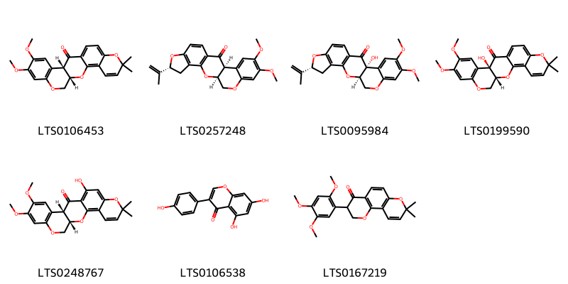{ width=100% }
    <figcaption>Hình ảnh cấu trúc hóa học của 7 hoạt chất thuộc nhóm Isoflavonoids gồm ['deguelin (LTS0106453)', 'cube root (LTS0257248)', '12a-hydroxyrotenone (LTS0095984)', 'tephrosin (LTS0199590)', 'toxicarol (LTS0248767)', 'genistein (LTS0106538)', '8,8-dimethyl-3-(2,4,5-trimethoxyphenyl)-2h,3h-pyrano[2,3-f]chromen-4-one (LTS0167219)'].</figcaption>
</figure>
#### Nhóm Linear 1_3-diarylpropanoids
<figure markdown="span">
    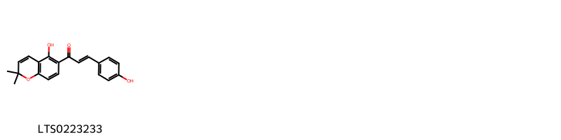{ width=100% }
    <figcaption>Hình ảnh cấu trúc hóa học của Không tìm thấy chú thích hoạt chất thuộc nhóm Linear 1_3-diarylpropanoids gồm Không tìm thấy chú thích.</figcaption>
</figure>
#### Nhóm Stilbenes
<figure markdown="span">
    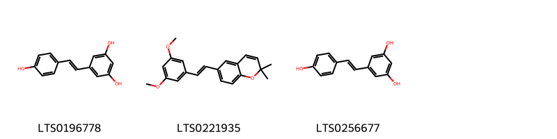{ width=100% }
    <figcaption>Hình ảnh cấu trúc hóa học của 3 hoạt chất thuộc nhóm Stilbenes gồm ['tocilizumab (LTS0196778)', '6-[(1e)-2-(3,5-dimethoxyphenyl)ethenyl]-2,2-dimethylchromene (LTS0221935)', 'resveratrol (LTS0256677)'].</figcaption>
</figure>

---

### Dược dân tộc học

Danh sách các quốc gia có sử dụng *Deguelia utilis* trong điều trị các bệnh. 

| Country    | Disease     | Bệnh                                                                                                                                                                                                |
|:-----------|:------------|:----------------------------------------------------------------------------------------------------------------------------------------------------------------------------------------------------|
| Peru       | Insecticide | MYMEMORY WARNING: YOU USED ALL AVAILABLE FREE TRANSLATIONS FOR TODAY. NEXT AVAILABLE IN  16 HOURS 32 MINUTES 03 SECONDS VISIT HTTPS://MYMEMORY.TRANSLATED.NET/DOC/USAGELIMITS.PHP TO TRANSLATE MORE |
| Sa(Amazon) | Insecticide | MYMEMORY WARNING: YOU USED ALL AVAILABLE FREE TRANSLATIONS FOR TODAY. NEXT AVAILABLE IN  16 HOURS 32 MINUTES 01 SECONDS VISIT HTTPS://MYMEMORY.TRANSLATED.NET/DOC/USAGELIMITS.PHP TO TRANSLATE MORE |

---

# Chi Peltophorum

??? note "Danh sách các dược liệu thuộc chi"
    
	 - *Peltophorum pterocarpum*

---
## Peltophorum pterocarpum
### Thông tin về thực vật

!!! info "Phân loại thực vật của *Peltophorum pterocarpum* từ GIBF:"
    - **Kingdom:** Plantae
    - **Phylum:** Tracheophyta
    - **Order:** Fabales
    - **Family:** Fabaceae
    - **Genus:** Peltophorum
    - **Species:** *Peltophorum pterocarpum*

 

| Label (VI)   | Label (EN)   | Scientific Name         | Descriptions (VI)   | Descriptions (EN)   | Also Known As (VI)                     | Also Known As (EN)                                                     |
|:-------------|:-------------|:------------------------|:--------------------|:--------------------|:---------------------------------------|:-----------------------------------------------------------------------|
| N/A          | N/A          | Peltophorum pterocarpum | loài thực vật       | species of plant    | ['Peltophorum pterocarpum', 'Lim sét'] | ['Peltophorum pterocarpum ex', 'yellow flame tree', 'yellow ponciana'] |

#### Phân bố trên thế giới

**Từ CSDL GIBF** Sri Lanka, Puerto Rico, Australia, Thailand, India, Indonesia, Singapore

#### Phân bố tại Việt Nam

**Từ CSDL GIBF**: Không có ghi nhận ở Việt Nam

---
### Thành phần hóa học
        
- Theo cơ sở dữ liệu lotus: Từ loài *Peltophorum pterocarpum* đã phân lập và xác định được 2 hoạt chất thuộc về các nhóm Flavonoids, Benzene and substituted derivatives. 

|    | chemicalTaxonomyClassyfireClass     |   smiles_count |
|---:|:------------------------------------|---------------:|
|  0 | Benzene and substituted derivatives |              1 |
|  1 | Flavonoids                          |              1 |

#### Nhóm Benzene and substituted derivatives
<figure markdown="span">
    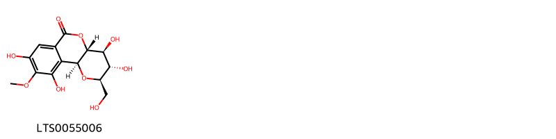{ width=100% }
    <figcaption>Hình ảnh cấu trúc hóa học của 1 hoạt chất thuộc nhóm Benzene and substituted derivatives gồm ['bergenin (LTS0055006)'].</figcaption>
</figure>
#### Nhóm Flavonoids
<figure markdown="span">
    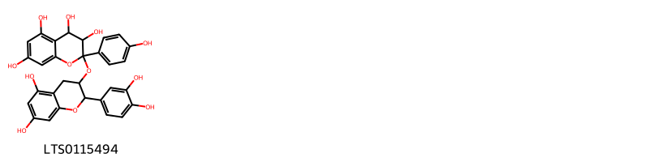{ width=100% }
    <figcaption>Hình ảnh cấu trúc hóa học của 1 hoạt chất thuộc nhóm Flavonoids gồm ['2-{[2-(3,4-dihydroxyphenyl)-5,7-dihydroxy-3,4-dihydro-2h-1-benzopyran-3-yl]oxy}-2-(4-hydroxyphenyl)-3,4-dihydro-1-benzopyran-3,4,5,7-tetrol (LTS0115494)'].</figcaption>
</figure>

---

### Dược dân tộc học

Danh sách các quốc gia có sử dụng *Peltophorum pterocarpum* trong điều trị các bệnh. 

| Country   | Disease                           | Bệnh                                                                                                                                                                                                |
|:----------|:----------------------------------|:----------------------------------------------------------------------------------------------------------------------------------------------------------------------------------------------------|
| Java      | Collyrium, Dentifrice, Dentifrice | MYMEMORY WARNING: YOU USED ALL AVAILABLE FREE TRANSLATIONS FOR TODAY. NEXT AVAILABLE IN  16 HOURS 31 MINUTES 40 SECONDS VISIT HTTPS://MYMEMORY.TRANSLATED.NET/DOC/USAGELIMITS.PHP TO TRANSLATE MORE |

---

# Chi Erythrina

??? note "Danh sách các dược liệu thuộc chi"
    
	 - *Erythrina abyssinica*
	 - *Erythrina americana*
	 - *Erythrina berteroana*
	 - *Erythrina corallodendron*
	 - *Erythrina crista-galli*
	 - *Erythrina guatemalensis*
	 - *Erythrina herbacea*
	 - *Erythrina indica*
	 - *Erythrina lanata*
	 - *Erythrina stricta*
	 - *Erythrina subumbrans*
	 - *Erythrina variegata*

---
## Erythrina abyssinica
### Thông tin về thực vật

!!! info "Phân loại thực vật của *Erythrina abyssinica* từ GIBF:"
    - **Kingdom:** Plantae
    - **Phylum:** Tracheophyta
    - **Order:** Fabales
    - **Family:** Fabaceae
    - **Genus:** Erythrina
    - **Species:** *Erythrina abyssinica*

 

| Label (VI)   | Label (EN)   | Scientific Name      | Descriptions (VI)   | Descriptions (EN)   | Also Known As (VI)   | Also Known As (EN)   |
|:-------------|:-------------|:---------------------|:--------------------|:--------------------|:---------------------|:---------------------|
| N/A          | N/A          | Erythrina abyssinica |                     | species of plant    | ['']                 | ['']                 |

#### Phân bố trên thế giới

**Từ CSDL GIBF** nan, Belgium, Angola, Mozambique, Rwanda, Congo, Tanzania, United Republic of, Malawi, Zambia, Nigeria, Sudan, Portugal, Congo, Democratic Republic of the, Zimbabwe, Uganda, South Africa, Brazil, Costa Rica, Burundi, Kenya, Cameroon, Ethiopia

#### Phân bố tại Việt Nam

**Từ CSDL GIBF**: Không có ghi nhận ở Việt Nam

---
### Thành phần hóa học
        
- Theo cơ sở dữ liệu lotus: Từ loài *Erythrina abyssinica* đã phân lập và xác định được 166 hoạt chất thuộc về các nhóm Flavonoids, Isoflavonoids, Linear 1,3-diarylpropanoids, Erythrina alkaloids, Cinnamic acids and derivatives, Aporphines, 2-arylbenzofuran flavonoids, Dihydrofurans, Benzopyrans. 

|    | chemicalTaxonomyClassyfireClass   |   smiles_count |
|---:|:----------------------------------|---------------:|
|  0 | 2-arylbenzofuran flavonoids       |              1 |
|  1 | Aporphines                        |              1 |
|  2 | Benzopyrans                       |              1 |
|  3 | Cinnamic acids and derivatives    |              3 |
|  4 | Dihydrofurans                     |              1 |
|  5 | Erythrina alkaloids               |              6 |
|  6 | Flavonoids                        |             81 |
|  7 | Isoflavonoids                     |             54 |
|  8 | Linear 1,3-diarylpropanoids       |             18 |

#### Nhóm 2-arylbenzofuran flavonoids
<figure markdown="span">
    { width=100% }
    <figcaption>Hình ảnh cấu trúc hóa học của 1 hoạt chất thuộc nhóm 2-arylbenzofuran flavonoids gồm ['2-(4-hydroxy-2,5-dimethoxyphenyl)-1-benzofuran-6-ol (LTS0206225)'].</figcaption>
</figure>
#### Nhóm Aporphines
<figure markdown="span">
    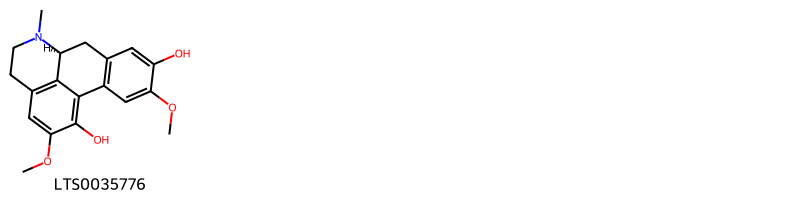{ width=100% }
    <figcaption>Hình ảnh cấu trúc hóa học của 1 hoạt chất thuộc nhóm Aporphines gồm ['(9s)-4,15-dimethoxy-10-methyl-10-azatetracyclo[7.7.1.0²,⁷.0¹³,¹⁷]heptadeca-1(16),2(7),3,5,13(17),14-hexaene-5,16-diol (LTS0035776)'].</figcaption>
</figure>
#### Nhóm Benzopyrans
<figure markdown="span">
    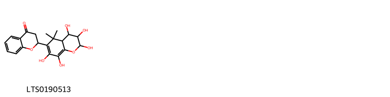{ width=100% }
    <figcaption>Hình ảnh cấu trúc hóa học của 1 hoạt chất thuộc nhóm Benzopyrans gồm ['2-(2,3,4,7,8-pentahydroxy-5,5-dimethyl-2,3,4,4a-tetrahydro-1-benzopyran-6-yl)-2,3-dihydro-1-benzopyran-4-one (LTS0190513)'].</figcaption>
</figure>
#### Nhóm Cinnamic acids and derivatives
<figure markdown="span">
    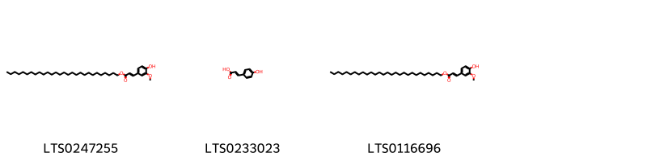{ width=100% }
    <figcaption>Hình ảnh cấu trúc hóa học của 3 hoạt chất thuộc nhóm Cinnamic acids and derivatives gồm ['octacosyl 3-(4-hydroxy-3-methoxyphenyl)prop-2-enoate (LTS0247255)', 'hydroxycinnamic acid (LTS0233023)', 'octacosyl (2e)-3-(4-hydroxy-3-methoxyphenyl)prop-2-enoate (LTS0116696)'].</figcaption>
</figure>
#### Nhóm Dihydrofurans
<figure markdown="span">
    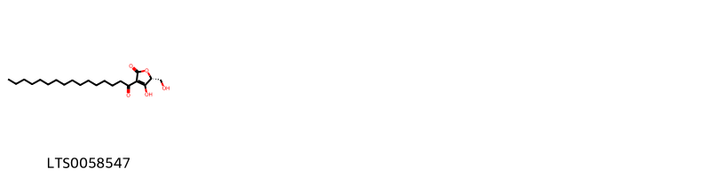{ width=100% }
    <figcaption>Hình ảnh cấu trúc hóa học của 1 hoạt chất thuộc nhóm Dihydrofurans gồm ['(5r)-3-hexadecanoyl-4-hydroxy-5-(hydroxymethyl)-5h-furan-2-one (LTS0058547)'].</figcaption>
</figure>
#### Nhóm Erythrina alkaloids
<figure markdown="span">
    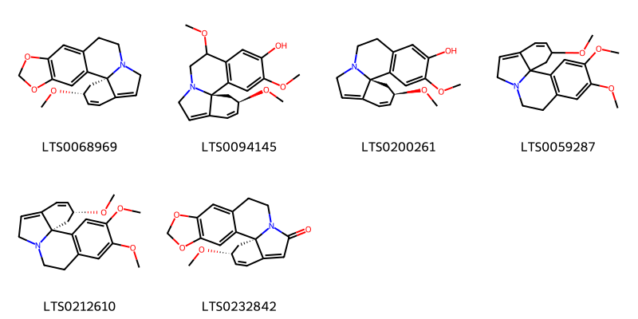{ width=100% }
    <figcaption>Hình ảnh cấu trúc hóa học của 6 hoạt chất thuộc nhóm Erythrina alkaloids gồm ['erythraline (LTS0068969)', '(9bs,11r)-5,8,11-trimethoxy-2h,4h,5h,10h,11h-indolo[7a,1-a]isoquinolin-7-ol (LTS0094145)', 'erysodine (LTS0200261)', '7,8,11-trimethoxy-2h,4h,5h,10h,11h-indolo[7a,1-a]isoquinoline (LTS0059287)', 'erysotrine (LTS0212610)', '(1s,19r)-19-methoxy-5,7-dioxa-13-azapentacyclo[11.7.0.0¹,¹⁶.0²,¹⁰.0⁴,⁸]icosa-2,4(8),9,15,17-pentaen-14-one (LTS0232842)'].</figcaption>
</figure>
#### Nhóm Flavonoids
<figure markdown="span">
    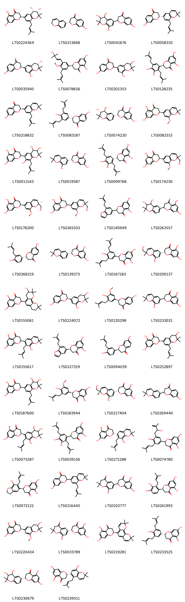{ width=100% }
    <figcaption>Hình ảnh cấu trúc hóa học của 81 hoạt chất thuộc nhóm Flavonoids gồm ['(2s)-2-[(3s,4s)-3,4-dihydroxy-2,2-dimethyl-8-(3-methylbut-2-en-1-yl)-3,4-dihydro-1-benzopyran-6-yl]-5,7-dihydroxy-2,3-dihydro-1-benzopyran-4-one (LTS0224364)', '(2s)-2-(2h-chromen-6-yl)-7-hydroxy-2,3-dihydro-1-benzopyran-4-one (LTS0213668)', '7-hydroxy-2-(3,4,8-trihydroxy-2,2-dimethyl-3,4-dihydro-1-benzopyran-6-yl)-2,3-dihydro-1-benzopyran-4-one (LTS0041676)', '(2r)-2-[2,2-dimethyl-8-(3-methylbut-2-en-1-yl)chromen-6-yl]-7-hydroxy-2,3-dihydro-1-benzopyran-4-one (LTS0058310)', '(2s)-2-[(3s)-3,8-dihydroxy-2,2-dimethyl-3,4-dihydro-1-benzopyran-6-yl]-7-hydroxy-2,3-dihydro-1-benzopyran-4-one (LTS0035945)', 'burttinone (LTS0078656)', '2-(3,8-dihydroxy-2,2-dimethyl-3,4-dihydro-1-benzopyran-6-yl)-7-hydroxy-2,3-dihydro-1-benzopyran-4-one (LTS0201353)', 'sigmoidin a (LTS0128235)', '(2s)-2-[2,2-dimethyl-8-(3-methylbut-2-en-1-yl)chromen-6-yl]-7-hydroxy-2,3-dihydro-1-benzopyran-4-one (LTS0218832)', '(2r)-7-hydroxy-2-[4-hydroxy-3,5-bis(3-methylbut-2-en-1-yl)phenyl]-2,3-dihydro-1-benzopyran-4-one (LTS0083187)', '(2s)-2-[(3r,4s)-3,4-dihydroxy-2,2-dimethyl-3,4-dihydro-1-benzopyran-6-yl]-5,7-dihydroxy-2,3-dihydro-1-benzopyran-4-one (LTS0074220)', 'abyssinin i (LTS0082515)', '5,7-dihydroxy-2-[3,4,7-trihydroxy-2,2-dimethyl-8-(3-methylbut-2-en-1-yl)-3,4-dihydro-1-benzopyran-6-yl]-2,3-dihydro-1-benzopyran-4-one (LTS0011543)', '(2s)-5,7-dihydroxy-2-(8-hydroxy-2,2-dimethylchromen-6-yl)-2,3-dihydro-1-benzopyran-4-one (LTS0019587)', '(2r)-2-[3,4-dihydroxy-2,5-bis(3-methylbut-2-en-1-yl)phenyl]-5,7-dihydroxy-2,3-dihydro-1-benzopyran-4-one (LTS0099768)', '(2s)-5,7-dihydroxy-2-[2-(hydroxymethyl)-8-methoxy-2-methylchromen-6-yl]-2,3-dihydro-1-benzopyran-4-one (LTS0174230)', '(2s)-5,7-dihydroxy-2-[(2s)-2-(hydroxymethyl)-8-methoxy-2-methylchromen-6-yl]-2,3-dihydro-1-benzopyran-4-one (LTS0178200)', '5,7-dihydroxy-2-[2-(hydroxymethyl)-8-methoxy-2-methylchromen-6-yl]-2,3-dihydro-1-benzopyran-4-one (LTS0265103)', '5,7-dihydroxy-2-[7-(3-methylbut-2-en-1-yl)-1-benzofuran-5-yl]-2,3-dihydro-1-benzopyran-4-one (LTS0140949)', '2-(3,4-dihydroxy-2,2-dimethyl-3,4-dihydro-1-benzopyran-6-yl)-5,7-dihydroxy-2,3-dihydro-1-benzopyran-4-one (LTS0263557)', '(2r)-7-hydroxy-2-[4-hydroxy-3-(3-methylbut-2-en-1-yl)phenyl]-2,3-dihydro-1-benzopyran-4-one (LTS0268219)', '(2s)-2-(2,2-dimethylchromen-6-yl)-5,7-dihydroxy-2,3-dihydro-1-benzopyran-4-one (LTS0139373)', 'abyssinone v (LTS0167183)', '(2s)-5,7-dihydroxy-2-[8-hydroxy-2-(hydroxymethyl)-2-methylchromen-6-yl]-2,3-dihydro-1-benzopyran-4-one (LTS0200137)', 'abyssinoflavanone vi (LTS0155061)', '(2s)-2-(3,8-dihydroxy-2,2-dimethyl-3,4-dihydro-1-benzopyran-6-yl)-7-hydroxy-2,3-dihydro-1-benzopyran-4-one (LTS0224072)', '(2s)-7-hydroxy-2-[4-hydroxy-3-methoxy-5-(3-methylbut-2-en-1-yl)phenyl]-2,3-dihydro-1-benzopyran-4-one (LTS0120298)', 'sigmoidin c (LTS0233031)', 'sigmoidin f (LTS0155617)', '(2s)-5,7-dihydroxy-2-[7-(3-methylbut-2-en-1-yl)-1-benzofuran-5-yl]-2,3-dihydro-1-benzopyran-4-one (LTS0227319)', '(2s)-7-hydroxy-2-[4-hydroxy-3-(3-methylbut-2-en-1-yl)phenyl]-2,3-dihydro-1-benzopyran-4-one (LTS0094039)', '(2s)-5,7-dihydroxy-2-[3-hydroxy-2,2-dimethyl-8-(3-methylbut-2-en-1-yl)-3,4-dihydro-1-benzopyran-6-yl]-2,3-dihydro-1-benzopyran-4-one (LTS0252897)', '2-[3,4-dihydroxy-2,2-dimethyl-8-(3-methylbut-2-en-1-yl)-3,4-dihydro-1-benzopyran-6-yl]-5,7-dihydroxy-2,3-dihydro-1-benzopyran-4-one (LTS0187600)', 'sbmet (LTS0183944)', '(2s)-5,7-dihydroxy-2-[(2s)-8-hydroxy-2-(hydroxymethyl)-2-methylchromen-6-yl]-2,3-dihydro-1-benzopyran-4-one (LTS0217404)', '2-(2,2-dimethylchromen-6-yl)-7-hydroxy-2,3-dihydro-1-benzopyran-4-one (LTS0269440)', '(2s)-5,7-dihydroxy-2-[3,4,8-trihydroxy-2,2-dimethyl-7-(3-methylbut-2-en-1-yl)-3,4-dihydro-1-benzopyran-6-yl]-2,3-dihydro-1-benzopyran-4-one (LTS0073287)', 'sigmoidin a (LTS0039156)', '(2r)-5,7-dihydroxy-2-[8-hydroxy-2,2-dimethyl-7-(3-methylbut-2-en-1-yl)chromen-6-yl]-2,3-dihydro-1-benzopyran-4-one (LTS0271288)', '5,7-dihydroxy-2-[4-hydroxy-3-(2-hydroxy-3-methylbut-3-en-1-yl)-5-(3-methylbut-2-en-1-yl)phenyl]-2,3-dihydro-1-benzopyran-4-one (LTS0074780)', 'abyssinoflavanone iv (LTS0072122)', 'abyssinone iii (LTS0216445)', '6-(5,7-dihydroxy-4-oxo-2,3-dihydro-1-benzopyran-2-yl)-8-hydroxy-2,2-dimethyl-3h-1-benzopyran-4-one (LTS0102777)', '(2s)-2-[3,4-dihydroxy-2-(3-methylbut-2-en-1-yl)phenyl]-5,7-dihydroxy-2,3-dihydro-1-benzopyran-4-one (LTS0261993)', '(2s)-5,7-dihydroxy-2-[(3r)-3-hydroxy-8-methoxy-2,2-dimethyl-3,4-dihydro-1-benzopyran-6-yl]-2,3-dihydro-1-benzopyran-4-one (LTS0220434)', '6-[(2s)-5,7-dihydroxy-4-oxo-2,3-dihydro-1-benzopyran-2-yl]-8-hydroxy-2,2-dimethyl-3h-1-benzopyran-4-one (LTS0033789)', '(2s)-5,7-dihydroxy-2-{2,2,9,9-tetramethylpyrano[3,2-h]chromen-5-yl}-2,3-dihydro-1-benzopyran-4-one (LTS0219281)', '(2r)-5,7-dihydroxy-2-[4-hydroxy-3,5-bis(3-methylbut-2-en-1-yl)phenyl]-2,3-dihydro-1-benzopyran-4-one (LTS0233525)', '(2s)-2-(3,4-dihydroxy-2,2-dimethyl-3,4-dihydro-1-benzopyran-6-yl)-5,7-dihydroxy-2,3-dihydro-1-benzopyran-4-one (LTS0230679)', '(2s)-5,7-dihydroxy-2-[8-hydroxy-2,2-dimethyl-5-(3-methylbut-2-en-1-yl)chromen-6-yl]-2,3-dihydro-1-benzopyran-4-one (LTS0239511)', 'abyssinone ii (LTS0225956)', "2'-prenyleriodictyol (LTS0178435)", 'abyssinoflavanone v (LTS0252131)', '(2s)-7-hydroxy-2-[4-hydroxy-3,5-bis(3-methylbut-2-en-1-yl)phenyl]-2,3-dihydro-1-benzopyran-4-one (LTS0166508)', '5,7-dihydroxy-2-[8-hydroxy-2-(hydroxymethyl)-2-methylchromen-6-yl]-2,3-dihydro-1-benzopyran-4-one (LTS0022856)', "abyssinone v 4'-methyl ether (LTS0183751)", '(2s)-5,7-dihydroxy-2-[(3s,4s)-3,4,7-trihydroxy-2,2-dimethyl-8-(3-methylbut-2-en-1-yl)-3,4-dihydro-1-benzopyran-6-yl]-2,3-dihydro-1-benzopyran-4-one (LTS0047383)', '2-(2,2-dimethylchromen-6-yl)-5,7-dihydroxy-2,3-dihydro-1-benzopyran-4-one (LTS0228634)', '(2s)-5,7-dihydroxy-2-[(3s)-3-hydroxy-2,2-dimethyl-8-(3-methylbut-2-en-1-yl)-3,4-dihydro-1-benzopyran-6-yl]-2,3-dihydro-1-benzopyran-4-one (LTS0187573)', '(2r)-2-[(3s)-3,8-dihydroxy-2,2-dimethyl-3,4-dihydro-1-benzopyran-6-yl]-5,7-dihydroxy-2,3-dihydro-1-benzopyran-4-one (LTS0248002)', '(2r)-5,7-dihydroxy-2-[(5s)-5-hydroxy-4,4,13,13-tetramethyl-3,14-dioxatricyclo[8.4.0.0²,⁷]tetradeca-1,7,9-trien-8-yl]-2,3-dihydro-1-benzopyran-4-one (LTS0186045)', 'yinyanghuo d (LTS0063487)', '5,7-dihydroxy-2-[4-hydroxy-3,5-bis(3-methylbut-2-en-1-yl)phenyl]-2,3-dihydro-1-benzopyran-4-one (LTS0270471)', '(2s)-2-[3,4-dihydroxy-2,2-dimethyl-8-(3-methylbut-2-en-1-yl)-3,4-dihydro-1-benzopyran-6-yl]-5,7-dihydroxy-2,3-dihydro-1-benzopyran-4-one (LTS0272263)', '(2s)-5,7-dihydroxy-2-(3-hydroxy-8-methoxy-2,2-dimethyl-3,4-dihydro-1-benzopyran-6-yl)-2,3-dihydro-1-benzopyran-4-one (LTS0032664)', '7-hydroxy-2-[4-hydroxy-3-methoxy-5-(3-methylbut-2-en-1-yl)phenyl]-2,3-dihydro-1-benzopyran-4-one (LTS0137664)', 'abyssinone i (LTS0105771)', '5,7-dihydroxy-2-(8-methoxy-2,2-dimethylchromen-6-yl)-2,3-dihydro-1-benzopyran-4-one (LTS0068627)', '(2s)-7-hydroxy-2-[(3r,4s)-3,4,8-trihydroxy-2,2-dimethyl-3,4-dihydro-1-benzopyran-6-yl]-2,3-dihydro-1-benzopyran-4-one (LTS0008454)', 'burttinonedehydrate (LTS0066888)', '(2s)-5,7-dihydroxy-2-{4-hydroxy-3-[(2r)-2-hydroxy-3-methylbut-3-en-1-yl]-5-(3-methylbut-2-en-1-yl)phenyl}-2,3-dihydro-1-benzopyran-4-one (LTS0056513)', '5,7-dihydroxy-2-[8-hydroxy-2,2-dimethyl-5-(3-methylbut-2-en-1-yl)chromen-6-yl]-2,3-dihydro-1-benzopyran-4-one (LTS0008478)', '5,7-dihydroxy-2-(3-hydroxy-8-methoxy-2,2-dimethyl-3,4-dihydro-1-benzopyran-6-yl)-2,3-dihydro-1-benzopyran-4-one (LTS0023082)', 'abyssinin iii (LTS0033655)', 'sigmoidin b (LTS0120052)', 'abyssinone iv (LTS0011194)', '(2s)-7-hydroxy-2-(3,4,8-trihydroxy-2,2-dimethyl-3,4-dihydro-1-benzopyran-6-yl)-2,3-dihydro-1-benzopyran-4-one (LTS0076324)', '(2s)-5,7-dihydroxy-2-[4-hydroxy-3-(2-hydroxy-3-methylbut-3-en-1-yl)-5-(3-methylbut-2-en-1-yl)phenyl]-2,3-dihydro-1-benzopyran-4-one (LTS0034170)', '5,7-dihydroxy-2-{2,2,9,9-tetramethylpyrano[3,2-h]chromen-5-yl}-2,3-dihydro-1-benzopyran-4-one (LTS0023458)', '5,7-dihydroxy-2-[3-hydroxy-2,2-dimethyl-8-(3-methylbut-2-en-1-yl)-3,4-dihydro-1-benzopyran-6-yl]-2,3-dihydro-1-benzopyran-4-one (LTS0251986)', '(2s)-2-[(3s)-3,8-dihydroxy-2,2-dimethyl-3,4-dihydro-1-benzopyran-6-yl]-5,7-dihydroxy-2,3-dihydro-1-benzopyran-4-one (LTS0093367)'].</figcaption>
</figure>
#### Nhóm Isoflavonoids
<figure markdown="span">
    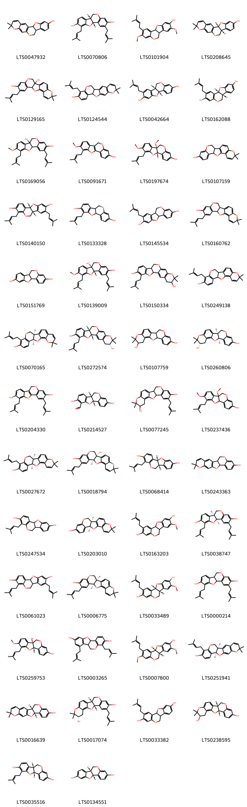{ width=100% }
    <figcaption>Hình ảnh cấu trúc hóa học của 54 hoạt chất thuộc nhóm Isoflavonoids gồm ['neorautenol (LTS0047932)', '(1r,10r)-4,15-bis(3-methylbut-2-en-1-yl)-8,17-dioxatetracyclo[8.7.0.0²,⁷.0¹¹,¹⁶]heptadeca-2(7),3,5,11,13,15-hexaene-5,14-diol (LTS0070806)', '5,13-dimethoxy-4-(3-methylbut-2-en-1-yl)-8,17-dioxatetracyclo[8.7.0.0²,⁷.0¹¹,¹⁶]heptadeca-2,4,6,11(16),12,14-hexaen-14-ol (LTS0101904)', '(2r,10r)-17,17-dimethyl-3,12,16-trioxapentacyclo[11.8.0.0²,¹⁰.0⁴,⁹.0¹⁵,²⁰]henicosa-1(13),4,6,8,14,18,20-heptaen-6-ol (LTS0208645)', '17,17-dimethyl-8-(3-methylbut-2-en-1-yl)-4,12,18-trioxapentacyclo[11.8.0.0²,¹¹.0⁵,¹⁰.0¹⁴,¹⁹]henicosa-1(21),5(10),6,8,13,15,19-heptaene-2,7-diol (LTS0129165)', 'erybraedin d (LTS0124544)', 'homoedudiol (LTS0042664)', '(1r,10r)-4-(3-methylbut-2-en-1-yl)-8,17-dioxatetracyclo[8.7.0.0²,⁷.0¹¹,¹⁶]heptadeca-2(7),3,5,11,13,15-hexaene-5,14-diol (LTS0162088)', '14-methoxy-4,15-bis(3-methylbut-2-en-1-yl)-8,17-dioxatetracyclo[8.7.0.0²,⁷.0¹¹,¹⁶]heptadeca-2,4,6,11,13,15-hexaene-5,10-diol (LTS0169056)', '14-methoxy-15-(3-methylbut-2-en-1-yl)-8,17-dioxatetracyclo[8.7.0.0²,⁷.0¹¹,¹⁶]heptadeca-1(10),2,4,6,11,13,15-heptaen-5-ol (LTS0091671)', '(1s,10s)-10,14-dimethoxy-15-(3-methylbut-2-en-1-yl)-8,17-dioxatetracyclo[8.7.0.0²,⁷.0¹¹,¹⁶]heptadeca-2,4,6,11,13,15-hexaen-5-ol (LTS0197674)', '17,17-dimethyl-4,12,18-trioxapentacyclo[11.8.0.0²,¹¹.0⁵,¹⁰.0¹⁴,¹⁹]henicosa-1(13),5,7,9,14(19),15,20-heptaen-7-ol (LTS0107159)', '(1r,10r)-6,13-bis(3-methylbut-2-en-1-yl)-8,17-dioxatetracyclo[8.7.0.0²,⁷.0¹¹,¹⁶]heptadeca-2,4,6,11(16),12,14-hexaene-5,14-diol (LTS0140150)', '15-(3-methylbut-2-en-1-yl)-8,17-dioxatetracyclo[8.7.0.0²,⁷.0¹¹,¹⁶]heptadeca-2,4,6,11(16),12,14-hexaene-5,14-diol (LTS0133328)', 'homoedudiol (LTS0145534)', 'folitenol (LTS0160762)', 'demethylmedicarpin (LTS0151769)', 'erystagallin a (LTS0139009)', '17,17-dimethyl-5-(3-methylbut-2-en-1-yl)-3,12,16-trioxapentacyclo[11.8.0.0²,¹⁰.0⁴,⁹.0¹⁵,²⁰]henicosa-1(21),4(9),5,7,13,15(20)-hexaene-6,18-diol (LTS0150334)', '17,17-dimethyl-6-(3-methylbut-2-en-1-yl)-4,12,18-trioxapentacyclo[11.8.0.0²,¹¹.0⁵,¹⁰.0¹⁴,¹⁹]henicosa-1(21),5(10),6,8,13,15,19-heptaen-7-ol (LTS0249138)', '(2r,11r)-16,16-dimethyl-6-(3-methylbut-2-en-1-yl)-4,12,15-trioxapentacyclo[11.8.0.0²,¹¹.0⁵,¹⁰.0¹⁴,¹⁹]henicosa-1(21),5(10),6,8,13,17,19-heptaen-7-ol (LTS0070165)', '(2r,10r,18r)-17,17-dimethyl-5-(3-methylbut-2-en-1-yl)-3,12,16-trioxapentacyclo[11.8.0.0²,¹⁰.0⁴,⁹.0¹⁵,²⁰]henicosa-1(21),4(9),5,7,13,15(20)-hexaene-6,18-diol (LTS0272574)', '17,17-dimethyl-4,12,18-trioxapentacyclo[11.8.0.0²,¹¹.0⁵,¹⁰.0¹⁴,¹⁹]henicosa-1(21),5,7,9,13,19-hexaene-7,16-diol (LTS0107759)', '(2s,11s,16s)-17,17-dimethyl-4,12,18-trioxapentacyclo[11.8.0.0²,¹¹.0⁵,¹⁰.0¹⁴,¹⁹]henicosa-1(21),5,7,9,13,19-hexaene-7,16-diol (LTS0260806)', 'erycristagallin (LTS0204330)', '(1r,10r)-5,14-dihydroxy-8,17-dioxatetracyclo[8.7.0.0²,⁷.0¹¹,¹⁶]heptadeca-2,4,6,11(16),12,14-hexaene-15-carbaldehyde (LTS0214527)', '17,17-dimethyl-8-(3-methylbut-2-en-1-yl)-4,12,18-trioxapentacyclo[11.8.0.0²,¹¹.0⁵,¹⁰.0¹⁴,¹⁹]henicosa-1(21),5(10),6,8,13,19-hexaene-7,16-diol (LTS0077245)', '10,14-dimethoxy-15-(3-methylbut-2-en-1-yl)-8,17-dioxatetracyclo[8.7.0.0²,⁷.0¹¹,¹⁶]heptadeca-2,4,6,11,13,15-hexaen-5-ol (LTS0237436)', '(2r,11r)-17,17-dimethyl-6-(3-methylbut-2-en-1-yl)-4,12,18-trioxapentacyclo[11.8.0.0²,¹¹.0⁵,¹⁰.0¹⁴,¹⁹]henicosa-1(21),5(10),6,8,13,15,19-heptaen-7-ol (LTS0027672)', '(2s,11s)-17,17-dimethyl-8-(3-methylbut-2-en-1-yl)-4,12,18-trioxapentacyclo[11.8.0.0²,¹¹.0⁵,¹⁰.0¹⁴,¹⁹]henicosa-1(21),5(10),6,8,13,15,19-heptaene-2,7-diol (LTS0018794)', '(1r,10r)-6-(3-methylbut-2-en-1-yl)-8,17-dioxatetracyclo[8.7.0.0²,⁷.0¹¹,¹⁶]heptadeca-2(7),3,5,11,13,15-hexaene-5,14-diol (LTS0068414)', 'isoneorautenol (LTS0243363)', '6-(3-methylbut-2-en-1-yl)-8,17-dioxatetracyclo[8.7.0.0²,⁷.0¹¹,¹⁶]heptadeca-2(7),3,5,11,13,15-hexaene-5,14-diol (LTS0247534)', '(-)-phaseollin (LTS0203010)', '13-methoxy-4-(3-methylbut-2-en-1-yl)-8,17-dioxatetracyclo[8.7.0.0²,⁷.0¹¹,¹⁶]heptadeca-2,4,6,11(16),12,14-hexaene-5,14-diol (LTS0163203)', '(1s,10s)-4,15-bis(3-methylbut-2-en-1-yl)-8,17-dioxatetracyclo[8.7.0.0²,⁷.0¹¹,¹⁶]heptadeca-2(7),3,5,11,13,15-hexaene-5,14-diol (LTS0038747)', 'erybraedin c (LTS0061023)', '(2r,11r)-17,17-dimethyl-8-(3-methylbut-2-en-1-yl)-4,12,18-trioxapentacyclo[11.8.0.0²,¹¹.0⁵,¹⁰.0¹⁴,¹⁹]henicosa-1(21),5(10),6,8,13,15,19-heptaen-7-ol (LTS0006775)', '(1r,10r)-13-methoxy-4-(3-methylbut-2-en-1-yl)-8,17-dioxatetracyclo[8.7.0.0²,⁷.0¹¹,¹⁶]heptadeca-2,4,6,11(16),12,14-hexaene-5,14-diol (LTS0033489)', 'erythrabyssin ii (LTS0000214)', 'cristacarpin (LTS0259753)', '6,12-bis(3-methylbut-2-en-1-yl)-8,17-dioxatetracyclo[8.7.0.0²,⁷.0¹¹,¹⁶]heptadeca-2(7),3,5,11(16),12,14-hexaene-5,14-diol (LTS0003265)', '(1r,10r)-5,13-dimethoxy-4-(3-methylbut-2-en-1-yl)-8,17-dioxatetracyclo[8.7.0.0²,⁷.0¹¹,¹⁶]heptadeca-2,4,6,11(16),12,14-hexaen-14-ol (LTS0007800)', '(1r,13r)-7,7-dimethyl-18-(3-methylbut-2-en-1-yl)-8,12,20-trioxapentacyclo[11.8.0.0²,¹¹.0⁴,⁹.0¹⁴,¹⁹]henicosa-2,4(9),5,10,14(19),15,17-heptaen-17-ol (LTS0251941)', '(1r,13r)-7,7-dimethyl-8,12,20-trioxapentacyclo[11.8.0.0²,¹¹.0⁴,⁹.0¹⁴,¹⁹]henicosa-2(11),3,5,9,14,16,18-heptaen-17-ol (LTS0016639)', '(2r,11r,16s)-17,17-dimethyl-8-(3-methylbut-2-en-1-yl)-4,12,18-trioxapentacyclo[11.8.0.0²,¹¹.0⁵,¹⁰.0¹⁴,¹⁹]henicosa-1(21),5(10),6,8,13,19-hexaene-7,16-diol (LTS0017074)', 'calocarpin (LTS0033382)', '(2r,11r,16r)-17,17-dimethyl-4,12,18-trioxapentacyclo[11.8.0.0²,¹¹.0⁵,¹⁰.0¹⁴,¹⁹]henicosa-1(21),5,7,9,13,19-hexaene-7,16-diol (LTS0238595)', '(1r,10r)-15-(3-methylbut-2-en-1-yl)-8,17-dioxatetracyclo[8.7.0.0²,⁷.0¹¹,¹⁶]heptadeca-2,4,6,11(16),12,14-hexaene-5,14-diol (LTS0035516)', '3,9-dihydroxypterocarpan (LTS0134551)', '5,14-dihydroxy-15-(3-methylbut-2-en-1-yl)-8,17-dioxatetracyclo[8.7.0.0²,⁷.0¹¹,¹⁶]heptadeca-1(10),2,4,6,11,13,15-heptaene-4-carbaldehyde (LTS0257391)', '14-methoxy-15-(3-methylbut-2-en-1-yl)-8,17-dioxatetracyclo[8.7.0.0²,⁷.0¹¹,¹⁶]heptadeca-2,4,6,11,13,15-hexaene-5,10-diol (LTS0262711)', '3-(4-hydroxy-2,5-dimethoxyphenyl)-2h-chromen-7-ol (LTS0255272)', '5,14-dihydroxy-8,17-dioxatetracyclo[8.7.0.0²,⁷.0¹¹,¹⁶]heptadeca-2,4,6,11(16),12,14-hexaene-15-carbaldehyde (LTS0090692)'].</figcaption>
</figure>
#### Nhóm Linear 1_3-diarylpropanoids
<figure markdown="span">
    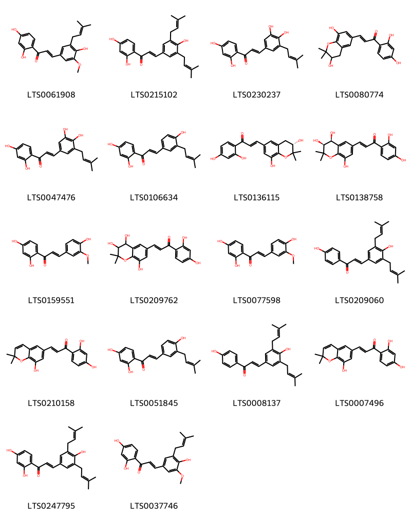{ width=100% }
    <figcaption>Hình ảnh cấu trúc hóa học của Không tìm thấy chú thích hoạt chất thuộc nhóm Linear 1_3-diarylpropanoids gồm Không tìm thấy chú thích.</figcaption>
</figure>

---

### Dược dân tộc học

Danh sách các quốc gia có sử dụng *Erythrina abyssinica* trong điều trị các bệnh. 

| Country   | Disease   | Bệnh                                                                                                                                                                                                |
|:----------|:----------|:----------------------------------------------------------------------------------------------------------------------------------------------------------------------------------------------------|
| Ethiopia  | Laxative  | MYMEMORY WARNING: YOU USED ALL AVAILABLE FREE TRANSLATIONS FOR TODAY. NEXT AVAILABLE IN  16 HOURS 31 MINUTES 17 SECONDS VISIT HTTPS://MYMEMORY.TRANSLATED.NET/DOC/USAGELIMITS.PHP TO TRANSLATE MORE |

---

---
## Erythrina americana
### Thông tin về thực vật

!!! info "Phân loại thực vật của *Erythrina americana* từ GIBF:"
    - **Kingdom:** Plantae
    - **Phylum:** Tracheophyta
    - **Order:** Fabales
    - **Family:** Fabaceae
    - **Genus:** Erythrina
    - **Species:** *Erythrina americana*

 

| Label (VI)   | Label (EN)   | Scientific Name     | Descriptions (VI)   | Descriptions (EN)   | Also Known As (VI)   | Also Known As (EN)   |
|:-------------|:-------------|:--------------------|:--------------------|:--------------------|:---------------------|:---------------------|
| N/A          | N/A          | Erythrina americana | loài thực vật       | species of plant    | ['']                 | ['']                 |

#### Phân bố trên thế giới

**Từ CSDL GIBF** Belize, Ecuador, Guatemala, Costa Rica, Mexico, Panama

#### Phân bố tại Việt Nam

**Từ CSDL GIBF**: Không có ghi nhận ở Việt Nam

---
### Thành phần hóa học
        
- Theo cơ sở dữ liệu lotus: Từ loài *Erythrina americana* đã phân lập và xác định được 16 hoạt chất thuộc về các nhóm Prenol lipids, Indoles and derivatives, Steroids and steroid derivatives, Erythrina alkaloids. 

|    | chemicalTaxonomyClassyfireClass   |   smiles_count |
|---:|:----------------------------------|---------------:|
|  0 | Erythrina alkaloids               |             11 |
|  1 | Indoles and derivatives           |              2 |
|  2 | Prenol lipids                     |              1 |
|  3 | Steroids and steroid derivatives  |              2 |

#### Nhóm Erythrina alkaloids
<figure markdown="span">
    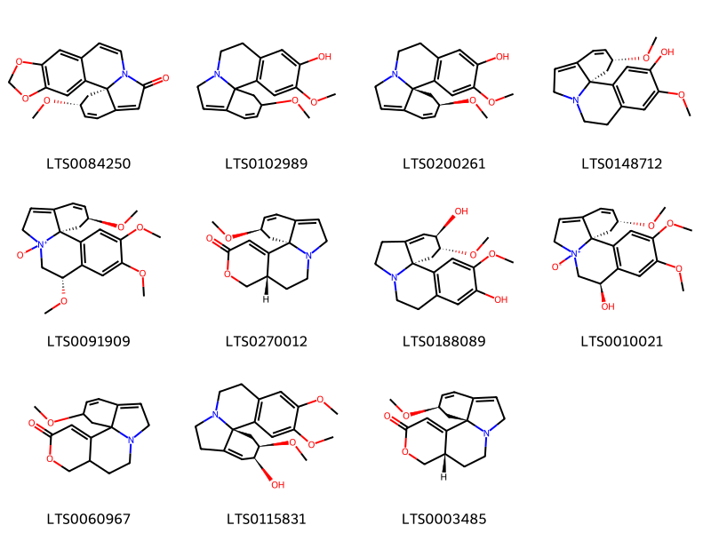{ width=100% }
    <figcaption>Hình ảnh cấu trúc hóa học của 11 hoạt chất thuộc nhóm Erythrina alkaloids gồm ['crystamidine (LTS0084250)', '8,11-dimethoxy-2h,4h,5h,10h,11h-indolo[7a,1-a]isoquinolin-7-ol (LTS0102989)', 'erysodine (LTS0200261)', '(9bs,11r)-7,11-dimethoxy-2h,4h,5h,10h,11h-indolo[7a,1-a]isoquinolin-8-ol (LTS0148712)', '(5s,9bs,11s)-5,7,8,11-tetramethoxy-2h,4h,5h,10h,11h-indolo[7a,1-a]isoquinolin-3-ium-3-olate (LTS0091909)', 'α-erythroidine (LTS0270012)', '(9bs,11r,12r)-8,11-dimethoxy-1h,2h,4h,5h,10h,11h,12h-indolo[7a,1-a]isoquinoline-7,12-diol (LTS0188089)', '(5r,9bs,11r)-5-hydroxy-7,8,11-trimethoxy-2h,4h,5h,10h,11h-indolo[7a,1-a]isoquinolin-3-ium-3-olate (LTS0010021)', '16-methoxy-5-oxa-10-azatetracyclo[8.7.0.0¹,¹³.0²,⁷]heptadeca-2,12,14-trien-4-one (LTS0060967)', 'erythratidine (LTS0115831)', 'α-erythroidine (LTS0003485)'].</figcaption>
</figure>
#### Nhóm Indoles and derivatives
<figure markdown="span">
    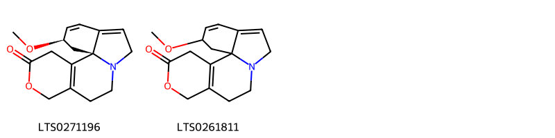{ width=100% }
    <figcaption>Hình ảnh cấu trúc hóa học của 2 hoạt chất thuộc nhóm Indoles and derivatives gồm ['β-erythroidine (LTS0271196)', 'β-erythroidine (LTS0261811)'].</figcaption>
</figure>
#### Nhóm Prenol lipids
<figure markdown="span">
    { width=100% }
    <figcaption>Hình ảnh cấu trúc hóa học của 1 hoạt chất thuộc nhóm Prenol lipids gồm ['oleanolic acid (LTS0117717)'].</figcaption>
</figure>
#### Nhóm Steroids and steroid derivatives
<figure markdown="span">
    { width=100% }
    <figcaption>Hình ảnh cấu trúc hóa học của 2 hoạt chất thuộc nhóm Steroids and steroid derivatives gồm ['stigmast-5-en-3-ol, (3β)- (LTS0204616)', 'stigmast-5-en-3-ol (LTS0071224)'].</figcaption>
</figure>

---

### Dược dân tộc học

Danh sách các quốc gia có sử dụng *Erythrina americana* trong điều trị các bệnh. 

| Country   | Disease   | Bệnh                                                                                                                                                                                                |
|:----------|:----------|:----------------------------------------------------------------------------------------------------------------------------------------------------------------------------------------------------|
| Mexico    | Poison    | MYMEMORY WARNING: YOU USED ALL AVAILABLE FREE TRANSLATIONS FOR TODAY. NEXT AVAILABLE IN  16 HOURS 30 MINUTES 51 SECONDS VISIT HTTPS://MYMEMORY.TRANSLATED.NET/DOC/USAGELIMITS.PHP TO TRANSLATE MORE |

---

---
## Erythrina berteroana
### Thông tin về thực vật

!!! info "Phân loại thực vật của *Erythrina berteroana* từ GIBF:"
    - **Kingdom:** Plantae
    - **Phylum:** Tracheophyta
    - **Order:** Fabales
    - **Family:** Fabaceae
    - **Genus:** Erythrina
    - **Species:** *Erythrina berteroana*

 

| Label (VI)   | Label (EN)   | Scientific Name      | Descriptions (VI)   | Descriptions (EN)   | Also Known As (VI)   | Also Known As (EN)   |
|:-------------|:-------------|:---------------------|:--------------------|:--------------------|:---------------------|:---------------------|
| N/A          | N/A          | Erythrina berteroana | loài thực vật       | species of plant    | ['']                 | ['']                 |

#### Phân bố trên thế giới

**Từ CSDL GIBF** Nicaragua, Belize, Puerto Rico, nan, Ecuador, Colombia, Guatemala, Brazil, Costa Rica, Honduras, unknown or invalid, Cuba, United States of America, Mexico, Peru, Dominican Republic, El Salvador, Panama

#### Phân bố tại Việt Nam

**Từ CSDL GIBF**: Không có ghi nhận ở Việt Nam

---
### Thành phần hóa học
        
- Theo cơ sở dữ liệu lotus: Từ loài *Erythrina berteroana* đã phân lập và xác định được 33 hoạt chất thuộc về các nhóm Azaspirodecane derivatives, Flavonoids, Indoles and derivatives, Erythrina alkaloids. 

|    | chemicalTaxonomyClassyfireClass   |   smiles_count |
|---:|:----------------------------------|---------------:|
|  0 | Azaspirodecane derivatives        |              2 |
|  1 | Erythrina alkaloids               |             23 |
|  2 | Flavonoids                        |              2 |
|  3 | Indoles and derivatives           |              6 |

#### Nhóm Azaspirodecane derivatives
<figure markdown="span">
    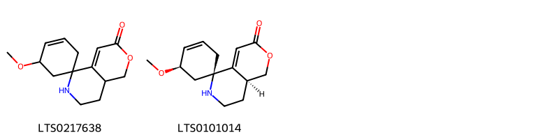{ width=100% }
    <figcaption>Hình ảnh cấu trúc hóa học của 2 hoạt chất thuộc nhóm Azaspirodecane derivatives gồm ["5-methoxy-6',7',8',8'a-tetrahydro-1'h-spiro[cyclohexane-1,5'-pyrano[4,3-c]pyridin]-3-en-3'-one (LTS0217638)", "(1r,5r,8'as)-5-methoxy-6',7',8',8'a-tetrahydro-1'h-spiro[cyclohexane-1,5'-pyrano[4,3-c]pyridin]-3-en-3'-one (LTS0101014)"].</figcaption>
</figure>
#### Nhóm Erythrina alkaloids
<figure markdown="span">
    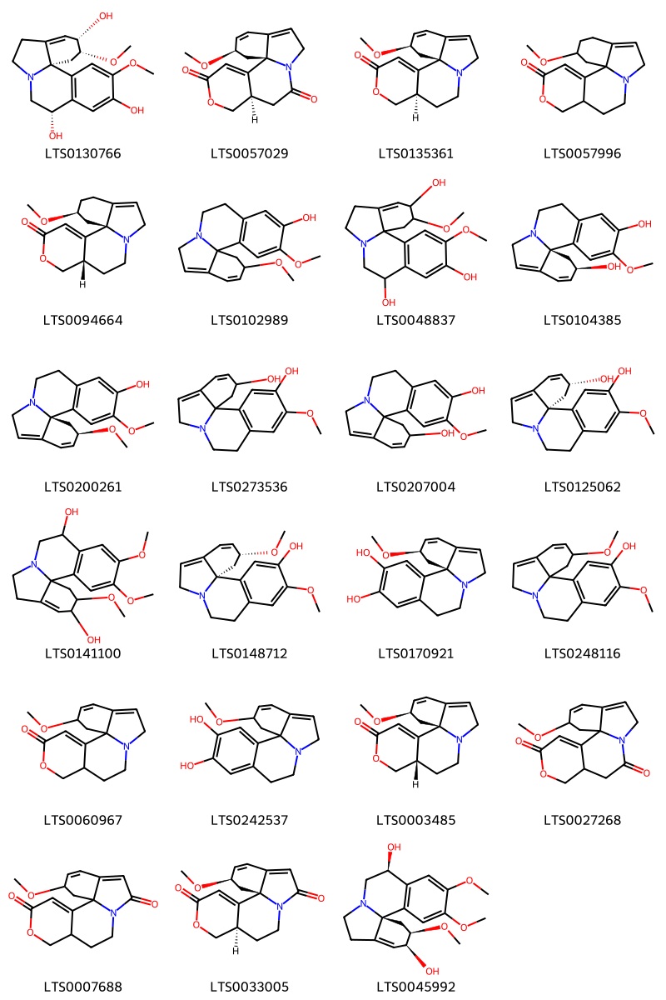{ width=100% }
    <figcaption>Hình ảnh cấu trúc hóa học của 23 hoạt chất thuộc nhóm Erythrina alkaloids gồm ['(5s,9bs,11r,12s)-8,11-dimethoxy-1h,2h,4h,5h,10h,11h,12h-indolo[7a,1-a]isoquinoline-5,7,12-triol (LTS0130766)', '(1s,7r,16r)-16-methoxy-5-oxa-10-azatetracyclo[8.7.0.0¹,¹³.0²,⁷]heptadeca-2,12,14-triene-4,9-dione (LTS0057029)', '(1s,7r,16r)-16-methoxy-5-oxa-10-azatetracyclo[8.7.0.0¹,¹³.0²,⁷]heptadeca-2,12,14-trien-4-one (LTS0135361)', '16-methoxy-5-oxa-10-azatetracyclo[8.7.0.0¹,¹³.0²,⁷]heptadeca-2,12-dien-4-one (LTS0057996)', '(1s,7s,16s)-16-methoxy-5-oxa-10-azatetracyclo[8.7.0.0¹,¹³.0²,⁷]heptadeca-2,12-dien-4-one (LTS0094664)', '8,11-dimethoxy-2h,4h,5h,10h,11h-indolo[7a,1-a]isoquinolin-7-ol (LTS0102989)', '8,11-dimethoxy-1h,2h,4h,5h,10h,11h,12h-indolo[7a,1-a]isoquinoline-5,7,12-triol (LTS0048837)', 'erysonine (LTS0104385)', 'erysodine (LTS0200261)', '7-methoxy-2h,4h,5h,10h,11h-indolo[7a,1-a]isoquinoline-8,11-diol (LTS0273536)', '8-methoxy-2h,4h,5h,10h,11h-indolo[7a,1-a]isoquinoline-7,11-diol (LTS0207004)', '(9bs,11r)-7-methoxy-2h,4h,5h,10h,11h-indolo[7a,1-a]isoquinoline-8,11-diol (LTS0125062)', '7,8,11-trimethoxy-1h,2h,4h,5h,10h,11h,12h-indolo[7a,1-a]isoquinoline-5,12-diol (LTS0141100)', '(9bs,11r)-7,11-dimethoxy-2h,4h,5h,10h,11h-indolo[7a,1-a]isoquinolin-8-ol (LTS0148712)', '(9bs,11r)-11-methoxy-2h,4h,5h,10h,11h-indolo[7a,1-a]isoquinoline-7,8-diol (LTS0170921)', '7,11-dimethoxy-2h,4h,5h,10h,11h-indolo[7a,1-a]isoquinolin-8-ol (LTS0248116)', '16-methoxy-5-oxa-10-azatetracyclo[8.7.0.0¹,¹³.0²,⁷]heptadeca-2,12,14-trien-4-one (LTS0060967)', '11-methoxy-2h,4h,5h,10h,11h-indolo[7a,1-a]isoquinoline-7,8-diol (LTS0242537)', 'α-erythroidine (LTS0003485)', '16-methoxy-5-oxa-10-azatetracyclo[8.7.0.0¹,¹³.0²,⁷]heptadeca-2,12,14-triene-4,9-dione (LTS0027268)', '16-methoxy-5-oxa-10-azatetracyclo[8.7.0.0¹,¹³.0²,⁷]heptadeca-2,12,14-triene-4,11-dione (LTS0007688)', '(1s,7r,16r)-16-methoxy-5-oxa-10-azatetracyclo[8.7.0.0¹,¹³.0²,⁷]heptadeca-2,12,14-triene-4,11-dione (LTS0033005)', '(5s,9bs,11r,12s)-7,8,11-trimethoxy-1h,2h,4h,5h,10h,11h,12h-indolo[7a,1-a]isoquinoline-5,12-diol (LTS0045992)'].</figcaption>
</figure>
#### Nhóm Flavonoids
<figure markdown="span">
    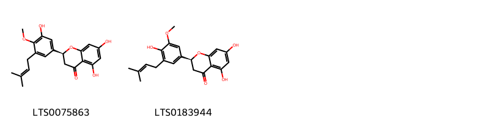{ width=100% }
    <figcaption>Hình ảnh cấu trúc hóa học của 2 hoạt chất thuộc nhóm Flavonoids gồm ['(2s)-5,7-dihydroxy-2-[3-hydroxy-4-methoxy-5-(3-methylbut-2-en-1-yl)phenyl]-2,3-dihydro-1-benzopyran-4-one (LTS0075863)', 'sbmet (LTS0183944)'].</figcaption>
</figure>
#### Nhóm Indoles and derivatives
<figure markdown="span">
    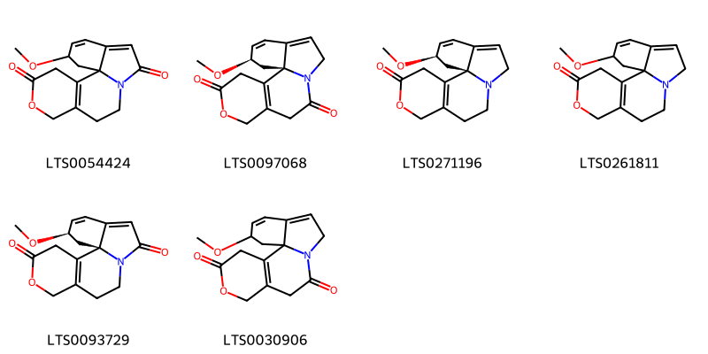{ width=100% }
    <figcaption>Hình ảnh cấu trúc hóa học của 6 hoạt chất thuộc nhóm Indoles and derivatives gồm ['16-methoxy-5-oxa-10-azatetracyclo[8.7.0.0¹,¹³.0²,⁷]heptadeca-2(7),12,14-triene-4,11-dione (LTS0054424)', '(1s,16r)-16-methoxy-5-oxa-10-azatetracyclo[8.7.0.0¹,¹³.0²,⁷]heptadeca-2(7),12,14-triene-4,9-dione (LTS0097068)', 'β-erythroidine (LTS0271196)', 'β-erythroidine (LTS0261811)', '(1s,16r)-16-methoxy-5-oxa-10-azatetracyclo[8.7.0.0¹,¹³.0²,⁷]heptadeca-2(7),12,14-triene-4,11-dione (LTS0093729)', '16-methoxy-5-oxa-10-azatetracyclo[8.7.0.0¹,¹³.0²,⁷]heptadeca-2(7),12,14-triene-4,9-dione (LTS0030906)'].</figcaption>
</figure>

---

### Dược dân tộc học

Danh sách các quốc gia có sử dụng *Erythrina berteroana* trong điều trị các bệnh. 

| Country   | Disease                     | Bệnh                                                                                                                                                                                                |
|:----------|:----------------------------|:----------------------------------------------------------------------------------------------------------------------------------------------------------------------------------------------------|
| Elsewhere | Piscicide, Poison           | MYMEMORY WARNING: YOU USED ALL AVAILABLE FREE TRANSLATIONS FOR TODAY. NEXT AVAILABLE IN  16 HOURS 30 MINUTES 22 SECONDS VISIT HTTPS://MYMEMORY.TRANSLATED.NET/DOC/USAGELIMITS.PHP TO TRANSLATE MORE |
| Guatemala | Narcotic, Poison, Soporific | MYMEMORY WARNING: YOU USED ALL AVAILABLE FREE TRANSLATIONS FOR TODAY. NEXT AVAILABLE IN  16 HOURS 30 MINUTES 20 SECONDS VISIT HTTPS://MYMEMORY.TRANSLATED.NET/DOC/USAGELIMITS.PHP TO TRANSLATE MORE |

---

---
## Erythrina corallodendron
### Thông tin về thực vật

!!! info "Phân loại thực vật của *Erythrina corallodendron* từ GIBF:"
    - **Kingdom:** Plantae
    - **Phylum:** Tracheophyta
    - **Order:** Fabales
    - **Family:** Fabaceae
    - **Genus:** Erythrina
    - **Species:** *Erythrina corallodendron*

 

| Label (VI)   | Label (EN)   | Scientific Name          | Descriptions (VI)   | Descriptions (EN)   | Also Known As (VI)   | Also Known As (EN)   |
|:-------------|:-------------|:-------------------------|:--------------------|:--------------------|:---------------------|:---------------------|
| N/A          | N/A          | Erythrina corallodendron | loài thực vật       | species of plant    | ['']                 | ['']                 |

#### Phân bố trên thế giới

**Từ CSDL GIBF** nan, Virgin Islands (U.S.), Ghana, Australia, Japan, Guadeloupe, Belgium, Grenada, Saint Lucia, unknown or invalid, Benin, Nicaragua, Bermuda, Virgin Islands (British), Puerto Rico, Netherlands, Réunion, Chinese Taipei, Spain, Portugal, Algeria, Jamaica, United States of America, Bonaire, Sint Eustatius and Saba, Paraguay, Saint Martin (French part), South Africa, Uganda, Trinidad and Tobago, Hong Kong, Saint Vincent and the Grenadines, Saint Barthélemy, Martinique, Brazil, Egypt, Guyana, Dominica, Dominican Republic, Mexico, Peru, China, Curaçao, Saint Kitts and Nevis, Haiti, Montserrat, Costa Rica, India, Anguilla, Antigua and Barbuda, Kenya

#### Phân bố tại Việt Nam

**Từ CSDL GIBF**: Không có ghi nhận ở Việt Nam

---
### Thành phần hóa học
        
- Theo cơ sở dữ liệu lotus: Từ loài *Erythrina corallodendron* đã phân lập và xác định được Chưa có hoạt chất nào được phân lập. hoạt chất thuộc về các nhóm Không có hoạt chất nào được phân lập. 

Không có hình ảnh nào được tạo ra

---

### Dược dân tộc học

Danh sách các quốc gia có sử dụng *Erythrina corallodendron* trong điều trị các bệnh. 

| Country            | Disease   | Bệnh                                                                                                                                                                                                |
|:-------------------|:----------|:----------------------------------------------------------------------------------------------------------------------------------------------------------------------------------------------------|
| Dominican Republic | Poison    | MYMEMORY WARNING: YOU USED ALL AVAILABLE FREE TRANSLATIONS FOR TODAY. NEXT AVAILABLE IN  16 HOURS 29 MINUTES 57 SECONDS VISIT HTTPS://MYMEMORY.TRANSLATED.NET/DOC/USAGELIMITS.PHP TO TRANSLATE MORE |

---

---
## Erythrina cristagalli
### Thông tin về thực vật

!!! info "Phân loại thực vật của *Erythrina crista-galli* từ GIBF:"
    - **Kingdom:** Plantae
    - **Phylum:** Tracheophyta
    - **Order:** Fabales
    - **Family:** Fabaceae
    - **Genus:** Erythrina
    - **Species:** *Erythrina crista-galli*

 

| Label (VI)   | Label (EN)   | Scientific Name          | Descriptions (VI)   | Descriptions (EN)   | Also Known As (VI)   | Also Known As (EN)   |
|:-------------|:-------------|:-------------------------|:--------------------|:--------------------|:---------------------|:---------------------|
| N/A          | N/A          | Erythrina corallodendron | loài thực vật       | species of plant    | ['']                 | ['']                 |

#### Phân bố trên thế giới

**Từ CSDL GIBF** Italy, Australia, Japan, Argentina, Spain, Türkiye, Portugal, Papua New Guinea, United States of America, Uruguay, Paraguay, Hong Kong, Brazil, Mexico, China, Colombia, India, New Zealand, Nepal

#### Phân bố tại Việt Nam

**Từ CSDL GIBF**: Không có ghi nhận ở Việt Nam

---
### Thành phần hóa học
        
- Theo cơ sở dữ liệu lotus: Từ loài *Erythrina crista-galli* đã phân lập và xác định được Chưa có hoạt chất nào được phân lập. hoạt chất thuộc về các nhóm Không có hoạt chất nào được phân lập. 

Không có hình ảnh nào được tạo ra

---

### Dược dân tộc học

Danh sách các quốc gia có sử dụng *Erythrina crista-galli* trong điều trị các bệnh. 

| Country   | Disease              | Bệnh                                                                                                                                                                                                |
|:----------|:---------------------|:----------------------------------------------------------------------------------------------------------------------------------------------------------------------------------------------------|
| Argentina | Antiseptic, Narcotic | MYMEMORY WARNING: YOU USED ALL AVAILABLE FREE TRANSLATIONS FOR TODAY. NEXT AVAILABLE IN  16 HOURS 29 MINUTES 36 SECONDS VISIT HTTPS://MYMEMORY.TRANSLATED.NET/DOC/USAGELIMITS.PHP TO TRANSLATE MORE |

---

---
## Erythrina guatemalensis
### Thông tin về thực vật

!!! info "Phân loại thực vật của *Erythrina guatemalensis* từ GIBF:"
    - **Kingdom:** Plantae
    - **Phylum:** Tracheophyta
    - **Order:** Fabales
    - **Family:** Fabaceae
    - **Genus:** Erythrina
    - **Species:** *Erythrina guatemalensis*

 

| Label (VI)   | Label (EN)   | Scientific Name         | Descriptions (VI)   | Descriptions (EN)   | Also Known As (VI)   | Also Known As (EN)   |
|:-------------|:-------------|:------------------------|:--------------------|:--------------------|:---------------------|:---------------------|
| N/A          | N/A          | Erythrina guatemalensis | loài thực vật       | species of plant    | ['']                 | ['']                 |

#### Phân bố trên thế giới

**Từ CSDL GIBF** nan, Guatemala, Brazil, Honduras, United States of America, Mexico

#### Phân bố tại Việt Nam

**Từ CSDL GIBF**: Không có ghi nhận ở Việt Nam

---
### Thành phần hóa học
        
- Theo cơ sở dữ liệu lotus: Từ loài *Erythrina guatemalensis* đã phân lập và xác định được 2 hoạt chất thuộc về các nhóm Erythrina alkaloids. 

|    | chemicalTaxonomyClassyfireClass   |   smiles_count |
|---:|:----------------------------------|---------------:|
|  0 | Erythrina alkaloids               |              2 |

#### Nhóm Erythrina alkaloids
<figure markdown="span">
    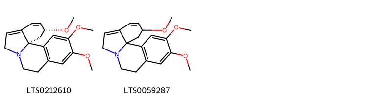{ width=100% }
    <figcaption>Hình ảnh cấu trúc hóa học của 2 hoạt chất thuộc nhóm Erythrina alkaloids gồm ['erysotrine (LTS0212610)', '7,8,11-trimethoxy-2h,4h,5h,10h,11h-indolo[7a,1-a]isoquinoline (LTS0059287)'].</figcaption>
</figure>

---

### Dược dân tộc học

Danh sách các quốc gia có sử dụng *Erythrina guatemalensis* trong điều trị các bệnh. 

| Country   | Disease             | Bệnh                                                                                                                                                                                                |
|:----------|:--------------------|:----------------------------------------------------------------------------------------------------------------------------------------------------------------------------------------------------|
| Guatemala | Soporific, Hypnotic | MYMEMORY WARNING: YOU USED ALL AVAILABLE FREE TRANSLATIONS FOR TODAY. NEXT AVAILABLE IN  16 HOURS 29 MINUTES 14 SECONDS VISIT HTTPS://MYMEMORY.TRANSLATED.NET/DOC/USAGELIMITS.PHP TO TRANSLATE MORE |

---

---
## Erythrina herbacea
### Thông tin về thực vật

!!! info "Phân loại thực vật của *Erythrina herbacea* từ GIBF:"
    - **Kingdom:** Plantae
    - **Phylum:** Tracheophyta
    - **Order:** Fabales
    - **Family:** Fabaceae
    - **Genus:** Erythrina
    - **Species:** *Erythrina herbacea*

 

| Label (VI)   | Label (EN)   | Scientific Name    | Descriptions (VI)   | Descriptions (EN)   | Also Known As (VI)   | Also Known As (EN)                                                               |
|:-------------|:-------------|:-------------------|:--------------------|:--------------------|:---------------------|:---------------------------------------------------------------------------------|
| N/A          | N/A          | Erythrina herbacea | loài thực vật       | species of plant    | ['']                 | ['Cardinal spear', 'Cherokee bean', 'Coral bean', 'Mamou plant', 'Red cardinal'] |

#### Phân bố trên thế giới

**Từ CSDL GIBF** United States of America

#### Phân bố tại Việt Nam

**Từ CSDL GIBF**: Không có ghi nhận ở Việt Nam

---
### Thành phần hóa học
        
- Theo cơ sở dữ liệu lotus: Từ loài *Erythrina herbacea* đã phân lập và xác định được 27 hoạt chất thuộc về các nhóm Flavonoids, Isoflavonoids, Erythrina alkaloids, Linear 1,3-diarylpropanoids, 2-arylbenzofuran flavonoids, Stilbenes, Benzopyrans. 

|    | chemicalTaxonomyClassyfireClass   |   smiles_count |
|---:|:----------------------------------|---------------:|
|  0 | 2-arylbenzofuran flavonoids       |              2 |
|  1 | Benzopyrans                       |              2 |
|  2 | Erythrina alkaloids               |             10 |
|  3 | Flavonoids                        |              1 |
|  4 | Isoflavonoids                     |              9 |
|  5 | Linear 1,3-diarylpropanoids       |              2 |
|  6 | Stilbenes                         |              1 |

#### Nhóm 2-arylbenzofuran flavonoids
<figure markdown="span">
    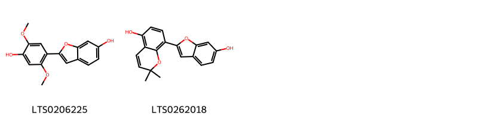{ width=100% }
    <figcaption>Hình ảnh cấu trúc hóa học của 2 hoạt chất thuộc nhóm 2-arylbenzofuran flavonoids gồm ['2-(4-hydroxy-2,5-dimethoxyphenyl)-1-benzofuran-6-ol (LTS0206225)', 'glabrocoumarone a (LTS0262018)'].</figcaption>
</figure>
#### Nhóm Benzopyrans
<figure markdown="span">
    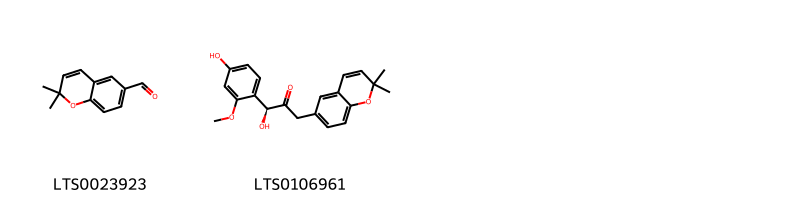{ width=100% }
    <figcaption>Hình ảnh cấu trúc hóa học của 2 hoạt chất thuộc nhóm Benzopyrans gồm ['2,2-dimethylchromene-6-carbaldehyde (LTS0023923)', '(1s)-3-(2,2-dimethylchromen-6-yl)-1-hydroxy-1-(4-hydroxy-2-methoxyphenyl)propan-2-one (LTS0106961)'].</figcaption>
</figure>
#### Nhóm Erythrina alkaloids
<figure markdown="span">
    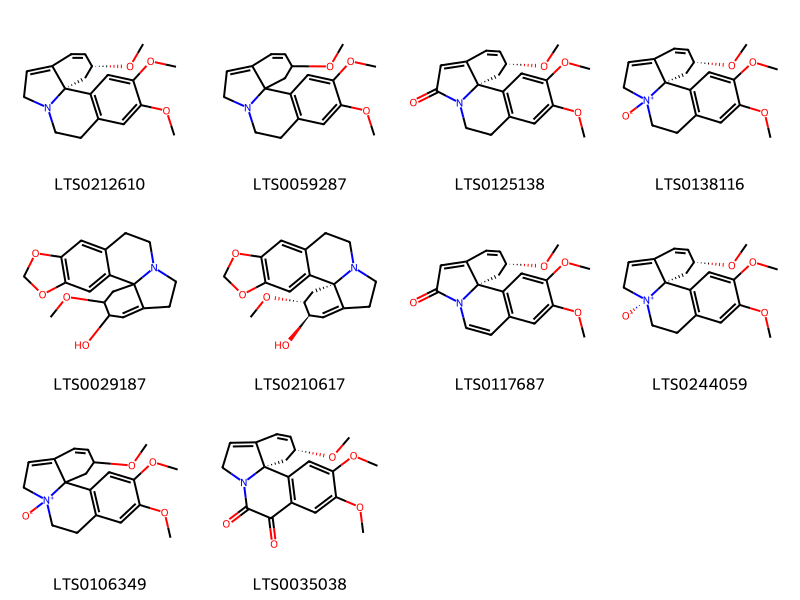{ width=100% }
    <figcaption>Hình ảnh cấu trúc hóa học của 10 hoạt chất thuộc nhóm Erythrina alkaloids gồm ['erysotrine (LTS0212610)', '7,8,11-trimethoxy-2h,4h,5h,10h,11h-indolo[7a,1-a]isoquinoline (LTS0059287)', '(9bs,11r)-7,8,11-trimethoxy-4h,5h,10h,11h-indolo[7a,1-a]isoquinolin-2-one (LTS0125138)', '(9bs,11r)-7,8,11-trimethoxy-2h,4h,5h,10h,11h-indolo[7a,1-a]isoquinolin-3-ium-3-olate (LTS0138116)', '19-methoxy-5,7-dioxa-13-azapentacyclo[11.7.0.0¹,¹⁶.0²,¹⁰.0⁴,⁸]icosa-2,4(8),9,16-tetraen-18-ol (LTS0029187)', '(1s,18r,19r)-19-methoxy-5,7-dioxa-13-azapentacyclo[11.7.0.0¹,¹⁶.0²,¹⁰.0⁴,⁸]icosa-2,4(8),9,16-tetraen-18-ol (LTS0210617)', '(9bs,11r)-7,8,11-trimethoxy-10h,11h-indolo[7a,1-a]isoquinolin-2-one (LTS0117687)', '(3r,9bs,11r)-7,8,11-trimethoxy-2h,4h,5h,10h,11h-indolo[7a,1-a]isoquinolin-3-ium-3-olate (LTS0244059)', '7,8,11-trimethoxy-2h,4h,5h,10h,11h-indolo[7a,1-a]isoquinolin-3-ium-3-olate (LTS0106349)', '(9bs,11r)-7,8,11-trimethoxy-2h,10h,11h-indolo[7a,1-a]isoquinoline-4,5-dione (LTS0035038)'].</figcaption>
</figure>
#### Nhóm Flavonoids
<figure markdown="span">
    { width=100% }
    <figcaption>Hình ảnh cấu trúc hóa học của 1 hoạt chất thuộc nhóm Flavonoids gồm ['cyanidin 3-glucoside (LTS0217835)'].</figcaption>
</figure>
#### Nhóm Isoflavonoids
<figure markdown="span">
    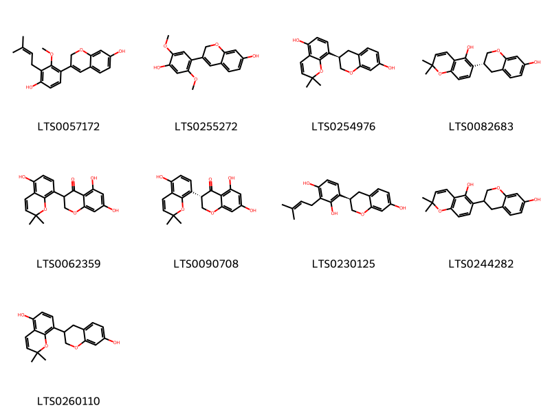{ width=100% }
    <figcaption>Hình ảnh cấu trúc hóa học của 9 hoạt chất thuộc nhóm Isoflavonoids gồm ['3-[4-hydroxy-2-methoxy-3-(3-methylbut-2-en-1-yl)phenyl]-2h-chromen-7-ol (LTS0057172)', '3-(4-hydroxy-2,5-dimethoxyphenyl)-2h-chromen-7-ol (LTS0255272)', '8-[(3r)-7-hydroxy-3,4-dihydro-2h-1-benzopyran-3-yl]-2,2-dimethylchromen-5-ol (LTS0254976)', 'phaseollinisoflavan (LTS0082683)', '5,7-dihydroxy-3-(5-hydroxy-2,2-dimethylchromen-8-yl)-2,3-dihydro-1-benzopyran-4-one (LTS0062359)', '(3s)-5,7-dihydroxy-3-(5-hydroxy-2,2-dimethylchromen-8-yl)-2,3-dihydro-1-benzopyran-4-one (LTS0090708)', '4-[(3r)-7-hydroxy-3,4-dihydro-2h-1-benzopyran-3-yl]-2-(3-methylbut-2-en-1-yl)benzene-1,3-diol (LTS0230125)', '6-(7-hydroxy-3,4-dihydro-2h-1-benzopyran-3-yl)-2,2-dimethylchromen-5-ol (LTS0244282)', '8-(7-hydroxy-3,4-dihydro-2h-1-benzopyran-3-yl)-2,2-dimethylchromen-5-ol (LTS0260110)'].</figcaption>
</figure>
#### Nhóm Linear 1_3-diarylpropanoids
<figure markdown="span">
    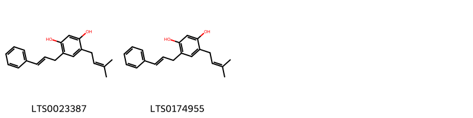{ width=100% }
    <figcaption>Hình ảnh cấu trúc hóa học của Không tìm thấy chú thích hoạt chất thuộc nhóm Linear 1_3-diarylpropanoids gồm Không tìm thấy chú thích.</figcaption>
</figure>
#### Nhóm Stilbenes
<figure markdown="span">
    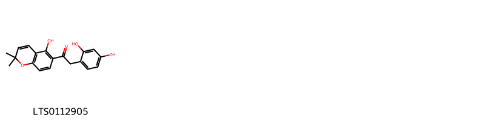{ width=100% }
    <figcaption>Hình ảnh cấu trúc hóa học của 1 hoạt chất thuộc nhóm Stilbenes gồm ['2-(2,4-dihydroxyphenyl)-1-(5-hydroxy-2,2-dimethylchromen-6-yl)ethanone (LTS0112905)'].</figcaption>
</figure>

---

### Dược dân tộc học

Danh sách các quốc gia có sử dụng *Erythrina herbacea* trong điều trị các bệnh. 

| Country   | Disease            | Bệnh                                                                                                                                                                                                |
|:----------|:-------------------|:----------------------------------------------------------------------------------------------------------------------------------------------------------------------------------------------------|
| Mexico    | Canicide, Raticide | MYMEMORY WARNING: YOU USED ALL AVAILABLE FREE TRANSLATIONS FOR TODAY. NEXT AVAILABLE IN  16 HOURS 28 MINUTES 56 SECONDS VISIT HTTPS://MYMEMORY.TRANSLATED.NET/DOC/USAGELIMITS.PHP TO TRANSLATE MORE |

---

---
## Erythrina indica
### Thông tin về thực vật

!!! info "Phân loại thực vật của *Erythrina indica* từ GIBF:"
    - **Kingdom:** Plantae
    - **Phylum:** Tracheophyta
    - **Order:** Fabales
    - **Family:** Fabaceae
    - **Genus:** Erythrina
    - **Species:** *Erythrina indica*

 

| Label (VI)   | Label (EN)   | Scientific Name   | Descriptions (VI)   | Descriptions (EN)   | Also Known As (VI)   | Also Known As (EN)   |
|:-------------|:-------------|:------------------|:--------------------|:--------------------|:---------------------|:---------------------|
| N/A          | N/A          | Erythrina indica  |                     | species of plant    | ['']                 | ['']                 |

#### Phân bố trên thế giới

**Từ CSDL GIBF** United States of America

#### Phân bố tại Việt Nam

**Từ CSDL GIBF**: Không có ghi nhận ở Việt Nam

---
### Thành phần hóa học
        
- Theo cơ sở dữ liệu lotus: Từ loài *Erythrina indica* đã phân lập và xác định được 45 hoạt chất thuộc về các nhóm Prenol lipids, Steroids and steroid derivatives, Erythrina alkaloids, Isoflavonoids, Cinnamic acids and derivatives. 

|    | chemicalTaxonomyClassyfireClass   |   smiles_count |
|---:|:----------------------------------|---------------:|
|  0 | Cinnamic acids and derivatives    |              4 |
|  1 | Erythrina alkaloids               |              1 |
|  2 | Isoflavonoids                     |             27 |
|  3 | Prenol lipids                     |              6 |
|  4 | Steroids and steroid derivatives  |              7 |

#### Nhóm Cinnamic acids and derivatives
<figure markdown="span">
    { width=100% }
    <figcaption>Hình ảnh cấu trúc hóa học của 4 hoạt chất thuộc nhóm Cinnamic acids and derivatives gồm ['octacosyl 3-(4-hydroxy-3-methoxyphenyl)prop-2-enoate (LTS0247255)', 'octacosyl (2e)-3-(4-hydroxy-3-methoxyphenyl)prop-2-enoate (LTS0116696)', 'heptacosyl (2e)-3-(4-hydroxy-3-methoxyphenyl)prop-2-enoate (LTS0147574)', 'heptacosyl 3-(4-hydroxy-3-methoxyphenyl)prop-2-enoate (LTS0243451)'].</figcaption>
</figure>
#### Nhóm Erythrina alkaloids
<figure markdown="span">
    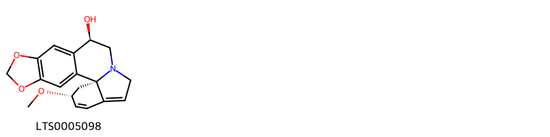{ width=100% }
    <figcaption>Hình ảnh cấu trúc hóa học của 1 hoạt chất thuộc nhóm Erythrina alkaloids gồm ['(1s,11r,19r)-19-methoxy-5,7-dioxa-13-azapentacyclo[11.7.0.0¹,¹⁶.0²,¹⁰.0⁴,⁸]icosa-2,4(8),9,15,17-pentaen-11-ol (LTS0005098)'].</figcaption>
</figure>
#### Nhóm Isoflavonoids
<figure markdown="span">
    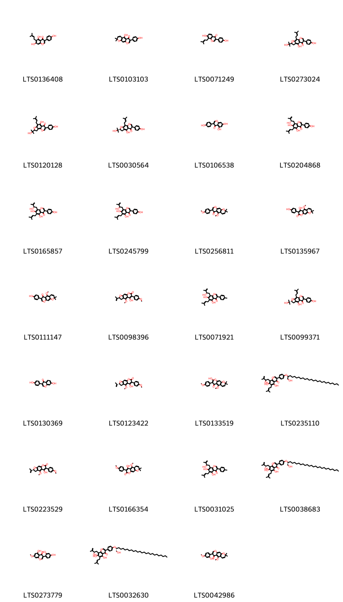{ width=100% }
    <figcaption>Hình ảnh cấu trúc hóa học của 27 hoạt chất thuộc nhóm Isoflavonoids gồm ['wighteone (LTS0136408)', 'alpinumisoflavone (LTS0103103)', '7-hydroxy-3-(4-hydroxyphenyl)-8-(3-methylbut-2-en-1-yl)chromen-4-one (LTS0071249)', 'senegalensin (LTS0273024)', 'euchrenone b10 (LTS0120128)', '(2s)-4-hydroxy-6-(4-hydroxyphenyl)-2-(2-hydroxypropan-2-yl)-9-(3-methylbut-2-en-1-yl)-2h,3h-furo[3,2-g]chromen-5-one (LTS0030564)', 'genistein (LTS0106538)', '5,7-dihydroxy-8-[(2s)-2-hydroxy-3-methylbut-3-en-1-yl]-3-(4-hydroxyphenyl)-6-(3-methylbut-2-en-1-yl)chromen-4-one (LTS0204868)', '5,7-dihydroxy-8-[(2r)-2-hydroxy-3-methylbut-3-en-1-yl]-3-(4-hydroxyphenyl)-6-(3-methylbut-2-en-1-yl)chromen-4-one (LTS0165857)', '5,7-dihydroxy-8-(2-hydroxy-3-methylbut-3-en-1-yl)-3-(4-hydroxyphenyl)-6-(3-methylbut-2-en-1-yl)chromen-4-one (LTS0245799)', 'alpinumisoflavone dimethyl ether (LTS0256811)', '4-hydroxy-3-(4-hydroxyphenyl)-5-methoxy-8,8-dimethylpyrano[3,2-g]chromen-2-one (LTS0135967)', '3-(4-hydroxyphenyl)-5-methoxy-8,8-dimethylpyrano[3,2-g]chromen-4-one (LTS0111147)', '5-hydroxy-4-methoxy-6-(4-methoxyphenyl)-2-(prop-1-en-2-yl)-2h,3h-furo[3,2-g]chromen-7-one (LTS0098396)', '5,7-dihydroxy-8-[(2r)-2-hydroxy-3-methylbut-3-en-1-yl]-6-(3-methylbut-2-en-1-yl)-3-(4-methylphenyl)chromen-4-one (LTS0071921)', '(2r)-4-hydroxy-6-(4-hydroxyphenyl)-2-(2-hydroxypropan-2-yl)-9-(3-methylbut-2-en-1-yl)-2h,3h-furo[3,2-g]chromen-5-one (LTS0099371)', 'daidzein (LTS0130369)', '(2r)-5-hydroxy-4-methoxy-6-(4-methoxyphenyl)-2-(prop-1-en-2-yl)-2h,3h-furo[3,2-g]chromen-7-one (LTS0123422)', '2-hydroxy-5-methoxy-3-(4-methoxyphenyl)-8,8-dimethylpyrano[3,2-g]chromen-4-one (LTS0133519)', '5,7-dihydroxy-8-(2-hydroxy-3-methylbut-3-en-1-yl)-3-{4-[(1-hydroxyhexacosan-2-yl)oxy]phenyl}-6-(3-methylbut-2-en-1-yl)chromen-4-one (LTS0235110)', '(2s)-5-hydroxy-4-methoxy-6-(4-methoxyphenyl)-2-(prop-1-en-2-yl)-2h,3h-furo[3,2-g]chromen-7-one (LTS0223529)', 'robustic acid (LTS0166354)', '5,7-dihydroxy-8-(2-hydroxy-3-methylbut-3-en-1-yl)-6-(3-methylbut-2-en-1-yl)-3-(4-methylphenyl)chromen-4-one (LTS0031025)', '5,7-dihydroxy-8-[(2s)-2-hydroxy-3-methylbut-3-en-1-yl]-3-(4-{[(2s)-1-hydroxyhexacosan-2-yl]oxy}phenyl)-6-(3-methylbut-2-en-1-yl)chromen-4-one (LTS0038683)', 'cajanin (LTS0273779)', '5,7-dihydroxy-8-[(2r)-2-hydroxy-3-methylbut-3-en-1-yl]-3-(4-{[(2r)-1-hydroxyhexacosan-2-yl]oxy}phenyl)-6-(3-methylbut-2-en-1-yl)chromen-4-one (LTS0032630)', '3-(2-hydroxy-4-methoxyphenyl)-5-methoxy-8,8-dimethylpyrano[3,2-g]chromen-4-one (LTS0042986)'].</figcaption>
</figure>
#### Nhóm Prenol lipids
<figure markdown="span">
    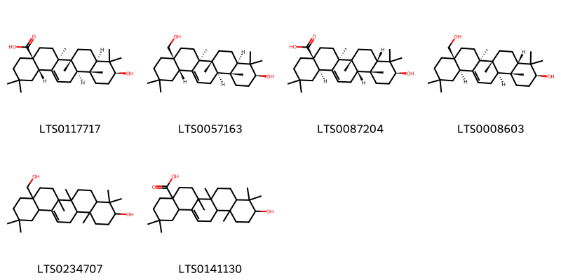{ width=100% }
    <figcaption>Hình ảnh cấu trúc hóa học của 6 hoạt chất thuộc nhóm Prenol lipids gồm ['oleanolic acid (LTS0117717)', 'erythrodiol (LTS0057163)', '(4as,6as,6br,8as,10s,12ar,12bs,14br)-10-hydroxy-2,2,6a,6b,9,9,12a-heptamethyl-1,3,4,5,6,7,8,8a,10,11,12,12b,13,14b-tetradecahydropicene-4a-carboxylic acid (LTS0087204)', '(3s,4as,6ar,6bs,8as,12ar,14ar,14br)-8a-(hydroxymethyl)-4,4,6a,6b,11,11,14b-heptamethyl-1,2,3,4a,5,6,7,8,9,10,12,12a,14,14a-tetradecahydropicen-3-ol (LTS0008603)', '8a-(hydroxymethyl)-4,4,6a,6b,11,11,14b-heptamethyl-1,2,3,4a,5,6,7,8,9,10,12,12a,14,14a-tetradecahydropicen-3-ol (LTS0234707)', 'oleanolic acid (LTS0141130)'].</figcaption>
</figure>
#### Nhóm Steroids and steroid derivatives
<figure markdown="span">
    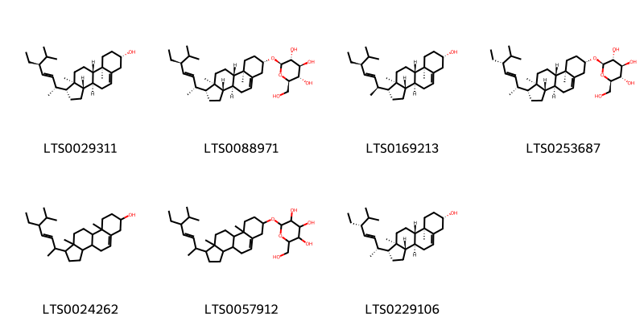{ width=100% }
    <figcaption>Hình ảnh cấu trúc hóa học của 7 hoạt chất thuộc nhóm Steroids and steroid derivatives gồm ['phytosterol (LTS0029311)', '(2r,3r,4s,5s,6r)-2-{[(1r,3as,3bs,7s,9ar,9bs,11ar)-1-[(2r,3e,5s)-5-ethyl-6-methylhept-3-en-2-yl]-9a,11a-dimethyl-1h,2h,3h,3ah,3bh,4h,6h,7h,8h,9h,9bh,10h,11h-cyclopenta[a]phenanthren-7-yl]oxy}-6-(hydroxymethyl)oxane-3,4,5-triol (LTS0088971)', '(1r,3as,3bs,7s,9ar,9bs,11ar)-1-[(2s,3e,5s)-5-ethyl-6-methylhept-3-en-2-yl]-9a,11a-dimethyl-1h,2h,3h,3ah,3bh,4h,6h,7h,8h,9h,9bh,10h,11h-cyclopenta[a]phenanthren-7-ol (LTS0169213)', '(2r,3r,4s,5s,6r)-2-{[(1r,3as,3bs,7s,9ar,9bs,11ar)-1-[(2r,3e,5r)-5-ethyl-6-methylhept-3-en-2-yl]-9a,11a-dimethyl-1h,2h,3h,3ah,3bh,4h,6h,7h,8h,9h,9bh,10h,11h-cyclopenta[a]phenanthren-7-yl]oxy}-6-(hydroxymethyl)oxane-3,4,5-triol (LTS0253687)', 'stigmasterol (LTS0024262)', '2-{[1-(5-ethyl-6-methylhept-3-en-2-yl)-9a,11a-dimethyl-1h,2h,3h,3ah,3bh,4h,6h,7h,8h,9h,9bh,10h,11h-cyclopenta[a]phenanthren-7-yl]oxy}-6-(hydroxymethyl)oxane-3,4,5-triol (LTS0057912)', 'poriferasterol (LTS0229106)'].</figcaption>
</figure>

---

### Dược dân tộc học

Danh sách các quốc gia có sử dụng *Erythrina indica* trong điều trị các bệnh. 

| Country   | Disease                           | Bệnh                                                                                                                                                                                                |
|:----------|:----------------------------------|:----------------------------------------------------------------------------------------------------------------------------------------------------------------------------------------------------|
| China     | Analgesic                         | MYMEMORY WARNING: YOU USED ALL AVAILABLE FREE TRANSLATIONS FOR TODAY. NEXT AVAILABLE IN  16 HOURS 28 MINUTES 32 SECONDS VISIT HTTPS://MYMEMORY.TRANSLATED.NET/DOC/USAGELIMITS.PHP TO TRANSLATE MORE |
| Haiti     | Hypnotic, Narcotic                | MYMEMORY WARNING: YOU USED ALL AVAILABLE FREE TRANSLATIONS FOR TODAY. NEXT AVAILABLE IN  16 HOURS 28 MINUTES 30 SECONDS VISIT HTTPS://MYMEMORY.TRANSLATED.NET/DOC/USAGELIMITS.PHP TO TRANSLATE MORE |
| Java      | Emmenagogue, Lactagogue, Sedative | MYMEMORY WARNING: YOU USED ALL AVAILABLE FREE TRANSLATIONS FOR TODAY. NEXT AVAILABLE IN  16 HOURS 28 MINUTES 28 SECONDS VISIT HTTPS://MYMEMORY.TRANSLATED.NET/DOC/USAGELIMITS.PHP TO TRANSLATE MORE |

---

---
## Erythrina lanata
### Thông tin về thực vật

!!! info "Phân loại thực vật của *Erythrina lanata* từ GIBF:"
    - **Kingdom:** Plantae
    - **Phylum:** Tracheophyta
    - **Order:** Fabales
    - **Family:** Fabaceae
    - **Genus:** Erythrina
    - **Species:** *Erythrina lanata*

 

| Label (VI)   | Label (EN)   | Scientific Name   | Descriptions (VI)   | Descriptions (EN)   | Also Known As (VI)   | Also Known As (EN)   |
|:-------------|:-------------|:------------------|:--------------------|:--------------------|:---------------------|:---------------------|
| N/A          | N/A          | Erythrina lanata  | loài thực vật       | species of plant    | ['']                 | ['']                 |

#### Phân bố trên thế giới

**Từ CSDL GIBF** nan, Mexico

#### Phân bố tại Việt Nam

**Từ CSDL GIBF**: Không có ghi nhận ở Việt Nam

---
### Thành phần hóa học
        
- Theo cơ sở dữ liệu lotus: Từ loài *Erythrina lanata* đã phân lập và xác định được Chưa có hoạt chất nào được phân lập. hoạt chất thuộc về các nhóm Không có hoạt chất nào được phân lập. 

Không có hình ảnh nào được tạo ra

---

### Dược dân tộc học

Danh sách các quốc gia có sử dụng *Erythrina lanata* trong điều trị các bệnh. 

| Country   | Disease   | Bệnh                                                                                                                                                                                                |
|:----------|:----------|:----------------------------------------------------------------------------------------------------------------------------------------------------------------------------------------------------|
| Mexico    | Poison    | MYMEMORY WARNING: YOU USED ALL AVAILABLE FREE TRANSLATIONS FOR TODAY. NEXT AVAILABLE IN  16 HOURS 28 MINUTES 00 SECONDS VISIT HTTPS://MYMEMORY.TRANSLATED.NET/DOC/USAGELIMITS.PHP TO TRANSLATE MORE |

---

---
## Erythrina stricta
### Thông tin về thực vật

!!! info "Phân loại thực vật của *Erythrina stricta* từ GIBF:"
    - **Kingdom:** Plantae
    - **Phylum:** Tracheophyta
    - **Order:** Fabales
    - **Family:** Fabaceae
    - **Genus:** Erythrina
    - **Species:** *Erythrina stricta*

 

| Label (VI)   | Label (EN)   | Scientific Name   | Descriptions (VI)   | Descriptions (EN)   | Also Known As (VI)   | Also Known As (EN)   |
|:-------------|:-------------|:------------------|:--------------------|:--------------------|:---------------------|:---------------------|
| N/A          | N/A          | Erythrina stricta | loài thực vật       | species of plant    | ['']                 | ['']                 |

#### Phân bố trên thế giới

**Từ CSDL GIBF** nan, Sri Lanka, Thailand, Lao People’s Democratic Republic, Korea, Republic of, Myanmar, Bhutan, India, Indonesia, unknown or invalid, United States of America, Philippines, Viet Nam, China, Nepal

#### Phân bố tại Việt Nam

**Từ CSDL GIBF**: Phu Tho, Lâm Dông, Nghe An

---
### Thành phần hóa học
        
- Theo cơ sở dữ liệu lotus: Từ loài *Erythrina stricta* đã phân lập và xác định được 11 hoạt chất thuộc về các nhóm Fatty Acyls, Steroids and steroid derivatives, Erythrina alkaloids, Saturated hydrocarbons, Carboxylic acids and derivatives. 

|    | chemicalTaxonomyClassyfireClass   |   smiles_count |
|---:|:----------------------------------|---------------:|
|  0 | Carboxylic acids and derivatives  |              2 |
|  1 | Erythrina alkaloids               |              3 |
|  2 | Fatty Acyls                       |              1 |
|  3 | Saturated hydrocarbons            |              2 |
|  4 | Steroids and steroid derivatives  |              3 |

#### Nhóm Carboxylic acids and derivatives
<figure markdown="span">
    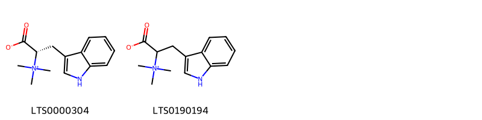{ width=100% }
    <figcaption>Hình ảnh cấu trúc hóa học của 2 hoạt chất thuộc nhóm Carboxylic acids and derivatives gồm ['hypaphorine (LTS0000304)', '3-(1h-indol-3-yl)-2-(trimethylammonio)propanoate (LTS0190194)'].</figcaption>
</figure>
#### Nhóm Erythrina alkaloids
<figure markdown="span">
    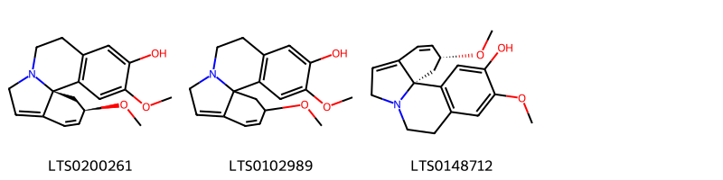{ width=100% }
    <figcaption>Hình ảnh cấu trúc hóa học của 3 hoạt chất thuộc nhóm Erythrina alkaloids gồm ['erysodine (LTS0200261)', '8,11-dimethoxy-2h,4h,5h,10h,11h-indolo[7a,1-a]isoquinolin-7-ol (LTS0102989)', '(9bs,11r)-7,11-dimethoxy-2h,4h,5h,10h,11h-indolo[7a,1-a]isoquinolin-8-ol (LTS0148712)'].</figcaption>
</figure>
#### Nhóm Fatty Acyls
<figure markdown="span">
    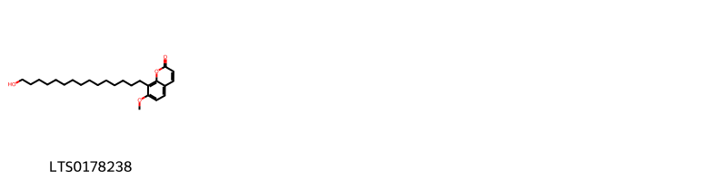{ width=100% }
    <figcaption>Hình ảnh cấu trúc hóa học của 1 hoạt chất thuộc nhóm Fatty Acyls gồm ['8-(15-hydroxypentadecyl)-7-methoxychromen-2-one (LTS0178238)'].</figcaption>
</figure>
#### Nhóm Saturated hydrocarbons
<figure markdown="span">
    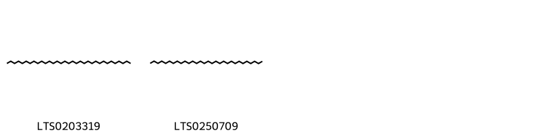{ width=100% }
    <figcaption>Hình ảnh cấu trúc hóa học của 2 hoạt chất thuộc nhóm Saturated hydrocarbons gồm ['tritriacontane (LTS0203319)', 'triacontane (LTS0250709)'].</figcaption>
</figure>
#### Nhóm Steroids and steroid derivatives
<figure markdown="span">
    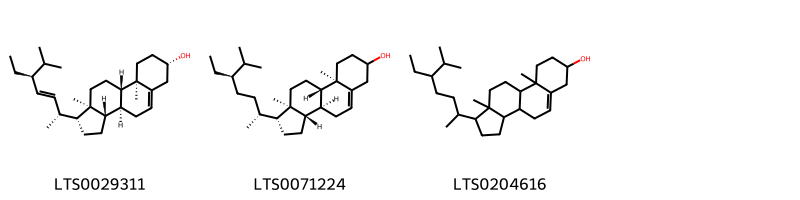{ width=100% }
    <figcaption>Hình ảnh cấu trúc hóa học của 3 hoạt chất thuộc nhóm Steroids and steroid derivatives gồm ['phytosterol (LTS0029311)', 'stigmast-5-en-3-ol (LTS0071224)', 'stigmast-5-en-3-ol, (3β)- (LTS0204616)'].</figcaption>
</figure>

---

### Dược dân tộc học

Danh sách các quốc gia có sử dụng *Erythrina stricta* trong điều trị các bệnh. 

| Country   | Disease   | Bệnh                                                                                                                                                                                                |
|:----------|:----------|:----------------------------------------------------------------------------------------------------------------------------------------------------------------------------------------------------|
| India     | Antidote  | MYMEMORY WARNING: YOU USED ALL AVAILABLE FREE TRANSLATIONS FOR TODAY. NEXT AVAILABLE IN  16 HOURS 27 MINUTES 39 SECONDS VISIT HTTPS://MYMEMORY.TRANSLATED.NET/DOC/USAGELIMITS.PHP TO TRANSLATE MORE |

---

---
## Erythrina subumbrans
### Thông tin về thực vật

!!! info "Phân loại thực vật của *Erythrina subumbrans* từ GIBF:"
    - **Kingdom:** Plantae
    - **Phylum:** Tracheophyta
    - **Order:** Fabales
    - **Family:** Fabaceae
    - **Genus:** Erythrina
    - **Species:** *Erythrina subumbrans*

 

| Label (VI)   | Label (EN)   | Scientific Name      | Descriptions (VI)   | Descriptions (EN)   | Also Known As (VI)   | Also Known As (EN)   |
|:-------------|:-------------|:---------------------|:--------------------|:--------------------|:---------------------|:---------------------|
| N/A          | N/A          | Erythrina subumbrans | loài thực vật       | species of plant    | ['']                 | ['']                 |

#### Phân bố trên thế giới

**Từ CSDL GIBF** Sri Lanka, Malaysia, Thailand, Lao People’s Democratic Republic, Cook Islands, India, Indonesia, Bangladesh, United States of America, Samoa, Mexico, unknown or invalid, Philippines, Viet Nam, China

#### Phân bố tại Việt Nam

**Từ CSDL GIBF**: Kon Tum

---
### Thành phần hóa học
        
- Theo cơ sở dữ liệu lotus: Từ loài *Erythrina subumbrans* đã phân lập và xác định được 43 hoạt chất thuộc về các nhóm Coumarans, Flavonoids, Prenol lipids, Erythrina alkaloids, Isoflavonoids, Carboxylic acids and derivatives, Isoquinolines and derivatives. 

|    | chemicalTaxonomyClassyfireClass   |   smiles_count |
|---:|:----------------------------------|---------------:|
|  0 | Carboxylic acids and derivatives  |              2 |
|  1 | Coumarans                         |              2 |
|  2 | Erythrina alkaloids               |              7 |
|  3 | Flavonoids                        |              7 |
|  4 | Isoflavonoids                     |             14 |
|  5 | Isoquinolines and derivatives     |              4 |
|  6 | Prenol lipids                     |              7 |

#### Nhóm Carboxylic acids and derivatives
<figure markdown="span">
    { width=100% }
    <figcaption>Hình ảnh cấu trúc hóa học của 2 hoạt chất thuộc nhóm Carboxylic acids and derivatives gồm ['hypaphorine (LTS0000304)', '3-(1h-indol-3-yl)-2-(trimethylammonio)propanoate (LTS0190194)'].</figcaption>
</figure>
#### Nhóm Coumarans
<figure markdown="span">
    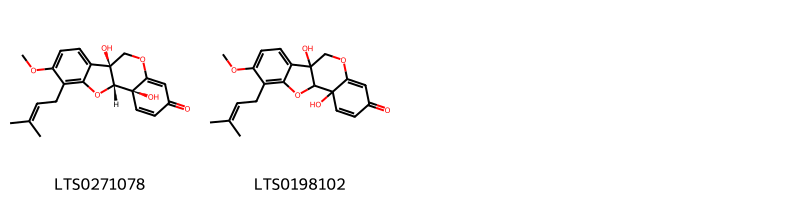{ width=100% }
    <figcaption>Hình ảnh cấu trúc hóa học của 2 hoạt chất thuộc nhóm Coumarans gồm ['(1r,2s,10s)-2,10-dihydroxy-14-methoxy-15-(3-methylbut-2-en-1-yl)-8,17-dioxatetracyclo[8.7.0.0²,⁷.0¹¹,¹⁶]heptadeca-3,6,11,13,15-pentaen-5-one (LTS0271078)', '2,10-dihydroxy-14-methoxy-15-(3-methylbut-2-en-1-yl)-8,17-dioxatetracyclo[8.7.0.0²,⁷.0¹¹,¹⁶]heptadeca-3,6,11,13,15-pentaen-5-one (LTS0198102)'].</figcaption>
</figure>
#### Nhóm Erythrina alkaloids
<figure markdown="span">
    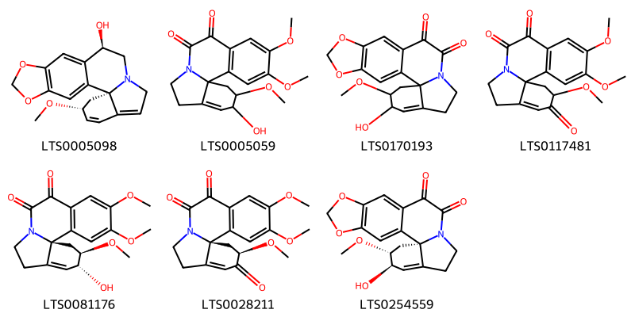{ width=100% }
    <figcaption>Hình ảnh cấu trúc hóa học của 7 hoạt chất thuộc nhóm Erythrina alkaloids gồm ['(1s,11r,19r)-19-methoxy-5,7-dioxa-13-azapentacyclo[11.7.0.0¹,¹⁶.0²,¹⁰.0⁴,⁸]icosa-2,4(8),9,15,17-pentaen-11-ol (LTS0005098)', '12-hydroxy-7,8,11-trimethoxy-1h,2h,10h,11h,12h-indolo[7a,1-a]isoquinoline-4,5-dione (LTS0005059)', '18-hydroxy-19-methoxy-5,7-dioxa-13-azapentacyclo[11.7.0.0¹,¹⁶.0²,¹⁰.0⁴,⁸]icosa-2,4(8),9,16-tetraene-11,12-dione (LTS0170193)', '7,8,11-trimethoxy-1h,2h,10h,11h-indolo[7a,1-a]isoquinoline-4,5,12-trione (LTS0117481)', '(9bs,11r,12r)-12-hydroxy-7,8,11-trimethoxy-1h,2h,10h,11h,12h-indolo[7a,1-a]isoquinoline-4,5-dione (LTS0081176)', '(9bs,11r)-7,8,11-trimethoxy-1h,2h,10h,11h-indolo[7a,1-a]isoquinoline-4,5,12-trione (LTS0028211)', '(1s,18r,19r)-18-hydroxy-19-methoxy-5,7-dioxa-13-azapentacyclo[11.7.0.0¹,¹⁶.0²,¹⁰.0⁴,⁸]icosa-2,4(8),9,16-tetraene-11,12-dione (LTS0254559)'].</figcaption>
</figure>
#### Nhóm Flavonoids
<figure markdown="span">
    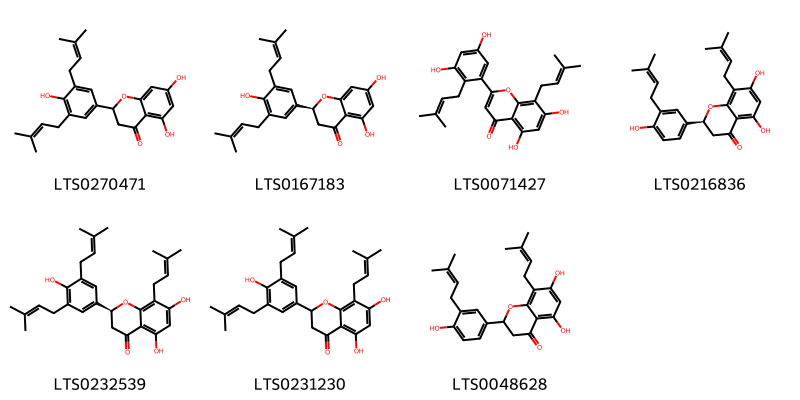{ width=100% }
    <figcaption>Hình ảnh cấu trúc hóa học của 7 hoạt chất thuộc nhóm Flavonoids gồm ['5,7-dihydroxy-2-[4-hydroxy-3,5-bis(3-methylbut-2-en-1-yl)phenyl]-2,3-dihydro-1-benzopyran-4-one (LTS0270471)', 'abyssinone v (LTS0167183)', 'vogelin c (LTS0071427)', 'lespedezaflavanone b (LTS0216836)', '(2s)-5,7-dihydroxy-2-[4-hydroxy-3,5-bis(3-methylbut-2-en-1-yl)phenyl]-8-(3-methylbut-2-en-1-yl)-2,3-dihydro-1-benzopyran-4-one (LTS0232539)', 'hydroxysophoranone (LTS0231230)', 'euchrestaflavanone a (LTS0048628)'].</figcaption>
</figure>
#### Nhóm Isoflavonoids
<figure markdown="span">
    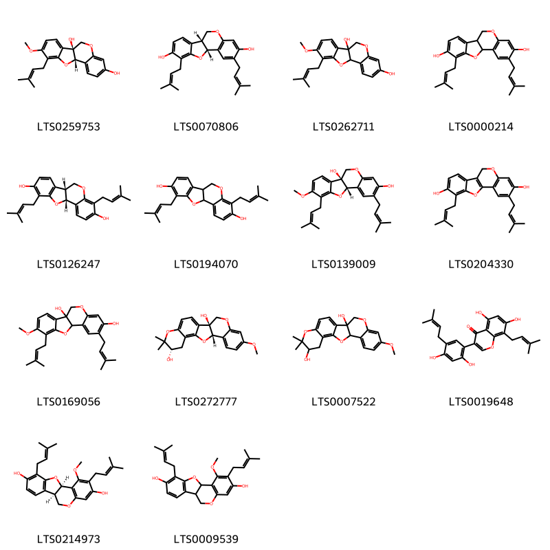{ width=100% }
    <figcaption>Hình ảnh cấu trúc hóa học của 14 hoạt chất thuộc nhóm Isoflavonoids gồm ['cristacarpin (LTS0259753)', '(1r,10r)-4,15-bis(3-methylbut-2-en-1-yl)-8,17-dioxatetracyclo[8.7.0.0²,⁷.0¹¹,¹⁶]heptadeca-2(7),3,5,11,13,15-hexaene-5,14-diol (LTS0070806)', '14-methoxy-15-(3-methylbut-2-en-1-yl)-8,17-dioxatetracyclo[8.7.0.0²,⁷.0¹¹,¹⁶]heptadeca-2,4,6,11,13,15-hexaene-5,10-diol (LTS0262711)', 'erythrabyssin ii (LTS0000214)', '(1r,10r)-6,15-bis(3-methylbut-2-en-1-yl)-8,17-dioxatetracyclo[8.7.0.0²,⁷.0¹¹,¹⁶]heptadeca-2,4,6,11(16),12,14-hexaene-5,14-diol (LTS0126247)', '6,15-bis(3-methylbut-2-en-1-yl)-8,17-dioxatetracyclo[8.7.0.0²,⁷.0¹¹,¹⁶]heptadeca-2,4,6,11(16),12,14-hexaene-5,14-diol (LTS0194070)', 'erystagallin a (LTS0139009)', 'erycristagallin (LTS0204330)', '14-methoxy-4,15-bis(3-methylbut-2-en-1-yl)-8,17-dioxatetracyclo[8.7.0.0²,⁷.0¹¹,¹⁶]heptadeca-2,4,6,11,13,15-hexaene-5,10-diol (LTS0169056)', '(2s,11s,16s)-7-methoxy-17,17-dimethyl-4,12,18-trioxapentacyclo[11.8.0.0²,¹¹.0⁵,¹⁰.0¹⁴,¹⁹]henicosa-1(21),5,7,9,13,19-hexaene-2,16-diol (LTS0272777)', '7-methoxy-17,17-dimethyl-4,12,18-trioxapentacyclo[11.8.0.0²,¹¹.0⁵,¹⁰.0¹⁴,¹⁹]henicosa-1(21),5,7,9,13,19-hexaene-2,16-diol (LTS0007522)', '3-[2,4-dihydroxy-5-(3-methylbut-2-en-1-yl)phenyl]-5,7-dihydroxy-8-(3-methylbut-2-en-1-yl)chromen-4-one (LTS0019648)', '(1r,10r)-3-methoxy-4,15-bis(3-methylbut-2-en-1-yl)-8,17-dioxatetracyclo[8.7.0.0²,⁷.0¹¹,¹⁶]heptadeca-2(7),3,5,11(16),12,14-hexaene-5,14-diol (LTS0214973)', '3-methoxy-4,15-bis(3-methylbut-2-en-1-yl)-8,17-dioxatetracyclo[8.7.0.0²,⁷.0¹¹,¹⁶]heptadeca-2(7),3,5,11(16),12,14-hexaene-5,14-diol (LTS0009539)'].</figcaption>
</figure>
#### Nhóm Isoquinolines and derivatives
<figure markdown="span">
    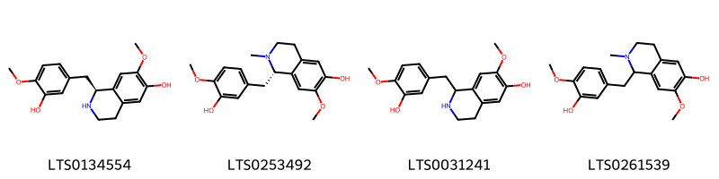{ width=100% }
    <figcaption>Hình ảnh cấu trúc hóa học của 4 hoạt chất thuộc nhóm Isoquinolines and derivatives gồm ['(1s)-1-[(3-hydroxy-4-methoxyphenyl)methyl]-7-methoxy-1,2,3,4-tetrahydroisoquinolin-6-ol (LTS0134554)', '(1s)-1-[(3-hydroxy-4-methoxyphenyl)methyl]-7-methoxy-2-methyl-3,4-dihydro-1h-isoquinolin-6-ol (LTS0253492)', '1-[(3-hydroxy-4-methoxyphenyl)methyl]-7-methoxy-1,2,3,4-tetrahydroisoquinolin-6-ol (LTS0031241)', '1-[(3-hydroxy-4-methoxyphenyl)methyl]-7-methoxy-2-methyl-3,4-dihydro-1h-isoquinolin-6-ol (LTS0261539)'].</figcaption>
</figure>
#### Nhóm Prenol lipids
<figure markdown="span">
    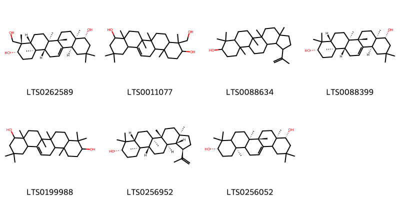{ width=100% }
    <figcaption>Hình ảnh cấu trúc hóa học của 7 hoạt chất thuộc nhóm Prenol lipids gồm ['soyasapogenol b (LTS0262589)', '4-(hydroxymethyl)-4,6a,6b,8a,11,11,14b-heptamethyl-1,2,3,4a,5,6,7,8,9,10,12,12a,14,14a-tetradecahydropicene-3,9-diol (LTS0011077)', 'lupeol (LTS0088634)', 'sophoradiol (LTS0088399)', '4,4,6a,6b,8a,11,11,14b-octamethyl-1,2,3,4a,5,6,7,8,9,10,12,12a,14,14a-tetradecahydropicene-3,9-diol (LTS0199988)', 'lupeol (LTS0256952)', '(3s,6ar,6bs,8ar,9r,14br)-4,4,6a,6b,8a,11,11,14b-octamethyl-1,2,3,4a,5,6,7,8,9,10,12,12a,14,14a-tetradecahydropicene-3,9-diol (LTS0256052)'].</figcaption>
</figure>

---

### Dược dân tộc học

Danh sách các quốc gia có sử dụng *Erythrina subumbrans* trong điều trị các bệnh. 

| Country   | Disease               | Bệnh                                                                                                                                                                                                |
|:----------|:----------------------|:----------------------------------------------------------------------------------------------------------------------------------------------------------------------------------------------------|
| Java      | Collyrium, Lactagogue | MYMEMORY WARNING: YOU USED ALL AVAILABLE FREE TRANSLATIONS FOR TODAY. NEXT AVAILABLE IN  16 HOURS 27 MINUTES 11 SECONDS VISIT HTTPS://MYMEMORY.TRANSLATED.NET/DOC/USAGELIMITS.PHP TO TRANSLATE MORE |

---

---
## Erythrina variegata
### Thông tin về thực vật

!!! info "Phân loại thực vật của *Erythrina variegata* từ GIBF:"
    - **Kingdom:** Plantae
    - **Phylum:** Tracheophyta
    - **Order:** Fabales
    - **Family:** Fabaceae
    - **Genus:** Erythrina
    - **Species:** *Erythrina variegata*

 

| Label (VI)   | Label (EN)   | Scientific Name     | Descriptions (VI)   | Descriptions (EN)   | Also Known As (VI)   | Also Known As (EN)                     |
|:-------------|:-------------|:--------------------|:--------------------|:--------------------|:---------------------|:---------------------------------------|
| N/A          | N/A          | Erythrina variegata |                     | species of plant    | ['']                 | ['Indian Coral Tree', 'sunshine tree'] |

#### Phân bố trên thế giới

**Từ CSDL GIBF** French Southern Territories, United Arab Emirates, Sri Lanka, Australia, Japan, Wallis and Futuna, Belgium, Mauritius, Cambodia, Benin, Nicaragua, Venezuela (Bolivarian Republic of), Panama, Pakistan, Réunion, Senegal, Nigeria, Chinese Taipei, Papua New Guinea, Honduras, United States of America, Bonaire, Sint Eustatius and Saba, Timor-Leste, Barbados, Hong Kong, Thailand, Guam, Brazil, New Caledonia, Tonga, Cuba, Mexico, Dominican Republic, Peru, Viet Nam, China, Ecuador, French Polynesia, Madagascar, Haiti, Colombia, Costa Rica, Vanuatu, India, Indonesia, Nauru, Malaysia, Northern Mariana Islands, Nepal

#### Phân bố tại Việt Nam

**Từ CSDL GIBF**: Không có ghi nhận ở Việt Nam

---
### Thành phần hóa học
        
- Theo cơ sở dữ liệu lotus: Từ loài *Erythrina variegata* đã phân lập và xác định được 204 hoạt chất thuộc về các nhóm Phenol ethers, Coumarans, Flavonoids, Indoles and derivatives, Steroids and steroid derivatives, Isoflavonoids, Erythrina alkaloids, Cinnamic acids and derivatives, Prenol lipids, Linear 1,3-diarylpropanoids, Benzopyrans, 2-arylbenzofuran flavonoids, Naphthofurans, Carboxylic acids and derivatives, Isoquinolines and derivatives, Protoberberine alkaloids and derivatives. 

|    | chemicalTaxonomyClassyfireClass          |   smiles_count |
|---:|:-----------------------------------------|---------------:|
|  0 | 2-arylbenzofuran flavonoids              |              3 |
|  1 | Benzopyrans                              |              5 |
|  2 | Carboxylic acids and derivatives         |              2 |
|  3 | Cinnamic acids and derivatives           |              4 |
|  4 | Coumarans                                |              3 |
|  5 | Erythrina alkaloids                      |             25 |
|  6 | Flavonoids                               |              7 |
|  7 | Indoles and derivatives                  |              1 |
|  8 | Isoflavonoids                            |            118 |
|  9 | Isoquinolines and derivatives            |              8 |
| 10 | Linear 1,3-diarylpropanoids              |              7 |
| 11 | Naphthofurans                            |              1 |
| 12 | Phenol ethers                            |              1 |
| 13 | Prenol lipids                            |              8 |
| 14 | Protoberberine alkaloids and derivatives |              4 |
| 15 | Steroids and steroid derivatives         |              7 |

#### Nhóm 2-arylbenzofuran flavonoids
<figure markdown="span">
    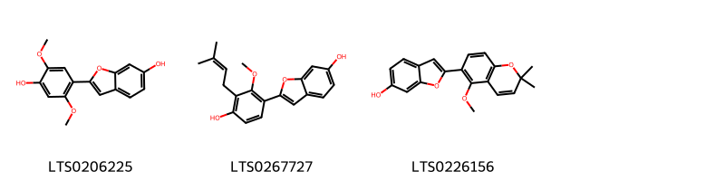{ width=100% }
    <figcaption>Hình ảnh cấu trúc hóa học của 3 hoạt chất thuộc nhóm 2-arylbenzofuran flavonoids gồm ['2-(4-hydroxy-2,5-dimethoxyphenyl)-1-benzofuran-6-ol (LTS0206225)', '2-[4-hydroxy-2-methoxy-3-(3-methylbut-2-en-1-yl)phenyl]-1-benzofuran-6-ol (LTS0267727)', '2-(5-methoxy-2,2-dimethylchromen-6-yl)-1-benzofuran-6-ol (LTS0226156)'].</figcaption>
</figure>
#### Nhóm Benzopyrans
<figure markdown="span">
    { width=100% }
    <figcaption>Hình ảnh cấu trúc hóa học của 5 hoạt chất thuộc nhóm Benzopyrans gồm ['5,15-bis(3-methylbut-2-en-1-yl)-9,17-dioxatetracyclo[8.7.0.0³,⁸.0¹¹,¹⁶]heptadeca-3(8),4,6,11,13,15-hexaene-6,14-diol (LTS0082147)', '3,7-dihydroxy-6,8-bis(3-methylbut-2-en-1-yl)chromen-4-one (LTS0213001)', '(1s,10s)-5,15-bis(3-methylbut-2-en-1-yl)-9,17-dioxatetracyclo[8.7.0.0³,⁸.0¹¹,¹⁶]heptadeca-3(8),4,6,11,13,15-hexaene-6,14-diol (LTS0172368)', '3-(2,4-dihydroxyphenoxy)-8,8-dimethyl-10-(3-methylbut-2-en-1-yl)pyrano[3,2-g]chromen-4-one (LTS0114384)', '3-(2,4-dihydroxyphenoxy)-7-hydroxy-6,8-bis(3-methylbut-2-en-1-yl)chromen-4-one (LTS0039263)'].</figcaption>
</figure>
#### Nhóm Carboxylic acids and derivatives
<figure markdown="span">
    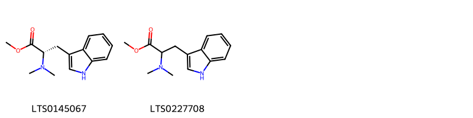{ width=100% }
    <figcaption>Hình ảnh cấu trúc hóa học của 2 hoạt chất thuộc nhóm Carboxylic acids and derivatives gồm ['methyl (2s)-2-(dimethylamino)-3-(1h-indol-3-yl)propanoate (LTS0145067)', 'methyl 2-(dimethylamino)-3-(1h-indol-3-yl)propanoate (LTS0227708)'].</figcaption>
</figure>
#### Nhóm Cinnamic acids and derivatives
<figure markdown="span">
    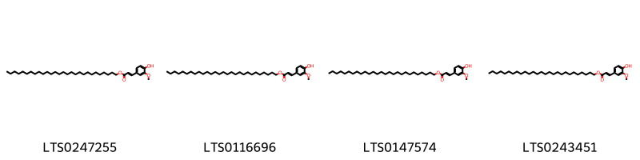{ width=100% }
    <figcaption>Hình ảnh cấu trúc hóa học của 4 hoạt chất thuộc nhóm Cinnamic acids and derivatives gồm ['octacosyl 3-(4-hydroxy-3-methoxyphenyl)prop-2-enoate (LTS0247255)', 'octacosyl (2e)-3-(4-hydroxy-3-methoxyphenyl)prop-2-enoate (LTS0116696)', 'heptacosyl (2e)-3-(4-hydroxy-3-methoxyphenyl)prop-2-enoate (LTS0147574)', 'heptacosyl 3-(4-hydroxy-3-methoxyphenyl)prop-2-enoate (LTS0243451)'].</figcaption>
</figure>
#### Nhóm Coumarans
<figure markdown="span">
    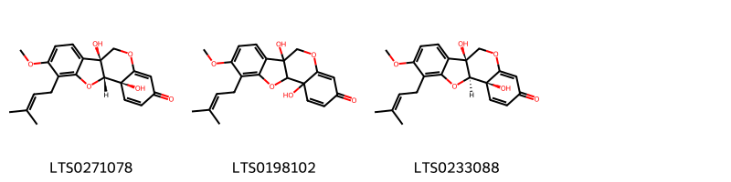{ width=100% }
    <figcaption>Hình ảnh cấu trúc hóa học của 3 hoạt chất thuộc nhóm Coumarans gồm ['(1r,2s,10s)-2,10-dihydroxy-14-methoxy-15-(3-methylbut-2-en-1-yl)-8,17-dioxatetracyclo[8.7.0.0²,⁷.0¹¹,¹⁶]heptadeca-3,6,11,13,15-pentaen-5-one (LTS0271078)', '2,10-dihydroxy-14-methoxy-15-(3-methylbut-2-en-1-yl)-8,17-dioxatetracyclo[8.7.0.0²,⁷.0¹¹,¹⁶]heptadeca-3,6,11,13,15-pentaen-5-one (LTS0198102)', '(1s,2s,10s)-2,10-dihydroxy-14-methoxy-15-(3-methylbut-2-en-1-yl)-8,17-dioxatetracyclo[8.7.0.0²,⁷.0¹¹,¹⁶]heptadeca-3,6,11,13,15-pentaen-5-one (LTS0233088)'].</figcaption>
</figure>
#### Nhóm Erythrina alkaloids
<figure markdown="span">
    { width=100% }
    <figcaption>Hình ảnh cấu trúc hóa học của 25 hoạt chất thuộc nhóm Erythrina alkaloids gồm ['erysotrine (LTS0212610)', 'erysodine (LTS0200261)', '8,11-dimethoxy-2h,4h,5h,10h,11h-indolo[7a,1-a]isoquinolin-7-ol (LTS0102989)', '7,8,11-trimethoxy-2h,4h,5h,10h,11h-indolo[7a,1-a]isoquinoline (LTS0059287)', '(9bs,11r)-7,11-dimethoxy-2h,4h,5h,10h,11h-indolo[7a,1-a]isoquinolin-8-ol (LTS0148712)', 'erythraline (LTS0068969)', 'erythratidine (LTS0115831)', '19-methoxy-5,7-dioxa-13-azapentacyclo[11.7.0.0¹,¹⁶.0²,¹⁰.0⁴,⁸]icosa-2,4(8),9,15,17-pentaene (LTS0073278)', '7,11-dimethoxy-2h,4h,5h,10h,11h-indolo[7a,1-a]isoquinolin-8-ol (LTS0248116)', '(1s,11r,19r)-19-methoxy-5,7-dioxa-13-azapentacyclo[11.7.0.0¹,¹⁶.0²,¹⁰.0⁴,⁸]icosa-2,4(8),9,15,17-pentaen-11-ol (LTS0005098)', '(9bs,11r)-11-methoxy-2h,4h,5h,10h,11h-indolo[7a,1-a]isoquinoline-7,8-diol (LTS0170921)', 'erythravine (LTS0032668)', '7,8,11-trimethoxy-2h,4h,5h,10h,11h-indolo[7a,1-a]isoquinolin-5-ol (LTS0143890)', '(9bs,11r,12r)-8,11-dimethoxy-1h,2h,4h,5h,10h,11h,12h-indolo[7a,1-a]isoquinoline-7,12-diol (LTS0188089)', 'erysonine (LTS0104385)', '8-methoxy-2h,4h,5h,10h,11h-indolo[7a,1-a]isoquinoline-7,11-diol (LTS0207004)', '11-methoxy-2h,4h,5h,10h,11h-indolo[7a,1-a]isoquinoline-7,8-diol (LTS0242537)', '19-methoxy-5,7-dioxa-13-azapentacyclo[11.7.0.0¹,¹⁶.0²,¹⁰.0⁴,⁸]icosa-2,4(8),9,15,17-pentaen-11-ol (LTS0039259)', '(9br,11r,12r)-11-methoxy-1h,2h,4h,5h,10h,11h,12h-indolo[7a,1-a]isoquinoline-7,8,12-triol (LTS0084728)', '(9br)-7-hydroxy-8,11-dimethoxy-1h,2h,4h,5h-indolo[7a,1-a]isoquinolin-12-one (LTS0165213)', '7-hydroxy-8,11-dimethoxy-1h,2h,4h,5h-indolo[7a,1-a]isoquinolin-12-one (LTS0105949)', '11-methoxy-1h,2h,4h,5h,10h,11h,12h-indolo[7a,1-a]isoquinoline-7,8,12-triol (LTS0237889)', '(9bs,11r,12s)-11-methoxy-1h,2h,4h,5h,10h,11h,12h-indolo[7a,1-a]isoquinoline-7,8,12-triol (LTS0220313)', '7-methoxy-2h,4h,5h,10h,11h-indolo[7a,1-a]isoquinolin-8-ol (LTS0067367)', '(9bs)-7-methoxy-2h,4h,5h,10h,11h-indolo[7a,1-a]isoquinolin-8-ol (LTS0115023)'].</figcaption>
</figure>
#### Nhóm Flavonoids
<figure markdown="span">
    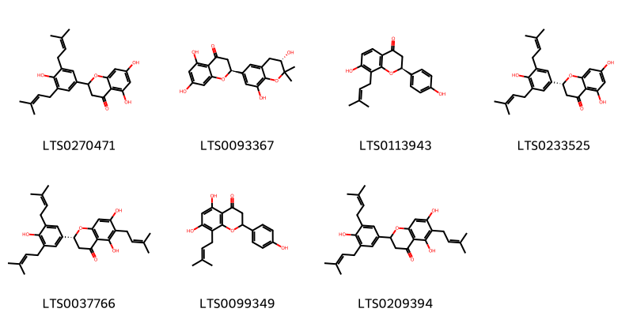{ width=100% }
    <figcaption>Hình ảnh cấu trúc hóa học của 7 hoạt chất thuộc nhóm Flavonoids gồm ['5,7-dihydroxy-2-[4-hydroxy-3,5-bis(3-methylbut-2-en-1-yl)phenyl]-2,3-dihydro-1-benzopyran-4-one (LTS0270471)', '(2s)-2-[(3s)-3,8-dihydroxy-2,2-dimethyl-3,4-dihydro-1-benzopyran-6-yl]-5,7-dihydroxy-2,3-dihydro-1-benzopyran-4-one (LTS0093367)', '(2s)-7-hydroxy-2-(4-hydroxyphenyl)-8-(3-methylbut-2-en-1-yl)-2,3-dihydro-1-benzopyran-4-one (LTS0113943)', '(2r)-5,7-dihydroxy-2-[4-hydroxy-3,5-bis(3-methylbut-2-en-1-yl)phenyl]-2,3-dihydro-1-benzopyran-4-one (LTS0233525)', '(2r)-5,7-dihydroxy-2-[4-hydroxy-3,5-bis(3-methylbut-2-en-1-yl)phenyl]-6-(3-methylbut-2-en-1-yl)-2,3-dihydro-1-benzopyran-4-one (LTS0037766)', 'sophoraflavanone b (LTS0099349)', '5,7-dihydroxy-2-[4-hydroxy-3,5-bis(3-methylbut-2-en-1-yl)phenyl]-6-(3-methylbut-2-en-1-yl)-2,3-dihydro-1-benzopyran-4-one (LTS0209394)'].</figcaption>
</figure>
#### Nhóm Indoles and derivatives
<figure markdown="span">
    { width=100% }
    <figcaption>Hình ảnh cấu trúc hóa học của 1 hoạt chất thuộc nhóm Indoles and derivatives gồm ['β-erythroidine (LTS0271196)'].</figcaption>
</figure>
#### Nhóm Isoflavonoids
<figure markdown="span">
    { width=100% }
    <figcaption>Hình ảnh cấu trúc hóa học của 118 hoạt chất thuộc nhóm Isoflavonoids gồm ['cristacarpin (LTS0259753)', '(1r,10r)-4,15-bis(3-methylbut-2-en-1-yl)-8,17-dioxatetracyclo[8.7.0.0²,⁷.0¹¹,¹⁶]heptadeca-2(7),3,5,11,13,15-hexaene-5,14-diol (LTS0070806)', '(1r,10r)-15-(3-methylbut-2-en-1-yl)-8,17-dioxatetracyclo[8.7.0.0²,⁷.0¹¹,¹⁶]heptadeca-2,4,6,11(16),12,14-hexaene-5,14-diol (LTS0035516)', '(1s,10s)-4,15-bis(3-methylbut-2-en-1-yl)-8,17-dioxatetracyclo[8.7.0.0²,⁷.0¹¹,¹⁶]heptadeca-2(7),3,5,11,13,15-hexaene-5,14-diol (LTS0038747)', '14-methoxy-15-(3-methylbut-2-en-1-yl)-8,17-dioxatetracyclo[8.7.0.0²,⁷.0¹¹,¹⁶]heptadeca-2,4,6,11,13,15-hexaene-5,10-diol (LTS0262711)', 'wighteone (LTS0136408)', 'erythrabyssin ii (LTS0000214)', 'alpinumisoflavone (LTS0103103)', '(-)-phaseollin (LTS0203010)', '15-(3-methylbut-2-en-1-yl)-8,17-dioxatetracyclo[8.7.0.0²,⁷.0¹¹,¹⁶]heptadeca-2,4,6,11(16),12,14-hexaene-5,14-diol (LTS0133328)', 'erystagallin a (LTS0139009)', 'erycristagallin (LTS0204330)', '7-hydroxy-3-(4-hydroxyphenyl)-8-(3-methylbut-2-en-1-yl)chromen-4-one (LTS0071249)', 'senegalensin (LTS0273024)', '(3r)-3-(2,4-dihydroxyphenyl)-7-hydroxy-6,8-bis(3-methylbut-2-en-1-yl)-2,3-dihydro-1-benzopyran-4-one (LTS0054422)', 'warangalone (LTS0132135)', '3-(2,4-dihydroxyphenyl)-7-hydroxy-6,8-bis(3-methylbut-2-en-1-yl)-2,3-dihydro-1-benzopyran-4-one (LTS0017513)', '14-methoxy-15-(3-methylbut-2-en-1-yl)-8,17-dioxatetracyclo[8.7.0.0²,⁷.0¹¹,¹⁶]heptadeca-1(10),2,4,6,11,13,15-heptaen-5-ol (LTS0091671)', '17,17-dimethyl-4,12,18-trioxapentacyclo[11.8.0.0²,¹¹.0⁵,¹⁰.0¹⁴,¹⁹]henicosa-1(13),5,7,9,14(19),15,20-heptaen-7-ol (LTS0107159)', 'auriculatin (LTS0152052)', '7-hydroxy-3-[4-hydroxy-3-(3-methylbut-2-en-1-yl)phenyl]-8-(3-methylbut-2-en-1-yl)chromen-4-one (LTS0241765)', 'euchrenone b10 (LTS0120128)', '3-[4-hydroxy-2-methoxy-3-(3-methylbut-2-en-1-yl)phenyl]-2h-chromen-7-ol (LTS0057172)', '(2s)-4-hydroxy-6-(4-hydroxyphenyl)-2-(2-hydroxypropan-2-yl)-9-(3-methylbut-2-en-1-yl)-2h,3h-furo[3,2-g]chromen-5-one (LTS0030564)', '14-methoxy-4,15-bis(3-methylbut-2-en-1-yl)-8,17-dioxatetracyclo[8.7.0.0²,⁷.0¹¹,¹⁶]heptadeca-2,4,6,11,13,15-hexaene-5,10-diol (LTS0169056)', '(3s)-3-(2,4-dihydroxyphenyl)-8,8-dimethyl-10-(3-methylbut-2-en-1-yl)-2h,3h-pyrano[3,2-g]chromen-4-one (LTS0041916)', 'genistein (LTS0106538)', 'folitenol (LTS0160762)', '(2r,11r)-17,17-dimethyl-8-(3-methylbut-2-en-1-yl)-4,12,18-trioxapentacyclo[11.8.0.0²,¹¹.0⁵,¹⁰.0¹⁴,¹⁹]henicosa-1(21),5(10),6,8,13,15,19-heptaen-7-ol (LTS0006775)', '6,8-diprenylgenistein (LTS0014786)', '3-(4-hydroxy-2,5-dimethoxyphenyl)-2h-chromen-7-ol (LTS0255272)', '17,17-dimethyl-8-(3-methylbut-2-en-1-yl)-4,12,18-trioxapentacyclo[11.8.0.0²,¹¹.0⁵,¹⁰.0¹⁴,¹⁹]henicosa-1(21),5(10),6,8,13,15,19-heptaene-2,7-diol (LTS0129165)', '17,17-dimethyl-5-(3-methylbut-2-en-1-yl)-3,12,16-trioxapentacyclo[11.8.0.0²,¹⁰.0⁴,⁹.0¹⁵,²⁰]henicosa-1(21),4(9),5,7,13,15(20),18-heptaen-6-ol (LTS0181384)', '3-(4-hydroxyphenyl)-8,8-dimethylpyrano[2,3-f]chromen-4-one (LTS0275697)', '5,7-dihydroxy-8-[(2s)-2-hydroxy-3-methylbut-3-en-1-yl]-3-(4-hydroxyphenyl)-6-(3-methylbut-2-en-1-yl)chromen-4-one (LTS0204868)', '5,7-dihydroxy-8-[(2r)-2-hydroxy-3-methylbut-3-en-1-yl]-3-(4-hydroxyphenyl)-6-(3-methylbut-2-en-1-yl)chromen-4-one (LTS0165857)', '5-methoxy-4-(3-methylbut-2-en-1-yl)-8,17-dioxatetracyclo[8.7.0.0²,⁷.0¹¹,¹⁶]heptadeca-2(7),3,5,11,13,15-hexaen-14-ol (LTS0167410)', '(2r,10r)-17,17-dimethyl-5-(3-methylbut-2-en-1-yl)-3,12,16-trioxapentacyclo[11.8.0.0²,¹⁰.0⁴,⁹.0¹⁵,²⁰]henicosa-1(21),4(9),5,7,13,15(20),18-heptaen-6-ol (LTS0212318)', '15-(2,3-dihydroxy-3-methylbutyl)-14-methoxy-8,17-dioxatetracyclo[8.7.0.0²,⁷.0¹¹,¹⁶]heptadeca-2,4,6,11,13,15-hexaene-5,10-diol (LTS0139606)', 'orientanol c (LTS0245647)', '(1r,10r)-14-hydroxy-5-methoxy-8,17-dioxatetracyclo[8.7.0.0²,⁷.0¹¹,¹⁶]heptadeca-2(7),3,5,11,13,15-hexaene-4-carbaldehyde (LTS0200488)', '(2s,11s)-17,17-dimethyl-8-(3-methylbut-2-en-1-yl)-4,12,18-trioxapentacyclo[11.8.0.0²,¹¹.0⁵,¹⁰.0¹⁴,¹⁹]henicosa-1(21),5(10),6,8,13,15,19-heptaene-2,7-diol (LTS0018794)', '(2s,11s,16s)-7-methoxy-17,17-dimethyl-4,12,18-trioxapentacyclo[11.8.0.0²,¹¹.0⁵,¹⁰.0¹⁴,¹⁹]henicosa-1(21),5,7,9,13,19-hexaene-2,16-diol (LTS0272777)', '7-methoxy-17,17-dimethyl-4,12,18-trioxapentacyclo[11.8.0.0²,¹¹.0⁵,¹⁰.0¹⁴,¹⁹]henicosa-1(21),5,7,9,13,19-hexaene-2,16-diol (LTS0007522)', '(2s,11s)-17,17-dimethyl-8-(3-methylbut-2-en-1-yl)-4,12,18-trioxapentacyclo[11.8.0.0²,¹¹.0⁵,¹⁰.0¹⁴,¹⁹]henicosa-1(21),5(10),6,8,13,15,19-heptaen-7-ol (LTS0014740)', '3-(2,4-dihydroxyphenyl)-8,8-dimethyl-10-(3-methylbut-2-en-1-yl)-2h,3h-pyrano[3,2-g]chromen-4-one (LTS0256781)', '5,7-dihydroxy-8-(2-hydroxy-3-methylbut-3-en-1-yl)-3-(4-hydroxyphenyl)-6-(3-methylbut-2-en-1-yl)chromen-4-one (LTS0245799)', '(1s,10s)-4,15-bis(3-methylbut-2-en-1-yl)-8,17-dioxatetracyclo[8.7.0.0²,⁷.0¹¹,¹⁶]heptadeca-2(7),3,5,11,13,15-hexaene-5,10,14-triol (LTS0195492)', '(1r,10r)-4,15-bis(3-methylbut-2-en-1-yl)-8,17-dioxatetracyclo[8.7.0.0²,⁷.0¹¹,¹⁶]heptadeca-2(7),3,5,11,13,15-hexaene-5,10,14-triol (LTS0224352)', '4,15-bis(3-methylbut-2-en-1-yl)-8,17-dioxatetracyclo[8.7.0.0²,⁷.0¹¹,¹⁶]heptadeca-2(7),3,5,11,13,15-hexaene-5,10,14-triol (LTS0241528)', 'alpinumisoflavone dimethyl ether (LTS0256811)', '5,7-dihydroxy-6-[(2r)-2-hydroxy-3-methylbut-3-en-1-yl]-3-(4-hydroxyphenyl)-8-(3-methylbut-2-en-1-yl)chromen-4-one (LTS0213820)', '4-hydroxy-3-(4-hydroxyphenyl)-5-methoxy-8,8-dimethylpyrano[3,2-g]chromen-2-one (LTS0135967)', '3-(4-hydroxyphenyl)-5-methoxy-8,8-dimethylpyrano[3,2-g]chromen-4-one (LTS0111147)', '(3s)-3-(2,4-dihydroxyphenyl)-5,7-dihydroxy-6,8-bis(3-methylbut-2-en-1-yl)-2,3-dihydro-1-benzopyran-4-one (LTS0059752)', '5-hydroxy-4-methoxy-6-(4-methoxyphenyl)-2-(prop-1-en-2-yl)-2h,3h-furo[3,2-g]chromen-7-one (LTS0098396)', '5,7-dihydroxy-8-[(2r)-2-hydroxy-3-methylbut-3-en-1-yl]-6-(3-methylbut-2-en-1-yl)-3-(4-methylphenyl)chromen-4-one (LTS0071921)', '(2r)-4-hydroxy-6-(4-hydroxyphenyl)-2-(2-hydroxypropan-2-yl)-9-(3-methylbut-2-en-1-yl)-2h,3h-furo[3,2-g]chromen-5-one (LTS0099371)', 'daidzein (LTS0130369)', '(2r)-5-hydroxy-4-methoxy-6-(4-methoxyphenyl)-2-(prop-1-en-2-yl)-2h,3h-furo[3,2-g]chromen-7-one (LTS0123422)', '3-o-methylcalopocarpin (LTS0197496)', '2-hydroxy-5-methoxy-3-(4-methoxyphenyl)-8,8-dimethylpyrano[3,2-g]chromen-4-one (LTS0133519)', '(3r)-3-(2,4-dihydroxyphenyl)-3,7-dihydroxy-6,8-bis(3-methylbut-2-en-1-yl)-2h-1-benzopyran-4-one (LTS0142856)', '5,7-dihydroxy-6-(2-hydroxy-3-methylbut-3-en-1-yl)-3-(4-hydroxyphenyl)chromen-4-one (LTS0151473)', '(2s,11s)-17,17-dimethyl-4,12,18-trioxapentacyclo[11.8.0.0²,¹¹.0⁵,¹⁰.0¹⁴,¹⁹]henicosa-1(13),5,7,9,14(19),15,20-heptaen-7-ol (LTS0156776)', '3-(2,4-dihydroxyphenyl)-5,7-dihydroxy-6,8-bis(3-methylbut-2-en-1-yl)-2,3-dihydro-1-benzopyran-4-one (LTS0219734)', '5,7-dihydroxy-8-(2-hydroxy-3-methylbut-3-en-1-yl)-3-{4-[(1-hydroxyhexacosan-2-yl)oxy]phenyl}-6-(3-methylbut-2-en-1-yl)chromen-4-one (LTS0235110)', '5,14-dihydroxy-4,15-bis(3-methylbut-2-en-1-yl)-8,17-dioxatetracyclo[8.7.0.0²,⁷.0¹¹,¹⁶]heptadeca-1(10),2(7),3,5,11(16),12,14-heptaen-9-one (LTS0166314)', '14-hydroxy-5-methoxy-8,17-dioxatetracyclo[8.7.0.0²,⁷.0¹¹,¹⁶]heptadeca-2(7),3,5,11,13,15-hexaene-4-carbaldehyde (LTS0077920)', '5,7-dihydroxy-6-[(2s)-2-hydroxy-3-methylbut-3-en-1-yl]-3-(4-hydroxyphenyl)chromen-4-one (LTS0214866)', '(2s)-5-hydroxy-4-methoxy-6-(4-methoxyphenyl)-2-(prop-1-en-2-yl)-2h,3h-furo[3,2-g]chromen-7-one (LTS0223529)', 'robustic acid (LTS0166354)', '5,7-dihydroxy-8-(2-hydroxy-3-methylbut-3-en-1-yl)-6-(3-methylbut-2-en-1-yl)-3-(4-methylphenyl)chromen-4-one (LTS0031025)', '13-methoxy-4-(3-methylbut-2-en-1-yl)-8,17-dioxatetracyclo[8.7.0.0²,⁷.0¹¹,¹⁶]heptadeca-2,4,6,11(16),12,14-hexaene-5,14-diol (LTS0163203)', 'lupiwighteone (LTS0229079)', '5,7-dihydroxy-8-[(2s)-2-hydroxy-3-methylbut-3-en-1-yl]-3-(4-{[(2s)-1-hydroxyhexacosan-2-yl]oxy}phenyl)-6-(3-methylbut-2-en-1-yl)chromen-4-one (LTS0038683)', '(1r,10r)-13-methoxy-4-(3-methylbut-2-en-1-yl)-8,17-dioxatetracyclo[8.7.0.0²,⁷.0¹¹,¹⁶]heptadeca-2,4,6,11(16),12,14-hexaene-5,14-diol (LTS0033489)', '(1s,10s)-15-[(2s)-2,3-dihydroxy-3-methylbutyl]-14-methoxy-8,17-dioxatetracyclo[8.7.0.0²,⁷.0¹¹,¹⁶]heptadeca-2,4,6,11,13,15-hexaene-5,10-diol (LTS0014611)', 'cajanin (LTS0273779)', '5,7-dihydroxy-6-(2-hydroxy-3-methylbut-3-en-1-yl)-3-(4-hydroxyphenyl)-8-(3-methylbut-2-en-1-yl)chromen-4-one (LTS0243500)', '5,7-dihydroxy-8-[(2r)-2-hydroxy-3-methylbut-3-en-1-yl]-3-(4-{[(2r)-1-hydroxyhexacosan-2-yl]oxy}phenyl)-6-(3-methylbut-2-en-1-yl)chromen-4-one (LTS0032630)', '(1s,10s)-15-[(2r)-2,3-dihydroxy-3-methylbutyl]-14-methoxy-8,17-dioxatetracyclo[8.7.0.0²,⁷.0¹¹,¹⁶]heptadeca-2,4,6,11,13,15-hexaene-5,10-diol (LTS0240990)', '3-(2-hydroxy-4-methoxyphenyl)-5-methoxy-8,8-dimethylpyrano[3,2-g]chromen-4-one (LTS0042986)', '5-hydroxy-6-[(2r)-2-hydroxy-3-methylbut-3-en-1-yl]-3-(4-hydroxyphenyl)-8,8-dimethylpyrano[2,3-f]chromen-4-one (LTS0066878)', '7-hydroxy-3-(4-hydroxyphenyl)-6,8-bis(3-methylbut-2-en-1-yl)chromen-4-one (LTS0194182)', '4,6-bis(3-methylbut-2-en-1-yl)-8,17-dioxatetracyclo[8.7.0.0²,⁷.0¹¹,¹⁶]heptadeca-2(7),3,5,11,13,15-hexaene-5,14-diol (LTS0124407)', '5,7-dihydroxy-6-[(2r)-2-hydroxy-3-methylbut-3-en-1-yl]-3-(4-hydroxyphenyl)chromen-4-one (LTS0103879)', '(1r,10r)-4,6-bis(3-methylbut-2-en-1-yl)-8,17-dioxatetracyclo[8.7.0.0²,⁷.0¹¹,¹⁶]heptadeca-2(7),3,5,11,13,15-hexaene-5,14-diol (LTS0020368)', '4-hydroxy-6-(4-hydroxyphenyl)-2-(2-methoxypropan-2-yl)-9-(3-methylbut-2-en-1-yl)furo[3,2-g]chromen-5-one (LTS0102351)', '(3r)-3-(2,4-dihydroxyphenyl)-5,7-dihydroxy-6,8-bis(3-methylbut-2-en-1-yl)-2,3-dihydro-1-benzopyran-4-one (LTS0178124)', "5'-methoxy-2',2'-dimethyl-2h-[3,6'-bichromen]-7-ol (LTS0062658)", '(3r)-5-hydroxy-3-(4-hydroxy-2-methoxyphenyl)-8,8-dimethyl-10-(3-methylbut-2-en-1-yl)-2h,3h-pyrano[3,2-g]chromen-4-one (LTS0275171)', '(3r)-3-(2,4-dihydroxyphenyl)-8,8-dimethyl-10-(3-methylbut-2-en-1-yl)-2h,3h-pyrano[3,2-g]chromen-4-one (LTS0141581)', '(1r,10s)-15-(2,3-dihydroxy-3-methylbutyl)-14-methoxy-8,17-dioxatetracyclo[8.7.0.0²,⁷.0¹¹,¹⁶]heptadeca-2,4,6,11,13,15-hexaene-5,10-diol (LTS0151510)', '(3s)-3-(2,4-dihydroxyphenyl)-8,8-dimethyl-6-(3-methylbut-2-en-1-yl)-2h,3h-pyrano[2,3-f]chromen-4-one (LTS0139574)', '14-methoxy-4,15-bis(3-methylbut-2-en-1-yl)-8,17-dioxatetracyclo[8.7.0.0²,⁷.0¹¹,¹⁶]heptadeca-1(10),2,4,6,11,13,15-heptaen-5-ol (LTS0118844)', '3-(4-hydroxy-2,5-dimethoxyphenyl)-3,4-dihydro-2h-1-benzopyran-7-ol (LTS0163341)', '5-hydroxy-13-(4-hydroxyphenyl)-4,4-dimethyl-9-(3-methylbut-2-en-1-yl)-3,11-dioxatricyclo[8.4.0.0²,⁷]tetradeca-1(10),2(7),8-trien-14-one (LTS0152610)', '5-hydroxy-3-(4-hydroxy-2-methoxyphenyl)-8,8-dimethyl-10-(3-methylbut-2-en-1-yl)-2h,3h-pyrano[3,2-g]chromen-4-one (LTS0149082)', '6,15-bis(3-methylbut-2-en-1-yl)-8,17-dioxatetracyclo[8.7.0.0²,⁷.0¹¹,¹⁶]heptadeca-1(10),2(7),3,5,11,13,15-heptaene-5,14-diol (LTS0248165)', '5-hydroxy-6-[(2s)-2-hydroxy-3-methylbut-3-en-1-yl]-3-(4-hydroxyphenyl)-8,8-dimethylpyrano[2,3-f]chromen-4-one (LTS0269380)', '(8s)-5-hydroxy-8-(hydroxymethyl)-3-(4-hydroxyphenyl)-8-methyl-10-(3-methylbut-2-en-1-yl)pyrano[3,2-g]chromen-4-one (LTS0125165)', '4-[(3r)-8,8-dimethyl-2h,3h,4h-pyrano[3,2-g]chromen-3-yl]benzene-1,3-diol (LTS0121097)', '5-hydroxy-3-(4-hydroxyphenyl)-8,8-dimethyl-6h,7h-pyrano[3,2-g]chromen-4-one (LTS0203933)', '3-(2,4-dihydroxyphenyl)-8,8-dimethyl-6-(3-methylbut-2-en-1-yl)-2h,3h-pyrano[2,3-f]chromen-4-one (LTS0220956)', '6-[(3,3-dimethyloxiran-2-yl)methyl]-5,7-dihydroxy-3-(4-hydroxyphenyl)chromen-4-one (LTS0237274)', '5-hydroxy-8-(hydroxymethyl)-3-(4-hydroxyphenyl)-8-methyl-10-(3-methylbut-2-en-1-yl)pyrano[3,2-g]chromen-4-one (LTS0256627)', '(3s)-3-(4-hydroxy-2,5-dimethoxyphenyl)-3,4-dihydro-2h-1-benzopyran-7-ol (LTS0260177)', '3-methoxy-4,15-bis(3-methylbut-2-en-1-yl)-8,17-dioxatetracyclo[8.7.0.0²,⁷.0¹¹,¹⁶]heptadeca-2(7),3,5,11,13,15-hexaene-5,10-diol (LTS0124484)', '3-(4-hydroxyphenyl)-6,6,10,10-tetramethyl-7,8,11,12-tetrahydro-1,5,9-trioxatriphenylen-4-one (LTS0020045)', '3-(2,4-dihydroxyphenyl)-3,7-dihydroxy-6,8-bis(3-methylbut-2-en-1-yl)-2h-1-benzopyran-4-one (LTS0099837)', '(3r)-3,5-dihydroxy-9-(4-hydroxyphenyl)-2,2-dimethyl-6-(3-methylbut-2-en-1-yl)-3h,4h-pyrano[2,3-f]chromen-10-one (LTS0031737)', 'euchrenone b9 (LTS0267719)', '(3s)-3-(2,4-dihydroxyphenyl)-3-hydroxy-8,8-dimethyl-10-(3-methylbut-2-en-1-yl)-2h-pyrano[3,2-g]chromen-4-one (LTS0136120)', '3,5-dihydroxy-9-(4-hydroxyphenyl)-2,2-dimethyl-6-(3-methylbut-2-en-1-yl)-3h,4h-pyrano[2,3-f]chromen-10-one (LTS0129904)', '6-{[(2r)-3,3-dimethyloxiran-2-yl]methyl}-5,7-dihydroxy-3-(4-hydroxyphenyl)chromen-4-one (LTS0104312)', 'osajin (LTS0236700)', '(1s,10s)-3-methoxy-4,15-bis(3-methylbut-2-en-1-yl)-8,17-dioxatetracyclo[8.7.0.0²,⁷.0¹¹,¹⁶]heptadeca-2(7),3,5,11,13,15-hexaene-5,10-diol (LTS0104276)'].</figcaption>
</figure>
#### Nhóm Isoquinolines and derivatives
<figure markdown="span">
    { width=100% }
    <figcaption>Hình ảnh cấu trúc hóa học của 8 hoạt chất thuộc nhóm Isoquinolines and derivatives gồm ['(1s)-1-[(3-hydroxy-4-methoxyphenyl)methyl]-7-methoxy-1,2,3,4-tetrahydroisoquinolin-6-ol (LTS0134554)', '(1r)-1-[(4-hydroxy-3-methoxyphenyl)methyl]-6-methoxy-1,2,3,4-tetrahydroisoquinolin-7-ol (LTS0085894)', 'nororientaline (LTS0059727)', '(1s)-1-[(3-hydroxy-4-methoxyphenyl)methyl]-7-methoxy-2-methyl-3,4-dihydro-1h-isoquinolin-6-ol (LTS0253492)', '1-[(3-hydroxy-4-methoxyphenyl)methyl]-7-methoxy-1,2,3,4-tetrahydroisoquinolin-6-ol (LTS0031241)', '1-[(3-hydroxy-4-methoxyphenyl)methyl]-7-methoxy-2-methyl-3,4-dihydro-1h-isoquinolin-6-ol (LTS0261539)', 'reticuline (LTS0204392)', '(+,-)-reticuline (LTS0181650)'].</figcaption>
</figure>
#### Nhóm Linear 1_3-diarylpropanoids
<figure markdown="span">
    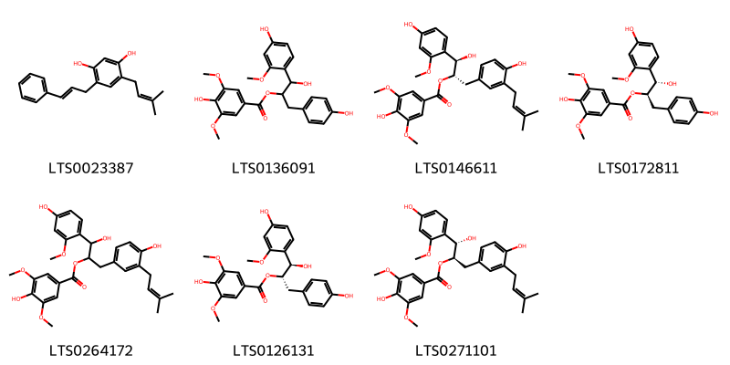{ width=100% }
    <figcaption>Hình ảnh cấu trúc hóa học của Không tìm thấy chú thích hoạt chất thuộc nhóm Linear 1_3-diarylpropanoids gồm Không tìm thấy chú thích.</figcaption>
</figure>
#### Nhóm Naphthofurans
<figure markdown="span">
    { width=100% }
    <figcaption>Hình ảnh cấu trúc hóa học của 1 hoạt chất thuộc nhóm Naphthofurans gồm ['(1r,10s)-5-methoxy-4-(3-methylbut-2-en-1-yl)-17-oxatetracyclo[8.7.0.0²,⁷.0¹¹,¹⁶]heptadeca-2(7),3,5,11,13,15-hexaen-14-ol (LTS0131643)'].</figcaption>
</figure>
#### Nhóm Phenol ethers
<figure markdown="span">
    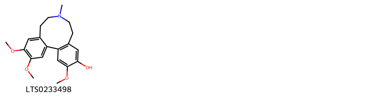{ width=100% }
    <figcaption>Hình ảnh cấu trúc hóa học của 1 hoạt chất thuộc nhóm Phenol ethers gồm ['4,15,16-trimethoxy-10-methyl-10-azatricyclo[11.4.0.0²,⁷]heptadeca-1(17),2(7),3,5,13,15-hexaen-5-ol (LTS0233498)'].</figcaption>
</figure>
#### Nhóm Prenol lipids
<figure markdown="span">
    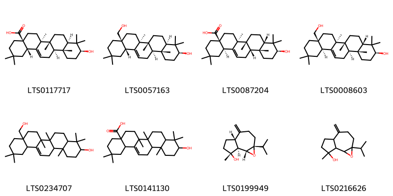{ width=100% }
    <figcaption>Hình ảnh cấu trúc hóa học của 8 hoạt chất thuộc nhóm Prenol lipids gồm ['oleanolic acid (LTS0117717)', 'erythrodiol (LTS0057163)', '(4as,6as,6br,8as,10s,12ar,12bs,14br)-10-hydroxy-2,2,6a,6b,9,9,12a-heptamethyl-1,3,4,5,6,7,8,8a,10,11,12,12b,13,14b-tetradecahydropicene-4a-carboxylic acid (LTS0087204)', '(3s,4as,6ar,6bs,8as,12ar,14ar,14br)-8a-(hydroxymethyl)-4,4,6a,6b,11,11,14b-heptamethyl-1,2,3,4a,5,6,7,8,9,10,12,12a,14,14a-tetradecahydropicen-3-ol (LTS0008603)', '8a-(hydroxymethyl)-4,4,6a,6b,11,11,14b-heptamethyl-1,2,3,4a,5,6,7,8,9,10,12,12a,14,14a-tetradecahydropicen-3-ol (LTS0234707)', 'oleanolic acid (LTS0141130)', '(1ar,4as,7r,7as,7br)-1a-isopropyl-7-methyl-4-methylidene-hexahydro-2h-azuleno[4,5-b]oxiren-7-ol (LTS0199949)', '1a-isopropyl-7-methyl-4-methylidene-hexahydro-2h-azuleno[4,5-b]oxiren-7-ol (LTS0216626)'].</figcaption>
</figure>
#### Nhóm Protoberberine alkaloids and derivatives
<figure markdown="span">
    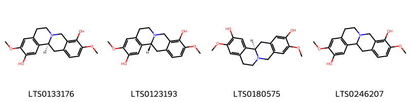{ width=100% }
    <figcaption>Hình ảnh cấu trúc hóa học của 4 hoạt chất thuộc nhóm Protoberberine alkaloids and derivatives gồm ['scoulerine (LTS0133176)', '(12br)-3,10-dimethoxy-7,8,12b,13-tetrahydro-5h-6-azatetraphene-4,11-diol (LTS0123193)', '(12br)-3,10-dimethoxy-7,8,12b,13-tetrahydro-5h-6-azatetraphene-2,11-diol (LTS0180575)', '(s)-scoulerine (LTS0246207)'].</figcaption>
</figure>
#### Nhóm Steroids and steroid derivatives
<figure markdown="span">
    { width=100% }
    <figcaption>Hình ảnh cấu trúc hóa học của 7 hoạt chất thuộc nhóm Steroids and steroid derivatives gồm ['phytosterol (LTS0029311)', '(2r,3r,4s,5s,6r)-2-{[(1r,3as,3bs,7s,9ar,9bs,11ar)-1-[(2r,3e,5s)-5-ethyl-6-methylhept-3-en-2-yl]-9a,11a-dimethyl-1h,2h,3h,3ah,3bh,4h,6h,7h,8h,9h,9bh,10h,11h-cyclopenta[a]phenanthren-7-yl]oxy}-6-(hydroxymethyl)oxane-3,4,5-triol (LTS0088971)', '(1r,3as,3bs,7s,9ar,9bs,11ar)-1-[(2s,3e,5s)-5-ethyl-6-methylhept-3-en-2-yl]-9a,11a-dimethyl-1h,2h,3h,3ah,3bh,4h,6h,7h,8h,9h,9bh,10h,11h-cyclopenta[a]phenanthren-7-ol (LTS0169213)', '(2r,3r,4s,5s,6r)-2-{[(1r,3as,3bs,7s,9ar,9bs,11ar)-1-[(2r,3e,5r)-5-ethyl-6-methylhept-3-en-2-yl]-9a,11a-dimethyl-1h,2h,3h,3ah,3bh,4h,6h,7h,8h,9h,9bh,10h,11h-cyclopenta[a]phenanthren-7-yl]oxy}-6-(hydroxymethyl)oxane-3,4,5-triol (LTS0253687)', 'stigmasterol (LTS0024262)', '2-{[1-(5-ethyl-6-methylhept-3-en-2-yl)-9a,11a-dimethyl-1h,2h,3h,3ah,3bh,4h,6h,7h,8h,9h,9bh,10h,11h-cyclopenta[a]phenanthren-7-yl]oxy}-6-(hydroxymethyl)oxane-3,4,5-triol (LTS0057912)', 'poriferasterol (LTS0229106)'].</figcaption>
</figure>

---

### Dược dân tộc học

Danh sách các quốc gia có sử dụng *Erythrina variegata* trong điều trị các bệnh. 

| Country     | Disease                                                        | Bệnh                                                                                                                                                                                                |
|:------------|:---------------------------------------------------------------|:----------------------------------------------------------------------------------------------------------------------------------------------------------------------------------------------------|
| India       | Astringent, Diuretic, Emmenagogue, Laxative, Vermifuge, Poison | MYMEMORY WARNING: YOU USED ALL AVAILABLE FREE TRANSLATIONS FOR TODAY. NEXT AVAILABLE IN  16 HOURS 26 MINUTES 47 SECONDS VISIT HTTPS://MYMEMORY.TRANSLATED.NET/DOC/USAGELIMITS.PHP TO TRANSLATE MORE |
| Java        | Lactagogue                                                     | MYMEMORY WARNING: YOU USED ALL AVAILABLE FREE TRANSLATIONS FOR TODAY. NEXT AVAILABLE IN  16 HOURS 26 MINUTES 45 SECONDS VISIT HTTPS://MYMEMORY.TRANSLATED.NET/DOC/USAGELIMITS.PHP TO TRANSLATE MORE |
| Philippines | Depressant                                                     | MYMEMORY WARNING: YOU USED ALL AVAILABLE FREE TRANSLATIONS FOR TODAY. NEXT AVAILABLE IN  16 HOURS 26 MINUTES 42 SECONDS VISIT HTTPS://MYMEMORY.TRANSLATED.NET/DOC/USAGELIMITS.PHP TO TRANSLATE MORE |
| Samoa       | Vermifuge                                                      | MYMEMORY WARNING: YOU USED ALL AVAILABLE FREE TRANSLATIONS FOR TODAY. NEXT AVAILABLE IN  16 HOURS 26 MINUTES 40 SECONDS VISIT HTTPS://MYMEMORY.TRANSLATED.NET/DOC/USAGELIMITS.PHP TO TRANSLATE MORE |

---

# Chi Anagyris

??? note "Danh sách các dược liệu thuộc chi"
    
	 - *Anagyris foetida*

---
## Anagyris foetida
### Thông tin về thực vật

!!! info "Phân loại thực vật của *Anagyris foetida* từ GIBF:"
    - **Kingdom:** Plantae
    - **Phylum:** Tracheophyta
    - **Order:** Fabales
    - **Family:** Fabaceae
    - **Genus:** Anagyris
    - **Species:** *Anagyris foetida*

 

| Label (VI)   | Label (EN)   | Scientific Name   | Descriptions (VI)   | Descriptions (EN)   | Also Known As (VI)   | Also Known As (EN)                                                                                       |
|:-------------|:-------------|:------------------|:--------------------|:--------------------|:---------------------|:---------------------------------------------------------------------------------------------------------|
| N/A          | N/A          | Anagyris foetida  | loài thực vật       | species of plant    | ['']                 | ['bean clover', 'bean trefoil', 'Mediterranean Stinkbush', 'Mediterranean tree mallow', 'stinking wood'] |

#### Phân bố trên thế giới

**Từ CSDL GIBF** Israel, Italy, Cyprus, Iraq, Spain, Palestine, State of, Türkiye, Portugal, Albania, Algeria, France, Greece

#### Phân bố tại Việt Nam

**Từ CSDL GIBF**: Không có ghi nhận ở Việt Nam

---
### Thành phần hóa học
        
- Theo cơ sở dữ liệu lotus: Từ loài *Anagyris foetida* đã phân lập và xác định được 21 hoạt chất thuộc về các nhóm Flavonoids, Lupin alkaloids, Organooxygen compounds. 

|    | chemicalTaxonomyClassyfireClass   |   smiles_count |
|---:|:----------------------------------|---------------:|
|  0 | Flavonoids                        |              1 |
|  1 | Lupin alkaloids                   |             16 |
|  2 | Organooxygen compounds            |              2 |

#### Nhóm Flavonoids
<figure markdown="span">
    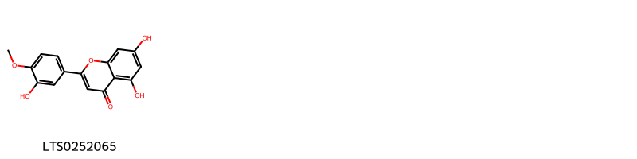{ width=100% }
    <figcaption>Hình ảnh cấu trúc hóa học của 1 hoạt chất thuộc nhóm Flavonoids gồm ['diosmetin (LTS0252065)'].</figcaption>
</figure>
#### Nhóm Lupin alkaloids
<figure markdown="span">
    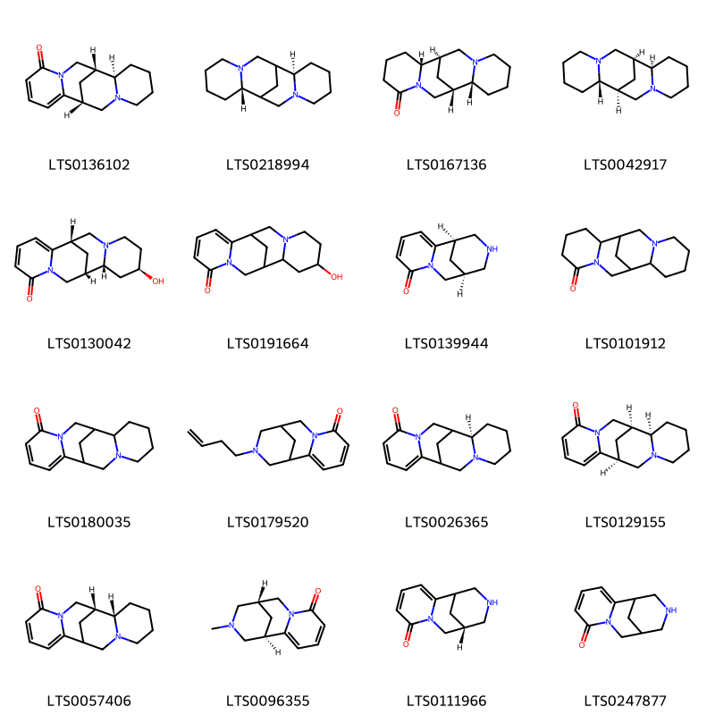{ width=100% }
    <figcaption>Hình ảnh cấu trúc hóa học của 16 hoạt chất thuộc nhóm Lupin alkaloids gồm ['(1r,9r,10r)-7,15-diazatetracyclo[7.7.1.0²,⁷.0¹⁰,¹⁵]heptadeca-2,4-dien-6-one (LTS0136102)', '(2r,10s)-7,15-diazatetracyclo[7.7.1.0²,⁷.0¹⁰,¹⁵]heptadecane (LTS0218994)', '(1r,2r,9s,10r)-7,15-diazatetracyclo[7.7.1.0²,⁷.0¹⁰,¹⁵]heptadecan-6-one (LTS0167136)', 'sparteine (LTS0042917)', '(1s,9s,10r,12r)-12-hydroxy-7,15-diazatetracyclo[7.7.1.0²,⁷.0¹⁰,¹⁵]heptadeca-2,4-dien-6-one (LTS0130042)', '12-hydroxy-7,15-diazatetracyclo[7.7.1.0²,⁷.0¹⁰,¹⁵]heptadeca-2,4-dien-6-one (LTS0191664)', 'cytisine (LTS0139944)', 'lupanine l-form (LTS0101912)', 'anagyrine (LTS0180035)', 'rhombifoline (LTS0179520)', 'anagyrine (LTS0026365)', '(-)-anagyrine (LTS0129155)', '(9r,10s)-7,15-diazatetracyclo[7.7.1.0²,⁷.0¹⁰,¹⁵]heptadeca-2,4-dien-6-one (LTS0057406)', '(1r,9r)-11-methyl-7,11-diazatricyclo[7.3.1.0²,⁷]trideca-2,4-dien-6-one (LTS0096355)', '(9r)-7,11-diazatricyclo[7.3.1.0²,⁷]trideca-2,4-dien-6-one (LTS0111966)', 'citizin (LTS0247877)'].</figcaption>
</figure>
#### Nhóm Organooxygen compounds
<figure markdown="span">
    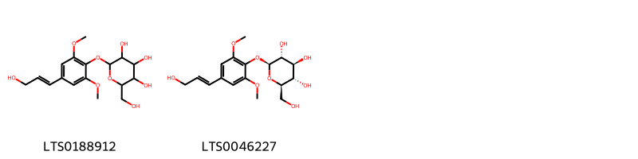{ width=100% }
    <figcaption>Hình ảnh cấu trúc hóa học của 2 hoạt chất thuộc nhóm Organooxygen compounds gồm ['2-(hydroxymethyl)-6-[4-(3-hydroxyprop-1-en-1-yl)-2,6-dimethoxyphenoxy]oxane-3,4,5-triol (LTS0188912)', 'syringin (LTS0046227)'].</figcaption>
</figure>

---

### Dược dân tộc học

Danh sách các quốc gia có sử dụng *Anagyris foetida* trong điều trị các bệnh. 

| Country   | Disease                                        | Bệnh                                                                                                                                                                                                |
|:----------|:-----------------------------------------------|:----------------------------------------------------------------------------------------------------------------------------------------------------------------------------------------------------|
| Elsewhere | Emetic, Poison, Purgative                      | MYMEMORY WARNING: YOU USED ALL AVAILABLE FREE TRANSLATIONS FOR TODAY. NEXT AVAILABLE IN  16 HOURS 26 MINUTES 09 SECONDS VISIT HTTPS://MYMEMORY.TRANSLATED.NET/DOC/USAGELIMITS.PHP TO TRANSLATE MORE |
| Iraq      | Laxative, Poison, Vermifuge, Emetic, Purgative | MYMEMORY WARNING: YOU USED ALL AVAILABLE FREE TRANSLATIONS FOR TODAY. NEXT AVAILABLE IN  16 HOURS 26 MINUTES 07 SECONDS VISIT HTTPS://MYMEMORY.TRANSLATED.NET/DOC/USAGELIMITS.PHP TO TRANSLATE MORE |
| Turkey    | Emetic, Laxative, Purgative, Vermifuge, Poison | MYMEMORY WARNING: YOU USED ALL AVAILABLE FREE TRANSLATIONS FOR TODAY. NEXT AVAILABLE IN  16 HOURS 26 MINUTES 05 SECONDS VISIT HTTPS://MYMEMORY.TRANSLATED.NET/DOC/USAGELIMITS.PHP TO TRANSLATE MORE |

---

# Chi Piscidia

??? note "Danh sách các dược liệu thuộc chi"
    
	 - *Piscidia ekmanii*
	 - *Piscidia erythrina*
	 - *Piscidia grandifolia*
	 - *Piscidia piscipula*

---
## Piscidia ekmanii
### Thông tin về thực vật

!!! info "Phân loại thực vật của *Piscidia ekmanii* từ GIBF:"
    - **Kingdom:** Plantae
    - **Phylum:** Tracheophyta
    - **Order:** Fabales
    - **Family:** Fabaceae
    - **Genus:** Piscidia
    - **Species:** *Piscidia ekmanii*

 

| Label (VI)   | Label (EN)   | Scientific Name   | Descriptions (VI)   | Descriptions (EN)   | Also Known As (VI)   | Also Known As (EN)   |
|:-------------|:-------------|:------------------|:--------------------|:--------------------|:---------------------|:---------------------|
| N/A          | N/A          | Piscidia ekmanii  | loài thực vật       | species of plant    | ['']                 | ['']                 |

#### Phân bố trên thế giới

**Từ CSDL GIBF** nan, Haiti, Jamaica, Peru, Dominican Republic

#### Phân bố tại Việt Nam

**Từ CSDL GIBF**: Không có ghi nhận ở Việt Nam

---
### Thành phần hóa học
        
- Theo cơ sở dữ liệu lotus: Từ loài *Piscidia ekmanii* đã phân lập và xác định được Chưa có hoạt chất nào được phân lập. hoạt chất thuộc về các nhóm Không có hoạt chất nào được phân lập. 

Không có hình ảnh nào được tạo ra

---

### Dược dân tộc học

Danh sách các quốc gia có sử dụng *Piscidia ekmanii* trong điều trị các bệnh. 

| Country   | Disease   | Bệnh                                                                                                                                                                                                |
|:----------|:----------|:----------------------------------------------------------------------------------------------------------------------------------------------------------------------------------------------------|
| Haiti     | Piscicide | MYMEMORY WARNING: YOU USED ALL AVAILABLE FREE TRANSLATIONS FOR TODAY. NEXT AVAILABLE IN  16 HOURS 25 MINUTES 39 SECONDS VISIT HTTPS://MYMEMORY.TRANSLATED.NET/DOC/USAGELIMITS.PHP TO TRANSLATE MORE |

---

---
## Piscidia erythrina
### Thông tin về thực vật

!!! info "Phân loại thực vật của *Piscidia piscipula* từ GIBF:"
    - **Kingdom:** Plantae
    - **Phylum:** Tracheophyta
    - **Order:** Fabales
    - **Family:** Fabaceae
    - **Genus:** Piscidia
    - **Species:** *Piscidia piscipula*

 

| Label (VI)   | Label (EN)   | Scientific Name    | Descriptions (VI)   | Descriptions (EN)   | Also Known As (VI)   | Also Known As (EN)   |
|:-------------|:-------------|:-------------------|:--------------------|:--------------------|:---------------------|:---------------------|
| N/A          | N/A          | Piscidia erythrina | loài thực vật       | species of plant    | ['']                 | ['']                 |

#### Phân bố trên thế giới

**Từ CSDL GIBF** nan, Ecuador, Belize, Fiji, Saint Barthélemy, Argentina, unknown or invalid, Jamaica, Indonesia, United States of America, Mexico

#### Phân bố tại Việt Nam

**Từ CSDL GIBF**: Không có ghi nhận ở Việt Nam

---
### Thành phần hóa học
        
- Theo cơ sở dữ liệu lotus: Từ loài *Piscidia piscipula* đã phân lập và xác định được Chưa có hoạt chất nào được phân lập. hoạt chất thuộc về các nhóm Không có hoạt chất nào được phân lập. 

Không có hình ảnh nào được tạo ra

---

### Dược dân tộc học

Danh sách các quốc gia có sử dụng *Piscidia piscipula* trong điều trị các bệnh. 

| Country       | Disease           | Bệnh                                                                                                                                                                                                |
|:--------------|:------------------|:----------------------------------------------------------------------------------------------------------------------------------------------------------------------------------------------------|
| Dutch         | Soporific         | MYMEMORY WARNING: YOU USED ALL AVAILABLE FREE TRANSLATIONS FOR TODAY. NEXT AVAILABLE IN  16 HOURS 25 MINUTES 22 SECONDS VISIT HTTPS://MYMEMORY.TRANSLATED.NET/DOC/USAGELIMITS.PHP TO TRANSLATE MORE |
| English       | Piscicide         | MYMEMORY WARNING: YOU USED ALL AVAILABLE FREE TRANSLATIONS FOR TODAY. NEXT AVAILABLE IN  16 HOURS 25 MINUTES 20 SECONDS VISIT HTTPS://MYMEMORY.TRANSLATED.NET/DOC/USAGELIMITS.PHP TO TRANSLATE MORE |
| French        | Cardiotonic       | MYMEMORY WARNING: YOU USED ALL AVAILABLE FREE TRANSLATIONS FOR TODAY. NEXT AVAILABLE IN  16 HOURS 25 MINUTES 18 SECONDS VISIT HTTPS://MYMEMORY.TRANSLATED.NET/DOC/USAGELIMITS.PHP TO TRANSLATE MORE |
| German        | Sedative          | MYMEMORY WARNING: YOU USED ALL AVAILABLE FREE TRANSLATIONS FOR TODAY. NEXT AVAILABLE IN  16 HOURS 25 MINUTES 16 SECONDS VISIT HTTPS://MYMEMORY.TRANSLATED.NET/DOC/USAGELIMITS.PHP TO TRANSLATE MORE |
| Latin America | Sedative          | MYMEMORY WARNING: YOU USED ALL AVAILABLE FREE TRANSLATIONS FOR TODAY. NEXT AVAILABLE IN  16 HOURS 25 MINUTES 13 SECONDS VISIT HTTPS://MYMEMORY.TRANSLATED.NET/DOC/USAGELIMITS.PHP TO TRANSLATE MORE |
| Venezuela     | Piscicide, Poison | MYMEMORY WARNING: YOU USED ALL AVAILABLE FREE TRANSLATIONS FOR TODAY. NEXT AVAILABLE IN  16 HOURS 25 MINUTES 11 SECONDS VISIT HTTPS://MYMEMORY.TRANSLATED.NET/DOC/USAGELIMITS.PHP TO TRANSLATE MORE |
| West Indies   | Piscicide         | MYMEMORY WARNING: YOU USED ALL AVAILABLE FREE TRANSLATIONS FOR TODAY. NEXT AVAILABLE IN  16 HOURS 25 MINUTES 08 SECONDS VISIT HTTPS://MYMEMORY.TRANSLATED.NET/DOC/USAGELIMITS.PHP TO TRANSLATE MORE |
| anish         | Narcotic          | MYMEMORY WARNING: YOU USED ALL AVAILABLE FREE TRANSLATIONS FOR TODAY. NEXT AVAILABLE IN  16 HOURS 25 MINUTES 06 SECONDS VISIT HTTPS://MYMEMORY.TRANSLATED.NET/DOC/USAGELIMITS.PHP TO TRANSLATE MORE |

---

---
## Piscidia grandifolia
### Thông tin về thực vật

!!! info "Phân loại thực vật của *Piscidia grandifolia* từ GIBF:"
    - **Kingdom:** Plantae
    - **Phylum:** Tracheophyta
    - **Order:** Fabales
    - **Family:** Fabaceae
    - **Genus:** Piscidia
    - **Species:** *Piscidia grandifolia*

 

| Label (VI)   | Label (EN)   | Scientific Name      | Descriptions (VI)   | Descriptions (EN)   | Also Known As (VI)   | Also Known As (EN)   |
|:-------------|:-------------|:---------------------|:--------------------|:--------------------|:---------------------|:---------------------|
| N/A          | N/A          | Piscidia grandifolia | loài thực vật       | species of plant    | ['']                 | ['']                 |

#### Phân bố trên thế giới

**Từ CSDL GIBF** Nicaragua, nan, Guatemala, Costa Rica, Honduras, United States of America, Mexico, El Salvador

#### Phân bố tại Việt Nam

**Từ CSDL GIBF**: Không có ghi nhận ở Việt Nam

---
### Thành phần hóa học
        
- Theo cơ sở dữ liệu lotus: Từ loài *Piscidia grandifolia* đã phân lập và xác định được Chưa có hoạt chất nào được phân lập. hoạt chất thuộc về các nhóm Không có hoạt chất nào được phân lập. 

Không có hình ảnh nào được tạo ra

---

### Dược dân tộc học

Danh sách các quốc gia có sử dụng *Piscidia grandifolia* trong điều trị các bệnh. 

| Country   | Disease   | Bệnh                                                                                                                                                                                                |
|:----------|:----------|:----------------------------------------------------------------------------------------------------------------------------------------------------------------------------------------------------|
| Guatemala | Piscicide | MYMEMORY WARNING: YOU USED ALL AVAILABLE FREE TRANSLATIONS FOR TODAY. NEXT AVAILABLE IN  16 HOURS 24 MINUTES 48 SECONDS VISIT HTTPS://MYMEMORY.TRANSLATED.NET/DOC/USAGELIMITS.PHP TO TRANSLATE MORE |

---

---
## Piscidia piscipula
### Thông tin về thực vật

!!! info "Phân loại thực vật của *Piscidia piscipula* từ GIBF:"
    - **Kingdom:** Plantae
    - **Phylum:** Tracheophyta
    - **Order:** Fabales
    - **Family:** Fabaceae
    - **Genus:** Piscidia
    - **Species:** *Piscidia piscipula*

 

| Label (VI)   | Label (EN)   | Scientific Name    | Descriptions (VI)   | Descriptions (EN)   | Also Known As (VI)   | Also Known As (EN)                      |
|:-------------|:-------------|:-------------------|:--------------------|:--------------------|:---------------------|:----------------------------------------|
| N/A          | N/A          | Piscidia piscipula | loài thực vật       | species of plant    | ['']                 | ['fishpoison tree', 'Jamaican dogwood'] |

#### Phân bố trên thế giới

**Từ CSDL GIBF** Belize, Guatemala, Jamaica, United States of America, Cayman Islands, Mexico

#### Phân bố tại Việt Nam

**Từ CSDL GIBF**: Không có ghi nhận ở Việt Nam

---
### Thành phần hóa học
        
- Theo cơ sở dữ liệu lotus: Từ loài *Piscidia piscipula* đã phân lập và xác định được 88 hoạt chất thuộc về các nhóm Fatty Acyls, Phenylpropanoic acids, Isoflavonoids, Flavonoids. 

|    | chemicalTaxonomyClassyfireClass   |   smiles_count |
|---:|:----------------------------------|---------------:|
|  0 | Fatty Acyls                       |              1 |
|  1 | Flavonoids                        |              1 |
|  2 | Isoflavonoids                     |             80 |
|  3 | Phenylpropanoic acids             |              6 |

#### Nhóm Fatty Acyls
<figure markdown="span">
    { width=100% }
    <figcaption>Hình ảnh cấu trúc hóa học của 1 hoạt chất thuộc nhóm Fatty Acyls gồm ['hexacosanoic acid (LTS0240902)'].</figcaption>
</figure>
#### Nhóm Flavonoids
<figure markdown="span">
    { width=100% }
    <figcaption>Hình ảnh cấu trúc hóa học của 1 hoạt chất thuộc nhóm Flavonoids gồm ['glabranin (LTS0250433)'].</figcaption>
</figure>
#### Nhóm Isoflavonoids
<figure markdown="span">
    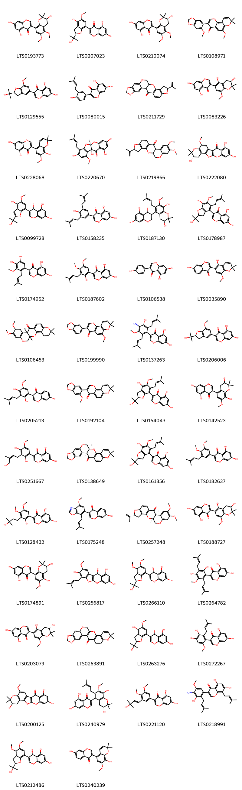{ width=100% }
    <figcaption>Hình ảnh cấu trúc hóa học của 80 hoạt chất thuộc nhóm Isoflavonoids gồm ['5,7-dihydroxy-3-(3-hydroxy-5,6-dimethoxy-2,2-dimethyl-3,4-dihydro-1-benzopyran-8-yl)chromen-4-one (LTS0193773)', '5,7-dihydroxy-3-[(2r)-4-hydroxy-2-(2-hydroxypropan-2-yl)-5-methoxy-2,3-dihydro-1-benzofuran-7-yl]chromen-4-one (LTS0207023)', '5,7-dihydroxy-3-[(3r)-3-hydroxy-5,6-dimethoxy-2,2-dimethyl-3,4-dihydro-1-benzopyran-8-yl]chromen-4-one (LTS0210074)', 'ichthynone (LTS0108971)', '5,7-dihydroxy-3-[(2s)-2-(2-hydroxypropan-2-yl)-7-methoxy-2,3-dihydro-1-benzofuran-5-yl]chromen-4-one (LTS0129555)', 'isowighteone (LTS0080015)', 'isomillettone (LTS0211729)', '3-[(3r)-3,5-dihydroxy-8-methoxy-2,2-dimethyl-3,4-dihydro-1-benzopyran-6-yl]-5,7-dihydroxychromen-4-one (LTS0083226)', "5,7,8'-trihydroxy-7'-methoxy-2',2'-dimethyl-[3,5'-bichromen]-4-one (LTS0228068)", '(1r,10r)-5,7,10,14-tetrahydroxy-12-methoxy-15-(3-methylbut-2-en-1-yl)-2,17-dioxatetracyclo[8.7.0.0³,⁸.0¹¹,¹⁶]heptadeca-3,5,7,11(16),12,14-hexaen-9-one (LTS0220670)', '16,17-dimethoxy-6-(prop-1-en-2-yl)-2,7,20-trioxapentacyclo[11.8.0.0³,¹¹.0⁴,⁸.0¹⁴,¹⁹]henicosa-3(11),4(8),9,14,16,18-hexaen-12-one (LTS0219866)', '(16s)-5,7,16-trihydroxy-20-methoxy-17,17-dimethyl-10,12,18-trioxapentacyclo[11.8.0.0²,¹¹.0⁴,⁹.0¹⁴,¹⁹]henicosa-1(13),2(11),4,6,8,14(19),20-heptaen-3-one (LTS0222080)', '5,7-dihydroxy-3-[4-hydroxy-2-(2-hydroxypropan-2-yl)-5-methoxy-1-benzofuran-7-yl]chromen-4-one (LTS0099728)', "3',5'-diprenylgenistein (LTS0158235)", '3-[3,8-dihydroxy-7-methoxy-2,2-dimethyl-6-(3-methylbut-2-en-1-yl)-3,4-dihydro-1-benzopyran-5-yl]-5,7-dihydroxychromen-4-one (LTS0187130)', '5,7-dihydroxy-3-[(2s)-7-hydroxy-2-(2-hydroxypropan-2-yl)-6-methoxy-5-(3-methylbut-2-en-1-yl)-2,3-dihydro-1-benzofuran-4-yl]chromen-4-one (LTS0178987)', '3-[4,5-dihydroxy-3-methoxy-2-(3-methylbut-2-en-1-yl)phenyl]-5,7-dihydroxychromen-4-one (LTS0174952)', "2'-hydroxypiscerythrinetin (LTS0187602)", 'genistein (LTS0106538)', "5',7-dihydroxy-8'-methoxy-2',2'-dimethyl-[3,6'-bichromen]-4-one (LTS0035890)", 'deguelin (LTS0106453)', 'durmillone (LTS0199990)', 'piscerythramine (LTS0137263)', '5,7-dihydroxy-3-[2-(2-hydroxypropan-2-yl)-7-methoxy-2,3-dihydro-1-benzofuran-5-yl]chromen-4-one (LTS0206006)', '3-[2,4-dihydroxy-5-methoxy-3-(3-methylbut-2-en-1-yl)phenyl]-7-hydroxychromen-4-one (LTS0205213)', 'jamaicin (LTS0192104)', '5,7-dihydroxy-3-[(2r)-4-hydroxy-2-(2-hydroxypropan-2-yl)-5-methoxy-6-(3-methylbut-2-en-1-yl)-2,3-dihydro-1-benzofuran-7-yl]chromen-4-one (LTS0154043)', '3-(3,8-dihydroxy-7-methoxy-2,2-dimethyl-3,4-dihydro-1-benzopyran-5-yl)-5,7-dihydroxychromen-4-one (LTS0142523)', '3-{2,4-dihydroxy-3-[(2z)-4-hydroxy-3-methylbut-2-en-1-yl]-5-methoxyphenyl}-5,7-dihydroxychromen-4-one (LTS0251667)', 'millettone (LTS0138649)', '5,7-dihydroxy-3-[7-hydroxy-2-(2-hydroxypropan-2-yl)-6-methoxy-5-(3-methylbut-2-en-1-yl)-2,3-dihydro-1-benzofuran-4-yl]chromen-4-one (LTS0161356)', 'piscerythrinetin (LTS0182637)', '5,7-dihydroxy-3-[2-hydroxy-3-(3-hydroxy-3-methylbutyl)-4,5-dimethoxyphenyl]chromen-4-one (LTS0128432)', '7-hydroxy-3-[4-methoxy-7-(3-methylbut-2-en-1-yl)-1,3-benzoxazol-6-yl]chromen-4-one (LTS0175248)', 'cube root (LTS0257248)', '3-(3,5-dihydroxy-8-methoxy-2,2-dimethyl-3,4-dihydro-1-benzopyran-6-yl)-5,7-dihydroxychromen-4-one (LTS0188727)', '3-[(3s)-3,5-dihydroxy-6-methoxy-2,2-dimethyl-3,4-dihydro-1-benzopyran-8-yl]-5,7-dihydroxychromen-4-one (LTS0174891)', 'lisetin (LTS0256817)', '5,7-dihydroxy-3-[2-(2-hydroxypropan-2-yl)-4,5-dimethoxy-2,3-dihydro-1-benzofuran-7-yl]chromen-4-one (LTS0266110)', '3-[2,4-dihydroxy-5-methoxy-3,6-bis(3-methylbut-2-en-1-yl)phenyl]-5,7-dihydroxychromen-4-one (LTS0264782)', '3-[(3s)-3,5-dihydroxy-8-methoxy-2,2-dimethyl-3,4-dihydro-1-benzopyran-6-yl]-5,7-dihydroxychromen-4-one (LTS0203079)', 'dehydromillettone (LTS0263891)', '5,7-dihydroxy-3-[4-hydroxy-2-(2-hydroxypropan-2-yl)-5-methoxy-2,3-dihydro-1-benzofuran-7-yl]chromen-4-one (LTS0263276)', 'piscidone (LTS0272267)', '5,7,16-trihydroxy-20-methoxy-17,17-dimethyl-10,12,18-trioxapentacyclo[11.8.0.0²,¹¹.0⁴,⁹.0¹⁴,¹⁹]henicosa-1(13),2(11),4,6,8,14(19),20-heptaen-3-one (LTS0200125)', '3-[(3r)-3,8-dihydroxy-7-methoxy-2,2-dimethyl-6-(3-methylbut-2-en-1-yl)-3,4-dihydro-1-benzopyran-5-yl]-5,7-dihydroxychromen-4-one (LTS0240979)', '5,7-dihydroxy-3-{3-[(1e)-3-hydroxy-3-methylbut-1-en-1-yl]-4,5-dimethoxyphenyl}chromen-4-one (LTS0221120)', '3-[4-amino-3-hydroxy-5-methoxy-2-(3-methylbut-2-en-1-yl)phenyl]-5,7-dihydroxy-8-(3-methylbut-2-en-1-yl)chromen-4-one (LTS0218991)', '5,7-dihydroxy-3-[(2r)-2-(2-hydroxypropan-2-yl)-4,5-dimethoxy-2,3-dihydro-1-benzofuran-7-yl]chromen-4-one (LTS0212486)', "7,8'-dihydroxy-7'-methoxy-2',2'-dimethyl-[3,5'-bichromen]-4-one (LTS0240239)", '5,7-dihydroxy-3-[(2s)-4-hydroxy-2-(2-hydroxypropan-2-yl)-5-methoxy-2,3-dihydro-1-benzofuran-7-yl]chromen-4-one (LTS0207400)', '3-(2,4-dihydroxy-5-methoxyphenyl)-5,7-dihydroxychromen-4-one (LTS0226090)', '3-(2,4-dihydroxy-5-methoxyphenyl)-5,7-dihydroxy-6-(3-methylbut-2-en-1-yl)chromen-4-one (LTS0027318)', '5,7-dihydroxy-3-[(2r)-7-hydroxy-2-(2-hydroxypropan-2-yl)-6-methoxy-5-(3-methylbut-2-en-1-yl)-2,3-dihydro-1-benzofuran-4-yl]chromen-4-one (LTS0257799)', '8-prenyllisetin (LTS0054244)', '3-[(3s)-3,8-dihydroxy-7-methoxy-2,2-dimethyl-3,4-dihydro-1-benzopyran-5-yl]-5,7-dihydroxychromen-4-one (LTS0062064)', "7-hydroxy-8'-methoxy-2',2'-dimethyl-[3,6'-bichromen]-4-one (LTS0012328)", '3-[3,4-dihydroxy-5-methoxy-2-(3-methylbut-2-en-1-yl)phenyl]-5,7-dihydroxychromen-4-one (LTS0264148)', '5,7-dihydroxy-3-[(2r)-2-(2-hydroxypropan-2-yl)-7-methoxy-2,3-dihydro-1-benzofuran-5-yl]chromen-4-one (LTS0059839)', '5,7-dihydroxy-3-[4-hydroxy-2-(2-hydroxypropan-2-yl)-5-methoxy-6-(3-methylbut-2-en-1-yl)-2,3-dihydro-1-benzofuran-7-yl]chromen-4-one (LTS0061234)', '5,7-dihydroxy-3-[3-(3-hydroxy-3-methylbut-1-en-1-yl)-4,5-dimethoxyphenyl]chromen-4-one (LTS0058483)', 'junipegenin a (LTS0006509)', '3-[(3r)-3,5-dihydroxy-6-methoxy-2,2-dimethyl-3,4-dihydro-1-benzopyran-8-yl]-5,7-dihydroxychromen-4-one (LTS0016160)', '10,13-dihydroxy-16,17-dimethoxy-6-(prop-1-en-2-yl)-2,7,20-trioxapentacyclo[11.8.0.0³,¹¹.0⁴,⁸.0¹⁴,¹⁹]henicosa-3(11),4(8),9,14,16,18-hexaen-12-one (LTS0062519)', '3-[2,4-dihydroxy-3-(4-hydroxy-3-methylbut-2-en-1-yl)-5-methoxyphenyl]-5,7-dihydroxychromen-4-one (LTS0021535)', '5,7,14-trihydroxy-15-(3-hydroxy-3-methylbutyl)-13-methoxy-2,17-dioxatetracyclo[8.7.0.0³,⁸.0¹¹,¹⁶]heptadeca-1(10),3,5,7,11(16),12,14-heptaen-9-one (LTS0021167)', '5,7-dihydroxy-3-[(2s)-4-hydroxy-2-(2-hydroxypropan-2-yl)-7-methoxy-2,3-dihydro-1-benzofuran-5-yl]chromen-4-one (LTS0001169)', '3-[2,4-dihydroxy-3-(3-hydroxy-3-methylbutyl)-5-methoxyphenyl]-5,7-dihydroxychromen-4-one (LTS0004284)', '3-(3,5-dihydroxy-6-methoxy-2,2-dimethyl-3,4-dihydro-1-benzopyran-8-yl)-5,7-dihydroxychromen-4-one (LTS0001042)', '3-[3,4-dihydroxy-5-methoxy-2,6-bis(3-methylbut-2-en-1-yl)phenyl]-5,7-dihydroxychromen-4-one (LTS0013188)', '5,6-dihydroxy-15-(3-methylbut-2-en-1-yl)-2,17-dioxatetracyclo[8.7.0.0³,⁸.0¹¹,¹⁶]heptadeca-1(10),3,5,7,11(16),12,14-heptaen-9-one (LTS0002691)', '5,7-dihydroxy-3-[4-hydroxy-2-(2-hydroxypropan-2-yl)-7-methoxy-2,3-dihydro-1-benzofuran-5-yl]chromen-4-one (LTS0010105)', 'dalpatein (LTS0251816)', '5,7-dihydroxy-3-(4-hydroxy-3,5-dimethoxyphenyl)chromen-4-one (LTS0024401)', 'allolicoisoflavone a (LTS0002909)', '3-{2,4-dihydroxy-3-[(2e)-4-hydroxy-3-methylbut-2-en-1-yl]-5-methoxyphenyl}-5,7-dihydroxychromen-4-one (LTS0109741)', 'piscerythrone (LTS0099736)', "2'-deoxypiscerythrone (LTS0250995)", '10,17,18-trimethoxy-7,7-dimethyl-2,8,21-trioxapentacyclo[12.8.0.0³,¹².0⁴,⁹.0¹⁵,²⁰]docosa-3,5,9,11,15(20),16,18-heptaen-13-one (LTS0103950)', '5,7-dihydroxy-3-[(3s)-3-hydroxy-5,6-dimethoxy-2,2-dimethyl-3,4-dihydro-1-benzopyran-8-yl]chromen-4-one (LTS0114319)'].</figcaption>
</figure>
#### Nhóm Phenylpropanoic acids
<figure markdown="span">
    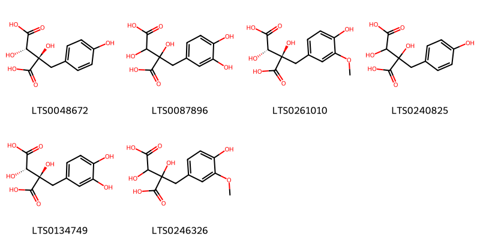{ width=100% }
    <figcaption>Hình ảnh cấu trúc hóa học của 6 hoạt chất thuộc nhóm Phenylpropanoic acids gồm ['piscidic acid (LTS0048672)', '2-[(3,4-dihydroxyphenyl)methyl]-2,3-dihydroxybutanedioic acid (LTS0087896)', '(2r,3s)-2,3-dihydroxy-2-[(4-hydroxy-3-methoxyphenyl)methyl]butanedioic acid (LTS0261010)', '2,3-dihydroxy-2-[(4-hydroxyphenyl)methyl]butanedioic acid (LTS0240825)', 'fukiic acid (LTS0134749)', '2,3-dihydroxy-2-[(4-hydroxy-3-methoxyphenyl)methyl]butanedioic acid (LTS0246326)'].</figcaption>
</figure>

---

### Dược dân tộc học

Danh sách các quốc gia có sử dụng *Piscidia piscipula* trong điều trị các bệnh. 

| Country   | Disease                                                                                          | Bệnh                                                                                                                                                                                                |
|:----------|:-------------------------------------------------------------------------------------------------|:----------------------------------------------------------------------------------------------------------------------------------------------------------------------------------------------------|
| Bahamas   | Piscicide                                                                                        | MYMEMORY WARNING: YOU USED ALL AVAILABLE FREE TRANSLATIONS FOR TODAY. NEXT AVAILABLE IN  16 HOURS 24 MINUTES 28 SECONDS VISIT HTTPS://MYMEMORY.TRANSLATED.NET/DOC/USAGELIMITS.PHP TO TRANSLATE MORE |
| Elsewhere | Piscicide, Piscicide, Poison, Sedative, Sedative, Soporific, Insecticide, Narcotic               | MYMEMORY WARNING: YOU USED ALL AVAILABLE FREE TRANSLATIONS FOR TODAY. NEXT AVAILABLE IN  16 HOURS 24 MINUTES 25 SECONDS VISIT HTTPS://MYMEMORY.TRANSLATED.NET/DOC/USAGELIMITS.PHP TO TRANSLATE MORE |
| Guatemala | Narcotic, Piscicide                                                                              | MYMEMORY WARNING: YOU USED ALL AVAILABLE FREE TRANSLATIONS FOR TODAY. NEXT AVAILABLE IN  16 HOURS 24 MINUTES 23 SECONDS VISIT HTTPS://MYMEMORY.TRANSLATED.NET/DOC/USAGELIMITS.PHP TO TRANSLATE MORE |
| Haiti     | Piscicide                                                                                        | MYMEMORY WARNING: YOU USED ALL AVAILABLE FREE TRANSLATIONS FOR TODAY. NEXT AVAILABLE IN  16 HOURS 24 MINUTES 20 SECONDS VISIT HTTPS://MYMEMORY.TRANSLATED.NET/DOC/USAGELIMITS.PHP TO TRANSLATE MORE |
| Mexico    | Analgesic, Analgesic, Narcotic, Sialogogue, Sudorific, Sedative, Anesthetic, Narcotic, Piscicide | MYMEMORY WARNING: YOU USED ALL AVAILABLE FREE TRANSLATIONS FOR TODAY. NEXT AVAILABLE IN  16 HOURS 24 MINUTES 18 SECONDS VISIT HTTPS://MYMEMORY.TRANSLATED.NET/DOC/USAGELIMITS.PHP TO TRANSLATE MORE |
| US        | Piscicide                                                                                        | MYMEMORY WARNING: YOU USED ALL AVAILABLE FREE TRANSLATIONS FOR TODAY. NEXT AVAILABLE IN  16 HOURS 24 MINUTES 15 SECONDS VISIT HTTPS://MYMEMORY.TRANSLATED.NET/DOC/USAGELIMITS.PHP TO TRANSLATE MORE |

---

# Chi Clitoria

??? note "Danh sách các dược liệu thuộc chi"
    
	 - *Clitoria ternata*
	 - *Clitoria ternatea*

---
## Clitoria ternata
### Thông tin về thực vật

!!! info "Phân loại thực vật của *Clitoria ternatea* từ GIBF:"
    - **Kingdom:** Plantae
    - **Phylum:** Tracheophyta
    - **Order:** Fabales
    - **Family:** Fabaceae
    - **Genus:** Clitoria
    - **Species:** *Clitoria ternatea*

 

| Label (VI)   | Label (EN)   | Scientific Name    | Descriptions (VI)   | Descriptions (EN)   | Also Known As (VI)   | Also Known As (EN)                      |
|:-------------|:-------------|:-------------------|:--------------------|:--------------------|:---------------------|:----------------------------------------|
| N/A          | N/A          | Piscidia piscipula | loài thực vật       | species of plant    | ['']                 | ['fishpoison tree', 'Jamaican dogwood'] |

#### Phân bố trên thế giới

**Từ CSDL GIBF** United Arab Emirates, Sri Lanka, Australia, Lao People’s Democratic Republic, Cambodia, Guatemala, Myanmar, Philippines, Nicaragua, Tanzania, United Republic of, French Guiana, Puerto Rico, Senegal, Namibia, Chinese Taipei, Honduras, Jamaica, United States of America, Maldives, South Africa, Hong Kong, Suriname, Thailand, Brazil, Guam, Bhutan, New Caledonia, Mexico, Dominican Republic, Peru, Singapore, Viet Nam, Ecuador, French Polynesia, Madagascar, Colombia, Costa Rica, India, Indonesia, Gambia, Cayman Islands, Kenya, Malaysia, Nepal

#### Phân bố tại Việt Nam

**Từ CSDL GIBF**: Cần Thơ, Đà Nẵng

---
### Thành phần hóa học
        
- Theo cơ sở dữ liệu lotus: Từ loài *Clitoria ternatea* đã phân lập và xác định được Chưa có hoạt chất nào được phân lập. hoạt chất thuộc về các nhóm Không có hoạt chất nào được phân lập. 

Không có hình ảnh nào được tạo ra

---

### Dược dân tộc học

Danh sách các quốc gia có sử dụng *Clitoria ternatea* trong điều trị các bệnh. 

| Country   | Disease   | Bệnh                                                                                                                                                                                                |
|:----------|:----------|:----------------------------------------------------------------------------------------------------------------------------------------------------------------------------------------------------|
| Elsewhere | Cathartic | MYMEMORY WARNING: YOU USED ALL AVAILABLE FREE TRANSLATIONS FOR TODAY. NEXT AVAILABLE IN  16 HOURS 23 MINUTES 50 SECONDS VISIT HTTPS://MYMEMORY.TRANSLATED.NET/DOC/USAGELIMITS.PHP TO TRANSLATE MORE |
| Sudan     | Purgative | MYMEMORY WARNING: YOU USED ALL AVAILABLE FREE TRANSLATIONS FOR TODAY. NEXT AVAILABLE IN  16 HOURS 23 MINUTES 48 SECONDS VISIT HTTPS://MYMEMORY.TRANSLATED.NET/DOC/USAGELIMITS.PHP TO TRANSLATE MORE |

---

---
## Clitoria ternatea
### Thông tin về thực vật

!!! info "Phân loại thực vật của *Clitoria ternatea* từ GIBF:"
    - **Kingdom:** Plantae
    - **Phylum:** Tracheophyta
    - **Order:** Fabales
    - **Family:** Fabaceae
    - **Genus:** Clitoria
    - **Species:** *Clitoria ternatea*

 

| Label (VI)   | Label (EN)   | Scientific Name   | Descriptions (VI)   | Descriptions (EN)                                             | Also Known As (VI)   | Also Known As (EN)                                                                                                              |
|:-------------|:-------------|:------------------|:--------------------|:--------------------------------------------------------------|:---------------------|:--------------------------------------------------------------------------------------------------------------------------------|
| N/A          | N/A          | Clitoria ternatea | loài thực vật       | species of plant originally from Indonesian island of Ternate | ['']                 | ['Asian pigeonwings', 'blue clitoria', 'blue pea vine', 'blue ternate', 'blue ternate flower', 'butterfly pea', 'cordofan pea'] |

#### Phân bố trên thế giới

**Từ CSDL GIBF** United Arab Emirates, Sri Lanka, Australia, Lao People’s Democratic Republic, Cambodia, Guatemala, Myanmar, Philippines, Nicaragua, Tanzania, United Republic of, French Guiana, Puerto Rico, Senegal, Namibia, Chinese Taipei, Honduras, Jamaica, United States of America, Maldives, South Africa, Hong Kong, Suriname, Thailand, Brazil, Guam, Bhutan, New Caledonia, Mexico, Dominican Republic, Peru, Singapore, Viet Nam, Ecuador, French Polynesia, Madagascar, Colombia, Costa Rica, India, Indonesia, Gambia, Cayman Islands, Kenya, Malaysia, Nepal

#### Phân bố tại Việt Nam

**Từ CSDL GIBF**: Cần Thơ, Đà Nẵng

---
### Thành phần hóa học
        
- Theo cơ sở dữ liệu lotus: Từ loài *Clitoria ternatea* đã phân lập và xác định được 81 hoạt chất thuộc về các nhóm Fatty Acyls, Flavonoids, Prenol lipids, Cinnamic acids and derivatives, Purine nucleosides, Organooxygen compounds. 

|    | chemicalTaxonomyClassyfireClass   |   smiles_count |
|---:|:----------------------------------|---------------:|
|  0 | Cinnamic acids and derivatives    |              2 |
|  1 | Fatty Acyls                       |              7 |
|  2 | Flavonoids                        |             66 |
|  3 | Organooxygen compounds            |              2 |
|  4 | Prenol lipids                     |              2 |
|  5 | Purine nucleosides                |              2 |

#### Nhóm Cinnamic acids and derivatives
<figure markdown="span">
    { width=100% }
    <figcaption>Hình ảnh cấu trúc hóa học của 2 hoạt chất thuộc nhóm Cinnamic acids and derivatives gồm ['para-coumaric acid (LTS0266252)', 'hydroxycinnamic acid (LTS0233023)'].</figcaption>
</figure>
#### Nhóm Fatty Acyls
<figure markdown="span">
    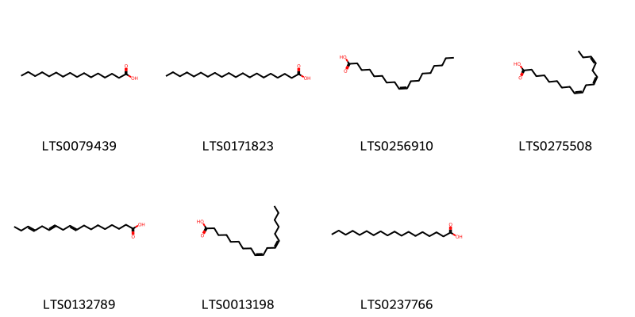{ width=100% }
    <figcaption>Hình ảnh cấu trúc hóa học của 7 hoạt chất thuộc nhóm Fatty Acyls gồm ['palmitic acid (LTS0079439)', 'arachidic acid (LTS0171823)', 'oleic acid (LTS0256910)', 'α-linolenic acid (LTS0275508)', 'α linolenic acid (LTS0132789)', 'linoleic (LTS0013198)', 'stearic acid (LTS0237766)'].</figcaption>
</figure>
#### Nhóm Flavonoids
<figure markdown="span">
    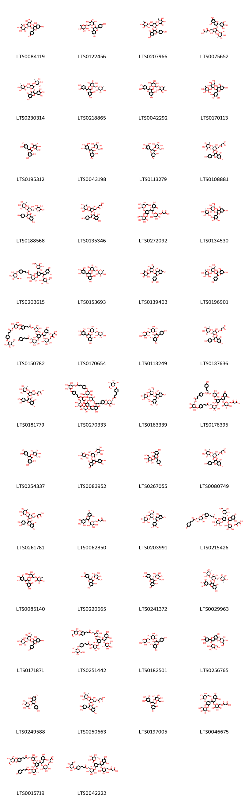{ width=100% }
    <figcaption>Hình ảnh cấu trúc hóa học của 66 hoạt chất thuộc nhóm Flavonoids gồm ['3-{[4,5-dihydroxy-6-(hydroxymethyl)-3-[(3,4,5-trihydroxy-6-methyloxan-2-yl)oxy]oxan-2-yl]oxy}-5,7-dihydroxy-2-(4-hydroxyphenyl)chromen-4-one (LTS0084119)', '5,7-dihydroxy-2-(4-hydroxyphenyl)-3-[(3,4,5-trihydroxy-6-{[(3,4,5-trihydroxy-6-methyloxan-2-yl)oxy]methyl}oxan-2-yl)oxy]chromen-4-one (LTS0122456)', '3-({4,5-dihydroxy-3-[(3,4,5-trihydroxy-6-methyloxan-2-yl)oxy]-6-{[(3,4,5-trihydroxy-6-methyloxan-2-yl)oxy]methyl}oxan-2-yl}oxy)-5,7-dihydroxy-2-(4-hydroxyphenyl)chromen-4-one (LTS0207966)', '3-{[(2s,3s,4s,5r,6r)-6-{[(2-carboxyacetyl)oxy]methyl}-4,5-dihydroxy-3-{[(2s,3s,4r,5r,6s)-3,4,5-trihydroxy-6-methyloxan-2-yl]oxy}oxan-2-yl]oxy}-5,7-dihydroxy-2-(3,4,5-trihydroxyphenyl)-1λ⁴-chromen-1-ylium (LTS0075652)', '3-{[(2s,3s,4s,5s,6r)-4,5-dihydroxy-3-{[(2s,3s,4s,5r,6r)-3,4,5-trihydroxy-6-methyloxan-2-yl]oxy}-6-({[(2r,3s,4r,5r,6s)-3,4,5-trihydroxy-6-methyloxan-2-yl]oxy}methyl)oxan-2-yl]oxy}-5,7-dihydroxy-2-(3,4,5-trihydroxyphenyl)chromen-4-one (LTS0230314)', '2-(3,4-dihydroxyphenyl)-5,7-dihydroxy-3-{[(2s,3r,4s,5s,6r)-3,4,5-trihydroxy-6-({[(2r,3s,4s,5r,6s)-3,4,5-trihydroxy-6-methyloxan-2-yl]oxy}methyl)oxan-2-yl]oxy}chromen-4-one (LTS0218865)', 'rutin (LTS0042292)', '3-{[4,5-dihydroxy-6-(hydroxymethyl)-3-[(3,4,5-trihydroxy-6-methyloxan-2-yl)oxy]oxan-2-yl]oxy}-5,7-dihydroxy-2-(3,4,5-trihydroxyphenyl)chromen-4-one (LTS0170113)', '2-(3,4-dihydroxyphenyl)-5,7-dihydroxy-3-{[3,4,5-trihydroxy-6-(hydroxymethyl)oxan-2-yl]oxy}chromen-4-one (LTS0195312)', 'myricetin 3-glucoside (LTS0043198)', '5,7-dihydroxy-3-{[(2s,3r,4s,5s,6r)-3,4,5-trihydroxy-6-(hydroxymethyl)oxan-2-yl]oxy}-2-(3,4,5-trihydroxyphenyl)chromen-4-one (LTS0113279)', '3-{[(2r,3s,4s,5r,6s)-6-{[5,7-dihydroxy-2-(4-hydroxyphenyl)-4-oxochromen-3-yl]oxy}-3,4-dihydroxy-5-{[(2s,3s,4r,5r,6r)-3,4,5-trihydroxy-6-methyloxan-2-yl]oxy}oxan-2-yl]methoxy}-3-oxopropanoic acid (LTS0108881)', '3-{[(2s,3r,4s,5s,6r)-4,5-dihydroxy-3-{[(2s,3r,4r,5r,6s)-3,4,5-trihydroxy-6-methyloxan-2-yl]oxy}-6-({[(2r,3r,4r,5r,6s)-3,4,5-trihydroxy-6-methyloxan-2-yl]oxy}methyl)oxan-2-yl]oxy}-5,7-dihydroxy-2-(4-hydroxyphenyl)chromen-4-one (LTS0188568)', '3-[(6-{[5,7-dihydroxy-2-(4-hydroxyphenyl)-4-oxochromen-3-yl]oxy}-3,4-dihydroxy-5-[(3,4,5-trihydroxy-6-methyloxan-2-yl)oxy]oxan-2-yl)methoxy]-3-oxopropanoic acid (LTS0135346)', 'ternatin c5 (LTS0272092)', '3-{[(2s,3r,4s,5s,6r)-4,5-dihydroxy-6-(hydroxymethyl)-3-{[(2s,3r,4r,5r,6s)-3,4,5-trihydroxy-6-methyloxan-2-yl]oxy}oxan-2-yl]oxy}-5,7-dihydroxy-2-(3,4,5-trihydroxyphenyl)chromen-4-one (LTS0134530)', '5,7-dihydroxy-2-(4-hydroxy-3-{[(2s,3s,4s,5s,6r)-3,4,5-trihydroxy-6-(hydroxymethyl)oxan-2-yl]oxy}-5-{[(2s,3r,4s,5s,6r)-3,4,5-trihydroxy-6-({[(2e)-3-(4-{[(2s,3r,4s,5s,6r)-3,4,5-trihydroxy-6-(hydroxymethyl)oxan-2-yl]oxy}phenyl)prop-2-enoyl]oxy}methyl)oxan-2-yl]oxy}phenyl)-3-{[(2s,3r,4s,5s,6r)-3,4,5-trihydroxy-6-(hydroxymethyl)oxan-2-yl]oxy}-1λ⁴-chromen-1-ylium (LTS0203615)', '5,7-dihydroxy-3-{[(2s,3r,4s,5s,6r)-3,4,5-trihydroxy-6-({[(2r,3r,4r,5r,6s)-3,4,5-trihydroxy-6-methyloxan-2-yl]oxy}methyl)oxan-2-yl]oxy}-2-(3,4,5-trihydroxyphenyl)chromen-4-one (LTS0153693)', '3-{[4,5-dihydroxy-6-(hydroxymethyl)-3-[(3,4,5-trihydroxy-6-methyloxan-2-yl)oxy]oxan-2-yl]oxy}-2-(3,4-dihydroxyphenyl)-5,7-dihydroxychromen-4-one (LTS0139403)', 'kaempferol 3-neohesperidoside (LTS0196901)', '3-{[(2s,3r,4s,5s,6r)-6-{[(2-carboxyacetyl)oxy]methyl}-3,4,5-trihydroxyoxan-2-yl]oxy}-5,7-dihydroxy-2-(4-hydroxy-3-{[(2s,3r,4s,5s,6r)-3,4,5-trihydroxy-6-({[(2e)-3-(4-{[(2s,3r,4s,5s,6r)-3,4,5-trihydroxy-6-({[(2e)-3-(4-{[(2s,3r,4s,5s,6r)-3,4,5-trihydroxy-6-(hydroxymethyl)oxan-2-yl]oxy}phenyl)prop-2-enoyl]oxy}methyl)oxan-2-yl]oxy}phenyl)prop-2-enoyl]oxy}methyl)oxan-2-yl]oxy}-5-{[(2s,3r,4s,5s,6r)-3,4,5-trihydroxy-6-({[1-hydroxy-3-(4-oxocyclohexa-2,5-dien-1-ylidene)prop-1-en-1-yl]oxy}methyl)oxan-2-yl]oxy}phenyl)-1λ⁴-chromen-1-ylium (LTS0150782)', '5,7-dihydroxy-3-{[(2s,3s,4r,5s,6s)-3,4,5-trihydroxy-6-({[(2r,3r,4s,5r,6r)-3,4,5-trihydroxy-6-methyloxan-2-yl]oxy}methyl)oxan-2-yl]oxy}-2-(3,4,5-trihydroxyphenyl)chromen-4-one (LTS0170654)', '5,7-dihydroxy-2-(4-hydroxyphenyl)-3-{[(2s,3r,4s,5s,6s)-3,4,5-trihydroxy-6-({[(2r,3r,4s,5r,6s)-3,4,5-trihydroxy-6-methyloxan-2-yl]oxy}methyl)oxan-2-yl]oxy}chromen-4-one (LTS0113249)', '3-{[(2s,3r,4r,5s,6r)-6-{[5,7-dihydroxy-2-(4-hydroxyphenyl)-4-oxochromen-3-yl]oxy}-3,4-dihydroxy-5-{[(2r,3s,4r,5r,6s)-3,4,5-trihydroxy-6-methyloxan-2-yl]oxy}oxan-2-yl]methoxy}-3-oxopropanoic acid (LTS0137636)', '3-{[(2r,3s,4s,5s,6s)-6-{[2-(3,4-dihydroxyphenyl)-5,7-dihydroxy-4-oxochromen-3-yl]oxy}-3,4-dihydroxy-5-{[(2s,3s,4r,5r,6r)-3,4,5-trihydroxy-6-methyloxan-2-yl]oxy}oxan-2-yl]methoxy}-3-oxopropanoic acid (LTS0181779)', 'ternatin a1 (LTS0270333)', '3-{[(2s,3s,4s,5s,6s)-4,5-dihydroxy-6-(hydroxymethyl)-3-{[(2s,3s,4s,5r,6s)-3,4,5-trihydroxy-6-methyloxan-2-yl]oxy}oxan-2-yl]oxy}-5,7-dihydroxy-2-(3,4,5-trihydroxyphenyl)chromen-4-one (LTS0163339)', '3-oxo-3-{[(2r,3s,4s,5r,6s)-3,4,5-trihydroxy-6-{[5-hydroxy-2-(4-hydroxy-3-{[(2s,3r,4s,5s,6r)-3,4,5-trihydroxy-6-({[(2e)-3-(4-{[(2s,3r,4s,5s,6r)-3,4,5-trihydroxy-6-({[3-(4-hydroxyphenyl)prop-2-enoyl]oxy}methyl)oxan-2-yl]oxy}phenyl)prop-2-enoyl]oxy}methyl)oxan-2-yl]oxy}-5-{[(2s,3r,4s,5s,6r)-3,4,5-trihydroxy-6-({[3-(4-hydroxyphenyl)prop-2-enoyl]oxy}methyl)oxan-2-yl]oxy}phenyl)-7-oxochromen-3-yl]oxy}oxan-2-yl]methoxy}propanoic acid (LTS0176395)', 'isoquercetin (LTS0254337)', '3-{[(2s,3s,4r,5s,6r)-4,5-dihydroxy-3-{[(2s,3s,4r,5r,6r)-3,4,5-trihydroxy-6-methyloxan-2-yl]oxy}-6-({[(2r,3r,4s,5r,6r)-3,4,5-trihydroxy-6-methyloxan-2-yl]oxy}methyl)oxan-2-yl]oxy}-2-(3,4-dihydroxyphenyl)-5,7-dihydroxychromen-4-one (LTS0083952)', 'trifolin (LTS0267055)', '3-{[(2r,3s,4s,5r,6s)-6-{[5,7-dihydroxy-2-(4-hydroxyphenyl)-4-oxochromen-3-yl]oxy}-3,4-dihydroxy-5-{[(2s,3r,4r,5r,6s)-3,4,5-trihydroxy-6-methyloxan-2-yl]oxy}oxan-2-yl]methoxy}-3-oxopropanoic acid (LTS0080749)', '3-[(6-{[2-(3,4-dihydroxyphenyl)-5,7-dihydroxy-4-oxochromen-3-yl]oxy}-3,4-dihydroxy-5-[(3,4,5-trihydroxy-6-methyloxan-2-yl)oxy]oxan-2-yl)methoxy]-3-oxopropanoic acid (LTS0261781)', '3-{[(2s,3r,4s,5s,6r)-6-{[(2-carboxyacetyl)oxy]methyl}-3,4,5-trihydroxyoxan-2-yl]oxy}-5,7-dihydroxy-2-(3,4,5-trihydroxyphenyl)-1λ⁴-chromen-1-ylium (LTS0062850)', '3-{[(2s,3r,4s,5s,6r)-4,5-dihydroxy-6-(hydroxymethyl)-3-{[(2s,3r,4r,5r,6s)-3,4,5-trihydroxy-6-methyloxan-2-yl]oxy}oxan-2-yl]oxy}-2-(3,4-dihydroxyphenyl)-5,7-dihydroxychromen-4-one (LTS0203991)', '3-{[(2s,3r,4s,5s,6r)-6-{[(2-carboxyacetyl)oxy]methyl}-3,4,5-trihydroxyoxan-2-yl]oxy}-5,7-dihydroxy-2-(4-hydroxy-3-{[(2s,3s,4s,5s,6r)-3,4,5-trihydroxy-6-(hydroxymethyl)oxan-2-yl]oxy}-5-{[(2s,3r,4s,5s,6s)-3,4,5-trihydroxy-6-({[(2e)-3-(4-{[(2s,3r,4s,5s,6r)-3,4,5-trihydroxy-6-({[1-hydroxy-3-(4-oxocyclohexa-2,5-dien-1-ylidene)prop-1-en-1-yl]oxy}methyl)oxan-2-yl]oxy}phenyl)prop-2-enoyl]oxy}methyl)oxan-2-yl]oxy}phenyl)-1λ⁴-chromen-1-ylium (LTS0215426)', '5,7-dihydroxy-3-[(3,4,5-trihydroxy-6-{[(3,4,5-trihydroxy-6-methyloxan-2-yl)oxy]methyl}oxan-2-yl)oxy]-2-(3,4,5-trihydroxyphenyl)chromen-4-one (LTS0085140)', '2-(3,4-dihydroxyphenyl)-5,7-dihydroxy-3-{[(2s,3r,4r,5s,6r)-3,4,5-trihydroxy-6-(hydroxymethyl)oxan-2-yl]oxy}chromen-4-one (LTS0220665)', '2-(3,4-dihydroxyphenyl)-5,7-dihydroxy-3-{[(2s,3r,4r,5r,6s)-3,4,5-trihydroxy-6-(hydroxymethyl)oxan-2-yl]oxy}chromen-4-one (LTS0241372)', '3-{[(2s,3r,4s,5s,6r)-4,5-dihydroxy-3-{[(2s,3r,4r,5r,6s)-3,4,5-trihydroxy-6-methyloxan-2-yl]oxy}-6-({[(2r,3r,4r,5r,6s)-3,4,5-trihydroxy-6-methyloxan-2-yl]oxy}methyl)oxan-2-yl]oxy}-5,7-dihydroxy-2-(3,4,5-trihydroxyphenyl)chromen-4-one (LTS0029963)', '3-{[(2s,3r,4s,5s,6r)-4,5-dihydroxy-6-(hydroxymethyl)-3-{[(2s,3r,4r,5r,6s)-3,4,5-trihydroxy-6-methyloxan-2-yl]oxy}oxan-2-yl]oxy}-5,7-dihydroxy-2-(4-hydroxyphenyl)chromen-4-one (LTS0171871)', '5,7-dihydroxy-2-[4-hydroxy-3,5-bis({[(2s,3s,4s,5s,6s)-3,4,5-trihydroxy-6-({[(2e)-3-(4-{[(2s,3r,4s,5s,6r)-3,4,5-trihydroxy-6-(hydroxymethyl)oxan-2-yl]oxy}phenyl)prop-2-enoyl]oxy}methyl)oxan-2-yl]oxy})phenyl]-3-{[(2s,3r,4s,5s,6r)-3,4,5-trihydroxy-6-(hydroxymethyl)oxan-2-yl]oxy}-1λ⁴-chromen-1-ylium (LTS0251442)', 'nictoflorin (LTS0182501)', 'delphin (LTS0256765)', 'astragalin (LTS0249588)', '3-{[(2r,3s,4s,5r,6s)-6-{[2-(3,4-dihydroxyphenyl)-5,7-dihydroxy-4-oxochromen-3-yl]oxy}-3,4-dihydroxy-5-{[(2s,3r,4r,5r,6s)-3,4,5-trihydroxy-6-methyloxan-2-yl]oxy}oxan-2-yl]methoxy}-3-oxopropanoic acid (LTS0250663)', '5,7-dihydroxy-3-{[3,4,5-trihydroxy-6-(hydroxymethyl)oxan-2-yl]oxy}-2-(3,4,5-trihydroxyphenyl)chromen-4-one (LTS0197005)', '3-{[(2s,3r,4s,5s,6s)-6-{[(2-carboxyacetyl)oxy]methyl}-3,4,5-trihydroxyoxan-2-yl]oxy}-5,7-dihydroxy-2-(4-hydroxy-3-{[(2s,3r,4s,5s,6s)-3,4,5-trihydroxy-6-(hydroxymethyl)oxan-2-yl]oxy}-5-{[(2s,3s,4s,5s,6r)-3,4,5-trihydroxy-6-(hydroxymethyl)oxan-2-yl]oxy}phenyl)-1λ⁴-chromen-1-ylium (LTS0046675)', '3-{[(2s,3r,4s,5s,6r)-6-{[(2-carboxyacetyl)oxy]methyl}-3,4,5-trihydroxyoxan-2-yl]oxy}-5,7-dihydroxy-2-(4-hydroxy-3-{[(2s,3r,4s,5s,6r)-3,4,5-trihydroxy-6-({[(2e)-3-(4-{[(2s,3r,4s,5s,6r)-3,4,5-trihydroxy-6-(hydroxymethyl)oxan-2-yl]oxy}phenyl)prop-2-enoyl]oxy}methyl)oxan-2-yl]oxy}-5-{[(2s,3r,4s,5s,6r)-3,4,5-trihydroxy-6-({[1-hydroxy-3-(4-oxocyclohexa-2,5-dien-1-ylidene)prop-1-en-1-yl]oxy}methyl)oxan-2-yl]oxy}phenyl)-1λ⁴-chromen-1-ylium (LTS0015719)', '3-{[(2s,3s,4s,5s,6s)-6-{[(2-carboxyacetyl)oxy]methyl}-3,4,5-trihydroxyoxan-2-yl]oxy}-5,7-dihydroxy-2-(4-hydroxy-3-{[(2s,3r,4s,5s,6s)-3,4,5-trihydroxy-6-(hydroxymethyl)oxan-2-yl]oxy}-5-{[(2s,3r,4s,5s,6r)-3,4,5-trihydroxy-6-({[(2e)-3-(4-{[(2s,3r,4s,5s,6r)-3,4,5-trihydroxy-6-(hydroxymethyl)oxan-2-yl]oxy}phenyl)prop-2-enoyl]oxy}methyl)oxan-2-yl]oxy}phenyl)-1λ⁴-chromen-1-ylium (LTS0042222)', '3-{[(2s,4s,5r,6r)-6-{[(2-carboxyacetyl)oxy]methyl}-4,5-dihydroxy-3-{[(2s,3s,4r,5r,6s)-3,4,5-trihydroxy-6-methyloxan-2-yl]oxy}oxan-2-yl]oxy}-5,7-dihydroxy-2-(3,4,5-trihydroxyphenyl)-1λ⁴-chromen-1-ylium (LTS0245054)', 'delphinidin 3-glucoside (LTS0010677)', '3-{[(2s,3r,4s,5s,6r)-4,5-dihydroxy-3-{[(2s,3r,4r,5r,6s)-3,4,5-trihydroxy-6-methyloxan-2-yl]oxy}-6-({[(2r,3r,4r,5r,6s)-3,4,5-trihydroxy-6-methyloxan-2-yl]oxy}methyl)oxan-2-yl]oxy}-2-(3,4-dihydroxyphenyl)-5,7-dihydroxychromen-4-one (LTS0026125)', '3-{[(2s,3s,4r,5r,6r)-4,5-dihydroxy-3-{[(2s,3s,4r,5s,6s)-3,4,5-trihydroxy-6-methyloxan-2-yl]oxy}-6-({[(2s,3s,4s,5s,6r)-3,4,5-trihydroxy-6-methyloxan-2-yl]oxy}methyl)oxan-2-yl]oxy}-5,7-dihydroxy-2-(3,4,5-trihydroxyphenyl)chromen-4-one (LTS0000878)', '3-{[(2s,3r,4s,5s,6r)-6-{[(2-carboxyacetyl)oxy]methyl}-3,4,5-trihydroxyoxan-2-yl]oxy}-5,7-dihydroxy-2-[4-hydroxy-3,5-bis({[(2s,3r,4s,5s,6r)-3,4,5-trihydroxy-6-({[(2e)-3-(4-{[(2s,3r,4s,5s,6r)-3,4,5-trihydroxy-6-(hydroxymethyl)oxan-2-yl]oxy}phenyl)prop-2-enoyl]oxy}methyl)oxan-2-yl]oxy})phenyl]-1λ⁴-chromen-1-ylium (LTS0054902)', '3-({4,5-dihydroxy-3-[(3,4,5-trihydroxy-6-methyloxan-2-yl)oxy]-6-{[(3,4,5-trihydroxy-6-methyloxan-2-yl)oxy]methyl}oxan-2-yl}oxy)-5,7-dihydroxy-2-(3,4,5-trihydroxyphenyl)chromen-4-one (LTS0002510)', '3-rutinosyl quercetin (LTS0032845)', '2-(3,5-dihydroxy-4-oxidophenyl)-5,7-dihydroxy-3-{[(2s,3r,4s,5s,6r)-3,4,5-trihydroxy-6-(hydroxymethyl)oxan-2-yl]oxy}-1λ⁴-chromen-1-ylium (LTS0079754)', '3-({4,5-dihydroxy-3-[(3,4,5-trihydroxy-6-methyloxan-2-yl)oxy]-6-{[(3,4,5-trihydroxy-6-methyloxan-2-yl)oxy]methyl}oxan-2-yl}oxy)-2-(3,4-dihydroxyphenyl)-5,7-dihydroxychromen-4-one (LTS0021411)', '3-oxo-3-{[(2r,3s,4s,5r,6s)-3,4,5-trihydroxy-6-{[7-hydroxy-2-(4-hydroxy-3-{[(2s,3r,4s,5s,6r)-3,4,5-trihydroxy-6-({[3-(4-hydroxyphenyl)prop-2-enoyl]oxy}methyl)oxan-2-yl]oxy}-5-{[(2s,3r,4s,5s,6s)-3,4,5-trihydroxy-6-({[3-(4-hydroxyphenyl)prop-2-enoyl]oxy}methyl)oxan-2-yl]oxy}phenyl)-5-oxochromen-3-yl]oxy}oxan-2-yl]methoxy}propanoic acid (LTS0029259)', '3-{[(2s,3r,4s,5s,6r)-4,5-dihydroxy-6-(hydroxymethyl)-3-{[(2s,3r,4r,5r,6s)-3,4,5-trihydroxy-6-methyloxan-2-yl]oxy}oxan-2-yl]oxy}-5,7-dihydroxy-2-(3,4,5-trihydroxyphenyl)-1λ⁴-chromen-1-ylium (LTS0022208)', '3-{[(2s,3r,4s,5s,6r)-6-{[(2-carboxyacetyl)oxy]methyl}-3,4,5-trihydroxyoxan-2-yl]oxy}-5,7-dihydroxy-2-(4-hydroxy-3-{[(2s,3r,4s,5s,6r)-3,4,5-trihydroxy-6-({[(2e)-3-(4-{[(2s,3r,4s,5s,6r)-3,4,5-trihydroxy-6-(hydroxymethyl)oxan-2-yl]oxy}phenyl)prop-2-enoyl]oxy}methyl)oxan-2-yl]oxy}-5-{[(2s,3r,4s,5s,6r)-3,4,5-trihydroxy-6-({[(2e)-3-(4-{[(2s,3r,4s,5s,6r)-3,4,5-trihydroxy-6-({[1-hydroxy-3-(4-oxocyclohexa-2,5-dien-1-ylidene)prop-1-en-1-yl]oxy}methyl)oxan-2-yl]oxy}phenyl)prop-2-enoyl]oxy}methyl)oxan-2-yl]oxy}phenyl)-1λ⁴-chromen-1-ylium (LTS0238958)', 'quercetin 3-neohesperidoside (LTS0028455)', '5,7-dihydroxy-2-(4-hydroxy-3,5-dimethoxyphenyl)-3-{[(2s,3s,4r,5s,6r)-3,4,5-trihydroxy-6-(hydroxymethyl)oxan-2-yl]oxy}-1λ⁴-chromen-1-ylium (LTS0108696)', '3-oxo-3-{[(2r,3s,4s,5r,6s)-3,4,5-trihydroxy-6-{[7-hydroxy-2-(4-hydroxy-3-{[(2s,3s,4s,5s,6s)-3,4,5-trihydroxy-6-(hydroxymethyl)oxan-2-yl]oxy}-5-{[(2s,3r,4s,5s,6r)-3,4,5-trihydroxy-6-({[3-(4-hydroxyphenyl)prop-2-enoyl]oxy}methyl)oxan-2-yl]oxy}phenyl)-5-oxochromen-3-yl]oxy}oxan-2-yl]methoxy}propanoic acid (LTS0257863)', '3-{[(2s,3r,4s,5s,6r)-6-{[(2-carboxyacetyl)oxy]methyl}-3,4,5-trihydroxyoxan-2-yl]oxy}-5,7-dihydroxy-2-(4-hydroxy-3-{[(2s,3r,4s,5s,6r)-3,4,5-trihydroxy-6-(hydroxymethyl)oxan-2-yl]oxy}-5-{[(2s,3s,4r,5s,6r)-3,4,5-trihydroxy-6-({[(2e)-3-(4-{[(2s,3r,4s,5s,6r)-3,4,5-trihydroxy-6-({[(2e)-3-(4-{[(2s,3s,4s,5s,6r)-3,4,5-trihydroxy-6-(hydroxymethyl)oxan-2-yl]oxy}phenyl)prop-2-enoyl]oxy}methyl)oxan-2-yl]oxy}phenyl)prop-2-enoyl]oxy}methyl)oxan-2-yl]oxy}phenyl)-1λ⁴-chromen-1-ylium (LTS0245983)'].</figcaption>
</figure>
#### Nhóm Organooxygen compounds
<figure markdown="span">
    { width=100% }
    <figcaption>Hình ảnh cấu trúc hóa học của 2 hoạt chất thuộc nhóm Organooxygen compounds gồm ['phytic acid (LTS0210346)', '[(1r,2r,3s,4r,5s,6s)-2,3,4,5,6-pentakis(phosphonooxy)cyclohexyl]oxyphosphonic acid (LTS0234844)'].</figcaption>
</figure>
#### Nhóm Prenol lipids
<figure markdown="span">
    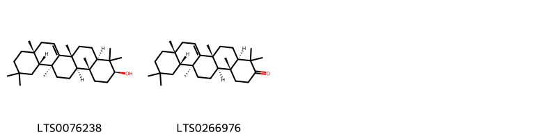{ width=100% }
    <figcaption>Hình ảnh cấu trúc hóa học của 2 hoạt chất thuộc nhóm Prenol lipids gồm ['alnulin (LTS0076238)', 'taraxerone (LTS0266976)'].</figcaption>
</figure>
#### Nhóm Purine nucleosides
<figure markdown="span">
    { width=100% }
    <figcaption>Hình ảnh cấu trúc hóa học của 2 hoạt chất thuộc nhóm Purine nucleosides gồm ['adenosine (LTS0052576)', 'adenosine (LTS0014061)'].</figcaption>
</figure>

---

### Dược dân tộc học

Danh sách các quốc gia có sử dụng *Clitoria ternatea* trong điều trị các bệnh. 

| Country   | Disease                                                                             | Bệnh                                                                                                                                                                                                |
|:----------|:------------------------------------------------------------------------------------|:----------------------------------------------------------------------------------------------------------------------------------------------------------------------------------------------------|
| Elsewhere | Antidote, Aperient, Cathartic, Diuretic, Laxative, Purgative, Refrigerant, Diuretic | MYMEMORY WARNING: YOU USED ALL AVAILABLE FREE TRANSLATIONS FOR TODAY. NEXT AVAILABLE IN  16 HOURS 23 MINUTES 27 SECONDS VISIT HTTPS://MYMEMORY.TRANSLATED.NET/DOC/USAGELIMITS.PHP TO TRANSLATE MORE |
| Iraq      | Aperient, Cathartic, Diuretic, Purgative                                            | MYMEMORY WARNING: YOU USED ALL AVAILABLE FREE TRANSLATIONS FOR TODAY. NEXT AVAILABLE IN  16 HOURS 23 MINUTES 24 SECONDS VISIT HTTPS://MYMEMORY.TRANSLATED.NET/DOC/USAGELIMITS.PHP TO TRANSLATE MORE |
| Samoa     | Laxative, Purgative                                                                 | MYMEMORY WARNING: YOU USED ALL AVAILABLE FREE TRANSLATIONS FOR TODAY. NEXT AVAILABLE IN  16 HOURS 23 MINUTES 22 SECONDS VISIT HTTPS://MYMEMORY.TRANSLATED.NET/DOC/USAGELIMITS.PHP TO TRANSLATE MORE |
| Sudan     | Purgative, Cathartic                                                                | MYMEMORY WARNING: YOU USED ALL AVAILABLE FREE TRANSLATIONS FOR TODAY. NEXT AVAILABLE IN  16 HOURS 23 MINUTES 19 SECONDS VISIT HTTPS://MYMEMORY.TRANSLATED.NET/DOC/USAGELIMITS.PHP TO TRANSLATE MORE |
| Venezuela | Apertif, Purgative                                                                  | MYMEMORY WARNING: YOU USED ALL AVAILABLE FREE TRANSLATIONS FOR TODAY. NEXT AVAILABLE IN  16 HOURS 23 MINUTES 17 SECONDS VISIT HTTPS://MYMEMORY.TRANSLATED.NET/DOC/USAGELIMITS.PHP TO TRANSLATE MORE |

---

# Chi Cercis

??? note "Danh sách các dược liệu thuộc chi"
    
	 - *Cercis canadensis*
	 - *Cercis chinensis*

---
## Cercis canadensis
### Thông tin về thực vật

!!! info "Phân loại thực vật của *Cercis canadensis* từ GIBF:"
    - **Kingdom:** Plantae
    - **Phylum:** Tracheophyta
    - **Order:** Fabales
    - **Family:** Fabaceae
    - **Genus:** Cercis
    - **Species:** *Cercis canadensis*

 

| Label (VI)   | Label (EN)   | Scientific Name   | Descriptions (VI)   | Descriptions (EN)   | Also Known As (VI)   | Also Known As (EN)   |
|:-------------|:-------------|:------------------|:--------------------|:--------------------|:---------------------|:---------------------|
| N/A          | N/A          | Cercis canadensis | loài thực vật       | species of plant    | ['']                 | ['Eastern Redbud']   |

#### Phân bố trên thế giới

**Từ CSDL GIBF** United States of America, Mexico

#### Phân bố tại Việt Nam

**Từ CSDL GIBF**: Không có ghi nhận ở Việt Nam

---
### Thành phần hóa học
        
- Theo cơ sở dữ liệu lotus: Từ loài *Cercis canadensis* đã phân lập và xác định được 2 hoạt chất thuộc về các nhóm Flavonoids. 

|    | chemicalTaxonomyClassyfireClass   |   smiles_count |
|---:|:----------------------------------|---------------:|
|  0 | Flavonoids                        |              2 |

#### Nhóm Flavonoids
<figure markdown="span">
    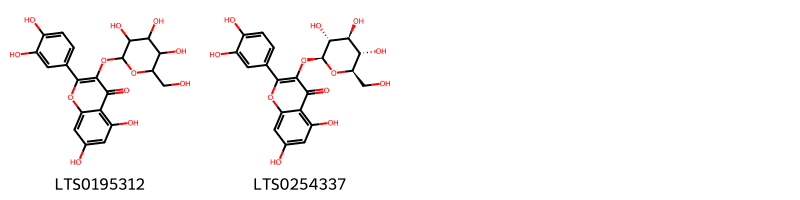{ width=100% }
    <figcaption>Hình ảnh cấu trúc hóa học của 2 hoạt chất thuộc nhóm Flavonoids gồm ['2-(3,4-dihydroxyphenyl)-5,7-dihydroxy-3-{[3,4,5-trihydroxy-6-(hydroxymethyl)oxan-2-yl]oxy}chromen-4-one (LTS0195312)', 'isoquercetin (LTS0254337)'].</figcaption>
</figure>

---

### Dược dân tộc học

Danh sách các quốc gia có sử dụng *Cercis canadensis* trong điều trị các bệnh. 

| Country        | Disease    | Bệnh                                                                                                                                                                                                |
|:---------------|:-----------|:----------------------------------------------------------------------------------------------------------------------------------------------------------------------------------------------------|
| Mexico         | Astringent | MYMEMORY WARNING: YOU USED ALL AVAILABLE FREE TRANSLATIONS FOR TODAY. NEXT AVAILABLE IN  16 HOURS 22 MINUTES 39 SECONDS VISIT HTTPS://MYMEMORY.TRANSLATED.NET/DOC/USAGELIMITS.PHP TO TRANSLATE MORE |
| US(Amerindian) | Astringent | MYMEMORY WARNING: YOU USED ALL AVAILABLE FREE TRANSLATIONS FOR TODAY. NEXT AVAILABLE IN  16 HOURS 22 MINUTES 36 SECONDS VISIT HTTPS://MYMEMORY.TRANSLATED.NET/DOC/USAGELIMITS.PHP TO TRANSLATE MORE |

---

---
## Cercis chinensis
### Thông tin về thực vật

!!! info "Phân loại thực vật của *Cercis chinensis* từ GIBF:"
    - **Kingdom:** Plantae
    - **Phylum:** Tracheophyta
    - **Order:** Fabales
    - **Family:** Fabaceae
    - **Genus:** Cercis
    - **Species:** *Cercis chinensis*

 

| Label (VI)   | Label (EN)   | Scientific Name   | Descriptions (VI)   | Descriptions (EN)   | Also Known As (VI)   | Also Known As (EN)   |
|:-------------|:-------------|:------------------|:--------------------|:--------------------|:---------------------|:---------------------|
| N/A          | N/A          | Cercis chinensis  | loài thực vật       | species of plant    | ['']                 | ['']                 |

#### Phân bố trên thế giới

**Từ CSDL GIBF** nan, Japan, Germany, Romania, Korea, Republic of, Belgium, Spain, Russian Federation, United States of America, Norway, China

#### Phân bố tại Việt Nam

**Từ CSDL GIBF**: Không có ghi nhận ở Việt Nam

---
### Thành phần hóa học
        
- Theo cơ sở dữ liệu lotus: Từ loài *Cercis chinensis* đã phân lập và xác định được 5 hoạt chất thuộc về các nhóm Flavonoids, Benzene and substituted derivatives. 

|    | chemicalTaxonomyClassyfireClass     |   smiles_count |
|---:|:------------------------------------|---------------:|
|  0 | Benzene and substituted derivatives |              2 |
|  1 | Flavonoids                          |              3 |

#### Nhóm Benzene and substituted derivatives
<figure markdown="span">
    { width=100% }
    <figcaption>Hình ảnh cấu trúc hóa học của 2 hoạt chất thuộc nhóm Benzene and substituted derivatives gồm ['galop (LTS0222857)', 'methyl gallate (LTS0043810)'].</figcaption>
</figure>
#### Nhóm Flavonoids
<figure markdown="span">
    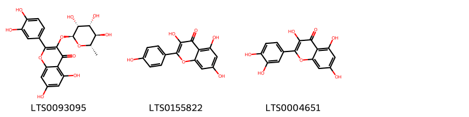{ width=100% }
    <figcaption>Hình ảnh cấu trúc hóa học của 3 hoạt chất thuộc nhóm Flavonoids gồm ['quercitrin (LTS0093095)', 'kaempherol (LTS0155822)', 'quercetin (LTS0004651)'].</figcaption>
</figure>

---

### Dược dân tộc học

Danh sách các quốc gia có sử dụng *Cercis chinensis* trong điều trị các bệnh. 

| Country   | Disease      | Bệnh                                                                                                                                                                                                |
|:----------|:-------------|:----------------------------------------------------------------------------------------------------------------------------------------------------------------------------------------------------|
| China     | Parasiticide | MYMEMORY WARNING: YOU USED ALL AVAILABLE FREE TRANSLATIONS FOR TODAY. NEXT AVAILABLE IN  16 HOURS 22 MINUTES 12 SECONDS VISIT HTTPS://MYMEMORY.TRANSLATED.NET/DOC/USAGELIMITS.PHP TO TRANSLATE MORE |
| Chinese   | Antiseptic   | MYMEMORY WARNING: YOU USED ALL AVAILABLE FREE TRANSLATIONS FOR TODAY. NEXT AVAILABLE IN  16 HOURS 22 MINUTES 10 SECONDS VISIT HTTPS://MYMEMORY.TRANSLATED.NET/DOC/USAGELIMITS.PHP TO TRANSLATE MORE |

---

# Chi Tamarindus

??? note "Danh sách các dược liệu thuộc chi"
    
	 - *Tamarindus indica*
	 - *Tamarindus indicus*

---
## Tamarindus indica
### Thông tin về thực vật

!!! info "Phân loại thực vật của *Tamarindus indica* từ GIBF:"
    - **Kingdom:** Plantae
    - **Phylum:** Tracheophyta
    - **Order:** Fabales
    - **Family:** Fabaceae
    - **Genus:** Tamarindus
    - **Species:** *Tamarindus indica*

 

| Label (VI)   | Label (EN)   | Scientific Name   | Descriptions (VI)   | Descriptions (EN)          | Also Known As (VI)    | Also Known As (EN)         |
|:-------------|:-------------|:------------------|:--------------------|:---------------------------|:----------------------|:---------------------------|
| N/A          | N/A          | Tamarindus indica |                     | species of plant, Tamarind | ['Tamarindus indica'] | ['Tamarindo', 'Thamarine'] |

#### Phân bố trên thế giới

**Từ CSDL GIBF** Sri Lanka, Australia, Guadeloupe, Cambodia, Saint Lucia, Benin, Nicaragua, Puerto Rico, Senegal, Honduras, United States of America, Belize, Thailand, Martinique, Brazil, New Caledonia, Mexico, China, Montserrat, India, Cayman Islands, Antigua and Barbuda, Philippines

#### Phân bố tại Việt Nam

**Từ CSDL GIBF**: Không có ghi nhận ở Việt Nam

---
### Thành phần hóa học
        
- Theo cơ sở dữ liệu lotus: Từ loài *Tamarindus indica* đã phân lập và xác định được 59 hoạt chất thuộc về các nhóm Fatty Acyls, Flavonoids, Prenol lipids, Steroids and steroid derivatives, Pyrroles, Cinnamic acids and derivatives, Benzene and substituted derivatives, Hydroxy acids and derivatives, Heteroaromatic compounds, Organooxygen compounds, Phenols, Saturated hydrocarbons, Dihydrofurans, Phenol esters, Carboxylic acids and derivatives. 

|    | chemicalTaxonomyClassyfireClass     |   smiles_count |
|---:|:------------------------------------|---------------:|
|  0 | Benzene and substituted derivatives |              3 |
|  1 | Carboxylic acids and derivatives    |              1 |
|  2 | Cinnamic acids and derivatives      |              1 |
|  3 | Dihydrofurans                       |              2 |
|  4 | Fatty Acyls                         |              4 |
|  5 | Flavonoids                          |              4 |
|  6 | Heteroaromatic compounds            |              1 |
|  7 | Hydroxy acids and derivatives       |              2 |
|  8 | Organooxygen compounds              |             15 |
|  9 | Phenol esters                       |              1 |
| 10 | Phenols                             |              1 |
| 11 | Prenol lipids                       |             19 |
| 12 | Pyrroles                            |              1 |
| 13 | Saturated hydrocarbons              |              2 |
| 14 | Steroids and steroid derivatives    |              2 |

#### Nhóm Benzene and substituted derivatives
<figure markdown="span">
    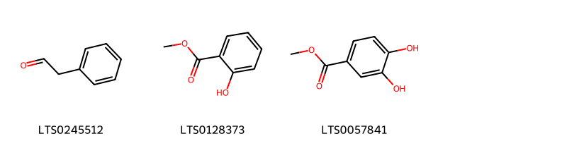{ width=100% }
    <figcaption>Hình ảnh cấu trúc hóa học của 3 hoạt chất thuộc nhóm Benzene and substituted derivatives gồm ['phenylacetaldehyde (LTS0245512)', 'methyl salicylate (LTS0128373)', 'methyl 3,4-dihydroxybenzoate (LTS0057841)'].</figcaption>
</figure>
#### Nhóm Carboxylic acids and derivatives
<figure markdown="span">
    { width=100% }
    <figcaption>Hình ảnh cấu trúc hóa học của 1 hoạt chất thuộc nhóm Carboxylic acids and derivatives gồm ['succinic acid (LTS0237204)'].</figcaption>
</figure>
#### Nhóm Cinnamic acids and derivatives
<figure markdown="span">
    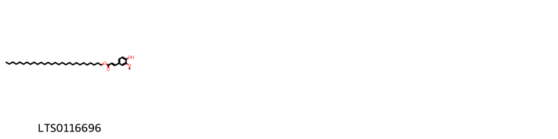{ width=100% }
    <figcaption>Hình ảnh cấu trúc hóa học của 1 hoạt chất thuộc nhóm Cinnamic acids and derivatives gồm ['octacosyl (2e)-3-(4-hydroxy-3-methoxyphenyl)prop-2-enoate (LTS0116696)'].</figcaption>
</figure>
#### Nhóm Dihydrofurans
<figure markdown="span">
    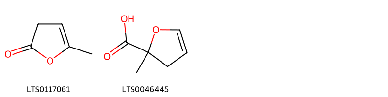{ width=100% }
    <figcaption>Hình ảnh cấu trúc hóa học của 2 hoạt chất thuộc nhóm Dihydrofurans gồm ['5-methyl-2(3h)-furanone (LTS0117061)', '2-methyl-3h-furan-2-carboxylic acid (LTS0046445)'].</figcaption>
</figure>
#### Nhóm Fatty Acyls
<figure markdown="span">
    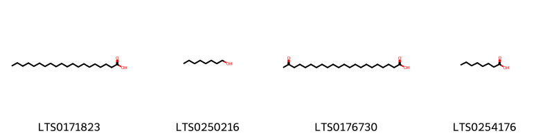{ width=100% }
    <figcaption>Hình ảnh cấu trúc hóa học của 4 hoạt chất thuộc nhóm Fatty Acyls gồm ['arachidic acid (LTS0171823)', 'octanol (LTS0250216)', '21-oxodocosanoic acid (LTS0176730)', 'caprylic acid (LTS0254176)'].</figcaption>
</figure>
#### Nhóm Flavonoids
<figure markdown="span">
    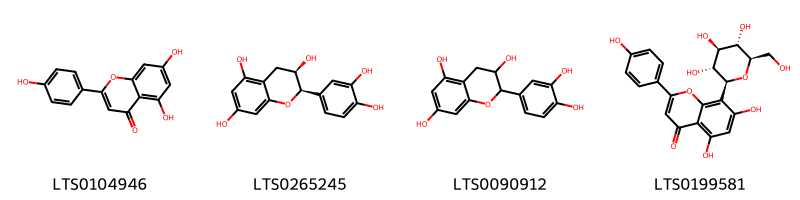{ width=100% }
    <figcaption>Hình ảnh cấu trúc hóa học của 4 hoạt chất thuộc nhóm Flavonoids gồm ['chamomile (LTS0104946)', 'ent-epicatechin (LTS0265245)', 'catechol (LTS0090912)', 'vitexin (LTS0199581)'].</figcaption>
</figure>
#### Nhóm Heteroaromatic compounds
<figure markdown="span">
    { width=100% }
    <figcaption>Hình ảnh cấu trúc hóa học của 1 hoạt chất thuộc nhóm Heteroaromatic compounds gồm ['silvan (LTS0020613)'].</figcaption>
</figure>
#### Nhóm Hydroxy acids and derivatives
<figure markdown="span">
    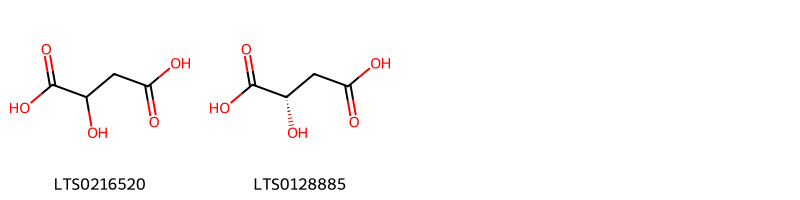{ width=100% }
    <figcaption>Hình ảnh cấu trúc hóa học của 2 hoạt chất thuộc nhóm Hydroxy acids and derivatives gồm ['malic acid (LTS0216520)', '(-)-malic acid (LTS0128885)'].</figcaption>
</figure>
#### Nhóm Organooxygen compounds
<figure markdown="span">
    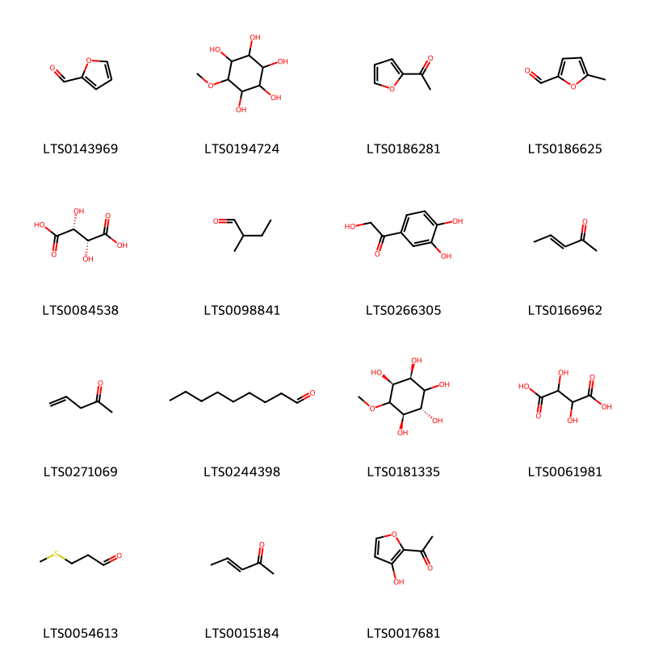{ width=100% }
    <figcaption>Hình ảnh cấu trúc hóa học của 15 hoạt chất thuộc nhóm Organooxygen compounds gồm ['bran oil (LTS0143969)', 'pinitol (LTS0194724)', 'acetylfuran (LTS0186281)', '5-methylfurfural (LTS0186625)', 'l(+)-tartaric acid (LTS0084538)', '2-methylbutanal (LTS0098841)', '1-(3,4-dihydroxyphenyl)-2-hydroxyethanone (LTS0266305)', '(e)-3-penten-2-one (LTS0166962)', '4-penten-2-one (LTS0271069)', 'nonanal (LTS0244398)', 'methylinositol (LTS0181335)', '(.+-.)-tartaric acid (LTS0061981)', 'methional (LTS0054613)', '3-penten-2-one (LTS0015184)', 'isomaltol (LTS0017681)'].</figcaption>
</figure>
#### Nhóm Phenol esters
<figure markdown="span">
    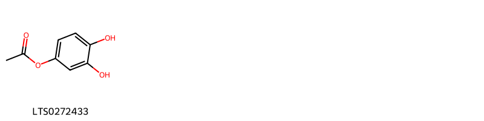{ width=100% }
    <figcaption>Hình ảnh cấu trúc hóa học của 1 hoạt chất thuộc nhóm Phenol esters gồm ['3,4-dihydroxyphenyl acetate (LTS0272433)'].</figcaption>
</figure>
#### Nhóm Phenols
<figure markdown="span">
    { width=100% }
    <figcaption>Hình ảnh cấu trúc hóa học của 1 hoạt chất thuộc nhóm Phenols gồm ['phenol (LTS0092642)'].</figcaption>
</figure>
#### Nhóm Prenol lipids
<figure markdown="span">
    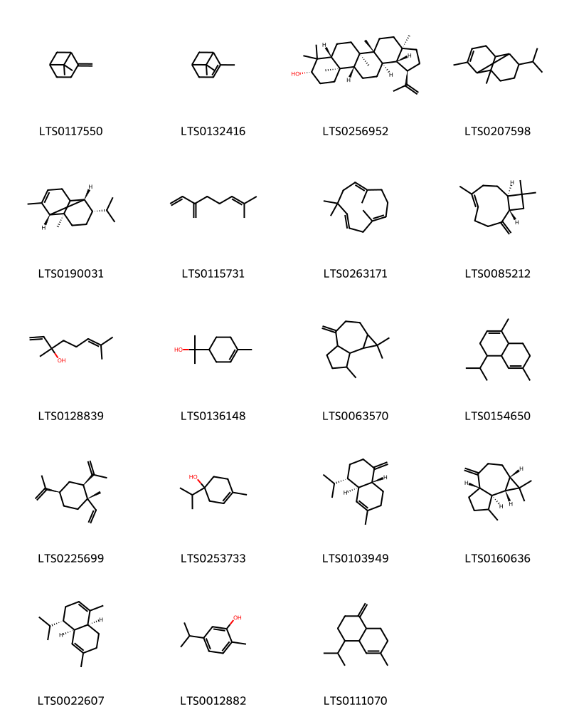{ width=100% }
    <figcaption>Hình ảnh cấu trúc hóa học của 19 hoạt chất thuộc nhóm Prenol lipids gồm ['β-pinene (LTS0117550)', 'α pinene (LTS0132416)', 'lupeol (LTS0256952)', 'α-copaene (LTS0207598)', '(1r,2s,7s,8s)-8-isopropyl-1,3-dimethyltricyclo[4.4.0.0²,⁷]dec-3-ene (LTS0190031)', 'α-myrcene (LTS0115731)', 'humulene (LTS0263171)', 'caryophyllene (LTS0085212)', 'linalool, (+-)- (LTS0128839)', 'terpineol (LTS0136148)', '1,1,7-trimethyl-4-methylidene-octahydro-1ah-cyclopropa[e]azulene (LTS0063570)', '4-isopropyl-1,6-dimethyl-3,4,4a,7,8,8a-hexahydronaphthalene (LTS0154650)', 'β-elemene (LTS0225699)', '4-terpineol (LTS0253733)', '(+)-gamma-cadinene (LTS0103949)', '(1as,4as,7as,7br)-1,1,7-trimethyl-4-methylidene-octahydro-1ah-cyclopropa[e]azulene (LTS0160636)', 'α-muurolene (LTS0022607)', 'carvacrol (LTS0012882)', '4-isopropyl-6-methyl-1-methylidene-3,4,4a,7,8,8a-hexahydro-2h-naphthalene (LTS0111070)'].</figcaption>
</figure>
#### Nhóm Pyrroles
<figure markdown="span">
    { width=100% }
    <figcaption>Hình ảnh cấu trúc hóa học của 1 hoạt chất thuộc nhóm Pyrroles gồm ['1-methylpyrrole (LTS0044483)'].</figcaption>
</figure>
#### Nhóm Saturated hydrocarbons
<figure markdown="span">
    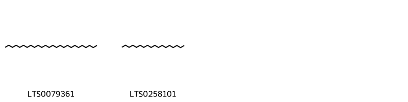{ width=100% }
    <figcaption>Hình ảnh cấu trúc hóa học của 2 hoạt chất thuộc nhóm Saturated hydrocarbons gồm ['hexacosane (LTS0079361)', 'octadecane (LTS0258101)'].</figcaption>
</figure>
#### Nhóm Steroids and steroid derivatives
<figure markdown="span">
    { width=100% }
    <figcaption>Hình ảnh cấu trúc hóa học của 2 hoạt chất thuộc nhóm Steroids and steroid derivatives gồm ['stigmast-5-en-3-ol, (3β)- (LTS0204616)', 'stigmast-5-en-3-ol (LTS0071224)'].</figcaption>
</figure>

---

### Dược dân tộc học

Danh sách các quốc gia có sử dụng *Tamarindus indica* trong điều trị các bệnh. 

| Country            | Disease                                                                                                                                | Bệnh                                                                                                                                                                                                |
|:-------------------|:---------------------------------------------------------------------------------------------------------------------------------------|:----------------------------------------------------------------------------------------------------------------------------------------------------------------------------------------------------|
| Bahamas            | Collyrium, Emetic                                                                                                                      | MYMEMORY WARNING: YOU USED ALL AVAILABLE FREE TRANSLATIONS FOR TODAY. NEXT AVAILABLE IN  16 HOURS 21 MINUTES 40 SECONDS VISIT HTTPS://MYMEMORY.TRANSLATED.NET/DOC/USAGELIMITS.PHP TO TRANSLATE MORE |
| Dominican Republic | Laxative                                                                                                                               | MYMEMORY WARNING: YOU USED ALL AVAILABLE FREE TRANSLATIONS FOR TODAY. NEXT AVAILABLE IN  16 HOURS 21 MINUTES 38 SECONDS VISIT HTTPS://MYMEMORY.TRANSLATED.NET/DOC/USAGELIMITS.PHP TO TRANSLATE MORE |
| Elsewhere          | Aperient, Cardiac, Carminative, Collyrium, Digestive, Refrigerant, Styptic, Suppurative, Tonic, Tonic, Vermifuge, Antiseptic, Aperient | MYMEMORY WARNING: YOU USED ALL AVAILABLE FREE TRANSLATIONS FOR TODAY. NEXT AVAILABLE IN  16 HOURS 21 MINUTES 36 SECONDS VISIT HTTPS://MYMEMORY.TRANSLATED.NET/DOC/USAGELIMITS.PHP TO TRANSLATE MORE |
| Haiti              | Purgative                                                                                                                              | MYMEMORY WARNING: YOU USED ALL AVAILABLE FREE TRANSLATIONS FOR TODAY. NEXT AVAILABLE IN  16 HOURS 21 MINUTES 33 SECONDS VISIT HTTPS://MYMEMORY.TRANSLATED.NET/DOC/USAGELIMITS.PHP TO TRANSLATE MORE |
| India              | Fungicide, Laxative, Refrigerant, Carminative                                                                                          | MYMEMORY WARNING: YOU USED ALL AVAILABLE FREE TRANSLATIONS FOR TODAY. NEXT AVAILABLE IN  16 HOURS 21 MINUTES 31 SECONDS VISIT HTTPS://MYMEMORY.TRANSLATED.NET/DOC/USAGELIMITS.PHP TO TRANSLATE MORE |
| Java               | Cosmetic                                                                                                                               | MYMEMORY WARNING: YOU USED ALL AVAILABLE FREE TRANSLATIONS FOR TODAY. NEXT AVAILABLE IN  16 HOURS 21 MINUTES 28 SECONDS VISIT HTTPS://MYMEMORY.TRANSLATED.NET/DOC/USAGELIMITS.PHP TO TRANSLATE MORE |
| Mexico             | Purgative, Refrigerant                                                                                                                 | MYMEMORY WARNING: YOU USED ALL AVAILABLE FREE TRANSLATIONS FOR TODAY. NEXT AVAILABLE IN  16 HOURS 21 MINUTES 26 SECONDS VISIT HTTPS://MYMEMORY.TRANSLATED.NET/DOC/USAGELIMITS.PHP TO TRANSLATE MORE |
| Sudan              | Laxative                                                                                                                               | MYMEMORY WARNING: YOU USED ALL AVAILABLE FREE TRANSLATIONS FOR TODAY. NEXT AVAILABLE IN  16 HOURS 21 MINUTES 24 SECONDS VISIT HTTPS://MYMEMORY.TRANSLATED.NET/DOC/USAGELIMITS.PHP TO TRANSLATE MORE |
| Turkey             | Refrigerant, Laxative                                                                                                                  | MYMEMORY WARNING: YOU USED ALL AVAILABLE FREE TRANSLATIONS FOR TODAY. NEXT AVAILABLE IN  16 HOURS 21 MINUTES 21 SECONDS VISIT HTTPS://MYMEMORY.TRANSLATED.NET/DOC/USAGELIMITS.PHP TO TRANSLATE MORE |
| Upper Volta        | Diuretic                                                                                                                               | MYMEMORY WARNING: YOU USED ALL AVAILABLE FREE TRANSLATIONS FOR TODAY. NEXT AVAILABLE IN  16 HOURS 21 MINUTES 19 SECONDS VISIT HTTPS://MYMEMORY.TRANSLATED.NET/DOC/USAGELIMITS.PHP TO TRANSLATE MORE |
| W Africa           | Laxative                                                                                                                               | MYMEMORY WARNING: YOU USED ALL AVAILABLE FREE TRANSLATIONS FOR TODAY. NEXT AVAILABLE IN  16 HOURS 21 MINUTES 16 SECONDS VISIT HTTPS://MYMEMORY.TRANSLATED.NET/DOC/USAGELIMITS.PHP TO TRANSLATE MORE |

---

---
## Tamarindus indicus
### Thông tin về thực vật

!!! info "Phân loại thực vật của *Tamarindus indica* từ GIBF:"
    - **Kingdom:** Plantae
    - **Phylum:** Tracheophyta
    - **Order:** Fabales
    - **Family:** Fabaceae
    - **Genus:** Tamarindus
    - **Species:** *Tamarindus indica*

 

| Label (VI)   | Label (EN)   | Scientific Name   | Descriptions (VI)   | Descriptions (EN)          | Also Known As (VI)    | Also Known As (EN)         |
|:-------------|:-------------|:------------------|:--------------------|:---------------------------|:----------------------|:---------------------------|
| N/A          | N/A          | Tamarindus indica |                     | species of plant, Tamarind | ['Tamarindus indica'] | ['Tamarindo', 'Thamarine'] |

#### Phân bố trên thế giới

**Từ CSDL GIBF** Sri Lanka, Australia, Guadeloupe, Cambodia, Saint Lucia, Benin, Nicaragua, Puerto Rico, Senegal, Honduras, United States of America, Belize, Thailand, Martinique, Brazil, New Caledonia, Mexico, China, Montserrat, India, Cayman Islands, Antigua and Barbuda, Philippines

#### Phân bố tại Việt Nam

**Từ CSDL GIBF**: Không có ghi nhận ở Việt Nam

---
### Thành phần hóa học
        
- Theo cơ sở dữ liệu lotus: Từ loài *Tamarindus indica* đã phân lập và xác định được Chưa có hoạt chất nào được phân lập. hoạt chất thuộc về các nhóm Không có hoạt chất nào được phân lập. 

Không có hình ảnh nào được tạo ra

---

### Dược dân tộc học

Danh sách các quốc gia có sử dụng *Tamarindus indica* trong điều trị các bệnh. 

| Country   | Disease                          | Bệnh                                                                                                                                                                                                |
|:----------|:---------------------------------|:----------------------------------------------------------------------------------------------------------------------------------------------------------------------------------------------------|
| Mexico    | Laxative, Refrigerant, Vermifuge | MYMEMORY WARNING: YOU USED ALL AVAILABLE FREE TRANSLATIONS FOR TODAY. NEXT AVAILABLE IN  16 HOURS 20 MINUTES 26 SECONDS VISIT HTTPS://MYMEMORY.TRANSLATED.NET/DOC/USAGELIMITS.PHP TO TRANSLATE MORE |

---

# Chi Campsiandra

??? note "Danh sách các dược liệu thuộc chi"
    
	 - *Campsiandra laurifolia*

---
## Campsiandra laurifolia
### Thông tin về thực vật

!!! info "Phân loại thực vật của *Campsiandra laurifolia* từ GIBF:"
    - **Kingdom:** Plantae
    - **Phylum:** Tracheophyta
    - **Order:** Fabales
    - **Family:** Fabaceae
    - **Genus:** Campsiandra
    - **Species:** *Campsiandra laurifolia*

 

| Label (VI)   | Label (EN)   | Scientific Name        | Descriptions (VI)   | Descriptions (EN)   | Also Known As (VI)   | Also Known As (EN)   |
|:-------------|:-------------|:-----------------------|:--------------------|:--------------------|:---------------------|:---------------------|
| N/A          | N/A          | Campsiandra laurifolia | loài thực vật       | species of plant    | ['']                 | ['']                 |

#### Phân bố trên thế giới

**Từ CSDL GIBF** nan, Colombia, Brazil, Guyana, Peru, Mexico, Venezuela (Bolivarian Republic of)

#### Phân bố tại Việt Nam

**Từ CSDL GIBF**: Không có ghi nhận ở Việt Nam

---
### Thành phần hóa học
        
- Theo cơ sở dữ liệu lotus: Từ loài *Campsiandra laurifolia* đã phân lập và xác định được Chưa có hoạt chất nào được phân lập. hoạt chất thuộc về các nhóm Không có hoạt chất nào được phân lập. 

Không có hình ảnh nào được tạo ra

---

### Dược dân tộc học

Danh sách các quốc gia có sử dụng *Campsiandra laurifolia* trong điều trị các bệnh. 

| Country   | Disease    | Bệnh                                                                                                                                                                                                |
|:----------|:-----------|:----------------------------------------------------------------------------------------------------------------------------------------------------------------------------------------------------|
| Brazil    | nan, Tonic | MYMEMORY WARNING: YOU USED ALL AVAILABLE FREE TRANSLATIONS FOR TODAY. NEXT AVAILABLE IN  16 HOURS 20 MINUTES 05 SECONDS VISIT HTTPS://MYMEMORY.TRANSLATED.NET/DOC/USAGELIMITS.PHP TO TRANSLATE MORE |

---

# Chi Mundulea

??? note "Danh sách các dược liệu thuộc chi"
    
	 - *Mundulea sericea*
	 - *Mundulea suberosa*

---
## Mundulea sericea
### Thông tin về thực vật

!!! info "Phân loại thực vật của *Mundulea sericea* từ GIBF:"
    - **Kingdom:** Plantae
    - **Phylum:** Tracheophyta
    - **Order:** Fabales
    - **Family:** Fabaceae
    - **Genus:** Mundulea
    - **Species:** *Mundulea sericea*

 

| Label (VI)   | Label (EN)   | Scientific Name   | Descriptions (VI)   | Descriptions (EN)   | Also Known As (VI)   | Also Known As (EN)   |
|:-------------|:-------------|:------------------|:--------------------|:--------------------|:---------------------|:---------------------|
| N/A          | N/A          | Mundulea sericea  | loài thực vật       | species of plant    | ['']                 | ['']                 |

#### Phân bố trên thế giới

**Từ CSDL GIBF** South Africa, Madagascar, Namibia, Mozambique, Botswana, India, Tanzania, United Republic of, Eswatini

#### Phân bố tại Việt Nam

**Từ CSDL GIBF**: Không có ghi nhận ở Việt Nam

---
### Thành phần hóa học
        
- Theo cơ sở dữ liệu lotus: Từ loài *Mundulea sericea* đã phân lập và xác định được 36 hoạt chất thuộc về các nhóm Flavonoids, Prenol lipids, Isoflavonoids, Linear 1,3-diarylpropanoids, Kavalactones. 

|    | chemicalTaxonomyClassyfireClass   |   smiles_count |
|---:|:----------------------------------|---------------:|
|  0 | Flavonoids                        |             11 |
|  1 | Isoflavonoids                     |             12 |
|  2 | Kavalactones                      |              1 |
|  3 | Linear 1,3-diarylpropanoids       |              6 |
|  4 | Prenol lipids                     |              3 |

#### Nhóm Flavonoids
<figure markdown="span">
    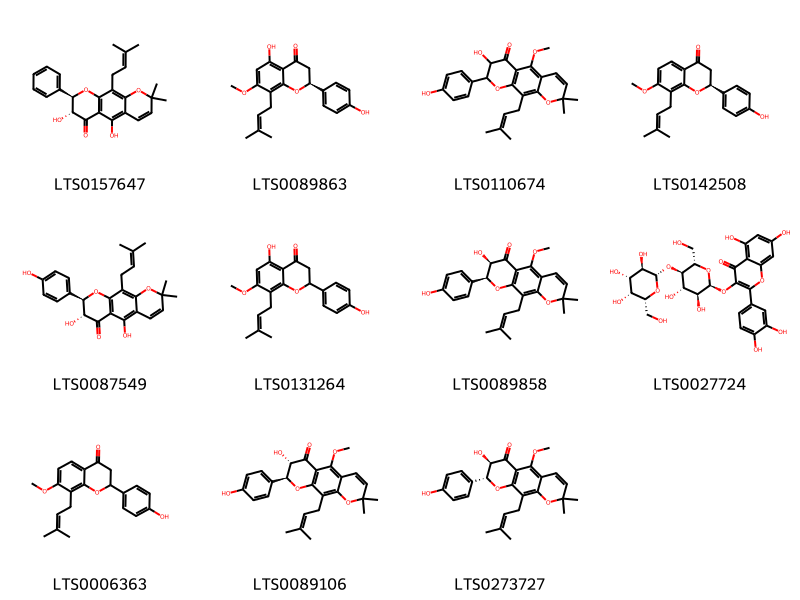{ width=100% }
    <figcaption>Hình ảnh cấu trúc hóa học của 11 hoạt chất thuộc nhóm Flavonoids gồm ['(2r,3r)-3,5-dihydroxy-8,8-dimethyl-10-(3-methylbut-2-en-1-yl)-2-phenyl-2h,3h-pyrano[3,2-g]chromen-4-one (LTS0157647)', 'mundulea flavanone b (LTS0089863)', '3-hydroxy-2-(4-hydroxyphenyl)-5-methoxy-8,8-dimethyl-10-(3-methylbut-2-en-1-yl)-2h,3h-pyrano[3,2-g]chromen-4-one (LTS0110674)', "4'-hydroxyisoderricin (LTS0142508)", '(2r,3r)-3,5-dihydroxy-2-(4-hydroxyphenyl)-8,8-dimethyl-10-(3-methylbut-2-en-1-yl)-2h,3h-pyrano[3,2-g]chromen-4-one (LTS0087549)', '5-hydroxy-2-(4-hydroxyphenyl)-7-methoxy-8-(3-methylbut-2-en-1-yl)-2,3-dihydro-1-benzopyran-4-one (LTS0131264)', '(2s,3r)-3-hydroxy-2-(4-hydroxyphenyl)-5-methoxy-8,8-dimethyl-10-(3-methylbut-2-en-1-yl)-2h,3h-pyrano[3,2-g]chromen-4-one (LTS0089858)', '3-{[(2s,3s,4s,5r,6s)-3,4-dihydroxy-6-(hydroxymethyl)-5-{[(2s,3r,4s,5r,6r)-3,4,5-trihydroxy-6-(hydroxymethyl)oxan-2-yl]oxy}oxan-2-yl]oxy}-2-(3,4-dihydroxyphenyl)-5,7-dihydroxychromen-4-one (LTS0027724)', '2-(4-hydroxyphenyl)-7-methoxy-8-(3-methylbut-2-en-1-yl)-2,3-dihydro-1-benzopyran-4-one (LTS0006363)', '(2s,3s)-3-hydroxy-2-(4-hydroxyphenyl)-5-methoxy-8,8-dimethyl-10-(3-methylbut-2-en-1-yl)-2h,3h-pyrano[3,2-g]chromen-4-one (LTS0089106)', '(2r,3r)-3-hydroxy-2-(4-hydroxyphenyl)-5-methoxy-8,8-dimethyl-10-(3-methylbut-2-en-1-yl)-2h,3h-pyrano[3,2-g]chromen-4-one (LTS0273727)'].</figcaption>
</figure>
#### Nhóm Isoflavonoids
<figure markdown="span">
    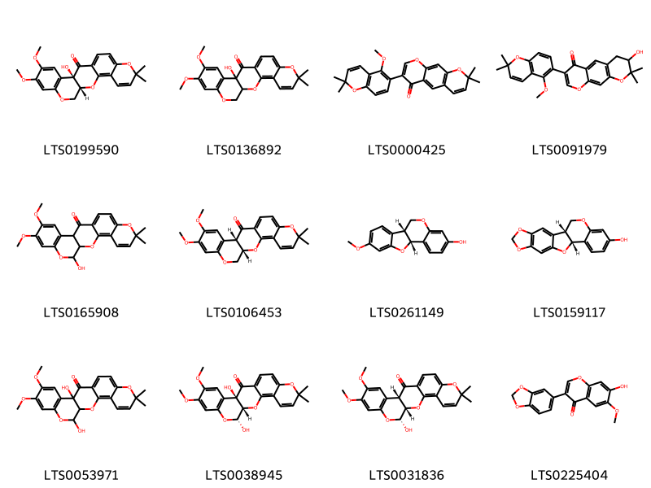{ width=100% }
    <figcaption>Hình ảnh cấu trúc hóa học của 12 hoạt chất thuộc nhóm Isoflavonoids gồm ['tephrosin (LTS0199590)', '14-hydroxy-17,18-dimethoxy-7,7-dimethyl-2,8,21-trioxapentacyclo[12.8.0.0³,¹².0⁴,⁹.0¹⁵,²⁰]docosa-3,5,9,11,15(20),16,18-heptaen-13-one (LTS0136892)', 'munetone (LTS0000425)', 'mundulone (LTS0091979)', '22-hydroxy-17,18-dimethoxy-7,7-dimethyl-2,8,21-trioxapentacyclo[12.8.0.0³,¹².0⁴,⁹.0¹⁵,²⁰]docosa-3,5,9,11,15(20),16,18-heptaen-13-one (LTS0165908)', 'deguelin (LTS0106453)', 'medicarpin, (-)- (LTS0261149)', '(-)-maackiain (LTS0159117)', '14,22-dihydroxy-17,18-dimethoxy-7,7-dimethyl-2,8,21-trioxapentacyclo[12.8.0.0³,¹².0⁴,⁹.0¹⁵,²⁰]docosa-3,5,9,11,15(20),16,18-heptaen-13-one (LTS0053971)', '(1s,14r,22r)-14,22-dihydroxy-17,18-dimethoxy-7,7-dimethyl-2,8,21-trioxapentacyclo[12.8.0.0³,¹².0⁴,⁹.0¹⁵,²⁰]docosa-3,5,9,11,15(20),16,18-heptaen-13-one (LTS0038945)', '(1s,14s,22r)-22-hydroxy-17,18-dimethoxy-7,7-dimethyl-2,8,21-trioxapentacyclo[12.8.0.0³,¹².0⁴,⁹.0¹⁵,²⁰]docosa-3,5,9,11,15(20),16,18-heptaen-13-one (LTS0031836)', 'fujikinetin (LTS0225404)'].</figcaption>
</figure>
#### Nhóm Kavalactones
<figure markdown="span">
    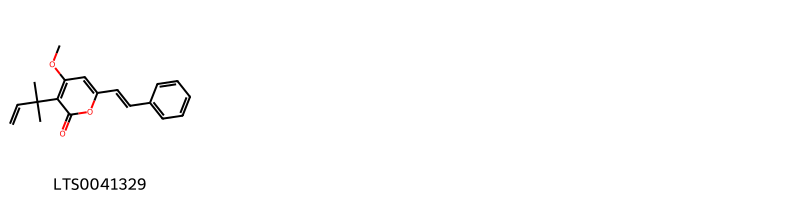{ width=100% }
    <figcaption>Hình ảnh cấu trúc hóa học của 1 hoạt chất thuộc nhóm Kavalactones gồm ['4-methoxy-3-(2-methylbut-3-en-2-yl)-6-[(1e)-2-phenylethenyl]pyran-2-one (LTS0041329)'].</figcaption>
</figure>
#### Nhóm Linear 1_3-diarylpropanoids
<figure markdown="span">
    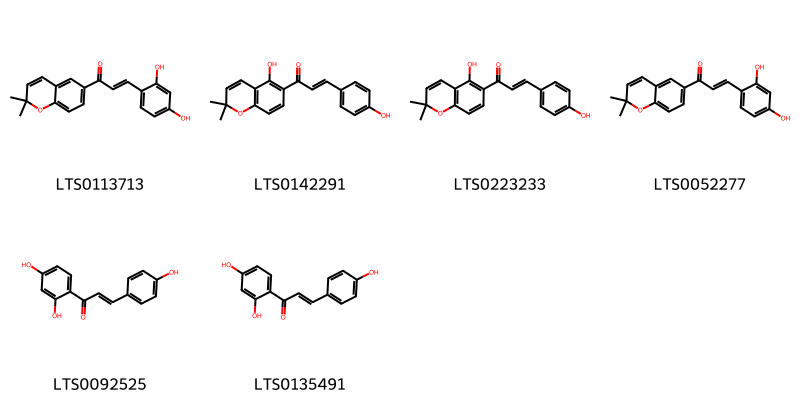{ width=100% }
    <figcaption>Hình ảnh cấu trúc hóa học của Không tìm thấy chú thích hoạt chất thuộc nhóm Linear 1_3-diarylpropanoids gồm Không tìm thấy chú thích.</figcaption>
</figure>
#### Nhóm Prenol lipids
<figure markdown="span">
    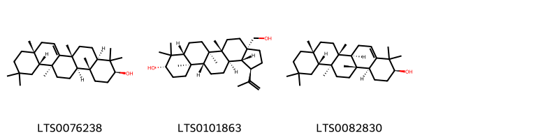{ width=100% }
    <figcaption>Hình ảnh cấu trúc hóa học của 3 hoạt chất thuộc nhóm Prenol lipids gồm ['alnulin (LTS0076238)', 'betulin (LTS0101863)', 'glutinol (LTS0082830)'].</figcaption>
</figure>

---

### Dược dân tộc học

Danh sách các quốc gia có sử dụng *Mundulea sericea* trong điều trị các bệnh. 

| Country   | Disease                             | Bệnh                                                                                                                                                                                                |
|:----------|:------------------------------------|:----------------------------------------------------------------------------------------------------------------------------------------------------------------------------------------------------|
| Africa    | Piscicide                           | MYMEMORY WARNING: YOU USED ALL AVAILABLE FREE TRANSLATIONS FOR TODAY. NEXT AVAILABLE IN  16 HOURS 19 MINUTES 44 SECONDS VISIT HTTPS://MYMEMORY.TRANSLATED.NET/DOC/USAGELIMITS.PHP TO TRANSLATE MORE |
| Asia      | Piscicide                           | MYMEMORY WARNING: YOU USED ALL AVAILABLE FREE TRANSLATIONS FOR TODAY. NEXT AVAILABLE IN  16 HOURS 19 MINUTES 42 SECONDS VISIT HTTPS://MYMEMORY.TRANSLATED.NET/DOC/USAGELIMITS.PHP TO TRANSLATE MORE |
| Elsewhere | Piscicide, Poison, Insecticide, nan | MYMEMORY WARNING: YOU USED ALL AVAILABLE FREE TRANSLATIONS FOR TODAY. NEXT AVAILABLE IN  16 HOURS 19 MINUTES 39 SECONDS VISIT HTTPS://MYMEMORY.TRANSLATED.NET/DOC/USAGELIMITS.PHP TO TRANSLATE MORE |
| Tanzania  | Insecticide, Piscicide              | MYMEMORY WARNING: YOU USED ALL AVAILABLE FREE TRANSLATIONS FOR TODAY. NEXT AVAILABLE IN  16 HOURS 19 MINUTES 36 SECONDS VISIT HTTPS://MYMEMORY.TRANSLATED.NET/DOC/USAGELIMITS.PHP TO TRANSLATE MORE |

---

---
## Mundulea suberosa
### Thông tin về thực vật

!!! info "Phân loại thực vật của *Mundulea sericea* từ GIBF:"
    - **Kingdom:** Plantae
    - **Phylum:** Tracheophyta
    - **Order:** Fabales
    - **Family:** Fabaceae
    - **Genus:** Mundulea
    - **Species:** *Mundulea sericea*

 

| Label (VI)   | Label (EN)   | Scientific Name   | Descriptions (VI)   | Descriptions (EN)   | Also Known As (VI)   | Also Known As (EN)   |
|:-------------|:-------------|:------------------|:--------------------|:--------------------|:---------------------|:---------------------|
| N/A          | N/A          | Mundulea suberosa | loài thực vật       | species of plant    | ['']                 | ['']                 |

#### Phân bố trên thế giới

**Từ CSDL GIBF** nan, Malawi, Ghana, Sri Lanka, South Africa, Namibia, Mozambique, unknown or invalid, Indonesia, India, Finland, Tanzania, United Republic of, Zimbabwe

#### Phân bố tại Việt Nam

**Từ CSDL GIBF**: Không có ghi nhận ở Việt Nam

---
### Thành phần hóa học
        
- Theo cơ sở dữ liệu lotus: Từ loài *Mundulea sericea* đã phân lập và xác định được Chưa có hoạt chất nào được phân lập. hoạt chất thuộc về các nhóm Không có hoạt chất nào được phân lập. 

Không có hình ảnh nào được tạo ra

---

### Dược dân tộc học

Danh sách các quốc gia có sử dụng *Mundulea sericea* trong điều trị các bệnh. 

| Country   | Disease   | Bệnh                                                                                                                                                                                                |
|:----------|:----------|:----------------------------------------------------------------------------------------------------------------------------------------------------------------------------------------------------|
| India     | Piscicide | MYMEMORY WARNING: YOU USED ALL AVAILABLE FREE TRANSLATIONS FOR TODAY. NEXT AVAILABLE IN  16 HOURS 19 MINUTES 10 SECONDS VISIT HTTPS://MYMEMORY.TRANSLATED.NET/DOC/USAGELIMITS.PHP TO TRANSLATE MORE |

---

# Chi Cercidium

??? note "Danh sách các dược liệu thuộc chi"
    
	 - *Cercidium praecox*

---
## Cercidium praecox
### Thông tin về thực vật

!!! info "Phân loại thực vật của *Parkinsonia praecox* từ GIBF:"
    - **Kingdom:** Plantae
    - **Phylum:** Tracheophyta
    - **Order:** Fabales
    - **Family:** Fabaceae
    - **Genus:** Parkinsonia
    - **Species:** *Parkinsonia praecox*

 

| Label (VI)   | Label (EN)   | Scientific Name   | Descriptions (VI)   | Descriptions (EN)   | Also Known As (VI)   | Also Known As (EN)   |
|:-------------|:-------------|:------------------|:--------------------|:--------------------|:---------------------|:---------------------|
| N/A          | N/A          | Cercidium praecox | loài thực vật       | species of plant    | ['']                 | ['']                 |

#### Phân bố trên thế giới

**Từ CSDL GIBF** nan, Ecuador, Colombia, Brazil, Argentina, Bolivia (Plurinational State of), Jamaica, United States of America, Peru, Mexico, Paraguay, Venezuela (Bolivarian Republic of)

#### Phân bố tại Việt Nam

**Từ CSDL GIBF**: Không có ghi nhận ở Việt Nam

---
### Thành phần hóa học
        
- Theo cơ sở dữ liệu lotus: Từ loài *Parkinsonia praecox* đã phân lập và xác định được Chưa có hoạt chất nào được phân lập. hoạt chất thuộc về các nhóm Không có hoạt chất nào được phân lập. 

Không có hình ảnh nào được tạo ra

---

### Dược dân tộc học

Danh sách các quốc gia có sử dụng *Parkinsonia praecox* trong điều trị các bệnh. 

| Country   | Disease    | Bệnh                                                                                                                                                                                                |
|:----------|:-----------|:----------------------------------------------------------------------------------------------------------------------------------------------------------------------------------------------------|
| Venezuela | Astringent | MYMEMORY WARNING: YOU USED ALL AVAILABLE FREE TRANSLATIONS FOR TODAY. NEXT AVAILABLE IN  16 HOURS 18 MINUTES 51 SECONDS VISIT HTTPS://MYMEMORY.TRANSLATED.NET/DOC/USAGELIMITS.PHP TO TRANSLATE MORE |

---

# Chi Physostigma

??? note "Danh sách các dược liệu thuộc chi"
    
	 - *Physostigma mesoponticum*
	 - *Physostigma venenosum*

---
## Physostigma mesoponticum
### Thông tin về thực vật

!!! info "Phân loại thực vật của *Physostigma mesoponticum* từ GIBF:"
    - **Kingdom:** Plantae
    - **Phylum:** Tracheophyta
    - **Order:** Fabales
    - **Family:** Fabaceae
    - **Genus:** Physostigma
    - **Species:** *Physostigma mesoponticum*

 

| Label (VI)   | Label (EN)   | Scientific Name          | Descriptions (VI)   | Descriptions (EN)   | Also Known As (VI)   | Also Known As (EN)   |
|:-------------|:-------------|:-------------------------|:--------------------|:--------------------|:---------------------|:---------------------|
| N/A          | N/A          | Physostigma mesoponticum | loài thực vật       | species of plant    | ['']                 | ['']                 |

#### Phân bố trên thế giới

**Từ CSDL GIBF** Malawi, Zambia, nan, Angola, Mozambique, Burundi, Benin, Congo, Democratic Republic of the, Tanzania, United Republic of, Zimbabwe

#### Phân bố tại Việt Nam

**Từ CSDL GIBF**: Không có ghi nhận ở Việt Nam

---
### Thành phần hóa học
        
- Theo cơ sở dữ liệu lotus: Từ loài *Physostigma mesoponticum* đã phân lập và xác định được Chưa có hoạt chất nào được phân lập. hoạt chất thuộc về các nhóm Không có hoạt chất nào được phân lập. 

Không có hình ảnh nào được tạo ra

---

### Dược dân tộc học

Danh sách các quốc gia có sử dụng *Physostigma mesoponticum* trong điều trị các bệnh. 

| Country   | Disease   | Bệnh                                                                                                                                                                                                |
|:----------|:----------|:----------------------------------------------------------------------------------------------------------------------------------------------------------------------------------------------------|
| Africa    | Poison    | MYMEMORY WARNING: YOU USED ALL AVAILABLE FREE TRANSLATIONS FOR TODAY. NEXT AVAILABLE IN  16 HOURS 18 MINUTES 27 SECONDS VISIT HTTPS://MYMEMORY.TRANSLATED.NET/DOC/USAGELIMITS.PHP TO TRANSLATE MORE |

---

---
## Physostigma venenosum
### Thông tin về thực vật

!!! info "Phân loại thực vật của *Physostigma venenosum* từ GIBF:"
    - **Kingdom:** Plantae
    - **Phylum:** Tracheophyta
    - **Order:** Fabales
    - **Family:** Fabaceae
    - **Genus:** Physostigma
    - **Species:** *Physostigma venenosum*

 

| Label (VI)   | Label (EN)   | Scientific Name       | Descriptions (VI)   | Descriptions (EN)              | Also Known As (VI)   | Also Known As (EN)   |
|:-------------|:-------------|:----------------------|:--------------------|:-------------------------------|:---------------------|:---------------------|
| N/A          | N/A          | Physostigma venenosum | loài thực vật       | species of plant, Calabar bean | ['']                 | ['Calabar bean']     |

#### Phân bố trên thế giới

**Từ CSDL GIBF** nan, Ghana, Sri Lanka, Central African Republic, Gabon, Angola, unknown or invalid, Benin, Congo, Sierra Leone, Canada, Nigeria, Congo, Democratic Republic of the, Guinea, Liberia, Trinidad and Tobago, Niger, Côte d’Ivoire, Equatorial Guinea, Cameroon

#### Phân bố tại Việt Nam

**Từ CSDL GIBF**: Không có ghi nhận ở Việt Nam

---
### Thành phần hóa học
        
- Theo cơ sở dữ liệu lotus: Từ loài *Physostigma venenosum* đã phân lập và xác định được 6 hoạt chất thuộc về các nhóm Indoles and derivatives. 

|    | chemicalTaxonomyClassyfireClass   |   smiles_count |
|---:|:----------------------------------|---------------:|
|  0 | Indoles and derivatives           |              6 |

#### Nhóm Indoles and derivatives
<figure markdown="span">
    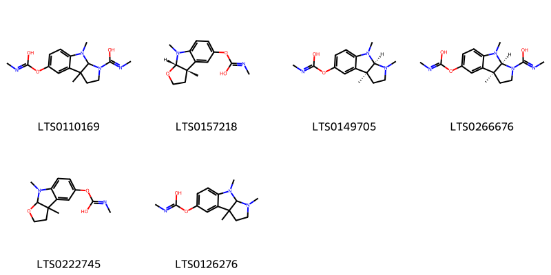{ width=100% }
    <figcaption>Hình ảnh cấu trúc hóa học của 6 hoạt chất thuộc nhóm Indoles and derivatives gồm ['n,3a,8-trimethyl-5-[(methyl-c-hydroxycarbonimidoyl)oxy]-2h,3h,8ah-pyrrolo[2,3-b]indole-1-carboximidic acid (LTS0110169)', '1-{[(3as,8as)-3a,8-dimethyl-2h,3h,8ah-furo[2,3-b]indol-5-yl]oxy}-n-methylmethanimidic acid (LTS0157218)', '1-{[(3as,8ar)-1,3a,8-trimethyl-2h,3h,8ah-pyrrolo[2,3-b]indol-5-yl]oxy}-n-methylmethanimidic acid (LTS0149705)', '(3as,8as)-n,3a,8-trimethyl-5-[(methyl-c-hydroxycarbonimidoyl)oxy]-2h,3h,8ah-pyrrolo[2,3-b]indole-1-carboximidic acid (LTS0266676)', '1-({3a,8-dimethyl-2h,3h,8ah-furo[2,3-b]indol-5-yl}oxy)-n-methylmethanimidic acid (LTS0222745)', '1-({1,3a,8-trimethyl-2h,3h,8ah-pyrrolo[2,3-b]indol-5-yl}oxy)-n-methylmethanimidic acid (LTS0126276)'].</figcaption>
</figure>

---

### Dược dân tộc học

Danh sách các quốc gia có sử dụng *Physostigma venenosum* trong điều trị các bệnh. 

| Country   | Disease                                      | Bệnh                                                                                                                                                                                                |
|:----------|:---------------------------------------------|:----------------------------------------------------------------------------------------------------------------------------------------------------------------------------------------------------|
| Africa    | Parasiticide, Pediculicide, Poison, Raticide | MYMEMORY WARNING: YOU USED ALL AVAILABLE FREE TRANSLATIONS FOR TODAY. NEXT AVAILABLE IN  16 HOURS 18 MINUTES 06 SECONDS VISIT HTTPS://MYMEMORY.TRANSLATED.NET/DOC/USAGELIMITS.PHP TO TRANSLATE MORE |
| Elsewhere | Antidote                                     | MYMEMORY WARNING: YOU USED ALL AVAILABLE FREE TRANSLATIONS FOR TODAY. NEXT AVAILABLE IN  16 HOURS 18 MINUTES 03 SECONDS VISIT HTTPS://MYMEMORY.TRANSLATED.NET/DOC/USAGELIMITS.PHP TO TRANSLATE MORE |
| India     | Poison                                       | MYMEMORY WARNING: YOU USED ALL AVAILABLE FREE TRANSLATIONS FOR TODAY. NEXT AVAILABLE IN  16 HOURS 18 MINUTES 01 SECONDS VISIT HTTPS://MYMEMORY.TRANSLATED.NET/DOC/USAGELIMITS.PHP TO TRANSLATE MORE |
| Turkey    | Myotic, Poison, Sedative                     | MYMEMORY WARNING: YOU USED ALL AVAILABLE FREE TRANSLATIONS FOR TODAY. NEXT AVAILABLE IN  16 HOURS 17 MINUTES 58 SECONDS VISIT HTTPS://MYMEMORY.TRANSLATED.NET/DOC/USAGELIMITS.PHP TO TRANSLATE MORE |

---

# Chi Pseudarthria

??? note "Danh sách các dược liệu thuộc chi"
    
	 - *Pseudarthria viscida*

---
## Pseudarthria viscida
### Thông tin về thực vật

!!! info "Phân loại thực vật của *Pseudarthria viscida* từ GIBF:"
    - **Kingdom:** Plantae
    - **Phylum:** Tracheophyta
    - **Order:** Fabales
    - **Family:** Fabaceae
    - **Genus:** Pseudarthria
    - **Species:** *Pseudarthria viscida*

 

| Label (VI)   | Label (EN)   | Scientific Name      | Descriptions (VI)   | Descriptions (EN)   | Also Known As (VI)   | Also Known As (EN)   |
|:-------------|:-------------|:---------------------|:--------------------|:--------------------|:---------------------|:---------------------|
| N/A          | N/A          | Pseudarthria viscida | loài thực vật       | species of plant    | ['']                 | ['']                 |

#### Phân bố trên thế giới

**Từ CSDL GIBF** nan, Sri Lanka, Thailand, Brazil, Myanmar, India, Indonesia, Jamaica, unknown or invalid, Timor-Leste, Philippines, Singapore, Malaysia

#### Phân bố tại Việt Nam

**Từ CSDL GIBF**: Không có ghi nhận ở Việt Nam

---
### Thành phần hóa học
        
- Theo cơ sở dữ liệu lotus: Từ loài *Pseudarthria viscida* đã phân lập và xác định được Chưa có hoạt chất nào được phân lập. hoạt chất thuộc về các nhóm Không có hoạt chất nào được phân lập. 

Không có hình ảnh nào được tạo ra

---

### Dược dân tộc học

Danh sách các quốc gia có sử dụng *Pseudarthria viscida* trong điều trị các bệnh. 

| Country   | Disease               | Bệnh                                                                                                                                                                                                |
|:----------|:----------------------|:----------------------------------------------------------------------------------------------------------------------------------------------------------------------------------------------------|
| Elsewhere | Vermifuge, Astringent | MYMEMORY WARNING: YOU USED ALL AVAILABLE FREE TRANSLATIONS FOR TODAY. NEXT AVAILABLE IN  16 HOURS 17 MINUTES 36 SECONDS VISIT HTTPS://MYMEMORY.TRANSLATED.NET/DOC/USAGELIMITS.PHP TO TRANSLATE MORE |

---

# Chi Derris

??? note "Danh sách các dược liệu thuộc chi"
    
	 - *Derris amoena*
	 - *Derris cebuensis*
	 - *Derris cuneifolia*
	 - *Derris elegans*
	 - *Derris elliptica*
	 - *Derris ferruginea*
	 - *Derris floribunda*
	 - *Derris grandifolia*
	 - *Derris koolgibberah*
	 - *Derris malaccensis*
	 - *Derris polyantha*
	 - *Derris pterocarpus*
	 - *Derris robusta*
	 - *Derris scandens*
	 - *Derris thyrsiflora*
	 - *Derris trifoliata*
	 - *Derris uligonosa*

---
## Derris amoena
### Thông tin về thực vật

!!! info "Phân loại thực vật của *Derris amoena* từ GIBF:"
    - **Kingdom:** Plantae
    - **Phylum:** Tracheophyta
    - **Order:** Fabales
    - **Family:** Fabaceae
    - **Genus:** Derris
    - **Species:** *Derris amoena*

 

| Label (VI)   | Label (EN)   | Scientific Name   | Descriptions (VI)   | Descriptions (EN)   | Also Known As (VI)   | Also Known As (EN)   |
|:-------------|:-------------|:------------------|:--------------------|:--------------------|:---------------------|:---------------------|
| N/A          | N/A          | Derris amoena     | loài thực vật       | species of plant    | ['']                 | ['']                 |

#### Phân bố trên thế giới

**Từ CSDL GIBF** nan, Thailand, Myanmar, Indonesia, Viet Nam, Singapore, Malaysia

#### Phân bố tại Việt Nam

**Từ CSDL GIBF**: Không có ghi nhận ở Việt Nam

---
### Thành phần hóa học
        
- Theo cơ sở dữ liệu lotus: Từ loài *Derris amoena* đã phân lập và xác định được Chưa có hoạt chất nào được phân lập. hoạt chất thuộc về các nhóm Không có hoạt chất nào được phân lập. 

Không có hình ảnh nào được tạo ra

---

### Dược dân tộc học

Danh sách các quốc gia có sử dụng *Derris amoena* trong điều trị các bệnh. 

| Country   | Disease   | Bệnh                                                                                                                                                                                                |
|:----------|:----------|:----------------------------------------------------------------------------------------------------------------------------------------------------------------------------------------------------|
| Malaya    | Piscicide | MYMEMORY WARNING: YOU USED ALL AVAILABLE FREE TRANSLATIONS FOR TODAY. NEXT AVAILABLE IN  16 HOURS 17 MINUTES 13 SECONDS VISIT HTTPS://MYMEMORY.TRANSLATED.NET/DOC/USAGELIMITS.PHP TO TRANSLATE MORE |

---

---
## Derris cebuensis
### Thông tin về thực vật

!!! info "Phân loại thực vật của *Derris spanogheana* từ GIBF:"
    - **Kingdom:** Plantae
    - **Phylum:** Tracheophyta
    - **Order:** Fabales
    - **Family:** Fabaceae
    - **Genus:** Derris
    - **Species:** *Derris spanogheana*

 

| Label (VI)   | Label (EN)   | Scientific Name   | Descriptions (VI)   | Descriptions (EN)   | Also Known As (VI)   | Also Known As (EN)   |
|:-------------|:-------------|:------------------|:--------------------|:--------------------|:---------------------|:---------------------|
| N/A          | N/A          | Derris cebuensis  | loài thực vật       | species of plant    | ['']                 | ['']                 |

#### Phân bố trên thế giới

**Từ CSDL GIBF** nan, Philippines, Indonesia

#### Phân bố tại Việt Nam

**Từ CSDL GIBF**: Không có ghi nhận ở Việt Nam

---
### Thành phần hóa học
        
- Theo cơ sở dữ liệu lotus: Từ loài *Derris spanogheana* đã phân lập và xác định được Chưa có hoạt chất nào được phân lập. hoạt chất thuộc về các nhóm Không có hoạt chất nào được phân lập. 

Không có hình ảnh nào được tạo ra

---

### Dược dân tộc học

Danh sách các quốc gia có sử dụng *Derris spanogheana* trong điều trị các bệnh. 

| Country     | Disease   | Bệnh                                                                                                                                                                                                |
|:------------|:----------|:----------------------------------------------------------------------------------------------------------------------------------------------------------------------------------------------------|
| Philippines | Piscicide | MYMEMORY WARNING: YOU USED ALL AVAILABLE FREE TRANSLATIONS FOR TODAY. NEXT AVAILABLE IN  16 HOURS 16 MINUTES 55 SECONDS VISIT HTTPS://MYMEMORY.TRANSLATED.NET/DOC/USAGELIMITS.PHP TO TRANSLATE MORE |

---

---
## Derris cuneifolia
### Thông tin về thực vật

!!! info "Phân loại thực vật của *Derris cuneifolia* từ GIBF:"
    - **Kingdom:** Plantae
    - **Phylum:** Tracheophyta
    - **Order:** Fabales
    - **Family:** Fabaceae
    - **Genus:** Derris
    - **Species:** *Derris cuneifolia*

 

| Label (VI)   | Label (EN)   | Scientific Name   | Descriptions (VI)   | Descriptions (EN)   | Also Known As (VI)   | Also Known As (EN)   |
|:-------------|:-------------|:------------------|:--------------------|:--------------------|:---------------------|:---------------------|
| N/A          | N/A          | Derris cuneifolia |                     | species of plant    | ['']                 | ['']                 |

#### Phân bố trên thế giới

**Từ CSDL GIBF** nan, Malaysia, Thailand, Lao People’s Democratic Republic, Chinese Taipei, Myanmar, Papua New Guinea, Bhutan, India, Indonesia, Bangladesh, unknown or invalid, Philippines, Viet Nam, China, Nepal

#### Phân bố tại Việt Nam

**Từ CSDL GIBF**: Không có ghi nhận ở Việt Nam

---
### Thành phần hóa học
        
- Theo cơ sở dữ liệu lotus: Từ loài *Derris cuneifolia* đã phân lập và xác định được Chưa có hoạt chất nào được phân lập. hoạt chất thuộc về các nhóm Không có hoạt chất nào được phân lập. 

Không có hình ảnh nào được tạo ra

---

### Dược dân tộc học

Danh sách các quốc gia có sử dụng *Derris cuneifolia* trong điều trị các bệnh. 

| Country   | Disease   | Bệnh                                                                                                                                                                                                |
|:----------|:----------|:----------------------------------------------------------------------------------------------------------------------------------------------------------------------------------------------------|
| India     | Piscicide | MYMEMORY WARNING: YOU USED ALL AVAILABLE FREE TRANSLATIONS FOR TODAY. NEXT AVAILABLE IN  16 HOURS 16 MINUTES 37 SECONDS VISIT HTTPS://MYMEMORY.TRANSLATED.NET/DOC/USAGELIMITS.PHP TO TRANSLATE MORE |

---

---
## Derris elegans
### Thông tin về thực vật

!!! info "Phân loại thực vật của *Derris elegans* từ GIBF:"
    - **Kingdom:** Plantae
    - **Phylum:** Tracheophyta
    - **Order:** Fabales
    - **Family:** Fabaceae
    - **Genus:** Derris
    - **Species:** *Derris elegans*

 

| Label (VI)   | Label (EN)   | Scientific Name   | Descriptions (VI)   | Descriptions (EN)   | Also Known As (VI)   | Also Known As (EN)   |
|:-------------|:-------------|:------------------|:--------------------|:--------------------|:---------------------|:---------------------|
| N/A          | N/A          | Derris elegans    | loài thực vật       | species of plant    | ['']                 | ['']                 |

#### Phân bố trên thế giới

**Từ CSDL GIBF** Thailand, Myanmar, Papua New Guinea, Vanuatu, unknown or invalid, Indonesia, Guinea, Philippines, Solomon Islands, Malaysia

#### Phân bố tại Việt Nam

**Từ CSDL GIBF**: Không có ghi nhận ở Việt Nam

---
### Thành phần hóa học
        
- Theo cơ sở dữ liệu lotus: Từ loài *Derris elegans* đã phân lập và xác định được Chưa có hoạt chất nào được phân lập. hoạt chất thuộc về các nhóm Không có hoạt chất nào được phân lập. 

Không có hình ảnh nào được tạo ra

---

### Dược dân tộc học

Danh sách các quốc gia có sử dụng *Derris elegans* trong điều trị các bệnh. 

| Country   | Disease   | Bệnh                                                                                                                                                                                                |
|:----------|:----------|:----------------------------------------------------------------------------------------------------------------------------------------------------------------------------------------------------|
| Malaya    | Piscicide | MYMEMORY WARNING: YOU USED ALL AVAILABLE FREE TRANSLATIONS FOR TODAY. NEXT AVAILABLE IN  16 HOURS 16 MINUTES 17 SECONDS VISIT HTTPS://MYMEMORY.TRANSLATED.NET/DOC/USAGELIMITS.PHP TO TRANSLATE MORE |

---

---
## Derris elliptica
### Thông tin về thực vật

!!! info "Phân loại thực vật của *Derris elliptica* từ GIBF:"
    - **Kingdom:** Plantae
    - **Phylum:** Tracheophyta
    - **Order:** Fabales
    - **Family:** Fabaceae
    - **Genus:** Derris
    - **Species:** *Derris elliptica*

 

| Label (VI)   | Label (EN)   | Scientific Name   | Descriptions (VI)   | Descriptions (EN)   | Also Known As (VI)   | Also Known As (EN)   |
|:-------------|:-------------|:------------------|:--------------------|:--------------------|:---------------------|:---------------------|
| N/A          | N/A          | Derris elliptica  | loài thực vật       | species of plant    | ['']                 | ['']                 |

#### Phân bố trên thế giới

**Từ CSDL GIBF** nan, Palau, Virgin Islands (U.S.), Micronesia (Federated States of), Australia, Japan, Christmas Island, Belgium, Cambodia, Wallis and Futuna, Cook Islands, Brunei Darussalam, Puerto Rico, Nigeria, Chinese Taipei, Papua New Guinea, United States of America, Trinidad and Tobago, Fiji, Thailand, Brazil, Guam, Côte d’Ivoire, Tonga, Austria, Singapore, Viet Nam, China, French Polynesia, Indonesia, Philippines, Malaysia, Northern Mariana Islands

#### Phân bố tại Việt Nam

**Từ CSDL GIBF**: Cao Bang, Ninh Binh, Thua Thien-Hue

---
### Thành phần hóa học
        
- Theo cơ sở dữ liệu lotus: Từ loài *Derris elliptica* đã phân lập và xác định được 19 hoạt chất thuộc về các nhóm Pyrrolidines, Isoflavonoids. 

|    | chemicalTaxonomyClassyfireClass   |   smiles_count |
|---:|:----------------------------------|---------------:|
|  0 | Isoflavonoids                     |             17 |
|  1 | Pyrrolidines                      |              2 |

#### Nhóm Isoflavonoids
<figure markdown="span">
    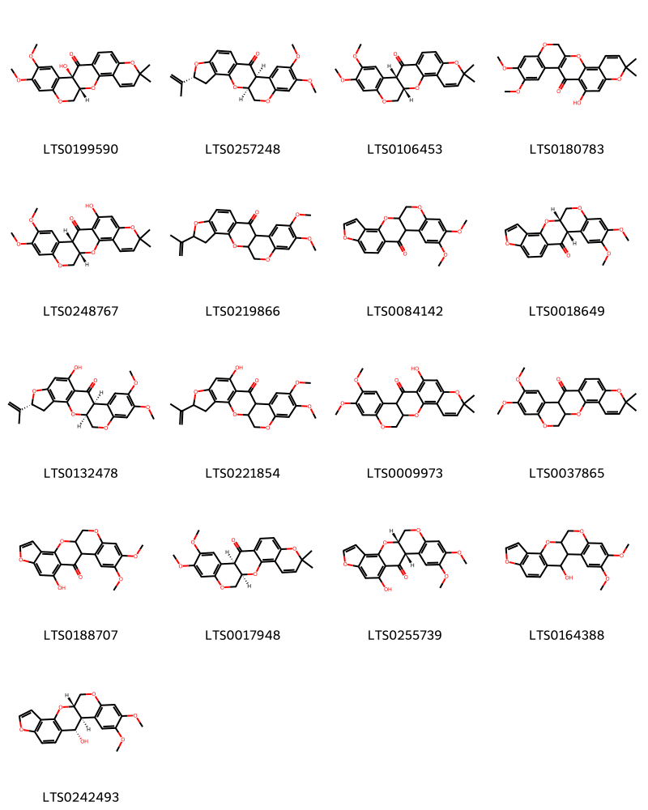{ width=100% }
    <figcaption>Hình ảnh cấu trúc hóa học của 17 hoạt chất thuộc nhóm Isoflavonoids gồm ['tephrosin (LTS0199590)', 'cube root (LTS0257248)', 'deguelin (LTS0106453)', 'dehydrotoxicarol (LTS0180783)', 'toxicarol (LTS0248767)', '16,17-dimethoxy-6-(prop-1-en-2-yl)-2,7,20-trioxapentacyclo[11.8.0.0³,¹¹.0⁴,⁸.0¹⁴,¹⁹]henicosa-3(11),4(8),9,14,16,18-hexaen-12-one (LTS0219866)', 'derride (LTS0084142)', 'elliptone (LTS0018649)', 'sumatrol (LTS0132478)', '10-hydroxy-16,17-dimethoxy-6-(prop-1-en-2-yl)-2,7,20-trioxapentacyclo[11.8.0.0³,¹¹.0⁴,⁸.0¹⁴,¹⁹]henicosa-3(11),4(8),9,14,16,18-hexaen-12-one (LTS0221854)', '11-hydroxy-17,18-dimethoxy-7,7-dimethyl-2,8,21-trioxapentacyclo[12.8.0.0³,¹².0⁴,⁹.0¹⁵,²⁰]docosa-3,5,9,11,15(20),16,18-heptaen-13-one (LTS0009973)', '17,18-dimethoxy-7,7-dimethyl-2,8,21-trioxapentacyclo[12.8.0.0³,¹².0⁴,⁹.0¹⁵,²⁰]docosa-3,5,9,11,15(20),16,18-heptaen-13-one (LTS0037865)', 'malaccol (LTS0188707)', '(1r,14r)-17,18-dimethoxy-7,7-dimethyl-2,8,21-trioxapentacyclo[12.8.0.0³,¹².0⁴,⁹.0¹⁵,²⁰]docosa-3,5,9,11,15(20),16,18-heptaen-13-one (LTS0017948)', '(1s,13s)-10-hydroxy-16,17-dimethoxy-2,7,20-trioxapentacyclo[11.8.0.0³,¹¹.0⁴,⁸.0¹⁴,¹⁹]henicosa-3,5,8,10,14(19),15,17-heptaen-12-one (LTS0255739)', 'elliptinol (LTS0164388)', '(1s,12s,13s)-16,17-dimethoxy-2,7,20-trioxapentacyclo[11.8.0.0³,¹¹.0⁴,⁸.0¹⁴,¹⁹]henicosa-3,5,8,10,14(19),15,17-heptaen-12-ol (LTS0242493)'].</figcaption>
</figure>
#### Nhóm Pyrrolidines
<figure markdown="span">
    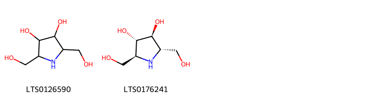{ width=100% }
    <figcaption>Hình ảnh cấu trúc hóa học của 2 hoạt chất thuộc nhóm Pyrrolidines gồm ['2,5-bis(hydroxymethyl)pyrrolidine-3,4-diol (LTS0126590)', '(2s,3s,4s,5s)-2,5-bis(hydroxymethyl)pyrrolidine-3,4-diol (LTS0176241)'].</figcaption>
</figure>

---

### Dược dân tộc học

Danh sách các quốc gia có sử dụng *Derris elliptica* trong điều trị các bệnh. 

| Country   | Disease                  | Bệnh                                                                                                                                                                                                |
|:----------|:-------------------------|:----------------------------------------------------------------------------------------------------------------------------------------------------------------------------------------------------|
| Asia      | Piscicide                | MYMEMORY WARNING: YOU USED ALL AVAILABLE FREE TRANSLATIONS FOR TODAY. NEXT AVAILABLE IN  16 HOURS 15 MINUTES 55 SECONDS VISIT HTTPS://MYMEMORY.TRANSLATED.NET/DOC/USAGELIMITS.PHP TO TRANSLATE MORE |
| Borneo    | Piscicide                | MYMEMORY WARNING: YOU USED ALL AVAILABLE FREE TRANSLATIONS FOR TODAY. NEXT AVAILABLE IN  16 HOURS 15 MINUTES 53 SECONDS VISIT HTTPS://MYMEMORY.TRANSLATED.NET/DOC/USAGELIMITS.PHP TO TRANSLATE MORE |
| Elsewhere | Insecticide, Insecticide | MYMEMORY WARNING: YOU USED ALL AVAILABLE FREE TRANSLATIONS FOR TODAY. NEXT AVAILABLE IN  16 HOURS 15 MINUTES 51 SECONDS VISIT HTTPS://MYMEMORY.TRANSLATED.NET/DOC/USAGELIMITS.PHP TO TRANSLATE MORE |
| German    | Poison                   | MYMEMORY WARNING: YOU USED ALL AVAILABLE FREE TRANSLATIONS FOR TODAY. NEXT AVAILABLE IN  16 HOURS 15 MINUTES 48 SECONDS VISIT HTTPS://MYMEMORY.TRANSLATED.NET/DOC/USAGELIMITS.PHP TO TRANSLATE MORE |
| India     | Insecticide, Piscicide   | MYMEMORY WARNING: YOU USED ALL AVAILABLE FREE TRANSLATIONS FOR TODAY. NEXT AVAILABLE IN  16 HOURS 15 MINUTES 46 SECONDS VISIT HTTPS://MYMEMORY.TRANSLATED.NET/DOC/USAGELIMITS.PHP TO TRANSLATE MORE |
| Java      | Piscicide                | MYMEMORY WARNING: YOU USED ALL AVAILABLE FREE TRANSLATIONS FOR TODAY. NEXT AVAILABLE IN  16 HOURS 15 MINUTES 43 SECONDS VISIT HTTPS://MYMEMORY.TRANSLATED.NET/DOC/USAGELIMITS.PHP TO TRANSLATE MORE |
| Malaya    | Herbicide                | MYMEMORY WARNING: YOU USED ALL AVAILABLE FREE TRANSLATIONS FOR TODAY. NEXT AVAILABLE IN  16 HOURS 15 MINUTES 41 SECONDS VISIT HTTPS://MYMEMORY.TRANSLATED.NET/DOC/USAGELIMITS.PHP TO TRANSLATE MORE |
| Malaysia  | Insecticide              | MYMEMORY WARNING: YOU USED ALL AVAILABLE FREE TRANSLATIONS FOR TODAY. NEXT AVAILABLE IN  16 HOURS 15 MINUTES 38 SECONDS VISIT HTTPS://MYMEMORY.TRANSLATED.NET/DOC/USAGELIMITS.PHP TO TRANSLATE MORE |
| Samoa     | Piscicide                | MYMEMORY WARNING: YOU USED ALL AVAILABLE FREE TRANSLATIONS FOR TODAY. NEXT AVAILABLE IN  16 HOURS 15 MINUTES 36 SECONDS VISIT HTTPS://MYMEMORY.TRANSLATED.NET/DOC/USAGELIMITS.PHP TO TRANSLATE MORE |

---

---
## Derris ferruginea
### Thông tin về thực vật

!!! info "Phân loại thực vật của *Derris ferruginea* từ GIBF:"
    - **Kingdom:** Plantae
    - **Phylum:** Tracheophyta
    - **Order:** Fabales
    - **Family:** Fabaceae
    - **Genus:** Derris
    - **Species:** *Derris ferruginea*

 

| Label (VI)   | Label (EN)   | Scientific Name   | Descriptions (VI)   | Descriptions (EN)   | Also Known As (VI)   | Also Known As (EN)   |
|:-------------|:-------------|:------------------|:--------------------|:--------------------|:---------------------|:---------------------|
| N/A          | N/A          | Derris ferruginea | loài thực vật       | species of plant    | ['']                 | ['']                 |

#### Phân bố trên thế giới

**Từ CSDL GIBF** nan, Malaysia, Thailand, Cambodia, Brazil, Myanmar, India, Philippines, Viet Nam, China

#### Phân bố tại Việt Nam

**Từ CSDL GIBF**: Cao Bang, Hà Tinh

---
### Thành phần hóa học
        
- Theo cơ sở dữ liệu lotus: Từ loài *Derris ferruginea* đã phân lập và xác định được Chưa có hoạt chất nào được phân lập. hoạt chất thuộc về các nhóm Không có hoạt chất nào được phân lập. 

Không có hình ảnh nào được tạo ra

---

### Dược dân tộc học

Danh sách các quốc gia có sử dụng *Derris ferruginea* trong điều trị các bệnh. 

| Country   | Disease                | Bệnh                                                                                                                                                                                                |
|:----------|:-----------------------|:----------------------------------------------------------------------------------------------------------------------------------------------------------------------------------------------------|
| India     | Insecticide, Piscicide | MYMEMORY WARNING: YOU USED ALL AVAILABLE FREE TRANSLATIONS FOR TODAY. NEXT AVAILABLE IN  16 HOURS 15 MINUTES 11 SECONDS VISIT HTTPS://MYMEMORY.TRANSLATED.NET/DOC/USAGELIMITS.PHP TO TRANSLATE MORE |

---

---
## Derris floribunda
### Thông tin về thực vật

!!! info "Phân loại thực vật của *N/A* từ GIBF:"
    - **Kingdom:** Plantae
    - **Phylum:** Tracheophyta
    - **Order:** Fabales
    - **Family:** Fabaceae
    - **Genus:** N/A
    - **Species:** *N/A*

 

| Label (VI)   | Label (EN)   | Scientific Name   | Descriptions (VI)   | Descriptions (EN)   | Also Known As (VI)   | Also Known As (EN)   |
|:-------------|:-------------|:------------------|:--------------------|:--------------------|:---------------------|:---------------------|
| N/A          | N/A          | Derris floribunda | loài thực vật       | species of plant    | ['']                 | ['']                 |

#### Phân bố trên thế giới

**Từ CSDL GIBF** Sri Lanka, Italy, Australia, Cambodia, Argentina, Tanzania, United Republic of, Chinese Taipei, Spain, Portugal, United States of America, Chile, Croatia, South Africa, Thailand, Germany, Brazil, Guam, France, Norfolk Island, Viet Nam, China, United Kingdom of Great Britain and Northern Ireland, Ireland, Gambia, India, Malaysia, New Zealand

#### Phân bố tại Việt Nam

**Từ CSDL GIBF**: Đà Nẵng, Bà Rịa - Vũng Tàu

---
### Thành phần hóa học
        
- Theo cơ sở dữ liệu lotus: Từ loài *N/A* đã phân lập và xác định được 13 hoạt chất thuộc về các nhóm Flavonoids, Stilbenes, Linear 1,3-diarylpropanoids. 

|    | chemicalTaxonomyClassyfireClass   |   smiles_count |
|---:|:----------------------------------|---------------:|
|  0 | Flavonoids                        |              2 |
|  1 | Linear 1,3-diarylpropanoids       |              8 |
|  2 | Stilbenes                         |              3 |

#### Nhóm Flavonoids
<figure markdown="span">
    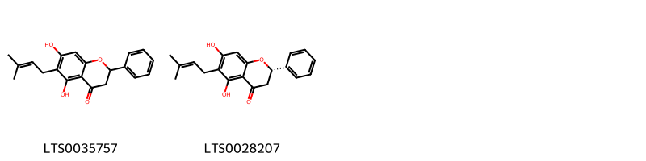{ width=100% }
    <figcaption>Hình ảnh cấu trúc hóa học của 2 hoạt chất thuộc nhóm Flavonoids gồm ['5,7-dihydroxy-6-(3-methylbut-2-en-1-yl)-2-phenyl-2,3-dihydro-1-benzopyran-4-one (LTS0035757)', '(2s)-5,7-dihydroxy-6-(3-methylbut-2-en-1-yl)-2-phenyl-2,3-dihydro-1-benzopyran-4-one (LTS0028207)'].</figcaption>
</figure>
#### Nhóm Linear 1_3-diarylpropanoids
<figure markdown="span">
    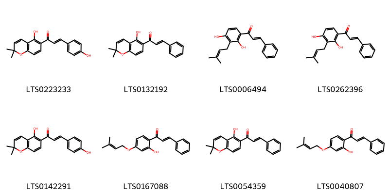{ width=100% }
    <figcaption>Hình ảnh cấu trúc hóa học của Không tìm thấy chú thích hoạt chất thuộc nhóm Linear 1_3-diarylpropanoids gồm Không tìm thấy chú thích.</figcaption>
</figure>
#### Nhóm Stilbenes
<figure markdown="span">
    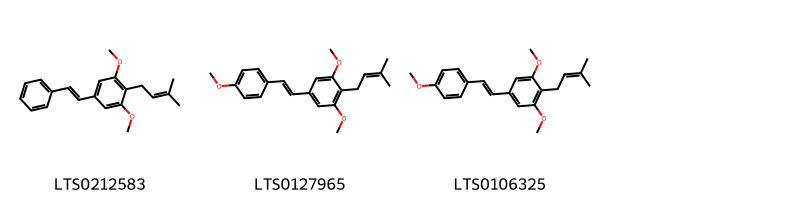{ width=100% }
    <figcaption>Hình ảnh cấu trúc hóa học của 3 hoạt chất thuộc nhóm Stilbenes gồm ['1,3-dimethoxy-2-(3-methylbut-2-en-1-yl)-5-(2-phenylethenyl)benzene (LTS0212583)', '1,3-dimethoxy-5-[(1e)-2-(4-methoxyphenyl)ethenyl]-2-(3-methylbut-2-en-1-yl)benzene (LTS0127965)', '1,3-dimethoxy-5-[2-(4-methoxyphenyl)ethenyl]-2-(3-methylbut-2-en-1-yl)benzene (LTS0106325)'].</figcaption>
</figure>

---

### Dược dân tộc học

Danh sách các quốc gia có sử dụng *N/A* trong điều trị các bệnh. 

| Country         | Disease   | Bệnh                                                                                                                                                                                                |
|:----------------|:----------|:----------------------------------------------------------------------------------------------------------------------------------------------------------------------------------------------------|
| Brazil(Paumari) | Piscicide | MYMEMORY WARNING: YOU USED ALL AVAILABLE FREE TRANSLATIONS FOR TODAY. NEXT AVAILABLE IN  16 HOURS 14 MINUTES 50 SECONDS VISIT HTTPS://MYMEMORY.TRANSLATED.NET/DOC/USAGELIMITS.PHP TO TRANSLATE MORE |

---

---
## Derris grandifolia
### Thông tin về thực vật

!!! info "Phân loại thực vật của *Piscidia grandifolia* từ GIBF:"
    - **Kingdom:** Plantae
    - **Phylum:** Tracheophyta
    - **Order:** Fabales
    - **Family:** Fabaceae
    - **Genus:** Piscidia
    - **Species:** *Piscidia grandifolia*

 

| Label (VI)   | Label (EN)   | Scientific Name    | Descriptions (VI)   | Descriptions (EN)   | Also Known As (VI)   | Also Known As (EN)   |
|:-------------|:-------------|:-------------------|:--------------------|:--------------------|:---------------------|:---------------------|
| N/A          | N/A          | Derris grandifolia | loài thực vật       | species of plant    | ['']                 | ['']                 |

#### Phân bố trên thế giới

**Từ CSDL GIBF** Guatemala

#### Phân bố tại Việt Nam

**Từ CSDL GIBF**: Không có ghi nhận ở Việt Nam

---
### Thành phần hóa học
        
- Theo cơ sở dữ liệu lotus: Từ loài *Piscidia grandifolia* đã phân lập và xác định được Chưa có hoạt chất nào được phân lập. hoạt chất thuộc về các nhóm Không có hoạt chất nào được phân lập. 

Không có hình ảnh nào được tạo ra

---

### Dược dân tộc học

Danh sách các quốc gia có sử dụng *Piscidia grandifolia* trong điều trị các bệnh. 

| Country   | Disease   | Bệnh                                                                                                                                                                                                |
|:----------|:----------|:----------------------------------------------------------------------------------------------------------------------------------------------------------------------------------------------------|
| India     | Piscicide | MYMEMORY WARNING: YOU USED ALL AVAILABLE FREE TRANSLATIONS FOR TODAY. NEXT AVAILABLE IN  16 HOURS 14 MINUTES 26 SECONDS VISIT HTTPS://MYMEMORY.TRANSLATED.NET/DOC/USAGELIMITS.PHP TO TRANSLATE MORE |

---

---
## Derris koolgibberah
### Thông tin về thực vật

!!! info "Phân loại thực vật của *Brachypterum koolgibberah* từ GIBF:"
    - **Kingdom:** Plantae
    - **Phylum:** Tracheophyta
    - **Order:** Fabales
    - **Family:** Fabaceae
    - **Genus:** Brachypterum
    - **Species:** *Brachypterum koolgibberah*

 

| Label (VI)   | Label (EN)   | Scientific Name     | Descriptions (VI)   | Descriptions (EN)   | Also Known As (VI)   | Also Known As (EN)   |
|:-------------|:-------------|:--------------------|:--------------------|:--------------------|:---------------------|:---------------------|
| N/A          | N/A          | Derris koolgibberah | loài thực vật       | species of plant    | ['']                 | ['']                 |

#### Phân bố trên thế giới

**Từ CSDL GIBF** Papua New Guinea, Australia

#### Phân bố tại Việt Nam

**Từ CSDL GIBF**: Không có ghi nhận ở Việt Nam

---
### Thành phần hóa học
        
- Theo cơ sở dữ liệu lotus: Từ loài *Brachypterum koolgibberah* đã phân lập và xác định được Chưa có hoạt chất nào được phân lập. hoạt chất thuộc về các nhóm Không có hoạt chất nào được phân lập. 

Không có hình ảnh nào được tạo ra

---

### Dược dân tộc học

Danh sách các quốc gia có sử dụng *Brachypterum koolgibberah* trong điều trị các bệnh. 

| Country   | Disease   | Bệnh                                                                                                                                                                                                |
|:----------|:----------|:----------------------------------------------------------------------------------------------------------------------------------------------------------------------------------------------------|
| Australia | Piscicide | MYMEMORY WARNING: YOU USED ALL AVAILABLE FREE TRANSLATIONS FOR TODAY. NEXT AVAILABLE IN  16 HOURS 14 MINUTES 09 SECONDS VISIT HTTPS://MYMEMORY.TRANSLATED.NET/DOC/USAGELIMITS.PHP TO TRANSLATE MORE |

---

---
## Derris malaccensis
### Thông tin về thực vật

!!! info "Phân loại thực vật của *Derris montana* từ GIBF:"
    - **Kingdom:** Plantae
    - **Phylum:** Tracheophyta
    - **Order:** Fabales
    - **Family:** Fabaceae
    - **Genus:** Derris
    - **Species:** *Derris montana*

 

| Label (VI)   | Label (EN)   | Scientific Name    | Descriptions (VI)   | Descriptions (EN)   | Also Known As (VI)   | Also Known As (EN)   |
|:-------------|:-------------|:-------------------|:--------------------|:--------------------|:---------------------|:---------------------|
| N/A          | N/A          | Derris malaccensis | loài thực vật       | species of plant    | ['']                 | ['']                 |

#### Phân bố trên thế giới

**Từ CSDL GIBF** nan, Trinidad and Tobago, French Polynesia, Fiji, Micronesia (Federated States of), Niue, Japan, Cook Islands, Thailand, Wallis and Futuna, Chinese Taipei, unknown or invalid, Indonesia, Tonga, Bangladesh, Samoa, Malaysia, China

#### Phân bố tại Việt Nam

**Từ CSDL GIBF**: Không có ghi nhận ở Việt Nam

---
### Thành phần hóa học
        
- Theo cơ sở dữ liệu lotus: Từ loài *Derris montana* đã phân lập và xác định được 41 hoạt chất thuộc về các nhóm Benzopyrans, Isoflavonoids. 

|    | chemicalTaxonomyClassyfireClass   |   smiles_count |
|---:|:----------------------------------|---------------:|
|  0 | Benzopyrans                       |              1 |
|  1 | Isoflavonoids                     |             39 |

#### Nhóm Benzopyrans
<figure markdown="span">
    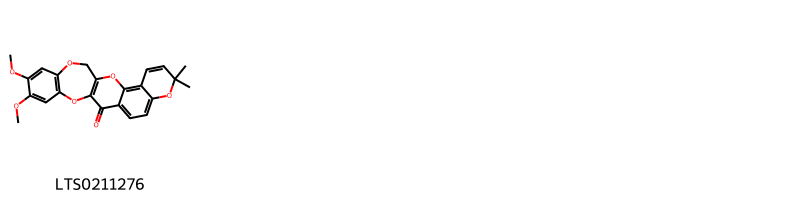{ width=100% }
    <figcaption>Hình ảnh cấu trúc hóa học của 1 hoạt chất thuộc nhóm Benzopyrans gồm ['18,19-dimethoxy-7,7-dimethyl-2,8,15,22-tetraoxapentacyclo[12.9.0.0³,¹².0⁴,⁹.0¹⁶,²¹]tricosa-1(14),3,5,9,11,16(21),17,19-octaen-13-one (LTS0211276)'].</figcaption>
</figure>
#### Nhóm Isoflavonoids
<figure markdown="span">
    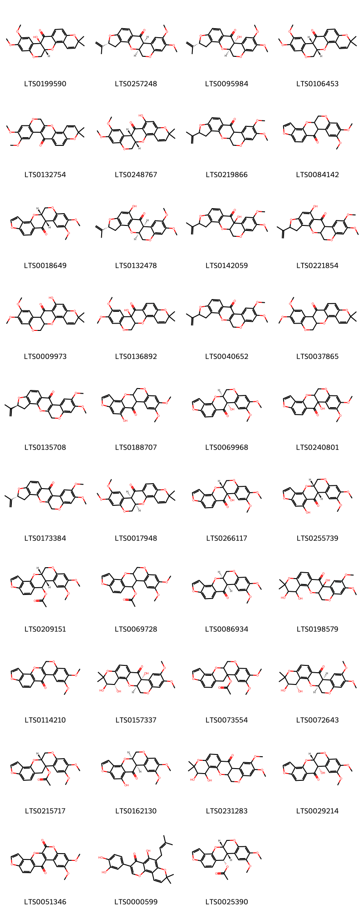{ width=100% }
    <figcaption>Hình ảnh cấu trúc hóa học của 39 hoạt chất thuộc nhóm Isoflavonoids gồm ['tephrosin (LTS0199590)', 'cube root (LTS0257248)', '12a-hydroxyrotenone (LTS0095984)', 'deguelin (LTS0106453)', '17,18-dimethoxy-7,7-dimethyl-2,8,21-trioxapentacyclo[12.8.0.0³,¹².0⁴,⁹.0¹⁵,²⁰]docosa-1(14),3,5,9,11,15(20),16,18-octaen-13-one (LTS0132754)', 'toxicarol (LTS0248767)', '16,17-dimethoxy-6-(prop-1-en-2-yl)-2,7,20-trioxapentacyclo[11.8.0.0³,¹¹.0⁴,⁸.0¹⁴,¹⁹]henicosa-3(11),4(8),9,14,16,18-hexaen-12-one (LTS0219866)', 'derride (LTS0084142)', 'elliptone (LTS0018649)', 'sumatrol (LTS0132478)', '13-hydroxy-16,17-dimethoxy-6-(prop-1-en-2-yl)-2,7,20-trioxapentacyclo[11.8.0.0³,¹¹.0⁴,⁸.0¹⁴,¹⁹]henicosa-3(11),4(8),9,14,16,18-hexaen-12-one (LTS0142059)', '10-hydroxy-16,17-dimethoxy-6-(prop-1-en-2-yl)-2,7,20-trioxapentacyclo[11.8.0.0³,¹¹.0⁴,⁸.0¹⁴,¹⁹]henicosa-3(11),4(8),9,14,16,18-hexaen-12-one (LTS0221854)', '11-hydroxy-17,18-dimethoxy-7,7-dimethyl-2,8,21-trioxapentacyclo[12.8.0.0³,¹².0⁴,⁹.0¹⁵,²⁰]docosa-3,5,9,11,15(20),16,18-heptaen-13-one (LTS0009973)', '14-hydroxy-17,18-dimethoxy-7,7-dimethyl-2,8,21-trioxapentacyclo[12.8.0.0³,¹².0⁴,⁹.0¹⁵,²⁰]docosa-3,5,9,11,15(20),16,18-heptaen-13-one (LTS0136892)', '16,17-dimethoxy-6-(prop-1-en-2-yl)-2,7,20-trioxapentacyclo[11.8.0.0³,¹¹.0⁴,⁸.0¹⁴,¹⁹]henicosa-1(13),3,8,10,14,16,18-heptaen-12-one (LTS0040652)', '17,18-dimethoxy-7,7-dimethyl-2,8,21-trioxapentacyclo[12.8.0.0³,¹².0⁴,⁹.0¹⁵,²⁰]docosa-3,5,9,11,15(20),16,18-heptaen-13-one (LTS0037865)', '(6s)-16,17-dimethoxy-6-(prop-1-en-2-yl)-2,7,20-trioxapentacyclo[11.8.0.0³,¹¹.0⁴,⁸.0¹⁴,¹⁹]henicosa-1(13),3,8,10,14,16,18-heptaen-12-one (LTS0135708)', 'malaccol (LTS0188707)', '(1s,13s)-13-hydroxy-16,17-dimethoxy-2,7,20-trioxapentacyclo[11.8.0.0³,¹¹.0⁴,⁸.0¹⁴,¹⁹]henicosa-3,5,8,10,14(19),15,17-heptaen-12-one (LTS0069968)', '13-hydroxy-16,17-dimethoxy-2,7,20-trioxapentacyclo[11.8.0.0³,¹¹.0⁴,⁸.0¹⁴,¹⁹]henicosa-3,5,8,10,14(19),15,17-heptaen-12-one (LTS0240801)', '(6r)-16,17-dimethoxy-6-(prop-1-en-2-yl)-2,7,20-trioxapentacyclo[11.8.0.0³,¹¹.0⁴,⁸.0¹⁴,¹⁹]henicosa-1(13),3,8,10,14,16,18-heptaen-12-one (LTS0173384)', '(1r,14r)-17,18-dimethoxy-7,7-dimethyl-2,8,21-trioxapentacyclo[12.8.0.0³,¹².0⁴,⁹.0¹⁵,²⁰]docosa-3,5,9,11,15(20),16,18-heptaen-13-one (LTS0017948)', '(1r,13r)-13-hydroxy-16,17-dimethoxy-2,7,20-trioxapentacyclo[11.8.0.0³,¹¹.0⁴,⁸.0¹⁴,¹⁹]henicosa-3,5,8,10,14(19),15,17-heptaen-12-one (LTS0266117)', '(1s,13s)-10-hydroxy-16,17-dimethoxy-2,7,20-trioxapentacyclo[11.8.0.0³,¹¹.0⁴,⁸.0¹⁴,¹⁹]henicosa-3,5,8,10,14(19),15,17-heptaen-12-one (LTS0255739)', '(1s,12r,13r)-16,17-dimethoxy-2,7,20-trioxapentacyclo[11.8.0.0³,¹¹.0⁴,⁸.0¹⁴,¹⁹]henicosa-3,5,8,10,14(19),15,17-heptaen-12-yl acetate (LTS0209151)', '16,17-dimethoxy-2,7,20-trioxapentacyclo[11.8.0.0³,¹¹.0⁴,⁸.0¹⁴,¹⁹]henicosa-3,5,8,10,14(19),15,17-heptaen-12-yl acetate (LTS0069728)', '(1r,13r)-16,17-dimethoxy-2,7,20-trioxapentacyclo[11.8.0.0³,¹¹.0⁴,⁸.0¹⁴,¹⁹]henicosa-3,5,8,10,14(19),15,17-heptaen-12-one (LTS0086934)', '5,6,14-trihydroxy-17,18-dimethoxy-7,7-dimethyl-2,8,21-trioxapentacyclo[12.8.0.0³,¹².0⁴,⁹.0¹⁵,²⁰]docosa-3,9,11,15(20),16,18-hexaen-13-one (LTS0198579)', '16,17-dimethoxy-2,7,20-trioxapentacyclo[11.8.0.0³,¹¹.0⁴,⁸.0¹⁴,¹⁹]henicosa-1(13),3(11),4(8),5,9,14(19),15,17-octaen-12-one (LTS0114210)', '(1r,5s,6r,14r)-5,6,14-trihydroxy-17,18-dimethoxy-7,7-dimethyl-2,8,21-trioxapentacyclo[12.8.0.0³,¹².0⁴,⁹.0¹⁵,²⁰]docosa-3,9,11,15(20),16,18-hexaen-13-one (LTS0157337)', '16,17-dimethoxy-2,7,20-trioxapentacyclo[11.8.0.0³,¹¹.0⁴,⁸.0¹⁴,¹⁹]henicosa-3,5,8,10,14(19),15,17-heptaen-13-yl acetate (LTS0073554)', '(1s,5s,6r,14s)-5,6-dihydroxy-17,18-dimethoxy-7,7-dimethyl-2,8,21-trioxapentacyclo[12.8.0.0³,¹².0⁴,⁹.0¹⁵,²⁰]docosa-3,9,11,15(20),16,18-hexaen-13-one (LTS0072643)', '(1r,13r)-16,17-dimethoxy-2,7,20-trioxapentacyclo[11.8.0.0³,¹¹.0⁴,⁸.0¹⁴,¹⁹]henicosa-3,5,8,10,14(19),15,17-heptaen-13-yl acetate (LTS0215717)', '(1r,13r)-10-hydroxy-16,17-dimethoxy-2,7,20-trioxapentacyclo[11.8.0.0³,¹¹.0⁴,⁸.0¹⁴,¹⁹]henicosa-3,5,8,10,14(19),15,17-heptaen-12-one (LTS0162130)', '5,6-dihydroxy-17,18-dimethoxy-7,7-dimethyl-2,8,21-trioxapentacyclo[12.8.0.0³,¹².0⁴,⁹.0¹⁵,²⁰]docosa-3,9,11,15(20),16,18-hexaen-13-one (LTS0231283)', '(1r,13s)-13-hydroxy-16,17-dimethoxy-2,7,20-trioxapentacyclo[11.8.0.0³,¹¹.0⁴,⁸.0¹⁴,¹⁹]henicosa-3,5,8,10,14(19),15,17-heptaen-12-one (LTS0029214)', '16,17-dimethoxy-2,7,20-trioxapentacyclo[11.8.0.0³,¹¹.0⁴,⁸.0¹⁴,¹⁹]henicosa-1(13),3(11),4(8),5,9,14(19),15,17-octaene-12,21-dione (LTS0051346)', 'pomiferin (LTS0000599)', '(1s,12s,13r)-16,17-dimethoxy-2,7,20-trioxapentacyclo[11.8.0.0³,¹¹.0⁴,⁸.0¹⁴,¹⁹]henicosa-3,5,8,10,14(19),15,17-heptaen-12-yl acetate (LTS0025390)'].</figcaption>
</figure>

---

### Dược dân tộc học

Danh sách các quốc gia có sử dụng *Derris montana* trong điều trị các bệnh. 

| Country   | Disease                               | Bệnh                                                                                                                                                                                                |
|:----------|:--------------------------------------|:----------------------------------------------------------------------------------------------------------------------------------------------------------------------------------------------------|
| Elsewhere | Insecticide, Insecticide, Insecticide | MYMEMORY WARNING: YOU USED ALL AVAILABLE FREE TRANSLATIONS FOR TODAY. NEXT AVAILABLE IN  16 HOURS 13 MINUTES 52 SECONDS VISIT HTTPS://MYMEMORY.TRANSLATED.NET/DOC/USAGELIMITS.PHP TO TRANSLATE MORE |
| India     | Piscicide                             | MYMEMORY WARNING: YOU USED ALL AVAILABLE FREE TRANSLATIONS FOR TODAY. NEXT AVAILABLE IN  16 HOURS 13 MINUTES 49 SECONDS VISIT HTTPS://MYMEMORY.TRANSLATED.NET/DOC/USAGELIMITS.PHP TO TRANSLATE MORE |
| Malaya    | Insecticide, Piscicide, Larvicide     | MYMEMORY WARNING: YOU USED ALL AVAILABLE FREE TRANSLATIONS FOR TODAY. NEXT AVAILABLE IN  16 HOURS 13 MINUTES 47 SECONDS VISIT HTTPS://MYMEMORY.TRANSLATED.NET/DOC/USAGELIMITS.PHP TO TRANSLATE MORE |

---

---
## Derris polyantha
### Thông tin về thực vật

!!! info "Phân loại thực vật của *Derris polyantha* từ GIBF:"
    - **Kingdom:** Plantae
    - **Phylum:** Tracheophyta
    - **Order:** Fabales
    - **Family:** Fabaceae
    - **Genus:** Derris
    - **Species:** *Derris polyantha*

 

| Label (VI)   | Label (EN)   | Scientific Name   | Descriptions (VI)   | Descriptions (EN)   | Also Known As (VI)   | Also Known As (EN)   |
|:-------------|:-------------|:------------------|:--------------------|:--------------------|:---------------------|:---------------------|
| N/A          | N/A          | Derris polyantha  | loài thực vật       | species of plant    | ['']                 | ['']                 |

#### Phân bố trên thế giới

**Từ CSDL GIBF** nan, Philippines, unknown or invalid, Indonesia

#### Phân bố tại Việt Nam

**Từ CSDL GIBF**: Không có ghi nhận ở Việt Nam

---
### Thành phần hóa học
        
- Theo cơ sở dữ liệu lotus: Từ loài *Derris polyantha* đã phân lập và xác định được Chưa có hoạt chất nào được phân lập. hoạt chất thuộc về các nhóm Không có hoạt chất nào được phân lập. 

Không có hình ảnh nào được tạo ra

---

### Dược dân tộc học

Danh sách các quốc gia có sử dụng *Derris polyantha* trong điều trị các bệnh. 

| Country   | Disease   | Bệnh                                                                                                                                                                                                |
|:----------|:----------|:----------------------------------------------------------------------------------------------------------------------------------------------------------------------------------------------------|
| India     | Piscicide | MYMEMORY WARNING: YOU USED ALL AVAILABLE FREE TRANSLATIONS FOR TODAY. NEXT AVAILABLE IN  16 HOURS 13 MINUTES 25 SECONDS VISIT HTTPS://MYMEMORY.TRANSLATED.NET/DOC/USAGELIMITS.PHP TO TRANSLATE MORE |

---

---
## Derris pterocarpus
### Thông tin về thực vật

!!! info "Phân loại thực vật của *Deguelia scandens* từ GIBF:"
    - **Kingdom:** Plantae
    - **Phylum:** Tracheophyta
    - **Order:** Fabales
    - **Family:** Fabaceae
    - **Genus:** Deguelia
    - **Species:** *Deguelia scandens*

 

| Label (VI)   | Label (EN)   | Scientific Name    | Descriptions (VI)   | Descriptions (EN)   | Also Known As (VI)   | Also Known As (EN)   |
|:-------------|:-------------|:-------------------|:--------------------|:--------------------|:---------------------|:---------------------|
| N/A          | N/A          | Derris pterocarpus |                     | species of plant    | ['']                 | ['']                 |

#### Phân bố trên thế giới

**Từ CSDL GIBF** nan, Belize, Suriname, Colombia, Brazil, Bolivia (Plurinational State of), Guyana, Cuba, United States of America, Peru, Venezuela (Bolivarian Republic of), French Guiana

#### Phân bố tại Việt Nam

**Từ CSDL GIBF**: Không có ghi nhận ở Việt Nam

---
### Thành phần hóa học
        
- Theo cơ sở dữ liệu lotus: Từ loài *Deguelia scandens* đã phân lập và xác định được Chưa có hoạt chất nào được phân lập. hoạt chất thuộc về các nhóm Không có hoạt chất nào được phân lập. 

Không có hình ảnh nào được tạo ra

---

### Dược dân tộc học

Danh sách các quốc gia có sử dụng *Deguelia scandens* trong điều trị các bệnh. 

| Country   | Disease   | Bệnh                                                                                                                                                                                                |
|:----------|:----------|:----------------------------------------------------------------------------------------------------------------------------------------------------------------------------------------------------|
| Elsewhere | Piscicide | MYMEMORY WARNING: YOU USED ALL AVAILABLE FREE TRANSLATIONS FOR TODAY. NEXT AVAILABLE IN  16 HOURS 13 MINUTES 08 SECONDS VISIT HTTPS://MYMEMORY.TRANSLATED.NET/DOC/USAGELIMITS.PHP TO TRANSLATE MORE |

---

---
## Derris robusta
### Thông tin về thực vật

!!! info "Phân loại thực vật của *Brachypterum robustum* từ GIBF:"
    - **Kingdom:** Plantae
    - **Phylum:** Tracheophyta
    - **Order:** Fabales
    - **Family:** Fabaceae
    - **Genus:** Brachypterum
    - **Species:** *Brachypterum robustum*

 

| Label (VI)   | Label (EN)   | Scientific Name   | Descriptions (VI)   | Descriptions (EN)   | Also Known As (VI)   | Also Known As (EN)   |
|:-------------|:-------------|:------------------|:--------------------|:--------------------|:---------------------|:---------------------|
| N/A          | N/A          | Derris robusta    | loài thực vật       | species of plant    | ['']                 | ['']                 |

#### Phân bố trên thế giới

**Từ CSDL GIBF** nan, Pakistan, Sri Lanka, Réunion, Seychelles, Thailand, Lao People’s Democratic Republic, Myanmar, Papua New Guinea, India, Indonesia, unknown or invalid, Bangladesh, Philippines, Cameroon, Viet Nam, China

#### Phân bố tại Việt Nam

**Từ CSDL GIBF**: Cao Bang, Lâm Dông

---
### Thành phần hóa học
        
- Theo cơ sở dữ liệu lotus: Từ loài *Brachypterum robustum* đã phân lập và xác định được 4 hoạt chất thuộc về các nhóm Isoflavonoids, Linear 1,3-diarylpropanoids. 

|    | chemicalTaxonomyClassyfireClass   |   smiles_count |
|---:|:----------------------------------|---------------:|
|  0 | Isoflavonoids                     |              2 |
|  1 | Linear 1,3-diarylpropanoids       |              2 |

#### Nhóm Isoflavonoids
<figure markdown="span">
    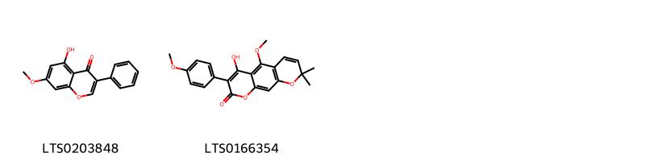{ width=100% }
    <figcaption>Hình ảnh cấu trúc hóa học của 2 hoạt chất thuộc nhóm Isoflavonoids gồm ['5-hydroxy-7-methoxy-3-phenylchromen-4-one (LTS0203848)', 'robustic acid (LTS0166354)'].</figcaption>
</figure>
#### Nhóm Linear 1_3-diarylpropanoids
<figure markdown="span">
    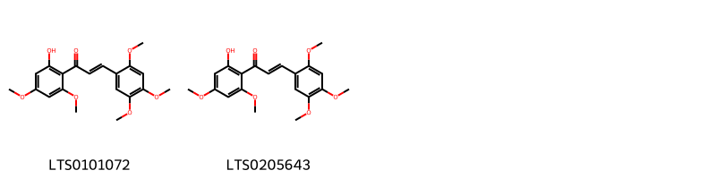{ width=100% }
    <figcaption>Hình ảnh cấu trúc hóa học của Không tìm thấy chú thích hoạt chất thuộc nhóm Linear 1_3-diarylpropanoids gồm Không tìm thấy chú thích.</figcaption>
</figure>

---

### Dược dân tộc học

Danh sách các quốc gia có sử dụng *Brachypterum robustum* trong điều trị các bệnh. 

| Country   | Disease     | Bệnh                                                                                                                                                                                                |
|:----------|:------------|:----------------------------------------------------------------------------------------------------------------------------------------------------------------------------------------------------|
| Elsewhere | Insecticide | MYMEMORY WARNING: YOU USED ALL AVAILABLE FREE TRANSLATIONS FOR TODAY. NEXT AVAILABLE IN  16 HOURS 12 MINUTES 48 SECONDS VISIT HTTPS://MYMEMORY.TRANSLATED.NET/DOC/USAGELIMITS.PHP TO TRANSLATE MORE |

---

---
## Derris scandens
### Thông tin về thực vật

!!! info "Phân loại thực vật của *N/A* từ GIBF:"
    - **Kingdom:** Plantae
    - **Phylum:** Tracheophyta
    - **Order:** Fabales
    - **Family:** Fabaceae
    - **Genus:** N/A
    - **Species:** *N/A*

 

| Label (VI)   | Label (EN)   | Scientific Name   | Descriptions (VI)   | Descriptions (EN)   | Also Known As (VI)   | Also Known As (EN)   |
|:-------------|:-------------|:------------------|:--------------------|:--------------------|:---------------------|:---------------------|
| N/A          | N/A          | Derris scandens   | loài thực vật       | species of plant    | ['']                 | ['']                 |

#### Phân bố trên thế giới

**Từ CSDL GIBF** Sri Lanka, Italy, Australia, Cambodia, Argentina, Tanzania, United Republic of, Chinese Taipei, Spain, Portugal, United States of America, Chile, Croatia, South Africa, Thailand, Germany, Brazil, Guam, France, Norfolk Island, Viet Nam, China, United Kingdom of Great Britain and Northern Ireland, Ireland, Gambia, India, Malaysia, New Zealand

#### Phân bố tại Việt Nam

**Từ CSDL GIBF**: Đà Nẵng, Bà Rịa - Vũng Tàu

---
### Thành phần hóa học
        
- Theo cơ sở dữ liệu lotus: Từ loài *N/A* đã phân lập và xác định được Chưa có hoạt chất nào được phân lập. hoạt chất thuộc về các nhóm Không có hoạt chất nào được phân lập. 

Không có hình ảnh nào được tạo ra

---

### Dược dân tộc học

Danh sách các quốc gia có sử dụng *N/A* trong điều trị các bệnh. 

| Country   | Disease   | Bệnh                                                                                                                                                                                                |
|:----------|:----------|:----------------------------------------------------------------------------------------------------------------------------------------------------------------------------------------------------|
| Elsewhere | Piscicide | MYMEMORY WARNING: YOU USED ALL AVAILABLE FREE TRANSLATIONS FOR TODAY. NEXT AVAILABLE IN  16 HOURS 12 MINUTES 28 SECONDS VISIT HTTPS://MYMEMORY.TRANSLATED.NET/DOC/USAGELIMITS.PHP TO TRANSLATE MORE |
| India     | Piscicide | MYMEMORY WARNING: YOU USED ALL AVAILABLE FREE TRANSLATIONS FOR TODAY. NEXT AVAILABLE IN  16 HOURS 12 MINUTES 25 SECONDS VISIT HTTPS://MYMEMORY.TRANSLATED.NET/DOC/USAGELIMITS.PHP TO TRANSLATE MORE |
| Malaya    | Piscicide | MYMEMORY WARNING: YOU USED ALL AVAILABLE FREE TRANSLATIONS FOR TODAY. NEXT AVAILABLE IN  16 HOURS 12 MINUTES 22 SECONDS VISIT HTTPS://MYMEMORY.TRANSLATED.NET/DOC/USAGELIMITS.PHP TO TRANSLATE MORE |

---

---
## Derris thyrsiflora
### Thông tin về thực vật

!!! info "Phân loại thực vật của *Aganope thyrsiflora* từ GIBF:"
    - **Kingdom:** Plantae
    - **Phylum:** Tracheophyta
    - **Order:** Fabales
    - **Family:** Fabaceae
    - **Genus:** Aganope
    - **Species:** *Aganope thyrsiflora*

 

| Label (VI)   | Label (EN)   | Scientific Name    | Descriptions (VI)   | Descriptions (EN)   | Also Known As (VI)   | Also Known As (EN)   |
|:-------------|:-------------|:-------------------|:--------------------|:--------------------|:---------------------|:---------------------|
| N/A          | N/A          | Derris thyrsiflora | loài thực vật       | species of plant    | ['']                 | ['']                 |

#### Phân bố trên thế giới

**Từ CSDL GIBF** nan, Malaysia, Thailand, India, Indonesia, Singapore, Viet Nam, China

#### Phân bố tại Việt Nam

**Từ CSDL GIBF**: Tonkin, 东京

---
### Thành phần hóa học
        
- Theo cơ sở dữ liệu lotus: Từ loài *Aganope thyrsiflora* đã phân lập và xác định được Chưa có hoạt chất nào được phân lập. hoạt chất thuộc về các nhóm Không có hoạt chất nào được phân lập. 

Không có hình ảnh nào được tạo ra

---

### Dược dân tộc học

Danh sách các quốc gia có sử dụng *Aganope thyrsiflora* trong điều trị các bệnh. 

| Country   | Disease   | Bệnh                                                                                                                                                                                                |
|:----------|:----------|:----------------------------------------------------------------------------------------------------------------------------------------------------------------------------------------------------|
| Elsewhere | Piscicide | MYMEMORY WARNING: YOU USED ALL AVAILABLE FREE TRANSLATIONS FOR TODAY. NEXT AVAILABLE IN  16 HOURS 12 MINUTES 01 SECONDS VISIT HTTPS://MYMEMORY.TRANSLATED.NET/DOC/USAGELIMITS.PHP TO TRANSLATE MORE |
| Vietnam   | Piscicide | MYMEMORY WARNING: YOU USED ALL AVAILABLE FREE TRANSLATIONS FOR TODAY. NEXT AVAILABLE IN  16 HOURS 11 MINUTES 59 SECONDS VISIT HTTPS://MYMEMORY.TRANSLATED.NET/DOC/USAGELIMITS.PHP TO TRANSLATE MORE |

---

---
## Derris trifoliata
### Thông tin về thực vật

!!! info "Phân loại thực vật của *Derris trifoliata* từ GIBF:"
    - **Kingdom:** Plantae
    - **Phylum:** Tracheophyta
    - **Order:** Fabales
    - **Family:** Fabaceae
    - **Genus:** Derris
    - **Species:** *Derris trifoliata*

 

| Label (VI)   | Label (EN)   | Scientific Name   | Descriptions (VI)   | Descriptions (EN)   | Also Known As (VI)    | Also Known As (EN)   |
|:-------------|:-------------|:------------------|:--------------------|:--------------------|:----------------------|:---------------------|
| N/A          | N/A          | Derris trifoliata | loài thực vật       | species of plant    | ['Derris trifoliata'] | ['']                 |

#### Phân bố trên thế giới

**Từ CSDL GIBF** Sri Lanka, Australia, Japan, Chinese Taipei, Bangladesh, South Africa, Hong Kong, Thailand, Guam, New Caledonia, Mayotte, Singapore, Viet Nam, China, Madagascar, Seychelles, Vanuatu, India, Indonesia, Malaysia

#### Phân bố tại Việt Nam

**Từ CSDL GIBF**: Long An

---
### Thành phần hóa học
        
- Theo cơ sở dữ liệu lotus: Từ loài *Derris trifoliata* đã phân lập và xác định được 42 hoạt chất thuộc về các nhóm Flavonoids, Prenol lipids, Steroids and steroid derivatives, Isoflavonoids, Benzofurans, Naphthopyrans, Benzopyrans. 

|    | chemicalTaxonomyClassyfireClass   |   smiles_count |
|---:|:----------------------------------|---------------:|
|  0 | Benzofurans                       |              2 |
|  1 | Benzopyrans                       |              7 |
|  2 | Flavonoids                        |              1 |
|  3 | Isoflavonoids                     |             19 |
|  4 | Naphthopyrans                     |              1 |
|  5 | Prenol lipids                     |              6 |
|  6 | Steroids and steroid derivatives  |              6 |

#### Nhóm Benzofurans
<figure markdown="span">
    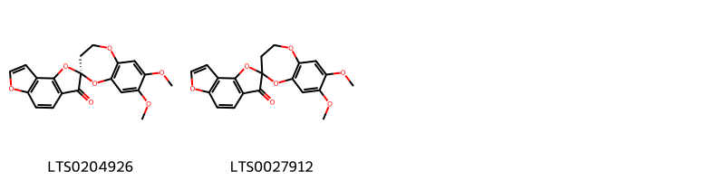{ width=100% }
    <figcaption>Hình ảnh cấu trúc hóa học của 2 hoạt chất thuộc nhóm Benzofurans gồm ["(2s)-7,8-dimethoxy-3,4-dihydro-3',10'-dioxaspiro[1,5-benzodioxepine-2,4'-tricyclo[7.3.0.0²,⁶]dodecane]-1',6',8',11'-tetraen-5'-one (LTS0204926)", "7,8-dimethoxy-3,4-dihydro-3',10'-dioxaspiro[1,5-benzodioxepine-2,4'-tricyclo[7.3.0.0²,⁶]dodecane]-1',6',8',11'-tetraen-5'-one (LTS0027912)"].</figcaption>
</figure>
#### Nhóm Benzopyrans
<figure markdown="span">
    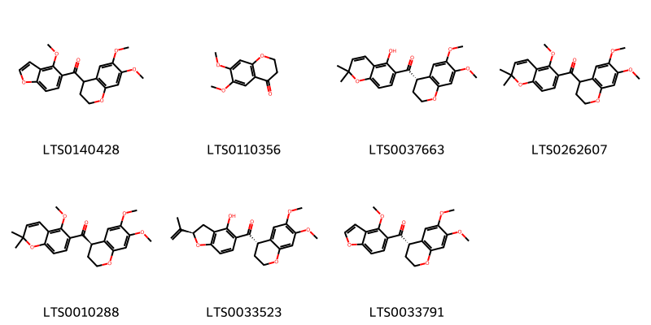{ width=100% }
    <figcaption>Hình ảnh cấu trúc hóa học của 7 hoạt chất thuộc nhóm Benzopyrans gồm ['6,7-dimethoxy-4-(4-methoxy-1-benzofuran-5-carbonyl)-3,4-dihydro-2h-1-benzopyran (LTS0140428)', '6,7-dimethoxy-2,3-dihydro-1-benzopyran-4-one (LTS0110356)', '6-[(4s)-6,7-dimethoxy-3,4-dihydro-2h-1-benzopyran-4-carbonyl]-2,2-dimethylchromen-5-ol (LTS0037663)', '6-(6,7-dimethoxy-3,4-dihydro-2h-1-benzopyran-4-carbonyl)-5-methoxy-2,2-dimethylchromene (LTS0262607)', '6-[(4r)-6,7-dimethoxy-3,4-dihydro-2h-1-benzopyran-4-carbonyl]-5-methoxy-2,2-dimethylchromene (LTS0010288)', '(2r)-5-[(4s)-6,7-dimethoxy-3,4-dihydro-2h-1-benzopyran-4-carbonyl]-2-(prop-1-en-2-yl)-2,3-dihydro-1-benzofuran-4-ol (LTS0033523)', '(4s)-6,7-dimethoxy-4-(4-methoxy-1-benzofuran-5-carbonyl)-3,4-dihydro-2h-1-benzopyran (LTS0033791)'].</figcaption>
</figure>
#### Nhóm Flavonoids
<figure markdown="span">
    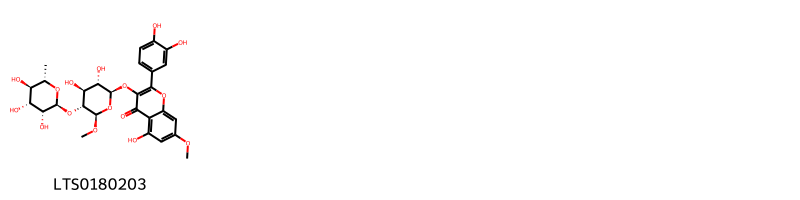{ width=100% }
    <figcaption>Hình ảnh cấu trúc hóa học của 1 hoạt chất thuộc nhóm Flavonoids gồm ['3-{[(2s,3s,4s,5r,6r)-3,4-dihydroxy-6-methoxy-5-{[(2s,3r,4r,5r,6s)-3,4,5-trihydroxy-6-methyloxan-2-yl]oxy}oxan-2-yl]oxy}-2-(3,4-dihydroxyphenyl)-5-hydroxy-7-methoxychromen-4-one (LTS0180203)'].</figcaption>
</figure>
#### Nhóm Isoflavonoids
<figure markdown="span">
    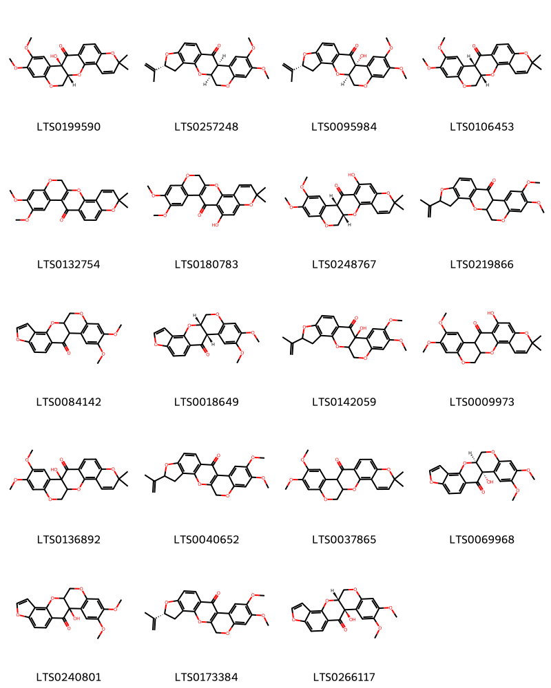{ width=100% }
    <figcaption>Hình ảnh cấu trúc hóa học của 19 hoạt chất thuộc nhóm Isoflavonoids gồm ['tephrosin (LTS0199590)', 'cube root (LTS0257248)', '12a-hydroxyrotenone (LTS0095984)', 'deguelin (LTS0106453)', '17,18-dimethoxy-7,7-dimethyl-2,8,21-trioxapentacyclo[12.8.0.0³,¹².0⁴,⁹.0¹⁵,²⁰]docosa-1(14),3,5,9,11,15(20),16,18-octaen-13-one (LTS0132754)', 'dehydrotoxicarol (LTS0180783)', 'toxicarol (LTS0248767)', '16,17-dimethoxy-6-(prop-1-en-2-yl)-2,7,20-trioxapentacyclo[11.8.0.0³,¹¹.0⁴,⁸.0¹⁴,¹⁹]henicosa-3(11),4(8),9,14,16,18-hexaen-12-one (LTS0219866)', 'derride (LTS0084142)', 'elliptone (LTS0018649)', '13-hydroxy-16,17-dimethoxy-6-(prop-1-en-2-yl)-2,7,20-trioxapentacyclo[11.8.0.0³,¹¹.0⁴,⁸.0¹⁴,¹⁹]henicosa-3(11),4(8),9,14,16,18-hexaen-12-one (LTS0142059)', '11-hydroxy-17,18-dimethoxy-7,7-dimethyl-2,8,21-trioxapentacyclo[12.8.0.0³,¹².0⁴,⁹.0¹⁵,²⁰]docosa-3,5,9,11,15(20),16,18-heptaen-13-one (LTS0009973)', '14-hydroxy-17,18-dimethoxy-7,7-dimethyl-2,8,21-trioxapentacyclo[12.8.0.0³,¹².0⁴,⁹.0¹⁵,²⁰]docosa-3,5,9,11,15(20),16,18-heptaen-13-one (LTS0136892)', '16,17-dimethoxy-6-(prop-1-en-2-yl)-2,7,20-trioxapentacyclo[11.8.0.0³,¹¹.0⁴,⁸.0¹⁴,¹⁹]henicosa-1(13),3,8,10,14,16,18-heptaen-12-one (LTS0040652)', '17,18-dimethoxy-7,7-dimethyl-2,8,21-trioxapentacyclo[12.8.0.0³,¹².0⁴,⁹.0¹⁵,²⁰]docosa-3,5,9,11,15(20),16,18-heptaen-13-one (LTS0037865)', '(1s,13s)-13-hydroxy-16,17-dimethoxy-2,7,20-trioxapentacyclo[11.8.0.0³,¹¹.0⁴,⁸.0¹⁴,¹⁹]henicosa-3,5,8,10,14(19),15,17-heptaen-12-one (LTS0069968)', '13-hydroxy-16,17-dimethoxy-2,7,20-trioxapentacyclo[11.8.0.0³,¹¹.0⁴,⁸.0¹⁴,¹⁹]henicosa-3,5,8,10,14(19),15,17-heptaen-12-one (LTS0240801)', '(6r)-16,17-dimethoxy-6-(prop-1-en-2-yl)-2,7,20-trioxapentacyclo[11.8.0.0³,¹¹.0⁴,⁸.0¹⁴,¹⁹]henicosa-1(13),3,8,10,14,16,18-heptaen-12-one (LTS0173384)', '(1r,13r)-13-hydroxy-16,17-dimethoxy-2,7,20-trioxapentacyclo[11.8.0.0³,¹¹.0⁴,⁸.0¹⁴,¹⁹]henicosa-3,5,8,10,14(19),15,17-heptaen-12-one (LTS0266117)'].</figcaption>
</figure>
#### Nhóm Naphthopyrans
<figure markdown="span">
    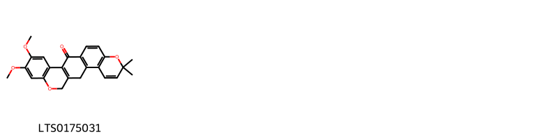{ width=100% }
    <figcaption>Hình ảnh cấu trúc hóa học của 1 hoạt chất thuộc nhóm Naphthopyrans gồm ['17,18-dimethoxy-7,7-dimethyl-8,21-dioxapentacyclo[12.8.0.0³,¹².0⁴,⁹.0¹⁵,²⁰]docosa-1(14),3(12),4(9),5,10,15(20),16,18-octaen-13-one (LTS0175031)'].</figcaption>
</figure>
#### Nhóm Prenol lipids
<figure markdown="span">
    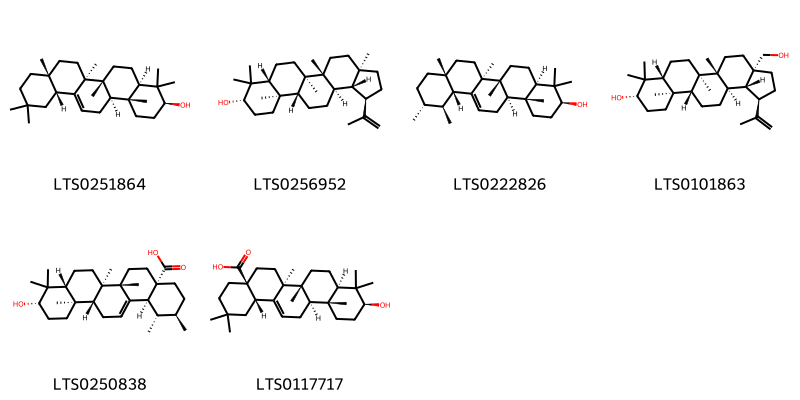{ width=100% }
    <figcaption>Hình ảnh cấu trúc hóa học của 6 hoạt chất thuộc nhóm Prenol lipids gồm ['β-amyrin (LTS0251864)', 'lupeol (LTS0256952)', 'amyrin (LTS0222826)', 'betulin (LTS0101863)', 'ursolic acid (LTS0250838)', 'oleanolic acid (LTS0117717)'].</figcaption>
</figure>
#### Nhóm Steroids and steroid derivatives
<figure markdown="span">
    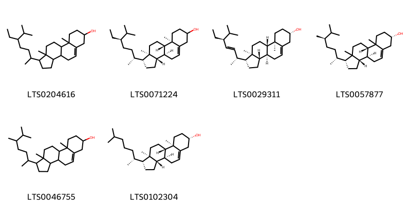{ width=100% }
    <figcaption>Hình ảnh cấu trúc hóa học của 6 hoạt chất thuộc nhóm Steroids and steroid derivatives gồm ['stigmast-5-en-3-ol, (3β)- (LTS0204616)', 'stigmast-5-en-3-ol (LTS0071224)', 'phytosterol (LTS0029311)', '(1r,3as,3bs,7s,9bs)-1-[(2r,5r)-5,6-dimethylheptan-2-yl]-9a,11a-dimethyl-1h,2h,3h,3ah,3bh,4h,6h,7h,8h,9h,9bh,10h,11h-cyclopenta[a]phenanthren-7-ol (LTS0057877)', 'campesterol (LTS0046755)', 'cholesterol (LTS0102304)'].</figcaption>
</figure>

---

### Dược dân tộc học

Danh sách các quốc gia có sử dụng *Derris trifoliata* trong điều trị các bệnh. 

| Country   | Disease                    | Bệnh                                                                                                                                                                                                |
|:----------|:---------------------------|:----------------------------------------------------------------------------------------------------------------------------------------------------------------------------------------------------|
| Elsewhere | Counterirritant, Stimulant | MYMEMORY WARNING: YOU USED ALL AVAILABLE FREE TRANSLATIONS FOR TODAY. NEXT AVAILABLE IN  16 HOURS 11 MINUTES 42 SECONDS VISIT HTTPS://MYMEMORY.TRANSLATED.NET/DOC/USAGELIMITS.PHP TO TRANSLATE MORE |
| India     | Piscicide                  | MYMEMORY WARNING: YOU USED ALL AVAILABLE FREE TRANSLATIONS FOR TODAY. NEXT AVAILABLE IN  16 HOURS 11 MINUTES 40 SECONDS VISIT HTTPS://MYMEMORY.TRANSLATED.NET/DOC/USAGELIMITS.PHP TO TRANSLATE MORE |
| Malaya    | Insecticide, Piscicide     | MYMEMORY WARNING: YOU USED ALL AVAILABLE FREE TRANSLATIONS FOR TODAY. NEXT AVAILABLE IN  16 HOURS 11 MINUTES 37 SECONDS VISIT HTTPS://MYMEMORY.TRANSLATED.NET/DOC/USAGELIMITS.PHP TO TRANSLATE MORE |
| Samoa     | Piscicide                  | MYMEMORY WARNING: YOU USED ALL AVAILABLE FREE TRANSLATIONS FOR TODAY. NEXT AVAILABLE IN  16 HOURS 11 MINUTES 35 SECONDS VISIT HTTPS://MYMEMORY.TRANSLATED.NET/DOC/USAGELIMITS.PHP TO TRANSLATE MORE |

---

---
## Derris uligonosa
### Thông tin về thực vật

!!! info "Phân loại thực vật của *Derris trifoliata* từ GIBF:"
    - **Kingdom:** Plantae
    - **Phylum:** Tracheophyta
    - **Order:** Fabales
    - **Family:** Fabaceae
    - **Genus:** Derris
    - **Species:** *Derris trifoliata*

 

| Label (VI)   | Label (EN)   | Scientific Name   | Descriptions (VI)   | Descriptions (EN)   | Also Known As (VI)    | Also Known As (EN)   |
|:-------------|:-------------|:------------------|:--------------------|:--------------------|:----------------------|:---------------------|
| N/A          | N/A          | Derris trifoliata | loài thực vật       | species of plant    | ['Derris trifoliata'] | ['']                 |

#### Phân bố trên thế giới

**Từ CSDL GIBF** nan, Sri Lanka, Fiji, Myanmar, Mozambique, Papua New Guinea, India, New Caledonia, Bangladesh, Indonesia, unknown or invalid, Tanzania, United Republic of, Singapore, Malaysia, China

#### Phân bố tại Việt Nam

**Từ CSDL GIBF**: Không có ghi nhận ở Việt Nam

---
### Thành phần hóa học
        
- Theo cơ sở dữ liệu lotus: Từ loài *Derris trifoliata* đã phân lập và xác định được Chưa có hoạt chất nào được phân lập. hoạt chất thuộc về các nhóm Không có hoạt chất nào được phân lập. 

Không có hình ảnh nào được tạo ra

---

### Dược dân tộc học

Danh sách các quốc gia có sử dụng *Derris trifoliata* trong điều trị các bệnh. 

| Country   | Disease                | Bệnh                                                                                                                                                                                                |
|:----------|:-----------------------|:----------------------------------------------------------------------------------------------------------------------------------------------------------------------------------------------------|
| Elsewhere | Insecticide, Piscicide | MYMEMORY WARNING: YOU USED ALL AVAILABLE FREE TRANSLATIONS FOR TODAY. NEXT AVAILABLE IN  16 HOURS 10 MINUTES 58 SECONDS VISIT HTTPS://MYMEMORY.TRANSLATED.NET/DOC/USAGELIMITS.PHP TO TRANSLATE MORE |

---

# Chi Rhynchosia

??? note "Danh sách các dược liệu thuộc chi"
    
	 - *Rhynchosia minima*
	 - *Rhynchosia phaseoloides*
	 - *Rhynchosia precatoria*
	 - *Rhynchosia pyramidalis*
	 - *Rhynchosia pyramidata*
	 - *Rhynchosia volubilis*

---
## Rhynchosia minima
### Thông tin về thực vật

!!! info "Phân loại thực vật của *Rhynchosia minima* từ GIBF:"
    - **Kingdom:** Plantae
    - **Phylum:** Tracheophyta
    - **Order:** Fabales
    - **Family:** Fabaceae
    - **Genus:** Rhynchosia
    - **Species:** *Rhynchosia minima*

 

| Label (VI)   | Label (EN)   | Scientific Name   | Descriptions (VI)   | Descriptions (EN)   | Also Known As (VI)   | Also Known As (EN)   |
|:-------------|:-------------|:------------------|:--------------------|:--------------------|:---------------------|:---------------------|
| N/A          | N/A          | Rhynchosia minima | loài thực vật       | species of plant    | ['']                 | ['']                 |

#### Phân bố trên thế giới

**Từ CSDL GIBF** Virgin Islands (U.S.), United Arab Emirates, Australia, Japan, Yemen, French Guiana, Puerto Rico, Chinese Taipei, United States of America, Bonaire, Sint Eustatius and Saba, South Africa, Thailand, Brazil, Peru, Mexico, Ecuador, Saint Kitts and Nevis, Aruba, India

#### Phân bố tại Việt Nam

**Từ CSDL GIBF**: Không có ghi nhận ở Việt Nam

---
### Thành phần hóa học
        
- Theo cơ sở dữ liệu lotus: Từ loài *Rhynchosia minima* đã phân lập và xác định được 19 hoạt chất thuộc về các nhóm Flavonoids, Prenol lipids, Steroids and steroid derivatives. 

|    | chemicalTaxonomyClassyfireClass   |   smiles_count |
|---:|:----------------------------------|---------------:|
|  0 | Flavonoids                        |             10 |
|  1 | Prenol lipids                     |              1 |
|  2 | Steroids and steroid derivatives  |              8 |

#### Nhóm Flavonoids
<figure markdown="span">
    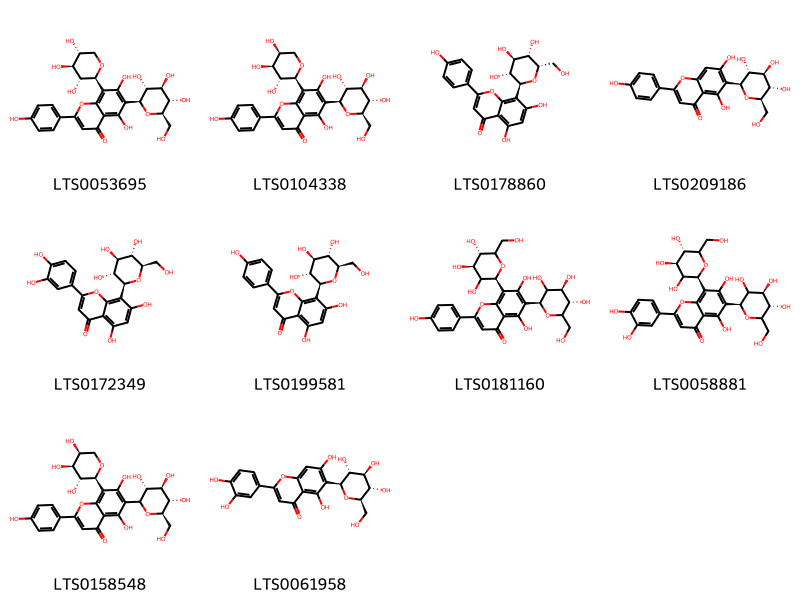{ width=100% }
    <figcaption>Hình ảnh cấu trúc hóa học của 10 hoạt chất thuộc nhóm Flavonoids gồm ['5,7-dihydroxy-2-(4-hydroxyphenyl)-6-[(2s,3r,4r,5s,6r)-3,4,5-trihydroxy-6-(hydroxymethyl)oxan-2-yl]-8-[(2s,3r,4s,5r)-3,4,5-trihydroxyoxan-2-yl]chromen-4-one (LTS0053695)', 'schaftoside (LTS0104338)', '5,7-dihydroxy-2-(4-hydroxyphenyl)-8-[(2s,3r,4r,5s,6s)-3,4,5-trihydroxy-6-(hydroxymethyl)oxan-2-yl]chromen-4-one (LTS0178860)', 'isovitexin (LTS0209186)', 'orientin (LTS0172349)', 'vitexin (LTS0199581)', 'vicenin 2 (LTS0181160)', 'lucenin 2 (LTS0058881)', '5,7-dihydroxy-2-(4-hydroxyphenyl)-6-[(3r,4r,5s,6r)-3,4,5-trihydroxy-6-(hydroxymethyl)oxan-2-yl]-8-[(2s,3r,4s,5s)-3,4,5-trihydroxyoxan-2-yl]chromen-4-one (LTS0158548)', 'isoorientin (LTS0061958)'].</figcaption>
</figure>
#### Nhóm Prenol lipids
<figure markdown="span">
    { width=100% }
    <figcaption>Hình ảnh cấu trúc hóa học của 1 hoạt chất thuộc nhóm Prenol lipids gồm ['lupeol (LTS0256952)'].</figcaption>
</figure>
#### Nhóm Steroids and steroid derivatives
<figure markdown="span">
    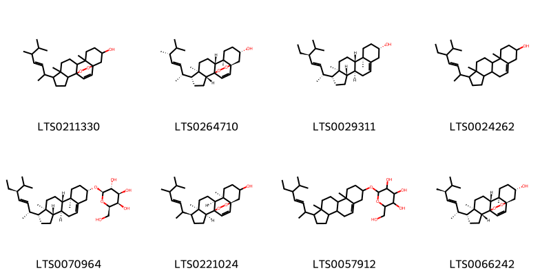{ width=100% }
    <figcaption>Hình ảnh cấu trúc hóa học của 8 hoạt chất thuộc nhóm Steroids and steroid derivatives gồm ['5-(5,6-dimethylhept-3-en-2-yl)-6,10-dimethyl-16,17-dioxapentacyclo[13.2.2.0¹,⁹.0²,⁶.0¹⁰,¹⁵]nonadec-18-en-13-ol (LTS0211330)', 'ergosterol peroxide (LTS0264710)', 'phytosterol (LTS0029311)', 'stigmasterol (LTS0024262)', '(2r,3r,4s,5r,6r)-2-{[(1r,3as,3bs,7s,9ar,9bs,11ar)-1-[(2r,3e,5s)-5-ethyl-6-methylhept-3-en-2-yl]-9a,11a-dimethyl-1h,2h,3h,3ah,3bh,4h,6h,7h,8h,9h,9bh,10h,11h-cyclopenta[a]phenanthren-7-yl]oxy}-6-(hydroxymethyl)oxane-3,4,5-triol (LTS0070964)', '(1s,2s,5s,6r,9s,10r,15s)-5-(5,6-dimethylhept-3-en-2-yl)-6,10-dimethyl-16,17-dioxapentacyclo[13.2.2.0¹,⁹.0²,⁶.0¹⁰,¹⁵]nonadec-18-en-13-ol (LTS0221024)', '2-{[1-(5-ethyl-6-methylhept-3-en-2-yl)-9a,11a-dimethyl-1h,2h,3h,3ah,3bh,4h,6h,7h,8h,9h,9bh,10h,11h-cyclopenta[a]phenanthren-7-yl]oxy}-6-(hydroxymethyl)oxane-3,4,5-triol (LTS0057912)', '(1s,2r,5r,6r,9r,10r,13s,15s)-5-[(2r,3e,5s)-5,6-dimethylhept-3-en-2-yl]-6,10-dimethyl-16,17-dioxapentacyclo[13.2.2.0¹,⁹.0²,⁶.0¹⁰,¹⁵]nonadec-18-en-13-ol (LTS0066242)'].</figcaption>
</figure>

---

### Dược dân tộc học

Danh sách các quốc gia có sử dụng *Rhynchosia minima* trong điều trị các bệnh. 

| Country   | Disease                  | Bệnh                                                                                                                                                                                                |
|:----------|:-------------------------|:----------------------------------------------------------------------------------------------------------------------------------------------------------------------------------------------------|
| Elsewhere | Abortifacient, Piscicide | MYMEMORY WARNING: YOU USED ALL AVAILABLE FREE TRANSLATIONS FOR TODAY. NEXT AVAILABLE IN  16 HOURS 10 MINUTES 40 SECONDS VISIT HTTPS://MYMEMORY.TRANSLATED.NET/DOC/USAGELIMITS.PHP TO TRANSLATE MORE |

---

---
## Rhynchosia phaseoloides
### Thông tin về thực vật

!!! info "Phân loại thực vật của *Rhynchosia phaseoloides* từ GIBF:"
    - **Kingdom:** Plantae
    - **Phylum:** Tracheophyta
    - **Order:** Fabales
    - **Family:** Fabaceae
    - **Genus:** Rhynchosia
    - **Species:** *Rhynchosia phaseoloides*

 

| Label (VI)   | Label (EN)   | Scientific Name         | Descriptions (VI)   | Descriptions (EN)   | Also Known As (VI)   | Also Known As (EN)   |
|:-------------|:-------------|:------------------------|:--------------------|:--------------------|:---------------------|:---------------------|
| N/A          | N/A          | Rhynchosia phaseoloides | loài thực vật       | species of plant    | ['']                 | ['']                 |

#### Phân bố trên thế giới

**Từ CSDL GIBF** nan, Nicaragua, Puerto Rico, Belgium, Colombia, Brazil, Portugal, United States of America, Dominican Republic, Mexico, French Guiana

#### Phân bố tại Việt Nam

**Từ CSDL GIBF**: Không có ghi nhận ở Việt Nam

---
### Thành phần hóa học
        
- Theo cơ sở dữ liệu lotus: Từ loài *Rhynchosia phaseoloides* đã phân lập và xác định được Chưa có hoạt chất nào được phân lập. hoạt chất thuộc về các nhóm Không có hoạt chất nào được phân lập. 

Không có hình ảnh nào được tạo ra

---

### Dược dân tộc học

Danh sách các quốc gia có sử dụng *Rhynchosia phaseoloides* trong điều trị các bệnh. 

| Country   | Disease     | Bệnh                                                                                                                                                                                                |
|:----------|:------------|:----------------------------------------------------------------------------------------------------------------------------------------------------------------------------------------------------|
| Haiti     | Aphrodisiac | MYMEMORY WARNING: YOU USED ALL AVAILABLE FREE TRANSLATIONS FOR TODAY. NEXT AVAILABLE IN  16 HOURS 10 MINUTES 11 SECONDS VISIT HTTPS://MYMEMORY.TRANSLATED.NET/DOC/USAGELIMITS.PHP TO TRANSLATE MORE |
| Mexico    | Poison      | MYMEMORY WARNING: YOU USED ALL AVAILABLE FREE TRANSLATIONS FOR TODAY. NEXT AVAILABLE IN  16 HOURS 10 MINUTES 09 SECONDS VISIT HTTPS://MYMEMORY.TRANSLATED.NET/DOC/USAGELIMITS.PHP TO TRANSLATE MORE |

---

---
## Rhynchosia precatoria
### Thông tin về thực vật

!!! info "Phân loại thực vật của *Rhynchosia precatoria* từ GIBF:"
    - **Kingdom:** Plantae
    - **Phylum:** Tracheophyta
    - **Order:** Fabales
    - **Family:** Fabaceae
    - **Genus:** Rhynchosia
    - **Species:** *Rhynchosia precatoria*

 

| Label (VI)   | Label (EN)   | Scientific Name       | Descriptions (VI)   | Descriptions (EN)   | Also Known As (VI)   | Also Known As (EN)   |
|:-------------|:-------------|:----------------------|:--------------------|:--------------------|:---------------------|:---------------------|
| N/A          | N/A          | Rhynchosia precatoria | loài thực vật       | species of plant    | ['']                 | ['']                 |

#### Phân bố trên thế giới

**Từ CSDL GIBF** nan, Brazil, Costa Rica, United States of America, Mexico, El Salvador

#### Phân bố tại Việt Nam

**Từ CSDL GIBF**: Không có ghi nhận ở Việt Nam

---
### Thành phần hóa học
        
- Theo cơ sở dữ liệu lotus: Từ loài *Rhynchosia precatoria* đã phân lập và xác định được 6 hoạt chất thuộc về các nhóm Flavonoids, Isoflavonoids, Benzene and substituted derivatives. 

|    | chemicalTaxonomyClassyfireClass     |   smiles_count |
|---:|:------------------------------------|---------------:|
|  0 | Benzene and substituted derivatives |              1 |
|  1 | Flavonoids                          |              2 |
|  2 | Isoflavonoids                       |              3 |

#### Nhóm Benzene and substituted derivatives
<figure markdown="span">
    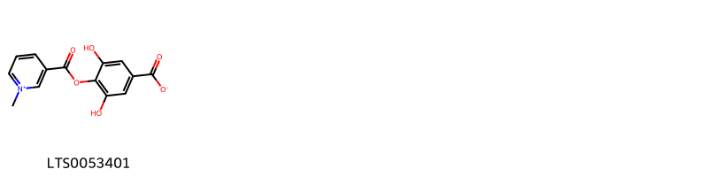{ width=100% }
    <figcaption>Hình ảnh cấu trúc hóa học của 1 hoạt chất thuộc nhóm Benzene and substituted derivatives gồm ['3-(4-carboxylato-2,6-dihydroxyphenoxycarbonyl)-1-methylpyridin-1-ium (LTS0053401)'].</figcaption>
</figure>
#### Nhóm Flavonoids
<figure markdown="span">
    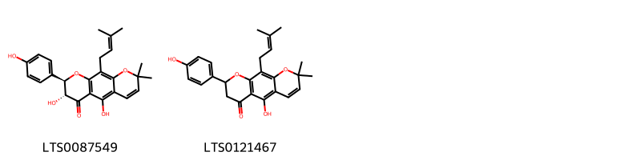{ width=100% }
    <figcaption>Hình ảnh cấu trúc hóa học của 2 hoạt chất thuộc nhóm Flavonoids gồm ['(2r,3r)-3,5-dihydroxy-2-(4-hydroxyphenyl)-8,8-dimethyl-10-(3-methylbut-2-en-1-yl)-2h,3h-pyrano[3,2-g]chromen-4-one (LTS0087549)', 'lupinifolin (LTS0121467)'].</figcaption>
</figure>
#### Nhóm Isoflavonoids
<figure markdown="span">
    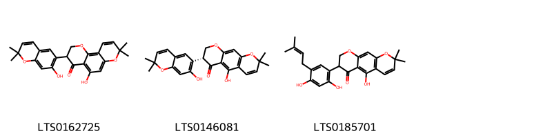{ width=100% }
    <figcaption>Hình ảnh cấu trúc hóa học của 3 hoạt chất thuộc nhóm Isoflavonoids gồm ['5-hydroxy-3-(7-hydroxy-2,2-dimethylchromen-6-yl)-8,8-dimethyl-2h,3h-pyrano[2,3-f]chromen-4-one (LTS0162725)', '(3r)-5-hydroxy-3-(7-hydroxy-2,2-dimethylchromen-6-yl)-8,8-dimethyl-2h,3h-pyrano[3,2-g]chromen-4-one (LTS0146081)', 'cajanone (LTS0185701)'].</figcaption>
</figure>

---

### Dược dân tộc học

Danh sách các quốc gia có sử dụng *Rhynchosia precatoria* trong điều trị các bệnh. 

| Country   | Disease   | Bệnh                                                                                                                                                                                                |
|:----------|:----------|:----------------------------------------------------------------------------------------------------------------------------------------------------------------------------------------------------|
| Salvador  | Soap      | MYMEMORY WARNING: YOU USED ALL AVAILABLE FREE TRANSLATIONS FOR TODAY. NEXT AVAILABLE IN  16 HOURS 09 MINUTES 47 SECONDS VISIT HTTPS://MYMEMORY.TRANSLATED.NET/DOC/USAGELIMITS.PHP TO TRANSLATE MORE |

---

---
## Rhynchosia pyramidalis
### Thông tin về thực vật

!!! info "Phân loại thực vật của *Rhynchosia pyramidalis* từ GIBF:"
    - **Kingdom:** Plantae
    - **Phylum:** Tracheophyta
    - **Order:** Fabales
    - **Family:** Fabaceae
    - **Genus:** Rhynchosia
    - **Species:** *Rhynchosia pyramidalis*

 

| Label (VI)   | Label (EN)   | Scientific Name        | Descriptions (VI)   | Descriptions (EN)   | Also Known As (VI)   | Also Known As (EN)   |
|:-------------|:-------------|:-----------------------|:--------------------|:--------------------|:---------------------|:---------------------|
| N/A          | N/A          | Rhynchosia pyramidalis | loài thực vật       | species of plant    | ['']                 | ['']                 |

#### Phân bố trên thế giới

**Từ CSDL GIBF** Belize, Nicaragua, Afghanistan, Guatemala, Brazil, Colombia, Costa Rica, Honduras, unknown or invalid, Jamaica, Cuba, Peru, Mexico, United States of America, El Salvador, Venezuela (Bolivarian Republic of), Panama

#### Phân bố tại Việt Nam

**Từ CSDL GIBF**: Không có ghi nhận ở Việt Nam

---
### Thành phần hóa học
        
- Theo cơ sở dữ liệu lotus: Từ loài *Rhynchosia pyramidalis* đã phân lập và xác định được Chưa có hoạt chất nào được phân lập. hoạt chất thuộc về các nhóm Không có hoạt chất nào được phân lập. 

Không có hình ảnh nào được tạo ra

---

### Dược dân tộc học

Danh sách các quốc gia có sử dụng *Rhynchosia pyramidalis* trong điều trị các bệnh. 

| Country            | Disease     | Bệnh                                                                                                                                                                                                |
|:-------------------|:------------|:----------------------------------------------------------------------------------------------------------------------------------------------------------------------------------------------------|
| Dominican Republic | Aphrodisiac | MYMEMORY WARNING: YOU USED ALL AVAILABLE FREE TRANSLATIONS FOR TODAY. NEXT AVAILABLE IN  16 HOURS 09 MINUTES 23 SECONDS VISIT HTTPS://MYMEMORY.TRANSLATED.NET/DOC/USAGELIMITS.PHP TO TRANSLATE MORE |
| Mexico             | Poison      | MYMEMORY WARNING: YOU USED ALL AVAILABLE FREE TRANSLATIONS FOR TODAY. NEXT AVAILABLE IN  16 HOURS 09 MINUTES 21 SECONDS VISIT HTTPS://MYMEMORY.TRANSLATED.NET/DOC/USAGELIMITS.PHP TO TRANSLATE MORE |
| Mexico(Zapotec)    | Narcotic    | MYMEMORY WARNING: YOU USED ALL AVAILABLE FREE TRANSLATIONS FOR TODAY. NEXT AVAILABLE IN  16 HOURS 09 MINUTES 18 SECONDS VISIT HTTPS://MYMEMORY.TRANSLATED.NET/DOC/USAGELIMITS.PHP TO TRANSLATE MORE |

---

---
## Rhynchosia pyramidata
### Thông tin về thực vật

!!! info "Phân loại thực vật của *N/A* từ GIBF:"
    - **Kingdom:** N/A
    - **Phylum:** N/A
    - **Order:** N/A
    - **Family:** N/A
    - **Genus:** N/A
    - **Species:** *N/A*

 

| Label (VI)   | Label (EN)   | Scientific Name        | Descriptions (VI)   | Descriptions (EN)   | Also Known As (VI)   | Also Known As (EN)   |
|:-------------|:-------------|:-----------------------|:--------------------|:--------------------|:---------------------|:---------------------|
| N/A          | N/A          | Rhynchosia pyramidalis | loài thực vật       | species of plant    | ['']                 | ['']                 |

#### Phân bố trên thế giới

**Từ CSDL GIBF** Không có kết quả phù hợp

#### Phân bố tại Việt Nam

**Từ CSDL GIBF**: Không có ghi nhận ở Việt Nam

---
### Thành phần hóa học
        
- Theo cơ sở dữ liệu lotus: Từ loài *N/A* đã phân lập và xác định được Chưa có hoạt chất nào được phân lập. hoạt chất thuộc về các nhóm Không có hoạt chất nào được phân lập. 

Không có hình ảnh nào được tạo ra

---

### Dược dân tộc học

Danh sách các quốc gia có sử dụng *N/A* trong điều trị các bệnh. 

| Country   | Disease   | Bệnh                                                                                                                                                                                                |
|:----------|:----------|:----------------------------------------------------------------------------------------------------------------------------------------------------------------------------------------------------|
| Honduras  | Poison    | MYMEMORY WARNING: YOU USED ALL AVAILABLE FREE TRANSLATIONS FOR TODAY. NEXT AVAILABLE IN  16 HOURS 08 MINUTES 56 SECONDS VISIT HTTPS://MYMEMORY.TRANSLATED.NET/DOC/USAGELIMITS.PHP TO TRANSLATE MORE |

---

---
## Rhynchosia volubilis
### Thông tin về thực vật

!!! info "Phân loại thực vật của *Rhynchosia volubilis* từ GIBF:"
    - **Kingdom:** Plantae
    - **Phylum:** Tracheophyta
    - **Order:** Fabales
    - **Family:** Fabaceae
    - **Genus:** Rhynchosia
    - **Species:** *Rhynchosia volubilis*

 

| Label (VI)   | Label (EN)   | Scientific Name      | Descriptions (VI)   | Descriptions (EN)   | Also Known As (VI)   | Also Known As (EN)   |
|:-------------|:-------------|:---------------------|:--------------------|:--------------------|:---------------------|:---------------------|
| N/A          | N/A          | Rhynchosia volubilis | loài thực vật       | species of plant    | ['']                 | ['']                 |

#### Phân bố trên thế giới

**Từ CSDL GIBF** nan, Hong Kong, Japan, Korea, Republic of, Chinese Taipei, China

#### Phân bố tại Việt Nam

**Từ CSDL GIBF**: Không có ghi nhận ở Việt Nam

---
### Thành phần hóa học
        
- Theo cơ sở dữ liệu lotus: Từ loài *Rhynchosia volubilis* đã phân lập và xác định được 10 hoạt chất thuộc về các nhóm Flavonoids, Prenol lipids, Benzene and substituted derivatives, Tannins, Depsides and depsidones. 

|    | chemicalTaxonomyClassyfireClass     |   smiles_count |
|---:|:------------------------------------|---------------:|
|  0 | Benzene and substituted derivatives |              2 |
|  1 | Depsides and depsidones             |              1 |
|  2 | Flavonoids                          |              2 |
|  3 | Prenol lipids                       |              1 |
|  4 | Tannins                             |              4 |

#### Nhóm Benzene and substituted derivatives
<figure markdown="span">
    { width=100% }
    <figcaption>Hình ảnh cấu trúc hóa học của 2 hoạt chất thuộc nhóm Benzene and substituted derivatives gồm ['galop (LTS0222857)', 'methyl gallate (LTS0043810)'].</figcaption>
</figure>
#### Nhóm Depsides and depsidones
<figure markdown="span">
    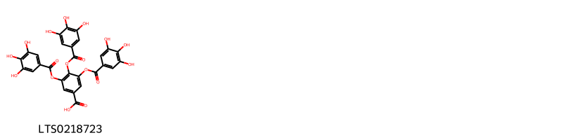{ width=100% }
    <figcaption>Hình ảnh cấu trúc hóa học của 1 hoạt chất thuộc nhóm Depsides and depsidones gồm ['3,4,5-tris(3,4,5-trihydroxybenzoyloxy)benzoic acid (LTS0218723)'].</figcaption>
</figure>
#### Nhóm Flavonoids
<figure markdown="span">
    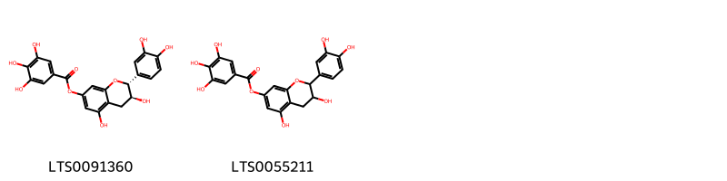{ width=100% }
    <figcaption>Hình ảnh cấu trúc hóa học của 2 hoạt chất thuộc nhóm Flavonoids gồm ['catechin 7-o-gallate (LTS0091360)', '2-(3,4-dihydroxyphenyl)-3,5-dihydroxy-3,4-dihydro-2h-1-benzopyran-7-yl 3,4,5-trihydroxybenzoate (LTS0055211)'].</figcaption>
</figure>
#### Nhóm Prenol lipids
<figure markdown="span">
    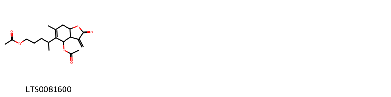{ width=100% }
    <figcaption>Hình ảnh cấu trúc hóa học của 1 hoạt chất thuộc nhóm Prenol lipids gồm ['4-[4-(acetyloxy)-6-methyl-3-methylidene-2-oxo-3a,4,7,7a-tetrahydro-1-benzofuran-5-yl]pentyl acetate (LTS0081600)'].</figcaption>
</figure>
#### Nhóm Tannins
<figure markdown="span">
    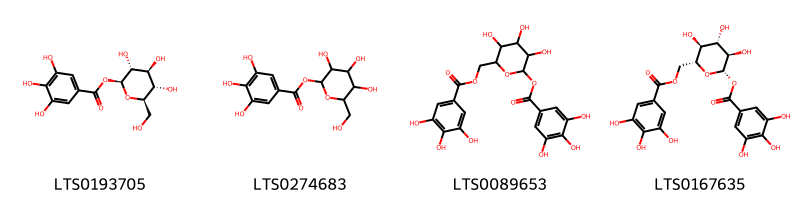{ width=100% }
    <figcaption>Hình ảnh cấu trúc hóa học của 4 hoạt chất thuộc nhóm Tannins gồm ['β-glucogallin (LTS0193705)', '3,4,5-trihydroxy-6-(hydroxymethyl)oxan-2-yl 3,4,5-trihydroxybenzoate (LTS0274683)', '3,4,5-trihydroxy-6-[(3,4,5-trihydroxybenzoyloxy)methyl]oxan-2-yl 3,4,5-trihydroxybenzoate (LTS0089653)', '(2s,3r,4s,5s,6r)-3,4,5-trihydroxy-6-[(3,4,5-trihydroxybenzoyloxy)methyl]oxan-2-yl 3,4,5-trihydroxybenzoate (LTS0167635)'].</figcaption>
</figure>

---

### Dược dân tộc học

Danh sách các quốc gia có sử dụng *Rhynchosia volubilis* trong điều trị các bệnh. 

| Country   | Disease   | Bệnh                                                                                                                                                                                                |
|:----------|:----------|:----------------------------------------------------------------------------------------------------------------------------------------------------------------------------------------------------|
| China     | Antidote  | MYMEMORY WARNING: YOU USED ALL AVAILABLE FREE TRANSLATIONS FOR TODAY. NEXT AVAILABLE IN  16 HOURS 08 MINUTES 44 SECONDS VISIT HTTPS://MYMEMORY.TRANSLATED.NET/DOC/USAGELIMITS.PHP TO TRANSLATE MORE |

---

# Chi Trachylobium

??? note "Danh sách các dược liệu thuộc chi"
    
	 - *Trachylobium verrucosum*

---
## Trachylobium verrucosum
### Thông tin về thực vật

!!! info "Phân loại thực vật của *Hymenaea verrucosa* từ GIBF:"
    - **Kingdom:** Plantae
    - **Phylum:** Tracheophyta
    - **Order:** Fabales
    - **Family:** Fabaceae
    - **Genus:** Hymenaea
    - **Species:** *Hymenaea verrucosa*

 

| Label (VI)   | Label (EN)   | Scientific Name         | Descriptions (VI)   | Descriptions (EN)   | Also Known As (VI)   | Also Known As (EN)   |
|:-------------|:-------------|:------------------------|:--------------------|:--------------------|:---------------------|:---------------------|
| N/A          | N/A          | Trachylobium verrucosum |                     |                     | ['']                 | ['']                 |

#### Phân bố trên thế giới

**Từ CSDL GIBF** nan, Sri Lanka, Malaysia, Ghana, French Polynesia, Senegal, Madagascar, Seychelles, Mauritius, Guyana, unknown or invalid, Indonesia, Kenya, Tanzania, United Republic of

#### Phân bố tại Việt Nam

**Từ CSDL GIBF**: Không có ghi nhận ở Việt Nam

---
### Thành phần hóa học
        
- Theo cơ sở dữ liệu lotus: Từ loài *Hymenaea verrucosa* đã phân lập và xác định được Chưa có hoạt chất nào được phân lập. hoạt chất thuộc về các nhóm Không có hoạt chất nào được phân lập. 

Không có hình ảnh nào được tạo ra

---

### Dược dân tộc học

Danh sách các quốc gia có sử dụng *Hymenaea verrucosa* trong điều trị các bệnh. 

| Country   | Disease                                      | Bệnh                                                                                                                                                                                                |
|:----------|:---------------------------------------------|:----------------------------------------------------------------------------------------------------------------------------------------------------------------------------------------------------|
| Elsewhere | Astringent, Diuretic, Vermifuge, Emmenagogue | MYMEMORY WARNING: YOU USED ALL AVAILABLE FREE TRANSLATIONS FOR TODAY. NEXT AVAILABLE IN  16 HOURS 08 MINUTES 18 SECONDS VISIT HTTPS://MYMEMORY.TRANSLATED.NET/DOC/USAGELIMITS.PHP TO TRANSLATE MORE |

---

# Chi Sesbania

??? note "Danh sách các dược liệu thuộc chi"
    
	 - *Sesbania aegyptiaca*
	 - *Sesbania drummondii*
	 - *Sesbania grandiflora*
	 - *Sesbania punicea*
	 - *Sesbania roxburghii*
	 - *Sesbania sesban*
	 - *Sesbania vesicaria*

---
## Sesbania aegyptiaca
### Thông tin về thực vật

!!! info "Phân loại thực vật của *Sesbania aegyptiaca* từ GIBF:"
    - **Kingdom:** Plantae
    - **Phylum:** Tracheophyta
    - **Order:** Fabales
    - **Family:** Fabaceae
    - **Genus:** Sesbania
    - **Species:** *Sesbania aegyptiaca*

 

| Label (VI)   | Label (EN)   | Scientific Name     | Descriptions (VI)   | Descriptions (EN)   | Also Known As (VI)   | Also Known As (EN)   |
|:-------------|:-------------|:--------------------|:--------------------|:--------------------|:---------------------|:---------------------|
| N/A          | N/A          | Sesbania aegyptiaca |                     |                     | ['']                 | ['']                 |

#### Phân bố trên thế giới

**Từ CSDL GIBF** nan, Ecuador, Senegal, Brazil, Egypt, India, Tanzania, United Republic of, China

#### Phân bố tại Việt Nam

**Từ CSDL GIBF**: Không có ghi nhận ở Việt Nam

---
### Thành phần hóa học
        
- Theo cơ sở dữ liệu lotus: Từ loài *Sesbania aegyptiaca* đã phân lập và xác định được Chưa có hoạt chất nào được phân lập. hoạt chất thuộc về các nhóm Không có hoạt chất nào được phân lập. 

Không có hình ảnh nào được tạo ra

---

### Dược dân tộc học

Danh sách các quốc gia có sử dụng *Sesbania aegyptiaca* trong điều trị các bệnh. 

| Country   | Disease   | Bệnh                                                                                                                                                                                                |
|:----------|:----------|:----------------------------------------------------------------------------------------------------------------------------------------------------------------------------------------------------|
| Java      | Vermifuge | MYMEMORY WARNING: YOU USED ALL AVAILABLE FREE TRANSLATIONS FOR TODAY. NEXT AVAILABLE IN  16 HOURS 07 MINUTES 59 SECONDS VISIT HTTPS://MYMEMORY.TRANSLATED.NET/DOC/USAGELIMITS.PHP TO TRANSLATE MORE |

---

---
## Sesbania drummondii
### Thông tin về thực vật

!!! info "Phân loại thực vật của *Sesbania drummondii* từ GIBF:"
    - **Kingdom:** Plantae
    - **Phylum:** Tracheophyta
    - **Order:** Fabales
    - **Family:** Fabaceae
    - **Genus:** Sesbania
    - **Species:** *Sesbania drummondii*

 

| Label (VI)   | Label (EN)   | Scientific Name     | Descriptions (VI)   | Descriptions (EN)   | Also Known As (VI)   | Also Known As (EN)   |
|:-------------|:-------------|:--------------------|:--------------------|:--------------------|:---------------------|:---------------------|
| N/A          | N/A          | Sesbania drummondii |                     | Sesbania drummondii | ['']                 | ['']                 |

#### Phân bố trên thế giới

**Từ CSDL GIBF** United States of America

#### Phân bố tại Việt Nam

**Từ CSDL GIBF**: Không có ghi nhận ở Việt Nam

---
### Thành phần hóa học
        
- Theo cơ sở dữ liệu lotus: Từ loài *Sesbania drummondii* đã phân lập và xác định được 16 hoạt chất thuộc về các nhóm Prenol lipids, Oxepanes, Piperidines, Arylnaphthalene lignans, Diazanaphthalenes, Carboxylic acids and derivatives, Pyridines and derivatives. 

|    | chemicalTaxonomyClassyfireClass   |   smiles_count |
|---:|:----------------------------------|---------------:|
|  0 | Arylnaphthalene lignans           |              2 |
|  1 | Carboxylic acids and derivatives  |              1 |
|  2 | Diazanaphthalenes                 |              1 |
|  3 | Oxepanes                          |              2 |
|  4 | Piperidines                       |              2 |
|  5 | Prenol lipids                     |              2 |
|  6 | Pyridines and derivatives         |              5 |

#### Nhóm Arylnaphthalene lignans
<figure markdown="span">
    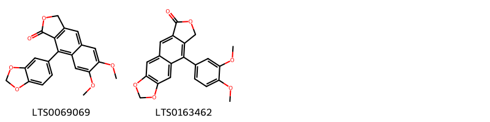{ width=100% }
    <figcaption>Hình ảnh cấu trúc hóa học của 2 hoạt chất thuộc nhóm Arylnaphthalene lignans gồm ['justicidin b (LTS0069069)', 'retrochinensin (LTS0163462)'].</figcaption>
</figure>
#### Nhóm Carboxylic acids and derivatives
<figure markdown="span">
    { width=100% }
    <figcaption>Hình ảnh cấu trúc hóa học của 1 hoạt chất thuộc nhóm Carboxylic acids and derivatives gồm ['(l)-canavanine (LTS0093855)'].</figcaption>
</figure>
#### Nhóm Diazanaphthalenes
<figure markdown="span">
    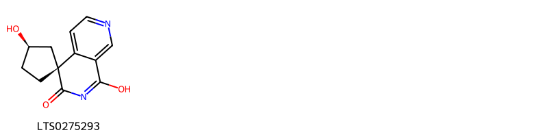{ width=100% }
    <figcaption>Hình ảnh cấu trúc hóa học của 1 hoạt chất thuộc nhóm Diazanaphthalenes gồm ["(3'r,4r)-1,3'-dihydroxyspiro[2,7-naphthyridine-4,1'-cyclopentan]-3-one (LTS0275293)"].</figcaption>
</figure>
#### Nhóm Oxepanes
<figure markdown="span">
    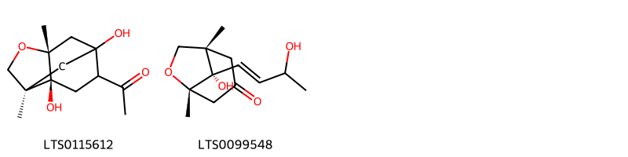{ width=100% }
    <figcaption>Hình ảnh cấu trúc hóa học của 2 hoạt chất thuộc nhóm Oxepanes gồm ['1-[(3r,6r,7s)-1,7-dihydroxy-3,6-dimethyl-4-oxatricyclo[4.3.1.0³,⁷]decan-9-yl]ethanone (LTS0115612)', '(1s,5s,8s)-8-hydroxy-8-[(1e)-3-hydroxybut-1-en-1-yl]-1,5-dimethyl-6-oxabicyclo[3.2.1]octan-3-one (LTS0099548)'].</figcaption>
</figure>
#### Nhóm Piperidines
<figure markdown="span">
    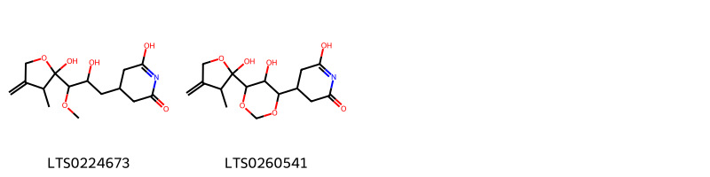{ width=100% }
    <figcaption>Hình ảnh cấu trúc hóa học của 2 hoạt chất thuộc nhóm Piperidines gồm ['6-hydroxy-4-[2-hydroxy-3-(2-hydroxy-3-methyl-4-methylideneoxolan-2-yl)-3-methoxypropyl]-4,5-dihydro-3h-pyridin-2-one (LTS0224673)', '6-hydroxy-4-[5-hydroxy-6-(2-hydroxy-3-methyl-4-methylideneoxolan-2-yl)-1,3-dioxan-4-yl]-4,5-dihydro-3h-pyridin-2-one (LTS0260541)'].</figcaption>
</figure>
#### Nhóm Prenol lipids
<figure markdown="span">
    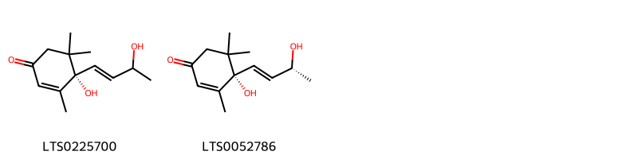{ width=100% }
    <figcaption>Hình ảnh cấu trúc hóa học của 2 hoạt chất thuộc nhóm Prenol lipids gồm ['(4s)-4-hydroxy-4-(3-hydroxybut-1-en-1-yl)-3,5,5-trimethylcyclohex-2-en-1-one (LTS0225700)', '(6s,9r)-vomifoliol (LTS0052786)'].</figcaption>
</figure>
#### Nhóm Pyridines and derivatives
<figure markdown="span">
    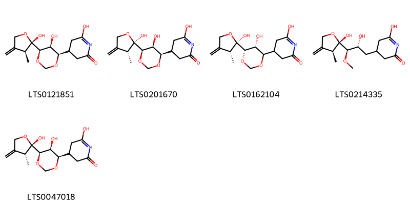{ width=100% }
    <figcaption>Hình ảnh cấu trúc hóa học của 5 hoạt chất thuộc nhóm Pyridines and derivatives gồm ['6-hydroxy-4-[(4r,5s,6r)-5-hydroxy-6-[(2s,3s)-2-hydroxy-3-methyl-4-methylideneoxolan-2-yl]-1,3-dioxan-4-yl]-4,5-dihydro-3h-pyridin-2-one (LTS0121851)', '6-hydroxy-4-[(4r,5s,6r)-5-hydroxy-6-[(2r,3r)-2-hydroxy-3-methyl-4-methylideneoxolan-2-yl]-1,3-dioxan-4-yl]-4,5-dihydro-3h-pyridin-2-one (LTS0201670)', '6-hydroxy-4-[(5r,6s)-5-hydroxy-6-[(2r,3r)-2-hydroxy-3-methyl-4-methylideneoxolan-2-yl]-1,3-dioxan-4-yl]-4,5-dihydro-3h-pyridin-2-one (LTS0162104)', '6-hydroxy-4-[(2r,3r)-2-hydroxy-3-[(2s,3s)-2-hydroxy-3-methyl-4-methylideneoxolan-2-yl]-3-methoxypropyl]-4,5-dihydro-3h-pyridin-2-one (LTS0214335)', '6-hydroxy-4-[(4r,5s,6r)-5-hydroxy-6-[(2s,3r)-2-hydroxy-3-methyl-4-methylideneoxolan-2-yl]-1,3-dioxan-4-yl]-4,5-dihydro-3h-pyridin-2-one (LTS0047018)'].</figcaption>
</figure>

---

### Dược dân tộc học

Danh sách các quốc gia có sử dụng *Sesbania drummondii* trong điều trị các bệnh. 

| Country   | Disease   | Bệnh                                                                                                                                                                                                |
|:----------|:----------|:----------------------------------------------------------------------------------------------------------------------------------------------------------------------------------------------------|
| US        | Poison    | MYMEMORY WARNING: YOU USED ALL AVAILABLE FREE TRANSLATIONS FOR TODAY. NEXT AVAILABLE IN  16 HOURS 07 MINUTES 42 SECONDS VISIT HTTPS://MYMEMORY.TRANSLATED.NET/DOC/USAGELIMITS.PHP TO TRANSLATE MORE |

---

---
## Sesbania grandiflora
### Thông tin về thực vật

!!! info "Phân loại thực vật của *Sesbania grandiflora* từ GIBF:"
    - **Kingdom:** Plantae
    - **Phylum:** Tracheophyta
    - **Order:** Fabales
    - **Family:** Fabaceae
    - **Genus:** Sesbania
    - **Species:** *Sesbania grandiflora*

 

| Label (VI)   | Label (EN)   | Scientific Name      | Descriptions (VI)   | Descriptions (EN)   | Also Known As (VI)                             | Also Known As (EN)                  |
|:-------------|:-------------|:---------------------|:--------------------|:--------------------|:-----------------------------------------------|:------------------------------------|
| N/A          | N/A          | Sesbania grandiflora | loài thực vật       | species of plant    | ['Sesbania grandiflora', 'Điền thanh hoa lớn'] | ['Vegetable Hummingbird (English)'] |

#### Phân bố trên thế giới

**Từ CSDL GIBF** nan, Sri Lanka, Ghana, Australia, Guadeloupe, Lao People’s Democratic Republic, Cambodia, Cook Islands, Myanmar, Benin, Nicaragua, Tanzania, United Republic of, Yemen, Panama, Chinese Taipei, Türkiye, Bangladesh, United States of America, Maldives, Hong Kong, Barbados, Thailand, United States Minor Outlying Islands, Northern Mariana Islands, Martinique, Brazil, New Caledonia, Cuba, Dominica, Dominican Republic, France, Singapore, Viet Nam, British Indian Ocean Territory, China, Austria, French Polynesia, Seychelles, Colombia, Vanuatu, India, Indonesia, Cayman Islands, Philippines, Malaysia, Brunei Darussalam

#### Phân bố tại Việt Nam

**Từ CSDL GIBF**: Long An, Hồ Chí Minh city, Hà Nội

---
### Thành phần hóa học
        
- Theo cơ sở dữ liệu lotus: Từ loài *Sesbania grandiflora* đã phân lập và xác định được 11 hoạt chất thuộc về các nhóm Fatty Acyls, Saturated hydrocarbons. 

|    | chemicalTaxonomyClassyfireClass   |   smiles_count |
|---:|:----------------------------------|---------------:|
|  0 | Fatty Acyls                       |              1 |
|  1 | Saturated hydrocarbons            |             10 |

#### Nhóm Fatty Acyls
<figure markdown="span">
    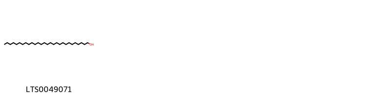{ width=100% }
    <figcaption>Hình ảnh cấu trúc hóa học của 1 hoạt chất thuộc nhóm Fatty Acyls gồm ['octacosanol (LTS0049071)'].</figcaption>
</figure>
#### Nhóm Saturated hydrocarbons
<figure markdown="span">
    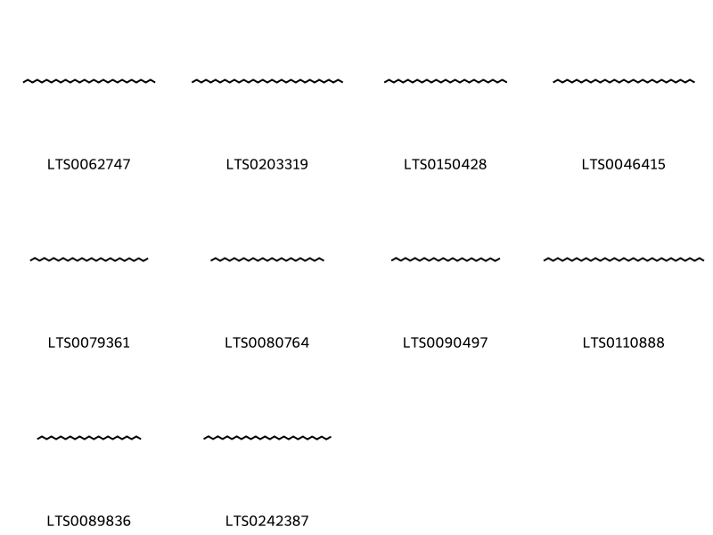{ width=100% }
    <figcaption>Hình ảnh cấu trúc hóa học của 10 hoạt chất thuộc nhóm Saturated hydrocarbons gồm ['nonacosane (LTS0062747)', 'tritriacontane (LTS0203319)', 'heptacosane (LTS0150428)', 'hentriacontane (LTS0046415)', 'hexacosane (LTS0079361)', 'pentacosane (LTS0080764)', 'tetracosane (LTS0090497)', 'pentatriacontane (LTS0110888)', 'tricosane (LTS0089836)', 'octacosane (LTS0242387)'].</figcaption>
</figure>

---

### Dược dân tộc học

Danh sách các quốc gia có sử dụng *Sesbania grandiflora* trong điều trị các bệnh. 

| Country   | Disease                                                                      | Bệnh                                                                                                                                                                                                |
|:----------|:-----------------------------------------------------------------------------|:----------------------------------------------------------------------------------------------------------------------------------------------------------------------------------------------------|
| Elsewhere | Aperient, Laxative, Aperient, Diuretic, Emmenagogue, Tonic, Diuretic, Emetic | MYMEMORY WARNING: YOU USED ALL AVAILABLE FREE TRANSLATIONS FOR TODAY. NEXT AVAILABLE IN  16 HOURS 07 MINUTES 17 SECONDS VISIT HTTPS://MYMEMORY.TRANSLATED.NET/DOC/USAGELIMITS.PHP TO TRANSLATE MORE |
| Java      | Cosmetic, Tonic                                                              | MYMEMORY WARNING: YOU USED ALL AVAILABLE FREE TRANSLATIONS FOR TODAY. NEXT AVAILABLE IN  16 HOURS 07 MINUTES 15 SECONDS VISIT HTTPS://MYMEMORY.TRANSLATED.NET/DOC/USAGELIMITS.PHP TO TRANSLATE MORE |
| Malaya    | Emetic, Aperient                                                             | MYMEMORY WARNING: YOU USED ALL AVAILABLE FREE TRANSLATIONS FOR TODAY. NEXT AVAILABLE IN  16 HOURS 07 MINUTES 12 SECONDS VISIT HTTPS://MYMEMORY.TRANSLATED.NET/DOC/USAGELIMITS.PHP TO TRANSLATE MORE |

---

---
## Sesbania punicea
### Thông tin về thực vật

!!! info "Phân loại thực vật của *Sesbania punicea* từ GIBF:"
    - **Kingdom:** Plantae
    - **Phylum:** Tracheophyta
    - **Order:** Fabales
    - **Family:** Fabaceae
    - **Genus:** Sesbania
    - **Species:** *Sesbania punicea*

 

| Label (VI)   | Label (EN)   | Scientific Name   | Descriptions (VI)   | Descriptions (EN)   | Also Known As (VI)   | Also Known As (EN)   |
|:-------------|:-------------|:------------------|:--------------------|:--------------------|:---------------------|:---------------------|
| N/A          | N/A          | Sesbania punicea  | loài thực vật       | species of plant    | ['']                 | ['']                 |

#### Phân bố trên thế giới

**Từ CSDL GIBF** South Africa, Brazil, Argentina, United States of America, Uruguay, France

#### Phân bố tại Việt Nam

**Từ CSDL GIBF**: Không có ghi nhận ở Việt Nam

---
### Thành phần hóa học
        
- Theo cơ sở dữ liệu lotus: Từ loài *Sesbania punicea* đã phân lập và xác định được 1 hoạt chất thuộc về các nhóm Carboxylic acids and derivatives. 

|    | chemicalTaxonomyClassyfireClass   |   smiles_count |
|---:|:----------------------------------|---------------:|
|  0 | Carboxylic acids and derivatives  |              1 |

#### Nhóm Carboxylic acids and derivatives
<figure markdown="span">
    { width=100% }
    <figcaption>Hình ảnh cấu trúc hóa học của 1 hoạt chất thuộc nhóm Carboxylic acids and derivatives gồm ['(l)-canavanine (LTS0093855)'].</figcaption>
</figure>

---

### Dược dân tộc học

Danh sách các quốc gia có sử dụng *Sesbania punicea* trong điều trị các bệnh. 

| Country       | Disease   | Bệnh                                                                                                                                                                                                |
|:--------------|:----------|:----------------------------------------------------------------------------------------------------------------------------------------------------------------------------------------------------|
| Latin America | Poison    | MYMEMORY WARNING: YOU USED ALL AVAILABLE FREE TRANSLATIONS FOR TODAY. NEXT AVAILABLE IN  16 HOURS 06 MINUTES 47 SECONDS VISIT HTTPS://MYMEMORY.TRANSLATED.NET/DOC/USAGELIMITS.PHP TO TRANSLATE MORE |

---

---
## Sesbania roxburghii
### Thông tin về thực vật

!!! info "Phân loại thực vật của *Sesbania bispinosa* từ GIBF:"
    - **Kingdom:** Plantae
    - **Phylum:** Tracheophyta
    - **Order:** Fabales
    - **Family:** Fabaceae
    - **Genus:** Sesbania
    - **Species:** *Sesbania bispinosa*

 

| Label (VI)   | Label (EN)   | Scientific Name     | Descriptions (VI)   | Descriptions (EN)   | Also Known As (VI)   | Also Known As (EN)   |
|:-------------|:-------------|:--------------------|:--------------------|:--------------------|:---------------------|:---------------------|
| N/A          | N/A          | Sesbania roxburghii | loài thực vật       | species of plant    | ['']                 | ['']                 |

#### Phân bố trên thế giới

**Từ CSDL GIBF** nan, Sri Lanka, Chinese Taipei, Myanmar, India, Indonesia, Philippines, China

#### Phân bố tại Việt Nam

**Từ CSDL GIBF**: Không có ghi nhận ở Việt Nam

---
### Thành phần hóa học
        
- Theo cơ sở dữ liệu lotus: Từ loài *Sesbania bispinosa* đã phân lập và xác định được Chưa có hoạt chất nào được phân lập. hoạt chất thuộc về các nhóm Không có hoạt chất nào được phân lập. 

Không có hình ảnh nào được tạo ra

---

### Dược dân tộc học

Danh sách các quốc gia có sử dụng *Sesbania bispinosa* trong điều trị các bệnh. 

| Country   | Disease                            | Bệnh                                                                                                                                                                                                |
|:----------|:-----------------------------------|:----------------------------------------------------------------------------------------------------------------------------------------------------------------------------------------------------|
| India     | Astringent, Emmenagogue, Stimulant | MYMEMORY WARNING: YOU USED ALL AVAILABLE FREE TRANSLATIONS FOR TODAY. NEXT AVAILABLE IN  16 HOURS 06 MINUTES 24 SECONDS VISIT HTTPS://MYMEMORY.TRANSLATED.NET/DOC/USAGELIMITS.PHP TO TRANSLATE MORE |

---

---
## Sesbania sesban
### Thông tin về thực vật

!!! info "Phân loại thực vật của *Sesbania sesban* từ GIBF:"
    - **Kingdom:** Plantae
    - **Phylum:** Tracheophyta
    - **Order:** Fabales
    - **Family:** Fabaceae
    - **Genus:** Sesbania
    - **Species:** *Sesbania sesban*

 

| Label (VI)   | Label (EN)   | Scientific Name   | Descriptions (VI)   | Descriptions (EN)   | Also Known As (VI)                                                                                            | Also Known As (EN)     |
|:-------------|:-------------|:------------------|:--------------------|:--------------------|:--------------------------------------------------------------------------------------------------------------|:-----------------------|
| N/A          | N/A          | Sesbania sesban   | loài thực vật       | species of plant    | ['Sesbania sesban', 'Điền thanh thân tía', 'Điền thanh bụi', 'Điền thanh', 'Cây điên điển', 'Bông điên điển'] | ['Egyptian riverhemp'] |

#### Phân bố trên thế giới

**Từ CSDL GIBF** Cambodia, Angola, Myanmar, Mozambique, Rwanda, Benin, Tanzania, United Republic of, Israel, Togo, Malawi, Pakistan, Puerto Rico, Nigeria, Namibia, Chinese Taipei, Bangladesh, United States of America, Congo, Democratic Republic of the, Guinea, South Africa, Uganda, Thailand, Brazil, Egypt, Cuba, Viet Nam, Eswatini, Madagascar, Botswana, India, Indonesia, Burkina Faso, Kenya, Cameroon, Mauritania, Ethiopia

#### Phân bố tại Việt Nam

**Từ CSDL GIBF**: Không có ghi nhận ở Việt Nam

---
### Thành phần hóa học
        
- Theo cơ sở dữ liệu lotus: Từ loài *Sesbania sesban* đã phân lập và xác định được 1 hoạt chất thuộc về các nhóm . 

|    | chemicalTaxonomyClassyfireClass   |   smiles_count |
|---:|:----------------------------------|---------------:|
|  0 |                                   |              1 |

#### Nhóm 
<figure markdown="span">
    { width=100% }
    <figcaption>Hình ảnh cấu trúc hóa học của 1 hoạt chất thuộc nhóm  gồm ['trigonelline (LTS0040106)'].</figcaption>
</figure>

---

### Dược dân tộc học

Danh sách các quốc gia có sử dụng *Sesbania sesban* trong điều trị các bệnh. 

| Country   | Disease                                                                                        | Bệnh                                                                                                                                                                                                |
|:----------|:-----------------------------------------------------------------------------------------------|:----------------------------------------------------------------------------------------------------------------------------------------------------------------------------------------------------|
| Elsewhere | Antifertility, Astringent, Emmenagogue, Insecticide, Poison, Stimulant, Suppurative, Vermifuge | MYMEMORY WARNING: YOU USED ALL AVAILABLE FREE TRANSLATIONS FOR TODAY. NEXT AVAILABLE IN  16 HOURS 06 MINUTES 06 SECONDS VISIT HTTPS://MYMEMORY.TRANSLATED.NET/DOC/USAGELIMITS.PHP TO TRANSLATE MORE |

---

---
## Sesbania vesicaria
### Thông tin về thực vật

!!! info "Phân loại thực vật của *Sesbania vesicaria* từ GIBF:"
    - **Kingdom:** Plantae
    - **Phylum:** Tracheophyta
    - **Order:** Fabales
    - **Family:** Fabaceae
    - **Genus:** Sesbania
    - **Species:** *Sesbania vesicaria*

 

| Label (VI)   | Label (EN)   | Scientific Name    | Descriptions (VI)   | Descriptions (EN)   | Also Known As (VI)   | Also Known As (EN)   |
|:-------------|:-------------|:-------------------|:--------------------|:--------------------|:---------------------|:---------------------|
| N/A          | N/A          | Sesbania vesicaria | loài thực vật       | species of plant    | ['']                 | ['']                 |

#### Phân bố trên thế giới

**Từ CSDL GIBF** United States of America

#### Phân bố tại Việt Nam

**Từ CSDL GIBF**: Không có ghi nhận ở Việt Nam

---
### Thành phần hóa học
        
- Theo cơ sở dữ liệu lotus: Từ loài *Sesbania vesicaria* đã phân lập và xác định được 2 hoạt chất thuộc về các nhóm Carboxylic acids and derivatives, Piperidines. 

|    | chemicalTaxonomyClassyfireClass   |   smiles_count |
|---:|:----------------------------------|---------------:|
|  0 | Carboxylic acids and derivatives  |              1 |
|  1 | Piperidines                       |              1 |

#### Nhóm Carboxylic acids and derivatives
<figure markdown="span">
    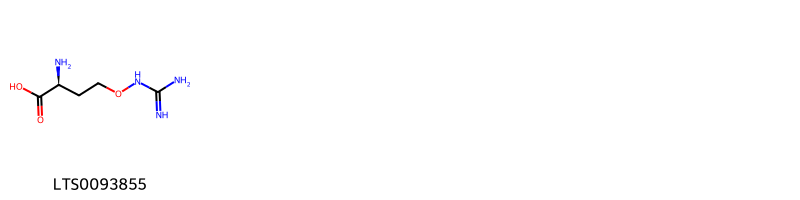{ width=100% }
    <figcaption>Hình ảnh cấu trúc hóa học của 1 hoạt chất thuộc nhóm Carboxylic acids and derivatives gồm ['(l)-canavanine (LTS0093855)'].</figcaption>
</figure>
#### Nhóm Piperidines
<figure markdown="span">
    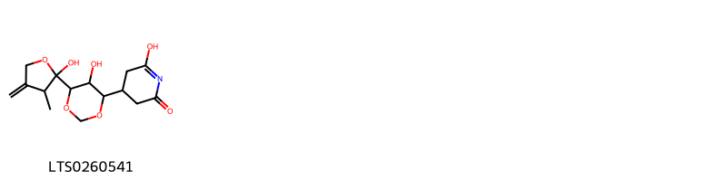{ width=100% }
    <figcaption>Hình ảnh cấu trúc hóa học của 1 hoạt chất thuộc nhóm Piperidines gồm ['6-hydroxy-4-[5-hydroxy-6-(2-hydroxy-3-methyl-4-methylideneoxolan-2-yl)-1,3-dioxan-4-yl]-4,5-dihydro-3h-pyridin-2-one (LTS0260541)'].</figcaption>
</figure>

---

### Dược dân tộc học

Danh sách các quốc gia có sử dụng *Sesbania vesicaria* trong điều trị các bệnh. 

| Country     | Disease   | Bệnh                                                                                                                                                                                                |
|:------------|:----------|:----------------------------------------------------------------------------------------------------------------------------------------------------------------------------------------------------|
| West Indies | Poison    | MYMEMORY WARNING: YOU USED ALL AVAILABLE FREE TRANSLATIONS FOR TODAY. NEXT AVAILABLE IN  16 HOURS 05 MINUTES 44 SECONDS VISIT HTTPS://MYMEMORY.TRANSLATED.NET/DOC/USAGELIMITS.PHP TO TRANSLATE MORE |

---

# Chi Entada

??? note "Danh sách các dược liệu thuộc chi"
    
	 - *Entada phaseoloides*
	 - *Entada polystachia*
	 - *Entada scandens*

---
## Entada phaseoloides
### Thông tin về thực vật

!!! info "Phân loại thực vật của *Entada phaseoloides* từ GIBF:"
    - **Kingdom:** Plantae
    - **Phylum:** Tracheophyta
    - **Order:** Fabales
    - **Family:** Fabaceae
    - **Genus:** Entada
    - **Species:** *Entada phaseoloides*

 

| Label (VI)   | Label (EN)   | Scientific Name     | Descriptions (VI)   | Descriptions (EN)                       | Also Known As (VI)   | Also Known As (EN)   |
|:-------------|:-------------|:--------------------|:--------------------|:----------------------------------------|:---------------------|:---------------------|
| N/A          | N/A          | Entada phaseoloides |                     | species of plant in the family Fabaceae | ['']                 | ['Matchbox bean']    |

#### Phân bố trên thế giới

**Từ CSDL GIBF** nan, Micronesia (Federated States of), Australia, Japan, Cook Islands, Lao People’s Democratic Republic, Chinese Taipei, Papua New Guinea, Bangladesh, United States of America, Timor-Leste, Fiji, Hong Kong, Thailand, Guam, Tonga, New Caledonia, Mexico, Viet Nam, China, Costa Rica, Vanuatu, India, Indonesia, Philippines, Malaysia, New Zealand, Nepal

#### Phân bố tại Việt Nam

**Từ CSDL GIBF**: Nghe An, Ninh Thuan, Ninh Binh, Thua Thien-Hue

---
### Thành phần hóa học
        
- Theo cơ sở dữ liệu lotus: Từ loài *Entada phaseoloides* đã phân lập và xác định được 48 hoạt chất thuộc về các nhóm Phenol ethers, Fatty Acyls, Flavonoids, Prenol lipids, Sulfoxides, Linear 1,3-diarylpropanoids, Organonitrogen compounds, Benzene and substituted derivatives, Organooxygen compounds, Phenols. 

|    | chemicalTaxonomyClassyfireClass     |   smiles_count |
|---:|:------------------------------------|---------------:|
|  0 | Benzene and substituted derivatives |              3 |
|  1 | Fatty Acyls                         |              2 |
|  2 | Flavonoids                          |             27 |
|  3 | Linear 1,3-diarylpropanoids         |              2 |
|  4 | Organonitrogen compounds            |              3 |
|  5 | Organooxygen compounds              |              5 |
|  6 | Phenol ethers                       |              1 |
|  7 | Phenols                             |              1 |
|  8 | Prenol lipids                       |              2 |
|  9 | Sulfoxides                          |              2 |

#### Nhóm Benzene and substituted derivatives
<figure markdown="span">
    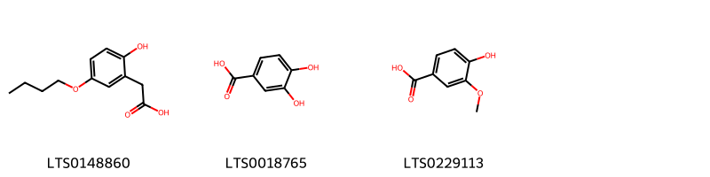{ width=100% }
    <figcaption>Hình ảnh cấu trúc hóa học của 3 hoạt chất thuộc nhóm Benzene and substituted derivatives gồm ['(5-butoxy-2-hydroxyphenyl)acetic acid (LTS0148860)', '3,4-dihydroxybenzoic acid (LTS0018765)', 'vanillic acid (LTS0229113)'].</figcaption>
</figure>
#### Nhóm Fatty Acyls
<figure markdown="span">
    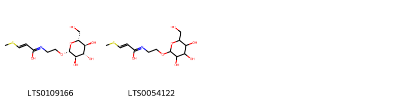{ width=100% }
    <figcaption>Hình ảnh cấu trúc hóa học của 2 hoạt chất thuộc nhóm Fatty Acyls gồm ['(2e)-3-(methylsulfanyl)-n-(2-{[(2r,3r,4s,5s,6r)-3,4,5-trihydroxy-6-(hydroxymethyl)oxan-2-yl]oxy}ethyl)prop-2-enimidic acid (LTS0109166)', '3-(methylsulfanyl)-n-(2-{[3,4,5-trihydroxy-6-(hydroxymethyl)oxan-2-yl]oxy}ethyl)prop-2-enimidic acid (LTS0054122)'].</figcaption>
</figure>
#### Nhóm Flavonoids
<figure markdown="span">
    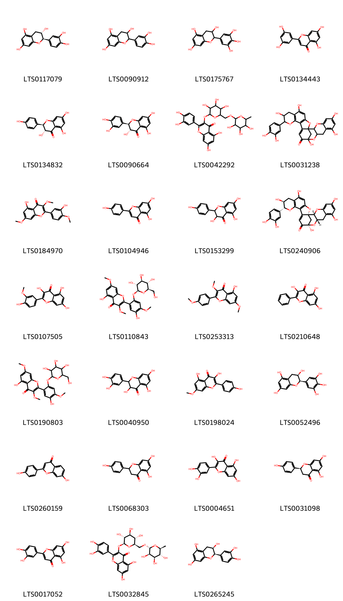{ width=100% }
    <figcaption>Hình ảnh cấu trúc hóa học của 27 hoạt chất thuộc nhóm Flavonoids gồm ['(+)-catechol (LTS0117079)', 'catechol (LTS0090912)', 'epigallocatechin (LTS0175767)', '2-(3,5-dihydroxyphenyl)-5,7-dihydroxychromen-4-one (LTS0134443)', '(+)-dihydrokaempferol (LTS0134832)', '(+)-taxifolin (LTS0090664)', 'rutin (LTS0042292)', '9-(3,4-dihydroxyphenyl)-5,8,16,21,23-pentahydroxy-2,10,17,26-tetraoxaheptacyclo[14.11.1.0¹,¹³.0³,¹².0⁶,¹¹.0¹⁸,²⁷.0²⁰,²⁵]octacosa-3(12),4,6(11),13,20,22,24-heptaen-15-one (LTS0031238)', 'ayanin (LTS0184970)', 'chamomile (LTS0104946)', 'aromadendrin (LTS0153299)', '(1r,8s,9r,16r,18s,27s)-9-(3,4-dihydroxyphenyl)-5,8,16,21,23-pentahydroxy-2,10,17,26-tetraoxaheptacyclo[14.11.1.0¹,¹³.0³,¹².0⁶,¹¹.0¹⁸,²⁷.0²⁰,²⁵]octacosa-3(12),4,6(11),13,20,22,24-heptaen-15-one (LTS0240906)', 'isorhamnetin (LTS0107505)', '5-hydroxy-2-(5-hydroxy-4-methoxy-2-{[(2s,3r,4s,5s,6r)-3,4,5-trihydroxy-6-(hydroxymethyl)oxan-2-yl]oxy}phenyl)-3,7-dimethoxychromen-4-one (LTS0110843)', '5-hydroxy-3,7-dimethoxy-2-(4-methoxyphenyl)chromen-4-one (LTS0253313)', 'galangin (LTS0210648)', '5-hydroxy-2-(5-hydroxy-4-methoxy-2-{[3,4,5-trihydroxy-6-(hydroxymethyl)oxan-2-yl]oxy}phenyl)-3,7-dimethoxychromen-4-one (LTS0190803)', '2,3-dihydroquercetin (LTS0040950)', 'rhamnocitrin (LTS0198024)', 'epigallocatechin (LTS0052496)', "7,4'-dihydroxyflavone (LTS0260159)", 'asahina (LTS0068303)', 'quercetin (LTS0004651)', 'naringenin (LTS0031098)', 'luteolin (LTS0017052)', '3-rutinosyl quercetin (LTS0032845)', 'ent-epicatechin (LTS0265245)'].</figcaption>
</figure>
#### Nhóm Linear 1_3-diarylpropanoids
<figure markdown="span">
    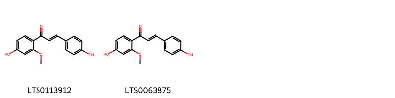{ width=100% }
    <figcaption>Hình ảnh cấu trúc hóa học của Không tìm thấy chú thích hoạt chất thuộc nhóm Linear 1_3-diarylpropanoids gồm Không tìm thấy chú thích.</figcaption>
</figure>
#### Nhóm Organonitrogen compounds
<figure markdown="span">
    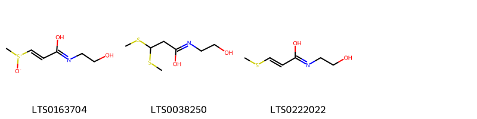{ width=100% }
    <figcaption>Hình ảnh cấu trúc hóa học của 3 hoạt chất thuộc nhóm Organonitrogen compounds gồm ['(2e)-n-(2-hydroxyethyl)-3-methanesulfinylprop-2-enimidic acid (LTS0163704)', 'n-(2-hydroxyethyl)-3,3-bis(methylsulfanyl)propanimidic acid (LTS0038250)', '(2e)-n-(2-hydroxyethyl)-3-(methylsulfanyl)prop-2-enimidic acid (LTS0222022)'].</figcaption>
</figure>
#### Nhóm Organooxygen compounds
<figure markdown="span">
    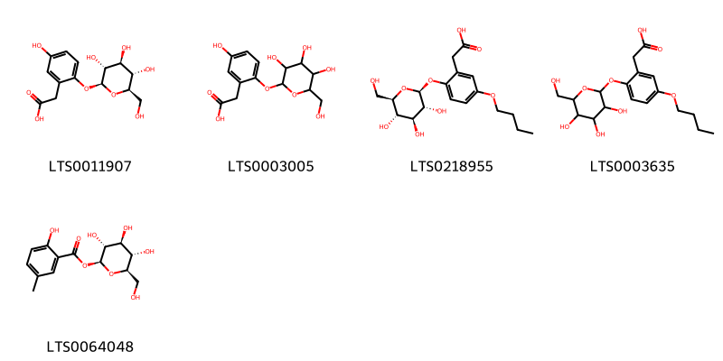{ width=100% }
    <figcaption>Hình ảnh cấu trúc hóa học của 5 hoạt chất thuộc nhóm Organooxygen compounds gồm ['(5-hydroxy-2-{[(2s,3r,4s,5s,6r)-3,4,5-trihydroxy-6-(hydroxymethyl)oxan-2-yl]oxy}phenyl)acetic acid (LTS0011907)', '(5-hydroxy-2-{[3,4,5-trihydroxy-6-(hydroxymethyl)oxan-2-yl]oxy}phenyl)acetic acid (LTS0003005)', '(5-butoxy-2-{[(2s,3r,4s,5s,6r)-3,4,5-trihydroxy-6-(hydroxymethyl)oxan-2-yl]oxy}phenyl)acetic acid (LTS0218955)', '(5-butoxy-2-{[3,4,5-trihydroxy-6-(hydroxymethyl)oxan-2-yl]oxy}phenyl)acetic acid (LTS0003635)', '(2s,3r,4s,5s,6r)-3,4,5-trihydroxy-6-(hydroxymethyl)oxan-2-yl 2-hydroxy-5-methylbenzoate (LTS0064048)'].</figcaption>
</figure>
#### Nhóm Phenol ethers
<figure markdown="span">
    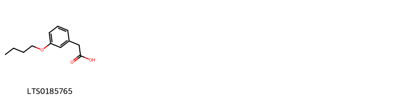{ width=100% }
    <figcaption>Hình ảnh cấu trúc hóa học của 1 hoạt chất thuộc nhóm Phenol ethers gồm ['(3-butoxyphenyl)acetic acid (LTS0185765)'].</figcaption>
</figure>
#### Nhóm Phenols
<figure markdown="span">
    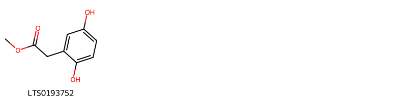{ width=100% }
    <figcaption>Hình ảnh cấu trúc hóa học của 1 hoạt chất thuộc nhóm Phenols gồm ['methyl 2-(2,5-dihydroxyphenyl)acetate (LTS0193752)'].</figcaption>
</figure>
#### Nhóm Prenol lipids
<figure markdown="span">
    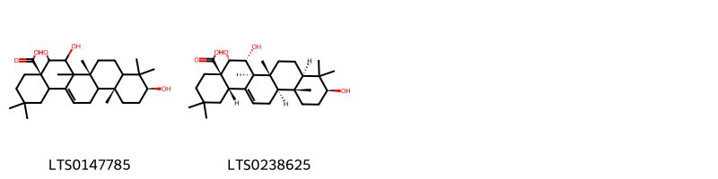{ width=100% }
    <figcaption>Hình ảnh cấu trúc hóa học của 2 hoạt chất thuộc nhóm Prenol lipids gồm ['(4ar,6br,10s,12ar)-5,6,10-trihydroxy-2,2,6a,6b,9,9,12a-heptamethyl-1,3,4,5,6,7,8,8a,10,11,12,12b,13,14b-tetradecahydropicene-4a-carboxylic acid (LTS0147785)', '(4ar,5s,6r,6as,6br,8ar,10s,12ar,12br,14bs)-5,6,10-trihydroxy-2,2,6a,6b,9,9,12a-heptamethyl-1,3,4,5,6,7,8,8a,10,11,12,12b,13,14b-tetradecahydropicene-4a-carboxylic acid (LTS0238625)'].</figcaption>
</figure>
#### Nhóm Sulfoxides
<figure markdown="span">
    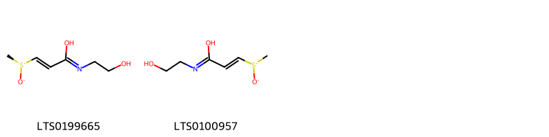{ width=100% }
    <figcaption>Hình ảnh cấu trúc hóa học của 2 hoạt chất thuộc nhóm Sulfoxides gồm ['(2e)-n-(2-hydroxyethyl)-3-[(s)-methanesulfinyl]prop-2-enimidic acid (LTS0199665)', 'n-(2-hydroxyethyl)-3-methanesulfinylprop-2-enimidic acid (LTS0100957)'].</figcaption>
</figure>

---

### Dược dân tộc học

Danh sách các quốc gia có sử dụng *Entada phaseoloides* trong điều trị các bệnh. 

| Country      | Disease                             | Bệnh                                                                                                                                                                                                |
|:-------------|:------------------------------------|:----------------------------------------------------------------------------------------------------------------------------------------------------------------------------------------------------|
| India        | Piscicide, Tonic, Vermifuge, Emetic | MYMEMORY WARNING: YOU USED ALL AVAILABLE FREE TRANSLATIONS FOR TODAY. NEXT AVAILABLE IN  16 HOURS 05 MINUTES 20 SECONDS VISIT HTTPS://MYMEMORY.TRANSLATED.NET/DOC/USAGELIMITS.PHP TO TRANSLATE MORE |
| Java         | Cosmetic, Piscicide                 | MYMEMORY WARNING: YOU USED ALL AVAILABLE FREE TRANSLATIONS FOR TODAY. NEXT AVAILABLE IN  16 HOURS 05 MINUTES 17 SECONDS VISIT HTTPS://MYMEMORY.TRANSLATED.NET/DOC/USAGELIMITS.PHP TO TRANSLATE MORE |
| Malaysia     | Soap                                | MYMEMORY WARNING: YOU USED ALL AVAILABLE FREE TRANSLATIONS FOR TODAY. NEXT AVAILABLE IN  16 HOURS 05 MINUTES 15 SECONDS VISIT HTTPS://MYMEMORY.TRANSLATED.NET/DOC/USAGELIMITS.PHP TO TRANSLATE MORE |
| Philippines  | Piscicide, Soap                     | MYMEMORY WARNING: YOU USED ALL AVAILABLE FREE TRANSLATIONS FOR TODAY. NEXT AVAILABLE IN  16 HOURS 05 MINUTES 12 SECONDS VISIT HTTPS://MYMEMORY.TRANSLATED.NET/DOC/USAGELIMITS.PHP TO TRANSLATE MORE |
| South Africa | Piscicide                           | MYMEMORY WARNING: YOU USED ALL AVAILABLE FREE TRANSLATIONS FOR TODAY. NEXT AVAILABLE IN  16 HOURS 05 MINUTES 10 SECONDS VISIT HTTPS://MYMEMORY.TRANSLATED.NET/DOC/USAGELIMITS.PHP TO TRANSLATE MORE |

---

---
## Entada polystachia
### Thông tin về thực vật

!!! info "Phân loại thực vật của *Entada polystachya* từ GIBF:"
    - **Kingdom:** Plantae
    - **Phylum:** Tracheophyta
    - **Order:** Fabales
    - **Family:** Fabaceae
    - **Genus:** Entada
    - **Species:** *Entada polystachya*

 

| Label (VI)   | Label (EN)   | Scientific Name     | Descriptions (VI)   | Descriptions (EN)                       | Also Known As (VI)   | Also Known As (EN)   |
|:-------------|:-------------|:--------------------|:--------------------|:----------------------------------------|:---------------------|:---------------------|
| N/A          | N/A          | Entada phaseoloides |                     | species of plant in the family Fabaceae | ['']                 | ['Matchbox bean']    |

#### Phân bố trên thế giới

**Từ CSDL GIBF** Nicaragua, Ecuador, Belize, Panama, Mayotte, Colombia, Brazil, Guatemala, Costa Rica, Honduras, Mexico, El Salvador, French Guiana

#### Phân bố tại Việt Nam

**Từ CSDL GIBF**: Không có ghi nhận ở Việt Nam

---
### Thành phần hóa học
        
- Theo cơ sở dữ liệu lotus: Từ loài *Entada polystachya* đã phân lập và xác định được Chưa có hoạt chất nào được phân lập. hoạt chất thuộc về các nhóm Không có hoạt chất nào được phân lập. 

Không có hình ảnh nào được tạo ra

---

### Dược dân tộc học

Danh sách các quốc gia có sử dụng *Entada polystachya* trong điều trị các bệnh. 

| Country   | Disease   | Bệnh                                                                                                                                                                                                |
|:----------|:----------|:----------------------------------------------------------------------------------------------------------------------------------------------------------------------------------------------------|
| Guatemala | Soap      | MYMEMORY WARNING: YOU USED ALL AVAILABLE FREE TRANSLATIONS FOR TODAY. NEXT AVAILABLE IN  16 HOURS 04 MINUTES 38 SECONDS VISIT HTTPS://MYMEMORY.TRANSLATED.NET/DOC/USAGELIMITS.PHP TO TRANSLATE MORE |
| Mexico    | Soap      | MYMEMORY WARNING: YOU USED ALL AVAILABLE FREE TRANSLATIONS FOR TODAY. NEXT AVAILABLE IN  16 HOURS 04 MINUTES 36 SECONDS VISIT HTTPS://MYMEMORY.TRANSLATED.NET/DOC/USAGELIMITS.PHP TO TRANSLATE MORE |

---

---
## Entada scandens
### Thông tin về thực vật

!!! info "Phân loại thực vật của *Entada phaseoloides* từ GIBF:"
    - **Kingdom:** Plantae
    - **Phylum:** Tracheophyta
    - **Order:** Fabales
    - **Family:** Fabaceae
    - **Genus:** Entada
    - **Species:** *Entada phaseoloides*

 

| Label (VI)   | Label (EN)   | Scientific Name   | Descriptions (VI)   | Descriptions (EN)   | Also Known As (VI)   | Also Known As (EN)   |
|:-------------|:-------------|:------------------|:--------------------|:--------------------|:---------------------|:---------------------|
| N/A          | N/A          | Entada scandens   | loài thực vật       | species of plant    | ['']                 | ['']                 |

#### Phân bố trên thế giới

**Từ CSDL GIBF** nan, Sri Lanka, Ghana, Australia, Japan, Lao People’s Democratic Republic, Gabon, Angola, unknown or invalid, Tanzania, United Republic of, Sierra Leone, Norway, Malawi, Chinese Taipei, Portugal, Jamaica, Solomon Islands, Fiji, Brazil, Tonga, Mexico, Dominican Republic, Saint Helena, Ascension and Tristan da Cunha, Viet Nam, China, Ecuador, Madagascar, Haiti, Colombia, Vanuatu, India, Indonesia, Philippines, Malaysia, New Zealand

#### Phân bố tại Việt Nam

**Từ CSDL GIBF**: Không có ghi nhận ở Việt Nam

---
### Thành phần hóa học
        
- Theo cơ sở dữ liệu lotus: Từ loài *Entada phaseoloides* đã phân lập và xác định được Chưa có hoạt chất nào được phân lập. hoạt chất thuộc về các nhóm Không có hoạt chất nào được phân lập. 

Không có hình ảnh nào được tạo ra

---

### Dược dân tộc học

Danh sách các quốc gia có sử dụng *Entada phaseoloides* trong điều trị các bệnh. 

| Country       | Disease         | Bệnh                                                                                                                                                                                                |
|:--------------|:----------------|:----------------------------------------------------------------------------------------------------------------------------------------------------------------------------------------------------|
| Elsewhere     | Stomachic       | MYMEMORY WARNING: YOU USED ALL AVAILABLE FREE TRANSLATIONS FOR TODAY. NEXT AVAILABLE IN  16 HOURS 04 MINUTES 14 SECONDS VISIT HTTPS://MYMEMORY.TRANSLATED.NET/DOC/USAGELIMITS.PHP TO TRANSLATE MORE |
| India(Santal) | Laxative        | MYMEMORY WARNING: YOU USED ALL AVAILABLE FREE TRANSLATIONS FOR TODAY. NEXT AVAILABLE IN  16 HOURS 04 MINUTES 12 SECONDS VISIT HTTPS://MYMEMORY.TRANSLATED.NET/DOC/USAGELIMITS.PHP TO TRANSLATE MORE |
| Mexico        | Poison          | MYMEMORY WARNING: YOU USED ALL AVAILABLE FREE TRANSLATIONS FOR TODAY. NEXT AVAILABLE IN  16 HOURS 04 MINUTES 09 SECONDS VISIT HTTPS://MYMEMORY.TRANSLATED.NET/DOC/USAGELIMITS.PHP TO TRANSLATE MORE |
| Panama(Cuna)  | Piscicide, Soap | MYMEMORY WARNING: YOU USED ALL AVAILABLE FREE TRANSLATIONS FOR TODAY. NEXT AVAILABLE IN  16 HOURS 04 MINUTES 07 SECONDS VISIT HTTPS://MYMEMORY.TRANSLATED.NET/DOC/USAGELIMITS.PHP TO TRANSLATE MORE |
| Venezuela     | Astringent      | MYMEMORY WARNING: YOU USED ALL AVAILABLE FREE TRANSLATIONS FOR TODAY. NEXT AVAILABLE IN  16 HOURS 04 MINUTES 04 SECONDS VISIT HTTPS://MYMEMORY.TRANSLATED.NET/DOC/USAGELIMITS.PHP TO TRANSLATE MORE |

---

# Chi Machaerium

??? note "Danh sách các dược liệu thuộc chi"
    
	 - *Machaerium angustifolium*
	 - *Machaerium macrocarpum*

---
## Machaerium angustifolium
### Thông tin về thực vật

!!! info "Phân loại thực vật của *N/A* từ GIBF:"
    - **Kingdom:** Plantae
    - **Phylum:** Tracheophyta
    - **Order:** Fabales
    - **Family:** Fabaceae
    - **Genus:** Machaerium
    - **Species:** *N/A*

 

| Label (VI)   | Label (EN)   | Scientific Name   | Descriptions (VI)   | Descriptions (EN)   | Also Known As (VI)   | Also Known As (EN)   |
|:-------------|:-------------|:------------------|:--------------------|:--------------------|:---------------------|:---------------------|
| N/A          | N/A          | Entada scandens   | loài thực vật       | species of plant    | ['']                 | ['']                 |

#### Phân bố trên thế giới

**Từ CSDL GIBF** Belize, Puerto Rico, Colombia, Brazil, Bolivia (Plurinational State of), El Salvador, Nicaragua, Sierra Leone, French Guiana

#### Phân bố tại Việt Nam

**Từ CSDL GIBF**: Không có ghi nhận ở Việt Nam

---
### Thành phần hóa học
        
- Theo cơ sở dữ liệu lotus: Từ loài *N/A* đã phân lập và xác định được Chưa có hoạt chất nào được phân lập. hoạt chất thuộc về các nhóm Không có hoạt chất nào được phân lập. 

Không có hình ảnh nào được tạo ra

---

### Dược dân tộc học

Danh sách các quốc gia có sử dụng *N/A* trong điều trị các bệnh. 

| Country   | Disease   | Bệnh                                                                                                                                                                                                |
|:----------|:----------|:----------------------------------------------------------------------------------------------------------------------------------------------------------------------------------------------------|
| Bolivia   | Soap      | MYMEMORY WARNING: YOU USED ALL AVAILABLE FREE TRANSLATIONS FOR TODAY. NEXT AVAILABLE IN  16 HOURS 03 MINUTES 45 SECONDS VISIT HTTPS://MYMEMORY.TRANSLATED.NET/DOC/USAGELIMITS.PHP TO TRANSLATE MORE |

---

---
## Machaerium macrocarpum
### Thông tin về thực vật

!!! info "Phân loại thực vật của *N/A* từ GIBF:"
    - **Kingdom:** Plantae
    - **Phylum:** Tracheophyta
    - **Order:** Fabales
    - **Family:** Fabaceae
    - **Genus:** N/A
    - **Species:** *N/A*

 

| Label (VI)   | Label (EN)   | Scientific Name        | Descriptions (VI)   | Descriptions (EN)   | Also Known As (VI)   | Also Known As (EN)   |
|:-------------|:-------------|:-----------------------|:--------------------|:--------------------|:---------------------|:---------------------|
| N/A          | N/A          | Machaerium macrocarpum | loài thực vật       | species of plant    | ['']                 | ['']                 |

#### Phân bố trên thế giới

**Từ CSDL GIBF** Sri Lanka, Italy, Australia, Cambodia, Argentina, Tanzania, United Republic of, Chinese Taipei, Spain, Portugal, United States of America, Chile, Croatia, South Africa, Thailand, Germany, Brazil, Guam, France, Norfolk Island, Viet Nam, China, United Kingdom of Great Britain and Northern Ireland, Ireland, Gambia, India, Malaysia, New Zealand

#### Phân bố tại Việt Nam

**Từ CSDL GIBF**: Đà Nẵng, Bà Rịa - Vũng Tàu

---
### Thành phần hóa học
        
- Theo cơ sở dữ liệu lotus: Từ loài *N/A* đã phân lập và xác định được Chưa có hoạt chất nào được phân lập. hoạt chất thuộc về các nhóm Không có hoạt chất nào được phân lập. 

Không có hình ảnh nào được tạo ra

---

### Dược dân tộc học

Danh sách các quốc gia có sử dụng *N/A* trong điều trị các bệnh. 

| Country   | Disease   | Bệnh                                                                                                                                                                                                |
|:----------|:----------|:----------------------------------------------------------------------------------------------------------------------------------------------------------------------------------------------------|
| Brazil    | Diuretic  | MYMEMORY WARNING: YOU USED ALL AVAILABLE FREE TRANSLATIONS FOR TODAY. NEXT AVAILABLE IN  16 HOURS 03 MINUTES 23 SECONDS VISIT HTTPS://MYMEMORY.TRANSLATED.NET/DOC/USAGELIMITS.PHP TO TRANSLATE MORE |

---

# Chi Haematoxylum

??? note "Danh sách các dược liệu thuộc chi"
    
	 - *Haematoxylum brasiletto*
	 - *Haematoxylum campechianum*

---
## Haematoxylum brasiletto
### Thông tin về thực vật

!!! info "Phân loại thực vật của *Haematoxylum brasiletto* từ GIBF:"
    - **Kingdom:** Plantae
    - **Phylum:** Tracheophyta
    - **Order:** Fabales
    - **Family:** Fabaceae
    - **Genus:** Haematoxylum
    - **Species:** *Haematoxylum brasiletto*

 

| Label (VI)   | Label (EN)   | Scientific Name         | Descriptions (VI)   | Descriptions (EN)   | Also Known As (VI)   | Also Known As (EN)   |
|:-------------|:-------------|:------------------------|:--------------------|:--------------------|:---------------------|:---------------------|
| N/A          | N/A          | Haematoxylum brasiletto | loài thực vật       | species of plant    | ['']                 | ['']                 |

#### Phân bố trên thế giới

**Từ CSDL GIBF** Curaçao, Aruba, Colombia, Costa Rica, Honduras, Nicaragua, Bonaire, Sint Eustatius and Saba, Mexico

#### Phân bố tại Việt Nam

**Từ CSDL GIBF**: Không có ghi nhận ở Việt Nam

---
### Thành phần hóa học
        
- Theo cơ sở dữ liệu lotus: Từ loài *Haematoxylum brasiletto* đã phân lập và xác định được 8 hoạt chất thuộc về các nhóm Cinnamic acids and derivatives, Benzene and substituted derivatives, Phenols, Benzopyrans. 

|    | chemicalTaxonomyClassyfireClass     |   smiles_count |
|---:|:------------------------------------|---------------:|
|  0 | Benzene and substituted derivatives |              2 |
|  1 | Benzopyrans                         |              2 |
|  2 | Cinnamic acids and derivatives      |              2 |
|  3 | Phenols                             |              1 |

#### Nhóm Benzene and substituted derivatives
<figure markdown="span">
    { width=100% }
    <figcaption>Hình ảnh cấu trúc hóa học của 2 hoạt chất thuộc nhóm Benzene and substituted derivatives gồm ['galop (LTS0222857)', 'methyl gallate (LTS0043810)'].</figcaption>
</figure>
#### Nhóm Benzopyrans
<figure markdown="span">
    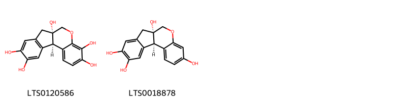{ width=100% }
    <figcaption>Hình ảnh cấu trúc hóa học của 2 hoạt chất thuộc nhóm Benzopyrans gồm ['(1r,10s)-8-oxatetracyclo[8.7.0.0²,⁷.0¹²,¹⁷]heptadeca-2,4,6,12(17),13,15-hexaene-5,6,10,14,15-pentol (LTS0120586)', 'brazilin (LTS0018878)'].</figcaption>
</figure>
#### Nhóm Cinnamic acids and derivatives
<figure markdown="span">
    { width=100% }
    <figcaption>Hình ảnh cấu trúc hóa học của 2 hoạt chất thuộc nhóm Cinnamic acids and derivatives gồm ['3,4-dihydroxycinnamic acid (LTS0128050)', 'para-coumaric acid (LTS0266252)'].</figcaption>
</figure>
#### Nhóm Phenols
<figure markdown="span">
    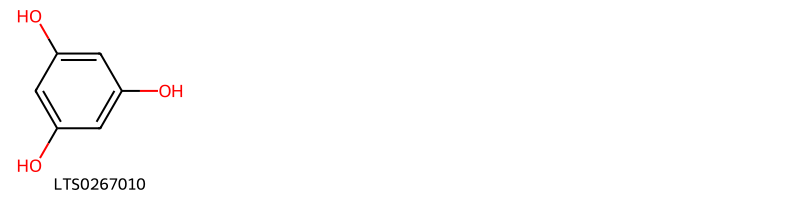{ width=100% }
    <figcaption>Hình ảnh cấu trúc hóa học của 1 hoạt chất thuộc nhóm Phenols gồm ['phloroglucinol (LTS0267010)'].</figcaption>
</figure>

---

### Dược dân tộc học

Danh sách các quốc gia có sử dụng *Haematoxylum brasiletto* trong điều trị các bệnh. 

| Country   | Disease                             | Bệnh                                                                                                                                                                                                |
|:----------|:------------------------------------|:----------------------------------------------------------------------------------------------------------------------------------------------------------------------------------------------------|
| Mexico    | Astringent, Dentifrice, Refrigerant | MYMEMORY WARNING: YOU USED ALL AVAILABLE FREE TRANSLATIONS FOR TODAY. NEXT AVAILABLE IN  16 HOURS 03 MINUTES 00 SECONDS VISIT HTTPS://MYMEMORY.TRANSLATED.NET/DOC/USAGELIMITS.PHP TO TRANSLATE MORE |

---

---
## Haematoxylum campechianum
### Thông tin về thực vật

!!! info "Phân loại thực vật của *Haematoxylum campechianum* từ GIBF:"
    - **Kingdom:** Plantae
    - **Phylum:** Tracheophyta
    - **Order:** Fabales
    - **Family:** Fabaceae
    - **Genus:** Haematoxylum
    - **Species:** *Haematoxylum campechianum*

 

| Label (VI)   | Label (EN)   | Scientific Name           | Descriptions (VI)   | Descriptions (EN)   | Also Known As (VI)   | Also Known As (EN)                                                                                                                                              |
|:-------------|:-------------|:--------------------------|:--------------------|:--------------------|:---------------------|:----------------------------------------------------------------------------------------------------------------------------------------------------------------|
| N/A          | N/A          | Haematoxylum campechianum | loài thực vật       | species of plant    | ['']                 | ['logwood', 'blackwood', 'bloodwood tree', 'bluewood', 'campeachy tree', 'campeachy wood', 'campeche logwood', 'campeche wood', 'Jamaica wood', 'logwood tree'] |

#### Phân bố trên thế giới

**Từ CSDL GIBF** Virgin Islands (U.S.), nan, Australia, Guadeloupe, Mauritius, Guatemala, Grenada, Saint Lucia, Tanzania, United Republic of, Puerto Rico, Chinese Taipei, Jamaica, United States of America, Bonaire, Sint Eustatius and Saba, Belize, Martinique, Bahamas, New Caledonia, Cuba, Mexico, Dominican Republic, Ecuador, Saint Kitts and Nevis, Haiti, Montserrat, India, Cayman Islands, Antigua and Barbuda

#### Phân bố tại Việt Nam

**Từ CSDL GIBF**: Không có ghi nhận ở Việt Nam

---
### Thành phần hóa học
        
- Theo cơ sở dữ liệu lotus: Từ loài *Haematoxylum campechianum* đã phân lập và xác định được 35 hoạt chất thuộc về các nhóm Flavonoids, Cinnamic acids and derivatives, Diarylheptanoids, Benzene and substituted derivatives, Organooxygen compounds, Tannins, Benzopyrans. 

|    | chemicalTaxonomyClassyfireClass     |   smiles_count |
|---:|:------------------------------------|---------------:|
|  0 | Benzene and substituted derivatives |              5 |
|  1 | Benzopyrans                         |              3 |
|  2 | Cinnamic acids and derivatives      |              2 |
|  3 | Diarylheptanoids                    |              1 |
|  4 | Flavonoids                          |             14 |
|  5 | Organooxygen compounds              |              4 |
|  6 | Tannins                             |              5 |

#### Nhóm Benzene and substituted derivatives
<figure markdown="span">
    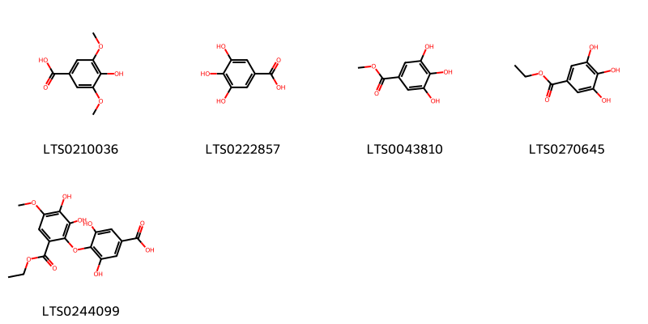{ width=100% }
    <figcaption>Hình ảnh cấu trúc hóa học của 5 hoạt chất thuộc nhóm Benzene and substituted derivatives gồm ['syringic acid (LTS0210036)', 'galop (LTS0222857)', 'methyl gallate (LTS0043810)', 'ethyl gallate (LTS0270645)', '4-[6-(ethoxycarbonyl)-2,3-dihydroxy-4-methoxyphenoxy]-3,5-dihydroxybenzoic acid (LTS0244099)'].</figcaption>
</figure>
#### Nhóm Benzopyrans
<figure markdown="span">
    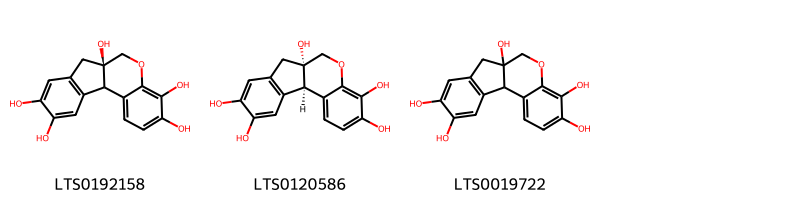{ width=100% }
    <figcaption>Hình ảnh cấu trúc hóa học của 3 hoạt chất thuộc nhóm Benzopyrans gồm ['haematoxylin (LTS0192158)', '(1r,10s)-8-oxatetracyclo[8.7.0.0²,⁷.0¹²,¹⁷]heptadeca-2,4,6,12(17),13,15-hexaene-5,6,10,14,15-pentol (LTS0120586)', '8-oxatetracyclo[8.7.0.0²,⁷.0¹²,¹⁷]heptadeca-2,4,6,12(17),13,15-hexaene-5,6,10,14,15-pentol (LTS0019722)'].</figcaption>
</figure>
#### Nhóm Cinnamic acids and derivatives
<figure markdown="span">
    { width=100% }
    <figcaption>Hình ảnh cấu trúc hóa học của 2 hoạt chất thuộc nhóm Cinnamic acids and derivatives gồm ['ferulic acid (LTS0077328)', '3,4-dihydroxycinnamic acid (LTS0128050)'].</figcaption>
</figure>
#### Nhóm Diarylheptanoids
<figure markdown="span">
    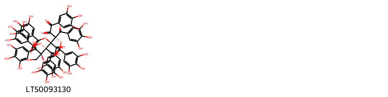{ width=100% }
    <figcaption>Hình ảnh cấu trúc hóa học của 1 hoạt chất thuộc nhóm Diarylheptanoids gồm ['(2r,3r,4s,5s)-2-hydroxy-2-(hydroxymethyl)-1,6,7-trioxo-3,4,5-tris(3,4,5-trihydroxybenzoyl)-3,5-bis(3,4,5-trihydroxybenzoyloxy)-1,7-bis(3,4,5-trihydroxyphenyl)heptan-4-yl 3,4,5-trihydroxybenzoate (LTS0093130)'].</figcaption>
</figure>
#### Nhóm Flavonoids
<figure markdown="span">
    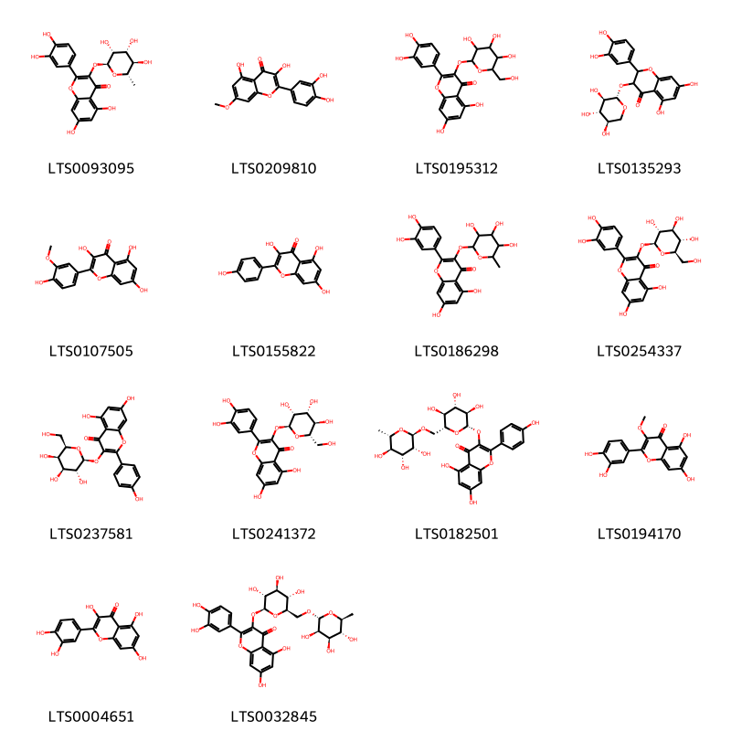{ width=100% }
    <figcaption>Hình ảnh cấu trúc hóa học của 14 hoạt chất thuộc nhóm Flavonoids gồm ['quercitrin (LTS0093095)', 'rhamnetin (LTS0209810)', '2-(3,4-dihydroxyphenyl)-5,7-dihydroxy-3-{[3,4,5-trihydroxy-6-(hydroxymethyl)oxan-2-yl]oxy}chromen-4-one (LTS0195312)', '2-(3,4-dihydroxyphenyl)-5,7-dihydroxy-3-{[(2s,3r,4s,5r)-3,4,5-trihydroxyoxan-2-yl]oxy}-2,3-dihydro-1-benzopyran-4-one (LTS0135293)', 'isorhamnetin (LTS0107505)', 'kaempherol (LTS0155822)', 'quercitrin (LTS0186298)', 'isoquercetin (LTS0254337)', 'trifolin (LTS0237581)', '2-(3,4-dihydroxyphenyl)-5,7-dihydroxy-3-{[(2s,3r,4r,5r,6s)-3,4,5-trihydroxy-6-(hydroxymethyl)oxan-2-yl]oxy}chromen-4-one (LTS0241372)', 'nictoflorin (LTS0182501)', 'quercetin 3-methyl ether (LTS0194170)', 'quercetin (LTS0004651)', '3-rutinosyl quercetin (LTS0032845)'].</figcaption>
</figure>
#### Nhóm Organooxygen compounds
<figure markdown="span">
    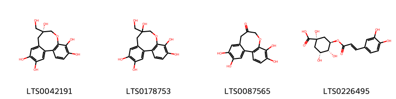{ width=100% }
    <figcaption>Hình ảnh cấu trúc hóa học của 4 hoạt chất thuộc nhóm Organooxygen compounds gồm ['(10r)-10-(hydroxymethyl)-8-oxatricyclo[10.4.0.0²,⁷]hexadeca-1(16),2(7),3,5,12,14-hexaene-5,6,10,14,15-pentol (LTS0042191)', '10-(hydroxymethyl)-8-oxatricyclo[10.4.0.0²,⁷]hexadeca-1(16),2(7),3,5,12,14-hexaene-5,6,10,14,15-pentol (LTS0178753)', '5,6,14,15-tetrahydroxy-8-oxatricyclo[10.4.0.0²,⁷]hexadeca-1(16),2(7),3,5,12,14-hexaen-10-one (LTS0087565)', 'chlorogenic acid (LTS0226495)'].</figcaption>
</figure>
#### Nhóm Tannins
<figure markdown="span">
    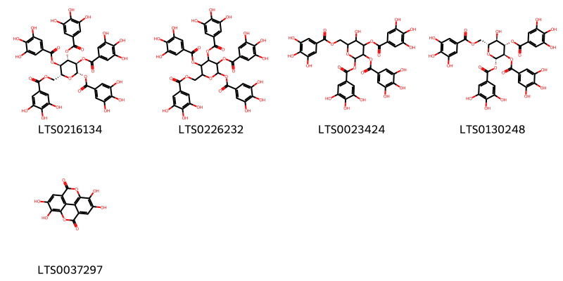{ width=100% }
    <figcaption>Hình ảnh cấu trúc hóa học của 5 hoạt chất thuộc nhóm Tannins gồm ['(2s,3r,4s,5r,6r)-3,4,5-tris(3,4,5-trihydroxybenzoyloxy)-6-[(3,4,5-trihydroxybenzoyloxy)methyl]oxan-2-yl 3,4,5-trihydroxybenzoate (LTS0216134)', '3,4,5-tris(3,4,5-trihydroxybenzoyloxy)-6-[(3,4,5-trihydroxybenzoyloxy)methyl]oxan-2-yl 3,4,5-trihydroxybenzoate (LTS0226232)', '5-hydroxy-3,4-bis(3,4,5-trihydroxybenzoyloxy)-6-[(3,4,5-trihydroxybenzoyloxy)methyl]oxan-2-yl 3,4,5-trihydroxybenzoate (LTS0023424)', '(2s,3r,4s,5r,6r)-5-hydroxy-3,4-bis(3,4,5-trihydroxybenzoyloxy)-6-[(3,4,5-trihydroxybenzoyloxy)methyl]oxan-2-yl 3,4,5-trihydroxybenzoate (LTS0130248)', 'ellagic acid (LTS0037297)'].</figcaption>
</figure>

---

### Dược dân tộc học

Danh sách các quốc gia có sử dụng *Haematoxylum campechianum* trong điều trị các bệnh. 

| Country            | Disease              | Bệnh                                                                                                                                                                                                |
|:-------------------|:---------------------|:----------------------------------------------------------------------------------------------------------------------------------------------------------------------------------------------------|
| Dominican Republic | Astringent           | MYMEMORY WARNING: YOU USED ALL AVAILABLE FREE TRANSLATIONS FOR TODAY. NEXT AVAILABLE IN  16 HOURS 02 MINUTES 35 SECONDS VISIT HTTPS://MYMEMORY.TRANSLATED.NET/DOC/USAGELIMITS.PHP TO TRANSLATE MORE |
| Elsewhere          | Astringent, nan      | MYMEMORY WARNING: YOU USED ALL AVAILABLE FREE TRANSLATIONS FOR TODAY. NEXT AVAILABLE IN  16 HOURS 02 MINUTES 33 SECONDS VISIT HTTPS://MYMEMORY.TRANSLATED.NET/DOC/USAGELIMITS.PHP TO TRANSLATE MORE |
| Haiti              | Antiseptic, Hemostat | MYMEMORY WARNING: YOU USED ALL AVAILABLE FREE TRANSLATIONS FOR TODAY. NEXT AVAILABLE IN  16 HOURS 02 MINUTES 30 SECONDS VISIT HTTPS://MYMEMORY.TRANSLATED.NET/DOC/USAGELIMITS.PHP TO TRANSLATE MORE |
| India              | Astringent, Tonic    | MYMEMORY WARNING: YOU USED ALL AVAILABLE FREE TRANSLATIONS FOR TODAY. NEXT AVAILABLE IN  16 HOURS 02 MINUTES 28 SECONDS VISIT HTTPS://MYMEMORY.TRANSLATED.NET/DOC/USAGELIMITS.PHP TO TRANSLATE MORE |
| Mexico             | Astringent           | MYMEMORY WARNING: YOU USED ALL AVAILABLE FREE TRANSLATIONS FOR TODAY. NEXT AVAILABLE IN  16 HOURS 02 MINUTES 25 SECONDS VISIT HTTPS://MYMEMORY.TRANSLATED.NET/DOC/USAGELIMITS.PHP TO TRANSLATE MORE |
| Turkey             | Hemostat, Astringent | MYMEMORY WARNING: YOU USED ALL AVAILABLE FREE TRANSLATIONS FOR TODAY. NEXT AVAILABLE IN  16 HOURS 02 MINUTES 23 SECONDS VISIT HTTPS://MYMEMORY.TRANSLATED.NET/DOC/USAGELIMITS.PHP TO TRANSLATE MORE |
| Venezuela          | Astringent           | MYMEMORY WARNING: YOU USED ALL AVAILABLE FREE TRANSLATIONS FOR TODAY. NEXT AVAILABLE IN  16 HOURS 02 MINUTES 20 SECONDS VISIT HTTPS://MYMEMORY.TRANSLATED.NET/DOC/USAGELIMITS.PHP TO TRANSLATE MORE |

---

# Chi Bowdichia

??? note "Danh sách các dược liệu thuộc chi"
    
	 - *Bowdichia virgilioides*

---
## Bowdichia virgilioides
### Thông tin về thực vật

!!! info "Phân loại thực vật của *Bowdichia virgilioides* từ GIBF:"
    - **Kingdom:** Plantae
    - **Phylum:** Tracheophyta
    - **Order:** Fabales
    - **Family:** Fabaceae
    - **Genus:** Bowdichia
    - **Species:** *Bowdichia virgilioides*

 

| Label (VI)   | Label (EN)   | Scientific Name        | Descriptions (VI)   | Descriptions (EN)   | Also Known As (VI)   | Also Known As (EN)   |
|:-------------|:-------------|:-----------------------|:--------------------|:--------------------|:---------------------|:---------------------|
| N/A          | N/A          | Bowdichia virgilioides | loài thực vật       | species of plant    | ['']                 | ['']                 |

#### Phân bố trên thế giới

**Từ CSDL GIBF** Colombia, Brazil

#### Phân bố tại Việt Nam

**Từ CSDL GIBF**: Không có ghi nhận ở Việt Nam

---
### Thành phần hóa học
        
- Theo cơ sở dữ liệu lotus: Từ loài *Bowdichia virgilioides* đã phân lập và xác định được 40 hoạt chất thuộc về các nhóm Quinolizidines, Flavonoids, Prenol lipids, Steroids and steroid derivatives, Isoflavonoids, Benzene and substituted derivatives, Lupin alkaloids, Phenols, Organooxygen compounds. 

|    | chemicalTaxonomyClassyfireClass     |   smiles_count |
|---:|:------------------------------------|---------------:|
|  0 | Benzene and substituted derivatives |              1 |
|  1 | Flavonoids                          |              1 |
|  2 | Isoflavonoids                       |             10 |
|  3 | Lupin alkaloids                     |             15 |
|  4 | Organooxygen compounds              |              2 |
|  5 | Phenols                             |              2 |
|  6 | Prenol lipids                       |              3 |
|  7 | Quinolizidines                      |              2 |
|  8 | Steroids and steroid derivatives    |              3 |

#### Nhóm Benzene and substituted derivatives
<figure markdown="span">
    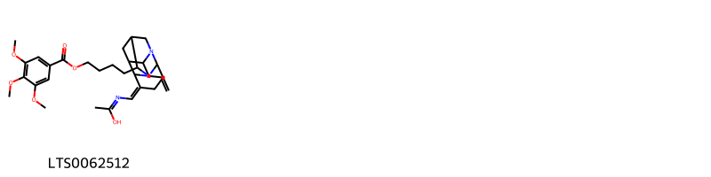{ width=100% }
    <figcaption>Hình ảnh cấu trúc hóa học của 1 hoạt chất thuộc nhóm Benzene and substituted derivatives gồm ['n-{[12-(prop-2-en-1-yl)-8-[4-(3,4,5-trimethoxybenzoyloxy)butyl]-1,7-diazatetracyclo[7.3.1.0²,⁷.0⁶,¹¹]tridecan-5-ylidene]methyl}ethanimidic acid (LTS0062512)'].</figcaption>
</figure>
#### Nhóm Flavonoids
<figure markdown="span">
    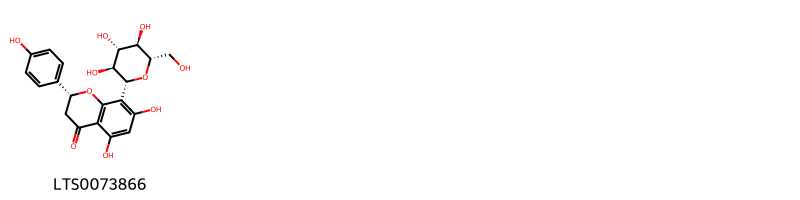{ width=100% }
    <figcaption>Hình ảnh cấu trúc hóa học của 1 hoạt chất thuộc nhóm Flavonoids gồm ['(2r)-5,7-dihydroxy-2-(4-hydroxyphenyl)-8-[(2r,3s,4s,5r,6s)-3,4,5-trihydroxy-6-(hydroxymethyl)oxan-2-yl]-2,3-dihydro-1-benzopyran-4-one (LTS0073866)'].</figcaption>
</figure>
#### Nhóm Isoflavonoids
<figure markdown="span">
    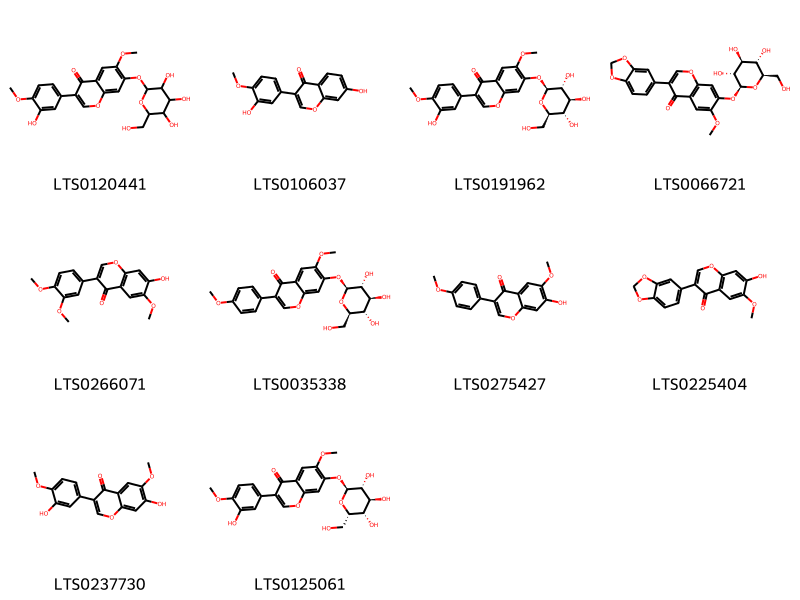{ width=100% }
    <figcaption>Hình ảnh cấu trúc hóa học của 10 hoạt chất thuộc nhóm Isoflavonoids gồm ['3-(3-hydroxy-4-methoxyphenyl)-6-methoxy-7-{[3,4,5-trihydroxy-6-(hydroxymethyl)oxan-2-yl]oxy}chromen-4-one (LTS0120441)', 'calycosin (LTS0106037)', '3-(3-hydroxy-4-methoxyphenyl)-6-methoxy-7-{[(2s,3r,4s,5s,6r)-3,4,5-trihydroxy-6-(hydroxymethyl)oxan-2-yl]oxy}chromen-4-one (LTS0191962)', '3-(2h-1,3-benzodioxol-5-yl)-6-methoxy-7-{[(2s,3r,4s,5s,6r)-3,4,5-trihydroxy-6-(hydroxymethyl)oxan-2-yl]oxy}chromen-4-one (LTS0066721)', 'cladrastin (LTS0266071)', '6-methoxy-3-(4-methoxyphenyl)-7-{[(2s,3r,4s,5s,6r)-3,4,5-trihydroxy-6-(hydroxymethyl)oxan-2-yl]oxy}chromen-4-one (LTS0035338)', 'afrormosin (LTS0275427)', 'fujikinetin (LTS0225404)', 'odoratin (LTS0237730)', '3-(3-hydroxy-4-methoxyphenyl)-6-methoxy-7-{[(2s,3r,4s,5s,6s)-3,4,5-trihydroxy-6-(hydroxymethyl)oxan-2-yl]oxy}chromen-4-one (LTS0125061)'].</figcaption>
</figure>
#### Nhóm Lupin alkaloids
<figure markdown="span">
    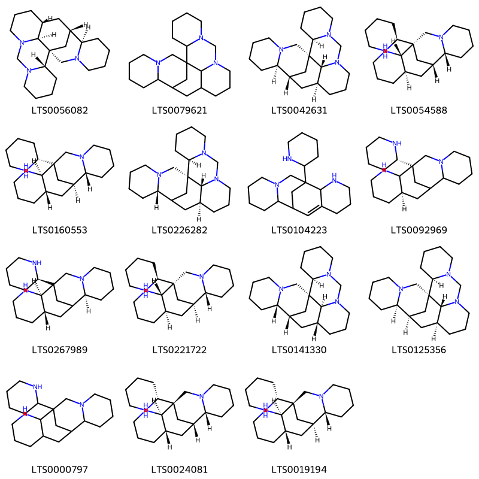{ width=100% }
    <figcaption>Hình ảnh cấu trúc hóa học của 15 hoạt chất thuộc nhóm Lupin alkaloids gồm ['(1r,2s,13r,15s,16r,23s)-7,9,21-triazahexacyclo[11.9.1.1¹,¹⁵.0²,⁷.0⁹,²³.0¹⁶,²¹]tetracosane (LTS0056082)', '7,9,21-triazahexacyclo[11.9.1.1¹,¹⁵.0²,⁷.0⁹,²³.0¹⁶,²¹]tetracosane (LTS0079621)', '(1r,2r,13s,15s,16r,23r)-7,9,21-triazahexacyclo[11.9.1.1¹,¹⁵.0²,⁷.0⁹,²³.0¹⁶,²¹]tetracosane (LTS0042631)', '(1s,2s,7r,9r,10r)-1-[(2s)-piperidin-2-yl]-3,15-diazatetracyclo[7.7.1.0²,⁷.0¹⁰,¹⁵]heptadecane (LTS0054588)', '(2r,7s,9s,10r)-1-[(2r)-piperidin-2-yl]-3,15-diazatetracyclo[7.7.1.0²,⁷.0¹⁰,¹⁵]heptadecane (LTS0160553)', '(1r,2r,13s,16s,23r)-7,9,21-triazahexacyclo[11.9.1.1¹,¹⁵.0²,⁷.0⁹,²³.0¹⁶,²¹]tetracosane (LTS0226282)', '1-(piperidin-2-yl)-3,15-diazatetracyclo[7.7.1.0²,⁷.0¹⁰,¹⁵]heptadec-7-ene (LTS0104223)', '(7r)-1-[(2s)-piperidin-2-yl]-3,15-diazatetracyclo[7.7.1.0²,⁷.0¹⁰,¹⁵]heptadecane (LTS0092969)', '(2r,7s,10s)-1-[(2r)-piperidin-2-yl]-3,15-diazatetracyclo[7.7.1.0²,⁷.0¹⁰,¹⁵]heptadecane (LTS0267989)', '(1s,2s,7r,9s,10r)-1-[(2s)-piperidin-2-yl]-3,15-diazatetracyclo[7.7.1.0²,⁷.0¹⁰,¹⁵]heptadecane (LTS0221722)', '(1r,2r,13r,15s,16s,23s)-7,9,21-triazahexacyclo[11.9.1.1¹,¹⁵.0²,⁷.0⁹,²³.0¹⁶,²¹]tetracosane (LTS0141330)', '(1r,2r,13s,15r,16r,23r)-7,9,21-triazahexacyclo[11.9.1.1¹,¹⁵.0²,⁷.0⁹,²³.0¹⁶,²¹]tetracosane (LTS0125356)', '1-(piperidin-2-yl)-3,15-diazatetracyclo[7.7.1.0²,⁷.0¹⁰,¹⁵]heptadecane (LTS0000797)', '(1r,2r,7s,9r,10r)-1-[(2r)-piperidin-2-yl]-3,15-diazatetracyclo[7.7.1.0²,⁷.0¹⁰,¹⁵]heptadecane (LTS0024081)', 'ormosanine (LTS0019194)'].</figcaption>
</figure>
#### Nhóm Organooxygen compounds
<figure markdown="span">
    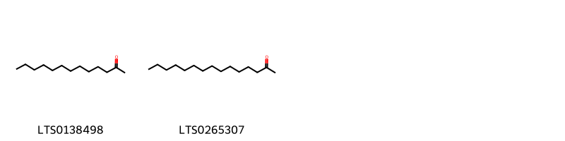{ width=100% }
    <figcaption>Hình ảnh cấu trúc hóa học của 2 hoạt chất thuộc nhóm Organooxygen compounds gồm ['2-tridecanone (LTS0138498)', '2-pentadecanone (LTS0265307)'].</figcaption>
</figure>
#### Nhóm Phenols
<figure markdown="span">
    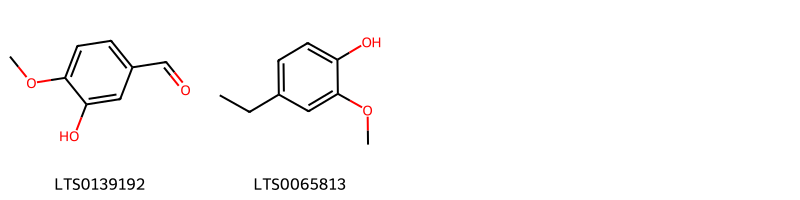{ width=100% }
    <figcaption>Hình ảnh cấu trúc hóa học của 2 hoạt chất thuộc nhóm Phenols gồm ['isovanillin (LTS0139192)', '4-ethylguaiacol (LTS0065813)'].</figcaption>
</figure>
#### Nhóm Prenol lipids
<figure markdown="span">
    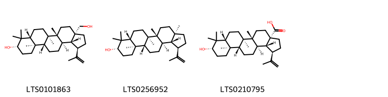{ width=100% }
    <figcaption>Hình ảnh cấu trúc hóa học của 3 hoạt chất thuộc nhóm Prenol lipids gồm ['betulin (LTS0101863)', 'lupeol (LTS0256952)', 'betulinic acid (LTS0210795)'].</figcaption>
</figure>
#### Nhóm Quinolizidines
<figure markdown="span">
    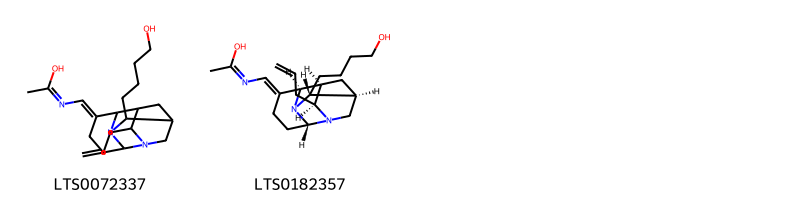{ width=100% }
    <figcaption>Hình ảnh cấu trúc hóa học của 2 hoạt chất thuộc nhóm Quinolizidines gồm ['n-{[(5e)-8-(4-hydroxybutyl)-12-(prop-2-en-1-yl)-1,7-diazatetracyclo[7.3.1.0²,⁷.0⁶,¹¹]tridecan-5-ylidene]methyl}ethanimidic acid (LTS0072337)', 'n-{[(2s,5e,6r,8r,9s,11s,12s)-8-(4-hydroxybutyl)-12-(prop-2-en-1-yl)-1,7-diazatetracyclo[7.3.1.0²,⁷.0⁶,¹¹]tridecan-5-ylidene]methyl}ethanimidic acid (LTS0182357)'].</figcaption>
</figure>
#### Nhóm Steroids and steroid derivatives
<figure markdown="span">
    { width=100% }
    <figcaption>Hình ảnh cấu trúc hóa học của 3 hoạt chất thuộc nhóm Steroids and steroid derivatives gồm ['stigmast-5-en-3-ol (LTS0071224)', 'sitosterol (LTS0168132)', 'stigmast-5-en-3-ol, (3β)- (LTS0204616)'].</figcaption>
</figure>

---

### Dược dân tộc học

Danh sách các quốc gia có sử dụng *Bowdichia virgilioides* trong điều trị các bệnh. 

| Country   | Disease    | Bệnh                                                                                                                                                                                                |
|:----------|:-----------|:----------------------------------------------------------------------------------------------------------------------------------------------------------------------------------------------------|
| Venezuela | Astringent | MYMEMORY WARNING: YOU USED ALL AVAILABLE FREE TRANSLATIONS FOR TODAY. NEXT AVAILABLE IN  16 HOURS 01 MINUTES 48 SECONDS VISIT HTTPS://MYMEMORY.TRANSLATED.NET/DOC/USAGELIMITS.PHP TO TRANSLATE MORE |

---

# Chi Brownea

??? note "Danh sách các dược liệu thuộc chi"
    
	 - *Brownea grandiceps*
	 - *Brownea latifolia*

---
## Brownea grandiceps
### Thông tin về thực vật

!!! info "Phân loại thực vật của *Brownea grandiceps* từ GIBF:"
    - **Kingdom:** Plantae
    - **Phylum:** Tracheophyta
    - **Order:** Fabales
    - **Family:** Fabaceae
    - **Genus:** Brownea
    - **Species:** *Brownea grandiceps*

 

| Label (VI)   | Label (EN)   | Scientific Name    | Descriptions (VI)   | Descriptions (EN)   | Also Known As (VI)   | Also Known As (EN)   |
|:-------------|:-------------|:-------------------|:--------------------|:--------------------|:---------------------|:---------------------|
| N/A          | N/A          | Brownea grandiceps | loài thực vật       | species of plant    | ['']                 | ['']                 |

#### Phân bố trên thế giới

**Từ CSDL GIBF** Ecuador, Sri Lanka, Hong Kong, Thailand, Seychelles, Colombia, Brazil, Honduras, India, Indonesia, Bangladesh, Peru, Singapore, Malaysia, Venezuela (Bolivarian Republic of), Panama

#### Phân bố tại Việt Nam

**Từ CSDL GIBF**: Không có ghi nhận ở Việt Nam

---
### Thành phần hóa học
        
- Theo cơ sở dữ liệu lotus: Từ loài *Brownea grandiceps* đã phân lập và xác định được Chưa có hoạt chất nào được phân lập. hoạt chất thuộc về các nhóm Không có hoạt chất nào được phân lập. 

Không có hình ảnh nào được tạo ra

---

### Dược dân tộc học

Danh sách các quốc gia có sử dụng *Brownea grandiceps* trong điều trị các bệnh. 

| Country   | Disease              | Bệnh                                                                                                                                                                                                |
|:----------|:---------------------|:----------------------------------------------------------------------------------------------------------------------------------------------------------------------------------------------------|
| Venezuela | Astringent, Hemostat | MYMEMORY WARNING: YOU USED ALL AVAILABLE FREE TRANSLATIONS FOR TODAY. NEXT AVAILABLE IN  16 HOURS 01 MINUTES 19 SECONDS VISIT HTTPS://MYMEMORY.TRANSLATED.NET/DOC/USAGELIMITS.PHP TO TRANSLATE MORE |

---

---
## Brownea latifolia
### Thông tin về thực vật

!!! info "Phân loại thực vật của *Brownea coccinea* từ GIBF:"
    - **Kingdom:** Plantae
    - **Phylum:** Tracheophyta
    - **Order:** Fabales
    - **Family:** Fabaceae
    - **Genus:** Brownea
    - **Species:** *Brownea coccinea*

 

| Label (VI)   | Label (EN)   | Scientific Name   | Descriptions (VI)   | Descriptions (EN)   | Also Known As (VI)   | Also Known As (EN)   |
|:-------------|:-------------|:------------------|:--------------------|:--------------------|:---------------------|:---------------------|
| N/A          | N/A          | Brownea latifolia | loài thực vật       | species of plant    | ['']                 | ['']                 |

#### Phân bố trên thế giới

**Từ CSDL GIBF** nan, Trinidad and Tobago, Guadeloupe, Seychelles, Germany, Martinique, Brazil, Guyana, unknown or invalid, Jamaica, United States of America, Cameroon, Venezuela (Bolivarian Republic of)

#### Phân bố tại Việt Nam

**Từ CSDL GIBF**: Không có ghi nhận ở Việt Nam

---
### Thành phần hóa học
        
- Theo cơ sở dữ liệu lotus: Từ loài *Brownea coccinea* đã phân lập và xác định được Chưa có hoạt chất nào được phân lập. hoạt chất thuộc về các nhóm Không có hoạt chất nào được phân lập. 

Không có hình ảnh nào được tạo ra

---

### Dược dân tộc học

Danh sách các quốc gia có sử dụng *Brownea coccinea* trong điều trị các bệnh. 

| Country   | Disease                 | Bệnh                                                                                                                                                                                                |
|:----------|:------------------------|:----------------------------------------------------------------------------------------------------------------------------------------------------------------------------------------------------|
| Trinidad  | Abortifacient, Hemostat | MYMEMORY WARNING: YOU USED ALL AVAILABLE FREE TRANSLATIONS FOR TODAY. NEXT AVAILABLE IN  16 HOURS 00 MINUTES 57 SECONDS VISIT HTTPS://MYMEMORY.TRANSLATED.NET/DOC/USAGELIMITS.PHP TO TRANSLATE MORE |

---

# Chi Lysiloma

??? note "Danh sách các dược liệu thuộc chi"
    
	 - *Lysiloma acapulcensis*
	 - *Lysiloma ambigua*
	 - *Lysiloma latisiliqua*
	 - *Lysiloma latisoliqua*
	 - *Lysiloma watsoni*

---
## Lysiloma acapulcensis
### Thông tin về thực vật

!!! info "Phân loại thực vật của *Lysiloma acapulcense* từ GIBF:"
    - **Kingdom:** Plantae
    - **Phylum:** Tracheophyta
    - **Order:** Fabales
    - **Family:** Fabaceae
    - **Genus:** Lysiloma
    - **Species:** *Lysiloma acapulcense*

 

| Label (VI)   | Label (EN)   | Scientific Name   | Descriptions (VI)   | Descriptions (EN)   | Also Known As (VI)   | Also Known As (EN)   |
|:-------------|:-------------|:------------------|:--------------------|:--------------------|:---------------------|:---------------------|
| N/A          | N/A          | Brownea latifolia | loài thực vật       | species of plant    | ['']                 | ['']                 |

#### Phân bố trên thế giới

**Từ CSDL GIBF** Belize, Guatemala, Honduras, Nicaragua, Mexico, El Salvador

#### Phân bố tại Việt Nam

**Từ CSDL GIBF**: Không có ghi nhận ở Việt Nam

---
### Thành phần hóa học
        
- Theo cơ sở dữ liệu lotus: Từ loài *Lysiloma acapulcense* đã phân lập và xác định được Chưa có hoạt chất nào được phân lập. hoạt chất thuộc về các nhóm Không có hoạt chất nào được phân lập. 

Không có hình ảnh nào được tạo ra

---

### Dược dân tộc học

Danh sách các quốc gia có sử dụng *Lysiloma acapulcense* trong điều trị các bệnh. 

| Country   | Disease    | Bệnh                                                                                                                                                                                                |
|:----------|:-----------|:----------------------------------------------------------------------------------------------------------------------------------------------------------------------------------------------------|
| Mexico    | Astringent | MYMEMORY WARNING: YOU USED ALL AVAILABLE FREE TRANSLATIONS FOR TODAY. NEXT AVAILABLE IN  16 HOURS 00 MINUTES 35 SECONDS VISIT HTTPS://MYMEMORY.TRANSLATED.NET/DOC/USAGELIMITS.PHP TO TRANSLATE MORE |

---

---
## Lysiloma ambigua
### Thông tin về thực vật

!!! info "Phân loại thực vật của *Lysiloma ambigua* từ GIBF:"
    - **Kingdom:** Plantae
    - **Phylum:** Tracheophyta
    - **Order:** Fabales
    - **Family:** Fabaceae
    - **Genus:** Lysiloma
    - **Species:** *Lysiloma ambigua*

 

| Label (VI)   | Label (EN)   | Scientific Name   | Descriptions (VI)   | Descriptions (EN)   | Also Known As (VI)   | Also Known As (EN)   |
|:-------------|:-------------|:------------------|:--------------------|:--------------------|:---------------------|:---------------------|
| N/A          | N/A          | Brownea latifolia | loài thực vật       | species of plant    | ['']                 | ['']                 |

#### Phân bố trên thế giới

**Từ CSDL GIBF** Belize, Guatemala, Honduras, Nicaragua, Mexico, El Salvador

#### Phân bố tại Việt Nam

**Từ CSDL GIBF**: Không có ghi nhận ở Việt Nam

---
### Thành phần hóa học
        
- Theo cơ sở dữ liệu lotus: Từ loài *Lysiloma ambigua* đã phân lập và xác định được Chưa có hoạt chất nào được phân lập. hoạt chất thuộc về các nhóm Không có hoạt chất nào được phân lập. 

Không có hình ảnh nào được tạo ra

---

### Dược dân tộc học

Danh sách các quốc gia có sử dụng *Lysiloma ambigua* trong điều trị các bệnh. 

| Country            | Disease   | Bệnh                                                                                                                                                                                                |
|:-------------------|:----------|:----------------------------------------------------------------------------------------------------------------------------------------------------------------------------------------------------|
| Dominican Republic | Poison    | MYMEMORY WARNING: YOU USED ALL AVAILABLE FREE TRANSLATIONS FOR TODAY. NEXT AVAILABLE IN  16 HOURS 00 MINUTES 13 SECONDS VISIT HTTPS://MYMEMORY.TRANSLATED.NET/DOC/USAGELIMITS.PHP TO TRANSLATE MORE |

---

---
## Lysiloma latisiliqua
### Thông tin về thực vật

!!! info "Phân loại thực vật của *Lysiloma latisiliquum* từ GIBF:"
    - **Kingdom:** Plantae
    - **Phylum:** Tracheophyta
    - **Order:** Fabales
    - **Family:** Fabaceae
    - **Genus:** Lysiloma
    - **Species:** *Lysiloma latisiliquum*

 

| Label (VI)   | Label (EN)   | Scientific Name   | Descriptions (VI)   | Descriptions (EN)   | Also Known As (VI)   | Also Known As (EN)   |
|:-------------|:-------------|:------------------|:--------------------|:--------------------|:---------------------|:---------------------|
| N/A          | N/A          | Brownea latifolia | loài thực vật       | species of plant    | ['']                 | ['']                 |

#### Phân bố trên thế giới

**Từ CSDL GIBF** Belize, nan, Haiti, Guatemala, Bahamas, unknown or invalid, United States of America, Cuba, Mexico

#### Phân bố tại Việt Nam

**Từ CSDL GIBF**: Không có ghi nhận ở Việt Nam

---
### Thành phần hóa học
        
- Theo cơ sở dữ liệu lotus: Từ loài *Lysiloma latisiliquum* đã phân lập và xác định được Chưa có hoạt chất nào được phân lập. hoạt chất thuộc về các nhóm Không có hoạt chất nào được phân lập. 

Không có hình ảnh nào được tạo ra

---

### Dược dân tộc học

Danh sách các quốc gia có sử dụng *Lysiloma latisiliquum* trong điều trị các bệnh. 

| Country            | Disease   | Bệnh                                                                                                                                                                                                |
|:-------------------|:----------|:----------------------------------------------------------------------------------------------------------------------------------------------------------------------------------------------------|
| Dominican Republic | Vulnerary | MYMEMORY WARNING: YOU USED ALL AVAILABLE FREE TRANSLATIONS FOR TODAY. NEXT AVAILABLE IN  15 HOURS 59 MINUTES 56 SECONDS VISIT HTTPS://MYMEMORY.TRANSLATED.NET/DOC/USAGELIMITS.PHP TO TRANSLATE MORE |
| Haiti              | Tonic     | MYMEMORY WARNING: YOU USED ALL AVAILABLE FREE TRANSLATIONS FOR TODAY. NEXT AVAILABLE IN  15 HOURS 59 MINUTES 54 SECONDS VISIT HTTPS://MYMEMORY.TRANSLATED.NET/DOC/USAGELIMITS.PHP TO TRANSLATE MORE |

---

---
## Lysiloma latisoliqua
### Thông tin về thực vật

!!! info "Phân loại thực vật của *Lysiloma latisiliquum* từ GIBF:"
    - **Kingdom:** Plantae
    - **Phylum:** Tracheophyta
    - **Order:** Fabales
    - **Family:** Fabaceae
    - **Genus:** Lysiloma
    - **Species:** *Lysiloma latisiliquum*

 

| Label (VI)   | Label (EN)   | Scientific Name   | Descriptions (VI)   | Descriptions (EN)   | Also Known As (VI)   | Also Known As (EN)   |
|:-------------|:-------------|:------------------|:--------------------|:--------------------|:---------------------|:---------------------|
| N/A          | N/A          | Brownea latifolia | loài thực vật       | species of plant    | ['']                 | ['']                 |

#### Phân bố trên thế giới

**Từ CSDL GIBF** Belize, nan, Haiti, Guatemala, Bahamas, unknown or invalid, United States of America, Cuba, Mexico

#### Phân bố tại Việt Nam

**Từ CSDL GIBF**: Không có ghi nhận ở Việt Nam

---
### Thành phần hóa học
        
- Theo cơ sở dữ liệu lotus: Từ loài *Lysiloma latisiliquum* đã phân lập và xác định được Chưa có hoạt chất nào được phân lập. hoạt chất thuộc về các nhóm Không có hoạt chất nào được phân lập. 

Không có hình ảnh nào được tạo ra

---

### Dược dân tộc học

Danh sách các quốc gia có sử dụng *Lysiloma latisiliquum* trong điều trị các bệnh. 

| Country   | Disease   | Bệnh                                                                                                                                                                                                |
|:----------|:----------|:----------------------------------------------------------------------------------------------------------------------------------------------------------------------------------------------------|
| Haiti     | Hemostat  | MYMEMORY WARNING: YOU USED ALL AVAILABLE FREE TRANSLATIONS FOR TODAY. NEXT AVAILABLE IN  15 HOURS 59 MINUTES 35 SECONDS VISIT HTTPS://MYMEMORY.TRANSLATED.NET/DOC/USAGELIMITS.PHP TO TRANSLATE MORE |

---

---
## Lysiloma watsoni
### Thông tin về thực vật

!!! info "Phân loại thực vật của *Lysiloma watsonii* từ GIBF:"
    - **Kingdom:** Plantae
    - **Phylum:** Tracheophyta
    - **Order:** Fabales
    - **Family:** Fabaceae
    - **Genus:** Lysiloma
    - **Species:** *Lysiloma watsonii*

 

| Label (VI)   | Label (EN)   | Scientific Name   | Descriptions (VI)   | Descriptions (EN)   | Also Known As (VI)   | Also Known As (EN)   |
|:-------------|:-------------|:------------------|:--------------------|:--------------------|:---------------------|:---------------------|
| N/A          | N/A          | Brownea latifolia | loài thực vật       | species of plant    | ['']                 | ['']                 |

#### Phân bố trên thế giới

**Từ CSDL GIBF** nan, United States of America, Mexico

#### Phân bố tại Việt Nam

**Từ CSDL GIBF**: Không có ghi nhận ở Việt Nam

---
### Thành phần hóa học
        
- Theo cơ sở dữ liệu lotus: Từ loài *Lysiloma watsonii* đã phân lập và xác định được Chưa có hoạt chất nào được phân lập. hoạt chất thuộc về các nhóm Không có hoạt chất nào được phân lập. 

Không có hình ảnh nào được tạo ra

---

### Dược dân tộc học

Danh sách các quốc gia có sử dụng *Lysiloma watsonii* trong điều trị các bệnh. 

| Country   | Disease    | Bệnh                                                                                                                                                                                                |
|:----------|:-----------|:----------------------------------------------------------------------------------------------------------------------------------------------------------------------------------------------------|
| Mexico    | Dentifrice | MYMEMORY WARNING: YOU USED ALL AVAILABLE FREE TRANSLATIONS FOR TODAY. NEXT AVAILABLE IN  15 HOURS 59 MINUTES 18 SECONDS VISIT HTTPS://MYMEMORY.TRANSLATED.NET/DOC/USAGELIMITS.PHP TO TRANSLATE MORE |

---

# Chi Intsia

??? note "Danh sách các dược liệu thuộc chi"
    
	 - *Intsia bijuga*

---
## Intsia bijuga
### Thông tin về thực vật

!!! info "Phân loại thực vật của *Intsia bijuga* từ GIBF:"
    - **Kingdom:** Plantae
    - **Phylum:** Tracheophyta
    - **Order:** Fabales
    - **Family:** Fabaceae
    - **Genus:** Intsia
    - **Species:** *Intsia bijuga*

 

| Label (VI)   | Label (EN)   | Scientific Name   | Descriptions (VI)   | Descriptions (EN)                      | Also Known As (VI)   | Also Known As (EN)                                                                                                      |
|:-------------|:-------------|:------------------|:--------------------|:---------------------------------------|:---------------------|:------------------------------------------------------------------------------------------------------------------------|
| N/A          | N/A          | Intsia bijuga     |                     | Species of tree in the family Fabaceae | ['']                 | ['Borneo teak', 'ipil', 'Johnstone River teak', 'Kwila', 'Moluccan ironwood', 'Pacific teak', 'Scrub mahogany', 'vesi'] |

#### Phân bố trên thế giới

**Từ CSDL GIBF** Palau, Australia, Madagascar, Seychelles, Marshall Islands, Guam, Papua New Guinea, Vanuatu, India, Indonesia, New Caledonia, United States of America, Philippines, Singapore, British Indian Ocean Territory, Northern Mariana Islands

#### Phân bố tại Việt Nam

**Từ CSDL GIBF**: Không có ghi nhận ở Việt Nam

---
### Thành phần hóa học
        
- Theo cơ sở dữ liệu lotus: Từ loài *Intsia bijuga* đã phân lập và xác định được 6 hoạt chất thuộc về các nhóm Flavonoids, Prenol lipids, Stilbenes. 

|    | chemicalTaxonomyClassyfireClass   |   smiles_count |
|---:|:----------------------------------|---------------:|
|  0 | Flavonoids                        |              3 |
|  1 | Prenol lipids                     |              2 |
|  2 | Stilbenes                         |              1 |

#### Nhóm Flavonoids
<figure markdown="span">
    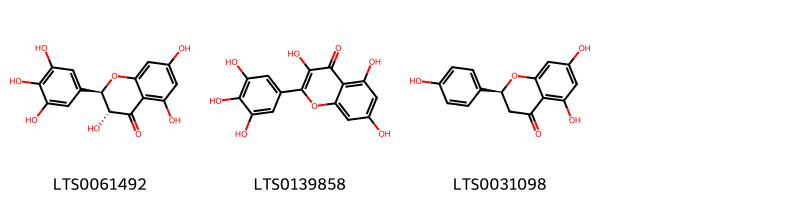{ width=100% }
    <figcaption>Hình ảnh cấu trúc hóa học của 3 hoạt chất thuộc nhóm Flavonoids gồm ['(+)-dihydromyricetin (LTS0061492)', 'myricetin (LTS0139858)', 'naringenin (LTS0031098)'].</figcaption>
</figure>
#### Nhóm Prenol lipids
<figure markdown="span">
    { width=100% }
    <figcaption>Hình ảnh cấu trúc hóa học của 2 hoạt chất thuộc nhóm Prenol lipids gồm ['β-amyrin (LTS0075776)', 'β-amyrin (LTS0251864)'].</figcaption>
</figure>
#### Nhóm Stilbenes
<figure markdown="span">
    { width=100% }
    <figcaption>Hình ảnh cấu trúc hóa học của 1 hoạt chất thuộc nhóm Stilbenes gồm ['piceatannol (LTS0129442)'].</figcaption>
</figure>

---

### Dược dân tộc học

Danh sách các quốc gia có sử dụng *Intsia bijuga* trong điều trị các bệnh. 

| Country   | Disease    | Bệnh                                                                                                                                                                                                |
|:----------|:-----------|:----------------------------------------------------------------------------------------------------------------------------------------------------------------------------------------------------|
| Java      | Detoxicant | MYMEMORY WARNING: YOU USED ALL AVAILABLE FREE TRANSLATIONS FOR TODAY. NEXT AVAILABLE IN  15 HOURS 58 MINUTES 57 SECONDS VISIT HTTPS://MYMEMORY.TRANSLATED.NET/DOC/USAGELIMITS.PHP TO TRANSLATE MORE |

---

# Chi Coursetia

??? note "Danh sách các dược liệu thuộc chi"
    
	 - *Coursetia mexicana*

---
## Coursetia mexicana
### Thông tin về thực vật

!!! info "Phân loại thực vật của *Lonchocarpus hermannii* từ GIBF:"
    - **Kingdom:** Plantae
    - **Phylum:** Tracheophyta
    - **Order:** Fabales
    - **Family:** Fabaceae
    - **Genus:** Lonchocarpus
    - **Species:** *Lonchocarpus hermannii*

 

| Label (VI)   | Label (EN)   | Scientific Name    | Descriptions (VI)   | Descriptions (EN)   | Also Known As (VI)   | Also Known As (EN)   |
|:-------------|:-------------|:-------------------|:--------------------|:--------------------|:---------------------|:---------------------|
| N/A          | N/A          | Coursetia mexicana |                     |                     | ['']                 | ['']                 |

#### Phân bố trên thế giới

**Từ CSDL GIBF** nan, Mexico

#### Phân bố tại Việt Nam

**Từ CSDL GIBF**: Không có ghi nhận ở Việt Nam

---
### Thành phần hóa học
        
- Theo cơ sở dữ liệu lotus: Từ loài *Lonchocarpus hermannii* đã phân lập và xác định được Chưa có hoạt chất nào được phân lập. hoạt chất thuộc về các nhóm Không có hoạt chất nào được phân lập. 

Không có hình ảnh nào được tạo ra

---

### Dược dân tộc học

Danh sách các quốc gia có sử dụng *Lonchocarpus hermannii* trong điều trị các bệnh. 

| Country   | Disease      | Bệnh                                                                                                                                                                                                |
|:----------|:-------------|:----------------------------------------------------------------------------------------------------------------------------------------------------------------------------------------------------|
| Mexico    | Parasiticide | MYMEMORY WARNING: YOU USED ALL AVAILABLE FREE TRANSLATIONS FOR TODAY. NEXT AVAILABLE IN  15 HOURS 58 MINUTES 32 SECONDS VISIT HTTPS://MYMEMORY.TRANSLATED.NET/DOC/USAGELIMITS.PHP TO TRANSLATE MORE |

---

# Chi Desmodium

??? note "Danh sách các dược liệu thuộc chi"
    
	 - *Desmodium adscendens*
	 - *Desmodium caudatum*
	 - *Desmodium gangeticum*
	 - *Desmodium heterophyllum*
	 - *Desmodium polycarpum*
	 - *Desmodium ramosisimum*
	 - *Desmodium retroflexum*
	 - *Desmodium styracifolium*
	 - *Desmodium tiliaefolium*
	 - *Desmodium velutinum*

---
## Desmodium adscendens
### Thông tin về thực vật

!!! info "Phân loại thực vật của *Grona adscendens* từ GIBF:"
    - **Kingdom:** Plantae
    - **Phylum:** Tracheophyta
    - **Order:** Fabales
    - **Family:** Fabaceae
    - **Genus:** Grona
    - **Species:** *Grona adscendens*

 

| Label (VI)   | Label (EN)   | Scientific Name      | Descriptions (VI)   | Descriptions (EN)   | Also Known As (VI)   | Also Known As (EN)       |
|:-------------|:-------------|:---------------------|:--------------------|:--------------------|:---------------------|:-------------------------|
| N/A          | N/A          | Desmodium adscendens | loài thực vật       | species of plant    | ['']                 | ['Desmodium adscendens'] |

#### Phân bố trên thế giới

**Từ CSDL GIBF** Malawi, Suriname, Comoros, Madagascar, Gabon, Cook Islands, Equatorial Guinea, Colombia, Brazil, Côte d’Ivoire, Guatemala, Costa Rica, Peru, Guinea, Tanzania, United Republic of, French Guiana

#### Phân bố tại Việt Nam

**Từ CSDL GIBF**: Không có ghi nhận ở Việt Nam

---
### Thành phần hóa học
        
- Theo cơ sở dữ liệu lotus: Từ loài *Grona adscendens* đã phân lập và xác định được 10 hoạt chất thuộc về các nhóm Flavonoids, Prenol lipids, Isoflavonoids, Benzene and substituted derivatives, Tetrahydroisoquinolines. 

|    | chemicalTaxonomyClassyfireClass     |   smiles_count |
|---:|:------------------------------------|---------------:|
|  0 | Benzene and substituted derivatives |              2 |
|  1 | Flavonoids                          |              3 |
|  2 | Isoflavonoids                       |              1 |
|  3 | Prenol lipids                       |              3 |
|  4 | Tetrahydroisoquinolines             |              1 |

#### Nhóm Benzene and substituted derivatives
<figure markdown="span">
    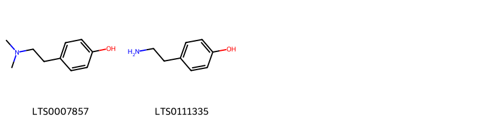{ width=100% }
    <figcaption>Hình ảnh cấu trúc hóa học của 2 hoạt chất thuộc nhóm Benzene and substituted derivatives gồm ['hordenine (LTS0007857)', 'tyramine (LTS0111335)'].</figcaption>
</figure>
#### Nhóm Flavonoids
<figure markdown="span">
    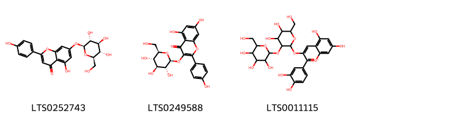{ width=100% }
    <figcaption>Hình ảnh cấu trúc hóa học của 3 hoạt chất thuộc nhóm Flavonoids gồm ['apigenin 7-o-β-glucoside (LTS0252743)', 'astragalin (LTS0249588)', '3-{[4,5-dihydroxy-6-(hydroxymethyl)-3-{[3,4,5-trihydroxy-6-(hydroxymethyl)oxan-2-yl]oxy}oxan-2-yl]oxy}-2-(3,4-dihydroxyphenyl)-5,7-dihydroxy-1λ⁴-chromen-1-ylium (LTS0011115)'].</figcaption>
</figure>
#### Nhóm Isoflavonoids
<figure markdown="span">
    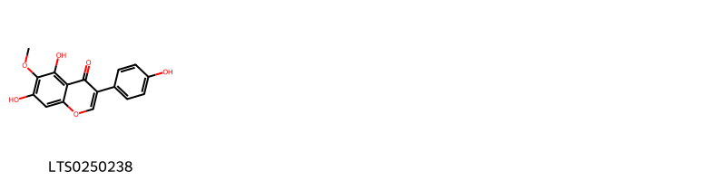{ width=100% }
    <figcaption>Hình ảnh cấu trúc hóa học của 1 hoạt chất thuộc nhóm Isoflavonoids gồm ['tectorigenin (LTS0250238)'].</figcaption>
</figure>
#### Nhóm Prenol lipids
<figure markdown="span">
    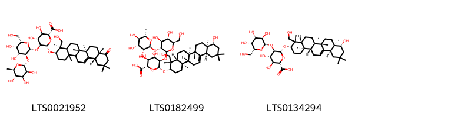{ width=100% }
    <figcaption>Hình ảnh cấu trúc hóa học của 3 hoạt chất thuộc nhóm Prenol lipids gồm ['(2r,3r,4r,5s,6s)-6-{[(3r,4r,6as,6br,8as,12ar,14bs)-4-(hydroxymethyl)-4,6a,6b,8a,11,11,14b-heptamethyl-9-oxo-2,3,4a,5,6,7,8,10,12,12a,14,14a-dodecahydro-1h-picen-3-yl]oxy}-5-{[(2r,3s,4r,5s,6s)-4,5-dihydroxy-6-(hydroxymethyl)-3-{[(2r,3s,4s,5s,6r)-3,4,5-trihydroxy-6-methyloxan-2-yl]oxy}oxan-2-yl]oxy}-3,4-dihydroxyoxane-2-carboxylic acid (LTS0021952)', 'soyasaponin i (LTS0182499)', 'soyasaponin iii (LTS0134294)'].</figcaption>
</figure>
#### Nhóm Tetrahydroisoquinolines
<figure markdown="span">
    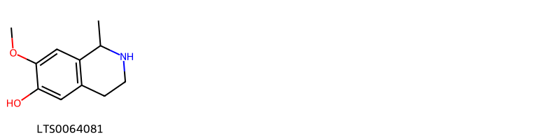{ width=100% }
    <figcaption>Hình ảnh cấu trúc hóa học của 1 hoạt chất thuộc nhóm Tetrahydroisoquinolines gồm ['salsoline (LTS0064081)'].</figcaption>
</figure>

---

### Dược dân tộc học

Danh sách các quốc gia có sử dụng *Grona adscendens* trong điều trị các bệnh. 

| Country   | Disease   | Bệnh                                                                                                                                                                                                |
|:----------|:----------|:----------------------------------------------------------------------------------------------------------------------------------------------------------------------------------------------------|
| Ghana     | Laxative  | MYMEMORY WARNING: YOU USED ALL AVAILABLE FREE TRANSLATIONS FOR TODAY. NEXT AVAILABLE IN  15 HOURS 58 MINUTES 16 SECONDS VISIT HTTPS://MYMEMORY.TRANSLATED.NET/DOC/USAGELIMITS.PHP TO TRANSLATE MORE |

---

---
## Desmodium caudatum
### Thông tin về thực vật

!!! info "Phân loại thực vật của *Ohwia caudata* từ GIBF:"
    - **Kingdom:** Plantae
    - **Phylum:** Tracheophyta
    - **Order:** Fabales
    - **Family:** Fabaceae
    - **Genus:** Ohwia
    - **Species:** *Ohwia caudata*

 

| Label (VI)   | Label (EN)   | Scientific Name    | Descriptions (VI)   | Descriptions (EN)   | Also Known As (VI)     | Also Known As (EN)   |
|:-------------|:-------------|:-------------------|:--------------------|:--------------------|:-----------------------|:---------------------|
| N/A          | N/A          | Desmodium caudatum | loài thực vật       | species of plant    | ['Desmodium caudatum'] | ['']                 |

#### Phân bố trên thế giới

**Từ CSDL GIBF** nan, Hong Kong, Japan, Korea, Republic of, Chinese Taipei, Myanmar, China

#### Phân bố tại Việt Nam

**Từ CSDL GIBF**: Không có ghi nhận ở Việt Nam

---
### Thành phần hóa học
        
- Theo cơ sở dữ liệu lotus: Từ loài *Ohwia caudata* đã phân lập và xác định được Chưa có hoạt chất nào được phân lập. hoạt chất thuộc về các nhóm Không có hoạt chất nào được phân lập. 

Không có hình ảnh nào được tạo ra

---

### Dược dân tộc học

Danh sách các quốc gia có sử dụng *Ohwia caudata* trong điều trị các bệnh. 

| Country   | Disease    | Bệnh                                                                                                                                                                                                |
|:----------|:-----------|:----------------------------------------------------------------------------------------------------------------------------------------------------------------------------------------------------|
| China     | Alexiteric | MYMEMORY WARNING: YOU USED ALL AVAILABLE FREE TRANSLATIONS FOR TODAY. NEXT AVAILABLE IN  15 HOURS 57 MINUTES 52 SECONDS VISIT HTTPS://MYMEMORY.TRANSLATED.NET/DOC/USAGELIMITS.PHP TO TRANSLATE MORE |

---

---
## Desmodium gangeticum
### Thông tin về thực vật

!!! info "Phân loại thực vật của *Desmodium gangeticum* từ GIBF:"
    - **Kingdom:** Plantae
    - **Phylum:** Tracheophyta
    - **Order:** Fabales
    - **Family:** Fabaceae
    - **Genus:** Desmodium
    - **Species:** *Desmodium gangeticum*

 

| Label (VI)   | Label (EN)   | Scientific Name      | Descriptions (VI)   | Descriptions (EN)   | Also Known As (VI)       | Also Known As (EN)   |
|:-------------|:-------------|:---------------------|:--------------------|:--------------------|:-------------------------|:---------------------|
| N/A          | N/A          | Desmodium gangeticum | loài thực vật       | species of plant    | ['Desmodium gangeticum'] | ['']                 |

#### Phân bố trên thế giới

**Từ CSDL GIBF** India, Benin, Chinese Taipei

#### Phân bố tại Việt Nam

**Từ CSDL GIBF**: Không có ghi nhận ở Việt Nam

---
### Thành phần hóa học
        
- Theo cơ sở dữ liệu lotus: Từ loài *Desmodium gangeticum* đã phân lập và xác định được 47 hoạt chất thuộc về các nhóm Fatty Acyls, Flavonoids, Indoles and derivatives, Steroids and steroid derivatives, Isoflavonoids, Prenol lipids, Sphingolipids, Benzene and substituted derivatives, Lactones, Organooxygen compounds, Glycerolipids. 

|    | chemicalTaxonomyClassyfireClass     |   smiles_count |
|---:|:------------------------------------|---------------:|
|  0 | Benzene and substituted derivatives |              5 |
|  1 | Fatty Acyls                         |              4 |
|  2 | Flavonoids                          |             10 |
|  3 | Glycerolipids                       |              2 |
|  4 | Indoles and derivatives             |              2 |
|  5 | Isoflavonoids                       |             11 |
|  6 | Lactones                            |              2 |
|  7 | Organooxygen compounds              |              3 |
|  8 | Prenol lipids                       |              2 |
|  9 | Sphingolipids                       |              2 |
| 10 | Steroids and steroid derivatives    |              4 |

#### Nhóm Benzene and substituted derivatives
<figure markdown="span">
    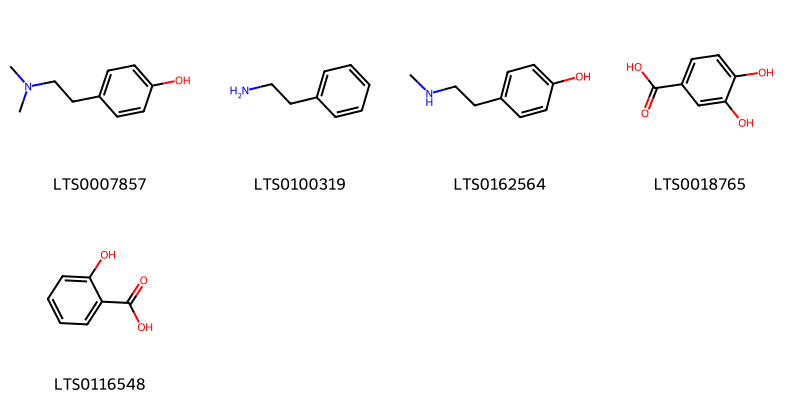{ width=100% }
    <figcaption>Hình ảnh cấu trúc hóa học của 5 hoạt chất thuộc nhóm Benzene and substituted derivatives gồm ['hordenine (LTS0007857)', '2-phenylethylamine (LTS0100319)', 'n-methyltyramine (LTS0162564)', '3,4-dihydroxybenzoic acid (LTS0018765)', 'salicyclic acid (LTS0116548)'].</figcaption>
</figure>
#### Nhóm Fatty Acyls
<figure markdown="span">
    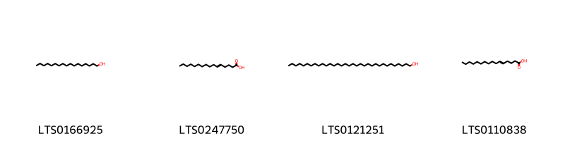{ width=100% }
    <figcaption>Hình ảnh cấu trúc hóa học của 4 hoạt chất thuộc nhóm Fatty Acyls gồm ['1-heptadecanol (LTS0166925)', 'hexadec-5-enoic acid (LTS0247750)', 'tritriacontan-1-ol (LTS0121251)', '(5e)-hexadec-5-enoic acid (LTS0110838)'].</figcaption>
</figure>
#### Nhóm Flavonoids
<figure markdown="span">
    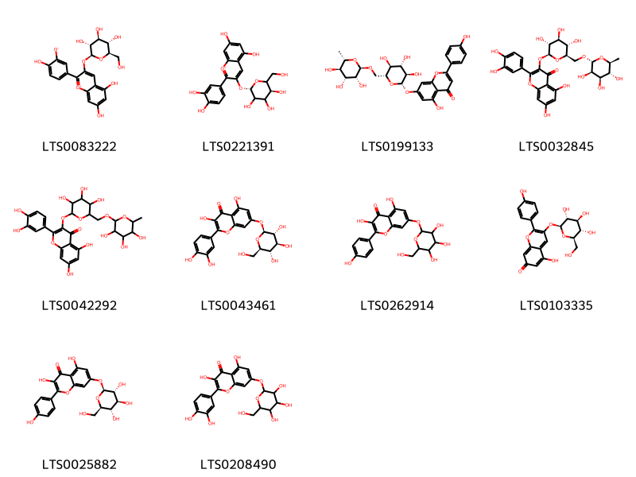{ width=100% }
    <figcaption>Hình ảnh cấu trúc hóa học của 10 hoạt chất thuộc nhóm Flavonoids gồm ['5,7-dihydroxy-2-(4-hydroxy-3-oxidophenyl)-3-{[(2s,3r,4s,5s,6r)-3,4,5-trihydroxy-6-(hydroxymethyl)oxan-2-yl]oxy}-1λ⁴-chromen-1-ylium (LTS0083222)', 'chrysanthemin (LTS0221391)', 'isorhoifolin (LTS0199133)', '3-rutinosyl quercetin (LTS0032845)', 'rutin (LTS0042292)', 'quercimeritrin (LTS0043461)', '3,5-dihydroxy-2-(4-hydroxyphenyl)-7-{[3,4,5-trihydroxy-6-(hydroxymethyl)oxan-2-yl]oxy}chromen-4-one (LTS0262914)', '5-hydroxy-2-(4-hydroxyphenyl)-3-{[(2s,3r,4s,5s,6r)-3,4,5-trihydroxy-6-(hydroxymethyl)oxan-2-yl]oxy}chromen-7-one (LTS0103335)', 'kaempferol 7-o-glucoside (LTS0025882)', 'quercimeritrin (LTS0208490)'].</figcaption>
</figure>
#### Nhóm Glycerolipids
<figure markdown="span">
    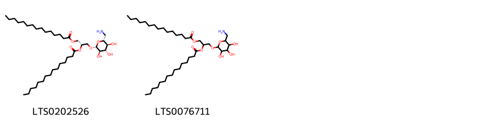{ width=100% }
    <figcaption>Hình ảnh cấu trúc hóa học của 2 hoạt chất thuộc nhóm Glycerolipids gồm ['(2s)-1-{[(2r,3r,4s,5s,6r)-6-(aminomethyl)-3,4,5-trihydroxyoxan-2-yl]oxy}-3-(pentadecanoyloxy)propan-2-yl pentadecanoate (LTS0202526)', '1-{[6-(aminomethyl)-3,4,5-trihydroxyoxan-2-yl]oxy}-3-(pentadecanoyloxy)propan-2-yl pentadecanoate (LTS0076711)'].</figcaption>
</figure>
#### Nhóm Indoles and derivatives
<figure markdown="span">
    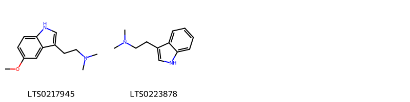{ width=100% }
    <figcaption>Hình ảnh cấu trúc hóa học của 2 hoạt chất thuộc nhóm Indoles and derivatives gồm ['5-meo-dmt (LTS0217945)', 'dimethyltryptamine (LTS0223878)'].</figcaption>
</figure>
#### Nhóm Isoflavonoids
<figure markdown="span">
    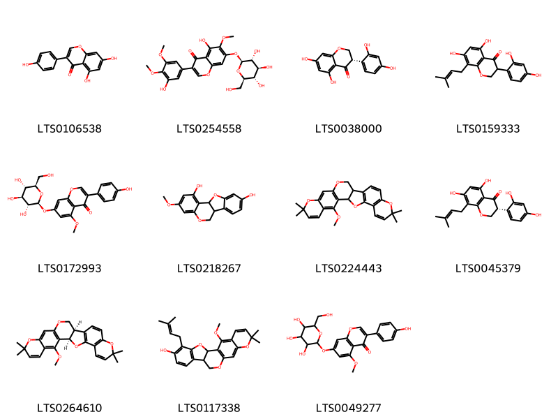{ width=100% }
    <figcaption>Hình ảnh cấu trúc hóa học của 11 hoạt chất thuộc nhóm Isoflavonoids gồm ['genistein (LTS0106538)', 'iridin (LTS0254558)', '(3s)-3-(2,4-dihydroxyphenyl)-5,7-dihydroxy-2,3-dihydro-1-benzopyran-4-one (LTS0038000)', 'kievitone (LTS0159333)', '3-(4-hydroxyphenyl)-5-methoxy-7-{[(2s,3r,4s,5s,6r)-3,4,5-trihydroxy-6-(hydroxymethyl)oxan-2-yl]oxy}chromen-4-one (LTS0172993)', 'desmocarpin (LTS0218267)', 'gangetinin (LTS0224443)', '(3r)-3-(2,4-dihydroxyphenyl)-5,7-dihydroxy-8-(3-methylbut-2-en-1-yl)-2,3-dihydro-1-benzopyran-4-one (LTS0045379)', '(1r,14r)-3-methoxy-7,7,20,20-tetramethyl-8,12,19,25-tetraoxahexacyclo[12.11.0.0²,¹¹.0⁴,⁹.0¹⁵,²⁴.0¹⁸,²³]pentacosa-2(11),3,5,9,15(24),16,18(23),21-octaene (LTS0264610)', 'gangetin (LTS0117338)', '3-(4-hydroxyphenyl)-5-methoxy-7-{[3,4,5-trihydroxy-6-(hydroxymethyl)oxan-2-yl]oxy}chromen-4-one (LTS0049277)'].</figcaption>
</figure>
#### Nhóm Lactones
<figure markdown="span">
    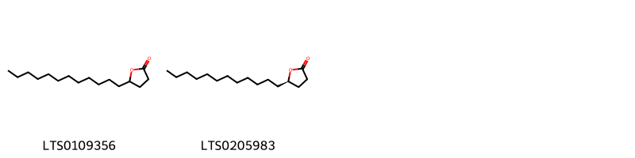{ width=100% }
    <figcaption>Hình ảnh cấu trúc hóa học của 2 hoạt chất thuộc nhóm Lactones gồm ['5-dodecyloxolan-2-one (LTS0109356)', '(5r)-5-dodecyloxolan-2-one (LTS0205983)'].</figcaption>
</figure>
#### Nhóm Organooxygen compounds
<figure markdown="span">
    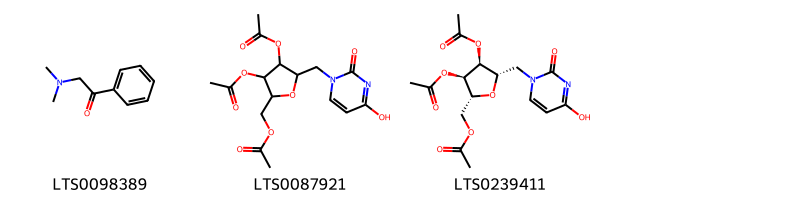{ width=100% }
    <figcaption>Hình ảnh cấu trúc hóa học của 3 hoạt chất thuộc nhóm Organooxygen compounds gồm ['2-(dimethylamino)-1-phenylethanone (LTS0098389)', '[3,4-bis(acetyloxy)-5-[(4-hydroxy-2-oxopyrimidin-1-yl)methyl]oxolan-2-yl]methyl acetate (LTS0087921)', '[(2r,3r,4s,5s)-3,4-bis(acetyloxy)-5-[(4-hydroxy-2-oxopyrimidin-1-yl)methyl]oxolan-2-yl]methyl acetate (LTS0239411)'].</figcaption>
</figure>
#### Nhóm Prenol lipids
<figure markdown="span">
    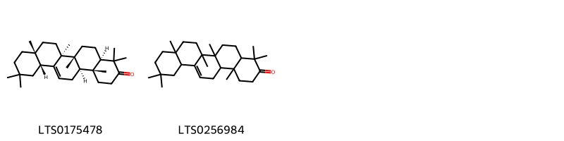{ width=100% }
    <figcaption>Hình ảnh cấu trúc hóa học của 2 hoạt chất thuộc nhóm Prenol lipids gồm ['(4ar,6ar,6bs,8ar,12ar,14ar,14br)-4,4,6a,6b,8a,11,11,14b-octamethyl-2,4a,5,6,7,8,9,10,12,12a,14,14a-dodecahydro-1h-picen-3-one (LTS0175478)', '4,4,6a,6b,8a,11,11,14b-octamethyl-2,4a,5,6,7,8,9,10,12,12a,14,14a-dodecahydro-1h-picen-3-one (LTS0256984)'].</figcaption>
</figure>
#### Nhóm Sphingolipids
<figure markdown="span">
    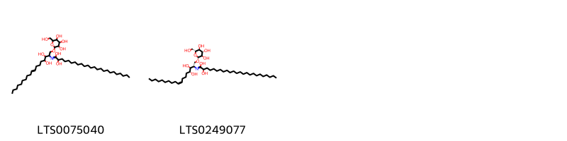{ width=100% }
    <figcaption>Hình ảnh cấu trúc hóa học của 2 hoạt chất thuộc nhóm Sphingolipids gồm ['n-(3,4-dihydroxy-1-{[3,4,5-trihydroxy-6-(hydroxymethyl)oxan-2-yl]oxy}octadec-8-en-2-yl)-2-hydroxytetracosanimidic acid (LTS0075040)', '(2r)-n-[(2s,3s,4r,8z)-3,4-dihydroxy-1-{[(2r,3r,4s,5s,6r)-3,4,5-trihydroxy-6-(hydroxymethyl)oxan-2-yl]oxy}octadec-8-en-2-yl]-2-hydroxytetracosanimidic acid (LTS0249077)'].</figcaption>
</figure>
#### Nhóm Steroids and steroid derivatives
<figure markdown="span">
    { width=100% }
    <figcaption>Hình ảnh cấu trúc hóa học của 4 hoạt chất thuộc nhóm Steroids and steroid derivatives gồm ['sitosterol (LTS0168132)', 'stigmast-5-en-3-ol, (3β)- (LTS0204616)', 'sitogluside (LTS0201798)', '2-{[1-(5-ethyl-6-methylheptan-2-yl)-9a,11a-dimethyl-1h,2h,3h,3ah,3bh,4h,6h,7h,8h,9h,9bh,10h,11h-cyclopenta[a]phenanthren-7-yl]oxy}-6-(hydroxymethyl)oxane-3,4,5-triol (LTS0158828)'].</figcaption>
</figure>

---

### Dược dân tộc học

Danh sách các quốc gia có sử dụng *Desmodium gangeticum* trong điều trị các bệnh. 

| Country     | Disease                           | Bệnh                                                                                                                                                                                                |
|:------------|:----------------------------------|:----------------------------------------------------------------------------------------------------------------------------------------------------------------------------------------------------|
| India       | nan, Diuretic, Expectorant, Tonic | MYMEMORY WARNING: YOU USED ALL AVAILABLE FREE TRANSLATIONS FOR TODAY. NEXT AVAILABLE IN  15 HOURS 57 MINUTES 33 SECONDS VISIT HTTPS://MYMEMORY.TRANSLATED.NET/DOC/USAGELIMITS.PHP TO TRANSLATE MORE |
| Malaya      | Sedative                          | MYMEMORY WARNING: YOU USED ALL AVAILABLE FREE TRANSLATIONS FOR TODAY. NEXT AVAILABLE IN  15 HOURS 57 MINUTES 30 SECONDS VISIT HTTPS://MYMEMORY.TRANSLATED.NET/DOC/USAGELIMITS.PHP TO TRANSLATE MORE |
| Upper Volta | Vermifuge                         | MYMEMORY WARNING: YOU USED ALL AVAILABLE FREE TRANSLATIONS FOR TODAY. NEXT AVAILABLE IN  15 HOURS 57 MINUTES 28 SECONDS VISIT HTTPS://MYMEMORY.TRANSLATED.NET/DOC/USAGELIMITS.PHP TO TRANSLATE MORE |

---

---
## Desmodium heterophyllum
### Thông tin về thực vật

!!! info "Phân loại thực vật của *Grona heterophylla* từ GIBF:"
    - **Kingdom:** Plantae
    - **Phylum:** Tracheophyta
    - **Order:** Fabales
    - **Family:** Fabaceae
    - **Genus:** Grona
    - **Species:** *Grona heterophylla*

 

| Label (VI)   | Label (EN)   | Scientific Name         | Descriptions (VI)   | Descriptions (EN)   | Also Known As (VI)          | Also Known As (EN)   |
|:-------------|:-------------|:------------------------|:--------------------|:--------------------|:----------------------------|:---------------------|
| N/A          | N/A          | Desmodium heterophyllum | loài thực vật       | species of plant    | ['Desmodium heterophyllum'] | ['']                 |

#### Phân bố trên thế giới

**Từ CSDL GIBF** nan, Sri Lanka, Japan, Cook Islands, Lao People’s Democratic Republic, Cambodia, unknown or invalid, Chinese Taipei, Papua New Guinea, United States of America, Solomon Islands, Thailand, Mexico, Viet Nam, China, India, Indonesia, Samoa, Malaysia, Nepal

#### Phân bố tại Việt Nam

**Từ CSDL GIBF**: Thanh Hoa, Quang Ngai, Song Be, Ha Tinh, Khanh Hoa

---
### Thành phần hóa học
        
- Theo cơ sở dữ liệu lotus: Từ loài *Grona heterophylla* đã phân lập và xác định được Chưa có hoạt chất nào được phân lập. hoạt chất thuộc về các nhóm Không có hoạt chất nào được phân lập. 

Không có hình ảnh nào được tạo ra

---

### Dược dân tộc học

Danh sách các quốc gia có sử dụng *Grona heterophylla* trong điều trị các bệnh. 

| Country   | Disease                      | Bệnh                                                                                                                                                                                                |
|:----------|:-----------------------------|:----------------------------------------------------------------------------------------------------------------------------------------------------------------------------------------------------|
| Elsewhere | Carminative, Diuretic, Tonic | MYMEMORY WARNING: YOU USED ALL AVAILABLE FREE TRANSLATIONS FOR TODAY. NEXT AVAILABLE IN  15 HOURS 57 MINUTES 00 SECONDS VISIT HTTPS://MYMEMORY.TRANSLATED.NET/DOC/USAGELIMITS.PHP TO TRANSLATE MORE |

---

---
## Desmodium polycarpum
### Thông tin về thực vật

!!! info "Phân loại thực vật của *Desmodium polycarpum* từ GIBF:"
    - **Kingdom:** Plantae
    - **Phylum:** Tracheophyta
    - **Order:** Fabales
    - **Family:** Fabaceae
    - **Genus:** Desmodium
    - **Species:** *Desmodium polycarpum*

 

| Label (VI)   | Label (EN)   | Scientific Name         | Descriptions (VI)   | Descriptions (EN)   | Also Known As (VI)          | Also Known As (EN)   |
|:-------------|:-------------|:------------------------|:--------------------|:--------------------|:----------------------------|:---------------------|
| N/A          | N/A          | Desmodium heterophyllum | loài thực vật       | species of plant    | ['Desmodium heterophyllum'] | ['']                 |

#### Phân bố trên thế giới

**Từ CSDL GIBF** nan, Malaysia, Fiji, Australia, Japan, Thailand, India, Indonesia, Viet Nam, Philippines, Tanzania, United Republic of, China

#### Phân bố tại Việt Nam

**Từ CSDL GIBF**: Kon Tum

---
### Thành phần hóa học
        
- Theo cơ sở dữ liệu lotus: Từ loài *Desmodium polycarpum* đã phân lập và xác định được Chưa có hoạt chất nào được phân lập. hoạt chất thuộc về các nhóm Không có hoạt chất nào được phân lập. 

Không có hình ảnh nào được tạo ra

---

### Dược dân tộc học

Danh sách các quốc gia có sử dụng *Desmodium polycarpum* trong điều trị các bệnh. 

| Country   | Disease   | Bệnh                                                                                                                                                                                                |
|:----------|:----------|:----------------------------------------------------------------------------------------------------------------------------------------------------------------------------------------------------|
| Elsewhere | Tonic     | MYMEMORY WARNING: YOU USED ALL AVAILABLE FREE TRANSLATIONS FOR TODAY. NEXT AVAILABLE IN  15 HOURS 56 MINUTES 39 SECONDS VISIT HTTPS://MYMEMORY.TRANSLATED.NET/DOC/USAGELIMITS.PHP TO TRANSLATE MORE |
| Java      | Lactafuge | MYMEMORY WARNING: YOU USED ALL AVAILABLE FREE TRANSLATIONS FOR TODAY. NEXT AVAILABLE IN  15 HOURS 56 MINUTES 36 SECONDS VISIT HTTPS://MYMEMORY.TRANSLATED.NET/DOC/USAGELIMITS.PHP TO TRANSLATE MORE |

---

---
## Desmodium ramosisimum
### Thông tin về thực vật

!!! info "Phân loại thực vật của *N/A* từ GIBF:"
    - **Kingdom:** Plantae
    - **Phylum:** Tracheophyta
    - **Order:** Fabales
    - **Family:** Fabaceae
    - **Genus:** N/A
    - **Species:** *N/A*

 

| Label (VI)   | Label (EN)   | Scientific Name         | Descriptions (VI)   | Descriptions (EN)   | Also Known As (VI)          | Also Known As (EN)   |
|:-------------|:-------------|:------------------------|:--------------------|:--------------------|:----------------------------|:---------------------|
| N/A          | N/A          | Desmodium heterophyllum | loài thực vật       | species of plant    | ['Desmodium heterophyllum'] | ['']                 |

#### Phân bố trên thế giới

**Từ CSDL GIBF** Sri Lanka, Italy, Australia, Cambodia, Argentina, Tanzania, United Republic of, Chinese Taipei, Spain, Portugal, United States of America, Chile, Croatia, South Africa, Thailand, Germany, Brazil, Guam, France, Norfolk Island, Viet Nam, China, United Kingdom of Great Britain and Northern Ireland, Ireland, Gambia, India, Malaysia, New Zealand

#### Phân bố tại Việt Nam

**Từ CSDL GIBF**: Đà Nẵng, Bà Rịa - Vũng Tàu

---
### Thành phần hóa học
        
- Theo cơ sở dữ liệu lotus: Từ loài *N/A* đã phân lập và xác định được Chưa có hoạt chất nào được phân lập. hoạt chất thuộc về các nhóm Không có hoạt chất nào được phân lập. 

Không có hình ảnh nào được tạo ra

---

### Dược dân tộc học

Danh sách các quốc gia có sử dụng *N/A* trong điều trị các bệnh. 

| Country   |   Disease | Bệnh                                                                                                                                                                                                |
|:----------|----------:|:----------------------------------------------------------------------------------------------------------------------------------------------------------------------------------------------------|
| Africa    |       nan | MYMEMORY WARNING: YOU USED ALL AVAILABLE FREE TRANSLATIONS FOR TODAY. NEXT AVAILABLE IN  15 HOURS 56 MINUTES 19 SECONDS VISIT HTTPS://MYMEMORY.TRANSLATED.NET/DOC/USAGELIMITS.PHP TO TRANSLATE MORE |

---

---
## Desmodium retroflexum
### Thông tin về thực vật

!!! info "Phân loại thực vật của *Grona retroflexa* từ GIBF:"
    - **Kingdom:** Plantae
    - **Phylum:** Tracheophyta
    - **Order:** Fabales
    - **Family:** Fabaceae
    - **Genus:** Grona
    - **Species:** *Grona retroflexa*

 

| Label (VI)   | Label (EN)   | Scientific Name       | Descriptions (VI)   | Descriptions (EN)   | Also Known As (VI)   | Also Known As (EN)   |
|:-------------|:-------------|:----------------------|:--------------------|:--------------------|:---------------------|:---------------------|
| N/A          | N/A          | Desmodium retroflexum |                     |                     | ['']                 | ['']                 |

#### Phân bố trên thế giới

**Từ CSDL GIBF** nan, India, China

#### Phân bố tại Việt Nam

**Từ CSDL GIBF**: Không có ghi nhận ở Việt Nam

---
### Thành phần hóa học
        
- Theo cơ sở dữ liệu lotus: Từ loài *Grona retroflexa* đã phân lập và xác định được Chưa có hoạt chất nào được phân lập. hoạt chất thuộc về các nhóm Không có hoạt chất nào được phân lập. 

Không có hình ảnh nào được tạo ra

---

### Dược dân tộc học

Danh sách các quốc gia có sử dụng *Grona retroflexa* trong điều trị các bệnh. 

| Country   | Disease                                     | Bệnh                                                                                                                                                                                                |
|:----------|:--------------------------------------------|:----------------------------------------------------------------------------------------------------------------------------------------------------------------------------------------------------|
| Elsewhere | Diuretic, Emmenagogue, Stomachic, Purgative | MYMEMORY WARNING: YOU USED ALL AVAILABLE FREE TRANSLATIONS FOR TODAY. NEXT AVAILABLE IN  15 HOURS 55 MINUTES 59 SECONDS VISIT HTTPS://MYMEMORY.TRANSLATED.NET/DOC/USAGELIMITS.PHP TO TRANSLATE MORE |

---

---
## Desmodium styracifolium
### Thông tin về thực vật

!!! info "Phân loại thực vật của *Grona styracifolia* từ GIBF:"
    - **Kingdom:** Plantae
    - **Phylum:** Tracheophyta
    - **Order:** Fabales
    - **Family:** Fabaceae
    - **Genus:** Grona
    - **Species:** *Grona styracifolia*

 

| Label (VI)   | Label (EN)   | Scientific Name         | Descriptions (VI)   | Descriptions (EN)   | Also Known As (VI)          | Also Known As (EN)   |
|:-------------|:-------------|:------------------------|:--------------------|:--------------------|:----------------------------|:---------------------|
| N/A          | N/A          | Desmodium styracifolium | loài thực vật       | species of plant    | ['Desmodium styracifolium'] | ['']                 |

#### Phân bố trên thế giới

**Từ CSDL GIBF** nan, Palau, Malaysia, Thailand, Lao People’s Democratic Republic, Cambodia, Indonesia, United States of America, Philippines, Viet Nam, China

#### Phân bố tại Việt Nam

**Từ CSDL GIBF**: Thanh Hoa, Tay Ninh, Ba Ria Vung Tau, Song Be, Dong Nai, Dac Lac

---
### Thành phần hóa học
        
- Theo cơ sở dữ liệu lotus: Từ loài *Grona styracifolia* đã phân lập và xác định được 63 hoạt chất thuộc về các nhóm Flavonoids, Prenol lipids, Indoles and derivatives, Isoflavonoids, Carboxylic acids and derivatives. 

|    | chemicalTaxonomyClassyfireClass   |   smiles_count |
|---:|:----------------------------------|---------------:|
|  0 | Carboxylic acids and derivatives  |              2 |
|  1 | Flavonoids                        |             25 |
|  2 | Indoles and derivatives           |              1 |
|  3 | Isoflavonoids                     |             29 |
|  4 | Prenol lipids                     |              6 |

#### Nhóm Carboxylic acids and derivatives
<figure markdown="span">
    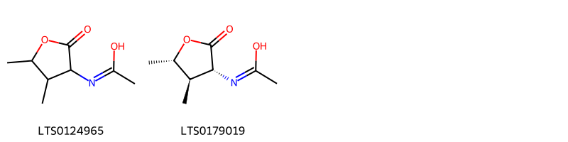{ width=100% }
    <figcaption>Hình ảnh cấu trúc hóa học của 2 hoạt chất thuộc nhóm Carboxylic acids and derivatives gồm ['n-(4,5-dimethyl-2-oxooxolan-3-yl)ethanimidic acid (LTS0124965)', 'n-[(3r,4r,5s)-4,5-dimethyl-2-oxooxolan-3-yl]ethanimidic acid (LTS0179019)'].</figcaption>
</figure>
#### Nhóm Flavonoids
<figure markdown="span">
    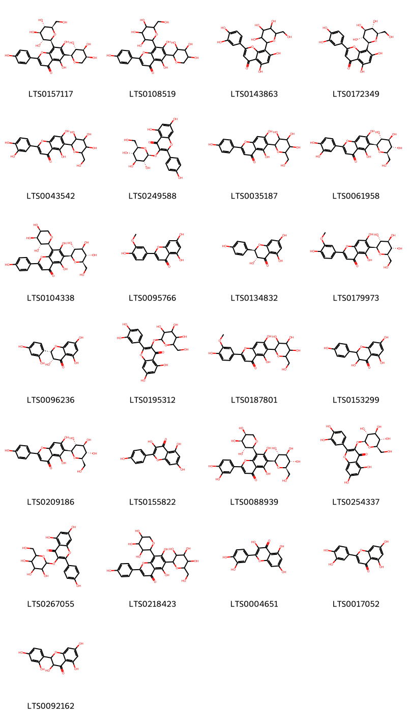{ width=100% }
    <figcaption>Hình ảnh cấu trúc hóa học của 25 hoạt chất thuộc nhóm Flavonoids gồm ['isoschaftoside (LTS0157117)', '5,7-dihydroxy-2-(4-hydroxyphenyl)-8-[3,4,5-trihydroxy-6-(hydroxymethyl)oxan-2-yl]-6-(3,4,5-trihydroxyoxan-2-yl)chromen-4-one (LTS0108519)', 'orientin (LTS0143863)', 'orientin (LTS0172349)', 'isoorientin (LTS0043542)', 'astragalin (LTS0249588)', 'isovitexin (LTS0035187)', 'isoorientin (LTS0061958)', 'schaftoside (LTS0104338)', 'chrysoeriol (LTS0095766)', '(+)-dihydrokaempferol (LTS0134832)', 'isoscoparin (LTS0179973)', '(2s,3r)-2-(2,4-dihydroxyphenyl)-3,5,7-trihydroxy-2,3-dihydro-1-benzopyran-4-one (LTS0096236)', '2-(3,4-dihydroxyphenyl)-5,7-dihydroxy-3-{[3,4,5-trihydroxy-6-(hydroxymethyl)oxan-2-yl]oxy}chromen-4-one (LTS0195312)', '5,7-dihydroxy-2-(4-hydroxy-3-methoxyphenyl)-6-[3,4,5-trihydroxy-6-(hydroxymethyl)oxan-2-yl]chromen-4-one (LTS0187801)', 'aromadendrin (LTS0153299)', 'isovitexin (LTS0209186)', 'kaempherol (LTS0155822)', 'carlinoside (LTS0088939)', 'isoquercetin (LTS0254337)', 'trifolin (LTS0267055)', '5,7-dihydroxy-2-(4-hydroxyphenyl)-6-[3,4,5-trihydroxy-6-(hydroxymethyl)oxan-2-yl]-8-(3,4,5-trihydroxyoxan-2-yl)chromen-4-one (LTS0218423)', 'quercetin (LTS0004651)', 'luteolin (LTS0017052)', '2-(2,4-dihydroxyphenyl)-3,5,7-trihydroxy-2,3-dihydro-1-benzopyran-4-one (LTS0092162)'].</figcaption>
</figure>
#### Nhóm Indoles and derivatives
<figure markdown="span">
    { width=100% }
    <figcaption>Hình ảnh cấu trúc hóa học của 1 hoạt chất thuộc nhóm Indoles and derivatives gồm ['n-[2-(5-methoxy-1h-indol-3-yl)ethyl]ethanimidic acid (LTS0219322)'].</figcaption>
</figure>
#### Nhóm Isoflavonoids
<figure markdown="span">
    { width=100% }
    <figcaption>Hình ảnh cấu trúc hóa học của 29 hoạt chất thuộc nhóm Isoflavonoids gồm ['genistein (LTS0106538)', '(+-)-dalbergioidin (LTS0201737)', 'homoferreirin (LTS0273188)', '(3s)-3-(2,4-dihydroxyphenyl)-5,7-dihydroxy-2,3-dihydro-1-benzopyran-4-one (LTS0038000)', '(3s)-5,7-dihydroxy-3-(2,3,4-trimethoxyphenyl)-2,3-dihydro-1-benzopyran-4-one (LTS0134127)', 'isoferreirin (LTS0223035)', 'formononetin (LTS0082756)', 'ambonin (LTS0211718)', '(3s)-3-(2,4-dimethoxyphenyl)-5,7-dihydroxy-2,3-dihydro-1-benzopyran-4-one (LTS0106984)', '(3s)-5,7-dihydroxy-3-(4-methoxy-2h-1,3-benzodioxol-5-yl)-2,3-dihydro-1-benzopyran-4-one (LTS0194944)', 'panchovillin (LTS0147647)', '7-{[6-({[3,4-dihydroxy-4-(hydroxymethyl)oxolan-2-yl]oxy}methyl)-3,4,5-trihydroxyoxan-2-yl]oxy}-3-(4-hydroxyphenyl)chromen-4-one (LTS0146528)', 'demethylmedicarpin (LTS0151769)', 'lupinalbin a (LTS0144497)', '(3s)-5-hydroxy-3-(4-hydroxy-2,3-dimethoxyphenyl)-7-{[(2s,3r,4s,5s,6r)-3,4,5-trihydroxy-6-(hydroxymethyl)oxan-2-yl]oxy}-2,3-dihydro-1-benzopyran-4-one (LTS0099025)', '5,7-dihydroxy-3-(4-methoxy-2h-1,3-benzodioxol-5-yl)-2,3-dihydro-1-benzopyran-4-one (LTS0086580)', 'quercitin (LTS0111889)', '5,7,14-trihydroxy-13-methoxy-2,17-dioxatetracyclo[8.7.0.0³,⁸.0¹¹,¹⁶]heptadeca-1(10),3,5,7,11(16),12,14-heptaen-9-one (LTS0164331)', '7-{[6-({[3,4-dihydroxy-4-(hydroxymethyl)oxolan-2-yl]oxy}methyl)-3,4,5-trihydroxyoxan-2-yl]oxy}-5-hydroxy-3-(4-hydroxyphenyl)chromen-4-one (LTS0261062)', 'ambocin (LTS0257289)', "3'-methoxydaidzein (LTS0229361)", '(3s)-5-hydroxy-3-(4-methoxy-2h-1,3-benzodioxol-5-yl)-7-{[(2s,3r,4s,5s,6r)-3,4,5-trihydroxy-6-(hydroxymethyl)oxan-2-yl]oxy}-2,3-dihydro-1-benzopyran-4-one (LTS0259959)', 'genistin (LTS0084994)', '(3s)-3-(2,4-dimethoxyphenyl)-5-hydroxy-7-{[(2s,3r,4s,5s,6r)-3,4,5-trihydroxy-6-(hydroxymethyl)oxan-2-yl]oxy}-2,3-dihydro-1-benzopyran-4-one (LTS0209133)', '5-hydroxy-3-(4-hydroxyphenyl)-7-{[3,4,5-trihydroxy-6-(hydroxymethyl)oxan-2-yl]oxy}chromen-4-one (LTS0275563)', '(1r,10r)-5,7,10,14-tetrahydroxy-2,17-dioxatetracyclo[8.7.0.0³,⁸.0¹¹,¹⁶]heptadeca-3,5,7,11,13,15-hexaen-9-one (LTS0018044)', "2'-hydroxygenistein (LTS0009678)", '3,9-dihydroxypterocarpan (LTS0134551)', '(3s)-5,7-dihydroxy-3-(4-hydroxy-2-methoxyphenyl)-2,3-dihydro-1-benzopyran-4-one (LTS0255067)'].</figcaption>
</figure>
#### Nhóm Prenol lipids
<figure markdown="span">
    { width=100% }
    <figcaption>Hình ảnh cấu trúc hóa học của 6 hoạt chất thuộc nhóm Prenol lipids gồm ['lupeol (LTS0088634)', 'soyasaponin i (LTS0182499)', 'lupeol (LTS0256952)', '(3s,4r,4ar,6ar,6bs,8ar,9r,12as,14ar,14br)-4-(hydroxymethyl)-4,6a,6b,8a,11,11,14b-heptamethyl-1,2,3,4a,5,6,7,8,9,10,12,12a,14,14a-tetradecahydropicene-3,9-diol (LTS0205107)', 'sophoradiol (LTS0088399)', '4,4,6a,6b,8a,11,11,14b-octamethyl-1,2,3,4a,5,6,7,8,9,10,12,12a,14,14a-tetradecahydropicene-3,9-diol (LTS0199988)'].</figcaption>
</figure>

---

### Dược dân tộc học

Danh sách các quốc gia có sử dụng *Grona styracifolia* trong điều trị các bệnh. 

| Country   | Disease               | Bệnh                                                                                                                                                                                                |
|:----------|:----------------------|:----------------------------------------------------------------------------------------------------------------------------------------------------------------------------------------------------|
| China     | Refrigerant, Diuretic | MYMEMORY WARNING: YOU USED ALL AVAILABLE FREE TRANSLATIONS FOR TODAY. NEXT AVAILABLE IN  15 HOURS 55 MINUTES 43 SECONDS VISIT HTTPS://MYMEMORY.TRANSLATED.NET/DOC/USAGELIMITS.PHP TO TRANSLATE MORE |

---

---
## Desmodium tiliaefolium
### Thông tin về thực vật

!!! info "Phân loại thực vật của *Sunhangia elegans* từ GIBF:"
    - **Kingdom:** Plantae
    - **Phylum:** Tracheophyta
    - **Order:** Fabales
    - **Family:** Fabaceae
    - **Genus:** Sunhangia
    - **Species:** *Sunhangia elegans*

 

| Label (VI)   | Label (EN)   | Scientific Name         | Descriptions (VI)   | Descriptions (EN)   | Also Known As (VI)          | Also Known As (EN)   |
|:-------------|:-------------|:------------------------|:--------------------|:--------------------|:----------------------------|:---------------------|
| N/A          | N/A          | Desmodium styracifolium | loài thực vật       | species of plant    | ['Desmodium styracifolium'] | ['']                 |

#### Phân bố trên thế giới

**Từ CSDL GIBF** nan, Pakistan, Spain, Argentina, India, unknown or invalid, China, Nepal

#### Phân bố tại Việt Nam

**Từ CSDL GIBF**: Không có ghi nhận ở Việt Nam

---
### Thành phần hóa học
        
- Theo cơ sở dữ liệu lotus: Từ loài *Sunhangia elegans* đã phân lập và xác định được Chưa có hoạt chất nào được phân lập. hoạt chất thuộc về các nhóm Không có hoạt chất nào được phân lập. 

Không có hình ảnh nào được tạo ra

---

### Dược dân tộc học

Danh sách các quốc gia có sử dụng *Sunhangia elegans* trong điều trị các bệnh. 

| Country   | Disease     | Bệnh                                                                                                                                                                                                |
|:----------|:------------|:----------------------------------------------------------------------------------------------------------------------------------------------------------------------------------------------------|
| Elsewhere | Carminative | MYMEMORY WARNING: YOU USED ALL AVAILABLE FREE TRANSLATIONS FOR TODAY. NEXT AVAILABLE IN  15 HOURS 55 MINUTES 14 SECONDS VISIT HTTPS://MYMEMORY.TRANSLATED.NET/DOC/USAGELIMITS.PHP TO TRANSLATE MORE |

---

---
## Desmodium velutinum
### Thông tin về thực vật

!!! info "Phân loại thực vật của *Polhillides velutina* từ GIBF:"
    - **Kingdom:** Plantae
    - **Phylum:** Tracheophyta
    - **Order:** Fabales
    - **Family:** Fabaceae
    - **Genus:** Polhillides
    - **Species:** *Polhillides velutina*

 

| Label (VI)   | Label (EN)   | Scientific Name     | Descriptions (VI)   | Descriptions (EN)   | Also Known As (VI)   | Also Known As (EN)   |
|:-------------|:-------------|:--------------------|:--------------------|:--------------------|:---------------------|:---------------------|
| N/A          | N/A          | Desmodium velutinum | loài thực vật       | species of plant    | ['']                 | ['']                 |

#### Phân bố trên thế giới

**Từ CSDL GIBF** Malawi, Uganda, Senegal, Madagascar, Sao Tome and Principe, Gabon, Angola, Benin, Guinea, Cameroon

#### Phân bố tại Việt Nam

**Từ CSDL GIBF**: Không có ghi nhận ở Việt Nam

---
### Thành phần hóa học
        
- Theo cơ sở dữ liệu lotus: Từ loài *Polhillides velutina* đã phân lập và xác định được 4 hoạt chất thuộc về các nhóm Flavonoids, Isoflavonoids. 

|    | chemicalTaxonomyClassyfireClass   |   smiles_count |
|---:|:----------------------------------|---------------:|
|  0 | Flavonoids                        |              3 |
|  1 | Isoflavonoids                     |              1 |

#### Nhóm Flavonoids
<figure markdown="span">
    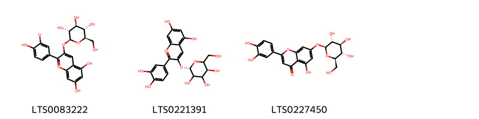{ width=100% }
    <figcaption>Hình ảnh cấu trúc hóa học của 3 hoạt chất thuộc nhóm Flavonoids gồm ['5,7-dihydroxy-2-(4-hydroxy-3-oxidophenyl)-3-{[(2s,3r,4s,5s,6r)-3,4,5-trihydroxy-6-(hydroxymethyl)oxan-2-yl]oxy}-1λ⁴-chromen-1-ylium (LTS0083222)', 'chrysanthemin (LTS0221391)', 'luteolin 7-o-glucoside (LTS0227450)'].</figcaption>
</figure>
#### Nhóm Isoflavonoids
<figure markdown="span">
    { width=100% }
    <figcaption>Hình ảnh cấu trúc hóa học của 1 hoạt chất thuộc nhóm Isoflavonoids gồm ['genistein (LTS0106538)'].</figcaption>
</figure>

---

### Dược dân tộc học

Danh sách các quốc gia có sử dụng *Polhillides velutina* trong điều trị các bệnh. 

| Country      | Disease   | Bệnh                                                                                                                                                                                                |
|:-------------|:----------|:----------------------------------------------------------------------------------------------------------------------------------------------------------------------------------------------------|
| Sierra Leone | Poison    | MYMEMORY WARNING: YOU USED ALL AVAILABLE FREE TRANSLATIONS FOR TODAY. NEXT AVAILABLE IN  15 HOURS 54 MINUTES 57 SECONDS VISIT HTTPS://MYMEMORY.TRANSLATED.NET/DOC/USAGELIMITS.PHP TO TRANSLATE MORE |

---

# Chi Glycyrrhiza

??? note "Danh sách các dược liệu thuộc chi"
    
	 - *Glycyrrhiza echinata*
	 - *Glycyrrhiza glabra*
	 - *Glycyrrhiza lepidota*
	 - *Glycyrrhiza ralensis*
	 - *Glycyrrhiza uralensis*

---
## Glycyrrhiza echinata
### Thông tin về thực vật

!!! info "Phân loại thực vật của *Glycyrrhiza echinata* từ GIBF:"
    - **Kingdom:** Plantae
    - **Phylum:** Tracheophyta
    - **Order:** Fabales
    - **Family:** Fabaceae
    - **Genus:** Glycyrrhiza
    - **Species:** *Glycyrrhiza echinata*

 

| Label (VI)   | Label (EN)   | Scientific Name      | Descriptions (VI)   | Descriptions (EN)   | Also Known As (VI)   | Also Known As (EN)   |
|:-------------|:-------------|:---------------------|:--------------------|:--------------------|:---------------------|:---------------------|
| N/A          | N/A          | Glycyrrhiza echinata | loài thực vật       | species of plant    | ['']                 | ['']                 |

#### Phân bố trên thế giới

**Từ CSDL GIBF** Ukraine, Netherlands, Bulgaria, Romania, Iran (Islamic Republic of), Georgia, Azerbaijan, Hungary, Serbia, Türkiye, Russian Federation, Kazakhstan, Croatia, Greece, Israel

#### Phân bố tại Việt Nam

**Từ CSDL GIBF**: Không có ghi nhận ở Việt Nam

---
### Thành phần hóa học
        
- Theo cơ sở dữ liệu lotus: Từ loài *Glycyrrhiza echinata* đã phân lập và xác định được 44 hoạt chất thuộc về các nhóm Flavonoids, Prenol lipids, Isoflavonoids, Linear 1,3-diarylpropanoids. 

|    | chemicalTaxonomyClassyfireClass   |   smiles_count |
|---:|:----------------------------------|---------------:|
|  0 | Flavonoids                        |             15 |
|  1 | Isoflavonoids                     |              2 |
|  2 | Linear 1,3-diarylpropanoids       |              7 |
|  3 | Prenol lipids                     |             19 |

#### Nhóm Flavonoids
<figure markdown="span">
    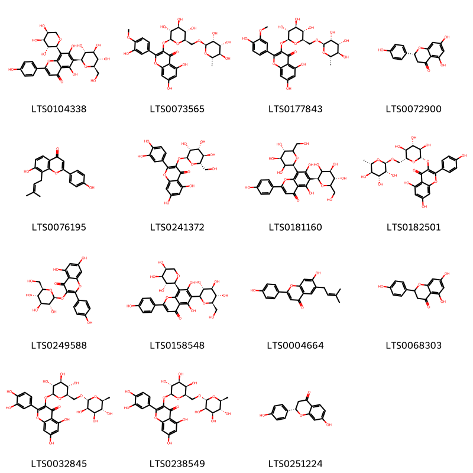{ width=100% }
    <figcaption>Hình ảnh cấu trúc hóa học của 15 hoạt chất thuộc nhóm Flavonoids gồm ['schaftoside (LTS0104338)', '5,7-dihydroxy-2-(3-hydroxy-4-methoxyphenyl)-3-{[(2s,3r,4s,5s,6r)-3,4,5-trihydroxy-6-({[(2r,3r,4r,5r,6s)-3,4,5-trihydroxy-6-methyloxan-2-yl]oxy}methyl)oxan-2-yl]oxy}chromen-4-one (LTS0073565)', 'narcissin (LTS0177843)', '(-)-naringenin (LTS0072900)', '7-hydroxy-2-(4-hydroxyphenyl)-8-(3-methylbut-2-en-1-yl)chromen-4-one (LTS0076195)', '2-(3,4-dihydroxyphenyl)-5,7-dihydroxy-3-{[(2s,3r,4r,5r,6s)-3,4,5-trihydroxy-6-(hydroxymethyl)oxan-2-yl]oxy}chromen-4-one (LTS0241372)', 'vicenin 2 (LTS0181160)', 'nictoflorin (LTS0182501)', 'astragalin (LTS0249588)', '5,7-dihydroxy-2-(4-hydroxyphenyl)-6-[(3r,4r,5s,6r)-3,4,5-trihydroxy-6-(hydroxymethyl)oxan-2-yl]-8-[(2s,3r,4s,5s)-3,4,5-trihydroxyoxan-2-yl]chromen-4-one (LTS0158548)', 'licoflavone a (LTS0004664)', 'asahina (LTS0068303)', '3-rutinosyl quercetin (LTS0032845)', '2-(3,4-dihydroxyphenyl)-5,7-dihydroxy-3-{[(2s,3r,4s,5r,6r)-3,4,5-trihydroxy-6-({[(2r,3r,4r,5r,6s)-3,4,5-trihydroxy-6-methyloxan-2-yl]oxy}methyl)oxan-2-yl]oxy}chromen-4-one (LTS0238549)', '5-deoxyflavanone (LTS0251224)'].</figcaption>
</figure>
#### Nhóm Isoflavonoids
<figure markdown="span">
    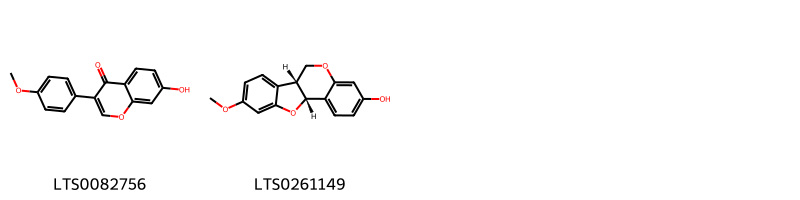{ width=100% }
    <figcaption>Hình ảnh cấu trúc hóa học của 2 hoạt chất thuộc nhóm Isoflavonoids gồm ['formononetin (LTS0082756)', 'medicarpin, (-)- (LTS0261149)'].</figcaption>
</figure>
#### Nhóm Linear 1_3-diarylpropanoids
<figure markdown="span">
    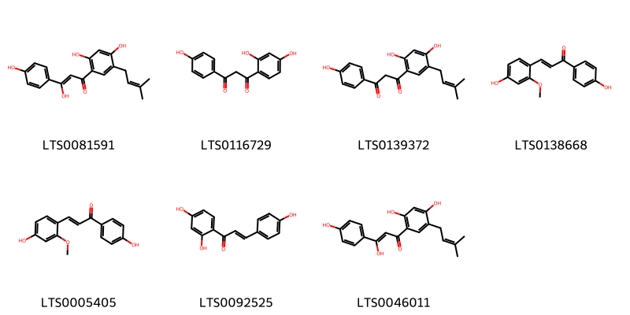{ width=100% }
    <figcaption>Hình ảnh cấu trúc hóa học của Không tìm thấy chú thích hoạt chất thuộc nhóm Linear 1_3-diarylpropanoids gồm Không tìm thấy chú thích.</figcaption>
</figure>
#### Nhóm Prenol lipids
<figure markdown="span">
    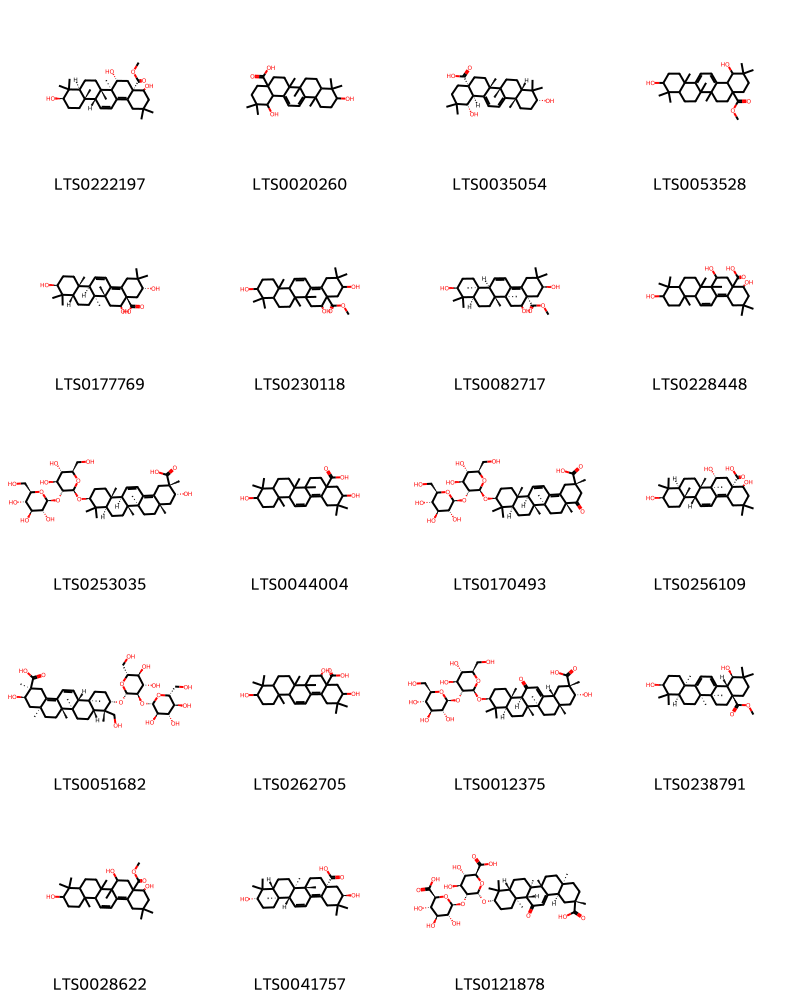{ width=100% }
    <figcaption>Hình ảnh cấu trúc hóa học của 19 hoạt chất thuộc nhóm Prenol lipids gồm ['methyl (4s,4as,6r,6ar,6bs,8as,10r,12ar,12br)-4,6,10-trihydroxy-2,2,6a,6b,9,9,12a-heptamethyl-1,3,4,5,6,7,8,8a,10,11,12,12b-dodecahydropicene-4a-carboxylate (LTS0222197)', '1,10-dihydroxy-2,2,6a,6b,9,9,12a-heptamethyl-1,3,4,5,6,7,8,8a,10,11,12,14b-dodecahydropicene-4a-carboxylic acid (LTS0020260)', '(1s,4as,6as,6bs,8as,10r,12as,14br)-1,10-dihydroxy-2,2,6a,6b,9,9,12a-heptamethyl-1,3,4,5,6,7,8,8a,10,11,12,14b-dodecahydropicene-4a-carboxylic acid (LTS0035054)', 'methyl 1,10-dihydroxy-2,2,6a,6b,9,9,12a-heptamethyl-1,3,4,5,6,7,8,8a,10,11,12,14b-dodecahydropicene-4a-carboxylate (LTS0053528)', '(3r,4ar,5s,6ar,6bs,8as,10s,12as,12br)-3,5,10-trihydroxy-2,2,6a,6b,9,9,12a-heptamethyl-1,3,4,5,6,7,8,8a,10,11,12,12b-dodecahydropicene-4a-carboxylic acid (LTS0177769)', 'methyl 3,5,10-trihydroxy-2,2,6a,6b,9,9,12a-heptamethyl-1,3,4,5,6,7,8,8a,10,11,12,12b-dodecahydropicene-4a-carboxylate (LTS0230118)', 'methyl (3s,4as,5s,6as,6br,8ar,10s,12ar,12br)-3,5,10-trihydroxy-2,2,6a,6b,9,9,12a-heptamethyl-1,3,4,5,6,7,8,8a,10,11,12,12b-dodecahydropicene-4a-carboxylate (LTS0082717)', '4,6,10-trihydroxy-2,2,6a,6b,9,9,12a-heptamethyl-1,3,4,5,6,7,8,8a,10,11,12,12b-dodecahydropicene-4a-carboxylic acid (LTS0228448)', '(2s,3r,4as,6as,6br,8ar,10s,12as,12br)-10-{[(2r,3r,4s,5s,6r)-4,5-dihydroxy-6-(hydroxymethyl)-3-{[(2s,3r,4s,5s,6r)-3,4,5-trihydroxy-6-(hydroxymethyl)oxan-2-yl]oxy}oxan-2-yl]oxy}-3-hydroxy-2,4a,6a,6b,9,9,12a-heptamethyl-1,3,4,5,6,7,8,8a,10,11,12,12b-dodecahydropicene-2-carboxylic acid (LTS0253035)', '3,10-dihydroxy-2,2,6a,6b,9,9,12a-heptamethyl-1,3,4,5,6,7,8,8a,10,11,12,12b-dodecahydropicene-4a-carboxylic acid (LTS0044004)', '(2s,4ar,6as,6br,8ar,10s,12as,12br)-10-{[(2r,3r,4s,5s,6r)-4,5-dihydroxy-6-(hydroxymethyl)-3-{[(2s,3r,4s,5s,6r)-3,4,5-trihydroxy-6-(hydroxymethyl)oxan-2-yl]oxy}oxan-2-yl]oxy}-2,4a,6a,6b,9,9,12a-heptamethyl-4-oxo-3,5,6,7,8,8a,10,11,12,12b-decahydro-1h-picene-2-carboxylic acid (LTS0170493)', '(4s,4as,6r,6ar,6bs,8as,10r,12ar,12br)-4,6,10-trihydroxy-2,2,6a,6b,9,9,12a-heptamethyl-1,3,4,5,6,7,8,8a,10,11,12,12b-dodecahydropicene-4a-carboxylic acid (LTS0256109)', '(2s,3r,4as,6as,6br,8ar,9s,10s,12as,12br)-10-{[(2r,3r,4s,5s,6r)-4,5-dihydroxy-6-(hydroxymethyl)-3-{[(2s,3r,4s,5s,6r)-3,4,5-trihydroxy-6-(hydroxymethyl)oxan-2-yl]oxy}oxan-2-yl]oxy}-3-hydroxy-9-(hydroxymethyl)-2,4a,6a,6b,9,12a-hexamethyl-1,3,4,5,6,7,8,8a,10,11,12,12b-dodecahydropicene-2-carboxylic acid (LTS0051682)', '3,5,10-trihydroxy-2,2,6a,6b,9,9,12a-heptamethyl-1,3,4,5,6,7,8,8a,10,11,12,12b-dodecahydropicene-4a-carboxylic acid (LTS0262705)', '(2s,3r,4as,6as,6br,8ar,10s,12as,12br,14br)-10-{[(2r,3r,4s,5s,6r)-4,5-dihydroxy-6-(hydroxymethyl)-3-{[(2s,3r,4s,5s,6r)-3,4,5-trihydroxy-6-(hydroxymethyl)oxan-2-yl]oxy}oxan-2-yl]oxy}-3-hydroxy-2,4a,6a,6b,9,9,12a-heptamethyl-13-oxo-3,4,5,6,7,8,8a,10,11,12,12b,14b-dodecahydro-1h-picene-2-carboxylic acid (LTS0012375)', 'methyl (1r,4ar,6ar,6br,8ar,10s,12ar,14bs)-1,10-dihydroxy-2,2,6a,6b,9,9,12a-heptamethyl-1,3,4,5,6,7,8,8a,10,11,12,14b-dodecahydropicene-4a-carboxylate (LTS0238791)', 'methyl 4,6,10-trihydroxy-2,2,6a,6b,9,9,12a-heptamethyl-1,3,4,5,6,7,8,8a,10,11,12,12b-dodecahydropicene-4a-carboxylate (LTS0028622)', '(3r,4ar,6as,6br,8ar,10s,12as,12br)-3,10-dihydroxy-2,2,6a,6b,9,9,12a-heptamethyl-1,3,4,5,6,7,8,8a,10,11,12,12b-dodecahydropicene-4a-carboxylic acid (LTS0041757)', 'glycyrrhizin (LTS0121878)'].</figcaption>
</figure>

---

### Dược dân tộc học

Danh sách các quốc gia có sử dụng *Glycyrrhiza echinata* trong điều trị các bệnh. 

| Country   | Disease                                       | Bệnh                                                                                                                                                                                                |
|:----------|:----------------------------------------------|:----------------------------------------------------------------------------------------------------------------------------------------------------------------------------------------------------|
| China     | Tonic, Antidote, Expectorant, Tonic           | MYMEMORY WARNING: YOU USED ALL AVAILABLE FREE TRANSLATIONS FOR TODAY. NEXT AVAILABLE IN  15 HOURS 54 MINUTES 33 SECONDS VISIT HTTPS://MYMEMORY.TRANSLATED.NET/DOC/USAGELIMITS.PHP TO TRANSLATE MORE |
| Japan*    | Antidote, Antitussive, Demulcent, Expectorant | MYMEMORY WARNING: YOU USED ALL AVAILABLE FREE TRANSLATIONS FOR TODAY. NEXT AVAILABLE IN  15 HOURS 54 MINUTES 30 SECONDS VISIT HTTPS://MYMEMORY.TRANSLATED.NET/DOC/USAGELIMITS.PHP TO TRANSLATE MORE |

---

---
## Glycyrrhiza glabra
### Thông tin về thực vật

!!! info "Phân loại thực vật của *Glycyrrhiza glabra* từ GIBF:"
    - **Kingdom:** Plantae
    - **Phylum:** Tracheophyta
    - **Order:** Fabales
    - **Family:** Fabaceae
    - **Genus:** Glycyrrhiza
    - **Species:** *Glycyrrhiza glabra*

 

| Label (VI)   | Label (EN)   | Scientific Name    | Descriptions (VI)   | Descriptions (EN)   | Also Known As (VI)   | Also Known As (EN)     |
|:-------------|:-------------|:-------------------|:--------------------|:--------------------|:---------------------|:-----------------------|
| N/A          | N/A          | Glycyrrhiza glabra |                     | plant species       | ['']                 | ['Glycyrrhiza glabra'] |

#### Phân bố trên thế giới

**Từ CSDL GIBF** nan, Italy, Georgia, Israel, Ukraine, Spain, Azerbaijan, Türkiye, Hungary, Russian Federation, Kazakhstan, Greece, Uzbekistan, Czechia, Germany, Iran (Islamic Republic of), Armenia, France, Iraq, Mongolia

#### Phân bố tại Việt Nam

**Từ CSDL GIBF**: Không có ghi nhận ở Việt Nam

---
### Thành phần hóa học
        
- Theo cơ sở dữ liệu lotus: Từ loài *Glycyrrhiza glabra* đã phân lập và xác định được 450 hoạt chất thuộc về các nhóm Stilbenes, Phenols, Carboxylic acids and derivatives, Fatty Acyls, Indoles and derivatives, Pyrrolidines, Cinnamic acids and derivatives, Heteroaromatic compounds, Saturated hydrocarbons, Saccharolipids, Diazines, Prenol lipids, Linear 1,3-diarylpropanoids, Benzene and substituted derivatives, Organooxygen compounds, Aurone flavonoids, Pyridines and derivatives, Phenol ethers, Flavonoids, Phenylpropanoic acids, Steroids and steroid derivatives, Isoflavonoids, Pyrans, 2-arylbenzofuran flavonoids, Unsaturated hydrocarbons, Lactones, Keto acids and derivatives, Benzopyrans. 

|    | chemicalTaxonomyClassyfireClass     |   smiles_count |
|---:|:------------------------------------|---------------:|
|  0 | 2-arylbenzofuran flavonoids         |              8 |
|  1 | Aurone flavonoids                   |              2 |
|  2 | Benzene and substituted derivatives |             16 |
|  3 | Benzopyrans                         |              4 |
|  4 | Carboxylic acids and derivatives    |              3 |
|  5 | Cinnamic acids and derivatives      |              4 |
|  6 | Diazines                            |              2 |
|  7 | Fatty Acyls                         |             28 |
|  8 | Flavonoids                          |             92 |
|  9 | Heteroaromatic compounds            |              6 |
| 10 | Indoles and derivatives             |              1 |
| 11 | Isoflavonoids                       |            109 |
| 12 | Keto acids and derivatives          |              1 |
| 13 | Lactones                            |              6 |
| 14 | Linear 1,3-diarylpropanoids         |             46 |
| 15 | Organooxygen compounds              |             44 |
| 16 | Phenol ethers                       |              2 |
| 17 | Phenols                             |              5 |
| 18 | Phenylpropanoic acids               |              2 |
| 19 | Prenol lipids                       |             33 |
| 20 | Pyrans                              |              2 |
| 21 | Pyridines and derivatives           |              1 |
| 22 | Pyrrolidines                        |              1 |
| 23 | Saccharolipids                      |              5 |
| 24 | Saturated hydrocarbons              |              6 |
| 25 | Steroids and steroid derivatives    |              6 |
| 26 | Stilbenes                           |             10 |
| 27 | Unsaturated hydrocarbons            |              3 |

#### Nhóm 2-arylbenzofuran flavonoids
<figure markdown="span">
    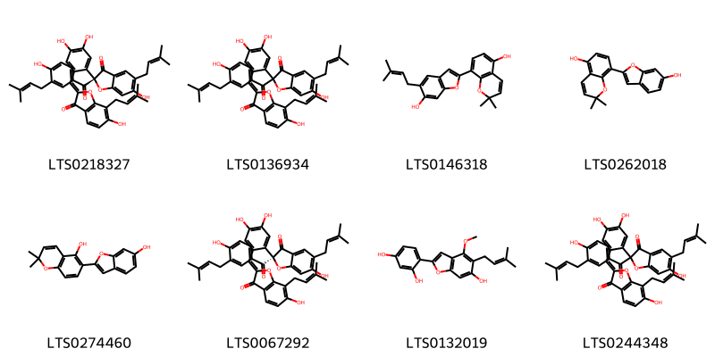{ width=100% }
    <figcaption>Hình ảnh cấu trúc hóa học của 8 hoạt chất thuộc nhóm 2-arylbenzofuran flavonoids gồm ['(2s)-2-(4,5-dihydroxy-2-{[(2z)-6-hydroxy-7-(3-methylbut-2-en-1-yl)-3-oxo-1-benzofuran-2-ylidene]methyl}phenyl)-6-hydroxy-2-[4-hydroxy-3-(3-methylbut-2-en-1-yl)benzoyl]-5-(3-methylbut-2-en-1-yl)-1-benzofuran-3-one (LTS0218327)', '2-(4,5-dihydroxy-2-{[6-hydroxy-7-(3-methylbut-2-en-1-yl)-3-oxo-1-benzofuran-2-ylidene]methyl}phenyl)-6-hydroxy-2-[4-hydroxy-3-(3-methylbut-2-en-1-yl)benzoyl]-5-(3-methylbut-2-en-1-yl)-1-benzofuran-3-one (LTS0136934)', '8-[6-hydroxy-5-(3-methylbut-2-en-1-yl)-1-benzofuran-2-yl]-2,2-dimethylchromen-5-ol (LTS0146318)', 'glabrocoumarone a (LTS0262018)', 'glabrocoumarone b (LTS0274460)', '(2r)-2-(4,5-dihydroxy-2-{[(2z)-6-hydroxy-7-(3-methylbut-2-en-1-yl)-3-oxo-1-benzofuran-2-ylidene]methyl}phenyl)-6-hydroxy-2-[4-hydroxy-3-(3-methylbut-2-en-1-yl)benzoyl]-5-(3-methylbut-2-en-1-yl)-1-benzofuran-3-one (LTS0067292)', 'licocoumarone (LTS0132019)', '2-(4,5-dihydroxy-2-{[(2z)-6-hydroxy-7-(3-methylbut-2-en-1-yl)-3-oxo-1-benzofuran-2-ylidene]methyl}phenyl)-6-hydroxy-2-[4-hydroxy-3-(3-methylbut-2-en-1-yl)benzoyl]-5-(3-methylbut-2-en-1-yl)-1-benzofuran-3-one (LTS0244348)'].</figcaption>
</figure>
#### Nhóm Aurone flavonoids
<figure markdown="span">
    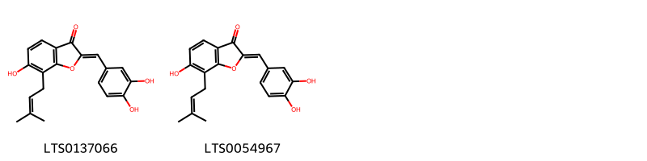{ width=100% }
    <figcaption>Hình ảnh cấu trúc hóa học của 2 hoạt chất thuộc nhóm Aurone flavonoids gồm ['2-[(3,4-dihydroxyphenyl)methylidene]-6-hydroxy-7-(3-methylbut-2-en-1-yl)-1-benzofuran-3-one (LTS0137066)', '(2z)-2-[(3,4-dihydroxyphenyl)methylidene]-6-hydroxy-7-(3-methylbut-2-en-1-yl)-1-benzofuran-3-one (LTS0054967)'].</figcaption>
</figure>
#### Nhóm Benzene and substituted derivatives
<figure markdown="span">
    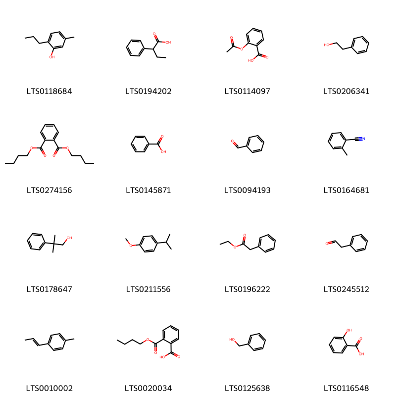{ width=100% }
    <figcaption>Hình ảnh cấu trúc hóa học của 16 hoạt chất thuộc nhóm Benzene and substituted derivatives gồm ['m-cresol, 6-propyl- (LTS0118684)', 'α-phenylbutyric acid (LTS0194202)', 'aspirin (LTS0114097)', '2-phenyl-ethanol (LTS0206341)', 'dibutyl-phthalate (LTS0274156)', 'benzoic acid (LTS0145871)', 'benzaldehyde (LTS0094193)', 'o-tolunitrile (LTS0164681)', '2-methyl-2-phenylpropan-1-ol (LTS0178647)', '1-isopropyl-4-methoxybenzene (LTS0211556)', 'ethyl phenylacetate (LTS0196222)', 'phenylacetaldehyde (LTS0245512)', '1-methyl-4-(prop-1-en-1-yl)benzene (LTS0010002)', 'mono-n-butylphthalate (LTS0020034)', 'benzyl alcohol (LTS0125638)', 'salicyclic acid (LTS0116548)'].</figcaption>
</figure>
#### Nhóm Benzopyrans
<figure markdown="span">
    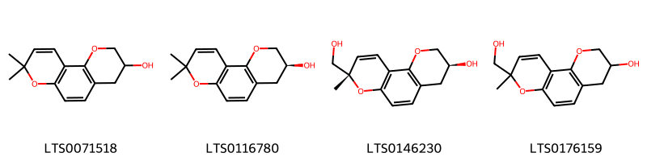{ width=100% }
    <figcaption>Hình ảnh cấu trúc hóa học của 4 hoạt chất thuộc nhóm Benzopyrans gồm ['8,8-dimethyl-2h,3h,4h-pyrano[2,3-f]chromen-3-ol (LTS0071518)', '(3s)-8,8-dimethyl-2h,3h,4h-pyrano[2,3-f]chromen-3-ol (LTS0116780)', '(3s,8s)-8-(hydroxymethyl)-8-methyl-2h,3h,4h-pyrano[2,3-f]chromen-3-ol (LTS0146230)', '8-(hydroxymethyl)-8-methyl-2h,3h,4h-pyrano[2,3-f]chromen-3-ol (LTS0176159)'].</figcaption>
</figure>
#### Nhóm Carboxylic acids and derivatives
<figure markdown="span">
    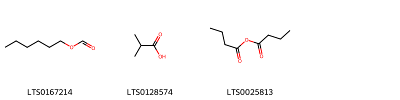{ width=100% }
    <figcaption>Hình ảnh cấu trúc hóa học của 3 hoạt chất thuộc nhóm Carboxylic acids and derivatives gồm ['hexyl formate (LTS0167214)', 'isobutyric acid (LTS0128574)', 'butyric anhydride (LTS0025813)'].</figcaption>
</figure>
#### Nhóm Cinnamic acids and derivatives
<figure markdown="span">
    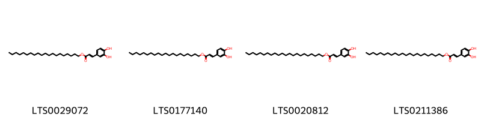{ width=100% }
    <figcaption>Hình ảnh cấu trúc hóa học của 4 hoạt chất thuộc nhóm Cinnamic acids and derivatives gồm ['icosyl (2e)-3-(3,4-dihydroxyphenyl)prop-2-enoate (LTS0029072)', 'icosyl 3-(3,4-dihydroxyphenyl)prop-2-enoate (LTS0177140)', 'docosyl (2e)-3-(3,4-dihydroxyphenyl)prop-2-enoate (LTS0020812)', 'docosyl 3-(3,4-dihydroxyphenyl)prop-2-enoate (LTS0211386)'].</figcaption>
</figure>
#### Nhóm Diazines
<figure markdown="span">
    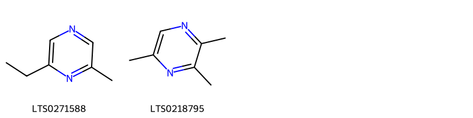{ width=100% }
    <figcaption>Hình ảnh cấu trúc hóa học của 2 hoạt chất thuộc nhóm Diazines gồm ['2-ethyl-6-methylpyrazine (LTS0271588)', 'trimethylpyrazine (LTS0218795)'].</figcaption>
</figure>
#### Nhóm Fatty Acyls
<figure markdown="span">
    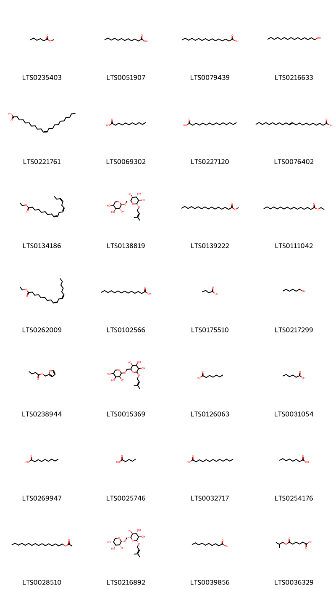{ width=100% }
    <figcaption>Hình ảnh cấu trúc hóa học của 28 hoạt chất thuộc nhóm Fatty Acyls gồm ['methyl caproate (LTS0235403)', 'lauric acid (LTS0051907)', 'palmitic acid (LTS0079439)', '1-pentadecanol (LTS0216633)', 'cetoleic acid (LTS0221761)', 'undecanoic acid (LTS0069302)', 'pentadecanoic acid (LTS0227120)', 'docos-11-enoic acid (LTS0076402)', 'ethyl linolenate (LTS0134186)', '(2r,3r,4s,5s,6r)-2-[(3-methylbut-2-en-1-yl)oxy]-6-({[(2s,3r,4s,5s)-3,4,5-trihydroxyoxan-2-yl]oxy}methyl)oxane-3,4,5-triol (LTS0138819)', 'methyl palmitate (LTS0139222)', 'ethyl palmitate (LTS0111042)', 'ethyl linoleate (LTS0262009)', 'myristic acid (LTS0102566)', 'butanoic acid (LTS0175510)', 'hexanol (LTS0217299)', 'furan-2-ylmethyl butanoate (LTS0238944)', '2-[(3-methylbut-2-en-1-yl)oxy]-6-{[(3,4,5-trihydroxyoxan-2-yl)oxy]methyl}oxane-3,4,5-triol (LTS0015369)', 'heptanoic acid (LTS0126063)', 'hexanoic acid (LTS0031054)', 'nonanoic acid (LTS0269947)', 'n-valeric acid (LTS0025746)', 'n-tridecanoic acid (LTS0032717)', 'caprylic acid (LTS0254176)', 'cetyl acetate (LTS0028510)', '(2r,3r,4s,5s,6r)-2-[(3-methylbut-2-en-1-yl)oxy]-6-({[(2r,3r,4r,5r)-3,4,5-trihydroxyoxan-2-yl]oxy}methyl)oxane-3,4,5-triol (LTS0216892)', 'capric acid (LTS0039856)', 'monoisobutyl adipate (LTS0036329)'].</figcaption>
</figure>
#### Nhóm Flavonoids
<figure markdown="span">
    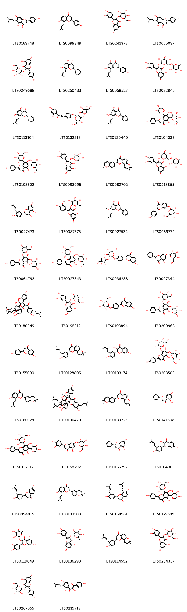{ width=100% }
    <figcaption>Hình ảnh cấu trúc hóa học của 92 hoạt chất thuộc nhóm Flavonoids gồm ['6-prenylnaringenin (LTS0163748)', 'sophoraflavanone b (LTS0099349)', '2-(3,4-dihydroxyphenyl)-5,7-dihydroxy-3-{[(2s,3r,4r,5r,6s)-3,4,5-trihydroxy-6-(hydroxymethyl)oxan-2-yl]oxy}chromen-4-one (LTS0241372)', '5,7-dihydroxy-2-(4-hydroxyphenyl)-6-(3-methylbut-2-en-1-yl)-2,3-dihydro-1-benzopyran-4-one (LTS0025037)', 'astragalin (LTS0249588)', 'glabranin (LTS0250433)', 'sophoraflavanone b (LTS0058527)', '3-rutinosyl quercetin (LTS0032845)', '5,7-dihydroxy-8-(3-methylbut-2-en-1-yl)-2-phenyl-2,3-dihydro-1-benzopyran-4-one (LTS0113104)', 'licuroside (LTS0132318)', '(2s)-5-hydroxy-7-methoxy-8-(3-methylbut-2-en-1-yl)-2-phenyl-2,3-dihydro-1-benzopyran-4-one (LTS0130440)', 'schaftoside (LTS0104338)', 'vicenin-2 (LTS0103522)', 'quercitrin (LTS0093095)', '(2s)-2-(2,2-dimethylchromen-6-yl)-8,8-dimethyl-2h,3h-pyrano[2,3-f]chromen-4-one (LTS0082702)', '2-(3,4-dihydroxyphenyl)-5,7-dihydroxy-3-{[(2s,3r,4s,5s,6r)-3,4,5-trihydroxy-6-({[(2r,3s,4s,5r,6s)-3,4,5-trihydroxy-6-methyloxan-2-yl]oxy}methyl)oxan-2-yl]oxy}chromen-4-one (LTS0218865)', '(2r)-5,7-dihydroxy-2-[4-hydroxy-3-(3-methylbut-2-en-1-yl)phenyl]-2,3-dihydro-1-benzopyran-4-one (LTS0027473)', 'isorhamnetin 3-galactoside (LTS0087575)', 'tephrinone (LTS0027534)', 'neoliquiritin (LTS0089772)', '5,7-dihydroxy-2-(4-hydroxyphenyl)-8-{[3,4,5-trihydroxy-6-(hydroxymethyl)oxan-2-yl]oxy}-6-[(3,4,5-trihydroxyoxan-2-yl)oxy]chromen-4-one (LTS0064793)', '5,7-dihydroxy-2-(4-hydroxyphenyl)-6-[(2s,3r,4r,5s,6s)-3,4,5-trihydroxy-6-(hydroxymethyl)oxan-2-yl]-8-[(2s,3s,4r,5s,6s)-3,4,5-trihydroxy-6-(hydroxymethyl)oxan-2-yl]chromen-4-one (LTS0027343)', '(2s)-2-(4-{[(2s,3r,4s,5s,6s)-3-{[(2s,3s,4r)-3,4-dihydroxy-4-(hydroxymethyl)oxolan-2-yl]oxy}-4,5-dihydroxy-6-(hydroxymethyl)oxan-2-yl]oxy}phenyl)-7-hydroxy-2,3-dihydro-1-benzopyran-4-one (LTS0036288)', '(2s)-5-hydroxy-2-phenyl-7-{[(2s,3r,4s,5s,6r)-3,4,5-trihydroxy-6-(hydroxymethyl)oxan-2-yl]oxy}-2,3-dihydro-1-benzopyran-4-one (LTS0097344)', '5,13,23-trihydroxy-27-[4-hydroxy-3-(3-methylbut-2-en-1-yl)phenyl]-6,22-bis(3-methylbut-2-en-1-yl)-8,10,26,28-tetraoxaheptacyclo[15.11.0.0¹,⁹.0²,⁷.0¹¹,¹⁶.0¹⁸,²⁷.0²⁰,²⁵]octacosa-2(7),3,5,11,13,15,20,22,24-nonaen-19-one (LTS0180349)', '2-(3,4-dihydroxyphenyl)-5,7-dihydroxy-3-{[3,4,5-trihydroxy-6-(hydroxymethyl)oxan-2-yl]oxy}chromen-4-one (LTS0195312)', 'liquiritin (LTS0103894)', '5,7-dihydroxy-2-(4-hydroxyphenyl)-8-{[(2s,3r,4s,5s,6r)-3,4,5-trihydroxy-6-(hydroxymethyl)oxan-2-yl]oxy}-6-{[(2s,3r,4s,5s)-3,4,5-trihydroxyoxan-2-yl]oxy}chromen-4-one (LTS0200968)', "7,4'-dihydroxyflavanone (LTS0155090)", 'shinflavanone (LTS0128805)', '(2r,3r)-3,7-dihydroxy-2-[4-hydroxy-3-(3-methylbut-2-en-1-yl)phenyl]-2,3-dihydro-1-benzopyran-4-one (LTS0193174)', '5,7-dihydroxy-2-(4-hydroxyphenyl)-6,8-bis({[(2s,3r,4s,5s,6r)-3,4,5-trihydroxy-6-(hydroxymethyl)oxan-2-yl]oxy})chromen-4-one (LTS0203509)', 'euchrenone a5 (LTS0180128)', '(1s,9s,17r,18s,27r)-5,13,23-trihydroxy-27-[4-hydroxy-3-(3-methylbut-2-en-1-yl)phenyl]-6,22-bis(3-methylbut-2-en-1-yl)-8,10,26,28-tetraoxaheptacyclo[15.11.0.0¹,⁹.0²,⁷.0¹¹,¹⁶.0¹⁸,²⁷.0²⁰,²⁵]octacosa-2(7),3,5,11,13,15,20,22,24-nonaen-19-one (LTS0196470)', 'xambioona (LTS0139725)', 'pinocembrine (LTS0141508)', 'isoschaftoside (LTS0157117)', '2-(3,4-dihydroxyphenyl)-5-hydroxy-7-{[3,4,5-trihydroxy-6-(hydroxymethyl)oxan-2-yl]oxy}chromen-4-one (LTS0158292)', 'pinocembrin (LTS0155292)', '3,7-dihydroxy-2-[4-hydroxy-3-(3-methylbut-2-en-1-yl)phenyl]-2,3-dihydro-1-benzopyran-4-one (LTS0164903)', '(2s)-7-hydroxy-2-[4-hydroxy-3-(3-methylbut-2-en-1-yl)phenyl]-2,3-dihydro-1-benzopyran-4-one (LTS0094039)', '(2s)-2-(2,2-dimethylchromen-6-yl)-7-hydroxy-8-(3-methylbut-2-en-1-yl)-2,3-dihydro-1-benzopyran-4-one (LTS0183508)', 'glabrol (LTS0164961)', '5,7-dihydroxy-2-(4-hydroxyphenyl)-8-[(2s,3r,4r,5s,6r)-3,4,5-trihydroxy-6-(hydroxymethyl)oxan-2-yl]-6-[(2s,3s,4s,5s)-3,4,5-trihydroxyoxan-2-yl]chromen-4-one (LTS0179589)', '5,7-dihydroxy-2-(4-hydroxy-3-methoxyphenyl)-3-[(3,4,5-trihydroxy-6-methyloxan-2-yl)oxy]chromen-4-one (LTS0119649)', 'quercitrin (LTS0186298)', '2-[4-hydroxy-3-(3-methylbut-2-en-1-yl)phenyl]-8,8-dimethyl-2h,3h-pyrano[2,3-f]chromen-4-one (LTS0114552)', 'isoquercetin (LTS0254337)', 'trifolin (LTS0267055)', 'licoflavonol (LTS0219719)', '(-)-naringenin (LTS0072900)', 'lespedezaflavanone b (LTS0216836)', 'galangin (LTS0210648)', 'cynaroside (LTS0069837)', '5,7-dihydroxy-2-(4-hydroxy-3-methoxyphenyl)-3-{[(2s,3r,4r,5r,6s)-3,4,5-trihydroxy-6-methyloxan-2-yl]oxy}chromen-4-one (LTS0088005)', 'isolicoflavonol (LTS0264727)', '2-(3,4-dihydroxyphenyl)-5,7-dihydroxy-3-{[(2s,3r,4r,5s,6r)-3,4,5-trihydroxy-6-(hydroxymethyl)oxan-2-yl]oxy}chromen-4-one (LTS0220665)', 'liquiritin (LTS0213422)', '7-hydroxy-2-(4-{[3,4,5-trihydroxy-6-(hydroxymethyl)oxan-2-yl]oxy}phenyl)-2,3-dihydro-1-benzopyran-4-one (LTS0216345)', '3-hydroxyglabrol (LTS0231039)', '3,7-dihydroxy-2-[4-hydroxy-3-(3-methylbut-2-en-1-yl)phenyl]-8-(3-methylbut-2-en-1-yl)-2,3-dihydro-1-benzopyran-4-one (LTS0211811)', '5-hydroxy-2-phenyl-7-{[3,4,5-trihydroxy-6-(hydroxymethyl)oxan-2-yl]oxy}-2,3-dihydro-1-benzopyran-4-one (LTS0004763)', 'abyssinone ii (LTS0225956)', 'vicenin 2 (LTS0181160)', 'kumatakenin (LTS0018267)', '(1r,17s,18r,27s)-5,13,23-trihydroxy-27-[4-hydroxy-3-(3-methylbut-2-en-1-yl)phenyl]-6,22-bis(3-methylbut-2-en-1-yl)-8,10,26,28-tetraoxaheptacyclo[15.11.0.0¹,⁹.0²,⁷.0¹¹,¹⁶.0¹⁸,²⁷.0²⁰,²⁵]octacosa-2(7),3,5,11,13,15,20,22,24-nonaen-19-one (LTS0181081)', '(2s)-5-hydroxy-7,8-dimethoxy-2-phenyl-2,3-dihydro-1-benzopyran-4-one (LTS0258683)', 'liquiritin apioside (LTS0188438)', '5,7-dihydroxy-2-(4-hydroxyphenyl)-6,8-bis[3,4,5-trihydroxy-6-(hydroxymethyl)oxan-2-yl]chromen-4-one (LTS0255367)', 'isoliquiritin (LTS0051422)', '5,7-dihydroxy-2-(4-hydroxyphenyl)-6-[(2r,3r,4r,5s,6r)-3,4,5-trihydroxy-6-(hydroxymethyl)oxan-2-yl]chromen-4-one (LTS0174203)', 'isovitexin (LTS0035187)', '5,7-dihydroxy-6-(3-methylbut-2-en-1-yl)-2-phenyl-2,3-dihydro-1-benzopyran-4-one (LTS0035757)', '5,7-dihydroxy-2-(4-hydroxyphenyl)-6-[(3r,4r,5s,6r)-3,4,5-trihydroxy-6-(hydroxymethyl)oxan-2-yl]-8-[(2s,3r,4s,5s)-3,4,5-trihydroxyoxan-2-yl]chromen-4-one (LTS0158548)', 'licoflavanone (LTS0244117)', '(2s,3s)-3-hydroxy-2-[4-hydroxy-3-(3-methylbut-2-en-1-yl)phenyl]-8,8-dimethyl-2h,3h-pyrano[2,3-f]chromen-4-one (LTS0135332)', 'yinyanghuo d (LTS0063487)', '1-(2,4-dihydroxyphenyl)-3-(4-{[3,4,5-trihydroxy-6-(hydroxymethyl)oxan-2-yl]oxy}phenyl)prop-2-en-1-one (LTS0113391)', 'licoflavone a (LTS0004664)', '(1r,9r,17s,18r,27s)-5,13,23-trihydroxy-27-[4-hydroxy-3-(3-methylbut-2-en-1-yl)phenyl]-6,22-bis(3-methylbut-2-en-1-yl)-8,10,26,28-tetraoxaheptacyclo[15.11.0.0¹,⁹.0²,⁷.0¹¹,¹⁶.0¹⁸,²⁷.0²⁰,²⁵]octacosa-2(7),3,5,11,13,15,20,22,24-nonaen-19-one (LTS0067434)', 'isorhamnetin 3-o-glucoside (LTS0137002)', 'asahina (LTS0068303)', '(2s)-5,7-dihydroxy-8-[(1e)-3-methylbut-1-en-1-yl]-2-phenyl-2,3-dihydro-1-benzopyran-4-one (LTS0007447)', 'naringenin (LTS0031098)', '(2s)-5,7-dihydroxy-6-(3-methylbut-2-en-1-yl)-2-phenyl-2,3-dihydro-1-benzopyran-4-one (LTS0028207)', 'kanzonol d (LTS0012990)', 'glabrol (LTS0021358)', '5-deoxyflavanone (LTS0251224)', '5,7-dihydroxy-2-(4-hydroxyphenyl)-6,8-bis({[3,4,5-trihydroxy-6-(hydroxymethyl)oxan-2-yl]oxy})chromen-4-one (LTS0113442)', 'euchrestaflavanone a (LTS0048628)', '5,7-dihydroxy-8-(3-methylbut-1-en-1-yl)-2-phenyl-2,3-dihydro-1-benzopyran-4-one (LTS0135526)', 'licoflavone b (LTS0122155)'].</figcaption>
</figure>
#### Nhóm Heteroaromatic compounds
<figure markdown="span">
    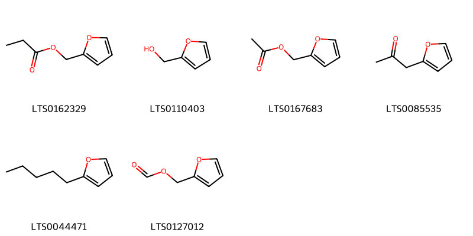{ width=100% }
    <figcaption>Hình ảnh cấu trúc hóa học của 6 hoạt chất thuộc nhóm Heteroaromatic compounds gồm ['furfuryl propionate (LTS0162329)', 'furfuryl alcohol (LTS0110403)', '2-furanmethanol, acetate (LTS0167683)', 'furfuryl methyl ketone (LTS0085535)', 'amylfuran (LTS0044471)', 'furfuryl formate (LTS0127012)'].</figcaption>
</figure>
#### Nhóm Indoles and derivatives
<figure markdown="span">
    { width=100% }
    <figcaption>Hình ảnh cấu trúc hóa học của 1 hoạt chất thuộc nhóm Indoles and derivatives gồm ['indole (LTS0185357)'].</figcaption>
</figure>
#### Nhóm Isoflavonoids
<figure markdown="span">
    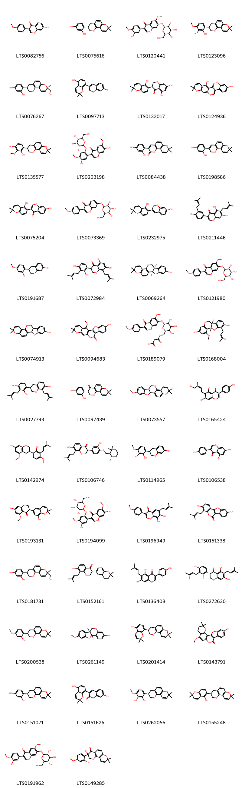{ width=100% }
    <figcaption>Hình ảnh cấu trúc hóa học của 109 hoạt chất thuộc nhóm Isoflavonoids gồm ['formononetin (LTS0082756)', 'glabridin (LTS0075616)', '3-(3-hydroxy-4-methoxyphenyl)-6-methoxy-7-{[3,4,5-trihydroxy-6-(hydroxymethyl)oxan-2-yl]oxy}chromen-4-one (LTS0120441)', '3-{8,8-dimethyl-2h,3h,4h-pyrano[2,3-f]chromen-3-yl}-6-methoxybenzene-1,2-diol (LTS0123096)', '4-[(3r,8s)-8-(hydroxymethyl)-8-methyl-2h,3h,4h-pyrano[2,3-f]chromen-3-yl]benzene-1,3-diol (LTS0076267)', 'glabrene (LTS0097713)', 'licoisoflavanone (LTS0132017)', 'parvisoflavone b (LTS0124936)', "3'-methoxyglabradin (LTS0135577)", '7-hydroxy-3-(5-hydroxy-4-methoxy-2-{[(2s,3r,4s,5s,6r)-3,4,5-trihydroxy-6-(hydroxymethyl)oxan-2-yl]oxy}phenyl)-6-methoxychromen-4-one (LTS0203198)', '3-(2,4-dihydroxyphenyl)-8,8-dimethylpyrano[2,3-f]chromen-2-one (LTS0084438)', '4-{8,8-dimethyl-2h-pyrano[2,3-f]chromen-3-yl}benzene-1,3-diol (LTS0198586)', 'glabrone (LTS0075204)', 'formononetin 7-o-glucoside (LTS0073369)', 'glabrene (LTS0232975)', 'lupalbigenin (LTS0211446)', '(-)-vestitol (LTS0191687)', "3'-dimethylallylkievitone (LTS0072984)", '(2r,10r)-17,17-dimethyl-3,12,18-trioxapentacyclo[11.8.0.0²,¹⁰.0⁴,⁹.0¹⁴,¹⁹]henicosa-1(13),4,6,8,14(19),15,20-heptaen-6-ol (LTS0069264)', '6-methoxy-3-(4-methoxyphenyl)-7-{[(2s,3s,4s,5s,6r)-3,4,5-trihydroxy-6-(hydroxymethyl)oxan-2-yl]oxy}chromen-4-one (LTS0121980)', '17,17-dimethyl-3,12,18-trioxapentacyclo[11.8.0.0²,¹⁰.0⁴,⁹.0¹⁴,¹⁹]henicosa-1(13),4,6,8,14(19),15,20-heptaen-6-ol (LTS0074913)', 'gancaonin f (LTS0094683)', '3-oxo-3-[(3,4,5-trihydroxy-6-{[6-methoxy-3-(4-methoxyphenyl)-4-oxochromen-7-yl]oxy}oxan-2-yl)methoxy]propanoic acid (LTS0189079)', '(1s,10s)-3-methoxy-15-(3-methylbut-2-en-1-yl)-8,17-dioxatetracyclo[8.7.0.0²,⁷.0¹¹,¹⁶]heptadeca-2(7),3,5,11(16),12,14-hexaene-5,14-diol (LTS0168004)', '4-[(3r)-7-hydroxy-8-(3-methylbut-2-en-1-yl)-3,4-dihydro-2h-1-benzopyran-3-yl]-2-(3-methylbut-2-en-1-yl)benzene-1,3-diol (LTS0027793)', '(3s)-3-(2,4-dihydroxyphenyl)-8,8-dimethyl-2h,3h-pyrano[2,3-f]chromen-4-one (LTS0097439)', '6-methoxy-17,17-dimethyl-3,12,18-trioxapentacyclo[11.8.0.0²,¹⁰.0⁴,⁹.0¹⁴,¹⁹]henicosa-1(21),4,6,8,13,15,19-heptaene (LTS0073557)', '5,7-dihydroxy-6-(4-hydroxy-3-methylbut-2-en-1-yl)-3-(4-hydroxyphenyl)chromen-4-one (LTS0165424)', '(3r)-3-[2-hydroxy-4-methoxy-3-(3-methylbut-2-en-1-yl)phenyl]-5-methoxy-3,4-dihydro-2h-1-benzopyran-7-ol (LTS0142974)', '(3r)-7-hydroxy-3-(3-hydroxy-4-{[(1r,6s)-2,2,6-trimethylcyclohexyl]methoxy}phenyl)-8-(3-methylbut-2-en-1-yl)-2,3-dihydro-1-benzopyran-4-one (LTS0106746)', '3-(7-hydroxy-3,4-dihydro-2h-1-benzopyran-3-yl)-6-methoxybenzene-1,2-diol (LTS0114965)', 'genistein (LTS0106538)', 'glycyrrhisoflavanone (LTS0193131)', '7-hydroxy-3-(5-hydroxy-4-methoxy-2-{[(3r,4s,5s,6r)-3,4,5-trihydroxy-6-(hydroxymethyl)oxan-2-yl]oxy}phenyl)-6-methoxychromen-4-one (LTS0194099)', '7,8-dihydroxy-3-(4-methoxyphenyl)-6-(3-methylbut-2-en-1-yl)chromen-4-one (LTS0196949)', 'phaseol (LTS0151338)', '4-[8-(hydroxymethyl)-8-methyl-2h,3h,4h-pyrano[2,3-f]chromen-3-yl]benzene-1,3-diol (LTS0181731)', '(3r)-3-(2,2-dimethyl-3,4-dihydro-1-benzopyran-6-yl)-7-hydroxy-8-(3-methylbut-2-en-1-yl)-2,3-dihydro-1-benzopyran-4-one (LTS0152161)', 'wighteone (LTS0136408)', '(3s)-3-[2,4-dihydroxy-3-(3-methylbut-2-en-1-yl)phenyl]-5,7-dihydroxy-6-(3-methylbut-2-en-1-yl)-2,3-dihydro-1-benzopyran-4-one (LTS0272630)', "4'-o-methylglabridin (LTS0200538)", 'medicarpin, (-)- (LTS0261149)', '8-[(3r)-8,8-dimethyl-2h,3h,4h-pyrano[2,3-f]chromen-3-yl]-2,2-dimethylchromen-5-ol (LTS0201414)', 'isoglycyrol (LTS0143791)', '4-{8,8-dimethyl-2h,3h,4h-pyrano[2,3-f]chromen-3-yl}benzene-1,3-diol (LTS0151071)', 'glabrocoumarin (LTS0151626)', '3-[(3r)-8,8-dimethyl-2h,3h,4h-pyrano[2,3-f]chromen-3-yl]-6-methoxybenzene-1,2-diol (LTS0262056)', 'hispaglabridin b (LTS0155248)', '3-(3-hydroxy-4-methoxyphenyl)-6-methoxy-7-{[(2s,3r,4s,5s,6r)-3,4,5-trihydroxy-6-(hydroxymethyl)oxan-2-yl]oxy}chromen-4-one (LTS0191962)', '3-hydroxy-3-(2-hydroxy-4-methoxyphenyl)-8,8-dimethyl-2h-pyrano[2,3-f]chromen-4-one (LTS0149285)', 'glycyrin (LTS0087818)', '3-[(3r)-7-hydroxy-3,4-dihydro-2h-1-benzopyran-3-yl]-6-methoxybenzene-1,2-diol (LTS0162008)', '7-hydroxy-3-{3-hydroxy-4-[(2,2,6-trimethylcyclohexyl)methoxy]phenyl}-8-(3-methylbut-2-en-1-yl)-2,3-dihydro-1-benzopyran-4-one (LTS0159552)', '(3s)-7-hydroxy-3-(5-hydroxy-2,2-dimethylchromen-6-yl)-5-methoxy-2,3-dihydro-1-benzopyran-4-one (LTS0238621)', '3-[2,4-dihydroxy-3-(3-methylbut-2-en-1-yl)phenyl]-7-hydroxy-8-(3-methylbut-2-en-1-yl)chromen-2-one (LTS0071139)', '(3s)-3-(2-hydroxy-4-methoxyphenyl)-8,8-dimethyl-2h,3h-pyrano[2,3-f]chromen-4-one (LTS0169481)', '5,7-dihydroxy-6-[(2z)-4-hydroxy-3-methylbut-2-en-1-yl]-3-(4-hydroxyphenyl)chromen-4-one (LTS0164690)', 'prunetin (LTS0261766)', 'glycycoumarin (LTS0186848)', '(3r)-3-hydroxy-3-(2-hydroxy-4-methoxyphenyl)-8,8-dimethyl-2h-pyrano[2,3-f]chromen-4-one (LTS0257210)', '3-[2-hydroxy-4-methoxy-3-(3-methylbut-2-en-1-yl)phenyl]-5-methoxy-3,4-dihydro-2h-1-benzopyran-7-ol (LTS0255305)', 'licoricidin (LTS0274337)', 'hispaglabridin a (LTS0267683)', '3-oxo-3-{[(2r,3s,4s,5r,6s)-3,4,5-trihydroxy-6-{[6-methoxy-3-(4-methoxyphenyl)-4-oxochromen-7-yl]oxy}oxan-2-yl]methoxy}propanoic acid (LTS0247865)', '(+/-)-vestitol (LTS0195438)', '7-methoxy-2-methyl-3-phenylchromen-4-one (LTS0220080)', '3-(3-hydroxy-4-methoxyphenyl)-7-{[3,4,5-trihydroxy-6-(hydroxymethyl)oxan-2-yl]oxy}chromen-4-one (LTS0180911)', '3-(3-hydroxy-4-methoxyphenyl)-7-{[(2s,3s,4s,5s,6r)-3,4,5-trihydroxy-6-(hydroxymethyl)oxan-2-yl]oxy}chromen-4-one (LTS0262976)', 'gancaonin l (LTS0072777)', '2-[(3r)-8,8-dimethyl-2h,3h,4h-pyrano[2,3-f]chromen-3-yl]-5-methoxyphenol (LTS0211997)', '(3s)-3-[2,4-dihydroxy-3-(3-methylbut-2-en-1-yl)phenyl]-5,7-dihydroxy-8-(3-methylbut-2-en-1-yl)-2,3-dihydro-1-benzopyran-4-one (LTS0064499)', 'gancaonin h (LTS0077774)', '(1r,10r)-14-methoxy-6-(3-methylbut-2-en-1-yl)-8,17-dioxatetracyclo[8.7.0.0²,⁷.0¹¹,¹⁶]heptadeca-2,4,6,11,13,15-hexaen-5-ol (LTS0080282)', '8-{8,8-dimethyl-2h,3h,4h-pyrano[2,3-f]chromen-3-yl}-2,2-dimethylchromen-5-ol (LTS0230700)', 'licoisoflavone a (LTS0263391)', '3-(2,4-dihydroxyphenyl)-8,8-dimethyl-2h,3h-pyrano[2,3-f]chromen-4-one (LTS0084911)', '3-oxo-3-{[(2s,3s,4s,5r,6s)-3,4,5-trihydroxy-6-{[6-methoxy-3-(4-methoxyphenyl)-4-oxochromen-7-yl]oxy}oxan-2-yl]methoxy}propanoic acid (LTS0211389)', '6-[7-hydroxy-8-(3-methylbut-2-en-1-yl)-3,4-dihydro-2h-1-benzopyran-3-yl]-2,2-dimethylchromen-5-ol (LTS0237734)', '7-hydroxy-2-methyl-4-oxo-3-phenylchromen-8-yl acetate (LTS0038796)', 'isoglycycoumarin (LTS0066952)', '4-[7-hydroxy-8-(3-methylbut-2-en-1-yl)-3,4-dihydro-2h-1-benzopyran-3-yl]-2-(3-methylbut-2-en-1-yl)benzene-1,3-diol (LTS0034412)', 'ononin (LTS0235553)', '4-{8,8-dimethyl-2h,3h,4h-pyrano[2,3-f]chromen-3-yl}-2-(3-methylbut-2-en-1-yl)benzene-1,3-diol (LTS0188522)', '6-methoxy-3-(4-methoxyphenyl)-7-{[3,4,5-trihydroxy-6-(hydroxymethyl)oxan-2-yl]oxy}chromen-4-one (LTS0249660)', '6-methoxy-3-(4-methoxyphenyl)-7-{[(2s,3r,4s,5s,6r)-3,4,5-trihydroxy-6-(hydroxymethyl)oxan-2-yl]oxy}chromen-4-one (LTS0035338)', '14-methoxy-6-(3-methylbut-2-en-1-yl)-8,17-dioxatetracyclo[8.7.0.0²,⁷.0¹¹,¹⁶]heptadeca-2,4,6,11,13,15-hexaen-5-ol (LTS0246095)', 'lupiwighteone (LTS0229079)', 'licopyranocoumarin (LTS0048734)', 'licoisoflavone b (LTS0055944)', "5,5',7-trihydroxy-6-(3-hydroxy-3-methylbutyl)-2',2'-dimethyl-[3,6'-bichromen]-4-one (LTS0260065)", 'ononin (LTS0065177)', '3-[2,4-dihydroxy-3-(3-methylbut-2-en-1-yl)phenyl]-5,7-dihydroxy-6-(3-methylbut-2-en-1-yl)-2,3-dihydro-1-benzopyran-4-one (LTS0061449)', '3-(4-methoxyphenyl)-7-{[(2s,3s,4s,5s,6s)-3,4,5-trihydroxy-6-(hydroxymethyl)oxan-2-yl]oxy}chromen-4-one (LTS0042622)', 'afrormosin (LTS0275427)', 'glycyrol (LTS0024924)', '5-{8,8-dimethyl-2h,3h,4h-pyrano[2,3-f]chromen-3-yl}-2,4-dihydroxybenzaldehyde (LTS0058805)', 'gancaonin g (LTS0003159)', '6-hydroxy-21-methoxy-17,17-dimethyl-3,12,16-trioxapentacyclo[11.8.0.0²,¹⁰.0⁴,⁹.0¹⁵,²⁰]henicosa-1(13),2(10),4(9),5,7,14,20-heptaen-11-one (LTS0007245)', '6-[(3s)-7-hydroxy-8-(3-methylbut-2-en-1-yl)-3,4-dihydro-2h-1-benzopyran-3-yl]-2,2-dimethylchromen-5-ol (LTS0128806)', '6,8-diprenylgenistein (LTS0014786)', '5-[(3r)-8,8-dimethyl-2h,3h,4h-pyrano[2,3-f]chromen-3-yl]-2,4-dihydroxybenzaldehyde (LTS0006437)', 'hydroxywighteone (LTS0257369)', 'calycosin 7-o-β-d-glucoside (LTS0240351)', '7-hydroxy-3-(5-hydroxy-4-methoxy-2-{[3,4,5-trihydroxy-6-(hydroxymethyl)oxan-2-yl]oxy}phenyl)-6-methoxychromen-4-one (LTS0106078)', '(2r,10r)-6-methoxy-17,17-dimethyl-3,12,18-trioxapentacyclo[11.8.0.0²,¹⁰.0⁴,⁹.0¹⁴,¹⁹]henicosa-1(21),4,6,8,13,15,19-heptaene (LTS0072907)', 'odoratin (LTS0237730)', '3-(2,2-dimethyl-3,4-dihydro-1-benzopyran-6-yl)-7-hydroxy-8-(3-methylbut-2-en-1-yl)-2,3-dihydro-1-benzopyran-4-one (LTS0130428)', '(3r)-5,7-dihydroxy-3-(5-hydroxy-2,2-dimethylchromen-6-yl)-2,3-dihydro-1-benzopyran-4-one (LTS0241823)', 'hispaglabridin b (LTS0267211)'].</figcaption>
</figure>
#### Nhóm Keto acids and derivatives
<figure markdown="span">
    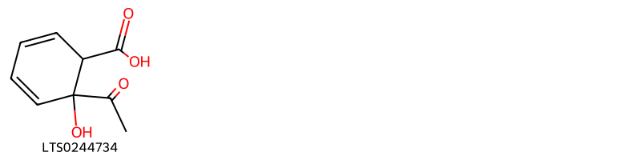{ width=100% }
    <figcaption>Hình ảnh cấu trúc hóa học của 1 hoạt chất thuộc nhóm Keto acids and derivatives gồm ['6-acetyl-6-hydroxycyclohexa-2,4-diene-1-carboxylic acid (LTS0244734)'].</figcaption>
</figure>
#### Nhóm Lactones
<figure markdown="span">
    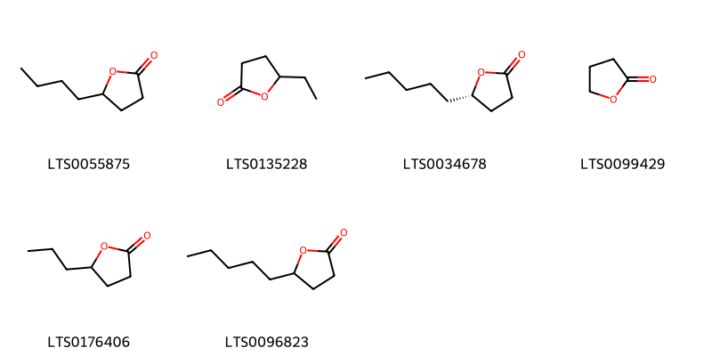{ width=100% }
    <figcaption>Hình ảnh cấu trúc hóa học của 6 hoạt chất thuộc nhóm Lactones gồm ['γ-octalactone (LTS0055875)', 'gamma-hexalactone (LTS0135228)', 'aldehyde c-18 (LTS0034678)', '4-butyrolactone (LTS0099429)', 'γ-heptalactone (LTS0176406)', 'gamma-nonalactone (LTS0096823)'].</figcaption>
</figure>
#### Nhóm Linear 1_3-diarylpropanoids
<figure markdown="span">
    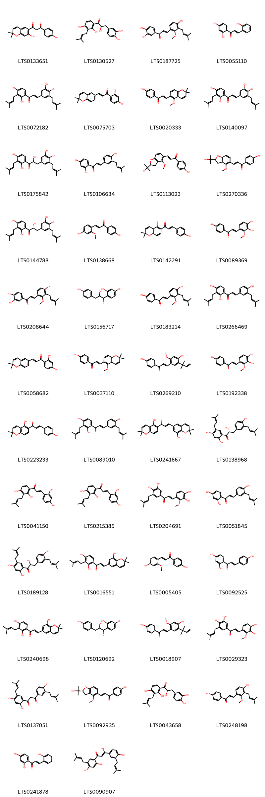{ width=100% }
    <figcaption>Hình ảnh cấu trúc hóa học của Không tìm thấy chú thích hoạt chất thuộc nhóm Linear 1_3-diarylpropanoids gồm Không tìm thấy chú thích.</figcaption>
</figure>
#### Nhóm Organooxygen compounds
<figure markdown="span">
    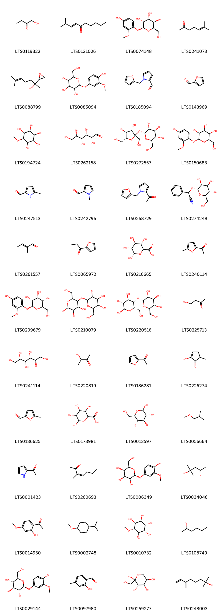{ width=100% }
    <figcaption>Hình ảnh cấu trúc hóa học của 44 hoạt chất thuộc nhóm Organooxygen compounds gồm ['1-hydroxy-2-butanone (LTS0119822)', '2-methyldec-3-en-5-one (LTS0121026)', '(2s,3r,4s,5r,6r)-2-(4-hydroxy-2-methoxyphenoxy)-6-(hydroxymethyl)oxane-3,4,5-triol (LTS0074148)', '6-methyl-5-hepten-2-one (LTS0241073)', 'linalool dihydroepoxide (LTS0088799)', '2-(4-hydroxy-3-methoxyphenoxy)-6-(hydroxymethyl)oxane-3,4,5-triol (LTS0085094)', '1-(furan-2-ylmethyl)pyrrole-2-carbaldehyde (LTS0185094)', 'bran oil (LTS0143969)', 'pinitol (LTS0194724)', '(+)-glucose (LTS0262158)', 'sucrose (LTS0272557)', '2-(4-hydroxy-2-methoxyphenoxy)-6-(hydroxymethyl)oxane-3,4,5-triol (LTS0150683)', '5-methyl-2-formylpyrrole (LTS0247513)', '1-methylpyrrole-2-carbaldehyde (LTS0242796)', '1-[1-(furan-2-ylmethyl)pyrrol-2-yl]ethanone (LTS0268729)', '(2r)-2-phenyl-2-{[(2s,3s,4s,5s,6r)-3,4,5-trihydroxy-6-(hydroxymethyl)oxan-2-yl]oxy}acetonitrile (LTS0274248)', 'trans-2-methyl-2-butenal (LTS0261557)', '1-propanone, 1-(2-furanyl)- (LTS0065972)', 'glucuronic acid (LTS0216665)', '2-acetyl-5-methylfuran (LTS0240114)', '(2s,3r,4s,5s,6r)-2-(4-hydroxy-2-methoxyphenoxy)-6-(hydroxymethyl)oxane-3,4,5-triol (LTS0209679)', 'starch (LTS0210079)', '(2r,3r,4r,5s,6s)-6-(hydroxymethyl)-5-{[(2r,3r,4s,5r,6r)-3,4,5-trihydroxy-6-(hydroxymethyl)oxan-2-yl]oxy}oxane-2,3,4-triol (LTS0220516)', '4-hydroxy-2-butanone (LTS0225713)', 'keto-d-fructose (LTS0241114)', 'acetoin (LTS0220819)', 'acetylfuran (LTS0186281)', '2-hydroxy-5-methylcyclopent-2-en-1-one (LTS0226274)', '5-methylfurfural (LTS0186625)', 'galacturonic acid (LTS0178981)', 'glucose (LTS0013597)', 'methyl isobutyl ether (LTS0056664)', '2-acetylpyrrole (LTS0001423)', '3-methylhept-3-en-2-one (LTS0260693)', '(2s,3s,4s,5r,6r)-2-(4-hydroxy-3-methoxyphenoxy)-6-(hydroxymethyl)oxane-3,4,5-triol (LTS0006349)', 'diacetone alcohol (LTS0034046)', 'paeonol (LTS0014950)', '1-isopropyl-4-methoxycyclohexane (LTS0002748)', 'pinit (LTS0010732)', 'hexanone (LTS0108749)', '(2s,3r,4s,5s,6r)-2-(4-hydroxy-3-methoxyphenoxy)-6-(hydroxymethyl)oxane-3,4,5-triol (LTS0029144)', '2-hydroxy-4-methylbenzaldehyde (LTS0097980)', 'd-fructopyranose (LTS0259277)', 'myrcenol (LTS0248003)'].</figcaption>
</figure>
#### Nhóm Phenol ethers
<figure markdown="span">
    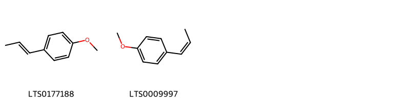{ width=100% }
    <figcaption>Hình ảnh cấu trúc hóa học của 2 hoạt chất thuộc nhóm Phenol ethers gồm ['p-propenylanisole (LTS0177188)', '(e)-anethole (LTS0009997)'].</figcaption>
</figure>
#### Nhóm Phenols
<figure markdown="span">
    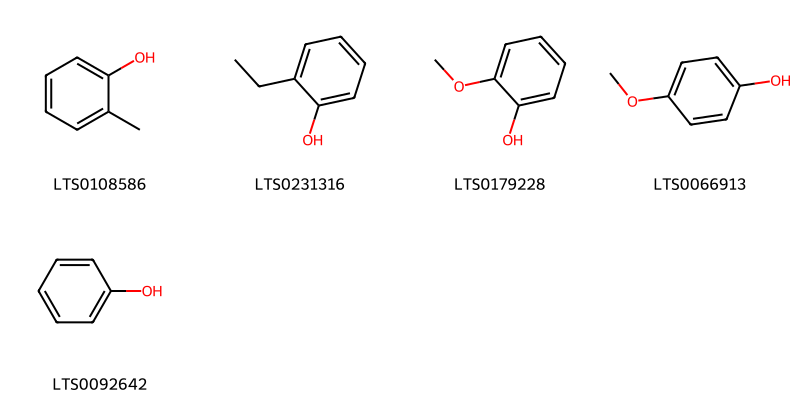{ width=100% }
    <figcaption>Hình ảnh cấu trúc hóa học của 5 hoạt chất thuộc nhóm Phenols gồm ['o-cresol (LTS0108586)', '2-ethylphenol (LTS0231316)', 'guaiacol (LTS0179228)', 'methoxyphenol (LTS0066913)', 'phenol (LTS0092642)'].</figcaption>
</figure>
#### Nhóm Phenylpropanoic acids
<figure markdown="span">
    { width=100% }
    <figcaption>Hình ảnh cấu trúc hóa học của 2 hoạt chất thuộc nhóm Phenylpropanoic acids gồm ['3-phenylpropionic acid (LTS0121890)', '2-phenylpropionic acid (LTS0122325)'].</figcaption>
</figure>
#### Nhóm Prenol lipids
<figure markdown="span">
    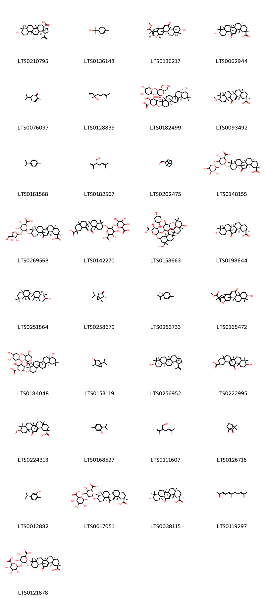{ width=100% }
    <figcaption>Hình ảnh cấu trúc hóa học của 33 hoạt chất thuộc nhóm Prenol lipids gồm ['betulinic acid (LTS0210795)', 'terpineol (LTS0136148)', 'methyl (1r,3s,4r,7s,9s,12s,13r,17s,19r,20r,22s)-9-hydroxy-3,4,8,8,12,19,22-heptamethyl-14-oxo-23-oxahexacyclo[18.2.1.0³,¹⁶.0⁴,¹³.0⁷,¹².0¹⁷,²²]tricos-15-ene-19-carboxylate (LTS0136217)', '(2s,4as,6as,6br,8ar,10s,12as,12br,14bs)-10-hydroxy-2,4a,6a,6b,9,9,12a-heptamethyl-13-oxo-3,4,5,6,7,8,8a,10,11,12,12b,14b-dodecahydro-1h-picene-2-carboxylic acid (LTS0062944)', '5-isopropyl-2-methylcyclohex-2-en-1-one (LTS0076097)', 'linalool, (+-)- (LTS0128839)', 'soyasaponin i (LTS0182499)', '(2r,4ar,6as,6br,8ar,10s,12ar,12bs,14bs)-10-methoxy-2,4a,6a,6b,9,9,12a-heptamethyl-13-oxo-3,4,5,6,7,8,8a,10,11,12,12b,14b-dodecahydro-1h-picene-2-carboxylic acid (LTS0093492)', 'cymene (LTS0181568)', '(-)-lavandulol (LTS0182567)', 'myrtenal (LTS0202475)', '(2s,3s,4s,5r,6s)-6-{[(3s,4ar,6ar,6bs,8as,11s,12ar,14ar,14bs)-11-carboxy-4,4,6a,6b,8a,11,14b-heptamethyl-14-oxo-2,3,4a,5,6,7,8,9,10,12,12a,14a-dodecahydro-1h-picen-3-yl]oxy}-3,4-dihydroxy-5-{[(2s,3r,4s,5s)-3,4,5-trihydroxyoxan-2-yl]oxy}oxane-2-carboxylic acid (LTS0148155)', '(2s,3s,4s,5r,6s)-6-{[(3s,4ar,6ar,6bs,8as,11s,12ar,14ar,14bs)-11-carboxy-4,4,6a,6b,8a,11,14b-heptamethyl-14-oxo-2,3,4a,5,6,7,8,9,10,12,12a,14a-dodecahydro-1h-picen-3-yl]oxy}-5-{[(2s,3r,4r)-3,4-dihydroxy-4-(hydroxymethyl)oxolan-2-yl]oxy}-3,4-dihydroxyoxane-2-carboxylic acid (LTS0269568)', 'liquorice (LTS0142270)', '(2s,4s,5r,6r)-5-{[(2s,3r,4s,5r,6r)-3-{[(2s,3r,5r,6s)-3,5-dihydroxy-6-methyloxan-2-yl]oxy}-4,5-dihydroxy-6-(hydroxymethyl)oxan-2-yl]oxy}-3,4-dihydroxy-6-{[9-hydroxy-4-(hydroxymethyl)-4,6a,6b,8a,11,11,14b-heptamethyl-1,2,3,4a,5,6,7,8,9,10,12,12a,14,14a-tetradecahydropicen-2-yl]oxy}oxane-2-carboxylic acid (LTS0158663)', 'glycyrrhetinic acid (LTS0198644)', 'β-amyrin (LTS0251864)', '(1r,4r,5s)-thujan-3-one (LTS0258679)', '4-terpineol (LTS0253733)', 'methyl 9-hydroxy-3,4,8,8,12,19,22-heptamethyl-14-oxo-23-oxahexacyclo[18.2.1.0³,¹⁶.0⁴,¹³.0⁷,¹².0¹⁷,²²]tricos-15-ene-19-carboxylate (LTS0165472)', 'soyasaponin ii (LTS0184048)', '3-isothujone (LTS0158119)', 'lupeol (LTS0256952)', 'enoxolone (LTS0222995)', '10-methoxy-2,4a,6a,6b,9,9,12a-heptamethyl-13-oxo-3,4,5,6,7,8,8a,10,11,12,12b,14b-dodecahydro-1h-picene-2-carboxylic acid (LTS0224313)', 'thymol (LTS0168527)', 'lavandulol (LTS0111607)', 'fenchone (LTS0126716)', 'carvacrol (LTS0012882)', '(2s,3s,4s,5r,6s)-6-{[(3s,4ar,6ar,6bs,8as,11s,12as,14ar,14bs)-11-carboxy-4,4,6a,6b,8a,11,14b-heptamethyl-14-oxo-2,3,4a,5,6,7,8,9,10,12,12a,14a-dodecahydro-1h-picen-3-yl]oxy}-5-{[(2r,3r,4s,5s,6s)-6-carboxy-3,4,5-trihydroxyoxan-2-yl]oxy}-3,4-dihydroxyoxane-2-carboxylic acid (LTS0017051)', '(2r,4ar,6ar,6bs,10r,12ar,14bs)-10-hydroxy-2,4a,6a,6b,9,9,12a-heptamethyl-13-oxo-3,4,5,6,7,8,8a,10,11,12,12b,14b-dodecahydro-1h-picene-2-carboxylic acid (LTS0038115)', 'pseudoionone (LTS0119297)', 'glycyrrhizin (LTS0121878)'].</figcaption>
</figure>
#### Nhóm Pyrans
<figure markdown="span">
    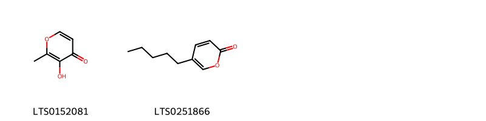{ width=100% }
    <figcaption>Hình ảnh cấu trúc hóa học của 2 hoạt chất thuộc nhóm Pyrans gồm ['talmon (LTS0152081)', '5-pentylpyran-2-one (LTS0251866)'].</figcaption>
</figure>
#### Nhóm Pyridines and derivatives
<figure markdown="span">
    { width=100% }
    <figcaption>Hình ảnh cấu trúc hóa học của 1 hoạt chất thuộc nhóm Pyridines and derivatives gồm ['niacin (LTS0216673)'].</figcaption>
</figure>
#### Nhóm Pyrrolidines
<figure markdown="span">
    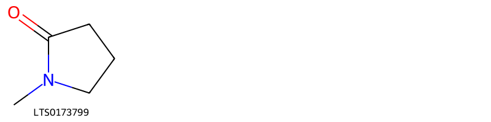{ width=100% }
    <figcaption>Hình ảnh cấu trúc hóa học của 1 hoạt chất thuộc nhóm Pyrrolidines gồm ['methylpyrrolidone (LTS0173799)'].</figcaption>
</figure>
#### Nhóm Saccharolipids
<figure markdown="span">
    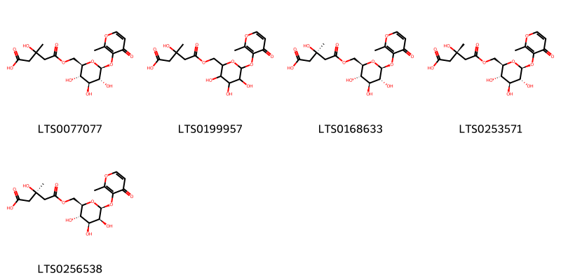{ width=100% }
    <figcaption>Hình ảnh cấu trúc hóa học của 5 hoạt chất thuộc nhóm Saccharolipids gồm ['3-hydroxy-3-methyl-5-oxo-5-{[(2r,3s,4s,5r,6s)-3,4,5-trihydroxy-6-[(2-methyl-4-oxopyran-3-yl)oxy]oxan-2-yl]methoxy}pentanoic acid (LTS0077077)', '3-hydroxy-3-methyl-5-oxo-5-({3,4,5-trihydroxy-6-[(2-methyl-4-oxopyran-3-yl)oxy]oxan-2-yl}methoxy)pentanoic acid (LTS0199957)', '(3r)-3-hydroxy-3-methyl-5-oxo-5-{[(2r,3s,4s,5r,6s)-3,4,5-trihydroxy-6-[(2-methyl-4-oxopyran-3-yl)oxy]oxan-2-yl]methoxy}pentanoic acid (LTS0168633)', '(3s)-3-hydroxy-3-methyl-5-oxo-5-{[(2r,3s,4s,5r,6s)-3,4,5-trihydroxy-6-[(2-methyl-4-oxopyran-3-yl)oxy]oxan-2-yl]methoxy}pentanoic acid (LTS0253571)', '(3r)-3-hydroxy-3-methyl-5-oxo-5-{[(2r,3s,4s,5s,6s)-3,4,5-trihydroxy-6-[(2-methyl-4-oxopyran-3-yl)oxy]oxan-2-yl]methoxy}pentanoic acid (LTS0256538)'].</figcaption>
</figure>
#### Nhóm Saturated hydrocarbons
<figure markdown="span">
    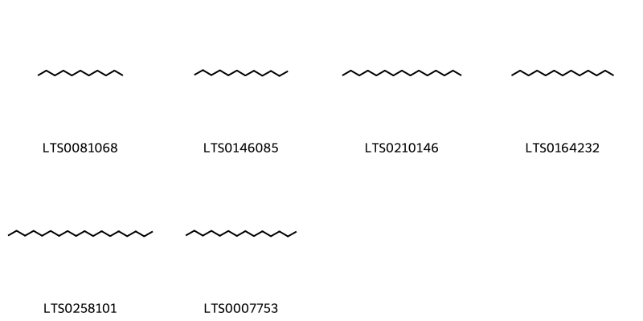{ width=100% }
    <figcaption>Hình ảnh cấu trúc hóa học của 6 hoạt chất thuộc nhóm Saturated hydrocarbons gồm ['undecane (LTS0081068)', 'dodecane (LTS0146085)', 'pentadecane (LTS0210146)', 'tridecane (LTS0164232)', 'octadecane (LTS0258101)', 'tetradecane (LTS0007753)'].</figcaption>
</figure>
#### Nhóm Steroids and steroid derivatives
<figure markdown="span">
    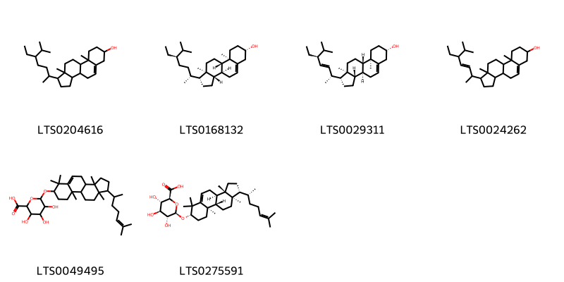{ width=100% }
    <figcaption>Hình ảnh cấu trúc hóa học của 6 hoạt chất thuộc nhóm Steroids and steroid derivatives gồm ['stigmast-5-en-3-ol, (3β)- (LTS0204616)', 'sitosterol (LTS0168132)', 'phytosterol (LTS0029311)', 'stigmasterol (LTS0024262)', '6-{[3a,6,6,9a,11a-pentamethyl-1-(6-methylhept-5-en-2-yl)-1h,2h,3h,3bh,4h,7h,8h,9h,9bh,10h,11h-cyclopenta[a]phenanthren-7-yl]oxy}-3,4,5-trihydroxyoxane-2-carboxylic acid (LTS0049495)', '(2s,3s,4s,5r,6r)-6-{[(1r,3as,3br,7s,9ar,9bs,11ar)-3a,6,6,9a,11a-pentamethyl-1-[(2r)-6-methylhept-5-en-2-yl]-1h,2h,3h,3bh,4h,7h,8h,9h,9bh,10h,11h-cyclopenta[a]phenanthren-7-yl]oxy}-3,4,5-trihydroxyoxane-2-carboxylic acid (LTS0275591)'].</figcaption>
</figure>
#### Nhóm Stilbenes
<figure markdown="span">
    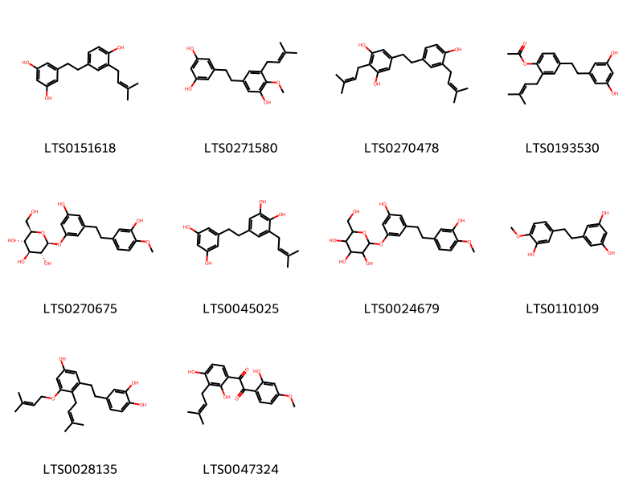{ width=100% }
    <figcaption>Hình ảnh cấu trúc hóa học của 10 hoạt chất thuộc nhóm Stilbenes gồm ['5-{2-[4-hydroxy-3-(3-methylbut-2-en-1-yl)phenyl]ethyl}benzene-1,3-diol (LTS0151618)', '5-{2-[3-hydroxy-4-methoxy-5-(3-methylbut-2-en-1-yl)phenyl]ethyl}benzene-1,3-diol (LTS0271580)', '5-{2-[4-hydroxy-3-(3-methylbut-2-en-1-yl)phenyl]ethyl}-2-(3-methylbut-2-en-1-yl)benzene-1,3-diol (LTS0270478)', '4-[2-(3,5-dihydroxyphenyl)ethyl]-2-(3-methylbut-2-en-1-yl)phenyl acetate (LTS0193530)', '(2s,3r,4s,5s,6r)-2-{3-hydroxy-5-[2-(3-hydroxy-4-methoxyphenyl)ethyl]phenoxy}-6-(hydroxymethyl)oxane-3,4,5-triol (LTS0270675)', '5-[2-(3,5-dihydroxyphenyl)ethyl]-3-(3-methylbut-2-en-1-yl)benzene-1,2-diol (LTS0045025)', '2-{3-hydroxy-5-[2-(3-hydroxy-4-methoxyphenyl)ethyl]phenoxy}-6-(hydroxymethyl)oxane-3,4,5-triol (LTS0024679)', '5-[2-(3-hydroxy-4-methoxyphenyl)ethyl]benzene-1,3-diol (LTS0110109)', '4-{2-[5-hydroxy-2-(3-methylbut-2-en-1-yl)-3-[(3-methylbut-2-en-1-yl)oxy]phenyl]ethyl}benzene-1,2-diol (LTS0028135)', '1-[2,4-dihydroxy-3-(3-methylbut-2-en-1-yl)phenyl]-2-(2-hydroxy-4-methoxyphenyl)ethane-1,2-dione (LTS0047324)'].</figcaption>
</figure>
#### Nhóm Unsaturated hydrocarbons
<figure markdown="span">
    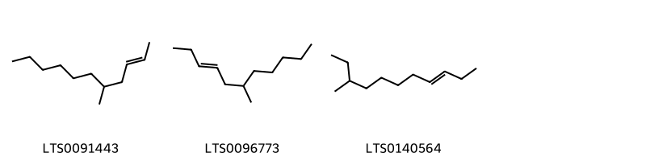{ width=100% }
    <figcaption>Hình ảnh cấu trúc hóa học của 3 hoạt chất thuộc nhóm Unsaturated hydrocarbons gồm ['5-methylundec-2-ene (LTS0091443)', '6-methylundec-3-ene (LTS0096773)', '9-methylundec-3-ene (LTS0140564)'].</figcaption>
</figure>

---

### Dược dân tộc học

Danh sách các quốc gia có sử dụng *Glycyrrhiza glabra* trong điều trị các bệnh. 

| Country   | Disease                                                 | Bệnh                                                                                                                                                                                                |
|:----------|:--------------------------------------------------------|:----------------------------------------------------------------------------------------------------------------------------------------------------------------------------------------------------|
| China     | Antidote, Expectorant, Tonic, Diuretic                  | MYMEMORY WARNING: YOU USED ALL AVAILABLE FREE TRANSLATIONS FOR TODAY. NEXT AVAILABLE IN  15 HOURS 54 MINUTES 02 SECONDS VISIT HTTPS://MYMEMORY.TRANSLATED.NET/DOC/USAGELIMITS.PHP TO TRANSLATE MORE |
| Elsewhere | Demulcent, Deodorant, Expectorant, Laxative             | MYMEMORY WARNING: YOU USED ALL AVAILABLE FREE TRANSLATIONS FOR TODAY. NEXT AVAILABLE IN  15 HOURS 54 MINUTES 00 SECONDS VISIT HTTPS://MYMEMORY.TRANSLATED.NET/DOC/USAGELIMITS.PHP TO TRANSLATE MORE |
| India     | nan, Fungicide                                          | MYMEMORY WARNING: YOU USED ALL AVAILABLE FREE TRANSLATIONS FOR TODAY. NEXT AVAILABLE IN  15 HOURS 53 MINUTES 57 SECONDS VISIT HTTPS://MYMEMORY.TRANSLATED.NET/DOC/USAGELIMITS.PHP TO TRANSLATE MORE |
| Japan*    | Antidote, Demulcent, Expectorant, Antitussive           | MYMEMORY WARNING: YOU USED ALL AVAILABLE FREE TRANSLATIONS FOR TODAY. NEXT AVAILABLE IN  15 HOURS 53 MINUTES 55 SECONDS VISIT HTTPS://MYMEMORY.TRANSLATED.NET/DOC/USAGELIMITS.PHP TO TRANSLATE MORE |
| Turkey    | Alexiteric, Demulcent, Diuretic, Emollient, Expectorant | MYMEMORY WARNING: YOU USED ALL AVAILABLE FREE TRANSLATIONS FOR TODAY. NEXT AVAILABLE IN  15 HOURS 53 MINUTES 52 SECONDS VISIT HTTPS://MYMEMORY.TRANSLATED.NET/DOC/USAGELIMITS.PHP TO TRANSLATE MORE |

---

---
## Glycyrrhiza lepidota
### Thông tin về thực vật

!!! info "Phân loại thực vật của *Glycyrrhiza lepidota* từ GIBF:"
    - **Kingdom:** Plantae
    - **Phylum:** Tracheophyta
    - **Order:** Fabales
    - **Family:** Fabaceae
    - **Genus:** Glycyrrhiza
    - **Species:** *Glycyrrhiza lepidota*

 

| Label (VI)   | Label (EN)   | Scientific Name      | Descriptions (VI)   | Descriptions (EN)   | Also Known As (VI)   | Also Known As (EN)                        |
|:-------------|:-------------|:---------------------|:--------------------|:--------------------|:---------------------|:------------------------------------------|
| N/A          | N/A          | Glycyrrhiza lepidota | loài thực vật       | species of plant    | ['']                 | ['Glycyrrhiza lepidota', 'wild licorice'] |

#### Phân bố trên thế giới

**Từ CSDL GIBF** United States of America, Canada

#### Phân bố tại Việt Nam

**Từ CSDL GIBF**: Không có ghi nhận ở Việt Nam

---
### Thành phần hóa học
        
- Theo cơ sở dữ liệu lotus: Từ loài *Glycyrrhiza lepidota* đã phân lập và xác định được 14 hoạt chất thuộc về các nhóm Flavonoids, Stilbenes. 

|    | chemicalTaxonomyClassyfireClass   |   smiles_count |
|---:|:----------------------------------|---------------:|
|  0 | Flavonoids                        |             10 |
|  1 | Stilbenes                         |              4 |

#### Nhóm Flavonoids
<figure markdown="span">
    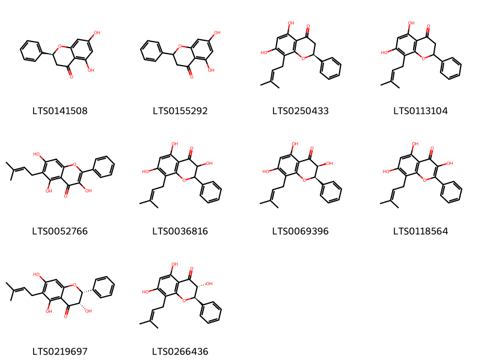{ width=100% }
    <figcaption>Hình ảnh cấu trúc hóa học của 10 hoạt chất thuộc nhóm Flavonoids gồm ['pinocembrine (LTS0141508)', 'pinocembrin (LTS0155292)', 'glabranin (LTS0250433)', '5,7-dihydroxy-8-(3-methylbut-2-en-1-yl)-2-phenyl-2,3-dihydro-1-benzopyran-4-one (LTS0113104)', '6-(3,3-dma)galangin (LTS0052766)', '3,5,7-trihydroxy-8-(3-methylbut-2-en-1-yl)-2-phenyl-2,3-dihydro-1-benzopyran-4-one (LTS0036816)', '(2r,3s)-3,5,7-trihydroxy-8-(3-methylbut-2-en-1-yl)-2-phenyl-2,3-dihydro-1-benzopyran-4-one (LTS0069396)', 'glepidotin a (LTS0118564)', '(2r,3s)-3,5,7-trihydroxy-6-(3-methylbut-2-en-1-yl)-2-phenyl-2,3-dihydro-1-benzopyran-4-one (LTS0219697)', 'glepidotin b (LTS0266436)'].</figcaption>
</figure>
#### Nhóm Stilbenes
<figure markdown="span">
    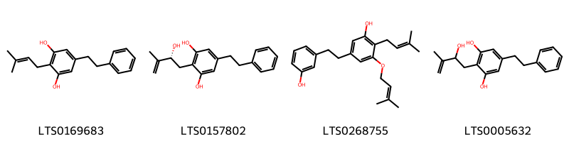{ width=100% }
    <figcaption>Hình ảnh cấu trúc hóa học của 4 hoạt chất thuộc nhóm Stilbenes gồm ['4-prenyldihydropinosylvin (LTS0169683)', '2-[(2r)-2-hydroxy-3-methylbut-3-en-1-yl]-5-(2-phenylethyl)benzene-1,3-diol (LTS0157802)', '5-[2-(3-hydroxyphenyl)ethyl]-2-(3-methylbut-2-en-1-yl)-3-[(3-methylbut-2-en-1-yl)oxy]phenol (LTS0268755)', 'glepidotin c (LTS0005632)'].</figcaption>
</figure>

---

### Dược dân tộc học

Danh sách các quốc gia có sử dụng *Glycyrrhiza lepidota* trong điều trị các bệnh. 

| Country       | Disease                  | Bệnh                                                                                                                                                                                                |
|:--------------|:-------------------------|:----------------------------------------------------------------------------------------------------------------------------------------------------------------------------------------------------|
| US            | Emmenagogue, Expectorant | MYMEMORY WARNING: YOU USED ALL AVAILABLE FREE TRANSLATIONS FOR TODAY. NEXT AVAILABLE IN  15 HOURS 53 MINUTES 11 SECONDS VISIT HTTPS://MYMEMORY.TRANSLATED.NET/DOC/USAGELIMITS.PHP TO TRANSLATE MORE |
| US(Blackfoot) | Poultice                 | MYMEMORY WARNING: YOU USED ALL AVAILABLE FREE TRANSLATIONS FOR TODAY. NEXT AVAILABLE IN  15 HOURS 53 MINUTES 08 SECONDS VISIT HTTPS://MYMEMORY.TRANSLATED.NET/DOC/USAGELIMITS.PHP TO TRANSLATE MORE |

---

---
## Glycyrrhiza ralensis
### Thông tin về thực vật

!!! info "Phân loại thực vật của *N/A* từ GIBF:"
    - **Kingdom:** Plantae
    - **Phylum:** Tracheophyta
    - **Order:** Fabales
    - **Family:** Fabaceae
    - **Genus:** Glycyrrhiza
    - **Species:** *N/A*

 

| Label (VI)   | Label (EN)   | Scientific Name      | Descriptions (VI)   | Descriptions (EN)   | Also Known As (VI)   | Also Known As (EN)                        |
|:-------------|:-------------|:---------------------|:--------------------|:--------------------|:---------------------|:------------------------------------------|
| N/A          | N/A          | Glycyrrhiza lepidota | loài thực vật       | species of plant    | ['']                 | ['Glycyrrhiza lepidota', 'wild licorice'] |

#### Phân bố trên thế giới

**Từ CSDL GIBF** nan, Italy, Australia, Argentina, Israel, Canada, Ukraine, Spain, Azerbaijan, Hungary, Türkiye, Russian Federation, United States of America, Kazakhstan, Greece, Uzbekistan, Romania, Iran (Islamic Republic of), Serbia, Mongolia

#### Phân bố tại Việt Nam

**Từ CSDL GIBF**: Không có ghi nhận ở Việt Nam

---
### Thành phần hóa học
        
- Theo cơ sở dữ liệu lotus: Từ loài *N/A* đã phân lập và xác định được Chưa có hoạt chất nào được phân lập. hoạt chất thuộc về các nhóm Không có hoạt chất nào được phân lập. 

Không có hình ảnh nào được tạo ra

---

### Dược dân tộc học

Danh sách các quốc gia có sử dụng *N/A* trong điều trị các bệnh. 

| Country   | Disease   | Bệnh                                                                                                                                                                                                |
|:----------|:----------|:----------------------------------------------------------------------------------------------------------------------------------------------------------------------------------------------------|
| China     | Emollient | MYMEMORY WARNING: YOU USED ALL AVAILABLE FREE TRANSLATIONS FOR TODAY. NEXT AVAILABLE IN  15 HOURS 52 MINUTES 44 SECONDS VISIT HTTPS://MYMEMORY.TRANSLATED.NET/DOC/USAGELIMITS.PHP TO TRANSLATE MORE |

---

---
## Glycyrrhiza uralensis
### Thông tin về thực vật

!!! info "Phân loại thực vật của *Glycyrrhiza uralensis* từ GIBF:"
    - **Kingdom:** Plantae
    - **Phylum:** Tracheophyta
    - **Order:** Fabales
    - **Family:** Fabaceae
    - **Genus:** Glycyrrhiza
    - **Species:** *Glycyrrhiza uralensis*

 

| Label (VI)   | Label (EN)   | Scientific Name       | Descriptions (VI)   | Descriptions (EN)   | Also Known As (VI)        | Also Known As (EN)   |
|:-------------|:-------------|:----------------------|:--------------------|:--------------------|:--------------------------|:---------------------|
| N/A          | N/A          | Glycyrrhiza uralensis | loài thực vật       | species of plant    | ['Glycyrrhiza uralensis'] | ['']                 |

#### Phân bố trên thế giới

**Từ CSDL GIBF** Kyrgyzstan, Russian Federation, Kazakhstan, Mongolia, China

#### Phân bố tại Việt Nam

**Từ CSDL GIBF**: Không có ghi nhận ở Việt Nam

---
### Thành phần hóa học
        
- Theo cơ sở dữ liệu lotus: Từ loài *Glycyrrhiza uralensis* đã phân lập và xác định được 258 hoạt chất thuộc về các nhóm Flavonoids, Prenol lipids, Indoles and derivatives, Isoflavonoids, Linear 1,3-diarylpropanoids, Phenanthrenes and derivatives, Diarylheptanoids, Benzene and substituted derivatives, 2-arylbenzofuran flavonoids, Aurone flavonoids, Stilbenes, Organooxygen compounds, Coumarins and derivatives, Isobenzofurans. 

|    | chemicalTaxonomyClassyfireClass     |   smiles_count |
|---:|:------------------------------------|---------------:|
|  0 | 2-arylbenzofuran flavonoids         |              4 |
|  1 | Aurone flavonoids                   |              1 |
|  2 | Benzene and substituted derivatives |              1 |
|  3 | Coumarins and derivatives           |              3 |
|  4 | Diarylheptanoids                    |              3 |
|  5 | Flavonoids                          |             61 |
|  6 | Indoles and derivatives             |              1 |
|  7 | Isobenzofurans                      |              1 |
|  8 | Isoflavonoids                       |            122 |
|  9 | Linear 1,3-diarylpropanoids         |             12 |
| 10 | Organooxygen compounds              |              1 |
| 11 | Phenanthrenes and derivatives       |              2 |
| 12 | Prenol lipids                       |             38 |
| 13 | Stilbenes                           |              7 |

#### Nhóm 2-arylbenzofuran flavonoids
<figure markdown="span">
    { width=100% }
    <figcaption>Hình ảnh cấu trúc hóa học của 4 hoạt chất thuộc nhóm 2-arylbenzofuran flavonoids gồm ['licocoumarone (LTS0132019)', '4-{8-methoxy-12,12-dimethyl-4,13-dioxatricyclo[7.4.0.0³,⁷]trideca-1(9),2,5,7-tetraen-5-yl}benzene-1,3-diol (LTS0046327)', 'gancaonin i (LTS0174681)', '4-(6-hydroxy-3-methyl-1-benzofuran-2-yl)-5-methoxy-6-(3-methylbut-2-en-1-yl)benzene-1,3-diol (LTS0012072)'].</figcaption>
</figure>
#### Nhóm Aurone flavonoids
<figure markdown="span">
    { width=100% }
    <figcaption>Hình ảnh cấu trúc hóa học của 1 hoạt chất thuộc nhóm Aurone flavonoids gồm ['carpusin (LTS0005127)'].</figcaption>
</figure>
#### Nhóm Benzene and substituted derivatives
<figure markdown="span">
    { width=100% }
    <figcaption>Hình ảnh cấu trúc hóa học của 1 hoạt chất thuộc nhóm Benzene and substituted derivatives gồm ['p-hydroxybenzoic acid (LTS0263634)'].</figcaption>
</figure>
#### Nhóm Coumarins and derivatives
<figure markdown="span">
    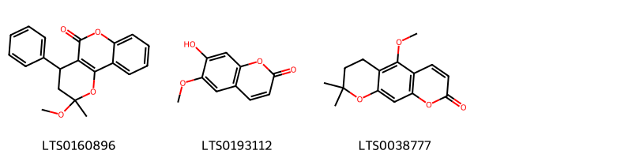{ width=100% }
    <figcaption>Hình ảnh cấu trúc hóa học của 3 hoạt chất thuộc nhóm Coumarins and derivatives gồm ['cyclocumarol (LTS0160896)', 'scopoletin (LTS0193112)', '5-methoxy-8,8-dimethyl-6h,7h-pyrano[3,2-g]chromen-2-one (LTS0038777)'].</figcaption>
</figure>
#### Nhóm Diarylheptanoids
<figure markdown="span">
    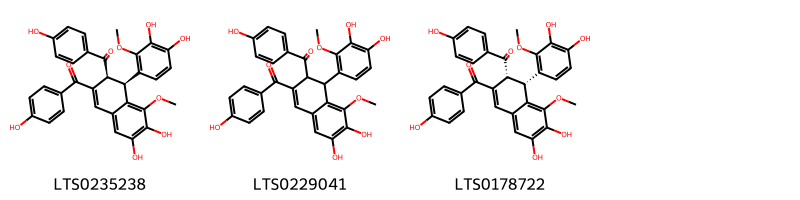{ width=100% }
    <figcaption>Hình ảnh cấu trúc hóa học của 3 hoạt chất thuộc nhóm Diarylheptanoids gồm ['(7s,8s)-8-(3,4-dihydroxy-2-methoxyphenyl)-6,7-bis(4-hydroxybenzoyl)-1-methoxy-7,8-dihydronaphthalene-2,3-diol (LTS0235238)', '8-(3,4-dihydroxy-2-methoxyphenyl)-6,7-bis(4-hydroxybenzoyl)-1-methoxy-7,8-dihydronaphthalene-2,3-diol (LTS0229041)', '(7r,8r)-8-(3,4-dihydroxy-2-methoxyphenyl)-6,7-bis(4-hydroxybenzoyl)-1-methoxy-7,8-dihydronaphthalene-2,3-diol (LTS0178722)'].</figcaption>
</figure>
#### Nhóm Flavonoids
<figure markdown="span">
    { width=100% }
    <figcaption>Hình ảnh cấu trúc hóa học của 61 hoạt chất thuộc nhóm Flavonoids gồm ['schaftoside (LTS0104338)', '2-(3,4-dihydroxyphenyl)-5,7-dihydroxy-3-{[(2s,3r,4r,5r,6s)-3,4,5-trihydroxy-6-(hydroxymethyl)oxan-2-yl]oxy}chromen-4-one (LTS0241372)', 'astragalin (LTS0249588)', '5,7-dihydroxy-2-(4-hydroxyphenyl)-6-[(3r,4r,5s,6r)-3,4,5-trihydroxy-6-(hydroxymethyl)oxan-2-yl]-8-[(2s,3r,4s,5s)-3,4,5-trihydroxyoxan-2-yl]chromen-4-one (LTS0158548)', 'licoflavone a (LTS0004664)', '3-rutinosyl quercetin (LTS0032845)', 'vicenin 2 (LTS0181160)', '5-deoxyflavanone (LTS0251224)', 'licuroside (LTS0132318)', 'liquiritin (LTS0103894)', "7,4'-dihydroxyflavanone (LTS0155090)", 'pinocembrine (LTS0141508)', 'liquiritin (LTS0213422)', '7-hydroxy-2-(4-{[3,4,5-trihydroxy-6-(hydroxymethyl)oxan-2-yl]oxy}phenyl)-2,3-dihydro-1-benzopyran-4-one (LTS0216345)', 'liquiritin apioside (LTS0188438)', 'isoliquiritin (LTS0051422)', '1-(2,4-dihydroxyphenyl)-3-(4-{[3,4,5-trihydroxy-6-(hydroxymethyl)oxan-2-yl]oxy}phenyl)prop-2-en-1-one (LTS0113391)', 'glycyrrhiza flavonol a (LTS0086210)', 'pinocembrin (LTS0155292)', 'licoflavonol (LTS0219719)', '(-)-naringenin (LTS0072900)', 'isolicoflavonol (LTS0264727)', 'kumatakenin (LTS0018267)', 'glabranin (LTS0250433)', "7,4'-dihydroxyflavone (LTS0260159)", 'asahina (LTS0068303)', 'neoliquiritin (LTS0089772)', '2-(3,4-dihydroxyphenyl)-5,7-dihydroxy-3-{[3,4,5-trihydroxy-6-(hydroxymethyl)oxan-2-yl]oxy}chromen-4-one (LTS0195312)', 'sophoraflavanone b (LTS0099349)', 'isoquercetin (LTS0254337)', 'trifolin (LTS0267055)', 'galangin (LTS0210648)', 'topazolin (LTS0219642)', 'yinyanghuo d (LTS0063487)', 'sophoraflavanone b (LTS0058527)', 'sigmoidin b (LTS0120052)', "3,7,3',4'-tetrahydroxyflavone (LTS0179244)", 'chrysoeriol (LTS0095766)', '{5-[(2-{4-[(1e)-3-(2,4-dihydroxyphenyl)-3-oxoprop-1-en-1-yl]phenoxy}-4,5-dihydroxy-6-(hydroxymethyl)oxan-3-yl)oxy]-3,4-dihydroxyoxolan-3-yl}methyl (2e)-3-(4-hydroxyphenyl)prop-2-enoate (LTS0063556)', '3-{4-[(3-{[3,4-dihydroxy-4-(hydroxymethyl)oxolan-2-yl]oxy}-4,5-dihydroxy-6-(hydroxymethyl)oxan-2-yl)oxy]phenyl}-1-(2,4-dihydroxyphenyl)prop-2-en-1-one (LTS0045681)', '(2s)-2-(3,4-dihydroxyphenyl)-5,7-dihydroxy-6-(3-methylbut-2-en-1-yl)-2,3-dihydro-1-benzopyran-4-one (LTS0188016)', 'chamomile (LTS0104946)', '(2e)-3-(4-{[(2s,3r,4s,5s,6r)-3-{[(2r,3s,4s)-3,4-dihydroxy-4-(hydroxymethyl)oxolan-2-yl]oxy}-4,5-dihydroxy-6-(hydroxymethyl)oxan-2-yl]oxy}phenyl)-1-(2,4-dihydroxyphenyl)prop-2-en-1-one (LTS0094734)', 'licuraside (LTS0190017)', '(2s)-2-(4-{[(2s,3r,4s,5s,6r)-3-{[(2r,3s,4s)-3,4-dihydroxy-4-(hydroxymethyl)oxolan-2-yl]oxy}-4,5-dihydroxy-6-(hydroxymethyl)oxan-2-yl]oxy}phenyl)-7-hydroxy-2,3-dihydro-1-benzopyran-4-one (LTS0144074)', '{5-[(2-{4-[(1e)-3-(2,4-dihydroxyphenyl)-3-oxoprop-1-en-1-yl]phenoxy}-4,5-dihydroxy-6-(hydroxymethyl)oxan-3-yl)oxy]-3,4-dihydroxyoxolan-3-yl}methyl (2e)-3-(4-hydroxy-3-methoxyphenyl)prop-2-enoate (LTS0205711)', '(2s)-2-[3,4-dihydroxy-5-(3-methylbut-2-en-1-yl)phenyl]-5,7-dihydroxy-8-(3-methylbut-2-en-1-yl)-2,3-dihydro-1-benzopyran-4-one (LTS0161643)', 'gancaonin p (LTS0225351)', '[(3s,4r,5s)-5-{[(2s,3r,4s,5s,6r)-4,5-dihydroxy-2-{4-[(2s)-7-hydroxy-4-oxo-2,3-dihydro-1-benzopyran-2-yl]phenoxy}-6-(hydroxymethyl)oxan-3-yl]oxy}-3,4-dihydroxyoxolan-3-yl]methyl 1h-indole-3-carboxylate (LTS0254177)', 'gancaonin e (LTS0104964)', 'kaempherol (LTS0155822)', '{3,4,5-trihydroxy-6-[4-(7-hydroxy-4-oxo-2,3-dihydro-1-benzopyran-2-yl)phenoxy]oxan-2-yl}methyl acetate (LTS0175206)', '(2e)-3-(4-{[(2s,3r,4s,5s,6r)-3-{[(2s,3r,4r)-3,4-dihydroxy-4-(hydroxymethyl)oxolan-2-yl]oxy}-4,5-dihydroxy-6-(hydroxymethyl)oxan-2-yl]oxy}phenyl)-1-(2,4-dihydroxyphenyl)prop-2-en-1-one (LTS0243414)', '6-prenyleriodictyol (LTS0273031)', '1-{4-[(3-{[3,4-dihydroxy-4-(hydroxymethyl)oxolan-2-yl]oxy}-4,5-dihydroxy-6-(hydroxymethyl)oxan-2-yl)oxy]-2-hydroxyphenyl}-3-(4-hydroxyphenyl)prop-2-en-1-one (LTS0276267)', '2-{4-[(3-{[3,4-dihydroxy-4-(hydroxymethyl)oxolan-2-yl]oxy}-4,5-dihydroxy-6-(hydroxymethyl)oxan-2-yl)oxy]phenyl}-7-hydroxy-2,3-dihydro-1-benzopyran-4-one (LTS0176153)', 'gancaonin q (LTS0031929)', 'licoleafol (LTS0053828)', 'isokaempferide (LTS0011732)', '2-(3,4-dihydroxyphenyl)-5,7-dihydroxy-8-(4-hydroxy-3-methylbut-2-en-1-yl)-2,3-dihydro-1-benzopyran-4-one (LTS0025054)', 'gancaonin o (LTS0026504)'].</figcaption>
</figure>
#### Nhóm Indoles and derivatives
<figure markdown="span">
    { width=100% }
    <figcaption>Hình ảnh cấu trúc hóa học của 1 hoạt chất thuộc nhóm Indoles and derivatives gồm ['n-[2-(5-methoxy-1h-indol-3-yl)ethyl]ethanimidic acid (LTS0219322)'].</figcaption>
</figure>
#### Nhóm Isobenzofurans
<figure markdown="span">
    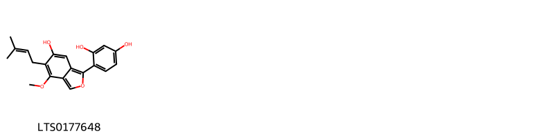{ width=100% }
    <figcaption>Hình ảnh cấu trúc hóa học của 1 hoạt chất thuộc nhóm Isobenzofurans gồm ['4-[6-hydroxy-4-methoxy-5-(3-methylbut-2-en-1-yl)-2-benzofuran-1-yl]benzene-1,3-diol (LTS0177648)'].</figcaption>
</figure>
#### Nhóm Isoflavonoids
<figure markdown="span">
    { width=100% }
    <figcaption>Hình ảnh cấu trúc hóa học của 122 hoạt chất thuộc nhóm Isoflavonoids gồm ['formononetin (LTS0082756)', 'medicarpin, (-)- (LTS0261149)', 'glycycoumarin (LTS0186848)', 'licoisoflavone a (LTS0263391)', 'glycyrol (LTS0024924)', 'licoisoflavanone (LTS0132017)', 'glabrone (LTS0075204)', 'formononetin 7-o-glucoside (LTS0073369)', '(-)-vestitol (LTS0191687)', "3'-dimethylallylkievitone (LTS0072984)", '(1s,10s)-3-methoxy-15-(3-methylbut-2-en-1-yl)-8,17-dioxatetracyclo[8.7.0.0²,⁷.0¹¹,¹⁶]heptadeca-2(7),3,5,11(16),12,14-hexaene-5,14-diol (LTS0168004)', 'licoricidin (LTS0274337)', '(+/-)-vestitol (LTS0195438)', '(3s)-3-[2,4-dihydroxy-3-(3-methylbut-2-en-1-yl)phenyl]-5,7-dihydroxy-8-(3-methylbut-2-en-1-yl)-2,3-dihydro-1-benzopyran-4-one (LTS0064499)', 'isoglycycoumarin (LTS0066952)', 'ononin (LTS0235553)', 'lupiwighteone (LTS0229079)', 'ononin (LTS0065177)', '6-hydroxy-21-methoxy-17,17-dimethyl-3,12,16-trioxapentacyclo[11.8.0.0²,¹⁰.0⁴,⁹.0¹⁵,²⁰]henicosa-1(13),2(10),4(9),5,7,14,20-heptaen-11-one (LTS0007245)', '6,8-diprenylgenistein (LTS0014786)', '(3r)-5,7-dihydroxy-3-(5-hydroxy-2,2-dimethylchromen-6-yl)-2,3-dihydro-1-benzopyran-4-one (LTS0241823)', 'glycyrrhiza isoflavone b (LTS0045322)', 'glabridin (LTS0075616)', 'gancaonin c (LTS0121053)', 'glabrene (LTS0097713)', '4-[7-hydroxy-5-methoxy-6-(3-methylbut-2-en-1-yl)-3,4-dihydro-2h-1-benzopyran-3-yl]-2-(3-methylbut-2-en-1-yl)benzene-1,3-diol (LTS0201122)', 'gancaonin a (LTS0216479)', 'isowighteone (LTS0080015)', 'dehydroglyasperin c (LTS0064962)', '4-[7-hydroxy-5-methoxy-6-(3-methylbut-2-en-1-yl)-3,4-dihydro-2h-1-benzopyran-3-yl]benzene-1,3-diol (LTS0070422)', '(3r)-3-[2-hydroxy-4-methoxy-3-(3-methylbut-2-en-1-yl)phenyl]-5-methoxy-3,4-dihydro-2h-1-benzopyran-7-ol (LTS0142974)', 'genistein (LTS0106538)', 'glycyrrhisoflavanone (LTS0193131)', 'calycosin (LTS0106037)', '3-(2,4-dihydroxyphenyl)-5-hydroxy-7-methoxy-6-(3-methylbut-2-en-1-yl)-2,3-dihydro-1-benzopyran-4-one (LTS0137976)', '(1s,10s)-3-methoxy-4,13-bis(3-methylbut-2-en-1-yl)-8,17-dioxatetracyclo[8.7.0.0²,⁷.0¹¹,¹⁶]heptadeca-2(7),3,5,11,13,15-hexaene-5,14-diol (LTS0140931)', '4-{8,8-dimethyl-2h,3h,4h-pyrano[2,3-f]chromen-3-yl}benzene-1,3-diol (LTS0151071)', 'sophoraisoflavone a (LTS0154268)', 'glyasperin d (LTS0164224)', 'glycyrin (LTS0087818)', '4-[5,7-dimethoxy-6-(3-methylbut-2-en-1-yl)-3,4-dihydro-2h-1-benzopyran-3-yl]benzene-1,3-diol (LTS0158498)', '1-methoxyficifolinol (LTS0082691)', 'glyasperin c (LTS0120599)', 'gancaonin l (LTS0072777)', '5,7-dihydroxy-3-(5-hydroxy-2,2-dimethylchromen-8-yl)-2,3-dihydro-1-benzopyran-4-one (LTS0062359)', 'semilicoisoflavone b (LTS0034303)', 'licorisoflavan a (LTS0157799)', 'licopyranocoumarin (LTS0048734)', '4-[(3s)-5,7-dimethoxy-6-(3-methylbut-2-en-1-yl)-3,4-dihydro-2h-1-benzopyran-3-yl]-2-(3-methylbut-2-en-1-yl)benzene-1,3-diol (LTS0066451)', '3-[2,4-dihydroxy-3-(3-methylbut-2-en-1-yl)phenyl]-5,7-dihydroxy-6-(3-methylbut-2-en-1-yl)-2,3-dihydro-1-benzopyran-4-one (LTS0061449)', '1-methoxyficifolinol (LTS0007158)', 'glycyrol (LTS0020999)', 'gancaonin g (LTS0003159)', '(3s)-3-(2,4-dihydroxyphenyl)-5-hydroxy-7-methoxy-6-(3-methylbut-2-en-1-yl)-2,3-dihydro-1-benzopyran-4-one (LTS0016356)', '4-[(6r)-9-methoxy-13,13-dimethyl-4,14-dioxatricyclo[8.4.0.0³,⁸]tetradeca-1(10),2,8-trien-6-yl]-2-(3-methylbut-2-en-1-yl)benzene-1,3-diol (LTS0229128)', '5,7-dihydroxy-3-(8-hydroxy-2,2-dimethyl-3,4-dihydro-1-benzopyran-6-yl)chromen-4-one (LTS0113182)', 'gancaonin b (LTS0130577)', '3-[2,4-dihydroxy-3-(3-methylbut-2-en-1-yl)phenyl]-5-hydroxy-7-methoxy-6-(3-methylbut-2-en-1-yl)chromen-4-one (LTS0037471)', 'vestitol (LTS0125669)', 'isoangustone a (LTS0076706)', '3-[4,6-dihydroxy-2-methoxy-3-(3-methylbut-2-en-1-yl)phenyl]-7-hydroxychromen-4-one (LTS0137980)', '5,14-dihydroxy-4-(3-hydroxy-3-methylbutyl)-3-methoxy-8,17-dioxatetracyclo[8.7.0.0²,⁷.0¹¹,¹⁶]heptadeca-1(10),2(7),3,5,11(16),12,14-heptaen-9-one (LTS0239751)', "5,5',7-trihydroxy-2',2'-dimethyl-6,8-bis(3-methylbut-2-en-1-yl)-[3,8'-bichromen]-4-one (LTS0130363)", '8-{9-methoxy-13,13-dimethyl-4,14-dioxatricyclo[8.4.0.0³,⁸]tetradeca-1(10),2,8-trien-6-yl}-2,2-dimethylchromen-5-ol (LTS0208294)', '3,5-dimethoxy-4-(3-methylbut-2-en-1-yl)-8,17-dioxatetracyclo[8.7.0.0²,⁷.0¹¹,¹⁶]heptadeca-2(7),3,5,11,13,15-hexaen-14-ol (LTS0218990)', 'gancaonin d (LTS0095468)', '4-{9-methoxy-13,13-dimethyl-4,14-dioxatricyclo[8.4.0.0³,⁸]tetradeca-1(10),2,8-trien-6-yl}-2-(3-methylbut-2-en-1-yl)benzene-1,3-diol (LTS0028102)', '7-{[(2s,4s,6r)-3-{[(2s,3r)-3,4-dihydroxy-4-(hydroxymethyl)oxolan-2-yl]oxy}-4,5-dihydroxy-6-(hydroxymethyl)oxan-2-yl]oxy}-3-(4-methoxyphenyl)chromen-4-one (LTS0088976)', '(3r)-7-hydroxy-3-(5-hydroxy-2,2-dimethylchromen-8-yl)-5-methoxy-3,4-dihydro-2h-1-benzopyran-8-carbaldehyde (LTS0000358)', 'glycycarpan (LTS0179742)', 'licofuranocoumarin (LTS0165654)', '(8r)-3-(2,4-dihydroxyphenyl)-8-(hydroxymethyl)-5-methoxy-8-methyl-6h,7h-pyrano[3,2-g]chromen-2-one (LTS0183820)', 'dihydrolicoisoflavone a (LTS0039421)', '3-(2,4-dihydroxyphenyl)-7-hydroxy-5-methoxy-8,8-dimethyl-6h,7h-pyrano[3,2-g]chromen-2-one (LTS0092751)', 'licorisoflavan a (LTS0163058)', '(3r)-3-[2,4-dihydroxy-3-(3-methylbut-2-en-1-yl)phenyl]-7-hydroxy-5-methoxy-3,4-dihydro-2h-1-benzopyran-8-carbaldehyde (LTS0117639)', '(3s)-5,7-dihydroxy-3-(5-hydroxy-2,2-dimethylchromen-8-yl)-2,3-dihydro-1-benzopyran-4-one (LTS0090708)', '7-hydroxy-3-(5-hydroxy-2,2-dimethylchromen-8-yl)-5-methoxy-3,4-dihydro-2h-1-benzopyran-8-carbaldehyde (LTS0153405)', 'daidzein (LTS0130369)', 'edudiol (LTS0201128)', '(3r)-3-[2,4-dihydroxy-3-(3-methylbut-2-en-1-yl)phenyl]-5,7-dimethoxy-6-(3-methylbut-2-en-1-yl)-2,3-dihydro-1-benzopyran-4-one (LTS0259427)', '7-hydroxy-3-[2-hydroxy-4-methoxy-3-(3-methylbut-2-en-1-yl)phenyl]-5-methoxy-3,4-dihydro-2h-1-benzopyran-8-carbaldehyde (LTS0142526)', '3-(2,4-dimethoxyphenyl)-5,7-dimethoxy-6-(3-methylbut-2-en-1-yl)chromen-2-one (LTS0162180)', '2-hydroxy-5-[(3r)-7-hydroxy-5-methoxy-6-(3-methylbut-2-en-1-yl)-3,4-dihydro-2h-1-benzopyran-3-yl]-3-(3-methylbut-2-en-1-yl)cyclohexa-2,5-diene-1,4-dione (LTS0166733)', '5-o-methylglycyrol (LTS0274207)', 'licoricone (LTS0153934)', '3-methoxy-4-(3-methylbut-2-en-1-yl)-8,17-dioxatetracyclo[8.7.0.0²,⁷.0¹¹,¹⁶]heptadeca-1(10),2(7),3,5,11,13,15-heptaene-5,14-diol (LTS0139130)', '8-(7-hydroxy-5-methoxy-3,4-dihydro-2h-1-benzopyran-3-yl)-2,2-dimethylchromen-5-ol (LTS0121459)', 'glisoflavone (LTS0114253)', '8-[(3r)-5,7-dimethoxy-6-(3-methylbut-2-en-1-yl)-3,4-dihydro-2h-1-benzopyran-3-yl]-2,2-dimethylchromen-5-ol (LTS0249029)', 'glycyrrhizol b (LTS0156726)', 'quercitin (LTS0111889)', '4-[(3s)-7-hydroxy-5-methoxy-6-(3-methylbut-2-en-1-yl)-3,4-dihydro-2h-1-benzopyran-3-yl]-2-(3-methylbut-2-en-1-yl)benzene-1,3-diol (LTS0190024)', '7-hydroxy-5-methoxy-3-(5-methoxy-2,2-dimethyl-3,4-dihydro-1-benzopyran-6-yl)chromen-2-one (LTS0269446)', 'isotrifoliol (LTS0252864)', '(3s)-3-[2,4-dihydroxy-3-(3-methylbut-2-en-1-yl)phenyl]-5-hydroxy-7-methoxy-6-(3-methylbut-2-en-1-yl)-2,3-dihydro-1-benzopyran-4-one (LTS0270926)', '4-[(3s)-5,7-dimethoxy-6-(3-methylbut-2-en-1-yl)-3,4-dihydro-2h-1-benzopyran-3-yl]benzene-1,3-diol (LTS0271744)', 'gancanin m (LTS0262454)', 'gancaonin n (LTS0211874)', '8-hydroxy-6-methoxy-17,17-dimethyl-3,12,18-trioxapentacyclo[11.8.0.0²,¹⁰.0⁴,⁹.0¹⁴,¹⁹]henicosa-1(13),2(10),4(9),5,7,14(19),15,20-octaen-11-one (LTS0073943)', 'edudiol (LTS0067144)', '5-[(3r)-5,7-dimethoxy-6-(3-methylbut-2-en-1-yl)-3,4-dihydro-2h-1-benzopyran-3-yl]-2-hydroxy-3-(3-methylbut-2-en-1-yl)cyclohexa-2,5-diene-1,4-dione (LTS0101151)', 'kanzonol p (LTS0195724)', 'glycyrrhizol (LTS0221272)', '7-o-methylluteone (LTS0238727)', '15-methoxy-7,7-dimethyl-16-(3-methylbut-2-en-1-yl)-8,12,20-trioxapentacyclo[11.8.0.0²,¹¹.0⁴,⁹.0¹⁴,¹⁹]henicosa-2,4(9),5,10,14(19),15,17-heptaen-17-ol (LTS0062893)', '3-[3,4-dihydroxy-5-(3-methylbut-2-en-1-yl)phenyl]-5,7-dihydroxy-8-(3-methylbut-2-en-1-yl)chromen-4-one (LTS0177286)', 'medicarpin (LTS0225787)', 'dehydroglyasperin d (LTS0001906)', '8-[5,7-dimethoxy-6-(3-methylbut-2-en-1-yl)-3,4-dihydro-2h-1-benzopyran-3-yl]-2,2-dimethylchromen-5-ol (LTS0004105)', '(1r,13r)-15-methoxy-7,7-dimethyl-16-(3-methylbut-2-en-1-yl)-8,12,20-trioxapentacyclo[11.8.0.0²,¹¹.0⁴,⁹.0¹⁴,¹⁹]henicosa-2,4(9),5,10,14(19),15,17-heptaen-17-ol (LTS0018092)', 'allolicoisoflavone a (LTS0002909)', '7-hydroxy-3-[6-hydroxy-2,4-dimethoxy-3-(3-methylbut-2-en-1-yl)phenyl]-2,3-dihydro-1-benzopyran-4-one (LTS0103199)', '8-[(6r)-9-methoxy-13,13-dimethyl-4,14-dioxatricyclo[8.4.0.0³,⁸]tetradeca-1(10),2,8-trien-6-yl]-2,2-dimethylchromen-5-ol (LTS0001957)', '(1r,10s)-3,5-dimethoxy-4-(3-methylbut-2-en-1-yl)-8,17-dioxatetracyclo[8.7.0.0²,⁷.0¹¹,¹⁶]heptadeca-2(7),3,5,11,13,15-hexaen-14-ol (LTS0001552)', '(3r)-7-hydroxy-3-[2-hydroxy-4-methoxy-3-(3-methylbut-2-en-1-yl)phenyl]-5-methoxy-3,4-dihydro-2h-1-benzopyran-8-carbaldehyde (LTS0019244)', '7-{[(2s,3r,4s,5s,6r)-3-{[(2s,3r,4r)-3,4-dihydroxy-4-(hydroxymethyl)oxolan-2-yl]oxy}-4,5-dihydroxy-6-(hydroxymethyl)oxan-2-yl]oxy}-3-(4-methoxyphenyl)chromen-4-one (LTS0130400)', 'licoarylcoumarin (LTS0110314)', '3-[3,4-dihydroxy-5-(3-methylbut-2-en-1-yl)phenyl]-5,7-dihydroxychromen-4-one (LTS0087067)', '(3s)-7-hydroxy-3-(5-hydroxy-2,2-dimethylchromen-8-yl)-5-methoxy-3,4-dihydro-2h-1-benzopyran-8-carbaldehyde (LTS0047502)', '3-[2,4-dihydroxy-3-(3-methylbut-2-en-1-yl)phenyl]-5-hydroxy-7-methoxy-6-(3-methylbut-2-en-1-yl)-2,3-dihydro-1-benzopyran-4-one (LTS0036681)', '3-[2,4-dihydroxy-3-(3-methylbut-2-en-1-yl)phenyl]-7-hydroxy-5-methoxy-3,4-dihydro-2h-1-benzopyran-8-carbaldehyde (LTS0041943)'].</figcaption>
</figure>
#### Nhóm Linear 1_3-diarylpropanoids
<figure markdown="span">
    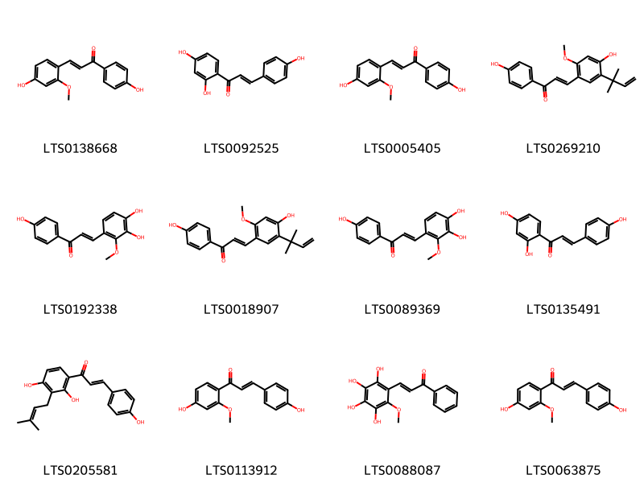{ width=100% }
    <figcaption>Hình ảnh cấu trúc hóa học của Không tìm thấy chú thích hoạt chất thuộc nhóm Linear 1_3-diarylpropanoids gồm Không tìm thấy chú thích.</figcaption>
</figure>
#### Nhóm Organooxygen compounds
<figure markdown="span">
    { width=100% }
    <figcaption>Hình ảnh cấu trúc hóa học của 1 hoạt chất thuộc nhóm Organooxygen compounds gồm ['glycerol (LTS0155285)'].</figcaption>
</figure>
#### Nhóm Phenanthrenes and derivatives
<figure markdown="span">
    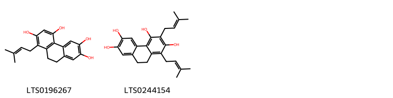{ width=100% }
    <figcaption>Hình ảnh cấu trúc hóa học của 2 hoạt chất thuộc nhóm Phenanthrenes and derivatives gồm ['8-(3-methylbut-2-en-1-yl)-9,10-dihydrophenanthrene-2,3,5,7-tetrol (LTS0196267)', '6,8-bis(3-methylbut-2-en-1-yl)-9,10-dihydrophenanthrene-2,3,5,7-tetrol (LTS0244154)'].</figcaption>
</figure>
#### Nhóm Prenol lipids
<figure markdown="span">
    { width=100% }
    <figcaption>Hình ảnh cấu trúc hóa học của 38 hoạt chất thuộc nhóm Prenol lipids gồm ['glycyrrhizin (LTS0121878)', '(2s,3s,4s,5r,6s)-6-{[(3s,4ar,6ar,6bs,8as,11s,12ar,14ar,14bs)-11-carboxy-4,4,6a,6b,8a,11,14b-heptamethyl-14-oxo-2,3,4a,5,6,7,8,9,10,12,12a,14a-dodecahydro-1h-picen-3-yl]oxy}-3,4-dihydroxy-5-{[(2s,3r,4s,5s)-3,4,5-trihydroxyoxan-2-yl]oxy}oxane-2-carboxylic acid (LTS0148155)', '(2s,3s,4s,5r,6s)-6-{[(3s,4ar,6ar,6bs,8as,11s,12ar,14ar,14bs)-11-carboxy-4,4,6a,6b,8a,11,14b-heptamethyl-14-oxo-2,3,4a,5,6,7,8,9,10,12,12a,14a-dodecahydro-1h-picen-3-yl]oxy}-5-{[(2s,3r,4r)-3,4-dihydroxy-4-(hydroxymethyl)oxolan-2-yl]oxy}-3,4-dihydroxyoxane-2-carboxylic acid (LTS0269568)', 'liquorice (LTS0142270)', 'glycyrrhetinic acid (LTS0198644)', '(2s,3s,4s,5r,6s)-6-{[(3s,4ar,6ar,6bs,8as,11s,12as,14ar,14bs)-11-carboxy-4,4,6a,6b,8a,11,14b-heptamethyl-14-oxo-2,3,4a,5,6,7,8,9,10,12,12a,14a-dodecahydro-1h-picen-3-yl]oxy}-5-{[(2r,3r,4s,5s,6s)-6-carboxy-3,4,5-trihydroxyoxan-2-yl]oxy}-3,4-dihydroxyoxane-2-carboxylic acid (LTS0017051)', 'licoricesaponin g2 (LTS0222159)', '6-{[4,4,6a,6b,8a,11,14b-heptamethyl-14-oxo-11-({[3,4,5-trihydroxy-6-(hydroxymethyl)oxan-2-yl]oxy}carbonyl)-2,3,4a,5,6,7,8,9,10,12,12a,14a-dodecahydro-1h-picen-3-yl]oxy}-5-[(6-carboxy-3,4,5-trihydroxyoxan-2-yl)oxy]-3,4-dihydroxyoxane-2-carboxylic acid (LTS0069853)', '(2s,3s,4s,5r,6r)-6-{[(3s,4ar,6ar,6bs,8as,11r,12ar,14ar,14bs)-11-carboxy-4,4,6a,6b,8a,11,14b-heptamethyl-14-oxo-2,3,4a,5,6,7,8,9,10,12,12a,14a-dodecahydro-1h-picen-3-yl]oxy}-5-{[(2r,3r,4s,5s,6s)-6-carboxy-3,4,5-trihydroxyoxan-2-yl]oxy}-3,4-dihydroxyoxane-2-carboxylic acid (LTS0073316)', '5-[(6-carboxy-3,4,5-trihydroxyoxan-2-yl)oxy]-6-{[11-carboxy-4-(hydroxymethyl)-4,6a,6b,8a,11,14b-hexamethyl-14-oxo-2,3,4a,5,6,7,8,9,10,12,12a,14a-dodecahydro-1h-picen-3-yl]oxy}-3,4-dihydroxyoxane-2-carboxylic acid (LTS0209740)', '(2s,3s,4s,5r,6r)-6-{[(3s,4ar,6ar,6bs,8as,11s,12ar,14ar,14bs)-11-carboxy-4,4,6a,6b,8a,11,14b-heptamethyl-14-oxo-2,3,4a,5,6,7,8,9,10,12,12a,14a-dodecahydro-1h-picen-3-yl]oxy}-5-{[(2r,3r,4s,5s,6s)-6-carboxy-3,4,5-trihydroxyoxan-2-yl]oxy}-3,4-dihydroxyoxane-2-carboxylic acid (LTS0004573)', 'licoricesaponin a3 (LTS0020656)', '(2r,4ar,6ar,6bs,10r,12ar,14bs)-10-hydroxy-2,4a,6a,6b,9,9,12a-heptamethyl-13-oxo-3,4,5,6,7,8,8a,10,11,12,12b,14b-dodecahydro-1h-picene-2-carboxylic acid (LTS0038115)', '(2s,3s,4s,5r,6r)-6-{[(2r,3r,4s,5s,6s)-6-carboxy-2-{[(1r,2r,5s,6r,9r,11s,14r,15r,19s,21r)-2,5,6,10,10,14,21-heptamethyl-22-oxo-23-oxahexacyclo[19.2.1.0²,¹⁹.0⁵,¹⁸.0⁶,¹⁵.0⁹,¹⁴]tetracos-17-en-11-yl]oxy}-4,5-dihydroxyoxan-3-yl]oxy}-3,4-dihydroxy-5-{[(2s,3r,4r,5r,6s)-3,4,5-trihydroxy-6-methyloxan-2-yl]oxy}oxane-2-carboxylic acid (LTS0199669)', '(2s,3s,4s,5r,6r)-6-{[(3s,4ar,6ar,6bs,8as,10r,11r,12ar,14ar,14bs)-11-carboxy-10-hydroxy-4,4,6a,6b,8a,11,14b-heptamethyl-14-oxo-2,3,4a,5,6,7,8,9,10,12,12a,14a-dodecahydro-1h-picen-3-yl]oxy}-5-{[(2s,3r,4s,5s,6r)-4,5-dihydroxy-6-(hydroxymethyl)-3-{[(2s,3r,4r,5r,6s)-3,4,5-trihydroxy-6-methyloxan-2-yl]oxy}oxan-2-yl]oxy}-3,4-dihydroxyoxane-2-carboxylic acid (LTS0103177)', '(2s,3s,4s,5r,6r)-6-{[(3s,4s,4ar,6ar,6bs,8ar,9r,11r,12as,14ar,14br)-9-(acetyloxy)-11-carboxy-4-(hydroxymethyl)-4,6a,6b,8a,11,14b-hexamethyl-1,2,3,4a,5,6,7,8,9,10,12,12a,14,14a-tetradecahydropicen-3-yl]oxy}-5-{[(2s,3r,4s,5s)-4,5-dihydroxy-3-{[(2s,3r,4r,5r,6s)-3,4,5-trihydroxy-6-methyloxan-2-yl]oxy}oxan-2-yl]oxy}-3,4-dihydroxyoxane-2-carboxylic acid (LTS0082568)', '5-[(6-carboxy-3,4,5-trihydroxyoxan-2-yl)oxy]-6-({2,5,6,10,10,14,21-heptamethyl-16,22-dioxo-23-oxahexacyclo[19.2.1.0²,¹⁹.0⁵,¹⁸.0⁶,¹⁵.0⁹,¹⁴]tetracos-17-en-11-yl}oxy)-3,4-dihydroxyoxane-2-carboxylic acid (LTS0161048)', '(2s,4as,6as,6br,8ar,10s,12as,12br,14br)-2,4a,6a,6b,9,9,12a-heptamethyl-13-oxo-10-{[(2r,3r,4s,5s,6r)-3,4,5-trihydroxy-6-(hydroxymethyl)oxan-2-yl]oxy}-3,4,5,6,7,8,8a,10,11,12,12b,14b-dodecahydro-1h-picene-2-carboxylic acid (LTS0156644)', '6-{[9-(acetyloxy)-11-carboxy-4,4,6a,6b,8a,11,14b-heptamethyl-1,2,3,4a,5,6,7,8,9,10,12,12a,14,14a-tetradecahydropicen-3-yl]oxy}-5-({6-carboxy-4,5-dihydroxy-3-[(3,4,5-trihydroxy-6-methyloxan-2-yl)oxy]oxan-2-yl}oxy)-3,4-dihydroxyoxane-2-carboxylic acid (LTS0137096)', '(2s,4as,6as,6br,8ar,9s,10s,12as,12br,14br)-10-hydroxy-9-(hydroxymethyl)-2,4a,6a,6b,9,12a-hexamethyl-13-oxo-3,4,5,6,7,8,8a,10,11,12,12b,14b-dodecahydro-1h-picene-2-carboxylic acid (LTS0148962)', '(2r,4r,4ar,6as,6br,8ar,10s,12as,12br,14bs)-2-formyl-10-hydroxy-2,4a,6a,6b,9,9,12a-heptamethyl-13-oxo-3,4,5,6,7,8,8a,10,11,12,12b,14b-dodecahydro-1h-picen-4-yl acetate (LTS0077595)', '5-[(6-carboxy-3,4,5-trihydroxyoxan-2-yl)oxy]-6-[(11-carboxy-4,4,6a,6b,8a,11,14b-heptamethyl-1,2,3,4a,5,6,7,8,9,10,12,14a-dodecahydropicen-3-yl)oxy]-3,4-dihydroxyoxane-2-carboxylic acid (LTS0103774)', '(2s,3s,4s,5r,6r)-6-{[(3s,4ar,6ar,6bs,8as,11s,12ar,14ar,14br)-11-carboxy-4,4,6a,6b,8a,11,14b-heptamethyl-1,2,3,4a,5,6,7,8,9,10,12,12a,14,14a-tetradecahydropicen-3-yl]oxy}-5-{[(2r,3r,4s,5s,6s)-6-carboxy-3,4,5-trihydroxyoxan-2-yl]oxy}-3,4-dihydroxyoxane-2-carboxylic acid (LTS0114813)', '5-[(6-carboxy-3,4,5-trihydroxyoxan-2-yl)oxy]-6-[(11-carboxy-4,4,6a,6b,8a,11,14b-heptamethyl-1,2,3,4a,5,6,7,8,9,10,12,12a,14,14a-tetradecahydropicen-3-yl)oxy]-3,4-dihydroxyoxane-2-carboxylic acid (LTS0062853)', '(2s,3s,4s,5r,6r)-6-{[(3s,4s,4ar,6ar,6bs,8as,11s,14ar,14bs)-11-carboxy-4-(hydroxymethyl)-4,6a,6b,8a,11,14b-hexamethyl-1,2,3,4a,5,6,7,8,9,10,12,14a-dodecahydropicen-3-yl]oxy}-5-{[(2r,3r,4s,5s,6s)-6-carboxy-3,4,5-trihydroxyoxan-2-yl]oxy}-3,4-dihydroxyoxane-2-carboxylic acid (LTS0203483)', '(2s,3s,4s,5r,6r)-6-{[(3s,4ar,6ar,6bs,8ar,9r,11r,12as,14ar,14br)-9-(acetyloxy)-11-carboxy-4,4,6a,6b,8a,11,14b-heptamethyl-1,2,3,4a,5,6,7,8,9,10,12,12a,14,14a-tetradecahydropicen-3-yl]oxy}-5-{[(2r,3r,4s,5s,6s)-6-carboxy-4,5-dihydroxy-3-{[(2s,3r,4r,5r,6s)-3,4,5-trihydroxy-6-methyloxan-2-yl]oxy}oxan-2-yl]oxy}-3,4-dihydroxyoxane-2-carboxylic acid (LTS0190606)', '(2s,3s,4s,5r,6r)-6-{[(3s,4ar,6ar,6bs,8as,11s,14ar,14bs)-11-carboxy-4,4,6a,6b,8a,11,14b-heptamethyl-1,2,3,4a,5,6,7,8,9,10,12,14a-dodecahydropicen-3-yl]oxy}-5-{[(2r,3r,4s,5s,6s)-6-carboxy-3,4,5-trihydroxyoxan-2-yl]oxy}-3,4-dihydroxyoxane-2-carboxylic acid (LTS0082499)', '5-[(6-carboxy-3,4,5-trihydroxyoxan-2-yl)oxy]-6-{[11-carboxy-4-(hydroxymethyl)-4,6a,6b,8a,11,14b-hexamethyl-1,2,3,4a,5,6,7,8,9,10,12,14a-dodecahydropicen-3-yl]oxy}-3,4-dihydroxyoxane-2-carboxylic acid (LTS0236402)', '6-{[6-carboxy-2-({2,5,6,10,10,14,21-heptamethyl-22-oxo-23-oxahexacyclo[19.2.1.0²,¹⁹.0⁵,¹⁸.0⁶,¹⁵.0⁹,¹⁴]tetracos-17-en-11-yl}oxy)-4,5-dihydroxyoxan-3-yl]oxy}-3,4-dihydroxy-5-[(3,4,5-trihydroxy-6-methyloxan-2-yl)oxy]oxane-2-carboxylic acid (LTS0228845)', '(2r,4as,6as,6br,8ar,12as,12br,14br)-10-hydroxy-2,4a,6a,6b,9,9,12a-heptamethyl-13-oxo-3,4,5,6,7,8,8a,10,11,12,12b,14b-dodecahydro-1h-picene-2-carboxylic acid (LTS0175066)', '5-[(6-carboxy-3,4,5-trihydroxyoxan-2-yl)oxy]-6-{[11-carboxy-4-(hydroxymethyl)-4,6a,6b,8a,11,14b-hexamethyl-1,2,3,4a,5,6,7,8,9,10,12,12a,14,14a-tetradecahydropicen-3-yl]oxy}-3,4-dihydroxyoxane-2-carboxylic acid (LTS0181845)', '6-{[9-(acetyloxy)-11-carboxy-4-(hydroxymethyl)-4,6a,6b,8a,11,14b-hexamethyl-1,2,3,4a,5,6,7,8,9,10,12,12a,14,14a-tetradecahydropicen-3-yl]oxy}-5-({4,5-dihydroxy-3-[(3,4,5-trihydroxy-6-methyloxan-2-yl)oxy]oxan-2-yl}oxy)-3,4-dihydroxyoxane-2-carboxylic acid (LTS0194778)', '(2s,3s,4s,5r,6s)-6-{[(3s,4ar,6ar,6bs,8ar,9r,11r,12as,14ar,14bs)-9-(acetyloxy)-11-carboxy-4,4,6a,6b,8a,11,14b-heptamethyl-14-oxo-2,3,4a,5,6,7,8,9,10,12,12a,14a-dodecahydro-1h-picen-3-yl]oxy}-5-{[(2r,3r,4s,5s,6s)-6-carboxy-3,4,5-trihydroxyoxan-2-yl]oxy}-3,4-dihydroxyoxane-2-carboxylic acid (LTS0056139)', '(2s,3s,4s,5r,6r)-6-{[(3s,4s,4ar,6ar,6bs,8as,11s,12ar,14ar,14br)-11-carboxy-4-(hydroxymethyl)-4,6a,6b,8a,11,14b-hexamethyl-1,2,3,4a,5,6,7,8,9,10,12,12a,14,14a-tetradecahydropicen-3-yl]oxy}-5-{[(2r,3r,4s,5s,6s)-6-carboxy-3,4,5-trihydroxyoxan-2-yl]oxy}-3,4-dihydroxyoxane-2-carboxylic acid (LTS0224169)', '(2s,3s,4s,5r,6r)-6-{[(3s,4ar,6ar,6bs,8ar,9r,12as,14ar,14bs)-4,4,6a,6b,8a,11,11,14b-octamethyl-14-oxo-9-{[(2r,3r,4r,5r,6s)-3,4,5-trihydroxy-6-methyloxan-2-yl]oxy}-2,3,4a,5,6,7,8,9,10,12,12a,14a-dodecahydro-1h-picen-3-yl]oxy}-5-{[(2r,3r,4s,5s,6s)-6-carboxy-3,4,5-trihydroxyoxan-2-yl]oxy}-3,4-dihydroxyoxane-2-carboxylic acid (LTS0087463)', '(2s,3s,4s,5r,6r)-6-{[(3s,4ar,6ar,6bs,8as,11s,12ar,14as,14bs)-4,4,6a,6b,8a,11,14b-heptamethyl-14-oxo-11-({[(2s,3r,4s,5s,6r)-3,4,5-trihydroxy-6-(hydroxymethyl)oxan-2-yl]oxy}carbonyl)-2,3,4a,5,6,7,8,9,10,12,12a,14a-dodecahydro-1h-picen-3-yl]oxy}-5-{[(2r,3r,4s,5s,6s)-6-carboxy-3,4,5-trihydroxyoxan-2-yl]oxy}-3,4-dihydroxyoxane-2-carboxylic acid (LTS0131364)', 'licoricesaponin e2 (LTS0037074)', '(2s,3s,4s,5r,6r)-6-{[(3s,4ar,6ar,6bs,8as,11s,12ar,14ar,14bs)-11-carboxy-4,4,6a,6b,8a,11,14b-heptamethyl-14-oxo-2,3,4a,5,6,7,8,9,10,12,12a,14a-dodecahydro-1h-picen-3-yl]oxy}-5-{[(2r,3r,4s,5r,6s)-6-carboxy-3,4,5-trihydroxyoxan-2-yl]oxy}-3,4-dihydroxyoxane-2-carboxylic acid (LTS0119963)'].</figcaption>
</figure>
#### Nhóm Stilbenes
<figure markdown="span">
    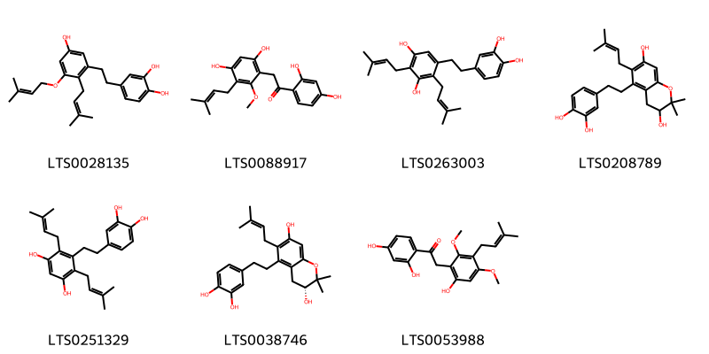{ width=100% }
    <figcaption>Hình ảnh cấu trúc hóa học của 7 hoạt chất thuộc nhóm Stilbenes gồm ['4-{2-[5-hydroxy-2-(3-methylbut-2-en-1-yl)-3-[(3-methylbut-2-en-1-yl)oxy]phenyl]ethyl}benzene-1,2-diol (LTS0028135)', '2-[4,6-dihydroxy-2-methoxy-3-(3-methylbut-2-en-1-yl)phenyl]-1-(2,4-dihydroxyphenyl)ethanone (LTS0088917)', '5-[2-(3,4-dihydroxyphenyl)ethyl]-2,4-bis(3-methylbut-2-en-1-yl)benzene-1,3-diol (LTS0263003)', '5-[2-(3,4-dihydroxyphenyl)ethyl]-2,2-dimethyl-6-(3-methylbut-2-en-1-yl)-3,4-dihydro-1-benzopyran-3,7-diol (LTS0208789)', '5-[2-(3,4-dihydroxyphenyl)ethyl]-4,6-bis(3-methylbut-2-en-1-yl)benzene-1,3-diol (LTS0251329)', '(3r)-5-[2-(3,4-dihydroxyphenyl)ethyl]-2,2-dimethyl-6-(3-methylbut-2-en-1-yl)-3,4-dihydro-1-benzopyran-3,7-diol (LTS0038746)', '1-(2,4-dihydroxyphenyl)-2-[6-hydroxy-2,4-dimethoxy-3-(3-methylbut-2-en-1-yl)phenyl]ethanone (LTS0053988)'].</figcaption>
</figure>

---

### Dược dân tộc học

Danh sách các quốc gia có sử dụng *Glycyrrhiza uralensis* trong điều trị các bệnh. 

| Country   | Disease                                               | Bệnh                                                                                                                                                                                                |
|:----------|:------------------------------------------------------|:----------------------------------------------------------------------------------------------------------------------------------------------------------------------------------------------------|
| China     | Antidote, Demulcent, Emollient, Expectorant, Laxative | MYMEMORY WARNING: YOU USED ALL AVAILABLE FREE TRANSLATIONS FOR TODAY. NEXT AVAILABLE IN  15 HOURS 52 MINUTES 21 SECONDS VISIT HTTPS://MYMEMORY.TRANSLATED.NET/DOC/USAGELIMITS.PHP TO TRANSLATE MORE |
| Japan*    | Antidote, Antitussive, Demulcent, Expectorant         | MYMEMORY WARNING: YOU USED ALL AVAILABLE FREE TRANSLATIONS FOR TODAY. NEXT AVAILABLE IN  15 HOURS 52 MINUTES 18 SECONDS VISIT HTTPS://MYMEMORY.TRANSLATED.NET/DOC/USAGELIMITS.PHP TO TRANSLATE MORE |

---

# Chi Genista

??? note "Danh sách các dược liệu thuộc chi"
    
	 - *Genista tinctoria*

---
## Genista tinctoria
### Thông tin về thực vật

!!! info "Phân loại thực vật của *Genista tinctoria* từ GIBF:"
    - **Kingdom:** Plantae
    - **Phylum:** Tracheophyta
    - **Order:** Fabales
    - **Family:** Fabaceae
    - **Genus:** Genista
    - **Species:** *Genista tinctoria*

 

| Label (VI)   | Label (EN)   | Scientific Name   | Descriptions (VI)   | Descriptions (EN)   | Also Known As (VI)   | Also Known As (EN)   |
|:-------------|:-------------|:------------------|:--------------------|:--------------------|:---------------------|:---------------------|
| N/A          | N/A          | Genista tinctoria | loài thực vật       | species of plant    | ['']                 | ["Dyer's Greenweed"] |

#### Phân bố trên thế giới

**Từ CSDL GIBF** Italy, Slovakia, Ukraine, Netherlands, Belarus, Luxembourg, Spain, Hungary, Türkiye, Russian Federation, Sweden, Slovenia, Croatia, Bosnia and Herzegovina, Greece, Montenegro, Czechia, Germany, Romania, Switzerland, Austria, France, United Kingdom of Great Britain and Northern Ireland, Serbia

#### Phân bố tại Việt Nam

**Từ CSDL GIBF**: Không có ghi nhận ở Việt Nam

---
### Thành phần hóa học
        
- Theo cơ sở dữ liệu lotus: Từ loài *Genista tinctoria* đã phân lập và xác định được 23 hoạt chất thuộc về các nhóm Flavonoids, Isoflavonoids, Lupin alkaloids, Pyridines and derivatives. 

|    | chemicalTaxonomyClassyfireClass   |   smiles_count |
|---:|:----------------------------------|---------------:|
|  0 | Flavonoids                        |              1 |
|  1 | Isoflavonoids                     |              1 |
|  2 | Lupin alkaloids                   |             16 |
|  3 | Pyridines and derivatives         |              1 |

#### Nhóm Flavonoids
<figure markdown="span">
    { width=100% }
    <figcaption>Hình ảnh cấu trúc hóa học của 1 hoạt chất thuộc nhóm Flavonoids gồm ['luteolin (LTS0017052)'].</figcaption>
</figure>
#### Nhóm Isoflavonoids
<figure markdown="span">
    { width=100% }
    <figcaption>Hình ảnh cấu trúc hóa học của 1 hoạt chất thuộc nhóm Isoflavonoids gồm ['genistein (LTS0106538)'].</figcaption>
</figure>
#### Nhóm Lupin alkaloids
<figure markdown="span">
    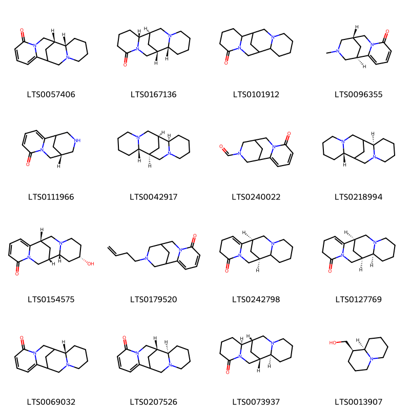{ width=100% }
    <figcaption>Hình ảnh cấu trúc hóa học của 16 hoạt chất thuộc nhóm Lupin alkaloids gồm ['(9r,10s)-7,15-diazatetracyclo[7.7.1.0²,⁷.0¹⁰,¹⁵]heptadeca-2,4-dien-6-one (LTS0057406)', '(1r,2r,9s,10r)-7,15-diazatetracyclo[7.7.1.0²,⁷.0¹⁰,¹⁵]heptadecan-6-one (LTS0167136)', 'lupanine l-form (LTS0101912)', '(1r,9r)-11-methyl-7,11-diazatricyclo[7.3.1.0²,⁷]trideca-2,4-dien-6-one (LTS0096355)', '(9r)-7,11-diazatricyclo[7.3.1.0²,⁷]trideca-2,4-dien-6-one (LTS0111966)', 'sparteine (LTS0042917)', '6-oxo-7,11-diazatricyclo[7.3.1.0²,⁷]trideca-2,4-diene-11-carbaldehyde (LTS0240022)', '(2r,10s)-7,15-diazatetracyclo[7.7.1.0²,⁷.0¹⁰,¹⁵]heptadecane (LTS0218994)', 'baptifoline (LTS0154575)', 'rhombifoline (LTS0179520)', '(1r,9r)-7,15-diazatetracyclo[7.7.1.0²,⁷.0¹⁰,¹⁵]heptadec-2-en-6-one (LTS0242798)', '(1r,9r,10s)-7,15-diazatetracyclo[7.7.1.0²,⁷.0¹⁰,¹⁵]heptadec-2-en-6-one (LTS0127769)', 'thermospine (LTS0069032)', '(9r,10r)-7,15-diazatetracyclo[7.7.1.0²,⁷.0¹⁰,¹⁵]heptadeca-2,4-dien-6-one (LTS0207526)', '(1s,2s,9s,10s)-7,15-diazatetracyclo[7.7.1.0²,⁷.0¹⁰,¹⁵]heptadecan-6-one (LTS0073937)', '(-)-lupinine (LTS0013907)'].</figcaption>
</figure>
#### Nhóm Pyridines and derivatives
<figure markdown="span">
    { width=100% }
    <figcaption>Hình ảnh cấu trúc hóa học của 1 hoạt chất thuộc nhóm Pyridines and derivatives gồm ['ammodendrine (LTS0084410)'].</figcaption>
</figure>

---

### Dược dân tộc học

Danh sách các quốc gia có sử dụng *Genista tinctoria* trong điều trị các bệnh. 

| Country   | Disease                               | Bệnh                                                                                                                                                                                                |
|:----------|:--------------------------------------|:----------------------------------------------------------------------------------------------------------------------------------------------------------------------------------------------------|
| Elsewhere | Diuretic, Purgative, Diuretic         | MYMEMORY WARNING: YOU USED ALL AVAILABLE FREE TRANSLATIONS FOR TODAY. NEXT AVAILABLE IN  15 HOURS 51 MINUTES 33 SECONDS VISIT HTTPS://MYMEMORY.TRANSLATED.NET/DOC/USAGELIMITS.PHP TO TRANSLATE MORE |
| Turkey    | Diuretic, Emetic, Laxative, Sudorific | MYMEMORY WARNING: YOU USED ALL AVAILABLE FREE TRANSLATIONS FOR TODAY. NEXT AVAILABLE IN  15 HOURS 51 MINUTES 31 SECONDS VISIT HTTPS://MYMEMORY.TRANSLATED.NET/DOC/USAGELIMITS.PHP TO TRANSLATE MORE |
| ain       | Diuretic                              | MYMEMORY WARNING: YOU USED ALL AVAILABLE FREE TRANSLATIONS FOR TODAY. NEXT AVAILABLE IN  15 HOURS 51 MINUTES 28 SECONDS VISIT HTTPS://MYMEMORY.TRANSLATED.NET/DOC/USAGELIMITS.PHP TO TRANSLATE MORE |

---

# Chi Trigonella

??? note "Danh sách các dược liệu thuộc chi"
    
	 - *Trigonella corniculata*
	 - *Trigonella foenum-graecum*

---
## Trigonella corniculata
### Thông tin về thực vật

!!! info "Phân loại thực vật của *Trigonella corniculata* từ GIBF:"
    - **Kingdom:** Plantae
    - **Phylum:** Tracheophyta
    - **Order:** Fabales
    - **Family:** Fabaceae
    - **Genus:** Trigonella
    - **Species:** *Trigonella corniculata*

 

| Label (VI)   | Label (EN)   | Scientific Name        | Descriptions (VI)   | Descriptions (EN)   | Also Known As (VI)   | Also Known As (EN)                                                   |
|:-------------|:-------------|:-----------------------|:--------------------|:--------------------|:---------------------|:---------------------------------------------------------------------|
| N/A          | N/A          | Trigonella corniculata |                     | species of plant    | ['']                 | ['cultivated fenugreek', 'wild trefoil', 'sickle-fruited fenugreek'] |

#### Phân bố trên thế giới

**Từ CSDL GIBF** nan, Italy, Belgium, unknown or invalid, Jordan, Israel, Canada, Denmark, Pakistan, Afghanistan, Türkiye, Albania, Russian Federation, United States of America, Slovenia, Croatia, Greece, Montenegro, Egypt, France, United Kingdom of Great Britain and Northern Ireland, India, Poland

#### Phân bố tại Việt Nam

**Từ CSDL GIBF**: Không có ghi nhận ở Việt Nam

---
### Thành phần hóa học
        
- Theo cơ sở dữ liệu lotus: Từ loài *Trigonella corniculata* đã phân lập và xác định được 20 hoạt chất thuộc về các nhóm Flavonoids, Prenol lipids, Steroids and steroid derivatives, Isoflavonoids. 

|    | chemicalTaxonomyClassyfireClass   |   smiles_count |
|---:|:----------------------------------|---------------:|
|  0 | Flavonoids                        |              3 |
|  1 | Isoflavonoids                     |              1 |
|  2 | Prenol lipids                     |              5 |
|  3 | Steroids and steroid derivatives  |             11 |

#### Nhóm Flavonoids
<figure markdown="span">
    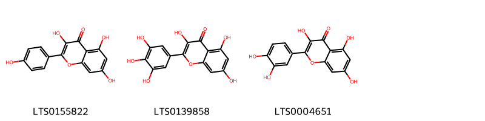{ width=100% }
    <figcaption>Hình ảnh cấu trúc hóa học của 3 hoạt chất thuộc nhóm Flavonoids gồm ['kaempherol (LTS0155822)', 'myricetin (LTS0139858)', 'quercetin (LTS0004651)'].</figcaption>
</figure>
#### Nhóm Isoflavonoids
<figure markdown="span">
    { width=100% }
    <figcaption>Hình ảnh cấu trúc hóa học của 1 hoạt chất thuộc nhóm Isoflavonoids gồm ['coumestrol (LTS0267535)'].</figcaption>
</figure>
#### Nhóm Prenol lipids
<figure markdown="span">
    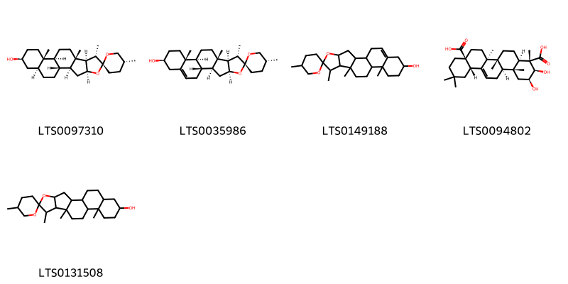{ width=100% }
    <figcaption>Hình ảnh cấu trúc hóa học của 5 hoạt chất thuộc nhóm Prenol lipids gồm ['tigogenin (LTS0097310)', 'diosgenin (LTS0035986)', 'diosgenin (LTS0149188)', 'medicagenic acid (LTS0094802)', 'tigogenin (LTS0131508)'].</figcaption>
</figure>
#### Nhóm Steroids and steroid derivatives
<figure markdown="span">
    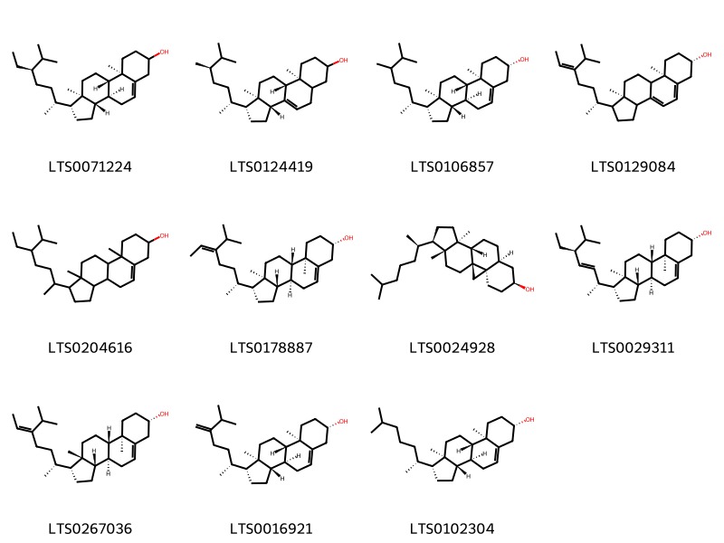{ width=100% }
    <figcaption>Hình ảnh cấu trúc hóa học của 11 hoạt chất thuộc nhóm Steroids and steroid derivatives gồm ['stigmast-5-en-3-ol (LTS0071224)', '(1r,3ar,9as,9br,11ar)-1-[(2r,5r)-5,6-dimethylheptan-2-yl]-9a,11a-dimethyl-1h,2h,3h,3ah,5h,5ah,6h,7h,8h,9h,9bh,10h,11h-cyclopenta[a]phenanthren-7-ol (LTS0124419)', '24-α-methylcholesterol (LTS0106857)', '5-dehydroavenasterol (LTS0129084)', 'stigmast-5-en-3-ol, (3β)- (LTS0204616)', 'fucosterol (LTS0178887)', 'pollinastanol (LTS0024928)', 'phytosterol (LTS0029311)', '(1r,3as,3bs,7s,9ar,9bs,11as)-1-[(2r,5z)-5-isopropylhept-5-en-2-yl]-9a,11a-dimethyl-1h,2h,3h,3ah,3bh,4h,6h,7h,8h,9h,9bh,10h,11h-cyclopenta[a]phenanthren-7-ol (LTS0267036)', '24-methylenecholesterol (LTS0016921)', 'cholesterol (LTS0102304)'].</figcaption>
</figure>

---

### Dược dân tộc học

Danh sách các quốc gia có sử dụng *Trigonella corniculata* trong điều trị các bệnh. 

| Country   | Disease             | Bệnh                                                                                                                                                                                                |
|:----------|:--------------------|:----------------------------------------------------------------------------------------------------------------------------------------------------------------------------------------------------|
| Elsewhere | Astringent, Styptic | MYMEMORY WARNING: YOU USED ALL AVAILABLE FREE TRANSLATIONS FOR TODAY. NEXT AVAILABLE IN  15 HOURS 51 MINUTES 02 SECONDS VISIT HTTPS://MYMEMORY.TRANSLATED.NET/DOC/USAGELIMITS.PHP TO TRANSLATE MORE |

---

---
## Trigonella foenumgraecum
### Thông tin về thực vật

!!! info "Phân loại thực vật của *Trigonella foenum-graecum* từ GIBF:"
    - **Kingdom:** Plantae
    - **Phylum:** Tracheophyta
    - **Order:** Fabales
    - **Family:** Fabaceae
    - **Genus:** Trigonella
    - **Species:** *Trigonella foenum-graecum*

 

| Label (VI)   | Label (EN)   | Scientific Name        | Descriptions (VI)   | Descriptions (EN)   | Also Known As (VI)   | Also Known As (EN)                                                   |
|:-------------|:-------------|:-----------------------|:--------------------|:--------------------|:---------------------|:---------------------------------------------------------------------|
| N/A          | N/A          | Trigonella corniculata |                     | species of plant    | ['']                 | ['cultivated fenugreek', 'wild trefoil', 'sickle-fruited fenugreek'] |

#### Phân bố trên thế giới

**Từ CSDL GIBF** Italy, Bulgaria, Australia, Belgium, Slovakia, Jordan, Tunisia, Israel, Netherlands, Lithuania, Spain, Hungary, Algeria, Russian Federation, Croatia, Greece, Czechia, Germany, Switzerland, Mexico, France, Austria, Syrian Arab Republic, Iraq, India

#### Phân bố tại Việt Nam

**Từ CSDL GIBF**: Không có ghi nhận ở Việt Nam

---
### Thành phần hóa học
        
- Theo cơ sở dữ liệu lotus: Từ loài *Trigonella foenum-graecum* đã phân lập và xác định được Chưa có hoạt chất nào được phân lập. hoạt chất thuộc về các nhóm Không có hoạt chất nào được phân lập. 

Không có hình ảnh nào được tạo ra

---

### Dược dân tộc học

Danh sách các quốc gia có sử dụng *Trigonella foenum-graecum* trong điều trị các bệnh. 

| Country       | Disease                                                                           | Bệnh                                                                                                                                                                                                |
|:--------------|:----------------------------------------------------------------------------------|:----------------------------------------------------------------------------------------------------------------------------------------------------------------------------------------------------|
| China         | Carminative, Demulcent, Stimulant, Tonic, Carminative                             | MYMEMORY WARNING: YOU USED ALL AVAILABLE FREE TRANSLATIONS FOR TODAY. NEXT AVAILABLE IN  15 HOURS 50 MINUTES 34 SECONDS VISIT HTTPS://MYMEMORY.TRANSLATED.NET/DOC/USAGELIMITS.PHP TO TRANSLATE MORE |
| Elsewhere     | Carminative, Demulcent, Emollient, Tonic, Lactagogue                              | MYMEMORY WARNING: YOU USED ALL AVAILABLE FREE TRANSLATIONS FOR TODAY. NEXT AVAILABLE IN  15 HOURS 50 MINUTES 31 SECONDS VISIT HTTPS://MYMEMORY.TRANSLATED.NET/DOC/USAGELIMITS.PHP TO TRANSLATE MORE |
| Iraq          | Demulcent, Emollient                                                              | MYMEMORY WARNING: YOU USED ALL AVAILABLE FREE TRANSLATIONS FOR TODAY. NEXT AVAILABLE IN  15 HOURS 50 MINUTES 29 SECONDS VISIT HTTPS://MYMEMORY.TRANSLATED.NET/DOC/USAGELIMITS.PHP TO TRANSLATE MORE |
| Java          | Cosmetic                                                                          | MYMEMORY WARNING: YOU USED ALL AVAILABLE FREE TRANSLATIONS FOR TODAY. NEXT AVAILABLE IN  15 HOURS 50 MINUTES 26 SECONDS VISIT HTTPS://MYMEMORY.TRANSLATED.NET/DOC/USAGELIMITS.PHP TO TRANSLATE MORE |
| Mediterranean | Emollient, Demulcent                                                              | MYMEMORY WARNING: YOU USED ALL AVAILABLE FREE TRANSLATIONS FOR TODAY. NEXT AVAILABLE IN  15 HOURS 50 MINUTES 24 SECONDS VISIT HTTPS://MYMEMORY.TRANSLATED.NET/DOC/USAGELIMITS.PHP TO TRANSLATE MORE |
| Turkey        | Aphrodisiac, Astringent, Diuretic, Carminative, Emollient, Demulcent, Emmenagogue | MYMEMORY WARNING: YOU USED ALL AVAILABLE FREE TRANSLATIONS FOR TODAY. NEXT AVAILABLE IN  15 HOURS 50 MINUTES 21 SECONDS VISIT HTTPS://MYMEMORY.TRANSLATED.NET/DOC/USAGELIMITS.PHP TO TRANSLATE MORE |

---

# Chi Stylosanthes

??? note "Danh sách các dược liệu thuộc chi"
    
	 - *Stylosanthes fruticosa*

---
## Stylosanthes fruticosa
### Thông tin về thực vật

!!! info "Phân loại thực vật của *Stylosanthes fruticosa* từ GIBF:"
    - **Kingdom:** Plantae
    - **Phylum:** Tracheophyta
    - **Order:** Fabales
    - **Family:** Fabaceae
    - **Genus:** Stylosanthes
    - **Species:** *Stylosanthes fruticosa*

 

| Label (VI)   | Label (EN)   | Scientific Name        | Descriptions (VI)   | Descriptions (EN)   | Also Known As (VI)   | Also Known As (EN)   |
|:-------------|:-------------|:-----------------------|:--------------------|:--------------------|:---------------------|:---------------------|
| N/A          | N/A          | Stylosanthes fruticosa | loài thực vật       | species of plant    | ['']                 | ['']                 |

#### Phân bố trên thế giới

**Từ CSDL GIBF** Sri Lanka, Gabon, Angola, Mozambique, Benin, Tanzania, United Republic of, Togo, Zambia, Réunion, Senegal, Nigeria, Namibia, Guinea, Zimbabwe, South Africa, Uganda, Côte d’Ivoire, Brazil, Eswatini, Madagascar, Cabo Verde, Botswana, Gambia, India, Burkina Faso, Kenya, Ethiopia

#### Phân bố tại Việt Nam

**Từ CSDL GIBF**: Không có ghi nhận ở Việt Nam

---
### Thành phần hóa học
        
- Theo cơ sở dữ liệu lotus: Từ loài *Stylosanthes fruticosa* đã phân lập và xác định được Chưa có hoạt chất nào được phân lập. hoạt chất thuộc về các nhóm Không có hoạt chất nào được phân lập. 

Không có hình ảnh nào được tạo ra

---

### Dược dân tộc học

Danh sách các quốc gia có sử dụng *Stylosanthes fruticosa* trong điều trị các bệnh. 

| Country   | Disease     | Bệnh                                                                                                                                                                                                |
|:----------|:------------|:----------------------------------------------------------------------------------------------------------------------------------------------------------------------------------------------------|
| Africa    | Aphrodisiac | MYMEMORY WARNING: YOU USED ALL AVAILABLE FREE TRANSLATIONS FOR TODAY. NEXT AVAILABLE IN  15 HOURS 50 MINUTES 02 SECONDS VISIT HTTPS://MYMEMORY.TRANSLATED.NET/DOC/USAGELIMITS.PHP TO TRANSLATE MORE |

---

# Chi Cassia

??? note "Danh sách các dược liệu thuộc chi"
    
	 - *Cassia absus*
	 - *Cassia acutifolia*
	 - *Cassia alata*
	 - *Cassia angustifolia*
	 - *Cassia auriculata*
	 - *Cassia bahamensis*
	 - *Cassia bicapsularis*
	 - *Cassia biflora*
	 - *Cassia cathartica*
	 - *Cassia covesii*
	 - *Cassia didymobotrya*
	 - *Cassia ectabilis*
	 - *Cassia emarginata*
	 - *Cassia fistula*
	 - *Cassia grandis*
	 - *Cassia italica*
	 - *Cassia javanica*
	 - *Cassia laevigata*
	 - *Cassia marilandica*
	 - *Cassia marylandica*
	 - *Cassia moschata*
	 - *Cassia nodosa*
	 - *Cassia nomame*
	 - *Cassia obovata*
	 - *Cassia obtusifolia*
	 - *Cassia occidentalis*
	 - *Cassia oxyphylla*
	 - *Cassia reticulata*
	 - *Cassia senna*
	 - *Cassia siamea*
	 - *Cassia sophera*
	 - *Cassia tora*
	 - *Cassia torosa*
	 - *Cassia undulata*

---
## Cassia absus
### Thông tin về thực vật

!!! info "Phân loại thực vật của *N/A* từ GIBF:"
    - **Kingdom:** Plantae
    - **Phylum:** Tracheophyta
    - **Order:** Fabales
    - **Family:** Fabaceae
    - **Genus:** N/A
    - **Species:** *N/A*

 

| Label (VI)   | Label (EN)   | Scientific Name   | Descriptions (VI)   | Descriptions (EN)   | Also Known As (VI)   | Also Known As (EN)   |
|:-------------|:-------------|:------------------|:--------------------|:--------------------|:---------------------|:---------------------|
| N/A          | N/A          | Cassia absus      | loài thực vật       | species of plant    | ['']                 | ['']                 |

#### Phân bố trên thế giới

**Từ CSDL GIBF** Sri Lanka, Italy, Australia, Cambodia, Argentina, Tanzania, United Republic of, Chinese Taipei, Spain, Portugal, United States of America, Chile, Croatia, South Africa, Thailand, Germany, Brazil, Guam, France, Norfolk Island, Viet Nam, China, United Kingdom of Great Britain and Northern Ireland, Ireland, Gambia, India, Malaysia, New Zealand

#### Phân bố tại Việt Nam

**Từ CSDL GIBF**: Đà Nẵng, Bà Rịa - Vũng Tàu

---
### Thành phần hóa học
        
- Theo cơ sở dữ liệu lotus: Từ loài *N/A* đã phân lập và xác định được Chưa có hoạt chất nào được phân lập. hoạt chất thuộc về các nhóm Không có hoạt chất nào được phân lập. 

Không có hình ảnh nào được tạo ra

---

### Dược dân tộc học

Danh sách các quốc gia có sử dụng *N/A* trong điều trị các bệnh. 

| Country   | Disease               | Bệnh                                                                                                                                                                                                |
|:----------|:----------------------|:----------------------------------------------------------------------------------------------------------------------------------------------------------------------------------------------------|
| Africa    | Parasiticide          | MYMEMORY WARNING: YOU USED ALL AVAILABLE FREE TRANSLATIONS FOR TODAY. NEXT AVAILABLE IN  15 HOURS 49 MINUTES 40 SECONDS VISIT HTTPS://MYMEMORY.TRANSLATED.NET/DOC/USAGELIMITS.PHP TO TRANSLATE MORE |
| Elsewhere | Astringent, Cathartic | MYMEMORY WARNING: YOU USED ALL AVAILABLE FREE TRANSLATIONS FOR TODAY. NEXT AVAILABLE IN  15 HOURS 49 MINUTES 38 SECONDS VISIT HTTPS://MYMEMORY.TRANSLATED.NET/DOC/USAGELIMITS.PHP TO TRANSLATE MORE |
| India     | Cathartic             | MYMEMORY WARNING: YOU USED ALL AVAILABLE FREE TRANSLATIONS FOR TODAY. NEXT AVAILABLE IN  15 HOURS 49 MINUTES 35 SECONDS VISIT HTTPS://MYMEMORY.TRANSLATED.NET/DOC/USAGELIMITS.PHP TO TRANSLATE MORE |

---

---
## Cassia acutifolia
### Thông tin về thực vật

!!! info "Phân loại thực vật của *Senna alexandrina* từ GIBF:"
    - **Kingdom:** Plantae
    - **Phylum:** Tracheophyta
    - **Order:** Fabales
    - **Family:** Fabaceae
    - **Genus:** Senna
    - **Species:** *Senna alexandrina*

 

| Label (VI)   | Label (EN)   | Scientific Name   | Descriptions (VI)   | Descriptions (EN)   | Also Known As (VI)   | Also Known As (EN)   |
|:-------------|:-------------|:------------------|:--------------------|:--------------------|:---------------------|:---------------------|
| N/A          | N/A          | Cassia acutifolia | loài thực vật       | species of plant    | ['']                 | ['']                 |

#### Phân bố trên thế giới

**Từ CSDL GIBF** nan, Israel, Sri Lanka, Seychelles, Niger, Brazil, Egypt, Argentina, Myanmar, Spain, unknown or invalid, India, Sudan, United States of America, China, Saudi Arabia

#### Phân bố tại Việt Nam

**Từ CSDL GIBF**: Không có ghi nhận ở Việt Nam

---
### Thành phần hóa học
        
- Theo cơ sở dữ liệu lotus: Từ loài *Senna alexandrina* đã phân lập và xác định được Chưa có hoạt chất nào được phân lập. hoạt chất thuộc về các nhóm Không có hoạt chất nào được phân lập. 

Không có hình ảnh nào được tạo ra

---

### Dược dân tộc học

Danh sách các quốc gia có sử dụng *Senna alexandrina* trong điều trị các bệnh. 

| Country   | Disease              | Bệnh                                                                                                                                                                                                |
|:----------|:---------------------|:----------------------------------------------------------------------------------------------------------------------------------------------------------------------------------------------------|
| France    | Cathartic            | MYMEMORY WARNING: YOU USED ALL AVAILABLE FREE TRANSLATIONS FOR TODAY. NEXT AVAILABLE IN  15 HOURS 49 MINUTES 14 SECONDS VISIT HTTPS://MYMEMORY.TRANSLATED.NET/DOC/USAGELIMITS.PHP TO TRANSLATE MORE |
| Turkey    | Purgative, Stimulant | MYMEMORY WARNING: YOU USED ALL AVAILABLE FREE TRANSLATIONS FOR TODAY. NEXT AVAILABLE IN  15 HOURS 49 MINUTES 11 SECONDS VISIT HTTPS://MYMEMORY.TRANSLATED.NET/DOC/USAGELIMITS.PHP TO TRANSLATE MORE |

---

---
## Cassia alata
### Thông tin về thực vật

!!! info "Phân loại thực vật của *Senna alata* từ GIBF:"
    - **Kingdom:** Plantae
    - **Phylum:** Tracheophyta
    - **Order:** Fabales
    - **Family:** Fabaceae
    - **Genus:** Senna
    - **Species:** *Senna alata*

 

| Label (VI)   | Label (EN)   | Scientific Name   | Descriptions (VI)   | Descriptions (EN)   | Also Known As (VI)   | Also Known As (EN)   |
|:-------------|:-------------|:------------------|:--------------------|:--------------------|:---------------------|:---------------------|
| N/A          | N/A          | Cassia alata      | loài thực vật       | species of plant    | ['']                 | ['Candle Cassia']    |

#### Phân bố trên thế giới

**Từ CSDL GIBF** nan, Ghana, Micronesia (Federated States of), Christmas Island, Gabon, Cambodia, Wallis and Futuna, Guatemala, Mozambique, unknown or invalid, Benin, Congo, Venezuela (Bolivarian Republic of), French Guiana, Pakistan, Senegal, Nigeria, Chinese Taipei, Spain, Papua New Guinea, Honduras, United States of America, Congo, Democratic Republic of the, Guinea, Solomon Islands, Paraguay, Hong Kong, Thailand, Turks and Caicos Islands, Northern Mariana Islands, Martinique, Brazil, Côte d’Ivoire, Guyana, Cuba, Mexico, Peru, Dominica, Viet Nam, French Polynesia, Madagascar, Equatorial Guinea, Colombia, Haiti, India, Indonesia, Gambia, Burkina Faso, Samoa, Philippines, Cameroon, Malaysia, Brunei Darussalam

#### Phân bố tại Việt Nam

**Từ CSDL GIBF**: Tay Ninh, Dak Lak, Thua Thien-Hue, Ninh Thuan

---
### Thành phần hóa học
        
- Theo cơ sở dữ liệu lotus: Từ loài *Senna alata* đã phân lập và xác định được Chưa có hoạt chất nào được phân lập. hoạt chất thuộc về các nhóm Không có hoạt chất nào được phân lập. 

Không có hình ảnh nào được tạo ra

---

### Dược dân tộc học

Danh sách các quốc gia có sử dụng *Senna alata* trong điều trị các bệnh. 

| Country            | Disease                                                                                              | Bệnh                                                                                                                                                                                                |
|:-------------------|:-----------------------------------------------------------------------------------------------------|:----------------------------------------------------------------------------------------------------------------------------------------------------------------------------------------------------|
| Africa             | Abortifacient                                                                                        | MYMEMORY WARNING: YOU USED ALL AVAILABLE FREE TRANSLATIONS FOR TODAY. NEXT AVAILABLE IN  15 HOURS 48 MINUTES 54 SECONDS VISIT HTTPS://MYMEMORY.TRANSLATED.NET/DOC/USAGELIMITS.PHP TO TRANSLATE MORE |
| Amboina            | Purgative                                                                                            | MYMEMORY WARNING: YOU USED ALL AVAILABLE FREE TRANSLATIONS FOR TODAY. NEXT AVAILABLE IN  15 HOURS 48 MINUTES 51 SECONDS VISIT HTTPS://MYMEMORY.TRANSLATED.NET/DOC/USAGELIMITS.PHP TO TRANSLATE MORE |
| Dominican Republic | Diuretic                                                                                             | MYMEMORY WARNING: YOU USED ALL AVAILABLE FREE TRANSLATIONS FOR TODAY. NEXT AVAILABLE IN  15 HOURS 48 MINUTES 49 SECONDS VISIT HTTPS://MYMEMORY.TRANSLATED.NET/DOC/USAGELIMITS.PHP TO TRANSLATE MORE |
| Elsewhere          | Antidote, nan, Fungicide, Insecticide, Poison, Vermifuge, Vermifuge, Vermifuge, Piscicide, Purgative | MYMEMORY WARNING: YOU USED ALL AVAILABLE FREE TRANSLATIONS FOR TODAY. NEXT AVAILABLE IN  15 HOURS 48 MINUTES 47 SECONDS VISIT HTTPS://MYMEMORY.TRANSLATED.NET/DOC/USAGELIMITS.PHP TO TRANSLATE MORE |
| Ghana              | Abortifacient, Taenifuge, Insecticide, Purgative, Vermifuge                                          | MYMEMORY WARNING: YOU USED ALL AVAILABLE FREE TRANSLATIONS FOR TODAY. NEXT AVAILABLE IN  15 HOURS 48 MINUTES 44 SECONDS VISIT HTTPS://MYMEMORY.TRANSLATED.NET/DOC/USAGELIMITS.PHP TO TRANSLATE MORE |
| Guatemala          | Purgative                                                                                            | MYMEMORY WARNING: YOU USED ALL AVAILABLE FREE TRANSLATIONS FOR TODAY. NEXT AVAILABLE IN  15 HOURS 48 MINUTES 42 SECONDS VISIT HTTPS://MYMEMORY.TRANSLATED.NET/DOC/USAGELIMITS.PHP TO TRANSLATE MORE |
| Haiti              | Vulnerary, Soporific, Tonic, Insecticide                                                             | MYMEMORY WARNING: YOU USED ALL AVAILABLE FREE TRANSLATIONS FOR TODAY. NEXT AVAILABLE IN  15 HOURS 48 MINUTES 39 SECONDS VISIT HTTPS://MYMEMORY.TRANSLATED.NET/DOC/USAGELIMITS.PHP TO TRANSLATE MORE |
| Java               | Larvicide                                                                                            | MYMEMORY WARNING: YOU USED ALL AVAILABLE FREE TRANSLATIONS FOR TODAY. NEXT AVAILABLE IN  15 HOURS 48 MINUTES 37 SECONDS VISIT HTTPS://MYMEMORY.TRANSLATED.NET/DOC/USAGELIMITS.PHP TO TRANSLATE MORE |
| Mexico             | Diuretic, Insecticide, Purgative, Sudorific, Sudorific, Diuretic, Purgative                          | MYMEMORY WARNING: YOU USED ALL AVAILABLE FREE TRANSLATIONS FOR TODAY. NEXT AVAILABLE IN  15 HOURS 48 MINUTES 34 SECONDS VISIT HTTPS://MYMEMORY.TRANSLATED.NET/DOC/USAGELIMITS.PHP TO TRANSLATE MORE |
| Samoa              | Poultice, Purgative                                                                                  | MYMEMORY WARNING: YOU USED ALL AVAILABLE FREE TRANSLATIONS FOR TODAY. NEXT AVAILABLE IN  15 HOURS 48 MINUTES 32 SECONDS VISIT HTTPS://MYMEMORY.TRANSLATED.NET/DOC/USAGELIMITS.PHP TO TRANSLATE MORE |
| Trinidad           | Purgative, Purgative, Vermifuge, Vermifuge, nan, Purgative                                           | MYMEMORY WARNING: YOU USED ALL AVAILABLE FREE TRANSLATIONS FOR TODAY. NEXT AVAILABLE IN  15 HOURS 48 MINUTES 29 SECONDS VISIT HTTPS://MYMEMORY.TRANSLATED.NET/DOC/USAGELIMITS.PHP TO TRANSLATE MORE |
| Venezuela          | Diuretic                                                                                             | MYMEMORY WARNING: YOU USED ALL AVAILABLE FREE TRANSLATIONS FOR TODAY. NEXT AVAILABLE IN  15 HOURS 48 MINUTES 27 SECONDS VISIT HTTPS://MYMEMORY.TRANSLATED.NET/DOC/USAGELIMITS.PHP TO TRANSLATE MORE |

---

---
## Cassia angustifolia
### Thông tin về thực vật

!!! info "Phân loại thực vật của *Senna alexandrina* từ GIBF:"
    - **Kingdom:** Plantae
    - **Phylum:** Tracheophyta
    - **Order:** Fabales
    - **Family:** Fabaceae
    - **Genus:** Senna
    - **Species:** *Senna alexandrina*

 

| Label (VI)   | Label (EN)   | Scientific Name     | Descriptions (VI)   | Descriptions (EN)   | Also Known As (VI)   | Also Known As (EN)   |
|:-------------|:-------------|:--------------------|:--------------------|:--------------------|:---------------------|:---------------------|
| N/A          | N/A          | Cassia angustifolia | loài thực vật       | species of plant    | ['']                 | ['']                 |

#### Phân bố trên thế giới

**Từ CSDL GIBF** nan, Virgin Islands (U.S.), Australia, Eritrea, Romania, Colombia, Côte d’Ivoire, Brazil, Myanmar, Azerbaijan, India, Benin, unknown or invalid, United States of America, Paraguay, Yemen, Saudi Arabia

#### Phân bố tại Việt Nam

**Từ CSDL GIBF**: Không có ghi nhận ở Việt Nam

---
### Thành phần hóa học
        
- Theo cơ sở dữ liệu lotus: Từ loài *Senna alexandrina* đã phân lập và xác định được 36 hoạt chất thuộc về các nhóm Fatty Acyls, Flavonoids, Prenol lipids, Organooxygen compounds, Lignan glycosides, Anthracenes. 

|    | chemicalTaxonomyClassyfireClass   |   smiles_count |
|---:|:----------------------------------|---------------:|
|  0 | Anthracenes                       |             17 |
|  1 | Fatty Acyls                       |              1 |
|  2 | Flavonoids                        |              8 |
|  3 | Lignan glycosides                 |              2 |
|  4 | Organooxygen compounds            |              6 |
|  5 | Prenol lipids                     |              2 |

#### Nhóm Anthracenes
<figure markdown="span">
    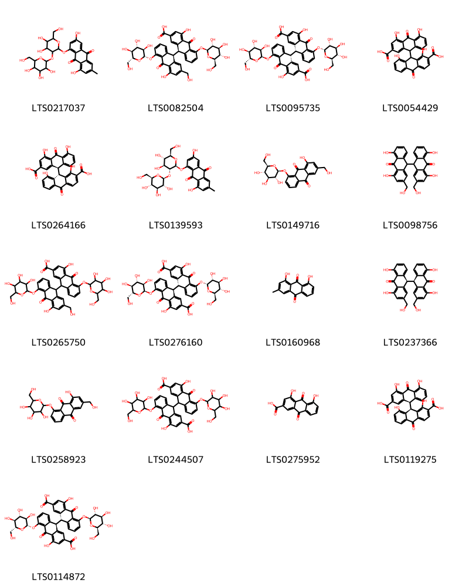{ width=100% }
    <figcaption>Hình ảnh cấu trúc hóa học của 17 hoạt chất thuộc nhóm Anthracenes gồm ['1-{[4,5-dihydroxy-6-(hydroxymethyl)-3-{[3,4,5-trihydroxy-6-(hydroxymethyl)oxan-2-yl]oxy}oxan-2-yl]oxy}-3,8-dihydroxy-6-methylanthracene-9,10-dione (LTS0217037)', 'sennoside c (LTS0082504)', "(9s,9's)-4,4'-dihydroxy-10,10'-dioxo-5,5'-bis({[(2r,3r,4s,5s,6r)-3,4,5-trihydroxy-6-(hydroxymethyl)oxan-2-yl]oxy})-9h,9'h-[9,9'-bianthracene]-2,2'-dicarboxylic acid (LTS0095735)", "1,4',5',8-tetrahydroxy-10,10'-dioxo-9h,9'h-[9,9'-bianthracene]-2,2'-dicarboxylic acid (LTS0054429)", "(9s,9'r)-1,4',5',8-tetrahydroxy-10,10'-dioxo-9h,9'h-[9,9'-bianthracene]-2,2'-dicarboxylic acid (LTS0264166)", '1-{[(2s,3r,4s,5s,6r)-4,5-dihydroxy-6-(hydroxymethyl)-3-{[(2s,3r,4s,5s,6r)-3,4,5-trihydroxy-6-(hydroxymethyl)oxan-2-yl]oxy}oxan-2-yl]oxy}-3,8-dihydroxy-6-methylanthracene-9,10-dione (LTS0139593)', '1-hydroxy-3-(hydroxymethyl)-8-{[(2s,3r,4s,5s,6r)-3,4,5-trihydroxy-6-(hydroxymethyl)oxan-2-yl]oxy}anthracene-9,10-dione (LTS0149716)', "4,4',5,5'-tetrahydroxy-2,2'-bis(hydroxymethyl)-9h,9'h-[9,9'-bianthracene]-10,10'-dione (LTS0098756)", "4,4'-dihydroxy-2'-(hydroxymethyl)-10,10'-dioxo-5,5'-bis({[3,4,5-trihydroxy-6-(hydroxymethyl)oxan-2-yl]oxy})-9h,9'h-[9,9'-bianthracene]-2-carboxylic acid (LTS0265750)", "(9r,9's)-4,4'-dihydroxy-10,10'-dioxo-5,5'-bis({[(2r,3r,4s,5s,6r)-3,4,5-trihydroxy-6-(hydroxymethyl)oxan-2-yl]oxy})-9h,9'h-[9,9'-bianthracene]-2,2'-dicarboxylic acid (LTS0276160)", 'turkey rhubarb (LTS0160968)', "(9r,9's)-4,4',5,5'-tetrahydroxy-2,2'-bis(hydroxymethyl)-9h,9'h-[9,9'-bianthracene]-10,10'-dione (LTS0237366)", '1-hydroxy-3-(hydroxymethyl)-8-{[3,4,5-trihydroxy-6-(hydroxymethyl)oxan-2-yl]oxy}anthracene-9,10-dione (LTS0258923)', "4,4'-dihydroxy-10,10'-dioxo-5,5'-bis({[3,4,5-trihydroxy-6-(hydroxymethyl)oxan-2-yl]oxy})-9h,9'h-[9,9'-bianthracene]-2,2'-dicarboxylic acid (LTS0244507)", 'monorhein (LTS0275952)', "(9r,9'r)-1,4',5',8-tetrahydroxy-10,10'-dioxo-9h,9'h-[9,9'-bianthracene]-2,2'-dicarboxylic acid (LTS0119275)", 'sennoside b (LTS0114872)'].</figcaption>
</figure>
#### Nhóm Fatty Acyls
<figure markdown="span">
    { width=100% }
    <figcaption>Hình ảnh cấu trúc hóa học của 1 hoạt chất thuộc nhóm Fatty Acyls gồm ['palmitic acid (LTS0079439)'].</figcaption>
</figure>
#### Nhóm Flavonoids
<figure markdown="span">
    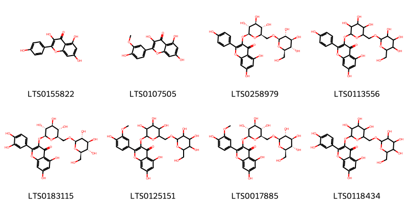{ width=100% }
    <figcaption>Hình ảnh cấu trúc hóa học của 8 hoạt chất thuộc nhóm Flavonoids gồm ['kaempherol (LTS0155822)', 'isorhamnetin (LTS0107505)', '5,7-dihydroxy-2-(4-hydroxyphenyl)-3-{[(2s,3r,4s,5s,6r)-3,4,5-trihydroxy-6-({[(2r,3r,4s,5s,6r)-3,4,5-trihydroxy-6-(hydroxymethyl)oxan-2-yl]oxy}methyl)oxan-2-yl]oxy}chromen-4-one (LTS0258979)', '5,7-dihydroxy-2-(4-hydroxyphenyl)-3-{[3,4,5-trihydroxy-6-({[3,4,5-trihydroxy-6-(hydroxymethyl)oxan-2-yl]oxy}methyl)oxan-2-yl]oxy}chromen-4-one (LTS0113556)', '2-(3,4-dihydroxyphenyl)-5,7-dihydroxy-3-{[(2s,3r,4s,5s,6r)-3,4,5-trihydroxy-6-({[(2r,3r,4s,5s,6r)-3,4,5-trihydroxy-6-(hydroxymethyl)oxan-2-yl]oxy}methyl)oxan-2-yl]oxy}chromen-4-one (LTS0183115)', '5,7-dihydroxy-2-(4-hydroxy-3-methoxyphenyl)-3-{[3,4,5-trihydroxy-6-({[3,4,5-trihydroxy-6-(hydroxymethyl)oxan-2-yl]oxy}methyl)oxan-2-yl]oxy}chromen-4-one (LTS0125151)', '5,7-dihydroxy-2-(4-hydroxy-3-methoxyphenyl)-3-{[(2s,3r,4s,5s,6r)-3,4,5-trihydroxy-6-({[(2r,3r,4s,5s,6r)-3,4,5-trihydroxy-6-(hydroxymethyl)oxan-2-yl]oxy}methyl)oxan-2-yl]oxy}chromen-4-one (LTS0017885)', '2-(3,4-dihydroxyphenyl)-5,7-dihydroxy-3-{[3,4,5-trihydroxy-6-({[3,4,5-trihydroxy-6-(hydroxymethyl)oxan-2-yl]oxy}methyl)oxan-2-yl]oxy}chromen-4-one (LTS0118434)'].</figcaption>
</figure>
#### Nhóm Lignan glycosides
<figure markdown="span">
    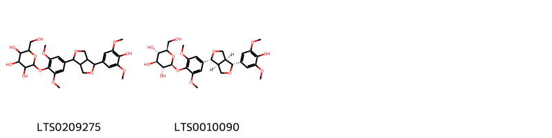{ width=100% }
    <figcaption>Hình ảnh cấu trúc hóa học của 2 hoạt chất thuộc nhóm Lignan glycosides gồm ['2-{4-[4-(4-hydroxy-3,5-dimethoxyphenyl)-hexahydrofuro[3,4-c]furan-1-yl]-2,6-dimethoxyphenoxy}-6-(hydroxymethyl)oxane-3,4,5-triol (LTS0209275)', '(2s,3r,4s,5s,6r)-2-{4-[(1r,3as,4r,6as)-4-(4-hydroxy-3,5-dimethoxyphenyl)-hexahydrofuro[3,4-c]furan-1-yl]-2,6-dimethoxyphenoxy}-6-(hydroxymethyl)oxane-3,4,5-triol (LTS0010090)'].</figcaption>
</figure>
#### Nhóm Organooxygen compounds
<figure markdown="span">
    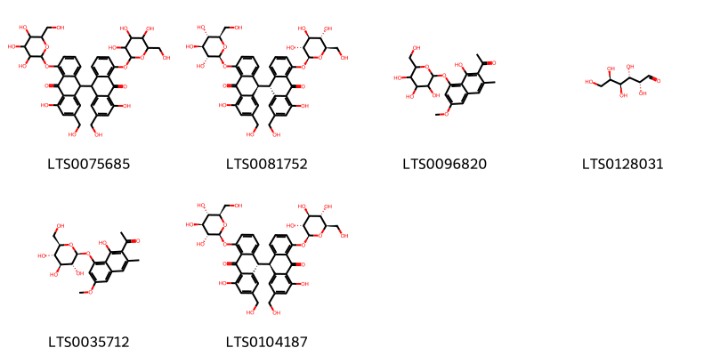{ width=100% }
    <figcaption>Hình ảnh cấu trúc hóa học của 6 hoạt chất thuộc nhóm Organooxygen compounds gồm ["4,4'-dihydroxy-2,2'-bis(hydroxymethyl)-5,5'-bis({[3,4,5-trihydroxy-6-(hydroxymethyl)oxan-2-yl]oxy})-9h,9'h-[9,9'-bianthracene]-10,10'-dione (LTS0075685)", "(9r,9'r)-4,4'-dihydroxy-2,2'-bis(hydroxymethyl)-5,5'-bis({[(2s,3r,4s,5s,6r)-3,4,5-trihydroxy-6-(hydroxymethyl)oxan-2-yl]oxy})-9h,9'h-[9,9'-bianthracene]-10,10'-dione (LTS0081752)", '1-(1-hydroxy-6-methoxy-3-methyl-8-{[3,4,5-trihydroxy-6-(hydroxymethyl)oxan-2-yl]oxy}naphthalen-2-yl)ethanone (LTS0096820)', 'aldehydo-d-galactose (LTS0128031)', '1-(1-hydroxy-6-methoxy-3-methyl-8-{[(2s,3r,4s,5s,6r)-3,4,5-trihydroxy-6-(hydroxymethyl)oxan-2-yl]oxy}naphthalen-2-yl)ethanone (LTS0035712)', "(9s,9's)-4,4'-dihydroxy-2,2'-bis(hydroxymethyl)-5,5'-bis({[(2s,3r,4s,5s,6r)-3,4,5-trihydroxy-6-(hydroxymethyl)oxan-2-yl]oxy})-9h,9'h-[9,9'-bianthracene]-10,10'-dione (LTS0104187)"].</figcaption>
</figure>
#### Nhóm Prenol lipids
<figure markdown="span">
    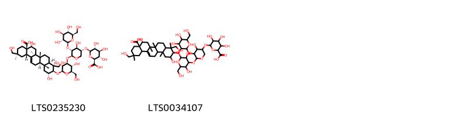{ width=100% }
    <figcaption>Hình ảnh cấu trúc hóa học của 2 hoạt chất thuộc nhóm Prenol lipids gồm ['(2s,3s,4s,5r,6r)-6-{[(3r,4s,5r,6s)-6-{[(2r,3r,4s,5r,6r)-2-{[(2r,3r,4s,4ar,6ar,6bs,8r,8ar,11s,12as,14ar,14br)-8a-carboxy-2,8-dihydroxy-4,11-bis(hydroxymethyl)-4,6a,6b,11,14b-pentamethyl-1,2,3,4a,5,6,7,8,9,10,12,12a,14,14a-tetradecahydropicen-3-yl]oxy}-3,5-dihydroxy-6-(hydroxymethyl)oxan-4-yl]oxy}-4-hydroxy-5-{[(2s,3r,4s,5s,6r)-3,4,5-trihydroxy-6-(hydroxymethyl)oxan-2-yl]oxy}oxan-3-yl]oxy}-3,4,5-trihydroxyoxane-2-carboxylic acid (LTS0235230)', '6-({6-[(2-{[8a-carboxy-2,8-dihydroxy-4,11-bis(hydroxymethyl)-4,6a,6b,11,14b-pentamethyl-1,2,3,4a,5,6,7,8,9,10,12,12a,14,14a-tetradecahydropicen-3-yl]oxy}-3,5-dihydroxy-6-(hydroxymethyl)oxan-4-yl)oxy]-4-hydroxy-5-{[3,4,5-trihydroxy-6-(hydroxymethyl)oxan-2-yl]oxy}oxan-3-yl}oxy)-3,4,5-trihydroxyoxane-2-carboxylic acid (LTS0034107)'].</figcaption>
</figure>

---

### Dược dân tộc học

Danh sách các quốc gia có sử dụng *Senna alexandrina* trong điều trị các bệnh. 

| Country   | Disease             | Bệnh                                                                                                                                                                                                |
|:----------|:--------------------|:----------------------------------------------------------------------------------------------------------------------------------------------------------------------------------------------------|
| China     | Laxative, Purgative | MYMEMORY WARNING: YOU USED ALL AVAILABLE FREE TRANSLATIONS FOR TODAY. NEXT AVAILABLE IN  15 HOURS 48 MINUTES 07 SECONDS VISIT HTTPS://MYMEMORY.TRANSLATED.NET/DOC/USAGELIMITS.PHP TO TRANSLATE MORE |
| Elsewhere | Cathartic, Laxative | MYMEMORY WARNING: YOU USED ALL AVAILABLE FREE TRANSLATIONS FOR TODAY. NEXT AVAILABLE IN  15 HOURS 48 MINUTES 05 SECONDS VISIT HTTPS://MYMEMORY.TRANSLATED.NET/DOC/USAGELIMITS.PHP TO TRANSLATE MORE |
| France    | Cathartic           | MYMEMORY WARNING: YOU USED ALL AVAILABLE FREE TRANSLATIONS FOR TODAY. NEXT AVAILABLE IN  15 HOURS 48 MINUTES 03 SECONDS VISIT HTTPS://MYMEMORY.TRANSLATED.NET/DOC/USAGELIMITS.PHP TO TRANSLATE MORE |
| Haiti     | Laxative            | MYMEMORY WARNING: YOU USED ALL AVAILABLE FREE TRANSLATIONS FOR TODAY. NEXT AVAILABLE IN  15 HOURS 48 MINUTES 00 SECONDS VISIT HTTPS://MYMEMORY.TRANSLATED.NET/DOC/USAGELIMITS.PHP TO TRANSLATE MORE |

---

---
## Cassia auriculata
### Thông tin về thực vật

!!! info "Phân loại thực vật của *Senna auriculata* từ GIBF:"
    - **Kingdom:** Plantae
    - **Phylum:** Tracheophyta
    - **Order:** Fabales
    - **Family:** Fabaceae
    - **Genus:** Senna
    - **Species:** *Senna auriculata*

 

| Label (VI)   | Label (EN)   | Scientific Name   | Descriptions (VI)   | Descriptions (EN)   | Also Known As (VI)   | Also Known As (EN)   |
|:-------------|:-------------|:------------------|:--------------------|:--------------------|:---------------------|:---------------------|
| N/A          | N/A          | Cassia auriculata | loài thực vật       | species of plant    | ['']                 | ["Tanner's Cassia"]  |

#### Phân bố trên thế giới

**Từ CSDL GIBF** nan, Sri Lanka, Ghana, Central African Republic, Micronesia (Federated States of), Japan, Somalia, Myanmar, unknown or invalid, Tanzania, United Republic of, Pakistan, Nigeria, Chinese Taipei, Saudi Arabia, France, Singapore, China, India, Indonesia, Philippines

#### Phân bố tại Việt Nam

**Từ CSDL GIBF**: Không có ghi nhận ở Việt Nam

---
### Thành phần hóa học
        
- Theo cơ sở dữ liệu lotus: Từ loài *Senna auriculata* đã phân lập và xác định được Chưa có hoạt chất nào được phân lập. hoạt chất thuộc về các nhóm Không có hoạt chất nào được phân lập. 

Không có hình ảnh nào được tạo ra

---

### Dược dân tộc học

Danh sách các quốc gia có sử dụng *Senna auriculata* trong điều trị các bệnh. 

| Country   | Disease               | Bệnh                                                                                                                                                                                                |
|:----------|:----------------------|:----------------------------------------------------------------------------------------------------------------------------------------------------------------------------------------------------|
| Elsewhere | Vermifuge, Astringent | MYMEMORY WARNING: YOU USED ALL AVAILABLE FREE TRANSLATIONS FOR TODAY. NEXT AVAILABLE IN  15 HOURS 47 MINUTES 38 SECONDS VISIT HTTPS://MYMEMORY.TRANSLATED.NET/DOC/USAGELIMITS.PHP TO TRANSLATE MORE |

---

---
## Cassia bahamensis
### Thông tin về thực vật

!!! info "Phân loại thực vật của *Senna ligustrina* từ GIBF:"
    - **Kingdom:** Plantae
    - **Phylum:** Tracheophyta
    - **Order:** Fabales
    - **Family:** Fabaceae
    - **Genus:** Senna
    - **Species:** *Senna ligustrina*

 

| Label (VI)   | Label (EN)   | Scientific Name   | Descriptions (VI)   | Descriptions (EN)   | Also Known As (VI)   | Also Known As (EN)   |
|:-------------|:-------------|:------------------|:--------------------|:--------------------|:---------------------|:---------------------|
| N/A          | N/A          | Cassia bahamensis | loài thực vật       | species of plant    | ['']                 | ['']                 |

#### Phân bố trên thế giới

**Từ CSDL GIBF** nan, Bahamas, India, Jamaica, Cuba, United States of America, Mexico

#### Phân bố tại Việt Nam

**Từ CSDL GIBF**: Không có ghi nhận ở Việt Nam

---
### Thành phần hóa học
        
- Theo cơ sở dữ liệu lotus: Từ loài *Senna ligustrina* đã phân lập và xác định được Chưa có hoạt chất nào được phân lập. hoạt chất thuộc về các nhóm Không có hoạt chất nào được phân lập. 

Không có hình ảnh nào được tạo ra

---

### Dược dân tộc học

Danh sách các quốc gia có sử dụng *Senna ligustrina* trong điều trị các bệnh. 

| Country   | Disease     | Bệnh                                                                                                                                                                                                |
|:----------|:------------|:----------------------------------------------------------------------------------------------------------------------------------------------------------------------------------------------------|
| Bahamas   | Suppurative | MYMEMORY WARNING: YOU USED ALL AVAILABLE FREE TRANSLATIONS FOR TODAY. NEXT AVAILABLE IN  15 HOURS 47 MINUTES 17 SECONDS VISIT HTTPS://MYMEMORY.TRANSLATED.NET/DOC/USAGELIMITS.PHP TO TRANSLATE MORE |

---

---
## Cassia bicapsularis
### Thông tin về thực vật

!!! info "Phân loại thực vật của *N/A* từ GIBF:"
    - **Kingdom:** Plantae
    - **Phylum:** Tracheophyta
    - **Order:** Fabales
    - **Family:** Fabaceae
    - **Genus:** Senna
    - **Species:** *N/A*

 

| Label (VI)   | Label (EN)   | Scientific Name     | Descriptions (VI)   | Descriptions (EN)   | Also Known As (VI)   | Also Known As (EN)   |
|:-------------|:-------------|:--------------------|:--------------------|:--------------------|:---------------------|:---------------------|
| N/A          | N/A          | Cassia bicapsularis |                     | species of plant    | ['']                 | ['']                 |

#### Phân bố trên thế giới

**Từ CSDL GIBF** Virgin Islands (U.S.), United Arab Emirates, Sri Lanka, Australia, Guadeloupe, Argentina, Benin, Nicaragua, Virgin Islands (British), Sierra Leone, French Guiana, Panama, Malawi, Puerto Rico, Namibia, Chinese Taipei, Spain, Bolivia (Plurinational State of), Jamaica, Morocco, United States of America, Congo, Democratic Republic of the, Chile, Zimbabwe, El Salvador, South Africa, Uganda, Barbados, Thailand, Brazil, Mexico, Dominican Republic, Peru, Norfolk Island, Viet Nam, Eswatini, China, Ecuador, Haiti, Colombia, Kenya, Costa Rica, India, Antigua and Barbuda, Philippines, New Zealand, Ethiopia

#### Phân bố tại Việt Nam

**Từ CSDL GIBF**: Hồ Chí Minh city, Bà Rịa - Vũng Tàu

---
### Thành phần hóa học
        
- Theo cơ sở dữ liệu lotus: Từ loài *N/A* đã phân lập và xác định được Chưa có hoạt chất nào được phân lập. hoạt chất thuộc về các nhóm Không có hoạt chất nào được phân lập. 

Không có hình ảnh nào được tạo ra

---

### Dược dân tộc học

Danh sách các quốc gia có sử dụng *N/A* trong điều trị các bệnh. 

| Country   | Disease               | Bệnh                                                                                                                                                                                                |
|:----------|:----------------------|:----------------------------------------------------------------------------------------------------------------------------------------------------------------------------------------------------|
| Elsewhere | Insecticide, Laxative | MYMEMORY WARNING: YOU USED ALL AVAILABLE FREE TRANSLATIONS FOR TODAY. NEXT AVAILABLE IN  15 HOURS 46 MINUTES 59 SECONDS VISIT HTTPS://MYMEMORY.TRANSLATED.NET/DOC/USAGELIMITS.PHP TO TRANSLATE MORE |
| Mexico    | Purgative, Purgative  | MYMEMORY WARNING: YOU USED ALL AVAILABLE FREE TRANSLATIONS FOR TODAY. NEXT AVAILABLE IN  15 HOURS 46 MINUTES 57 SECONDS VISIT HTTPS://MYMEMORY.TRANSLATED.NET/DOC/USAGELIMITS.PHP TO TRANSLATE MORE |

---

---
## Cassia biflora
### Thông tin về thực vật

!!! info "Phân loại thực vật của *Cassia biflora* từ GIBF:"
    - **Kingdom:** Plantae
    - **Phylum:** Tracheophyta
    - **Order:** Fabales
    - **Family:** Fabaceae
    - **Genus:** Cassia
    - **Species:** *Cassia biflora*

 

| Label (VI)   | Label (EN)   | Scientific Name   | Descriptions (VI)   | Descriptions (EN)   | Also Known As (VI)   | Also Known As (EN)   |
|:-------------|:-------------|:------------------|:--------------------|:--------------------|:---------------------|:---------------------|
| N/A          | N/A          | Cassia biflora    |                     | species of plant    | ['']                 | ['']                 |

#### Phân bố trên thế giới

**Từ CSDL GIBF** Dominican Republic, nan, Ghana, Nigeria, Colombia, Bahamas, Jamaica, Cuba, United States of America, Nicaragua, Mexico, Tanzania, United Republic of, Venezuela (Bolivarian Republic of)

#### Phân bố tại Việt Nam

**Từ CSDL GIBF**: Không có ghi nhận ở Việt Nam

---
### Thành phần hóa học
        
- Theo cơ sở dữ liệu lotus: Từ loài *Cassia biflora* đã phân lập và xác định được 1 hoạt chất thuộc về các nhóm Flavonoids. 

|    | chemicalTaxonomyClassyfireClass   |   smiles_count |
|---:|:----------------------------------|---------------:|
|  0 | Flavonoids                        |              1 |

#### Nhóm Flavonoids
<figure markdown="span">
    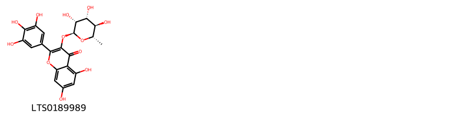{ width=100% }
    <figcaption>Hình ảnh cấu trúc hóa học của 1 hoạt chất thuộc nhóm Flavonoids gồm ['myricitrin (LTS0189989)'].</figcaption>
</figure>

---

### Dược dân tộc học

Danh sách các quốc gia có sử dụng *Cassia biflora* trong điều trị các bệnh. 

| Country   | Disease      | Bệnh                                                                                                                                                                                                |
|:----------|:-------------|:----------------------------------------------------------------------------------------------------------------------------------------------------------------------------------------------------|
| Guatemala | Parasiticide | MYMEMORY WARNING: YOU USED ALL AVAILABLE FREE TRANSLATIONS FOR TODAY. NEXT AVAILABLE IN  15 HOURS 46 MINUTES 34 SECONDS VISIT HTTPS://MYMEMORY.TRANSLATED.NET/DOC/USAGELIMITS.PHP TO TRANSLATE MORE |

---

---
## Cassia cathartica
### Thông tin về thực vật

!!! info "Phân loại thực vật của *Chamaecrista cathartica* từ GIBF:"
    - **Kingdom:** Plantae
    - **Phylum:** Tracheophyta
    - **Order:** Fabales
    - **Family:** Fabaceae
    - **Genus:** Chamaecrista
    - **Species:** *Chamaecrista cathartica*

 

| Label (VI)   | Label (EN)   | Scientific Name   | Descriptions (VI)   | Descriptions (EN)   | Also Known As (VI)   | Also Known As (EN)   |
|:-------------|:-------------|:------------------|:--------------------|:--------------------|:---------------------|:---------------------|
| N/A          | N/A          | Cassia cathartica | loài thực vật       | species of plant    | ['']                 | ['']                 |

#### Phân bố trên thế giới

**Từ CSDL GIBF** nan, Brazil

#### Phân bố tại Việt Nam

**Từ CSDL GIBF**: Không có ghi nhận ở Việt Nam

---
### Thành phần hóa học
        
- Theo cơ sở dữ liệu lotus: Từ loài *Chamaecrista cathartica* đã phân lập và xác định được Chưa có hoạt chất nào được phân lập. hoạt chất thuộc về các nhóm Không có hoạt chất nào được phân lập. 

Không có hình ảnh nào được tạo ra

---

### Dược dân tộc học

Danh sách các quốc gia có sử dụng *Chamaecrista cathartica* trong điều trị các bệnh. 

| Country   | Disease   | Bệnh                                                                                                                                                                                                |
|:----------|:----------|:----------------------------------------------------------------------------------------------------------------------------------------------------------------------------------------------------|
| Brazil    | Purgative | MYMEMORY WARNING: YOU USED ALL AVAILABLE FREE TRANSLATIONS FOR TODAY. NEXT AVAILABLE IN  15 HOURS 46 MINUTES 16 SECONDS VISIT HTTPS://MYMEMORY.TRANSLATED.NET/DOC/USAGELIMITS.PHP TO TRANSLATE MORE |

---

---
## Cassia covesii
### Thông tin về thực vật

!!! info "Phân loại thực vật của *Senna covesii* từ GIBF:"
    - **Kingdom:** Plantae
    - **Phylum:** Tracheophyta
    - **Order:** Fabales
    - **Family:** Fabaceae
    - **Genus:** Senna
    - **Species:** *Senna covesii*

 

| Label (VI)   | Label (EN)   | Scientific Name   | Descriptions (VI)   | Descriptions (EN)   | Also Known As (VI)   | Also Known As (EN)   |
|:-------------|:-------------|:------------------|:--------------------|:--------------------|:---------------------|:---------------------|
| N/A          | N/A          | Cassia covesii    | loài thực vật       | species of plant    | ['']                 | ['']                 |

#### Phân bố trên thế giới

**Từ CSDL GIBF** nan, United States of America, Mexico

#### Phân bố tại Việt Nam

**Từ CSDL GIBF**: Không có ghi nhận ở Việt Nam

---
### Thành phần hóa học
        
- Theo cơ sở dữ liệu lotus: Từ loài *Senna covesii* đã phân lập và xác định được Chưa có hoạt chất nào được phân lập. hoạt chất thuộc về các nhóm Không có hoạt chất nào được phân lập. 

Không có hình ảnh nào được tạo ra

---

### Dược dân tộc học

Danh sách các quốc gia có sử dụng *Senna covesii* trong điều trị các bệnh. 

| Country      | Disease           | Bệnh                                                                                                                                                                                                |
|:-------------|:------------------|:----------------------------------------------------------------------------------------------------------------------------------------------------------------------------------------------------|
| Mexico(Seri) | Aperient, Apertif | MYMEMORY WARNING: YOU USED ALL AVAILABLE FREE TRANSLATIONS FOR TODAY. NEXT AVAILABLE IN  15 HOURS 45 MINUTES 55 SECONDS VISIT HTTPS://MYMEMORY.TRANSLATED.NET/DOC/USAGELIMITS.PHP TO TRANSLATE MORE |

---

---
## Cassia didymobotrya
### Thông tin về thực vật

!!! info "Phân loại thực vật của *Senna didymobotrya* từ GIBF:"
    - **Kingdom:** Plantae
    - **Phylum:** Tracheophyta
    - **Order:** Fabales
    - **Family:** Fabaceae
    - **Genus:** Senna
    - **Species:** *Senna didymobotrya*

 

| Label (VI)   | Label (EN)   | Scientific Name     | Descriptions (VI)   | Descriptions (EN)   | Also Known As (VI)   | Also Known As (EN)   |
|:-------------|:-------------|:--------------------|:--------------------|:--------------------|:---------------------|:---------------------|
| N/A          | N/A          | Cassia didymobotrya | loài thực vật       | species of plant    | ['']                 | ['']                 |

#### Phân bố trên thế giới

**Từ CSDL GIBF** nan, Sri Lanka, Australia, Cambodia, Guatemala, Angola, Mozambique, Rwanda, unknown or invalid, Congo, Tanzania, United Republic of, Yemen, Pakistan, Chinese Taipei, Spain, Portugal, United States of America, Congo, Democratic Republic of the, Uganda, South Africa, Egypt, Tonga, Cuba, Mexico, China, Iraq, Costa Rica, Burundi, India, Burkina Faso, Lebanon, Kenya, Ethiopia

#### Phân bố tại Việt Nam

**Từ CSDL GIBF**: Không có ghi nhận ở Việt Nam

---
### Thành phần hóa học
        
- Theo cơ sở dữ liệu lotus: Từ loài *Senna didymobotrya* đã phân lập và xác định được Chưa có hoạt chất nào được phân lập. hoạt chất thuộc về các nhóm Không có hoạt chất nào được phân lập. 

Không có hình ảnh nào được tạo ra

---

### Dược dân tộc học

Danh sách các quốc gia có sử dụng *Senna didymobotrya* trong điều trị các bệnh. 

| Country         | Disease   | Bệnh                                                                                                                                                                                                |
|:----------------|:----------|:----------------------------------------------------------------------------------------------------------------------------------------------------------------------------------------------------|
| Africa(Swahili) | Poison    | MYMEMORY WARNING: YOU USED ALL AVAILABLE FREE TRANSLATIONS FOR TODAY. NEXT AVAILABLE IN  15 HOURS 45 MINUTES 37 SECONDS VISIT HTTPS://MYMEMORY.TRANSLATED.NET/DOC/USAGELIMITS.PHP TO TRANSLATE MORE |

---

---
## Cassia ectabilis
### Thông tin về thực vật

!!! info "Phân loại thực vật của *N/A* từ GIBF:"
    - **Kingdom:** N/A
    - **Phylum:** N/A
    - **Order:** N/A
    - **Family:** N/A
    - **Genus:** N/A
    - **Species:** *N/A*

 

| Label (VI)   | Label (EN)   | Scientific Name     | Descriptions (VI)   | Descriptions (EN)   | Also Known As (VI)   | Also Known As (EN)   |
|:-------------|:-------------|:--------------------|:--------------------|:--------------------|:---------------------|:---------------------|
| N/A          | N/A          | Cassia didymobotrya | loài thực vật       | species of plant    | ['']                 | ['']                 |

#### Phân bố trên thế giới

**Từ CSDL GIBF** Không có kết quả phù hợp

#### Phân bố tại Việt Nam

**Từ CSDL GIBF**: Không có ghi nhận ở Việt Nam

---
### Thành phần hóa học
        
- Theo cơ sở dữ liệu lotus: Từ loài *N/A* đã phân lập và xác định được Chưa có hoạt chất nào được phân lập. hoạt chất thuộc về các nhóm Không có hoạt chất nào được phân lập. 

Không có hình ảnh nào được tạo ra

---

### Dược dân tộc học

Danh sách các quốc gia có sử dụng *N/A* trong điều trị các bệnh. 

| Country   | Disease           | Bệnh                                                                                                                                                                                                |
|:----------|:------------------|:----------------------------------------------------------------------------------------------------------------------------------------------------------------------------------------------------|
| Venezuela | Emetic, Purgative | MYMEMORY WARNING: YOU USED ALL AVAILABLE FREE TRANSLATIONS FOR TODAY. NEXT AVAILABLE IN  15 HOURS 45 MINUTES 16 SECONDS VISIT HTTPS://MYMEMORY.TRANSLATED.NET/DOC/USAGELIMITS.PHP TO TRANSLATE MORE |

---

---
## Cassia emarginata
### Thông tin về thực vật

!!! info "Phân loại thực vật của *Cassia emarginata* từ GIBF:"
    - **Kingdom:** Plantae
    - **Phylum:** Tracheophyta
    - **Order:** Fabales
    - **Family:** Fabaceae
    - **Genus:** Cassia
    - **Species:** *Cassia emarginata*

 

| Label (VI)   | Label (EN)   | Scientific Name   | Descriptions (VI)   | Descriptions (EN)   | Also Known As (VI)   | Also Known As (EN)   |
|:-------------|:-------------|:------------------|:--------------------|:--------------------|:---------------------|:---------------------|
| N/A          | N/A          | Cassia emarginata | loài thực vật       | species of plant    | ['']                 | ['']                 |

#### Phân bố trên thế giới

**Từ CSDL GIBF** nan, Ecuador, Puerto Rico, Colombia, Honduras, Jamaica, United States of America, Cuba, Mexico, Dominican Republic, Venezuela (Bolivarian Republic of)

#### Phân bố tại Việt Nam

**Từ CSDL GIBF**: Không có ghi nhận ở Việt Nam

---
### Thành phần hóa học
        
- Theo cơ sở dữ liệu lotus: Từ loài *Cassia emarginata* đã phân lập và xác định được Chưa có hoạt chất nào được phân lập. hoạt chất thuộc về các nhóm Không có hoạt chất nào được phân lập. 

Không có hình ảnh nào được tạo ra

---

### Dược dân tộc học

Danh sách các quốc gia có sử dụng *Cassia emarginata* trong điều trị các bệnh. 

| Country   | Disease              | Bệnh                                                                                                                                                                                                |
|:----------|:---------------------|:----------------------------------------------------------------------------------------------------------------------------------------------------------------------------------------------------|
| Guatemala | Depilatory           | MYMEMORY WARNING: YOU USED ALL AVAILABLE FREE TRANSLATIONS FOR TODAY. NEXT AVAILABLE IN  15 HOURS 45 MINUTES 06 SECONDS VISIT HTTPS://MYMEMORY.TRANSLATED.NET/DOC/USAGELIMITS.PHP TO TRANSLATE MORE |
| Mexico    | Purgative, Purgative | MYMEMORY WARNING: YOU USED ALL AVAILABLE FREE TRANSLATIONS FOR TODAY. NEXT AVAILABLE IN  15 HOURS 45 MINUTES 04 SECONDS VISIT HTTPS://MYMEMORY.TRANSLATED.NET/DOC/USAGELIMITS.PHP TO TRANSLATE MORE |

---

---
## Cassia fistula
### Thông tin về thực vật

!!! info "Phân loại thực vật của *Cassia fistula* từ GIBF:"
    - **Kingdom:** Plantae
    - **Phylum:** Tracheophyta
    - **Order:** Fabales
    - **Family:** Fabaceae
    - **Genus:** Cassia
    - **Species:** *Cassia fistula*

 

| Label (VI)   | Label (EN)   | Scientific Name   | Descriptions (VI)   | Descriptions (EN)   | Also Known As (VI)                                                              | Also Known As (EN)                                                                                                                                                                                                |
|:-------------|:-------------|:------------------|:--------------------|:--------------------|:--------------------------------------------------------------------------------|:------------------------------------------------------------------------------------------------------------------------------------------------------------------------------------------------------------------|
| N/A          | N/A          | Cassia fistula    | loài thực vật       | species of plant    | ['Muồng hoàng hậu', 'Hoàng điệp', 'Điệp vàng', 'Cassia fistula', 'Bò cạp nước'] | ['Bactyrilobium fistula', 'golden rain', 'Cassia fistuloides', 'Cassia rhombifolia', 'Cassia bonplandiana', 'Cathartocarpus excelsus', 'golden shower', 'Indian laburnum', 'pudding-pipe tree', 'purging cassia'] |

#### Phân bố trên thế giới

**Từ CSDL GIBF** Ghana, South Africa, Sri Lanka, Australia, Thailand, Lao People’s Democratic Republic, Guadeloupe, Martinique, Brazil, Costa Rica, India, Benin, United States of America, Mexico, China

#### Phân bố tại Việt Nam

**Từ CSDL GIBF**: Không có ghi nhận ở Việt Nam

---
### Thành phần hóa học
        
- Theo cơ sở dữ liệu lotus: Từ loài *Cassia fistula* đã phân lập và xác định được 108 hoạt chất thuộc về các nhóm Phenol ethers, Fatty Acyls, Flavonoids, Prenol lipids, Steroids and steroid derivatives, Anthracenes, Benzene and substituted derivatives, Saturated hydrocarbons, Organooxygen compounds, Coumarins and derivatives, Glycerolipids, Benzopyrans. 

|    | chemicalTaxonomyClassyfireClass     |   smiles_count |
|---:|:------------------------------------|---------------:|
|  0 | Anthracenes                         |             16 |
|  1 | Benzene and substituted derivatives |              4 |
|  2 | Benzopyrans                         |              7 |
|  3 | Coumarins and derivatives           |              2 |
|  4 | Fatty Acyls                         |             20 |
|  5 | Flavonoids                          |             33 |
|  6 | Glycerolipids                       |              2 |
|  7 | Organooxygen compounds              |              7 |
|  8 | Phenol ethers                       |              1 |
|  9 | Prenol lipids                       |              6 |
| 10 | Saturated hydrocarbons              |              2 |
| 11 | Steroids and steroid derivatives    |              7 |

#### Nhóm Anthracenes
<figure markdown="span">
    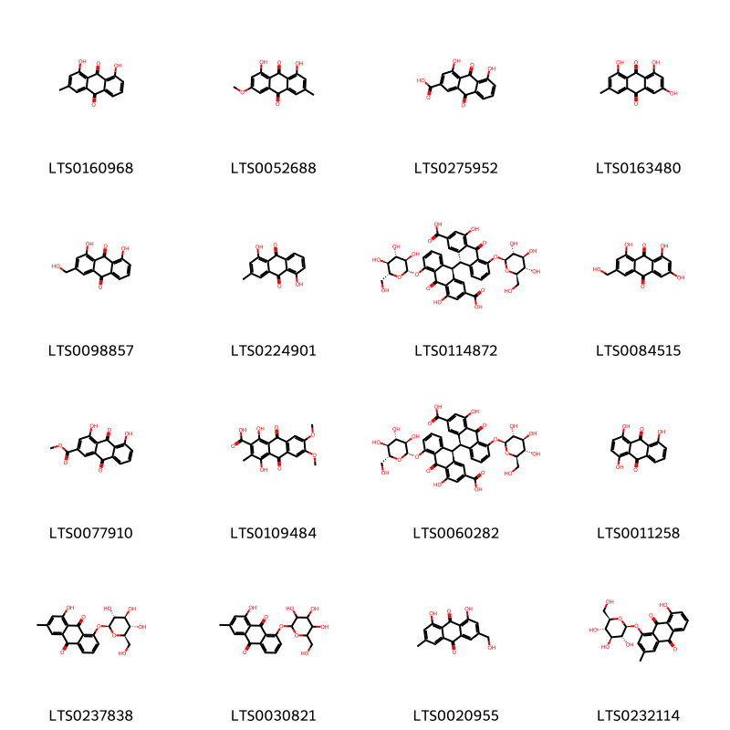{ width=100% }
    <figcaption>Hình ảnh cấu trúc hóa học của 16 hoạt chất thuộc nhóm Anthracenes gồm ['turkey rhubarb (LTS0160968)', 'physcion (LTS0052688)', 'monorhein (LTS0275952)', 'emodin (LTS0163480)', 'aloe emodin (LTS0098857)', '1,5-dihydroxy-3-methylanthracene-9,10-dione (LTS0224901)', 'sennoside b (LTS0114872)', 'citreorosein (LTS0084515)', 'methyl 4,5-dihydroxy-9,10-dioxoanthracene-2-carboxylate (LTS0077910)', '1,4-dihydroxy-6,7-dimethoxy-3-methyl-9,10-dioxoanthracene-2-carboxylic acid (LTS0109484)', 'sennoside a (LTS0060282)', '1,4,5-trihydroxyanthraquinone (LTS0011258)', 'pulmatin (LTS0237838)', '1-hydroxy-3-methyl-8-{[3,4,5-trihydroxy-6-(hydroxymethyl)oxan-2-yl]oxy}anthracene-9,10-dione (LTS0030821)', '1,8-dihydroxy-3-(hydroxymethyl)-6-methylanthracene-9,10-dione (LTS0020955)', '8-hydroxy-3-methyl-1-{[(2s,3r,4s,5s,6r)-3,4,5-trihydroxy-6-(hydroxymethyl)oxan-2-yl]oxy}anthracene-9,10-dione (LTS0232114)'].</figcaption>
</figure>
#### Nhóm Benzene and substituted derivatives
<figure markdown="span">
    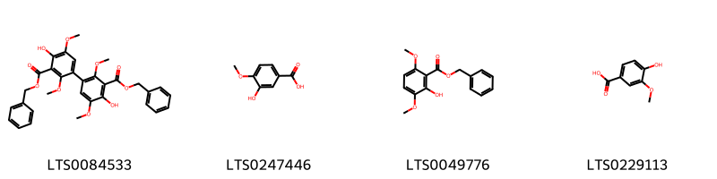{ width=100% }
    <figcaption>Hình ảnh cấu trúc hóa học của 4 hoạt chất thuộc nhóm Benzene and substituted derivatives gồm ["3,3'-dibenzyl 4,4'-dihydroxy-2,2',5,5'-tetramethoxy-[1,1'-biphenyl]-3,3'-dicarboxylate (LTS0084533)", 'isovanillic acid (LTS0247446)', 'benzyl 2-hydroxy-3,6-dimethoxybenzoate (LTS0049776)', 'vanillic acid (LTS0229113)'].</figcaption>
</figure>
#### Nhóm Benzopyrans
<figure markdown="span">
    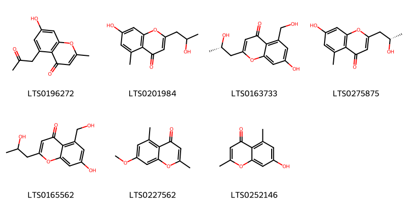{ width=100% }
    <figcaption>Hình ảnh cấu trúc hóa học của 7 hoạt chất thuộc nhóm Benzopyrans gồm ['7-hydroxy-2-methyl-5-(2-oxopropyl)chromen-4-one (LTS0196272)', '7-hydroxy-2-(2-hydroxypropyl)-5-methylchromen-4-one (LTS0201984)', '7-hydroxy-5-(hydroxymethyl)-2-[(2s)-2-hydroxypropyl]chromen-4-one (LTS0163733)', '7-hydroxy-2-[(2s)-2-hydroxypropyl]-5-methylchromen-4-one (LTS0275875)', '7-hydroxy-5-(hydroxymethyl)-2-(2-hydroxypropyl)chromen-4-one (LTS0165562)', '7-methoxy-2,5-dimethylchromen-4-one (LTS0227562)', 'altechromone a (LTS0252146)'].</figcaption>
</figure>
#### Nhóm Coumarins and derivatives
<figure markdown="span">
    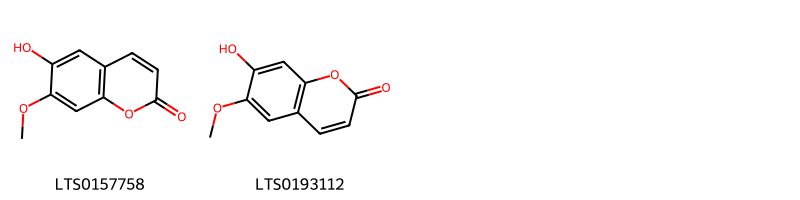{ width=100% }
    <figcaption>Hình ảnh cấu trúc hóa học của 2 hoạt chất thuộc nhóm Coumarins and derivatives gồm ['isoscopoletin (LTS0157758)', 'scopoletin (LTS0193112)'].</figcaption>
</figure>
#### Nhóm Fatty Acyls
<figure markdown="span">
    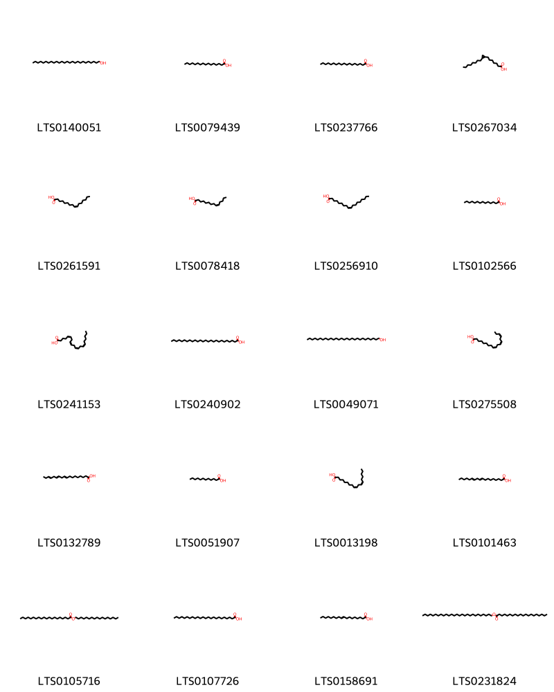{ width=100% }
    <figcaption>Hình ảnh cấu trúc hóa học của 20 hoạt chất thuộc nhóm Fatty Acyls gồm ['ceryl alcohol (LTS0140051)', 'palmitic acid (LTS0079439)', 'stearic acid (LTS0237766)', 'malvalic acid (LTS0267034)', 'palmitoleic acid (LTS0261591)', 'myristoleic acid (LTS0078418)', 'oleic acid (LTS0256910)', 'myristic acid (LTS0102566)', 'arachidonic acid (LTS0241153)', 'hexacosanoic acid (LTS0240902)', 'octacosanol (LTS0049071)', 'α-linolenic acid (LTS0275508)', 'α linolenic acid (LTS0132789)', 'lauric acid (LTS0051907)', 'linoleic (LTS0013198)', '9,12-octadecadienoic acid (LTS0101463)', 'heptadecyl icosanoate (LTS0105716)', 'lignoceric acid (LTS0107726)', '9 octadecenoic acid (LTS0158691)', 'heptacosyl icosanoate (LTS0231824)'].</figcaption>
</figure>
#### Nhóm Flavonoids
<figure markdown="span">
    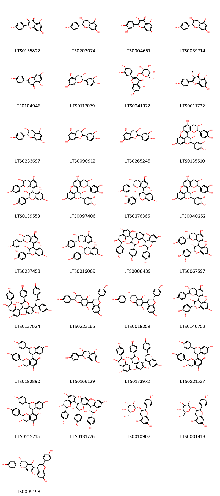{ width=100% }
    <figcaption>Hình ảnh cấu trúc hóa học của 33 hoạt chất thuộc nhóm Flavonoids gồm ['kaempherol (LTS0155822)', 'epiafzelechin (LTS0203074)', 'quercetin (LTS0004651)', "3,5,7,4'-tetrahydroxyflavan (LTS0039714)", 'chamomile (LTS0104946)', '(+)-catechol (LTS0117079)', '2-(3,4-dihydroxyphenyl)-5,7-dihydroxy-3-{[(2s,3r,4r,5r,6s)-3,4,5-trihydroxy-6-(hydroxymethyl)oxan-2-yl]oxy}chromen-4-one (LTS0241372)', 'isokaempferide (LTS0011732)', 'afzelechin (LTS0233697)', 'catechol (LTS0090912)', 'ent-epicatechin (LTS0265245)', '(2r,3r,4r)-2-(3,4-dihydroxyphenyl)-4-[(2r,3r)-2-(3,4-dihydroxyphenyl)-3,5,7-trihydroxy-3,4-dihydro-2h-1-benzopyran-8-yl]-3,4-dihydro-2h-1-benzopyran-3,5,7-triol (LTS0135510)', '2-(4-hydroxyphenyl)-8-[3,5,7-trihydroxy-2-(4-hydroxyphenyl)-3,4-dihydro-2h-1-benzopyran-4-yl]-3,4-dihydro-2h-1-benzopyran-3,5,7-triol (LTS0139553)', '(2r,3r)-2-(3,4-dihydroxyphenyl)-4-[(2r,3r)-2-(3,4-dihydroxyphenyl)-3,5,7-trihydroxy-3,4-dihydro-2h-1-benzopyran-8-yl]-3,4-dihydro-2h-1-benzopyran-3,5,7-triol (LTS0097406)', '(2r,3r,4r)-4-[(2r,3r)-2-(3,4-dihydroxyphenyl)-3,5,7-trihydroxy-3,4-dihydro-2h-1-benzopyran-8-yl]-2-(4-hydroxyphenyl)-3,4-dihydro-2h-1-benzopyran-3,5,7-triol (LTS0276366)', '2-(3,4-dihydroxyphenyl)-4-[2-(3,4-dihydroxyphenyl)-3,5,7-trihydroxy-3,4-dihydro-2h-1-benzopyran-8-yl]-3,4-dihydro-2h-1-benzopyran-3,5,7-triol (LTS0040252)', '4-[2-(3,4-dihydroxyphenyl)-3,5,7-trihydroxy-3,4-dihydro-2h-1-benzopyran-8-yl]-2-(4-hydroxyphenyl)-3,4-dihydro-2h-1-benzopyran-3,5,7-triol (LTS0237458)', '(2r,3r)-2-(4-hydroxyphenyl)-8-[(2r,3r,4r)-3,5,7-trihydroxy-2-(4-hydroxyphenyl)-3,4-dihydro-2h-1-benzopyran-4-yl]-3,4-dihydro-2h-1-benzopyran-3,5,7-triol (LTS0016009)', '2-(4-hydroxyphenyl)-8-[3,5,7-trihydroxy-2-(4-hydroxyphenyl)-3,4-dihydro-2h-1-benzopyran-4-yl]-4-[3,5,7-trihydroxy-2-(4-hydroxyphenyl)-3,4-dihydro-2h-1-benzopyran-8-yl]-3,4-dihydro-2h-1-benzopyran-3,5,7-triol (LTS0008439)', '(2r,3r)-8-[(2r,3r,4r)-2-(3,4-dihydroxyphenyl)-3,5,7-trihydroxy-3,4-dihydro-2h-1-benzopyran-4-yl]-2-(4-hydroxyphenyl)-3,4-dihydro-2h-1-benzopyran-3,5,7-triol (LTS0067597)', '8-[7-hydroxy-2-(4-hydroxyphenyl)-3,4-dihydro-2h-1-benzopyran-4-yl]-2-(4-hydroxyphenyl)-4-[3,5,7-trihydroxy-2-(4-hydroxyphenyl)-3,4-dihydro-2h-1-benzopyran-8-yl]-3,4-dihydro-2h-1-benzopyran-3,5,7-triol (LTS0127024)', '6-[7-hydroxy-2-(4-hydroxyphenyl)-3,4-dihydro-2h-1-benzopyran-4-yl]-2-(4-hydroxyphenyl)-3,4-dihydro-2h-1-benzopyran-3,5,7-triol (LTS0222165)', '(2r,3r)-6-[(2s,4s)-7-hydroxy-2-(4-hydroxyphenyl)-3,4-dihydro-2h-1-benzopyran-4-yl]-2-(4-hydroxyphenyl)-3,4-dihydro-2h-1-benzopyran-3,5,7-triol (LTS0018259)', '8-[2-(3,4-dihydroxyphenyl)-3,5,7-trihydroxy-3,4-dihydro-2h-1-benzopyran-4-yl]-2-(4-hydroxyphenyl)-3,4-dihydro-2h-1-benzopyran-3,5,7-triol (LTS0140752)', '(2r,3r)-8-[(2s,4r)-7-hydroxy-2-(4-hydroxyphenyl)-3,4-dihydro-2h-1-benzopyran-4-yl]-2-(4-hydroxyphenyl)-3,4-dihydro-2h-1-benzopyran-3,5,7-triol (LTS0182890)', 'ent-epiafzelechin (LTS0166129)', '(2r,3r,4s)-8-[(2s,4r)-7-hydroxy-2-(4-hydroxyphenyl)-3,4-dihydro-2h-1-benzopyran-4-yl]-2-(4-hydroxyphenyl)-4-[(2r,3r)-3,5,7-trihydroxy-2-(4-hydroxyphenyl)-3,4-dihydro-2h-1-benzopyran-8-yl]-3,4-dihydro-2h-1-benzopyran-3,5,7-triol (LTS0173972)', '8-[7-hydroxy-2-(4-hydroxyphenyl)-3,4-dihydro-2h-1-benzopyran-4-yl]-2-(4-hydroxyphenyl)-3,4-dihydro-2h-1-benzopyran-3,5,7-triol (LTS0221527)', '(2r,3r)-8-[(2s,4s)-7-hydroxy-2-(4-hydroxyphenyl)-3,4-dihydro-2h-1-benzopyran-4-yl]-2-(4-hydroxyphenyl)-3,4-dihydro-2h-1-benzopyran-3,5,7-triol (LTS0212715)', '(2r,3r,4s)-2-(4-hydroxyphenyl)-8-[(2r,3r,4r)-3,5,7-trihydroxy-2-(4-hydroxyphenyl)-3,4-dihydro-2h-1-benzopyran-4-yl]-4-[(2r,3r)-3,5,7-trihydroxy-2-(4-hydroxyphenyl)-3,4-dihydro-2h-1-benzopyran-8-yl]-3,4-dihydro-2h-1-benzopyran-3,5,7-triol (LTS0131776)', '(2r,3r,4s,5s,6r)-2-{[(2r,3r)-5,7-dihydroxy-2-(4-hydroxyphenyl)-3,4-dihydro-2h-1-benzopyran-3-yl]oxy}-6-(hydroxymethyl)oxane-3,4,5-triol (LTS0010907)', '2-{[5,7-dihydroxy-2-(4-hydroxyphenyl)-3,4-dihydro-2h-1-benzopyran-3-yl]oxy}-6-(hydroxymethyl)oxane-3,4,5-triol (LTS0001413)', '(2r,3r)-6-[(2s,4r)-7-hydroxy-2-(4-hydroxyphenyl)-3,4-dihydro-2h-1-benzopyran-4-yl]-2-(4-hydroxyphenyl)-3,4-dihydro-2h-1-benzopyran-3,5,7-triol (LTS0099198)'].</figcaption>
</figure>
#### Nhóm Glycerolipids
<figure markdown="span">
    { width=100% }
    <figcaption>Hình ảnh cấu trúc hóa học của 2 hoạt chất thuộc nhóm Glycerolipids gồm ['2,3-dihydroxypropyl tetracosanoate (LTS0027049)', '(2r)-2,3-dihydroxypropyl tetracosanoate (LTS0018372)'].</figcaption>
</figure>
#### Nhóm Organooxygen compounds
<figure markdown="span">
    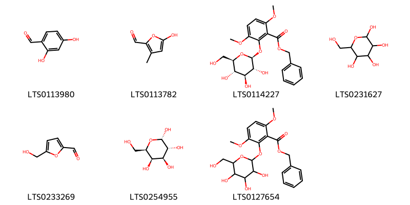{ width=100% }
    <figcaption>Hình ảnh cấu trúc hóa học của 7 hoạt chất thuộc nhóm Organooxygen compounds gồm ['2,4-dihydroxybenzaldehyde (LTS0113980)', '5-hydroxy-3-methylfuran-2-carbaldehyde (LTS0113782)', 'benzyl 3,6-dimethoxy-2-{[(2s,3r,4s,5s,6r)-3,4,5-trihydroxy-6-(hydroxymethyl)oxan-2-yl]oxy}benzoate (LTS0114227)', 'd-galactose (LTS0231627)', 'hydroxymethylfurfural (LTS0233269)', 'galactose (LTS0254955)', 'benzyl 3,6-dimethoxy-2-{[3,4,5-trihydroxy-6-(hydroxymethyl)oxan-2-yl]oxy}benzoate (LTS0127654)'].</figcaption>
</figure>
#### Nhóm Phenol ethers
<figure markdown="span">
    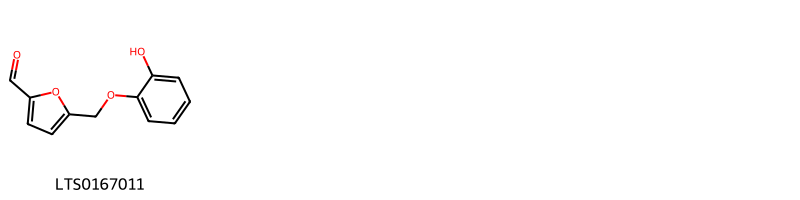{ width=100% }
    <figcaption>Hình ảnh cấu trúc hóa học của 1 hoạt chất thuộc nhóm Phenol ethers gồm ['5-(2-hydroxyphenoxymethyl)furan-2-carbaldehyde (LTS0167011)'].</figcaption>
</figure>
#### Nhóm Prenol lipids
<figure markdown="span">
    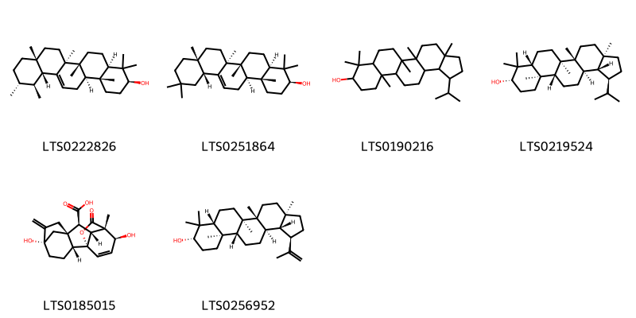{ width=100% }
    <figcaption>Hình ảnh cấu trúc hóa học của 6 hoạt chất thuộc nhóm Prenol lipids gồm ['amyrin (LTS0222826)', 'β-amyrin (LTS0251864)', '1-isopropyl-3a,5a,5b,8,8,11a-hexamethyl-hexadecahydrocyclopenta[a]chrysen-9-ol (LTS0190216)', '(1s,3ar,5ar,5br,7ar,9s,11ar,11br,13ar,13br)-1-isopropyl-3a,5a,5b,8,8,11a-hexamethyl-hexadecahydrocyclopenta[a]chrysen-9-ol (LTS0219524)', 'gibberellin a3 (LTS0185015)', 'lupeol (LTS0256952)'].</figcaption>
</figure>
#### Nhóm Saturated hydrocarbons
<figure markdown="span">
    { width=100% }
    <figcaption>Hình ảnh cấu trúc hóa học của 2 hoạt chất thuộc nhóm Saturated hydrocarbons gồm ['heptacosane (LTS0150428)', 'hentriacontane (LTS0046415)'].</figcaption>
</figure>
#### Nhóm Steroids and steroid derivatives
<figure markdown="span">
    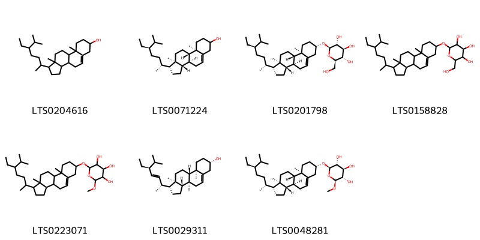{ width=100% }
    <figcaption>Hình ảnh cấu trúc hóa học của 7 hoạt chất thuộc nhóm Steroids and steroid derivatives gồm ['stigmast-5-en-3-ol, (3β)- (LTS0204616)', 'stigmast-5-en-3-ol (LTS0071224)', 'sitogluside (LTS0201798)', '2-{[1-(5-ethyl-6-methylheptan-2-yl)-9a,11a-dimethyl-1h,2h,3h,3ah,3bh,4h,6h,7h,8h,9h,9bh,10h,11h-cyclopenta[a]phenanthren-7-yl]oxy}-6-(hydroxymethyl)oxane-3,4,5-triol (LTS0158828)', '2-{[1-(5-ethyl-6-methylheptan-2-yl)-9a,11a-dimethyl-1h,2h,3h,3ah,3bh,4h,6h,7h,8h,9h,9bh,10h,11h-cyclopenta[a]phenanthren-7-yl]oxy}-6-methoxyoxane-3,4,5-triol (LTS0223071)', 'phytosterol (LTS0029311)', '(2r,3r,4s,5s,6s)-2-{[(1r,3as,3bs,7s,9ar,9bs,11ar)-1-[(2r,5r)-5-ethyl-6-methylheptan-2-yl]-9a,11a-dimethyl-1h,2h,3h,3ah,3bh,4h,6h,7h,8h,9h,9bh,10h,11h-cyclopenta[a]phenanthren-7-yl]oxy}-6-methoxyoxane-3,4,5-triol (LTS0048281)'].</figcaption>
</figure>

---

### Dược dân tộc học

Danh sách các quốc gia có sử dụng *Cassia fistula* trong điều trị các bệnh. 

| Country            | Disease                                           | Bệnh                                                                                                                                                                                                |
|:-------------------|:--------------------------------------------------|:----------------------------------------------------------------------------------------------------------------------------------------------------------------------------------------------------|
| China              | Purgative                                         | MYMEMORY WARNING: YOU USED ALL AVAILABLE FREE TRANSLATIONS FOR TODAY. NEXT AVAILABLE IN  15 HOURS 44 MINUTES 46 SECONDS VISIT HTTPS://MYMEMORY.TRANSLATED.NET/DOC/USAGELIMITS.PHP TO TRANSLATE MORE |
| Dominican Republic | Laxative, Vermifuge                               | MYMEMORY WARNING: YOU USED ALL AVAILABLE FREE TRANSLATIONS FOR TODAY. NEXT AVAILABLE IN  15 HOURS 44 MINUTES 44 SECONDS VISIT HTTPS://MYMEMORY.TRANSLATED.NET/DOC/USAGELIMITS.PHP TO TRANSLATE MORE |
| Elsewhere          | Aperient, Laxative, Laxative, Laxative, Purgative | MYMEMORY WARNING: YOU USED ALL AVAILABLE FREE TRANSLATIONS FOR TODAY. NEXT AVAILABLE IN  15 HOURS 44 MINUTES 41 SECONDS VISIT HTTPS://MYMEMORY.TRANSLATED.NET/DOC/USAGELIMITS.PHP TO TRANSLATE MORE |
| Java               | Purgative                                         | MYMEMORY WARNING: YOU USED ALL AVAILABLE FREE TRANSLATIONS FOR TODAY. NEXT AVAILABLE IN  15 HOURS 44 MINUTES 39 SECONDS VISIT HTTPS://MYMEMORY.TRANSLATED.NET/DOC/USAGELIMITS.PHP TO TRANSLATE MORE |
| Mexico             | Laxative                                          | MYMEMORY WARNING: YOU USED ALL AVAILABLE FREE TRANSLATIONS FOR TODAY. NEXT AVAILABLE IN  15 HOURS 44 MINUTES 36 SECONDS VISIT HTTPS://MYMEMORY.TRANSLATED.NET/DOC/USAGELIMITS.PHP TO TRANSLATE MORE |
| Turkey             | Aperient                                          | MYMEMORY WARNING: YOU USED ALL AVAILABLE FREE TRANSLATIONS FOR TODAY. NEXT AVAILABLE IN  15 HOURS 44 MINUTES 34 SECONDS VISIT HTTPS://MYMEMORY.TRANSLATED.NET/DOC/USAGELIMITS.PHP TO TRANSLATE MORE |
| Venezuela          | Astringent, Laxative, Purgative                   | MYMEMORY WARNING: YOU USED ALL AVAILABLE FREE TRANSLATIONS FOR TODAY. NEXT AVAILABLE IN  15 HOURS 44 MINUTES 31 SECONDS VISIT HTTPS://MYMEMORY.TRANSLATED.NET/DOC/USAGELIMITS.PHP TO TRANSLATE MORE |

---

---
## Cassia grandis
### Thông tin về thực vật

!!! info "Phân loại thực vật của *Cassia grandis* từ GIBF:"
    - **Kingdom:** Plantae
    - **Phylum:** Tracheophyta
    - **Order:** Fabales
    - **Family:** Fabaceae
    - **Genus:** Cassia
    - **Species:** *Cassia grandis*

 

| Label (VI)   | Label (EN)   | Scientific Name   | Descriptions (VI)   | Descriptions (EN)   | Also Known As (VI)              | Also Known As (EN)   |
|:-------------|:-------------|:------------------|:--------------------|:--------------------|:--------------------------------|:---------------------|
| N/A          | N/A          | Cassia grandis    | Loài thực vật       | species of plant    | ['Cây ô môi', 'Cassia grandis'] | ['']                 |

#### Phân bố trên thế giới

**Từ CSDL GIBF** Belize, Nicaragua, Sri Lanka, Malaysia, Ecuador, Thailand, Colombia, Brazil, Costa Rica, Honduras, India, New Caledonia, Mexico, Philippines, Paraguay, El Salvador, Panama

#### Phân bố tại Việt Nam

**Từ CSDL GIBF**: Không có ghi nhận ở Việt Nam

---
### Thành phần hóa học
        
- Theo cơ sở dữ liệu lotus: Từ loài *Cassia grandis* đã phân lập và xác định được 16 hoạt chất thuộc về các nhóm Flavonoids, Steroids and steroid derivatives, Benzodioxoles, Benzene and substituted derivatives, Cinnamaldehydes, Organooxygen compounds, Anthracenes. 

|    | chemicalTaxonomyClassyfireClass     |   smiles_count |
|---:|:------------------------------------|---------------:|
|  0 | Anthracenes                         |              4 |
|  1 | Benzene and substituted derivatives |              2 |
|  2 | Benzodioxoles                       |              2 |
|  3 | Cinnamaldehydes                     |              1 |
|  4 | Flavonoids                          |              3 |
|  5 | Organooxygen compounds              |              1 |
|  6 | Steroids and steroid derivatives    |              3 |

#### Nhóm Anthracenes
<figure markdown="span">
    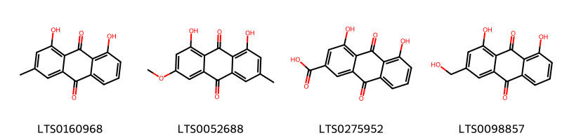{ width=100% }
    <figcaption>Hình ảnh cấu trúc hóa học của 4 hoạt chất thuộc nhóm Anthracenes gồm ['turkey rhubarb (LTS0160968)', 'physcion (LTS0052688)', 'monorhein (LTS0275952)', 'aloe emodin (LTS0098857)'].</figcaption>
</figure>
#### Nhóm Benzene and substituted derivatives
<figure markdown="span">
    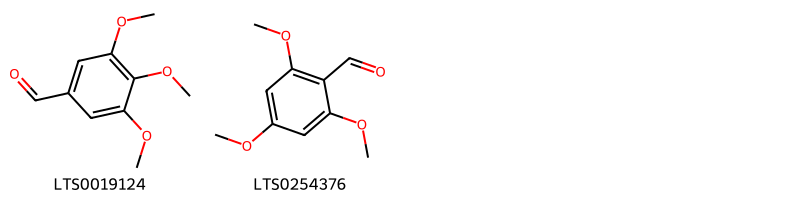{ width=100% }
    <figcaption>Hình ảnh cấu trúc hóa học của 2 hoạt chất thuộc nhóm Benzene and substituted derivatives gồm ['3,4,5-trimethoxybenzaldehyde (LTS0019124)', '2,4,6-trimethoxybenzaldehyde (LTS0254376)'].</figcaption>
</figure>
#### Nhóm Benzodioxoles
<figure markdown="span">
    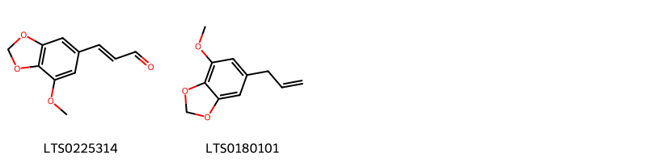{ width=100% }
    <figcaption>Hình ảnh cấu trúc hóa học của 2 hoạt chất thuộc nhóm Benzodioxoles gồm ['(2e)-3-(7-methoxy-2h-1,3-benzodioxol-5-yl)prop-2-enal (LTS0225314)', 'myristicin (LTS0180101)'].</figcaption>
</figure>
#### Nhóm Cinnamaldehydes
<figure markdown="span">
    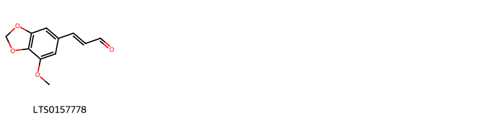{ width=100% }
    <figcaption>Hình ảnh cấu trúc hóa học của 1 hoạt chất thuộc nhóm Cinnamaldehydes gồm ['3-(7-methoxy-2h-1,3-benzodioxol-5-yl)prop-2-enal (LTS0157778)'].</figcaption>
</figure>
#### Nhóm Flavonoids
<figure markdown="span">
    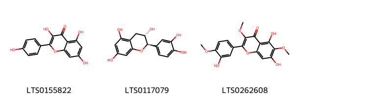{ width=100% }
    <figcaption>Hình ảnh cấu trúc hóa học của 3 hoạt chất thuộc nhóm Flavonoids gồm ['kaempherol (LTS0155822)', '(+)-catechol (LTS0117079)', 'centaureidin (LTS0262608)'].</figcaption>
</figure>
#### Nhóm Organooxygen compounds
<figure markdown="span">
    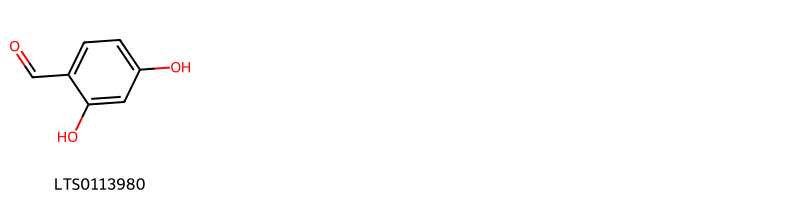{ width=100% }
    <figcaption>Hình ảnh cấu trúc hóa học của 1 hoạt chất thuộc nhóm Organooxygen compounds gồm ['2,4-dihydroxybenzaldehyde (LTS0113980)'].</figcaption>
</figure>
#### Nhóm Steroids and steroid derivatives
<figure markdown="span">
    { width=100% }
    <figcaption>Hình ảnh cấu trúc hóa học của 3 hoạt chất thuộc nhóm Steroids and steroid derivatives gồm ['stigmast-5-en-3-ol, (3β)- (LTS0204616)', 'stigmast-5-en-3-ol (LTS0071224)', 'sitosterol (LTS0168132)'].</figcaption>
</figure>

---

### Dược dân tộc học

Danh sách các quốc gia có sử dụng *Cassia grandis* trong điều trị các bệnh. 

| Country            | Disease             | Bệnh                                                                                                                                                                                                |
|:-------------------|:--------------------|:----------------------------------------------------------------------------------------------------------------------------------------------------------------------------------------------------|
| Dominican Republic | Purgative           | MYMEMORY WARNING: YOU USED ALL AVAILABLE FREE TRANSLATIONS FOR TODAY. NEXT AVAILABLE IN  15 HOURS 43 MINUTES 55 SECONDS VISIT HTTPS://MYMEMORY.TRANSLATED.NET/DOC/USAGELIMITS.PHP TO TRANSLATE MORE |
| Elsewhere          | Purgative           | MYMEMORY WARNING: YOU USED ALL AVAILABLE FREE TRANSLATIONS FOR TODAY. NEXT AVAILABLE IN  15 HOURS 43 MINUTES 53 SECONDS VISIT HTTPS://MYMEMORY.TRANSLATED.NET/DOC/USAGELIMITS.PHP TO TRANSLATE MORE |
| Haiti              | Laxative            | MYMEMORY WARNING: YOU USED ALL AVAILABLE FREE TRANSLATIONS FOR TODAY. NEXT AVAILABLE IN  15 HOURS 43 MINUTES 50 SECONDS VISIT HTTPS://MYMEMORY.TRANSLATED.NET/DOC/USAGELIMITS.PHP TO TRANSLATE MORE |
| Mexico             | Laxative            | MYMEMORY WARNING: YOU USED ALL AVAILABLE FREE TRANSLATIONS FOR TODAY. NEXT AVAILABLE IN  15 HOURS 43 MINUTES 48 SECONDS VISIT HTTPS://MYMEMORY.TRANSLATED.NET/DOC/USAGELIMITS.PHP TO TRANSLATE MORE |
| Venezuela          | Laxative, Purgative | MYMEMORY WARNING: YOU USED ALL AVAILABLE FREE TRANSLATIONS FOR TODAY. NEXT AVAILABLE IN  15 HOURS 43 MINUTES 45 SECONDS VISIT HTTPS://MYMEMORY.TRANSLATED.NET/DOC/USAGELIMITS.PHP TO TRANSLATE MORE |

---

---
## Cassia italica
### Thông tin về thực vật

!!! info "Phân loại thực vật của *N/A* từ GIBF:"
    - **Kingdom:** Plantae
    - **Phylum:** Tracheophyta
    - **Order:** Fabales
    - **Family:** Fabaceae
    - **Genus:** Senna
    - **Species:** *N/A*

 

| Label (VI)   | Label (EN)   | Scientific Name   | Descriptions (VI)   | Descriptions (EN)   | Also Known As (VI)   | Also Known As (EN)   |
|:-------------|:-------------|:------------------|:--------------------|:--------------------|:---------------------|:---------------------|
| N/A          | N/A          | Cassia italica    |                     | species of plant    | ['']                 | ['']                 |

#### Phân bố trên thế giới

**Từ CSDL GIBF** Virgin Islands (U.S.), United Arab Emirates, Sri Lanka, Australia, Guadeloupe, Argentina, Benin, Nicaragua, Virgin Islands (British), Sierra Leone, French Guiana, Panama, Malawi, Puerto Rico, Namibia, Chinese Taipei, Spain, Bolivia (Plurinational State of), Jamaica, Morocco, United States of America, Congo, Democratic Republic of the, Chile, Zimbabwe, El Salvador, South Africa, Uganda, Barbados, Thailand, Brazil, Mexico, Dominican Republic, Peru, Norfolk Island, Viet Nam, Eswatini, China, Ecuador, Haiti, Colombia, Kenya, Costa Rica, India, Antigua and Barbuda, Philippines, New Zealand, Ethiopia

#### Phân bố tại Việt Nam

**Từ CSDL GIBF**: Hồ Chí Minh city, Bà Rịa - Vũng Tàu

---
### Thành phần hóa học
        
- Theo cơ sở dữ liệu lotus: Từ loài *N/A* đã phân lập và xác định được 22 hoạt chất thuộc về các nhóm Flavonoids, Prenol lipids, Steroids and steroid derivatives, Anthracenes. 

|    | chemicalTaxonomyClassyfireClass   |   smiles_count |
|---:|:----------------------------------|---------------:|
|  0 | Anthracenes                       |              2 |
|  1 | Flavonoids                        |             14 |
|  2 | Prenol lipids                     |              2 |
|  3 | Steroids and steroid derivatives  |              4 |

#### Nhóm Anthracenes
<figure markdown="span">
    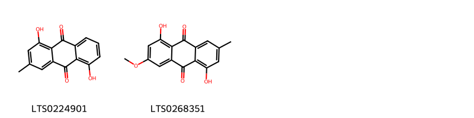{ width=100% }
    <figcaption>Hình ảnh cấu trúc hóa học của 2 hoạt chất thuộc nhóm Anthracenes gồm ['1,5-dihydroxy-3-methylanthracene-9,10-dione (LTS0224901)', '1,5-dihydroxy-3-methoxy-7-methylanthracene-9,10-dione (LTS0268351)'].</figcaption>
</figure>
#### Nhóm Flavonoids
<figure markdown="span">
    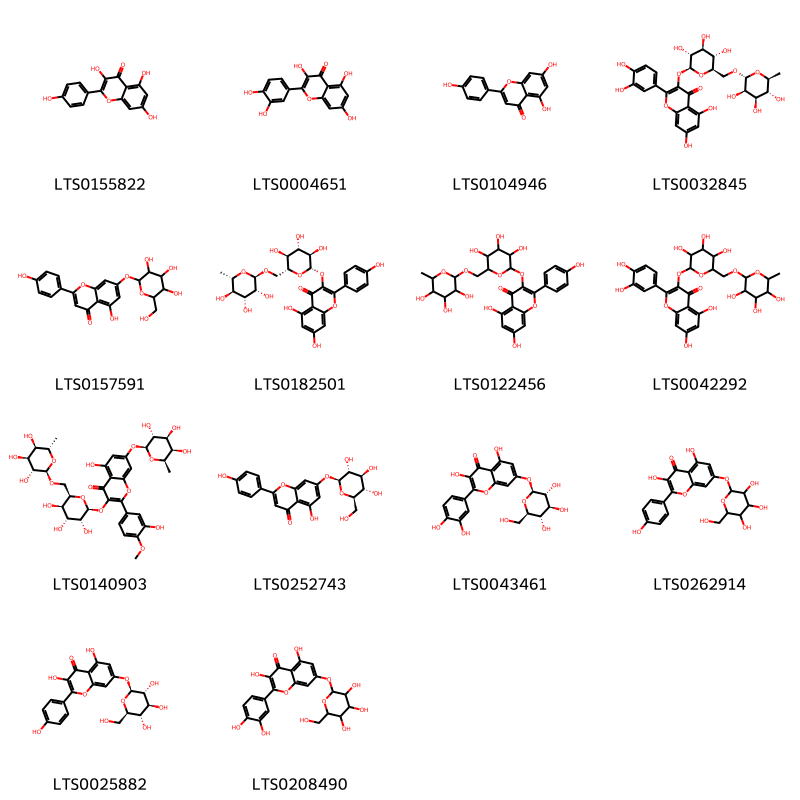{ width=100% }
    <figcaption>Hình ảnh cấu trúc hóa học của 14 hoạt chất thuộc nhóm Flavonoids gồm ['kaempherol (LTS0155822)', 'quercetin (LTS0004651)', 'chamomile (LTS0104946)', '3-rutinosyl quercetin (LTS0032845)', 'apigetrin (LTS0157591)', 'nictoflorin (LTS0182501)', '5,7-dihydroxy-2-(4-hydroxyphenyl)-3-[(3,4,5-trihydroxy-6-{[(3,4,5-trihydroxy-6-methyloxan-2-yl)oxy]methyl}oxan-2-yl)oxy]chromen-4-one (LTS0122456)', 'rutin (LTS0042292)', '5-hydroxy-2-(3-hydroxy-4-methoxyphenyl)-3-{[(2s,3r,4r,5r,6r)-3,4,5-trihydroxy-6-({[(2r,3r,4s,5r,6s)-3,4,5-trihydroxy-6-methyloxan-2-yl]oxy}methyl)oxan-2-yl]oxy}-7-{[(2s,3r,4s,5r,6r)-3,4,5-trihydroxy-6-methyloxan-2-yl]oxy}chromen-4-one (LTS0140903)', 'apigenin 7-o-β-glucoside (LTS0252743)', 'quercimeritrin (LTS0043461)', '3,5-dihydroxy-2-(4-hydroxyphenyl)-7-{[3,4,5-trihydroxy-6-(hydroxymethyl)oxan-2-yl]oxy}chromen-4-one (LTS0262914)', 'kaempferol 7-o-glucoside (LTS0025882)', 'quercimeritrin (LTS0208490)'].</figcaption>
</figure>
#### Nhóm Prenol lipids
<figure markdown="span">
    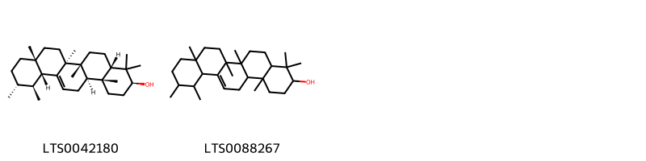{ width=100% }
    <figcaption>Hình ảnh cấu trúc hóa học của 2 hoạt chất thuộc nhóm Prenol lipids gồm ['(3s,4as,6ar,6bs,8ar,11r,12s,12ar,14ar,14br)-4,4,6a,6b,8a,11,12,14b-octamethyl-2,3,4a,5,6,7,8,9,10,11,12,12a,14,14a-tetradecahydro-1h-picen-3-ol (LTS0042180)', 'α-amyrin (LTS0088267)'].</figcaption>
</figure>
#### Nhóm Steroids and steroid derivatives
<figure markdown="span">
    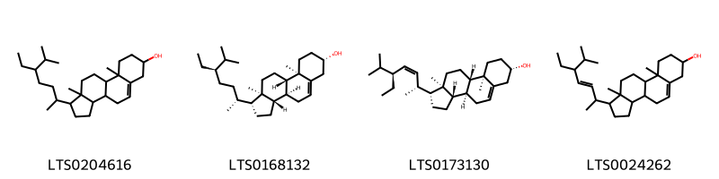{ width=100% }
    <figcaption>Hình ảnh cấu trúc hóa học của 4 hoạt chất thuộc nhóm Steroids and steroid derivatives gồm ['stigmast-5-en-3-ol, (3β)- (LTS0204616)', 'sitosterol (LTS0168132)', '(1r,3as,3bs,7s,9ar,9bs,11ar)-1-[(2r,3z,5s)-5-ethyl-6-methylhept-3-en-2-yl]-9a,11a-dimethyl-1h,2h,3h,3ah,3bh,4h,6h,7h,8h,9h,9bh,10h,11h-cyclopenta[a]phenanthren-7-ol (LTS0173130)', 'stigmasterol (LTS0024262)'].</figcaption>
</figure>

---

### Dược dân tộc học

Danh sách các quốc gia có sử dụng *N/A* trong điều trị các bệnh. 

| Country   | Disease   | Bệnh                                                                                                                                                                                                |
|:----------|:----------|:----------------------------------------------------------------------------------------------------------------------------------------------------------------------------------------------------|
| Egypt     | Purgative | MYMEMORY WARNING: YOU USED ALL AVAILABLE FREE TRANSLATIONS FOR TODAY. NEXT AVAILABLE IN  15 HOURS 43 MINUTES 17 SECONDS VISIT HTTPS://MYMEMORY.TRANSLATED.NET/DOC/USAGELIMITS.PHP TO TRANSLATE MORE |

---

---
## Cassia javanica
### Thông tin về thực vật

!!! info "Phân loại thực vật của *Cassia javanica* từ GIBF:"
    - **Kingdom:** Plantae
    - **Phylum:** Tracheophyta
    - **Order:** Fabales
    - **Family:** Fabaceae
    - **Genus:** Cassia
    - **Species:** *Cassia javanica*

 

| Label (VI)   | Label (EN)   | Scientific Name   | Descriptions (VI)   | Descriptions (EN)   | Also Known As (VI)   | Also Known As (EN)   |
|:-------------|:-------------|:------------------|:--------------------|:--------------------|:---------------------|:---------------------|
| N/A          | N/A          | Cassia javanica   |                     | species of plant    | ['Cassia javanica']  | ['']                 |

#### Phân bố trên thế giới

**Từ CSDL GIBF** nan, Australia, Lao People’s Democratic Republic, Cambodia, Mauritius, Myanmar, Argentina, Nicaragua, French Guiana, Panama, Pakistan, Puerto Rico, Réunion, Bangladesh, United States of America, Congo, Democratic Republic of the, Timor-Leste, El Salvador, Belize, South Africa, Fiji, Hong Kong, Thailand, Brazil, Egypt, Côte d’Ivoire, New Caledonia, Mayotte, Dominican Republic, Mexico, Singapore, Viet Nam, China, French Polynesia, Saint Kitts and Nevis, Seychelles, Haiti, Colombia, India, Indonesia, Philippines, Cameroon, Malaysia, Nepal

#### Phân bố tại Việt Nam

**Từ CSDL GIBF**: Đồng Nai, Khanh Hoa, Quang Nam, Cần Thơ

---
### Thành phần hóa học
        
- Theo cơ sở dữ liệu lotus: Từ loài *Cassia javanica* đã phân lập và xác định được 73 hoạt chất thuộc về các nhóm Fatty Acyls, Flavonoids, Prenol lipids, Steroids and steroid derivatives, Isoflavonoids, Cinnamic acids and derivatives, Anthracenes, Saturated hydrocarbons, Benzopyrans. 

|    | chemicalTaxonomyClassyfireClass   |   smiles_count |
|---:|:----------------------------------|---------------:|
|  0 | Anthracenes                       |              7 |
|  1 | Benzopyrans                       |              1 |
|  2 | Cinnamic acids and derivatives    |              1 |
|  3 | Fatty Acyls                       |             17 |
|  4 | Flavonoids                        |             35 |
|  5 | Isoflavonoids                     |              1 |
|  6 | Prenol lipids                     |              3 |
|  7 | Saturated hydrocarbons            |              5 |
|  8 | Steroids and steroid derivatives  |              3 |

#### Nhóm Anthracenes
<figure markdown="span">
    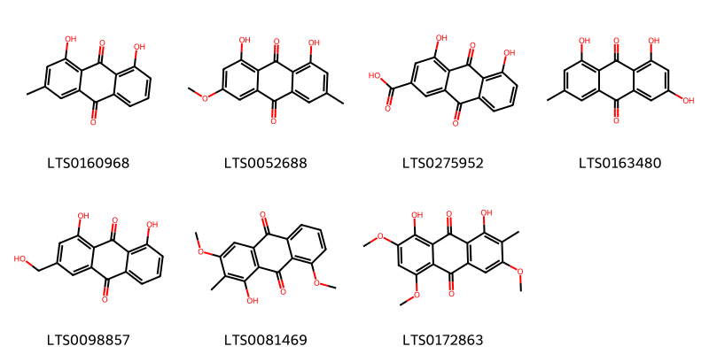{ width=100% }
    <figcaption>Hình ảnh cấu trúc hóa học của 7 hoạt chất thuộc nhóm Anthracenes gồm ['turkey rhubarb (LTS0160968)', 'physcion (LTS0052688)', 'monorhein (LTS0275952)', 'emodin (LTS0163480)', 'aloe emodin (LTS0098857)', '1-hydroxy-3,8-dimethoxy-2-methylanthracene-9,10-dione (LTS0081469)', '1,8-dihydroxy-3,5,7-trimethoxy-2-methylanthracene-9,10-dione (LTS0172863)'].</figcaption>
</figure>
#### Nhóm Benzopyrans
<figure markdown="span">
    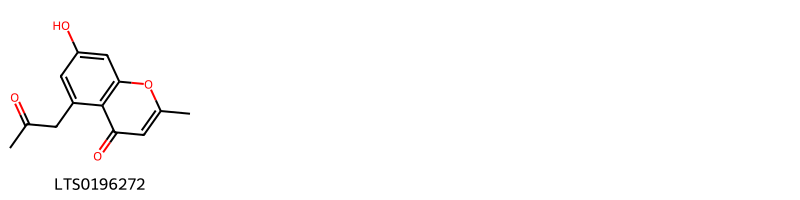{ width=100% }
    <figcaption>Hình ảnh cấu trúc hóa học của 1 hoạt chất thuộc nhóm Benzopyrans gồm ['7-hydroxy-2-methyl-5-(2-oxopropyl)chromen-4-one (LTS0196272)'].</figcaption>
</figure>
#### Nhóm Cinnamic acids and derivatives
<figure markdown="span">
    { width=100% }
    <figcaption>Hình ảnh cấu trúc hóa học của 1 hoạt chất thuộc nhóm Cinnamic acids and derivatives gồm ['sinapinate (LTS0173482)'].</figcaption>
</figure>
#### Nhóm Fatty Acyls
<figure markdown="span">
    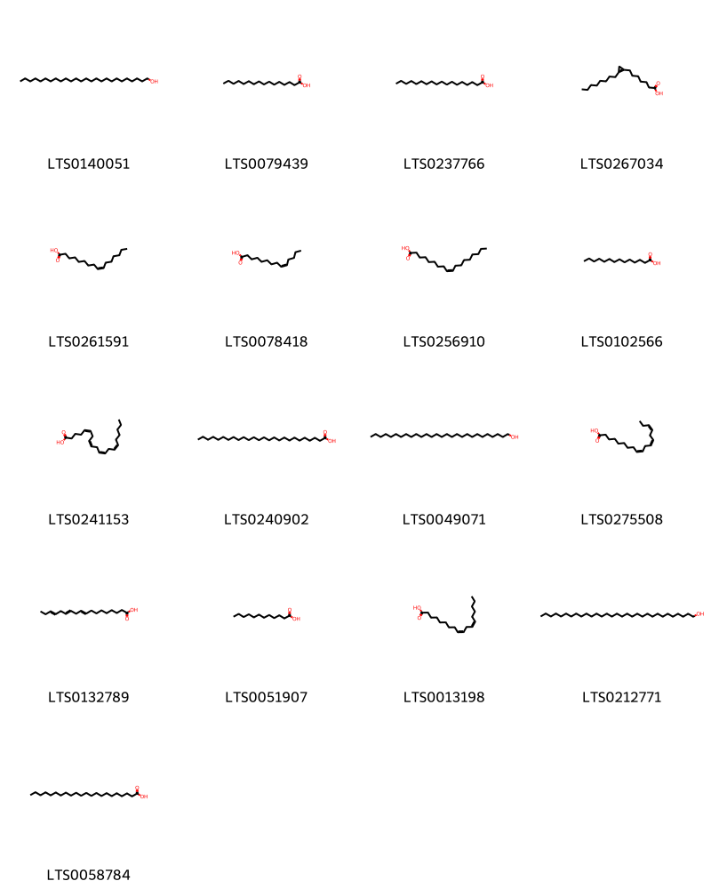{ width=100% }
    <figcaption>Hình ảnh cấu trúc hóa học của 17 hoạt chất thuộc nhóm Fatty Acyls gồm ['ceryl alcohol (LTS0140051)', 'palmitic acid (LTS0079439)', 'stearic acid (LTS0237766)', 'malvalic acid (LTS0267034)', 'palmitoleic acid (LTS0261591)', 'myristoleic acid (LTS0078418)', 'oleic acid (LTS0256910)', 'myristic acid (LTS0102566)', 'arachidonic acid (LTS0241153)', 'hexacosanoic acid (LTS0240902)', 'octacosanol (LTS0049071)', 'α-linolenic acid (LTS0275508)', 'α linolenic acid (LTS0132789)', 'lauric acid (LTS0051907)', 'linoleic (LTS0013198)', 'n-hentriacontanol (LTS0212771)', 'behenic acid (LTS0058784)'].</figcaption>
</figure>
#### Nhóm Flavonoids
<figure markdown="span">
    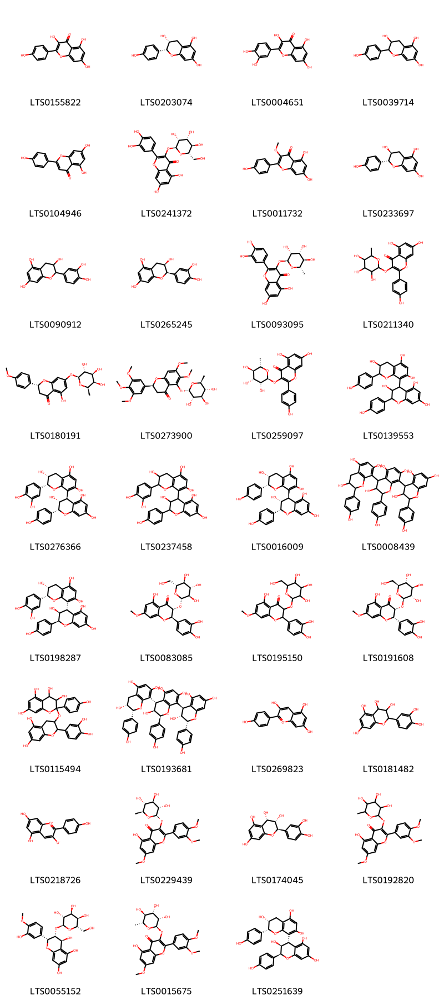{ width=100% }
    <figcaption>Hình ảnh cấu trúc hóa học của 35 hoạt chất thuộc nhóm Flavonoids gồm ['kaempherol (LTS0155822)', 'epiafzelechin (LTS0203074)', 'quercetin (LTS0004651)', "3,5,7,4'-tetrahydroxyflavan (LTS0039714)", 'chamomile (LTS0104946)', '2-(3,4-dihydroxyphenyl)-5,7-dihydroxy-3-{[(2s,3r,4r,5r,6s)-3,4,5-trihydroxy-6-(hydroxymethyl)oxan-2-yl]oxy}chromen-4-one (LTS0241372)', 'isokaempferide (LTS0011732)', 'afzelechin (LTS0233697)', 'catechol (LTS0090912)', 'ent-epicatechin (LTS0265245)', 'quercitrin (LTS0093095)', '5,7-dihydroxy-2-(4-hydroxyphenyl)-3-[(3,4,5-trihydroxy-6-methyloxan-2-yl)oxy]chromen-4-one (LTS0211340)', '(2r)-5-hydroxy-2-(4-methoxyphenyl)-7-{[(2s,3r,4s,5r,6r)-3,4,5-trihydroxy-6-methyloxan-2-yl]oxy}-2,3-dihydro-1-benzopyran-4-one (LTS0180191)', '(2s)-6,7-dimethoxy-5-{[(2s,3s,4r,5r,6s)-3,4,5-trihydroxy-6-methyloxan-2-yl]oxy}-2-(3,4,5-trimethoxyphenyl)-2,3-dihydro-1-benzopyran-4-one (LTS0273900)', 'afzelin (LTS0259097)', '2-(4-hydroxyphenyl)-8-[3,5,7-trihydroxy-2-(4-hydroxyphenyl)-3,4-dihydro-2h-1-benzopyran-4-yl]-3,4-dihydro-2h-1-benzopyran-3,5,7-triol (LTS0139553)', '(2r,3r,4r)-4-[(2r,3r)-2-(3,4-dihydroxyphenyl)-3,5,7-trihydroxy-3,4-dihydro-2h-1-benzopyran-8-yl]-2-(4-hydroxyphenyl)-3,4-dihydro-2h-1-benzopyran-3,5,7-triol (LTS0276366)', '4-[2-(3,4-dihydroxyphenyl)-3,5,7-trihydroxy-3,4-dihydro-2h-1-benzopyran-8-yl]-2-(4-hydroxyphenyl)-3,4-dihydro-2h-1-benzopyran-3,5,7-triol (LTS0237458)', '(2r,3r)-2-(4-hydroxyphenyl)-8-[(2r,3r,4r)-3,5,7-trihydroxy-2-(4-hydroxyphenyl)-3,4-dihydro-2h-1-benzopyran-4-yl]-3,4-dihydro-2h-1-benzopyran-3,5,7-triol (LTS0016009)', '2-(4-hydroxyphenyl)-8-[3,5,7-trihydroxy-2-(4-hydroxyphenyl)-3,4-dihydro-2h-1-benzopyran-4-yl]-4-[3,5,7-trihydroxy-2-(4-hydroxyphenyl)-3,4-dihydro-2h-1-benzopyran-8-yl]-3,4-dihydro-2h-1-benzopyran-3,5,7-triol (LTS0008439)', '(2s,3s,4s)-4-[(2r,3r)-2-(3,4-dihydroxyphenyl)-3,5,7-trihydroxy-3,4-dihydro-2h-1-benzopyran-8-yl]-2-(4-hydroxyphenyl)-3,4-dihydro-2h-1-benzopyran-3,5,7-triol (LTS0198287)', '(2r,3r)-2-(3,4-dihydroxyphenyl)-5-hydroxy-7-methoxy-3-{[(2s,3r,4s,5s,6r)-3,4,5-trihydroxy-6-(hydroxymethyl)oxan-2-yl]oxy}-2,3-dihydro-1-benzopyran-4-one (LTS0083085)', '2-(3,4-dihydroxyphenyl)-5-hydroxy-7-methoxy-3-{[3,4,5-trihydroxy-6-(hydroxymethyl)oxan-2-yl]oxy}-2,3-dihydro-1-benzopyran-4-one (LTS0195150)', '(2s,3r)-2-(3,4-dihydroxyphenyl)-5-hydroxy-7-methoxy-3-{[(2r,3s,4r,5r,6s)-3,4,5-trihydroxy-6-(hydroxymethyl)oxan-2-yl]oxy}-2,3-dihydro-1-benzopyran-4-one (LTS0191608)', '2-{[2-(3,4-dihydroxyphenyl)-5,7-dihydroxy-3,4-dihydro-2h-1-benzopyran-3-yl]oxy}-2-(4-hydroxyphenyl)-3,4-dihydro-1-benzopyran-3,4,5,7-tetrol (LTS0115494)', '(2s,3s,4r)-2-(4-hydroxyphenyl)-8-[(2r,3r,4r)-3,5,7-trihydroxy-2-(4-hydroxyphenyl)-3,4-dihydro-2h-1-benzopyran-4-yl]-4-[(2r,3r)-3,5,7-trihydroxy-2-(4-hydroxyphenyl)-3,4-dihydro-2h-1-benzopyran-8-yl]-3,4-dihydro-2h-1-benzopyran-3,5,7-triol (LTS0193681)', 'pelargonidin (LTS0269823)', 'leucocyanidin (LTS0181482)', '5,7-dihydroxy-2-(4-hydroxyphenyl)-1λ⁴-chromen-1-ylium-3-olate (LTS0218726)', '2-(3,4-dimethoxyphenyl)-5-hydroxy-7-methoxy-3-{[(2s,3s,4r,5r,6s)-3,4,5-trihydroxy-6-methyloxan-2-yl]oxy}chromen-4-one (LTS0229439)', 'procyanidol (LTS0174045)', '2-(3,4-dimethoxyphenyl)-5-hydroxy-7-methoxy-3-[(3,4,5-trihydroxy-6-methyloxan-2-yl)oxy]chromen-4-one (LTS0192820)', '(2r,3r,4s)-2-(3-hydroxy-4-methoxyphenyl)-3-{[(2s,3r,4s,5r,6s)-3,4,5-trihydroxy-6-(hydroxymethyl)oxan-2-yl]oxy}-3,4-dihydro-2h-1-benzopyran-4,5,7-triol (LTS0055152)', '2-(3,4-dimethoxyphenyl)-5-hydroxy-7-methoxy-3-{[(2r,3s,4s,5s,6r)-3,4,5-trihydroxy-6-methyloxan-2-yl]oxy}chromen-4-one (LTS0015675)', '(2s,3s,4s)-2-(4-hydroxyphenyl)-4-[(2r,3r)-3,5,7-trihydroxy-2-(4-hydroxyphenyl)-3,4-dihydro-2h-1-benzopyran-8-yl]-3,4-dihydro-2h-1-benzopyran-3,5,7-triol (LTS0251639)'].</figcaption>
</figure>
#### Nhóm Isoflavonoids
<figure markdown="span">
    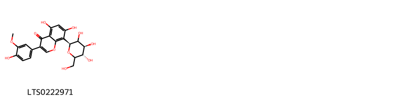{ width=100% }
    <figcaption>Hình ảnh cấu trúc hóa học của 1 hoạt chất thuộc nhóm Isoflavonoids gồm ['dalpanitin (LTS0222971)'].</figcaption>
</figure>
#### Nhóm Prenol lipids
<figure markdown="span">
    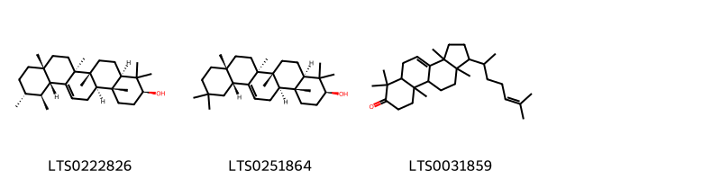{ width=100% }
    <figcaption>Hình ảnh cấu trúc hóa học của 3 hoạt chất thuộc nhóm Prenol lipids gồm ['amyrin (LTS0222826)', 'β-amyrin (LTS0251864)', '3a,6,6,9a,11a-pentamethyl-1-(6-methylhept-5-en-2-yl)-1h,2h,3h,5h,5ah,8h,9h,9bh,10h,11h-cyclopenta[a]phenanthren-7-one (LTS0031859)'].</figcaption>
</figure>
#### Nhóm Saturated hydrocarbons
<figure markdown="span">
    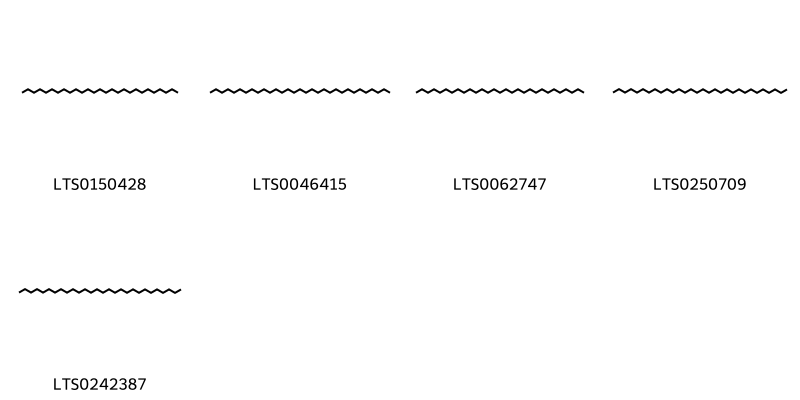{ width=100% }
    <figcaption>Hình ảnh cấu trúc hóa học của 5 hoạt chất thuộc nhóm Saturated hydrocarbons gồm ['heptacosane (LTS0150428)', 'hentriacontane (LTS0046415)', 'nonacosane (LTS0062747)', 'triacontane (LTS0250709)', 'octacosane (LTS0242387)'].</figcaption>
</figure>
#### Nhóm Steroids and steroid derivatives
<figure markdown="span">
    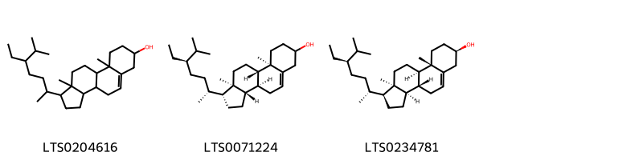{ width=100% }
    <figcaption>Hình ảnh cấu trúc hóa học của 3 hoạt chất thuộc nhóm Steroids and steroid derivatives gồm ['stigmast-5-en-3-ol, (3β)- (LTS0204616)', 'stigmast-5-en-3-ol (LTS0071224)', '(1s,3ar,3br,7r,9as,9br,11ar)-1-[(2r,5r)-5-ethyl-6-methylheptan-2-yl]-9a,11a-dimethyl-1h,2h,3h,3ah,3bh,4h,6h,7h,8h,9h,9bh,10h,11h-cyclopenta[a]phenanthren-7-ol (LTS0234781)'].</figcaption>
</figure>

---

### Dược dân tộc học

Danh sách các quốc gia có sử dụng *Cassia javanica* trong điều trị các bệnh. 

| Country   | Disease   | Bệnh                                                                                                                                                                                                |
|:----------|:----------|:----------------------------------------------------------------------------------------------------------------------------------------------------------------------------------------------------|
| Elsewhere | Purgative | MYMEMORY WARNING: YOU USED ALL AVAILABLE FREE TRANSLATIONS FOR TODAY. NEXT AVAILABLE IN  15 HOURS 42 MINUTES 48 SECONDS VISIT HTTPS://MYMEMORY.TRANSLATED.NET/DOC/USAGELIMITS.PHP TO TRANSLATE MORE |
| Java      | Purgative | MYMEMORY WARNING: YOU USED ALL AVAILABLE FREE TRANSLATIONS FOR TODAY. NEXT AVAILABLE IN  15 HOURS 42 MINUTES 45 SECONDS VISIT HTTPS://MYMEMORY.TRANSLATED.NET/DOC/USAGELIMITS.PHP TO TRANSLATE MORE |

---

---
## Cassia laevigata
### Thông tin về thực vật

!!! info "Phân loại thực vật của *N/A* từ GIBF:"
    - **Kingdom:** Plantae
    - **Phylum:** Tracheophyta
    - **Order:** Fabales
    - **Family:** Fabaceae
    - **Genus:** Senna
    - **Species:** *N/A*

 

| Label (VI)   | Label (EN)   | Scientific Name   | Descriptions (VI)   | Descriptions (EN)   | Also Known As (VI)   | Also Known As (EN)   |
|:-------------|:-------------|:------------------|:--------------------|:--------------------|:---------------------|:---------------------|
| N/A          | N/A          | Cassia javanica   |                     | species of plant    | ['Cassia javanica']  | ['']                 |

#### Phân bố trên thế giới

**Từ CSDL GIBF** Virgin Islands (U.S.), United Arab Emirates, Sri Lanka, Australia, Guadeloupe, Argentina, Benin, Nicaragua, Virgin Islands (British), Sierra Leone, French Guiana, Panama, Malawi, Puerto Rico, Namibia, Chinese Taipei, Spain, Bolivia (Plurinational State of), Jamaica, Morocco, United States of America, Congo, Democratic Republic of the, Chile, Zimbabwe, El Salvador, South Africa, Uganda, Barbados, Thailand, Brazil, Mexico, Dominican Republic, Peru, Norfolk Island, Viet Nam, Eswatini, China, Ecuador, Haiti, Colombia, Kenya, Costa Rica, India, Antigua and Barbuda, Philippines, New Zealand, Ethiopia

#### Phân bố tại Việt Nam

**Từ CSDL GIBF**: Hồ Chí Minh city, Bà Rịa - Vũng Tàu

---
### Thành phần hóa học
        
- Theo cơ sở dữ liệu lotus: Từ loài *N/A* đã phân lập và xác định được Chưa có hoạt chất nào được phân lập. hoạt chất thuộc về các nhóm Không có hoạt chất nào được phân lập. 

Không có hình ảnh nào được tạo ra

---

### Dược dân tộc học

Danh sách các quốc gia có sử dụng *N/A* trong điều trị các bệnh. 

| Country   | Disease                                                                                        | Bệnh                                                                                                                                                                                                |
|:----------|:-----------------------------------------------------------------------------------------------|:----------------------------------------------------------------------------------------------------------------------------------------------------------------------------------------------------|
| Mexico    | Emmenagogue, Emmenagogue, Expectorant, Purgative, Purgative, Vermifuge, Vermifuge, Emmenagogue | MYMEMORY WARNING: YOU USED ALL AVAILABLE FREE TRANSLATIONS FOR TODAY. NEXT AVAILABLE IN  15 HOURS 42 MINUTES 14 SECONDS VISIT HTTPS://MYMEMORY.TRANSLATED.NET/DOC/USAGELIMITS.PHP TO TRANSLATE MORE |

---

---
## Cassia marilandica
### Thông tin về thực vật

!!! info "Phân loại thực vật của *Senna marilandica* từ GIBF:"
    - **Kingdom:** Plantae
    - **Phylum:** Tracheophyta
    - **Order:** Fabales
    - **Family:** Fabaceae
    - **Genus:** Senna
    - **Species:** *Senna marilandica*

 

| Label (VI)   | Label (EN)   | Scientific Name    | Descriptions (VI)   | Descriptions (EN)   | Also Known As (VI)   | Also Known As (EN)   |
|:-------------|:-------------|:-------------------|:--------------------|:--------------------|:---------------------|:---------------------|
| N/A          | N/A          | Cassia marilandica | loài thực vật       | species of plant    | ['']                 | ['']                 |

#### Phân bố trên thế giới

**Từ CSDL GIBF** nan, Netherlands, Australia, unknown or invalid, United States of America, Sweden, Mexico, France, Canada

#### Phân bố tại Việt Nam

**Từ CSDL GIBF**: Không có ghi nhận ở Việt Nam

---
### Thành phần hóa học
        
- Theo cơ sở dữ liệu lotus: Từ loài *Senna marilandica* đã phân lập và xác định được 1 hoạt chất thuộc về các nhóm Benzene and substituted derivatives. 

|    | chemicalTaxonomyClassyfireClass     |   smiles_count |
|---:|:------------------------------------|---------------:|
|  0 | Benzene and substituted derivatives |              1 |

#### Nhóm Benzene and substituted derivatives
<figure markdown="span">
    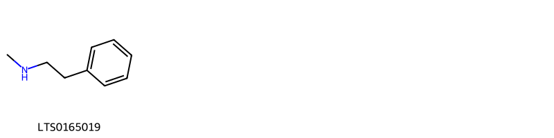{ width=100% }
    <figcaption>Hình ảnh cấu trúc hóa học của 1 hoạt chất thuộc nhóm Benzene and substituted derivatives gồm ['benzeneethanamine, n-methyl- (LTS0165019)'].</figcaption>
</figure>

---

### Dược dân tộc học

Danh sách các quốc gia có sử dụng *Senna marilandica* trong điều trị các bệnh. 

| Country        | Disease   | Bệnh                                                                                                                                                                                                |
|:---------------|:----------|:----------------------------------------------------------------------------------------------------------------------------------------------------------------------------------------------------|
| Elsewhere      | Cathartic | MYMEMORY WARNING: YOU USED ALL AVAILABLE FREE TRANSLATIONS FOR TODAY. NEXT AVAILABLE IN  15 HOURS 41 MINUTES 52 SECONDS VISIT HTTPS://MYMEMORY.TRANSLATED.NET/DOC/USAGELIMITS.PHP TO TRANSLATE MORE |
| US(Amerindian) | Laxative  | MYMEMORY WARNING: YOU USED ALL AVAILABLE FREE TRANSLATIONS FOR TODAY. NEXT AVAILABLE IN  15 HOURS 41 MINUTES 49 SECONDS VISIT HTTPS://MYMEMORY.TRANSLATED.NET/DOC/USAGELIMITS.PHP TO TRANSLATE MORE |

---

---
## Cassia marylandica
### Thông tin về thực vật

!!! info "Phân loại thực vật của *Senna marilandica* từ GIBF:"
    - **Kingdom:** Plantae
    - **Phylum:** Tracheophyta
    - **Order:** Fabales
    - **Family:** Fabaceae
    - **Genus:** Senna
    - **Species:** *Senna marilandica*

 

| Label (VI)   | Label (EN)   | Scientific Name    | Descriptions (VI)   | Descriptions (EN)   | Also Known As (VI)   | Also Known As (EN)   |
|:-------------|:-------------|:-------------------|:--------------------|:--------------------|:---------------------|:---------------------|
| N/A          | N/A          | Cassia marylandica |                     |                     | ['']                 | ['']                 |

#### Phân bố trên thế giới

**Từ CSDL GIBF** nan, Netherlands, Australia, unknown or invalid, United States of America, Sweden, Mexico, France, Canada

#### Phân bố tại Việt Nam

**Từ CSDL GIBF**: Không có ghi nhận ở Việt Nam

---
### Thành phần hóa học
        
- Theo cơ sở dữ liệu lotus: Từ loài *Senna marilandica* đã phân lập và xác định được Chưa có hoạt chất nào được phân lập. hoạt chất thuộc về các nhóm Không có hoạt chất nào được phân lập. 

Không có hình ảnh nào được tạo ra

---

### Dược dân tộc học

Danh sách các quốc gia có sử dụng *Senna marilandica* trong điều trị các bệnh. 

| Country        | Disease             | Bệnh                                                                                                                                                                                                |
|:---------------|:--------------------|:----------------------------------------------------------------------------------------------------------------------------------------------------------------------------------------------------|
| US(Amerindian) | Cathartic, Poultice | MYMEMORY WARNING: YOU USED ALL AVAILABLE FREE TRANSLATIONS FOR TODAY. NEXT AVAILABLE IN  15 HOURS 41 MINUTES 24 SECONDS VISIT HTTPS://MYMEMORY.TRANSLATED.NET/DOC/USAGELIMITS.PHP TO TRANSLATE MORE |

---

---
## Cassia moschata
### Thông tin về thực vật

!!! info "Phân loại thực vật của *Cassia moschata* từ GIBF:"
    - **Kingdom:** Plantae
    - **Phylum:** Tracheophyta
    - **Order:** Fabales
    - **Family:** Fabaceae
    - **Genus:** Cassia
    - **Species:** *Cassia moschata*

 

| Label (VI)   | Label (EN)   | Scientific Name   | Descriptions (VI)   | Descriptions (EN)   | Also Known As (VI)   | Also Known As (EN)                      |
|:-------------|:-------------|:------------------|:--------------------|:--------------------|:---------------------|:----------------------------------------|
| N/A          | N/A          | Cassia moschata   | loài thực vật       | species of plant    | ['']                 | ['bronze shower', 'bronze shower tree'] |

#### Phân bố trên thế giới

**Từ CSDL GIBF** nan, Trinidad and Tobago, French Guiana, Colombia, Brazil, Costa Rica, Guyana, India, Nicaragua, Mexico, El Salvador, Venezuela (Bolivarian Republic of), Panama

#### Phân bố tại Việt Nam

**Từ CSDL GIBF**: Không có ghi nhận ở Việt Nam

---
### Thành phần hóa học
        
- Theo cơ sở dữ liệu lotus: Từ loài *Cassia moschata* đã phân lập và xác định được Chưa có hoạt chất nào được phân lập. hoạt chất thuộc về các nhóm Không có hoạt chất nào được phân lập. 

Không có hình ảnh nào được tạo ra

---

### Dược dân tộc học

Danh sách các quốc gia có sử dụng *Cassia moschata* trong điều trị các bệnh. 

| Country   | Disease   | Bệnh                                                                                                                                                                                                |
|:----------|:----------|:----------------------------------------------------------------------------------------------------------------------------------------------------------------------------------------------------|
| Colombia  | Purgative | MYMEMORY WARNING: YOU USED ALL AVAILABLE FREE TRANSLATIONS FOR TODAY. NEXT AVAILABLE IN  15 HOURS 41 MINUTES 04 SECONDS VISIT HTTPS://MYMEMORY.TRANSLATED.NET/DOC/USAGELIMITS.PHP TO TRANSLATE MORE |

---

---
## Cassia nodosa
### Thông tin về thực vật

!!! info "Phân loại thực vật của *Cassia nodosa* từ GIBF:"
    - **Kingdom:** Plantae
    - **Phylum:** Tracheophyta
    - **Order:** Fabales
    - **Family:** Fabaceae
    - **Genus:** Cassia
    - **Species:** *Cassia nodosa*

 

| Label (VI)   | Label (EN)   | Scientific Name   | Descriptions (VI)   | Descriptions (EN)   | Also Known As (VI)   | Also Known As (EN)   |
|:-------------|:-------------|:------------------|:--------------------|:--------------------|:---------------------|:---------------------|
| N/A          | N/A          | Cassia nodosa     | loài thực vật       | species of plant    | ['']                 | ['']                 |

#### Phân bố trên thế giới

**Từ CSDL GIBF** nan, Ghana, Sri Lanka, Australia, Japan, Myanmar, unknown or invalid, Nigeria, Chinese Taipei, Papua New Guinea, Honduras, United States of America, Trinidad and Tobago, Thailand, Egypt, Mexico, Singapore, China, Costa Rica, India, Indonesia, Philippines, Malaysia

#### Phân bố tại Việt Nam

**Từ CSDL GIBF**: Không có ghi nhận ở Việt Nam

---
### Thành phần hóa học
        
- Theo cơ sở dữ liệu lotus: Từ loài *Cassia nodosa* đã phân lập và xác định được 11 hoạt chất thuộc về các nhóm Fatty Acyls, Flavonoids, Steroids and steroid derivatives, Isoflavonoids, Anthracenes. 

|    | chemicalTaxonomyClassyfireClass   |   smiles_count |
|---:|:----------------------------------|---------------:|
|  0 | Anthracenes                       |              3 |
|  1 | Fatty Acyls                       |              1 |
|  2 | Flavonoids                        |              4 |
|  3 | Isoflavonoids                     |              1 |
|  4 | Steroids and steroid derivatives  |              2 |

#### Nhóm Anthracenes
<figure markdown="span">
    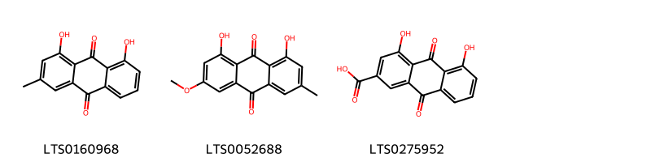{ width=100% }
    <figcaption>Hình ảnh cấu trúc hóa học của 3 hoạt chất thuộc nhóm Anthracenes gồm ['turkey rhubarb (LTS0160968)', 'physcion (LTS0052688)', 'monorhein (LTS0275952)'].</figcaption>
</figure>
#### Nhóm Fatty Acyls
<figure markdown="span">
    { width=100% }
    <figcaption>Hình ảnh cấu trúc hóa học của 1 hoạt chất thuộc nhóm Fatty Acyls gồm ['ceryl alcohol (LTS0140051)'].</figcaption>
</figure>
#### Nhóm Flavonoids
<figure markdown="span">
    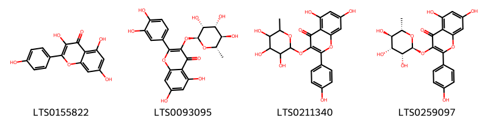{ width=100% }
    <figcaption>Hình ảnh cấu trúc hóa học của 4 hoạt chất thuộc nhóm Flavonoids gồm ['kaempherol (LTS0155822)', 'quercitrin (LTS0093095)', '5,7-dihydroxy-2-(4-hydroxyphenyl)-3-[(3,4,5-trihydroxy-6-methyloxan-2-yl)oxy]chromen-4-one (LTS0211340)', 'afzelin (LTS0259097)'].</figcaption>
</figure>
#### Nhóm Isoflavonoids
<figure markdown="span">
    { width=100% }
    <figcaption>Hình ảnh cấu trúc hóa học của 1 hoạt chất thuộc nhóm Isoflavonoids gồm ['dalpanitin (LTS0222971)'].</figcaption>
</figure>
#### Nhóm Steroids and steroid derivatives
<figure markdown="span">
    { width=100% }
    <figcaption>Hình ảnh cấu trúc hóa học của 2 hoạt chất thuộc nhóm Steroids and steroid derivatives gồm ['stigmast-5-en-3-ol, (3β)- (LTS0204616)', '(1s,3ar,3br,7r,9as,9br,11ar)-1-[(2r,5r)-5-ethyl-6-methylheptan-2-yl]-9a,11a-dimethyl-1h,2h,3h,3ah,3bh,4h,6h,7h,8h,9h,9bh,10h,11h-cyclopenta[a]phenanthren-7-ol (LTS0234781)'].</figcaption>
</figure>

---

### Dược dân tộc học

Danh sách các quốc gia có sử dụng *Cassia nodosa* trong điều trị các bệnh. 

| Country   | Disease   | Bệnh                                                                                                                                                                                                |
|:----------|:----------|:----------------------------------------------------------------------------------------------------------------------------------------------------------------------------------------------------|
| Elsewhere | Soap      | MYMEMORY WARNING: YOU USED ALL AVAILABLE FREE TRANSLATIONS FOR TODAY. NEXT AVAILABLE IN  15 HOURS 40 MINUTES 44 SECONDS VISIT HTTPS://MYMEMORY.TRANSLATED.NET/DOC/USAGELIMITS.PHP TO TRANSLATE MORE |
| Java      | Purgative | MYMEMORY WARNING: YOU USED ALL AVAILABLE FREE TRANSLATIONS FOR TODAY. NEXT AVAILABLE IN  15 HOURS 40 MINUTES 41 SECONDS VISIT HTTPS://MYMEMORY.TRANSLATED.NET/DOC/USAGELIMITS.PHP TO TRANSLATE MORE |

---

---
## Cassia nomame
### Thông tin về thực vật

!!! info "Phân loại thực vật của *Chamaecrista nomame* từ GIBF:"
    - **Kingdom:** Plantae
    - **Phylum:** Tracheophyta
    - **Order:** Fabales
    - **Family:** Fabaceae
    - **Genus:** Chamaecrista
    - **Species:** *Chamaecrista nomame*

 

| Label (VI)   | Label (EN)   | Scientific Name   | Descriptions (VI)   | Descriptions (EN)   | Also Known As (VI)   | Also Known As (EN)   |
|:-------------|:-------------|:------------------|:--------------------|:--------------------|:---------------------|:---------------------|
| N/A          | N/A          | Cassia nomame     | loài thực vật       | species of plant    | ['']                 | ['']                 |

#### Phân bố trên thế giới

**Từ CSDL GIBF** Korea (Democratic People’s Republic of), China, Japan

#### Phân bố tại Việt Nam

**Từ CSDL GIBF**: Không có ghi nhận ở Việt Nam

---
### Thành phần hóa học
        
- Theo cơ sở dữ liệu lotus: Từ loài *Chamaecrista nomame* đã phân lập và xác định được Chưa có hoạt chất nào được phân lập. hoạt chất thuộc về các nhóm Không có hoạt chất nào được phân lập. 

Không có hình ảnh nào được tạo ra

---

### Dược dân tộc học

Danh sách các quốc gia có sử dụng *Chamaecrista nomame* trong điều trị các bệnh. 

| Country   | Disease   | Bệnh                                                                                                                                                                                                |
|:----------|:----------|:----------------------------------------------------------------------------------------------------------------------------------------------------------------------------------------------------|
| Elsewhere | Diuretic  | MYMEMORY WARNING: YOU USED ALL AVAILABLE FREE TRANSLATIONS FOR TODAY. NEXT AVAILABLE IN  15 HOURS 40 MINUTES 18 SECONDS VISIT HTTPS://MYMEMORY.TRANSLATED.NET/DOC/USAGELIMITS.PHP TO TRANSLATE MORE |
| Japan     | Diuretic  | MYMEMORY WARNING: YOU USED ALL AVAILABLE FREE TRANSLATIONS FOR TODAY. NEXT AVAILABLE IN  15 HOURS 40 MINUTES 16 SECONDS VISIT HTTPS://MYMEMORY.TRANSLATED.NET/DOC/USAGELIMITS.PHP TO TRANSLATE MORE |

---

---
## Cassia obovata
### Thông tin về thực vật

!!! info "Phân loại thực vật của *Senna italica* từ GIBF:"
    - **Kingdom:** Plantae
    - **Phylum:** Tracheophyta
    - **Order:** Fabales
    - **Family:** Fabaceae
    - **Genus:** Senna
    - **Species:** *Senna italica*

 

| Label (VI)   | Label (EN)   | Scientific Name   | Descriptions (VI)   | Descriptions (EN)   | Also Known As (VI)   | Also Known As (EN)   |
|:-------------|:-------------|:------------------|:--------------------|:--------------------|:---------------------|:---------------------|
| N/A          | N/A          | Cassia obovata    | loài thực vật       | species of plant    | ['']                 | ['']                 |

#### Phân bố trên thế giới

**Từ CSDL GIBF** nan, United Arab Emirates, Myanmar, Palestine, State of, unknown or invalid, Jordan, Venezuela (Bolivarian Republic of), Yemen, Pakistan, Sudan, Bahrain, Algeria, Jamaica, Saudi Arabia, South Africa, Germany, Eritrea, Iran (Islamic Republic of), Saint Barthélemy, Niger, Oman, Egypt, Dominica, Qatar, United Kingdom of Great Britain and Northern Ireland, Curaçao, Syrian Arab Republic, Aruba, Cabo Verde, India, Sint Maarten (Dutch part), Mauritania, Ethiopia

#### Phân bố tại Việt Nam

**Từ CSDL GIBF**: Không có ghi nhận ở Việt Nam

---
### Thành phần hóa học
        
- Theo cơ sở dữ liệu lotus: Từ loài *Senna italica* đã phân lập và xác định được Chưa có hoạt chất nào được phân lập. hoạt chất thuộc về các nhóm Không có hoạt chất nào được phân lập. 

Không có hình ảnh nào được tạo ra

---

### Dược dân tộc học

Danh sách các quốc gia có sử dụng *Senna italica* trong điều trị các bệnh. 

| Country   | Disease              | Bệnh                                                                                                                                                                                                |
|:----------|:---------------------|:----------------------------------------------------------------------------------------------------------------------------------------------------------------------------------------------------|
| Haiti     | Purgative            | MYMEMORY WARNING: YOU USED ALL AVAILABLE FREE TRANSLATIONS FOR TODAY. NEXT AVAILABLE IN  15 HOURS 39 MINUTES 56 SECONDS VISIT HTTPS://MYMEMORY.TRANSLATED.NET/DOC/USAGELIMITS.PHP TO TRANSLATE MORE |
| Venezuela | Purgative, Vermifuge | MYMEMORY WARNING: YOU USED ALL AVAILABLE FREE TRANSLATIONS FOR TODAY. NEXT AVAILABLE IN  15 HOURS 39 MINUTES 53 SECONDS VISIT HTTPS://MYMEMORY.TRANSLATED.NET/DOC/USAGELIMITS.PHP TO TRANSLATE MORE |
| ain       | Purgative            | MYMEMORY WARNING: YOU USED ALL AVAILABLE FREE TRANSLATIONS FOR TODAY. NEXT AVAILABLE IN  15 HOURS 39 MINUTES 51 SECONDS VISIT HTTPS://MYMEMORY.TRANSLATED.NET/DOC/USAGELIMITS.PHP TO TRANSLATE MORE |

---

---
## Cassia obtusifolia
### Thông tin về thực vật

!!! info "Phân loại thực vật của *Senna obtusifolia* từ GIBF:"
    - **Kingdom:** Plantae
    - **Phylum:** Tracheophyta
    - **Order:** Fabales
    - **Family:** Fabaceae
    - **Genus:** Senna
    - **Species:** *Senna obtusifolia*

 

| Label (VI)   | Label (EN)   | Scientific Name    | Descriptions (VI)   | Descriptions (EN)   | Also Known As (VI)   | Also Known As (EN)   |
|:-------------|:-------------|:-------------------|:--------------------|:--------------------|:---------------------|:---------------------|
| N/A          | N/A          | Cassia obtusifolia |                     | species of plant    | ['']                 | ['']                 |

#### Phân bố trên thế giới

**Từ CSDL GIBF** nan, Ghana, Japan, Belgium, Gabon, Benin, Congo, Togo, Zambia, Mali, Senegal, Nigeria, United States of America, Niger, Brazil, Mexico, Peru, China, Costa Rica, Vanuatu, Burkina Faso, Mauritania

#### Phân bố tại Việt Nam

**Từ CSDL GIBF**: Không có ghi nhận ở Việt Nam

---
### Thành phần hóa học
        
- Theo cơ sở dữ liệu lotus: Từ loài *Senna obtusifolia* đã phân lập và xác định được Chưa có hoạt chất nào được phân lập. hoạt chất thuộc về các nhóm Không có hoạt chất nào được phân lập. 

Không có hình ảnh nào được tạo ra

---

### Dược dân tộc học

Danh sách các quốc gia có sử dụng *Senna obtusifolia* trong điều trị các bệnh. 

| Country   | Disease         | Bệnh                                                                                                                                                                                                |
|:----------|:----------------|:----------------------------------------------------------------------------------------------------------------------------------------------------------------------------------------------------|
| Japan*    | Aperient, Tonic | MYMEMORY WARNING: YOU USED ALL AVAILABLE FREE TRANSLATIONS FOR TODAY. NEXT AVAILABLE IN  15 HOURS 39 MINUTES 26 SECONDS VISIT HTTPS://MYMEMORY.TRANSLATED.NET/DOC/USAGELIMITS.PHP TO TRANSLATE MORE |
| Java      | Purgative       | MYMEMORY WARNING: YOU USED ALL AVAILABLE FREE TRANSLATIONS FOR TODAY. NEXT AVAILABLE IN  15 HOURS 39 MINUTES 24 SECONDS VISIT HTTPS://MYMEMORY.TRANSLATED.NET/DOC/USAGELIMITS.PHP TO TRANSLATE MORE |

---

---
## Cassia occidentalis
### Thông tin về thực vật

!!! info "Phân loại thực vật của *Senna occidentalis* từ GIBF:"
    - **Kingdom:** Plantae
    - **Phylum:** Tracheophyta
    - **Order:** Fabales
    - **Family:** Fabaceae
    - **Genus:** Senna
    - **Species:** *Senna occidentalis*

 

| Label (VI)   | Label (EN)   | Scientific Name     | Descriptions (VI)   | Descriptions (EN)   | Also Known As (VI)   | Also Known As (EN)   |
|:-------------|:-------------|:--------------------|:--------------------|:--------------------|:---------------------|:---------------------|
| N/A          | N/A          | Cassia occidentalis | loài thực vật       | species of plant    | ['']                 | ['']                 |

#### Phân bố trên thế giới

**Từ CSDL GIBF** nan, Ghana, Central African Republic, Japan, Cambodia, Guatemala, Somalia, unknown or invalid, Benin, Congo, Togo, Zambia, Kiribati, Mali, Senegal, Nigeria, Chinese Taipei, Bangladesh, United States of America, Congo, Democratic Republic of the, Guinea, El Salvador, Marshall Islands, Sao Tome and Principe, Thailand, Brazil, Bahamas, Côte d’Ivoire, New Caledonia, Cuba, Mexico, Viet Nam, China, Costa Rica, Vanuatu, India, Indonesia, Burkina Faso, Philippines, Malaysia, Mauritania

#### Phân bố tại Việt Nam

**Từ CSDL GIBF**: Ninh Thuan

---
### Thành phần hóa học
        
- Theo cơ sở dữ liệu lotus: Từ loài *Senna occidentalis* đã phân lập và xác định được 53 hoạt chất thuộc về các nhóm Flavonoids, Steroids and steroid derivatives, Benzopyrans, 2-arylbenzofuran flavonoids, Arylnaphthalene lignans, Oxazinanes, Furanoid lignans, Anthracenes. 

|    | chemicalTaxonomyClassyfireClass   |   smiles_count |
|---:|:----------------------------------|---------------:|
|  0 | 2-arylbenzofuran flavonoids       |              2 |
|  1 | Anthracenes                       |             15 |
|  2 | Arylnaphthalene lignans           |              6 |
|  3 | Benzopyrans                       |              1 |
|  4 | Flavonoids                        |             18 |
|  5 | Furanoid lignans                  |              8 |
|  6 | Oxazinanes                        |              1 |
|  7 | Steroids and steroid derivatives  |              2 |

#### Nhóm 2-arylbenzofuran flavonoids
<figure markdown="span">
    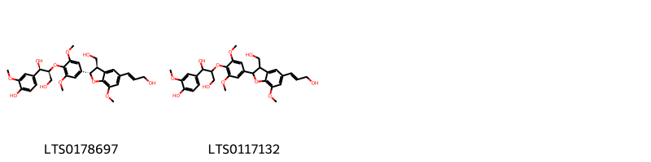{ width=100% }
    <figcaption>Hình ảnh cấu trúc hóa học của 2 hoạt chất thuộc nhóm 2-arylbenzofuran flavonoids gồm ['(1r,2s)-1-(4-hydroxy-3-methoxyphenyl)-2-{4-[(2s,3r)-3-(hydroxymethyl)-5-[(1e)-3-hydroxyprop-1-en-1-yl]-7-methoxy-2,3-dihydro-1-benzofuran-2-yl]-2,6-dimethoxyphenoxy}propane-1,3-diol (LTS0178697)', '1-(4-hydroxy-3-methoxyphenyl)-2-{4-[3-(hydroxymethyl)-5-(3-hydroxyprop-1-en-1-yl)-7-methoxy-2,3-dihydro-1-benzofuran-2-yl]-2,6-dimethoxyphenoxy}propane-1,3-diol (LTS0117132)'].</figcaption>
</figure>
#### Nhóm Anthracenes
<figure markdown="span">
    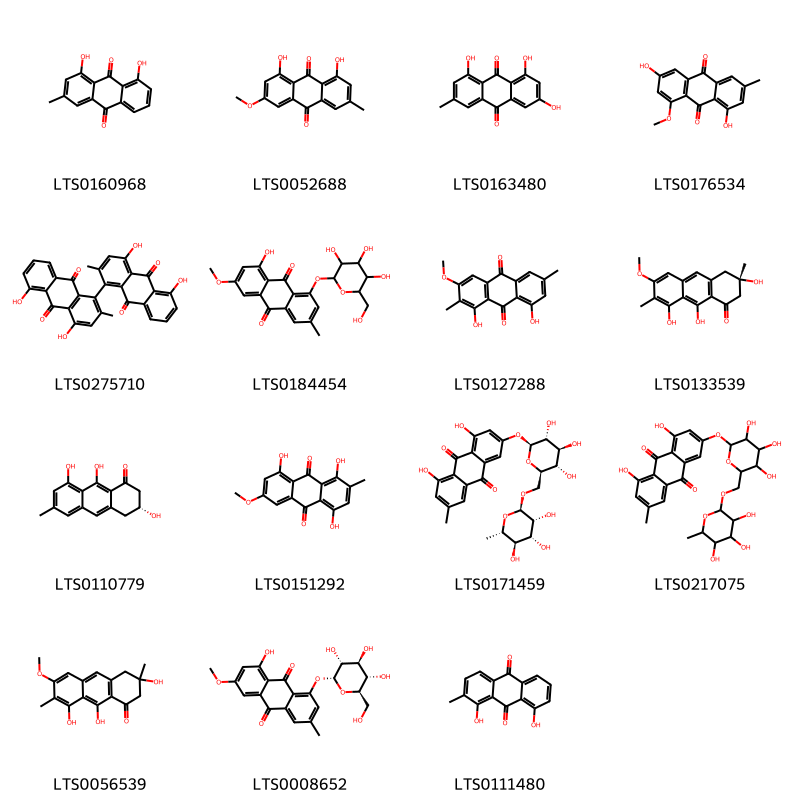{ width=100% }
    <figcaption>Hình ảnh cấu trúc hóa học của 15 hoạt chất thuộc nhóm Anthracenes gồm ['turkey rhubarb (LTS0160968)', 'physcion (LTS0052688)', 'emodin (LTS0163480)', 'questin (LTS0176534)', "4,4',5,5'-tetrahydroxy-2,2'-dimethyl-[1,1'-bianthracene]-9,9',10,10'-tetrone (LTS0275710)", '1-hydroxy-3-methoxy-6-methyl-8-{[3,4,5-trihydroxy-6-(hydroxymethyl)oxan-2-yl]oxy}anthracene-9,10-dione (LTS0184454)', '1,8-dihydroxy-3-methoxy-2,6-dimethylanthracene-9,10-dione (LTS0127288)', '(3s)-3,8,9-trihydroxy-6-methoxy-3,7-dimethyl-2,4-dihydroanthracen-1-one (LTS0133539)', '(3r)-3,8,9-trihydroxy-6-methyl-3,4-dihydro-2h-anthracen-1-one (LTS0110779)', '1,4,8-trihydroxy-6-methoxy-2-methylanthracene-9,10-dione (LTS0151292)', '1,8-dihydroxy-3-methyl-6-{[(2s,3r,4s,5s,6r)-3,4,5-trihydroxy-6-({[(2r,3r,4r,5r,6s)-3,4,5-trihydroxy-6-methyloxan-2-yl]oxy}methyl)oxan-2-yl]oxy}anthracene-9,10-dione (LTS0171459)', '1,8-dihydroxy-3-methyl-6-[(3,4,5-trihydroxy-6-{[(3,4,5-trihydroxy-6-methyloxan-2-yl)oxy]methyl}oxan-2-yl)oxy]anthracene-9,10-dione (LTS0217075)', '3,8,9-trihydroxy-6-methoxy-3,7-dimethyl-2,4-dihydroanthracen-1-one (LTS0056539)', '1-hydroxy-3-methoxy-6-methyl-8-{[(2r,3r,4s,5s,6r)-3,4,5-trihydroxy-6-(hydroxymethyl)oxan-2-yl]oxy}anthracene-9,10-dione (LTS0008652)', '1,8-dihydroxy-2-methylanthracene-9,10-dione (LTS0111480)'].</figcaption>
</figure>
#### Nhóm Arylnaphthalene lignans
<figure markdown="span">
    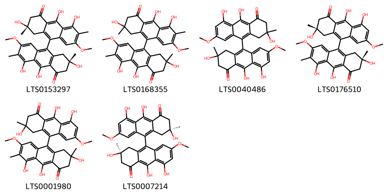{ width=100% }
    <figcaption>Hình ảnh cấu trúc hóa học của 6 hoạt chất thuộc nhóm Arylnaphthalene lignans gồm ["(2s,2's)-2,2',5,5',10,10'-hexahydroxy-7,7'-dimethoxy-2,2',6,6'-tetramethyl-1h,1'h,3h,3'h-[9,9'-bianthracene]-4,4'-dione (LTS0153297)", "2,2',5,5',10,10'-hexahydroxy-7,7'-dimethoxy-2,2',6,6'-tetramethyl-1h,1'h,3h,3'h-[9,9'-bianthracene]-4,4'-dione (LTS0168355)", "2,2',5,5',10,10'-hexahydroxy-7,7'-dimethoxy-2,2'-dimethyl-1h,1'h,3h,3'h-[9,9'-bianthracene]-4,4'-dione (LTS0040486)", "(2s,2's)-2,2',5,5',10,10'-hexahydroxy-7,7'-dimethoxy-2,2',6-trimethyl-1h,1'h,3h,3'h-[9,9'-bianthracene]-4,4'-dione (LTS0176510)", "2,2',5,5',10,10'-hexahydroxy-7,7'-dimethoxy-2,2',6-trimethyl-1h,1'h,3h,3'h-[9,9'-bianthracene]-4,4'-dione (LTS0001980)", "(2s,2's)-2,2',5,5',10,10'-hexahydroxy-7,7'-dimethoxy-2,2'-dimethyl-1h,1'h,3h,3'h-[9,9'-bianthracene]-4,4'-dione (LTS0007214)"].</figcaption>
</figure>
#### Nhóm Benzopyrans
<figure markdown="span">
    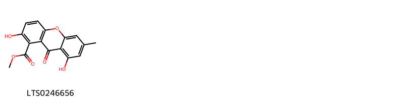{ width=100% }
    <figcaption>Hình ảnh cấu trúc hóa học của 1 hoạt chất thuộc nhóm Benzopyrans gồm ['pinselin (LTS0246656)'].</figcaption>
</figure>
#### Nhóm Flavonoids
<figure markdown="span">
    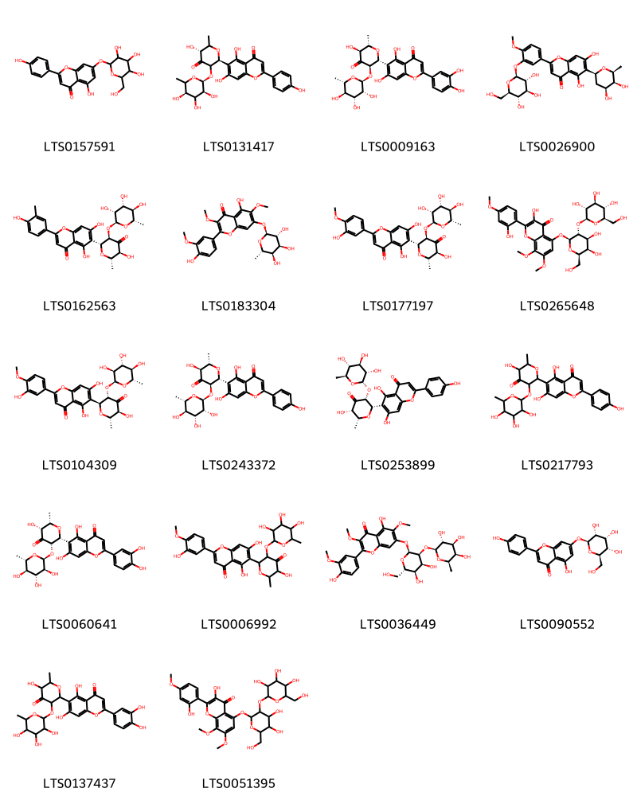{ width=100% }
    <figcaption>Hình ảnh cấu trúc hóa học của 18 hoạt chất thuộc nhóm Flavonoids gồm ['apigetrin (LTS0157591)', 'cassiaoccidentalin a (LTS0131417)', 'cassiaoccidentalin b (LTS0009163)', '6-[(2s,4s,5s,6s)-4,5-dihydroxy-6-methyloxan-2-yl]-5,7-dihydroxy-2-(4-methoxy-3-{[(2s,3r,4s,5s,6r)-3,4,5-trihydroxy-6-(hydroxymethyl)oxan-2-yl]oxy}phenyl)chromen-4-one (LTS0026900)', '5,7-dihydroxy-2-(4-hydroxy-3-methylphenyl)-6-[(2r,3r,5s,6s)-5-hydroxy-6-methyl-4-oxo-3-{[(2s,3r,4r,5r,6s)-3,4,5-trihydroxy-6-methyloxan-2-yl]oxy}oxan-2-yl]chromen-4-one (LTS0162563)', '5-hydroxy-2-(4-hydroxy-3-methoxyphenyl)-3,6-dimethoxy-7-{[(2s,3r,4s,5r,6s)-3,4,5-trihydroxy-6-methyloxan-2-yl]oxy}chromen-4-one (LTS0183304)', '5,7-dihydroxy-2-(3-hydroxy-4-methoxyphenyl)-6-[(2r,3r,5s,6s)-5-hydroxy-6-methyl-4-oxo-3-{[(2s,3r,4r,5r,6s)-3,4,5-trihydroxy-6-methyloxan-2-yl]oxy}oxan-2-yl]chromen-4-one (LTS0177197)', '5-{[(2s,3r,4s,5r,6r)-4,5-dihydroxy-6-(hydroxymethyl)-3-{[(2s,3r,4s,5s,6r)-3,4,5-trihydroxy-6-(hydroxymethyl)oxan-2-yl]oxy}oxan-2-yl]oxy}-3-hydroxy-2-(2-hydroxy-4-methoxyphenyl)-7,8-dimethoxychromen-4-one (LTS0265648)', '5,7-dihydroxy-2-(3-hydroxy-4-methoxyphenyl)-6-[(2s,3s,5s,6s)-5-hydroxy-6-methyl-4-oxo-3-{[(2s,3s,4r,5r,6s)-3,4,5-trihydroxy-6-methyloxan-2-yl]oxy}oxan-2-yl]chromen-4-one (LTS0104309)', '5,7-dihydroxy-6-[(2r,3r,5s,6s)-5-hydroxy-6-methyl-4-oxo-3-{[(2s,3r,4r,5r,6s)-3,4,5-trihydroxy-6-methyloxan-2-yl]oxy}oxan-2-yl]-2-(4-hydroxyphenyl)chromen-4-one (LTS0243372)', '5,7-dihydroxy-6-[(2s,3r,5s,6r)-5-hydroxy-6-methyl-4-oxo-3-{[(2s,3s,4r,5r,6s)-3,4,5-trihydroxy-6-methyloxan-2-yl]oxy}oxan-2-yl]-2-(4-hydroxyphenyl)chromen-4-one (LTS0253899)', '5,7-dihydroxy-6-{5-hydroxy-6-methyl-4-oxo-3-[(3,4,5-trihydroxy-6-methyloxan-2-yl)oxy]oxan-2-yl}-2-(4-hydroxyphenyl)chromen-4-one (LTS0217793)', '2-(3,4-dihydroxyphenyl)-5,7-dihydroxy-6-[(2r,3s,5r,6s)-5-hydroxy-6-methyl-4-oxo-3-{[(2s,3s,4r,5r,6s)-3,4,5-trihydroxy-6-methyloxan-2-yl]oxy}oxan-2-yl]chromen-4-one (LTS0060641)', '5,7-dihydroxy-2-(3-hydroxy-4-methoxyphenyl)-6-{5-hydroxy-6-methyl-4-oxo-3-[(3,4,5-trihydroxy-6-methyloxan-2-yl)oxy]oxan-2-yl}chromen-4-one (LTS0006992)', '7-{[(2s,3s,4s,5r,6s)-4,5-dihydroxy-6-(hydroxymethyl)-3-{[(2s,3r,4s,5r,6r)-3,4,5-trihydroxy-6-methyloxan-2-yl]oxy}oxan-2-yl]oxy}-5-hydroxy-2-(4-hydroxy-3-methoxyphenyl)-3,6-dimethoxychromen-4-one (LTS0036449)', '5-hydroxy-2-(4-hydroxyphenyl)-7-{[(2s,3r,4r,5s,6r)-3,4,5-trihydroxy-6-(hydroxymethyl)oxan-2-yl]oxy}chromen-4-one (LTS0090552)', '2-(3,4-dihydroxyphenyl)-5,7-dihydroxy-6-{5-hydroxy-6-methyl-4-oxo-3-[(3,4,5-trihydroxy-6-methyloxan-2-yl)oxy]oxan-2-yl}chromen-4-one (LTS0137437)', '5-{[4,5-dihydroxy-6-(hydroxymethyl)-3-{[3,4,5-trihydroxy-6-(hydroxymethyl)oxan-2-yl]oxy}oxan-2-yl]oxy}-3-hydroxy-2-(2-hydroxy-4-methoxyphenyl)-7,8-dimethoxychromen-4-one (LTS0051395)'].</figcaption>
</figure>
#### Nhóm Furanoid lignans
<figure markdown="span">
    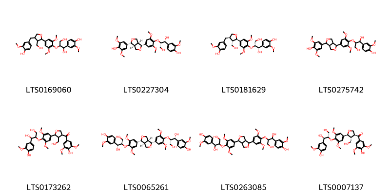{ width=100% }
    <figcaption>Hình ảnh cấu trúc hóa học của 8 hoạt chất thuộc nhóm Furanoid lignans gồm ['1-(4-hydroxy-3-methoxyphenyl)-2-(4-{4-[(4-hydroxy-3-methoxyphenyl)methyl]-3-(hydroxymethyl)oxolan-2-yl}-2,6-dimethoxyphenoxy)propane-1,3-diol (LTS0169060)', '(1r,2s)-2-{4-[(1r,3as,4r,6as)-4-(4-hydroxy-3,5-dimethoxyphenyl)-hexahydrofuro[3,4-c]furan-1-yl]-2,6-dimethoxyphenoxy}-1-(4-hydroxy-3-methoxyphenyl)propane-1,3-diol (LTS0227304)', '(1s,2r)-1-(4-hydroxy-3-methoxyphenyl)-2-{4-[(2r,3s,4r)-4-[(4-hydroxy-3-methoxyphenyl)methyl]-3-(hydroxymethyl)oxolan-2-yl]-2,6-dimethoxyphenoxy}propane-1,3-diol (LTS0181629)', 'buddlenol c (LTS0275742)', '2-{4-[4-(4-hydroxy-3,5-dimethoxybenzoyl)-3-(hydroxymethyl)oxolan-2-yl]-2,6-dimethoxyphenoxy}-1-(4-hydroxy-3-methoxyphenyl)propane-1,3-diol (LTS0173262)', '(1r,2s)-2-{4-[(1r,3as,4r,6as)-4-(4-{[(1r,2r)-1,3-dihydroxy-1-(4-hydroxy-3-methoxyphenyl)propan-2-yl]oxy}-3,5-dimethoxyphenyl)-hexahydrofuro[3,4-c]furan-1-yl]-2,6-dimethoxyphenoxy}-1-(4-hydroxy-3-methoxyphenyl)propane-1,3-diol (LTS0065261)', '2-{4-[4-(4-{[1,3-dihydroxy-1-(4-hydroxy-3-methoxyphenyl)propan-2-yl]oxy}-3,5-dimethoxyphenyl)-hexahydrofuro[3,4-c]furan-1-yl]-2,6-dimethoxyphenoxy}-1-(4-hydroxy-3-methoxyphenyl)propane-1,3-diol (LTS0263085)', '(1r,2s)-2-{4-[(2s,3r,4s)-4-(4-hydroxy-3,5-dimethoxybenzoyl)-3-(hydroxymethyl)oxolan-2-yl]-2,6-dimethoxyphenoxy}-1-(4-hydroxy-3-methoxyphenyl)propane-1,3-diol (LTS0007137)'].</figcaption>
</figure>
#### Nhóm Oxazinanes
<figure markdown="span">
    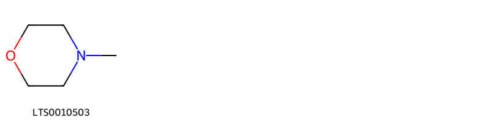{ width=100% }
    <figcaption>Hình ảnh cấu trúc hóa học của 1 hoạt chất thuộc nhóm Oxazinanes gồm ['n-methylmorpholine (LTS0010503)'].</figcaption>
</figure>
#### Nhóm Steroids and steroid derivatives
<figure markdown="span">
    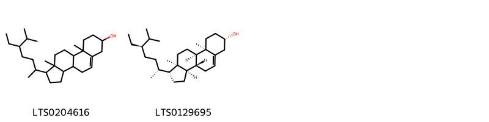{ width=100% }
    <figcaption>Hình ảnh cấu trúc hóa học của 2 hoạt chất thuộc nhóm Steroids and steroid derivatives gồm ['stigmast-5-en-3-ol, (3β)- (LTS0204616)', '(1r,3ar,3br,7s,9ar,9br,11ar)-1-[(2r,5r)-5-ethyl-6-methylheptan-2-yl]-9a,11a-dimethyl-1h,2h,3h,3ah,3bh,4h,6h,7h,8h,9h,9bh,10h,11h-cyclopenta[a]phenanthren-7-ol (LTS0129695)'].</figcaption>
</figure>

---

### Dược dân tộc học

Danh sách các quốc gia có sử dụng *Senna occidentalis* trong điều trị các bệnh. 

| Country                  | Disease                                                             | Bệnh                                                                                                                                                                                                |
|:-------------------------|:--------------------------------------------------------------------|:----------------------------------------------------------------------------------------------------------------------------------------------------------------------------------------------------|
| Africa(Swahili)          | Poultice, Purgative                                                 | MYMEMORY WARNING: YOU USED ALL AVAILABLE FREE TRANSLATIONS FOR TODAY. NEXT AVAILABLE IN  15 HOURS 39 MINUTES 03 SECONDS VISIT HTTPS://MYMEMORY.TRANSLATED.NET/DOC/USAGELIMITS.PHP TO TRANSLATE MORE |
| Brazil                   | Purgative                                                           | MYMEMORY WARNING: YOU USED ALL AVAILABLE FREE TRANSLATIONS FOR TODAY. NEXT AVAILABLE IN  15 HOURS 39 MINUTES 01 SECONDS VISIT HTTPS://MYMEMORY.TRANSLATED.NET/DOC/USAGELIMITS.PHP TO TRANSLATE MORE |
| Central African Republic | Sudorific                                                           | MYMEMORY WARNING: YOU USED ALL AVAILABLE FREE TRANSLATIONS FOR TODAY. NEXT AVAILABLE IN  15 HOURS 38 MINUTES 58 SECONDS VISIT HTTPS://MYMEMORY.TRANSLATED.NET/DOC/USAGELIMITS.PHP TO TRANSLATE MORE |
| Elsewhere                | Diuretic, Purgative, Tonic, nan, Parasiticide, Purgative, Stomachic | MYMEMORY WARNING: YOU USED ALL AVAILABLE FREE TRANSLATIONS FOR TODAY. NEXT AVAILABLE IN  15 HOURS 38 MINUTES 56 SECONDS VISIT HTTPS://MYMEMORY.TRANSLATED.NET/DOC/USAGELIMITS.PHP TO TRANSLATE MORE |
| Ghana                    | Collyrium, Vermifuge                                                | MYMEMORY WARNING: YOU USED ALL AVAILABLE FREE TRANSLATIONS FOR TODAY. NEXT AVAILABLE IN  15 HOURS 38 MINUTES 53 SECONDS VISIT HTTPS://MYMEMORY.TRANSLATED.NET/DOC/USAGELIMITS.PHP TO TRANSLATE MORE |
| Haiti                    | Purgative, Diaphoretic                                              | MYMEMORY WARNING: YOU USED ALL AVAILABLE FREE TRANSLATIONS FOR TODAY. NEXT AVAILABLE IN  15 HOURS 38 MINUTES 51 SECONDS VISIT HTTPS://MYMEMORY.TRANSLATED.NET/DOC/USAGELIMITS.PHP TO TRANSLATE MORE |
| Iraq                     | Diuretic, Purgative, Tonic                                          | MYMEMORY WARNING: YOU USED ALL AVAILABLE FREE TRANSLATIONS FOR TODAY. NEXT AVAILABLE IN  15 HOURS 38 MINUTES 49 SECONDS VISIT HTTPS://MYMEMORY.TRANSLATED.NET/DOC/USAGELIMITS.PHP TO TRANSLATE MORE |
| Java                     | Insecticide                                                         | MYMEMORY WARNING: YOU USED ALL AVAILABLE FREE TRANSLATIONS FOR TODAY. NEXT AVAILABLE IN  15 HOURS 38 MINUTES 46 SECONDS VISIT HTTPS://MYMEMORY.TRANSLATED.NET/DOC/USAGELIMITS.PHP TO TRANSLATE MORE |
| Mexico                   | Diuretic, Stomachic, Stomachic, Tonic, Diuretic, Tonic              | MYMEMORY WARNING: YOU USED ALL AVAILABLE FREE TRANSLATIONS FOR TODAY. NEXT AVAILABLE IN  15 HOURS 38 MINUTES 44 SECONDS VISIT HTTPS://MYMEMORY.TRANSLATED.NET/DOC/USAGELIMITS.PHP TO TRANSLATE MORE |
| Nepal                    | Purgative, Purgative                                                | MYMEMORY WARNING: YOU USED ALL AVAILABLE FREE TRANSLATIONS FOR TODAY. NEXT AVAILABLE IN  15 HOURS 38 MINUTES 41 SECONDS VISIT HTTPS://MYMEMORY.TRANSLATED.NET/DOC/USAGELIMITS.PHP TO TRANSLATE MORE |
| Panama                   | Antiseptic, Vermifuge                                               | MYMEMORY WARNING: YOU USED ALL AVAILABLE FREE TRANSLATIONS FOR TODAY. NEXT AVAILABLE IN  15 HOURS 38 MINUTES 39 SECONDS VISIT HTTPS://MYMEMORY.TRANSLATED.NET/DOC/USAGELIMITS.PHP TO TRANSLATE MORE |
| Panama(Choco)            | Vermifuge                                                           | MYMEMORY WARNING: YOU USED ALL AVAILABLE FREE TRANSLATIONS FOR TODAY. NEXT AVAILABLE IN  15 HOURS 38 MINUTES 37 SECONDS VISIT HTTPS://MYMEMORY.TRANSLATED.NET/DOC/USAGELIMITS.PHP TO TRANSLATE MORE |
| Paraguay                 | Antifertility                                                       | MYMEMORY WARNING: YOU USED ALL AVAILABLE FREE TRANSLATIONS FOR TODAY. NEXT AVAILABLE IN  15 HOURS 38 MINUTES 34 SECONDS VISIT HTTPS://MYMEMORY.TRANSLATED.NET/DOC/USAGELIMITS.PHP TO TRANSLATE MORE |
| Sudan                    | Diuretic                                                            | MYMEMORY WARNING: YOU USED ALL AVAILABLE FREE TRANSLATIONS FOR TODAY. NEXT AVAILABLE IN  15 HOURS 38 MINUTES 32 SECONDS VISIT HTTPS://MYMEMORY.TRANSLATED.NET/DOC/USAGELIMITS.PHP TO TRANSLATE MORE |
| Trinidad                 | Abortifacient, Abortifacient, Purgative, Purgative                  | MYMEMORY WARNING: YOU USED ALL AVAILABLE FREE TRANSLATIONS FOR TODAY. NEXT AVAILABLE IN  15 HOURS 38 MINUTES 30 SECONDS VISIT HTTPS://MYMEMORY.TRANSLATED.NET/DOC/USAGELIMITS.PHP TO TRANSLATE MORE |
| Venezuela                | Carminative, Diuretic, Emmenagogue                                  | MYMEMORY WARNING: YOU USED ALL AVAILABLE FREE TRANSLATIONS FOR TODAY. NEXT AVAILABLE IN  15 HOURS 38 MINUTES 27 SECONDS VISIT HTTPS://MYMEMORY.TRANSLATED.NET/DOC/USAGELIMITS.PHP TO TRANSLATE MORE |

---

---
## Cassia oxyphylla
### Thông tin về thực vật

!!! info "Phân loại thực vật của *Senna oxyphylla* từ GIBF:"
    - **Kingdom:** Plantae
    - **Phylum:** Tracheophyta
    - **Order:** Fabales
    - **Family:** Fabaceae
    - **Genus:** Senna
    - **Species:** *Senna oxyphylla*

 

| Label (VI)   | Label (EN)   | Scientific Name   | Descriptions (VI)   | Descriptions (EN)   | Also Known As (VI)   | Also Known As (EN)   |
|:-------------|:-------------|:------------------|:--------------------|:--------------------|:---------------------|:---------------------|
| N/A          | N/A          | Cassia oxyphylla  |                     | species of plant    | ['']                 | ['']                 |

#### Phân bố trên thế giới

**Từ CSDL GIBF** nan, Ecuador, Australia, Colombia, Costa Rica, unknown or invalid, Mexico, Venezuela (Bolivarian Republic of), Panama

#### Phân bố tại Việt Nam

**Từ CSDL GIBF**: Không có ghi nhận ở Việt Nam

---
### Thành phần hóa học
        
- Theo cơ sở dữ liệu lotus: Từ loài *Senna oxyphylla* đã phân lập và xác định được Chưa có hoạt chất nào được phân lập. hoạt chất thuộc về các nhóm Không có hoạt chất nào được phân lập. 

Không có hình ảnh nào được tạo ra

---

### Dược dân tộc học

Danh sách các quốc gia có sử dụng *Senna oxyphylla* trong điều trị các bệnh. 

| Country   | Disease   | Bệnh                                                                                                                                                                                                |
|:----------|:----------|:----------------------------------------------------------------------------------------------------------------------------------------------------------------------------------------------------|
| Mexico    | Emetic    | MYMEMORY WARNING: YOU USED ALL AVAILABLE FREE TRANSLATIONS FOR TODAY. NEXT AVAILABLE IN  15 HOURS 38 MINUTES 02 SECONDS VISIT HTTPS://MYMEMORY.TRANSLATED.NET/DOC/USAGELIMITS.PHP TO TRANSLATE MORE |

---

---
## Cassia reticulata
### Thông tin về thực vật

!!! info "Phân loại thực vật của *Senna reticulata* từ GIBF:"
    - **Kingdom:** Plantae
    - **Phylum:** Tracheophyta
    - **Order:** Fabales
    - **Family:** Fabaceae
    - **Genus:** Senna
    - **Species:** *Senna reticulata*

 

| Label (VI)   | Label (EN)   | Scientific Name   | Descriptions (VI)   | Descriptions (EN)   | Also Known As (VI)   | Also Known As (EN)   |
|:-------------|:-------------|:------------------|:--------------------|:--------------------|:---------------------|:---------------------|
| N/A          | N/A          | Cassia reticulata | loài thực vật       | species of plant    | ['']                 | ['']                 |

#### Phân bố trên thế giới

**Từ CSDL GIBF** nan, Guatemala, unknown or invalid, Nicaragua, Venezuela (Bolivarian Republic of), French Guiana, Panama, Bolivia (Plurinational State of), Honduras, El Salvador, Belize, Suriname, Brazil, Peru, France, Mexico, Ecuador, Colombia, Costa Rica, India

#### Phân bố tại Việt Nam

**Từ CSDL GIBF**: Không có ghi nhận ở Việt Nam

---
### Thành phần hóa học
        
- Theo cơ sở dữ liệu lotus: Từ loài *Senna reticulata* đã phân lập và xác định được Chưa có hoạt chất nào được phân lập. hoạt chất thuộc về các nhóm Không có hoạt chất nào được phân lập. 

Không có hình ảnh nào được tạo ra

---

### Dược dân tộc học

Danh sách các quốc gia có sử dụng *Senna reticulata* trong điều trị các bệnh. 

| Country       | Disease   | Bệnh                                                                                                                                                                                                |
|:--------------|:----------|:----------------------------------------------------------------------------------------------------------------------------------------------------------------------------------------------------|
| Elsewhere     | Purgative | MYMEMORY WARNING: YOU USED ALL AVAILABLE FREE TRANSLATIONS FOR TODAY. NEXT AVAILABLE IN  15 HOURS 37 MINUTES 44 SECONDS VISIT HTTPS://MYMEMORY.TRANSLATED.NET/DOC/USAGELIMITS.PHP TO TRANSLATE MORE |
| Guatemala     | Purgative | MYMEMORY WARNING: YOU USED ALL AVAILABLE FREE TRANSLATIONS FOR TODAY. NEXT AVAILABLE IN  15 HOURS 37 MINUTES 42 SECONDS VISIT HTTPS://MYMEMORY.TRANSLATED.NET/DOC/USAGELIMITS.PHP TO TRANSLATE MORE |
| Honduras      | Purgative | MYMEMORY WARNING: YOU USED ALL AVAILABLE FREE TRANSLATIONS FOR TODAY. NEXT AVAILABLE IN  15 HOURS 37 MINUTES 40 SECONDS VISIT HTTPS://MYMEMORY.TRANSLATED.NET/DOC/USAGELIMITS.PHP TO TRANSLATE MORE |
| Panama(Choco) | Purgative | MYMEMORY WARNING: YOU USED ALL AVAILABLE FREE TRANSLATIONS FOR TODAY. NEXT AVAILABLE IN  15 HOURS 37 MINUTES 38 SECONDS VISIT HTTPS://MYMEMORY.TRANSLATED.NET/DOC/USAGELIMITS.PHP TO TRANSLATE MORE |
| Salvador      | Purgative | MYMEMORY WARNING: YOU USED ALL AVAILABLE FREE TRANSLATIONS FOR TODAY. NEXT AVAILABLE IN  15 HOURS 37 MINUTES 35 SECONDS VISIT HTTPS://MYMEMORY.TRANSLATED.NET/DOC/USAGELIMITS.PHP TO TRANSLATE MORE |

---

---
## Cassia senna
### Thông tin về thực vật

!!! info "Phân loại thực vật của *Senna alexandrina* từ GIBF:"
    - **Kingdom:** Plantae
    - **Phylum:** Tracheophyta
    - **Order:** Fabales
    - **Family:** Fabaceae
    - **Genus:** Senna
    - **Species:** *Senna alexandrina*

 

| Label (VI)   | Label (EN)   | Scientific Name   | Descriptions (VI)   | Descriptions (EN)   | Also Known As (VI)   | Also Known As (EN)   |
|:-------------|:-------------|:------------------|:--------------------|:--------------------|:---------------------|:---------------------|
| N/A          | N/A          | Cassia senna      | loài thực vật       | species of plant    | ['']                 | ['']                 |

#### Phân bố trên thế giới

**Từ CSDL GIBF** nan, Gabon, unknown or invalid, Benin, Norway, Israel, Yemen, Togo, Pakistan, Sudan, Spain, United States of America, Saudi Arabia, Oman, Eritrea, Niger, Brazil, Egypt, Mexico, Peru, Ecuador, Cabo Verde, Iraq, India, Djibouti, Kenya, Ethiopia

#### Phân bố tại Việt Nam

**Từ CSDL GIBF**: Không có ghi nhận ở Việt Nam

---
### Thành phần hóa học
        
- Theo cơ sở dữ liệu lotus: Từ loài *Senna alexandrina* đã phân lập và xác định được Chưa có hoạt chất nào được phân lập. hoạt chất thuộc về các nhóm Không có hoạt chất nào được phân lập. 

Không có hình ảnh nào được tạo ra

---

### Dược dân tộc học

Danh sách các quốc gia có sử dụng *Senna alexandrina* trong điều trị các bệnh. 

| Country   | Disease   | Bệnh                                                                                                                                                                                                |
|:----------|:----------|:----------------------------------------------------------------------------------------------------------------------------------------------------------------------------------------------------|
| China     | Laxative  | MYMEMORY WARNING: YOU USED ALL AVAILABLE FREE TRANSLATIONS FOR TODAY. NEXT AVAILABLE IN  15 HOURS 37 MINUTES 13 SECONDS VISIT HTTPS://MYMEMORY.TRANSLATED.NET/DOC/USAGELIMITS.PHP TO TRANSLATE MORE |
| France    | Laxative  | MYMEMORY WARNING: YOU USED ALL AVAILABLE FREE TRANSLATIONS FOR TODAY. NEXT AVAILABLE IN  15 HOURS 37 MINUTES 11 SECONDS VISIT HTTPS://MYMEMORY.TRANSLATED.NET/DOC/USAGELIMITS.PHP TO TRANSLATE MORE |

---

---
## Cassia siamea
### Thông tin về thực vật

!!! info "Phân loại thực vật của *Senna siamea* từ GIBF:"
    - **Kingdom:** Plantae
    - **Phylum:** Tracheophyta
    - **Order:** Fabales
    - **Family:** Fabaceae
    - **Genus:** Senna
    - **Species:** *Senna siamea*

 

| Label (VI)   | Label (EN)   | Scientific Name   | Descriptions (VI)   | Descriptions (EN)   | Also Known As (VI)   | Also Known As (EN)   |
|:-------------|:-------------|:------------------|:--------------------|:--------------------|:---------------------|:---------------------|
| N/A          | N/A          | Cassia siamea     | loài thực vật       | species of plant    | ['']                 | ['']                 |

#### Phân bố trên thế giới

**Từ CSDL GIBF** nan, Ghana, Central African Republic, Lao People’s Democratic Republic, Cambodia, Guatemala, Mozambique, unknown or invalid, Benin, Tanzania, United Republic of, Venezuela (Bolivarian Republic of), Togo, Puerto Rico, Senegal, Nigeria, Chad, Chinese Taipei, United States of America, Guinea, Trinidad and Tobago, Hong Kong, Sao Tome and Principe, Thailand, Côte d’Ivoire, Brazil, Mexico, China, French Polynesia, Cabo Verde, Colombia, Kenya, India, Indonesia, Burkina Faso, Philippines, Malaysia

#### Phân bố tại Việt Nam

**Từ CSDL GIBF**: Không có ghi nhận ở Việt Nam

---
### Thành phần hóa học
        
- Theo cơ sở dữ liệu lotus: Từ loài *Senna siamea* đã phân lập và xác định được 89 hoạt chất thuộc về các nhóm Fatty Acyls, Flavonoids, Prenol lipids, Steroids and steroid derivatives, Tetralins, Anthracenes, Benzene and substituted derivatives, Azaphilones, Stilbenes, Saturated hydrocarbons, Organooxygen compounds, Carboxylic acids and derivatives, Isoquinolines and derivatives, Benzopyrans. 

|    | chemicalTaxonomyClassyfireClass     |   smiles_count |
|---:|:------------------------------------|---------------:|
|  0 | Anthracenes                         |             14 |
|  1 | Azaphilones                         |              2 |
|  2 | Benzene and substituted derivatives |              3 |
|  3 | Benzopyrans                         |             18 |
|  4 | Carboxylic acids and derivatives    |              1 |
|  5 | Fatty Acyls                         |             14 |
|  6 | Flavonoids                          |              6 |
|  7 | Isoquinolines and derivatives       |             14 |
|  8 | Organooxygen compounds              |              1 |
|  9 | Prenol lipids                       |              7 |
| 10 | Saturated hydrocarbons              |              2 |
| 11 | Steroids and steroid derivatives    |              4 |
| 12 | Stilbenes                           |              1 |
| 13 | Tetralins                           |              2 |

#### Nhóm Anthracenes
<figure markdown="span">
    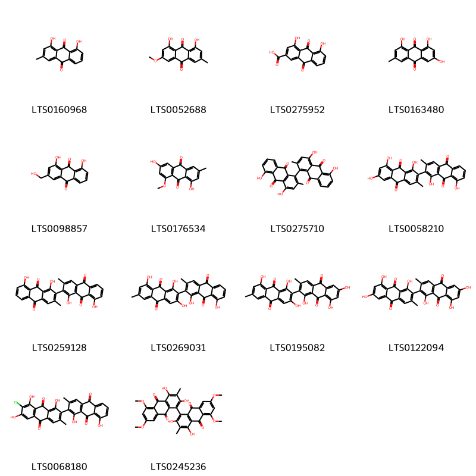{ width=100% }
    <figcaption>Hình ảnh cấu trúc hóa học của 14 hoạt chất thuộc nhóm Anthracenes gồm ['turkey rhubarb (LTS0160968)', 'physcion (LTS0052688)', 'monorhein (LTS0275952)', 'emodin (LTS0163480)', 'aloe emodin (LTS0098857)', 'questin (LTS0176534)', "4,4',5,5'-tetrahydroxy-2,2'-dimethyl-[1,1'-bianthracene]-9,9',10,10'-tetrone (LTS0275710)", "1,1',6,8,8'-pentahydroxy-3,3'-dimethyl-[2,2'-bianthracene]-9,9',10,10'-tetrone (LTS0058210)", 'cassiamin c (LTS0259128)', "1,1',3,8,8'-pentahydroxy-3',6-dimethyl-[2,2'-bianthracene]-9,9',10,10'-tetrone (LTS0269031)", "1,1',3,6',8,8'-hexahydroxy-3',6-dimethyl-[2,2'-bianthracene]-9,9',10,10'-tetrone (LTS0195082)", "1,1',6,6',8,8'-hexahydroxy-3,3'-dimethyl-[2,2'-bianthracene]-9,9',10,10'-tetrone (LTS0122094)", "7-chloro-1,1',6,8,8'-pentahydroxy-3,3'-dimethyl-[2,2'-bianthracene]-9,9',10,10'-tetrone (LTS0068180)", "2,2',4,4'-tetrahydroxy-5,5',7,7'-tetramethoxy-3,3'-dimethyl-[1,1'-bianthracene]-9,9',10,10'-tetrone (LTS0245236)"].</figcaption>
</figure>
#### Nhóm Azaphilones
<figure markdown="span">
    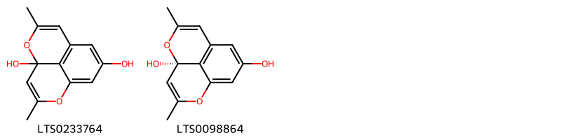{ width=100% }
    <figcaption>Hình ảnh cấu trúc hóa học của 2 hoạt chất thuộc nhóm Azaphilones gồm ['barakol (LTS0233764)', '(5r)-3,7-dimethyl-2,6-dioxatricyclo[7.3.1.0⁵,¹³]trideca-1(13),3,7,9,11-pentaene-5,11-diol (LTS0098864)'].</figcaption>
</figure>
#### Nhóm Benzene and substituted derivatives
<figure markdown="span">
    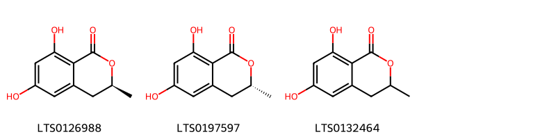{ width=100% }
    <figcaption>Hình ảnh cấu trúc hóa học của 3 hoạt chất thuộc nhóm Benzene and substituted derivatives gồm ['(3s)-6,8-dihydroxy-3-methyl-3,4-dihydro-2-benzopyran-1-one (LTS0126988)', '6-hydroxymellein (LTS0197597)', '6-hydroxymellein (LTS0132464)'].</figcaption>
</figure>
#### Nhóm Benzopyrans
<figure markdown="span">
    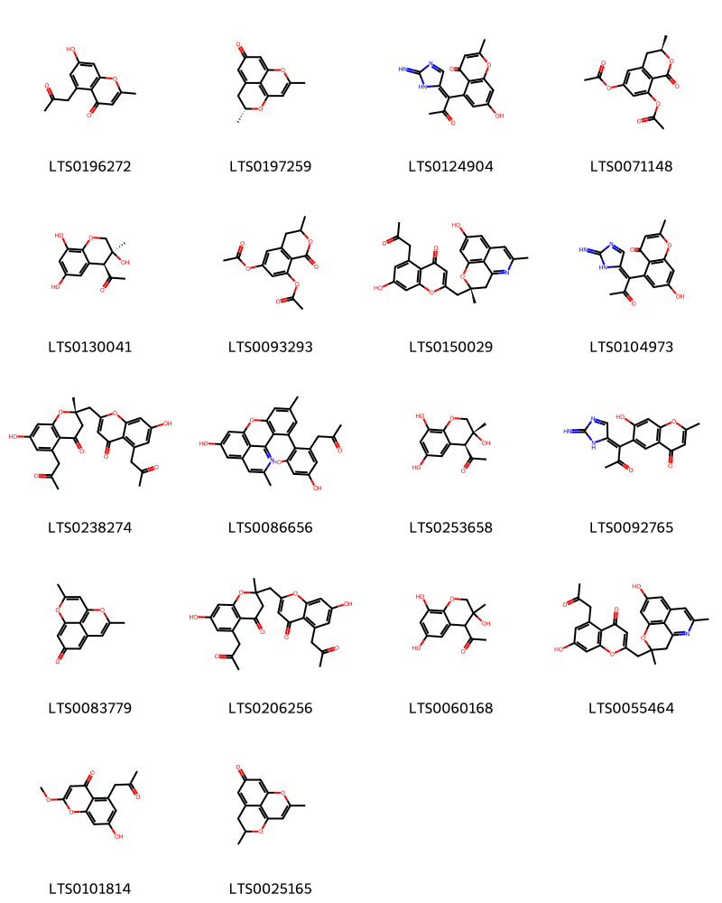{ width=100% }
    <figcaption>Hình ảnh cấu trúc hóa học của 18 hoạt chất thuộc nhóm Benzopyrans gồm ['7-hydroxy-2-methyl-5-(2-oxopropyl)chromen-4-one (LTS0196272)', '(7r)-3,7-dimethyl-2,6-dioxatricyclo[7.3.1.0⁵,¹³]trideca-1(12),3,5(13),9-tetraen-11-one (LTS0197259)', '7-hydroxy-5-[1-(2-imino-3h-imidazol-4-ylidene)-2-oxopropyl]-2-methylchromen-4-one (LTS0124904)', '(3r)-6-(acetyloxy)-3-methyl-1-oxo-3,4-dihydro-2-benzopyran-8-yl acetate (LTS0071148)', '1-[(3s,4s)-3,6,8-trihydroxy-3-methyl-2,4-dihydro-1-benzopyran-4-yl]ethanone (LTS0130041)', '6-(acetyloxy)-3-methyl-1-oxo-3,4-dihydro-2-benzopyran-8-yl acetate (LTS0093293)', '7-hydroxy-2-{[(3r)-11-hydroxy-3,7-dimethyl-2-oxa-6-azatricyclo[7.3.1.0⁵,¹³]trideca-1(13),5,7,9,11-pentaen-3-yl]methyl}-5-(2-oxopropyl)chromen-4-one (LTS0150029)', '7-hydroxy-5-{1-[(4z)-2-imino-3h-imidazol-4-ylidene]-2-oxopropyl}-2-methylchromen-4-one (LTS0104973)', '7-hydroxy-2-{[(2r)-7-hydroxy-2-methyl-4-oxo-5-(2-oxopropyl)-3h-1-benzopyran-2-yl]methyl}-5-(2-oxopropyl)chromen-4-one (LTS0238274)', '1-(3,5-dihydroxy-2-{11-hydroxy-5,15-dimethyl-8-oxa-16-azatetracyclo[7.7.1.0²,⁷.0¹³,¹⁷]heptadeca-1(16),2(7),3,5,9(17),10,12,14-octaen-3-yl}phenyl)propan-2-one (LTS0086656)', '1-[(3r,4s)-3,6,8-trihydroxy-3-methyl-2,4-dihydro-1-benzopyran-4-yl]ethanone (LTS0253658)', '7-hydroxy-6-{1-[(4z)-2-imino-3h-imidazol-4-ylidene]-2-oxopropyl}-2-methylchromen-4-one (LTS0092765)', '3,7-dimethyl-2,6-dioxatricyclo[7.3.1.0⁵,¹³]trideca-1(12),3,5(13),7,9-pentaen-11-one (LTS0083779)', '7-hydroxy-2-{[7-hydroxy-2-methyl-4-oxo-5-(2-oxopropyl)-3h-1-benzopyran-2-yl]methyl}-5-(2-oxopropyl)chromen-4-one (LTS0206256)', '1-(3,6,8-trihydroxy-3-methyl-2,4-dihydro-1-benzopyran-4-yl)ethanone (LTS0060168)', 'cassiarin d (LTS0055464)', '7-hydroxy-2-methoxy-5-(2-oxopropyl)chromen-4-one (LTS0101814)', '3,7-dimethyl-2,6-dioxatricyclo[7.3.1.0⁵,¹³]trideca-1(12),3,5(13),9-tetraen-11-one (LTS0025165)'].</figcaption>
</figure>
#### Nhóm Carboxylic acids and derivatives
<figure markdown="span">
    { width=100% }
    <figcaption>Hình ảnh cấu trúc hóa học của 1 hoạt chất thuộc nhóm Carboxylic acids and derivatives gồm ['ethanolamine acetate (LTS0211756)'].</figcaption>
</figure>
#### Nhóm Fatty Acyls
<figure markdown="span">
    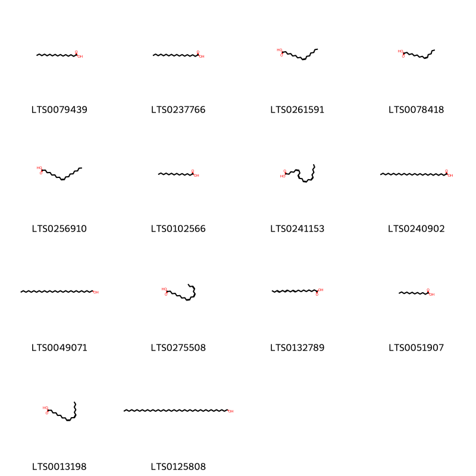{ width=100% }
    <figcaption>Hình ảnh cấu trúc hóa học của 14 hoạt chất thuộc nhóm Fatty Acyls gồm ['palmitic acid (LTS0079439)', 'stearic acid (LTS0237766)', 'palmitoleic acid (LTS0261591)', 'myristoleic acid (LTS0078418)', 'oleic acid (LTS0256910)', 'myristic acid (LTS0102566)', 'arachidonic acid (LTS0241153)', 'hexacosanoic acid (LTS0240902)', 'octacosanol (LTS0049071)', 'α-linolenic acid (LTS0275508)', 'α linolenic acid (LTS0132789)', 'lauric acid (LTS0051907)', 'linoleic (LTS0013198)', '1-tetracontanol (LTS0125808)'].</figcaption>
</figure>
#### Nhóm Flavonoids
<figure markdown="span">
    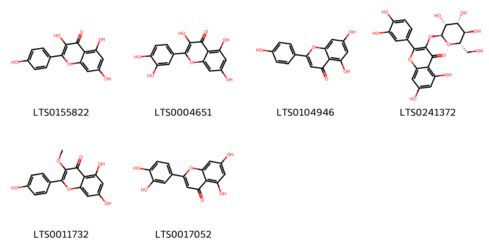{ width=100% }
    <figcaption>Hình ảnh cấu trúc hóa học của 6 hoạt chất thuộc nhóm Flavonoids gồm ['kaempherol (LTS0155822)', 'quercetin (LTS0004651)', 'chamomile (LTS0104946)', '2-(3,4-dihydroxyphenyl)-5,7-dihydroxy-3-{[(2s,3r,4r,5r,6s)-3,4,5-trihydroxy-6-(hydroxymethyl)oxan-2-yl]oxy}chromen-4-one (LTS0241372)', 'isokaempferide (LTS0011732)', 'luteolin (LTS0017052)'].</figcaption>
</figure>
#### Nhóm Isoquinolines and derivatives
<figure markdown="span">
    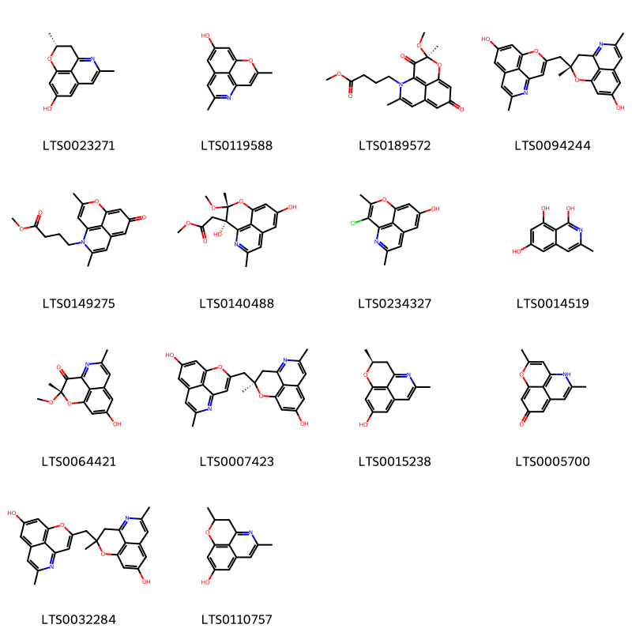{ width=100% }
    <figcaption>Hình ảnh cấu trúc hóa học của 14 hoạt chất thuộc nhóm Isoquinolines and derivatives gồm ['(3r)-3,7-dimethyl-2-oxa-6-azatricyclo[7.3.1.0⁵,¹³]trideca-1(13),5,7,9,11-pentaen-11-ol (LTS0023271)', 'cassiarin a (LTS0119588)', 'methyl 4-[(3s)-3-methoxy-3,7-dimethyl-4,11-dioxo-2-oxa-6-azatricyclo[7.3.1.0⁵,¹³]trideca-1(12),5(13),7,9-tetraen-6-yl]butanoate (LTS0189572)', '3-{[(3s)-11-hydroxy-3,7-dimethyl-2-oxa-6-azatricyclo[7.3.1.0⁵,¹³]trideca-1(13),5,7,9,11-pentaen-3-yl]methyl}-7-methyl-2-oxa-6-azatricyclo[7.3.1.0⁵,¹³]trideca-1(13),3,5,7,9,11-hexaen-11-ol (LTS0094244)', 'cassiarin b (LTS0149275)', 'methyl 2-[(3r,4s)-4,11-dihydroxy-3-methoxy-3,7-dimethyl-2-oxa-6-azatricyclo[7.3.1.0⁵,¹³]trideca-1(13),5,7,9,11-pentaen-4-yl]acetate (LTS0140488)', '4-chloro-3,7-dimethyl-2-oxa-6-azatricyclo[7.3.1.0⁵,¹³]trideca-1(13),3,5,7,9,11-hexaen-11-ol (LTS0234327)', '3-methylisoquinoline-1,6,8-triol (LTS0014519)', '(3s)-11-hydroxy-3-methoxy-3,7-dimethyl-2-oxa-6-azatricyclo[7.3.1.0⁵,¹³]trideca-1(12),5(13),6,8,10-pentaen-4-one (LTS0064421)', '3-{[(3r)-11-hydroxy-3,7-dimethyl-2-oxa-6-azatricyclo[7.3.1.0⁵,¹³]trideca-1(13),5,7,9,11-pentaen-3-yl]methyl}-7-methyl-2-oxa-6-azatricyclo[7.3.1.0⁵,¹³]trideca-1(13),3,5,7,9,11-hexaen-11-ol (LTS0007423)', '(3s)-3,7-dimethyl-2-oxa-6-azatricyclo[7.3.1.0⁵,¹³]trideca-1(13),5,7,9,11-pentaen-11-ol (LTS0015238)', '3,7-dimethyl-2-oxa-6-azatricyclo[7.3.1.0⁵,¹³]trideca-1(12),3,5(13),7,9-pentaen-11-one (LTS0005700)', 'cassiarin e (LTS0032284)', 'cassiarin c (LTS0110757)'].</figcaption>
</figure>
#### Nhóm Organooxygen compounds
<figure markdown="span">
    { width=100% }
    <figcaption>Hình ảnh cấu trúc hóa học của 1 hoạt chất thuộc nhóm Organooxygen compounds gồm ['sucrose (LTS0272557)'].</figcaption>
</figure>
#### Nhóm Prenol lipids
<figure markdown="span">
    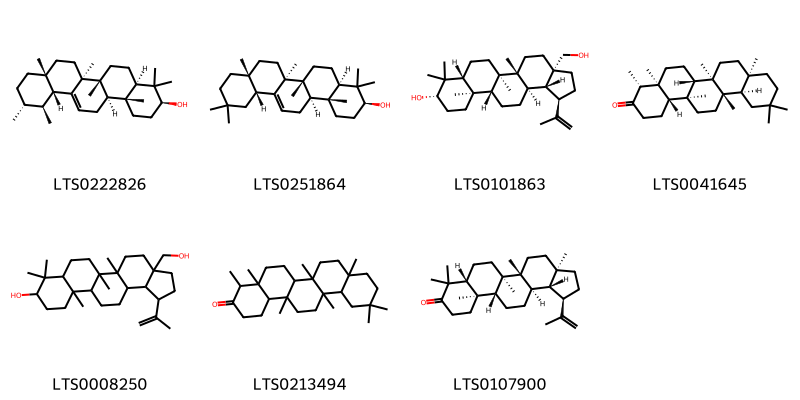{ width=100% }
    <figcaption>Hình ảnh cấu trúc hóa học của 7 hoạt chất thuộc nhóm Prenol lipids gồm ['amyrin (LTS0222826)', 'β-amyrin (LTS0251864)', 'betulin (LTS0101863)', '(-)-friedelin (LTS0041645)', '3a-(hydroxymethyl)-5a,5b,8,8,11a-pentamethyl-1-(prop-1-en-2-yl)-hexadecahydrocyclopenta[a]chrysen-9-ol (LTS0008250)', 'friedelin (LTS0213494)', 'lupenone (LTS0107900)'].</figcaption>
</figure>
#### Nhóm Saturated hydrocarbons
<figure markdown="span">
    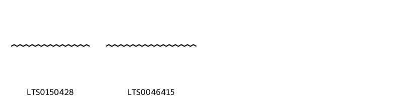{ width=100% }
    <figcaption>Hình ảnh cấu trúc hóa học của 2 hoạt chất thuộc nhóm Saturated hydrocarbons gồm ['heptacosane (LTS0150428)', 'hentriacontane (LTS0046415)'].</figcaption>
</figure>
#### Nhóm Steroids and steroid derivatives
<figure markdown="span">
    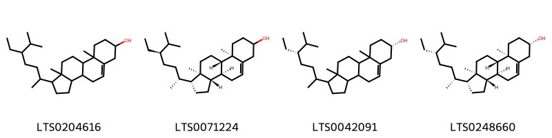{ width=100% }
    <figcaption>Hình ảnh cấu trúc hóa học của 4 hoạt chất thuộc nhóm Steroids and steroid derivatives gồm ['stigmast-5-en-3-ol, (3β)- (LTS0204616)', 'stigmast-5-en-3-ol (LTS0071224)', '(7s)-1-[(5s)-5-ethyl-6-methylheptan-2-yl]-9a,11a-dimethyl-1h,2h,3h,3ah,3bh,4h,6h,7h,8h,9h,9bh,10h,11h-cyclopenta[a]phenanthren-7-ol (LTS0042091)', 'clionasterol (LTS0248660)'].</figcaption>
</figure>
#### Nhóm Stilbenes
<figure markdown="span">
    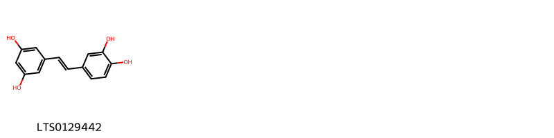{ width=100% }
    <figcaption>Hình ảnh cấu trúc hóa học của 1 hoạt chất thuộc nhóm Stilbenes gồm ['piceatannol (LTS0129442)'].</figcaption>
</figure>
#### Nhóm Tetralins
<figure markdown="span">
    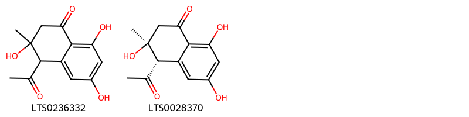{ width=100% }
    <figcaption>Hình ảnh cấu trúc hóa học của 2 hoạt chất thuộc nhóm Tetralins gồm ['4-acetyl-3,6,8-trihydroxy-3-methyl-2,4-dihydronaphthalen-1-one (LTS0236332)', '(3s,4s)-4-acetyl-3,6,8-trihydroxy-3-methyl-2,4-dihydronaphthalen-1-one (LTS0028370)'].</figcaption>
</figure>

---

### Dược dân tộc học

Danh sách các quốc gia có sử dụng *Senna siamea* trong điều trị các bệnh. 

| Country   | Disease        | Bệnh                                                                                                                                                                                                |
|:----------|:---------------|:----------------------------------------------------------------------------------------------------------------------------------------------------------------------------------------------------|
| Elsewhere | Poison, Poison | MYMEMORY WARNING: YOU USED ALL AVAILABLE FREE TRANSLATIONS FOR TODAY. NEXT AVAILABLE IN  15 HOURS 36 MINUTES 52 SECONDS VISIT HTTPS://MYMEMORY.TRANSLATED.NET/DOC/USAGELIMITS.PHP TO TRANSLATE MORE |
| Malaya    | Vermifuge      | MYMEMORY WARNING: YOU USED ALL AVAILABLE FREE TRANSLATIONS FOR TODAY. NEXT AVAILABLE IN  15 HOURS 36 MINUTES 49 SECONDS VISIT HTTPS://MYMEMORY.TRANSLATED.NET/DOC/USAGELIMITS.PHP TO TRANSLATE MORE |

---

---
## Cassia sophera
### Thông tin về thực vật

!!! info "Phân loại thực vật của *Senna sophera* từ GIBF:"
    - **Kingdom:** Plantae
    - **Phylum:** Tracheophyta
    - **Order:** Fabales
    - **Family:** Fabaceae
    - **Genus:** Senna
    - **Species:** *Senna sophera*

 

| Label (VI)   | Label (EN)   | Scientific Name   | Descriptions (VI)   | Descriptions (EN)   | Also Known As (VI)   | Also Known As (EN)                       |
|:-------------|:-------------|:------------------|:--------------------|:--------------------|:---------------------|:-----------------------------------------|
| N/A          | N/A          | Cassia sophera    |                     | species of plant    | ['']                 | ['Pepper Leaved Senna', 'Senna Sophera'] |

#### Phân bố trên thế giới

**Từ CSDL GIBF** Ghana, Sri Lanka, Australia, Myanmar, unknown or invalid, Yemen, Togo, Pakistan, Nigeria, Chinese Taipei, Bangladesh, United States of America, Congo, Democratic Republic of the, Guinea, Thailand, Côte d’Ivoire, Bahamas, Tonga, New Caledonia, Austria, China, Seychelles, Iraq, Vanuatu, India, Indonesia, Philippines, Cameroon, Northern Mariana Islands

#### Phân bố tại Việt Nam

**Từ CSDL GIBF**: Không có ghi nhận ở Việt Nam

---
### Thành phần hóa học
        
- Theo cơ sở dữ liệu lotus: Từ loài *Senna sophera* đã phân lập và xác định được Chưa có hoạt chất nào được phân lập. hoạt chất thuộc về các nhóm Không có hoạt chất nào được phân lập. 

Không có hình ảnh nào được tạo ra

---

### Dược dân tộc học

Danh sách các quốc gia có sử dụng *Senna sophera* trong điều trị các bệnh. 

| Country   | Disease   | Bệnh                                                                                                                                                                                                |
|:----------|:----------|:----------------------------------------------------------------------------------------------------------------------------------------------------------------------------------------------------|
| Elsewhere | Purgative | MYMEMORY WARNING: YOU USED ALL AVAILABLE FREE TRANSLATIONS FOR TODAY. NEXT AVAILABLE IN  15 HOURS 36 MINUTES 20 SECONDS VISIT HTTPS://MYMEMORY.TRANSLATED.NET/DOC/USAGELIMITS.PHP TO TRANSLATE MORE |

---

---
## Cassia tora
### Thông tin về thực vật

!!! info "Phân loại thực vật của *Senna tora* từ GIBF:"
    - **Kingdom:** Plantae
    - **Phylum:** Tracheophyta
    - **Order:** Fabales
    - **Family:** Fabaceae
    - **Genus:** Senna
    - **Species:** *Senna tora*

 

| Label (VI)   | Label (EN)   | Scientific Name   | Descriptions (VI)   | Descriptions (EN)   | Also Known As (VI)   | Also Known As (EN)                                          |
|:-------------|:-------------|:------------------|:--------------------|:--------------------|:---------------------|:------------------------------------------------------------|
| N/A          | N/A          | Cassia tora       | loài thực vật       | species of plant    | ['']                 | ['Foetid cassia; sickle senna; wild senna; ringworm plant'] |

#### Phân bố trên thế giới

**Từ CSDL GIBF** nan, Ghana, Lao People’s Democratic Republic, Cambodia, Benin, Togo, Mali, Senegal, Nigeria, Korea, Republic of, Chinese Taipei, Bangladesh, United States of America, Niger, Brazil, Viet Nam, China, Colombia, Vanuatu, India, Burkina Faso, Samoa, Cameroon, Malaysia, Mauritania, Nepal

#### Phân bố tại Việt Nam

**Từ CSDL GIBF**: Ninh Binh, Nghe An

---
### Thành phần hóa học
        
- Theo cơ sở dữ liệu lotus: Từ loài *Senna tora* đã phân lập và xác định được Chưa có hoạt chất nào được phân lập. hoạt chất thuộc về các nhóm Không có hoạt chất nào được phân lập. 

Không có hình ảnh nào được tạo ra

---

### Dược dân tộc học

Danh sách các quốc gia có sử dụng *Senna tora* trong điều trị các bệnh. 

| Country            | Disease                                  | Bệnh                                                                                                                                                                                                |
|:-------------------|:-----------------------------------------|:----------------------------------------------------------------------------------------------------------------------------------------------------------------------------------------------------|
| China              | Intoxicant, Purgative                    | MYMEMORY WARNING: YOU USED ALL AVAILABLE FREE TRANSLATIONS FOR TODAY. NEXT AVAILABLE IN  15 HOURS 35 MINUTES 59 SECONDS VISIT HTTPS://MYMEMORY.TRANSLATED.NET/DOC/USAGELIMITS.PHP TO TRANSLATE MORE |
| Dominican Republic | Laxative                                 | MYMEMORY WARNING: YOU USED ALL AVAILABLE FREE TRANSLATIONS FOR TODAY. NEXT AVAILABLE IN  15 HOURS 35 MINUTES 57 SECONDS VISIT HTTPS://MYMEMORY.TRANSLATED.NET/DOC/USAGELIMITS.PHP TO TRANSLATE MORE |
| Elsewhere          | nan, Cathartic, Oxytoxic, Piscicide, nan | MYMEMORY WARNING: YOU USED ALL AVAILABLE FREE TRANSLATIONS FOR TODAY. NEXT AVAILABLE IN  15 HOURS 35 MINUTES 55 SECONDS VISIT HTTPS://MYMEMORY.TRANSLATED.NET/DOC/USAGELIMITS.PHP TO TRANSLATE MORE |
| Haiti              | Purgative                                | MYMEMORY WARNING: YOU USED ALL AVAILABLE FREE TRANSLATIONS FOR TODAY. NEXT AVAILABLE IN  15 HOURS 35 MINUTES 52 SECONDS VISIT HTTPS://MYMEMORY.TRANSLATED.NET/DOC/USAGELIMITS.PHP TO TRANSLATE MORE |
| India              | Parasiticide                             | MYMEMORY WARNING: YOU USED ALL AVAILABLE FREE TRANSLATIONS FOR TODAY. NEXT AVAILABLE IN  15 HOURS 35 MINUTES 50 SECONDS VISIT HTTPS://MYMEMORY.TRANSLATED.NET/DOC/USAGELIMITS.PHP TO TRANSLATE MORE |
| Mexico             | Purgative                                | MYMEMORY WARNING: YOU USED ALL AVAILABLE FREE TRANSLATIONS FOR TODAY. NEXT AVAILABLE IN  15 HOURS 35 MINUTES 48 SECONDS VISIT HTTPS://MYMEMORY.TRANSLATED.NET/DOC/USAGELIMITS.PHP TO TRANSLATE MORE |

---

---
## Cassia torosa
### Thông tin về thực vật

!!! info "Phân loại thực vật của *Senna sophera* từ GIBF:"
    - **Kingdom:** Plantae
    - **Phylum:** Tracheophyta
    - **Order:** Fabales
    - **Family:** Fabaceae
    - **Genus:** Senna
    - **Species:** *Senna sophera*

 

| Label (VI)   | Label (EN)   | Scientific Name   | Descriptions (VI)   | Descriptions (EN)   | Also Known As (VI)   | Also Known As (EN)   |
|:-------------|:-------------|:------------------|:--------------------|:--------------------|:---------------------|:---------------------|
| N/A          | N/A          | Cassia torosa     | loài thực vật       | species of plant    | ['']                 | ['']                 |

#### Phân bố trên thế giới

**Từ CSDL GIBF** nan, Japan, Chinese Taipei, Spain, Sweden

#### Phân bố tại Việt Nam

**Từ CSDL GIBF**: Không có ghi nhận ở Việt Nam

---
### Thành phần hóa học
        
- Theo cơ sở dữ liệu lotus: Từ loài *Senna sophera* đã phân lập và xác định được Chưa có hoạt chất nào được phân lập. hoạt chất thuộc về các nhóm Không có hoạt chất nào được phân lập. 

Không có hình ảnh nào được tạo ra

---

### Dược dân tộc học

Danh sách các quốc gia có sử dụng *Senna sophera* trong điều trị các bệnh. 

| Country   | Disease         | Bệnh                                                                                                                                                                                                |
|:----------|:----------------|:----------------------------------------------------------------------------------------------------------------------------------------------------------------------------------------------------|
| Elsewhere | Aperient        | MYMEMORY WARNING: YOU USED ALL AVAILABLE FREE TRANSLATIONS FOR TODAY. NEXT AVAILABLE IN  15 HOURS 35 MINUTES 29 SECONDS VISIT HTTPS://MYMEMORY.TRANSLATED.NET/DOC/USAGELIMITS.PHP TO TRANSLATE MORE |
| Japan     | Laxative, Tonic | MYMEMORY WARNING: YOU USED ALL AVAILABLE FREE TRANSLATIONS FOR TODAY. NEXT AVAILABLE IN  15 HOURS 35 MINUTES 27 SECONDS VISIT HTTPS://MYMEMORY.TRANSLATED.NET/DOC/USAGELIMITS.PHP TO TRANSLATE MORE |

---

---
## Cassia undulata
### Thông tin về thực vật

!!! info "Phân loại thực vật của *Senna undulata* từ GIBF:"
    - **Kingdom:** Plantae
    - **Phylum:** Tracheophyta
    - **Order:** Fabales
    - **Family:** Fabaceae
    - **Genus:** Senna
    - **Species:** *Senna undulata*

 

| Label (VI)   | Label (EN)   | Scientific Name   | Descriptions (VI)   | Descriptions (EN)   | Also Known As (VI)   | Also Known As (EN)   |
|:-------------|:-------------|:------------------|:--------------------|:--------------------|:---------------------|:---------------------|
| N/A          | N/A          | Cassia undulata   | loài thực vật       | species of plant    | ['']                 | ['']                 |

#### Phân bố trên thế giới

**Từ CSDL GIBF** Belize, nan, Trinidad and Tobago, Nicaragua, Colombia, Brazil, Guyana, Costa Rica, unknown or invalid, Indonesia, Mexico, Venezuela (Bolivarian Republic of), Panama

#### Phân bố tại Việt Nam

**Từ CSDL GIBF**: Không có ghi nhận ở Việt Nam

---
### Thành phần hóa học
        
- Theo cơ sở dữ liệu lotus: Từ loài *Senna undulata* đã phân lập và xác định được Chưa có hoạt chất nào được phân lập. hoạt chất thuộc về các nhóm Không có hoạt chất nào được phân lập. 

Không có hình ảnh nào được tạo ra

---

### Dược dân tộc học

Danh sách các quốc gia có sử dụng *Senna undulata* trong điều trị các bệnh. 

| Country   | Disease   | Bệnh                                                                                                                                                                                                |
|:----------|:----------|:----------------------------------------------------------------------------------------------------------------------------------------------------------------------------------------------------|
| Belize    | Purgative | MYMEMORY WARNING: YOU USED ALL AVAILABLE FREE TRANSLATIONS FOR TODAY. NEXT AVAILABLE IN  15 HOURS 35 MINUTES 10 SECONDS VISIT HTTPS://MYMEMORY.TRANSLATED.NET/DOC/USAGELIMITS.PHP TO TRANSLATE MORE |

---

# Chi Delonix

??? note "Danh sách các dược liệu thuộc chi"
    
	 - *Delonix elata*

---
## Delonix elata
### Thông tin về thực vật

!!! info "Phân loại thực vật của *Delonix elata* từ GIBF:"
    - **Kingdom:** Plantae
    - **Phylum:** Tracheophyta
    - **Order:** Fabales
    - **Family:** Fabaceae
    - **Genus:** Delonix
    - **Species:** *Delonix elata*

 

| Label (VI)   | Label (EN)   | Scientific Name   | Descriptions (VI)   | Descriptions (EN)   | Also Known As (VI)   | Also Known As (EN)   |
|:-------------|:-------------|:------------------|:--------------------|:--------------------|:---------------------|:---------------------|
| N/A          | N/A          | Delonix elata     | loài thực vật       | species of plant    | ['']                 | ['']                 |

#### Phân bố trên thế giới

**Từ CSDL GIBF** Sri Lanka, Madagascar, Oman, Japan, Somalia, Egypt, India, unknown or invalid, Jordan, United States of America, Saudi Arabia, Djibouti, Kenya, Tanzania, United Republic of, Yemen, Ethiopia

#### Phân bố tại Việt Nam

**Từ CSDL GIBF**: Không có ghi nhận ở Việt Nam

---
### Thành phần hóa học
        
- Theo cơ sở dữ liệu lotus: Từ loài *Delonix elata* đã phân lập và xác định được 1 hoạt chất thuộc về các nhóm Flavonoids. 

|    | chemicalTaxonomyClassyfireClass   |   smiles_count |
|---:|:----------------------------------|---------------:|
|  0 | Flavonoids                        |              1 |

#### Nhóm Flavonoids
<figure markdown="span">
    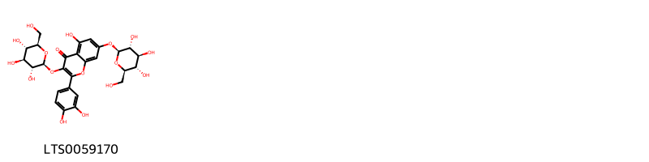{ width=100% }
    <figcaption>Hình ảnh cấu trúc hóa học của 1 hoạt chất thuộc nhóm Flavonoids gồm ['quercetin 3,7-diglucoside (LTS0059170)'].</figcaption>
</figure>

---

### Dược dân tộc học

Danh sách các quốc gia có sử dụng *Delonix elata* trong điều trị các bệnh. 

| Country   | Disease     | Bệnh                                                                                                                                                                                                |
|:----------|:------------|:----------------------------------------------------------------------------------------------------------------------------------------------------------------------------------------------------|
| India     | Carminative | MYMEMORY WARNING: YOU USED ALL AVAILABLE FREE TRANSLATIONS FOR TODAY. NEXT AVAILABLE IN  15 HOURS 34 MINUTES 53 SECONDS VISIT HTTPS://MYMEMORY.TRANSLATED.NET/DOC/USAGELIMITS.PHP TO TRANSLATE MORE |

---

# Chi Pachyelasma

??? note "Danh sách các dược liệu thuộc chi"
    
	 - *Pachyelasma tessmannii*

---
## Pachyelasma tessmannii
### Thông tin về thực vật

!!! info "Phân loại thực vật của *Pachyelasma tessmannii* từ GIBF:"
    - **Kingdom:** Plantae
    - **Phylum:** Tracheophyta
    - **Order:** Fabales
    - **Family:** Fabaceae
    - **Genus:** Pachyelasma
    - **Species:** *Pachyelasma tessmannii*

 

| Label (VI)   | Label (EN)   | Scientific Name        | Descriptions (VI)   | Descriptions (EN)   | Also Known As (VI)   | Also Known As (EN)   |
|:-------------|:-------------|:-----------------------|:--------------------|:--------------------|:---------------------|:---------------------|
| N/A          | N/A          | Pachyelasma tessmannii | loài thực vật       | species of plant    | ['']                 | ['']                 |

#### Phân bố trên thế giới

**Từ CSDL GIBF** nan, Netherlands, Central African Republic, Nigeria, Gabon, Belgium, unknown or invalid, Congo, Congo, Democratic Republic of the, Cameroon

#### Phân bố tại Việt Nam

**Từ CSDL GIBF**: Không có ghi nhận ở Việt Nam

---
### Thành phần hóa học
        
- Theo cơ sở dữ liệu lotus: Từ loài *Pachyelasma tessmannii* đã phân lập và xác định được 4 hoạt chất thuộc về các nhóm Prenol lipids. 

|    | chemicalTaxonomyClassyfireClass   |   smiles_count |
|---:|:----------------------------------|---------------:|
|  0 | Prenol lipids                     |              4 |

#### Nhóm Prenol lipids
<figure markdown="span">
    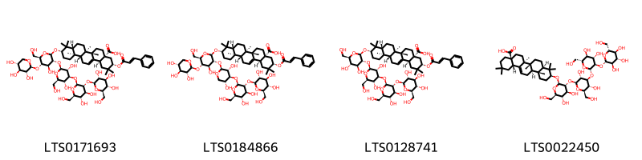{ width=100% }
    <figcaption>Hình ảnh cấu trúc hóa học của 4 hoạt chất thuộc nhóm Prenol lipids gồm ['(3s,4ar,6as,6br,8ar,10s,12ar,12br,14bs)-10-{[(2r,3r,4s,5s,6r)-3-{[(2s,3r,4s,5r,6r)-4-{[(2s,3r,4s,5s,6r)-4,5-dihydroxy-6-(hydroxymethyl)-3-{[(2s,3r,4s,5s,6r)-3,4,5-trihydroxy-6-(hydroxymethyl)oxan-2-yl]oxy}oxan-2-yl]oxy}-3,5-dihydroxy-6-(hydroxymethyl)oxan-2-yl]oxy}-4-hydroxy-6-(hydroxymethyl)-5-{[(2s,3r,4s,5r)-3,4,5-trihydroxyoxan-2-yl]oxy}oxan-2-yl]oxy}-2,2,6a,6b,9,9,12a-heptamethyl-3-{[(2e)-3-phenylprop-2-enoyl]oxy}-1,3,4,5,6,7,8,8a,10,11,12,12b,13,14b-tetradecahydropicene-4a-carboxylic acid (LTS0171693)', '(3s,4ar,6as,6br,8ar,10s,12ar,12br,14bs)-10-{[(2r,3r,4s,5s,6r)-3-{[(2s,3r,4s,5r)-4-{[(2s,3r,4s,5s,6r)-4,5-dihydroxy-6-(hydroxymethyl)-3-{[(2s,3r,4s,5s,6r)-3,4,5-trihydroxy-6-(hydroxymethyl)oxan-2-yl]oxy}oxan-2-yl]oxy}-3,5-dihydroxyoxan-2-yl]oxy}-4-hydroxy-6-(hydroxymethyl)-5-{[(2s,3r,4s,5r)-3,4,5-trihydroxyoxan-2-yl]oxy}oxan-2-yl]oxy}-2,2,6a,6b,9,9,12a-heptamethyl-3-{[(2e)-3-phenylprop-2-enoyl]oxy}-1,3,4,5,6,7,8,8a,10,11,12,12b,13,14b-tetradecahydropicene-4a-carboxylic acid (LTS0184866)', '(3s,4ar,6as,6br,8ar,10s,12ar,12br,14bs)-10-{[(2r,3r,4s,5s,6r)-3-{[(2s,3r,4s,5r,6r)-4-{[(2s,3r,4s,5s,6r)-4,5-dihydroxy-6-(hydroxymethyl)-3-{[(2s,3r,4s,5s,6r)-3,4,5-trihydroxy-6-(hydroxymethyl)oxan-2-yl]oxy}oxan-2-yl]oxy}-3,5-dihydroxy-6-(hydroxymethyl)oxan-2-yl]oxy}-4,5-dihydroxy-6-(hydroxymethyl)oxan-2-yl]oxy}-2,2,6a,6b,9,9,12a-heptamethyl-3-{[(2e)-3-phenylprop-2-enoyl]oxy}-1,3,4,5,6,7,8,8a,10,11,12,12b,13,14b-tetradecahydropicene-4a-carboxylic acid (LTS0128741)', '(4as,6as,6br,8ar,10s,12ar,12br,14bs)-10-{[(2r,3r,4s,5s,6r)-3-{[(2s,3r,4s,5r,6r)-4-{[(2s,3r,4s,5s,6r)-4,5-dihydroxy-6-(hydroxymethyl)-3-{[(2s,3r,4s,5s,6r)-3,4,5-trihydroxy-6-(hydroxymethyl)oxan-2-yl]oxy}oxan-2-yl]oxy}-3,5-dihydroxy-6-(hydroxymethyl)oxan-2-yl]oxy}-4,5-dihydroxy-6-(hydroxymethyl)oxan-2-yl]oxy}-2,2,6a,6b,9,9,12a-heptamethyl-1,3,4,5,6,7,8,8a,10,11,12,12b,13,14b-tetradecahydropicene-4a-carboxylic acid (LTS0022450)'].</figcaption>
</figure>

---

### Dược dân tộc học

Danh sách các quốc gia có sử dụng *Pachyelasma tessmannii* trong điều trị các bệnh. 

| Country   | Disease   | Bệnh                                                                                                                                                                                                |
|:----------|:----------|:----------------------------------------------------------------------------------------------------------------------------------------------------------------------------------------------------|
| Africa    | Piscicide | MYMEMORY WARNING: YOU USED ALL AVAILABLE FREE TRANSLATIONS FOR TODAY. NEXT AVAILABLE IN  15 HOURS 34 MINUTES 32 SECONDS VISIT HTTPS://MYMEMORY.TRANSLATED.NET/DOC/USAGELIMITS.PHP TO TRANSLATE MORE |

---

# Chi Hardwickia

??? note "Danh sách các dược liệu thuộc chi"
    
	 - *Hardwickia pinnata*

---
## Hardwickia pinnata
### Thông tin về thực vật

!!! info "Phân loại thực vật của *Prioria pinnata* từ GIBF:"
    - **Kingdom:** Plantae
    - **Phylum:** Tracheophyta
    - **Order:** Fabales
    - **Family:** Fabaceae
    - **Genus:** Prioria
    - **Species:** *Prioria pinnata*

 

| Label (VI)   | Label (EN)   | Scientific Name    | Descriptions (VI)   | Descriptions (EN)   | Also Known As (VI)   | Also Known As (EN)   |
|:-------------|:-------------|:-------------------|:--------------------|:--------------------|:---------------------|:---------------------|
| N/A          | N/A          | Hardwickia pinnata | loài thực vật       | species of plant    | ['']                 | ['']                 |

#### Phân bố trên thế giới

**Từ CSDL GIBF** nan, India, Nepal, unknown or invalid

#### Phân bố tại Việt Nam

**Từ CSDL GIBF**: Không có ghi nhận ở Việt Nam

---
### Thành phần hóa học
        
- Theo cơ sở dữ liệu lotus: Từ loài *Prioria pinnata* đã phân lập và xác định được Chưa có hoạt chất nào được phân lập. hoạt chất thuộc về các nhóm Không có hoạt chất nào được phân lập. 

Không có hình ảnh nào được tạo ra

---

### Dược dân tộc học

Danh sách các quốc gia có sử dụng *Prioria pinnata* trong điều trị các bệnh. 

| Country   | Disease   | Bệnh                                                                                                                                                                                                |
|:----------|:----------|:----------------------------------------------------------------------------------------------------------------------------------------------------------------------------------------------------|
| Turkey    | Diuretic  | MYMEMORY WARNING: YOU USED ALL AVAILABLE FREE TRANSLATIONS FOR TODAY. NEXT AVAILABLE IN  15 HOURS 34 MINUTES 11 SECONDS VISIT HTTPS://MYMEMORY.TRANSLATED.NET/DOC/USAGELIMITS.PHP TO TRANSLATE MORE |

---

# Chi Piliostigma

??? note "Danh sách các dược liệu thuộc chi"
    
	 - *Piliostigma thonningii*

---
## Piliostigma thonningii
### Thông tin về thực vật

!!! info "Phân loại thực vật của *Piliostigma thonningii* từ GIBF:"
    - **Kingdom:** Plantae
    - **Phylum:** Tracheophyta
    - **Order:** Fabales
    - **Family:** Fabaceae
    - **Genus:** Piliostigma
    - **Species:** *Piliostigma thonningii*

 

| Label (VI)   | Label (EN)   | Scientific Name        | Descriptions (VI)   | Descriptions (EN)   | Also Known As (VI)   | Also Known As (EN)   |
|:-------------|:-------------|:-----------------------|:--------------------|:--------------------|:---------------------|:---------------------|
| N/A          | N/A          | Piliostigma thonningii |                     |                     | ['']                 | ['']                 |

#### Phân bố trên thế giới

**Từ CSDL GIBF** Ghana, Angola, Mozambique, Benin, Sierra Leone, Malawi, Zambia, Senegal, Nigeria, Namibia, Chad, Guinea, Zimbabwe, South Africa, Guinea-Bissau, Côte d’Ivoire, Gambia, Burkina Faso, Cameroon, Ethiopia

#### Phân bố tại Việt Nam

**Từ CSDL GIBF**: Không có ghi nhận ở Việt Nam

---
### Thành phần hóa học
        
- Theo cơ sở dữ liệu lotus: Từ loài *Piliostigma thonningii* đã phân lập và xác định được 18 hoạt chất thuộc về các nhóm Flavonoids, Prenol lipids, Benzofurans, Coumarins and derivatives. 

|    | chemicalTaxonomyClassyfireClass   |   smiles_count |
|---:|:----------------------------------|---------------:|
|  0 |                                   |              1 |
|  1 | Benzofurans                       |              2 |
|  2 | Coumarins and derivatives         |              1 |
|  3 | Flavonoids                        |             11 |
|  4 | Prenol lipids                     |              2 |

#### Nhóm 
<figure markdown="span">
    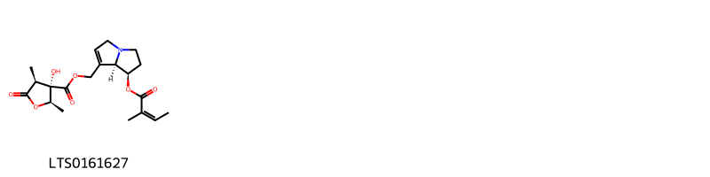{ width=100% }
    <figcaption>Hình ảnh cấu trúc hóa học của 1 hoạt chất thuộc nhóm  gồm ['latifoline (LTS0161627)'].</figcaption>
</figure>
#### Nhóm Benzofurans
<figure markdown="span">
    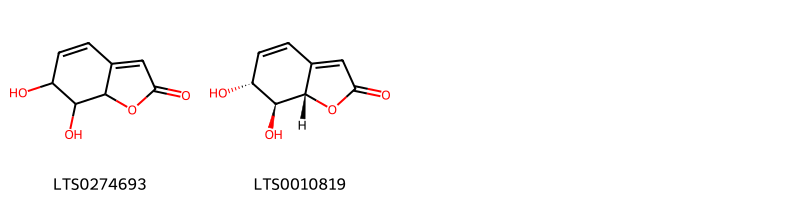{ width=100% }
    <figcaption>Hình ảnh cấu trúc hóa học của 2 hoạt chất thuộc nhóm Benzofurans gồm ['6,7-dihydroxy-7,7a-dihydro-6h-1-benzofuran-2-one (LTS0274693)', '(6r,7s,7as)-6,7-dihydroxy-7,7a-dihydro-6h-1-benzofuran-2-one (LTS0010819)'].</figcaption>
</figure>
#### Nhóm Coumarins and derivatives
<figure markdown="span">
    { width=100% }
    <figcaption>Hình ảnh cấu trúc hóa học của 1 hoạt chất thuộc nhóm Coumarins and derivatives gồm ['5-hydroxy-2-(4-hydroxyphenoxy)-7-methoxy-6-methylchromen-4-one (LTS0041574)'].</figcaption>
</figure>
#### Nhóm Flavonoids
<figure markdown="span">
    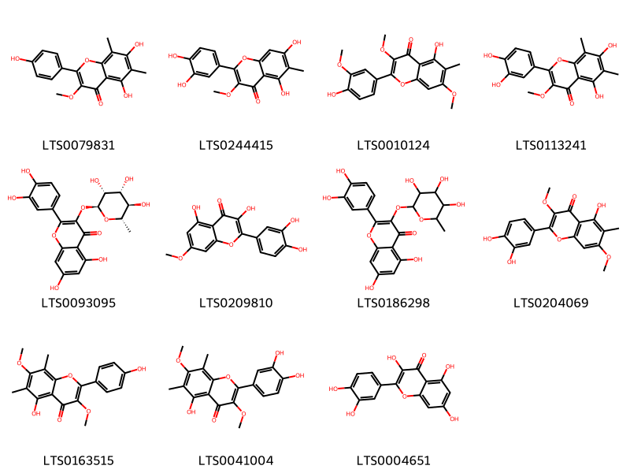{ width=100% }
    <figcaption>Hình ảnh cấu trúc hóa học của 11 hoạt chất thuộc nhóm Flavonoids gồm ['5,7-dihydroxy-2-(4-hydroxyphenyl)-3-methoxy-6,8-dimethylchromen-4-one (LTS0079831)', '2-(3,4-dihydroxyphenyl)-5,7-dihydroxy-3-methoxy-6-methylchromen-4-one (LTS0244415)', '5-hydroxy-2-(4-hydroxy-3-methoxyphenyl)-3,7-dimethoxy-6-methylchromen-4-one (LTS0010124)', '2-(3,4-dihydroxyphenyl)-5,7-dihydroxy-3-methoxy-6,8-dimethylchromen-4-one (LTS0113241)', 'quercitrin (LTS0093095)', 'rhamnetin (LTS0209810)', 'quercitrin (LTS0186298)', '2-(3,4-dihydroxyphenyl)-5-hydroxy-3,7-dimethoxy-6-methylchromen-4-one (LTS0204069)', '5-hydroxy-2-(4-hydroxyphenyl)-3,7-dimethoxy-6,8-dimethylchromen-4-one (LTS0163515)', '2-(3,4-dihydroxyphenyl)-5-hydroxy-3,7-dimethoxy-6,8-dimethylchromen-4-one (LTS0041004)', 'quercetin (LTS0004651)'].</figcaption>
</figure>
#### Nhóm Prenol lipids
<figure markdown="span">
    { width=100% }
    <figcaption>Hình ảnh cấu trúc hóa học của 2 hoạt chất thuộc nhóm Prenol lipids gồm ['14-hydroxy-5,9,14-trimethyltetracyclo[11.2.1.0¹,¹⁰.0⁴,⁹]hexadecane-5-carboxylic acid (LTS0125479)', '(1s,4s,5s,9s,10r,13r,14r)-14-hydroxy-5,9,14-trimethyltetracyclo[11.2.1.0¹,¹⁰.0⁴,⁹]hexadecane-5-carboxylic acid (LTS0200635)'].</figcaption>
</figure>

---

### Dược dân tộc học

Danh sách các quốc gia có sử dụng *Piliostigma thonningii* trong điều trị các bệnh. 

| Country   | Disease                  | Bệnh                                                                                                                                                                                                |
|:----------|:-------------------------|:----------------------------------------------------------------------------------------------------------------------------------------------------------------------------------------------------|
| Africa    | Hemostat, Diuretic, Soap | MYMEMORY WARNING: YOU USED ALL AVAILABLE FREE TRANSLATIONS FOR TODAY. NEXT AVAILABLE IN  15 HOURS 33 MINUTES 55 SECONDS VISIT HTTPS://MYMEMORY.TRANSLATED.NET/DOC/USAGELIMITS.PHP TO TRANSLATE MORE |

---

# Chi Lablab

??? note "Danh sách các dược liệu thuộc chi"
    
	 - *Lablab purpureus*

---
## Lablab purpureus
### Thông tin về thực vật

!!! info "Phân loại thực vật của *Lablab purpureus* từ GIBF:"
    - **Kingdom:** Plantae
    - **Phylum:** Tracheophyta
    - **Order:** Fabales
    - **Family:** Fabaceae
    - **Genus:** Lablab
    - **Species:** *Lablab purpureus*

 

| Label (VI)   | Label (EN)   | Scientific Name   | Descriptions (VI)   | Descriptions (EN)   | Also Known As (VI)   | Also Known As (EN)                                                                                                                                                                                              |
|:-------------|:-------------|:------------------|:--------------------|:--------------------|:---------------------|:----------------------------------------------------------------------------------------------------------------------------------------------------------------------------------------------------------------|
| N/A          | N/A          | Lablab purpureus  | loài thực vật       | species of plant    | ['']                 | ['Australian pea', 'bonavist bean', 'bonavist pea', 'dolichos bean', 'Egyptian kidney bean', 'hyacinth bean', 'lablab-bean', 'seim bean', 'Tonga bean', 'bataw', 'butter bean', 'papaya bean', 'poor man bean'] |

#### Phân bố trên thế giới

**Từ CSDL GIBF** Virgin Islands (U.S.), Palau, Guadeloupe, Myanmar, Mozambique, Canada, Puerto Rico, Réunion, Korea, Republic of, Chinese Taipei, Spain, United States of America, Maldives, South Africa, Fiji, Hong Kong, Thailand, Romania, Northern Mariana Islands, Brazil, Cuba, Dominican Republic, Mexico, Singapore, British Indian Ocean Territory, Eswatini, China, Ecuador, Saint Kitts and Nevis, Cabo Verde, Haiti, Serbia, India, Indonesia, Malaysia, New Zealand

#### Phân bố tại Việt Nam

**Từ CSDL GIBF**: Không có ghi nhận ở Việt Nam

---
### Thành phần hóa học
        
- Theo cơ sở dữ liệu lotus: Từ loài *Lablab purpureus* đã phân lập và xác định được 55 hoạt chất thuộc về các nhóm Flavonoids, Prenol lipids, Steroids and steroid derivatives, Isoflavonoids, Organonitrogen compounds, Purine nucleosides, 2-arylbenzofuran flavonoids, Organooxygen compounds, Imidazopyrimidines. 

|    | chemicalTaxonomyClassyfireClass   |   smiles_count |
|---:|:----------------------------------|---------------:|
|  0 | 2-arylbenzofuran flavonoids       |              1 |
|  1 | Flavonoids                        |              2 |
|  2 | Imidazopyrimidines                |              1 |
|  3 | Isoflavonoids                     |              5 |
|  4 | Organonitrogen compounds          |              4 |
|  5 | Organooxygen compounds            |              2 |
|  6 | Prenol lipids                     |              3 |
|  7 | Purine nucleosides                |              2 |
|  8 | Steroids and steroid derivatives  |             12 |

#### Nhóm 2-arylbenzofuran flavonoids
<figure markdown="span">
    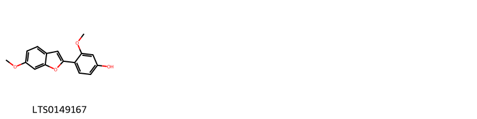{ width=100% }
    <figcaption>Hình ảnh cấu trúc hóa học của 1 hoạt chất thuộc nhóm 2-arylbenzofuran flavonoids gồm ['vignafuran (LTS0149167)'].</figcaption>
</figure>
#### Nhóm Flavonoids
<figure markdown="span">
    { width=100% }
    <figcaption>Hình ảnh cấu trúc hóa học của 2 hoạt chất thuộc nhóm Flavonoids gồm ['5-hydroxy-2-(4-hydroxyphenyl)-3-{[(2s,3r,4s,5s,6r)-3,4,5-trihydroxy-6-(hydroxymethyl)oxan-2-yl]oxy}chromen-7-one (LTS0103335)', '5-hydroxy-3-{[(2s,3r,4s,5s,6r)-3,4,5-trihydroxy-6-(hydroxymethyl)oxan-2-yl]oxy}-2-(3,4,5-trihydroxyphenyl)chromen-7-one (LTS0073780)'].</figcaption>
</figure>
#### Nhóm Imidazopyrimidines
<figure markdown="span">
    { width=100% }
    <figcaption>Hình ảnh cấu trúc hóa học của 1 hoạt chất thuộc nhóm Imidazopyrimidines gồm ['zeatine (LTS0032706)'].</figcaption>
</figure>
#### Nhóm Isoflavonoids
<figure markdown="span">
    { width=100% }
    <figcaption>Hình ảnh cấu trúc hóa học của 5 hoạt chất thuộc nhóm Isoflavonoids gồm ['genistein (LTS0106538)', 'kievitone (LTS0159333)', '(3r)-3-(2,4-dihydroxyphenyl)-5,7-dihydroxy-8-(3-methylbut-2-en-1-yl)-2,3-dihydro-1-benzopyran-4-one (LTS0045379)', '(3s)-3-(4-hydroxy-2,3-dimethoxyphenyl)-3,4-dihydro-2h-1-benzopyran-7-ol (LTS0016845)', '(3s)-3-(2,4-dihydroxyphenyl)-5,7-dihydroxy-2,3-dihydro-1-benzopyran-4-one (LTS0038000)'].</figcaption>
</figure>
#### Nhóm Organonitrogen compounds
<figure markdown="span">
    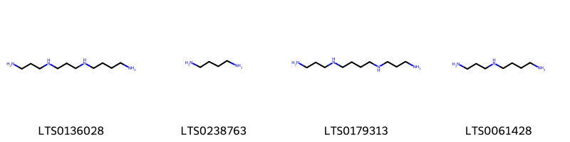{ width=100% }
    <figcaption>Hình ảnh cấu trúc hóa học của 4 hoạt chất thuộc nhóm Organonitrogen compounds gồm ['thermospermine (LTS0136028)', 'putrescine (LTS0238763)', 'spermine (LTS0179313)', 'spermidine (LTS0061428)'].</figcaption>
</figure>
#### Nhóm Organooxygen compounds
<figure markdown="span">
    { width=100% }
    <figcaption>Hình ảnh cấu trúc hóa học của 2 hoạt chất thuộc nhóm Organooxygen compounds gồm ['phytic acid (LTS0210346)', '[(1r,2r,3s,4r,5s,6s)-2,3,4,5,6-pentakis(phosphonooxy)cyclohexyl]oxyphosphonic acid (LTS0234844)'].</figcaption>
</figure>
#### Nhóm Prenol lipids
<figure markdown="span">
    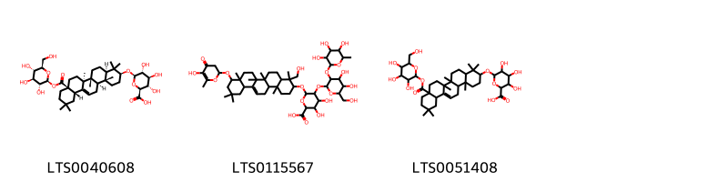{ width=100% }
    <figcaption>Hình ảnh cấu trúc hóa học của 3 hoạt chất thuộc nhóm Prenol lipids gồm ['calenduloside f (LTS0040608)', '5-{[4,5-dihydroxy-6-(hydroxymethyl)-3-[(3,4,5-trihydroxy-6-methyloxan-2-yl)oxy]oxan-2-yl]oxy}-3,4-dihydroxy-6-({9-[(5-hydroxy-6-methyl-4-oxo-2,3-dihydropyran-2-yl)oxy]-4-(hydroxymethyl)-4,6a,6b,8a,11,11,14b-heptamethyl-1,2,3,4a,5,6,7,8,9,10,12,12a,14,14a-tetradecahydropicen-3-yl}oxy)oxane-2-carboxylic acid (LTS0115567)', '6-{[4,4,6a,6b,11,11,14b-heptamethyl-8a-({[3,4,5-trihydroxy-6-(hydroxymethyl)oxan-2-yl]oxy}carbonyl)-1,2,3,4a,5,6,7,8,9,10,12,12a,14,14a-tetradecahydropicen-3-yl]oxy}-3,4,5-trihydroxyoxane-2-carboxylic acid (LTS0051408)'].</figcaption>
</figure>
#### Nhóm Purine nucleosides
<figure markdown="span">
    { width=100% }
    <figcaption>Hình ảnh cấu trúc hóa học của 2 hoạt chất thuộc nhóm Purine nucleosides gồm ['zeatin riboside (LTS0254495)', '(2r,3r,4s,5s)-2-(6-{[(2z)-4-hydroxy-3-methylbut-2-en-1-yl]amino}purin-9-yl)-5-(hydroxymethyl)oxolane-3,4-diol (LTS0087299)'].</figcaption>
</figure>
#### Nhóm Steroids and steroid derivatives
<figure markdown="span">
    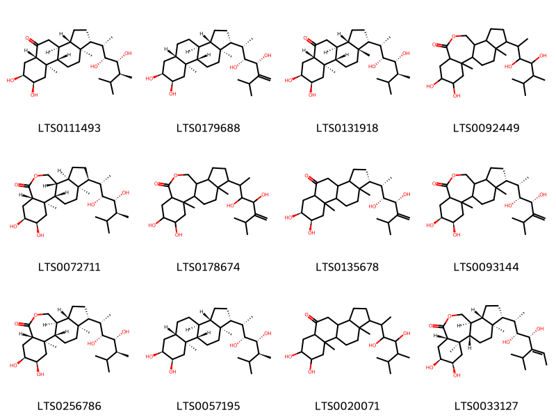{ width=100% }
    <figcaption>Hình ảnh cấu trúc hóa học của 12 hoạt chất thuộc nhóm Steroids and steroid derivatives gồm ['castasterone (LTS0111493)', '(2s,3r,4r)-2-[(1r,3as,3br,5as,7s,8r,9as,9bs,11as)-7,8-dihydroxy-9a,11a-dimethyl-tetradecahydro-1h-cyclopenta[a]phenanthren-1-yl]-6-methyl-5-methylideneheptane-3,4-diol (LTS0179688)', '(1r,3as,3bs,5as,7s,8r,9ar,9bs,11ar)-1-[(2s,3r,4r,5s)-3,4-dihydroxy-5,6-dimethylheptan-2-yl]-7,8-dihydroxy-9a,11a-dimethyl-tetradecahydrocyclopenta[a]phenanthren-5-one (LTS0131918)', '24-epibrassinolide (LTS0092449)', '(1s,2r,4r,5s,7s,11r,12r,15s,16s)-15-[(2s,3r,4r,5s)-3,4-dihydroxy-5,6-dimethylheptan-2-yl]-4,5-dihydroxy-2,16-dimethyl-9-oxatetracyclo[9.7.0.0²,⁷.0¹²,¹⁶]octadecan-8-one (LTS0072711)', '15-(3,4-dihydroxy-6-methyl-5-methylideneheptan-2-yl)-4,5-dihydroxy-2,16-dimethyl-9-oxatetracyclo[9.7.0.0²,⁷.0¹²,¹⁶]octadecan-8-one (LTS0178674)', '(1r,7s,8r)-1-[(2s,3r,4r)-3,4-dihydroxy-6-methyl-5-methylideneheptan-2-yl]-7,8-dihydroxy-9a,11a-dimethyl-tetradecahydrocyclopenta[a]phenanthren-5-one (LTS0135678)', '(4r,5s,15r)-15-[(2s,3r,4r)-3,4-dihydroxy-6-methyl-5-methylideneheptan-2-yl]-4,5-dihydroxy-2,16-dimethyl-9-oxatetracyclo[9.7.0.0²,⁷.0¹²,¹⁶]octadecan-8-one (LTS0093144)', 'brassinolide (LTS0256786)', '6-deoxocastasterone (LTS0057195)', '1-(3,4-dihydroxy-5,6-dimethylheptan-2-yl)-7,8-dihydroxy-9a,11a-dimethyl-tetradecahydrocyclopenta[a]phenanthren-5-one (LTS0020071)', '(1s,2r,4r,5s,7s,11s,12s,15r,16s)-15-[(2s,3r,4r,5e)-3,4-dihydroxy-5-isopropylhept-5-en-2-yl]-4,5-dihydroxy-2,16-dimethyl-9-oxatetracyclo[9.7.0.0²,⁷.0¹²,¹⁶]octadecan-8-one (LTS0033127)'].</figcaption>
</figure>

---

### Dược dân tộc học

Danh sách các quốc gia có sử dụng *Lablab purpureus* trong điều trị các bệnh. 

| Country   | Disease                                  | Bệnh                                                                                                                                                                                                |
|:----------|:-----------------------------------------|:----------------------------------------------------------------------------------------------------------------------------------------------------------------------------------------------------|
| Asia      | Poison                                   | MYMEMORY WARNING: YOU USED ALL AVAILABLE FREE TRANSLATIONS FOR TODAY. NEXT AVAILABLE IN  15 HOURS 33 MINUTES 29 SECONDS VISIT HTTPS://MYMEMORY.TRANSLATED.NET/DOC/USAGELIMITS.PHP TO TRANSLATE MORE |
| China     | Antivinous, Poultice, Tonic, Carminative | MYMEMORY WARNING: YOU USED ALL AVAILABLE FREE TRANSLATIONS FOR TODAY. NEXT AVAILABLE IN  15 HOURS 33 MINUTES 27 SECONDS VISIT HTTPS://MYMEMORY.TRANSLATED.NET/DOC/USAGELIMITS.PHP TO TRANSLATE MORE |

---

# Chi Galega

??? note "Danh sách các dược liệu thuộc chi"
    
	 - *Galega officinalis*

---
## Galega officinalis
### Thông tin về thực vật

!!! info "Phân loại thực vật của *Galega officinalis* từ GIBF:"
    - **Kingdom:** Plantae
    - **Phylum:** Tracheophyta
    - **Order:** Fabales
    - **Family:** Fabaceae
    - **Genus:** Galega
    - **Species:** *Galega officinalis*

 

| Label (VI)   | Label (EN)   | Scientific Name    | Descriptions (VI)   | Descriptions (EN)      | Also Known As (VI)   | Also Known As (EN)   |
|:-------------|:-------------|:-------------------|:--------------------|:-----------------------|:---------------------|:---------------------|
| N/A          | N/A          | Galega officinalis | loài thực vật       | species of plant, herb | ['']                 | ['']                 |

#### Phân bố trên thế giới

**Từ CSDL GIBF** Italy, Belgium, Slovakia, Georgia, Argentina, Canada, Ukraine, Denmark, Netherlands, Luxembourg, Bolivia (Plurinational State of), Türkiye, Albania, Portugal, Russian Federation, Hungary, United States of America, Sweden, Chile, Croatia, Montenegro, Czechia, Germany, Switzerland, Austria, France, United Kingdom of Great Britain and Northern Ireland, Ecuador, New Zealand

#### Phân bố tại Việt Nam

**Từ CSDL GIBF**: Không có ghi nhận ở Việt Nam

---
### Thành phần hóa học
        
- Theo cơ sở dữ liệu lotus: Từ loài *Galega officinalis* đã phân lập và xác định được 48 hoạt chất thuộc về các nhóm Flavonoids, Prenol lipids, Steroids and steroid derivatives, Isoflavonoids, Azolidines, Azoles, Organonitrogen compounds, Diazanaphthalenes. 

|    | chemicalTaxonomyClassyfireClass   |   smiles_count |
|---:|:----------------------------------|---------------:|
|  0 | Azoles                            |              1 |
|  1 | Azolidines                        |              1 |
|  2 | Diazanaphthalenes                 |              6 |
|  3 | Flavonoids                        |             10 |
|  4 | Isoflavonoids                     |              4 |
|  5 | Organonitrogen compounds          |              3 |
|  6 | Prenol lipids                     |              9 |
|  7 | Steroids and steroid derivatives  |             12 |

#### Nhóm Azoles
<figure markdown="span">
    { width=100% }
    <figcaption>Hình ảnh cấu trúc hóa học của 1 hoạt chất thuộc nhóm Azoles gồm ['allantoin (LTS0106609)'].</figcaption>
</figure>
#### Nhóm Azolidines
<figure markdown="span">
    { width=100% }
    <figcaption>Hình ảnh cấu trúc hóa học của 1 hoạt chất thuộc nhóm Azolidines gồm ['n-[(4s)-2,5-dihydroxy-4h-imidazol-4-yl]carbamimidic acid (LTS0174328)'].</figcaption>
</figure>
#### Nhóm Diazanaphthalenes
<figure markdown="span">
    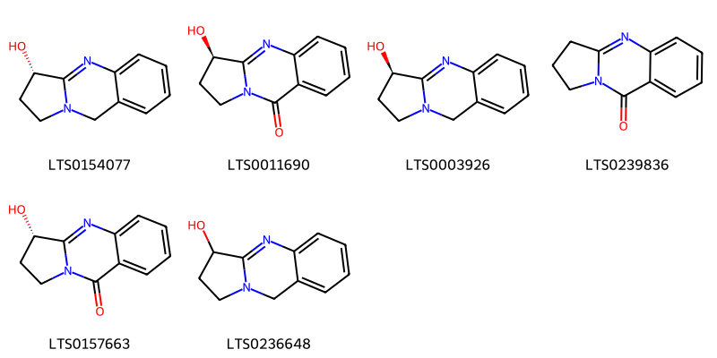{ width=100% }
    <figcaption>Hình ảnh cấu trúc hóa học của 6 hoạt chất thuộc nhóm Diazanaphthalenes gồm ['(-)-peganine (LTS0154077)', '(3r)-3-hydroxy-1h,2h,3h-pyrrolo[2,1-b]quinazolin-9-one (LTS0011690)', '(+-)-vasicine (LTS0003926)', 'deoxyvasicinone (LTS0239836)', 'vasicinone (LTS0157663)', 'vasicine (LTS0236648)'].</figcaption>
</figure>
#### Nhóm Flavonoids
<figure markdown="span">
    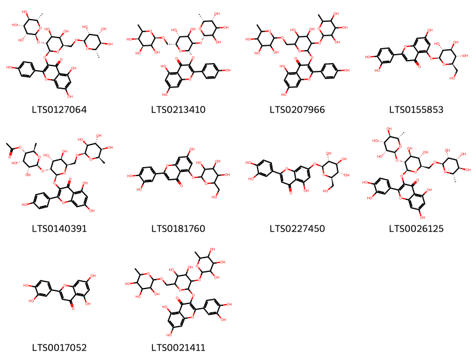{ width=100% }
    <figcaption>Hình ảnh cấu trúc hóa học của 10 hoạt chất thuộc nhóm Flavonoids gồm ['3-{[(2s,3r,4s,5r,6r)-4,5-dihydroxy-3-{[(2s,3r,4r,5r,6s)-3,4,5-trihydroxy-6-methyloxan-2-yl]oxy}-6-({[(2r,3r,4r,5r,6s)-3,4,5-trihydroxy-6-methyloxan-2-yl]oxy}methyl)oxan-2-yl]oxy}-5,7-dihydroxy-2-(4-hydroxyphenyl)chromen-4-one (LTS0127064)', '3-{[(2s,5r,6r)-4,5-dihydroxy-3-{[(2s,5r,6r)-3,4,5-trihydroxy-6-methyloxan-2-yl]oxy}-6-({[(2r,4s,5r)-3,4,5-trihydroxy-6-methyloxan-2-yl]oxy}methyl)oxan-2-yl]oxy}-5,7-dihydroxy-2-(4-hydroxyphenyl)chromen-4-one (LTS0213410)', '3-({4,5-dihydroxy-3-[(3,4,5-trihydroxy-6-methyloxan-2-yl)oxy]-6-{[(3,4,5-trihydroxy-6-methyloxan-2-yl)oxy]methyl}oxan-2-yl}oxy)-5,7-dihydroxy-2-(4-hydroxyphenyl)chromen-4-one (LTS0207966)', '2-(3,4-dihydroxyphenyl)-7-hydroxy-5-{[(2s,3r,4s,5s,6r)-3,4,5-trihydroxy-6-(hydroxymethyl)oxan-2-yl]oxy}chromen-4-one (LTS0155853)', '(2r,3s,4s,5r,6s)-6-{[(2s,3r,4r,5r,6r)-2-{[5,7-dihydroxy-2-(4-hydroxyphenyl)-4-oxochromen-3-yl]oxy}-4,5-dihydroxy-6-({[(2r,3s,4r,5r,6r)-3,4,5-trihydroxy-6-methyloxan-2-yl]oxy}methyl)oxan-3-yl]oxy}-4,5-dihydroxy-2-methyloxan-3-yl acetate (LTS0140391)', '2-(3,4-dihydroxyphenyl)-7-hydroxy-5-{[3,4,5-trihydroxy-6-(hydroxymethyl)oxan-2-yl]oxy}chromen-4-one (LTS0181760)', 'luteolin 7-o-glucoside (LTS0227450)', '3-{[(2s,3r,4s,5s,6r)-4,5-dihydroxy-3-{[(2s,3r,4r,5r,6s)-3,4,5-trihydroxy-6-methyloxan-2-yl]oxy}-6-({[(2r,3r,4r,5r,6s)-3,4,5-trihydroxy-6-methyloxan-2-yl]oxy}methyl)oxan-2-yl]oxy}-2-(3,4-dihydroxyphenyl)-5,7-dihydroxychromen-4-one (LTS0026125)', 'luteolin (LTS0017052)', '3-({4,5-dihydroxy-3-[(3,4,5-trihydroxy-6-methyloxan-2-yl)oxy]-6-{[(3,4,5-trihydroxy-6-methyloxan-2-yl)oxy]methyl}oxan-2-yl}oxy)-2-(3,4-dihydroxyphenyl)-5,7-dihydroxychromen-4-one (LTS0021411)'].</figcaption>
</figure>
#### Nhóm Isoflavonoids
<figure markdown="span">
    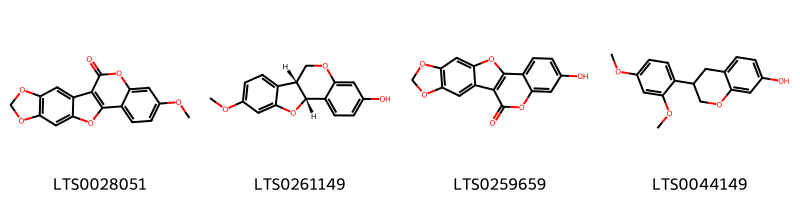{ width=100% }
    <figcaption>Hình ảnh cấu trúc hóa học của 4 hoạt chất thuộc nhóm Isoflavonoids gồm ['flemichapparin c (LTS0028051)', 'medicarpin, (-)- (LTS0261149)', 'medicagol (LTS0259659)', '3-(2,4-dimethoxyphenyl)-3,4-dihydro-2h-1-benzopyran-7-ol (LTS0044149)'].</figcaption>
</figure>
#### Nhóm Organonitrogen compounds
<figure markdown="span">
    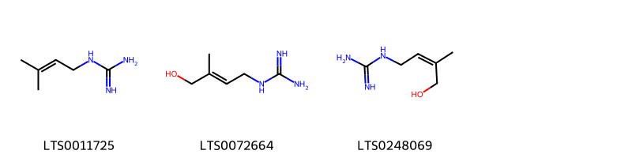{ width=100% }
    <figcaption>Hình ảnh cấu trúc hóa học của 3 hoạt chất thuộc nhóm Organonitrogen compounds gồm ['galegin (LTS0011725)', 'n-[(2e)-4-hydroxy-3-methylbut-2-en-1-yl]guanidine (LTS0072664)', 'n-(4-hydroxy-3-methylbut-2-en-1-yl)guanidine (LTS0248069)'].</figcaption>
</figure>
#### Nhóm Prenol lipids
<figure markdown="span">
    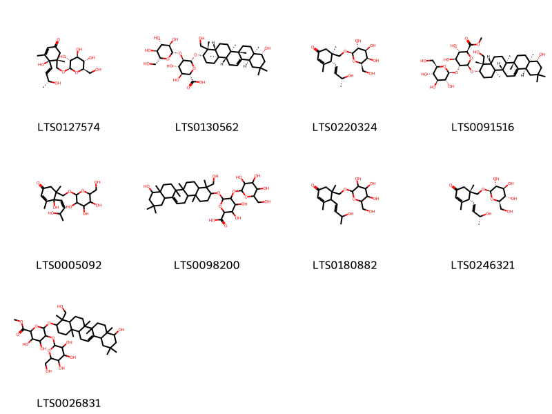{ width=100% }
    <figcaption>Hình ảnh cấu trúc hóa học của 9 hoạt chất thuộc nhóm Prenol lipids gồm ['(4s,5r)-4-hydroxy-4-[(1e,3r)-3-hydroxybut-1-en-1-yl]-3,5-dimethyl-5-({[(2r,3r,4s,5s,6r)-3,4,5-trihydroxy-6-(hydroxymethyl)oxan-2-yl]oxy}methyl)cyclohex-2-en-1-one (LTS0127574)', '(2s,3s,4s,5r,6r)-6-{[(3s,4s,4ar,6ar,6bs,8ar,9r,12as,14ar,14br)-9-hydroxy-4-(hydroxymethyl)-4,6a,6b,8a,11,11,14b-heptamethyl-1,2,3,4a,5,6,7,8,9,10,12,12a,14,14a-tetradecahydropicen-3-yl]oxy}-3,4-dihydroxy-5-{[(2s,3r,4s,5s,6r)-3,4,5-trihydroxy-6-(hydroxymethyl)oxan-2-yl]oxy}oxane-2-carboxylic acid (LTS0130562)', '(4r,5r)-4-[(1e,3r)-3-hydroxybut-1-en-1-yl]-3,5-dimethyl-5-({[(2r,3r,4s,5r,6r)-3,4,5-trihydroxy-6-(hydroxymethyl)oxan-2-yl]oxy}methyl)cyclohex-2-en-1-one (LTS0220324)', 'methyl (2s,3s,4s,5r,6r)-6-{[(3s,4s,4ar,6ar,6bs,8ar,9r,12as,14ar,14br)-9-hydroxy-4-(hydroxymethyl)-4,6a,6b,8a,11,11,14b-heptamethyl-1,2,3,4a,5,6,7,8,9,10,12,12a,14,14a-tetradecahydropicen-3-yl]oxy}-3,4-dihydroxy-5-{[(2s,3r,4s,5s,6r)-3,4,5-trihydroxy-6-(hydroxymethyl)oxan-2-yl]oxy}oxane-2-carboxylate (LTS0091516)', '4-hydroxy-4-(3-hydroxybut-1-en-1-yl)-3,5-dimethyl-5-({[3,4,5-trihydroxy-6-(hydroxymethyl)oxan-2-yl]oxy}methyl)cyclohex-2-en-1-one (LTS0005092)', '3,4-dihydroxy-6-{[9-hydroxy-4-(hydroxymethyl)-4,6a,6b,8a,11,11,14b-heptamethyl-1,2,3,4a,5,6,7,8,9,10,12,12a,14,14a-tetradecahydropicen-3-yl]oxy}-5-{[3,4,5-trihydroxy-6-(hydroxymethyl)oxan-2-yl]oxy}oxane-2-carboxylic acid (LTS0098200)', '4-(3-hydroxybut-1-en-1-yl)-3,5-dimethyl-5-({[3,4,5-trihydroxy-6-(hydroxymethyl)oxan-2-yl]oxy}methyl)cyclohex-2-en-1-one (LTS0180882)', '(4r,5s)-4-[(1e,3r)-3-hydroxybut-1-en-1-yl]-3,5-dimethyl-5-({[(2r,3r,4s,5s,6r)-3,4,5-trihydroxy-6-(hydroxymethyl)oxan-2-yl]oxy}methyl)cyclohex-2-en-1-one (LTS0246321)', 'methyl 3,4-dihydroxy-6-{[9-hydroxy-4-(hydroxymethyl)-4,6a,6b,8a,11,11,14b-heptamethyl-1,2,3,4a,5,6,7,8,9,10,12,12a,14,14a-tetradecahydropicen-3-yl]oxy}-5-{[3,4,5-trihydroxy-6-(hydroxymethyl)oxan-2-yl]oxy}oxane-2-carboxylate (LTS0026831)'].</figcaption>
</figure>
#### Nhóm Steroids and steroid derivatives
<figure markdown="span">
    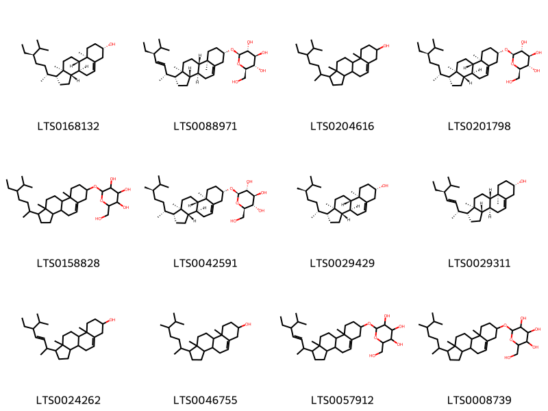{ width=100% }
    <figcaption>Hình ảnh cấu trúc hóa học của 12 hoạt chất thuộc nhóm Steroids and steroid derivatives gồm ['sitosterol (LTS0168132)', '(2r,3r,4s,5s,6r)-2-{[(1r,3as,3bs,7s,9ar,9bs,11ar)-1-[(2r,3e,5s)-5-ethyl-6-methylhept-3-en-2-yl]-9a,11a-dimethyl-1h,2h,3h,3ah,3bh,4h,6h,7h,8h,9h,9bh,10h,11h-cyclopenta[a]phenanthren-7-yl]oxy}-6-(hydroxymethyl)oxane-3,4,5-triol (LTS0088971)', 'stigmast-5-en-3-ol, (3β)- (LTS0204616)', 'sitogluside (LTS0201798)', '2-{[1-(5-ethyl-6-methylheptan-2-yl)-9a,11a-dimethyl-1h,2h,3h,3ah,3bh,4h,6h,7h,8h,9h,9bh,10h,11h-cyclopenta[a]phenanthren-7-yl]oxy}-6-(hydroxymethyl)oxane-3,4,5-triol (LTS0158828)', '(2r,3r,4s,5s,6r)-2-{[(1r,3as,3bs,7s,9ar,9bs,11ar)-1-[(2r,5r)-5,6-dimethylheptan-2-yl]-9a,11a-dimethyl-1h,2h,3h,3ah,3bh,4h,6h,7h,8h,9h,9bh,10h,11h-cyclopenta[a]phenanthren-7-yl]oxy}-6-(hydroxymethyl)oxane-3,4,5-triol (LTS0042591)', 'campesterol (LTS0029429)', 'phytosterol (LTS0029311)', 'stigmasterol (LTS0024262)', 'campesterol (LTS0046755)', '2-{[1-(5-ethyl-6-methylhept-3-en-2-yl)-9a,11a-dimethyl-1h,2h,3h,3ah,3bh,4h,6h,7h,8h,9h,9bh,10h,11h-cyclopenta[a]phenanthren-7-yl]oxy}-6-(hydroxymethyl)oxane-3,4,5-triol (LTS0057912)', '2-{[1-(5,6-dimethylheptan-2-yl)-9a,11a-dimethyl-1h,2h,3h,3ah,3bh,4h,6h,7h,8h,9h,9bh,10h,11h-cyclopenta[a]phenanthren-7-yl]oxy}-6-(hydroxymethyl)oxane-3,4,5-triol (LTS0008739)'].</figcaption>
</figure>

---

### Dược dân tộc học

Danh sách các quốc gia có sử dụng *Galega officinalis* trong điều trị các bệnh. 

| Country   | Disease                                  | Bệnh                                                                                                                                                                                                |
|:----------|:-----------------------------------------|:----------------------------------------------------------------------------------------------------------------------------------------------------------------------------------------------------|
| Elsewhere | Astringent, Diaphoretic, Diuretic, Tonic | MYMEMORY WARNING: YOU USED ALL AVAILABLE FREE TRANSLATIONS FOR TODAY. NEXT AVAILABLE IN  15 HOURS 33 MINUTES 02 SECONDS VISIT HTTPS://MYMEMORY.TRANSLATED.NET/DOC/USAGELIMITS.PHP TO TRANSLATE MORE |
| Turkey    | Sudorific, Vermifuge, Diuretic           | MYMEMORY WARNING: YOU USED ALL AVAILABLE FREE TRANSLATIONS FOR TODAY. NEXT AVAILABLE IN  15 HOURS 32 MINUTES 59 SECONDS VISIT HTTPS://MYMEMORY.TRANSLATED.NET/DOC/USAGELIMITS.PHP TO TRANSLATE MORE |

---

# Chi Oxystigma

??? note "Danh sách các dược liệu thuộc chi"
    
	 - *Oxystigma mannii*

---
## Oxystigma mannii
### Thông tin về thực vật

!!! info "Phân loại thực vật của *Prioria mannii* từ GIBF:"
    - **Kingdom:** Plantae
    - **Phylum:** Tracheophyta
    - **Order:** Fabales
    - **Family:** Fabaceae
    - **Genus:** Prioria
    - **Species:** *Prioria mannii*

 

| Label (VI)   | Label (EN)   | Scientific Name   | Descriptions (VI)   | Descriptions (EN)   | Also Known As (VI)   | Also Known As (EN)   |
|:-------------|:-------------|:------------------|:--------------------|:--------------------|:---------------------|:---------------------|
| N/A          | N/A          | Oxystigma mannii  | loài thực vật       | species of plant    | ['']                 | ['']                 |

#### Phân bố trên thế giới

**Từ CSDL GIBF** nan, Liberia, Nigeria, Gabon, unknown or invalid, Congo, Democratic Republic of the, Cameroon

#### Phân bố tại Việt Nam

**Từ CSDL GIBF**: Không có ghi nhận ở Việt Nam

---
### Thành phần hóa học
        
- Theo cơ sở dữ liệu lotus: Từ loài *Prioria mannii* đã phân lập và xác định được Chưa có hoạt chất nào được phân lập. hoạt chất thuộc về các nhóm Không có hoạt chất nào được phân lập. 

Không có hình ảnh nào được tạo ra

---

### Dược dân tộc học

Danh sách các quốc gia có sử dụng *Prioria mannii* trong điều trị các bệnh. 

| Country   | Disease                                      | Bệnh                                                                                                                                                                                                |
|:----------|:---------------------------------------------|:----------------------------------------------------------------------------------------------------------------------------------------------------------------------------------------------------|
| Africa    | Antiseptic, Expectorant, Diuretic, Stimulant | MYMEMORY WARNING: YOU USED ALL AVAILABLE FREE TRANSLATIONS FOR TODAY. NEXT AVAILABLE IN  15 HOURS 32 MINUTES 24 SECONDS VISIT HTTPS://MYMEMORY.TRANSLATED.NET/DOC/USAGELIMITS.PHP TO TRANSLATE MORE |

---

# Chi Leucaena

??? note "Danh sách các dược liệu thuộc chi"
    
	 - *Leucaena collinsii*
	 - *Leucaena esculenta*
	 - *Leucaena glauca*
	 - *Leucaena leucocephala*
	 - *Leucaena trichodes*

---
## Leucaena collinsii
### Thông tin về thực vật

!!! info "Phân loại thực vật của *Leucaena collinsii* từ GIBF:"
    - **Kingdom:** Plantae
    - **Phylum:** Tracheophyta
    - **Order:** Fabales
    - **Family:** Fabaceae
    - **Genus:** Leucaena
    - **Species:** *Leucaena collinsii*

 

| Label (VI)   | Label (EN)   | Scientific Name    | Descriptions (VI)   | Descriptions (EN)   | Also Known As (VI)   | Also Known As (EN)   |
|:-------------|:-------------|:-------------------|:--------------------|:--------------------|:---------------------|:---------------------|
| N/A          | N/A          | Leucaena collinsii | loài thực vật       | species of plant    | ['']                 | ['']                 |

#### Phân bố trên thế giới

**Từ CSDL GIBF** nan, Guatemala, United States of America, Dominican Republic, Mexico

#### Phân bố tại Việt Nam

**Từ CSDL GIBF**: Không có ghi nhận ở Việt Nam

---
### Thành phần hóa học
        
- Theo cơ sở dữ liệu lotus: Từ loài *Leucaena collinsii* đã phân lập và xác định được Chưa có hoạt chất nào được phân lập. hoạt chất thuộc về các nhóm Không có hoạt chất nào được phân lập. 

Không có hình ảnh nào được tạo ra

---

### Dược dân tộc học

Danh sách các quốc gia có sử dụng *Leucaena collinsii* trong điều trị các bệnh. 

| Country   | Disease   | Bệnh                                                                                                                                                                                                |
|:----------|:----------|:----------------------------------------------------------------------------------------------------------------------------------------------------------------------------------------------------|
| Mexico    | Vermifuge | MYMEMORY WARNING: YOU USED ALL AVAILABLE FREE TRANSLATIONS FOR TODAY. NEXT AVAILABLE IN  15 HOURS 32 MINUTES 07 SECONDS VISIT HTTPS://MYMEMORY.TRANSLATED.NET/DOC/USAGELIMITS.PHP TO TRANSLATE MORE |

---

---
## Leucaena esculenta
### Thông tin về thực vật

!!! info "Phân loại thực vật của *Leucaena esculenta* từ GIBF:"
    - **Kingdom:** Plantae
    - **Phylum:** Tracheophyta
    - **Order:** Fabales
    - **Family:** Fabaceae
    - **Genus:** Leucaena
    - **Species:** *Leucaena esculenta*

 

| Label (VI)   | Label (EN)   | Scientific Name    | Descriptions (VI)   | Descriptions (EN)   | Also Known As (VI)   | Also Known As (EN)   |
|:-------------|:-------------|:-------------------|:--------------------|:--------------------|:---------------------|:---------------------|
| N/A          | N/A          | Leucaena esculenta | loài thực vật       | species of plant    | ['']                 | ['']                 |

#### Phân bố trên thế giới

**Từ CSDL GIBF** Bolivia (Plurinational State of), United States of America, Mexico

#### Phân bố tại Việt Nam

**Từ CSDL GIBF**: Không có ghi nhận ở Việt Nam

---
### Thành phần hóa học
        
- Theo cơ sở dữ liệu lotus: Từ loài *Leucaena esculenta* đã phân lập và xác định được Chưa có hoạt chất nào được phân lập. hoạt chất thuộc về các nhóm Không có hoạt chất nào được phân lập. 

Không có hình ảnh nào được tạo ra

---

### Dược dân tộc học

Danh sách các quốc gia có sử dụng *Leucaena esculenta* trong điều trị các bệnh. 

| Country   | Disease     | Bệnh                                                                                                                                                                                                |
|:----------|:------------|:----------------------------------------------------------------------------------------------------------------------------------------------------------------------------------------------------|
| Mexico    | Aphrodisiac | MYMEMORY WARNING: YOU USED ALL AVAILABLE FREE TRANSLATIONS FOR TODAY. NEXT AVAILABLE IN  15 HOURS 31 MINUTES 47 SECONDS VISIT HTTPS://MYMEMORY.TRANSLATED.NET/DOC/USAGELIMITS.PHP TO TRANSLATE MORE |

---

---
## Leucaena glauca
### Thông tin về thực vật

!!! info "Phân loại thực vật của *Acaciella glauca* từ GIBF:"
    - **Kingdom:** Plantae
    - **Phylum:** Tracheophyta
    - **Order:** Fabales
    - **Family:** Fabaceae
    - **Genus:** Acaciella
    - **Species:** *Acaciella glauca*

 

| Label (VI)   | Label (EN)   | Scientific Name   | Descriptions (VI)   | Descriptions (EN)   | Also Known As (VI)   | Also Known As (EN)   |
|:-------------|:-------------|:------------------|:--------------------|:--------------------|:---------------------|:---------------------|
| N/A          | N/A          | Leucaena glauca   | loài thực vật       | species of plants   | ['']                 | ['']                 |

#### Phân bố trên thế giới

**Từ CSDL GIBF** nan, Virgin Islands (U.S.), Japan, Guatemala, Argentina, Benin, Tanzania, United Republic of, Venezuela (Bolivarian Republic of), Togo, Puerto Rico, Nigeria, Chinese Taipei, Spain, Honduras, Jamaica, United States of America, Congo, Democratic Republic of the, Paraguay, El Salvador, Belize, Sao Tome and Principe, Thailand, Côte d’Ivoire, Brazil, Tonga, Mexico, Peru, China, Madagascar, Cabo Verde, Equatorial Guinea, Kenya, Costa Rica, Burundi, India, Philippines, Cameroon, Northern Mariana Islands

#### Phân bố tại Việt Nam

**Từ CSDL GIBF**: Không có ghi nhận ở Việt Nam

---
### Thành phần hóa học
        
- Theo cơ sở dữ liệu lotus: Từ loài *Acaciella glauca* đã phân lập và xác định được Chưa có hoạt chất nào được phân lập. hoạt chất thuộc về các nhóm Không có hoạt chất nào được phân lập. 

Không có hình ảnh nào được tạo ra

---

### Dược dân tộc học

Danh sách các quốc gia có sử dụng *Acaciella glauca* trong điều trị các bệnh. 

| Country   | Disease    | Bệnh                                                                                                                                                                                                |
|:----------|:-----------|:----------------------------------------------------------------------------------------------------------------------------------------------------------------------------------------------------|
| Malaya    | Depilatory | MYMEMORY WARNING: YOU USED ALL AVAILABLE FREE TRANSLATIONS FOR TODAY. NEXT AVAILABLE IN  15 HOURS 31 MINUTES 25 SECONDS VISIT HTTPS://MYMEMORY.TRANSLATED.NET/DOC/USAGELIMITS.PHP TO TRANSLATE MORE |

---

---
## Leucaena leucocephala
### Thông tin về thực vật

!!! info "Phân loại thực vật của *Leucaena leucocephala* từ GIBF:"
    - **Kingdom:** Plantae
    - **Phylum:** Tracheophyta
    - **Order:** Fabales
    - **Family:** Fabaceae
    - **Genus:** Leucaena
    - **Species:** *Leucaena leucocephala*

 

| Label (VI)   | Label (EN)   | Scientific Name       | Descriptions (VI)   | Descriptions (EN)   | Also Known As (VI)        | Also Known As (EN)                                                                                                 |
|:-------------|:-------------|:----------------------|:--------------------|:--------------------|:--------------------------|:-------------------------------------------------------------------------------------------------------------------|
| N/A          | N/A          | Leucaena leucocephala | loài thực vật       | species of plant    | ['Leucaena leucocephala'] | ['Cassie', 'coffee bush', 'ipil-ipil', 'Jumbay', 'lead tree', 'river tamarind', 'white leadtree', 'white popinac'] |

#### Phân bố trên thế giới

**Từ CSDL GIBF** Virgin Islands (U.S.), Australia, Japan, Guadeloupe, Argentina, Palestine, State of, Philippines, Mozambique, Jordan, Virgin Islands (British), Puerto Rico, Chinese Taipei, Spain, Malta, Portugal, Jamaica, United States of America, Timor-Leste, Fiji, Hong Kong, Barbados, Thailand, Turks and Caicos Islands, Martinique, Bahamas, Brazil, Guam, Cuba, Mexico, Dominican Republic, Singapore, Viet Nam, China, Curaçao, Ecuador, French Polynesia, Saint Kitts and Nevis, Cabo Verde, Haiti, Kenya, Vanuatu, India, Indonesia, Cayman Islands, Antigua and Barbuda, Sint Maarten (Dutch part), Malaysia, Northern Mariana Islands

#### Phân bố tại Việt Nam

**Từ CSDL GIBF**: Quảng Nam

---
### Thành phần hóa học
        
- Theo cơ sở dữ liệu lotus: Từ loài *Leucaena leucocephala* đã phân lập và xác định được 38 hoạt chất thuộc về các nhóm Fatty Acyls, Flavonoids, Prenol lipids, Steroids and steroid derivatives, Benzene and substituted derivatives, Hydroxy acids and derivatives, Lactones, Glycerolipids, Carboxylic acids and derivatives. 

|    | chemicalTaxonomyClassyfireClass     |   smiles_count |
|---:|:------------------------------------|---------------:|
|  0 | Benzene and substituted derivatives |              2 |
|  1 | Carboxylic acids and derivatives    |              6 |
|  2 | Fatty Acyls                         |              2 |
|  3 | Flavonoids                          |              8 |
|  4 | Glycerolipids                       |              2 |
|  5 | Hydroxy acids and derivatives       |              1 |
|  6 | Lactones                            |              2 |
|  7 | Prenol lipids                       |             11 |
|  8 | Steroids and steroid derivatives    |              4 |

#### Nhóm Benzene and substituted derivatives
<figure markdown="span">
    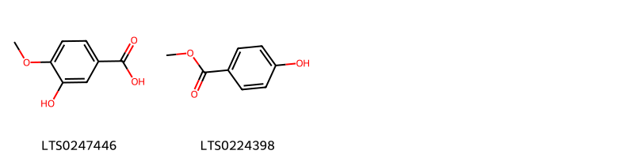{ width=100% }
    <figcaption>Hình ảnh cấu trúc hóa học của 2 hoạt chất thuộc nhóm Benzene and substituted derivatives gồm ['isovanillic acid (LTS0247446)', 'paraben (LTS0224398)'].</figcaption>
</figure>
#### Nhóm Carboxylic acids and derivatives
<figure markdown="span">
    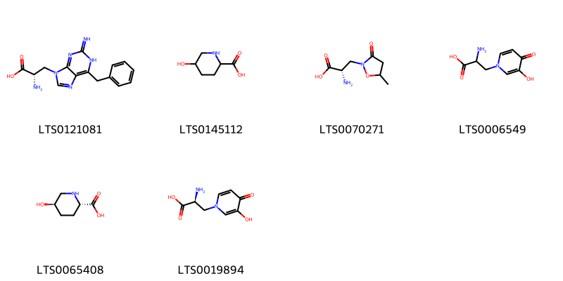{ width=100% }
    <figcaption>Hình ảnh cấu trúc hóa học của 6 hoạt chất thuộc nhóm Carboxylic acids and derivatives gồm ['(2s)-2-amino-3-(6-benzyl-2-imino-1h-purin-9-yl)propanoic acid (LTS0121081)', '5-hydroxypipecolic acid (LTS0145112)', '(2s)-2-amino-3-(5-methyl-3-oxo-1,2-oxazolidin-2-yl)propanoic acid (LTS0070271)', '(+/-)-mimosine (LTS0006549)', '(2s,5r)-5-hydroxypiperidine-2-carboxylic acid (LTS0065408)', 'mimosine (LTS0019894)'].</figcaption>
</figure>
#### Nhóm Fatty Acyls
<figure markdown="span">
    { width=100% }
    <figcaption>Hình ảnh cấu trúc hóa học của 2 hoạt chất thuộc nhóm Fatty Acyls gồm ['9,12-octadecadienoic acid (LTS0101463)', 'linoleic (LTS0013198)'].</figcaption>
</figure>
#### Nhóm Flavonoids
<figure markdown="span">
    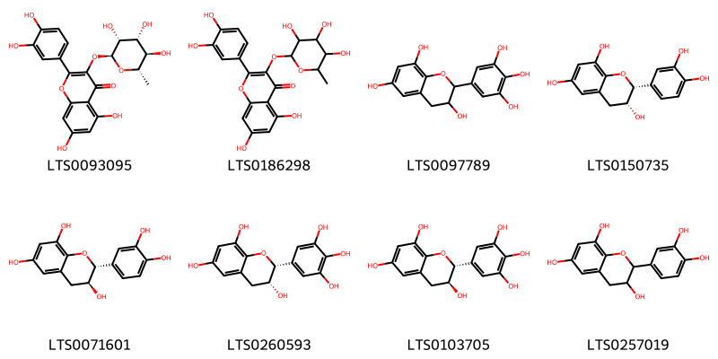{ width=100% }
    <figcaption>Hình ảnh cấu trúc hóa học của 8 hoạt chất thuộc nhóm Flavonoids gồm ['quercitrin (LTS0093095)', 'quercitrin (LTS0186298)', '2-(3,4,5-trihydroxyphenyl)-3,4-dihydro-2h-1-benzopyran-3,6,8-triol (LTS0097789)', '(2r,3r)-2-(3,4-dihydroxyphenyl)-3,4-dihydro-2h-1-benzopyran-3,6,8-triol (LTS0150735)', '(2r,3s)-2-(3,4-dihydroxyphenyl)-3,4-dihydro-2h-1-benzopyran-3,6,8-triol (LTS0071601)', '(2r,3r)-2-(3,4,5-trihydroxyphenyl)-3,4-dihydro-2h-1-benzopyran-3,6,8-triol (LTS0260593)', '(2r,3s)-2-(3,4,5-trihydroxyphenyl)-3,4-dihydro-2h-1-benzopyran-3,6,8-triol (LTS0103705)', '2-(3,4-dihydroxyphenyl)-3,4-dihydro-2h-1-benzopyran-3,6,8-triol (LTS0257019)'].</figcaption>
</figure>
#### Nhóm Glycerolipids
<figure markdown="span">
    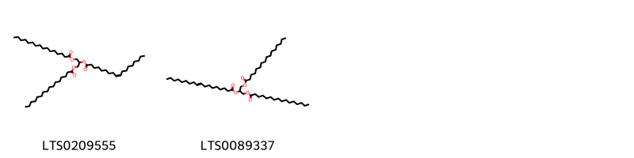{ width=100% }
    <figcaption>Hình ảnh cấu trúc hóa học của 2 hoạt chất thuộc nhóm Glycerolipids gồm ['1,3-dipalmito-2-olein (LTS0209555)', '1,3-bis(hexadecanoyloxy)propan-2-yl octadec-9-enoate (LTS0089337)'].</figcaption>
</figure>
#### Nhóm Hydroxy acids and derivatives
<figure markdown="span">
    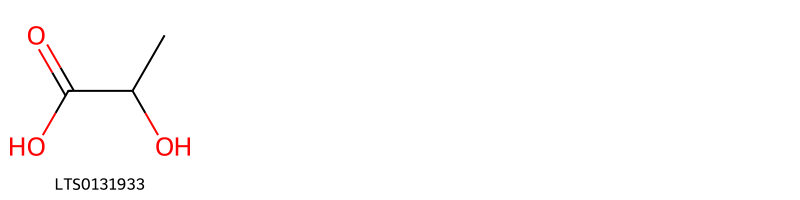{ width=100% }
    <figcaption>Hình ảnh cấu trúc hóa học của 1 hoạt chất thuộc nhóm Hydroxy acids and derivatives gồm ['lactic acid (LTS0131933)'].</figcaption>
</figure>
#### Nhóm Lactones
<figure markdown="span">
    { width=100% }
    <figcaption>Hình ảnh cấu trúc hóa học của 2 hoạt chất thuộc nhóm Lactones gồm ['(3r,4r)-3,4-dihydroxy-3-methyloxolan-2-one (LTS0081742)', '3,4-dihydroxy-3-methyloxolan-2-one (LTS0168418)'].</figcaption>
</figure>
#### Nhóm Prenol lipids
<figure markdown="span">
    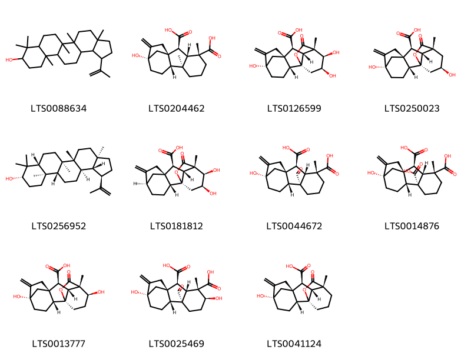{ width=100% }
    <figcaption>Hình ảnh cấu trúc hóa học của 11 hoạt chất thuộc nhóm Prenol lipids gồm ['lupeol (LTS0088634)', 'gibberellin a53 (LTS0204462)', 'gibberellin a8 (LTS0126599)', 'gibberellin a29 (LTS0250023)', 'lupeol (LTS0256952)', 'gibberellin a34 (LTS0181812)', 'gibberellin a19 (LTS0044672)', 'gibberellin a17 (LTS0014876)', 'gibberellin a1 (LTS0013777)', '(1s,2s,3s,4s,5s,8r,9r,12s)-8-formyl-5,12-dihydroxy-4-methyl-13-methylidenetetracyclo[10.2.1.0¹,⁹.0³,⁸]pentadecane-2,4-dicarboxylic acid (LTS0025469)', 'gibberellin a20 (LTS0041124)'].</figcaption>
</figure>
#### Nhóm Steroids and steroid derivatives
<figure markdown="span">
    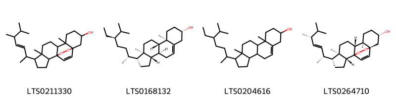{ width=100% }
    <figcaption>Hình ảnh cấu trúc hóa học của 4 hoạt chất thuộc nhóm Steroids and steroid derivatives gồm ['5-(5,6-dimethylhept-3-en-2-yl)-6,10-dimethyl-16,17-dioxapentacyclo[13.2.2.0¹,⁹.0²,⁶.0¹⁰,¹⁵]nonadec-18-en-13-ol (LTS0211330)', 'sitosterol (LTS0168132)', 'stigmast-5-en-3-ol, (3β)- (LTS0204616)', 'ergosterol peroxide (LTS0264710)'].</figcaption>
</figure>

---

### Dược dân tộc học

Danh sách các quốc gia có sử dụng *Leucaena leucocephala* trong điều trị các bệnh. 

| Country            | Disease                                | Bệnh                                                                                                                                                                                                |
|:-------------------|:---------------------------------------|:----------------------------------------------------------------------------------------------------------------------------------------------------------------------------------------------------|
| Bahamas            | Carminative                            | MYMEMORY WARNING: YOU USED ALL AVAILABLE FREE TRANSLATIONS FOR TODAY. NEXT AVAILABLE IN  15 HOURS 31 MINUTES 06 SECONDS VISIT HTTPS://MYMEMORY.TRANSLATED.NET/DOC/USAGELIMITS.PHP TO TRANSLATE MORE |
| Dominican Republic | Laxative                               | MYMEMORY WARNING: YOU USED ALL AVAILABLE FREE TRANSLATIONS FOR TODAY. NEXT AVAILABLE IN  15 HOURS 31 MINUTES 04 SECONDS VISIT HTTPS://MYMEMORY.TRANSLATED.NET/DOC/USAGELIMITS.PHP TO TRANSLATE MORE |
| Elsewhere          | Piscicide, Poison, Poison, Vermifuge   | MYMEMORY WARNING: YOU USED ALL AVAILABLE FREE TRANSLATIONS FOR TODAY. NEXT AVAILABLE IN  15 HOURS 31 MINUTES 01 SECONDS VISIT HTTPS://MYMEMORY.TRANSLATED.NET/DOC/USAGELIMITS.PHP TO TRANSLATE MORE |
| English            | Depilatory                             | MYMEMORY WARNING: YOU USED ALL AVAILABLE FREE TRANSLATIONS FOR TODAY. NEXT AVAILABLE IN  15 HOURS 30 MINUTES 59 SECONDS VISIT HTTPS://MYMEMORY.TRANSLATED.NET/DOC/USAGELIMITS.PHP TO TRANSLATE MORE |
| Haiti              | Depilatory                             | MYMEMORY WARNING: YOU USED ALL AVAILABLE FREE TRANSLATIONS FOR TODAY. NEXT AVAILABLE IN  15 HOURS 30 MINUTES 56 SECONDS VISIT HTTPS://MYMEMORY.TRANSLATED.NET/DOC/USAGELIMITS.PHP TO TRANSLATE MORE |
| Hawaii             | Poison                                 | MYMEMORY WARNING: YOU USED ALL AVAILABLE FREE TRANSLATIONS FOR TODAY. NEXT AVAILABLE IN  15 HOURS 30 MINUTES 54 SECONDS VISIT HTTPS://MYMEMORY.TRANSLATED.NET/DOC/USAGELIMITS.PHP TO TRANSLATE MORE |
| Mexico             | Emmenagogue, Abortifacient, Depilatory | MYMEMORY WARNING: YOU USED ALL AVAILABLE FREE TRANSLATIONS FOR TODAY. NEXT AVAILABLE IN  15 HOURS 30 MINUTES 51 SECONDS VISIT HTTPS://MYMEMORY.TRANSLATED.NET/DOC/USAGELIMITS.PHP TO TRANSLATE MORE |

---

---
## Leucaena trichodes
### Thông tin về thực vật

!!! info "Phân loại thực vật của *Leucaena trichodes* từ GIBF:"
    - **Kingdom:** Plantae
    - **Phylum:** Tracheophyta
    - **Order:** Fabales
    - **Family:** Fabaceae
    - **Genus:** Leucaena
    - **Species:** *Leucaena trichodes*

 

| Label (VI)   | Label (EN)   | Scientific Name    | Descriptions (VI)   | Descriptions (EN)   | Also Known As (VI)   | Also Known As (EN)   |
|:-------------|:-------------|:-------------------|:--------------------|:--------------------|:---------------------|:---------------------|
| N/A          | N/A          | Leucaena trichodes | loài thực vật       | species of plant    | ['']                 | ['']                 |

#### Phân bố trên thế giới

**Từ CSDL GIBF** Ecuador, Colombia, Peru

#### Phân bố tại Việt Nam

**Từ CSDL GIBF**: Không có ghi nhận ở Việt Nam

---
### Thành phần hóa học
        
- Theo cơ sở dữ liệu lotus: Từ loài *Leucaena trichodes* đã phân lập và xác định được Chưa có hoạt chất nào được phân lập. hoạt chất thuộc về các nhóm Không có hoạt chất nào được phân lập. 

Không có hình ảnh nào được tạo ra

---

### Dược dân tộc học

Danh sách các quốc gia có sử dụng *Leucaena trichodes* trong điều trị các bệnh. 

| Country   | Disease   | Bệnh                                                                                                                                                                                                |
|:----------|:----------|:----------------------------------------------------------------------------------------------------------------------------------------------------------------------------------------------------|
| Venezuela | Poison    | MYMEMORY WARNING: YOU USED ALL AVAILABLE FREE TRANSLATIONS FOR TODAY. NEXT AVAILABLE IN  15 HOURS 30 MINUTES 13 SECONDS VISIT HTTPS://MYMEMORY.TRANSLATED.NET/DOC/USAGELIMITS.PHP TO TRANSLATE MORE |

---

# Chi Dipteryx

??? note "Danh sách các dược liệu thuộc chi"
    
	 - *Dipteryx odorata*
	 - *Dipteryx panamensis*

---
## Dipteryx odorata
### Thông tin về thực vật

!!! info "Phân loại thực vật của *Dipteryx odorata* từ GIBF:"
    - **Kingdom:** Plantae
    - **Phylum:** Tracheophyta
    - **Order:** Fabales
    - **Family:** Fabaceae
    - **Genus:** Dipteryx
    - **Species:** *Dipteryx odorata*

 

| Label (VI)   | Label (EN)   | Scientific Name   | Descriptions (VI)   | Descriptions (EN)   | Also Known As (VI)   | Also Known As (EN)       |
|:-------------|:-------------|:------------------|:--------------------|:--------------------|:---------------------|:-------------------------|
| N/A          | N/A          | Dipteryx odorata  | loài thực vật       | species of plant    | ['']                 | ['Cumaru', 'Tonka Bean'] |

#### Phân bố trên thế giới

**Từ CSDL GIBF** nan, Trinidad and Tobago, Suriname, Colombia, Brazil, Bolivia (Plurinational State of), Benin, Venezuela (Bolivarian Republic of), French Guiana

#### Phân bố tại Việt Nam

**Từ CSDL GIBF**: Không có ghi nhận ở Việt Nam

---
### Thành phần hóa học
        
- Theo cơ sở dữ liệu lotus: Từ loài *Dipteryx odorata* đã phân lập và xác định được 47 hoạt chất thuộc về các nhóm Fatty Acyls, Phenylpropanoic acids, Flavonoids, Prenol lipids, Isoflavonoids, Linear 1,3-diarylpropanoids, Cinnamic acids and derivatives, Benzene and substituted derivatives, 2-arylbenzofuran flavonoids, Naphthofurans, Aurone flavonoids, Furanoid lignans, Coumarins and derivatives, Benzopyrans. 

|    | chemicalTaxonomyClassyfireClass     |   smiles_count |
|---:|:------------------------------------|---------------:|
|  0 | 2-arylbenzofuran flavonoids         |              3 |
|  1 | Aurone flavonoids                   |              6 |
|  2 | Benzene and substituted derivatives |              2 |
|  3 | Benzopyrans                         |              1 |
|  4 | Cinnamic acids and derivatives      |              2 |
|  5 | Coumarins and derivatives           |              2 |
|  6 | Fatty Acyls                         |              4 |
|  7 | Flavonoids                          |              6 |
|  8 | Furanoid lignans                    |              2 |
|  9 | Isoflavonoids                       |              9 |
| 10 | Linear 1,3-diarylpropanoids         |              2 |
| 11 | Naphthofurans                       |              3 |
| 12 | Phenylpropanoic acids               |              1 |
| 13 | Prenol lipids                       |              3 |

#### Nhóm 2-arylbenzofuran flavonoids
<figure markdown="span">
    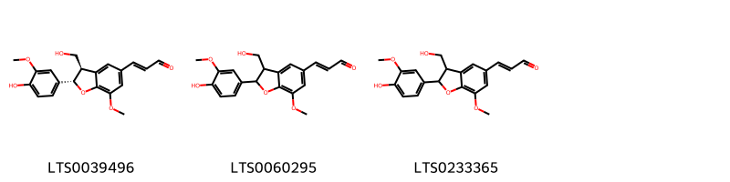{ width=100% }
    <figcaption>Hình ảnh cấu trúc hóa học của 3 hoạt chất thuộc nhóm 2-arylbenzofuran flavonoids gồm ['balanophonin (LTS0039496)', '(2e)-3-[2-(4-hydroxy-3-methoxyphenyl)-3-(hydroxymethyl)-7-methoxy-2,3-dihydro-1-benzofuran-5-yl]prop-2-enal (LTS0060295)', '3-[2-(4-hydroxy-3-methoxyphenyl)-3-(hydroxymethyl)-7-methoxy-2,3-dihydro-1-benzofuran-5-yl]prop-2-enal (LTS0233365)'].</figcaption>
</figure>
#### Nhóm Aurone flavonoids
<figure markdown="span">
    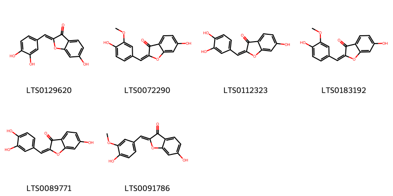{ width=100% }
    <figcaption>Hình ảnh cấu trúc hóa học của 6 hoạt chất thuộc nhóm Aurone flavonoids gồm ['sulfuretin (LTS0129620)', '6-hydroxy-2-[(4-hydroxy-3-methoxyphenyl)methylidene]-1-benzofuran-3-one (LTS0072290)', 'sulfuretin (LTS0112323)', '(2e)-6-hydroxy-2-[(4-hydroxy-3-methoxyphenyl)methylidene]-1-benzofuran-3-one (LTS0183192)', 'sulfuretin (LTS0089771)', '(2z)-6-hydroxy-2-[(4-hydroxy-3-methoxyphenyl)methylidene]-1-benzofuran-3-one (LTS0091786)'].</figcaption>
</figure>
#### Nhóm Benzene and substituted derivatives
<figure markdown="span">
    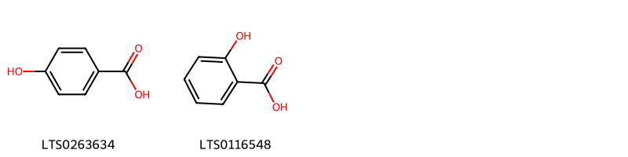{ width=100% }
    <figcaption>Hình ảnh cấu trúc hóa học của 2 hoạt chất thuộc nhóm Benzene and substituted derivatives gồm ['p-hydroxybenzoic acid (LTS0263634)', 'salicyclic acid (LTS0116548)'].</figcaption>
</figure>
#### Nhóm Benzopyrans
<figure markdown="span">
    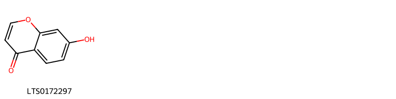{ width=100% }
    <figcaption>Hình ảnh cấu trúc hóa học của 1 hoạt chất thuộc nhóm Benzopyrans gồm ['7-hydroxychromen-4-one (LTS0172297)'].</figcaption>
</figure>
#### Nhóm Cinnamic acids and derivatives
<figure markdown="span">
    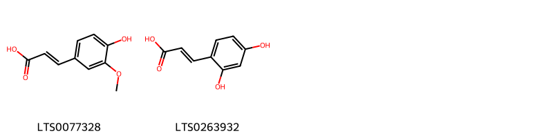{ width=100% }
    <figcaption>Hình ảnh cấu trúc hóa học của 2 hoạt chất thuộc nhóm Cinnamic acids and derivatives gồm ['ferulic acid (LTS0077328)', 'umbellic acid (LTS0263932)'].</figcaption>
</figure>
#### Nhóm Coumarins and derivatives
<figure markdown="span">
    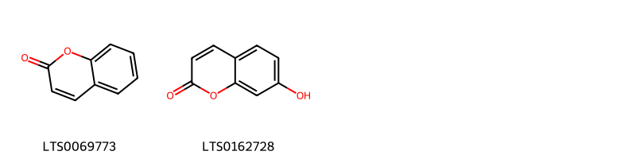{ width=100% }
    <figcaption>Hình ảnh cấu trúc hóa học của 2 hoạt chất thuộc nhóm Coumarins and derivatives gồm ['2h-1-benzopyran-2-one (LTS0069773)', 'umbelliferone (LTS0162728)'].</figcaption>
</figure>
#### Nhóm Fatty Acyls
<figure markdown="span">
    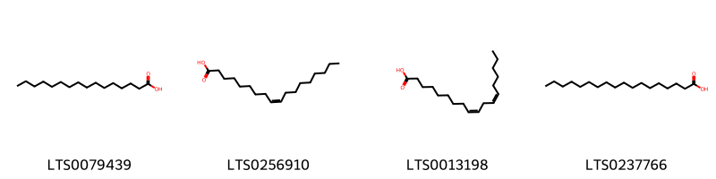{ width=100% }
    <figcaption>Hình ảnh cấu trúc hóa học của 4 hoạt chất thuộc nhóm Fatty Acyls gồm ['palmitic acid (LTS0079439)', 'oleic acid (LTS0256910)', 'linoleic (LTS0013198)', 'stearic acid (LTS0237766)'].</figcaption>
</figure>
#### Nhóm Flavonoids
<figure markdown="span">
    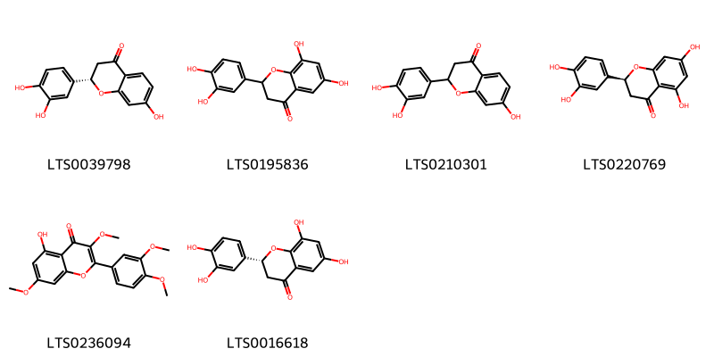{ width=100% }
    <figcaption>Hình ảnh cấu trúc hóa học của 6 hoạt chất thuộc nhóm Flavonoids gồm ['butin (LTS0039798)', '2-(3,4-dihydroxyphenyl)-6,8-dihydroxy-2,3-dihydro-1-benzopyran-4-one (LTS0195836)', "7,3',4'-trihydroxyflavanone (LTS0210301)", 'eriodictyol (LTS0220769)', 'retusin (LTS0236094)', '(2r)-2-(3,4-dihydroxyphenyl)-6,8-dihydroxy-2,3-dihydro-1-benzopyran-4-one (LTS0016618)'].</figcaption>
</figure>
#### Nhóm Furanoid lignans
<figure markdown="span">
    { width=100% }
    <figcaption>Hình ảnh cấu trúc hóa học của 2 hoạt chất thuộc nhóm Furanoid lignans gồm ['(-)-lariciresinol (LTS0136125)', '4-{4-[(4-hydroxy-3-methoxyphenyl)methyl]-3-(hydroxymethyl)oxolan-2-yl}-2-methoxyphenol (LTS0211349)'].</figcaption>
</figure>
#### Nhóm Isoflavonoids
<figure markdown="span">
    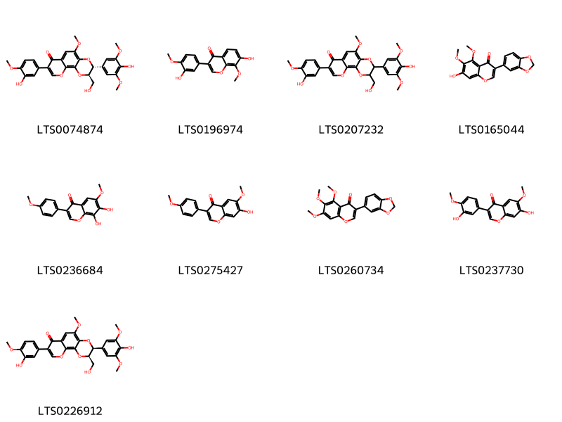{ width=100% }
    <figcaption>Hình ảnh cấu trúc hóa học của 9 hoạt chất thuộc nhóm Isoflavonoids gồm ['(2r,3r)-3-(4-hydroxy-3,5-dimethoxyphenyl)-8-(3-hydroxy-4-methoxyphenyl)-2-(hydroxymethyl)-5-methoxy-2h,3h-[1,4]dioxino[2,3-h]chromen-7-one (LTS0074874)', "3'-hydroxy-8-o-methylretusin (LTS0196974)", '3-(4-hydroxy-3,5-dimethoxyphenyl)-8-(3-hydroxy-4-methoxyphenyl)-2-(hydroxymethyl)-5-methoxy-2h,3h-[1,4]dioxino[2,3-h]chromen-7-one (LTS0207232)', 'dipteryxine (LTS0165044)', 'dipteryxin (LTS0236684)', 'afrormosin (LTS0275427)', 'odoratine (LTS0260734)', 'odoratin (LTS0237730)', '(2r,3s)-3-(4-hydroxy-3,5-dimethoxyphenyl)-8-(3-hydroxy-4-methoxyphenyl)-2-(hydroxymethyl)-5-methoxy-2h,3h-[1,4]dioxino[2,3-h]chromen-7-one (LTS0226912)'].</figcaption>
</figure>
#### Nhóm Linear 1_3-diarylpropanoids
<figure markdown="span">
    { width=100% }
    <figcaption>Hình ảnh cấu trúc hóa học của Không tìm thấy chú thích hoạt chất thuộc nhóm Linear 1_3-diarylpropanoids gồm Không tìm thấy chú thích.</figcaption>
</figure>
#### Nhóm Naphthofurans
<figure markdown="span">
    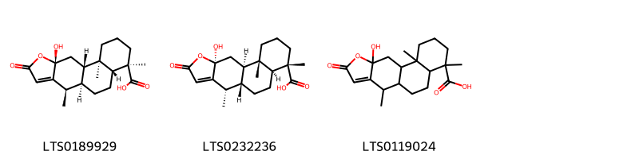{ width=100% }
    <figcaption>Hình ảnh cấu trúc hóa học của 3 hoạt chất thuộc nhóm Naphthofurans gồm ['(4r,4ar,6as,7r,10ar,11as,11br)-10a-hydroxy-4,7,11b-trimethyl-9-oxo-1h,2h,3h,4ah,5h,6h,6ah,7h,11h,11ah-phenanthro[3,2-b]furan-4-carboxylic acid (LTS0189929)', '(4s,4as,6ar,7s,10as,11ar,11bs)-10a-hydroxy-4,7,11b-trimethyl-9-oxo-1h,2h,3h,4ah,5h,6h,6ah,7h,11h,11ah-phenanthro[3,2-b]furan-4-carboxylic acid (LTS0232236)', '10a-hydroxy-4,7,11b-trimethyl-9-oxo-1h,2h,3h,4ah,5h,6h,6ah,7h,11h,11ah-phenanthro[3,2-b]furan-4-carboxylic acid (LTS0119024)'].</figcaption>
</figure>
#### Nhóm Phenylpropanoic acids
<figure markdown="span">
    { width=100% }
    <figcaption>Hình ảnh cấu trúc hóa học của 1 hoạt chất thuộc nhóm Phenylpropanoic acids gồm ['melilotic acid (LTS0176151)'].</figcaption>
</figure>
#### Nhóm Prenol lipids
<figure markdown="span">
    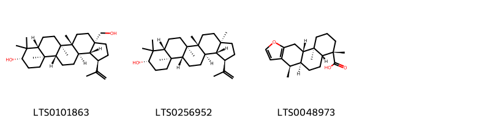{ width=100% }
    <figcaption>Hình ảnh cấu trúc hóa học của 3 hoạt chất thuộc nhóm Prenol lipids gồm ['betulin (LTS0101863)', 'lupeol (LTS0256952)', '(4s,4ar,6as,7r,11as,11br)-4,7,11b-trimethyl-1h,2h,3h,4ah,5h,6h,6ah,7h,11h,11ah-phenanthro[3,2-b]furan-4-carboxylic acid (LTS0048973)'].</figcaption>
</figure>

---

### Dược dân tộc học

Danh sách các quốc gia có sử dụng *Dipteryx odorata* trong điều trị các bệnh. 

| Country   | Disease                                         | Bệnh                                                                                                                                                                                                |
|:----------|:------------------------------------------------|:----------------------------------------------------------------------------------------------------------------------------------------------------------------------------------------------------|
| China     | Diaphoretic, Stomachic                          | MYMEMORY WARNING: YOU USED ALL AVAILABLE FREE TRANSLATIONS FOR TODAY. NEXT AVAILABLE IN  15 HOURS 29 MINUTES 46 SECONDS VISIT HTTPS://MYMEMORY.TRANSLATED.NET/DOC/USAGELIMITS.PHP TO TRANSLATE MORE |
| Elsewhere | Anticoagulant, Narcotic, Stimulant, Carminative | MYMEMORY WARNING: YOU USED ALL AVAILABLE FREE TRANSLATIONS FOR TODAY. NEXT AVAILABLE IN  15 HOURS 29 MINUTES 40 SECONDS VISIT HTTPS://MYMEMORY.TRANSLATED.NET/DOC/USAGELIMITS.PHP TO TRANSLATE MORE |
| Trinidad  | Carminative                                     | MYMEMORY WARNING: YOU USED ALL AVAILABLE FREE TRANSLATIONS FOR TODAY. NEXT AVAILABLE IN  15 HOURS 29 MINUTES 36 SECONDS VISIT HTTPS://MYMEMORY.TRANSLATED.NET/DOC/USAGELIMITS.PHP TO TRANSLATE MORE |
| Turkey    | Fumigant, Poison, Cardiotonic, Narcotic         | MYMEMORY WARNING: YOU USED ALL AVAILABLE FREE TRANSLATIONS FOR TODAY. NEXT AVAILABLE IN  15 HOURS 29 MINUTES 30 SECONDS VISIT HTTPS://MYMEMORY.TRANSLATED.NET/DOC/USAGELIMITS.PHP TO TRANSLATE MORE |

---

---
## Dipteryx panamensis
### Thông tin về thực vật

!!! info "Phân loại thực vật của *Dipteryx oleifera* từ GIBF:"
    - **Kingdom:** Plantae
    - **Phylum:** Tracheophyta
    - **Order:** Fabales
    - **Family:** Fabaceae
    - **Genus:** Dipteryx
    - **Species:** *Dipteryx oleifera*

 

| Label (VI)   | Label (EN)   | Scientific Name     | Descriptions (VI)   | Descriptions (EN)   | Also Known As (VI)   | Also Known As (EN)   |
|:-------------|:-------------|:--------------------|:--------------------|:--------------------|:---------------------|:---------------------|
| N/A          | N/A          | Dipteryx panamensis | loài thực vật       | species of plant    | ['']                 | ['']                 |

#### Phân bố trên thế giới

**Từ CSDL GIBF** nan, Colombia, Costa Rica, Nicaragua, El Salvador, Panama

#### Phân bố tại Việt Nam

**Từ CSDL GIBF**: Không có ghi nhận ở Việt Nam

---
### Thành phần hóa học
        
- Theo cơ sở dữ liệu lotus: Từ loài *Dipteryx oleifera* đã phân lập và xác định được Chưa có hoạt chất nào được phân lập. hoạt chất thuộc về các nhóm Không có hoạt chất nào được phân lập. 

Không có hình ảnh nào được tạo ra

---

### Dược dân tộc học

Danh sách các quốc gia có sử dụng *Dipteryx oleifera* trong điều trị các bệnh. 

| Country   | Disease              | Bệnh                                                                                                                                                                                                |
|:----------|:---------------------|:----------------------------------------------------------------------------------------------------------------------------------------------------------------------------------------------------|
| Elsewhere | Diaphoretic, Cardiac | MYMEMORY WARNING: YOU USED ALL AVAILABLE FREE TRANSLATIONS FOR TODAY. NEXT AVAILABLE IN  15 HOURS 28 MINUTES 47 SECONDS VISIT HTTPS://MYMEMORY.TRANSLATED.NET/DOC/USAGELIMITS.PHP TO TRANSLATE MORE |

---

# Chi Ononis

??? note "Danh sách các dược liệu thuộc chi"
    
	 - *Ononis arvensis*
	 - *Ononis inosa*

---
## Ononis arvensis
### Thông tin về thực vật

!!! info "Phân loại thực vật của *Ononis arvensis* từ GIBF:"
    - **Kingdom:** Plantae
    - **Phylum:** Tracheophyta
    - **Order:** Fabales
    - **Family:** Fabaceae
    - **Genus:** Ononis
    - **Species:** *Ononis arvensis*

 

| Label (VI)   | Label (EN)   | Scientific Name   | Descriptions (VI)   | Descriptions (EN)   | Also Known As (VI)   | Also Known As (EN)                |
|:-------------|:-------------|:------------------|:--------------------|:--------------------|:---------------------|:----------------------------------|
| N/A          | N/A          | Ononis arvensis   | loài thực vật       | species of plant    | ['']                 | ['wild liquorice', 'rest harrow'] |

#### Phân bố trên thế giới

**Từ CSDL GIBF** Ukraine, Denmark, Lithuania, Czechia, Slovakia, Estonia, Hungary, Russian Federation, Latvia, Sweden, Poland, Slovenia, Norway

#### Phân bố tại Việt Nam

**Từ CSDL GIBF**: Không có ghi nhận ở Việt Nam

---
### Thành phần hóa học
        
- Theo cơ sở dữ liệu lotus: Từ loài *Ononis arvensis* đã phân lập và xác định được 6 hoạt chất thuộc về các nhóm Flavonoids, Prenol lipids, Isoflavonoids. 

|    | chemicalTaxonomyClassyfireClass   |   smiles_count |
|---:|:----------------------------------|---------------:|
|  0 | Flavonoids                        |              2 |
|  1 | Isoflavonoids                     |              3 |
|  2 | Prenol lipids                     |              1 |

#### Nhóm Flavonoids
<figure markdown="span">
    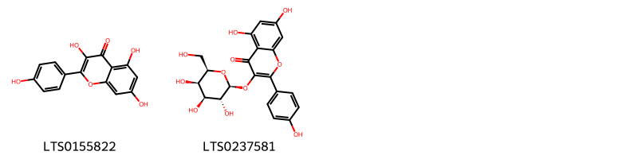{ width=100% }
    <figcaption>Hình ảnh cấu trúc hóa học của 2 hoạt chất thuộc nhóm Flavonoids gồm ['kaempherol (LTS0155822)', 'trifolin (LTS0237581)'].</figcaption>
</figure>
#### Nhóm Isoflavonoids
<figure markdown="span">
    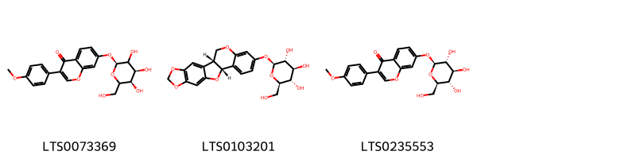{ width=100% }
    <figcaption>Hình ảnh cấu trúc hóa học của 3 hoạt chất thuộc nhóm Isoflavonoids gồm ['formononetin 7-o-glucoside (LTS0073369)', 'trifolirhizin (LTS0103201)', 'ononin (LTS0235553)'].</figcaption>
</figure>
#### Nhóm Prenol lipids
<figure markdown="span">
    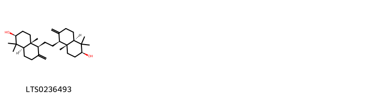{ width=100% }
    <figcaption>Hình ảnh cấu trúc hóa học của 1 hoạt chất thuộc nhóm Prenol lipids gồm ['(2s,4ar,5s,8ar)-5-{2-[(1s,4ar,6s,8ar)-6-hydroxy-5,5,8a-trimethyl-2-methylidene-hexahydro-1h-naphthalen-1-yl]ethyl}-1,1,4a-trimethyl-6-methylidene-hexahydro-2h-naphthalen-2-ol (LTS0236493)'].</figcaption>
</figure>

---

### Dược dân tộc học

Danh sách các quốc gia có sử dụng *Ononis arvensis* trong điều trị các bệnh. 

| Country   | Disease             | Bệnh                                                                                                                                                                                                |
|:----------|:--------------------|:----------------------------------------------------------------------------------------------------------------------------------------------------------------------------------------------------|
| Turkey    | Emollient, Diuretic | MYMEMORY WARNING: YOU USED ALL AVAILABLE FREE TRANSLATIONS FOR TODAY. NEXT AVAILABLE IN  15 HOURS 28 MINUTES 17 SECONDS VISIT HTTPS://MYMEMORY.TRANSLATED.NET/DOC/USAGELIMITS.PHP TO TRANSLATE MORE |

---

---
## Ononis inosa
### Thông tin về thực vật

!!! info "Phân loại thực vật của *N/A* từ GIBF:"
    - **Kingdom:** Plantae
    - **Phylum:** Tracheophyta
    - **Order:** Fabales
    - **Family:** Fabaceae
    - **Genus:** Ononis
    - **Species:** *N/A*

 

| Label (VI)   | Label (EN)   | Scientific Name   | Descriptions (VI)   | Descriptions (EN)   | Also Known As (VI)   | Also Known As (EN)                |
|:-------------|:-------------|:------------------|:--------------------|:--------------------|:---------------------|:----------------------------------|
| N/A          | N/A          | Ononis arvensis   | loài thực vật       | species of plant    | ['']                 | ['wild liquorice', 'rest harrow'] |

#### Phân bố trên thế giới

**Từ CSDL GIBF** Italy, Belgium, Palestine, State of, Israel, Denmark, Netherlands, Cyprus, Malta, Spain, Hungary, Portugal, Algeria, Türkiye, Morocco, Croatia, Greece, Saudi Arabia, Switzerland, Austria, France, United Kingdom of Great Britain and Northern Ireland, Syrian Arab Republic, Iraq

#### Phân bố tại Việt Nam

**Từ CSDL GIBF**: Không có ghi nhận ở Việt Nam

---
### Thành phần hóa học
        
- Theo cơ sở dữ liệu lotus: Từ loài *N/A* đã phân lập và xác định được Chưa có hoạt chất nào được phân lập. hoạt chất thuộc về các nhóm Không có hoạt chất nào được phân lập. 

Không có hình ảnh nào được tạo ra

---

### Dược dân tộc học

Danh sách các quốc gia có sử dụng *N/A* trong điều trị các bệnh. 

| Country   | Disease                         | Bệnh                                                                                                                                                                                                |
|:----------|:--------------------------------|:----------------------------------------------------------------------------------------------------------------------------------------------------------------------------------------------------|
| Elsewhere | Diuretic                        | MYMEMORY WARNING: YOU USED ALL AVAILABLE FREE TRANSLATIONS FOR TODAY. NEXT AVAILABLE IN  15 HOURS 27 MINUTES 39 SECONDS VISIT HTTPS://MYMEMORY.TRANSLATED.NET/DOC/USAGELIMITS.PHP TO TRANSLATE MORE |
| Turkey    | Aperient, Diuretic, Expectorant | MYMEMORY WARNING: YOU USED ALL AVAILABLE FREE TRANSLATIONS FOR TODAY. NEXT AVAILABLE IN  15 HOURS 27 MINUTES 36 SECONDS VISIT HTTPS://MYMEMORY.TRANSLATED.NET/DOC/USAGELIMITS.PHP TO TRANSLATE MORE |
| ain       | Diuretic                        | MYMEMORY WARNING: YOU USED ALL AVAILABLE FREE TRANSLATIONS FOR TODAY. NEXT AVAILABLE IN  15 HOURS 27 MINUTES 32 SECONDS VISIT HTTPS://MYMEMORY.TRANSLATED.NET/DOC/USAGELIMITS.PHP TO TRANSLATE MORE |

---

# Chi Calliandra

??? note "Danh sách các dược liệu thuộc chi"
    
	 - *Calliandra anomala*
	 - *Calliandra houstoniana*
	 - *Calliandra portoricensis*

---
## Calliandra anomala
### Thông tin về thực vật

!!! info "Phân loại thực vật của *Calliandra houstoniana* từ GIBF:"
    - **Kingdom:** Plantae
    - **Phylum:** Tracheophyta
    - **Order:** Fabales
    - **Family:** Fabaceae
    - **Genus:** Calliandra
    - **Species:** *Calliandra houstoniana*

 

| Label (VI)   | Label (EN)   | Scientific Name    | Descriptions (VI)   | Descriptions (EN)   | Also Known As (VI)   | Also Known As (EN)   |
|:-------------|:-------------|:-------------------|:--------------------|:--------------------|:---------------------|:---------------------|
| N/A          | N/A          | Calliandra anomala |                     |                     | ['']                 | ['']                 |

#### Phân bố trên thế giới

**Từ CSDL GIBF** nan, Guatemala, United States of America, Mexico

#### Phân bố tại Việt Nam

**Từ CSDL GIBF**: Không có ghi nhận ở Việt Nam

---
### Thành phần hóa học
        
- Theo cơ sở dữ liệu lotus: Từ loài *Calliandra houstoniana* đã phân lập và xác định được Chưa có hoạt chất nào được phân lập. hoạt chất thuộc về các nhóm Không có hoạt chất nào được phân lập. 

Không có hình ảnh nào được tạo ra

---

### Dược dân tộc học

Danh sách các quốc gia có sử dụng *Calliandra houstoniana* trong điều trị các bệnh. 

| Country   | Disease    | Bệnh                                                                                                                                                                                                |
|:----------|:-----------|:----------------------------------------------------------------------------------------------------------------------------------------------------------------------------------------------------|
| Mexico    | Astringent | MYMEMORY WARNING: YOU USED ALL AVAILABLE FREE TRANSLATIONS FOR TODAY. NEXT AVAILABLE IN  15 HOURS 27 MINUTES 01 SECONDS VISIT HTTPS://MYMEMORY.TRANSLATED.NET/DOC/USAGELIMITS.PHP TO TRANSLATE MORE |

---

---
## Calliandra houstoniana
### Thông tin về thực vật

!!! info "Phân loại thực vật của *Calliandra houstoniana* từ GIBF:"
    - **Kingdom:** Plantae
    - **Phylum:** Tracheophyta
    - **Order:** Fabales
    - **Family:** Fabaceae
    - **Genus:** Calliandra
    - **Species:** *Calliandra houstoniana*

 

| Label (VI)   | Label (EN)   | Scientific Name        | Descriptions (VI)   | Descriptions (EN)   | Also Known As (VI)   | Also Known As (EN)   |
|:-------------|:-------------|:-----------------------|:--------------------|:--------------------|:---------------------|:---------------------|
| N/A          | N/A          | Calliandra houstoniana | loài thực vật       | species of plant    | ['']                 | ['']                 |

#### Phân bố trên thế giới

**Từ CSDL GIBF** nan, Sri Lanka, Nicaragua, Réunion, Bolivia (Plurinational State of), Jamaica, United States of America, Timor-Leste, El Salvador, Belize, New Caledonia, Dominican Republic, Mexico, Viet Nam, Comoros, Haiti, Colombia, Costa Rica, India, Indonesia

#### Phân bố tại Việt Nam

**Từ CSDL GIBF**: Đồng Nai

---
### Thành phần hóa học
        
- Theo cơ sở dữ liệu lotus: Từ loài *Calliandra houstoniana* đã phân lập và xác định được 4 hoạt chất thuộc về các nhóm Carboxylic acids and derivatives. 

|    | chemicalTaxonomyClassyfireClass   |   smiles_count |
|---:|:----------------------------------|---------------:|
|  0 | Carboxylic acids and derivatives  |              4 |

#### Nhóm Carboxylic acids and derivatives
<figure markdown="span">
    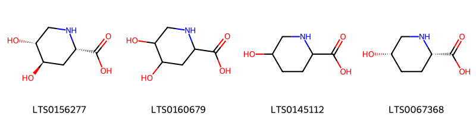{ width=100% }
    <figcaption>Hình ảnh cấu trúc hóa học của 4 hoạt chất thuộc nhóm Carboxylic acids and derivatives gồm ['(2s,4r,5r)-4,5-dihydroxypiperidine-2-carboxylic acid (LTS0156277)', '4,5-dihydroxypiperidine-2-carboxylic acid (LTS0160679)', '5-hydroxypipecolic acid (LTS0145112)', '(2s,5s)-5-hydroxypiperidine-2-carboxylic acid (LTS0067368)'].</figcaption>
</figure>

---

### Dược dân tộc học

Danh sách các quốc gia có sử dụng *Calliandra houstoniana* trong điều trị các bệnh. 

| Country   | Disease    | Bệnh                                                                                                                                                                                                |
|:----------|:-----------|:----------------------------------------------------------------------------------------------------------------------------------------------------------------------------------------------------|
| French    | Astringent | MYMEMORY WARNING: YOU USED ALL AVAILABLE FREE TRANSLATIONS FOR TODAY. NEXT AVAILABLE IN  15 HOURS 26 MINUTES 27 SECONDS VISIT HTTPS://MYMEMORY.TRANSLATED.NET/DOC/USAGELIMITS.PHP TO TRANSLATE MORE |
| Mexico    | Astringent | MYMEMORY WARNING: YOU USED ALL AVAILABLE FREE TRANSLATIONS FOR TODAY. NEXT AVAILABLE IN  15 HOURS 26 MINUTES 23 SECONDS VISIT HTTPS://MYMEMORY.TRANSLATED.NET/DOC/USAGELIMITS.PHP TO TRANSLATE MORE |

---

---
## Calliandra portoricensis
### Thông tin về thực vật

!!! info "Phân loại thực vật của *Zapoteca portoricensis* từ GIBF:"
    - **Kingdom:** Plantae
    - **Phylum:** Tracheophyta
    - **Order:** Fabales
    - **Family:** Fabaceae
    - **Genus:** Zapoteca
    - **Species:** *Zapoteca portoricensis*

 

| Label (VI)   | Label (EN)   | Scientific Name          | Descriptions (VI)   | Descriptions (EN)   | Also Known As (VI)   | Also Known As (EN)   |
|:-------------|:-------------|:-------------------------|:--------------------|:--------------------|:---------------------|:---------------------|
| N/A          | N/A          | Calliandra portoricensis |                     |                     | ['']                 | ['']                 |

#### Phân bố trên thế giới

**Từ CSDL GIBF** nan, Ghana, Guatemala, Grenada, Argentina, unknown or invalid, Benin, Venezuela (Bolivarian Republic of), Togo, Puerto Rico, Nigeria, Spain, Jamaica, United States of America, Belize, Brazil, Côte d’Ivoire, Dominican Republic, Peru, Mexico, Haiti, Costa Rica, India, Indonesia, Philippines, Cameroon, New Zealand

#### Phân bố tại Việt Nam

**Từ CSDL GIBF**: Không có ghi nhận ở Việt Nam

---
### Thành phần hóa học
        
- Theo cơ sở dữ liệu lotus: Từ loài *Zapoteca portoricensis* đã phân lập và xác định được Chưa có hoạt chất nào được phân lập. hoạt chất thuộc về các nhóm Không có hoạt chất nào được phân lập. 

Không có hình ảnh nào được tạo ra

---

### Dược dân tộc học

Danh sách các quốc gia có sử dụng *Zapoteca portoricensis* trong điều trị các bệnh. 

| Country   | Disease                            | Bệnh                                                                                                                                                                                                |
|:----------|:-----------------------------------|:----------------------------------------------------------------------------------------------------------------------------------------------------------------------------------------------------|
| Ghana     | Abortifacient, Laxative, Purgative | MYMEMORY WARNING: YOU USED ALL AVAILABLE FREE TRANSLATIONS FOR TODAY. NEXT AVAILABLE IN  15 HOURS 25 MINUTES 51 SECONDS VISIT HTTPS://MYMEMORY.TRANSLATED.NET/DOC/USAGELIMITS.PHP TO TRANSLATE MORE |

---

# Chi Onobrychis

??? note "Danh sách các dược liệu thuộc chi"
    
	 - *Onobrychis viciaefolia*

---
## Onobrychis viciaefolia
### Thông tin về thực vật

!!! info "Phân loại thực vật của *Onobrychis cyri* từ GIBF:"
    - **Kingdom:** Plantae
    - **Phylum:** Tracheophyta
    - **Order:** Fabales
    - **Family:** Fabaceae
    - **Genus:** Onobrychis
    - **Species:** *Onobrychis cyri*

 

| Label (VI)   | Label (EN)   | Scientific Name          | Descriptions (VI)   | Descriptions (EN)   | Also Known As (VI)   | Also Known As (EN)   |
|:-------------|:-------------|:-------------------------|:--------------------|:--------------------|:---------------------|:---------------------|
| N/A          | N/A          | Calliandra portoricensis |                     |                     | ['']                 | ['']                 |

#### Phân bố trên thế giới

**Từ CSDL GIBF** nan, Italy, Belgium, Estonia, Slovakia, Argentina, Canada, Lithuania, Türkiye, Portugal, Algeria, Russian Federation, United States of America, Sweden, Bosnia and Herzegovina, Greece, Czechia, Germany, Switzerland, Austria, Mexico, France, China, Poland

#### Phân bố tại Việt Nam

**Từ CSDL GIBF**: Không có ghi nhận ở Việt Nam

---
### Thành phần hóa học
        
- Theo cơ sở dữ liệu lotus: Từ loài *Onobrychis cyri* đã phân lập và xác định được Chưa có hoạt chất nào được phân lập. hoạt chất thuộc về các nhóm Không có hoạt chất nào được phân lập. 

Không có hình ảnh nào được tạo ra

---

### Dược dân tộc học

Danh sách các quốc gia có sử dụng *Onobrychis cyri* trong điều trị các bệnh. 

| Country   | Disease   | Bệnh                                                                                                                                                                                                |
|:----------|:----------|:----------------------------------------------------------------------------------------------------------------------------------------------------------------------------------------------------|
| ain       | Sudorific | MYMEMORY WARNING: YOU USED ALL AVAILABLE FREE TRANSLATIONS FOR TODAY. NEXT AVAILABLE IN  15 HOURS 25 MINUTES 14 SECONDS VISIT HTTPS://MYMEMORY.TRANSLATED.NET/DOC/USAGELIMITS.PHP TO TRANSLATE MORE |

---

# Chi Securigera

??? note "Danh sách các dược liệu thuộc chi"
    
	 - *Securigera securidaca*

---
## Securigera securidaca
### Thông tin về thực vật

!!! info "Phân loại thực vật của *Coronilla securidaca* từ GIBF:"
    - **Kingdom:** Plantae
    - **Phylum:** Tracheophyta
    - **Order:** Fabales
    - **Family:** Fabaceae
    - **Genus:** Coronilla
    - **Species:** *Coronilla securidaca*

 

| Label (VI)   | Label (EN)   | Scientific Name       | Descriptions (VI)   | Descriptions (EN)   | Also Known As (VI)   | Also Known As (EN)   |
|:-------------|:-------------|:----------------------|:--------------------|:--------------------|:---------------------|:---------------------|
| N/A          | N/A          | Securigera securidaca | loài thực vật       | species of plant    | ['']                 | ['']                 |

#### Phân bố trên thế giới

**Từ CSDL GIBF** Ukraine, Italy, Montenegro, Bulgaria, Syrian Arab Republic, Cyprus, Iraq, Azerbaijan, Türkiye, Albania, Russian Federation, United States of America, Lebanon, Sweden, Slovenia, Croatia, Greece, Israel

#### Phân bố tại Việt Nam

**Từ CSDL GIBF**: Không có ghi nhận ở Việt Nam

---
### Thành phần hóa học
        
- Theo cơ sở dữ liệu lotus: Từ loài *Coronilla securidaca* đã phân lập và xác định được 4 hoạt chất thuộc về các nhóm Flavonoids, Coumarins and derivatives. 

|    | chemicalTaxonomyClassyfireClass   |   smiles_count |
|---:|:----------------------------------|---------------:|
|  0 | Coumarins and derivatives         |              2 |
|  1 | Flavonoids                        |              2 |

#### Nhóm Coumarins and derivatives
<figure markdown="span">
    { width=100% }
    <figcaption>Hình ảnh cấu trúc hóa học của 2 hoạt chất thuộc nhóm Coumarins and derivatives gồm ['umbelliferone (LTS0162728)', 'scopoletin (LTS0193112)'].</figcaption>
</figure>
#### Nhóm Flavonoids
<figure markdown="span">
    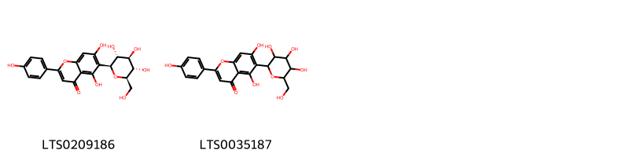{ width=100% }
    <figcaption>Hình ảnh cấu trúc hóa học của 2 hoạt chất thuộc nhóm Flavonoids gồm ['isovitexin (LTS0209186)', 'isovitexin (LTS0035187)'].</figcaption>
</figure>

---

### Dược dân tộc học

Danh sách các quốc gia có sử dụng *Coronilla securidaca* trong điều trị các bệnh. 

| Country   | Disease     | Bệnh                                                                                                                                                                                                |
|:----------|:------------|:----------------------------------------------------------------------------------------------------------------------------------------------------------------------------------------------------|
| Elsewhere | Cardiotonic | MYMEMORY WARNING: YOU USED ALL AVAILABLE FREE TRANSLATIONS FOR TODAY. NEXT AVAILABLE IN  15 HOURS 24 MINUTES 51 SECONDS VISIT HTTPS://MYMEMORY.TRANSLATED.NET/DOC/USAGELIMITS.PHP TO TRANSLATE MORE |

---

# Chi Calopogonium

??? note "Danh sách các dược liệu thuộc chi"
    
	 - *Calopogonium coeruleum*

---
## Calopogonium coeruleum
### Thông tin về thực vật

!!! info "Phân loại thực vật của *Calopogonium caeruleum* từ GIBF:"
    - **Kingdom:** Plantae
    - **Phylum:** Tracheophyta
    - **Order:** Fabales
    - **Family:** Fabaceae
    - **Genus:** Calopogonium
    - **Species:** *Calopogonium caeruleum*

 

| Label (VI)   | Label (EN)   | Scientific Name       | Descriptions (VI)   | Descriptions (EN)   | Also Known As (VI)   | Also Known As (EN)   |
|:-------------|:-------------|:----------------------|:--------------------|:--------------------|:---------------------|:---------------------|
| N/A          | N/A          | Securigera securidaca | loài thực vật       | species of plant    | ['']                 | ['']                 |

#### Phân bố trên thế giới

**Từ CSDL GIBF** nan, Belize, Colombia, Brazil, Guyana, Honduras, Cuba, Nicaragua, Philippines, Mexico, Venezuela (Bolivarian Republic of), Panama

#### Phân bố tại Việt Nam

**Từ CSDL GIBF**: Không có ghi nhận ở Việt Nam

---
### Thành phần hóa học
        
- Theo cơ sở dữ liệu lotus: Từ loài *Calopogonium caeruleum* đã phân lập và xác định được Chưa có hoạt chất nào được phân lập. hoạt chất thuộc về các nhóm Không có hoạt chất nào được phân lập. 

Không có hình ảnh nào được tạo ra

---

### Dược dân tộc học

Danh sách các quốc gia có sử dụng *Calopogonium caeruleum* trong điều trị các bệnh. 

| Country     | Disease   | Bệnh                                                                                                                                                                                                |
|:------------|:----------|:----------------------------------------------------------------------------------------------------------------------------------------------------------------------------------------------------|
| El Salvador | Soap      | MYMEMORY WARNING: YOU USED ALL AVAILABLE FREE TRANSLATIONS FOR TODAY. NEXT AVAILABLE IN  15 HOURS 24 MINUTES 21 SECONDS VISIT HTTPS://MYMEMORY.TRANSLATED.NET/DOC/USAGELIMITS.PHP TO TRANSLATE MORE |

---

# Chi Ormosia

??? note "Danh sách các dược liệu thuộc chi"
    
	 - *Ormosia coccinea*
	 - *Ormosia fastigiata*

---
## Ormosia coccinea
### Thông tin về thực vật

!!! info "Phân loại thực vật của *Ormosia coccinea* từ GIBF:"
    - **Kingdom:** Plantae
    - **Phylum:** Tracheophyta
    - **Order:** Fabales
    - **Family:** Fabaceae
    - **Genus:** Ormosia
    - **Species:** *Ormosia coccinea*

 

| Label (VI)   | Label (EN)   | Scientific Name   | Descriptions (VI)   | Descriptions (EN)   | Also Known As (VI)   | Also Known As (EN)   |
|:-------------|:-------------|:------------------|:--------------------|:--------------------|:---------------------|:---------------------|
| N/A          | N/A          | Ormosia coccinea  | loài thực vật       | species of plant    | ['']                 | ['']                 |

#### Phân bố trên thế giới

**Từ CSDL GIBF** nan, Ecuador, Nicaragua, Panama, Suriname, Colombia, Brazil, Costa Rica, Guyana, Honduras, Peru, Venezuela (Bolivarian Republic of), French Guiana

#### Phân bố tại Việt Nam

**Từ CSDL GIBF**: Không có ghi nhận ở Việt Nam

---
### Thành phần hóa học
        
- Theo cơ sở dữ liệu lotus: Từ loài *Ormosia coccinea* đã phân lập và xác định được Chưa có hoạt chất nào được phân lập. hoạt chất thuộc về các nhóm Không có hoạt chất nào được phân lập. 

Không có hình ảnh nào được tạo ra

---

### Dược dân tộc học

Danh sách các quốc gia có sử dụng *Ormosia coccinea* trong điều trị các bệnh. 

| Country   | Disease   | Bệnh                                                                                                                                                                                                |
|:----------|:----------|:----------------------------------------------------------------------------------------------------------------------------------------------------------------------------------------------------|
| English   | Narcotic  | MYMEMORY WARNING: YOU USED ALL AVAILABLE FREE TRANSLATIONS FOR TODAY. NEXT AVAILABLE IN  15 HOURS 23 MINUTES 56 SECONDS VISIT HTTPS://MYMEMORY.TRANSLATED.NET/DOC/USAGELIMITS.PHP TO TRANSLATE MORE |

---

---
## Ormosia fastigiata
### Thông tin về thực vật

!!! info "Phân loại thực vật của *Ormosia fastigiata* từ GIBF:"
    - **Kingdom:** Plantae
    - **Phylum:** Tracheophyta
    - **Order:** Fabales
    - **Family:** Fabaceae
    - **Genus:** Ormosia
    - **Species:** *Ormosia fastigiata*

 

| Label (VI)   | Label (EN)   | Scientific Name    | Descriptions (VI)   | Descriptions (EN)   | Also Known As (VI)   | Also Known As (EN)   |
|:-------------|:-------------|:-------------------|:--------------------|:--------------------|:---------------------|:---------------------|
| N/A          | N/A          | Ormosia fastigiata | loài thực vật       | species of plant    | ['']                 | ['']                 |

#### Phân bố trên thế giới

**Từ CSDL GIBF** Colombia, Brazil, Bolivia (Plurinational State of)

#### Phân bố tại Việt Nam

**Từ CSDL GIBF**: Không có ghi nhận ở Việt Nam

---
### Thành phần hóa học
        
- Theo cơ sở dữ liệu lotus: Từ loài *Ormosia fastigiata* đã phân lập và xác định được Chưa có hoạt chất nào được phân lập. hoạt chất thuộc về các nhóm Không có hoạt chất nào được phân lập. 

Không có hình ảnh nào được tạo ra

---

### Dược dân tộc học

Danh sách các quốc gia có sử dụng *Ormosia fastigiata* trong điều trị các bệnh. 

| Country   | Disease   | Bệnh                                                                                                                                                                                                |
|:----------|:----------|:----------------------------------------------------------------------------------------------------------------------------------------------------------------------------------------------------|
| Venezuela | Emetic    | MYMEMORY WARNING: YOU USED ALL AVAILABLE FREE TRANSLATIONS FOR TODAY. NEXT AVAILABLE IN  15 HOURS 23 MINUTES 25 SECONDS VISIT HTTPS://MYMEMORY.TRANSLATED.NET/DOC/USAGELIMITS.PHP TO TRANSLATE MORE |

---

# Chi Pachyrhizus

??? note "Danh sách các dược liệu thuộc chi"
    
	 - *Pachyrhizus erosus*
	 - *Pachyrhizus tuberosus*

---
## Pachyrhizus erosus
### Thông tin về thực vật

!!! info "Phân loại thực vật của *Pachyrhizus erosus* từ GIBF:"
    - **Kingdom:** Plantae
    - **Phylum:** Tracheophyta
    - **Order:** Fabales
    - **Family:** Fabaceae
    - **Genus:** Pachyrhizus
    - **Species:** *Pachyrhizus erosus*

 

| Label (VI)   | Label (EN)   | Scientific Name    | Descriptions (VI)   | Descriptions (EN)   | Also Known As (VI)   | Also Known As (EN)                               |
|:-------------|:-------------|:-------------------|:--------------------|:--------------------|:---------------------|:-------------------------------------------------|
| N/A          | N/A          | Pachyrhizus erosus | loài thực vật       | species of plant    | ['']                 | ['jicama', 'Mexican turnip', 'Mexican yam bean'] |

#### Phân bố trên thế giới

**Từ CSDL GIBF** Australia, Lao People’s Democratic Republic, Guatemala, Myanmar, Benin, Nicaragua, French Guiana, Panama, Puerto Rico, Réunion, Chinese Taipei, Honduras, United States of America, Timor-Leste, El Salvador, Belize, Suriname, Thailand, Martinique, Brazil, Cuba, Mexico, Dominican Republic, Singapore, China, Costa Rica, India, Indonesia, Philippines, Malaysia

#### Phân bố tại Việt Nam

**Từ CSDL GIBF**: Không có ghi nhận ở Việt Nam

---
### Thành phần hóa học
        
- Theo cơ sở dữ liệu lotus: Từ loài *Pachyrhizus erosus* đã phân lập và xác định được 11 hoạt chất thuộc về các nhóm Organooxygen compounds, Isoflavonoids. 

|    | chemicalTaxonomyClassyfireClass   |   smiles_count |
|---:|:----------------------------------|---------------:|
|  0 | Isoflavonoids                     |              9 |
|  1 | Organooxygen compounds            |              2 |

#### Nhóm Isoflavonoids
<figure markdown="span">
    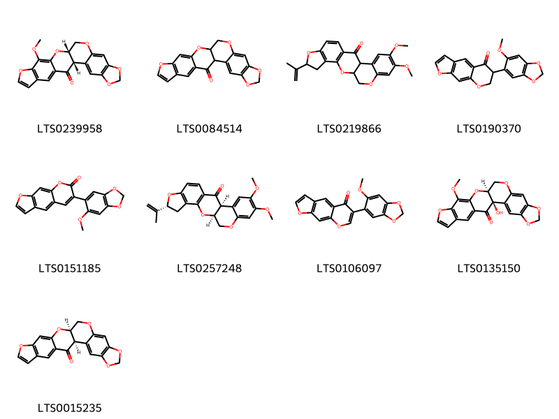{ width=100% }
    <figcaption>Hình ảnh cấu trúc hóa học của 9 hoạt chất thuộc nhóm Isoflavonoids gồm ['pachyrrhizone (LTS0239958)', 'dolineone (LTS0084514)', '16,17-dimethoxy-6-(prop-1-en-2-yl)-2,7,20-trioxapentacyclo[11.8.0.0³,¹¹.0⁴,⁸.0¹⁴,¹⁹]henicosa-3(11),4(8),9,14,16,18-hexaen-12-one (LTS0219866)', 'neotenone (LTS0190370)', 'pachyrrhizin (LTS0151185)', 'cube root (LTS0257248)', 'dehydroneotenone (LTS0106097)', '(1r,13s)-1-hydroxy-16-methoxy-5,7,11,14,18-pentaoxahexacyclo[11.11.0.0²,¹⁰.0⁴,⁸.0¹⁵,²³.0¹⁷,²¹]tetracosa-2,4(8),9,15(23),16,19,21-heptaen-24-one (LTS0135150)', '(1r,13r)-5,7,11,14,18-pentaoxahexacyclo[11.11.0.0²,¹⁰.0⁴,⁸.0¹⁵,²³.0¹⁷,²¹]tetracosa-2,4(8),9,15(23),16,19,21-heptaen-24-one (LTS0015235)'].</figcaption>
</figure>
#### Nhóm Organooxygen compounds
<figure markdown="span">
    { width=100% }
    <figcaption>Hình ảnh cấu trúc hóa học của 2 hoạt chất thuộc nhóm Organooxygen compounds gồm ['sorbo (LTS0067299)', 'galactitol (LTS0012947)'].</figcaption>
</figure>

---

### Dược dân tộc học

Danh sách các quốc gia có sử dụng *Pachyrhizus erosus* trong điều trị các bệnh. 

| Country            | Disease                                                        | Bệnh                                                                                                                                                                                                |
|:-------------------|:---------------------------------------------------------------|:----------------------------------------------------------------------------------------------------------------------------------------------------------------------------------------------------|
| Dominican Republic | Poison                                                         | MYMEMORY WARNING: YOU USED ALL AVAILABLE FREE TRANSLATIONS FOR TODAY. NEXT AVAILABLE IN  15 HOURS 22 MINUTES 55 SECONDS VISIT HTTPS://MYMEMORY.TRANSLATED.NET/DOC/USAGELIMITS.PHP TO TRANSLATE MORE |
| Elsewhere          | Insecticide, Piscicide, Poison, Vermifuge, Larvicide, Laxative | MYMEMORY WARNING: YOU USED ALL AVAILABLE FREE TRANSLATIONS FOR TODAY. NEXT AVAILABLE IN  15 HOURS 22 MINUTES 52 SECONDS VISIT HTTPS://MYMEMORY.TRANSLATED.NET/DOC/USAGELIMITS.PHP TO TRANSLATE MORE |
| Guatemala          | Poison                                                         | MYMEMORY WARNING: YOU USED ALL AVAILABLE FREE TRANSLATIONS FOR TODAY. NEXT AVAILABLE IN  15 HOURS 22 MINUTES 49 SECONDS VISIT HTTPS://MYMEMORY.TRANSLATED.NET/DOC/USAGELIMITS.PHP TO TRANSLATE MORE |
| Java               | Laxative, Vermifuge                                            | MYMEMORY WARNING: YOU USED ALL AVAILABLE FREE TRANSLATIONS FOR TODAY. NEXT AVAILABLE IN  15 HOURS 22 MINUTES 45 SECONDS VISIT HTTPS://MYMEMORY.TRANSLATED.NET/DOC/USAGELIMITS.PHP TO TRANSLATE MORE |
| Latin America      | Piscicide, Poison, Insecticide                                 | MYMEMORY WARNING: YOU USED ALL AVAILABLE FREE TRANSLATIONS FOR TODAY. NEXT AVAILABLE IN  15 HOURS 22 MINUTES 42 SECONDS VISIT HTTPS://MYMEMORY.TRANSLATED.NET/DOC/USAGELIMITS.PHP TO TRANSLATE MORE |
| Mexico             | Pediculicide, Poison                                           | MYMEMORY WARNING: YOU USED ALL AVAILABLE FREE TRANSLATIONS FOR TODAY. NEXT AVAILABLE IN  15 HOURS 22 MINUTES 38 SECONDS VISIT HTTPS://MYMEMORY.TRANSLATED.NET/DOC/USAGELIMITS.PHP TO TRANSLATE MORE |

---

---
## Pachyrhizus tuberosus
### Thông tin về thực vật

!!! info "Phân loại thực vật của *Pachyrhizus tuberosus* từ GIBF:"
    - **Kingdom:** Plantae
    - **Phylum:** Tracheophyta
    - **Order:** Fabales
    - **Family:** Fabaceae
    - **Genus:** Pachyrhizus
    - **Species:** *Pachyrhizus tuberosus*

 

| Label (VI)   | Label (EN)   | Scientific Name       | Descriptions (VI)   | Descriptions (EN)   | Also Known As (VI)   | Also Known As (EN)   |
|:-------------|:-------------|:----------------------|:--------------------|:--------------------|:---------------------|:---------------------|
| N/A          | N/A          | Pachyrhizus tuberosus | loài thực vật       | species of plant    | ['']                 | ['']                 |

#### Phân bố trên thế giới

**Từ CSDL GIBF** nan, Ecuador, Trinidad and Tobago, Puerto Rico, Haiti, Colombia, Brazil, Bolivia (Plurinational State of), Guyana, New Caledonia, Jamaica, United States of America, Cuba, Peru, Mexico, Norway, Venezuela (Bolivarian Republic of)

#### Phân bố tại Việt Nam

**Từ CSDL GIBF**: Không có ghi nhận ở Việt Nam

---
### Thành phần hóa học
        
- Theo cơ sở dữ liệu lotus: Từ loài *Pachyrhizus tuberosus* đã phân lập và xác định được 19 hoạt chất thuộc về các nhóm Isoflavonoids. 

|    | chemicalTaxonomyClassyfireClass   |   smiles_count |
|---:|:----------------------------------|---------------:|
|  0 | Isoflavonoids                     |             19 |

#### Nhóm Isoflavonoids
<figure markdown="span">
    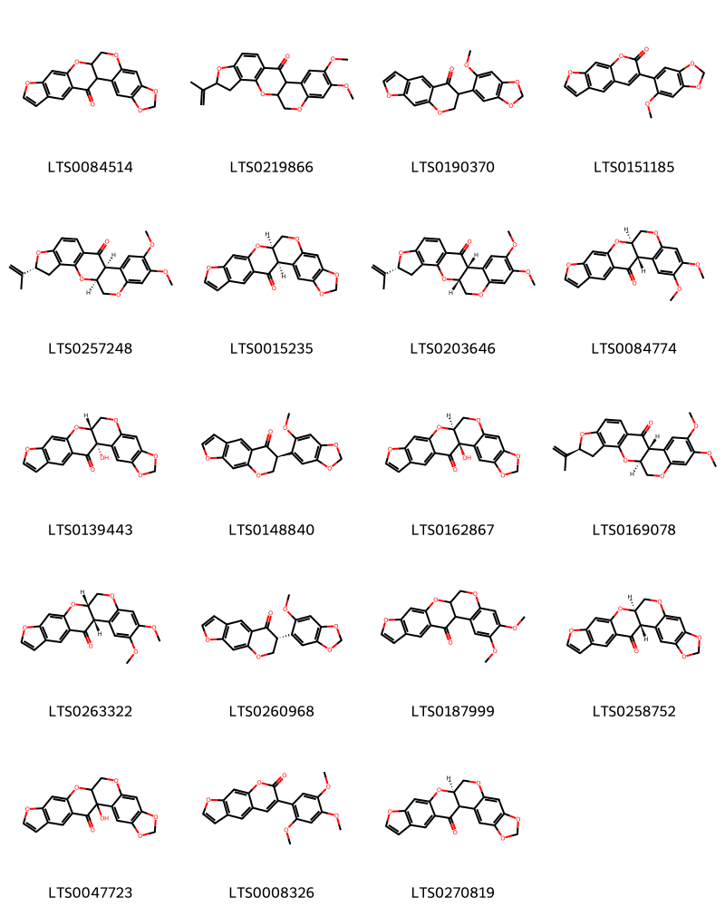{ width=100% }
    <figcaption>Hình ảnh cấu trúc hóa học của 19 hoạt chất thuộc nhóm Isoflavonoids gồm ['dolineone (LTS0084514)', '16,17-dimethoxy-6-(prop-1-en-2-yl)-2,7,20-trioxapentacyclo[11.8.0.0³,¹¹.0⁴,⁸.0¹⁴,¹⁹]henicosa-3(11),4(8),9,14,16,18-hexaen-12-one (LTS0219866)', 'neotenone (LTS0190370)', 'pachyrrhizin (LTS0151185)', 'cube root (LTS0257248)', '(1r,13r)-5,7,11,14,18-pentaoxahexacyclo[11.11.0.0²,¹⁰.0⁴,⁸.0¹⁵,²³.0¹⁷,²¹]tetracosa-2,4(8),9,15(23),16,19,21-heptaen-24-one (LTS0015235)', '(1r,6r,13r)-16,17-dimethoxy-6-(prop-1-en-2-yl)-2,7,20-trioxapentacyclo[11.8.0.0³,¹¹.0⁴,⁸.0¹⁴,¹⁹]henicosa-3(11),4(8),9,14,16,18-hexaen-12-one (LTS0203646)', '(1r,13s)-16,17-dimethoxy-2,6,20-trioxapentacyclo[11.8.0.0³,¹¹.0⁵,⁹.0¹⁴,¹⁹]henicosa-3(11),4,7,9,14(19),15,17-heptaen-12-one (LTS0084774)', '(1s,13r)-1-hydroxy-5,7,11,14,18-pentaoxahexacyclo[11.11.0.0²,¹⁰.0⁴,⁸.0¹⁵,²³.0¹⁷,²¹]tetracosa-2,4(8),9,15(23),16,19,21-heptaen-24-one (LTS0139443)', '(11s)-11-(6-methoxy-2h-1,3-benzodioxol-5-yl)-4,13-dioxatricyclo[7.4.0.0³,⁷]trideca-1(9),2,5,7-tetraen-10-one (LTS0148840)', '(1r,13s)-1-hydroxy-5,7,11,14,18-pentaoxahexacyclo[11.11.0.0²,¹⁰.0⁴,⁸.0¹⁵,²³.0¹⁷,²¹]tetracosa-2,4(8),9,15(23),16,19,21-heptaen-24-one (LTS0162867)', '(1s,6s,13r)-16,17-dimethoxy-6-(prop-1-en-2-yl)-2,7,20-trioxapentacyclo[11.8.0.0³,¹¹.0⁴,⁸.0¹⁴,¹⁹]henicosa-3(11),4(8),9,14,16,18-hexaen-12-one (LTS0169078)', '(1s,13s)-16,17-dimethoxy-2,6,20-trioxapentacyclo[11.8.0.0³,¹¹.0⁵,⁹.0¹⁴,¹⁹]henicosa-3(11),4,7,9,14(19),15,17-heptaen-12-one (LTS0263322)', '(11r)-11-(6-methoxy-2h-1,3-benzodioxol-5-yl)-4,13-dioxatricyclo[7.4.0.0³,⁷]trideca-1(9),2,5,7-tetraen-10-one (LTS0260968)', 'erosone (LTS0187999)', '(1s,13r)-5,7,11,14,18-pentaoxahexacyclo[11.11.0.0²,¹⁰.0⁴,⁸.0¹⁵,²³.0¹⁷,²¹]tetracosa-2,4(8),9,15(23),16,19,21-heptaen-24-one (LTS0258752)', '12a-hydroxydolineone (LTS0047723)', '6-(2,4,5-trimethoxyphenyl)furo[3,2-g]chromen-7-one (LTS0008326)', '(13r)-5,7,11,14,18-pentaoxahexacyclo[11.11.0.0²,¹⁰.0⁴,⁸.0¹⁵,²³.0¹⁷,²¹]tetracosa-2,4(8),9,15(23),16,19,21-heptaen-24-one (LTS0270819)'].</figcaption>
</figure>

---

### Dược dân tộc học

Danh sách các quốc gia có sử dụng *Pachyrhizus tuberosus* trong điều trị các bệnh. 

| Country   | Disease     | Bệnh                                                                                                                                                                                                |
|:----------|:------------|:----------------------------------------------------------------------------------------------------------------------------------------------------------------------------------------------------|
| Elsewhere | Insecticide | MYMEMORY WARNING: YOU USED ALL AVAILABLE FREE TRANSLATIONS FOR TODAY. NEXT AVAILABLE IN  15 HOURS 22 MINUTES 05 SECONDS VISIT HTTPS://MYMEMORY.TRANSLATED.NET/DOC/USAGELIMITS.PHP TO TRANSLATE MORE |

---

# Chi Robinia

??? note "Danh sách các dược liệu thuộc chi"
    
	 - *Robinia neo-mexicana*
	 - *Robinia pseudo-acacia*
	 - *Robinia pseudoacacia*

---
## Robinia neomexicana
### Thông tin về thực vật

!!! info "Phân loại thực vật của *Robinia neomexicana* từ GIBF:"
    - **Kingdom:** Plantae
    - **Phylum:** Tracheophyta
    - **Order:** Fabales
    - **Family:** Fabaceae
    - **Genus:** Robinia
    - **Species:** *Robinia neomexicana*

 

| Label (VI)   | Label (EN)   | Scientific Name     | Descriptions (VI)   | Descriptions (EN)                        | Also Known As (VI)   | Also Known As (EN)   |
|:-------------|:-------------|:--------------------|:--------------------|:-----------------------------------------|:---------------------|:---------------------|
| N/A          | N/A          | Robinia neomexicana |                     | Species of plant native to North America | ['']                 | ['rose locust']      |

#### Phân bố trên thế giới

**Từ CSDL GIBF** Romania, United States of America, Mexico

#### Phân bố tại Việt Nam

**Từ CSDL GIBF**: Không có ghi nhận ở Việt Nam

---
### Thành phần hóa học
        
- Theo cơ sở dữ liệu lotus: Từ loài *Robinia neomexicana* đã phân lập và xác định được 1 hoạt chất thuộc về các nhóm Carboxylic acids and derivatives. 

|    | chemicalTaxonomyClassyfireClass   |   smiles_count |
|---:|:----------------------------------|---------------:|
|  0 | Carboxylic acids and derivatives  |              1 |

#### Nhóm Carboxylic acids and derivatives
<figure markdown="span">
    { width=100% }
    <figcaption>Hình ảnh cấu trúc hóa học của 1 hoạt chất thuộc nhóm Carboxylic acids and derivatives gồm ['(l)-canavanine (LTS0093855)'].</figcaption>
</figure>

---

### Dược dân tộc học

Danh sách các quốc gia có sử dụng *Robinia neomexicana* trong điều trị các bệnh. 

| Country        | Disease   | Bệnh                                                                                                                                                                                                |
|:---------------|:----------|:----------------------------------------------------------------------------------------------------------------------------------------------------------------------------------------------------|
| US(Amerindian) | Emetic    | MYMEMORY WARNING: YOU USED ALL AVAILABLE FREE TRANSLATIONS FOR TODAY. NEXT AVAILABLE IN  15 HOURS 21 MINUTES 33 SECONDS VISIT HTTPS://MYMEMORY.TRANSLATED.NET/DOC/USAGELIMITS.PHP TO TRANSLATE MORE |

---

---
## Robinia pseudoacacia
### Thông tin về thực vật

!!! info "Phân loại thực vật của *Robinia pseudoacacia* từ GIBF:"
    - **Kingdom:** Plantae
    - **Phylum:** Tracheophyta
    - **Order:** Fabales
    - **Family:** Fabaceae
    - **Genus:** Robinia
    - **Species:** *Robinia pseudoacacia*

 

| Label (VI)   | Label (EN)   | Scientific Name      | Descriptions (VI)   | Descriptions (EN)                   | Also Known As (VI)                    | Also Known As (EN)               |
|:-------------|:-------------|:---------------------|:--------------------|:------------------------------------|:--------------------------------------|:---------------------------------|
| N/A          | N/A          | Robinia pseudoacacia | loài thực vật       | species of poisonous deciduous tree | ['Robinia pseudoacacia', 'Dương hoè'] | ['black locust', 'false acacia'] |

#### Phân bố trên thế giới

**Từ CSDL GIBF** Italy, Australia, Belgium, Argentina, Canada, Ukraine, Denmark, Netherlands, Spain, Hungary, Russian Federation, United States of America, Sweden, Chile, South Africa, Germany, Switzerland, Austria, France, China, Serbia, Poland, New Zealand

#### Phân bố tại Việt Nam

**Từ CSDL GIBF**: Không có ghi nhận ở Việt Nam

---
### Thành phần hóa học
        
- Theo cơ sở dữ liệu lotus: Từ loài *Robinia pseudoacacia* đã phân lập và xác định được 84 hoạt chất thuộc về các nhóm Flavonoids, Prenol lipids, Steroids and steroid derivatives, Isoflavonoids, Linear 1,3-diarylpropanoids, Benzofurans, Benzene and substituted derivatives, Organooxygen compounds, Carboxylic acids and derivatives. 

|    | chemicalTaxonomyClassyfireClass     |   smiles_count |
|---:|:------------------------------------|---------------:|
|  0 | Benzene and substituted derivatives |              5 |
|  1 | Benzofurans                         |              2 |
|  2 | Carboxylic acids and derivatives    |              3 |
|  3 | Flavonoids                          |             27 |
|  4 | Isoflavonoids                       |              4 |
|  5 | Linear 1,3-diarylpropanoids         |              6 |
|  6 | Organooxygen compounds              |              4 |
|  7 | Prenol lipids                       |             29 |
|  8 | Steroids and steroid derivatives    |              3 |

#### Nhóm Benzene and substituted derivatives
<figure markdown="span">
    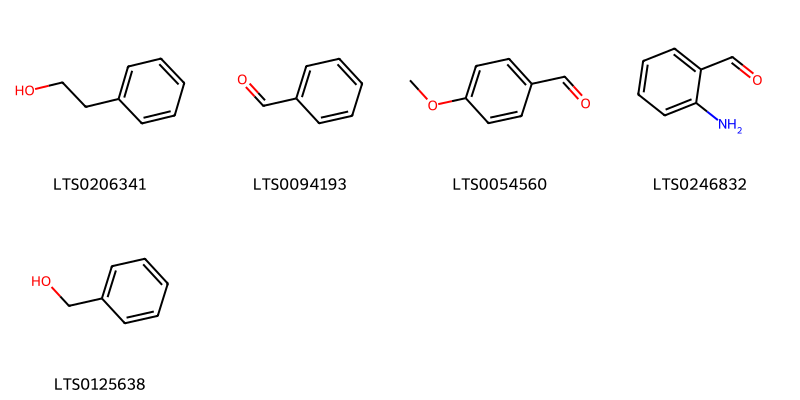{ width=100% }
    <figcaption>Hình ảnh cấu trúc hóa học của 5 hoạt chất thuộc nhóm Benzene and substituted derivatives gồm ['2-phenyl-ethanol (LTS0206341)', 'benzaldehyde (LTS0094193)', 'anisaldehyde (LTS0054560)', '2-aminobenzaldehyde (LTS0246832)', 'benzyl alcohol (LTS0125638)'].</figcaption>
</figure>
#### Nhóm Benzofurans
<figure markdown="span">
    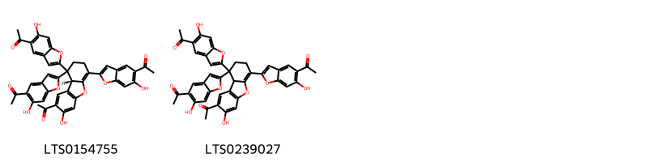{ width=100% }
    <figcaption>Hình ảnh cấu trúc hóa học của 2 hoạt chất thuộc nhóm Benzofurans gồm ['1-[(1r)-10,13,13-tris(5-acetyl-6-hydroxy-1-benzofuran-2-yl)-5-hydroxy-8-oxatricyclo[7.4.0.0²,⁷]trideca-2(7),3,5,9-tetraen-4-yl]ethanone (LTS0154755)', '(�)-laetirobin (LTS0239027)'].</figcaption>
</figure>
#### Nhóm Carboxylic acids and derivatives
<figure markdown="span">
    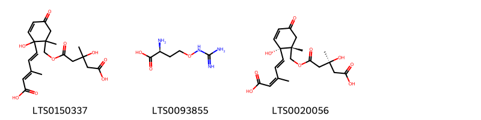{ width=100% }
    <figcaption>Hình ảnh cấu trúc hóa học của 3 hoạt chất thuộc nhóm Carboxylic acids and derivatives gồm ['5-(6-{[(4-carboxy-3-hydroxy-3-methylbutanoyl)oxy]methyl}-1-hydroxy-6-methyl-4-oxocyclohex-2-en-1-yl)-3-methylpenta-2,4-dienoic acid (LTS0150337)', '(l)-canavanine (LTS0093855)', '(2z,4e)-5-[(1r,6r)-6-({[(3s)-4-carboxy-3-hydroxy-3-methylbutanoyl]oxy}methyl)-1-hydroxy-6-methyl-4-oxocyclohex-2-en-1-yl]-3-methylpenta-2,4-dienoic acid (LTS0020056)'].</figcaption>
</figure>
#### Nhóm Flavonoids
<figure markdown="span">
    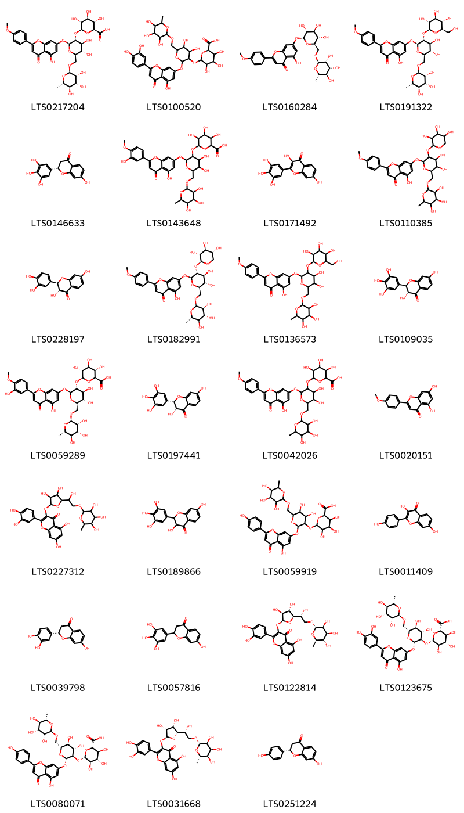{ width=100% }
    <figcaption>Hình ảnh cấu trúc hóa học của 27 hoạt chất thuộc nhóm Flavonoids gồm ['(2s,3s,4s,5r,6r)-6-{[(2s,3r,4s,5s,6r)-4,5-dihydroxy-2-{[5-hydroxy-2-(4-methoxyphenyl)-4-oxochromen-7-yl]oxy}-6-({[(2r,3r,4r,5r,6s)-3,4,5-trihydroxy-6-methyloxan-2-yl]oxy}methyl)oxan-3-yl]oxy}-3,4,5-trihydroxyoxane-2-carboxylic acid (LTS0217204)', '6-[(2-{[2-(3,4-dihydroxyphenyl)-5-hydroxy-4-oxochromen-7-yl]oxy}-4,5-dihydroxy-6-{[(3,4,5-trihydroxy-6-methyloxan-2-yl)oxy]methyl}oxan-3-yl)oxy]-3,4,5-trihydroxyoxane-2-carboxylic acid (LTS0100520)', 'linarin (LTS0160284)', '7-{[(2s,3r,4s,5s,6r)-4,5-dihydroxy-3-{[(2s,3r,4s,5s,6r)-3,4,5-trihydroxy-6-(hydroxymethyl)oxan-2-yl]oxy}-6-({[(2r,3r,4r,5r,6s)-3,4,5-trihydroxy-6-methyloxan-2-yl]oxy}methyl)oxan-2-yl]oxy}-5-hydroxy-2-(4-methoxyphenyl)chromen-4-one (LTS0191322)', '(2s)-7-hydroxy-2-(3,4,5-trihydroxyphenyl)-2,3-dihydro-1-benzopyran-4-one (LTS0146633)', '6-[(4,5-dihydroxy-2-{[5-hydroxy-2-(3-hydroxy-4-methoxyphenyl)-4-oxochromen-7-yl]oxy}-6-{[(3,4,5-trihydroxy-6-methyloxan-2-yl)oxy]methyl}oxan-3-yl)oxy]-3,4,5-trihydroxyoxane-2-carboxylic acid (LTS0143648)', 'robinetin (LTS0171492)', '7-[(4,5-dihydroxy-6-{[(3,4,5-trihydroxy-6-methyloxan-2-yl)oxy]methyl}-3-[(3,4,5-trihydroxyoxan-2-yl)oxy]oxan-2-yl)oxy]-5-hydroxy-2-(4-methoxyphenyl)chromen-4-one (LTS0110385)', 'fustin (LTS0228197)', '7-{[(2s,3r,4s,5s,6r)-4,5-dihydroxy-6-({[(2r,3r,4r,5r,6s)-3,4,5-trihydroxy-6-methyloxan-2-yl]oxy}methyl)-3-{[(2s,3r,4s,5r)-3,4,5-trihydroxyoxan-2-yl]oxy}oxan-2-yl]oxy}-5-hydroxy-2-(4-methoxyphenyl)chromen-4-one (LTS0182991)', '7-[(4,5-dihydroxy-3-{[3,4,5-trihydroxy-6-(hydroxymethyl)oxan-2-yl]oxy}-6-{[(3,4,5-trihydroxy-6-methyloxan-2-yl)oxy]methyl}oxan-2-yl)oxy]-5-hydroxy-2-(4-methoxyphenyl)chromen-4-one (LTS0136573)', '(2r,3r)-3,7-dihydroxy-2-(3,4,5-trihydroxyphenyl)-2,3-dihydro-1-benzopyran-4-one (LTS0109035)', '(2s,3s,4s,5r,6r)-6-{[(2s,3r,4s,5s,6r)-4,5-dihydroxy-2-{[5-hydroxy-2-(3-hydroxy-4-methoxyphenyl)-4-oxochromen-7-yl]oxy}-6-({[(2r,3r,4r,5r,6s)-3,4,5-trihydroxy-6-methyloxan-2-yl]oxy}methyl)oxan-3-yl]oxy}-3,4,5-trihydroxyoxane-2-carboxylic acid (LTS0059289)', '(2s,3r)-3,7-dihydroxy-2-(3,4,5-trihydroxyphenyl)-2,3-dihydro-1-benzopyran-4-one (LTS0197441)', '6-[(4,5-dihydroxy-2-{[5-hydroxy-2-(4-methoxyphenyl)-4-oxochromen-7-yl]oxy}-6-{[(3,4,5-trihydroxy-6-methyloxan-2-yl)oxy]methyl}oxan-3-yl)oxy]-3,4,5-trihydroxyoxane-2-carboxylic acid (LTS0042026)', 'acacetin (LTS0020151)', '3-[(3,4-dihydroxy-5-{1-hydroxy-2-[(3,4,5-trihydroxy-6-methyloxan-2-yl)oxy]ethyl}oxolan-2-yl)oxy]-2-(3,4-dihydroxyphenyl)-5,7-dihydroxychromen-4-one (LTS0227312)', '3,7-dihydroxy-2-(3,4,5-trihydroxyphenyl)-2,3-dihydro-1-benzopyran-4-one (LTS0189866)', '6-[(4,5-dihydroxy-2-{[5-hydroxy-2-(4-hydroxyphenyl)-4-oxochromen-7-yl]oxy}-6-{[(3,4,5-trihydroxy-6-methyloxan-2-yl)oxy]methyl}oxan-3-yl)oxy]-3,4,5-trihydroxyoxane-2-carboxylic acid (LTS0059919)', "3,7,4'-trihydroxyflavone (LTS0011409)", 'butin (LTS0039798)', '7-hydroxy-2-(3,4,5-trihydroxyphenyl)-2,3-dihydro-1-benzopyran-4-one (LTS0057816)', '3-{[(2s,3s,4s,5r)-3,4-dihydroxy-5-[(1r)-1-hydroxy-2-{[(2s,3s,4s,5s,6r)-3,4,5-trihydroxy-6-methyloxan-2-yl]oxy}ethyl]oxolan-2-yl]oxy}-2-(3,4-dihydroxyphenyl)-5,7-dihydroxychromen-4-one (LTS0122814)', '(2s,3s,4s,5r,6r)-6-{[(2s,3r,4s,5s,6r)-2-{[2-(3,4-dihydroxyphenyl)-5-hydroxy-4-oxochromen-7-yl]oxy}-4,5-dihydroxy-6-({[(2r,3r,4r,5r,6s)-3,4,5-trihydroxy-6-methyloxan-2-yl]oxy}methyl)oxan-3-yl]oxy}-3,4,5-trihydroxyoxane-2-carboxylic acid (LTS0123675)', '(2s,3s,4s,5r,6r)-6-{[(2s,3r,4s,5s,6r)-4,5-dihydroxy-2-{[5-hydroxy-2-(4-hydroxyphenyl)-4-oxochromen-7-yl]oxy}-6-({[(2r,3r,4r,5r,6s)-3,4,5-trihydroxy-6-methyloxan-2-yl]oxy}methyl)oxan-3-yl]oxy}-3,4,5-trihydroxyoxane-2-carboxylic acid (LTS0080071)', '3-{[(2s,3r,4s,5s)-3,4-dihydroxy-5-[(1r)-1-hydroxy-2-{[(2s,3s,4s,5r,6s)-3,4,5-trihydroxy-6-methyloxan-2-yl]oxy}ethyl]oxolan-2-yl]oxy}-2-(3,4-dihydroxyphenyl)-5,7-dihydroxychromen-4-one (LTS0031668)', '5-deoxyflavanone (LTS0251224)'].</figcaption>
</figure>
#### Nhóm Isoflavonoids
<figure markdown="span">
    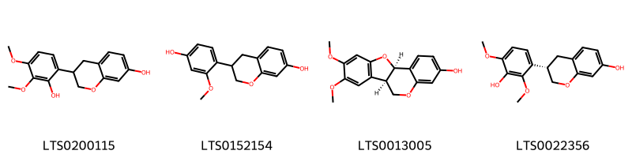{ width=100% }
    <figcaption>Hình ảnh cấu trúc hóa học của 4 hoạt chất thuộc nhóm Isoflavonoids gồm ['isomucronulatol (LTS0200115)', 'isovestitol (LTS0152154)', '(1r,10r)-13,14-dimethoxy-8,17-dioxatetracyclo[8.7.0.0²,⁷.0¹¹,¹⁶]heptadeca-2,4,6,11(16),12,14-hexaen-5-ol (LTS0013005)', '(-)-mucronulatol (LTS0022356)'].</figcaption>
</figure>
#### Nhóm Linear 1_3-diarylpropanoids
<figure markdown="span">
    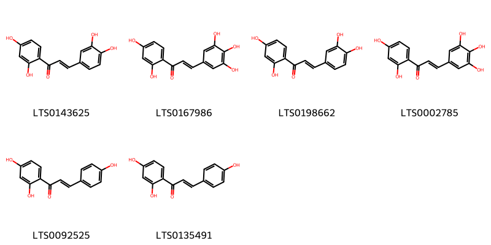{ width=100% }
    <figcaption>Hình ảnh cấu trúc hóa học của Không tìm thấy chú thích hoạt chất thuộc nhóm Linear 1_3-diarylpropanoids gồm Không tìm thấy chú thích.</figcaption>
</figure>
#### Nhóm Organooxygen compounds
<figure markdown="span">
    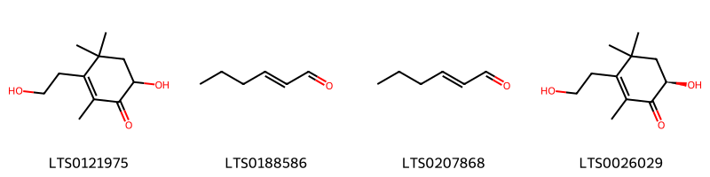{ width=100% }
    <figcaption>Hình ảnh cấu trúc hóa học của 4 hoạt chất thuộc nhóm Organooxygen compounds gồm ['6-hydroxy-3-(2-hydroxyethyl)-2,4,4-trimethylcyclohex-2-en-1-one (LTS0121975)', 'hexenal (LTS0188586)', '(e)-2-hexenal (LTS0207868)', '(6r)-6-hydroxy-3-(2-hydroxyethyl)-2,4,4-trimethylcyclohex-2-en-1-one (LTS0026029)'].</figcaption>
</figure>
#### Nhóm Prenol lipids
<figure markdown="span">
    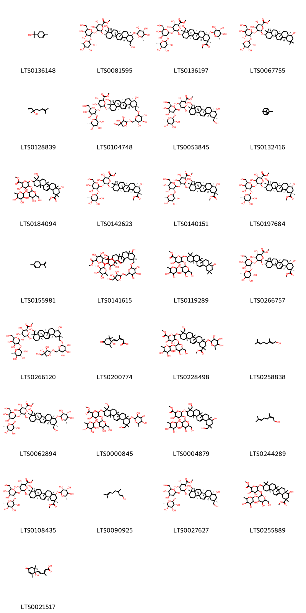{ width=100% }
    <figcaption>Hình ảnh cấu trúc hóa học của 29 hoạt chất thuộc nhóm Prenol lipids gồm ['terpineol (LTS0136148)', 'methyl (2s,3s,4s,5r,6r)-6-{[(3s,4s,4ar,6ar,6bs,8ar,9r,11s,12as,14ar,14br)-4,11-bis(hydroxymethyl)-4,6a,6b,8a,11,14b-hexamethyl-9-{[(2r,3r,4r,5r,6s)-3,4,5-trihydroxy-6-methyloxan-2-yl]oxy}-1,2,3,4a,5,6,7,8,9,10,12,12a,14,14a-tetradecahydropicen-3-yl]oxy}-5-{[(2s,3r,4s,5s,6r)-4,5-dihydroxy-6-(hydroxymethyl)-3-{[(2s,3r,4r,5r,6s)-3,4,5-trihydroxy-6-methyloxan-2-yl]oxy}oxan-2-yl]oxy}-3,4-dihydroxyoxane-2-carboxylate (LTS0081595)', 'methyl (2s,3s,4s,5r,6r)-6-{[(3s,4s,4ar,6ar,6bs,8ar,9r,11s,12as,14ar,14br)-4-(hydroxymethyl)-11-(methoxycarbonyl)-4,6a,6b,8a,11,14b-hexamethyl-9-{[(2r,3r,4r,5r,6s)-3,4,5-trihydroxy-6-methyloxan-2-yl]oxy}-1,2,3,4a,5,6,7,8,9,10,12,12a,14,14a-tetradecahydropicen-3-yl]oxy}-5-{[(2s,3r,4s,5r,6r)-4,5-dihydroxy-6-(hydroxymethyl)-3-{[(2s,3r,4r,5r,6s)-3,4,5-trihydroxy-6-methyloxan-2-yl]oxy}oxan-2-yl]oxy}-3,4-dihydroxyoxane-2-carboxylate (LTS0136197)', 'methyl (2s,3s,4s,5r,6r)-6-{[(3s,4ar,6ar,6bs,8ar,9r,12as,14ar,14br)-9-hydroxy-4,4,6a,6b,8a,11,11,14b-octamethyl-1,2,3,4a,5,6,7,8,9,10,12,12a,14,14a-tetradecahydropicen-3-yl]oxy}-5-{[(2s,3r,4s,5r,6r)-4,5-dihydroxy-6-(hydroxymethyl)-3-{[(2s,3r,4r,5r,6s)-3,4,5-trihydroxy-6-methyloxan-2-yl]oxy}oxan-2-yl]oxy}-3,4-dihydroxyoxane-2-carboxylate (LTS0067755)', 'linalool, (+-)- (LTS0128839)', 'methyl (2s,3s,4s,5r,6r)-6-{[(3s,4s,4ar,6ar,6bs,8ar,9r,11r,12as,14ar,14br)-11-({[(2r,3r,4s,5s,6r)-6-({[(2r,3r,4r)-3,4-dihydroxy-4-(hydroxymethyl)oxolan-2-yl]oxy}methyl)-3,4,5-trihydroxyoxan-2-yl]oxy}methyl)-9-hydroxy-4-(hydroxymethyl)-4,6a,6b,8a,11,14b-hexamethyl-1,2,3,4a,5,6,7,8,9,10,12,12a,14,14a-tetradecahydropicen-3-yl]oxy}-5-{[(2s,3r,4s,5s,6r)-4,5-dihydroxy-6-(hydroxymethyl)-3-{[(2s,3r,4r,5r,6s)-3,4,5-trihydroxy-6-methyloxan-2-yl]oxy}oxan-2-yl]oxy}-3,4-dihydroxyoxane-2-carboxylate (LTS0104748)', 'methyl (2s,3s,4s,5r,6r)-6-{[(3s,4s,4ar,6ar,6bs,8ar,9r,11s,12as,14ar,14br)-9-hydroxy-4,11-bis(hydroxymethyl)-4,6a,6b,8a,11,14b-hexamethyl-1,2,3,4a,5,6,7,8,9,10,12,12a,14,14a-tetradecahydropicen-3-yl]oxy}-5-{[(2s,3r,4s,5r,6r)-4,5-dihydroxy-6-(hydroxymethyl)-3-{[(2s,3r,4r,5r,6s)-3,4,5-trihydroxy-6-methyloxan-2-yl]oxy}oxan-2-yl]oxy}-3,4-dihydroxyoxane-2-carboxylate (LTS0053845)', 'α pinene (LTS0132416)', 'methyl 5-{[4,5-dihydroxy-6-(hydroxymethyl)-3-[(3,4,5-trihydroxy-6-methyloxan-2-yl)oxy]oxan-2-yl]oxy}-3,4-dihydroxy-6-{[9-hydroxy-4-(hydroxymethyl)-11-(methoxycarbonyl)-4,6a,6b,8a,11,14b-hexamethyl-1,2,3,4a,5,6,7,8,9,10,12,12a,14,14a-tetradecahydropicen-3-yl]oxy}oxane-2-carboxylate (LTS0184094)', 'methyl (2s,3s,4s,5r,6r)-6-{[(3s,4ar,6ar,6bs,8ar,9r,11r,12as,14ar,14br)-9-hydroxy-11-(methoxycarbonyl)-4,4,6a,6b,8a,11,14b-heptamethyl-1,2,3,4a,5,6,7,8,9,10,12,12a,14,14a-tetradecahydropicen-3-yl]oxy}-5-{[(2s,3r,4s,5s,6r)-4,5-dihydroxy-6-(hydroxymethyl)-3-{[(2s,3r,4r,5r,6s)-3,4,5-trihydroxy-6-methyloxan-2-yl]oxy}oxan-2-yl]oxy}-3,4-dihydroxyoxane-2-carboxylate (LTS0142623)', 'methyl (2s,3s,4s,5r,6r)-6-{[(3s,4s,4ar,6ar,6bs,8ar,9r,11r,12as,14ar,14br)-9-hydroxy-4-(hydroxymethyl)-11-(methoxycarbonyl)-4,6a,6b,8a,11,14b-hexamethyl-1,2,3,4a,5,6,7,8,9,10,12,12a,14,14a-tetradecahydropicen-3-yl]oxy}-5-{[(2s,3r,4s,5s,6r)-4,5-dihydroxy-6-(hydroxymethyl)-3-{[(2s,3r,4r,5r,6s)-3,4,5-trihydroxy-6-methyloxan-2-yl]oxy}oxan-2-yl]oxy}-3,4-dihydroxyoxane-2-carboxylate (LTS0140151)', 'methyl (2s,3s,4s,5r,6r)-6-{[(3s,4s,4ar,6ar,6bs,8ar,9r,11s,12as,14ar,14br)-9-hydroxy-4-(hydroxymethyl)-11-(methoxycarbonyl)-4,6a,6b,8a,11,14b-hexamethyl-1,2,3,4a,5,6,7,8,9,10,12,12a,14,14a-tetradecahydropicen-3-yl]oxy}-5-{[(2s,3r,4s,5r,6r)-4,5-dihydroxy-6-(hydroxymethyl)-3-{[(2s,3r,4r,5r,6s)-3,4,5-trihydroxy-6-methyloxan-2-yl]oxy}oxan-2-yl]oxy}-3,4-dihydroxyoxane-2-carboxylate (LTS0197684)', 'limonene,  (LTS0155981)', 'methyl 6-{[11-({[6-({[3,4-dihydroxy-4-(hydroxymethyl)oxolan-2-yl]oxy}methyl)-3,4,5-trihydroxyoxan-2-yl]oxy}methyl)-9-hydroxy-4-(hydroxymethyl)-4,6a,6b,8a,11,14b-hexamethyl-1,2,3,4a,5,6,7,8,9,10,12,12a,14,14a-tetradecahydropicen-3-yl]oxy}-5-{[4,5-dihydroxy-6-(hydroxymethyl)-3-[(3,4,5-trihydroxy-6-methyloxan-2-yl)oxy]oxan-2-yl]oxy}-3,4-dihydroxyoxane-2-carboxylate (LTS0141615)', 'methyl 5-{[4,5-dihydroxy-6-(hydroxymethyl)-3-[(3,4,5-trihydroxy-6-methyloxan-2-yl)oxy]oxan-2-yl]oxy}-3,4-dihydroxy-6-[(9-hydroxy-4,4,6a,6b,8a,11,11,14b-octamethyl-1,2,3,4a,5,6,7,8,9,10,12,12a,14,14a-tetradecahydropicen-3-yl)oxy]oxane-2-carboxylate (LTS0119289)', 'methyl (2s,3s,4s,5r,6r)-6-{[(3s,4ar,6ar,6bs,8ar,9r,11s,12as,14ar,14br)-9-hydroxy-11-(methoxycarbonyl)-4,4,6a,6b,8a,11,14b-heptamethyl-1,2,3,4a,5,6,7,8,9,10,12,12a,14,14a-tetradecahydropicen-3-yl]oxy}-5-{[(2s,3r,4s,5r,6r)-4,5-dihydroxy-6-(hydroxymethyl)-3-{[(2s,3r,4r,5r,6s)-3,4,5-trihydroxy-6-methyloxan-2-yl]oxy}oxan-2-yl]oxy}-3,4-dihydroxyoxane-2-carboxylate (LTS0266757)', 'methyl (2s,3s,4s,5r,6r)-6-{[(3s,4s,4ar,6ar,6bs,8ar,9r,11r,12as,14ar,14br)-11-({[(2r,3r,4s,5s,6r)-6-({[(2r,3r,4r)-3,4-dihydroxy-4-(hydroxymethyl)oxolan-2-yl]oxy}methyl)-3,4,5-trihydroxyoxan-2-yl]oxy}methyl)-9-hydroxy-4-(hydroxymethyl)-4,6a,6b,8a,11,14b-hexamethyl-1,2,3,4a,5,6,7,8,9,10,12,12a,14,14a-tetradecahydropicen-3-yl]oxy}-5-{[(2s,3r,4s,5r,6r)-4,5-dihydroxy-6-(hydroxymethyl)-3-{[(2s,3r,4r,5r,6s)-3,4,5-trihydroxy-6-methyloxan-2-yl]oxy}oxan-2-yl]oxy}-3,4-dihydroxyoxane-2-carboxylate (LTS0266120)', 'abscisic acid (LTS0200774)', 'methyl 5-{[4,5-dihydroxy-6-(hydroxymethyl)-3-[(3,4,5-trihydroxy-6-methyloxan-2-yl)oxy]oxan-2-yl]oxy}-3,4-dihydroxy-6-{[4-(hydroxymethyl)-11-(methoxycarbonyl)-4,6a,6b,8a,11,14b-hexamethyl-9-[(3,4,5-trihydroxy-6-methyloxan-2-yl)oxy]-1,2,3,4a,5,6,7,8,9,10,12,12a,14,14a-tetradecahydropicen-3-yl]oxy}oxane-2-carboxylate (LTS0228498)', 'geraniol (LTS0258838)', 'methyl (2s,3s,4s,5r,6r)-6-{[(3s,4s,4ar,6ar,6bs,8ar,9r,11s,12as,14ar,14br)-4,11-bis(hydroxymethyl)-4,6a,6b,8a,11,14b-hexamethyl-9-{[(2r,3r,4r,5r,6s)-3,4,5-trihydroxy-6-methyloxan-2-yl]oxy}-1,2,3,4a,5,6,7,8,9,10,12,12a,14,14a-tetradecahydropicen-3-yl]oxy}-5-{[(2s,3r,4s,5r,6r)-4,5-dihydroxy-6-(hydroxymethyl)-3-{[(2s,3r,4r,5r,6s)-3,4,5-trihydroxy-6-methyloxan-2-yl]oxy}oxan-2-yl]oxy}-3,4-dihydroxyoxane-2-carboxylate (LTS0062894)', 'methyl 6-{[4,11-bis(hydroxymethyl)-4,6a,6b,8a,11,14b-hexamethyl-9-[(3,4,5-trihydroxy-6-methyloxan-2-yl)oxy]-1,2,3,4a,5,6,7,8,9,10,12,12a,14,14a-tetradecahydropicen-3-yl]oxy}-5-{[4,5-dihydroxy-6-(hydroxymethyl)-3-[(3,4,5-trihydroxy-6-methyloxan-2-yl)oxy]oxan-2-yl]oxy}-3,4-dihydroxyoxane-2-carboxylate (LTS0000845)', 'methyl 5-{[4,5-dihydroxy-6-(hydroxymethyl)-3-[(3,4,5-trihydroxy-6-methyloxan-2-yl)oxy]oxan-2-yl]oxy}-3,4-dihydroxy-6-{[9-hydroxy-4,11-bis(hydroxymethyl)-4,6a,6b,8a,11,14b-hexamethyl-1,2,3,4a,5,6,7,8,9,10,12,12a,14,14a-tetradecahydropicen-3-yl]oxy}oxane-2-carboxylate (LTS0004879)', 'nerol (LTS0244289)', 'methyl (2s,3s,4s,5r,6r)-6-{[(3s,4s,4ar,6ar,6bs,8ar,9r,11s,12as,14ar,14br)-4-(hydroxymethyl)-11-(methoxycarbonyl)-4,6a,6b,8a,11,14b-hexamethyl-9-{[(2r,3r,4r,5r,6s)-3,4,5-trihydroxy-6-methyloxan-2-yl]oxy}-1,2,3,4a,5,6,7,8,9,10,12,12a,14,14a-tetradecahydropicen-3-yl]oxy}-5-{[(2s,3r,4s,5s,6r)-4,5-dihydroxy-6-(hydroxymethyl)-3-{[(2s,3r,4r,5r,6s)-3,4,5-trihydroxy-6-methyloxan-2-yl]oxy}oxan-2-yl]oxy}-3,4-dihydroxyoxane-2-carboxylate (LTS0108435)', 'citronellol, (+-)- (LTS0090925)', 'methyl (2s,3s,4s,5r,6r)-6-{[(3s,4s,4ar,6ar,6bs,8ar,9r,11s,12as,14ar,14br)-9-hydroxy-4,11-bis(hydroxymethyl)-4,6a,6b,8a,11,14b-hexamethyl-1,2,3,4a,5,6,7,8,9,10,12,12a,14,14a-tetradecahydropicen-3-yl]oxy}-5-{[(2s,3r,4s,5s,6r)-4,5-dihydroxy-6-(hydroxymethyl)-3-{[(2s,3r,4r,5r,6s)-3,4,5-trihydroxy-6-methyloxan-2-yl]oxy}oxan-2-yl]oxy}-3,4-dihydroxyoxane-2-carboxylate (LTS0027627)', 'methyl 5-{[4,5-dihydroxy-6-(hydroxymethyl)-3-[(3,4,5-trihydroxy-6-methyloxan-2-yl)oxy]oxan-2-yl]oxy}-3,4-dihydroxy-6-{[9-hydroxy-11-(methoxycarbonyl)-4,4,6a,6b,8a,11,14b-heptamethyl-1,2,3,4a,5,6,7,8,9,10,12,12a,14,14a-tetradecahydropicen-3-yl]oxy}oxane-2-carboxylate (LTS0255889)', '5-(1-hydroxy-2,6,6-trimethyl-4-oxocyclohex-2-en-1-yl)-3-methylpenta-2,4-dienoic acid (LTS0021517)'].</figcaption>
</figure>
#### Nhóm Steroids and steroid derivatives
<figure markdown="span">
    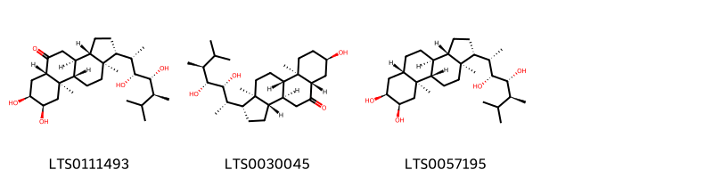{ width=100% }
    <figcaption>Hình ảnh cấu trúc hóa học của 3 hoạt chất thuộc nhóm Steroids and steroid derivatives gồm ['castasterone (LTS0111493)', 'typhasterol (LTS0030045)', '6-deoxocastasterone (LTS0057195)'].</figcaption>
</figure>

---

### Dược dân tộc học

Danh sách các quốc gia có sử dụng *Robinia pseudoacacia* trong điều trị các bệnh. 

| Country   | Disease   | Bệnh                                                                                                                                                                                                |
|:----------|:----------|:----------------------------------------------------------------------------------------------------------------------------------------------------------------------------------------------------|
| US        | Poison    | MYMEMORY WARNING: YOU USED ALL AVAILABLE FREE TRANSLATIONS FOR TODAY. NEXT AVAILABLE IN  15 HOURS 21 MINUTES 04 SECONDS VISIT HTTPS://MYMEMORY.TRANSLATED.NET/DOC/USAGELIMITS.PHP TO TRANSLATE MORE |

---

---
## Robinia pseudoacacia
### Thông tin về thực vật

!!! info "Phân loại thực vật của *Robinia pseudoacacia* từ GIBF:"
    - **Kingdom:** Plantae
    - **Phylum:** Tracheophyta
    - **Order:** Fabales
    - **Family:** Fabaceae
    - **Genus:** Robinia
    - **Species:** *Robinia pseudoacacia*

 

| Label (VI)   | Label (EN)   | Scientific Name      | Descriptions (VI)   | Descriptions (EN)                   | Also Known As (VI)                    | Also Known As (EN)               |
|:-------------|:-------------|:---------------------|:--------------------|:------------------------------------|:--------------------------------------|:---------------------------------|
| N/A          | N/A          | Robinia pseudoacacia | loài thực vật       | species of poisonous deciduous tree | ['Robinia pseudoacacia', 'Dương hoè'] | ['black locust', 'false acacia'] |

#### Phân bố trên thế giới

**Từ CSDL GIBF** Italy, Australia, Belgium, Argentina, Canada, Ukraine, Denmark, Netherlands, Spain, Hungary, Russian Federation, United States of America, Sweden, Chile, South Africa, Germany, Switzerland, Austria, France, China, Serbia, Poland, New Zealand

#### Phân bố tại Việt Nam

**Từ CSDL GIBF**: Không có ghi nhận ở Việt Nam

---
### Thành phần hóa học
        
- Theo cơ sở dữ liệu lotus: Từ loài *Robinia pseudoacacia* đã phân lập và xác định được 84 hoạt chất thuộc về các nhóm Flavonoids, Prenol lipids, Steroids and steroid derivatives, Isoflavonoids, Linear 1,3-diarylpropanoids, Benzofurans, Benzene and substituted derivatives, Organooxygen compounds, Carboxylic acids and derivatives. 

|    | chemicalTaxonomyClassyfireClass     |   smiles_count |
|---:|:------------------------------------|---------------:|
|  0 | Benzene and substituted derivatives |              5 |
|  1 | Benzofurans                         |              2 |
|  2 | Carboxylic acids and derivatives    |              3 |
|  3 | Flavonoids                          |             27 |
|  4 | Isoflavonoids                       |              4 |
|  5 | Linear 1,3-diarylpropanoids         |              6 |
|  6 | Organooxygen compounds              |              4 |
|  7 | Prenol lipids                       |             29 |
|  8 | Steroids and steroid derivatives    |              3 |

#### Nhóm Benzene and substituted derivatives
<figure markdown="span">
    { width=100% }
    <figcaption>Hình ảnh cấu trúc hóa học của 5 hoạt chất thuộc nhóm Benzene and substituted derivatives gồm ['2-phenyl-ethanol (LTS0206341)', 'benzaldehyde (LTS0094193)', 'anisaldehyde (LTS0054560)', '2-aminobenzaldehyde (LTS0246832)', 'benzyl alcohol (LTS0125638)'].</figcaption>
</figure>
#### Nhóm Benzofurans
<figure markdown="span">
    { width=100% }
    <figcaption>Hình ảnh cấu trúc hóa học của 2 hoạt chất thuộc nhóm Benzofurans gồm ['1-[(1r)-10,13,13-tris(5-acetyl-6-hydroxy-1-benzofuran-2-yl)-5-hydroxy-8-oxatricyclo[7.4.0.0²,⁷]trideca-2(7),3,5,9-tetraen-4-yl]ethanone (LTS0154755)', '(�)-laetirobin (LTS0239027)'].</figcaption>
</figure>
#### Nhóm Carboxylic acids and derivatives
<figure markdown="span">
    { width=100% }
    <figcaption>Hình ảnh cấu trúc hóa học của 3 hoạt chất thuộc nhóm Carboxylic acids and derivatives gồm ['5-(6-{[(4-carboxy-3-hydroxy-3-methylbutanoyl)oxy]methyl}-1-hydroxy-6-methyl-4-oxocyclohex-2-en-1-yl)-3-methylpenta-2,4-dienoic acid (LTS0150337)', '(l)-canavanine (LTS0093855)', '(2z,4e)-5-[(1r,6r)-6-({[(3s)-4-carboxy-3-hydroxy-3-methylbutanoyl]oxy}methyl)-1-hydroxy-6-methyl-4-oxocyclohex-2-en-1-yl]-3-methylpenta-2,4-dienoic acid (LTS0020056)'].</figcaption>
</figure>
#### Nhóm Flavonoids
<figure markdown="span">
    { width=100% }
    <figcaption>Hình ảnh cấu trúc hóa học của 27 hoạt chất thuộc nhóm Flavonoids gồm ['(2s,3s,4s,5r,6r)-6-{[(2s,3r,4s,5s,6r)-4,5-dihydroxy-2-{[5-hydroxy-2-(4-methoxyphenyl)-4-oxochromen-7-yl]oxy}-6-({[(2r,3r,4r,5r,6s)-3,4,5-trihydroxy-6-methyloxan-2-yl]oxy}methyl)oxan-3-yl]oxy}-3,4,5-trihydroxyoxane-2-carboxylic acid (LTS0217204)', '6-[(2-{[2-(3,4-dihydroxyphenyl)-5-hydroxy-4-oxochromen-7-yl]oxy}-4,5-dihydroxy-6-{[(3,4,5-trihydroxy-6-methyloxan-2-yl)oxy]methyl}oxan-3-yl)oxy]-3,4,5-trihydroxyoxane-2-carboxylic acid (LTS0100520)', 'linarin (LTS0160284)', '7-{[(2s,3r,4s,5s,6r)-4,5-dihydroxy-3-{[(2s,3r,4s,5s,6r)-3,4,5-trihydroxy-6-(hydroxymethyl)oxan-2-yl]oxy}-6-({[(2r,3r,4r,5r,6s)-3,4,5-trihydroxy-6-methyloxan-2-yl]oxy}methyl)oxan-2-yl]oxy}-5-hydroxy-2-(4-methoxyphenyl)chromen-4-one (LTS0191322)', '(2s)-7-hydroxy-2-(3,4,5-trihydroxyphenyl)-2,3-dihydro-1-benzopyran-4-one (LTS0146633)', '6-[(4,5-dihydroxy-2-{[5-hydroxy-2-(3-hydroxy-4-methoxyphenyl)-4-oxochromen-7-yl]oxy}-6-{[(3,4,5-trihydroxy-6-methyloxan-2-yl)oxy]methyl}oxan-3-yl)oxy]-3,4,5-trihydroxyoxane-2-carboxylic acid (LTS0143648)', 'robinetin (LTS0171492)', '7-[(4,5-dihydroxy-6-{[(3,4,5-trihydroxy-6-methyloxan-2-yl)oxy]methyl}-3-[(3,4,5-trihydroxyoxan-2-yl)oxy]oxan-2-yl)oxy]-5-hydroxy-2-(4-methoxyphenyl)chromen-4-one (LTS0110385)', 'fustin (LTS0228197)', '7-{[(2s,3r,4s,5s,6r)-4,5-dihydroxy-6-({[(2r,3r,4r,5r,6s)-3,4,5-trihydroxy-6-methyloxan-2-yl]oxy}methyl)-3-{[(2s,3r,4s,5r)-3,4,5-trihydroxyoxan-2-yl]oxy}oxan-2-yl]oxy}-5-hydroxy-2-(4-methoxyphenyl)chromen-4-one (LTS0182991)', '7-[(4,5-dihydroxy-3-{[3,4,5-trihydroxy-6-(hydroxymethyl)oxan-2-yl]oxy}-6-{[(3,4,5-trihydroxy-6-methyloxan-2-yl)oxy]methyl}oxan-2-yl)oxy]-5-hydroxy-2-(4-methoxyphenyl)chromen-4-one (LTS0136573)', '(2r,3r)-3,7-dihydroxy-2-(3,4,5-trihydroxyphenyl)-2,3-dihydro-1-benzopyran-4-one (LTS0109035)', '(2s,3s,4s,5r,6r)-6-{[(2s,3r,4s,5s,6r)-4,5-dihydroxy-2-{[5-hydroxy-2-(3-hydroxy-4-methoxyphenyl)-4-oxochromen-7-yl]oxy}-6-({[(2r,3r,4r,5r,6s)-3,4,5-trihydroxy-6-methyloxan-2-yl]oxy}methyl)oxan-3-yl]oxy}-3,4,5-trihydroxyoxane-2-carboxylic acid (LTS0059289)', '(2s,3r)-3,7-dihydroxy-2-(3,4,5-trihydroxyphenyl)-2,3-dihydro-1-benzopyran-4-one (LTS0197441)', '6-[(4,5-dihydroxy-2-{[5-hydroxy-2-(4-methoxyphenyl)-4-oxochromen-7-yl]oxy}-6-{[(3,4,5-trihydroxy-6-methyloxan-2-yl)oxy]methyl}oxan-3-yl)oxy]-3,4,5-trihydroxyoxane-2-carboxylic acid (LTS0042026)', 'acacetin (LTS0020151)', '3-[(3,4-dihydroxy-5-{1-hydroxy-2-[(3,4,5-trihydroxy-6-methyloxan-2-yl)oxy]ethyl}oxolan-2-yl)oxy]-2-(3,4-dihydroxyphenyl)-5,7-dihydroxychromen-4-one (LTS0227312)', '3,7-dihydroxy-2-(3,4,5-trihydroxyphenyl)-2,3-dihydro-1-benzopyran-4-one (LTS0189866)', '6-[(4,5-dihydroxy-2-{[5-hydroxy-2-(4-hydroxyphenyl)-4-oxochromen-7-yl]oxy}-6-{[(3,4,5-trihydroxy-6-methyloxan-2-yl)oxy]methyl}oxan-3-yl)oxy]-3,4,5-trihydroxyoxane-2-carboxylic acid (LTS0059919)', "3,7,4'-trihydroxyflavone (LTS0011409)", 'butin (LTS0039798)', '7-hydroxy-2-(3,4,5-trihydroxyphenyl)-2,3-dihydro-1-benzopyran-4-one (LTS0057816)', '3-{[(2s,3s,4s,5r)-3,4-dihydroxy-5-[(1r)-1-hydroxy-2-{[(2s,3s,4s,5s,6r)-3,4,5-trihydroxy-6-methyloxan-2-yl]oxy}ethyl]oxolan-2-yl]oxy}-2-(3,4-dihydroxyphenyl)-5,7-dihydroxychromen-4-one (LTS0122814)', '(2s,3s,4s,5r,6r)-6-{[(2s,3r,4s,5s,6r)-2-{[2-(3,4-dihydroxyphenyl)-5-hydroxy-4-oxochromen-7-yl]oxy}-4,5-dihydroxy-6-({[(2r,3r,4r,5r,6s)-3,4,5-trihydroxy-6-methyloxan-2-yl]oxy}methyl)oxan-3-yl]oxy}-3,4,5-trihydroxyoxane-2-carboxylic acid (LTS0123675)', '(2s,3s,4s,5r,6r)-6-{[(2s,3r,4s,5s,6r)-4,5-dihydroxy-2-{[5-hydroxy-2-(4-hydroxyphenyl)-4-oxochromen-7-yl]oxy}-6-({[(2r,3r,4r,5r,6s)-3,4,5-trihydroxy-6-methyloxan-2-yl]oxy}methyl)oxan-3-yl]oxy}-3,4,5-trihydroxyoxane-2-carboxylic acid (LTS0080071)', '3-{[(2s,3r,4s,5s)-3,4-dihydroxy-5-[(1r)-1-hydroxy-2-{[(2s,3s,4s,5r,6s)-3,4,5-trihydroxy-6-methyloxan-2-yl]oxy}ethyl]oxolan-2-yl]oxy}-2-(3,4-dihydroxyphenyl)-5,7-dihydroxychromen-4-one (LTS0031668)', '5-deoxyflavanone (LTS0251224)'].</figcaption>
</figure>
#### Nhóm Isoflavonoids
<figure markdown="span">
    { width=100% }
    <figcaption>Hình ảnh cấu trúc hóa học của 4 hoạt chất thuộc nhóm Isoflavonoids gồm ['isomucronulatol (LTS0200115)', 'isovestitol (LTS0152154)', '(1r,10r)-13,14-dimethoxy-8,17-dioxatetracyclo[8.7.0.0²,⁷.0¹¹,¹⁶]heptadeca-2,4,6,11(16),12,14-hexaen-5-ol (LTS0013005)', '(-)-mucronulatol (LTS0022356)'].</figcaption>
</figure>
#### Nhóm Linear 1_3-diarylpropanoids
<figure markdown="span">
    { width=100% }
    <figcaption>Hình ảnh cấu trúc hóa học của Không tìm thấy chú thích hoạt chất thuộc nhóm Linear 1_3-diarylpropanoids gồm Không tìm thấy chú thích.</figcaption>
</figure>
#### Nhóm Organooxygen compounds
<figure markdown="span">
    { width=100% }
    <figcaption>Hình ảnh cấu trúc hóa học của 4 hoạt chất thuộc nhóm Organooxygen compounds gồm ['6-hydroxy-3-(2-hydroxyethyl)-2,4,4-trimethylcyclohex-2-en-1-one (LTS0121975)', 'hexenal (LTS0188586)', '(e)-2-hexenal (LTS0207868)', '(6r)-6-hydroxy-3-(2-hydroxyethyl)-2,4,4-trimethylcyclohex-2-en-1-one (LTS0026029)'].</figcaption>
</figure>
#### Nhóm Prenol lipids
<figure markdown="span">
    { width=100% }
    <figcaption>Hình ảnh cấu trúc hóa học của 29 hoạt chất thuộc nhóm Prenol lipids gồm ['terpineol (LTS0136148)', 'methyl (2s,3s,4s,5r,6r)-6-{[(3s,4s,4ar,6ar,6bs,8ar,9r,11s,12as,14ar,14br)-4,11-bis(hydroxymethyl)-4,6a,6b,8a,11,14b-hexamethyl-9-{[(2r,3r,4r,5r,6s)-3,4,5-trihydroxy-6-methyloxan-2-yl]oxy}-1,2,3,4a,5,6,7,8,9,10,12,12a,14,14a-tetradecahydropicen-3-yl]oxy}-5-{[(2s,3r,4s,5s,6r)-4,5-dihydroxy-6-(hydroxymethyl)-3-{[(2s,3r,4r,5r,6s)-3,4,5-trihydroxy-6-methyloxan-2-yl]oxy}oxan-2-yl]oxy}-3,4-dihydroxyoxane-2-carboxylate (LTS0081595)', 'methyl (2s,3s,4s,5r,6r)-6-{[(3s,4s,4ar,6ar,6bs,8ar,9r,11s,12as,14ar,14br)-4-(hydroxymethyl)-11-(methoxycarbonyl)-4,6a,6b,8a,11,14b-hexamethyl-9-{[(2r,3r,4r,5r,6s)-3,4,5-trihydroxy-6-methyloxan-2-yl]oxy}-1,2,3,4a,5,6,7,8,9,10,12,12a,14,14a-tetradecahydropicen-3-yl]oxy}-5-{[(2s,3r,4s,5r,6r)-4,5-dihydroxy-6-(hydroxymethyl)-3-{[(2s,3r,4r,5r,6s)-3,4,5-trihydroxy-6-methyloxan-2-yl]oxy}oxan-2-yl]oxy}-3,4-dihydroxyoxane-2-carboxylate (LTS0136197)', 'methyl (2s,3s,4s,5r,6r)-6-{[(3s,4ar,6ar,6bs,8ar,9r,12as,14ar,14br)-9-hydroxy-4,4,6a,6b,8a,11,11,14b-octamethyl-1,2,3,4a,5,6,7,8,9,10,12,12a,14,14a-tetradecahydropicen-3-yl]oxy}-5-{[(2s,3r,4s,5r,6r)-4,5-dihydroxy-6-(hydroxymethyl)-3-{[(2s,3r,4r,5r,6s)-3,4,5-trihydroxy-6-methyloxan-2-yl]oxy}oxan-2-yl]oxy}-3,4-dihydroxyoxane-2-carboxylate (LTS0067755)', 'linalool, (+-)- (LTS0128839)', 'methyl (2s,3s,4s,5r,6r)-6-{[(3s,4s,4ar,6ar,6bs,8ar,9r,11r,12as,14ar,14br)-11-({[(2r,3r,4s,5s,6r)-6-({[(2r,3r,4r)-3,4-dihydroxy-4-(hydroxymethyl)oxolan-2-yl]oxy}methyl)-3,4,5-trihydroxyoxan-2-yl]oxy}methyl)-9-hydroxy-4-(hydroxymethyl)-4,6a,6b,8a,11,14b-hexamethyl-1,2,3,4a,5,6,7,8,9,10,12,12a,14,14a-tetradecahydropicen-3-yl]oxy}-5-{[(2s,3r,4s,5s,6r)-4,5-dihydroxy-6-(hydroxymethyl)-3-{[(2s,3r,4r,5r,6s)-3,4,5-trihydroxy-6-methyloxan-2-yl]oxy}oxan-2-yl]oxy}-3,4-dihydroxyoxane-2-carboxylate (LTS0104748)', 'methyl (2s,3s,4s,5r,6r)-6-{[(3s,4s,4ar,6ar,6bs,8ar,9r,11s,12as,14ar,14br)-9-hydroxy-4,11-bis(hydroxymethyl)-4,6a,6b,8a,11,14b-hexamethyl-1,2,3,4a,5,6,7,8,9,10,12,12a,14,14a-tetradecahydropicen-3-yl]oxy}-5-{[(2s,3r,4s,5r,6r)-4,5-dihydroxy-6-(hydroxymethyl)-3-{[(2s,3r,4r,5r,6s)-3,4,5-trihydroxy-6-methyloxan-2-yl]oxy}oxan-2-yl]oxy}-3,4-dihydroxyoxane-2-carboxylate (LTS0053845)', 'α pinene (LTS0132416)', 'methyl 5-{[4,5-dihydroxy-6-(hydroxymethyl)-3-[(3,4,5-trihydroxy-6-methyloxan-2-yl)oxy]oxan-2-yl]oxy}-3,4-dihydroxy-6-{[9-hydroxy-4-(hydroxymethyl)-11-(methoxycarbonyl)-4,6a,6b,8a,11,14b-hexamethyl-1,2,3,4a,5,6,7,8,9,10,12,12a,14,14a-tetradecahydropicen-3-yl]oxy}oxane-2-carboxylate (LTS0184094)', 'methyl (2s,3s,4s,5r,6r)-6-{[(3s,4ar,6ar,6bs,8ar,9r,11r,12as,14ar,14br)-9-hydroxy-11-(methoxycarbonyl)-4,4,6a,6b,8a,11,14b-heptamethyl-1,2,3,4a,5,6,7,8,9,10,12,12a,14,14a-tetradecahydropicen-3-yl]oxy}-5-{[(2s,3r,4s,5s,6r)-4,5-dihydroxy-6-(hydroxymethyl)-3-{[(2s,3r,4r,5r,6s)-3,4,5-trihydroxy-6-methyloxan-2-yl]oxy}oxan-2-yl]oxy}-3,4-dihydroxyoxane-2-carboxylate (LTS0142623)', 'methyl (2s,3s,4s,5r,6r)-6-{[(3s,4s,4ar,6ar,6bs,8ar,9r,11r,12as,14ar,14br)-9-hydroxy-4-(hydroxymethyl)-11-(methoxycarbonyl)-4,6a,6b,8a,11,14b-hexamethyl-1,2,3,4a,5,6,7,8,9,10,12,12a,14,14a-tetradecahydropicen-3-yl]oxy}-5-{[(2s,3r,4s,5s,6r)-4,5-dihydroxy-6-(hydroxymethyl)-3-{[(2s,3r,4r,5r,6s)-3,4,5-trihydroxy-6-methyloxan-2-yl]oxy}oxan-2-yl]oxy}-3,4-dihydroxyoxane-2-carboxylate (LTS0140151)', 'methyl (2s,3s,4s,5r,6r)-6-{[(3s,4s,4ar,6ar,6bs,8ar,9r,11s,12as,14ar,14br)-9-hydroxy-4-(hydroxymethyl)-11-(methoxycarbonyl)-4,6a,6b,8a,11,14b-hexamethyl-1,2,3,4a,5,6,7,8,9,10,12,12a,14,14a-tetradecahydropicen-3-yl]oxy}-5-{[(2s,3r,4s,5r,6r)-4,5-dihydroxy-6-(hydroxymethyl)-3-{[(2s,3r,4r,5r,6s)-3,4,5-trihydroxy-6-methyloxan-2-yl]oxy}oxan-2-yl]oxy}-3,4-dihydroxyoxane-2-carboxylate (LTS0197684)', 'limonene,  (LTS0155981)', 'methyl 6-{[11-({[6-({[3,4-dihydroxy-4-(hydroxymethyl)oxolan-2-yl]oxy}methyl)-3,4,5-trihydroxyoxan-2-yl]oxy}methyl)-9-hydroxy-4-(hydroxymethyl)-4,6a,6b,8a,11,14b-hexamethyl-1,2,3,4a,5,6,7,8,9,10,12,12a,14,14a-tetradecahydropicen-3-yl]oxy}-5-{[4,5-dihydroxy-6-(hydroxymethyl)-3-[(3,4,5-trihydroxy-6-methyloxan-2-yl)oxy]oxan-2-yl]oxy}-3,4-dihydroxyoxane-2-carboxylate (LTS0141615)', 'methyl 5-{[4,5-dihydroxy-6-(hydroxymethyl)-3-[(3,4,5-trihydroxy-6-methyloxan-2-yl)oxy]oxan-2-yl]oxy}-3,4-dihydroxy-6-[(9-hydroxy-4,4,6a,6b,8a,11,11,14b-octamethyl-1,2,3,4a,5,6,7,8,9,10,12,12a,14,14a-tetradecahydropicen-3-yl)oxy]oxane-2-carboxylate (LTS0119289)', 'methyl (2s,3s,4s,5r,6r)-6-{[(3s,4ar,6ar,6bs,8ar,9r,11s,12as,14ar,14br)-9-hydroxy-11-(methoxycarbonyl)-4,4,6a,6b,8a,11,14b-heptamethyl-1,2,3,4a,5,6,7,8,9,10,12,12a,14,14a-tetradecahydropicen-3-yl]oxy}-5-{[(2s,3r,4s,5r,6r)-4,5-dihydroxy-6-(hydroxymethyl)-3-{[(2s,3r,4r,5r,6s)-3,4,5-trihydroxy-6-methyloxan-2-yl]oxy}oxan-2-yl]oxy}-3,4-dihydroxyoxane-2-carboxylate (LTS0266757)', 'methyl (2s,3s,4s,5r,6r)-6-{[(3s,4s,4ar,6ar,6bs,8ar,9r,11r,12as,14ar,14br)-11-({[(2r,3r,4s,5s,6r)-6-({[(2r,3r,4r)-3,4-dihydroxy-4-(hydroxymethyl)oxolan-2-yl]oxy}methyl)-3,4,5-trihydroxyoxan-2-yl]oxy}methyl)-9-hydroxy-4-(hydroxymethyl)-4,6a,6b,8a,11,14b-hexamethyl-1,2,3,4a,5,6,7,8,9,10,12,12a,14,14a-tetradecahydropicen-3-yl]oxy}-5-{[(2s,3r,4s,5r,6r)-4,5-dihydroxy-6-(hydroxymethyl)-3-{[(2s,3r,4r,5r,6s)-3,4,5-trihydroxy-6-methyloxan-2-yl]oxy}oxan-2-yl]oxy}-3,4-dihydroxyoxane-2-carboxylate (LTS0266120)', 'abscisic acid (LTS0200774)', 'methyl 5-{[4,5-dihydroxy-6-(hydroxymethyl)-3-[(3,4,5-trihydroxy-6-methyloxan-2-yl)oxy]oxan-2-yl]oxy}-3,4-dihydroxy-6-{[4-(hydroxymethyl)-11-(methoxycarbonyl)-4,6a,6b,8a,11,14b-hexamethyl-9-[(3,4,5-trihydroxy-6-methyloxan-2-yl)oxy]-1,2,3,4a,5,6,7,8,9,10,12,12a,14,14a-tetradecahydropicen-3-yl]oxy}oxane-2-carboxylate (LTS0228498)', 'geraniol (LTS0258838)', 'methyl (2s,3s,4s,5r,6r)-6-{[(3s,4s,4ar,6ar,6bs,8ar,9r,11s,12as,14ar,14br)-4,11-bis(hydroxymethyl)-4,6a,6b,8a,11,14b-hexamethyl-9-{[(2r,3r,4r,5r,6s)-3,4,5-trihydroxy-6-methyloxan-2-yl]oxy}-1,2,3,4a,5,6,7,8,9,10,12,12a,14,14a-tetradecahydropicen-3-yl]oxy}-5-{[(2s,3r,4s,5r,6r)-4,5-dihydroxy-6-(hydroxymethyl)-3-{[(2s,3r,4r,5r,6s)-3,4,5-trihydroxy-6-methyloxan-2-yl]oxy}oxan-2-yl]oxy}-3,4-dihydroxyoxane-2-carboxylate (LTS0062894)', 'methyl 6-{[4,11-bis(hydroxymethyl)-4,6a,6b,8a,11,14b-hexamethyl-9-[(3,4,5-trihydroxy-6-methyloxan-2-yl)oxy]-1,2,3,4a,5,6,7,8,9,10,12,12a,14,14a-tetradecahydropicen-3-yl]oxy}-5-{[4,5-dihydroxy-6-(hydroxymethyl)-3-[(3,4,5-trihydroxy-6-methyloxan-2-yl)oxy]oxan-2-yl]oxy}-3,4-dihydroxyoxane-2-carboxylate (LTS0000845)', 'methyl 5-{[4,5-dihydroxy-6-(hydroxymethyl)-3-[(3,4,5-trihydroxy-6-methyloxan-2-yl)oxy]oxan-2-yl]oxy}-3,4-dihydroxy-6-{[9-hydroxy-4,11-bis(hydroxymethyl)-4,6a,6b,8a,11,14b-hexamethyl-1,2,3,4a,5,6,7,8,9,10,12,12a,14,14a-tetradecahydropicen-3-yl]oxy}oxane-2-carboxylate (LTS0004879)', 'nerol (LTS0244289)', 'methyl (2s,3s,4s,5r,6r)-6-{[(3s,4s,4ar,6ar,6bs,8ar,9r,11s,12as,14ar,14br)-4-(hydroxymethyl)-11-(methoxycarbonyl)-4,6a,6b,8a,11,14b-hexamethyl-9-{[(2r,3r,4r,5r,6s)-3,4,5-trihydroxy-6-methyloxan-2-yl]oxy}-1,2,3,4a,5,6,7,8,9,10,12,12a,14,14a-tetradecahydropicen-3-yl]oxy}-5-{[(2s,3r,4s,5s,6r)-4,5-dihydroxy-6-(hydroxymethyl)-3-{[(2s,3r,4r,5r,6s)-3,4,5-trihydroxy-6-methyloxan-2-yl]oxy}oxan-2-yl]oxy}-3,4-dihydroxyoxane-2-carboxylate (LTS0108435)', 'citronellol, (+-)- (LTS0090925)', 'methyl (2s,3s,4s,5r,6r)-6-{[(3s,4s,4ar,6ar,6bs,8ar,9r,11s,12as,14ar,14br)-9-hydroxy-4,11-bis(hydroxymethyl)-4,6a,6b,8a,11,14b-hexamethyl-1,2,3,4a,5,6,7,8,9,10,12,12a,14,14a-tetradecahydropicen-3-yl]oxy}-5-{[(2s,3r,4s,5s,6r)-4,5-dihydroxy-6-(hydroxymethyl)-3-{[(2s,3r,4r,5r,6s)-3,4,5-trihydroxy-6-methyloxan-2-yl]oxy}oxan-2-yl]oxy}-3,4-dihydroxyoxane-2-carboxylate (LTS0027627)', 'methyl 5-{[4,5-dihydroxy-6-(hydroxymethyl)-3-[(3,4,5-trihydroxy-6-methyloxan-2-yl)oxy]oxan-2-yl]oxy}-3,4-dihydroxy-6-{[9-hydroxy-11-(methoxycarbonyl)-4,4,6a,6b,8a,11,14b-heptamethyl-1,2,3,4a,5,6,7,8,9,10,12,12a,14,14a-tetradecahydropicen-3-yl]oxy}oxane-2-carboxylate (LTS0255889)', '5-(1-hydroxy-2,6,6-trimethyl-4-oxocyclohex-2-en-1-yl)-3-methylpenta-2,4-dienoic acid (LTS0021517)'].</figcaption>
</figure>
#### Nhóm Steroids and steroid derivatives
<figure markdown="span">
    { width=100% }
    <figcaption>Hình ảnh cấu trúc hóa học của 3 hoạt chất thuộc nhóm Steroids and steroid derivatives gồm ['castasterone (LTS0111493)', 'typhasterol (LTS0030045)', '6-deoxocastasterone (LTS0057195)'].</figcaption>
</figure>

---

### Dược dân tộc học

Danh sách các quốc gia có sử dụng *Robinia pseudoacacia* trong điều trị các bệnh. 

| Country   | Disease                                                                          | Bệnh                                                                                                                                                                                                |
|:----------|:---------------------------------------------------------------------------------|:----------------------------------------------------------------------------------------------------------------------------------------------------------------------------------------------------|
| Elsewhere | Diuretic, Emetic, Poison, Purgative, Laxative, Protisticide, nan, Emollient      | MYMEMORY WARNING: YOU USED ALL AVAILABLE FREE TRANSLATIONS FOR TODAY. NEXT AVAILABLE IN  15 HOURS 20 MINUTES 20 SECONDS VISIT HTTPS://MYMEMORY.TRANSLATED.NET/DOC/USAGELIMITS.PHP TO TRANSLATE MORE |
| Iraq      | Sedative                                                                         | MYMEMORY WARNING: YOU USED ALL AVAILABLE FREE TRANSLATIONS FOR TODAY. NEXT AVAILABLE IN  15 HOURS 20 MINUTES 17 SECONDS VISIT HTTPS://MYMEMORY.TRANSLATED.NET/DOC/USAGELIMITS.PHP TO TRANSLATE MORE |
| Turkey    | Cholagogue, Emollient, Purgative, Astringent, Poison, Emetic, Laxative, Sedative | MYMEMORY WARNING: YOU USED ALL AVAILABLE FREE TRANSLATIONS FOR TODAY. NEXT AVAILABLE IN  15 HOURS 20 MINUTES 14 SECONDS VISIT HTTPS://MYMEMORY.TRANSLATED.NET/DOC/USAGELIMITS.PHP TO TRANSLATE MORE |
| US        | Emetic, Poison, Purgative, Tonic                                                 | MYMEMORY WARNING: YOU USED ALL AVAILABLE FREE TRANSLATIONS FOR TODAY. NEXT AVAILABLE IN  15 HOURS 20 MINUTES 11 SECONDS VISIT HTTPS://MYMEMORY.TRANSLATED.NET/DOC/USAGELIMITS.PHP TO TRANSLATE MORE |

---

# Chi Sarothamnus

??? note "Danh sách các dược liệu thuộc chi"
    
	 - *Sarothamnus scoparius*

---
## Sarothamnus scoparius
### Thông tin về thực vật

!!! info "Phân loại thực vật của *Cytisus scoparius* từ GIBF:"
    - **Kingdom:** Plantae
    - **Phylum:** Tracheophyta
    - **Order:** Fabales
    - **Family:** Fabaceae
    - **Genus:** Cytisus
    - **Species:** *Cytisus scoparius*

 

| Label (VI)   | Label (EN)   | Scientific Name       | Descriptions (VI)   | Descriptions (EN)   | Also Known As (VI)   | Also Known As (EN)   |
|:-------------|:-------------|:----------------------|:--------------------|:--------------------|:---------------------|:---------------------|
| N/A          | N/A          | Sarothamnus scoparius | loài thực vật       | species of plant    | ['']                 | ['']                 |

#### Phân bố trên thế giới

**Từ CSDL GIBF** Italy, Australia, Belgium, Argentina, Canada, Ukraine, Denmark, Netherlands, Spain, Hungary, Russian Federation, United States of America, Sweden, Chile, South Africa, Germany, Switzerland, Austria, France, China, Serbia, Poland, New Zealand

#### Phân bố tại Việt Nam

**Từ CSDL GIBF**: Không có ghi nhận ở Việt Nam

---
### Thành phần hóa học
        
- Theo cơ sở dữ liệu lotus: Từ loài *Cytisus scoparius* đã phân lập và xác định được Chưa có hoạt chất nào được phân lập. hoạt chất thuộc về các nhóm Không có hoạt chất nào được phân lập. 

Không có hình ảnh nào được tạo ra

---

### Dược dân tộc học

Danh sách các quốc gia có sử dụng *Cytisus scoparius* trong điều trị các bệnh. 

| Country   | Disease                      | Bệnh                                                                                                                                                                                                |
|:----------|:-----------------------------|:----------------------------------------------------------------------------------------------------------------------------------------------------------------------------------------------------|
| Europe    | Cardiotonic, Tonic, Diuretic | MYMEMORY WARNING: YOU USED ALL AVAILABLE FREE TRANSLATIONS FOR TODAY. NEXT AVAILABLE IN  15 HOURS 19 MINUTES 36 SECONDS VISIT HTTPS://MYMEMORY.TRANSLATED.NET/DOC/USAGELIMITS.PHP TO TRANSLATE MORE |
| ain       | Diuretic                     | MYMEMORY WARNING: YOU USED ALL AVAILABLE FREE TRANSLATIONS FOR TODAY. NEXT AVAILABLE IN  15 HOURS 19 MINUTES 33 SECONDS VISIT HTTPS://MYMEMORY.TRANSLATED.NET/DOC/USAGELIMITS.PHP TO TRANSLATE MORE |

---

# Chi Cytisus

??? note "Danh sách các dược liệu thuộc chi"
    
	 - *Cytisus laburnum*
	 - *Cytisus purgans*
	 - *Cytisus scoparius*

---
## Cytisus laburnum
### Thông tin về thực vật

!!! info "Phân loại thực vật của *Laburnum anagyroides* từ GIBF:"
    - **Kingdom:** Plantae
    - **Phylum:** Tracheophyta
    - **Order:** Fabales
    - **Family:** Fabaceae
    - **Genus:** Laburnum
    - **Species:** *Laburnum anagyroides*

 

| Label (VI)   | Label (EN)   | Scientific Name   | Descriptions (VI)   | Descriptions (EN)   | Also Known As (VI)   | Also Known As (EN)   |
|:-------------|:-------------|:------------------|:--------------------|:--------------------|:---------------------|:---------------------|
| N/A          | N/A          | Cytisus laburnum  | loài thực vật       | species of plant    | ['']                 | ['']                 |

#### Phân bố trên thế giới

**Từ CSDL GIBF** nan, Ukraine, Italy, Germany, Belgium, Spain, unknown or invalid, United States of America, France

#### Phân bố tại Việt Nam

**Từ CSDL GIBF**: Không có ghi nhận ở Việt Nam

---
### Thành phần hóa học
        
- Theo cơ sở dữ liệu lotus: Từ loài *Laburnum anagyroides* đã phân lập và xác định được Chưa có hoạt chất nào được phân lập. hoạt chất thuộc về các nhóm Không có hoạt chất nào được phân lập. 

Không có hình ảnh nào được tạo ra

---

### Dược dân tộc học

Danh sách các quốc gia có sử dụng *Laburnum anagyroides* trong điều trị các bệnh. 

| Country   | Disease                               | Bệnh                                                                                                                                                                                                |
|:----------|:--------------------------------------|:----------------------------------------------------------------------------------------------------------------------------------------------------------------------------------------------------|
| Turkey    | Purgative, Cholagogue, Emetic, Poison | MYMEMORY WARNING: YOU USED ALL AVAILABLE FREE TRANSLATIONS FOR TODAY. NEXT AVAILABLE IN  15 HOURS 19 MINUTES 02 SECONDS VISIT HTTPS://MYMEMORY.TRANSLATED.NET/DOC/USAGELIMITS.PHP TO TRANSLATE MORE |

---

---
## Cytisus purgans
### Thông tin về thực vật

!!! info "Phân loại thực vật của *Genista scorpius* từ GIBF:"
    - **Kingdom:** Plantae
    - **Phylum:** Tracheophyta
    - **Order:** Fabales
    - **Family:** Fabaceae
    - **Genus:** Genista
    - **Species:** *Genista scorpius*

 

| Label (VI)   | Label (EN)   | Scientific Name   | Descriptions (VI)   | Descriptions (EN)   | Also Known As (VI)   | Also Known As (EN)   |
|:-------------|:-------------|:------------------|:--------------------|:--------------------|:---------------------|:---------------------|
| N/A          | N/A          | Cytisus purgans   | loài thực vật       | species of plant    | ['']                 | ['']                 |

#### Phân bố trên thế giới

**Từ CSDL GIBF** nan, Andorra, Netherlands, Germany, Afghanistan, Spain, Portugal, unknown or invalid, United States of America, Sweden, France

#### Phân bố tại Việt Nam

**Từ CSDL GIBF**: Không có ghi nhận ở Việt Nam

---
### Thành phần hóa học
        
- Theo cơ sở dữ liệu lotus: Từ loài *Genista scorpius* đã phân lập và xác định được Chưa có hoạt chất nào được phân lập. hoạt chất thuộc về các nhóm Không có hoạt chất nào được phân lập. 

Không có hình ảnh nào được tạo ra

---

### Dược dân tộc học

Danh sách các quốc gia có sử dụng *Genista scorpius* trong điều trị các bệnh. 

| Country   | Disease   | Bệnh                                                                                                                                                                                                |
|:----------|:----------|:----------------------------------------------------------------------------------------------------------------------------------------------------------------------------------------------------|
| ain       | Purgative | MYMEMORY WARNING: YOU USED ALL AVAILABLE FREE TRANSLATIONS FOR TODAY. NEXT AVAILABLE IN  15 HOURS 18 MINUTES 36 SECONDS VISIT HTTPS://MYMEMORY.TRANSLATED.NET/DOC/USAGELIMITS.PHP TO TRANSLATE MORE |

---

---
## Cytisus scoparius
### Thông tin về thực vật

!!! info "Phân loại thực vật của *Cytisus scoparius* từ GIBF:"
    - **Kingdom:** Plantae
    - **Phylum:** Tracheophyta
    - **Order:** Fabales
    - **Family:** Fabaceae
    - **Genus:** Cytisus
    - **Species:** *Cytisus scoparius*

 

| Label (VI)   | Label (EN)   | Scientific Name   | Descriptions (VI)   | Descriptions (EN)   | Also Known As (VI)   | Also Known As (EN)                                    |
|:-------------|:-------------|:------------------|:--------------------|:--------------------|:---------------------|:------------------------------------------------------|
| N/A          | N/A          | Cytisus scoparius | loài thực vật       | species of plant    | ['']                 | ['Common Broom', 'Broom', 'Scotch Broom (offensive)'] |

#### Phân bố trên thế giới

**Từ CSDL GIBF** Italy, Australia, Argentina, Canada, Ukraine, Denmark, Netherlands, Lithuania, Spain, Portugal, United States of America, Czechia, Germany, Austria, France, United Kingdom of Great Britain and Northern Ireland, Ireland, India, Poland, New Zealand

#### Phân bố tại Việt Nam

**Từ CSDL GIBF**: Không có ghi nhận ở Việt Nam

---
### Thành phần hóa học
        
- Theo cơ sở dữ liệu lotus: Từ loài *Cytisus scoparius* đã phân lập và xác định được 44 hoạt chất thuộc về các nhóm Quinolizidines, Prenol lipids, Isoflavonoids, Benzene and substituted derivatives, Lupin alkaloids, Organooxygen compounds, Pyridines and derivatives. 

|    | chemicalTaxonomyClassyfireClass     |   smiles_count |
|---:|:------------------------------------|---------------:|
|  0 | Benzene and substituted derivatives |              1 |
|  1 | Isoflavonoids                       |              2 |
|  2 | Lupin alkaloids                     |             29 |
|  3 | Organooxygen compounds              |              1 |
|  4 | Prenol lipids                       |              6 |
|  5 | Pyridines and derivatives           |              1 |
|  6 | Quinolizidines                      |              2 |

#### Nhóm Benzene and substituted derivatives
<figure markdown="span">
    { width=100% }
    <figcaption>Hình ảnh cấu trúc hóa học của 1 hoạt chất thuộc nhóm Benzene and substituted derivatives gồm ['tyramine (LTS0111335)'].</figcaption>
</figure>
#### Nhóm Isoflavonoids
<figure markdown="span">
    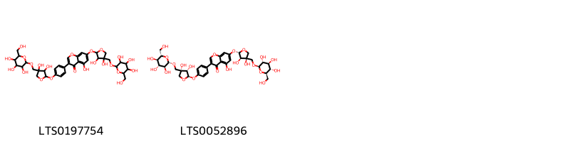{ width=100% }
    <figcaption>Hình ảnh cấu trúc hóa học của 2 hoạt chất thuộc nhóm Isoflavonoids gồm ['7-{[3,4-dihydroxy-4-({[3,4,5-trihydroxy-6-(hydroxymethyl)oxan-2-yl]oxy}methyl)oxolan-2-yl]oxy}-3-(4-{[3,4-dihydroxy-4-({[3,4,5-trihydroxy-6-(hydroxymethyl)oxan-2-yl]oxy}methyl)oxolan-2-yl]oxy}phenyl)-5-hydroxychromen-4-one (LTS0197754)', '7-{[(2s,3r,4r)-3,4-dihydroxy-4-({[(2r,3r,4s,5s,6r)-3,4,5-trihydroxy-6-(hydroxymethyl)oxan-2-yl]oxy}methyl)oxolan-2-yl]oxy}-3-(4-{[(2r,3s,4s)-3,4-dihydroxy-4-({[(2s,3s,4r,5r,6s)-3,4,5-trihydroxy-6-(hydroxymethyl)oxan-2-yl]oxy}methyl)oxolan-2-yl]oxy}phenyl)-5-hydroxychromen-4-one (LTS0052896)'].</figcaption>
</figure>
#### Nhóm Lupin alkaloids
<figure markdown="span">
    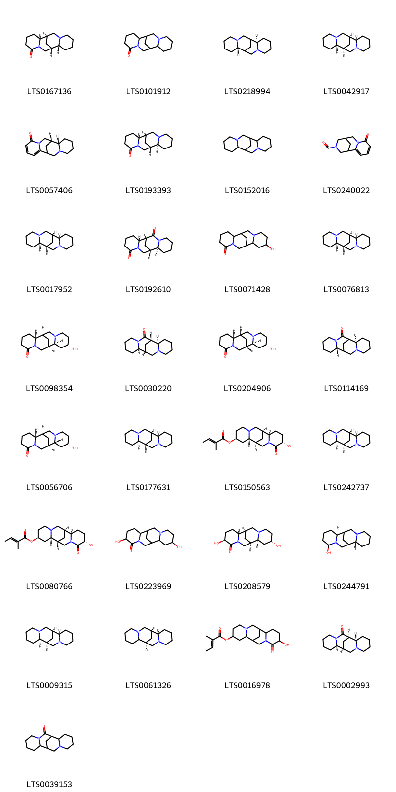{ width=100% }
    <figcaption>Hình ảnh cấu trúc hóa học của 29 hoạt chất thuộc nhóm Lupin alkaloids gồm ['(1r,2r,9s,10r)-7,15-diazatetracyclo[7.7.1.0²,⁷.0¹⁰,¹⁵]heptadecan-6-one (LTS0167136)', 'lupanine l-form (LTS0101912)', '(2r,10s)-7,15-diazatetracyclo[7.7.1.0²,⁷.0¹⁰,¹⁵]heptadecane (LTS0218994)', 'sparteine (LTS0042917)', '(9r,10s)-7,15-diazatetracyclo[7.7.1.0²,⁷.0¹⁰,¹⁵]heptadeca-2,4-dien-6-one (LTS0057406)', '(+)-lupanine (LTS0193393)', 'genisteine-alkaloid (LTS0152016)', '6-oxo-7,11-diazatricyclo[7.3.1.0²,⁷]trideca-2,4-diene-11-carbaldehyde (LTS0240022)', 'sparteine (LTS0017952)', '17-oxolupanine (LTS0192610)', '12-hydroxy-7,15-diazatetracyclo[7.7.1.0²,⁷.0¹⁰,¹⁵]heptadecan-6-one (LTS0071428)', '(1r,2s,9s,10r)-7,15-diazatetracyclo[7.7.1.0²,⁷.0¹⁰,¹⁵]heptadecane (LTS0076813)', '(1r,2r,9r,10s,12s)-12-hydroxy-7,15-diazatetracyclo[7.7.1.0²,⁷.0¹⁰,¹⁵]heptadecan-6-one (LTS0098354)', '(1r,2s,9s,10r)-7,15-diazatetracyclo[7.7.1.0²,⁷.0¹⁰,¹⁵]heptadecan-8-one (LTS0030220)', 'hydroxylupanine (LTS0204906)', '17-oxosparteine (LTS0114169)', '13-hydroxylupanine (LTS0056706)', '(1r,2r,9r,10r)-7,15-diazatetracyclo[7.7.1.0²,⁷.0¹⁰,¹⁵]heptadecane (LTS0177631)', '(1s,2s,4s,9s,10r,13s)-13-hydroxy-14-oxo-7,15-diazatetracyclo[7.7.1.0²,⁷.0¹⁰,¹⁵]heptadecan-4-yl (2e)-2-methylbut-2-enoate (LTS0150563)', '(1r,2r,9s,10r)-7,15-diazatetracyclo[7.7.1.0²,⁷.0¹⁰,¹⁵]heptadecane (LTS0242737)', '(1r,2s,4s,9s,10r,13s)-13-hydroxy-14-oxo-7,15-diazatetracyclo[7.7.1.0²,⁷.0¹⁰,¹⁵]heptadecan-4-yl (2e)-2-methylbut-2-enoate (LTS0080766)', '5,12-dihydroxy-7,15-diazatetracyclo[7.7.1.0²,⁷.0¹⁰,¹⁵]heptadecan-6-one (LTS0223969)', '(1r,2r,5s,9r,10s,12s)-5,12-dihydroxy-7,15-diazatetracyclo[7.7.1.0²,⁷.0¹⁰,¹⁵]heptadecan-6-one (LTS0208579)', '(2s,10r)-7,15-diazatetracyclo[7.7.1.0²,⁷.0¹⁰,¹⁵]heptadecan-6-ol (LTS0244791)', 'α-isosparteine (LTS0009315)', '(1r,2r,9s)-7,15-diazatetracyclo[7.7.1.0²,⁷.0¹⁰,¹⁵]heptadecane (LTS0061326)', '13-hydroxy-14-oxo-7,15-diazatetracyclo[7.7.1.0²,⁷.0¹⁰,¹⁵]heptadecan-4-yl 2-methylbut-2-enoate (LTS0016978)', '(1s,2r,9r,10s)-7,15-diazatetracyclo[7.7.1.0²,⁷.0¹⁰,¹⁵]heptadecan-8-one (LTS0002993)', 'lupanine (LTS0039153)'].</figcaption>
</figure>
#### Nhóm Organooxygen compounds
<figure markdown="span">
    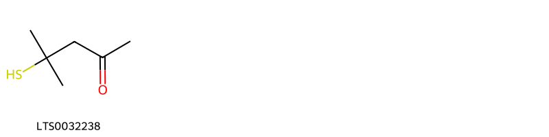{ width=100% }
    <figcaption>Hình ảnh cấu trúc hóa học của 1 hoạt chất thuộc nhóm Organooxygen compounds gồm ['4-methyl-4-sulfanylpentan-2-one (LTS0032238)'].</figcaption>
</figure>
#### Nhóm Prenol lipids
<figure markdown="span">
    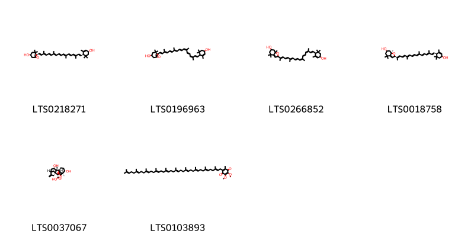{ width=100% }
    <figcaption>Hình ảnh cấu trúc hóa học của 6 hoạt chất thuộc nhóm Prenol lipids gồm ['taraxanthin (LTS0218271)', '6-[(1e,3e,5e,7e,9e)-18-(4-hydroxy-2,6,6-trimethylcyclohex-2-en-1-yl)-3,7,12,16-tetramethyloctadeca-1,3,5,7,9,11,13,15,17-nonaen-1-yl]-1,5,5-trimethyl-7-oxabicyclo[4.1.0]heptan-3-ol (LTS0196963)', '2-[(2e,4e,6e,8e)-17-(4-hydroxy-2,6,6-trimethylcyclohex-2-en-1-yl)-6,11,15-trimethylheptadeca-2,4,6,8,10,12,14,16-octaen-2-yl]-4,4,7a-trimethyl-2,5,6,7-tetrahydro-1-benzofuran-6-ol (LTS0266852)', '(2r,6r,7ar)-2-[(2e,4e,6e,8e,10e,12e,14e,16e)-17-[(1r,4s)-4-hydroxy-2,6,6-trimethylcyclohex-2-en-1-yl]-6,11,15-trimethylheptadeca-2,4,6,8,10,12,14,16-octaen-2-yl]-4,4,7a-trimethyl-2,5,6,7-tetrahydro-1-benzofuran-6-ol (LTS0018758)', '(1s,2s,3s,5s,8r,9s,10r,11s,12s)-3,12-dihydroxy-11-methyl-6-methylidene-16-oxo-15-oxapentacyclo[9.3.2.1⁵,⁸.0¹,¹⁰.0²,⁸]heptadecane-9-carboxylic acid (LTS0037067)', 'coenzyme q10 (LTS0103893)'].</figcaption>
</figure>
#### Nhóm Pyridines and derivatives
<figure markdown="span">
    { width=100% }
    <figcaption>Hình ảnh cấu trúc hóa học của 1 hoạt chất thuộc nhóm Pyridines and derivatives gồm ['ammodendrine (LTS0084410)'].</figcaption>
</figure>
#### Nhóm Quinolizidines
<figure markdown="span">
    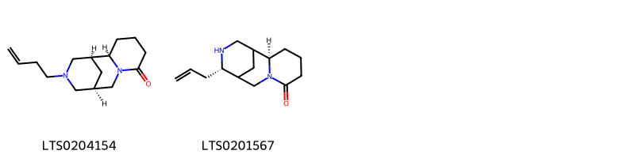{ width=100% }
    <figcaption>Hình ảnh cấu trúc hóa học của 2 hoạt chất thuộc nhóm Quinolizidines gồm ['(1s,2r,9r)-11-(but-3-en-1-yl)-7,11-diazatricyclo[7.3.1.0²,⁷]tridecan-6-one (LTS0204154)', 'angustifoline (LTS0201567)'].</figcaption>
</figure>

---

### Dược dân tộc học

Danh sách các quốc gia có sử dụng *Cytisus scoparius* trong điều trị các bệnh. 

| Country   | Disease                                                         | Bệnh                                                                                                                                                                                                |
|:----------|:----------------------------------------------------------------|:----------------------------------------------------------------------------------------------------------------------------------------------------------------------------------------------------|
| Elsewhere | Cardiotonic, Cardiotonic, Diuretic, Emetic, Diuretic, Purgative | MYMEMORY WARNING: YOU USED ALL AVAILABLE FREE TRANSLATIONS FOR TODAY. NEXT AVAILABLE IN  15 HOURS 18 MINUTES 06 SECONDS VISIT HTTPS://MYMEMORY.TRANSLATED.NET/DOC/USAGELIMITS.PHP TO TRANSLATE MORE |
| Turkey    | Diuretic, Poison, Purgative, Sedative, Vasoconstrictor          | MYMEMORY WARNING: YOU USED ALL AVAILABLE FREE TRANSLATIONS FOR TODAY. NEXT AVAILABLE IN  15 HOURS 18 MINUTES 01 SECONDS VISIT HTTPS://MYMEMORY.TRANSLATED.NET/DOC/USAGELIMITS.PHP TO TRANSLATE MORE |
| US        | Abortifacient, Poison                                           | MYMEMORY WARNING: YOU USED ALL AVAILABLE FREE TRANSLATIONS FOR TODAY. NEXT AVAILABLE IN  15 HOURS 17 MINUTES 57 SECONDS VISIT HTTPS://MYMEMORY.TRANSLATED.NET/DOC/USAGELIMITS.PHP TO TRANSLATE MORE |

---

# Chi Griffonia

??? note "Danh sách các dược liệu thuộc chi"
    
	 - *Griffonia simplicifolia*

---
## Griffonia simplicifolia
### Thông tin về thực vật

!!! info "Phân loại thực vật của *Griffonia simplicifolia* từ GIBF:"
    - **Kingdom:** Plantae
    - **Phylum:** Tracheophyta
    - **Order:** Fabales
    - **Family:** Fabaceae
    - **Genus:** Griffonia
    - **Species:** *Griffonia simplicifolia*

 

| Label (VI)   | Label (EN)   | Scientific Name         | Descriptions (VI)   | Descriptions (EN)   | Also Known As (VI)   | Also Known As (EN)   |
|:-------------|:-------------|:------------------------|:--------------------|:--------------------|:---------------------|:---------------------|
| N/A          | N/A          | Griffonia simplicifolia | loài thực vật       | species of plant    | ['']                 | ['']                 |

#### Phân bố trên thế giới

**Từ CSDL GIBF** Ghana, Senegal, Nigeria, Côte d’Ivoire, Benin, Liberia, Togo

#### Phân bố tại Việt Nam

**Từ CSDL GIBF**: Không có ghi nhận ở Việt Nam

---
### Thành phần hóa học
        
- Theo cơ sở dữ liệu lotus: Từ loài *Griffonia simplicifolia* đã phân lập và xác định được 3 hoạt chất thuộc về các nhóm Indoles and derivatives. 

|    | chemicalTaxonomyClassyfireClass   |   smiles_count |
|---:|:----------------------------------|---------------:|
|  0 | Indoles and derivatives           |              3 |

#### Nhóm Indoles and derivatives
<figure markdown="span">
    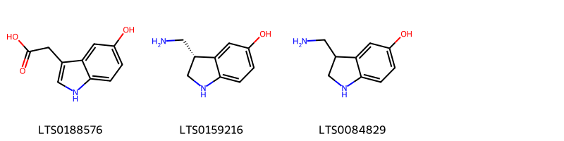{ width=100% }
    <figcaption>Hình ảnh cấu trúc hóa học của 3 hoạt chất thuộc nhóm Indoles and derivatives gồm ['hydroxyindoleacetic acid (LTS0188576)', '(3s)-3-(aminomethyl)-2,3-dihydro-1h-indol-5-ol (LTS0159216)', '3-(aminomethyl)-2,3-dihydro-1h-indol-5-ol (LTS0084829)'].</figcaption>
</figure>

---

### Dược dân tộc học

Danh sách các quốc gia có sử dụng *Griffonia simplicifolia* trong điều trị các bệnh. 

| Country     | Disease                 | Bệnh                                                                                                                                                                                                |
|:------------|:------------------------|:----------------------------------------------------------------------------------------------------------------------------------------------------------------------------------------------------|
| Africa      | Pediculicide, Purgative | MYMEMORY WARNING: YOU USED ALL AVAILABLE FREE TRANSLATIONS FOR TODAY. NEXT AVAILABLE IN  15 HOURS 17 MINUTES 25 SECONDS VISIT HTTPS://MYMEMORY.TRANSLATED.NET/DOC/USAGELIMITS.PHP TO TRANSLATE MORE |
| Ivory Coast | Antiseptic              | MYMEMORY WARNING: YOU USED ALL AVAILABLE FREE TRANSLATIONS FOR TODAY. NEXT AVAILABLE IN  15 HOURS 17 MINUTES 22 SECONDS VISIT HTTPS://MYMEMORY.TRANSLATED.NET/DOC/USAGELIMITS.PHP TO TRANSLATE MORE |
| W Africa    | Aphrodisiac, Laxative   | MYMEMORY WARNING: YOU USED ALL AVAILABLE FREE TRANSLATIONS FOR TODAY. NEXT AVAILABLE IN  15 HOURS 17 MINUTES 19 SECONDS VISIT HTTPS://MYMEMORY.TRANSLATED.NET/DOC/USAGELIMITS.PHP TO TRANSLATE MORE |

---

# Chi Vigna

??? note "Danh sách các dược liệu thuộc chi"
    
	 - *Vigna caracalla*
	 - *Vigna haumaniana*
	 - *Vigna multiflora*
	 - *Vigna mungo*
	 - *Vigna radiata*
	 - *Vigna sesquipedalis*
	 - *Vigna unguiculata*

---
## Vigna caracalla
### Thông tin về thực vật

!!! info "Phân loại thực vật của *Cochliasanthus caracalla* từ GIBF:"
    - **Kingdom:** Plantae
    - **Phylum:** Tracheophyta
    - **Order:** Fabales
    - **Family:** Fabaceae
    - **Genus:** Cochliasanthus
    - **Species:** *Cochliasanthus caracalla*

 

| Label (VI)   | Label (EN)   | Scientific Name   | Descriptions (VI)   | Descriptions (EN)   | Also Known As (VI)   | Also Known As (EN)   |
|:-------------|:-------------|:------------------|:--------------------|:--------------------|:---------------------|:---------------------|
| N/A          | N/A          | Vigna caracalla   | loài thực vật       | species of plant    | ['']                 | ['']                 |

#### Phân bố trên thế giới

**Từ CSDL GIBF** nan, Australia, Argentina, Nicaragua, Norway, French Guiana, Bolivia (Plurinational State of), Portugal, United States of America, Paraguay, El Salvador, Belize, Brazil, Peru, Mexico, Ecuador, Colombia, Costa Rica, New Zealand

#### Phân bố tại Việt Nam

**Từ CSDL GIBF**: Không có ghi nhận ở Việt Nam

---
### Thành phần hóa học
        
- Theo cơ sở dữ liệu lotus: Từ loài *Cochliasanthus caracalla* đã phân lập và xác định được Chưa có hoạt chất nào được phân lập. hoạt chất thuộc về các nhóm Không có hoạt chất nào được phân lập. 

Không có hình ảnh nào được tạo ra

---

### Dược dân tộc học

Danh sách các quốc gia có sử dụng *Cochliasanthus caracalla* trong điều trị các bệnh. 

| Country   | Disease    | Bệnh                                                                                                                                                                                                |
|:----------|:-----------|:----------------------------------------------------------------------------------------------------------------------------------------------------------------------------------------------------|
| Mexico    | Intoxicant | MYMEMORY WARNING: YOU USED ALL AVAILABLE FREE TRANSLATIONS FOR TODAY. NEXT AVAILABLE IN  15 HOURS 16 MINUTES 50 SECONDS VISIT HTTPS://MYMEMORY.TRANSLATED.NET/DOC/USAGELIMITS.PHP TO TRANSLATE MORE |

---

---
## Vigna haumaniana
### Thông tin về thực vật

!!! info "Phân loại thực vật của *Vigna haumaniana* từ GIBF:"
    - **Kingdom:** Plantae
    - **Phylum:** Tracheophyta
    - **Order:** Fabales
    - **Family:** Fabaceae
    - **Genus:** Vigna
    - **Species:** *Vigna haumaniana*

 

| Label (VI)   | Label (EN)   | Scientific Name   | Descriptions (VI)   | Descriptions (EN)   | Also Known As (VI)   | Also Known As (EN)   |
|:-------------|:-------------|:------------------|:--------------------|:--------------------|:---------------------|:---------------------|
| N/A          | N/A          | Vigna haumaniana  | loài thực vật       | species of plant    | ['']                 | ['']                 |

#### Phân bố trên thế giới

**Từ CSDL GIBF** nan, Zambia, Congo, Congo, Democratic Republic of the, Tanzania, United Republic of

#### Phân bố tại Việt Nam

**Từ CSDL GIBF**: Không có ghi nhận ở Việt Nam

---
### Thành phần hóa học
        
- Theo cơ sở dữ liệu lotus: Từ loài *Vigna haumaniana* đã phân lập và xác định được Chưa có hoạt chất nào được phân lập. hoạt chất thuộc về các nhóm Không có hoạt chất nào được phân lập. 

Không có hình ảnh nào được tạo ra

---

### Dược dân tộc học

Danh sách các quốc gia có sử dụng *Vigna haumaniana* trong điều trị các bệnh. 

| Country   | Disease   | Bệnh                                                                                                                                                                                                |
|:----------|:----------|:----------------------------------------------------------------------------------------------------------------------------------------------------------------------------------------------------|
| Zaire     | Purgative | MYMEMORY WARNING: YOU USED ALL AVAILABLE FREE TRANSLATIONS FOR TODAY. NEXT AVAILABLE IN  15 HOURS 16 MINUTES 22 SECONDS VISIT HTTPS://MYMEMORY.TRANSLATED.NET/DOC/USAGELIMITS.PHP TO TRANSLATE MORE |

---

---
## Vigna multiflora
### Thông tin về thực vật

!!! info "Phân loại thực vật của *Vigna gracilis* từ GIBF:"
    - **Kingdom:** Plantae
    - **Phylum:** Tracheophyta
    - **Order:** Fabales
    - **Family:** Fabaceae
    - **Genus:** Vigna
    - **Species:** *Vigna gracilis*

 

| Label (VI)   | Label (EN)   | Scientific Name   | Descriptions (VI)   | Descriptions (EN)   | Also Known As (VI)   | Also Known As (EN)   |
|:-------------|:-------------|:------------------|:--------------------|:--------------------|:---------------------|:---------------------|
| N/A          | N/A          | Vigna multiflora  | loài thực vật       | species of plant    | ['']                 | ['']                 |

#### Phân bố trên thế giới

**Từ CSDL GIBF** nan, Ghana, Central African Republic, Gabon, Benin, Congo, Sierra Leone, Zambia, Nigeria, Afghanistan, Congo, Democratic Republic of the, Liberia, Uganda, Guinea-Bissau, Niger, Côte d’Ivoire, Equatorial Guinea, Gambia, Cameroon

#### Phân bố tại Việt Nam

**Từ CSDL GIBF**: Không có ghi nhận ở Việt Nam

---
### Thành phần hóa học
        
- Theo cơ sở dữ liệu lotus: Từ loài *Vigna gracilis* đã phân lập và xác định được Chưa có hoạt chất nào được phân lập. hoạt chất thuộc về các nhóm Không có hoạt chất nào được phân lập. 

Không có hình ảnh nào được tạo ra

---

### Dược dân tộc học

Danh sách các quốc gia có sử dụng *Vigna gracilis* trong điều trị các bệnh. 

| Country   | Disease   | Bệnh                                                                                                                                                                                                |
|:----------|:----------|:----------------------------------------------------------------------------------------------------------------------------------------------------------------------------------------------------|
| Zaire     | Vermifuge | MYMEMORY WARNING: YOU USED ALL AVAILABLE FREE TRANSLATIONS FOR TODAY. NEXT AVAILABLE IN  15 HOURS 16 MINUTES 02 SECONDS VISIT HTTPS://MYMEMORY.TRANSLATED.NET/DOC/USAGELIMITS.PHP TO TRANSLATE MORE |

---

---
## Vigna mungo
### Thông tin về thực vật

!!! info "Phân loại thực vật của *Vigna mungo* từ GIBF:"
    - **Kingdom:** Plantae
    - **Phylum:** Tracheophyta
    - **Order:** Fabales
    - **Family:** Fabaceae
    - **Genus:** Vigna
    - **Species:** *Vigna mungo*

 

| Label (VI)   | Label (EN)   | Scientific Name   | Descriptions (VI)   | Descriptions (EN)   | Also Known As (VI)   | Also Known As (EN)                                        |
|:-------------|:-------------|:------------------|:--------------------|:--------------------|:---------------------|:----------------------------------------------------------|
| N/A          | N/A          | Vigna mungo       | loài thực vật       | species of plant    | ['']                 | ['black gram', 'minapa pappu', 'mungo bean', 'urad bean'] |

#### Phân bố trên thế giới

**Từ CSDL GIBF** nan, Australia, Japan, Norway, Pakistan, Chinese Taipei, Spain, Papua New Guinea, Bangladesh, United States of America, Trinidad and Tobago, Thailand, Brazil, Mexico, China, India, Indonesia, Burkina Faso, Philippines, Nepal

#### Phân bố tại Việt Nam

**Từ CSDL GIBF**: Không có ghi nhận ở Việt Nam

---
### Thành phần hóa học
        
- Theo cơ sở dữ liệu lotus: Từ loài *Vigna mungo* đã phân lập và xác định được 57 hoạt chất thuộc về các nhóm Flavonoids, Prenol lipids, Steroids and steroid derivatives, Isoflavonoids, Organooxygen compounds. 

|    | chemicalTaxonomyClassyfireClass   |   smiles_count |
|---:|:----------------------------------|---------------:|
|  0 | Flavonoids                        |              9 |
|  1 | Isoflavonoids                     |             14 |
|  2 | Organooxygen compounds            |              5 |
|  3 | Prenol lipids                     |             17 |
|  4 | Steroids and steroid derivatives  |             10 |

#### Nhóm Flavonoids
<figure markdown="span">
    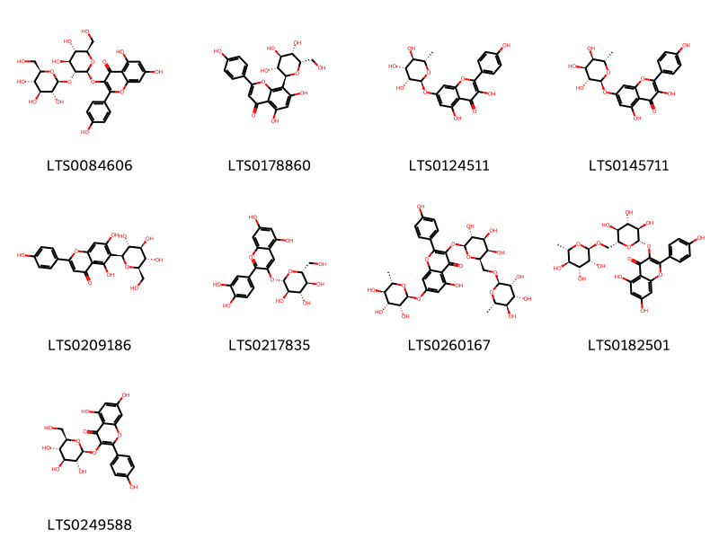{ width=100% }
    <figcaption>Hình ảnh cấu trúc hóa học của 9 hoạt chất thuộc nhóm Flavonoids gồm ['kaempferol 3-o-sophoroside (LTS0084606)', '5,7-dihydroxy-2-(4-hydroxyphenyl)-8-[(2s,3r,4r,5s,6s)-3,4,5-trihydroxy-6-(hydroxymethyl)oxan-2-yl]chromen-4-one (LTS0178860)', 'kaempferol-7-rhamnoside (LTS0124511)', '3,5-dihydroxy-2-(4-hydroxyphenyl)-7-{[(2s,3r,4s,5r,6s)-3,4,5-trihydroxy-6-methyloxan-2-yl]oxy}chromen-4-one (LTS0145711)', 'isovitexin (LTS0209186)', 'cyanidin 3-glucoside (LTS0217835)', 'robinin (LTS0260167)', 'nictoflorin (LTS0182501)', 'astragalin (LTS0249588)'].</figcaption>
</figure>
#### Nhóm Isoflavonoids
<figure markdown="span">
    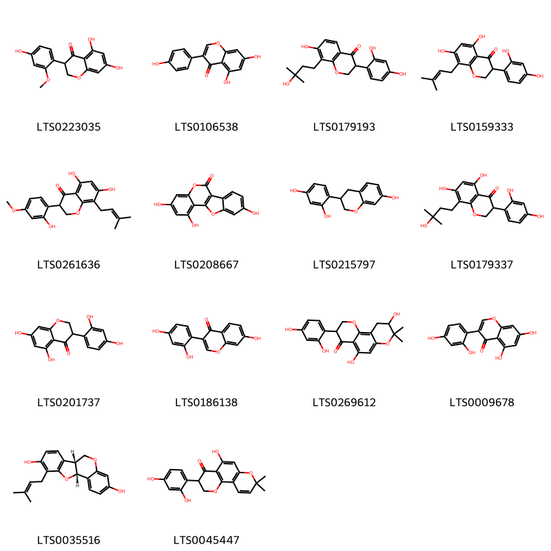{ width=100% }
    <figcaption>Hình ảnh cấu trúc hóa học của 14 hoạt chất thuộc nhóm Isoflavonoids gồm ['isoferreirin (LTS0223035)', 'genistein (LTS0106538)', '5-deoxykievitone hydrate (LTS0179193)', 'kievitone (LTS0159333)', "4'-o-methylkievitone (LTS0261636)", 'aureol (LTS0208667)', 'demethylvestitol (LTS0215797)', 'kievitone hydrate (LTS0179337)', '(+-)-dalbergioidin (LTS0201737)', "2'-hydroxydaidzein (LTS0186138)", '5-(2,4-dihydroxyphenyl)-8,13-dihydroxy-12,12-dimethyl-3,11-dioxatricyclo[8.4.0.0²,⁷]tetradeca-1,7,9-trien-6-one (LTS0269612)', "2'-hydroxygenistein (LTS0009678)", '(1r,10r)-15-(3-methylbut-2-en-1-yl)-8,17-dioxatetracyclo[8.7.0.0²,⁷.0¹¹,¹⁶]heptadeca-2,4,6,11(16),12,14-hexaene-5,14-diol (LTS0035516)', 'cyclokievitone (LTS0045447)'].</figcaption>
</figure>
#### Nhóm Organooxygen compounds
<figure markdown="span">
    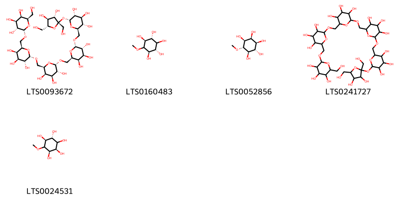{ width=100% }
    <figcaption>Hình ảnh cấu trúc hóa học của 5 hoạt chất thuộc nhóm Organooxygen compounds gồm ['ajugose (LTS0093672)', '(1r,2s,4r,5s)-6-methoxycyclohexane-1,2,3,4,5-pentol (LTS0160483)', 'ononitol (LTS0052856)', '2-[(6-{[6-({6-[(6-{[3,4-dihydroxy-2,5-bis(hydroxymethyl)oxolan-2-yl]oxy}-3,4,5-trihydroxyoxan-2-yl)methoxy]-3,4,5-trihydroxyoxan-2-yl}methoxy)-3,4,5-trihydroxyoxan-2-yl]methoxy}-3,4,5-trihydroxyoxan-2-yl)methoxy]-6-(hydroxymethyl)oxane-3,4,5-triol (LTS0241727)', '(1r,2r,4r,5s)-6-methoxycyclohexane-1,2,3,4,5-pentol (LTS0024531)'].</figcaption>
</figure>
#### Nhóm Prenol lipids
<figure markdown="span">
    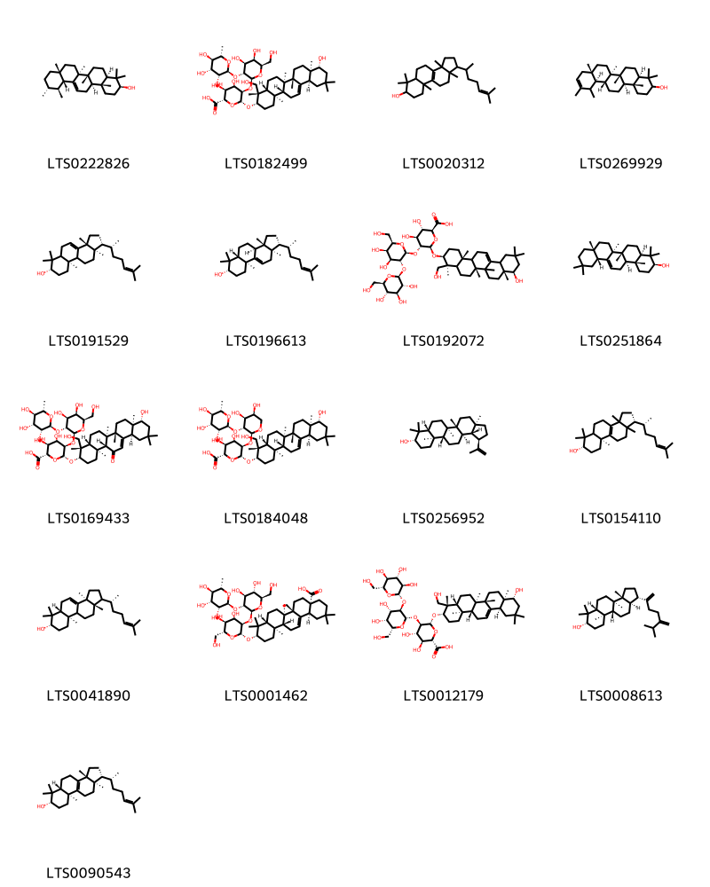{ width=100% }
    <figcaption>Hình ảnh cấu trúc hóa học của 17 hoạt chất thuộc nhóm Prenol lipids gồm ['amyrin (LTS0222826)', 'soyasaponin i (LTS0182499)', 'lanster (LTS0020312)', '(4ar,6ar,6br,8as,12ar,12br,14ar,14br)-4,4,6a,6b,8a,11,12,14b-octamethyl-2,3,4a,5,6,7,8,9,12,12a,12b,13,14,14a-tetradecahydro-1h-picen-3-ol (LTS0269929)', '(1r,3ar,7s,9ar,11ar)-3a,6,6,9a,11a-pentamethyl-1-[(2r)-6-methylhept-5-en-2-yl]-1h,2h,3h,5h,5ah,7h,8h,9h,9bh,10h,11h-cyclopenta[a]phenanthren-7-ol (LTS0191529)', 'parkeol (LTS0196613)', '(2s,3s,4s,5r,6r)-6-{[(3s,4s,6ar,8ar,9r,14br)-9-hydroxy-4-(hydroxymethyl)-4,6a,6b,8a,11,11,14b-heptamethyl-1,2,3,4a,5,6,7,8,9,10,12,12a,14,14a-tetradecahydropicen-3-yl]oxy}-5-{[(2s,3r,4s,5r,6r)-4,5-dihydroxy-6-(hydroxymethyl)-3-{[(2s,3r,4s,5s,6r)-3,4,5-trihydroxy-6-(hydroxymethyl)oxan-2-yl]oxy}oxan-2-yl]oxy}-3,4-dihydroxyoxane-2-carboxylic acid (LTS0192072)', 'β-amyrin (LTS0251864)', '(2s,3s,4s,5r,6r)-6-{[(3s,4s,4ar,6ar,6bs,8ar,9r,12as,14ar,14bs)-9-hydroxy-4-(hydroxymethyl)-4,6a,6b,8a,11,11,14b-heptamethyl-14-oxo-2,3,4a,5,6,7,8,9,10,12,12a,14a-dodecahydro-1h-picen-3-yl]oxy}-5-{[(2s,3r,4s,5r,6r)-4,5-dihydroxy-6-(hydroxymethyl)-3-{[(2s,3r,4r,5r,6s)-3,4,5-trihydroxy-6-methyloxan-2-yl]oxy}oxan-2-yl]oxy}-3,4-dihydroxyoxane-2-carboxylic acid (LTS0169433)', 'soyasaponin ii (LTS0184048)', 'lupeol (LTS0256952)', '(1r,7s,9as)-3a,6,6,9a,11a-pentamethyl-1-[(2r)-6-methylhept-5-en-2-yl]-1h,2h,3h,4h,5h,5ah,7h,8h,9h,10h,11h-cyclopenta[a]phenanthren-7-ol (LTS0154110)', '(3as,5ar,7s,9ar,11as)-3a,6,6,9a,11a-pentamethyl-1-[(2r)-6-methylhept-5-en-2-yl]-1h,2h,3h,5h,5ah,7h,8h,9h,9bh,10h,11h-cyclopenta[a]phenanthren-7-ol (LTS0041890)', '(4as,6as,6br,8ar,10s,12ar,12br,14bs)-10-{[(2r,3r,4s,5s,6r)-3-{[(2s,3r,4s,5s,6r)-4,5-dihydroxy-6-(hydroxymethyl)-3-{[(2s,3r,4r,5r,6s)-3,4,5-trihydroxy-6-methyloxan-2-yl]oxy}oxan-2-yl]oxy}-4,5-dihydroxy-6-(hydroxymethyl)oxan-2-yl]oxy}-2,2,6a,6b,9,9,12a-heptamethyl-1,3,4,5,6,7,8,8a,10,11,12,12b,13,14b-tetradecahydropicene-4a-carboxylic acid (LTS0001462)', '(2s,3s,4s,5r,6r)-6-{[(3s,4s,4ar,6ar,6bs,8ar,9r,12as,14ar,14br)-9-hydroxy-4-(hydroxymethyl)-4,6a,6b,8a,11,11,14b-heptamethyl-1,2,3,4a,5,6,7,8,9,10,12,12a,14,14a-tetradecahydropicen-3-yl]oxy}-5-{[(2s,3r,4s,5r,6r)-4,5-dihydroxy-6-(hydroxymethyl)-3-{[(2s,3r,4s,5s,6r)-3,4,5-trihydroxy-6-(hydroxymethyl)oxan-2-yl]oxy}oxan-2-yl]oxy}-3,4-dihydroxyoxane-2-carboxylic acid (LTS0012179)', '(1s,3ar,3br,5ar,7s,9ar,9br,11ar)-3a,3b,6,6,9a-pentamethyl-1-(6-methyl-5-methylidenehept-1-en-2-yl)-dodecahydro-1h-cyclopenta[a]phenanthren-7-ol (LTS0008613)', 'lanosterol (LTS0090543)'].</figcaption>
</figure>
#### Nhóm Steroids and steroid derivatives
<figure markdown="span">
    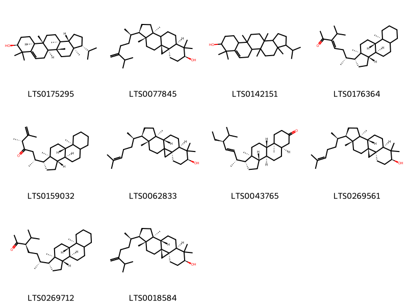{ width=100% }
    <figcaption>Hình ảnh cấu trúc hóa học của 10 hoạt chất thuộc nhóm Steroids and steroid derivatives gồm ['simiarenol (LTS0175295)', '24-methylene-cycloartanol (LTS0077845)', '3-isopropyl-3a,5a,8,8,11b,13a-hexamethyl-1h,2h,3h,4h,5h,5bh,6h,9h,10h,11h,11ah,12h,13h,13bh-cyclopenta[a]chrysen-9-ol (LTS0142151)', '(6r)-6-[(1r,3as,3br,9as,9bs,11ar)-9a,11a-dimethyl-tetradecahydro-1h-cyclopenta[a]phenanthren-1-yl]-3-isopropylhept-3-en-2-one (LTS0176364)', '(3r,6r)-6-[(1r,3as,3br,9as,9bs,11ar)-9a,11a-dimethyl-tetradecahydro-1h-cyclopenta[a]phenanthren-1-yl]-2,3-dimethylhept-1-en-4-one (LTS0159032)', '(3r,6s,8r,11s,12s,15r,16r)-7,7,12,16-tetramethyl-15-[(2r)-6-methylhept-5-en-2-yl]pentacyclo[9.7.0.0¹,³.0³,⁸.0¹²,¹⁶]octadecan-6-ol (LTS0062833)', 'stigmastenone (LTS0043765)', 'cycloartenol (LTS0269561)', '(3r,6r)-6-[(1r,3as,3br,9as,9bs,11ar)-9a,11a-dimethyl-tetradecahydro-1h-cyclopenta[a]phenanthren-1-yl]-3-isopropylheptan-2-one (LTS0269712)', '24-methylenecycloartanol (LTS0018584)'].</figcaption>
</figure>

---

### Dược dân tộc học

Danh sách các quốc gia có sử dụng *Vigna mungo* trong điều trị các bệnh. 

| Country   | Disease                                     | Bệnh                                                                                                                                                                                                |
|:----------|:--------------------------------------------|:----------------------------------------------------------------------------------------------------------------------------------------------------------------------------------------------------|
| China     | Antidote, Antivinous, Poultice, Carminative | MYMEMORY WARNING: YOU USED ALL AVAILABLE FREE TRANSLATIONS FOR TODAY. NEXT AVAILABLE IN  15 HOURS 15 MINUTES 33 SECONDS VISIT HTTPS://MYMEMORY.TRANSLATED.NET/DOC/USAGELIMITS.PHP TO TRANSLATE MORE |
| Elsewhere | Narcotic, Diuretic                          | MYMEMORY WARNING: YOU USED ALL AVAILABLE FREE TRANSLATIONS FOR TODAY. NEXT AVAILABLE IN  15 HOURS 15 MINUTES 29 SECONDS VISIT HTTPS://MYMEMORY.TRANSLATED.NET/DOC/USAGELIMITS.PHP TO TRANSLATE MORE |
| Venezuela | Soap                                        | MYMEMORY WARNING: YOU USED ALL AVAILABLE FREE TRANSLATIONS FOR TODAY. NEXT AVAILABLE IN  15 HOURS 15 MINUTES 23 SECONDS VISIT HTTPS://MYMEMORY.TRANSLATED.NET/DOC/USAGELIMITS.PHP TO TRANSLATE MORE |

---

---
## Vigna radiata
### Thông tin về thực vật

!!! info "Phân loại thực vật của *Vigna radiata* từ GIBF:"
    - **Kingdom:** Plantae
    - **Phylum:** Tracheophyta
    - **Order:** Fabales
    - **Family:** Fabaceae
    - **Genus:** Vigna
    - **Species:** *Vigna radiata*

 

| Label (VI)   | Label (EN)   | Scientific Name   | Descriptions (VI)   | Descriptions (EN)   | Also Known As (VI)                                                                                    | Also Known As (EN)                                 |
|:-------------|:-------------|:------------------|:--------------------|:--------------------|:------------------------------------------------------------------------------------------------------|:---------------------------------------------------|
| N/A          | N/A          | Vigna radiata     | loài thực vật       | species of plant    | ['đỗ xanh', 'đậu xanh', 'Vigna radiata', 'V. radiata', 'Phaeolus aureus', 'P. aureus', 'cây đỗ xanh'] | ['mung bean', 'green gram', 'maash', 'moong bean'] |

#### Phân bố trên thế giới

**Từ CSDL GIBF** nan, Australia, Japan, Cambodia, Philippines, Benin, Pakistan, Korea, Republic of, Chinese Taipei, United States of America, Timor-Leste, Chile, Thailand, Mayotte, Mexico, Singapore, China, United Kingdom of Great Britain and Northern Ireland, Comoros, Iraq, India, Indonesia, Kenya

#### Phân bố tại Việt Nam

**Từ CSDL GIBF**: Không có ghi nhận ở Việt Nam

---
### Thành phần hóa học
        
- Theo cơ sở dữ liệu lotus: Từ loài *Vigna radiata* đã phân lập và xác định được 107 hoạt chất thuộc về các nhóm Flavonoids, Steroids and steroid derivatives, Isoflavonoids, Peptidomimetics, Cinnamic acids and derivatives, Azoles, Dibenzylbutane lignans, Organonitrogen compounds, Benzene and substituted derivatives, Pyrimidine nucleotides, Organooxygen compounds, Coumarins and derivatives, Furanoid lignans, Carboxylic acids and derivatives. 

|    | chemicalTaxonomyClassyfireClass     |   smiles_count |
|---:|:------------------------------------|---------------:|
|  0 | Azoles                              |              1 |
|  1 | Benzene and substituted derivatives |              2 |
|  2 | Carboxylic acids and derivatives    |             23 |
|  3 | Cinnamic acids and derivatives      |              8 |
|  4 | Coumarins and derivatives           |              3 |
|  5 | Dibenzylbutane lignans              |              2 |
|  6 | Flavonoids                          |             19 |
|  7 | Furanoid lignans                    |              1 |
|  8 | Isoflavonoids                       |             16 |
|  9 | Organonitrogen compounds            |              1 |
| 10 | Organooxygen compounds              |             18 |
| 11 | Peptidomimetics                     |              4 |
| 12 | Pyrimidine nucleotides              |              2 |
| 13 | Steroids and steroid derivatives    |              4 |

#### Nhóm Azoles
<figure markdown="span">
    { width=100% }
    <figcaption>Hình ảnh cấu trúc hóa học của 1 hoạt chất thuộc nhóm Azoles gồm ['allantoin (LTS0106609)'].</figcaption>
</figure>
#### Nhóm Benzene and substituted derivatives
<figure markdown="span">
    { width=100% }
    <figcaption>Hình ảnh cấu trúc hóa học của 2 hoạt chất thuộc nhóm Benzene and substituted derivatives gồm ['syringic acid (LTS0210036)', 'p-hydroxybenzoic acid (LTS0263634)'].</figcaption>
</figure>
#### Nhóm Carboxylic acids and derivatives
<figure markdown="span">
    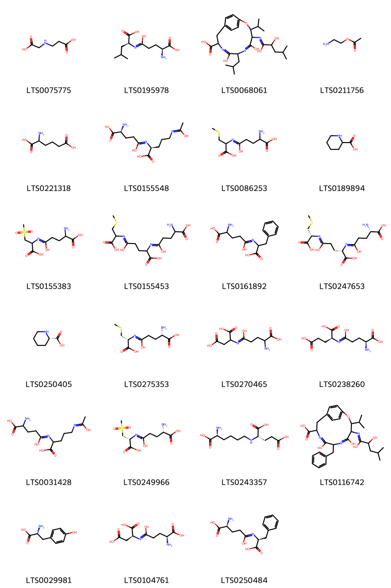{ width=100% }
    <figcaption>Hình ảnh cấu trúc hóa học của 23 hoạt chất thuộc nhóm Carboxylic acids and derivatives gồm ['β-alanine, n-(carboxymethyl)- (LTS0075775)', '(2s)-2-{[(4s)-4-amino-4-carboxy-1-hydroxybutylidene]amino}-4-methylpentanoic acid (LTS0195978)', '4-[(1,2-dihydroxy-4-methylpentylidene)amino]-5,8-dihydroxy-3-isopropyl-7-(2-methylpropyl)-2-oxa-6,9-diazabicyclo[10.2.2]hexadeca-1(14),5,8,12,15-pentaene-10-carboxylic acid (LTS0068061)', 'ethanolamine acetate (LTS0211756)', 'aminoadipic acid (LTS0221318)', '(2s)-2-{[(4s)-4-amino-4-carboxy-1-hydroxybutylidene]amino}-5-[(1-hydroxyethylidene)amino]pentanoic acid (LTS0155548)', '2-amino-4-{[1-carboxy-2-(methylsulfanyl)ethyl]-c-hydroxycarbonimidoyl}butanoic acid (LTS0086253)', '(+,-)-pipecolic acid (LTS0189894)', '2-amino-4-[(1-carboxy-2-methanesulfonylethyl)-c-hydroxycarbonimidoyl]butanoic acid (LTS0155383)', '2-amino-4-[(1-carboxy-3-{[1-carboxy-2-(methylsulfanyl)ethyl]-c-hydroxycarbonimidoyl}propyl)-c-hydroxycarbonimidoyl]butanoic acid (LTS0155453)', '2-amino-4-[(1-carboxy-2-phenylethyl)-c-hydroxycarbonimidoyl]butanoic acid (LTS0161892)', '(2s)-2-{[(4s)-4-amino-4-carboxy-1-hydroxybutylidene]amino}-4-{[(1r)-1-carboxy-2-(methylsulfanyl)ethyl]-c-hydroxycarbonimidoyl}butanoic acid (LTS0247653)', '(-)-pipecolic acid (LTS0250405)', '(2s)-2-amino-4-{[(1r)-1-carboxy-2-(methylsulfanyl)ethyl]-c-hydroxycarbonimidoyl}butanoic acid (LTS0275353)', '2-[(4-amino-4-carboxy-1-hydroxybutylidene)amino]butanedioic acid (LTS0270465)', '(2s)-2-{[(4s)-4-amino-4-carboxy-1-hydroxybutylidene]amino}pentanedioic acid (LTS0238260)', '2-amino-4-({1-carboxy-4-[(1-hydroxyethylidene)amino]butyl}-c-hydroxycarbonimidoyl)butanoic acid (LTS0031428)', '(2s)-2-amino-4-{[(1r)-1-carboxy-2-methanesulfonylethyl]-c-hydroxycarbonimidoyl}butanoic acid (LTS0249966)', 'l-saccharopine (LTS0243357)', '7-benzyl-4-[(1,2-dihydroxy-4-methylpentylidene)amino]-5,8-dihydroxy-3-isopropyl-2-oxa-6,9-diazabicyclo[10.2.2]hexadeca-1(14),5,8,12,15-pentaene-10-carboxylic acid (LTS0116742)', 'l-tyrosine (LTS0029981)', '(2s)-2-{[(4s)-4-amino-4-carboxy-1-hydroxybutylidene]amino}butanedioic acid (LTS0104761)', '(2s)-2-amino-4-{[(1s)-1-carboxy-2-phenylethyl]-c-hydroxycarbonimidoyl}butanoic acid (LTS0250484)'].</figcaption>
</figure>
#### Nhóm Cinnamic acids and derivatives
<figure markdown="span">
    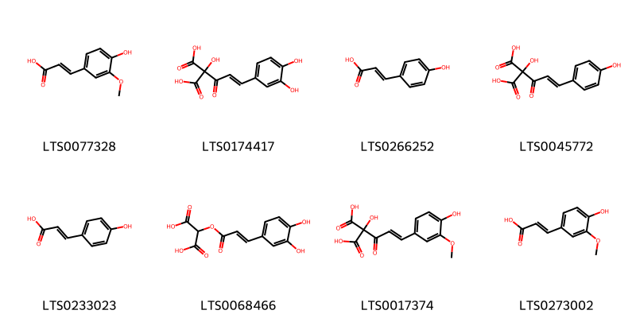{ width=100% }
    <figcaption>Hình ảnh cấu trúc hóa học của 8 hoạt chất thuộc nhóm Cinnamic acids and derivatives gồm ['ferulic acid (LTS0077328)', '2-[(2e)-3-(3,4-dihydroxyphenyl)prop-2-enoyl]-2-hydroxypropanedioic acid (LTS0174417)', 'para-coumaric acid (LTS0266252)', '2-hydroxy-2-[(2e)-3-(4-hydroxyphenyl)prop-2-enoyl]propanedioic acid (LTS0045772)', 'hydroxycinnamic acid (LTS0233023)', '2-{[(2e)-3-(3,4-dihydroxyphenyl)prop-2-enoyl]oxy}propanedioic acid (LTS0068466)', '2-hydroxy-2-[(2e)-3-(4-hydroxy-3-methoxyphenyl)prop-2-enoyl]propanedioic acid (LTS0017374)', 'ferulic acid (LTS0273002)'].</figcaption>
</figure>
#### Nhóm Coumarins and derivatives
<figure markdown="span">
    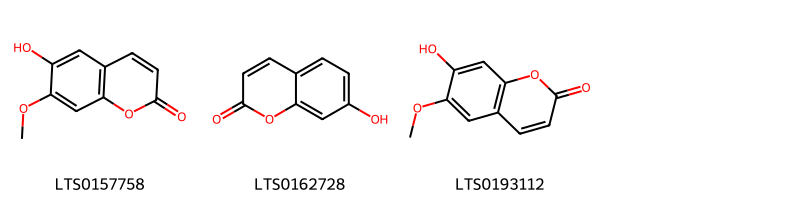{ width=100% }
    <figcaption>Hình ảnh cấu trúc hóa học của 3 hoạt chất thuộc nhóm Coumarins and derivatives gồm ['isoscopoletin (LTS0157758)', 'umbelliferone (LTS0162728)', 'scopoletin (LTS0193112)'].</figcaption>
</figure>
#### Nhóm Dibenzylbutane lignans
<figure markdown="span">
    { width=100% }
    <figcaption>Hình ảnh cấu trúc hóa học của 2 hoạt chất thuộc nhóm Dibenzylbutane lignans gồm ['(2s,3r)-2,3-bis[(4-hydroxy-3-methoxyphenyl)(¹³c)methyl](1-¹³c)butane-1,4-diol (LTS0268699)', 'secoisolariciresinol (LTS0086727)'].</figcaption>
</figure>
#### Nhóm Flavonoids
<figure markdown="span">
    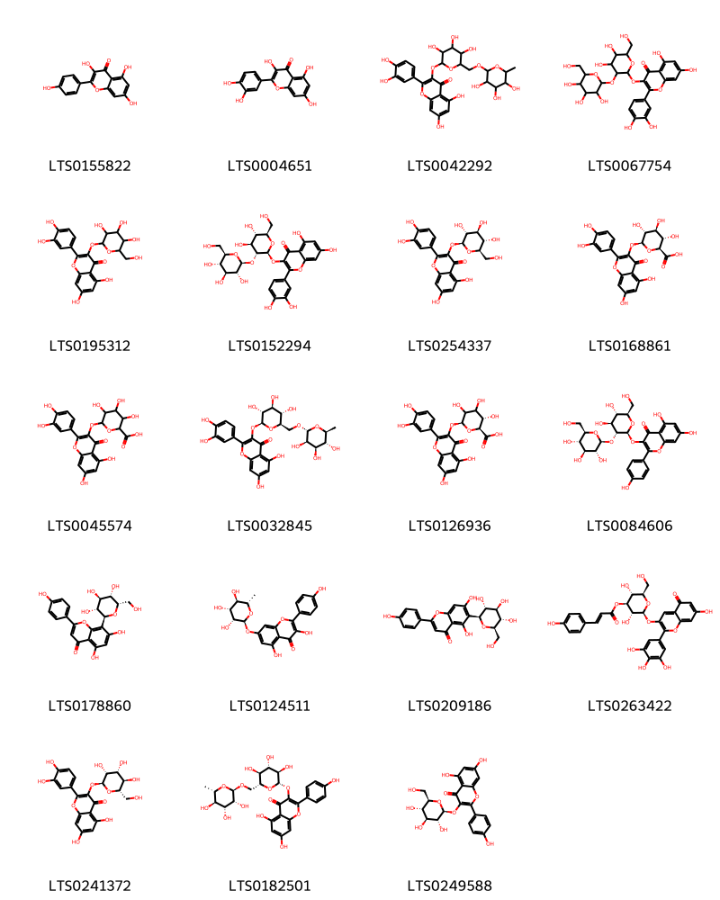{ width=100% }
    <figcaption>Hình ảnh cấu trúc hóa học của 19 hoạt chất thuộc nhóm Flavonoids gồm ['kaempherol (LTS0155822)', 'quercetin (LTS0004651)', 'rutin (LTS0042292)', '3-{[4,5-dihydroxy-6-(hydroxymethyl)-3-{[3,4,5-trihydroxy-6-(hydroxymethyl)oxan-2-yl]oxy}oxan-2-yl]oxy}-2-(3,4-dihydroxyphenyl)-5,7-dihydroxychromen-4-one (LTS0067754)', '2-(3,4-dihydroxyphenyl)-5,7-dihydroxy-3-{[3,4,5-trihydroxy-6-(hydroxymethyl)oxan-2-yl]oxy}chromen-4-one (LTS0195312)', 'quosp (LTS0152294)', 'isoquercetin (LTS0254337)', 'querciturone (LTS0168861)', 'miquelianin (LTS0045574)', '3-rutinosyl quercetin (LTS0032845)', 'miquelianin (LTS0126936)', 'kaempferol 3-o-sophoroside (LTS0084606)', '5,7-dihydroxy-2-(4-hydroxyphenyl)-8-[(2s,3r,4r,5s,6s)-3,4,5-trihydroxy-6-(hydroxymethyl)oxan-2-yl]chromen-4-one (LTS0178860)', 'kaempferol-7-rhamnoside (LTS0124511)', 'isovitexin (LTS0209186)', '(2s,3r,4s,5r,6r)-3,5-dihydroxy-2-{[7-hydroxy-5-oxo-2-(3,4,5-trihydroxyphenyl)chromen-3-yl]oxy}-6-(hydroxymethyl)oxan-4-yl 3-(4-hydroxyphenyl)prop-2-enoate (LTS0263422)', '2-(3,4-dihydroxyphenyl)-5,7-dihydroxy-3-{[(2s,3r,4r,5r,6s)-3,4,5-trihydroxy-6-(hydroxymethyl)oxan-2-yl]oxy}chromen-4-one (LTS0241372)', 'nictoflorin (LTS0182501)', 'astragalin (LTS0249588)'].</figcaption>
</figure>
#### Nhóm Furanoid lignans
<figure markdown="span">
    { width=100% }
    <figcaption>Hình ảnh cấu trúc hóa học của 1 hoạt chất thuộc nhóm Furanoid lignans gồm ['matairesinol (LTS0193475)'].</figcaption>
</figure>
#### Nhóm Isoflavonoids
<figure markdown="span">
    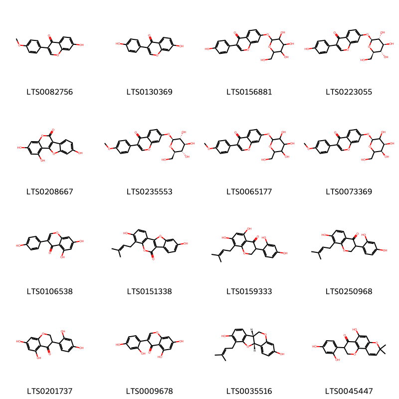{ width=100% }
    <figcaption>Hình ảnh cấu trúc hóa học của 16 hoạt chất thuộc nhóm Isoflavonoids gồm ['formononetin (LTS0082756)', 'daidzein (LTS0130369)', 'daidzin (LTS0156881)', 'daidzin (LTS0223055)', 'aureol (LTS0208667)', 'ononin (LTS0235553)', 'ononin (LTS0065177)', 'formononetin 7-o-glucoside (LTS0073369)', 'genistein (LTS0106538)', 'phaseol (LTS0151338)', 'kievitone (LTS0159333)', '5-deoxykievitone (LTS0250968)', '(+-)-dalbergioidin (LTS0201737)', "2'-hydroxygenistein (LTS0009678)", '(1r,10r)-15-(3-methylbut-2-en-1-yl)-8,17-dioxatetracyclo[8.7.0.0²,⁷.0¹¹,¹⁶]heptadeca-2,4,6,11(16),12,14-hexaene-5,14-diol (LTS0035516)', 'cyclokievitone (LTS0045447)'].</figcaption>
</figure>
#### Nhóm Organonitrogen compounds
<figure markdown="span">
    { width=100% }
    <figcaption>Hình ảnh cấu trúc hóa học của 1 hoạt chất thuộc nhóm Organonitrogen compounds gồm ['β-methylacetylcholine (LTS0076017)'].</figcaption>
</figure>
#### Nhóm Organooxygen compounds
<figure markdown="span">
    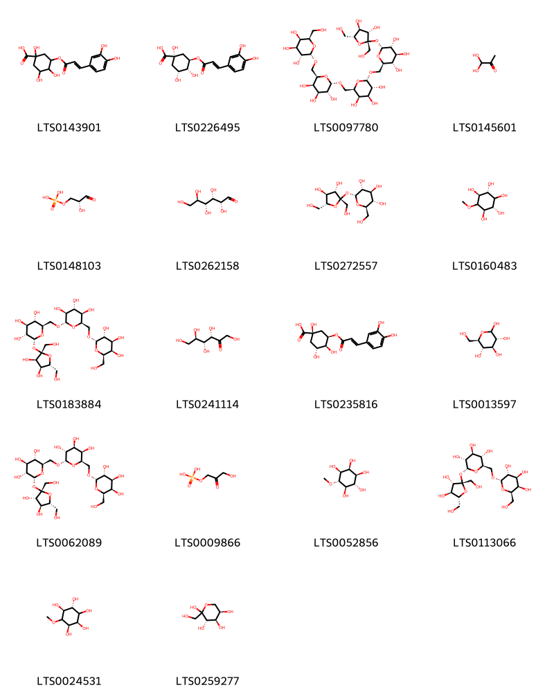{ width=100% }
    <figcaption>Hình ảnh cấu trúc hóa học của 18 hoạt chất thuộc nhóm Organooxygen compounds gồm ['3-{[3-(3,4-dihydroxyphenyl)prop-2-enoyl]oxy}-1,4,5-trihydroxycyclohexane-1-carboxylic acid (LTS0143901)', 'chlorogenic acid (LTS0226495)', 'verbascose (LTS0097780)', 'dihydroxy acetone (LTS0145601)', 'glyceraldehyde-3-phosphate (LTS0148103)', '(+)-glucose (LTS0262158)', 'sucrose (LTS0272557)', '(1r,2s,4r,5s)-6-methoxycyclohexane-1,2,3,4,5-pentol (LTS0160483)', '(2r,3r,4s,5s,6r)-2-{[(2s,3r,4s,5r)-3,4-dihydroxy-2,5-bis(hydroxymethyl)oxolan-2-yl]oxy}-6-({[(2s,3s,4r,5r,6r)-3,4,5-trihydroxy-6-({[(2s,3r,4s,5r,6r)-3,4,5-trihydroxy-6-(hydroxymethyl)oxan-2-yl]oxy}methyl)oxan-2-yl]oxy}methyl)oxane-3,4,5-triol (LTS0183884)', 'keto-d-fructose (LTS0241114)', 'neochlorogenic acid (LTS0235816)', 'glucose (LTS0013597)', 'stachyose (LTS0062089)', 'dihydroxyacetone phosphate (LTS0009866)', 'ononitol (LTS0052856)', 'raffinose (LTS0113066)', '(1r,2r,4r,5s)-6-methoxycyclohexane-1,2,3,4,5-pentol (LTS0024531)', 'd-fructopyranose (LTS0259277)'].</figcaption>
</figure>
#### Nhóm Peptidomimetics
<figure markdown="span">
    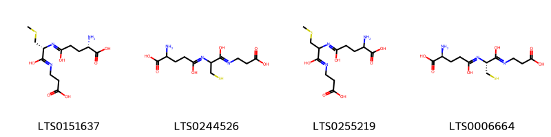{ width=100% }
    <figcaption>Hình ảnh cấu trúc hóa học của 4 hoạt chất thuộc nhóm Peptidomimetics gồm ['(2s)-2-amino-4-{[(1r)-1-[(2-carboxyethyl)-c-hydroxycarbonimidoyl]-2-(methylsulfanyl)ethyl]-c-hydroxycarbonimidoyl}butanoic acid (LTS0151637)', '2-amino-4-({1-[(2-carboxyethyl)-c-hydroxycarbonimidoyl]-2-sulfanylethyl}-c-hydroxycarbonimidoyl)butanoic acid (LTS0244526)', '2-amino-4-({1-[(2-carboxyethyl)-c-hydroxycarbonimidoyl]-2-(methylsulfanyl)ethyl}-c-hydroxycarbonimidoyl)butanoic acid (LTS0255219)', '(2s)-2-amino-4-{[(1r)-1-[(2-carboxyethyl)-c-hydroxycarbonimidoyl]-2-sulfanylethyl]-c-hydroxycarbonimidoyl}butanoic acid (LTS0006664)'].</figcaption>
</figure>
#### Nhóm Pyrimidine nucleotides
<figure markdown="span">
    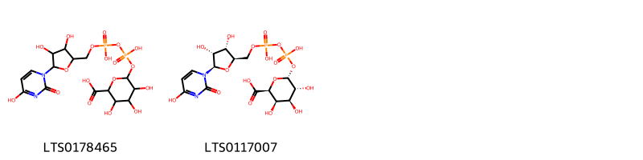{ width=100% }
    <figcaption>Hình ảnh cấu trúc hóa học của 2 hoạt chất thuộc nhóm Pyrimidine nucleotides gồm ['6-[({[3,4-dihydroxy-5-(4-hydroxy-2-oxopyrimidin-1-yl)oxolan-2-yl]methoxy(hydroxy)phosphoryl}oxy(hydroxy)phosphoryl)oxy]-3,4,5-trihydroxyoxane-2-carboxylic acid (LTS0178465)', '(2s,3r,4s,5r,6r)-6-[({[(2r,3s,4r,5r)-3,4-dihydroxy-5-(4-hydroxy-2-oxopyrimidin-1-yl)oxolan-2-yl]methoxy(hydroxy)phosphoryl}oxy(hydroxy)phosphoryl)oxy]-3,4,5-trihydroxyoxane-2-carboxylic acid (LTS0117007)'].</figcaption>
</figure>
#### Nhóm Steroids and steroid derivatives
<figure markdown="span">
    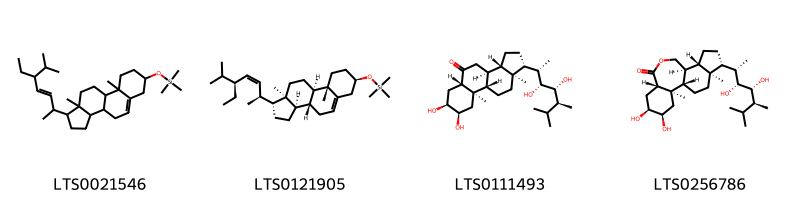{ width=100% }
    <figcaption>Hình ảnh cấu trúc hóa học của 4 hoạt chất thuộc nhóm Steroids and steroid derivatives gồm ['{[1-(5-ethyl-6-methylhept-3-en-2-yl)-9a,11a-dimethyl-1h,2h,3h,3ah,3bh,4h,6h,7h,8h,9h,9bh,10h,11h-cyclopenta[a]phenanthren-7-yl]oxy}trimethylsilane (LTS0021546)', '{[(1r,3ar,3br,7r,9as,9br,11ar)-1-[(2s,3z,5s)-5-ethyl-6-methylhept-3-en-2-yl]-9a,11a-dimethyl-1h,2h,3h,3ah,3bh,4h,6h,7h,8h,9h,9bh,10h,11h-cyclopenta[a]phenanthren-7-yl]oxy}trimethylsilane (LTS0121905)', 'castasterone (LTS0111493)', 'brassinolide (LTS0256786)'].</figcaption>
</figure>

---

### Dược dân tộc học

Danh sách các quốc gia có sử dụng *Vigna radiata* trong điều trị các bệnh. 

| Country     | Disease                                     | Bệnh                                                                                                                                                                                                |
|:------------|:--------------------------------------------|:----------------------------------------------------------------------------------------------------------------------------------------------------------------------------------------------------|
| China       | Antidote, Antivinous, Carminative, Poultice | MYMEMORY WARNING: YOU USED ALL AVAILABLE FREE TRANSLATIONS FOR TODAY. NEXT AVAILABLE IN  15 HOURS 14 MINUTES 48 SECONDS VISIT HTTPS://MYMEMORY.TRANSLATED.NET/DOC/USAGELIMITS.PHP TO TRANSLATE MORE |
| Philippines | Diuretic                                    | MYMEMORY WARNING: YOU USED ALL AVAILABLE FREE TRANSLATIONS FOR TODAY. NEXT AVAILABLE IN  15 HOURS 14 MINUTES 43 SECONDS VISIT HTTPS://MYMEMORY.TRANSLATED.NET/DOC/USAGELIMITS.PHP TO TRANSLATE MORE |

---

---
## Vigna sesquipedalis
### Thông tin về thực vật

!!! info "Phân loại thực vật của *Vigna unguiculata* từ GIBF:"
    - **Kingdom:** Plantae
    - **Phylum:** Tracheophyta
    - **Order:** Fabales
    - **Family:** Fabaceae
    - **Genus:** Vigna
    - **Species:** *Vigna unguiculata*

 

| Label (VI)   | Label (EN)   | Scientific Name   | Descriptions (VI)   | Descriptions (EN)   | Also Known As (VI)                                                                                    | Also Known As (EN)                                 |
|:-------------|:-------------|:------------------|:--------------------|:--------------------|:------------------------------------------------------------------------------------------------------|:---------------------------------------------------|
| N/A          | N/A          | Vigna radiata     | loài thực vật       | species of plant    | ['đỗ xanh', 'đậu xanh', 'Vigna radiata', 'V. radiata', 'Phaeolus aureus', 'P. aureus', 'cây đỗ xanh'] | ['mung bean', 'green gram', 'maash', 'moong bean'] |

#### Phân bố trên thế giới

**Từ CSDL GIBF** nan, Argentina, New Caledonia, United States of America, Cuba, Mexico, China

#### Phân bố tại Việt Nam

**Từ CSDL GIBF**: Không có ghi nhận ở Việt Nam

---
### Thành phần hóa học
        
- Theo cơ sở dữ liệu lotus: Từ loài *Vigna unguiculata* đã phân lập và xác định được Chưa có hoạt chất nào được phân lập. hoạt chất thuộc về các nhóm Không có hoạt chất nào được phân lập. 

Không có hình ảnh nào được tạo ra

---

### Dược dân tộc học

Danh sách các quốc gia có sử dụng *Vigna unguiculata* trong điều trị các bệnh. 

| Country   | Disease   | Bệnh                                                                                                                                                                                                |
|:----------|:----------|:----------------------------------------------------------------------------------------------------------------------------------------------------------------------------------------------------|
| Malaya    | Lactafuge | MYMEMORY WARNING: YOU USED ALL AVAILABLE FREE TRANSLATIONS FOR TODAY. NEXT AVAILABLE IN  15 HOURS 13 MINUTES 57 SECONDS VISIT HTTPS://MYMEMORY.TRANSLATED.NET/DOC/USAGELIMITS.PHP TO TRANSLATE MORE |

---

---
## Vigna unguiculata
### Thông tin về thực vật

!!! info "Phân loại thực vật của *Vigna unguiculata* từ GIBF:"
    - **Kingdom:** Plantae
    - **Phylum:** Tracheophyta
    - **Order:** Fabales
    - **Family:** Fabaceae
    - **Genus:** Vigna
    - **Species:** *Vigna unguiculata*

 

| Label (VI)   | Label (EN)   | Scientific Name   | Descriptions (VI)   | Descriptions (EN)   | Also Known As (VI)   | Also Known As (EN)                                         |
|:-------------|:-------------|:------------------|:--------------------|:--------------------|:---------------------|:-----------------------------------------------------------|
| N/A          | N/A          | Vigna unguiculata | loài thực vật       | species of plant    | ['']                 | ['cowpea', 'Vigna unguiculata unguiculata cultivar group'] |

#### Phân bố trên thế giới

**Từ CSDL GIBF** Sri Lanka, Ghana, Italy, Australia, Japan, Guadeloupe, Gabon, Cambodia, Belgium, Angola, Mozambique, Benin, Tanzania, United Republic of, French Guiana, Togo, Ukraine, Zambia, Puerto Rico, Malawi, Réunion, Mali, Nigeria, Korea, Republic of, Chinese Taipei, Spain, Bangladesh, United States of America, Timor-Leste, El Salvador, Greece, South Africa, Uganda, Czechia, Thailand, Brazil, Côte d’Ivoire, Egypt, Mayotte, Mexico, Viet Nam, Eswatini, China, United Kingdom of Great Britain and Northern Ireland, Ecuador, Madagascar, Colombia, Montserrat, Vanuatu, India, Gambia, Indonesia, Antigua and Barbuda, Philippines, Malaysia, Nepal

#### Phân bố tại Việt Nam

**Từ CSDL GIBF**: Không có ghi nhận ở Việt Nam

---
### Thành phần hóa học
        
- Theo cơ sở dữ liệu lotus: Từ loài *Vigna unguiculata* đã phân lập và xác định được 100 hoạt chất thuộc về các nhóm Fatty Acyls, Flavonoids, Prenol lipids, Steroids and steroid derivatives, Isoflavonoids, Cinnamic acids and derivatives, Organonitrogen compounds, Benzene and substituted derivatives, Organooxygen compounds, Furanoid lignans, Carboxylic acids and derivatives. 

|    | chemicalTaxonomyClassyfireClass     |   smiles_count |
|---:|:------------------------------------|---------------:|
|  0 | Benzene and substituted derivatives |              2 |
|  1 | Carboxylic acids and derivatives    |              6 |
|  2 | Cinnamic acids and derivatives      |              4 |
|  3 | Fatty Acyls                         |              2 |
|  4 | Flavonoids                          |             20 |
|  5 | Furanoid lignans                    |              1 |
|  6 | Isoflavonoids                       |              6 |
|  7 | Organonitrogen compounds            |              1 |
|  8 | Organooxygen compounds              |             11 |
|  9 | Prenol lipids                       |             23 |
| 10 | Steroids and steroid derivatives    |             16 |

#### Nhóm Benzene and substituted derivatives
<figure markdown="span">
    { width=100% }
    <figcaption>Hình ảnh cấu trúc hóa học của 2 hoạt chất thuộc nhóm Benzene and substituted derivatives gồm ['syringic acid (LTS0210036)', 'p-hydroxybenzoic acid (LTS0263634)'].</figcaption>
</figure>
#### Nhóm Carboxylic acids and derivatives
<figure markdown="span">
    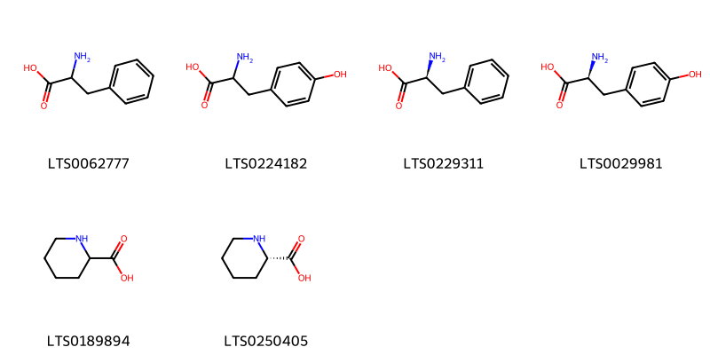{ width=100% }
    <figcaption>Hình ảnh cấu trúc hóa học của 6 hoạt chất thuộc nhóm Carboxylic acids and derivatives gồm ['phenylalanin (LTS0062777)', 'tyrosin (LTS0224182)', 'l-phenylalanine (LTS0229311)', 'l-tyrosine (LTS0029981)', '(+,-)-pipecolic acid (LTS0189894)', '(-)-pipecolic acid (LTS0250405)'].</figcaption>
</figure>
#### Nhóm Cinnamic acids and derivatives
<figure markdown="span">
    { width=100% }
    <figcaption>Hình ảnh cấu trúc hóa học của 4 hoạt chất thuộc nhóm Cinnamic acids and derivatives gồm ['ferulic acid (LTS0077328)', 'para-coumaric acid (LTS0266252)', 'hydroxycinnamic acid (LTS0233023)', 'ferulic acid (LTS0273002)'].</figcaption>
</figure>
#### Nhóm Fatty Acyls
<figure markdown="span">
    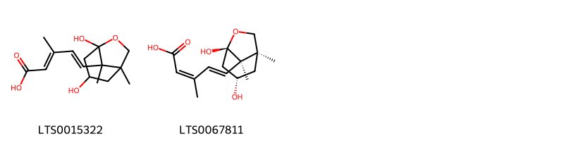{ width=100% }
    <figcaption>Hình ảnh cấu trúc hóa học của 2 hoạt chất thuộc nhóm Fatty Acyls gồm ['5-{3,5-dihydroxy-1,8-dimethyl-6-oxabicyclo[3.2.1]octan-8-yl}-3-methylpenta-2,4-dienoic acid (LTS0015322)', '(2z,4e)-5-[(1s,3s,5s,8r)-3,5-dihydroxy-1,8-dimethyl-6-oxabicyclo[3.2.1]octan-8-yl]-3-methylpenta-2,4-dienoic acid (LTS0067811)'].</figcaption>
</figure>
#### Nhóm Flavonoids
<figure markdown="span">
    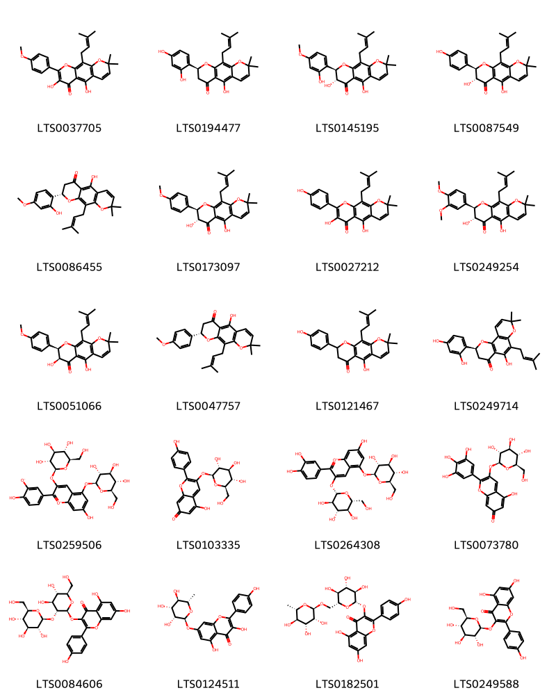{ width=100% }
    <figcaption>Hình ảnh cấu trúc hóa học của 20 hoạt chất thuộc nhóm Flavonoids gồm ['3,5-dihydroxy-2-(4-methoxyphenyl)-8,8-dimethyl-10-(3-methylbut-2-en-1-yl)pyrano[3,2-g]chromen-4-one (LTS0037705)', '(2s)-2-(2,4-dihydroxyphenyl)-5-hydroxy-8,8-dimethyl-10-(3-methylbut-2-en-1-yl)-2h,3h-pyrano[3,2-g]chromen-4-one (LTS0194477)', '(2r,3r)-3,5-dihydroxy-2-(2-hydroxy-4-methoxyphenyl)-8,8-dimethyl-10-(3-methylbut-2-en-1-yl)-2h,3h-pyrano[3,2-g]chromen-4-one (LTS0145195)', '(2r,3r)-3,5-dihydroxy-2-(4-hydroxyphenyl)-8,8-dimethyl-10-(3-methylbut-2-en-1-yl)-2h,3h-pyrano[3,2-g]chromen-4-one (LTS0087549)', '(2s)-5-hydroxy-2-(2-hydroxy-4-methoxyphenyl)-8,8-dimethyl-10-(3-methylbut-2-en-1-yl)-2h,3h-pyrano[3,2-g]chromen-4-one (LTS0086455)', '(2r,3r)-3,5-dihydroxy-2-(4-methoxyphenyl)-8,8-dimethyl-10-(3-methylbut-2-en-1-yl)-2h,3h-pyrano[3,2-g]chromen-4-one (LTS0173097)', '3,5-dihydroxy-2-(4-hydroxyphenyl)-8,8-dimethyl-10-(3-methylbut-2-en-1-yl)pyrano[3,2-g]chromen-4-one (LTS0027212)', '(2r,3r)-2-(3,4-dimethoxyphenyl)-3,5-dihydroxy-8,8-dimethyl-10-(3-methylbut-2-en-1-yl)-2h,3h-pyrano[3,2-g]chromen-4-one (LTS0249254)', '(2r,3s)-3,5-dihydroxy-2-(4-methoxyphenyl)-8,8-dimethyl-10-(3-methylbut-2-en-1-yl)-2h,3h-pyrano[3,2-g]chromen-4-one (LTS0051066)', '(2s)-5-hydroxy-2-(4-methoxyphenyl)-8,8-dimethyl-10-(3-methylbut-2-en-1-yl)-2h,3h-pyrano[3,2-g]chromen-4-one (LTS0047757)', 'lupinifolin (LTS0121467)', '(2s)-2-(2,4-dihydroxyphenyl)-5-hydroxy-8,8-dimethyl-6-(3-methylbut-2-en-1-yl)-2h,3h-pyrano[2,3-f]chromen-4-one (LTS0249714)', 'cyanin betaine (LTS0259506)', '5-hydroxy-2-(4-hydroxyphenyl)-3-{[(2s,3r,4s,5s,6r)-3,4,5-trihydroxy-6-(hydroxymethyl)oxan-2-yl]oxy}chromen-7-one (LTS0103335)', 'cyanin (LTS0264308)', '5-hydroxy-3-{[(2s,3r,4s,5s,6r)-3,4,5-trihydroxy-6-(hydroxymethyl)oxan-2-yl]oxy}-2-(3,4,5-trihydroxyphenyl)chromen-7-one (LTS0073780)', 'kaempferol 3-o-sophoroside (LTS0084606)', 'kaempferol-7-rhamnoside (LTS0124511)', 'nictoflorin (LTS0182501)', 'astragalin (LTS0249588)'].</figcaption>
</figure>
#### Nhóm Furanoid lignans
<figure markdown="span">
    { width=100% }
    <figcaption>Hình ảnh cấu trúc hóa học của 1 hoạt chất thuộc nhóm Furanoid lignans gồm ['( )-yangabin (LTS0082412)'].</figcaption>
</figure>
#### Nhóm Isoflavonoids
<figure markdown="span">
    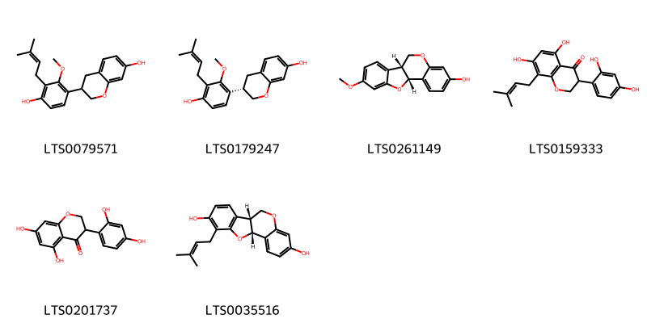{ width=100% }
    <figcaption>Hình ảnh cấu trúc hóa học của 6 hoạt chất thuộc nhóm Isoflavonoids gồm ['3-[4-hydroxy-2-methoxy-3-(3-methylbut-2-en-1-yl)phenyl]-3,4-dihydro-2h-1-benzopyran-7-ol (LTS0079571)', '(3s)-3-[4-hydroxy-2-methoxy-3-(3-methylbut-2-en-1-yl)phenyl]-3,4-dihydro-2h-1-benzopyran-7-ol (LTS0179247)', 'medicarpin, (-)- (LTS0261149)', 'kievitone (LTS0159333)', '(+-)-dalbergioidin (LTS0201737)', '(1r,10r)-15-(3-methylbut-2-en-1-yl)-8,17-dioxatetracyclo[8.7.0.0²,⁷.0¹¹,¹⁶]heptadeca-2,4,6,11(16),12,14-hexaene-5,14-diol (LTS0035516)'].</figcaption>
</figure>
#### Nhóm Organonitrogen compounds
<figure markdown="span">
    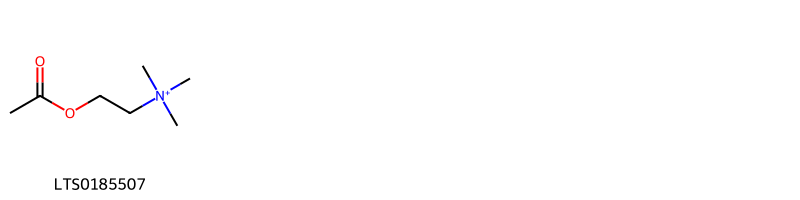{ width=100% }
    <figcaption>Hình ảnh cấu trúc hóa học của 1 hoạt chất thuộc nhóm Organonitrogen compounds gồm ['acetylcholine (LTS0185507)'].</figcaption>
</figure>
#### Nhóm Organooxygen compounds
<figure markdown="span">
    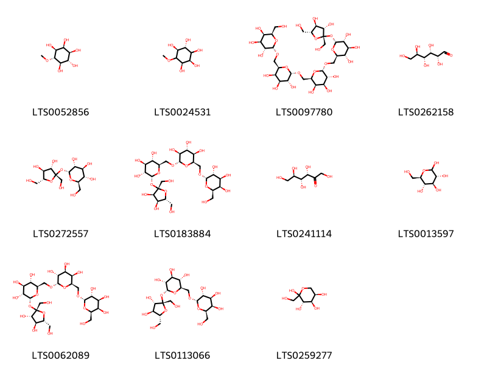{ width=100% }
    <figcaption>Hình ảnh cấu trúc hóa học của 11 hoạt chất thuộc nhóm Organooxygen compounds gồm ['ononitol (LTS0052856)', '(1r,2r,4r,5s)-6-methoxycyclohexane-1,2,3,4,5-pentol (LTS0024531)', 'verbascose (LTS0097780)', '(+)-glucose (LTS0262158)', 'sucrose (LTS0272557)', '(2r,3r,4s,5s,6r)-2-{[(2s,3r,4s,5r)-3,4-dihydroxy-2,5-bis(hydroxymethyl)oxolan-2-yl]oxy}-6-({[(2s,3s,4r,5r,6r)-3,4,5-trihydroxy-6-({[(2s,3r,4s,5r,6r)-3,4,5-trihydroxy-6-(hydroxymethyl)oxan-2-yl]oxy}methyl)oxan-2-yl]oxy}methyl)oxane-3,4,5-triol (LTS0183884)', 'keto-d-fructose (LTS0241114)', 'glucose (LTS0013597)', 'stachyose (LTS0062089)', 'raffinose (LTS0113066)', 'd-fructopyranose (LTS0259277)'].</figcaption>
</figure>
#### Nhóm Prenol lipids
<figure markdown="span">
    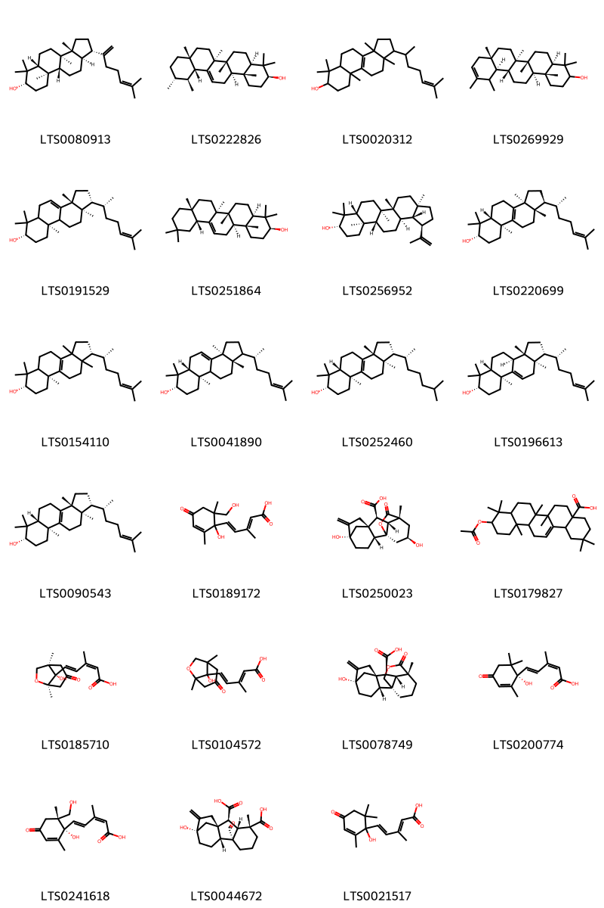{ width=100% }
    <figcaption>Hình ảnh cấu trúc hóa học của 23 hoạt chất thuộc nhóm Prenol lipids gồm ['dammaradienol (LTS0080913)', 'amyrin (LTS0222826)', 'lanster (LTS0020312)', '(4ar,6ar,6br,8as,12ar,12br,14ar,14br)-4,4,6a,6b,8a,11,12,14b-octamethyl-2,3,4a,5,6,7,8,9,12,12a,12b,13,14,14a-tetradecahydro-1h-picen-3-ol (LTS0269929)', '(1r,3ar,7s,9ar,11ar)-3a,6,6,9a,11a-pentamethyl-1-[(2r)-6-methylhept-5-en-2-yl]-1h,2h,3h,5h,5ah,7h,8h,9h,9bh,10h,11h-cyclopenta[a]phenanthren-7-ol (LTS0191529)', 'β-amyrin (LTS0251864)', 'lupeol (LTS0256952)', 'euphol (LTS0220699)', '(1r,7s,9as)-3a,6,6,9a,11a-pentamethyl-1-[(2r)-6-methylhept-5-en-2-yl]-1h,2h,3h,4h,5h,5ah,7h,8h,9h,10h,11h-cyclopenta[a]phenanthren-7-ol (LTS0154110)', '(3as,5ar,7s,9ar,11as)-3a,6,6,9a,11a-pentamethyl-1-[(2r)-6-methylhept-5-en-2-yl]-1h,2h,3h,5h,5ah,7h,8h,9h,9bh,10h,11h-cyclopenta[a]phenanthren-7-ol (LTS0041890)', '24,25-dihydrolanosterol (LTS0252460)', 'parkeol (LTS0196613)', 'lanosterol (LTS0090543)', '5-[1-hydroxy-6-(hydroxymethyl)-2,6-dimethyl-4-oxocyclohex-2-en-1-yl]-3-methylpenta-2,4-dienoic acid (LTS0189172)', 'gibberellin a29 (LTS0250023)', '10-(acetyloxy)-2,2,6a,6b,9,9,12a-heptamethyl-1,3,4,5,6,7,8,8a,10,11,12,12b,13,14b-tetradecahydropicene-4a-carboxylic acid (LTS0179827)', 'phaseic acid (LTS0185710)', '5-{8-hydroxy-1,5-dimethyl-3-oxo-6-oxabicyclo[3.2.1]octan-8-yl}-3-methylpenta-2,4-dienoic acid (LTS0104572)', 'gibberellin a44 (LTS0078749)', 'abscisic acid (LTS0200774)', "(+)-8'-hydroxyabscisic acid (LTS0241618)", 'gibberellin a19 (LTS0044672)', '5-(1-hydroxy-2,6,6-trimethyl-4-oxocyclohex-2-en-1-yl)-3-methylpenta-2,4-dienoic acid (LTS0021517)'].</figcaption>
</figure>
#### Nhóm Steroids and steroid derivatives
<figure markdown="span">
    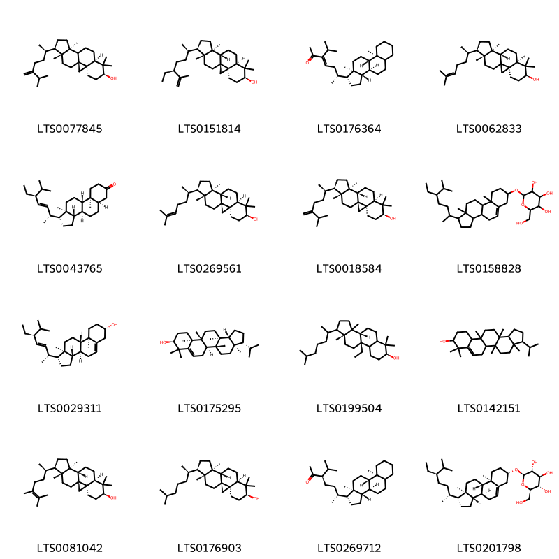{ width=100% }
    <figcaption>Hình ảnh cấu trúc hóa học của 16 hoạt chất thuộc nhóm Steroids and steroid derivatives gồm ['24-methylene-cycloartanol (LTS0077845)', '(1s,3r,6s,8r,11s,12s,15r,16r)-15-[(2r,5s)-5-ethyl-6-methylhept-6-en-2-yl]-7,7,12,16-tetramethylpentacyclo[9.7.0.0¹,³.0³,⁸.0¹²,¹⁶]octadecan-6-ol (LTS0151814)', '(6r)-6-[(1r,3as,3br,9as,9bs,11ar)-9a,11a-dimethyl-tetradecahydro-1h-cyclopenta[a]phenanthren-1-yl]-3-isopropylhept-3-en-2-one (LTS0176364)', '(3r,6s,8r,11s,12s,15r,16r)-7,7,12,16-tetramethyl-15-[(2r)-6-methylhept-5-en-2-yl]pentacyclo[9.7.0.0¹,³.0³,⁸.0¹²,¹⁶]octadecan-6-ol (LTS0062833)', 'stigmastenone (LTS0043765)', 'cycloartenol (LTS0269561)', '24-methylenecycloartanol (LTS0018584)', '2-{[1-(5-ethyl-6-methylheptan-2-yl)-9a,11a-dimethyl-1h,2h,3h,3ah,3bh,4h,6h,7h,8h,9h,9bh,10h,11h-cyclopenta[a]phenanthren-7-yl]oxy}-6-(hydroxymethyl)oxane-3,4,5-triol (LTS0158828)', 'phytosterol (LTS0029311)', 'simiarenol (LTS0175295)', '(3br,7s,9bs,11ar)-9b-ethyl-3a,6,6,11a-tetramethyl-1-(6-methylheptan-2-yl)-dodecahydro-1h-cyclopenta[a]phenanthren-7-ol (LTS0199504)', '3-isopropyl-3a,5a,8,8,11b,13a-hexamethyl-1h,2h,3h,4h,5h,5bh,6h,9h,10h,11h,11ah,12h,13h,13bh-cyclopenta[a]chrysen-9-ol (LTS0142151)', '(1s,3r,6s,8r,11s,12s,15r,16r)-15-[(2r)-5,6-dimethylhept-5-en-2-yl]-7,7,12,16-tetramethylpentacyclo[9.7.0.0¹,³.0³,⁸.0¹²,¹⁶]octadecan-6-ol (LTS0081042)', 'cycloartanol (LTS0176903)', '(3r,6r)-6-[(1r,3as,3br,9as,9bs,11ar)-9a,11a-dimethyl-tetradecahydro-1h-cyclopenta[a]phenanthren-1-yl]-3-isopropylheptan-2-one (LTS0269712)', 'sitogluside (LTS0201798)'].</figcaption>
</figure>

---

### Dược dân tộc học

Danh sách các quốc gia có sử dụng *Vigna unguiculata* trong điều trị các bệnh. 

| Country   | Disease                     | Bệnh                                                                                                                                                                                                |
|:----------|:----------------------------|:----------------------------------------------------------------------------------------------------------------------------------------------------------------------------------------------------|
| India     | Astringent, Diuretic, Tonic | MYMEMORY WARNING: YOU USED ALL AVAILABLE FREE TRANSLATIONS FOR TODAY. NEXT AVAILABLE IN  15 HOURS 13 MINUTES 31 SECONDS VISIT HTTPS://MYMEMORY.TRANSLATED.NET/DOC/USAGELIMITS.PHP TO TRANSLATE MORE |

---

# Chi Anthyllis

??? note "Danh sách các dược liệu thuộc chi"
    
	 - *Anthyllis vulneraria*

---
## Anthyllis vulneraria
### Thông tin về thực vật

!!! info "Phân loại thực vật của *Anthyllis vulneraria* từ GIBF:"
    - **Kingdom:** Plantae
    - **Phylum:** Tracheophyta
    - **Order:** Fabales
    - **Family:** Fabaceae
    - **Genus:** Anthyllis
    - **Species:** *Anthyllis vulneraria*

 

| Label (VI)   | Label (EN)   | Scientific Name      | Descriptions (VI)   | Descriptions (EN)   | Also Known As (VI)   | Also Known As (EN)                                                      |
|:-------------|:-------------|:---------------------|:--------------------|:--------------------|:---------------------|:------------------------------------------------------------------------|
| N/A          | N/A          | Anthyllis vulneraria | loài thực vật       | species of plant    | ['']                 | ['kidney vetch', "lady's fingers", "lady's fingers vetch", 'woundwort'] |

#### Phân bố trên thế giới

**Từ CSDL GIBF** nan, Italy, Belgium, Norway, Denmark, Netherlands, Malta, Spain, Portugal, Algeria, Sweden, Slovenia, Croatia, Greece, Germany, Switzerland, Austria, France, United Kingdom of Great Britain and Northern Ireland, Ireland

#### Phân bố tại Việt Nam

**Từ CSDL GIBF**: Không có ghi nhận ở Việt Nam

---
### Thành phần hóa học
        
- Theo cơ sở dữ liệu lotus: Từ loài *Anthyllis vulneraria* đã phân lập và xác định được 10 hoạt chất thuộc về các nhóm Flavonoids. 

|    | chemicalTaxonomyClassyfireClass   |   smiles_count |
|---:|:----------------------------------|---------------:|
|  0 | Flavonoids                        |             10 |

#### Nhóm Flavonoids
<figure markdown="span">
    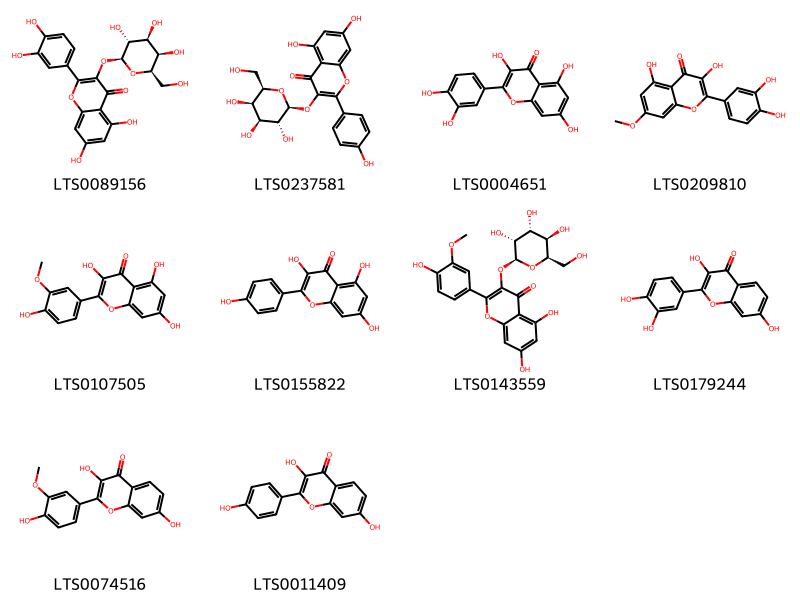{ width=100% }
    <figcaption>Hình ảnh cấu trúc hóa học của 10 hoạt chất thuộc nhóm Flavonoids gồm ['hyperoside (LTS0089156)', 'trifolin (LTS0237581)', 'quercetin (LTS0004651)', 'rhamnetin (LTS0209810)', 'isorhamnetin (LTS0107505)', 'kaempherol (LTS0155822)', '5,7-dihydroxy-2-(4-hydroxy-3-methoxyphenyl)-3-{[(2s,3r,4r,5r,6r)-3,4,5-trihydroxy-6-(hydroxymethyl)oxan-2-yl]oxy}chromen-4-one (LTS0143559)', "3,7,3',4'-tetrahydroxyflavone (LTS0179244)", 'geraldol (LTS0074516)', "3,7,4'-trihydroxyflavone (LTS0011409)"].</figcaption>
</figure>

---

### Dược dân tộc học

Danh sách các quốc gia có sử dụng *Anthyllis vulneraria* trong điều trị các bệnh. 

| Country   | Disease                                    | Bệnh                                                                                                                                                                                                |
|:----------|:-------------------------------------------|:----------------------------------------------------------------------------------------------------------------------------------------------------------------------------------------------------|
| Turkey    | Purgative, Vulnerary, Astringent, Diuretic | MYMEMORY WARNING: YOU USED ALL AVAILABLE FREE TRANSLATIONS FOR TODAY. NEXT AVAILABLE IN  15 HOURS 12 MINUTES 48 SECONDS VISIT HTTPS://MYMEMORY.TRANSLATED.NET/DOC/USAGELIMITS.PHP TO TRANSLATE MORE |
| ain       | Vulnerary                                  | MYMEMORY WARNING: YOU USED ALL AVAILABLE FREE TRANSLATIONS FOR TODAY. NEXT AVAILABLE IN  15 HOURS 12 MINUTES 45 SECONDS VISIT HTTPS://MYMEMORY.TRANSLATED.NET/DOC/USAGELIMITS.PHP TO TRANSLATE MORE |

---

# Chi Lathyrus

??? note "Danh sách các dược liệu thuộc chi"
    
	 - *Lathyrus aphaca*
	 - *Lathyrus hirsutus*
	 - *Lathyrus incanus*
	 - *Lathyrus maritimus*
	 - *Lathyrus odoratus*
	 - *Lathyrus pusillus*
	 - *Lathyrus sativus*
	 - *Lathyrus sylvestris*

---
## Lathyrus aphaca
### Thông tin về thực vật

!!! info "Phân loại thực vật của *Lathyrus aphaca* từ GIBF:"
    - **Kingdom:** Plantae
    - **Phylum:** Tracheophyta
    - **Order:** Fabales
    - **Family:** Fabaceae
    - **Genus:** Lathyrus
    - **Species:** *Lathyrus aphaca*

 

| Label (VI)   | Label (EN)   | Scientific Name   | Descriptions (VI)   | Descriptions (EN)   | Also Known As (VI)   | Also Known As (EN)                          |
|:-------------|:-------------|:------------------|:--------------------|:--------------------|:---------------------|:--------------------------------------------|
| N/A          | N/A          | Lathyrus aphaca   | loài thực vật       | species of plant    | ['']                 | ['yellow vetchling', 'yellow-flowered pea'] |

#### Phân bố trên thế giới

**Từ CSDL GIBF** Italy, Bulgaria, Belgium, Georgia, Palestine, State of, Israel, Ukraine, Netherlands, Cyprus, Spain, Türkiye, Portugal, Russian Federation, Morocco, United States of America, Croatia, Greece, Czechia, Germany, Romania, Switzerland, Austria, France, United Kingdom of Great Britain and Northern Ireland, Iraq, Serbia

#### Phân bố tại Việt Nam

**Từ CSDL GIBF**: Không có ghi nhận ở Việt Nam

---
### Thành phần hóa học
        
- Theo cơ sở dữ liệu lotus: Từ loài *Lathyrus aphaca* đã phân lập và xác định được 18 hoạt chất thuộc về các nhóm Flavonoids, Isoflavonoids. 

|    | chemicalTaxonomyClassyfireClass   |   smiles_count |
|---:|:----------------------------------|---------------:|
|  0 | Flavonoids                        |             17 |
|  1 | Isoflavonoids                     |              1 |

#### Nhóm Flavonoids
<figure markdown="span">
    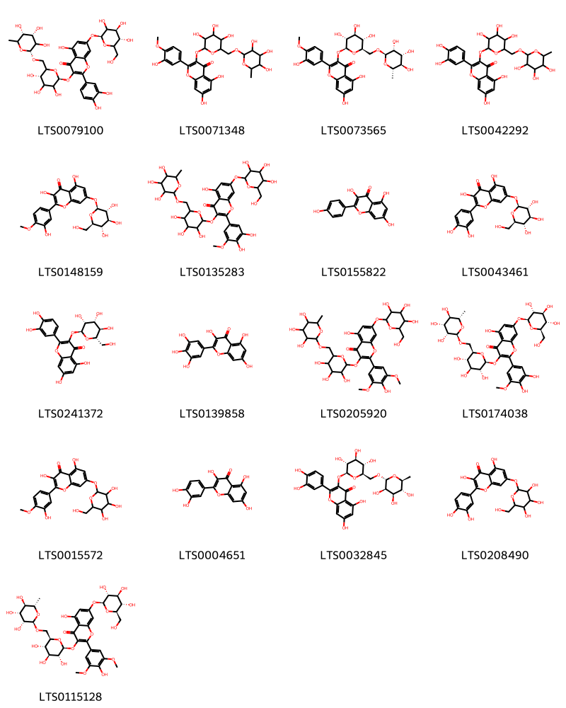{ width=100% }
    <figcaption>Hình ảnh cấu trúc hóa học của 17 hoạt chất thuộc nhóm Flavonoids gồm ['2-(3,4-dihydroxyphenyl)-5-hydroxy-7-{[(2s,4s,5s)-3,4,5-trihydroxy-6-(hydroxymethyl)oxan-2-yl]oxy}-3-{[(2s,5s)-3,4,5-trihydroxy-6-({[(2r,4s,5r)-3,4,5-trihydroxy-6-methyloxan-2-yl]oxy}methyl)oxan-2-yl]oxy}chromen-4-one (LTS0079100)', '5,7-dihydroxy-2-(3-hydroxy-4-methoxyphenyl)-3-[(3,4,5-trihydroxy-6-{[(3,4,5-trihydroxy-6-methyloxan-2-yl)oxy]methyl}oxan-2-yl)oxy]chromen-4-one (LTS0071348)', '5,7-dihydroxy-2-(3-hydroxy-4-methoxyphenyl)-3-{[(2s,3r,4s,5s,6r)-3,4,5-trihydroxy-6-({[(2r,3r,4r,5r,6s)-3,4,5-trihydroxy-6-methyloxan-2-yl]oxy}methyl)oxan-2-yl]oxy}chromen-4-one (LTS0073565)', 'rutin (LTS0042292)', '3,5-dihydroxy-2-(3-hydroxy-4-methoxyphenyl)-7-{[(2s,3r,4s,5s,6r)-3,4,5-trihydroxy-6-(hydroxymethyl)oxan-2-yl]oxy}chromen-4-one (LTS0148159)', '2-(3,4-dihydroxy-5-methoxyphenyl)-5-hydroxy-7-{[3,4,5-trihydroxy-6-(hydroxymethyl)oxan-2-yl]oxy}-3-[(3,4,5-trihydroxy-6-{[(3,4,5-trihydroxy-6-methyloxan-2-yl)oxy]methyl}oxan-2-yl)oxy]chromen-4-one (LTS0135283)', 'kaempherol (LTS0155822)', 'quercimeritrin (LTS0043461)', '2-(3,4-dihydroxyphenyl)-5,7-dihydroxy-3-{[(2s,3r,4r,5r,6s)-3,4,5-trihydroxy-6-(hydroxymethyl)oxan-2-yl]oxy}chromen-4-one (LTS0241372)', 'myricetin (LTS0139858)', '5-hydroxy-2-(4-hydroxy-3,5-dimethoxyphenyl)-7-{[3,4,5-trihydroxy-6-(hydroxymethyl)oxan-2-yl]oxy}-3-[(3,4,5-trihydroxy-6-{[(3,4,5-trihydroxy-6-methyloxan-2-yl)oxy]methyl}oxan-2-yl)oxy]chromen-4-one (LTS0205920)', '2-(3,4-dihydroxy-5-methoxyphenyl)-5-hydroxy-7-{[(2s,3r,4s,5s,6r)-3,4,5-trihydroxy-6-(hydroxymethyl)oxan-2-yl]oxy}-3-{[(2s,3r,4s,5s,6r)-3,4,5-trihydroxy-6-({[(2r,3r,4r,5r,6s)-3,4,5-trihydroxy-6-methyloxan-2-yl]oxy}methyl)oxan-2-yl]oxy}chromen-4-one (LTS0174038)', '3,5-dihydroxy-2-(3-hydroxy-4-methoxyphenyl)-7-{[3,4,5-trihydroxy-6-(hydroxymethyl)oxan-2-yl]oxy}chromen-4-one (LTS0015572)', 'quercetin (LTS0004651)', '3-rutinosyl quercetin (LTS0032845)', 'quercimeritrin (LTS0208490)', '5-hydroxy-2-(4-hydroxy-3,5-dimethoxyphenyl)-7-{[(2s,3r,4s,5s,6r)-3,4,5-trihydroxy-6-(hydroxymethyl)oxan-2-yl]oxy}-3-{[(2s,3r,4s,5s,6r)-3,4,5-trihydroxy-6-({[(2r,3r,4r,5r,6s)-3,4,5-trihydroxy-6-methyloxan-2-yl]oxy}methyl)oxan-2-yl]oxy}chromen-4-one (LTS0115128)'].</figcaption>
</figure>
#### Nhóm Isoflavonoids
<figure markdown="span">
    { width=100% }
    <figcaption>Hình ảnh cấu trúc hóa học của 1 hoạt chất thuộc nhóm Isoflavonoids gồm ['(-)-maackiain (LTS0159117)'].</figcaption>
</figure>

---

### Dược dân tộc học

Danh sách các quốc gia có sử dụng *Lathyrus aphaca* trong điều trị các bệnh. 

| Country   | Disease   | Bệnh                                                                                                                                                                                                |
|:----------|:----------|:----------------------------------------------------------------------------------------------------------------------------------------------------------------------------------------------------|
| Elsewhere | Narcotic  | MYMEMORY WARNING: YOU USED ALL AVAILABLE FREE TRANSLATIONS FOR TODAY. NEXT AVAILABLE IN  15 HOURS 12 MINUTES 13 SECONDS VISIT HTTPS://MYMEMORY.TRANSLATED.NET/DOC/USAGELIMITS.PHP TO TRANSLATE MORE |

---

---
## Lathyrus hirsutus
### Thông tin về thực vật

!!! info "Phân loại thực vật của *Lathyrus hirsutus* từ GIBF:"
    - **Kingdom:** Plantae
    - **Phylum:** Tracheophyta
    - **Order:** Fabales
    - **Family:** Fabaceae
    - **Genus:** Lathyrus
    - **Species:** *Lathyrus hirsutus*

 

| Label (VI)   | Label (EN)   | Scientific Name   | Descriptions (VI)   | Descriptions (EN)   | Also Known As (VI)   | Also Known As (EN)   |
|:-------------|:-------------|:------------------|:--------------------|:--------------------|:---------------------|:---------------------|
| N/A          | N/A          | Lathyrus hirsutus |                     | species of plant    | ['']                 | ['']                 |

#### Phân bố trên thế giới

**Từ CSDL GIBF** France, United States of America

#### Phân bố tại Việt Nam

**Từ CSDL GIBF**: Không có ghi nhận ở Việt Nam

---
### Thành phần hóa học
        
- Theo cơ sở dữ liệu lotus: Từ loài *Lathyrus hirsutus* đã phân lập và xác định được 11 hoạt chất thuộc về các nhóm Flavonoids, Benzopyrans, Isoflavonoids. 

|    | chemicalTaxonomyClassyfireClass   |   smiles_count |
|---:|:----------------------------------|---------------:|
|  0 | Benzopyrans                       |              1 |
|  1 | Flavonoids                        |              8 |
|  2 | Isoflavonoids                     |              2 |

#### Nhóm Benzopyrans
<figure markdown="span">
    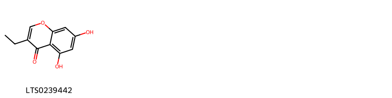{ width=100% }
    <figcaption>Hình ảnh cấu trúc hóa học của 1 hoạt chất thuộc nhóm Benzopyrans gồm ['lathodoratin (LTS0239442)'].</figcaption>
</figure>
#### Nhóm Flavonoids
<figure markdown="span">
    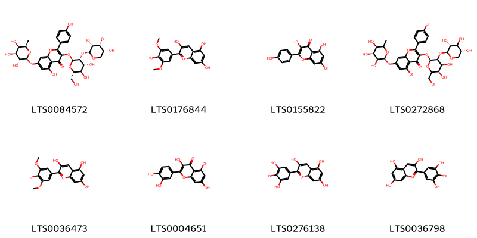{ width=100% }
    <figcaption>Hình ảnh cấu trúc hóa học của 8 hoạt chất thuộc nhóm Flavonoids gồm ['3-{[(2s,3r,4r,5r,6s)-4,5-dihydroxy-6-(hydroxymethyl)-3-{[(2r,3r,4r,5r)-3,4,5-trihydroxyoxan-2-yl]oxy}oxan-2-yl]oxy}-5-hydroxy-2-(4-hydroxyphenyl)-7-{[(2s,3r,4s,5r,6r)-3,4,5-trihydroxy-6-methyloxan-2-yl]oxy}chromen-4-one (LTS0084572)', 'malvidin (LTS0176844)', 'kaempherol (LTS0155822)', '3-{[(2s,5r)-4,5-dihydroxy-6-(hydroxymethyl)-3-{[(2s,3r,5r)-3,4,5-trihydroxyoxan-2-yl]oxy}oxan-2-yl]oxy}-5-hydroxy-2-(4-hydroxyphenyl)-7-{[(2s,4s,5r)-3,4,5-trihydroxy-6-methyloxan-2-yl]oxy}chromen-4-one (LTS0272868)', '2-(3,5-dimethoxy-4-oxidophenyl)-3,5,7-trihydroxy-1λ⁴-chromen-1-ylium (LTS0036473)', 'quercetin (LTS0004651)', '2-(3,5-dihydroxy-4-oxidophenyl)-3,5,7-trihydroxy-1λ⁴-chromen-1-ylium (LTS0276138)', 'delphinidin (LTS0036798)'].</figcaption>
</figure>
#### Nhóm Isoflavonoids
<figure markdown="span">
    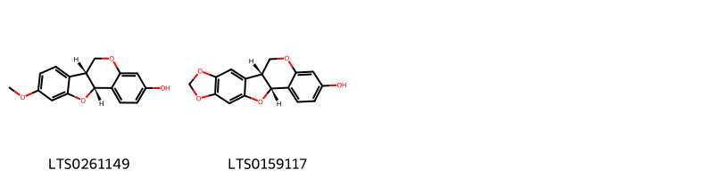{ width=100% }
    <figcaption>Hình ảnh cấu trúc hóa học của 2 hoạt chất thuộc nhóm Isoflavonoids gồm ['medicarpin, (-)- (LTS0261149)', '(-)-maackiain (LTS0159117)'].</figcaption>
</figure>

---

### Dược dân tộc học

Danh sách các quốc gia có sử dụng *Lathyrus hirsutus* trong điều trị các bệnh. 

| Country   | Disease   | Bệnh                                                                                                                                                                                                |
|:----------|:----------|:----------------------------------------------------------------------------------------------------------------------------------------------------------------------------------------------------|
| Europe    | Poison    | MYMEMORY WARNING: YOU USED ALL AVAILABLE FREE TRANSLATIONS FOR TODAY. NEXT AVAILABLE IN  15 HOURS 11 MINUTES 39 SECONDS VISIT HTTPS://MYMEMORY.TRANSLATED.NET/DOC/USAGELIMITS.PHP TO TRANSLATE MORE |

---

---
## Lathyrus incanus
### Thông tin về thực vật

!!! info "Phân loại thực vật của *Lathyrus decaphyllus* từ GIBF:"
    - **Kingdom:** Plantae
    - **Phylum:** Tracheophyta
    - **Order:** Fabales
    - **Family:** Fabaceae
    - **Genus:** Lathyrus
    - **Species:** *Lathyrus decaphyllus*

 

| Label (VI)   | Label (EN)   | Scientific Name   | Descriptions (VI)   | Descriptions (EN)   | Also Known As (VI)   | Also Known As (EN)   |
|:-------------|:-------------|:------------------|:--------------------|:--------------------|:---------------------|:---------------------|
| N/A          | N/A          | Lathyrus incanus  |                     |                     | ['']                 | ['']                 |

#### Phân bố trên thế giới

**Từ CSDL GIBF** nan, United States of America

#### Phân bố tại Việt Nam

**Từ CSDL GIBF**: Không có ghi nhận ở Việt Nam

---
### Thành phần hóa học
        
- Theo cơ sở dữ liệu lotus: Từ loài *Lathyrus decaphyllus* đã phân lập và xác định được Chưa có hoạt chất nào được phân lập. hoạt chất thuộc về các nhóm Không có hoạt chất nào được phân lập. 

Không có hình ảnh nào được tạo ra

---

### Dược dân tộc học

Danh sách các quốc gia có sử dụng *Lathyrus decaphyllus* trong điều trị các bệnh. 

| Country   | Disease   | Bệnh                                                                                                                                                                                                |
|:----------|:----------|:----------------------------------------------------------------------------------------------------------------------------------------------------------------------------------------------------|
| Europe    | Poison    | MYMEMORY WARNING: YOU USED ALL AVAILABLE FREE TRANSLATIONS FOR TODAY. NEXT AVAILABLE IN  15 HOURS 11 MINUTES 06 SECONDS VISIT HTTPS://MYMEMORY.TRANSLATED.NET/DOC/USAGELIMITS.PHP TO TRANSLATE MORE |

---

---
## Lathyrus maritimus
### Thông tin về thực vật

!!! info "Phân loại thực vật của *N/A* từ GIBF:"
    - **Kingdom:** Plantae
    - **Phylum:** Tracheophyta
    - **Order:** Fabales
    - **Family:** Fabaceae
    - **Genus:** Lathyrus
    - **Species:** *N/A*

 

| Label (VI)   | Label (EN)   | Scientific Name    | Descriptions (VI)   | Descriptions (EN)               | Also Known As (VI)   | Also Known As (EN)   |
|:-------------|:-------------|:-------------------|:--------------------|:--------------------------------|:---------------------|:---------------------|
| N/A          | N/A          | Lathyrus maritimus |                     | wikispecies disambiguation page | ['']                 | ['']                 |

#### Phân bố trên thế giới

**Từ CSDL GIBF** nan, Italy, Australia, Belgium, Argentina, Palestine, State of, Gibraltar, Norway, Israel, Canada, Ukraine, Denmark, Netherlands, Cyprus, Malta, Spain, Chinese Taipei, Portugal, Algeria, Russian Federation, United States of America, Sweden, Chile, Croatia, Greece, South Africa, Switzerland, Mexico, France, Dominican Republic, Austria, United Kingdom of Great Britain and Northern Ireland, Ecuador, India, New Zealand

#### Phân bố tại Việt Nam

**Từ CSDL GIBF**: Không có ghi nhận ở Việt Nam

---
### Thành phần hóa học
        
- Theo cơ sở dữ liệu lotus: Từ loài *N/A* đã phân lập và xác định được Chưa có hoạt chất nào được phân lập. hoạt chất thuộc về các nhóm Không có hoạt chất nào được phân lập. 

Không có hình ảnh nào được tạo ra

---

### Dược dân tộc học

Danh sách các quốc gia có sử dụng *N/A* trong điều trị các bệnh. 

| Country   | Disease   | Bệnh                                                                                                                                                                                                |
|:----------|:----------|:----------------------------------------------------------------------------------------------------------------------------------------------------------------------------------------------------|
| China     | Tonic     | MYMEMORY WARNING: YOU USED ALL AVAILABLE FREE TRANSLATIONS FOR TODAY. NEXT AVAILABLE IN  15 HOURS 10 MINUTES 39 SECONDS VISIT HTTPS://MYMEMORY.TRANSLATED.NET/DOC/USAGELIMITS.PHP TO TRANSLATE MORE |

---

---
## Lathyrus odoratus
### Thông tin về thực vật

!!! info "Phân loại thực vật của *Lathyrus odoratus* từ GIBF:"
    - **Kingdom:** Plantae
    - **Phylum:** Tracheophyta
    - **Order:** Fabales
    - **Family:** Fabaceae
    - **Genus:** Lathyrus
    - **Species:** *Lathyrus odoratus*

 

| Label (VI)   | Label (EN)   | Scientific Name   | Descriptions (VI)   | Descriptions (EN)          | Also Known As (VI)   | Also Known As (EN)                              |
|:-------------|:-------------|:------------------|:--------------------|:---------------------------|:---------------------|:------------------------------------------------|
| N/A          | N/A          | Lathyrus odoratus |                     | species of flowering plant | ['']                 | ['Lathyrus odoratus', "sweet pea 'Millennium'"] |

#### Phân bố trên thế giới

**Từ CSDL GIBF** Italy, Australia, Belgium, Argentina, Norway, Canada, Denmark, Netherlands, Cyprus, Portugal, Russian Federation, United States of America, Sweden, Uruguay, Germany, Switzerland, Mexico, France, Austria, United Kingdom of Great Britain and Northern Ireland, India, Poland, New Zealand

#### Phân bố tại Việt Nam

**Từ CSDL GIBF**: Không có ghi nhận ở Việt Nam

---
### Thành phần hóa học
        
- Theo cơ sở dữ liệu lotus: Từ loài *Lathyrus odoratus* đã phân lập và xác định được 40 hoạt chất thuộc về các nhóm Fatty Acyls, Flavonoids, Prenol lipids, Isoflavonoids, Linear 1,3-diarylpropanoids, Azoles, Azolines, Organooxygen compounds, Carboxylic acids and derivatives, Benzopyrans. 

|    | chemicalTaxonomyClassyfireClass   |   smiles_count |
|---:|:----------------------------------|---------------:|
|  0 | Azoles                            |              1 |
|  1 | Azolines                          |              1 |
|  2 | Benzopyrans                       |              3 |
|  3 | Carboxylic acids and derivatives  |              5 |
|  4 | Fatty Acyls                       |              1 |
|  5 | Flavonoids                        |             10 |
|  6 | Isoflavonoids                     |              5 |
|  7 | Linear 1,3-diarylpropanoids       |              4 |
|  8 | Organooxygen compounds            |              4 |
|  9 | Prenol lipids                     |              6 |

#### Nhóm Azoles
<figure markdown="span">
    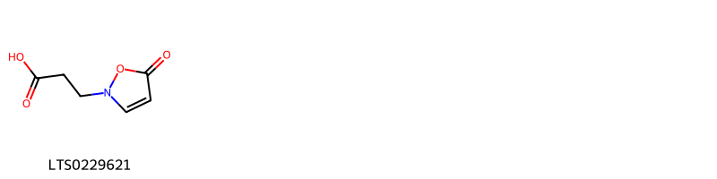{ width=100% }
    <figcaption>Hình ảnh cấu trúc hóa học của 1 hoạt chất thuộc nhóm Azoles gồm ['3-(5-oxo-1,2-oxazol-2-yl)propanoic acid (LTS0229621)'].</figcaption>
</figure>
#### Nhóm Azolines
<figure markdown="span">
    { width=100% }
    <figcaption>Hình ảnh cấu trúc hóa học của 1 hoạt chất thuộc nhóm Azolines gồm ['3-(5-oxo-4h-1,2-oxazol-3-yl)propanenitrile (LTS0245690)'].</figcaption>
</figure>
#### Nhóm Benzopyrans
<figure markdown="span">
    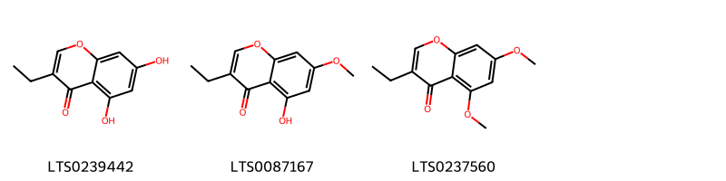{ width=100% }
    <figcaption>Hình ảnh cấu trúc hóa học của 3 hoạt chất thuộc nhóm Benzopyrans gồm ['lathodoratin (LTS0239442)', 'methyl-lathodoratin (LTS0087167)', '3-ethyl-5,7-dimethoxychromen-4-one (LTS0237560)'].</figcaption>
</figure>
#### Nhóm Carboxylic acids and derivatives
<figure markdown="span">
    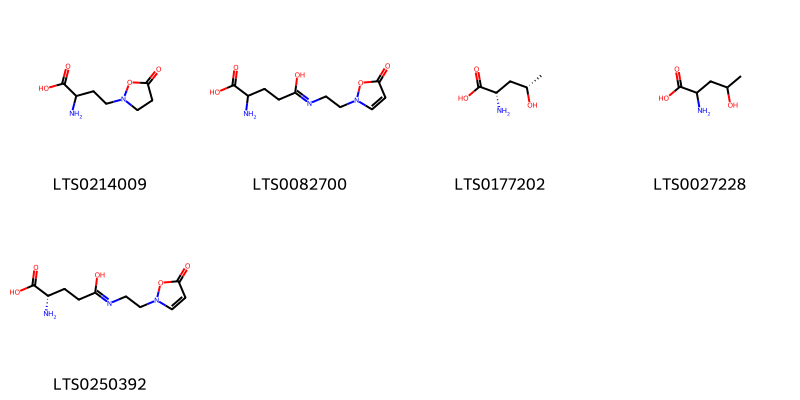{ width=100% }
    <figcaption>Hình ảnh cấu trúc hóa học của 5 hoạt chất thuộc nhóm Carboxylic acids and derivatives gồm ['2-amino-4-(5-oxo-1,2-oxazolidin-2-yl)butanoic acid (LTS0214009)', '2-amino-4-{[2-(5-oxo-1,2-oxazol-2-yl)ethyl]-c-hydroxycarbonimidoyl}butanoic acid (LTS0082700)', '(2s,4s)-2-amino-4-hydroxypentanoic acid (LTS0177202)', '2-amino-4-hydroxypentanoic acid (LTS0027228)', '(2s)-2-amino-4-{[2-(5-oxo-1,2-oxazol-2-yl)ethyl]-c-hydroxycarbonimidoyl}butanoic acid (LTS0250392)'].</figcaption>
</figure>
#### Nhóm Fatty Acyls
<figure markdown="span">
    { width=100% }
    <figcaption>Hình ảnh cấu trúc hóa học của 1 hoạt chất thuộc nhóm Fatty Acyls gồm ['2-carboxy-d-arabinitol (LTS0056947)'].</figcaption>
</figure>
#### Nhóm Flavonoids
<figure markdown="span">
    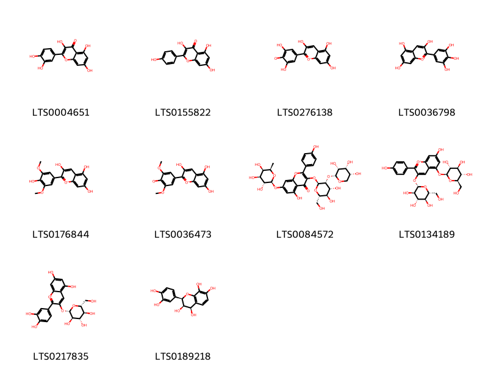{ width=100% }
    <figcaption>Hình ảnh cấu trúc hóa học của 10 hoạt chất thuộc nhóm Flavonoids gồm ['quercetin (LTS0004651)', 'kaempherol (LTS0155822)', '2-(3,5-dihydroxy-4-oxidophenyl)-3,5,7-trihydroxy-1λ⁴-chromen-1-ylium (LTS0276138)', 'delphinidin (LTS0036798)', 'malvidin (LTS0176844)', '2-(3,5-dimethoxy-4-oxidophenyl)-3,5,7-trihydroxy-1λ⁴-chromen-1-ylium (LTS0036473)', '3-{[(2s,3r,4r,5r,6s)-4,5-dihydroxy-6-(hydroxymethyl)-3-{[(2r,3r,4r,5r)-3,4,5-trihydroxyoxan-2-yl]oxy}oxan-2-yl]oxy}-5-hydroxy-2-(4-hydroxyphenyl)-7-{[(2s,3r,4s,5r,6r)-3,4,5-trihydroxy-6-methyloxan-2-yl]oxy}chromen-4-one (LTS0084572)', 'pelargonidin 3,5-diglucoside (LTS0134189)', 'cyanidin 3-glucoside (LTS0217835)', 'melacacidin (LTS0189218)'].</figcaption>
</figure>
#### Nhóm Isoflavonoids
<figure markdown="span">
    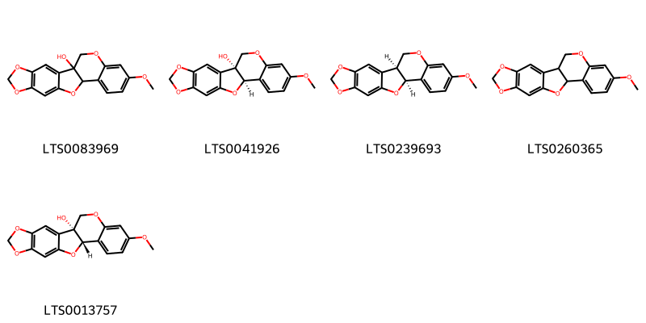{ width=100% }
    <figcaption>Hình ảnh cấu trúc hóa học của 5 hoạt chất thuộc nhóm Isoflavonoids gồm ['pisatin (LTS0083969)', 'pisatin (LTS0041926)', '(1s,12s)-16-methoxy-5,7,11,19-tetraoxapentacyclo[10.8.0.0²,¹⁰.0⁴,⁸.0¹³,¹⁸]icosa-2,4(8),9,13,15,17-hexaene (LTS0239693)', 'pterocarpin (LTS0260365)', '(1r,12s)-16-methoxy-5,7,11,19-tetraoxapentacyclo[10.8.0.0²,¹⁰.0⁴,⁸.0¹³,¹⁸]icosa-2,4(8),9,13,15,17-hexaen-1-ol (LTS0013757)'].</figcaption>
</figure>
#### Nhóm Linear 1_3-diarylpropanoids
<figure markdown="span">
    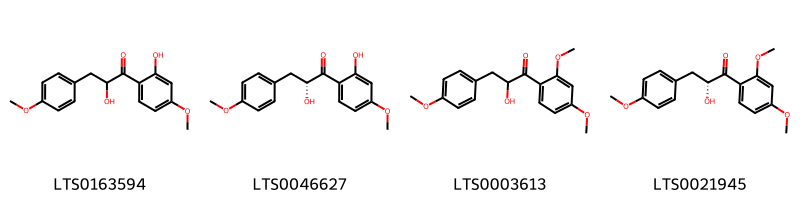{ width=100% }
    <figcaption>Hình ảnh cấu trúc hóa học của Không tìm thấy chú thích hoạt chất thuộc nhóm Linear 1_3-diarylpropanoids gồm Không tìm thấy chú thích.</figcaption>
</figure>
#### Nhóm Organooxygen compounds
<figure markdown="span">
    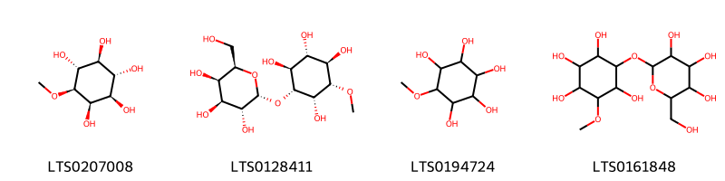{ width=100% }
    <figcaption>Hình ảnh cấu trúc hóa học của 4 hoạt chất thuộc nhóm Organooxygen compounds gồm ['(-)-bornesitol (LTS0207008)', '(1s,2r,3r,4s,5s,6r)-4-methoxy-6-{[(2r,3r,4s,5r,6r)-3,4,5-trihydroxy-6-(hydroxymethyl)oxan-2-yl]oxy}cyclohexane-1,2,3,5-tetrol (LTS0128411)', 'pinitol (LTS0194724)', '4-methoxy-6-{[3,4,5-trihydroxy-6-(hydroxymethyl)oxan-2-yl]oxy}cyclohexane-1,2,3,5-tetrol (LTS0161848)'].</figcaption>
</figure>
#### Nhóm Prenol lipids
<figure markdown="span">
    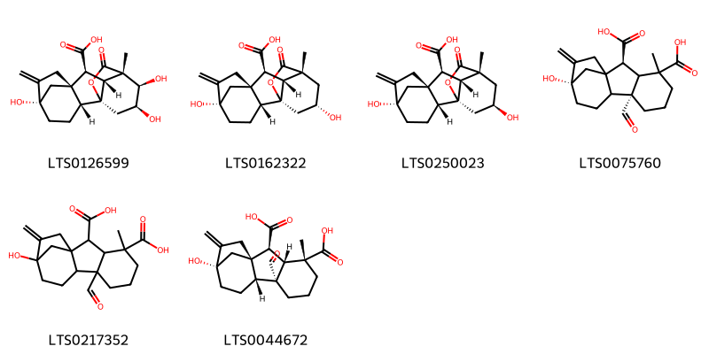{ width=100% }
    <figcaption>Hình ảnh cấu trúc hóa học của 6 hoạt chất thuộc nhóm Prenol lipids gồm ['gibberellin a8 (LTS0126599)', '(1r,2r,5s,8s,9s,10r,11r,13s)-5,13-dihydroxy-11-methyl-6-methylidene-16-oxo-15-oxapentacyclo[9.3.2.1⁵,⁸.0¹,¹⁰.0²,⁸]heptadecane-9-carboxylic acid (LTS0162322)', 'gibberellin a29 (LTS0250023)', 'gibberellin a19 (LTS0075760)', '8-formyl-12-hydroxy-4-methyl-13-methylidenetetracyclo[10.2.1.0¹,⁹.0³,⁸]pentadecane-2,4-dicarboxylic acid (LTS0217352)', 'gibberellin a19 (LTS0044672)'].</figcaption>
</figure>

---

### Dược dân tộc học

Danh sách các quốc gia có sử dụng *Lathyrus odoratus* trong điều trị các bệnh. 

| Country   | Disease   | Bệnh                                                                                                                                                                                                |
|:----------|:----------|:----------------------------------------------------------------------------------------------------------------------------------------------------------------------------------------------------|
| Europe    | Poison    | MYMEMORY WARNING: YOU USED ALL AVAILABLE FREE TRANSLATIONS FOR TODAY. NEXT AVAILABLE IN  15 HOURS 10 MINUTES 11 SECONDS VISIT HTTPS://MYMEMORY.TRANSLATED.NET/DOC/USAGELIMITS.PHP TO TRANSLATE MORE |

---

---
## Lathyrus pusillus
### Thông tin về thực vật

!!! info "Phân loại thực vật của *Lathyrus pusillus* từ GIBF:"
    - **Kingdom:** Plantae
    - **Phylum:** Tracheophyta
    - **Order:** Fabales
    - **Family:** Fabaceae
    - **Genus:** Lathyrus
    - **Species:** *Lathyrus pusillus*

 

| Label (VI)   | Label (EN)   | Scientific Name   | Descriptions (VI)   | Descriptions (EN)   | Also Known As (VI)   | Also Known As (EN)   |
|:-------------|:-------------|:------------------|:--------------------|:--------------------|:---------------------|:---------------------|
| N/A          | N/A          | Lathyrus pusillus | loài thực vật       | species of plant    | ['']                 | ['']                 |

#### Phân bố trên thế giới

**Từ CSDL GIBF** nan, Ecuador, Brazil, Argentina, United States of America, Peru, Uruguay, Yemen, Chile

#### Phân bố tại Việt Nam

**Từ CSDL GIBF**: Không có ghi nhận ở Việt Nam

---
### Thành phần hóa học
        
- Theo cơ sở dữ liệu lotus: Từ loài *Lathyrus pusillus* đã phân lập và xác định được Chưa có hoạt chất nào được phân lập. hoạt chất thuộc về các nhóm Không có hoạt chất nào được phân lập. 

Không có hình ảnh nào được tạo ra

---

### Dược dân tộc học

Danh sách các quốc gia có sử dụng *Lathyrus pusillus* trong điều trị các bệnh. 

| Country   | Disease   | Bệnh                                                                                                                                                                                                |
|:----------|:----------|:----------------------------------------------------------------------------------------------------------------------------------------------------------------------------------------------------|
| Europe    | Poison    | MYMEMORY WARNING: YOU USED ALL AVAILABLE FREE TRANSLATIONS FOR TODAY. NEXT AVAILABLE IN  15 HOURS 09 MINUTES 38 SECONDS VISIT HTTPS://MYMEMORY.TRANSLATED.NET/DOC/USAGELIMITS.PHP TO TRANSLATE MORE |

---

---
## Lathyrus sativus
### Thông tin về thực vật

!!! info "Phân loại thực vật của *Lathyrus sativus* từ GIBF:"
    - **Kingdom:** Plantae
    - **Phylum:** Tracheophyta
    - **Order:** Fabales
    - **Family:** Fabaceae
    - **Genus:** Lathyrus
    - **Species:** *Lathyrus sativus*

 

| Label (VI)   | Label (EN)   | Scientific Name   | Descriptions (VI)   | Descriptions (EN)   | Also Known As (VI)   | Also Known As (EN)   |
|:-------------|:-------------|:------------------|:--------------------|:--------------------|:---------------------|:---------------------|
| N/A          | N/A          | Lathyrus sativus  | loài thực vật       | species of plant    | ['']                 | ['hrachor setý']     |

#### Phân bố trên thế giới

**Từ CSDL GIBF** nan, Italy, Bulgaria, Belgium, Tunisia, Canada, Tajikistan, Denmark, Netherlands, Belarus, Afghanistan, Spain, Türkiye, Hungary, Portugal, Russian Federation, Bangladesh, United States of America, Chile, Greece, Germany, Romania, Iran (Islamic Republic of), Switzerland, Austria, France, United Kingdom of Great Britain and Northern Ireland, Ecuador, India, Lebanon, Poland, Ethiopia

#### Phân bố tại Việt Nam

**Từ CSDL GIBF**: Không có ghi nhận ở Việt Nam

---
### Thành phần hóa học
        
- Theo cơ sở dữ liệu lotus: Từ loài *Lathyrus sativus* đã phân lập và xác định được 66 hoạt chất thuộc về các nhóm Flavonoids, Prenol lipids, Steroids and steroid derivatives, Isoflavonoids, Organonitrogen compounds, Azolines, Organooxygen compounds, Carboxylic acids and derivatives. 

|    | chemicalTaxonomyClassyfireClass   |   smiles_count |
|---:|:----------------------------------|---------------:|
|  0 | Azolines                          |              1 |
|  1 | Carboxylic acids and derivatives  |             21 |
|  2 | Flavonoids                        |             10 |
|  3 | Isoflavonoids                     |              4 |
|  4 | Organonitrogen compounds          |              6 |
|  5 | Organooxygen compounds            |              1 |
|  6 | Prenol lipids                     |             12 |
|  7 | Steroids and steroid derivatives  |             11 |

#### Nhóm Azolines
<figure markdown="span">
    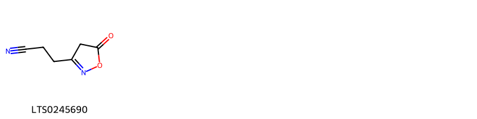{ width=100% }
    <figcaption>Hình ảnh cấu trúc hóa học của 1 hoạt chất thuộc nhóm Azolines gồm ['3-(5-oxo-4h-1,2-oxazol-3-yl)propanenitrile (LTS0245690)'].</figcaption>
</figure>
#### Nhóm Carboxylic acids and derivatives
<figure markdown="span">
    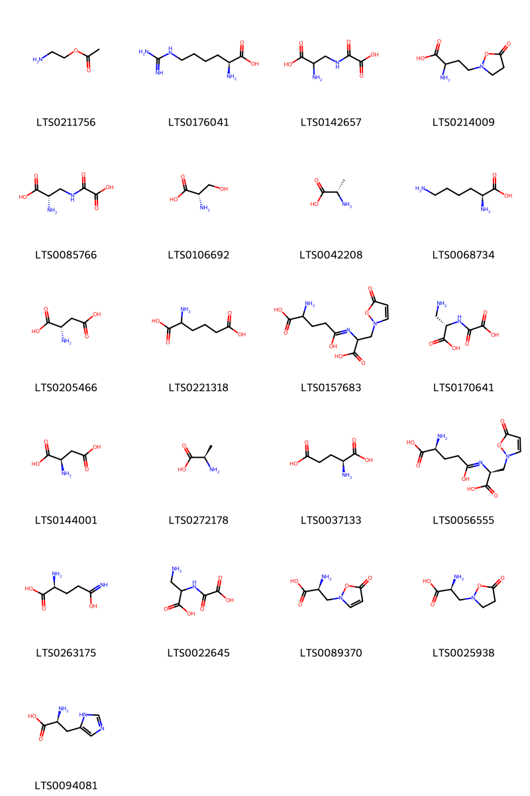{ width=100% }
    <figcaption>Hình ảnh cấu trúc hóa học của 21 hoạt chất thuộc nhóm Carboxylic acids and derivatives gồm ['ethanolamine acetate (LTS0211756)', 'l-homoarginine (LTS0176041)', 'dl-dencichin (LTS0142657)', '2-amino-4-(5-oxo-1,2-oxazolidin-2-yl)butanoic acid (LTS0214009)', 'boaa (LTS0085766)', 'l-serine (LTS0106692)', 'l-alanine (LTS0042208)', 'l-lysine (LTS0068734)', 'l-aspartic acid (LTS0205466)', 'aminoadipic acid (LTS0221318)', '2-amino-4-{[1-carboxy-2-(5-oxo-1,2-oxazol-2-yl)ethyl]-c-hydroxycarbonimidoyl}butanoic acid (LTS0157683)', '(2s)-3-amino-2-(carboxyformamido)propanoic acid (LTS0170641)', 'd-aspartic acid (LTS0144001)', 'd-alanine (LTS0272178)', 'l-glutamic acid (LTS0037133)', '(2s)-2-amino-4-{[(1s)-1-carboxy-2-(5-oxo-1,2-oxazol-2-yl)ethyl]-c-hydroxycarbonimidoyl}butanoic acid (LTS0056555)', 'l glutamine (LTS0263175)', '3-amino-2-(carboxyformamido)propanoic acid (LTS0022645)', '(2s)-2-amino-3-(5-oxo-1,2-oxazol-2-yl)propanoic acid (LTS0089370)', '(2s)-2-amino-3-(5-oxo-1,2-oxazolidin-2-yl)propanoic acid (LTS0025938)', 'l-histidine (LTS0094081)'].</figcaption>
</figure>
#### Nhóm Flavonoids
<figure markdown="span">
    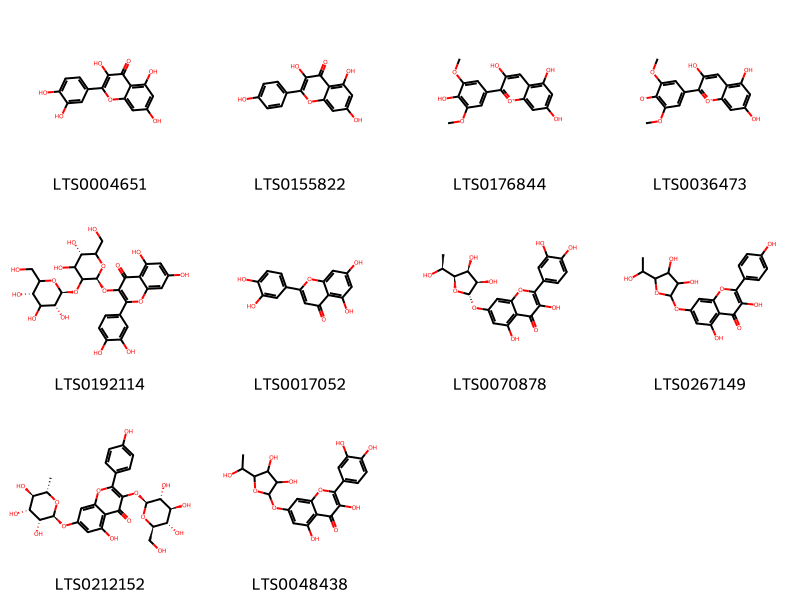{ width=100% }
    <figcaption>Hình ảnh cấu trúc hóa học của 10 hoạt chất thuộc nhóm Flavonoids gồm ['quercetin (LTS0004651)', 'kaempherol (LTS0155822)', 'malvidin (LTS0176844)', '2-(3,5-dimethoxy-4-oxidophenyl)-3,5,7-trihydroxy-1λ⁴-chromen-1-ylium (LTS0036473)', 'quercetin 3-sophoroside (LTS0192114)', 'luteolin (LTS0017052)', '7-{[(2s,3r,4s,5s)-3,4-dihydroxy-5-[(1s)-1-hydroxyethyl]oxolan-2-yl]oxy}-2-(3,4-dihydroxyphenyl)-3,5-dihydroxychromen-4-one (LTS0070878)', '7-{[3,4-dihydroxy-5-(1-hydroxyethyl)oxolan-2-yl]oxy}-3,5-dihydroxy-2-(4-hydroxyphenyl)chromen-4-one (LTS0267149)', '5-hydroxy-2-(4-hydroxyphenyl)-3-{[(2s,3r,4s,5s,6r)-3,4,5-trihydroxy-6-(hydroxymethyl)oxan-2-yl]oxy}-7-{[(2s,3r,4r,5r,6s)-3,4,5-trihydroxy-6-methyloxan-2-yl]oxy}chromen-4-one (LTS0212152)', '7-{[3,4-dihydroxy-5-(1-hydroxyethyl)oxolan-2-yl]oxy}-2-(3,4-dihydroxyphenyl)-3,5-dihydroxychromen-4-one (LTS0048438)'].</figcaption>
</figure>
#### Nhóm Isoflavonoids
<figure markdown="span">
    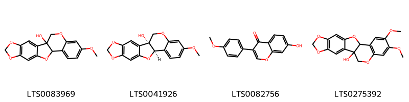{ width=100% }
    <figcaption>Hình ảnh cấu trúc hóa học của 4 hoạt chất thuộc nhóm Isoflavonoids gồm ['pisatin (LTS0083969)', 'pisatin (LTS0041926)', 'formononetin (LTS0082756)', 'lathycarpin (LTS0275392)'].</figcaption>
</figure>
#### Nhóm Organonitrogen compounds
<figure markdown="span">
    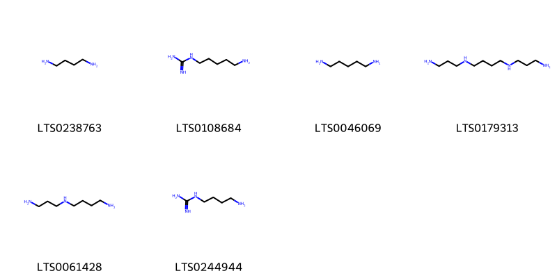{ width=100% }
    <figcaption>Hình ảnh cấu trúc hóa học của 6 hoạt chất thuộc nhóm Organonitrogen compounds gồm ['putrescine (LTS0238763)', 'n-(5-aminopentyl)guanidine (LTS0108684)', 'pentane-1,5-diamine (LTS0046069)', 'spermine (LTS0179313)', 'spermidine (LTS0061428)', 'agmatine (LTS0244944)'].</figcaption>
</figure>
#### Nhóm Organooxygen compounds
<figure markdown="span">
    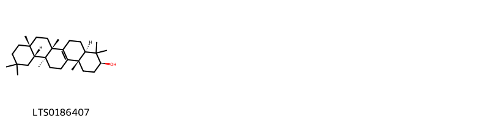{ width=100% }
    <figcaption>Hình ảnh cấu trúc hóa học của 1 hoạt chất thuộc nhóm Organooxygen compounds gồm ['isomultiflorenol (LTS0186407)'].</figcaption>
</figure>
#### Nhóm Prenol lipids
<figure markdown="span">
    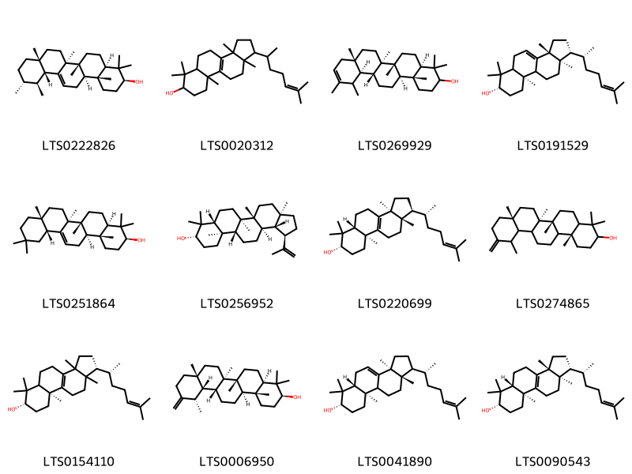{ width=100% }
    <figcaption>Hình ảnh cấu trúc hóa học của 12 hoạt chất thuộc nhóm Prenol lipids gồm ['amyrin (LTS0222826)', 'lanster (LTS0020312)', '(4ar,6ar,6br,8as,12ar,12br,14ar,14br)-4,4,6a,6b,8a,11,12,14b-octamethyl-2,3,4a,5,6,7,8,9,12,12a,12b,13,14,14a-tetradecahydro-1h-picen-3-ol (LTS0269929)', '(1r,3ar,7s,9ar,11ar)-3a,6,6,9a,11a-pentamethyl-1-[(2r)-6-methylhept-5-en-2-yl]-1h,2h,3h,5h,5ah,7h,8h,9h,9bh,10h,11h-cyclopenta[a]phenanthren-7-ol (LTS0191529)', 'β-amyrin (LTS0251864)', 'lupeol (LTS0256952)', 'euphol (LTS0220699)', '(6ar,6br,8ar,14br)-4,4,6a,6b,8a,12,14b-heptamethyl-11-methylidene-hexadecahydropicen-3-ol (LTS0274865)', '(1r,7s,9as)-3a,6,6,9a,11a-pentamethyl-1-[(2r)-6-methylhept-5-en-2-yl]-1h,2h,3h,4h,5h,5ah,7h,8h,9h,10h,11h-cyclopenta[a]phenanthren-7-ol (LTS0154110)', 'taraxasterol (LTS0006950)', '(3as,5ar,7s,9ar,11as)-3a,6,6,9a,11a-pentamethyl-1-[(2r)-6-methylhept-5-en-2-yl]-1h,2h,3h,5h,5ah,7h,8h,9h,9bh,10h,11h-cyclopenta[a]phenanthren-7-ol (LTS0041890)', 'lanosterol (LTS0090543)'].</figcaption>
</figure>
#### Nhóm Steroids and steroid derivatives
<figure markdown="span">
    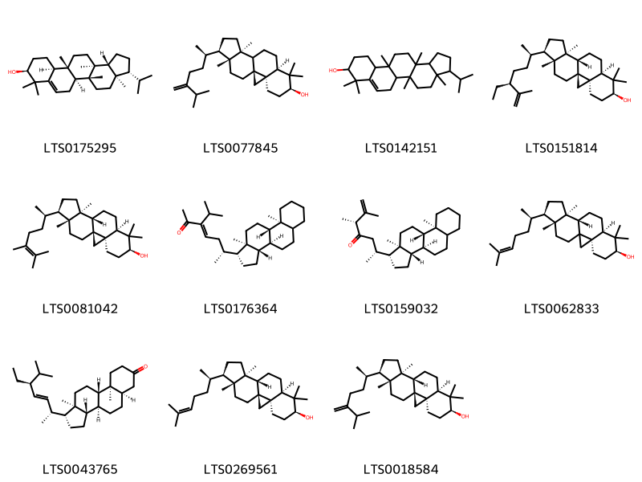{ width=100% }
    <figcaption>Hình ảnh cấu trúc hóa học của 11 hoạt chất thuộc nhóm Steroids and steroid derivatives gồm ['simiarenol (LTS0175295)', '24-methylene-cycloartanol (LTS0077845)', '3-isopropyl-3a,5a,8,8,11b,13a-hexamethyl-1h,2h,3h,4h,5h,5bh,6h,9h,10h,11h,11ah,12h,13h,13bh-cyclopenta[a]chrysen-9-ol (LTS0142151)', '(1s,3r,6s,8r,11s,12s,15r,16r)-15-[(2r,5s)-5-ethyl-6-methylhept-6-en-2-yl]-7,7,12,16-tetramethylpentacyclo[9.7.0.0¹,³.0³,⁸.0¹²,¹⁶]octadecan-6-ol (LTS0151814)', '(1s,3r,6s,8r,11s,12s,15r,16r)-15-[(2r)-5,6-dimethylhept-5-en-2-yl]-7,7,12,16-tetramethylpentacyclo[9.7.0.0¹,³.0³,⁸.0¹²,¹⁶]octadecan-6-ol (LTS0081042)', '(6r)-6-[(1r,3as,3br,9as,9bs,11ar)-9a,11a-dimethyl-tetradecahydro-1h-cyclopenta[a]phenanthren-1-yl]-3-isopropylhept-3-en-2-one (LTS0176364)', '(3r,6r)-6-[(1r,3as,3br,9as,9bs,11ar)-9a,11a-dimethyl-tetradecahydro-1h-cyclopenta[a]phenanthren-1-yl]-2,3-dimethylhept-1-en-4-one (LTS0159032)', '(3r,6s,8r,11s,12s,15r,16r)-7,7,12,16-tetramethyl-15-[(2r)-6-methylhept-5-en-2-yl]pentacyclo[9.7.0.0¹,³.0³,⁸.0¹²,¹⁶]octadecan-6-ol (LTS0062833)', 'stigmastenone (LTS0043765)', 'cycloartenol (LTS0269561)', '24-methylenecycloartanol (LTS0018584)'].</figcaption>
</figure>

---

### Dược dân tộc học

Danh sách các quốc gia có sử dụng *Lathyrus sativus* trong điều trị các bệnh. 

| Country   | Disease   | Bệnh                                                                                                                                                                                                |
|:----------|:----------|:----------------------------------------------------------------------------------------------------------------------------------------------------------------------------------------------------|
| Iraq      | Poison    | MYMEMORY WARNING: YOU USED ALL AVAILABLE FREE TRANSLATIONS FOR TODAY. NEXT AVAILABLE IN  15 HOURS 09 MINUTES 07 SECONDS VISIT HTTPS://MYMEMORY.TRANSLATED.NET/DOC/USAGELIMITS.PHP TO TRANSLATE MORE |
| Kurdistan | Poison    | MYMEMORY WARNING: YOU USED ALL AVAILABLE FREE TRANSLATIONS FOR TODAY. NEXT AVAILABLE IN  15 HOURS 09 MINUTES 04 SECONDS VISIT HTTPS://MYMEMORY.TRANSLATED.NET/DOC/USAGELIMITS.PHP TO TRANSLATE MORE |
| Turkey    | Poison    | MYMEMORY WARNING: YOU USED ALL AVAILABLE FREE TRANSLATIONS FOR TODAY. NEXT AVAILABLE IN  15 HOURS 09 MINUTES 01 SECONDS VISIT HTTPS://MYMEMORY.TRANSLATED.NET/DOC/USAGELIMITS.PHP TO TRANSLATE MORE |

---

---
## Lathyrus sylvestris
### Thông tin về thực vật

!!! info "Phân loại thực vật của *Lathyrus sylvestris* từ GIBF:"
    - **Kingdom:** Plantae
    - **Phylum:** Tracheophyta
    - **Order:** Fabales
    - **Family:** Fabaceae
    - **Genus:** Lathyrus
    - **Species:** *Lathyrus sylvestris*

 

| Label (VI)   | Label (EN)   | Scientific Name     | Descriptions (VI)   | Descriptions (EN)   | Also Known As (VI)   | Also Known As (EN)   |
|:-------------|:-------------|:--------------------|:--------------------|:--------------------|:---------------------|:---------------------|
| N/A          | N/A          | Lathyrus sylvestris | loài thực vật       | species of plant    | ['']                 | ['']                 |

#### Phân bố trên thế giới

**Từ CSDL GIBF** Italy, Belgium, Estonia, Latvia, Norway, Canada, Ukraine, Denmark, Netherlands, Lithuania, Belarus, Hungary, Russian Federation, United States of America, Sweden, Finland, Slovenia, Czechia, Germany, Switzerland, Austria, France, Poland

#### Phân bố tại Việt Nam

**Từ CSDL GIBF**: Không có ghi nhận ở Việt Nam

---
### Thành phần hóa học
        
- Theo cơ sở dữ liệu lotus: Từ loài *Lathyrus sylvestris* đã phân lập và xác định được 7 hoạt chất thuộc về các nhóm Flavonoids, Carboxylic acids and derivatives, Isoflavonoids. 

|    | chemicalTaxonomyClassyfireClass   |   smiles_count |
|---:|:----------------------------------|---------------:|
|  0 | Carboxylic acids and derivatives  |              1 |
|  1 | Flavonoids                        |              5 |
|  2 | Isoflavonoids                     |              1 |

#### Nhóm Carboxylic acids and derivatives
<figure markdown="span">
    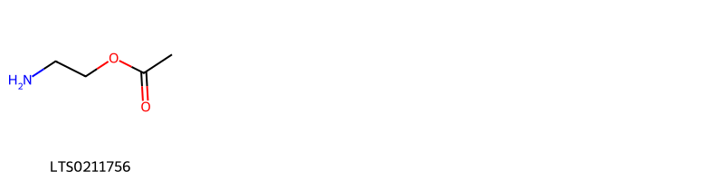{ width=100% }
    <figcaption>Hình ảnh cấu trúc hóa học của 1 hoạt chất thuộc nhóm Carboxylic acids and derivatives gồm ['ethanolamine acetate (LTS0211756)'].</figcaption>
</figure>
#### Nhóm Flavonoids
<figure markdown="span">
    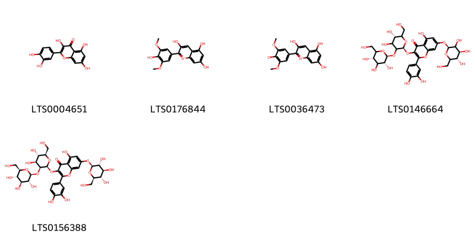{ width=100% }
    <figcaption>Hình ảnh cấu trúc hóa học của 5 hoạt chất thuộc nhóm Flavonoids gồm ['quercetin (LTS0004651)', 'malvidin (LTS0176844)', '2-(3,5-dimethoxy-4-oxidophenyl)-3,5,7-trihydroxy-1λ⁴-chromen-1-ylium (LTS0036473)', '3-{[(2s,5s)-4,5-dihydroxy-6-(hydroxymethyl)-3-{[(2s,3r,5s)-3,4,5-trihydroxy-6-(hydroxymethyl)oxan-2-yl]oxy}oxan-2-yl]oxy}-2-(3,4-dihydroxyphenyl)-5-hydroxy-7-{[(2s,4s,5s)-3,4,5-trihydroxy-6-(hydroxymethyl)oxan-2-yl]oxy}chromen-4-one (LTS0146664)', '3-{[(2s,3s,4s,5s,6r)-4,5-dihydroxy-6-(hydroxymethyl)-3-{[(2s,3r,4s,5s,6r)-3,4,5-trihydroxy-6-(hydroxymethyl)oxan-2-yl]oxy}oxan-2-yl]oxy}-2-(3,4-dihydroxyphenyl)-5-hydroxy-7-{[(2s,3r,4s,5s,6r)-3,4,5-trihydroxy-6-(hydroxymethyl)oxan-2-yl]oxy}chromen-4-one (LTS0156388)'].</figcaption>
</figure>
#### Nhóm Isoflavonoids
<figure markdown="span">
    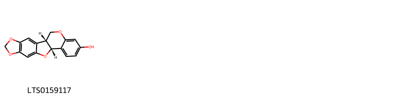{ width=100% }
    <figcaption>Hình ảnh cấu trúc hóa học của 1 hoạt chất thuộc nhóm Isoflavonoids gồm ['(-)-maackiain (LTS0159117)'].</figcaption>
</figure>

---

### Dược dân tộc học

Danh sách các quốc gia có sử dụng *Lathyrus sylvestris* trong điều trị các bệnh. 

| Country   | Disease   | Bệnh                                                                                                                                                                                                |
|:----------|:----------|:----------------------------------------------------------------------------------------------------------------------------------------------------------------------------------------------------|
| Europe    | Poison    | MYMEMORY WARNING: YOU USED ALL AVAILABLE FREE TRANSLATIONS FOR TODAY. NEXT AVAILABLE IN  15 HOURS 08 MINUTES 24 SECONDS VISIT HTTPS://MYMEMORY.TRANSLATED.NET/DOC/USAGELIMITS.PHP TO TRANSLATE MORE |

---

# Chi artium

??? note "Danh sách các dược liệu thuộc chi"
    
	 - *artium junceum*

---
## artium junceum
### Thông tin về thực vật

!!! info "Phân loại thực vật của *N/A* từ GIBF:"
    - **Kingdom:** N/A
    - **Phylum:** N/A
    - **Order:** N/A
    - **Family:** N/A
    - **Genus:** N/A
    - **Species:** *N/A*

 

| Label (VI)   | Label (EN)   | Scientific Name     | Descriptions (VI)   | Descriptions (EN)   | Also Known As (VI)   | Also Known As (EN)   |
|:-------------|:-------------|:--------------------|:--------------------|:--------------------|:---------------------|:---------------------|
| N/A          | N/A          | Lathyrus sylvestris | loài thực vật       | species of plant    | ['']                 | ['']                 |

#### Phân bố trên thế giới

**Từ CSDL GIBF** Không có kết quả phù hợp

#### Phân bố tại Việt Nam

**Từ CSDL GIBF**: Không có ghi nhận ở Việt Nam

---
### Thành phần hóa học
        
- Theo cơ sở dữ liệu lotus: Từ loài *N/A* đã phân lập và xác định được 69 hoạt chất thuộc về các nhóm Flavonoids, Prenol lipids, Isoflavonoids, Lupin alkaloids, Pyridines and derivatives. 

|    | chemicalTaxonomyClassyfireClass   |   smiles_count |
|---:|:----------------------------------|---------------:|
|  0 | Flavonoids                        |             14 |
|  1 | Isoflavonoids                     |              4 |
|  2 | Lupin alkaloids                   |             42 |
|  3 | Prenol lipids                     |              5 |
|  4 | Pyridines and derivatives         |              1 |

#### Nhóm Flavonoids
<figure markdown="span">
    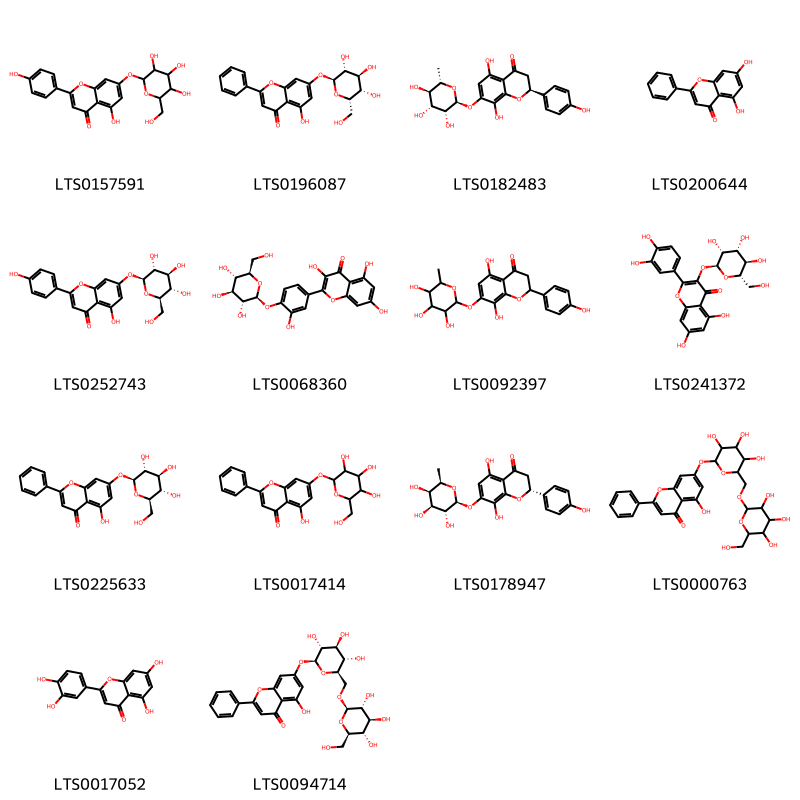{ width=100% }
    <figcaption>Hình ảnh cấu trúc hóa học của 14 hoạt chất thuộc nhóm Flavonoids gồm ['apigetrin (LTS0157591)', '5-hydroxy-2-phenyl-7-{[(2s,3r,4s,5s,6s)-3,4,5-trihydroxy-6-(hydroxymethyl)oxan-2-yl]oxy}chromen-4-one (LTS0196087)', '(2s)-5,8-dihydroxy-2-(4-hydroxyphenyl)-7-{[(2s,3r,4r,5r,6s)-3,4,5-trihydroxy-6-methyloxan-2-yl]oxy}-2,3-dihydro-1-benzopyran-4-one (LTS0182483)', 'chrysin (LTS0200644)', 'apigenin 7-o-β-glucoside (LTS0252743)', 'spiraeoside (LTS0068360)', '5,8-dihydroxy-2-(4-hydroxyphenyl)-7-[(3,4,5-trihydroxy-6-methyloxan-2-yl)oxy]-2,3-dihydro-1-benzopyran-4-one (LTS0092397)', '2-(3,4-dihydroxyphenyl)-5,7-dihydroxy-3-{[(2s,3r,4r,5r,6s)-3,4,5-trihydroxy-6-(hydroxymethyl)oxan-2-yl]oxy}chromen-4-one (LTS0241372)', '5-hydroxy-2-phenyl-7-{[(2s,3r,4s,5s,6r)-3,4,5-trihydroxy-6-(hydroxymethyl)oxan-2-yl]oxy}chromen-4-one (LTS0225633)', '5-hydroxy-2-phenyl-7-{[3,4,5-trihydroxy-6-(hydroxymethyl)oxan-2-yl]oxy}chromen-4-one (LTS0017414)', '(2r)-5,8-dihydroxy-2-(4-hydroxyphenyl)-7-{[(2s,3r,4s,5r,6r)-3,4,5-trihydroxy-6-methyloxan-2-yl]oxy}-2,3-dihydro-1-benzopyran-4-one (LTS0178947)', '5-hydroxy-2-phenyl-7-{[3,4,5-trihydroxy-6-({[3,4,5-trihydroxy-6-(hydroxymethyl)oxan-2-yl]oxy}methyl)oxan-2-yl]oxy}chromen-4-one (LTS0000763)', 'luteolin (LTS0017052)', '5-hydroxy-2-phenyl-7-{[(2s,3r,4s,5s,6r)-3,4,5-trihydroxy-6-({[(2r,3r,4s,5s,6r)-3,4,5-trihydroxy-6-(hydroxymethyl)oxan-2-yl]oxy}methyl)oxan-2-yl]oxy}chromen-4-one (LTS0094714)'].</figcaption>
</figure>
#### Nhóm Isoflavonoids
<figure markdown="span">
    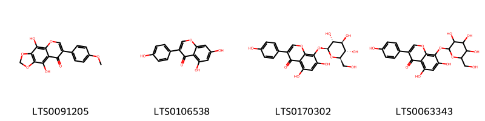{ width=100% }
    <figcaption>Hình ảnh cấu trúc hóa học của 4 hoạt chất thuộc nhóm Isoflavonoids gồm ['4,9-dihydroxy-7-(4-methoxyphenyl)-2h-[1,3]dioxolo[4,5-g]chromen-8-one (LTS0091205)', 'genistein (LTS0106538)', '5,7-dihydroxy-3-(4-hydroxyphenyl)-8-{[(2s,3r,4s,5s,6r)-3,4,5-trihydroxy-6-(hydroxymethyl)oxan-2-yl]oxy}chromen-4-one (LTS0170302)', '5,7-dihydroxy-3-(4-hydroxyphenyl)-8-{[3,4,5-trihydroxy-6-(hydroxymethyl)oxan-2-yl]oxy}chromen-4-one (LTS0063343)'].</figcaption>
</figure>
#### Nhóm Lupin alkaloids
<figure markdown="span">
    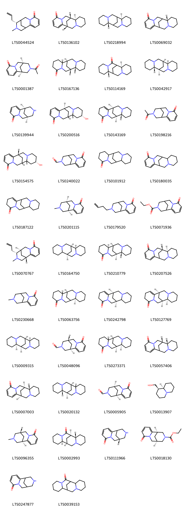{ width=100% }
    <figcaption>Hình ảnh cấu trúc hóa học của 42 hoạt chất thuộc nhóm Lupin alkaloids gồm ['tinctorine (LTS0044524)', '(1r,9r,10r)-7,15-diazatetracyclo[7.7.1.0²,⁷.0¹⁰,¹⁵]heptadeca-2,4-dien-6-one (LTS0136102)', '(2r,10s)-7,15-diazatetracyclo[7.7.1.0²,⁷.0¹⁰,¹⁵]heptadecane (LTS0218994)', 'thermospine (LTS0069032)', '(1s,9r)-11-acetyl-7,11-diazatricyclo[7.3.1.0²,⁷]trideca-2,4-dien-6-one (LTS0001387)', '(1r,2r,9s,10r)-7,15-diazatetracyclo[7.7.1.0²,⁷.0¹⁰,¹⁵]heptadecan-6-one (LTS0167136)', '17-oxosparteine (LTS0114169)', 'sparteine (LTS0042917)', 'cytisine (LTS0139944)', '(1r,9s,10r,12s)-12-hydroxy-7,15-diazatetracyclo[7.7.1.0²,⁷.0¹⁰,¹⁵]heptadeca-2,4-dien-6-one (LTS0200516)', '(1r,9r,10r)-7,15-diazatetracyclo[7.7.1.0²,⁷.0¹⁰,¹⁵]heptadec-2-en-6-one (LTS0143169)', '11-acetyl-7,11-diazatricyclo[7.3.1.0²,⁷]trideca-2,4-dien-6-one (LTS0198216)', 'baptifoline (LTS0154575)', '6-oxo-7,11-diazatricyclo[7.3.1.0²,⁷]trideca-2,4-diene-11-carbaldehyde (LTS0240022)', 'lupanine l-form (LTS0101912)', 'anagyrine (LTS0180035)', '7,15-diazatetracyclo[7.7.1.0²,⁷.0¹⁰,¹⁵]heptadec-2-en-6-one (LTS0187122)', '(1r,9s)-11-methyl-7,11-diazatricyclo[7.3.1.0²,⁷]trideca-2,4-dien-6-one (LTS0201115)', 'rhombifoline (LTS0179520)', 'ethyl 6-oxo-7,11-diazatricyclo[7.3.1.0²,⁷]trideca-2,4-diene-11-carboxylate (LTS0071936)', '(1s,9r,10r)-11-methyl-10-(prop-2-en-1-yl)-7,11-diazatricyclo[7.3.1.0²,⁷]trideca-2,4-dien-6-one (LTS0070767)', '(1s,2r,9s)-7,15-diazatetracyclo[7.7.1.0²,⁷.0¹⁰,¹⁵]heptadecane (LTS0164750)', '(-)-lupanine (LTS0210779)', '(9r,10r)-7,15-diazatetracyclo[7.7.1.0²,⁷.0¹⁰,¹⁵]heptadeca-2,4-dien-6-one (LTS0207526)', 'n-methylcytisine (LTS0230668)', '(1r,2r,10s)-7,15-diazatetracyclo[7.7.1.0²,⁷.0¹⁰,¹⁵]heptadecan-6-one (LTS0063756)', '(1r,9r)-7,15-diazatetracyclo[7.7.1.0²,⁷.0¹⁰,¹⁵]heptadec-2-en-6-one (LTS0242798)', '(1r,9r,10s)-7,15-diazatetracyclo[7.7.1.0²,⁷.0¹⁰,¹⁵]heptadec-2-en-6-one (LTS0127769)', 'α-isosparteine (LTS0009315)', '(1r,9r)-6-oxo-7,11-diazatricyclo[7.3.1.0²,⁷]trideca-2,4-diene-11-carbaldehyde (LTS0048096)', '(1r,2r,9r,10s)-7,15-diazatetracyclo[7.7.1.0²,⁷.0¹⁰,¹⁵]heptadecan-6-one (LTS0273371)', '(9r,10s)-7,15-diazatetracyclo[7.7.1.0²,⁷.0¹⁰,¹⁵]heptadeca-2,4-dien-6-one (LTS0057406)', '(-)-thermopsine (LTS0007003)', '(-)-sparteine (LTS0020132)', '(-)-n-formylcytisine (LTS0005905)', '(-)-lupinine (LTS0013907)', '(1r,9r)-11-methyl-7,11-diazatricyclo[7.3.1.0²,⁷]trideca-2,4-dien-6-one (LTS0096355)', '(1s,2r,9r,10s)-7,15-diazatetracyclo[7.7.1.0²,⁷.0¹⁰,¹⁵]heptadecan-8-one (LTS0002993)', '(9r)-7,11-diazatricyclo[7.3.1.0²,⁷]trideca-2,4-dien-6-one (LTS0111966)', 'ethyl (1r,9r)-6-oxo-7,11-diazatricyclo[7.3.1.0²,⁷]trideca-2,4-diene-11-carboxylate (LTS0018130)', 'citizin (LTS0247877)', 'lupanine (LTS0039153)'].</figcaption>
</figure>
#### Nhóm Prenol lipids
<figure markdown="span">
    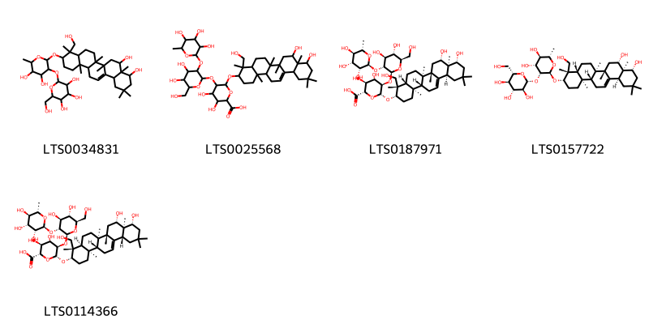{ width=100% }
    <figcaption>Hình ảnh cấu trúc hóa học của 5 hoạt chất thuộc nhóm Prenol lipids gồm ['2-[(2-{[8,9-dihydroxy-4-(hydroxymethyl)-4,6a,6b,8a,11,11,14b-heptamethyl-1,2,3,4a,5,6,7,8,9,10,12,12a,14,14a-tetradecahydropicen-3-yl]oxy}-4,5-dihydroxy-6-methyloxan-3-yl)oxy]-6-(hydroxymethyl)oxane-3,4,5-triol (LTS0034831)', '6-{[8,9-dihydroxy-4-(hydroxymethyl)-4,6a,6b,8a,11,11,14b-heptamethyl-1,2,3,4a,5,6,7,8,9,10,12,12a,14,14a-tetradecahydropicen-3-yl]oxy}-5-{[4,5-dihydroxy-6-(hydroxymethyl)-3-[(3,4,5-trihydroxy-6-methyloxan-2-yl)oxy]oxan-2-yl]oxy}-3,4-dihydroxyoxane-2-carboxylic acid (LTS0025568)', '(2s,3s,4s,5r,6r)-6-{[(3s,4s,4ar,6ar,6bs,8s,8ar,9r,12as,14ar,14br)-8,9-dihydroxy-4-(hydroxymethyl)-4,6a,6b,8a,11,11,14b-heptamethyl-1,2,3,4a,5,6,7,8,9,10,12,12a,14,14a-tetradecahydropicen-3-yl]oxy}-5-{[(2s,3r,4s,5s,6r)-4,5-dihydroxy-6-(hydroxymethyl)-3-{[(2s,3r,4r,5r,6s)-3,4,5-trihydroxy-6-methyloxan-2-yl]oxy}oxan-2-yl]oxy}-3,4-dihydroxyoxane-2-carboxylic acid (LTS0187971)', '(2r,3s,4r,5r,6s)-2-{[(2r,3r,4r,5r,6s)-2-{[(3s,4s,4ar,6ar,6bs,8s,8ar,9r,12as,14ar,14br)-8,9-dihydroxy-4-(hydroxymethyl)-4,6a,6b,8a,11,11,14b-heptamethyl-1,2,3,4a,5,6,7,8,9,10,12,12a,14,14a-tetradecahydropicen-3-yl]oxy}-4,5-dihydroxy-6-methyloxan-3-yl]oxy}-6-(hydroxymethyl)oxane-3,4,5-triol (LTS0157722)', '(2s,3s,4s,5r,6r)-6-{[(3s,4s,4as,6ar,6bs,8s,8ar,9r,12ar,14ar,14br)-8,9-dihydroxy-4-(hydroxymethyl)-4,6a,6b,8a,11,11,14b-heptamethyl-1,2,3,4a,5,6,7,8,9,10,12,12a,14,14a-tetradecahydropicen-3-yl]oxy}-5-{[(2s,3r,4s,5s,6r)-4,5-dihydroxy-6-(hydroxymethyl)-3-{[(2s,3r,4r,5r,6s)-3,4,5-trihydroxy-6-methyloxan-2-yl]oxy}oxan-2-yl]oxy}-3,4-dihydroxyoxane-2-carboxylic acid (LTS0114366)'].</figcaption>
</figure>
#### Nhóm Pyridines and derivatives
<figure markdown="span">
    { width=100% }
    <figcaption>Hình ảnh cấu trúc hóa học của 1 hoạt chất thuộc nhóm Pyridines and derivatives gồm ['ammodendrine (LTS0084410)'].</figcaption>
</figure>

---

### Dược dân tộc học

Danh sách các quốc gia có sử dụng *N/A* trong điều trị các bệnh. 

| Country   | Disease                                | Bệnh                                                                                                                                                                                                |
|:----------|:---------------------------------------|:----------------------------------------------------------------------------------------------------------------------------------------------------------------------------------------------------|
| Elsewhere | Diuretic, Narcotic, Diuretic, Laxative | MYMEMORY WARNING: YOU USED ALL AVAILABLE FREE TRANSLATIONS FOR TODAY. NEXT AVAILABLE IN  15 HOURS 07 MINUTES 54 SECONDS VISIT HTTPS://MYMEMORY.TRANSLATED.NET/DOC/USAGELIMITS.PHP TO TRANSLATE MORE |
| Europe    | Perfume                                | MYMEMORY WARNING: YOU USED ALL AVAILABLE FREE TRANSLATIONS FOR TODAY. NEXT AVAILABLE IN  15 HOURS 07 MINUTES 51 SECONDS VISIT HTTPS://MYMEMORY.TRANSLATED.NET/DOC/USAGELIMITS.PHP TO TRANSLATE MORE |
| Iraq      | Emetic, Poison, Purgative              | MYMEMORY WARNING: YOU USED ALL AVAILABLE FREE TRANSLATIONS FOR TODAY. NEXT AVAILABLE IN  15 HOURS 07 MINUTES 48 SECONDS VISIT HTTPS://MYMEMORY.TRANSLATED.NET/DOC/USAGELIMITS.PHP TO TRANSLATE MORE |
| Turkey    | Diuretic, Laxative, Narcotic, Poison   | MYMEMORY WARNING: YOU USED ALL AVAILABLE FREE TRANSLATIONS FOR TODAY. NEXT AVAILABLE IN  15 HOURS 07 MINUTES 45 SECONDS VISIT HTTPS://MYMEMORY.TRANSLATED.NET/DOC/USAGELIMITS.PHP TO TRANSLATE MORE |
| ain       | Laxative                               | MYMEMORY WARNING: YOU USED ALL AVAILABLE FREE TRANSLATIONS FOR TODAY. NEXT AVAILABLE IN  15 HOURS 07 MINUTES 42 SECONDS VISIT HTTPS://MYMEMORY.TRANSLATED.NET/DOC/USAGELIMITS.PHP TO TRANSLATE MORE |

---

# Chi Cracca

??? note "Danh sách các dược liệu thuộc chi"
    
	 - *Cracca toxicaria*

---
## Cracca toxicaria
### Thông tin về thực vật

!!! info "Phân loại thực vật của *Tephrosia sinapou* từ GIBF:"
    - **Kingdom:** Plantae
    - **Phylum:** Tracheophyta
    - **Order:** Fabales
    - **Family:** Fabaceae
    - **Genus:** Tephrosia
    - **Species:** *Tephrosia sinapou*

 

| Label (VI)   | Label (EN)   | Scientific Name   | Descriptions (VI)   | Descriptions (EN)   | Also Known As (VI)   | Also Known As (EN)   |
|:-------------|:-------------|:------------------|:--------------------|:--------------------|:---------------------|:---------------------|
| N/A          | N/A          | Cracca toxicaria  | loài thực vật       | species of plant    | ['']                 | ['']                 |

#### Phân bố trên thế giới

**Từ CSDL GIBF** Không có kết quả phù hợp

#### Phân bố tại Việt Nam

**Từ CSDL GIBF**: Không có ghi nhận ở Việt Nam

---
### Thành phần hóa học
        
- Theo cơ sở dữ liệu lotus: Từ loài *Tephrosia sinapou* đã phân lập và xác định được Chưa có hoạt chất nào được phân lập. hoạt chất thuộc về các nhóm Không có hoạt chất nào được phân lập. 

Không có hình ảnh nào được tạo ra

---

### Dược dân tộc học

Danh sách các quốc gia có sử dụng *Tephrosia sinapou* trong điều trị các bệnh. 

| Country   | Disease                | Bệnh                                                                                                                                                                                                |
|:----------|:-----------------------|:----------------------------------------------------------------------------------------------------------------------------------------------------------------------------------------------------|
| Mexico    | Cardiotonic, Purgative | MYMEMORY WARNING: YOU USED ALL AVAILABLE FREE TRANSLATIONS FOR TODAY. NEXT AVAILABLE IN  15 HOURS 07 MINUTES 10 SECONDS VISIT HTTPS://MYMEMORY.TRANSLATED.NET/DOC/USAGELIMITS.PHP TO TRANSLATE MORE |

---

# Chi Willardia

??? note "Danh sách các dược liệu thuộc chi"
    
	 - *Willardia mexicana*

---
## Willardia mexicana
### Thông tin về thực vật

!!! info "Phân loại thực vật của *Lonchocarpus hermannii* từ GIBF:"
    - **Kingdom:** Plantae
    - **Phylum:** Tracheophyta
    - **Order:** Fabales
    - **Family:** Fabaceae
    - **Genus:** Lonchocarpus
    - **Species:** *Lonchocarpus hermannii*

 

| Label (VI)   | Label (EN)   | Scientific Name    | Descriptions (VI)   | Descriptions (EN)   | Also Known As (VI)   | Also Known As (EN)   |
|:-------------|:-------------|:-------------------|:--------------------|:--------------------|:---------------------|:---------------------|
| N/A          | N/A          | Willardia mexicana |                     |                     | ['']                 | ['']                 |

#### Phân bố trên thế giới

**Từ CSDL GIBF** Mexico

#### Phân bố tại Việt Nam

**Từ CSDL GIBF**: Không có ghi nhận ở Việt Nam

---
### Thành phần hóa học
        
- Theo cơ sở dữ liệu lotus: Từ loài *Lonchocarpus hermannii* đã phân lập và xác định được Chưa có hoạt chất nào được phân lập. hoạt chất thuộc về các nhóm Không có hoạt chất nào được phân lập. 

Không có hình ảnh nào được tạo ra

---

### Dược dân tộc học

Danh sách các quốc gia có sử dụng *Lonchocarpus hermannii* trong điều trị các bệnh. 

| Country   | Disease   | Bệnh                                                                                                                                                                                                |
|:----------|:----------|:----------------------------------------------------------------------------------------------------------------------------------------------------------------------------------------------------|
| Mexico    | Piscicide | MYMEMORY WARNING: YOU USED ALL AVAILABLE FREE TRANSLATIONS FOR TODAY. NEXT AVAILABLE IN  15 HOURS 06 MINUTES 46 SECONDS VISIT HTTPS://MYMEMORY.TRANSLATED.NET/DOC/USAGELIMITS.PHP TO TRANSLATE MORE |

---

# Chi Leedeza

??? note "Danh sách các dược liệu thuộc chi"
    
	 - *Leedeza cuneata*

---
## Leedeza cuneata
### Thông tin về thực vật

!!! info "Phân loại thực vật của *N/A* từ GIBF:"
    - **Kingdom:** N/A
    - **Phylum:** N/A
    - **Order:** N/A
    - **Family:** N/A
    - **Genus:** N/A
    - **Species:** *N/A*

 

| Label (VI)   | Label (EN)   | Scientific Name    | Descriptions (VI)   | Descriptions (EN)   | Also Known As (VI)   | Also Known As (EN)   |
|:-------------|:-------------|:-------------------|:--------------------|:--------------------|:---------------------|:---------------------|
| N/A          | N/A          | Willardia mexicana |                     |                     | ['']                 | ['']                 |

#### Phân bố trên thế giới

**Từ CSDL GIBF** Không có kết quả phù hợp

#### Phân bố tại Việt Nam

**Từ CSDL GIBF**: Không có ghi nhận ở Việt Nam

---
### Thành phần hóa học
        
- Theo cơ sở dữ liệu lotus: Từ loài *N/A* đã phân lập và xác định được Chưa có hoạt chất nào được phân lập. hoạt chất thuộc về các nhóm Không có hoạt chất nào được phân lập. 

Không có hình ảnh nào được tạo ra

---

### Dược dân tộc học

Danh sách các quốc gia có sử dụng *N/A* trong điều trị các bệnh. 

| Country   | Disease                            | Bệnh                                                                                                                                                                                                |
|:----------|:-----------------------------------|:----------------------------------------------------------------------------------------------------------------------------------------------------------------------------------------------------|
| China     | Alexiteric, Vermifuge, Refrigerant | MYMEMORY WARNING: YOU USED ALL AVAILABLE FREE TRANSLATIONS FOR TODAY. NEXT AVAILABLE IN  15 HOURS 06 MINUTES 21 SECONDS VISIT HTTPS://MYMEMORY.TRANSLATED.NET/DOC/USAGELIMITS.PHP TO TRANSLATE MORE |

---

# Chi Pithecellobium

??? note "Danh sách các dược liệu thuộc chi"
    
	 - *Pithecellobium bigeminum*
	 - *Pithecellobium clypearia*
	 - *Pithecellobium dulce*
	 - *Pithecellobium ellipticum*
	 - *Pithecellobium jupunba*
	 - *Pithecellobium ligustrinum*
	 - *Pithecellobium monadelphum*
	 - *Pithecellobium unguis-cati*

---
## Pithecellobium bigeminum
### Thông tin về thực vật

!!! info "Phân loại thực vật của *N/A* từ GIBF:"
    - **Kingdom:** Plantae
    - **Phylum:** Tracheophyta
    - **Order:** Fabales
    - **Family:** Fabaceae
    - **Genus:** N/A
    - **Species:** *N/A*

 

| Label (VI)   | Label (EN)   | Scientific Name          | Descriptions (VI)   | Descriptions (EN)   | Also Known As (VI)   | Also Known As (EN)   |
|:-------------|:-------------|:-------------------------|:--------------------|:--------------------|:---------------------|:---------------------|
| N/A          | N/A          | Pithecellobium bigeminum |                     |                     | ['']                 | ['']                 |

#### Phân bố trên thế giới

**Từ CSDL GIBF** Sri Lanka, Italy, Australia, Cambodia, Argentina, Tanzania, United Republic of, Chinese Taipei, Spain, Portugal, United States of America, Chile, Croatia, South Africa, Thailand, Germany, Brazil, Guam, France, Norfolk Island, Viet Nam, China, United Kingdom of Great Britain and Northern Ireland, Ireland, Gambia, India, Malaysia, New Zealand

#### Phân bố tại Việt Nam

**Từ CSDL GIBF**: Đà Nẵng, Bà Rịa - Vũng Tàu

---
### Thành phần hóa học
        
- Theo cơ sở dữ liệu lotus: Từ loài *N/A* đã phân lập và xác định được Chưa có hoạt chất nào được phân lập. hoạt chất thuộc về các nhóm Không có hoạt chất nào được phân lập. 

Không có hình ảnh nào được tạo ra

---

### Dược dân tộc học

Danh sách các quốc gia có sử dụng *N/A* trong điều trị các bệnh. 

| Country   | Disease   | Bệnh                                                                                                                                                                                                |
|:----------|:----------|:----------------------------------------------------------------------------------------------------------------------------------------------------------------------------------------------------|
| India     | Piscicide | MYMEMORY WARNING: YOU USED ALL AVAILABLE FREE TRANSLATIONS FOR TODAY. NEXT AVAILABLE IN  15 HOURS 05 MINUTES 51 SECONDS VISIT HTTPS://MYMEMORY.TRANSLATED.NET/DOC/USAGELIMITS.PHP TO TRANSLATE MORE |

---

---
## Pithecellobium clypearia
### Thông tin về thực vật

!!! info "Phân loại thực vật của *Archidendron clypearia* từ GIBF:"
    - **Kingdom:** Plantae
    - **Phylum:** Tracheophyta
    - **Order:** Fabales
    - **Family:** Fabaceae
    - **Genus:** Archidendron
    - **Species:** *Archidendron clypearia*

 

| Label (VI)   | Label (EN)   | Scientific Name          | Descriptions (VI)   | Descriptions (EN)   | Also Known As (VI)   | Also Known As (EN)   |
|:-------------|:-------------|:-------------------------|:--------------------|:--------------------|:---------------------|:---------------------|
| N/A          | N/A          | Pithecellobium clypearia | loài thực vật       | species of plant    | ['']                 | ['']                 |

#### Phân bố trên thế giới

**Từ CSDL GIBF** Thailand, Lao People’s Democratic Republic, Chinese Taipei, Papua New Guinea, unknown or invalid, Indonesia, Viet Nam, China

#### Phân bố tại Việt Nam

**Từ CSDL GIBF**: Kon Tum, Ha Giang

---
### Thành phần hóa học
        
- Theo cơ sở dữ liệu lotus: Từ loài *Archidendron clypearia* đã phân lập và xác định được 13 hoạt chất thuộc về các nhóm Flavonoids, Depsides and depsidones, Benzene and substituted derivatives. 

|    | chemicalTaxonomyClassyfireClass     |   smiles_count |
|---:|:------------------------------------|---------------:|
|  0 | Benzene and substituted derivatives |              2 |
|  1 | Depsides and depsidones             |              2 |
|  2 | Flavonoids                          |              9 |

#### Nhóm Benzene and substituted derivatives
<figure markdown="span">
    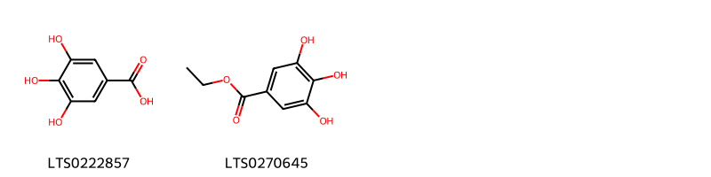{ width=100% }
    <figcaption>Hình ảnh cấu trúc hóa học của 2 hoạt chất thuộc nhóm Benzene and substituted derivatives gồm ['galop (LTS0222857)', 'ethyl gallate (LTS0270645)'].</figcaption>
</figure>
#### Nhóm Depsides and depsidones
<figure markdown="span">
    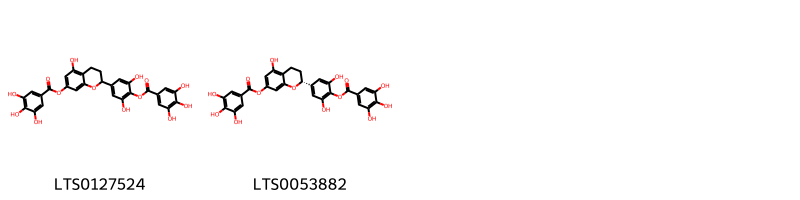{ width=100% }
    <figcaption>Hình ảnh cấu trúc hóa học của 2 hoạt chất thuộc nhóm Depsides and depsidones gồm ['2,6-dihydroxy-4-[5-hydroxy-7-(3,4,5-trihydroxybenzoyloxy)-3,4-dihydro-2h-1-benzopyran-2-yl]phenyl 3,4,5-trihydroxybenzoate (LTS0127524)', '2,6-dihydroxy-4-[(2r)-5-hydroxy-7-(3,4,5-trihydroxybenzoyloxy)-3,4-dihydro-2h-1-benzopyran-2-yl]phenyl 3,4,5-trihydroxybenzoate (LTS0053882)'].</figcaption>
</figure>
#### Nhóm Flavonoids
<figure markdown="span">
    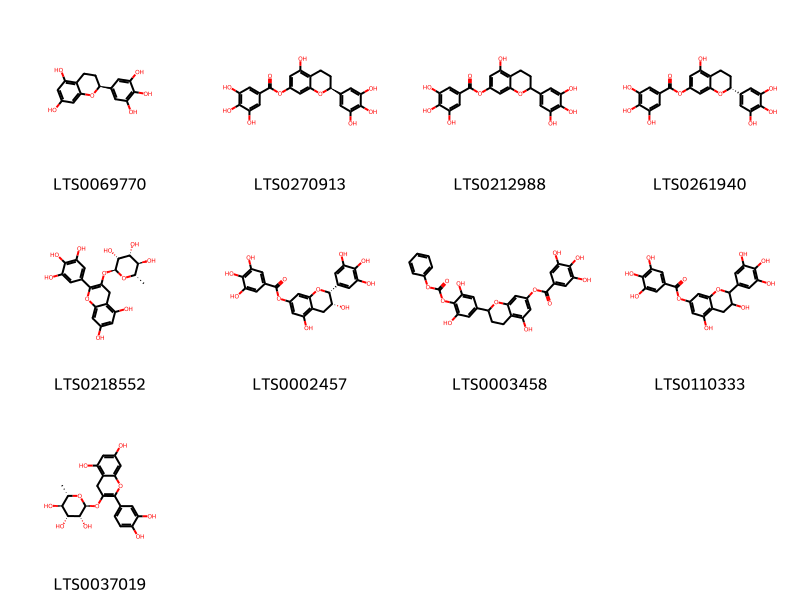{ width=100% }
    <figcaption>Hình ảnh cấu trúc hóa học của 9 hoạt chất thuộc nhóm Flavonoids gồm ['5-[(2s)-5,7-dihydroxy-3,4-dihydro-2h-1-benzopyran-2-yl]benzene-1,2,3-triol (LTS0069770)', '(2s)-5-hydroxy-2-(3,4,5-trihydroxyphenyl)-3,4-dihydro-2h-1-benzopyran-7-yl 3,4,5-trihydroxybenzoate (LTS0270913)', '7-o-galloyltricetiflavan (LTS0212988)', '(2r)-5-hydroxy-2-(3,4,5-trihydroxyphenyl)-3,4-dihydro-2h-1-benzopyran-7-yl 3,4,5-trihydroxybenzoate (LTS0261940)', '(2s,3r,4r,5r,6s)-2-{[5,7-dihydroxy-2-(3,4,5-trihydroxyphenyl)-4h-chromen-3-yl]oxy}-6-methyloxane-3,4,5-triol (LTS0218552)', 'epigallocatechin 7-o-gallate (LTS0002457)', '2-{3,5-dihydroxy-4-[(phenoxycarbonyl)oxy]phenyl}-5-hydroxy-3,4-dihydro-2h-1-benzopyran-7-yl 3,4,5-trihydroxybenzoate (LTS0003458)', '3,5-dihydroxy-2-(3,4,5-trihydroxyphenyl)-3,4-dihydro-2h-1-benzopyran-7-yl 3,4,5-trihydroxybenzoate (LTS0110333)', '(2s,3r,4r,5r,6s)-2-{[2-(3,4-dihydroxyphenyl)-5,7-dihydroxy-4h-chromen-3-yl]oxy}-6-methyloxane-3,4,5-triol (LTS0037019)'].</figcaption>
</figure>

---

### Dược dân tộc học

Danh sách các quốc gia có sử dụng *Archidendron clypearia* trong điều trị các bệnh. 

| Country   | Disease   | Bệnh                                                                                                                                                                                                |
|:----------|:----------|:----------------------------------------------------------------------------------------------------------------------------------------------------------------------------------------------------|
| Elsewhere | Poison    | MYMEMORY WARNING: YOU USED ALL AVAILABLE FREE TRANSLATIONS FOR TODAY. NEXT AVAILABLE IN  15 HOURS 05 MINUTES 23 SECONDS VISIT HTTPS://MYMEMORY.TRANSLATED.NET/DOC/USAGELIMITS.PHP TO TRANSLATE MORE |

---

---
## Pithecellobium dulce
### Thông tin về thực vật

!!! info "Phân loại thực vật của *Pithecellobium dulce* từ GIBF:"
    - **Kingdom:** Plantae
    - **Phylum:** Tracheophyta
    - **Order:** Fabales
    - **Family:** Fabaceae
    - **Genus:** Pithecellobium
    - **Species:** *Pithecellobium dulce*

 

| Label (VI)   | Label (EN)   | Scientific Name      | Descriptions (VI)   | Descriptions (EN)   | Also Known As (VI)   | Also Known As (EN)   |
|:-------------|:-------------|:---------------------|:--------------------|:--------------------|:---------------------|:---------------------|
| N/A          | N/A          | Pithecellobium dulce |                     | species of plant    | ['']                 | ['']                 |

#### Phân bố trên thế giới

**Từ CSDL GIBF** United Arab Emirates, Puerto Rico, Réunion, Senegal, French Guiana, Thailand, Oman, Colombia, Brazil, India, Benin, United States of America, Cuba, Mexico, Venezuela (Bolivarian Republic of), Panama

#### Phân bố tại Việt Nam

**Từ CSDL GIBF**: Không có ghi nhận ở Việt Nam

---
### Thành phần hóa học
        
- Theo cơ sở dữ liệu lotus: Từ loài *Pithecellobium dulce* đã phân lập và xác định được 37 hoạt chất thuộc về các nhóm Fatty Acyls, Flavonoids, Prenol lipids, Isoflavonoids. 

|    | chemicalTaxonomyClassyfireClass   |   smiles_count |
|---:|:----------------------------------|---------------:|
|  0 | Fatty Acyls                       |             13 |
|  1 | Flavonoids                        |              1 |
|  2 | Isoflavonoids                     |              1 |
|  3 | Prenol lipids                     |             22 |

#### Nhóm Fatty Acyls
<figure markdown="span">
    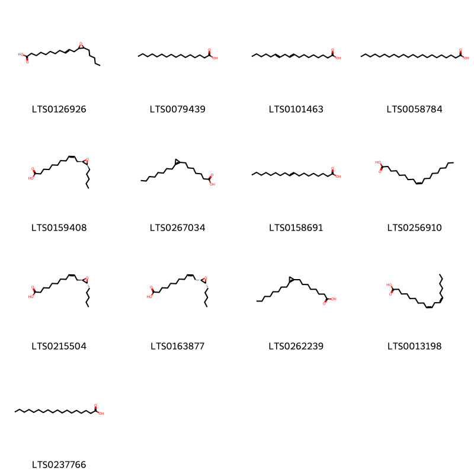{ width=100% }
    <figcaption>Hình ảnh cấu trúc hóa học của 13 hoạt chất thuộc nhóm Fatty Acyls gồm ['11-(3-pentyloxiran-2-yl)undec-9-enoic acid (LTS0126926)', 'palmitic acid (LTS0079439)', '9,12-octadecadienoic acid (LTS0101463)', 'behenic acid (LTS0058784)', '(-)-vernolic acid (LTS0159408)', 'malvalic acid (LTS0267034)', '9 octadecenoic acid (LTS0158691)', 'oleic acid (LTS0256910)', '(9z)-11-[(2r,3r)-3-pentyloxiran-2-yl]undec-9-enoic acid (LTS0215504)', '(+)-vernolic acid (LTS0163877)', 'sterculic acid (LTS0262239)', 'linoleic (LTS0013198)', 'stearic acid (LTS0237766)'].</figcaption>
</figure>
#### Nhóm Flavonoids
<figure markdown="span">
    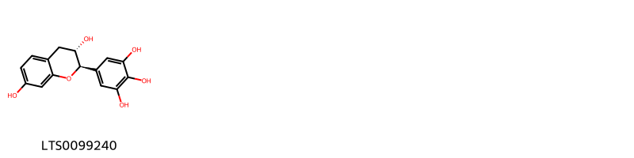{ width=100% }
    <figcaption>Hình ảnh cấu trúc hóa học của 1 hoạt chất thuộc nhóm Flavonoids gồm ['robinetinidol (LTS0099240)'].</figcaption>
</figure>
#### Nhóm Isoflavonoids
<figure markdown="span">
    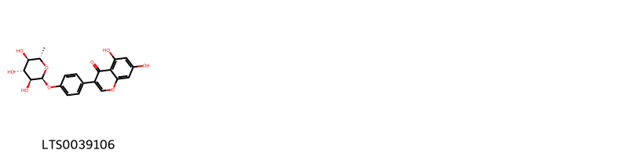{ width=100% }
    <figcaption>Hình ảnh cấu trúc hóa học của 1 hoạt chất thuộc nhóm Isoflavonoids gồm ['5,7-dihydroxy-3-(4-{[(2s,3s,4r,5r,6s)-3,4,5-trihydroxy-6-methyloxan-2-yl]oxy}phenyl)chromen-4-one (LTS0039106)'].</figcaption>
</figure>
#### Nhóm Prenol lipids
<figure markdown="span">
    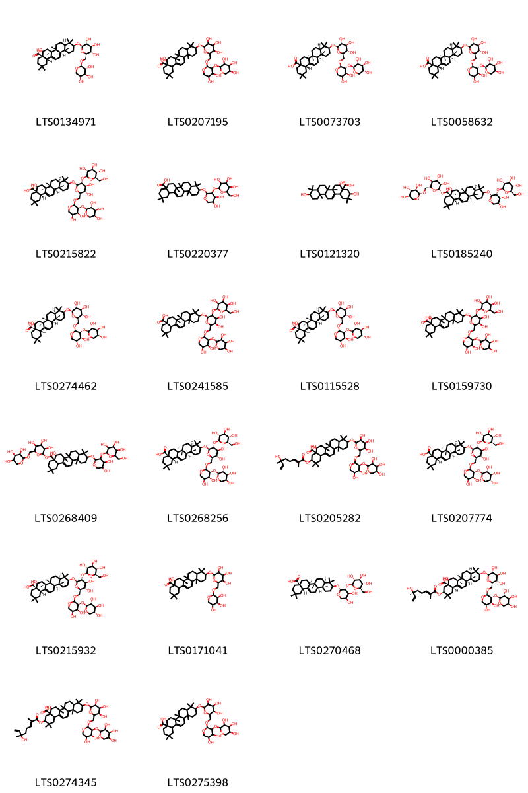{ width=100% }
    <figcaption>Hình ảnh cấu trúc hóa học của 22 hoạt chất thuộc nhóm Prenol lipids gồm ['(4ar,5r,6as,6br,8ar,10s,12ar,12br,14bs)-5-hydroxy-2,2,6a,6b,9,9,12a-heptamethyl-10-{[(2r,3r,4s,5s,6r)-3,4,5-trihydroxy-6-({[(2s,3r,4s,5s)-3,4,5-trihydroxyoxan-2-yl]oxy}methyl)oxan-2-yl]oxy}-1,3,4,5,6,7,8,8a,10,11,12,12b,13,14b-tetradecahydropicene-4a-carboxylic acid (LTS0134971)', '10-({6-[({4,5-dihydroxy-3-[(3,4,5-trihydroxyoxan-2-yl)oxy]oxan-2-yl}oxy)methyl]-3,4,5-trihydroxyoxan-2-yl}oxy)-5-hydroxy-2,2,6a,6b,9,9,12a-heptamethyl-1,3,4,5,6,7,8,8a,10,11,12,12b,13,14b-tetradecahydropicene-4a-carboxylic acid (LTS0207195)', '(4as,6as,6br,8ar,10s,12ar,12br,14bs)-10-{[(2r,3r,4s,5s,6r)-6-({[(2s,3r,4s,5s)-4,5-dihydroxy-3-{[(2s,3r,4s,5r)-3,4,5-trihydroxyoxan-2-yl]oxy}oxan-2-yl]oxy}methyl)-3,4,5-trihydroxyoxan-2-yl]oxy}-2,2,6a,6b,9,9,12a-heptamethyl-1,3,4,5,6,7,8,8a,10,11,12,12b,13,14b-tetradecahydropicene-4a-carboxylic acid (LTS0073703)', '(4as,6as,6br,8ar,10s,12ar,12br,14bs)-10-{[(2r,3r,4s,5s,6r)-6-({[(2s,3r,4s,5s)-4,5-dihydroxy-3-{[(2s,3r,4s,5s)-3,4,5-trihydroxyoxan-2-yl]oxy}oxan-2-yl]oxy}methyl)-3,4,5-trihydroxyoxan-2-yl]oxy}-2,2,6a,6b,9,9,12a-heptamethyl-1,3,4,5,6,7,8,8a,10,11,12,12b,13,14b-tetradecahydropicene-4a-carboxylic acid (LTS0058632)', '(4ar,5r,6as,6br,8ar,10s,12ar,12br,14bs)-10-{[(2r,3r,4s,5s,6r)-6-({[(2s,3r,4s,5s)-4,5-dihydroxy-3-{[(2s,3r,4s,5s)-3,4,5-trihydroxyoxan-2-yl]oxy}oxan-2-yl]oxy}methyl)-4,5-dihydroxy-3-{[(2s,3r,4s,5s,6r)-3,4,5-trihydroxy-6-(hydroxymethyl)oxan-2-yl]oxy}oxan-2-yl]oxy}-5-hydroxy-2,2,6a,6b,9,9,12a-heptamethyl-1,3,4,5,6,7,8,8a,10,11,12,12b,13,14b-tetradecahydropicene-4a-carboxylic acid (LTS0215822)', '10-[(4,5-dihydroxy-3-{[3,4,5-trihydroxy-6-(hydroxymethyl)oxan-2-yl]oxy}oxan-2-yl)oxy]-2,2,6a,6b,9,9,12a-heptamethyl-1,3,4,5,6,7,8,8a,10,11,12,12b,13,14b-tetradecahydropicene-4a-carboxylic acid (LTS0220377)', '3,5,10-trihydroxy-2,2,6a,6b,9,9,12a-heptamethyl-1,3,4,5,6,7,8,8a,10,11,12,12b,13,14b-tetradecahydropicene-4a-carboxylic acid (LTS0121320)', '(2s,3r,4s,5s,6r)-3,4,5-trihydroxy-6-({[(2s,3r,4s,5r)-3,4,5-trihydroxyoxan-2-yl]oxy}methyl)oxan-2-yl (4ar,5r,6as,6br,8ar,10s,12ar,12br,14bs)-10-{[(2r,3r,4s,5s)-4,5-dihydroxy-3-{[(2s,3r,4s,5s,6r)-3,4,5-trihydroxy-6-(hydroxymethyl)oxan-2-yl]oxy}oxan-2-yl]oxy}-5-hydroxy-2,2,6a,6b,9,9,12a-heptamethyl-1,3,4,5,6,7,8,8a,10,11,12,12b,13,14b-tetradecahydropicene-4a-carboxylate (LTS0185240)', '(4ar,5r,6as,6br,8ar,10s,12ar,12br,14bs)-10-{[(2r,3r,4s,5s,6r)-6-({[(2s,3r,4s,5s)-4,5-dihydroxy-3-{[(2s,3r,4s,5s)-3,4,5-trihydroxyoxan-2-yl]oxy}oxan-2-yl]oxy}methyl)-3,4,5-trihydroxyoxan-2-yl]oxy}-5-hydroxy-2,2,6a,6b,9,9,12a-heptamethyl-1,3,4,5,6,7,8,8a,10,11,12,12b,13,14b-tetradecahydropicene-4a-carboxylic acid (LTS0274462)', '10-({6-[({4,5-dihydroxy-3-[(3,4,5-trihydroxyoxan-2-yl)oxy]oxan-2-yl}oxy)methyl]-4,5-dihydroxy-3-{[3,4,5-trihydroxy-6-(hydroxymethyl)oxan-2-yl]oxy}oxan-2-yl}oxy)-2,2,6a,6b,9,9,12a-heptamethyl-1,3,4,5,6,7,8,8a,10,11,12,12b,13,14b-tetradecahydropicene-4a-carboxylic acid (LTS0241585)', '(4ar,5r,6as,6br,8ar,10s,12ar,12br,14bs)-10-{[(2r,3r,4s,5s,6r)-6-({[(2s,3r,4s,5s)-4,5-dihydroxy-3-{[(2s,3r,4s,5r)-3,4,5-trihydroxyoxan-2-yl]oxy}oxan-2-yl]oxy}methyl)-3,4,5-trihydroxyoxan-2-yl]oxy}-5-hydroxy-2,2,6a,6b,9,9,12a-heptamethyl-1,3,4,5,6,7,8,8a,10,11,12,12b,13,14b-tetradecahydropicene-4a-carboxylic acid (LTS0115528)', '10-({6-[({4,5-dihydroxy-3-[(3,4,5-trihydroxyoxan-2-yl)oxy]oxan-2-yl}oxy)methyl]-4,5-dihydroxy-3-{[3,4,5-trihydroxy-6-(hydroxymethyl)oxan-2-yl]oxy}oxan-2-yl}oxy)-5-hydroxy-2,2,6a,6b,9,9,12a-heptamethyl-1,3,4,5,6,7,8,8a,10,11,12,12b,13,14b-tetradecahydropicene-4a-carboxylic acid (LTS0159730)', '3,4,5-trihydroxy-6-{[(3,4,5-trihydroxyoxan-2-yl)oxy]methyl}oxan-2-yl 10-[(4,5-dihydroxy-3-{[3,4,5-trihydroxy-6-(hydroxymethyl)oxan-2-yl]oxy}oxan-2-yl)oxy]-5-hydroxy-2,2,6a,6b,9,9,12a-heptamethyl-1,3,4,5,6,7,8,8a,10,11,12,12b,13,14b-tetradecahydropicene-4a-carboxylate (LTS0268409)', '(4as,6as,6br,8ar,10s,12ar,12br,14bs)-10-{[(2r,3r,4s,5s,6r)-6-({[(2s,3r,4s,5s)-4,5-dihydroxy-3-{[(2s,3r,4s,5s)-3,4,5-trihydroxyoxan-2-yl]oxy}oxan-2-yl]oxy}methyl)-4,5-dihydroxy-3-{[(2s,3r,4s,5s,6r)-3,4,5-trihydroxy-6-(hydroxymethyl)oxan-2-yl]oxy}oxan-2-yl]oxy}-2,2,6a,6b,9,9,12a-heptamethyl-1,3,4,5,6,7,8,8a,10,11,12,12b,13,14b-tetradecahydropicene-4a-carboxylic acid (LTS0268256)', '10-({6-[({4,5-dihydroxy-3-[(3,4,5-trihydroxyoxan-2-yl)oxy]oxan-2-yl}oxy)methyl]-3,4,5-trihydroxyoxan-2-yl}oxy)-5-hydroxy-3-{[(2e)-6-hydroxy-2,6-dimethylocta-2,7-dienoyl]oxy}-2,2,6a,6b,9,9,12a-heptamethyl-1,3,4,5,6,7,8,8a,10,11,12,12b,13,14b-tetradecahydropicene-4a-carboxylic acid (LTS0205282)', '(4as,6as,6br,8ar,10s,12ar,12br,14bs)-10-{[(2r,3r,4s,5s,6r)-6-({[(2s,3r,4s,5s)-4,5-dihydroxy-3-{[(2s,3r,4s,5r)-3,4,5-trihydroxyoxan-2-yl]oxy}oxan-2-yl]oxy}methyl)-4,5-dihydroxy-3-{[(2s,3r,4s,5s,6r)-3,4,5-trihydroxy-6-(hydroxymethyl)oxan-2-yl]oxy}oxan-2-yl]oxy}-2,2,6a,6b,9,9,12a-heptamethyl-1,3,4,5,6,7,8,8a,10,11,12,12b,13,14b-tetradecahydropicene-4a-carboxylic acid (LTS0207774)', '(4ar,5r,6as,6br,8ar,10s,12ar,12br,14bs)-10-{[(2r,3r,4s,5s,6r)-6-({[(2s,3r,4s,5s)-4,5-dihydroxy-3-{[(2s,3r,4s,5r)-3,4,5-trihydroxyoxan-2-yl]oxy}oxan-2-yl]oxy}methyl)-4,5-dihydroxy-3-{[(2s,3r,4s,5s,6r)-3,4,5-trihydroxy-6-(hydroxymethyl)oxan-2-yl]oxy}oxan-2-yl]oxy}-5-hydroxy-2,2,6a,6b,9,9,12a-heptamethyl-1,3,4,5,6,7,8,8a,10,11,12,12b,13,14b-tetradecahydropicene-4a-carboxylic acid (LTS0215932)', '5-hydroxy-2,2,6a,6b,9,9,12a-heptamethyl-10-[(3,4,5-trihydroxy-6-{[(3,4,5-trihydroxyoxan-2-yl)oxy]methyl}oxan-2-yl)oxy]-1,3,4,5,6,7,8,8a,10,11,12,12b,13,14b-tetradecahydropicene-4a-carboxylic acid (LTS0171041)', '(4as,6as,6br,8ar,10s,12ar,12br,14bs)-10-{[(2r,3r,4s,5s)-4,5-dihydroxy-3-{[(2s,3r,4s,5s,6r)-3,4,5-trihydroxy-6-(hydroxymethyl)oxan-2-yl]oxy}oxan-2-yl]oxy}-2,2,6a,6b,9,9,12a-heptamethyl-1,3,4,5,6,7,8,8a,10,11,12,12b,13,14b-tetradecahydropicene-4a-carboxylic acid (LTS0270468)', '(3s,4ar,5r,6as,6br,8ar,10s,12ar,12br,14br)-10-{[(2r,3r,4s,5s,6r)-6-({[(2s,3r,4s,5s)-4,5-dihydroxy-3-{[(2s,3r,4s,5s)-3,4,5-trihydroxyoxan-2-yl]oxy}oxan-2-yl]oxy}methyl)-3,4,5-trihydroxyoxan-2-yl]oxy}-5-hydroxy-3-{[(2e,6s)-6-hydroxy-2,6-dimethylocta-2,7-dienoyl]oxy}-2,2,6a,6b,9,9,12a-heptamethyl-1,3,4,5,6,7,8,8a,10,11,12,12b,13,14b-tetradecahydropicene-4a-carboxylic acid (LTS0000385)', '10-({6-[({4,5-dihydroxy-3-[(3,4,5-trihydroxyoxan-2-yl)oxy]oxan-2-yl}oxy)methyl]-3,4,5-trihydroxyoxan-2-yl}oxy)-5-hydroxy-3-[(6-hydroxy-2,6-dimethylocta-2,7-dienoyl)oxy]-2,2,6a,6b,9,9,12a-heptamethyl-1,3,4,5,6,7,8,8a,10,11,12,12b,13,14b-tetradecahydropicene-4a-carboxylic acid (LTS0274345)', '10-({6-[({4,5-dihydroxy-3-[(3,4,5-trihydroxyoxan-2-yl)oxy]oxan-2-yl}oxy)methyl]-3,4,5-trihydroxyoxan-2-yl}oxy)-2,2,6a,6b,9,9,12a-heptamethyl-1,3,4,5,6,7,8,8a,10,11,12,12b,13,14b-tetradecahydropicene-4a-carboxylic acid (LTS0275398)'].</figcaption>
</figure>

---

### Dược dân tộc học

Danh sách các quốc gia có sử dụng *Pithecellobium dulce* trong điều trị các bệnh. 

| Country   | Disease                              | Bệnh                                                                                                                                                                                                |
|:----------|:-------------------------------------|:----------------------------------------------------------------------------------------------------------------------------------------------------------------------------------------------------|
| Elsewhere | Astringent                           | MYMEMORY WARNING: YOU USED ALL AVAILABLE FREE TRANSLATIONS FOR TODAY. NEXT AVAILABLE IN  15 HOURS 04 MINUTES 53 SECONDS VISIT HTTPS://MYMEMORY.TRANSLATED.NET/DOC/USAGELIMITS.PHP TO TRANSLATE MORE |
| Mexico    | Astringent, Larvicide, Abortifacient | MYMEMORY WARNING: YOU USED ALL AVAILABLE FREE TRANSLATIONS FOR TODAY. NEXT AVAILABLE IN  15 HOURS 04 MINUTES 50 SECONDS VISIT HTTPS://MYMEMORY.TRANSLATED.NET/DOC/USAGELIMITS.PHP TO TRANSLATE MORE |

---

---
## Pithecellobium ellipticum
### Thông tin về thực vật

!!! info "Phân loại thực vật của *Archidendron ellipticum* từ GIBF:"
    - **Kingdom:** Plantae
    - **Phylum:** Tracheophyta
    - **Order:** Fabales
    - **Family:** Fabaceae
    - **Genus:** Archidendron
    - **Species:** *Archidendron ellipticum*

 

| Label (VI)   | Label (EN)   | Scientific Name           | Descriptions (VI)   | Descriptions (EN)   | Also Known As (VI)   | Also Known As (EN)   |
|:-------------|:-------------|:--------------------------|:--------------------|:--------------------|:---------------------|:---------------------|
| N/A          | N/A          | Pithecellobium ellipticum | loài thực vật       | species of plant    | ['']                 | ['']                 |

#### Phân bố trên thế giới

**Từ CSDL GIBF** Philippines, Indonesia, Malaysia, nan

#### Phân bố tại Việt Nam

**Từ CSDL GIBF**: Không có ghi nhận ở Việt Nam

---
### Thành phần hóa học
        
- Theo cơ sở dữ liệu lotus: Từ loài *Archidendron ellipticum* đã phân lập và xác định được Chưa có hoạt chất nào được phân lập. hoạt chất thuộc về các nhóm Không có hoạt chất nào được phân lập. 

Không có hình ảnh nào được tạo ra

---

### Dược dân tộc học

Danh sách các quốc gia có sử dụng *Archidendron ellipticum* trong điều trị các bệnh. 

| Country   | Disease   | Bệnh                                                                                                                                                                                                |
|:----------|:----------|:----------------------------------------------------------------------------------------------------------------------------------------------------------------------------------------------------|
| Java      | Piscicide | MYMEMORY WARNING: YOU USED ALL AVAILABLE FREE TRANSLATIONS FOR TODAY. NEXT AVAILABLE IN  15 HOURS 04 MINUTES 14 SECONDS VISIT HTTPS://MYMEMORY.TRANSLATED.NET/DOC/USAGELIMITS.PHP TO TRANSLATE MORE |
| Sumatra   | Piscicide | MYMEMORY WARNING: YOU USED ALL AVAILABLE FREE TRANSLATIONS FOR TODAY. NEXT AVAILABLE IN  15 HOURS 04 MINUTES 11 SECONDS VISIT HTTPS://MYMEMORY.TRANSLATED.NET/DOC/USAGELIMITS.PHP TO TRANSLATE MORE |

---

---
## Pithecellobium jupunba
### Thông tin về thực vật

!!! info "Phân loại thực vật của *Jupunba trapezifolia* từ GIBF:"
    - **Kingdom:** Plantae
    - **Phylum:** Tracheophyta
    - **Order:** Fabales
    - **Family:** Fabaceae
    - **Genus:** Jupunba
    - **Species:** *Jupunba trapezifolia*

 

| Label (VI)   | Label (EN)   | Scientific Name        | Descriptions (VI)   | Descriptions (EN)   | Also Known As (VI)   | Also Known As (EN)   |
|:-------------|:-------------|:-----------------------|:--------------------|:--------------------|:---------------------|:---------------------|
| N/A          | N/A          | Pithecellobium jupunba | loài thực vật       | species of plant    | ['']                 | ['']                 |

#### Phân bố trên thế giới

**Từ CSDL GIBF** nan, Ecuador, Trinidad and Tobago, Suriname, Guadeloupe, Colombia, Brazil, Bolivia (Plurinational State of), Guyana, Jamaica, United States of America, Dominica, France, Venezuela (Bolivarian Republic of), French Guiana

#### Phân bố tại Việt Nam

**Từ CSDL GIBF**: Không có ghi nhận ở Việt Nam

---
### Thành phần hóa học
        
- Theo cơ sở dữ liệu lotus: Từ loài *Jupunba trapezifolia* đã phân lập và xác định được Chưa có hoạt chất nào được phân lập. hoạt chất thuộc về các nhóm Không có hoạt chất nào được phân lập. 

Không có hình ảnh nào được tạo ra

---

### Dược dân tộc học

Danh sách các quốc gia có sử dụng *Jupunba trapezifolia* trong điều trị các bệnh. 

| Country   | Disease         | Bệnh                                                                                                                                                                                                |
|:----------|:----------------|:----------------------------------------------------------------------------------------------------------------------------------------------------------------------------------------------------|
| Wi(Carib) | Soap, Piscicide | MYMEMORY WARNING: YOU USED ALL AVAILABLE FREE TRANSLATIONS FOR TODAY. NEXT AVAILABLE IN  15 HOURS 03 MINUTES 52 SECONDS VISIT HTTPS://MYMEMORY.TRANSLATED.NET/DOC/USAGELIMITS.PHP TO TRANSLATE MORE |

---

---
## Pithecellobium ligustrinum
### Thông tin về thực vật

!!! info "Phân loại thực vật của *Pithecellobium lanceolatum* từ GIBF:"
    - **Kingdom:** Plantae
    - **Phylum:** Tracheophyta
    - **Order:** Fabales
    - **Family:** Fabaceae
    - **Genus:** Pithecellobium
    - **Species:** *Pithecellobium lanceolatum*

 

| Label (VI)   | Label (EN)   | Scientific Name            | Descriptions (VI)   | Descriptions (EN)   | Also Known As (VI)   | Also Known As (EN)   |
|:-------------|:-------------|:---------------------------|:--------------------|:--------------------|:---------------------|:---------------------|
| N/A          | N/A          | Pithecellobium ligustrinum |                     |                     | ['']                 | ['']                 |

#### Phân bố trên thế giới

**Từ CSDL GIBF** nan, Colombia, United States of America, Mexico, Venezuela (Bolivarian Republic of)

#### Phân bố tại Việt Nam

**Từ CSDL GIBF**: Không có ghi nhận ở Việt Nam

---
### Thành phần hóa học
        
- Theo cơ sở dữ liệu lotus: Từ loài *Pithecellobium lanceolatum* đã phân lập và xác định được Chưa có hoạt chất nào được phân lập. hoạt chất thuộc về các nhóm Không có hoạt chất nào được phân lập. 

Không có hình ảnh nào được tạo ra

---

### Dược dân tộc học

Danh sách các quốc gia có sử dụng *Pithecellobium lanceolatum* trong điều trị các bệnh. 

| Country   | Disease    | Bệnh                                                                                                                                                                                                |
|:----------|:-----------|:----------------------------------------------------------------------------------------------------------------------------------------------------------------------------------------------------|
| Venezuela | Astringent | MYMEMORY WARNING: YOU USED ALL AVAILABLE FREE TRANSLATIONS FOR TODAY. NEXT AVAILABLE IN  15 HOURS 03 MINUTES 23 SECONDS VISIT HTTPS://MYMEMORY.TRANSLATED.NET/DOC/USAGELIMITS.PHP TO TRANSLATE MORE |

---

---
## Pithecellobium monadelphum
### Thông tin về thực vật

!!! info "Phân loại thực vật của *Archidendron bigeminum* từ GIBF:"
    - **Kingdom:** Plantae
    - **Phylum:** Tracheophyta
    - **Order:** Fabales
    - **Family:** Fabaceae
    - **Genus:** Archidendron
    - **Species:** *Archidendron bigeminum*

 

| Label (VI)   | Label (EN)   | Scientific Name            | Descriptions (VI)   | Descriptions (EN)   | Also Known As (VI)   | Also Known As (EN)   |
|:-------------|:-------------|:---------------------------|:--------------------|:--------------------|:---------------------|:---------------------|
| N/A          | N/A          | Pithecellobium monadelphum |                     |                     | ['']                 | ['']                 |

#### Phân bố trên thế giới

**Từ CSDL GIBF** nan, Myanmar, Bhutan, India, Nepal

#### Phân bố tại Việt Nam

**Từ CSDL GIBF**: Không có ghi nhận ở Việt Nam

---
### Thành phần hóa học
        
- Theo cơ sở dữ liệu lotus: Từ loài *Archidendron bigeminum* đã phân lập và xác định được Chưa có hoạt chất nào được phân lập. hoạt chất thuộc về các nhóm Không có hoạt chất nào được phân lập. 

Không có hình ảnh nào được tạo ra

---

### Dược dân tộc học

Danh sách các quốc gia có sử dụng *Archidendron bigeminum* trong điều trị các bệnh. 

| Country   | Disease   | Bệnh                                                                                                                                                                                                |
|:----------|:----------|:----------------------------------------------------------------------------------------------------------------------------------------------------------------------------------------------------|
| Elsewhere | Poison    | MYMEMORY WARNING: YOU USED ALL AVAILABLE FREE TRANSLATIONS FOR TODAY. NEXT AVAILABLE IN  15 HOURS 03 MINUTES 00 SECONDS VISIT HTTPS://MYMEMORY.TRANSLATED.NET/DOC/USAGELIMITS.PHP TO TRANSLATE MORE |

---

---
## Pithecellobium unguiscati
### Thông tin về thực vật

!!! info "Phân loại thực vật của *Pithecellobium unguis-cati* từ GIBF:"
    - **Kingdom:** Plantae
    - **Phylum:** Tracheophyta
    - **Order:** Fabales
    - **Family:** Fabaceae
    - **Genus:** Pithecellobium
    - **Species:** *Pithecellobium unguis-cati*

 

| Label (VI)   | Label (EN)   | Scientific Name            | Descriptions (VI)   | Descriptions (EN)   | Also Known As (VI)   | Also Known As (EN)   |
|:-------------|:-------------|:---------------------------|:--------------------|:--------------------|:---------------------|:---------------------|
| N/A          | N/A          | Pithecellobium monadelphum |                     |                     | ['']                 | ['']                 |

#### Phân bố trên thế giới

**Từ CSDL GIBF** Virgin Islands (U.S.), Guadeloupe, Virgin Islands (British), Tanzania, United Republic of, Puerto Rico, Réunion, United States of America, Bonaire, Sint Eustatius and Saba, Saint Martin (French part), Trinidad and Tobago, Barbados, Saint Vincent and the Grenadines, Martinique, Mexico, Curaçao, Saint Kitts and Nevis, Aruba, Colombia, India, Anguilla, Antigua and Barbuda, Sint Maarten (Dutch part)

#### Phân bố tại Việt Nam

**Từ CSDL GIBF**: Không có ghi nhận ở Việt Nam

---
### Thành phần hóa học
        
- Theo cơ sở dữ liệu lotus: Từ loài *Pithecellobium unguis-cati* đã phân lập và xác định được Chưa có hoạt chất nào được phân lập. hoạt chất thuộc về các nhóm Không có hoạt chất nào được phân lập. 

Không có hình ảnh nào được tạo ra

---

### Dược dân tộc học

Danh sách các quốc gia có sử dụng *Pithecellobium unguis-cati* trong điều trị các bệnh. 

| Country   | Disease                                                  | Bệnh                                                                                                                                                                                                |
|:----------|:---------------------------------------------------------|:----------------------------------------------------------------------------------------------------------------------------------------------------------------------------------------------------|
| Mexico    | Astringent, Astringent, Diuretic, Tonic, Diuretic, Tonic | MYMEMORY WARNING: YOU USED ALL AVAILABLE FREE TRANSLATIONS FOR TODAY. NEXT AVAILABLE IN  15 HOURS 02 MINUTES 35 SECONDS VISIT HTTPS://MYMEMORY.TRANSLATED.NET/DOC/USAGELIMITS.PHP TO TRANSLATE MORE |

---

# Chi Pongamia

??? note "Danh sách các dược liệu thuộc chi"
    
	 - *Pongamia glabra*
	 - *Pongamia pinnata*

---
## Pongamia glabra
### Thông tin về thực vật

!!! info "Phân loại thực vật của *Pongamia glabra* từ GIBF:"
    - **Kingdom:** Plantae
    - **Phylum:** Tracheophyta
    - **Order:** Fabales
    - **Family:** Fabaceae
    - **Genus:** Pongamia
    - **Species:** *Pongamia glabra*

 

| Label (VI)   | Label (EN)   | Scientific Name   | Descriptions (VI)   | Descriptions (EN)   | Also Known As (VI)   | Also Known As (EN)   |
|:-------------|:-------------|:------------------|:--------------------|:--------------------|:---------------------|:---------------------|
| N/A          | N/A          | Pongamia glabra   | loài thực vật       | species of plant    | ['']                 | ['']                 |

#### Phân bố trên thế giới

**Từ CSDL GIBF** Virgin Islands (U.S.), Guadeloupe, Virgin Islands (British), Tanzania, United Republic of, Puerto Rico, Réunion, United States of America, Bonaire, Sint Eustatius and Saba, Saint Martin (French part), Trinidad and Tobago, Barbados, Saint Vincent and the Grenadines, Martinique, Mexico, Curaçao, Saint Kitts and Nevis, Aruba, Colombia, India, Anguilla, Antigua and Barbuda, Sint Maarten (Dutch part)

#### Phân bố tại Việt Nam

**Từ CSDL GIBF**: Không có ghi nhận ở Việt Nam

---
### Thành phần hóa học
        
- Theo cơ sở dữ liệu lotus: Từ loài *Pongamia glabra* đã phân lập và xác định được Chưa có hoạt chất nào được phân lập. hoạt chất thuộc về các nhóm Không có hoạt chất nào được phân lập. 

Không có hình ảnh nào được tạo ra

---

### Dược dân tộc học

Danh sách các quốc gia có sử dụng *Pongamia glabra* trong điều trị các bệnh. 

| Country   | Disease   | Bệnh                                                                                                                                                                                                |
|:----------|:----------|:----------------------------------------------------------------------------------------------------------------------------------------------------------------------------------------------------|
| India     | Piscicide | MYMEMORY WARNING: YOU USED ALL AVAILABLE FREE TRANSLATIONS FOR TODAY. NEXT AVAILABLE IN  15 HOURS 02 MINUTES 10 SECONDS VISIT HTTPS://MYMEMORY.TRANSLATED.NET/DOC/USAGELIMITS.PHP TO TRANSLATE MORE |

---

---
## Pongamia pinnata
### Thông tin về thực vật

!!! info "Phân loại thực vật của *Pongamia pinnata* từ GIBF:"
    - **Kingdom:** Plantae
    - **Phylum:** Tracheophyta
    - **Order:** Fabales
    - **Family:** Fabaceae
    - **Genus:** Pongamia
    - **Species:** *Pongamia pinnata*

 

| Label (VI)   | Label (EN)   | Scientific Name   | Descriptions (VI)   | Descriptions (EN)                       | Also Known As (VI)   | Also Known As (EN)                              |
|:-------------|:-------------|:------------------|:--------------------|:----------------------------------------|:---------------------|:------------------------------------------------|
| N/A          | N/A          | Pongamia pinnata  | loài thực vật       | species of plant in the family Fabaceae | ['']                 | ['Indian beech', 'Pongame oiltree', 'Pongamia'] |

#### Phân bố trên thế giới

**Từ CSDL GIBF** United Arab Emirates, Pakistan, Hong Kong, Australia, Japan, Thailand, Martinique, Chinese Taipei, India, Indonesia, United States of America, Philippines, Singapore, Malaysia, China, French Guiana

#### Phân bố tại Việt Nam

**Từ CSDL GIBF**: Không có ghi nhận ở Việt Nam

---
### Thành phần hóa học
        
- Theo cơ sở dữ liệu lotus: Từ loài *Pongamia pinnata* đã phân lập và xác định được 239 hoạt chất thuộc về các nhóm Fatty Acyls, Flavonoids, Prenol lipids, Steroids and steroid derivatives, Isoflavonoids, Linear 1,3-diarylpropanoids, Cinnamic acids and derivatives, Benzodioxoles, Isocoumarins and derivatives, Benzene and substituted derivatives, Organooxygen compounds, Carboxylic acids and derivatives, Benzopyrans. 

|    | chemicalTaxonomyClassyfireClass     |   smiles_count |
|---:|:------------------------------------|---------------:|
|  0 | Benzene and substituted derivatives |              6 |
|  1 | Benzodioxoles                       |              1 |
|  2 | Benzopyrans                         |             13 |
|  3 | Carboxylic acids and derivatives    |              5 |
|  4 | Cinnamic acids and derivatives      |              7 |
|  5 | Fatty Acyls                         |             12 |
|  6 | Flavonoids                          |            114 |
|  7 | Isocoumarins and derivatives        |              1 |
|  8 | Isoflavonoids                       |             15 |
|  9 | Linear 1,3-diarylpropanoids         |             31 |
| 10 | Organooxygen compounds              |              4 |
| 11 | Prenol lipids                       |             17 |
| 12 | Steroids and steroid derivatives    |             12 |

#### Nhóm Benzene and substituted derivatives
<figure markdown="span">
    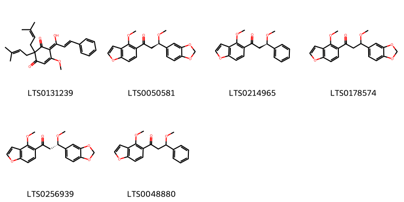{ width=100% }
    <figcaption>Hình ảnh cấu trúc hóa học của 6 hoạt chất thuộc nhóm Benzene and substituted derivatives gồm ['(6z)-6-[(2e)-1-hydroxy-3-phenylprop-2-en-1-ylidene]-5-methoxy-2,2-bis(3-methylbut-2-en-1-yl)cyclohex-4-ene-1,3-dione (LTS0131239)', '(3r)-3-(2h-1,3-benzodioxol-5-yl)-3-methoxy-1-(4-methoxy-1-benzofuran-5-yl)propan-1-one (LTS0050581)', '(3r)-3-methoxy-1-(4-methoxy-1-benzofuran-5-yl)-3-phenylpropan-1-one (LTS0214965)', 'ponganone ix (LTS0178574)', '(3s)-3-(2h-1,3-benzodioxol-5-yl)-3-methoxy-1-(4-methoxy-1-benzofuran-5-yl)propan-1-one (LTS0256939)', 'ovalitenin b (LTS0048880)'].</figcaption>
</figure>
#### Nhóm Benzodioxoles
<figure markdown="span">
    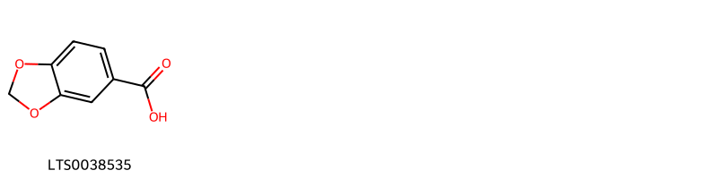{ width=100% }
    <figcaption>Hình ảnh cấu trúc hóa học của 1 hoạt chất thuộc nhóm Benzodioxoles gồm ['piperonylic acid (LTS0038535)'].</figcaption>
</figure>
#### Nhóm Benzopyrans
<figure markdown="span">
    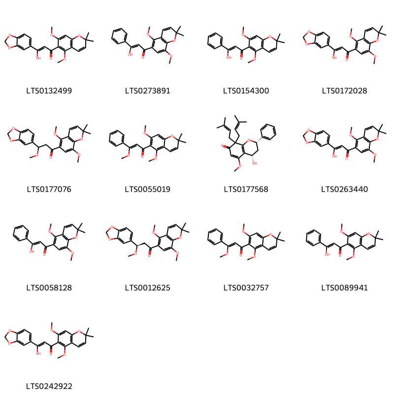{ width=100% }
    <figcaption>Hình ảnh cấu trúc hóa học của 13 hoạt chất thuộc nhóm Benzopyrans gồm ['3-(2h-1,3-benzodioxol-5-yl)-1-(5,7-dimethoxy-2,2-dimethylchromen-6-yl)-3-hydroxyprop-2-en-1-one (LTS0132499)', '1-(5,8-dimethoxy-2,2-dimethylchromen-6-yl)-3-hydroxy-3-phenylprop-2-en-1-one (LTS0273891)', 'praecansone b (LTS0154300)', '3-(2h-1,3-benzodioxol-5-yl)-1-(5,8-dimethoxy-2,2-dimethylchromen-6-yl)-3-hydroxyprop-2-en-1-one (LTS0172028)', 'ponganone viii (LTS0177076)', '7-methoxypraecansone b (LTS0055019)', '(2s,4s)-4-hydroxy-5-methoxy-8,8-bis(3-methylbut-2-en-1-yl)-2-phenyl-3,4-dihydro-2h-1-benzopyran-7-one (LTS0177568)', '(2z)-3-(2h-1,3-benzodioxol-5-yl)-1-(5,8-dimethoxy-2,2-dimethylchromen-6-yl)-3-hydroxyprop-2-en-1-one (LTS0263440)', '(2z)-1-(5,8-dimethoxy-2,2-dimethylchromen-6-yl)-3-hydroxy-3-phenylprop-2-en-1-one (LTS0058128)', '(3r)-3-(2h-1,3-benzodioxol-5-yl)-1-(5,8-dimethoxy-2,2-dimethylchromen-6-yl)-3-methoxypropan-1-one (LTS0012625)', '1-(5,7-dimethoxy-2,2-dimethylchromen-6-yl)-3-methoxy-3-phenylprop-2-en-1-one (LTS0032757)', '1-(5,7-dimethoxy-2,2-dimethylchromen-6-yl)-3-hydroxy-3-phenylprop-2-en-1-one (LTS0089941)', 'pongapinone a (LTS0242922)'].</figcaption>
</figure>
#### Nhóm Carboxylic acids and derivatives
<figure markdown="span">
    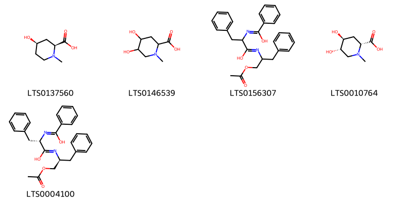{ width=100% }
    <figcaption>Hình ảnh cấu trúc hóa học của 5 hoạt chất thuộc nhóm Carboxylic acids and derivatives gồm ['(2s,4r)-4-hydroxy-1-methylpiperidine-2-carboxylic acid (LTS0137560)', '4,5-dihydroxy-1-methylpiperidine-2-carboxylic acid (LTS0146539)', 'n-[1-(acetyloxy)-3-phenylpropan-2-yl]-2-{[hydroxy(phenyl)methylidene]amino}-3-phenylpropanimidic acid (LTS0156307)', '(2r,4s,5s)-4,5-dihydroxy-1-methylpiperidine-2-carboxylic acid (LTS0010764)', '(2s)-n-[(2s)-1-(acetyloxy)-3-phenylpropan-2-yl]-2-{[hydroxy(phenyl)methylidene]amino}-3-phenylpropanimidic acid (LTS0004100)'].</figcaption>
</figure>
#### Nhóm Cinnamic acids and derivatives
<figure markdown="span">
    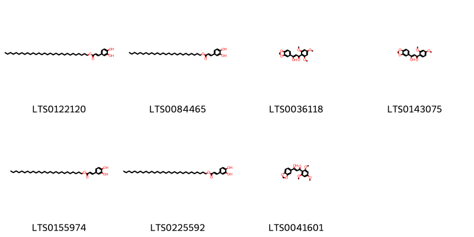{ width=100% }
    <figcaption>Hình ảnh cấu trúc hóa học của 7 hoạt chất thuộc nhóm Cinnamic acids and derivatives gồm ['triacontyl 3-(3,4-dihydroxyphenyl)prop-2-enoate (LTS0122120)', 'hexacosyl 3-(3,4-dihydroxyphenyl)prop-2-enoate (LTS0084465)', 'ponganone x (LTS0036118)', 'milletenone (LTS0143075)', 'hexacosyl (2e)-3-(3,4-dihydroxyphenyl)prop-2-enoate (LTS0155974)', 'triacontyl (2e)-3-(3,4-dihydroxyphenyl)prop-2-enoate (LTS0225592)', '3-(2h-1,3-benzodioxol-5-yl)-3-hydroxy-1-(2,4,6-trimethoxyphenyl)prop-2-en-1-one (LTS0041601)'].</figcaption>
</figure>
#### Nhóm Fatty Acyls
<figure markdown="span">
    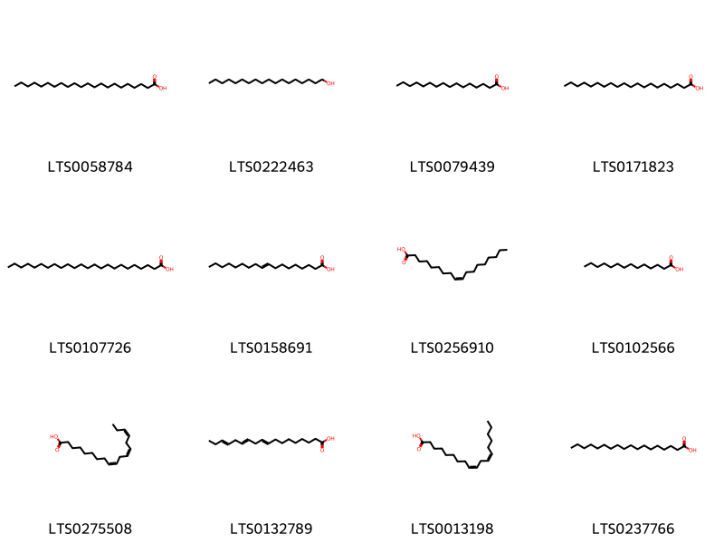{ width=100% }
    <figcaption>Hình ảnh cấu trúc hóa học của 12 hoạt chất thuộc nhóm Fatty Acyls gồm ['behenic acid (LTS0058784)', 'stearyl alcohol (LTS0222463)', 'palmitic acid (LTS0079439)', 'arachidic acid (LTS0171823)', 'lignoceric acid (LTS0107726)', '9 octadecenoic acid (LTS0158691)', 'oleic acid (LTS0256910)', 'myristic acid (LTS0102566)', 'α-linolenic acid (LTS0275508)', 'α linolenic acid (LTS0132789)', 'linoleic (LTS0013198)', 'stearic acid (LTS0237766)'].</figcaption>
</figure>
#### Nhóm Flavonoids
<figure markdown="span">
    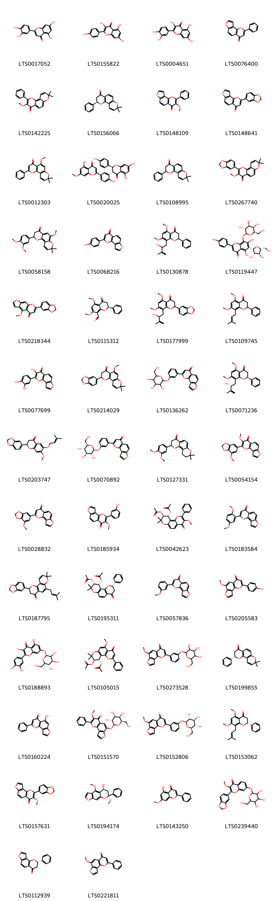{ width=100% }
    <figcaption>Hình ảnh cấu trúc hóa học của 114 hoạt chất thuộc nhóm Flavonoids gồm ['luteolin (LTS0017052)', 'kaempherol (LTS0155822)', 'quercetin (LTS0004651)', '2-phenylfuro[2,3-h]chromen-4-one (LTS0076400)', 'karanjachromene (LTS0142225)', '(2r)-8,8-dimethyl-2-phenyl-2h,3h-pyrano[2,3-f]chromen-4-one (LTS0156066)', 'karanjin (LTS0148109)', '2-(2h-1,3-benzodioxol-5-yl)furo[2,3-h]chromen-4-one (LTS0148641)', 'isopongaflavone (LTS0012303)', '2-{3-[(2s,3r)-5,7-dihydroxy-2-(4-hydroxyphenyl)-4-oxo-2,3-dihydro-1-benzopyran-3-yl]-4-hydroxyphenyl}-5-hydroxy-7-methoxychromen-4-one (LTS0020025)', 'isolonchocarpin (LTS0108995)', 'pongachromene (LTS0267740)', '2-(3,4-dimethoxyphenyl)-6-methoxy-8,8-dimethyl-2h,3h-pyrano[2,3-f]chromen-4-one (LTS0058158)', '2-(4-hydroxyphenyl)furo[2,3-h]chromen-4-one (LTS0068216)', '8-(2-hydroxy-3-methylbut-3-en-1-yl)-5,7-dimethoxy-2-phenyl-2,3-dihydro-1-benzopyran-4-one (LTS0130878)', '6-[(2s,3s,4s,5r)-3,4-dihydroxy-5-(hydroxymethyl)oxolan-2-yl]-5,7-dihydroxy-2-(4-hydroxyphenyl)-8-{[(2s,3r,4s,5r,6r)-3,4,5-trihydroxy-6-(hydroxymethyl)oxan-2-yl]oxy}chromen-4-one (LTS0119447)', '7-(2h-1,3-benzodioxol-5-yl)-4-methoxyfuro[3,2-g]chromen-5-one (LTS0218344)', '(2s)-5,7-dimethoxy-4-oxo-2-phenyl-2,3-dihydro-1-benzopyran-8-carbaldehyde (LTS0115312)', '2-(2h-1,3-benzodioxol-5-yl)-8-(2-hydroxy-3-methylbut-3-en-1-yl)-5,7-dimethoxy-2,3-dihydro-1-benzopyran-4-one (LTS0177999)', 'candidone (LTS0109745)', '2-(3,4-dihydroxyphenyl)-3-hydroxyfuro[2,3-h]chromen-4-one (LTS0077699)', '2-(2h-1,3-benzodioxol-5-yl)-5-methoxy-8,8-dimethyl-2h,3h-pyrano[2,3-f]chromen-4-one (LTS0214029)', '2-(3-{[3,4,5-trihydroxy-6-(hydroxymethyl)oxan-2-yl]oxy}phenyl)furo[2,3-h]chromen-4-one (LTS0136262)', '(2s)-8-[(2r)-2-hydroxy-3-methylbut-3-en-1-yl]-5,7-dimethoxy-2-phenyl-2,3-dihydro-1-benzopyran-4-one (LTS0071236)', '2-(2h-1,3-benzodioxol-5-yl)-7-methoxy-6-[(3-methylbut-2-en-1-yl)oxy]-2,3-dihydro-1-benzopyran-4-one (LTS0203747)', '2-(3-{[(2s,3r,4s,5s,6r)-3,4,5-trihydroxy-6-(hydroxymethyl)oxan-2-yl]oxy}phenyl)furo[2,3-h]chromen-4-one (LTS0070892)', '4-(3,4-dimethoxyphenyl)-12,12-dimethyl-3,11-dioxatricyclo[8.4.0.0²,⁷]tetradeca-1,7,9-trien-6-one (LTS0127331)', "3'-methoxypongapin (LTS0054154)", '2-(7-methoxy-2h-1,3-benzodioxol-5-yl)furo[2,3-h]chromen-4-one (LTS0028832)', '2-(3-hydroxyphenyl)-3-methoxyfuro[2,3-h]chromen-4-one (LTS0185934)', '(9s,10r)-10-(acetyloxy)-3-methoxy-8,8-dimethyl-4-oxo-2-phenyl-9h,10h-pyrano[2,3-h]chromen-9-yl acetate (LTS0042623)', 'millettocalyxin c (LTS0183584)', '2-(2h-1,3-benzodioxol-5-yl)-8,8-dimethyl-6-(3-methylbut-2-en-1-yl)-2h,3h-pyrano[2,3-f]chromen-4-one (LTS0187795)', '(4s,13r,14r)-14-(acetyloxy)-12,12-dimethyl-6-oxo-4-phenyl-3,11-dioxatricyclo[8.4.0.0²,⁷]tetradeca-1(10),2(7),8-trien-13-yl acetate (LTS0195311)', 'pongol methyl ether (LTS0057836)', '2-(4-hydroxyphenyl)-6-methoxyfuro[2,3-h]chromen-4-one (LTS0205583)', 'quercimeritrin (LTS0188893)', '(9r,10s)-9-(acetyloxy)-5-methoxy-8,8-dimethyl-4-oxo-2-phenyl-9h,10h-pyrano[2,3-h]chromen-10-yl acetate (LTS0105015)', '6-methoxy-2-(3-{[3,4,5-trihydroxy-6-(hydroxymethyl)oxan-2-yl]oxy}phenyl)furo[2,3-h]chromen-4-one (LTS0273528)', '(2s)-8,8-dimethyl-2-phenyl-2h,3h-pyrano[2,3-f]chromen-4-one (LTS0199855)', 'pongaglabol (LTS0160224)', '3-methoxy-2-phenyl-6-{[(2s,3r,4s,5r,6r)-3,4,5-trihydroxy-6-(hydroxymethyl)oxan-2-yl]oxy}furo[2,3-h]chromen-4-one (LTS0151570)', '6-methoxy-2-(3-{[(2s,3r,4s,5s,6r)-3,4,5-trihydroxy-6-(hydroxymethyl)oxan-2-yl]oxy}phenyl)furo[2,3-h]chromen-4-one (LTS0152806)', '(2r)-5,7-dimethoxy-8-(3-methylbut-2-en-1-yl)-2-phenyl-2,3-dihydro-1-benzopyran-4-one (LTS0153062)', 'pongapin (LTS0157631)', '(10s,12s)-8,12-dimethoxy-12-phenyl-4,13-dioxatricyclo[7.4.0.0³,⁷]trideca-1(9),2,5,7-tetraen-10-ol (LTS0194174)', 'tectochrysin (LTS0143250)', '2-(2h-1,3-benzodioxol-5-yl)-3-methoxy-7-{[3,4,5-trihydroxy-6-(hydroxymethyl)oxan-2-yl]oxy}chromen-4-one (LTS0239440)', '(12s)-12-phenyl-5,13-dioxatricyclo[7.4.0.0²,⁶]trideca-1,3,6,8-tetraen-10-one (LTS0112939)', 'kanjone (LTS0221811)', '5,7-dimethoxy-4-oxo-2-phenyl-2,3-dihydro-1-benzopyran-8-carbaldehyde (LTS0211152)', 'kanugin (LTS0227190)', '6-hydroxy-3-methoxy-2-phenylfuro[2,3-h]chromen-4-one (LTS0100458)', 'pongone (LTS0225884)', '(9r,10r)-10-(acetyloxy)-3-methoxy-8,8-dimethyl-4-oxo-2-phenyl-9h,10h-pyrano[2,3-h]chromen-9-yl acetate (LTS0179368)', '12-phenyl-5,13-dioxatricyclo[7.4.0.0²,⁶]trideca-1,3,6,8-tetraen-10-one (LTS0179324)', '(2s)-2-(2h-1,3-benzodioxol-5-yl)-5,7-dimethoxy-8-(3-methylbut-2-en-1-yl)-2,3-dihydro-1-benzopyran-4-one (LTS0167294)', '5-hydroxy-2-(3-hydroxyphenyl)furo[2,3-h]chromen-4-one (LTS0124765)', '2-(3,5-dimethoxyphenyl)-3-methoxyfuro[2,3-h]chromen-4-one (LTS0257823)', '8,12-dimethoxy-12-phenyl-4,13-dioxatricyclo[7.4.0.0³,⁷]trideca-1(9),2,5,7-tetraen-10-ol (LTS0252309)', '18-methoxy-5,7,12,21-tetraoxapentacyclo[11.8.0.0²,¹⁰.0⁴,⁸.0¹⁵,²⁰]henicosa-1(13),2,4(8),9,15,17,19-heptaen-14-one (LTS0052972)', '2-(3-hydroxyphenyl)furo[2,3-h]chromen-4-one (LTS0271787)', 'ovalifolin (LTS0176540)', '3-methoxy-2-(3-methoxyphenyl)furo[2,3-h]chromen-4-one (LTS0269430)', '10-(acetyloxy)-3-methoxy-8,8-dimethyl-4-oxo-2-phenyl-9h,10h-pyrano[2,3-h]chromen-9-yl acetate (LTS0218013)', '(2s)-8-[(2s)-2-hydroxy-3-methylbut-3-en-1-yl]-5,7-dimethoxy-2-phenyl-2,3-dihydro-1-benzopyran-4-one (LTS0078284)', 'obovatin methyl ether (LTS0214379)', '2-(3,4-dihydroxyphenyl)furo[2,3-h]chromen-4-one (LTS0073340)', '3,7-dimethoxy-2-phenylchromen-4-one (LTS0221156)', '2-(3-hydroxy-5-methoxyphenyl)-3-methoxyfuro[2,3-h]chromen-4-one (LTS0212226)', '(2r)-2-(3,4-dimethoxyphenyl)-5,7-dimethoxy-8-(3-methylbut-2-en-1-yl)-2,3-dihydro-1-benzopyran-4-one (LTS0220089)', '2-(2h-1,3-benzodioxol-5-yl)-7-hydroxy-3-methoxychromen-4-one (LTS0051063)', '2-(2,6-dichloro-3,5-dimethoxyphenyl)furo[2,3-h]chromen-4-one (LTS0216285)', '2-(3,5-dimethoxyphenyl)furo[2,3-h]chromen-4-one (LTS0235311)', '(2s)-2-(2h-1,3-benzodioxol-5-yl)-8-[(2s)-2-hydroxy-3-methylbut-3-en-1-yl]-5,7-dimethoxy-2,3-dihydro-1-benzopyran-4-one (LTS0237641)', 'ponganone iii (LTS0183597)', '2-(2h-1,3-benzodioxol-5-yl)-3-methoxy-7-{[(2s,3r,4s,5s,6r)-3,4,5-trihydroxy-6-(hydroxymethyl)oxan-2-yl]oxy}chromen-4-one (LTS0212220)', '(2s)-5,7-dimethoxy-8-(3-methylbut-2-en-1-yl)-2-phenyl-2,3-dihydro-1-benzopyran-4-one (LTS0168691)', '6-methoxy-2-(3-{[(2s,3r,4s,5r,6r)-3,4,5-trihydroxy-6-(hydroxymethyl)oxan-2-yl]oxy}phenyl)furo[2,3-h]chromen-4-one (LTS0172115)', '9-(acetyloxy)-5-methoxy-8,8-dimethyl-4-oxo-2-phenyl-9h,10h-pyrano[2,3-h]chromen-10-yl acetate (LTS0172830)', '2-(2h-1,3-benzodioxol-5-yl)-5-methoxyfuro[2,3-h]chromen-4-one (LTS0027287)', '(4s)-4-(3,4-dimethoxyphenyl)-12,12-dimethyl-3,11-dioxatricyclo[8.4.0.0²,⁷]tetradeca-1,7,9-trien-6-one (LTS0247777)', '9-hydroxy-6-phenylfuro[2,3-g]chromen-8-one (LTS0247886)', '(2s)-2-(2h-1,3-benzodioxol-5-yl)-8,8-dimethyl-2h,3h-pyrano[2,3-f]chromen-4-one (LTS0239210)', 'ponganone xi (LTS0046371)', '3-methoxy-2-phenyl-6-{[(2s,3r,4s,5s,6r)-3,4,5-trihydroxy-6-(hydroxymethyl)oxan-2-yl]oxy}furo[2,3-h]chromen-4-one (LTS0061179)', '3-methoxy-2-phenyl-6-{[3,4,5-trihydroxy-6-(hydroxymethyl)oxan-2-yl]oxy}furo[2,3-h]chromen-4-one (LTS0025343)', 'fisetin tetramethyl ether (LTS0050852)', '3-{[(2s,3s,4s,5s,6r)-3,5-dihydroxy-6-({[(2r,3r,4s,5r,6r)-3,4,5-trihydroxy-6-(hydroxymethyl)oxan-2-yl]oxy}methyl)-4-{[(2r,3r,4r,5r)-3,4,5-trihydroxyoxan-2-yl]oxy}oxan-2-yl]oxy}-2-(3,4-dihydroxyphenyl)-5-hydroxy-7-methoxychromen-4-one (LTS0252018)', '7-(2h-1,3-benzodioxol-5-yl)-4-hydroxyfuro[3,2-g]chromen-5-one (LTS0019179)', 'glabone (LTS0232216)', '3-{[(2s,3r,4s,5s,6s)-3,5-dihydroxy-6-(hydroxymethyl)-4-{[(2r,3s,4s,5s)-3,4,5-trihydroxyoxan-2-yl]oxy}oxan-2-yl]oxy}-2-(3,4-dihydroxyphenyl)-5-hydroxy-7-methoxychromen-4-one (LTS0050907)', 'isoglabrachromene (LTS0060027)', '2-(2h-1,3-benzodioxol-5-yl)-5,7-dimethoxy-8-(3-methylbut-2-en-1-yl)-2,3-dihydro-1-benzopyran-4-one (LTS0010039)', 'ponganone iv (LTS0261232)', '(12r)-12-(2h-1,3-benzodioxol-5-yl)-3,13-dioxatricyclo[7.4.0.0²,⁶]trideca-1,4,6,8-tetraen-10-one (LTS0049472)', '5-methoxy-2-phenylfuro[2,3-h]chromen-4-one (LTS0263822)', '14-(acetyloxy)-12,12-dimethyl-6-oxo-4-phenyl-3,11-dioxatricyclo[8.4.0.0²,⁷]tetradeca-1(10),2(7),8-trien-13-yl acetate (LTS0127824)', '2-(6-methoxy-2h-1,3-benzodioxol-5-yl)furo[2,3-h]chromen-4-one (LTS0052566)', '12-(2h-1,3-benzodioxol-5-yl)-3,13-dioxatricyclo[7.4.0.0²,⁶]trideca-1,4,6,8-tetraen-10-one (LTS0132022)', '8-(2-hydroxypropan-2-yl)-3-methoxy-2-phenylfuro[2,3-h]chromen-4-one (LTS0051828)', 'isopongachromene (LTS0013897)', 'ponganone v (LTS0005936)', 'kaempferol 7-o-glucoside (LTS0025882)', 'pinnatin (LTS0270042)', '7-methoxy-8-phenylfuro[3,2-h]chromen-6-one (LTS0004306)', '2-(4-hydroxyphenyl)-5-methoxyfuro[2,3-h]chromen-4-one (LTS0234739)', 'demethoxykanugin (LTS0076452)', "apigenin 7,4'-dimethyl ether (LTS0208774)", 'quercimeritrin (LTS0208490)', '(2s)-2-(2h-1,3-benzodioxol-5-yl)-8,8-dimethyl-6-(3-methylbut-2-en-1-yl)-2h,3h-pyrano[2,3-f]chromen-4-one (LTS0227526)', '(2s)-5-methoxy-8,8-dimethyl-2-phenyl-2h,3h-pyrano[2,3-f]chromen-4-one (LTS0243251)', '2-(2-methoxyphenyl)furo[2,3-h]chromen-4-one (LTS0042941)', '2-(3,4-dimethoxyphenyl)-8,8-dimethyl-2h,3h-pyrano[2,3-f]chromen-4-one (LTS0047500)'].</figcaption>
</figure>
#### Nhóm Isocoumarins and derivatives
<figure markdown="span">
    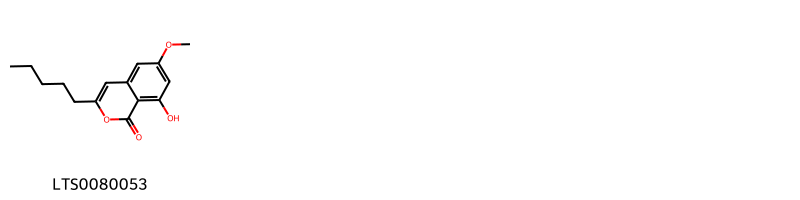{ width=100% }
    <figcaption>Hình ảnh cấu trúc hóa học của 1 hoạt chất thuộc nhóm Isocoumarins and derivatives gồm ['8-hydroxy-6-methoxy-3-pentylisochromen-1-one (LTS0080053)'].</figcaption>
</figure>
#### Nhóm Isoflavonoids
<figure markdown="span">
    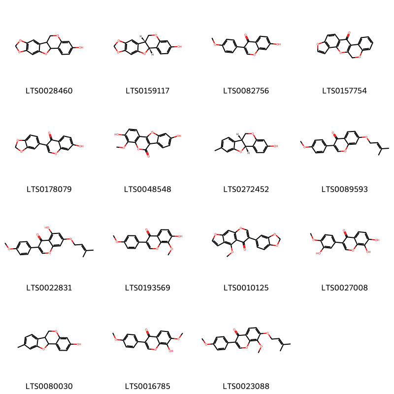{ width=100% }
    <figcaption>Hình ảnh cấu trúc hóa học của 15 hoạt chất thuộc nhóm Isoflavonoids gồm ['maackiain (LTS0028460)', '(-)-maackiain (LTS0159117)', 'formononetin (LTS0082756)', '2,7,20-trioxapentacyclo[11.8.0.0³,¹¹.0⁴,⁸.0¹⁴,¹⁹]henicosa-1(13),3(11),4(8),5,9,14,16,18-octaen-12-one (LTS0157754)', 'pseudobaptigenin (LTS0178079)', '5,14-dihydroxy-6-methoxy-8,17-dioxatetracyclo[8.7.0.0²,⁷.0¹¹,¹⁶]heptadeca-1(10),2(7),3,5,11(16),12,14-heptaen-9-one (LTS0048548)', '(1r,10r)-14-methyl-8,17-dioxatetracyclo[8.7.0.0²,⁷.0¹¹,¹⁶]heptadeca-2,4,6,11,13,15-hexaen-5-ol (LTS0272452)', 'maximaisoflavone j (LTS0089593)', '5-hydroxy-3-(4-methoxyphenyl)-7-[(3-methylbut-2-en-1-yl)oxy]chromen-4-one (LTS0022831)', '8-o-methylretusin (LTS0193569)', '6-(2h-1,3-benzodioxol-5-yl)-4-methoxyfuro[3,2-g]chromen-5-one (LTS0010125)', '7,8-dihydroxy-3-(3-hydroxy-4-methoxyphenyl)chromen-4-one (LTS0027008)', '14-methyl-8,17-dioxatetracyclo[8.7.0.0²,⁷.0¹¹,¹⁶]heptadeca-2,4,6,11,13,15-hexaen-5-ol (LTS0080030)', '8-hydroxy-7-methoxy-3-(4-methoxyphenyl)chromen-4-one (LTS0016785)', '8-methoxy-3-(4-methoxyphenyl)-7-[(3-methylbut-2-en-1-yl)oxy]chromen-4-one (LTS0023088)'].</figcaption>
</figure>
#### Nhóm Linear 1_3-diarylpropanoids
<figure markdown="span">
    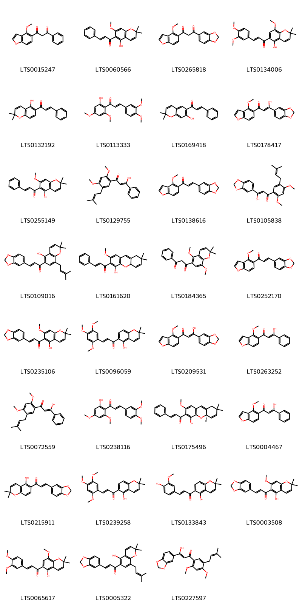{ width=100% }
    <figcaption>Hình ảnh cấu trúc hóa học của Không tìm thấy chú thích hoạt chất thuộc nhóm Linear 1_3-diarylpropanoids gồm Không tìm thấy chú thích.</figcaption>
</figure>
#### Nhóm Organooxygen compounds
<figure markdown="span">
    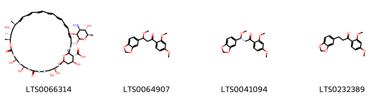{ width=100% }
    <figcaption>Hình ảnh cấu trúc hóa học của 4 hoạt chất thuộc nhóm Organooxygen compounds gồm ['candidin (LTS0066314)', 'dihydromilletenone methyl ether (LTS0064907)', '(3r)-3-(2h-1,3-benzodioxol-5-yl)-1-(2,4-dimethoxyphenyl)-3-methoxypropan-1-one (LTS0041094)', 'ponganone vii (LTS0232389)'].</figcaption>
</figure>
#### Nhóm Prenol lipids
<figure markdown="span">
    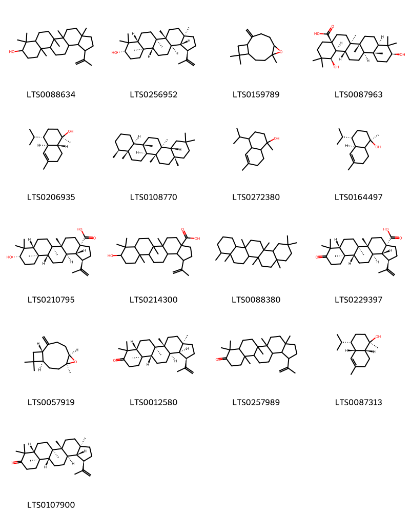{ width=100% }
    <figcaption>Hình ảnh cấu trúc hóa học của 17 hoạt chất thuộc nhóm Prenol lipids gồm ['lupeol (LTS0088634)', 'lupeol (LTS0256952)', 'caryophyllene oxide (LTS0159789)', '(1r,4ar,6ar,6br,8ar,10s,12ar,12br,14ar,14br)-1,10-dihydroxy-2,2,6a,6b,9,9,12a-heptamethyl-hexadecahydropicene-4a-carboxylic acid (LTS0087963)', 'α-cadinol (LTS0206935)', 'friedelane (LTS0108770)', 'delta-cadinol (LTS0272380)', '(1r,4s,4ar)-4-isopropyl-1,6-dimethyl-3,4,4a,7,8,8a-hexahydro-2h-naphthalen-1-ol (LTS0164497)', 'betulinic acid (LTS0210795)', '9-hydroxy-5a,5b,8,8,11a-pentamethyl-1-(prop-1-en-2-yl)-hexadecahydrocyclopenta[a]chrysene-3a-carboxylic acid (LTS0214300)', '2,2,4a,6a,8a,9,12b,14a-octamethyl-hexadecahydropicene (LTS0088380)', '(1r,3as,5ar,5br,7ar,11ar,11br,13ar,13br)-5a,5b,8,8,11a-pentamethyl-9-oxo-1-(prop-1-en-2-yl)-tetradecahydro-1h-cyclopenta[a]chrysene-3a-carboxylic acid (LTS0229397)', '(1r,4s,6r,10s)-4,12,12-trimethyl-9-methylidene-5-oxatricyclo[8.2.0.0⁴,⁶]dodecane (LTS0057919)', '(1r,3ar,5ar,5br,7ar,11ar,11br,13ar,13bs)-3a,5a,5b,8,8,11a-hexamethyl-1-(prop-1-en-2-yl)-tetradecahydro-1h-cyclopenta[a]chrysen-9-one (LTS0012580)', '3a,5a,5b,8,8,11a-hexamethyl-1-(prop-1-en-2-yl)-tetradecahydro-1h-cyclopenta[a]chrysen-9-one (LTS0257989)', '(1r,4s,4as,8ar)-4-isopropyl-1,6-dimethyl-3,4,4a,7,8,8a-hexahydro-2h-naphthalen-1-ol (LTS0087313)', 'lupenone (LTS0107900)'].</figcaption>
</figure>
#### Nhóm Steroids and steroid derivatives
<figure markdown="span">
    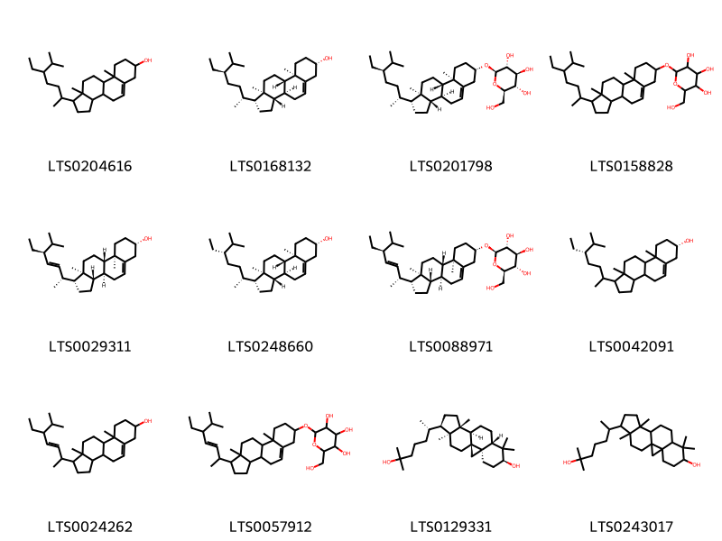{ width=100% }
    <figcaption>Hình ảnh cấu trúc hóa học của 12 hoạt chất thuộc nhóm Steroids and steroid derivatives gồm ['stigmast-5-en-3-ol, (3β)- (LTS0204616)', 'sitosterol (LTS0168132)', 'sitogluside (LTS0201798)', '2-{[1-(5-ethyl-6-methylheptan-2-yl)-9a,11a-dimethyl-1h,2h,3h,3ah,3bh,4h,6h,7h,8h,9h,9bh,10h,11h-cyclopenta[a]phenanthren-7-yl]oxy}-6-(hydroxymethyl)oxane-3,4,5-triol (LTS0158828)', 'phytosterol (LTS0029311)', 'clionasterol (LTS0248660)', '(2r,3r,4s,5s,6r)-2-{[(1r,3as,3bs,7s,9ar,9bs,11ar)-1-[(2r,3e,5s)-5-ethyl-6-methylhept-3-en-2-yl]-9a,11a-dimethyl-1h,2h,3h,3ah,3bh,4h,6h,7h,8h,9h,9bh,10h,11h-cyclopenta[a]phenanthren-7-yl]oxy}-6-(hydroxymethyl)oxane-3,4,5-triol (LTS0088971)', '(7s)-1-[(5s)-5-ethyl-6-methylheptan-2-yl]-9a,11a-dimethyl-1h,2h,3h,3ah,3bh,4h,6h,7h,8h,9h,9bh,10h,11h-cyclopenta[a]phenanthren-7-ol (LTS0042091)', 'stigmasterol (LTS0024262)', '2-{[1-(5-ethyl-6-methylhept-3-en-2-yl)-9a,11a-dimethyl-1h,2h,3h,3ah,3bh,4h,6h,7h,8h,9h,9bh,10h,11h-cyclopenta[a]phenanthren-7-yl]oxy}-6-(hydroxymethyl)oxane-3,4,5-triol (LTS0057912)', '(1s,3r,6s,8s,11r,12r,15r,16s)-15-[(2s)-6-hydroxy-6-methylheptan-2-yl]-7,7,12,16-tetramethylpentacyclo[9.7.0.0¹,³.0³,⁸.0¹²,¹⁶]octadecan-6-ol (LTS0129331)', '15-(6-hydroxy-6-methylheptan-2-yl)-7,7,12,16-tetramethylpentacyclo[9.7.0.0¹,³.0³,⁸.0¹²,¹⁶]octadecan-6-ol (LTS0243017)'].</figcaption>
</figure>

---

### Dược dân tộc học

Danh sách các quốc gia có sử dụng *Pongamia pinnata* trong điều trị các bệnh. 

| Country   | Disease                                                                   | Bệnh                                                                                                                                                                                                |
|:----------|:--------------------------------------------------------------------------|:----------------------------------------------------------------------------------------------------------------------------------------------------------------------------------------------------|
| Australia | Piscicide                                                                 | MYMEMORY WARNING: YOU USED ALL AVAILABLE FREE TRANSLATIONS FOR TODAY. NEXT AVAILABLE IN  15 HOURS 01 MINUTES 47 SECONDS VISIT HTTPS://MYMEMORY.TRANSLATED.NET/DOC/USAGELIMITS.PHP TO TRANSLATE MORE |
| Elsewhere | Cholagogue, Fungicide, Piscicide, Soap, Stomachic, nan, Nematicide, Tonic | MYMEMORY WARNING: YOU USED ALL AVAILABLE FREE TRANSLATIONS FOR TODAY. NEXT AVAILABLE IN  15 HOURS 01 MINUTES 43 SECONDS VISIT HTTPS://MYMEMORY.TRANSLATED.NET/DOC/USAGELIMITS.PHP TO TRANSLATE MORE |
| India     | Piscicide                                                                 | MYMEMORY WARNING: YOU USED ALL AVAILABLE FREE TRANSLATIONS FOR TODAY. NEXT AVAILABLE IN  15 HOURS 01 MINUTES 40 SECONDS VISIT HTTPS://MYMEMORY.TRANSLATED.NET/DOC/USAGELIMITS.PHP TO TRANSLATE MORE |
| Java      | Emetic                                                                    | MYMEMORY WARNING: YOU USED ALL AVAILABLE FREE TRANSLATIONS FOR TODAY. NEXT AVAILABLE IN  15 HOURS 01 MINUTES 37 SECONDS VISIT HTTPS://MYMEMORY.TRANSLATED.NET/DOC/USAGELIMITS.PHP TO TRANSLATE MORE |
| Malaya    | Piscicide                                                                 | MYMEMORY WARNING: YOU USED ALL AVAILABLE FREE TRANSLATIONS FOR TODAY. NEXT AVAILABLE IN  15 HOURS 01 MINUTES 32 SECONDS VISIT HTTPS://MYMEMORY.TRANSLATED.NET/DOC/USAGELIMITS.PHP TO TRANSLATE MORE |

---

# Chi Mora

??? note "Danh sách các dược liệu thuộc chi"
    
	 - *Mora oleifera*

---
## Mora oleifera
### Thông tin về thực vật

!!! info "Phân loại thực vật của *Mora oleifera* từ GIBF:"
    - **Kingdom:** Plantae
    - **Phylum:** Tracheophyta
    - **Order:** Fabales
    - **Family:** Fabaceae
    - **Genus:** Mora
    - **Species:** *Mora oleifera*

 

| Label (VI)   | Label (EN)   | Scientific Name   | Descriptions (VI)   | Descriptions (EN)   | Also Known As (VI)   | Also Known As (EN)   |
|:-------------|:-------------|:------------------|:--------------------|:--------------------|:---------------------|:---------------------|
| N/A          | N/A          | Mora oleifera     | loài thực vật       | species of plant    | ['']                 | ['']                 |

#### Phân bố trên thế giới

**Từ CSDL GIBF** Ecuador, Colombia, Costa Rica, United States of America, Panama

#### Phân bố tại Việt Nam

**Từ CSDL GIBF**: Không có ghi nhận ở Việt Nam

---
### Thành phần hóa học
        
- Theo cơ sở dữ liệu lotus: Từ loài *Mora oleifera* đã phân lập và xác định được Chưa có hoạt chất nào được phân lập. hoạt chất thuộc về các nhóm Không có hoạt chất nào được phân lập. 

Không có hình ảnh nào được tạo ra

---

### Dược dân tộc học

Danh sách các quốc gia có sử dụng *Mora oleifera* trong điều trị các bệnh. 

| Country   | Disease   | Bệnh                                                                                                                                                                                                |
|:----------|:----------|:----------------------------------------------------------------------------------------------------------------------------------------------------------------------------------------------------|
| Elsewhere | Poison    | MYMEMORY WARNING: YOU USED ALL AVAILABLE FREE TRANSLATIONS FOR TODAY. NEXT AVAILABLE IN  15 HOURS 00 MINUTES 34 SECONDS VISIT HTTPS://MYMEMORY.TRANSLATED.NET/DOC/USAGELIMITS.PHP TO TRANSLATE MORE |

---

# Chi Samanea

??? note "Danh sách các dược liệu thuộc chi"
    
	 - *Samanea saman*

---
## Samanea saman
### Thông tin về thực vật

!!! info "Phân loại thực vật của *Samanea saman* từ GIBF:"
    - **Kingdom:** Plantae
    - **Phylum:** Tracheophyta
    - **Order:** Fabales
    - **Family:** Fabaceae
    - **Genus:** Samanea
    - **Species:** *Samanea saman*

 

| Label (VI)   | Label (EN)   | Scientific Name   | Descriptions (VI)   | Descriptions (EN)   | Also Known As (VI)   | Also Known As (EN)                           |
|:-------------|:-------------|:------------------|:--------------------|:--------------------|:---------------------|:---------------------------------------------|
| N/A          | N/A          | Samanea saman     | loài thực vật       | species of plant    | ['']                 | ['Albizia saman', 'rain tree', 'Samán tree'] |

#### Phân bố trên thế giới

**Từ CSDL GIBF** Puerto Rico, Costa Rica, India, Jamaica, Indonesia, Dominican Republic, Singapore

#### Phân bố tại Việt Nam

**Từ CSDL GIBF**: Không có ghi nhận ở Việt Nam

---
### Thành phần hóa học
        
- Theo cơ sở dữ liệu lotus: Từ loài *Samanea saman* đã phân lập và xác định được 2 hoạt chất thuộc về các nhóm Fatty Acyls, Macrolactams. 

|    | chemicalTaxonomyClassyfireClass   |   smiles_count |
|---:|:----------------------------------|---------------:|
|  0 | Fatty Acyls                       |              1 |
|  1 | Macrolactams                      |              1 |

#### Nhóm Fatty Acyls
<figure markdown="span">
    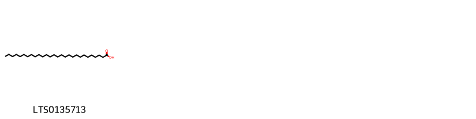{ width=100% }
    <figcaption>Hình ảnh cấu trúc hóa học của 1 hoạt chất thuộc nhóm Fatty Acyls gồm ['octacosanoic acid (LTS0135713)'].</figcaption>
</figure>
#### Nhóm Macrolactams
<figure markdown="span">
    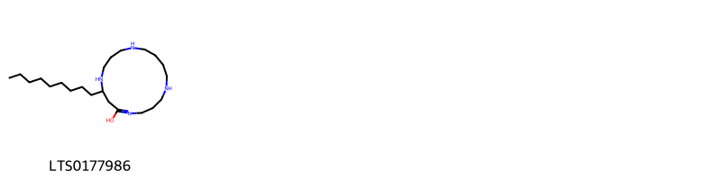{ width=100% }
    <figcaption>Hình ảnh cấu trúc hóa học của 1 hoạt chất thuộc nhóm Macrolactams gồm ['8-nonyl-1,5,9,13-tetraazacycloheptadec-5-en-6-ol (LTS0177986)'].</figcaption>
</figure>

---

### Dược dân tộc học

Danh sách các quốc gia có sử dụng *Samanea saman* trong điều trị các bệnh. 

| Country   | Disease   | Bệnh                                                                                                                                                                                                |
|:----------|:----------|:----------------------------------------------------------------------------------------------------------------------------------------------------------------------------------------------------|
| Elsewhere | Poison    | MYMEMORY WARNING: YOU USED ALL AVAILABLE FREE TRANSLATIONS FOR TODAY. NEXT AVAILABLE IN  15 HOURS 00 MINUTES 03 SECONDS VISIT HTTPS://MYMEMORY.TRANSLATED.NET/DOC/USAGELIMITS.PHP TO TRANSLATE MORE |

---

# Chi Caesalpinia

??? note "Danh sách các dược liệu thuộc chi"
    
	 - *Caesalpinia bonduc*
	 - *Caesalpinia bonducella*
	 - *Caesalpinia coriaria*
	 - *Caesalpinia crista*
	 - *Caesalpinia digyna*
	 - *Caesalpinia echinata*
	 - *Caesalpinia eriostachys*
	 - *Caesalpinia gilliesii*
	 - *Caesalpinia japonica*
	 - *Caesalpinia nuga*
	 - *Caesalpinia pulcherimma*
	 - *Caesalpinia pulcherrima*
	 - *Caesalpinia sappan*
	 - *Caesalpinia sepiaria*
	 - *Caesalpinia tsoongii*

---
## Caesalpinia bonduc
### Thông tin về thực vật

!!! info "Phân loại thực vật của *Guilandina bonduc* từ GIBF:"
    - **Kingdom:** Plantae
    - **Phylum:** Tracheophyta
    - **Order:** Fabales
    - **Family:** Fabaceae
    - **Genus:** Guilandina
    - **Species:** *Guilandina bonduc*

 

| Label (VI)   | Label (EN)   | Scientific Name    | Descriptions (VI)   | Descriptions (EN)   | Also Known As (VI)     | Also Known As (EN)            |
|:-------------|:-------------|:-------------------|:--------------------|:--------------------|:-----------------------|:------------------------------|
| N/A          | N/A          | Caesalpinia bonduc | loài thực vật       | species of plant    | ['Caesalpinia bonduc'] | ['Grey nicker', 'Warri tree'] |

#### Phân bố trên thế giới

**Từ CSDL GIBF** French Southern Territories, Australia, Christmas Island, Guadeloupe, Gabon, Japan, Benin, Tanzania, United Republic of, Togo, Malawi, Réunion, Nigeria, Chinese Taipei, Jamaica, United States of America, Bonaire, Sint Eustatius and Saba, Suriname, Thailand, Martinique, Côte d’Ivoire, Cuba, Mexico, Madagascar, Colombia, India, Indonesia, Nauru, Kenya, New Zealand

#### Phân bố tại Việt Nam

**Từ CSDL GIBF**: Không có ghi nhận ở Việt Nam

---
### Thành phần hóa học
        
- Theo cơ sở dữ liệu lotus: Từ loài *Guilandina bonduc* đã phân lập và xác định được 117 hoạt chất thuộc về các nhóm Prenol lipids, Steroids and steroid derivatives, Phenanthrenes and derivatives, Benzodioxoles, Naphthofurans, Organooxygen compounds, Phenols, Carboxylic acids and derivatives, Benzopyrans. 

|    | chemicalTaxonomyClassyfireClass   |   smiles_count |
|---:|:----------------------------------|---------------:|
|  0 | Benzodioxoles                     |              2 |
|  1 | Benzopyrans                       |              2 |
|  2 | Carboxylic acids and derivatives  |              2 |
|  3 | Naphthofurans                     |             21 |
|  4 | Organooxygen compounds            |              6 |
|  5 | Phenanthrenes and derivatives     |             11 |
|  6 | Phenols                           |              1 |
|  7 | Prenol lipids                     |             62 |
|  8 | Steroids and steroid derivatives  |             10 |

#### Nhóm Benzodioxoles
<figure markdown="span">
    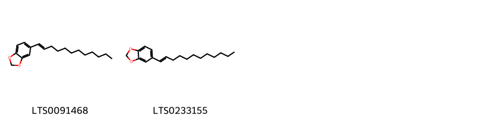{ width=100% }
    <figcaption>Hình ảnh cấu trúc hóa học của 2 hoạt chất thuộc nhóm Benzodioxoles gồm ['5-(dodec-1-en-1-yl)-2h-1,3-benzodioxole (LTS0091468)', '5-[(1e)-dodec-1-en-1-yl]-2h-1,3-benzodioxole (LTS0233155)'].</figcaption>
</figure>
#### Nhóm Benzopyrans
<figure markdown="span">
    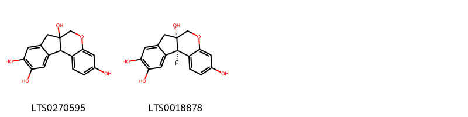{ width=100% }
    <figcaption>Hình ảnh cấu trúc hóa học của 2 hoạt chất thuộc nhóm Benzopyrans gồm ['brazilin (LTS0270595)', 'brazilin (LTS0018878)'].</figcaption>
</figure>
#### Nhóm Carboxylic acids and derivatives
<figure markdown="span">
    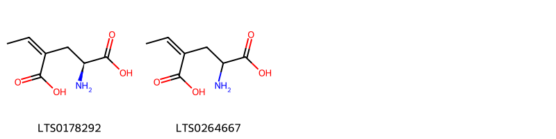{ width=100% }
    <figcaption>Hình ảnh cấu trúc hóa học của 2 hoạt chất thuộc nhóm Carboxylic acids and derivatives gồm ['(2s,4z)-2-amino-4-ethylidenepentanedioic acid (LTS0178292)', '2-amino-4-ethylidenepentanedioic acid (LTS0264667)'].</figcaption>
</figure>
#### Nhóm Naphthofurans
<figure markdown="span">
    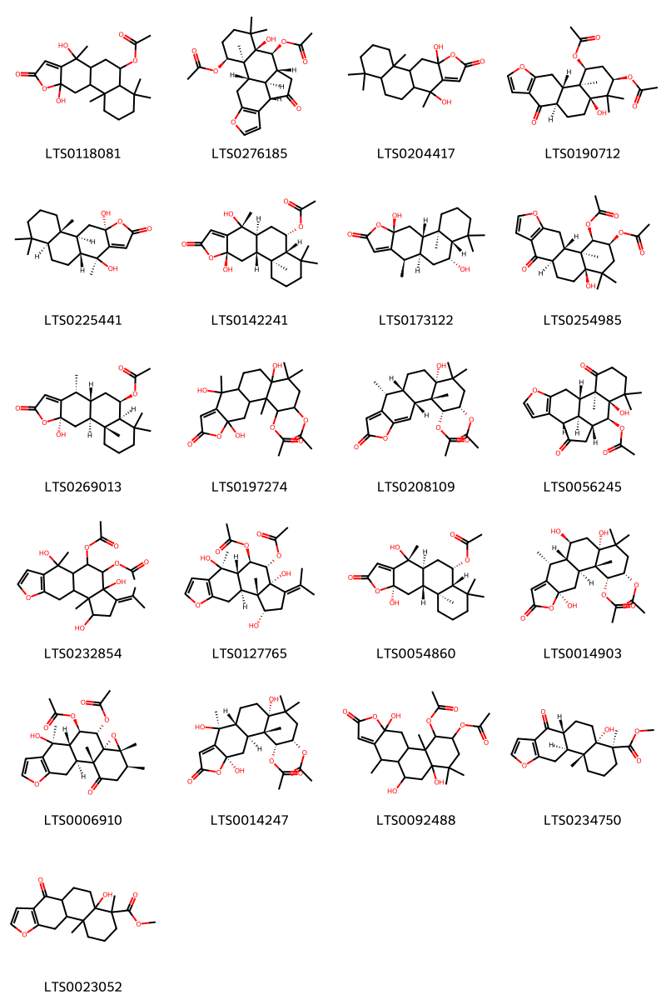{ width=100% }
    <figcaption>Hình ảnh cấu trúc hóa học của 21 hoạt chất thuộc nhóm Naphthofurans gồm ['7,10a-dihydroxy-4,4,7,11b-tetramethyl-9-oxo-1h,2h,3h,4ah,5h,6h,6ah,11h,11ah-phenanthro[3,2-b]furan-5-yl acetate (LTS0118081)', '(3bs,5ar,6s,6ar,10s,10as,10bs,11bs)-10-(acetyloxy)-6a-hydroxy-7,7,10a-trimethyl-4-oxo-3bh,5h,5ah,6h,8h,9h,10h,10bh,11h,11bh-acephenanthryleno[2,3-b]furan-6-yl acetate (LTS0276185)', '7,10a-dihydroxy-4,4,7,11b-tetramethyl-1h,2h,3h,4ah,5h,6h,6ah,11h,11ah-phenanthro[3,2-b]furan-9-one (LTS0204417)', '(1s,3r,4ar,6ar,11as,11bs)-1-(acetyloxy)-4a-hydroxy-4,4,11b-trimethyl-7-oxo-1h,2h,3h,5h,6h,6ah,11h,11ah-phenanthro[3,2-b]furan-3-yl acetate (LTS0190712)', '(4as,6ar,7s,10ar,11as,11br)-7,10a-dihydroxy-4,4,7,11b-tetramethyl-1h,2h,3h,4ah,5h,6h,6ah,11h,11ah-phenanthro[3,2-b]furan-9-one (LTS0225441)', '(4ar,5s,6as,7r,10as,11ar,11bs)-7,10a-dihydroxy-4,4,7,11b-tetramethyl-9-oxo-1h,2h,3h,4ah,5h,6h,6ah,11h,11ah-phenanthro[3,2-b]furan-5-yl acetate (LTS0142241)', '(4as,5r,6as,7r,10ar,11as,11br)-5,10a-dihydroxy-4,4,7,11b-tetramethyl-1h,2h,3h,4ah,5h,6h,6ah,7h,11h,11ah-phenanthro[3,2-b]furan-9-one (LTS0173122)', 'norcaesalpinin a (LTS0254985)', '(4as,5r,6as,7r,10ar,11as,11br)-10a-hydroxy-4,4,7,11b-tetramethyl-9-oxo-1h,2h,3h,4ah,5h,6h,6ah,7h,11h,11ah-phenanthro[3,2-b]furan-5-yl acetate (LTS0269013)', '2-(acetyloxy)-4a,7,10a-trihydroxy-4,4,7,11b-tetramethyl-9-oxo-1h,2h,3h,5h,6h,6ah,11h,11ah-phenanthro[3,2-b]furan-1-yl acetate (LTS0197274)', '(1r,2s,4ar,6as,7r,11as,11bs)-2-(acetyloxy)-4a-hydroxy-4,4,7,11b-tetramethyl-9-oxo-1h,2h,3h,5h,6h,6ah,7h,11ah-phenanthro[3,2-b]furan-1-yl acetate (LTS0208109)', '(3bs,5ar,6s,6ar,10ar,10bs,11bs)-6a-hydroxy-7,7,10a-trimethyl-4,10-dioxo-3bh,5h,5ah,6h,8h,9h,10bh,11h,11bh-acephenanthryleno[2,3-b]furan-6-yl acetate (LTS0056245)', '8-(acetyloxy)-3,6,10-trihydroxy-2,10-dimethyl-5-(propan-2-ylidene)-14-oxatetracyclo[7.7.0.0²,⁶.0¹¹,¹⁵]hexadeca-11(15),12-dien-7-yl acetate (LTS0232854)', '(1s,2s,3s,6r,7s,8r,9s,10s)-7-(acetyloxy)-3,6,10-trihydroxy-2,10-dimethyl-5-(propan-2-ylidene)-14-oxatetracyclo[7.7.0.0²,⁶.0¹¹,¹⁵]hexadeca-11(15),12-dien-8-yl acetate (LTS0127765)', '(4ar,5s,6as,7r,10ar,11ar,11bs)-7,10a-dihydroxy-4,4,7,11b-tetramethyl-9-oxo-1h,2h,3h,4ah,5h,6h,6ah,11h,11ah-phenanthro[3,2-b]furan-5-yl acetate (LTS0054860)', '(1r,2s,4ar,6s,6as,7r,10ar,11as,11bs)-2-(acetyloxy)-4a,6,10a-trihydroxy-4,4,7,11b-tetramethyl-9-oxo-1h,2h,3h,5h,6h,6ah,7h,11h,11ah-phenanthro[3,2-b]furan-1-yl acetate (LTS0014903)', '(1s,2r,5s,6r,8r,9s,10r,11s,12s)-9-(acetyloxy)-12-hydroxy-2,5,6,12-tetramethyl-3-oxo-7,16-dioxapentacyclo[9.7.0.0²,⁸.0⁶,⁸.0¹³,¹⁷]octadeca-13(17),14-dien-10-yl acetate (LTS0006910)', '(1r,2s,4ar,6ar,7s,10ar,11as,11bs)-2-(acetyloxy)-4a,7,10a-trihydroxy-4,4,7,11b-tetramethyl-9-oxo-1h,2h,3h,5h,6h,6ah,11h,11ah-phenanthro[3,2-b]furan-1-yl acetate (LTS0014247)', '2-(acetyloxy)-4a,6,10a-trihydroxy-4,4,7,11b-tetramethyl-9-oxo-1h,2h,3h,5h,6h,6ah,7h,11h,11ah-phenanthro[3,2-b]furan-1-yl acetate (LTS0092488)', 'methyl (4s,4as,6ar,11as,11br)-4a-hydroxy-4,11b-dimethyl-7-oxo-1h,2h,3h,5h,6h,6ah,11h,11ah-phenanthro[3,2-b]furan-4-carboxylate (LTS0234750)', 'methyl 4a-hydroxy-4,11b-dimethyl-7-oxo-1h,2h,3h,5h,6h,6ah,11h,11ah-phenanthro[3,2-b]furan-4-carboxylate (LTS0023052)'].</figcaption>
</figure>
#### Nhóm Organooxygen compounds
<figure markdown="span">
    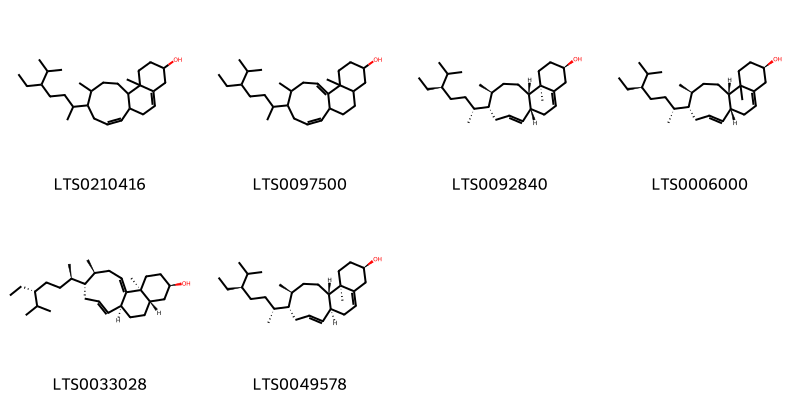{ width=100% }
    <figcaption>Hình ảnh cấu trúc hóa học của 6 hoạt chất thuộc nhóm Organooxygen compounds gồm ['10-(5-ethyl-6-methylheptan-2-yl)-11,13b-dimethyl-1h,2h,3h,4h,6h,6ah,9h,10h,11h,12h,13h,13ah-cyclonona[a]naphthalen-3-ol (LTS0210416)', '10-(5-ethyl-6-methylheptan-2-yl)-11,13b-dimethyl-1h,2h,3h,4h,4ah,5h,6h,6ah,9h,10h,11h,12h-cyclonona[a]naphthalen-3-ol (LTS0097500)', '(3r,6ar,10r,11s,13as,13br)-10-[(2r,5r)-5-ethyl-6-methylheptan-2-yl]-11,13b-dimethyl-1h,2h,3h,4h,6h,6ah,9h,10h,11h,12h,13h,13ah-cyclonona[a]naphthalen-3-ol (LTS0092840)', '(3r,6ar,10r,11s,13as)-10-[(2r,5r)-5-ethyl-6-methylheptan-2-yl]-11,13b-dimethyl-1h,2h,3h,4h,6h,6ah,9h,10h,11h,12h,13h,13ah-cyclonona[a]naphthalen-3-ol (LTS0006000)', '(3r,4as,6as,10r,11s,13bs)-10-[(2r,5r)-5-ethyl-6-methylheptan-2-yl]-11,13b-dimethyl-1h,2h,3h,4h,4ah,5h,6h,6ah,9h,10h,11h,12h-cyclonona[a]naphthalen-3-ol (LTS0033028)', '(3r,6as,10r,11s,13as,13br)-10-[(2r,5r)-5-ethyl-6-methylheptan-2-yl]-11,13b-dimethyl-1h,2h,3h,4h,6h,6ah,9h,10h,11h,12h,13h,13ah-cyclonona[a]naphthalen-3-ol (LTS0049578)'].</figcaption>
</figure>
#### Nhóm Phenanthrenes and derivatives
<figure markdown="span">
    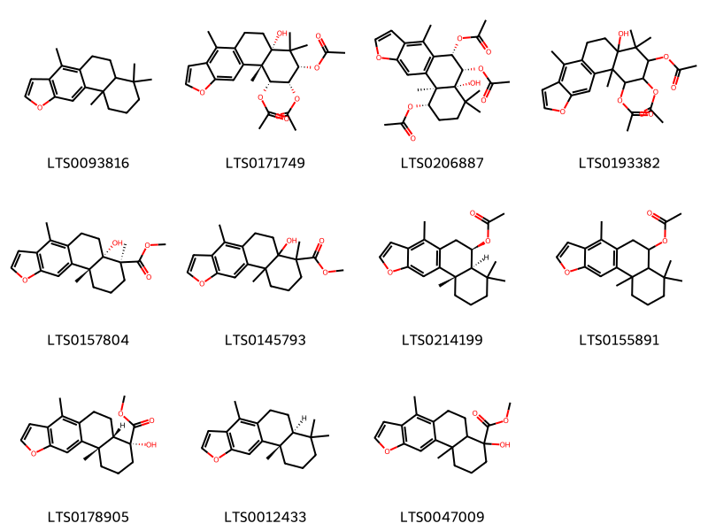{ width=100% }
    <figcaption>Hình ảnh cấu trúc hóa học của 11 hoạt chất thuộc nhóm Phenanthrenes and derivatives gồm ['4,4,7,11b-tetramethyl-1h,2h,3h,4ah,5h,6h-phenanthro[3,2-b]furan (LTS0093816)', '(1r,2s,3s,4ar,11bs)-1,2-bis(acetyloxy)-4a-hydroxy-4,4,7,11b-tetramethyl-1h,2h,3h,5h,6h-phenanthro[3,2-b]furan-3-yl acetate (LTS0171749)', '(1s,4ar,5s,6s,11br)-1,6-bis(acetyloxy)-4a-hydroxy-4,4,7,11b-tetramethyl-1h,2h,3h,5h,6h-phenanthro[3,2-b]furan-5-yl acetate (LTS0206887)', '1,2-bis(acetyloxy)-4a-hydroxy-4,4,7,11b-tetramethyl-1h,2h,3h,5h,6h-phenanthro[3,2-b]furan-3-yl acetate (LTS0193382)', 'methyl (4s,4as,11br)-4a-hydroxy-4,7,11b-trimethyl-1h,2h,3h,5h,6h-phenanthro[3,2-b]furan-4-carboxylate (LTS0157804)', 'methyl 4a-hydroxy-4,7,11b-trimethyl-1h,2h,3h,5h,6h-phenanthro[3,2-b]furan-4-carboxylate (LTS0145793)', '(4as,5r,11bs)-4,4,7,11b-tetramethyl-1h,2h,3h,4ah,5h,6h-phenanthro[3,2-b]furan-5-yl acetate (LTS0214199)', '4,4,7,11b-tetramethyl-1h,2h,3h,4ah,5h,6h-phenanthro[3,2-b]furan-5-yl acetate (LTS0155891)', 'methyl (4r,4as,11bs)-4-hydroxy-7,11b-dimethyl-1h,2h,3h,4ah,5h,6h-phenanthro[3,2-b]furan-4-carboxylate (LTS0178905)', '(4as,11bs)-4,4,7,11b-tetramethyl-1h,2h,3h,4ah,5h,6h-phenanthro[3,2-b]furan (LTS0012433)', 'methyl 4-hydroxy-7,11b-dimethyl-1h,2h,3h,4ah,5h,6h-phenanthro[3,2-b]furan-4-carboxylate (LTS0047009)'].</figcaption>
</figure>
#### Nhóm Phenols
<figure markdown="span">
    { width=100% }
    <figcaption>Hình ảnh cấu trúc hóa học của 1 hoạt chất thuộc nhóm Phenols gồm ['syringaldehyde (LTS0201406)'].</figcaption>
</figure>
#### Nhóm Prenol lipids
<figure markdown="span">
    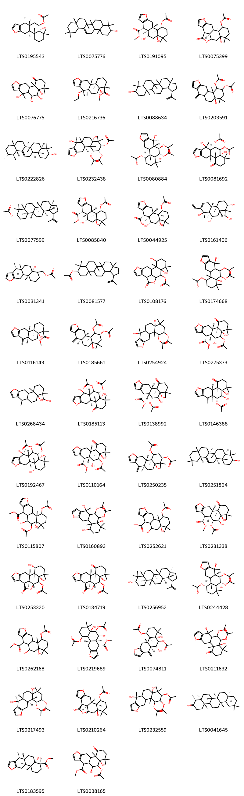{ width=100% }
    <figcaption>Hình ảnh cấu trúc hóa học của 62 hoạt chất thuộc nhóm Prenol lipids gồm ['(4ar,5r,6as,7r,11as,11br)-4a-hydroxy-4,4,7,11b-tetramethyl-1h,2h,3h,5h,6h,6ah,7h,11h,11ah-phenanthro[3,2-b]furan-5-yl acetate (LTS0195543)', 'β-amyrin (LTS0075776)', 'methyl (1s,4ar,6s,6ar,7s,11as,11bs)-1-(acetyloxy)-4a,6-dihydroxy-4,4,11b-trimethyl-1h,2h,3h,5h,6h,6ah,7h,11h,11ah-phenanthro[3,2-b]furan-7-carboxylate (LTS0191095)', '(18s,19r)-13-hydroxy-14,14,18-trimethyl-9-oxo-4,10-dioxapentacyclo[9.7.1.0³,⁷.0⁸,¹⁹.0¹³,¹⁸]nonadeca-3(7),5-dien-17-yl acetate (LTS0075399)', '4a,5,6,7-tetrahydroxy-4,4,7,11b-tetramethyl-2h,3h,5h,6h,6ah,11h,11ah-phenanthro[3,2-b]furan-1-one (LTS0076775)', 'methyl (4s,4as,6ar,7s,11as,11br)-7-ethoxy-4a-hydroxy-4,7,11b-trimethyl-1h,2h,3h,5h,6h,6ah,11h,11ah-phenanthro[3,2-b]furan-4-carboxylate (LTS0216736)', 'lupeol (LTS0088634)', '1-(acetyloxy)-4a-hydroxy-4,4,11b-trimethyl-7-methylidene-1h,2h,3h,5h,6h,6ah,11h,11ah-phenanthro[3,2-b]furan-2-yl acetate (LTS0203591)', 'amyrin (LTS0222826)', '(1r,2s,3s,4ar,6ar,7s,11as,11bs)-1,2-bis(acetyloxy)-4a,7-dihydroxy-4,4,7,11b-tetramethyl-1h,2h,3h,5h,6h,6ah,11h,11ah-phenanthro[3,2-b]furan-3-yl acetate (LTS0232438)', '(1s,4ar,5s,6r,6as,7s,11as,11bs)-1,6-bis(acetyloxy)-4a,7-dihydroxy-4,4,7,11b-tetramethyl-1h,2h,3h,5h,6h,6ah,11h,11ah-phenanthro[3,2-b]furan-5-yl acetate (LTS0080884)', '(4ar,5r,6s,6ar,7r,11ar,11br)-6-(acetyloxy)-4a,7-dihydroxy-4,4,7,11b-tetramethyl-1-oxo-2h,3h,5h,6h,6ah,11h,11ah-phenanthro[3,2-b]furan-5-yl acetate (LTS0081692)', 'lupeol acetate (LTS0077599)', 'methyl (1s,4ar,6s,6as,7s,11as,11bs)-1-(acetyloxy)-4a,6-dihydroxy-4,4,11b-trimethyl-1h,2h,3h,5h,6h,6ah,7h,11h,11ah-phenanthro[3,2-b]furan-7-carboxylate (LTS0085840)', '(1s,4ar,6s,6ar,7s,11as,11bs)-1-(acetyloxy)-4a,6-dihydroxy-4,4,11b-trimethyl-1h,2h,3h,5h,6h,6ah,7h,11h,11ah-phenanthro[3,2-b]furan-7-carboxylic acid (LTS0044925)', '(1s,4as,4br,7s,8s,8ar,10s,10as)-2-ethenyl-8-(hydroxymethyl)-1,4b,8-trimethyl-4a,5,6,7,8a,9,10,10a-octahydro-4h-phenanthrene-1,7,10-triol (LTS0161406)', '[(4r,4as,6as,7r,11as,11br)-4a-hydroxy-4,7,11b-trimethyl-1h,2h,3h,5h,6h,6ah,7h,11h,11ah-phenanthro[3,2-b]furan-4-yl]methyl acetate (LTS0031341)', '3a,5a,5b,8,8,11a-hexamethyl-1-(prop-1-en-2-yl)-hexadecahydrocyclopenta[a]chrysen-9-yl acetate (LTS0081577)', '13,17-dihydroxy-14,14,18-trimethyl-9-oxo-4,10-dioxapentacyclo[9.7.1.0³,⁷.0⁸,¹⁹.0¹³,¹⁸]nonadeca-3(7),5-dien-12-yl acetate (LTS0108176)', '1,6-bis(acetyloxy)-4a,7-dihydroxy-4,4,7,11b-tetramethyl-1h,2h,3h,5h,6h,6ah,11h,11ah-phenanthro[3,2-b]furan-5-yl acetate (LTS0174668)', 'methyl (4s,4as,6ar,11as,11br)-4a-hydroxy-4,11b-dimethyl-7-methylidene-1h,2h,3h,5h,6h,6ah,11h,11ah-phenanthro[3,2-b]furan-4-carboxylate (LTS0116143)', '(1r,2s,4ar,6ar,11as,11bs)-1-(acetyloxy)-4a-hydroxy-4,4,11b-trimethyl-7-methylidene-1h,2h,3h,5h,6h,6ah,11h,11ah-phenanthro[3,2-b]furan-2-yl acetate (LTS0185661)', '2-(acetyloxy)-4a,7-dihydroxy-4,4,7,11b-tetramethyl-1h,2h,3h,5h,6h,6ah,11h,11ah-phenanthro[3,2-b]furan-1-yl acetate (LTS0254924)', 'methyl (4ar,5s,6r,6ar,7s,11as,11br)-5-(acetyloxy)-4a,6-dihydroxy-4,4,11b-trimethyl-1-oxo-2h,3h,5h,6h,6ah,7h,11h,11ah-phenanthro[3,2-b]furan-7-carboxylate (LTS0275373)', '4-(hydroxymethyl)-4,7,11b-trimethyl-1h,2h,3h,5h,6h,6ah,7h,11h,11ah-phenanthro[3,2-b]furan-4a-ol (LTS0268434)', '(4ar,5s,6r,6as,7s,11as,11br)-5-(acetyloxy)-4a,7-dihydroxy-4,4,7,11b-tetramethyl-1-oxo-2h,3h,5h,6h,6ah,11h,11ah-phenanthro[3,2-b]furan-6-yl acetate (LTS0185113)', 'methyl (4ar,5s,6r,6as,7s,11as,11br)-6-(acetyloxy)-4a,5-dihydroxy-4,4,11b-trimethyl-1-oxo-2h,3h,5h,6h,6ah,7h,11h,11ah-phenanthro[3,2-b]furan-7-carboxylate (LTS0138992)', '(4ar,5s,6r,6ar,11as,11br)-4a,5-dihydroxy-4,4,11b-trimethyl-7-methylidene-1-oxo-2h,3h,5h,6h,6ah,11h,11ah-phenanthro[3,2-b]furan-6-yl acetate (LTS0146388)', '(1s,4ar,5s,6r,6as,7s,11as,11bs)-5-(acetyloxy)-1,4a,7-trihydroxy-4,4,7,11b-tetramethyl-1h,2h,3h,5h,6h,6ah,11h,11ah-phenanthro[3,2-b]furan-6-yl acetate (LTS0192467)', 'methyl (4ar,5s,6r,6as,7s,11as,11br)-5-(acetyloxy)-4a,6-dihydroxy-4,4,11b-trimethyl-1-oxo-2h,3h,5h,6h,6ah,7h,11h,11ah-phenanthro[3,2-b]furan-7-carboxylate (LTS0110164)', '(1s,3r,4ar,6ar,11as,11bs)-1-(acetyloxy)-4a-hydroxy-4,4,11b-trimethyl-7-methylidene-1h,2h,3h,5h,6h,6ah,11h,11ah-phenanthro[3,2-b]furan-3-yl acetate (LTS0250235)', 'β-amyrin (LTS0251864)', 'methyl 1,5-bis(acetyloxy)-4a,6-dihydroxy-4,4,11b-trimethyl-1h,2h,3h,5h,6h,6ah,7h,11h,11ah-phenanthro[3,2-b]furan-7-carboxylate (LTS0115807)', '6-(acetyloxy)-1,4a,7-trihydroxy-4,4,7,11b-tetramethyl-1h,2h,3h,5h,6h,6ah,11h,11ah-phenanthro[3,2-b]furan-5-yl acetate (LTS0160893)', '1-(acetyloxy)-4a,6-dihydroxy-4,4,11b-trimethyl-1h,2h,3h,5h,6h,6ah,7h,11h,11ah-phenanthro[3,2-b]furan-7-carboxylic acid (LTS0252621)', 'methyl (4ar,5s,6r,6ar,7s,11as,11br)-6-(acetyloxy)-4a,5-dihydroxy-4,4,11b-trimethyl-1-oxo-2h,3h,5h,6h,6ah,7h,11h,11ah-phenanthro[3,2-b]furan-7-carboxylate (LTS0231338)', '(1s,8s,11r,12s,13r,17s,18s,19r)-13,17-dihydroxy-14,14,18-trimethyl-9-oxo-4,10-dioxapentacyclo[9.7.1.0³,⁷.0⁸,¹⁹.0¹³,¹⁸]nonadeca-3(7),5-dien-12-yl acetate (LTS0253320)', '(1s,8s,11r,12s,13r,18r,19r)-13-hydroxy-14,14,18-trimethyl-9,17-dioxo-4,10-dioxapentacyclo[9.7.1.0³,⁷.0⁸,¹⁹.0¹³,¹⁸]nonadeca-3(7),5-dien-12-yl acetate (LTS0134719)', 'lupeol (LTS0256952)', '(1s,4ar,5s,6r,6as,7r,11as,11bs)-1,6-bis(acetyloxy)-4a,7-dihydroxy-4,4,7,11b-tetramethyl-1h,2h,3h,5h,6h,6ah,11h,11ah-phenanthro[3,2-b]furan-5-yl acetate (LTS0244428)', 'methyl 1-(acetyloxy)-4a,6-dihydroxy-4,4,11b-trimethyl-1h,2h,3h,5h,6h,6ah,7h,11h,11ah-phenanthro[3,2-b]furan-7-carboxylate (LTS0262168)', 'methyl (1s,4ar,5s,6r,6ar,7s,11as,11bs)-1,5-bis(acetyloxy)-4a,6-dihydroxy-4,4,11b-trimethyl-1h,2h,3h,5h,6h,6ah,7h,11h,11ah-phenanthro[3,2-b]furan-7-carboxylate (LTS0219689)', '(1s,4ar,5s,6r,6ar,11as,11bs)-1-(acetyloxy)-4a,6-dihydroxy-4,4,11b-trimethyl-7-methylidene-1h,2h,3h,5h,6h,6ah,11h,11ah-phenanthro[3,2-b]furan-5-yl acetate (LTS0074811)', '6-(acetyloxy)-4a,7-dihydroxy-4,4,7,11b-tetramethyl-1-oxo-2h,3h,5h,6h,6ah,11h,11ah-phenanthro[3,2-b]furan-5-yl acetate (LTS0211632)', '(1r,2s,4ar,6ar,7s,11as,11bs)-2-(acetyloxy)-4a,7-dihydroxy-4,4,7,11b-tetramethyl-1h,2h,3h,5h,6h,6ah,11h,11ah-phenanthro[3,2-b]furan-1-yl acetate (LTS0217493)', '(1s,8s,11s,13r,17s,18s,19r)-13-hydroxy-14,14,18-trimethyl-9-oxo-4,10-dioxapentacyclo[9.7.1.0³,⁷.0⁸,¹⁹.0¹³,¹⁸]nonadeca-3(7),5-dien-17-yl acetate (LTS0210264)', '1,2-bis(acetyloxy)-4a,7-dihydroxy-4,4,7,11b-tetramethyl-1h,2h,3h,5h,6h,6ah,11h,11ah-phenanthro[3,2-b]furan-3-yl acetate (LTS0232559)', '(-)-friedelin (LTS0041645)', 'methyl (4s,4as,6as,7r,11as,11br)-4a-hydroxy-4,7,11b-trimethyl-1h,2h,3h,5h,6h,6ah,7h,11h,11ah-phenanthro[3,2-b]furan-4-carboxylate (LTS0183595)', 'methyl 5-(acetyloxy)-4a,6-dihydroxy-4,4,11b-trimethyl-1-oxo-2h,3h,5h,6h,6ah,7h,11h,11ah-phenanthro[3,2-b]furan-7-carboxylate (LTS0038165)', '1-(acetyloxy)-4a-hydroxy-4,4,11b-trimethyl-7-methylidene-1h,2h,3h,5h,6h,6ah,11h,11ah-phenanthro[3,2-b]furan-3-yl acetate (LTS0246251)', '(1s,4ar,6s,6as,7s,11as,11bs)-4a,6-dihydroxy-4,4,7,11b-tetramethyl-1h,2h,3h,5h,6h,6ah,7h,11h,11ah-phenanthro[3,2-b]furan-1-yl acetate (LTS0185123)', '(4s,4as,6as,7r,11as,11br)-4a-hydroxy-4,7,11b-trimethyl-1h,2h,3h,5h,6h,6ah,7h,11h,11ah-phenanthro[3,2-b]furan-4-carboxylic acid (LTS0056214)', '(1s,4ar,6s,6as,7r,11as,11bs)-4a,6-dihydroxy-4,4,7,11b-tetramethyl-1h,2h,3h,5h,6h,6ah,7h,11h,11ah-phenanthro[3,2-b]furan-1-yl acetate (LTS0007858)', '(1r,2s,3s,4ar,6ar,11as,11bs)-1,2-bis(acetyloxy)-4a-hydroxy-4,4,11b-trimethyl-7-methylidene-1h,2h,3h,5h,6h,6ah,11h,11ah-phenanthro[3,2-b]furan-3-yl acetate (LTS0006700)', 'α-amyrin (LTS0088267)', '(4as,5r,6ar,7s,11ar,11bs)-4a-hydroxy-4,4,7,11b-tetramethyl-1h,2h,3h,5h,6h,6ah,7h,11h,11ah-phenanthro[3,2-b]furan-5-yl acetate (LTS0235692)', 'friedelin (LTS0213494)', 'methyl (1s,4ar,4bs,8ar,10as)-10a-hydroxy-7-(2-hydroxyethyl)-1,4a,8-trimethyl-6-oxo-2,3,4,4b,5,8a,9,10-octahydrophenanthrene-1-carboxylate (LTS0258168)', '1,2-bis(acetyloxy)-4a-hydroxy-4,4,11b-trimethyl-7-methylidene-1h,2h,3h,5h,6h,6ah,11h,11ah-phenanthro[3,2-b]furan-3-yl acetate (LTS0043799)', '(4r,4as,6as,7r,11as,11br)-4-(hydroxymethyl)-4,7,11b-trimethyl-1h,2h,3h,5h,6h,6ah,7h,11h,11ah-phenanthro[3,2-b]furan-4a-ol (LTS0115120)', '4a-hydroxy-4,4,7,11b-tetramethyl-1h,2h,3h,5h,6h,6ah,7h,11h,11ah-phenanthro[3,2-b]furan-5-yl acetate (LTS0114798)'].</figcaption>
</figure>
#### Nhóm Steroids and steroid derivatives
<figure markdown="span">
    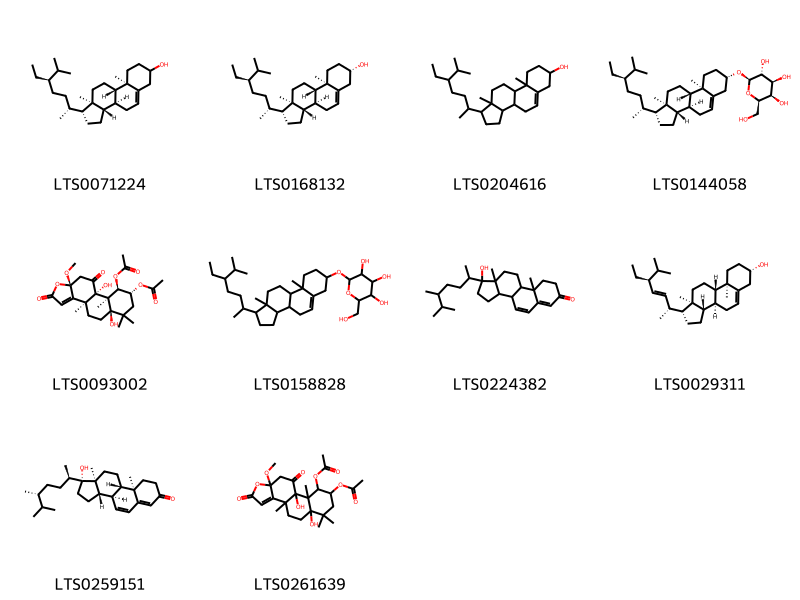{ width=100% }
    <figcaption>Hình ảnh cấu trúc hóa học của 10 hoạt chất thuộc nhóm Steroids and steroid derivatives gồm ['stigmast-5-en-3-ol (LTS0071224)', 'sitosterol (LTS0168132)', 'stigmast-5-en-3-ol, (3β)- (LTS0204616)', '(2r,3r,4s,5r,6r)-2-{[(1r,3as,3bs,7s,9ar,9bs,11ar)-1-[(2r,5r)-5-ethyl-6-methylheptan-2-yl]-9a,11a-dimethyl-1h,2h,3h,3ah,3bh,4h,6h,7h,8h,9h,9bh,10h,11h-cyclopenta[a]phenanthren-7-yl]oxy}-6-(hydroxymethyl)oxane-3,4,5-triol (LTS0144058)', '(3bs,5ar,8r,9r,9as,9bs,11ar)-9-(acetyloxy)-5a,9b-dihydroxy-11a-methoxy-3b,6,6,9a-tetramethyl-2,10-dioxo-4h,5h,7h,8h,9h,11h-phenanthro[2,1-b]furan-8-yl acetate (LTS0093002)', '2-{[1-(5-ethyl-6-methylheptan-2-yl)-9a,11a-dimethyl-1h,2h,3h,3ah,3bh,4h,6h,7h,8h,9h,9bh,10h,11h-cyclopenta[a]phenanthren-7-yl]oxy}-6-(hydroxymethyl)oxane-3,4,5-triol (LTS0158828)', '1-(5,6-dimethylheptan-2-yl)-1-hydroxy-9a,11a-dimethyl-2h,3h,3ah,3bh,8h,9h,9bh,10h,11h-cyclopenta[a]phenanthren-7-one (LTS0224382)', 'phytosterol (LTS0029311)', '(1r,3as,3br,9ar,9bs,11as)-1-[(2r,5r)-5,6-dimethylheptan-2-yl]-1-hydroxy-9a,11a-dimethyl-2h,3h,3ah,3bh,8h,9h,9bh,10h,11h-cyclopenta[a]phenanthren-7-one (LTS0259151)', '9-(acetyloxy)-5a,9b-dihydroxy-11a-methoxy-3b,6,6,9a-tetramethyl-2,10-dioxo-4h,5h,7h,8h,9h,11h-phenanthro[2,1-b]furan-8-yl acetate (LTS0261639)'].</figcaption>
</figure>

---

### Dược dân tộc học

Danh sách các quốc gia có sử dụng *Guilandina bonduc* trong điều trị các bệnh. 

| Country            | Disease                          | Bệnh                                                                                                                                                                                                |
|:-------------------|:---------------------------------|:----------------------------------------------------------------------------------------------------------------------------------------------------------------------------------------------------|
| Dominican Republic | Poison                           | MYMEMORY WARNING: YOU USED ALL AVAILABLE FREE TRANSLATIONS FOR TODAY. NEXT AVAILABLE IN  14 HOURS 59 MINUTES 29 SECONDS VISIT HTTPS://MYMEMORY.TRANSLATED.NET/DOC/USAGELIMITS.PHP TO TRANSLATE MORE |
| German             | Diuretic                         | MYMEMORY WARNING: YOU USED ALL AVAILABLE FREE TRANSLATIONS FOR TODAY. NEXT AVAILABLE IN  14 HOURS 59 MINUTES 26 SECONDS VISIT HTTPS://MYMEMORY.TRANSLATED.NET/DOC/USAGELIMITS.PHP TO TRANSLATE MORE |
| Italian            | Vermifuge                        | MYMEMORY WARNING: YOU USED ALL AVAILABLE FREE TRANSLATIONS FOR TODAY. NEXT AVAILABLE IN  14 HOURS 59 MINUTES 23 SECONDS VISIT HTTPS://MYMEMORY.TRANSLATED.NET/DOC/USAGELIMITS.PHP TO TRANSLATE MORE |
| Java               | Antidote, Emmenagogue, Vermifuge | MYMEMORY WARNING: YOU USED ALL AVAILABLE FREE TRANSLATIONS FOR TODAY. NEXT AVAILABLE IN  14 HOURS 59 MINUTES 19 SECONDS VISIT HTTPS://MYMEMORY.TRANSLATED.NET/DOC/USAGELIMITS.PHP TO TRANSLATE MORE |
| US                 | Tonic                            | MYMEMORY WARNING: YOU USED ALL AVAILABLE FREE TRANSLATIONS FOR TODAY. NEXT AVAILABLE IN  14 HOURS 59 MINUTES 16 SECONDS VISIT HTTPS://MYMEMORY.TRANSLATED.NET/DOC/USAGELIMITS.PHP TO TRANSLATE MORE |

---

---
## Caesalpinia bonducella
### Thông tin về thực vật

!!! info "Phân loại thực vật của *Guilandina bonduc* từ GIBF:"
    - **Kingdom:** Plantae
    - **Phylum:** Tracheophyta
    - **Order:** Fabales
    - **Family:** Fabaceae
    - **Genus:** Guilandina
    - **Species:** *Guilandina bonduc*

 

| Label (VI)   | Label (EN)   | Scientific Name        | Descriptions (VI)   | Descriptions (EN)   | Also Known As (VI)   | Also Known As (EN)   |
|:-------------|:-------------|:-----------------------|:--------------------|:--------------------|:---------------------|:---------------------|
| N/A          | N/A          | Caesalpinia bonducella |                     |                     | ['']                 | ['']                 |

#### Phân bố trên thế giới

**Từ CSDL GIBF** Virgin Islands (U.S.), nan, Sri Lanka, Mauritius, unknown or invalid, Sierra Leone, Venezuela (Bolivarian Republic of), Puerto Rico, Jamaica, Russian Federation, United States of America, Trinidad and Tobago, Brazil, Cuba, Mexico, Saint Helena, Ascension and Tristan da Cunha, United Kingdom of Great Britain and Northern Ireland, French Polynesia, Madagascar, Colombia, Costa Rica, Vanuatu, India, Gambia, Indonesia, Samoa

#### Phân bố tại Việt Nam

**Từ CSDL GIBF**: Không có ghi nhận ở Việt Nam

---
### Thành phần hóa học
        
- Theo cơ sở dữ liệu lotus: Từ loài *Guilandina bonduc* đã phân lập và xác định được Chưa có hoạt chất nào được phân lập. hoạt chất thuộc về các nhóm Không có hoạt chất nào được phân lập. 

Không có hình ảnh nào được tạo ra

---

### Dược dân tộc học

Danh sách các quốc gia có sử dụng *Guilandina bonduc* trong điều trị các bệnh. 

| Country   | Disease                                  | Bệnh                                                                                                                                                                                                |
|:----------|:-----------------------------------------|:----------------------------------------------------------------------------------------------------------------------------------------------------------------------------------------------------|
| India     | nan, Tonic                               | MYMEMORY WARNING: YOU USED ALL AVAILABLE FREE TRANSLATIONS FOR TODAY. NEXT AVAILABLE IN  14 HOURS 58 MINUTES 37 SECONDS VISIT HTTPS://MYMEMORY.TRANSLATED.NET/DOC/USAGELIMITS.PHP TO TRANSLATE MORE |
| Iraq      | Emmenagogue, Tonic, Vermifuge, Emollient | MYMEMORY WARNING: YOU USED ALL AVAILABLE FREE TRANSLATIONS FOR TODAY. NEXT AVAILABLE IN  14 HOURS 58 MINUTES 33 SECONDS VISIT HTTPS://MYMEMORY.TRANSLATED.NET/DOC/USAGELIMITS.PHP TO TRANSLATE MORE |

---

---
## Caesalpinia coriaria
### Thông tin về thực vật

!!! info "Phân loại thực vật của *Caesalpinia coriaria* từ GIBF:"
    - **Kingdom:** Plantae
    - **Phylum:** Tracheophyta
    - **Order:** Fabales
    - **Family:** Fabaceae
    - **Genus:** Caesalpinia
    - **Species:** *Caesalpinia coriaria*

 

| Label (VI)   | Label (EN)   | Scientific Name      | Descriptions (VI)   | Descriptions (EN)   | Also Known As (VI)   | Also Known As (EN)   |
|:-------------|:-------------|:---------------------|:--------------------|:--------------------|:---------------------|:---------------------|
| N/A          | N/A          | Caesalpinia coriaria | loài thực vật       | species of plant    | ['']                 | ['']                 |

#### Phân bố trên thế giới

**Từ CSDL GIBF** Bonaire, Sint Eustatius and Saba, Curaçao, Colombia

#### Phân bố tại Việt Nam

**Từ CSDL GIBF**: Không có ghi nhận ở Việt Nam

---
### Thành phần hóa học
        
- Theo cơ sở dữ liệu lotus: Từ loài *Caesalpinia coriaria* đã phân lập và xác định được 2 hoạt chất thuộc về các nhóm Naphthalenes, Prenol lipids. 

|    | chemicalTaxonomyClassyfireClass   |   smiles_count |
|---:|:----------------------------------|---------------:|
|  0 | Naphthalenes                      |              1 |
|  1 | Prenol lipids                     |              1 |

#### Nhóm Naphthalenes
<figure markdown="span">
    { width=100% }
    <figcaption>Hình ảnh cấu trúc hóa học của 1 hoạt chất thuộc nhóm Naphthalenes gồm ['walnut extract (LTS0110862)'].</figcaption>
</figure>
#### Nhóm Prenol lipids
<figure markdown="span">
    { width=100% }
    <figcaption>Hình ảnh cấu trúc hóa học của 1 hoạt chất thuộc nhóm Prenol lipids gồm ['aucubin (LTS0010822)'].</figcaption>
</figure>

---

### Dược dân tộc học

Danh sách các quốc gia có sử dụng *Caesalpinia coriaria* trong điều trị các bệnh. 

| Country            | Disease    | Bệnh                                                                                                                                                                                                |
|:-------------------|:-----------|:----------------------------------------------------------------------------------------------------------------------------------------------------------------------------------------------------|
| Dominican Republic | Antiseptic | MYMEMORY WARNING: YOU USED ALL AVAILABLE FREE TRANSLATIONS FOR TODAY. NEXT AVAILABLE IN  14 HOURS 58 MINUTES 11 SECONDS VISIT HTTPS://MYMEMORY.TRANSLATED.NET/DOC/USAGELIMITS.PHP TO TRANSLATE MORE |
| French             | Tonic      | MYMEMORY WARNING: YOU USED ALL AVAILABLE FREE TRANSLATIONS FOR TODAY. NEXT AVAILABLE IN  14 HOURS 58 MINUTES 07 SECONDS VISIT HTTPS://MYMEMORY.TRANSLATED.NET/DOC/USAGELIMITS.PHP TO TRANSLATE MORE |
| Haiti              | Sedative   | MYMEMORY WARNING: YOU USED ALL AVAILABLE FREE TRANSLATIONS FOR TODAY. NEXT AVAILABLE IN  14 HOURS 58 MINUTES 03 SECONDS VISIT HTTPS://MYMEMORY.TRANSLATED.NET/DOC/USAGELIMITS.PHP TO TRANSLATE MORE |
| US                 | Astringent | MYMEMORY WARNING: YOU USED ALL AVAILABLE FREE TRANSLATIONS FOR TODAY. NEXT AVAILABLE IN  14 HOURS 57 MINUTES 57 SECONDS VISIT HTTPS://MYMEMORY.TRANSLATED.NET/DOC/USAGELIMITS.PHP TO TRANSLATE MORE |
| Venezuela          | Astringent | MYMEMORY WARNING: YOU USED ALL AVAILABLE FREE TRANSLATIONS FOR TODAY. NEXT AVAILABLE IN  14 HOURS 57 MINUTES 52 SECONDS VISIT HTTPS://MYMEMORY.TRANSLATED.NET/DOC/USAGELIMITS.PHP TO TRANSLATE MORE |

---

---
## Caesalpinia crista
### Thông tin về thực vật

!!! info "Phân loại thực vật của *N/A* từ GIBF:"
    - **Kingdom:** Plantae
    - **Phylum:** Tracheophyta
    - **Order:** Fabales
    - **Family:** Fabaceae
    - **Genus:** N/A
    - **Species:** *N/A*

 

| Label (VI)   | Label (EN)   | Scientific Name    | Descriptions (VI)   | Descriptions (EN)   | Also Known As (VI)   | Also Known As (EN)   |
|:-------------|:-------------|:-------------------|:--------------------|:--------------------|:---------------------|:---------------------|
| N/A          | N/A          | Caesalpinia crista | loài thực vật       | species of plant    | ['']                 | ['Gray nicker bean'] |

#### Phân bố trên thế giới

**Từ CSDL GIBF** Sri Lanka, Italy, Australia, Cambodia, Argentina, Tanzania, United Republic of, Chinese Taipei, Spain, Portugal, United States of America, Chile, Croatia, South Africa, Thailand, Germany, Brazil, Guam, France, Norfolk Island, Viet Nam, China, United Kingdom of Great Britain and Northern Ireland, Ireland, Gambia, India, Malaysia, New Zealand

#### Phân bố tại Việt Nam

**Từ CSDL GIBF**: Đà Nẵng, Bà Rịa - Vũng Tàu

---
### Thành phần hóa học
        
- Theo cơ sở dữ liệu lotus: Từ loài *N/A* đã phân lập và xác định được 201 hoạt chất thuộc về các nhóm Prenol lipids, Steroids and steroid derivatives, Phenanthrenes and derivatives, Naphthofurans, Benzopyrans, Homoisoflavonoids. 

|    | chemicalTaxonomyClassyfireClass   |   smiles_count |
|---:|:----------------------------------|---------------:|
|  0 | Benzopyrans                       |              2 |
|  1 | Homoisoflavonoids                 |              6 |
|  2 | Naphthofurans                     |             31 |
|  3 | Phenanthrenes and derivatives     |             35 |
|  4 | Prenol lipids                     |            122 |
|  5 | Steroids and steroid derivatives  |              5 |

#### Nhóm Benzopyrans
<figure markdown="span">
    { width=100% }
    <figcaption>Hình ảnh cấu trúc hóa học của 2 hoạt chất thuộc nhóm Benzopyrans gồm ['brazilin (LTS0270595)', 'brazilin (LTS0018878)'].</figcaption>
</figure>
#### Nhóm Homoisoflavonoids
<figure markdown="span">
    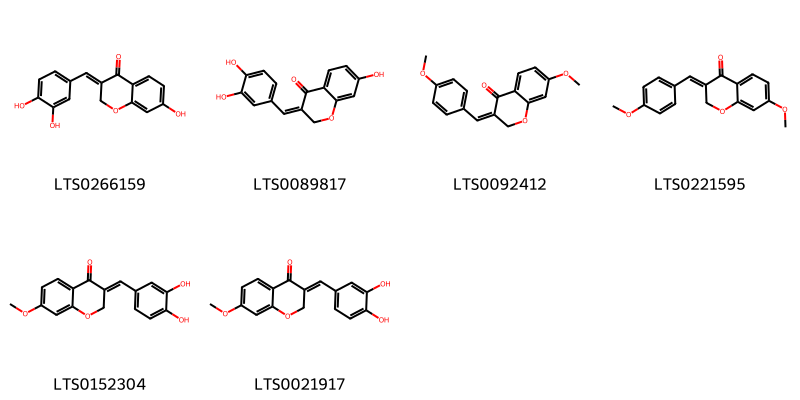{ width=100% }
    <figcaption>Hình ảnh cấu trúc hóa học của 6 hoạt chất thuộc nhóm Homoisoflavonoids gồm ['sappanone a (LTS0266159)', 'sappanone a (LTS0089817)', '7-methoxy-3-[(4-methoxyphenyl)methylidene]-2h-1-benzopyran-4-one (LTS0092412)', '(3e)-7-methoxy-3-[(4-methoxyphenyl)methylidene]-2h-1-benzopyran-4-one (LTS0221595)', '(3e)-3-[(3,4-dihydroxyphenyl)methylidene]-7-methoxy-2h-1-benzopyran-4-one (LTS0152304)', '3-[(3,4-dihydroxyphenyl)methylidene]-7-methoxy-2h-1-benzopyran-4-one (LTS0021917)'].</figcaption>
</figure>
#### Nhóm Naphthofurans
<figure markdown="span">
    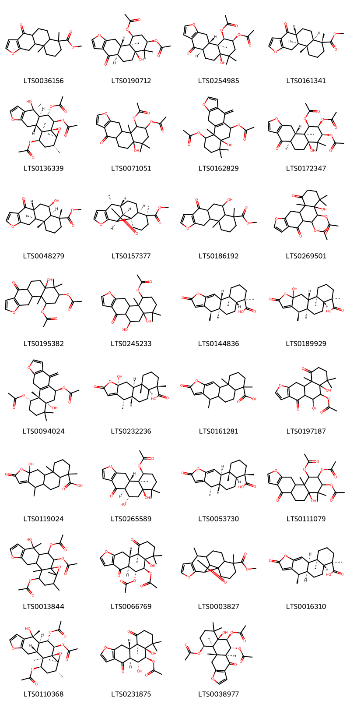{ width=100% }
    <figcaption>Hình ảnh cấu trúc hóa học của 31 hoạt chất thuộc nhóm Naphthofurans gồm ['methyl 4,11b-dimethyl-7-oxo-1h,2h,3h,4ah,5h,6h,6ah,11h,11ah-phenanthro[3,2-b]furan-4-carboxylate (LTS0036156)', '(1s,3r,4ar,6ar,11as,11bs)-1-(acetyloxy)-4a-hydroxy-4,4,11b-trimethyl-7-oxo-1h,2h,3h,5h,6h,6ah,11h,11ah-phenanthro[3,2-b]furan-3-yl acetate (LTS0190712)', 'norcaesalpinin a (LTS0254985)', 'methyl (4r,4ar,6ar,11as,11br)-4,11b-dimethyl-7-oxo-1h,2h,3h,4ah,5h,6h,6ah,11h,11ah-phenanthro[3,2-b]furan-4-carboxylate (LTS0161341)', '(1r,2r,3r,5r,6s,8s,9r,10s,11r,12s)-9,10-bis(acetyloxy)-12-hydroxy-2,5,6,12-tetramethyl-7,16-dioxapentacyclo[9.7.0.0²,⁸.0⁶,⁸.0¹³,¹⁷]octadeca-13(17),14-dien-3-yl acetate (LTS0136339)', '2-(acetyloxy)-4a-hydroxy-4,4,11b-trimethyl-7-oxo-1h,2h,3h,5h,6h,6ah,11h,11ah-phenanthro[3,2-b]furan-1-yl acetate (LTS0071051)', '1-(acetyloxy)-4a-hydroxy-4,4,11b-trimethyl-7-methylidene-1h,2h,3h,5h,6h,11h-phenanthro[3,2-b]furan-6-yl acetate (LTS0162829)', 'norcaesalpinin d (LTS0172347)', 'methyl (4r,4ar,5r,6ar,11as,11br)-5-hydroxy-4,11b-dimethyl-7-oxo-1h,2h,3h,4ah,5h,6h,6ah,11h,11ah-phenanthro[3,2-b]furan-4-carboxylate (LTS0048279)', 'methyl (1r,4r,10r,11s,14s,15s,19s)-10,15-dimethyl-2-oxo-3,6-dioxapentacyclo[9.7.1.0¹,¹⁴.0⁴,¹⁹.0⁵,⁹]nonadeca-5(9),7-diene-15-carboxylate (LTS0157377)', 'methyl 5-hydroxy-4,11b-dimethyl-7-oxo-1h,2h,3h,4ah,5h,6h,6ah,11h,11ah-phenanthro[3,2-b]furan-4-carboxylate (LTS0186192)', '6-(acetyloxy)-4a-hydroxy-4,4,11b-trimethyl-1,7-dioxo-2h,3h,5h,6h,6ah,11h,11ah-phenanthro[3,2-b]furan-5-yl acetate (LTS0269501)', '3-(acetyloxy)-4a-hydroxy-4,4,11b-trimethyl-7-oxo-1h,2h,3h,5h,6h,6ah,11h,11ah-phenanthro[3,2-b]furan-1-yl acetate (LTS0195382)', '4a,6-dihydroxy-4,4,11b-trimethyl-7-oxo-1h,2h,3h,5h,6h,6ah,11h,11ah-phenanthro[3,2-b]furan-1-yl acetate (LTS0245233)', '(4r,4ar,6as,7r,11ar,11br)-4,7,11b-trimethyl-9-oxo-1h,2h,3h,4ah,5h,6h,6ah,7h,11ah-phenanthro[3,2-b]furan-4-carboxylic acid (LTS0144836)', '(4r,4ar,6as,7r,10ar,11as,11br)-10a-hydroxy-4,7,11b-trimethyl-9-oxo-1h,2h,3h,4ah,5h,6h,6ah,7h,11h,11ah-phenanthro[3,2-b]furan-4-carboxylic acid (LTS0189929)', '(1s,4ar,6s,11bs)-1-(acetyloxy)-4a-hydroxy-4,4,11b-trimethyl-7-methylidene-1h,2h,3h,5h,6h,11h-phenanthro[3,2-b]furan-6-yl acetate (LTS0094024)', '(4s,4as,6ar,7s,10as,11ar,11bs)-10a-hydroxy-4,7,11b-trimethyl-9-oxo-1h,2h,3h,4ah,5h,6h,6ah,7h,11h,11ah-phenanthro[3,2-b]furan-4-carboxylic acid (LTS0232236)', '4,7,11b-trimethyl-9-oxo-1h,2h,3h,4ah,5h,6h,6ah,7h,11ah-phenanthro[3,2-b]furan-4-carboxylic acid (LTS0161281)', '4a,6-dihydroxy-4,4,11b-trimethyl-1,7-dioxo-2h,3h,5h,6h,6ah,11h,11ah-phenanthro[3,2-b]furan-5-yl acetate (LTS0197187)', '10a-hydroxy-4,7,11b-trimethyl-9-oxo-1h,2h,3h,4ah,5h,6h,6ah,7h,11h,11ah-phenanthro[3,2-b]furan-4-carboxylic acid (LTS0119024)', 'norcaesalpinin e (LTS0265589)', '(4s,4as,6ar,7s,11as,11bs)-4,7,11b-trimethyl-9-oxo-1h,2h,3h,4ah,5h,6h,6ah,7h,11ah-phenanthro[3,2-b]furan-4-carboxylic acid (LTS0053730)', '1,2-bis(acetyloxy)-4a-hydroxy-4,4,11b-trimethyl-7-oxo-1h,2h,3h,5h,6h,6ah,11h,11ah-phenanthro[3,2-b]furan-3-yl acetate (LTS0111079)', '9,10-bis(acetyloxy)-12-hydroxy-2,5,6,12-tetramethyl-7,16-dioxapentacyclo[9.7.0.0²,⁸.0⁶,⁸.0¹³,¹⁷]octadeca-13(17),14-dien-3-yl acetate (LTS0013844)', '(4ar,5s,6r,6as,11as,11br)-5-(acetyloxy)-4a-hydroxy-4,4,11b-trimethyl-1,7-dioxo-2h,3h,5h,6h,6ah,11h,11ah-phenanthro[3,2-b]furan-6-yl acetate (LTS0066769)', 'methyl 10,15-dimethyl-2-oxo-3,6-dioxapentacyclo[9.7.1.0¹,¹⁴.0⁴,¹⁹.0⁵,⁹]nonadeca-5(9),7-diene-15-carboxylate (LTS0003827)', '(4r,4ar,6as,7r,11as,11br)-4,7,11b-trimethyl-9-oxo-1h,2h,3h,4ah,5h,6h,6ah,7h,11ah-phenanthro[3,2-b]furan-4-carboxylic acid (LTS0016310)', '(1r,2r,3r,5r,6s,8s,9r,10s,11r,12r)-9,10-bis(acetyloxy)-12-hydroxy-2,5,6,12-tetramethyl-7,16-dioxapentacyclo[9.7.0.0²,⁸.0⁶,⁸.0¹³,¹⁷]octadeca-13(17),14-dien-3-yl acetate (LTS0110368)', '(4ar,5s,6r,6as,11as,11br)-4a,6-dihydroxy-4,4,11b-trimethyl-1,7-dioxo-2h,3h,5h,6h,6ah,11h,11ah-phenanthro[3,2-b]furan-5-yl acetate (LTS0231875)', '(1s,4ar,5s,6r,6as,11as,11bs)-1,6-bis(acetyloxy)-4a-hydroxy-4,4,11b-trimethyl-7-oxo-1h,2h,3h,5h,6h,6ah,11h,11ah-phenanthro[3,2-b]furan-5-yl acetate (LTS0038977)'].</figcaption>
</figure>
#### Nhóm Phenanthrenes and derivatives
<figure markdown="span">
    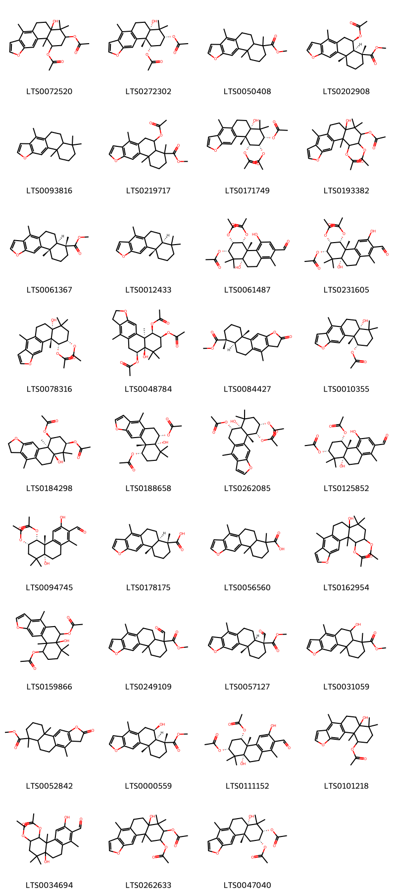{ width=100% }
    <figcaption>Hình ảnh cấu trúc hóa học của 35 hoạt chất thuộc nhóm Phenanthrenes and derivatives gồm ['3-(acetyloxy)-4a-hydroxy-4,4,7,11b-tetramethyl-1h,2h,3h,5h,6h-phenanthro[3,2-b]furan-1-yl acetate (LTS0072520)', '(1s,3r,4ar,11bs)-1-(acetyloxy)-4a-hydroxy-4,4,7,11b-tetramethyl-1h,2h,3h,5h,6h-phenanthro[3,2-b]furan-3-yl acetate (LTS0272302)', 'methyl 4,7,11b-trimethyl-1h,2h,3h,4ah,5h,6h-phenanthro[3,2-b]furan-4-carboxylate (LTS0050408)', 'methyl (4r,4ar,5r,11bs)-5-(acetyloxy)-4,7,11b-trimethyl-1h,2h,3h,4ah,5h,6h-phenanthro[3,2-b]furan-4-carboxylate (LTS0202908)', '4,4,7,11b-tetramethyl-1h,2h,3h,4ah,5h,6h-phenanthro[3,2-b]furan (LTS0093816)', 'methyl 5-(acetyloxy)-4,7,11b-trimethyl-1h,2h,3h,4ah,5h,6h-phenanthro[3,2-b]furan-4-carboxylate (LTS0219717)', '(1r,2s,3s,4ar,11bs)-1,2-bis(acetyloxy)-4a-hydroxy-4,4,7,11b-tetramethyl-1h,2h,3h,5h,6h-phenanthro[3,2-b]furan-3-yl acetate (LTS0171749)', '1,2-bis(acetyloxy)-4a-hydroxy-4,4,7,11b-tetramethyl-1h,2h,3h,5h,6h-phenanthro[3,2-b]furan-3-yl acetate (LTS0193382)', 'methyl (4r,4ar,11bs)-4,7,11b-trimethyl-1h,2h,3h,4ah,5h,6h-phenanthro[3,2-b]furan-4-carboxylate (LTS0061367)', '(4as,11bs)-4,4,7,11b-tetramethyl-1h,2h,3h,4ah,5h,6h-phenanthro[3,2-b]furan (LTS0012433)', '(2s,3s,4r,4as,10ar)-3,4-bis(acetyloxy)-7-formyl-5,10a-dihydroxy-1,1,4a,8-tetramethyl-3,4,9,10-tetrahydro-2h-phenanthren-2-yl acetate (LTS0061487)', '(2s,3s,4r,4as,10ar)-3,4-bis(acetyloxy)-7-formyl-6,10a-dihydroxy-1,1,4a,8-tetramethyl-3,4,9,10-tetrahydro-2h-phenanthren-2-yl acetate (LTS0231605)', '(1r,2s,4ar,11bs)-2-(acetyloxy)-4a-hydroxy-4,4,7,11b-tetramethyl-1h,2h,3h,5h,6h-phenanthro[3,2-b]furan-1-yl acetate (LTS0078316)', '(1r,2s,4ar,5s,11bs)-1,2-bis(acetyloxy)-4a-hydroxy-4,4,7,11b-tetramethyl-1h,2h,3h,5h,6h,8h,9h-phenanthro[3,2-b]furan-5-yl acetate (LTS0048784)', 'methyl (4r,4ar,11bs)-4,7,11b-trimethyl-9-oxo-1h,2h,3h,4ah,5h,6h,8h-phenanthro[3,2-b]furan-4-carboxylate (LTS0084427)', '(1s,4ar,11bs)-4a-hydroxy-4,4,7,11b-tetramethyl-1h,2h,3h,5h,6h-phenanthro[3,2-b]furan-1-yl acetate (LTS0010355)', '(1s,3r,4ar,11bs)-1-(acetyloxy)-4a-hydroxy-4,4,7,11b-tetramethyl-1h,2h,3h,5h,6h,8h,9h-phenanthro[3,2-b]furan-3-yl acetate (LTS0184298)', '(1s,4ar,5s,11bs)-1-(acetyloxy)-4a-hydroxy-4,4,7,11b-tetramethyl-1h,2h,3h,5h,6h-phenanthro[3,2-b]furan-5-yl acetate (LTS0188658)', '(1r,2s,4ar,5s,11bs)-1,2-bis(acetyloxy)-4a-hydroxy-4,4,7,11b-tetramethyl-1h,2h,3h,5h,6h-phenanthro[3,2-b]furan-5-yl acetate (LTS0262085)', '(2r,4s,4as,10ar)-4-(acetyloxy)-7-formyl-5,10a-dihydroxy-1,1,4a,8-tetramethyl-3,4,9,10-tetrahydro-2h-phenanthren-2-yl acetate (LTS0125852)', '(3s,4r,4as,10ar)-3-(acetyloxy)-7-formyl-6,10a-dihydroxy-1,1,4a,8-tetramethyl-3,4,9,10-tetrahydro-2h-phenanthren-4-yl acetate (LTS0094745)', '(4r,4ar,11bs)-4,7,11b-trimethyl-1h,2h,3h,4ah,5h,6h-phenanthro[3,2-b]furan-4-carboxylic acid (LTS0178175)', '4,7,11b-trimethyl-1h,2h,3h,4ah,5h,6h-phenanthro[3,2-b]furan-4-carboxylic acid (LTS0056560)', '2-(acetyloxy)-4a-hydroxy-4,4,7,11b-tetramethyl-1h,2h,3h,5h,6h-phenanthro[3,2-b]furan-1-yl acetate (LTS0162954)', '1-(acetyloxy)-4a-hydroxy-4,4,7,11b-tetramethyl-1h,2h,3h,5h,6h-phenanthro[3,2-b]furan-5-yl acetate (LTS0159866)', 'methyl 4-formyl-7,11b-dimethyl-1h,2h,3h,4ah,5h,6h-phenanthro[3,2-b]furan-4-carboxylate (LTS0249109)', 'methyl (4r,4ar,11bs)-4-formyl-7,11b-dimethyl-1h,2h,3h,4ah,5h,6h-phenanthro[3,2-b]furan-4-carboxylate (LTS0057127)', 'methyl 5-hydroxy-4,7,11b-trimethyl-1h,2h,3h,4ah,5h,6h-phenanthro[3,2-b]furan-4-carboxylate (LTS0031059)', 'methyl 4,7,11b-trimethyl-9-oxo-1h,2h,3h,4ah,5h,6h,8h-phenanthro[3,2-b]furan-4-carboxylate (LTS0052842)', 'methyl (4r,4ar,5r,11bs)-5-hydroxy-4,7,11b-trimethyl-1h,2h,3h,4ah,5h,6h-phenanthro[3,2-b]furan-4-carboxylate (LTS0000559)', '(2r,4s,4as,10ar)-4-(acetyloxy)-7-formyl-6,10a-dihydroxy-1,1,4a,8-tetramethyl-3,4,9,10-tetrahydro-2h-phenanthren-2-yl acetate (LTS0111152)', '4a-hydroxy-4,4,7,11b-tetramethyl-1h,2h,3h,5h,6h-phenanthro[3,2-b]furan-1-yl acetate (LTS0101218)', '3-(acetyloxy)-7-formyl-6,10a-dihydroxy-1,1,4a,8-tetramethyl-3,4,9,10-tetrahydro-2h-phenanthren-4-yl acetate (LTS0034694)', '2-(acetyloxy)-4a-hydroxy-4,4,7,11b-tetramethyl-1h,2h,3h,5h,6h-phenanthro[3,2-b]furan-3-yl acetate (LTS0262633)', '(2r,3s,4as,11br)-3-(acetyloxy)-4a-hydroxy-4,4,7,11b-tetramethyl-1h,2h,3h,5h,6h-phenanthro[3,2-b]furan-2-yl acetate (LTS0047040)'].</figcaption>
</figure>
#### Nhóm Prenol lipids
<figure markdown="span">
    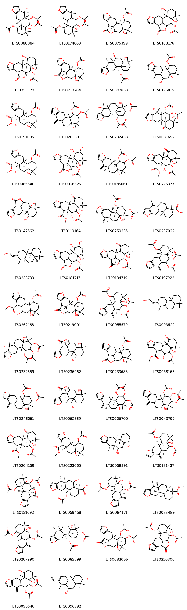{ width=100% }
    <figcaption>Hình ảnh cấu trúc hóa học của 122 hoạt chất thuộc nhóm Prenol lipids gồm ['(1s,4ar,5s,6r,6as,7s,11as,11bs)-1,6-bis(acetyloxy)-4a,7-dihydroxy-4,4,7,11b-tetramethyl-1h,2h,3h,5h,6h,6ah,11h,11ah-phenanthro[3,2-b]furan-5-yl acetate (LTS0080884)', '1,6-bis(acetyloxy)-4a,7-dihydroxy-4,4,7,11b-tetramethyl-1h,2h,3h,5h,6h,6ah,11h,11ah-phenanthro[3,2-b]furan-5-yl acetate (LTS0174668)', '(18s,19r)-13-hydroxy-14,14,18-trimethyl-9-oxo-4,10-dioxapentacyclo[9.7.1.0³,⁷.0⁸,¹⁹.0¹³,¹⁸]nonadeca-3(7),5-dien-17-yl acetate (LTS0075399)', '13,17-dihydroxy-14,14,18-trimethyl-9-oxo-4,10-dioxapentacyclo[9.7.1.0³,⁷.0⁸,¹⁹.0¹³,¹⁸]nonadeca-3(7),5-dien-12-yl acetate (LTS0108176)', '(1s,8s,11r,12s,13r,17s,18s,19r)-13,17-dihydroxy-14,14,18-trimethyl-9-oxo-4,10-dioxapentacyclo[9.7.1.0³,⁷.0⁸,¹⁹.0¹³,¹⁸]nonadeca-3(7),5-dien-12-yl acetate (LTS0253320)', '(1s,8s,11s,13r,17s,18s,19r)-13-hydroxy-14,14,18-trimethyl-9-oxo-4,10-dioxapentacyclo[9.7.1.0³,⁷.0⁸,¹⁹.0¹³,¹⁸]nonadeca-3(7),5-dien-17-yl acetate (LTS0210264)', '(1s,4ar,6s,6as,7r,11as,11bs)-4a,6-dihydroxy-4,4,7,11b-tetramethyl-1h,2h,3h,5h,6h,6ah,7h,11h,11ah-phenanthro[3,2-b]furan-1-yl acetate (LTS0007858)', '4a,6-dihydroxy-4,4,7,11b-tetramethyl-1h,2h,3h,5h,6h,6ah,7h,11h,11ah-phenanthro[3,2-b]furan-1-yl acetate (LTS0126815)', 'methyl (1s,4ar,6s,6ar,7s,11as,11bs)-1-(acetyloxy)-4a,6-dihydroxy-4,4,11b-trimethyl-1h,2h,3h,5h,6h,6ah,7h,11h,11ah-phenanthro[3,2-b]furan-7-carboxylate (LTS0191095)', '1-(acetyloxy)-4a-hydroxy-4,4,11b-trimethyl-7-methylidene-1h,2h,3h,5h,6h,6ah,11h,11ah-phenanthro[3,2-b]furan-2-yl acetate (LTS0203591)', '(1r,2s,3s,4ar,6ar,7s,11as,11bs)-1,2-bis(acetyloxy)-4a,7-dihydroxy-4,4,7,11b-tetramethyl-1h,2h,3h,5h,6h,6ah,11h,11ah-phenanthro[3,2-b]furan-3-yl acetate (LTS0232438)', '(4ar,5r,6s,6ar,7r,11ar,11br)-6-(acetyloxy)-4a,7-dihydroxy-4,4,7,11b-tetramethyl-1-oxo-2h,3h,5h,6h,6ah,11h,11ah-phenanthro[3,2-b]furan-5-yl acetate (LTS0081692)', 'methyl (1s,4ar,6s,6as,7s,11as,11bs)-1-(acetyloxy)-4a,6-dihydroxy-4,4,11b-trimethyl-1h,2h,3h,5h,6h,6ah,7h,11h,11ah-phenanthro[3,2-b]furan-7-carboxylate (LTS0085840)', '(1s,8s,11r,12s,13r,16s,17r,18s,19r)-13,16,17-trihydroxy-14,14,18-trimethyl-9-oxo-4,10-dioxapentacyclo[9.7.1.0³,⁷.0⁸,¹⁹.0¹³,¹⁸]nonadeca-3(7),5-dien-12-yl acetate (LTS0026625)', '(1r,2s,4ar,6ar,11as,11bs)-1-(acetyloxy)-4a-hydroxy-4,4,11b-trimethyl-7-methylidene-1h,2h,3h,5h,6h,6ah,11h,11ah-phenanthro[3,2-b]furan-2-yl acetate (LTS0185661)', 'methyl (4ar,5s,6r,6ar,7s,11as,11br)-5-(acetyloxy)-4a,6-dihydroxy-4,4,11b-trimethyl-1-oxo-2h,3h,5h,6h,6ah,7h,11h,11ah-phenanthro[3,2-b]furan-7-carboxylate (LTS0275373)', '13,17-dihydroxy-14,14,18-trimethyl-4,10-dioxapentacyclo[9.7.1.0³,⁷.0⁸,¹⁹.0¹³,¹⁸]nonadeca-3(7),5-dien-9-one (LTS0142562)', 'methyl (4ar,5s,6r,6as,7s,11as,11br)-5-(acetyloxy)-4a,6-dihydroxy-4,4,11b-trimethyl-1-oxo-2h,3h,5h,6h,6ah,7h,11h,11ah-phenanthro[3,2-b]furan-7-carboxylate (LTS0110164)', '(1s,3r,4ar,6ar,11as,11bs)-1-(acetyloxy)-4a-hydroxy-4,4,11b-trimethyl-7-methylidene-1h,2h,3h,5h,6h,6ah,11h,11ah-phenanthro[3,2-b]furan-3-yl acetate (LTS0250235)', 'methyl 4,7,11b-trimethyl-1h,2h,3h,4ah,5h,6h,6ah,7h,11h,11ah-phenanthro[3,2-b]furan-4-carboxylate (LTS0237022)', '2-[(1r,2e,4as,4br,8as,10as)-1,4b,8,8-tetramethyl-decahydro-1h-phenanthren-2-ylidene]ethanol (LTS0233739)', '13,16,17-trihydroxy-14,14,18-trimethyl-9-oxo-4,10-dioxapentacyclo[9.7.1.0³,⁷.0⁸,¹⁹.0¹³,¹⁸]nonadeca-3(7),5-dien-12-yl acetate (LTS0181717)', '(1s,8s,11r,12s,13r,18r,19r)-13-hydroxy-14,14,18-trimethyl-9,17-dioxo-4,10-dioxapentacyclo[9.7.1.0³,⁷.0⁸,¹⁹.0¹³,¹⁸]nonadeca-3(7),5-dien-12-yl acetate (LTS0134719)', '1,5-bis(acetyloxy)-4a-hydroxy-4,4,11b-trimethyl-7-methylidene-1h,2h,3h,5h,6h,6ah,11h,11ah-phenanthro[3,2-b]furan-6-yl acetate (LTS0197922)', 'methyl 1-(acetyloxy)-4a,6-dihydroxy-4,4,11b-trimethyl-1h,2h,3h,5h,6h,6ah,7h,11h,11ah-phenanthro[3,2-b]furan-7-carboxylate (LTS0262168)', '(1s,8r,11r,13r,18s,19s)-13-hydroxy-14,14,18-trimethyl-9-oxo-4,10-dioxapentacyclo[9.7.1.0³,⁷.0⁸,¹⁹.0¹³,¹⁸]nonadeca-3(7),5-dien-17-yl acetate (LTS0219001)', '(1s,4ar,5s,6r,6ar,11as,11bs)-1,5-bis(acetyloxy)-4a-hydroxy-4,4,11b-trimethyl-7-methylidene-1h,2h,3h,5h,6h,6ah,11h,11ah-phenanthro[3,2-b]furan-6-yl acetate (LTS0055570)', '2-(1,4b,8,8-tetramethyl-decahydro-1h-phenanthren-2-ylidene)ethanol (LTS0093522)', '1,2-bis(acetyloxy)-4a,7-dihydroxy-4,4,7,11b-tetramethyl-1h,2h,3h,5h,6h,6ah,11h,11ah-phenanthro[3,2-b]furan-3-yl acetate (LTS0232559)', '(1s,8s,11s,13r,17s,18s,19r)-13,17-dihydroxy-14,14,18-trimethyl-4,10-dioxapentacyclo[9.7.1.0³,⁷.0⁸,¹⁹.0¹³,¹⁸]nonadeca-3(7),5-dien-9-one (LTS0236962)', '13-hydroxy-14,14,18-trimethyl-9-oxo-4,10-dioxapentacyclo[9.7.1.0³,⁷.0⁸,¹⁹.0¹³,¹⁸]nonadeca-3(7),5-dien-17-yl acetate (LTS0233683)', 'methyl 5-(acetyloxy)-4a,6-dihydroxy-4,4,11b-trimethyl-1-oxo-2h,3h,5h,6h,6ah,7h,11h,11ah-phenanthro[3,2-b]furan-7-carboxylate (LTS0038165)', '1-(acetyloxy)-4a-hydroxy-4,4,11b-trimethyl-7-methylidene-1h,2h,3h,5h,6h,6ah,11h,11ah-phenanthro[3,2-b]furan-3-yl acetate (LTS0246251)', '(1s,8s,11s,13r,17s,18s,19s)-13,17-dihydroxy-14,14,18-trimethyl-4,10-dioxapentacyclo[9.7.1.0³,⁷.0⁸,¹⁹.0¹³,¹⁸]nonadeca-3(7),5-dien-9-one (LTS0052569)', '(1r,2s,3s,4ar,6ar,11as,11bs)-1,2-bis(acetyloxy)-4a-hydroxy-4,4,11b-trimethyl-7-methylidene-1h,2h,3h,5h,6h,6ah,11h,11ah-phenanthro[3,2-b]furan-3-yl acetate (LTS0006700)', '1,2-bis(acetyloxy)-4a-hydroxy-4,4,11b-trimethyl-7-methylidene-1h,2h,3h,5h,6h,6ah,11h,11ah-phenanthro[3,2-b]furan-3-yl acetate (LTS0043799)', 'methyl (4ar,5s,6as,7s,11as,11br)-5-(acetyloxy)-4a-hydroxy-4,4,11b-trimethyl-1-oxo-2h,3h,5h,6h,6ah,7h,11h,11ah-phenanthro[3,2-b]furan-7-carboxylate (LTS0204159)', 'methyl (1s,4ar,6as,7s,11as,11bs)-1-(acetyloxy)-4a-hydroxy-4,4,11b-trimethyl-1h,2h,3h,5h,6h,6ah,7h,11h,11ah-phenanthro[3,2-b]furan-7-carboxylate (LTS0223065)', '(4as,6r,6ar,7s,11ar,11bs)-4,4,7,11b-tetramethyl-1h,2h,3h,5h,6h,6ah,7h,11h,11ah-phenanthro[3,2-b]furan-4a,6-diol (LTS0058391)', '(1s,4ar,5s,6ar,11as,11bs)-1-(acetyloxy)-4a-hydroxy-4,4,11b-trimethyl-7-methylidene-1h,2h,3h,5h,6h,6ah,11h,11ah-phenanthro[3,2-b]furan-5-yl acetate (LTS0181437)', 'caesalpinin d (LTS0131692)', 'methyl (4s,4ar,5r,6as,7r,11as,11bs)-11b-[(acetyloxy)methyl]-5-hydroxy-4,7-dimethyl-1h,2h,3h,4ah,5h,6h,6ah,7h,11h,11ah-phenanthro[3,2-b]furan-4-carboxylate (LTS0059458)', '(1s,4ar,6s,6ar,11as,11bs)-1-(acetyloxy)-4a-hydroxy-4,4,11b-trimethyl-7-methylidene-1h,2h,3h,5h,6h,6ah,11h,11ah-phenanthro[3,2-b]furan-6-yl acetate (LTS0084171)', 'methyl (4r,4ar,6as,7r,11as,11br)-4,7,11b-trimethyl-1h,2h,3h,4ah,5h,6h,6ah,7h,11h,11ah-phenanthro[3,2-b]furan-4-carboxylate (LTS0078489)', '1-(acetyloxy)-4a-hydroxy-4,4,11b-trimethyl-7-methylidene-1h,2h,3h,5h,6h,6ah,11h,11ah-phenanthro[3,2-b]furan-6-yl acetate (LTS0207990)', '(1s,3r,4ar,6as,7r,11as,11bs)-1-(acetyloxy)-4a-hydroxy-4,4,7,11b-tetramethyl-1h,2h,3h,5h,6h,6ah,7h,11h,11ah-phenanthro[3,2-b]furan-3-yl acetate (LTS0082299)', '(1s,8s,11s,13r,16s,17r,18s,19r)-16-(acetyloxy)-13-hydroxy-14,14,18-trimethyl-9-oxo-4,10-dioxapentacyclo[9.7.1.0³,⁷.0⁸,¹⁹.0¹³,¹⁸]nonadeca-3(7),5-dien-17-yl acetate (LTS0082066)', '17-(acetyloxy)-13-hydroxy-14,14,18-trimethyl-9-oxo-4,10-dioxapentacyclo[9.7.1.0³,⁷.0⁸,¹⁹.0¹³,¹⁸]nonadeca-3(7),5-dien-12-yl acetate (LTS0226300)', '5-(acetyloxy)-1,4a-dihydroxy-4,4,11b-trimethyl-7-methylidene-1h,2h,3h,5h,6h,6ah,11h,11ah-phenanthro[3,2-b]furan-6-yl acetate (LTS0095546)', '7-ethenyl-1,1,4a,8-tetramethyl-2,3,4,4b,5,8,8a,9,10,10a-decahydrophenanthrene-2,9-diol (LTS0096292)', '6-(acetyloxy)-4a-hydroxy-4,4,7,11b-tetramethyl-1h,2h,3h,5h,6h,6ah,7h,11h,11ah-phenanthro[3,2-b]furan-5-yl 3-phenylprop-2-enoate (LTS0094960)', '2-ethenyl-2,4a,8,8-tetramethyl-3,4,4b,5,6,7,10,10a-octahydro-1h-phenanthren-4-ol (LTS0092663)', '4,7,11b-trimethyl-1h,2h,3h,4ah,5h,6h,6ah,7h,11h,11ah-phenanthro[3,2-b]furan-4-carboxylic acid (LTS0076083)', '(4as,5r,6as,7r,11as,11br)-4,4,7,11b-tetramethyl-1h,2h,3h,4ah,5h,6h,6ah,7h,11h,11ah-phenanthro[3,2-b]furan-5-ol (LTS0139382)', '12,13-dihydroxy-14,14,18-trimethyl-9-oxo-4,10-dioxapentacyclo[9.7.1.0³,⁷.0⁸,¹⁹.0¹³,¹⁸]nonadeca-3(7),5-dien-17-yl acetate (LTS0038402)', '(1s,4ar,6s,6as,7r,11as,11bs)-1-(acetyloxy)-4a,7-dihydroxy-4,4,7,11b-tetramethyl-1h,2h,3h,5h,6h,6ah,11h,11ah-phenanthro[3,2-b]furan-6-yl acetate (LTS0036795)', '16-(acetyloxy)-13-hydroxy-14,14,18-trimethyl-9-oxo-4,10-dioxapentacyclo[9.7.1.0³,⁷.0⁸,¹⁹.0¹³,¹⁸]nonadeca-3(7),5-dien-17-yl acetate (LTS0031796)', '(4ar,5r,6r,6as,7r,11as,11br)-5-(benzoyloxy)-4a-hydroxy-4,4,7,11b-tetramethyl-1h,2h,3h,5h,6h,6ah,7h,11h,11ah-phenanthro[3,2-b]furan-6-yl benzoate (LTS0113475)', 'methyl (1s,4ar,5s,6r,6ar,7s,11as,11bs)-1,6-bis(acetyloxy)-4a,5-dihydroxy-4,4,11b-trimethyl-1h,2h,3h,5h,6h,6ah,7h,11h,11ah-phenanthro[3,2-b]furan-7-carboxylate (LTS0178926)', '(4ar,5s,6r,6ar,11as,11br)-5-(acetyloxy)-4a-hydroxy-4,4,11b-trimethyl-7-methylidene-1-oxo-2h,3h,5h,6h,6ah,11h,11ah-phenanthro[3,2-b]furan-6-yl acetate (LTS0202640)', '4,4,7,11b-tetramethyl-1h,2h,3h,4ah,5h,6h,6ah,7h,11h,11ah-phenanthro[3,2-b]furan (LTS0107916)', 'caesalpinin f (LTS0192929)', 'methyl 5-hydroxy-11b-(hydroxymethyl)-4,7-dimethyl-1h,2h,3h,4ah,5h,6h,6ah,7h,11h,11ah-phenanthro[3,2-b]furan-4-carboxylate (LTS0130381)', '1-(acetyloxy)-4a-hydroxy-4,4,11b-trimethyl-7-methylidene-1h,2h,3h,5h,6h,6ah,11h,11ah-phenanthro[3,2-b]furan-5-yl acetate (LTS0131259)', '(4ar,5r,6r,6as,7r,11as,11br)-6-(acetyloxy)-4a-hydroxy-4,4,7,11b-tetramethyl-1h,2h,3h,5h,6h,6ah,7h,11h,11ah-phenanthro[3,2-b]furan-5-yl (2e)-3-phenylprop-2-enoate (LTS0268231)', 'methyl 5-(acetyloxy)-4a-hydroxy-4,4,11b-trimethyl-1-oxo-2h,3h,5h,6h,6ah,7h,11h,11ah-phenanthro[3,2-b]furan-7-carboxylate (LTS0111910)', '13-hydroxy-14,14,18-trimethyl-9,17-dioxo-4,10-dioxapentacyclo[9.7.1.0³,⁷.0⁸,¹⁹.0¹³,¹⁸]nonadeca-3(7),5-dien-12-yl acetate (LTS0144462)', '4,7-dimethyl-1h,2h,3h,4ah,5h,6h,6ah,7h,11h,11ah-phenanthro[3,2-b]furan-4,11b-dicarboxylic acid (LTS0145518)', '(1s,8s,11r,12s,13r,17s,18s,19r)-12,13-dihydroxy-14,14,18-trimethyl-9-oxo-4,10-dioxapentacyclo[9.7.1.0³,⁷.0⁸,¹⁹.0¹³,¹⁸]nonadeca-3(7),5-dien-17-yl acetate (LTS0262598)', '5-(acetyloxy)-4a-hydroxy-4,4,11b-trimethyl-7-methylidene-1-oxo-5h,6h,6ah,11h,11ah-phenanthro[3,2-b]furan-6-yl acetate (LTS0149135)', '(1s,4ar,6s,6as,7s,11as,11bs)-7-formyl-4a,6-dihydroxy-4,4,11b-trimethyl-1h,2h,3h,5h,6h,6ah,7h,11h,11ah-phenanthro[3,2-b]furan-1-yl acetate (LTS0146116)', '4,4,7,11b-tetramethyl-1h,2h,3h,4ah,5h,6h,6ah,7h,11h,11ah-phenanthro[3,2-b]furan-5-ol (LTS0099158)', 'methyl 1,5-bis(acetyloxy)-4a-hydroxy-4,4,11b-trimethyl-1h,2h,3h,5h,6h,6ah,7h,11h,11ah-phenanthro[3,2-b]furan-7-carboxylate (LTS0161241)', '9-{4,4,7,11b-tetramethyl-1h,2h,3h,4ah,5h,6h,6ah,11h,11ah-phenanthro[3,2-b]furan-7-yl}-4,4,7,11b-tetramethyl-1h,2h,3h,4ah,5h,6h-phenanthro[3,2-b]furan (LTS0143301)', '(2r,4r,4as,4bs,10as)-2-ethenyl-2,4a,8,8-tetramethyl-3,4,4b,5,6,7,10,10a-octahydro-1h-phenanthren-4-ol (LTS0133297)', 'methyl 1,5,6-tris(acetyloxy)-4a-hydroxy-4,4,11b-trimethyl-1h,2h,3h,5h,6h,6ah,7h,11h,11ah-phenanthro[3,2-b]furan-7-carboxylate (LTS0179692)', '(4as,11bs)-9-[(4as,6ar,7s,11as,11br)-4,4,7,11b-tetramethyl-1h,2h,3h,4ah,5h,6h,6ah,11h,11ah-phenanthro[3,2-b]furan-7-yl]-4,4,7,11b-tetramethyl-1h,2h,3h,4ah,5h,6h-phenanthro[3,2-b]furan (LTS0185826)', 'methyl (1r,2s,4ar,6ar,7s,11as,11bs)-1,2-bis(acetyloxy)-4a-hydroxy-4,4,11b-trimethyl-1h,2h,3h,5h,6h,6ah,7h,11h,11ah-phenanthro[3,2-b]furan-7-carboxylate (LTS0263996)', 'methyl (1s,4ar,5s,6r,6as,7s,11as,11bs)-1,5-bis(acetyloxy)-4a,6-dihydroxy-4,4,11b-trimethyl-1h,2h,3h,5h,6h,6ah,7h,11h,11ah-phenanthro[3,2-b]furan-7-carboxylate (LTS0087421)', 'methyl (1s,4ar,5s,6as,7s,11as,11bs)-1,5-bis(acetyloxy)-4a-hydroxy-4,4,11b-trimethyl-1h,2h,3h,5h,6h,6ah,7h,11h,11ah-phenanthro[3,2-b]furan-7-carboxylate (LTS0094913)', '(4s,4as,6as,7r,11as,11bs)-4,7-dimethyl-1h,2h,3h,4ah,5h,6h,6ah,7h,11h,11ah-phenanthro[3,2-b]furan-4,11b-dicarboxylic acid (LTS0163055)', '1,5-bis(acetyloxy)-4a,6-dihydroxy-4,4,11b-trimethyl-1h,2h,3h,5h,6h,6ah,7h,11h,11ah-phenanthro[3,2-b]furan-7-carboxylic acid (LTS0174515)', '(4r,4ar,6as,7r,11as,11br)-4,7,11b-trimethyl-1h,2h,3h,4ah,5h,6h,6ah,7h,11h,11ah-phenanthro[3,2-b]furan-4-carboxylic acid (LTS0122232)', 'methyl (1s,3r,4ar,6ar,7s,11as,11bs)-1,3-bis(acetyloxy)-4a-hydroxy-4,4,11b-trimethyl-1h,2h,3h,5h,6h,6ah,7h,11h,11ah-phenanthro[3,2-b]furan-7-carboxylate (LTS0264423)', '5-(acetyloxy)-4a-hydroxy-4,4,11b-trimethyl-7-methylidene-1-oxo-2h,3h,5h,6h,6ah,11h,11ah-phenanthro[3,2-b]furan-6-yl acetate (LTS0196401)', 'methyl (1s,4ar,5s,6ar,7s,11as,11bs)-1,5-bis(acetyloxy)-4a-hydroxy-4,4,11b-trimethyl-1h,2h,3h,5h,6h,6ah,7h,11h,11ah-phenanthro[3,2-b]furan-7-carboxylate (LTS0202396)', 'methyl (1s,4ar,6ar,7s,11as,11bs)-1-(acetyloxy)-4a-hydroxy-4,4,7,11b-tetramethyl-1h,2h,3h,5h,6h,6ah,11h,11ah-phenanthro[3,2-b]furan-7-carboxylate (LTS0212250)', '(4as,6as,7r,11as,11br)-4,4,7,11b-tetramethyl-1h,2h,3h,4ah,5h,6h,6ah,7h,11h,11ah-phenanthro[3,2-b]furan (LTS0065937)', 'methyl (1s,4ar,6s,6ar,7s,11as,11bs)-1,6-bis(acetyloxy)-4a-hydroxy-4,4,11b-trimethyl-1h,2h,3h,5h,6h,6ah,7h,11h,11ah-phenanthro[3,2-b]furan-7-carboxylate (LTS0091734)', '[(4as,4br,8as,10ar)-2-ethenyl-4b,8,8-trimethyl-3,4,4a,5,6,7,8a,9,10,10a-decahydrophenanthren-1-yl]methanol (LTS0262632)', 'methyl 5,6-bis(acetyloxy)-4a-hydroxy-4,4,11b-trimethyl-1-oxo-2h,3h,5h,6h,6ah,7h,11h,11ah-phenanthro[3,2-b]furan-7-carboxylate (LTS0209240)', 'caesalpinin n (LTS0049233)', 'methyl (1s,4ar,6ar,7s,11as,11bs)-1-(acetyloxy)-4a-hydroxy-4,4,11b-trimethyl-1h,2h,3h,5h,6h,6ah,7h,11h,11ah-phenanthro[3,2-b]furan-7-carboxylate (LTS0228296)', '(1s,4ar,6s,6ar,7s,11as,11bs)-7-formyl-4a,6-dihydroxy-4,4,11b-trimethyl-1h,2h,3h,5h,6h,6ah,7h,11h,11ah-phenanthro[3,2-b]furan-1-yl acetate (LTS0024331)', '5-(benzoyloxy)-4a-hydroxy-4,4,7,11b-tetramethyl-1h,2h,3h,5h,6h,6ah,7h,11h,11ah-phenanthro[3,2-b]furan-6-yl benzoate (LTS0141778)', '(2r,4as,4br,8s,8ar,9r,10as)-7-ethenyl-1,1,4a,8-tetramethyl-2,3,4,4b,5,8,8a,9,10,10a-decahydrophenanthrene-2,9-diol (LTS0159122)', '(2s,4ar,4bs,8r,8as,9s,10ar)-7-ethenyl-1,1,4a,8-tetramethyl-2,3,4,4b,5,8,8a,9,10,10a-decahydrophenanthrene-2,9-diol (LTS0068203)', 'methyl 11b-[(acetyloxy)methyl]-5-hydroxy-4,7-dimethyl-1h,2h,3h,4ah,5h,6h,6ah,7h,11h,11ah-phenanthro[3,2-b]furan-4-carboxylate (LTS0254551)', 'methyl (4s,4ar,5r,6as,7r,11as,11bs)-5-hydroxy-11b-(hydroxymethyl)-4,7-dimethyl-1h,2h,3h,4ah,5h,6h,6ah,7h,11h,11ah-phenanthro[3,2-b]furan-4-carboxylate (LTS0200162)', 'methyl (4ar,5s,6r,6ar,7s,11as,11br)-5,6-bis(acetyloxy)-4a-hydroxy-4,4,11b-trimethyl-1-oxo-2h,3h,5h,6h,6ah,7h,11h,11ah-phenanthro[3,2-b]furan-7-carboxylate (LTS0043566)', 'methyl 4-(hydroxymethyl)-7,11b-dimethyl-1h,2h,3h,4ah,5h,6h,6ah,7h,11h,11ah-phenanthro[3,2-b]furan-4-carboxylate (LTS0051780)', 'methyl (1s,4ar,6s,6as,7s,11as,11bs)-1,6-bis(acetyloxy)-4a-hydroxy-4,4,11b-trimethyl-1h,2h,3h,5h,6h,6ah,7h,11h,11ah-phenanthro[3,2-b]furan-7-carboxylate (LTS0242167)', '2-(1,4b,8,8-tetramethyl-decahydro-1h-phenanthren-2-ylidene)acetaldehyde (LTS0246346)', '2-[(1r,2e,4as,4br,8as,10as)-1,4b,8,8-tetramethyl-decahydro-1h-phenanthren-2-ylidene]acetaldehyde (LTS0176714)', '(4ar,5s,6r,6ar,11as,11br)-5-(acetyloxy)-4a-hydroxy-4,4,11b-trimethyl-7-methylidene-1-oxo-5h,6h,6ah,11h,11ah-phenanthro[3,2-b]furan-6-yl acetate (LTS0186599)', '7-formyl-4a,6-dihydroxy-4,4,11b-trimethyl-1h,2h,3h,5h,6h,6ah,7h,11h,11ah-phenanthro[3,2-b]furan-1-yl acetate (LTS0123514)', 'methyl (1s,4ar,5s,6r,6as,7s,11as,11bs)-1,6-bis(acetyloxy)-4a,5-dihydroxy-4,4,11b-trimethyl-1h,2h,3h,5h,6h,6ah,7h,11h,11ah-phenanthro[3,2-b]furan-7-carboxylate (LTS0004631)', '(1s,4ar,6as,7r,11as,11bs)-4a-hydroxy-4,4,7,11b-tetramethyl-1h,2h,3h,5h,6h,6ah,7h,11h,11ah-phenanthro[3,2-b]furan-1-yl acetate (LTS0128256)', '(2-ethenyl-4b,8,8-trimethyl-3,4,4a,5,6,7,8a,9,10,10a-decahydrophenanthren-1-yl)methanol (LTS0001587)', 'methyl (4ar,5s,6r,6as,7s,11as,11br)-5,6-bis(acetyloxy)-4a-hydroxy-4,4,11b-trimethyl-1-oxo-2h,3h,5h,6h,6ah,7h,11h,11ah-phenanthro[3,2-b]furan-7-carboxylate (LTS0271112)', 'methyl (1s,4ar,5s,6r,6ar,7s,11as,11bs)-1,5,6-tris(acetyloxy)-4a-hydroxy-4,4,11b-trimethyl-1h,2h,3h,5h,6h,6ah,7h,11h,11ah-phenanthro[3,2-b]furan-7-carboxylate (LTS0055468)', 'methyl 1,3-bis(acetyloxy)-4a-hydroxy-4,4,11b-trimethyl-1h,2h,3h,5h,6h,6ah,7h,11h,11ah-phenanthro[3,2-b]furan-7-carboxylate (LTS0015342)', 'methyl (4r,4ar,6as,7r,11as,11br)-4-(hydroxymethyl)-7,11b-dimethyl-1h,2h,3h,4ah,5h,6h,6ah,7h,11h,11ah-phenanthro[3,2-b]furan-4-carboxylate (LTS0007725)', 'methyl 4-formyl-7,11b-dimethyl-1h,2h,3h,4ah,5h,6h,6ah,7h,11h,11ah-phenanthro[3,2-b]furan-4-carboxylate (LTS0012207)', '(1s,4ar,5s,6r,6ar,11as,11bs)-5-(acetyloxy)-1,4a-dihydroxy-4,4,11b-trimethyl-7-methylidene-1h,2h,3h,5h,6h,6ah,11h,11ah-phenanthro[3,2-b]furan-6-yl acetate (LTS0003105)', 'methyl 1,6-bis(acetyloxy)-4a,5-dihydroxy-4,4,11b-trimethyl-1h,2h,3h,5h,6h,6ah,7h,11h,11ah-phenanthro[3,2-b]furan-7-carboxylate (LTS0013165)', 'methyl (4r,4ar,6as,7r,11as,11br)-4-formyl-7,11b-dimethyl-1h,2h,3h,4ah,5h,6h,6ah,7h,11h,11ah-phenanthro[3,2-b]furan-4-carboxylate (LTS0018803)', '1-(acetyloxy)-4a,7-dihydroxy-4,4,7,11b-tetramethyl-1h,2h,3h,5h,6h,6ah,11h,11ah-phenanthro[3,2-b]furan-6-yl acetate (LTS0087638)', '(1r,4as,5r,6as,11ar,11br)-1-(acetyloxy)-4a-hydroxy-4,4,11b-trimethyl-7-methylidene-1h,2h,3h,5h,6h,6ah,11h,11ah-phenanthro[3,2-b]furan-5-yl acetate (LTS0005097)', 'methyl 1,6-bis(acetyloxy)-4a-hydroxy-4,4,11b-trimethyl-1h,2h,3h,5h,6h,6ah,7h,11h,11ah-phenanthro[3,2-b]furan-7-carboxylate (LTS0040662)', '4,4,7,11b-tetramethyl-1h,2h,3h,5h,6h,6ah,7h,11h,11ah-phenanthro[3,2-b]furan-4a,6-diol (LTS0034343)', '(1s,4ar,5s,6r,6ar,7s,11as,11bs)-1,5-bis(acetyloxy)-4a,6-dihydroxy-4,4,11b-trimethyl-1h,2h,3h,5h,6h,6ah,7h,11h,11ah-phenanthro[3,2-b]furan-7-carboxylic acid (LTS0017880)'].</figcaption>
</figure>
#### Nhóm Steroids and steroid derivatives
<figure markdown="span">
    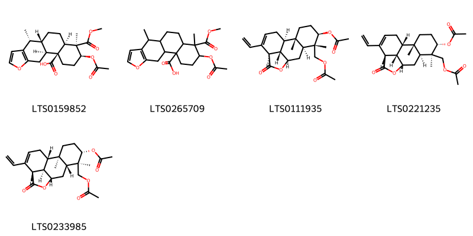{ width=100% }
    <figcaption>Hình ảnh cấu trúc hóa học của 5 hoạt chất thuộc nhóm Steroids and steroid derivatives gồm ['(3s,4r,4ar,6as,7r,11as,11bs)-3-(acetyloxy)-4-(methoxycarbonyl)-4,7-dimethyl-1h,2h,3h,4ah,5h,6h,6ah,7h,11h,11ah-phenanthro[3,2-b]furan-11b-carboxylic acid (LTS0159852)', '3-(acetyloxy)-4-(methoxycarbonyl)-4,7-dimethyl-1h,2h,3h,4ah,5h,6h,6ah,7h,11h,11ah-phenanthro[3,2-b]furan-11b-carboxylic acid (LTS0265709)', '[(1r,2s,5r,6s,7s,9r,12r,16s)-5-(acetyloxy)-13-ethenyl-2,6-dimethyl-11-oxo-10-oxatetracyclo[7.6.1.0²,⁷.0¹²,¹⁶]hexadec-13-en-6-yl]methyl acetate (LTS0111935)', '[(1s,2s,5s,6r,7s,9s,12s,16s)-5-(acetyloxy)-13-ethenyl-2,6-dimethyl-11-oxo-10-oxatetracyclo[7.6.1.0²,⁷.0¹²,¹⁶]hexadec-13-en-6-yl]methyl acetate (LTS0221235)', '[(1s,2r,5s,6r,7r,9s,12s,16r)-5-(acetyloxy)-13-ethenyl-2,6-dimethyl-11-oxo-10-oxatetracyclo[7.6.1.0²,⁷.0¹²,¹⁶]hexadec-13-en-6-yl]methyl acetate (LTS0233985)'].</figcaption>
</figure>

---

### Dược dân tộc học

Danh sách các quốc gia có sử dụng *N/A* trong điều trị các bệnh. 

| Country   | Disease                                                                                                   | Bệnh                                                                                                                                                                                                |
|:----------|:----------------------------------------------------------------------------------------------------------|:----------------------------------------------------------------------------------------------------------------------------------------------------------------------------------------------------|
| Elsewhere | Cosmetic, Emmenagogue, Tonic, Vesicant, Antiperiodic, Collyrium, Emollient, Vermifuge, Rubefacient, Tonic | MYMEMORY WARNING: YOU USED ALL AVAILABLE FREE TRANSLATIONS FOR TODAY. NEXT AVAILABLE IN  14 HOURS 57 MINUTES 20 SECONDS VISIT HTTPS://MYMEMORY.TRANSLATED.NET/DOC/USAGELIMITS.PHP TO TRANSLATE MORE |
| Hawaii    | Laxative                                                                                                  | MYMEMORY WARNING: YOU USED ALL AVAILABLE FREE TRANSLATIONS FOR TODAY. NEXT AVAILABLE IN  14 HOURS 57 MINUTES 18 SECONDS VISIT HTTPS://MYMEMORY.TRANSLATED.NET/DOC/USAGELIMITS.PHP TO TRANSLATE MORE |
| Mexico    | Tonic, Tonic                                                                                              | MYMEMORY WARNING: YOU USED ALL AVAILABLE FREE TRANSLATIONS FOR TODAY. NEXT AVAILABLE IN  14 HOURS 57 MINUTES 14 SECONDS VISIT HTTPS://MYMEMORY.TRANSLATED.NET/DOC/USAGELIMITS.PHP TO TRANSLATE MORE |
| Samoa     | Tonic                                                                                                     | MYMEMORY WARNING: YOU USED ALL AVAILABLE FREE TRANSLATIONS FOR TODAY. NEXT AVAILABLE IN  14 HOURS 57 MINUTES 10 SECONDS VISIT HTTPS://MYMEMORY.TRANSLATED.NET/DOC/USAGELIMITS.PHP TO TRANSLATE MORE |

---

---
## Caesalpinia digyna
### Thông tin về thực vật

!!! info "Phân loại thực vật của *Moullava digyna* từ GIBF:"
    - **Kingdom:** Plantae
    - **Phylum:** Tracheophyta
    - **Order:** Fabales
    - **Family:** Fabaceae
    - **Genus:** Moullava
    - **Species:** *Moullava digyna*

 

| Label (VI)   | Label (EN)   | Scientific Name    | Descriptions (VI)   | Descriptions (EN)   | Also Known As (VI)   | Also Known As (EN)   |
|:-------------|:-------------|:-------------------|:--------------------|:--------------------|:---------------------|:---------------------|
| N/A          | N/A          | Caesalpinia digyna | loài thực vật       | species of plant    | ['']                 | ['']                 |

#### Phân bố trên thế giới

**Từ CSDL GIBF** nan, Sri Lanka, Malaysia, Thailand, Lao People’s Democratic Republic, Cambodia, Korea, Republic of, Myanmar, India, Indonesia, Bangladesh, unknown or invalid, Viet Nam, China, Nepal

#### Phân bố tại Việt Nam

**Từ CSDL GIBF**: Tay Ninh

---
### Thành phần hóa học
        
- Theo cơ sở dữ liệu lotus: Từ loài *Moullava digyna* đã phân lập và xác định được 9 hoạt chất thuộc về các nhóm Macrolactams, Peptidomimetics, Cinnamic acids and derivatives, Benzene and substituted derivatives, Tannins, Phenols. 

|    | chemicalTaxonomyClassyfireClass     |   smiles_count |
|---:|:------------------------------------|---------------:|
|  0 | Benzene and substituted derivatives |              1 |
|  1 | Cinnamic acids and derivatives      |              2 |
|  2 | Macrolactams                        |              2 |
|  3 | Peptidomimetics                     |              2 |
|  4 | Phenols                             |              1 |
|  5 | Tannins                             |              1 |

#### Nhóm Benzene and substituted derivatives
<figure markdown="span">
    { width=100% }
    <figcaption>Hình ảnh cấu trúc hóa học của 1 hoạt chất thuộc nhóm Benzene and substituted derivatives gồm ['bergenin (LTS0055006)'].</figcaption>
</figure>
#### Nhóm Cinnamic acids and derivatives
<figure markdown="span">
    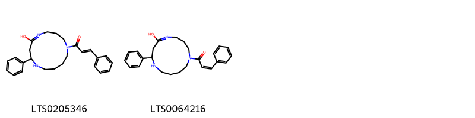{ width=100% }
    <figcaption>Hình ảnh cấu trúc hóa học của 2 hoạt chất thuộc nhóm Cinnamic acids and derivatives gồm ['1-(6-hydroxy-8-phenyl-1,5,9-triazacyclotridec-5-en-1-yl)-3-phenylprop-2-en-1-one (LTS0205346)', '(2z)-1-[(8r)-6-hydroxy-8-phenyl-1,5,9-triazacyclotridec-5-en-1-yl]-3-phenylprop-2-en-1-one (LTS0064216)'].</figcaption>
</figure>
#### Nhóm Macrolactams
<figure markdown="span">
    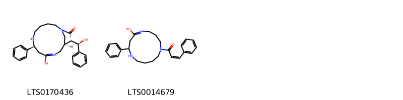{ width=100% }
    <figcaption>Hình ảnh cấu trúc hóa học của 2 hoạt chất thuộc nhóm Macrolactams gồm ['(7s,12s,13s)-9-hydroxy-13-[(r)-hydroxy(phenyl)methyl]-7-phenyl-1,6,10-triazabicyclo[10.2.1]pentadec-9-en-14-one (LTS0170436)', '(2z)-1-(6-hydroxy-8-phenyl-1,5,9-triazacyclotridec-5-en-1-yl)-3-phenylprop-2-en-1-one (LTS0014679)'].</figcaption>
</figure>
#### Nhóm Peptidomimetics
<figure markdown="span">
    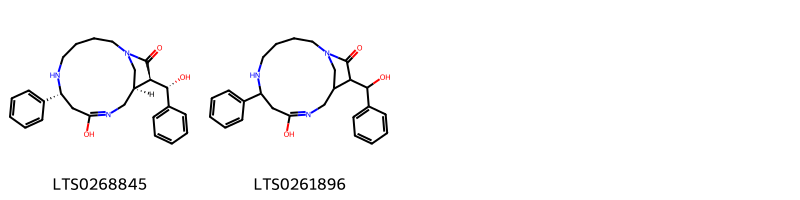{ width=100% }
    <figcaption>Hình ảnh cấu trúc hóa học của 2 hoạt chất thuộc nhóm Peptidomimetics gồm ['(7r,12s,13r)-9-hydroxy-13-[(s)-hydroxy(phenyl)methyl]-7-phenyl-1,6,10-triazabicyclo[10.2.1]pentadec-9-en-14-one (LTS0268845)', '9-hydroxy-13-[hydroxy(phenyl)methyl]-7-phenyl-1,6,10-triazabicyclo[10.2.1]pentadec-9-en-14-one (LTS0261896)'].</figcaption>
</figure>
#### Nhóm Phenols
<figure markdown="span">
    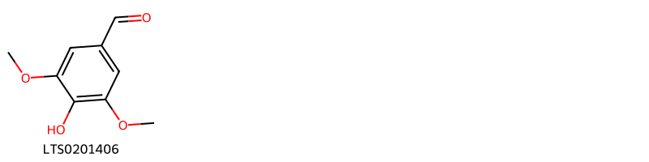{ width=100% }
    <figcaption>Hình ảnh cấu trúc hóa học của 1 hoạt chất thuộc nhóm Phenols gồm ['syringaldehyde (LTS0201406)'].</figcaption>
</figure>
#### Nhóm Tannins
<figure markdown="span">
    { width=100% }
    <figcaption>Hình ảnh cấu trúc hóa học của 1 hoạt chất thuộc nhóm Tannins gồm ['ellagic acid (LTS0037297)'].</figcaption>
</figure>

---

### Dược dân tộc học

Danh sách các quốc gia có sử dụng *Moullava digyna* trong điều trị các bệnh. 

| Country   | Disease    | Bệnh                                                                                                                                                                                                |
|:----------|:-----------|:----------------------------------------------------------------------------------------------------------------------------------------------------------------------------------------------------|
| Elsewhere | Astringent | MYMEMORY WARNING: YOU USED ALL AVAILABLE FREE TRANSLATIONS FOR TODAY. NEXT AVAILABLE IN  14 HOURS 56 MINUTES 37 SECONDS VISIT HTTPS://MYMEMORY.TRANSLATED.NET/DOC/USAGELIMITS.PHP TO TRANSLATE MORE |

---

---
## Caesalpinia echinata
### Thông tin về thực vật

!!! info "Phân loại thực vật của *Paubrasilia echinata* từ GIBF:"
    - **Kingdom:** Plantae
    - **Phylum:** Tracheophyta
    - **Order:** Fabales
    - **Family:** Fabaceae
    - **Genus:** Paubrasilia
    - **Species:** *Paubrasilia echinata*

 

| Label (VI)   | Label (EN)   | Scientific Name      | Descriptions (VI)   | Descriptions (EN)   | Also Known As (VI)   | Also Known As (EN)                                                      |
|:-------------|:-------------|:---------------------|:--------------------|:--------------------|:---------------------|:------------------------------------------------------------------------|
| N/A          | N/A          | Caesalpinia echinata |                     | Species of tree     | ['']                 | ['Pernambuco', 'Brazilwood', 'Pau brasil', 'Pau Brasil', 'Brazil-wood'] |

#### Phân bố trên thế giới

**Từ CSDL GIBF** Seychelles, nan, Brazil, United States of America

#### Phân bố tại Việt Nam

**Từ CSDL GIBF**: Không có ghi nhận ở Việt Nam

---
### Thành phần hóa học
        
- Theo cơ sở dữ liệu lotus: Từ loài *Paubrasilia echinata* đã phân lập và xác định được Chưa có hoạt chất nào được phân lập. hoạt chất thuộc về các nhóm Không có hoạt chất nào được phân lập. 

Không có hình ảnh nào được tạo ra

---

### Dược dân tộc học

Danh sách các quốc gia có sử dụng *Paubrasilia echinata* trong điều trị các bệnh. 

| Country       | Disease    | Bệnh                                                                                                                                                                                                |
|:--------------|:-----------|:----------------------------------------------------------------------------------------------------------------------------------------------------------------------------------------------------|
| Latin America | Astringent | MYMEMORY WARNING: YOU USED ALL AVAILABLE FREE TRANSLATIONS FOR TODAY. NEXT AVAILABLE IN  14 HOURS 56 MINUTES 09 SECONDS VISIT HTTPS://MYMEMORY.TRANSLATED.NET/DOC/USAGELIMITS.PHP TO TRANSLATE MORE |

---

---
## Caesalpinia eriostachys
### Thông tin về thực vật

!!! info "Phân loại thực vật của *Cenostigma eriostachys* từ GIBF:"
    - **Kingdom:** Plantae
    - **Phylum:** Tracheophyta
    - **Order:** Fabales
    - **Family:** Fabaceae
    - **Genus:** Cenostigma
    - **Species:** *Cenostigma eriostachys*

 

| Label (VI)   | Label (EN)   | Scientific Name         | Descriptions (VI)   | Descriptions (EN)   | Also Known As (VI)   | Also Known As (EN)   |
|:-------------|:-------------|:------------------------|:--------------------|:--------------------|:---------------------|:---------------------|
| N/A          | N/A          | Caesalpinia eriostachys | loài thực vật       | species of plant    | ['']                 | ['']                 |

#### Phân bố trên thế giới

**Từ CSDL GIBF** Guatemala, Brazil, Costa Rica, Honduras, Nicaragua, Mexico, El Salvador

#### Phân bố tại Việt Nam

**Từ CSDL GIBF**: Không có ghi nhận ở Việt Nam

---
### Thành phần hóa học
        
- Theo cơ sở dữ liệu lotus: Từ loài *Cenostigma eriostachys* đã phân lập và xác định được Chưa có hoạt chất nào được phân lập. hoạt chất thuộc về các nhóm Không có hoạt chất nào được phân lập. 

Không có hình ảnh nào được tạo ra

---

### Dược dân tộc học

Danh sách các quốc gia có sử dụng *Cenostigma eriostachys* trong điều trị các bệnh. 

| Country   | Disease              | Bệnh                                                                                                                                                                                                |
|:----------|:---------------------|:----------------------------------------------------------------------------------------------------------------------------------------------------------------------------------------------------|
| Mexico    | Piscicide, Piscicide | MYMEMORY WARNING: YOU USED ALL AVAILABLE FREE TRANSLATIONS FOR TODAY. NEXT AVAILABLE IN  14 HOURS 55 MINUTES 44 SECONDS VISIT HTTPS://MYMEMORY.TRANSLATED.NET/DOC/USAGELIMITS.PHP TO TRANSLATE MORE |

---

---
## Caesalpinia gilliesii
### Thông tin về thực vật

!!! info "Phân loại thực vật của *N/A* từ GIBF:"
    - **Kingdom:** Plantae
    - **Phylum:** Tracheophyta
    - **Order:** Fabales
    - **Family:** Fabaceae
    - **Genus:** Erythrostemon
    - **Species:** *N/A*

 

| Label (VI)   | Label (EN)   | Scientific Name       | Descriptions (VI)   | Descriptions (EN)          | Also Known As (VI)   | Also Known As (EN)   |
|:-------------|:-------------|:----------------------|:--------------------|:---------------------------|:---------------------|:---------------------|
| N/A          | N/A          | Caesalpinia gilliesii |                     | shrub in the legume family | ['']                 | ['']                 |

#### Phân bố trên thế giới

**Từ CSDL GIBF** Nicaragua, South Africa, Iran (Islamic Republic of), Guatemala, Brazil, Spain, Argentina, Bolivia (Plurinational State of), Türkiye, United States of America, Mexico, Chile, Dominican Republic, Greece

#### Phân bố tại Việt Nam

**Từ CSDL GIBF**: Không có ghi nhận ở Việt Nam

---
### Thành phần hóa học
        
- Theo cơ sở dữ liệu lotus: Từ loài *N/A* đã phân lập và xác định được Chưa có hoạt chất nào được phân lập. hoạt chất thuộc về các nhóm Không có hoạt chất nào được phân lập. 

Không có hình ảnh nào được tạo ra

---

### Dược dân tộc học

Danh sách các quốc gia có sử dụng *N/A* trong điều trị các bệnh. 

| Country   | Disease   | Bệnh                                                                                                                                                                                                |
|:----------|:----------|:----------------------------------------------------------------------------------------------------------------------------------------------------------------------------------------------------|
| US        | Poison    | MYMEMORY WARNING: YOU USED ALL AVAILABLE FREE TRANSLATIONS FOR TODAY. NEXT AVAILABLE IN  14 HOURS 55 MINUTES 08 SECONDS VISIT HTTPS://MYMEMORY.TRANSLATED.NET/DOC/USAGELIMITS.PHP TO TRANSLATE MORE |

---

---
## Caesalpinia japonica
### Thông tin về thực vật

!!! info "Phân loại thực vật của *Biancaea decapetala* từ GIBF:"
    - **Kingdom:** Plantae
    - **Phylum:** Tracheophyta
    - **Order:** Fabales
    - **Family:** Fabaceae
    - **Genus:** Biancaea
    - **Species:** *Biancaea decapetala*

 

| Label (VI)   | Label (EN)   | Scientific Name      | Descriptions (VI)   | Descriptions (EN)   | Also Known As (VI)   | Also Known As (EN)   |
|:-------------|:-------------|:---------------------|:--------------------|:--------------------|:---------------------|:---------------------|
| N/A          | N/A          | Caesalpinia japonica | loài thực vật       | species of plant    | ['']                 | ['']                 |

#### Phân bố trên thế giới

**Từ CSDL GIBF** nan, Japan, Germany, Belgium, Korea, Republic of, Chinese Taipei, Spain, Russian Federation, United Kingdom of Great Britain and Northern Ireland

#### Phân bố tại Việt Nam

**Từ CSDL GIBF**: Không có ghi nhận ở Việt Nam

---
### Thành phần hóa học
        
- Theo cơ sở dữ liệu lotus: Từ loài *Biancaea decapetala* đã phân lập và xác định được Chưa có hoạt chất nào được phân lập. hoạt chất thuộc về các nhóm Không có hoạt chất nào được phân lập. 

Không có hình ảnh nào được tạo ra

---

### Dược dân tộc học

Danh sách các quốc gia có sử dụng *Biancaea decapetala* trong điều trị các bệnh. 

| Country   | Disease            | Bệnh                                                                                                                                                                                                |
|:----------|:-------------------|:----------------------------------------------------------------------------------------------------------------------------------------------------------------------------------------------------|
| Elsewhere | Antidiarrheic, nan | MYMEMORY WARNING: YOU USED ALL AVAILABLE FREE TRANSLATIONS FOR TODAY. NEXT AVAILABLE IN  14 HOURS 54 MINUTES 41 SECONDS VISIT HTTPS://MYMEMORY.TRANSLATED.NET/DOC/USAGELIMITS.PHP TO TRANSLATE MORE |

---

---
## Caesalpinia nuga
### Thông tin về thực vật

!!! info "Phân loại thực vật của *Ticanto crista* từ GIBF:"
    - **Kingdom:** Plantae
    - **Phylum:** Tracheophyta
    - **Order:** Fabales
    - **Family:** Fabaceae
    - **Genus:** Caesalpinia
    - **Species:** *Ticanto crista*

 

| Label (VI)   | Label (EN)   | Scientific Name   | Descriptions (VI)   | Descriptions (EN)   | Also Known As (VI)   | Also Known As (EN)   |
|:-------------|:-------------|:------------------|:--------------------|:--------------------|:---------------------|:---------------------|
| N/A          | N/A          | Caesalpinia nuga  | loài thực vật       | species of plant    | ['']                 | ['']                 |

#### Phân bố trên thế giới

**Từ CSDL GIBF** nan, Hong Kong, Australia, Japan, Chinese Taipei, Papua New Guinea, Vanuatu, India, New Caledonia, Indonesia, United States of America, unknown or invalid, Philippines, Solomon Islands, Viet Nam, China

#### Phân bố tại Việt Nam

**Từ CSDL GIBF**: Không có ghi nhận ở Việt Nam

---
### Thành phần hóa học
        
- Theo cơ sở dữ liệu lotus: Từ loài *Ticanto crista* đã phân lập và xác định được Chưa có hoạt chất nào được phân lập. hoạt chất thuộc về các nhóm Không có hoạt chất nào được phân lập. 

Không có hình ảnh nào được tạo ra

---

### Dược dân tộc học

Danh sách các quốc gia có sử dụng *Ticanto crista* trong điều trị các bệnh. 

| Country   | Disease                                                | Bệnh                                                                                                                                                                                                |
|:----------|:-------------------------------------------------------|:----------------------------------------------------------------------------------------------------------------------------------------------------------------------------------------------------|
| Elsewhere | Diuretic, Piscicide, Piscicide, Tonic, Tonic, Diuretic | MYMEMORY WARNING: YOU USED ALL AVAILABLE FREE TRANSLATIONS FOR TODAY. NEXT AVAILABLE IN  14 HOURS 54 MINUTES 20 SECONDS VISIT HTTPS://MYMEMORY.TRANSLATED.NET/DOC/USAGELIMITS.PHP TO TRANSLATE MORE |
| Hindu     | Uterotonic                                             | MYMEMORY WARNING: YOU USED ALL AVAILABLE FREE TRANSLATIONS FOR TODAY. NEXT AVAILABLE IN  14 HOURS 54 MINUTES 16 SECONDS VISIT HTTPS://MYMEMORY.TRANSLATED.NET/DOC/USAGELIMITS.PHP TO TRANSLATE MORE |
| India     | Piscicide                                              | MYMEMORY WARNING: YOU USED ALL AVAILABLE FREE TRANSLATIONS FOR TODAY. NEXT AVAILABLE IN  14 HOURS 54 MINUTES 12 SECONDS VISIT HTTPS://MYMEMORY.TRANSLATED.NET/DOC/USAGELIMITS.PHP TO TRANSLATE MORE |

---

---
## Caesalpinia pulcherimma
### Thông tin về thực vật

!!! info "Phân loại thực vật của *Caesalpinia pulcherrima* từ GIBF:"
    - **Kingdom:** Plantae
    - **Phylum:** Tracheophyta
    - **Order:** Fabales
    - **Family:** Fabaceae
    - **Genus:** Caesalpinia
    - **Species:** *Caesalpinia pulcherrima*

 

| Label (VI)   | Label (EN)   | Scientific Name   | Descriptions (VI)   | Descriptions (EN)   | Also Known As (VI)   | Also Known As (EN)   |
|:-------------|:-------------|:------------------|:--------------------|:--------------------|:---------------------|:---------------------|
| N/A          | N/A          | Caesalpinia nuga  | loài thực vật       | species of plant    | ['']                 | ['']                 |

#### Phân bố trên thế giới

**Từ CSDL GIBF** Virgin Islands (U.S.), nan, Sri Lanka, Ghana, Guadeloupe, Lao People’s Democratic Republic, Cambodia, Guatemala, Mozambique, Saint Lucia, Philippines, Benin, Panama, French Guiana, Malawi, Puerto Rico, Réunion, Senegal, Bolivia (Plurinational State of), United States of America, Bonaire, Sint Eustatius and Saba, El Salvador, Belize, Hong Kong, Thailand, Brazil, Bahamas, Cuba, Mexico, Dominican Republic, Peru, Singapore, Dominica, China, Ecuador, French Polynesia, Madagascar, Colombia, Kenya, Montserrat, Costa Rica, Botswana, India, Indonesia, Antigua and Barbuda, Sint Maarten (Dutch part), Malaysia

#### Phân bố tại Việt Nam

**Từ CSDL GIBF**: Không có ghi nhận ở Việt Nam

---
### Thành phần hóa học
        
- Theo cơ sở dữ liệu lotus: Từ loài *Caesalpinia pulcherrima* đã phân lập và xác định được Chưa có hoạt chất nào được phân lập. hoạt chất thuộc về các nhóm Không có hoạt chất nào được phân lập. 

Không có hình ảnh nào được tạo ra

---

### Dược dân tộc học

Danh sách các quốc gia có sử dụng *Caesalpinia pulcherrima* trong điều trị các bệnh. 

| Country   | Disease                        | Bệnh                                                                                                                                                                                                |
|:----------|:-------------------------------|:----------------------------------------------------------------------------------------------------------------------------------------------------------------------------------------------------|
| Haiti     | Sudorific, Vulnerary, Laxative | MYMEMORY WARNING: YOU USED ALL AVAILABLE FREE TRANSLATIONS FOR TODAY. NEXT AVAILABLE IN  14 HOURS 53 MINUTES 45 SECONDS VISIT HTTPS://MYMEMORY.TRANSLATED.NET/DOC/USAGELIMITS.PHP TO TRANSLATE MORE |

---

---
## Caesalpinia pulcherrima
### Thông tin về thực vật

!!! info "Phân loại thực vật của *Caesalpinia pulcherrima* từ GIBF:"
    - **Kingdom:** Plantae
    - **Phylum:** Tracheophyta
    - **Order:** Fabales
    - **Family:** Fabaceae
    - **Genus:** Caesalpinia
    - **Species:** *Caesalpinia pulcherrima*

 

| Label (VI)   | Label (EN)   | Scientific Name         | Descriptions (VI)   | Descriptions (EN)   | Also Known As (VI)                                   | Also Known As (EN)                                                        |
|:-------------|:-------------|:------------------------|:--------------------|:--------------------|:-----------------------------------------------------|:--------------------------------------------------------------------------|
| N/A          | N/A          | Caesalpinia pulcherrima | loài thực vật       | species of plant    | ['Poinciana pulcherrima', 'Caesalpinia pulcherrima'] | ['Poinciana', 'peacock flower', 'pride of Barbados', 'Pride-of-Barbados'] |

#### Phân bố trên thế giới

**Từ CSDL GIBF** Virgin Islands (U.S.), nan, Sri Lanka, Ghana, Guadeloupe, Lao People’s Democratic Republic, Cambodia, Guatemala, Mozambique, Saint Lucia, Philippines, Benin, Panama, French Guiana, Malawi, Puerto Rico, Réunion, Senegal, Bolivia (Plurinational State of), United States of America, Bonaire, Sint Eustatius and Saba, El Salvador, Belize, Hong Kong, Thailand, Brazil, Bahamas, Cuba, Mexico, Dominican Republic, Peru, Singapore, Dominica, China, Ecuador, French Polynesia, Madagascar, Colombia, Kenya, Montserrat, Costa Rica, Botswana, India, Indonesia, Antigua and Barbuda, Sint Maarten (Dutch part), Malaysia

#### Phân bố tại Việt Nam

**Từ CSDL GIBF**: Không có ghi nhận ở Việt Nam

---
### Thành phần hóa học
        
- Theo cơ sở dữ liệu lotus: Từ loài *Caesalpinia pulcherrima* đã phân lập và xác định được 144 hoạt chất thuộc về các nhóm Fatty Acyls, Naphthalenes, Flavonoids, Prenol lipids, Steroids and steroid derivatives, Linear 1,3-diarylpropanoids, Phenanthrenes and derivatives, Benzene and substituted derivatives, Naphthofurans, Organooxygen compounds, Diazines, Homoisoflavonoids. 

|    | chemicalTaxonomyClassyfireClass     |   smiles_count |
|---:|:------------------------------------|---------------:|
|  0 | Benzene and substituted derivatives |              2 |
|  1 | Diazines                            |              1 |
|  2 | Fatty Acyls                         |              1 |
|  3 | Flavonoids                          |             10 |
|  4 | Homoisoflavonoids                   |             29 |
|  5 | Linear 1,3-diarylpropanoids         |              4 |
|  6 | Naphthalenes                        |              1 |
|  7 | Naphthofurans                       |             16 |
|  8 | Organooxygen compounds              |              2 |
|  9 | Phenanthrenes and derivatives       |              4 |
| 10 | Prenol lipids                       |             61 |
| 11 | Steroids and steroid derivatives    |             13 |

#### Nhóm Benzene and substituted derivatives
<figure markdown="span">
    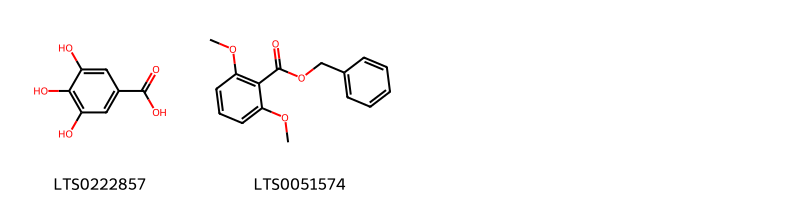{ width=100% }
    <figcaption>Hình ảnh cấu trúc hóa học của 2 hoạt chất thuộc nhóm Benzene and substituted derivatives gồm ['galop (LTS0222857)', 'benzyl 2,6-dimethoxybenzoate (LTS0051574)'].</figcaption>
</figure>
#### Nhóm Diazines
<figure markdown="span">
    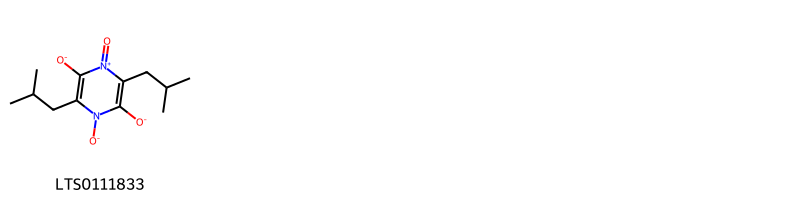{ width=100% }
    <figcaption>Hình ảnh cấu trúc hóa học của 1 hoạt chất thuộc nhóm Diazines gồm ['3,6-bis(2-methylpropyl)-1-oxo-1h-1λ⁵-pyrazin-1-ylium-2,4,5-tris(olate) (LTS0111833)'].</figcaption>
</figure>
#### Nhóm Fatty Acyls
<figure markdown="span">
    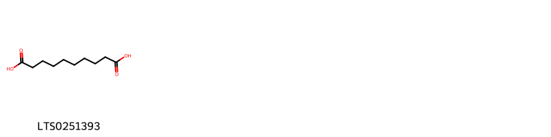{ width=100% }
    <figcaption>Hình ảnh cấu trúc hóa học của 1 hoạt chất thuộc nhóm Fatty Acyls gồm ['sebacic acid (LTS0251393)'].</figcaption>
</figure>
#### Nhóm Flavonoids
<figure markdown="span">
    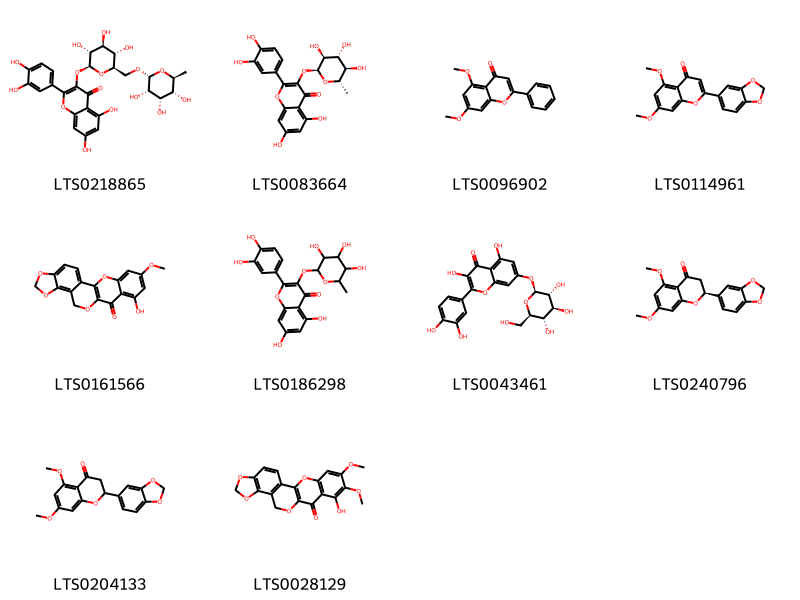{ width=100% }
    <figcaption>Hình ảnh cấu trúc hóa học của 10 hoạt chất thuộc nhóm Flavonoids gồm ['2-(3,4-dihydroxyphenyl)-5,7-dihydroxy-3-{[(2s,3r,4s,5s,6r)-3,4,5-trihydroxy-6-({[(2r,3s,4s,5r,6s)-3,4,5-trihydroxy-6-methyloxan-2-yl]oxy}methyl)oxan-2-yl]oxy}chromen-4-one (LTS0218865)', '2-(3,4-dihydroxyphenyl)-5,7-dihydroxy-3-{[(2s,3s,4r,5r,6s)-3,4,5-trihydroxy-6-methyloxan-2-yl]oxy}chromen-4-one (LTS0083664)', '5,7-dimethoxyflavone (LTS0096902)', '2-(2h-1,3-benzodioxol-5-yl)-5,7-dimethoxychromen-4-one (LTS0114961)', 'pulcherrimin (LTS0161566)', 'quercitrin (LTS0186298)', 'quercimeritrin (LTS0043461)', '(2s)-2-(2h-1,3-benzodioxol-5-yl)-5,7-dimethoxy-2,3-dihydro-1-benzopyran-4-one (LTS0240796)', '2-(2h-1,3-benzodioxol-5-yl)-5,7-dimethoxy-2,3-dihydro-1-benzopyran-4-one (LTS0204133)', '16-hydroxy-17,18-dimethoxy-6,8,12,21-tetraoxapentacyclo[11.8.0.0²,¹⁰.0⁵,⁹.0¹⁵,²⁰]henicosa-1(13),2(10),3,5(9),15,17,19-heptaen-14-one (LTS0028129)'].</figcaption>
</figure>
#### Nhóm Homoisoflavonoids
<figure markdown="span">
    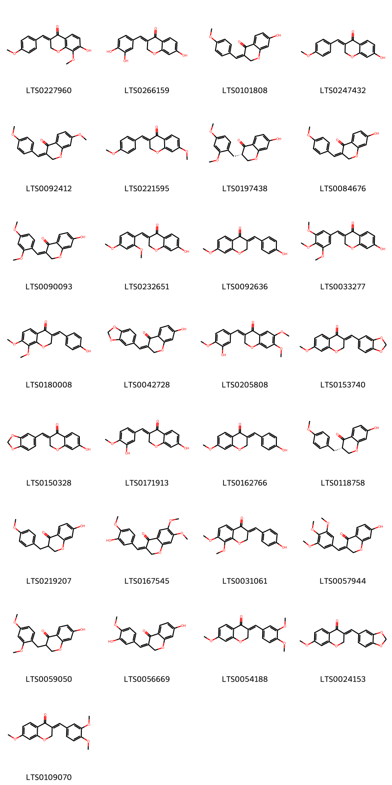{ width=100% }
    <figcaption>Hình ảnh cấu trúc hóa học của 29 hoạt chất thuộc nhóm Homoisoflavonoids gồm ['(3e)-7-hydroxy-8-methoxy-3-[(4-methoxyphenyl)methylidene]-2h-1-benzopyran-4-one (LTS0227960)', 'sappanone a (LTS0266159)', '7-hydroxy-3-[(4-methoxyphenyl)methylidene]-2h-1-benzopyran-4-one (LTS0101808)', '(3e)-7-hydroxy-3-[(4-methoxyphenyl)methylidene]-2h-1-benzopyran-4-one (LTS0247432)', '7-methoxy-3-[(4-methoxyphenyl)methylidene]-2h-1-benzopyran-4-one (LTS0092412)', '(3e)-7-methoxy-3-[(4-methoxyphenyl)methylidene]-2h-1-benzopyran-4-one (LTS0221595)', '(3s)-3-[(2,4-dimethoxyphenyl)methyl]-7-hydroxy-2,3-dihydro-1-benzopyran-4-one (LTS0197438)', '(3z)-7-hydroxy-3-[(4-methoxyphenyl)methylidene]-2h-1-benzopyran-4-one (LTS0084676)', '3-[(2,4-dimethoxyphenyl)methylidene]-7-hydroxy-2h-1-benzopyran-4-one (LTS0090093)', '(3e)-3-[(2,4-dimethoxyphenyl)methylidene]-7-hydroxy-2h-1-benzopyran-4-one (LTS0232651)', '3-[(4-hydroxyphenyl)methylidene]-7-methoxy-2h-1-benzopyran-4-one (LTS0092636)', '(3e)-7-hydroxy-3-[(3,4,5-trimethoxyphenyl)methylidene]-2h-1-benzopyran-4-one (LTS0033277)', '3-[(4-hydroxyphenyl)methylidene]-7,8-dimethoxy-2h-1-benzopyran-4-one (LTS0180008)', '3-(2h-1,3-benzodioxol-5-ylmethylidene)-7-hydroxy-2h-1-benzopyran-4-one (LTS0042728)', '(3e)-3-[(3-hydroxy-4-methoxyphenyl)methylidene]-6,7-dimethoxy-2h-1-benzopyran-4-one (LTS0205808)', '3-(2h-1,3-benzodioxol-5-ylmethylidene)-7-methoxy-2h-1-benzopyran-4-one (LTS0153740)', '(3e)-3-(2h-1,3-benzodioxol-5-ylmethylidene)-7-hydroxy-2h-1-benzopyran-4-one (LTS0150328)', '(3e)-7-hydroxy-3-[(3-hydroxy-4-methoxyphenyl)methylidene]-2h-1-benzopyran-4-one (LTS0171913)', '(3e)-3-[(4-hydroxyphenyl)methylidene]-7-methoxy-2h-1-benzopyran-4-one (LTS0162766)', '(3s)-7-hydroxy-3-[(4-methoxyphenyl)methyl]-2,3-dihydro-1-benzopyran-4-one (LTS0118758)', '7-hydroxy-3-[(4-methoxyphenyl)methyl]-2,3-dihydro-1-benzopyran-4-one (LTS0219207)', '3-[(3-hydroxy-4-methoxyphenyl)methylidene]-6,7-dimethoxy-2h-1-benzopyran-4-one (LTS0167545)', '(3e)-3-[(4-hydroxyphenyl)methylidene]-7,8-dimethoxy-2h-1-benzopyran-4-one (LTS0031061)', '7-hydroxy-3-[(3,4,5-trimethoxyphenyl)methylidene]-2h-1-benzopyran-4-one (LTS0057944)', '3-[(2,4-dimethoxyphenyl)methyl]-7-hydroxy-2,3-dihydro-1-benzopyran-4-one (LTS0059050)', '7-hydroxy-3-[(3-hydroxy-4-methoxyphenyl)methylidene]-2h-1-benzopyran-4-one (LTS0056669)', '(3e)-3-[(3,4-dimethoxyphenyl)methylidene]-7-methoxy-2h-1-benzopyran-4-one (LTS0054188)', '(3e)-3-(2h-1,3-benzodioxol-5-ylmethylidene)-7-methoxy-2h-1-benzopyran-4-one (LTS0024153)', '3-[(3,4-dimethoxyphenyl)methylidene]-7-methoxy-2h-1-benzopyran-4-one (LTS0109070)'].</figcaption>
</figure>
#### Nhóm Linear 1_3-diarylpropanoids
<figure markdown="span">
    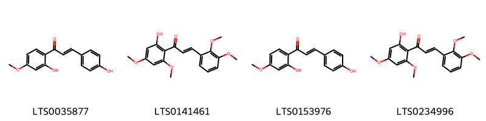{ width=100% }
    <figcaption>Hình ảnh cấu trúc hóa học của Không tìm thấy chú thích hoạt chất thuộc nhóm Linear 1_3-diarylpropanoids gồm Không tìm thấy chú thích.</figcaption>
</figure>
#### Nhóm Naphthalenes
<figure markdown="span">
    { width=100% }
    <figcaption>Hình ảnh cấu trúc hóa học của 1 hoạt chất thuộc nhóm Naphthalenes gồm ['walnut extract (LTS0110862)'].</figcaption>
</figure>
#### Nhóm Naphthofurans
<figure markdown="span">
    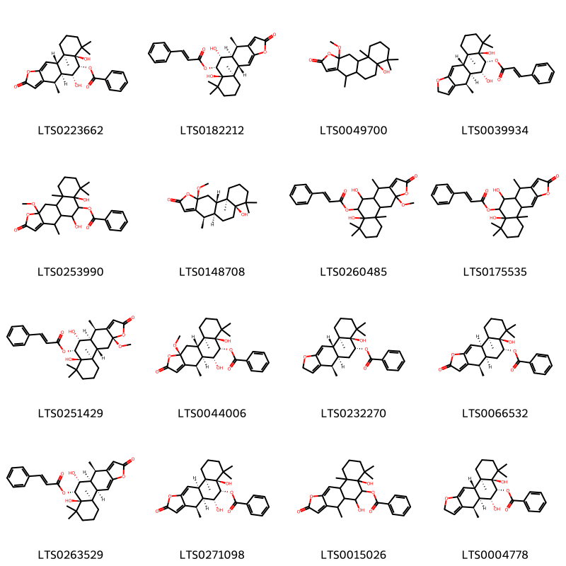{ width=100% }
    <figcaption>Hình ảnh cấu trúc hóa học của 16 hoạt chất thuộc nhóm Naphthofurans gồm ['(4ar,5r,6r,6as,7r,11ar,11br)-4a,6-dihydroxy-4,4,7,11b-tetramethyl-9-oxo-1h,2h,3h,5h,6h,6ah,7h,11ah-phenanthro[3,2-b]furan-5-yl benzoate (LTS0223662)', '(4ar,5r,6r,6as,7r,11ar,11br)-4a,6-dihydroxy-4,4,7,11b-tetramethyl-9-oxo-1h,2h,3h,5h,6h,6ah,7h,11ah-phenanthro[3,2-b]furan-5-yl (2e)-3-phenylprop-2-enoate (LTS0182212)', '4a-hydroxy-10a-methoxy-4,4,7,11b-tetramethyl-1h,2h,3h,5h,6h,6ah,7h,11h,11ah-phenanthro[3,2-b]furan-9-one (LTS0049700)', '(4ar,5r,6r,6as,7r,11ar,11br)-4a,6-dihydroxy-4,4,7,11b-tetramethyl-1h,2h,3h,5h,6h,6ah,7h,9h,11ah-phenanthro[3,2-b]furan-5-yl (2e)-3-phenylprop-2-enoate (LTS0039934)', '4a,6-dihydroxy-10a-methoxy-4,4,7,11b-tetramethyl-9-oxo-1h,2h,3h,5h,6h,6ah,7h,11h,11ah-phenanthro[3,2-b]furan-5-yl benzoate (LTS0253990)', '(4ar,6as,7r,10ar,11as,11br)-4a-hydroxy-10a-methoxy-4,4,7,11b-tetramethyl-1h,2h,3h,5h,6h,6ah,7h,11h,11ah-phenanthro[3,2-b]furan-9-one (LTS0148708)', '4a,6-dihydroxy-10a-methoxy-4,4,7,11b-tetramethyl-9-oxo-1h,2h,3h,5h,6h,6ah,7h,11h,11ah-phenanthro[3,2-b]furan-5-yl 3-phenylprop-2-enoate (LTS0260485)', '4a,6-dihydroxy-4,4,7,11b-tetramethyl-9-oxo-1h,2h,3h,5h,6h,6ah,7h,11ah-phenanthro[3,2-b]furan-5-yl 3-phenylprop-2-enoate (LTS0175535)', '(4ar,5r,6r,6as,7r,10ar,11as,11br)-4a,6-dihydroxy-10a-methoxy-4,4,7,11b-tetramethyl-9-oxo-1h,2h,3h,5h,6h,6ah,7h,11h,11ah-phenanthro[3,2-b]furan-5-yl (2e)-3-phenylprop-2-enoate (LTS0251429)', '(4ar,5r,6r,6as,7r,10ar,11as,11br)-4a,6-dihydroxy-10a-methoxy-4,4,7,11b-tetramethyl-9-oxo-1h,2h,3h,5h,6h,6ah,7h,11h,11ah-phenanthro[3,2-b]furan-5-yl benzoate (LTS0044006)', '(4ar,5r,6as,7r,11ar,11br)-4a-hydroxy-4,4,7,11b-tetramethyl-1h,2h,3h,5h,6h,6ah,7h,9h,11ah-phenanthro[3,2-b]furan-5-yl benzoate (LTS0232270)', '(4ar,5r,6as,7r,11as,11br)-4a-hydroxy-4,4,7,11b-tetramethyl-9-oxo-1h,2h,3h,5h,6h,6ah,7h,11ah-phenanthro[3,2-b]furan-5-yl benzoate (LTS0066532)', '(4ar,5r,6r,6as,7r,11as,11br)-4a,6-dihydroxy-4,4,7,11b-tetramethyl-9-oxo-1h,2h,3h,5h,6h,6ah,7h,11ah-phenanthro[3,2-b]furan-5-yl (2e)-3-phenylprop-2-enoate (LTS0263529)', '(4ar,5r,6r,6as,7r,11as,11br)-4a,6-dihydroxy-4,4,7,11b-tetramethyl-9-oxo-1h,2h,3h,5h,6h,6ah,7h,11ah-phenanthro[3,2-b]furan-5-yl benzoate (LTS0271098)', '4a,6-dihydroxy-4,4,7,11b-tetramethyl-9-oxo-1h,2h,3h,5h,6h,6ah,7h,11ah-phenanthro[3,2-b]furan-5-yl benzoate (LTS0015026)', '(4ar,5r,6r,6as,7r,11ar,11br)-4a,6-dihydroxy-4,4,7,11b-tetramethyl-1h,2h,3h,5h,6h,6ah,7h,9h,11ah-phenanthro[3,2-b]furan-5-yl benzoate (LTS0004778)'].</figcaption>
</figure>
#### Nhóm Organooxygen compounds
<figure markdown="span">
    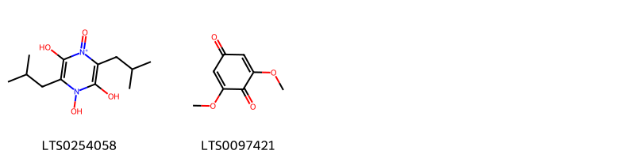{ width=100% }
    <figcaption>Hình ảnh cấu trúc hóa học của 2 hoạt chất thuộc nhóm Organooxygen compounds gồm ['2,4,5-trihydroxy-3,6-bis(2-methylpropyl)-1-oxo-1h-1λ⁵-pyrazin-1-ylium (LTS0254058)', '2,6-dimethoxy-1,4-benzoquinone (LTS0097421)'].</figcaption>
</figure>
#### Nhóm Phenanthrenes and derivatives
<figure markdown="span">
    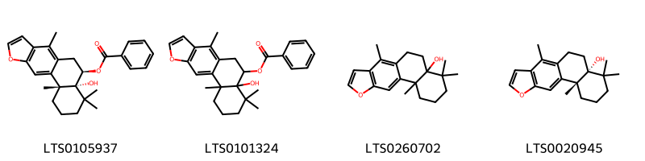{ width=100% }
    <figcaption>Hình ảnh cấu trúc hóa học của 4 hoạt chất thuộc nhóm Phenanthrenes and derivatives gồm ['(4ar,5r,11br)-4a-hydroxy-4,4,7,11b-tetramethyl-1h,2h,3h,5h,6h-phenanthro[3,2-b]furan-5-yl benzoate (LTS0105937)', '4a-hydroxy-4,4,7,11b-tetramethyl-1h,2h,3h,5h,6h-phenanthro[3,2-b]furan-5-yl benzoate (LTS0101324)', '4,4,7,11b-tetramethyl-1h,2h,3h,5h,6h-phenanthro[3,2-b]furan-4a-ol (LTS0260702)', '(4ar,11br)-4,4,7,11b-tetramethyl-1h,2h,3h,5h,6h-phenanthro[3,2-b]furan-4a-ol (LTS0020945)'].</figcaption>
</figure>
#### Nhóm Prenol lipids
<figure markdown="span">
    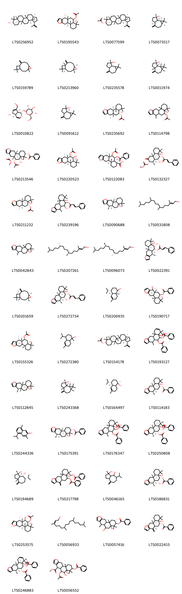{ width=100% }
    <figcaption>Hình ảnh cấu trúc hóa học của 61 hoạt chất thuộc nhóm Prenol lipids gồm ['lupeol (LTS0256952)', '(4ar,5r,6as,7r,11as,11br)-4a-hydroxy-4,4,7,11b-tetramethyl-1h,2h,3h,5h,6h,6ah,7h,11h,11ah-phenanthro[3,2-b]furan-5-yl acetate (LTS0195543)', 'lupeol acetate (LTS0077599)', '(1as,4as,7s,7ar,7bs)-1,1,7-trimethyl-4-methylidene-octahydrocyclopropa[e]azulen-7-ol (LTS0073517)', 'caryophyllene oxide (LTS0159789)', 'β-caryophyllene oxide (LTS0213960)', 'spathulenol (LTS0235578)', 'spathulenol (LTS0011974)', 'aucubin (LTS0010822)', '(7ar)-1,1,7-trimethyl-4-methylidene-octahydrocyclopropa[e]azulen-7-ol (LTS0091612)', '(4as,5r,6ar,7s,11ar,11bs)-4a-hydroxy-4,4,7,11b-tetramethyl-1h,2h,3h,5h,6h,6ah,7h,11h,11ah-phenanthro[3,2-b]furan-5-yl acetate (LTS0235692)', '4a-hydroxy-4,4,7,11b-tetramethyl-1h,2h,3h,5h,6h,6ah,7h,11h,11ah-phenanthro[3,2-b]furan-5-yl acetate (LTS0114798)', 'methyl (3s,4as,5r,6r,6as,7s,11as,11br)-6-(acetyloxy)-3-(benzoyloxy)-4a,5-dihydroxy-4,4,11b-trimethyl-1h,2h,3h,5h,6h,6ah,7h,11h,11ah-phenanthro[3,2-b]furan-7-carboxylate (LTS0213546)', '(4ar,5r,6r,6as,7r,11as,11br)-4a,5-dihydroxy-4,4,7,11b-tetramethyl-1h,2h,3h,5h,6h,6ah,7h,11h,11ah-phenanthro[3,2-b]furan-6-yl acetate (LTS0220523)', '(4s,4as,5r,6r,6as,7r,11as,11br)-6-(acetyloxy)-5-(benzoyloxy)-4a-hydroxy-4,7,11b-trimethyl-1h,2h,3h,5h,6h,6ah,7h,11h,11ah-phenanthro[3,2-b]furan-4-carboxylic acid (LTS0122083)', '(1r,2s,4as,4br,8ar,9r,10r,10as)-8a,10-dihydroxy-2-(2-methoxy-2-oxoethyl)-1,4b,8,8-tetramethyl-3-oxo-decahydrophenanthren-9-yl (2e)-3-phenylprop-2-enoate (LTS0132327)', '(4ar,5r,6as,7s,11as,11br)-4a-hydroxy-4,4,7,11b-tetramethyl-1h,2h,3h,5h,6h,6ah,7h,11h,11ah-phenanthro[3,2-b]furan-5-yl acetate (LTS0211232)', '4a,6-dihydroxy-4,4,7,11b-tetramethyl-1h,2h,3h,5h,6h,6ah,7h,11h,11ah-phenanthro[3,2-b]furan-5-yl 3-phenylprop-2-enoate (LTS0239196)', '(4ar,6as,7r,11as,11br)-4,4,7,11b-tetramethyl-1h,2h,3h,5h,6h,6ah,7h,11h,11ah-phenanthro[3,2-b]furan-4a-ol (LTS0090688)', 'phytol (LTS0031808)', '4,4,7,11b-tetramethyl-1h,2h,3h,5h,6h,6ah,7h,11h,11ah-phenanthro[3,2-b]furan-4a-ol (LTS0042843)', '(2e,7s,11s)-3,7,11,15-tetramethylhexadec-2-en-1-ol (LTS0207261)', 'phytol (LTS0096073)', '(4ar,5r,6r,6as,7r,11as,11br)-4a,5-dihydroxy-4,4,7,11b-tetramethyl-1h,2h,3h,5h,6h,6ah,7h,11h,11ah-phenanthro[3,2-b]furan-6-yl (2e)-3-phenylprop-2-enoate (LTS0022391)', '(1s,4r,6r,10r)-4,12,12-trimethyl-9-methylidene-5-oxatricyclo[8.2.0.0⁴,⁶]dodecane (LTS0201659)', '(4ar,5r,6r,6as,7r,11as,11br)-4a,6-dihydroxy-4,4,7,11b-tetramethyl-1h,2h,3h,5h,6h,6ah,7h,11h,11ah-phenanthro[3,2-b]furan-5-yl (2e)-3-phenylprop-2-enoate (LTS0272734)', 'α-cadinol (LTS0206935)', '(4ar,5r,6ar,7s,11as,11br)-4a,7-dihydroxy-4,4,7,11b-tetramethyl-1h,2h,3h,5h,6h,6ah,11h,11ah-phenanthro[3,2-b]furan-5-yl benzoate (LTS0190717)', '(4ar,6s,6as,7r,11as,11br)-4a-hydroxy-4,4,7,11b-tetramethyl-1h,2h,3h,5h,6h,6ah,7h,11h,11ah-phenanthro[3,2-b]furan-6-yl acetate (LTS0155326)', 'delta-cadinol (LTS0272380)', '(1r,3ar,5ar,7ar,9s,11ar,11br,13ar,13br)-3a,5a,5b,8,8,11a-hexamethyl-1-(prop-1-en-2-yl)-hexadecahydrocyclopenta[a]chrysen-9-yl acetate (LTS0154178)', '5,6-bis(benzoyloxy)-4a-hydroxy-4,7,11b-trimethyl-1h,5h,6h,6ah,7h,11h,11ah-phenanthro[3,2-b]furan-4-carboxylic acid (LTS0193127)', '(4ar,6ar,7r,11as,11br)-4,4,7,11b-tetramethyl-1h,2h,3h,5h,6h,6ah,7h,11h,11ah-phenanthro[3,2-b]furan-4a-ol (LTS0112845)', '(1ar,4ar,7s,7as,7br)-1,1,7-trimethyl-4-methylidene-octahydrocyclopropa[e]azulen-7-ol (LTS0243368)', '(1r,4s,4ar)-4-isopropyl-1,6-dimethyl-3,4,4a,7,8,8a-hexahydro-2h-naphthalen-1-ol (LTS0164497)', '(4ar,5r,6as,7r,11as,11br)-4a-hydroxy-4,4,7,11b-tetramethyl-1h,2h,3h,5h,6h,6ah,7h,11h,11ah-phenanthro[3,2-b]furan-5-yl benzoate (LTS0114183)', '7-hydroxycadalene (LTS0244336)', '(3s,4as,6as,7r,11as,11br)-4a-hydroxy-4,4,7,11b-tetramethyl-1h,2h,3h,5h,6h,6ah,7h,11h,11ah-phenanthro[3,2-b]furan-3-yl benzoate (LTS0175391)', '5,6-bis(benzoyloxy)-4a-hydroxy-4,7,11b-trimethyl-1h,2h,3h,5h,6h,6ah,7h,11h,11ah-phenanthro[3,2-b]furan-4-carboxylic acid (LTS0176347)', '(4s,4as,5r,6r,6as,7r,11as,11br)-5,6-bis(benzoyloxy)-4a-hydroxy-4,7,11b-trimethyl-1h,2h,3h,5h,6h,6ah,7h,11h,11ah-phenanthro[3,2-b]furan-4-carboxylic acid (LTS0250808)', '(1s,3ar,7s,8r,8ar)-7-isopropyl-1-methyl-4-methylidene-octahydroazulene-1,8-diol (LTS0194689)', '4-[(benzoyloxy)methyl]-4a-hydroxy-4,11b-dimethyl-7-methylidene-1h,2h,3h,5h,6h,6ah,11h,11ah-phenanthro[3,2-b]furan-5-yl benzoate (LTS0217798)', '7-isopropyl-1-methyl-4-methylidene-octahydroazulene-1,8-diol (LTS0046165)', '(4ar,5r,6r,6as,7r,11as,11br)-4a,6-dihydroxy-4,4,7,11b-tetramethyl-1h,2h,3h,5h,6h,6ah,7h,11h,11ah-phenanthro[3,2-b]furan-5-yl benzoate (LTS0186831)', '(4ar,5r,6r,6as,7r,11as,11br)-4a,6-dihydroxy-4,4,7,11b-tetramethyl-1h,2h,3h,5h,6h,6ah,7h,11h,11ah-phenanthro[3,2-b]furan-5-yl acetate (LTS0253575)', '3,7,11,15-tetramethylhexadec-2-en-1-ol (LTS0056933)', '4a,6-dihydroxy-4,4,7,11b-tetramethyl-1h,2h,3h,5h,6h,6ah,7h,11h,11ah-phenanthro[3,2-b]furan-3-yl benzoate (LTS0057416)', '(4ar,5r,6ar,11as,11br)-4a-hydroxy-4,4,11b-trimethyl-7-methylidene-1h,2h,3h,5h,6h,6ah,11h,11ah-phenanthro[3,2-b]furan-5-yl benzoate (LTS0022415)', '(4s,4as,5r,6r,6as,7r,11as,11br)-5,6-bis(benzoyloxy)-4a-hydroxy-4,7,11b-trimethyl-1h,5h,6h,6ah,7h,11h,11ah-phenanthro[3,2-b]furan-4-carboxylic acid (LTS0246883)', 'methyl 6-(acetyloxy)-3-(benzoyloxy)-4a,5-dihydroxy-4,4,11b-trimethyl-1h,2h,3h,5h,6h,6ah,7h,11h,11ah-phenanthro[3,2-b]furan-7-carboxylate (LTS0056552)', '4a,5-dihydroxy-4,4,7,11b-tetramethyl-1h,2h,3h,5h,6h,6ah,7h,11h,11ah-phenanthro[3,2-b]furan-6-yl 3-phenylprop-2-enoate (LTS0056685)', '(3s,4as,6s,6as,7r,11as,11br)-4a,6-dihydroxy-4,4,7,11b-tetramethyl-1h,2h,3h,5h,6h,6ah,7h,11h,11ah-phenanthro[3,2-b]furan-3-yl benzoate (LTS0265242)', '4a,7-dihydroxy-4,4,7,11b-tetramethyl-1h,2h,3h,5h,6h,6ah,11h,11ah-phenanthro[3,2-b]furan-5-yl benzoate (LTS0014894)', '4a-hydroxy-4,4,11b-trimethyl-7-methylidene-1h,2h,3h,5h,6h,6ah,11h,11ah-phenanthro[3,2-b]furan-5-yl benzoate (LTS0012805)', '6-(acetyloxy)-5-(benzoyloxy)-4a-hydroxy-4,7,11b-trimethyl-1h,2h,3h,5h,6h,6ah,7h,11h,11ah-phenanthro[3,2-b]furan-4-carboxylic acid (LTS0008158)', '4a,6-dihydroxy-4,4,7,11b-tetramethyl-1h,2h,3h,5h,6h,6ah,7h,11h,11ah-phenanthro[3,2-b]furan-5-yl benzoate (LTS0009852)', '(1r,4s,4as,8ar)-4-isopropyl-1,6-dimethyl-3,4,4a,7,8,8a-hexahydro-2h-naphthalen-1-ol (LTS0087313)', '(1s,4s,6s,10r)-4,12,12-trimethyl-9-methylidene-5-oxatricyclo[8.2.0.0⁴,⁶]dodecane (LTS0111074)', '(4r,4as,5r,6ar,11as,11br)-4-[(benzoyloxy)methyl]-4a-hydroxy-4,11b-dimethyl-7-methylidene-1h,2h,3h,5h,6h,6ah,11h,11ah-phenanthro[3,2-b]furan-5-yl benzoate (LTS0021314)', 'methyl (3s,4as,5r,6r,6ar,7s,11as,11br)-6-(acetyloxy)-3-(benzoyloxy)-4a,5-dihydroxy-4,4,11b-trimethyl-1h,2h,3h,5h,6h,6ah,7h,11h,11ah-phenanthro[3,2-b]furan-7-carboxylate (LTS0092242)', '(4ar,5r,6r,6ar,7r,11as,11br)-4a,6-dihydroxy-4,4,7,11b-tetramethyl-1h,2h,3h,5h,6h,6ah,7h,11h,11ah-phenanthro[3,2-b]furan-5-yl (2z)-3-phenylprop-2-enoate (LTS0022284)'].</figcaption>
</figure>
#### Nhóm Steroids and steroid derivatives
<figure markdown="span">
    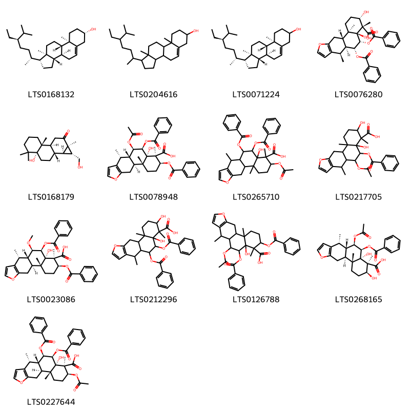{ width=100% }
    <figcaption>Hình ảnh cấu trúc hóa học của 13 hoạt chất thuộc nhóm Steroids and steroid derivatives gồm ['sitosterol (LTS0168132)', 'stigmast-5-en-3-ol, (3β)- (LTS0204616)', 'stigmast-5-en-3-ol (LTS0071224)', '(3s,4s,4as,5r,6r,6as,7r,11as,11br)-5,6-bis(benzoyloxy)-3,4a-dihydroxy-4,7,11b-trimethyl-1h,2h,3h,5h,6h,6ah,7h,11h,11ah-phenanthro[3,2-b]furan-4-carboxylic acid (LTS0076280)', '(1r,1ar,1br,3ar,7ar,7bs,9ar)-3a-hydroxy-1-(hydroxymethyl)-4,4,7a,9a-tetramethyl-decahydrocyclopropa[a]phenanthren-9-one (LTS0168179)', '(3s,4s,4as,5r,6r,6as,7r,11as,11br)-6-(acetyloxy)-3,5-bis(benzoyloxy)-4a-hydroxy-4,7,11b-trimethyl-1h,2h,3h,5h,6h,6ah,7h,11h,11ah-phenanthro[3,2-b]furan-4-carboxylic acid (LTS0078948)', '3-(acetyloxy)-5,6-bis(benzoyloxy)-4a-hydroxy-4,7,11b-trimethyl-1h,2h,3h,5h,6h,6ah,7h,11h,11ah-phenanthro[3,2-b]furan-4-carboxylic acid (LTS0265710)', '6-(acetyloxy)-5-(benzoyloxy)-3,4a-dihydroxy-4,7,11b-trimethyl-1h,2h,3h,5h,6h,6ah,7h,11h,11ah-phenanthro[3,2-b]furan-4-carboxylic acid (LTS0217705)', '(3s,4s,4as,5r,6r,6as,7r,11as,11br)-3,5-bis(benzoyloxy)-4a-hydroxy-6-methoxy-4,7,11b-trimethyl-1h,2h,3h,5h,6h,6ah,7h,11h,11ah-phenanthro[3,2-b]furan-4-carboxylic acid (LTS0023086)', '5,6-bis(benzoyloxy)-3,4a-dihydroxy-4,7,11b-trimethyl-1h,2h,3h,5h,6h,6ah,7h,11h,11ah-phenanthro[3,2-b]furan-4-carboxylic acid (LTS0212296)', '6-(acetyloxy)-3,5-bis(benzoyloxy)-4a-hydroxy-4,7,11b-trimethyl-1h,2h,3h,5h,6h,6ah,7h,11h,11ah-phenanthro[3,2-b]furan-4-carboxylic acid (LTS0126788)', '(3s,4s,4as,5r,6r,6as,7r,11as,11br)-6-(acetyloxy)-5-(benzoyloxy)-3,4a-dihydroxy-4,7,11b-trimethyl-1h,2h,3h,5h,6h,6ah,7h,11h,11ah-phenanthro[3,2-b]furan-4-carboxylic acid (LTS0268165)', '(3s,4s,4as,5r,6r,6as,7r,11as,11br)-3-(acetyloxy)-5,6-bis(benzoyloxy)-4a-hydroxy-4,7,11b-trimethyl-1h,2h,3h,5h,6h,6ah,7h,11h,11ah-phenanthro[3,2-b]furan-4-carboxylic acid (LTS0227644)'].</figcaption>
</figure>

---

### Dược dân tộc học

Danh sách các quốc gia có sử dụng *Caesalpinia pulcherrima* trong điều trị các bệnh. 

| Country            | Disease                                                                                                          | Bệnh                                                                                                                                                                                                |
|:-------------------|:-----------------------------------------------------------------------------------------------------------------|:----------------------------------------------------------------------------------------------------------------------------------------------------------------------------------------------------|
| Dominican Republic | Sudorific                                                                                                        | MYMEMORY WARNING: YOU USED ALL AVAILABLE FREE TRANSLATIONS FOR TODAY. NEXT AVAILABLE IN  14 HOURS 53 MINUTES 17 SECONDS VISIT HTTPS://MYMEMORY.TRANSLATED.NET/DOC/USAGELIMITS.PHP TO TRANSLATE MORE |
| Elsewhere          | Abortifacient, Purgative, Emmenagogue, Purgative, Tonic                                                          | MYMEMORY WARNING: YOU USED ALL AVAILABLE FREE TRANSLATIONS FOR TODAY. NEXT AVAILABLE IN  14 HOURS 53 MINUTES 13 SECONDS VISIT HTTPS://MYMEMORY.TRANSLATED.NET/DOC/USAGELIMITS.PHP TO TRANSLATE MORE |
| Guatemala          | Piscicide, Poison                                                                                                | MYMEMORY WARNING: YOU USED ALL AVAILABLE FREE TRANSLATIONS FOR TODAY. NEXT AVAILABLE IN  14 HOURS 53 MINUTES 10 SECONDS VISIT HTTPS://MYMEMORY.TRANSLATED.NET/DOC/USAGELIMITS.PHP TO TRANSLATE MORE |
| Haiti              | Vulnerary                                                                                                        | MYMEMORY WARNING: YOU USED ALL AVAILABLE FREE TRANSLATIONS FOR TODAY. NEXT AVAILABLE IN  14 HOURS 53 MINUTES 06 SECONDS VISIT HTTPS://MYMEMORY.TRANSLATED.NET/DOC/USAGELIMITS.PHP TO TRANSLATE MORE |
| Java               | Vermifuge                                                                                                        | MYMEMORY WARNING: YOU USED ALL AVAILABLE FREE TRANSLATIONS FOR TODAY. NEXT AVAILABLE IN  14 HOURS 53 MINUTES 02 SECONDS VISIT HTTPS://MYMEMORY.TRANSLATED.NET/DOC/USAGELIMITS.PHP TO TRANSLATE MORE |
| Mexico             | Abortifacient, Astringent, Emmenagogue, Emmenagogue, Purgative, Purgative, Piscicide, Abortifacient, Insecticide | MYMEMORY WARNING: YOU USED ALL AVAILABLE FREE TRANSLATIONS FOR TODAY. NEXT AVAILABLE IN  14 HOURS 52 MINUTES 59 SECONDS VISIT HTTPS://MYMEMORY.TRANSLATED.NET/DOC/USAGELIMITS.PHP TO TRANSLATE MORE |
| Panama             | Piscicide                                                                                                        | MYMEMORY WARNING: YOU USED ALL AVAILABLE FREE TRANSLATIONS FOR TODAY. NEXT AVAILABLE IN  14 HOURS 52 MINUTES 55 SECONDS VISIT HTTPS://MYMEMORY.TRANSLATED.NET/DOC/USAGELIMITS.PHP TO TRANSLATE MORE |
| Samoa              | Cathartic, Laxative                                                                                              | MYMEMORY WARNING: YOU USED ALL AVAILABLE FREE TRANSLATIONS FOR TODAY. NEXT AVAILABLE IN  14 HOURS 52 MINUTES 51 SECONDS VISIT HTTPS://MYMEMORY.TRANSLATED.NET/DOC/USAGELIMITS.PHP TO TRANSLATE MORE |

---

---
## Caesalpinia sappan
### Thông tin về thực vật

!!! info "Phân loại thực vật của *Biancaea sappan* từ GIBF:"
    - **Kingdom:** Plantae
    - **Phylum:** Tracheophyta
    - **Order:** Fabales
    - **Family:** Fabaceae
    - **Genus:** Biancaea
    - **Species:** *Biancaea sappan*

 

| Label (VI)   | Label (EN)   | Scientific Name    | Descriptions (VI)   | Descriptions (EN)   | Also Known As (VI)     | Also Known As (EN)   |
|:-------------|:-------------|:-------------------|:--------------------|:--------------------|:-----------------------|:---------------------|
| N/A          | N/A          | Caesalpinia sappan | loài thực vật       | species of plant    | ['Caesalpinia sappan'] | ['']                 |

#### Phân bố trên thế giới

**Từ CSDL GIBF** nan, Sri Lanka, Ghana, Japan, Lao People’s Democratic Republic, Cambodia, Myanmar, unknown or invalid, Sierra Leone, Panama, Réunion, Nigeria, Chinese Taipei, Papua New Guinea, United States of America, Congo, Democratic Republic of the, Guinea, Fiji, Thailand, Brazil, Cuba, Viet Nam, China, India, Indonesia, Philippines, Malaysia

#### Phân bố tại Việt Nam

**Từ CSDL GIBF**: Không có ghi nhận ở Việt Nam

---
### Thành phần hóa học
        
- Theo cơ sở dữ liệu lotus: Từ loài *Biancaea sappan* đã phân lập và xác định được 143 hoạt chất thuộc về các nhóm Naphthalenes, Tetralins, Phenols, Naphthopyrans, Homoisoflavonoids, Fatty Acyls, Dibenzylbutane lignans, Neoflavonoids, Coumarans, Prenol lipids, Linear 1,3-diarylpropanoids, Benzene and substituted derivatives, Indanes, Naphthofurans, Organooxygen compounds, Phenol ethers, Flavonoids, Steroids and steroid derivatives, Aryltetralin lignans, Benzoxepines, Benzopyrans. 

|    | chemicalTaxonomyClassyfireClass     |   smiles_count |
|---:|:------------------------------------|---------------:|
|  0 | Aryltetralin lignans                |              2 |
|  1 | Benzene and substituted derivatives |              1 |
|  2 | Benzopyrans                         |             25 |
|  3 | Benzoxepines                        |              1 |
|  4 | Coumarans                           |              2 |
|  5 | Dibenzylbutane lignans              |              2 |
|  6 | Fatty Acyls                         |              2 |
|  7 | Flavonoids                          |              5 |
|  8 | Homoisoflavonoids                   |             31 |
|  9 | Indanes                             |              1 |
| 10 | Linear 1,3-diarylpropanoids         |              5 |
| 11 | Naphthalenes                        |              1 |
| 12 | Naphthofurans                       |              6 |
| 13 | Naphthopyrans                       |             15 |
| 14 | Neoflavonoids                       |              2 |
| 15 | Organooxygen compounds              |             11 |
| 16 | Phenol ethers                       |              5 |
| 17 | Phenols                             |              2 |
| 18 | Prenol lipids                       |              7 |
| 19 | Steroids and steroid derivatives    |              6 |
| 20 | Tetralins                           |              9 |

#### Nhóm Aryltetralin lignans
<figure markdown="span">
    { width=100% }
    <figcaption>Hình ảnh cấu trúc hóa học của 2 hoạt chất thuộc nhóm Aryltetralin lignans gồm ['(+)-lyoniresinol (LTS0206828)', '8-(4-hydroxy-3,5-dimethoxyphenyl)-6,7-bis(hydroxymethyl)-1,3-dimethoxy-5,6,7,8-tetrahydronaphthalen-2-ol (LTS0068427)'].</figcaption>
</figure>
#### Nhóm Benzene and substituted derivatives
<figure markdown="span">
    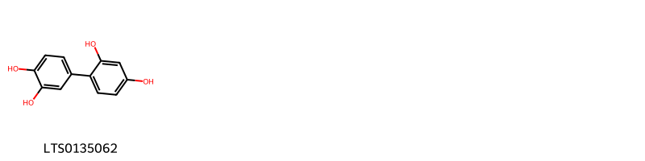{ width=100% }
    <figcaption>Hình ảnh cấu trúc hóa học của 1 hoạt chất thuộc nhóm Benzene and substituted derivatives gồm ["[1,1'-biphenyl]-2,3',4,4'-tetrol (LTS0135062)"].</figcaption>
</figure>
#### Nhóm Benzopyrans
<figure markdown="span">
    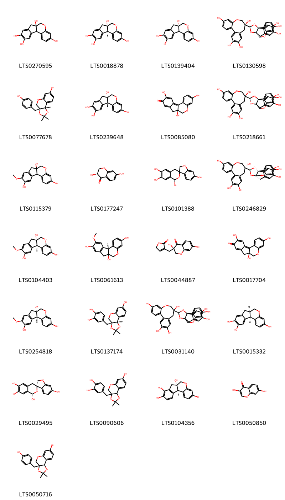{ width=100% }
    <figcaption>Hình ảnh cấu trúc hóa học của 25 hoạt chất thuộc nhóm Benzopyrans gồm ['brazilin (LTS0270595)', 'brazilin (LTS0018878)', '(10s)-8-oxatetracyclo[8.7.0.0²,⁷.0¹²,¹⁷]heptadeca-2,4,6,12,14,16-hexaene-5,10,14,15-tetrol (LTS0139404)', '(10s)-10-[(1r,10s,19s)-5,14,15-trihydroxy-8,18,20-trioxapentacyclo[8.7.3.0¹,¹⁰.0²,⁷.0¹²,¹⁷]icosa-2,4,6,12,14,16-hexaen-19-yl]-8-oxatricyclo[10.4.0.0²,⁷]hexadeca-1(16),2,4,6,12,14-hexaene-5,10,14,15-tetrol (LTS0130598)', '(2s,6r)-6-[(4-hydroxyphenyl)methyl]-4,4-dimethyl-3,5,8-trioxatricyclo[7.4.0.0²,⁶]trideca-1(13),9,11-trien-11-ol (LTS0077678)', '(1s,10s)-8-oxatetracyclo[8.7.0.0²,⁷.0¹²,¹⁷]heptadeca-2,4,6,12,14,16-hexaene-5,10,14,15-tetrol (LTS0239648)', 'brazilein (LTS0085080)', '(10s)-10-[(1r,10s,19r)-5,14,15-trihydroxy-8,18,20-trioxapentacyclo[8.7.3.0¹,¹⁰.0²,⁷.0¹²,¹⁷]icosa-2,4,6,12,14,16-hexaen-19-yl]-8-oxatricyclo[10.4.0.0²,⁷]hexadeca-1(16),2,4,6,12,14-hexaene-5,10,14,15-tetrol (LTS0218661)', '14-methoxy-8-oxatetracyclo[8.7.0.0²,⁷.0¹²,¹⁷]heptadeca-2,4,6,12(17),13,15-hexaene-5,10,15-triol (LTS0115379)', '(s)-3,7-dihydroxychroman-4-one (LTS0177247)', "1',4'-dihydro-2h-spiro[1-benzofuran-3,3'-[2]benzopyran]-1',6,6',7'-tetrol (LTS0101388)", '(10r)-10-[(1s,10r,19s)-5,14,15-trihydroxy-8,18,20-trioxapentacyclo[8.7.3.0¹,¹⁰.0²,⁷.0¹²,¹⁷]icosa-2,4,6,12,14,16-hexaen-19-yl]-8-oxatricyclo[10.4.0.0²,⁷]hexadeca-1(16),2,4,6,12,14-hexaene-5,10,14,15-tetrol (LTS0246829)', '(1r,10s)-14-methoxy-8-oxatetracyclo[8.7.0.0²,⁷.0¹²,¹⁷]heptadeca-2,4,6,12(17),13,15-hexaene-5,10,15-triol (LTS0104403)', '(1r,10s)-15-methoxy-8-oxatetracyclo[8.7.0.0²,⁷.0¹²,¹⁷]heptadeca-2,4,6,12(17),13,15-hexaene-5,10,14-triol (LTS0061613)', 'caesalpiniaphenol b (LTS0044887)', '5,10,15-trihydroxy-8-oxatetracyclo[8.7.0.0²,⁷.0¹²,¹⁷]heptadeca-1(17),2,4,6,12,15-hexaen-14-one (LTS0017704)', '(1s,10s)-14-methoxy-8-oxatetracyclo[8.7.0.0²,⁷.0¹²,¹⁷]heptadeca-2,4,6,12(17),13,15-hexaene-5,10,15-triol (LTS0254818)', '4-{[(2s,6r)-11-hydroxy-4,4-dimethyl-3,5,8-trioxatricyclo[7.4.0.0²,⁶]trideca-1(13),9,11-trien-6-yl]methyl}benzene-1,2-diol (LTS0137174)', '10-{5,14,15-trihydroxy-8,18,20-trioxapentacyclo[8.7.3.0¹,¹⁰.0²,⁷.0¹²,¹⁷]icosa-2,4,6,12,14,16-hexaen-19-yl}-8-oxatricyclo[10.4.0.0²,⁷]hexadeca-1(16),2,4,6,12,14-hexaene-5,10,14,15-tetrol (LTS0031140)', '(1r,10r)-8-oxatetracyclo[8.7.0.0²,⁷.0¹²,¹⁷]heptadeca-2,4,6,12,14,16-hexaene-5,14,15-triol (LTS0015332)', "(1's,3s)-1',4'-dihydro-2h-spiro[1-benzofuran-3,3'-[2]benzopyran]-1',6,6',7'-tetrol (LTS0029495)", '4-({11-hydroxy-4,4-dimethyl-3,5,8-trioxatricyclo[7.4.0.0²,⁶]trideca-1(13),9,11-trien-6-yl}methyl)benzene-1,2-diol (LTS0090606)', '(1r,10s)-8-oxatetracyclo[8.7.0.0²,⁷.0¹²,¹⁷]heptadeca-2,4,6,12(17),13,15-hexaene-5,10,13,14-tetrol (LTS0104356)', '3,7-dihydroxychromen-4-one (LTS0050850)', '6-[(4-hydroxyphenyl)methyl]-4,4-dimethyl-3,5,8-trioxatricyclo[7.4.0.0²,⁶]trideca-1(13),9,11-trien-11-ol (LTS0050716)'].</figcaption>
</figure>
#### Nhóm Benzoxepines
<figure markdown="span">
    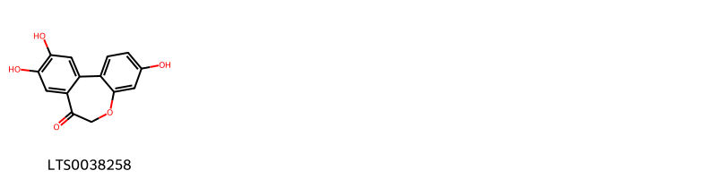{ width=100% }
    <figcaption>Hình ảnh cấu trúc hóa học của 1 hoạt chất thuộc nhóm Benzoxepines gồm ['caesalpiniaphenol c (LTS0038258)'].</figcaption>
</figure>
#### Nhóm Coumarans
<figure markdown="span">
    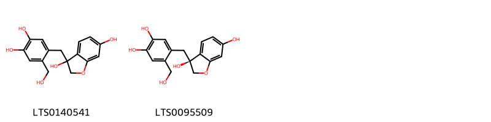{ width=100% }
    <figcaption>Hình ảnh cấu trúc hóa học của 2 hoạt chất thuộc nhóm Coumarans gồm ['3-{[4,5-dihydroxy-2-(hydroxymethyl)phenyl]methyl}-2h-1-benzofuran-3,6-diol (LTS0140541)', '(3s)-3-{[4,5-dihydroxy-2-(hydroxymethyl)phenyl]methyl}-2h-1-benzofuran-3,6-diol (LTS0095509)'].</figcaption>
</figure>
#### Nhóm Dibenzylbutane lignans
<figure markdown="span">
    { width=100% }
    <figcaption>Hình ảnh cấu trúc hóa học của 2 hoạt chất thuộc nhóm Dibenzylbutane lignans gồm ['2,3-bis[(4-hydroxy-3,5-dimethoxyphenyl)methyl]butane-1,4-diol (LTS0075942)', '(2s,3s)-2,3-bis[(4-hydroxy-3,5-dimethoxyphenyl)methyl]butane-1,4-diol (LTS0030691)'].</figcaption>
</figure>
#### Nhóm Fatty Acyls
<figure markdown="span">
    { width=100% }
    <figcaption>Hình ảnh cấu trúc hóa học của 2 hoạt chất thuộc nhóm Fatty Acyls gồm ['palmitic acid (LTS0079439)', 'dimethyl adipate (LTS0214547)'].</figcaption>
</figure>
#### Nhóm Flavonoids
<figure markdown="span">
    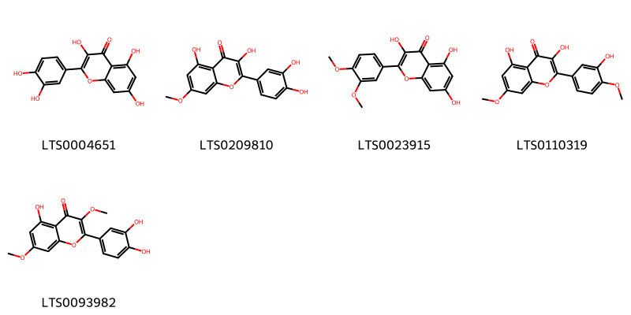{ width=100% }
    <figcaption>Hình ảnh cấu trúc hóa học của 5 hoạt chất thuộc nhóm Flavonoids gồm ['quercetin (LTS0004651)', 'rhamnetin (LTS0209810)', 'dillenetin (LTS0023915)', 'ombuin (LTS0110319)', 'dthf (LTS0093982)'].</figcaption>
</figure>
#### Nhóm Homoisoflavonoids
<figure markdown="span">
    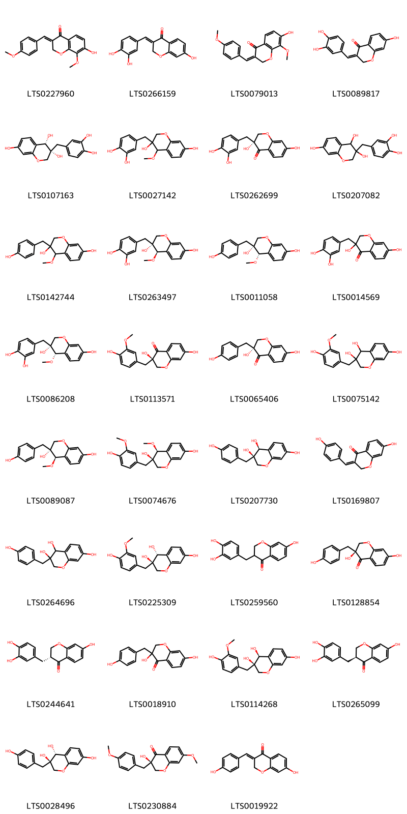{ width=100% }
    <figcaption>Hình ảnh cấu trúc hóa học của 31 hoạt chất thuộc nhóm Homoisoflavonoids gồm ['(3e)-7-hydroxy-8-methoxy-3-[(4-methoxyphenyl)methylidene]-2h-1-benzopyran-4-one (LTS0227960)', 'sappanone a (LTS0266159)', '7-hydroxy-8-methoxy-3-[(4-methoxyphenyl)methylidene]-2h-1-benzopyran-4-one (LTS0079013)', 'sappanone a (LTS0089817)', 'sappanol (LTS0107163)', '3-[(3,4-dihydroxyphenyl)methyl]-4-methoxy-2,4-dihydro-1-benzopyran-3,7-diol (LTS0027142)', '(3r)-3-[(3,4-dihydroxyphenyl)methyl]-3,7-dihydroxy-2h-1-benzopyran-4-one (LTS0262699)', 'sappanol (LTS0207082)', '3-[(4-hydroxyphenyl)methyl]-4-methoxy-2,4-dihydro-1-benzopyran-3,7-diol (LTS0142744)', '(3r,4r)-3-[(3,4-dihydroxyphenyl)methyl]-4-methoxy-2,4-dihydro-1-benzopyran-3,7-diol (LTS0263497)', '(3r,4s)-3-[(4-hydroxyphenyl)methyl]-4-methoxy-2,4-dihydro-1-benzopyran-3,7-diol (LTS0011058)', '3-[(3,4-dihydroxyphenyl)methyl]-3,7-dihydroxy-2h-1-benzopyran-4-one (LTS0014569)', '(3r,4s)-3-[(3,4-dihydroxyphenyl)methyl]-4-methoxy-2,4-dihydro-1-benzopyran-3,7-diol (LTS0086208)', 'caesalpiniaphenol a (LTS0113571)', "3'-deoxysappanone b (LTS0065406)", '3-[(4-hydroxy-3-methoxyphenyl)methyl]-2,4-dihydro-1-benzopyran-3,4,7-triol (LTS0075142)', '(3r,4r)-3-[(4-hydroxyphenyl)methyl]-4-methoxy-2,4-dihydro-1-benzopyran-3,7-diol (LTS0089087)', '(3r,4s)-3-[(4-hydroxy-3-methoxyphenyl)methyl]-4-methoxy-2,4-dihydro-1-benzopyran-3,7-diol (LTS0074676)', "3'-deoxysappanol (LTS0207730)", '7-hydroxy-3-[(4-hydroxyphenyl)methylidene]-2h-1-benzopyran-4-one (LTS0169807)', '3-[(4-hydroxyphenyl)methyl]-2,4-dihydro-1-benzopyran-3,4,7-triol (LTS0264696)', '(3r,4r)-3-[(4-hydroxy-3-methoxyphenyl)methyl]-2,4-dihydro-1-benzopyran-3,4,7-triol (LTS0225309)', '3-[(3,4-dihydroxyphenyl)methyl]-7-hydroxy-2,3-dihydro-1-benzopyran-4-one (LTS0259560)', "3'-deoxysappanone b (LTS0128854)", '3-deoxysappanone b (LTS0244641)', '3,7-dihydroxy-3-[(4-hydroxyphenyl)methyl]-2h-1-benzopyran-4-one (LTS0018910)', '(3r,4s)-3-[(4-hydroxy-3-methoxyphenyl)methyl]-2,4-dihydro-1-benzopyran-3,4,7-triol (LTS0114268)', '3-deoxysappanone b (LTS0265099)', "3'-deoxyepisappanol (LTS0028496)", '(3r)-3-hydroxy-7-methoxy-3-[(4-methoxyphenyl)methyl]-2h-1-benzopyran-4-one (LTS0230884)', '(3e)-7-hydroxy-3-[(4-hydroxyphenyl)methylidene]-2h-1-benzopyran-4-one (LTS0019922)'].</figcaption>
</figure>
#### Nhóm Indanes
<figure markdown="span">
    { width=100% }
    <figcaption>Hình ảnh cấu trúc hóa học của 1 hoạt chất thuộc nhóm Indanes gồm ['(10s)-10,14,15-trihydroxy-8-oxatetracyclo[8.7.0.0²,⁷.0¹²,¹⁷]heptadeca-1,3,6,12,14,16-hexaen-5-one (LTS0228624)'].</figcaption>
</figure>
#### Nhóm Linear 1_3-diarylpropanoids
<figure markdown="span">
    { width=100% }
    <figcaption>Hình ảnh cấu trúc hóa học của Không tìm thấy chú thích hoạt chất thuộc nhóm Linear 1_3-diarylpropanoids gồm Không tìm thấy chú thích.</figcaption>
</figure>
#### Nhóm Naphthalenes
<figure markdown="span">
    { width=100% }
    <figcaption>Hình ảnh cấu trúc hóa học của 1 hoạt chất thuộc nhóm Naphthalenes gồm ['walnut extract (LTS0110862)'].</figcaption>
</figure>
#### Nhóm Naphthofurans
<figure markdown="span">
    { width=100% }
    <figcaption>Hình ảnh cấu trúc hóa học của 6 hoạt chất thuộc nhóm Naphthofurans gồm ['methyl (1r,4r,10r,11s,14r,15r,19s)-10,15-dimethyl-3,6-dioxapentacyclo[9.7.1.0¹,¹⁴.0⁴,¹⁹.0⁵,⁹]nonadeca-5(9),7-diene-15-carboxylate (LTS0184468)', 'methyl (1r,4s,10r,11s,14r,15r,19s)-10,15-dimethyl-3,6-dioxapentacyclo[9.7.1.0¹,¹⁴.0⁴,¹⁹.0⁵,⁹]nonadeca-5(9),7-diene-15-carboxylate (LTS0032961)', 'methyl (1r,2s,4s,10r,11s,14r,15r,19s)-2-hydroxy-10,15-dimethyl-3,6-dioxapentacyclo[9.7.1.0¹,¹⁴.0⁴,¹⁹.0⁵,⁹]nonadeca-5(9),7-diene-15-carboxylate (LTS0168573)', 'methyl (1r,2s,4r,10r,11s,14r,15r,19s)-2-hydroxy-10,15-dimethyl-3,6-dioxapentacyclo[9.7.1.0¹,¹⁴.0⁴,¹⁹.0⁵,⁹]nonadeca-5(9),7-diene-15-carboxylate (LTS0002642)', 'methyl 10,15-dimethyl-3,6-dioxapentacyclo[9.7.1.0¹,¹⁴.0⁴,¹⁹.0⁵,⁹]nonadeca-5(9),7-diene-15-carboxylate (LTS0269238)', 'methyl 2-hydroxy-10,15-dimethyl-3,6-dioxapentacyclo[9.7.1.0¹,¹⁴.0⁴,¹⁹.0⁵,⁹]nonadeca-5(9),7-diene-15-carboxylate (LTS0025229)'].</figcaption>
</figure>
#### Nhóm Naphthopyrans
<figure markdown="span">
    { width=100% }
    <figcaption>Hình ảnh cấu trúc hóa học của 15 hoạt chất thuộc nhóm Naphthopyrans gồm ['methyl (1s,2s,9r,10s,13r,14r,15s)-15-hydroxy-9-methyl-5,16-dioxapentacyclo[12.3.3.0¹,¹³.0²,¹⁰.0⁴,⁸]icosa-4(8),6-diene-14-carboxylate (LTS0122097)', 'methyl 15-methoxy-9-methyl-5,16-dioxapentacyclo[12.3.3.0¹,¹³.0²,¹⁰.0⁴,⁸]icosa-4(8),6-diene-14-carboxylate (LTS0137677)', 'methyl 9-methyl-15-oxo-5,16-dioxapentacyclo[12.3.3.0¹,¹³.0²,¹⁰.0⁴,⁸]icosa-4(8),6-diene-14-carboxylate (LTS0207798)', 'methyl 17-methoxy-9-methyl-5,16-dioxapentacyclo[12.3.3.0¹,¹³.0²,¹⁰.0⁴,⁸]icosa-4(8),6-diene-14-carboxylate (LTS0079931)', 'methyl (1r,2s,3r,9r,10s,13r,14r)-3-hydroxy-9-methyl-5,16-dioxapentacyclo[12.3.3.0¹,¹³.0²,¹⁰.0⁴,⁸]icosa-4(8),6-diene-14-carboxylate (LTS0103270)', 'methyl (1r,2s,9r,10s,13r,14r,17s)-17-methoxy-9-methyl-5,16-dioxapentacyclo[12.3.3.0¹,¹³.0²,¹⁰.0⁴,⁸]icosa-4(8),6-diene-14-carboxylate (LTS0107511)', 'methyl 3,17-dihydroxy-9-methyl-5,16-dioxapentacyclo[12.3.3.0¹,¹³.0²,¹⁰.0⁴,⁸]icosa-4(8),6-diene-14-carboxylate (LTS0140716)', 'methyl (1r,2s,3r,9r,10s,13r,14r,17s)-3,17-dihydroxy-9-methyl-5,16-dioxapentacyclo[12.3.3.0¹,¹³.0²,¹⁰.0⁴,⁸]icosa-4(8),6-diene-14-carboxylate (LTS0154204)', 'methyl (1r,2s,9r,10s,13r,14r,17r)-17-hydroxy-9-methyl-5,16-dioxapentacyclo[12.3.3.0¹,¹³.0²,¹⁰.0⁴,⁸]icosa-4(8),6-diene-14-carboxylate (LTS0159798)', 'methyl (1s,2s,9r,10s,13r,14r,15s)-15-methoxy-9-methyl-5,16-dioxapentacyclo[12.3.3.0¹,¹³.0²,¹⁰.0⁴,⁸]icosa-4(8),6-diene-14-carboxylate (LTS0170905)', 'methyl (1s,2s,9r,10s,13r,14r,17s)-17-methoxy-9-methyl-5,16-dioxapentacyclo[12.3.3.0¹,¹³.0²,¹⁰.0⁴,⁸]icosa-4(8),6-diene-14-carboxylate (LTS0150867)', 'methyl 15-hydroxy-9-methyl-5,16-dioxapentacyclo[12.3.3.0¹,¹³.0²,¹⁰.0⁴,⁸]icosa-4(8),6-diene-14-carboxylate (LTS0225559)', 'methyl (1s,2s,9r,10s,13r,14r,17r)-17-hydroxy-9-methyl-5,16-dioxapentacyclo[12.3.3.0¹,¹³.0²,¹⁰.0⁴,⁸]icosa-4(8),6-diene-14-carboxylate (LTS0074043)', 'methyl (1s,2s,9r,10s,13r,14s)-9-methyl-15-oxo-5,16-dioxapentacyclo[12.3.3.0¹,¹³.0²,¹⁰.0⁴,⁸]icosa-4(8),6-diene-14-carboxylate (LTS0273939)', 'methyl 17-hydroxy-9-methyl-5,16-dioxapentacyclo[12.3.3.0¹,¹³.0²,¹⁰.0⁴,⁸]icosa-4(8),6-diene-14-carboxylate (LTS0074417)'].</figcaption>
</figure>
#### Nhóm Neoflavonoids
<figure markdown="span">
    { width=100% }
    <figcaption>Hình ảnh cấu trúc hóa học của 2 hoạt chất thuộc nhóm Neoflavonoids gồm ['(1r,10s,11s)-11-[(1r,10s)-5,10,14,15-tetrahydroxy-8-oxatetracyclo[8.7.0.0²,⁷.0¹²,¹⁷]heptadeca-2(7),3,5,12,14,16-hexaen-4-yl]-8-oxatetracyclo[8.7.0.0²,⁷.0¹²,¹⁷]heptadeca-2,4,6,12,14,16-hexaene-5,10,14,15-tetrol (LTS0166725)', '11-{5,10,14,15-tetrahydroxy-8-oxatetracyclo[8.7.0.0²,⁷.0¹²,¹⁷]heptadeca-2(7),3,5,12,14,16-hexaen-4-yl}-8-oxatetracyclo[8.7.0.0²,⁷.0¹²,¹⁷]heptadeca-2,4,6,12,14,16-hexaene-5,10,14,15-tetrol (LTS0043528)'].</figcaption>
</figure>
#### Nhóm Organooxygen compounds
<figure markdown="span">
    { width=100% }
    <figcaption>Hình ảnh cấu trúc hóa học của 11 hoạt chất thuộc nhóm Organooxygen compounds gồm ['protosappanin a (LTS0143104)', '(10s)-10-(hydroxymethyl)-8-oxatricyclo[10.4.0.0²,⁷]hexadeca-1(16),2,4,6,12,14-hexaene-5,10,14,15-tetrol (LTS0071554)', '10-(hydroxymethyl)-8-oxatricyclo[10.4.0.0²,⁷]hexadeca-1(16),2,4,6,12,14-hexaene-5,10,14,15-tetrol (LTS0231962)', '(10r)-5,10,14,15-tetrahydroxy-8-oxatricyclo[10.4.0.0²,⁷]hexadeca-1(16),2,4,6,12,14-hexaene-10-carbaldehyde (LTS0257576)', "(2s)-5,5-dimethyl-11'-oxaspiro[1,4-dioxolane-2,9'-tricyclo[10.4.0.0²,⁷]hexadecane]-1'(16'),2',4',6',12',14'-hexaene-4',5',14'-triol (LTS0144288)", 'caesalpiniaphenol d (LTS0257651)', '10-(dimethoxymethyl)-8-oxatricyclo[10.4.0.0²,⁷]hexadeca-1(16),2,4,6,12,14-hexaene-5,10,14,15-tetrol (LTS0081376)', '10,10-dimethoxy-8-oxatricyclo[10.4.0.0²,⁷]hexadeca-1(16),2,4,6,12,14-hexaene-5,14,15-triol (LTS0023276)', '6,15,16-trihydroxy-9-oxatricyclo[11.4.0.0³,⁸]heptadeca-1(17),3,5,7,13,15-hexaene-2,11-dione (LTS0240486)', '(10r)-10-(dimethoxymethyl)-8-oxatricyclo[10.4.0.0²,⁷]hexadeca-1(16),2,4,6,12,14-hexaene-5,10,14,15-tetrol (LTS0011055)', "5,5-dimethyl-11'-oxaspiro[1,4-dioxolane-2,9'-tricyclo[10.4.0.0²,⁷]hexadecane]-1'(16'),2',4',6',12',14'-hexaene-4',5',14'-triol (LTS0244539)"].</figcaption>
</figure>
#### Nhóm Phenol ethers
<figure markdown="span">
    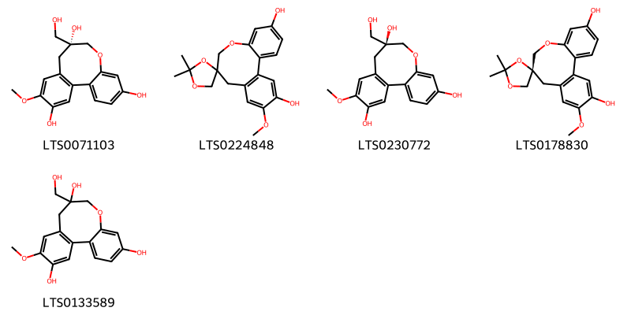{ width=100% }
    <figcaption>Hình ảnh cấu trúc hóa học của 5 hoạt chất thuộc nhóm Phenol ethers gồm ['(10r)-10-(hydroxymethyl)-14-methoxy-8-oxatricyclo[10.4.0.0²,⁷]hexadeca-1(12),2,4,6,13,15-hexaene-5,10,15-triol (LTS0071103)', "5'-methoxy-5,5-dimethyl-11'-oxaspiro[1,4-dioxolane-2,9'-tricyclo[10.4.0.0²,⁷]hexadecane]-1'(16'),2'(7'),3',5',12',14'-hexaene-4',14'-diol (LTS0224848)", '(10s)-10-(hydroxymethyl)-14-methoxy-8-oxatricyclo[10.4.0.0²,⁷]hexadeca-1(12),2,4,6,13,15-hexaene-5,10,15-triol (LTS0230772)', "(2s)-5'-methoxy-5,5-dimethyl-11'-oxaspiro[1,4-dioxolane-2,9'-tricyclo[10.4.0.0²,⁷]hexadecane]-1'(16'),2'(7'),3',5',12',14'-hexaene-4',14'-diol (LTS0178830)", '10-(hydroxymethyl)-14-methoxy-8-oxatricyclo[10.4.0.0²,⁷]hexadeca-1(12),2,4,6,13,15-hexaene-5,10,15-triol (LTS0133589)'].</figcaption>
</figure>
#### Nhóm Phenols
<figure markdown="span">
    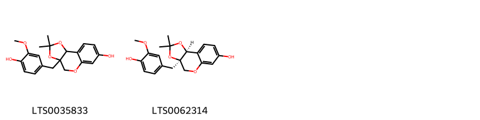{ width=100% }
    <figcaption>Hình ảnh cấu trúc hóa học của 2 hoạt chất thuộc nhóm Phenols gồm ['6-[(4-hydroxy-3-methoxyphenyl)methyl]-4,4-dimethyl-3,5,8-trioxatricyclo[7.4.0.0²,⁶]trideca-1(13),9,11-trien-11-ol (LTS0035833)', '(2s,6r)-6-[(4-hydroxy-3-methoxyphenyl)methyl]-4,4-dimethyl-3,5,8-trioxatricyclo[7.4.0.0²,⁶]trideca-1(13),9,11-trien-11-ol (LTS0062314)'].</figcaption>
</figure>
#### Nhóm Prenol lipids
<figure markdown="span">
    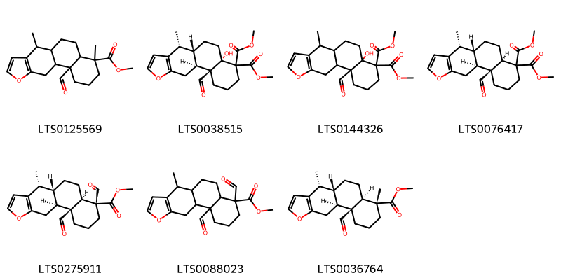{ width=100% }
    <figcaption>Hình ảnh cấu trúc hóa học của 7 hoạt chất thuộc nhóm Prenol lipids gồm ['methyl 11b-formyl-4,7-dimethyl-1h,2h,3h,4ah,5h,6h,6ah,7h,11h,11ah-phenanthro[3,2-b]furan-4-carboxylate (LTS0125569)', '4,4-dimethyl (4as,6as,7r,11as,11bs)-11b-formyl-4a-hydroxy-7-methyl-1h,2h,3h,5h,6h,6ah,7h,11h,11ah-phenanthro[3,2-b]furan-4,4-dicarboxylate (LTS0038515)', '4,4-dimethyl 11b-formyl-4a-hydroxy-7-methyl-1h,2h,3h,5h,6h,6ah,7h,11h,11ah-phenanthro[3,2-b]furan-4,4-dicarboxylate (LTS0144326)', '4,4-dimethyl (4ar,6as,7r,11as,11bs)-11b-formyl-7-methyl-1h,2h,3h,4ah,5h,6h,6ah,7h,11h,11ah-phenanthro[3,2-b]furan-4,4-dicarboxylate (LTS0076417)', 'methyl (4r,4ar,6as,7r,11as,11bs)-4,11b-diformyl-7-methyl-1h,2h,3h,4ah,5h,6h,6ah,7h,11h,11ah-phenanthro[3,2-b]furan-4-carboxylate (LTS0275911)', 'methyl 4,11b-diformyl-7-methyl-1h,2h,3h,4ah,5h,6h,6ah,7h,11h,11ah-phenanthro[3,2-b]furan-4-carboxylate (LTS0088023)', 'methyl (4r,4ar,6as,7r,11as,11bs)-11b-formyl-4,7-dimethyl-1h,2h,3h,4ah,5h,6h,6ah,7h,11h,11ah-phenanthro[3,2-b]furan-4-carboxylate (LTS0036764)'].</figcaption>
</figure>
#### Nhóm Steroids and steroid derivatives
<figure markdown="span">
    { width=100% }
    <figcaption>Hình ảnh cấu trúc hóa học của 6 hoạt chất thuộc nhóm Steroids and steroid derivatives gồm ['phytosterol (LTS0029311)', 'sitosterol (LTS0168132)', 'stigmast-5-en-3-ol, (3β)- (LTS0204616)', 'stigmasterol (LTS0024262)', 'campesterol (LTS0029429)', 'campesterol (LTS0046755)'].</figcaption>
</figure>
#### Nhóm Tetralins
<figure markdown="span">
    { width=100% }
    <figcaption>Hình ảnh cấu trúc hóa học của 9 hoạt chất thuộc nhóm Tetralins gồm ['(9r)-4,5,9-trihydroxy-17-methoxy-15-[(1s,9s,17r)-4,5,9-trihydroxy-14-oxo-11-oxatetracyclo[7.7.1.0¹,¹².0²,⁷]heptadeca-2,4,6,12,15-pentaen-17-yl]-11-oxatetracyclo[7.7.1.0¹,¹².0²,⁷]heptadeca-2,4,6,12,15-pentaen-14-one (LTS0083504)', '(1s,9s,17r)-4,5,9-trihydroxy-17-methoxy-15-[(1r,9s,17s)-4,5,9-trihydroxy-14-oxo-11-oxatetracyclo[7.7.1.0¹,¹².0²,⁷]heptadeca-2,4,6,12,15-pentaen-17-yl]-11-oxatetracyclo[7.7.1.0¹,¹².0²,⁷]heptadeca-2,4,6,12,15-pentaen-14-one (LTS0094571)', '(1s,9r,17r)-4,5,9-trihydroxy-17-methoxy-11-oxatetracyclo[7.7.1.0¹,¹².0²,⁷]heptadeca-2,4,6,12,15-pentaen-14-one (LTS0181181)', '(1s,9s,17r)-4,5,9-trihydroxy-17-methoxy-15-[(1r,9s,17r)-4,5,9-trihydroxy-14-oxo-11-oxatetracyclo[7.7.1.0¹,¹².0²,⁷]heptadeca-2,4,6,12,15-pentaen-17-yl]-11-oxatetracyclo[7.7.1.0¹,¹².0²,⁷]heptadeca-2,4,6,12,15-pentaen-14-one (LTS0068499)', '(1s)-4,5-dihydroxy-11-oxatetracyclo[7.7.1.0¹,¹².0²,⁷]heptadeca-2,4,6,12,15-pentaen-14-one (LTS0265272)', '(1r,9s,17s)-4,5,9-trihydroxy-17-methoxy-11-oxatetracyclo[7.7.1.0¹,¹².0²,⁷]heptadeca-2,4,6,12,15-pentaen-14-one (LTS0070247)', '4,5,9-trihydroxy-17-methoxy-15-{4,5,9-trihydroxy-14-oxo-11-oxatetracyclo[7.7.1.0¹,¹².0²,⁷]heptadeca-2,4,6,12,15-pentaen-17-yl}-11-oxatetracyclo[7.7.1.0¹,¹².0²,⁷]heptadeca-2,4,6,12,15-pentaen-14-one (LTS0028713)', '(1s,9r,17r)-4,5,9-trihydroxy-17-methoxy-15-[(1s,9s,17r)-4,5,9-trihydroxy-14-oxo-11-oxatetracyclo[7.7.1.0¹,¹².0²,⁷]heptadeca-2,4,6,12,15-pentaen-17-yl]-11-oxatetracyclo[7.7.1.0¹,¹².0²,⁷]heptadeca-2,4,6,12,15-pentaen-14-one (LTS0256021)', '4,5,9-trihydroxy-17-methoxy-11-oxatetracyclo[7.7.1.0¹,¹².0²,⁷]heptadeca-2,4,6,12,15-pentaen-14-one (LTS0247925)'].</figcaption>
</figure>

---

### Dược dân tộc học

Danh sách các quốc gia có sử dụng *Biancaea sappan* trong điều trị các bệnh. 

| Country   | Disease                                     | Bệnh                                                                                                                                                                                                |
|:----------|:--------------------------------------------|:----------------------------------------------------------------------------------------------------------------------------------------------------------------------------------------------------|
| China     | Astringent, Emmenagogue, Hemostat, Sedative | MYMEMORY WARNING: YOU USED ALL AVAILABLE FREE TRANSLATIONS FOR TODAY. NEXT AVAILABLE IN  14 HOURS 52 MINUTES 05 SECONDS VISIT HTTPS://MYMEMORY.TRANSLATED.NET/DOC/USAGELIMITS.PHP TO TRANSLATE MORE |
| Elsewhere | Astringent                                  | MYMEMORY WARNING: YOU USED ALL AVAILABLE FREE TRANSLATIONS FOR TODAY. NEXT AVAILABLE IN  14 HOURS 52 MINUTES 02 SECONDS VISIT HTTPS://MYMEMORY.TRANSLATED.NET/DOC/USAGELIMITS.PHP TO TRANSLATE MORE |
| Italian   | Astringent                                  | MYMEMORY WARNING: YOU USED ALL AVAILABLE FREE TRANSLATIONS FOR TODAY. NEXT AVAILABLE IN  14 HOURS 51 MINUTES 59 SECONDS VISIT HTTPS://MYMEMORY.TRANSLATED.NET/DOC/USAGELIMITS.PHP TO TRANSLATE MORE |
| Java      | Antiseptic, Emmenagogue                     | MYMEMORY WARNING: YOU USED ALL AVAILABLE FREE TRANSLATIONS FOR TODAY. NEXT AVAILABLE IN  14 HOURS 51 MINUTES 56 SECONDS VISIT HTTPS://MYMEMORY.TRANSLATED.NET/DOC/USAGELIMITS.PHP TO TRANSLATE MORE |

---

---
## Caesalpinia sepiaria
### Thông tin về thực vật

!!! info "Phân loại thực vật của *Biancaea decapetala* từ GIBF:"
    - **Kingdom:** Plantae
    - **Phylum:** Tracheophyta
    - **Order:** Fabales
    - **Family:** Fabaceae
    - **Genus:** Biancaea
    - **Species:** *Biancaea decapetala*

 

| Label (VI)   | Label (EN)   | Scientific Name      | Descriptions (VI)   | Descriptions (EN)   | Also Known As (VI)   | Also Known As (EN)   |
|:-------------|:-------------|:---------------------|:--------------------|:--------------------|:---------------------|:---------------------|
| N/A          | N/A          | Caesalpinia sepiaria | loài thực vật       | species of plant    | ['']                 | ['']                 |

#### Phân bố trên thế giới

**Từ CSDL GIBF** nan, Nicaragua, Japan, Korea, Republic of, Brazil, Chinese Taipei, Côte d’Ivoire, Honduras, New Caledonia, Cuba, United States of America, Peru, China, Nepal

#### Phân bố tại Việt Nam

**Từ CSDL GIBF**: Không có ghi nhận ở Việt Nam

---
### Thành phần hóa học
        
- Theo cơ sở dữ liệu lotus: Từ loài *Biancaea decapetala* đã phân lập và xác định được Chưa có hoạt chất nào được phân lập. hoạt chất thuộc về các nhóm Không có hoạt chất nào được phân lập. 

Không có hình ảnh nào được tạo ra

---

### Dược dân tộc học

Danh sách các quốc gia có sử dụng *Biancaea decapetala* trong điều trị các bệnh. 

| Country   | Disease                       | Bệnh                                                                                                                                                                                                |
|:----------|:------------------------------|:----------------------------------------------------------------------------------------------------------------------------------------------------------------------------------------------------|
| China     | Astringent, Poison, Vermifuge | MYMEMORY WARNING: YOU USED ALL AVAILABLE FREE TRANSLATIONS FOR TODAY. NEXT AVAILABLE IN  14 HOURS 51 MINUTES 22 SECONDS VISIT HTTPS://MYMEMORY.TRANSLATED.NET/DOC/USAGELIMITS.PHP TO TRANSLATE MORE |
| Elsewhere | Purgative                     | MYMEMORY WARNING: YOU USED ALL AVAILABLE FREE TRANSLATIONS FOR TODAY. NEXT AVAILABLE IN  14 HOURS 51 MINUTES 16 SECONDS VISIT HTTPS://MYMEMORY.TRANSLATED.NET/DOC/USAGELIMITS.PHP TO TRANSLATE MORE |

---

---
## Caesalpinia tsoongii
### Thông tin về thực vật

!!! info "Phân loại thực vật của *Mezoneuron sinense* từ GIBF:"
    - **Kingdom:** Plantae
    - **Phylum:** Tracheophyta
    - **Order:** Fabales
    - **Family:** Fabaceae
    - **Genus:** Mezoneuron
    - **Species:** *Mezoneuron sinense*

 

| Label (VI)   | Label (EN)   | Scientific Name      | Descriptions (VI)   | Descriptions (EN)   | Also Known As (VI)   | Also Known As (EN)   |
|:-------------|:-------------|:---------------------|:--------------------|:--------------------|:---------------------|:---------------------|
| N/A          | N/A          | Caesalpinia tsoongii |                     |                     | ['']                 | ['']                 |

#### Phân bố trên thế giới

**Từ CSDL GIBF** China

#### Phân bố tại Việt Nam

**Từ CSDL GIBF**: Không có ghi nhận ở Việt Nam

---
### Thành phần hóa học
        
- Theo cơ sở dữ liệu lotus: Từ loài *Mezoneuron sinense* đã phân lập và xác định được Chưa có hoạt chất nào được phân lập. hoạt chất thuộc về các nhóm Không có hoạt chất nào được phân lập. 

Không có hình ảnh nào được tạo ra

---

### Dược dân tộc học

Danh sách các quốc gia có sử dụng *Mezoneuron sinense* trong điều trị các bệnh. 

| Country   | Disease   | Bệnh                                                                                                                                                                                                |
|:----------|:----------|:----------------------------------------------------------------------------------------------------------------------------------------------------------------------------------------------------|
| China     | Piscicide | MYMEMORY WARNING: YOU USED ALL AVAILABLE FREE TRANSLATIONS FOR TODAY. NEXT AVAILABLE IN  14 HOURS 50 MINUTES 51 SECONDS VISIT HTTPS://MYMEMORY.TRANSLATED.NET/DOC/USAGELIMITS.PHP TO TRANSLATE MORE |

---

# Chi Crotalaria

??? note "Danh sách các dược liệu thuộc chi"
    
	 - *Crotalaria alata*
	 - *Crotalaria albida*
	 - *Crotalaria burhia*
	 - *Crotalaria ectabilis*
	 - *Crotalaria incana*
	 - *Crotalaria juncea*
	 - *Crotalaria longirostrata*
	 - *Crotalaria retusa*
	 - *Crotalaria sagittalis*
	 - *Crotalaria sericea*
	 - *Crotalaria stipularis*
	 - *Crotalaria striata*
	 - *Crotalaria trifoliastrum*
	 - *Crotalaria tuerckheimii*
	 - *Crotalaria verrucosa*

---
## Crotalaria alata
### Thông tin về thực vật

!!! info "Phân loại thực vật của *Crotalaria alata* từ GIBF:"
    - **Kingdom:** Plantae
    - **Phylum:** Tracheophyta
    - **Order:** Fabales
    - **Family:** Fabaceae
    - **Genus:** Crotalaria
    - **Species:** *Crotalaria alata*

 

| Label (VI)   | Label (EN)   | Scientific Name   | Descriptions (VI)   | Descriptions (EN)   | Also Known As (VI)   | Also Known As (EN)   |
|:-------------|:-------------|:------------------|:--------------------|:--------------------|:---------------------|:---------------------|
| N/A          | N/A          | Crotalaria alata  | loài thực vật       | species of plant    | ['']                 | ['']                 |

#### Phân bố trên thế giới

**Từ CSDL GIBF** nan, Uganda, Réunion, Australia, Madagascar, Thailand, Cambodia, Myanmar, Bhutan, India, France, China, Nepal

#### Phân bố tại Việt Nam

**Từ CSDL GIBF**: Không có ghi nhận ở Việt Nam

---
### Thành phần hóa học
        
- Theo cơ sở dữ liệu lotus: Từ loài *Crotalaria alata* đã phân lập và xác định được Chưa có hoạt chất nào được phân lập. hoạt chất thuộc về các nhóm Không có hoạt chất nào được phân lập. 

Không có hình ảnh nào được tạo ra

---

### Dược dân tộc học

Danh sách các quốc gia có sử dụng *Crotalaria alata* trong điều trị các bệnh. 

| Country   | Disease   | Bệnh                                                                                                                                                                                                |
|:----------|:----------|:----------------------------------------------------------------------------------------------------------------------------------------------------------------------------------------------------|
| Australia | Poison    | MYMEMORY WARNING: YOU USED ALL AVAILABLE FREE TRANSLATIONS FOR TODAY. NEXT AVAILABLE IN  14 HOURS 50 MINUTES 32 SECONDS VISIT HTTPS://MYMEMORY.TRANSLATED.NET/DOC/USAGELIMITS.PHP TO TRANSLATE MORE |

---

---
## Crotalaria albida
### Thông tin về thực vật

!!! info "Phân loại thực vật của *Crotalaria albida* từ GIBF:"
    - **Kingdom:** Plantae
    - **Phylum:** Tracheophyta
    - **Order:** Fabales
    - **Family:** Fabaceae
    - **Genus:** Crotalaria
    - **Species:** *Crotalaria albida*

 

| Label (VI)   | Label (EN)   | Scientific Name   | Descriptions (VI)   | Descriptions (EN)   | Also Known As (VI)   | Also Known As (EN)   |
|:-------------|:-------------|:------------------|:--------------------|:--------------------|:---------------------|:---------------------|
| N/A          | N/A          | Crotalaria albida | loài thực vật       | species of plant    | ['']                 | ['']                 |

#### Phân bố trên thế giới

**Từ CSDL GIBF** nan, Hong Kong, Thailand, Lao People’s Democratic Republic, Cambodia, Chinese Taipei, Myanmar, India, unknown or invalid, Philippines, China, Nepal

#### Phân bố tại Việt Nam

**Từ CSDL GIBF**: Không có ghi nhận ở Việt Nam

---
### Thành phần hóa học
        
- Theo cơ sở dữ liệu lotus: Từ loài *Crotalaria albida* đã phân lập và xác định được 8 hoạt chất thuộc về các nhóm Prenol lipids. 

|    | chemicalTaxonomyClassyfireClass   |   smiles_count |
|---:|:----------------------------------|---------------:|
|  0 | Prenol lipids                     |              8 |

#### Nhóm Prenol lipids
<figure markdown="span">
    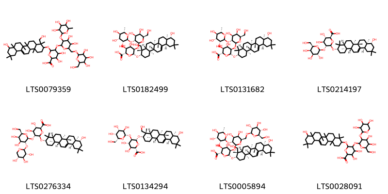{ width=100% }
    <figcaption>Hình ảnh cấu trúc hóa học của 8 hoạt chất thuộc nhóm Prenol lipids gồm ['5-{[4,5-dihydroxy-6-({[3,4,5-trihydroxy-6-(hydroxymethyl)oxan-2-yl]oxy}methyl)-3-[(3,4,5-trihydroxy-6-methyloxan-2-yl)oxy]oxan-2-yl]oxy}-3,4-dihydroxy-6-{[9-hydroxy-4-(hydroxymethyl)-4,6a,6b,8a,11,11,14b-heptamethyl-1,2,3,4a,5,6,7,8,9,10,12,12a,14,14a-tetradecahydropicen-3-yl]oxy}oxane-2-carboxylic acid (LTS0079359)', 'soyasaponin i (LTS0182499)', '(2s,3s,4s,5r,6r)-6-{[(3s,4ar,6ar,6bs,8ar,9r,12as,14ar,14br)-9-hydroxy-4,4,6a,6b,8a,11,11,14b-octamethyl-1,2,3,4a,5,6,7,8,9,10,12,12a,14,14a-tetradecahydropicen-3-yl]oxy}-5-{[(2s,3r,4s,5r,6r)-4,5-dihydroxy-6-(hydroxymethyl)-3-{[(2s,3r,4r,5r,6s)-3,4,5-trihydroxy-6-methyloxan-2-yl]oxy}oxan-2-yl]oxy}-3,4-dihydroxyoxane-2-carboxylic acid (LTS0131682)', '(2s,3s,4s,5r,6r)-6-{[(3s,4ar,6ar,6bs,8ar,9r,12as,14ar,14br)-9-hydroxy-4,4,6a,6b,8a,11,11,14b-octamethyl-1,2,3,4a,5,6,7,8,9,10,12,12a,14,14a-tetradecahydropicen-3-yl]oxy}-3,4-dihydroxy-5-{[(2s,3r,4s,5r,6r)-3,4,5-trihydroxy-6-(hydroxymethyl)oxan-2-yl]oxy}oxane-2-carboxylic acid (LTS0214197)', '(2s,3s,4s,5r,6r)-6-{[(3s,4ar,6ar,6bs,8ar,9r,12as,14ar,14br)-9-hydroxy-4,4,6a,6b,8a,11,11,14b-octamethyl-1,2,3,4a,5,6,7,8,9,10,12,12a,14,14a-tetradecahydropicen-3-yl]oxy}-5-{[(2s,3r,4s,5r,6r)-4,5-dihydroxy-6-(hydroxymethyl)-3-{[(2s,3r,4s,5r)-3,4,5-trihydroxyoxan-2-yl]oxy}oxan-2-yl]oxy}-3,4-dihydroxyoxane-2-carboxylic acid (LTS0276334)', 'soyasaponin iii (LTS0134294)', '(2s,3s,4s,5r,6r)-6-{[(3s,4s,4ar,6ar,6bs,8ar,9r,12as,14ar,14br)-9-hydroxy-4-(hydroxymethyl)-4,6a,6b,8a,11,11,14b-heptamethyl-1,2,3,4a,5,6,7,8,9,10,12,12a,14,14a-tetradecahydropicen-3-yl]oxy}-5-{[(2s,3r,4s,5r,6r)-4,5-dihydroxy-6-({[(2r,3r,4s,5s,6r)-3,4,5-trihydroxy-6-(hydroxymethyl)oxan-2-yl]oxy}methyl)-3-{[(2s,3r,4r,5r,6s)-3,4,5-trihydroxy-6-methyloxan-2-yl]oxy}oxan-2-yl]oxy}-3,4-dihydroxyoxane-2-carboxylic acid (LTS0005894)', '5-{[4,5-dihydroxy-6-(hydroxymethyl)-3-[(3,4,5-trihydroxyoxan-2-yl)oxy]oxan-2-yl]oxy}-3,4-dihydroxy-6-[(9-hydroxy-4,4,6a,6b,8a,11,11,14b-octamethyl-1,2,3,4a,5,6,7,8,9,10,12,12a,14,14a-tetradecahydropicen-3-yl)oxy]oxane-2-carboxylic acid (LTS0028091)'].</figcaption>
</figure>

---

### Dược dân tộc học

Danh sách các quốc gia có sử dụng *Crotalaria albida* trong điều trị các bệnh. 

| Country   | Disease   | Bệnh                                                                                                                                                                                                |
|:----------|:----------|:----------------------------------------------------------------------------------------------------------------------------------------------------------------------------------------------------|
| Elsewhere | Purgative | MYMEMORY WARNING: YOU USED ALL AVAILABLE FREE TRANSLATIONS FOR TODAY. NEXT AVAILABLE IN  14 HOURS 50 MINUTES 01 SECONDS VISIT HTTPS://MYMEMORY.TRANSLATED.NET/DOC/USAGELIMITS.PHP TO TRANSLATE MORE |

---

---
## Crotalaria burhia
### Thông tin về thực vật

!!! info "Phân loại thực vật của *Crotalaria burhia* từ GIBF:"
    - **Kingdom:** Plantae
    - **Phylum:** Tracheophyta
    - **Order:** Fabales
    - **Family:** Fabaceae
    - **Genus:** Crotalaria
    - **Species:** *Crotalaria burhia*

 

| Label (VI)   | Label (EN)   | Scientific Name   | Descriptions (VI)   | Descriptions (EN)   | Also Known As (VI)   | Also Known As (EN)   |
|:-------------|:-------------|:------------------|:--------------------|:--------------------|:---------------------|:---------------------|
| N/A          | N/A          | Crotalaria burhia | loài thực vật       | species of plant    | ['']                 | ['']                 |

#### Phân bố trên thế giới

**Từ CSDL GIBF** nan, Pakistan, Afghanistan, Iran (Islamic Republic of), India, unknown or invalid, Congo, Democratic Republic of the

#### Phân bố tại Việt Nam

**Từ CSDL GIBF**: Không có ghi nhận ở Việt Nam

---
### Thành phần hóa học
        
- Theo cơ sở dữ liệu lotus: Từ loài *Crotalaria burhia* đã phân lập và xác định được Chưa có hoạt chất nào được phân lập. hoạt chất thuộc về các nhóm Không có hoạt chất nào được phân lập. 

Không có hình ảnh nào được tạo ra

---

### Dược dân tộc học

Danh sách các quốc gia có sử dụng *Crotalaria burhia* trong điều trị các bệnh. 

| Country   | Disease     | Bệnh                                                                                                                                                                                                |
|:----------|:------------|:----------------------------------------------------------------------------------------------------------------------------------------------------------------------------------------------------|
| Elsewhere | Refrigerant | MYMEMORY WARNING: YOU USED ALL AVAILABLE FREE TRANSLATIONS FOR TODAY. NEXT AVAILABLE IN  14 HOURS 49 MINUTES 29 SECONDS VISIT HTTPS://MYMEMORY.TRANSLATED.NET/DOC/USAGELIMITS.PHP TO TRANSLATE MORE |

---

---
## Crotalaria ectabilis
### Thông tin về thực vật

!!! info "Phân loại thực vật của *N/A* từ GIBF:"
    - **Kingdom:** Plantae
    - **Phylum:** Tracheophyta
    - **Order:** Fabales
    - **Family:** Fabaceae
    - **Genus:** Crotalaria
    - **Species:** *N/A*

 

| Label (VI)   | Label (EN)   | Scientific Name   | Descriptions (VI)   | Descriptions (EN)   | Also Known As (VI)   | Also Known As (EN)   |
|:-------------|:-------------|:------------------|:--------------------|:--------------------|:---------------------|:---------------------|
| N/A          | N/A          | Crotalaria burhia | loài thực vật       | species of plant    | ['']                 | ['']                 |

#### Phân bố trên thế giới

**Từ CSDL GIBF** Virgin Islands (U.S.), Sri Lanka, Australia, Guadeloupe, Argentina, Saint Lucia, Rwanda, Nicaragua, Sierra Leone, French Guiana, Zambia, Puerto Rico, Chinese Taipei, United States of America, Bonaire, Sint Eustatius and Saba, El Salvador, Maldives, South Africa, Trinidad and Tobago, Thailand, Brazil, Mexico, Dominican Republic, Peru, China, Niue, Cabo Verde, Kenya, Botswana, India, Indonesia, Cayman Islands, Antigua and Barbuda, Sint Maarten (Dutch part)

#### Phân bố tại Việt Nam

**Từ CSDL GIBF**: Không có ghi nhận ở Việt Nam

---
### Thành phần hóa học
        
- Theo cơ sở dữ liệu lotus: Từ loài *N/A* đã phân lập và xác định được Chưa có hoạt chất nào được phân lập. hoạt chất thuộc về các nhóm Không có hoạt chất nào được phân lập. 

Không có hình ảnh nào được tạo ra

---

### Dược dân tộc học

Danh sách các quốc gia có sử dụng *N/A* trong điều trị các bệnh. 

| Country   | Disease   | Bệnh                                                                                                                                                                                                |
|:----------|:----------|:----------------------------------------------------------------------------------------------------------------------------------------------------------------------------------------------------|
| US        | Poison    | MYMEMORY WARNING: YOU USED ALL AVAILABLE FREE TRANSLATIONS FOR TODAY. NEXT AVAILABLE IN  14 HOURS 49 MINUTES 04 SECONDS VISIT HTTPS://MYMEMORY.TRANSLATED.NET/DOC/USAGELIMITS.PHP TO TRANSLATE MORE |

---

---
## Crotalaria incana
### Thông tin về thực vật

!!! info "Phân loại thực vật của *Crotalaria incana* từ GIBF:"
    - **Kingdom:** Plantae
    - **Phylum:** Tracheophyta
    - **Order:** Fabales
    - **Family:** Fabaceae
    - **Genus:** Crotalaria
    - **Species:** *Crotalaria incana*

 

| Label (VI)   | Label (EN)   | Scientific Name   | Descriptions (VI)   | Descriptions (EN)   | Also Known As (VI)   | Also Known As (EN)   |
|:-------------|:-------------|:------------------|:--------------------|:--------------------|:---------------------|:---------------------|
| N/A          | N/A          | Crotalaria incana | loài thực vật       | species of plant    | ['']                 | ['']                 |

#### Phân bố trên thế giới

**Từ CSDL GIBF** Virgin Islands (U.S.), Australia, Guadeloupe, Guatemala, Argentina, Rwanda, Philippines, Puerto Rico, Chinese Taipei, Bolivia (Plurinational State of), Honduras, United States of America, El Salvador, Brazil, Cuba, Dominican Republic, Peru, Mexico, Ecuador, French Polynesia, Colombia, Indonesia, Kenya, Ethiopia

#### Phân bố tại Việt Nam

**Từ CSDL GIBF**: Không có ghi nhận ở Việt Nam

---
### Thành phần hóa học
        
- Theo cơ sở dữ liệu lotus: Từ loài *Crotalaria incana* đã phân lập và xác định được 5 hoạt chất thuộc về các nhóm Macrolides and analogues. 

|    | chemicalTaxonomyClassyfireClass   |   smiles_count |
|---:|:----------------------------------|---------------:|
|  0 | Macrolides and analogues          |              5 |

#### Nhóm Macrolides and analogues
<figure markdown="span">
    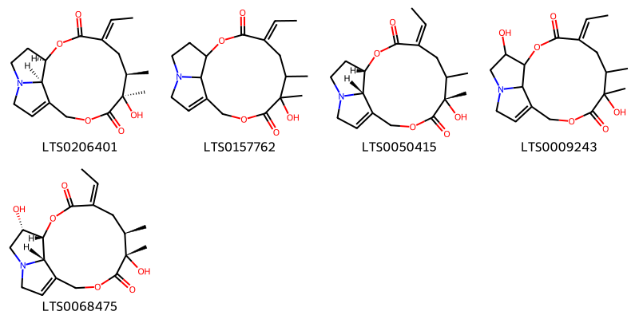{ width=100% }
    <figcaption>Hình ảnh cấu trúc hóa học của 5 hoạt chất thuộc nhóm Macrolides and analogues gồm ['integerrimine (LTS0206401)', '4-ethylidene-7-hydroxy-6,7-dimethyl-2,9-dioxa-14-azatricyclo[9.5.1.0¹⁴,¹⁷]heptadec-11-ene-3,8-dione (LTS0157762)', '(1s,4z,7s,17s)-4-ethylidene-7-hydroxy-6,7-dimethyl-2,9-dioxa-14-azatricyclo[9.5.1.0¹⁴,¹⁷]heptadec-11-ene-3,8-dione (LTS0050415)', '4-ethylidene-7,16-dihydroxy-6,7-dimethyl-2,9-dioxa-14-azatricyclo[9.5.1.0¹⁴,¹⁷]heptadec-11-ene-3,8-dione (LTS0009243)', '(1r,4z,6r,7s,16s,17s)-4-ethylidene-7,16-dihydroxy-6,7-dimethyl-2,9-dioxa-14-azatricyclo[9.5.1.0¹⁴,¹⁷]heptadec-11-ene-3,8-dione (LTS0068475)'].</figcaption>
</figure>

---

### Dược dân tộc học

Danh sách các quốc gia có sử dụng *Crotalaria incana* trong điều trị các bệnh. 

| Country   | Disease       | Bệnh                                                                                                                                                                                                |
|:----------|:--------------|:----------------------------------------------------------------------------------------------------------------------------------------------------------------------------------------------------|
| Paraguay  | Abortifacient | MYMEMORY WARNING: YOU USED ALL AVAILABLE FREE TRANSLATIONS FOR TODAY. NEXT AVAILABLE IN  14 HOURS 48 MINUTES 33 SECONDS VISIT HTTPS://MYMEMORY.TRANSLATED.NET/DOC/USAGELIMITS.PHP TO TRANSLATE MORE |
| US        | Poison        | MYMEMORY WARNING: YOU USED ALL AVAILABLE FREE TRANSLATIONS FOR TODAY. NEXT AVAILABLE IN  14 HOURS 48 MINUTES 29 SECONDS VISIT HTTPS://MYMEMORY.TRANSLATED.NET/DOC/USAGELIMITS.PHP TO TRANSLATE MORE |

---

---
## Crotalaria juncea
### Thông tin về thực vật

!!! info "Phân loại thực vật của *Crotalaria juncea* từ GIBF:"
    - **Kingdom:** Plantae
    - **Phylum:** Tracheophyta
    - **Order:** Fabales
    - **Family:** Fabaceae
    - **Genus:** Crotalaria
    - **Species:** *Crotalaria juncea*

 

| Label (VI)   | Label (EN)   | Scientific Name   | Descriptions (VI)   | Descriptions (EN)   | Also Known As (VI)    | Also Known As (EN)                                        |
|:-------------|:-------------|:------------------|:--------------------|:--------------------|:----------------------|:----------------------------------------------------------|
| N/A          | N/A          | Crotalaria juncea | loài thực vật       | species of plant    | ['Crotalaria juncea'] | ['Indian hemp', 'sunn hemp', 'brown hemp', 'Madras hemp'] |

#### Phân bố trên thế giới

**Từ CSDL GIBF** Sri Lanka, Italy, Australia, Guadeloupe, Cambodia, Mozambique, Puerto Rico, Réunion, Senegal, Chinese Taipei, Spain, Bolivia (Plurinational State of), Honduras, United States of America, Zimbabwe, Uzbekistan, South Africa, Uganda, Thailand, Martinique, Brazil, Cuba, Peru, Dominican Republic, Viet Nam, China, Costa Rica, India, Malaysia, Nepal

#### Phân bố tại Việt Nam

**Từ CSDL GIBF**: Không có ghi nhận ở Việt Nam

---
### Thành phần hóa học
        
- Theo cơ sở dữ liệu lotus: Từ loài *Crotalaria juncea* đã phân lập và xác định được 18 hoạt chất thuộc về các nhóm Flavonoids, Steroids and steroid derivatives, Macrolides and analogues, Carboxylic acids and derivatives. 

|    | chemicalTaxonomyClassyfireClass   |   smiles_count |
|---:|:----------------------------------|---------------:|
|  0 |                                   |              4 |
|  1 | Carboxylic acids and derivatives  |              4 |
|  2 | Flavonoids                        |              5 |
|  3 | Macrolides and analogues          |              3 |
|  4 | Steroids and steroid derivatives  |              2 |

#### Nhóm 
<figure markdown="span">
    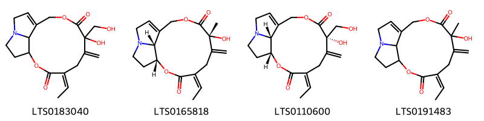{ width=100% }
    <figcaption>Hình ảnh cấu trúc hóa học của 4 hoạt chất thuộc nhóm  gồm ['4-ethylidene-7-hydroxy-7-(hydroxymethyl)-6-methylidene-2,9-dioxa-14-azatricyclo[9.5.1.0¹⁴,¹⁷]heptadec-11-ene-3,8-dione (LTS0183040)', 'seneciphylline (LTS0165818)', 'riddelliine (LTS0110600)', '4-ethylidene-7-hydroxy-7-methyl-6-methylidene-2,9-dioxa-14-azatricyclo[9.5.1.0¹⁴,¹⁷]heptadec-11-ene-3,8-dione (LTS0191483)'].</figcaption>
</figure>
#### Nhóm Carboxylic acids and derivatives
<figure markdown="span">
    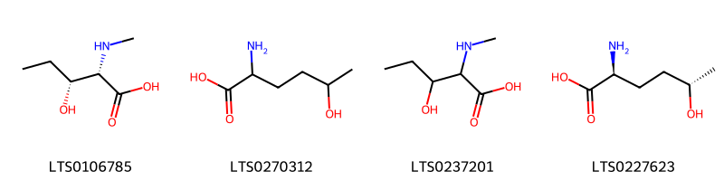{ width=100% }
    <figcaption>Hình ảnh cấu trúc hóa học của 4 hoạt chất thuộc nhóm Carboxylic acids and derivatives gồm ['(2s,3r)-3-hydroxy-2-(methylamino)pentanoic acid (LTS0106785)', '2-amino-5-hydroxyhexanoic acid (LTS0270312)', '3-hydroxy-2-(methylamino)pentanoic acid (LTS0237201)', '(2s,5s)-2-amino-5-hydroxyhexanoic acid (LTS0227623)'].</figcaption>
</figure>
#### Nhóm Flavonoids
<figure markdown="span">
    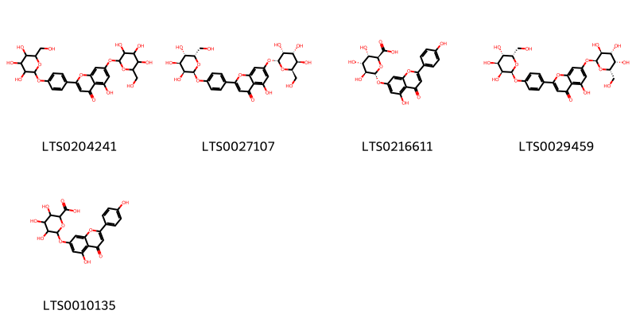{ width=100% }
    <figcaption>Hình ảnh cấu trúc hóa học của 5 hoạt chất thuộc nhóm Flavonoids gồm ['5-hydroxy-7-{[3,4,5-trihydroxy-6-(hydroxymethyl)oxan-2-yl]oxy}-2-(4-{[3,4,5-trihydroxy-6-(hydroxymethyl)oxan-2-yl]oxy}phenyl)chromen-4-one (LTS0204241)', '5-hydroxy-7-{[(2r,3r,4r,5r,6r)-3,4,5-trihydroxy-6-(hydroxymethyl)oxan-2-yl]oxy}-2-(4-{[(2s,3s,4s,5s,6s)-3,4,5-trihydroxy-6-(hydroxymethyl)oxan-2-yl]oxy}phenyl)chromen-4-one (LTS0027107)', '(2s,3s,4r,5s,6r)-3,4,5-trihydroxy-6-{[5-hydroxy-2-(4-hydroxyphenyl)-4-oxochromen-7-yl]oxy}oxane-2-carboxylic acid (LTS0216611)', '5-hydroxy-7-{[(2s,3s,4r,5s,6s)-3,4,5-trihydroxy-6-(hydroxymethyl)oxan-2-yl]oxy}-2-(4-{[(2s,3s,4s,5s,6s)-3,4,5-trihydroxy-6-(hydroxymethyl)oxan-2-yl]oxy}phenyl)chromen-4-one (LTS0029459)', '3,4,5-trihydroxy-6-{[5-hydroxy-2-(4-hydroxyphenyl)-4-oxochromen-7-yl]oxy}oxane-2-carboxylic acid (LTS0010135)'].</figcaption>
</figure>
#### Nhóm Macrolides and analogues
<figure markdown="span">
    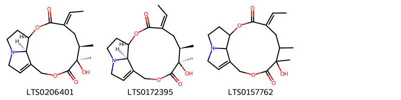{ width=100% }
    <figcaption>Hình ảnh cấu trúc hóa học của 3 hoạt chất thuộc nhóm Macrolides and analogues gồm ['integerrimine (LTS0206401)', 'senecionine (LTS0172395)', '4-ethylidene-7-hydroxy-6,7-dimethyl-2,9-dioxa-14-azatricyclo[9.5.1.0¹⁴,¹⁷]heptadec-11-ene-3,8-dione (LTS0157762)'].</figcaption>
</figure>
#### Nhóm Steroids and steroid derivatives
<figure markdown="span">
    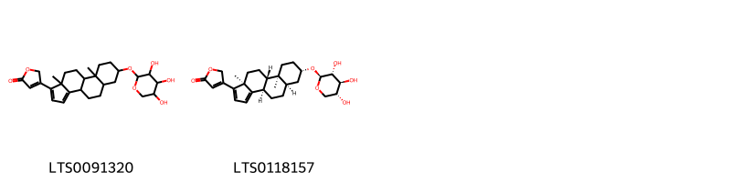{ width=100% }
    <figcaption>Hình ảnh cấu trúc hóa học của 2 hoạt chất thuộc nhóm Steroids and steroid derivatives gồm ['4-{9a,11a-dimethyl-7-[(3,4,5-trihydroxyoxan-2-yl)oxy]-3bh,4h,5h,5ah,6h,7h,8h,9h,9bh,10h,11h-cyclopenta[a]phenanthren-1-yl}-5h-furan-2-one (LTS0091320)', '4-[(3br,5ar,7s,9as,9bs,11as)-9a,11a-dimethyl-7-{[(2s,3r,4s,5r)-3,4,5-trihydroxyoxan-2-yl]oxy}-3bh,4h,5h,5ah,6h,7h,8h,9h,9bh,10h,11h-cyclopenta[a]phenanthren-1-yl]-5h-furan-2-one (LTS0118157)'].</figcaption>
</figure>

---

### Dược dân tộc học

Danh sách các quốc gia có sử dụng *Crotalaria juncea* trong điều trị các bệnh. 

| Country   | Disease             | Bệnh                                                                                                                                                                                                |
|:----------|:--------------------|:----------------------------------------------------------------------------------------------------------------------------------------------------------------------------------------------------|
| Iraq      | Emmenagogue, Poison | MYMEMORY WARNING: YOU USED ALL AVAILABLE FREE TRANSLATIONS FOR TODAY. NEXT AVAILABLE IN  14 HOURS 48 MINUTES 01 SECONDS VISIT HTTPS://MYMEMORY.TRANSLATED.NET/DOC/USAGELIMITS.PHP TO TRANSLATE MORE |

---

---
## Crotalaria longirostrata
### Thông tin về thực vật

!!! info "Phân loại thực vật của *Crotalaria longirostrata* từ GIBF:"
    - **Kingdom:** Plantae
    - **Phylum:** Tracheophyta
    - **Order:** Fabales
    - **Family:** Fabaceae
    - **Genus:** Crotalaria
    - **Species:** *Crotalaria longirostrata*

 

| Label (VI)   | Label (EN)   | Scientific Name          | Descriptions (VI)   | Descriptions (EN)   | Also Known As (VI)   | Also Known As (EN)   |
|:-------------|:-------------|:-------------------------|:--------------------|:--------------------|:---------------------|:---------------------|
| N/A          | N/A          | Crotalaria longirostrata | loài thực vật       | species of plant    | ['']                 | ['']                 |

#### Phân bố trên thế giới

**Từ CSDL GIBF** Nicaragua, Ecuador, Guatemala, Brazil, Costa Rica, Honduras, United States of America, Mexico, El Salvador

#### Phân bố tại Việt Nam

**Từ CSDL GIBF**: Không có ghi nhận ở Việt Nam

---
### Thành phần hóa học
        
- Theo cơ sở dữ liệu lotus: Từ loài *Crotalaria longirostrata* đã phân lập và xác định được Chưa có hoạt chất nào được phân lập. hoạt chất thuộc về các nhóm Không có hoạt chất nào được phân lập. 

Không có hình ảnh nào được tạo ra

---

### Dược dân tộc học

Danh sách các quốc gia có sử dụng *Crotalaria longirostrata* trong điều trị các bệnh. 

| Country   | Disease                             | Bệnh                                                                                                                                                                                                |
|:----------|:------------------------------------|:----------------------------------------------------------------------------------------------------------------------------------------------------------------------------------------------------|
| Guatemala | Emetic, Poison, Purgative, Raticide | MYMEMORY WARNING: YOU USED ALL AVAILABLE FREE TRANSLATIONS FOR TODAY. NEXT AVAILABLE IN  14 HOURS 47 MINUTES 30 SECONDS VISIT HTTPS://MYMEMORY.TRANSLATED.NET/DOC/USAGELIMITS.PHP TO TRANSLATE MORE |

---

---
## Crotalaria retusa
### Thông tin về thực vật

!!! info "Phân loại thực vật của *Crotalaria retusa* từ GIBF:"
    - **Kingdom:** Plantae
    - **Phylum:** Tracheophyta
    - **Order:** Fabales
    - **Family:** Fabaceae
    - **Genus:** Crotalaria
    - **Species:** *Crotalaria retusa*

 

| Label (VI)   | Label (EN)   | Scientific Name   | Descriptions (VI)   | Descriptions (EN)   | Also Known As (VI)   | Also Known As (EN)                                                  |
|:-------------|:-------------|:------------------|:--------------------|:--------------------|:---------------------|:--------------------------------------------------------------------|
| N/A          | N/A          | Crotalaria retusa | loài thực vật       | species of plant    | ['']                 | ['Devil-bean', 'Rattleweed', 'Shack shack', 'Wedge-leaf rattlepod'] |

#### Phân bố trên thế giới

**Từ CSDL GIBF** Virgin Islands (U.S.), Sri Lanka, Ghana, Australia, Guadeloupe, Saint Lucia, Benin, Nicaragua, Sierra Leone, French Guiana, Puerto Rico, Réunion, Senegal, Nigeria, Chinese Taipei, United States of America, Bonaire, Sint Eustatius and Saba, El Salvador, Maldives, Saint Martin (French part), Trinidad and Tobago, Hong Kong, Barbados, Sao Tome and Principe, Martinique, Brazil, Bahamas, Cuba, Dominican Republic, Dominica, Singapore, Curaçao, Ecuador, Madagascar, Cabo Verde, Haiti, Montserrat, Costa Rica, India, Indonesia, Gambia, Cayman Islands, Antigua and Barbuda, Malaysia

#### Phân bố tại Việt Nam

**Từ CSDL GIBF**: Không có ghi nhận ở Việt Nam

---
### Thành phần hóa học
        
- Theo cơ sở dữ liệu lotus: Từ loài *Crotalaria retusa* đã phân lập và xác định được 17 hoạt chất thuộc về các nhóm Fatty Acyls, Flavonoids, Isoflavonoids, Pyrrolizines, Pyrrolizidines, Carboxylic acids and derivatives. 

|    | chemicalTaxonomyClassyfireClass   |   smiles_count |
|---:|:----------------------------------|---------------:|
|  0 | Carboxylic acids and derivatives  |              3 |
|  1 | Fatty Acyls                       |              7 |
|  2 | Flavonoids                        |              3 |
|  3 | Isoflavonoids                     |              1 |
|  4 | Pyrrolizidines                    |              2 |
|  5 | Pyrrolizines                      |              1 |

#### Nhóm Carboxylic acids and derivatives
<figure markdown="span">
    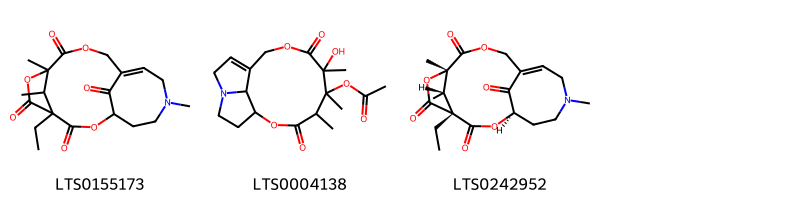{ width=100% }
    <figcaption>Hình ảnh cấu trúc hóa học của 3 hoạt chất thuộc nhóm Carboxylic acids and derivatives gồm ['4-ethyl-7,14,18-trimethyl-2,6,9-trioxa-14-azatricyclo[9.5.1.1⁴,⁷]octadec-11-ene-3,5,8,17-tetrone (LTS0155173)', '6-hydroxy-4,5,6-trimethyl-3,7-dioxo-2,8-dioxa-13-azatricyclo[8.5.1.0¹³,¹⁶]hexadec-10-en-5-yl acetate (LTS0004138)', '(1r,4r,7s,11z,18s)-4-ethyl-7,14,18-trimethyl-2,6,9-trioxa-14-azatricyclo[9.5.1.1⁴,⁷]octadec-11-ene-3,5,8,17-tetrone (LTS0242952)'].</figcaption>
</figure>
#### Nhóm Fatty Acyls
<figure markdown="span">
    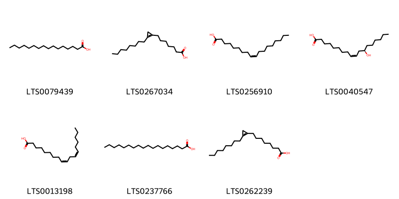{ width=100% }
    <figcaption>Hình ảnh cấu trúc hóa học của 7 hoạt chất thuộc nhóm Fatty Acyls gồm ['palmitic acid (LTS0079439)', 'malvalic acid (LTS0267034)', 'oleic acid (LTS0256910)', 'ricinoleic acid (LTS0040547)', 'linoleic (LTS0013198)', 'stearic acid (LTS0237766)', 'sterculic acid (LTS0262239)'].</figcaption>
</figure>
#### Nhóm Flavonoids
<figure markdown="span">
    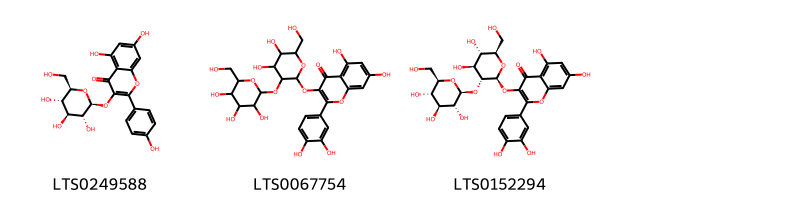{ width=100% }
    <figcaption>Hình ảnh cấu trúc hóa học của 3 hoạt chất thuộc nhóm Flavonoids gồm ['astragalin (LTS0249588)', '3-{[4,5-dihydroxy-6-(hydroxymethyl)-3-{[3,4,5-trihydroxy-6-(hydroxymethyl)oxan-2-yl]oxy}oxan-2-yl]oxy}-2-(3,4-dihydroxyphenyl)-5,7-dihydroxychromen-4-one (LTS0067754)', 'quosp (LTS0152294)'].</figcaption>
</figure>
#### Nhóm Isoflavonoids
<figure markdown="span">
    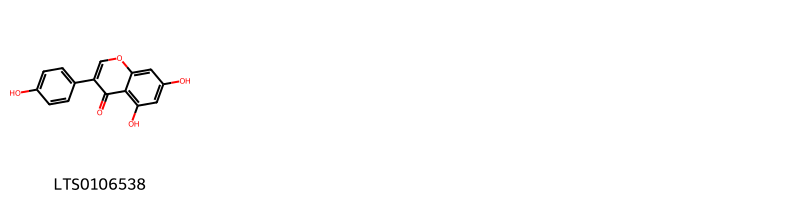{ width=100% }
    <figcaption>Hình ảnh cấu trúc hóa học của 1 hoạt chất thuộc nhóm Isoflavonoids gồm ['genistein (LTS0106538)'].</figcaption>
</figure>
#### Nhóm Pyrrolizidines
<figure markdown="span">
    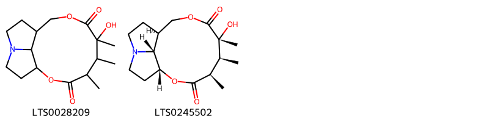{ width=100% }
    <figcaption>Hình ảnh cấu trúc hóa học của 2 hoạt chất thuộc nhóm Pyrrolizidines gồm ['6-hydroxy-4,5,6-trimethyl-2,8-dioxa-13-azatricyclo[8.5.1.0¹³,¹⁶]hexadecane-3,7-dione (LTS0028209)', 'retusine (LTS0245502)'].</figcaption>
</figure>
#### Nhóm Pyrrolizines
<figure markdown="span">
    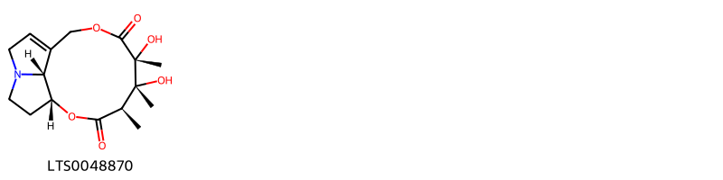{ width=100% }
    <figcaption>Hình ảnh cấu trúc hóa học của 1 hoạt chất thuộc nhóm Pyrrolizines gồm ['monocrotaline (LTS0048870)'].</figcaption>
</figure>

---

### Dược dân tộc học

Danh sách các quốc gia có sử dụng *Crotalaria retusa* trong điều trị các bệnh. 

| Country   | Disease   | Bệnh                                                                                                                                                                                                |
|:----------|:----------|:----------------------------------------------------------------------------------------------------------------------------------------------------------------------------------------------------|
| US        | Poison    | MYMEMORY WARNING: YOU USED ALL AVAILABLE FREE TRANSLATIONS FOR TODAY. NEXT AVAILABLE IN  14 HOURS 47 MINUTES 04 SECONDS VISIT HTTPS://MYMEMORY.TRANSLATED.NET/DOC/USAGELIMITS.PHP TO TRANSLATE MORE |

---

---
## Crotalaria sagittalis
### Thông tin về thực vật

!!! info "Phân loại thực vật của *Crotalaria sagittalis* từ GIBF:"
    - **Kingdom:** Plantae
    - **Phylum:** Tracheophyta
    - **Order:** Fabales
    - **Family:** Fabaceae
    - **Genus:** Crotalaria
    - **Species:** *Crotalaria sagittalis*

 

| Label (VI)   | Label (EN)   | Scientific Name       | Descriptions (VI)   | Descriptions (EN)   | Also Known As (VI)   | Also Known As (EN)   |
|:-------------|:-------------|:----------------------|:--------------------|:--------------------|:---------------------|:---------------------|
| N/A          | N/A          | Crotalaria sagittalis | loài thực vật       | species of plant    | ['']                 | ['']                 |

#### Phân bố trên thế giới

**Từ CSDL GIBF** Sri Lanka, Guatemala, Brazil, United States of America, Mexico, El Salvador

#### Phân bố tại Việt Nam

**Từ CSDL GIBF**: Không có ghi nhận ở Việt Nam

---
### Thành phần hóa học
        
- Theo cơ sở dữ liệu lotus: Từ loài *Crotalaria sagittalis* đã phân lập và xác định được 1 hoạt chất thuộc về các nhóm Pyrrolizines. 

|    | chemicalTaxonomyClassyfireClass   |   smiles_count |
|---:|:----------------------------------|---------------:|
|  0 | Pyrrolizines                      |              1 |

#### Nhóm Pyrrolizines
<figure markdown="span">
    { width=100% }
    <figcaption>Hình ảnh cấu trúc hóa học của 1 hoạt chất thuộc nhóm Pyrrolizines gồm ['monocrotaline (LTS0048870)'].</figcaption>
</figure>

---

### Dược dân tộc học

Danh sách các quốc gia có sử dụng *Crotalaria sagittalis* trong điều trị các bệnh. 

| Country   | Disease   | Bệnh                                                                                                                                                                                                |
|:----------|:----------|:----------------------------------------------------------------------------------------------------------------------------------------------------------------------------------------------------|
| US        | Poison    | MYMEMORY WARNING: YOU USED ALL AVAILABLE FREE TRANSLATIONS FOR TODAY. NEXT AVAILABLE IN  14 HOURS 46 MINUTES 35 SECONDS VISIT HTTPS://MYMEMORY.TRANSLATED.NET/DOC/USAGELIMITS.PHP TO TRANSLATE MORE |

---

---
## Crotalaria sericea
### Thông tin về thực vật

!!! info "Phân loại thực vật của *Crotalaria sericea* từ GIBF:"
    - **Kingdom:** Plantae
    - **Phylum:** Tracheophyta
    - **Order:** Fabales
    - **Family:** Fabaceae
    - **Genus:** Crotalaria
    - **Species:** *Crotalaria sericea*

 

| Label (VI)   | Label (EN)   | Scientific Name    | Descriptions (VI)   | Descriptions (EN)   | Also Known As (VI)   | Also Known As (EN)   |
|:-------------|:-------------|:-------------------|:--------------------|:--------------------|:---------------------|:---------------------|
| N/A          | N/A          | Crotalaria sericea |                     | species of plant    | ['']                 | ['']                 |

#### Phân bố trên thế giới

**Từ CSDL GIBF** nan, Malaysia, Hong Kong, Japan, Thailand, Lao People’s Democratic Republic, Cambodia, Chinese Taipei, Argentina, unknown or invalid, United States of America, Philippines, Viet Nam, China

#### Phân bố tại Việt Nam

**Từ CSDL GIBF**: Không có ghi nhận ở Việt Nam

---
### Thành phần hóa học
        
- Theo cơ sở dữ liệu lotus: Từ loài *Crotalaria sericea* đã phân lập và xác định được Chưa có hoạt chất nào được phân lập. hoạt chất thuộc về các nhóm Không có hoạt chất nào được phân lập. 

Không có hình ảnh nào được tạo ra

---

### Dược dân tộc học

Danh sách các quốc gia có sử dụng *Crotalaria sericea* trong điều trị các bệnh. 

| Country   | Disease   | Bệnh                                                                                                                                                                                                |
|:----------|:----------|:----------------------------------------------------------------------------------------------------------------------------------------------------------------------------------------------------|
| Elsewhere | Poison    | MYMEMORY WARNING: YOU USED ALL AVAILABLE FREE TRANSLATIONS FOR TODAY. NEXT AVAILABLE IN  14 HOURS 45 MINUTES 58 SECONDS VISIT HTTPS://MYMEMORY.TRANSLATED.NET/DOC/USAGELIMITS.PHP TO TRANSLATE MORE |

---

---
## Crotalaria stipularis
### Thông tin về thực vật

!!! info "Phân loại thực vật của *Crotalaria stipularia* từ GIBF:"
    - **Kingdom:** Plantae
    - **Phylum:** Tracheophyta
    - **Order:** Fabales
    - **Family:** Fabaceae
    - **Genus:** Crotalaria
    - **Species:** *Crotalaria stipularia*

 

| Label (VI)   | Label (EN)   | Scientific Name    | Descriptions (VI)   | Descriptions (EN)   | Also Known As (VI)   | Also Known As (EN)   |
|:-------------|:-------------|:-------------------|:--------------------|:--------------------|:---------------------|:---------------------|
| N/A          | N/A          | Crotalaria sericea |                     | species of plant    | ['']                 | ['']                 |

#### Phân bố trên thế giới

**Từ CSDL GIBF** nan, Puerto Rico, Suriname, Brazil, Bolivia (Plurinational State of), Argentina, Venezuela (Bolivarian Republic of), French Guiana

#### Phân bố tại Việt Nam

**Từ CSDL GIBF**: Không có ghi nhận ở Việt Nam

---
### Thành phần hóa học
        
- Theo cơ sở dữ liệu lotus: Từ loài *Crotalaria stipularia* đã phân lập và xác định được Chưa có hoạt chất nào được phân lập. hoạt chất thuộc về các nhóm Không có hoạt chất nào được phân lập. 

Không có hình ảnh nào được tạo ra

---

### Dược dân tộc học

Danh sách các quốc gia có sử dụng *Crotalaria stipularia* trong điều trị các bệnh. 

| Country   | Disease   | Bệnh                                                                                                                                                                                                |
|:----------|:----------|:----------------------------------------------------------------------------------------------------------------------------------------------------------------------------------------------------|
| Venezuela | Sudorific | MYMEMORY WARNING: YOU USED ALL AVAILABLE FREE TRANSLATIONS FOR TODAY. NEXT AVAILABLE IN  14 HOURS 45 MINUTES 36 SECONDS VISIT HTTPS://MYMEMORY.TRANSLATED.NET/DOC/USAGELIMITS.PHP TO TRANSLATE MORE |

---

---
## Crotalaria striata
### Thông tin về thực vật

!!! info "Phân loại thực vật của *N/A* từ GIBF:"
    - **Kingdom:** Plantae
    - **Phylum:** Tracheophyta
    - **Order:** Fabales
    - **Family:** Fabaceae
    - **Genus:** Crotalaria
    - **Species:** *N/A*

 

| Label (VI)   | Label (EN)   | Scientific Name    | Descriptions (VI)   | Descriptions (EN)   | Also Known As (VI)   | Also Known As (EN)   |
|:-------------|:-------------|:-------------------|:--------------------|:--------------------|:---------------------|:---------------------|
| N/A          | N/A          | Crotalaria striata |                     |                     | ['']                 | ['']                 |

#### Phân bố trên thế giới

**Từ CSDL GIBF** Virgin Islands (U.S.), Sri Lanka, Australia, Guadeloupe, Argentina, Saint Lucia, Rwanda, Nicaragua, Sierra Leone, French Guiana, Zambia, Puerto Rico, Chinese Taipei, United States of America, Bonaire, Sint Eustatius and Saba, El Salvador, Maldives, South Africa, Trinidad and Tobago, Thailand, Brazil, Mexico, Dominican Republic, Peru, China, Niue, Cabo Verde, Kenya, Botswana, India, Indonesia, Cayman Islands, Antigua and Barbuda, Sint Maarten (Dutch part)

#### Phân bố tại Việt Nam

**Từ CSDL GIBF**: Không có ghi nhận ở Việt Nam

---
### Thành phần hóa học
        
- Theo cơ sở dữ liệu lotus: Từ loài *N/A* đã phân lập và xác định được Chưa có hoạt chất nào được phân lập. hoạt chất thuộc về các nhóm Không có hoạt chất nào được phân lập. 

Không có hình ảnh nào được tạo ra

---

### Dược dân tộc học

Danh sách các quốc gia có sử dụng *N/A* trong điều trị các bệnh. 

| Country   | Disease            | Bệnh                                                                                                                                                                                                |
|:----------|:-------------------|:----------------------------------------------------------------------------------------------------------------------------------------------------------------------------------------------------|
| Elsewhere | Intoxicant, Poison | MYMEMORY WARNING: YOU USED ALL AVAILABLE FREE TRANSLATIONS FOR TODAY. NEXT AVAILABLE IN  14 HOURS 45 MINUTES 13 SECONDS VISIT HTTPS://MYMEMORY.TRANSLATED.NET/DOC/USAGELIMITS.PHP TO TRANSLATE MORE |

---

---
## Crotalaria trifoliastrum
### Thông tin về thực vật

!!! info "Phân loại thực vật của *Crotalaria trifoliastrum* từ GIBF:"
    - **Kingdom:** Plantae
    - **Phylum:** Tracheophyta
    - **Order:** Fabales
    - **Family:** Fabaceae
    - **Genus:** Crotalaria
    - **Species:** *Crotalaria trifoliastrum*

 

| Label (VI)   | Label (EN)   | Scientific Name          | Descriptions (VI)   | Descriptions (EN)   | Also Known As (VI)   | Also Known As (EN)   |
|:-------------|:-------------|:-------------------------|:--------------------|:--------------------|:---------------------|:---------------------|
| N/A          | N/A          | Crotalaria trifoliastrum | loài thực vật       | species of plant    | ['']                 | ['']                 |

#### Phân bố trên thế giới

**Từ CSDL GIBF** nan, Sri Lanka, Australia, Brazil, Chinese Taipei, Myanmar, Papua New Guinea, Bhutan, India, unknown or invalid, France, Philippines

#### Phân bố tại Việt Nam

**Từ CSDL GIBF**: Không có ghi nhận ở Việt Nam

---
### Thành phần hóa học
        
- Theo cơ sở dữ liệu lotus: Từ loài *Crotalaria trifoliastrum* đã phân lập và xác định được 11 hoạt chất thuộc về các nhóm Prenol lipids, Linear 1,3-diarylpropanoids, Benzene and substituted derivatives, Organooxygen compounds, Macrolides and analogues. 

|    | chemicalTaxonomyClassyfireClass     |   smiles_count |
|---:|:------------------------------------|---------------:|
|  0 |                                     |              4 |
|  1 | Benzene and substituted derivatives |              3 |
|  2 | Linear 1,3-diarylpropanoids         |              1 |
|  3 | Macrolides and analogues            |              1 |
|  4 | Organooxygen compounds              |              1 |
|  5 | Prenol lipids                       |              1 |

#### Nhóm 
<figure markdown="span">
    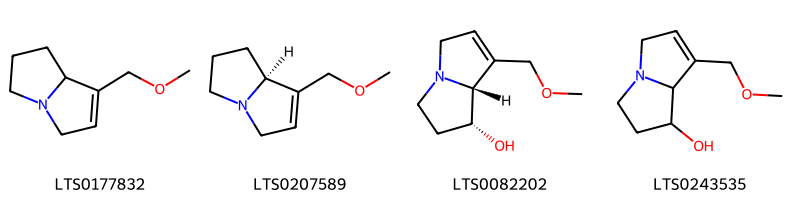{ width=100% }
    <figcaption>Hình ảnh cấu trúc hóa học của 4 hoạt chất thuộc nhóm  gồm ['1-(methoxymethyl)-5,6,7,7a-tetrahydro-3h-pyrrolizine (LTS0177832)', '(7as)-1-(methoxymethyl)-5,6,7,7a-tetrahydro-3h-pyrrolizine (LTS0207589)', '(1r,7ar)-7-(methoxymethyl)-2,3,5,7a-tetrahydro-1h-pyrrolizin-1-ol (LTS0082202)', '7-(methoxymethyl)-2,3,5,7a-tetrahydro-1h-pyrrolizin-1-ol (LTS0243535)'].</figcaption>
</figure>
#### Nhóm Benzene and substituted derivatives
<figure markdown="span">
    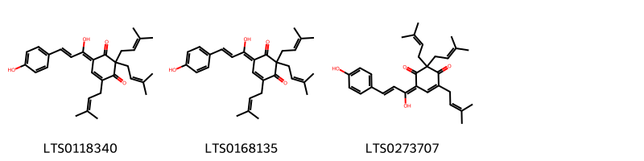{ width=100% }
    <figcaption>Hình ảnh cấu trúc hóa học của 3 hoạt chất thuộc nhóm Benzene and substituted derivatives gồm ['(6z)-6-[1-hydroxy-3-(4-hydroxyphenyl)prop-2-en-1-ylidene]-2,2,4-tris(3-methylbut-2-en-1-yl)cyclohex-4-ene-1,3-dione (LTS0118340)', 'munchiwarin (LTS0168135)', '6-[(2e)-1-hydroxy-3-(4-hydroxyphenyl)prop-2-en-1-ylidene]-2,2,4-tris(3-methylbut-2-en-1-yl)cyclohex-4-ene-1,3-dione (LTS0273707)'].</figcaption>
</figure>
#### Nhóm Linear 1_3-diarylpropanoids
<figure markdown="span">
    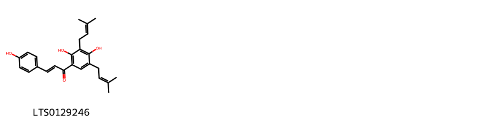{ width=100% }
    <figcaption>Hình ảnh cấu trúc hóa học của Không tìm thấy chú thích hoạt chất thuộc nhóm Linear 1_3-diarylpropanoids gồm Không tìm thấy chú thích.</figcaption>
</figure>
#### Nhóm Macrolides and analogues
<figure markdown="span">
    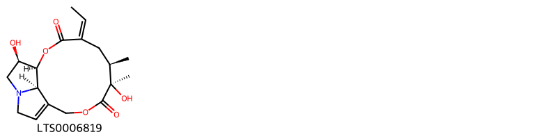{ width=100% }
    <figcaption>Hình ảnh cấu trúc hóa học của 1 hoạt chất thuộc nhóm Macrolides and analogues gồm ['anacrotine (LTS0006819)'].</figcaption>
</figure>
#### Nhóm Organooxygen compounds
<figure markdown="span">
    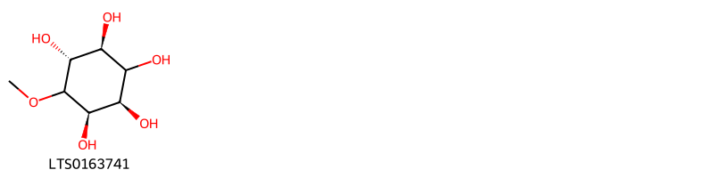{ width=100% }
    <figcaption>Hình ảnh cấu trúc hóa học của 1 hoạt chất thuộc nhóm Organooxygen compounds gồm ['(1r,2r,4s,5r)-6-methoxycyclohexane-1,2,3,4,5-pentol (LTS0163741)'].</figcaption>
</figure>
#### Nhóm Prenol lipids
<figure markdown="span">
    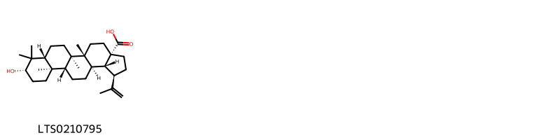{ width=100% }
    <figcaption>Hình ảnh cấu trúc hóa học của 1 hoạt chất thuộc nhóm Prenol lipids gồm ['betulinic acid (LTS0210795)'].</figcaption>
</figure>

---

### Dược dân tộc học

Danh sách các quốc gia có sử dụng *Crotalaria trifoliastrum* trong điều trị các bệnh. 

| Country   | Disease   | Bệnh                                                                                                                                                                                                |
|:----------|:----------|:----------------------------------------------------------------------------------------------------------------------------------------------------------------------------------------------------|
| Elsewhere | Purgative | MYMEMORY WARNING: YOU USED ALL AVAILABLE FREE TRANSLATIONS FOR TODAY. NEXT AVAILABLE IN  14 HOURS 44 MINUTES 41 SECONDS VISIT HTTPS://MYMEMORY.TRANSLATED.NET/DOC/USAGELIMITS.PHP TO TRANSLATE MORE |

---

---
## Crotalaria tuerckheimii
### Thông tin về thực vật

!!! info "Phân loại thực vật của *Crotalaria sagittalis* từ GIBF:"
    - **Kingdom:** Plantae
    - **Phylum:** Tracheophyta
    - **Order:** Fabales
    - **Family:** Fabaceae
    - **Genus:** Crotalaria
    - **Species:** *Crotalaria sagittalis*

 

| Label (VI)   | Label (EN)   | Scientific Name         | Descriptions (VI)   | Descriptions (EN)   | Also Known As (VI)   | Also Known As (EN)   |
|:-------------|:-------------|:------------------------|:--------------------|:--------------------|:---------------------|:---------------------|
| N/A          | N/A          | Crotalaria tuerckheimii |                     |                     | ['']                 | ['']                 |

#### Phân bố trên thế giới

**Từ CSDL GIBF** nan, Colombia, Guatemala, Honduras, Mexico

#### Phân bố tại Việt Nam

**Từ CSDL GIBF**: Không có ghi nhận ở Việt Nam

---
### Thành phần hóa học
        
- Theo cơ sở dữ liệu lotus: Từ loài *Crotalaria sagittalis* đã phân lập và xác định được Chưa có hoạt chất nào được phân lập. hoạt chất thuộc về các nhóm Không có hoạt chất nào được phân lập. 

Không có hình ảnh nào được tạo ra

---

### Dược dân tộc học

Danh sách các quốc gia có sử dụng *Crotalaria sagittalis* trong điều trị các bệnh. 

| Country   | Disease   | Bệnh                                                                                                                                                                                                |
|:----------|:----------|:----------------------------------------------------------------------------------------------------------------------------------------------------------------------------------------------------|
| Salvador  | Diuretic  | MYMEMORY WARNING: YOU USED ALL AVAILABLE FREE TRANSLATIONS FOR TODAY. NEXT AVAILABLE IN  14 HOURS 44 MINUTES 12 SECONDS VISIT HTTPS://MYMEMORY.TRANSLATED.NET/DOC/USAGELIMITS.PHP TO TRANSLATE MORE |

---

---
## Crotalaria verrucosa
### Thông tin về thực vật

!!! info "Phân loại thực vật của *Crotalaria verrucosa* từ GIBF:"
    - **Kingdom:** Plantae
    - **Phylum:** Tracheophyta
    - **Order:** Fabales
    - **Family:** Fabaceae
    - **Genus:** Crotalaria
    - **Species:** *Crotalaria verrucosa*

 

| Label (VI)   | Label (EN)   | Scientific Name      | Descriptions (VI)   | Descriptions (EN)   | Also Known As (VI)   | Also Known As (EN)   |
|:-------------|:-------------|:---------------------|:--------------------|:--------------------|:---------------------|:---------------------|
| N/A          | N/A          | Crotalaria verrucosa | loài thực vật       | species of plant    | ['']                 | ['']                 |

#### Phân bố trên thế giới

**Từ CSDL GIBF** Virgin Islands (U.S.), nan, Sri Lanka, Ghana, Australia, Guadeloupe, Saint Lucia, Nicaragua, Puerto Rico, Réunion, Chinese Taipei, Portugal, Jamaica, United States of America, Bonaire, Sint Eustatius and Saba, Timor-Leste, Belize, Saint Martin (French part), Hong Kong, Saint Vincent and the Grenadines, Thailand, Martinique, Bahamas, Brazil, Sint Maarten (Dutch part), Dominican Republic, Mexico, Saint Kitts and Nevis, Madagascar, Montserrat, India, Cayman Islands, Antigua and Barbuda, Philippines

#### Phân bố tại Việt Nam

**Từ CSDL GIBF**: Không có ghi nhận ở Việt Nam

---
### Thành phần hóa học
        
- Theo cơ sở dữ liệu lotus: Từ loài *Crotalaria verrucosa* đã phân lập và xác định được 13 hoạt chất thuộc về các nhóm Flavonoids, Isoflavonoids, Pyrrolizines, Dihydrofurans, Organooxygen compounds, Macrolides and analogues, Carboxylic acids and derivatives. 

|    | chemicalTaxonomyClassyfireClass   |   smiles_count |
|---:|:----------------------------------|---------------:|
|  0 | Carboxylic acids and derivatives  |              2 |
|  1 | Dihydrofurans                     |              1 |
|  2 | Flavonoids                        |              3 |
|  3 | Isoflavonoids                     |              1 |
|  4 | Macrolides and analogues          |              2 |
|  5 | Organooxygen compounds            |              2 |
|  6 | Pyrrolizines                      |              2 |

#### Nhóm Carboxylic acids and derivatives
<figure markdown="span">
    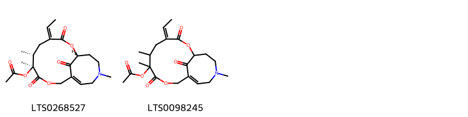{ width=100% }
    <figcaption>Hình ảnh cấu trúc hóa học của 2 hoạt chất thuộc nhóm Carboxylic acids and derivatives gồm ['(1r,4z,6r,7s,11z)-4-ethylidene-6,7,14-trimethyl-3,8,17-trioxo-2,9-dioxa-14-azabicyclo[9.5.1]heptadec-11-en-7-yl acetate (LTS0268527)', '4-ethylidene-6,7,14-trimethyl-3,8,17-trioxo-2,9-dioxa-14-azabicyclo[9.5.1]heptadec-11-en-7-yl acetate (LTS0098245)'].</figcaption>
</figure>
#### Nhóm Dihydrofurans
<figure markdown="span">
    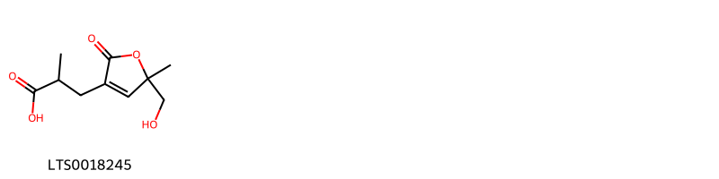{ width=100% }
    <figcaption>Hình ảnh cấu trúc hóa học của 1 hoạt chất thuộc nhóm Dihydrofurans gồm ['3-[5-(hydroxymethyl)-5-methyl-2-oxofuran-3-yl]-2-methylpropanoic acid (LTS0018245)'].</figcaption>
</figure>
#### Nhóm Flavonoids
<figure markdown="span">
    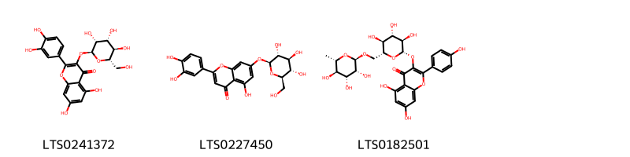{ width=100% }
    <figcaption>Hình ảnh cấu trúc hóa học của 3 hoạt chất thuộc nhóm Flavonoids gồm ['2-(3,4-dihydroxyphenyl)-5,7-dihydroxy-3-{[(2s,3r,4r,5r,6s)-3,4,5-trihydroxy-6-(hydroxymethyl)oxan-2-yl]oxy}chromen-4-one (LTS0241372)', 'luteolin 7-o-glucoside (LTS0227450)', 'nictoflorin (LTS0182501)'].</figcaption>
</figure>
#### Nhóm Isoflavonoids
<figure markdown="span">
    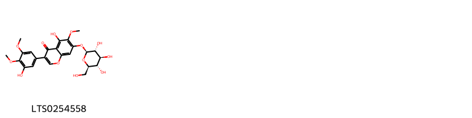{ width=100% }
    <figcaption>Hình ảnh cấu trúc hóa học của 1 hoạt chất thuộc nhóm Isoflavonoids gồm ['iridin (LTS0254558)'].</figcaption>
</figure>
#### Nhóm Macrolides and analogues
<figure markdown="span">
    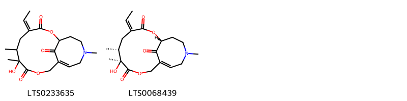{ width=100% }
    <figcaption>Hình ảnh cấu trúc hóa học của 2 hoạt chất thuộc nhóm Macrolides and analogues gồm ['4-ethylidene-7-hydroxy-6,7,14-trimethyl-2,9-dioxa-14-azabicyclo[9.5.1]heptadec-11-ene-3,8,17-trione (LTS0233635)', '(1r,4z,6r,7s,11z)-4-ethylidene-7-hydroxy-6,7,14-trimethyl-2,9-dioxa-14-azabicyclo[9.5.1]heptadec-11-ene-3,8,17-trione (LTS0068439)'].</figcaption>
</figure>
#### Nhóm Organooxygen compounds
<figure markdown="span">
    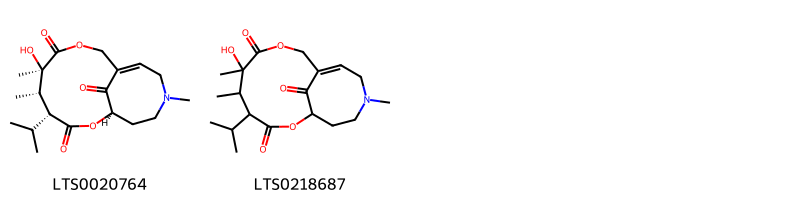{ width=100% }
    <figcaption>Hình ảnh cấu trúc hóa học của 2 hoạt chất thuộc nhóm Organooxygen compounds gồm ['(1r,4r,5s,6r,10z)-6-hydroxy-4-isopropyl-5,6,13-trimethyl-2,8-dioxa-13-azabicyclo[8.5.1]hexadec-10-ene-3,7,16-trione (LTS0020764)', '6-hydroxy-4-isopropyl-5,6,13-trimethyl-2,8-dioxa-13-azabicyclo[8.5.1]hexadec-10-ene-3,7,16-trione (LTS0218687)'].</figcaption>
</figure>
#### Nhóm Pyrrolizines
<figure markdown="span">
    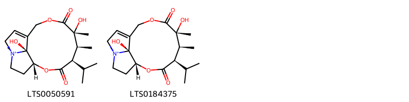{ width=100% }
    <figcaption>Hình ảnh cấu trúc hóa học của 2 hoạt chất thuộc nhóm Pyrrolizines gồm ['(1r,4r,5s,6r,13r,16s)-6,16-dihydroxy-4-isopropyl-5,6,13-trimethyl-3,7-dioxo-2,8-dioxa-13-azatricyclo[8.5.1.0¹³,¹⁶]hexadec-10-en-13-ium (LTS0050591)', '(1r,4r,5s,6r,16s)-6,16-dihydroxy-4-isopropyl-5,6,13-trimethyl-3,7-dioxo-2,8-dioxa-13-azatricyclo[8.5.1.0¹³,¹⁶]hexadec-10-en-13-ium (LTS0184375)'].</figcaption>
</figure>

---

### Dược dân tộc học

Danh sách các quốc gia có sử dụng *Crotalaria verrucosa* trong điều trị các bệnh. 

| Country   | Disease   | Bệnh                                                                                                                                                                                                |
|:----------|:----------|:----------------------------------------------------------------------------------------------------------------------------------------------------------------------------------------------------|
| US        | Poison    | MYMEMORY WARNING: YOU USED ALL AVAILABLE FREE TRANSLATIONS FOR TODAY. NEXT AVAILABLE IN  14 HOURS 43 MINUTES 52 SECONDS VISIT HTTPS://MYMEMORY.TRANSLATED.NET/DOC/USAGELIMITS.PHP TO TRANSLATE MORE |

---

# Chi Cylista

??? note "Danh sách các dược liệu thuộc chi"
    
	 - *Cylista scariosa*

---
## Cylista scariosa
### Thông tin về thực vật

!!! info "Phân loại thực vật của *Paracalyx scariosus* từ GIBF:"
    - **Kingdom:** Plantae
    - **Phylum:** Tracheophyta
    - **Order:** Fabales
    - **Family:** Fabaceae
    - **Genus:** Paracalyx
    - **Species:** *Paracalyx scariosus*

 

| Label (VI)   | Label (EN)   | Scientific Name   | Descriptions (VI)   | Descriptions (EN)   | Also Known As (VI)   | Also Known As (EN)   |
|:-------------|:-------------|:------------------|:--------------------|:--------------------|:---------------------|:---------------------|
| N/A          | N/A          | Cylista scariosa  |                     |                     | ['']                 | ['']                 |

#### Phân bố trên thế giới

**Từ CSDL GIBF** nan, Thailand, Myanmar, India, unknown or invalid, Yemen

#### Phân bố tại Việt Nam

**Từ CSDL GIBF**: Không có ghi nhận ở Việt Nam

---
### Thành phần hóa học
        
- Theo cơ sở dữ liệu lotus: Từ loài *Paracalyx scariosus* đã phân lập và xác định được Chưa có hoạt chất nào được phân lập. hoạt chất thuộc về các nhóm Không có hoạt chất nào được phân lập. 

Không có hình ảnh nào được tạo ra

---

### Dược dân tộc học

Danh sách các quốc gia có sử dụng *Paracalyx scariosus* trong điều trị các bệnh. 

| Country   | Disease    | Bệnh                                                                                                                                                                                                |
|:----------|:-----------|:----------------------------------------------------------------------------------------------------------------------------------------------------------------------------------------------------|
| Elsewhere | Astringent | MYMEMORY WARNING: YOU USED ALL AVAILABLE FREE TRANSLATIONS FOR TODAY. NEXT AVAILABLE IN  14 HOURS 43 MINUTES 16 SECONDS VISIT HTTPS://MYMEMORY.TRANSLATED.NET/DOC/USAGELIMITS.PHP TO TRANSLATE MORE |

---

# Chi Indigofera

??? note "Danh sách các dược liệu thuộc chi"
    
	 - *Indigofera aalathoides*
	 - *Indigofera argentea*
	 - *Indigofera articulata*
	 - *Indigofera endecaphylla*
	 - *Indigofera enneaphylla*
	 - *Indigofera glabra*
	 - *Indigofera hirsuta*
	 - *Indigofera leedezioides*
	 - *Indigofera linifolia*
	 - *Indigofera oblongifolia*
	 - *Indigofera p*
	 - *Indigofera pascuorum*
	 - *Indigofera pauciflora*
	 - *Indigofera paucifolia*
	 - *Indigofera suffruticosa*
	 - *Indigofera sumatrana*
	 - *Indigofera thibaudiana*
	 - *Indigofera tinctora*
	 - *Indigofera tinctoria*
	 - *Indigofera trita*

---
## Indigofera aalathoides
### Thông tin về thực vật

!!! info "Phân loại thực vật của *N/A* từ GIBF:"
    - **Kingdom:** Plantae
    - **Phylum:** Tracheophyta
    - **Order:** Fabales
    - **Family:** Fabaceae
    - **Genus:** Indigofera
    - **Species:** *N/A*

 

| Label (VI)   | Label (EN)   | Scientific Name   | Descriptions (VI)   | Descriptions (EN)   | Also Known As (VI)   | Also Known As (EN)   |
|:-------------|:-------------|:------------------|:--------------------|:--------------------|:---------------------|:---------------------|
| N/A          | N/A          | Cylista scariosa  |                     |                     | ['']                 | ['']                 |

#### Phân bố trên thế giới

**Từ CSDL GIBF** Virgin Islands (U.S.), Australia, Japan, Guadeloupe, Gabon, Argentina, Bermuda, Yemen, French Guiana, Israel, Puerto Rico, Namibia, Chinese Taipei, United States of America, El Salvador, Belize, South Africa, Brazil, Cuba, Dominican Republic, Mexico, Singapore, Eswatini, Botswana, India, Antigua and Barbuda, Cameroon

#### Phân bố tại Việt Nam

**Từ CSDL GIBF**: Không có ghi nhận ở Việt Nam

---
### Thành phần hóa học
        
- Theo cơ sở dữ liệu lotus: Từ loài *N/A* đã phân lập và xác định được Chưa có hoạt chất nào được phân lập. hoạt chất thuộc về các nhóm Không có hoạt chất nào được phân lập. 

Không có hình ảnh nào được tạo ra

---

### Dược dân tộc học

Danh sách các quốc gia có sử dụng *N/A* trong điều trị các bệnh. 

| Country   | Disease   | Bệnh                                                                                                                                                                                                |
|:----------|:----------|:----------------------------------------------------------------------------------------------------------------------------------------------------------------------------------------------------|
| Elsewhere | Demulcent | MYMEMORY WARNING: YOU USED ALL AVAILABLE FREE TRANSLATIONS FOR TODAY. NEXT AVAILABLE IN  14 HOURS 42 MINUTES 55 SECONDS VISIT HTTPS://MYMEMORY.TRANSLATED.NET/DOC/USAGELIMITS.PHP TO TRANSLATE MORE |

---

---
## Indigofera argentea
### Thông tin về thực vật

!!! info "Phân loại thực vật của *Indigofera argentea* từ GIBF:"
    - **Kingdom:** Plantae
    - **Phylum:** Tracheophyta
    - **Order:** Fabales
    - **Family:** Fabaceae
    - **Genus:** Indigofera
    - **Species:** *Indigofera argentea*

 

| Label (VI)   | Label (EN)   | Scientific Name     | Descriptions (VI)   | Descriptions (EN)   | Also Known As (VI)   | Also Known As (EN)   |
|:-------------|:-------------|:--------------------|:--------------------|:--------------------|:---------------------|:---------------------|
| N/A          | N/A          | Indigofera argentea | loài thực vật       | species of plant    | ['']                 | ['']                 |

#### Phân bố trên thế giới

**Từ CSDL GIBF** Virgin Islands (U.S.), Australia, Japan, Guadeloupe, Gabon, Argentina, Bermuda, Yemen, French Guiana, Israel, Puerto Rico, Namibia, Chinese Taipei, United States of America, El Salvador, Belize, South Africa, Brazil, Cuba, Dominican Republic, Mexico, Singapore, Eswatini, Botswana, India, Antigua and Barbuda, Cameroon

#### Phân bố tại Việt Nam

**Từ CSDL GIBF**: Không có ghi nhận ở Việt Nam

---
### Thành phần hóa học
        
- Theo cơ sở dữ liệu lotus: Từ loài *Indigofera argentea* đã phân lập và xác định được Chưa có hoạt chất nào được phân lập. hoạt chất thuộc về các nhóm Không có hoạt chất nào được phân lập. 

Không có hình ảnh nào được tạo ra

---

### Dược dân tộc học

Danh sách các quốc gia có sử dụng *Indigofera argentea* trong điều trị các bệnh. 

| Country   | Disease                                 | Bệnh                                                                                                                                                                                                |
|:----------|:----------------------------------------|:----------------------------------------------------------------------------------------------------------------------------------------------------------------------------------------------------|
| Haiti     | Insecticide, Parasiticide, Pediculicide | MYMEMORY WARNING: YOU USED ALL AVAILABLE FREE TRANSLATIONS FOR TODAY. NEXT AVAILABLE IN  14 HOURS 42 MINUTES 22 SECONDS VISIT HTTPS://MYMEMORY.TRANSLATED.NET/DOC/USAGELIMITS.PHP TO TRANSLATE MORE |

---

---
## Indigofera articulata
### Thông tin về thực vật

!!! info "Phân loại thực vật của *Indigofera articulata* từ GIBF:"
    - **Kingdom:** Plantae
    - **Phylum:** Tracheophyta
    - **Order:** Fabales
    - **Family:** Fabaceae
    - **Genus:** Indigofera
    - **Species:** *Indigofera articulata*

 

| Label (VI)   | Label (EN)   | Scientific Name       | Descriptions (VI)   | Descriptions (EN)   | Also Known As (VI)   | Also Known As (EN)   |
|:-------------|:-------------|:----------------------|:--------------------|:--------------------|:---------------------|:---------------------|
| N/A          | N/A          | Indigofera articulata | loài thực vật       | species of plant    | ['']                 | ['Khedaish']         |

#### Phân bố trên thế giới

**Từ CSDL GIBF** nan, United Arab Emirates, Sri Lanka, Somalia, unknown or invalid, Jordan, Yemen, Israel, Pakistan, Sudan, Algeria, Saudi Arabia, Oman, Eritrea, Iran (Islamic Republic of), Egypt, Cuba, Qatar, China, Haiti, India, Djibouti, Ethiopia

#### Phân bố tại Việt Nam

**Từ CSDL GIBF**: Không có ghi nhận ở Việt Nam

---
### Thành phần hóa học
        
- Theo cơ sở dữ liệu lotus: Từ loài *Indigofera articulata* đã phân lập và xác định được Chưa có hoạt chất nào được phân lập. hoạt chất thuộc về các nhóm Không có hoạt chất nào được phân lập. 

Không có hình ảnh nào được tạo ra

---

### Dược dân tộc học

Danh sách các quốc gia có sử dụng *Indigofera articulata* trong điều trị các bệnh. 

| Country   | Disease          | Bệnh                                                                                                                                                                                                |
|:----------|:-----------------|:----------------------------------------------------------------------------------------------------------------------------------------------------------------------------------------------------|
| Elsewhere | Vermifuge, Tonic | MYMEMORY WARNING: YOU USED ALL AVAILABLE FREE TRANSLATIONS FOR TODAY. NEXT AVAILABLE IN  14 HOURS 41 MINUTES 59 SECONDS VISIT HTTPS://MYMEMORY.TRANSLATED.NET/DOC/USAGELIMITS.PHP TO TRANSLATE MORE |

---

---
## Indigofera endecaphylla
### Thông tin về thực vật

!!! info "Phân loại thực vật của *Indigofera hendecaphylla* từ GIBF:"
    - **Kingdom:** Plantae
    - **Phylum:** Tracheophyta
    - **Order:** Fabales
    - **Family:** Fabaceae
    - **Genus:** Indigofera
    - **Species:** *Indigofera hendecaphylla*

 

| Label (VI)   | Label (EN)   | Scientific Name         | Descriptions (VI)   | Descriptions (EN)   | Also Known As (VI)   | Also Known As (EN)   |
|:-------------|:-------------|:------------------------|:--------------------|:--------------------|:---------------------|:---------------------|
| N/A          | N/A          | Indigofera endecaphylla |                     |                     | ['']                 | ['']                 |

#### Phân bố trên thế giới

**Từ CSDL GIBF** nan, Australia, Angola, Tanzania, United Republic of, Senegal, Chinese Taipei, United States of America, Congo, Democratic Republic of the, Guinea, Zimbabwe, Uganda, Trinidad and Tobago, Sao Tome and Principe, Eritrea, Brazil, Côte d’Ivoire, Peru, Singapore, China, Ecuador, Colombia, Costa Rica, Burundi, India, Kenya

#### Phân bố tại Việt Nam

**Từ CSDL GIBF**: Không có ghi nhận ở Việt Nam

---
### Thành phần hóa học
        
- Theo cơ sở dữ liệu lotus: Từ loài *Indigofera hendecaphylla* đã phân lập và xác định được 24 hoạt chất thuộc về các nhóm Carboxylic acids and derivatives. 

|    | chemicalTaxonomyClassyfireClass   |   smiles_count |
|---:|:----------------------------------|---------------:|
|  0 | Carboxylic acids and derivatives  |             24 |

#### Nhóm Carboxylic acids and derivatives
<figure markdown="span">
    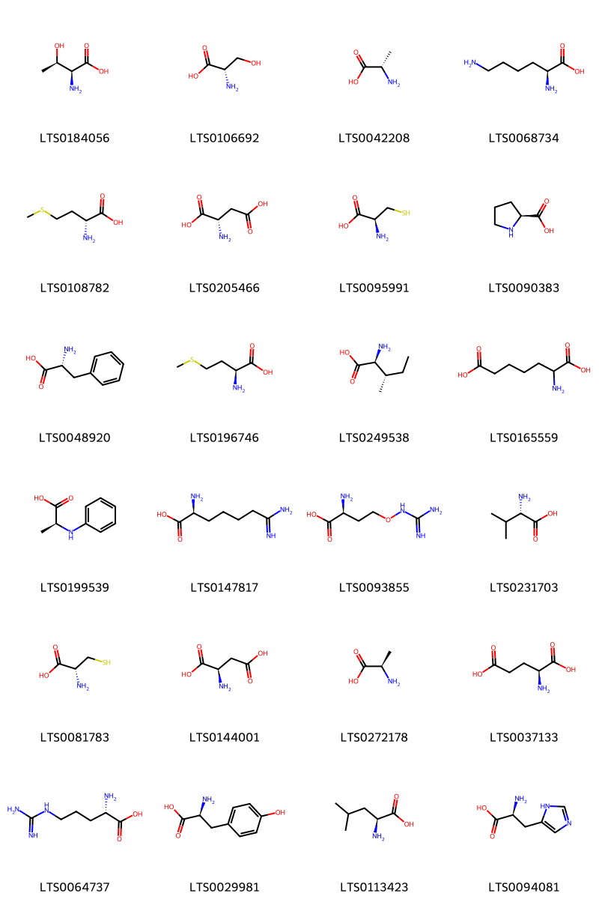{ width=100% }
    <figcaption>Hình ảnh cấu trúc hóa học của 24 hoạt chất thuộc nhóm Carboxylic acids and derivatives gồm ['l-threonine (LTS0184056)', 'l-serine (LTS0106692)', 'l-alanine (LTS0042208)', 'l-lysine (LTS0068734)', 'd-methionine (LTS0108782)', 'l-aspartic acid (LTS0205466)', 'd-cysteine (LTS0095991)', 'l-proline (LTS0090383)', 'd-phenylalanine (LTS0048920)', 'l-methionine (LTS0196746)', 'l-isoleucine (LTS0249538)', 'dl-2-aminopimelic acid (LTS0165559)', '(2s)-2-(phenylamino)propanoic acid (LTS0199539)', 'indospicine (LTS0147817)', '(l)-canavanine (LTS0093855)', 'l-valine (LTS0231703)', 'l-cysteine (LTS0081783)', 'd-aspartic acid (LTS0144001)', 'd-alanine (LTS0272178)', 'l-glutamic acid (LTS0037133)', 'l-arginine (LTS0064737)', 'l-tyrosine (LTS0029981)', 'l-leucine (LTS0113423)', 'l-histidine (LTS0094081)'].</figcaption>
</figure>

---

### Dược dân tộc học

Danh sách các quốc gia có sử dụng *Indigofera hendecaphylla* trong điều trị các bệnh. 

| Country    | Disease   | Bệnh                                                                                                                                                                                                |
|:-----------|:----------|:----------------------------------------------------------------------------------------------------------------------------------------------------------------------------------------------------|
| US(Hawaii) | Poison    | MYMEMORY WARNING: YOU USED ALL AVAILABLE FREE TRANSLATIONS FOR TODAY. NEXT AVAILABLE IN  14 HOURS 41 MINUTES 31 SECONDS VISIT HTTPS://MYMEMORY.TRANSLATED.NET/DOC/USAGELIMITS.PHP TO TRANSLATE MORE |

---

---
## Indigofera enneaphylla
### Thông tin về thực vật

!!! info "Phân loại thực vật của *N/A* từ GIBF:"
    - **Kingdom:** Plantae
    - **Phylum:** Tracheophyta
    - **Order:** Fabales
    - **Family:** Fabaceae
    - **Genus:** Indigofera
    - **Species:** *N/A*

 

| Label (VI)   | Label (EN)   | Scientific Name        | Descriptions (VI)   | Descriptions (EN)   | Also Known As (VI)   | Also Known As (EN)   |
|:-------------|:-------------|:-----------------------|:--------------------|:--------------------|:---------------------|:---------------------|
| N/A          | N/A          | Indigofera enneaphylla | loài thực vật       | species of plant    | ['']                 | ['']                 |

#### Phân bố trên thế giới

**Từ CSDL GIBF** Virgin Islands (U.S.), Australia, Japan, Guadeloupe, Gabon, Argentina, Bermuda, Yemen, French Guiana, Israel, Puerto Rico, Namibia, Chinese Taipei, United States of America, El Salvador, Belize, South Africa, Brazil, Cuba, Dominican Republic, Mexico, Singapore, Eswatini, Botswana, India, Antigua and Barbuda, Cameroon

#### Phân bố tại Việt Nam

**Từ CSDL GIBF**: Không có ghi nhận ở Việt Nam

---
### Thành phần hóa học
        
- Theo cơ sở dữ liệu lotus: Từ loài *N/A* đã phân lập và xác định được Chưa có hoạt chất nào được phân lập. hoạt chất thuộc về các nhóm Không có hoạt chất nào được phân lập. 

Không có hình ảnh nào được tạo ra

---

### Dược dân tộc học

Danh sách các quốc gia có sử dụng *N/A* trong điều trị các bệnh. 

| Country   | Disease   | Bệnh                                                                                                                                                                                                |
|:----------|:----------|:----------------------------------------------------------------------------------------------------------------------------------------------------------------------------------------------------|
| Australia | Poison    | MYMEMORY WARNING: YOU USED ALL AVAILABLE FREE TRANSLATIONS FOR TODAY. NEXT AVAILABLE IN  14 HOURS 41 MINUTES 06 SECONDS VISIT HTTPS://MYMEMORY.TRANSLATED.NET/DOC/USAGELIMITS.PHP TO TRANSLATE MORE |
| Elsewhere | Diuretic  | MYMEMORY WARNING: YOU USED ALL AVAILABLE FREE TRANSLATIONS FOR TODAY. NEXT AVAILABLE IN  14 HOURS 41 MINUTES 00 SECONDS VISIT HTTPS://MYMEMORY.TRANSLATED.NET/DOC/USAGELIMITS.PHP TO TRANSLATE MORE |

---

---
## Indigofera glabra
### Thông tin về thực vật

!!! info "Phân loại thực vật của *Indigofera glabra* từ GIBF:"
    - **Kingdom:** Plantae
    - **Phylum:** Tracheophyta
    - **Order:** Fabales
    - **Family:** Fabaceae
    - **Genus:** Indigofera
    - **Species:** *Indigofera glabra*

 

| Label (VI)   | Label (EN)   | Scientific Name   | Descriptions (VI)   | Descriptions (EN)   | Also Known As (VI)   | Also Known As (EN)   |
|:-------------|:-------------|:------------------|:--------------------|:--------------------|:---------------------|:---------------------|
| N/A          | N/A          | Indigofera glabra | loài thực vật       | species of plant    | ['']                 | ['']                 |

#### Phân bố trên thế giới

**Từ CSDL GIBF** nan, Sri Lanka, Réunion, Thailand, Kenya, Myanmar, India, unknown or invalid, Philippines, Tanzania, United Republic of, China

#### Phân bố tại Việt Nam

**Từ CSDL GIBF**: Không có ghi nhận ở Việt Nam

---
### Thành phần hóa học
        
- Theo cơ sở dữ liệu lotus: Từ loài *Indigofera glabra* đã phân lập và xác định được Chưa có hoạt chất nào được phân lập. hoạt chất thuộc về các nhóm Không có hoạt chất nào được phân lập. 

Không có hình ảnh nào được tạo ra

---

### Dược dân tộc học

Danh sách các quốc gia có sử dụng *Indigofera glabra* trong điều trị các bệnh. 

| Country   | Disease   | Bệnh                                                                                                                                                                                                |
|:----------|:----------|:----------------------------------------------------------------------------------------------------------------------------------------------------------------------------------------------------|
| Elsewhere | Tonic     | MYMEMORY WARNING: YOU USED ALL AVAILABLE FREE TRANSLATIONS FOR TODAY. NEXT AVAILABLE IN  14 HOURS 40 MINUTES 30 SECONDS VISIT HTTPS://MYMEMORY.TRANSLATED.NET/DOC/USAGELIMITS.PHP TO TRANSLATE MORE |

---

---
## Indigofera hirsuta
### Thông tin về thực vật

!!! info "Phân loại thực vật của *Indigofera hirsuta* từ GIBF:"
    - **Kingdom:** Plantae
    - **Phylum:** Tracheophyta
    - **Order:** Fabales
    - **Family:** Fabaceae
    - **Genus:** Indigofera
    - **Species:** *Indigofera hirsuta*

 

| Label (VI)   | Label (EN)   | Scientific Name    | Descriptions (VI)   | Descriptions (EN)   | Also Known As (VI)   | Also Known As (EN)   |
|:-------------|:-------------|:-------------------|:--------------------|:--------------------|:---------------------|:---------------------|
| N/A          | N/A          | Indigofera hirsuta | loài thực vật       | species of plant    | ['']                 | ['']                 |

#### Phân bố trên thế giới

**Từ CSDL GIBF** nan, Sri Lanka, Australia, Benin, Panama, French Guiana, Puerto Rico, Chinese Taipei, Bolivia (Plurinational State of), Honduras, United States of America, El Salvador, Belize, Thailand, Brazil, Mexico, Peru, Colombia, Costa Rica, India

#### Phân bố tại Việt Nam

**Từ CSDL GIBF**: Không có ghi nhận ở Việt Nam

---
### Thành phần hóa học
        
- Theo cơ sở dữ liệu lotus: Từ loài *Indigofera hirsuta* đã phân lập và xác định được 24 hoạt chất thuộc về các nhóm Carboxylic acids and derivatives. 

|    | chemicalTaxonomyClassyfireClass   |   smiles_count |
|---:|:----------------------------------|---------------:|
|  0 | Carboxylic acids and derivatives  |             24 |

#### Nhóm Carboxylic acids and derivatives
<figure markdown="span">
    { width=100% }
    <figcaption>Hình ảnh cấu trúc hóa học của 24 hoạt chất thuộc nhóm Carboxylic acids and derivatives gồm ['l-threonine (LTS0184056)', 'l-serine (LTS0106692)', 'l-alanine (LTS0042208)', 'l-lysine (LTS0068734)', 'd-methionine (LTS0108782)', 'l-aspartic acid (LTS0205466)', 'd-cysteine (LTS0095991)', 'l-proline (LTS0090383)', 'd-phenylalanine (LTS0048920)', 'l-methionine (LTS0196746)', 'l-isoleucine (LTS0249538)', 'dl-2-aminopimelic acid (LTS0165559)', '(2s)-2-(phenylamino)propanoic acid (LTS0199539)', 'indospicine (LTS0147817)', '(l)-canavanine (LTS0093855)', 'l-valine (LTS0231703)', 'l-cysteine (LTS0081783)', 'd-aspartic acid (LTS0144001)', 'd-alanine (LTS0272178)', 'l-glutamic acid (LTS0037133)', 'l-arginine (LTS0064737)', 'l-tyrosine (LTS0029981)', 'l-leucine (LTS0113423)', 'l-histidine (LTS0094081)'].</figcaption>
</figure>

---

### Dược dân tộc học

Danh sách các quốc gia có sử dụng *Indigofera hirsuta* trong điều trị các bệnh. 

| Country     | Disease   | Bệnh                                                                                                                                                                                                |
|:------------|:----------|:----------------------------------------------------------------------------------------------------------------------------------------------------------------------------------------------------|
| India       | Poison    | MYMEMORY WARNING: YOU USED ALL AVAILABLE FREE TRANSLATIONS FOR TODAY. NEXT AVAILABLE IN  14 HOURS 40 MINUTES 06 SECONDS VISIT HTTPS://MYMEMORY.TRANSLATED.NET/DOC/USAGELIMITS.PHP TO TRANSLATE MORE |
| Philippines | Stomachic | MYMEMORY WARNING: YOU USED ALL AVAILABLE FREE TRANSLATIONS FOR TODAY. NEXT AVAILABLE IN  14 HOURS 40 MINUTES 04 SECONDS VISIT HTTPS://MYMEMORY.TRANSLATED.NET/DOC/USAGELIMITS.PHP TO TRANSLATE MORE |

---

---
## Indigofera leedezioides
### Thông tin về thực vật

!!! info "Phân loại thực vật của *N/A* từ GIBF:"
    - **Kingdom:** Plantae
    - **Phylum:** Tracheophyta
    - **Order:** Fabales
    - **Family:** Fabaceae
    - **Genus:** Indigofera
    - **Species:** *N/A*

 

| Label (VI)   | Label (EN)   | Scientific Name    | Descriptions (VI)   | Descriptions (EN)   | Also Known As (VI)   | Also Known As (EN)   |
|:-------------|:-------------|:-------------------|:--------------------|:--------------------|:---------------------|:---------------------|
| N/A          | N/A          | Indigofera hirsuta | loài thực vật       | species of plant    | ['']                 | ['']                 |

#### Phân bố trên thế giới

**Từ CSDL GIBF** Virgin Islands (U.S.), Australia, Japan, Guadeloupe, Gabon, Argentina, Bermuda, Yemen, French Guiana, Israel, Puerto Rico, Namibia, Chinese Taipei, United States of America, El Salvador, Belize, South Africa, Brazil, Cuba, Dominican Republic, Mexico, Singapore, Eswatini, Botswana, India, Antigua and Barbuda, Cameroon

#### Phân bố tại Việt Nam

**Từ CSDL GIBF**: Không có ghi nhận ở Việt Nam

---
### Thành phần hóa học
        
- Theo cơ sở dữ liệu lotus: Từ loài *N/A* đã phân lập và xác định được Chưa có hoạt chất nào được phân lập. hoạt chất thuộc về các nhóm Không có hoạt chất nào được phân lập. 

Không có hình ảnh nào được tạo ra

---

### Dược dân tộc học

Danh sách các quốc gia có sử dụng *N/A* trong điều trị các bệnh. 

| Country   | Disease   | Bệnh                                                                                                                                                                                                |
|:----------|:----------|:----------------------------------------------------------------------------------------------------------------------------------------------------------------------------------------------------|
| Bolivia   | Poison    | MYMEMORY WARNING: YOU USED ALL AVAILABLE FREE TRANSLATIONS FOR TODAY. NEXT AVAILABLE IN  14 HOURS 39 MINUTES 29 SECONDS VISIT HTTPS://MYMEMORY.TRANSLATED.NET/DOC/USAGELIMITS.PHP TO TRANSLATE MORE |

---

---
## Indigofera linifolia
### Thông tin về thực vật

!!! info "Phân loại thực vật của *Indigofera linifolia* từ GIBF:"
    - **Kingdom:** Plantae
    - **Phylum:** Tracheophyta
    - **Order:** Fabales
    - **Family:** Fabaceae
    - **Genus:** Indigofera
    - **Species:** *Indigofera linifolia*

 

| Label (VI)   | Label (EN)   | Scientific Name      | Descriptions (VI)   | Descriptions (EN)   | Also Known As (VI)   | Also Known As (EN)   |
|:-------------|:-------------|:---------------------|:--------------------|:--------------------|:---------------------|:---------------------|
| N/A          | N/A          | Indigofera linifolia | loài thực vật       | species of plant    | ['']                 | ['']                 |

#### Phân bố trên thế giới

**Từ CSDL GIBF** nan, Réunion, Australia, Thailand, Chinese Taipei, India, Indonesia

#### Phân bố tại Việt Nam

**Từ CSDL GIBF**: Không có ghi nhận ở Việt Nam

---
### Thành phần hóa học
        
- Theo cơ sở dữ liệu lotus: Từ loài *Indigofera linifolia* đã phân lập và xác định được Chưa có hoạt chất nào được phân lập. hoạt chất thuộc về các nhóm Không có hoạt chất nào được phân lập. 

Không có hình ảnh nào được tạo ra

---

### Dược dân tộc học

Danh sách các quốc gia có sử dụng *Indigofera linifolia* trong điều trị các bệnh. 

| Country   | Disease   | Bệnh                                                                                                                                                                                                |
|:----------|:----------|:----------------------------------------------------------------------------------------------------------------------------------------------------------------------------------------------------|
| Elsewhere | Vermifuge | MYMEMORY WARNING: YOU USED ALL AVAILABLE FREE TRANSLATIONS FOR TODAY. NEXT AVAILABLE IN  14 HOURS 39 MINUTES 03 SECONDS VISIT HTTPS://MYMEMORY.TRANSLATED.NET/DOC/USAGELIMITS.PHP TO TRANSLATE MORE |

---

---
## Indigofera oblongifolia
### Thông tin về thực vật

!!! info "Phân loại thực vật của *Indigofera oblongifolia* từ GIBF:"
    - **Kingdom:** Plantae
    - **Phylum:** Tracheophyta
    - **Order:** Fabales
    - **Family:** Fabaceae
    - **Genus:** Indigofera
    - **Species:** *Indigofera oblongifolia*

 

| Label (VI)   | Label (EN)   | Scientific Name         | Descriptions (VI)   | Descriptions (EN)   | Also Known As (VI)   | Also Known As (EN)   |
|:-------------|:-------------|:------------------------|:--------------------|:--------------------|:---------------------|:---------------------|
| N/A          | N/A          | Indigofera oblongifolia | loài thực vật       | species of plant    | ['']                 | ['Hasr']             |

#### Phân bố trên thế giới

**Từ CSDL GIBF** United Arab Emirates, Sri Lanka, Senegal, Australia, Madagascar, Togo, India, Ethiopia, Saudi Arabia

#### Phân bố tại Việt Nam

**Từ CSDL GIBF**: Không có ghi nhận ở Việt Nam

---
### Thành phần hóa học
        
- Theo cơ sở dữ liệu lotus: Từ loài *Indigofera oblongifolia* đã phân lập và xác định được 5 hoạt chất thuộc về các nhóm Benzopyrans, Carboxylic acids and derivatives, Steroids and steroid derivatives, Benzene and substituted derivatives. 

|    | chemicalTaxonomyClassyfireClass     |   smiles_count |
|---:|:------------------------------------|---------------:|
|  0 | Benzene and substituted derivatives |              1 |
|  1 | Benzopyrans                         |              1 |
|  2 | Carboxylic acids and derivatives    |              1 |
|  3 | Steroids and steroid derivatives    |              2 |

#### Nhóm Benzene and substituted derivatives
<figure markdown="span">
    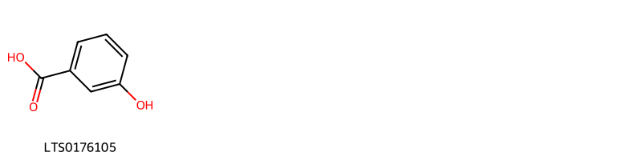{ width=100% }
    <figcaption>Hình ảnh cấu trúc hóa học của 1 hoạt chất thuộc nhóm Benzene and substituted derivatives gồm ['3-hydroxybenzoic acid (LTS0176105)'].</figcaption>
</figure>
#### Nhóm Benzopyrans
<figure markdown="span">
    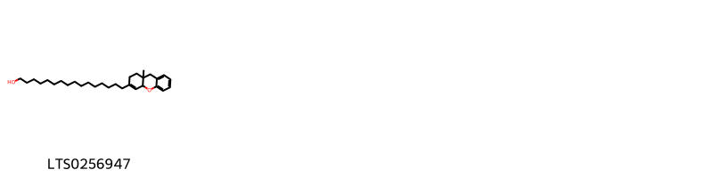{ width=100% }
    <figcaption>Hình ảnh cấu trúc hóa học của 1 hoạt chất thuộc nhóm Benzopyrans gồm ['16-(9a-methyl-1,2,4a,9-tetrahydroxanthen-3-yl)hexadecan-1-ol (LTS0256947)'].</figcaption>
</figure>
#### Nhóm Carboxylic acids and derivatives
<figure markdown="span">
    { width=100% }
    <figcaption>Hình ảnh cấu trúc hóa học của 1 hoạt chất thuộc nhóm Carboxylic acids and derivatives gồm ['(l)-canavanine (LTS0093855)'].</figcaption>
</figure>
#### Nhóm Steroids and steroid derivatives
<figure markdown="span">
    { width=100% }
    <figcaption>Hình ảnh cấu trúc hóa học của 2 hoạt chất thuộc nhóm Steroids and steroid derivatives gồm ['stigmast-5-en-3-ol, (3β)- (LTS0204616)', 'stigmast-5-en-3-ol (LTS0071224)'].</figcaption>
</figure>

---

### Dược dân tộc học

Danh sách các quốc gia có sử dụng *Indigofera oblongifolia* trong điều trị các bệnh. 

| Country   | Disease                        | Bệnh                                                                                                                                                                                                |
|:----------|:-------------------------------|:----------------------------------------------------------------------------------------------------------------------------------------------------------------------------------------------------|
| Elsewhere | Apertif, Dentifrice, Purgative | MYMEMORY WARNING: YOU USED ALL AVAILABLE FREE TRANSLATIONS FOR TODAY. NEXT AVAILABLE IN  14 HOURS 38 MINUTES 36 SECONDS VISIT HTTPS://MYMEMORY.TRANSLATED.NET/DOC/USAGELIMITS.PHP TO TRANSLATE MORE |

---

---
## Indigofera p
### Thông tin về thực vật

!!! info "Phân loại thực vật của *N/A* từ GIBF:"
    - **Kingdom:** Plantae
    - **Phylum:** Tracheophyta
    - **Order:** Fabales
    - **Family:** Fabaceae
    - **Genus:** Indigofera
    - **Species:** *N/A*

 

| Label (VI)   | Label (EN)   | Scientific Name         | Descriptions (VI)   | Descriptions (EN)   | Also Known As (VI)   | Also Known As (EN)   |
|:-------------|:-------------|:------------------------|:--------------------|:--------------------|:---------------------|:---------------------|
| N/A          | N/A          | Indigofera oblongifolia | loài thực vật       | species of plant    | ['']                 | ['Hasr']             |

#### Phân bố trên thế giới

**Từ CSDL GIBF** Virgin Islands (U.S.), Australia, Japan, Guadeloupe, Gabon, Argentina, Bermuda, Yemen, French Guiana, Israel, Puerto Rico, Namibia, Chinese Taipei, United States of America, El Salvador, Belize, South Africa, Brazil, Cuba, Dominican Republic, Mexico, Singapore, Eswatini, Botswana, India, Antigua and Barbuda, Cameroon

#### Phân bố tại Việt Nam

**Từ CSDL GIBF**: Không có ghi nhận ở Việt Nam

---
### Thành phần hóa học
        
- Theo cơ sở dữ liệu lotus: Từ loài *N/A* đã phân lập và xác định được 24 hoạt chất thuộc về các nhóm Carboxylic acids and derivatives. 

|    | chemicalTaxonomyClassyfireClass   |   smiles_count |
|---:|:----------------------------------|---------------:|
|  0 | Carboxylic acids and derivatives  |             24 |

#### Nhóm Carboxylic acids and derivatives
<figure markdown="span">
    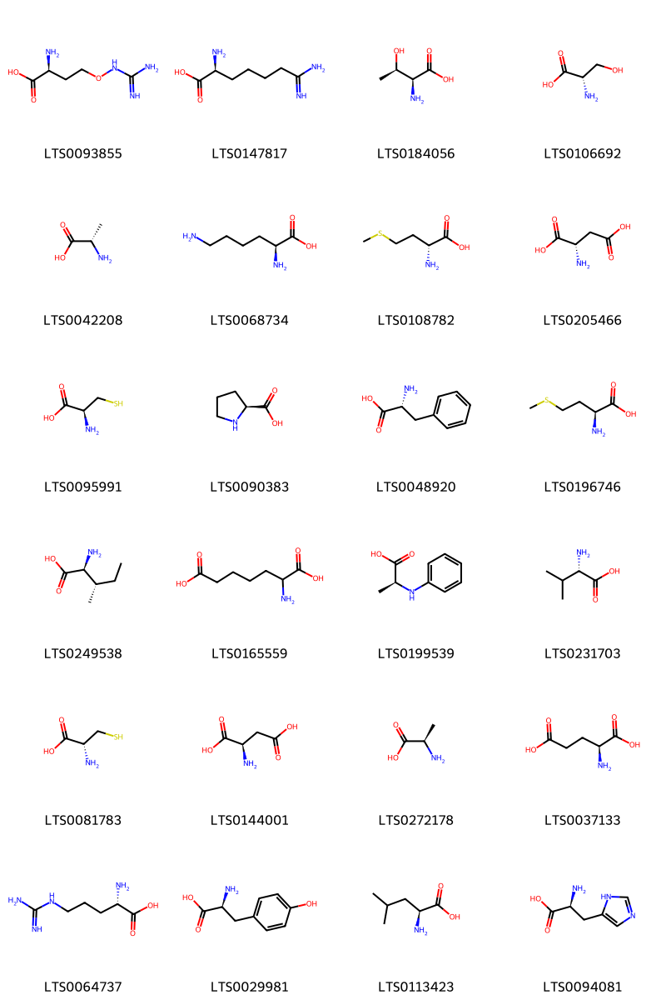{ width=100% }
    <figcaption>Hình ảnh cấu trúc hóa học của 24 hoạt chất thuộc nhóm Carboxylic acids and derivatives gồm ['(l)-canavanine (LTS0093855)', 'indospicine (LTS0147817)', 'l-threonine (LTS0184056)', 'l-serine (LTS0106692)', 'l-alanine (LTS0042208)', 'l-lysine (LTS0068734)', 'd-methionine (LTS0108782)', 'l-aspartic acid (LTS0205466)', 'd-cysteine (LTS0095991)', 'l-proline (LTS0090383)', 'd-phenylalanine (LTS0048920)', 'l-methionine (LTS0196746)', 'l-isoleucine (LTS0249538)', 'dl-2-aminopimelic acid (LTS0165559)', '(2s)-2-(phenylamino)propanoic acid (LTS0199539)', 'l-valine (LTS0231703)', 'l-cysteine (LTS0081783)', 'd-aspartic acid (LTS0144001)', 'd-alanine (LTS0272178)', 'l-glutamic acid (LTS0037133)', 'l-arginine (LTS0064737)', 'l-tyrosine (LTS0029981)', 'l-leucine (LTS0113423)', 'l-histidine (LTS0094081)'].</figcaption>
</figure>

---

### Dược dân tộc học

Danh sách các quốc gia có sử dụng *N/A* trong điều trị các bệnh. 

| Country   | Disease   | Bệnh                                                                                                                                                                                                |
|:----------|:----------|:----------------------------------------------------------------------------------------------------------------------------------------------------------------------------------------------------|
| Lesotho   | Sedative  | MYMEMORY WARNING: YOU USED ALL AVAILABLE FREE TRANSLATIONS FOR TODAY. NEXT AVAILABLE IN  14 HOURS 38 MINUTES 07 SECONDS VISIT HTTPS://MYMEMORY.TRANSLATED.NET/DOC/USAGELIMITS.PHP TO TRANSLATE MORE |

---

---
## Indigofera pascuorum
### Thông tin về thực vật

!!! info "Phân loại thực vật của *N/A* từ GIBF:"
    - **Kingdom:** Plantae
    - **Phylum:** Tracheophyta
    - **Order:** Fabales
    - **Family:** Fabaceae
    - **Genus:** Indigofera
    - **Species:** *N/A*

 

| Label (VI)   | Label (EN)   | Scientific Name      | Descriptions (VI)   | Descriptions (EN)   | Also Known As (VI)   | Also Known As (EN)   |
|:-------------|:-------------|:---------------------|:--------------------|:--------------------|:---------------------|:---------------------|
| N/A          | N/A          | Indigofera pascuorum | loài thực vật       | species of plant    | ['']                 | ['']                 |

#### Phân bố trên thế giới

**Từ CSDL GIBF** Virgin Islands (U.S.), Australia, Japan, Guadeloupe, Gabon, Argentina, Bermuda, Yemen, French Guiana, Israel, Puerto Rico, Namibia, Chinese Taipei, United States of America, El Salvador, Belize, South Africa, Brazil, Cuba, Dominican Republic, Mexico, Singapore, Eswatini, Botswana, India, Antigua and Barbuda, Cameroon

#### Phân bố tại Việt Nam

**Từ CSDL GIBF**: Không có ghi nhận ở Việt Nam

---
### Thành phần hóa học
        
- Theo cơ sở dữ liệu lotus: Từ loài *N/A* đã phân lập và xác định được Chưa có hoạt chất nào được phân lập. hoạt chất thuộc về các nhóm Không có hoạt chất nào được phân lập. 

Không có hình ảnh nào được tạo ra

---

### Dược dân tộc học

Danh sách các quốc gia có sử dụng *N/A* trong điều trị các bệnh. 

| Country   | Disease              | Bệnh                                                                                                                                                                                                |
|:----------|:---------------------|:----------------------------------------------------------------------------------------------------------------------------------------------------------------------------------------------------|
| Venezuela | Stimulant, Digestive | MYMEMORY WARNING: YOU USED ALL AVAILABLE FREE TRANSLATIONS FOR TODAY. NEXT AVAILABLE IN  14 HOURS 37 MINUTES 34 SECONDS VISIT HTTPS://MYMEMORY.TRANSLATED.NET/DOC/USAGELIMITS.PHP TO TRANSLATE MORE |

---

---
## Indigofera pauciflora
### Thông tin về thực vật

!!! info "Phân loại thực vật của *Indigofera pauciflora* từ GIBF:"
    - **Kingdom:** Plantae
    - **Phylum:** Tracheophyta
    - **Order:** Fabales
    - **Family:** Fabaceae
    - **Genus:** Indigofera
    - **Species:** *Indigofera pauciflora*

 

| Label (VI)   | Label (EN)   | Scientific Name       | Descriptions (VI)   | Descriptions (EN)   | Also Known As (VI)   | Also Known As (EN)   |
|:-------------|:-------------|:----------------------|:--------------------|:--------------------|:---------------------|:---------------------|
| N/A          | N/A          | Indigofera pauciflora | loài thực vật       | species of plant    | ['']                 | ['']                 |

#### Phân bố trên thế giới

**Từ CSDL GIBF** nan, South Africa, Madagascar, Thailand, Sudan, Egypt, Indonesia, Yemen

#### Phân bố tại Việt Nam

**Từ CSDL GIBF**: Không có ghi nhận ở Việt Nam

---
### Thành phần hóa học
        
- Theo cơ sở dữ liệu lotus: Từ loài *Indigofera pauciflora* đã phân lập và xác định được Chưa có hoạt chất nào được phân lập. hoạt chất thuộc về các nhóm Không có hoạt chất nào được phân lập. 

Không có hình ảnh nào được tạo ra

---

### Dược dân tộc học

Danh sách các quốc gia có sử dụng *Indigofera pauciflora* trong điều trị các bệnh. 

| Country   | Disease   | Bệnh                                                                                                                                                                                                |
|:----------|:----------|:----------------------------------------------------------------------------------------------------------------------------------------------------------------------------------------------------|
| Elsewhere | Purgative | MYMEMORY WARNING: YOU USED ALL AVAILABLE FREE TRANSLATIONS FOR TODAY. NEXT AVAILABLE IN  14 HOURS 37 MINUTES 08 SECONDS VISIT HTTPS://MYMEMORY.TRANSLATED.NET/DOC/USAGELIMITS.PHP TO TRANSLATE MORE |

---

---
## Indigofera paucifolia
### Thông tin về thực vật

!!! info "Phân loại thực vật của *Indigofera oblongifolia* từ GIBF:"
    - **Kingdom:** Plantae
    - **Phylum:** Tracheophyta
    - **Order:** Fabales
    - **Family:** Fabaceae
    - **Genus:** Indigofera
    - **Species:** *Indigofera oblongifolia*

 

| Label (VI)   | Label (EN)   | Scientific Name       | Descriptions (VI)   | Descriptions (EN)   | Also Known As (VI)   | Also Known As (EN)   |
|:-------------|:-------------|:----------------------|:--------------------|:--------------------|:---------------------|:---------------------|
| N/A          | N/A          | Indigofera pauciflora | loài thực vật       | species of plant    | ['']                 | ['']                 |

#### Phân bố trên thế giới

**Từ CSDL GIBF** nan, Pakistan, Sri Lanka, Sudan, Egypt, India, Israel, Ethiopia

#### Phân bố tại Việt Nam

**Từ CSDL GIBF**: Không có ghi nhận ở Việt Nam

---
### Thành phần hóa học
        
- Theo cơ sở dữ liệu lotus: Từ loài *Indigofera oblongifolia* đã phân lập và xác định được Chưa có hoạt chất nào được phân lập. hoạt chất thuộc về các nhóm Không có hoạt chất nào được phân lập. 

Không có hình ảnh nào được tạo ra

---

### Dược dân tộc học

Danh sách các quốc gia có sử dụng *Indigofera oblongifolia* trong điều trị các bệnh. 

| Country   | Disease   | Bệnh                                                                                                                                                                                                |
|:----------|:----------|:----------------------------------------------------------------------------------------------------------------------------------------------------------------------------------------------------|
| Sudan     | Purgative | MYMEMORY WARNING: YOU USED ALL AVAILABLE FREE TRANSLATIONS FOR TODAY. NEXT AVAILABLE IN  14 HOURS 36 MINUTES 46 SECONDS VISIT HTTPS://MYMEMORY.TRANSLATED.NET/DOC/USAGELIMITS.PHP TO TRANSLATE MORE |

---

---
## Indigofera suffruticosa
### Thông tin về thực vật

!!! info "Phân loại thực vật của *Indigofera suffruticosa* từ GIBF:"
    - **Kingdom:** Plantae
    - **Phylum:** Tracheophyta
    - **Order:** Fabales
    - **Family:** Fabaceae
    - **Genus:** Indigofera
    - **Species:** *Indigofera suffruticosa*

 

| Label (VI)   | Label (EN)   | Scientific Name         | Descriptions (VI)   | Descriptions (EN)   | Also Known As (VI)   | Also Known As (EN)   |
|:-------------|:-------------|:------------------------|:--------------------|:--------------------|:---------------------|:---------------------|
| N/A          | N/A          | Indigofera suffruticosa | loài thực vật       | species of plant    | ['']                 | ['']                 |

#### Phân bố trên thế giới

**Từ CSDL GIBF** Virgin Islands (U.S.), nan, Australia, Guadeloupe, Mauritius, Argentina, Nicaragua, Bermuda, Puerto Rico, Chinese Taipei, Bolivia (Plurinational State of), United States of America, El Salvador, Hong Kong, Brazil, Tonga, New Caledonia, Mexico, Peru, Ecuador, Colombia, Montserrat, Antigua and Barbuda, Kenya

#### Phân bố tại Việt Nam

**Từ CSDL GIBF**: Không có ghi nhận ở Việt Nam

---
### Thành phần hóa học
        
- Theo cơ sở dữ liệu lotus: Từ loài *Indigofera suffruticosa* đã phân lập và xác định được 13 hoạt chất thuộc về các nhóm Indoles and derivatives, Steroids and steroid derivatives, Azolidines, Azoles, Organooxygen compounds, Allyl-type 1,3-dipolar organic compounds, Carboxylic acids and derivatives. 

|    | chemicalTaxonomyClassyfireClass          |   smiles_count |
|---:|:-----------------------------------------|---------------:|
|  0 | Allyl-type 1,3-dipolar organic compounds |              1 |
|  1 | Azoles                                   |              1 |
|  2 | Azolidines                               |              1 |
|  3 | Carboxylic acids and derivatives         |              1 |
|  4 | Indoles and derivatives                  |              3 |
|  5 | Organooxygen compounds                   |              4 |
|  6 | Steroids and steroid derivatives         |              2 |

#### Nhóm Allyl-type 1_3-dipolar organic compounds
<figure markdown="span">
    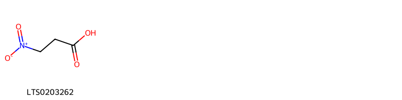{ width=100% }
    <figcaption>Hình ảnh cấu trúc hóa học của Không tìm thấy chú thích hoạt chất thuộc nhóm Allyl-type 1_3-dipolar organic compounds gồm Không tìm thấy chú thích.</figcaption>
</figure>
#### Nhóm Azoles
<figure markdown="span">
    { width=100% }
    <figcaption>Hình ảnh cấu trúc hóa học của 1 hoạt chất thuộc nhóm Azoles gồm ['allantoin (LTS0106609)'].</figcaption>
</figure>
#### Nhóm Azolidines
<figure markdown="span">
    { width=100% }
    <figcaption>Hình ảnh cấu trúc hóa học của 1 hoạt chất thuộc nhóm Azolidines gồm ['n-[(4s)-2,5-dihydroxy-4h-imidazol-4-yl]carbamimidic acid (LTS0174328)'].</figcaption>
</figure>
#### Nhóm Carboxylic acids and derivatives
<figure markdown="span">
    { width=100% }
    <figcaption>Hình ảnh cấu trúc hóa học của 1 hoạt chất thuộc nhóm Carboxylic acids and derivatives gồm ['(l)-canavanine (LTS0093855)'].</figcaption>
</figure>
#### Nhóm Indoles and derivatives
<figure markdown="span">
    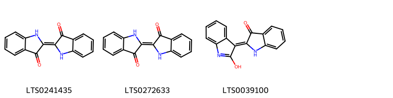{ width=100% }
    <figcaption>Hình ảnh cấu trúc hóa học của 3 hoạt chất thuộc nhóm Indoles and derivatives gồm ['indigo dye (LTS0241435)', "1h,1'h-[2,2'-biindolylidene]-3,3'-dione (LTS0272633)", 'indirubin (LTS0039100)'].</figcaption>
</figure>
#### Nhóm Organooxygen compounds
<figure markdown="span">
    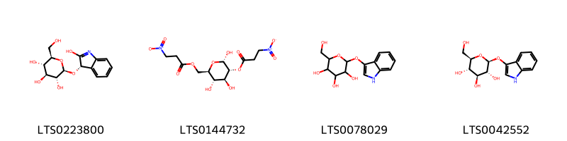{ width=100% }
    <figcaption>Hình ảnh cấu trúc hóa học của 4 hoạt chất thuộc nhóm Organooxygen compounds gồm ['(2s,3r,4s,5s,6r)-2-{[(3s)-2-hydroxy-3h-indol-3-yl]oxy}-6-(hydroxymethyl)oxane-3,4,5-triol (LTS0223800)', 'coronarian (LTS0144732)', 'indican (LTS0078029)', 'indican (LTS0042552)'].</figcaption>
</figure>
#### Nhóm Steroids and steroid derivatives
<figure markdown="span">
    { width=100% }
    <figcaption>Hình ảnh cấu trúc hóa học của 2 hoạt chất thuộc nhóm Steroids and steroid derivatives gồm ['stigmast-5-en-3-ol, (3β)- (LTS0204616)', '(1r,3ar,3br,7s,9ar,9br,11ar)-1-[(2r,5r)-5-ethyl-6-methylheptan-2-yl]-9a,11a-dimethyl-1h,2h,3h,3ah,3bh,4h,6h,7h,8h,9h,9bh,10h,11h-cyclopenta[a]phenanthren-7-ol (LTS0129695)'].</figcaption>
</figure>

---

### Dược dân tộc học

Danh sách các quốc gia có sử dụng *Indigofera suffruticosa* trong điều trị các bệnh. 

| Country            | Disease                                                                                                     | Bệnh                                                                                                                                                                                                |
|:-------------------|:------------------------------------------------------------------------------------------------------------|:----------------------------------------------------------------------------------------------------------------------------------------------------------------------------------------------------|
| Africa             | Abortifacient                                                                                               | MYMEMORY WARNING: YOU USED ALL AVAILABLE FREE TRANSLATIONS FOR TODAY. NEXT AVAILABLE IN  14 HOURS 36 MINUTES 19 SECONDS VISIT HTTPS://MYMEMORY.TRANSLATED.NET/DOC/USAGELIMITS.PHP TO TRANSLATE MORE |
| Dominican Republic | Diuretic                                                                                                    | MYMEMORY WARNING: YOU USED ALL AVAILABLE FREE TRANSLATIONS FOR TODAY. NEXT AVAILABLE IN  14 HOURS 36 MINUTES 15 SECONDS VISIT HTTPS://MYMEMORY.TRANSLATED.NET/DOC/USAGELIMITS.PHP TO TRANSLATE MORE |
| Elsewhere          | Analgesic, Diuretic, Diuretic, Ecbolic, Pediculicide, Purgative, Stomachic, Vulnerary, Vulnerary, Stomachic | MYMEMORY WARNING: YOU USED ALL AVAILABLE FREE TRANSLATIONS FOR TODAY. NEXT AVAILABLE IN  14 HOURS 36 MINUTES 12 SECONDS VISIT HTTPS://MYMEMORY.TRANSLATED.NET/DOC/USAGELIMITS.PHP TO TRANSLATE MORE |
| French Guinea      | Sudorific                                                                                                   | MYMEMORY WARNING: YOU USED ALL AVAILABLE FREE TRANSLATIONS FOR TODAY. NEXT AVAILABLE IN  14 HOURS 36 MINUTES 09 SECONDS VISIT HTTPS://MYMEMORY.TRANSLATED.NET/DOC/USAGELIMITS.PHP TO TRANSLATE MORE |
| Haiti              | Sudorific                                                                                                   | MYMEMORY WARNING: YOU USED ALL AVAILABLE FREE TRANSLATIONS FOR TODAY. NEXT AVAILABLE IN  14 HOURS 36 MINUTES 06 SECONDS VISIT HTTPS://MYMEMORY.TRANSLATED.NET/DOC/USAGELIMITS.PHP TO TRANSLATE MORE |
| Mexico             | Diuretic, Purgative, Purgative, Stomachic, Vulnerary                                                        | MYMEMORY WARNING: YOU USED ALL AVAILABLE FREE TRANSLATIONS FOR TODAY. NEXT AVAILABLE IN  14 HOURS 36 MINUTES 03 SECONDS VISIT HTTPS://MYMEMORY.TRANSLATED.NET/DOC/USAGELIMITS.PHP TO TRANSLATE MORE |

---

---
## Indigofera sumatrana
### Thông tin về thực vật

!!! info "Phân loại thực vật của *Indigofera tinctoria* từ GIBF:"
    - **Kingdom:** Plantae
    - **Phylum:** Tracheophyta
    - **Order:** Fabales
    - **Family:** Fabaceae
    - **Genus:** Indigofera
    - **Species:** *Indigofera tinctoria*

 

| Label (VI)   | Label (EN)   | Scientific Name      | Descriptions (VI)   | Descriptions (EN)   | Also Known As (VI)   | Also Known As (EN)   |
|:-------------|:-------------|:---------------------|:--------------------|:--------------------|:---------------------|:---------------------|
| N/A          | N/A          | Indigofera sumatrana | loài thực vật       | species of plant    | ['']                 | ['']                 |

#### Phân bố trên thế giới

**Từ CSDL GIBF** nan, Ecuador, Cocos (Keeling) Islands, Colombia, Brazil, Côte d’Ivoire, Costa Rica, India, Indonesia, unknown or invalid, Cuba, Congo, Democratic Republic of the, Venezuela (Bolivarian Republic of)

#### Phân bố tại Việt Nam

**Từ CSDL GIBF**: Không có ghi nhận ở Việt Nam

---
### Thành phần hóa học
        
- Theo cơ sở dữ liệu lotus: Từ loài *Indigofera tinctoria* đã phân lập và xác định được Chưa có hoạt chất nào được phân lập. hoạt chất thuộc về các nhóm Không có hoạt chất nào được phân lập. 

Không có hình ảnh nào được tạo ra

---

### Dược dân tộc học

Danh sách các quốc gia có sử dụng *Indigofera tinctoria* trong điều trị các bệnh. 

| Country   | Disease   | Bệnh                                                                                                                                                                                                |
|:----------|:----------|:----------------------------------------------------------------------------------------------------------------------------------------------------------------------------------------------------|
| Java      | Vermifuge | MYMEMORY WARNING: YOU USED ALL AVAILABLE FREE TRANSLATIONS FOR TODAY. NEXT AVAILABLE IN  14 HOURS 35 MINUTES 32 SECONDS VISIT HTTPS://MYMEMORY.TRANSLATED.NET/DOC/USAGELIMITS.PHP TO TRANSLATE MORE |

---

---
## Indigofera thibaudiana
### Thông tin về thực vật

!!! info "Phân loại thực vật của *Indigofera thibaudiana* từ GIBF:"
    - **Kingdom:** Plantae
    - **Phylum:** Tracheophyta
    - **Order:** Fabales
    - **Family:** Fabaceae
    - **Genus:** Indigofera
    - **Species:** *Indigofera thibaudiana*

 

| Label (VI)   | Label (EN)   | Scientific Name        | Descriptions (VI)   | Descriptions (EN)   | Also Known As (VI)   | Also Known As (EN)   |
|:-------------|:-------------|:-----------------------|:--------------------|:--------------------|:---------------------|:---------------------|
| N/A          | N/A          | Indigofera thibaudiana | loài thực vật       | species of plant    | ['']                 | ['']                 |

#### Phân bố trên thế giới

**Từ CSDL GIBF** Costa Rica, El Salvador, Guatemala, Mexico

#### Phân bố tại Việt Nam

**Từ CSDL GIBF**: Không có ghi nhận ở Việt Nam

---
### Thành phần hóa học
        
- Theo cơ sở dữ liệu lotus: Từ loài *Indigofera thibaudiana* đã phân lập và xác định được Chưa có hoạt chất nào được phân lập. hoạt chất thuộc về các nhóm Không có hoạt chất nào được phân lập. 

Không có hình ảnh nào được tạo ra

---

### Dược dân tộc học

Danh sách các quốc gia có sử dụng *Indigofera thibaudiana* trong điều trị các bệnh. 

| Country   | Disease     | Bệnh                                                                                                                                                                                                |
|:----------|:------------|:----------------------------------------------------------------------------------------------------------------------------------------------------------------------------------------------------|
| Guatemala | Insecticide | MYMEMORY WARNING: YOU USED ALL AVAILABLE FREE TRANSLATIONS FOR TODAY. NEXT AVAILABLE IN  14 HOURS 35 MINUTES 10 SECONDS VISIT HTTPS://MYMEMORY.TRANSLATED.NET/DOC/USAGELIMITS.PHP TO TRANSLATE MORE |

---

---
## Indigofera tinctora
### Thông tin về thực vật

!!! info "Phân loại thực vật của *Indigofera tinctoria* từ GIBF:"
    - **Kingdom:** Plantae
    - **Phylum:** Tracheophyta
    - **Order:** Fabales
    - **Family:** Fabaceae
    - **Genus:** Indigofera
    - **Species:** *Indigofera tinctoria*

 

| Label (VI)   | Label (EN)   | Scientific Name        | Descriptions (VI)   | Descriptions (EN)   | Also Known As (VI)   | Also Known As (EN)   |
|:-------------|:-------------|:-----------------------|:--------------------|:--------------------|:---------------------|:---------------------|
| N/A          | N/A          | Indigofera thibaudiana | loài thực vật       | species of plant    | ['']                 | ['']                 |

#### Phân bố trên thế giới

**Từ CSDL GIBF** Virgin Islands (U.S.), Ghana, Sri Lanka, Australia, Japan, Guadeloupe, Mauritius, Myanmar, Mozambique, Benin, Tanzania, United Republic of, Yemen, Togo, Puerto Rico, Netherlands, Réunion, Senegal, Chinese Taipei, Jamaica, United States of America, Bonaire, Sint Eustatius and Saba, Timor-Leste, Zimbabwe, Saint Martin (French part), South Africa, Germany, Martinique, Cuba, Dominican Republic, Mayotte, France, Eswatini, China, Curaçao, Saint Kitts and Nevis, Comoros, Madagascar, Seychelles, Cabo Verde, Haiti, Montserrat, Kenya, Botswana, India, Indonesia, Anguilla, Cayman Islands, Philippines

#### Phân bố tại Việt Nam

**Từ CSDL GIBF**: Không có ghi nhận ở Việt Nam

---
### Thành phần hóa học
        
- Theo cơ sở dữ liệu lotus: Từ loài *Indigofera tinctoria* đã phân lập và xác định được Chưa có hoạt chất nào được phân lập. hoạt chất thuộc về các nhóm Không có hoạt chất nào được phân lập. 

Không có hình ảnh nào được tạo ra

---

### Dược dân tộc học

Danh sách các quốc gia có sử dụng *Indigofera tinctoria* trong điều trị các bệnh. 

| Country            | Disease     | Bệnh                                                                                                                                                                                                |
|:-------------------|:------------|:----------------------------------------------------------------------------------------------------------------------------------------------------------------------------------------------------|
| Dominican Republic | Insecticide | MYMEMORY WARNING: YOU USED ALL AVAILABLE FREE TRANSLATIONS FOR TODAY. NEXT AVAILABLE IN  14 HOURS 34 MINUTES 46 SECONDS VISIT HTTPS://MYMEMORY.TRANSLATED.NET/DOC/USAGELIMITS.PHP TO TRANSLATE MORE |

---

---
## Indigofera tinctoria
### Thông tin về thực vật

!!! info "Phân loại thực vật của *Indigofera tinctoria* từ GIBF:"
    - **Kingdom:** Plantae
    - **Phylum:** Tracheophyta
    - **Order:** Fabales
    - **Family:** Fabaceae
    - **Genus:** Indigofera
    - **Species:** *Indigofera tinctoria*

 

| Label (VI)   | Label (EN)   | Scientific Name      | Descriptions (VI)   | Descriptions (EN)   | Also Known As (VI)   | Also Known As (EN)              |
|:-------------|:-------------|:---------------------|:--------------------|:--------------------|:---------------------|:--------------------------------|
| N/A          | N/A          | Indigofera tinctoria | loài thực vật       | species of legume   | ['']                 | ['indigo plant', 'true indigo'] |

#### Phân bố trên thế giới

**Từ CSDL GIBF** Virgin Islands (U.S.), Ghana, Sri Lanka, Australia, Japan, Guadeloupe, Mauritius, Myanmar, Mozambique, Benin, Tanzania, United Republic of, Yemen, Togo, Puerto Rico, Netherlands, Réunion, Senegal, Chinese Taipei, Jamaica, United States of America, Bonaire, Sint Eustatius and Saba, Timor-Leste, Zimbabwe, Saint Martin (French part), South Africa, Germany, Martinique, Cuba, Dominican Republic, Mayotte, France, Eswatini, China, Curaçao, Saint Kitts and Nevis, Comoros, Madagascar, Seychelles, Cabo Verde, Haiti, Montserrat, Kenya, Botswana, India, Indonesia, Anguilla, Cayman Islands, Philippines

#### Phân bố tại Việt Nam

**Từ CSDL GIBF**: Không có ghi nhận ở Việt Nam

---
### Thành phần hóa học
        
- Theo cơ sở dữ liệu lotus: Từ loài *Indigofera tinctoria* đã phân lập và xác định được 8 hoạt chất thuộc về các nhóm Flavonoids. 

|    | chemicalTaxonomyClassyfireClass   |   smiles_count |
|---:|:----------------------------------|---------------:|
|  0 | Flavonoids                        |              8 |

#### Nhóm Flavonoids
<figure markdown="span">
    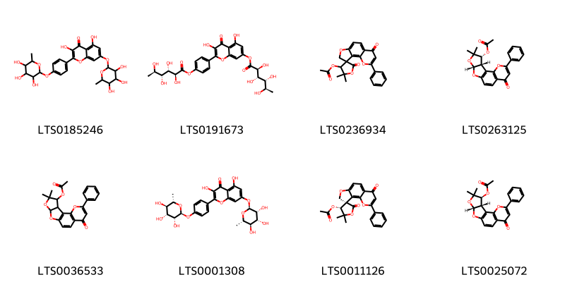{ width=100% }
    <figcaption>Hình ảnh cấu trúc hóa học của 8 hoạt chất thuộc nhóm Flavonoids gồm ['3,5-dihydroxy-7-[(3,4,5-trihydroxy-6-methyloxan-2-yl)oxy]-2-{4-[(3,4,5-trihydroxy-6-methyloxan-2-yl)oxy]phenyl}chromen-4-one (LTS0185246)', '4-(3,5-dihydroxy-4-oxo-7-{[(2s,3s,4r,5r)-2,3,4,5-tetrahydroxyhexanoyl]oxy}chromen-2-yl)phenyl (2s,3s,4r,5r)-2,3,4,5-tetrahydroxyhexanoate (LTS0191673)', "5',5'-dimethyl-2',4-dioxo-2-phenyl-8h-spiro[furo[2,3-h]chromene-9,3'-oxolan]-4'-yl acetate (LTS0236934)", '(12r,15r,16s)-14,14-dimethyl-6-oxo-4-phenyl-3,11,13-trioxatetracyclo[8.6.0.0²,⁷.0¹²,¹⁶]hexadeca-1,4,7,9-tetraen-15-yl acetate (LTS0263125)', 'semiglabrin (LTS0036533)', '3,5-dihydroxy-7-{[(2s,3r,4r,5r,6s)-3,4,5-trihydroxy-6-methyloxan-2-yl]oxy}-2-(4-{[(2s,3r,4r,5r,6s)-3,4,5-trihydroxy-6-methyloxan-2-yl]oxy}phenyl)chromen-4-one (LTS0001308)', "(4'r,9s)-5',5'-dimethyl-2',4-dioxo-2-phenyl-8h-spiro[furo[2,3-h]chromene-9,3'-oxolan]-4'-yl acetate (LTS0011126)", '(12r,15s,16s)-14,14-dimethyl-6-oxo-4-phenyl-3,11,13-trioxatetracyclo[8.6.0.0²,⁷.0¹²,¹⁶]hexadeca-1,4,7,9-tetraen-15-yl acetate (LTS0025072)'].</figcaption>
</figure>

---

### Dược dân tộc học

Danh sách các quốc gia có sử dụng *Indigofera tinctoria* trong điều trị các bệnh. 

| Country            | Disease                                                       | Bệnh                                                                                                                                                                                                |
|:-------------------|:--------------------------------------------------------------|:----------------------------------------------------------------------------------------------------------------------------------------------------------------------------------------------------|
| China              | Alexiteric, Antidote, Vermifuge                               | MYMEMORY WARNING: YOU USED ALL AVAILABLE FREE TRANSLATIONS FOR TODAY. NEXT AVAILABLE IN  14 HOURS 34 MINUTES 12 SECONDS VISIT HTTPS://MYMEMORY.TRANSLATED.NET/DOC/USAGELIMITS.PHP TO TRANSLATE MORE |
| Dominican Republic | Pediculicide                                                  | MYMEMORY WARNING: YOU USED ALL AVAILABLE FREE TRANSLATIONS FOR TODAY. NEXT AVAILABLE IN  14 HOURS 34 MINUTES 08 SECONDS VISIT HTTPS://MYMEMORY.TRANSLATED.NET/DOC/USAGELIMITS.PHP TO TRANSLATE MORE |
| India              | Larvicide                                                     | MYMEMORY WARNING: YOU USED ALL AVAILABLE FREE TRANSLATIONS FOR TODAY. NEXT AVAILABLE IN  14 HOURS 34 MINUTES 04 SECONDS VISIT HTTPS://MYMEMORY.TRANSLATED.NET/DOC/USAGELIMITS.PHP TO TRANSLATE MORE |
| Turkey             | Antiseptic, Astringent, Purgative, Emetic, Nervine, Stimulant | MYMEMORY WARNING: YOU USED ALL AVAILABLE FREE TRANSLATIONS FOR TODAY. NEXT AVAILABLE IN  14 HOURS 34 MINUTES 02 SECONDS VISIT HTTPS://MYMEMORY.TRANSLATED.NET/DOC/USAGELIMITS.PHP TO TRANSLATE MORE |

---

---
## Indigofera trita
### Thông tin về thực vật

!!! info "Phân loại thực vật của *Indigofera trita* từ GIBF:"
    - **Kingdom:** Plantae
    - **Phylum:** Tracheophyta
    - **Order:** Fabales
    - **Family:** Fabaceae
    - **Genus:** Indigofera
    - **Species:** *Indigofera trita*

 

| Label (VI)   | Label (EN)   | Scientific Name   | Descriptions (VI)   | Descriptions (EN)   | Also Known As (VI)   | Also Known As (EN)   |
|:-------------|:-------------|:------------------|:--------------------|:--------------------|:---------------------|:---------------------|
| N/A          | N/A          | Indigofera trita  | loài thực vật       | species of plant    | ['']                 | ['']                 |

#### Phân bố trên thế giới

**Từ CSDL GIBF** South Africa, Australia, Madagascar, Thailand, Colombia, Costa Rica, India, Benin, United States of America, Peru, Mexico, Kenya

#### Phân bố tại Việt Nam

**Từ CSDL GIBF**: Không có ghi nhận ở Việt Nam

---
### Thành phần hóa học
        
- Theo cơ sở dữ liệu lotus: Từ loài *Indigofera trita* đã phân lập và xác định được Chưa có hoạt chất nào được phân lập. hoạt chất thuộc về các nhóm Không có hoạt chất nào được phân lập. 

Không có hình ảnh nào được tạo ra

---

### Dược dân tộc học

Danh sách các quốc gia có sử dụng *Indigofera trita* trong điều trị các bệnh. 

| Country   | Disease   | Bệnh                                                                                                                                                                                                |
|:----------|:----------|:----------------------------------------------------------------------------------------------------------------------------------------------------------------------------------------------------|
| Hindu     | Tonic     | MYMEMORY WARNING: YOU USED ALL AVAILABLE FREE TRANSLATIONS FOR TODAY. NEXT AVAILABLE IN  14 HOURS 33 MINUTES 35 SECONDS VISIT HTTPS://MYMEMORY.TRANSLATED.NET/DOC/USAGELIMITS.PHP TO TRANSLATE MORE |

---

# Chi atholobus

??? note "Danh sách các dược liệu thuộc chi"
    
	 - *atholobus roxburghii*

---
## atholobus roxburghii
### Thông tin về thực vật

!!! info "Phân loại thực vật của *N/A* từ GIBF:"
    - **Kingdom:** N/A
    - **Phylum:** N/A
    - **Order:** N/A
    - **Family:** N/A
    - **Genus:** N/A
    - **Species:** *N/A*

 

| Label (VI)   | Label (EN)   | Scientific Name   | Descriptions (VI)   | Descriptions (EN)   | Also Known As (VI)   | Also Known As (EN)   |
|:-------------|:-------------|:------------------|:--------------------|:--------------------|:---------------------|:---------------------|
| N/A          | N/A          | Indigofera trita  | loài thực vật       | species of plant    | ['']                 | ['']                 |

#### Phân bố trên thế giới

**Từ CSDL GIBF** Không có kết quả phù hợp

#### Phân bố tại Việt Nam

**Từ CSDL GIBF**: Không có ghi nhận ở Việt Nam

---
### Thành phần hóa học
        
- Theo cơ sở dữ liệu lotus: Từ loài *N/A* đã phân lập và xác định được Chưa có hoạt chất nào được phân lập. hoạt chất thuộc về các nhóm Không có hoạt chất nào được phân lập. 

Không có hình ảnh nào được tạo ra

---

### Dược dân tộc học

Danh sách các quốc gia có sử dụng *N/A* trong điều trị các bệnh. 

| Country   | Disease                           | Bệnh                                                                                                                                                                                                |
|:----------|:----------------------------------|:----------------------------------------------------------------------------------------------------------------------------------------------------------------------------------------------------|
| Elsewhere | Insecticide, Piscicide, Vermifuge | MYMEMORY WARNING: YOU USED ALL AVAILABLE FREE TRANSLATIONS FOR TODAY. NEXT AVAILABLE IN  14 HOURS 33 MINUTES 04 SECONDS VISIT HTTPS://MYMEMORY.TRANSLATED.NET/DOC/USAGELIMITS.PHP TO TRANSLATE MORE |

---

# Chi Neptunia

??? note "Danh sách các dược liệu thuộc chi"
    
	 - *Neptunia oleracea*

---
## Neptunia oleracea
### Thông tin về thực vật

!!! info "Phân loại thực vật của *Neptunia prostrata* từ GIBF:"
    - **Kingdom:** Plantae
    - **Phylum:** Tracheophyta
    - **Order:** Fabales
    - **Family:** Fabaceae
    - **Genus:** Neptunia
    - **Species:** *Neptunia prostrata*

 

| Label (VI)   | Label (EN)   | Scientific Name   | Descriptions (VI)   | Descriptions (EN)   | Also Known As (VI)   | Also Known As (EN)     |
|:-------------|:-------------|:------------------|:--------------------|:--------------------|:---------------------|:-----------------------|
| N/A          | N/A          | Neptunia oleracea | loài thực vật       | species of plant    | ['']                 | ['Sensitive Neptunia'] |

#### Phân bố trên thế giới

**Từ CSDL GIBF** nan, Sri Lanka, Benin, Nicaragua, Venezuela (Bolivarian Republic of), French Guiana, Togo, Puerto Rico, Netherlands, Mali, Nigeria, Namibia, Chinese Taipei, Bolivia (Plurinational State of), United States of America, Zimbabwe, El Salvador, Greece, South Africa, Suriname, Thailand, Brazil, Peru, Mexico, Singapore, Ecuador, Madagascar, Colombia, Botswana, Costa Rica, Gambia, Indonesia, Burkina Faso, Malaysia

#### Phân bố tại Việt Nam

**Từ CSDL GIBF**: Không có ghi nhận ở Việt Nam

---
### Thành phần hóa học
        
- Theo cơ sở dữ liệu lotus: Từ loài *Neptunia prostrata* đã phân lập và xác định được 7 hoạt chất thuộc về các nhóm Tetrapyrroles and derivatives. 

|    | chemicalTaxonomyClassyfireClass   |   smiles_count |
|---:|:----------------------------------|---------------:|
|  0 | Tetrapyrroles and derivatives     |              7 |

#### Nhóm Tetrapyrroles and derivatives
<figure markdown="span">
    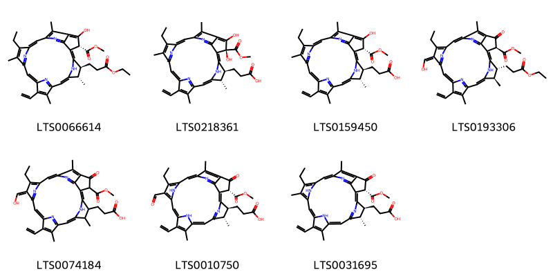{ width=100% }
    <figcaption>Hình ảnh cấu trúc hóa học của 7 hoạt chất thuộc nhóm Tetrapyrroles and derivatives gồm ['methyl (3r,21s,22s)-16-ethenyl-22-(3-ethoxy-3-oxopropyl)-11-ethyl-4-hydroxy-12,17,21,26-tetramethyl-7,23,24,25-tetraazahexacyclo[18.2.1.1⁵,⁸.1¹⁰,¹³.1¹⁵,¹⁸.0²,⁶]hexacosa-1,4,6,8(26),9,11,13(25),14,16,18(24),19-undecaene-3-carboxylate (LTS0066614)', '3-[(3s,21s,22s)-16-ethenyl-11-ethyl-3,4-dihydroxy-3-(methoxycarbonyl)-12,17,21,26-tetramethyl-7,23,24,25-tetraazahexacyclo[18.2.1.1⁵,⁸.1¹⁰,¹³.1¹⁵,¹⁸.0²,⁶]hexacosa-1,4,6,8(26),9,11,13(25),14,16,18(24),19-undecaen-22-yl]propanoic acid (LTS0218361)', '3-[(3r,21s,22s)-16-ethenyl-11-ethyl-4-hydroxy-3-(methoxycarbonyl)-12,17,21,26-tetramethyl-7,23,24,25-tetraazahexacyclo[18.2.1.1⁵,⁸.1¹⁰,¹³.1¹⁵,¹⁸.0²,⁶]hexacosa-1,4,6,8(26),9,11,13(25),14,16,18(24),19-undecaen-22-yl]propanoic acid (LTS0159450)', 'methyl (3s,12z,21r,22r)-16-ethenyl-22-(3-ethoxy-3-oxopropyl)-11-ethyl-12-(hydroxymethylidene)-17,21,26-trimethyl-4-oxo-7,23,24,25-tetraazahexacyclo[18.2.1.1⁵,⁸.1¹⁰,¹³.1¹⁵,¹⁸.0²,⁶]hexacosa-1,5(26),6,8,10,13(25),14,16,18(24),19-decaene-3-carboxylate (LTS0193306)', '3-[(12z)-16-ethenyl-11-ethyl-12-(hydroxymethylidene)-3-(methoxycarbonyl)-17,21,26-trimethyl-4-oxo-7,23,24,25-tetraazahexacyclo[18.2.1.1⁵,⁸.1¹⁰,¹³.1¹⁵,¹⁸.0²,⁶]hexacosa-1,5(26),6,8,10,13(25),14,16,18(24),19-decaen-22-yl]propanoic acid (LTS0074184)', '3-[(3r,21s,22s)-16-ethenyl-11-ethyl-12-formyl-3-(methoxycarbonyl)-17,21,26-trimethyl-4-oxo-7,23,24,25-tetraazahexacyclo[18.2.1.1⁵,⁸.1¹⁰,¹³.1¹⁵,¹⁸.0²,⁶]hexacosa-1(23),2(6),5(26),7,9,11,13,15,17,19-decaen-22-yl]propanoic acid (LTS0010750)', '3-[(3r,21s,22s)-16-ethenyl-11-ethyl-3-(methoxycarbonyl)-12,17,21,26-tetramethyl-4-oxo-7,23,24,25-tetraazahexacyclo[18.2.1.1⁵,⁸.1¹⁰,¹³.1¹⁵,¹⁸.0²,⁶]hexacosa-1(23),2(6),5(26),7,9,11,13,15,17,19-decaen-22-yl]propanoic acid (LTS0031695)'].</figcaption>
</figure>

---

### Dược dân tộc học

Danh sách các quốc gia có sử dụng *Neptunia prostrata* trong điều trị các bệnh. 

| Country   | Disease                 | Bệnh                                                                                                                                                                                                |
|:----------|:------------------------|:----------------------------------------------------------------------------------------------------------------------------------------------------------------------------------------------------|
| Elsewhere | Astringent, Refrigerant | MYMEMORY WARNING: YOU USED ALL AVAILABLE FREE TRANSLATIONS FOR TODAY. NEXT AVAILABLE IN  14 HOURS 32 MINUTES 50 SECONDS VISIT HTTPS://MYMEMORY.TRANSLATED.NET/DOC/USAGELIMITS.PHP TO TRANSLATE MORE |

---

# Chi Albizia

??? note "Danh sách các dược liệu thuộc chi"
    
	 - *Albizia anthelmintica*
	 - *Albizia chinensis*
	 - *Albizia ferruginea*
	 - *Albizia julibrissin*
	 - *Albizia lebbeck*
	 - *Albizia lebbek*
	 - *Albizia odoratissima*
	 - *Albizia procera*
	 - *Albizia saponaria*

---
## Albizia anthelmintica
### Thông tin về thực vật

!!! info "Phân loại thực vật của *Albizia anthelmintica* từ GIBF:"
    - **Kingdom:** Plantae
    - **Phylum:** Tracheophyta
    - **Order:** Fabales
    - **Family:** Fabaceae
    - **Genus:** Albizia
    - **Species:** *Albizia anthelmintica*

 

| Label (VI)   | Label (EN)   | Scientific Name       | Descriptions (VI)   | Descriptions (EN)   | Also Known As (VI)   | Also Known As (EN)                                                    |
|:-------------|:-------------|:----------------------|:--------------------|:--------------------|:---------------------|:----------------------------------------------------------------------|
| N/A          | N/A          | Albizia anthelmintica | loài thực vật       | species of plant    | ['']                 | ['cherry blossom tree', 'worm bark false thorn', 'worm cure albizia'] |

#### Phân bố trên thế giới

**Từ CSDL GIBF** Malawi, Zambia, South Africa, Namibia, Sudan, Somalia, Mozambique, Botswana, Zimbabwe, Kenya, Tanzania, United Republic of, Eswatini, Ethiopia

#### Phân bố tại Việt Nam

**Từ CSDL GIBF**: Không có ghi nhận ở Việt Nam

---
### Thành phần hóa học
        
- Theo cơ sở dữ liệu lotus: Từ loài *Albizia anthelmintica* đã phân lập và xác định được Chưa có hoạt chất nào được phân lập. hoạt chất thuộc về các nhóm Không có hoạt chất nào được phân lập. 

Không có hình ảnh nào được tạo ra

---

### Dược dân tộc học

Danh sách các quốc gia có sử dụng *Albizia anthelmintica* trong điều trị các bệnh. 

| Country         | Disease                      | Bệnh                                                                                                                                                                                                |
|:----------------|:-----------------------------|:----------------------------------------------------------------------------------------------------------------------------------------------------------------------------------------------------|
| Africa          | Poison, Vermifuge, Purgative | MYMEMORY WARNING: YOU USED ALL AVAILABLE FREE TRANSLATIONS FOR TODAY. NEXT AVAILABLE IN  14 HOURS 32 MINUTES 23 SECONDS VISIT HTTPS://MYMEMORY.TRANSLATED.NET/DOC/USAGELIMITS.PHP TO TRANSLATE MORE |
| Africa(Swahili) | Vermifuge                    | MYMEMORY WARNING: YOU USED ALL AVAILABLE FREE TRANSLATIONS FOR TODAY. NEXT AVAILABLE IN  14 HOURS 32 MINUTES 20 SECONDS VISIT HTTPS://MYMEMORY.TRANSLATED.NET/DOC/USAGELIMITS.PHP TO TRANSLATE MORE |
| Ethiopia        | Taenifuge                    | MYMEMORY WARNING: YOU USED ALL AVAILABLE FREE TRANSLATIONS FOR TODAY. NEXT AVAILABLE IN  14 HOURS 32 MINUTES 17 SECONDS VISIT HTTPS://MYMEMORY.TRANSLATED.NET/DOC/USAGELIMITS.PHP TO TRANSLATE MORE |

---

---
## Albizia chinensis
### Thông tin về thực vật

!!! info "Phân loại thực vật của *Albizia chinensis* từ GIBF:"
    - **Kingdom:** Plantae
    - **Phylum:** Tracheophyta
    - **Order:** Fabales
    - **Family:** Fabaceae
    - **Genus:** Albizia
    - **Species:** *Albizia chinensis*

 

| Label (VI)   | Label (EN)   | Scientific Name   | Descriptions (VI)   | Descriptions (EN)   | Also Known As (VI)   | Also Known As (EN)   |
|:-------------|:-------------|:------------------|:--------------------|:--------------------|:---------------------|:---------------------|
| N/A          | N/A          | Albizia chinensis | loài thực vật       | species of plant    | ['']                 | ['']                 |

#### Phân bố trên thế giới

**Từ CSDL GIBF** nan, Gabon, Lao People’s Democratic Republic, Cambodia, Myanmar, unknown or invalid, Tanzania, United Republic of, Togo, Pakistan, Chinese Taipei, Spain, Papua New Guinea, Bangladesh, United States of America, Congo, Democratic Republic of the, Zimbabwe, South Africa, Hong Kong, Thailand, Brazil, Bhutan, Mayotte, Mexico, Viet Nam, China, Comoros, Madagascar, India, Indonesia, Samoa, Malaysia, Brunei Darussalam, Nepal

#### Phân bố tại Việt Nam

**Từ CSDL GIBF**: Kon Tum, Ha Tinh

---
### Thành phần hóa học
        
- Theo cơ sở dữ liệu lotus: Từ loài *Albizia chinensis* đã phân lập và xác định được 9 hoạt chất thuộc về các nhóm Prenol lipids. 

|    | chemicalTaxonomyClassyfireClass   |   smiles_count |
|---:|:----------------------------------|---------------:|
|  0 | Prenol lipids                     |              9 |

#### Nhóm Prenol lipids
<figure markdown="span">
    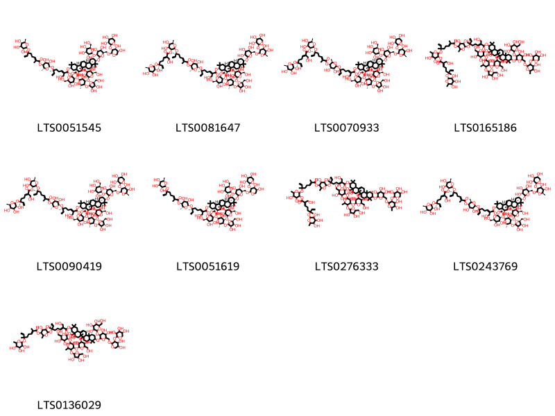{ width=100% }
    <figcaption>Hình ảnh cấu trúc hóa học của 9 hoạt chất thuộc nhóm Prenol lipids gồm ['(2s,3r,4s,5r,6r)-3-{[(2s,3r,4s,5s,6s)-5-{[(2s,3r,4r,5s)-3,4-dihydroxy-5-(hydroxymethyl)oxolan-2-yl]oxy}-3-hydroxy-6-methyl-4-{[(2s,3r,4s,5r,6r)-3,4,5-trihydroxy-6-(hydroxymethyl)oxan-2-yl]oxy}oxan-2-yl]oxy}-4,5-dihydroxy-6-(hydroxymethyl)oxan-2-yl (3s,4ar,5r,6as,6br,8ar,10s,12ar,12br,14bs)-10-{[(2r,3r,4s,5r,6r)-6-({[(2s,3r,4r,5r)-4,5-dihydroxy-3-{[(2s,3r,4s,5r)-3,4,5-trihydroxyoxan-2-yl]oxy}oxan-2-yl]oxy}methyl)-4,5-dihydroxy-3-{[(2s,3r,4s,5r,6r)-3,4,5-trihydroxy-6-(hydroxymethyl)oxan-2-yl]oxy}oxan-2-yl]oxy}-3-{[(2e,6s)-6-{[(2s,3r,4r,5s,6r)-5-{[(2e,6s)-2,6-dimethyl-6-{[(2s,3r,4s,5s,6r)-3,4,5-trihydroxy-6-methyloxan-2-yl]oxy}octa-2,7-dienoyl]oxy}-3,4-dihydroxy-6-methyloxan-2-yl]oxy}-2-(hydroxymethyl)-6-methylocta-2,7-dienoyl]oxy}-5-hydroxy-2,2,6a,6b,9,9,12a-heptamethyl-1,3,4,5,6,7,8,8a,10,11,12,12b,13,14b-tetradecahydropicene-4a-carboxylate (LTS0051545)', '(2s,3r,4s,5s,6r)-3-{[(2s,3r,4s,5s,6s)-5-{[(2s,3r,4r,5s)-3,4-dihydroxy-5-(hydroxymethyl)oxolan-2-yl]oxy}-3-hydroxy-6-methyl-4-{[(2s,3r,4s,5s,6r)-3,4,5-trihydroxy-6-(hydroxymethyl)oxan-2-yl]oxy}oxan-2-yl]oxy}-4,5-dihydroxy-6-(hydroxymethyl)oxan-2-yl (3s,4ar,5r,6as,6br,8ar,10s,12ar,12br,14bs)-3-{[(2e,6s)-6-{[(2s,3r,4r,5s,6r)-5-{[(2e,6s)-6-{[(2s,3r,4s,5s,6r)-4,5-dihydroxy-3-{[(2e,6s)-2-(hydroxymethyl)-6-methyl-6-{[(2s,3r,4s,5s,6r)-3,4,5-trihydroxy-6-methyloxan-2-yl]oxy}octa-2,7-dienoyl]oxy}-6-methyloxan-2-yl]oxy}-2,6-dimethylocta-2,7-dienoyl]oxy}-3,4-dihydroxy-6-methyloxan-2-yl]oxy}-2-(hydroxymethyl)-6-methylocta-2,7-dienoyl]oxy}-10-{[(2r,3r,4s,5s,6r)-6-({[(2r,3r,4s,5r,6r)-4,5-dihydroxy-6-methyl-3-{[(2s,3r,4s,5r)-3,4,5-trihydroxyoxan-2-yl]oxy}oxan-2-yl]oxy}methyl)-3,4,5-trihydroxyoxan-2-yl]oxy}-5-hydroxy-2,2,6a,6b,9,9,12a-heptamethyl-1,3,4,5,6,7,8,8a,10,11,12,12b,13,14b-tetradecahydropicene-4a-carboxylate (LTS0081647)', '(2r,3r,4s,5r,6r)-3-{[(2s,3r,4s,5s,6s)-5-{[(2s,3r,4r,5s)-3,4-dihydroxy-5-(hydroxymethyl)oxolan-2-yl]oxy}-3-hydroxy-6-methyl-4-{[(2s,3r,4s,5r,6r)-3,4,5-trihydroxy-6-(hydroxymethyl)oxan-2-yl]oxy}oxan-2-yl]oxy}-4,5-dihydroxy-6-(hydroxymethyl)oxan-2-yl (3s,4ar,5r,6as,6br,8ar,10s,12ar,12br,14bs)-3-{[(2e,6s)-6-{[(2s,3r,4s,5s,6r)-5-{[(2e,6s)-6-{[(2s,3r,4s,5s,6r)-4,5-dihydroxy-3-{[(2e,6s)-2-(hydroxymethyl)-6-methyl-6-{[(2s,3r,4s,5s,6r)-3,4,5-trihydroxy-6-methyloxan-2-yl]oxy}octa-2,7-dienoyl]oxy}-6-methyloxan-2-yl]oxy}-2,6-dimethylocta-2,7-dienoyl]oxy}-3,4-dihydroxy-6-methyloxan-2-yl]oxy}-2-(hydroxymethyl)-6-methylocta-2,7-dienoyl]oxy}-10-{[(2r,3r,4s,5r,6r)-6-({[(2r,3r,4s,5r,6r)-4,5-dihydroxy-6-methyl-3-{[(2s,3r,4s,5r)-3,4,5-trihydroxyoxan-2-yl]oxy}oxan-2-yl]oxy}methyl)-4,5-dihydroxy-3-{[(2s,3r,4s,5r,6r)-3,4,5-trihydroxy-6-(hydroxymethyl)oxan-2-yl]oxy}oxan-2-yl]oxy}-5-hydroxy-2,2,6a,6b,9,9,12a-heptamethyl-1,3,4,5,6,7,8,8a,10,11,12,12b,13,14b-tetradecahydropicene-4a-carboxylate (LTS0070933)', 'albizoside b (LTS0165186)', '(2s,3r,4s,5s,6r)-3-{[(2s,3r,4s,5s,6s)-5-{[(2s,3r,4r,5s)-3,4-dihydroxy-5-(hydroxymethyl)oxolan-2-yl]oxy}-3-hydroxy-6-methyl-4-{[(2s,3r,4s,5s,6r)-3,4,5-trihydroxy-6-(hydroxymethyl)oxan-2-yl]oxy}oxan-2-yl]oxy}-4,5-dihydroxy-6-(hydroxymethyl)oxan-2-yl (3s,4ar,5r,6as,6br,8ar,10s,12ar,12br,14bs)-3-{[(2e,6s)-6-{[(2s,3r,4r,5s,6r)-5-{[(2e,6s)-6-{[(2s,3r,4s,5s,6r)-4,5-dihydroxy-3-{[(2e,6s)-2-(hydroxymethyl)-6-methyl-6-{[(2s,3r,4s,5s,6r)-3,4,5-trihydroxy-6-methyloxan-2-yl]oxy}octa-2,7-dienoyl]oxy}-6-methyloxan-2-yl]oxy}-2,6-dimethylocta-2,7-dienoyl]oxy}-3,4-dihydroxy-6-methyloxan-2-yl]oxy}-2-(hydroxymethyl)-6-methylocta-2,7-dienoyl]oxy}-10-{[(2r,3r,4s,5s,6r)-6-({[(2r,3r,4s,5r,6r)-4,5-dihydroxy-6-methyl-3-{[(2s,3r,4s,5r)-3,4,5-trihydroxyoxan-2-yl]oxy}oxan-2-yl]oxy}methyl)-4,5-dihydroxy-3-{[(2s,3r,4s,5s,6r)-3,4,5-trihydroxy-6-(hydroxymethyl)oxan-2-yl]oxy}oxan-2-yl]oxy}-5-hydroxy-2,2,6a,6b,9,9,12a-heptamethyl-1,3,4,5,6,7,8,8a,10,11,12,12b,13,14b-tetradecahydropicene-4a-carboxylate (LTS0090419)', '(2s,3r,4s,5s,6r)-3-{[(2s,3r,4s,5s,6s)-5-{[(2s,3r,4r,5s)-3,4-dihydroxy-5-(hydroxymethyl)oxolan-2-yl]oxy}-3-hydroxy-6-methyl-4-{[(2s,3r,4s,5s,6r)-3,4,5-trihydroxy-6-(hydroxymethyl)oxan-2-yl]oxy}oxan-2-yl]oxy}-4,5-dihydroxy-6-(hydroxymethyl)oxan-2-yl (3s,4ar,5r,6as,6br,8ar,10s,12ar,12br,14bs)-10-{[(2r,3r,4s,5s,6r)-6-({[(2s,3r,4s,5s)-4,5-dihydroxy-3-{[(2s,3r,4s,5r)-3,4,5-trihydroxyoxan-2-yl]oxy}oxan-2-yl]oxy}methyl)-4,5-dihydroxy-3-{[(2s,3r,4s,5s,6r)-3,4,5-trihydroxy-6-(hydroxymethyl)oxan-2-yl]oxy}oxan-2-yl]oxy}-3-{[(2e,6s)-6-{[(2s,3r,4r,5s,6r)-5-{[(2e,6s)-2,6-dimethyl-6-{[(2s,3r,4s,5s,6r)-3,4,5-trihydroxy-6-methyloxan-2-yl]oxy}octa-2,7-dienoyl]oxy}-3,4-dihydroxy-6-methyloxan-2-yl]oxy}-2-(hydroxymethyl)-6-methylocta-2,7-dienoyl]oxy}-5-hydroxy-2,2,6a,6b,9,9,12a-heptamethyl-1,3,4,5,6,7,8,8a,10,11,12,12b,13,14b-tetradecahydropicene-4a-carboxylate (LTS0051619)', 'albizoside a (LTS0276333)', '(2r,3r,4s,5r,6r)-3-{[(2s,3r,4s,5s,6s)-5-{[(2s,3r,4r,5s)-3,4-dihydroxy-5-(hydroxymethyl)oxolan-2-yl]oxy}-3-hydroxy-6-methyl-4-{[(2s,3r,4s,5r,6r)-3,4,5-trihydroxy-6-(hydroxymethyl)oxan-2-yl]oxy}oxan-2-yl]oxy}-4,5-dihydroxy-6-(hydroxymethyl)oxan-2-yl (3s,4ar,5r,6as,6br,8ar,10s,12ar,12br,14bs)-3-{[(2e,6s)-6-{[(2s,3r,4s,5s,6r)-5-{[(2e,6s)-6-{[(2s,3r,4s,5s,6r)-4,5-dihydroxy-3-{[(2e,6s)-2-(hydroxymethyl)-6-methyl-6-{[(2s,3r,4s,5s,6r)-3,4,5-trihydroxy-6-methyloxan-2-yl]oxy}octa-2,7-dienoyl]oxy}-6-methyloxan-2-yl]oxy}-2,6-dimethylocta-2,7-dienoyl]oxy}-3,4-dihydroxy-6-methyloxan-2-yl]oxy}-2-(hydroxymethyl)-6-methylocta-2,7-dienoyl]oxy}-10-{[(2r,3r,4s,5r,6r)-6-({[(2r,3r,4s,5r,6r)-4,5-dihydroxy-6-methyl-3-{[(2s,3r,4s,5r)-3,4,5-trihydroxyoxan-2-yl]oxy}oxan-2-yl]oxy}methyl)-3,4,5-trihydroxyoxan-2-yl]oxy}-5-hydroxy-2,2,6a,6b,9,9,12a-heptamethyl-1,3,4,5,6,7,8,8a,10,11,12,12b,13,14b-tetradecahydropicene-4a-carboxylate (LTS0243769)', 'albizoside c (LTS0136029)'].</figcaption>
</figure>

---

### Dược dân tộc học

Danh sách các quốc gia có sử dụng *Albizia chinensis* trong điều trị các bệnh. 

| Country   | Disease   | Bệnh                                                                                                                                                                                                |
|:----------|:----------|:----------------------------------------------------------------------------------------------------------------------------------------------------------------------------------------------------|
| Burma     | Piscicide | MYMEMORY WARNING: YOU USED ALL AVAILABLE FREE TRANSLATIONS FOR TODAY. NEXT AVAILABLE IN  14 HOURS 31 MINUTES 30 SECONDS VISIT HTTPS://MYMEMORY.TRANSLATED.NET/DOC/USAGELIMITS.PHP TO TRANSLATE MORE |

---

---
## Albizia ferruginea
### Thông tin về thực vật

!!! info "Phân loại thực vật của *Albizia ferruginea* từ GIBF:"
    - **Kingdom:** Plantae
    - **Phylum:** Tracheophyta
    - **Order:** Fabales
    - **Family:** Fabaceae
    - **Genus:** Albizia
    - **Species:** *Albizia ferruginea*

 

| Label (VI)   | Label (EN)   | Scientific Name    | Descriptions (VI)   | Descriptions (EN)   | Also Known As (VI)   | Also Known As (EN)   |
|:-------------|:-------------|:-------------------|:--------------------|:--------------------|:---------------------|:---------------------|
| N/A          | N/A          | Albizia ferruginea | loài thực vật       | species of plant    | ['']                 | ['']                 |

#### Phân bố trên thế giới

**Từ CSDL GIBF** Ghana, Liberia, Nigeria, Gabon, Côte d’Ivoire, Benin, Guinea, Cameroon, Sierra Leone

#### Phân bố tại Việt Nam

**Từ CSDL GIBF**: Không có ghi nhận ở Việt Nam

---
### Thành phần hóa học
        
- Theo cơ sở dữ liệu lotus: Từ loài *Albizia ferruginea* đã phân lập và xác định được Chưa có hoạt chất nào được phân lập. hoạt chất thuộc về các nhóm Không có hoạt chất nào được phân lập. 

Không có hình ảnh nào được tạo ra

---

### Dược dân tộc học

Danh sách các quốc gia có sử dụng *Albizia ferruginea* trong điều trị các bệnh. 

| Country   | Disease   | Bệnh                                                                                                                                                                                                |
|:----------|:----------|:----------------------------------------------------------------------------------------------------------------------------------------------------------------------------------------------------|
| Africa    | Poison    | MYMEMORY WARNING: YOU USED ALL AVAILABLE FREE TRANSLATIONS FOR TODAY. NEXT AVAILABLE IN  14 HOURS 30 MINUTES 57 SECONDS VISIT HTTPS://MYMEMORY.TRANSLATED.NET/DOC/USAGELIMITS.PHP TO TRANSLATE MORE |

---

---
## Albizia julibrissin
### Thông tin về thực vật

!!! info "Phân loại thực vật của *Albizia julibrissin* từ GIBF:"
    - **Kingdom:** Plantae
    - **Phylum:** Tracheophyta
    - **Order:** Fabales
    - **Family:** Fabaceae
    - **Genus:** Albizia
    - **Species:** *Albizia julibrissin*

 

| Label (VI)   | Label (EN)   | Scientific Name     | Descriptions (VI)   | Descriptions (EN)   | Also Known As (VI)   | Also Known As (EN)                                     |
|:-------------|:-------------|:--------------------|:--------------------|:--------------------|:---------------------|:-------------------------------------------------------|
| N/A          | N/A          | Albizia julibrissin | loài thực vật       | species of plant    | ['']                 | ['Acacia julibrissin', 'pink siris tree', 'silk tree'] |

#### Phân bố trên thế giới

**Từ CSDL GIBF** Australia, Japan, India, United States of America, New Zealand

#### Phân bố tại Việt Nam

**Từ CSDL GIBF**: Không có ghi nhận ở Việt Nam

---
### Thành phần hóa học
        
- Theo cơ sở dữ liệu lotus: Từ loài *Albizia julibrissin* đã phân lập và xác định được 128 hoạt chất thuộc về các nhóm Stilbenes, Carboxylic acids and derivatives, Fatty Acyls, Indoles and derivatives, Pteridines and derivatives, Cinnamic acids and derivatives, Tannins, Saccharolipids, Prenol lipids, Linear 1,3-diarylpropanoids, Sphingolipids, Organooxygen compounds, Aurone flavonoids, Lignan glycosides, Pyridines and derivatives, Flavonoids, Steroids and steroid derivatives, Isoflavonoids. 

|    | chemicalTaxonomyClassyfireClass   |   smiles_count |
|---:|:----------------------------------|---------------:|
|  0 | Aurone flavonoids                 |              1 |
|  1 | Carboxylic acids and derivatives  |              3 |
|  2 | Cinnamic acids and derivatives    |              4 |
|  3 | Fatty Acyls                       |              2 |
|  4 | Flavonoids                        |             22 |
|  5 | Indoles and derivatives           |              2 |
|  6 | Isoflavonoids                     |              1 |
|  7 | Lignan glycosides                 |             22 |
|  8 | Linear 1,3-diarylpropanoids       |              4 |
|  9 | Organooxygen compounds            |              7 |
| 10 | Prenol lipids                     |             36 |
| 11 | Pteridines and derivatives        |              5 |
| 12 | Pyridines and derivatives         |              4 |
| 13 | Saccharolipids                    |              2 |
| 14 | Sphingolipids                     |              2 |
| 15 | Steroids and steroid derivatives  |              1 |
| 16 | Stilbenes                         |              2 |
| 17 | Tannins                           |              6 |

#### Nhóm Aurone flavonoids
<figure markdown="span">
    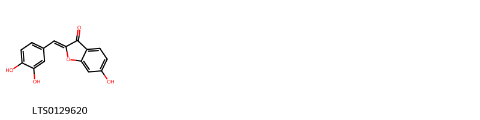{ width=100% }
    <figcaption>Hình ảnh cấu trúc hóa học của 1 hoạt chất thuộc nhóm Aurone flavonoids gồm ['sulfuretin (LTS0129620)'].</figcaption>
</figure>
#### Nhóm Carboxylic acids and derivatives
<figure markdown="span">
    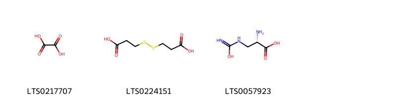{ width=100% }
    <figcaption>Hình ảnh cấu trúc hóa học của 3 hoạt chất thuộc nhóm Carboxylic acids and derivatives gồm ['oxalic acid (LTS0217707)', '4,5-dithia-octandioic acid (LTS0224151)', 'albizzine (LTS0057923)'].</figcaption>
</figure>
#### Nhóm Cinnamic acids and derivatives
<figure markdown="span">
    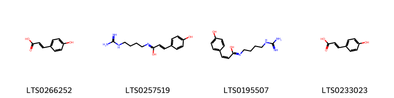{ width=100% }
    <figcaption>Hình ảnh cấu trúc hóa học của 4 hoạt chất thuộc nhóm Cinnamic acids and derivatives gồm ['para-coumaric acid (LTS0266252)', 'n-(4-carbamimidamidobutyl)-3-(4-hydroxyphenyl)prop-2-enimidic acid (LTS0257519)', '(2z)-n-(4-carbamimidamidobutyl)-3-(4-hydroxyphenyl)prop-2-enimidic acid (LTS0195507)', 'hydroxycinnamic acid (LTS0233023)'].</figcaption>
</figure>
#### Nhóm Fatty Acyls
<figure markdown="span">
    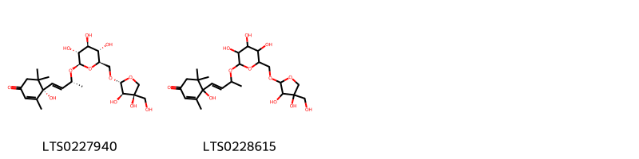{ width=100% }
    <figcaption>Hình ảnh cấu trúc hóa học của 2 hoạt chất thuộc nhóm Fatty Acyls gồm ['(4s)-4-[(1e,3r)-3-{[(2r,3r,4s,5s,6r)-6-({[(2r,3r,4r)-3,4-dihydroxy-4-(hydroxymethyl)oxolan-2-yl]oxy}methyl)-3,4,5-trihydroxyoxan-2-yl]oxy}but-1-en-1-yl]-4-hydroxy-3,5,5-trimethylcyclohex-2-en-1-one (LTS0227940)', '4-(3-{[6-({[3,4-dihydroxy-4-(hydroxymethyl)oxolan-2-yl]oxy}methyl)-3,4,5-trihydroxyoxan-2-yl]oxy}but-1-en-1-yl)-4-hydroxy-3,5,5-trimethylcyclohex-2-en-1-one (LTS0228615)'].</figcaption>
</figure>
#### Nhóm Flavonoids
<figure markdown="span">
    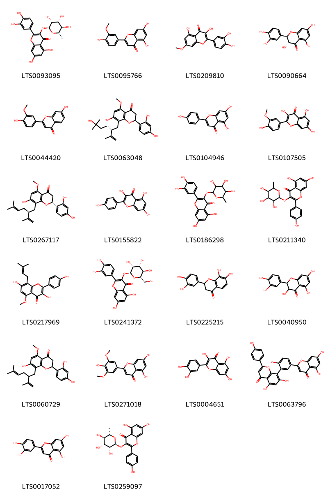{ width=100% }
    <figcaption>Hình ảnh cấu trúc hóa học của 22 hoạt chất thuộc nhóm Flavonoids gồm ['quercitrin (LTS0093095)', 'chrysoeriol (LTS0095766)', 'rhamnetin (LTS0209810)', '(+)-taxifolin (LTS0090664)', 'geraldone (LTS0044420)', 'kurarinol (LTS0063048)', 'chamomile (LTS0104946)', 'isorhamnetin (LTS0107505)', '(2r)-2-(2,4-dihydroxyphenyl)-7-hydroxy-5-methoxy-8-[(2s)-5-methyl-2-(prop-1-en-2-yl)hex-4-en-1-yl]-2,3-dihydro-1-benzopyran-4-one (LTS0267117)', 'kaempherol (LTS0155822)', 'quercitrin (LTS0186298)', '5,7-dihydroxy-2-(4-hydroxyphenyl)-3-[(3,4,5-trihydroxy-6-methyloxan-2-yl)oxy]chromen-4-one (LTS0211340)', 'sophoflavescenol (LTS0217969)', '2-(3,4-dihydroxyphenyl)-5,7-dihydroxy-3-{[(2s,3r,4r,5r,6s)-3,4,5-trihydroxy-6-(hydroxymethyl)oxan-2-yl]oxy}chromen-4-one (LTS0241372)', 'isookanin (LTS0225215)', '2,3-dihydroquercetin (LTS0040950)', '2-(2,4-dihydroxyphenyl)-7-hydroxy-5-methoxy-8-[5-methyl-2-(prop-1-en-2-yl)hex-4-en-1-yl]-2,3-dihydro-1-benzopyran-4-one (LTS0060729)', 'tricin (LTS0271018)', 'quercetin (LTS0004651)', 'amentoflavone (LTS0063796)', 'luteolin (LTS0017052)', 'afzelin (LTS0259097)'].</figcaption>
</figure>
#### Nhóm Indoles and derivatives
<figure markdown="span">
    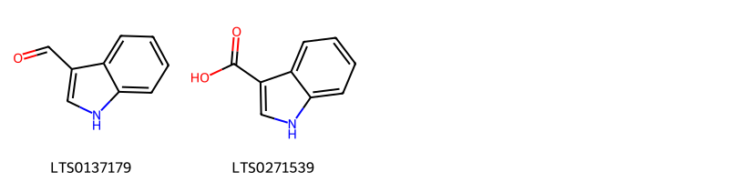{ width=100% }
    <figcaption>Hình ảnh cấu trúc hóa học của 2 hoạt chất thuộc nhóm Indoles and derivatives gồm ['indole-3-carboxaldehyde (LTS0137179)', 'indole - 3 carboxylic acid (LTS0271539)'].</figcaption>
</figure>
#### Nhóm Isoflavonoids
<figure markdown="span">
    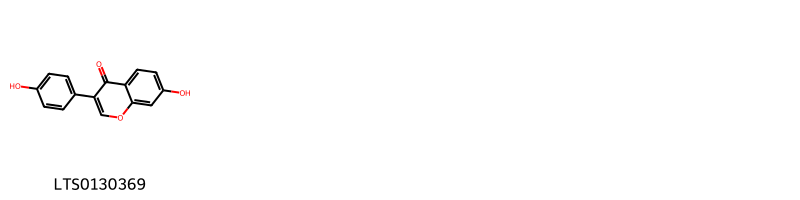{ width=100% }
    <figcaption>Hình ảnh cấu trúc hóa học của 1 hoạt chất thuộc nhóm Isoflavonoids gồm ['daidzein (LTS0130369)'].</figcaption>
</figure>
#### Nhóm Lignan glycosides
<figure markdown="span">
    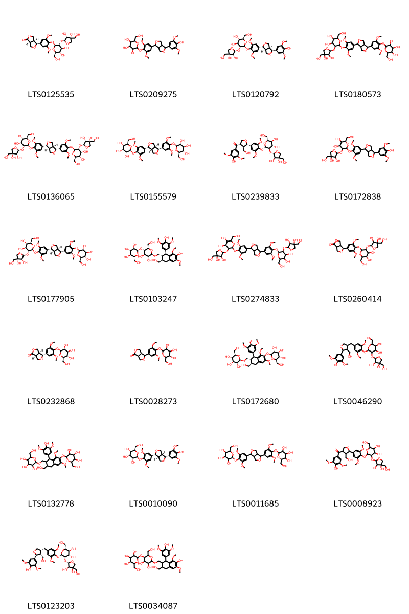{ width=100% }
    <figcaption>Hình ảnh cấu trúc hóa học của 22 hoạt chất thuộc nhóm Lignan glycosides gồm ['(3as,4r,6as)-4-(4-{[(2s,3r,4s,5s,6r)-3-{[(2s,3r,4r)-3,4-dihydroxy-4-(hydroxymethyl)oxolan-2-yl]oxy}-4,5-dihydroxy-6-(hydroxymethyl)oxan-2-yl]oxy}-3,5-dimethoxyphenyl)-tetrahydro-3h-furo[3,4-c]furan-1-one (LTS0125535)', '2-{4-[4-(4-hydroxy-3,5-dimethoxyphenyl)-hexahydrofuro[3,4-c]furan-1-yl]-2,6-dimethoxyphenoxy}-6-(hydroxymethyl)oxane-3,4,5-triol (LTS0209275)', '(2r,3s,4s,5r,6s)-6-{4-[(1r,3as,4r,6as)-4-(4-hydroxy-3,5-dimethoxyphenyl)-hexahydrofuro[3,4-c]furan-1-yl]-2,6-dimethoxyphenoxy}-5-{[(2s,3r,4r)-3,4-dihydroxy-4-(hydroxymethyl)oxolan-2-yl]oxy}-2-(hydroxymethyl)oxane-3,4-diol (LTS0120792)', '2-[4-(4-{4-[(3-{[3,4-dihydroxy-4-(hydroxymethyl)oxolan-2-yl]oxy}-4,5-dihydroxy-6-(hydroxymethyl)oxan-2-yl)oxy]-3,5-dimethoxyphenyl}-hexahydrofuro[3,4-c]furan-1-yl)-2,6-dimethoxyphenoxy]-6-(hydroxymethyl)oxane-3,4,5-triol (LTS0180573)', '(2r,3s,4s,5r,6s)-6-{4-[(1r,3as,4r,6as)-4-(4-{[(2s,3r,4s,5s,6r)-3-{[(2s,3r,4r)-3,4-dihydroxy-4-(hydroxymethyl)oxolan-2-yl]oxy}-4,5-dihydroxy-6-(hydroxymethyl)oxan-2-yl]oxy}-3,5-dimethoxyphenyl)-hexahydrofuro[3,4-c]furan-1-yl]-2,6-dimethoxyphenoxy}-5-{[(2s,3r,4r)-3,4-dihydroxy-4-(hydroxymethyl)oxolan-2-yl]oxy}-2-(hydroxymethyl)oxane-3,4-diol (LTS0136065)', 'acanthoside d (LTS0155579)', '(2r,3s,4s,5r,6s)-5-{[(2s,3r,4r)-3,4-dihydroxy-4-(hydroxymethyl)oxolan-2-yl]oxy}-6-{4-[(2s,3r,4s)-4-(4-hydroxy-3,5-dimethoxybenzoyl)-3-(hydroxymethyl)oxolan-2-yl]-2,6-dimethoxyphenoxy}-2-(hydroxymethyl)oxane-3,4-diol (LTS0239833)', '5-{[3,4-dihydroxy-4-(hydroxymethyl)oxolan-2-yl]oxy}-6-{4-[4-(4-hydroxy-3,5-dimethoxyphenyl)-hexahydrofuro[3,4-c]furan-1-yl]-2,6-dimethoxyphenoxy}-2-(hydroxymethyl)oxane-3,4-diol (LTS0172838)', '(2s,3r,4s,5s,6r)-2-{4-[(1r,3as,4r,6as)-4-(4-{[(2s,3r,4s,5s,6r)-3-{[(2s,3r,4r)-3,4-dihydroxy-4-(hydroxymethyl)oxolan-2-yl]oxy}-4,5-dihydroxy-6-(hydroxymethyl)oxan-2-yl]oxy}-3,5-dimethoxyphenyl)-hexahydrofuro[3,4-c]furan-1-yl]-2,6-dimethoxyphenoxy}-6-(hydroxymethyl)oxane-3,4,5-triol (LTS0177905)', '(2s,3r,4s,5s,6r)-2-{[(2r,3s,4r,5r,6r)-4,5-dihydroxy-6-{[(1s,2r,3r)-7-hydroxy-1-(4-hydroxy-3,5-dimethoxyphenyl)-3-(hydroxymethyl)-6,8-dimethoxy-1,2,3,4-tetrahydronaphthalen-2-yl]methoxy}-2-(hydroxymethyl)oxan-3-yl]oxy}-6-(hydroxymethyl)oxane-3,4,5-triol (LTS0103247)', '5-{[3,4-dihydroxy-4-(hydroxymethyl)oxolan-2-yl]oxy}-6-[4-(4-{4-[(3-{[3,4-dihydroxy-4-(hydroxymethyl)oxolan-2-yl]oxy}-4,5-dihydroxy-6-(hydroxymethyl)oxan-2-yl)oxy]-3,5-dimethoxyphenyl}-hexahydrofuro[3,4-c]furan-1-yl)-2,6-dimethoxyphenoxy]-2-(hydroxymethyl)oxane-3,4-diol (LTS0274833)', '4-{4-[(3-{[3,4-dihydroxy-4-(hydroxymethyl)oxolan-2-yl]oxy}-4,5-dihydroxy-6-(hydroxymethyl)oxan-2-yl)oxy]-3,5-dimethoxyphenyl}-tetrahydro-3h-furo[3,4-c]furan-1-one (LTS0260414)', '(3as,4r,6as)-4-(3,5-dimethoxy-4-{[(2s,3r,4s,5s,6r)-3,4,5-trihydroxy-6-(hydroxymethyl)oxan-2-yl]oxy}phenyl)-tetrahydro-3h-furo[3,4-c]furan-1-one (LTS0232868)', '4-(3,5-dimethoxy-4-{[3,4,5-trihydroxy-6-(hydroxymethyl)oxan-2-yl]oxy}phenyl)-tetrahydro-3h-furo[3,4-c]furan-1-one (LTS0028273)', '(2s,3r,4s,5s,6r)-2-{[(6r,7r,8s)-8-(4-hydroxy-3,5-dimethoxyphenyl)-6-(hydroxymethyl)-1,3-dimethoxy-7-({[(2r,3r,4s,5s,6r)-3,4,5-trihydroxy-6-(hydroxymethyl)oxan-2-yl]oxy}methyl)-5,6,7,8-tetrahydronaphthalen-2-yl]oxy}-6-(hydroxymethyl)oxane-3,4,5-triol (LTS0172680)', '5-{[3,4-dihydroxy-4-(hydroxymethyl)oxolan-2-yl]oxy}-6-(4-{[5-(4-hydroxy-3,5-dimethoxyphenyl)-4-(hydroxymethyl)oxolan-3-yl]methyl}-2,6-dimethoxyphenoxy)-2-(hydroxymethyl)oxane-3,4-diol (LTS0046290)', '2-{[8-(4-hydroxy-3,5-dimethoxyphenyl)-6-(hydroxymethyl)-1,3-dimethoxy-7-({[3,4,5-trihydroxy-6-(hydroxymethyl)oxan-2-yl]oxy}methyl)-5,6,7,8-tetrahydronaphthalen-2-yl]oxy}-6-(hydroxymethyl)oxane-3,4,5-triol (LTS0132778)', '(2s,3r,4s,5s,6r)-2-{4-[(1r,3as,4r,6as)-4-(4-hydroxy-3,5-dimethoxyphenyl)-hexahydrofuro[3,4-c]furan-1-yl]-2,6-dimethoxyphenoxy}-6-(hydroxymethyl)oxane-3,4,5-triol (LTS0010090)', '2-{4-[4-(3,5-dimethoxy-4-{[3,4,5-trihydroxy-6-(hydroxymethyl)oxan-2-yl]oxy}phenyl)-hexahydrofuro[3,4-c]furan-1-yl]-2,6-dimethoxyphenoxy}-6-(hydroxymethyl)oxane-3,4,5-triol (LTS0011685)', '5-{[3,4-dihydroxy-4-(hydroxymethyl)oxolan-2-yl]oxy}-6-{4-[4-(4-hydroxy-3,5-dimethoxybenzoyl)-3-(hydroxymethyl)oxolan-2-yl]-2,6-dimethoxyphenoxy}-2-(hydroxymethyl)oxane-3,4-diol (LTS0008923)', '(2r,3s,4s,5r,6s)-5-{[(2s,3r,4r)-3,4-dihydroxy-4-(hydroxymethyl)oxolan-2-yl]oxy}-6-(4-{[(3r,4r,5s)-5-(4-hydroxy-3,5-dimethoxyphenyl)-4-(hydroxymethyl)oxolan-3-yl]methyl}-2,6-dimethoxyphenoxy)-2-(hydroxymethyl)oxane-3,4-diol (LTS0123203)', '2-[(4,5-dihydroxy-6-{[7-hydroxy-1-(4-hydroxy-3,5-dimethoxyphenyl)-3-(hydroxymethyl)-6,8-dimethoxy-1,2,3,4-tetrahydronaphthalen-2-yl]methoxy}-2-(hydroxymethyl)oxan-3-yl)oxy]-6-(hydroxymethyl)oxane-3,4,5-triol (LTS0034087)'].</figcaption>
</figure>
#### Nhóm Linear 1_3-diarylpropanoids
<figure markdown="span">
    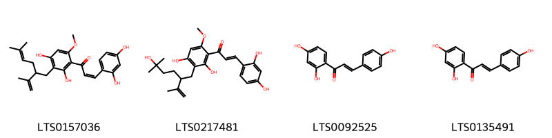{ width=100% }
    <figcaption>Hình ảnh cấu trúc hóa học của Không tìm thấy chú thích hoạt chất thuộc nhóm Linear 1_3-diarylpropanoids gồm Không tìm thấy chú thích.</figcaption>
</figure>
#### Nhóm Organooxygen compounds
<figure markdown="span">
    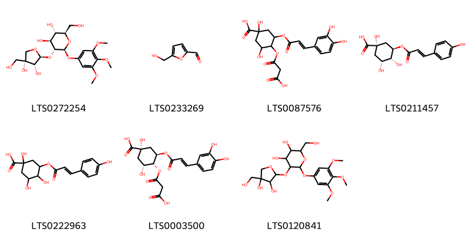{ width=100% }
    <figcaption>Hình ảnh cấu trúc hóa học của 7 hoạt chất thuộc nhóm Organooxygen compounds gồm ['(2r,3s,4s,5r,6s)-5-{[(2s,3r,4r)-3,4-dihydroxy-4-(hydroxymethyl)oxolan-2-yl]oxy}-2-(hydroxymethyl)-6-(3,4,5-trimethoxyphenoxy)oxane-3,4-diol (LTS0272254)', 'hydroxymethylfurfural (LTS0233269)', '4-[(2-carboxyacetyl)oxy]-3-{[3-(3,4-dihydroxyphenyl)prop-2-enoyl]oxy}-1,5-dihydroxycyclohexane-1-carboxylic acid (LTS0087576)', '(1s,3r,4r,5r)-1,3,4-trihydroxy-5-{[(2e)-3-(4-hydroxyphenyl)prop-2-enoyl]oxy}cyclohexane-1-carboxylic acid (LTS0211457)', '1,3,4-trihydroxy-5-{[3-(4-hydroxyphenyl)prop-2-enoyl]oxy}cyclohexane-1-carboxylic acid (LTS0222963)', '(1s,3r,4r,5r)-4-[(2-carboxyacetyl)oxy]-3-{[(2e)-3-(3,4-dihydroxyphenyl)prop-2-enoyl]oxy}-1,5-dihydroxycyclohexane-1-carboxylic acid (LTS0003500)', '5-{[3,4-dihydroxy-4-(hydroxymethyl)oxolan-2-yl]oxy}-2-(hydroxymethyl)-6-(3,4,5-trimethoxyphenoxy)oxane-3,4-diol (LTS0120841)'].</figcaption>
</figure>
#### Nhóm Prenol lipids
<figure markdown="span">
    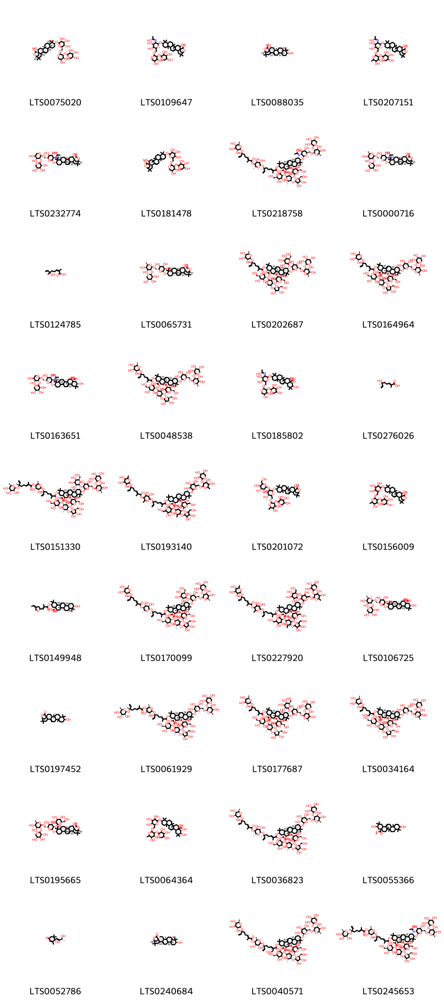{ width=100% }
    <figcaption>Hình ảnh cấu trúc hóa học của 36 hoạt chất thuộc nhóm Prenol lipids gồm ['(1r,2r,4s,5r,8r,10s,13r,14r,18s,21s)-10-{[(2r,3r,4s,5s,6r)-6-({[(2s,3r,4s,5s)-4,5-dihydroxy-3-{[(2s,3r,4s,5r)-3,4,5-trihydroxyoxan-2-yl]oxy}oxan-2-yl]oxy}methyl)-3,4,5-trihydroxyoxan-2-yl]oxy}-2-hydroxy-4,5,9,9,13,20,20-heptamethyl-22-oxahexacyclo[19.2.1.0¹,¹⁸.0⁴,¹⁷.0⁵,¹⁴.0⁸,¹³]tetracos-16-en-23-one (LTS0075020)', 'n-{6-[({4,5-dihydroxy-3-[(3,4,5-trihydroxyoxan-2-yl)oxy]oxan-2-yl}oxy)methyl]-4,5-dihydroxy-2-({2-hydroxy-4,5,9,9,13,20,20-heptamethyl-23-oxo-22-oxahexacyclo[19.2.1.0¹,¹⁸.0⁴,¹⁷.0⁵,¹⁴.0⁸,¹³]tetracos-16-en-10-yl}oxy)oxan-3-yl}ethanimidic acid (LTS0109647)', 'acacic acid lactone (LTS0088035)', 'n-{6-[({4,5-dihydroxy-6-methyl-3-[(3,4,5-trihydroxyoxan-2-yl)oxy]oxan-2-yl}oxy)methyl]-4,5-dihydroxy-2-({2-hydroxy-4,5,9,9,13,20,20-heptamethyl-23-oxo-22-oxahexacyclo[19.2.1.0¹,¹⁸.0⁴,¹⁷.0⁵,¹⁴.0⁸,¹³]tetracos-16-en-10-yl}oxy)oxan-3-yl}ethanimidic acid (LTS0207151)', 'n-[(2r,3r,4r,5s,6r)-6-({[(2s,3r,4s,5s)-4,5-dihydroxy-3-{[(2s,3r,4s,5r)-3,4,5-trihydroxyoxan-2-yl]oxy}oxan-2-yl]oxy}methyl)-4,5-dihydroxy-2-{[(1r,2r,4s,5r,8r,10s,13r,14r,18s,21s)-2-hydroxy-4,5,9,9,13,20,20-heptamethyl-23-oxo-22-oxahexacyclo[19.2.1.0¹,¹⁸.0⁴,¹⁷.0⁵,¹⁴.0⁸,¹³]tetracos-16-en-10-yl]oxy}oxan-3-yl]ethanimidic acid (LTS0232774)', '10-({6-[({4,5-dihydroxy-3-[(3,4,5-trihydroxyoxan-2-yl)oxy]oxan-2-yl}oxy)methyl]-3,4,5-trihydroxyoxan-2-yl}oxy)-2-hydroxy-4,5,9,9,13,20,20-heptamethyl-22-oxahexacyclo[19.2.1.0¹,¹⁸.0⁴,¹⁷.0⁵,¹⁴.0⁸,¹³]tetracos-16-en-23-one (LTS0181478)', 'n-[(2r,3r,4r,5s,6r)-2-{[(3s,4ar,6ar,6bs,8r,8ar,10s,12as,14ar,14br)-8a-({[(2s,3r,4s,5s,6r)-3-{[(2s,3r,4s,5s,6s)-5-{[(2s,3r,4r,5s)-3,4-dihydroxy-5-(hydroxymethyl)oxolan-2-yl]oxy}-3-hydroxy-6-methyl-4-{[(2s,3r,4s,5s,6r)-3,4,5-trihydroxy-6-(hydroxymethyl)oxan-2-yl]oxy}oxan-2-yl]oxy}-4,5-dihydroxy-6-(hydroxymethyl)oxan-2-yl]oxy}carbonyl)-10-{[(2e,6s)-6-{[(2s,3r,4r,5s,6r)-5-{[(2e,6s)-2,6-dimethyl-6-{[(2s,3r,4s,5s,6r)-3,4,5-trihydroxy-6-methyloxan-2-yl]oxy}octa-2,7-dienoyl]oxy}-3,4-dihydroxy-6-methyloxan-2-yl]oxy}-2,6-dimethylocta-2,7-dienoyl]oxy}-8-hydroxy-4,4,6a,6b,11,11,14b-heptamethyl-1,2,3,4a,5,6,7,8,9,10,12,12a,14,14a-tetradecahydropicen-3-yl]oxy}-6-({[(2r,3r,4s,5r,6r)-4,5-dihydroxy-6-methyl-3-{[(2s,3r,4s,5r)-3,4,5-trihydroxyoxan-2-yl]oxy}oxan-2-yl]oxy}methyl)-4,5-dihydroxyoxan-3-yl]ethanimidic acid (LTS0218758)', 'n-[(2r,3r,4r,5s,6r)-6-({[(2r,3r,4s,5r,6r)-4,5-dihydroxy-6-methyl-3-{[(2s,3r,4s,5r)-3,4,5-trihydroxyoxan-2-yl]oxy}oxan-2-yl]oxy}methyl)-4,5-dihydroxy-2-{[(1r,2r,4s,5r,8r,10s,13r,14r,18s,21s)-2-hydroxy-4,5,9,9,13,20,20-heptamethyl-23-oxo-22-oxahexacyclo[19.2.1.0¹,¹⁸.0⁴,¹⁷.0⁵,¹⁴.0⁸,¹³]tetracos-16-en-10-yl]oxy}oxan-3-yl]ethanimidic acid (LTS0000716)', '6-hydroxy-2,6-dimethylocta-2,7-dienoic acid (LTS0124785)', '(1r,2r,4s,5r,8r,10s,13r,14r,18s,21s)-10-{[(2r,3r,4s,5s,6r)-6-({[(2r,3r,4s,5r,6r)-4,5-dihydroxy-6-methyl-3-{[(2s,3r,4s,5r)-3,4,5-trihydroxyoxan-2-yl]oxy}oxan-2-yl]oxy}methyl)-3,4,5-trihydroxyoxan-2-yl]oxy}-2-hydroxy-4,5,9,9,13,20,20-heptamethyl-22-oxahexacyclo[19.2.1.0¹,¹⁸.0⁴,¹⁷.0⁵,¹⁴.0⁸,¹³]tetracos-16-en-23-one (LTS0065731)', '(2s,3r,4s,5s,6r)-3-{[(2s,3r,4s,5s,6s)-5-{[(2s,3r,4r,5s)-3,4-dihydroxy-5-(hydroxymethyl)oxolan-2-yl]oxy}-3-hydroxy-6-methyl-4-{[(2s,3r,4s,5s,6r)-3,4,5-trihydroxy-6-(hydroxymethyl)oxan-2-yl]oxy}oxan-2-yl]oxy}-4,5-dihydroxy-6-(hydroxymethyl)oxan-2-yl (3s,4ar,6as,6br,8ar,10s,12ar,12br,14bs)-10-{[(2r,3r,4s,5s,6r)-6-({[(2r,3r,4s,5r,6r)-4,5-dihydroxy-6-methyl-3-{[(2s,3r,4s,5r)-3,4,5-trihydroxyoxan-2-yl]oxy}oxan-2-yl]oxy}methyl)-4,5-dihydroxy-3-{[(3r,4s,5s,6r)-3,4,5-trihydroxy-6-(hydroxymethyl)oxan-2-yl]oxy}oxan-2-yl]oxy}-3-{[(2e,6s)-2,6-dimethyl-6-{[(2s,3r,4s,5s,6r)-3,4,5-trihydroxy-6-methyloxan-2-yl]oxy}octa-2,7-dienoyl]oxy}-2,2,6a,6b,9,9,12a-heptamethyl-1,3,4,5,6,7,8,8a,10,11,12,12b,13,14b-tetradecahydropicene-4a-carboxylate (LTS0202687)', '(2s,3r,4s,5s,6r)-3-{[(2s,3r,4s,5s,6s)-5-{[(2s,3r,4r,5s)-3,4-dihydroxy-5-(hydroxymethyl)oxolan-2-yl]oxy}-3-hydroxy-6-methyl-4-{[(2s,3r,4s,5s,6r)-3,4,5-trihydroxy-6-(hydroxymethyl)oxan-2-yl]oxy}oxan-2-yl]oxy}-4,5-dihydroxy-6-(hydroxymethyl)oxan-2-yl (3s,4ar,5r,6as,6br,8ar,10s,12ar,12br,14bs)-10-{[(2r,3r,4s,5s,6r)-6-({[(2r,3r,4s,5r,6r)-4,5-dihydroxy-6-methyl-3-{[(2s,3r,4s,5r)-3,4,5-trihydroxyoxan-2-yl]oxy}oxan-2-yl]oxy}methyl)-3,4,5-trihydroxyoxan-2-yl]oxy}-3-{[(2e,6s)-2,6-dimethyl-6-{[(2s,3r,4s,5s,6r)-3,4,5-trihydroxy-6-methyloxan-2-yl]oxy}octa-2,7-dienoyl]oxy}-5-hydroxy-2,2,6a,6b,9,9,12a-heptamethyl-1,3,4,5,6,7,8,8a,10,11,12,12b,13,14b-tetradecahydropicene-4a-carboxylate (LTS0164964)', '(3s,4ar,5r,6as,6br,8ar,10s,12ar,12br,14bs)-10-{[(2r,3r,4r,5s,6r)-6-({[(2s,3r,4s,5s)-4,5-dihydroxy-3-{[(2s,3r,4s,5r)-3,4,5-trihydroxyoxan-2-yl]oxy}oxan-2-yl]oxy}methyl)-4,5-dihydroxy-3-[(1-hydroxyethylidene)amino]oxan-2-yl]oxy}-3,5-dihydroxy-2,2,6a,6b,9,9,12a-heptamethyl-1,3,4,5,6,7,8,8a,10,11,12,12b,13,14b-tetradecahydropicene-4a-carboxylic acid (LTS0163651)', '(2s,3r,4s,5s,6r)-3-{[(2s,3r,4s,5s,6s)-5-{[(2s,3r,4r,5s)-3,4-dihydroxy-5-(hydroxymethyl)oxolan-2-yl]oxy}-3-hydroxy-6-methyl-4-{[(2s,3r,4s,5s,6r)-3,4,5-trihydroxy-6-(hydroxymethyl)oxan-2-yl]oxy}oxan-2-yl]oxy}-4,5-dihydroxy-6-(hydroxymethyl)oxan-2-yl (3s,4ar,6as,6br,8ar,10s,12ar,12br,14bs)-10-{[(2r,3r,4s,5s,6r)-6-({[(2r,3r,4s,5r,6r)-4,5-dihydroxy-6-methyl-3-{[(2s,3r,4s,5r)-3,4,5-trihydroxyoxan-2-yl]oxy}oxan-2-yl]oxy}methyl)-3,4,5-trihydroxyoxan-2-yl]oxy}-3-{[(2e,6s)-2,6-dimethyl-6-{[(2s,3r,4s,5s,6r)-3,4,5-trihydroxy-6-methyloxan-2-yl]oxy}octa-2,7-dienoyl]oxy}-2,2,6a,6b,9,9,12a-heptamethyl-1,3,4,5,6,7,8,8a,10,11,12,12b,13,14b-tetradecahydropicene-4a-carboxylate (LTS0048538)', '10-({6-[({4,5-dihydroxy-3-[(3,4,5-trihydroxyoxan-2-yl)oxy]oxan-2-yl}oxy)methyl]-4,5-dihydroxy-3-[(1-hydroxyethylidene)amino]oxan-2-yl}oxy)-3,5-dihydroxy-2,2,6a,6b,9,9,12a-heptamethyl-1,3,4,5,6,7,8,8a,10,11,12,12b,13,14b-tetradecahydropicene-4a-carboxylic acid (LTS0185802)', '(2e,6s)-6-hydroxy-2,6-dimethylocta-2,7-dienoic acid (LTS0276026)', '(2r,3r,4s,5r,6r)-3-{[(2s,3r,4s,5s,6s)-5-{[(2s,3r,4r,5s)-3,4-dihydroxy-5-(hydroxymethyl)oxolan-2-yl]oxy}-3-hydroxy-6-methyl-4-{[(2s,3r,4s,5r,6r)-3,4,5-trihydroxy-6-(hydroxymethyl)oxan-2-yl]oxy}oxan-2-yl]oxy}-4,5-dihydroxy-6-(hydroxymethyl)oxan-2-yl (3s,4ar,5r,6as,6br,8ar,10s,12ar,12br,14bs)-10-{[(2r,3r,4s,5r,6r)-6-({[(2r,3r,4s,5r,6r)-4,5-dihydroxy-6-methyl-3-{[(2s,3r,4s,5r)-3,4,5-trihydroxyoxan-2-yl]oxy}oxan-2-yl]oxy}methyl)-4,5-dihydroxy-3-{[(2s,3r,4s,5r,6r)-3,4,5-trihydroxy-6-(hydroxymethyl)oxan-2-yl]oxy}oxan-2-yl]oxy}-3-{[(2e,6s)-6-{[(2s,3r,4s,5s,6r)-5-{[(2e,6s)-2,6-dimethyl-6-{[(2r,3r,4s,5s,6r)-3,4,5-trihydroxy-6-methyloxan-2-yl]oxy}octa-2,7-dienoyl]oxy}-3,4-dihydroxy-6-methyloxan-2-yl]oxy}-2,6-dimethylocta-2,7-dienoyl]oxy}-5-hydroxy-2,2,6a,6b,9,9,12a-heptamethyl-1,3,4,5,6,7,8,8a,10,11,12,12b,13,14b-tetradecahydropicene-4a-carboxylate (LTS0151330)', '3-[(5-{[3,4-dihydroxy-5-(hydroxymethyl)oxolan-2-yl]oxy}-3-hydroxy-6-methyl-4-{[3,4,5-trihydroxy-6-(hydroxymethyl)oxan-2-yl]oxy}oxan-2-yl)oxy]-4,5-dihydroxy-6-(hydroxymethyl)oxan-2-yl (3s,4ar,5r,6ar,6br,10s,12ar)-10-({6-[({4,5-dihydroxy-6-methyl-3-[(3,4,5-trihydroxyoxan-2-yl)oxy]oxan-2-yl}oxy)methyl]-3,4,5-trihydroxyoxan-2-yl}oxy)-3-{[(2e,6s)-6-[(5-{[(2e,6s)-2,6-dimethyl-6-[(3,4,5-trihydroxy-6-methyloxan-2-yl)oxy]octa-2,7-dienoyl]oxy}-3,4-dihydroxy-6-methyloxan-2-yl)oxy]-2,6-dimethylocta-2,7-dienoyl]oxy}-5-hydroxy-2,2,6a,6b,9,9,12a-heptamethyl-hexadecahydropicene-4a-carboxylate (LTS0193140)', '10-({6-[({4,5-dihydroxy-6-methyl-3-[(3,4,5-trihydroxyoxan-2-yl)oxy]oxan-2-yl}oxy)methyl]-4,5-dihydroxy-3-{[3,4,5-trihydroxy-6-(hydroxymethyl)oxan-2-yl]oxy}oxan-2-yl}oxy)-2-hydroxy-4,5,9,9,13,20,20-heptamethyl-22-oxahexacyclo[19.2.1.0¹,¹⁸.0⁴,¹⁷.0⁵,¹⁴.0⁸,¹³]tetracos-16-en-23-one (LTS0201072)', '10-({6-[({4,5-dihydroxy-6-methyl-3-[(3,4,5-trihydroxyoxan-2-yl)oxy]oxan-2-yl}oxy)methyl]-3,4,5-trihydroxyoxan-2-yl}oxy)-2-hydroxy-4,5,9,9,13,20,20-heptamethyl-22-oxahexacyclo[19.2.1.0¹,¹⁸.0⁴,¹⁷.0⁵,¹⁴.0⁸,¹³]tetracos-16-en-23-one (LTS0156009)', '(3s,4ar,5r,6as,6br,8ar,10s,12ar,12br,14bs)-3-{[(2e)-3-[(4z)-4-ethylideneoxolan-2-yl]-2-methylprop-2-enoyl]oxy}-5,10-dihydroxy-2,2,6a,6b,9,9,12a-heptamethyl-1,3,4,5,6,7,8,8a,10,11,12,12b,13,14b-tetradecahydropicene-4a-carboxylic acid (LTS0149948)', '(2s,3r,4s,5s,6r)-3-{[(2s,3r,4s,5s,6s)-5-{[(2s,3r,4r,5s)-3,4-dihydroxy-5-(hydroxymethyl)oxolan-2-yl]oxy}-3-hydroxy-6-methyl-4-{[(2s,3r,4s,5s,6r)-3,4,5-trihydroxy-6-(hydroxymethyl)oxan-2-yl]oxy}oxan-2-yl]oxy}-4,5-dihydroxy-6-(hydroxymethyl)oxan-2-yl (3s,4ar,5r,6as,6br,8ar,10s,12ar,12br,14bs)-10-{[(2r,3r,4s,5s,6r)-6-({[(2r,3r,4s,5r,6r)-4,5-dihydroxy-6-methyl-3-{[(2s,3r,4s,5r)-3,4,5-trihydroxyoxan-2-yl]oxy}oxan-2-yl]oxy}methyl)-4,5-dihydroxy-3-{[(2s,3r,4s,5s,6r)-3,4,5-trihydroxy-6-(hydroxymethyl)oxan-2-yl]oxy}oxan-2-yl]oxy}-3-{[(2e,6s)-6-{[(2s,3r,4r,5s,6r)-5-{[(2e,6s)-2,6-dimethyl-6-{[(2s,3r,4s,5s,6r)-3,4,5-trihydroxy-6-methyloxan-2-yl]oxy}octa-2,7-dienoyl]oxy}-3,4-dihydroxy-6-methyloxan-2-yl]oxy}-2,6-dimethylocta-2,7-dienoyl]oxy}-5-hydroxy-2,2,6a,6b,9,9,12a-heptamethyl-1,3,4,5,6,7,8,8a,10,11,12,12b,13,14b-tetradecahydropicene-4a-carboxylate (LTS0170099)', '3-[(5-{[3,4-dihydroxy-5-(hydroxymethyl)oxolan-2-yl]oxy}-3-hydroxy-6-methyl-4-{[3,4,5-trihydroxy-6-(hydroxymethyl)oxan-2-yl]oxy}oxan-2-yl)oxy]-4,5-dihydroxy-6-(hydroxymethyl)oxan-2-yl (3s,4ar,5r,6ar,6br,10s,12ar)-10-({6-[({4,5-dihydroxy-6-methyl-3-[(3,4,5-trihydroxyoxan-2-yl)oxy]oxan-2-yl}oxy)methyl]-4,5-dihydroxy-3-{[3,4,5-trihydroxy-6-(hydroxymethyl)oxan-2-yl]oxy}oxan-2-yl}oxy)-3-{[(2e,6s)-6-[(5-{[(2e,6s)-2,6-dimethyl-6-[(3,4,5-trihydroxy-6-methyloxan-2-yl)oxy]octa-2,7-dienoyl]oxy}-3,4-dihydroxy-6-methyloxan-2-yl)oxy]-2,6-dimethylocta-2,7-dienoyl]oxy}-5-hydroxy-2,2,6a,6b,9,9,12a-heptamethyl-hexadecahydropicene-4a-carboxylate (LTS0227920)', '(3s,4ar,5r,6as,6br,8ar,10s,12ar,12br,14bs)-10-{[(2r,3r,4s,5s,6r)-6-({[(2r,3r,4s,5r,6r)-4,5-dihydroxy-6-methyl-3-{[(2s,3r,4s,5r)-3,4,5-trihydroxyoxan-2-yl]oxy}oxan-2-yl]oxy}methyl)-3,4,5-trihydroxyoxan-2-yl]oxy}-3,5-dihydroxy-2,2,6a,6b,9,9,12a-heptamethyl-1,3,4,5,6,7,8,8a,10,11,12,12b,13,14b-tetradecahydropicene-4a-carboxylic acid (LTS0106725)', '(4s)-10-hydroxy-4,5,9,9,13,20,20-heptamethyl-22-oxahexacyclo[19.2.1.0¹,¹⁸.0⁴,¹⁷.0⁵,¹⁴.0⁸,¹³]tetracos-16-en-23-one (LTS0197452)', '(2r,3r,4s,5s,6r)-3-{[(2s,3r,4s,5s,6s)-5-{[(2s,3r,4r,5s)-3,4-dihydroxy-5-(hydroxymethyl)oxolan-2-yl]oxy}-3-hydroxy-6-methyl-4-{[(2s,3r,4s,5s,6r)-3,4,5-trihydroxy-6-(hydroxymethyl)oxan-2-yl]oxy}oxan-2-yl]oxy}-4,5-dihydroxy-6-(hydroxymethyl)oxan-2-yl (3s,4ar,5r,6as,6br,8ar,10s,12ar,12br,14bs)-10-{[(2r,3r,4s,5s,6r)-6-({[(2r,3r,4s,5r,6r)-4,5-dihydroxy-6-methyl-3-{[(2s,3r,4s,5r)-3,4,5-trihydroxyoxan-2-yl]oxy}oxan-2-yl]oxy}methyl)-3,4,5-trihydroxyoxan-2-yl]oxy}-3-{[(2e,6s)-6-{[(2s,3r,4r,5s,6r)-5-{[(2e,6s)-2,6-dimethyl-6-{[(2r,3r,4s,5s,6r)-3,4,5-trihydroxy-6-methyloxan-2-yl]oxy}octa-2,7-dienoyl]oxy}-3,4-dihydroxy-6-methyloxan-2-yl]oxy}-2,6-dimethylocta-2,7-dienoyl]oxy}-5-hydroxy-2,2,6a,6b,9,9,12a-heptamethyl-1,3,4,5,6,7,8,8a,10,11,12,12b,13,14b-tetradecahydropicene-4a-carboxylate (LTS0061929)', '(2s,3r,4s,5s,6r)-3-{[(2s,3r,4s,5s,6s)-5-{[(2s,3r,4r,5s)-3,4-dihydroxy-5-(hydroxymethyl)oxolan-2-yl]oxy}-3-hydroxy-6-methyl-4-{[(2s,3r,4s,5s,6r)-3,4,5-trihydroxy-6-(hydroxymethyl)oxan-2-yl]oxy}oxan-2-yl]oxy}-4,5-dihydroxy-6-(hydroxymethyl)oxan-2-yl (3s,4ar,5r,6as,6br,8ar,10s,12ar,12br,14bs)-10-{[(2r,3r,4s,5s,6r)-6-({[(2r,3r,4s,5r,6r)-4,5-dihydroxy-6-methyl-3-{[(2s,3r,4s,5r)-3,4,5-trihydroxyoxan-2-yl]oxy}oxan-2-yl]oxy}methyl)-4,5-dihydroxy-3-{[(2s,3r,4s,5s,6r)-3,4,5-trihydroxy-6-(hydroxymethyl)oxan-2-yl]oxy}oxan-2-yl]oxy}-3-{[(2e,6s)-2,6-dimethyl-6-{[(2s,3r,4s,5s,6r)-3,4,5-trihydroxy-6-methyloxan-2-yl]oxy}octa-2,7-dienoyl]oxy}-5-hydroxy-2,2,6a,6b,9,9,12a-heptamethyl-1,3,4,5,6,7,8,8a,10,11,12,12b,13,14b-tetradecahydropicene-4a-carboxylate (LTS0177687)', '(2s,3r,4s,5s,6r)-3-{[(2s,3r,4s,5s,6s)-5-{[(2s,3r,4r,5s)-3,4-dihydroxy-5-(hydroxymethyl)oxolan-2-yl]oxy}-3-hydroxy-6-methyl-4-{[(2s,3r,4s,5s,6r)-3,4,5-trihydroxy-6-(hydroxymethyl)oxan-2-yl]oxy}oxan-2-yl]oxy}-4,5-dihydroxy-6-(hydroxymethyl)oxan-2-yl (3s,4ar,5r,6as,6br,8ar,10s,12ar,12br,14bs)-10-{[(2r,3r,4s,5s,6r)-6-({[(2r,3r,4s,5r,6r)-4,5-dihydroxy-6-methyl-3-{[(2s,3r,4s,5r)-3,4,5-trihydroxyoxan-2-yl]oxy}oxan-2-yl]oxy}methyl)-3,4,5-trihydroxyoxan-2-yl]oxy}-5-hydroxy-3-{[(2e,6s)-2-(hydroxymethyl)-6-methyl-6-{[(2s,3r,4s,5s,6r)-3,4,5-trihydroxy-6-methyloxan-2-yl]oxy}octa-2,7-dienoyl]oxy}-2,2,6a,6b,9,9,12a-heptamethyl-1,3,4,5,6,7,8,8a,10,11,12,12b,13,14b-tetradecahydropicene-4a-carboxylate (LTS0034164)', '(1r,2r,4s,5r,8r,10s,13r,14r,18s,21s)-10-{[(2r,3r,4s,5s,6r)-6-({[(2r,3r,4s,5r,6r)-4,5-dihydroxy-6-methyl-3-{[(2s,3r,4s,5r)-3,4,5-trihydroxyoxan-2-yl]oxy}oxan-2-yl]oxy}methyl)-4,5-dihydroxy-3-{[(2s,3r,4s,5s,6r)-3,4,5-trihydroxy-6-(hydroxymethyl)oxan-2-yl]oxy}oxan-2-yl]oxy}-2-hydroxy-4,5,9,9,13,20,20-heptamethyl-22-oxahexacyclo[19.2.1.0¹,¹⁸.0⁴,¹⁷.0⁵,¹⁴.0⁸,¹³]tetracos-16-en-23-one (LTS0195665)', '10-({6-[({4,5-dihydroxy-6-methyl-3-[(3,4,5-trihydroxyoxan-2-yl)oxy]oxan-2-yl}oxy)methyl]-3,4,5-trihydroxyoxan-2-yl}oxy)-3,5-dihydroxy-2,2,6a,6b,9,9,12a-heptamethyl-1,3,4,5,6,7,8,8a,10,11,12,12b,13,14b-tetradecahydropicene-4a-carboxylic acid (LTS0064364)', '(2s,3r,4s,5s,6r)-3-{[(2s,3r,4s,5s,6s)-5-{[(2s,3r,4r,5s)-3,4-dihydroxy-5-(hydroxymethyl)oxolan-2-yl]oxy}-3-hydroxy-6-methyl-4-{[(2s,3r,4s,5s,6r)-3,4,5-trihydroxy-6-(hydroxymethyl)oxan-2-yl]oxy}oxan-2-yl]oxy}-4,5-dihydroxy-6-(hydroxymethyl)oxan-2-yl (3s,4ar,5r,6as,6br,8ar,10s,12ar,12br,14bs)-10-{[(2r,3r,4s,5s,6r)-6-({[(2r,3r,4s,5r,6r)-4,5-dihydroxy-6-methyl-3-{[(2s,3r,4s,5r)-3,4,5-trihydroxyoxan-2-yl]oxy}oxan-2-yl]oxy}methyl)-3,4,5-trihydroxyoxan-2-yl]oxy}-3-{[(2e,6s)-6-{[(2s,3r,4r,5s,6r)-5-{[(2e,6s)-2,6-dimethyl-6-{[(2s,3r,4s,5s,6r)-3,4,5-trihydroxy-6-methyloxan-2-yl]oxy}octa-2,7-dienoyl]oxy}-3,4-dihydroxy-6-methyloxan-2-yl]oxy}-2,6-dimethylocta-2,7-dienoyl]oxy}-5-hydroxy-2,2,6a,6b,9,9,12a-heptamethyl-1,3,4,5,6,7,8,8a,10,11,12,12b,13,14b-tetradecahydropicene-4a-carboxylate (LTS0036823)', 'methyl 3,10-dihydroxy-2,2,6a,6b,9,9,12a-heptamethyl-1,3,4,5,6,7,8,8a,10,11,12,12b,13,14b-tetradecahydropicene-4a-carboxylate (LTS0055366)', '(6s,9r)-vomifoliol (LTS0052786)', '(1r,4s,5r,8r,10s,13r,14r,18s,21s)-10-hydroxy-4,5,9,9,13,20,20-heptamethyl-22-oxahexacyclo[19.2.1.0¹,¹⁸.0⁴,¹⁷.0⁵,¹⁴.0⁸,¹³]tetracos-16-en-23-one (LTS0240684)', '(2s,3r,4s,5r,6r)-3-{[(2s,3r,4s,5s,6s)-5-{[(2s,3r,4r,5s)-3,4-dihydroxy-5-(hydroxymethyl)oxolan-2-yl]oxy}-3-hydroxy-6-methyl-4-{[(2s,3r,4s,5r,6r)-3,4,5-trihydroxy-6-(hydroxymethyl)oxan-2-yl]oxy}oxan-2-yl]oxy}-4,5-dihydroxy-6-(hydroxymethyl)oxan-2-yl (3s,4ar,5r,6as,6br,8ar,10s,12ar,12br,14bs)-10-{[(2r,3r,4s,5r,6r)-6-({[(2r,3r,4s,5r,6r)-4,5-dihydroxy-6-methyl-3-{[(2s,3r,4s,5r)-3,4,5-trihydroxyoxan-2-yl]oxy}oxan-2-yl]oxy}methyl)-3,4,5-trihydroxyoxan-2-yl]oxy}-3-{[(2e,6s)-6-{[(2s,3r,4s,5s,6r)-5-{[(2e,6s)-2,6-dimethyl-6-{[(2s,3r,4s,5s,6r)-3,4,5-trihydroxy-6-methyloxan-2-yl]oxy}octa-2,7-dienoyl]oxy}-3,4-dihydroxy-6-methyloxan-2-yl]oxy}-2-(hydroxymethyl)-6-methylocta-2,7-dienoyl]oxy}-5-hydroxy-2,2,6a,6b,9,9,12a-heptamethyl-1,3,4,5,6,7,8,8a,10,11,12,12b,13,14b-tetradecahydropicene-4a-carboxylate (LTS0040571)', 'n-[(2r,3r,4r,5s,6r)-2-{[(3s,4ar,6ar,6bs,8r,8ar,10s,12as,14ar,14br)-8a-({[(2r,3r,4s,5s,6r)-3-{[(2s,3r,4s,5s,6s)-5-{[(2s,3r,4r,5s)-3,4-dihydroxy-5-(hydroxymethyl)oxolan-2-yl]oxy}-3-hydroxy-6-methyl-4-{[(2s,3r,4s,5s,6r)-3,4,5-trihydroxy-6-(hydroxymethyl)oxan-2-yl]oxy}oxan-2-yl]oxy}-4,5-dihydroxy-6-(hydroxymethyl)oxan-2-yl]oxy}carbonyl)-10-{[(2e,6s)-6-{[(2s,3r,4r,5s,6r)-5-{[(2e,6s)-2,6-dimethyl-6-{[(2r,3r,4s,5s,6r)-3,4,5-trihydroxy-6-methyloxan-2-yl]oxy}octa-2,7-dienoyl]oxy}-3,4-dihydroxy-6-methyloxan-2-yl]oxy}-2,6-dimethylocta-2,7-dienoyl]oxy}-8-hydroxy-4,4,6a,6b,11,11,14b-heptamethyl-1,2,3,4a,5,6,7,8,9,10,12,12a,14,14a-tetradecahydropicen-3-yl]oxy}-6-({[(2r,3r,4s,5r,6r)-4,5-dihydroxy-6-methyl-3-{[(2s,3r,4s,5r)-3,4,5-trihydroxyoxan-2-yl]oxy}oxan-2-yl]oxy}methyl)-4,5-dihydroxyoxan-3-yl]ethanimidic acid (LTS0245653)'].</figcaption>
</figure>
#### Nhóm Pteridines and derivatives
<figure markdown="span">
    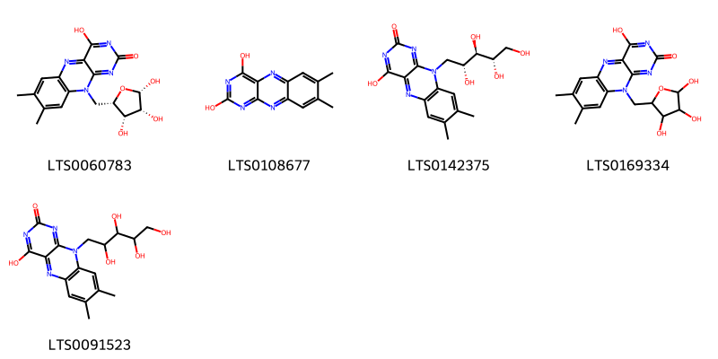{ width=100% }
    <figcaption>Hình ảnh cấu trúc hóa học của 5 hoạt chất thuộc nhóm Pteridines and derivatives gồm ['4-hydroxy-7,8-dimethyl-10-{[(2s,3s,4r,5s)-3,4,5-trihydroxyoxolan-2-yl]methyl}benzo[g]pteridin-2-one (LTS0060783)', '7,8-dimethylbenzo[g]pteridine-2,4-diol (LTS0108677)', '4-hydroxy-7,8-dimethyl-10-[(2r,3r,4s)-2,3,4,5-tetrahydroxypentyl]benzo[g]pteridin-2-one (LTS0142375)', '4-hydroxy-7,8-dimethyl-10-[(3,4,5-trihydroxyoxolan-2-yl)methyl]benzo[g]pteridin-2-one (LTS0169334)', '4-hydroxy-7,8-dimethyl-10-(2,3,4,5-tetrahydroxypentyl)benzo[g]pteridin-2-one (LTS0091523)'].</figcaption>
</figure>
#### Nhóm Pyridines and derivatives
<figure markdown="span">
    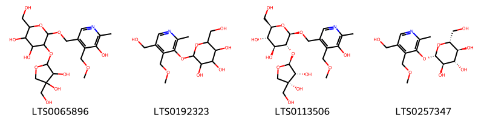{ width=100% }
    <figcaption>Hình ảnh cấu trúc hóa học của 4 hoạt chất thuộc nhóm Pyridines and derivatives gồm ['5-{[3,4-dihydroxy-4-(hydroxymethyl)oxolan-2-yl]oxy}-6-{[5-hydroxy-4-(methoxymethyl)-6-methylpyridin-3-yl]methoxy}-2-(hydroxymethyl)oxane-3,4-diol (LTS0065896)', '2-(hydroxymethyl)-6-{[5-(hydroxymethyl)-4-(methoxymethyl)-2-methylpyridin-3-yl]oxy}oxane-3,4,5-triol (LTS0192323)', '(2r,3s,4s,5r,6r)-5-{[(2s,3r,4r)-3,4-dihydroxy-4-(hydroxymethyl)oxolan-2-yl]oxy}-6-{[5-hydroxy-4-(methoxymethyl)-6-methylpyridin-3-yl]methoxy}-2-(hydroxymethyl)oxane-3,4-diol (LTS0113506)', '(2r,3s,4s,5r,6s)-2-(hydroxymethyl)-6-{[5-(hydroxymethyl)-4-(methoxymethyl)-2-methylpyridin-3-yl]oxy}oxane-3,4,5-triol (LTS0257347)'].</figcaption>
</figure>
#### Nhóm Saccharolipids
<figure markdown="span">
    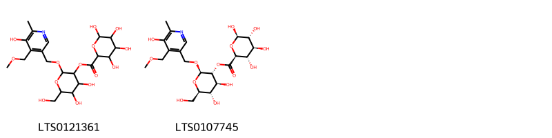{ width=100% }
    <figcaption>Hình ảnh cấu trúc hóa học của 2 hoạt chất thuộc nhóm Saccharolipids gồm ['4,5-dihydroxy-2-{[5-hydroxy-4-(methoxymethyl)-6-methylpyridin-3-yl]methoxy}-6-(hydroxymethyl)oxan-3-yl 3,4,5,6-tetrahydroxyoxane-2-carboxylate (LTS0121361)', '(2r,3r,4s,5s,6r)-4,5-dihydroxy-2-{[5-hydroxy-4-(methoxymethyl)-6-methylpyridin-3-yl]methoxy}-6-(hydroxymethyl)oxan-3-yl (2s,3s,4s,5r,6r)-3,4,5,6-tetrahydroxyoxane-2-carboxylate (LTS0107745)'].</figcaption>
</figure>
#### Nhóm Sphingolipids
<figure markdown="span">
    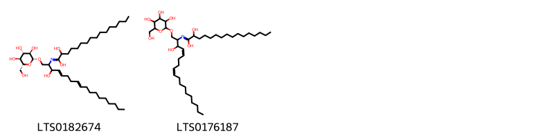{ width=100% }
    <figcaption>Hình ảnh cấu trúc hóa học của 2 hoạt chất thuộc nhóm Sphingolipids gồm ['2-hydroxy-n-[(4e,8e)-3-hydroxy-1-{[(2r,3r,4s,5s,6r)-3,4,5-trihydroxy-6-(hydroxymethyl)oxan-2-yl]oxy}octadeca-4,8-dien-2-yl]hexadecanimidic acid (LTS0182674)', '2-hydroxy-n-[(4z,8z)-3-hydroxy-1-{[3,4,5-trihydroxy-6-(hydroxymethyl)oxan-2-yl]oxy}octadeca-4,8-dien-2-yl]hexadecanimidic acid (LTS0176187)'].</figcaption>
</figure>
#### Nhóm Steroids and steroid derivatives
<figure markdown="span">
    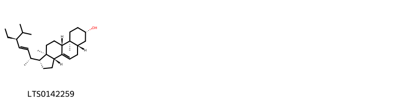{ width=100% }
    <figcaption>Hình ảnh cấu trúc hóa học của 1 hoạt chất thuộc nhóm Steroids and steroid derivatives gồm ['chondrillasterol (LTS0142259)'].</figcaption>
</figure>
#### Nhóm Stilbenes
<figure markdown="span">
    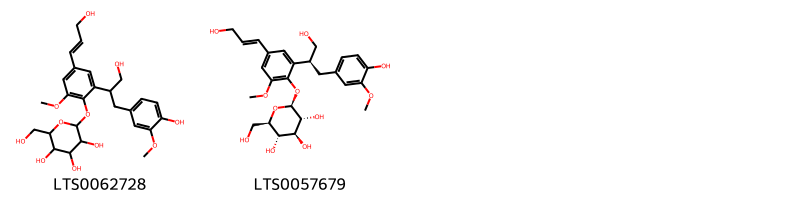{ width=100% }
    <figcaption>Hình ảnh cấu trúc hóa học của 2 hoạt chất thuộc nhóm Stilbenes gồm ['2-{2-[1-hydroxy-3-(4-hydroxy-3-methoxyphenyl)propan-2-yl]-4-(3-hydroxyprop-1-en-1-yl)-6-methoxyphenoxy}-6-(hydroxymethyl)oxane-3,4,5-triol (LTS0062728)', '(2s,3r,4s,5s,6r)-2-{2-[(2s)-1-hydroxy-3-(4-hydroxy-3-methoxyphenyl)propan-2-yl]-4-[(1e)-3-hydroxyprop-1-en-1-yl]-6-methoxyphenoxy}-6-(hydroxymethyl)oxane-3,4,5-triol (LTS0057679)'].</figcaption>
</figure>
#### Nhóm Tannins
<figure markdown="span">
    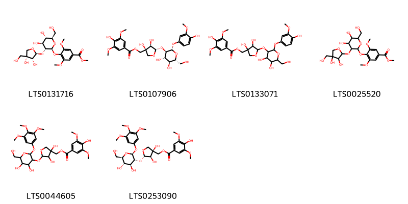{ width=100% }
    <figcaption>Hình ảnh cấu trúc hóa học của 6 hoạt chất thuộc nhóm Tannins gồm ['methyl 4-{[(2s,3r,4s,5s,6r)-3-{[(2s,3r,4r)-3,4-dihydroxy-4-(hydroxymethyl)oxolan-2-yl]oxy}-4,5-dihydroxy-6-(hydroxymethyl)oxan-2-yl]oxy}-3,5-dimethoxybenzoate (LTS0131716)', '[(3s,4r,5s)-5-{[(2s,3r,4s,5s,6r)-4,5-dihydroxy-2-(4-hydroxy-3-methoxyphenoxy)-6-(hydroxymethyl)oxan-3-yl]oxy}-3,4-dihydroxyoxolan-3-yl]methyl 4-hydroxy-3,5-dimethoxybenzoate (LTS0107906)', '(5-{[4,5-dihydroxy-2-(4-hydroxy-3-methoxyphenoxy)-6-(hydroxymethyl)oxan-3-yl]oxy}-3,4-dihydroxyoxolan-3-yl)methyl 4-hydroxy-3,5-dimethoxybenzoate (LTS0133071)', 'methyl 4-[(3-{[3,4-dihydroxy-4-(hydroxymethyl)oxolan-2-yl]oxy}-4,5-dihydroxy-6-(hydroxymethyl)oxan-2-yl)oxy]-3,5-dimethoxybenzoate (LTS0025520)', '(5-{[4,5-dihydroxy-6-(hydroxymethyl)-2-(3,4,5-trimethoxyphenoxy)oxan-3-yl]oxy}-3,4-dihydroxyoxolan-3-yl)methyl 4-hydroxy-3,5-dimethoxybenzoate (LTS0044605)', 'albibrissinoside a (LTS0253090)'].</figcaption>
</figure>

---

### Dược dân tộc học

Danh sách các quốc gia có sử dụng *Albizia julibrissin* trong điều trị các bệnh. 

| Country   | Disease                                                                                   | Bệnh                                                                                                                                                                                                |
|:----------|:------------------------------------------------------------------------------------------|:----------------------------------------------------------------------------------------------------------------------------------------------------------------------------------------------------|
| China     | Discutient, Sedative, Stimulant, Tonic, Tonic, Vermifuge, Vermifuge, Vulnerary, Vulnerary | MYMEMORY WARNING: YOU USED ALL AVAILABLE FREE TRANSLATIONS FOR TODAY. NEXT AVAILABLE IN  14 HOURS 30 MINUTES 20 SECONDS VISIT HTTPS://MYMEMORY.TRANSLATED.NET/DOC/USAGELIMITS.PHP TO TRANSLATE MORE |
| Elsewhere | Diuretic, Tonic                                                                           | MYMEMORY WARNING: YOU USED ALL AVAILABLE FREE TRANSLATIONS FOR TODAY. NEXT AVAILABLE IN  14 HOURS 30 MINUTES 15 SECONDS VISIT HTTPS://MYMEMORY.TRANSLATED.NET/DOC/USAGELIMITS.PHP TO TRANSLATE MORE |

---

---
## Albizia lebbeck
### Thông tin về thực vật

!!! info "Phân loại thực vật của *Albizia lebbeck* từ GIBF:"
    - **Kingdom:** Plantae
    - **Phylum:** Tracheophyta
    - **Order:** Fabales
    - **Family:** Fabaceae
    - **Genus:** Albizia
    - **Species:** *Albizia lebbeck*

 

| Label (VI)   | Label (EN)   | Scientific Name   | Descriptions (VI)   | Descriptions (EN)       | Also Known As (VI)   | Also Known As (EN)            |
|:-------------|:-------------|:------------------|:--------------------|:------------------------|:---------------------|:------------------------------|
| N/A          | N/A          | Albizia lebbeck   |                     | species of plant. Siris | ['']                 | ['Siris', 'Labakh', 'Sirisa'] |

#### Phân bố trên thế giới

**Từ CSDL GIBF** Puerto Rico, Ghana, Réunion, Nigeria, Thailand, Aruba, Martinique, Chinese Taipei, Bahamas, India, Benin, United States of America, Cuba, Mexico, Sint Maarten (Dutch part), Dominican Republic

#### Phân bố tại Việt Nam

**Từ CSDL GIBF**: Không có ghi nhận ở Việt Nam

---
### Thành phần hóa học
        
- Theo cơ sở dữ liệu lotus: Từ loài *Albizia lebbeck* đã phân lập và xác định được 33 hoạt chất thuộc về các nhóm Flavonoids, Macrolactams, Prenol lipids, Tannins, Carboximidic acids and derivatives. 

|    | chemicalTaxonomyClassyfireClass    |   smiles_count |
|---:|:-----------------------------------|---------------:|
|  0 | Carboximidic acids and derivatives |              8 |
|  1 | Flavonoids                         |             11 |
|  2 | Macrolactams                       |              5 |
|  3 | Prenol lipids                      |              7 |
|  4 | Tannins                            |              2 |

#### Nhóm Carboximidic acids and derivatives
<figure markdown="span">
    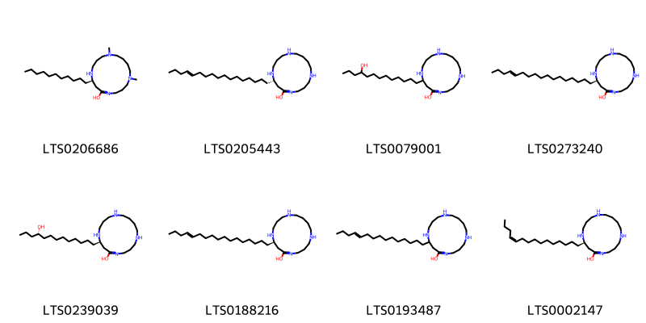{ width=100% }
    <figcaption>Hình ảnh cấu trúc hóa học của 8 hoạt chất thuộc nhóm Carboximidic acids and derivatives gồm ['(8r)-1,13-dimethyl-8-undecyl-1,5,9,13-tetraazacycloheptadec-5-en-6-ol (LTS0206686)', '(8s)-8-[(13e)-heptadec-13-en-1-yl]-1,5,9,13-tetraazacycloheptadec-5-en-6-ol (LTS0205443)', '8-(10-hydroxytridecyl)-1,5,9,13-tetraazacycloheptadec-5-en-6-ol (LTS0079001)', '(8r)-8-[(13e)-heptadec-13-en-1-yl]-1,5,9,13-tetraazacycloheptadec-5-en-6-ol (LTS0273240)', '(8r)-8-[(10s)-10-hydroxytridecyl]-1,5,9,13-tetraazacycloheptadec-5-en-6-ol (LTS0239039)', '(8r)-8-(heptadec-13-en-1-yl)-1,5,9,13-tetraazacycloheptadec-5-en-6-ol (LTS0188216)', '8-(pentadec-11-en-1-yl)-1,5,9,13-tetraazacycloheptadec-5-en-6-ol (LTS0193487)', '(8r)-8-[(11z)-pentadec-11-en-1-yl]-1,5,9,13-tetraazacycloheptadec-5-en-6-ol (LTS0002147)'].</figcaption>
</figure>
#### Nhóm Flavonoids
<figure markdown="span">
    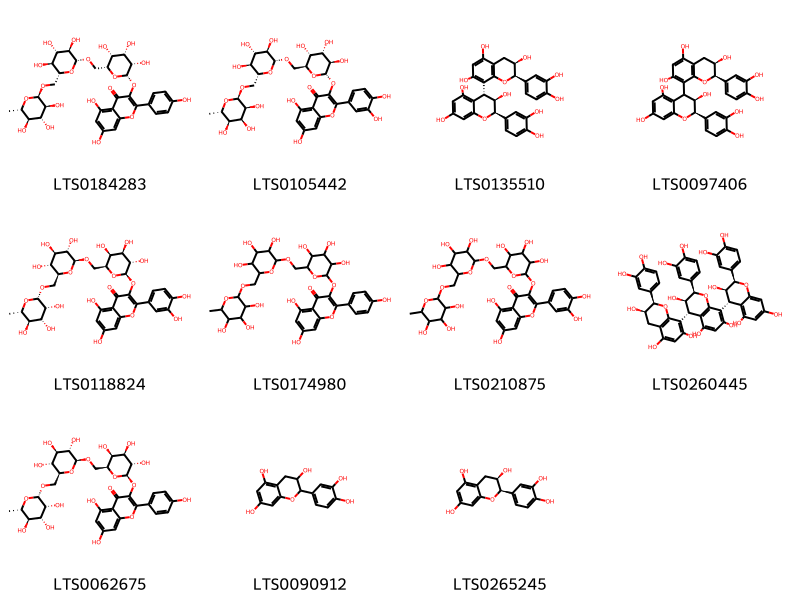{ width=100% }
    <figcaption>Hình ảnh cấu trúc hóa học của 11 hoạt chất thuộc nhóm Flavonoids gồm ['5,7-dihydroxy-2-(4-hydroxyphenyl)-3-{[(2s,3s,4s,5r,6r)-3,4,5-trihydroxy-6-({[(2r,3r,4s,5s,6r)-3,4,5-trihydroxy-6-({[(2r,3s,4r,5r,6s)-3,4,5-trihydroxy-6-methyloxan-2-yl]oxy}methyl)oxan-2-yl]oxy}methyl)oxan-2-yl]oxy}chromen-4-one (LTS0184283)', '2-(3,4-dihydroxyphenyl)-5,7-dihydroxy-3-{[(2s,3r,4s,5r,6s)-3,4,5-trihydroxy-6-({[(2r,3r,4s,5s,6r)-3,4,5-trihydroxy-6-({[(2r,3s,4s,5r,6s)-3,4,5-trihydroxy-6-methyloxan-2-yl]oxy}methyl)oxan-2-yl]oxy}methyl)oxan-2-yl]oxy}chromen-4-one (LTS0105442)', '(2r,3r,4r)-2-(3,4-dihydroxyphenyl)-4-[(2r,3r)-2-(3,4-dihydroxyphenyl)-3,5,7-trihydroxy-3,4-dihydro-2h-1-benzopyran-8-yl]-3,4-dihydro-2h-1-benzopyran-3,5,7-triol (LTS0135510)', '(2r,3r)-2-(3,4-dihydroxyphenyl)-4-[(2r,3r)-2-(3,4-dihydroxyphenyl)-3,5,7-trihydroxy-3,4-dihydro-2h-1-benzopyran-8-yl]-3,4-dihydro-2h-1-benzopyran-3,5,7-triol (LTS0097406)', '2-(3,4-dihydroxyphenyl)-5,7-dihydroxy-3-{[(2r,3s,4r,5s,6s)-3,4,5-trihydroxy-6-({[(2s,3s,4r,5r,6s)-3,4,5-trihydroxy-6-({[(2s,3r,4r,5r,6s)-3,4,5-trihydroxy-6-methyloxan-2-yl]oxy}methyl)oxan-2-yl]oxy}methyl)oxan-2-yl]oxy}chromen-4-one (LTS0118824)', '5,7-dihydroxy-2-(4-hydroxyphenyl)-3-[(3,4,5-trihydroxy-6-{[(3,4,5-trihydroxy-6-{[(3,4,5-trihydroxy-6-methyloxan-2-yl)oxy]methyl}oxan-2-yl)oxy]methyl}oxan-2-yl)oxy]chromen-4-one (LTS0174980)', '2-(3,4-dihydroxyphenyl)-5,7-dihydroxy-3-[(3,4,5-trihydroxy-6-{[(3,4,5-trihydroxy-6-{[(3,4,5-trihydroxy-6-methyloxan-2-yl)oxy]methyl}oxan-2-yl)oxy]methyl}oxan-2-yl)oxy]chromen-4-one (LTS0210875)', 'procyanidin c1 (LTS0260445)', '5,7-dihydroxy-2-(4-hydroxyphenyl)-3-{[(2r,3s,4r,5s,6s)-3,4,5-trihydroxy-6-({[(2s,3s,4r,5r,6s)-3,4,5-trihydroxy-6-({[(2s,3r,4r,5r,6s)-3,4,5-trihydroxy-6-methyloxan-2-yl]oxy}methyl)oxan-2-yl]oxy}methyl)oxan-2-yl]oxy}chromen-4-one (LTS0062675)', 'catechol (LTS0090912)', 'ent-epicatechin (LTS0265245)'].</figcaption>
</figure>
#### Nhóm Macrolactams
<figure markdown="span">
    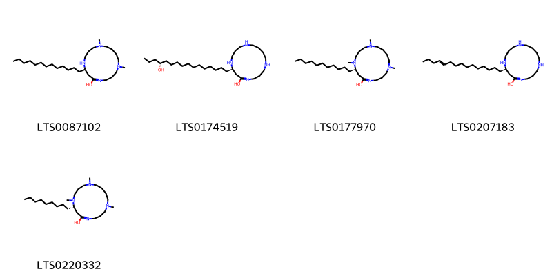{ width=100% }
    <figcaption>Hình ảnh cấu trúc hóa học của 5 hoạt chất thuộc nhóm Macrolactams gồm ['1,13-dimethyl-8-tridecyl-1,5,9,13-tetraazacycloheptadec-5-en-6-ol (LTS0087102)', '(8r)-8-[(13r)-13-hydroxyhexadecyl]-1,5,9,13-tetraazacycloheptadec-5-en-6-ol (LTS0174519)', '(8r)-1,9,13-trimethyl-8-undecyl-1,5,9,13-tetraazacycloheptadec-5-en-6-ol (LTS0177970)', '(8r)-8-[(11e)-pentadec-11-en-1-yl]-1,5,9,13-tetraazacycloheptadec-5-en-6-ol (LTS0207183)', '(8s)-1,9,13-trimethyl-8-nonyl-1,5,9,13-tetraazacycloheptadec-5-en-6-ol (LTS0220332)'].</figcaption>
</figure>
#### Nhóm Prenol lipids
<figure markdown="span">
    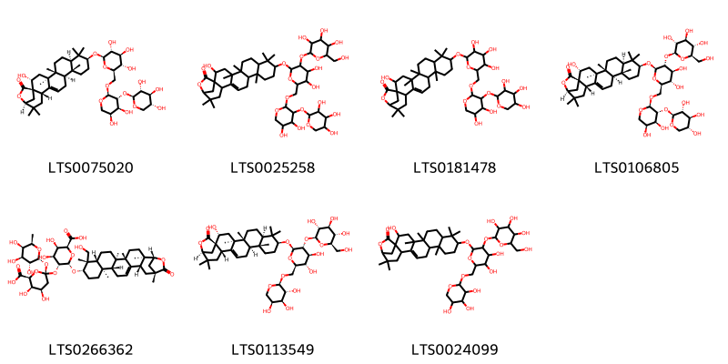{ width=100% }
    <figcaption>Hình ảnh cấu trúc hóa học của 7 hoạt chất thuộc nhóm Prenol lipids gồm ['(1r,2r,4s,5r,8r,10s,13r,14r,18s,21s)-10-{[(2r,3r,4s,5s,6r)-6-({[(2s,3r,4s,5s)-4,5-dihydroxy-3-{[(2s,3r,4s,5r)-3,4,5-trihydroxyoxan-2-yl]oxy}oxan-2-yl]oxy}methyl)-3,4,5-trihydroxyoxan-2-yl]oxy}-2-hydroxy-4,5,9,9,13,20,20-heptamethyl-22-oxahexacyclo[19.2.1.0¹,¹⁸.0⁴,¹⁷.0⁵,¹⁴.0⁸,¹³]tetracos-16-en-23-one (LTS0075020)', '10-({6-[({4,5-dihydroxy-3-[(3,4,5-trihydroxyoxan-2-yl)oxy]oxan-2-yl}oxy)methyl]-4,5-dihydroxy-3-{[3,4,5-trihydroxy-6-(hydroxymethyl)oxan-2-yl]oxy}oxan-2-yl}oxy)-2-hydroxy-4,5,9,9,13,20,20-heptamethyl-22-oxahexacyclo[19.2.1.0¹,¹⁸.0⁴,¹⁷.0⁵,¹⁴.0⁸,¹³]tetracos-16-en-23-one (LTS0025258)', '10-({6-[({4,5-dihydroxy-3-[(3,4,5-trihydroxyoxan-2-yl)oxy]oxan-2-yl}oxy)methyl]-3,4,5-trihydroxyoxan-2-yl}oxy)-2-hydroxy-4,5,9,9,13,20,20-heptamethyl-22-oxahexacyclo[19.2.1.0¹,¹⁸.0⁴,¹⁷.0⁵,¹⁴.0⁸,¹³]tetracos-16-en-23-one (LTS0181478)', '(1r,2r,4s,5r,8r,10s,13r,14r,18s,21s)-10-{[(2r,3r,4s,5s,6r)-6-({[(2s,3r,4s,5s)-4,5-dihydroxy-3-{[(2s,3r,4s,5r)-3,4,5-trihydroxyoxan-2-yl]oxy}oxan-2-yl]oxy}methyl)-4,5-dihydroxy-3-{[(2s,3r,4s,5s,6r)-3,4,5-trihydroxy-6-(hydroxymethyl)oxan-2-yl]oxy}oxan-2-yl]oxy}-2-hydroxy-4,5,9,9,13,20,20-heptamethyl-22-oxahexacyclo[19.2.1.0¹,¹⁸.0⁴,¹⁷.0⁵,¹⁴.0⁸,¹³]tetracos-16-en-23-one (LTS0106805)', '(2s,3r,4r,6r)-6-{[(2s,3r,4s,5r,6s)-6-carboxy-4,5-dihydroxy-2-{[(1r,2r,5s,6r,9r,10s,11s,14r,15r,19r,21r)-10-(hydroxymethyl)-2,5,6,10,14,21-hexamethyl-22-oxo-23-oxahexacyclo[19.2.1.0²,¹⁹.0⁵,¹⁸.0⁶,¹⁵.0⁹,¹⁴]tetracos-17-en-11-yl]oxy}oxan-3-yl]oxy}-3,4-dihydroxy-6-{[(2r,3r,4s,5r,6r)-3,4,5-trihydroxy-6-methyloxan-2-yl]oxy}oxane-2-carboxylic acid (LTS0266362)', '(1r,2r,4s,5r,8r,10s,13r,14r,18s,21s)-10-{[(2r,3r,4s,5s,6r)-4,5-dihydroxy-3-{[(2s,3r,4s,5s,6r)-3,4,5-trihydroxy-6-(hydroxymethyl)oxan-2-yl]oxy}-6-({[(2s,3r,4s,5s)-3,4,5-trihydroxyoxan-2-yl]oxy}methyl)oxan-2-yl]oxy}-2-hydroxy-4,5,9,9,13,20,20-heptamethyl-22-oxahexacyclo[19.2.1.0¹,¹⁸.0⁴,¹⁷.0⁵,¹⁴.0⁸,¹³]tetracos-16-en-23-one (LTS0113549)', '10-[(4,5-dihydroxy-3-{[3,4,5-trihydroxy-6-(hydroxymethyl)oxan-2-yl]oxy}-6-{[(3,4,5-trihydroxyoxan-2-yl)oxy]methyl}oxan-2-yl)oxy]-2-hydroxy-4,5,9,9,13,20,20-heptamethyl-22-oxahexacyclo[19.2.1.0¹,¹⁸.0⁴,¹⁷.0⁵,¹⁴.0⁸,¹³]tetracos-16-en-23-one (LTS0024099)'].</figcaption>
</figure>
#### Nhóm Tannins
<figure markdown="span">
    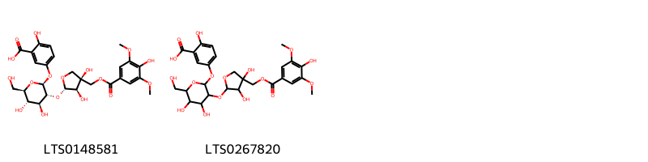{ width=100% }
    <figcaption>Hình ảnh cấu trúc hóa học của 2 hoạt chất thuộc nhóm Tannins gồm ['5-{[(2s,3r,4s,5s,6r)-3-{[(2s,3r,4s)-3,4-dihydroxy-4-[(4-hydroxy-3,5-dimethoxybenzoyloxy)methyl]oxolan-2-yl]oxy}-4,5-dihydroxy-6-(hydroxymethyl)oxan-2-yl]oxy}-2-hydroxybenzoic acid (LTS0148581)', '5-{[3-({3,4-dihydroxy-4-[(4-hydroxy-3,5-dimethoxybenzoyloxy)methyl]oxolan-2-yl}oxy)-4,5-dihydroxy-6-(hydroxymethyl)oxan-2-yl]oxy}-2-hydroxybenzoic acid (LTS0267820)'].</figcaption>
</figure>

---

### Dược dân tộc học

Danh sách các quốc gia có sử dụng *Albizia lebbeck* trong điều trị các bệnh. 

| Country   | Disease      | Bệnh                                                                                                                                                                                                |
|:----------|:-------------|:----------------------------------------------------------------------------------------------------------------------------------------------------------------------------------------------------|
| Haiti     | Tonic, Tonic | MYMEMORY WARNING: YOU USED ALL AVAILABLE FREE TRANSLATIONS FOR TODAY. NEXT AVAILABLE IN  14 HOURS 29 MINUTES 28 SECONDS VISIT HTTPS://MYMEMORY.TRANSLATED.NET/DOC/USAGELIMITS.PHP TO TRANSLATE MORE |

---

---
## Albizia lebbek
### Thông tin về thực vật

!!! info "Phân loại thực vật của *Albizia lebbeck* từ GIBF:"
    - **Kingdom:** Plantae
    - **Phylum:** Tracheophyta
    - **Order:** Fabales
    - **Family:** Fabaceae
    - **Genus:** Albizia
    - **Species:** *Albizia lebbeck*

 

| Label (VI)   | Label (EN)   | Scientific Name   | Descriptions (VI)   | Descriptions (EN)       | Also Known As (VI)   | Also Known As (EN)            |
|:-------------|:-------------|:------------------|:--------------------|:------------------------|:---------------------|:------------------------------|
| N/A          | N/A          | Albizia lebbeck   |                     | species of plant. Siris | ['']                 | ['Siris', 'Labakh', 'Sirisa'] |

#### Phân bố trên thế giới

**Từ CSDL GIBF** Vanuatu, Benin, Brazil

#### Phân bố tại Việt Nam

**Từ CSDL GIBF**: Không có ghi nhận ở Việt Nam

---
### Thành phần hóa học
        
- Theo cơ sở dữ liệu lotus: Từ loài *Albizia lebbeck* đã phân lập và xác định được Chưa có hoạt chất nào được phân lập. hoạt chất thuộc về các nhóm Không có hoạt chất nào được phân lập. 

Không có hình ảnh nào được tạo ra

---

### Dược dân tộc học

Danh sách các quốc gia có sử dụng *Albizia lebbeck* trong điều trị các bệnh. 

| Country   | Disease    | Bệnh                                                                                                                                                                                                |
|:----------|:-----------|:----------------------------------------------------------------------------------------------------------------------------------------------------------------------------------------------------|
| Sudan     | Astringent | MYMEMORY WARNING: YOU USED ALL AVAILABLE FREE TRANSLATIONS FOR TODAY. NEXT AVAILABLE IN  14 HOURS 28 MINUTES 53 SECONDS VISIT HTTPS://MYMEMORY.TRANSLATED.NET/DOC/USAGELIMITS.PHP TO TRANSLATE MORE |

---

---
## Albizia odoratissima
### Thông tin về thực vật

!!! info "Phân loại thực vật của *Albizia odoratissima* từ GIBF:"
    - **Kingdom:** Plantae
    - **Phylum:** Tracheophyta
    - **Order:** Fabales
    - **Family:** Fabaceae
    - **Genus:** Albizia
    - **Species:** *Albizia odoratissima*

 

| Label (VI)   | Label (EN)   | Scientific Name      | Descriptions (VI)   | Descriptions (EN)   | Also Known As (VI)   | Also Known As (EN)   |
|:-------------|:-------------|:---------------------|:--------------------|:--------------------|:---------------------|:---------------------|
| N/A          | N/A          | Albizia odoratissima | loài thực vật       | species of plant    | ['']                 | ['']                 |

#### Phân bố trên thế giới

**Từ CSDL GIBF** nan, Sri Lanka, Uganda, South Africa, Thailand, Lao People’s Democratic Republic, Myanmar, India, unknown or invalid, Bangladesh, Viet Nam, China

#### Phân bố tại Việt Nam

**Từ CSDL GIBF**: Ninh Binh

---
### Thành phần hóa học
        
- Theo cơ sở dữ liệu lotus: Từ loài *Albizia odoratissima* đã phân lập và xác định được 3 hoạt chất thuộc về các nhóm Flavonoids. 

|    | chemicalTaxonomyClassyfireClass   |   smiles_count |
|---:|:----------------------------------|---------------:|
|  0 | Flavonoids                        |              3 |

#### Nhóm Flavonoids
<figure markdown="span">
    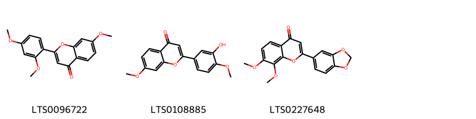{ width=100% }
    <figcaption>Hình ảnh cấu trúc hóa học của 3 hoạt chất thuộc nhóm Flavonoids gồm ['2-(2,4-dimethoxyphenyl)-7-methoxychromen-4-one (LTS0096722)', 'tithonine (LTS0108885)', '2-(2h-1,3-benzodioxol-5-yl)-7,8-dimethoxychromen-4-one (LTS0227648)'].</figcaption>
</figure>

---

### Dược dân tộc học

Danh sách các quốc gia có sử dụng *Albizia odoratissima* trong điều trị các bệnh. 

| Country        | Disease   | Bệnh                                                                                                                                                                                                |
|:---------------|:----------|:----------------------------------------------------------------------------------------------------------------------------------------------------------------------------------------------------|
| India(Gujarat) | Piscicide | MYMEMORY WARNING: YOU USED ALL AVAILABLE FREE TRANSLATIONS FOR TODAY. NEXT AVAILABLE IN  14 HOURS 28 MINUTES 23 SECONDS VISIT HTTPS://MYMEMORY.TRANSLATED.NET/DOC/USAGELIMITS.PHP TO TRANSLATE MORE |

---

---
## Albizia procera
### Thông tin về thực vật

!!! info "Phân loại thực vật của *Albizia procera* từ GIBF:"
    - **Kingdom:** Plantae
    - **Phylum:** Tracheophyta
    - **Order:** Fabales
    - **Family:** Fabaceae
    - **Genus:** Albizia
    - **Species:** *Albizia procera*

 

| Label (VI)   | Label (EN)   | Scientific Name   | Descriptions (VI)   | Descriptions (EN)   | Also Known As (VI)   | Also Known As (EN)   |
|:-------------|:-------------|:------------------|:--------------------|:--------------------|:---------------------|:---------------------|
| N/A          | N/A          | Albizia procera   | loài thực vật       | species of plant    | ['']                 | ['']                 |

#### Phân bố trên thế giới

**Từ CSDL GIBF** Puerto Rico, Australia, Thailand, Chinese Taipei, India

#### Phân bố tại Việt Nam

**Từ CSDL GIBF**: Không có ghi nhận ở Việt Nam

---
### Thành phần hóa học
        
- Theo cơ sở dữ liệu lotus: Từ loài *Albizia procera* đã phân lập và xác định được 22 hoạt chất thuộc về các nhóm Flavonoids, Prenol lipids. 

|    | chemicalTaxonomyClassyfireClass   |   smiles_count |
|---:|:----------------------------------|---------------:|
|  0 | Flavonoids                        |              1 |
|  1 | Prenol lipids                     |             21 |

#### Nhóm Flavonoids
<figure markdown="span">
    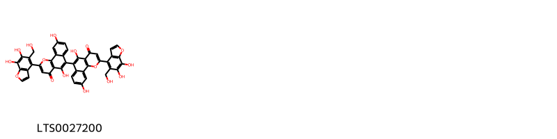{ width=100% }
    <figcaption>Hình ảnh cấu trúc hóa học của 1 hoạt chất thuộc nhóm Flavonoids gồm ['2-[6,7-dihydroxy-5-(hydroxymethyl)-1-benzofuran-4-yl]-6-{2-[6,7-dihydroxy-5-(hydroxymethyl)-1-benzofuran-4-yl]-5,9-dihydroxy-4-oxobenzo[h]chromen-6-yl}-5,9-dihydroxybenzo[h]chromen-4-one (LTS0027200)'].</figcaption>
</figure>
#### Nhóm Prenol lipids
<figure markdown="span">
    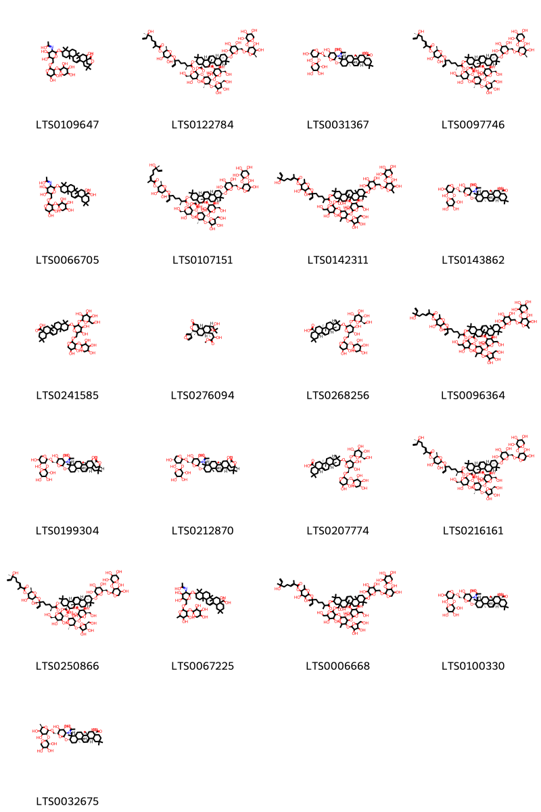{ width=100% }
    <figcaption>Hình ảnh cấu trúc hóa học của 21 hoạt chất thuộc nhóm Prenol lipids gồm ['n-{6-[({4,5-dihydroxy-3-[(3,4,5-trihydroxyoxan-2-yl)oxy]oxan-2-yl}oxy)methyl]-4,5-dihydroxy-2-({2-hydroxy-4,5,9,9,13,20,20-heptamethyl-23-oxo-22-oxahexacyclo[19.2.1.0¹,¹⁸.0⁴,¹⁷.0⁵,¹⁴.0⁸,¹³]tetracos-16-en-10-yl}oxy)oxan-3-yl}ethanimidic acid (LTS0109647)', '(2s,3r,4s,5s,6r)-3-{[(2r,3r,4s,5s,6s)-5-{[(2s,3r,4r,5s)-3,4-dihydroxy-5-(hydroxymethyl)oxolan-2-yl]oxy}-3-hydroxy-6-methyl-4-{[(2s,3r,4s,5s,6r)-3,4,5-trihydroxy-6-(hydroxymethyl)oxan-2-yl]oxy}oxan-2-yl]oxy}-4,5-dihydroxy-6-(hydroxymethyl)oxan-2-yl (3s,4ar,6as,6br,8ar,10s,12ar,12br,14bs)-3-{[(2s,6s)-6-{[(2s,3r,4r,5s,6r)-3,4-dihydroxy-5-{[(2e,6s)-6-hydroxy-2,6-dimethylocta-2,7-dienoyl]oxy}-6-methyloxan-2-yl]oxy}-2,6-dimethyloct-7-enoyl]oxy}-10-{[(2r,3r,4s,5s,6r)-6-({[(2r,3r,4s,5r,6r)-4,5-dihydroxy-6-methyl-3-{[(2s,3r,4s,5r)-3,4,5-trihydroxyoxan-2-yl]oxy}oxan-2-yl]oxy}methyl)-3,4,5-trihydroxyoxan-2-yl]oxy}-2,2,6a,6b,9,9,12a-heptamethyl-1,3,4,5,6,7,8,8a,10,11,12,12b,13,14b-tetradecahydropicene-4a-carboxylate (LTS0122784)', '(4ar,5r,6as,6br,8ar,10s,12ar,12br,14bs)-10-{[(2r,3r,4r,5s,6r)-6-({[(2s,3r,4r,5r)-4,5-dihydroxy-3-{[(2s,3r,4s,5r)-3,4,5-trihydroxyoxan-2-yl]oxy}oxan-2-yl]oxy}methyl)-4,5-dihydroxy-3-[(1-hydroxyethylidene)amino]oxan-2-yl]oxy}-5-hydroxy-2,2,6a,6b,9,9,12a-heptamethyl-1,3,4,5,6,7,8,8a,10,11,12,12b,13,14b-tetradecahydropicene-4a-carboxylic acid (LTS0031367)', '(2s,3r,4s,5s,6r)-3-{[(2r,3r,4s,5s,6s)-5-{[(2s,3r,4r,5s)-3,4-dihydroxy-5-(hydroxymethyl)oxolan-2-yl]oxy}-3-hydroxy-6-methyl-4-{[(2s,3r,4s,5s,6r)-3,4,5-trihydroxy-6-(hydroxymethyl)oxan-2-yl]oxy}oxan-2-yl]oxy}-4,5-dihydroxy-6-(hydroxymethyl)oxan-2-yl (3r,4ar,5r,6as,6br,8ar,10s,12ar,12br,14bs)-3-{[(2r,6s)-6-{[(2s,3r,4r,5s,6r)-3,4-dihydroxy-5-{[(2e,6s)-6-hydroxy-2,6-dimethylocta-2,7-dienoyl]oxy}-6-methyloxan-2-yl]oxy}-2,6-dimethyloct-7-enoyl]oxy}-10-{[(2r,3r,4s,5s,6r)-6-({[(2r,3r,4s,5r,6r)-4,5-dihydroxy-6-methyl-3-{[(2s,3r,4s,5r)-3,4,5-trihydroxyoxan-2-yl]oxy}oxan-2-yl]oxy}methyl)-3,4,5-trihydroxyoxan-2-yl]oxy}-5-hydroxy-2,2,6a,6b,9,9,12a-heptamethyl-1,3,4,5,6,7,8,8a,10,11,12,12b,13,14b-tetradecahydropicene-4a-carboxylate (LTS0097746)', '10-({6-[({4,5-dihydroxy-3-[(3,4,5-trihydroxyoxan-2-yl)oxy]oxan-2-yl}oxy)methyl]-4,5-dihydroxy-3-[(1-hydroxyethylidene)amino]oxan-2-yl}oxy)-5-hydroxy-2,2,6a,6b,9,9,12a-heptamethyl-1,3,4,5,6,7,8,8a,10,11,12,12b,13,14b-tetradecahydropicene-4a-carboxylic acid (LTS0066705)', '(2s,3r,4s,5s,6r)-3-{[(2r,3r,4s,5s,6s)-5-{[(2s,3r,4r,5s)-3,4-dihydroxy-5-(hydroxymethyl)oxolan-2-yl]oxy}-3-hydroxy-6-methyl-4-{[(2s,3r,4s,5s,6r)-3,4,5-trihydroxy-6-(hydroxymethyl)oxan-2-yl]oxy}oxan-2-yl]oxy}-4,5-dihydroxy-6-(hydroxymethyl)oxan-2-yl (3s,4ar,5r,6as,6br,8ar,10s,12ar,12br,14bs)-10-{[(2r,3r,4s,5s,6r)-6-({[(2s,3r,4s,5s)-4,5-dihydroxy-3-{[(2s,3r,4s,5r)-3,4,5-trihydroxyoxan-2-yl]oxy}oxan-2-yl]oxy}methyl)-3,4,5-trihydroxyoxan-2-yl]oxy}-3-{[(2s,6s)-6-{[(2s,3r,4r,5s,6r)-3,4-dihydroxy-5-{[(2z,6s)-6-hydroxy-2,6-dimethylocta-2,7-dienoyl]oxy}-6-methyloxan-2-yl]oxy}-2,6-dimethyloct-7-enoyl]oxy}-5-hydroxy-2,2,6a,6b,9,9,12a-heptamethyl-1,3,4,5,6,7,8,8a,10,11,12,12b,13,14b-tetradecahydropicene-4a-carboxylate (LTS0107151)', '3-[(5-{[3,4-dihydroxy-5-(hydroxymethyl)oxolan-2-yl]oxy}-3-hydroxy-6-methyl-4-{[3,4,5-trihydroxy-6-(hydroxymethyl)oxan-2-yl]oxy}oxan-2-yl)oxy]-4,5-dihydroxy-6-(hydroxymethyl)oxan-2-yl 3-{[6-({3,4-dihydroxy-5-[(6-hydroxy-2,6-dimethylocta-2,7-dienoyl)oxy]-6-methyloxan-2-yl}oxy)-2,6-dimethyloct-7-enoyl]oxy}-10-({6-[({4,5-dihydroxy-6-methyl-3-[(3,4,5-trihydroxyoxan-2-yl)oxy]oxan-2-yl}oxy)methyl]-3,4,5-trihydroxyoxan-2-yl}oxy)-5-hydroxy-2,2,6a,6b,9,9,12a-heptamethyl-1,3,4,5,6,7,8,8a,10,11,12,12b,13,14b-tetradecahydropicene-4a-carboxylate (LTS0142311)', '(4ar,5r,6as,6br,8ar,10s,12ar,12br,14bs)-10-{[(2r,3r,4r,5s,6r)-6-({[(2r,3r,4s,5s)-4,5-dihydroxy-3-{[(2r,3r,4s,5s)-3,4,5-trihydroxyoxan-2-yl]oxy}oxan-2-yl]oxy}methyl)-4,5-dihydroxy-3-[(1-hydroxyethylidene)amino]oxan-2-yl]oxy}-5-hydroxy-2,2,6a,6b,9,9,12a-heptamethyl-1,3,4,5,6,7,8,8a,10,11,12,12b,13,14b-tetradecahydropicene-4a-carboxylic acid (LTS0143862)', '10-({6-[({4,5-dihydroxy-3-[(3,4,5-trihydroxyoxan-2-yl)oxy]oxan-2-yl}oxy)methyl]-4,5-dihydroxy-3-{[3,4,5-trihydroxy-6-(hydroxymethyl)oxan-2-yl]oxy}oxan-2-yl}oxy)-2,2,6a,6b,9,9,12a-heptamethyl-1,3,4,5,6,7,8,8a,10,11,12,12b,13,14b-tetradecahydropicene-4a-carboxylic acid (LTS0241585)', 'methyl (2r)-2-[(1r,2s,5r,6r,11r,13s,14r,16s)-6-(furan-3-yl)-14-hydroxy-1,5,15,15-tetramethyl-8,17-dioxo-7-oxatetracyclo[11.3.1.0²,¹¹.0⁵,¹⁰]heptadec-9-en-16-yl]-2-hydroxyacetate (LTS0276094)', '(4as,6as,6br,8ar,10s,12ar,12br,14bs)-10-{[(2r,3r,4s,5s,6r)-6-({[(2s,3r,4s,5s)-4,5-dihydroxy-3-{[(2s,3r,4s,5s)-3,4,5-trihydroxyoxan-2-yl]oxy}oxan-2-yl]oxy}methyl)-4,5-dihydroxy-3-{[(2s,3r,4s,5s,6r)-3,4,5-trihydroxy-6-(hydroxymethyl)oxan-2-yl]oxy}oxan-2-yl]oxy}-2,2,6a,6b,9,9,12a-heptamethyl-1,3,4,5,6,7,8,8a,10,11,12,12b,13,14b-tetradecahydropicene-4a-carboxylic acid (LTS0268256)', '3-[(5-{[3,4-dihydroxy-5-(hydroxymethyl)oxolan-2-yl]oxy}-3-hydroxy-6-methyl-4-{[3,4,5-trihydroxy-6-(hydroxymethyl)oxan-2-yl]oxy}oxan-2-yl)oxy]-4,5-dihydroxy-6-(hydroxymethyl)oxan-2-yl 3-{[6-({3,4-dihydroxy-5-[(6-hydroxy-2,6-dimethylocta-2,7-dienoyl)oxy]-6-methyloxan-2-yl}oxy)-2,6-dimethyloct-7-enoyl]oxy}-10-({6-[({4,5-dihydroxy-6-methyl-3-[(3,4,5-trihydroxyoxan-2-yl)oxy]oxan-2-yl}oxy)methyl]-3,4,5-trihydroxyoxan-2-yl}oxy)-2,2,6a,6b,9,9,12a-heptamethyl-1,3,4,5,6,7,8,8a,10,11,12,12b,13,14b-tetradecahydropicene-4a-carboxylate (LTS0096364)', 'n-[(2r,3r,4r,5s,6r)-6-({[(2r,3r,4s,5s)-4,5-dihydroxy-3-{[(2s,3r,4s,5r)-3,4,5-trihydroxyoxan-2-yl]oxy}oxan-2-yl]oxy}methyl)-4,5-dihydroxy-2-{[(1r,2r,4s,5r,8r,10s,13r,14r,18s,21s)-2-hydroxy-4,5,9,9,13,20,20-heptamethyl-23-oxo-22-oxahexacyclo[19.2.1.0¹,¹⁸.0⁴,¹⁷.0⁵,¹⁴.0⁸,¹³]tetracos-16-en-10-yl]oxy}oxan-3-yl]ethanimidic acid (LTS0199304)', 'n-[(2r,3r,4r,5s,6r)-6-({[(2s,3r,4r,5r)-4,5-dihydroxy-3-{[(2s,3r,4s,5r)-3,4,5-trihydroxyoxan-2-yl]oxy}oxan-2-yl]oxy}methyl)-4,5-dihydroxy-2-{[(1r,2r,4s,5r,8r,10s,13s,14r,18s,21s)-2-hydroxy-4,5,9,9,13,20,20-heptamethyl-23-oxo-22-oxahexacyclo[19.2.1.0¹,¹⁸.0⁴,¹⁷.0⁵,¹⁴.0⁸,¹³]tetracos-16-en-10-yl]oxy}oxan-3-yl]ethanimidic acid (LTS0212870)', '(4as,6as,6br,8ar,10s,12ar,12br,14bs)-10-{[(2r,3r,4s,5s,6r)-6-({[(2s,3r,4s,5s)-4,5-dihydroxy-3-{[(2s,3r,4s,5r)-3,4,5-trihydroxyoxan-2-yl]oxy}oxan-2-yl]oxy}methyl)-4,5-dihydroxy-3-{[(2s,3r,4s,5s,6r)-3,4,5-trihydroxy-6-(hydroxymethyl)oxan-2-yl]oxy}oxan-2-yl]oxy}-2,2,6a,6b,9,9,12a-heptamethyl-1,3,4,5,6,7,8,8a,10,11,12,12b,13,14b-tetradecahydropicene-4a-carboxylic acid (LTS0207774)', '(2s,3r,4s,5s,6r)-3-{[(2r,3r,4s,5s,6s)-5-{[(2s,3r,4r,5s)-3,4-dihydroxy-5-(hydroxymethyl)oxolan-2-yl]oxy}-3-hydroxy-6-methyl-4-{[(2s,3r,4s,5s,6r)-3,4,5-trihydroxy-6-(hydroxymethyl)oxan-2-yl]oxy}oxan-2-yl]oxy}-4,5-dihydroxy-6-(hydroxymethyl)oxan-2-yl (3s,4ar,5r,6as,6br,8ar,10s,12ar,12br,14bs)-10-{[(2r,3r,4s,5s,6r)-6-({[(2s,3r,4s,5s)-4,5-dihydroxy-3-{[(2s,3r,4s,5r)-3,4,5-trihydroxyoxan-2-yl]oxy}oxan-2-yl]oxy}methyl)-3,4,5-trihydroxyoxan-2-yl]oxy}-3-{[(2s,6s)-6-{[(2s,3r,4r,5s,6r)-3,4-dihydroxy-5-{[(2e,6s)-6-hydroxy-2,6-dimethylocta-2,7-dienoyl]oxy}-6-methyloxan-2-yl]oxy}-2,6-dimethyloct-7-enoyl]oxy}-5-hydroxy-2,2,6a,6b,9,9,12a-heptamethyl-1,3,4,5,6,7,8,8a,10,11,12,12b,13,14b-tetradecahydropicene-4a-carboxylate (LTS0216161)', '(2s,3r,4s,5s,6r)-3-{[(2r,3r,4s,5s,6s)-5-{[(2s,3r,4r,5s)-3,4-dihydroxy-5-(hydroxymethyl)oxolan-2-yl]oxy}-3-hydroxy-6-methyl-4-{[(2s,3r,4s,5s,6r)-3,4,5-trihydroxy-6-(hydroxymethyl)oxan-2-yl]oxy}oxan-2-yl]oxy}-4,5-dihydroxy-6-(hydroxymethyl)oxan-2-yl (3s,4ar,5r,6as,6br,8ar,10s,12ar,12br,14bs)-10-{[(2r,3r,4s,5s,6r)-6-({[(2s,3s,4s,5s)-4,5-dihydroxy-3-{[(2s,3r,4s,5r)-3,4,5-trihydroxyoxan-2-yl]oxy}oxan-2-yl]oxy}methyl)-3,4,5-trihydroxyoxan-2-yl]oxy}-3-{[(2s,6r)-6-{[(2s,3r,4r,5s,6r)-3,4-dihydroxy-5-{[(2e,6s)-6-hydroxy-2,6-dimethylocta-2,7-dienoyl]oxy}-6-methyloxan-2-yl]oxy}-2,6-dimethyloct-7-enoyl]oxy}-5-hydroxy-2,2,6a,6b,9,9,12a-heptamethyl-1,3,4,5,6,7,8,8a,10,11,12,12b,13,14b-tetradecahydropicene-4a-carboxylate (LTS0250866)', '10-({6-[({4,5-dihydroxy-6-methyl-3-[(3,4,5-trihydroxyoxan-2-yl)oxy]oxan-2-yl}oxy)methyl]-4,5-dihydroxy-3-[(1-hydroxyethylidene)amino]oxan-2-yl}oxy)-5-hydroxy-2,2,6a,6b,9,9,12a-heptamethyl-1,3,4,5,6,7,8,8a,10,11,12,12b,13,14b-tetradecahydropicene-4a-carboxylic acid (LTS0067225)', '3-[(5-{[3,4-dihydroxy-5-(hydroxymethyl)oxolan-2-yl]oxy}-3-hydroxy-6-methyl-4-{[3,4,5-trihydroxy-6-(hydroxymethyl)oxan-2-yl]oxy}oxan-2-yl)oxy]-4,5-dihydroxy-6-(hydroxymethyl)oxan-2-yl 10-({6-[({4,5-dihydroxy-3-[(3,4,5-trihydroxyoxan-2-yl)oxy]oxan-2-yl}oxy)methyl]-3,4,5-trihydroxyoxan-2-yl}oxy)-3-{[6-({3,4-dihydroxy-5-[(6-hydroxy-2,6-dimethylocta-2,7-dienoyl)oxy]-6-methyloxan-2-yl}oxy)-2,6-dimethyloct-7-enoyl]oxy}-5-hydroxy-2,2,6a,6b,9,9,12a-heptamethyl-1,3,4,5,6,7,8,8a,10,11,12,12b,13,14b-tetradecahydropicene-4a-carboxylate (LTS0006668)', '(4ar,5r,6as,6br,8ar,10s,12ar,12br,14bs)-10-{[(2r,3r,4r,5s,6r)-6-({[(2r,3r,4s,5s)-4,5-dihydroxy-3-{[(2s,3r,4s,5r)-3,4,5-trihydroxyoxan-2-yl]oxy}oxan-2-yl]oxy}methyl)-4,5-dihydroxy-3-[(1-hydroxyethylidene)amino]oxan-2-yl]oxy}-5-hydroxy-2,2,6a,6b,9,9,12a-heptamethyl-1,3,4,5,6,7,8,8a,10,11,12,12b,13,14b-tetradecahydropicene-4a-carboxylic acid (LTS0100330)', '(4ar,5r,6as,6br,8ar,10s,12ar,12br,14bs)-10-{[(2r,3r,4r,5s,6r)-6-({[(2r,3r,4s,5r,6r)-4,5-dihydroxy-6-methyl-3-{[(2r,3r,4s,5s)-3,4,5-trihydroxyoxan-2-yl]oxy}oxan-2-yl]oxy}methyl)-4,5-dihydroxy-3-[(1-hydroxyethylidene)amino]oxan-2-yl]oxy}-5-hydroxy-2,2,6a,6b,9,9,12a-heptamethyl-1,3,4,5,6,7,8,8a,10,11,12,12b,13,14b-tetradecahydropicene-4a-carboxylic acid (LTS0032675)'].</figcaption>
</figure>

---

### Dược dân tộc học

Danh sách các quốc gia có sử dụng *Albizia procera* trong điều trị các bệnh. 

| Country   | Disease   | Bệnh                                                                                                                                                                                                |
|:----------|:----------|:----------------------------------------------------------------------------------------------------------------------------------------------------------------------------------------------------|
| India     | Piscicide | MYMEMORY WARNING: YOU USED ALL AVAILABLE FREE TRANSLATIONS FOR TODAY. NEXT AVAILABLE IN  14 HOURS 27 MINUTES 55 SECONDS VISIT HTTPS://MYMEMORY.TRANSLATED.NET/DOC/USAGELIMITS.PHP TO TRANSLATE MORE |

---

---
## Albizia saponaria
### Thông tin về thực vật

!!! info "Phân loại thực vật của *Albizia saponaria* từ GIBF:"
    - **Kingdom:** Plantae
    - **Phylum:** Tracheophyta
    - **Order:** Fabales
    - **Family:** Fabaceae
    - **Genus:** Albizia
    - **Species:** *Albizia saponaria*

 

| Label (VI)   | Label (EN)   | Scientific Name   | Descriptions (VI)   | Descriptions (EN)   | Also Known As (VI)   | Also Known As (EN)   |
|:-------------|:-------------|:------------------|:--------------------|:--------------------|:---------------------|:---------------------|
| N/A          | N/A          | Albizia saponaria | loài thực vật       | species of plant    | ['']                 | ['']                 |

#### Phân bố trên thế giới

**Từ CSDL GIBF** nan, Fiji, unknown or invalid, Indonesia, United States of America, Cuba, Tanzania, United Republic of, Philippines, Malaysia, China

#### Phân bố tại Việt Nam

**Từ CSDL GIBF**: Không có ghi nhận ở Việt Nam

---
### Thành phần hóa học
        
- Theo cơ sở dữ liệu lotus: Từ loài *Albizia saponaria* đã phân lập và xác định được Chưa có hoạt chất nào được phân lập. hoạt chất thuộc về các nhóm Không có hoạt chất nào được phân lập. 

Không có hình ảnh nào được tạo ra

---

### Dược dân tộc học

Danh sách các quốc gia có sử dụng *Albizia saponaria* trong điều trị các bệnh. 

| Country             | Disease   | Bệnh                                                                                                                                                                                                |
|:--------------------|:----------|:----------------------------------------------------------------------------------------------------------------------------------------------------------------------------------------------------|
| Philippines(Ifugao) | Piscicide | MYMEMORY WARNING: YOU USED ALL AVAILABLE FREE TRANSLATIONS FOR TODAY. NEXT AVAILABLE IN  14 HOURS 27 MINUTES 26 SECONDS VISIT HTTPS://MYMEMORY.TRANSLATED.NET/DOC/USAGELIMITS.PHP TO TRANSLATE MORE |

---

# Chi Dalbergiella

??? note "Danh sách các dược liệu thuộc chi"
    
	 - *Dalbergiella welwitschii*

---
## Dalbergiella welwitschii
### Thông tin về thực vật

!!! info "Phân loại thực vật của *Dalbergiella welwitschii* từ GIBF:"
    - **Kingdom:** Plantae
    - **Phylum:** Tracheophyta
    - **Order:** Fabales
    - **Family:** Fabaceae
    - **Genus:** Dalbergiella
    - **Species:** *Dalbergiella welwitschii*

 

| Label (VI)   | Label (EN)   | Scientific Name          | Descriptions (VI)   | Descriptions (EN)   | Also Known As (VI)   | Also Known As (EN)   |
|:-------------|:-------------|:-------------------------|:--------------------|:--------------------|:---------------------|:---------------------|
| N/A          | N/A          | Dalbergiella welwitschii | loài thực vật       | species of plant    | ['']                 | ['']                 |

#### Phân bố trên thế giới

**Từ CSDL GIBF** Ghana, Central African Republic, Liberia, Nigeria, Equatorial Guinea, Angola, Côte d’Ivoire, Benin, Congo, Democratic Republic of the, Guinea, Cameroon, Sierra Leone, Togo

#### Phân bố tại Việt Nam

**Từ CSDL GIBF**: Không có ghi nhận ở Việt Nam

---
### Thành phần hóa học
        
- Theo cơ sở dữ liệu lotus: Từ loài *Dalbergiella welwitschii* đã phân lập và xác định được Chưa có hoạt chất nào được phân lập. hoạt chất thuộc về các nhóm Không có hoạt chất nào được phân lập. 

Không có hình ảnh nào được tạo ra

---

### Dược dân tộc học

Danh sách các quốc gia có sử dụng *Dalbergiella welwitschii* trong điều trị các bệnh. 

| Country   | Disease   | Bệnh                                                                                                                                                                                                |
|:----------|:----------|:----------------------------------------------------------------------------------------------------------------------------------------------------------------------------------------------------|
| Africa    | Purgative | MYMEMORY WARNING: YOU USED ALL AVAILABLE FREE TRANSLATIONS FOR TODAY. NEXT AVAILABLE IN  14 HOURS 26 MINUTES 59 SECONDS VISIT HTTPS://MYMEMORY.TRANSLATED.NET/DOC/USAGELIMITS.PHP TO TRANSLATE MORE |
| Nigeria   | Vermifuge | MYMEMORY WARNING: YOU USED ALL AVAILABLE FREE TRANSLATIONS FOR TODAY. NEXT AVAILABLE IN  14 HOURS 26 MINUTES 56 SECONDS VISIT HTTPS://MYMEMORY.TRANSLATED.NET/DOC/USAGELIMITS.PHP TO TRANSLATE MORE |

---

# Chi Coronilla

??? note "Danh sách các dược liệu thuộc chi"
    
	 - *Coronilla emerus*
	 - *Coronilla glauca*
	 - *Coronilla montana*
	 - *Coronilla scorpioides*
	 - *Coronilla varia*

---
## Coronilla emerus
### Thông tin về thực vật

!!! info "Phân loại thực vật của *Coronilla emerus* từ GIBF:"
    - **Kingdom:** Plantae
    - **Phylum:** Tracheophyta
    - **Order:** Fabales
    - **Family:** Fabaceae
    - **Genus:** Coronilla
    - **Species:** *Coronilla emerus*

 

| Label (VI)   | Label (EN)   | Scientific Name   | Descriptions (VI)   | Descriptions (EN)   | Also Known As (VI)   | Also Known As (EN)   |
|:-------------|:-------------|:------------------|:--------------------|:--------------------|:---------------------|:---------------------|
| N/A          | N/A          | Coronilla emerus  | loài thực vật       | species of plant    | ['']                 | ['']                 |

#### Phân bố trên thế giới

**Từ CSDL GIBF** nan, Andorra, Italy, Germany, Spain, Hungary, Switzerland, Sweden, Austria, France, Croatia

#### Phân bố tại Việt Nam

**Từ CSDL GIBF**: Không có ghi nhận ở Việt Nam

---
### Thành phần hóa học
        
- Theo cơ sở dữ liệu lotus: Từ loài *Coronilla emerus* đã phân lập và xác định được 14 hoạt chất thuộc về các nhóm Flavonoids, Benzofurans. 

|    | chemicalTaxonomyClassyfireClass   |   smiles_count |
|---:|:----------------------------------|---------------:|
|  0 | Benzofurans                       |              2 |
|  1 | Flavonoids                        |             12 |

#### Nhóm Benzofurans
<figure markdown="span">
    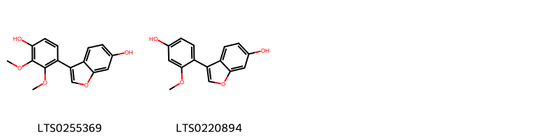{ width=100% }
    <figcaption>Hình ảnh cấu trúc hóa học của 2 hoạt chất thuộc nhóm Benzofurans gồm ['3-(4-hydroxy-2,3-dimethoxyphenyl)-1-benzofuran-6-ol (LTS0255369)', '3-(4-hydroxy-2-methoxyphenyl)-1-benzofuran-6-ol (LTS0220894)'].</figcaption>
</figure>
#### Nhóm Flavonoids
<figure markdown="span">
    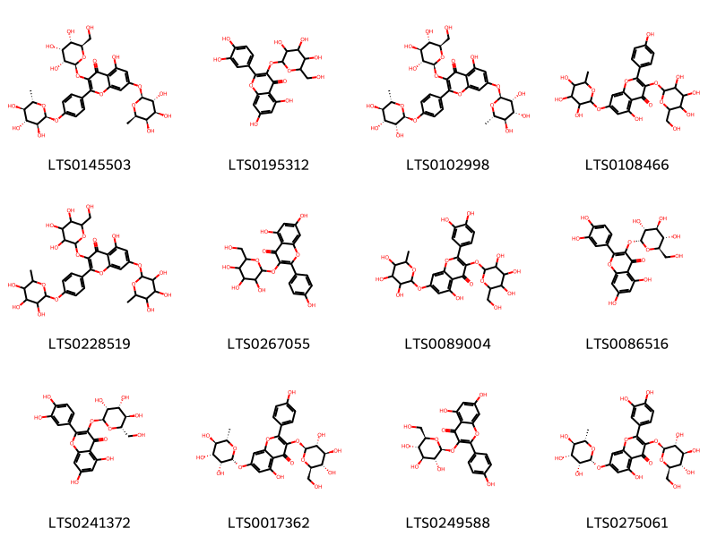{ width=100% }
    <figcaption>Hình ảnh cấu trúc hóa học của 12 hoạt chất thuộc nhóm Flavonoids gồm ['5-hydroxy-3-{[(2s,3r,4r,5s,6r)-3,4,5-trihydroxy-6-(hydroxymethyl)oxan-2-yl]oxy}-7-{[(2s,3r,4s,5r,6r)-3,4,5-trihydroxy-6-methyloxan-2-yl]oxy}-2-(4-{[(2s,3s,4r,5r,6s)-3,4,5-trihydroxy-6-methyloxan-2-yl]oxy}phenyl)chromen-4-one (LTS0145503)', '2-(3,4-dihydroxyphenyl)-5,7-dihydroxy-3-{[3,4,5-trihydroxy-6-(hydroxymethyl)oxan-2-yl]oxy}chromen-4-one (LTS0195312)', '5-hydroxy-3-{[(2s,3r,4s,5s,6r)-3,4,5-trihydroxy-6-(hydroxymethyl)oxan-2-yl]oxy}-7-{[(2s,3r,4r,5r,6s)-3,4,5-trihydroxy-6-methyloxan-2-yl]oxy}-2-(4-{[(2s,3r,4r,5r,6s)-3,4,5-trihydroxy-6-methyloxan-2-yl]oxy}phenyl)chromen-4-one (LTS0102998)', '5-hydroxy-2-(4-hydroxyphenyl)-3-{[3,4,5-trihydroxy-6-(hydroxymethyl)oxan-2-yl]oxy}-7-[(3,4,5-trihydroxy-6-methyloxan-2-yl)oxy]chromen-4-one (LTS0108466)', '5-hydroxy-3-{[3,4,5-trihydroxy-6-(hydroxymethyl)oxan-2-yl]oxy}-7-[(3,4,5-trihydroxy-6-methyloxan-2-yl)oxy]-2-{4-[(3,4,5-trihydroxy-6-methyloxan-2-yl)oxy]phenyl}chromen-4-one (LTS0228519)', 'trifolin (LTS0267055)', '2-(3,4-dihydroxyphenyl)-5-hydroxy-3-{[3,4,5-trihydroxy-6-(hydroxymethyl)oxan-2-yl]oxy}-7-[(3,4,5-trihydroxy-6-methyloxan-2-yl)oxy]chromen-4-one (LTS0089004)', '2-(3,4-dihydroxyphenyl)-5,7-dihydroxy-3-{[(2r,3r,4s,5s,6r)-3,4,5-trihydroxy-6-(hydroxymethyl)oxan-2-yl]oxy}chromen-4-one (LTS0086516)', '2-(3,4-dihydroxyphenyl)-5,7-dihydroxy-3-{[(2s,3r,4r,5r,6s)-3,4,5-trihydroxy-6-(hydroxymethyl)oxan-2-yl]oxy}chromen-4-one (LTS0241372)', '5-hydroxy-2-(4-hydroxyphenyl)-3-{[(2s,3r,4s,5s,6r)-3,4,5-trihydroxy-6-(hydroxymethyl)oxan-2-yl]oxy}-7-{[(2r,3r,4r,5r,6s)-3,4,5-trihydroxy-6-methyloxan-2-yl]oxy}chromen-4-one (LTS0017362)', 'astragalin (LTS0249588)', '2-(3,4-dihydroxyphenyl)-5-hydroxy-3-{[(2s,3r,4s,5s,6r)-3,4,5-trihydroxy-6-(hydroxymethyl)oxan-2-yl]oxy}-7-{[(2r,3r,4r,5r,6s)-3,4,5-trihydroxy-6-methyloxan-2-yl]oxy}chromen-4-one (LTS0275061)'].</figcaption>
</figure>

---

### Dược dân tộc học

Danh sách các quốc gia có sử dụng *Coronilla emerus* trong điều trị các bệnh. 

| Country   | Disease                          | Bệnh                                                                                                                                                                                                |
|:----------|:---------------------------------|:----------------------------------------------------------------------------------------------------------------------------------------------------------------------------------------------------|
| Dutch     | Tonic                            | MYMEMORY WARNING: YOU USED ALL AVAILABLE FREE TRANSLATIONS FOR TODAY. NEXT AVAILABLE IN  14 HOURS 26 MINUTES 12 SECONDS VISIT HTTPS://MYMEMORY.TRANSLATED.NET/DOC/USAGELIMITS.PHP TO TRANSLATE MORE |
| Elsewhere | Cardiotonic, Diuretic, Purgative | MYMEMORY WARNING: YOU USED ALL AVAILABLE FREE TRANSLATIONS FOR TODAY. NEXT AVAILABLE IN  14 HOURS 26 MINUTES 08 SECONDS VISIT HTTPS://MYMEMORY.TRANSLATED.NET/DOC/USAGELIMITS.PHP TO TRANSLATE MORE |
| French    | Purgative                        | MYMEMORY WARNING: YOU USED ALL AVAILABLE FREE TRANSLATIONS FOR TODAY. NEXT AVAILABLE IN  14 HOURS 26 MINUTES 04 SECONDS VISIT HTTPS://MYMEMORY.TRANSLATED.NET/DOC/USAGELIMITS.PHP TO TRANSLATE MORE |
| German    | Diuretic                         | MYMEMORY WARNING: YOU USED ALL AVAILABLE FREE TRANSLATIONS FOR TODAY. NEXT AVAILABLE IN  14 HOURS 26 MINUTES 01 SECONDS VISIT HTTPS://MYMEMORY.TRANSLATED.NET/DOC/USAGELIMITS.PHP TO TRANSLATE MORE |
| Italian   | Poison                           | MYMEMORY WARNING: YOU USED ALL AVAILABLE FREE TRANSLATIONS FOR TODAY. NEXT AVAILABLE IN  14 HOURS 25 MINUTES 58 SECONDS VISIT HTTPS://MYMEMORY.TRANSLATED.NET/DOC/USAGELIMITS.PHP TO TRANSLATE MORE |
| anish     | Cardiotonic                      | MYMEMORY WARNING: YOU USED ALL AVAILABLE FREE TRANSLATIONS FOR TODAY. NEXT AVAILABLE IN  14 HOURS 25 MINUTES 55 SECONDS VISIT HTTPS://MYMEMORY.TRANSLATED.NET/DOC/USAGELIMITS.PHP TO TRANSLATE MORE |

---

---
## Coronilla glauca
### Thông tin về thực vật

!!! info "Phân loại thực vật của *Coronilla glauca* từ GIBF:"
    - **Kingdom:** Plantae
    - **Phylum:** Tracheophyta
    - **Order:** Fabales
    - **Family:** Fabaceae
    - **Genus:** Coronilla
    - **Species:** *Coronilla glauca*

 

| Label (VI)   | Label (EN)   | Scientific Name   | Descriptions (VI)   | Descriptions (EN)   | Also Known As (VI)   | Also Known As (EN)                                                           |
|:-------------|:-------------|:------------------|:--------------------|:--------------------|:---------------------|:-----------------------------------------------------------------------------|
| N/A          | N/A          | Coronilla glauca  | loài thực vật       | species of plant    | ['']                 | ['Coronilla argentea L.', 'Coronilla valentina L. subsp. glauca (L.) Batt.'] |

#### Phân bố trên thế giới

**Từ CSDL GIBF** nan, Italy, Montenegro, Belgium, Malta, Spain, Portugal, unknown or invalid, Algeria, Morocco, France, Croatia, Greece

#### Phân bố tại Việt Nam

**Từ CSDL GIBF**: Không có ghi nhận ở Việt Nam

---
### Thành phần hóa học
        
- Theo cơ sở dữ liệu lotus: Từ loài *Coronilla glauca* đã phân lập và xác định được 29 hoạt chất thuộc về các nhóm Steroids and steroid derivatives, Coumarins and derivatives. 

|    | chemicalTaxonomyClassyfireClass   |   smiles_count |
|---:|:----------------------------------|---------------:|
|  0 | Coumarins and derivatives         |              4 |
|  1 | Steroids and steroid derivatives  |             25 |

#### Nhóm Coumarins and derivatives
<figure markdown="span">
    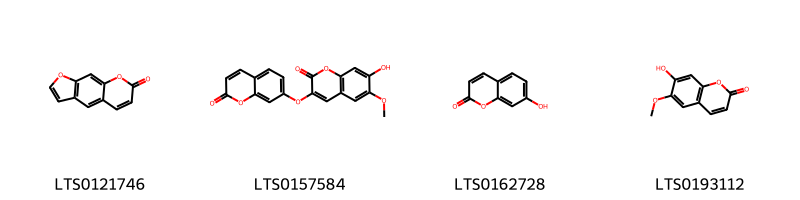{ width=100% }
    <figcaption>Hình ảnh cấu trúc hóa học của 4 hoạt chất thuộc nhóm Coumarins and derivatives gồm ['psoralen (LTS0121746)', 'daphnoretin (LTS0157584)', 'umbelliferone (LTS0162728)', 'scopoletin (LTS0193112)'].</figcaption>
</figure>
#### Nhóm Steroids and steroid derivatives
<figure markdown="span">
    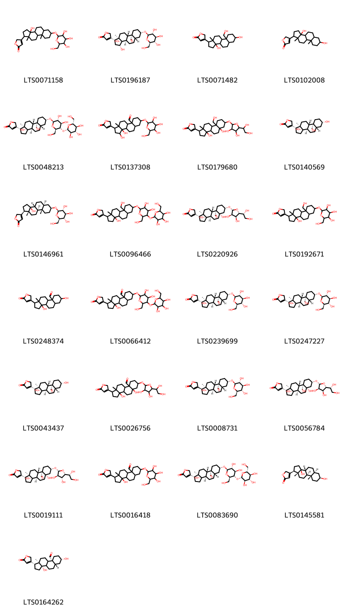{ width=100% }
    <figcaption>Hình ảnh cấu trúc hóa học của 25 hoạt chất thuộc nhóm Steroids and steroid derivatives gồm ['desglucouzarin (LTS0071158)', '(1r,3r,3as,3br,5as,7s,9ar,9bs,11ar)-3,3a-dihydroxy-11a-methyl-1-(5-oxo-2h-furan-3-yl)-7-{[(2r,3r,4s,5s,6r)-3,4,5-trihydroxy-6-(hydroxymethyl)oxan-2-yl]oxy}-tetradecahydrocyclopenta[a]phenanthrene-9a-carbaldehyde (LTS0196187)', '4-[3a,7-dihydroxy-9a-(hydroxymethyl)-11a-methyl-tetradecahydrocyclopenta[a]phenanthren-1-yl]-5h-furan-2-one (LTS0071482)', 'digitoxigenin (LTS0102008)', '4-[(1r,3as,3br,5as,7s,9ar,9bs,11ar)-7-{[(2r,3r,4r,5s,6r)-3,4-dihydroxy-6-(hydroxymethyl)-5-{[(2s,3r,4s,5s,6r)-3,4,5-trihydroxy-6-(hydroxymethyl)oxan-2-yl]oxy}oxan-2-yl]oxy}-3a-hydroxy-9a-(hydroxymethyl)-11a-methyl-tetradecahydrocyclopenta[a]phenanthren-1-yl]-5h-furan-2-one (LTS0048213)', '3,3a-dihydroxy-11a-methyl-1-(5-oxo-2h-furan-3-yl)-7-{[3,4,5-trihydroxy-6-(hydroxymethyl)oxan-2-yl]oxy}-tetradecahydrocyclopenta[a]phenanthrene-9a-carbaldehyde (LTS0137308)', '4-(7-{[5-(1,2-dihydroxyethyl)-3,4-dihydroxyoxolan-2-yl]oxy}-3a,5a-dihydroxy-9a-(hydroxymethyl)-11a-methyl-dodecahydro-1h-cyclopenta[a]phenanthren-1-yl)-5h-furan-2-one (LTS0179680)', '4-[(1r,3as,3br,5as,7s,9ar,9bs,11ar)-3a,7-dihydroxy-9a-(hydroxymethyl)-11a-methyl-tetradecahydrocyclopenta[a]phenanthren-1-yl]-5h-furan-2-one (LTS0140569)', '4-[(1r,3as,3br,5as,7s,9as,9bs,11ar)-3a-hydroxy-9a,11a-dimethyl-7-{[(2r,3r,4s,5s,6r)-3,4,5-trihydroxy-6-(hydroxymethyl)oxan-2-yl]oxy}-tetradecahydrocyclopenta[a]phenanthren-1-yl]-5h-furan-2-one (LTS0146961)', '4-(7-{[3,4-dihydroxy-6-(hydroxymethyl)-5-{[3,4,5-trihydroxy-6-(hydroxymethyl)oxan-2-yl]oxy}oxan-2-yl]oxy}-3a-hydroxy-9a-(hydroxymethyl)-11a-methyl-tetradecahydrocyclopenta[a]phenanthren-1-yl)-5h-furan-2-one (LTS0096466)', '(1r,3as,3br,5as,7s,9as,9bs,11ar)-7-{[(2r,3r,4s,5r)-5-[(1r)-1,2-dihydroxyethyl]-3,4-dihydroxyoxolan-2-yl]oxy}-3a,5a-dihydroxy-11a-methyl-1-(5-oxo-2h-furan-3-yl)-dodecahydro-1h-cyclopenta[a]phenanthrene-9a-carbaldehyde (LTS0220926)', '4-[3a-hydroxy-9a-(hydroxymethyl)-11a-methyl-7-{[3,4,5-trihydroxy-6-(hydroxymethyl)oxan-2-yl]oxy}-tetradecahydrocyclopenta[a]phenanthren-1-yl]-5h-furan-2-one (LTS0192671)', 'corotoxigenin (LTS0248374)', '7-{[3,4-dihydroxy-6-(hydroxymethyl)-5-{[3,4,5-trihydroxy-6-(hydroxymethyl)oxan-2-yl]oxy}oxan-2-yl]oxy}-3a-hydroxy-11a-methyl-1-(5-oxo-2h-furan-3-yl)-tetradecahydrocyclopenta[a]phenanthrene-9a-carbaldehyde (LTS0066412)', '(1r,3as,3br,5as,7s,9ar,9bs,11ar)-3a-hydroxy-11a-methyl-1-(5-oxo-2h-furan-3-yl)-7-{[(2r,3r,4s,5s,6r)-3,4,5-trihydroxy-6-(hydroxymethyl)oxan-2-yl]oxy}-tetradecahydrocyclopenta[a]phenanthrene-9a-carbaldehyde (LTS0239699)', '4-[(1r,3as,3br,5as,7s,9ar,9bs,11ar)-3a-hydroxy-9a-(hydroxymethyl)-11a-methyl-7-{[(2r,3r,4s,5s,6r)-3,4,5-trihydroxy-6-(hydroxymethyl)oxan-2-yl]oxy}-tetradecahydrocyclopenta[a]phenanthren-1-yl]-5h-furan-2-one (LTS0247227)', '(1r,3as,3br,5as,7s,9ar,9bs,11ar)-3a,7-dihydroxy-11a-methyl-1-(5-oxo-2h-furan-3-yl)-tetradecahydrocyclopenta[a]phenanthrene-9a-carbaldehyde (LTS0043437)', '7-{[5-(1,2-dihydroxyethyl)-3,4-dihydroxyoxolan-2-yl]oxy}-3a,5a-dihydroxy-11a-methyl-1-(5-oxo-2h-furan-3-yl)-dodecahydro-1h-cyclopenta[a]phenanthrene-9a-carbaldehyde (LTS0026756)', '(1s,3as,3br,5as,7s,9ar,9bs,11ar)-3a-hydroxy-11a-methyl-1-(5-oxo-2h-furan-3-yl)-7-{[(2r,3r,4s,5s,6r)-3,4,5-trihydroxy-6-(hydroxymethyl)oxan-2-yl]oxy}-tetradecahydrocyclopenta[a]phenanthrene-9a-carbaldehyde (LTS0008731)', '4-[(1r,3as,3br,5as,7s,9ar,9bs,11ar)-7-{[(2r,3r,4s,5r)-5-[(1r)-1,2-dihydroxyethyl]-3,4-dihydroxyoxolan-2-yl]oxy}-3a,5a-dihydroxy-9a-(hydroxymethyl)-11a-methyl-dodecahydro-1h-cyclopenta[a]phenanthren-1-yl]-5h-furan-2-one (LTS0056784)', '(1r,3as,3br,5as,7s,9as,9bs,11ar)-7-{[(2r,3r,4r,5r)-5-[(1r)-1,2-dihydroxyethyl]-3,4-dihydroxyoxolan-2-yl]oxy}-3a,5a-dihydroxy-11a-methyl-1-(5-oxo-2h-furan-3-yl)-dodecahydro-1h-cyclopenta[a]phenanthrene-9a-carbaldehyde (LTS0019111)', '3a-hydroxy-11a-methyl-1-(5-oxo-2h-furan-3-yl)-7-{[3,4,5-trihydroxy-6-(hydroxymethyl)oxan-2-yl]oxy}-tetradecahydrocyclopenta[a]phenanthrene-9a-carbaldehyde (LTS0016418)', '(1r,3as,3br,5as,7s,9ar,9bs,11ar)-7-{[(2r,3r,4r,5s,6r)-3,4-dihydroxy-6-(hydroxymethyl)-5-{[(2s,3r,4s,5s,6r)-3,4,5-trihydroxy-6-(hydroxymethyl)oxan-2-yl]oxy}oxan-2-yl]oxy}-3a-hydroxy-11a-methyl-1-(5-oxo-2h-furan-3-yl)-tetradecahydrocyclopenta[a]phenanthrene-9a-carbaldehyde (LTS0083690)', 'uzarigenin (LTS0145581)', '(1r,3as,5as,7s,9ar,11ar)-3a,7-dihydroxy-11a-methyl-1-(5-oxo-2h-furan-3-yl)-tetradecahydrocyclopenta[a]phenanthrene-9a-carbaldehyde (LTS0164262)'].</figcaption>
</figure>

---

### Dược dân tộc học

Danh sách các quốc gia có sử dụng *Coronilla glauca* trong điều trị các bệnh. 

| Country   | Disease     | Bệnh                                                                                                                                                                                                |
|:----------|:------------|:----------------------------------------------------------------------------------------------------------------------------------------------------------------------------------------------------|
| ain       | Cardiotonic | MYMEMORY WARNING: YOU USED ALL AVAILABLE FREE TRANSLATIONS FOR TODAY. NEXT AVAILABLE IN  14 HOURS 25 MINUTES 26 SECONDS VISIT HTTPS://MYMEMORY.TRANSLATED.NET/DOC/USAGELIMITS.PHP TO TRANSLATE MORE |

---

---
## Coronilla montana
### Thông tin về thực vật

!!! info "Phân loại thực vật của *Coronilla coronata* từ GIBF:"
    - **Kingdom:** Plantae
    - **Phylum:** Tracheophyta
    - **Order:** Fabales
    - **Family:** Fabaceae
    - **Genus:** Coronilla
    - **Species:** *Coronilla coronata*

 

| Label (VI)   | Label (EN)   | Scientific Name   | Descriptions (VI)   | Descriptions (EN)   | Also Known As (VI)   | Also Known As (EN)   |
|:-------------|:-------------|:------------------|:--------------------|:--------------------|:---------------------|:---------------------|
| N/A          | N/A          | Coronilla montana | loài thực vật       | species of plant    | ['']                 | ['']                 |

#### Phân bố trên thế giới

**Từ CSDL GIBF** nan, Italy, Germany, Slovakia, Iran (Islamic Republic of), Spain, Hungary, Serbia, Switzerland, Russian Federation, unknown or invalid, Austria, France, Croatia

#### Phân bố tại Việt Nam

**Từ CSDL GIBF**: Không có ghi nhận ở Việt Nam

---
### Thành phần hóa học
        
- Theo cơ sở dữ liệu lotus: Từ loài *Coronilla coronata* đã phân lập và xác định được Chưa có hoạt chất nào được phân lập. hoạt chất thuộc về các nhóm Không có hoạt chất nào được phân lập. 

Không có hình ảnh nào được tạo ra

---

### Dược dân tộc học

Danh sách các quốc gia có sử dụng *Coronilla coronata* trong điều trị các bệnh. 

| Country   | Disease   | Bệnh                                                                                                                                                                                                |
|:----------|:----------|:----------------------------------------------------------------------------------------------------------------------------------------------------------------------------------------------------|
| French    | Poison    | MYMEMORY WARNING: YOU USED ALL AVAILABLE FREE TRANSLATIONS FOR TODAY. NEXT AVAILABLE IN  14 HOURS 24 MINUTES 51 SECONDS VISIT HTTPS://MYMEMORY.TRANSLATED.NET/DOC/USAGELIMITS.PHP TO TRANSLATE MORE |
| German    | Diuretic  | MYMEMORY WARNING: YOU USED ALL AVAILABLE FREE TRANSLATIONS FOR TODAY. NEXT AVAILABLE IN  14 HOURS 24 MINUTES 48 SECONDS VISIT HTTPS://MYMEMORY.TRANSLATED.NET/DOC/USAGELIMITS.PHP TO TRANSLATE MORE |

---

---
## Coronilla scorpioides
### Thông tin về thực vật

!!! info "Phân loại thực vật của *Coronilla scorpioides* từ GIBF:"
    - **Kingdom:** Plantae
    - **Phylum:** Tracheophyta
    - **Order:** Fabales
    - **Family:** Fabaceae
    - **Genus:** Coronilla
    - **Species:** *Coronilla scorpioides*

 

| Label (VI)   | Label (EN)   | Scientific Name       | Descriptions (VI)   | Descriptions (EN)   | Also Known As (VI)   | Also Known As (EN)   |
|:-------------|:-------------|:----------------------|:--------------------|:--------------------|:---------------------|:---------------------|
| N/A          | N/A          | Coronilla scorpioides | loài thực vật       | species of plant    | ['']                 | ['']                 |

#### Phân bố trên thế giới

**Từ CSDL GIBF** Ukraine, Netherlands, Italy, Montenegro, Iraq, Malta, Spain, Türkiye, Portugal, Algeria, Russian Federation, France, Slovenia, Croatia, Greece, Israel

#### Phân bố tại Việt Nam

**Từ CSDL GIBF**: Không có ghi nhận ở Việt Nam

---
### Thành phần hóa học
        
- Theo cơ sở dữ liệu lotus: Từ loài *Coronilla scorpioides* đã phân lập và xác định được 33 hoạt chất thuộc về các nhóm Steroids and steroid derivatives, Coumarins and derivatives. 

|    | chemicalTaxonomyClassyfireClass   |   smiles_count |
|---:|:----------------------------------|---------------:|
|  0 | Coumarins and derivatives         |              5 |
|  1 | Steroids and steroid derivatives  |             28 |

#### Nhóm Coumarins and derivatives
<figure markdown="span">
    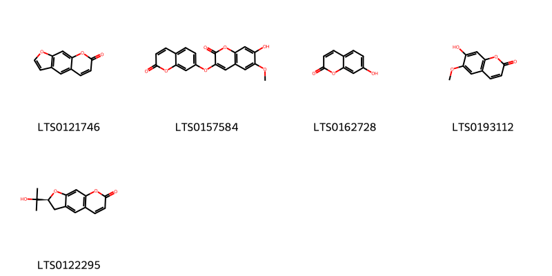{ width=100% }
    <figcaption>Hình ảnh cấu trúc hóa học của 5 hoạt chất thuộc nhóm Coumarins and derivatives gồm ['psoralen (LTS0121746)', 'daphnoretin (LTS0157584)', 'umbelliferone (LTS0162728)', 'scopoletin (LTS0193112)', 'marmesin (LTS0122295)'].</figcaption>
</figure>
#### Nhóm Steroids and steroid derivatives
<figure markdown="span">
    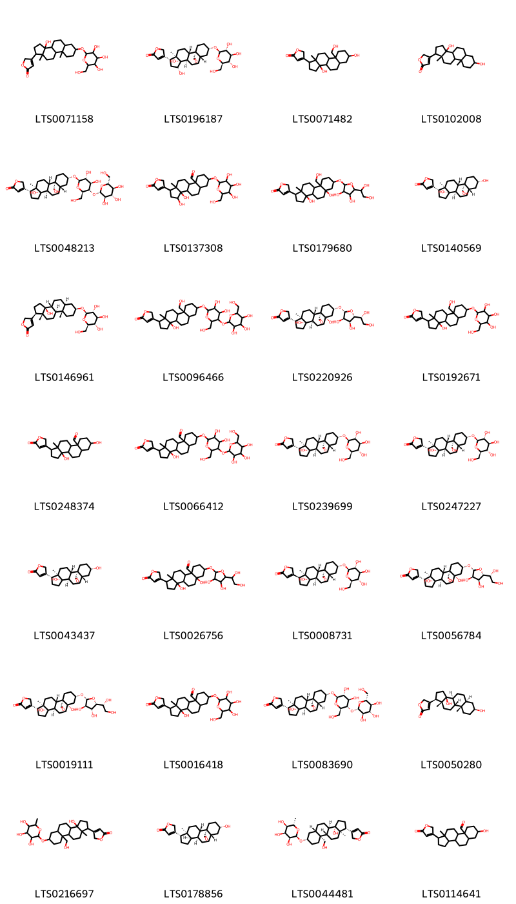{ width=100% }
    <figcaption>Hình ảnh cấu trúc hóa học của 28 hoạt chất thuộc nhóm Steroids and steroid derivatives gồm ['desglucouzarin (LTS0071158)', '(1r,3r,3as,3br,5as,7s,9ar,9bs,11ar)-3,3a-dihydroxy-11a-methyl-1-(5-oxo-2h-furan-3-yl)-7-{[(2r,3r,4s,5s,6r)-3,4,5-trihydroxy-6-(hydroxymethyl)oxan-2-yl]oxy}-tetradecahydrocyclopenta[a]phenanthrene-9a-carbaldehyde (LTS0196187)', '4-[3a,7-dihydroxy-9a-(hydroxymethyl)-11a-methyl-tetradecahydrocyclopenta[a]phenanthren-1-yl]-5h-furan-2-one (LTS0071482)', 'digitoxigenin (LTS0102008)', '4-[(1r,3as,3br,5as,7s,9ar,9bs,11ar)-7-{[(2r,3r,4r,5s,6r)-3,4-dihydroxy-6-(hydroxymethyl)-5-{[(2s,3r,4s,5s,6r)-3,4,5-trihydroxy-6-(hydroxymethyl)oxan-2-yl]oxy}oxan-2-yl]oxy}-3a-hydroxy-9a-(hydroxymethyl)-11a-methyl-tetradecahydrocyclopenta[a]phenanthren-1-yl]-5h-furan-2-one (LTS0048213)', '3,3a-dihydroxy-11a-methyl-1-(5-oxo-2h-furan-3-yl)-7-{[3,4,5-trihydroxy-6-(hydroxymethyl)oxan-2-yl]oxy}-tetradecahydrocyclopenta[a]phenanthrene-9a-carbaldehyde (LTS0137308)', '4-(7-{[5-(1,2-dihydroxyethyl)-3,4-dihydroxyoxolan-2-yl]oxy}-3a,5a-dihydroxy-9a-(hydroxymethyl)-11a-methyl-dodecahydro-1h-cyclopenta[a]phenanthren-1-yl)-5h-furan-2-one (LTS0179680)', '4-[(1r,3as,3br,5as,7s,9ar,9bs,11ar)-3a,7-dihydroxy-9a-(hydroxymethyl)-11a-methyl-tetradecahydrocyclopenta[a]phenanthren-1-yl]-5h-furan-2-one (LTS0140569)', '4-[(1r,3as,3br,5as,7s,9as,9bs,11ar)-3a-hydroxy-9a,11a-dimethyl-7-{[(2r,3r,4s,5s,6r)-3,4,5-trihydroxy-6-(hydroxymethyl)oxan-2-yl]oxy}-tetradecahydrocyclopenta[a]phenanthren-1-yl]-5h-furan-2-one (LTS0146961)', '4-(7-{[3,4-dihydroxy-6-(hydroxymethyl)-5-{[3,4,5-trihydroxy-6-(hydroxymethyl)oxan-2-yl]oxy}oxan-2-yl]oxy}-3a-hydroxy-9a-(hydroxymethyl)-11a-methyl-tetradecahydrocyclopenta[a]phenanthren-1-yl)-5h-furan-2-one (LTS0096466)', '(1r,3as,3br,5as,7s,9as,9bs,11ar)-7-{[(2r,3r,4s,5r)-5-[(1r)-1,2-dihydroxyethyl]-3,4-dihydroxyoxolan-2-yl]oxy}-3a,5a-dihydroxy-11a-methyl-1-(5-oxo-2h-furan-3-yl)-dodecahydro-1h-cyclopenta[a]phenanthrene-9a-carbaldehyde (LTS0220926)', '4-[3a-hydroxy-9a-(hydroxymethyl)-11a-methyl-7-{[3,4,5-trihydroxy-6-(hydroxymethyl)oxan-2-yl]oxy}-tetradecahydrocyclopenta[a]phenanthren-1-yl]-5h-furan-2-one (LTS0192671)', 'corotoxigenin (LTS0248374)', '7-{[3,4-dihydroxy-6-(hydroxymethyl)-5-{[3,4,5-trihydroxy-6-(hydroxymethyl)oxan-2-yl]oxy}oxan-2-yl]oxy}-3a-hydroxy-11a-methyl-1-(5-oxo-2h-furan-3-yl)-tetradecahydrocyclopenta[a]phenanthrene-9a-carbaldehyde (LTS0066412)', '(1r,3as,3br,5as,7s,9ar,9bs,11ar)-3a-hydroxy-11a-methyl-1-(5-oxo-2h-furan-3-yl)-7-{[(2r,3r,4s,5s,6r)-3,4,5-trihydroxy-6-(hydroxymethyl)oxan-2-yl]oxy}-tetradecahydrocyclopenta[a]phenanthrene-9a-carbaldehyde (LTS0239699)', '4-[(1r,3as,3br,5as,7s,9ar,9bs,11ar)-3a-hydroxy-9a-(hydroxymethyl)-11a-methyl-7-{[(2r,3r,4s,5s,6r)-3,4,5-trihydroxy-6-(hydroxymethyl)oxan-2-yl]oxy}-tetradecahydrocyclopenta[a]phenanthren-1-yl]-5h-furan-2-one (LTS0247227)', '(1r,3as,3br,5as,7s,9ar,9bs,11ar)-3a,7-dihydroxy-11a-methyl-1-(5-oxo-2h-furan-3-yl)-tetradecahydrocyclopenta[a]phenanthrene-9a-carbaldehyde (LTS0043437)', '7-{[5-(1,2-dihydroxyethyl)-3,4-dihydroxyoxolan-2-yl]oxy}-3a,5a-dihydroxy-11a-methyl-1-(5-oxo-2h-furan-3-yl)-dodecahydro-1h-cyclopenta[a]phenanthrene-9a-carbaldehyde (LTS0026756)', '(1s,3as,3br,5as,7s,9ar,9bs,11ar)-3a-hydroxy-11a-methyl-1-(5-oxo-2h-furan-3-yl)-7-{[(2r,3r,4s,5s,6r)-3,4,5-trihydroxy-6-(hydroxymethyl)oxan-2-yl]oxy}-tetradecahydrocyclopenta[a]phenanthrene-9a-carbaldehyde (LTS0008731)', '4-[(1r,3as,3br,5as,7s,9ar,9bs,11ar)-7-{[(2r,3r,4s,5r)-5-[(1r)-1,2-dihydroxyethyl]-3,4-dihydroxyoxolan-2-yl]oxy}-3a,5a-dihydroxy-9a-(hydroxymethyl)-11a-methyl-dodecahydro-1h-cyclopenta[a]phenanthren-1-yl]-5h-furan-2-one (LTS0056784)', '(1r,3as,3br,5as,7s,9as,9bs,11ar)-7-{[(2r,3r,4r,5r)-5-[(1r)-1,2-dihydroxyethyl]-3,4-dihydroxyoxolan-2-yl]oxy}-3a,5a-dihydroxy-11a-methyl-1-(5-oxo-2h-furan-3-yl)-dodecahydro-1h-cyclopenta[a]phenanthrene-9a-carbaldehyde (LTS0019111)', '3a-hydroxy-11a-methyl-1-(5-oxo-2h-furan-3-yl)-7-{[3,4,5-trihydroxy-6-(hydroxymethyl)oxan-2-yl]oxy}-tetradecahydrocyclopenta[a]phenanthrene-9a-carbaldehyde (LTS0016418)', '(1r,3as,3br,5as,7s,9ar,9bs,11ar)-7-{[(2r,3r,4r,5s,6r)-3,4-dihydroxy-6-(hydroxymethyl)-5-{[(2s,3r,4s,5s,6r)-3,4,5-trihydroxy-6-(hydroxymethyl)oxan-2-yl]oxy}oxan-2-yl]oxy}-3a-hydroxy-11a-methyl-1-(5-oxo-2h-furan-3-yl)-tetradecahydrocyclopenta[a]phenanthrene-9a-carbaldehyde (LTS0083690)', '4-[(1r,3as,3bs,5as,7s,9as,9br,11ar)-3a,7-dihydroxy-9a,11a-dimethyl-tetradecahydrocyclopenta[a]phenanthren-1-yl]-5h-furan-2-one (LTS0050280)', '4-[3a-hydroxy-9a-(hydroxymethyl)-11a-methyl-7-[(3,4,5-trihydroxy-6-methyloxan-2-yl)oxy]-tetradecahydrocyclopenta[a]phenanthren-1-yl]-5h-furan-2-one (LTS0216697)', '(1s,3ar,3bs,5as,7s,9ar,9bs,11as)-7-hydroxy-11a-methyl-1-(5-oxo-2h-furan-3-yl)-tetradecahydro-1h-cyclopenta[a]phenanthrene-9a-carbaldehyde (LTS0178856)', '4-[(1r,3as,3br,5as,7s,9ar,9bs,11ar)-3a-hydroxy-9a-(hydroxymethyl)-11a-methyl-7-{[(2r,3s,4s,5r,6s)-3,4,5-trihydroxy-6-methyloxan-2-yl]oxy}-tetradecahydrocyclopenta[a]phenanthren-1-yl]-5h-furan-2-one (LTS0044481)', '7-hydroxy-11a-methyl-1-(5-oxo-2h-furan-3-yl)-tetradecahydro-1h-cyclopenta[a]phenanthrene-9a-carbaldehyde (LTS0114641)'].</figcaption>
</figure>

---

### Dược dân tộc học

Danh sách các quốc gia có sử dụng *Coronilla scorpioides* trong điều trị các bệnh. 

| Country   | Disease     | Bệnh                                                                                                                                                                                                |
|:----------|:------------|:----------------------------------------------------------------------------------------------------------------------------------------------------------------------------------------------------|
| French    | Poison      | MYMEMORY WARNING: YOU USED ALL AVAILABLE FREE TRANSLATIONS FOR TODAY. NEXT AVAILABLE IN  14 HOURS 24 MINUTES 24 SECONDS VISIT HTTPS://MYMEMORY.TRANSLATED.NET/DOC/USAGELIMITS.PHP TO TRANSLATE MORE |
| Iraq      | Cardiotonic | MYMEMORY WARNING: YOU USED ALL AVAILABLE FREE TRANSLATIONS FOR TODAY. NEXT AVAILABLE IN  14 HOURS 24 MINUTES 21 SECONDS VISIT HTTPS://MYMEMORY.TRANSLATED.NET/DOC/USAGELIMITS.PHP TO TRANSLATE MORE |
| Italian   | Purgative   | MYMEMORY WARNING: YOU USED ALL AVAILABLE FREE TRANSLATIONS FOR TODAY. NEXT AVAILABLE IN  14 HOURS 24 MINUTES 16 SECONDS VISIT HTTPS://MYMEMORY.TRANSLATED.NET/DOC/USAGELIMITS.PHP TO TRANSLATE MORE |
| US        | Diuretic    | MYMEMORY WARNING: YOU USED ALL AVAILABLE FREE TRANSLATIONS FOR TODAY. NEXT AVAILABLE IN  14 HOURS 24 MINUTES 12 SECONDS VISIT HTTPS://MYMEMORY.TRANSLATED.NET/DOC/USAGELIMITS.PHP TO TRANSLATE MORE |
| ain       | Cardiotonic | MYMEMORY WARNING: YOU USED ALL AVAILABLE FREE TRANSLATIONS FOR TODAY. NEXT AVAILABLE IN  14 HOURS 24 MINUTES 08 SECONDS VISIT HTTPS://MYMEMORY.TRANSLATED.NET/DOC/USAGELIMITS.PHP TO TRANSLATE MORE |
| anish     | Cardiotonic | MYMEMORY WARNING: YOU USED ALL AVAILABLE FREE TRANSLATIONS FOR TODAY. NEXT AVAILABLE IN  14 HOURS 24 MINUTES 03 SECONDS VISIT HTTPS://MYMEMORY.TRANSLATED.NET/DOC/USAGELIMITS.PHP TO TRANSLATE MORE |

---

---
## Coronilla varia
### Thông tin về thực vật

!!! info "Phân loại thực vật của *Coronilla varia* từ GIBF:"
    - **Kingdom:** Plantae
    - **Phylum:** Tracheophyta
    - **Order:** Fabales
    - **Family:** Fabaceae
    - **Genus:** Coronilla
    - **Species:** *Coronilla varia*

 

| Label (VI)   | Label (EN)   | Scientific Name   | Descriptions (VI)   | Descriptions (EN)   | Also Known As (VI)   | Also Known As (EN)   |
|:-------------|:-------------|:------------------|:--------------------|:--------------------|:---------------------|:---------------------|
| N/A          | N/A          | Coronilla varia   | loài thực vật       | species of plant    | ['']                 | ['']                 |

#### Phân bố trên thế giới

**Từ CSDL GIBF** Ukraine, Netherlands, Italy, Australia, Czechia, Germany, Belgium, Poland, Hungary, Switzerland, Russian Federation, United States of America, Sweden, Austria, Canada

#### Phân bố tại Việt Nam

**Từ CSDL GIBF**: Không có ghi nhận ở Việt Nam

---
### Thành phần hóa học
        
- Theo cơ sở dữ liệu lotus: Từ loài *Coronilla varia* đã phân lập và xác định được Chưa có hoạt chất nào được phân lập. hoạt chất thuộc về các nhóm Không có hoạt chất nào được phân lập. 

Không có hình ảnh nào được tạo ra

---

### Dược dân tộc học

Danh sách các quốc gia có sử dụng *Coronilla varia* trong điều trị các bệnh. 

| Country   | Disease                                  | Bệnh                                                                                                                                                                                                |
|:----------|:-----------------------------------------|:----------------------------------------------------------------------------------------------------------------------------------------------------------------------------------------------------|
| Iraq      | Cardiotonic                              | MYMEMORY WARNING: YOU USED ALL AVAILABLE FREE TRANSLATIONS FOR TODAY. NEXT AVAILABLE IN  14 HOURS 23 MINUTES 28 SECONDS VISIT HTTPS://MYMEMORY.TRANSLATED.NET/DOC/USAGELIMITS.PHP TO TRANSLATE MORE |
| Turkey    | Cardiotonic, Diuretic, Poison, Purgative | MYMEMORY WARNING: YOU USED ALL AVAILABLE FREE TRANSLATIONS FOR TODAY. NEXT AVAILABLE IN  14 HOURS 23 MINUTES 23 SECONDS VISIT HTTPS://MYMEMORY.TRANSLATED.NET/DOC/USAGELIMITS.PHP TO TRANSLATE MORE |

---

# Chi Stryphnodendron

??? note "Danh sách các dược liệu thuộc chi"
    
	 - *Stryphnodendron barbatimao*
	 - *Stryphnodendron barbitimam*

---
## Stryphnodendron barbatimao
### Thông tin về thực vật

!!! info "Phân loại thực vật của *Stryphnodendron barbatimao* từ GIBF:"
    - **Kingdom:** Plantae
    - **Phylum:** Tracheophyta
    - **Order:** Fabales
    - **Family:** Fabaceae
    - **Genus:** Stryphnodendron
    - **Species:** *Stryphnodendron barbatimao*

 

| Label (VI)   | Label (EN)   | Scientific Name   | Descriptions (VI)   | Descriptions (EN)   | Also Known As (VI)   | Also Known As (EN)   |
|:-------------|:-------------|:------------------|:--------------------|:--------------------|:---------------------|:---------------------|
| N/A          | N/A          | Coronilla varia   | loài thực vật       | species of plant    | ['']                 | ['']                 |

#### Phân bố trên thế giới

**Từ CSDL GIBF** Brazil

#### Phân bố tại Việt Nam

**Từ CSDL GIBF**: Không có ghi nhận ở Việt Nam

---
### Thành phần hóa học
        
- Theo cơ sở dữ liệu lotus: Từ loài *Stryphnodendron barbatimao* đã phân lập và xác định được Chưa có hoạt chất nào được phân lập. hoạt chất thuộc về các nhóm Không có hoạt chất nào được phân lập. 

Không có hình ảnh nào được tạo ra

---

### Dược dân tộc học

Danh sách các quốc gia có sử dụng *Stryphnodendron barbatimao* trong điều trị các bệnh. 

| Country   | Disease    | Bệnh                                                                                                                                                                                                |
|:----------|:-----------|:----------------------------------------------------------------------------------------------------------------------------------------------------------------------------------------------------|
| German    | Astringent | MYMEMORY WARNING: YOU USED ALL AVAILABLE FREE TRANSLATIONS FOR TODAY. NEXT AVAILABLE IN  14 HOURS 22 MINUTES 57 SECONDS VISIT HTTPS://MYMEMORY.TRANSLATED.NET/DOC/USAGELIMITS.PHP TO TRANSLATE MORE |

---

---
## Stryphnodendron barbitimam
### Thông tin về thực vật

!!! info "Phân loại thực vật của *Stryphnodendron adstringens* từ GIBF:"
    - **Kingdom:** Plantae
    - **Phylum:** Tracheophyta
    - **Order:** Fabales
    - **Family:** Fabaceae
    - **Genus:** Stryphnodendron
    - **Species:** *Stryphnodendron adstringens*

 

| Label (VI)   | Label (EN)   | Scientific Name   | Descriptions (VI)   | Descriptions (EN)   | Also Known As (VI)   | Also Known As (EN)   |
|:-------------|:-------------|:------------------|:--------------------|:--------------------|:---------------------|:---------------------|
| N/A          | N/A          | Coronilla varia   | loài thực vật       | species of plant    | ['']                 | ['']                 |

#### Phân bố trên thế giới

**Từ CSDL GIBF** nan, Brazil

#### Phân bố tại Việt Nam

**Từ CSDL GIBF**: Không có ghi nhận ở Việt Nam

---
### Thành phần hóa học
        
- Theo cơ sở dữ liệu lotus: Từ loài *Stryphnodendron adstringens* đã phân lập và xác định được Chưa có hoạt chất nào được phân lập. hoạt chất thuộc về các nhóm Không có hoạt chất nào được phân lập. 

Không có hình ảnh nào được tạo ra

---

### Dược dân tộc học

Danh sách các quốc gia có sử dụng *Stryphnodendron adstringens* trong điều trị các bệnh. 

| Country   | Disease   | Bệnh                                                                                                                                                                                                |
|:----------|:----------|:----------------------------------------------------------------------------------------------------------------------------------------------------------------------------------------------------|
| Brazil    | Tonic     | MYMEMORY WARNING: YOU USED ALL AVAILABLE FREE TRANSLATIONS FOR TODAY. NEXT AVAILABLE IN  14 HOURS 22 MINUTES 32 SECONDS VISIT HTTPS://MYMEMORY.TRANSLATED.NET/DOC/USAGELIMITS.PHP TO TRANSLATE MORE |

---

# Chi Alexa

??? note "Danh sách các dược liệu thuộc chi"
    
	 - *Alexa imperatricis*

---
## Alexa imperatricis
### Thông tin về thực vật

!!! info "Phân loại thực vật của *Alexa imperatricis* từ GIBF:"
    - **Kingdom:** Plantae
    - **Phylum:** Tracheophyta
    - **Order:** Fabales
    - **Family:** Fabaceae
    - **Genus:** Alexa
    - **Species:** *Alexa imperatricis*

 

| Label (VI)   | Label (EN)   | Scientific Name    | Descriptions (VI)   | Descriptions (EN)   | Also Known As (VI)   | Also Known As (EN)   |
|:-------------|:-------------|:-------------------|:--------------------|:--------------------|:---------------------|:---------------------|
| N/A          | N/A          | Alexa imperatricis | loài thực vật       | species of plant    | ['']                 | ['']                 |

#### Phân bố trên thế giới

**Từ CSDL GIBF** nan, Suriname, Colombia, Brazil, Guyana, unknown or invalid, Guinea, Venezuela (Bolivarian Republic of), French Guiana

#### Phân bố tại Việt Nam

**Từ CSDL GIBF**: Không có ghi nhận ở Việt Nam

---
### Thành phần hóa học
        
- Theo cơ sở dữ liệu lotus: Từ loài *Alexa imperatricis* đã phân lập và xác định được 2 hoạt chất thuộc về các nhóm Indolizidines. 

|    | chemicalTaxonomyClassyfireClass   |   smiles_count |
|---:|:----------------------------------|---------------:|
|  0 | Indolizidines                     |              1 |

#### Nhóm Indolizidines
<figure markdown="span">
    { width=100% }
    <figcaption>Hình ảnh cấu trúc hóa học của 1 hoạt chất thuộc nhóm Indolizidines gồm ['castanospermine (LTS0109846)'].</figcaption>
</figure>

---

### Dược dân tộc học

Danh sách các quốc gia có sử dụng *Alexa imperatricis* trong điều trị các bệnh. 

| Country   | Disease   | Bệnh                                                                                                                                                                                                |
|:----------|:----------|:----------------------------------------------------------------------------------------------------------------------------------------------------------------------------------------------------|
| Guiana    | Piscicide | MYMEMORY WARNING: YOU USED ALL AVAILABLE FREE TRANSLATIONS FOR TODAY. NEXT AVAILABLE IN  14 HOURS 22 MINUTES 09 SECONDS VISIT HTTPS://MYMEMORY.TRANSLATED.NET/DOC/USAGELIMITS.PHP TO TRANSLATE MORE |

---

# Chi Cyamopsis

??? note "Danh sách các dược liệu thuộc chi"
    
	 - *Cyamopsis tetragonoloba*

---
## Cyamopsis tetragonoloba
### Thông tin về thực vật

!!! info "Phân loại thực vật của *Cyamopsis tetragonoloba* từ GIBF:"
    - **Kingdom:** Plantae
    - **Phylum:** Tracheophyta
    - **Order:** Fabales
    - **Family:** Fabaceae
    - **Genus:** Cyamopsis
    - **Species:** *Cyamopsis tetragonoloba*

 

| Label (VI)   | Label (EN)   | Scientific Name         | Descriptions (VI)   | Descriptions (EN)   | Also Known As (VI)   | Also Known As (EN)   |
|:-------------|:-------------|:------------------------|:--------------------|:--------------------|:---------------------|:---------------------|
| N/A          | N/A          | Cyamopsis tetragonoloba |                     | legum               | ['']                 | ['Guar']             |

#### Phân bố trên thế giới

**Từ CSDL GIBF** nan, Ghana, Australia, Somalia, Mozambique, unknown or invalid, Yemen, Togo, Pakistan, Zambia, Nigeria, Afghanistan, United States of America, Trinidad and Tobago, South Africa, Czechia, Niger, Brazil, Côte d’Ivoire, Mexico, China, Madagascar, India, Poland, Cameroon

#### Phân bố tại Việt Nam

**Từ CSDL GIBF**: Không có ghi nhận ở Việt Nam

---
### Thành phần hóa học
        
- Theo cơ sở dữ liệu lotus: Từ loài *Cyamopsis tetragonoloba* đã phân lập và xác định được 9 hoạt chất thuộc về các nhóm Cinnamic acids and derivatives, Fatty Acyls, Flavonoids, Benzene and substituted derivatives. 

|    | chemicalTaxonomyClassyfireClass     |   smiles_count |
|---:|:------------------------------------|---------------:|
|  0 | Benzene and substituted derivatives |              1 |
|  1 | Cinnamic acids and derivatives      |              2 |
|  2 | Fatty Acyls                         |              5 |
|  3 | Flavonoids                          |              1 |

#### Nhóm Benzene and substituted derivatives
<figure markdown="span">
    { width=100% }
    <figcaption>Hình ảnh cấu trúc hóa học của 1 hoạt chất thuộc nhóm Benzene and substituted derivatives gồm ['galop (LTS0222857)'].</figcaption>
</figure>
#### Nhóm Cinnamic acids and derivatives
<figure markdown="span">
    { width=100% }
    <figcaption>Hình ảnh cấu trúc hóa học của 2 hoạt chất thuộc nhóm Cinnamic acids and derivatives gồm ['3,4-dihydroxycinnamic acid (LTS0128050)', 'para-coumaric acid (LTS0266252)'].</figcaption>
</figure>
#### Nhóm Fatty Acyls
<figure markdown="span">
    { width=100% }
    <figcaption>Hình ảnh cấu trúc hóa học của 5 hoạt chất thuộc nhóm Fatty Acyls gồm ['palmitic acid (LTS0079439)', 'oleic acid (LTS0256910)', 'myristic acid (LTS0102566)', 'linoleic (LTS0013198)', 'stearic acid (LTS0237766)'].</figcaption>
</figure>
#### Nhóm Flavonoids
<figure markdown="span">
    { width=100% }
    <figcaption>Hình ảnh cấu trúc hóa học của 1 hoạt chất thuộc nhóm Flavonoids gồm ['astragalin (LTS0249588)'].</figcaption>
</figure>

---

### Dược dân tộc học

Danh sách các quốc gia có sử dụng *Cyamopsis tetragonoloba* trong điều trị các bệnh. 

| Country   | Disease   | Bệnh                                                                                                                                                                                                |
|:----------|:----------|:----------------------------------------------------------------------------------------------------------------------------------------------------------------------------------------------------|
| Elsewhere | Laxative  | MYMEMORY WARNING: YOU USED ALL AVAILABLE FREE TRANSLATIONS FOR TODAY. NEXT AVAILABLE IN  14 HOURS 21 MINUTES 43 SECONDS VISIT HTTPS://MYMEMORY.TRANSLATED.NET/DOC/USAGELIMITS.PHP TO TRANSLATE MORE |

---

# Chi Eysenhardtia

??? note "Danh sách các dược liệu thuộc chi"
    
	 - *Eysenhardtia polystachya*

---
## Eysenhardtia polystachya
### Thông tin về thực vật

!!! info "Phân loại thực vật của *Eysenhardtia polystachya* từ GIBF:"
    - **Kingdom:** Plantae
    - **Phylum:** Tracheophyta
    - **Order:** Fabales
    - **Family:** Fabaceae
    - **Genus:** Eysenhardtia
    - **Species:** *Eysenhardtia polystachya*

 

| Label (VI)   | Label (EN)   | Scientific Name          | Descriptions (VI)   | Descriptions (EN)   | Also Known As (VI)   | Also Known As (EN)   |
|:-------------|:-------------|:-------------------------|:--------------------|:--------------------|:---------------------|:---------------------|
| N/A          | N/A          | Eysenhardtia polystachya | loài thực vật       | species of plant    | ['']                 | ['']                 |

#### Phân bố trên thế giới

**Từ CSDL GIBF** Mexico

#### Phân bố tại Việt Nam

**Từ CSDL GIBF**: Không có ghi nhận ở Việt Nam

---
### Thành phần hóa học
        
- Theo cơ sở dữ liệu lotus: Từ loài *Eysenhardtia polystachya* đã phân lập và xác định được 35 hoạt chất thuộc về các nhóm Flavonoids, Prenol lipids, Steroids and steroid derivatives, Isoflavonoids, Linear 1,3-diarylpropanoids. 

|    | chemicalTaxonomyClassyfireClass   |   smiles_count |
|---:|:----------------------------------|---------------:|
|  0 | Flavonoids                        |              2 |
|  1 | Isoflavonoids                     |             15 |
|  2 | Linear 1,3-diarylpropanoids       |             12 |
|  3 | Prenol lipids                     |              1 |
|  4 | Steroids and steroid derivatives  |              5 |

#### Nhóm Flavonoids
<figure markdown="span">
    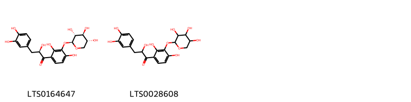{ width=100% }
    <figcaption>Hình ảnh cấu trúc hóa học của 2 hoạt chất thuộc nhóm Flavonoids gồm ['(2r)-1-(2,4-dihydroxy-3-{[(2s,3r,4s,5r)-3,4,5-trihydroxyoxan-2-yl]oxy}phenyl)-3-(3,4-dihydroxyphenyl)-2-hydroxypropan-1-one (LTS0164647)', '1-{2,4-dihydroxy-3-[(3,4,5-trihydroxyoxan-2-yl)oxy]phenyl}-3-(3,4-dihydroxyphenyl)-2-hydroxypropan-1-one (LTS0028608)'].</figcaption>
</figure>
#### Nhóm Isoflavonoids
<figure markdown="span">
    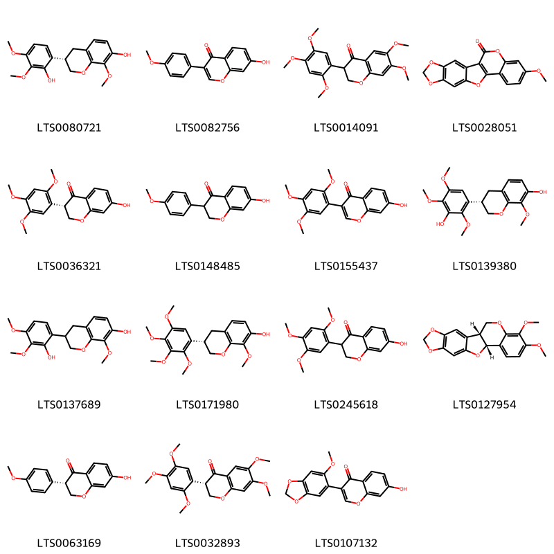{ width=100% }
    <figcaption>Hình ảnh cấu trúc hóa học của 15 hoạt chất thuộc nhóm Isoflavonoids gồm ['(3s)-3-(2-hydroxy-3,4-dimethoxyphenyl)-8-methoxy-3,4-dihydro-2h-1-benzopyran-7-ol (LTS0080721)', 'formononetin (LTS0082756)', '6,7-dimethoxy-3-(2,4,5-trimethoxyphenyl)-2,3-dihydro-1-benzopyran-4-one (LTS0014091)', 'flemichapparin c (LTS0028051)', '(3s)-7-hydroxy-3-(2,4,5-trimethoxyphenyl)-2,3-dihydro-1-benzopyran-4-one (LTS0036321)', 'dihydroformononetin (LTS0148485)', '7-hydroxy-3-(2,4,5-trimethoxyphenyl)chromen-4-one (LTS0155437)', '(3s)-3-(3-hydroxy-2,4,5-trimethoxyphenyl)-8-methoxy-3,4-dihydro-2h-1-benzopyran-7-ol (LTS0139380)', 'isoduartin (LTS0137689)', '(3s)-8-methoxy-3-(2,3,4,5-tetramethoxyphenyl)-3,4-dihydro-2h-1-benzopyran-7-ol (LTS0171980)', '7-hydroxy-3-(2,4,5-trimethoxyphenyl)-2,3-dihydro-1-benzopyran-4-one (LTS0245618)', '(1r,12r)-16,17-dimethoxy-5,7,11,19-tetraoxapentacyclo[10.8.0.0²,¹⁰.0⁴,⁸.0¹³,¹⁸]icosa-2,4(8),9,13,15,17-hexaene (LTS0127954)', '(3s)-7-hydroxy-3-(4-methoxyphenyl)-2,3-dihydro-1-benzopyran-4-one (LTS0063169)', '(3s)-6,7-dimethoxy-3-(2,4,5-trimethoxyphenyl)-2,3-dihydro-1-benzopyran-4-one (LTS0032893)', 'cuneatin (LTS0107132)'].</figcaption>
</figure>
#### Nhóm Linear 1_3-diarylpropanoids
<figure markdown="span">
    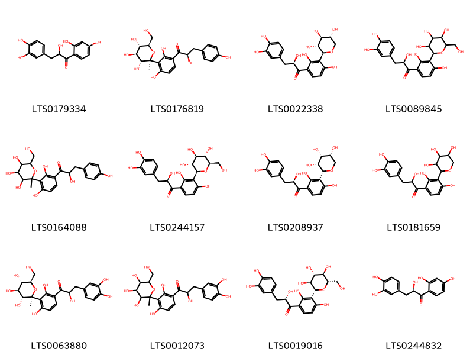{ width=100% }
    <figcaption>Hình ảnh cấu trúc hóa học của Không tìm thấy chú thích hoạt chất thuộc nhóm Linear 1_3-diarylpropanoids gồm Không tìm thấy chú thích.</figcaption>
</figure>
#### Nhóm Prenol lipids
<figure markdown="span">
    { width=100% }
    <figcaption>Hình ảnh cấu trúc hóa học của 1 hoạt chất thuộc nhóm Prenol lipids gồm ['β-amyrin (LTS0251864)'].</figcaption>
</figure>
#### Nhóm Steroids and steroid derivatives
<figure markdown="span">
    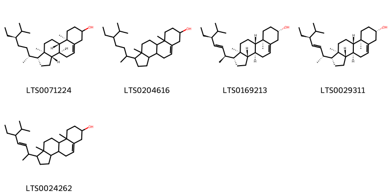{ width=100% }
    <figcaption>Hình ảnh cấu trúc hóa học của 5 hoạt chất thuộc nhóm Steroids and steroid derivatives gồm ['stigmast-5-en-3-ol (LTS0071224)', 'stigmast-5-en-3-ol, (3β)- (LTS0204616)', '(1r,3as,3bs,7s,9ar,9bs,11ar)-1-[(2s,3e,5s)-5-ethyl-6-methylhept-3-en-2-yl]-9a,11a-dimethyl-1h,2h,3h,3ah,3bh,4h,6h,7h,8h,9h,9bh,10h,11h-cyclopenta[a]phenanthren-7-ol (LTS0169213)', 'phytosterol (LTS0029311)', 'stigmasterol (LTS0024262)'].</figcaption>
</figure>

---

### Dược dân tộc học

Danh sách các quốc gia có sử dụng *Eysenhardtia polystachya* trong điều trị các bệnh. 

| Country   | Disease                        | Bệnh                                                                                                                                                                                                |
|:----------|:-------------------------------|:----------------------------------------------------------------------------------------------------------------------------------------------------------------------------------------------------|
| Mexico    | Diuretic, Antiseptic, Diuretic | MYMEMORY WARNING: YOU USED ALL AVAILABLE FREE TRANSLATIONS FOR TODAY. NEXT AVAILABLE IN  14 HOURS 21 MINUTES 12 SECONDS VISIT HTTPS://MYMEMORY.TRANSLATED.NET/DOC/USAGELIMITS.PHP TO TRANSLATE MORE |

---

# Chi Enterolobium

??? note "Danh sách các dược liệu thuộc chi"
    
	 - *Enterolobium cyclocarpum*
	 - *Enterolobium timbouva*

---
## Enterolobium cyclocarpum
### Thông tin về thực vật

!!! info "Phân loại thực vật của *Enterolobium cyclocarpum* từ GIBF:"
    - **Kingdom:** Plantae
    - **Phylum:** Tracheophyta
    - **Order:** Fabales
    - **Family:** Fabaceae
    - **Genus:** Enterolobium
    - **Species:** *Enterolobium cyclocarpum*

 

| Label (VI)   | Label (EN)   | Scientific Name          | Descriptions (VI)   | Descriptions (EN)   | Also Known As (VI)   | Also Known As (EN)   |
|:-------------|:-------------|:-------------------------|:--------------------|:--------------------|:---------------------|:---------------------|
| N/A          | N/A          | Enterolobium cyclocarpum | loài thực vật       | species of plant    | ['']                 | ['']                 |

#### Phân bố trên thế giới

**Từ CSDL GIBF** Nicaragua, Belize, Puerto Rico, Haiti, Guatemala, Colombia, Costa Rica, India, United States of America, Mexico, Dominican Republic, El Salvador, Panama

#### Phân bố tại Việt Nam

**Từ CSDL GIBF**: Không có ghi nhận ở Việt Nam

---
### Thành phần hóa học
        
- Theo cơ sở dữ liệu lotus: Từ loài *Enterolobium cyclocarpum* đã phân lập và xác định được Chưa có hoạt chất nào được phân lập. hoạt chất thuộc về các nhóm Không có hoạt chất nào được phân lập. 

Không có hình ảnh nào được tạo ra

---

### Dược dân tộc học

Danh sách các quốc gia có sử dụng *Enterolobium cyclocarpum* trong điều trị các bệnh. 

| Country            | Disease         | Bệnh                                                                                                                                                                                                |
|:-------------------|:----------------|:----------------------------------------------------------------------------------------------------------------------------------------------------------------------------------------------------|
| Dominican Republic | Piscicide       | MYMEMORY WARNING: YOU USED ALL AVAILABLE FREE TRANSLATIONS FOR TODAY. NEXT AVAILABLE IN  14 HOURS 20 MINUTES 30 SECONDS VISIT HTTPS://MYMEMORY.TRANSLATED.NET/DOC/USAGELIMITS.PHP TO TRANSLATE MORE |
| Elsewhere          | Soap, Soap      | MYMEMORY WARNING: YOU USED ALL AVAILABLE FREE TRANSLATIONS FOR TODAY. NEXT AVAILABLE IN  14 HOURS 20 MINUTES 27 SECONDS VISIT HTTPS://MYMEMORY.TRANSLATED.NET/DOC/USAGELIMITS.PHP TO TRANSLATE MORE |
| Guatemala          | Piscicide, Soap | MYMEMORY WARNING: YOU USED ALL AVAILABLE FREE TRANSLATIONS FOR TODAY. NEXT AVAILABLE IN  14 HOURS 20 MINUTES 24 SECONDS VISIT HTTPS://MYMEMORY.TRANSLATED.NET/DOC/USAGELIMITS.PHP TO TRANSLATE MORE |
| Mexico             | Soap            | MYMEMORY WARNING: YOU USED ALL AVAILABLE FREE TRANSLATIONS FOR TODAY. NEXT AVAILABLE IN  14 HOURS 20 MINUTES 20 SECONDS VISIT HTTPS://MYMEMORY.TRANSLATED.NET/DOC/USAGELIMITS.PHP TO TRANSLATE MORE |
| Venezuela          | Soap            | MYMEMORY WARNING: YOU USED ALL AVAILABLE FREE TRANSLATIONS FOR TODAY. NEXT AVAILABLE IN  14 HOURS 20 MINUTES 17 SECONDS VISIT HTTPS://MYMEMORY.TRANSLATED.NET/DOC/USAGELIMITS.PHP TO TRANSLATE MORE |

---

---
## Enterolobium timbouva
### Thông tin về thực vật

!!! info "Phân loại thực vật của *Enterolobium timbouva* từ GIBF:"
    - **Kingdom:** Plantae
    - **Phylum:** Tracheophyta
    - **Order:** Fabales
    - **Family:** Fabaceae
    - **Genus:** Enterolobium
    - **Species:** *Enterolobium timbouva*

 

| Label (VI)   | Label (EN)   | Scientific Name       | Descriptions (VI)   | Descriptions (EN)   | Also Known As (VI)   | Also Known As (EN)   |
|:-------------|:-------------|:----------------------|:--------------------|:--------------------|:---------------------|:---------------------|
| N/A          | N/A          | Enterolobium timbouva | loài thực vật       | species of plant    | ['']                 | ['']                 |

#### Phân bố trên thế giới

**Từ CSDL GIBF** Colombia, Brazil, Bolivia (Plurinational State of)

#### Phân bố tại Việt Nam

**Từ CSDL GIBF**: Không có ghi nhận ở Việt Nam

---
### Thành phần hóa học
        
- Theo cơ sở dữ liệu lotus: Từ loài *Enterolobium timbouva* đã phân lập và xác định được Chưa có hoạt chất nào được phân lập. hoạt chất thuộc về các nhóm Không có hoạt chất nào được phân lập. 

Không có hình ảnh nào được tạo ra

---

### Dược dân tộc học

Danh sách các quốc gia có sử dụng *Enterolobium timbouva* trong điều trị các bệnh. 

| Country   | Disease   | Bệnh                                                                                                                                                                                                |
|:----------|:----------|:----------------------------------------------------------------------------------------------------------------------------------------------------------------------------------------------------|
| Brazil    | Soap      | MYMEMORY WARNING: YOU USED ALL AVAILABLE FREE TRANSLATIONS FOR TODAY. NEXT AVAILABLE IN  14 HOURS 19 MINUTES 50 SECONDS VISIT HTTPS://MYMEMORY.TRANSLATED.NET/DOC/USAGELIMITS.PHP TO TRANSLATE MORE |

---

# Chi Millettia

??? note "Danh sách các dược liệu thuộc chi"
    
	 - *Millettia extensa*
	 - *Millettia pachycarpa*
	 - *Millettia piscidia*
	 - *Millettia racemosa*
	 - *Millettia sericea*

---
## Millettia extensa
### Thông tin về thực vật

!!! info "Phân loại thực vật của *Millettia extensa* từ GIBF:"
    - **Kingdom:** Plantae
    - **Phylum:** Tracheophyta
    - **Order:** Fabales
    - **Family:** Fabaceae
    - **Genus:** Millettia
    - **Species:** *Millettia extensa*

 

| Label (VI)   | Label (EN)   | Scientific Name   | Descriptions (VI)   | Descriptions (EN)   | Also Known As (VI)   | Also Known As (EN)   |
|:-------------|:-------------|:------------------|:--------------------|:--------------------|:---------------------|:---------------------|
| N/A          | N/A          | Millettia extensa | loài thực vật       | species of plant    | ['']                 | ['']                 |

#### Phân bố trên thế giới

**Từ CSDL GIBF** nan, Thailand, Lao People’s Democratic Republic, Korea, Republic of, Equatorial Guinea, Myanmar, Bhutan, India, unknown or invalid, United States of America, Cameroon, Viet Nam, China, Nepal

#### Phân bố tại Việt Nam

**Từ CSDL GIBF**: Không có ghi nhận ở Việt Nam

---
### Thành phần hóa học
        
- Theo cơ sở dữ liệu lotus: Từ loài *Millettia extensa* đã phân lập và xác định được 8 hoạt chất thuộc về các nhóm Indoles and derivatives, Isoflavonoids. 

|    | chemicalTaxonomyClassyfireClass   |   smiles_count |
|---:|:----------------------------------|---------------:|
|  0 | Indoles and derivatives           |              1 |
|  1 | Isoflavonoids                     |              7 |

#### Nhóm Indoles and derivatives
<figure markdown="span">
    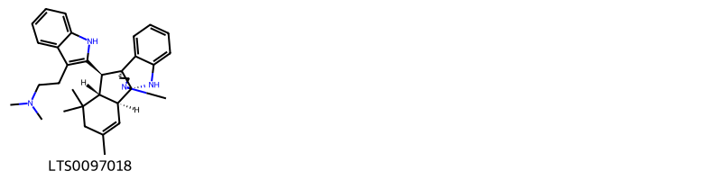{ width=100% }
    <figcaption>Hình ảnh cấu trúc hóa học của 1 hoạt chất thuộc nhóm Indoles and derivatives gồm ['auricularine (LTS0097018)'].</figcaption>
</figure>
#### Nhóm Isoflavonoids
<figure markdown="span">
    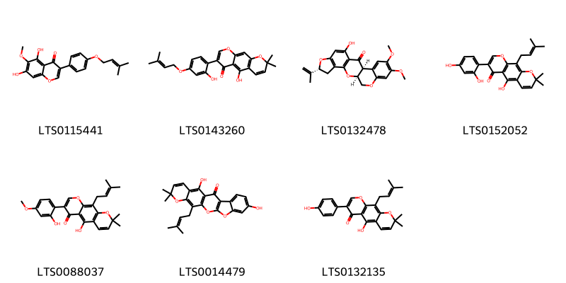{ width=100% }
    <figcaption>Hình ảnh cấu trúc hóa học của 7 hoạt chất thuộc nhóm Isoflavonoids gồm ['isoaurmillone (LTS0115441)', 'isoauriculatin (LTS0143260)', 'sumatrol (LTS0132478)', 'auriculatin (LTS0152052)', 'auriculin (LTS0088037)', 'millettin (LTS0014479)', 'warangalone (LTS0132135)'].</figcaption>
</figure>

---

### Dược dân tộc học

Danh sách các quốc gia có sử dụng *Millettia extensa* trong điều trị các bệnh. 

| Country   | Disease              | Bệnh                                                                                                                                                                                                |
|:----------|:---------------------|:----------------------------------------------------------------------------------------------------------------------------------------------------------------------------------------------------|
| Elsewhere | Piscicide, Larvicide | MYMEMORY WARNING: YOU USED ALL AVAILABLE FREE TRANSLATIONS FOR TODAY. NEXT AVAILABLE IN  14 HOURS 19 MINUTES 22 SECONDS VISIT HTTPS://MYMEMORY.TRANSLATED.NET/DOC/USAGELIMITS.PHP TO TRANSLATE MORE |

---

---
## Millettia pachycarpa
### Thông tin về thực vật

!!! info "Phân loại thực vật của *Millettia pachycarpa* từ GIBF:"
    - **Kingdom:** Plantae
    - **Phylum:** Tracheophyta
    - **Order:** Fabales
    - **Family:** Fabaceae
    - **Genus:** Millettia
    - **Species:** *Millettia pachycarpa*

 

| Label (VI)   | Label (EN)   | Scientific Name      | Descriptions (VI)   | Descriptions (EN)   | Also Known As (VI)   | Also Known As (EN)   |
|:-------------|:-------------|:---------------------|:--------------------|:--------------------|:---------------------|:---------------------|
| N/A          | N/A          | Millettia pachycarpa |                     | species of plant    | ['']                 | ['']                 |

#### Phân bố trên thế giới

**Từ CSDL GIBF** China, Malaysia, Chinese Taipei

#### Phân bố tại Việt Nam

**Từ CSDL GIBF**: Không có ghi nhận ở Việt Nam

---
### Thành phần hóa học
        
- Theo cơ sở dữ liệu lotus: Từ loài *Millettia pachycarpa* đã phân lập và xác định được 58 hoạt chất thuộc về các nhóm Flavonoids, Benzopyrans, Isoflavonoids, Linear 1,3-diarylpropanoids. 

|    | chemicalTaxonomyClassyfireClass   |   smiles_count |
|---:|:----------------------------------|---------------:|
|  0 | Benzopyrans                       |              2 |
|  1 | Flavonoids                        |              3 |
|  2 | Isoflavonoids                     |             51 |
|  3 | Linear 1,3-diarylpropanoids       |              2 |

#### Nhóm Benzopyrans
<figure markdown="span">
    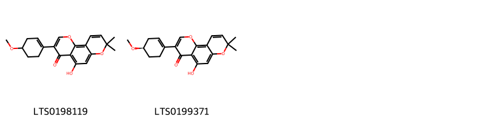{ width=100% }
    <figcaption>Hình ảnh cấu trúc hóa học của 2 hoạt chất thuộc nhóm Benzopyrans gồm ['5-hydroxy-3-(4-methoxycyclohex-1-en-1-yl)-8,8-dimethylpyrano[2,3-h]chromen-4-one (LTS0198119)', '5-hydroxy-3-[(4r)-4-methoxycyclohex-1-en-1-yl]-8,8-dimethylpyrano[2,3-h]chromen-4-one (LTS0199371)'].</figcaption>
</figure>
#### Nhóm Flavonoids
<figure markdown="span">
    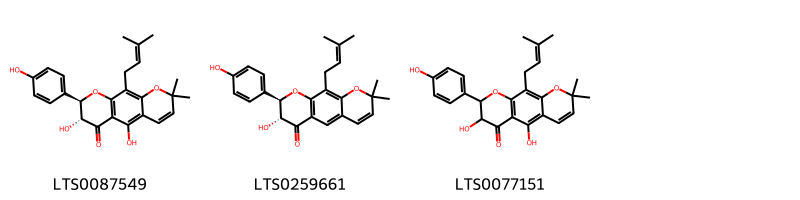{ width=100% }
    <figcaption>Hình ảnh cấu trúc hóa học của 3 hoạt chất thuộc nhóm Flavonoids gồm ['(2r,3r)-3,5-dihydroxy-2-(4-hydroxyphenyl)-8,8-dimethyl-10-(3-methylbut-2-en-1-yl)-2h,3h-pyrano[3,2-g]chromen-4-one (LTS0087549)', '(2r,3r)-3-hydroxy-2-(4-hydroxyphenyl)-8,8-dimethyl-10-(3-methylbut-2-en-1-yl)-2h,3h-pyrano[3,2-g]chromen-4-one (LTS0259661)', '3,5-dihydroxy-2-(4-hydroxyphenyl)-8,8-dimethyl-10-(3-methylbut-2-en-1-yl)-2h,3h-pyrano[3,2-g]chromen-4-one (LTS0077151)'].</figcaption>
</figure>
#### Nhóm Isoflavonoids
<figure markdown="span">
    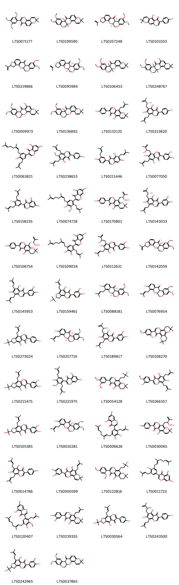{ width=100% }
    <figcaption>Hình ảnh cấu trúc hóa học của 51 hoạt chất thuộc nhóm Isoflavonoids gồm ['barbigerone (LTS0071177)', 'tephrosin (LTS0199590)', 'cube root (LTS0257248)', 'alpinumisoflavone (LTS0103103)', '16,17-dimethoxy-6-(prop-1-en-2-yl)-2,7,20-trioxapentacyclo[11.8.0.0³,¹¹.0⁴,⁸.0¹⁴,¹⁹]henicosa-3(11),4(8),9,14,16,18-hexaen-12-one (LTS0219866)', '12a-hydroxyrotenone (LTS0095984)', 'deguelin (LTS0106453)', 'toxicarol (LTS0248767)', '11-hydroxy-17,18-dimethoxy-7,7-dimethyl-2,8,21-trioxapentacyclo[12.8.0.0³,¹².0⁴,⁹.0¹⁵,²⁰]docosa-3,5,9,11,15(20),16,18-heptaen-13-one (LTS0009973)', '14-hydroxy-17,18-dimethoxy-7,7-dimethyl-2,8,21-trioxapentacyclo[12.8.0.0³,¹².0⁴,⁹.0¹⁵,²⁰]docosa-3,5,9,11,15(20),16,18-heptaen-13-one (LTS0136892)', 'warangalone (LTS0132135)', '5,7-dihydroxy-6-[(2r)-2-hydroxy-3-methylbut-3-en-1-yl]-3-(4-hydroxyphenyl)-8-(3-methylbut-2-en-1-yl)chromen-4-one (LTS0213820)', '3-[3-(3,7-dimethylocta-2,6-dien-1-yl)-4-hydroxy-5-(3-methylbut-2-en-1-yl)phenyl]-5,7-dihydroxychromen-4-one (LTS0063821)', '5-hydroxy-3-(4-hydroxyphenyl)-7-methoxy-6,8-bis(3-methylbut-2-en-1-yl)chromen-4-one (LTS0238653)', 'lupalbigenin (LTS0211446)', '3-(3,4-dihydroxyphenyl)-5,7-dihydroxy-8-[(2r)-2-hydroxy-3-methylbut-3-en-1-yl]-6-(3-methylbut-2-en-1-yl)chromen-4-one (LTS0077050)', "3',5'-diprenylgenistein (LTS0158235)", '3-[5-(3,7-dimethylocta-2,6-dien-1-yl)-4-hydroxy-3-methoxy-2-(3-methylbut-2-en-1-yl)phenyl]-5,7-dihydroxychromen-4-one (LTS0074718)', '10-[(2s)-2-hydroperoxy-3-methylbut-3-en-1-yl]-5-hydroxy-3-(4-hydroxyphenyl)-8,8-dimethylpyrano[3,2-g]chromen-4-one (LTS0170801)', '3-(3,4-dihydroxyphenyl)-5,7-dihydroxy-6-[(2r)-2-hydroxy-3-methylbut-3-en-1-yl]-8-(3-methylbut-2-en-1-yl)chromen-4-one (LTS0143033)', '10-[(2r)-2-hydroperoxy-3-methylbut-3-en-1-yl]-5-hydroxy-3-(4-hydroxyphenyl)-8,8-dimethyl-6h,7h-pyrano[3,2-g]chromen-4-one (LTS0108754)', '3-[5-(3,7-dimethylocta-2,6-dien-1-yl)-3,4-dihydroxy-2-(3-methylbut-2-en-1-yl)phenyl]-5,7-dihydroxychromen-4-one (LTS0109034)', 'millewanin h (LTS0112631)', '13-hydroxy-16,17-dimethoxy-6-(prop-1-en-2-yl)-2,7,20-trioxapentacyclo[11.8.0.0³,¹¹.0⁴,⁸.0¹⁴,¹⁹]henicosa-3(11),4(8),9,14,16,18-hexaen-12-one (LTS0142059)', '6,8-diprenylorobol (LTS0145953)', '(8r)-3-(3,4-dihydroxyphenyl)-5-hydroxy-8-(2-hydroxypropan-2-yl)-6-(3-methylbut-2-en-1-yl)-8h,9h-furo[2,3-h]chromen-4-one (LTS0159461)', '(6as,12as)-9-hydroxy-2,3-dimethoxy-8-(3-methylbut-2-en-1-yl)-6a,12a-dihydro-6h-5,7-dioxatetraphen-12-one (LTS0088181)', 'rotenonic acid (LTS0076954)', 'senegalensin (LTS0273024)', '(6ar,12ar)-9,12a-dihydroxy-2,3-dimethoxy-8-(3-methylbut-2-en-1-yl)-6,6a-dihydro-5,7-dioxatetraphen-12-one (LTS0257710)', 'millewanin g (LTS0189817)', '3-(2-hydroxy-4-methoxyphenyl)-6,6,10,10-tetramethyl-7,8,11,12-tetrahydro-1,5,9-trioxatriphenylen-4-one (LTS0108270)', '6-(3,4-dihydroxyphenyl)-4-hydroxy-2-(2-hydroxypropan-2-yl)-9-(3-methylbut-2-en-1-yl)-2h,3h-furo[3,2-g]chromen-5-one (LTS0215475)', '5,7-dihydroxy-3-[4-hydroxy-3-methoxy-2,5-bis(3-methylbut-2-en-1-yl)phenyl]chromen-4-one (LTS0221975)', '3-(3,4-dimethoxyphenyl)-5-hydroxy-10-(3-hydroxy-3-methylbutyl)-8,8-dimethyl-6h,7h-pyrano[3,2-g]chromen-4-one (LTS0054128)', '6,8-diprenylpratensein (LTS0266357)', '(2s)-6-(3,4-dihydroxyphenyl)-4-hydroxy-2-(2-hydroxypropan-2-yl)-9-(3-methylbut-2-en-1-yl)-2h,3h-furo[3,2-g]chromen-5-one (LTS0105385)', '9,12a-dihydroxy-2,3-dimethoxy-8-(3-methylbut-2-en-1-yl)-6,6a-dihydro-5,7-dioxatetraphen-12-one (LTS0010281)', '3-{5-[(2e)-3,7-dimethylocta-2,6-dien-1-yl]-3,4-dihydroxy-2-(3-methylbut-2-en-1-yl)phenyl}-5,7-dihydroxychromen-4-one (LTS0006626)', '10-(2-hydroperoxy-3-methylbut-3-en-1-yl)-5-hydroxy-3-(4-hydroxyphenyl)-8,8-dimethylpyrano[3,2-g]chromen-4-one (LTS0030065)', '6,8-diprenylgenistein (LTS0014786)', 'pomiferin (LTS0000599)', '3-(2,4-dimethoxyphenyl)-5-hydroxy-10-(3-hydroxy-3-methylbutyl)-8,8-dimethyl-6h,7h-pyrano[3,2-g]chromen-4-one (LTS0122816)', '3-{3-[(2e)-3,7-dimethylocta-2,6-dien-1-yl]-4-hydroxy-5-(3-methylbut-2-en-1-yl)phenyl}-5,7-dihydroxychromen-4-one (LTS0011723)', '3-{5-[(2e)-3,7-dimethylocta-2,6-dien-1-yl]-4-hydroxy-3-methoxy-2-(3-methylbut-2-en-1-yl)phenyl}-5,7-dihydroxychromen-4-one (LTS0120407)', 'auriculasin (LTS0239355)', '(2s)-4-hydroxy-6-(4-hydroxyphenyl)-2-(2-hydroxypropan-2-yl)-9-(3-methylbut-2-en-1-yl)-2h,3h-furo[3,2-g]chromen-5-one (LTS0030564)', '5,7-dihydroxy-6-(2-hydroxy-3-methylbut-3-en-1-yl)-3-(4-hydroxyphenyl)-8-(3-methylbut-2-en-1-yl)chromen-4-one (LTS0243500)', 'furowanin b (LTS0242965)', '17,18-dimethoxy-7,7-dimethyl-2,8,21-trioxapentacyclo[12.8.0.0³,¹².0⁴,⁹.0¹⁵,²⁰]docosa-3,5,9,11,15(20),16,18-heptaen-13-one (LTS0037865)', '3-(3-hydroxy-4-methoxyphenyl)-6,6,10,10-tetramethyl-7,8,11,12-tetrahydro-1,5,9-trioxatriphenylen-4-one (LTS0043504)'].</figcaption>
</figure>
#### Nhóm Linear 1_3-diarylpropanoids
<figure markdown="span">
    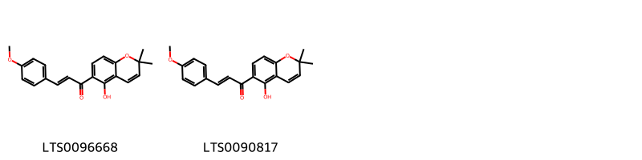{ width=100% }
    <figcaption>Hình ảnh cấu trúc hóa học của Không tìm thấy chú thích hoạt chất thuộc nhóm Linear 1_3-diarylpropanoids gồm Không tìm thấy chú thích.</figcaption>
</figure>

---

### Dược dân tộc học

Danh sách các quốc gia có sử dụng *Millettia pachycarpa* trong điều trị các bệnh. 

| Country   | Disease                | Bệnh                                                                                                                                                                                                |
|:----------|:-----------------------|:----------------------------------------------------------------------------------------------------------------------------------------------------------------------------------------------------|
| Elsewhere | Insecticide, Piscicide | MYMEMORY WARNING: YOU USED ALL AVAILABLE FREE TRANSLATIONS FOR TODAY. NEXT AVAILABLE IN  14 HOURS 18 MINUTES 55 SECONDS VISIT HTTPS://MYMEMORY.TRANSLATED.NET/DOC/USAGELIMITS.PHP TO TRANSLATE MORE |

---

---
## Millettia piscidia
### Thông tin về thực vật

!!! info "Phân loại thực vật của *Millettia piscidia* từ GIBF:"
    - **Kingdom:** Plantae
    - **Phylum:** Tracheophyta
    - **Order:** Fabales
    - **Family:** Fabaceae
    - **Genus:** Millettia
    - **Species:** *Millettia piscidia*

 

| Label (VI)   | Label (EN)   | Scientific Name    | Descriptions (VI)   | Descriptions (EN)   | Also Known As (VI)   | Also Known As (EN)   |
|:-------------|:-------------|:-------------------|:--------------------|:--------------------|:---------------------|:---------------------|
| N/A          | N/A          | Millettia piscidia | loài thực vật       | species of plant    | ['']                 | ['']                 |

#### Phân bố trên thế giới

**Từ CSDL GIBF** nan, Myanmar, Bhutan, India, unknown or invalid

#### Phân bố tại Việt Nam

**Từ CSDL GIBF**: Không có ghi nhận ở Việt Nam

---
### Thành phần hóa học
        
- Theo cơ sở dữ liệu lotus: Từ loài *Millettia piscidia* đã phân lập và xác định được Chưa có hoạt chất nào được phân lập. hoạt chất thuộc về các nhóm Không có hoạt chất nào được phân lập. 

Không có hình ảnh nào được tạo ra

---

### Dược dân tộc học

Danh sách các quốc gia có sử dụng *Millettia piscidia* trong điều trị các bệnh. 

| Country   | Disease   | Bệnh                                                                                                                                                                                                |
|:----------|:----------|:----------------------------------------------------------------------------------------------------------------------------------------------------------------------------------------------------|
| Elsewhere | Piscicide | MYMEMORY WARNING: YOU USED ALL AVAILABLE FREE TRANSLATIONS FOR TODAY. NEXT AVAILABLE IN  14 HOURS 18 MINUTES 22 SECONDS VISIT HTTPS://MYMEMORY.TRANSLATED.NET/DOC/USAGELIMITS.PHP TO TRANSLATE MORE |

---

---
## Millettia racemosa
### Thông tin về thực vật

!!! info "Phân loại thực vật của *Endosamara racemosa* từ GIBF:"
    - **Kingdom:** Plantae
    - **Phylum:** Tracheophyta
    - **Order:** Fabales
    - **Family:** Fabaceae
    - **Genus:** Endosamara
    - **Species:** *Endosamara racemosa*

 

| Label (VI)   | Label (EN)   | Scientific Name    | Descriptions (VI)   | Descriptions (EN)   | Also Known As (VI)   | Also Known As (EN)   |
|:-------------|:-------------|:-------------------|:--------------------|:--------------------|:---------------------|:---------------------|
| N/A          | N/A          | Millettia racemosa | loài thực vật       | species of plant    | ['']                 | ['']                 |

#### Phân bố trên thế giới

**Từ CSDL GIBF** nan, Thailand, India, unknown or invalid, Philippines

#### Phân bố tại Việt Nam

**Từ CSDL GIBF**: Không có ghi nhận ở Việt Nam

---
### Thành phần hóa học
        
- Theo cơ sở dữ liệu lotus: Từ loài *Endosamara racemosa* đã phân lập và xác định được Chưa có hoạt chất nào được phân lập. hoạt chất thuộc về các nhóm Không có hoạt chất nào được phân lập. 

Không có hình ảnh nào được tạo ra

---

### Dược dân tộc học

Danh sách các quốc gia có sử dụng *Endosamara racemosa* trong điều trị các bệnh. 

| Country   | Disease              | Bệnh                                                                                                                                                                                                |
|:----------|:---------------------|:----------------------------------------------------------------------------------------------------------------------------------------------------------------------------------------------------|
| Elsewhere | Larvicide, Piscicide | MYMEMORY WARNING: YOU USED ALL AVAILABLE FREE TRANSLATIONS FOR TODAY. NEXT AVAILABLE IN  14 HOURS 17 MINUTES 55 SECONDS VISIT HTTPS://MYMEMORY.TRANSLATED.NET/DOC/USAGELIMITS.PHP TO TRANSLATE MORE |

---

---
## Millettia sericea
### Thông tin về thực vật

!!! info "Phân loại thực vật của *Millettia sericea* từ GIBF:"
    - **Kingdom:** Plantae
    - **Phylum:** Tracheophyta
    - **Order:** Fabales
    - **Family:** Fabaceae
    - **Genus:** Millettia
    - **Species:** *Millettia sericea*

 

| Label (VI)   | Label (EN)   | Scientific Name   | Descriptions (VI)   | Descriptions (EN)   | Also Known As (VI)   | Also Known As (EN)   |
|:-------------|:-------------|:------------------|:--------------------|:--------------------|:---------------------|:---------------------|
| N/A          | N/A          | Millettia sericea |                     | species of plant    | ['']                 | ['']                 |

#### Phân bố trên thế giới

**Từ CSDL GIBF** nan, Thailand, Lao People’s Democratic Republic, unknown or invalid, Indonesia, Viet Nam, Singapore, Malaysia, China

#### Phân bố tại Việt Nam

**Từ CSDL GIBF**: Không có ghi nhận ở Việt Nam

---
### Thành phần hóa học
        
- Theo cơ sở dữ liệu lotus: Từ loài *Millettia sericea* đã phân lập và xác định được Chưa có hoạt chất nào được phân lập. hoạt chất thuộc về các nhóm Không có hoạt chất nào được phân lập. 

Không có hình ảnh nào được tạo ra

---

### Dược dân tộc học

Danh sách các quốc gia có sử dụng *Millettia sericea* trong điều trị các bệnh. 

| Country   | Disease   | Bệnh                                                                                                                                                                                                |
|:----------|:----------|:----------------------------------------------------------------------------------------------------------------------------------------------------------------------------------------------------|
| Java      | Vermifuge | MYMEMORY WARNING: YOU USED ALL AVAILABLE FREE TRANSLATIONS FOR TODAY. NEXT AVAILABLE IN  14 HOURS 17 MINUTES 35 SECONDS VISIT HTTPS://MYMEMORY.TRANSLATED.NET/DOC/USAGELIMITS.PHP TO TRANSLATE MORE |
| Moluccas  | Piscicide | MYMEMORY WARNING: YOU USED ALL AVAILABLE FREE TRANSLATIONS FOR TODAY. NEXT AVAILABLE IN  14 HOURS 17 MINUTES 30 SECONDS VISIT HTTPS://MYMEMORY.TRANSLATED.NET/DOC/USAGELIMITS.PHP TO TRANSLATE MORE |

---

# Chi Dichrostachys

??? note "Danh sách các dược liệu thuộc chi"
    
	 - *Dichrostachys cinerea*

---
## Dichrostachys cinerea
### Thông tin về thực vật

!!! info "Phân loại thực vật của *Dichrostachys cinerea* từ GIBF:"
    - **Kingdom:** Plantae
    - **Phylum:** Tracheophyta
    - **Order:** Fabales
    - **Family:** Fabaceae
    - **Genus:** Dichrostachys
    - **Species:** *Dichrostachys cinerea*

 

| Label (VI)   | Label (EN)   | Scientific Name       | Descriptions (VI)   | Descriptions (EN)   | Also Known As (VI)   | Also Known As (EN)            |
|:-------------|:-------------|:----------------------|:--------------------|:--------------------|:---------------------|:------------------------------|
| N/A          | N/A          | Dichrostachys cinerea | loài thực vật       | species of plant    | ['']                 | ['sickle bush', 'sicklebush'] |

#### Phân bố trên thế giới

**Từ CSDL GIBF** Sri Lanka, Australia, Guadeloupe, Mozambique, Benin, Tanzania, United Republic of, Malawi, Nigeria, Namibia, Liberia, Zimbabwe, South Africa, Uganda, Martinique, Cuba, Eswatini, Botswana, India, Gambia, Kenya

#### Phân bố tại Việt Nam

**Từ CSDL GIBF**: Không có ghi nhận ở Việt Nam

---
### Thành phần hóa học
        
- Theo cơ sở dữ liệu lotus: Từ loài *Dichrostachys cinerea* đã phân lập và xác định được 64 hoạt chất thuộc về các nhóm Fatty Acyls, Benzocycloheptapyridines, Flavonoids, Prenol lipids, Steroids and steroid derivatives. 

|    | chemicalTaxonomyClassyfireClass   |   smiles_count |
|---:|:----------------------------------|---------------:|
|  0 | Benzocycloheptapyridines          |              1 |
|  1 | Fatty Acyls                       |              3 |
|  2 | Flavonoids                        |              3 |
|  3 | Prenol lipids                     |             51 |
|  4 | Steroids and steroid derivatives  |              4 |

#### Nhóm Benzocycloheptapyridines
<figure markdown="span">
    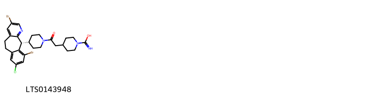{ width=100% }
    <figcaption>Hình ảnh cấu trúc hóa học của 1 hoạt chất thuộc nhóm Benzocycloheptapyridines gồm ['sarasar (LTS0143948)'].</figcaption>
</figure>
#### Nhóm Fatty Acyls
<figure markdown="span">
    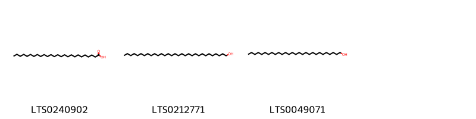{ width=100% }
    <figcaption>Hình ảnh cấu trúc hóa học của 3 hoạt chất thuộc nhóm Fatty Acyls gồm ['hexacosanoic acid (LTS0240902)', 'n-hentriacontanol (LTS0212771)', 'octacosanol (LTS0049071)'].</figcaption>
</figure>
#### Nhóm Flavonoids
<figure markdown="span">
    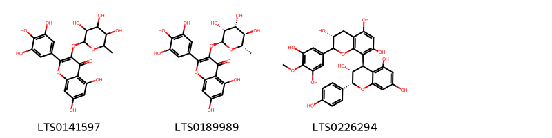{ width=100% }
    <figcaption>Hình ảnh cấu trúc hóa học của 3 hoạt chất thuộc nhóm Flavonoids gồm ['myricitrin (LTS0141597)', 'myricitrin (LTS0189989)', '(3r)-2-(3,5-dihydroxy-4-methoxyphenyl)-8-[(2r,3r,4r)-3,5,7-trihydroxy-2-(4-hydroxyphenyl)-3,4-dihydro-2h-1-benzopyran-4-yl]-3,4-dihydro-2h-1-benzopyran-3,5,7-triol (LTS0226294)'].</figcaption>
</figure>
#### Nhóm Prenol lipids
<figure markdown="span">
    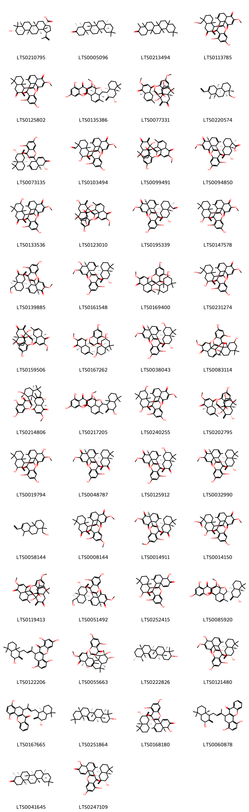{ width=100% }
    <figcaption>Hình ảnh cấu trúc hóa học của 51 hoạt chất thuộc nhóm Prenol lipids gồm ['betulinic acid (LTS0210795)', '(4r,4as,6as,6bs,8ar,12ar,12bs,14as,14bs)-4,4a,6b,8a,11,11,12b,14a-octamethyl-tetradecahydro-1h-picen-3-one (LTS0005096)', 'friedelin (LTS0213494)', '4a-(5,7-dihydroxy-4-oxochromen-2-yl)-5-{[5-(hydroxymethyl)-5,8a-dimethyl-2-methylidene-3-oxo-hexahydronaphthalen-1-yl]methyl}-2-methoxy-6-methyl-8,8a-dihydro-5h-naphthalene-1,4-dione (LTS0113785)', '5-[(5,5,8a-trimethyl-2-methylidene-3-oxo-hexahydronaphthalen-1-yl)methyl]-4a-(5,7-dihydroxy-4-oxochromen-2-yl)-2-methoxy-6-methyl-8,8a-dihydro-5h-naphthalene-1,4-dione (LTS0125802)', '(1r,3s,4r,8r,12s)-3-[(1r,3s,4as,8as)-3-hydroxy-5,5,8a-trimethyl-2-methylidene-hexahydro-1h-naphthalen-1-yl]-8-(5,7-dihydroxy-4-oxochromen-2-yl)-1-hydroxy-11-methoxy-5-methyl-2-oxatricyclo[6.3.1.0⁴,¹²]dodeca-5,10-dien-9-one (LTS0135386)', '(4as,5r,8ar)-5-{[(1s,4as,7s,8as)-1,7-dihydroxy-5,5,8a-trimethyl-2-methylidene-3-oxo-tetrahydro-4h-naphthalen-1-yl]methyl}-4a-(5-hydroxy-7-methoxy-4-oxochromen-2-yl)-2-methoxy-6-methyl-8,8a-dihydro-5h-naphthalene-1,4-dione (LTS0077331)', '[(1s,4ar,4br,8r,8ar,10as)-7-ethenyl-1,4a,8-trimethyl-2,3,4,4b,5,8,8a,9,10,10a-decahydrophenanthren-1-yl]methanol (LTS0220574)', '2-[(1r,4ar,5s,8ar)-5-{[(1r,3s,4as,8as)-3-hydroxy-5,5,8a-trimethyl-2-methylidene-hexahydro-1h-naphthalen-1-yl]methyl}-1-hydroxy-6-methyl-2-oxo-1,5,8,8a-tetrahydronaphthalen-4a-yl]-5,7-dihydroxychromen-4-one (LTS0073135)', '5-{[8a-(5,7-dihydroxy-4-oxochromen-2-yl)-6-methoxy-2-methyl-5,8-dioxo-4,4a-dihydro-1h-naphthalen-1-yl]methyl}-7-hydroxy-1,4a-dimethyl-6-methylidene-hexahydro-2h-naphthalene-1-carbaldehyde (LTS0103494)', '4a-(5,7-dihydroxy-4-oxochromen-2-yl)-5-[(1-hydroxy-5,5,8a-trimethyl-2-methylidene-3-oxo-tetrahydro-4h-naphthalen-1-yl)methyl]-2-methoxy-6-methyl-8,8a-dihydro-5h-naphthalene-1,4-dione (LTS0099491)', '(1r,4ar,5r,7s,8ar)-5-{[(1r,4ar,8as)-8a-(5,7-dihydroxy-4-oxochromen-2-yl)-6-methoxy-2-methyl-5,8-dioxo-4,4a-dihydro-1h-naphthalen-1-yl]methyl}-7-hydroxy-1,4a-dimethyl-6-methylidene-hexahydro-2h-naphthalene-1-carboxylic acid (LTS0094850)', '4a-(5,7-dihydroxy-4-oxochromen-2-yl)-5-[(7-hydroxy-5,5,8a-trimethyl-2-methylidene-3-oxo-hexahydronaphthalen-1-yl)methyl]-2-methoxy-6-methyl-8,8a-dihydro-5h-naphthalene-1,4-dione (LTS0133536)', '4a-(5,7-dihydroxy-4-oxochromen-2-yl)-2-methoxy-6-methyl-5-[(1,3,7-trihydroxy-5,5,8a-trimethyl-2-methylidene-hexahydronaphthalen-1-yl)methyl]-8,8a-dihydro-5h-naphthalene-1,4-dione (LTS0123010)', '(1r,4ar,5r,7s,8ar)-5-{[(1r,4ar,8as)-8a-(5,7-dihydroxy-4-oxochromen-2-yl)-6-methoxy-2-methyl-5,8-dioxo-4,4a-dihydro-1h-naphthalen-1-yl]methyl}-7-hydroxy-1,4a-dimethyl-6-methylidene-hexahydro-2h-naphthalene-1-carbaldehyde (LTS0195339)', '4a-(5,7-dihydroxy-4-oxochromen-2-yl)-5-[(3-hydroxy-5,5,8a-trimethyl-2-methylidene-hexahydro-1h-naphthalen-1-yl)methyl]-2-methoxy-6-methyl-8,8a-dihydro-5h-naphthalene-1,4-dione (LTS0147578)', '(4as,5r,8ar)-5-{[(1r,4ar,5r,8as)-5-(hydroxymethyl)-5,8a-dimethyl-2-methylidene-3-oxo-hexahydronaphthalen-1-yl]methyl}-4a-(5,7-dihydroxy-4-oxochromen-2-yl)-2-methoxy-6-methyl-8,8a-dihydro-5h-naphthalene-1,4-dione (LTS0139885)', '2-[(1s,4as,5s,8ar)-5-{[(1r,3s,4as,8as)-3-hydroxy-5,5,8a-trimethyl-2-methylidene-hexahydro-1h-naphthalen-1-yl]methyl}-1-hydroxy-2-methoxy-6-methyl-4-oxo-1,5,8,8a-tetrahydronaphthalen-4a-yl]-5,7-dihydroxychromen-4-one (LTS0161548)', '5-[(2,7-dihydroxy-2,5,5,8a-tetramethyl-hexahydro-1h-naphthalen-1-yl)methyl]-4a-(5,7-dihydroxy-4-oxochromen-2-yl)-2-methoxy-6-methyl-8,8a-dihydro-5h-naphthalene-1,4-dione (LTS0169400)', '4a-(5,7-dihydroxy-4-oxochromen-2-yl)-5-{[3-hydroxy-5-(hydroxymethyl)-5,8a-dimethyl-2-methylidene-hexahydro-1h-naphthalen-1-yl]methyl}-2-methoxy-6-methyl-8,8a-dihydro-5h-naphthalene-1,4-dione (LTS0231274)', '(4as,5r,8ar)-5-{[(1s,4as,8as)-1-hydroxy-5,5,8a-trimethyl-2-methylidene-3-oxo-tetrahydro-4h-naphthalen-1-yl]methyl}-4a-(5,7-dihydroxy-4-oxochromen-2-yl)-2-methoxy-6-methyl-8,8a-dihydro-5h-naphthalene-1,4-dione (LTS0159506)', '(4as,5r,8ar)-5-{[(1r,2r,4as,7s,8as)-2,7-dihydroxy-2,5,5,8a-tetramethyl-hexahydro-1h-naphthalen-1-yl]methyl}-4a-(5,7-dihydroxy-4-oxochromen-2-yl)-2-methoxy-6-methyl-8,8a-dihydro-5h-naphthalene-1,4-dione (LTS0167262)', '(4as,5r,8ar)-5-{[(1r,3s,4as,7s,8as)-3,7-dihydroxy-5,5,8a-trimethyl-2-methylidene-hexahydro-1h-naphthalen-1-yl]methyl}-4a-(5,7-dihydroxy-4-oxochromen-2-yl)-2-methoxy-6-methyl-8,8a-dihydro-5h-naphthalene-1,4-dione (LTS0038043)', '4a-(5,7-dihydroxy-4-oxochromen-2-yl)-2-methoxy-6-methyl-5-[(1,2,7-trihydroxy-2,5,5,8a-tetramethyl-hexahydronaphthalen-1-yl)methyl]-8,8a-dihydro-5h-naphthalene-1,4-dione (LTS0083114)', '(4as,5r,8ar)-5-{[(1s,2r,4as,7s,8as)-1,2,7-trihydroxy-2,5,5,8a-tetramethyl-hexahydronaphthalen-1-yl]methyl}-4a-(5,7-dihydroxy-4-oxochromen-2-yl)-2-methoxy-6-methyl-8,8a-dihydro-5h-naphthalene-1,4-dione (LTS0214806)', '8-(5,7-dihydroxy-4-oxochromen-2-yl)-1-hydroxy-3-(3-hydroxy-5,5,8a-trimethyl-2-methylidene-hexahydro-1h-naphthalen-1-yl)-11-methoxy-5-methyl-2-oxatricyclo[6.3.1.0⁴,¹²]dodeca-5,10-dien-9-one (LTS0217205)', '4a-(5,7-dihydroxy-4-oxochromen-2-yl)-5-[(3,7-dihydroxy-5,5,8a-trimethyl-2-methylidene-hexahydro-1h-naphthalen-1-yl)methyl]-2-methoxy-6-methyl-8,8a-dihydro-5h-naphthalene-1,4-dione (LTS0240255)', '(4as,5r,8ar)-5-{[(1s,3s,4as,7s,8as)-1,3,7-trihydroxy-5,5,8a-trimethyl-2-methylidene-hexahydronaphthalen-1-yl]methyl}-4a-(5,7-dihydroxy-4-oxochromen-2-yl)-2-methoxy-6-methyl-8,8a-dihydro-5h-naphthalene-1,4-dione (LTS0202795)', '5,7-dihydroxy-2-{1-hydroxy-5-[(3-hydroxy-5,5,8a-trimethyl-2-methylidene-hexahydro-1h-naphthalen-1-yl)methyl]-2-methoxy-6-methyl-4-oxo-1,5,8,8a-tetrahydronaphthalen-4a-yl}chromen-4-one (LTS0019794)', '(4as,5r,8ar)-5-{[(1r,4as,8as)-5,5,8a-trimethyl-2-methylidene-3-oxo-hexahydronaphthalen-1-yl]methyl}-4a-(5,7-dihydroxy-4-oxochromen-2-yl)-2-methoxy-6-methyl-8,8a-dihydro-5h-naphthalene-1,4-dione (LTS0048787)', '(4as,5r,8ar)-5-{[(1r,4as,7s,8as)-7-hydroxy-5,5,8a-trimethyl-2-methylidene-3-oxo-hexahydronaphthalen-1-yl]methyl}-4a-(5,7-dihydroxy-4-oxochromen-2-yl)-2-methoxy-6-methyl-8,8a-dihydro-5h-naphthalene-1,4-dione (LTS0125912)', '(4as,5r,8ar)-5-{[(1r,3s,4as,8as)-3-hydroxy-5,5,8a-trimethyl-2-methylidene-hexahydro-1h-naphthalen-1-yl]methyl}-4a-(5,7-dihydroxy-4-oxochromen-2-yl)-2-methoxy-6-methyl-8,8a-dihydro-5h-naphthalene-1,4-dione (LTS0032990)', '(7-ethenyl-1,4a,8-trimethyl-2,3,4,4b,5,8,8a,9,10,10a-decahydrophenanthren-1-yl)methanol (LTS0058144)', '5-[(5,5,8a-trimethyl-2-methylidene-3-oxo-hexahydronaphthalen-1-yl)methyl]-4a-(5-hydroxy-7-methoxy-4-oxochromen-2-yl)-2-methoxy-6-methyl-8,8a-dihydro-5h-naphthalene-1,4-dione (LTS0008144)', '(4as,5r,8ar)-5-{[(1r,4as,8as)-5,5,8a-trimethyl-2-methylidene-3-oxo-hexahydronaphthalen-1-yl]methyl}-4a-(5-hydroxy-7-methoxy-4-oxochromen-2-yl)-2-methoxy-6-methyl-8,8a-dihydro-5h-naphthalene-1,4-dione (LTS0014911)', '5-{[8a-(5,7-dihydroxy-4-oxochromen-2-yl)-6-methoxy-2-methyl-5,8-dioxo-4,4a-dihydro-1h-naphthalen-1-yl]methyl}-7-hydroxy-1,4a-dimethyl-6-methylidene-hexahydro-2h-naphthalene-1-carboxylic acid (LTS0014150)', '5-[(1,7-dihydroxy-5,5,8a-trimethyl-2-methylidene-3-oxo-tetrahydro-4h-naphthalen-1-yl)methyl]-4a-(5-hydroxy-7-methoxy-4-oxochromen-2-yl)-2-methoxy-6-methyl-8,8a-dihydro-5h-naphthalene-1,4-dione (LTS0119413)', '(4as,5r,8ar)-5-{[(1r,3s,4ar,5r,8as)-3-hydroxy-5-(hydroxymethyl)-5,8a-dimethyl-2-methylidene-hexahydro-1h-naphthalen-1-yl]methyl}-4a-(5,7-dihydroxy-4-oxochromen-2-yl)-2-methoxy-6-methyl-8,8a-dihydro-5h-naphthalene-1,4-dione (LTS0051492)', '5,7-dihydroxy-2-{1-hydroxy-5-[(3-hydroxy-5,5,8a-trimethyl-2-methylidene-hexahydro-1h-naphthalen-1-yl)methyl]-6-methyl-2-oxo-1,5,8,8a-tetrahydronaphthalen-4a-yl}chromen-4-one (LTS0252415)', '3-[(1r,3s,4as,8as)-3-hydroxy-5,5,8a-trimethyl-2-methylidene-hexahydro-1h-naphthalen-1-yl]-8-(5,7-dihydroxy-4-oxochromen-2-yl)-1-hydroxy-11-methoxy-5-methyl-2-oxatricyclo[6.3.1.0⁴,¹²]dodeca-5,10-dien-9-one (LTS0085920)', '1,3,6,9-tetrahydroxy-11-[(2e)-4-(3-hydroxy-5,5,8a-trimethyl-2-methylidene-hexahydro-1h-naphthalen-1-yl)but-2-en-2-yl]-10,11-dihydro-5-oxatetraphen-12-one (LTS0122206)', '(4as,5r,8ar)-5-{[(1s,2r,3s,4as,7s,8as)-1,2,3,7-tetrahydroxy-2,5,5,8a-tetramethyl-hexahydronaphthalen-1-yl]methyl}-4a-(5,7-dihydroxy-4-oxochromen-2-yl)-2-methoxy-6-methyl-8,8a-dihydro-5h-naphthalene-1,4-dione (LTS0055663)', 'amyrin (LTS0222826)', '2-(5-{[(1r,3s,4as,8as)-3-hydroxy-5,5,8a-trimethyl-2-methylidene-hexahydro-1h-naphthalen-1-yl]methyl}-1-hydroxy-2-methoxy-6-methyl-4-oxo-1,5,8,8a-tetrahydronaphthalen-4a-yl)-5,7-dihydroxychromen-4-one (LTS0121480)', '11-{4-[(3s,8as)-3-hydroxy-5,5,8a-trimethyl-2-methylidene-hexahydro-1h-naphthalen-1-yl]but-2-en-2-yl}-6,9-dihydroxy-10,11-dihydro-5-oxatetraphen-12-one (LTS0167665)', 'β-amyrin (LTS0251864)', '2-[(4ar,5r,8ar)-5-{[(1r,3s,4as,8as)-3-hydroxy-5,5,8a-trimethyl-2-methylidene-hexahydro-1h-naphthalen-1-yl]methyl}-1-hydroxy-6-methyl-2-oxo-1,5,8,8a-tetrahydronaphthalen-4a-yl]-5,7-dihydroxychromen-4-one (LTS0168180)', '11-[(2e)-4-[(3s,8as)-3-hydroxy-5,5,8a-trimethyl-2-methylidene-hexahydro-1h-naphthalen-1-yl]but-2-en-2-yl]-6,9-dihydroxy-10,11-dihydro-5-oxatetraphen-12-one (LTS0060878)', '(-)-friedelin (LTS0041645)', '2-(5-{[(1r,3s,4as,8as)-3-hydroxy-5,5,8a-trimethyl-2-methylidene-hexahydro-1h-naphthalen-1-yl]methyl}-1-hydroxy-6-methyl-2-oxo-1,5,8,8a-tetrahydronaphthalen-4a-yl)-5,7-dihydroxychromen-4-one (LTS0247109)', '2-[(4as,5r,8ar)-5-{[(1r,3s,4as,8as)-3-hydroxy-5,5,8a-trimethyl-2-methylidene-hexahydro-1h-naphthalen-1-yl]methyl}-1-hydroxy-2-methoxy-6-methyl-4-oxo-1,5,8,8a-tetrahydronaphthalen-4a-yl]-5,7-dihydroxychromen-4-one (LTS0033583)'].</figcaption>
</figure>
#### Nhóm Steroids and steroid derivatives
<figure markdown="span">
    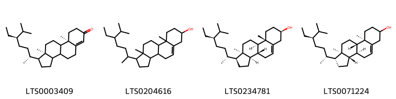{ width=100% }
    <figcaption>Hình ảnh cấu trúc hóa học của 4 hoạt chất thuộc nhóm Steroids and steroid derivatives gồm ['(9ar,11ar)-1-[(2r,5r)-5-ethyl-6-methylheptan-2-yl]-9a,11a-dimethyl-1h,2h,3h,3ah,3bh,4h,5h,8h,9h,9bh,10h,11h-cyclopenta[a]phenanthren-7-one (LTS0003409)', 'stigmast-5-en-3-ol, (3β)- (LTS0204616)', '(1s,3ar,3br,7r,9as,9br,11ar)-1-[(2r,5r)-5-ethyl-6-methylheptan-2-yl]-9a,11a-dimethyl-1h,2h,3h,3ah,3bh,4h,6h,7h,8h,9h,9bh,10h,11h-cyclopenta[a]phenanthren-7-ol (LTS0234781)', 'stigmast-5-en-3-ol (LTS0071224)'].</figcaption>
</figure>

---

### Dược dân tộc học

Danh sách các quốc gia có sử dụng *Dichrostachys cinerea* trong điều trị các bệnh. 

| Country   | Disease    | Bệnh                                                                                                                                                                                                |
|:----------|:-----------|:----------------------------------------------------------------------------------------------------------------------------------------------------------------------------------------------------|
| Elsewhere | Vermifuge  | MYMEMORY WARNING: YOU USED ALL AVAILABLE FREE TRANSLATIONS FOR TODAY. NEXT AVAILABLE IN  14 HOURS 17 MINUTES 03 SECONDS VISIT HTTPS://MYMEMORY.TRANSLATED.NET/DOC/USAGELIMITS.PHP TO TRANSLATE MORE |
| India     | Astringent | MYMEMORY WARNING: YOU USED ALL AVAILABLE FREE TRANSLATIONS FOR TODAY. NEXT AVAILABLE IN  14 HOURS 16 MINUTES 57 SECONDS VISIT HTTPS://MYMEMORY.TRANSLATED.NET/DOC/USAGELIMITS.PHP TO TRANSLATE MORE |
| Java      | Vermifuge  | MYMEMORY WARNING: YOU USED ALL AVAILABLE FREE TRANSLATIONS FOR TODAY. NEXT AVAILABLE IN  14 HOURS 16 MINUTES 54 SECONDS VISIT HTTPS://MYMEMORY.TRANSLATED.NET/DOC/USAGELIMITS.PHP TO TRANSLATE MORE |

---

# Chi Myroermum

??? note "Danh sách các dược liệu thuộc chi"
    
	 - *Myroermum frutescens*

---
## Myroermum frutescens
### Thông tin về thực vật

!!! info "Phân loại thực vật của *N/A* từ GIBF:"
    - **Kingdom:** N/A
    - **Phylum:** N/A
    - **Order:** N/A
    - **Family:** N/A
    - **Genus:** N/A
    - **Species:** *N/A*

 

| Label (VI)   | Label (EN)   | Scientific Name       | Descriptions (VI)   | Descriptions (EN)   | Also Known As (VI)   | Also Known As (EN)            |
|:-------------|:-------------|:----------------------|:--------------------|:--------------------|:---------------------|:------------------------------|
| N/A          | N/A          | Dichrostachys cinerea | loài thực vật       | species of plant    | ['']                 | ['sickle bush', 'sicklebush'] |

#### Phân bố trên thế giới

**Từ CSDL GIBF** Không có kết quả phù hợp

#### Phân bố tại Việt Nam

**Từ CSDL GIBF**: Không có ghi nhận ở Việt Nam

---
### Thành phần hóa học
        
- Theo cơ sở dữ liệu lotus: Từ loài *N/A* đã phân lập và xác định được Chưa có hoạt chất nào được phân lập. hoạt chất thuộc về các nhóm Không có hoạt chất nào được phân lập. 

Không có hình ảnh nào được tạo ra

---

### Dược dân tộc học

Danh sách các quốc gia có sử dụng *N/A* trong điều trị các bệnh. 

| Country   | Disease                     | Bệnh                                                                                                                                                                                                |
|:----------|:----------------------------|:----------------------------------------------------------------------------------------------------------------------------------------------------------------------------------------------------|
| Elsewhere | Astringent, Counterirritant | MYMEMORY WARNING: YOU USED ALL AVAILABLE FREE TRANSLATIONS FOR TODAY. NEXT AVAILABLE IN  14 HOURS 16 MINUTES 21 SECONDS VISIT HTTPS://MYMEMORY.TRANSLATED.NET/DOC/USAGELIMITS.PHP TO TRANSLATE MORE |
| Trinidad  | Vermifuge, Vermifuge        | MYMEMORY WARNING: YOU USED ALL AVAILABLE FREE TRANSLATIONS FOR TODAY. NEXT AVAILABLE IN  14 HOURS 16 MINUTES 16 SECONDS VISIT HTTPS://MYMEMORY.TRANSLATED.NET/DOC/USAGELIMITS.PHP TO TRANSLATE MORE |

---

# Chi Psoralea

??? note "Danh sách các dược liệu thuộc chi"
    
	 - *Psoralea argophylla*
	 - *Psoralea bituminosa*
	 - *Psoralea corylifolia*
	 - *Psoralea pedunculata*
	 - *Psoralea pentaphylla*
	 - *Psoralea tenuiflora*

---
## Psoralea argophylla
### Thông tin về thực vật

!!! info "Phân loại thực vật của *Pediomelum argophyllum* từ GIBF:"
    - **Kingdom:** Plantae
    - **Phylum:** Tracheophyta
    - **Order:** Fabales
    - **Family:** Fabaceae
    - **Genus:** Pediomelum
    - **Species:** *Pediomelum argophyllum*

 

| Label (VI)   | Label (EN)   | Scientific Name     | Descriptions (VI)   | Descriptions (EN)   | Also Known As (VI)   | Also Known As (EN)   |
|:-------------|:-------------|:--------------------|:--------------------|:--------------------|:---------------------|:---------------------|
| N/A          | N/A          | Psoralea argophylla | loài thực vật       | species of plant    | ['']                 | ['']                 |

#### Phân bố trên thế giới

**Từ CSDL GIBF** nan, India, unknown or invalid, United States of America, Canada

#### Phân bố tại Việt Nam

**Từ CSDL GIBF**: Không có ghi nhận ở Việt Nam

---
### Thành phần hóa học
        
- Theo cơ sở dữ liệu lotus: Từ loài *Pediomelum argophyllum* đã phân lập và xác định được Chưa có hoạt chất nào được phân lập. hoạt chất thuộc về các nhóm Không có hoạt chất nào được phân lập. 

Không có hình ảnh nào được tạo ra

---

### Dược dân tộc học

Danh sách các quốc gia có sử dụng *Pediomelum argophyllum* trong điều trị các bệnh. 

| Country   | Disease   | Bệnh                                                                                                                                                                                                |
|:----------|:----------|:----------------------------------------------------------------------------------------------------------------------------------------------------------------------------------------------------|
| US        | Poison    | MYMEMORY WARNING: YOU USED ALL AVAILABLE FREE TRANSLATIONS FOR TODAY. NEXT AVAILABLE IN  14 HOURS 15 MINUTES 53 SECONDS VISIT HTTPS://MYMEMORY.TRANSLATED.NET/DOC/USAGELIMITS.PHP TO TRANSLATE MORE |

---

---
## Psoralea bituminosa
### Thông tin về thực vật

!!! info "Phân loại thực vật của *Bituminaria bituminosa* từ GIBF:"
    - **Kingdom:** Plantae
    - **Phylum:** Tracheophyta
    - **Order:** Fabales
    - **Family:** Fabaceae
    - **Genus:** Bituminaria
    - **Species:** *Bituminaria bituminosa*

 

| Label (VI)   | Label (EN)   | Scientific Name     | Descriptions (VI)   | Descriptions (EN)   | Also Known As (VI)   | Also Known As (EN)   |
|:-------------|:-------------|:--------------------|:--------------------|:--------------------|:---------------------|:---------------------|
| N/A          | N/A          | Psoralea bituminosa | loài thực vật       | species of plant    | ['']                 | ['']                 |

#### Phân bố trên thế giới

**Từ CSDL GIBF** France, Ukraine, Greece, Spain

#### Phân bố tại Việt Nam

**Từ CSDL GIBF**: Không có ghi nhận ở Việt Nam

---
### Thành phần hóa học
        
- Theo cơ sở dữ liệu lotus: Từ loài *Bituminaria bituminosa* đã phân lập và xác định được Chưa có hoạt chất nào được phân lập. hoạt chất thuộc về các nhóm Không có hoạt chất nào được phân lập. 

Không có hình ảnh nào được tạo ra

---

### Dược dân tộc học

Danh sách các quốc gia có sử dụng *Bituminaria bituminosa* trong điều trị các bệnh. 

| Country   | Disease   | Bệnh                                                                                                                                                                                                |
|:----------|:----------|:----------------------------------------------------------------------------------------------------------------------------------------------------------------------------------------------------|
| ain       | Vulnerary | MYMEMORY WARNING: YOU USED ALL AVAILABLE FREE TRANSLATIONS FOR TODAY. NEXT AVAILABLE IN  14 HOURS 15 MINUTES 21 SECONDS VISIT HTTPS://MYMEMORY.TRANSLATED.NET/DOC/USAGELIMITS.PHP TO TRANSLATE MORE |

---

---
## Psoralea corylifolia
### Thông tin về thực vật

!!! info "Phân loại thực vật của *Cullen corylifolium* từ GIBF:"
    - **Kingdom:** Plantae
    - **Phylum:** Tracheophyta
    - **Order:** Fabales
    - **Family:** Fabaceae
    - **Genus:** Cullen
    - **Species:** *Cullen corylifolium*

 

| Label (VI)   | Label (EN)   | Scientific Name      | Descriptions (VI)   | Descriptions (EN)   | Also Known As (VI)   | Also Known As (EN)   |
|:-------------|:-------------|:---------------------|:--------------------|:--------------------|:---------------------|:---------------------|
| N/A          | N/A          | Psoralea corylifolia | loài thực vật       | species of plant    | ['']                 | ['']                 |

#### Phân bố trên thế giới

**Từ CSDL GIBF** nan, Sri Lanka, Mauritius, Somalia, Myanmar, unknown or invalid, Yemen, Pakistan, Chinese Taipei, Spain, United States of America, Saudi Arabia, Oman, Viet Nam, United Kingdom of Great Britain and Northern Ireland, China, India, Indonesia, Malaysia

#### Phân bố tại Việt Nam

**Từ CSDL GIBF**: Không có ghi nhận ở Việt Nam

---
### Thành phần hóa học
        
- Theo cơ sở dữ liệu lotus: Từ loài *Cullen corylifolium* đã phân lập và xác định được Chưa có hoạt chất nào được phân lập. hoạt chất thuộc về các nhóm Không có hoạt chất nào được phân lập. 

Không có hình ảnh nào được tạo ra

---

### Dược dân tộc học

Danh sách các quốc gia có sử dụng *Cullen corylifolium* trong điều trị các bệnh. 

| Country   | Disease                                  | Bệnh                                                                                                                                                                                                |
|:----------|:-----------------------------------------|:----------------------------------------------------------------------------------------------------------------------------------------------------------------------------------------------------|
| China     | Diuretic, Tonic, Tonic, Tonic, Stimulant | MYMEMORY WARNING: YOU USED ALL AVAILABLE FREE TRANSLATIONS FOR TODAY. NEXT AVAILABLE IN  14 HOURS 14 MINUTES 55 SECONDS VISIT HTTPS://MYMEMORY.TRANSLATED.NET/DOC/USAGELIMITS.PHP TO TRANSLATE MORE |
| Elsewhere | Piscicide, nan                           | MYMEMORY WARNING: YOU USED ALL AVAILABLE FREE TRANSLATIONS FOR TODAY. NEXT AVAILABLE IN  14 HOURS 14 MINUTES 51 SECONDS VISIT HTTPS://MYMEMORY.TRANSLATED.NET/DOC/USAGELIMITS.PHP TO TRANSLATE MORE |
| Nepal     | Diuretic, Diuretic                       | MYMEMORY WARNING: YOU USED ALL AVAILABLE FREE TRANSLATIONS FOR TODAY. NEXT AVAILABLE IN  14 HOURS 14 MINUTES 47 SECONDS VISIT HTTPS://MYMEMORY.TRANSLATED.NET/DOC/USAGELIMITS.PHP TO TRANSLATE MORE |
| Vietnam   | Stomachic                                | MYMEMORY WARNING: YOU USED ALL AVAILABLE FREE TRANSLATIONS FOR TODAY. NEXT AVAILABLE IN  14 HOURS 14 MINUTES 43 SECONDS VISIT HTTPS://MYMEMORY.TRANSLATED.NET/DOC/USAGELIMITS.PHP TO TRANSLATE MORE |

---

---
## Psoralea pedunculata
### Thông tin về thực vật

!!! info "Phân loại thực vật của *N/A* từ GIBF:"
    - **Kingdom:** Plantae
    - **Phylum:** Tracheophyta
    - **Order:** Fabales
    - **Family:** Fabaceae
    - **Genus:** N/A
    - **Species:** *N/A*

 

| Label (VI)   | Label (EN)   | Scientific Name      | Descriptions (VI)   | Descriptions (EN)   | Also Known As (VI)   | Also Known As (EN)   |
|:-------------|:-------------|:---------------------|:--------------------|:--------------------|:---------------------|:---------------------|
| N/A          | N/A          | Psoralea corylifolia | loài thực vật       | species of plant    | ['']                 | ['']                 |

#### Phân bố trên thế giới

**Từ CSDL GIBF** Sri Lanka, Italy, Australia, Cambodia, Argentina, Tanzania, United Republic of, Chinese Taipei, Spain, Portugal, United States of America, Chile, Croatia, South Africa, Thailand, Germany, Brazil, Guam, France, Norfolk Island, Viet Nam, China, United Kingdom of Great Britain and Northern Ireland, Ireland, Gambia, India, Malaysia, New Zealand

#### Phân bố tại Việt Nam

**Từ CSDL GIBF**: Đà Nẵng, Bà Rịa - Vũng Tàu

---
### Thành phần hóa học
        
- Theo cơ sở dữ liệu lotus: Từ loài *N/A* đã phân lập và xác định được Chưa có hoạt chất nào được phân lập. hoạt chất thuộc về các nhóm Không có hoạt chất nào được phân lập. 

Không có hình ảnh nào được tạo ra

---

### Dược dân tộc học

Danh sách các quốc gia có sử dụng *N/A* trong điều trị các bệnh. 

| Country        | Disease   | Bệnh                                                                                                                                                                                                |
|:---------------|:----------|:----------------------------------------------------------------------------------------------------------------------------------------------------------------------------------------------------|
| US(Amerindian) | Tonic     | MYMEMORY WARNING: YOU USED ALL AVAILABLE FREE TRANSLATIONS FOR TODAY. NEXT AVAILABLE IN  14 HOURS 14 MINUTES 18 SECONDS VISIT HTTPS://MYMEMORY.TRANSLATED.NET/DOC/USAGELIMITS.PHP TO TRANSLATE MORE |

---

---
## Psoralea pentaphylla
### Thông tin về thực vật

!!! info "Phân loại thực vật của *N/A* từ GIBF:"
    - **Kingdom:** Plantae
    - **Phylum:** Tracheophyta
    - **Order:** Fabales
    - **Family:** Fabaceae
    - **Genus:** Pediomelum
    - **Species:** *N/A*

 

| Label (VI)   | Label (EN)   | Scientific Name      | Descriptions (VI)   | Descriptions (EN)   | Also Known As (VI)   | Also Known As (EN)   |
|:-------------|:-------------|:---------------------|:--------------------|:--------------------|:---------------------|:---------------------|
| N/A          | N/A          | Psoralea pentaphylla | loài thực vật       | species of plant    | ['']                 | ['']                 |

#### Phân bố trên thế giới

**Từ CSDL GIBF** nan, United States of America

#### Phân bố tại Việt Nam

**Từ CSDL GIBF**: Không có ghi nhận ở Việt Nam

---
### Thành phần hóa học
        
- Theo cơ sở dữ liệu lotus: Từ loài *N/A* đã phân lập và xác định được Chưa có hoạt chất nào được phân lập. hoạt chất thuộc về các nhóm Không có hoạt chất nào được phân lập. 

Không có hình ảnh nào được tạo ra

---

### Dược dân tộc học

Danh sách các quốc gia có sử dụng *N/A* trong điều trị các bệnh. 

| Country   | Disease     | Bệnh                                                                                                                                                                                                |
|:----------|:------------|:----------------------------------------------------------------------------------------------------------------------------------------------------------------------------------------------------|
| Mexico    | Vasodilator | MYMEMORY WARNING: YOU USED ALL AVAILABLE FREE TRANSLATIONS FOR TODAY. NEXT AVAILABLE IN  14 HOURS 13 MINUTES 53 SECONDS VISIT HTTPS://MYMEMORY.TRANSLATED.NET/DOC/USAGELIMITS.PHP TO TRANSLATE MORE |

---

---
## Psoralea tenuiflora
### Thông tin về thực vật

!!! info "Phân loại thực vật của *Pediomelum tenuiflorum* từ GIBF:"
    - **Kingdom:** Plantae
    - **Phylum:** Tracheophyta
    - **Order:** Fabales
    - **Family:** Fabaceae
    - **Genus:** Pediomelum
    - **Species:** *Pediomelum tenuiflorum*

 

| Label (VI)   | Label (EN)   | Scientific Name     | Descriptions (VI)   | Descriptions (EN)   | Also Known As (VI)   | Also Known As (EN)   |
|:-------------|:-------------|:--------------------|:--------------------|:--------------------|:---------------------|:---------------------|
| N/A          | N/A          | Psoralea tenuiflora | loài thực vật       | species of plant    | ['']                 | ['']                 |

#### Phân bố trên thế giới

**Từ CSDL GIBF** United States of America, Canada, Mexico

#### Phân bố tại Việt Nam

**Từ CSDL GIBF**: Không có ghi nhận ở Việt Nam

---
### Thành phần hóa học
        
- Theo cơ sở dữ liệu lotus: Từ loài *Pediomelum tenuiflorum* đã phân lập và xác định được 4 hoạt chất thuộc về các nhóm Prenol lipids, Coumarins and derivatives. 

|    | chemicalTaxonomyClassyfireClass   |   smiles_count |
|---:|:----------------------------------|---------------:|
|  0 | Coumarins and derivatives         |              2 |
|  1 | Prenol lipids                     |              2 |

#### Nhóm Coumarins and derivatives
<figure markdown="span">
    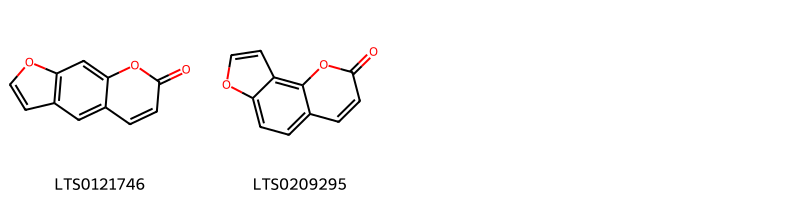{ width=100% }
    <figcaption>Hình ảnh cấu trúc hóa học của 2 hoạt chất thuộc nhóm Coumarins and derivatives gồm ['psoralen (LTS0121746)', 'angelicin (LTS0209295)'].</figcaption>
</figure>
#### Nhóm Prenol lipids
<figure markdown="span">
    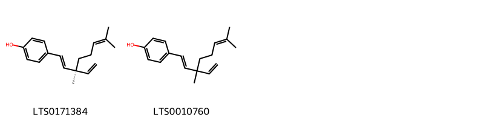{ width=100% }
    <figcaption>Hình ảnh cấu trúc hóa học của 2 hoạt chất thuộc nhóm Prenol lipids gồm ['bakuchiol (LTS0171384)', '4-(3-ethenyl-3,7-dimethylocta-1,6-dien-1-yl)phenol (LTS0010760)'].</figcaption>
</figure>

---

### Dược dân tộc học

Danh sách các quốc gia có sử dụng *Pediomelum tenuiflorum* trong điều trị các bệnh. 

| Country        | Disease   | Bệnh                                                                                                                                                                                                |
|:---------------|:----------|:----------------------------------------------------------------------------------------------------------------------------------------------------------------------------------------------------|
| US(Amerindian) | Piscicide | MYMEMORY WARNING: YOU USED ALL AVAILABLE FREE TRANSLATIONS FOR TODAY. NEXT AVAILABLE IN  14 HOURS 13 MINUTES 16 SECONDS VISIT HTTPS://MYMEMORY.TRANSLATED.NET/DOC/USAGELIMITS.PHP TO TRANSLATE MORE |

---

# Chi Desmanthus

??? note "Danh sách các dược liệu thuộc chi"
    
	 - *Desmanthus virgatus*

---
## Desmanthus virgatus
### Thông tin về thực vật

!!! info "Phân loại thực vật của *Desmanthus virgatus* từ GIBF:"
    - **Kingdom:** Plantae
    - **Phylum:** Tracheophyta
    - **Order:** Fabales
    - **Family:** Fabaceae
    - **Genus:** Desmanthus
    - **Species:** *Desmanthus virgatus*

 

| Label (VI)   | Label (EN)   | Scientific Name     | Descriptions (VI)   | Descriptions (EN)   | Also Known As (VI)   | Also Known As (EN)   |
|:-------------|:-------------|:--------------------|:--------------------|:--------------------|:---------------------|:---------------------|
| N/A          | N/A          | Desmanthus virgatus | loài thực vật       | species of plant    | ['']                 | ['']                 |

#### Phân bố trên thế giới

**Từ CSDL GIBF** Virgin Islands (U.S.), Australia, Japan, Guadeloupe, Mauritius, Argentina, Nicaragua, Bermuda, Venezuela (Bolivarian Republic of), Puerto Rico, Réunion, Chinese Taipei, Spain, United States of America, Uruguay, Bonaire, Sint Eustatius and Saba, El Salvador, Saint Martin (French part), Sao Tome and Principe, Thailand, Martinique, Brazil, New Caledonia, Cuba, Peru, Mexico, Dominican Republic, Singapore, Mayotte, Curaçao, Ecuador, Cabo Verde, Aruba, Colombia, Montserrat, Costa Rica, India, Philippines

#### Phân bố tại Việt Nam

**Từ CSDL GIBF**: Không có ghi nhận ở Việt Nam

---
### Thành phần hóa học
        
- Theo cơ sở dữ liệu lotus: Từ loài *Desmanthus virgatus* đã phân lập và xác định được Chưa có hoạt chất nào được phân lập. hoạt chất thuộc về các nhóm Không có hoạt chất nào được phân lập. 

Không có hình ảnh nào được tạo ra

---

### Dược dân tộc học

Danh sách các quốc gia có sử dụng *Desmanthus virgatus* trong điều trị các bệnh. 

| Country          | Disease    | Bệnh                                                                                                                                                                                                |
|:-----------------|:-----------|:----------------------------------------------------------------------------------------------------------------------------------------------------------------------------------------------------|
| Mexico(Kickapoo) | Sialogogue | MYMEMORY WARNING: YOU USED ALL AVAILABLE FREE TRANSLATIONS FOR TODAY. NEXT AVAILABLE IN  14 HOURS 12 MINUTES 43 SECONDS VISIT HTTPS://MYMEMORY.TRANSLATED.NET/DOC/USAGELIMITS.PHP TO TRANSLATE MORE |

---

# Chi Colutea

??? note "Danh sách các dược liệu thuộc chi"
    
	 - *Colutea arborescens*

---
## Colutea arborescens
### Thông tin về thực vật

!!! info "Phân loại thực vật của *Colutea arborescens* từ GIBF:"
    - **Kingdom:** Plantae
    - **Phylum:** Tracheophyta
    - **Order:** Fabales
    - **Family:** Fabaceae
    - **Genus:** Colutea
    - **Species:** *Colutea arborescens*

 

| Label (VI)   | Label (EN)   | Scientific Name     | Descriptions (VI)   | Descriptions (EN)   | Also Known As (VI)   | Also Known As (EN)      |
|:-------------|:-------------|:--------------------|:--------------------|:--------------------|:---------------------|:------------------------|
| N/A          | N/A          | Colutea arborescens | loài thực vật       | species of plant    | ['']                 | ['Colutea arborescens'] |

#### Phân bố trên thế giới

**Từ CSDL GIBF** Italy, Bulgaria, Belgium, Slovakia, Netherlands, Spain, Hungary, Albania, United States of America, Sweden, Slovenia, Croatia, Bosnia and Herzegovina, Greece, Montenegro, Czechia, Germany, Switzerland, Austria, France, United Kingdom of Great Britain and Northern Ireland, Poland

#### Phân bố tại Việt Nam

**Từ CSDL GIBF**: Không có ghi nhận ở Việt Nam

---
### Thành phần hóa học
        
- Theo cơ sở dữ liệu lotus: Từ loài *Colutea arborescens* đã phân lập và xác định được 12 hoạt chất thuộc về các nhóm Carboxylic acids and derivatives, Isoflavonoids. 

|    | chemicalTaxonomyClassyfireClass   |   smiles_count |
|---:|:----------------------------------|---------------:|
|  0 | Carboxylic acids and derivatives  |              2 |
|  1 | Isoflavonoids                     |             10 |

#### Nhóm Carboxylic acids and derivatives
<figure markdown="span">
    { width=100% }
    <figcaption>Hình ảnh cấu trúc hóa học của 2 hoạt chất thuộc nhóm Carboxylic acids and derivatives gồm ['(l)-canavanine (LTS0093855)', 'canavanine (LTS0170612)'].</figcaption>
</figure>
#### Nhóm Isoflavonoids
<figure markdown="span">
    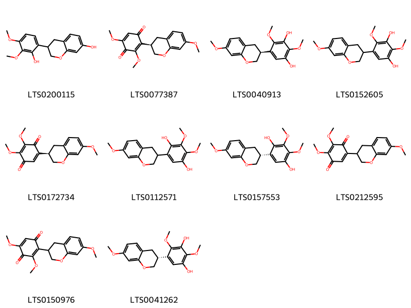{ width=100% }
    <figcaption>Hình ảnh cấu trúc hóa học của 10 hoạt chất thuộc nhóm Isoflavonoids gồm ['isomucronulatol (LTS0200115)', '3,5-dimethoxy-2-[(3r)-7-methoxy-3,4-dihydro-2h-1-benzopyran-3-yl]cyclohexa-2,5-diene-1,4-dione (LTS0077387)', '2,4-dimethoxy-5-[(3s)-7-methoxy-3,4-dihydro-2h-1-benzopyran-3-yl]benzene-1,3-diol (LTS0040913)', '2,4-dimethoxy-5-(7-methoxy-3,4-dihydro-2h-1-benzopyran-3-yl)benzene-1,3-diol (LTS0152605)', '2,3-dimethoxy-5-[(3r)-7-methoxy-3,4-dihydro-2h-1-benzopyran-3-yl]cyclohexa-2,5-diene-1,4-dione (LTS0172734)', '2,3-dimethoxy-5-(7-methoxy-3,4-dihydro-2h-1-benzopyran-3-yl)benzene-1,4-diol (LTS0112571)', '2,3-dimethoxy-5-[(3r)-7-methoxy-3,4-dihydro-2h-1-benzopyran-3-yl]benzene-1,4-diol (LTS0157553)', '2,3-dimethoxy-5-(7-methoxy-3,4-dihydro-2h-1-benzopyran-3-yl)cyclohexa-2,5-diene-1,4-dione (LTS0212595)', '3,5-dimethoxy-2-(7-methoxy-3,4-dihydro-2h-1-benzopyran-3-yl)cyclohexa-2,5-diene-1,4-dione (LTS0150976)', '2,4-dimethoxy-5-[(3r)-7-methoxy-3,4-dihydro-2h-1-benzopyran-3-yl]benzene-1,3-diol (LTS0041262)'].</figcaption>
</figure>

---

### Dược dân tộc học

Danh sách các quốc gia có sử dụng *Colutea arborescens* trong điều trị các bệnh. 

| Country   | Disease   | Bệnh                                                                                                                                                                                                |
|:----------|:----------|:----------------------------------------------------------------------------------------------------------------------------------------------------------------------------------------------------|
| Elsewhere | Purgative | MYMEMORY WARNING: YOU USED ALL AVAILABLE FREE TRANSLATIONS FOR TODAY. NEXT AVAILABLE IN  14 HOURS 12 MINUTES 13 SECONDS VISIT HTTPS://MYMEMORY.TRANSLATED.NET/DOC/USAGELIMITS.PHP TO TRANSLATE MORE |
| ain       | Emetic    | MYMEMORY WARNING: YOU USED ALL AVAILABLE FREE TRANSLATIONS FOR TODAY. NEXT AVAILABLE IN  14 HOURS 12 MINUTES 05 SECONDS VISIT HTTPS://MYMEMORY.TRANSLATED.NET/DOC/USAGELIMITS.PHP TO TRANSLATE MORE |

---

# Chi Adenanthera

??? note "Danh sách các dược liệu thuộc chi"
    
	 - *Adenanthera pavonina*

---
## Adenanthera pavonina
### Thông tin về thực vật

!!! info "Phân loại thực vật của *Adenanthera pavonina* từ GIBF:"
    - **Kingdom:** Plantae
    - **Phylum:** Tracheophyta
    - **Order:** Fabales
    - **Family:** Fabaceae
    - **Genus:** Adenanthera
    - **Species:** *Adenanthera pavonina*

 

| Label (VI)   | Label (EN)   | Scientific Name      | Descriptions (VI)   | Descriptions (EN)   | Also Known As (VI)   | Also Known As (EN)                         |
|:-------------|:-------------|:---------------------|:--------------------|:--------------------|:---------------------|:-------------------------------------------|
| N/A          | N/A          | Adenanthera pavonina | loài thực vật       | species of plants   | ['']                 | ['red sandalwood', 'peacock flower fence'] |

#### Phân bố trên thế giới

**Từ CSDL GIBF** Virgin Islands (U.S.), Australia, Cook Islands, Cambodia, Virgin Islands (British), Panama, Puerto Rico, Réunion, Chinese Taipei, Jamaica, United States of America, Maldives, Fiji, Hong Kong, Thailand, Saint Barthélemy, Brazil, New Caledonia, Dominican Republic, Singapore, French Polynesia, Niue, Madagascar, Seychelles, Colombia, Vanuatu, India, Cayman Islands, Samoa, Malaysia, Brunei Darussalam

#### Phân bố tại Việt Nam

**Từ CSDL GIBF**: Không có ghi nhận ở Việt Nam

---
### Thành phần hóa học
        
- Theo cơ sở dữ liệu lotus: Từ loài *Adenanthera pavonina* đã phân lập và xác định được 9 hoạt chất thuộc về các nhóm Fatty Acyls, Carboxylic acids and derivatives, Prenol lipids, Steroids and steroid derivatives. 

|    | chemicalTaxonomyClassyfireClass   |   smiles_count |
|---:|:----------------------------------|---------------:|
|  0 | Carboxylic acids and derivatives  |              1 |
|  1 | Fatty Acyls                       |              1 |
|  2 | Prenol lipids                     |              6 |
|  3 | Steroids and steroid derivatives  |              1 |

#### Nhóm Carboxylic acids and derivatives
<figure markdown="span">
    { width=100% }
    <figcaption>Hình ảnh cấu trúc hóa học của 1 hoạt chất thuộc nhóm Carboxylic acids and derivatives gồm ['ethanolamine acetate (LTS0211756)'].</figcaption>
</figure>
#### Nhóm Fatty Acyls
<figure markdown="span">
    { width=100% }
    <figcaption>Hình ảnh cấu trúc hóa học của 1 hoạt chất thuộc nhóm Fatty Acyls gồm ['octacosanol (LTS0049071)'].</figcaption>
</figure>
#### Nhóm Prenol lipids
<figure markdown="span">
    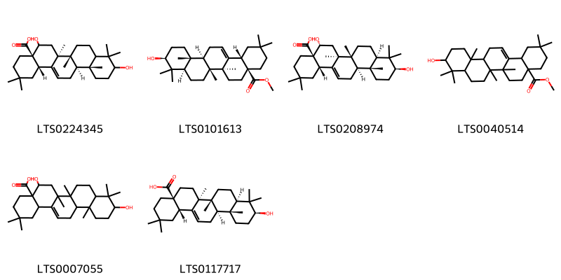{ width=100% }
    <figcaption>Hình ảnh cấu trúc hóa học của 6 hoạt chất thuộc nhóm Prenol lipids gồm ['(4ar,6as,6br,12ar,12br,14bs)-5,10-dihydroxy-2,2,6a,6b,9,9,12a-heptamethyl-1,3,4,5,6,7,8,8a,10,11,12,12b,13,14b-tetradecahydropicene-4a-carboxylic acid (LTS0224345)', 'methyl (4as,6as,6br,8ar,10s,12ar,12br,14bs)-10-hydroxy-2,2,6a,6b,9,9,12a-heptamethyl-1,3,4,5,6,7,8,8a,10,11,12,12b,13,14b-tetradecahydropicene-4a-carboxylate (LTS0101613)', 'echinocystic acid (LTS0208974)', 'methyl 10-hydroxy-2,2,6a,6b,9,9,12a-heptamethyl-1,3,4,5,6,7,8,8a,10,11,12,12b,13,14b-tetradecahydropicene-4a-carboxylate (LTS0040514)', '5,10-dihydroxy-2,2,6a,6b,9,9,12a-heptamethyl-1,3,4,5,6,7,8,8a,10,11,12,12b,13,14b-tetradecahydropicene-4a-carboxylic acid (LTS0007055)', 'oleanolic acid (LTS0117717)'].</figcaption>
</figure>
#### Nhóm Steroids and steroid derivatives
<figure markdown="span">
    { width=100% }
    <figcaption>Hình ảnh cấu trúc hóa học của 1 hoạt chất thuộc nhóm Steroids and steroid derivatives gồm ['(2r,3r,4s,5s,6r)-2-{[(1r,3as,3bs,7s,9ar,9bs,11ar)-1-[(2r,3e,5s)-5-ethyl-6-methylhept-3-en-2-yl]-9a,11a-dimethyl-1h,2h,3h,3ah,3bh,4h,6h,7h,8h,9h,9bh,10h,11h-cyclopenta[a]phenanthren-7-yl]oxy}-6-(hydroxymethyl)oxane-3,4,5-triol (LTS0088971)'].</figcaption>
</figure>

---

### Dược dân tộc học

Danh sách các quốc gia có sử dụng *Adenanthera pavonina* trong điều trị các bệnh. 

| Country   | Disease           | Bệnh                                                                                                                                                                                                |
|:----------|:------------------|:----------------------------------------------------------------------------------------------------------------------------------------------------------------------------------------------------|
| Elsewhere | Soap, Suppurative | MYMEMORY WARNING: YOU USED ALL AVAILABLE FREE TRANSLATIONS FOR TODAY. NEXT AVAILABLE IN  14 HOURS 11 MINUTES 32 SECONDS VISIT HTTPS://MYMEMORY.TRANSLATED.NET/DOC/USAGELIMITS.PHP TO TRANSLATE MORE |
| Malaya    | Tonic             | MYMEMORY WARNING: YOU USED ALL AVAILABLE FREE TRANSLATIONS FOR TODAY. NEXT AVAILABLE IN  14 HOURS 11 MINUTES 29 SECONDS VISIT HTTPS://MYMEMORY.TRANSLATED.NET/DOC/USAGELIMITS.PHP TO TRANSLATE MORE |

---

# Chi Olneya

??? note "Danh sách các dược liệu thuộc chi"
    
	 - *Olneya tesota*

---
## Olneya tesota
### Thông tin về thực vật

!!! info "Phân loại thực vật của *Olneya tesota* từ GIBF:"
    - **Kingdom:** Plantae
    - **Phylum:** Tracheophyta
    - **Order:** Fabales
    - **Family:** Fabaceae
    - **Genus:** Olneya
    - **Species:** *Olneya tesota*

 

| Label (VI)   | Label (EN)   | Scientific Name   | Descriptions (VI)   | Descriptions (EN)   | Also Known As (VI)   | Also Known As (EN)              |
|:-------------|:-------------|:------------------|:--------------------|:--------------------|:---------------------|:--------------------------------|
| N/A          | N/A          | Olneya tesota     | loài thực vật       | species of plant    | ['']                 | ['ironwood', 'desert ironwood'] |

#### Phân bố trên thế giới

**Từ CSDL GIBF** United States of America, Mexico

#### Phân bố tại Việt Nam

**Từ CSDL GIBF**: Không có ghi nhận ở Việt Nam

---
### Thành phần hóa học
        
- Theo cơ sở dữ liệu lotus: Từ loài *Olneya tesota* đã phân lập và xác định được 1 hoạt chất thuộc về các nhóm Carboxylic acids and derivatives. 

|    | chemicalTaxonomyClassyfireClass   |   smiles_count |
|---:|:----------------------------------|---------------:|
|  0 | Carboxylic acids and derivatives  |              1 |

#### Nhóm Carboxylic acids and derivatives
<figure markdown="span">
    { width=100% }
    <figcaption>Hình ảnh cấu trúc hóa học của 1 hoạt chất thuộc nhóm Carboxylic acids and derivatives gồm ['(l)-canavanine (LTS0093855)'].</figcaption>
</figure>

---

### Dược dân tộc học

Danh sách các quốc gia có sử dụng *Olneya tesota* trong điều trị các bệnh. 

| Country      | Disease   | Bệnh                                                                                                                                                                                                |
|:-------------|:----------|:----------------------------------------------------------------------------------------------------------------------------------------------------------------------------------------------------|
| Mexico(Seri) | Emetic    | MYMEMORY WARNING: YOU USED ALL AVAILABLE FREE TRANSLATIONS FOR TODAY. NEXT AVAILABLE IN  14 HOURS 10 MINUTES 51 SECONDS VISIT HTTPS://MYMEMORY.TRANSLATED.NET/DOC/USAGELIMITS.PHP TO TRANSLATE MORE |

---

# Chi Ormocarpum

??? note "Danh sách các dược liệu thuộc chi"
    
	 - *Ormocarpum cochinchinense*

---
## Ormocarpum cochinchinense
### Thông tin về thực vật

!!! info "Phân loại thực vật của *Ormocarpum cochinchinense* từ GIBF:"
    - **Kingdom:** Plantae
    - **Phylum:** Tracheophyta
    - **Order:** Fabales
    - **Family:** Fabaceae
    - **Genus:** Ormocarpum
    - **Species:** *Ormocarpum cochinchinense*

 

| Label (VI)   | Label (EN)   | Scientific Name           | Descriptions (VI)   | Descriptions (EN)   | Also Known As (VI)   | Also Known As (EN)             |
|:-------------|:-------------|:--------------------------|:--------------------|:--------------------|:---------------------|:-------------------------------|
| N/A          | N/A          | Ormocarpum cochinchinense | loài thực vật       | species of plant    | ['']                 | ['Ormocarpum cochinchinensis'] |

#### Phân bố trên thế giới

**Từ CSDL GIBF** nan, Fiji, Micronesia (Federated States of), Australia, Japan, Thailand, Chinese Taipei, Papua New Guinea, New Caledonia, Indonesia, Solomon Islands, Singapore, Malaysia, China

#### Phân bố tại Việt Nam

**Từ CSDL GIBF**: Không có ghi nhận ở Việt Nam

---
### Thành phần hóa học
        
- Theo cơ sở dữ liệu lotus: Từ loài *Ormocarpum cochinchinense* đã phân lập và xác định được Chưa có hoạt chất nào được phân lập. hoạt chất thuộc về các nhóm Không có hoạt chất nào được phân lập. 

Không có hình ảnh nào được tạo ra

---

### Dược dân tộc học

Danh sách các quốc gia có sử dụng *Ormocarpum cochinchinense* trong điều trị các bệnh. 

| Country   | Disease                     | Bệnh                                                                                                                                                                                                |
|:----------|:----------------------------|:----------------------------------------------------------------------------------------------------------------------------------------------------------------------------------------------------|
| Elsewhere | Stimulant, Tonic, Piscicide | MYMEMORY WARNING: YOU USED ALL AVAILABLE FREE TRANSLATIONS FOR TODAY. NEXT AVAILABLE IN  14 HOURS 10 MINUTES 22 SECONDS VISIT HTTPS://MYMEMORY.TRANSLATED.NET/DOC/USAGELIMITS.PHP TO TRANSLATE MORE |

---

# Chi Thermopsis

??? note "Danh sách các dược liệu thuộc chi"
    
	 - *Thermopsis lanceolata*

---
## Thermopsis lanceolata
### Thông tin về thực vật

!!! info "Phân loại thực vật của *Thermopsis lanceolata* từ GIBF:"
    - **Kingdom:** Plantae
    - **Phylum:** Tracheophyta
    - **Order:** Fabales
    - **Family:** Fabaceae
    - **Genus:** Thermopsis
    - **Species:** *Thermopsis lanceolata*

 

| Label (VI)   | Label (EN)   | Scientific Name       | Descriptions (VI)   | Descriptions (EN)   | Also Known As (VI)   | Also Known As (EN)   |
|:-------------|:-------------|:----------------------|:--------------------|:--------------------|:---------------------|:---------------------|
| N/A          | N/A          | Thermopsis lanceolata | loài thực vật       | species of plant    | ['']                 | ['']                 |

#### Phân bố trên thế giới

**Từ CSDL GIBF** Japan, Russian Federation, Kazakhstan, Mongolia, China

#### Phân bố tại Việt Nam

**Từ CSDL GIBF**: Không có ghi nhận ở Việt Nam

---
### Thành phần hóa học
        
- Theo cơ sở dữ liệu lotus: Từ loài *Thermopsis lanceolata* đã phân lập và xác định được 15 hoạt chất thuộc về các nhóm Lupin alkaloids, Isoflavonoids, Pyridines and derivatives. 

|    | chemicalTaxonomyClassyfireClass   |   smiles_count |
|---:|:----------------------------------|---------------:|
|  0 | Isoflavonoids                     |              1 |
|  1 | Lupin alkaloids                   |             13 |
|  2 | Pyridines and derivatives         |              1 |

#### Nhóm Isoflavonoids
<figure markdown="span">
    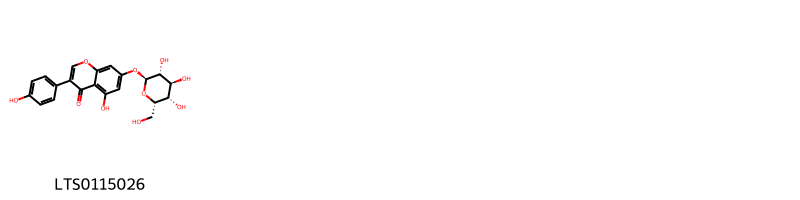{ width=100% }
    <figcaption>Hình ảnh cấu trúc hóa học của 1 hoạt chất thuộc nhóm Isoflavonoids gồm ['5-hydroxy-3-(4-hydroxyphenyl)-7-{[(2s,3r,4s,5s,6s)-3,4,5-trihydroxy-6-(hydroxymethyl)oxan-2-yl]oxy}chromen-4-one (LTS0115026)'].</figcaption>
</figure>
#### Nhóm Lupin alkaloids
<figure markdown="span">
    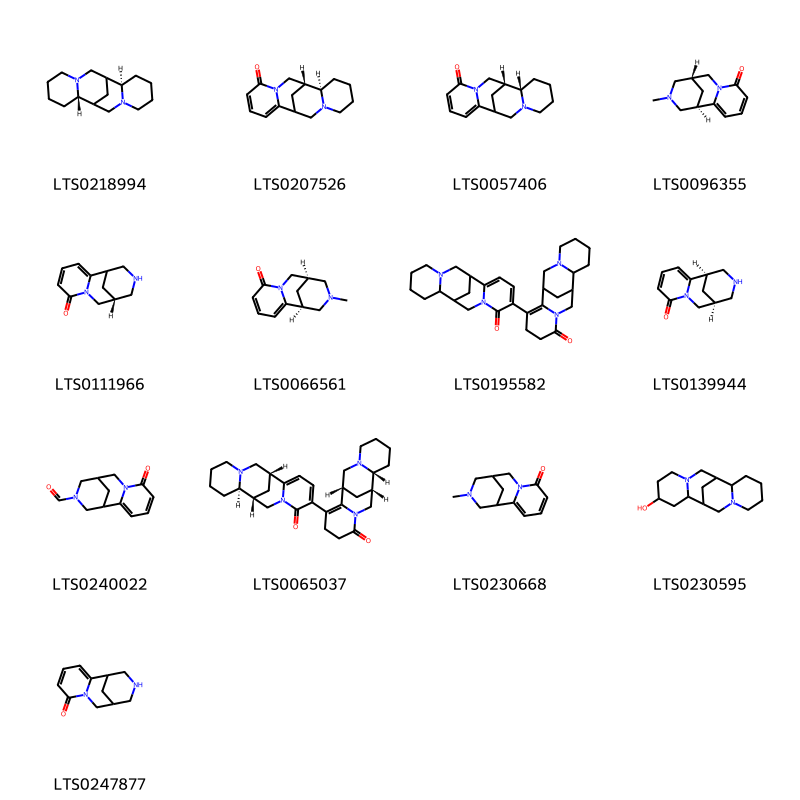{ width=100% }
    <figcaption>Hình ảnh cấu trúc hóa học của 13 hoạt chất thuộc nhóm Lupin alkaloids gồm ['(2r,10s)-7,15-diazatetracyclo[7.7.1.0²,⁷.0¹⁰,¹⁵]heptadecane (LTS0218994)', '(9r,10r)-7,15-diazatetracyclo[7.7.1.0²,⁷.0¹⁰,¹⁵]heptadeca-2,4-dien-6-one (LTS0207526)', '(9r,10s)-7,15-diazatetracyclo[7.7.1.0²,⁷.0¹⁰,¹⁵]heptadeca-2,4-dien-6-one (LTS0057406)', '(1r,9r)-11-methyl-7,11-diazatricyclo[7.3.1.0²,⁷]trideca-2,4-dien-6-one (LTS0096355)', '(9r)-7,11-diazatricyclo[7.3.1.0²,⁷]trideca-2,4-dien-6-one (LTS0111966)', '(1s,9r)-11-methyl-7,11-diazatricyclo[7.3.1.0²,⁷]trideca-2,4-dien-6-one (LTS0066561)', '5-{6-oxo-7,15-diazatetracyclo[7.7.1.0²,⁷.0¹⁰,¹⁵]heptadec-2-en-3-yl}-7,15-diazatetracyclo[7.7.1.0²,⁷.0¹⁰,¹⁵]heptadeca-2,4-dien-6-one (LTS0195582)', 'cytisine (LTS0139944)', '6-oxo-7,11-diazatricyclo[7.3.1.0²,⁷]trideca-2,4-diene-11-carbaldehyde (LTS0240022)', '(1r,9r,10r)-5-[(1s,9s,10r)-6-oxo-7,15-diazatetracyclo[7.7.1.0²,⁷.0¹⁰,¹⁵]heptadec-2-en-3-yl]-7,15-diazatetracyclo[7.7.1.0²,⁷.0¹⁰,¹⁵]heptadeca-2,4-dien-6-one (LTS0065037)', 'n-methylcytisine (LTS0230668)', '7,15-diazatetracyclo[7.7.1.0²,⁷.0¹⁰,¹⁵]heptadecan-4-ol (LTS0230595)', 'citizin (LTS0247877)'].</figcaption>
</figure>
#### Nhóm Pyridines and derivatives
<figure markdown="span">
    { width=100% }
    <figcaption>Hình ảnh cấu trúc hóa học của 1 hoạt chất thuộc nhóm Pyridines and derivatives gồm ['ammodendrine (LTS0084410)'].</figcaption>
</figure>

---

### Dược dân tộc học

Danh sách các quốc gia có sử dụng *Thermopsis lanceolata* trong điều trị các bệnh. 

| Country   | Disease     | Bệnh                                                                                                                                                                                                |
|:----------|:------------|:----------------------------------------------------------------------------------------------------------------------------------------------------------------------------------------------------|
| USSR      | Expectorant | MYMEMORY WARNING: YOU USED ALL AVAILABLE FREE TRANSLATIONS FOR TODAY. NEXT AVAILABLE IN  14 HOURS 09 MINUTES 51 SECONDS VISIT HTTPS://MYMEMORY.TRANSLATED.NET/DOC/USAGELIMITS.PHP TO TRANSLATE MORE |

---

# Chi Cicer

??? note "Danh sách các dược liệu thuộc chi"
    
	 - *Cicer arietinum*

---
## Cicer arietinum
### Thông tin về thực vật

!!! info "Phân loại thực vật của *Cicer arietinum* từ GIBF:"
    - **Kingdom:** Plantae
    - **Phylum:** Tracheophyta
    - **Order:** Fabales
    - **Family:** Fabaceae
    - **Genus:** Cicer
    - **Species:** *Cicer arietinum*

 

| Label (VI)   | Label (EN)   | Scientific Name   | Descriptions (VI)   | Descriptions (EN)       | Also Known As (VI)   | Also Known As (EN)                                                                                  |
|:-------------|:-------------|:------------------|:--------------------|:------------------------|:---------------------|:----------------------------------------------------------------------------------------------------|
| N/A          | N/A          | Cicer arietinum   | loài thực vật       | species of legume plant | ['']                 | ['Bengal gram', 'cece', 'ceci', 'chana', 'chick pea plant', 'chickpea', 'garbanzo', 'Kabuli chana'] |

#### Phân bố trên thế giới

**Từ CSDL GIBF** nan, Italy, Belgium, Slovakia, Argentina, Tunisia, Norway, Israel, Ukraine, Denmark, Netherlands, Cyprus, Spain, Türkiye, Honduras, Algeria, Russian Federation, United States of America, Greece, Iran (Islamic Republic of), Brazil, Switzerland, Austria, France, United Kingdom of Great Britain and Northern Ireland, Syrian Arab Republic, Iraq, Colombia, India, Poland

#### Phân bố tại Việt Nam

**Từ CSDL GIBF**: Không có ghi nhận ở Việt Nam

---
### Thành phần hóa học
        
- Theo cơ sở dữ liệu lotus: Từ loài *Cicer arietinum* đã phân lập và xác định được 120 hoạt chất thuộc về các nhóm Polypeptides, Flavonoids, Prenol lipids, Steroids and steroid derivatives, Isoflavonoids, Linear 1,3-diarylpropanoids, Cinnamic acids and derivatives, Dibenzylbutane lignans, Organonitrogen compounds, Benzene and substituted derivatives, Organooxygen compounds, Coumarins and derivatives, Furanoid lignans, Carboxylic acids and derivatives, Diazines, Imidazopyrimidines. 

|    | chemicalTaxonomyClassyfireClass     |   smiles_count |
|---:|:------------------------------------|---------------:|
|  0 | Benzene and substituted derivatives |              2 |
|  1 | Carboxylic acids and derivatives    |              2 |
|  2 | Cinnamic acids and derivatives      |              4 |
|  3 | Coumarins and derivatives           |              2 |
|  4 | Diazines                            |              2 |
|  5 | Dibenzylbutane lignans              |              2 |
|  6 | Flavonoids                          |             26 |
|  7 | Furanoid lignans                    |              1 |
|  8 | Imidazopyrimidines                  |              1 |
|  9 | Isoflavonoids                       |             28 |
| 10 | Linear 1,3-diarylpropanoids         |              1 |
| 11 | Organonitrogen compounds            |              4 |
| 12 | Organooxygen compounds              |             23 |
| 13 | Polypeptides                        |              1 |
| 14 | Prenol lipids                       |             10 |
| 15 | Steroids and steroid derivatives    |              8 |

#### Nhóm Benzene and substituted derivatives
<figure markdown="span">
    { width=100% }
    <figcaption>Hình ảnh cấu trúc hóa học của 2 hoạt chất thuộc nhóm Benzene and substituted derivatives gồm ['syringic acid (LTS0210036)', 'p-hydroxybenzoic acid (LTS0263634)'].</figcaption>
</figure>
#### Nhóm Carboxylic acids and derivatives
<figure markdown="span">
    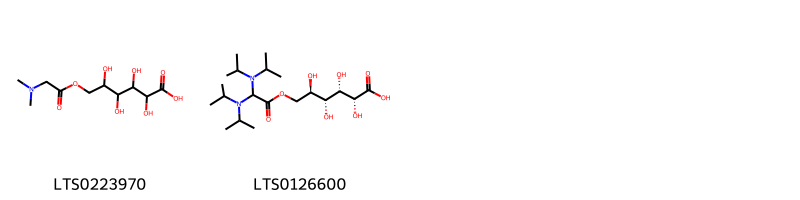{ width=100% }
    <figcaption>Hình ảnh cấu trúc hóa học của 2 hoạt chất thuộc nhóm Carboxylic acids and derivatives gồm ['pangamic acid (LTS0223970)', '(2r,3s,4r,5r)-6-{[2,2-bis(diisopropylamino)acetyl]oxy}-2,3,4,5-tetrahydroxyhexanoic acid (LTS0126600)'].</figcaption>
</figure>
#### Nhóm Cinnamic acids and derivatives
<figure markdown="span">
    { width=100% }
    <figcaption>Hình ảnh cấu trúc hóa học của 4 hoạt chất thuộc nhóm Cinnamic acids and derivatives gồm ['ferulic acid (LTS0077328)', 'para-coumaric acid (LTS0266252)', 'hydroxycinnamic acid (LTS0233023)', 'ferulic acid (LTS0273002)'].</figcaption>
</figure>
#### Nhóm Coumarins and derivatives
<figure markdown="span">
    { width=100% }
    <figcaption>Hình ảnh cấu trúc hóa học của 2 hoạt chất thuộc nhóm Coumarins and derivatives gồm ['umbelliferone (LTS0162728)', 'scopoletin (LTS0193112)'].</figcaption>
</figure>
#### Nhóm Diazines
<figure markdown="span">
    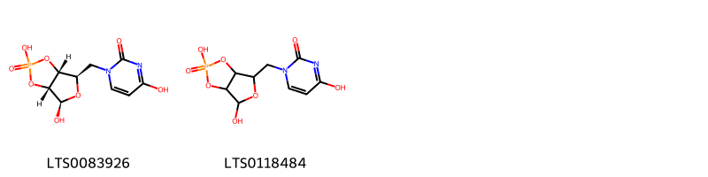{ width=100% }
    <figcaption>Hình ảnh cấu trúc hóa học của 2 hoạt chất thuộc nhóm Diazines gồm ['1-{[(3ar,4r,6r,6ar)-2,6-dihydroxy-2-oxo-tetrahydro-2λ⁵-furo[3,4-d][1,3,2]dioxaphosphol-4-yl]methyl}-4-hydroxypyrimidin-2-one (LTS0083926)', '1-({2,6-dihydroxy-2-oxo-tetrahydro-2λ⁵-furo[3,4-d][1,3,2]dioxaphosphol-4-yl}methyl)-4-hydroxypyrimidin-2-one (LTS0118484)'].</figcaption>
</figure>
#### Nhóm Dibenzylbutane lignans
<figure markdown="span">
    { width=100% }
    <figcaption>Hình ảnh cấu trúc hóa học của 2 hoạt chất thuộc nhóm Dibenzylbutane lignans gồm ['(2s,3r)-2,3-bis[(4-hydroxy-3-methoxyphenyl)(¹³c)methyl](1-¹³c)butane-1,4-diol (LTS0268699)', 'secoisolariciresinol (LTS0086727)'].</figcaption>
</figure>
#### Nhóm Flavonoids
<figure markdown="span">
    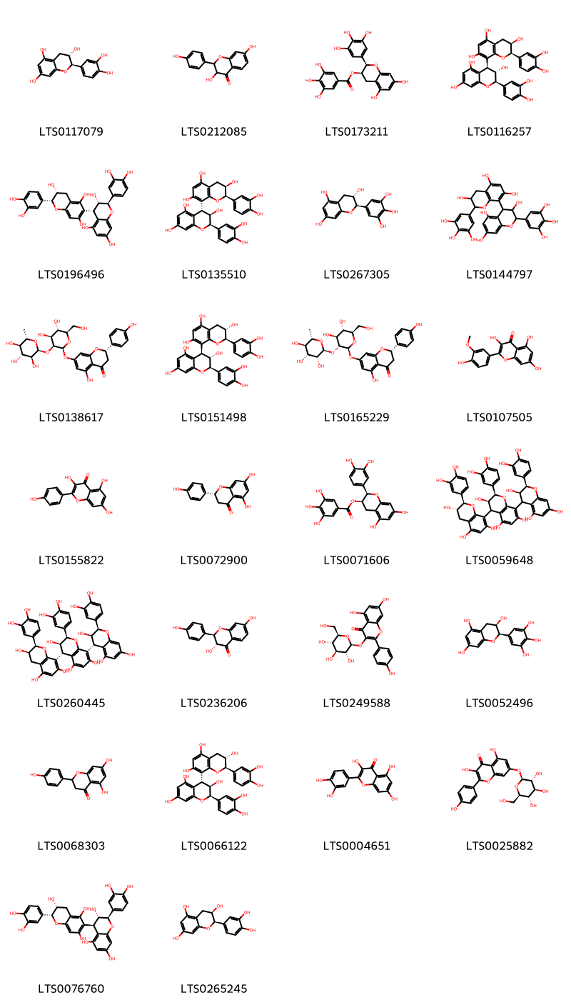{ width=100% }
    <figcaption>Hình ảnh cấu trúc hóa học của 26 hoạt chất thuộc nhóm Flavonoids gồm ['(+)-catechol (LTS0117079)', "3,7,4'-trihydroxyflavanone (LTS0212085)", '(-)-epigallocatechin gallate (LTS0173211)', '(2r,3s,4s)-2-(3,4-dihydroxyphenyl)-4-[(2r,3r)-2-(3,4-dihydroxyphenyl)-3,5,7-trihydroxy-3,4-dihydro-2h-1-benzopyran-8-yl]-3,4-dihydro-2h-1-benzopyran-3,5,7-triol (LTS0116257)', '(2r,3s,4s)-2-(3,4-dihydroxyphenyl)-4-[(2r,3r)-2-(3,4-dihydroxyphenyl)-3,5,7-trihydroxy-3,4-dihydro-2h-1-benzopyran-6-yl]-3,4-dihydro-2h-1-benzopyran-3,5,7-triol (LTS0196496)', '(2r,3r,4r)-2-(3,4-dihydroxyphenyl)-4-[(2r,3r)-2-(3,4-dihydroxyphenyl)-3,5,7-trihydroxy-3,4-dihydro-2h-1-benzopyran-8-yl]-3,4-dihydro-2h-1-benzopyran-3,5,7-triol (LTS0135510)', 'gallocatechol (LTS0267305)', '4-[3,5,7-trihydroxy-2-(3,4,5-trihydroxyphenyl)-3,4-dihydro-2h-1-benzopyran-8-yl]-2-(3,4,5-trihydroxyphenyl)-3,4-dihydro-2h-1-benzopyran-3,5,7-triol (LTS0144797)', '(2s)-7-{[(2s,3s,4s,5s,6r)-4,5-dihydroxy-6-(hydroxymethyl)-3-{[(2s,3s,4r,5r,6s)-3,4,5-trihydroxy-6-methyloxan-2-yl]oxy}oxan-2-yl]oxy}-5-hydroxy-2-(4-hydroxyphenyl)-2,3-dihydro-1-benzopyran-4-one (LTS0138617)', '(2r,3s,4s)-2-(3,4-dihydroxyphenyl)-4-[(2r,3s)-2-(3,4-dihydroxyphenyl)-3,5,7-trihydroxy-3,4-dihydro-2h-1-benzopyran-8-yl]-3,4-dihydro-2h-1-benzopyran-3,5,7-triol (LTS0151498)', 'naringin (LTS0165229)', 'isorhamnetin (LTS0107505)', 'kaempherol (LTS0155822)', '(-)-naringenin (LTS0072900)', 'epicatechin gallate (LTS0071606)', '(2r,3r)-2-(3,4-dihydroxyphenyl)-8-[(2r,3r)-2-(3,4-dihydroxyphenyl)-3,5,7-trihydroxy-3,4-dihydro-2h-1-benzopyran-4-yl]-4-[(2r,3s)-2-(3,4-dihydroxyphenyl)-3,5,7-trihydroxy-3,4-dihydro-2h-1-benzopyran-8-yl]-3,4-dihydro-2h-1-benzopyran-3,5,7-triol (LTS0059648)', 'procyanidin c1 (LTS0260445)', 'garbanzol (LTS0236206)', 'astragalin (LTS0249588)', 'epigallocatechin (LTS0052496)', 'asahina (LTS0068303)', '(2r,3r,4r)-2-(3,4-dihydroxyphenyl)-4-[(2r,3s)-2-(3,4-dihydroxyphenyl)-3,5,7-trihydroxy-3,4-dihydro-2h-1-benzopyran-8-yl]-3,4-dihydro-2h-1-benzopyran-3,5,7-triol (LTS0066122)', 'quercetin (LTS0004651)', 'kaempferol 7-o-glucoside (LTS0025882)', '(2r,3s,4r)-2-(3,4-dihydroxyphenyl)-4-[(2r,3r)-2-(3,4-dihydroxyphenyl)-3,5,7-trihydroxy-3,4-dihydro-2h-1-benzopyran-6-yl]-3,4-dihydro-2h-1-benzopyran-3,5,7-triol (LTS0076760)', 'ent-epicatechin (LTS0265245)'].</figcaption>
</figure>
#### Nhóm Furanoid lignans
<figure markdown="span">
    { width=100% }
    <figcaption>Hình ảnh cấu trúc hóa học của 1 hoạt chất thuộc nhóm Furanoid lignans gồm ['matairesinol (LTS0193475)'].</figcaption>
</figure>
#### Nhóm Imidazopyrimidines
<figure markdown="span">
    { width=100% }
    <figcaption>Hình ảnh cấu trúc hóa học của 1 hoạt chất thuộc nhóm Imidazopyrimidines gồm ['leucon (LTS0114351)'].</figcaption>
</figure>
#### Nhóm Isoflavonoids
<figure markdown="span">
    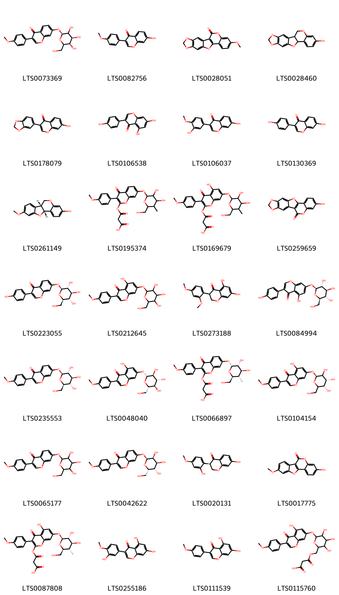{ width=100% }
    <figcaption>Hình ảnh cấu trúc hóa học của 28 hoạt chất thuộc nhóm Isoflavonoids gồm ['formononetin 7-o-glucoside (LTS0073369)', 'formononetin (LTS0082756)', 'flemichapparin c (LTS0028051)', 'maackiain (LTS0028460)', 'pseudobaptigenin (LTS0178079)', 'genistein (LTS0106538)', 'calycosin (LTS0106037)', 'daidzein (LTS0130369)', 'medicarpin, (-)- (LTS0261149)', '3-[(7-{[3,4-dihydroxy-6-(hydroxymethyl)-5-methyloxan-2-yl]oxy}-3-(4-methoxyphenyl)-4-oxochromen-2-yl)oxy]-3-oxopropanoic acid (LTS0195374)', '3-[(7-{[3,4-dihydroxy-6-(hydroxymethyl)-5-methyloxan-2-yl]oxy}-5-hydroxy-3-(4-methoxyphenyl)-4-oxochromen-2-yl)oxy]-3-oxopropanoic acid (LTS0169679)', 'medicagol (LTS0259659)', 'daidzin (LTS0223055)', '5-hydroxy-3-(4-methoxyphenyl)-7-{[3,4,5-trihydroxy-6-(hydroxymethyl)oxan-2-yl]oxy}chromen-4-one (LTS0212645)', 'homoferreirin (LTS0273188)', 'genistin (LTS0084994)', 'ononin (LTS0235553)', '5-hydroxy-3-(4-methoxyphenyl)-7-{[(2r,3s,4r,5r,6s)-3,4,5-trihydroxy-6-(hydroxymethyl)oxan-2-yl]oxy}chromen-4-one (LTS0048040)', '3-[(7-{[(2r,3r,4s,5s,6s)-3,4-dihydroxy-6-(hydroxymethyl)-5-methyloxan-2-yl]oxy}-3-(4-methoxyphenyl)-4-oxochromen-2-yl)oxy]-3-oxopropanoic acid (LTS0066897)', '5-hydroxy-3-(4-methoxyphenyl)-7-{[(2s,4r,5s)-3,4,5-trihydroxy-6-(hydroxymethyl)oxan-2-yl]oxy}chromen-4-one (LTS0104154)', 'ononin (LTS0065177)', '3-(4-methoxyphenyl)-7-{[(2s,3s,4s,5s,6s)-3,4,5-trihydroxy-6-(hydroxymethyl)oxan-2-yl]oxy}chromen-4-one (LTS0042622)', 'vestitone (LTS0020131)', "4'-o-methylcoumestrol (LTS0017775)", '3-[(7-{[(2s,3r,4s,5s,6s)-3,4-dihydroxy-6-(hydroxymethyl)-5-methyloxan-2-yl]oxy}-5-hydroxy-3-(4-methoxyphenyl)-4-oxochromen-2-yl)oxy]-3-oxopropanoic acid (LTS0087808)', 'pratensein (LTS0255186)', 'biochanin (LTS0111539)', '3-oxo-3-[(3,4,5-trihydroxy-6-{[5-hydroxy-3-(4-methoxyphenyl)-4-oxochromen-7-yl]oxy}oxan-2-yl)methoxy]propanoic acid (LTS0115760)'].</figcaption>
</figure>
#### Nhóm Linear 1_3-diarylpropanoids
<figure markdown="span">
    { width=100% }
    <figcaption>Hình ảnh cấu trúc hóa học của Không tìm thấy chú thích hoạt chất thuộc nhóm Linear 1_3-diarylpropanoids gồm Không tìm thấy chú thích.</figcaption>
</figure>
#### Nhóm Organonitrogen compounds
<figure markdown="span">
    { width=100% }
    <figcaption>Hình ảnh cấu trúc hóa học của 4 hoạt chất thuộc nhóm Organonitrogen compounds gồm ['putrescine (LTS0238763)', 'pentane-1,5-diamine (LTS0046069)', 'spermine (LTS0179313)', 'spermidine (LTS0061428)'].</figcaption>
</figure>
#### Nhóm Organooxygen compounds
<figure markdown="span">
    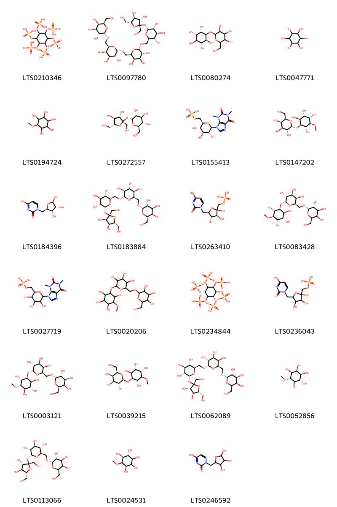{ width=100% }
    <figcaption>Hình ảnh cấu trúc hóa học của 23 hoạt chất thuộc nhóm Organooxygen compounds gồm ['phytic acid (LTS0210346)', 'verbascose (LTS0097780)', '(1s,2r,4s,5s)-6-{[3,4,5-trihydroxy-6-(hydroxymethyl)oxan-2-yl]oxy}cyclohexane-1,2,3,4,5-pentol (LTS0080274)', '(-)-inositol (LTS0047771)', 'pinitol (LTS0194724)', 'sucrose (LTS0272557)', '[(2r,3s,4s,5r,6r)-6-(1,3-dimethyl-2,6-dioxopurin-9-yl)-3,4,5-trihydroxyoxan-2-yl]methoxyphosphonic acid (LTS0155413)', '(1s,2r,3s,4r,5s,6s)-4-methoxy-6-{[(2r,3r,4s,5r,6r)-3,4,5-trihydroxy-6-(hydroxymethyl)oxan-2-yl]oxy}cyclohexane-1,2,3,5-tetrol (LTS0147202)', '4-hydroxy-1-{[(2r,3s,4r,5r)-3,4,5-trihydroxyoxolan-2-yl]methyl}pyrimidin-2-one (LTS0184396)', '(2r,3r,4s,5s,6r)-2-{[(2s,3r,4s,5r)-3,4-dihydroxy-2,5-bis(hydroxymethyl)oxolan-2-yl]oxy}-6-({[(2s,3s,4r,5r,6r)-3,4,5-trihydroxy-6-({[(2s,3r,4s,5r,6r)-3,4,5-trihydroxy-6-(hydroxymethyl)oxan-2-yl]oxy}methyl)oxan-2-yl]oxy}methyl)oxane-3,4,5-triol (LTS0183884)', '[(2r,3s,4s,5r)-2,3,4-trihydroxy-5-[(4-hydroxy-2-oxopyrimidin-1-yl)methyl]oxolan-2-yl]methoxyphosphonic acid (LTS0263410)', '(1s,2r,3s,4r,5s,6s)-4-methoxy-6-{[(2r,3r,4s,5r,6r)-3,4,5-trihydroxy-6-({[(2s,3r,4s,5r,6r)-3,4,5-trihydroxy-6-(hydroxymethyl)oxan-2-yl]oxy}methyl)oxan-2-yl]oxy}cyclohexane-1,2,3,5-tetrol (LTS0083428)', '[6-(1,3-dimethyl-2,6-dioxopurin-9-yl)-3,4,5-trihydroxyoxan-2-yl]methoxyphosphonic acid (LTS0027719)', 'ciceritol (LTS0020206)', '[(1r,2r,3s,4r,5s,6s)-2,3,4,5,6-pentakis(phosphonooxy)cyclohexyl]oxyphosphonic acid (LTS0234844)', '{2,3,4-trihydroxy-5-[(4-hydroxy-2-oxopyrimidin-1-yl)methyl]oxolan-2-yl}methoxyphosphonic acid (LTS0236043)', '(1s,2r,3r,4s,5s,6s)-4-methoxy-6-{[(2r,3r,4s,5r,6r)-3,4,5-trihydroxy-6-({[(2s,3r,4s,5r,6r)-3,4,5-trihydroxy-6-(hydroxymethyl)oxan-2-yl]oxy}methyl)oxan-2-yl]oxy}cyclohexane-1,2,3,5-tetrol (LTS0003121)', '(1s,2r,3s,4r,5s,6s)-4-methoxy-6-{[(2s,3r,4s,5r,6r)-3,4,5-trihydroxy-6-(hydroxymethyl)oxan-2-yl]oxy}cyclohexane-1,2,3,5-tetrol (LTS0039215)', 'stachyose (LTS0062089)', 'ononitol (LTS0052856)', 'raffinose (LTS0113066)', '(1r,2r,4r,5s)-6-methoxycyclohexane-1,2,3,4,5-pentol (LTS0024531)', '4-hydroxy-1-[(3,4,5-trihydroxyoxolan-2-yl)methyl]pyrimidin-2-one (LTS0246592)'].</figcaption>
</figure>
#### Nhóm Polypeptides
<figure markdown="span">
    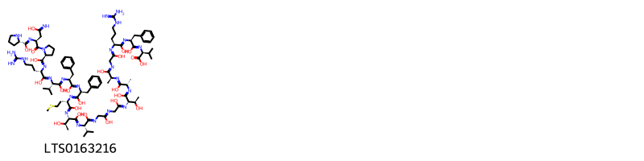{ width=100% }
    <figcaption>Hình ảnh cấu trúc hóa học của 1 hoạt chất thuộc nhóm Polypeptides gồm ['(2s)-2-{[(2s)-2-{[(2s)-5-carbamimidamido-2-[(2-{[(2s)-2-{[(2s)-2-{[(2s,3r)-2-({2-[(2-{[(2s)-2-{[(2s,3r)-2-{[(2s)-2-{[(2s)-2-{[(2s)-2-{[(2s)-2-{[(2s)-5-carbamimidamido-1-hydroxy-2-({hydroxy[(2s)-1-[(2s)-2-{[hydroxy((2s)-pyrrolidin-2-yl)methylidene]amino}-3-(c-hydroxycarbonimidoyl)propanoyl]pyrrolidin-2-yl]methylidene}amino)pentylidene]amino}-1-hydroxy-3-methylbutylidene]amino}-1-hydroxy-3-phenylpropylidene]amino}-1-hydroxy-3-phenylpropylidene]amino}-1-hydroxy-4-(methylsulfanyl)butylidene]amino}-1,3-dihydroxybutylidene]amino}-1-hydroxy-3-methylbutylidene]amino}-1-hydroxyethylidene)amino]-1-hydroxyethylidene}amino)-1,3-dihydroxybutylidene]amino}-1-hydroxypropylidene]amino}-1-hydroxypropylidene]amino}-1-hydroxyethylidene)amino]-1-hydroxypentylidene]amino}-1-hydroxy-3-phenylpropylidene]amino}-3-methylbutanoic acid (LTS0163216)'].</figcaption>
</figure>
#### Nhóm Prenol lipids
<figure markdown="span">
    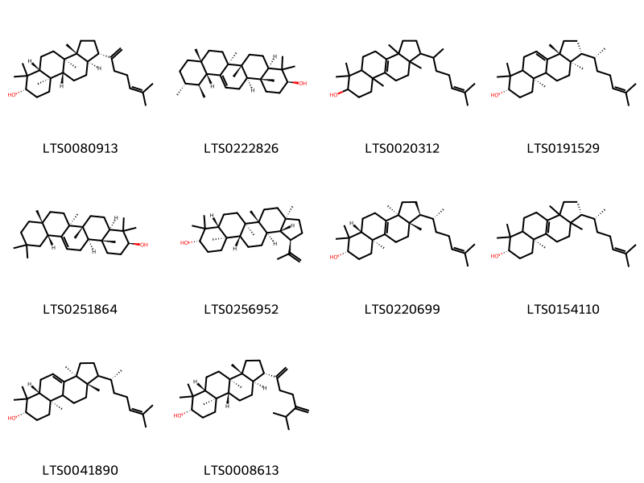{ width=100% }
    <figcaption>Hình ảnh cấu trúc hóa học của 10 hoạt chất thuộc nhóm Prenol lipids gồm ['dammaradienol (LTS0080913)', 'amyrin (LTS0222826)', 'lanster (LTS0020312)', '(1r,3ar,7s,9ar,11ar)-3a,6,6,9a,11a-pentamethyl-1-[(2r)-6-methylhept-5-en-2-yl]-1h,2h,3h,5h,5ah,7h,8h,9h,9bh,10h,11h-cyclopenta[a]phenanthren-7-ol (LTS0191529)', 'β-amyrin (LTS0251864)', 'lupeol (LTS0256952)', 'euphol (LTS0220699)', '(1r,7s,9as)-3a,6,6,9a,11a-pentamethyl-1-[(2r)-6-methylhept-5-en-2-yl]-1h,2h,3h,4h,5h,5ah,7h,8h,9h,10h,11h-cyclopenta[a]phenanthren-7-ol (LTS0154110)', '(3as,5ar,7s,9ar,11as)-3a,6,6,9a,11a-pentamethyl-1-[(2r)-6-methylhept-5-en-2-yl]-1h,2h,3h,5h,5ah,7h,8h,9h,9bh,10h,11h-cyclopenta[a]phenanthren-7-ol (LTS0041890)', '(1s,3ar,3br,5ar,7s,9ar,9br,11ar)-3a,3b,6,6,9a-pentamethyl-1-(6-methyl-5-methylidenehept-1-en-2-yl)-dodecahydro-1h-cyclopenta[a]phenanthren-7-ol (LTS0008613)'].</figcaption>
</figure>
#### Nhóm Steroids and steroid derivatives
<figure markdown="span">
    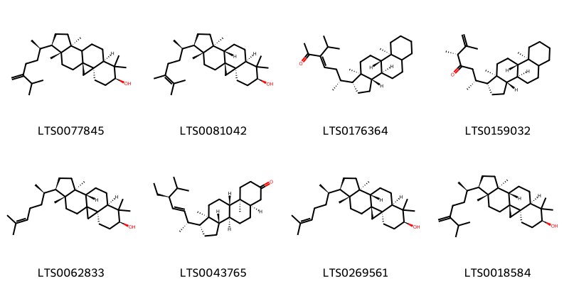{ width=100% }
    <figcaption>Hình ảnh cấu trúc hóa học của 8 hoạt chất thuộc nhóm Steroids and steroid derivatives gồm ['24-methylene-cycloartanol (LTS0077845)', '(1s,3r,6s,8r,11s,12s,15r,16r)-15-[(2r)-5,6-dimethylhept-5-en-2-yl]-7,7,12,16-tetramethylpentacyclo[9.7.0.0¹,³.0³,⁸.0¹²,¹⁶]octadecan-6-ol (LTS0081042)', '(6r)-6-[(1r,3as,3br,9as,9bs,11ar)-9a,11a-dimethyl-tetradecahydro-1h-cyclopenta[a]phenanthren-1-yl]-3-isopropylhept-3-en-2-one (LTS0176364)', '(3r,6r)-6-[(1r,3as,3br,9as,9bs,11ar)-9a,11a-dimethyl-tetradecahydro-1h-cyclopenta[a]phenanthren-1-yl]-2,3-dimethylhept-1-en-4-one (LTS0159032)', '(3r,6s,8r,11s,12s,15r,16r)-7,7,12,16-tetramethyl-15-[(2r)-6-methylhept-5-en-2-yl]pentacyclo[9.7.0.0¹,³.0³,⁸.0¹²,¹⁶]octadecan-6-ol (LTS0062833)', 'stigmastenone (LTS0043765)', 'cycloartenol (LTS0269561)', '24-methylenecycloartanol (LTS0018584)'].</figcaption>
</figure>

---

### Dược dân tộc học

Danh sách các quốc gia có sử dụng *Cicer arietinum* trong điều trị các bệnh. 

| Country   | Disease                 | Bệnh                                                                                                                                                                                                |
|:----------|:------------------------|:----------------------------------------------------------------------------------------------------------------------------------------------------------------------------------------------------|
| Elsewhere | Aphrodisiac, Lactagogue | MYMEMORY WARNING: YOU USED ALL AVAILABLE FREE TRANSLATIONS FOR TODAY. NEXT AVAILABLE IN  14 HOURS 09 MINUTES 17 SECONDS VISIT HTTPS://MYMEMORY.TRANSLATED.NET/DOC/USAGELIMITS.PHP TO TRANSLATE MORE |
| Iraq      | Astringent              | MYMEMORY WARNING: YOU USED ALL AVAILABLE FREE TRANSLATIONS FOR TODAY. NEXT AVAILABLE IN  14 HOURS 09 MINUTES 15 SECONDS VISIT HTTPS://MYMEMORY.TRANSLATED.NET/DOC/USAGELIMITS.PHP TO TRANSLATE MORE |
| Kurdistan | Tonic                   | MYMEMORY WARNING: YOU USED ALL AVAILABLE FREE TRANSLATIONS FOR TODAY. NEXT AVAILABLE IN  14 HOURS 09 MINUTES 13 SECONDS VISIT HTTPS://MYMEMORY.TRANSLATED.NET/DOC/USAGELIMITS.PHP TO TRANSLATE MORE |
| ain       | Diuretic                | MYMEMORY WARNING: YOU USED ALL AVAILABLE FREE TRANSLATIONS FOR TODAY. NEXT AVAILABLE IN  14 HOURS 09 MINUTES 11 SECONDS VISIT HTTPS://MYMEMORY.TRANSLATED.NET/DOC/USAGELIMITS.PHP TO TRANSLATE MORE |

---

# Chi Bauhinia

??? note "Danh sách các dược liệu thuộc chi"
    
	 - *Bauhinia lendens*
	 - *Bauhinia monandra*
	 - *Bauhinia reticulata*
	 - *Bauhinia thonningii*
	 - *Bauhinia ungulata*
	 - *Bauhinia variegata*

---
## Bauhinia lendens
### Thông tin về thực vật

!!! info "Phân loại thực vật của *N/A* từ GIBF:"
    - **Kingdom:** Plantae
    - **Phylum:** Tracheophyta
    - **Order:** Fabales
    - **Family:** Fabaceae
    - **Genus:** Bauhinia
    - **Species:** *N/A*

 

| Label (VI)   | Label (EN)   | Scientific Name   | Descriptions (VI)   | Descriptions (EN)       | Also Known As (VI)   | Also Known As (EN)                                                                                  |
|:-------------|:-------------|:------------------|:--------------------|:------------------------|:---------------------|:----------------------------------------------------------------------------------------------------|
| N/A          | N/A          | Cicer arietinum   | loài thực vật       | species of legume plant | ['']                 | ['Bengal gram', 'cece', 'ceci', 'chana', 'chick pea plant', 'chickpea', 'garbanzo', 'Kabuli chana'] |

#### Phân bố trên thế giới

**Từ CSDL GIBF** nan, Sri Lanka, Australia, Guatemala, Angola, Argentina, Panama, Malawi, Zambia, Namibia, Chinese Taipei, United States of America, Uruguay, Paraguay, Belize, South Africa, Hong Kong, Brazil, Mexico, Dominican Republic, Viet Nam, China, Ecuador, Colombia, Costa Rica, India, Cayman Islands

#### Phân bố tại Việt Nam

**Từ CSDL GIBF**: Đà Nẵng, Quảng Nam

---
### Thành phần hóa học
        
- Theo cơ sở dữ liệu lotus: Từ loài *N/A* đã phân lập và xác định được Chưa có hoạt chất nào được phân lập. hoạt chất thuộc về các nhóm Không có hoạt chất nào được phân lập. 

Không có hình ảnh nào được tạo ra

---

### Dược dân tộc học

Danh sách các quốc gia có sử dụng *N/A* trong điều trị các bệnh. 

| Country   | Disease    | Bệnh                                                                                                                                                                                                |
|:----------|:-----------|:----------------------------------------------------------------------------------------------------------------------------------------------------------------------------------------------------|
| Venezuela | Astringent | MYMEMORY WARNING: YOU USED ALL AVAILABLE FREE TRANSLATIONS FOR TODAY. NEXT AVAILABLE IN  14 HOURS 08 MINUTES 05 SECONDS VISIT HTTPS://MYMEMORY.TRANSLATED.NET/DOC/USAGELIMITS.PHP TO TRANSLATE MORE |

---

---
## Bauhinia monandra
### Thông tin về thực vật

!!! info "Phân loại thực vật của *Bauhinia monandra* từ GIBF:"
    - **Kingdom:** Plantae
    - **Phylum:** Tracheophyta
    - **Order:** Fabales
    - **Family:** Fabaceae
    - **Genus:** Bauhinia
    - **Species:** *Bauhinia monandra*

 

| Label (VI)   | Label (EN)   | Scientific Name   | Descriptions (VI)   | Descriptions (EN)   | Also Known As (VI)   | Also Known As (EN)   |
|:-------------|:-------------|:------------------|:--------------------|:--------------------|:---------------------|:---------------------|
| N/A          | N/A          | Bauhinia monandra |                     | species of plant    | ['']                 | ['']                 |

#### Phân bố trên thế giới

**Từ CSDL GIBF** nan, Virgin Islands (U.S.), Sri Lanka, Australia, Guadeloupe, Guatemala, Angola, Nicaragua, Virgin Islands (British), French Guiana, Panama, Puerto Rico, Réunion, Nigeria, Honduras, United States of America, El Salvador, Belize, Saint Martin (French part), Trinidad and Tobago, Barbados, Saint Vincent and the Grenadines, Thailand, Martinique, Brazil, Guam, New Caledonia, Mexico, Dominican Republic, Ecuador, French Polynesia, Madagascar, Colombia, Costa Rica, India

#### Phân bố tại Việt Nam

**Từ CSDL GIBF**: Không có ghi nhận ở Việt Nam

---
### Thành phần hóa học
        
- Theo cơ sở dữ liệu lotus: Từ loài *Bauhinia monandra* đã phân lập và xác định được Chưa có hoạt chất nào được phân lập. hoạt chất thuộc về các nhóm Không có hoạt chất nào được phân lập. 

Không có hình ảnh nào được tạo ra

---

### Dược dân tộc học

Danh sách các quốc gia có sử dụng *Bauhinia monandra* trong điều trị các bệnh. 

| Country   | Disease   | Bệnh                                                                                                                                                                                                |
|:----------|:----------|:----------------------------------------------------------------------------------------------------------------------------------------------------------------------------------------------------|
| Haiti     | Diuretic  | MYMEMORY WARNING: YOU USED ALL AVAILABLE FREE TRANSLATIONS FOR TODAY. NEXT AVAILABLE IN  14 HOURS 07 MINUTES 38 SECONDS VISIT HTTPS://MYMEMORY.TRANSLATED.NET/DOC/USAGELIMITS.PHP TO TRANSLATE MORE |

---

---
## Bauhinia reticulata
### Thông tin về thực vật

!!! info "Phân loại thực vật của *Piliostigma reticulatum* từ GIBF:"
    - **Kingdom:** Plantae
    - **Phylum:** Tracheophyta
    - **Order:** Fabales
    - **Family:** Fabaceae
    - **Genus:** Piliostigma
    - **Species:** *Piliostigma reticulatum*

 

| Label (VI)   | Label (EN)   | Scientific Name     | Descriptions (VI)   | Descriptions (EN)   | Also Known As (VI)   | Also Known As (EN)   |
|:-------------|:-------------|:--------------------|:--------------------|:--------------------|:---------------------|:---------------------|
| N/A          | N/A          | Bauhinia reticulata | loài thực vật       | species of plant    | ['']                 | ['']                 |

#### Phân bố trên thế giới

**Từ CSDL GIBF** nan, Ghana, Central African Republic, Angola, Mozambique, unknown or invalid, Benin, Tanzania, United Republic of, Mali, Senegal, Nigeria, Sudan, Congo, Democratic Republic of the, Zimbabwe, South Africa, Niger, Brazil, Egypt, Côte d’Ivoire, Cuba, Singapore, Viet Nam, Gambia, Burkina Faso, Kenya, Cameroon, Ethiopia

#### Phân bố tại Việt Nam

**Từ CSDL GIBF**: Không có ghi nhận ở Việt Nam

---
### Thành phần hóa học
        
- Theo cơ sở dữ liệu lotus: Từ loài *Piliostigma reticulatum* đã phân lập và xác định được 7 hoạt chất thuộc về các nhóm Flavonoids, Coumarins and derivatives. 

|    | chemicalTaxonomyClassyfireClass   |   smiles_count |
|---:|:----------------------------------|---------------:|
|  0 | Coumarins and derivatives         |              1 |
|  1 | Flavonoids                        |              6 |

#### Nhóm Coumarins and derivatives
<figure markdown="span">
    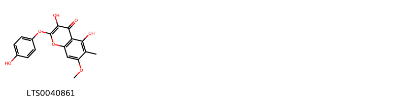{ width=100% }
    <figcaption>Hình ảnh cấu trúc hóa học của 1 hoạt chất thuộc nhóm Coumarins and derivatives gồm ['3,5-dihydroxy-2-(4-hydroxyphenoxy)-7-methoxy-6-methylchromen-4-one (LTS0040861)'].</figcaption>
</figure>
#### Nhóm Flavonoids
<figure markdown="span">
    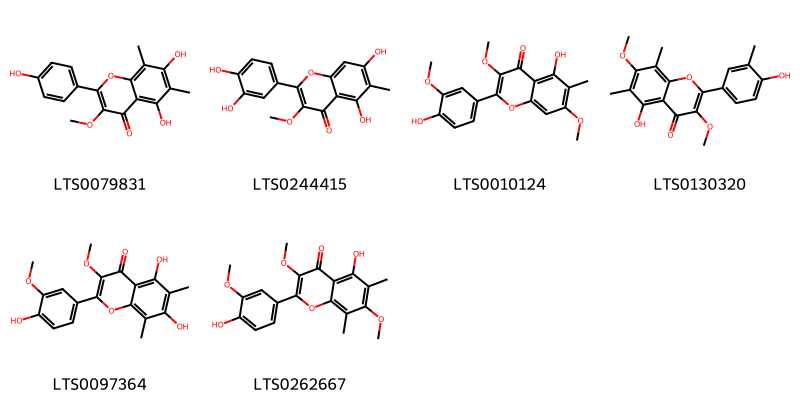{ width=100% }
    <figcaption>Hình ảnh cấu trúc hóa học của 6 hoạt chất thuộc nhóm Flavonoids gồm ['5,7-dihydroxy-2-(4-hydroxyphenyl)-3-methoxy-6,8-dimethylchromen-4-one (LTS0079831)', '2-(3,4-dihydroxyphenyl)-5,7-dihydroxy-3-methoxy-6-methylchromen-4-one (LTS0244415)', '5-hydroxy-2-(4-hydroxy-3-methoxyphenyl)-3,7-dimethoxy-6-methylchromen-4-one (LTS0010124)', '5-hydroxy-2-(4-hydroxy-3-methylphenyl)-3,7-dimethoxy-6,8-dimethylchromen-4-one (LTS0130320)', '5,7-dihydroxy-2-(4-hydroxy-3-methoxyphenyl)-3-methoxy-6,8-dimethylchromen-4-one (LTS0097364)', '5-hydroxy-2-(4-hydroxy-3-methoxyphenyl)-3,7-dimethoxy-6,8-dimethylchromen-4-one (LTS0262667)'].</figcaption>
</figure>

---

### Dược dân tộc học

Danh sách các quốc gia có sử dụng *Piliostigma reticulatum* trong điều trị các bệnh. 

| Country   | Disease   | Bệnh                                                                                                                                                                                                |
|:----------|:----------|:----------------------------------------------------------------------------------------------------------------------------------------------------------------------------------------------------|
| Elsewhere | Soap      | MYMEMORY WARNING: YOU USED ALL AVAILABLE FREE TRANSLATIONS FOR TODAY. NEXT AVAILABLE IN  14 HOURS 07 MINUTES 06 SECONDS VISIT HTTPS://MYMEMORY.TRANSLATED.NET/DOC/USAGELIMITS.PHP TO TRANSLATE MORE |

---

---
## Bauhinia thonningii
### Thông tin về thực vật

!!! info "Phân loại thực vật của *Piliostigma thonningii* từ GIBF:"
    - **Kingdom:** Plantae
    - **Phylum:** Tracheophyta
    - **Order:** Fabales
    - **Family:** Fabaceae
    - **Genus:** Piliostigma
    - **Species:** *Piliostigma thonningii*

 

| Label (VI)   | Label (EN)   | Scientific Name     | Descriptions (VI)   | Descriptions (EN)   | Also Known As (VI)   | Also Known As (EN)   |
|:-------------|:-------------|:--------------------|:--------------------|:--------------------|:---------------------|:---------------------|
| N/A          | N/A          | Bauhinia thonningii | loài thực vật       | species of plant    | ['']                 | ['']                 |

#### Phân bố trên thế giới

**Từ CSDL GIBF** Malawi, Zambia, Guinea-Bissau, Nigeria, Gabon, Angola, Côte d’Ivoire, Benin, Tanzania, United Republic of

#### Phân bố tại Việt Nam

**Từ CSDL GIBF**: Không có ghi nhận ở Việt Nam

---
### Thành phần hóa học
        
- Theo cơ sở dữ liệu lotus: Từ loài *Piliostigma thonningii* đã phân lập và xác định được 18 hoạt chất thuộc về các nhóm Flavonoids, Prenol lipids, Benzofurans, Coumarins and derivatives. 

|    | chemicalTaxonomyClassyfireClass   |   smiles_count |
|---:|:----------------------------------|---------------:|
|  0 |                                   |              1 |
|  1 | Benzofurans                       |              2 |
|  2 | Coumarins and derivatives         |              1 |
|  3 | Flavonoids                        |             11 |
|  4 | Prenol lipids                     |              2 |

#### Nhóm 
<figure markdown="span">
    { width=100% }
    <figcaption>Hình ảnh cấu trúc hóa học của 1 hoạt chất thuộc nhóm  gồm ['latifoline (LTS0161627)'].</figcaption>
</figure>
#### Nhóm Benzofurans
<figure markdown="span">
    { width=100% }
    <figcaption>Hình ảnh cấu trúc hóa học của 2 hoạt chất thuộc nhóm Benzofurans gồm ['6,7-dihydroxy-7,7a-dihydro-6h-1-benzofuran-2-one (LTS0274693)', '(6r,7s,7as)-6,7-dihydroxy-7,7a-dihydro-6h-1-benzofuran-2-one (LTS0010819)'].</figcaption>
</figure>
#### Nhóm Coumarins and derivatives
<figure markdown="span">
    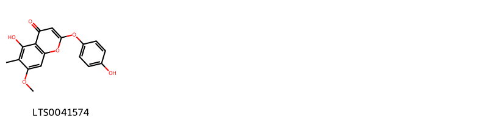{ width=100% }
    <figcaption>Hình ảnh cấu trúc hóa học của 1 hoạt chất thuộc nhóm Coumarins and derivatives gồm ['5-hydroxy-2-(4-hydroxyphenoxy)-7-methoxy-6-methylchromen-4-one (LTS0041574)'].</figcaption>
</figure>
#### Nhóm Flavonoids
<figure markdown="span">
    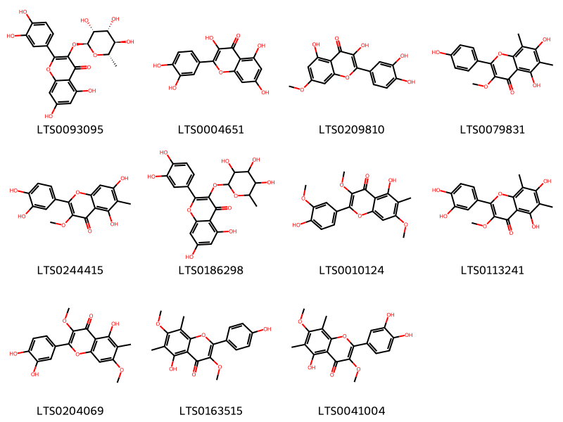{ width=100% }
    <figcaption>Hình ảnh cấu trúc hóa học của 11 hoạt chất thuộc nhóm Flavonoids gồm ['quercitrin (LTS0093095)', 'quercetin (LTS0004651)', 'rhamnetin (LTS0209810)', '5,7-dihydroxy-2-(4-hydroxyphenyl)-3-methoxy-6,8-dimethylchromen-4-one (LTS0079831)', '2-(3,4-dihydroxyphenyl)-5,7-dihydroxy-3-methoxy-6-methylchromen-4-one (LTS0244415)', 'quercitrin (LTS0186298)', '5-hydroxy-2-(4-hydroxy-3-methoxyphenyl)-3,7-dimethoxy-6-methylchromen-4-one (LTS0010124)', '2-(3,4-dihydroxyphenyl)-5,7-dihydroxy-3-methoxy-6,8-dimethylchromen-4-one (LTS0113241)', '2-(3,4-dihydroxyphenyl)-5-hydroxy-3,7-dimethoxy-6-methylchromen-4-one (LTS0204069)', '5-hydroxy-2-(4-hydroxyphenyl)-3,7-dimethoxy-6,8-dimethylchromen-4-one (LTS0163515)', '2-(3,4-dihydroxyphenyl)-5-hydroxy-3,7-dimethoxy-6,8-dimethylchromen-4-one (LTS0041004)'].</figcaption>
</figure>
#### Nhóm Prenol lipids
<figure markdown="span">
    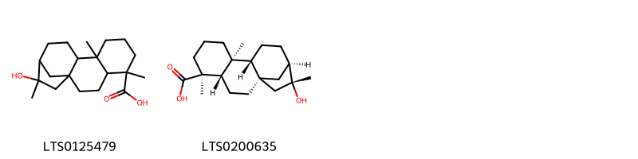{ width=100% }
    <figcaption>Hình ảnh cấu trúc hóa học của 2 hoạt chất thuộc nhóm Prenol lipids gồm ['14-hydroxy-5,9,14-trimethyltetracyclo[11.2.1.0¹,¹⁰.0⁴,⁹]hexadecane-5-carboxylic acid (LTS0125479)', '(1s,4s,5s,9s,10r,13r,14r)-14-hydroxy-5,9,14-trimethyltetracyclo[11.2.1.0¹,¹⁰.0⁴,⁹]hexadecane-5-carboxylic acid (LTS0200635)'].</figcaption>
</figure>

---

### Dược dân tộc học

Danh sách các quốc gia có sử dụng *Piliostigma thonningii* trong điều trị các bệnh. 

| Country   | Disease   | Bệnh                                                                                                                                                                                                |
|:----------|:----------|:----------------------------------------------------------------------------------------------------------------------------------------------------------------------------------------------------|
| Elsewhere | nan, Soap | MYMEMORY WARNING: YOU USED ALL AVAILABLE FREE TRANSLATIONS FOR TODAY. NEXT AVAILABLE IN  14 HOURS 06 MINUTES 39 SECONDS VISIT HTTPS://MYMEMORY.TRANSLATED.NET/DOC/USAGELIMITS.PHP TO TRANSLATE MORE |

---

---
## Bauhinia ungulata
### Thông tin về thực vật

!!! info "Phân loại thực vật của *Bauhinia ungulata* từ GIBF:"
    - **Kingdom:** Plantae
    - **Phylum:** Tracheophyta
    - **Order:** Fabales
    - **Family:** Fabaceae
    - **Genus:** Bauhinia
    - **Species:** *Bauhinia ungulata*

 

| Label (VI)   | Label (EN)   | Scientific Name   | Descriptions (VI)   | Descriptions (EN)   | Also Known As (VI)   | Also Known As (EN)   |
|:-------------|:-------------|:------------------|:--------------------|:--------------------|:---------------------|:---------------------|
| N/A          | N/A          | Bauhinia ungulata | loài thực vật       | species of plant    | ['']                 | ['']                 |

#### Phân bố trên thế giới

**Từ CSDL GIBF** Nicaragua, Colombia, Brazil, Bolivia (Plurinational State of), Costa Rica, Mexico, El Salvador

#### Phân bố tại Việt Nam

**Từ CSDL GIBF**: Không có ghi nhận ở Việt Nam

---
### Thành phần hóa học
        
- Theo cơ sở dữ liệu lotus: Từ loài *Bauhinia ungulata* đã phân lập và xác định được Chưa có hoạt chất nào được phân lập. hoạt chất thuộc về các nhóm Không có hoạt chất nào được phân lập. 

Không có hình ảnh nào được tạo ra

---

### Dược dân tộc học

Danh sách các quốc gia có sử dụng *Bauhinia ungulata* trong điều trị các bệnh. 

| Country   | Disease                                    | Bệnh                                                                                                                                                                                                |
|:----------|:-------------------------------------------|:----------------------------------------------------------------------------------------------------------------------------------------------------------------------------------------------------|
| Mexico    | Purgative, Sudorific, Sudorific, Vermifuge | MYMEMORY WARNING: YOU USED ALL AVAILABLE FREE TRANSLATIONS FOR TODAY. NEXT AVAILABLE IN  14 HOURS 06 MINUTES 01 SECONDS VISIT HTTPS://MYMEMORY.TRANSLATED.NET/DOC/USAGELIMITS.PHP TO TRANSLATE MORE |

---

---
## Bauhinia variegata
### Thông tin về thực vật

!!! info "Phân loại thực vật của *Bauhinia variegata* từ GIBF:"
    - **Kingdom:** Plantae
    - **Phylum:** Tracheophyta
    - **Order:** Fabales
    - **Family:** Fabaceae
    - **Genus:** Bauhinia
    - **Species:** *Bauhinia variegata*

 

| Label (VI)   | Label (EN)   | Scientific Name    | Descriptions (VI)   | Descriptions (EN)   | Also Known As (VI)     | Also Known As (EN)                   |
|:-------------|:-------------|:-------------------|:--------------------|:--------------------|:-----------------------|:-------------------------------------|
| N/A          | N/A          | Bauhinia variegata | loài thực vật       | species of plant    | ['Bauhinia variegata'] | ["camel's foot tree", 'orchid tree'] |

#### Phân bố trên thế giới

**Từ CSDL GIBF** Sri Lanka, Australia, Lao People’s Democratic Republic, Guatemala, Myanmar, Tanzania, United Republic of, Malawi, Zambia, Cyprus, Chinese Taipei, Spain, Bolivia (Plurinational State of), Türkiye, Portugal, Honduras, Jamaica, Morocco, United States of America, Congo, Democratic Republic of the, Zimbabwe, Greece, South Africa, Hong Kong, Thailand, Iran (Islamic Republic of), Brazil, Egypt, Bahamas, Bhutan, New Caledonia, Mexico, Dominican Republic, Viet Nam, China, Madagascar, Colombia, Macao, Costa Rica, India, Indonesia, Kenya, Ethiopia

#### Phân bố tại Việt Nam

**Từ CSDL GIBF**: Ninh Bình

---
### Thành phần hóa học
        
- Theo cơ sở dữ liệu lotus: Từ loài *Bauhinia variegata* đã phân lập và xác định được 13 hoạt chất thuộc về các nhóm Flavonoids, Benzoxepines. 

|    | chemicalTaxonomyClassyfireClass   |   smiles_count |
|---:|:----------------------------------|---------------:|
|  0 | Benzoxepines                      |              1 |
|  1 | Flavonoids                        |             12 |

#### Nhóm Benzoxepines
<figure markdown="span">
    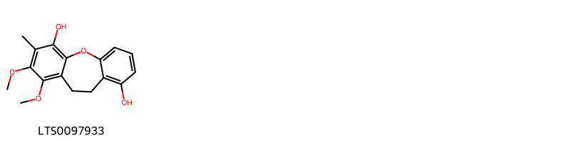{ width=100% }
    <figcaption>Hình ảnh cấu trúc hóa học của 1 hoạt chất thuộc nhóm Benzoxepines gồm ['6,7-dimethoxy-5-methyl-2-oxatricyclo[9.4.0.0³,⁸]pentadeca-1(15),3,5,7,11,13-hexaene-4,12-diol (LTS0097933)'].</figcaption>
</figure>
#### Nhóm Flavonoids
<figure markdown="span">
    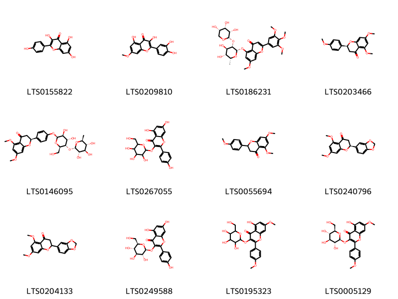{ width=100% }
    <figcaption>Hình ảnh cấu trúc hóa học của 12 hoạt chất thuộc nhóm Flavonoids gồm ['kaempherol (LTS0155822)', 'rhamnetin (LTS0209810)', '5-{[(2s,3s,4r,5r,6r)-4,5-dihydroxy-6-methyl-3-{[(2s,3s,4s,5s)-3,4,5-trihydroxyoxan-2-yl]oxy}oxan-2-yl]oxy}-7-methoxy-2-(3,4,5-trimethoxyphenyl)chromen-4-one (LTS0186231)', '(2s)-5,7-dimethoxy-2-(4-methoxyphenyl)-2,3-dihydro-1-benzopyran-4-one (LTS0203466)', '(2s)-2-(4-{[(2s,3s,4s,5s,6r)-3,4-dihydroxy-6-(hydroxymethyl)-5-{[(2s,3s,4r,5r,6s)-3,4,5-trihydroxy-6-methyloxan-2-yl]oxy}oxan-2-yl]oxy}phenyl)-5,7-dimethoxy-2,3-dihydro-1-benzopyran-4-one (LTS0146095)', 'trifolin (LTS0267055)', 'naringenin trimethyl ether (LTS0055694)', '(2s)-2-(2h-1,3-benzodioxol-5-yl)-5,7-dimethoxy-2,3-dihydro-1-benzopyran-4-one (LTS0240796)', '2-(2h-1,3-benzodioxol-5-yl)-5,7-dimethoxy-2,3-dihydro-1-benzopyran-4-one (LTS0204133)', 'astragalin (LTS0249588)', '5-hydroxy-7-methoxy-2-(4-methoxyphenyl)-3-{[3,4,5-trihydroxy-6-(hydroxymethyl)oxan-2-yl]oxy}chromen-4-one (LTS0195323)', '5-hydroxy-7-methoxy-2-(4-methoxyphenyl)-3-{[(2s,3r,4s,5s,6r)-3,4,5-trihydroxy-6-(hydroxymethyl)oxan-2-yl]oxy}chromen-4-one (LTS0005129)'].</figcaption>
</figure>

---

### Dược dân tộc học

Danh sách các quốc gia có sử dụng *Bauhinia variegata* trong điều trị các bệnh. 

| Country   | Disease                              | Bệnh                                                                                                                                                                                                |
|:----------|:-------------------------------------|:----------------------------------------------------------------------------------------------------------------------------------------------------------------------------------------------------|
| Elsewhere | Astringent, Astringent, Tonic, Tonic | MYMEMORY WARNING: YOU USED ALL AVAILABLE FREE TRANSLATIONS FOR TODAY. NEXT AVAILABLE IN  14 HOURS 05 MINUTES 38 SECONDS VISIT HTTPS://MYMEMORY.TRANSLATED.NET/DOC/USAGELIMITS.PHP TO TRANSLATE MORE |
| Iraq      | Tonic, Astringent                    | MYMEMORY WARNING: YOU USED ALL AVAILABLE FREE TRANSLATIONS FOR TODAY. NEXT AVAILABLE IN  14 HOURS 05 MINUTES 35 SECONDS VISIT HTTPS://MYMEMORY.TRANSLATED.NET/DOC/USAGELIMITS.PHP TO TRANSLATE MORE |

---

# Chi Calpurnia

??? note "Danh sách các dược liệu thuộc chi"
    
	 - *Calpurnia aurea*

---
## Calpurnia aurea
### Thông tin về thực vật

!!! info "Phân loại thực vật của *Calpurnia aurea* từ GIBF:"
    - **Kingdom:** Plantae
    - **Phylum:** Tracheophyta
    - **Order:** Fabales
    - **Family:** Fabaceae
    - **Genus:** Calpurnia
    - **Species:** *Calpurnia aurea*

 

| Label (VI)   | Label (EN)   | Scientific Name   | Descriptions (VI)   | Descriptions (EN)   | Also Known As (VI)   | Also Known As (EN)   |
|:-------------|:-------------|:------------------|:--------------------|:--------------------|:---------------------|:---------------------|
| N/A          | N/A          | Calpurnia aurea   | loài thực vật       | species of plant    | ['']                 | ['']                 |

#### Phân bố trên thế giới

**Từ CSDL GIBF** nan, South Africa, Uganda, Belgium, Angola, Brazil, Somalia, Mozambique, Portugal, India, unknown or invalid, United States of America, Tanzania, United Republic of, Kenya, Zimbabwe, Eswatini, New Zealand, Ethiopia

#### Phân bố tại Việt Nam

**Từ CSDL GIBF**: Không có ghi nhận ở Việt Nam

---
### Thành phần hóa học
        
- Theo cơ sở dữ liệu lotus: Từ loài *Calpurnia aurea* đã phân lập và xác định được 41 hoạt chất thuộc về các nhóm Quinolizidines, Piperazinopiperidines, Lupin alkaloids. 

|    | chemicalTaxonomyClassyfireClass   |   smiles_count |
|---:|:----------------------------------|---------------:|
|  0 | Lupin alkaloids                   |             30 |
|  1 | Piperazinopiperidines             |              1 |
|  2 | Quinolizidines                    |              2 |

#### Nhóm Lupin alkaloids
<figure markdown="span">
    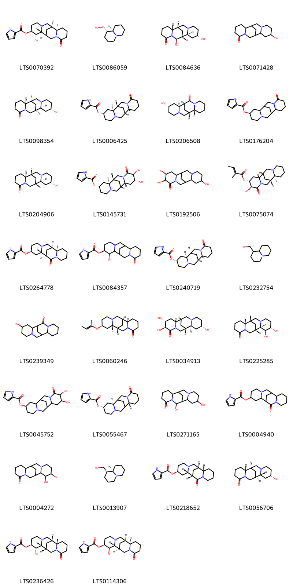{ width=100% }
    <figcaption>Hình ảnh cấu trúc hóa học của 30 hoạt chất thuộc nhóm Lupin alkaloids gồm ['(1s,2r,3s,4s,9s,10r)-3-hydroxy-14-oxo-7,15-diazatetracyclo[7.7.1.0²,⁷.0¹⁰,¹⁵]heptadecan-4-yl 1h-pyrrole-2-carboxylate (LTS0070392)', '(1s,9ar)-octahydro-1h-quinolizin-1-ylmethanol (LTS0086059)', '(1s,2r,8r,9r,10s,12s)-8,12-dihydroxy-7,15-diazatetracyclo[7.7.1.0²,⁷.0¹⁰,¹⁵]heptadecan-6-one (LTS0084636)', '12-hydroxy-7,15-diazatetracyclo[7.7.1.0²,⁷.0¹⁰,¹⁵]heptadecan-6-one (LTS0071428)', '(1r,2r,9r,10s,12s)-12-hydroxy-7,15-diazatetracyclo[7.7.1.0²,⁷.0¹⁰,¹⁵]heptadecan-6-one (LTS0098354)', 'oroboidine (LTS0006425)', '(1s,2r,9r,10s,12s)-12-hydroxy-7,15-diazatetracyclo[7.7.1.0²,⁷.0¹⁰,¹⁵]heptadecan-8-one (LTS0206508)', '14-oxo-7,15-diazatetracyclo[7.7.1.0²,⁷.0¹⁰,¹⁵]heptadecan-4-yl 1h-pyrrole-2-carboxylate (LTS0176204)', 'hydroxylupanine (LTS0204906)', '(1s,2s,4s,9s,10r,12r,13s)-12,13-dihydroxy-14-oxo-7,15-diazatetracyclo[7.7.1.0²,⁷.0¹⁰,¹⁵]heptadecan-4-yl 1h-pyrrole-2-carboxylate (LTS0145731)', '4,5,12-trihydroxy-7,15-diazatetracyclo[7.7.1.0²,⁷.0¹⁰,¹⁵]heptadecan-6-one (LTS0192506)', '(1s,2r,4r,5s,9s,10s)-5-hydroxy-6-oxo-7,15-diazatetracyclo[7.7.1.0²,⁷.0¹⁰,¹⁵]heptadecan-4-yl (2e)-2-methylbut-2-enoate (LTS0075074)', '(1r,2s,4s,9s,10r)-16-oxo-7,15-diazatetracyclo[7.7.1.0²,⁷.0¹⁰,¹⁵]heptadecan-4-yl 1h-pyrrole-2-carboxylate (LTS0264778)', '3-hydroxy-14-oxo-7,15-diazatetracyclo[7.7.1.0²,⁷.0¹⁰,¹⁵]heptadecan-4-yl 1h-pyrrole-2-carboxylate (LTS0084357)', '(1r,2s,4s,9r,10r)-14-oxo-7,15-diazatetracyclo[7.7.1.0²,⁷.0¹⁰,¹⁵]heptadecan-4-yl 1h-pyrrole-2-carboxylate (LTS0240719)', 'lupinine (LTS0232754)', '12-hydroxy-7,15-diazatetracyclo[7.7.1.0²,⁷.0¹⁰,¹⁵]heptadecan-8-one (LTS0239349)', '(1s,2r,9r,10s,12s)-12-[(2e)-but-2-en-2-yloxy]-7,15-diazatetracyclo[7.7.1.0²,⁷.0¹⁰,¹⁵]heptadecan-6-one (LTS0060246)', '(1s,2r,4r,5s,9s,10s,12s)-4,5,12-trihydroxy-7,15-diazatetracyclo[7.7.1.0²,⁷.0¹⁰,¹⁵]heptadecan-6-one (LTS0034913)', '(1s,2r,9s,10r,11s,12s)-11,12-dihydroxy-7,15-diazatetracyclo[7.7.1.0²,⁷.0¹⁰,¹⁵]heptadecan-6-one (LTS0225285)', '12,13-dihydroxy-14-oxo-7,15-diazatetracyclo[7.7.1.0²,⁷.0¹⁰,¹⁵]heptadecan-4-yl 1h-pyrrole-2-carboxylate (LTS0045752)', 'calpurnine (LTS0055467)', '8,12-dihydroxy-7,15-diazatetracyclo[7.7.1.0²,⁷.0¹⁰,¹⁵]heptadecan-6-one (LTS0271165)', '16-oxo-7,15-diazatetracyclo[7.7.1.0²,⁷.0¹⁰,¹⁵]heptadecan-4-yl 1h-pyrrole-2-carboxylate (LTS0004940)', '11,12-dihydroxy-7,15-diazatetracyclo[7.7.1.0²,⁷.0¹⁰,¹⁵]heptadecan-6-one (LTS0004272)', '(-)-lupinine (LTS0013907)', '(1s,2s,4s,9r,10s)-16-oxo-7,15-diazatetracyclo[7.7.1.0²,⁷.0¹⁰,¹⁵]heptadecan-4-yl 1h-pyrrole-2-carboxylate (LTS0218652)', '13-hydroxylupanine (LTS0056706)', '(1r,2r,3s,4s,9r,10s)-3-hydroxy-14-oxo-7,15-diazatetracyclo[7.7.1.0²,⁷.0¹⁰,¹⁵]heptadecan-4-yl 1h-pyrrole-2-carboxylate (LTS0236426)', '(1s,2r,4s,9s,10r)-3-hydroxy-14-oxo-7,15-diazatetracyclo[7.7.1.0²,⁷.0¹⁰,¹⁵]heptadecan-4-yl 1h-pyrrole-2-carboxylate (LTS0114306)'].</figcaption>
</figure>
#### Nhóm Piperazinopiperidines
<figure markdown="span">
    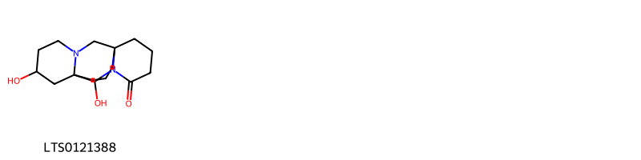{ width=100% }
    <figcaption>Hình ảnh cấu trúc hóa học của 1 hoạt chất thuộc nhóm Piperazinopiperidines gồm ['2,13-dihydroxy-3,10-diazatetracyclo[6.6.3.0¹,¹⁰.0³,⁸]heptadecan-4-one (LTS0121388)'].</figcaption>
</figure>
#### Nhóm Quinolizidines
<figure markdown="span">
    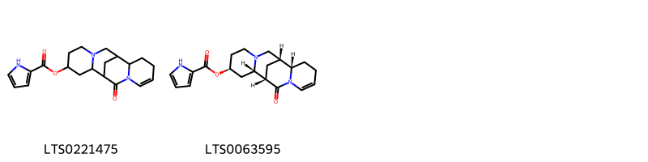{ width=100% }
    <figcaption>Hình ảnh cấu trúc hóa học của 2 hoạt chất thuộc nhóm Quinolizidines gồm ['16-oxo-7,15-diazatetracyclo[7.7.1.0²,⁷.0¹⁰,¹⁵]heptadec-13-en-4-yl 1h-pyrrole-2-carboxylate (LTS0221475)', '(1s,2s,4s,9r,10s)-16-oxo-7,15-diazatetracyclo[7.7.1.0²,⁷.0¹⁰,¹⁵]heptadec-13-en-4-yl 1h-pyrrole-2-carboxylate (LTS0063595)'].</figcaption>
</figure>

---

### Dược dân tộc học

Danh sách các quốc gia có sử dụng *Calpurnia aurea* trong điều trị các bệnh. 

| Country   | Disease      | Bệnh                                                                                                                                                                                                |
|:----------|:-------------|:----------------------------------------------------------------------------------------------------------------------------------------------------------------------------------------------------|
| Ethiopia  | Pediculicide | MYMEMORY WARNING: YOU USED ALL AVAILABLE FREE TRANSLATIONS FOR TODAY. NEXT AVAILABLE IN  14 HOURS 05 MINUTES 03 SECONDS VISIT HTTPS://MYMEMORY.TRANSLATED.NET/DOC/USAGELIMITS.PHP TO TRANSLATE MORE |

---

# Chi Glycine

??? note "Danh sách các dược liệu thuộc chi"
    
	 - *Glycine max*

---
## Glycine max
### Thông tin về thực vật

!!! info "Phân loại thực vật của *Glycine max* từ GIBF:"
    - **Kingdom:** Plantae
    - **Phylum:** Tracheophyta
    - **Order:** Fabales
    - **Family:** Fabaceae
    - **Genus:** Glycine
    - **Species:** *Glycine max*

 

| Label (VI)   | Label (EN)   | Scientific Name   | Descriptions (VI)   | Descriptions (EN)                       | Also Known As (VI)   | Also Known As (EN)                                                                             |
|:-------------|:-------------|:------------------|:--------------------|:----------------------------------------|:---------------------|:-----------------------------------------------------------------------------------------------|
| N/A          | N/A          | Glycine max       | loài thực vật       | species of plant in the Fabaceae family | ['Glycine max']      | ['soybeans', 'soy', 'soya', 'soy bean plant', 'soy plant', 'soya bean plant', 'soybean plant'] |

#### Phân bố trên thế giới

**Từ CSDL GIBF** nan, Italy, Australia, Japan, Belgium, Slovakia, Argentina, Benin, Canada, Ukraine, Netherlands, Belarus, Korea, Republic of, Chinese Taipei, Hungary, Russian Federation, Bangladesh, United States of America, Uruguay, Guinea, Croatia, El Salvador, Czechia, Germany, Switzerland, Austria, France, China, India, Poland

#### Phân bố tại Việt Nam

**Từ CSDL GIBF**: Không có ghi nhận ở Việt Nam

---
### Thành phần hóa học
        
- Theo cơ sở dữ liệu lotus: Từ loài *Glycine max* đã phân lập và xác định được 344 hoạt chất thuộc về các nhóm Harmala alkaloids, Diarylheptanoids, Azoles, Pyrimidine nucleotides, Phenols, Carboxylic acids and derivatives, Benzodiazepines, Fatty Acyls, Indoles and derivatives, Cinnamic acids and derivatives, Glycerophospholipids, Diazanaphthalenes, Saccharolipids, Tetrapyrroles and derivatives, Glycerolipids, Prenol lipids, Linear 1,3-diarylpropanoids, Azolidines, Sphingolipids, Benzene and substituted derivatives, Organooxygen compounds, Pyridines and derivatives, Flavonoids, Steroids and steroid derivatives, Isoflavonoids, Peptidomimetics, Organonitrogen compounds, Imidazopyrimidines. 

|    | chemicalTaxonomyClassyfireClass     |   smiles_count |
|---:|:------------------------------------|---------------:|
|  0 |                                     |              1 |
|  1 | Azoles                              |              1 |
|  2 | Azolidines                          |              1 |
|  3 | Benzene and substituted derivatives |              9 |
|  4 | Benzodiazepines                     |              2 |
|  5 | Carboxylic acids and derivatives    |             43 |
|  6 | Cinnamic acids and derivatives      |              8 |
|  7 | Diarylheptanoids                    |              1 |
|  8 | Diazanaphthalenes                   |              1 |
|  9 | Fatty Acyls                         |             28 |
| 10 | Flavonoids                          |             43 |
| 11 | Glycerolipids                       |              2 |
| 12 | Glycerophospholipids                |              1 |
| 13 | Harmala alkaloids                   |              1 |
| 14 | Imidazopyrimidines                  |              1 |
| 15 | Indoles and derivatives             |              2 |
| 16 | Isoflavonoids                       |             51 |
| 17 | Linear 1,3-diarylpropanoids         |              1 |
| 18 | Organonitrogen compounds            |              8 |
| 19 | Organooxygen compounds              |             33 |
| 20 | Peptidomimetics                     |              1 |
| 21 | Phenols                             |              1 |
| 22 | Prenol lipids                       |             77 |
| 23 | Pyridines and derivatives           |              1 |
| 24 | Pyrimidine nucleotides              |              3 |
| 25 | Saccharolipids                      |              1 |
| 26 | Sphingolipids                       |              1 |
| 27 | Steroids and steroid derivatives    |             16 |
| 28 | Tetrapyrroles and derivatives       |              1 |

#### Nhóm 
<figure markdown="span">
    { width=100% }
    <figcaption>Hình ảnh cấu trúc hóa học của 1 hoạt chất thuộc nhóm  gồm ['trigonelline (LTS0040106)'].</figcaption>
</figure>
#### Nhóm Azoles
<figure markdown="span">
    { width=100% }
    <figcaption>Hình ảnh cấu trúc hóa học của 1 hoạt chất thuộc nhóm Azoles gồm ['allantoin (LTS0106609)'].</figcaption>
</figure>
#### Nhóm Azolidines
<figure markdown="span">
    { width=100% }
    <figcaption>Hình ảnh cấu trúc hóa học của 1 hoạt chất thuộc nhóm Azolidines gồm ['n-[(4s)-2,5-dihydroxy-4h-imidazol-4-yl]carbamimidic acid (LTS0174328)'].</figcaption>
</figure>
#### Nhóm Benzene and substituted derivatives
<figure markdown="span">
    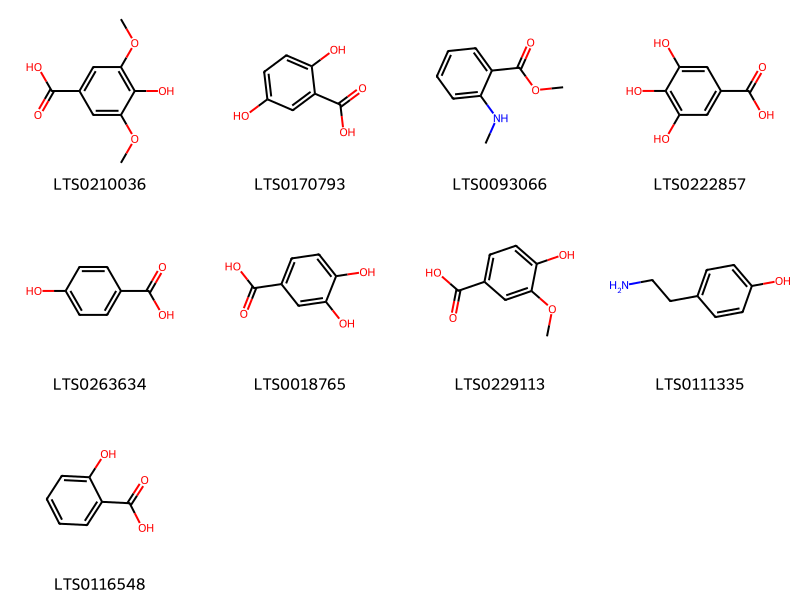{ width=100% }
    <figcaption>Hình ảnh cấu trúc hóa học của 9 hoạt chất thuộc nhóm Benzene and substituted derivatives gồm ['syringic acid (LTS0210036)', '2,5-dihydroxybenzoic acid (LTS0170793)', 'dimethyl anthranilate (LTS0093066)', 'galop (LTS0222857)', 'p-hydroxybenzoic acid (LTS0263634)', '3,4-dihydroxybenzoic acid (LTS0018765)', 'vanillic acid (LTS0229113)', 'tyramine (LTS0111335)', 'salicyclic acid (LTS0116548)'].</figcaption>
</figure>
#### Nhóm Benzodiazepines
<figure markdown="span">
    { width=100% }
    <figcaption>Hình ảnh cấu trúc hóa học của 2 hoạt chất thuộc nhóm Benzodiazepines gồm ['diazepam (LTS0079460)', 'lomax (LTS0185942)'].</figcaption>
</figure>
#### Nhóm Carboxylic acids and derivatives
<figure markdown="span">
    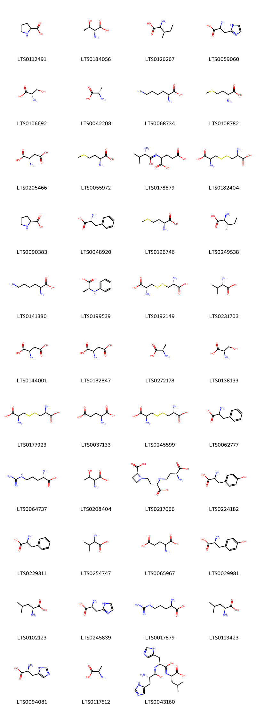{ width=100% }
    <figcaption>Hình ảnh cấu trúc hóa học của 43 hoạt chất thuộc nhóm Carboxylic acids and derivatives gồm ['proline (LTS0112491)', 'l-threonine (LTS0184056)', 'lisoleucine (LTS0126267)', '2-amino-3-(1h-imidazol-2-yl)propanoic acid (LTS0059060)', 'l-serine (LTS0106692)', 'l-alanine (LTS0042208)', 'l-lysine (LTS0068734)', 'd-methionine (LTS0108782)', 'l-aspartic acid (LTS0205466)', 'methionin (LTS0055972)', '(2s)-2-{[(2s)-2-amino-1-hydroxy-3-methylbutylidene]amino}pentanedioic acid (LTS0178879)', 'cystine (LTS0182404)', 'l-proline (LTS0090383)', 'd-phenylalanine (LTS0048920)', 'l-methionine (LTS0196746)', 'l-isoleucine (LTS0249538)', 'lysine (LTS0141380)', '(2s)-2-(phenylamino)propanoic acid (LTS0199539)', 'l-cystine (LTS0192149)', 'l-valine (LTS0231703)', 'd-aspartic acid (LTS0144001)', 'aspartic acid (LTS0182847)', 'd-alanine (LTS0272178)', 'serin (LTS0138133)', 'd-cystine (LTS0177923)', 'l-glutamic acid (LTS0037133)', '(2s)-2-amino-3-{[(2r)-2-amino-2-carboxyethyl]disulfanyl}propanoic acid (LTS0245599)', 'phenylalanin (LTS0062777)', 'l-arginine (LTS0064737)', 'threonine(l) (LTS0208404)', 'nicotianamine (LTS0217066)', 'tyrosin (LTS0224182)', 'l-phenylalanine (LTS0229311)', 'valin (LTS0254747)', 'glutaminsaeure (LTS0065967)', 'l-tyrosine (LTS0029981)', 'leucine (LTS0102123)', '(2s)-2-amino-3-(1h-imidazol-2-yl)propanoic acid (LTS0245839)', 'arginine (LTS0017879)', 'l-leucine (LTS0113423)', 'l-histidine (LTS0094081)', 'alanine (LTS0117512)', '(2s)-2-{[(2s)-2-{[(2s)-2-amino-1-hydroxy-3-(3h-imidazol-4-yl)propylidene]amino}-1-hydroxy-3-(3h-imidazol-4-yl)propylidene]amino}-4-methylpentanoic acid (LTS0043160)'].</figcaption>
</figure>
#### Nhóm Cinnamic acids and derivatives
<figure markdown="span">
    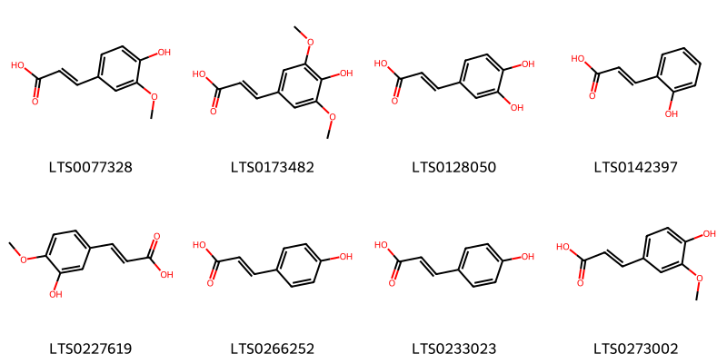{ width=100% }
    <figcaption>Hình ảnh cấu trúc hóa học của 8 hoạt chất thuộc nhóm Cinnamic acids and derivatives gồm ['ferulic acid (LTS0077328)', 'sinapinate (LTS0173482)', '3,4-dihydroxycinnamic acid (LTS0128050)', 'trans-2-hydroxycinnamic acid (LTS0142397)', 'isoferulic acid (LTS0227619)', 'para-coumaric acid (LTS0266252)', 'hydroxycinnamic acid (LTS0233023)', 'ferulic acid (LTS0273002)'].</figcaption>
</figure>
#### Nhóm Diarylheptanoids
<figure markdown="span">
    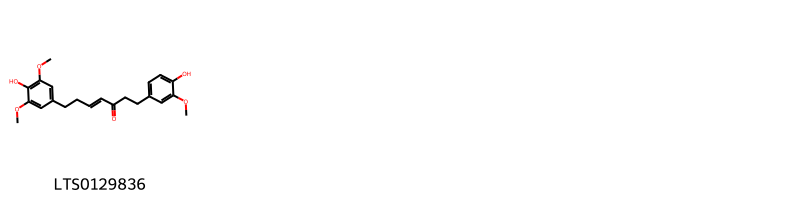{ width=100% }
    <figcaption>Hình ảnh cấu trúc hóa học của 1 hoạt chất thuộc nhóm Diarylheptanoids gồm ['(4e)-7-(4-hydroxy-3,5-dimethoxyphenyl)-1-(4-hydroxy-3-methoxyphenyl)hept-4-en-3-one (LTS0129836)'].</figcaption>
</figure>
#### Nhóm Diazanaphthalenes
<figure markdown="span">
    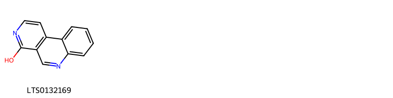{ width=100% }
    <figcaption>Hình ảnh cấu trúc hóa học của 1 hoạt chất thuộc nhóm Diazanaphthalenes gồm ['benzo[c]2,7-naphthyridin-4-ol (LTS0132169)'].</figcaption>
</figure>
#### Nhóm Fatty Acyls
<figure markdown="span">
    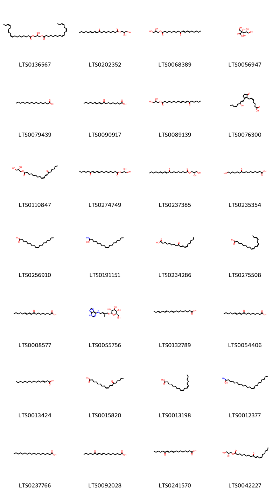{ width=100% }
    <figcaption>Hình ảnh cấu trúc hóa học của 28 hoạt chất thuộc nhóm Fatty Acyls gồm ['1,3-dilinolenoylglycerol (LTS0136567)', '2,3-dihydroxypropyl (10e)-9-oxooctadeca-10,12-dienoate (LTS0202352)', '2,3-dihydroxypropyl 9-oxooctadeca-10,12-dienoate (LTS0068389)', '2-carboxy-d-arabinitol (LTS0056947)', 'palmitic acid (LTS0079439)', '(10e,12e)-9-oxooctadeca-10,12-dienoic acid (LTS0090917)', '2,3-dihydroxypropyl 13-oxooctadeca-9,11-dienoate (LTS0089139)', 'prostaglandin b3 (LTS0076300)', '(2r)-2,3-dihydroxypropyl (9z,11e)-13-oxooctadeca-9,11-dienoate (LTS0110847)', '(2r)-2,3-dihydroxypropyl (9e,11e)-13-oxooctadeca-9,11-dienoate (LTS0274749)', '(2r)-2,3-dihydroxypropyl (10e,12e)-9-oxooctadeca-10,12-dienoate (LTS0237385)', '16-hydroxy-10-oxohexadecanoic acid (LTS0235354)', 'oleic acid (LTS0256910)', '(9z)-octadec-9-enimidic acid (LTS0191151)', '9-oxoode (LTS0234286)', 'α-linolenic acid (LTS0275508)', '(10e)-9-oxooctadeca-10,12-dienoic acid (LTS0008577)', '(2r,3s,4s,5r,6s)-2-(hydroxymethyl)-6-{[(2e)-2-methyl-4-(3h-purin-6-ylamino)but-2-en-1-yl]oxy}oxane-3,4,5-triol (LTS0055756)', 'α linolenic acid (LTS0132789)', '9-oxooctadeca-10,12-dienoic acid (LTS0054406)', '(3e)-hexadec-3-enoic acid (LTS0013424)', '13-oxo-ode (LTS0015820)', 'linoleic (LTS0013198)', '(13z)-docos-13-enimidic acid (LTS0012377)', 'stearic acid (LTS0237766)', '13-oxooctadeca-9,11-dienoic acid (LTS0092028)', '(9e,11e)-13-oxooctadeca-9,11-dienoic acid (LTS0241570)', '(2r)-2,3-dihydroxypropyl (10e,12z)-9-oxooctadeca-10,12-dienoate (LTS0042227)'].</figcaption>
</figure>
#### Nhóm Flavonoids
<figure markdown="span">
    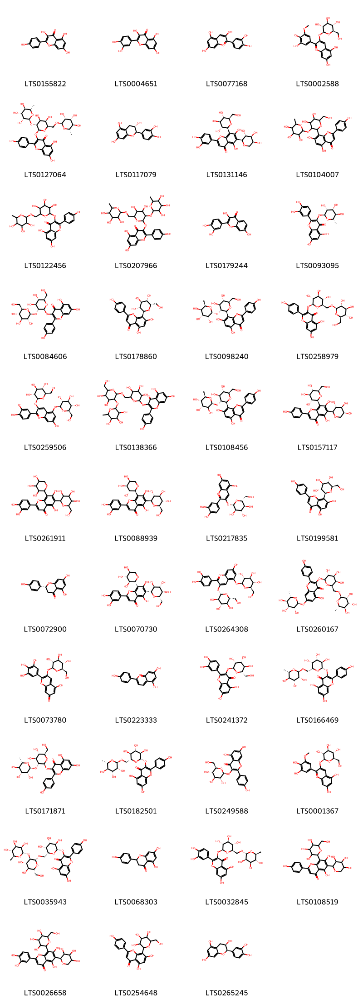{ width=100% }
    <figcaption>Hình ảnh cấu trúc hóa học của 43 hoạt chất thuộc nhóm Flavonoids gồm ['kaempherol (LTS0155822)', 'quercetin (LTS0004651)', 'cyanidin (LTS0077168)', '5,7-dihydroxy-2-(3-hydroxy-5-methoxy-4-oxidophenyl)-3-{[(2s,3r,4s,5s,6r)-3,4,5-trihydroxy-6-(hydroxymethyl)oxan-2-yl]oxy}-1λ⁴-chromen-1-ylium (LTS0002588)', '3-{[(2s,3r,4s,5r,6r)-4,5-dihydroxy-3-{[(2s,3r,4r,5r,6s)-3,4,5-trihydroxy-6-methyloxan-2-yl]oxy}-6-({[(2r,3r,4r,5r,6s)-3,4,5-trihydroxy-6-methyloxan-2-yl]oxy}methyl)oxan-2-yl]oxy}-5,7-dihydroxy-2-(4-hydroxyphenyl)chromen-4-one (LTS0127064)', '(+)-catechol (LTS0117079)', '2-(3,4-dihydroxyphenyl)-5,7-dihydroxy-8-[(2s,3r,4r,5s,6r)-3,4,5-trihydroxy-6-(hydroxymethyl)oxan-2-yl]-6-[(2s,3r,4s,5s)-3,4,5-trihydroxyoxan-2-yl]chromen-4-one (LTS0131146)', '8-[4,5-dihydroxy-6-(hydroxymethyl)-3-[(3,4,5-trihydroxy-6-methyloxan-2-yl)oxy]oxan-2-yl]-5,7-dihydroxy-2-(4-hydroxyphenyl)chromen-4-one (LTS0104007)', '5,7-dihydroxy-2-(4-hydroxyphenyl)-3-[(3,4,5-trihydroxy-6-{[(3,4,5-trihydroxy-6-methyloxan-2-yl)oxy]methyl}oxan-2-yl)oxy]chromen-4-one (LTS0122456)', '3-({4,5-dihydroxy-3-[(3,4,5-trihydroxy-6-methyloxan-2-yl)oxy]-6-{[(3,4,5-trihydroxy-6-methyloxan-2-yl)oxy]methyl}oxan-2-yl}oxy)-5,7-dihydroxy-2-(4-hydroxyphenyl)chromen-4-one (LTS0207966)', "3,7,3',4'-tetrahydroxyflavone (LTS0179244)", 'quercitrin (LTS0093095)', 'kaempferol 3-o-sophoroside (LTS0084606)', '5,7-dihydroxy-2-(4-hydroxyphenyl)-8-[(2s,3r,4r,5s,6s)-3,4,5-trihydroxy-6-(hydroxymethyl)oxan-2-yl]chromen-4-one (LTS0178860)', '8-[(2s,3r,4s,5s,6r)-4,5-dihydroxy-6-(hydroxymethyl)-3-{[(2r,3r,4r,5r,6r)-3,4,5-trihydroxy-6-methyloxan-2-yl]oxy}oxan-2-yl]-5,7-dihydroxy-2-(4-hydroxyphenyl)chromen-4-one (LTS0098240)', '5,7-dihydroxy-2-(4-hydroxyphenyl)-3-{[(2s,3r,4s,5s,6r)-3,4,5-trihydroxy-6-({[(2r,3r,4s,5s,6r)-3,4,5-trihydroxy-6-(hydroxymethyl)oxan-2-yl]oxy}methyl)oxan-2-yl]oxy}chromen-4-one (LTS0258979)', 'cyanin betaine (LTS0259506)', '3-{[6-({[4,5-dihydroxy-6-(hydroxymethyl)-3-[(3,4,5-trihydroxy-6-methyloxan-2-yl)oxy]oxan-2-yl]oxy}methyl)-3,4,5-trihydroxyoxan-2-yl]oxy}-5,7-dihydroxy-2-(4-hydroxyphenyl)chromen-4-one (LTS0138366)', '8-[(2s,3r,4s,5s,6r)-4,5-dihydroxy-6-(hydroxymethyl)-3-{[(2s,3s,4r,5s,6r)-3,4,5-trihydroxy-6-methyloxan-2-yl]oxy}oxan-2-yl]-5,7-dihydroxy-2-(4-hydroxyphenyl)chromen-4-one (LTS0108456)', 'isoschaftoside (LTS0157117)', '2-(3,4-dihydroxyphenyl)-5,7-dihydroxy-6-[3,4,5-trihydroxy-6-(hydroxymethyl)oxan-2-yl]-8-(3,4,5-trihydroxyoxan-2-yl)chromen-4-one (LTS0261911)', 'carlinoside (LTS0088939)', 'cyanidin 3-glucoside (LTS0217835)', 'vitexin (LTS0199581)', '(-)-naringenin (LTS0072900)', '2-(3,4-dihydroxyphenyl)-5,7-dihydroxy-6-[(2r,3s,4s,5r,6s)-3,4,5-trihydroxy-6-(hydroxymethyl)oxan-2-yl]-8-[(2r,3s,4r,5s)-3,4,5-trihydroxyoxan-2-yl]chromen-4-one (LTS0070730)', 'cyanin (LTS0264308)', 'robinin (LTS0260167)', '5-hydroxy-3-{[(2s,3r,4s,5s,6r)-3,4,5-trihydroxy-6-(hydroxymethyl)oxan-2-yl]oxy}-2-(3,4,5-trihydroxyphenyl)chromen-7-one (LTS0073780)', 'apigeninidin (LTS0223333)', '2-(3,4-dihydroxyphenyl)-5,7-dihydroxy-3-{[(2s,3r,4r,5r,6s)-3,4,5-trihydroxy-6-(hydroxymethyl)oxan-2-yl]oxy}chromen-4-one (LTS0241372)', '5,7-dihydroxy-2-(4-hydroxyphenyl)-3-{[(2s,3r,4s,5r,6r)-3,4,5-trihydroxy-6-({[(2r,3r,4r,5r,6s)-3,4,5-trihydroxy-6-methyloxan-2-yl]oxy}methyl)oxan-2-yl]oxy}chromen-4-one (LTS0166469)', '3-{[(2s,3r,4s,5s,6r)-4,5-dihydroxy-6-(hydroxymethyl)-3-{[(2s,3r,4r,5r,6s)-3,4,5-trihydroxy-6-methyloxan-2-yl]oxy}oxan-2-yl]oxy}-5,7-dihydroxy-2-(4-hydroxyphenyl)chromen-4-one (LTS0171871)', 'nictoflorin (LTS0182501)', 'astragalin (LTS0249588)', 'petunidin 3-glucoside (LTS0001367)', '3-{[(2s,3r,4s,5r,6r)-6-({[(2r,3r,4s,5s,6r)-4,5-dihydroxy-6-(hydroxymethyl)-3-{[(2s,3r,4r,5r,6s)-3,4,5-trihydroxy-6-methyloxan-2-yl]oxy}oxan-2-yl]oxy}methyl)-3,4,5-trihydroxyoxan-2-yl]oxy}-5,7-dihydroxy-2-(4-hydroxyphenyl)chromen-4-one (LTS0035943)', 'asahina (LTS0068303)', '3-rutinosyl quercetin (LTS0032845)', '5,7-dihydroxy-2-(4-hydroxyphenyl)-8-[3,4,5-trihydroxy-6-(hydroxymethyl)oxan-2-yl]-6-(3,4,5-trihydroxyoxan-2-yl)chromen-4-one (LTS0108519)', '2-(3,4-dihydroxyphenyl)-5,7-dihydroxy-8-[3,4,5-trihydroxy-6-(hydroxymethyl)oxan-2-yl]-6-(3,4,5-trihydroxyoxan-2-yl)chromen-4-one (LTS0026658)', 'vitexin (LTS0254648)', 'ent-epicatechin (LTS0265245)'].</figcaption>
</figure>
#### Nhóm Glycerolipids
<figure markdown="span">
    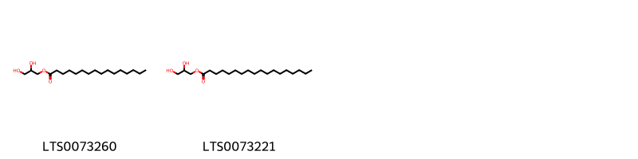{ width=100% }
    <figcaption>Hình ảnh cấu trúc hóa học của 2 hoạt chất thuộc nhóm Glycerolipids gồm ['glyceryl palmitate (LTS0073260)', 'glyceryl stearate (LTS0073221)'].</figcaption>
</figure>
#### Nhóm Glycerophospholipids
<figure markdown="span">
    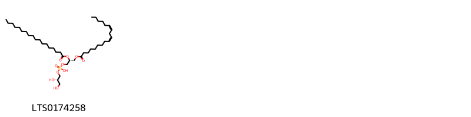{ width=100% }
    <figcaption>Hình ảnh cấu trúc hóa học của 1 hoạt chất thuộc nhóm Glycerophospholipids gồm ['(2s)-2,3-dihydroxypropoxy((2r)-3-[(9z,12z)-octadeca-9,12-dienoyloxy]-2-(octadecanoyloxy)propoxy)phosphinic acid (LTS0174258)'].</figcaption>
</figure>
#### Nhóm Harmala alkaloids
<figure markdown="span">
    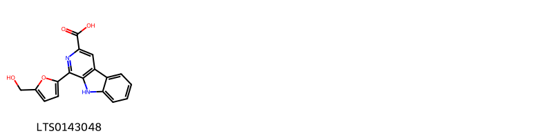{ width=100% }
    <figcaption>Hình ảnh cấu trúc hóa học của 1 hoạt chất thuộc nhóm Harmala alkaloids gồm ['flazin (LTS0143048)'].</figcaption>
</figure>
#### Nhóm Imidazopyrimidines
<figure markdown="span">
    { width=100% }
    <figcaption>Hình ảnh cấu trúc hóa học của 1 hoạt chất thuộc nhóm Imidazopyrimidines gồm ['leucon (LTS0114351)'].</figcaption>
</figure>
#### Nhóm Indoles and derivatives
<figure markdown="span">
    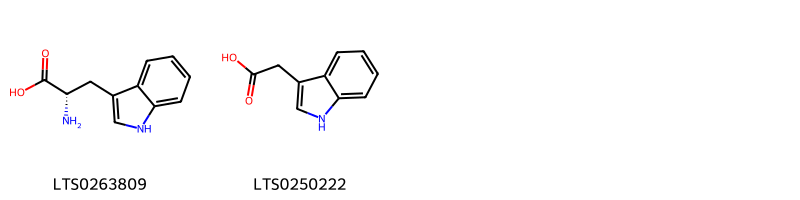{ width=100% }
    <figcaption>Hình ảnh cấu trúc hóa học của 2 hoạt chất thuộc nhóm Indoles and derivatives gồm ['l-tryptophan (LTS0263809)', 'β-indole-3-acetic acid (LTS0250222)'].</figcaption>
</figure>
#### Nhóm Isoflavonoids
<figure markdown="span">
    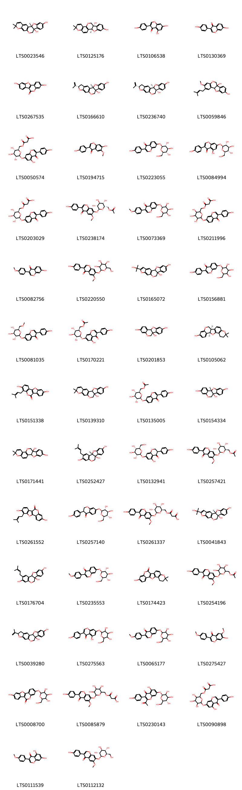{ width=100% }
    <figcaption>Hình ảnh cấu trúc hóa học của 51 hoạt chất thuộc nhóm Isoflavonoids gồm ['glyceollin ii (LTS0023546)', '(2s,10s)-17,17-dimethyl-3,12,18-trioxapentacyclo[11.8.0.0²,¹⁰.0⁴,⁹.0¹⁴,¹⁹]henicosa-1(13),4,6,8,14(19),15,20-heptaene-6,10-diol (LTS0125176)', 'genistein (LTS0106538)', 'daidzein (LTS0130369)', 'coumestrol (LTS0267535)', 'glyceollin iii (LTS0166610)', 'glyceollin iii (LTS0236740)', 'glyceollin iv (LTS0059846)', 'malonylgenistin (LTS0050574)', 'glycitein (LTS0194715)', 'daidzin (LTS0223055)', 'genistin (LTS0084994)', 'malonyldaidzin (LTS0203029)', '[(2s,3s,4s,5r,6s)-3,4,5-trihydroxy-6-{[3-(4-hydroxyphenyl)-6-methoxy-4-oxochromen-7-yl]oxy}oxan-2-yl]methyl acetate (LTS0238174)', 'formononetin 7-o-glucoside (LTS0073369)', '3-oxo-3-[(3,4,5-trihydroxy-6-{[3-(4-hydroxyphenyl)-4-oxochromen-7-yl]oxy}oxan-2-yl)methoxy]propanoic acid (LTS0211996)', 'formononetin (LTS0082756)', 'glycitein 7-o-glucoside (LTS0220550)', 'glyceofuran (LTS0165072)', 'daidzin (LTS0156881)', '3-(4-hydroxyphenyl)-7-{[(2s,3r,4s,5s,6r)-3,4,5-trihydroxy-6-(methoxymethyl)oxan-2-yl]oxy}chromen-4-one (LTS0081035)', "6''-o-acetylgenistin (LTS0170221)", '8,17-dioxatetracyclo[8.7.0.0²,⁷.0¹¹,¹⁶]heptadeca-2,4,6,11,13,15-hexaene-5,10,14-triol (LTS0201853)', '(2r,11r)-17,17-dimethyl-4,12,18-trioxapentacyclo[11.8.0.0²,¹¹.0⁵,¹⁰.0¹⁴,¹⁹]henicosa-1(13),5,7,9,14(19),20-hexaen-7-ol (LTS0105062)', 'phaseol (LTS0151338)', '17,17-dimethyl-3,12,16-trioxapentacyclo[11.8.0.0²,¹⁰.0⁴,⁹.0¹⁵,²⁰]henicosa-1(13),4,6,8,14,18,20-heptaene-6,10-diol (LTS0139310)', "6''-o-acetyldaidzin (LTS0135005)", '(-)-glycinol (LTS0154334)', '17,17-dimethyl-3,12,18-trioxapentacyclo[11.8.0.0²,¹⁰.0⁴,⁹.0¹⁴,¹⁹]henicosa-1(13),4,6,8,14(19),15,20-heptaene-6,10-diol (LTS0171441)', 'glyceocarpin (LTS0252427)', '5-hydroxy-3-(4-hydroxyphenyl)-7-{[(2s,3r,4s,5s,6r)-3,4,5-trihydroxy-6-(hydroxymethyl)oxan-2-yl]oxy}-2,3-dihydro-1-benzopyran-4-one (LTS0132941)', 'acetylglycitin (LTS0257421)', 'isosojagol (LTS0261552)', '3-(4-hydroxyphenyl)-7-{[(2s,3r,4s,5s,6r)-3,4,5-trihydroxy-6-(hydroxymethyl)oxan-2-yl]oxy}-2,3-dihydro-1-benzopyran-4-one (LTS0257140)', 'malonylglycitin (LTS0261337)', '(1s,13s)-6-(2-hydroxypropan-2-yl)-7,11,20-trioxapentacyclo[11.7.0.0²,¹⁰.0⁴,⁸.0¹⁴,¹⁹]icosa-2(10),3,5,8,14,16,18-heptaene-13,17-diol (LTS0041843)', '4-(3-methylbut-2-en-1-yl)-8,17-dioxatetracyclo[8.7.0.0²,⁷.0¹¹,¹⁶]heptadeca-2(7),3,5,11,13,15-hexaene-5,10,14-triol (LTS0176704)', 'ononin (LTS0235553)', 'sojagol (LTS0174423)', '(3,4,5-trihydroxy-6-{[3-(4-hydroxyphenyl)-6-methoxy-4-oxochromen-7-yl]oxy}oxan-2-yl)methyl acetate (LTS0254196)', '6-(prop-1-en-2-yl)-7,11,20-trioxapentacyclo[11.7.0.0²,¹⁰.0⁴,⁸.0¹⁴,¹⁹]icosa-2(10),3,8,14,16,18-hexaene-13,17-diol (LTS0039280)', '5-hydroxy-3-(4-hydroxyphenyl)-7-{[3,4,5-trihydroxy-6-(hydroxymethyl)oxan-2-yl]oxy}chromen-4-one (LTS0275563)', 'ononin (LTS0065177)', 'afrormosin (LTS0275427)', '14-hydroxy-5-{[3,4,5-trihydroxy-6-(hydroxymethyl)oxan-2-yl]oxy}-8,17-dioxatetracyclo[8.7.0.0²,⁷.0¹¹,¹⁶]heptadeca-1(10),2(7),3,5,11(16),12,14-heptaen-9-one (LTS0008700)', '3-oxo-3-[(3,4,5-trihydroxy-6-{[3-(4-hydroxyphenyl)-6-methoxy-4-oxochromen-7-yl]oxy}oxan-2-yl)methoxy]propanoic acid (LTS0085879)', '2-acetyl-5-hydroxy-3-(4-hydroxyphenyl)-7-{[(2s,5s)-3,4,5-trihydroxy-6-(hydroxymethyl)oxan-2-yl]oxy}chromen-4-one (LTS0230143)', '3-oxo-3-[(3,4,5-trihydroxy-6-{[5-hydroxy-3-(4-hydroxyphenyl)-4-oxochromen-7-yl]oxy}oxan-2-yl)methoxy]propanoic acid (LTS0090898)', 'biochanin (LTS0111539)', 'glycitin (LTS0112132)', '(1s,6r,13s)-6-(prop-1-en-2-yl)-7,11,20-trioxapentacyclo[11.7.0.0²,¹⁰.0⁴,⁸.0¹⁴,¹⁹]icosa-2(10),3,8,14,16,18-hexaene-13,17-diol (LTS0271573)'].</figcaption>
</figure>
#### Nhóm Linear 1_3-diarylpropanoids
<figure markdown="span">
    { width=100% }
    <figcaption>Hình ảnh cấu trúc hóa học của Không tìm thấy chú thích hoạt chất thuộc nhóm Linear 1_3-diarylpropanoids gồm Không tìm thấy chú thích.</figcaption>
</figure>
#### Nhóm Organonitrogen compounds
<figure markdown="span">
    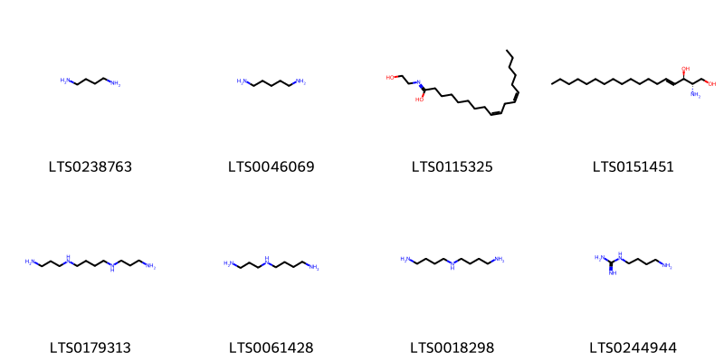{ width=100% }
    <figcaption>Hình ảnh cấu trúc hóa học của 8 hoạt chất thuộc nhóm Organonitrogen compounds gồm ['putrescine (LTS0238763)', 'pentane-1,5-diamine (LTS0046069)', '(9z,12z)-n-(2-hydroxyethyl)octadeca-9,12-dienimidic acid (LTS0115325)', 'sphingosine (LTS0151451)', 'spermine (LTS0179313)', 'spermidine (LTS0061428)', 'homospermidine (LTS0018298)', 'agmatine (LTS0244944)'].</figcaption>
</figure>
#### Nhóm Organooxygen compounds
<figure markdown="span">
    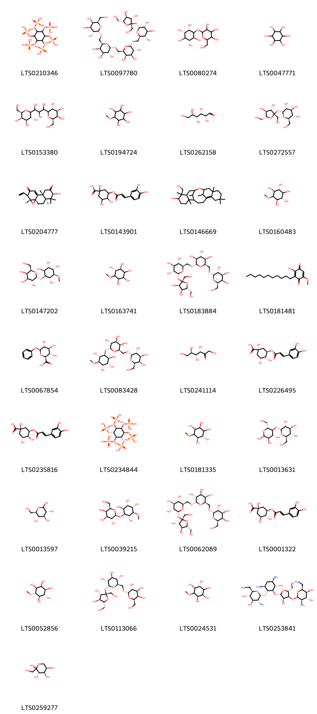{ width=100% }
    <figcaption>Hình ảnh cấu trúc hóa học của 33 hoạt chất thuộc nhóm Organooxygen compounds gồm ['phytic acid (LTS0210346)', 'verbascose (LTS0097780)', '(1s,2r,4s,5s)-6-{[3,4,5-trihydroxy-6-(hydroxymethyl)oxan-2-yl]oxy}cyclohexane-1,2,3,4,5-pentol (LTS0080274)', '(-)-inositol (LTS0047771)', '(2r,3r,4s,5r)-2-(hydroxymethyl)-6-{1,2,3-trihydroxy-3-[(3r,4s,5r,6r)-3,4,5-trihydroxy-6-(hydroxymethyl)oxan-2-yl]propyl}oxane-3,4,5-triol (LTS0153380)', 'pinitol (LTS0194724)', '(+)-glucose (LTS0262158)', 'sucrose (LTS0272557)', '(2s,4ar,7r,7ar,8as,10as)-7-ethenyl-2-hydroxy-1,1,4a,7-tetramethyl-2h,4h,7ah,9h,10h,10ah-phenanthro[8,8a-b]oxirene-3,6-dione (LTS0204777)', '3-{[3-(3,4-dihydroxyphenyl)prop-2-enoyl]oxy}-1,4,5-trihydroxycyclohexane-1-carboxylic acid (LTS0143901)', '6-(hydroxymethyl)-6,10,17,17,20,22,23-heptamethyl-2-oxapentacyclo[12.7.1.1³,¹¹.0⁵,¹⁰.0¹⁵,²⁰]tricos-14-en-7-ol (LTS0146669)', '(1r,2s,4r,5s)-6-methoxycyclohexane-1,2,3,4,5-pentol (LTS0160483)', '(1s,2r,3s,4r,5s,6s)-4-methoxy-6-{[(2r,3r,4s,5r,6r)-3,4,5-trihydroxy-6-(hydroxymethyl)oxan-2-yl]oxy}cyclohexane-1,2,3,5-tetrol (LTS0147202)', '(1r,2r,4s,5r)-6-methoxycyclohexane-1,2,3,4,5-pentol (LTS0163741)', '(2r,3r,4s,5s,6r)-2-{[(2s,3r,4s,5r)-3,4-dihydroxy-2,5-bis(hydroxymethyl)oxolan-2-yl]oxy}-6-({[(2s,3s,4r,5r,6r)-3,4,5-trihydroxy-6-({[(2s,3r,4s,5r,6r)-3,4,5-trihydroxy-6-(hydroxymethyl)oxan-2-yl]oxy}methyl)oxan-2-yl]oxy}methyl)oxane-3,4,5-triol (LTS0183884)', '5-o-methylembelin (LTS0181481)', 'phenol o-(β-d-glucuronide) (LTS0067854)', '(1s,2r,3s,4r,5s,6s)-4-methoxy-6-{[(2r,3r,4s,5r,6r)-3,4,5-trihydroxy-6-({[(2s,3r,4s,5r,6r)-3,4,5-trihydroxy-6-(hydroxymethyl)oxan-2-yl]oxy}methyl)oxan-2-yl]oxy}cyclohexane-1,2,3,5-tetrol (LTS0083428)', 'keto-d-fructose (LTS0241114)', 'chlorogenic acid (LTS0226495)', 'neochlorogenic acid (LTS0235816)', '[(1r,2r,3s,4r,5s,6s)-2,3,4,5,6-pentakis(phosphonooxy)cyclohexyl]oxyphosphonic acid (LTS0234844)', 'methylinositol (LTS0181335)', 'α-maltose (LTS0013631)', 'glucose (LTS0013597)', '(1s,2r,3s,4r,5s,6s)-4-methoxy-6-{[(2s,3r,4s,5r,6r)-3,4,5-trihydroxy-6-(hydroxymethyl)oxan-2-yl]oxy}cyclohexane-1,2,3,5-tetrol (LTS0039215)', 'stachyose (LTS0062089)', '(1r,3r,4r,5s)-3-{[(2e)-3-(3,4-dihydroxyphenyl)prop-2-enoyl]oxy}-1,4,5-trihydroxycyclohexane-1-carboxylic acid (LTS0001322)', 'ononitol (LTS0052856)', 'raffinose (LTS0113066)', '(1r,2r,4r,5s)-6-methoxycyclohexane-1,2,3,4,5-pentol (LTS0024531)', 'neomycin (LTS0253841)', 'd-fructopyranose (LTS0259277)'].</figcaption>
</figure>
#### Nhóm Peptidomimetics
<figure markdown="span">
    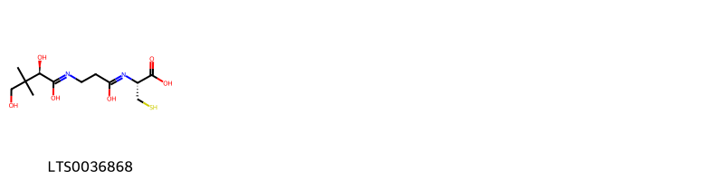{ width=100% }
    <figcaption>Hình ảnh cấu trúc hóa học của 1 hoạt chất thuộc nhóm Peptidomimetics gồm ['(2r)-2-[(1-hydroxy-3-{[(2r)-1,2,4-trihydroxy-3,3-dimethylbutylidene]amino}propylidene)amino]-3-sulfanylpropanoic acid (LTS0036868)'].</figcaption>
</figure>
#### Nhóm Phenols
<figure markdown="span">
    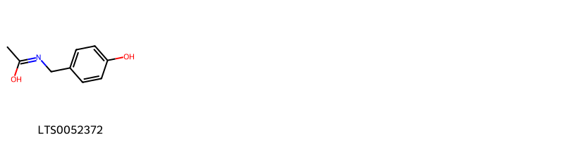{ width=100% }
    <figcaption>Hình ảnh cấu trúc hóa học của 1 hoạt chất thuộc nhóm Phenols gồm ['n-[(4-hydroxyphenyl)methyl]ethanimidic acid (LTS0052372)'].</figcaption>
</figure>
#### Nhóm Prenol lipids
<figure markdown="span">
    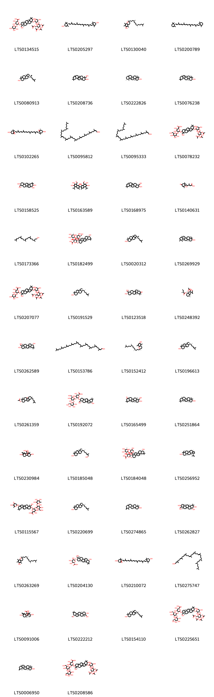{ width=100% }
    <figcaption>Hình ảnh cấu trúc hóa học của 77 hoạt chất thuộc nhóm Prenol lipids gồm ['(2s,3s,4s,5r,6r)-6-{[(3s,4s,4ar,6ar,6bs,8ar,9s,10r,12as,14ar,14br)-9-{[(2s,3r,4s,5s)-3,5-dihydroxy-4-{[(2s,3r,4s,5r,6r)-3,4,5-tris(acetyloxy)-6-[(acetyloxy)methyl]oxan-2-yl]oxy}oxan-2-yl]oxy}-10-hydroxy-4-(hydroxymethyl)-4,6a,6b,8a,11,11,14b-heptamethyl-1,2,3,4a,5,6,7,8,9,10,12,12a,14,14a-tetradecahydropicen-3-yl]oxy}-3,4-dihydroxy-5-{[(2s,3r,4s,5s)-3,4,5-trihydroxyoxan-2-yl]oxy}oxane-2-carboxylic acid (LTS0134515)', 'carotenoid (LTS0205297)', '(2r)-2,5,7,8-tetramethyl-2-[(4s,8s)-4,8,12-trimethyltridecyl]-3,4-dihydro-1-benzopyran-6-ol (LTS0130040)', '(+)-α-carotene (LTS0200789)', 'dammaradienol (LTS0080913)', '4-(hydroxymethyl)-4,6a,6b,8a,11,11,14b-heptamethyl-1,2,3,4a,5,6,7,8,12,12a,14,14a-dodecahydropicen-3-ol (LTS0208736)', 'amyrin (LTS0222826)', 'alnulin (LTS0076238)', 'violaxanthin (LTS0102265)', '(2z,6e,10e,14e,18z,22z,26z,30e)-3,7,11,15,19,23,27,31,35,39,43-undecamethyltetratetraconta-2,6,10,14,18,22,26,30-octaen-1-ol (LTS0095812)', '(2z,6e,10e,14e,18e,22z,26e)-3,7,11,15,19,23,27,31,35,39-decamethyltetraconta-2,6,10,14,18,22,26-heptaen-1-ol (LTS0095333)', '6-({9-[(3,5-dihydroxy-4-{[3,4,5-tris(acetyloxy)oxan-2-yl]oxy}oxan-2-yl)oxy]-10-hydroxy-4-(hydroxymethyl)-4,6a,6b,8a,11,11,14b-heptamethyl-1,2,3,4a,5,6,7,8,9,10,12,12a,14,14a-tetradecahydropicen-3-yl}oxy)-3,4-dihydroxy-5-{[3,4,5-trihydroxy-6-(hydroxymethyl)oxan-2-yl]oxy}oxane-2-carboxylic acid (LTS0078232)', '(4ar,6br,9s,10s,12ar,14bs)-9-(hydroxymethyl)-2,2,4a,6a,6b,9,12a-heptamethyl-1,3,4,5,6,7,8,8a,10,11,12,12b,13,14b-tetradecahydropicene-3,4,10-triol (LTS0158525)', '(-)-gossypol (LTS0163589)', '(3s,4s,6ar,8as,12ar,14br)-4-(hydroxymethyl)-4,6a,6b,8a,11,11,14b-heptamethyl-1,2,3,4a,5,6,7,8,12,12a,14,14a-dodecahydropicen-3-ol (LTS0168975)', 'abscisic acid,  (LTS0140631)', '3,7,11,15,19-pentamethylicosa-6,10,14,18-tetraen-1-ol (LTS0173366)', 'soyasaponin i (LTS0182499)', 'lanster (LTS0020312)', '(4ar,6ar,6br,8as,12ar,12br,14ar,14br)-4,4,6a,6b,8a,11,12,14b-octamethyl-2,3,4a,5,6,7,8,9,12,12a,12b,13,14,14a-tetradecahydro-1h-picen-3-ol (LTS0269929)', '6-({9-[(3,5-dihydroxy-4-{[3,4,5-tris(acetyloxy)-6-[(acetyloxy)methyl]oxan-2-yl]oxy}oxan-2-yl)oxy]-10-hydroxy-4-(hydroxymethyl)-4,6a,6b,8a,11,11,14b-heptamethyl-1,2,3,4a,5,6,7,8,9,10,12,12a,14,14a-tetradecahydropicen-3-yl}oxy)-3,4-dihydroxy-5-[(3,4,5-trihydroxyoxan-2-yl)oxy]oxane-2-carboxylic acid (LTS0207077)', '(1r,3ar,7s,9ar,11ar)-3a,6,6,9a,11a-pentamethyl-1-[(2r)-6-methylhept-5-en-2-yl]-1h,2h,3h,5h,5ah,7h,8h,9h,9bh,10h,11h-cyclopenta[a]phenanthren-7-ol (LTS0191529)', '(4as,6br,9s,10s,12ar,14br)-10-hydroxy-9-(hydroxymethyl)-2,2,4a,6a,6b,9,12a-heptamethyl-4,5,6,7,8,8a,10,11,12,12b,13,14b-dodecahydro-1h-picen-3-one (LTS0123518)', "(2r,3r,3ar,4s,7s,7ar)-3-(acetyloxy)-7,7a-dimethyl-4'-methylidene-2'-oxo-hexahydro-1h-spiro[indene-2,3'-oxolan]-4-yl (2s)-2-methylbutanoate (LTS0248392)", 'soyasapogenol b (LTS0262589)', '(2z,6z,10z,14z,18z,22z,26e,30e,34e)-3,7,11,15,19,23,27,31,35,39-decamethyltetraconta-2,6,10,14,18,22,26,30,34,38-decaen-1-ol (LTS0153786)', 'β-tocopherol (LTS0152412)', 'parkeol (LTS0196613)', '(2s,4ar,4br,8r,10ar,10br,12ar)-1,1,4a,8,10a,10b-hexamethyl-8-(4-methylpent-3-en-1-yl)-3,4,4b,5,7,9,10,11,12,12a-decahydro-2h-chrysen-2-yl acetate (LTS0261359)', '(2s,3s,4s,5r,6r)-6-{[(3s,4s,6ar,8ar,9r,14br)-9-hydroxy-4-(hydroxymethyl)-4,6a,6b,8a,11,11,14b-heptamethyl-1,2,3,4a,5,6,7,8,9,10,12,12a,14,14a-tetradecahydropicen-3-yl]oxy}-5-{[(2s,3r,4s,5r,6r)-4,5-dihydroxy-6-(hydroxymethyl)-3-{[(2s,3r,4s,5s,6r)-3,4,5-trihydroxy-6-(hydroxymethyl)oxan-2-yl]oxy}oxan-2-yl]oxy}-3,4-dihydroxyoxane-2-carboxylic acid (LTS0192072)', 'soyasapogenol-e (LTS0165499)', 'β-amyrin (LTS0251864)', '5,12-dihydroxy-11-methyl-6-methylidene-16-oxo-15-oxapentacyclo[9.3.2.1⁵,⁸.0¹,¹⁰.0²,⁸]heptadecane-9-carboxylic acid (LTS0230984)', '(1r,3ar,5ar,7s,9as,11ar)-1-[(2r,5e)-7-hydroxy-6-methylhept-5-en-2-yl]-3a,6,6,9a,11a-pentamethyl-1h,2h,3h,5h,5ah,7h,8h,9h,11h-cyclopenta[a]phenanthren-7-ol (LTS0185048)', 'soyasaponin ii (LTS0184048)', 'lupeol (LTS0256952)', '5-{[4,5-dihydroxy-6-(hydroxymethyl)-3-[(3,4,5-trihydroxy-6-methyloxan-2-yl)oxy]oxan-2-yl]oxy}-3,4-dihydroxy-6-({9-[(5-hydroxy-6-methyl-4-oxo-2,3-dihydropyran-2-yl)oxy]-4-(hydroxymethyl)-4,6a,6b,8a,11,11,14b-heptamethyl-1,2,3,4a,5,6,7,8,9,10,12,12a,14,14a-tetradecahydropicen-3-yl}oxy)oxane-2-carboxylic acid (LTS0115567)', 'euphol (LTS0220699)', '(6ar,6br,8ar,14br)-4,4,6a,6b,8a,12,14b-heptamethyl-11-methylidene-hexadecahydropicen-3-ol (LTS0274865)', 'soyasapogenol a (LTS0262827)', 'vitamin e (LTS0263269)', 'soyasapogenol b monoglucuronide (LTS0204130)', 'antheraxanthin (LTS0210072)', '(2e,6e,10z,14z,18z,22e)-3,7,11,15,19,23,27,31,35-nonamethylhexatriaconta-2,6,10,14,18,22-hexaen-1-ol (LTS0275747)', '(1r,2r,5s,8s,9s,10r,12s)-5,12-dihydroxy-11-methyl-6-methylidene-16-oxo-15-oxapentacyclo[9.3.2.1⁵,⁸.0¹,¹⁰.0²,⁸]heptadecane-9-carboxylic acid (LTS0091006)', 'soyasapogenol d (LTS0222212)', '(1r,7s,9as)-3a,6,6,9a,11a-pentamethyl-1-[(2r)-6-methylhept-5-en-2-yl]-1h,2h,3h,4h,5h,5ah,7h,8h,9h,10h,11h-cyclopenta[a]phenanthren-7-ol (LTS0154110)', '(2s,3s,4s,5r,6r)-6-{[(3s,4s,4ar,6ar,6bs,8ar,9s,10r,12as,14ar,14br)-9-{[(2s,3r,4s,5s)-3,5-dihydroxy-4-{[(2s,3r,4s,5r,6r)-3,4,5-tris(acetyloxy)-6-[(acetyloxy)methyl]oxan-2-yl]oxy}oxan-2-yl]oxy}-10-hydroxy-4-(hydroxymethyl)-4,6a,6b,8a,11,11,14b-heptamethyl-1,2,3,4a,5,6,7,8,9,10,12,12a,14,14a-tetradecahydropicen-3-yl]oxy}-5-{[(2s,3r,4s,5r,6r)-4,5-dihydroxy-6-(hydroxymethyl)-3-{[(2s,3r,4s,5s,6r)-3,4,5-trihydroxy-6-(hydroxymethyl)oxan-2-yl]oxy}oxan-2-yl]oxy}-3,4-dihydroxyoxane-2-carboxylic acid (LTS0225651)', 'taraxasterol (LTS0006950)', '6-({9-[(3,5-dihydroxy-4-{[3,4,5-tris(acetyloxy)oxan-2-yl]oxy}oxan-2-yl)oxy]-10-hydroxy-4-(hydroxymethyl)-4,6a,6b,8a,11,11,14b-heptamethyl-1,2,3,4a,5,6,7,8,9,10,12,12a,14,14a-tetradecahydropicen-3-yl}oxy)-5-{[4,5-dihydroxy-6-(hydroxymethyl)-3-{[3,4,5-trihydroxy-6-(hydroxymethyl)oxan-2-yl]oxy}oxan-2-yl]oxy}-3,4-dihydroxyoxane-2-carboxylic acid (LTS0208586)', 'neoxanthin (LTS0227522)', '(2s,3s,4s,5r,6r)-6-{[(3s,4s,4ar,6ar,6bs,8ar,9s,10r,12as,14ar,14br)-9-{[(2s,3r,4s,5s)-3,5-dihydroxy-4-{[(2s,3r,4s,5r,6r)-3,4,5-tris(acetyloxy)-6-[(acetyloxy)methyl]oxan-2-yl]oxy}oxan-2-yl]oxy}-10-hydroxy-4-(hydroxymethyl)-4,6a,6b,8a,11,11,14b-heptamethyl-1,2,3,4a,5,6,7,8,9,10,12,12a,14,14a-tetradecahydropicen-3-yl]oxy}-3,4-dihydroxy-5-{[(2s,3r,4s,5r,6r)-3,4,5-trihydroxy-6-(hydroxymethyl)oxan-2-yl]oxy}oxane-2-carboxylic acid (LTS0250479)', '(3as,5ar,7s,9ar,11as)-3a,6,6,9a,11a-pentamethyl-1-[(2r)-6-methylhept-5-en-2-yl]-1h,2h,3h,5h,5ah,7h,8h,9h,9bh,10h,11h-cyclopenta[a]phenanthren-7-ol (LTS0041890)', '(2z,6z,10z,14z,18z,22z,26z,30z,34e,38e,42e)-3,7,11,15,19,23,27,31,35,39,43,47-dodecamethyloctatetraconta-2,6,10,14,18,22,26,30,34,38,42,46-dodecaen-1-ol (LTS0241363)', '(2s,3s,4s,5r,6r)-6-{[(3s,4s,4ar,6ar,6bs,8ar,9s,10r,12as,14ar,14br)-9-{[(2s,3r,4s,5s)-3,5-dihydroxy-4-{[(2s,3r,4s,5r)-3,4,5-tris(acetyloxy)oxan-2-yl]oxy}oxan-2-yl]oxy}-10-hydroxy-4-(hydroxymethyl)-4,6a,6b,8a,11,11,14b-heptamethyl-1,2,3,4a,5,6,7,8,9,10,12,12a,14,14a-tetradecahydropicen-3-yl]oxy}-5-{[(2s,3r,4s,5r,6r)-4,5-dihydroxy-6-(hydroxymethyl)-3-{[(2s,3r,4s,5s,6r)-3,4,5-trihydroxy-6-(hydroxymethyl)oxan-2-yl]oxy}oxan-2-yl]oxy}-3,4-dihydroxyoxane-2-carboxylic acid (LTS0181311)', 'dihydrofarnesol (LTS0001900)', 'gamma-tocopherol (LTS0058127)', '(2s,3s,4s,5r,6r)-6-{[(3s,4s,4ar,6ar,6bs,8ar,9r,12as,14ar,14br)-9-hydroxy-4-(hydroxymethyl)-4,6a,6b,8a,11,11,14b-heptamethyl-1,2,3,4a,5,6,7,8,9,10,12,12a,14,14a-tetradecahydropicen-3-yl]oxy}-3,4-dihydroxy-5-{[(2s,3r,4s,5s)-3,4,5-trihydroxyoxan-2-yl]oxy}oxane-2-carboxylic acid (LTS0054945)', 'soyasapogenol c (LTS0003398)', '5-{[4,5-dihydroxy-6-(hydroxymethyl)-3-[(3,4,5-trihydroxy-6-methyloxan-2-yl)oxy]oxan-2-yl]oxy}-3,4-dihydroxy-6-{[9-hydroxy-4-(hydroxymethyl)-4,6a,6b,8a,11,11,14b-heptamethyl-1,2,3,4a,5,6,7,8,9,10,12,12a,14,14a-tetradecahydropicen-3-yl]oxy}oxane-2-carboxylic acid (LTS0005407)', 'soyasaponin iii (LTS0134294)', '(2r)-2,5,8-trimethyl-2-(4,8,12-trimethyltridecyl)-3,4-dihydro-1-benzopyran-6-ol (LTS0030802)', '4-(hydroxymethyl)-4,6a,6b,8a,11,11,14b-heptamethyl-1,2,3,4a,5,6,7,8,9,10,12,12a,14,14a-tetradecahydropicene-3,9-diol (LTS0011077)', '1,1,4a,8,10a,10b-hexamethyl-8-(4-methylpent-3-en-1-yl)-3,4,4b,5,7,9,10,11,12,12a-decahydro-2h-chrysen-2-yl acetate (LTS0010876)', '(2s,3s,4s,5r,6r)-6-{[(3s,4s,4ar,6ar,6bs,8ar,9s,10r,12as,14ar,14br)-9-{[(2s,3r,4s,5s)-3,5-dihydroxy-4-{[(2s,3r,4s,5r)-3,4,5-tris(acetyloxy)oxan-2-yl]oxy}oxan-2-yl]oxy}-10-hydroxy-4-(hydroxymethyl)-4,6a,6b,8a,11,11,14b-heptamethyl-1,2,3,4a,5,6,7,8,9,10,12,12a,14,14a-tetradecahydropicen-3-yl]oxy}-3,4-dihydroxy-5-{[(2s,3r,4s,5r,6r)-3,4,5-trihydroxy-6-(hydroxymethyl)oxan-2-yl]oxy}oxane-2-carboxylic acid (LTS0275127)', '(2s,3s,4s,5r,6r)-6-{[(3s,4s,4ar,6ar,6bs,8ar,9r,12as,14ar,14br)-9-hydroxy-4-(hydroxymethyl)-4,6a,6b,8a,11,11,14b-heptamethyl-1,2,3,4a,5,6,7,8,9,10,12,12a,14,14a-tetradecahydropicen-3-yl]oxy}-5-{[(2s,3r,4s,5r,6r)-4,5-dihydroxy-6-(hydroxymethyl)-3-{[(2s,3r,4s,5s,6r)-3,4,5-trihydroxy-6-(hydroxymethyl)oxan-2-yl]oxy}oxan-2-yl]oxy}-3,4-dihydroxyoxane-2-carboxylic acid (LTS0012179)', 'neoxanthin (LTS0000701)', '(2s,3s,4s,5r,6r)-6-{[(3s,4s,4ar,6ar,6bs,8ar,9s,10r,12as,14ar,14br)-9-{[(2s,3r,4s,5s)-3,5-dihydroxy-4-{[(2s,3r,4s,5r)-3,4,5-tris(acetyloxy)oxan-2-yl]oxy}oxan-2-yl]oxy}-10-hydroxy-4-(hydroxymethyl)-4,6a,6b,8a,11,11,14b-heptamethyl-1,2,3,4a,5,6,7,8,9,10,12,12a,14,14a-tetradecahydropicen-3-yl]oxy}-3,4-dihydroxy-5-{[(2s,3r,4s,5s)-3,4,5-trihydroxyoxan-2-yl]oxy}oxane-2-carboxylic acid (LTS0007923)', '(1s,3ar,3br,5ar,7s,9ar,9br,11ar)-3a,3b,6,6,9a-pentamethyl-1-(6-methyl-5-methylidenehept-1-en-2-yl)-dodecahydro-1h-cyclopenta[a]phenanthren-7-ol (LTS0008613)', '6-({9-[(3,5-dihydroxy-4-{[3,4,5-tris(acetyloxy)oxan-2-yl]oxy}oxan-2-yl)oxy]-10-hydroxy-4-(hydroxymethyl)-4,6a,6b,8a,11,11,14b-heptamethyl-1,2,3,4a,5,6,7,8,9,10,12,12a,14,14a-tetradecahydropicen-3-yl}oxy)-3,4-dihydroxy-5-[(3,4,5-trihydroxyoxan-2-yl)oxy]oxane-2-carboxylic acid (LTS0020210)', '(2s,3r,4s,5r,6r)-6-{[(6ar,6bs,8ar,9s,12ar,14br)-9-hydroxy-4-(hydroxymethyl)-4,6a,6b,8a,11,11,14b-heptamethyl-1,2,3,4a,5,6,7,8,9,10,12,12a,14,14a-tetradecahydropicen-3-yl]oxy}-3,4-dihydroxy-5-{[(2s,3r,4s,5r,6r)-3,4,5-trihydroxy-6-(hydroxymethyl)oxan-2-yl]oxy}oxane-2-carboxylic acid (LTS0100376)', 'delta-tocopherol (LTS0005408)', 'lanosterol (LTS0090543)', '(4e)-5-[(1s)-1-hydroxy-2,6,6-trimethyl-4-oxocyclohex-2-en-1-yl]-3-methylpenta-2,4-dienoic acid (LTS0268716)', '6-({9-[(3,5-dihydroxy-4-{[3,4,5-tris(acetyloxy)-6-[(acetyloxy)methyl]oxan-2-yl]oxy}oxan-2-yl)oxy]-10-hydroxy-4-(hydroxymethyl)-4,6a,6b,8a,11,11,14b-heptamethyl-1,2,3,4a,5,6,7,8,9,10,12,12a,14,14a-tetradecahydropicen-3-yl}oxy)-3,4-dihydroxy-5-{[3,4,5-trihydroxy-6-(hydroxymethyl)oxan-2-yl]oxy}oxane-2-carboxylic acid (LTS0130354)', '(2z,6z,10z,14z,18z,22z,26z,30e,34e,38e)-3,7,11,15,19,23,27,31,35,39,43-undecamethyltetratetraconta-2,6,10,14,18,22,26,30,34,38,42-undecaen-1-ol (LTS0092809)', '(2s,3s,4s,5r,6r)-6-{[(3s,4s,4ar,6ar,6bs,8ar,9r,12as,14ar,14br)-9-{[(2r)-5-hydroxy-6-methyl-4-oxo-2,3-dihydropyran-2-yl]oxy}-4-(hydroxymethyl)-4,6a,6b,8a,11,11,14b-heptamethyl-1,2,3,4a,5,6,7,8,9,10,12,12a,14,14a-tetradecahydropicen-3-yl]oxy}-5-{[(2s,3r,4s,5r,6r)-4,5-dihydroxy-6-(hydroxymethyl)-3-{[(2s,3r,4r,5r,6s)-3,4,5-trihydroxy-6-methyloxan-2-yl]oxy}oxan-2-yl]oxy}-3,4-dihydroxyoxane-2-carboxylic acid (LTS0259660)'].</figcaption>
</figure>
#### Nhóm Pyridines and derivatives
<figure markdown="span">
    { width=100% }
    <figcaption>Hình ảnh cấu trúc hóa học của 1 hoạt chất thuộc nhóm Pyridines and derivatives gồm ['niacin (LTS0216673)'].</figcaption>
</figure>
#### Nhóm Pyrimidine nucleotides
<figure markdown="span">
    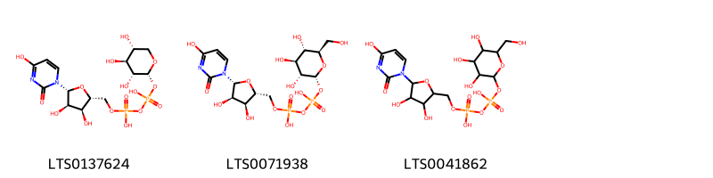{ width=100% }
    <figcaption>Hình ảnh cấu trúc hóa học của 3 hoạt chất thuộc nhóm Pyrimidine nucleotides gồm ['{[(2r,3s,4r,5r)-3,4-dihydroxy-5-(4-hydroxy-2-oxopyrimidin-1-yl)oxolan-2-yl]methoxy(hydroxy)phosphoryl}oxy([(2r,3r,4s,5r)-3,4,5-trihydroxyoxan-2-yl]oxy)phosphinic acid (LTS0137624)', 'uridine diphosphate glucose (LTS0071938)', '{[3,4-dihydroxy-5-(4-hydroxy-2-oxopyrimidin-1-yl)oxolan-2-yl]methoxy(hydroxy)phosphoryl}oxy([3,4,5-trihydroxy-6-(hydroxymethyl)oxan-2-yl]oxy)phosphinic acid (LTS0041862)'].</figcaption>
</figure>
#### Nhóm Saccharolipids
<figure markdown="span">
    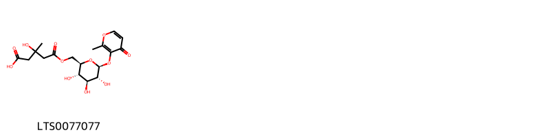{ width=100% }
    <figcaption>Hình ảnh cấu trúc hóa học của 1 hoạt chất thuộc nhóm Saccharolipids gồm ['3-hydroxy-3-methyl-5-oxo-5-{[(2r,3s,4s,5r,6s)-3,4,5-trihydroxy-6-[(2-methyl-4-oxopyran-3-yl)oxy]oxan-2-yl]methoxy}pentanoic acid (LTS0077077)'].</figcaption>
</figure>
#### Nhóm Sphingolipids
<figure markdown="span">
    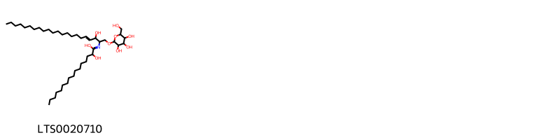{ width=100% }
    <figcaption>Hình ảnh cấu trúc hóa học của 1 hoạt chất thuộc nhóm Sphingolipids gồm ['2-hydroxy-n-(3-hydroxy-1-{[3,4,5-trihydroxy-6-(hydroxymethyl)oxan-2-yl]oxy}docos-4-en-2-yl)hexadecanimidic acid (LTS0020710)'].</figcaption>
</figure>
#### Nhóm Steroids and steroid derivatives
<figure markdown="span">
    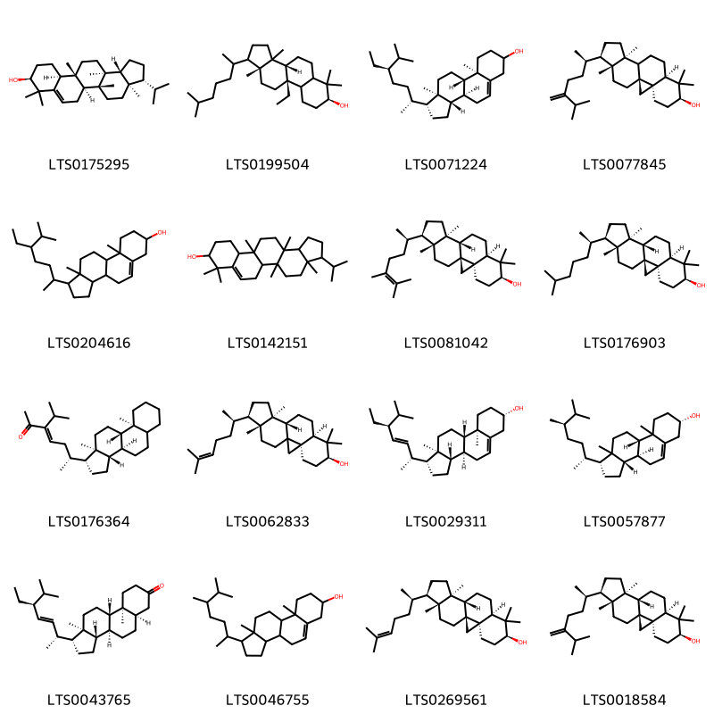{ width=100% }
    <figcaption>Hình ảnh cấu trúc hóa học của 16 hoạt chất thuộc nhóm Steroids and steroid derivatives gồm ['simiarenol (LTS0175295)', '(3br,7s,9bs,11ar)-9b-ethyl-3a,6,6,11a-tetramethyl-1-(6-methylheptan-2-yl)-dodecahydro-1h-cyclopenta[a]phenanthren-7-ol (LTS0199504)', 'stigmast-5-en-3-ol (LTS0071224)', '24-methylene-cycloartanol (LTS0077845)', 'stigmast-5-en-3-ol, (3β)- (LTS0204616)', '3-isopropyl-3a,5a,8,8,11b,13a-hexamethyl-1h,2h,3h,4h,5h,5bh,6h,9h,10h,11h,11ah,12h,13h,13bh-cyclopenta[a]chrysen-9-ol (LTS0142151)', '(1s,3r,6s,8r,11s,12s,15r,16r)-15-[(2r)-5,6-dimethylhept-5-en-2-yl]-7,7,12,16-tetramethylpentacyclo[9.7.0.0¹,³.0³,⁸.0¹²,¹⁶]octadecan-6-ol (LTS0081042)', 'cycloartanol (LTS0176903)', '(6r)-6-[(1r,3as,3br,9as,9bs,11ar)-9a,11a-dimethyl-tetradecahydro-1h-cyclopenta[a]phenanthren-1-yl]-3-isopropylhept-3-en-2-one (LTS0176364)', '(3r,6s,8r,11s,12s,15r,16r)-7,7,12,16-tetramethyl-15-[(2r)-6-methylhept-5-en-2-yl]pentacyclo[9.7.0.0¹,³.0³,⁸.0¹²,¹⁶]octadecan-6-ol (LTS0062833)', 'phytosterol (LTS0029311)', '(1r,3as,3bs,7s,9bs)-1-[(2r,5r)-5,6-dimethylheptan-2-yl]-9a,11a-dimethyl-1h,2h,3h,3ah,3bh,4h,6h,7h,8h,9h,9bh,10h,11h-cyclopenta[a]phenanthren-7-ol (LTS0057877)', 'stigmastenone (LTS0043765)', 'campesterol (LTS0046755)', 'cycloartenol (LTS0269561)', '24-methylenecycloartanol (LTS0018584)'].</figcaption>
</figure>
#### Nhóm Tetrapyrroles and derivatives
<figure markdown="span">
    { width=100% }
    <figcaption>Hình ảnh cấu trúc hóa học của 1 hoạt chất thuộc nhóm Tetrapyrroles and derivatives gồm ['3-(2-{[3-(2-carboxyethyl)-5-{[(2z)-3-ethenyl-5-hydroxy-4-methylpyrrol-2-ylidene]methyl}-4-methyl-1h-pyrrol-2-yl]methyl}-5-{[(2e)-4-ethenyl-5-hydroxy-3-methylpyrrol-2-ylidene]methyl}-4-methyl-1h-pyrrol-3-yl)propanoic acid (LTS0070819)'].</figcaption>
</figure>

---

### Dược dân tộc học

Danh sách các quốc gia có sử dụng *Glycine max* trong điều trị các bệnh. 

| Country   | Disease                                                                                                                                     | Bệnh                                                                                                                                                                                                |
|:----------|:--------------------------------------------------------------------------------------------------------------------------------------------|:----------------------------------------------------------------------------------------------------------------------------------------------------------------------------------------------------|
| Asia      | Soap                                                                                                                                        | MYMEMORY WARNING: YOU USED ALL AVAILABLE FREE TRANSLATIONS FOR TODAY. NEXT AVAILABLE IN  14 HOURS 04 MINUTES 38 SECONDS VISIT HTTPS://MYMEMORY.TRANSLATED.NET/DOC/USAGELIMITS.PHP TO TRANSLATE MORE |
| China     | Abortifacient, Antivinous, Apertif, Carminative, Carminative, Decongestant, Nervine, Refrigerant, Sedative, Diuretic, Laxative, Diaphoretic | MYMEMORY WARNING: YOU USED ALL AVAILABLE FREE TRANSLATIONS FOR TODAY. NEXT AVAILABLE IN  14 HOURS 04 MINUTES 36 SECONDS VISIT HTTPS://MYMEMORY.TRANSLATED.NET/DOC/USAGELIMITS.PHP TO TRANSLATE MORE |

---

# Chi Retama

??? note "Danh sách các dược liệu thuộc chi"
    
	 - *Retama haerocarpa*
	 - *Retama raetam*

---
## Retama haerocarpa
### Thông tin về thực vật

!!! info "Phân loại thực vật của *N/A* từ GIBF:"
    - **Kingdom:** Plantae
    - **Phylum:** Tracheophyta
    - **Order:** Fabales
    - **Family:** Fabaceae
    - **Genus:** Retama
    - **Species:** *N/A*

 

| Label (VI)   | Label (EN)   | Scientific Name   | Descriptions (VI)   | Descriptions (EN)                       | Also Known As (VI)   | Also Known As (EN)                                                                             |
|:-------------|:-------------|:------------------|:--------------------|:----------------------------------------|:---------------------|:-----------------------------------------------------------------------------------------------|
| N/A          | N/A          | Glycine max       | loài thực vật       | species of plant in the Fabaceae family | ['Glycine max']      | ['soybeans', 'soy', 'soya', 'soy bean plant', 'soy plant', 'soya bean plant', 'soybean plant'] |

#### Phân bố trên thế giới

**Từ CSDL GIBF** Italy, Spain, Egypt, Palestine, State of, Portugal, Gibraltar, Algeria, Morocco, Jordan, Tunisia, France, Greece, Israel

#### Phân bố tại Việt Nam

**Từ CSDL GIBF**: Không có ghi nhận ở Việt Nam

---
### Thành phần hóa học
        
- Theo cơ sở dữ liệu lotus: Từ loài *N/A* đã phân lập và xác định được Chưa có hoạt chất nào được phân lập. hoạt chất thuộc về các nhóm Không có hoạt chất nào được phân lập. 

Không có hình ảnh nào được tạo ra

---

### Dược dân tộc học

Danh sách các quốc gia có sử dụng *N/A* trong điều trị các bệnh. 

| Country   | Disease   | Bệnh                                                                                                                                                                                                |
|:----------|:----------|:----------------------------------------------------------------------------------------------------------------------------------------------------------------------------------------------------|
| ain       | Purgative | MYMEMORY WARNING: YOU USED ALL AVAILABLE FREE TRANSLATIONS FOR TODAY. NEXT AVAILABLE IN  14 HOURS 03 MINUTES 38 SECONDS VISIT HTTPS://MYMEMORY.TRANSLATED.NET/DOC/USAGELIMITS.PHP TO TRANSLATE MORE |

---

---
## Retama raetam
### Thông tin về thực vật

!!! info "Phân loại thực vật của *Retama raetam* từ GIBF:"
    - **Kingdom:** Plantae
    - **Phylum:** Tracheophyta
    - **Order:** Fabales
    - **Family:** Fabaceae
    - **Genus:** Retama
    - **Species:** *Retama raetam*

 

| Label (VI)   | Label (EN)   | Scientific Name   | Descriptions (VI)   | Descriptions (EN)   | Also Known As (VI)   | Also Known As (EN)   |
|:-------------|:-------------|:------------------|:--------------------|:--------------------|:---------------------|:---------------------|
| N/A          | N/A          | Retama raetam     | loài thực vật       | species of plant    | ['']                 | ['']                 |

#### Phân bố trên thế giới

**Từ CSDL GIBF** nan, Italy, Australia, Egypt, Palestine, State of, Spain, Algeria, Morocco, Jordan, United States of America, Tunisia, Greece, Israel, Saudi Arabia

#### Phân bố tại Việt Nam

**Từ CSDL GIBF**: Không có ghi nhận ở Việt Nam

---
### Thành phần hóa học
        
- Theo cơ sở dữ liệu lotus: Từ loài *Retama raetam* đã phân lập và xác định được 50 hoạt chất thuộc về các nhóm Quinolizidines, Flavonoids, Steroids and steroid derivatives, Isoflavonoids, Organonitrogen compounds, Diazanaphthalenes, Lupin alkaloids, Aurone flavonoids, Pyridines and derivatives. 

|    | chemicalTaxonomyClassyfireClass   |   smiles_count |
|---:|:----------------------------------|---------------:|
|  0 |                                   |              1 |
|  1 | Aurone flavonoids                 |              1 |
|  2 | Diazanaphthalenes                 |              1 |
|  3 | Flavonoids                        |             12 |
|  4 | Isoflavonoids                     |              1 |
|  5 | Lupin alkaloids                   |             25 |
|  6 | Organonitrogen compounds          |              1 |
|  7 | Pyridines and derivatives         |              1 |
|  8 | Quinolizidines                    |              1 |
|  9 | Steroids and steroid derivatives  |              2 |

#### Nhóm 
<figure markdown="span">
    { width=100% }
    <figcaption>Hình ảnh cấu trúc hóa học của 1 hoạt chất thuộc nhóm  gồm ['trigonelline (LTS0040106)'].</figcaption>
</figure>
#### Nhóm Aurone flavonoids
<figure markdown="span">
    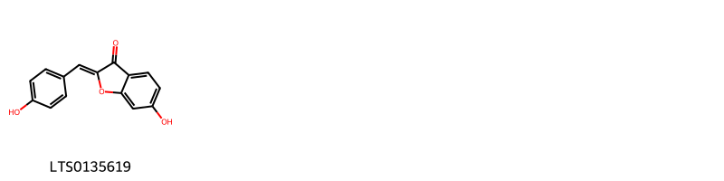{ width=100% }
    <figcaption>Hình ảnh cấu trúc hóa học của 1 hoạt chất thuộc nhóm Aurone flavonoids gồm ['hispidol (LTS0135619)'].</figcaption>
</figure>
#### Nhóm Diazanaphthalenes
<figure markdown="span">
    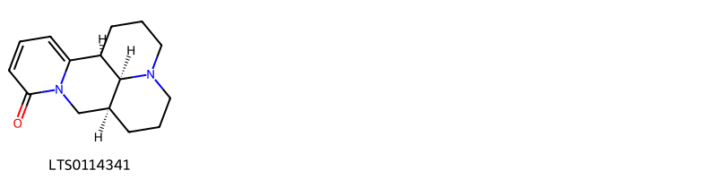{ width=100% }
    <figcaption>Hình ảnh cấu trúc hóa học của 1 hoạt chất thuộc nhóm Diazanaphthalenes gồm ['sophoramine (LTS0114341)'].</figcaption>
</figure>
#### Nhóm Flavonoids
<figure markdown="span">
    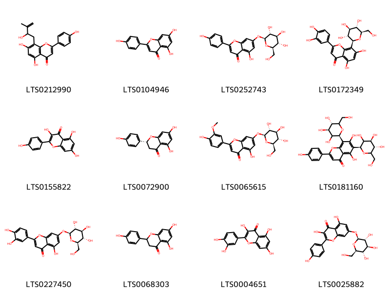{ width=100% }
    <figcaption>Hình ảnh cấu trúc hóa học của 12 hoạt chất thuộc nhóm Flavonoids gồm ['ephedroidin (LTS0212990)', 'chamomile (LTS0104946)', 'apigenin 7-o-β-glucoside (LTS0252743)', 'orientin (LTS0172349)', 'kaempherol (LTS0155822)', '(-)-naringenin (LTS0072900)', '5-hydroxy-2-(4-hydroxy-3-methoxyphenyl)-7-{[(2s,3r,4s,5s,6r)-3,4,5-trihydroxy-6-(hydroxymethyl)oxan-2-yl]oxy}chromen-4-one (LTS0065615)', 'vicenin 2 (LTS0181160)', 'luteolin 7-o-glucoside (LTS0227450)', 'asahina (LTS0068303)', 'quercetin (LTS0004651)', 'kaempferol 7-o-glucoside (LTS0025882)'].</figcaption>
</figure>
#### Nhóm Isoflavonoids
<figure markdown="span">
    { width=100% }
    <figcaption>Hình ảnh cấu trúc hóa học của 1 hoạt chất thuộc nhóm Isoflavonoids gồm ['daidzein (LTS0130369)'].</figcaption>
</figure>
#### Nhóm Lupin alkaloids
<figure markdown="span">
    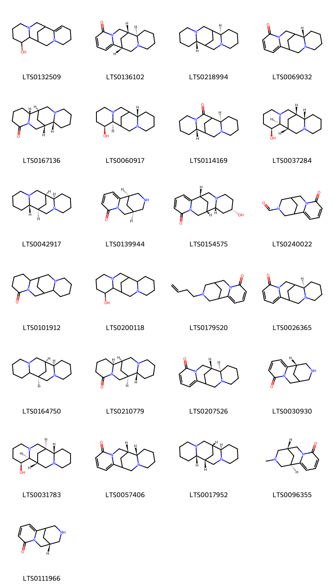{ width=100% }
    <figcaption>Hình ảnh cấu trúc hóa học của 25 hoạt chất thuộc nhóm Lupin alkaloids gồm ['7,15-diazatetracyclo[7.7.1.0²,⁷.0¹⁰,¹⁵]heptadec-10-en-3-ol (LTS0132509)', '(1r,9r,10r)-7,15-diazatetracyclo[7.7.1.0²,⁷.0¹⁰,¹⁵]heptadeca-2,4-dien-6-one (LTS0136102)', '(2r,10s)-7,15-diazatetracyclo[7.7.1.0²,⁷.0¹⁰,¹⁵]heptadecane (LTS0218994)', 'thermospine (LTS0069032)', '(1r,2r,9s,10r)-7,15-diazatetracyclo[7.7.1.0²,⁷.0¹⁰,¹⁵]heptadecan-6-one (LTS0167136)', 'retamine (LTS0060917)', '17-oxosparteine (LTS0114169)', '(1r,2s,3s,9r,10s)-7,15-diazatetracyclo[7.7.1.0²,⁷.0¹⁰,¹⁵]heptadecan-3-ol (LTS0037284)', 'sparteine (LTS0042917)', 'cytisine (LTS0139944)', 'baptifoline (LTS0154575)', '6-oxo-7,11-diazatricyclo[7.3.1.0²,⁷]trideca-2,4-diene-11-carbaldehyde (LTS0240022)', 'lupanine l-form (LTS0101912)', '7,15-diazatetracyclo[7.7.1.0²,⁷.0¹⁰,¹⁵]heptadecan-3-ol (LTS0200118)', 'rhombifoline (LTS0179520)', 'anagyrine (LTS0026365)', '(1s,2r,9s)-7,15-diazatetracyclo[7.7.1.0²,⁷.0¹⁰,¹⁵]heptadecane (LTS0164750)', '(-)-lupanine (LTS0210779)', '(9r,10r)-7,15-diazatetracyclo[7.7.1.0²,⁷.0¹⁰,¹⁵]heptadeca-2,4-dien-6-one (LTS0207526)', '(1s)-7,11-diazatricyclo[7.3.1.0²,⁷]trideca-2,4-dien-6-one (LTS0030930)', '(1r,2s,3s,9s,10s)-7,15-diazatetracyclo[7.7.1.0²,⁷.0¹⁰,¹⁵]heptadecan-3-ol (LTS0031783)', '(9r,10s)-7,15-diazatetracyclo[7.7.1.0²,⁷.0¹⁰,¹⁵]heptadeca-2,4-dien-6-one (LTS0057406)', 'sparteine (LTS0017952)', '(1r,9r)-11-methyl-7,11-diazatricyclo[7.3.1.0²,⁷]trideca-2,4-dien-6-one (LTS0096355)', '(9r)-7,11-diazatricyclo[7.3.1.0²,⁷]trideca-2,4-dien-6-one (LTS0111966)'].</figcaption>
</figure>
#### Nhóm Organonitrogen compounds
<figure markdown="span">
    { width=100% }
    <figcaption>Hình ảnh cấu trúc hóa học của 1 hoạt chất thuộc nhóm Organonitrogen compounds gồm ['choline (LTS0170307)'].</figcaption>
</figure>
#### Nhóm Pyridines and derivatives
<figure markdown="span">
    { width=100% }
    <figcaption>Hình ảnh cấu trúc hóa học của 1 hoạt chất thuộc nhóm Pyridines and derivatives gồm ['ammodendrine (LTS0084410)'].</figcaption>
</figure>
#### Nhóm Quinolizidines
<figure markdown="span">
    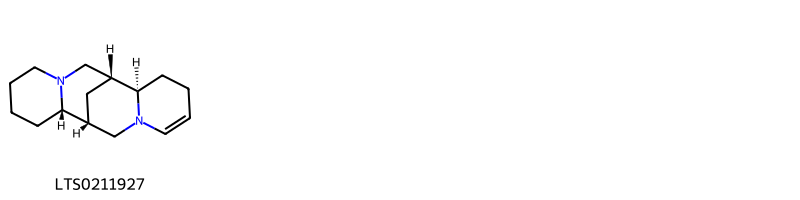{ width=100% }
    <figcaption>Hình ảnh cấu trúc hóa học của 1 hoạt chất thuộc nhóm Quinolizidines gồm ['(1r,2r,9r,10s)-7,15-diazatetracyclo[7.7.1.0²,⁷.0¹⁰,¹⁵]heptadec-5-ene (LTS0211927)'].</figcaption>
</figure>
#### Nhóm Steroids and steroid derivatives
<figure markdown="span">
    { width=100% }
    <figcaption>Hình ảnh cấu trúc hóa học của 2 hoạt chất thuộc nhóm Steroids and steroid derivatives gồm ['stigmast-5-en-3-ol (LTS0071224)', 'stigmast-5-en-3-ol, (3β)- (LTS0204616)'].</figcaption>
</figure>

---

### Dược dân tộc học

Danh sách các quốc gia có sử dụng *Retama raetam* trong điều trị các bệnh. 

| Country   | Disease                                     | Bệnh                                                                                                                                                                                                |
|:----------|:--------------------------------------------|:----------------------------------------------------------------------------------------------------------------------------------------------------------------------------------------------------|
| Egypt     | Abortifacient, Poison, Purgative, Vermifuge | MYMEMORY WARNING: YOU USED ALL AVAILABLE FREE TRANSLATIONS FOR TODAY. NEXT AVAILABLE IN  14 HOURS 03 MINUTES 15 SECONDS VISIT HTTPS://MYMEMORY.TRANSLATED.NET/DOC/USAGELIMITS.PHP TO TRANSLATE MORE |

---

# Chi Detarium

??? note "Danh sách các dược liệu thuộc chi"
    
	 - *Detarium senegalense*
	 - *Detarium snegalense*

---
## Detarium senegalense
### Thông tin về thực vật

!!! info "Phân loại thực vật của *Detarium senegalense* từ GIBF:"
    - **Kingdom:** Plantae
    - **Phylum:** Tracheophyta
    - **Order:** Fabales
    - **Family:** Fabaceae
    - **Genus:** Detarium
    - **Species:** *Detarium senegalense*

 

| Label (VI)   | Label (EN)   | Scientific Name      | Descriptions (VI)   | Descriptions (EN)   | Also Known As (VI)   | Also Known As (EN)   |
|:-------------|:-------------|:---------------------|:--------------------|:--------------------|:---------------------|:---------------------|
| N/A          | N/A          | Detarium senegalense |                     | species of plant    | ['']                 | ['tallow tree']      |

#### Phân bố trên thế giới

**Từ CSDL GIBF** nan, Ghana, Guinea-Bissau, Mali, Senegal, Nigeria, Côte d’Ivoire, Gambia, Benin, Burkina Faso, Guinea, Liberia, Togo

#### Phân bố tại Việt Nam

**Từ CSDL GIBF**: Không có ghi nhận ở Việt Nam

---
### Thành phần hóa học
        
- Theo cơ sở dữ liệu lotus: Từ loài *Detarium senegalense* đã phân lập và xác định được Chưa có hoạt chất nào được phân lập. hoạt chất thuộc về các nhóm Không có hoạt chất nào được phân lập. 

Không có hình ảnh nào được tạo ra

---

### Dược dân tộc học

Danh sách các quốc gia có sử dụng *Detarium senegalense* trong điều trị các bệnh. 

| Country   | Disease   | Bệnh                                                                                                                                                                                                |
|:----------|:----------|:----------------------------------------------------------------------------------------------------------------------------------------------------------------------------------------------------|
| Africa    | Poison    | MYMEMORY WARNING: YOU USED ALL AVAILABLE FREE TRANSLATIONS FOR TODAY. NEXT AVAILABLE IN  14 HOURS 02 MINUTES 26 SECONDS VISIT HTTPS://MYMEMORY.TRANSLATED.NET/DOC/USAGELIMITS.PHP TO TRANSLATE MORE |

---

---
## Detarium snegalense
### Thông tin về thực vật

!!! info "Phân loại thực vật của *N/A* từ GIBF:"
    - **Kingdom:** Plantae
    - **Phylum:** Tracheophyta
    - **Order:** Fabales
    - **Family:** Fabaceae
    - **Genus:** Detarium
    - **Species:** *N/A*

 

| Label (VI)   | Label (EN)   | Scientific Name      | Descriptions (VI)   | Descriptions (EN)   | Also Known As (VI)   | Also Known As (EN)   |
|:-------------|:-------------|:---------------------|:--------------------|:--------------------|:---------------------|:---------------------|
| N/A          | N/A          | Detarium senegalense |                     | species of plant    | ['']                 | ['tallow tree']      |

#### Phân bố trên thế giới

**Từ CSDL GIBF** Ghana, Liberia, Senegal, Nigeria, Gabon, Côte d’Ivoire, Gambia, Benin, Burkina Faso, Guinea, Cameroon, Togo

#### Phân bố tại Việt Nam

**Từ CSDL GIBF**: Không có ghi nhận ở Việt Nam

---
### Thành phần hóa học
        
- Theo cơ sở dữ liệu lotus: Từ loài *N/A* đã phân lập và xác định được Chưa có hoạt chất nào được phân lập. hoạt chất thuộc về các nhóm Không có hoạt chất nào được phân lập. 

Không có hình ảnh nào được tạo ra

---

### Dược dân tộc học

Danh sách các quốc gia có sử dụng *N/A* trong điều trị các bệnh. 

| Country   | Disease   | Bệnh                                                                                                                                                                                                |
|:----------|:----------|:----------------------------------------------------------------------------------------------------------------------------------------------------------------------------------------------------|
| Elsewhere | Soap      | MYMEMORY WARNING: YOU USED ALL AVAILABLE FREE TRANSLATIONS FOR TODAY. NEXT AVAILABLE IN  14 HOURS 01 MINUTES 58 SECONDS VISIT HTTPS://MYMEMORY.TRANSLATED.NET/DOC/USAGELIMITS.PHP TO TRANSLATE MORE |

---

# Chi Afzelia

??? note "Danh sách các dược liệu thuộc chi"
    
	 - *Afzelia africana*

---
## Afzelia africana
### Thông tin về thực vật

!!! info "Phân loại thực vật của *Afzelia africana* từ GIBF:"
    - **Kingdom:** Plantae
    - **Phylum:** Tracheophyta
    - **Order:** Fabales
    - **Family:** Fabaceae
    - **Genus:** Afzelia
    - **Species:** *Afzelia africana*

 

| Label (VI)   | Label (EN)   | Scientific Name   | Descriptions (VI)   | Descriptions (EN)   | Also Known As (VI)   | Also Known As (EN)                                                  |
|:-------------|:-------------|:------------------|:--------------------|:--------------------|:---------------------|:--------------------------------------------------------------------|
| N/A          | N/A          | Afzelia africana  | loài thực vật       | species of plant    | ['']                 | ['African mahogany', 'afzelia', 'apa', 'doussi', 'lengue', 'lenke'] |

#### Phân bố trên thế giới

**Từ CSDL GIBF** Central African Republic, Senegal, Nigeria, Côte d’Ivoire, Benin, Guinea, Sierra Leone, Togo

#### Phân bố tại Việt Nam

**Từ CSDL GIBF**: Không có ghi nhận ở Việt Nam

---
### Thành phần hóa học
        
- Theo cơ sở dữ liệu lotus: Từ loài *Afzelia africana* đã phân lập và xác định được Chưa có hoạt chất nào được phân lập. hoạt chất thuộc về các nhóm Không có hoạt chất nào được phân lập. 

Không có hình ảnh nào được tạo ra

---

### Dược dân tộc học

Danh sách các quốc gia có sử dụng *Afzelia africana* trong điều trị các bệnh. 

| Country     | Disease   | Bệnh                                                                                                                                                                                                |
|:------------|:----------|:----------------------------------------------------------------------------------------------------------------------------------------------------------------------------------------------------|
| Upper Volta | Diuretic  | MYMEMORY WARNING: YOU USED ALL AVAILABLE FREE TRANSLATIONS FOR TODAY. NEXT AVAILABLE IN  14 HOURS 01 MINUTES 38 SECONDS VISIT HTTPS://MYMEMORY.TRANSLATED.NET/DOC/USAGELIMITS.PHP TO TRANSLATE MORE |

---

# Chi Cynometra

??? note "Danh sách các dược liệu thuộc chi"
    
	 - *Cynometra americana*
	 - *Cynometra haerocarpa*
	 - *Cynometra ramiflora*

---
## Cynometra americana
### Thông tin về thực vật

!!! info "Phân loại thực vật của *Cynometra americana* từ GIBF:"
    - **Kingdom:** Plantae
    - **Phylum:** Tracheophyta
    - **Order:** Fabales
    - **Family:** Fabaceae
    - **Genus:** Cynometra
    - **Species:** *Cynometra americana*

 

| Label (VI)   | Label (EN)   | Scientific Name     | Descriptions (VI)   | Descriptions (EN)   | Also Known As (VI)   | Also Known As (EN)   |
|:-------------|:-------------|:--------------------|:--------------------|:--------------------|:---------------------|:---------------------|
| N/A          | N/A          | Cynometra americana | loài thực vật       | species of plant    | ['']                 | ['']                 |

#### Phân bố trên thế giới

**Từ CSDL GIBF** nan, Haiti, Saint Vincent and the Grenadines, Mexico

#### Phân bố tại Việt Nam

**Từ CSDL GIBF**: Không có ghi nhận ở Việt Nam

---
### Thành phần hóa học
        
- Theo cơ sở dữ liệu lotus: Từ loài *Cynometra americana* đã phân lập và xác định được Chưa có hoạt chất nào được phân lập. hoạt chất thuộc về các nhóm Không có hoạt chất nào được phân lập. 

Không có hình ảnh nào được tạo ra

---

### Dược dân tộc học

Danh sách các quốc gia có sử dụng *Cynometra americana* trong điều trị các bệnh. 

| Country            | Disease                | Bệnh                                                                                                                                                                                                |
|:-------------------|:-----------------------|:----------------------------------------------------------------------------------------------------------------------------------------------------------------------------------------------------|
| Dominican Republic | Carminative            | MYMEMORY WARNING: YOU USED ALL AVAILABLE FREE TRANSLATIONS FOR TODAY. NEXT AVAILABLE IN  14 HOURS 01 MINUTES 16 SECONDS VISIT HTTPS://MYMEMORY.TRANSLATED.NET/DOC/USAGELIMITS.PHP TO TRANSLATE MORE |
| Haiti              | Carminative, Purgative | MYMEMORY WARNING: YOU USED ALL AVAILABLE FREE TRANSLATIONS FOR TODAY. NEXT AVAILABLE IN  14 HOURS 01 MINUTES 13 SECONDS VISIT HTTPS://MYMEMORY.TRANSLATED.NET/DOC/USAGELIMITS.PHP TO TRANSLATE MORE |

---

---
## Cynometra haerocarpa
### Thông tin về thực vật

!!! info "Phân loại thực vật của *N/A* từ GIBF:"
    - **Kingdom:** Plantae
    - **Phylum:** Tracheophyta
    - **Order:** Fabales
    - **Family:** Fabaceae
    - **Genus:** Cynometra
    - **Species:** *N/A*

 

| Label (VI)   | Label (EN)   | Scientific Name     | Descriptions (VI)   | Descriptions (EN)   | Also Known As (VI)   | Also Known As (EN)   |
|:-------------|:-------------|:--------------------|:--------------------|:--------------------|:---------------------|:---------------------|
| N/A          | N/A          | Cynometra americana | loài thực vật       | species of plant    | ['']                 | ['']                 |

#### Phân bố trên thế giới

**Từ CSDL GIBF** Sri Lanka, Australia, Gabon, Benin, Sierra Leone, Tanzania, United Republic of, Panama, Puerto Rico, Bolivia (Plurinational State of), Guinea, Sao Tome and Principe, Thailand, Brazil, Guam, Mexico, Mayotte, Singapore, Ecuador, Madagascar, Colombia, Kenya, Costa Rica, Vanuatu, India, Indonesia, Philippines, Cameroon, Malaysia, Northern Mariana Islands

#### Phân bố tại Việt Nam

**Từ CSDL GIBF**: Không có ghi nhận ở Việt Nam

---
### Thành phần hóa học
        
- Theo cơ sở dữ liệu lotus: Từ loài *N/A* đã phân lập và xác định được Chưa có hoạt chất nào được phân lập. hoạt chất thuộc về các nhóm Không có hoạt chất nào được phân lập. 

Không có hình ảnh nào được tạo ra

---

### Dược dân tộc học

Danh sách các quốc gia có sử dụng *N/A* trong điều trị các bệnh. 

| Country   | Disease   | Bệnh                                                                                                                                                                                                |
|:----------|:----------|:----------------------------------------------------------------------------------------------------------------------------------------------------------------------------------------------------|
| Venezuela | Stomachic | MYMEMORY WARNING: YOU USED ALL AVAILABLE FREE TRANSLATIONS FOR TODAY. NEXT AVAILABLE IN  14 HOURS 00 MINUTES 52 SECONDS VISIT HTTPS://MYMEMORY.TRANSLATED.NET/DOC/USAGELIMITS.PHP TO TRANSLATE MORE |

---

---
## Cynometra ramiflora
### Thông tin về thực vật

!!! info "Phân loại thực vật của *Cynometra ramiflora* từ GIBF:"
    - **Kingdom:** Plantae
    - **Phylum:** Tracheophyta
    - **Order:** Fabales
    - **Family:** Fabaceae
    - **Genus:** Cynometra
    - **Species:** *Cynometra ramiflora*

 

| Label (VI)   | Label (EN)   | Scientific Name     | Descriptions (VI)   | Descriptions (EN)   | Also Known As (VI)   | Also Known As (EN)       |
|:-------------|:-------------|:--------------------|:--------------------|:--------------------|:---------------------|:-------------------------|
| N/A          | N/A          | Cynometra ramiflora | loài thực vật       | species of plant    | ['']                 | ['Wrinkle Pod Mangrove'] |

#### Phân bố trên thế giới

**Từ CSDL GIBF** nan, Palau, Sri Lanka, Micronesia (Federated States of), Australia, Christmas Island, Lao People’s Democratic Republic, unknown or invalid, Bolivia (Plurinational State of), Papua New Guinea, Bangladesh, United States of America, South Africa, Thailand, Guam, New Caledonia, Singapore, Vanuatu, India, Indonesia, Philippines, Malaysia, Northern Mariana Islands

#### Phân bố tại Việt Nam

**Từ CSDL GIBF**: Không có ghi nhận ở Việt Nam

---
### Thành phần hóa học
        
- Theo cơ sở dữ liệu lotus: Từ loài *Cynometra ramiflora* đã phân lập và xác định được Chưa có hoạt chất nào được phân lập. hoạt chất thuộc về các nhóm Không có hoạt chất nào được phân lập. 

Không có hình ảnh nào được tạo ra

---

### Dược dân tộc học

Danh sách các quốc gia có sử dụng *Cynometra ramiflora* trong điều trị các bệnh. 

| Country   | Disease   | Bệnh                                                                                                                                                                                                |
|:----------|:----------|:----------------------------------------------------------------------------------------------------------------------------------------------------------------------------------------------------|
| Elsewhere | Purgative | MYMEMORY WARNING: YOU USED ALL AVAILABLE FREE TRANSLATIONS FOR TODAY. NEXT AVAILABLE IN  14 HOURS 00 MINUTES 28 SECONDS VISIT HTTPS://MYMEMORY.TRANSLATED.NET/DOC/USAGELIMITS.PHP TO TRANSLATE MORE |

---

# Chi Baptisia

??? note "Danh sách các dược liệu thuộc chi"
    
	 - *Baptisia leucantha*
	 - *Baptisia tinctoria*

---
## Baptisia leucantha
### Thông tin về thực vật

!!! info "Phân loại thực vật của *Baptisia alba* từ GIBF:"
    - **Kingdom:** Plantae
    - **Phylum:** Tracheophyta
    - **Order:** Fabales
    - **Family:** Fabaceae
    - **Genus:** Baptisia
    - **Species:** *Baptisia alba*

 

| Label (VI)   | Label (EN)   | Scientific Name    | Descriptions (VI)   | Descriptions (EN)   | Also Known As (VI)   | Also Known As (EN)   |
|:-------------|:-------------|:-------------------|:--------------------|:--------------------|:---------------------|:---------------------|
| N/A          | N/A          | Baptisia leucantha | loài thực vật       | species of plant    | ['']                 | ['']                 |

#### Phân bố trên thế giới

**Từ CSDL GIBF** unknown or invalid, United States of America

#### Phân bố tại Việt Nam

**Từ CSDL GIBF**: Không có ghi nhận ở Việt Nam

---
### Thành phần hóa học
        
- Theo cơ sở dữ liệu lotus: Từ loài *Baptisia alba* đã phân lập và xác định được Chưa có hoạt chất nào được phân lập. hoạt chất thuộc về các nhóm Không có hoạt chất nào được phân lập. 

Không có hình ảnh nào được tạo ra

---

### Dược dân tộc học

Danh sách các quốc gia có sử dụng *Baptisia alba* trong điều trị các bệnh. 

| Country   | Disease   | Bệnh                                                                                                                                                                                                |
|:----------|:----------|:----------------------------------------------------------------------------------------------------------------------------------------------------------------------------------------------------|
| US        | Poison    | MYMEMORY WARNING: YOU USED ALL AVAILABLE FREE TRANSLATIONS FOR TODAY. NEXT AVAILABLE IN  14 HOURS 00 MINUTES 04 SECONDS VISIT HTTPS://MYMEMORY.TRANSLATED.NET/DOC/USAGELIMITS.PHP TO TRANSLATE MORE |

---

---
## Baptisia tinctoria
### Thông tin về thực vật

!!! info "Phân loại thực vật của *Baptisia tinctoria* từ GIBF:"
    - **Kingdom:** Plantae
    - **Phylum:** Tracheophyta
    - **Order:** Fabales
    - **Family:** Fabaceae
    - **Genus:** Baptisia
    - **Species:** *Baptisia tinctoria*

 

| Label (VI)   | Label (EN)   | Scientific Name    | Descriptions (VI)   | Descriptions (EN)   | Also Known As (VI)   | Also Known As (EN)   |
|:-------------|:-------------|:-------------------|:--------------------|:--------------------|:---------------------|:---------------------|
| N/A          | N/A          | Baptisia tinctoria | loài thực vật       | species of plant    | ['']                 | ['']                 |

#### Phân bố trên thế giới

**Từ CSDL GIBF** United States of America, Canada

#### Phân bố tại Việt Nam

**Từ CSDL GIBF**: Không có ghi nhận ở Việt Nam

---
### Thành phần hóa học
        
- Theo cơ sở dữ liệu lotus: Từ loài *Baptisia tinctoria* đã phân lập và xác định được 24 hoạt chất thuộc về các nhóm Flavonoids, Isoflavonoids, Lupin alkaloids, Coumarins and derivatives. 

|    | chemicalTaxonomyClassyfireClass   |   smiles_count |
|---:|:----------------------------------|---------------:|
|  0 | Coumarins and derivatives         |              2 |
|  1 | Flavonoids                        |              1 |
|  2 | Isoflavonoids                     |              6 |
|  3 | Lupin alkaloids                   |             12 |

#### Nhóm Coumarins and derivatives
<figure markdown="span">
    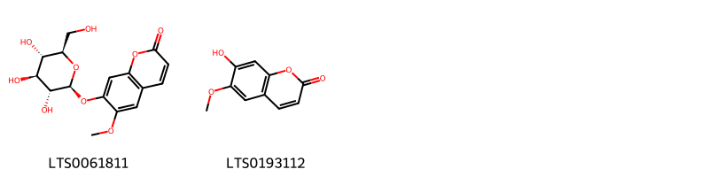{ width=100% }
    <figcaption>Hình ảnh cấu trúc hóa học của 2 hoạt chất thuộc nhóm Coumarins and derivatives gồm ['scopolin (LTS0061811)', 'scopoletin (LTS0193112)'].</figcaption>
</figure>
#### Nhóm Flavonoids
<figure markdown="span">
    { width=100% }
    <figcaption>Hình ảnh cấu trúc hóa học của 1 hoạt chất thuộc nhóm Flavonoids gồm ['luteolin (LTS0017052)'].</figcaption>
</figure>
#### Nhóm Isoflavonoids
<figure markdown="span">
    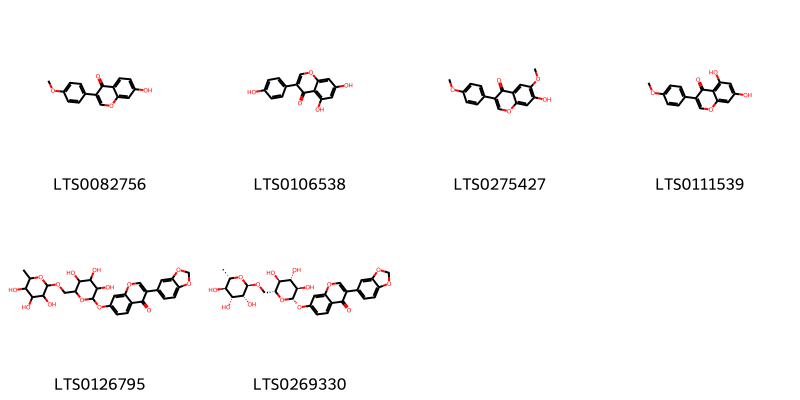{ width=100% }
    <figcaption>Hình ảnh cấu trúc hóa học của 6 hoạt chất thuộc nhóm Isoflavonoids gồm ['formononetin (LTS0082756)', 'genistein (LTS0106538)', 'afrormosin (LTS0275427)', 'biochanin (LTS0111539)', '3-(2h-1,3-benzodioxol-5-yl)-7-[(3,4,5-trihydroxy-6-{[(3,4,5-trihydroxy-6-methyloxan-2-yl)oxy]methyl}oxan-2-yl)oxy]chromen-4-one (LTS0126795)', '3-(2h-1,3-benzodioxol-5-yl)-7-{[(2s,3r,4s,5s,6r)-3,4,5-trihydroxy-6-({[(2r,3r,4r,5r,6s)-3,4,5-trihydroxy-6-methyloxan-2-yl]oxy}methyl)oxan-2-yl]oxy}chromen-4-one (LTS0269330)'].</figcaption>
</figure>
#### Nhóm Lupin alkaloids
<figure markdown="span">
    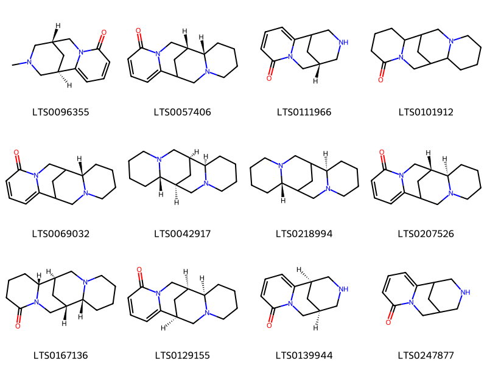{ width=100% }
    <figcaption>Hình ảnh cấu trúc hóa học của 12 hoạt chất thuộc nhóm Lupin alkaloids gồm ['(1r,9r)-11-methyl-7,11-diazatricyclo[7.3.1.0²,⁷]trideca-2,4-dien-6-one (LTS0096355)', '(9r,10s)-7,15-diazatetracyclo[7.7.1.0²,⁷.0¹⁰,¹⁵]heptadeca-2,4-dien-6-one (LTS0057406)', '(9r)-7,11-diazatricyclo[7.3.1.0²,⁷]trideca-2,4-dien-6-one (LTS0111966)', 'lupanine l-form (LTS0101912)', 'thermospine (LTS0069032)', 'sparteine (LTS0042917)', '(2r,10s)-7,15-diazatetracyclo[7.7.1.0²,⁷.0¹⁰,¹⁵]heptadecane (LTS0218994)', '(9r,10r)-7,15-diazatetracyclo[7.7.1.0²,⁷.0¹⁰,¹⁵]heptadeca-2,4-dien-6-one (LTS0207526)', '(1r,2r,9s,10r)-7,15-diazatetracyclo[7.7.1.0²,⁷.0¹⁰,¹⁵]heptadecan-6-one (LTS0167136)', '(-)-anagyrine (LTS0129155)', 'cytisine (LTS0139944)', 'citizin (LTS0247877)'].</figcaption>
</figure>

---

### Dược dân tộc học

Danh sách các quốc gia có sử dụng *Baptisia tinctoria* trong điều trị các bệnh. 

| Country        | Disease                                                        | Bệnh                                                                                                                                                                                                |
|:---------------|:---------------------------------------------------------------|:----------------------------------------------------------------------------------------------------------------------------------------------------------------------------------------------------|
| Dutch          | Tonic                                                          | MYMEMORY WARNING: YOU USED ALL AVAILABLE FREE TRANSLATIONS FOR TODAY. NEXT AVAILABLE IN  13 HOURS 59 MINUTES 43 SECONDS VISIT HTTPS://MYMEMORY.TRANSLATED.NET/DOC/USAGELIMITS.PHP TO TRANSLATE MORE |
| French         | Emmenagogue                                                    | MYMEMORY WARNING: YOU USED ALL AVAILABLE FREE TRANSLATIONS FOR TODAY. NEXT AVAILABLE IN  13 HOURS 59 MINUTES 40 SECONDS VISIT HTTPS://MYMEMORY.TRANSLATED.NET/DOC/USAGELIMITS.PHP TO TRANSLATE MORE |
| German         | Emetic                                                         | MYMEMORY WARNING: YOU USED ALL AVAILABLE FREE TRANSLATIONS FOR TODAY. NEXT AVAILABLE IN  13 HOURS 59 MINUTES 37 SECONDS VISIT HTTPS://MYMEMORY.TRANSLATED.NET/DOC/USAGELIMITS.PHP TO TRANSLATE MORE |
| Italian        | Purgative                                                      | MYMEMORY WARNING: YOU USED ALL AVAILABLE FREE TRANSLATIONS FOR TODAY. NEXT AVAILABLE IN  13 HOURS 59 MINUTES 34 SECONDS VISIT HTTPS://MYMEMORY.TRANSLATED.NET/DOC/USAGELIMITS.PHP TO TRANSLATE MORE |
| US             | Antiseptic, Emetic, Antiseptic, Laxative, Poultice, Astringent | MYMEMORY WARNING: YOU USED ALL AVAILABLE FREE TRANSLATIONS FOR TODAY. NEXT AVAILABLE IN  13 HOURS 59 MINUTES 29 SECONDS VISIT HTTPS://MYMEMORY.TRANSLATED.NET/DOC/USAGELIMITS.PHP TO TRANSLATE MORE |
| US(Amerindian) | Cathartic, Poultice                                            | MYMEMORY WARNING: YOU USED ALL AVAILABLE FREE TRANSLATIONS FOR TODAY. NEXT AVAILABLE IN  13 HOURS 59 MINUTES 27 SECONDS VISIT HTTPS://MYMEMORY.TRANSLATED.NET/DOC/USAGELIMITS.PHP TO TRANSLATE MORE |

---

# Chi Andira

??? note "Danh sách các dược liệu thuộc chi"
    
	 - *Andira araroba*
	 - *Andira galeottiana*
	 - *Andira inermis*
	 - *Andira stipulacea*
	 - *Andira vermifuga*

---
## Andira araroba
### Thông tin về thực vật

!!! info "Phân loại thực vật của *Vataireopsis araroba* từ GIBF:"
    - **Kingdom:** Plantae
    - **Phylum:** Tracheophyta
    - **Order:** Fabales
    - **Family:** Fabaceae
    - **Genus:** Vataireopsis
    - **Species:** *Vataireopsis araroba*

 

| Label (VI)   | Label (EN)   | Scientific Name   | Descriptions (VI)   | Descriptions (EN)   | Also Known As (VI)   | Also Known As (EN)   |
|:-------------|:-------------|:------------------|:--------------------|:--------------------|:---------------------|:---------------------|
| N/A          | N/A          | Andira araroba    | loài thực vật       | species of plant    | ['']                 | ['']                 |

#### Phân bố trên thế giới

**Từ CSDL GIBF** United States of America, Canada

#### Phân bố tại Việt Nam

**Từ CSDL GIBF**: Không có ghi nhận ở Việt Nam

---
### Thành phần hóa học
        
- Theo cơ sở dữ liệu lotus: Từ loài *Vataireopsis araroba* đã phân lập và xác định được Chưa có hoạt chất nào được phân lập. hoạt chất thuộc về các nhóm Không có hoạt chất nào được phân lập. 

Không có hình ảnh nào được tạo ra

---

### Dược dân tộc học

Danh sách các quốc gia có sử dụng *Vataireopsis araroba* trong điều trị các bệnh. 

| Country   | Disease   | Bệnh                                                                                                                                                                                                |
|:----------|:----------|:----------------------------------------------------------------------------------------------------------------------------------------------------------------------------------------------------|
| Dutch     | Poison    | MYMEMORY WARNING: YOU USED ALL AVAILABLE FREE TRANSLATIONS FOR TODAY. NEXT AVAILABLE IN  13 HOURS 58 MINUTES 56 SECONDS VISIT HTTPS://MYMEMORY.TRANSLATED.NET/DOC/USAGELIMITS.PHP TO TRANSLATE MORE |
| French    | Taenifuge | MYMEMORY WARNING: YOU USED ALL AVAILABLE FREE TRANSLATIONS FOR TODAY. NEXT AVAILABLE IN  13 HOURS 58 MINUTES 54 SECONDS VISIT HTTPS://MYMEMORY.TRANSLATED.NET/DOC/USAGELIMITS.PHP TO TRANSLATE MORE |

---

---
## Andira galeottiana
### Thông tin về thực vật

!!! info "Phân loại thực vật của *Andira galeottiana* từ GIBF:"
    - **Kingdom:** Plantae
    - **Phylum:** Tracheophyta
    - **Order:** Fabales
    - **Family:** Fabaceae
    - **Genus:** Andira
    - **Species:** *Andira galeottiana*

 

| Label (VI)   | Label (EN)   | Scientific Name    | Descriptions (VI)   | Descriptions (EN)   | Also Known As (VI)   | Also Known As (EN)   |
|:-------------|:-------------|:-------------------|:--------------------|:--------------------|:---------------------|:---------------------|
| N/A          | N/A          | Andira galeottiana | loài thực vật       | species of plant    | ['']                 | ['']                 |

#### Phân bố trên thế giới

**Từ CSDL GIBF** Costa Rica, Nicaragua, United States of America, Mexico

#### Phân bố tại Việt Nam

**Từ CSDL GIBF**: Không có ghi nhận ở Việt Nam

---
### Thành phần hóa học
        
- Theo cơ sở dữ liệu lotus: Từ loài *Andira galeottiana* đã phân lập và xác định được Chưa có hoạt chất nào được phân lập. hoạt chất thuộc về các nhóm Không có hoạt chất nào được phân lập. 

Không có hình ảnh nào được tạo ra

---

### Dược dân tộc học

Danh sách các quốc gia có sử dụng *Andira galeottiana* trong điều trị các bệnh. 

| Country           | Disease   | Bệnh                                                                                                                                                                                                |
|:------------------|:----------|:----------------------------------------------------------------------------------------------------------------------------------------------------------------------------------------------------|
| Mexico(Chinantec) | Vermifuge | MYMEMORY WARNING: YOU USED ALL AVAILABLE FREE TRANSLATIONS FOR TODAY. NEXT AVAILABLE IN  13 HOURS 58 MINUTES 35 SECONDS VISIT HTTPS://MYMEMORY.TRANSLATED.NET/DOC/USAGELIMITS.PHP TO TRANSLATE MORE |

---

---
## Andira inermis
### Thông tin về thực vật

!!! info "Phân loại thực vật của *Andira inermis* từ GIBF:"
    - **Kingdom:** Plantae
    - **Phylum:** Tracheophyta
    - **Order:** Fabales
    - **Family:** Fabaceae
    - **Genus:** Andira
    - **Species:** *Andira inermis*

 

| Label (VI)   | Label (EN)   | Scientific Name   | Descriptions (VI)   | Descriptions (EN)   | Also Known As (VI)   | Also Known As (EN)   |
|:-------------|:-------------|:------------------|:--------------------|:--------------------|:---------------------|:---------------------|
| N/A          | N/A          | Andira inermis    |                     | species of tree     | ['']                 | ['']                 |

#### Phân bố trên thế giới

**Từ CSDL GIBF** Virgin Islands (U.S.), nan, Nicaragua, Panama, French Guiana, Puerto Rico, Honduras, Jamaica, United States of America, Paraguay, El Salvador, Belize, Trinidad and Tobago, Brazil, Dominican Republic, Mexico, Peru, Singapore, Ecuador, Haiti, Colombia, Costa Rica, Cayman Islands, Antigua and Barbuda, Malaysia

#### Phân bố tại Việt Nam

**Từ CSDL GIBF**: Không có ghi nhận ở Việt Nam

---
### Thành phần hóa học
        
- Theo cơ sở dữ liệu lotus: Từ loài *Andira inermis* đã phân lập và xác định được 38 hoạt chất thuộc về các nhóm Flavonoids, Steroids and steroid derivatives, Isoflavonoids, 2-arylbenzofuran flavonoids, Protoberberine alkaloids and derivatives. 

|    | chemicalTaxonomyClassyfireClass          |   smiles_count |
|---:|:-----------------------------------------|---------------:|
|  0 | 2-arylbenzofuran flavonoids              |              4 |
|  1 | Flavonoids                               |             12 |
|  2 | Isoflavonoids                            |             18 |
|  3 | Protoberberine alkaloids and derivatives |              1 |
|  4 | Steroids and steroid derivatives         |              3 |

#### Nhóm 2-arylbenzofuran flavonoids
<figure markdown="span">
    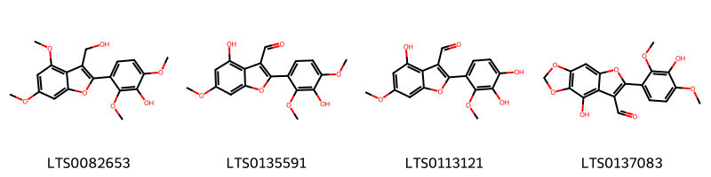{ width=100% }
    <figcaption>Hình ảnh cấu trúc hóa học của 4 hoạt chất thuộc nhóm 2-arylbenzofuran flavonoids gồm ['3-[3-(hydroxymethyl)-4,6-dimethoxy-1-benzofuran-2-yl]-2,6-dimethoxyphenol (LTS0082653)', '4-hydroxy-2-(3-hydroxy-2,4-dimethoxyphenyl)-6-methoxy-1-benzofuran-3-carbaldehyde (LTS0135591)', '2-(3,4-dihydroxy-2-methoxyphenyl)-4-hydroxy-6-methoxy-1-benzofuran-3-carbaldehyde (LTS0113121)', '2-hydroxy-11-(3-hydroxy-2,4-dimethoxyphenyl)-4,6,10-trioxatricyclo[7.3.0.0³,⁷]dodeca-1,3(7),8,11-tetraene-12-carbaldehyde (LTS0137083)'].</figcaption>
</figure>
#### Nhóm Flavonoids
<figure markdown="span">
    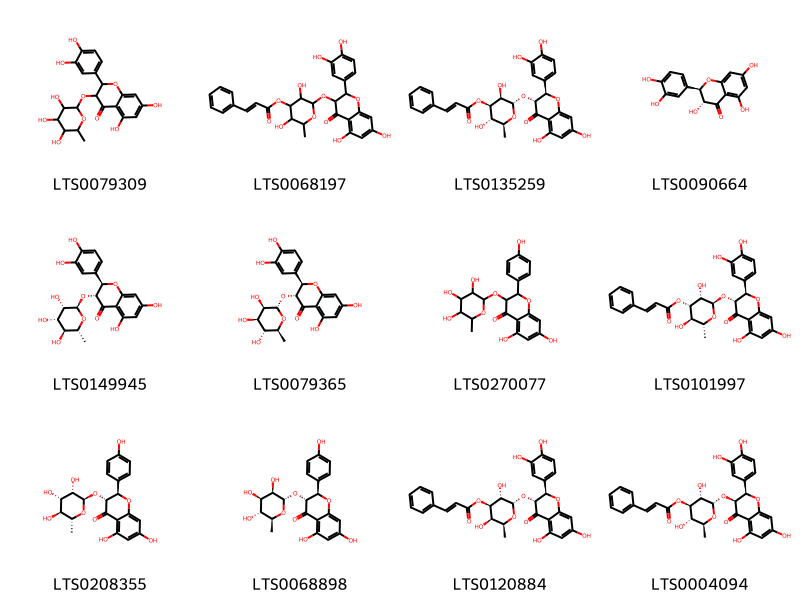{ width=100% }
    <figcaption>Hình ảnh cấu trúc hóa học của 12 hoạt chất thuộc nhóm Flavonoids gồm ['astilbin (LTS0079309)', '2-{[2-(3,4-dihydroxyphenyl)-5,7-dihydroxy-4-oxo-2,3-dihydro-1-benzopyran-3-yl]oxy}-3,5-dihydroxy-6-methyloxan-4-yl 3-phenylprop-2-enoate (LTS0068197)', '(2s,3r,4r,5s,6s)-2-{[(2r,3r)-2-(3,4-dihydroxyphenyl)-5,7-dihydroxy-4-oxo-2,3-dihydro-1-benzopyran-3-yl]oxy}-3,5-dihydroxy-6-methyloxan-4-yl (2e)-3-phenylprop-2-enoate (LTS0135259)', '(+)-taxifolin (LTS0090664)', '(2r,3r)-2-(3,4-dihydroxyphenyl)-5,7-dihydroxy-3-{[(2r,3s,4s,5s,6r)-3,4,5-trihydroxy-6-methyloxan-2-yl]oxy}-2,3-dihydro-1-benzopyran-4-one (LTS0149945)', 'astilbin (LTS0079365)', 'engeletin (LTS0270077)', '(2r,3s,4s,5r,6r)-2-{[(2r,3r)-2-(3,4-dihydroxyphenyl)-5,7-dihydroxy-4-oxo-2,3-dihydro-1-benzopyran-3-yl]oxy}-3,5-dihydroxy-6-methyloxan-4-yl (2e)-3-phenylprop-2-enoate (LTS0101997)', '(2r,3r)-5,7-dihydroxy-2-(4-hydroxyphenyl)-3-{[(2r,3s,4s,5s,6r)-3,4,5-trihydroxy-6-methyloxan-2-yl]oxy}-2,3-dihydro-1-benzopyran-4-one (LTS0208355)', 'engeletin (LTS0068898)', '(2s,3s,4r,5r,6s)-2-{[(2r,3r)-2-(3,4-dihydroxyphenyl)-5,7-dihydroxy-4-oxo-2,3-dihydro-1-benzopyran-3-yl]oxy}-3,5-dihydroxy-6-methyloxan-4-yl (2e)-3-phenylprop-2-enoate (LTS0120884)', '(2s,3s,4r,5s,6s)-2-{[(2r,3s)-2-(3,4-dihydroxyphenyl)-5,7-dihydroxy-4-oxo-2,3-dihydro-1-benzopyran-3-yl]oxy}-3,5-dihydroxy-6-methyloxan-4-yl (2e)-3-phenylprop-2-enoate (LTS0004094)'].</figcaption>
</figure>
#### Nhóm Isoflavonoids
<figure markdown="span">
    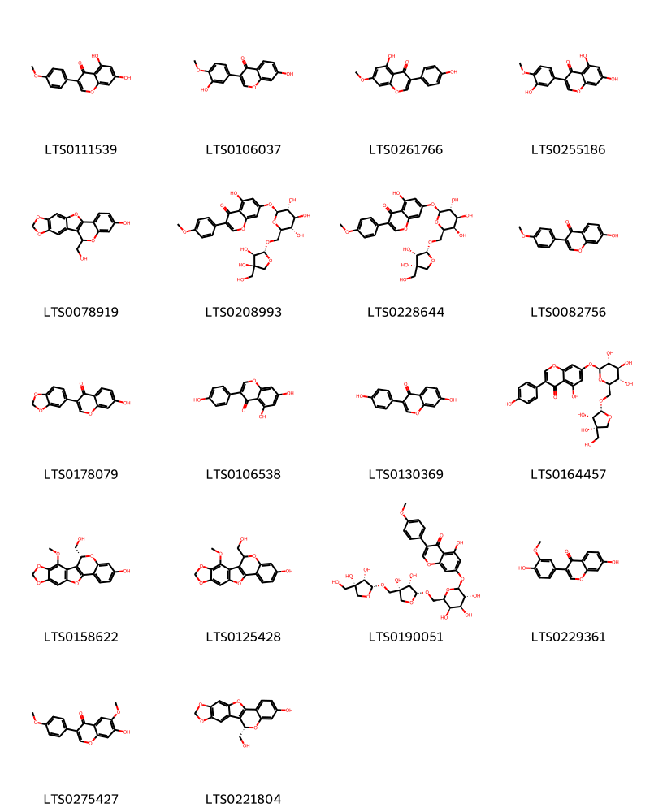{ width=100% }
    <figcaption>Hình ảnh cấu trúc hóa học của 18 hoạt chất thuộc nhóm Isoflavonoids gồm ['biochanin (LTS0111539)', 'calycosin (LTS0106037)', 'prunetin (LTS0261766)', 'pratensein (LTS0255186)', '20-(hydroxymethyl)-5,7,11,19-tetraoxapentacyclo[10.8.0.0²,¹⁰.0⁴,⁸.0¹³,¹⁸]icosa-1(12),2,4(8),9,13,15,17-heptaen-16-ol (LTS0078919)', 'lanceolarin (LTS0208993)', '7-{[(2s,3r,4s,5r,6r)-6-({[(2r,3s,4s)-3,4-dihydroxy-4-(hydroxymethyl)oxolan-2-yl]oxy}methyl)-3,4,5-trihydroxyoxan-2-yl]oxy}-5-hydroxy-3-(4-methoxyphenyl)chromen-4-one (LTS0228644)', 'formononetin (LTS0082756)', 'pseudobaptigenin (LTS0178079)', 'genistein (LTS0106538)', 'daidzein (LTS0130369)', '7-{[(2s,3r,4s,5s,6r)-6-({[(2r,3s,4s)-3,4-dihydroxy-4-(hydroxymethyl)oxolan-2-yl]oxy}methyl)-3,4,5-trihydroxyoxan-2-yl]oxy}-5-hydroxy-3-(4-hydroxyphenyl)chromen-4-one (LTS0164457)', '(20r)-20-(hydroxymethyl)-3-methoxy-5,7,11,19-tetraoxapentacyclo[10.8.0.0²,¹⁰.0⁴,⁸.0¹³,¹⁸]icosa-1(12),2,4(8),9,13,15,17-heptaen-16-ol (LTS0158622)', '20-(hydroxymethyl)-3-methoxy-5,7,11,19-tetraoxapentacyclo[10.8.0.0²,¹⁰.0⁴,⁸.0¹³,¹⁸]icosa-1(12),2,4(8),9,13,15,17-heptaen-16-ol (LTS0125428)', '7-{[(2s,3r,4s,5r,6r)-6-({[(2r,3s,4r)-4-({[(2s,3s,4s)-3,4-dihydroxy-4-(hydroxymethyl)oxolan-2-yl]oxy}methyl)-3,4-dihydroxyoxolan-2-yl]oxy}methyl)-3,4,5-trihydroxyoxan-2-yl]oxy}-5-hydroxy-3-(4-methoxyphenyl)chromen-4-one (LTS0190051)', "3'-methoxydaidzein (LTS0229361)", 'afrormosin (LTS0275427)', '(20s)-20-(hydroxymethyl)-5,7,11,19-tetraoxapentacyclo[10.8.0.0²,¹⁰.0⁴,⁸.0¹³,¹⁸]icosa-1(12),2,4(8),9,13,15,17-heptaen-16-ol (LTS0221804)'].</figcaption>
</figure>
#### Nhóm Protoberberine alkaloids and derivatives
<figure markdown="span">
    { width=100% }
    <figcaption>Hình ảnh cấu trúc hóa học của 1 hoạt chất thuộc nhóm Protoberberine alkaloids and derivatives gồm ['berberine (LTS0101484)'].</figcaption>
</figure>
#### Nhóm Steroids and steroid derivatives
<figure markdown="span">
    { width=100% }
    <figcaption>Hình ảnh cấu trúc hóa học của 3 hoạt chất thuộc nhóm Steroids and steroid derivatives gồm ['stigmast-5-en-3-ol (LTS0071224)', 'stigmast-5-en-3-ol, (3β)- (LTS0204616)', 'phytosterol (LTS0029311)'].</figcaption>
</figure>

---

### Dược dân tộc học

Danh sách các quốc gia có sử dụng *Andira inermis* trong điều trị các bệnh. 

| Country   | Disease                                                                                 | Bệnh                                                                                                                                                                                                |
|:----------|:----------------------------------------------------------------------------------------|:----------------------------------------------------------------------------------------------------------------------------------------------------------------------------------------------------|
| Elsewhere | nan, Narcotic, Poison, Purgative, Purgative, Vermifuge, Purgative, Piscicide, Vermifuge | MYMEMORY WARNING: YOU USED ALL AVAILABLE FREE TRANSLATIONS FOR TODAY. NEXT AVAILABLE IN  13 HOURS 58 MINUTES 10 SECONDS VISIT HTTPS://MYMEMORY.TRANSLATED.NET/DOC/USAGELIMITS.PHP TO TRANSLATE MORE |
| Mexico    | Vermifuge                                                                               | MYMEMORY WARNING: YOU USED ALL AVAILABLE FREE TRANSLATIONS FOR TODAY. NEXT AVAILABLE IN  13 HOURS 58 MINUTES 08 SECONDS VISIT HTTPS://MYMEMORY.TRANSLATED.NET/DOC/USAGELIMITS.PHP TO TRANSLATE MORE |
| Trinidad  | Purgative, Vermifuge, Vermifuge                                                         | MYMEMORY WARNING: YOU USED ALL AVAILABLE FREE TRANSLATIONS FOR TODAY. NEXT AVAILABLE IN  13 HOURS 58 MINUTES 06 SECONDS VISIT HTTPS://MYMEMORY.TRANSLATED.NET/DOC/USAGELIMITS.PHP TO TRANSLATE MORE |
| Venezuela | Emetic, Poison, Vermifuge                                                               | MYMEMORY WARNING: YOU USED ALL AVAILABLE FREE TRANSLATIONS FOR TODAY. NEXT AVAILABLE IN  13 HOURS 58 MINUTES 02 SECONDS VISIT HTTPS://MYMEMORY.TRANSLATED.NET/DOC/USAGELIMITS.PHP TO TRANSLATE MORE |

---

---
## Andira stipulacea
### Thông tin về thực vật

!!! info "Phân loại thực vật của *Andira legalis* từ GIBF:"
    - **Kingdom:** Plantae
    - **Phylum:** Tracheophyta
    - **Order:** Fabales
    - **Family:** Fabaceae
    - **Genus:** Andira
    - **Species:** *Andira legalis*

 

| Label (VI)   | Label (EN)   | Scientific Name   | Descriptions (VI)   | Descriptions (EN)   | Also Known As (VI)   | Also Known As (EN)   |
|:-------------|:-------------|:------------------|:--------------------|:--------------------|:---------------------|:---------------------|
| N/A          | N/A          | Andira inermis    |                     | species of tree     | ['']                 | ['']                 |

#### Phân bố trên thế giới

**Từ CSDL GIBF** nan, Brazil

#### Phân bố tại Việt Nam

**Từ CSDL GIBF**: Không có ghi nhận ở Việt Nam

---
### Thành phần hóa học
        
- Theo cơ sở dữ liệu lotus: Từ loài *Andira legalis* đã phân lập và xác định được Chưa có hoạt chất nào được phân lập. hoạt chất thuộc về các nhóm Không có hoạt chất nào được phân lập. 

Không có hình ảnh nào được tạo ra

---

### Dược dân tộc học

Danh sách các quốc gia có sử dụng *Andira legalis* trong điều trị các bệnh. 

| Country   | Disease   | Bệnh                                                                                                                                                                                                |
|:----------|:----------|:----------------------------------------------------------------------------------------------------------------------------------------------------------------------------------------------------|
| Elsewhere | Vermifuge | MYMEMORY WARNING: YOU USED ALL AVAILABLE FREE TRANSLATIONS FOR TODAY. NEXT AVAILABLE IN  13 HOURS 57 MINUTES 27 SECONDS VISIT HTTPS://MYMEMORY.TRANSLATED.NET/DOC/USAGELIMITS.PHP TO TRANSLATE MORE |

---

---
## Andira vermifuga
### Thông tin về thực vật

!!! info "Phân loại thực vật của *Andira vermifuga* từ GIBF:"
    - **Kingdom:** Plantae
    - **Phylum:** Tracheophyta
    - **Order:** Fabales
    - **Family:** Fabaceae
    - **Genus:** Andira
    - **Species:** *Andira vermifuga*

 

| Label (VI)   | Label (EN)   | Scientific Name   | Descriptions (VI)   | Descriptions (EN)   | Also Known As (VI)   | Also Known As (EN)   |
|:-------------|:-------------|:------------------|:--------------------|:--------------------|:---------------------|:---------------------|
| N/A          | N/A          | Andira vermifuga  | loài thực vật       | species of plant    | ['']                 | ['']                 |

#### Phân bố trên thế giới

**Từ CSDL GIBF** Brazil, Peru, Bolivia (Plurinational State of)

#### Phân bố tại Việt Nam

**Từ CSDL GIBF**: Không có ghi nhận ở Việt Nam

---
### Thành phần hóa học
        
- Theo cơ sở dữ liệu lotus: Từ loài *Andira vermifuga* đã phân lập và xác định được Chưa có hoạt chất nào được phân lập. hoạt chất thuộc về các nhóm Không có hoạt chất nào được phân lập. 

Không có hình ảnh nào được tạo ra

---

### Dược dân tộc học

Danh sách các quốc gia có sử dụng *Andira vermifuga* trong điều trị các bệnh. 

| Country   | Disease                                        | Bệnh                                                                                                                                                                                                |
|:----------|:-----------------------------------------------|:----------------------------------------------------------------------------------------------------------------------------------------------------------------------------------------------------|
| Elsewhere | Purgative, Emetic, Narcotic, Poison, Vermifuge | MYMEMORY WARNING: YOU USED ALL AVAILABLE FREE TRANSLATIONS FOR TODAY. NEXT AVAILABLE IN  13 HOURS 57 MINUTES 09 SECONDS VISIT HTTPS://MYMEMORY.TRANSLATED.NET/DOC/USAGELIMITS.PHP TO TRANSLATE MORE |

---

# Chi Canavalia

??? note "Danh sách các dược liệu thuộc chi"
    
	 - *Canavalia cathartica*
	 - *Canavalia ensiformis*
	 - *Canavalia gladiata*
	 - *Canavalia maritima*
	 - *Canavalia nitida*

---
## Canavalia cathartica
### Thông tin về thực vật

!!! info "Phân loại thực vật của *Canavalia cathartica* từ GIBF:"
    - **Kingdom:** Plantae
    - **Phylum:** Tracheophyta
    - **Order:** Fabales
    - **Family:** Fabaceae
    - **Genus:** Canavalia
    - **Species:** *Canavalia cathartica*

 

| Label (VI)   | Label (EN)   | Scientific Name      | Descriptions (VI)   | Descriptions (EN)   | Also Known As (VI)   | Also Known As (EN)   |
|:-------------|:-------------|:---------------------|:--------------------|:--------------------|:---------------------|:---------------------|
| N/A          | N/A          | Canavalia cathartica | loài thực vật       | species of plant    | ['']                 | ['']                 |

#### Phân bố trên thế giới

**Từ CSDL GIBF** Sri Lanka, Christmas Island, Japan, Cook Islands, Australia, Tanzania, United Republic of, Togo, Réunion, Chinese Taipei, Papua New Guinea, United States of America, Zimbabwe, Maldives, Thailand, Tonga, Singapore, British Indian Ocean Territory, Viet Nam, Seychelles, Vanuatu, India, Nauru, Philippines

#### Phân bố tại Việt Nam

**Từ CSDL GIBF**: Nam Định

---
### Thành phần hóa học
        
- Theo cơ sở dữ liệu lotus: Từ loài *Canavalia cathartica* đã phân lập và xác định được 1 hoạt chất thuộc về các nhóm Carboxylic acids and derivatives. 

|    | chemicalTaxonomyClassyfireClass   |   smiles_count |
|---:|:----------------------------------|---------------:|
|  0 | Carboxylic acids and derivatives  |              1 |

#### Nhóm Carboxylic acids and derivatives
<figure markdown="span">
    { width=100% }
    <figcaption>Hình ảnh cấu trúc hóa học của 1 hoạt chất thuộc nhóm Carboxylic acids and derivatives gồm ['(l)-canavanine (LTS0093855)'].</figcaption>
</figure>

---

### Dược dân tộc học

Danh sách các quốc gia có sử dụng *Canavalia cathartica* trong điều trị các bệnh. 

| Country   | Disease   | Bệnh                                                                                                                                                                                                |
|:----------|:----------|:----------------------------------------------------------------------------------------------------------------------------------------------------------------------------------------------------|
| Hawaii    | Vermifuge | MYMEMORY WARNING: YOU USED ALL AVAILABLE FREE TRANSLATIONS FOR TODAY. NEXT AVAILABLE IN  13 HOURS 56 MINUTES 43 SECONDS VISIT HTTPS://MYMEMORY.TRANSLATED.NET/DOC/USAGELIMITS.PHP TO TRANSLATE MORE |

---

---
## Canavalia ensiformis
### Thông tin về thực vật

!!! info "Phân loại thực vật của *Canavalia ensiformis* từ GIBF:"
    - **Kingdom:** Plantae
    - **Phylum:** Tracheophyta
    - **Order:** Fabales
    - **Family:** Fabaceae
    - **Genus:** Canavalia
    - **Species:** *Canavalia ensiformis*

 

| Label (VI)   | Label (EN)   | Scientific Name      | Descriptions (VI)   | Descriptions (EN)   | Also Known As (VI)   | Also Known As (EN)   |
|:-------------|:-------------|:---------------------|:--------------------|:--------------------|:---------------------|:---------------------|
| N/A          | N/A          | Canavalia ensiformis | loài thực vật       | species of plant    | ['']                 | ['']                 |

#### Phân bố trên thế giới

**Từ CSDL GIBF** nan, Ghana, Australia, Gabon, Cambodia, Argentina, Benin, Nicaragua, Tanzania, United Republic of, Venezuela (Bolivarian Republic of), Panama, Togo, Malawi, Senegal, Nigeria, Korea, Republic of, Chad, Chinese Taipei, Spain, Bolivia (Plurinational State of), Honduras, United States of America, Congo, Democratic Republic of the, Guinea, Paraguay, El Salvador, Zimbabwe, Maldives, Uganda, Thailand, Martinique, Brazil, Guyana, Cuba, Peru, Mayotte, Mexico, Viet Nam, China, Ecuador, Madagascar, Seychelles, Equatorial Guinea, Colombia, Costa Rica, India, Indonesia, Burkina Faso, Cameroon, Malaysia

#### Phân bố tại Việt Nam

**Từ CSDL GIBF**: Ninh Binh

---
### Thành phần hóa học
        
- Theo cơ sở dữ liệu lotus: Từ loài *Canavalia ensiformis* đã phân lập và xác định được 43 hoạt chất thuộc về các nhóm Fatty Acyls, Prenol lipids, Steroids and steroid derivatives, Organonitrogen compounds, Organooxygen compounds, Tannins, Carboxylic acids and derivatives. 

|    | chemicalTaxonomyClassyfireClass   |   smiles_count |
|---:|:----------------------------------|---------------:|
|  0 | Carboxylic acids and derivatives  |              2 |
|  1 | Fatty Acyls                       |             16 |
|  2 | Organonitrogen compounds          |              2 |
|  3 | Organooxygen compounds            |              8 |
|  4 | Prenol lipids                     |              3 |
|  5 | Steroids and steroid derivatives  |             10 |
|  6 | Tannins                           |              1 |

#### Nhóm Carboxylic acids and derivatives
<figure markdown="span">
    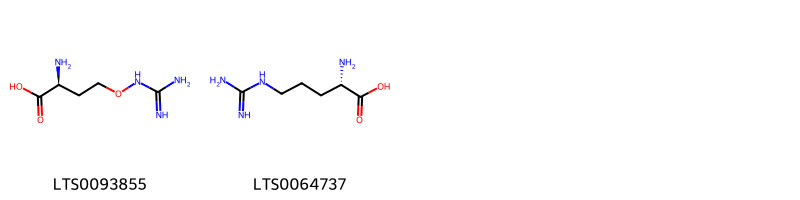{ width=100% }
    <figcaption>Hình ảnh cấu trúc hóa học của 2 hoạt chất thuộc nhóm Carboxylic acids and derivatives gồm ['(l)-canavanine (LTS0093855)', 'l-arginine (LTS0064737)'].</figcaption>
</figure>
#### Nhóm Fatty Acyls
<figure markdown="span">
    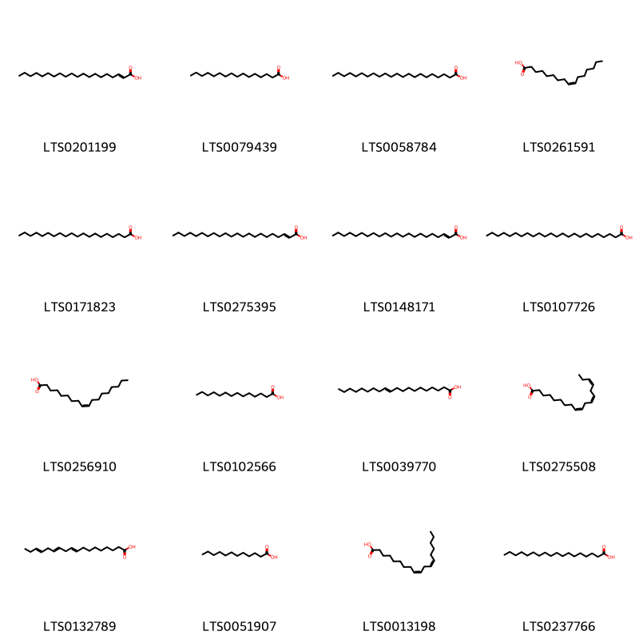{ width=100% }
    <figcaption>Hình ảnh cấu trúc hóa học của 16 hoạt chất thuộc nhóm Fatty Acyls gồm ['icos-2-enoic acid (LTS0201199)', 'palmitic acid (LTS0079439)', 'behenic acid (LTS0058784)', 'palmitoleic acid (LTS0261591)', 'arachidic acid (LTS0171823)', '(2e)-docos-2-enoic acid (LTS0275395)', 'docos-2-enoic acid (LTS0148171)', 'lignoceric acid (LTS0107726)', 'oleic acid (LTS0256910)', 'myristic acid (LTS0102566)', 'icosenoic acid (LTS0039770)', 'α-linolenic acid (LTS0275508)', 'α linolenic acid (LTS0132789)', 'lauric acid (LTS0051907)', 'linoleic (LTS0013198)', 'stearic acid (LTS0237766)'].</figcaption>
</figure>
#### Nhóm Organonitrogen compounds
<figure markdown="span">
    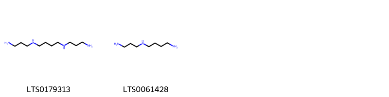{ width=100% }
    <figcaption>Hình ảnh cấu trúc hóa học của 2 hoạt chất thuộc nhóm Organonitrogen compounds gồm ['spermine (LTS0179313)', 'spermidine (LTS0061428)'].</figcaption>
</figure>
#### Nhóm Organooxygen compounds
<figure markdown="span">
    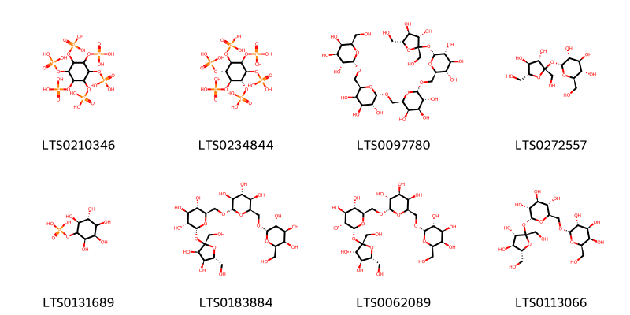{ width=100% }
    <figcaption>Hình ảnh cấu trúc hóa học của 8 hoạt chất thuộc nhóm Organooxygen compounds gồm ['phytic acid (LTS0210346)', '[(1r,2r,3s,4r,5s,6s)-2,3,4,5,6-pentakis(phosphonooxy)cyclohexyl]oxyphosphonic acid (LTS0234844)', 'verbascose (LTS0097780)', 'sucrose (LTS0272557)', '[(2r,3r,5r,6s)-2,3,4,5,6-pentahydroxycyclohexyl]oxyphosphonic acid (LTS0131689)', '(2r,3r,4s,5s,6r)-2-{[(2s,3r,4s,5r)-3,4-dihydroxy-2,5-bis(hydroxymethyl)oxolan-2-yl]oxy}-6-({[(2s,3s,4r,5r,6r)-3,4,5-trihydroxy-6-({[(2s,3r,4s,5r,6r)-3,4,5-trihydroxy-6-(hydroxymethyl)oxan-2-yl]oxy}methyl)oxan-2-yl]oxy}methyl)oxane-3,4,5-triol (LTS0183884)', 'stachyose (LTS0062089)', 'raffinose (LTS0113066)'].</figcaption>
</figure>
#### Nhóm Prenol lipids
<figure markdown="span">
    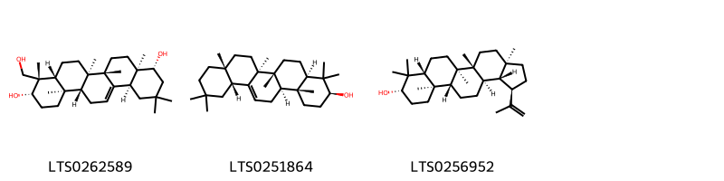{ width=100% }
    <figcaption>Hình ảnh cấu trúc hóa học của 3 hoạt chất thuộc nhóm Prenol lipids gồm ['soyasapogenol b (LTS0262589)', 'β-amyrin (LTS0251864)', 'lupeol (LTS0256952)'].</figcaption>
</figure>
#### Nhóm Steroids and steroid derivatives
<figure markdown="span">
    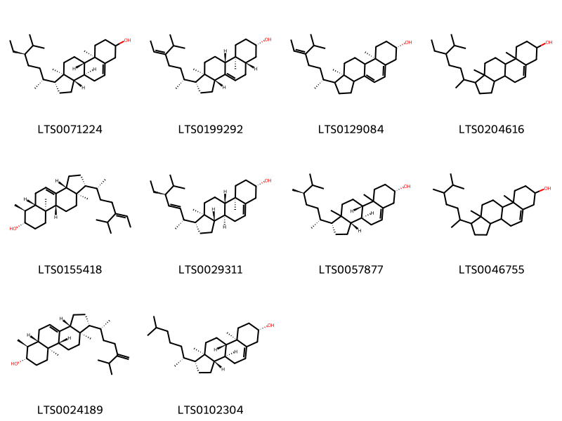{ width=100% }
    <figcaption>Hình ảnh cấu trúc hóa học của 10 hoạt chất thuộc nhóm Steroids and steroid derivatives gồm ['stigmast-5-en-3-ol (LTS0071224)', 'delta7-avenasterol (LTS0199292)', '5-dehydroavenasterol (LTS0129084)', 'stigmast-5-en-3-ol, (3β)- (LTS0204616)', '(z)-24-ethylidenelophenol (LTS0155418)', 'phytosterol (LTS0029311)', '(1r,3as,3bs,7s,9bs)-1-[(2r,5r)-5,6-dimethylheptan-2-yl]-9a,11a-dimethyl-1h,2h,3h,3ah,3bh,4h,6h,7h,8h,9h,9bh,10h,11h-cyclopenta[a]phenanthren-7-ol (LTS0057877)', 'campesterol (LTS0046755)', '24-methylidenelophenol (LTS0024189)', 'cholesterol (LTS0102304)'].</figcaption>
</figure>
#### Nhóm Tannins
<figure markdown="span">
    { width=100% }
    <figcaption>Hình ảnh cấu trúc hóa học của 1 hoạt chất thuộc nhóm Tannins gồm ['3,5-dihydroxy-4-(3,4,5-trihydroxybenzoyloxy)-6-[(3,4,5-trihydroxybenzoyloxy)methyl]oxan-2-yl 3,4,5-trihydroxybenzoate (LTS0104575)'].</figcaption>
</figure>

---

### Dược dân tộc học

Danh sách các quốc gia có sử dụng *Canavalia ensiformis* trong điều trị các bệnh. 

| Country     | Disease           | Bệnh                                                                                                                                                                                                |
|:------------|:------------------|:----------------------------------------------------------------------------------------------------------------------------------------------------------------------------------------------------|
| China       | Digestive, Tonic  | MYMEMORY WARNING: YOU USED ALL AVAILABLE FREE TRANSLATIONS FOR TODAY. NEXT AVAILABLE IN  13 HOURS 56 MINUTES 20 SECONDS VISIT HTTPS://MYMEMORY.TRANSLATED.NET/DOC/USAGELIMITS.PHP TO TRANSLATE MORE |
| Elsewhere   | Poison, Poison    | MYMEMORY WARNING: YOU USED ALL AVAILABLE FREE TRANSLATIONS FOR TODAY. NEXT AVAILABLE IN  13 HOURS 56 MINUTES 17 SECONDS VISIT HTTPS://MYMEMORY.TRANSLATED.NET/DOC/USAGELIMITS.PHP TO TRANSLATE MORE |
| West Indies | Mitogenic, Poison | MYMEMORY WARNING: YOU USED ALL AVAILABLE FREE TRANSLATIONS FOR TODAY. NEXT AVAILABLE IN  13 HOURS 56 MINUTES 15 SECONDS VISIT HTTPS://MYMEMORY.TRANSLATED.NET/DOC/USAGELIMITS.PHP TO TRANSLATE MORE |

---

---
## Canavalia gladiata
### Thông tin về thực vật

!!! info "Phân loại thực vật của *Canavalia gladiata* từ GIBF:"
    - **Kingdom:** Plantae
    - **Phylum:** Tracheophyta
    - **Order:** Fabales
    - **Family:** Fabaceae
    - **Genus:** Canavalia
    - **Species:** *Canavalia gladiata*

 

| Label (VI)   | Label (EN)   | Scientific Name    | Descriptions (VI)   | Descriptions (EN)   | Also Known As (VI)     | Also Known As (EN)   |
|:-------------|:-------------|:-------------------|:--------------------|:--------------------|:-----------------------|:---------------------|
| N/A          | N/A          | Canavalia gladiata | loài thực vật       | species of plant    | ['Canavalia gladiata'] | ['']                 |

#### Phân bố trên thế giới

**Từ CSDL GIBF** nan, Ghana, Sri Lanka, Central African Republic, Japan, Lao People’s Democratic Republic, Cambodia, Mauritius, Guatemala, Angola, Myanmar, Argentina, Somalia, unknown or invalid, Benin, Nicaragua, Tanzania, United Republic of, Venezuela (Bolivarian Republic of), Panama, Togo, Zambia, Réunion, Senegal, Mali, Honduras, United States of America, Congo, Democratic Republic of the, Guinea, Paraguay, South Africa, Thailand, Brazil, Cuba, Mexico, Peru, Singapore, China, Madagascar, Colombia, Costa Rica, Burundi, India, Indonesia, Cameroon, Malaysia

#### Phân bố tại Việt Nam

**Từ CSDL GIBF**: Không có ghi nhận ở Việt Nam

---
### Thành phần hóa học
        
- Theo cơ sở dữ liệu lotus: Từ loài *Canavalia gladiata* đã phân lập và xác định được 41 hoạt chất thuộc về các nhóm Flavonoids, Prenol lipids, Organonitrogen compounds, Benzene and substituted derivatives, Organooxygen compounds, Carboxylic acids and derivatives. 

|    | chemicalTaxonomyClassyfireClass     |   smiles_count |
|---:|:------------------------------------|---------------:|
|  0 | Benzene and substituted derivatives |              1 |
|  1 | Carboxylic acids and derivatives    |              2 |
|  2 | Flavonoids                          |             18 |
|  3 | Organonitrogen compounds            |             10 |
|  4 | Organooxygen compounds              |              2 |
|  5 | Prenol lipids                       |              8 |

#### Nhóm Benzene and substituted derivatives
<figure markdown="span">
    { width=100% }
    <figcaption>Hình ảnh cấu trúc hóa học của 1 hoạt chất thuộc nhóm Benzene and substituted derivatives gồm ['galop (LTS0222857)'].</figcaption>
</figure>
#### Nhóm Carboxylic acids and derivatives
<figure markdown="span">
    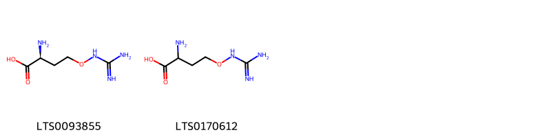{ width=100% }
    <figcaption>Hình ảnh cấu trúc hóa học của 2 hoạt chất thuộc nhóm Carboxylic acids and derivatives gồm ['(l)-canavanine (LTS0093855)', 'canavanine (LTS0170612)'].</figcaption>
</figure>
#### Nhóm Flavonoids
<figure markdown="span">
    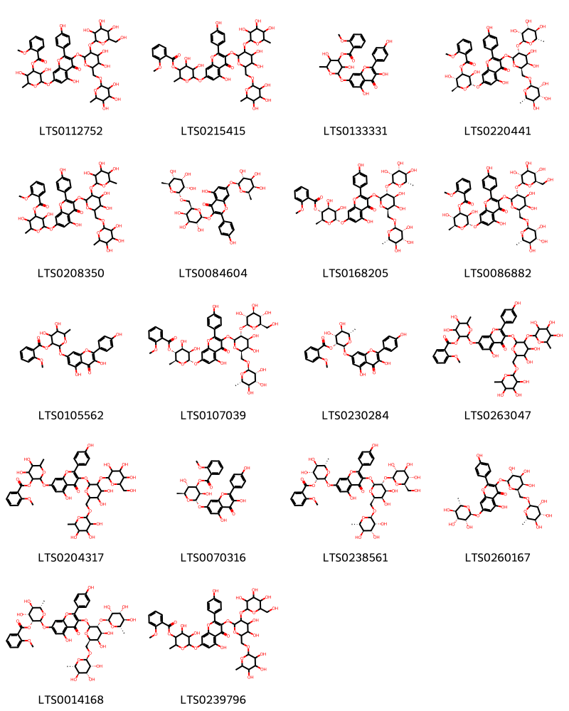{ width=100% }
    <figcaption>Hình ảnh cấu trúc hóa học của 18 hoạt chất thuộc nhóm Flavonoids gồm ['2-({3-[(4,5-dihydroxy-3-{[3,4,5-trihydroxy-6-(hydroxymethyl)oxan-2-yl]oxy}-6-{[(3,4,5-trihydroxy-6-methyloxan-2-yl)oxy]methyl}oxan-2-yl)oxy]-5-hydroxy-2-(4-hydroxyphenyl)-4-oxochromen-7-yl}oxy)-3,5-dihydroxy-6-methyloxan-4-yl 2-methoxybenzoate (LTS0112752)', '6-{[3-({4,5-dihydroxy-3-[(3,4,5-trihydroxy-6-methyloxan-2-yl)oxy]-6-{[(3,4,5-trihydroxy-6-methyloxan-2-yl)oxy]methyl}oxan-2-yl}oxy)-5-hydroxy-2-(4-hydroxyphenyl)-4-oxochromen-7-yl]oxy}-4,5-dihydroxy-2-methyloxan-3-yl 2-methoxybenzoate (LTS0215415)', '2-{[3,5-dihydroxy-2-(4-hydroxyphenyl)-4-oxochromen-7-yl]oxy}-3,5-dihydroxy-6-methyloxan-4-yl 2-methoxybenzoate (LTS0133331)', '(2s,3r,4r,5s,6s)-2-[(3-{[(2s,3r,4s,5r,6r)-4,5-dihydroxy-3-{[(2s,3r,4r,5r,6s)-3,4,5-trihydroxy-6-methyloxan-2-yl]oxy}-6-({[(2r,3r,4r,5r,6s)-3,4,5-trihydroxy-6-methyloxan-2-yl]oxy}methyl)oxan-2-yl]oxy}-5-hydroxy-2-(4-hydroxyphenyl)-4-oxochromen-7-yl)oxy]-3,5-dihydroxy-6-methyloxan-4-yl 2-methoxybenzoate (LTS0220441)', '2-{[3-({4,5-dihydroxy-3-[(3,4,5-trihydroxy-6-methyloxan-2-yl)oxy]-6-{[(3,4,5-trihydroxy-6-methyloxan-2-yl)oxy]methyl}oxan-2-yl}oxy)-5-hydroxy-2-(4-hydroxyphenyl)-4-oxochromen-7-yl]oxy}-3,5-dihydroxy-6-methyloxan-4-yl 2-methoxybenzoate (LTS0208350)', '5-hydroxy-2-(4-hydroxyphenyl)-3-{[(2s,3r,4s,5r,6r)-3,4,5-trihydroxy-6-({[(2r,3s,4s,5r,6s)-3,4,5-trihydroxy-6-methyloxan-2-yl]oxy}methyl)oxan-2-yl]oxy}-7-{[(2s,3r,4s,5r,6r)-3,4,5-trihydroxy-6-methyloxan-2-yl]oxy}chromen-4-one (LTS0084604)', '(2s,3r,4s,5r,6s)-6-[(3-{[(2s,3r,4s,5r,6r)-4,5-dihydroxy-3-{[(2s,3r,4r,5r,6s)-3,4,5-trihydroxy-6-methyloxan-2-yl]oxy}-6-({[(2r,3r,4r,5r,6s)-3,4,5-trihydroxy-6-methyloxan-2-yl]oxy}methyl)oxan-2-yl]oxy}-5-hydroxy-2-(4-hydroxyphenyl)-4-oxochromen-7-yl)oxy]-4,5-dihydroxy-2-methyloxan-3-yl 2-methoxybenzoate (LTS0168205)', '(2s,3r,4r,5s,6s)-2-[(3-{[(2s,3r,4s,5r,6r)-4,5-dihydroxy-3-{[(2s,3r,4s,5s,6r)-3,4,5-trihydroxy-6-(hydroxymethyl)oxan-2-yl]oxy}-6-({[(2r,3r,4r,5r,6s)-3,4,5-trihydroxy-6-methyloxan-2-yl]oxy}methyl)oxan-2-yl]oxy}-5-hydroxy-2-(4-hydroxyphenyl)-4-oxochromen-7-yl)oxy]-3,5-dihydroxy-6-methyloxan-4-yl 2-methoxybenzoate (LTS0086882)', '2-{[3,5-dihydroxy-2-(4-hydroxyphenyl)-4-oxochromen-7-yl]oxy}-4,5-dihydroxy-6-methyloxan-3-yl 2-methoxybenzoate (LTS0105562)', '(2s,3r,4s,5r,6s)-6-[(3-{[(2s,3r,4s,5r,6r)-4,5-dihydroxy-3-{[(2s,3r,4s,5s,6r)-3,4,5-trihydroxy-6-(hydroxymethyl)oxan-2-yl]oxy}-6-({[(2r,3r,4r,5r,6s)-3,4,5-trihydroxy-6-methyloxan-2-yl]oxy}methyl)oxan-2-yl]oxy}-5-hydroxy-2-(4-hydroxyphenyl)-4-oxochromen-7-yl)oxy]-4,5-dihydroxy-2-methyloxan-3-yl 2-methoxybenzoate (LTS0107039)', '(2s,3r,4r,5r,6s)-2-{[3,5-dihydroxy-2-(4-hydroxyphenyl)-4-oxochromen-7-yl]oxy}-4,5-dihydroxy-6-methyloxan-3-yl 2-methoxybenzoate (LTS0230284)', '2-{[3-({4,5-dihydroxy-3-[(3,4,5-trihydroxy-6-methyloxan-2-yl)oxy]-6-{[(3,4,5-trihydroxy-6-methyloxan-2-yl)oxy]methyl}oxan-2-yl}oxy)-5-hydroxy-2-(4-hydroxyphenyl)-4-oxochromen-7-yl]oxy}-4,5-dihydroxy-6-methyloxan-3-yl 2-methoxybenzoate (LTS0263047)', '2-({3-[(4,5-dihydroxy-3-{[3,4,5-trihydroxy-6-(hydroxymethyl)oxan-2-yl]oxy}-6-{[(3,4,5-trihydroxy-6-methyloxan-2-yl)oxy]methyl}oxan-2-yl)oxy]-5-hydroxy-2-(4-hydroxyphenyl)-4-oxochromen-7-yl}oxy)-4,5-dihydroxy-6-methyloxan-3-yl 2-methoxybenzoate (LTS0204317)', '(2s,3r,4r,5s,6s)-2-{[3,5-dihydroxy-2-(4-hydroxyphenyl)-4-oxochromen-7-yl]oxy}-3,5-dihydroxy-6-methyloxan-4-yl 2-methoxybenzoate (LTS0070316)', '(2s,3r,4r,5r,6s)-2-[(3-{[(2s,3r,4s,5r,6r)-4,5-dihydroxy-3-{[(2s,3r,4s,5s,6r)-3,4,5-trihydroxy-6-(hydroxymethyl)oxan-2-yl]oxy}-6-({[(2r,3r,4r,5r,6s)-3,4,5-trihydroxy-6-methyloxan-2-yl]oxy}methyl)oxan-2-yl]oxy}-5-hydroxy-2-(4-hydroxyphenyl)-4-oxochromen-7-yl)oxy]-4,5-dihydroxy-6-methyloxan-3-yl 2-methoxybenzoate (LTS0238561)', 'robinin (LTS0260167)', '(2s,3r,4r,5r,6s)-2-[(3-{[(2s,3r,4s,5r,6r)-4,5-dihydroxy-3-{[(2s,3r,4r,5r,6s)-3,4,5-trihydroxy-6-methyloxan-2-yl]oxy}-6-({[(2r,3r,4r,5r,6s)-3,4,5-trihydroxy-6-methyloxan-2-yl]oxy}methyl)oxan-2-yl]oxy}-5-hydroxy-2-(4-hydroxyphenyl)-4-oxochromen-7-yl)oxy]-4,5-dihydroxy-6-methyloxan-3-yl 2-methoxybenzoate (LTS0014168)', '6-({3-[(4,5-dihydroxy-3-{[3,4,5-trihydroxy-6-(hydroxymethyl)oxan-2-yl]oxy}-6-{[(3,4,5-trihydroxy-6-methyloxan-2-yl)oxy]methyl}oxan-2-yl)oxy]-5-hydroxy-2-(4-hydroxyphenyl)-4-oxochromen-7-yl}oxy)-4,5-dihydroxy-2-methyloxan-3-yl 2-methoxybenzoate (LTS0239796)'].</figcaption>
</figure>
#### Nhóm Organonitrogen compounds
<figure markdown="span">
    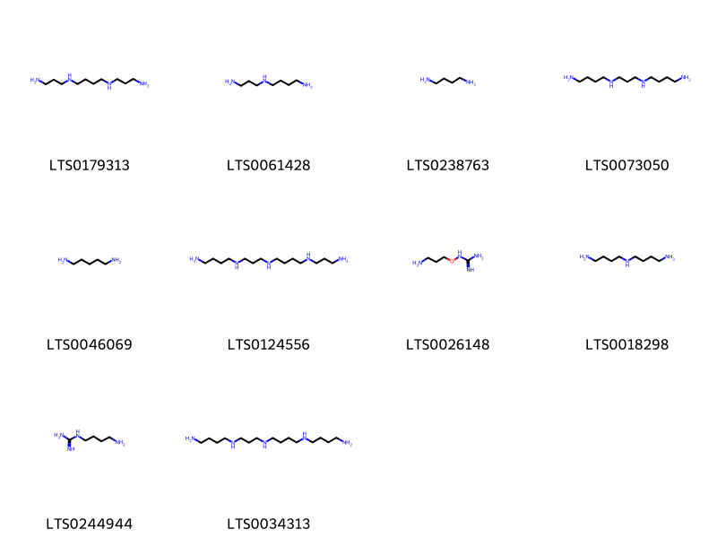{ width=100% }
    <figcaption>Hình ảnh cấu trúc hóa học của 10 hoạt chất thuộc nhóm Organonitrogen compounds gồm ['spermine (LTS0179313)', 'spermidine (LTS0061428)', 'putrescine (LTS0238763)', '(4-aminobutyl)({3-[(4-aminobutyl)amino]propyl})amine (LTS0073050)', 'pentane-1,5-diamine (LTS0046069)', '(4-aminobutyl)[3-({4-[(3-aminopropyl)amino]butyl}amino)propyl]amine (LTS0124556)', 'n-(3-aminopropoxy)guanidine (LTS0026148)', 'homospermidine (LTS0018298)', 'agmatine (LTS0244944)', '(4-aminobutyl)[4-({3-[(4-aminobutyl)amino]propyl}amino)butyl]amine (LTS0034313)'].</figcaption>
</figure>
#### Nhóm Organooxygen compounds
<figure markdown="span">
    { width=100% }
    <figcaption>Hình ảnh cấu trúc hóa học của 2 hoạt chất thuộc nhóm Organooxygen compounds gồm ['phytic acid (LTS0210346)', '[(1r,2r,3s,4r,5s,6s)-2,3,4,5,6-pentakis(phosphonooxy)cyclohexyl]oxyphosphonic acid (LTS0234844)'].</figcaption>
</figure>
#### Nhóm Prenol lipids
<figure markdown="span">
    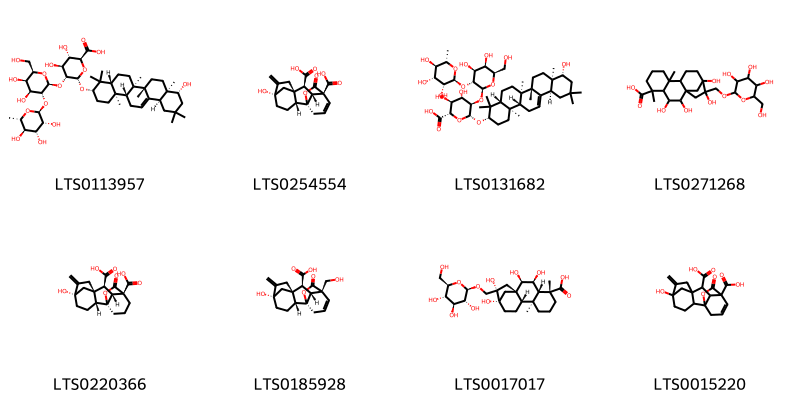{ width=100% }
    <figcaption>Hình ảnh cấu trúc hóa học của 8 hoạt chất thuộc nhóm Prenol lipids gồm ['(2s,3s,4s,5r,6s)-6-{[(3s,4ar,6ar,6bs,8ar,9r,12as,14ar,14br)-9-hydroxy-4,4,6a,6b,8a,11,11,14b-octamethyl-1,2,3,4a,5,6,7,8,9,10,12,12a,14,14a-tetradecahydropicen-3-yl]oxy}-5-{[(2s,3r,4s,5r,6r)-4,5-dihydroxy-6-(hydroxymethyl)-3-{[(2s,3r,4r,5r,6s)-3,4,5-trihydroxy-6-methyloxan-2-yl]oxy}oxan-2-yl]oxy}-3,4-dihydroxyoxane-2-carboxylic acid (LTS0113957)', '(1r,2r,5s,8s,9s,10r,11r)-5-hydroxy-6-methylidene-16-oxo-15-oxapentacyclo[9.3.2.1⁵,⁸.0¹,¹⁰.0²,⁸]heptadec-12-ene-9,11-dicarboxylic acid (LTS0254554)', '(2s,3s,4s,5r,6r)-6-{[(3s,4ar,6ar,6bs,8ar,9r,12as,14ar,14br)-9-hydroxy-4,4,6a,6b,8a,11,11,14b-octamethyl-1,2,3,4a,5,6,7,8,9,10,12,12a,14,14a-tetradecahydropicen-3-yl]oxy}-5-{[(2s,3r,4s,5r,6r)-4,5-dihydroxy-6-(hydroxymethyl)-3-{[(2s,3r,4r,5r,6s)-3,4,5-trihydroxy-6-methyloxan-2-yl]oxy}oxan-2-yl]oxy}-3,4-dihydroxyoxane-2-carboxylic acid (LTS0131682)', '2,3,13,14-tetrahydroxy-5,9-dimethyl-14-({[3,4,5-trihydroxy-6-(hydroxymethyl)oxan-2-yl]oxy}methyl)tetracyclo[11.2.1.0¹,¹⁰.0⁴,⁹]hexadecane-5-carboxylic acid (LTS0271268)', '(1r,2r,5s,8s,9s,10r,11r)-5-hydroxy-6-methylidene-16-oxo-15-oxapentacyclo[9.3.2.1⁵,⁸.0¹,¹⁰.0²,⁸]heptadecane-9,11-dicarboxylic acid (LTS0220366)', '(1r,2r,5s,8s,9s,10r,11r)-5-hydroxy-11-(hydroxymethyl)-6-methylidene-16-oxo-15-oxapentacyclo[9.3.2.1⁵,⁸.0¹,¹⁰.0²,⁸]heptadec-12-ene-9-carboxylic acid (LTS0185928)', '(1r,2r,3s,4s,5r,9s,10s,13s,14s)-2,3,13,14-tetrahydroxy-5,9-dimethyl-14-({[(2r,3r,4s,5s,6r)-3,4,5-trihydroxy-6-(hydroxymethyl)oxan-2-yl]oxy}methyl)tetracyclo[11.2.1.0¹,¹⁰.0⁴,⁹]hexadecane-5-carboxylic acid (LTS0017017)', '5-hydroxy-6-methylidene-16-oxo-15-oxapentacyclo[9.3.2.1⁵,⁸.0¹,¹⁰.0²,⁸]heptadec-12-ene-9,11-dicarboxylic acid (LTS0015220)'].</figcaption>
</figure>

---

### Dược dân tộc học

Danh sách các quốc gia có sử dụng *Canavalia gladiata* trong điều trị các bệnh. 

| Country   | Disease     | Bệnh                                                                                                                                                                                                |
|:----------|:------------|:----------------------------------------------------------------------------------------------------------------------------------------------------------------------------------------------------|
| Elsewhere | Antitussive | MYMEMORY WARNING: YOU USED ALL AVAILABLE FREE TRANSLATIONS FOR TODAY. NEXT AVAILABLE IN  13 HOURS 55 MINUTES 42 SECONDS VISIT HTTPS://MYMEMORY.TRANSLATED.NET/DOC/USAGELIMITS.PHP TO TRANSLATE MORE |

---

---
## Canavalia maritima
### Thông tin về thực vật

!!! info "Phân loại thực vật của *Canavalia maritima* từ GIBF:"
    - **Kingdom:** Plantae
    - **Phylum:** Tracheophyta
    - **Order:** Fabales
    - **Family:** Fabaceae
    - **Genus:** Canavalia
    - **Species:** *Canavalia maritima*

 

| Label (VI)   | Label (EN)   | Scientific Name    | Descriptions (VI)   | Descriptions (EN)   | Also Known As (VI)   | Also Known As (EN)   |
|:-------------|:-------------|:-------------------|:--------------------|:--------------------|:---------------------|:---------------------|
| N/A          | N/A          | Canavalia maritima |                     | species of plants   | ['']                 | ['']                 |

#### Phân bố trên thế giới

**Từ CSDL GIBF** nan, Australia, Japan, Gabon, Saint Lucia, unknown or invalid, Nicaragua, Bermuda, Venezuela (Bolivarian Republic of), Panama, Puerto Rico, Chinese Taipei, Honduras, Jamaica, United States of America, Maldives, Belize, Guinea-Bissau, Brazil, Cuba, Dominica, Mexico, Dominican Republic, China, Ecuador, Colombia, India, Indonesia, Cayman Islands, Samoa, Philippines, Malaysia

#### Phân bố tại Việt Nam

**Từ CSDL GIBF**: Không có ghi nhận ở Việt Nam

---
### Thành phần hóa học
        
- Theo cơ sở dữ liệu lotus: Từ loài *Canavalia maritima* đã phân lập và xác định được 1 hoạt chất thuộc về các nhóm Carboxylic acids and derivatives. 

|    | chemicalTaxonomyClassyfireClass   |   smiles_count |
|---:|:----------------------------------|---------------:|
|  0 | Carboxylic acids and derivatives  |              1 |

#### Nhóm Carboxylic acids and derivatives
<figure markdown="span">
    { width=100% }
    <figcaption>Hình ảnh cấu trúc hóa học của 1 hoạt chất thuộc nhóm Carboxylic acids and derivatives gồm ['(l)-canavanine (LTS0093855)'].</figcaption>
</figure>

---

### Dược dân tộc học

Danh sách các quốc gia có sử dụng *Canavalia maritima* trong điều trị các bệnh. 

| Country            | Disease   | Bệnh                                                                                                                                                                                                |
|:-------------------|:----------|:----------------------------------------------------------------------------------------------------------------------------------------------------------------------------------------------------|
| Dominican Republic | Tonic     | MYMEMORY WARNING: YOU USED ALL AVAILABLE FREE TRANSLATIONS FOR TODAY. NEXT AVAILABLE IN  13 HOURS 55 MINUTES 17 SECONDS VISIT HTTPS://MYMEMORY.TRANSLATED.NET/DOC/USAGELIMITS.PHP TO TRANSLATE MORE |
| Haiti              | Poison    | MYMEMORY WARNING: YOU USED ALL AVAILABLE FREE TRANSLATIONS FOR TODAY. NEXT AVAILABLE IN  13 HOURS 55 MINUTES 12 SECONDS VISIT HTTPS://MYMEMORY.TRANSLATED.NET/DOC/USAGELIMITS.PHP TO TRANSLATE MORE |

---

---
## Canavalia nitida
### Thông tin về thực vật

!!! info "Phân loại thực vật của *Canavalia nitida* từ GIBF:"
    - **Kingdom:** Plantae
    - **Phylum:** Tracheophyta
    - **Order:** Fabales
    - **Family:** Fabaceae
    - **Genus:** Canavalia
    - **Species:** *Canavalia nitida*

 

| Label (VI)   | Label (EN)   | Scientific Name   | Descriptions (VI)   | Descriptions (EN)   | Also Known As (VI)   | Also Known As (EN)   |
|:-------------|:-------------|:------------------|:--------------------|:--------------------|:---------------------|:---------------------|
| N/A          | N/A          | Canavalia nitida  | loài thực vật       | species of plant    | ['']                 | ['']                 |

#### Phân bố trên thế giới

**Từ CSDL GIBF** nan, Puerto Rico, Haiti, Bahamas, Brazil, Costa Rica, Jamaica, Indonesia, United States of America, Cuba, Dominican Republic, Cayman Islands, Mexico

#### Phân bố tại Việt Nam

**Từ CSDL GIBF**: Không có ghi nhận ở Việt Nam

---
### Thành phần hóa học
        
- Theo cơ sở dữ liệu lotus: Từ loài *Canavalia nitida* đã phân lập và xác định được Chưa có hoạt chất nào được phân lập. hoạt chất thuộc về các nhóm Không có hoạt chất nào được phân lập. 

Không có hình ảnh nào được tạo ra

---

### Dược dân tộc học

Danh sách các quốc gia có sử dụng *Canavalia nitida* trong điều trị các bệnh. 

| Country   | Disease     | Bệnh                                                                                                                                                                                                |
|:----------|:------------|:----------------------------------------------------------------------------------------------------------------------------------------------------------------------------------------------------|
| Haiti     | Aphrodisiac | MYMEMORY WARNING: YOU USED ALL AVAILABLE FREE TRANSLATIONS FOR TODAY. NEXT AVAILABLE IN  13 HOURS 54 MINUTES 52 SECONDS VISIT HTTPS://MYMEMORY.TRANSLATED.NET/DOC/USAGELIMITS.PHP TO TRANSLATE MORE |

---

# Chi Sophora

??? note "Danh sách các dược liệu thuộc chi"
    
	 - *Sophora angustifolia*
	 - *Sophora chrysophylla*
	 - *Sophora flavescens*
	 - *Sophora griffithii*
	 - *Sophora japonica*
	 - *Sophora mollis*
	 - *Sophora secundiflora*
	 - *Sophora tomentosa*

---
## Sophora angustifolia
### Thông tin về thực vật

!!! info "Phân loại thực vật của *Sophora flavescens* từ GIBF:"
    - **Kingdom:** Plantae
    - **Phylum:** Tracheophyta
    - **Order:** Fabales
    - **Family:** Fabaceae
    - **Genus:** Sophora
    - **Species:** *Sophora flavescens*

 

| Label (VI)   | Label (EN)   | Scientific Name      | Descriptions (VI)   | Descriptions (EN)   | Also Known As (VI)   | Also Known As (EN)   |
|:-------------|:-------------|:---------------------|:--------------------|:--------------------|:---------------------|:---------------------|
| N/A          | N/A          | Sophora angustifolia |                     | species of plant    | ['']                 | ['']                 |

#### Phân bố trên thế giới

**Từ CSDL GIBF** nan, Japan, Korea, Republic of, Chinese Taipei, Poland

#### Phân bố tại Việt Nam

**Từ CSDL GIBF**: Không có ghi nhận ở Việt Nam

---
### Thành phần hóa học
        
- Theo cơ sở dữ liệu lotus: Từ loài *Sophora flavescens* đã phân lập và xác định được Chưa có hoạt chất nào được phân lập. hoạt chất thuộc về các nhóm Không có hoạt chất nào được phân lập. 

Không có hình ảnh nào được tạo ra

---

### Dược dân tộc học

Danh sách các quốc gia có sử dụng *Sophora flavescens* trong điều trị các bệnh. 

| Country   | Disease                                 | Bệnh                                                                                                                                                                                                |
|:----------|:----------------------------------------|:----------------------------------------------------------------------------------------------------------------------------------------------------------------------------------------------------|
| China     | Astringent, Tonic, Vermifuge, Stomachic | MYMEMORY WARNING: YOU USED ALL AVAILABLE FREE TRANSLATIONS FOR TODAY. NEXT AVAILABLE IN  13 HOURS 54 MINUTES 31 SECONDS VISIT HTTPS://MYMEMORY.TRANSLATED.NET/DOC/USAGELIMITS.PHP TO TRANSLATE MORE |

---

---
## Sophora chrysophylla
### Thông tin về thực vật

!!! info "Phân loại thực vật của *Sophora chrysophylla* từ GIBF:"
    - **Kingdom:** Plantae
    - **Phylum:** Tracheophyta
    - **Order:** Fabales
    - **Family:** Fabaceae
    - **Genus:** Sophora
    - **Species:** *Sophora chrysophylla*

 

| Label (VI)   | Label (EN)   | Scientific Name      | Descriptions (VI)   | Descriptions (EN)   | Also Known As (VI)   | Also Known As (EN)   |
|:-------------|:-------------|:---------------------|:--------------------|:--------------------|:---------------------|:---------------------|
| N/A          | N/A          | Sophora chrysophylla | loài thực vật       | species of plant    | ['']                 | ['mamani']           |

#### Phân bố trên thế giới

**Từ CSDL GIBF** United States of America

#### Phân bố tại Việt Nam

**Từ CSDL GIBF**: Không có ghi nhận ở Việt Nam

---
### Thành phần hóa học
        
- Theo cơ sở dữ liệu lotus: Từ loài *Sophora chrysophylla* đã phân lập và xác định được 64 hoạt chất thuộc về các nhóm Flavonoids, Isoflavonoids, Linear 1,3-diarylpropanoids, Lupin alkaloids, Quinolizines, Pyridines and derivatives. 

|    | chemicalTaxonomyClassyfireClass   |   smiles_count |
|---:|:----------------------------------|---------------:|
|  0 | Flavonoids                        |              1 |
|  1 | Isoflavonoids                     |             15 |
|  2 | Linear 1,3-diarylpropanoids       |              2 |
|  3 | Lupin alkaloids                   |             36 |
|  4 | Pyridines and derivatives         |              4 |
|  5 | Quinolizines                      |              6 |

#### Nhóm Flavonoids
<figure markdown="span">
    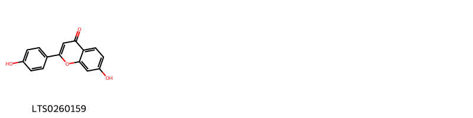{ width=100% }
    <figcaption>Hình ảnh cấu trúc hóa học của 1 hoạt chất thuộc nhóm Flavonoids gồm ["7,4'-dihydroxyflavone (LTS0260159)"].</figcaption>
</figure>
#### Nhóm Isoflavonoids
<figure markdown="span">
    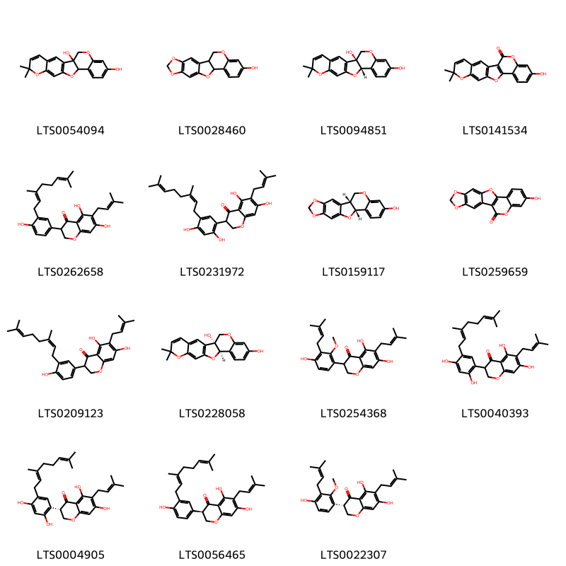{ width=100% }
    <figcaption>Hình ảnh cấu trúc hóa học của 15 hoạt chất thuộc nhóm Isoflavonoids gồm ['tuberosin (LTS0054094)', 'maackiain (LTS0028460)', '(1s,13s)-7,7-dimethyl-8,12,20-trioxapentacyclo[11.8.0.0²,¹¹.0⁴,⁹.0¹⁴,¹⁹]henicosa-2(11),3,5,9,14,16,18-heptaene-1,17-diol (LTS0094851)', 'sophoracoumestan a (LTS0141534)', 'sophoraisoflavanone c (LTS0262658)', '3-[5-(3,7-dimethylocta-2,6-dien-1-yl)-2,4-dihydroxyphenyl]-5,7-dihydroxy-6-(3-methylbut-2-en-1-yl)-2,3-dihydro-1-benzopyran-4-one (LTS0231972)', '(-)-maackiain (LTS0159117)', 'medicagol (LTS0259659)', '3-[3-(3,7-dimethylocta-2,6-dien-1-yl)-4-hydroxyphenyl]-5,7-dihydroxy-6-(3-methylbut-2-en-1-yl)-2,3-dihydro-1-benzopyran-4-one (LTS0209123)', '(1r,13r)-7,7-dimethyl-8,12,20-trioxapentacyclo[11.8.0.0²,¹¹.0⁴,⁹.0¹⁴,¹⁹]henicosa-2(11),3,5,9,14,16,18-heptaene-1,17-diol (LTS0228058)', 'isosophoranone (LTS0254368)', 'sophoraisoflavanone d (LTS0040393)', '(3s)-3-{5-[(2e)-3,7-dimethylocta-2,6-dien-1-yl]-2,4-dihydroxyphenyl}-5,7-dihydroxy-6-(3-methylbut-2-en-1-yl)-2,3-dihydro-1-benzopyran-4-one (LTS0004905)', '(3r)-3-{3-[(2e)-3,7-dimethylocta-2,6-dien-1-yl]-4-hydroxyphenyl}-5,7-dihydroxy-6-(3-methylbut-2-en-1-yl)-2,3-dihydro-1-benzopyran-4-one (LTS0056465)', '(3s)-5,7-dihydroxy-3-[4-hydroxy-2-methoxy-3-(3-methylbut-2-en-1-yl)phenyl]-6-(3-methylbut-2-en-1-yl)-2,3-dihydro-1-benzopyran-4-one (LTS0022307)'].</figcaption>
</figure>
#### Nhóm Linear 1_3-diarylpropanoids
<figure markdown="span">
    { width=100% }
    <figcaption>Hình ảnh cấu trúc hóa học của Không tìm thấy chú thích hoạt chất thuộc nhóm Linear 1_3-diarylpropanoids gồm Không tìm thấy chú thích.</figcaption>
</figure>
#### Nhóm Lupin alkaloids
<figure markdown="span">
    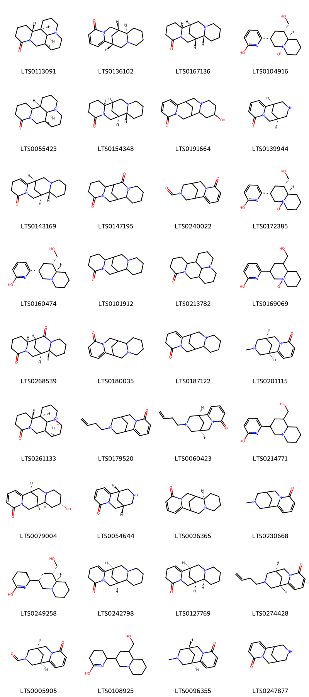{ width=100% }
    <figcaption>Hình ảnh cấu trúc hóa học của 36 hoạt chất thuộc nhóm Lupin alkaloids gồm ['matrine (LTS0113091)', '(1r,9r,10r)-7,15-diazatetracyclo[7.7.1.0²,⁷.0¹⁰,¹⁵]heptadeca-2,4-dien-6-one (LTS0136102)', '(1r,2r,9s,10r)-7,15-diazatetracyclo[7.7.1.0²,⁷.0¹⁰,¹⁵]heptadecan-6-one (LTS0167136)', '(1s,3r,5r,9ar)-1-(hydroxymethyl)-3-(6-hydroxypyridin-2-yl)-octahydro-1h-quinolizin-5-ium-5-olate (LTS0104916)', '(1r,9s,17s)-7,13-diazatetracyclo[7.7.1.0²,⁷.0¹³,¹⁷]heptadecan-6-one (LTS0055423)', '(1r,2r,9r,10r)-7,15-diazatetracyclo[7.7.1.0²,⁷.0¹⁰,¹⁵]heptadecan-6-one (LTS0154348)', '12-hydroxy-7,15-diazatetracyclo[7.7.1.0²,⁷.0¹⁰,¹⁵]heptadeca-2,4-dien-6-one (LTS0191664)', 'cytisine (LTS0139944)', '(1r,9r,10r)-7,15-diazatetracyclo[7.7.1.0²,⁷.0¹⁰,¹⁵]heptadec-2-en-6-one (LTS0143169)', '7,15-diazatetracyclo[7.7.1.0²,⁷.0¹⁰,¹⁵]heptadecane-6,16-dione (LTS0147195)', '6-oxo-7,11-diazatricyclo[7.3.1.0²,⁷]trideca-2,4-diene-11-carbaldehyde (LTS0240022)', '(1s,3r,9ar)-1-(hydroxymethyl)-3-(6-hydroxypyridin-2-yl)-octahydro-1h-quinolizin-5-ium-5-olate (LTS0172385)', '6-[(1s,3r,9ar)-1-(hydroxymethyl)-octahydro-1h-quinolizin-3-yl]pyridin-2-ol (LTS0160474)', 'lupanine l-form (LTS0101912)', 'matrine (LTS0213782)', '1-(hydroxymethyl)-3-(6-hydroxypyridin-2-yl)-octahydro-1h-quinolizin-5-ium-5-olate (LTS0169069)', '(1s,2s,9r,10r)-7,15-diazatetracyclo[7.7.1.0²,⁷.0¹⁰,¹⁵]heptadecane-6,16-dione (LTS0268539)', 'anagyrine (LTS0180035)', '7,15-diazatetracyclo[7.7.1.0²,⁷.0¹⁰,¹⁵]heptadec-2-en-6-one (LTS0187122)', '(1r,9s)-11-methyl-7,11-diazatricyclo[7.3.1.0²,⁷]trideca-2,4-dien-6-one (LTS0201115)', 'oxymatrine (LTS0261133)', 'rhombifoline (LTS0179520)', '(1s,9r)-11-(but-3-en-1-yl)-7,11-diazatricyclo[7.3.1.0²,⁷]trideca-2,4-dien-6-one (LTS0060423)', '6-[1-(hydroxymethyl)-octahydro-1h-quinolizin-3-yl]pyridin-2-ol (LTS0214771)', '(1r,9r,10s,12s)-12-hydroxy-7,15-diazatetracyclo[7.7.1.0²,⁷.0¹⁰,¹⁵]heptadeca-2,4-dien-6-one (LTS0079004)', '(1s,9r)-7,11-diazatricyclo[7.3.1.0²,⁷]trideca-2,4-dien-6-one (LTS0054644)', 'anagyrine (LTS0026365)', 'n-methylcytisine (LTS0230668)', '(6s)-6-[(1s,3r,9ar)-1-(hydroxymethyl)-octahydro-1h-quinolizin-3-yl]-3,4,5,6-tetrahydropyridin-2-ol (LTS0249258)', '(1r,9r)-7,15-diazatetracyclo[7.7.1.0²,⁷.0¹⁰,¹⁵]heptadec-2-en-6-one (LTS0242798)', '(1r,9r,10s)-7,15-diazatetracyclo[7.7.1.0²,⁷.0¹⁰,¹⁵]heptadec-2-en-6-one (LTS0127769)', '(1r,9s)-11-(but-3-en-1-yl)-7,11-diazatricyclo[7.3.1.0²,⁷]trideca-2,4-dien-6-one (LTS0274428)', '(-)-n-formylcytisine (LTS0005905)', '6-[1-(hydroxymethyl)-octahydro-1h-quinolizin-3-yl]-3,4,5,6-tetrahydropyridin-2-ol (LTS0108925)', '(1r,9r)-11-methyl-7,11-diazatricyclo[7.3.1.0²,⁷]trideca-2,4-dien-6-one (LTS0096355)', 'citizin (LTS0247877)'].</figcaption>
</figure>
#### Nhóm Pyridines and derivatives
<figure markdown="span">
    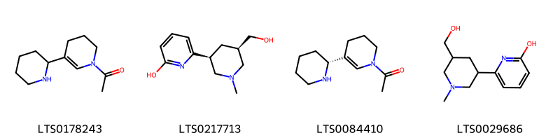{ width=100% }
    <figcaption>Hình ảnh cấu trúc hóa học của 4 hoạt chất thuộc nhóm Pyridines and derivatives gồm ['1-[3-(piperidin-2-yl)-5,6-dihydro-4h-pyridin-1-yl]ethanone (LTS0178243)', '6-[(3s,5r)-5-(hydroxymethyl)-1-methylpiperidin-3-yl]pyridin-2-ol (LTS0217713)', 'ammodendrine (LTS0084410)', '6-[5-(hydroxymethyl)-1-methylpiperidin-3-yl]pyridin-2-ol (LTS0029686)'].</figcaption>
</figure>
#### Nhóm Quinolizines
<figure markdown="span">
    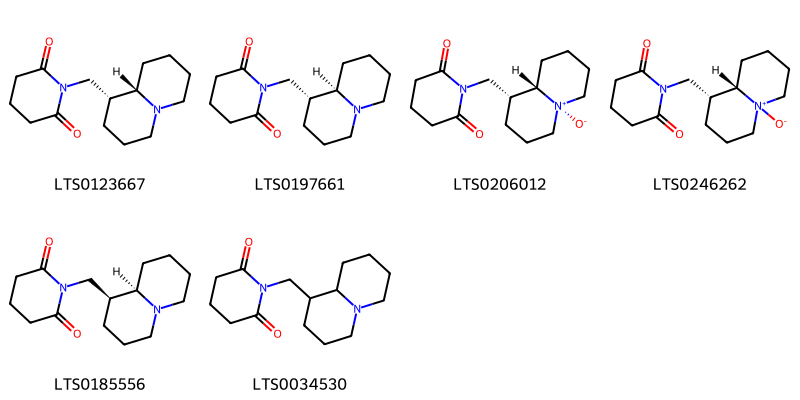{ width=100% }
    <figcaption>Hình ảnh cấu trúc hóa học của 6 hoạt chất thuộc nhóm Quinolizines gồm ['1-[(1r,9as)-octahydro-1h-quinolizin-1-ylmethyl]piperidine-2,6-dione (LTS0123667)', 'lamprolobine (LTS0197661)', '(1r,5r,9as)-1-[(2,6-dioxopiperidin-1-yl)methyl]-octahydro-1h-quinolizin-5-ium-5-olate (LTS0206012)', '(1r,9as)-1-[(2,6-dioxopiperidin-1-yl)methyl]-octahydro-1h-quinolizin-5-ium-5-olate (LTS0246262)', '1-[(1s,9ar)-octahydro-1h-quinolizin-1-ylmethyl]piperidine-2,6-dione (LTS0185556)', '1-(octahydro-1h-quinolizin-1-ylmethyl)piperidine-2,6-dione (LTS0034530)'].</figcaption>
</figure>

---

### Dược dân tộc học

Danh sách các quốc gia có sử dụng *Sophora chrysophylla* trong điều trị các bệnh. 

| Country   | Disease    | Bệnh                                                                                                                                                                                                |
|:----------|:-----------|:----------------------------------------------------------------------------------------------------------------------------------------------------------------------------------------------------|
| Hawaii    | Astringent | MYMEMORY WARNING: YOU USED ALL AVAILABLE FREE TRANSLATIONS FOR TODAY. NEXT AVAILABLE IN  13 HOURS 54 MINUTES 06 SECONDS VISIT HTTPS://MYMEMORY.TRANSLATED.NET/DOC/USAGELIMITS.PHP TO TRANSLATE MORE |

---

---
## Sophora flavescens
### Thông tin về thực vật

!!! info "Phân loại thực vật của *Sophora flavescens* từ GIBF:"
    - **Kingdom:** Plantae
    - **Phylum:** Tracheophyta
    - **Order:** Fabales
    - **Family:** Fabaceae
    - **Genus:** Sophora
    - **Species:** *Sophora flavescens*

 

| Label (VI)   | Label (EN)   | Scientific Name    | Descriptions (VI)   | Descriptions (EN)   | Also Known As (VI)   | Also Known As (EN)   |
|:-------------|:-------------|:-------------------|:--------------------|:--------------------|:---------------------|:---------------------|
| N/A          | N/A          | Sophora flavescens | loài thực vật       | species of plant    | ['']                 | ['shrubby sophora']  |

#### Phân bố trên thế giới

**Từ CSDL GIBF** Japan, Belgium, Korea, Republic of, Chinese Taipei, Russian Federation, China

#### Phân bố tại Việt Nam

**Từ CSDL GIBF**: Không có ghi nhận ở Việt Nam

---
### Thành phần hóa học
        
- Theo cơ sở dữ liệu lotus: Từ loài *Sophora flavescens* đã phân lập và xác định được 279 hoạt chất thuộc về các nhóm Azoles, Stilbenes, Fatty Acyls, Indoles and derivatives, Cinnamic acids and derivatives, Diazanaphthalenes, Lupin alkaloids, Quinolizines, Coumarans, Prenol lipids, Linear 1,3-diarylpropanoids, Organooxygen compounds, Pyridines and derivatives, Flavonoids, Steroids and steroid derivatives, Isoflavonoids, Benzodioxoles, 2-arylbenzofuran flavonoids, Coumarins and derivatives. 

|    | chemicalTaxonomyClassyfireClass   |   smiles_count |
|---:|:----------------------------------|---------------:|
|  0 | 2-arylbenzofuran flavonoids       |              5 |
|  1 | Azoles                            |              2 |
|  2 | Benzodioxoles                     |              6 |
|  3 | Cinnamic acids and derivatives    |              1 |
|  4 | Coumarans                         |              3 |
|  5 | Coumarins and derivatives         |              1 |
|  6 | Diazanaphthalenes                 |              7 |
|  7 | Fatty Acyls                       |              1 |
|  8 | Flavonoids                        |            122 |
|  9 | Indoles and derivatives           |              1 |
| 10 | Isoflavonoids                     |             33 |
| 11 | Linear 1,3-diarylpropanoids       |             18 |
| 12 | Lupin alkaloids                   |             51 |
| 13 | Organooxygen compounds            |              1 |
| 14 | Prenol lipids                     |             14 |
| 15 | Pyridines and derivatives         |              3 |
| 16 | Quinolizines                      |              1 |
| 17 | Steroids and steroid derivatives  |              1 |
| 18 | Stilbenes                         |              2 |

#### Nhóm 2-arylbenzofuran flavonoids
<figure markdown="span">
    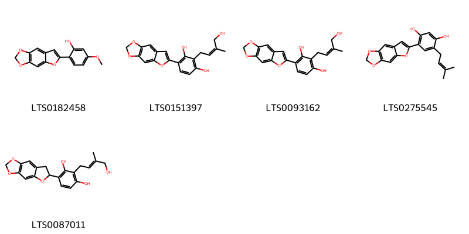{ width=100% }
    <figcaption>Hình ảnh cấu trúc hóa học của 5 hoạt chất thuộc nhóm 2-arylbenzofuran flavonoids gồm ['5-methoxy-2-{4,6,10-trioxatricyclo[7.3.0.0³,⁷]dodeca-1,3(7),8,11-tetraen-11-yl}phenol (LTS0182458)', '2-(4-hydroxy-3-methylbut-2-en-1-yl)-4-{4,6,10-trioxatricyclo[7.3.0.0³,⁷]dodeca-1,3(7),8,11-tetraen-11-yl}benzene-1,3-diol (LTS0151397)', '2-[(2z)-4-hydroxy-3-methylbut-2-en-1-yl]-4-{4,6,10-trioxatricyclo[7.3.0.0³,⁷]dodeca-1,3(7),8,11-tetraen-11-yl}benzene-1,3-diol (LTS0093162)', '4-(3-methylbut-2-en-1-yl)-6-{4,6,10-trioxatricyclo[7.3.0.0³,⁷]dodeca-1,3(7),8,11-tetraen-11-yl}benzene-1,3-diol (LTS0275545)', '2-[(2e)-4-hydroxy-3-methylbut-2-en-1-yl]-4-{4,6,10-trioxatricyclo[7.3.0.0³,⁷]dodeca-1,3(7),8-trien-11-yl}benzene-1,3-diol (LTS0087011)'].</figcaption>
</figure>
#### Nhóm Azoles
<figure markdown="span">
    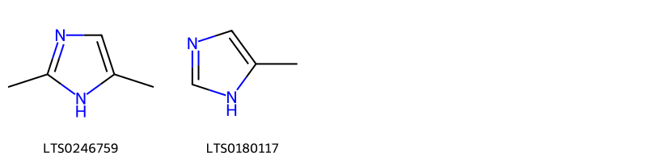{ width=100% }
    <figcaption>Hình ảnh cấu trúc hóa học của 2 hoạt chất thuộc nhóm Azoles gồm ['2,4-dimethyl-3h-imidazole (LTS0246759)', '4-methylimidazole (LTS0180117)'].</figcaption>
</figure>
#### Nhóm Benzodioxoles
<figure markdown="span">
    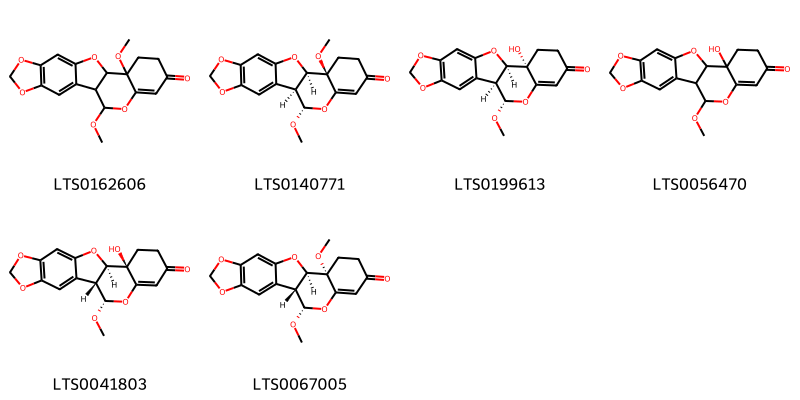{ width=100% }
    <figcaption>Hình ảnh cấu trúc hóa học của 6 hoạt chất thuộc nhóm Benzodioxoles gồm ['13,20-dimethoxy-5,7,11,19-tetraoxapentacyclo[10.8.0.0²,¹⁰.0⁴,⁸.0¹³,¹⁸]icosa-2,4(8),9,17-tetraen-16-one (LTS0162606)', '(1s,12r,13r,20s)-13,20-dimethoxy-5,7,11,19-tetraoxapentacyclo[10.8.0.0²,¹⁰.0⁴,⁸.0¹³,¹⁸]icosa-2,4(8),9,17-tetraen-16-one (LTS0140771)', '(1s,12r,13s,20s)-13-hydroxy-20-methoxy-5,7,11,19-tetraoxapentacyclo[10.8.0.0²,¹⁰.0⁴,⁸.0¹³,¹⁸]icosa-2,4(8),9,17-tetraen-16-one (LTS0199613)', '13-hydroxy-20-methoxy-5,7,11,19-tetraoxapentacyclo[10.8.0.0²,¹⁰.0⁴,⁸.0¹³,¹⁸]icosa-2,4(8),9,17-tetraen-16-one (LTS0056470)', '(1r,12r,13r,20s)-13-hydroxy-20-methoxy-5,7,11,19-tetraoxapentacyclo[10.8.0.0²,¹⁰.0⁴,⁸.0¹³,¹⁸]icosa-2,4(8),9,17-tetraen-16-one (LTS0041803)', '(1r,12r,13s,20s)-13,20-dimethoxy-5,7,11,19-tetraoxapentacyclo[10.8.0.0²,¹⁰.0⁴,⁸.0¹³,¹⁸]icosa-2,4(8),9,17-tetraen-16-one (LTS0067005)'].</figcaption>
</figure>
#### Nhóm Cinnamic acids and derivatives
<figure markdown="span">
    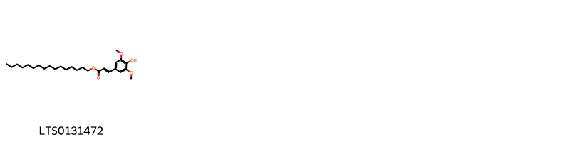{ width=100% }
    <figcaption>Hình ảnh cấu trúc hóa học của 1 hoạt chất thuộc nhóm Cinnamic acids and derivatives gồm ['hexadecyl (2e)-3-(4-hydroxy-3,5-dimethoxyphenyl)prop-2-enoate (LTS0131472)'].</figcaption>
</figure>
#### Nhóm Coumarans
<figure markdown="span">
    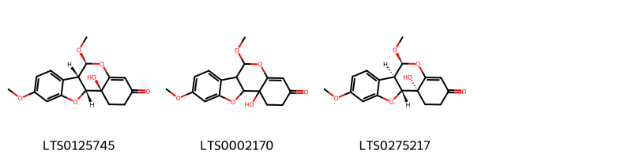{ width=100% }
    <figcaption>Hình ảnh cấu trúc hóa học của 3 hoạt chất thuộc nhóm Coumarans gồm ['(1r,2s,9s,10s)-2-hydroxy-9,14-dimethoxy-8,17-dioxatetracyclo[8.7.0.0²,⁷.0¹¹,¹⁶]heptadeca-6,11,13,15-tetraen-5-one (LTS0125745)', '2-hydroxy-9,14-dimethoxy-8,17-dioxatetracyclo[8.7.0.0²,⁷.0¹¹,¹⁶]heptadeca-6,11,13,15-tetraen-5-one (LTS0002170)', '(1r,2r,9s,10r)-2-hydroxy-9,14-dimethoxy-8,17-dioxatetracyclo[8.7.0.0²,⁷.0¹¹,¹⁶]heptadeca-6,11,13,15-tetraen-5-one (LTS0275217)'].</figcaption>
</figure>
#### Nhóm Coumarins and derivatives
<figure markdown="span">
    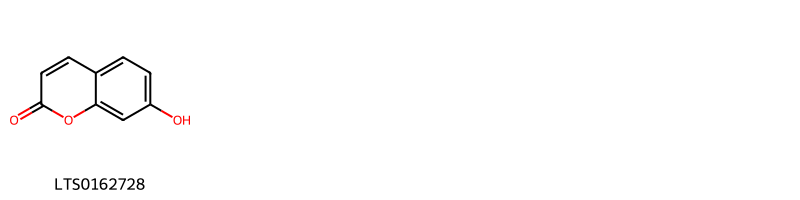{ width=100% }
    <figcaption>Hình ảnh cấu trúc hóa học của 1 hoạt chất thuộc nhóm Coumarins and derivatives gồm ['umbelliferone (LTS0162728)'].</figcaption>
</figure>
#### Nhóm Diazanaphthalenes
<figure markdown="span">
    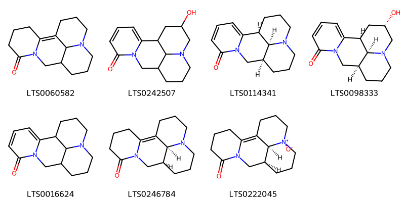{ width=100% }
    <figcaption>Hình ảnh cấu trúc hóa học của 7 hoạt chất thuộc nhóm Diazanaphthalenes gồm ['7,13-diazatetracyclo[7.7.1.0²,⁷.0¹³,¹⁷]heptadec-1-en-6-one (LTS0060582)', '15-hydroxy-7,13-diazatetracyclo[7.7.1.0²,⁷.0¹³,¹⁷]heptadeca-2,4-dien-6-one (LTS0242507)', 'sophoramine (LTS0114341)', '(1s,9s,15s,17s)-15-hydroxy-7,13-diazatetracyclo[7.7.1.0²,⁷.0¹³,¹⁷]heptadeca-2,4-dien-6-one (LTS0098333)', '7,13-diazatetracyclo[7.7.1.0²,⁷.0¹³,¹⁷]heptadeca-2,4-dien-6-one (LTS0016624)', '(9s,17s)-7,13-diazatetracyclo[7.7.1.0²,⁷.0¹³,¹⁷]heptadec-1-en-6-one (LTS0246784)', '(9s,17s)-6-oxo-7,13-diazatetracyclo[7.7.1.0²,⁷.0¹³,¹⁷]heptadec-1-en-13-ium-13-olate (LTS0222045)'].</figcaption>
</figure>
#### Nhóm Fatty Acyls
<figure markdown="span">
    { width=100% }
    <figcaption>Hình ảnh cấu trúc hóa học của 1 hoạt chất thuộc nhóm Fatty Acyls gồm ['lignoceric acid (LTS0107726)'].</figcaption>
</figure>
#### Nhóm Flavonoids
<figure markdown="span">
    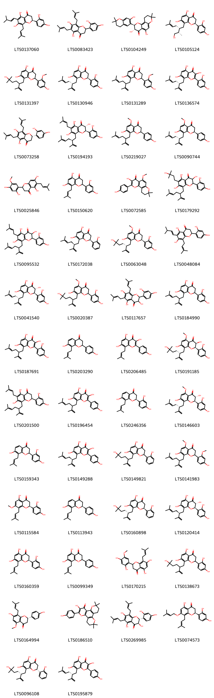{ width=100% }
    <figcaption>Hình ảnh cấu trúc hóa học của 122 hoạt chất thuộc nhóm Flavonoids gồm ['(2s)-2-(2,4-dihydroxyphenyl)-5,7-dihydroxy-6-[(1e)-3-methylbut-1-en-1-yl]-8-(3-methylbut-2-en-1-yl)-2,3-dihydro-1-benzopyran-4-one (LTS0137060)', 'kushenol e (LTS0083423)', '(4r,5r)-5,8-dihydroxy-4-(7-hydroxy-2,2-dimethyl-3,4-dihydro-1-benzopyran-6-yl)-12,12-dimethyl-3,11-dioxatricyclo[8.4.0.0²,⁷]tetradeca-1,7,9-trien-6-one (LTS0104249)', '(2s)-2-(2,4-dihydroxyphenyl)-5,7-dihydroxy-8-[(2r,3s)-4-hydroxy-3-methyl-2-(3-methylbut-2-en-1-yl)butyl]-2,3-dihydro-1-benzopyran-4-one (LTS0105124)', '5,7-dihydroxy-2-(4-hydroxy-2-methoxyphenyl)-8-[5-hydroxy-5-methyl-2-(prop-1-en-2-yl)hexyl]-2,3-dihydro-1-benzopyran-4-one (LTS0131397)', 'sophoraflavanone g (LTS0130946)', 'leachianone a (LTS0131289)', 'kushenol c (LTS0136574)', '(2s)-2-(2,4-dihydroxyphenyl)-5,7-dihydroxy-6,8-bis(3-methylbut-2-en-1-yl)-2,3-dihydro-1-benzopyran-4-one (LTS0073258)', '(2r,3r)-2-(2,4-dihydroxyphenyl)-3,5,7-trihydroxy-8-[(2s)-5-methyl-2-(prop-1-en-2-yl)hex-4-en-1-yl]-6-(3-methylbut-2-en-1-yl)-2,3-dihydro-1-benzopyran-4-one (LTS0194193)', '7-hydroxy-2-(4-hydroxyphenyl)-5-methoxy-8-[5-methyl-2-(prop-1-en-2-yl)hex-4-en-1-yl]-2,3-dihydro-1-benzopyran-4-one (LTS0219027)', 'kushenol u (LTS0090744)', '2-(2,4-dihydroxy-5-methoxyphenyl)-5,7-dihydroxy-6-(3-methylbut-2-en-1-yl)-2,3-dihydro-1-benzopyran-4-one (LTS0025846)', '2-(2,4-dihydroxyphenyl)-5,7-dihydroxy-8-(3-methylbut-2-en-1-yl)-2,3-dihydro-1-benzopyran-4-one (LTS0150620)', '3-hydroxy-2-(4-hydroxyphenyl)-5-methoxy-8,8-dimethyl-9h,10h-pyrano[2,3-h]chromen-4-one (LTS0072585)', '2-(2,4-dihydroxyphenyl)-3,5,7-trihydroxy-6-(3-hydroxy-3-methylbutyl)-8-[5-methyl-2-(prop-1-en-2-yl)hex-4-en-1-yl]-2,3-dihydro-1-benzopyran-4-one (LTS0179292)', '2-(2,4-dihydroxyphenyl)-3,5,7-trihydroxy-8-[5-methyl-2-(prop-1-en-2-yl)hex-4-en-1-yl]-6-(3-methylbut-2-en-1-yl)-2,3-dihydro-1-benzopyran-4-one (LTS0095532)', '(2s)-5,7-dihydroxy-2-(2-hydroxyphenyl)-8-[(2s)-5-methyl-2-(prop-1-en-2-yl)hex-4-en-1-yl]-2,3-dihydro-1-benzopyran-4-one (LTS0172038)', 'kurarinol (LTS0063048)', '2-(2,4-dihydroxyphenyl)-5,7-dihydroxy-6-(3-methylbut-1-en-1-yl)-8-(3-methylbut-2-en-1-yl)-2,3-dihydro-1-benzopyran-4-one (LTS0048084)', '(2r,3r)-2-(2,4-dihydroxyphenyl)-3,5,7-trihydroxy-8-[(2r)-5-methyl-2-(prop-1-en-2-yl)hex-4-en-1-yl]-2,3-dihydro-1-benzopyran-4-one (LTS0041540)', '2-(2,4-dihydroxyphenyl)-7-hydroxy-8-[5-hydroxy-5-methyl-2-(prop-1-en-2-yl)hexyl]-5-methoxy-2,3-dihydro-1-benzopyran-4-one (LTS0020387)', '2-(2,4-dihydroxyphenyl)-3,5,7-trihydroxy-6,8-bis(3-methylbut-2-en-1-yl)-2,3-dihydro-1-benzopyran-4-one (LTS0117657)', 'sophoraflavanone g (LTS0184990)', '2-(2,4-dihydroxyphenyl)-3,5,7-trihydroxy-8-[5-methyl-2-(prop-1-en-2-yl)hex-4-en-1-yl]chromen-4-one (LTS0187691)', 'isobavachin (LTS0203290)', '8-prenylkaempferol (LTS0206485)', '(2r,3s)-2-(2,4-dihydroxyphenyl)-3,7-dihydroxy-8-[(2r)-5-hydroxy-5-methyl-2-(prop-1-en-2-yl)hexyl]-5-methoxy-2,3-dihydro-1-benzopyran-4-one (LTS0191185)', 'kushenol b (LTS0201500)', '8-lavandulylkaempferol (LTS0196454)', '(2s)-2-(2,4-dihydroxyphenyl)-7-hydroxy-8-(3-methylbut-2-en-1-yl)-2,3-dihydro-1-benzopyran-4-one (LTS0246356)', '(2r,3r)-2-(2,4-dihydroxyphenyl)-3,7-dihydroxy-5-methoxy-8-[(2r)-5-methyl-2-(prop-1-en-2-yl)hex-4-en-1-yl]-2,3-dihydro-1-benzopyran-4-one (LTS0146603)', 'euchrenone a7 (LTS0159343)', '3,5,7-trihydroxy-2-(4-hydroxyphenyl)-8-[(2s)-5-methyl-2-(prop-1-en-2-yl)hex-4-en-1-yl]chromen-4-one (LTS0149288)', '5,7-dihydroxy-8-[5-hydroxy-5-methyl-2-(prop-1-en-2-yl)hexyl]-2-(2-hydroxyphenyl)-2,3-dihydro-1-benzopyran-4-one (LTS0149821)', '7-hydroxy-2-(4-hydroxy-2-methoxyphenyl)-5-methoxy-8-[5-methyl-2-(prop-1-en-2-yl)hex-4-en-1-yl]-2,3-dihydro-1-benzopyran-4-one (LTS0141983)', '(2s)-2-(2,4-dihydroxyphenyl)-5-hydroxy-7-methoxy-8-(3-methylbut-2-en-1-yl)-2,3-dihydro-1-benzopyran-4-one (LTS0115584)', '(2s)-7-hydroxy-2-(4-hydroxyphenyl)-8-(3-methylbut-2-en-1-yl)-2,3-dihydro-1-benzopyran-4-one (LTS0113943)', '(2s)-5,7-dihydroxy-8-[(2r)-5-hydroxy-5-methyl-2-(prop-1-en-2-yl)hexyl]-2-(2-hydroxyphenyl)-2,3-dihydro-1-benzopyran-4-one (LTS0160898)', '(2r,3r)-2-(2,4-dihydroxyphenyl)-3,5,7-trihydroxy-8-[(2s)-5-methyl-2-(prop-1-en-2-yl)hex-4-en-1-yl]-2,3-dihydro-1-benzopyran-4-one (LTS0120414)', 'leachianone g (LTS0160359)', 'sophoraflavanone b (LTS0099349)', 'kushenol w (LTS0170215)', '2-(2,4-dihydroxyphenyl)-5,7-dihydroxy-8-[5-hydroxy-5-methyl-2-(prop-1-en-2-yl)hexyl]-2,3-dihydro-1-benzopyran-4-one (LTS0138673)', 'isoxanthohumol (LTS0164994)', '3-hydroxy-2-(4-hydroxyphenyl)-6,6,10,10-tetramethyl-7,8,11,12-tetrahydro-1,5,9-trioxatriphenylen-4-one (LTS0186510)', '(2r,3r)-2-(2,4-dihydroxyphenyl)-3,5,7-trihydroxy-6,8-bis(3-methylbut-2-en-1-yl)-2,3-dihydro-1-benzopyran-4-one (LTS0269985)', '(2s)-2-(2,4-dihydroxyphenyl)-5-hydroxy-8-(3-methylbut-2-en-1-yl)-7-[(3-methylbut-2-en-1-yl)oxy]-2,3-dihydro-1-benzopyran-4-one (LTS0074573)', '(2r)-5,7-dihydroxy-8-[(2r)-5-hydroxy-5-methyl-2-(prop-1-en-2-yl)hexyl]-2-(2-hydroxyphenyl)-2,3-dihydro-1-benzopyran-4-one (LTS0096108)', '3,5,7-trihydroxy-2-(4-hydroxyphenyl)-8-[(2r)-5-methyl-2-(prop-1-en-2-yl)hex-4-en-1-yl]chromen-4-one (LTS0195879)', 'sophoflavescenol (LTS0217969)', '2-(2,4-dihydroxyphenyl)-3,7-dihydroxy-5-methoxy-8-[5-methyl-2-(prop-1-en-2-yl)hex-4-en-1-yl]-2,3-dihydro-1-benzopyran-4-one (LTS0232467)', '2-(2,4-dihydroxyphenyl)-5,7-dihydroxy-8-[4-hydroxy-3-methyl-2-(3-methylbut-2-en-1-yl)butyl]-2,3-dihydro-1-benzopyran-4-one (LTS0023155)', "(2s)-2'-methoxykurarinone (LTS0214481)", '(2r)-5,7-dihydroxy-2-(2-hydroxyphenyl)-8-[(2s)-5-methyl-2-(prop-1-en-2-yl)hex-4-en-1-yl]-2,3-dihydro-1-benzopyran-4-one (LTS0222489)', '(2s)-5,7-dihydroxy-2-(4-hydroxy-2-methoxyphenyl)-8-[(2r)-5-hydroxy-5-methyl-2-(prop-1-en-2-yl)hexyl]-2,3-dihydro-1-benzopyran-4-one (LTS0047056)', '(2r)-2-(2,4-dihydroxy-5-methoxyphenyl)-5,7-dihydroxy-8-(3-methylbut-2-en-1-yl)-2,3-dihydro-1-benzopyran-4-one (LTS0039461)', '(2s)-2-(2,4-dihydroxyphenyl)-5,7-dihydroxy-8-[(2s)-5-methyl-2-(prop-1-en-2-yl)hex-4-en-1-yl]-6-(3-methylbut-2-en-1-yl)-2,3-dihydro-1-benzopyran-4-one (LTS0165604)', 'kurarinone (LTS0161057)', '2-(2,4-dihydroxyphenyl)-3,5,7-trihydroxy-8-[5-methyl-2-(prop-1-en-2-yl)hex-4-en-1-yl]-2,3-dihydro-1-benzopyran-4-one (LTS0054692)', 'isoxanthohumol(sophora) (LTS0254582)', '(2s)-2-(2,4-dihydroxy-5-methoxyphenyl)-5,7-dihydroxy-8-[(2r)-5-methyl-2-(prop-1-en-2-yl)hex-4-en-1-yl]-2,3-dihydro-1-benzopyran-4-one (LTS0255064)', 'kushenol s (LTS0191115)', 'kushenol v (LTS0251083)', 'sophoraflavanone l (LTS0058290)', '2-(2,4-dihydroxyphenyl)-7-hydroxy-5-methoxy-8-[5-methyl-2-(prop-1-en-2-yl)hex-4-en-1-yl]-2,3-dihydro-1-benzopyran-4-one (LTS0060729)', '5,7-dihydroxy-2-(2-hydroxyphenyl)-8-(3-methylbut-2-en-1-yl)-2,3-dihydro-1-benzopyran-4-one (LTS0270916)', '(2s)-2-(2,4-dihydroxyphenyl)-5,7-dihydroxy-8-[(2r)-5-hydroxy-5-methyl-2-(prop-1-en-2-yl)hexyl]-2,3-dihydro-1-benzopyran-4-one (LTS0007492)', '(2r,3r)-2-(2,4-dihydroxyphenyl)-3,7-dihydroxy-8-[(2r)-5-hydroxy-5-methyl-2-(prop-1-en-2-yl)hexyl]-5-methoxy-2,3-dihydro-1-benzopyran-4-one (LTS0067097)', 'sophoraflavanone b (LTS0058527)', 'kushenol a (LTS0002230)', '2-(2,4-dihydroxyphenyl)-3,7-dihydroxy-8-[5-hydroxy-5-methyl-2-(prop-1-en-2-yl)hexyl]-5-methoxy-2,3-dihydro-1-benzopyran-4-one (LTS0016397)', '7-hydroxy-2-(2-hydroxyphenyl)-5-methoxy-8-[5-methyl-2-(prop-1-en-2-yl)hex-4-en-1-yl]-2,3-dihydro-1-benzopyran-4-one (LTS0000823)', '(2r,3r)-2-(2,4-dihydroxyphenyl)-3,5,7-trihydroxy-6-(3-hydroxy-3-methylbutyl)-8-[(2s)-5-methyl-2-(prop-1-en-2-yl)hex-4-en-1-yl]-2,3-dihydro-1-benzopyran-4-one (LTS0014164)', '(2s)-2-(2,4-dihydroxyphenyl)-5,7-dihydroxy-8-[(2s)-5-methyl-2-(prop-1-en-2-yl)hex-4-en-1-yl]-2,3-dihydro-1-benzopyran-4-one (LTS0223099)', '2-(2,4-dihydroxy-5-methoxyphenyl)-5,7-dihydroxy-8-[5-methyl-2-(prop-1-en-2-yl)hex-4-en-1-yl]-2,3-dihydro-1-benzopyran-4-one (LTS0236682)', '(2r,3s)-2-(2,4-dihydroxyphenyl)-3,7-dihydroxy-5-methoxy-8-[(2r)-5-methyl-2-(prop-1-en-2-yl)hex-4-en-1-yl]-2,3-dihydro-1-benzopyran-4-one (LTS0224193)', '5,8-dihydroxy-4-(7-hydroxy-2,2-dimethyl-3,4-dihydro-1-benzopyran-6-yl)-12,12-dimethyl-3,11-dioxatricyclo[8.4.0.0²,⁷]tetradeca-1,7,9-trien-6-one (LTS0230770)', 'kenusanone i (LTS0030736)', 'kushenol r (LTS0117903)', 'leachianone a (LTS0034238)', '2-(2,4-dihydroxyphenyl)-3,5,7-trihydroxy-8-[(2s)-5-methyl-2-(prop-1-en-2-yl)hex-4-en-1-yl]chromen-4-one (LTS0035846)', '(3r)-2-(2,4-dihydroxyphenyl)-3,5,7-trihydroxy-8-[5-methyl-2-(prop-1-en-2-yl)hex-4-en-1-yl]-6-(3-methylbut-2-en-1-yl)-2,3-dihydro-1-benzopyran-4-one (LTS0062406)', '(2s,3r)-2-(2,4-dihydroxyphenyl)-3,7-dihydroxy-5-methoxy-8-[(2s)-5-methyl-2-(prop-1-en-2-yl)hex-4-en-1-yl]-2,3-dihydro-1-benzopyran-4-one (LTS0071613)', '2-(2,4-dihydroxyphenyl)-3,5,7-trihydroxy-8-[5-hydroxy-5-methyl-2-(prop-1-en-2-yl)hexyl]chromen-4-one (LTS0220677)', 'kushenol f (LTS0214305)', '(3r)-2-(2,4-dihydroxyphenyl)-3,5,7-trihydroxy-6-(3-hydroxy-3-methylbutyl)-8-[5-methyl-2-(prop-1-en-2-yl)hex-4-en-1-yl]-2,3-dihydro-1-benzopyran-4-one (LTS0060076)', '(2s)-2-(2,4-dihydroxyphenyl)-5,7-dihydroxy-8-[(2s)-5-hydroxy-5-methyl-2-(prop-1-en-2-yl)hexyl]-2,3-dihydro-1-benzopyran-4-one (LTS0224892)', 'lehmannin (LTS0081218)', 'alopecurone g (LTS0219917)', '3-hydroxy-2-(4-methoxyphenyl)-7-[(3,4,5-trihydroxy-6-{[(3,4,5-trihydroxyoxan-2-yl)oxy]methyl}oxan-2-yl)oxy]-2,3-dihydro-1-benzopyran-4-one (LTS0097836)', '3-hydroxy-2-(4-methoxyphenyl)-7-{[(2s,3r,4s,5s,6r)-3,4,5-trihydroxy-6-({[(2s,3r,4s,5r)-3,4,5-trihydroxyoxan-2-yl]oxy}methyl)oxan-2-yl]oxy}-2,3-dihydro-1-benzopyran-4-one (LTS0089566)', 'kushenol g (LTS0109777)', '(2r)-2-(2,4-dihydroxyphenyl)-5,7-dihydroxy-6,8-bis(3-methylbut-2-en-1-yl)-2,3-dihydro-1-benzopyran-4-one (LTS0195674)', '(3r)-2-(2,4-dihydroxyphenyl)-3,5,7-trihydroxy-6,8-bis(3-methylbut-2-en-1-yl)-2,3-dihydro-1-benzopyran-4-one (LTS0105326)', '(2r,3r)-2-(2,4-dihydroxyphenyl)-3,5,7-trihydroxy-8-[(2r)-5-methyl-2-(prop-1-en-2-yl)hex-4-en-1-yl]-6-(3-methylbut-2-en-1-yl)-2,3-dihydro-1-benzopyran-4-one (LTS0201601)', '(2s)-2-(2,4-dihydroxyphenyl)-5,7-dihydroxy-8-[5-methyl-2-(prop-1-en-2-yl)hex-4-en-1-yl]-2,3-dihydro-1-benzopyran-4-one (LTS0152410)', '(2r)-7-hydroxy-2-(4-hydroxy-2-methoxyphenyl)-5-methoxy-8-[(2s)-5-methyl-2-(prop-1-en-2-yl)hex-4-en-1-yl]-2,3-dihydro-1-benzopyran-4-one (LTS0134251)', '7-hydroxy-2-(4-hydroxy-2-methoxyphenyl)-8-[5-hydroxy-5-methyl-2-(prop-1-en-2-yl)hexyl]-5-methoxychromen-4-one (LTS0197979)', '2-(3,4-dihydroxyphenyl)-5-hydroxy-7-{[3,4,5-trihydroxy-6-(hydroxymethyl)oxan-2-yl]oxy}chromen-4-one (LTS0158292)', '(2s)-5,7-dihydroxy-8-[(2s)-5-hydroxy-5-methyl-2-(prop-1-en-2-yl)hexyl]-2-(2-hydroxyphenyl)-2,3-dihydro-1-benzopyran-4-one (LTS0148633)', '(2r,3r)-2-(2,4-dihydroxyphenyl)-3,5,7-trihydroxy-6-(3-hydroxy-3-methylbutyl)-8-[(2r)-5-methyl-2-(prop-1-en-2-yl)hex-4-en-1-yl]-2,3-dihydro-1-benzopyran-4-one (LTS0143963)', 'apigenin 7-o-β-glucoside (LTS0252743)', '(2r)-7-hydroxy-2-(4-hydroxy-2-methoxyphenyl)-8-[(2s)-5-hydroxy-5-methyl-2-(prop-1-en-2-yl)hexyl]-5-methoxy-2,3-dihydro-1-benzopyran-4-one (LTS0219352)', '(2r)-2-(2,4-dihydroxyphenyl)-5,7-dihydroxy-8-[(2r)-5-methyl-2-(prop-1-en-2-yl)hex-4-en-1-yl]-2,3-dihydro-1-benzopyran-4-one (LTS0233796)', '(2r)-2-(2,4-dihydroxyphenyl)-7-hydroxy-5-methoxy-8-[(2s)-5-methyl-2-(prop-1-en-2-yl)hex-4-en-1-yl]-2,3-dihydro-1-benzopyran-4-one (LTS0267117)', '(2r,3s)-3-hydroxy-2-(4-methoxyphenyl)-7-{[(2s,3s,4s,5s,6r)-3,4,5-trihydroxy-6-({[(2r,3r,4r,5r)-3,4,5-trihydroxyoxan-2-yl]oxy}methyl)oxan-2-yl]oxy}-2,3-dihydro-1-benzopyran-4-one (LTS0120769)', '(2r)-5,7-dihydroxy-2-(4-hydroxy-2-methoxyphenyl)-8-[(2r)-5-methyl-2-(prop-1-en-2-yl)hex-4-en-1-yl]-2,3-dihydro-1-benzopyran-4-one (LTS0274418)', '(2s)-2-(2,4-dihydroxyphenyl)-5,7-dihydroxy-8-[(2r)-5-methyl-2-(prop-1-en-2-yl)hex-4-en-1-yl]-6-(3-methylbut-2-en-1-yl)-2,3-dihydro-1-benzopyran-4-one (LTS0221317)', '(2s)-5,7-dihydroxy-2-(2-hydroxyphenyl)-8-[(2r)-5-methyl-2-(prop-1-en-2-yl)hex-4-en-1-yl]-2,3-dihydro-1-benzopyran-4-one (LTS0090370)', 'luteolin 7-o-glucoside (LTS0227450)', '(2s)-5,7-dihydroxy-2-(4-hydroxy-2-methoxyphenyl)-8-[(2r,3r)-4-hydroxy-3-methyl-2-(3-methylbut-2-en-1-yl)butyl]-2,3-dihydro-1-benzopyran-4-one (LTS0061801)', '(2s)-2-(2,4-dihydroxy-5-methoxyphenyl)-5,7-dihydroxy-8-[(2s)-5-methyl-2-(prop-1-en-2-yl)hex-4-en-1-yl]-2,3-dihydro-1-benzopyran-4-one (LTS0036082)', '(2r,3r)-2-(2,4-dihydroxyphenyl)-3,7-dihydroxy-8-[(2s)-5-hydroxy-5-methyl-2-(prop-1-en-2-yl)hexyl]-5-methoxy-2,3-dihydro-1-benzopyran-4-one (LTS0156814)', '(2r)-5,7-dihydroxy-2-(4-hydroxy-2-methoxyphenyl)-8-[(2s)-5-methyl-2-(prop-1-en-2-yl)hex-4-en-1-yl]-2,3-dihydro-1-benzopyran-4-one (LTS0059510)', '(2s)-2-(2,4-dihydroxyphenyl)-7-hydroxy-5-methoxy-8-[5-methyl-2-(prop-1-en-2-yl)hex-4-en-1-yl]-2,3-dihydro-1-benzopyran-4-one (LTS0112622)', '(2s)-5,7-dihydroxy-2-(4-hydroxy-2-methoxyphenyl)-6-[(2s)-5-methyl-2-(prop-1-en-2-yl)hex-4-en-1-yl]-2,3-dihydro-1-benzopyran-4-one (LTS0252327)', '(2r)-2-(2,4-dihydroxyphenyl)-5,7-dihydroxy-8-[(2r)-5-methyl-2-(prop-1-en-2-yl)hex-4-en-1-yl]-6-(3-methylbut-2-en-1-yl)-2,3-dihydro-1-benzopyran-4-one (LTS0263805)', '(2s,3s)-2-(2,4-dihydroxyphenyl)-3,7-dihydroxy-5-methoxy-8-[(2s)-5-methyl-2-(prop-1-en-2-yl)hex-4-en-1-yl]-2,3-dihydro-1-benzopyran-4-one (LTS0006249)', '2-(4-methoxyphenyl)-7-{[(2s,3r,4s,5s,6r)-3,4,5-trihydroxy-6-({[(2s,3r,4s,5r)-3,4,5-trihydroxyoxan-2-yl]oxy}methyl)oxan-2-yl]oxy}chromen-4-one (LTS0087928)', 'isoanhydroicaritin (LTS0091991)', '2-(2,4-dihydroxyphenyl)-5,7-dihydroxy-6-[5-methyl-2-(prop-1-en-2-yl)hex-4-en-1-yl]chromen-4-one (LTS0040036)'].</figcaption>
</figure>
#### Nhóm Indoles and derivatives
<figure markdown="span">
    { width=100% }
    <figcaption>Hình ảnh cấu trúc hóa học của 1 hoạt chất thuộc nhóm Indoles and derivatives gồm ['n-[2-(5-methoxy-1h-indol-3-yl)ethyl]ethanimidic acid (LTS0219322)'].</figcaption>
</figure>
#### Nhóm Isoflavonoids
<figure markdown="span">
    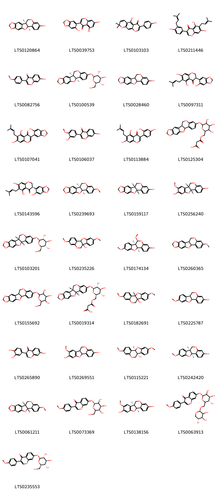{ width=100% }
    <figcaption>Hình ảnh cấu trúc hóa học của 33 hoạt chất thuộc nhóm Isoflavonoids gồm ['(+)-maackiain (LTS0120864)', '5,7-dihydroxy-3-(6-hydroxy-2h-1,3-benzodioxol-5-yl)chromen-4-one (LTS0039753)', 'alpinumisoflavone (LTS0103103)', 'lupalbigenin (LTS0211446)', 'formononetin (LTS0082756)', '(2r,3s,4s,5r,6s)-2-(hydroxymethyl)-6-[(1s,12s)-5,7,11,19-tetraoxapentacyclo[10.8.0.0²,¹⁰.0⁴,⁸.0¹³,¹⁸]icosa-2,4(8),9,13,15,17-hexaen-16-yloxy]oxane-3,4,5-triol (LTS0100539)', 'maackiain (LTS0028460)', '5,7-dihydroxy-3-(6-hydroxy-2h-1,3-benzodioxol-5-yl)-6-(3-methylbut-2-en-1-yl)-2,3-dihydro-1-benzopyran-4-one (LTS0097311)', '5,7-dihydroxy-3-(6-hydroxy-2h-1,3-benzodioxol-5-yl)-6-(3-methylbut-2-en-1-yl)chromen-4-one (LTS0107041)', 'calycosin (LTS0106037)', 'luteone (LTS0113884)', '3-oxo-3-[(3,4,5-trihydroxy-6-{5,7,11,19-tetraoxapentacyclo[10.8.0.0²,¹⁰.0⁴,⁸.0¹³,¹⁸]icosa-2,4(8),9,13,15,17-hexaen-16-yloxy}oxan-2-yl)methoxy]propanoic acid (LTS0125304)', '(3r)-5,7-dihydroxy-3-(6-hydroxy-2h-1,3-benzodioxol-5-yl)-6-(3-methylbut-2-en-1-yl)-2,3-dihydro-1-benzopyran-4-one (LTS0143596)', '(1s,12s)-16-methoxy-5,7,11,19-tetraoxapentacyclo[10.8.0.0²,¹⁰.0⁴,⁸.0¹³,¹⁸]icosa-2,4(8),9,13,15,17-hexaene (LTS0239693)', '(-)-maackiain (LTS0159117)', '(1r,10r)-13-methoxy-8,17-dioxatetracyclo[8.7.0.0²,⁷.0¹¹,¹⁶]heptadeca-2,4,6,11(16),12,14-hexaene-5,14-diol (LTS0256240)', 'trifolirhizin (LTS0103201)', '5,14-dimethoxy-8,17-dioxatetracyclo[8.7.0.0²,⁷.0¹¹,¹⁶]heptadeca-2,4,6,11,13,15-hexaen-10-ol (LTS0235226)', '(1s,9s,10r)-9,14-dimethoxy-8,17-dioxatetracyclo[8.7.0.0²,⁷.0¹¹,¹⁶]heptadeca-2,4,6,11,13,15-hexaen-5-ol (LTS0174134)', 'pterocarpin (LTS0260365)', '2-(hydroxymethyl)-6-{5,7,11,19-tetraoxapentacyclo[10.8.0.0²,¹⁰.0⁴,⁸.0¹³,¹⁸]icosa-2,4(8),9,13,15,17-hexaen-16-yloxy}oxane-3,4,5-triol (LTS0155692)', '3-oxo-3-{[(2r,3s,4s,5r,6s)-3,4,5-trihydroxy-6-[(1r,12r)-5,7,11,19-tetraoxapentacyclo[10.8.0.0²,¹⁰.0⁴,⁸.0¹³,¹⁸]icosa-2,4(8),9,13,15,17-hexaen-16-yloxy]oxan-2-yl]methoxy}propanoic acid (LTS0019314)', '(1s,10s)-5,14-dimethoxy-8,17-dioxatetracyclo[8.7.0.0²,⁷.0¹¹,¹⁶]heptadeca-2,4,6,11,13,15-hexaen-10-ol (LTS0182691)', 'medicarpin (LTS0225787)', "3',4',7-trihydroxyisoflavone (LTS0265890)", 'kushenin (LTS0269551)', '(-)-variabilin (LTS0115221)', '(+)-medicarpin (LTS0242420)', 'pterocarpin (LTS0061211)', 'formononetin 7-o-glucoside (LTS0073369)', '(1s,10s)-13-methoxy-8,17-dioxatetracyclo[8.7.0.0²,⁷.0¹¹,¹⁶]heptadeca-2,4,6,11(16),12,14-hexaene-5,14-diol (LTS0138156)', 'kushenol o (LTS0063913)', 'ononin (LTS0235553)'].</figcaption>
</figure>
#### Nhóm Linear 1_3-diarylpropanoids
<figure markdown="span">
    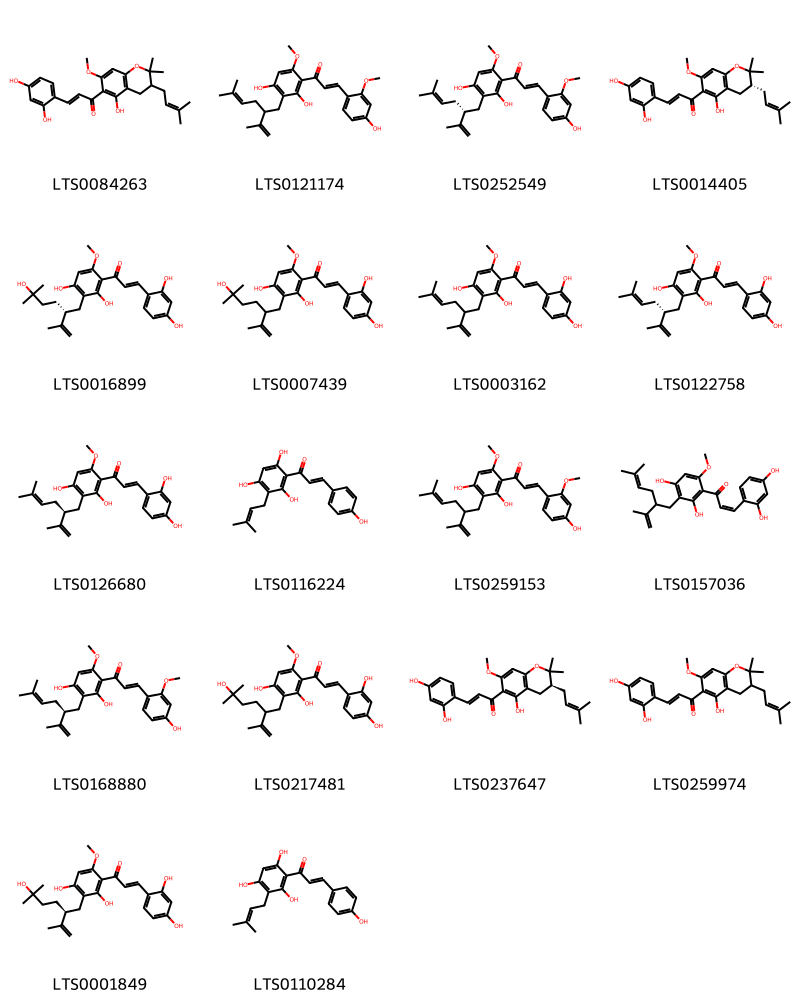{ width=100% }
    <figcaption>Hình ảnh cấu trúc hóa học của Không tìm thấy chú thích hoạt chất thuộc nhóm Linear 1_3-diarylpropanoids gồm Không tìm thấy chú thích.</figcaption>
</figure>
#### Nhóm Lupin alkaloids
<figure markdown="span">
    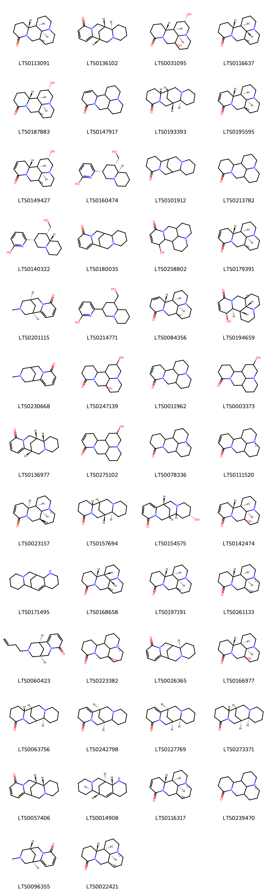{ width=100% }
    <figcaption>Hình ảnh cấu trúc hóa học của 51 hoạt chất thuộc nhóm Lupin alkaloids gồm ['matrine (LTS0113091)', '(1r,9r,10r)-7,15-diazatetracyclo[7.7.1.0²,⁷.0¹⁰,¹⁵]heptadeca-2,4-dien-6-one (LTS0136102)', '(1r,2r,9r,15s,17r)-9,15-dihydroxy-7,13-diazatetracyclo[7.7.1.0²,⁷.0¹³,¹⁷]heptadecan-6-one (LTS0031095)', '(1r,2r,9s,17r)-7,13-diazatetracyclo[7.7.1.0²,⁷.0¹³,¹⁷]heptadecan-6-one (LTS0116637)', '(1r,2r,9s,15s,17s)-15-hydroxy-7,13-diazatetracyclo[7.7.1.0²,⁷.0¹³,¹⁷]heptadecan-6-one (LTS0187883)', '7,13-diazatetracyclo[7.7.1.0²,⁷.0¹³,¹⁷]heptadec-3-en-6-one (LTS0147917)', '(+)-lupanine (LTS0193393)', '(1r,2r,9r,17s)-7,13-diazatetracyclo[7.7.1.0²,⁷.0¹³,¹⁷]heptadec-4-en-6-one (LTS0195595)', '(1r,2r,9s,15s,17s)-15-hydroxy-7,13-diazatetracyclo[7.7.1.0²,⁷.0¹³,¹⁷]heptadec-4-en-6-one (LTS0149427)', '6-[(1s,3r,9ar)-1-(hydroxymethyl)-octahydro-1h-quinolizin-3-yl]pyridin-2-ol (LTS0160474)', 'lupanine l-form (LTS0101912)', 'matrine (LTS0213782)', '6-[(1s,3r,9as)-1-(hydroxymethyl)-octahydro-1h-quinolizin-3-yl]pyridin-2-ol (LTS0140322)', 'anagyrine (LTS0180035)', '3-hydroxy-7,13-diazatetracyclo[7.7.1.0²,⁷.0¹³,¹⁷]heptadec-4-en-6-one (LTS0258802)', 'sophocarpine (LTS0179391)', '(1r,9s)-11-methyl-7,11-diazatricyclo[7.3.1.0²,⁷]trideca-2,4-dien-6-one (LTS0201115)', '6-[1-(hydroxymethyl)-octahydro-1h-quinolizin-3-yl]pyridin-2-ol (LTS0214771)', '(1s,2r,9s,17s)-7,13-diazatetracyclo[7.7.1.0²,⁷.0¹³,¹⁷]heptadec-3-en-6-one (LTS0084356)', '(1s,2s,3s,9s,17s)-3-hydroxy-7,13-diazatetracyclo[7.7.1.0²,⁷.0¹³,¹⁷]heptadec-4-en-6-one (LTS0194659)', 'n-methylcytisine (LTS0230668)', '9,15-dihydroxy-7,13-diazatetracyclo[7.7.1.0²,⁷.0¹³,¹⁷]heptadecan-6-one (LTS0247139)', '7,13-diazatetracyclo[7.7.1.0²,⁷.0¹³,¹⁷]heptadec-4-en-6-one (LTS0011962)', '15-hydroxy-7,13-diazatetracyclo[7.7.1.0²,⁷.0¹³,¹⁷]heptadecan-6-one (LTS0003373)', '(1r,9r,10s)-7,15-diazatetracyclo[7.7.1.0²,⁷.0¹⁰,¹⁵]heptadeca-2,4-dien-6-one (LTS0136977)', '15-hydroxy-7,13-diazatetracyclo[7.7.1.0²,⁷.0¹³,¹⁷]heptadec-4-en-6-one (LTS0275102)', '6-oxo-7,13-diazatetracyclo[7.7.1.0²,⁷.0¹³,¹⁷]heptadecan-13-ium-13-olate (LTS0078336)', '6-oxo-7,13-diazatetracyclo[7.7.1.0²,⁷.0¹³,¹⁷]heptadec-4-en-13-ium-13-olate (LTS0111520)', '(1r,2s,9r,17s)-6-oxo-7,13-diazatetracyclo[7.7.1.0²,⁷.0¹³,¹⁷]heptadec-4-en-13-ium-13-olate (LTS0023157)', '(1r,2r,9s,10s)-7,15-diazatetracyclo[7.7.1.0²,⁷.0¹⁰,¹⁵]heptadecan-6-one (LTS0157694)', 'baptifoline (LTS0154575)', '(1r,2r,9r,17r)-9-hydroxy-7,13-diazatetracyclo[7.7.1.0²,⁷.0¹³,¹⁷]heptadec-4-en-6-one (LTS0142474)', '3,15-diazatetracyclo[7.7.1.0²,⁷.0¹⁰,¹⁵]heptadec-7-ene (LTS0171495)', 'isomatrine (LTS0168658)', 'sophoridine (LTS0197191)', 'oxymatrine (LTS0261133)', '(1s,9r)-11-(but-3-en-1-yl)-7,11-diazatricyclo[7.3.1.0²,⁷]trideca-2,4-dien-6-one (LTS0060423)', '9-hydroxy-6-oxo-7,13-diazatetracyclo[7.7.1.0²,⁷.0¹³,¹⁷]heptadecan-13-ium-13-olate (LTS0223382)', 'anagyrine (LTS0026365)', 'sophoranol (LTS0166977)', '(1r,2r,10s)-7,15-diazatetracyclo[7.7.1.0²,⁷.0¹⁰,¹⁵]heptadecan-6-one (LTS0063756)', '(1r,9r)-7,15-diazatetracyclo[7.7.1.0²,⁷.0¹⁰,¹⁵]heptadec-2-en-6-one (LTS0242798)', '(1r,9r,10s)-7,15-diazatetracyclo[7.7.1.0²,⁷.0¹⁰,¹⁵]heptadec-2-en-6-one (LTS0127769)', '(1r,2r,9r,10s)-7,15-diazatetracyclo[7.7.1.0²,⁷.0¹⁰,¹⁵]heptadecan-6-one (LTS0273371)', '(9r,10s)-7,15-diazatetracyclo[7.7.1.0²,⁷.0¹⁰,¹⁵]heptadeca-2,4-dien-6-one (LTS0057406)', 'aloperine (LTS0014908)', 'sophocarpidine (LTS0116317)', '(13s)-6-oxo-7,13-diazatetracyclo[7.7.1.0²,⁷.0¹³,¹⁷]heptadecan-13-ium-13-olate (LTS0239470)', '(1r,9r)-11-methyl-7,11-diazatricyclo[7.3.1.0²,⁷]trideca-2,4-dien-6-one (LTS0096355)', '(1r,2r,9s,13r,17s)-6-oxo-7,13-diazatetracyclo[7.7.1.0²,⁷.0¹³,¹⁷]heptadecan-13-ium-13-olate (LTS0022421)', 'citizin (LTS0247877)'].</figcaption>
</figure>
#### Nhóm Organooxygen compounds
<figure markdown="span">
    { width=100% }
    <figcaption>Hình ảnh cấu trúc hóa học của 1 hoạt chất thuộc nhóm Organooxygen compounds gồm ['sucrose (LTS0272557)'].</figcaption>
</figure>
#### Nhóm Prenol lipids
<figure markdown="span">
    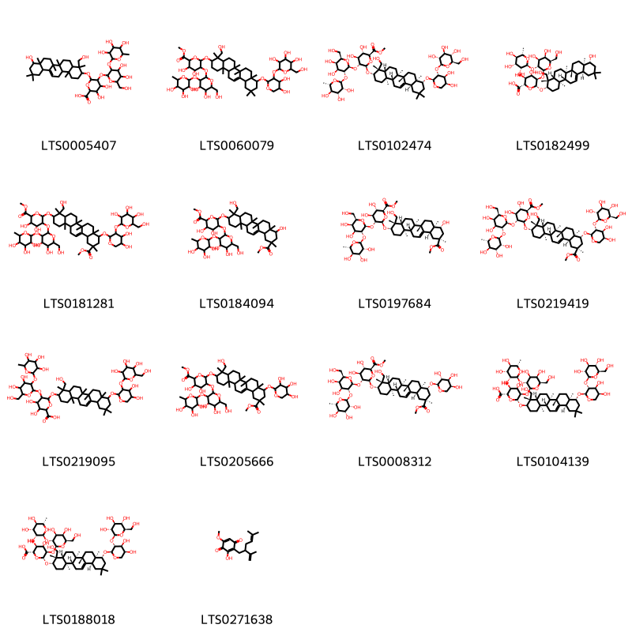{ width=100% }
    <figcaption>Hình ảnh cấu trúc hóa học của 14 hoạt chất thuộc nhóm Prenol lipids gồm ['5-{[4,5-dihydroxy-6-(hydroxymethyl)-3-[(3,4,5-trihydroxy-6-methyloxan-2-yl)oxy]oxan-2-yl]oxy}-3,4-dihydroxy-6-{[9-hydroxy-4-(hydroxymethyl)-4,6a,6b,8a,11,11,14b-heptamethyl-1,2,3,4a,5,6,7,8,9,10,12,12a,14,14a-tetradecahydropicen-3-yl]oxy}oxane-2-carboxylic acid (LTS0005407)', 'methyl 6-({9-[(4,5-dihydroxy-3-{[3,4,5-trihydroxy-6-(hydroxymethyl)oxan-2-yl]oxy}oxan-2-yl)oxy]-4-(hydroxymethyl)-4,6a,6b,8a,11,11,14b-heptamethyl-1,2,3,4a,5,6,7,8,9,10,12,12a,14,14a-tetradecahydropicen-3-yl}oxy)-5-{[4,5-dihydroxy-6-(hydroxymethyl)-3-[(3,4,5-trihydroxy-6-methyloxan-2-yl)oxy]oxan-2-yl]oxy}-3,4-dihydroxyoxane-2-carboxylate (LTS0060079)', 'methyl (2s,3s,4s,5r,6r)-6-{[(3s,4s,4ar,6ar,6bs,8ar,9r,12as,14ar,14br)-9-{[(2s,3r,4s,5s)-4,5-dihydroxy-3-{[(2s,3r,4s,5s,6r)-3,4,5-trihydroxy-6-(hydroxymethyl)oxan-2-yl]oxy}oxan-2-yl]oxy}-4-(hydroxymethyl)-4,6a,6b,8a,11,11,14b-heptamethyl-1,2,3,4a,5,6,7,8,9,10,12,12a,14,14a-tetradecahydropicen-3-yl]oxy}-5-{[(2s,3r,4s,5r,6r)-4,5-dihydroxy-6-(hydroxymethyl)-3-{[(2s,3r,4r,5r,6s)-3,4,5-trihydroxy-6-methyloxan-2-yl]oxy}oxan-2-yl]oxy}-3,4-dihydroxyoxane-2-carboxylate (LTS0102474)', 'soyasaponin i (LTS0182499)', 'methyl 6-({9-[(4,5-dihydroxy-3-{[3,4,5-trihydroxy-6-(hydroxymethyl)oxan-2-yl]oxy}oxan-2-yl)oxy]-4-(hydroxymethyl)-11-(methoxycarbonyl)-4,6a,6b,8a,11,14b-hexamethyl-1,2,3,4a,5,6,7,8,9,10,12,12a,14,14a-tetradecahydropicen-3-yl}oxy)-5-{[4,5-dihydroxy-6-(hydroxymethyl)-3-[(3,4,5-trihydroxy-6-methyloxan-2-yl)oxy]oxan-2-yl]oxy}-3,4-dihydroxyoxane-2-carboxylate (LTS0181281)', 'methyl 5-{[4,5-dihydroxy-6-(hydroxymethyl)-3-[(3,4,5-trihydroxy-6-methyloxan-2-yl)oxy]oxan-2-yl]oxy}-3,4-dihydroxy-6-{[9-hydroxy-4-(hydroxymethyl)-11-(methoxycarbonyl)-4,6a,6b,8a,11,14b-hexamethyl-1,2,3,4a,5,6,7,8,9,10,12,12a,14,14a-tetradecahydropicen-3-yl]oxy}oxane-2-carboxylate (LTS0184094)', 'methyl (2s,3s,4s,5r,6r)-6-{[(3s,4s,4ar,6ar,6bs,8ar,9r,11s,12as,14ar,14br)-9-hydroxy-4-(hydroxymethyl)-11-(methoxycarbonyl)-4,6a,6b,8a,11,14b-hexamethyl-1,2,3,4a,5,6,7,8,9,10,12,12a,14,14a-tetradecahydropicen-3-yl]oxy}-5-{[(2s,3r,4s,5r,6r)-4,5-dihydroxy-6-(hydroxymethyl)-3-{[(2s,3r,4r,5r,6s)-3,4,5-trihydroxy-6-methyloxan-2-yl]oxy}oxan-2-yl]oxy}-3,4-dihydroxyoxane-2-carboxylate (LTS0197684)', 'methyl (2s,3s,4s,5r,6r)-6-{[(3s,4s,4ar,6ar,6bs,8ar,9r,11s,12as,14ar,14br)-9-{[(2s,3r,4s,5s)-4,5-dihydroxy-3-{[(2s,3r,4s,5s,6r)-3,4,5-trihydroxy-6-(hydroxymethyl)oxan-2-yl]oxy}oxan-2-yl]oxy}-4-(hydroxymethyl)-11-(methoxycarbonyl)-4,6a,6b,8a,11,14b-hexamethyl-1,2,3,4a,5,6,7,8,9,10,12,12a,14,14a-tetradecahydropicen-3-yl]oxy}-5-{[(2s,3r,4s,5r,6r)-4,5-dihydroxy-6-(hydroxymethyl)-3-{[(2s,3r,4r,5r,6s)-3,4,5-trihydroxy-6-methyloxan-2-yl]oxy}oxan-2-yl]oxy}-3,4-dihydroxyoxane-2-carboxylate (LTS0219419)', '6-({9-[(4,5-dihydroxy-3-{[3,4,5-trihydroxy-6-(hydroxymethyl)oxan-2-yl]oxy}oxan-2-yl)oxy]-4-(hydroxymethyl)-4,6a,6b,8a,11,11,14b-heptamethyl-1,2,3,4a,5,6,7,8,9,10,12,12a,14,14a-tetradecahydropicen-3-yl}oxy)-5-{[4,5-dihydroxy-6-(hydroxymethyl)-3-[(3,4,5-trihydroxy-6-methyloxan-2-yl)oxy]oxan-2-yl]oxy}-3,4-dihydroxyoxane-2-carboxylic acid (LTS0219095)', 'methyl 5-{[4,5-dihydroxy-6-(hydroxymethyl)-3-[(3,4,5-trihydroxy-6-methyloxan-2-yl)oxy]oxan-2-yl]oxy}-3,4-dihydroxy-6-{[4-(hydroxymethyl)-11-(methoxycarbonyl)-4,6a,6b,8a,11,14b-hexamethyl-9-[(3,4,5-trihydroxyoxan-2-yl)oxy]-1,2,3,4a,5,6,7,8,9,10,12,12a,14,14a-tetradecahydropicen-3-yl]oxy}oxane-2-carboxylate (LTS0205666)', 'methyl (2s,3s,4s,5r,6r)-6-{[(3s,4s,4ar,6ar,6bs,8ar,9r,11s,12as,14ar,14br)-4-(hydroxymethyl)-11-(methoxycarbonyl)-4,6a,6b,8a,11,14b-hexamethyl-9-{[(2s,3r,4s,5s)-3,4,5-trihydroxyoxan-2-yl]oxy}-1,2,3,4a,5,6,7,8,9,10,12,12a,14,14a-tetradecahydropicen-3-yl]oxy}-5-{[(2s,3r,4s,5r,6r)-4,5-dihydroxy-6-(hydroxymethyl)-3-{[(2s,3r,4r,5r,6s)-3,4,5-trihydroxy-6-methyloxan-2-yl]oxy}oxan-2-yl]oxy}-3,4-dihydroxyoxane-2-carboxylate (LTS0008312)', '(2s,3s,4s,5r,6r)-6-{[(3r,4s,4ar,6ar,6bs,8ar,9r,12as,14ar,14br)-9-{[(2s,3r,4s,5s)-4,5-dihydroxy-3-{[(2s,3r,4s,5s,6r)-3,4,5-trihydroxy-6-(hydroxymethyl)oxan-2-yl]oxy}oxan-2-yl]oxy}-4-(hydroxymethyl)-4,6a,6b,8a,11,11,14b-heptamethyl-1,2,3,4a,5,6,7,8,9,10,12,12a,14,14a-tetradecahydropicen-3-yl]oxy}-5-{[(2s,3r,4s,5r,6r)-4,5-dihydroxy-6-(hydroxymethyl)-3-{[(2s,3r,4r,5r,6s)-3,4,5-trihydroxy-6-methyloxan-2-yl]oxy}oxan-2-yl]oxy}-3,4-dihydroxyoxane-2-carboxylic acid (LTS0104139)', '(2s,3s,4s,5r,6r)-6-{[(3s,4s,4ar,6ar,6bs,8ar,9r,12as,14ar,14br)-9-{[(2s,3r,4s,5s)-4,5-dihydroxy-3-{[(2s,3r,4s,5s,6r)-3,4,5-trihydroxy-6-(hydroxymethyl)oxan-2-yl]oxy}oxan-2-yl]oxy}-4-(hydroxymethyl)-4,6a,6b,8a,11,11,14b-heptamethyl-1,2,3,4a,5,6,7,8,9,10,12,12a,14,14a-tetradecahydropicen-3-yl]oxy}-5-{[(2s,3r,4s,5r,6r)-4,5-dihydroxy-6-(hydroxymethyl)-3-{[(2s,3r,4r,5r,6s)-3,4,5-trihydroxy-6-methyloxan-2-yl]oxy}oxan-2-yl]oxy}-3,4-dihydroxyoxane-2-carboxylic acid (LTS0188018)', '3-hydroxy-5-methoxy-2-[5-methyl-2-(prop-1-en-2-yl)hex-4-en-1-yl]cyclohexa-2,5-diene-1,4-dione (LTS0271638)'].</figcaption>
</figure>
#### Nhóm Pyridines and derivatives
<figure markdown="span">
    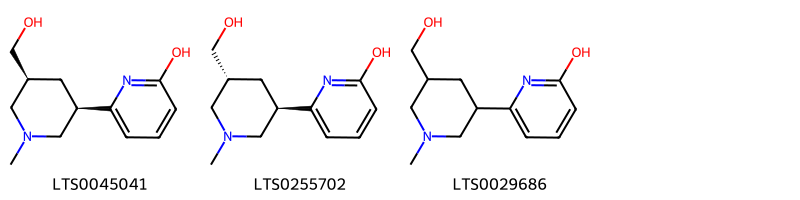{ width=100% }
    <figcaption>Hình ảnh cấu trúc hóa học của 3 hoạt chất thuộc nhóm Pyridines and derivatives gồm ['6-[(3r,5s)-5-(hydroxymethyl)-1-methylpiperidin-3-yl]pyridin-2-ol (LTS0045041)', '6-[(3r,5r)-5-(hydroxymethyl)-1-methylpiperidin-3-yl]pyridin-2-ol (LTS0255702)', '6-[5-(hydroxymethyl)-1-methylpiperidin-3-yl]pyridin-2-ol (LTS0029686)'].</figcaption>
</figure>
#### Nhóm Quinolizines
<figure markdown="span">
    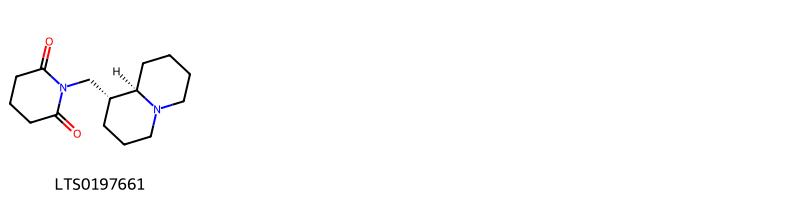{ width=100% }
    <figcaption>Hình ảnh cấu trúc hóa học của 1 hoạt chất thuộc nhóm Quinolizines gồm ['lamprolobine (LTS0197661)'].</figcaption>
</figure>
#### Nhóm Steroids and steroid derivatives
<figure markdown="span">
    { width=100% }
    <figcaption>Hình ảnh cấu trúc hóa học của 1 hoạt chất thuộc nhóm Steroids and steroid derivatives gồm ['stigmast-5-en-3-ol, (3β)- (LTS0204616)'].</figcaption>
</figure>
#### Nhóm Stilbenes
<figure markdown="span">
    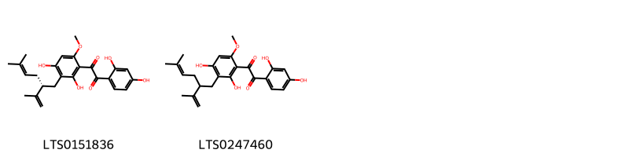{ width=100% }
    <figcaption>Hình ảnh cấu trúc hóa học của 2 hoạt chất thuộc nhóm Stilbenes gồm ['1-{2,4-dihydroxy-6-methoxy-3-[(2r)-5-methyl-2-(prop-1-en-2-yl)hex-4-en-1-yl]phenyl}-2-(2,4-dihydroxyphenyl)ethane-1,2-dione (LTS0151836)', '1-{2,4-dihydroxy-6-methoxy-3-[5-methyl-2-(prop-1-en-2-yl)hex-4-en-1-yl]phenyl}-2-(2,4-dihydroxyphenyl)ethane-1,2-dione (LTS0247460)'].</figcaption>
</figure>

---

### Dược dân tộc học

Danh sách các quốc gia có sử dụng *Sophora flavescens* trong điều trị các bệnh. 

| Country   | Disease                                                                  | Bệnh                                                                                                                                                                                                |
|:----------|:-------------------------------------------------------------------------|:----------------------------------------------------------------------------------------------------------------------------------------------------------------------------------------------------|
| China     | Alexiteric, Astringent, Carminative, Diuretic, Stomachic, Vermifuge, nan | MYMEMORY WARNING: YOU USED ALL AVAILABLE FREE TRANSLATIONS FOR TODAY. NEXT AVAILABLE IN  13 HOURS 53 MINUTES 36 SECONDS VISIT HTTPS://MYMEMORY.TRANSLATED.NET/DOC/USAGELIMITS.PHP TO TRANSLATE MORE |
| Elsewhere | Stomachic                                                                | MYMEMORY WARNING: YOU USED ALL AVAILABLE FREE TRANSLATIONS FOR TODAY. NEXT AVAILABLE IN  13 HOURS 53 MINUTES 33 SECONDS VISIT HTTPS://MYMEMORY.TRANSLATED.NET/DOC/USAGELIMITS.PHP TO TRANSLATE MORE |
| Japan*    | Antidiarrheic, Antiphlogistic, Stomachic                                 | MYMEMORY WARNING: YOU USED ALL AVAILABLE FREE TRANSLATIONS FOR TODAY. NEXT AVAILABLE IN  13 HOURS 53 MINUTES 30 SECONDS VISIT HTTPS://MYMEMORY.TRANSLATED.NET/DOC/USAGELIMITS.PHP TO TRANSLATE MORE |

---

---
## Sophora griffithii
### Thông tin về thực vật

!!! info "Phân loại thực vật của *Sophora mollis* từ GIBF:"
    - **Kingdom:** Plantae
    - **Phylum:** Tracheophyta
    - **Order:** Fabales
    - **Family:** Fabaceae
    - **Genus:** Sophora
    - **Species:** *Sophora mollis*

 

| Label (VI)   | Label (EN)   | Scientific Name    | Descriptions (VI)   | Descriptions (EN)   | Also Known As (VI)   | Also Known As (EN)   |
|:-------------|:-------------|:-------------------|:--------------------|:--------------------|:---------------------|:---------------------|
| N/A          | N/A          | Sophora griffithii | loài thực vật       | species of plant    | ['']                 | ['']                 |

#### Phân bố trên thế giới

**Từ CSDL GIBF** nan, Pakistan, Afghanistan, Kyrgyzstan, India, unknown or invalid, Uzbekistan

#### Phân bố tại Việt Nam

**Từ CSDL GIBF**: Không có ghi nhận ở Việt Nam

---
### Thành phần hóa học
        
- Theo cơ sở dữ liệu lotus: Từ loài *Sophora mollis* đã phân lập và xác định được Chưa có hoạt chất nào được phân lập. hoạt chất thuộc về các nhóm Không có hoạt chất nào được phân lập. 

Không có hình ảnh nào được tạo ra

---

### Dược dân tộc học

Danh sách các quốc gia có sử dụng *Sophora mollis* trong điều trị các bệnh. 

| Country   | Disease      | Bệnh                                                                                                                                                                                                |
|:----------|:-------------|:----------------------------------------------------------------------------------------------------------------------------------------------------------------------------------------------------|
| Elsewhere | Pediculicide | MYMEMORY WARNING: YOU USED ALL AVAILABLE FREE TRANSLATIONS FOR TODAY. NEXT AVAILABLE IN  13 HOURS 52 MINUTES 58 SECONDS VISIT HTTPS://MYMEMORY.TRANSLATED.NET/DOC/USAGELIMITS.PHP TO TRANSLATE MORE |

---

---
## Sophora japonica
### Thông tin về thực vật

!!! info "Phân loại thực vật của *Styphnolobium japonicum* từ GIBF:"
    - **Kingdom:** Plantae
    - **Phylum:** Tracheophyta
    - **Order:** Fabales
    - **Family:** Fabaceae
    - **Genus:** Styphnolobium
    - **Species:** *Styphnolobium japonicum*

 

| Label (VI)   | Label (EN)   | Scientific Name   | Descriptions (VI)   | Descriptions (EN)   | Also Known As (VI)   | Also Known As (EN)   |
|:-------------|:-------------|:------------------|:--------------------|:--------------------|:---------------------|:---------------------|
| N/A          | N/A          | Sophora japonica  |                     | species of plant    | ['']                 | ['']                 |

#### Phân bố trên thế giới

**Từ CSDL GIBF** Ukraine, nan, Netherlands, Italy, Japan, Germany, Belgium, Korea, Republic of, Czechia, Spain, United States of America, China, Poland, France, Greece, Austria

#### Phân bố tại Việt Nam

**Từ CSDL GIBF**: Không có ghi nhận ở Việt Nam

---
### Thành phần hóa học
        
- Theo cơ sở dữ liệu lotus: Từ loài *Styphnolobium japonicum* đã phân lập và xác định được Chưa có hoạt chất nào được phân lập. hoạt chất thuộc về các nhóm Không có hoạt chất nào được phân lập. 

Không có hình ảnh nào được tạo ra

---

### Dược dân tộc học

Danh sách các quốc gia có sử dụng *Styphnolobium japonicum* trong điều trị các bệnh. 

| Country   | Disease                                                         | Bệnh                                                                                                                                                                                                |
|:----------|:----------------------------------------------------------------|:----------------------------------------------------------------------------------------------------------------------------------------------------------------------------------------------------|
| China     | Abortifacient, Astringent, Hemostat, Hemostat, Tonic, Purgative | MYMEMORY WARNING: YOU USED ALL AVAILABLE FREE TRANSLATIONS FOR TODAY. NEXT AVAILABLE IN  13 HOURS 52 MINUTES 36 SECONDS VISIT HTTPS://MYMEMORY.TRANSLATED.NET/DOC/USAGELIMITS.PHP TO TRANSLATE MORE |
| Elsewhere | Astringent, nan, Estrogenic, Poison, Styptic                    | MYMEMORY WARNING: YOU USED ALL AVAILABLE FREE TRANSLATIONS FOR TODAY. NEXT AVAILABLE IN  13 HOURS 52 MINUTES 33 SECONDS VISIT HTTPS://MYMEMORY.TRANSLATED.NET/DOC/USAGELIMITS.PHP TO TRANSLATE MORE |
| Japan*    | Hemostatic                                                      | MYMEMORY WARNING: YOU USED ALL AVAILABLE FREE TRANSLATIONS FOR TODAY. NEXT AVAILABLE IN  13 HOURS 52 MINUTES 29 SECONDS VISIT HTTPS://MYMEMORY.TRANSLATED.NET/DOC/USAGELIMITS.PHP TO TRANSLATE MORE |

---

---
## Sophora mollis
### Thông tin về thực vật

!!! info "Phân loại thực vật của *Sophora mollis* từ GIBF:"
    - **Kingdom:** Plantae
    - **Phylum:** Tracheophyta
    - **Order:** Fabales
    - **Family:** Fabaceae
    - **Genus:** Sophora
    - **Species:** *Sophora mollis*

 

| Label (VI)   | Label (EN)   | Scientific Name   | Descriptions (VI)   | Descriptions (EN)   | Also Known As (VI)   | Also Known As (EN)    |
|:-------------|:-------------|:------------------|:--------------------|:--------------------|:---------------------|:----------------------|
| N/A          | N/A          | Sophora mollis    | loài thực vật       | species of plant    | ['']                 | ['Sophora mollis ex'] |

#### Phân bố trên thế giới

**Từ CSDL GIBF** nan, Pakistan, Afghanistan, Iran (Islamic Republic of), Kyrgyzstan, Türkiye, India, unknown or invalid, Nepal, United States of America, China, Uzbekistan

#### Phân bố tại Việt Nam

**Từ CSDL GIBF**: Không có ghi nhận ở Việt Nam

---
### Thành phần hóa học
        
- Theo cơ sở dữ liệu lotus: Từ loài *Sophora mollis* đã phân lập và xác định được 82 hoạt chất thuộc về các nhóm Fatty Acyls, Flavonoids, Prenol lipids, Steroids and steroid derivatives, Isoflavonoids, Linear 1,3-diarylpropanoids, Benzofurans, Lupin alkaloids, Coumarins and derivatives, Pyridines and derivatives. 

|    | chemicalTaxonomyClassyfireClass   |   smiles_count |
|---:|:----------------------------------|---------------:|
|  0 | Benzofurans                       |              2 |
|  1 | Coumarins and derivatives         |              1 |
|  2 | Fatty Acyls                       |              2 |
|  3 | Flavonoids                        |              4 |
|  4 | Isoflavonoids                     |             24 |
|  5 | Linear 1,3-diarylpropanoids       |              2 |
|  6 | Lupin alkaloids                   |             27 |
|  7 | Prenol lipids                     |              4 |
|  8 | Pyridines and derivatives         |              2 |
|  9 | Steroids and steroid derivatives  |              4 |

#### Nhóm Benzofurans
<figure markdown="span">
    { width=100% }
    <figcaption>Hình ảnh cấu trúc hóa học của 2 hoạt chất thuộc nhóm Benzofurans gồm ['loliolide (LTS0254454)', 'loliolide (LTS0119422)'].</figcaption>
</figure>
#### Nhóm Coumarins and derivatives
<figure markdown="span">
    { width=100% }
    <figcaption>Hình ảnh cấu trúc hóa học của 1 hoạt chất thuộc nhóm Coumarins and derivatives gồm ['scopoletin (LTS0193112)'].</figcaption>
</figure>
#### Nhóm Fatty Acyls
<figure markdown="span">
    { width=100% }
    <figcaption>Hình ảnh cấu trúc hóa học của 2 hoạt chất thuộc nhóm Fatty Acyls gồm ['ceryl alcohol (LTS0140051)', 'octacosanol (LTS0049071)'].</figcaption>
</figure>
#### Nhóm Flavonoids
<figure markdown="span">
    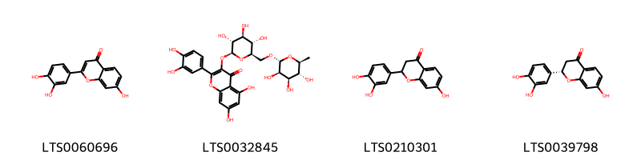{ width=100% }
    <figcaption>Hình ảnh cấu trúc hóa học của 4 hoạt chất thuộc nhóm Flavonoids gồm ["7,3',4'-trihydroxyflavone (LTS0060696)", '3-rutinosyl quercetin (LTS0032845)', "7,3',4'-trihydroxyflavanone (LTS0210301)", 'butin (LTS0039798)'].</figcaption>
</figure>
#### Nhóm Isoflavonoids
<figure markdown="span">
    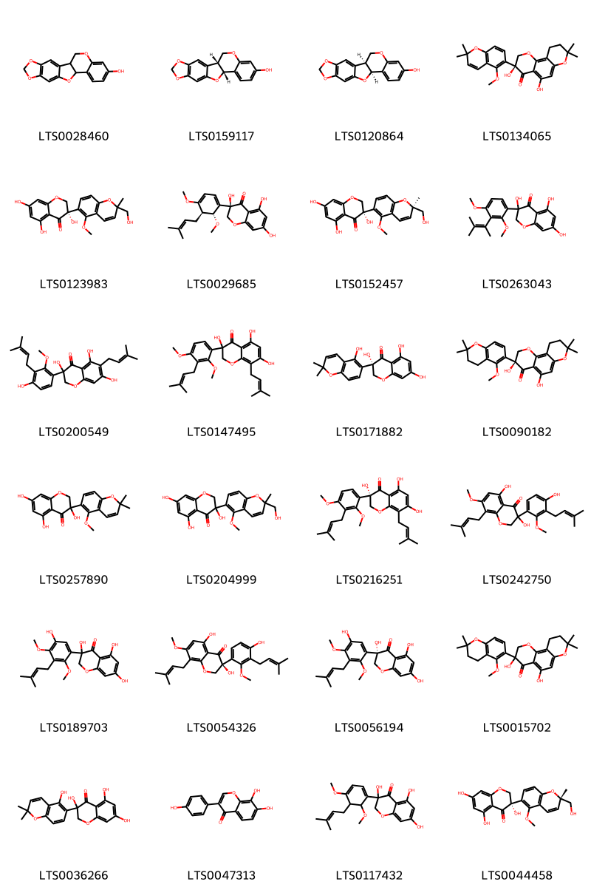{ width=100% }
    <figcaption>Hình ảnh cấu trúc hóa học của 24 hoạt chất thuộc nhóm Isoflavonoids gồm ['maackiain (LTS0028460)', '(-)-maackiain (LTS0159117)', '(+)-maackiain (LTS0120864)', '(5s)-5,8-dihydroxy-5-(5-methoxy-2,2-dimethylchromen-6-yl)-12,12-dimethyl-3,11-dioxatricyclo[8.4.0.0²,⁷]tetradeca-1,7,9-trien-6-one (LTS0134065)', '(3s)-3,5,7-trihydroxy-3-[2-(hydroxymethyl)-5-methoxy-2-methylchromen-6-yl]-2h-1-benzopyran-4-one (LTS0123983)', '(3r)-3-[(5r,6r)-4,6-dimethoxy-5-(3-methylbut-2-en-1-yl)cyclohexa-1,3-dien-1-yl]-3,5,7-trihydroxy-2h-1-benzopyran-4-one (LTS0029685)', '(3s)-3,5,7-trihydroxy-3-[(2r)-2-(hydroxymethyl)-5-methoxy-2-methylchromen-6-yl]-2h-1-benzopyran-4-one (LTS0152457)', '3-[2,4-dimethoxy-3-(3-methylbut-2-en-2-yl)phenyl]-3,5,7-trihydroxy-2h-1-benzopyran-4-one (LTS0263043)', '3,5,7-trihydroxy-3-[4-hydroxy-2-methoxy-3-(3-methylbut-2-en-1-yl)phenyl]-6-(3-methylbut-2-en-1-yl)-2h-1-benzopyran-4-one (LTS0200549)', '3-[2,4-dimethoxy-3-(3-methylbut-2-en-1-yl)phenyl]-3,5,7-trihydroxy-8-(3-methylbut-2-en-1-yl)-2h-1-benzopyran-4-one (LTS0147495)', '(3s)-3,5,7-trihydroxy-3-(5-hydroxy-2,2-dimethylchromen-6-yl)-2h-1-benzopyran-4-one (LTS0171882)', 'sophoronol c (LTS0090182)', 'sophoronol (LTS0257890)', 'sophoronol b (LTS0204999)', 'sophoronol e (LTS0216251)', '3,5-dihydroxy-3-[4-hydroxy-2-methoxy-3-(3-methylbut-2-en-1-yl)phenyl]-7-methoxy-8-(3-methylbut-2-en-1-yl)-2h-1-benzopyran-4-one (LTS0242750)', '3,5,7-trihydroxy-3-[5-hydroxy-2,4-dimethoxy-3-(3-methylbut-2-en-1-yl)phenyl]-2h-1-benzopyran-4-one (LTS0189703)', 'sophoronol f (LTS0054326)', 'sophoronol d (LTS0056194)', '5,8-dihydroxy-5-(5-methoxy-2,2-dimethyl-3,4-dihydro-1-benzopyran-6-yl)-12,12-dimethyl-3,11-dioxatricyclo[8.4.0.0²,⁷]tetradeca-1,7,9-trien-6-one (LTS0015702)', 'sophoronol a (LTS0036266)', '8-hydroxydaidzein (LTS0047313)', '3-[4,6-dimethoxy-5-(3-methylbut-2-en-1-yl)cyclohexa-1,3-dien-1-yl]-3,5,7-trihydroxy-2h-1-benzopyran-4-one (LTS0117432)', '(3s)-3,5,7-trihydroxy-3-[(2s)-2-(hydroxymethyl)-5-methoxy-2-methylchromen-6-yl]-2h-1-benzopyran-4-one (LTS0044458)'].</figcaption>
</figure>
#### Nhóm Linear 1_3-diarylpropanoids
<figure markdown="span">
    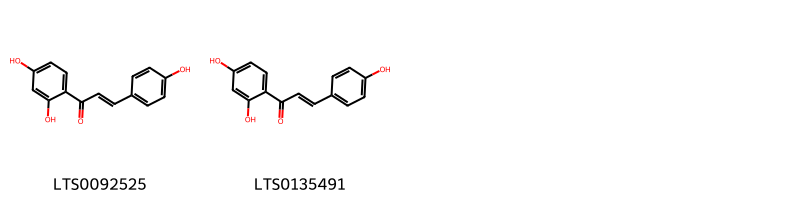{ width=100% }
    <figcaption>Hình ảnh cấu trúc hóa học của Không tìm thấy chú thích hoạt chất thuộc nhóm Linear 1_3-diarylpropanoids gồm Không tìm thấy chú thích.</figcaption>
</figure>
#### Nhóm Lupin alkaloids
<figure markdown="span">
    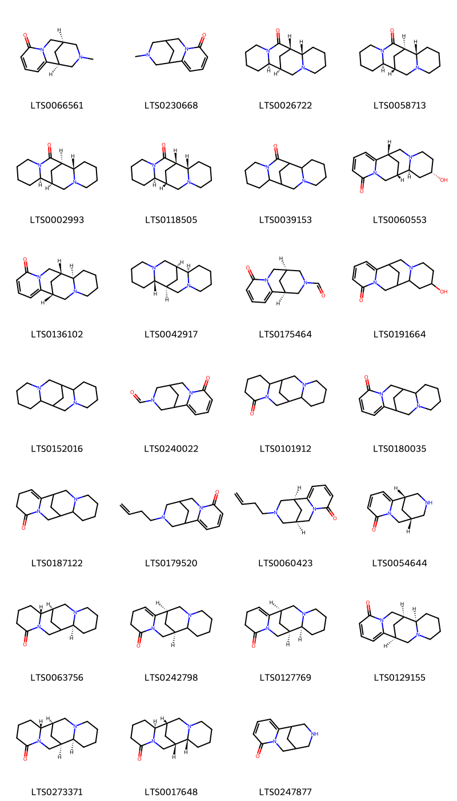{ width=100% }
    <figcaption>Hình ảnh cấu trúc hóa học của 27 hoạt chất thuộc nhóm Lupin alkaloids gồm ['(1s,9r)-11-methyl-7,11-diazatricyclo[7.3.1.0²,⁷]trideca-2,4-dien-6-one (LTS0066561)', 'n-methylcytisine (LTS0230668)', 'aphylline (LTS0026722)', '(1r,2r,9r,10s)-7,15-diazatetracyclo[7.7.1.0²,⁷.0¹⁰,¹⁵]heptadecan-8-one (LTS0058713)', '(1s,2r,9r,10s)-7,15-diazatetracyclo[7.7.1.0²,⁷.0¹⁰,¹⁵]heptadecan-8-one (LTS0002993)', '(1r,2r,9s,10s)-7,15-diazatetracyclo[7.7.1.0²,⁷.0¹⁰,¹⁵]heptadecan-8-one (LTS0118505)', 'lupanine (LTS0039153)', '(1s,9s,10s,12s)-12-hydroxy-7,15-diazatetracyclo[7.7.1.0²,⁷.0¹⁰,¹⁵]heptadeca-2,4-dien-6-one (LTS0060553)', '(1r,9r,10r)-7,15-diazatetracyclo[7.7.1.0²,⁷.0¹⁰,¹⁵]heptadeca-2,4-dien-6-one (LTS0136102)', 'sparteine (LTS0042917)', '(1s,9r)-6-oxo-7,11-diazatricyclo[7.3.1.0²,⁷]trideca-2,4-diene-11-carbaldehyde (LTS0175464)', '12-hydroxy-7,15-diazatetracyclo[7.7.1.0²,⁷.0¹⁰,¹⁵]heptadeca-2,4-dien-6-one (LTS0191664)', 'genisteine-alkaloid (LTS0152016)', '6-oxo-7,11-diazatricyclo[7.3.1.0²,⁷]trideca-2,4-diene-11-carbaldehyde (LTS0240022)', 'lupanine l-form (LTS0101912)', 'anagyrine (LTS0180035)', '7,15-diazatetracyclo[7.7.1.0²,⁷.0¹⁰,¹⁵]heptadec-2-en-6-one (LTS0187122)', 'rhombifoline (LTS0179520)', '(1s,9r)-11-(but-3-en-1-yl)-7,11-diazatricyclo[7.3.1.0²,⁷]trideca-2,4-dien-6-one (LTS0060423)', '(1s,9r)-7,11-diazatricyclo[7.3.1.0²,⁷]trideca-2,4-dien-6-one (LTS0054644)', '(1r,2r,10s)-7,15-diazatetracyclo[7.7.1.0²,⁷.0¹⁰,¹⁵]heptadecan-6-one (LTS0063756)', '(1r,9r)-7,15-diazatetracyclo[7.7.1.0²,⁷.0¹⁰,¹⁵]heptadec-2-en-6-one (LTS0242798)', '(1r,9r,10s)-7,15-diazatetracyclo[7.7.1.0²,⁷.0¹⁰,¹⁵]heptadec-2-en-6-one (LTS0127769)', '(-)-anagyrine (LTS0129155)', '(1r,2r,9r,10s)-7,15-diazatetracyclo[7.7.1.0²,⁷.0¹⁰,¹⁵]heptadecan-6-one (LTS0273371)', '(1s,2s,9s,10r)-7,15-diazatetracyclo[7.7.1.0²,⁷.0¹⁰,¹⁵]heptadecan-6-one (LTS0017648)', 'citizin (LTS0247877)'].</figcaption>
</figure>
#### Nhóm Prenol lipids
<figure markdown="span">
    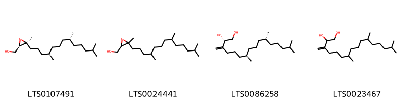{ width=100% }
    <figcaption>Hình ảnh cấu trúc hóa học của 4 hoạt chất thuộc nhóm Prenol lipids gồm ['[(2r,3s)-3-methyl-3-[(4r,8r)-4,8,12-trimethyltridecyl]oxiran-2-yl]methanol (LTS0107491)', '[3-methyl-3-(4,8,12-trimethyltridecyl)oxiran-2-yl]methanol (LTS0024441)', '(2s,7r,11r)-7,11,15-trimethyl-3-methylidenehexadecane-1,2-diol (LTS0086258)', '7,11,15-trimethyl-3-methylidenehexadecane-1,2-diol (LTS0023467)'].</figcaption>
</figure>
#### Nhóm Pyridines and derivatives
<figure markdown="span">
    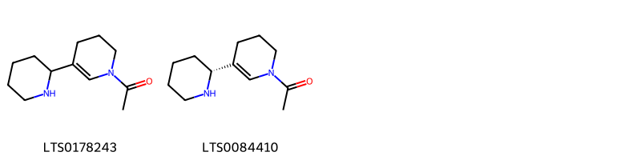{ width=100% }
    <figcaption>Hình ảnh cấu trúc hóa học của 2 hoạt chất thuộc nhóm Pyridines and derivatives gồm ['1-[3-(piperidin-2-yl)-5,6-dihydro-4h-pyridin-1-yl]ethanone (LTS0178243)', 'ammodendrine (LTS0084410)'].</figcaption>
</figure>
#### Nhóm Steroids and steroid derivatives
<figure markdown="span">
    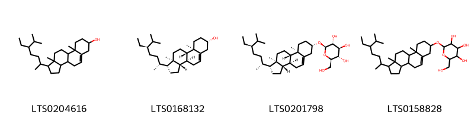{ width=100% }
    <figcaption>Hình ảnh cấu trúc hóa học của 4 hoạt chất thuộc nhóm Steroids and steroid derivatives gồm ['stigmast-5-en-3-ol, (3β)- (LTS0204616)', 'sitosterol (LTS0168132)', 'sitogluside (LTS0201798)', '2-{[1-(5-ethyl-6-methylheptan-2-yl)-9a,11a-dimethyl-1h,2h,3h,3ah,3bh,4h,6h,7h,8h,9h,9bh,10h,11h-cyclopenta[a]phenanthren-7-yl]oxy}-6-(hydroxymethyl)oxane-3,4,5-triol (LTS0158828)'].</figcaption>
</figure>

---

### Dược dân tộc học

Danh sách các quốc gia có sử dụng *Sophora mollis* trong điều trị các bệnh. 

| Country   | Disease              | Bệnh                                                                                                                                                                                                |
|:----------|:---------------------|:----------------------------------------------------------------------------------------------------------------------------------------------------------------------------------------------------|
| Elsewhere | Poison, Pediculicide | MYMEMORY WARNING: YOU USED ALL AVAILABLE FREE TRANSLATIONS FOR TODAY. NEXT AVAILABLE IN  13 HOURS 52 MINUTES 08 SECONDS VISIT HTTPS://MYMEMORY.TRANSLATED.NET/DOC/USAGELIMITS.PHP TO TRANSLATE MORE |

---

---
## Sophora secundiflora
### Thông tin về thực vật

!!! info "Phân loại thực vật của *Dermatophyllum secundiflorum* từ GIBF:"
    - **Kingdom:** Plantae
    - **Phylum:** Tracheophyta
    - **Order:** Fabales
    - **Family:** Fabaceae
    - **Genus:** Dermatophyllum
    - **Species:** *Dermatophyllum secundiflorum*

 

| Label (VI)   | Label (EN)   | Scientific Name      | Descriptions (VI)   | Descriptions (EN)   | Also Known As (VI)   | Also Known As (EN)   |
|:-------------|:-------------|:---------------------|:--------------------|:--------------------|:---------------------|:---------------------|
| N/A          | N/A          | Sophora secundiflora |                     | species of plant    | ['']                 | ['']                 |

#### Phân bố trên thế giới

**Từ CSDL GIBF** nan, Egypt, United States of America, Tunisia, Mexico

#### Phân bố tại Việt Nam

**Từ CSDL GIBF**: Không có ghi nhận ở Việt Nam

---
### Thành phần hóa học
        
- Theo cơ sở dữ liệu lotus: Từ loài *Dermatophyllum secundiflorum* đã phân lập và xác định được 80 hoạt chất thuộc về các nhóm Quinolizidines, Flavonoids, Isoflavonoids, Lupin alkaloids, Pyridines and derivatives. 

|    | chemicalTaxonomyClassyfireClass   |   smiles_count |
|---:|:----------------------------------|---------------:|
|  0 | Flavonoids                        |              9 |
|  1 | Isoflavonoids                     |             35 |
|  2 | Lupin alkaloids                   |             30 |
|  3 | Pyridines and derivatives         |              1 |
|  4 | Quinolizidines                    |              2 |

#### Nhóm Flavonoids
<figure markdown="span">
    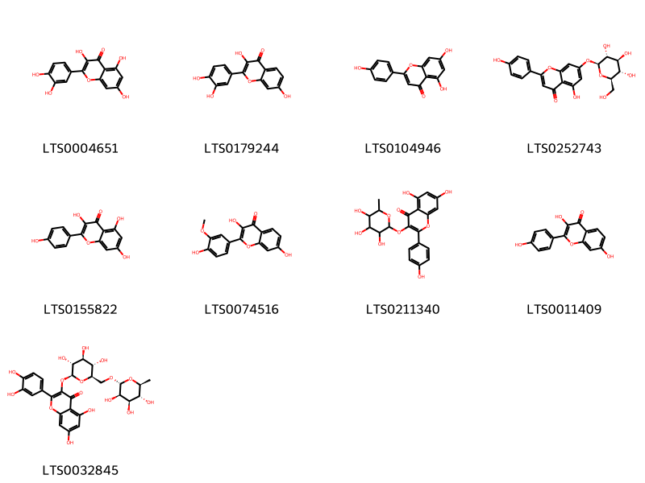{ width=100% }
    <figcaption>Hình ảnh cấu trúc hóa học của 9 hoạt chất thuộc nhóm Flavonoids gồm ['quercetin (LTS0004651)', "3,7,3',4'-tetrahydroxyflavone (LTS0179244)", 'chamomile (LTS0104946)', 'apigenin 7-o-β-glucoside (LTS0252743)', 'kaempherol (LTS0155822)', 'geraldol (LTS0074516)', '5,7-dihydroxy-2-(4-hydroxyphenyl)-3-[(3,4,5-trihydroxy-6-methyloxan-2-yl)oxy]chromen-4-one (LTS0211340)', "3,7,4'-trihydroxyflavone (LTS0011409)", '3-rutinosyl quercetin (LTS0032845)'].</figcaption>
</figure>
#### Nhóm Isoflavonoids
<figure markdown="span">
    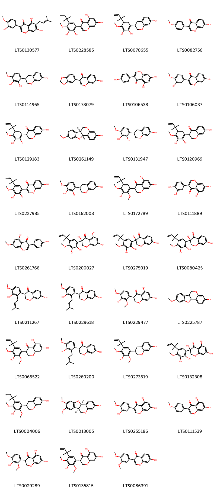{ width=100% }
    <figcaption>Hình ảnh cấu trúc hóa học của 35 hoạt chất thuộc nhóm Isoflavonoids gồm ['gancaonin b (LTS0130577)', '3-[2,3-dihydroxy-4-methoxy-5-(2-methylbut-3-en-2-yl)phenyl]-5,7-dihydroxychromen-4-one (LTS0228585)', '6-[(3s)-7-hydroxy-3,4-dihydro-2h-1-benzopyran-3-yl]-3-methoxy-4-(2-methylbut-3-en-2-yl)benzene-1,2-diol (LTS0070655)', 'formononetin (LTS0082756)', '3-(7-hydroxy-3,4-dihydro-2h-1-benzopyran-3-yl)-6-methoxybenzene-1,2-diol (LTS0114965)', 'pseudobaptigenin (LTS0178079)', 'genistein (LTS0106538)', 'calycosin (LTS0106037)', '(3s)-3-[2,3-dihydroxy-4-methoxy-5-(2-methylbut-3-en-2-yl)phenyl]-7-hydroxy-2,3-dihydro-1-benzopyran-4-one (LTS0129183)', 'medicarpin, (-)- (LTS0261149)', '3-[(3s)-7-hydroxy-3,4-dihydro-2h-1-benzopyran-3-yl]-6-methoxybenzene-1,2-diol (LTS0131947)', '3-[2,3-dihydroxy-4-methoxy-5-(2-methylbut-3-en-2-yl)phenyl]-7-hydroxy-2,3-dihydro-1-benzopyran-4-one (LTS0120969)', '3-[2,3-dihydroxy-4-methoxy-5-(2-methylbut-3-en-2-yl)phenyl]-7-hydroxychromen-4-one (LTS0227985)', '3-[(3r)-7-hydroxy-3,4-dihydro-2h-1-benzopyran-3-yl]-6-methoxybenzene-1,2-diol (LTS0162008)', '(3r)-5,7-dihydroxy-3-[3-hydroxy-2,4-dimethoxy-5-(2-methylbut-3-en-2-yl)phenyl]-2,3-dihydro-1-benzopyran-4-one (LTS0172789)', 'quercitin (LTS0111889)', 'prunetin (LTS0261766)', '(3r)-3-[2,3-dihydroxy-4-methoxy-5-(2-methylbut-3-en-2-yl)phenyl]-3,5,7-trihydroxy-2h-1-benzopyran-4-one (LTS0200027)', 'secundifloran (LTS0275019)', '(3r)-3-[2,3-dihydroxy-4-methoxy-5-(2-methylbut-3-en-2-yl)phenyl]-3,7-dihydroxy-2h-1-benzopyran-4-one (LTS0080425)', '(3r)-7-hydroxy-3-[3-hydroxy-4-methoxy-2-(3-methylbut-2-en-1-yl)phenyl]-2,3-dihydro-1-benzopyran-4-one (LTS0211267)', '7-hydroxy-3-[3-hydroxy-4-methoxy-2-(3-methylbut-2-en-1-yl)phenyl]-2,3-dihydro-1-benzopyran-4-one (LTS0229618)', '5,7-dihydroxy-3-(3-hydroxy-2,4-dimethoxyphenyl)-2,3-dihydro-1-benzopyran-4-one (LTS0229477)', 'medicarpin (LTS0225787)', '5,7-dihydroxy-3-[3-hydroxy-2,4-dimethoxy-5-(2-methylbut-3-en-2-yl)phenyl]-2,3-dihydro-1-benzopyran-4-one (LTS0065522)', '(3s)-7-hydroxy-3-[3-hydroxy-4-methoxy-2-(3-methylbut-2-en-1-yl)phenyl]-2,3-dihydro-1-benzopyran-4-one (LTS0260200)', 'unanisoflavan (LTS0273519)', '3-[2,3-dihydroxy-4-methoxy-5-(2-methylbut-3-en-2-yl)phenyl]-3,5,7-trihydroxy-2h-1-benzopyran-4-one (LTS0132308)', '(3s)-3-[3-hydroxy-2,4-dimethoxy-5-(2-methylbut-3-en-2-yl)phenyl]-3,4-dihydro-2h-1-benzopyran-7-ol (LTS0004006)', '(1r,10r)-13,14-dimethoxy-8,17-dioxatetracyclo[8.7.0.0²,⁷.0¹¹,¹⁶]heptadeca-2,4,6,11(16),12,14-hexaen-5-ol (LTS0013005)', 'pratensein (LTS0255186)', 'biochanin (LTS0111539)', '(3s)-5,7-dihydroxy-3-(3-hydroxy-2,4-dimethoxyphenyl)-2,3-dihydro-1-benzopyran-4-one (LTS0029289)', '(3s)-5,7-dihydroxy-3-[3-hydroxy-2,4-dimethoxy-5-(2-methylbut-3-en-2-yl)phenyl]-2,3-dihydro-1-benzopyran-4-one (LTS0135815)', 'cladrin (LTS0086391)'].</figcaption>
</figure>
#### Nhóm Lupin alkaloids
<figure markdown="span">
    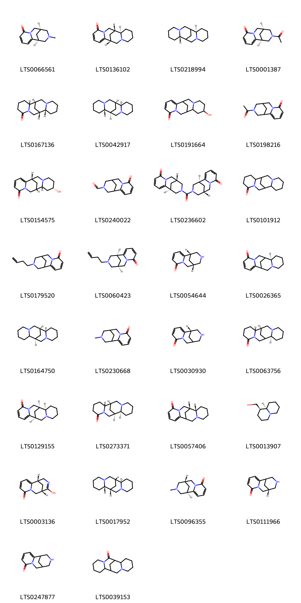{ width=100% }
    <figcaption>Hình ảnh cấu trúc hóa học của 30 hoạt chất thuộc nhóm Lupin alkaloids gồm ['(1s,9r)-11-methyl-7,11-diazatricyclo[7.3.1.0²,⁷]trideca-2,4-dien-6-one (LTS0066561)', '(1r,9r,10r)-7,15-diazatetracyclo[7.7.1.0²,⁷.0¹⁰,¹⁵]heptadeca-2,4-dien-6-one (LTS0136102)', '(2r,10s)-7,15-diazatetracyclo[7.7.1.0²,⁷.0¹⁰,¹⁵]heptadecane (LTS0218994)', '(1s,9r)-11-acetyl-7,11-diazatricyclo[7.3.1.0²,⁷]trideca-2,4-dien-6-one (LTS0001387)', '(1r,2r,9s,10r)-7,15-diazatetracyclo[7.7.1.0²,⁷.0¹⁰,¹⁵]heptadecan-6-one (LTS0167136)', 'sparteine (LTS0042917)', '12-hydroxy-7,15-diazatetracyclo[7.7.1.0²,⁷.0¹⁰,¹⁵]heptadeca-2,4-dien-6-one (LTS0191664)', '11-acetyl-7,11-diazatricyclo[7.3.1.0²,⁷]trideca-2,4-dien-6-one (LTS0198216)', 'baptifoline (LTS0154575)', '6-oxo-7,11-diazatricyclo[7.3.1.0²,⁷]trideca-2,4-diene-11-carbaldehyde (LTS0240022)', 'argentine (LTS0236602)', 'lupanine l-form (LTS0101912)', 'rhombifoline (LTS0179520)', '(1s,9r)-11-(but-3-en-1-yl)-7,11-diazatricyclo[7.3.1.0²,⁷]trideca-2,4-dien-6-one (LTS0060423)', '(1s,9r)-7,11-diazatricyclo[7.3.1.0²,⁷]trideca-2,4-dien-6-one (LTS0054644)', 'anagyrine (LTS0026365)', '(1s,2r,9s)-7,15-diazatetracyclo[7.7.1.0²,⁷.0¹⁰,¹⁵]heptadecane (LTS0164750)', 'n-methylcytisine (LTS0230668)', '(1s)-7,11-diazatricyclo[7.3.1.0²,⁷]trideca-2,4-dien-6-one (LTS0030930)', '(1r,2r,10s)-7,15-diazatetracyclo[7.7.1.0²,⁷.0¹⁰,¹⁵]heptadecan-6-one (LTS0063756)', '(-)-anagyrine (LTS0129155)', '(1r,2r,9r,10s)-7,15-diazatetracyclo[7.7.1.0²,⁷.0¹⁰,¹⁵]heptadecan-6-one (LTS0273371)', '(9r,10s)-7,15-diazatetracyclo[7.7.1.0²,⁷.0¹⁰,¹⁵]heptadeca-2,4-dien-6-one (LTS0057406)', '(-)-lupinine (LTS0013907)', '(1s,9s)-10-hydroxy-7,11-diazatricyclo[7.3.1.0²,⁷]trideca-2,4,10-trien-6-one (LTS0003136)', 'sparteine (LTS0017952)', '(1r,9r)-11-methyl-7,11-diazatricyclo[7.3.1.0²,⁷]trideca-2,4-dien-6-one (LTS0096355)', '(9r)-7,11-diazatricyclo[7.3.1.0²,⁷]trideca-2,4-dien-6-one (LTS0111966)', 'citizin (LTS0247877)', 'lupanine (LTS0039153)'].</figcaption>
</figure>
#### Nhóm Pyridines and derivatives
<figure markdown="span">
    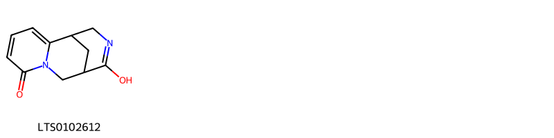{ width=100% }
    <figcaption>Hình ảnh cấu trúc hóa học của 1 hoạt chất thuộc nhóm Pyridines and derivatives gồm ['10-hydroxy-7,11-diazatricyclo[7.3.1.0²,⁷]trideca-2,4,10-trien-6-one (LTS0102612)'].</figcaption>
</figure>
#### Nhóm Quinolizidines
<figure markdown="span">
    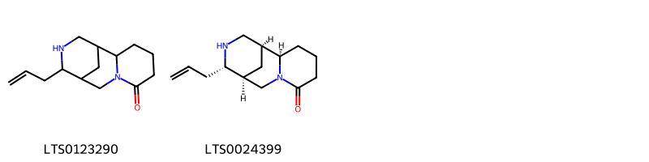{ width=100% }
    <figcaption>Hình ảnh cấu trúc hóa học của 2 hoạt chất thuộc nhóm Quinolizidines gồm ['10-(prop-2-en-1-yl)-7,11-diazatricyclo[7.3.1.0²,⁷]tridecan-6-one (LTS0123290)', 'angustifoline (LTS0024399)'].</figcaption>
</figure>

---

### Dược dân tộc học

Danh sách các quốc gia có sử dụng *Dermatophyllum secundiflorum* trong điều trị các bệnh. 

| Country          | Disease                          | Bệnh                                                                                                                                                                                                |
|:-----------------|:---------------------------------|:----------------------------------------------------------------------------------------------------------------------------------------------------------------------------------------------------|
| Elsewhere        | Insecticide, Poison              | MYMEMORY WARNING: YOU USED ALL AVAILABLE FREE TRANSLATIONS FOR TODAY. NEXT AVAILABLE IN  13 HOURS 51 MINUTES 39 SECONDS VISIT HTTPS://MYMEMORY.TRANSLATED.NET/DOC/USAGELIMITS.PHP TO TRANSLATE MORE |
| Mexico           | Hallucinogen, Narcotic, Poison   | MYMEMORY WARNING: YOU USED ALL AVAILABLE FREE TRANSLATIONS FOR TODAY. NEXT AVAILABLE IN  13 HOURS 51 MINUTES 35 SECONDS VISIT HTTPS://MYMEMORY.TRANSLATED.NET/DOC/USAGELIMITS.PHP TO TRANSLATE MORE |
| Mexico(Kickapoo) | Poison                           | MYMEMORY WARNING: YOU USED ALL AVAILABLE FREE TRANSLATIONS FOR TODAY. NEXT AVAILABLE IN  13 HOURS 51 MINUTES 30 SECONDS VISIT HTTPS://MYMEMORY.TRANSLATED.NET/DOC/USAGELIMITS.PHP TO TRANSLATE MORE |
| US               | Narcotic, Poison, Hallucinogenic | MYMEMORY WARNING: YOU USED ALL AVAILABLE FREE TRANSLATIONS FOR TODAY. NEXT AVAILABLE IN  13 HOURS 51 MINUTES 26 SECONDS VISIT HTTPS://MYMEMORY.TRANSLATED.NET/DOC/USAGELIMITS.PHP TO TRANSLATE MORE |
| US(Amerindian)   | Intoxicant                       | MYMEMORY WARNING: YOU USED ALL AVAILABLE FREE TRANSLATIONS FOR TODAY. NEXT AVAILABLE IN  13 HOURS 51 MINUTES 23 SECONDS VISIT HTTPS://MYMEMORY.TRANSLATED.NET/DOC/USAGELIMITS.PHP TO TRANSLATE MORE |

---

---
## Sophora tomentosa
### Thông tin về thực vật

!!! info "Phân loại thực vật của *Sophora tomentosa* từ GIBF:"
    - **Kingdom:** Plantae
    - **Phylum:** Tracheophyta
    - **Order:** Fabales
    - **Family:** Fabaceae
    - **Genus:** Sophora
    - **Species:** *Sophora tomentosa*

 

| Label (VI)   | Label (EN)   | Scientific Name   | Descriptions (VI)   | Descriptions (EN)   | Also Known As (VI)   | Also Known As (EN)   |
|:-------------|:-------------|:------------------|:--------------------|:--------------------|:---------------------|:---------------------|
| N/A          | N/A          | Sophora tomentosa |                     | species of plant    | ['']                 | ['']                 |

#### Phân bố trên thế giới

**Từ CSDL GIBF** Virgin Islands (U.S.), Australia, Japan, Cook Islands, Puerto Rico, Chinese Taipei, United States of America, Maldives, Hong Kong, Turks and Caicos Islands, Thailand, Martinique, Brazil, Bahamas, Guam, New Caledonia, Cuba, Singapore, Madagascar, Vanuatu, Northern Mariana Islands

#### Phân bố tại Việt Nam

**Từ CSDL GIBF**: Không có ghi nhận ở Việt Nam

---
### Thành phần hóa học
        
- Theo cơ sở dữ liệu lotus: Từ loài *Sophora tomentosa* đã phân lập và xác định được 80 hoạt chất thuộc về các nhóm Flavonoids, Benzopyrans, Isoflavonoids, 2-arylbenzofuran flavonoids, Lupin alkaloids, Quinolizines. 

|    | chemicalTaxonomyClassyfireClass   |   smiles_count |
|---:|:----------------------------------|---------------:|
|  0 | 2-arylbenzofuran flavonoids       |              2 |
|  1 | Benzopyrans                       |              2 |
|  2 | Flavonoids                        |             25 |
|  3 | Isoflavonoids                     |             31 |
|  4 | Lupin alkaloids                   |             16 |
|  5 | Quinolizines                      |              4 |

#### Nhóm 2-arylbenzofuran flavonoids
<figure markdown="span">
    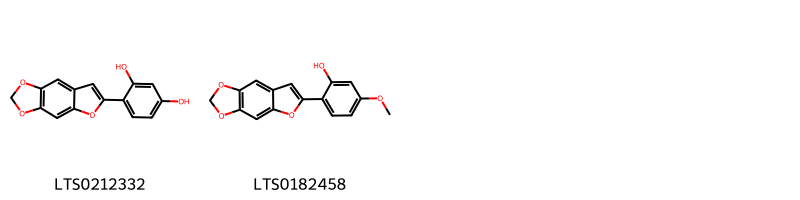{ width=100% }
    <figcaption>Hình ảnh cấu trúc hóa học của 2 hoạt chất thuộc nhóm 2-arylbenzofuran flavonoids gồm ['4-{4,6,10-trioxatricyclo[7.3.0.0³,⁷]dodeca-1,3(7),8,11-tetraen-11-yl}benzene-1,3-diol (LTS0212332)', '5-methoxy-2-{4,6,10-trioxatricyclo[7.3.0.0³,⁷]dodeca-1,3(7),8,11-tetraen-11-yl}phenol (LTS0182458)'].</figcaption>
</figure>
#### Nhóm Benzopyrans
<figure markdown="span">
    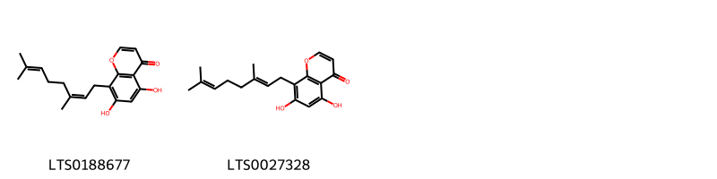{ width=100% }
    <figcaption>Hình ảnh cấu trúc hóa học của 2 hoạt chất thuộc nhóm Benzopyrans gồm ['8-(3,7-dimethylocta-2,6-dien-1-yl)-5,7-dihydroxychromen-4-one (LTS0188677)', '8-[(2e)-3,7-dimethylocta-2,6-dien-1-yl]-5,7-dihydroxychromen-4-one (LTS0027328)'].</figcaption>
</figure>
#### Nhóm Flavonoids
<figure markdown="span">
    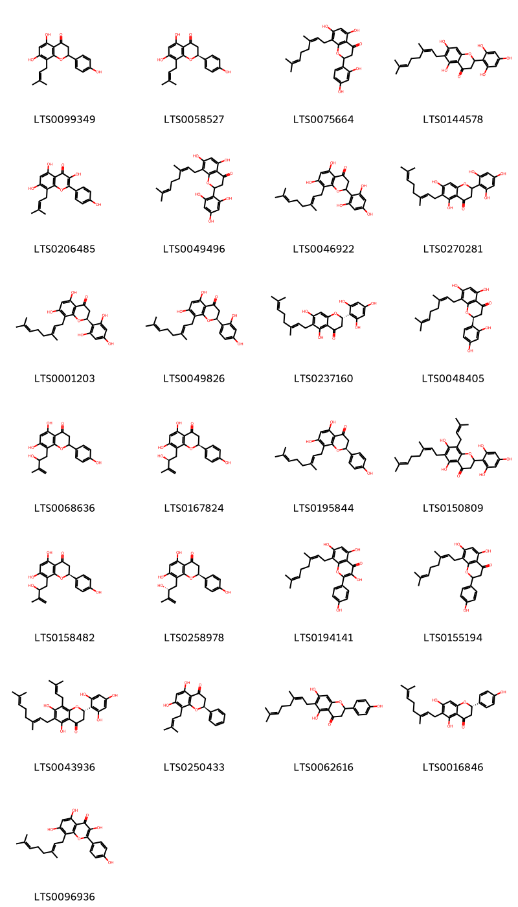{ width=100% }
    <figcaption>Hình ảnh cấu trúc hóa học của 25 hoạt chất thuộc nhóm Flavonoids gồm ['sophoraflavanone b (LTS0099349)', 'sophoraflavanone b (LTS0058527)', '2-(2,4-dihydroxyphenyl)-8-(3,7-dimethylocta-2,6-dien-1-yl)-5,7-dihydroxy-2,3-dihydro-1-benzopyran-4-one (LTS0075664)', '6-(3,7-dimethylocta-2,6-dien-1-yl)-5,7-dihydroxy-2-(2,4,6-trihydroxyphenyl)-2,3-dihydro-1-benzopyran-4-one (LTS0144578)', '8-prenylkaempferol (LTS0206485)', '8-(3,7-dimethylocta-2,6-dien-1-yl)-5,7-dihydroxy-2-(2,4,6-trihydroxyphenyl)-2,3-dihydro-1-benzopyran-4-one (LTS0049496)', 'sophoraflavanone e (LTS0046922)', 'sophoraflavanone d (LTS0270281)', '(2s)-8-[(2e)-3,7-dimethylocta-2,6-dien-1-yl]-5,7-dihydroxy-2-(2,4,6-trihydroxyphenyl)-2,3-dihydro-1-benzopyran-4-one (LTS0001203)', '(2s)-2-(2,4-dihydroxyphenyl)-8-[(2e)-3,7-dimethylocta-2,6-dien-1-yl]-5,7-dihydroxy-2,3-dihydro-1-benzopyran-4-one (LTS0049826)', '(2s)-6-[(2e)-3,7-dimethylocta-2,6-dien-1-yl]-5,7-dihydroxy-2-(2,4,6-trihydroxyphenyl)-2,3-dihydro-1-benzopyran-4-one (LTS0237160)', '(2s)-2-(2,4-dihydroxyphenyl)-8-[(2z)-3,7-dimethylocta-2,6-dien-1-yl]-5,7-dihydroxy-2,3-dihydro-1-benzopyran-4-one (LTS0048405)', '5,7-dihydroxy-8-(2-hydroxy-3-methylbut-3-en-1-yl)-2-(4-hydroxyphenyl)-2,3-dihydro-1-benzopyran-4-one (LTS0068636)', '(2s)-5,7-dihydroxy-8-[(2s)-2-hydroxy-3-methylbut-3-en-1-yl]-2-(4-hydroxyphenyl)-2,3-dihydro-1-benzopyran-4-one (LTS0167824)', 'sophoraflavanone a (LTS0195844)', '6-(3,7-dimethylocta-2,6-dien-1-yl)-5,7-dihydroxy-8-(3-methylbut-2-en-1-yl)-2-(2,4,6-trihydroxyphenyl)-2,3-dihydro-1-benzopyran-4-one (LTS0150809)', 'tomentosanol d (LTS0158482)', '(2s)-5,7-dihydroxy-8-[(2r)-2-hydroxy-3-methylbut-3-en-1-yl]-2-(4-hydroxyphenyl)-2,3-dihydro-1-benzopyran-4-one (LTS0258978)', '8-(3,7-dimethylocta-2,6-dien-1-yl)-3,5,7-trihydroxy-2-(4-hydroxyphenyl)chromen-4-one (LTS0194141)', '8-(3,7-dimethylocta-2,6-dien-1-yl)-5,7-dihydroxy-2-(4-hydroxyphenyl)-2,3-dihydro-1-benzopyran-4-one (LTS0155194)', 'tomentosanol e (LTS0043936)', 'glabranin (LTS0250433)', '6-(3,7-dimethylocta-2,6-dien-1-yl)-5,7-dihydroxy-2-(4-hydroxyphenyl)-2,3-dihydro-1-benzopyran-4-one (LTS0062616)', '(2s)-6-[(2e)-3,7-dimethylocta-2,6-dien-1-yl]-5,7-dihydroxy-2-(4-hydroxyphenyl)-2,3-dihydro-1-benzopyran-4-one (LTS0016846)', '8-[(2e)-3,7-dimethylocta-2,6-dien-1-yl]-3,5,7-trihydroxy-2-(4-hydroxyphenyl)chromen-4-one (LTS0096936)'].</figcaption>
</figure>
#### Nhóm Isoflavonoids
<figure markdown="span">
    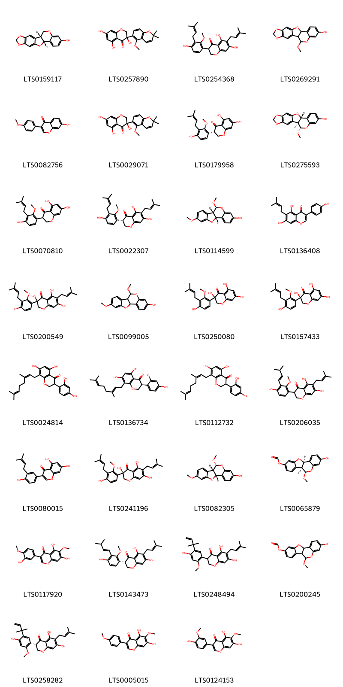{ width=100% }
    <figcaption>Hình ảnh cấu trúc hóa học của 31 hoạt chất thuộc nhóm Isoflavonoids gồm ['(-)-maackiain (LTS0159117)', 'sophoronol (LTS0257890)', 'isosophoranone (LTS0254368)', 'sophoracarpan b (LTS0269291)', 'formononetin (LTS0082756)', '(3r)-3,5,7-trihydroxy-3-(5-methoxy-2,2-dimethylchromen-6-yl)-2h-1-benzopyran-4-one (LTS0029071)', '(3s)-5,7-dihydroxy-3-[4-hydroxy-2-methoxy-3-(3-methylbut-2-en-1-yl)phenyl]-2,3-dihydro-1-benzopyran-4-one (LTS0179958)', '(1s,12s,20s)-20-methoxy-5,7,11,19-tetraoxapentacyclo[10.8.0.0²,¹⁰.0⁴,⁸.0¹³,¹⁸]icosa-2,4(8),9,13,15,17-hexaen-16-ol (LTS0275593)', 'sophoraisoflavanone a (LTS0070810)', '(3s)-5,7-dihydroxy-3-[4-hydroxy-2-methoxy-3-(3-methylbut-2-en-1-yl)phenyl]-6-(3-methylbut-2-en-1-yl)-2,3-dihydro-1-benzopyran-4-one (LTS0022307)', '(1r,9s,10s)-9,14-dimethoxy-8,17-dioxatetracyclo[8.7.0.0²,⁷.0¹¹,¹⁶]heptadeca-2,4,6,11,13,15-hexaen-5-ol (LTS0114599)', 'wighteone (LTS0136408)', '3,5,7-trihydroxy-3-[4-hydroxy-2-methoxy-3-(3-methylbut-2-en-1-yl)phenyl]-6-(3-methylbut-2-en-1-yl)-2h-1-benzopyran-4-one (LTS0200549)', 'sophoracarpan a (LTS0099005)', '3,5,7-trihydroxy-3-[4-hydroxy-2-methoxy-3-(3-methylbut-2-en-1-yl)phenyl]-2h-1-benzopyran-4-one (LTS0250080)', '(3r)-3,5,7-trihydroxy-3-[4-hydroxy-2-methoxy-3-(3-methylbut-2-en-1-yl)phenyl]-2h-1-benzopyran-4-one (LTS0157433)', '3-(2,4-dihydroxyphenyl)-8-(3,7-dimethylocta-2,6-dien-1-yl)-5,7-dihydroxy-2,3-dihydro-1-benzopyran-4-one (LTS0024814)', '(3s)-3-(2,4-dihydroxyphenyl)-8-[(2e)-3,7-dimethylocta-2,6-dien-1-yl]-5,7-dihydroxy-2,3-dihydro-1-benzopyran-4-one (LTS0136734)', '3-(2,4-dihydroxyphenyl)-8-[(2z)-3,7-dimethylocta-2,6-dien-1-yl]-5,7-dihydroxy-2,3-dihydro-1-benzopyran-4-one (LTS0112732)', '5,7-dihydroxy-3-[4-hydroxy-2-methoxy-3-(3-methylbut-1-en-1-yl)phenyl]-6-(3-methylbut-2-en-1-yl)-2,3-dihydro-1-benzopyran-4-one (LTS0206035)', 'isowighteone (LTS0080015)', '(3r)-3,5,7-trihydroxy-3-[4-hydroxy-2-methoxy-3-(3-methylbut-2-en-1-yl)phenyl]-6-(3-methylbut-2-en-1-yl)-2h-1-benzopyran-4-one (LTS0241196)', '(1r,9r,10s)-9,14-dimethoxy-8,17-dioxatetracyclo[8.7.0.0²,⁷.0¹¹,¹⁶]heptadeca-2,4,6,11,13,15-hexaen-5-ol (LTS0082305)', '(1r,9r,10s)-5-hydroxy-9-methoxy-8,17-dioxatetracyclo[8.7.0.0²,⁷.0¹¹,¹⁶]heptadeca-2,4,6,11,13,15-hexaen-14-yl formate (LTS0065879)', 'iristectorigenin a (LTS0117920)', '(3s)-5,7-dihydroxy-3-{4-hydroxy-2-methoxy-3-[(1e)-3-methylbut-1-en-1-yl]phenyl}-6-(3-methylbut-2-en-1-yl)-2,3-dihydro-1-benzopyran-4-one (LTS0143473)', '5,7-dihydroxy-3-[4-hydroxy-2-methoxy-5-(2-methylbut-3-en-2-yl)phenyl]-6-(3-methylbut-2-en-1-yl)-2,3-dihydro-1-benzopyran-4-one (LTS0248494)', '5-hydroxy-9-methoxy-8,17-dioxatetracyclo[8.7.0.0²,⁷.0¹¹,¹⁶]heptadeca-2,4,6,11,13,15-hexaen-14-yl formate (LTS0200245)', '(3s)-5,7-dihydroxy-3-[4-hydroxy-2-methoxy-5-(2-methylbut-3-en-2-yl)phenyl]-6-(3-methylbut-2-en-1-yl)-2,3-dihydro-1-benzopyran-4-one (LTS0258282)', 'irisolidone (LTS0005015)', 'iristectorigenin b (LTS0124153)'].</figcaption>
</figure>
#### Nhóm Lupin alkaloids
<figure markdown="span">
    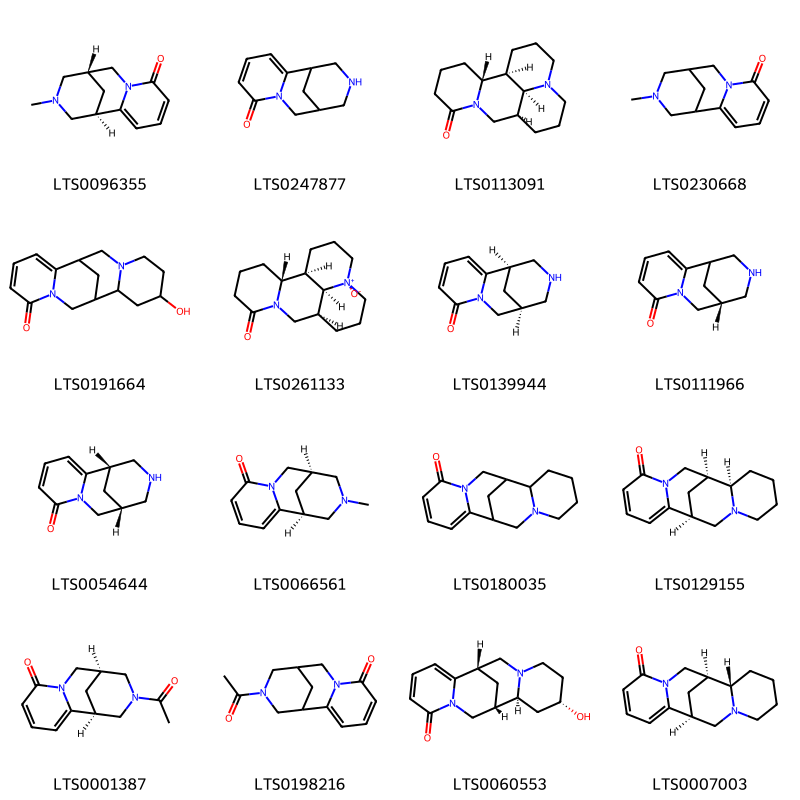{ width=100% }
    <figcaption>Hình ảnh cấu trúc hóa học của 16 hoạt chất thuộc nhóm Lupin alkaloids gồm ['(1r,9r)-11-methyl-7,11-diazatricyclo[7.3.1.0²,⁷]trideca-2,4-dien-6-one (LTS0096355)', 'citizin (LTS0247877)', 'matrine (LTS0113091)', 'n-methylcytisine (LTS0230668)', '12-hydroxy-7,15-diazatetracyclo[7.7.1.0²,⁷.0¹⁰,¹⁵]heptadeca-2,4-dien-6-one (LTS0191664)', 'oxymatrine (LTS0261133)', 'cytisine (LTS0139944)', '(9r)-7,11-diazatricyclo[7.3.1.0²,⁷]trideca-2,4-dien-6-one (LTS0111966)', '(1s,9r)-7,11-diazatricyclo[7.3.1.0²,⁷]trideca-2,4-dien-6-one (LTS0054644)', '(1s,9r)-11-methyl-7,11-diazatricyclo[7.3.1.0²,⁷]trideca-2,4-dien-6-one (LTS0066561)', 'anagyrine (LTS0180035)', '(-)-anagyrine (LTS0129155)', '(1s,9r)-11-acetyl-7,11-diazatricyclo[7.3.1.0²,⁷]trideca-2,4-dien-6-one (LTS0001387)', '11-acetyl-7,11-diazatricyclo[7.3.1.0²,⁷]trideca-2,4-dien-6-one (LTS0198216)', '(1s,9s,10s,12s)-12-hydroxy-7,15-diazatetracyclo[7.7.1.0²,⁷.0¹⁰,¹⁵]heptadeca-2,4-dien-6-one (LTS0060553)', '(-)-thermopsine (LTS0007003)'].</figcaption>
</figure>
#### Nhóm Quinolizines
<figure markdown="span">
    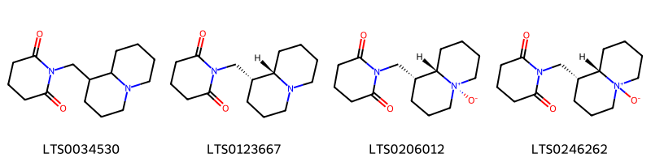{ width=100% }
    <figcaption>Hình ảnh cấu trúc hóa học của 4 hoạt chất thuộc nhóm Quinolizines gồm ['1-(octahydro-1h-quinolizin-1-ylmethyl)piperidine-2,6-dione (LTS0034530)', '1-[(1r,9as)-octahydro-1h-quinolizin-1-ylmethyl]piperidine-2,6-dione (LTS0123667)', '(1r,5r,9as)-1-[(2,6-dioxopiperidin-1-yl)methyl]-octahydro-1h-quinolizin-5-ium-5-olate (LTS0206012)', '(1r,9as)-1-[(2,6-dioxopiperidin-1-yl)methyl]-octahydro-1h-quinolizin-5-ium-5-olate (LTS0246262)'].</figcaption>
</figure>

---

### Dược dân tộc học

Danh sách các quốc gia có sử dụng *Sophora tomentosa* trong điều trị các bệnh. 

| Country   | Disease                                               | Bệnh                                                                                                                                                                                                |
|:----------|:------------------------------------------------------|:----------------------------------------------------------------------------------------------------------------------------------------------------------------------------------------------------|
| Elsewhere | Astringent, Cathartic, Insecticide, Stomachic, Emetic | MYMEMORY WARNING: YOU USED ALL AVAILABLE FREE TRANSLATIONS FOR TODAY. NEXT AVAILABLE IN  13 HOURS 50 MINUTES 46 SECONDS VISIT HTTPS://MYMEMORY.TRANSLATED.NET/DOC/USAGELIMITS.PHP TO TRANSLATE MORE |
| Mexico    | Diuretic, Sudorific, Purgative, Poison                | MYMEMORY WARNING: YOU USED ALL AVAILABLE FREE TRANSLATIONS FOR TODAY. NEXT AVAILABLE IN  13 HOURS 50 MINUTES 43 SECONDS VISIT HTTPS://MYMEMORY.TRANSLATED.NET/DOC/USAGELIMITS.PHP TO TRANSLATE MORE |
| Samoa     | Poison                                                | MYMEMORY WARNING: YOU USED ALL AVAILABLE FREE TRANSLATIONS FOR TODAY. NEXT AVAILABLE IN  13 HOURS 50 MINUTES 40 SECONDS VISIT HTTPS://MYMEMORY.TRANSLATED.NET/DOC/USAGELIMITS.PHP TO TRANSLATE MORE |
| Tanzania  | Piscicide                                             | MYMEMORY WARNING: YOU USED ALL AVAILABLE FREE TRANSLATIONS FOR TODAY. NEXT AVAILABLE IN  13 HOURS 50 MINUTES 36 SECONDS VISIT HTTPS://MYMEMORY.TRANSLATED.NET/DOC/USAGELIMITS.PHP TO TRANSLATE MORE |

---

# Chi Trifolium

??? note "Danh sách các dược liệu thuộc chi"
    
	 - *Trifolium africanum*
	 - *Trifolium arvense*
	 - *Trifolium burchellianum*
	 - *Trifolium pratense*
	 - *Trifolium repens*

---
## Trifolium africanum
### Thông tin về thực vật

!!! info "Phân loại thực vật của *Trifolium africanum* từ GIBF:"
    - **Kingdom:** Plantae
    - **Phylum:** Tracheophyta
    - **Order:** Fabales
    - **Family:** Fabaceae
    - **Genus:** Trifolium
    - **Species:** *Trifolium africanum*

 

| Label (VI)   | Label (EN)   | Scientific Name     | Descriptions (VI)   | Descriptions (EN)   | Also Known As (VI)   | Also Known As (EN)   |
|:-------------|:-------------|:--------------------|:--------------------|:--------------------|:---------------------|:---------------------|
| N/A          | N/A          | Trifolium africanum | loài thực vật       | species of plant    | ['']                 | ['erasmus clover,']  |

#### Phân bố trên thế giới

**Từ CSDL GIBF** nan, South Africa, Belgium, Lesotho, unknown or invalid, Eswatini

#### Phân bố tại Việt Nam

**Từ CSDL GIBF**: Không có ghi nhận ở Việt Nam

---
### Thành phần hóa học
        
- Theo cơ sở dữ liệu lotus: Từ loài *Trifolium africanum* đã phân lập và xác định được 2 hoạt chất thuộc về các nhóm Isoflavonoids. 

|    | chemicalTaxonomyClassyfireClass   |   smiles_count |
|---:|:----------------------------------|---------------:|
|  0 | Isoflavonoids                     |              2 |

#### Nhóm Isoflavonoids
<figure markdown="span">
    { width=100% }
    <figcaption>Hình ảnh cấu trúc hóa học của 2 hoạt chất thuộc nhóm Isoflavonoids gồm ['medicarpin, (-)- (LTS0261149)', '(-)-maackiain (LTS0159117)'].</figcaption>
</figure>

---

### Dược dân tộc học

Danh sách các quốc gia có sử dụng *Trifolium africanum* trong điều trị các bệnh. 

| Country   | Disease               | Bệnh                                                                                                                                                                                                |
|:----------|:----------------------|:----------------------------------------------------------------------------------------------------------------------------------------------------------------------------------------------------|
| Lesotho   | Diaphoretic, Diuretic | MYMEMORY WARNING: YOU USED ALL AVAILABLE FREE TRANSLATIONS FOR TODAY. NEXT AVAILABLE IN  13 HOURS 50 MINUTES 00 SECONDS VISIT HTTPS://MYMEMORY.TRANSLATED.NET/DOC/USAGELIMITS.PHP TO TRANSLATE MORE |

---

---
## Trifolium arvense
### Thông tin về thực vật

!!! info "Phân loại thực vật của *Trifolium arvense* từ GIBF:"
    - **Kingdom:** Plantae
    - **Phylum:** Tracheophyta
    - **Order:** Fabales
    - **Family:** Fabaceae
    - **Genus:** Trifolium
    - **Species:** *Trifolium arvense*

 

| Label (VI)   | Label (EN)   | Scientific Name   | Descriptions (VI)   | Descriptions (EN)   | Also Known As (VI)   | Also Known As (EN)   |
|:-------------|:-------------|:------------------|:--------------------|:--------------------|:---------------------|:---------------------|
| N/A          | N/A          | Trifolium arvense |                     | species of plant    | ['']                 | ['haresfoot clover'] |

#### Phân bố trên thế giới

**Từ CSDL GIBF** Denmark, Netherlands, Italy, Australia, Czechia, Germany, United Kingdom of Great Britain and Northern Ireland, Belgium, Spain, Portugal, Switzerland, United States of America, Sweden, Austria, France, Greece, Norway, New Zealand

#### Phân bố tại Việt Nam

**Từ CSDL GIBF**: Không có ghi nhận ở Việt Nam

---
### Thành phần hóa học
        
- Theo cơ sở dữ liệu lotus: Từ loài *Trifolium arvense* đã phân lập và xác định được 7 hoạt chất thuộc về các nhóm Flavonoids, Isoflavonoids. 

|    | chemicalTaxonomyClassyfireClass   |   smiles_count |
|---:|:----------------------------------|---------------:|
|  0 | Flavonoids                        |              3 |
|  1 | Isoflavonoids                     |              4 |

#### Nhóm Flavonoids
<figure markdown="span">
    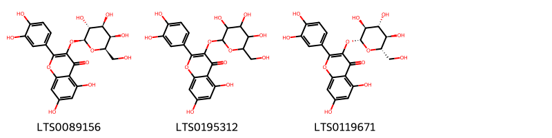{ width=100% }
    <figcaption>Hình ảnh cấu trúc hóa học của 3 hoạt chất thuộc nhóm Flavonoids gồm ['hyperoside (LTS0089156)', '2-(3,4-dihydroxyphenyl)-5,7-dihydroxy-3-{[3,4,5-trihydroxy-6-(hydroxymethyl)oxan-2-yl]oxy}chromen-4-one (LTS0195312)', '2-(3,4-dihydroxyphenyl)-5,7-dihydroxy-3-{[(2r,3s,4r,5r,6s)-3,4,5-trihydroxy-6-(hydroxymethyl)oxan-2-yl]oxy}chromen-4-one (LTS0119671)'].</figcaption>
</figure>
#### Nhóm Isoflavonoids
<figure markdown="span">
    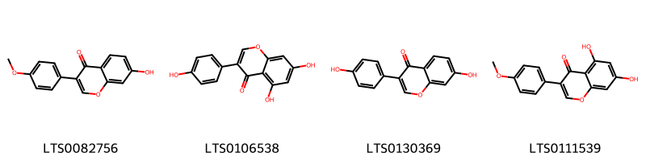{ width=100% }
    <figcaption>Hình ảnh cấu trúc hóa học của 4 hoạt chất thuộc nhóm Isoflavonoids gồm ['formononetin (LTS0082756)', 'genistein (LTS0106538)', 'daidzein (LTS0130369)', 'biochanin (LTS0111539)'].</figcaption>
</figure>

---

### Dược dân tộc học

Danh sách các quốc gia có sử dụng *Trifolium arvense* trong điều trị các bệnh. 

| Country   | Disease    | Bệnh                                                                                                                                                                                                |
|:----------|:-----------|:----------------------------------------------------------------------------------------------------------------------------------------------------------------------------------------------------|
| Turkey    | Astringent | MYMEMORY WARNING: YOU USED ALL AVAILABLE FREE TRANSLATIONS FOR TODAY. NEXT AVAILABLE IN  13 HOURS 49 MINUTES 34 SECONDS VISIT HTTPS://MYMEMORY.TRANSLATED.NET/DOC/USAGELIMITS.PHP TO TRANSLATE MORE |

---

---
## Trifolium burchellianum
### Thông tin về thực vật

!!! info "Phân loại thực vật của *Trifolium burchellianum* từ GIBF:"
    - **Kingdom:** Plantae
    - **Phylum:** Tracheophyta
    - **Order:** Fabales
    - **Family:** Fabaceae
    - **Genus:** Trifolium
    - **Species:** *Trifolium burchellianum*

 

| Label (VI)   | Label (EN)   | Scientific Name         | Descriptions (VI)   | Descriptions (EN)   | Also Known As (VI)   | Also Known As (EN)   |
|:-------------|:-------------|:------------------------|:--------------------|:--------------------|:---------------------|:---------------------|
| N/A          | N/A          | Trifolium burchellianum | loài thực vật       | species of plant    | ['']                 | ['']                 |

#### Phân bố trên thế giới

**Từ CSDL GIBF** South Africa, Uganda, Kenya, Lesotho, United States of America, Kazakhstan, Tanzania, United Republic of, Ethiopia

#### Phân bố tại Việt Nam

**Từ CSDL GIBF**: Không có ghi nhận ở Việt Nam

---
### Thành phần hóa học
        
- Theo cơ sở dữ liệu lotus: Từ loài *Trifolium burchellianum* đã phân lập và xác định được 1 hoạt chất thuộc về các nhóm Isoflavonoids. 

|    | chemicalTaxonomyClassyfireClass   |   smiles_count |
|---:|:----------------------------------|---------------:|
|  0 | Isoflavonoids                     |              1 |

#### Nhóm Isoflavonoids
<figure markdown="span">
    { width=100% }
    <figcaption>Hình ảnh cấu trúc hóa học của 1 hoạt chất thuộc nhóm Isoflavonoids gồm ['medicarpin, (-)- (LTS0261149)'].</figcaption>
</figure>

---

### Dược dân tộc học

Danh sách các quốc gia có sử dụng *Trifolium burchellianum* trong điều trị các bệnh. 

| Country   | Disease               | Bệnh                                                                                                                                                                                                |
|:----------|:----------------------|:----------------------------------------------------------------------------------------------------------------------------------------------------------------------------------------------------|
| Lesotho   | Diaphoretic, Diuretic | MYMEMORY WARNING: YOU USED ALL AVAILABLE FREE TRANSLATIONS FOR TODAY. NEXT AVAILABLE IN  13 HOURS 48 MINUTES 57 SECONDS VISIT HTTPS://MYMEMORY.TRANSLATED.NET/DOC/USAGELIMITS.PHP TO TRANSLATE MORE |

---

---
## Trifolium pratense
### Thông tin về thực vật

!!! info "Phân loại thực vật của *Trifolium pratense* từ GIBF:"
    - **Kingdom:** Plantae
    - **Phylum:** Tracheophyta
    - **Order:** Fabales
    - **Family:** Fabaceae
    - **Genus:** Trifolium
    - **Species:** *Trifolium pratense*

 

| Label (VI)   | Label (EN)   | Scientific Name    | Descriptions (VI)   | Descriptions (EN)   | Also Known As (VI)   | Also Known As (EN)   |
|:-------------|:-------------|:-------------------|:--------------------|:--------------------|:---------------------|:---------------------|
| N/A          | N/A          | Trifolium pratense | loài thực vật       | species of plant    | ['']                 | ['red clover']       |

#### Phân bố trên thế giới

**Từ CSDL GIBF** nan, Italy, Australia, Argentina, Norway, Canada, Netherlands, Spain, Bolivia (Plurinational State of), Türkiye, Portugal, United States of America, Sweden, Uruguay, Chile, Montenegro, Germany, Brazil, Switzerland, Austria, France, United Kingdom of Great Britain and Northern Ireland, China, Ecuador, Colombia, Ireland, Poland, New Zealand

#### Phân bố tại Việt Nam

**Từ CSDL GIBF**: Không có ghi nhận ở Việt Nam

---
### Thành phần hóa học
        
- Theo cơ sở dữ liệu lotus: Từ loài *Trifolium pratense* đã phân lập và xác định được 152 hoạt chất thuộc về các nhóm Fatty Acyls, Flavonoids, Prenol lipids, Steroids and steroid derivatives, Isoflavonoids, Cinnamic acids and derivatives, Benzene and substituted derivatives, Organooxygen compounds, Lactones, Coumarins and derivatives, Carboxylic acids and derivatives, Benzopyrans. 

|    | chemicalTaxonomyClassyfireClass     |   smiles_count |
|---:|:------------------------------------|---------------:|
|  0 | Benzene and substituted derivatives |              3 |
|  1 | Benzopyrans                         |              6 |
|  2 | Carboxylic acids and derivatives    |              6 |
|  3 | Cinnamic acids and derivatives      |              6 |
|  4 | Coumarins and derivatives           |              4 |
|  5 | Fatty Acyls                         |             35 |
|  6 | Flavonoids                          |              7 |
|  7 | Isoflavonoids                       |             51 |
|  8 | Lactones                            |              2 |
|  9 | Organooxygen compounds              |              9 |
| 10 | Prenol lipids                       |             21 |
| 11 | Steroids and steroid derivatives    |              1 |

#### Nhóm Benzene and substituted derivatives
<figure markdown="span">
    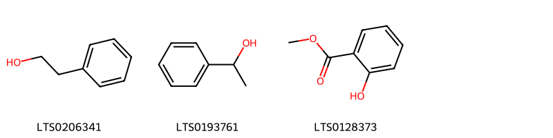{ width=100% }
    <figcaption>Hình ảnh cấu trúc hóa học của 3 hoạt chất thuộc nhóm Benzene and substituted derivatives gồm ['2-phenyl-ethanol (LTS0206341)', 'methylphenyl carbinol (LTS0193761)', 'methyl salicylate (LTS0128373)'].</figcaption>
</figure>
#### Nhóm Benzopyrans
<figure markdown="span">
    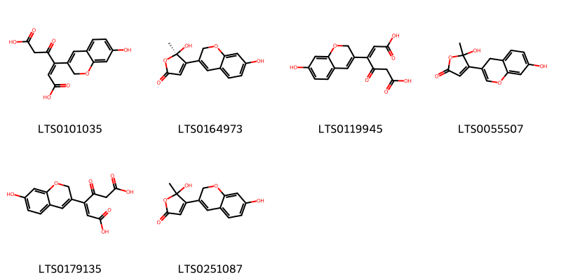{ width=100% }
    <figcaption>Hình ảnh cấu trúc hóa học của 6 hoạt chất thuộc nhóm Benzopyrans gồm ['(2e)-3-(7-hydroxy-2h-chromen-3-yl)-4-oxohex-2-enedioic acid (LTS0101035)', '(5r)-5-hydroxy-4-(7-hydroxy-2h-chromen-3-yl)-5-methylfuran-2-one (LTS0164973)', '(2z)-3-(7-hydroxy-2h-chromen-3-yl)-4-oxohex-2-enedioic acid (LTS0119945)', '5-hydroxy-4-(7-hydroxy-4h-chromen-3-yl)-5-methylfuran-2-one (LTS0055507)', '3-(7-hydroxy-2h-chromen-3-yl)-4-oxohex-2-enedioic acid (LTS0179135)', '5-hydroxy-4-(7-hydroxy-2h-chromen-3-yl)-5-methylfuran-2-one (LTS0251087)'].</figcaption>
</figure>
#### Nhóm Carboxylic acids and derivatives
<figure markdown="span">
    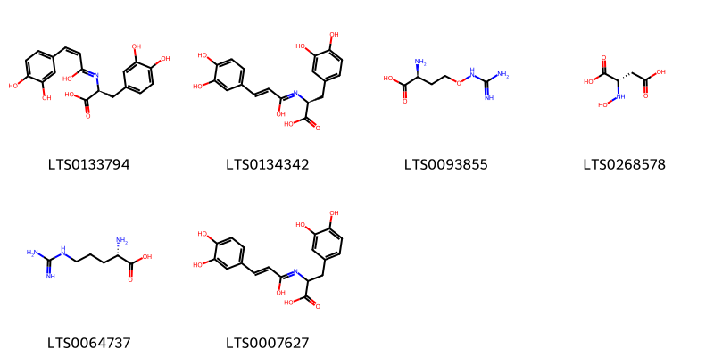{ width=100% }
    <figcaption>Hình ảnh cấu trúc hóa học của 6 hoạt chất thuộc nhóm Carboxylic acids and derivatives gồm ['(2s)-3-(3,4-dihydroxyphenyl)-2-{[(2z)-3-(3,4-dihydroxyphenyl)-1-hydroxyprop-2-en-1-ylidene]amino}propanoic acid (LTS0133794)', '(2s)-3-(3,4-dihydroxyphenyl)-2-{[(2e)-3-(3,4-dihydroxyphenyl)-1-hydroxyprop-2-en-1-ylidene]amino}propanoic acid (LTS0134342)', '(l)-canavanine (LTS0093855)', '(2s)-2-(hydroxyamino)butanedioic acid (LTS0268578)', 'l-arginine (LTS0064737)', '3-(3,4-dihydroxyphenyl)-2-{[3-(3,4-dihydroxyphenyl)-1-hydroxyprop-2-en-1-ylidene]amino}propanoic acid (LTS0007627)'].</figcaption>
</figure>
#### Nhóm Cinnamic acids and derivatives
<figure markdown="span">
    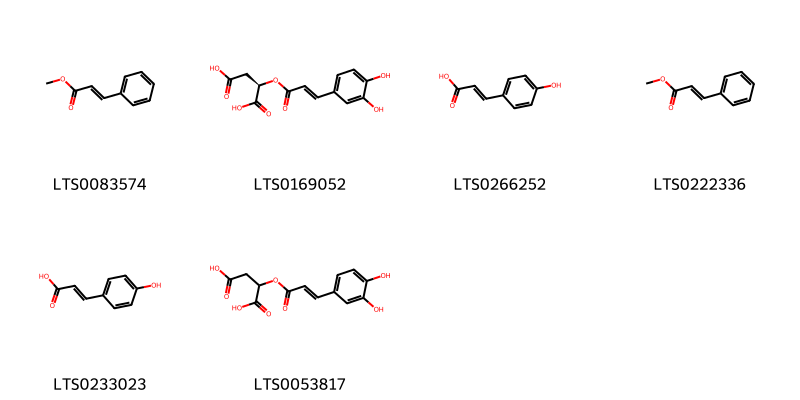{ width=100% }
    <figcaption>Hình ảnh cấu trúc hóa học của 6 hoạt chất thuộc nhóm Cinnamic acids and derivatives gồm ['methyl cinnamate (LTS0083574)', '(2r)-2-{[(2e)-3-(3,4-dihydroxyphenyl)prop-2-enoyl]oxy}butanedioic acid (LTS0169052)', 'para-coumaric acid (LTS0266252)', 'methyl cinnamate (LTS0222336)', 'hydroxycinnamic acid (LTS0233023)', 'caffeoylmalic acid (LTS0053817)'].</figcaption>
</figure>
#### Nhóm Coumarins and derivatives
<figure markdown="span">
    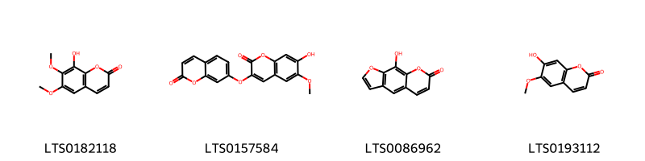{ width=100% }
    <figcaption>Hình ảnh cấu trúc hóa học của 4 hoạt chất thuộc nhóm Coumarins and derivatives gồm ['fraxidin (LTS0182118)', 'daphnoretin (LTS0157584)', 'xanthotoxol (LTS0086962)', 'scopoletin (LTS0193112)'].</figcaption>
</figure>
#### Nhóm Fatty Acyls
<figure markdown="span">
    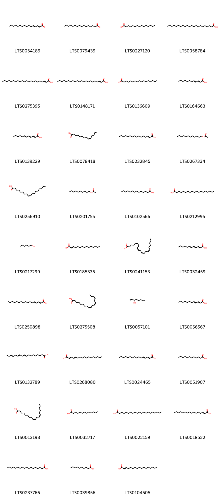{ width=100% }
    <figcaption>Hình ảnh cấu trúc hóa học của 35 hoạt chất thuộc nhóm Fatty Acyls gồm ['(2e,4e)-hexadeca-2,4-dienoic acid (LTS0054189)', 'palmitic acid (LTS0079439)', 'pentadecanoic acid (LTS0227120)', 'behenic acid (LTS0058784)', '(2e)-docos-2-enoic acid (LTS0275395)', 'docos-2-enoic acid (LTS0148171)', 'heptadecanoic acid (LTS0136609)', 'dodeca-2,4-dienoic acid (LTS0164663)', '(2e,4e,6e)-dodeca-2,4,6-trienoic acid (LTS0139229)', 'myristoleic acid (LTS0078418)', 'hexadecenoic acid (LTS0232845)', 'lauryl acetate (LTS0267334)', 'oleic acid (LTS0256910)', 'decyl acetate (LTS0201755)', 'myristic acid (LTS0102566)', 'nonadecanoic acid (LTS0212995)', 'hexanol (LTS0217299)', 'pentadec-2-enoic acid (LTS0185335)', 'arachidonic acid (LTS0241153)', 'dodeca-2,4,6-trienoic acid (LTS0032459)', '(2e,4e)-heptadeca-2,4-dienoic acid (LTS0250898)', 'α-linolenic acid (LTS0275508)', '1-octen-3-ol (LTS0057101)', '(2e,4e)-dodeca-2,4-dienoic acid (LTS0056567)', 'α linolenic acid (LTS0132789)', 'heptadeca-2,4-dienoic acid (LTS0268080)', 'hexadeca-2,4-dienoic acid (LTS0024465)', 'lauric acid (LTS0051907)', 'linoleic (LTS0013198)', 'n-tridecanoic acid (LTS0032717)', 'heneicosanoic acid (LTS0022159)', 't-2-hexadecenoic acid (LTS0018522)', 'stearic acid (LTS0237766)', 'capric acid (LTS0039856)', 'heptadec-2-enoic acid (LTS0104505)'].</figcaption>
</figure>
#### Nhóm Flavonoids
<figure markdown="span">
    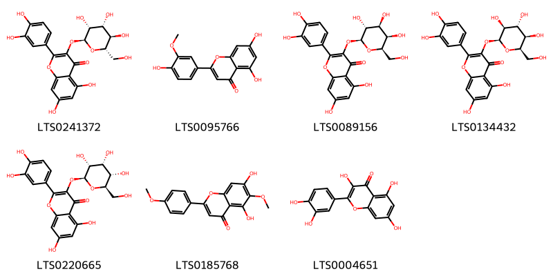{ width=100% }
    <figcaption>Hình ảnh cấu trúc hóa học của 7 hoạt chất thuộc nhóm Flavonoids gồm ['2-(3,4-dihydroxyphenyl)-5,7-dihydroxy-3-{[(2s,3r,4r,5r,6s)-3,4,5-trihydroxy-6-(hydroxymethyl)oxan-2-yl]oxy}chromen-4-one (LTS0241372)', 'chrysoeriol (LTS0095766)', 'hyperoside (LTS0089156)', '2-(3,4-dihydroxyphenyl)-5,7-dihydroxy-3-{[(2s,3s,4r,5r,6r)-3,4,5-trihydroxy-6-(hydroxymethyl)oxan-2-yl]oxy}chromen-4-one (LTS0134432)', '2-(3,4-dihydroxyphenyl)-5,7-dihydroxy-3-{[(2s,3r,4r,5s,6r)-3,4,5-trihydroxy-6-(hydroxymethyl)oxan-2-yl]oxy}chromen-4-one (LTS0220665)', 'pectolinarigenin (LTS0185768)', 'quercetin (LTS0004651)'].</figcaption>
</figure>
#### Nhóm Isoflavonoids
<figure markdown="span">
    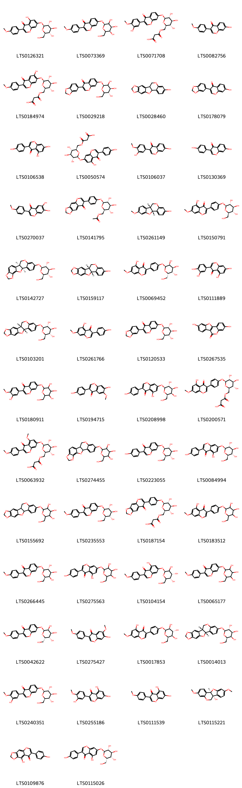{ width=100% }
    <figcaption>Hình ảnh cấu trúc hóa học của 51 hoạt chất thuộc nhóm Isoflavonoids gồm ['sissotrin (LTS0126321)', 'formononetin 7-o-glucoside (LTS0073369)', '3-oxo-3-{[(2r,3s,4s,5r,6s)-3,4,5-trihydroxy-6-{[3-(3-hydroxy-4-methoxyphenyl)-4-oxochromen-7-yl]oxy}oxan-2-yl]methoxy}propanoic acid (LTS0071708)', 'formononetin (LTS0082756)', '3-oxo-3-{[(2r,3s,4s,5r,6s)-3,4,5-trihydroxy-6-{[6-hydroxy-3-(4-methoxyphenyl)-4-oxochromen-7-yl]oxy}oxan-2-yl]methoxy}propanoic acid (LTS0184974)', 'pseudobaptigenin 7-o-glucoside (LTS0029218)', 'maackiain (LTS0028460)', 'pseudobaptigenin (LTS0178079)', 'genistein (LTS0106538)', 'malonylgenistin (LTS0050574)', 'calycosin (LTS0106037)', 'daidzein (LTS0130369)', 'texasin (LTS0270037)', '[(2r,3s,4s,5r,6s)-3,4,5-trihydroxy-6-(4-{8-oxo-2h-[1,3]dioxolo[4,5-g]chromen-7-yl}phenoxy)oxan-2-yl]methyl acetate (LTS0141795)', 'medicarpin, (-)- (LTS0261149)', "prunetin 4'-o-glucoside (LTS0150791)", '(2r,3s,4s,5r,6s)-2-(hydroxymethyl)-6-[(1s,12s)-6,8,11,19-tetraoxapentacyclo[10.8.0.0²,¹⁰.0⁵,⁹.0¹³,¹⁸]icosa-2,4,9,13,15,17-hexaen-16-yloxy]oxane-3,4,5-triol (LTS0142727)', '(-)-maackiain (LTS0159117)', '5-hydroxy-7-methoxy-3-(4-{[(2s,3s,4s,5s,6s)-3,4,5-trihydroxy-6-(hydroxymethyl)oxan-2-yl]oxy}phenyl)chromen-4-one (LTS0069452)', 'quercitin (LTS0111889)', 'trifolirhizin (LTS0103201)', 'prunetin (LTS0261766)', '3-(2h-1,3-benzodioxol-5-yl)-7-{[(2s,3r,4s,5s,6r)-3,4,5-trihydroxy-6-(hydroxymethyl)oxan-2-yl]oxy}chromen-4-one (LTS0120533)', 'coumestrol (LTS0267535)', '3-(3-hydroxy-4-methoxyphenyl)-7-{[3,4,5-trihydroxy-6-(hydroxymethyl)oxan-2-yl]oxy}chromen-4-one (LTS0180911)', 'glycitein (LTS0194715)', '5-hydroxy-3-(4-hydroxyphenyl)-7-{[(2s,3r,4s,5r,6r)-3,4,5-trihydroxy-6-(hydroxymethyl)oxan-2-yl]oxy}chromen-4-one (LTS0208998)', '3-oxo-3-{[(2r,3s,4s,5r,6s)-3,4,5-trihydroxy-6-[4-(5-hydroxy-7-methoxy-4-oxochromen-3-yl)phenoxy]oxan-2-yl]methoxy}propanoic acid (LTS0200571)', '3-oxo-3-{[(2r,3s,4s,5r,6s)-3,4,5-trihydroxy-6-{[5-methoxy-3-(4-methoxyphenyl)-4-oxochromen-7-yl]oxy}oxan-2-yl]methoxy}propanoic acid (LTS0063932)', '2-(hydroxymethyl)-6-{6,8,11,19-tetraoxapentacyclo[10.8.0.0²,¹⁰.0⁵,⁹.0¹³,¹⁸]icosa-2,4,9,13,15,17-hexaen-16-yloxy}oxane-3,4,5-triol (LTS0274455)', 'daidzin (LTS0223055)', 'genistin (LTS0084994)', '2-(hydroxymethyl)-6-{5,7,11,19-tetraoxapentacyclo[10.8.0.0²,¹⁰.0⁴,⁸.0¹³,¹⁸]icosa-2,4(8),9,13,15,17-hexaen-16-yloxy}oxane-3,4,5-triol (LTS0155692)', 'ononin (LTS0235553)', '3-oxo-3-{[(2r,3s,4s,5r,6s)-3,4,5-trihydroxy-6-(4-{8-oxo-2h-[1,3]dioxolo[4,5-g]chromen-7-yl}phenoxy)oxan-2-yl]methoxy}propanoic acid (LTS0187154)', '5-hydroxy-7-methoxy-3-(4-{[3,4,5-trihydroxy-6-(hydroxymethyl)oxan-2-yl]oxy}phenyl)chromen-4-one (LTS0183512)', '3-(4-methoxyphenyl)-7-{[(2s,3r,4s,5r,6r)-3,4,5-trihydroxy-6-(hydroxymethyl)oxan-2-yl]oxy}chromen-4-one (LTS0266445)', '5-hydroxy-3-(4-hydroxyphenyl)-7-{[3,4,5-trihydroxy-6-(hydroxymethyl)oxan-2-yl]oxy}chromen-4-one (LTS0275563)', '5-hydroxy-3-(4-methoxyphenyl)-7-{[(2s,4r,5s)-3,4,5-trihydroxy-6-(hydroxymethyl)oxan-2-yl]oxy}chromen-4-one (LTS0104154)', 'ononin (LTS0065177)', '3-(4-methoxyphenyl)-7-{[(2s,3s,4s,5s,6s)-3,4,5-trihydroxy-6-(hydroxymethyl)oxan-2-yl]oxy}chromen-4-one (LTS0042622)', 'afrormosin (LTS0275427)', '5-hydroxy-7-methoxy-3-(4-{[(2s,3s,4r,5r,6r)-3,4,5-trihydroxy-6-(hydroxymethyl)oxan-2-yl]oxy}phenyl)chromen-4-one (LTS0017853)', '(2r,3r,4s,5r,6s)-2-(hydroxymethyl)-6-[(1r,12r)-5,7,11,19-tetraoxapentacyclo[10.8.0.0²,¹⁰.0⁴,⁸.0¹³,¹⁸]icosa-2,4(8),9,13,15,17-hexaen-16-yloxy]oxane-3,4,5-triol (LTS0014013)', 'calycosin 7-o-β-d-glucoside (LTS0240351)', 'pratensein (LTS0255186)', 'biochanin (LTS0111539)', '(-)-variabilin (LTS0115221)', 'irilone (LTS0109876)', '5-hydroxy-3-(4-hydroxyphenyl)-7-{[(2s,3r,4s,5s,6s)-3,4,5-trihydroxy-6-(hydroxymethyl)oxan-2-yl]oxy}chromen-4-one (LTS0115026)', '3-oxo-3-[(3,4,5-trihydroxy-6-{[5-hydroxy-3-(4-methoxyphenyl)-4-oxochromen-7-yl]oxy}oxan-2-yl)methoxy]propanoic acid (LTS0115760)'].</figcaption>
</figure>
#### Nhóm Lactones
<figure markdown="span">
    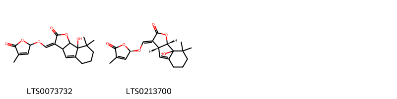{ width=100% }
    <figcaption>Hình ảnh cấu trúc hóa học của 2 hoạt chất thuộc nhóm Lactones gồm ['5-{[(3z)-8a-hydroxy-8,8-dimethyl-2-oxo-3ah,5h,6h,7h,8bh-indeno[1,2-b]furan-3-ylidene]methoxy}-3-methyl-5h-furan-2-one (LTS0073732)', 'alectrol (LTS0213700)'].</figcaption>
</figure>
#### Nhóm Organooxygen compounds
<figure markdown="span">
    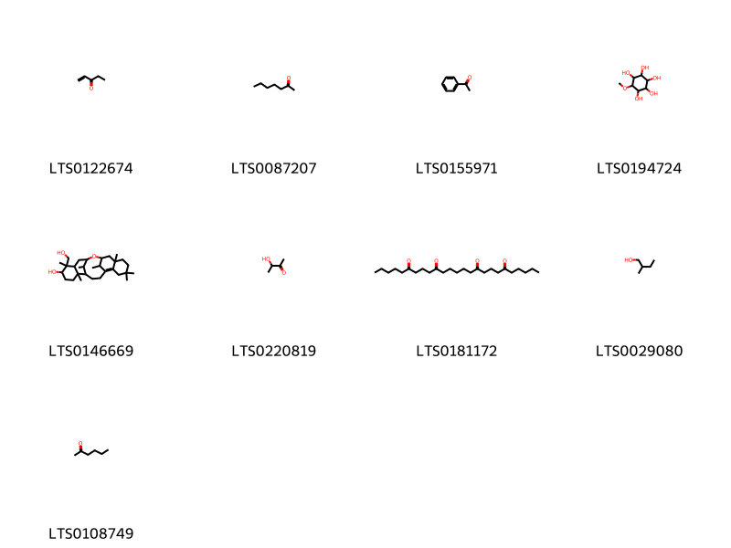{ width=100% }
    <figcaption>Hình ảnh cấu trúc hóa học của 9 hoạt chất thuộc nhóm Organooxygen compounds gồm ['1-penten-3-one (LTS0122674)', '2-heptanone (LTS0087207)', 'acetophenone (LTS0155971)', 'pinitol (LTS0194724)', '6-(hydroxymethyl)-6,10,17,17,20,22,23-heptamethyl-2-oxapentacyclo[12.7.1.1³,¹¹.0⁵,¹⁰.0¹⁵,²⁰]tricos-14-en-7-ol (LTS0146669)', 'acetoin (LTS0220819)', 'pentacosane-6,10,16,20-tetrone (LTS0181172)', '2-methyl-1-butanol (LTS0029080)', 'hexanone (LTS0108749)'].</figcaption>
</figure>
#### Nhóm Prenol lipids
<figure markdown="span">
    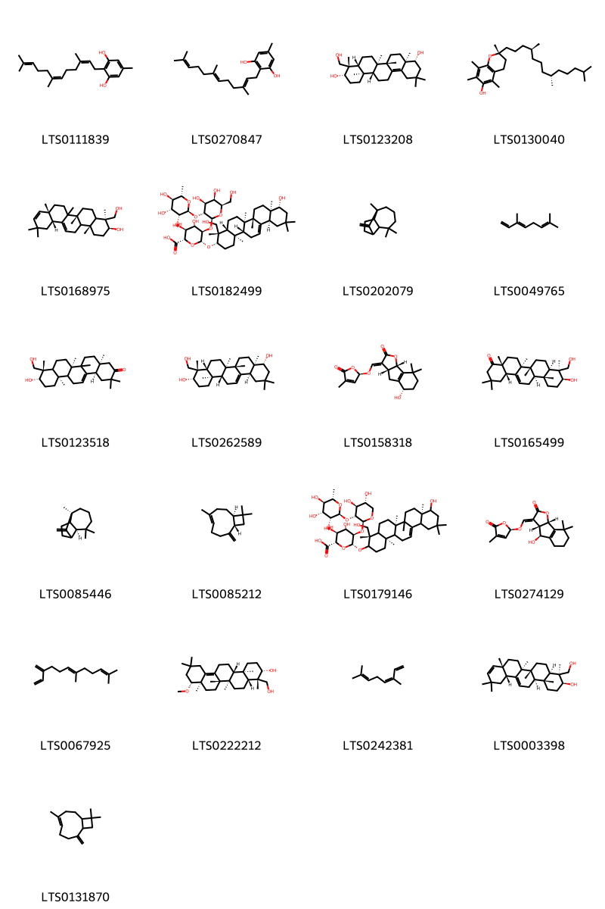{ width=100% }
    <figcaption>Hình ảnh cấu trúc hóa học của 21 hoạt chất thuộc nhóm Prenol lipids gồm ['5-methyl-2-(3,7,11-trimethyldodeca-2,6,10-trien-1-yl)benzene-1,3-diol (LTS0111839)', 'grifolin (LTS0270847)', 'soyasapogenol f (LTS0123208)', '(2r)-2,5,7,8-tetramethyl-2-[(4s,8s)-4,8,12-trimethyltridecyl]-3,4-dihydro-1-benzopyran-6-ol (LTS0130040)', '(3s,4s,6ar,8as,12ar,14br)-4-(hydroxymethyl)-4,6a,6b,8a,11,11,14b-heptamethyl-1,2,3,4a,5,6,7,8,12,12a,14,14a-dodecahydropicen-3-ol (LTS0168975)', 'soyasaponin i (LTS0182499)', 'longifolene (LTS0202079)', 'trans-β-ocimene (LTS0049765)', '(4as,6br,9s,10s,12ar,14br)-10-hydroxy-9-(hydroxymethyl)-2,2,4a,6a,6b,9,12a-heptamethyl-4,5,6,7,8,8a,10,11,12,12b,13,14b-dodecahydro-1h-picen-3-one (LTS0123518)', 'soyasapogenol b (LTS0262589)', 'strigol (LTS0158318)', 'soyasapogenol-e (LTS0165499)', '(2s,7s)-3,3,7-trimethyl-8-methylidenetricyclo[5.4.0.0²,⁹]undecane (LTS0085446)', 'caryophyllene (LTS0085212)', '(2s,3s,4s,5r,6r)-6-{[(4s,6ar,8ar,14br)-9-hydroxy-4-(hydroxymethyl)-4,6a,6b,8a,11,11,14b-heptamethyl-1,2,3,4a,5,6,7,8,9,10,12,12a,14,14a-tetradecahydropicen-3-yl]oxy}-5-{[(2s,3r,4s,5r)-4,5-dihydroxy-3-{[(2s,3r,4r,5r,6s)-3,4,5-trihydroxy-6-methyloxan-2-yl]oxy}oxan-2-yl]oxy}-3,4-dihydroxyoxane-2-carboxylic acid (LTS0179146)', '(5r)-5-{[(3e,3as,4s,8bs)-4-hydroxy-8,8-dimethyl-2-oxo-3ah,4h,5h,6h,7h,8bh-indeno[1,2-b]furan-3-ylidene]methoxy}-3-methyl-5h-furan-2-one (LTS0274129)', 'β-farnesene (LTS0067925)', 'soyasapogenol d (LTS0222212)', 'β-ocimene (LTS0242381)', 'soyasapogenol c (LTS0003398)', 'caryophyllene (LTS0131870)'].</figcaption>
</figure>
#### Nhóm Steroids and steroid derivatives
<figure markdown="span">
    { width=100% }
    <figcaption>Hình ảnh cấu trúc hóa học của 1 hoạt chất thuộc nhóm Steroids and steroid derivatives gồm ['24-methylenecholesterol (LTS0016921)'].</figcaption>
</figure>

---

### Dược dân tộc học

Danh sách các quốc gia có sử dụng *Trifolium pratense* trong điều trị các bệnh. 

| Country   | Disease                            | Bệnh                                                                                                                                                                                                |
|:----------|:-----------------------------------|:----------------------------------------------------------------------------------------------------------------------------------------------------------------------------------------------------|
| Elsewhere | Expectorant, Expectorant, Sedative | MYMEMORY WARNING: YOU USED ALL AVAILABLE FREE TRANSLATIONS FOR TODAY. NEXT AVAILABLE IN  13 HOURS 48 MINUTES 29 SECONDS VISIT HTTPS://MYMEMORY.TRANSLATED.NET/DOC/USAGELIMITS.PHP TO TRANSLATE MORE |
| Eurasia   | Sedative                           | MYMEMORY WARNING: YOU USED ALL AVAILABLE FREE TRANSLATIONS FOR TODAY. NEXT AVAILABLE IN  13 HOURS 48 MINUTES 26 SECONDS VISIT HTTPS://MYMEMORY.TRANSLATED.NET/DOC/USAGELIMITS.PHP TO TRANSLATE MORE |
| Iraq      | Expectorant                        | MYMEMORY WARNING: YOU USED ALL AVAILABLE FREE TRANSLATIONS FOR TODAY. NEXT AVAILABLE IN  13 HOURS 48 MINUTES 24 SECONDS VISIT HTTPS://MYMEMORY.TRANSLATED.NET/DOC/USAGELIMITS.PHP TO TRANSLATE MORE |
| Turkey    | Sedative, Tonic, Diuretic          | MYMEMORY WARNING: YOU USED ALL AVAILABLE FREE TRANSLATIONS FOR TODAY. NEXT AVAILABLE IN  13 HOURS 48 MINUTES 21 SECONDS VISIT HTTPS://MYMEMORY.TRANSLATED.NET/DOC/USAGELIMITS.PHP TO TRANSLATE MORE |
| US        | Sedative                           | MYMEMORY WARNING: YOU USED ALL AVAILABLE FREE TRANSLATIONS FOR TODAY. NEXT AVAILABLE IN  13 HOURS 48 MINUTES 18 SECONDS VISIT HTTPS://MYMEMORY.TRANSLATED.NET/DOC/USAGELIMITS.PHP TO TRANSLATE MORE |

---

---
## Trifolium repens
### Thông tin về thực vật

!!! info "Phân loại thực vật của *Trifolium repens* từ GIBF:"
    - **Kingdom:** Plantae
    - **Phylum:** Tracheophyta
    - **Order:** Fabales
    - **Family:** Fabaceae
    - **Genus:** Trifolium
    - **Species:** *Trifolium repens*

 

| Label (VI)   | Label (EN)   | Scientific Name   | Descriptions (VI)   | Descriptions (EN)   | Also Known As (VI)   | Also Known As (EN)                                     |
|:-------------|:-------------|:------------------|:--------------------|:--------------------|:---------------------|:-------------------------------------------------------|
| N/A          | N/A          | Trifolium repens  | loài thực vật       | species of plant    | ['']                 | ['white Dutch clover', 'Dutch clover', 'white clover'] |

#### Phân bố trên thế giới

**Từ CSDL GIBF** nan, Italy, Australia, Japan, Argentina, Canada, Netherlands, Chinese Taipei, Bolivia (Plurinational State of), Türkiye, Portugal, Russian Federation, United States of America, Uruguay, Chile, Greece, South Africa, Switzerland, Mexico, United Kingdom of Great Britain and Northern Ireland, China, Ecuador, Colombia, Ireland, Poland, New Zealand

#### Phân bố tại Việt Nam

**Từ CSDL GIBF**: Không có ghi nhận ở Việt Nam

---
### Thành phần hóa học
        
- Theo cơ sở dữ liệu lotus: Từ loài *Trifolium repens* đã phân lập và xác định được 46 hoạt chất thuộc về các nhóm Fatty Acyls, Flavonoids, Prenol lipids, Steroids and steroid derivatives, Isoflavonoids, Pyrans, Organooxygen compounds, Carboxylic acids and derivatives. 

|    | chemicalTaxonomyClassyfireClass   |   smiles_count |
|---:|:----------------------------------|---------------:|
|  0 | Carboxylic acids and derivatives  |              3 |
|  1 | Fatty Acyls                       |              1 |
|  2 | Flavonoids                        |             11 |
|  3 | Isoflavonoids                     |              8 |
|  4 | Organooxygen compounds            |              5 |
|  5 | Prenol lipids                     |             12 |
|  6 | Pyrans                            |              1 |
|  7 | Steroids and steroid derivatives  |              5 |

#### Nhóm Carboxylic acids and derivatives
<figure markdown="span">
    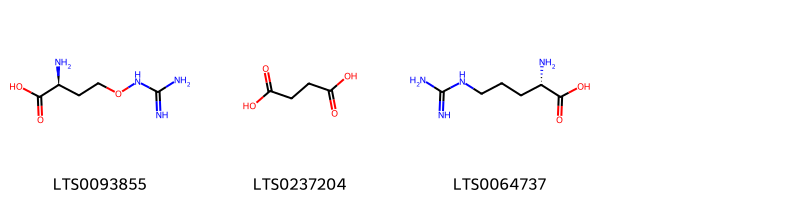{ width=100% }
    <figcaption>Hình ảnh cấu trúc hóa học của 3 hoạt chất thuộc nhóm Carboxylic acids and derivatives gồm ['(l)-canavanine (LTS0093855)', 'succinic acid (LTS0237204)', 'l-arginine (LTS0064737)'].</figcaption>
</figure>
#### Nhóm Fatty Acyls
<figure markdown="span">
    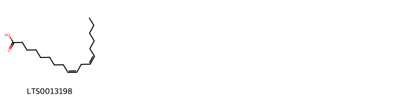{ width=100% }
    <figcaption>Hình ảnh cấu trúc hóa học của 1 hoạt chất thuộc nhóm Fatty Acyls gồm ['linoleic (LTS0013198)'].</figcaption>
</figure>
#### Nhóm Flavonoids
<figure markdown="span">
    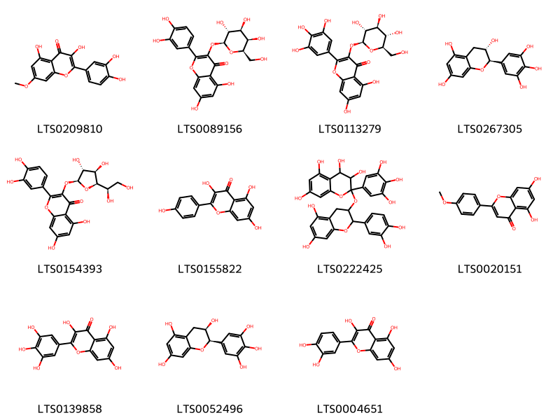{ width=100% }
    <figcaption>Hình ảnh cấu trúc hóa học của 11 hoạt chất thuộc nhóm Flavonoids gồm ['rhamnetin (LTS0209810)', 'hyperoside (LTS0089156)', '5,7-dihydroxy-3-{[(2s,3r,4s,5s,6r)-3,4,5-trihydroxy-6-(hydroxymethyl)oxan-2-yl]oxy}-2-(3,4,5-trihydroxyphenyl)chromen-4-one (LTS0113279)', 'gallocatechol (LTS0267305)', 'quercetin-3-glucoside (LTS0154393)', 'kaempherol (LTS0155822)', '2-{[2-(3,4-dihydroxyphenyl)-5,7-dihydroxy-3,4-dihydro-2h-1-benzopyran-3-yl]oxy}-2-(3,4,5-trihydroxyphenyl)-3,4-dihydro-1-benzopyran-3,4,5,7-tetrol (LTS0222425)', 'acacetin (LTS0020151)', 'myricetin (LTS0139858)', 'epigallocatechin (LTS0052496)', 'quercetin (LTS0004651)'].</figcaption>
</figure>
#### Nhóm Isoflavonoids
<figure markdown="span">
    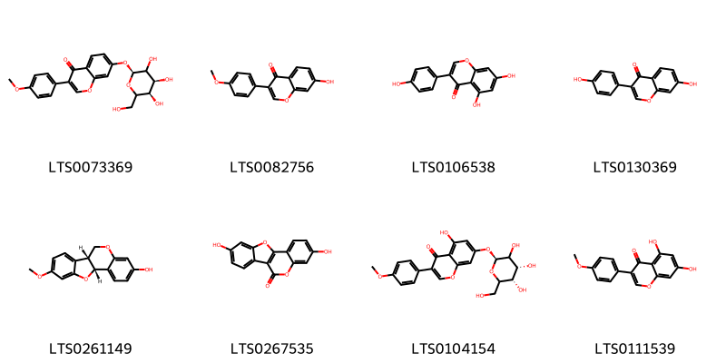{ width=100% }
    <figcaption>Hình ảnh cấu trúc hóa học của 8 hoạt chất thuộc nhóm Isoflavonoids gồm ['formononetin 7-o-glucoside (LTS0073369)', 'formononetin (LTS0082756)', 'genistein (LTS0106538)', 'daidzein (LTS0130369)', 'medicarpin, (-)- (LTS0261149)', 'coumestrol (LTS0267535)', '5-hydroxy-3-(4-methoxyphenyl)-7-{[(2s,4r,5s)-3,4,5-trihydroxy-6-(hydroxymethyl)oxan-2-yl]oxy}chromen-4-one (LTS0104154)', 'biochanin (LTS0111539)'].</figcaption>
</figure>
#### Nhóm Organooxygen compounds
<figure markdown="span">
    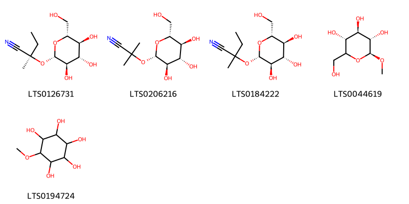{ width=100% }
    <figcaption>Hình ảnh cấu trúc hóa học của 5 hoạt chất thuộc nhóm Organooxygen compounds gồm ['lotaustralin (LTS0126731)', 'linamarin (LTS0206216)', '2-methyl-2-{[(2s,3r,4s,5s,6r)-3,4,5-trihydroxy-6-(hydroxymethyl)oxan-2-yl]oxy}butanenitrile (LTS0184222)', 'methylglucoside (LTS0044619)', 'pinitol (LTS0194724)'].</figcaption>
</figure>
#### Nhóm Prenol lipids
<figure markdown="span">
    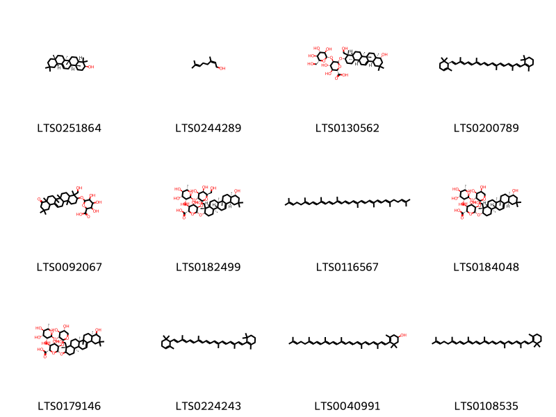{ width=100% }
    <figcaption>Hình ảnh cấu trúc hóa học của 12 hoạt chất thuộc nhóm Prenol lipids gồm ['β-amyrin (LTS0251864)', 'nerol (LTS0244289)', '(2s,3s,4s,5r,6r)-6-{[(3s,4s,4ar,6ar,6bs,8ar,9r,12as,14ar,14br)-9-hydroxy-4-(hydroxymethyl)-4,6a,6b,8a,11,11,14b-heptamethyl-1,2,3,4a,5,6,7,8,9,10,12,12a,14,14a-tetradecahydropicen-3-yl]oxy}-3,4-dihydroxy-5-{[(2s,3r,4s,5s,6r)-3,4,5-trihydroxy-6-(hydroxymethyl)oxan-2-yl]oxy}oxane-2-carboxylic acid (LTS0130562)', '(+)-α-carotene (LTS0200789)', '3,4,5-trihydroxy-6-{[4-(hydroxymethyl)-4,6a,6b,8a,11,11,14b-heptamethyl-9-oxo-2,3,4a,5,6,7,8,10,12,12a,14,14a-dodecahydro-1h-picen-3-yl]oxy}oxane-2-carboxylic acid (LTS0092067)', 'soyasaponin i (LTS0182499)', 'lycopene (LTS0116567)', 'soyasaponin ii (LTS0184048)', '(2s,3s,4s,5r,6r)-6-{[(4s,6ar,8ar,14br)-9-hydroxy-4-(hydroxymethyl)-4,6a,6b,8a,11,11,14b-heptamethyl-1,2,3,4a,5,6,7,8,9,10,12,12a,14,14a-tetradecahydropicen-3-yl]oxy}-5-{[(2s,3r,4s,5r)-4,5-dihydroxy-3-{[(2s,3r,4r,5r,6s)-3,4,5-trihydroxy-6-methyloxan-2-yl]oxy}oxan-2-yl]oxy}-3,4-dihydroxyoxane-2-carboxylic acid (LTS0179146)', 'α-carotene (LTS0224243)', 'rubixanthin (LTS0040991)', 'gamma-carotene (LTS0108535)'].</figcaption>
</figure>
#### Nhóm Pyrans
<figure markdown="span">
    { width=100% }
    <figcaption>Hình ảnh cấu trúc hóa học của 1 hoạt chất thuộc nhóm Pyrans gồm ['talmon (LTS0152081)'].</figcaption>
</figure>
#### Nhóm Steroids and steroid derivatives
<figure markdown="span">
    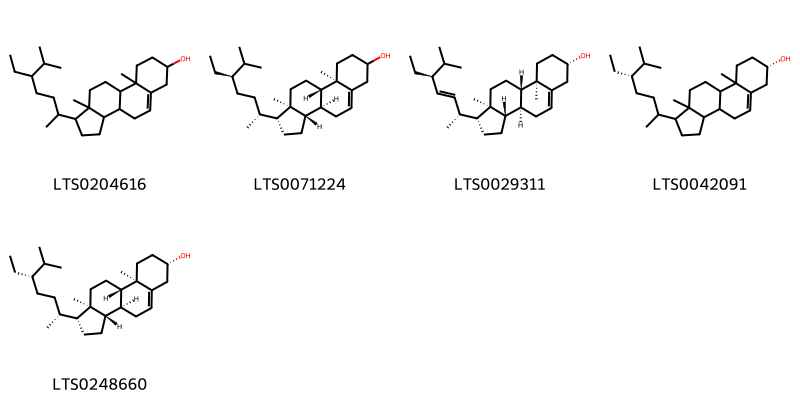{ width=100% }
    <figcaption>Hình ảnh cấu trúc hóa học của 5 hoạt chất thuộc nhóm Steroids and steroid derivatives gồm ['stigmast-5-en-3-ol, (3β)- (LTS0204616)', 'stigmast-5-en-3-ol (LTS0071224)', 'phytosterol (LTS0029311)', '(7s)-1-[(5s)-5-ethyl-6-methylheptan-2-yl]-9a,11a-dimethyl-1h,2h,3h,3ah,3bh,4h,6h,7h,8h,9h,9bh,10h,11h-cyclopenta[a]phenanthren-7-ol (LTS0042091)', 'clionasterol (LTS0248660)'].</figcaption>
</figure>

---

### Dược dân tộc học

Danh sách các quốc gia có sử dụng *Trifolium repens* trong điều trị các bệnh. 

| Country   | Disease                             | Bệnh                                                                                                                                                                                                |
|:----------|:------------------------------------|:----------------------------------------------------------------------------------------------------------------------------------------------------------------------------------------------------|
| Elsewhere | Estrogenic, Astringent, Expectorant | MYMEMORY WARNING: YOU USED ALL AVAILABLE FREE TRANSLATIONS FOR TODAY. NEXT AVAILABLE IN  13 HOURS 47 MINUTES 32 SECONDS VISIT HTTPS://MYMEMORY.TRANSLATED.NET/DOC/USAGELIMITS.PHP TO TRANSLATE MORE |
| Turkey    | Tonic                               | MYMEMORY WARNING: YOU USED ALL AVAILABLE FREE TRANSLATIONS FOR TODAY. NEXT AVAILABLE IN  13 HOURS 47 MINUTES 29 SECONDS VISIT HTTPS://MYMEMORY.TRANSLATED.NET/DOC/USAGELIMITS.PHP TO TRANSLATE MORE |
| US        | Poison                              | MYMEMORY WARNING: YOU USED ALL AVAILABLE FREE TRANSLATIONS FOR TODAY. NEXT AVAILABLE IN  13 HOURS 47 MINUTES 26 SECONDS VISIT HTTPS://MYMEMORY.TRANSLATED.NET/DOC/USAGELIMITS.PHP TO TRANSLATE MORE |

---

# Chi Piptadeniastrum

??? note "Danh sách các dược liệu thuộc chi"
    
	 - *Piptadeniastrum africanum*

---
## Piptadeniastrum africanum
### Thông tin về thực vật

!!! info "Phân loại thực vật của *Piptadeniastrum africanum* từ GIBF:"
    - **Kingdom:** Plantae
    - **Phylum:** Tracheophyta
    - **Order:** Fabales
    - **Family:** Fabaceae
    - **Genus:** Piptadeniastrum
    - **Species:** *Piptadeniastrum africanum*

 

| Label (VI)   | Label (EN)   | Scientific Name           | Descriptions (VI)   | Descriptions (EN)   | Also Known As (VI)   | Also Known As (EN)   |
|:-------------|:-------------|:--------------------------|:--------------------|:--------------------|:---------------------|:---------------------|
| N/A          | N/A          | Piptadeniastrum africanum | loài thực vật       | species of plant    | ['']                 | ['']                 |

#### Phân bố trên thế giới

**Từ CSDL GIBF** Ghana, Gabon, Côte d’Ivoire, Congo, Congo, Democratic Republic of the, Guinea, Liberia, Sierra Leone, Cameroon

#### Phân bố tại Việt Nam

**Từ CSDL GIBF**: Không có ghi nhận ở Việt Nam

---
### Thành phần hóa học
        
- Theo cơ sở dữ liệu lotus: Từ loài *Piptadeniastrum africanum* đã phân lập và xác định được Chưa có hoạt chất nào được phân lập. hoạt chất thuộc về các nhóm Không có hoạt chất nào được phân lập. 

Không có hình ảnh nào được tạo ra

---

### Dược dân tộc học

Danh sách các quốc gia có sử dụng *Piptadeniastrum africanum* trong điều trị các bệnh. 

| Country   | Disease       | Bệnh                                                                                                                                                                                                |
|:----------|:--------------|:----------------------------------------------------------------------------------------------------------------------------------------------------------------------------------------------------|
| Africa    | Purgative     | MYMEMORY WARNING: YOU USED ALL AVAILABLE FREE TRANSLATIONS FOR TODAY. NEXT AVAILABLE IN  13 HOURS 46 MINUTES 45 SECONDS VISIT HTTPS://MYMEMORY.TRANSLATED.NET/DOC/USAGELIMITS.PHP TO TRANSLATE MORE |
| Ghana     | Abortifacient | MYMEMORY WARNING: YOU USED ALL AVAILABLE FREE TRANSLATIONS FOR TODAY. NEXT AVAILABLE IN  13 HOURS 46 MINUTES 41 SECONDS VISIT HTTPS://MYMEMORY.TRANSLATED.NET/DOC/USAGELIMITS.PHP TO TRANSLATE MORE |

---

# Chi Inocarpus

??? note "Danh sách các dược liệu thuộc chi"
    
	 - *Inocarpus edulis*

---
## Inocarpus edulis
### Thông tin về thực vật

!!! info "Phân loại thực vật của *Inocarpus fagifer* từ GIBF:"
    - **Kingdom:** Plantae
    - **Phylum:** Tracheophyta
    - **Order:** Fabales
    - **Family:** Fabaceae
    - **Genus:** Inocarpus
    - **Species:** *Inocarpus fagifer*

 

| Label (VI)   | Label (EN)   | Scientific Name   | Descriptions (VI)   | Descriptions (EN)   | Also Known As (VI)   | Also Known As (EN)   |
|:-------------|:-------------|:------------------|:--------------------|:--------------------|:---------------------|:---------------------|
| N/A          | N/A          | Inocarpus edulis  | loài thực vật       | species of plant    | ['']                 | ['']                 |

#### Phân bố trên thế giới

**Từ CSDL GIBF** nan, Palau, American Samoa, Micronesia (Federated States of), Christmas Island, Japan, Wallis and Futuna, unknown or invalid, Chinese Taipei, Papua New Guinea, United States of America, Congo, Democratic Republic of the, Solomon Islands, Fiji, Marshall Islands, Tonga, New Caledonia, Singapore, Viet Nam, China, French Polynesia, Costa Rica, Vanuatu, India, Indonesia, Gambia, Samoa, Philippines, Malaysia, New Zealand

#### Phân bố tại Việt Nam

**Từ CSDL GIBF**: Saigon, 西贡

---
### Thành phần hóa học
        
- Theo cơ sở dữ liệu lotus: Từ loài *Inocarpus fagifer* đã phân lập và xác định được Chưa có hoạt chất nào được phân lập. hoạt chất thuộc về các nhóm Không có hoạt chất nào được phân lập. 

Không có hình ảnh nào được tạo ra

---

### Dược dân tộc học

Danh sách các quốc gia có sử dụng *Inocarpus fagifer* trong điều trị các bệnh. 

| Country   | Disease    | Bệnh                                                                                                                                                                                                |
|:----------|:-----------|:----------------------------------------------------------------------------------------------------------------------------------------------------------------------------------------------------|
| Malaya    | Astringent | MYMEMORY WARNING: YOU USED ALL AVAILABLE FREE TRANSLATIONS FOR TODAY. NEXT AVAILABLE IN  13 HOURS 46 MINUTES 14 SECONDS VISIT HTTPS://MYMEMORY.TRANSLATED.NET/DOC/USAGELIMITS.PHP TO TRANSLATE MORE |

---

