!!! abstract "Tóm tắt"

    Họ Fagaceae gồm khoảng 4 chi và 21 loài được một số cộng đồng tại các quốc gia như Turkey, Mexico(Kickapoo), US(Cree), anish, Europe, Iraq, German, French, Elsewhere, US, Kurdistan, ain, China sử dụng trong một số trường hợp MYMEMORY WARNING: YOU USED ALL AVAILABLE FREE TRANSLATIONS FOR TODAY. NEXT AVAILABLE IN  13 HOURS 45 MINUTES 49 SECONDS VISIT HTTPS://MYMEMORY.TRANSLATED.NET/DOC/USAGELIMITS.PHP TO TRANSLATE MORE.

!!! info "DrDuke"

    James A. Duke sinh năm 1929-2017 là một nhà thực vật học người Mỹ. Đây là một trong những tác giả hàng đầu trong lĩnh vực dược dân tộc học với cuốn *CRC Handbook of Medicinal Herbs* và chính là người xây dựng lên cơ sở dữ liệu về hợp chất tự nhiên và dược dân tộc học tại Bộ nông nghiệp Hoa Kỳ. Các thông tin được đăng tải tại website [Dr. Duke's Phytochemical and Ethnobotanical Databases](https://phytochem.nal.usda.gov/). 
    Trong suốt thập niên 1970, ông lãnh đạo the Plant Taxonomy Laboratory, Plant Genetics and Germplasm Institute of the Agricultural Research Service, U.S. Department of Agriculture.
    Trong tài liệu này, các thông tin về dược dân tộc của các dược liệu được trích dẫn từ tài liệu của James A. Ducke với sự trợ giúp của phần mềm dịch thuật từ tiếng Anh sang tiếng Việt.
   

# Chi Fagus

??? note "Danh sách các dược liệu thuộc chi"
    
	 - *Fagus ferruginea*
	 - *Fagus grandifolia*
	 - *Fagus silvatica*
	 - *Fagus slyvatica*
	 - *Fagus sylvatica*

---
## Fagus ferruginea
### Thông tin về thực vật

!!! info "Phân loại thực vật của *N/A* từ GIBF:"
    - **Kingdom:** Plantae
    - **Phylum:** Tracheophyta
    - **Order:** Fagales
    - **Family:** Fagaceae
    - **Genus:** Fagus
    - **Species:** *N/A*

 

| Label (VI)   | Label (EN)   | Scientific Name   | Descriptions (VI)   | Descriptions (EN)   | Also Known As (VI)   | Also Known As (EN)   |
|:-------------|:-------------|:------------------|:--------------------|:--------------------|:---------------------|:---------------------|
| N/A          | N/A          | Inocarpus edulis  | loài thực vật       | species of plant    | ['']                 | ['']                 |

#### Phân bố trên thế giới

**Từ CSDL GIBF** Denmark, Netherlands, Italy, Czechia, Germany, Romania, Slovakia, Spain, Ireland, Switzerland, Russian Federation, United States of America, Austria, France, United Kingdom of Great Britain and Northern Ireland, Canada

#### Phân bố tại Việt Nam

**Từ CSDL GIBF**: Không có ghi nhận ở Việt Nam

---
### Thành phần hóa học
        
- Theo cơ sở dữ liệu lotus: Từ loài *N/A* đã phân lập và xác định được Chưa có hoạt chất nào được phân lập. hoạt chất thuộc về các nhóm Không có hoạt chất nào được phân lập. 

Không có hình ảnh nào được tạo ra

---

### Dược dân tộc học

Danh sách các quốc gia có sử dụng *N/A* trong điều trị các bệnh. 

| Country   | Disease     | Bệnh                                                                                                                                                                                                |
|:----------|:------------|:----------------------------------------------------------------------------------------------------------------------------------------------------------------------------------------------------|
| Elsewhere | Antipyretic | MYMEMORY WARNING: YOU USED ALL AVAILABLE FREE TRANSLATIONS FOR TODAY. NEXT AVAILABLE IN  13 HOURS 45 MINUTES 46 SECONDS VISIT HTTPS://MYMEMORY.TRANSLATED.NET/DOC/USAGELIMITS.PHP TO TRANSLATE MORE |

---

---
## Fagus grandifolia
### Thông tin về thực vật

!!! info "Phân loại thực vật của *Fagus grandifolia* từ GIBF:"
    - **Kingdom:** Plantae
    - **Phylum:** Tracheophyta
    - **Order:** Fagales
    - **Family:** Fagaceae
    - **Genus:** Fagus
    - **Species:** *Fagus grandifolia*

 

| Label (VI)   | Label (EN)   | Scientific Name   | Descriptions (VI)   | Descriptions (EN)   | Also Known As (VI)   | Also Known As (EN)   |
|:-------------|:-------------|:------------------|:--------------------|:--------------------|:---------------------|:---------------------|
| N/A          | N/A          | Fagus grandifolia | loài thực vật       | species of plant    | ['']                 | ['American beech']   |

#### Phân bố trên thế giới

**Từ CSDL GIBF** United States of America, Canada

#### Phân bố tại Việt Nam

**Từ CSDL GIBF**: Không có ghi nhận ở Việt Nam

---
### Thành phần hóa học
        
- Theo cơ sở dữ liệu lotus: Từ loài *Fagus grandifolia* đã phân lập và xác định được 13 hoạt chất thuộc về các nhóm Fatty Acyls, Carboxylic acids and derivatives, Organooxygen compounds, Phenols. 

|    | chemicalTaxonomyClassyfireClass   |   smiles_count |
|---:|:----------------------------------|---------------:|
|  0 | Carboxylic acids and derivatives  |              1 |
|  1 | Fatty Acyls                       |              2 |
|  2 | Organooxygen compounds            |              4 |
|  3 | Phenols                           |              6 |

#### Nhóm Carboxylic acids and derivatives
<figure markdown="span">
    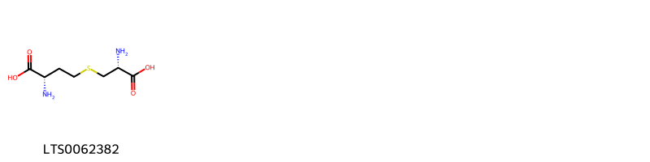{ width=100% }
    <figcaption>Hình ảnh cấu trúc hóa học của 1 hoạt chất thuộc nhóm Carboxylic acids and derivatives gồm ['l-cystathionine (LTS0062382)'].</figcaption>
</figure>
#### Nhóm Fatty Acyls
<figure markdown="span">
    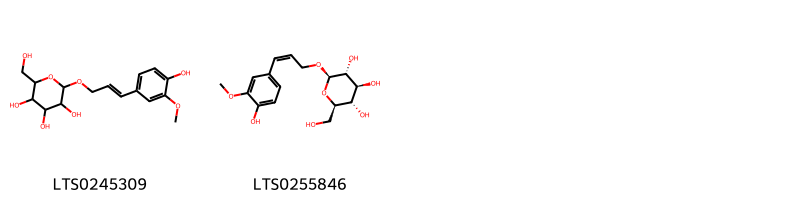{ width=100% }
    <figcaption>Hình ảnh cấu trúc hóa học của 2 hoạt chất thuộc nhóm Fatty Acyls gồm ['2-{[3-(4-hydroxy-3-methoxyphenyl)prop-2-en-1-yl]oxy}-6-(hydroxymethyl)oxane-3,4,5-triol (LTS0245309)', '(2r,3r,4s,5s,6r)-2-{[(2z)-3-(4-hydroxy-3-methoxyphenyl)prop-2-en-1-yl]oxy}-6-(hydroxymethyl)oxane-3,4,5-triol (LTS0255846)'].</figcaption>
</figure>
#### Nhóm Organooxygen compounds
<figure markdown="span">
    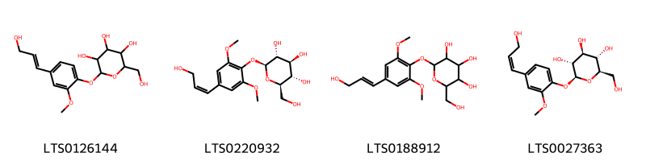{ width=100% }
    <figcaption>Hình ảnh cấu trúc hóa học của 4 hoạt chất thuộc nhóm Organooxygen compounds gồm ['2-(hydroxymethyl)-6-[4-(3-hydroxyprop-1-en-1-yl)-2-methoxyphenoxy]oxane-3,4,5-triol (LTS0126144)', '(2r,3s,4s,5r,6s)-2-(hydroxymethyl)-6-{4-[(1z)-3-hydroxyprop-1-en-1-yl]-2,6-dimethoxyphenoxy}oxane-3,4,5-triol (LTS0220932)', '2-(hydroxymethyl)-6-[4-(3-hydroxyprop-1-en-1-yl)-2,6-dimethoxyphenoxy]oxane-3,4,5-triol (LTS0188912)', '(2r,3s,4s,5r,6s)-2-(hydroxymethyl)-6-{4-[(1z)-3-hydroxyprop-1-en-1-yl]-2-methoxyphenoxy}oxane-3,4,5-triol (LTS0027363)'].</figcaption>
</figure>
#### Nhóm Phenols
<figure markdown="span">
    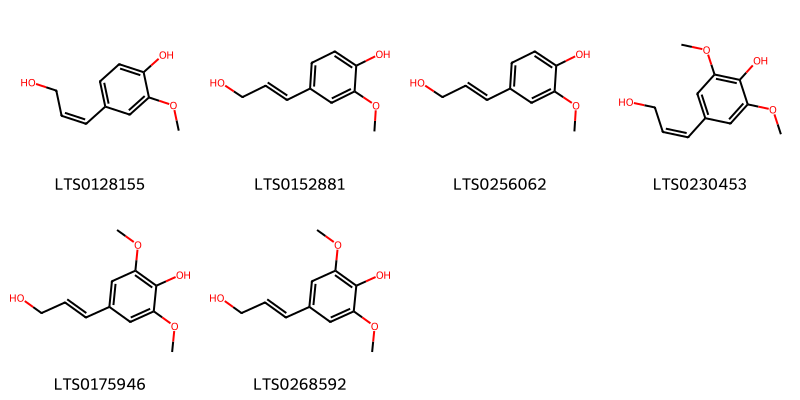{ width=100% }
    <figcaption>Hình ảnh cấu trúc hóa học của 6 hoạt chất thuộc nhóm Phenols gồm ['4-[(1z)-3-hydroxyprop-1-en-1-yl]-2-methoxyphenol (LTS0128155)', 'coniferyl alcohol (LTS0152881)', '4-(3-hydroxyprop-1-en-1-yl)-2-methoxyphenol (LTS0256062)', '4-[(1z)-3-hydroxyprop-1-en-1-yl]-2,6-dimethoxyphenol (LTS0230453)', 'sinapyl alcohol (LTS0175946)', 'sinapic alcohol (LTS0268592)'].</figcaption>
</figure>

---

### Dược dân tộc học

Danh sách các quốc gia có sử dụng *Fagus grandifolia* trong điều trị các bệnh. 

| Country   | Disease   | Bệnh                                                                                                                                                                                                |
|:----------|:----------|:----------------------------------------------------------------------------------------------------------------------------------------------------------------------------------------------------|
| US        | Poison    | MYMEMORY WARNING: YOU USED ALL AVAILABLE FREE TRANSLATIONS FOR TODAY. NEXT AVAILABLE IN  13 HOURS 45 MINUTES 16 SECONDS VISIT HTTPS://MYMEMORY.TRANSLATED.NET/DOC/USAGELIMITS.PHP TO TRANSLATE MORE |

---

---
## Fagus silvatica
### Thông tin về thực vật

!!! info "Phân loại thực vật của *Fagus sylvatica* từ GIBF:"
    - **Kingdom:** Plantae
    - **Phylum:** Tracheophyta
    - **Order:** Fagales
    - **Family:** Fagaceae
    - **Genus:** Fagus
    - **Species:** *Fagus sylvatica*

 

| Label (VI)   | Label (EN)   | Scientific Name   | Descriptions (VI)   | Descriptions (EN)   | Also Known As (VI)   | Also Known As (EN)   |
|:-------------|:-------------|:------------------|:--------------------|:--------------------|:---------------------|:---------------------|
| N/A          | N/A          | Fagus grandifolia | loài thực vật       | species of plant    | ['']                 | ['American beech']   |

#### Phân bố trên thế giới

**Từ CSDL GIBF** nan, Italy, Slovakia, Belgium, Canada, Ukraine, Denmark, Netherlands, Lithuania, Spain, Hungary, Russian Federation, Sweden, Czechia, Germany, Romania, Switzerland, Austria, France, United Kingdom of Great Britain and Northern Ireland, Ireland, Poland

#### Phân bố tại Việt Nam

**Từ CSDL GIBF**: Không có ghi nhận ở Việt Nam

---
### Thành phần hóa học
        
- Theo cơ sở dữ liệu lotus: Từ loài *Fagus sylvatica* đã phân lập và xác định được Chưa có hoạt chất nào được phân lập. hoạt chất thuộc về các nhóm Không có hoạt chất nào được phân lập. 

Không có hình ảnh nào được tạo ra

---

### Dược dân tộc học

Danh sách các quốc gia có sử dụng *Fagus sylvatica* trong điều trị các bệnh. 

| Country   | Disease     | Bệnh                                                                                                                                                                                                |
|:----------|:------------|:----------------------------------------------------------------------------------------------------------------------------------------------------------------------------------------------------|
| ain       | Carminative | MYMEMORY WARNING: YOU USED ALL AVAILABLE FREE TRANSLATIONS FOR TODAY. NEXT AVAILABLE IN  13 HOURS 44 MINUTES 47 SECONDS VISIT HTTPS://MYMEMORY.TRANSLATED.NET/DOC/USAGELIMITS.PHP TO TRANSLATE MORE |

---

---
## Fagus slyvatica
### Thông tin về thực vật

!!! info "Phân loại thực vật của *Fagus sylvatica* từ GIBF:"
    - **Kingdom:** Plantae
    - **Phylum:** Tracheophyta
    - **Order:** Fagales
    - **Family:** Fagaceae
    - **Genus:** Fagus
    - **Species:** *Fagus sylvatica*

 

| Label (VI)   | Label (EN)   | Scientific Name   | Descriptions (VI)   | Descriptions (EN)   | Also Known As (VI)   | Also Known As (EN)   |
|:-------------|:-------------|:------------------|:--------------------|:--------------------|:---------------------|:---------------------|
| N/A          | N/A          | Fagus grandifolia | loài thực vật       | species of plant    | ['']                 | ['American beech']   |

#### Phân bố trên thế giới

**Từ CSDL GIBF** nan, Italy, Slovakia, Belgium, Canada, Ukraine, Denmark, Netherlands, Lithuania, Spain, Hungary, Russian Federation, Sweden, Czechia, Germany, Romania, Switzerland, Austria, France, United Kingdom of Great Britain and Northern Ireland, Ireland, Poland

#### Phân bố tại Việt Nam

**Từ CSDL GIBF**: Không có ghi nhận ở Việt Nam

---
### Thành phần hóa học
        
- Theo cơ sở dữ liệu lotus: Từ loài *Fagus sylvatica* đã phân lập và xác định được Chưa có hoạt chất nào được phân lập. hoạt chất thuộc về các nhóm Không có hoạt chất nào được phân lập. 

Không có hình ảnh nào được tạo ra

---

### Dược dân tộc học

Danh sách các quốc gia có sử dụng *Fagus sylvatica* trong điều trị các bệnh. 

| Country   | Disease   | Bệnh                                                                                                                                                                                                |
|:----------|:----------|:----------------------------------------------------------------------------------------------------------------------------------------------------------------------------------------------------|
| Elsewhere | Poison    | MYMEMORY WARNING: YOU USED ALL AVAILABLE FREE TRANSLATIONS FOR TODAY. NEXT AVAILABLE IN  13 HOURS 44 MINUTES 20 SECONDS VISIT HTTPS://MYMEMORY.TRANSLATED.NET/DOC/USAGELIMITS.PHP TO TRANSLATE MORE |

---

---
## Fagus sylvatica
### Thông tin về thực vật

!!! info "Phân loại thực vật của *Fagus sylvatica* từ GIBF:"
    - **Kingdom:** Plantae
    - **Phylum:** Tracheophyta
    - **Order:** Fagales
    - **Family:** Fagaceae
    - **Genus:** Fagus
    - **Species:** *Fagus sylvatica*

 

| Label (VI)   | Label (EN)   | Scientific Name   | Descriptions (VI)   | Descriptions (EN)     | Also Known As (VI)   | Also Known As (EN)   |
|:-------------|:-------------|:------------------|:--------------------|:----------------------|:---------------------|:---------------------|
| N/A          | N/A          | Fagus sylvatica   | loài thực vật       | species of beech tree | ['dẻ gai Âu châu']   | ['European beech']   |

#### Phân bố trên thế giới

**Từ CSDL GIBF** nan, Italy, Slovakia, Belgium, Canada, Ukraine, Denmark, Netherlands, Lithuania, Spain, Hungary, Russian Federation, Sweden, Czechia, Germany, Romania, Switzerland, Austria, France, United Kingdom of Great Britain and Northern Ireland, Ireland, Poland

#### Phân bố tại Việt Nam

**Từ CSDL GIBF**: Không có ghi nhận ở Việt Nam

---
### Thành phần hóa học
        
- Theo cơ sở dữ liệu lotus: Từ loài *Fagus sylvatica* đã phân lập và xác định được 16 hoạt chất thuộc về các nhóm Fatty Acyls, Flavonoids, Organooxygen compounds. 

|    | chemicalTaxonomyClassyfireClass   |   smiles_count |
|---:|:----------------------------------|---------------:|
|  0 | Fatty Acyls                       |              3 |
|  1 | Flavonoids                        |              9 |
|  2 | Organooxygen compounds            |              4 |

#### Nhóm Fatty Acyls
<figure markdown="span">
    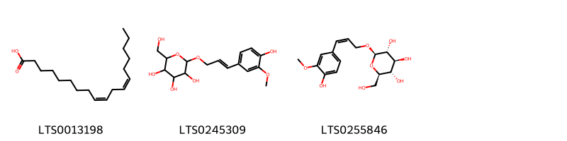{ width=100% }
    <figcaption>Hình ảnh cấu trúc hóa học của 3 hoạt chất thuộc nhóm Fatty Acyls gồm ['linoleic (LTS0013198)', '2-{[3-(4-hydroxy-3-methoxyphenyl)prop-2-en-1-yl]oxy}-6-(hydroxymethyl)oxane-3,4,5-triol (LTS0245309)', '(2r,3r,4s,5s,6r)-2-{[(2z)-3-(4-hydroxy-3-methoxyphenyl)prop-2-en-1-yl]oxy}-6-(hydroxymethyl)oxane-3,4,5-triol (LTS0255846)'].</figcaption>
</figure>
#### Nhóm Flavonoids
<figure markdown="span">
    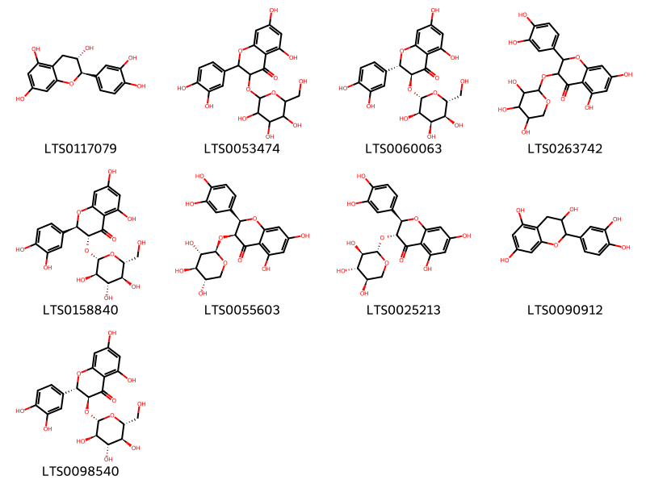{ width=100% }
    <figcaption>Hình ảnh cấu trúc hóa học của 9 hoạt chất thuộc nhóm Flavonoids gồm ['(+)-catechol (LTS0117079)', '2-(3,4-dihydroxyphenyl)-5,7-dihydroxy-3-{[3,4,5-trihydroxy-6-(hydroxymethyl)oxan-2-yl]oxy}-2,3-dihydro-1-benzopyran-4-one (LTS0053474)', '(2s,3s)-2-(3,4-dihydroxyphenyl)-5,7-dihydroxy-3-{[(2s,3r,4r,5s,6r)-3,4,5-trihydroxy-6-(hydroxymethyl)oxan-2-yl]oxy}-2,3-dihydro-1-benzopyran-4-one (LTS0060063)', '2-(3,4-dihydroxyphenyl)-5,7-dihydroxy-3-[(3,4,5-trihydroxyoxan-2-yl)oxy]-2,3-dihydro-1-benzopyran-4-one (LTS0263742)', 'taxifolin-3-glucoside (LTS0158840)', '(2r,3s)-2-(3,4-dihydroxyphenyl)-5,7-dihydroxy-3-{[(2r,3s,4r,5s)-3,4,5-trihydroxyoxan-2-yl]oxy}-2,3-dihydro-1-benzopyran-4-one (LTS0055603)', '(2r,3r)-2-(3,4-dihydroxyphenyl)-5,7-dihydroxy-3-{[(2s,3r,4s,5r)-3,4,5-trihydroxyoxan-2-yl]oxy}-2,3-dihydro-1-benzopyran-4-one (LTS0025213)', 'catechol (LTS0090912)', '(2s,3s)-2-(3,4-dihydroxyphenyl)-5,7-dihydroxy-3-{[(2s,3r,4s,5s,6r)-3,4,5-trihydroxy-6-(hydroxymethyl)oxan-2-yl]oxy}-2,3-dihydro-1-benzopyran-4-one (LTS0098540)'].</figcaption>
</figure>
#### Nhóm Organooxygen compounds
<figure markdown="span">
    { width=100% }
    <figcaption>Hình ảnh cấu trúc hóa học của 4 hoạt chất thuộc nhóm Organooxygen compounds gồm ['2-(hydroxymethyl)-6-[4-(3-hydroxyprop-1-en-1-yl)-2-methoxyphenoxy]oxane-3,4,5-triol (LTS0126144)', '(2r,3s,4s,5r,6s)-2-(hydroxymethyl)-6-{4-[(1z)-3-hydroxyprop-1-en-1-yl]-2,6-dimethoxyphenoxy}oxane-3,4,5-triol (LTS0220932)', '2-(hydroxymethyl)-6-[4-(3-hydroxyprop-1-en-1-yl)-2,6-dimethoxyphenoxy]oxane-3,4,5-triol (LTS0188912)', '(2r,3s,4s,5r,6s)-2-(hydroxymethyl)-6-{4-[(1z)-3-hydroxyprop-1-en-1-yl]-2-methoxyphenoxy}oxane-3,4,5-triol (LTS0027363)'].</figcaption>
</figure>

---

### Dược dân tộc học

Danh sách các quốc gia có sử dụng *Fagus sylvatica* trong điều trị các bệnh. 

| Country   | Disease                                                                             | Bệnh                                                                                                                                                                                                |
|:----------|:------------------------------------------------------------------------------------|:----------------------------------------------------------------------------------------------------------------------------------------------------------------------------------------------------|
| Elsewhere | Antipyretic, Antiseptic, Antidote, Analgesic, Antiseptic, Soap                      | MYMEMORY WARNING: YOU USED ALL AVAILABLE FREE TRANSLATIONS FOR TODAY. NEXT AVAILABLE IN  13 HOURS 43 MINUTES 53 SECONDS VISIT HTTPS://MYMEMORY.TRANSLATED.NET/DOC/USAGELIMITS.PHP TO TRANSLATE MORE |
| Europe    | Poison                                                                              | MYMEMORY WARNING: YOU USED ALL AVAILABLE FREE TRANSLATIONS FOR TODAY. NEXT AVAILABLE IN  13 HOURS 43 MINUTES 50 SECONDS VISIT HTTPS://MYMEMORY.TRANSLATED.NET/DOC/USAGELIMITS.PHP TO TRANSLATE MORE |
| Turkey    | Antiseptic, Apertif, Laxative, Refrigerant, Astringent, Parasiticide, Poison, Tonic | MYMEMORY WARNING: YOU USED ALL AVAILABLE FREE TRANSLATIONS FOR TODAY. NEXT AVAILABLE IN  13 HOURS 43 MINUTES 46 SECONDS VISIT HTTPS://MYMEMORY.TRANSLATED.NET/DOC/USAGELIMITS.PHP TO TRANSLATE MORE |

---

# Chi Castanea

??? note "Danh sách các dược liệu thuộc chi"
    
	 - *Castanea dentata*
	 - *Castanea mollissima*
	 - *Castanea sativa*

---
## Castanea dentata
### Thông tin về thực vật

!!! info "Phân loại thực vật của *Castanea dentata* từ GIBF:"
    - **Kingdom:** Plantae
    - **Phylum:** Tracheophyta
    - **Order:** Fagales
    - **Family:** Fagaceae
    - **Genus:** Castanea
    - **Species:** *Castanea dentata*

 

| Label (VI)   | Label (EN)   | Scientific Name   | Descriptions (VI)   | Descriptions (EN)   | Also Known As (VI)   | Also Known As (EN)    |
|:-------------|:-------------|:------------------|:--------------------|:--------------------|:---------------------|:----------------------|
| N/A          | N/A          | Castanea dentata  | loài thực vật       | species of plant    | ['']                 | ['American chestnut'] |

#### Phân bố trên thế giới

**Từ CSDL GIBF** United States of America, Canada

#### Phân bố tại Việt Nam

**Từ CSDL GIBF**: Không có ghi nhận ở Việt Nam

---
### Thành phần hóa học
        
- Theo cơ sở dữ liệu lotus: Từ loài *Castanea dentata* đã phân lập và xác định được 7 hoạt chất thuộc về các nhóm Cinnamic acids and derivatives, Benzene and substituted derivatives. 

|    | chemicalTaxonomyClassyfireClass     |   smiles_count |
|---:|:------------------------------------|---------------:|
|  0 | Benzene and substituted derivatives |              5 |
|  1 | Cinnamic acids and derivatives      |              2 |

#### Nhóm Benzene and substituted derivatives
<figure markdown="span">
    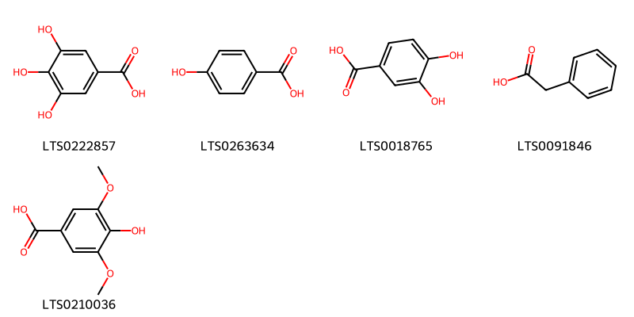{ width=100% }
    <figcaption>Hình ảnh cấu trúc hóa học của 5 hoạt chất thuộc nhóm Benzene and substituted derivatives gồm ['galop (LTS0222857)', 'p-hydroxybenzoic acid (LTS0263634)', '3,4-dihydroxybenzoic acid (LTS0018765)', 'ω-phenylacetic acid (LTS0091846)', 'syringic acid (LTS0210036)'].</figcaption>
</figure>
#### Nhóm Cinnamic acids and derivatives
<figure markdown="span">
    { width=100% }
    <figcaption>Hình ảnh cấu trúc hóa học của 2 hoạt chất thuộc nhóm Cinnamic acids and derivatives gồm ['3,4-dihydroxycinnamic acid (LTS0128050)', 'ferulic acid (LTS0077328)'].</figcaption>
</figure>

---

### Dược dân tộc học

Danh sách các quốc gia có sử dụng *Castanea dentata* trong điều trị các bệnh. 

| Country   | Disease                    | Bệnh                                                                                                                                                                                                |
|:----------|:---------------------------|:----------------------------------------------------------------------------------------------------------------------------------------------------------------------------------------------------|
| Elsewhere | Astringent, Tonic          | MYMEMORY WARNING: YOU USED ALL AVAILABLE FREE TRANSLATIONS FOR TODAY. NEXT AVAILABLE IN  13 HOURS 43 MINUTES 09 SECONDS VISIT HTTPS://MYMEMORY.TRANSLATED.NET/DOC/USAGELIMITS.PHP TO TRANSLATE MORE |
| US        | Sedative, Vermifuge, Tonic | MYMEMORY WARNING: YOU USED ALL AVAILABLE FREE TRANSLATIONS FOR TODAY. NEXT AVAILABLE IN  13 HOURS 43 MINUTES 06 SECONDS VISIT HTTPS://MYMEMORY.TRANSLATED.NET/DOC/USAGELIMITS.PHP TO TRANSLATE MORE |

---

---
## Castanea mollissima
### Thông tin về thực vật

!!! info "Phân loại thực vật của *Castanea mollissima* từ GIBF:"
    - **Kingdom:** Plantae
    - **Phylum:** Tracheophyta
    - **Order:** Fagales
    - **Family:** Fagaceae
    - **Genus:** Castanea
    - **Species:** *Castanea mollissima*

 

| Label (VI)   | Label (EN)   | Scientific Name     | Descriptions (VI)   | Descriptions (EN)   | Also Known As (VI)      | Also Known As (EN)   |
|:-------------|:-------------|:--------------------|:--------------------|:--------------------|:------------------------|:---------------------|
| N/A          | N/A          | Castanea mollissima | loài thực vật       | species of plant    | ['Castanea mollissima'] | ['']                 |

#### Phân bố trên thế giới

**Từ CSDL GIBF** nan, Hong Kong, Chinese Taipei, United States of America, China, New Zealand, Canada

#### Phân bố tại Việt Nam

**Từ CSDL GIBF**: Không có ghi nhận ở Việt Nam

---
### Thành phần hóa học
        
- Theo cơ sở dữ liệu lotus: Từ loài *Castanea mollissima* đã phân lập và xác định được 30 hoạt chất thuộc về các nhóm Isoflavonoids, Cinnamic acids and derivatives, Quinolines and derivatives, Benzene and substituted derivatives, Organooxygen compounds, Tannins. 

|    | chemicalTaxonomyClassyfireClass     |   smiles_count |
|---:|:------------------------------------|---------------:|
|  0 | Benzene and substituted derivatives |              4 |
|  1 | Cinnamic acids and derivatives      |              1 |
|  2 | Isoflavonoids                       |              1 |
|  3 | Organooxygen compounds              |              4 |
|  4 | Quinolines and derivatives          |              1 |
|  5 | Tannins                             |             18 |

#### Nhóm Benzene and substituted derivatives
<figure markdown="span">
    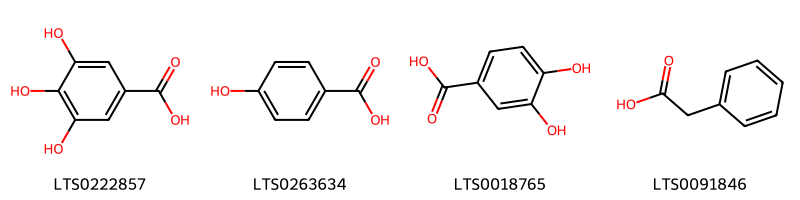{ width=100% }
    <figcaption>Hình ảnh cấu trúc hóa học của 4 hoạt chất thuộc nhóm Benzene and substituted derivatives gồm ['galop (LTS0222857)', 'p-hydroxybenzoic acid (LTS0263634)', '3,4-dihydroxybenzoic acid (LTS0018765)', 'ω-phenylacetic acid (LTS0091846)'].</figcaption>
</figure>
#### Nhóm Cinnamic acids and derivatives
<figure markdown="span">
    { width=100% }
    <figcaption>Hình ảnh cấu trúc hóa học của 1 hoạt chất thuộc nhóm Cinnamic acids and derivatives gồm ['3,4-dihydroxycinnamic acid (LTS0128050)'].</figcaption>
</figure>
#### Nhóm Isoflavonoids
<figure markdown="span">
    { width=100% }
    <figcaption>Hình ảnh cấu trúc hóa học của 1 hoạt chất thuộc nhóm Isoflavonoids gồm ['afrormosin (LTS0275427)'].</figcaption>
</figure>
#### Nhóm Organooxygen compounds
<figure markdown="span">
    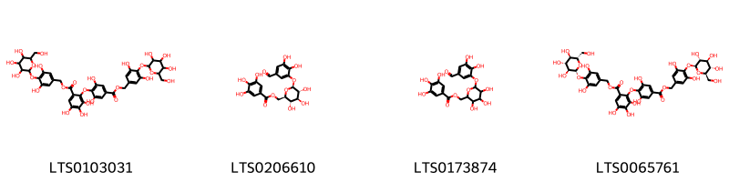{ width=100% }
    <figcaption>Hình ảnh cấu trúc hóa học của 4 hoạt chất thuộc nhóm Organooxygen compounds gồm ['(3,5-dihydroxy-4-{[3,4,5-trihydroxy-6-(hydroxymethyl)oxan-2-yl]oxy}phenyl)methyl 2-(4-{[(3,5-dihydroxy-4-{[3,4,5-trihydroxy-6-(hydroxymethyl)oxan-2-yl]oxy}phenyl)methoxy]carbonyl}-2,6-dihydroxyphenoxy)-3,4,5-trihydroxybenzoate (LTS0103031)', '[(2r,3s,4s,5r,6s)-6-(5-formyl-2,3-dihydroxyphenoxy)-3,4,5-trihydroxyoxan-2-yl]methyl 3,4,5-trihydroxybenzoate (LTS0206610)', '[6-(5-formyl-2,3-dihydroxyphenoxy)-3,4,5-trihydroxyoxan-2-yl]methyl 3,4,5-trihydroxybenzoate (LTS0173874)', '(3,5-dihydroxy-4-{[(2r,3s,4r,5r,6s)-3,4,5-trihydroxy-6-(hydroxymethyl)oxan-2-yl]oxy}phenyl)methyl 2-(4-{[(3,5-dihydroxy-4-{[(2s,3r,4s,5s,6r)-3,4,5-trihydroxy-6-(hydroxymethyl)oxan-2-yl]oxy}phenyl)methoxy]carbonyl}-2,6-dihydroxyphenoxy)-3,4,5-trihydroxybenzoate (LTS0065761)'].</figcaption>
</figure>
#### Nhóm Quinolines and derivatives
<figure markdown="span">
    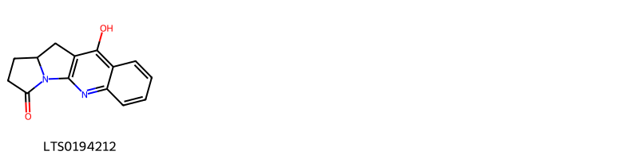{ width=100% }
    <figcaption>Hình ảnh cấu trúc hóa học của 1 hoạt chất thuộc nhóm Quinolines and derivatives gồm ['10-hydroxy-1h,2h,11h,11ah-pyrrolizino[3,2-b]quinolin-3-one (LTS0194212)'].</figcaption>
</figure>
#### Nhóm Tannins
<figure markdown="span">
    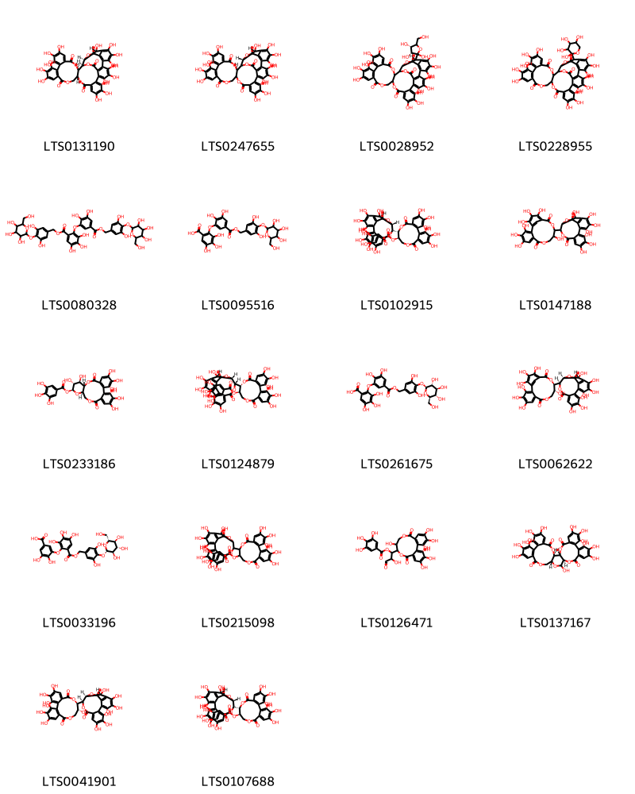{ width=100% }
    <figcaption>Hình ảnh cấu trúc hóa học của 18 hoạt chất thuộc nhóm Tannins gồm ['(1r,2r,20r,42s,46r)-7,8,9,12,13,14,25,26,27,30,31,32,35,36,37,46-hexadecahydroxy-3,18,21,41,43-pentaoxanonacyclo[27.13.3.1³⁸,⁴².0²,²⁰.0⁵,¹⁰.0¹¹,¹⁶.0²³,²⁸.0³³,⁴⁵.0³⁴,³⁹]hexatetraconta-5,7,9,11(16),12,14,23,25,27,29,31,33(45),34(39),35,37-pentadecaene-4,17,22,40,44-pentone (LTS0131190)', '(2r,42r,46r)-7,8,9,12,13,14,25,26,27,30,31,32,35,36,37,46-hexadecahydroxy-3,18,21,41,43-pentaoxanonacyclo[27.13.3.1³⁸,⁴².0²,²⁰.0⁵,¹⁰.0¹¹,¹⁶.0²³,²⁸.0³³,⁴⁵.0³⁴,³⁹]hexatetraconta-5,7,9,11(16),12,14,23,25,27,29,31,33(45),34(39),35,37-pentadecaene-4,17,22,40,44-pentone (LTS0247655)', '(46r)-7,8,9,12,13,14,25,26,27,30,31,32,35,36,37-pentadecahydroxy-46-[(3r,4s)-2,3,4-trihydroxy-5-(hydroxymethyl)oxolan-2-yl]-3,18,21,41,43-pentaoxanonacyclo[27.13.3.1³⁸,⁴².0²,²⁰.0⁵,¹⁰.0¹¹,¹⁶.0²³,²⁸.0³³,⁴⁵.0³⁴,³⁹]hexatetraconta-5,7,9,11(16),12,14,23,25,27,29,31,33(45),34(39),35,37-pentadecaene-4,17,22,40,44-pentone (LTS0028952)', '7,8,9,12,13,14,25,26,27,30,31,32,35,36,37-pentadecahydroxy-46-(2,3,4,5-tetrahydroxyoxan-2-yl)-3,18,21,41,43-pentaoxanonacyclo[27.13.3.1³⁸,⁴².0²,²⁰.0⁵,¹⁰.0¹¹,¹⁶.0²³,²⁸.0³³,⁴⁵.0³⁴,³⁹]hexatetraconta-5,7,9,11(16),12,14,23,25,27,29,31,33(45),34(39),35,37-pentadecaene-4,17,22,40,44-pentone (LTS0228955)', '(3,5-dihydroxy-4-{[3,4,5-trihydroxy-6-(hydroxymethyl)oxan-2-yl]oxy}phenyl)methyl 2-(5-{[(3,5-dihydroxy-4-{[3,4,5-trihydroxy-6-(hydroxymethyl)oxan-2-yl]oxy}phenyl)methoxy]carbonyl}-2,3-dihydroxyphenoxy)-3,4,5-trihydroxybenzoate (LTS0080328)', '2-(5-{[(3,5-dihydroxy-4-{[3,4,5-trihydroxy-6-(hydroxymethyl)oxan-2-yl]oxy}phenyl)methoxy]carbonyl}-2,3-dihydroxyphenoxy)-3,4,5-trihydroxybenzoic acid (LTS0095516)', '(11r,12r)-12-[(15s,19r)-2,3,4,7,8,9,19-heptahydroxy-12,17-dioxo-13,16-dioxatetracyclo[13.3.1.0⁵,¹⁸.0⁶,¹¹]nonadeca-1(18),2,4,6,8,10-hexaen-14-yl]-3,4,5,17,18,19-hexahydroxy-8,14-dioxo-9,13-dioxatricyclo[13.4.0.0²,⁷]nonadeca-1(15),2,4,6,16,18-hexaen-11-yl 3,4,5-trihydroxybenzoate (LTS0102915)', '14-{3,4,5,11,16,17,18-heptahydroxy-8,14-dioxo-9,13-dioxatricyclo[13.3.1.0²,⁷]nonadeca-1(19),2,4,6,15,17-hexaen-12-yl}-2,3,4,7,8,9,19-heptahydroxy-13,16-dioxatetracyclo[13.3.1.0⁵,¹⁸.0⁶,¹¹]nonadeca-1(18),2,4,6,8,10-hexaene-12,17-dione (LTS0147188)', '(10s,11r,12r,13s,15r)-3,4,5,11,12,21,22,23-octahydroxy-8,18-dioxo-9,14,17-trioxatetracyclo[17.4.0.0²,⁷.0¹⁰,¹⁵]tricosa-1(23),2(7),3,5,19,21-hexaen-13-yl 3,4,5-trihydroxybenzoate (LTS0233186)', '(11r,12r)-12-[(14r,15s,19s)-2,3,4,7,8,9,19-heptahydroxy-12,17-dioxo-13,16-dioxatetracyclo[13.3.1.0⁵,¹⁸.0⁶,¹¹]nonadeca-1(18),2,4,6,8,10-hexaen-14-yl]-3,4,5,17,18,19-hexahydroxy-8,14-dioxo-9,13-dioxatricyclo[13.4.0.0²,⁷]nonadeca-1(15),2,4,6,16,18-hexaen-11-yl 3,4,5-trihydroxybenzoate (LTS0124879)', '2-(5-{[(3,5-dihydroxy-4-{[(2s,3r,4s,5s,6r)-3,4,5-trihydroxy-6-(hydroxymethyl)oxan-2-yl]oxy}phenyl)methoxy]carbonyl}-2,3-dihydroxyphenoxy)-3,4,5-trihydroxybenzoic acid (LTS0261675)', '(14r,15s,19r)-14-[(11r,12r)-3,4,5,11,16,17,18-heptahydroxy-8,14-dioxo-9,13-dioxatricyclo[13.3.1.0²,⁷]nonadeca-1(19),2,4,6,15,17-hexaen-12-yl]-2,3,4,7,8,9,19-heptahydroxy-13,16-dioxatetracyclo[13.3.1.0⁵,¹⁸.0⁶,¹¹]nonadeca-1(18),2,4,6,8,10-hexaene-12,17-dione (LTS0062622)', '3-(6-{[(3,5-dihydroxy-4-{[(2s,3r,4s,5s,6r)-3,4,5-trihydroxy-6-(hydroxymethyl)oxan-2-yl]oxy}phenyl)methoxy]carbonyl}-2,3,4-trihydroxyphenoxy)-4,5-dihydroxybenzoic acid (LTS0033196)', '12-{2,3,4,7,8,9,19-heptahydroxy-12,17-dioxo-13,16-dioxatetracyclo[13.3.1.0⁵,¹⁸.0⁶,¹¹]nonadeca-1(18),2,4,6,8,10-hexaen-14-yl}-3,4,5,17,18,19-hexahydroxy-8,14-dioxo-9,13-dioxatricyclo[13.4.0.0²,⁷]nonadeca-1(15),2,4,6,16,18-hexaen-11-yl 3,4,5-trihydroxybenzoate (LTS0215098)', '1-{3,4,5,11,17,18,19-heptahydroxy-8,14-dioxo-9,13-dioxatricyclo[13.4.0.0²,⁷]nonadeca-1(15),2,4,6,16,18-hexaen-10-yl}-2-hydroxy-3-oxopropyl 3,4,5-trihydroxybenzoate (LTS0126471)', '(1r,2s,19r,22r)-7,8,9,12,13,14,20,28,29,30,33,34,35-tridecahydroxy-3,18,21,24,39-pentaoxaheptacyclo[20.17.0.0²,¹⁹.0⁵,¹⁰.0¹¹,¹⁶.0²⁶,³¹.0³²,³⁷]nonatriaconta-5(10),6,8,11,13,15,26(31),27,29,32,34,36-dodecaene-4,17,25,38-tetrone (LTS0137167)', '(14r,15s,19r)-14-[(10r,11r)-3,4,5,11,17,18,19-heptahydroxy-8,14-dioxo-9,13-dioxatricyclo[13.4.0.0²,⁷]nonadeca-1(15),2,4,6,16,18-hexaen-10-yl]-2,3,4,7,8,9,19-heptahydroxy-13,16-dioxatetracyclo[13.3.1.0⁵,¹⁸.0⁶,¹¹]nonadeca-1(18),2,4,6,8,10-hexaene-12,17-dione (LTS0041901)', '(11r,12r)-12-[(15s,19s)-2,3,4,7,8,9,19-heptahydroxy-12,17-dioxo-13,16-dioxatetracyclo[13.3.1.0⁵,¹⁸.0⁶,¹¹]nonadeca-1(18),2,4,6,8,10-hexaen-14-yl]-3,4,5,17,18,19-hexahydroxy-8,14-dioxo-9,13-dioxatricyclo[13.4.0.0²,⁷]nonadeca-1(15),2,4,6,16,18-hexaen-11-yl 3,4,5-trihydroxybenzoate (LTS0107688)'].</figcaption>
</figure>

---

### Dược dân tộc học

Danh sách các quốc gia có sử dụng *Castanea mollissima* trong điều trị các bệnh. 

| Country   | Disease   | Bệnh                                                                                                                                                                                                |
|:----------|:----------|:----------------------------------------------------------------------------------------------------------------------------------------------------------------------------------------------------|
| China     | Hemostat  | MYMEMORY WARNING: YOU USED ALL AVAILABLE FREE TRANSLATIONS FOR TODAY. NEXT AVAILABLE IN  13 HOURS 42 MINUTES 35 SECONDS VISIT HTTPS://MYMEMORY.TRANSLATED.NET/DOC/USAGELIMITS.PHP TO TRANSLATE MORE |

---

---
## Castanea sativa
### Thông tin về thực vật

!!! info "Phân loại thực vật của *Castanea sativa* từ GIBF:"
    - **Kingdom:** Plantae
    - **Phylum:** Tracheophyta
    - **Order:** Fagales
    - **Family:** Fagaceae
    - **Genus:** Castanea
    - **Species:** *Castanea sativa*

 

| Label (VI)   | Label (EN)   | Scientific Name   | Descriptions (VI)   | Descriptions (EN)   | Also Known As (VI)   | Also Known As (EN)                     |
|:-------------|:-------------|:------------------|:--------------------|:--------------------|:---------------------|:---------------------------------------|
| N/A          | N/A          | Castanea sativa   | loài thực vật       | species of plant    | ['Castanea sativa']  | ['Spanish chestnut', 'Sweet Chestnut'] |

#### Phân bố trên thế giới

**Từ CSDL GIBF** Italy, Belgium, Slovakia, Denmark, Netherlands, Spain, Portugal, Russian Federation, Sweden, Chile, Slovenia, Greece, South Africa, Germany, Brazil, Switzerland, Austria, France, United Kingdom of Great Britain and Northern Ireland, Ireland, New Zealand

#### Phân bố tại Việt Nam

**Từ CSDL GIBF**: Không có ghi nhận ở Việt Nam

---
### Thành phần hóa học
        
- Theo cơ sở dữ liệu lotus: Từ loài *Castanea sativa* đã phân lập và xác định được 87 hoạt chất thuộc về các nhóm Fatty Acyls, Flavonoids, Prenol lipids, Indoles and derivatives, Benzene and substituted derivatives, Organooxygen compounds, Tannins, Phenols, Carboxylic acids and derivatives. 

|    | chemicalTaxonomyClassyfireClass     |   smiles_count |
|---:|:------------------------------------|---------------:|
|  0 | Benzene and substituted derivatives |              7 |
|  1 | Carboxylic acids and derivatives    |             37 |
|  2 | Fatty Acyls                         |              1 |
|  3 | Flavonoids                          |             14 |
|  4 | Indoles and derivatives             |              2 |
|  5 | Organooxygen compounds              |              1 |
|  6 | Phenols                             |              1 |
|  7 | Prenol lipids                       |              4 |
|  8 | Tannins                             |             20 |

#### Nhóm Benzene and substituted derivatives
<figure markdown="span">
    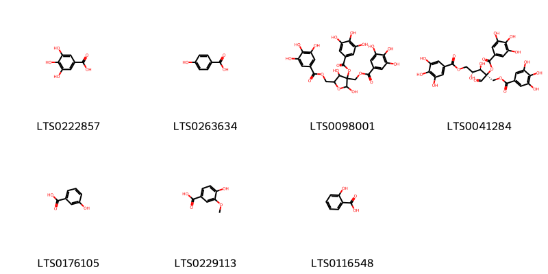{ width=100% }
    <figcaption>Hình ảnh cấu trúc hóa học của 7 hoạt chất thuộc nhóm Benzene and substituted derivatives gồm ['galop (LTS0222857)', 'p-hydroxybenzoic acid (LTS0263634)', '[2,4-dihydroxy-3-(3,4,5-trihydroxybenzoyloxy)-5-[(3,4,5-trihydroxybenzoyloxy)methyl]oxolan-3-yl]methyl 3,4,5-trihydroxybenzoate (LTS0098001)', '(2r,3r,4r)-3,4-dihydroxy-1-oxo-5-(3,4,5-trihydroxybenzoyloxy)-2-[(3,4,5-trihydroxybenzoyloxy)methyl]pentan-2-yl 3,4,5-trihydroxybenzoate (LTS0041284)', '3-hydroxybenzoic acid (LTS0176105)', 'vanillic acid (LTS0229113)', 'salicyclic acid (LTS0116548)'].</figcaption>
</figure>
#### Nhóm Carboxylic acids and derivatives
<figure markdown="span">
    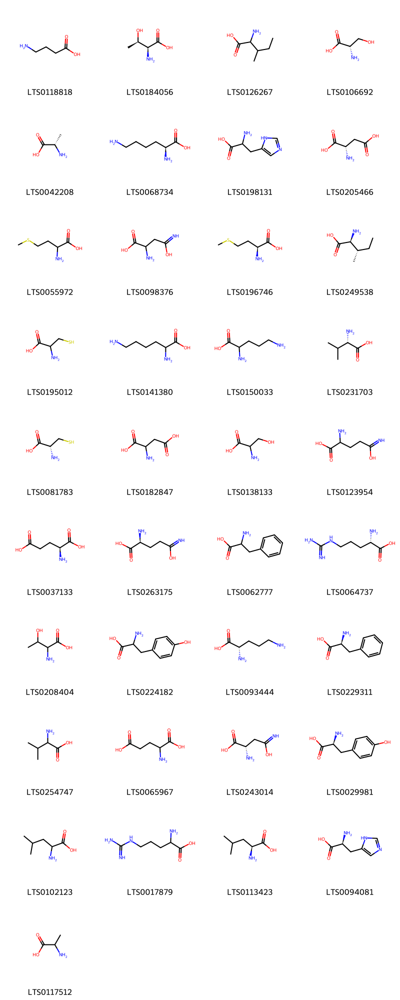{ width=100% }
    <figcaption>Hình ảnh cấu trúc hóa học của 37 hoạt chất thuộc nhóm Carboxylic acids and derivatives gồm ['gamma(amino)-butyric acid (LTS0118818)', 'l-threonine (LTS0184056)', 'lisoleucine (LTS0126267)', 'l-serine (LTS0106692)', 'l-alanine (LTS0042208)', 'l-lysine (LTS0068734)', 'histidine (LTS0198131)', 'l-aspartic acid (LTS0205466)', 'methionin (LTS0055972)', 'asparagine (LTS0098376)', 'l-methionine (LTS0196746)', 'l-isoleucine (LTS0249538)', 'cysteine (LTS0195012)', 'lysine (LTS0141380)', 'ornithine (LTS0150033)', 'l-valine (LTS0231703)', 'l-cysteine (LTS0081783)', 'aspartic acid (LTS0182847)', 'serin (LTS0138133)', 'glutamine (LTS0123954)', 'l-glutamic acid (LTS0037133)', 'l glutamine (LTS0263175)', 'phenylalanin (LTS0062777)', 'l-arginine (LTS0064737)', 'threonine(l) (LTS0208404)', 'tyrosin (LTS0224182)', 'l-ornithine (LTS0093444)', 'l-phenylalanine (LTS0229311)', 'valin (LTS0254747)', 'glutaminsaeure (LTS0065967)', 'aspartamate (LTS0243014)', 'l-tyrosine (LTS0029981)', 'leucine (LTS0102123)', 'arginine (LTS0017879)', 'l-leucine (LTS0113423)', 'l-histidine (LTS0094081)', 'alanine (LTS0117512)'].</figcaption>
</figure>
#### Nhóm Fatty Acyls
<figure markdown="span">
    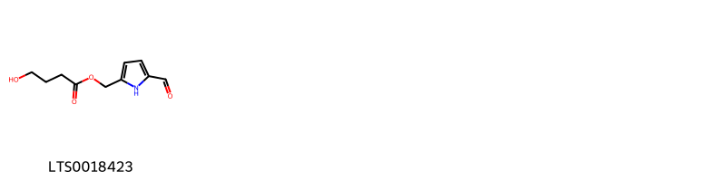{ width=100% }
    <figcaption>Hình ảnh cấu trúc hóa học của 1 hoạt chất thuộc nhóm Fatty Acyls gồm ['(5-formyl-1h-pyrrol-2-yl)methyl 4-hydroxybutanoate (LTS0018423)'].</figcaption>
</figure>
#### Nhóm Flavonoids
<figure markdown="span">
    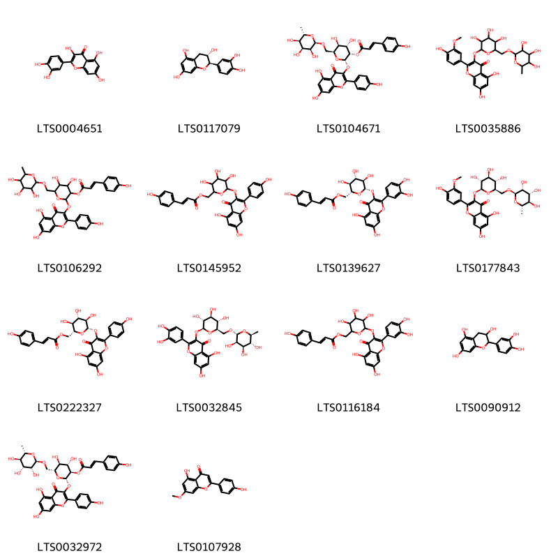{ width=100% }
    <figcaption>Hình ảnh cấu trúc hóa học của 14 hoạt chất thuộc nhóm Flavonoids gồm ['quercetin (LTS0004651)', '(+)-catechol (LTS0117079)', '(2s,3s,4s,5s,6s)-2-{[5,7-dihydroxy-2-(4-hydroxyphenyl)-4-oxochromen-3-yl]oxy}-4,5-dihydroxy-6-({[(2r,3s,4s,5r,6s)-3,4,5-trihydroxy-6-methyloxan-2-yl]oxy}methyl)oxan-3-yl (2e)-3-(4-hydroxyphenyl)prop-2-enoate (LTS0104671)', '5,7-dihydroxy-2-(4-hydroxy-3-methoxyphenyl)-3-[(3,4,5-trihydroxy-6-{[(3,4,5-trihydroxy-6-methyloxan-2-yl)oxy]methyl}oxan-2-yl)oxy]chromen-4-one (LTS0035886)', '2-{[5,7-dihydroxy-2-(4-hydroxyphenyl)-4-oxochromen-3-yl]oxy}-4,5-dihydroxy-6-{[(3,4,5-trihydroxy-6-methyloxan-2-yl)oxy]methyl}oxan-3-yl 3-(4-hydroxyphenyl)prop-2-enoate (LTS0106292)', '(6-{[5,7-dihydroxy-2-(4-hydroxyphenyl)-4-oxochromen-3-yl]oxy}-3,4,5-trihydroxyoxan-2-yl)methyl 3-(4-hydroxyphenyl)prop-2-enoate (LTS0145952)', '[(2r,3s,4s,5r,6s)-6-{[2-(3,4-dihydroxyphenyl)-5,7-dihydroxy-4-oxochromen-3-yl]oxy}-3,4,5-trihydroxyoxan-2-yl]methyl (2e)-3-(4-hydroxyphenyl)prop-2-enoate (LTS0139627)', 'narcissin (LTS0177843)', 'tiliroside (LTS0222327)', '3-rutinosyl quercetin (LTS0032845)', '(6-{[2-(3,4-dihydroxyphenyl)-5,7-dihydroxy-4-oxochromen-3-yl]oxy}-3,4,5-trihydroxyoxan-2-yl)methyl 3-(4-hydroxyphenyl)prop-2-enoate (LTS0116184)', 'catechol (LTS0090912)', '(2s,3r,4s,5s,6r)-2-{[5,7-dihydroxy-2-(4-hydroxyphenyl)-4-oxochromen-3-yl]oxy}-4,5-dihydroxy-6-({[(2r,3r,4r,5r,6s)-3,4,5-trihydroxy-6-methyloxan-2-yl]oxy}methyl)oxan-3-yl (2e)-3-(4-hydroxyphenyl)prop-2-enoate (LTS0032972)', 'genkwanin (LTS0107928)'].</figcaption>
</figure>
#### Nhóm Indoles and derivatives
<figure markdown="span">
    { width=100% }
    <figcaption>Hình ảnh cấu trúc hóa học của 2 hoạt chất thuộc nhóm Indoles and derivatives gồm ['l-tryptophan (LTS0263809)', 'optimax (LTS0014343)'].</figcaption>
</figure>
#### Nhóm Organooxygen compounds
<figure markdown="span">
    { width=100% }
    <figcaption>Hình ảnh cấu trúc hóa học của 1 hoạt chất thuộc nhóm Organooxygen compounds gồm ['chlorogenic acid (LTS0226495)'].</figcaption>
</figure>
#### Nhóm Phenols
<figure markdown="span">
    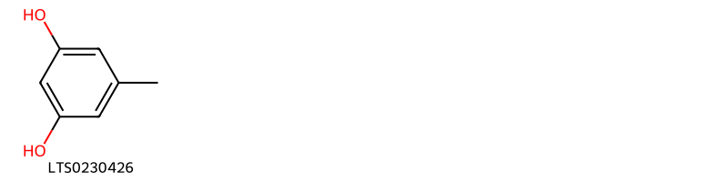{ width=100% }
    <figcaption>Hình ảnh cấu trúc hóa học của 1 hoạt chất thuộc nhóm Phenols gồm ['orcinol (LTS0230426)'].</figcaption>
</figure>
#### Nhóm Prenol lipids
<figure markdown="span">
    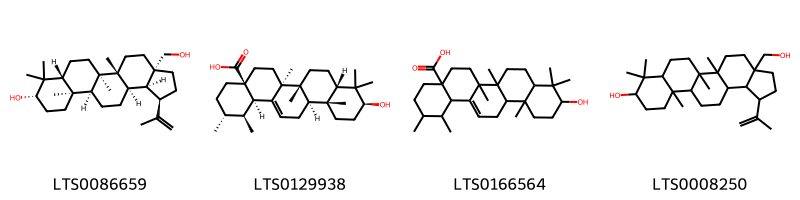{ width=100% }
    <figcaption>Hình ảnh cấu trúc hóa học của 4 hoạt chất thuộc nhóm Prenol lipids gồm ['(1r,3as,5ar,5br,7ar,9s,11ar,11bs,13ar,13bs)-3a-(hydroxymethyl)-5a,5b,8,8,11a-pentamethyl-1-(prop-1-en-2-yl)-hexadecahydrocyclopenta[a]chrysen-9-ol (LTS0086659)', '(1s,2r,4as,6as,6br,8as,10s,12ar,12br,14br)-10-hydroxy-1,2,6a,6b,9,9,12a-heptamethyl-2,3,4,5,6,7,8,8a,10,11,12,12b,13,14b-tetradecahydro-1h-picene-4a-carboxylic acid (LTS0129938)', '10-hydroxy-1,2,6a,6b,9,9,12a-heptamethyl-2,3,4,5,6,7,8,8a,10,11,12,12b,13,14b-tetradecahydro-1h-picene-4a-carboxylic acid (LTS0166564)', '3a-(hydroxymethyl)-5a,5b,8,8,11a-pentamethyl-1-(prop-1-en-2-yl)-hexadecahydrocyclopenta[a]chrysen-9-ol (LTS0008250)'].</figcaption>
</figure>
#### Nhóm Tannins
<figure markdown="span">
    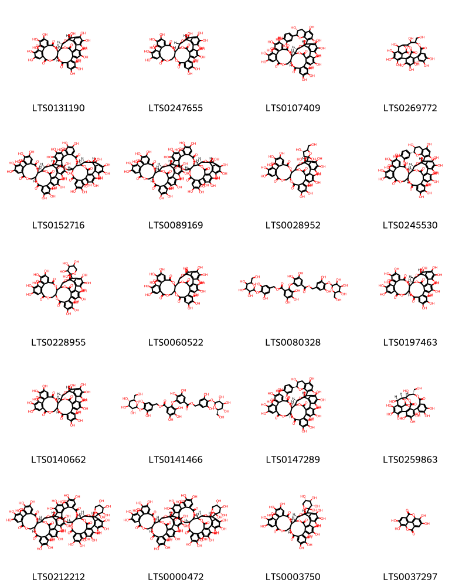{ width=100% }
    <figcaption>Hình ảnh cấu trúc hóa học của 20 hoạt chất thuộc nhóm Tannins gồm ['(1r,2r,20r,42s,46r)-7,8,9,12,13,14,25,26,27,30,31,32,35,36,37,46-hexadecahydroxy-3,18,21,41,43-pentaoxanonacyclo[27.13.3.1³⁸,⁴².0²,²⁰.0⁵,¹⁰.0¹¹,¹⁶.0²³,²⁸.0³³,⁴⁵.0³⁴,³⁹]hexatetraconta-5,7,9,11(16),12,14,23,25,27,29,31,33(45),34(39),35,37-pentadecaene-4,17,22,40,44-pentone (LTS0131190)', '(2r,42r,46r)-7,8,9,12,13,14,25,26,27,30,31,32,35,36,37,46-hexadecahydroxy-3,18,21,41,43-pentaoxanonacyclo[27.13.3.1³⁸,⁴².0²,²⁰.0⁵,¹⁰.0¹¹,¹⁶.0²³,²⁸.0³³,⁴⁵.0³⁴,³⁹]hexatetraconta-5,7,9,11(16),12,14,23,25,27,29,31,33(45),34(39),35,37-pentadecaene-4,17,22,40,44-pentone (LTS0247655)', '(1s,2s,20s,42s,46r)-46-[(3r)-2-(3,4-dihydroxyphenyl)-3,5,7-trihydroxy-3,4-dihydro-2h-1-benzopyran-8-yl]-7,8,9,12,13,14,25,26,27,30,31,32,35,36,37-pentadecahydroxy-3,18,21,41,43-pentaoxanonacyclo[27.13.3.1³⁸,⁴².0²,²⁰.0⁵,¹⁰.0¹¹,¹⁶.0²³,²⁸.0³³,⁴⁵.0³⁴,³⁹]hexatetraconta-5,7,9,11(16),12,14,23,25,27,29,31,33(45),34(39),35,37-pentadecaene-4,17,22,40,44-pentone (LTS0107409)', '7,8,9,12,13,14,17,18,19,25,29-undecahydroxy-24-(hydroxymethyl)-3,23,26-trioxahexacyclo[13.10.3.1²,⁶.0⁵,¹⁰.0¹¹,²⁸.0¹⁶,²¹]nonacosa-5,7,9,11,13,15(28),16(21),17,19-nonaene-4,22,27-trione (LTS0269772)', '(1r,2r,20r,42s,46s)-7,8,9,12,13,14,25,26,27,30,31,32,35,36,37,46-hexadecahydroxy-15-[(1r,2r,20r,42s,46s)-7,8,9,12,13,14,25,26,27,30,31,32,35,36,37-pentadecahydroxy-4,17,22,40,44-pentaoxo-3,18,21,41,43-pentaoxanonacyclo[27.13.3.1³⁸,⁴².0²,²⁰.0⁵,¹⁰.0¹¹,¹⁶.0²³,²⁸.0³³,⁴⁵.0³⁴,³⁹]hexatetraconta-5,7,9,11(16),12,14,23,25,27,29,31,33(45),34(39),35,37-pentadecaen-46-yl]-3,18,21,41,43-pentaoxanonacyclo[27.13.3.1³⁸,⁴².0²,²⁰.0⁵,¹⁰.0¹¹,¹⁶.0²³,²⁸.0³³,⁴⁵.0³⁴,³⁹]hexatetraconta-5,7,9,11(16),12,14,23,25,27,29,31,33(45),34(39),35,37-pentadecaene-4,17,22,40,44-pentone (LTS0152716)', '(1s,2r,20r,42s,46r)-7,8,9,12,13,14,25,26,27,30,31,32,35,36,37,46-hexadecahydroxy-15-[(1s,2s,20s,42s,46r)-7,8,9,12,13,14,25,26,27,30,31,32,35,36,37-pentadecahydroxy-4,17,22,40,44-pentaoxo-3,18,21,41,43-pentaoxanonacyclo[27.13.3.1³⁸,⁴².0²,²⁰.0⁵,¹⁰.0¹¹,¹⁶.0²³,²⁸.0³³,⁴⁵.0³⁴,³⁹]hexatetraconta-5,7,9,11(16),12,14,23,25,27,29,31,33(45),34(39),35,37-pentadecaen-46-yl]-3,18,21,41,43-pentaoxanonacyclo[27.13.3.1³⁸,⁴².0²,²⁰.0⁵,¹⁰.0¹¹,¹⁶.0²³,²⁸.0³³,⁴⁵.0³⁴,³⁹]hexatetraconta-5,7,9,11(16),12,14,23,25,27,29,31,33(45),34(39),35,37-pentadecaene-4,17,22,40,44-pentone (LTS0089169)', '(46r)-7,8,9,12,13,14,25,26,27,30,31,32,35,36,37-pentadecahydroxy-46-[(3r,4s)-2,3,4-trihydroxy-5-(hydroxymethyl)oxolan-2-yl]-3,18,21,41,43-pentaoxanonacyclo[27.13.3.1³⁸,⁴².0²,²⁰.0⁵,¹⁰.0¹¹,¹⁶.0²³,²⁸.0³³,⁴⁵.0³⁴,³⁹]hexatetraconta-5,7,9,11(16),12,14,23,25,27,29,31,33(45),34(39),35,37-pentadecaene-4,17,22,40,44-pentone (LTS0028952)', '(1r,2r,20r,42s,46s)-46-[(2r,3s)-2-(3,4-dihydroxyphenyl)-3,5,7-trihydroxy-3,4-dihydro-2h-1-benzopyran-8-yl]-7,8,9,12,13,14,25,26,27,30,31,32,35,36,37-pentadecahydroxy-3,18,21,41,43-pentaoxanonacyclo[27.13.3.1³⁸,⁴².0²,²⁰.0⁵,¹⁰.0¹¹,¹⁶.0²³,²⁸.0³³,⁴⁵.0³⁴,³⁹]hexatetraconta-5,7,9,11(16),12,14,23,25,27,29,31,33(45),34(39),35,37-pentadecaene-4,17,22,40,44-pentone (LTS0245530)', '7,8,9,12,13,14,25,26,27,30,31,32,35,36,37-pentadecahydroxy-46-(2,3,4,5-tetrahydroxyoxan-2-yl)-3,18,21,41,43-pentaoxanonacyclo[27.13.3.1³⁸,⁴².0²,²⁰.0⁵,¹⁰.0¹¹,¹⁶.0²³,²⁸.0³³,⁴⁵.0³⁴,³⁹]hexatetraconta-5,7,9,11(16),12,14,23,25,27,29,31,33(45),34(39),35,37-pentadecaene-4,17,22,40,44-pentone (LTS0228955)', '7,8,9,12,13,14,25,26,27,30,31,32,35,36,37,46-hexadecahydroxy-3,18,21,41,43-pentaoxanonacyclo[27.13.3.1³⁸,⁴².0²,²⁰.0⁵,¹⁰.0¹¹,¹⁶.0²³,²⁸.0³³,⁴⁵.0³⁴,³⁹]hexatetraconta-5,7,9,11(16),12,14,23,25,27,29,31,33(45),34(39),35,37-pentadecaene-4,17,22,40,44-pentone (LTS0060522)', '(3,5-dihydroxy-4-{[3,4,5-trihydroxy-6-(hydroxymethyl)oxan-2-yl]oxy}phenyl)methyl 2-(5-{[(3,5-dihydroxy-4-{[3,4,5-trihydroxy-6-(hydroxymethyl)oxan-2-yl]oxy}phenyl)methoxy]carbonyl}-2,3-dihydroxyphenoxy)-3,4,5-trihydroxybenzoate (LTS0080328)', '(1r,2r,20r,42r,46s)-7,8,9,12,13,14,25,26,27,30,31,32,35,36,37,46-hexadecahydroxy-3,18,21,41,43-pentaoxanonacyclo[27.13.3.1³⁸,⁴².0²,²⁰.0⁵,¹⁰.0¹¹,¹⁶.0²³,²⁸.0³³,⁴⁵.0³⁴,³⁹]hexatetraconta-5,7,9,11(16),12,14,23,25,27,29,31,33(45),34(39),35,37-pentadecaene-4,17,22,40,44-pentone (LTS0197463)', '(1s,2s,20s,42s,46r)-7,8,9,12,13,14,25,26,27,30,31,32,35,36,37,46-hexadecahydroxy-3,18,21,41,43-pentaoxanonacyclo[27.13.3.1³⁸,⁴².0²,²⁰.0⁵,¹⁰.0¹¹,¹⁶.0²³,²⁸.0³³,⁴⁵.0³⁴,³⁹]hexatetraconta-5,7,9,11(16),12,14,23,25,27,29,31,33(45),34(39),35,37-pentadecaene-4,17,22,40,44-pentone (LTS0140662)', '(3,5-dihydroxy-4-{[(2s,3r,4s,5s,6r)-3,4,5-trihydroxy-6-(hydroxymethyl)oxan-2-yl]oxy}phenyl)methyl 2-(5-{[(3,5-dihydroxy-4-{[(2s,3r,4s,5s,6r)-3,4,5-trihydroxy-6-(hydroxymethyl)oxan-2-yl]oxy}phenyl)methoxy]carbonyl}-2,3-dihydroxyphenoxy)-3,4,5-trihydroxybenzoate (LTS0141466)', '(1r,2r,20r,42s,46r)-46-[(2s,3s)-2-(3,4-dihydroxyphenyl)-3,5,7-trihydroxy-3,4-dihydro-2h-1-benzopyran-8-yl]-7,8,9,12,13,14,25,26,27,30,31,32,35,36,37-pentadecahydroxy-3,18,21,41,43-pentaoxanonacyclo[27.13.3.1³⁸,⁴².0²,²⁰.0⁵,¹⁰.0¹¹,¹⁶.0²³,²⁸.0³³,⁴⁵.0³⁴,³⁹]hexatetraconta-5,7,9,11(16),12,14,23,25,27,29,31,33(45),34(39),35,37-pentadecaene-4,17,22,40,44-pentone (LTS0147289)', '(1r,2s,24s,25r,29r)-7,8,9,12,13,14,17,18,19,25,29-undecahydroxy-24-(hydroxymethyl)-3,23,26-trioxahexacyclo[13.10.3.1²,⁶.0⁵,¹⁰.0¹¹,²⁸.0¹⁶,²¹]nonacosa-5,7,9,11,13,15(28),16(21),17,19-nonaene-4,22,27-trione (LTS0259863)', '(1s,2s,20s,42s,46s)-7,8,9,12,13,14,25,26,27,30,31,32,35,36,37-pentadecahydroxy-15-[(1s,2s,20s,46r)-7,8,9,12,13,14,25,26,27,30,31,32,35,36,37-pentadecahydroxy-4,17,22,40,44-pentaoxo-3,18,21,41,43-pentaoxanonacyclo[27.13.3.1³⁸,⁴².0²,²⁰.0⁵,¹⁰.0¹¹,¹⁶.0²³,²⁸.0³³,⁴⁵.0³⁴,³⁹]hexatetraconta-5,7,9,11(16),12,14,23,25,27,29,31,33(45),34(39),35,37-pentadecaen-46-yl]-46-[(3r,4r,5s)-2,3,4,5-tetrahydroxyoxan-2-yl]-3,18,21,41,43-pentaoxanonacyclo[27.13.3.1³⁸,⁴².0²,²⁰.0⁵,¹⁰.0¹¹,¹⁶.0²³,²⁸.0³³,⁴⁵.0³⁴,³⁹]hexatetraconta-5,7,9,11(16),12,14,23,25,27,29,31,33(45),34(39),35,37-pentadecaene-4,17,22,40,44-pentone (LTS0212212)', '(1s,2s,20s,42s,46s)-7,8,9,12,13,14,25,26,27,30,31,32,35,36,37-pentadecahydroxy-15-[(1s,2s,20s,46r)-7,8,9,12,13,14,25,26,27,30,31,32,35,36,37-pentadecahydroxy-4,17,22,40,44-pentaoxo-3,18,21,41,43-pentaoxanonacyclo[27.13.3.1³⁸,⁴².0²,²⁰.0⁵,¹⁰.0¹¹,¹⁶.0²³,²⁸.0³³,⁴⁵.0³⁴,³⁹]hexatetraconta-5,7,9,11(16),12,14,23,25,27,29,31,33(45),34(39),35,37-pentadecaen-46-yl]-46-[(3s,4r,5s)-2,3,4,5-tetrahydroxyoxan-2-yl]-3,18,21,41,43-pentaoxanonacyclo[27.13.3.1³⁸,⁴².0²,²⁰.0⁵,¹⁰.0¹¹,¹⁶.0²³,²⁸.0³³,⁴⁵.0³⁴,³⁹]hexatetraconta-5,7,9,11(16),12,14,23,25,27,29,31,33(45),34(39),35,37-pentadecaene-4,17,22,40,44-pentone (LTS0000472)', '(1s,2s,20s,42s,46s)-7,8,9,12,13,14,25,26,27,30,31,32,35,36,37-pentadecahydroxy-46-[(3s,4r,5s)-2,3,4,5-tetrahydroxyoxan-2-yl]-3,18,21,41,43-pentaoxanonacyclo[27.13.3.1³⁸,⁴².0²,²⁰.0⁵,¹⁰.0¹¹,¹⁶.0²³,²⁸.0³³,⁴⁵.0³⁴,³⁹]hexatetraconta-5,7,9,11(16),12,14,23,25,27,29,31,33(45),34(39),35,37-pentadecaene-4,17,22,40,44-pentone (LTS0003750)', 'ellagic acid (LTS0037297)'].</figcaption>
</figure>

---

### Dược dân tộc học

Danh sách các quốc gia có sử dụng *Castanea sativa* trong điều trị các bệnh. 

| Country   | Disease                     | Bệnh                                                                                                                                                                                                |
|:----------|:----------------------------|:----------------------------------------------------------------------------------------------------------------------------------------------------------------------------------------------------|
| China     | Cosmetic                    | MYMEMORY WARNING: YOU USED ALL AVAILABLE FREE TRANSLATIONS FOR TODAY. NEXT AVAILABLE IN  13 HOURS 41 MINUTES 57 SECONDS VISIT HTTPS://MYMEMORY.TRANSLATED.NET/DOC/USAGELIMITS.PHP TO TRANSLATE MORE |
| Elsewhere | Astringent, Tonic           | MYMEMORY WARNING: YOU USED ALL AVAILABLE FREE TRANSLATIONS FOR TODAY. NEXT AVAILABLE IN  13 HOURS 41 MINUTES 54 SECONDS VISIT HTTPS://MYMEMORY.TRANSLATED.NET/DOC/USAGELIMITS.PHP TO TRANSLATE MORE |
| Turkey    | Sedative, Tonic, Astringent | MYMEMORY WARNING: YOU USED ALL AVAILABLE FREE TRANSLATIONS FOR TODAY. NEXT AVAILABLE IN  13 HOURS 41 MINUTES 51 SECONDS VISIT HTTPS://MYMEMORY.TRANSLATED.NET/DOC/USAGELIMITS.PHP TO TRANSLATE MORE |
| ain       | Astringent                  | MYMEMORY WARNING: YOU USED ALL AVAILABLE FREE TRANSLATIONS FOR TODAY. NEXT AVAILABLE IN  13 HOURS 41 MINUTES 48 SECONDS VISIT HTTPS://MYMEMORY.TRANSLATED.NET/DOC/USAGELIMITS.PHP TO TRANSLATE MORE |

---

# Chi Quercus

??? note "Danh sách các dược liệu thuộc chi"
    
	 - *Quercus acutissima*
	 - *Quercus alba*
	 - *Quercus dentata*
	 - *Quercus fusiformis*
	 - *Quercus ilex*
	 - *Quercus incana*
	 - *Quercus infectoria*
	 - *Quercus lamellosa*
	 - *Quercus lyrata*
	 - *Quercus persica*
	 - *Quercus robur*
	 - *Quercus serrata*
	 - *Quercus velutina*

---
## Quercus acutissima
### Thông tin về thực vật

!!! info "Phân loại thực vật của *Quercus acutissima* từ GIBF:"
    - **Kingdom:** Plantae
    - **Phylum:** Tracheophyta
    - **Order:** Fagales
    - **Family:** Fagaceae
    - **Genus:** Quercus
    - **Species:** *Quercus acutissima*

 

| Label (VI)   | Label (EN)   | Scientific Name    | Descriptions (VI)   | Descriptions (EN)   | Also Known As (VI)   | Also Known As (EN)                                              |
|:-------------|:-------------|:-------------------|:--------------------|:--------------------|:---------------------|:----------------------------------------------------------------|
| N/A          | N/A          | Quercus acutissima | loài thực vật       | species of plant    | ['']                 | ['bristle oak', 'Chinese oak', 'saw-tooth oak', 'sawtooth oak'] |

#### Phân bố trên thế giới

**Từ CSDL GIBF** nan, South Africa, Japan, Korea, Republic of, Chinese Taipei, United States of America, Poland, China

#### Phân bố tại Việt Nam

**Từ CSDL GIBF**: Không có ghi nhận ở Việt Nam

---
### Thành phần hóa học
        
- Theo cơ sở dữ liệu lotus: Từ loài *Quercus acutissima* đã phân lập và xác định được 35 hoạt chất thuộc về các nhóm Flavonoids, Organooxygen compounds, Tannins, Benzene and substituted derivatives. 

|    | chemicalTaxonomyClassyfireClass     |   smiles_count |
|---:|:------------------------------------|---------------:|
|  0 | Benzene and substituted derivatives |              1 |
|  1 | Flavonoids                          |              6 |
|  2 | Organooxygen compounds              |              6 |
|  3 | Tannins                             |             22 |

#### Nhóm Benzene and substituted derivatives
<figure markdown="span">
    { width=100% }
    <figcaption>Hình ảnh cấu trúc hóa học của 1 hoạt chất thuộc nhóm Benzene and substituted derivatives gồm ['galop (LTS0222857)'].</figcaption>
</figure>
#### Nhóm Flavonoids
<figure markdown="span">
    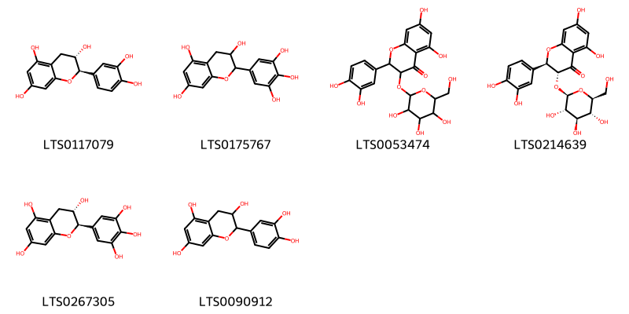{ width=100% }
    <figcaption>Hình ảnh cấu trúc hóa học của 6 hoạt chất thuộc nhóm Flavonoids gồm ['(+)-catechol (LTS0117079)', 'epigallocatechin (LTS0175767)', '2-(3,4-dihydroxyphenyl)-5,7-dihydroxy-3-{[3,4,5-trihydroxy-6-(hydroxymethyl)oxan-2-yl]oxy}-2,3-dihydro-1-benzopyran-4-one (LTS0053474)', '(2r,3r)-2-(3,4-dihydroxyphenyl)-5,7-dihydroxy-3-{[(2r,3s,4r,5r,6s)-3,4,5-trihydroxy-6-(hydroxymethyl)oxan-2-yl]oxy}-2,3-dihydro-1-benzopyran-4-one (LTS0214639)', 'gallocatechol (LTS0267305)', 'catechol (LTS0090912)'].</figcaption>
</figure>
#### Nhóm Organooxygen compounds
<figure markdown="span">
    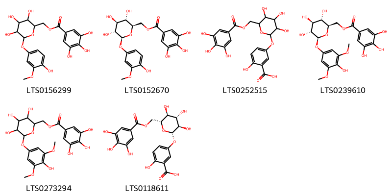{ width=100% }
    <figcaption>Hình ảnh cấu trúc hóa học của 6 hoạt chất thuộc nhóm Organooxygen compounds gồm ['[3,4,5-trihydroxy-6-(4-hydroxy-3-methoxyphenoxy)oxan-2-yl]methyl 3,4,5-trihydroxybenzoate (LTS0156299)', '[(2r,3s,4s,5r,6s)-3,4,5-trihydroxy-6-(4-hydroxy-3-methoxyphenoxy)oxan-2-yl]methyl 3,4,5-trihydroxybenzoate (LTS0152670)', '2-hydroxy-5-({3,4,5-trihydroxy-6-[(3,4,5-trihydroxybenzoyloxy)methyl]oxan-2-yl}oxy)benzoic acid (LTS0252515)', '[(2r,3s,4s,5r,6s)-3,4,5-trihydroxy-6-(4-hydroxy-3,5-dimethoxyphenoxy)oxan-2-yl]methyl 3,4,5-trihydroxybenzoate (LTS0239610)', '[3,4,5-trihydroxy-6-(4-hydroxy-3,5-dimethoxyphenoxy)oxan-2-yl]methyl 3,4,5-trihydroxybenzoate (LTS0273294)', '2-hydroxy-5-{[(2s,3r,4s,5s,6r)-3,4,5-trihydroxy-6-[(3,4,5-trihydroxybenzoyloxy)methyl]oxan-2-yl]oxy}benzoic acid (LTS0118611)'].</figcaption>
</figure>
#### Nhóm Tannins
<figure markdown="span">
    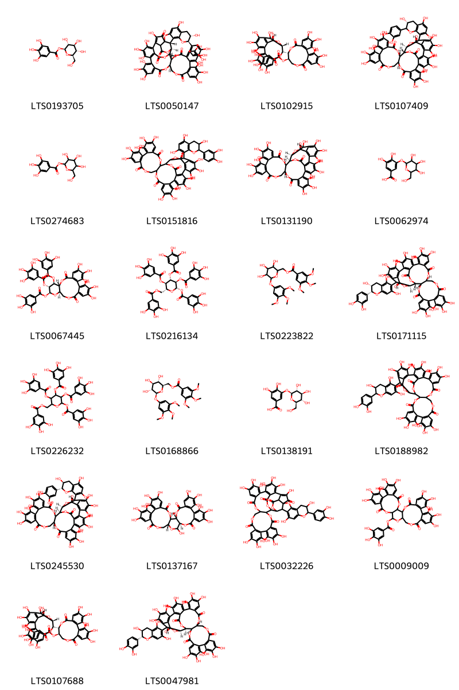{ width=100% }
    <figcaption>Hình ảnh cấu trúc hóa học của 22 hoạt chất thuộc nhóm Tannins gồm ['β-glucogallin (LTS0193705)', '(1r,2r,20r,44s,45r,49r,50s)-45-(3,4-dihydroxyphenyl)-7,8,9,12,13,14,25,26,27,30,31,32,35,41,44-pentadecahydroxy-3,18,21,38,46,51,54-heptaoxadodecacyclo[27.21.3.3³⁴,⁵⁰.0²,²⁰.0⁵,¹⁰.0¹¹,¹⁶.0²³,²⁸.0³³,⁵³.0³⁷,⁴⁹.0³⁹,⁴⁸.0⁴²,⁴⁷.0³⁷,⁵⁶]hexapentaconta-5,7,9,11(16),12,14,23,25,27,29,31,33(53),34,39,41,47-hexadecaene-4,17,22,36,52,55-hexone (LTS0050147)', '(11r,12r)-12-[(15s,19r)-2,3,4,7,8,9,19-heptahydroxy-12,17-dioxo-13,16-dioxatetracyclo[13.3.1.0⁵,¹⁸.0⁶,¹¹]nonadeca-1(18),2,4,6,8,10-hexaen-14-yl]-3,4,5,17,18,19-hexahydroxy-8,14-dioxo-9,13-dioxatricyclo[13.4.0.0²,⁷]nonadeca-1(15),2,4,6,16,18-hexaen-11-yl 3,4,5-trihydroxybenzoate (LTS0102915)', '(1s,2s,20s,42s,46r)-46-[(3r)-2-(3,4-dihydroxyphenyl)-3,5,7-trihydroxy-3,4-dihydro-2h-1-benzopyran-8-yl]-7,8,9,12,13,14,25,26,27,30,31,32,35,36,37-pentadecahydroxy-3,18,21,41,43-pentaoxanonacyclo[27.13.3.1³⁸,⁴².0²,²⁰.0⁵,¹⁰.0¹¹,¹⁶.0²³,²⁸.0³³,⁴⁵.0³⁴,³⁹]hexatetraconta-5,7,9,11(16),12,14,23,25,27,29,31,33(45),34(39),35,37-pentadecaene-4,17,22,40,44-pentone (LTS0107409)', '3,4,5-trihydroxy-6-(hydroxymethyl)oxan-2-yl 3,4,5-trihydroxybenzoate (LTS0274683)', '46-[2-(3,4-dihydroxyphenyl)-3,5,7-trihydroxy-3,4-dihydro-2h-1-benzopyran-8-yl]-7,8,9,12,13,14,25,26,27,30,31,32,35,36,37-pentadecahydroxy-3,18,21,41,43-pentaoxanonacyclo[27.13.3.1³⁸,⁴².0²,²⁰.0⁵,¹⁰.0¹¹,¹⁶.0²³,²⁸.0³³,⁴⁵.0³⁴,³⁹]hexatetraconta-5,7,9,11(16),12,14,23,25,27,29,31,33(45),34(39),35,37-pentadecaene-4,17,22,40,44-pentone (LTS0151816)', '(1r,2r,20r,42s,46r)-7,8,9,12,13,14,25,26,27,30,31,32,35,36,37,46-hexadecahydroxy-3,18,21,41,43-pentaoxanonacyclo[27.13.3.1³⁸,⁴².0²,²⁰.0⁵,¹⁰.0¹¹,¹⁶.0²³,²⁸.0³³,⁴⁵.0³⁴,³⁹]hexatetraconta-5,7,9,11(16),12,14,23,25,27,29,31,33(45),34(39),35,37-pentadecaene-4,17,22,40,44-pentone (LTS0131190)', '3,4-dihydroxy-5-{[3,4,5-trihydroxy-6-(hydroxymethyl)oxan-2-yl]oxy}benzoic acid (LTS0062974)', '(10r,11s,12r,13s,15r)-3,4,5,21,22,23-hexahydroxy-8,18-dioxo-12,13-bis(3,4,5-trihydroxybenzoyloxy)-9,14,17-trioxatetracyclo[17.4.0.0²,⁷.0¹⁰,¹⁵]tricosa-1(23),2(7),3,5,19,21-hexaen-11-yl 3,4,5-trihydroxybenzoate (LTS0067445)', '(2s,3r,4s,5r,6r)-3,4,5-tris(3,4,5-trihydroxybenzoyloxy)-6-[(3,4,5-trihydroxybenzoyloxy)methyl]oxan-2-yl 3,4,5-trihydroxybenzoate (LTS0216134)', '[3,4,5-trihydroxy-6-(3,4,5-trimethoxyphenoxy)oxan-2-yl]methyl 3,4,5-trimethoxybenzoate (LTS0223822)', '(1s,2s,20s,42s,46r)-46-[(2r,3r)-2-(3,4-dihydroxyphenyl)-3,5,7-trihydroxy-3,4-dihydro-2h-1-benzopyran-6-yl]-7,8,9,12,13,14,25,26,27,30,31,32,35,36,37-pentadecahydroxy-3,18,21,41,43-pentaoxanonacyclo[27.13.3.1³⁸,⁴².0²,²⁰.0⁵,¹⁰.0¹¹,¹⁶.0²³,²⁸.0³³,⁴⁵.0³⁴,³⁹]hexatetraconta-5,7,9,11(16),12,14,23,25,27,29,31,33(45),34(39),35,37-pentadecaene-4,17,22,40,44-pentone (LTS0171115)', '3,4,5-tris(3,4,5-trihydroxybenzoyloxy)-6-[(3,4,5-trihydroxybenzoyloxy)methyl]oxan-2-yl 3,4,5-trihydroxybenzoate (LTS0226232)', '[(2r,3s,4s,5r,6s)-3,4,5-trihydroxy-6-(3,4,5-trimethoxyphenoxy)oxan-2-yl]methyl 3,4,5-trimethoxybenzoate (LTS0168866)', '3,4-dihydroxy-5-{[(2s,3r,4s,5s,6r)-3,4,5-trihydroxy-6-(hydroxymethyl)oxan-2-yl]oxy}benzoic acid (LTS0138191)', '46-[2-(3,4-dihydroxyphenyl)-3,5,7-trihydroxy-3,4-dihydro-2h-1-benzopyran-6-yl]-7,8,9,12,13,14,25,26,27,30,31,32,35,36,37-pentadecahydroxy-3,18,21,41,43-pentaoxanonacyclo[27.13.3.1³⁸,⁴².0²,²⁰.0⁵,¹⁰.0¹¹,¹⁶.0²³,²⁸.0³³,⁴⁵.0³⁴,³⁹]hexatetraconta-5,7,9,11(16),12,14,23,25,27,29,31,33(45),34(39),35,37-pentadecaene-4,17,22,40,44-pentone (LTS0188982)', '(1r,2r,20r,42s,46s)-46-[(2r,3s)-2-(3,4-dihydroxyphenyl)-3,5,7-trihydroxy-3,4-dihydro-2h-1-benzopyran-8-yl]-7,8,9,12,13,14,25,26,27,30,31,32,35,36,37-pentadecahydroxy-3,18,21,41,43-pentaoxanonacyclo[27.13.3.1³⁸,⁴².0²,²⁰.0⁵,¹⁰.0¹¹,¹⁶.0²³,²⁸.0³³,⁴⁵.0³⁴,³⁹]hexatetraconta-5,7,9,11(16),12,14,23,25,27,29,31,33(45),34(39),35,37-pentadecaene-4,17,22,40,44-pentone (LTS0245530)', '(1r,2s,19r,22r)-7,8,9,12,13,14,20,28,29,30,33,34,35-tridecahydroxy-3,18,21,24,39-pentaoxaheptacyclo[20.17.0.0²,¹⁹.0⁵,¹⁰.0¹¹,¹⁶.0²⁶,³¹.0³²,³⁷]nonatriaconta-5(10),6,8,11,13,15,26(31),27,29,32,34,36-dodecaene-4,17,25,38-tetrone (LTS0137167)', '43-(3,4-dihydroxyphenyl)-7,8,9,12,13,14,25,26,27,30,31,32,35,42,47-pentadecahydroxy-3,18,21,38,44,51,54-heptaoxadodecacyclo[27.21.3.3³⁴,⁵⁰.0²,²⁰.0⁵,¹⁰.0¹¹,¹⁶.0²³,²⁸.0³³,⁵³.0³⁷,⁴⁹.0³⁹,⁴⁸.0⁴⁰,⁴⁵.0³⁷,⁵⁶]hexapentaconta-5,7,9,11(16),12,14,23,25,27,29,31,33(53),34,39,45,47-hexadecaene-4,17,22,36,52,55-hexone (LTS0032226)', '7,8,9,12,13,14,28,29,30,33,34,35-dodecahydroxy-4,17,25,38-tetraoxo-3,18,21,24,39-pentaoxaheptacyclo[20.17.0.0²,¹⁹.0⁵,¹⁰.0¹¹,¹⁶.0²⁶,³¹.0³²,³⁷]nonatriaconta-5,7,9,11(16),12,14,26,28,30,32(37),33,35-dodecaen-20-yl 3,4,5-trihydroxybenzoate (LTS0009009)', '(11r,12r)-12-[(15s,19s)-2,3,4,7,8,9,19-heptahydroxy-12,17-dioxo-13,16-dioxatetracyclo[13.3.1.0⁵,¹⁸.0⁶,¹¹]nonadeca-1(18),2,4,6,8,10-hexaen-14-yl]-3,4,5,17,18,19-hexahydroxy-8,14-dioxo-9,13-dioxatricyclo[13.4.0.0²,⁷]nonadeca-1(15),2,4,6,16,18-hexaen-11-yl 3,4,5-trihydroxybenzoate (LTS0107688)', '(1r,2r,20r,42s,46s)-46-[(2r,3s)-2-(3,4-dihydroxyphenyl)-3,5,7-trihydroxy-3,4-dihydro-2h-1-benzopyran-6-yl]-7,8,9,12,13,14,25,26,27,30,31,32,35,36,37-pentadecahydroxy-3,18,21,41,43-pentaoxanonacyclo[27.13.3.1³⁸,⁴².0²,²⁰.0⁵,¹⁰.0¹¹,¹⁶.0²³,²⁸.0³³,⁴⁵.0³⁴,³⁹]hexatetraconta-5,7,9,11(16),12,14,23,25,27,29,31,33(45),34(39),35,37-pentadecaene-4,17,22,40,44-pentone (LTS0047981)'].</figcaption>
</figure>

---

### Dược dân tộc học

Danh sách các quốc gia có sử dụng *Quercus acutissima* trong điều trị các bệnh. 

| Country   | Disease    | Bệnh                                                                                                                                                                                                |
|:----------|:-----------|:----------------------------------------------------------------------------------------------------------------------------------------------------------------------------------------------------|
| Elsewhere | Astringent | MYMEMORY WARNING: YOU USED ALL AVAILABLE FREE TRANSLATIONS FOR TODAY. NEXT AVAILABLE IN  13 HOURS 41 MINUTES 10 SECONDS VISIT HTTPS://MYMEMORY.TRANSLATED.NET/DOC/USAGELIMITS.PHP TO TRANSLATE MORE |

---

---
## Quercus alba
### Thông tin về thực vật

!!! info "Phân loại thực vật của *Quercus alba* từ GIBF:"
    - **Kingdom:** Plantae
    - **Phylum:** Tracheophyta
    - **Order:** Fagales
    - **Family:** Fagaceae
    - **Genus:** Quercus
    - **Species:** *Quercus alba*

 

| Label (VI)   | Label (EN)   | Scientific Name   | Descriptions (VI)   | Descriptions (EN)   | Also Known As (VI)   | Also Known As (EN)                              |
|:-------------|:-------------|:------------------|:--------------------|:--------------------|:---------------------|:------------------------------------------------|
| N/A          | N/A          | Quercus alba      | loài thực vật       | species of plant    | ['']                 | ['eastern white oak', 'stave oak', 'white oak'] |

#### Phân bố trên thế giới

**Từ CSDL GIBF** United States of America, Canada

#### Phân bố tại Việt Nam

**Từ CSDL GIBF**: Không có ghi nhận ở Việt Nam

---
### Thành phần hóa học
        
- Theo cơ sở dữ liệu lotus: Từ loài *Quercus alba* đã phân lập và xác định được 16 hoạt chất thuộc về các nhóm Cinnamic acids and derivatives, Tannins, Benzene and substituted derivatives. 

|    | chemicalTaxonomyClassyfireClass     |   smiles_count |
|---:|:------------------------------------|---------------:|
|  0 | Benzene and substituted derivatives |              1 |
|  1 | Cinnamic acids and derivatives      |              2 |
|  2 | Tannins                             |             13 |

#### Nhóm Benzene and substituted derivatives
<figure markdown="span">
    { width=100% }
    <figcaption>Hình ảnh cấu trúc hóa học của 1 hoạt chất thuộc nhóm Benzene and substituted derivatives gồm ['salicyclic acid (LTS0116548)'].</figcaption>
</figure>
#### Nhóm Cinnamic acids and derivatives
<figure markdown="span">
    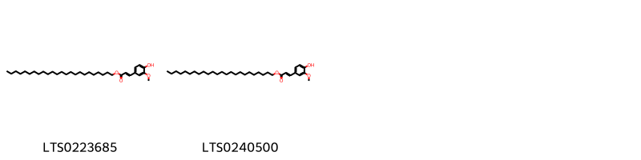{ width=100% }
    <figcaption>Hình ảnh cấu trúc hóa học của 2 hoạt chất thuộc nhóm Cinnamic acids and derivatives gồm ['tetracosyl (2e)-3-(4-hydroxy-3-methoxyphenyl)prop-2-enoate (LTS0223685)', 'tetracosyl 3-(4-hydroxy-3-methoxyphenyl)prop-2-enoate (LTS0240500)'].</figcaption>
</figure>
#### Nhóm Tannins
<figure markdown="span">
    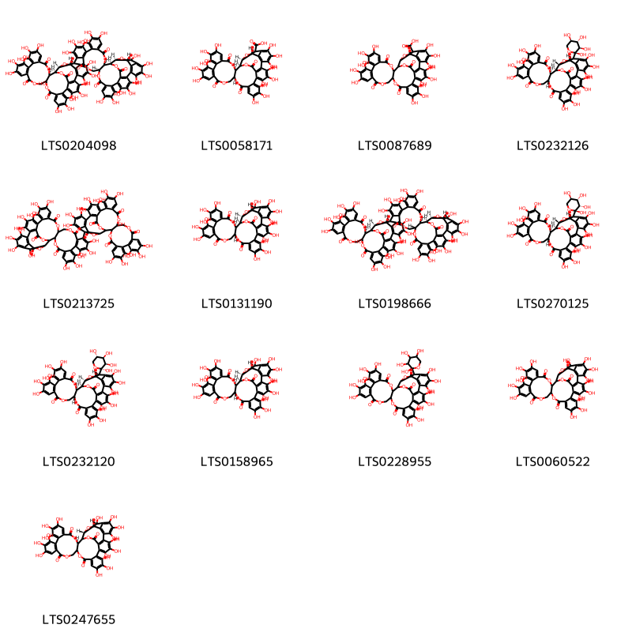{ width=100% }
    <figcaption>Hình ảnh cấu trúc hóa học của 13 hoạt chất thuộc nhóm Tannins gồm ['(1r,2s,20s,42s,46s)-46-[(1r,2r,20s,42s,46s)-7,8,9,12,13,14,25,26,27,30,31,32,35,36,37,46-hexadecahydroxy-4,17,22,40,44-pentaoxo-3,18,21,41,43-pentaoxanonacyclo[27.13.3.1³⁸,⁴².0²,²⁰.0⁵,¹⁰.0¹¹,¹⁶.0²³,²⁸.0³³,⁴⁵.0³⁴,³⁹]hexatetraconta-5,7,9,11(16),12,14,23,25,27,29,31,33(45),34(39),35,37-pentadecaen-15-yl]-7,8,9,12,13,14,20,25,26,27,30,31,32,35,36,37-hexadecahydroxy-3,18,21,41,43-pentaoxanonacyclo[27.13.3.1³⁸,⁴².0²,²⁰.0⁵,¹⁰.0¹¹,¹⁶.0²³,²⁸.0³³,⁴⁵.0³⁴,³⁹]hexatetraconta-5,7,9,11(16),12,14,23,25,27,29,31,33(45),34(39),35,37-pentadecaene-4,17,22,40,44-pentone (LTS0204098)', '(1r,2r,20s,42s,46s)-7,8,9,12,13,14,25,26,27,30,31,32,35,36,37-pentadecahydroxy-4,17,22,40,44-pentaoxo-3,18,21,41,43-pentaoxanonacyclo[27.13.3.1³⁸,⁴².0²,²⁰.0⁵,¹⁰.0¹¹,¹⁶.0²³,²⁸.0³³,⁴⁵.0³⁴,³⁹]hexatetraconta-5,7,9,11(16),12,14,23,25,27,29,31,33(45),34(39),35,37-pentadecaene-46-carboxylic acid (LTS0058171)', '7,8,9,12,13,14,25,26,27,30,31,32,35,36,37-pentadecahydroxy-4,17,22,40,44-pentaoxo-3,18,21,41,43-pentaoxanonacyclo[27.13.3.1³⁸,⁴².0²,²⁰.0⁵,¹⁰.0¹¹,¹⁶.0²³,²⁸.0³³,⁴⁵.0³⁴,³⁹]hexatetraconta-5,7,9,11(16),12,14,23,25,27,29,31,33(45),34(39),35,37-pentadecaene-46-carboxylic acid (LTS0087689)', '(1r,2r,20r,42r,46s)-7,8,9,12,13,14,25,26,27,30,31,32,35,36,37-pentadecahydroxy-46-[(2s,3r,4s,5r)-2,3,4,5-tetrahydroxyoxan-2-yl]-3,18,21,41,43-pentaoxanonacyclo[27.13.3.1³⁸,⁴².0²,²⁰.0⁵,¹⁰.0¹¹,¹⁶.0²³,²⁸.0³³,⁴⁵.0³⁴,³⁹]hexatetraconta-5,7,9,11(16),12,14,23,25,27,29,31,33(45),34(39),35,37-pentadecaene-4,17,22,40,44-pentone (LTS0232126)', '46-{7,8,9,12,13,14,25,26,27,30,31,32,35,36,37,46-hexadecahydroxy-4,17,22,40,44-pentaoxo-3,18,21,41,43-pentaoxanonacyclo[27.13.3.1³⁸,⁴².0²,²⁰.0⁵,¹⁰.0¹¹,¹⁶.0²³,²⁸.0³³,⁴⁵.0³⁴,³⁹]hexatetraconta-5,7,9,11(16),12,14,23,25,27,29,31,33(45),34(39),35,37-pentadecaen-15-yl}-7,8,9,12,13,14,20,25,26,27,30,31,32,35,36,37-hexadecahydroxy-3,18,21,41,43-pentaoxanonacyclo[27.13.3.1³⁸,⁴².0²,²⁰.0⁵,¹⁰.0¹¹,¹⁶.0²³,²⁸.0³³,⁴⁵.0³⁴,³⁹]hexatetraconta-5,7,9,11(16),12,14,23,25,27,29,31,33(45),34(39),35,37-pentadecaene-4,17,22,40,44-pentone (LTS0213725)', '(1r,2r,20r,42s,46r)-7,8,9,12,13,14,25,26,27,30,31,32,35,36,37,46-hexadecahydroxy-3,18,21,41,43-pentaoxanonacyclo[27.13.3.1³⁸,⁴².0²,²⁰.0⁵,¹⁰.0¹¹,¹⁶.0²³,²⁸.0³³,⁴⁵.0³⁴,³⁹]hexatetraconta-5,7,9,11(16),12,14,23,25,27,29,31,33(45),34(39),35,37-pentadecaene-4,17,22,40,44-pentone (LTS0131190)', '(1r,2s,20s,42s,46s)-46-[(1r,2r,20r,42s,46r)-7,8,9,12,13,14,25,26,27,30,31,32,35,36,37,46-hexadecahydroxy-4,17,22,40,44-pentaoxo-3,18,21,41,43-pentaoxanonacyclo[27.13.3.1³⁸,⁴².0²,²⁰.0⁵,¹⁰.0¹¹,¹⁶.0²³,²⁸.0³³,⁴⁵.0³⁴,³⁹]hexatetraconta-5,7,9,11(16),12,14,23,25,27,29,31,33(45),34(39),35,37-pentadecaen-15-yl]-7,8,9,12,13,14,20,25,26,27,30,31,32,35,36,37-hexadecahydroxy-3,18,21,41,43-pentaoxanonacyclo[27.13.3.1³⁸,⁴².0²,²⁰.0⁵,¹⁰.0¹¹,¹⁶.0²³,²⁸.0³³,⁴⁵.0³⁴,³⁹]hexatetraconta-5,7,9,11(16),12,14,23,25,27,29,31,33(45),34(39),35,37-pentadecaene-4,17,22,40,44-pentone (LTS0198666)', '(1r,2r,20r,42r,46s)-7,8,9,12,13,14,25,26,27,30,31,32,35,36,37-pentadecahydroxy-46-[(2s,3s,4s,5r)-2,3,4,5-tetrahydroxyoxan-2-yl]-3,18,21,41,43-pentaoxanonacyclo[27.13.3.1³⁸,⁴².0²,²⁰.0⁵,¹⁰.0¹¹,¹⁶.0²³,²⁸.0³³,⁴⁵.0³⁴,³⁹]hexatetraconta-5,7,9,11(16),12,14,23,25,27,29,31,33(45),34(39),35,37-pentadecaene-4,17,22,40,44-pentone (LTS0270125)', '(1r,2r,20r,42s,46r)-7,8,9,12,13,14,25,26,27,30,31,32,35,36,37-pentadecahydroxy-46-[(2r,3r,4r,5s)-2,3,4,5-tetrahydroxyoxan-2-yl]-3,18,21,41,43-pentaoxanonacyclo[27.13.3.1³⁸,⁴².0²,²⁰.0⁵,¹⁰.0¹¹,¹⁶.0²³,²⁸.0³³,⁴⁵.0³⁴,³⁹]hexatetraconta-5,7,9,11(16),12,14,23,25,27,29,31,33(45),34(39),35,37-pentadecaene-4,17,22,40,44-pentone (LTS0232120)', '(1r,2r,20r,42s,46s)-7,8,9,12,13,14,25,26,27,30,31,32,35,36,37,46-hexadecahydroxy-3,18,21,41,43-pentaoxanonacyclo[27.13.3.1³⁸,⁴².0²,²⁰.0⁵,¹⁰.0¹¹,¹⁶.0²³,²⁸.0³³,⁴⁵.0³⁴,³⁹]hexatetraconta-5,7,9,11(16),12,14,23,25,27,29,31,33(45),34(39),35,37-pentadecaene-4,17,22,40,44-pentone (LTS0158965)', '7,8,9,12,13,14,25,26,27,30,31,32,35,36,37-pentadecahydroxy-46-(2,3,4,5-tetrahydroxyoxan-2-yl)-3,18,21,41,43-pentaoxanonacyclo[27.13.3.1³⁸,⁴².0²,²⁰.0⁵,¹⁰.0¹¹,¹⁶.0²³,²⁸.0³³,⁴⁵.0³⁴,³⁹]hexatetraconta-5,7,9,11(16),12,14,23,25,27,29,31,33(45),34(39),35,37-pentadecaene-4,17,22,40,44-pentone (LTS0228955)', '7,8,9,12,13,14,25,26,27,30,31,32,35,36,37,46-hexadecahydroxy-3,18,21,41,43-pentaoxanonacyclo[27.13.3.1³⁸,⁴².0²,²⁰.0⁵,¹⁰.0¹¹,¹⁶.0²³,²⁸.0³³,⁴⁵.0³⁴,³⁹]hexatetraconta-5,7,9,11(16),12,14,23,25,27,29,31,33(45),34(39),35,37-pentadecaene-4,17,22,40,44-pentone (LTS0060522)', '(2r,42r,46r)-7,8,9,12,13,14,25,26,27,30,31,32,35,36,37,46-hexadecahydroxy-3,18,21,41,43-pentaoxanonacyclo[27.13.3.1³⁸,⁴².0²,²⁰.0⁵,¹⁰.0¹¹,¹⁶.0²³,²⁸.0³³,⁴⁵.0³⁴,³⁹]hexatetraconta-5,7,9,11(16),12,14,23,25,27,29,31,33(45),34(39),35,37-pentadecaene-4,17,22,40,44-pentone (LTS0247655)'].</figcaption>
</figure>

---

### Dược dân tộc học

Danh sách các quốc gia có sử dụng *Quercus alba* trong điều trị các bệnh. 

| Country   | Disease                       | Bệnh                                                                                                                                                                                                |
|:----------|:------------------------------|:----------------------------------------------------------------------------------------------------------------------------------------------------------------------------------------------------|
| French    | Styptic                       | MYMEMORY WARNING: YOU USED ALL AVAILABLE FREE TRANSLATIONS FOR TODAY. NEXT AVAILABLE IN  13 HOURS 40 MINUTES 37 SECONDS VISIT HTTPS://MYMEMORY.TRANSLATED.NET/DOC/USAGELIMITS.PHP TO TRANSLATE MORE |
| German    | Hemostat                      | MYMEMORY WARNING: YOU USED ALL AVAILABLE FREE TRANSLATIONS FOR TODAY. NEXT AVAILABLE IN  13 HOURS 40 MINUTES 34 SECONDS VISIT HTTPS://MYMEMORY.TRANSLATED.NET/DOC/USAGELIMITS.PHP TO TRANSLATE MORE |
| US        | Astringent, Astringent, Tonic | MYMEMORY WARNING: YOU USED ALL AVAILABLE FREE TRANSLATIONS FOR TODAY. NEXT AVAILABLE IN  13 HOURS 40 MINUTES 31 SECONDS VISIT HTTPS://MYMEMORY.TRANSLATED.NET/DOC/USAGELIMITS.PHP TO TRANSLATE MORE |
| anish     | Tonic                         | MYMEMORY WARNING: YOU USED ALL AVAILABLE FREE TRANSLATIONS FOR TODAY. NEXT AVAILABLE IN  13 HOURS 40 MINUTES 28 SECONDS VISIT HTTPS://MYMEMORY.TRANSLATED.NET/DOC/USAGELIMITS.PHP TO TRANSLATE MORE |

---

---
## Quercus dentata
### Thông tin về thực vật

!!! info "Phân loại thực vật của *Quercus dentata* từ GIBF:"
    - **Kingdom:** Plantae
    - **Phylum:** Tracheophyta
    - **Order:** Fagales
    - **Family:** Fagaceae
    - **Genus:** Quercus
    - **Species:** *Quercus dentata*

 

| Label (VI)   | Label (EN)   | Scientific Name   | Descriptions (VI)   | Descriptions (EN)   | Also Known As (VI)   | Also Known As (EN)   |
|:-------------|:-------------|:------------------|:--------------------|:--------------------|:---------------------|:---------------------|
| N/A          | N/A          | Quercus dentata   | loài thực vật       | species of plant    | ['']                 | ['']                 |

#### Phân bố trên thế giới

**Từ CSDL GIBF** Japan, Germany, United Kingdom of Great Britain and Northern Ireland, Korea, Republic of, Chinese Taipei, Korea (Democratic People’s Republic of), Russian Federation, United States of America, France, Latvia, China

#### Phân bố tại Việt Nam

**Từ CSDL GIBF**: Không có ghi nhận ở Việt Nam

---
### Thành phần hóa học
        
- Theo cơ sở dữ liệu lotus: Từ loài *Quercus dentata* đã phân lập và xác định được 40 hoạt chất thuộc về các nhóm Cinnamic acids and derivatives, Flavonoids, Tannins, Benzene and substituted derivatives. 

|    | chemicalTaxonomyClassyfireClass     |   smiles_count |
|---:|:------------------------------------|---------------:|
|  0 | Benzene and substituted derivatives |              1 |
|  1 | Cinnamic acids and derivatives      |             14 |
|  2 | Flavonoids                          |             21 |
|  3 | Tannins                             |              4 |

#### Nhóm Benzene and substituted derivatives
<figure markdown="span">
    { width=100% }
    <figcaption>Hình ảnh cấu trúc hóa học của 1 hoạt chất thuộc nhóm Benzene and substituted derivatives gồm ['galop (LTS0222857)'].</figcaption>
</figure>
#### Nhóm Cinnamic acids and derivatives
<figure markdown="span">
    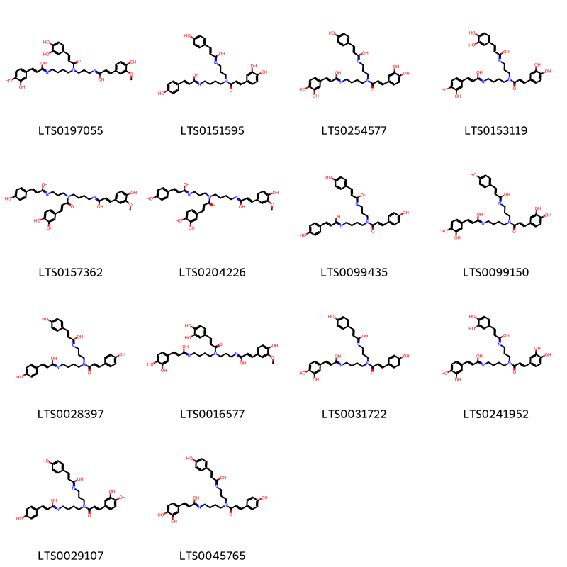{ width=100% }
    <figcaption>Hình ảnh cấu trúc hóa học của 14 hoạt chất thuộc nhóm Cinnamic acids and derivatives gồm ['n-{3-[3-(3,4-dihydroxyphenyl)-n-(4-{[3-(3,4-dihydroxyphenyl)-1-hydroxyprop-2-en-1-ylidene]amino}butyl)prop-2-enamido]propyl}-3-(4-hydroxy-3-methoxyphenyl)prop-2-enimidic acid (LTS0197055)', 'n-{3-[3-(3,4-dihydroxyphenyl)-n-(4-{[1-hydroxy-3-(4-hydroxyphenyl)prop-2-en-1-ylidene]amino}butyl)prop-2-enamido]propyl}-3-(4-hydroxyphenyl)prop-2-enimidic acid (LTS0151595)', 'n-{3-[3-(3,4-dihydroxyphenyl)-n-(4-{[3-(3,4-dihydroxyphenyl)-1-hydroxyprop-2-en-1-ylidene]amino}butyl)prop-2-enamido]propyl}-3-(4-hydroxyphenyl)prop-2-enimidic acid (LTS0254577)', '3-(3,4-dihydroxyphenyl)-n-{3-[3-(3,4-dihydroxyphenyl)-n-(4-{[3-(3,4-dihydroxyphenyl)-1-hydroxyprop-2-en-1-ylidene]amino}butyl)prop-2-enamido]propyl}prop-2-enimidic acid (LTS0153119)', '(2e)-n-{3-[(2e)-3-(3,4-dihydroxyphenyl)-n-(4-{[(2e)-1-hydroxy-3-(4-hydroxy-3-methoxyphenyl)prop-2-en-1-ylidene]amino}butyl)prop-2-enamido]propyl}-3-(4-hydroxyphenyl)prop-2-enimidic acid (LTS0157362)', 'n-{3-[3-(3,4-dihydroxyphenyl)-n-(4-{[1-hydroxy-3-(4-hydroxy-3-methoxyphenyl)prop-2-en-1-ylidene]amino}butyl)prop-2-enamido]propyl}-3-(4-hydroxyphenyl)prop-2-enimidic acid (LTS0204226)', 'n-{3-[n-(4-{[1-hydroxy-3-(4-hydroxyphenyl)prop-2-en-1-ylidene]amino}butyl)-3-(4-hydroxyphenyl)prop-2-enamido]propyl}-3-(4-hydroxyphenyl)prop-2-enimidic acid (LTS0099435)', '(2e)-n-{3-[(2e)-3-(3,4-dihydroxyphenyl)-n-(4-{[(2e)-3-(3,4-dihydroxyphenyl)-1-hydroxyprop-2-en-1-ylidene]amino}butyl)prop-2-enamido]propyl}-3-(4-hydroxyphenyl)prop-2-enimidic acid (LTS0099150)', '(2e)-n-{3-[(2e)-n-(4-{[(2e)-1-hydroxy-3-(4-hydroxyphenyl)prop-2-en-1-ylidene]amino}butyl)-3-(4-hydroxyphenyl)prop-2-enamido]propyl}-3-(4-hydroxyphenyl)prop-2-enimidic acid (LTS0028397)', '(2e)-n-{3-[(2e)-3-(3,4-dihydroxyphenyl)-n-(4-{[(2e)-3-(3,4-dihydroxyphenyl)-1-hydroxyprop-2-en-1-ylidene]amino}butyl)prop-2-enamido]propyl}-3-(4-hydroxy-3-methoxyphenyl)prop-2-enimidic acid (LTS0016577)', '(2e)-n-{3-[(2e)-n-(4-{[(2e)-3-(3,4-dihydroxyphenyl)-1-hydroxyprop-2-en-1-ylidene]amino}butyl)-3-(4-hydroxyphenyl)prop-2-enamido]propyl}-3-(4-hydroxyphenyl)prop-2-enimidic acid (LTS0031722)', '(2e)-3-(3,4-dihydroxyphenyl)-n-{3-[(2e)-3-(3,4-dihydroxyphenyl)-n-(4-{[(2e)-3-(3,4-dihydroxyphenyl)-1-hydroxyprop-2-en-1-ylidene]amino}butyl)prop-2-enamido]propyl}prop-2-enimidic acid (LTS0241952)', '(2e)-n-{3-[(2e)-3-(3,4-dihydroxyphenyl)-n-(4-{[(2e)-1-hydroxy-3-(4-hydroxyphenyl)prop-2-en-1-ylidene]amino}butyl)prop-2-enamido]propyl}-3-(4-hydroxyphenyl)prop-2-enimidic acid (LTS0029107)', 'n-{3-[n-(4-{[3-(3,4-dihydroxyphenyl)-1-hydroxyprop-2-en-1-ylidene]amino}butyl)-3-(4-hydroxyphenyl)prop-2-enamido]propyl}-3-(4-hydroxyphenyl)prop-2-enimidic acid (LTS0045765)'].</figcaption>
</figure>
#### Nhóm Flavonoids
<figure markdown="span">
    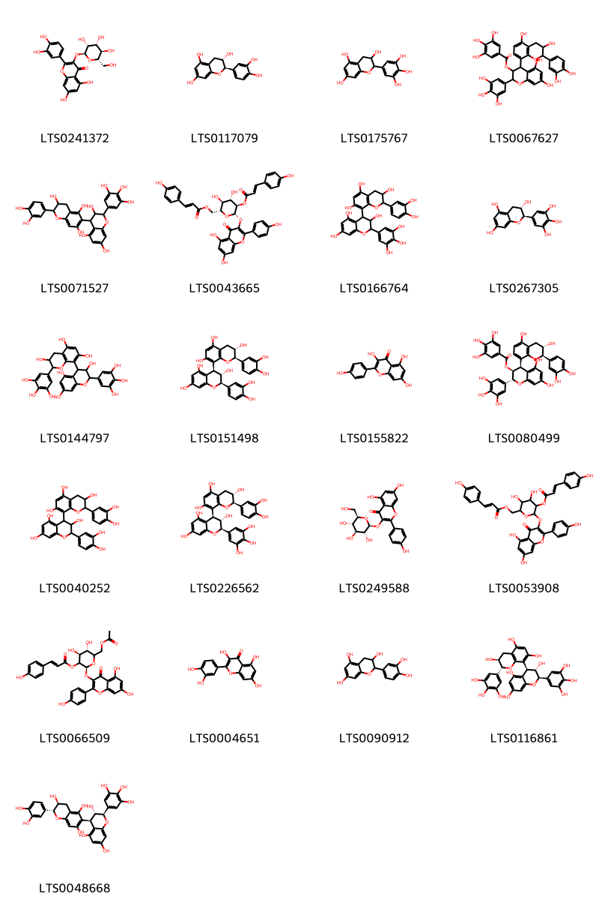{ width=100% }
    <figcaption>Hình ảnh cấu trúc hóa học của 21 hoạt chất thuộc nhóm Flavonoids gồm ['2-(3,4-dihydroxyphenyl)-5,7-dihydroxy-3-{[(2s,3r,4r,5r,6s)-3,4,5-trihydroxy-6-(hydroxymethyl)oxan-2-yl]oxy}chromen-4-one (LTS0241372)', '(+)-catechol (LTS0117079)', 'epigallocatechin (LTS0175767)', '4-[2-(3,4-dihydroxyphenyl)-3,5-dihydroxy-3,4-dihydro-2h-1-benzopyran-8-yl]-5,7-dihydroxy-2-(3,4,5-trihydroxyphenyl)-3,4-dihydro-2h-1-benzopyran-3-yl 3,4,5-trihydroxybenzoate (LTS0067627)', '4-[2-(3,4-dihydroxyphenyl)-3,5,7-trihydroxy-3,4-dihydro-2h-1-benzopyran-6-yl]-2-(3,4,5-trihydroxyphenyl)-3,4-dihydro-2h-1-benzopyran-3,5,7-triol (LTS0071527)', '[(2r,3s,4s,5r,6s)-6-{[5,7-dihydroxy-2-(4-hydroxyphenyl)-4-oxochromen-3-yl]oxy}-3,4-dihydroxy-5-{[(2e)-3-(4-hydroxyphenyl)prop-2-enoyl]oxy}oxan-2-yl]methyl (2e)-3-(4-hydroxyphenyl)prop-2-enoate (LTS0043665)', '4-[2-(3,4-dihydroxyphenyl)-3,5,7-trihydroxy-3,4-dihydro-2h-1-benzopyran-8-yl]-2-(3,4,5-trihydroxyphenyl)-3,4-dihydro-2h-1-benzopyran-3,5,7-triol (LTS0166764)', 'gallocatechol (LTS0267305)', '4-[3,5,7-trihydroxy-2-(3,4,5-trihydroxyphenyl)-3,4-dihydro-2h-1-benzopyran-8-yl]-2-(3,4,5-trihydroxyphenyl)-3,4-dihydro-2h-1-benzopyran-3,5,7-triol (LTS0144797)', '(2r,3s,4s)-2-(3,4-dihydroxyphenyl)-4-[(2r,3s)-2-(3,4-dihydroxyphenyl)-3,5,7-trihydroxy-3,4-dihydro-2h-1-benzopyran-8-yl]-3,4-dihydro-2h-1-benzopyran-3,5,7-triol (LTS0151498)', 'kaempherol (LTS0155822)', '(2r,3s,4s)-4-[(2r,3s)-2-(3,4-dihydroxyphenyl)-3,5-dihydroxy-3,4-dihydro-2h-1-benzopyran-8-yl]-5,7-dihydroxy-2-(3,4,5-trihydroxyphenyl)-3,4-dihydro-2h-1-benzopyran-3-yl 3,4,5-trihydroxybenzoate (LTS0080499)', '2-(3,4-dihydroxyphenyl)-4-[2-(3,4-dihydroxyphenyl)-3,5,7-trihydroxy-3,4-dihydro-2h-1-benzopyran-8-yl]-3,4-dihydro-2h-1-benzopyran-3,5,7-triol (LTS0040252)', '(2r,3s,4s)-4-[(2r,3s)-2-(3,4-dihydroxyphenyl)-3,5,7-trihydroxy-3,4-dihydro-2h-1-benzopyran-8-yl]-2-(3,4,5-trihydroxyphenyl)-3,4-dihydro-2h-1-benzopyran-3,5,7-triol (LTS0226562)', 'astragalin (LTS0249588)', '(6-{[5,7-dihydroxy-2-(4-hydroxyphenyl)-4-oxochromen-3-yl]oxy}-3,4-dihydroxy-5-{[3-(4-hydroxyphenyl)prop-2-enoyl]oxy}oxan-2-yl)methyl 3-(4-hydroxyphenyl)prop-2-enoate (LTS0053908)', 'dentatiflavonoid (LTS0066509)', 'quercetin (LTS0004651)', 'catechol (LTS0090912)', '(2r,3s,4s)-4-[(2r,3s)-3,5,7-trihydroxy-2-(3,4,5-trihydroxyphenyl)-3,4-dihydro-2h-1-benzopyran-8-yl]-2-(3,4,5-trihydroxyphenyl)-3,4-dihydro-2h-1-benzopyran-3,5,7-triol (LTS0116861)', '(2r,3s,4r)-4-[(2r,3s)-2-(3,4-dihydroxyphenyl)-3,5,7-trihydroxy-3,4-dihydro-2h-1-benzopyran-6-yl]-2-(3,4,5-trihydroxyphenyl)-3,4-dihydro-2h-1-benzopyran-3,5,7-triol (LTS0048668)'].</figcaption>
</figure>
#### Nhóm Tannins
<figure markdown="span">
    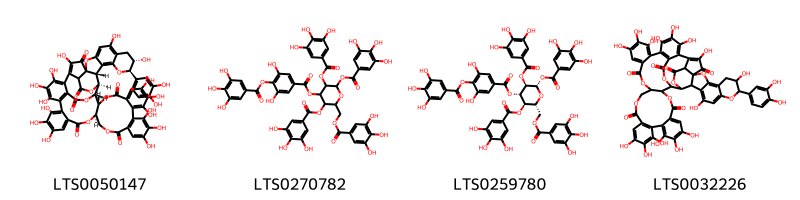{ width=100% }
    <figcaption>Hình ảnh cấu trúc hóa học của 4 hoạt chất thuộc nhóm Tannins gồm ['(1r,2r,20r,44s,45r,49r,50s)-45-(3,4-dihydroxyphenyl)-7,8,9,12,13,14,25,26,27,30,31,32,35,41,44-pentadecahydroxy-3,18,21,38,46,51,54-heptaoxadodecacyclo[27.21.3.3³⁴,⁵⁰.0²,²⁰.0⁵,¹⁰.0¹¹,¹⁶.0²³,²⁸.0³³,⁵³.0³⁷,⁴⁹.0³⁹,⁴⁸.0⁴²,⁴⁷.0³⁷,⁵⁶]hexapentaconta-5,7,9,11(16),12,14,23,25,27,29,31,33(53),34,39,41,47-hexadecaene-4,17,22,36,52,55-hexone (LTS0050147)', '4-[3,5-dihydroxy-4-(3,4,5-trihydroxybenzoyloxy)benzoyloxy]-3,5-bis(3,4,5-trihydroxybenzoyloxy)-6-[(3,4,5-trihydroxybenzoyloxy)methyl]oxan-2-yl 3,4,5-trihydroxybenzoate (LTS0270782)', '(2s,3r,4s,5r,6r)-4-[3,5-dihydroxy-4-(3,4,5-trihydroxybenzoyloxy)benzoyloxy]-3,5-bis(3,4,5-trihydroxybenzoyloxy)-6-[(3,4,5-trihydroxybenzoyloxy)methyl]oxan-2-yl 3,4,5-trihydroxybenzoate (LTS0259780)', '43-(3,4-dihydroxyphenyl)-7,8,9,12,13,14,25,26,27,30,31,32,35,42,47-pentadecahydroxy-3,18,21,38,44,51,54-heptaoxadodecacyclo[27.21.3.3³⁴,⁵⁰.0²,²⁰.0⁵,¹⁰.0¹¹,¹⁶.0²³,²⁸.0³³,⁵³.0³⁷,⁴⁹.0³⁹,⁴⁸.0⁴⁰,⁴⁵.0³⁷,⁵⁶]hexapentaconta-5,7,9,11(16),12,14,23,25,27,29,31,33(53),34,39,45,47-hexadecaene-4,17,22,36,52,55-hexone (LTS0032226)'].</figcaption>
</figure>

---

### Dược dân tộc học

Danh sách các quốc gia có sử dụng *Quercus dentata* trong điều trị các bệnh. 

| Country   | Disease    | Bệnh                                                                                                                                                                                                |
|:----------|:-----------|:----------------------------------------------------------------------------------------------------------------------------------------------------------------------------------------------------|
| Elsewhere | Astringent | MYMEMORY WARNING: YOU USED ALL AVAILABLE FREE TRANSLATIONS FOR TODAY. NEXT AVAILABLE IN  13 HOURS 39 MINUTES 50 SECONDS VISIT HTTPS://MYMEMORY.TRANSLATED.NET/DOC/USAGELIMITS.PHP TO TRANSLATE MORE |

---

---
## Quercus fusiformis
### Thông tin về thực vật

!!! info "Phân loại thực vật của *Quercus fusiformis* từ GIBF:"
    - **Kingdom:** Plantae
    - **Phylum:** Tracheophyta
    - **Order:** Fagales
    - **Family:** Fagaceae
    - **Genus:** Quercus
    - **Species:** *Quercus fusiformis*

 

| Label (VI)   | Label (EN)   | Scientific Name    | Descriptions (VI)   | Descriptions (EN)   | Also Known As (VI)   | Also Known As (EN)   |
|:-------------|:-------------|:-------------------|:--------------------|:--------------------|:---------------------|:---------------------|
| N/A          | N/A          | Quercus fusiformis |                     | species of plant    | ['']                 | ['']                 |

#### Phân bố trên thế giới

**Từ CSDL GIBF** United States of America, Mexico

#### Phân bố tại Việt Nam

**Từ CSDL GIBF**: Không có ghi nhận ở Việt Nam

---
### Thành phần hóa học
        
- Theo cơ sở dữ liệu lotus: Từ loài *Quercus fusiformis* đã phân lập và xác định được Chưa có hoạt chất nào được phân lập. hoạt chất thuộc về các nhóm Không có hoạt chất nào được phân lập. 

Không có hình ảnh nào được tạo ra

---

### Dược dân tộc học

Danh sách các quốc gia có sử dụng *Quercus fusiformis* trong điều trị các bệnh. 

| Country          | Disease   | Bệnh                                                                                                                                                                                                |
|:-----------------|:----------|:----------------------------------------------------------------------------------------------------------------------------------------------------------------------------------------------------|
| Mexico(Kickapoo) | Tonic     | MYMEMORY WARNING: YOU USED ALL AVAILABLE FREE TRANSLATIONS FOR TODAY. NEXT AVAILABLE IN  13 HOURS 39 MINUTES 13 SECONDS VISIT HTTPS://MYMEMORY.TRANSLATED.NET/DOC/USAGELIMITS.PHP TO TRANSLATE MORE |

---

---
## Quercus ilex
### Thông tin về thực vật

!!! info "Phân loại thực vật của *Quercus ilex* từ GIBF:"
    - **Kingdom:** Plantae
    - **Phylum:** Tracheophyta
    - **Order:** Fagales
    - **Family:** Fagaceae
    - **Genus:** Quercus
    - **Species:** *Quercus ilex*

 

| Label (VI)   | Label (EN)   | Scientific Name   | Descriptions (VI)   | Descriptions (EN)                            | Also Known As (VI)   | Also Known As (EN)   |
|:-------------|:-------------|:------------------|:--------------------|:---------------------------------------------|:---------------------|:---------------------|
| N/A          | N/A          | Quercus ilex      |                     | Oak tree species native to the Mediterranean | ['']                 | ['Holm Oak']         |

#### Phân bố trên thế giới

**Từ CSDL GIBF** nan, Italy, Belgium, Ukraine, Netherlands, Malta, Spain, Portugal, United States of America, Croatia, Greece, South Africa, Monaco, Montenegro, Switzerland, Austria, France, United Kingdom of Great Britain and Northern Ireland, Ireland, New Zealand

#### Phân bố tại Việt Nam

**Từ CSDL GIBF**: Không có ghi nhận ở Việt Nam

---
### Thành phần hóa học
        
- Theo cơ sở dữ liệu lotus: Từ loài *Quercus ilex* đã phân lập và xác định được 73 hoạt chất thuộc về các nhóm Flavonoids, Prenol lipids, Steroids and steroid derivatives, Cinnamic acids and derivatives, Benzene and substituted derivatives, Unsaturated hydrocarbons, Organooxygen compounds, Tannins. 

|    | chemicalTaxonomyClassyfireClass     |   smiles_count |
|---:|:------------------------------------|---------------:|
|  0 | Benzene and substituted derivatives |              3 |
|  1 | Cinnamic acids and derivatives      |              4 |
|  2 | Flavonoids                          |             32 |
|  3 | Organooxygen compounds              |              1 |
|  4 | Prenol lipids                       |             23 |
|  5 | Steroids and steroid derivatives    |              8 |
|  6 | Tannins                             |              1 |
|  7 | Unsaturated hydrocarbons            |              1 |

#### Nhóm Benzene and substituted derivatives
<figure markdown="span">
    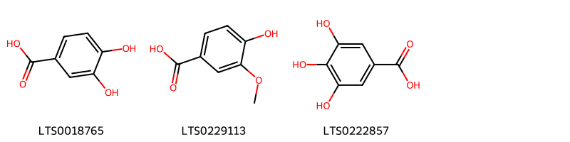{ width=100% }
    <figcaption>Hình ảnh cấu trúc hóa học của 3 hoạt chất thuộc nhóm Benzene and substituted derivatives gồm ['3,4-dihydroxybenzoic acid (LTS0018765)', 'vanillic acid (LTS0229113)', 'galop (LTS0222857)'].</figcaption>
</figure>
#### Nhóm Cinnamic acids and derivatives
<figure markdown="span">
    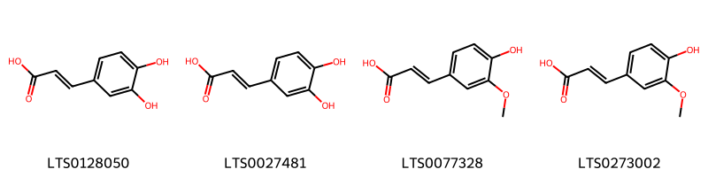{ width=100% }
    <figcaption>Hình ảnh cấu trúc hóa học của 4 hoạt chất thuộc nhóm Cinnamic acids and derivatives gồm ['3,4-dihydroxycinnamic acid (LTS0128050)', 'caffeic acid (LTS0027481)', 'ferulic acid (LTS0077328)', 'ferulic acid (LTS0273002)'].</figcaption>
</figure>
#### Nhóm Flavonoids
<figure markdown="span">
    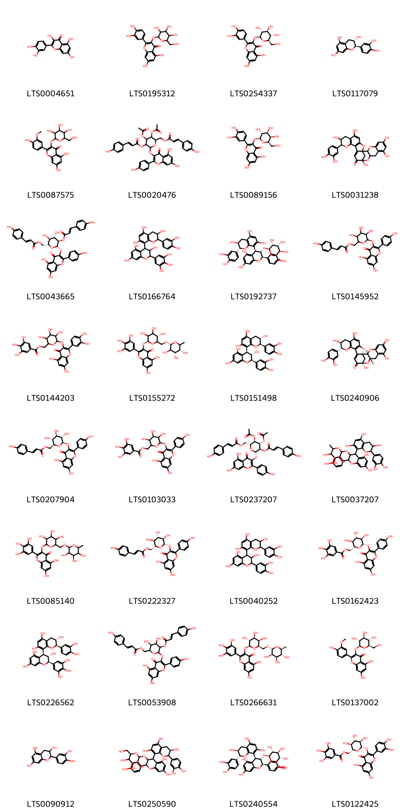{ width=100% }
    <figcaption>Hình ảnh cấu trúc hóa học của 32 hoạt chất thuộc nhóm Flavonoids gồm ['quercetin (LTS0004651)', '2-(3,4-dihydroxyphenyl)-5,7-dihydroxy-3-{[3,4,5-trihydroxy-6-(hydroxymethyl)oxan-2-yl]oxy}chromen-4-one (LTS0195312)', 'isoquercetin (LTS0254337)', '(+)-catechol (LTS0117079)', 'isorhamnetin 3-galactoside (LTS0087575)', '[3,4-bis(acetyloxy)-6-{[5,7-dihydroxy-2-(4-hydroxyphenyl)-4-oxochromen-3-yl]oxy}-5-{[3-(4-hydroxyphenyl)prop-2-enoyl]oxy}oxan-2-yl]methyl 3-(4-hydroxyphenyl)prop-2-enoate (LTS0020476)', 'hyperoside (LTS0089156)', '9-(3,4-dihydroxyphenyl)-5,8,16,21,23-pentahydroxy-2,10,17,26-tetraoxaheptacyclo[14.11.1.0¹,¹³.0³,¹².0⁶,¹¹.0¹⁸,²⁷.0²⁰,²⁵]octacosa-3(12),4,6(11),13,20,22,24-heptaen-15-one (LTS0031238)', '[(2r,3s,4s,5r,6s)-6-{[5,7-dihydroxy-2-(4-hydroxyphenyl)-4-oxochromen-3-yl]oxy}-3,4-dihydroxy-5-{[(2e)-3-(4-hydroxyphenyl)prop-2-enoyl]oxy}oxan-2-yl]methyl (2e)-3-(4-hydroxyphenyl)prop-2-enoate (LTS0043665)', '4-[2-(3,4-dihydroxyphenyl)-3,5,7-trihydroxy-3,4-dihydro-2h-1-benzopyran-8-yl]-2-(3,4,5-trihydroxyphenyl)-3,4-dihydro-2h-1-benzopyran-3,5,7-triol (LTS0166764)', '(2r,3s)-8-[(2r,3s,4s)-5,7-dihydroxy-2-(4-hydroxyphenyl)-3-{[(2s,3r,4r,5r,6s)-3,4,5-trihydroxy-6-methyloxan-2-yl]oxy}-3,4-dihydro-2h-1-benzopyran-4-yl]-2-(3,4-dihydroxyphenyl)-3,4-dihydro-2h-1-benzopyran-3,5,7-triol (LTS0192737)', '(6-{[5,7-dihydroxy-2-(4-hydroxyphenyl)-4-oxochromen-3-yl]oxy}-3,4,5-trihydroxyoxan-2-yl)methyl 3-(4-hydroxyphenyl)prop-2-enoate (LTS0145952)', '(6-{[2-(3,4-dihydroxyphenyl)-5,7-dihydroxy-4-oxochromen-3-yl]oxy}-3,4,5-trihydroxyoxan-2-yl)methyl 3,4,5-trihydroxybenzoate (LTS0144203)', 'myricetin 3-rutinoside (LTS0155272)', '(2r,3s,4s)-2-(3,4-dihydroxyphenyl)-4-[(2r,3s)-2-(3,4-dihydroxyphenyl)-3,5,7-trihydroxy-3,4-dihydro-2h-1-benzopyran-8-yl]-3,4-dihydro-2h-1-benzopyran-3,5,7-triol (LTS0151498)', '(1r,8s,9r,16r,18s,27s)-9-(3,4-dihydroxyphenyl)-5,8,16,21,23-pentahydroxy-2,10,17,26-tetraoxaheptacyclo[14.11.1.0¹,¹³.0³,¹².0⁶,¹¹.0¹⁸,²⁷.0²⁰,²⁵]octacosa-3(12),4,6(11),13,20,22,24-heptaen-15-one (LTS0240906)', '[(2s,3r,4r,5s,6r)-6-{[5,7-dihydroxy-2-(4-hydroxyphenyl)-4-oxochromen-3-yl]oxy}-3,4,5-trihydroxyoxan-2-yl]methyl (2e)-3-(4-hydroxyphenyl)prop-2-enoate (LTS0207904)', '(6-{[5,7-dihydroxy-2-(4-hydroxyphenyl)-4-oxochromen-3-yl]oxy}-3,4,5-trihydroxyoxan-2-yl)methyl 3,4,5-trihydroxybenzoate (LTS0103033)', '[(2r,3r,4s,5r,6s)-3,4-bis(acetyloxy)-6-{[5,7-dihydroxy-2-(4-hydroxyphenyl)-4-oxochromen-3-yl]oxy}-5-{[(2e)-3-(4-hydroxyphenyl)prop-2-enoyl]oxy}oxan-2-yl]methyl (2e)-3-(4-hydroxyphenyl)prop-2-enoate (LTS0237207)', '8-[5,7-dihydroxy-2-(4-hydroxyphenyl)-3-[(3,4,5-trihydroxy-6-methyloxan-2-yl)oxy]-3,4-dihydro-2h-1-benzopyran-4-yl]-2-(3,4-dihydroxyphenyl)-3,4-dihydro-2h-1-benzopyran-3,5,7-triol (LTS0037207)', '5,7-dihydroxy-3-[(3,4,5-trihydroxy-6-{[(3,4,5-trihydroxy-6-methyloxan-2-yl)oxy]methyl}oxan-2-yl)oxy]-2-(3,4,5-trihydroxyphenyl)chromen-4-one (LTS0085140)', 'tiliroside (LTS0222327)', '2-(3,4-dihydroxyphenyl)-4-[2-(3,4-dihydroxyphenyl)-3,5,7-trihydroxy-3,4-dihydro-2h-1-benzopyran-8-yl]-3,4-dihydro-2h-1-benzopyran-3,5,7-triol (LTS0040252)', '[(2r,3s,4s,5r,6s)-6-{[5,7-dihydroxy-2-(4-hydroxyphenyl)-4-oxochromen-3-yl]oxy}-3,4,5-trihydroxyoxan-2-yl]methyl 3,4,5-trihydroxybenzoate (LTS0162423)', '(2r,3s,4s)-4-[(2r,3s)-2-(3,4-dihydroxyphenyl)-3,5,7-trihydroxy-3,4-dihydro-2h-1-benzopyran-8-yl]-2-(3,4,5-trihydroxyphenyl)-3,4-dihydro-2h-1-benzopyran-3,5,7-triol (LTS0226562)', '(6-{[5,7-dihydroxy-2-(4-hydroxyphenyl)-4-oxochromen-3-yl]oxy}-3,4-dihydroxy-5-{[3-(4-hydroxyphenyl)prop-2-enoyl]oxy}oxan-2-yl)methyl 3-(4-hydroxyphenyl)prop-2-enoate (LTS0053908)', '5,7-dihydroxy-3-{[(2s,3r,4s,5r,6r)-3,4,5-trihydroxy-6-({[(2r,3r,4r,5r,6s)-3,4,5-trihydroxy-6-methyloxan-2-yl]oxy}methyl)oxan-2-yl]oxy}-2-(3,4,5-trihydroxyphenyl)chromen-4-one (LTS0266631)', 'isorhamnetin 3-o-glucoside (LTS0137002)', 'catechol (LTS0090912)', '8-[5,7-dihydroxy-2-(4-hydroxyphenyl)-3-{[3,4,5-trihydroxy-6-(hydroxymethyl)oxan-2-yl]oxy}-3,4-dihydro-2h-1-benzopyran-4-yl]-2-(3,4-dihydroxyphenyl)-3,4-dihydro-2h-1-benzopyran-3,5,7-triol (LTS0250590)', '(2r,3s)-8-[(2r,3s,4s)-5,7-dihydroxy-2-(4-hydroxyphenyl)-3-{[(2r,3r,4s,5s,6r)-3,4,5-trihydroxy-6-(hydroxymethyl)oxan-2-yl]oxy}-3,4-dihydro-2h-1-benzopyran-4-yl]-2-(3,4-dihydroxyphenyl)-3,4-dihydro-2h-1-benzopyran-3,5,7-triol (LTS0240554)', '[(2r,3s,4s,5r,6s)-6-{[2-(3,4-dihydroxyphenyl)-5,7-dihydroxy-4-oxochromen-3-yl]oxy}-3,4,5-trihydroxyoxan-2-yl]methyl 3,4,5-trihydroxybenzoate (LTS0122425)'].</figcaption>
</figure>
#### Nhóm Organooxygen compounds
<figure markdown="span">
    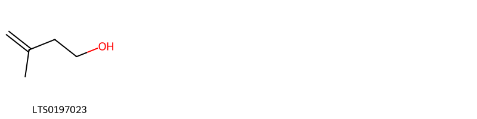{ width=100% }
    <figcaption>Hình ảnh cấu trúc hóa học của 1 hoạt chất thuộc nhóm Organooxygen compounds gồm ['3-methyl-3-buten-1-ol (LTS0197023)'].</figcaption>
</figure>
#### Nhóm Prenol lipids
<figure markdown="span">
    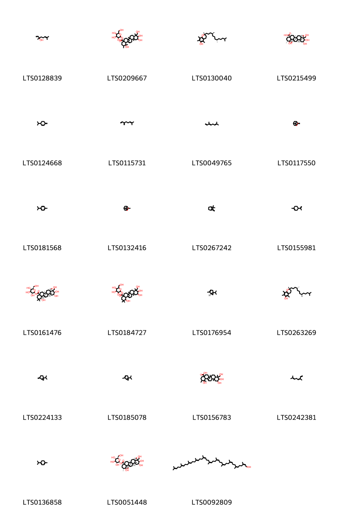{ width=100% }
    <figcaption>Hình ảnh cấu trúc hóa học của 23 hoạt chất thuộc nhóm Prenol lipids gồm ['linalool, (+-)- (LTS0128839)', '3,4,5-trihydroxy-6-(hydroxymethyl)oxan-2-yl 1,10,11-trihydroxy-9-(hydroxymethyl)-1,2,6a,6b,9,12a-hexamethyl-2,3,4,5,6,7,8,8a,10,11,12,12b,13,14b-tetradecahydropicene-4a-carboxylate (LTS0209667)', '(2r)-2,5,7,8-tetramethyl-2-[(4s,8s)-4,8,12-trimethyltridecyl]-3,4-dihydro-1-benzopyran-6-ol (LTS0130040)', '19α-hydroxyasiatic acid (LTS0215499)', 'β phellandrene (LTS0124668)', 'α-myrcene (LTS0115731)', 'trans-β-ocimene (LTS0049765)', 'β-pinene (LTS0117550)', 'cymene (LTS0181568)', 'α pinene (LTS0132416)', 'camphene (LTS0267242)', 'limonene,  (LTS0155981)', 'sericoside (LTS0161476)', '3,4,5-trihydroxy-6-(hydroxymethyl)oxan-2-yl 1,10,11-trihydroxy-9-(hydroxymethyl)-2,2,6a,6b,9,12a-hexamethyl-1,3,4,5,6,7,8,8a,10,11,12,12b,13,14b-tetradecahydropicene-4a-carboxylate (LTS0184727)', 'α-thujene (LTS0176954)', 'vitamin e (LTS0263269)', 'sabinene (LTS0224133)', 'α-thujene (LTS0185078)', '1,10,11-trihydroxy-9-(hydroxymethyl)-1,2,6a,6b,9,12a-hexamethyl-2,3,4,5,6,7,8,8a,10,11,12,12b,13,14b-tetradecahydropicene-4a-carboxylic acid (LTS0156783)', 'β-ocimene (LTS0242381)', 'terpinene (LTS0136858)', '(2r,3r,4s,5s,6r)-3,4,5-trihydroxy-6-(hydroxymethyl)oxan-2-yl (1r,2r,4as,6as,6br,8ar,9r,10r,11r,12ar,12br,14bs)-1,10,11-trihydroxy-9-(hydroxymethyl)-1,2,6a,6b,9,12a-hexamethyl-2,3,4,5,6,7,8,8a,10,11,12,12b,13,14b-tetradecahydropicene-4a-carboxylate (LTS0051448)', '(2z,6z,10z,14z,18z,22z,26z,30e,34e,38e)-3,7,11,15,19,23,27,31,35,39,43-undecamethyltetratetraconta-2,6,10,14,18,22,26,30,34,38,42-undecaen-1-ol (LTS0092809)'].</figcaption>
</figure>
#### Nhóm Steroids and steroid derivatives
<figure markdown="span">
    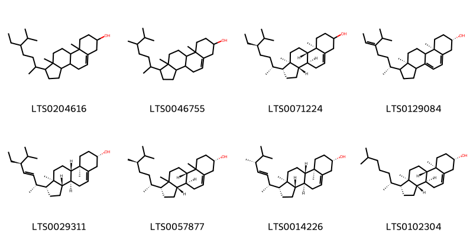{ width=100% }
    <figcaption>Hình ảnh cấu trúc hóa học của 8 hoạt chất thuộc nhóm Steroids and steroid derivatives gồm ['stigmast-5-en-3-ol, (3β)- (LTS0204616)', 'campesterol (LTS0046755)', 'stigmast-5-en-3-ol (LTS0071224)', '5-dehydroavenasterol (LTS0129084)', 'phytosterol (LTS0029311)', '(1r,3as,3bs,7s,9bs)-1-[(2r,5r)-5,6-dimethylheptan-2-yl]-9a,11a-dimethyl-1h,2h,3h,3ah,3bh,4h,6h,7h,8h,9h,9bh,10h,11h-cyclopenta[a]phenanthren-7-ol (LTS0057877)', 'brassicasterol (LTS0014226)', 'cholesterol (LTS0102304)'].</figcaption>
</figure>
#### Nhóm Tannins
<figure markdown="span">
    { width=100% }
    <figcaption>Hình ảnh cấu trúc hóa học của 1 hoạt chất thuộc nhóm Tannins gồm ['ellagic acid (LTS0037297)'].</figcaption>
</figure>
#### Nhóm Unsaturated hydrocarbons
<figure markdown="span">
    { width=100% }
    <figcaption>Hình ảnh cấu trúc hóa học của 1 hoạt chất thuộc nhóm Unsaturated hydrocarbons gồm ['α terpinene (LTS0232891)'].</figcaption>
</figure>

---

### Dược dân tộc học

Danh sách các quốc gia có sử dụng *Quercus ilex* trong điều trị các bệnh. 

| Country   | Disease                         | Bệnh                                                                                                                                                                                                |
|:----------|:--------------------------------|:----------------------------------------------------------------------------------------------------------------------------------------------------------------------------------------------------|
| Turkey    | Diuretic, Stimulant, Astringent | MYMEMORY WARNING: YOU USED ALL AVAILABLE FREE TRANSLATIONS FOR TODAY. NEXT AVAILABLE IN  13 HOURS 38 MINUTES 46 SECONDS VISIT HTTPS://MYMEMORY.TRANSLATED.NET/DOC/USAGELIMITS.PHP TO TRANSLATE MORE |

---

---
## Quercus incana
### Thông tin về thực vật

!!! info "Phân loại thực vật của *Quercus incana* từ GIBF:"
    - **Kingdom:** Plantae
    - **Phylum:** Tracheophyta
    - **Order:** Fagales
    - **Family:** Fagaceae
    - **Genus:** Quercus
    - **Species:** *Quercus incana*

 

| Label (VI)   | Label (EN)   | Scientific Name   | Descriptions (VI)   | Descriptions (EN)   | Also Known As (VI)   | Also Known As (EN)   |
|:-------------|:-------------|:------------------|:--------------------|:--------------------|:---------------------|:---------------------|
| N/A          | N/A          | Quercus incana    | loài thực vật       | species of plant    | ['']                 | ['']                 |

#### Phân bố trên thế giới

**Từ CSDL GIBF** United States of America

#### Phân bố tại Việt Nam

**Từ CSDL GIBF**: Không có ghi nhận ở Việt Nam

---
### Thành phần hóa học
        
- Theo cơ sở dữ liệu lotus: Từ loài *Quercus incana* đã phân lập và xác định được 10 hoạt chất thuộc về các nhóm Flavonoids, Prenol lipids, Steroids and steroid derivatives. 

|    | chemicalTaxonomyClassyfireClass   |   smiles_count |
|---:|:----------------------------------|---------------:|
|  0 | Flavonoids                        |              4 |
|  1 | Prenol lipids                     |              4 |
|  2 | Steroids and steroid derivatives  |              2 |

#### Nhóm Flavonoids
<figure markdown="span">
    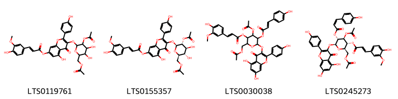{ width=100% }
    <figcaption>Hình ảnh cấu trúc hóa học của 4 hoạt chất thuộc nhóm Flavonoids gồm ['3-{[3-(acetyloxy)-6-[(acetyloxy)methyl]-4,5-dihydroxyoxan-2-yl]oxy}-5-hydroxy-2-(4-hydroxyphenyl)-4-oxochromen-7-yl 3-(4-hydroxy-3-methoxyphenyl)prop-2-enoate (LTS0119761)', '3-{[(2s,3r,4s,5s,6r)-3-(acetyloxy)-6-[(acetyloxy)methyl]-4,5-dihydroxyoxan-2-yl]oxy}-5-hydroxy-2-(4-hydroxyphenyl)-4-oxochromen-7-yl (2e)-3-(4-hydroxy-3-methoxyphenyl)prop-2-enoate (LTS0155357)', '4-(acetyloxy)-2-[(acetyloxy)methyl]-6-{[5,7-dihydroxy-2-(4-hydroxyphenyl)-4-oxochromen-3-yl]oxy}-5-{[3-(4-hydroxyphenyl)prop-2-enoyl]oxy}oxan-3-yl 3-(4-hydroxy-3-methoxyphenyl)prop-2-enoate (LTS0030038)', '(2r,3r,4s,5r,6s)-4-(acetyloxy)-2-[(acetyloxy)methyl]-6-{[5,7-dihydroxy-2-(4-hydroxyphenyl)-4-oxochromen-3-yl]oxy}-5-{[(2z)-3-(4-hydroxyphenyl)prop-2-enoyl]oxy}oxan-3-yl (2e)-3-(4-hydroxy-3-methoxyphenyl)prop-2-enoate (LTS0245273)'].</figcaption>
</figure>
#### Nhóm Prenol lipids
<figure markdown="span">
    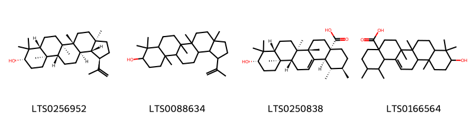{ width=100% }
    <figcaption>Hình ảnh cấu trúc hóa học của 4 hoạt chất thuộc nhóm Prenol lipids gồm ['lupeol (LTS0256952)', 'lupeol (LTS0088634)', 'ursolic acid (LTS0250838)', '10-hydroxy-1,2,6a,6b,9,9,12a-heptamethyl-2,3,4,5,6,7,8,8a,10,11,12,12b,13,14b-tetradecahydro-1h-picene-4a-carboxylic acid (LTS0166564)'].</figcaption>
</figure>
#### Nhóm Steroids and steroid derivatives
<figure markdown="span">
    { width=100% }
    <figcaption>Hình ảnh cấu trúc hóa học của 2 hoạt chất thuộc nhóm Steroids and steroid derivatives gồm ['stigmast-5-en-3-ol, (3β)- (LTS0204616)', 'sitosterol (LTS0168132)'].</figcaption>
</figure>

---

### Dược dân tộc học

Danh sách các quốc gia có sử dụng *Quercus incana* trong điều trị các bệnh. 

| Country   | Disease              | Bệnh                                                                                                                                                                                                |
|:----------|:---------------------|:----------------------------------------------------------------------------------------------------------------------------------------------------------------------------------------------------|
| Elsewhere | Astringent, Diuretic | MYMEMORY WARNING: YOU USED ALL AVAILABLE FREE TRANSLATIONS FOR TODAY. NEXT AVAILABLE IN  13 HOURS 37 MINUTES 50 SECONDS VISIT HTTPS://MYMEMORY.TRANSLATED.NET/DOC/USAGELIMITS.PHP TO TRANSLATE MORE |

---

---
## Quercus infectoria
### Thông tin về thực vật

!!! info "Phân loại thực vật của *Quercus infectoria* từ GIBF:"
    - **Kingdom:** Plantae
    - **Phylum:** Tracheophyta
    - **Order:** Fagales
    - **Family:** Fagaceae
    - **Genus:** Quercus
    - **Species:** *Quercus infectoria*

 

| Label (VI)   | Label (EN)   | Scientific Name    | Descriptions (VI)   | Descriptions (EN)   | Also Known As (VI)   | Also Known As (EN)   |
|:-------------|:-------------|:-------------------|:--------------------|:--------------------|:---------------------|:---------------------|
| N/A          | N/A          | Quercus infectoria | loài thực vật       | species of plant    | ['']                 | ['Aleppo oak']       |

#### Phân bố trên thế giới

**Từ CSDL GIBF** Israel, Syrian Arab Republic, Cyprus, United Kingdom of Great Britain and Northern Ireland, Belgium, Iraq, Spain, Palestine, State of, Türkiye, Portugal, United States of America, Lebanon, France, Greece

#### Phân bố tại Việt Nam

**Từ CSDL GIBF**: Không có ghi nhận ở Việt Nam

---
### Thành phần hóa học
        
- Theo cơ sở dữ liệu lotus: Từ loài *Quercus infectoria* đã phân lập và xác định được 24 hoạt chất thuộc về các nhóm Flavonoids, Steroids and steroid derivatives, Diarylheptanoids, Dibenzylbutane lignans, Benzene and substituted derivatives, Tannins, Depsides and depsidones. 

|    | chemicalTaxonomyClassyfireClass     |   smiles_count |
|---:|:------------------------------------|---------------:|
|  0 | Benzene and substituted derivatives |              2 |
|  1 | Depsides and depsidones             |              2 |
|  2 | Diarylheptanoids                    |              4 |
|  3 | Dibenzylbutane lignans              |              2 |
|  4 | Flavonoids                          |              3 |
|  5 | Steroids and steroid derivatives    |              1 |
|  6 | Tannins                             |              9 |

#### Nhóm Benzene and substituted derivatives
<figure markdown="span">
    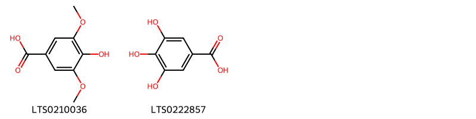{ width=100% }
    <figcaption>Hình ảnh cấu trúc hóa học của 2 hoạt chất thuộc nhóm Benzene and substituted derivatives gồm ['syringic acid (LTS0210036)', 'galop (LTS0222857)'].</figcaption>
</figure>
#### Nhóm Depsides and depsidones
<figure markdown="span">
    { width=100% }
    <figcaption>Hình ảnh cấu trúc hóa học của 2 hoạt chất thuộc nhóm Depsides and depsidones gồm ['3-[3,4-dihydroxy-5-(3,4,5-trihydroxybenzoyloxy)benzoyloxy]-4,5-dihydroxybenzoic acid (LTS0131145)', 'digallic acid (LTS0019534)'].</figcaption>
</figure>
#### Nhóm Diarylheptanoids
<figure markdown="span">
    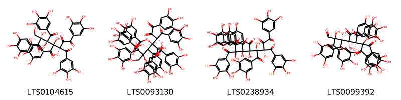{ width=100% }
    <figcaption>Hình ảnh cấu trúc hóa học của 4 hoạt chất thuộc nhóm Diarylheptanoids gồm ['(3s,4s,5r,6r)-3,4,5,6-tetrahydroxy-6-(hydroxymethyl)-3,4,5-tris(3,4,5-trihydroxybenzoyl)-1,7-bis(3,4,5-trihydroxyphenyl)heptane-1,2,7-trione (LTS0104615)', '(2r,3r,4s,5s)-2-hydroxy-2-(hydroxymethyl)-1,6,7-trioxo-3,4,5-tris(3,4,5-trihydroxybenzoyl)-3,5-bis(3,4,5-trihydroxybenzoyloxy)-1,7-bis(3,4,5-trihydroxyphenyl)heptan-4-yl 3,4,5-trihydroxybenzoate (LTS0093130)', '(3s,4s,5r,6s)-3,4,5,6,7-pentahydroxy-3,4,5,6,7-pentakis(3,4,5-trihydroxybenzoyl)-1,8-bis(3,4,5-trihydroxyphenyl)octane-1,2,8-trione (LTS0238934)', '(2r,3s,4s,5s)-2,3,4,5,6-pentahydroxy-7-oxo-2,3,4,5,6-pentakis(3,4,5-trihydroxybenzoyl)-7-(3,4,5-trihydroxyphenyl)heptanal (LTS0099392)'].</figcaption>
</figure>
#### Nhóm Dibenzylbutane lignans
<figure markdown="span">
    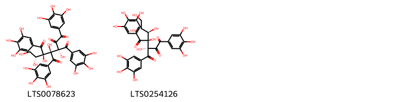{ width=100% }
    <figcaption>Hình ảnh cấu trúc hóa học của 2 hoạt chất thuộc nhóm Dibenzylbutane lignans gồm ['(3s,4s,5r)-5-[(1r)-1,2-dihydroxyethyl]-3,4,5-trihydroxy-3,4-bis(3,4,5-trihydroxybenzoyl)-1,6-bis(3,4,5-trihydroxyphenyl)hexane-1,2,6-trione (LTS0078623)', '(3s,4s)-3,4-dihydroxy-3-(3,4,5-trihydroxybenzoyl)-1,5-bis(3,4,5-trihydroxyphenyl)-4-[(1r,2r)-1,2,3-trihydroxypropyl]pentane-1,2,5-trione (LTS0254126)'].</figcaption>
</figure>
#### Nhóm Flavonoids
<figure markdown="span">
    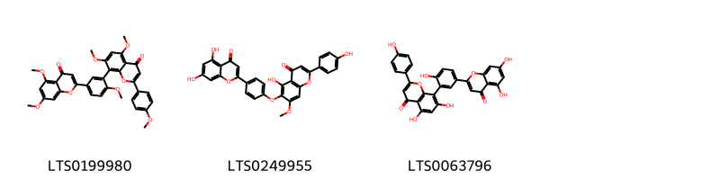{ width=100% }
    <figcaption>Hình ảnh cấu trúc hóa học của 3 hoạt chất thuộc nhóm Flavonoids gồm ['8-[5-(5,7-dimethoxy-4-oxochromen-2-yl)-2-methoxyphenyl]-5,7-dimethoxy-2-(4-methoxyphenyl)chromen-4-one (LTS0199980)', '6-[4-(5,7-dihydroxy-4-oxochromen-2-yl)phenoxy]-5-hydroxy-2-(4-hydroxyphenyl)-7-methoxychromen-4-one (LTS0249955)', 'amentoflavone (LTS0063796)'].</figcaption>
</figure>
#### Nhóm Steroids and steroid derivatives
<figure markdown="span">
    { width=100% }
    <figcaption>Hình ảnh cấu trúc hóa học của 1 hoạt chất thuộc nhóm Steroids and steroid derivatives gồm ['stigmast-5-en-3-ol, (3β)- (LTS0204616)'].</figcaption>
</figure>
#### Nhóm Tannins
<figure markdown="span">
    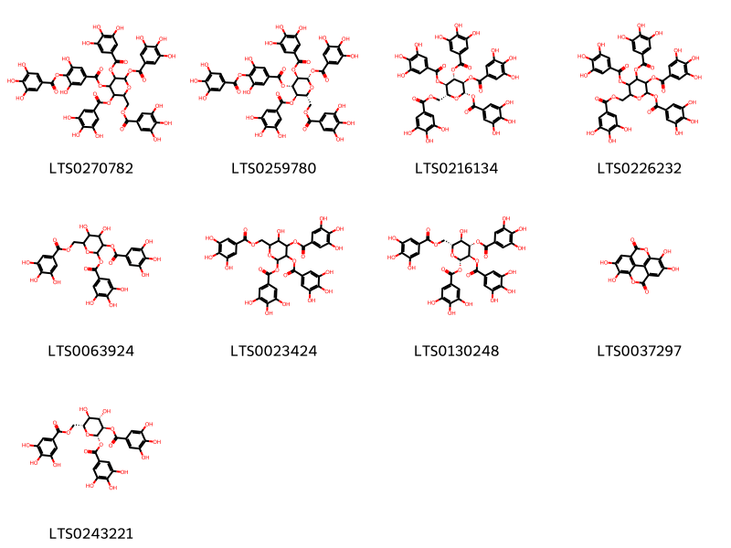{ width=100% }
    <figcaption>Hình ảnh cấu trúc hóa học của 9 hoạt chất thuộc nhóm Tannins gồm ['4-[3,5-dihydroxy-4-(3,4,5-trihydroxybenzoyloxy)benzoyloxy]-3,5-bis(3,4,5-trihydroxybenzoyloxy)-6-[(3,4,5-trihydroxybenzoyloxy)methyl]oxan-2-yl 3,4,5-trihydroxybenzoate (LTS0270782)', '(2s,3r,4s,5r,6r)-4-[3,5-dihydroxy-4-(3,4,5-trihydroxybenzoyloxy)benzoyloxy]-3,5-bis(3,4,5-trihydroxybenzoyloxy)-6-[(3,4,5-trihydroxybenzoyloxy)methyl]oxan-2-yl 3,4,5-trihydroxybenzoate (LTS0259780)', '(2s,3r,4s,5r,6r)-3,4,5-tris(3,4,5-trihydroxybenzoyloxy)-6-[(3,4,5-trihydroxybenzoyloxy)methyl]oxan-2-yl 3,4,5-trihydroxybenzoate (LTS0216134)', '3,4,5-tris(3,4,5-trihydroxybenzoyloxy)-6-[(3,4,5-trihydroxybenzoyloxy)methyl]oxan-2-yl 3,4,5-trihydroxybenzoate (LTS0226232)', '4,5-dihydroxy-3-(3,4,5-trihydroxybenzoyloxy)-6-[(3,4,5-trihydroxybenzoyloxy)methyl]oxan-2-yl 3,4,5-trihydroxybenzoate (LTS0063924)', '5-hydroxy-3,4-bis(3,4,5-trihydroxybenzoyloxy)-6-[(3,4,5-trihydroxybenzoyloxy)methyl]oxan-2-yl 3,4,5-trihydroxybenzoate (LTS0023424)', '(2s,3r,4s,5r,6r)-5-hydroxy-3,4-bis(3,4,5-trihydroxybenzoyloxy)-6-[(3,4,5-trihydroxybenzoyloxy)methyl]oxan-2-yl 3,4,5-trihydroxybenzoate (LTS0130248)', 'ellagic acid (LTS0037297)', '(2s,3r,4s,5s,6r)-4,5-dihydroxy-3-(3,4,5-trihydroxybenzoyloxy)-6-[(3,4,5-trihydroxybenzoyloxy)methyl]oxan-2-yl 3,4,5-trihydroxybenzoate (LTS0243221)'].</figcaption>
</figure>

---

### Dược dân tộc học

Danh sách các quốc gia có sử dụng *Quercus infectoria* trong điều trị các bệnh. 

| Country   | Disease    | Bệnh                                                                                                                                                                                                |
|:----------|:-----------|:----------------------------------------------------------------------------------------------------------------------------------------------------------------------------------------------------|
| Elsewhere | Astringent | MYMEMORY WARNING: YOU USED ALL AVAILABLE FREE TRANSLATIONS FOR TODAY. NEXT AVAILABLE IN  13 HOURS 37 MINUTES 09 SECONDS VISIT HTTPS://MYMEMORY.TRANSLATED.NET/DOC/USAGELIMITS.PHP TO TRANSLATE MORE |
| Iraq      | Astringent | MYMEMORY WARNING: YOU USED ALL AVAILABLE FREE TRANSLATIONS FOR TODAY. NEXT AVAILABLE IN  13 HOURS 37 MINUTES 03 SECONDS VISIT HTTPS://MYMEMORY.TRANSLATED.NET/DOC/USAGELIMITS.PHP TO TRANSLATE MORE |
| Kurdistan | Astringent | MYMEMORY WARNING: YOU USED ALL AVAILABLE FREE TRANSLATIONS FOR TODAY. NEXT AVAILABLE IN  13 HOURS 36 MINUTES 59 SECONDS VISIT HTTPS://MYMEMORY.TRANSLATED.NET/DOC/USAGELIMITS.PHP TO TRANSLATE MORE |
| Turkey    | Styptic    | MYMEMORY WARNING: YOU USED ALL AVAILABLE FREE TRANSLATIONS FOR TODAY. NEXT AVAILABLE IN  13 HOURS 36 MINUTES 56 SECONDS VISIT HTTPS://MYMEMORY.TRANSLATED.NET/DOC/USAGELIMITS.PHP TO TRANSLATE MORE |

---

---
## Quercus lamellosa
### Thông tin về thực vật

!!! info "Phân loại thực vật của *Quercus lamellosa* từ GIBF:"
    - **Kingdom:** Plantae
    - **Phylum:** Tracheophyta
    - **Order:** Fagales
    - **Family:** Fagaceae
    - **Genus:** Quercus
    - **Species:** *Quercus lamellosa*

 

| Label (VI)   | Label (EN)   | Scientific Name   | Descriptions (VI)   | Descriptions (EN)   | Also Known As (VI)   | Also Known As (EN)   |
|:-------------|:-------------|:------------------|:--------------------|:--------------------|:---------------------|:---------------------|
| N/A          | N/A          | Quercus lamellosa | loài thực vật       | species of plant    | ['']                 | ['']                 |

#### Phân bố trên thế giới

**Từ CSDL GIBF** nan, Thailand, New Zealand, Myanmar, Bhutan, India, Russian Federation, unknown or invalid, United States of America, France, China, Nepal

#### Phân bố tại Việt Nam

**Từ CSDL GIBF**: Không có ghi nhận ở Việt Nam

---
### Thành phần hóa học
        
- Theo cơ sở dữ liệu lotus: Từ loài *Quercus lamellosa* đã phân lập và xác định được Chưa có hoạt chất nào được phân lập. hoạt chất thuộc về các nhóm Không có hoạt chất nào được phân lập. 

Không có hình ảnh nào được tạo ra

---

### Dược dân tộc học

Danh sách các quốc gia có sử dụng *Quercus lamellosa* trong điều trị các bệnh. 

| Country   | Disease    | Bệnh                                                                                                                                                                                                |
|:----------|:-----------|:----------------------------------------------------------------------------------------------------------------------------------------------------------------------------------------------------|
| Elsewhere | Astringent | MYMEMORY WARNING: YOU USED ALL AVAILABLE FREE TRANSLATIONS FOR TODAY. NEXT AVAILABLE IN  13 HOURS 36 MINUTES 26 SECONDS VISIT HTTPS://MYMEMORY.TRANSLATED.NET/DOC/USAGELIMITS.PHP TO TRANSLATE MORE |

---

---
## Quercus lyrata
### Thông tin về thực vật

!!! info "Phân loại thực vật của *Quercus lyrata* từ GIBF:"
    - **Kingdom:** Plantae
    - **Phylum:** Tracheophyta
    - **Order:** Fagales
    - **Family:** Fagaceae
    - **Genus:** Quercus
    - **Species:** *Quercus lyrata*

 

| Label (VI)   | Label (EN)   | Scientific Name   | Descriptions (VI)   | Descriptions (EN)   | Also Known As (VI)   | Also Known As (EN)   |
|:-------------|:-------------|:------------------|:--------------------|:--------------------|:---------------------|:---------------------|
| N/A          | N/A          | Quercus lyrata    | loài thực vật       | species of plant    | ['']                 | ['overcup oak']      |

#### Phân bố trên thế giới

**Từ CSDL GIBF** United States of America

#### Phân bố tại Việt Nam

**Từ CSDL GIBF**: Không có ghi nhận ở Việt Nam

---
### Thành phần hóa học
        
- Theo cơ sở dữ liệu lotus: Từ loài *Quercus lyrata* đã phân lập và xác định được Chưa có hoạt chất nào được phân lập. hoạt chất thuộc về các nhóm Không có hoạt chất nào được phân lập. 

Không có hình ảnh nào được tạo ra

---

### Dược dân tộc học

Danh sách các quốc gia có sử dụng *Quercus lyrata* trong điều trị các bệnh. 

| Country   | Disease    | Bệnh                                                                                                                                                                                                |
|:----------|:-----------|:----------------------------------------------------------------------------------------------------------------------------------------------------------------------------------------------------|
| US(Cree)  | Astringent | MYMEMORY WARNING: YOU USED ALL AVAILABLE FREE TRANSLATIONS FOR TODAY. NEXT AVAILABLE IN  13 HOURS 36 MINUTES 00 SECONDS VISIT HTTPS://MYMEMORY.TRANSLATED.NET/DOC/USAGELIMITS.PHP TO TRANSLATE MORE |

---

---
## Quercus persica
### Thông tin về thực vật

!!! info "Phân loại thực vật của *Quercus persica* từ GIBF:"
    - **Kingdom:** Plantae
    - **Phylum:** Tracheophyta
    - **Order:** Fagales
    - **Family:** Fagaceae
    - **Genus:** Quercus
    - **Species:** *Quercus persica*

 

| Label (VI)   | Label (EN)   | Scientific Name   | Descriptions (VI)   | Descriptions (EN)   | Also Known As (VI)   | Also Known As (EN)   |
|:-------------|:-------------|:------------------|:--------------------|:--------------------|:---------------------|:---------------------|
| N/A          | N/A          | Quercus persica   | loài thực vật       | species of plant    | ['']                 | ['']                 |

#### Phân bố trên thế giới

**Từ CSDL GIBF** nan, Iran (Islamic Republic of), Iraq, Türkiye, unknown or invalid

#### Phân bố tại Việt Nam

**Từ CSDL GIBF**: Không có ghi nhận ở Việt Nam

---
### Thành phần hóa học
        
- Theo cơ sở dữ liệu lotus: Từ loài *Quercus persica* đã phân lập và xác định được Chưa có hoạt chất nào được phân lập. hoạt chất thuộc về các nhóm Không có hoạt chất nào được phân lập. 

Không có hình ảnh nào được tạo ra

---

### Dược dân tộc học

Danh sách các quốc gia có sử dụng *Quercus persica* trong điều trị các bệnh. 

| Country   | Disease   | Bệnh                                                                                                                                                                                                |
|:----------|:----------|:----------------------------------------------------------------------------------------------------------------------------------------------------------------------------------------------------|
| Turkey    | Laxative  | MYMEMORY WARNING: YOU USED ALL AVAILABLE FREE TRANSLATIONS FOR TODAY. NEXT AVAILABLE IN  13 HOURS 35 MINUTES 27 SECONDS VISIT HTTPS://MYMEMORY.TRANSLATED.NET/DOC/USAGELIMITS.PHP TO TRANSLATE MORE |

---

---
## Quercus robur
### Thông tin về thực vật

!!! info "Phân loại thực vật của *Quercus robur* từ GIBF:"
    - **Kingdom:** Plantae
    - **Phylum:** Tracheophyta
    - **Order:** Fagales
    - **Family:** Fagaceae
    - **Genus:** Quercus
    - **Species:** *Quercus robur*

 

| Label (VI)   | Label (EN)   | Scientific Name   | Descriptions (VI)   | Descriptions (EN)   | Also Known As (VI)   | Also Known As (EN)                                              |
|:-------------|:-------------|:------------------|:--------------------|:--------------------|:---------------------|:----------------------------------------------------------------|
| N/A          | N/A          | Quercus robur     | loài thực vật       | species of plant    | ['']                 | ['common oak', 'English oak', 'pedunculate oak', 'truffle oak'] |

#### Phân bố trên thế giới

**Từ CSDL GIBF** Italy, Australia, Argentina, Latvia, Canada, Ukraine, Denmark, Netherlands, Belarus, Hungary, Russian Federation, United States of America, Finland, South Africa, Germany, Austria, France, United Kingdom of Great Britain and Northern Ireland, Poland, New Zealand

#### Phân bố tại Việt Nam

**Từ CSDL GIBF**: Không có ghi nhận ở Việt Nam

---
### Thành phần hóa học
        
- Theo cơ sở dữ liệu lotus: Từ loài *Quercus robur* đã phân lập và xác định được 112 hoạt chất thuộc về các nhóm Fatty Acyls, Flavonoids, Prenol lipids, Indoles and derivatives, Cinnamic acids and derivatives, Diarylheptanoids, Benzene and substituted derivatives, Organooxygen compounds, Tannins, Phenols, Coumarins and derivatives, Carboxylic acids and derivatives. 

|    | chemicalTaxonomyClassyfireClass     |   smiles_count |
|---:|:------------------------------------|---------------:|
|  0 | Benzene and substituted derivatives |              5 |
|  1 | Carboxylic acids and derivatives    |              1 |
|  2 | Cinnamic acids and derivatives      |              3 |
|  3 | Coumarins and derivatives           |              2 |
|  4 | Diarylheptanoids                    |              1 |
|  5 | Fatty Acyls                         |              4 |
|  6 | Flavonoids                          |             32 |
|  7 | Indoles and derivatives             |              2 |
|  8 | Organooxygen compounds              |              2 |
|  9 | Phenols                             |              9 |
| 10 | Prenol lipids                       |             12 |
| 11 | Tannins                             |             39 |

#### Nhóm Benzene and substituted derivatives
<figure markdown="span">
    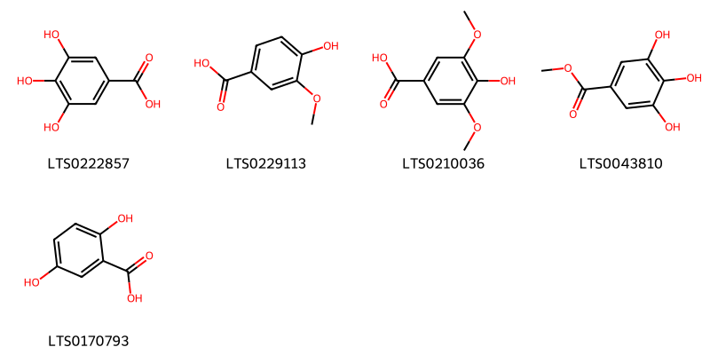{ width=100% }
    <figcaption>Hình ảnh cấu trúc hóa học của 5 hoạt chất thuộc nhóm Benzene and substituted derivatives gồm ['galop (LTS0222857)', 'vanillic acid (LTS0229113)', 'syringic acid (LTS0210036)', 'methyl gallate (LTS0043810)', '2,5-dihydroxybenzoic acid (LTS0170793)'].</figcaption>
</figure>
#### Nhóm Carboxylic acids and derivatives
<figure markdown="span">
    { width=100% }
    <figcaption>Hình ảnh cấu trúc hóa học của 1 hoạt chất thuộc nhóm Carboxylic acids and derivatives gồm ['oxalic acid (LTS0217707)'].</figcaption>
</figure>
#### Nhóm Cinnamic acids and derivatives
<figure markdown="span">
    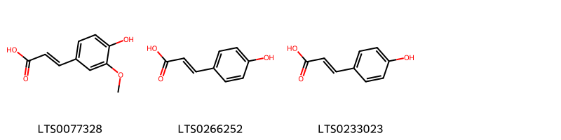{ width=100% }
    <figcaption>Hình ảnh cấu trúc hóa học của 3 hoạt chất thuộc nhóm Cinnamic acids and derivatives gồm ['ferulic acid (LTS0077328)', 'para-coumaric acid (LTS0266252)', 'hydroxycinnamic acid (LTS0233023)'].</figcaption>
</figure>
#### Nhóm Coumarins and derivatives
<figure markdown="span">
    { width=100% }
    <figcaption>Hình ảnh cấu trúc hóa học của 2 hoạt chất thuộc nhóm Coumarins and derivatives gồm ['scopoletin (LTS0193112)', 'esculetin (LTS0067593)'].</figcaption>
</figure>
#### Nhóm Diarylheptanoids
<figure markdown="span">
    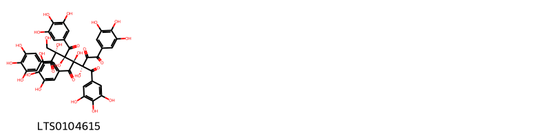{ width=100% }
    <figcaption>Hình ảnh cấu trúc hóa học của 1 hoạt chất thuộc nhóm Diarylheptanoids gồm ['(3s,4s,5r,6r)-3,4,5,6-tetrahydroxy-6-(hydroxymethyl)-3,4,5-tris(3,4,5-trihydroxybenzoyl)-1,7-bis(3,4,5-trihydroxyphenyl)heptane-1,2,7-trione (LTS0104615)'].</figcaption>
</figure>
#### Nhóm Fatty Acyls
<figure markdown="span">
    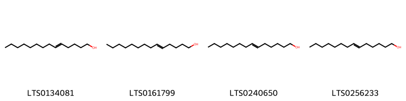{ width=100% }
    <figcaption>Hình ảnh cấu trúc hóa học của 4 hoạt chất thuộc nhóm Fatty Acyls gồm ['tetradec-5-en-1-ol (LTS0134081)', '(5e)-tetradec-5-en-1-ol (LTS0161799)', 'tetradec-6-en-1-ol (LTS0240650)', '(6e)-tetradec-6-en-1-ol (LTS0256233)'].</figcaption>
</figure>
#### Nhóm Flavonoids
<figure markdown="span">
    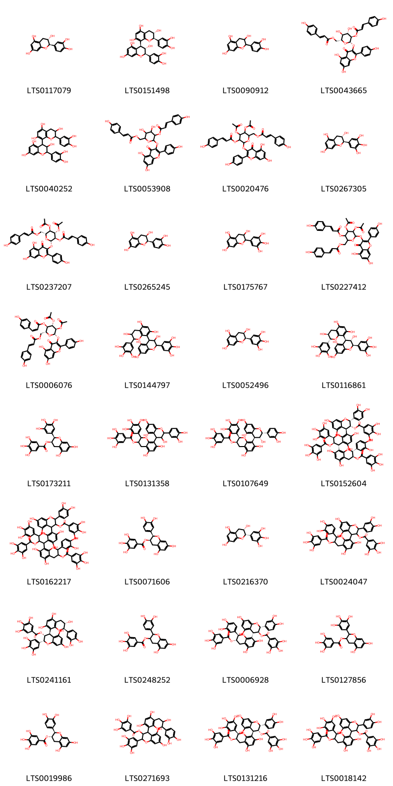{ width=100% }
    <figcaption>Hình ảnh cấu trúc hóa học của 32 hoạt chất thuộc nhóm Flavonoids gồm ['(+)-catechol (LTS0117079)', '(2r,3s,4s)-2-(3,4-dihydroxyphenyl)-4-[(2r,3s)-2-(3,4-dihydroxyphenyl)-3,5,7-trihydroxy-3,4-dihydro-2h-1-benzopyran-8-yl]-3,4-dihydro-2h-1-benzopyran-3,5,7-triol (LTS0151498)', 'catechol (LTS0090912)', '[(2r,3s,4s,5r,6s)-6-{[5,7-dihydroxy-2-(4-hydroxyphenyl)-4-oxochromen-3-yl]oxy}-3,4-dihydroxy-5-{[(2e)-3-(4-hydroxyphenyl)prop-2-enoyl]oxy}oxan-2-yl]methyl (2e)-3-(4-hydroxyphenyl)prop-2-enoate (LTS0043665)', '2-(3,4-dihydroxyphenyl)-4-[2-(3,4-dihydroxyphenyl)-3,5,7-trihydroxy-3,4-dihydro-2h-1-benzopyran-8-yl]-3,4-dihydro-2h-1-benzopyran-3,5,7-triol (LTS0040252)', '(6-{[5,7-dihydroxy-2-(4-hydroxyphenyl)-4-oxochromen-3-yl]oxy}-3,4-dihydroxy-5-{[3-(4-hydroxyphenyl)prop-2-enoyl]oxy}oxan-2-yl)methyl 3-(4-hydroxyphenyl)prop-2-enoate (LTS0053908)', '[3,4-bis(acetyloxy)-6-{[5,7-dihydroxy-2-(4-hydroxyphenyl)-4-oxochromen-3-yl]oxy}-5-{[3-(4-hydroxyphenyl)prop-2-enoyl]oxy}oxan-2-yl]methyl 3-(4-hydroxyphenyl)prop-2-enoate (LTS0020476)', 'gallocatechol (LTS0267305)', '[(2r,3r,4s,5r,6s)-3,4-bis(acetyloxy)-6-{[5,7-dihydroxy-2-(4-hydroxyphenyl)-4-oxochromen-3-yl]oxy}-5-{[(2e)-3-(4-hydroxyphenyl)prop-2-enoyl]oxy}oxan-2-yl]methyl (2e)-3-(4-hydroxyphenyl)prop-2-enoate (LTS0237207)', 'ent-epicatechin (LTS0265245)', 'epigallocatechin (LTS0175767)', '[4,5-bis(acetyloxy)-6-{[5,7-dihydroxy-2-(4-hydroxyphenyl)-4-oxochromen-3-yl]oxy}-3-{[3-(4-hydroxyphenyl)prop-2-enoyl]oxy}oxan-2-yl]methyl 3-(4-hydroxyphenyl)prop-2-enoate (LTS0227412)', '[(2r,3r,4s,5r,6s)-4,5-bis(acetyloxy)-6-{[5,7-dihydroxy-2-(4-hydroxyphenyl)-4-oxochromen-3-yl]oxy}-3-{[(2z)-3-(4-hydroxyphenyl)prop-2-enoyl]oxy}oxan-2-yl]methyl (2e)-3-(4-hydroxyphenyl)prop-2-enoate (LTS0006076)', '4-[3,5,7-trihydroxy-2-(3,4,5-trihydroxyphenyl)-3,4-dihydro-2h-1-benzopyran-8-yl]-2-(3,4,5-trihydroxyphenyl)-3,4-dihydro-2h-1-benzopyran-3,5,7-triol (LTS0144797)', 'epigallocatechin (LTS0052496)', '(2r,3s,4s)-4-[(2r,3s)-3,5,7-trihydroxy-2-(3,4,5-trihydroxyphenyl)-3,4-dihydro-2h-1-benzopyran-8-yl]-2-(3,4,5-trihydroxyphenyl)-3,4-dihydro-2h-1-benzopyran-3,5,7-triol (LTS0116861)', '(-)-epigallocatechin gallate (LTS0173211)', '8-[2-(3,4-dihydroxyphenyl)-3,5,7-trihydroxy-3,4-dihydro-2h-1-benzopyran-4-yl]-5,7-dihydroxy-2-(3,4,5-trihydroxyphenyl)-3,4-dihydro-2h-1-benzopyran-3-yl 3,4,5-trihydroxybenzoate (LTS0131358)', '(2r,3r)-8-[(2r,3r,4r)-2-(3,4-dihydroxyphenyl)-3,5,7-trihydroxy-3,4-dihydro-2h-1-benzopyran-4-yl]-5,7-dihydroxy-2-(3,4,5-trihydroxyphenyl)-3,4-dihydro-2h-1-benzopyran-3-yl 3,4,5-trihydroxybenzoate (LTS0107649)', '(2r,3r,4r)-2-(3,4-dihydroxyphenyl)-4-[(2r,3r,4s)-4-[(2r,3s)-2-(3,4-dihydroxyphenyl)-5,7-dihydroxy-3-(3,4,5-trihydroxybenzoyloxy)-3,4-dihydro-2h-1-benzopyran-8-yl]-5,7-dihydroxy-3-(3,4,5-trihydroxybenzoyloxy)-2-(3,4,5-trihydroxyphenyl)-3,4-dihydro-2h-1-benzopyran-8-yl]-5,7-dihydroxy-3,4-dihydro-2h-1-benzopyran-3-yl 3,4,5-trihydroxybenzoate (LTS0152604)', '2-(3,4-dihydroxyphenyl)-4-{4-[2-(3,4-dihydroxyphenyl)-5,7-dihydroxy-3-(3,4,5-trihydroxybenzoyloxy)-3,4-dihydro-2h-1-benzopyran-8-yl]-5,7-dihydroxy-3-(3,4,5-trihydroxybenzoyloxy)-2-(3,4,5-trihydroxyphenyl)-3,4-dihydro-2h-1-benzopyran-8-yl}-5,7-dihydroxy-3,4-dihydro-2h-1-benzopyran-3-yl 3,4,5-trihydroxybenzoate (LTS0162217)', 'epicatechin gallate (LTS0071606)', '(+)-epigallocatechin (LTS0216370)', '2-(3,4-dihydroxyphenyl)-4-[2-(3,4-dihydroxyphenyl)-5,7-dihydroxy-3-(3,4,5-trihydroxybenzoyloxy)-3,4-dihydro-2h-1-benzopyran-8-yl]-5,7-dihydroxy-3,4-dihydro-2h-1-benzopyran-3-yl 3,4,5-trihydroxybenzoate (LTS0024047)', '(2r,3r,4r)-4-[(2r,3s)-2-(3,4-dihydroxyphenyl)-3,5,7-trihydroxy-3,4-dihydro-2h-1-benzopyran-8-yl]-5,7-dihydroxy-2-(3,4,5-trihydroxyphenyl)-3,4-dihydro-2h-1-benzopyran-3-yl 3,4,5-trihydroxybenzoate (LTS0241161)', '2-(3,4-dihydroxyphenyl)-5,7-dihydroxy-3,4-dihydro-2h-1-benzopyran-3-yl 3,4,5-trihydroxybenzoate (LTS0248252)', '(2r,3s,4s)-2-(3,4-dihydroxyphenyl)-4-[(2r,3s)-2-(3,4-dihydroxyphenyl)-5,7-dihydroxy-3-(3,4,5-trihydroxybenzoyloxy)-3,4-dihydro-2h-1-benzopyran-8-yl]-5,7-dihydroxy-3,4-dihydro-2h-1-benzopyran-3-yl 3,4,5-trihydroxybenzoate (LTS0006928)', '5,7-dihydroxy-2-(3,4,5-trihydroxyphenyl)-3,4-dihydro-2h-1-benzopyran-3-yl 3,4,5-trihydroxybenzoate (LTS0127856)', 'catechin 3-o-gallate (LTS0019986)', '4-[2-(3,4-dihydroxyphenyl)-3,5,7-trihydroxy-3,4-dihydro-2h-1-benzopyran-8-yl]-5,7-dihydroxy-2-(3,4,5-trihydroxyphenyl)-3,4-dihydro-2h-1-benzopyran-3-yl 3,4,5-trihydroxybenzoate (LTS0271693)', '(2r,3r,4r)-4-[(2r,3r)-5,7-dihydroxy-3-(3,4,5-trihydroxybenzoyloxy)-2-(3,4,5-trihydroxyphenyl)-3,4-dihydro-2h-1-benzopyran-8-yl]-2-(3,4-dihydroxyphenyl)-5,7-dihydroxy-3,4-dihydro-2h-1-benzopyran-3-yl 3,4,5-trihydroxybenzoate (LTS0131216)', '4-[5,7-dihydroxy-3-(3,4,5-trihydroxybenzoyloxy)-2-(3,4,5-trihydroxyphenyl)-3,4-dihydro-2h-1-benzopyran-8-yl]-2-(3,4-dihydroxyphenyl)-5,7-dihydroxy-3,4-dihydro-2h-1-benzopyran-3-yl 3,4,5-trihydroxybenzoate (LTS0018142)'].</figcaption>
</figure>
#### Nhóm Indoles and derivatives
<figure markdown="span">
    { width=100% }
    <figcaption>Hình ảnh cấu trúc hóa học của 2 hoạt chất thuộc nhóm Indoles and derivatives gồm ['β-indole-3-acetic acid (LTS0250222)', 'methyl indole-3-acetate (LTS0042788)'].</figcaption>
</figure>
#### Nhóm Organooxygen compounds
<figure markdown="span">
    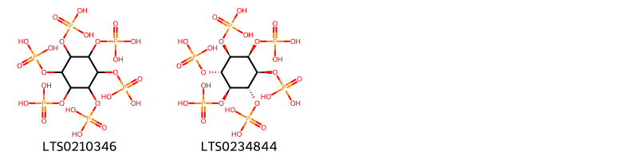{ width=100% }
    <figcaption>Hình ảnh cấu trúc hóa học của 2 hoạt chất thuộc nhóm Organooxygen compounds gồm ['phytic acid (LTS0210346)', '[(1r,2r,3s,4r,5s,6s)-2,3,4,5,6-pentakis(phosphonooxy)cyclohexyl]oxyphosphonic acid (LTS0234844)'].</figcaption>
</figure>
#### Nhóm Phenols
<figure markdown="span">
    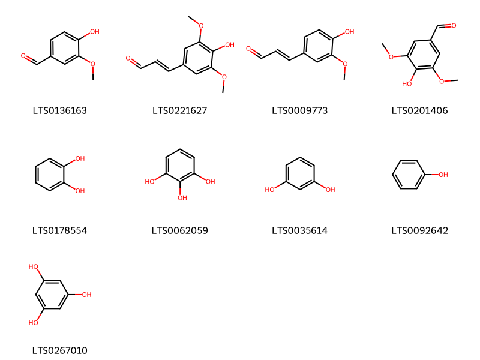{ width=100% }
    <figcaption>Hình ảnh cấu trúc hóa học của 9 hoạt chất thuộc nhóm Phenols gồm ['vanillin (LTS0136163)', 'sinapyl aldehyde (LTS0221627)', 'coniferaldehyde (LTS0009773)', 'syringaldehyde (LTS0201406)', 'catechol (LTS0178554)', 'pyrogallol (LTS0062059)', 'resorcinol (LTS0035614)', 'phenol (LTS0092642)', 'phloroglucinol (LTS0267010)'].</figcaption>
</figure>
#### Nhóm Prenol lipids
<figure markdown="span">
    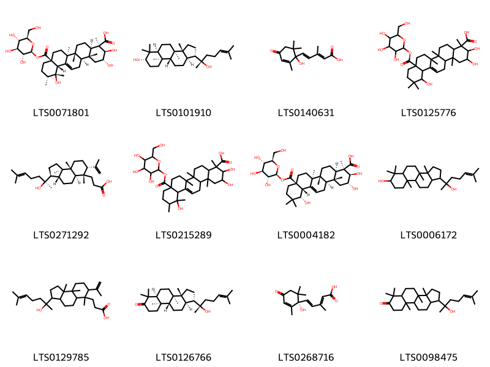{ width=100% }
    <figcaption>Hình ảnh cấu trúc hóa học của 12 hoạt chất thuộc nhóm Prenol lipids gồm ['(2r,3r,4r,4ar,6ar,6bs,8as,11r,12r,12as,14ar,14br)-2,3,12-trihydroxy-4,6a,6b,11,12,14b-hexamethyl-8a-({[(2s,3r,4s,5s,6r)-3,4,5-trihydroxy-6-(hydroxymethyl)oxan-2-yl]oxy}carbonyl)-1,2,3,4a,5,6,7,8,9,10,11,12a,14,14a-tetradecahydropicene-4-carboxylic acid (LTS0071801)', '(1s,3ar,3br,5as,7s,9ar,9br,11ar)-1-[(2s)-2-hydroxy-6-methylhept-5-en-2-yl]-3a,3b,6,6,9a-pentamethyl-dodecahydro-1h-cyclopenta[a]phenanthren-7-ol (LTS0101910)', 'abscisic acid,  (LTS0140631)', '2,3,12-trihydroxy-4,6a,6b,11,11,14b-hexamethyl-8a-({[3,4,5-trihydroxy-6-(hydroxymethyl)oxan-2-yl]oxy}carbonyl)-1,2,3,4a,5,6,7,8,9,10,12,12a,14,14a-tetradecahydropicene-4-carboxylic acid (LTS0125776)', '3-[(3s,3ar,5ar,6s,7r,9ar,9br)-3-[(2s)-2-hydroxy-6-methylhept-5-en-2-yl]-6,9a,9b-trimethyl-7-(prop-1-en-2-yl)-decahydrocyclopenta[a]naphthalen-6-yl]propanoic acid (LTS0271292)', '2,3,12-trihydroxy-4,6a,6b,11,12,14b-hexamethyl-8a-({[3,4,5-trihydroxy-6-(hydroxymethyl)oxan-2-yl]oxy}carbonyl)-1,2,3,4a,5,6,7,8,9,10,11,12a,14,14a-tetradecahydropicene-4-carboxylic acid (LTS0215289)', '(2r,3r,4r,4ar,6ar,6bs,8ar,12s,12as,14ar,14br)-2,3,12-trihydroxy-4,6a,6b,11,11,14b-hexamethyl-8a-({[(2s,3r,4s,5s,6r)-3,4,5-trihydroxy-6-(hydroxymethyl)oxan-2-yl]oxy}carbonyl)-1,2,3,4a,5,6,7,8,9,10,12,12a,14,14a-tetradecahydropicene-4-carboxylic acid (LTS0004182)', '1-(2-hydroxy-6-methylhept-5-en-2-yl)-3a,3b,6,6,9a-pentamethyl-dodecahydro-1h-cyclopenta[a]phenanthren-7-ol (LTS0006172)', '3-[3-(2-hydroxy-6-methylhept-5-en-2-yl)-6,9a,9b-trimethyl-7-(prop-1-en-2-yl)-decahydrocyclopenta[a]naphthalen-6-yl]propanoic acid (LTS0129785)', '(1s,3ar,3br,5as,9ar,9br,11ar)-1-[(2s)-2-hydroxy-6-methylhept-5-en-2-yl]-3a,3b,6,6,9a-pentamethyl-dodecahydrocyclopenta[a]phenanthren-7-one (LTS0126766)', '(4e)-5-[(1s)-1-hydroxy-2,6,6-trimethyl-4-oxocyclohex-2-en-1-yl]-3-methylpenta-2,4-dienoic acid (LTS0268716)', '1-(2-hydroxy-6-methylhept-5-en-2-yl)-3a,3b,6,6,9a-pentamethyl-dodecahydrocyclopenta[a]phenanthren-7-one (LTS0098475)'].</figcaption>
</figure>
#### Nhóm Tannins
<figure markdown="span">
    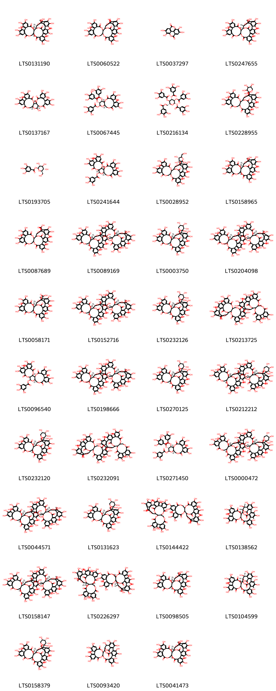{ width=100% }
    <figcaption>Hình ảnh cấu trúc hóa học của 39 hoạt chất thuộc nhóm Tannins gồm ['(1r,2r,20r,42s,46r)-7,8,9,12,13,14,25,26,27,30,31,32,35,36,37,46-hexadecahydroxy-3,18,21,41,43-pentaoxanonacyclo[27.13.3.1³⁸,⁴².0²,²⁰.0⁵,¹⁰.0¹¹,¹⁶.0²³,²⁸.0³³,⁴⁵.0³⁴,³⁹]hexatetraconta-5,7,9,11(16),12,14,23,25,27,29,31,33(45),34(39),35,37-pentadecaene-4,17,22,40,44-pentone (LTS0131190)', '7,8,9,12,13,14,25,26,27,30,31,32,35,36,37,46-hexadecahydroxy-3,18,21,41,43-pentaoxanonacyclo[27.13.3.1³⁸,⁴².0²,²⁰.0⁵,¹⁰.0¹¹,¹⁶.0²³,²⁸.0³³,⁴⁵.0³⁴,³⁹]hexatetraconta-5,7,9,11(16),12,14,23,25,27,29,31,33(45),34(39),35,37-pentadecaene-4,17,22,40,44-pentone (LTS0060522)', 'ellagic acid (LTS0037297)', '(2r,42r,46r)-7,8,9,12,13,14,25,26,27,30,31,32,35,36,37,46-hexadecahydroxy-3,18,21,41,43-pentaoxanonacyclo[27.13.3.1³⁸,⁴².0²,²⁰.0⁵,¹⁰.0¹¹,¹⁶.0²³,²⁸.0³³,⁴⁵.0³⁴,³⁹]hexatetraconta-5,7,9,11(16),12,14,23,25,27,29,31,33(45),34(39),35,37-pentadecaene-4,17,22,40,44-pentone (LTS0247655)', '(1r,2s,19r,22r)-7,8,9,12,13,14,20,28,29,30,33,34,35-tridecahydroxy-3,18,21,24,39-pentaoxaheptacyclo[20.17.0.0²,¹⁹.0⁵,¹⁰.0¹¹,¹⁶.0²⁶,³¹.0³²,³⁷]nonatriaconta-5(10),6,8,11,13,15,26(31),27,29,32,34,36-dodecaene-4,17,25,38-tetrone (LTS0137167)', '(10r,11s,12r,13s,15r)-3,4,5,21,22,23-hexahydroxy-8,18-dioxo-12,13-bis(3,4,5-trihydroxybenzoyloxy)-9,14,17-trioxatetracyclo[17.4.0.0²,⁷.0¹⁰,¹⁵]tricosa-1(23),2(7),3,5,19,21-hexaen-11-yl 3,4,5-trihydroxybenzoate (LTS0067445)', '(2s,3r,4s,5r,6r)-3,4,5-tris(3,4,5-trihydroxybenzoyloxy)-6-[(3,4,5-trihydroxybenzoyloxy)methyl]oxan-2-yl 3,4,5-trihydroxybenzoate (LTS0216134)', '7,8,9,12,13,14,25,26,27,30,31,32,35,36,37-pentadecahydroxy-46-(2,3,4,5-tetrahydroxyoxan-2-yl)-3,18,21,41,43-pentaoxanonacyclo[27.13.3.1³⁸,⁴².0²,²⁰.0⁵,¹⁰.0¹¹,¹⁶.0²³,²⁸.0³³,⁴⁵.0³⁴,³⁹]hexatetraconta-5,7,9,11(16),12,14,23,25,27,29,31,33(45),34(39),35,37-pentadecaene-4,17,22,40,44-pentone (LTS0228955)', 'β-glucogallin (LTS0193705)', 'casuarictin (LTS0241644)', '(46r)-7,8,9,12,13,14,25,26,27,30,31,32,35,36,37-pentadecahydroxy-46-[(3r,4s)-2,3,4-trihydroxy-5-(hydroxymethyl)oxolan-2-yl]-3,18,21,41,43-pentaoxanonacyclo[27.13.3.1³⁸,⁴².0²,²⁰.0⁵,¹⁰.0¹¹,¹⁶.0²³,²⁸.0³³,⁴⁵.0³⁴,³⁹]hexatetraconta-5,7,9,11(16),12,14,23,25,27,29,31,33(45),34(39),35,37-pentadecaene-4,17,22,40,44-pentone (LTS0028952)', '(1r,2r,20r,42s,46s)-7,8,9,12,13,14,25,26,27,30,31,32,35,36,37,46-hexadecahydroxy-3,18,21,41,43-pentaoxanonacyclo[27.13.3.1³⁸,⁴².0²,²⁰.0⁵,¹⁰.0¹¹,¹⁶.0²³,²⁸.0³³,⁴⁵.0³⁴,³⁹]hexatetraconta-5,7,9,11(16),12,14,23,25,27,29,31,33(45),34(39),35,37-pentadecaene-4,17,22,40,44-pentone (LTS0158965)', '7,8,9,12,13,14,25,26,27,30,31,32,35,36,37-pentadecahydroxy-4,17,22,40,44-pentaoxo-3,18,21,41,43-pentaoxanonacyclo[27.13.3.1³⁸,⁴².0²,²⁰.0⁵,¹⁰.0¹¹,¹⁶.0²³,²⁸.0³³,⁴⁵.0³⁴,³⁹]hexatetraconta-5,7,9,11(16),12,14,23,25,27,29,31,33(45),34(39),35,37-pentadecaene-46-carboxylic acid (LTS0087689)', '(1s,2r,20r,42s,46r)-7,8,9,12,13,14,25,26,27,30,31,32,35,36,37,46-hexadecahydroxy-15-[(1s,2s,20s,42s,46r)-7,8,9,12,13,14,25,26,27,30,31,32,35,36,37-pentadecahydroxy-4,17,22,40,44-pentaoxo-3,18,21,41,43-pentaoxanonacyclo[27.13.3.1³⁸,⁴².0²,²⁰.0⁵,¹⁰.0¹¹,¹⁶.0²³,²⁸.0³³,⁴⁵.0³⁴,³⁹]hexatetraconta-5,7,9,11(16),12,14,23,25,27,29,31,33(45),34(39),35,37-pentadecaen-46-yl]-3,18,21,41,43-pentaoxanonacyclo[27.13.3.1³⁸,⁴².0²,²⁰.0⁵,¹⁰.0¹¹,¹⁶.0²³,²⁸.0³³,⁴⁵.0³⁴,³⁹]hexatetraconta-5,7,9,11(16),12,14,23,25,27,29,31,33(45),34(39),35,37-pentadecaene-4,17,22,40,44-pentone (LTS0089169)', '(1s,2s,20s,42s,46s)-7,8,9,12,13,14,25,26,27,30,31,32,35,36,37-pentadecahydroxy-46-[(3s,4r,5s)-2,3,4,5-tetrahydroxyoxan-2-yl]-3,18,21,41,43-pentaoxanonacyclo[27.13.3.1³⁸,⁴².0²,²⁰.0⁵,¹⁰.0¹¹,¹⁶.0²³,²⁸.0³³,⁴⁵.0³⁴,³⁹]hexatetraconta-5,7,9,11(16),12,14,23,25,27,29,31,33(45),34(39),35,37-pentadecaene-4,17,22,40,44-pentone (LTS0003750)', '(1r,2s,20s,42s,46s)-46-[(1r,2r,20s,42s,46s)-7,8,9,12,13,14,25,26,27,30,31,32,35,36,37,46-hexadecahydroxy-4,17,22,40,44-pentaoxo-3,18,21,41,43-pentaoxanonacyclo[27.13.3.1³⁸,⁴².0²,²⁰.0⁵,¹⁰.0¹¹,¹⁶.0²³,²⁸.0³³,⁴⁵.0³⁴,³⁹]hexatetraconta-5,7,9,11(16),12,14,23,25,27,29,31,33(45),34(39),35,37-pentadecaen-15-yl]-7,8,9,12,13,14,20,25,26,27,30,31,32,35,36,37-hexadecahydroxy-3,18,21,41,43-pentaoxanonacyclo[27.13.3.1³⁸,⁴².0²,²⁰.0⁵,¹⁰.0¹¹,¹⁶.0²³,²⁸.0³³,⁴⁵.0³⁴,³⁹]hexatetraconta-5,7,9,11(16),12,14,23,25,27,29,31,33(45),34(39),35,37-pentadecaene-4,17,22,40,44-pentone (LTS0204098)', '(1r,2r,20s,42s,46s)-7,8,9,12,13,14,25,26,27,30,31,32,35,36,37-pentadecahydroxy-4,17,22,40,44-pentaoxo-3,18,21,41,43-pentaoxanonacyclo[27.13.3.1³⁸,⁴².0²,²⁰.0⁵,¹⁰.0¹¹,¹⁶.0²³,²⁸.0³³,⁴⁵.0³⁴,³⁹]hexatetraconta-5,7,9,11(16),12,14,23,25,27,29,31,33(45),34(39),35,37-pentadecaene-46-carboxylic acid (LTS0058171)', '(1r,2r,20r,42s,46s)-7,8,9,12,13,14,25,26,27,30,31,32,35,36,37,46-hexadecahydroxy-15-[(1r,2r,20r,42s,46s)-7,8,9,12,13,14,25,26,27,30,31,32,35,36,37-pentadecahydroxy-4,17,22,40,44-pentaoxo-3,18,21,41,43-pentaoxanonacyclo[27.13.3.1³⁸,⁴².0²,²⁰.0⁵,¹⁰.0¹¹,¹⁶.0²³,²⁸.0³³,⁴⁵.0³⁴,³⁹]hexatetraconta-5,7,9,11(16),12,14,23,25,27,29,31,33(45),34(39),35,37-pentadecaen-46-yl]-3,18,21,41,43-pentaoxanonacyclo[27.13.3.1³⁸,⁴².0²,²⁰.0⁵,¹⁰.0¹¹,¹⁶.0²³,²⁸.0³³,⁴⁵.0³⁴,³⁹]hexatetraconta-5,7,9,11(16),12,14,23,25,27,29,31,33(45),34(39),35,37-pentadecaene-4,17,22,40,44-pentone (LTS0152716)', '(1r,2r,20r,42r,46s)-7,8,9,12,13,14,25,26,27,30,31,32,35,36,37-pentadecahydroxy-46-[(2s,3r,4s,5r)-2,3,4,5-tetrahydroxyoxan-2-yl]-3,18,21,41,43-pentaoxanonacyclo[27.13.3.1³⁸,⁴².0²,²⁰.0⁵,¹⁰.0¹¹,¹⁶.0²³,²⁸.0³³,⁴⁵.0³⁴,³⁹]hexatetraconta-5,7,9,11(16),12,14,23,25,27,29,31,33(45),34(39),35,37-pentadecaene-4,17,22,40,44-pentone (LTS0232126)', '46-{7,8,9,12,13,14,25,26,27,30,31,32,35,36,37,46-hexadecahydroxy-4,17,22,40,44-pentaoxo-3,18,21,41,43-pentaoxanonacyclo[27.13.3.1³⁸,⁴².0²,²⁰.0⁵,¹⁰.0¹¹,¹⁶.0²³,²⁸.0³³,⁴⁵.0³⁴,³⁹]hexatetraconta-5,7,9,11(16),12,14,23,25,27,29,31,33(45),34(39),35,37-pentadecaen-15-yl}-7,8,9,12,13,14,20,25,26,27,30,31,32,35,36,37-hexadecahydroxy-3,18,21,41,43-pentaoxanonacyclo[27.13.3.1³⁸,⁴².0²,²⁰.0⁵,¹⁰.0¹¹,¹⁶.0²³,²⁸.0³³,⁴⁵.0³⁴,³⁹]hexatetraconta-5,7,9,11(16),12,14,23,25,27,29,31,33(45),34(39),35,37-pentadecaene-4,17,22,40,44-pentone (LTS0213725)', '(2s,20s,22r)-7,8,9,12,13,14,28,29,30,33,34,35-dodecahydroxy-4,17,25,38-tetraoxo-3,18,21,24,39-pentaoxaheptacyclo[20.17.0.0²,¹⁹.0⁵,¹⁰.0¹¹,¹⁶.0²⁶,³¹.0³²,³⁷]nonatriaconta-5,7,9,11(16),12,14,26,28,30,32(37),33,35-dodecaen-20-yl 3,4,5-trihydroxybenzoate (LTS0096540)', '(1r,2s,20s,42s,46s)-46-[(1r,2r,20r,42s,46r)-7,8,9,12,13,14,25,26,27,30,31,32,35,36,37,46-hexadecahydroxy-4,17,22,40,44-pentaoxo-3,18,21,41,43-pentaoxanonacyclo[27.13.3.1³⁸,⁴².0²,²⁰.0⁵,¹⁰.0¹¹,¹⁶.0²³,²⁸.0³³,⁴⁵.0³⁴,³⁹]hexatetraconta-5,7,9,11(16),12,14,23,25,27,29,31,33(45),34(39),35,37-pentadecaen-15-yl]-7,8,9,12,13,14,20,25,26,27,30,31,32,35,36,37-hexadecahydroxy-3,18,21,41,43-pentaoxanonacyclo[27.13.3.1³⁸,⁴².0²,²⁰.0⁵,¹⁰.0¹¹,¹⁶.0²³,²⁸.0³³,⁴⁵.0³⁴,³⁹]hexatetraconta-5,7,9,11(16),12,14,23,25,27,29,31,33(45),34(39),35,37-pentadecaene-4,17,22,40,44-pentone (LTS0198666)', '(1r,2r,20r,42r,46s)-7,8,9,12,13,14,25,26,27,30,31,32,35,36,37-pentadecahydroxy-46-[(2s,3s,4s,5r)-2,3,4,5-tetrahydroxyoxan-2-yl]-3,18,21,41,43-pentaoxanonacyclo[27.13.3.1³⁸,⁴².0²,²⁰.0⁵,¹⁰.0¹¹,¹⁶.0²³,²⁸.0³³,⁴⁵.0³⁴,³⁹]hexatetraconta-5,7,9,11(16),12,14,23,25,27,29,31,33(45),34(39),35,37-pentadecaene-4,17,22,40,44-pentone (LTS0270125)', '(1s,2s,20s,42s,46s)-7,8,9,12,13,14,25,26,27,30,31,32,35,36,37-pentadecahydroxy-15-[(1s,2s,20s,46r)-7,8,9,12,13,14,25,26,27,30,31,32,35,36,37-pentadecahydroxy-4,17,22,40,44-pentaoxo-3,18,21,41,43-pentaoxanonacyclo[27.13.3.1³⁸,⁴².0²,²⁰.0⁵,¹⁰.0¹¹,¹⁶.0²³,²⁸.0³³,⁴⁵.0³⁴,³⁹]hexatetraconta-5,7,9,11(16),12,14,23,25,27,29,31,33(45),34(39),35,37-pentadecaen-46-yl]-46-[(3r,4r,5s)-2,3,4,5-tetrahydroxyoxan-2-yl]-3,18,21,41,43-pentaoxanonacyclo[27.13.3.1³⁸,⁴².0²,²⁰.0⁵,¹⁰.0¹¹,¹⁶.0²³,²⁸.0³³,⁴⁵.0³⁴,³⁹]hexatetraconta-5,7,9,11(16),12,14,23,25,27,29,31,33(45),34(39),35,37-pentadecaene-4,17,22,40,44-pentone (LTS0212212)', '(1r,2r,20r,42s,46r)-7,8,9,12,13,14,25,26,27,30,31,32,35,36,37-pentadecahydroxy-46-[(2r,3r,4r,5s)-2,3,4,5-tetrahydroxyoxan-2-yl]-3,18,21,41,43-pentaoxanonacyclo[27.13.3.1³⁸,⁴².0²,²⁰.0⁵,¹⁰.0¹¹,¹⁶.0²³,²⁸.0³³,⁴⁵.0³⁴,³⁹]hexatetraconta-5,7,9,11(16),12,14,23,25,27,29,31,33(45),34(39),35,37-pentadecaene-4,17,22,40,44-pentone (LTS0232120)', '7,8,9,12,13,14,25,26,27,30,31,32,35,36,37,46-hexadecahydroxy-15-{7,8,9,12,13,14,25,26,27,30,31,32,35,36,37-pentadecahydroxy-4,17,22,40,44-pentaoxo-3,18,21,41,43-pentaoxanonacyclo[27.13.3.1³⁸,⁴².0²,²⁰.0⁵,¹⁰.0¹¹,¹⁶.0²³,²⁸.0³³,⁴⁵.0³⁴,³⁹]hexatetraconta-5,7,9,11(16),12,14,23,25,27,29,31,33(45),34(39),35,37-pentadecaen-46-yl}-3,18,21,41,43-pentaoxanonacyclo[27.13.3.1³⁸,⁴².0²,²⁰.0⁵,¹⁰.0¹¹,¹⁶.0²³,²⁸.0³³,⁴⁵.0³⁴,³⁹]hexatetraconta-5,7,9,11(16),12,14,23,25,27,29,31,33(45),34(39),35,37-pentadecaene-4,17,22,40,44-pentone (LTS0232091)', '(10r,11s,12r,15r)-3,4,5,21,22,23-hexahydroxy-8,18-dioxo-12,13-bis(3,4,5-trihydroxybenzoyloxy)-9,14,17-trioxatetracyclo[17.4.0.0²,⁷.0¹⁰,¹⁵]tricosa-1(23),2(7),3,5,19,21-hexaen-11-yl 3,4,5-trihydroxybenzoate (LTS0271450)', '(1s,2s,20s,42s,46s)-7,8,9,12,13,14,25,26,27,30,31,32,35,36,37-pentadecahydroxy-15-[(1s,2s,20s,46r)-7,8,9,12,13,14,25,26,27,30,31,32,35,36,37-pentadecahydroxy-4,17,22,40,44-pentaoxo-3,18,21,41,43-pentaoxanonacyclo[27.13.3.1³⁸,⁴².0²,²⁰.0⁵,¹⁰.0¹¹,¹⁶.0²³,²⁸.0³³,⁴⁵.0³⁴,³⁹]hexatetraconta-5,7,9,11(16),12,14,23,25,27,29,31,33(45),34(39),35,37-pentadecaen-46-yl]-46-[(3s,4r,5s)-2,3,4,5-tetrahydroxyoxan-2-yl]-3,18,21,41,43-pentaoxanonacyclo[27.13.3.1³⁸,⁴².0²,²⁰.0⁵,¹⁰.0¹¹,¹⁶.0²³,²⁸.0³³,⁴⁵.0³⁴,³⁹]hexatetraconta-5,7,9,11(16),12,14,23,25,27,29,31,33(45),34(39),35,37-pentadecaene-4,17,22,40,44-pentone (LTS0000472)', '(1r,2r,20r,42s,46r)-7,8,9,12,13,14,25,26,27,30,31,32,35,36,37,46-hexadecahydroxy-15-[(1r,2r,20r,42s,46r)-7,8,9,12,13,14,25,26,27,30,31,32,35,36,37-pentadecahydroxy-4,17,22,40,44-pentaoxo-3,18,21,41,43-pentaoxanonacyclo[27.13.3.1³⁸,⁴².0²,²⁰.0⁵,¹⁰.0¹¹,¹⁶.0²³,²⁸.0³³,⁴⁵.0³⁴,³⁹]hexatetraconta-5,7,9,11(16),12,14,23,25,27,29,31,33(45),34(39),35,37-pentadecaen-46-yl]-3,18,21,41,43-pentaoxanonacyclo[27.13.3.1³⁸,⁴².0²,²⁰.0⁵,¹⁰.0¹¹,¹⁶.0²³,²⁸.0³³,⁴⁵.0³⁴,³⁹]hexatetraconta-5,7,9,11(16),12,14,23,25,27,29,31,33(45),34(39),35,37-pentadecaene-4,17,22,40,44-pentone (LTS0044571)', '(1r,2r,20r,42s,46r)-7,8,9,12,13,14,25,26,27,30,31,32,35,36,37-pentadecahydroxy-46-[(2s,3r,4s,5r)-2,3,4,5-tetrahydroxyoxan-2-yl]-3,18,21,41,43-pentaoxanonacyclo[27.13.3.1³⁸,⁴².0²,²⁰.0⁵,¹⁰.0¹¹,¹⁶.0²³,²⁸.0³³,⁴⁵.0³⁴,³⁹]hexatetraconta-5,7,9,11(16),12,14,23,25,27,29,31,33(45),34(39),35,37-pentadecaene-4,17,22,40,44-pentone (LTS0131623)', '7,8,9,12,13,14,26,27,30,31,32,35,36,37,46-pentadecahydroxy-25-({7,8,9,12,13,25,26,27,30,31,32,35,36,37,46-pentadecahydroxy-4,17,22,40,44-pentaoxo-3,18,21,41,43-pentaoxanonacyclo[27.13.3.1³⁸,⁴².0²,²⁰.0⁵,¹⁰.0¹¹,¹⁶.0²³,²⁸.0³³,⁴⁵.0³⁴,³⁹]hexatetraconta-5(10),6,8,11(16),12,14,23,25,27,29,31,33(45),34(39),35,37-pentadecaen-14-yl}oxy)-3,18,21,41,43-pentaoxanonacyclo[27.13.3.1³⁸,⁴².0²,²⁰.0⁵,¹⁰.0¹¹,¹⁶.0²³,²⁸.0³³,⁴⁵.0³⁴,³⁹]hexatetraconta-5,7,9,11(16),12,14,23,25,27,29,31,33(45),34(39),35,37-pentadecaene-4,17,22,40,44-pentone (LTS0144422)', '(1r,2s,19r,41s,45r)-7,8,9,12,13,14,24,25,26,30,31,34,35,36,45-pentadecahydroxy-29-methyl-3,18,20,40,42-pentaoxanonacyclo[26.13.3.1³⁷,⁴¹.0²,¹⁹.0⁵,¹⁰.0¹¹,¹⁶.0²²,²⁷.0³²,⁴⁴.0³³,³⁸]pentatetraconta-5(10),6,8,11,13,15,22(27),23,25,28(44),29,31,33(38),34,36-pentadecaene-4,17,21,39,43-pentone (LTS0138562)', '(1r,2r,20r,42s,46s)-7,8,9,12,13,14,25,26,27,30,31,32,35,36,37,46-hexadecahydroxy-15-[(1r,2r,20r,42s,46r)-7,8,9,12,13,14,25,26,27,30,31,32,35,36,37-pentadecahydroxy-4,17,22,40,44-pentaoxo-3,18,21,41,43-pentaoxanonacyclo[27.13.3.1³⁸,⁴².0²,²⁰.0⁵,¹⁰.0¹¹,¹⁶.0²³,²⁸.0³³,⁴⁵.0³⁴,³⁹]hexatetraconta-5,7,9,11(16),12,14,23,25,27,29,31,33(45),34(39),35,37-pentadecaen-46-yl]-3,18,21,41,43-pentaoxanonacyclo[27.13.3.1³⁸,⁴².0²,²⁰.0⁵,¹⁰.0¹¹,¹⁶.0²³,²⁸.0³³,⁴⁵.0³⁴,³⁹]hexatetraconta-5,7,9,11(16),12,14,23,25,27,29,31,33(45),34(39),35,37-pentadecaene-4,17,22,40,44-pentone (LTS0158147)', '(1s,2r,20r,42s,46r)-7,8,9,12,13,14,26,27,30,31,32,35,36,37,46-pentadecahydroxy-25-{[(1s,2r,20s,42s,46r)-7,8,9,12,13,25,26,27,30,31,32,35,36,37,46-pentadecahydroxy-4,17,22,40,44-pentaoxo-3,18,21,41,43-pentaoxanonacyclo[27.13.3.1³⁸,⁴².0²,²⁰.0⁵,¹⁰.0¹¹,¹⁶.0²³,²⁸.0³³,⁴⁵.0³⁴,³⁹]hexatetraconta-5(10),6,8,11(16),12,14,23,25,27,29,31,33(45),34(39),35,37-pentadecaen-14-yl]oxy}-3,18,21,41,43-pentaoxanonacyclo[27.13.3.1³⁸,⁴².0²,²⁰.0⁵,¹⁰.0¹¹,¹⁶.0²³,²⁸.0³³,⁴⁵.0³⁴,³⁹]hexatetraconta-5,7,9,11(16),12,14,23,25,27,29,31,33(45),34(39),35,37-pentadecaene-4,17,22,40,44-pentone (LTS0226297)', '(1s,2r,20s,42s,46s)-7,8,9,12,13,14,25,26,27,30,31,32,35,36,37,46-hexadecahydroxy-3,18,21,41,43-pentaoxanonacyclo[27.13.3.1³⁸,⁴².0²,²⁰.0⁵,¹⁰.0¹¹,¹⁶.0²³,²⁸.0³³,⁴⁵.0³⁴,³⁹]hexatetraconta-5,7,9,11(16),12,14,23,25,27,29,31,33(45),34(39),35,37-pentadecaene-4,17,22,40,44-pentone (LTS0098505)', '(1s,2s,19r,41r,45s)-7,8,9,12,13,14,24,25,26,30,31,34,35,36,45-pentadecahydroxy-29-methyl-3,18,20,40,42-pentaoxanonacyclo[26.13.3.1³⁷,⁴¹.0²,¹⁹.0⁵,¹⁰.0¹¹,¹⁶.0²²,²⁷.0³²,⁴⁴.0³³,³⁸]pentatetraconta-5(10),6,8,11,13,15,22(27),23,25,28(44),29,31,33(38),34,36-pentadecaene-4,17,21,39,43-pentone (LTS0104599)', '(1r,2r,20r,42s,46r)-7,8,9,12,13,14,25,26,27,30,31,32,35,36,37-pentadecahydroxy-46-[(2s,3s,4s,5r)-2,3,4,5-tetrahydroxyoxan-2-yl]-3,18,21,41,43-pentaoxanonacyclo[27.13.3.1³⁸,⁴².0²,²⁰.0⁵,¹⁰.0¹¹,¹⁶.0²³,²⁸.0³³,⁴⁵.0³⁴,³⁹]hexatetraconta-5,7,9,11(16),12,14,23,25,27,29,31,33(45),34(39),35,37-pentadecaene-4,17,22,40,44-pentone (LTS0158379)', '7,8,9,12,13,14,24,25,26,30,31,34,35,36,45-pentadecahydroxy-29-methyl-3,18,20,40,42-pentaoxanonacyclo[26.13.3.1³⁷,⁴¹.0²,¹⁹.0⁵,¹⁰.0¹¹,¹⁶.0²²,²⁷.0³²,⁴⁴.0³³,³⁸]pentatetraconta-5(10),6,8,11,13,15,22(27),23,25,28(44),29,31,33(38),34,36-pentadecaene-4,17,21,39,43-pentone (LTS0093420)', '(1s,2r,20s,42s,46r)-7,8,9,12,13,14,25,26,27,30,31,32,35,36,37,46-hexadecahydroxy-3,18,21,41,43-pentaoxanonacyclo[27.13.3.1³⁸,⁴².0²,²⁰.0⁵,¹⁰.0¹¹,¹⁶.0²³,²⁸.0³³,⁴⁵.0³⁴,³⁹]hexatetraconta-5,7,9,11(16),12,14,23,25,27,29,31,33(45),34(39),35,37-pentadecaene-4,17,22,40,44-pentone (LTS0041473)'].</figcaption>
</figure>

---

### Dược dân tộc học

Danh sách các quốc gia có sử dụng *Quercus robur* trong điều trị các bệnh. 

| Country   | Disease                                           | Bệnh                                                                                                                                                                                                |
|:----------|:--------------------------------------------------|:----------------------------------------------------------------------------------------------------------------------------------------------------------------------------------------------------|
| Turkey    | Astringent, Hemostat, Styptic, Tonic, Emmenagogue | MYMEMORY WARNING: YOU USED ALL AVAILABLE FREE TRANSLATIONS FOR TODAY. NEXT AVAILABLE IN  13 HOURS 34 MINUTES 59 SECONDS VISIT HTTPS://MYMEMORY.TRANSLATED.NET/DOC/USAGELIMITS.PHP TO TRANSLATE MORE |

---

---
## Quercus serrata
### Thông tin về thực vật

!!! info "Phân loại thực vật của *Quercus serrata* từ GIBF:"
    - **Kingdom:** Plantae
    - **Phylum:** Tracheophyta
    - **Order:** Fagales
    - **Family:** Fagaceae
    - **Genus:** Quercus
    - **Species:** *Quercus serrata*

 

| Label (VI)   | Label (EN)   | Scientific Name   | Descriptions (VI)   | Descriptions (EN)   | Also Known As (VI)   | Also Known As (EN)   |
|:-------------|:-------------|:------------------|:--------------------|:--------------------|:---------------------|:---------------------|
| N/A          | N/A          | Quercus serrata   |                     | species of plant    | ['']                 | ['jolcham oak']      |

#### Phân bố trên thế giới

**Từ CSDL GIBF** Korea, Republic of, Chinese Taipei, China, Japan

#### Phân bố tại Việt Nam

**Từ CSDL GIBF**: Không có ghi nhận ở Việt Nam

---
### Thành phần hóa học
        
- Theo cơ sở dữ liệu lotus: Từ loài *Quercus serrata* đã phân lập và xác định được 3 hoạt chất thuộc về các nhóm Lactones. 

|    | chemicalTaxonomyClassyfireClass   |   smiles_count |
|---:|:----------------------------------|---------------:|
|  0 | Lactones                          |              3 |

#### Nhóm Lactones
<figure markdown="span">
    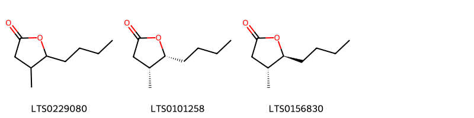{ width=100% }
    <figcaption>Hình ảnh cấu trúc hóa học của 3 hoạt chất thuộc nhóm Lactones gồm ['3-methyl-gamma-octalactone (LTS0229080)', 'cis-3-methyl-4-octanolide (LTS0101258)', 'trans-3-methyl-4-octanolide (LTS0156830)'].</figcaption>
</figure>

---

### Dược dân tộc học

Danh sách các quốc gia có sử dụng *Quercus serrata* trong điều trị các bệnh. 

| Country   | Disease    | Bệnh                                                                                                                                                                                                |
|:----------|:-----------|:----------------------------------------------------------------------------------------------------------------------------------------------------------------------------------------------------|
| Elsewhere | Astringent | MYMEMORY WARNING: YOU USED ALL AVAILABLE FREE TRANSLATIONS FOR TODAY. NEXT AVAILABLE IN  13 HOURS 34 MINUTES 01 SECONDS VISIT HTTPS://MYMEMORY.TRANSLATED.NET/DOC/USAGELIMITS.PHP TO TRANSLATE MORE |

---

---
## Quercus velutina
### Thông tin về thực vật

!!! info "Phân loại thực vật của *Quercus velutina* từ GIBF:"
    - **Kingdom:** Plantae
    - **Phylum:** Tracheophyta
    - **Order:** Fagales
    - **Family:** Fagaceae
    - **Genus:** Quercus
    - **Species:** *Quercus velutina*

 

| Label (VI)   | Label (EN)   | Scientific Name   | Descriptions (VI)   | Descriptions (EN)   | Also Known As (VI)   | Also Known As (EN)                                      |
|:-------------|:-------------|:------------------|:--------------------|:--------------------|:---------------------|:--------------------------------------------------------|
| N/A          | N/A          | Quercus velutina  |                     | tree species        | ['']                 | ['black oak', 'eastern black oak', 'yellow-barked oak'] |

#### Phân bố trên thế giới

**Từ CSDL GIBF** nan, New Zealand, United States of America, Canada

#### Phân bố tại Việt Nam

**Từ CSDL GIBF**: Không có ghi nhận ở Việt Nam

---
### Thành phần hóa học
        
- Theo cơ sở dữ liệu lotus: Từ loài *Quercus velutina* đã phân lập và xác định được Chưa có hoạt chất nào được phân lập. hoạt chất thuộc về các nhóm Không có hoạt chất nào được phân lập. 

Không có hình ảnh nào được tạo ra

---

### Dược dân tộc học

Danh sách các quốc gia có sử dụng *Quercus velutina* trong điều trị các bệnh. 

| Country   | Disease                     | Bệnh                                                                                                                                                                                                |
|:----------|:----------------------------|:----------------------------------------------------------------------------------------------------------------------------------------------------------------------------------------------------|
| US        | Laxative, Astringent, Tonic | MYMEMORY WARNING: YOU USED ALL AVAILABLE FREE TRANSLATIONS FOR TODAY. NEXT AVAILABLE IN  13 HOURS 33 MINUTES 33 SECONDS VISIT HTTPS://MYMEMORY.TRANSLATED.NET/DOC/USAGELIMITS.PHP TO TRANSLATE MORE |

---

# Chi Lithocarpus

??? note "Danh sách các dược liệu thuộc chi"
    
	 - *Lithocarpus pachyphyllus*

---
## Lithocarpus pachyphyllus
### Thông tin về thực vật

!!! info "Phân loại thực vật của *Lithocarpus pachyphyllus* từ GIBF:"
    - **Kingdom:** Plantae
    - **Phylum:** Tracheophyta
    - **Order:** Fagales
    - **Family:** Fagaceae
    - **Genus:** Lithocarpus
    - **Species:** *Lithocarpus pachyphyllus*

 

| Label (VI)   | Label (EN)   | Scientific Name          | Descriptions (VI)   | Descriptions (EN)   | Also Known As (VI)   | Also Known As (EN)   |
|:-------------|:-------------|:-------------------------|:--------------------|:--------------------|:---------------------|:---------------------|
| N/A          | N/A          | Lithocarpus pachyphyllus | loài thực vật       | species of plant    | ['']                 | ['']                 |

#### Phân bố trên thế giới

**Từ CSDL GIBF** nan, Thailand, Myanmar, Bhutan, India, unknown or invalid, Viet Nam, China, Nepal

#### Phân bố tại Việt Nam

**Từ CSDL GIBF**: Không có ghi nhận ở Việt Nam

---
### Thành phần hóa học
        
- Theo cơ sở dữ liệu lotus: Từ loài *Lithocarpus pachyphyllus* đã phân lập và xác định được 4 hoạt chất thuộc về các nhóm Flavonoids. 

|    | chemicalTaxonomyClassyfireClass   |   smiles_count |
|---:|:----------------------------------|---------------:|
|  0 | Flavonoids                        |              4 |

#### Nhóm Flavonoids
<figure markdown="span">
    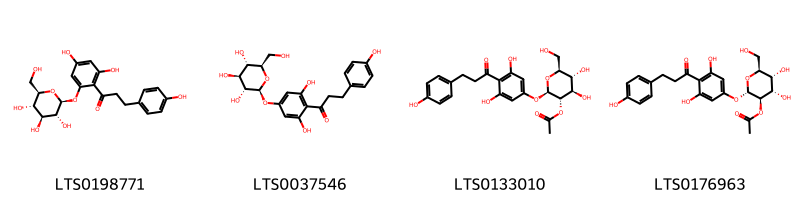{ width=100% }
    <figcaption>Hình ảnh cấu trúc hóa học của 4 hoạt chất thuộc nhóm Flavonoids gồm ['phlorizin (LTS0198771)', 'trilobatin (LTS0037546)', '(2r,3s,4r,5r,6s)-2-{3,5-dihydroxy-4-[3-(4-hydroxyphenyl)propanoyl]phenoxy}-4,5-dihydroxy-6-(hydroxymethyl)oxan-3-yl acetate (LTS0133010)', '(2s,3r,4s,5r,6s)-2-{3,5-dihydroxy-4-[3-(4-hydroxyphenyl)propanoyl]phenoxy}-4,5-dihydroxy-6-(hydroxymethyl)oxan-3-yl acetate (LTS0176963)'].</figcaption>
</figure>

---

### Dược dân tộc học

Danh sách các quốc gia có sử dụng *Lithocarpus pachyphyllus* trong điều trị các bệnh. 

| Country   | Disease    | Bệnh                                                                                                                                                                                                |
|:----------|:-----------|:----------------------------------------------------------------------------------------------------------------------------------------------------------------------------------------------------|
| Elsewhere | Astringent | MYMEMORY WARNING: YOU USED ALL AVAILABLE FREE TRANSLATIONS FOR TODAY. NEXT AVAILABLE IN  13 HOURS 32 MINUTES 51 SECONDS VISIT HTTPS://MYMEMORY.TRANSLATED.NET/DOC/USAGELIMITS.PHP TO TRANSLATE MORE |

---

