!!! abstract "Tóm tắt"

    Họ Flacourtiaceae gồm khoảng 10 chi và 25 loài được một số cộng đồng tại các quốc gia như Dutch, Brazil, French, Venezuela, South America, Java, Brazil(Maku), Mexico, China, Danish, Malaya, anish, Borneo, Sumatra, Elsewhere, Dominican Republic, Brazil(Paumari), Kapayang, German, Portuguese, India, Fiji, Central America, Cuba, Turkey, Panama(Choco) sử dụng trong một số trường hợp QUERY LENGTH LIMIT EXCEEDED. MAX ALLOWED QUERY : 500 CHARS.

!!! info "DrDuke"

    James A. Duke sinh năm 1929-2017 là một nhà thực vật học người Mỹ. Đây là một trong những tác giả hàng đầu trong lĩnh vực dược dân tộc học với cuốn *CRC Handbook of Medicinal Herbs* và chính là người xây dựng lên cơ sở dữ liệu về hợp chất tự nhiên và dược dân tộc học tại Bộ nông nghiệp Hoa Kỳ. Các thông tin được đăng tải tại website [Dr. Duke's Phytochemical and Ethnobotanical Databases](https://phytochem.nal.usda.gov/). 
    Trong suốt thập niên 1970, ông lãnh đạo the Plant Taxonomy Laboratory, Plant Genetics and Germplasm Institute of the Agricultural Research Service, U.S. Department of Agriculture.
    Trong tài liệu này, các thông tin về dược dân tộc của các dược liệu được trích dẫn từ tài liệu của James A. Ducke với sự trợ giúp của phần mềm dịch thuật từ tiếng Anh sang tiếng Việt.
   

# Chi Ryania

??? note "Danh sách các dược liệu thuộc chi"
    
	 - *Ryania dentata*
	 - *Ryania eciosa*
	 - *Ryania pyrifera*
	 - *Ryania ruceana*

---
## Ryania dentata
### Thông tin về thực vật

!!! info "Phân loại thực vật của *Ryania dentata* từ GIBF:"
    - **Kingdom:** Plantae
    - **Phylum:** Tracheophyta
    - **Order:** Malpighiales
    - **Family:** Salicaceae
    - **Genus:** Ryania
    - **Species:** *Ryania dentata*

 

| Label (VI)   | Label (EN)   | Scientific Name   | Descriptions (VI)   | Descriptions (EN)   | Also Known As (VI)   | Also Known As (EN)   |
|:-------------|:-------------|:------------------|:--------------------|:--------------------|:---------------------|:---------------------|
| N/A          | N/A          | Ryania dentata    | loài thực vật       | species of plant    | ['']                 | ['']                 |

#### Phân bố trên thế giới

**Từ CSDL GIBF** nan, Colombia, Venezuela (Bolivarian Republic of)

#### Phân bố tại Việt Nam

**Từ CSDL GIBF**: Không có ghi nhận ở Việt Nam

---
### Thành phần hóa học
        
- Theo cơ sở dữ liệu lotus: Từ loài *Ryania dentata* đã phân lập và xác định được Chưa có hoạt chất nào được phân lập. hoạt chất thuộc về các nhóm Không có hoạt chất nào được phân lập. 

Không có hình ảnh nào được tạo ra

---

### Dược dân tộc học

Danh sách các quốc gia có sử dụng *Ryania dentata* trong điều trị các bệnh. 

| Country   | Disease   | Bệnh                                                                                                                                                                                                |
|:----------|:----------|:----------------------------------------------------------------------------------------------------------------------------------------------------------------------------------------------------|
| Venezuela | Poison    | MYMEMORY WARNING: YOU USED ALL AVAILABLE FREE TRANSLATIONS FOR TODAY. NEXT AVAILABLE IN  13 HOURS 55 MINUTES 42 SECONDS VISIT HTTPS://MYMEMORY.TRANSLATED.NET/DOC/USAGELIMITS.PHP TO TRANSLATE MORE |

---

---
## Ryania eciosa
### Thông tin về thực vật

!!! info "Phân loại thực vật của *N/A* từ GIBF:"
    - **Kingdom:** Plantae
    - **Phylum:** Tracheophyta
    - **Order:** Malpighiales
    - **Family:** Salicaceae
    - **Genus:** Ryania
    - **Species:** *N/A*

 

| Label (VI)   | Label (EN)   | Scientific Name   | Descriptions (VI)   | Descriptions (EN)   | Also Known As (VI)   | Also Known As (EN)   |
|:-------------|:-------------|:------------------|:--------------------|:--------------------|:---------------------|:---------------------|
| N/A          | N/A          | Ryania dentata    | loài thực vật       | species of plant    | ['']                 | ['']                 |

#### Phân bố trên thế giới

**Từ CSDL GIBF** Colombia, Venezuela (Bolivarian Republic of), Brazil, Peru, French Guiana, Trinidad and Tobago, Ecuador

#### Phân bố tại Việt Nam

**Từ CSDL GIBF**: Không có ghi nhận ở Việt Nam

---
### Thành phần hóa học
        
- Theo cơ sở dữ liệu lotus: Từ loài *N/A* đã phân lập và xác định được Chưa có hoạt chất nào được phân lập. hoạt chất thuộc về các nhóm Không có hoạt chất nào được phân lập. 

Không có hình ảnh nào được tạo ra

---

### Dược dân tộc học

Danh sách các quốc gia có sử dụng *N/A* trong điều trị các bệnh. 

| Country         | Disease           | Bệnh                                                                                                                                                                                                |
|:----------------|:------------------|:----------------------------------------------------------------------------------------------------------------------------------------------------------------------------------------------------|
| Brazil(Maku)    | Poison            | MYMEMORY WARNING: YOU USED ALL AVAILABLE FREE TRANSLATIONS FOR TODAY. NEXT AVAILABLE IN  13 HOURS 55 MINUTES 19 SECONDS VISIT HTTPS://MYMEMORY.TRANSLATED.NET/DOC/USAGELIMITS.PHP TO TRANSLATE MORE |
| Brazil(Paumari) | Piscicide, Poison | MYMEMORY WARNING: YOU USED ALL AVAILABLE FREE TRANSLATIONS FOR TODAY. NEXT AVAILABLE IN  13 HOURS 55 MINUTES 17 SECONDS VISIT HTTPS://MYMEMORY.TRANSLATED.NET/DOC/USAGELIMITS.PHP TO TRANSLATE MORE |
| Elsewhere       | Insecticide       | MYMEMORY WARNING: YOU USED ALL AVAILABLE FREE TRANSLATIONS FOR TODAY. NEXT AVAILABLE IN  13 HOURS 55 MINUTES 13 SECONDS VISIT HTTPS://MYMEMORY.TRANSLATED.NET/DOC/USAGELIMITS.PHP TO TRANSLATE MORE |

---

---
## Ryania pyrifera
### Thông tin về thực vật

!!! info "Phân loại thực vật của *Ryania pyrifera* từ GIBF:"
    - **Kingdom:** Plantae
    - **Phylum:** Tracheophyta
    - **Order:** Malpighiales
    - **Family:** Salicaceae
    - **Genus:** Ryania
    - **Species:** *Ryania pyrifera*

 

| Label (VI)   | Label (EN)   | Scientific Name   | Descriptions (VI)   | Descriptions (EN)   | Also Known As (VI)   | Also Known As (EN)   |
|:-------------|:-------------|:------------------|:--------------------|:--------------------|:---------------------|:---------------------|
| N/A          | N/A          | Ryania pyrifera   | loài thực vật       | species of plant    | ['']                 | ['']                 |

#### Phân bố trên thế giới

**Từ CSDL GIBF** nan, Colombia, Suriname, Brazil, Peru, French Guiana, Guyana

#### Phân bố tại Việt Nam

**Từ CSDL GIBF**: Không có ghi nhận ở Việt Nam

---
### Thành phần hóa học
        
- Theo cơ sở dữ liệu lotus: Từ loài *Ryania pyrifera* đã phân lập và xác định được Chưa có hoạt chất nào được phân lập. hoạt chất thuộc về các nhóm Không có hoạt chất nào được phân lập. 

Không có hình ảnh nào được tạo ra

---

### Dược dân tộc học

Danh sách các quốc gia có sử dụng *Ryania pyrifera* trong điều trị các bệnh. 

| Country       | Disease     | Bệnh                                                                                                                                                                                                |
|:--------------|:------------|:----------------------------------------------------------------------------------------------------------------------------------------------------------------------------------------------------|
| Brazil        | Poison      | MYMEMORY WARNING: YOU USED ALL AVAILABLE FREE TRANSLATIONS FOR TODAY. NEXT AVAILABLE IN  13 HOURS 54 MINUTES 43 SECONDS VISIT HTTPS://MYMEMORY.TRANSLATED.NET/DOC/USAGELIMITS.PHP TO TRANSLATE MORE |
| South America | Insecticide | MYMEMORY WARNING: YOU USED ALL AVAILABLE FREE TRANSLATIONS FOR TODAY. NEXT AVAILABLE IN  13 HOURS 54 MINUTES 40 SECONDS VISIT HTTPS://MYMEMORY.TRANSLATED.NET/DOC/USAGELIMITS.PHP TO TRANSLATE MORE |

---

---
## Ryania ruceana
### Thông tin về thực vật

!!! info "Phân loại thực vật của *N/A* từ GIBF:"
    - **Kingdom:** Plantae
    - **Phylum:** Tracheophyta
    - **Order:** Malpighiales
    - **Family:** Salicaceae
    - **Genus:** Ryania
    - **Species:** *N/A*

 

| Label (VI)   | Label (EN)   | Scientific Name   | Descriptions (VI)   | Descriptions (EN)   | Also Known As (VI)   | Also Known As (EN)   |
|:-------------|:-------------|:------------------|:--------------------|:--------------------|:---------------------|:---------------------|
| N/A          | N/A          | Ryania pyrifera   | loài thực vật       | species of plant    | ['']                 | ['']                 |

#### Phân bố trên thế giới

**Từ CSDL GIBF** Colombia, Venezuela (Bolivarian Republic of), Brazil, Peru, French Guiana, Trinidad and Tobago, Ecuador

#### Phân bố tại Việt Nam

**Từ CSDL GIBF**: Không có ghi nhận ở Việt Nam

---
### Thành phần hóa học
        
- Theo cơ sở dữ liệu lotus: Từ loài *N/A* đã phân lập và xác định được Chưa có hoạt chất nào được phân lập. hoạt chất thuộc về các nhóm Không có hoạt chất nào được phân lập. 

Không có hình ảnh nào được tạo ra

---

### Dược dân tộc học

Danh sách các quốc gia có sử dụng *N/A* trong điều trị các bệnh. 

| Country   | Disease   | Bệnh                                                                                                                                                                                                |
|:----------|:----------|:----------------------------------------------------------------------------------------------------------------------------------------------------------------------------------------------------|
| Venezuela | Poison    | MYMEMORY WARNING: YOU USED ALL AVAILABLE FREE TRANSLATIONS FOR TODAY. NEXT AVAILABLE IN  13 HOURS 54 MINUTES 14 SECONDS VISIT HTTPS://MYMEMORY.TRANSLATED.NET/DOC/USAGELIMITS.PHP TO TRANSLATE MORE |

---

# Chi Flacourtia

??? note "Danh sách các dược liệu thuộc chi"
    
	 - *Flacourtia indica*
	 - *Flacourtia jangomas*
	 - *Flacourtia ramantchi*

---
## Flacourtia indica
### Thông tin về thực vật

!!! info "Phân loại thực vật của *Flacourtia indica* từ GIBF:"
    - **Kingdom:** Plantae
    - **Phylum:** Tracheophyta
    - **Order:** Malpighiales
    - **Family:** Salicaceae
    - **Genus:** Flacourtia
    - **Species:** *Flacourtia indica*

 

| Label (VI)   | Label (EN)   | Scientific Name   | Descriptions (VI)   | Descriptions (EN)   | Also Known As (VI)   | Also Known As (EN)   |
|:-------------|:-------------|:------------------|:--------------------|:--------------------|:---------------------|:---------------------|
| N/A          | N/A          | Flacourtia indica |                     | species of plant    | ['']                 | ['']                 |

#### Phân bố trên thế giới

**Từ CSDL GIBF** Malawi, Thailand, French Polynesia, Trinidad and Tobago, Kenya, Colombia, Sri Lanka, Puerto Rico, Mauritius, India, Réunion, Mayotte, Seychelles, Nigeria, Eswatini, French Southern Territories, Ethiopia, Comoros, Benin, South Africa, Mozambique, Tanzania, United Republic of, United States of America, Zimbabwe, Zambia, Madagascar

#### Phân bố tại Việt Nam

**Từ CSDL GIBF**: Không có ghi nhận ở Việt Nam

---
### Thành phần hóa học
        
- Theo cơ sở dữ liệu lotus: Từ loài *Flacourtia indica* đã phân lập và xác định được 21 hoạt chất thuộc về các nhóm Steroids and steroid derivatives, Organooxygen compounds, Flavonoids, Lignan glycosides. 

|    | chemicalTaxonomyClassyfireClass   |   smiles_count |
|---:|:----------------------------------|---------------:|
|  0 | Flavonoids                        |              3 |
|  1 | Lignan glycosides                 |              2 |
|  2 | Organooxygen compounds            |             10 |
|  3 | Steroids and steroid derivatives  |              6 |

#### Nhóm Flavonoids
<figure markdown="span">
    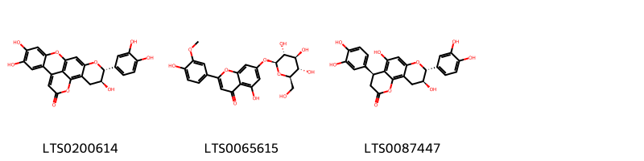{ width=100% }
    <figcaption>Hình ảnh cấu trúc hóa học của 3 hoạt chất thuộc nhóm Flavonoids gồm ['(16s,17r)-17-(3,4-dihydroxyphenyl)-5,6,16-trihydroxy-2,12,18-trioxapentacyclo[11.7.1.0³,⁸.0⁹,²¹.0¹⁴,¹⁹]henicosa-1(21),3,5,7,9,13,19-heptaen-11-one (LTS0200614)', '5-hydroxy-2-(4-hydroxy-3-methoxyphenyl)-7-{[(2s,3r,4s,5s,6r)-3,4,5-trihydroxy-6-(hydroxymethyl)oxan-2-yl]oxy}chromen-4-one (LTS0065615)', '(6s,12r,13s)-6,12-bis(3,4-dihydroxyphenyl)-8,13-dihydroxy-3,11-dioxatricyclo[8.4.0.0²,⁷]tetradeca-1,7,9-trien-4-one (LTS0087447)'].</figcaption>
</figure>
#### Nhóm Lignan glycosides
<figure markdown="span">
    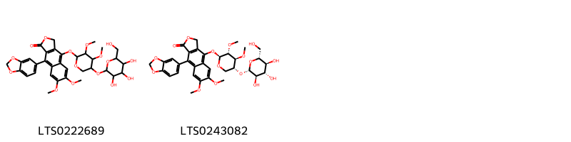{ width=100% }
    <figcaption>Hình ảnh cấu trúc hóa học của 2 hoạt chất thuộc nhóm Lignan glycosides gồm ['9-(2h-1,3-benzodioxol-5-yl)-4-[(3,4-dimethoxy-5-{[3,4,5-trihydroxy-6-(hydroxymethyl)oxan-2-yl]oxy}oxan-2-yl)oxy]-6,7-dimethoxy-3h-naphtho[2,3-c]furan-1-one (LTS0222689)', '9-(2h-1,3-benzodioxol-5-yl)-4-{[(2s,3r,4s,5r)-3,4-dimethoxy-5-{[(2s,3r,4s,5s,6r)-3,4,5-trihydroxy-6-(hydroxymethyl)oxan-2-yl]oxy}oxan-2-yl]oxy}-6,7-dimethoxy-3h-naphtho[2,3-c]furan-1-one (LTS0243082)'].</figcaption>
</figure>
#### Nhóm Organooxygen compounds
<figure markdown="span">
    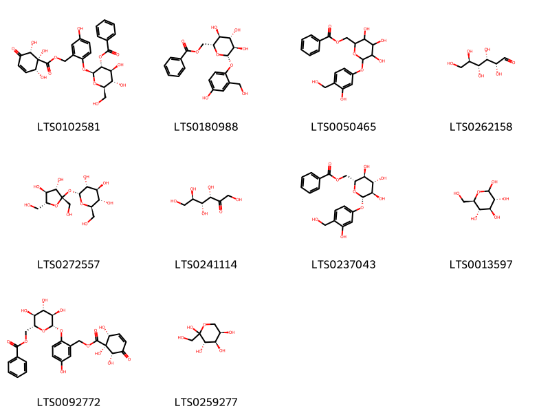{ width=100% }
    <figcaption>Hình ảnh cấu trúc hóa học của 10 hoạt chất thuộc nhóm Organooxygen compounds gồm ['(2s,3r,4s,5s,6r)-4,5-dihydroxy-2-(4-hydroxy-2-{[(1r,2r,6r)-1,2,6-trihydroxy-5-oxocyclohex-3-ene-1-carbonyloxy]methyl}phenoxy)-6-(hydroxymethyl)oxan-3-yl benzoate (LTS0102581)', '[(2r,3s,4s,5r,6s)-3,4,5-trihydroxy-6-[4-hydroxy-2-(hydroxymethyl)phenoxy]oxan-2-yl]methyl benzoate (LTS0180988)', '{3,4,5-trihydroxy-6-[3-hydroxy-4-(hydroxymethyl)phenoxy]oxan-2-yl}methyl benzoate (LTS0050465)', '(+)-glucose (LTS0262158)', 'sucrose (LTS0272557)', 'keto-d-fructose (LTS0241114)', '[(2r,3s,4s,5r,6s)-3,4,5-trihydroxy-6-[3-hydroxy-4-(hydroxymethyl)phenoxy]oxan-2-yl]methyl benzoate (LTS0237043)', 'glucose (LTS0013597)', '[(2r,3s,4s,5r,6s)-3,4,5-trihydroxy-6-(4-hydroxy-2-{[(1r,2r,6r)-1,2,6-trihydroxy-5-oxocyclohex-3-ene-1-carbonyloxy]methyl}phenoxy)oxan-2-yl]methyl benzoate (LTS0092772)', 'd-fructopyranose (LTS0259277)'].</figcaption>
</figure>
#### Nhóm Steroids and steroid derivatives
<figure markdown="span">
    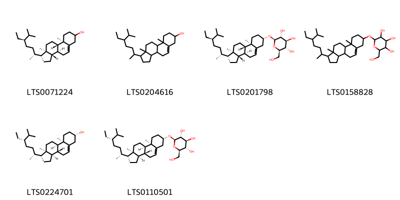{ width=100% }
    <figcaption>Hình ảnh cấu trúc hóa học của 6 hoạt chất thuộc nhóm Steroids and steroid derivatives gồm ['stigmast-5-en-3-ol (LTS0071224)', 'stigmast-5-en-3-ol, (3β)- (LTS0204616)', 'sitogluside (LTS0201798)', '2-{[1-(5-ethyl-6-methylheptan-2-yl)-9a,11a-dimethyl-1h,2h,3h,3ah,3bh,4h,6h,7h,8h,9h,9bh,10h,11h-cyclopenta[a]phenanthren-7-yl]oxy}-6-(hydroxymethyl)oxane-3,4,5-triol (LTS0158828)', '(1r,3ar,3br,7s,9ar,9br,11ar)-1-[(2r,5s)-5-ethyl-6-methylheptan-2-yl]-9a,11a-dimethyl-1h,2h,3h,3ah,3bh,4h,6h,7h,8h,9h,9bh,10h,11h-cyclopenta[a]phenanthren-7-ol (LTS0224701)', '(2r,3r,4s,5s,6r)-2-{[(1r,3ar,3br,7s,9ar,9br,11ar)-1-[(2r,5s)-5-ethyl-6-methylheptan-2-yl]-9a,11a-dimethyl-1h,2h,3h,3ah,3bh,4h,6h,7h,8h,9h,9bh,10h,11h-cyclopenta[a]phenanthren-7-yl]oxy}-6-(hydroxymethyl)oxane-3,4,5-triol (LTS0110501)'].</figcaption>
</figure>

---

### Dược dân tộc học

Danh sách các quốc gia có sử dụng *Flacourtia indica* trong điều trị các bệnh. 

| Country   | Disease                            | Bệnh                                                                                                                                                                                                |
|:----------|:-----------------------------------|:----------------------------------------------------------------------------------------------------------------------------------------------------------------------------------------------------|
| Turkey    | Refrigerant, Stomachic, Astringent | MYMEMORY WARNING: YOU USED ALL AVAILABLE FREE TRANSLATIONS FOR TODAY. NEXT AVAILABLE IN  13 HOURS 53 MINUTES 42 SECONDS VISIT HTTPS://MYMEMORY.TRANSLATED.NET/DOC/USAGELIMITS.PHP TO TRANSLATE MORE |

---

---
## Flacourtia jangomas
### Thông tin về thực vật

!!! info "Phân loại thực vật của *Flacourtia jangomas* từ GIBF:"
    - **Kingdom:** Plantae
    - **Phylum:** Tracheophyta
    - **Order:** Malpighiales
    - **Family:** Salicaceae
    - **Genus:** Flacourtia
    - **Species:** *Flacourtia jangomas*

 

| Label (VI)   | Label (EN)   | Scientific Name     | Descriptions (VI)   | Descriptions (EN)   | Also Known As (VI)                                    | Also Known As (EN)                                             |
|:-------------|:-------------|:--------------------|:--------------------|:--------------------|:------------------------------------------------------|:---------------------------------------------------------------|
| N/A          | N/A          | Flacourtia jangomas | loài thực vật       | species of plant    | ['Mùng quân trắng', 'Flacourtia jangomas', 'Bồ quân'] | ['Flacourtia cataphracta', 'Indian coffee plum', 'scramberry'] |

#### Phân bố trên thế giới

**Từ CSDL GIBF** nan, Viet Nam, unknown or invalid, Thailand, Honduras, Guadeloupe, Philippines, Dominica, French Guiana, Lao People’s Democratic Republic, Gabon, Singapore, Martinique, Australia, Jamaica, Indonesia, Venezuela (Bolivarian Republic of), Dominican Republic, Côte d’Ivoire, Malaysia, Puerto Rico, India, Réunion, Mayotte, Seychelles, Cuba, Belgium, Cambodia, Barbados, Belize, Nicaragua, Panama, Brazil, Montserrat, Mexico, Nepal, Chinese Taipei, Tanzania, United Republic of, Cook Islands, Costa Rica, New Caledonia, Congo, Democratic Republic of the, United States of America, Guyana

#### Phân bố tại Việt Nam

**Từ CSDL GIBF**: Quang Nam-Da Nang

---
### Thành phần hóa học
        
- Theo cơ sở dữ liệu lotus: Từ loài *Flacourtia jangomas* đã phân lập và xác định được 9 hoạt chất thuộc về các nhóm Steroids and steroid derivatives, Prenol lipids, Coumarins and derivatives. 

|    | chemicalTaxonomyClassyfireClass   |   smiles_count |
|---:|:----------------------------------|---------------:|
|  0 | Coumarins and derivatives         |              2 |
|  1 | Prenol lipids                     |              4 |
|  2 | Steroids and steroid derivatives  |              3 |

#### Nhóm Coumarins and derivatives
<figure markdown="span">
    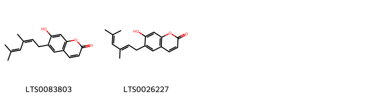{ width=100% }
    <figcaption>Hình ảnh cấu trúc hóa học của 2 hoạt chất thuộc nhóm Coumarins and derivatives gồm ['6-(3,5-dimethylhexa-2,4-dien-1-yl)-7-hydroxychromen-2-one (LTS0083803)', '6-[(2e)-3,5-dimethylhexa-2,4-dien-1-yl]-7-hydroxychromen-2-one (LTS0026227)'].</figcaption>
</figure>
#### Nhóm Prenol lipids
<figure markdown="span">
    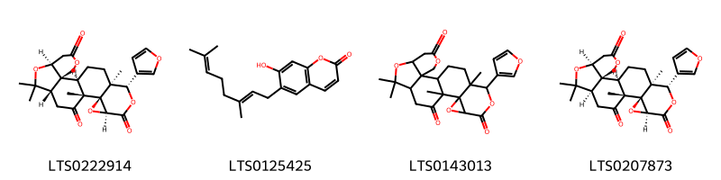{ width=100% }
    <figcaption>Hình ảnh cấu trúc hóa học của 4 hoạt chất thuộc nhóm Prenol lipids gồm ['(1r,2r,7s,10s,13r,14r,16s,19s,20s)-19-(furan-3-yl)-9,9,13,20-tetramethyl-4,8,15,18-tetraoxahexacyclo[11.9.0.0²,⁷.0²,¹⁰.0¹⁴,¹⁶.0¹⁴,²⁰]docosane-5,12,17-trione (LTS0222914)', 'ostruthin (LTS0125425)', 'limonin (LTS0143013)', 'limonin (LTS0207873)'].</figcaption>
</figure>
#### Nhóm Steroids and steroid derivatives
<figure markdown="span">
    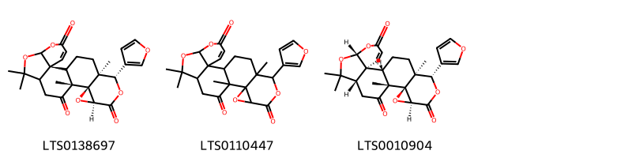{ width=100% }
    <figcaption>Hình ảnh cấu trúc hóa học của 3 hoạt chất thuộc nhóm Steroids and steroid derivatives gồm ['(2s,13r,14r,16s,19s,20s)-19-(furan-3-yl)-9,9,13,20-tetramethyl-6,8,15,18-tetraoxahexacyclo[11.9.0.0²,⁷.0²,¹⁰.0¹⁴,¹⁶.0¹⁴,²⁰]docos-3-ene-5,12,17-trione (LTS0138697)', '19-(furan-3-yl)-9,9,13,20-tetramethyl-6,8,15,18-tetraoxahexacyclo[11.9.0.0²,⁷.0²,¹⁰.0¹⁴,¹⁶.0¹⁴,²⁰]docos-3-ene-5,12,17-trione (LTS0110447)', '(1s,2s,7r,10s,13r,14r,16s,19s,20s)-19-(furan-3-yl)-9,9,13,20-tetramethyl-6,8,15,18-tetraoxahexacyclo[11.9.0.0²,⁷.0²,¹⁰.0¹⁴,¹⁶.0¹⁴,²⁰]docos-3-ene-5,12,17-trione (LTS0010904)'].</figcaption>
</figure>

---

### Dược dân tộc học

Danh sách các quốc gia có sử dụng *Flacourtia jangomas* trong điều trị các bệnh. 

| Country   | Disease               | Bệnh                                                                                                                                                                                                |
|:----------|:----------------------|:----------------------------------------------------------------------------------------------------------------------------------------------------------------------------------------------------|
| India     | Stomachic, Astringent | MYMEMORY WARNING: YOU USED ALL AVAILABLE FREE TRANSLATIONS FOR TODAY. NEXT AVAILABLE IN  13 HOURS 53 MINUTES 03 SECONDS VISIT HTTPS://MYMEMORY.TRANSLATED.NET/DOC/USAGELIMITS.PHP TO TRANSLATE MORE |

---

---
## Flacourtia ramantchi
### Thông tin về thực vật

!!! info "Phân loại thực vật của *Flacourtia indica* từ GIBF:"
    - **Kingdom:** Plantae
    - **Phylum:** Tracheophyta
    - **Order:** Malpighiales
    - **Family:** Salicaceae
    - **Genus:** Flacourtia
    - **Species:** *Flacourtia indica*

 

| Label (VI)   | Label (EN)   | Scientific Name     | Descriptions (VI)   | Descriptions (EN)   | Also Known As (VI)                                    | Also Known As (EN)                                             |
|:-------------|:-------------|:--------------------|:--------------------|:--------------------|:------------------------------------------------------|:---------------------------------------------------------------|
| N/A          | N/A          | Flacourtia jangomas | loài thực vật       | species of plant    | ['Mùng quân trắng', 'Flacourtia jangomas', 'Bồ quân'] | ['Flacourtia cataphracta', 'Indian coffee plum', 'scramberry'] |

#### Phân bố trên thế giới

**Từ CSDL GIBF** Viet Nam, Honduras, Thailand, Sri Lanka, Brazil, Mauritius, India, Cook Islands, Mayotte, Comoros, United States of America, Mexico, China, Zimbabwe, Madagascar

#### Phân bố tại Việt Nam

**Từ CSDL GIBF**: Hoa Binh

---
### Thành phần hóa học
        
- Theo cơ sở dữ liệu lotus: Từ loài *Flacourtia indica* đã phân lập và xác định được Chưa có hoạt chất nào được phân lập. hoạt chất thuộc về các nhóm Không có hoạt chất nào được phân lập. 

Không có hình ảnh nào được tạo ra

---

### Dược dân tộc học

Danh sách các quốc gia có sử dụng *Flacourtia indica* trong điều trị các bệnh. 

| Country   | Disease             | Bệnh                                                                                                                                                                                                |
|:----------|:--------------------|:----------------------------------------------------------------------------------------------------------------------------------------------------------------------------------------------------|
| India     | Digestive, Diuretic | MYMEMORY WARNING: YOU USED ALL AVAILABLE FREE TRANSLATIONS FOR TODAY. NEXT AVAILABLE IN  13 HOURS 52 MINUTES 30 SECONDS VISIT HTTPS://MYMEMORY.TRANSLATED.NET/DOC/USAGELIMITS.PHP TO TRANSLATE MORE |

---

# Chi Homalium

??? note "Danh sách các dược liệu thuộc chi"
    
	 - *Homalium caryophyllaceum*
	 - *Homalium nitens*

---
## Homalium caryophyllaceum
### Thông tin về thực vật

!!! info "Phân loại thực vật của *Homalium caryophyllaceum* từ GIBF:"
    - **Kingdom:** Plantae
    - **Phylum:** Tracheophyta
    - **Order:** Malpighiales
    - **Family:** Salicaceae
    - **Genus:** Homalium
    - **Species:** *Homalium caryophyllaceum*

 

| Label (VI)   | Label (EN)   | Scientific Name          | Descriptions (VI)   | Descriptions (EN)   | Also Known As (VI)   | Also Known As (EN)   |
|:-------------|:-------------|:-------------------------|:--------------------|:--------------------|:---------------------|:---------------------|
| N/A          | N/A          | Homalium caryophyllaceum | loài thực vật       | species of plant    | ['']                 | ['']                 |

#### Phân bố trên thế giới

**Từ CSDL GIBF** Viet Nam, nan, unknown or invalid, Thailand, Brunei Darussalam, Malaysia, Cambodia, Indonesia

#### Phân bố tại Việt Nam

**Từ CSDL GIBF**: Tay Ninh

---
### Thành phần hóa học
        
- Theo cơ sở dữ liệu lotus: Từ loài *Homalium caryophyllaceum* đã phân lập và xác định được Chưa có hoạt chất nào được phân lập. hoạt chất thuộc về các nhóm Không có hoạt chất nào được phân lập. 

Không có hình ảnh nào được tạo ra

---

### Dược dân tộc học

Danh sách các quốc gia có sử dụng *Homalium caryophyllaceum* trong điều trị các bệnh. 

| Country   | Disease   | Bệnh                                                                                                                                                                                                |
|:----------|:----------|:----------------------------------------------------------------------------------------------------------------------------------------------------------------------------------------------------|
| Borneo    | Poison    | MYMEMORY WARNING: YOU USED ALL AVAILABLE FREE TRANSLATIONS FOR TODAY. NEXT AVAILABLE IN  13 HOURS 52 MINUTES 06 SECONDS VISIT HTTPS://MYMEMORY.TRANSLATED.NET/DOC/USAGELIMITS.PHP TO TRANSLATE MORE |

---

---
## Homalium nitens
### Thông tin về thực vật

!!! info "Phân loại thực vật của *Homalium nitens* từ GIBF:"
    - **Kingdom:** Plantae
    - **Phylum:** Tracheophyta
    - **Order:** Malpighiales
    - **Family:** Salicaceae
    - **Genus:** Homalium
    - **Species:** *Homalium nitens*

 

| Label (VI)   | Label (EN)   | Scientific Name   | Descriptions (VI)   | Descriptions (EN)   | Also Known As (VI)   | Also Known As (EN)   |
|:-------------|:-------------|:------------------|:--------------------|:--------------------|:---------------------|:---------------------|
| N/A          | N/A          | Homalium nitens   | loài thực vật       | species of plant    | ['']                 | ['']                 |

#### Phân bố trên thế giới

**Từ CSDL GIBF** nan, Papua New Guinea, unknown or invalid, Fiji

#### Phân bố tại Việt Nam

**Từ CSDL GIBF**: Không có ghi nhận ở Việt Nam

---
### Thành phần hóa học
        
- Theo cơ sở dữ liệu lotus: Từ loài *Homalium nitens* đã phân lập và xác định được Chưa có hoạt chất nào được phân lập. hoạt chất thuộc về các nhóm Không có hoạt chất nào được phân lập. 

Không có hình ảnh nào được tạo ra

---

### Dược dân tộc học

Danh sách các quốc gia có sử dụng *Homalium nitens* trong điều trị các bệnh. 

| Country   | Disease   | Bệnh                                                                                                                                                                                                |
|:----------|:----------|:----------------------------------------------------------------------------------------------------------------------------------------------------------------------------------------------------|
| Fiji      | Tonic     | MYMEMORY WARNING: YOU USED ALL AVAILABLE FREE TRANSLATIONS FOR TODAY. NEXT AVAILABLE IN  13 HOURS 51 MINUTES 23 SECONDS VISIT HTTPS://MYMEMORY.TRANSLATED.NET/DOC/USAGELIMITS.PHP TO TRANSLATE MORE |

---

# Chi Pangium

??? note "Danh sách các dược liệu thuộc chi"
    
	 - *Pangium edule*

---
## Pangium edule
### Thông tin về thực vật

!!! info "Phân loại thực vật của *Pangium edule* từ GIBF:"
    - **Kingdom:** Plantae
    - **Phylum:** Tracheophyta
    - **Order:** Malpighiales
    - **Family:** Achariaceae
    - **Genus:** Pangium
    - **Species:** *Pangium edule*

 

| Label (VI)   | Label (EN)   | Scientific Name   | Descriptions (VI)   | Descriptions (EN)                                | Also Known As (VI)   | Also Known As (EN)          |
|:-------------|:-------------|:------------------|:--------------------|:-------------------------------------------------|:---------------------|:----------------------------|
| N/A          | N/A          | Pangium edule     |                     | tree native to Southeast Asia with edible fruits | ['']                 | ['football fruit', 'rowal'] |

#### Phân bố trên thế giới

**Từ CSDL GIBF** nan, unknown or invalid, Brunei Darussalam, Vanuatu, Micronesia (Federated States of), Philippines, Malaysia, Palau, India, Papua New Guinea, Singapore, Guam, Solomon Islands, Indonesia

#### Phân bố tại Việt Nam

**Từ CSDL GIBF**: Không có ghi nhận ở Việt Nam

---
### Thành phần hóa học
        
- Theo cơ sở dữ liệu lotus: Từ loài *Pangium edule* đã phân lập và xác định được Chưa có hoạt chất nào được phân lập. hoạt chất thuộc về các nhóm Không có hoạt chất nào được phân lập. 

Không có hình ảnh nào được tạo ra

---

### Dược dân tộc học

Danh sách các quốc gia có sử dụng *Pangium edule* trong điều trị các bệnh. 

| Country   | Disease                                  | Bệnh                                                                                                                                                                                                |
|:----------|:-----------------------------------------|:----------------------------------------------------------------------------------------------------------------------------------------------------------------------------------------------------|
| Java      | Antiseptic, Poison, Piscicide, Vermifuge | MYMEMORY WARNING: YOU USED ALL AVAILABLE FREE TRANSLATIONS FOR TODAY. NEXT AVAILABLE IN  13 HOURS 51 MINUTES 01 SECONDS VISIT HTTPS://MYMEMORY.TRANSLATED.NET/DOC/USAGELIMITS.PHP TO TRANSLATE MORE |
| Kapayang  | Parasiticide                             | MYMEMORY WARNING: YOU USED ALL AVAILABLE FREE TRANSLATIONS FOR TODAY. NEXT AVAILABLE IN  13 HOURS 50 MINUTES 59 SECONDS VISIT HTTPS://MYMEMORY.TRANSLATED.NET/DOC/USAGELIMITS.PHP TO TRANSLATE MORE |
| Malaya    | Artemicide                               | MYMEMORY WARNING: YOU USED ALL AVAILABLE FREE TRANSLATIONS FOR TODAY. NEXT AVAILABLE IN  13 HOURS 50 MINUTES 55 SECONDS VISIT HTTPS://MYMEMORY.TRANSLATED.NET/DOC/USAGELIMITS.PHP TO TRANSLATE MORE |
| Sumatra   | Piscicide                                | MYMEMORY WARNING: YOU USED ALL AVAILABLE FREE TRANSLATIONS FOR TODAY. NEXT AVAILABLE IN  13 HOURS 50 MINUTES 53 SECONDS VISIT HTTPS://MYMEMORY.TRANSLATED.NET/DOC/USAGELIMITS.PHP TO TRANSLATE MORE |

---

# Chi Casearia

??? note "Danh sách các dược liệu thuộc chi"
    
	 - *Casearia esculenta*
	 - *Casearia graveolens*
	 - *Casearia resinifera*
	 - *Casearia tomentosa*

---
## Casearia esculenta
### Thông tin về thực vật

!!! info "Phân loại thực vật của *Casearia zeylanica* từ GIBF:"
    - **Kingdom:** Plantae
    - **Phylum:** Tracheophyta
    - **Order:** Malpighiales
    - **Family:** Salicaceae
    - **Genus:** Casearia
    - **Species:** *Casearia zeylanica*

 

| Label (VI)   | Label (EN)   | Scientific Name   | Descriptions (VI)   | Descriptions (EN)                                | Also Known As (VI)   | Also Known As (EN)          |
|:-------------|:-------------|:------------------|:--------------------|:-------------------------------------------------|:---------------------|:----------------------------|
| N/A          | N/A          | Pangium edule     |                     | tree native to Southeast Asia with edible fruits | ['']                 | ['football fruit', 'rowal'] |

#### Phân bố trên thế giới

**Từ CSDL GIBF** nan, unknown or invalid, Sri Lanka, Bhutan, Malaysia, India, Nepal, Indonesia

#### Phân bố tại Việt Nam

**Từ CSDL GIBF**: Không có ghi nhận ở Việt Nam

---
### Thành phần hóa học
        
- Theo cơ sở dữ liệu lotus: Từ loài *Casearia zeylanica* đã phân lập và xác định được Chưa có hoạt chất nào được phân lập. hoạt chất thuộc về các nhóm Không có hoạt chất nào được phân lập. 

Không có hình ảnh nào được tạo ra

---

### Dược dân tộc học

Danh sách các quốc gia có sử dụng *Casearia zeylanica* trong điều trị các bệnh. 

| Country   | Disease               | Bệnh                                                                                                                                                                                                |
|:----------|:----------------------|:----------------------------------------------------------------------------------------------------------------------------------------------------------------------------------------------------|
| Elsewhere | Astringent, Purgative | MYMEMORY WARNING: YOU USED ALL AVAILABLE FREE TRANSLATIONS FOR TODAY. NEXT AVAILABLE IN  13 HOURS 50 MINUTES 27 SECONDS VISIT HTTPS://MYMEMORY.TRANSLATED.NET/DOC/USAGELIMITS.PHP TO TRANSLATE MORE |

---

---
## Casearia graveolens
### Thông tin về thực vật

!!! info "Phân loại thực vật của *Casearia graveolens* từ GIBF:"
    - **Kingdom:** Plantae
    - **Phylum:** Tracheophyta
    - **Order:** Malpighiales
    - **Family:** Salicaceae
    - **Genus:** Casearia
    - **Species:** *Casearia graveolens*

 

| Label (VI)   | Label (EN)   | Scientific Name     | Descriptions (VI)   | Descriptions (EN)   | Also Known As (VI)   | Also Known As (EN)   |
|:-------------|:-------------|:--------------------|:--------------------|:--------------------|:---------------------|:---------------------|
| N/A          | N/A          | Casearia graveolens | loài thực vật       | species of plant    | ['']                 | ['']                 |

#### Phân bố trên thế giới

**Từ CSDL GIBF** Viet Nam, nan, unknown or invalid, Thailand, Bhutan, Myanmar, Philippines, India, China, Nepal, Cambodia

#### Phân bố tại Việt Nam

**Từ CSDL GIBF**: Không có ghi nhận ở Việt Nam

---
### Thành phần hóa học
        
- Theo cơ sở dữ liệu lotus: Từ loài *Casearia graveolens* đã phân lập và xác định được 5 hoạt chất thuộc về các nhóm Steroids and steroid derivatives, Coumarins and derivatives. 

|    | chemicalTaxonomyClassyfireClass   |   smiles_count |
|---:|:----------------------------------|---------------:|
|  0 | Coumarins and derivatives         |              3 |
|  1 | Steroids and steroid derivatives  |              2 |

#### Nhóm Coumarins and derivatives
<figure markdown="span">
    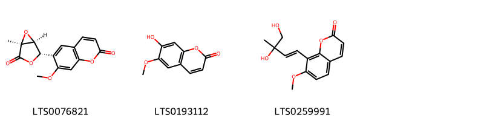{ width=100% }
    <figcaption>Hình ảnh cấu trúc hóa học của 3 hoạt chất thuộc nhóm Coumarins and derivatives gồm ['micromelin (LTS0076821)', 'scopoletin (LTS0193112)', '8-[(1e)-3,4-dihydroxy-3-methylbut-1-en-1-yl]-7-methoxychromen-2-one (LTS0259991)'].</figcaption>
</figure>
#### Nhóm Steroids and steroid derivatives
<figure markdown="span">
    { width=100% }
    <figcaption>Hình ảnh cấu trúc hóa học của 2 hoạt chất thuộc nhóm Steroids and steroid derivatives gồm ['stigmast-5-en-3-ol (LTS0071224)', 'stigmast-5-en-3-ol, (3β)- (LTS0204616)'].</figcaption>
</figure>

---

### Dược dân tộc học

Danh sách các quốc gia có sử dụng *Casearia graveolens* trong điều trị các bệnh. 

| Country   | Disease   | Bệnh                                                                                                                                                                                                |
|:----------|:----------|:----------------------------------------------------------------------------------------------------------------------------------------------------------------------------------------------------|
| Elsewhere | Piscicide | MYMEMORY WARNING: YOU USED ALL AVAILABLE FREE TRANSLATIONS FOR TODAY. NEXT AVAILABLE IN  13 HOURS 50 MINUTES 03 SECONDS VISIT HTTPS://MYMEMORY.TRANSLATED.NET/DOC/USAGELIMITS.PHP TO TRANSLATE MORE |

---

---
## Casearia resinifera
### Thông tin về thực vật

!!! info "Phân loại thực vật của *Casearia resinifera* từ GIBF:"
    - **Kingdom:** Plantae
    - **Phylum:** Tracheophyta
    - **Order:** Malpighiales
    - **Family:** Salicaceae
    - **Genus:** Casearia
    - **Species:** *Casearia resinifera*

 

| Label (VI)   | Label (EN)   | Scientific Name     | Descriptions (VI)   | Descriptions (EN)   | Also Known As (VI)   | Also Known As (EN)   |
|:-------------|:-------------|:--------------------|:--------------------|:--------------------|:---------------------|:---------------------|
| N/A          | N/A          | Casearia resinifera | loài thực vật       | species of plant    | ['']                 | ['']                 |

#### Phân bố trên thế giới

**Từ CSDL GIBF** nan, Colombia, Brazil, Peru, French Guiana

#### Phân bố tại Việt Nam

**Từ CSDL GIBF**: Không có ghi nhận ở Việt Nam

---
### Thành phần hóa học
        
- Theo cơ sở dữ liệu lotus: Từ loài *Casearia resinifera* đã phân lập và xác định được Chưa có hoạt chất nào được phân lập. hoạt chất thuộc về các nhóm Không có hoạt chất nào được phân lập. 

Không có hình ảnh nào được tạo ra

---

### Dược dân tộc học

Danh sách các quốc gia có sử dụng *Casearia resinifera* trong điều trị các bệnh. 

| Country   | Disease   | Bệnh                                                                                                                                                                                                |
|:----------|:----------|:----------------------------------------------------------------------------------------------------------------------------------------------------------------------------------------------------|
| Brazil    | Poison    | MYMEMORY WARNING: YOU USED ALL AVAILABLE FREE TRANSLATIONS FOR TODAY. NEXT AVAILABLE IN  13 HOURS 49 MINUTES 29 SECONDS VISIT HTTPS://MYMEMORY.TRANSLATED.NET/DOC/USAGELIMITS.PHP TO TRANSLATE MORE |

---

---
## Casearia tomentosa
### Thông tin về thực vật

!!! info "Phân loại thực vật của *Casearia tomentosa* từ GIBF:"
    - **Kingdom:** Plantae
    - **Phylum:** Tracheophyta
    - **Order:** Malpighiales
    - **Family:** Salicaceae
    - **Genus:** Casearia
    - **Species:** *Casearia tomentosa*

 

| Label (VI)   | Label (EN)   | Scientific Name    | Descriptions (VI)   | Descriptions (EN)   | Also Known As (VI)   | Also Known As (EN)   |
|:-------------|:-------------|:-------------------|:--------------------|:--------------------|:---------------------|:---------------------|
| N/A          | N/A          | Casearia tomentosa | loài thực vật       | species of plant    | ['']                 | ['']                 |

#### Phân bố trên thế giới

**Từ CSDL GIBF** nan, unknown or invalid, Sri Lanka, Pakistan, Myanmar, Thailand, Brazil, Philippines, Malaysia, India, Réunion, Madagascar, Nepal, Indonesia

#### Phân bố tại Việt Nam

**Từ CSDL GIBF**: Không có ghi nhận ở Việt Nam

---
### Thành phần hóa học
        
- Theo cơ sở dữ liệu lotus: Từ loài *Casearia tomentosa* đã phân lập và xác định được Chưa có hoạt chất nào được phân lập. hoạt chất thuộc về các nhóm Không có hoạt chất nào được phân lập. 

Không có hình ảnh nào được tạo ra

---

### Dược dân tộc học

Danh sách các quốc gia có sử dụng *Casearia tomentosa* trong điều trị các bệnh. 

| Country   | Disease                        | Bệnh                                                                                                                                                                                                |
|:----------|:-------------------------------|:----------------------------------------------------------------------------------------------------------------------------------------------------------------------------------------------------|
| Elsewhere | Diuretic, Piscicide, Piscicide | MYMEMORY WARNING: YOU USED ALL AVAILABLE FREE TRANSLATIONS FOR TODAY. NEXT AVAILABLE IN  13 HOURS 49 MINUTES 04 SECONDS VISIT HTTPS://MYMEMORY.TRANSLATED.NET/DOC/USAGELIMITS.PHP TO TRANSLATE MORE |

---

# Chi Gynocardia

??? note "Danh sách các dược liệu thuộc chi"
    
	 - *Gynocardia odorata*

---
## Gynocardia odorata
### Thông tin về thực vật

!!! info "Phân loại thực vật của *Gynocardia odorata* từ GIBF:"
    - **Kingdom:** Plantae
    - **Phylum:** Tracheophyta
    - **Order:** Malpighiales
    - **Family:** Achariaceae
    - **Genus:** Gynocardia
    - **Species:** *Gynocardia odorata*

 

| Label (VI)   | Label (EN)   | Scientific Name    | Descriptions (VI)   | Descriptions (EN)   | Also Known As (VI)   | Also Known As (EN)   |
|:-------------|:-------------|:-------------------|:--------------------|:--------------------|:---------------------|:---------------------|
| N/A          | N/A          | Gynocardia odorata | loài thực vật       | species of plant    | ['']                 | ['']                 |

#### Phân bố trên thế giới

**Từ CSDL GIBF** nan, unknown or invalid, Thailand, Bhutan, Myanmar, Brazil, India, Trinidad and Tobago, Bangladesh, United States of America, China, Nepal, Indonesia

#### Phân bố tại Việt Nam

**Từ CSDL GIBF**: Không có ghi nhận ở Việt Nam

---
### Thành phần hóa học
        
- Theo cơ sở dữ liệu lotus: Từ loài *Gynocardia odorata* đã phân lập và xác định được 24 hoạt chất thuộc về các nhóm Steroids and steroid derivatives, Prenol lipids. 

|    | chemicalTaxonomyClassyfireClass   |   smiles_count |
|---:|:----------------------------------|---------------:|
|  0 | Prenol lipids                     |             21 |
|  1 | Steroids and steroid derivatives  |              3 |

#### Nhóm Prenol lipids
<figure markdown="span">
    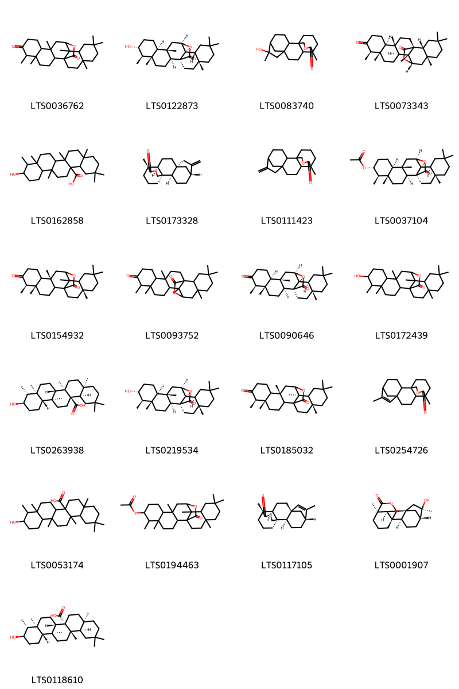{ width=100% }
    <figcaption>Hình ảnh cấu trúc hóa học của 21 hoạt chất thuộc nhóm Prenol lipids gồm ['5,6,11,14,17,17,20-heptamethyl-24-oxahexacyclo[11.9.2.0¹,¹⁴.0²,¹¹.0⁵,¹⁰.0¹⁵,²⁰]tetracosane-7,23-dione (LTS0036762)', '(1s,2s,5s,6r,7r,10s,11s,13r,14s,15r,20r)-7-hydroxy-5,6,11,14,17,17,20-heptamethyl-24-oxahexacyclo[11.9.2.0¹,¹⁴.0²,¹¹.0⁵,¹⁰.0¹⁵,²⁰]tetracosan-23-one (LTS0122873)', '6-hydroxy-6,12-dimethyl-14-oxapentacyclo[10.3.3.1⁵,⁸.0¹,¹¹.0²,⁸]nonadecan-13-one (LTS0083740)', '(1r,4s,5s,9r,10s,13s,14r,15s,17r,22r)-4,9,10,14,17,20,20-heptamethyl-24-oxahexacyclo[13.7.2.0¹,¹⁴.0⁴,¹³.0⁵,¹⁰.0¹⁷,²²]tetracosane-8,23-dione (LTS0073343)', '3-hydroxy-4,4a,6b,8a,11,11,14a-heptamethyl-hexadecahydropicene-12b-carboxylic acid (LTS0162858)', '(1r,2r,5r,8s,11s,12r)-12-methyl-6-methylidene-14-oxapentacyclo[10.3.3.1⁵,⁸.0¹,¹¹.0²,⁸]nonadecan-13-one (LTS0173328)', '12-methyl-6-methylidene-14-oxapentacyclo[10.3.3.1⁵,⁸.0¹,¹¹.0²,⁸]nonadecan-13-one (LTS0111423)', '(1s,2s,5s,6r,7r,10s,11s,13r,14s,15s,20r)-5,6,11,14,17,17,20-heptamethyl-23-oxo-24-oxahexacyclo[11.9.2.0¹,¹⁴.0²,¹¹.0⁵,¹⁰.0¹⁵,²⁰]tetracosan-7-yl acetate (LTS0037104)', '(5s,6r,11s,20r)-5,6,11,14,17,17,20-heptamethyl-24-oxahexacyclo[11.9.2.0¹,¹⁴.0²,¹¹.0⁵,¹⁰.0¹⁵,²⁰]tetracosane-7,23-dione (LTS0154932)', '4,9,10,14,17,20,20-heptamethyl-24-oxahexacyclo[13.7.2.0¹,¹⁴.0⁴,¹³.0⁵,¹⁰.0¹⁷,²²]tetracosane-8,23-dione (LTS0093752)', '(1s,2s,5s,6r,10s,11s,13r,14s,15s,20r)-5,6,11,14,17,17,20-heptamethyl-24-oxahexacyclo[11.9.2.0¹,¹⁴.0²,¹¹.0⁵,¹⁰.0¹⁵,²⁰]tetracosane-7,23-dione (LTS0090646)', '7-hydroxy-5,6,11,14,17,17,20-heptamethyl-24-oxahexacyclo[11.9.2.0¹,¹⁴.0²,¹¹.0⁵,¹⁰.0¹⁵,²⁰]tetracosan-23-one (LTS0172439)', '(3r,4r,4as,6as,6br,8ar,12ar,12br,14as,14bs)-3-hydroxy-4,4a,6b,8a,11,11,14a-heptamethyl-hexadecahydropicene-12b-carboxylic acid (LTS0263938)', '(1s,2s,5s,6r,7r,10s,11s,13r,14s,15s,20r)-7-hydroxy-5,6,11,14,17,17,20-heptamethyl-24-oxahexacyclo[11.9.2.0¹,¹⁴.0²,¹¹.0⁵,¹⁰.0¹⁵,²⁰]tetracosan-23-one (LTS0219534)', '(5s,6r,11s,14s,20r)-5,6,11,14,17,17,20-heptamethyl-24-oxahexacyclo[11.9.2.0¹,¹⁴.0²,¹¹.0⁵,¹⁰.0¹⁵,²⁰]tetracosane-7,23-dione (LTS0185032)', '6,12-dimethyl-14-oxapentacyclo[10.3.3.1⁵,⁸.0¹,¹¹.0²,⁸]nonadec-6-en-13-one (LTS0254726)', '10-hydroxy-2,2,4a,8a,9,12b,14a-heptamethyl-hexadecahydropicene-6a-carboxylic acid (LTS0053174)', '5,6,11,14,17,17,20-heptamethyl-23-oxo-24-oxahexacyclo[11.9.2.0¹,¹⁴.0²,¹¹.0⁵,¹⁰.0¹⁵,²⁰]tetracosan-7-yl acetate (LTS0194463)', '(1r,2r,5r,8s,11s,12r)-6,12-dimethyl-14-oxapentacyclo[10.3.3.1⁵,⁸.0¹,¹¹.0²,⁸]nonadec-6-en-13-one (LTS0117105)', '(1r,2r,5r,6r,8s,11s,12r)-6-hydroxy-6,12-dimethyl-14-oxapentacyclo[10.3.3.1⁵,⁸.0¹,¹¹.0²,⁸]nonadecan-13-one (LTS0001907)', '(4ar,6as,6bs,8as,9r,10r,12as,12bs,14as,14br)-10-hydroxy-2,2,4a,8a,9,12b,14a-heptamethyl-hexadecahydropicene-6a-carboxylic acid (LTS0118610)'].</figcaption>
</figure>
#### Nhóm Steroids and steroid derivatives
<figure markdown="span">
    { width=100% }
    <figcaption>Hình ảnh cấu trúc hóa học của 3 hoạt chất thuộc nhóm Steroids and steroid derivatives gồm ['stigmast-5-en-3-ol (LTS0071224)', 'sitosterol (LTS0168132)', 'stigmast-5-en-3-ol, (3β)- (LTS0204616)'].</figcaption>
</figure>

---

### Dược dân tộc học

Danh sách các quốc gia có sử dụng *Gynocardia odorata* trong điều trị các bệnh. 

| Country   | Disease                                | Bệnh                                                                                                                                                                                                |
|:----------|:---------------------------------------|:----------------------------------------------------------------------------------------------------------------------------------------------------------------------------------------------------|
| China     | Parasiticide, Pediculicide             | MYMEMORY WARNING: YOU USED ALL AVAILABLE FREE TRANSLATIONS FOR TODAY. NEXT AVAILABLE IN  13 HOURS 48 MINUTES 38 SECONDS VISIT HTTPS://MYMEMORY.TRANSLATED.NET/DOC/USAGELIMITS.PHP TO TRANSLATE MORE |
| Elsewhere | Piscicide                              | MYMEMORY WARNING: YOU USED ALL AVAILABLE FREE TRANSLATIONS FOR TODAY. NEXT AVAILABLE IN  13 HOURS 48 MINUTES 32 SECONDS VISIT HTTPS://MYMEMORY.TRANSLATED.NET/DOC/USAGELIMITS.PHP TO TRANSLATE MORE |
| India     | Fungicide, Insecticide, Piscicide, nan | MYMEMORY WARNING: YOU USED ALL AVAILABLE FREE TRANSLATIONS FOR TODAY. NEXT AVAILABLE IN  13 HOURS 48 MINUTES 26 SECONDS VISIT HTTPS://MYMEMORY.TRANSLATED.NET/DOC/USAGELIMITS.PHP TO TRANSLATE MORE |

---

# Chi Hydnocarpus

??? note "Danh sách các dược liệu thuộc chi"
    
	 - *Hydnocarpus anthelmintica*
	 - *Hydnocarpus kurzii*
	 - *Hydnocarpus laurifolia*

---
## Hydnocarpus anthelmintica
### Thông tin về thực vật

!!! info "Phân loại thực vật của *Hydnocarpus castaneus* từ GIBF:"
    - **Kingdom:** Plantae
    - **Phylum:** Tracheophyta
    - **Order:** Malpighiales
    - **Family:** Achariaceae
    - **Genus:** Hydnocarpus
    - **Species:** *Hydnocarpus castaneus*

 

| Label (VI)   | Label (EN)   | Scientific Name           | Descriptions (VI)   | Descriptions (EN)   | Also Known As (VI)   | Also Known As (EN)   |
|:-------------|:-------------|:--------------------------|:--------------------|:--------------------|:---------------------|:---------------------|
| N/A          | N/A          | Hydnocarpus anthelmintica | loài thực vật       | species of plant    | ['']                 | ['']                 |

#### Phân bố trên thế giới

**Từ CSDL GIBF** Viet Nam, nan, unknown or invalid, Thailand, Philippines, Dominica, Trinidad and Tobago, Lao People’s Democratic Republic, Kenya, Korea, Republic of, Indonesia, Saint Vincent and the Grenadines, Colombia, Sri Lanka, Malaysia, Seychelles, Belgium, Cambodia, Brazil, Chinese Taipei, Tanzania, United Republic of, Papua New Guinea, Congo, Democratic Republic of the, United States of America, Guinea

#### Phân bố tại Việt Nam

**Từ CSDL GIBF**: Hà Tinh, Da Nang

---
### Thành phần hóa học
        
- Theo cơ sở dữ liệu lotus: Từ loài *Hydnocarpus castaneus* đã phân lập và xác định được Chưa có hoạt chất nào được phân lập. hoạt chất thuộc về các nhóm Không có hoạt chất nào được phân lập. 

Không có hình ảnh nào được tạo ra

---

### Dược dân tộc học

Danh sách các quốc gia có sử dụng *Hydnocarpus castaneus* trong điều trị các bệnh. 

| Country   |   Disease | Bệnh                                                                                                                                                                                                |
|:----------|----------:|:----------------------------------------------------------------------------------------------------------------------------------------------------------------------------------------------------|
| China     |       nan | MYMEMORY WARNING: YOU USED ALL AVAILABLE FREE TRANSLATIONS FOR TODAY. NEXT AVAILABLE IN  13 HOURS 47 MINUTES 52 SECONDS VISIT HTTPS://MYMEMORY.TRANSLATED.NET/DOC/USAGELIMITS.PHP TO TRANSLATE MORE |

---

---
## Hydnocarpus kurzii
### Thông tin về thực vật

!!! info "Phân loại thực vật của *Hydnocarpus kurzii* từ GIBF:"
    - **Kingdom:** Plantae
    - **Phylum:** Tracheophyta
    - **Order:** Malpighiales
    - **Family:** Achariaceae
    - **Genus:** Hydnocarpus
    - **Species:** *Hydnocarpus kurzii*

 

| Label (VI)   | Label (EN)   | Scientific Name    | Descriptions (VI)   | Descriptions (EN)   | Also Known As (VI)   | Also Known As (EN)   |
|:-------------|:-------------|:-------------------|:--------------------|:--------------------|:---------------------|:---------------------|
| N/A          | N/A          | Hydnocarpus kurzii |                     | species of plant    | ['']                 | ['']                 |

#### Phân bố trên thế giới

**Từ CSDL GIBF** Viet Nam, nan, unknown or invalid, Thailand, Philippines, French Polynesia, Lao People’s Democratic Republic, Sri Lanka, Suriname, Malaysia, India, Bangladesh, Cuba, Cambodia, Myanmar, Brazil, Costa Rica, New Caledonia, United States of America, Guinea

#### Phân bố tại Việt Nam

**Từ CSDL GIBF**: Nghe An, Ninh Binh, Vinh Phuc

---
### Thành phần hóa học
        
- Theo cơ sở dữ liệu lotus: Từ loài *Hydnocarpus kurzii* đã phân lập và xác định được 2 hoạt chất thuộc về các nhóm Fatty Acyls. 

|    | chemicalTaxonomyClassyfireClass   |   smiles_count |
|---:|:----------------------------------|---------------:|
|  0 | Fatty Acyls                       |              2 |

#### Nhóm Fatty Acyls
<figure markdown="span">
    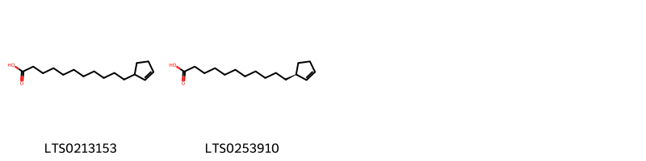{ width=100% }
    <figcaption>Hình ảnh cấu trúc hóa học của 2 hoạt chất thuộc nhóm Fatty Acyls gồm ['hydnocarpic acid (LTS0213153)', '11-[(1s)-cyclopent-2-en-1-yl]undecanoic acid (LTS0253910)'].</figcaption>
</figure>

---

### Dược dân tộc học

Danh sách các quốc gia có sử dụng *Hydnocarpus kurzii* trong điều trị các bệnh. 

| Country   | Disease                | Bệnh                                                                                                                                                                                                |
|:----------|:-----------------------|:----------------------------------------------------------------------------------------------------------------------------------------------------------------------------------------------------|
| China     | Poison, Vermifuge      | MYMEMORY WARNING: YOU USED ALL AVAILABLE FREE TRANSLATIONS FOR TODAY. NEXT AVAILABLE IN  13 HOURS 47 MINUTES 20 SECONDS VISIT HTTPS://MYMEMORY.TRANSLATED.NET/DOC/USAGELIMITS.PHP TO TRANSLATE MORE |
| India     | Piscicide, nan         | MYMEMORY WARNING: YOU USED ALL AVAILABLE FREE TRANSLATIONS FOR TODAY. NEXT AVAILABLE IN  13 HOURS 47 MINUTES 15 SECONDS VISIT HTTPS://MYMEMORY.TRANSLATED.NET/DOC/USAGELIMITS.PHP TO TRANSLATE MORE |
| Turkey    | Parasiticide, Sedative | MYMEMORY WARNING: YOU USED ALL AVAILABLE FREE TRANSLATIONS FOR TODAY. NEXT AVAILABLE IN  13 HOURS 47 MINUTES 11 SECONDS VISIT HTTPS://MYMEMORY.TRANSLATED.NET/DOC/USAGELIMITS.PHP TO TRANSLATE MORE |

---

---
## Hydnocarpus laurifolia
### Thông tin về thực vật

!!! info "Phân loại thực vật của *Hydnocarpus pentandrus* từ GIBF:"
    - **Kingdom:** Plantae
    - **Phylum:** Tracheophyta
    - **Order:** Malpighiales
    - **Family:** Achariaceae
    - **Genus:** Hydnocarpus
    - **Species:** *Hydnocarpus pentandrus*

 

| Label (VI)   | Label (EN)   | Scientific Name    | Descriptions (VI)   | Descriptions (EN)   | Also Known As (VI)   | Also Known As (EN)   |
|:-------------|:-------------|:-------------------|:--------------------|:--------------------|:---------------------|:---------------------|
| N/A          | N/A          | Hydnocarpus kurzii |                     | species of plant    | ['']                 | ['']                 |

#### Phân bố trên thế giới

**Từ CSDL GIBF** nan, Myanmar, Brazil, Ghana, India, Trinidad and Tobago, Liberia, Cameroon, Nigeria, Australia

#### Phân bố tại Việt Nam

**Từ CSDL GIBF**: Không có ghi nhận ở Việt Nam

---
### Thành phần hóa học
        
- Theo cơ sở dữ liệu lotus: Từ loài *Hydnocarpus pentandrus* đã phân lập và xác định được Chưa có hoạt chất nào được phân lập. hoạt chất thuộc về các nhóm Không có hoạt chất nào được phân lập. 

Không có hình ảnh nào được tạo ra

---

### Dược dân tộc học

Danh sách các quốc gia có sử dụng *Hydnocarpus pentandrus* trong điều trị các bệnh. 

| Country   | Disease                      | Bệnh                                                                                                                                                                                                |
|:----------|:-----------------------------|:----------------------------------------------------------------------------------------------------------------------------------------------------------------------------------------------------|
| India     | Purgative, Emetic, Piscicide | MYMEMORY WARNING: YOU USED ALL AVAILABLE FREE TRANSLATIONS FOR TODAY. NEXT AVAILABLE IN  13 HOURS 46 MINUTES 47 SECONDS VISIT HTTPS://MYMEMORY.TRANSLATED.NET/DOC/USAGELIMITS.PHP TO TRANSLATE MORE |

---

# Chi Myroxylon

??? note "Danh sách các dược liệu thuộc chi"
    
	 - *Myroxylon balsamum*
	 - *Myroxylon pereira*
	 - *Myroxylon pereirae*

---
## Myroxylon balsamum
### Thông tin về thực vật

!!! info "Phân loại thực vật của *Myroxylon balsamum* từ GIBF:"
    - **Kingdom:** Plantae
    - **Phylum:** Tracheophyta
    - **Order:** Fabales
    - **Family:** Fabaceae
    - **Genus:** Myroxylon
    - **Species:** *Myroxylon balsamum*

 

| Label (VI)   | Label (EN)   | Scientific Name    | Descriptions (VI)   | Descriptions (EN)   | Also Known As (VI)   | Also Known As (EN)   |
|:-------------|:-------------|:-------------------|:--------------------|:--------------------|:---------------------|:---------------------|
| N/A          | N/A          | Myroxylon balsamum | loài thực vật       | species of plant    | ['']                 | ['']                 |

#### Phân bố trên thế giới

**Từ CSDL GIBF** Colombia, El Salvador, Panama, Brazil, Peru, Bolivia (Plurinational State of), Costa Rica, Ecuador, Mexico, Belgium

#### Phân bố tại Việt Nam

**Từ CSDL GIBF**: Không có ghi nhận ở Việt Nam

---
### Thành phần hóa học
        
- Theo cơ sở dữ liệu lotus: Từ loài *Myroxylon balsamum* đã phân lập và xác định được 11 hoạt chất thuộc về các nhóm Prenol lipids, 2-arylbenzofuran flavonoids, Isoflavonoids. 

|    | chemicalTaxonomyClassyfireClass   |   smiles_count |
|---:|:----------------------------------|---------------:|
|  0 | 2-arylbenzofuran flavonoids       |              1 |
|  1 | Isoflavonoids                     |              7 |
|  2 | Prenol lipids                     |              3 |

#### Nhóm 2-arylbenzofuran flavonoids
<figure markdown="span">
    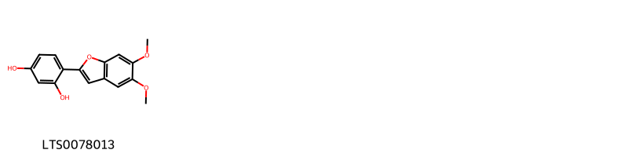{ width=100% }
    <figcaption>Hình ảnh cấu trúc hóa học của 1 hoạt chất thuộc nhóm 2-arylbenzofuran flavonoids gồm ['4-(5,6-dimethoxy-1-benzofuran-2-yl)benzene-1,3-diol (LTS0078013)'].</figcaption>
</figure>
#### Nhóm Isoflavonoids
<figure markdown="span">
    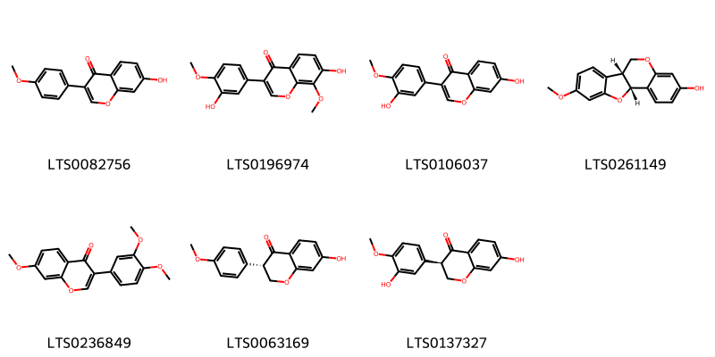{ width=100% }
    <figcaption>Hình ảnh cấu trúc hóa học của 7 hoạt chất thuộc nhóm Isoflavonoids gồm ['formononetin (LTS0082756)', "3'-hydroxy-8-o-methylretusin (LTS0196974)", 'calycosin (LTS0106037)', 'medicarpin, (-)- (LTS0261149)', 'cabreuvin (LTS0236849)', '(3s)-7-hydroxy-3-(4-methoxyphenyl)-2,3-dihydro-1-benzopyran-4-one (LTS0063169)', '(3r)-7-hydroxy-3-(3-hydroxy-4-methoxyphenyl)-2,3-dihydro-1-benzopyran-4-one (LTS0137327)'].</figcaption>
</figure>
#### Nhóm Prenol lipids
<figure markdown="span">
    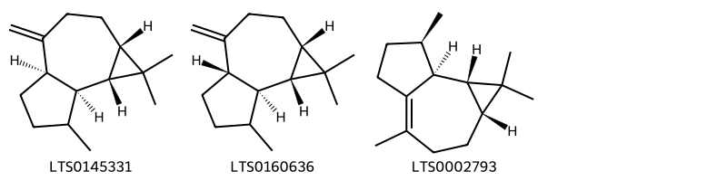{ width=100% }
    <figcaption>Hình ảnh cấu trúc hóa học của 3 hoạt chất thuộc nhóm Prenol lipids gồm ['(1as,4ar,7as,7br)-1,1,7-trimethyl-4-methylidene-octahydro-1ah-cyclopropa[e]azulene (LTS0145331)', '(1as,4as,7as,7br)-1,1,7-trimethyl-4-methylidene-octahydro-1ah-cyclopropa[e]azulene (LTS0160636)', 'leden (LTS0002793)'].</figcaption>
</figure>

---

### Dược dân tộc học

Danh sách các quốc gia có sử dụng *Myroxylon balsamum* trong điều trị các bệnh. 

| Country            | Disease                                                                    | Bệnh                                                                                                                                                                                                |
|:-------------------|:---------------------------------------------------------------------------|:----------------------------------------------------------------------------------------------------------------------------------------------------------------------------------------------------|
| Danish             | Antiseptic                                                                 | MYMEMORY WARNING: YOU USED ALL AVAILABLE FREE TRANSLATIONS FOR TODAY. NEXT AVAILABLE IN  13 HOURS 46 MINUTES 18 SECONDS VISIT HTTPS://MYMEMORY.TRANSLATED.NET/DOC/USAGELIMITS.PHP TO TRANSLATE MORE |
| Dominican Republic | Expectorant, Stomachic                                                     | MYMEMORY WARNING: YOU USED ALL AVAILABLE FREE TRANSLATIONS FOR TODAY. NEXT AVAILABLE IN  13 HOURS 46 MINUTES 15 SECONDS VISIT HTTPS://MYMEMORY.TRANSLATED.NET/DOC/USAGELIMITS.PHP TO TRANSLATE MORE |
| Dutch              | Expectorant                                                                | MYMEMORY WARNING: YOU USED ALL AVAILABLE FREE TRANSLATIONS FOR TODAY. NEXT AVAILABLE IN  13 HOURS 46 MINUTES 12 SECONDS VISIT HTTPS://MYMEMORY.TRANSLATED.NET/DOC/USAGELIMITS.PHP TO TRANSLATE MORE |
| Elsewhere          | nan, Expectorant, Stomachic, Deodorant, Antiseptic, Expectorant, Stimulant | MYMEMORY WARNING: YOU USED ALL AVAILABLE FREE TRANSLATIONS FOR TODAY. NEXT AVAILABLE IN  13 HOURS 46 MINUTES 09 SECONDS VISIT HTTPS://MYMEMORY.TRANSLATED.NET/DOC/USAGELIMITS.PHP TO TRANSLATE MORE |
| French             | Tonic                                                                      | MYMEMORY WARNING: YOU USED ALL AVAILABLE FREE TRANSLATIONS FOR TODAY. NEXT AVAILABLE IN  13 HOURS 46 MINUTES 07 SECONDS VISIT HTTPS://MYMEMORY.TRANSLATED.NET/DOC/USAGELIMITS.PHP TO TRANSLATE MORE |
| German             | Fumigant                                                                   | MYMEMORY WARNING: YOU USED ALL AVAILABLE FREE TRANSLATIONS FOR TODAY. NEXT AVAILABLE IN  13 HOURS 46 MINUTES 03 SECONDS VISIT HTTPS://MYMEMORY.TRANSLATED.NET/DOC/USAGELIMITS.PHP TO TRANSLATE MORE |
| Portuguese         | Stimulant                                                                  | MYMEMORY WARNING: YOU USED ALL AVAILABLE FREE TRANSLATIONS FOR TODAY. NEXT AVAILABLE IN  13 HOURS 46 MINUTES 00 SECONDS VISIT HTTPS://MYMEMORY.TRANSLATED.NET/DOC/USAGELIMITS.PHP TO TRANSLATE MORE |
| South America      | Antiseptic, Expectorant, Perfume                                           | MYMEMORY WARNING: YOU USED ALL AVAILABLE FREE TRANSLATIONS FOR TODAY. NEXT AVAILABLE IN  13 HOURS 45 MINUTES 58 SECONDS VISIT HTTPS://MYMEMORY.TRANSLATED.NET/DOC/USAGELIMITS.PHP TO TRANSLATE MORE |
| anish              | Vulnerary                                                                  | MYMEMORY WARNING: YOU USED ALL AVAILABLE FREE TRANSLATIONS FOR TODAY. NEXT AVAILABLE IN  13 HOURS 45 MINUTES 55 SECONDS VISIT HTTPS://MYMEMORY.TRANSLATED.NET/DOC/USAGELIMITS.PHP TO TRANSLATE MORE |

---

---
## Myroxylon pereira
### Thông tin về thực vật

!!! info "Phân loại thực vật của *Myroxylon balsamum* từ GIBF:"
    - **Kingdom:** Plantae
    - **Phylum:** Tracheophyta
    - **Order:** Fabales
    - **Family:** Fabaceae
    - **Genus:** Myroxylon
    - **Species:** *Myroxylon balsamum*

 

| Label (VI)   | Label (EN)   | Scientific Name    | Descriptions (VI)   | Descriptions (EN)   | Also Known As (VI)   | Also Known As (EN)   |
|:-------------|:-------------|:-------------------|:--------------------|:--------------------|:---------------------|:---------------------|
| N/A          | N/A          | Myroxylon balsamum | loài thực vật       | species of plant    | ['']                 | ['']                 |

#### Phân bố trên thế giới

**Từ CSDL GIBF** Colombia, El Salvador, Panama, Brazil, Peru, Bolivia (Plurinational State of), Costa Rica, Ecuador, Mexico, Belgium

#### Phân bố tại Việt Nam

**Từ CSDL GIBF**: Không có ghi nhận ở Việt Nam

---
### Thành phần hóa học
        
- Theo cơ sở dữ liệu lotus: Từ loài *Myroxylon balsamum* đã phân lập và xác định được Chưa có hoạt chất nào được phân lập. hoạt chất thuộc về các nhóm Không có hoạt chất nào được phân lập. 

Không có hình ảnh nào được tạo ra

---

### Dược dân tộc học

Danh sách các quốc gia có sử dụng *Myroxylon balsamum* trong điều trị các bệnh. 

| Country         | Disease   | Bệnh                                                                                                                                                                                                |
|:----------------|:----------|:----------------------------------------------------------------------------------------------------------------------------------------------------------------------------------------------------|
| Central America | Perfume   | MYMEMORY WARNING: YOU USED ALL AVAILABLE FREE TRANSLATIONS FOR TODAY. NEXT AVAILABLE IN  13 HOURS 45 MINUTES 19 SECONDS VISIT HTTPS://MYMEMORY.TRANSLATED.NET/DOC/USAGELIMITS.PHP TO TRANSLATE MORE |

---

---
## Myroxylon pereirae
### Thông tin về thực vật

!!! info "Phân loại thực vật của *Myroxylon balsamum* từ GIBF:"
    - **Kingdom:** Plantae
    - **Phylum:** Tracheophyta
    - **Order:** Fabales
    - **Family:** Fabaceae
    - **Genus:** Myroxylon
    - **Species:** *Myroxylon balsamum*

 

| Label (VI)   | Label (EN)   | Scientific Name    | Descriptions (VI)   | Descriptions (EN)   | Also Known As (VI)   | Also Known As (EN)   |
|:-------------|:-------------|:-------------------|:--------------------|:--------------------|:---------------------|:---------------------|
| N/A          | N/A          | Myroxylon pereirae | loài thực vật       | species of plant    | ['']                 | ['']                 |

#### Phân bố trên thế giới

**Từ CSDL GIBF** Colombia, El Salvador, Panama, Brazil, Peru, Bolivia (Plurinational State of), Costa Rica, Ecuador, Mexico, Belgium

#### Phân bố tại Việt Nam

**Từ CSDL GIBF**: Không có ghi nhận ở Việt Nam

---
### Thành phần hóa học
        
- Theo cơ sở dữ liệu lotus: Từ loài *Myroxylon balsamum* đã phân lập và xác định được Chưa có hoạt chất nào được phân lập. hoạt chất thuộc về các nhóm Không có hoạt chất nào được phân lập. 

Không có hình ảnh nào được tạo ra

---

### Dược dân tộc học

Danh sách các quốc gia có sử dụng *Myroxylon balsamum* trong điều trị các bệnh. 

| Country       | Disease                                                  | Bệnh                                                                                                                                                                                                |
|:--------------|:---------------------------------------------------------|:----------------------------------------------------------------------------------------------------------------------------------------------------------------------------------------------------|
| Elsewhere     | Antiseptic, Parasiticide, Pediculicide, Expectorant, nan | MYMEMORY WARNING: YOU USED ALL AVAILABLE FREE TRANSLATIONS FOR TODAY. NEXT AVAILABLE IN  13 HOURS 44 MINUTES 57 SECONDS VISIT HTTPS://MYMEMORY.TRANSLATED.NET/DOC/USAGELIMITS.PHP TO TRANSLATE MORE |
| Mexico        | Diuretic, Diuretic, Stimulant, Vermifuge, Vermifuge      | MYMEMORY WARNING: YOU USED ALL AVAILABLE FREE TRANSLATIONS FOR TODAY. NEXT AVAILABLE IN  13 HOURS 44 MINUTES 54 SECONDS VISIT HTTPS://MYMEMORY.TRANSLATED.NET/DOC/USAGELIMITS.PHP TO TRANSLATE MORE |
| Panama(Choco) | Deodorant                                                | MYMEMORY WARNING: YOU USED ALL AVAILABLE FREE TRANSLATIONS FOR TODAY. NEXT AVAILABLE IN  13 HOURS 44 MINUTES 51 SECONDS VISIT HTTPS://MYMEMORY.TRANSLATED.NET/DOC/USAGELIMITS.PHP TO TRANSLATE MORE |

---

# Chi Zuelania

??? note "Danh sách các dược liệu thuộc chi"
    
	 - *Zuelania guidonia*
	 - *Zuelania roussoviana*

---
## Zuelania guidonia
### Thông tin về thực vật

!!! info "Phân loại thực vật của *Casearia icosandra* từ GIBF:"
    - **Kingdom:** Plantae
    - **Phylum:** Tracheophyta
    - **Order:** Malpighiales
    - **Family:** Salicaceae
    - **Genus:** Casearia
    - **Species:** *Casearia icosandra*

 

| Label (VI)   | Label (EN)   | Scientific Name   | Descriptions (VI)   | Descriptions (EN)   | Also Known As (VI)   | Also Known As (EN)   |
|:-------------|:-------------|:------------------|:--------------------|:--------------------|:---------------------|:---------------------|
| N/A          | N/A          | Zuelania guidonia | loài thực vật       | species of plant    | ['']                 | ['']                 |

#### Phân bố trên thế giới

**Từ CSDL GIBF** Colombia, Cuba

#### Phân bố tại Việt Nam

**Từ CSDL GIBF**: Không có ghi nhận ở Việt Nam

---
### Thành phần hóa học
        
- Theo cơ sở dữ liệu lotus: Từ loài *Casearia icosandra* đã phân lập và xác định được 27 hoạt chất thuộc về các nhóm Prenol lipids, Steroids and steroid derivatives. 

|    | chemicalTaxonomyClassyfireClass   |   smiles_count |
|---:|:----------------------------------|---------------:|
|  0 | Prenol lipids                     |             25 |
|  1 | Steroids and steroid derivatives  |              2 |

#### Nhóm Prenol lipids
<figure markdown="span">
    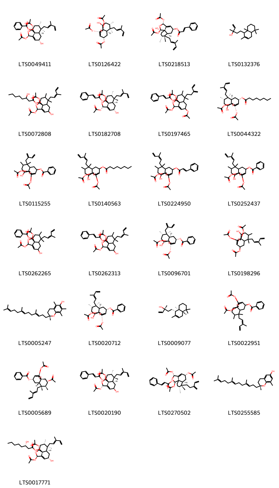{ width=100% }
    <figcaption>Hình ảnh cấu trúc hóa học của 25 hoạt chất thuộc nhóm Prenol lipids gồm ['(1r,3r,5s,6ar,7r,8s,10s,10ar)-1,3-bis(acetyloxy)-5-hydroxy-7,8-dimethyl-7-[(2e)-3-methylpenta-2,4-dien-1-yl]-1h,3h,5h,6h,6ah,8h,9h,10h-naphtho[1,8a-c]furan-10-yl benzoate (LTS0049411)', '(1r,3r,5s,6ar,7r,8s,10s,10ar)-1,5-bis(acetyloxy)-10-hydroxy-7,8-dimethyl-7-[(2e)-3-methylpenta-2,4-dien-1-yl]-1h,3h,5h,6h,6ah,8h,9h,10h-naphtho[1,8a-c]furan-3-yl acetate (LTS0126422)', '(1r,3r,5s,6as,7r,8r,10s,10as)-1,3-bis(acetyloxy)-10-hydroxy-7,8-dimethyl-7-[(2e)-3-methylpenta-2,4-dien-1-yl]-1h,3h,5h,6h,6ah,8h,9h,10h-naphtho[1,8a-c]furan-5-yl (2e)-3-phenylprop-2-enoate (LTS0218513)', '5-(2,5,5,8a-tetramethyl-1,4,4a,6,7,8-hexahydronaphthalen-1-yl)-3-methylpent-1-en-3-ol (LTS0132376)', '1,3-bis(acetyloxy)-5-hydroxy-7,8-dimethyl-7-(3-methylpenta-2,4-dien-1-yl)-1h,3h,5h,6h,6ah,8h,9h,10h-naphtho[1,8a-c]furan-10-yl 3-hydroxyoctanoate (LTS0072808)', '(1s,3s,5s,6ar,7s,8s,10r,10ar)-1,3-bis(acetyloxy)-5-hydroxy-7,8-dimethyl-7-[(2e)-3-methylpenta-2,4-dien-1-yl]-1h,3h,5h,6h,6ah,8h,9h,10h-naphtho[1,8a-c]furan-10-yl (2e)-3-phenylprop-2-enoate (LTS0182708)', '1,3,5-tris(acetyloxy)-7,8-dimethyl-7-(3-methylidenepent-4-en-1-yl)-1h,3h,5h,6h,6ah,8h,9h,10h-naphtho[1,8a-c]furan-10-yl 3-phenylprop-2-enoate (LTS0197465)', '(1r,3r,5s,6ar,7r,8s,10s,10ar)-1,3-bis(acetyloxy)-10-hydroxy-7,8-dimethyl-7-[(2e)-3-methylpenta-2,4-dien-1-yl]-1h,3h,5h,6h,6ah,8h,9h,10h-naphtho[1,8a-c]furan-5-yl octanoate (LTS0044322)', '1,3-bis(acetyloxy)-10-hydroxy-7,8-dimethyl-7-(2-methylidenebut-3-en-1-yl)-1h,3h,5h,6h,6ah,8h,9h,10h-naphtho[1,8a-c]furan-5-yl benzoate (LTS0115255)', '1,3-bis(acetyloxy)-10-hydroxy-7,8-dimethyl-7-(3-methylpenta-2,4-dien-1-yl)-1h,3h,5h,6h,6ah,8h,9h,10h-naphtho[1,8a-c]furan-5-yl octanoate (LTS0140563)', '1,3-bis(acetyloxy)-10-hydroxy-7,8-dimethyl-7-(3-methylpenta-2,4-dien-1-yl)-1h,3h,5h,6h,6ah,8h,9h,10h-naphtho[1,8a-c]furan-5-yl 3-phenylprop-2-enoate (LTS0224950)', '1,3-bis(acetyloxy)-10-hydroxy-7,8-dimethyl-7-(3-methylpenta-2,4-dien-1-yl)-1h,3h,5h,6h,6ah,8h,9h,10h-naphtho[1,8a-c]furan-5-yl benzoate (LTS0252437)', '1,3-bis(acetyloxy)-5-hydroxy-7,8-dimethyl-7-(3-methylpenta-2,4-dien-1-yl)-1h,3h,5h,6h,6ah,8h,9h,10h-naphtho[1,8a-c]furan-10-yl benzoate (LTS0262265)', '1,3-bis(acetyloxy)-5-hydroxy-7,8-dimethyl-7-(3-methylpenta-2,4-dien-1-yl)-1h,3h,5h,6h,6ah,8h,9h,10h-naphtho[1,8a-c]furan-10-yl 3-phenylprop-2-enoate (LTS0262313)', '(1r,3r,5s,6ar,7r,8s,10s,10ar)-1,3-bis(acetyloxy)-10-hydroxy-7,8-dimethyl-7-(2-methylidenebut-3-en-1-yl)-1h,3h,5h,6h,6ah,8h,9h,10h-naphtho[1,8a-c]furan-5-yl benzoate (LTS0096701)', '1,5-bis(acetyloxy)-10-hydroxy-7,8-dimethyl-7-(3-methylpenta-2,4-dien-1-yl)-1h,3h,5h,6h,6ah,8h,9h,10h-naphtho[1,8a-c]furan-3-yl acetate (LTS0198296)', 'α-tocotrienol (LTS0005247)', '(1r,3r,5s,6ar,7r,8s,10s,10ar)-1,3-bis(acetyloxy)-10-hydroxy-7,8-dimethyl-7-[(2e)-3-methylpenta-2,4-dien-1-yl]-1h,3h,5h,6h,6ah,8h,9h,10h-naphtho[1,8a-c]furan-5-yl benzoate (LTS0020712)', '(3r)-5-[(1s,4as,8as)-2,5,5,8a-tetramethyl-1,4,4a,6,7,8-hexahydronaphthalen-1-yl]-3-methylpent-1-en-3-ol (LTS0009077)', '1,3-bis(acetyloxy)-7,8-dimethyl-7-(3-methylpenta-2,4-dien-1-yl)-1h,3h,5h,6h,6ah,8h,9h,10h-naphtho[1,8a-c]furan-5-yl benzoate (LTS0022951)', '(1s,3s,5s,6as,7s,8r,10as)-1,3-bis(acetyloxy)-7,8-dimethyl-7-[(2e)-3-methylpenta-2,4-dien-1-yl]-1h,3h,5h,6h,6ah,8h,9h,10h-naphtho[1,8a-c]furan-5-yl benzoate (LTS0005689)', '(1s,3s,5r,6ar,7s,8s,10r,10ar)-1,3-bis(acetyloxy)-5-hydroxy-7,8-dimethyl-7-[(2e)-3-methylpenta-2,4-dien-1-yl]-1h,3h,5h,6h,6ah,8h,9h,10h-naphtho[1,8a-c]furan-10-yl (2e)-3-phenylprop-2-enoate (LTS0020190)', '(1r,3r,5r,6as,7r,8r,10s,10as)-1,3,5-tris(acetyloxy)-7,8-dimethyl-7-(3-methylidenepent-4-en-1-yl)-1h,3h,5h,6h,6ah,8h,9h,10h-naphtho[1,8a-c]furan-10-yl (2e)-3-phenylprop-2-enoate (LTS0270502)', 'delta-tocotrienol (LTS0255585)', '(1r,3r,5s,6ar,7r,8s,10s,10ar)-1,3-bis(acetyloxy)-5-hydroxy-7,8-dimethyl-7-[(2e)-3-methylpenta-2,4-dien-1-yl]-1h,3h,5h,6h,6ah,8h,9h,10h-naphtho[1,8a-c]furan-10-yl (3s)-3-hydroxyoctanoate (LTS0017771)'].</figcaption>
</figure>
#### Nhóm Steroids and steroid derivatives
<figure markdown="span">
    { width=100% }
    <figcaption>Hình ảnh cấu trúc hóa học của 2 hoạt chất thuộc nhóm Steroids and steroid derivatives gồm ['stigmast-5-en-3-ol (LTS0071224)', 'stigmast-5-en-3-ol, (3β)- (LTS0204616)'].</figcaption>
</figure>

---

### Dược dân tộc học

Danh sách các quốc gia có sử dụng *Casearia icosandra* trong điều trị các bệnh. 

| Country   | Disease   | Bệnh                                                                                                                                                                                                |
|:----------|:----------|:----------------------------------------------------------------------------------------------------------------------------------------------------------------------------------------------------|
| Cuba      | Diuretic  | MYMEMORY WARNING: YOU USED ALL AVAILABLE FREE TRANSLATIONS FOR TODAY. NEXT AVAILABLE IN  13 HOURS 44 MINUTES 31 SECONDS VISIT HTTPS://MYMEMORY.TRANSLATED.NET/DOC/USAGELIMITS.PHP TO TRANSLATE MORE |

---

---
## Zuelania roussoviana
### Thông tin về thực vật

!!! info "Phân loại thực vật của *Casearia icosandra* từ GIBF:"
    - **Kingdom:** Plantae
    - **Phylum:** Tracheophyta
    - **Order:** Malpighiales
    - **Family:** Salicaceae
    - **Genus:** Casearia
    - **Species:** *Casearia icosandra*

 

| Label (VI)   | Label (EN)   | Scientific Name   | Descriptions (VI)   | Descriptions (EN)   | Also Known As (VI)   | Also Known As (EN)   |
|:-------------|:-------------|:------------------|:--------------------|:--------------------|:---------------------|:---------------------|
| N/A          | N/A          | Zuelania guidonia | loài thực vật       | species of plant    | ['']                 | ['']                 |

#### Phân bố trên thế giới

**Từ CSDL GIBF** nan, Honduras, Mexico, Panama

#### Phân bố tại Việt Nam

**Từ CSDL GIBF**: Không có ghi nhận ở Việt Nam

---
### Thành phần hóa học
        
- Theo cơ sở dữ liệu lotus: Từ loài *Casearia icosandra* đã phân lập và xác định được Chưa có hoạt chất nào được phân lập. hoạt chất thuộc về các nhóm Không có hoạt chất nào được phân lập. 

Không có hình ảnh nào được tạo ra

---

### Dược dân tộc học

Danh sách các quốc gia có sử dụng *Casearia icosandra* trong điều trị các bệnh. 

| Country         | Disease   | Bệnh                                                                                                                                                                                                |
|:----------------|:----------|:----------------------------------------------------------------------------------------------------------------------------------------------------------------------------------------------------|
| Central America | Emetic    | MYMEMORY WARNING: YOU USED ALL AVAILABLE FREE TRANSLATIONS FOR TODAY. NEXT AVAILABLE IN  13 HOURS 44 MINUTES 01 SECONDS VISIT HTTPS://MYMEMORY.TRANSLATED.NET/DOC/USAGELIMITS.PHP TO TRANSLATE MORE |

---

# Chi Carpotroche

??? note "Danh sách các dược liệu thuộc chi"
    
	 - *Carpotroche amazonica*
	 - *Carpotroche brasiliensis*

---
## Carpotroche amazonica
### Thông tin về thực vật

!!! info "Phân loại thực vật của *Carpotroche amazonica* từ GIBF:"
    - **Kingdom:** Plantae
    - **Phylum:** Tracheophyta
    - **Order:** Malpighiales
    - **Family:** Achariaceae
    - **Genus:** Carpotroche
    - **Species:** *Carpotroche amazonica*

 

| Label (VI)   | Label (EN)   | Scientific Name       | Descriptions (VI)   | Descriptions (EN)   | Also Known As (VI)   | Also Known As (EN)   |
|:-------------|:-------------|:----------------------|:--------------------|:--------------------|:---------------------|:---------------------|
| N/A          | N/A          | Carpotroche amazonica |                     | species of plant    | ['']                 | ['']                 |

#### Phân bố trên thế giới

**Từ CSDL GIBF** nan, Colombia, Venezuela (Bolivarian Republic of), Brazil, Peru, French Guiana, Ecuador

#### Phân bố tại Việt Nam

**Từ CSDL GIBF**: Không có ghi nhận ở Việt Nam

---
### Thành phần hóa học
        
- Theo cơ sở dữ liệu lotus: Từ loài *Carpotroche amazonica* đã phân lập và xác định được Chưa có hoạt chất nào được phân lập. hoạt chất thuộc về các nhóm Không có hoạt chất nào được phân lập. 

Không có hình ảnh nào được tạo ra

---

### Dược dân tộc học

Danh sách các quốc gia có sử dụng *Carpotroche amazonica* trong điều trị các bệnh. 

| Country      | Disease   | Bệnh                                                                                                                                                                                                |
|:-------------|:----------|:----------------------------------------------------------------------------------------------------------------------------------------------------------------------------------------------------|
| Brazil(Maku) | Poison    | MYMEMORY WARNING: YOU USED ALL AVAILABLE FREE TRANSLATIONS FOR TODAY. NEXT AVAILABLE IN  13 HOURS 43 MINUTES 36 SECONDS VISIT HTTPS://MYMEMORY.TRANSLATED.NET/DOC/USAGELIMITS.PHP TO TRANSLATE MORE |

---

---
## Carpotroche brasiliensis
### Thông tin về thực vật

!!! info "Phân loại thực vật của *Carpotroche brasiliensis* từ GIBF:"
    - **Kingdom:** Plantae
    - **Phylum:** Tracheophyta
    - **Order:** Malpighiales
    - **Family:** Achariaceae
    - **Genus:** Carpotroche
    - **Species:** *Carpotroche brasiliensis*

 

| Label (VI)   | Label (EN)   | Scientific Name          | Descriptions (VI)   | Descriptions (EN)   | Also Known As (VI)   | Also Known As (EN)   |
|:-------------|:-------------|:-------------------------|:--------------------|:--------------------|:---------------------|:---------------------|
| N/A          | N/A          | Carpotroche brasiliensis | loài thực vật       | species of plant    | ['']                 | ['']                 |

#### Phân bố trên thế giới

**Từ CSDL GIBF** Brazil

#### Phân bố tại Việt Nam

**Từ CSDL GIBF**: Không có ghi nhận ở Việt Nam

---
### Thành phần hóa học
        
- Theo cơ sở dữ liệu lotus: Từ loài *Carpotroche brasiliensis* đã phân lập và xác định được 9 hoạt chất thuộc về các nhóm Organooxygen compounds, Fatty Acyls. 

|    | chemicalTaxonomyClassyfireClass   |   smiles_count |
|---:|:----------------------------------|---------------:|
|  0 | Fatty Acyls                       |              6 |
|  1 | Organooxygen compounds            |              3 |

#### Nhóm Fatty Acyls
<figure markdown="span">
    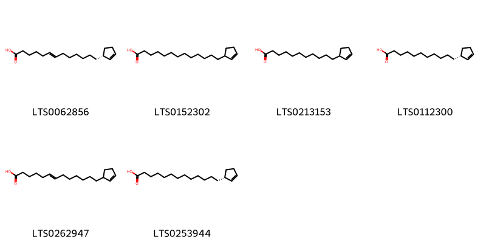{ width=100% }
    <figcaption>Hình ảnh cấu trúc hóa học của 6 hoạt chất thuộc nhóm Fatty Acyls gồm ['(6e)-13-[(1r)-cyclopent-2-en-1-yl]tridec-6-enoic acid (LTS0062856)', 'chaulmoogric acid (LTS0152302)', 'hydnocarpic acid (LTS0213153)', '(r)-hydnocarpic acid (LTS0112300)', 'gorlic acids (LTS0262947)', '(+)-chaulmoograsauere (LTS0253944)'].</figcaption>
</figure>
#### Nhóm Organooxygen compounds
<figure markdown="span">
    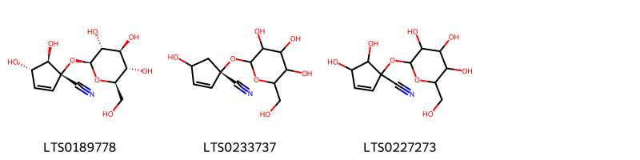{ width=100% }
    <figcaption>Hình ảnh cấu trúc hóa học của 3 hoạt chất thuộc nhóm Organooxygen compounds gồm ['gynocardin (LTS0189778)', '(1s)-4-hydroxy-1-{[3,4,5-trihydroxy-6-(hydroxymethyl)oxan-2-yl]oxy}cyclopent-2-ene-1-carbonitrile (LTS0233737)', '4,5-dihydroxy-1-{[3,4,5-trihydroxy-6-(hydroxymethyl)oxan-2-yl]oxy}cyclopent-2-ene-1-carbonitrile (LTS0227273)'].</figcaption>
</figure>

---

### Dược dân tộc học

Danh sách các quốc gia có sử dụng *Carpotroche brasiliensis* trong điều trị các bệnh. 

| Country   | Disease      | Bệnh                                                                                                                                                                                                |
|:----------|:-------------|:----------------------------------------------------------------------------------------------------------------------------------------------------------------------------------------------------|
| Elsewhere | Parasiticide | MYMEMORY WARNING: YOU USED ALL AVAILABLE FREE TRANSLATIONS FOR TODAY. NEXT AVAILABLE IN  13 HOURS 43 MINUTES 10 SECONDS VISIT HTTPS://MYMEMORY.TRANSLATED.NET/DOC/USAGELIMITS.PHP TO TRANSLATE MORE |

---

