!!! abstract "Tóm tắt"

    Họ Gentianaceae gồm khoảng 12 chi và 36 loài được một số cộng đồng tại các quốc gia như Turkey, South America, Japan, Bahamas, Egypt, Malagasy, US(Appalachia), French, US, Dutch, Mexico, India(Hindu), China, English, Sudan, German, Maya, Elsewhere, India, Indonesia, ain, Japan*, Sanscrit sử dụng trong một số trường hợp Thuốc nhuận tràng, Thuốc bổ, Dạ dày, Collyrium, Chất độc, Thôi miên, Emmenagogue, Thuốc lợi tiểu, Dạ dày, Apertif, Vermifuge, Dạ dày, Thuốc bổ, Thuốc nhuận tràng, Thần kinh, Thuốc bổ, Phương pháp thanh lọc, Thần kinh, Thuốc bổ, Thuốc nhuận tràng, Apertif, Thuốc bổ, Chất kích thích, Chất kích thích, Dạ dày, nan, Thuốc bổ, Dạ dày, Intoxicant, Cholagogue, Emmenagogue, Dạ dày, Vermifuge, Tiêu hóa, Vermifuge, Thuốc nhuận tràng, Thuốc bổ, Thuốc nhuận tràng, Dạ dày, Thuốc bổ, Thuốc bổ, Dạ dày, Apertif, Vermifuge, Thuốc nhuận tràng, Chất kích thích, Dạ dày.

!!! info "DrDuke"

    James A. Duke sinh năm 1929-2017 là một nhà thực vật học người Mỹ. Đây là một trong những tác giả hàng đầu trong lĩnh vực dược dân tộc học với cuốn *CRC Handbook of Medicinal Herbs* và chính là người xây dựng lên cơ sở dữ liệu về hợp chất tự nhiên và dược dân tộc học tại Bộ nông nghiệp Hoa Kỳ. Các thông tin được đăng tải tại website [Dr. Duke's Phytochemical and Ethnobotanical Databases](https://phytochem.nal.usda.gov/). 
    Trong suốt thập niên 1970, ông lãnh đạo the Plant Taxonomy Laboratory, Plant Genetics and Germplasm Institute of the Agricultural Research Service, U.S. Department of Agriculture.
    Trong tài liệu này, các thông tin về dược dân tộc của các dược liệu được trích dẫn từ tài liệu của James A. Ducke với sự trợ giúp của phần mềm dịch thuật từ tiếng Anh sang tiếng Việt.
   

# Chi Enicostema

??? note "Danh sách các dược liệu thuộc chi"
    
	 - *Enicostema littorale*
	 - *Enicostema verticillatum*

---
## Enicostema littorale
### Thông tin về thực vật

!!! info "Phân loại thực vật của *Enicostema axillare* từ GIBF:"
    - **Kingdom:** Plantae
    - **Phylum:** Tracheophyta
    - **Order:** Gentianales
    - **Family:** Gentianaceae
    - **Genus:** Enicostema
    - **Species:** *Enicostema axillare*

 

| Label (VI)   | Label (EN)   | Scientific Name      | Descriptions (VI)   | Descriptions (EN)   | Also Known As (VI)   | Also Known As (EN)   |
|:-------------|:-------------|:---------------------|:--------------------|:--------------------|:---------------------|:---------------------|
| N/A          | N/A          | Enicostema littorale | loài thực vật       | species of plant    | ['']                 | ['']                 |

#### Phân bố trên thế giới

**Từ CSDL GIBF** nan, Trinidad and Tobago, Namibia, Grenada, Mozambique, India, Tanzania, United Republic of

#### Phân bố tại Việt Nam

**Từ CSDL GIBF**: Không có ghi nhận ở Việt Nam

---
### Thành phần hóa học
        
- Theo cơ sở dữ liệu lotus: Từ loài *Enicostema axillare* đã phân lập và xác định được 1 hoạt chất thuộc về các nhóm Organooxygen compounds. 

|    | chemicalTaxonomyClassyfireClass   |   smiles_count |
|---:|:----------------------------------|---------------:|
|  0 | Organooxygen compounds            |              1 |

#### Nhóm Organooxygen compounds
<figure markdown="span">
    { width=100% }
    <figcaption>Hình ảnh cấu trúc hóa học của 1 hoạt chất thuộc nhóm Organooxygen compounds gồm ['swertiamarin (LTS0210938)'].</figcaption>
</figure>

---

### Dược dân tộc học

Danh sách các quốc gia có sử dụng *Enicostema axillare* trong điều trị các bệnh. 

| Country   | Disease                                      | Bệnh                                                  |
|:----------|:---------------------------------------------|:------------------------------------------------------|
| Elsewhere | Laxative                                     | Nhuận trường                                          |
| India     | Laxative, Tonic, Stomachic                   | Thuốc nhuận tràng, thuốc bổ, thuốc dạ dày             |
| Sudan     | Laxative, Stomachic, Tonic, Tonic, Stomachic | Thuốc nhuận tràng, Dạ dày, Thuốc bổ, Thuốc bổ, Dạ dày |

---

---
## Enicostema verticillatum
### Thông tin về thực vật

!!! info "Phân loại thực vật của *Enicostema verticillatum* từ GIBF:"
    - **Kingdom:** Plantae
    - **Phylum:** Tracheophyta
    - **Order:** Gentianales
    - **Family:** Gentianaceae
    - **Genus:** Enicostema
    - **Species:** *Enicostema verticillatum*

 

| Label (VI)   | Label (EN)   | Scientific Name          | Descriptions (VI)   | Descriptions (EN)   | Also Known As (VI)   | Also Known As (EN)   |
|:-------------|:-------------|:-------------------------|:--------------------|:--------------------|:---------------------|:---------------------|
| N/A          | N/A          | Enicostema verticillatum | loài thực vật       | species of plant    | ['']                 | ['']                 |

#### Phân bố trên thế giới

**Từ CSDL GIBF** nan, Guadeloupe, Grenada, Saint Lucia, Nicaragua, Venezuela (Bolivarian Republic of), Panama, Pakistan, Jamaica, Trinidad and Tobago, Barbados, Saint Vincent and the Grenadines, Martinique, Guyana, Cuba, Dominica, Dominican Republic, Saint Kitts and Nevis, Montserrat, Costa Rica, India, Indonesia, Anguilla, Antigua and Barbuda, Kenya

#### Phân bố tại Việt Nam

**Từ CSDL GIBF**: Không có ghi nhận ở Việt Nam

---
### Thành phần hóa học
        
- Theo cơ sở dữ liệu lotus: Từ loài *Enicostema verticillatum* đã phân lập và xác định được 1 hoạt chất thuộc về các nhóm Organooxygen compounds. 

|    | chemicalTaxonomyClassyfireClass   |   smiles_count |
|---:|:----------------------------------|---------------:|
|  0 | Organooxygen compounds            |              1 |

#### Nhóm Organooxygen compounds
<figure markdown="span">
    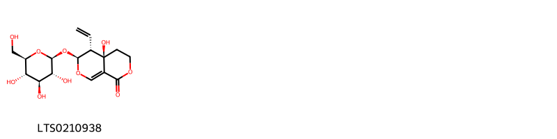{ width=100% }
    <figcaption>Hình ảnh cấu trúc hóa học của 1 hoạt chất thuộc nhóm Organooxygen compounds gồm ['swertiamarin (LTS0210938)'].</figcaption>
</figure>

---

### Dược dân tộc học

Danh sách các quốc gia có sử dụng *Enicostema verticillatum* trong điều trị các bệnh. 

| Country   |   Disease | Bệnh   |
|:----------|----------:|:-------|
| Indonesia |       nan | Ở đây  |

---

# Chi Tachiadenus

??? note "Danh sách các dược liệu thuộc chi"
    
	 - *Tachiadenus longiflorus*

---
## Tachiadenus longiflorus
### Thông tin về thực vật

!!! info "Phân loại thực vật của *Tachiadenus longiflorus* từ GIBF:"
    - **Kingdom:** Plantae
    - **Phylum:** Tracheophyta
    - **Order:** Gentianales
    - **Family:** Gentianaceae
    - **Genus:** Tachiadenus
    - **Species:** *Tachiadenus longiflorus*

 

| Label (VI)   | Label (EN)   | Scientific Name         | Descriptions (VI)   | Descriptions (EN)   | Also Known As (VI)   | Also Known As (EN)   |
|:-------------|:-------------|:------------------------|:--------------------|:--------------------|:---------------------|:---------------------|
| N/A          | N/A          | Tachiadenus longiflorus | loài thực vật       | species of plant    | ['']                 | ['']                 |

#### Phân bố trên thế giới

**Từ CSDL GIBF** nan, Madagascar

#### Phân bố tại Việt Nam

**Từ CSDL GIBF**: Không có ghi nhận ở Việt Nam

---
### Thành phần hóa học
        
- Theo cơ sở dữ liệu lotus: Từ loài *Tachiadenus longiflorus* đã phân lập và xác định được Chưa có hoạt chất nào được phân lập. hoạt chất thuộc về các nhóm Không có hoạt chất nào được phân lập. 

Không có hình ảnh nào được tạo ra

---

### Dược dân tộc học

Danh sách các quốc gia có sử dụng *Tachiadenus longiflorus* trong điều trị các bệnh. 

| Country   | Disease    | Bệnh         |
|:----------|:-----------|:-------------|
| Malagasy  | Intoxicant | chất gây độc |

---

# Chi Swertia

??? note "Danh sách các dược liệu thuộc chi"
    
	 - *Swertia angustifolia*
	 - *Swertia chirata*
	 - *Swertia chirayita*
	 - *Swertia japonica*

---
## Swertia angustifolia
### Thông tin về thực vật

!!! info "Phân loại thực vật của *Swertia angustifolia* từ GIBF:"
    - **Kingdom:** Plantae
    - **Phylum:** Tracheophyta
    - **Order:** Gentianales
    - **Family:** Gentianaceae
    - **Genus:** Swertia
    - **Species:** *Swertia angustifolia*

 

| Label (VI)   | Label (EN)   | Scientific Name      | Descriptions (VI)   | Descriptions (EN)   | Also Known As (VI)   | Also Known As (EN)   |
|:-------------|:-------------|:---------------------|:--------------------|:--------------------|:---------------------|:---------------------|
| N/A          | N/A          | Swertia angustifolia | loài thực vật       | species of plant    | ['']                 | ['']                 |

#### Phân bố trên thế giới

**Từ CSDL GIBF** nan, Pakistan, Thailand, Lao People’s Democratic Republic, Myanmar, Bhutan, India, unknown or invalid, United States of America, Viet Nam, China, Nepal

#### Phân bố tại Việt Nam

**Từ CSDL GIBF**: Không có ghi nhận ở Việt Nam

---
### Thành phần hóa học
        
- Theo cơ sở dữ liệu lotus: Từ loài *Swertia angustifolia* đã phân lập và xác định được 28 hoạt chất thuộc về các nhóm Prenol lipids, Steroids and steroid derivatives, Pyranopyridines, Organooxygen compounds, Carboxylic acids and derivatives, Benzopyrans. 

|    | chemicalTaxonomyClassyfireClass   |   smiles_count |
|---:|:----------------------------------|---------------:|
|  0 | Benzopyrans                       |              3 |
|  1 | Carboxylic acids and derivatives  |              7 |
|  2 | Organooxygen compounds            |              5 |
|  3 | Prenol lipids                     |             11 |
|  4 | Pyranopyridines                   |              1 |
|  5 | Steroids and steroid derivatives  |              1 |

#### Nhóm Benzopyrans
<figure markdown="span">
    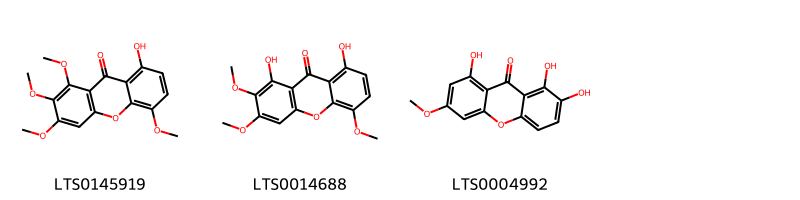{ width=100% }
    <figcaption>Hình ảnh cấu trúc hóa học của 3 hoạt chất thuộc nhóm Benzopyrans gồm ['8-hydroxy-1,2,3,5-tetramethoxyxanthen-9-one (LTS0145919)', '1,8-dihydroxy-2,3,5-trimethoxyxanthen-9-one (LTS0014688)', 'swertianin (LTS0004992)'].</figcaption>
</figure>
#### Nhóm Carboxylic acids and derivatives
<figure markdown="span">
    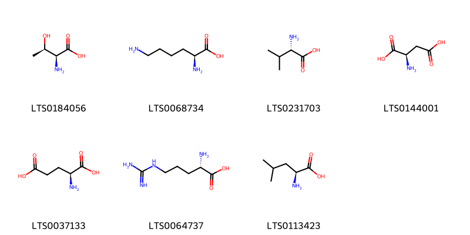{ width=100% }
    <figcaption>Hình ảnh cấu trúc hóa học của 7 hoạt chất thuộc nhóm Carboxylic acids and derivatives gồm ['l-threonine (LTS0184056)', 'l-lysine (LTS0068734)', 'l-valine (LTS0231703)', 'd-aspartic acid (LTS0144001)', 'l-glutamic acid (LTS0037133)', 'l-arginine (LTS0064737)', 'l-leucine (LTS0113423)'].</figcaption>
</figure>
#### Nhóm Organooxygen compounds
<figure markdown="span">
    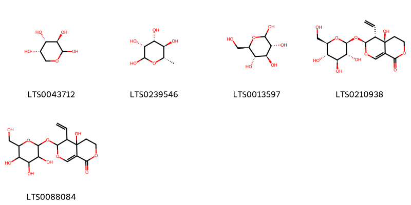{ width=100% }
    <figcaption>Hình ảnh cấu trúc hóa học của 5 hoạt chất thuộc nhóm Organooxygen compounds gồm ['l-arabinopyranose (LTS0043712)', 'l-rhamnose (LTS0239546)', 'glucose (LTS0013597)', 'swertiamarin (LTS0210938)', '5-ethenyl-4a-hydroxy-6-{[3,4,5-trihydroxy-6-(hydroxymethyl)oxan-2-yl]oxy}-3h,4h,5h,6h-pyrano[3,4-c]pyran-1-one (LTS0088084)'].</figcaption>
</figure>
#### Nhóm Prenol lipids
<figure markdown="span">
    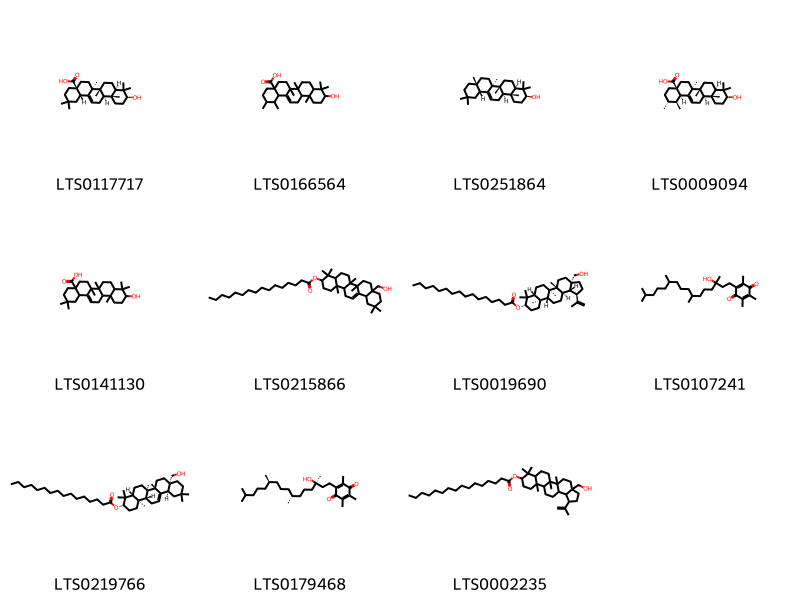{ width=100% }
    <figcaption>Hình ảnh cấu trúc hóa học của 11 hoạt chất thuộc nhóm Prenol lipids gồm ['oleanolic acid (LTS0117717)', '10-hydroxy-1,2,6a,6b,9,9,12a-heptamethyl-2,3,4,5,6,7,8,8a,10,11,12,12b,13,14b-tetradecahydro-1h-picene-4a-carboxylic acid (LTS0166564)', 'β-amyrin (LTS0251864)', '(1s,2r,4as,6as,6br,8ar,10s,12ar,12br,14br)-10-hydroxy-1,2,6a,6b,9,9,12a-heptamethyl-2,3,4,5,6,7,8,8a,10,11,12,12b,13,14b-tetradecahydro-1h-picene-4a-carboxylic acid (LTS0009094)', 'oleanolic acid (LTS0141130)', '8a-(hydroxymethyl)-4,4,6a,6b,11,11,14b-heptamethyl-1,2,3,4a,5,6,7,8,9,10,12,12a,14,14a-tetradecahydropicen-3-yl hexadecanoate (LTS0215866)', '(1r,3as,5ar,5br,7ar,9s,11ar,11br,13ar,13br)-3a-(hydroxymethyl)-5a,5b,8,8,11a-pentamethyl-1-(prop-1-en-2-yl)-hexadecahydrocyclopenta[a]chrysen-9-yl hexadecanoate (LTS0019690)', 'tocoquinone (LTS0107241)', '(3s,4ar,6ar,6bs,8as,12as,14ar,14br)-8a-(hydroxymethyl)-4,4,6a,6b,11,11,14b-heptamethyl-1,2,3,4a,5,6,7,8,9,10,12,12a,14,14a-tetradecahydropicen-3-yl hexadecanoate (LTS0219766)', 'α-tocopherylquinone (LTS0179468)', '3a-(hydroxymethyl)-5a,5b,8,8,11a-pentamethyl-1-(prop-1-en-2-yl)-hexadecahydrocyclopenta[a]chrysen-9-yl hexadecanoate (LTS0002235)'].</figcaption>
</figure>
#### Nhóm Pyranopyridines
<figure markdown="span">
    { width=100% }
    <figcaption>Hình ảnh cấu trúc hóa học của 1 hoạt chất thuộc nhóm Pyranopyridines gồm ['gentianine (LTS0240161)'].</figcaption>
</figure>
#### Nhóm Steroids and steroid derivatives
<figure markdown="span">
    { width=100% }
    <figcaption>Hình ảnh cấu trúc hóa học của 1 hoạt chất thuộc nhóm Steroids and steroid derivatives gồm ['stigmast-5-en-3-ol, (3β)- (LTS0204616)'].</figcaption>
</figure>

---

### Dược dân tộc học

Danh sách các quốc gia có sử dụng *Swertia angustifolia* trong điều trị các bệnh. 

| Country   | Disease   | Bệnh               |
|:----------|:----------|:-------------------|
| Elsewhere | Tonic     | (thuộc) trương lực |

---

---
## Swertia chirata
### Thông tin về thực vật

!!! info "Phân loại thực vật của *Swertia chirata* từ GIBF:"
    - **Kingdom:** Plantae
    - **Phylum:** Tracheophyta
    - **Order:** Gentianales
    - **Family:** Gentianaceae
    - **Genus:** Swertia
    - **Species:** *Swertia chirata*

 

| Label (VI)   | Label (EN)   | Scientific Name   | Descriptions (VI)   | Descriptions (EN)   | Also Known As (VI)   | Also Known As (EN)   |
|:-------------|:-------------|:------------------|:--------------------|:--------------------|:---------------------|:---------------------|
| N/A          | N/A          | Swertia chirata   |                     |                     | ['']                 | ['']                 |

#### Phân bố trên thế giới

**Từ CSDL GIBF** nan, India

#### Phân bố tại Việt Nam

**Từ CSDL GIBF**: Không có ghi nhận ở Việt Nam

---
### Thành phần hóa học
        
- Theo cơ sở dữ liệu lotus: Từ loài *Swertia chirata* đã phân lập và xác định được 45 hoạt chất thuộc về các nhóm Prenol lipids, Steroids and steroid derivatives, Benzene and substituted derivatives, Organooxygen compounds, Benzopyrans. 

|    | chemicalTaxonomyClassyfireClass     |   smiles_count |
|---:|:------------------------------------|---------------:|
|  0 | Benzene and substituted derivatives |              4 |
|  1 | Benzopyrans                         |             15 |
|  2 | Organooxygen compounds              |              4 |
|  3 | Prenol lipids                       |             20 |
|  4 | Steroids and steroid derivatives    |              1 |

#### Nhóm Benzene and substituted derivatives
<figure markdown="span">
    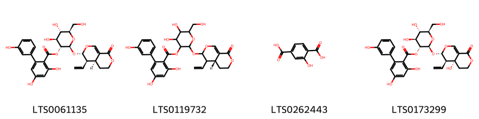{ width=100% }
    <figcaption>Hình ảnh cấu trúc hóa học của 4 hoạt chất thuộc nhóm Benzene and substituted derivatives gồm ['amarogentin (LTS0061135)', "2-{[(4ar)-4-ethenyl-8-oxo-3h,4h,4ah,5h,6h-pyrano[3,4-c]pyran-3-yl]oxy}-4,5-dihydroxy-6-(hydroxymethyl)oxan-3-yl 3,3',5-trihydroxy-[1,1'-biphenyl]-2-carboxylate (LTS0119732)", '2-hydroxybenzene-1,4-dicarboxylic acid (LTS0262443)', 'amaroswerin (LTS0173299)'].</figcaption>
</figure>
#### Nhóm Benzopyrans
<figure markdown="span">
    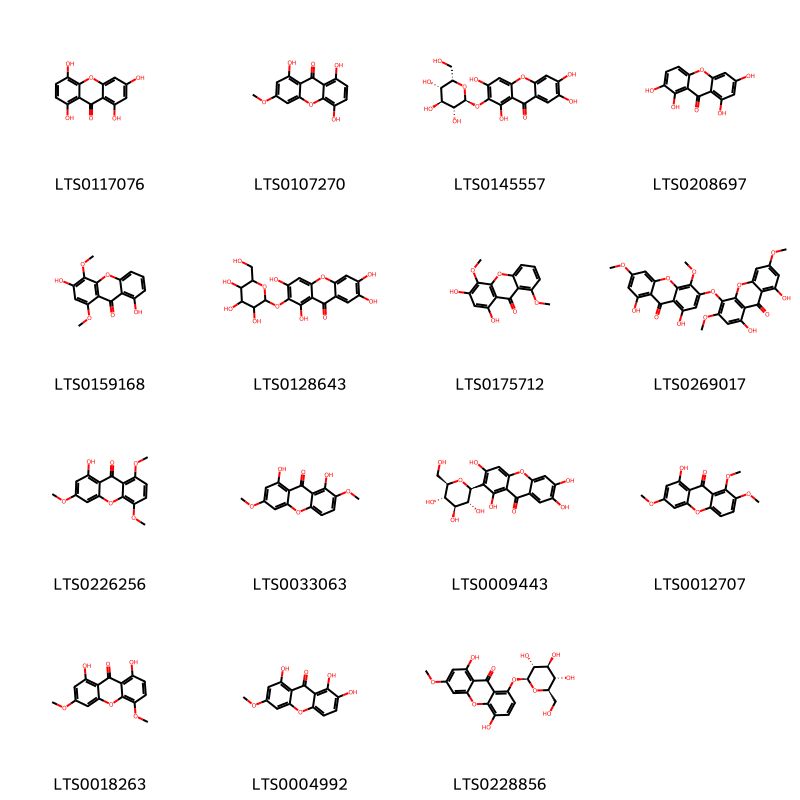{ width=100% }
    <figcaption>Hình ảnh cấu trúc hóa học của 15 hoạt chất thuộc nhóm Benzopyrans gồm ['1,3,5,8-tetrahydroxyxanthone (LTS0117076)', 'bellidifolium (LTS0107270)', '1,3,6,7-tetrahydroxy-2-{[(2s,3r,4s,5s,6s)-3,4,5-trihydroxy-6-(hydroxymethyl)oxan-2-yl]oxy}xanthen-9-one (LTS0145557)', 'norswertianin (LTS0208697)', '3,8-dihydroxy-1,4-dimethoxyxanthen-9-one (LTS0159168)', '1,3,6,7-tetrahydroxy-2-{[3,4,5-trihydroxy-6-(hydroxymethyl)oxan-2-yl]oxy}xanthen-9-one (LTS0128643)', '1,3-dihydroxy-4,8-dimethoxyxanthen-9-one (LTS0175712)', '3-[(1,8-dihydroxy-3,6-dimethoxy-9-oxoxanthen-4-yl)oxy]-1,8-dihydroxy-4,6-dimethoxyxanthen-9-one (LTS0269017)', '1-hydroxy-3,5,8-trimethoxyxanthen-9-one (LTS0226256)', 'methylswertianin (LTS0033063)', 'mangiferin (LTS0009443)', 'decussatin (LTS0012707)', 'swerchirin (LTS0018263)', 'swertianin (LTS0004992)', 'swertianolin (LTS0228856)'].</figcaption>
</figure>
#### Nhóm Organooxygen compounds
<figure markdown="span">
    { width=100% }
    <figcaption>Hình ảnh cấu trúc hóa học của 4 hoạt chất thuộc nhóm Organooxygen compounds gồm ['(3s,4ar,6ar,6br,12ar,12br,14ar,14br)-4,4,6a,6b,10,10,12a,14b-octamethyl-1,2,3,4a,5,6,7,9,11,12,12b,13,14,14a-tetradecahydropicen-3-ol (LTS0084328)', '(3s,4ar,6ar,6bs,8as,12as,14ar,14br)-4,4,6a,6b,8a,9,9,14b-octamethyl-1,2,3,4a,5,6,7,8,10,11,12,12a,14,14a-tetradecahydropicen-3-ol (LTS0047189)', '(4as,5r,6s)-5-ethenyl-6-{[3,4,5-trihydroxy-6-(hydroxymethyl)oxan-2-yl]oxy}-3h,4h,4ah,5h,6h-pyrano[3,4-c]pyran-1-one (LTS0114959)', 'sweroside (LTS0014051)'].</figcaption>
</figure>
#### Nhóm Prenol lipids
<figure markdown="span">
    { width=100% }
    <figcaption>Hình ảnh cấu trúc hóa học của 20 hoạt chất thuộc nhóm Prenol lipids gồm ['(4ar,6as,6br,8ar,10s,12ar,12br,14bs)-10-hydroxy-2,2,6a,6b,9,9,12a-heptamethyl-1,3,4,5,6,7,8,8a,10,11,12,12b,13,14b-tetradecahydropicene-4a-carboxylic acid (LTS0038539)', 'alnulin (LTS0076238)', '(3s,4as,6bs,8as,12ar,12bs,14as,14br)-4,4,6b,8a,9,9,12b,14b-octamethyl-1,2,3,4a,5,7,8,10,11,12,12a,13,14,14a-tetradecahydropicen-3-ol (LTS0082409)', '(3r,4ar,6bs,8as,12ar,12bs,14ar,14br)-4,4,6b,8a,9,9,12b,14b-octamethyl-1,2,3,4a,5,7,8,10,11,12,12a,13,14,14a-tetradecahydropicen-3-ol (LTS0141163)', 'β-amyrin (LTS0251864)', 'ursolic acid (LTS0250838)', '(3r,4ar,6bs,8as,12ar,12bs,14as,14br)-4,4,6b,8a,9,9,12b,14b-octamethyl-1,2,3,4a,5,7,8,10,11,12,12a,13,14,14a-tetradecahydropicen-3-ol (LTS0156491)', '4,4,6b,8a,9,9,12b,14b-octamethyl-1,2,3,4a,5,7,8,10,11,12,12a,13,14,14a-tetradecahydropicen-3-ol (LTS0176635)', '(+)-16-gammaceren-3β-ol (LTS0076990)', 'oleanolic acid (LTS0141130)', '5a,5b,8,8,11a,13b-hexamethyl-3-(prop-1-en-2-yl)-hexadecahydrocyclopenta[a]chrysen-9-ol (LTS0002506)', '(3r,3as,5ar,5br,7ar,9s,11ar,11br,13ar,13bs)-5a,5b,8,8,11a,13b-hexamethyl-3-(prop-1-en-2-yl)-hexadecahydrocyclopenta[a]chrysen-9-ol (LTS0060154)', '(4ar,6bs,8as,12ar,12bs,14ar,14br)-4,4,6b,8a,9,9,12b,14b-octamethyl-2,4a,5,7,8,10,11,12,12a,13,14,14a-dodecahydro-1h-picen-3-one (LTS0006133)', '(3s,4ar,6bs,8as,12ar,12bs,14ar,14br)-4,4,6b,8a,9,9,12b,14b-octamethyl-1,2,3,4a,5,7,8,10,11,12,12a,13,14,14a-tetradecahydropicen-3-ol (LTS0028409)', '4,4,6a,6b,9,9,12a,14b-octamethyl-1,2,3,4a,5,6,7,10,11,12,12b,13,14,14a-tetradecahydropicen-3-ol (LTS0004113)', 'taraxerol (LTS0019099)', '(3s,4ar,6ar,8as,12ar,12bs,14ar,14br)-4,4,6a,8a,11,11,12b,14b-octamethyl-1,2,3,4a,5,6,8,9,10,12,12a,13,14,14a-tetradecahydropicen-3-ol (LTS0236024)', '4,4,6b,8a,9,9,12b,14b-octamethyl-2,4a,5,7,8,10,11,12,12a,13,14,14a-dodecahydro-1h-picen-3-one (LTS0089990)', '(4ar,6bs,8as,12as,12bs,14ar,14br)-4,4,6b,8a,9,9,12b,14b-octamethyl-2,4a,5,7,8,10,11,12,12a,13,14,14a-dodecahydro-1h-picen-3-one (LTS0245220)', 'oleanolic acid (LTS0117717)'].</figcaption>
</figure>
#### Nhóm Steroids and steroid derivatives
<figure markdown="span">
    { width=100% }
    <figcaption>Hình ảnh cấu trúc hóa học của 1 hoạt chất thuộc nhóm Steroids and steroid derivatives gồm ['(1r,3as,3bs,9ar,9bs,11ar)-1-[(2r)-5-ethyl-6-methylheptan-2-yl]-9a,11a-dimethyl-1h,2h,3h,3ah,3bh,4h,5h,8h,9h,9bh,10h,11h-cyclopenta[a]phenanthren-7-one (LTS0202559)'].</figcaption>
</figure>

---

### Dược dân tộc học

Danh sách các quốc gia có sử dụng *Swertia chirata* trong điều trị các bệnh. 

| Country      | Disease   | Bệnh               |
|:-------------|:----------|:-------------------|
| Dutch        | Laxative  | Nhuận trường       |
| English      | Tonic     | (thuộc) trương lực |
| German       | Stomachic | Sững sờ            |
| India        | Hypnotic  | Thuốc ngủ          |
| India(Hindu) | Tonic     | (thuộc) trương lực |
| Sanscrit     | Vermifuge | Thuốc diệt sán     |

---

---
## Swertia chirayita
### Thông tin về thực vật

!!! info "Phân loại thực vật của *Swertia chirayita* từ GIBF:"
    - **Kingdom:** Plantae
    - **Phylum:** Tracheophyta
    - **Order:** Gentianales
    - **Family:** Gentianaceae
    - **Genus:** Swertia
    - **Species:** *Swertia chirayita*

 

| Label (VI)   | Label (EN)   | Scientific Name   | Descriptions (VI)   | Descriptions (EN)   | Also Known As (VI)   | Also Known As (EN)   |
|:-------------|:-------------|:------------------|:--------------------|:--------------------|:---------------------|:---------------------|
| N/A          | N/A          | Swertia chirayita | loài thực vật       | species of plant    | ['']                 | ['Swertia chirata']  |

#### Phân bố trên thế giới

**Từ CSDL GIBF** nan, Pakistan, Myanmar, Bhutan, India, unknown or invalid, United States of America, Mongolia, China, Nepal

#### Phân bố tại Việt Nam

**Từ CSDL GIBF**: Không có ghi nhận ở Việt Nam

---
### Thành phần hóa học
        
- Theo cơ sở dữ liệu lotus: Từ loài *Swertia chirayita* đã phân lập và xác định được 49 hoạt chất thuộc về các nhóm Prenol lipids, Steroids and steroid derivatives, Benzene and substituted derivatives, Organooxygen compounds, Benzopyrans. 

|    | chemicalTaxonomyClassyfireClass     |   smiles_count |
|---:|:------------------------------------|---------------:|
|  0 | Benzene and substituted derivatives |              4 |
|  1 | Benzopyrans                         |             19 |
|  2 | Organooxygen compounds              |              4 |
|  3 | Prenol lipids                       |             20 |
|  4 | Steroids and steroid derivatives    |              1 |

#### Nhóm Benzene and substituted derivatives
<figure markdown="span">
    { width=100% }
    <figcaption>Hình ảnh cấu trúc hóa học của 4 hoạt chất thuộc nhóm Benzene and substituted derivatives gồm ['amarogentin (LTS0061135)', "2-{[(4ar)-4-ethenyl-8-oxo-3h,4h,4ah,5h,6h-pyrano[3,4-c]pyran-3-yl]oxy}-4,5-dihydroxy-6-(hydroxymethyl)oxan-3-yl 3,3',5-trihydroxy-[1,1'-biphenyl]-2-carboxylate (LTS0119732)", '2-hydroxybenzene-1,4-dicarboxylic acid (LTS0262443)', 'amaroswerin (LTS0173299)'].</figcaption>
</figure>
#### Nhóm Benzopyrans
<figure markdown="span">
    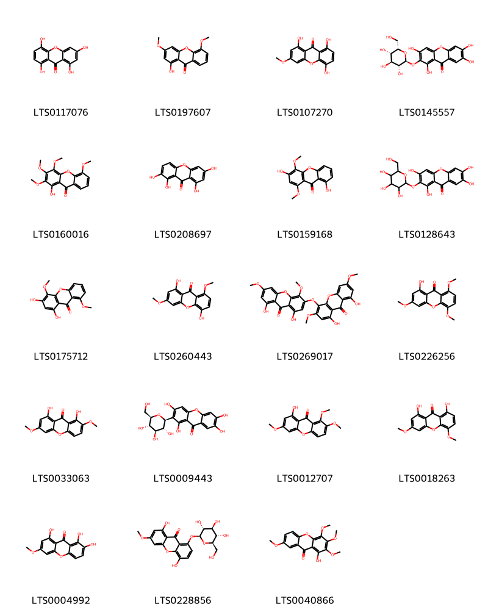{ width=100% }
    <figcaption>Hình ảnh cấu trúc hóa học của 19 hoạt chất thuộc nhóm Benzopyrans gồm ['1,3,5,8-tetrahydroxyxanthone (LTS0117076)', '1-hydroxy-3,5-dimethoxyxanthen-9-one (LTS0197607)', 'bellidifolium (LTS0107270)', '1,3,6,7-tetrahydroxy-2-{[(2s,3r,4s,5s,6s)-3,4,5-trihydroxy-6-(hydroxymethyl)oxan-2-yl]oxy}xanthen-9-one (LTS0145557)', '1-hydroxy-2,3,4,5-tetramethoxyxanthen-9-one (LTS0160016)', 'norswertianin (LTS0208697)', '3,8-dihydroxy-1,4-dimethoxyxanthen-9-one (LTS0159168)', '1,3,6,7-tetrahydroxy-2-{[3,4,5-trihydroxy-6-(hydroxymethyl)oxan-2-yl]oxy}xanthen-9-one (LTS0128643)', '1,3-dihydroxy-4,8-dimethoxyxanthen-9-one (LTS0175712)', '1,5-dihydroxy-3,8-dimethoxyxanthen-9-one (LTS0260443)', '3-[(1,8-dihydroxy-3,6-dimethoxy-9-oxoxanthen-4-yl)oxy]-1,8-dihydroxy-4,6-dimethoxyxanthen-9-one (LTS0269017)', '1-hydroxy-3,5,8-trimethoxyxanthen-9-one (LTS0226256)', 'methylswertianin (LTS0033063)', 'mangiferin (LTS0009443)', 'decussatin (LTS0012707)', 'swerchirin (LTS0018263)', 'swertianin (LTS0004992)', 'swertianolin (LTS0228856)', '1-hydroxy-2,3,4,7-tetramethoxyxanthen-9-one (LTS0040866)'].</figcaption>
</figure>
#### Nhóm Organooxygen compounds
<figure markdown="span">
    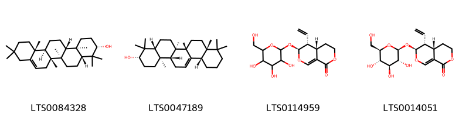{ width=100% }
    <figcaption>Hình ảnh cấu trúc hóa học của 4 hoạt chất thuộc nhóm Organooxygen compounds gồm ['(3s,4ar,6ar,6br,12ar,12br,14ar,14br)-4,4,6a,6b,10,10,12a,14b-octamethyl-1,2,3,4a,5,6,7,9,11,12,12b,13,14,14a-tetradecahydropicen-3-ol (LTS0084328)', '(3s,4ar,6ar,6bs,8as,12as,14ar,14br)-4,4,6a,6b,8a,9,9,14b-octamethyl-1,2,3,4a,5,6,7,8,10,11,12,12a,14,14a-tetradecahydropicen-3-ol (LTS0047189)', '(4as,5r,6s)-5-ethenyl-6-{[3,4,5-trihydroxy-6-(hydroxymethyl)oxan-2-yl]oxy}-3h,4h,4ah,5h,6h-pyrano[3,4-c]pyran-1-one (LTS0114959)', 'sweroside (LTS0014051)'].</figcaption>
</figure>
#### Nhóm Prenol lipids
<figure markdown="span">
    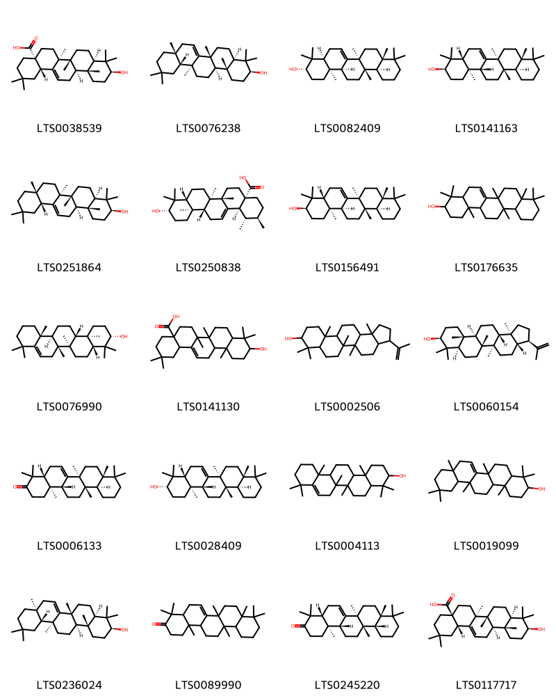{ width=100% }
    <figcaption>Hình ảnh cấu trúc hóa học của 20 hoạt chất thuộc nhóm Prenol lipids gồm ['(4ar,6as,6br,8ar,10s,12ar,12br,14bs)-10-hydroxy-2,2,6a,6b,9,9,12a-heptamethyl-1,3,4,5,6,7,8,8a,10,11,12,12b,13,14b-tetradecahydropicene-4a-carboxylic acid (LTS0038539)', 'alnulin (LTS0076238)', '(3s,4as,6bs,8as,12ar,12bs,14as,14br)-4,4,6b,8a,9,9,12b,14b-octamethyl-1,2,3,4a,5,7,8,10,11,12,12a,13,14,14a-tetradecahydropicen-3-ol (LTS0082409)', '(3r,4ar,6bs,8as,12ar,12bs,14ar,14br)-4,4,6b,8a,9,9,12b,14b-octamethyl-1,2,3,4a,5,7,8,10,11,12,12a,13,14,14a-tetradecahydropicen-3-ol (LTS0141163)', 'β-amyrin (LTS0251864)', 'ursolic acid (LTS0250838)', '(3r,4ar,6bs,8as,12ar,12bs,14as,14br)-4,4,6b,8a,9,9,12b,14b-octamethyl-1,2,3,4a,5,7,8,10,11,12,12a,13,14,14a-tetradecahydropicen-3-ol (LTS0156491)', '4,4,6b,8a,9,9,12b,14b-octamethyl-1,2,3,4a,5,7,8,10,11,12,12a,13,14,14a-tetradecahydropicen-3-ol (LTS0176635)', '(+)-16-gammaceren-3β-ol (LTS0076990)', 'oleanolic acid (LTS0141130)', '5a,5b,8,8,11a,13b-hexamethyl-3-(prop-1-en-2-yl)-hexadecahydrocyclopenta[a]chrysen-9-ol (LTS0002506)', '(3r,3as,5ar,5br,7ar,9s,11ar,11br,13ar,13bs)-5a,5b,8,8,11a,13b-hexamethyl-3-(prop-1-en-2-yl)-hexadecahydrocyclopenta[a]chrysen-9-ol (LTS0060154)', '(4ar,6bs,8as,12ar,12bs,14ar,14br)-4,4,6b,8a,9,9,12b,14b-octamethyl-2,4a,5,7,8,10,11,12,12a,13,14,14a-dodecahydro-1h-picen-3-one (LTS0006133)', '(3s,4ar,6bs,8as,12ar,12bs,14ar,14br)-4,4,6b,8a,9,9,12b,14b-octamethyl-1,2,3,4a,5,7,8,10,11,12,12a,13,14,14a-tetradecahydropicen-3-ol (LTS0028409)', '4,4,6a,6b,9,9,12a,14b-octamethyl-1,2,3,4a,5,6,7,10,11,12,12b,13,14,14a-tetradecahydropicen-3-ol (LTS0004113)', 'taraxerol (LTS0019099)', '(3s,4ar,6ar,8as,12ar,12bs,14ar,14br)-4,4,6a,8a,11,11,12b,14b-octamethyl-1,2,3,4a,5,6,8,9,10,12,12a,13,14,14a-tetradecahydropicen-3-ol (LTS0236024)', '4,4,6b,8a,9,9,12b,14b-octamethyl-2,4a,5,7,8,10,11,12,12a,13,14,14a-dodecahydro-1h-picen-3-one (LTS0089990)', '(4ar,6bs,8as,12as,12bs,14ar,14br)-4,4,6b,8a,9,9,12b,14b-octamethyl-2,4a,5,7,8,10,11,12,12a,13,14,14a-dodecahydro-1h-picen-3-one (LTS0245220)', 'oleanolic acid (LTS0117717)'].</figcaption>
</figure>
#### Nhóm Steroids and steroid derivatives
<figure markdown="span">
    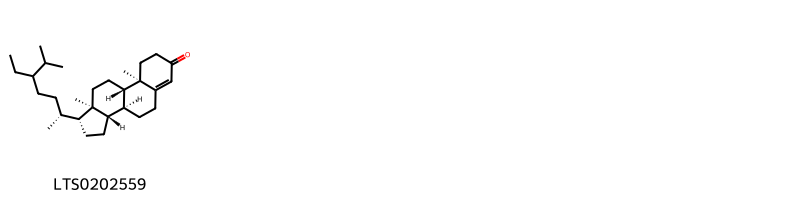{ width=100% }
    <figcaption>Hình ảnh cấu trúc hóa học của 1 hoạt chất thuộc nhóm Steroids and steroid derivatives gồm ['(1r,3as,3bs,9ar,9bs,11ar)-1-[(2r)-5-ethyl-6-methylheptan-2-yl]-9a,11a-dimethyl-1h,2h,3h,3ah,3bh,4h,5h,8h,9h,9bh,10h,11h-cyclopenta[a]phenanthren-7-one (LTS0202559)'].</figcaption>
</figure>

---

### Dược dân tộc học

Danh sách các quốc gia có sử dụng *Swertia chirayita* trong điều trị các bệnh. 

| Country   | Disease             | Bệnh                   |
|:----------|:--------------------|:-----------------------|
| Elsewhere | Vermifuge, Laxative | Vermifuge, nhuận tràng |
| India     | Tonic, Stomachic    | Tonic, Dạ dày          |

---

---
## Swertia japonica
### Thông tin về thực vật

!!! info "Phân loại thực vật của *Swertia japonica* từ GIBF:"
    - **Kingdom:** Plantae
    - **Phylum:** Tracheophyta
    - **Order:** Gentianales
    - **Family:** Gentianaceae
    - **Genus:** Swertia
    - **Species:** *Swertia japonica*

 

| Label (VI)   | Label (EN)   | Scientific Name   | Descriptions (VI)   | Descriptions (EN)   | Also Known As (VI)   | Also Known As (EN)   |
|:-------------|:-------------|:------------------|:--------------------|:--------------------|:---------------------|:---------------------|
| N/A          | N/A          | Swertia japonica  | loài thực vật       | species of plant    | ['']                 | ['']                 |

#### Phân bố trên thế giới

**Từ CSDL GIBF** nan, Japan, Korea, Republic of, United States of America, New Zealand

#### Phân bố tại Việt Nam

**Từ CSDL GIBF**: Không có ghi nhận ở Việt Nam

---
### Thành phần hóa học
        
- Theo cơ sở dữ liệu lotus: Từ loài *Swertia japonica* đã phân lập và xác định được 186 hoạt chất thuộc về các nhóm Naphthalenes, Phenols, Carboxylic acids and derivatives, Fatty Acyls, Oxanes, Cinnamic acids and derivatives, Cinnamaldehydes, Heteroaromatic compounds, Tannins, Prenol lipids, Benzene and substituted derivatives, Organooxygen compounds, Lignan glycosides, Phenol ethers, Flavonoids, Steroids and steroid derivatives, Benzodioxoles, Lactones, Benzopyrans. 

|    | chemicalTaxonomyClassyfireClass     |   smiles_count |
|---:|:------------------------------------|---------------:|
|  0 | Benzene and substituted derivatives |             14 |
|  1 | Benzodioxoles                       |              1 |
|  2 | Benzopyrans                         |             23 |
|  3 | Carboxylic acids and derivatives    |              1 |
|  4 | Cinnamaldehydes                     |              2 |
|  5 | Cinnamic acids and derivatives      |              5 |
|  6 | Fatty Acyls                         |              7 |
|  7 | Flavonoids                          |              9 |
|  8 | Heteroaromatic compounds            |              1 |
|  9 | Lactones                            |              1 |
| 10 | Lignan glycosides                   |              2 |
| 11 | Naphthalenes                        |              2 |
| 12 | Organooxygen compounds              |             55 |
| 13 | Oxanes                              |              2 |
| 14 | Phenol ethers                       |              2 |
| 15 | Phenols                             |              1 |
| 16 | Prenol lipids                       |             49 |
| 17 | Steroids and steroid derivatives    |              2 |
| 18 | Tannins                             |              6 |

#### Nhóm Benzene and substituted derivatives
<figure markdown="span">
    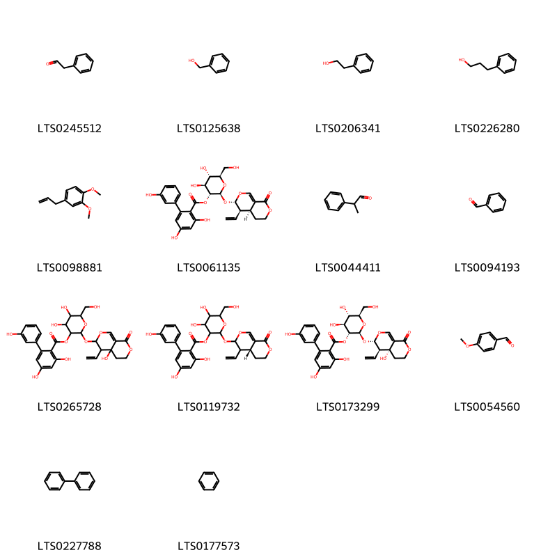{ width=100% }
    <figcaption>Hình ảnh cấu trúc hóa học của 14 hoạt chất thuộc nhóm Benzene and substituted derivatives gồm ['phenylacetaldehyde (LTS0245512)', 'benzyl alcohol (LTS0125638)', '2-phenyl-ethanol (LTS0206341)', '3-phenylpropanol (LTS0226280)', 'methyl eugenol (LTS0098881)', 'amarogentin (LTS0061135)', '2-phenylpropanal (LTS0044411)', 'benzaldehyde (LTS0094193)', "2-({4-ethenyl-4a-hydroxy-8-oxo-3h,4h,5h,6h-pyrano[3,4-c]pyran-3-yl}oxy)-4,5-dihydroxy-6-(hydroxymethyl)oxan-3-yl 3,3',5-trihydroxy-[1,1'-biphenyl]-2-carboxylate (LTS0265728)", "2-{[(4ar)-4-ethenyl-8-oxo-3h,4h,4ah,5h,6h-pyrano[3,4-c]pyran-3-yl]oxy}-4,5-dihydroxy-6-(hydroxymethyl)oxan-3-yl 3,3',5-trihydroxy-[1,1'-biphenyl]-2-carboxylate (LTS0119732)", 'amaroswerin (LTS0173299)', 'anisaldehyde (LTS0054560)', 'diphenyl (LTS0227788)', 'benzene (LTS0177573)'].</figcaption>
</figure>
#### Nhóm Benzodioxoles
<figure markdown="span">
    { width=100% }
    <figcaption>Hình ảnh cấu trúc hóa học của 1 hoạt chất thuộc nhóm Benzodioxoles gồm ['sassafras (LTS0136093)'].</figcaption>
</figure>
#### Nhóm Benzopyrans
<figure markdown="span">
    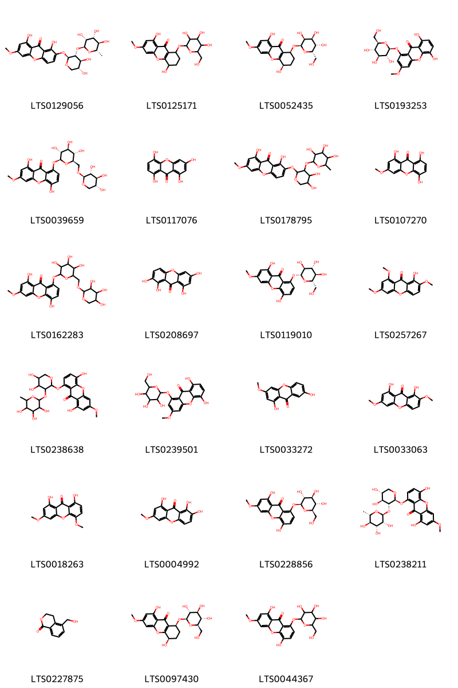{ width=100% }
    <figcaption>Hình ảnh cấu trúc hóa học của 23 hoạt chất thuộc nhóm Benzopyrans gồm ['2-{[(2s,3r,4s,5r)-4,5-dihydroxy-3-{[(2s,3r,4r,5r,6s)-3,4,5-trihydroxy-6-methyloxan-2-yl]oxy}oxan-2-yl]oxy}-1,8-dihydroxy-6-methoxyxanthen-9-one (LTS0129056)', '1,5-dihydroxy-3-methoxy-8-{[3,4,5-trihydroxy-6-(hydroxymethyl)oxan-2-yl]oxy}-5,6,7,8-tetrahydroxanthen-9-one (LTS0125171)', '(5r,8s)-1,5-dihydroxy-3-methoxy-8-{[(2r,3s,4s,5s,6s)-3,4,5-trihydroxy-6-(hydroxymethyl)oxan-2-yl]oxy}-5,6,7,8-tetrahydroxanthen-9-one (LTS0052435)', '5,8-dihydroxy-3-methoxy-1-{[(2s,3r,4s,5s,6r)-3,4,5-trihydroxy-6-(hydroxymethyl)oxan-2-yl]oxy}xanthen-9-one (LTS0193253)', '1,5-dihydroxy-3-methoxy-8-{[(2s,3r,4s,5s,6r)-3,4,5-trihydroxy-6-({[(2s,3r,4s,5r)-3,4,5-trihydroxyoxan-2-yl]oxy}methyl)oxan-2-yl]oxy}xanthen-9-one (LTS0039659)', '1,3,5,8-tetrahydroxyxanthone (LTS0117076)', '2-({4,5-dihydroxy-3-[(3,4,5-trihydroxy-6-methyloxan-2-yl)oxy]oxan-2-yl}oxy)-1,8-dihydroxy-6-methoxyxanthen-9-one (LTS0178795)', 'bellidifolium (LTS0107270)', '1,5-dihydroxy-3-methoxy-8-[(3,4,5-trihydroxy-6-{[(3,4,5-trihydroxyoxan-2-yl)oxy]methyl}oxan-2-yl)oxy]xanthen-9-one (LTS0162283)', 'norswertianin (LTS0208697)', '1,5-dihydroxy-3-methoxy-8-{[(2r,3s,4r,5r,6s)-3,4,5-trihydroxy-6-(hydroxymethyl)oxan-2-yl]oxy}xanthen-9-one (LTS0119010)', '1-hydroxy-2,6,8-trimethoxyxanthen-9-one (LTS0257267)', '8-({4,5-dihydroxy-3-[(3,4,5-trihydroxy-6-methyloxan-2-yl)oxy]oxan-2-yl}oxy)-1,5-dihydroxy-3-methoxyxanthen-9-one (LTS0238638)', '5,8-dihydroxy-3-methoxy-1-{[3,4,5-trihydroxy-6-(hydroxymethyl)oxan-2-yl]oxy}xanthen-9-one (LTS0239501)', 'gentisin (LTS0033272)', 'methylswertianin (LTS0033063)', 'swerchirin (LTS0018263)', 'swertianin (LTS0004992)', 'swertianolin (LTS0228856)', '8-{[(2s,3r,4s,5r)-4,5-dihydroxy-3-{[(2s,3r,4r,5r,6s)-3,4,5-trihydroxy-6-methyloxan-2-yl]oxy}oxan-2-yl]oxy}-1,5-dihydroxy-3-methoxyxanthen-9-one (LTS0238211)', '5-(hydroxymethyl)-3,4-dihydro-2-benzopyran-1-one (LTS0227875)', 'tetrahydroswertianolin (LTS0097430)', '1,5-dihydroxy-3-methoxy-8-{[3,4,5-trihydroxy-6-(hydroxymethyl)oxan-2-yl]oxy}xanthen-9-one (LTS0044367)'].</figcaption>
</figure>
#### Nhóm Carboxylic acids and derivatives
<figure markdown="span">
    { width=100% }
    <figcaption>Hình ảnh cấu trúc hóa học của 1 hoạt chất thuộc nhóm Carboxylic acids and derivatives gồm ['ethyl acetate (LTS0196824)'].</figcaption>
</figure>
#### Nhóm Cinnamaldehydes
<figure markdown="span">
    { width=100% }
    <figcaption>Hình ảnh cấu trúc hóa học của 2 hoạt chất thuộc nhóm Cinnamaldehydes gồm ['3-phenyl-2-propenal (LTS0204346)', 'cinnamal (LTS0271313)'].</figcaption>
</figure>
#### Nhóm Cinnamic acids and derivatives
<figure markdown="span">
    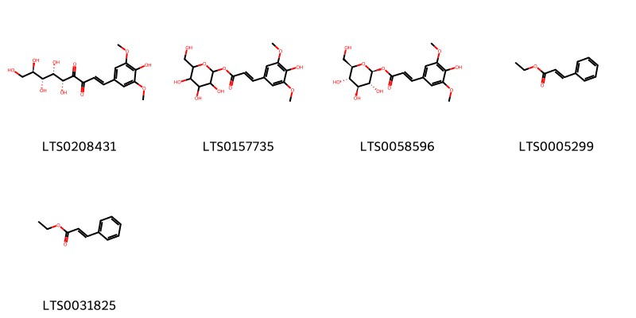{ width=100% }
    <figcaption>Hình ảnh cấu trúc hóa học của 5 hoạt chất thuộc nhóm Cinnamic acids and derivatives gồm ['(1e,5r,6s,7r,8r)-5,6,7,8,9-pentahydroxy-1-(4-hydroxy-3,5-dimethoxyphenyl)non-1-ene-3,4-dione (LTS0208431)', '3,4,5-trihydroxy-6-(hydroxymethyl)oxan-2-yl 3-(4-hydroxy-3,5-dimethoxyphenyl)prop-2-enoate (LTS0157735)', '1-o-sinapoyl-β-d-glucose (LTS0058596)', 'ethyl 3-phenylprop-2-enoate (LTS0005299)', 'ethyl cinnamate (LTS0031825)'].</figcaption>
</figure>
#### Nhóm Fatty Acyls
<figure markdown="span">
    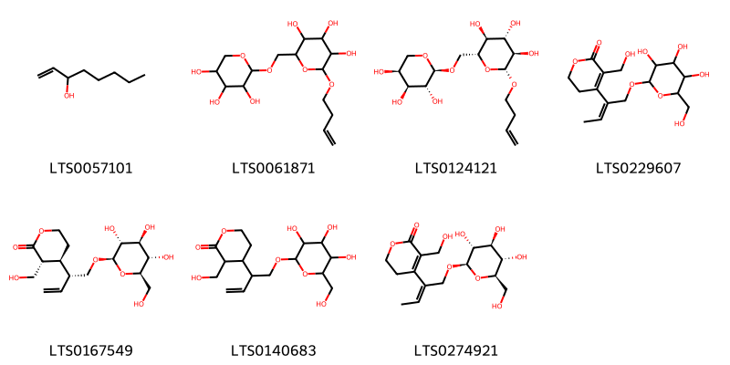{ width=100% }
    <figcaption>Hình ảnh cấu trúc hóa học của 7 hoạt chất thuộc nhóm Fatty Acyls gồm ['1-octen-3-ol (LTS0057101)', '2-(but-3-en-1-yloxy)-6-{[(3,4,5-trihydroxyoxan-2-yl)oxy]methyl}oxane-3,4,5-triol (LTS0061871)', '(2r,3r,4s,5s,6r)-2-(but-3-en-1-yloxy)-6-({[(2s,3r,4s,5s)-3,4,5-trihydroxyoxan-2-yl]oxy}methyl)oxane-3,4,5-triol (LTS0124121)', '3-(hydroxymethyl)-4-(1-{[3,4,5-trihydroxy-6-(hydroxymethyl)oxan-2-yl]oxy}but-2-en-2-yl)-5,6-dihydropyran-2-one (LTS0229607)', '(3r,4s)-3-(hydroxymethyl)-4-[(2r)-1-{[(2r,3r,4s,5s,6r)-3,4,5-trihydroxy-6-(hydroxymethyl)oxan-2-yl]oxy}but-3-en-2-yl]oxan-2-one (LTS0167549)', '3-(hydroxymethyl)-4-(1-{[3,4,5-trihydroxy-6-(hydroxymethyl)oxan-2-yl]oxy}but-3-en-2-yl)oxan-2-one (LTS0140683)', '3-(hydroxymethyl)-4-[(2e)-1-{[(2r,3r,4s,5s,6r)-3,4,5-trihydroxy-6-(hydroxymethyl)oxan-2-yl]oxy}but-2-en-2-yl]-5,6-dihydropyran-2-one (LTS0274921)'].</figcaption>
</figure>
#### Nhóm Flavonoids
<figure markdown="span">
    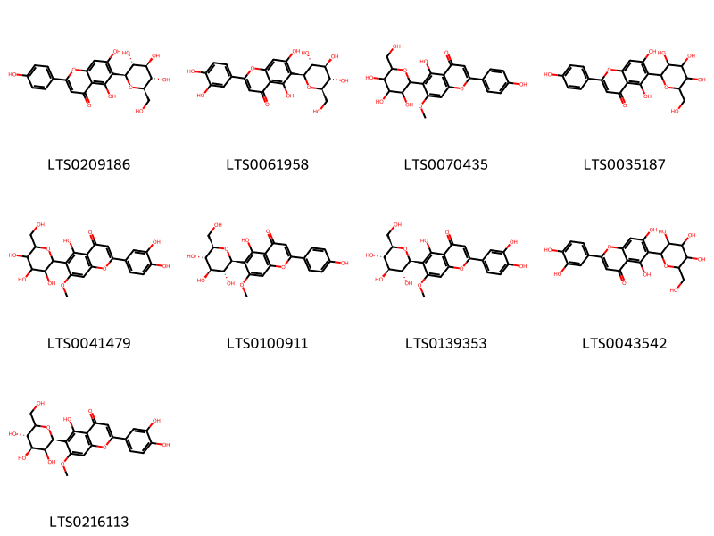{ width=100% }
    <figcaption>Hình ảnh cấu trúc hóa học của 9 hoạt chất thuộc nhóm Flavonoids gồm ['isovitexin (LTS0209186)', 'isoorientin (LTS0061958)', '5-hydroxy-2-(4-hydroxyphenyl)-7-methoxy-6-[3,4,5-trihydroxy-6-(hydroxymethyl)oxan-2-yl]chromen-4-one (LTS0070435)', 'isovitexin (LTS0035187)', '2-(3,4-dihydroxyphenyl)-5-hydroxy-7-methoxy-6-[3,4,5-trihydroxy-6-(hydroxymethyl)oxan-2-yl]chromen-4-one (LTS0041479)', '5-hydroxy-2-(4-hydroxyphenyl)-7-methoxy-6-[(2s,3r,4r,5s,6r)-3,4,5-trihydroxy-6-(hydroxymethyl)oxan-2-yl]chromen-4-one (LTS0100911)', 'swertiajaponin (LTS0139353)', 'isoorientin (LTS0043542)', 'swertiajaponin (LTS0216113)'].</figcaption>
</figure>
#### Nhóm Heteroaromatic compounds
<figure markdown="span">
    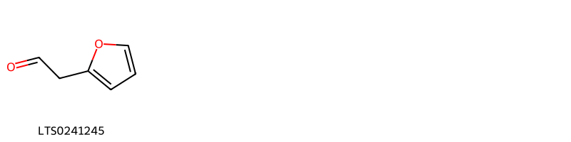{ width=100% }
    <figcaption>Hình ảnh cấu trúc hóa học của 1 hoạt chất thuộc nhóm Heteroaromatic compounds gồm ['furfurylaldehyde (LTS0241245)'].</figcaption>
</figure>
#### Nhóm Lactones
<figure markdown="span">
    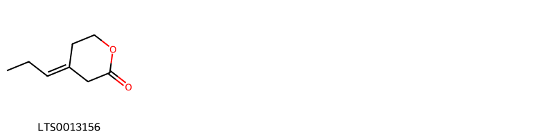{ width=100% }
    <figcaption>Hình ảnh cấu trúc hóa học của 1 hoạt chất thuộc nhóm Lactones gồm ['4-propylideneoxan-2-one (LTS0013156)'].</figcaption>
</figure>
#### Nhóm Lignan glycosides
<figure markdown="span">
    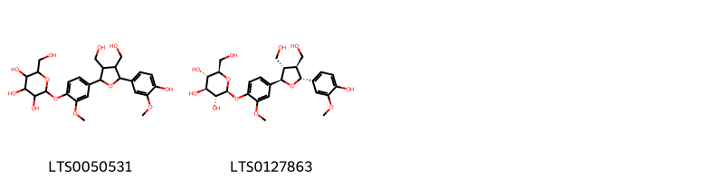{ width=100% }
    <figcaption>Hình ảnh cấu trúc hóa học của 2 hoạt chất thuộc nhóm Lignan glycosides gồm ['2-{4-[5-(4-hydroxy-3-methoxyphenyl)-3,4-bis(hydroxymethyl)oxolan-2-yl]-2-methoxyphenoxy}-6-(hydroxymethyl)oxane-3,4,5-triol (LTS0050531)', '(2s,3r,4s,5s,6r)-2-{4-[(2r,3s,4s,5r)-5-(4-hydroxy-3-methoxyphenyl)-3,4-bis(hydroxymethyl)oxolan-2-yl]-2-methoxyphenoxy}-6-(hydroxymethyl)oxane-3,4,5-triol (LTS0127863)'].</figcaption>
</figure>
#### Nhóm Naphthalenes
<figure markdown="span">
    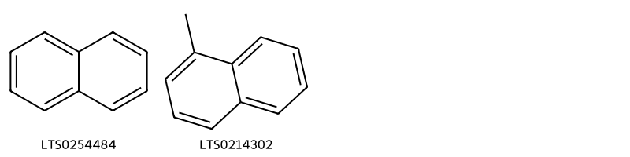{ width=100% }
    <figcaption>Hình ảnh cấu trúc hóa học của 2 hoạt chất thuộc nhóm Naphthalenes gồm ['naphthalene (LTS0254484)', '1-methylnaphthalene (LTS0214302)'].</figcaption>
</figure>
#### Nhóm Organooxygen compounds
<figure markdown="span">
    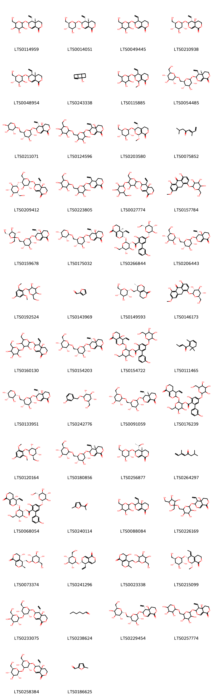{ width=100% }
    <figcaption>Hình ảnh cấu trúc hóa học của 55 hoạt chất thuộc nhóm Organooxygen compounds gồm ['(4as,5r,6s)-5-ethenyl-6-{[3,4,5-trihydroxy-6-(hydroxymethyl)oxan-2-yl]oxy}-3h,4h,4ah,5h,6h-pyrano[3,4-c]pyran-1-one (LTS0114959)', 'sweroside (LTS0014051)', '5-ethenyl-6-{[3,4,5-trihydroxy-6-(hydroxymethyl)oxan-2-yl]oxy}-3h,4h,4ah,5h,6h-pyrano[3,4-c]pyran-1-one (LTS0049445)', 'swertiamarin (LTS0210938)', '(4as,5s,6s)-5-ethenyl-6-{[(2s,3s,4s,5s,6r)-3,4,5-trihydroxy-6-(hydroxymethyl)oxan-2-yl]oxy}-3h,4h,4ah,5h,6h-pyrano[3,4-c]pyran-1-one (LTS0048954)', '3,4,5,8-tetrahydro-2h-cuban-1-ol (LTS0243338)', '5-ethenyl-8-methoxy-6-{[3,4,5-trihydroxy-6-(hydroxymethyl)oxan-2-yl]oxy}-3h,4h,5h,6h,8h-pyrano[3,4-c]pyran-1-one (LTS0115885)', '(4as,5s,6s)-5-ethenyl-6-{[(2s,3r,4s,5s,6r)-3,4,5-trihydroxy-6-({[(2r,3r,4s,5s,6r)-3,4,5-trihydroxy-6-(hydroxymethyl)oxan-2-yl]oxy}methyl)oxan-2-yl]oxy}-3h,4h,4ah,5h,6h-pyrano[3,4-c]pyran-1-one (LTS0054485)', '(4ar,5r,6s)-5-ethenyl-4a-hydroxy-6-{[(2s,3r,4s,5s,6r)-3,4,5-trihydroxy-6-({[(2s,3r,4s,5s)-3,4,5-trihydroxyoxan-2-yl]oxy}methyl)oxan-2-yl]oxy}-3h,4h,5h,6h-pyrano[3,4-c]pyran-1-one (LTS0211071)', '5-ethenyl-4a-hydroxy-6-{[3,4,5-trihydroxy-6-({[3,4,5-trihydroxy-6-(hydroxymethyl)oxan-2-yl]oxy}methyl)oxan-2-yl]oxy}-3h,4h,5h,6h-pyrano[3,4-c]pyran-1-one (LTS0124596)', '(5r,6s,8r)-5-ethenyl-8-methoxy-6-{[(2s,3r,4s,5s,6r)-3,4,5-trihydroxy-6-(hydroxymethyl)oxan-2-yl]oxy}-3h,4h,5h,6h,8h-pyrano[3,4-c]pyran-1-one (LTS0203580)', '2,6-dimethylocta-5,7-dien-4-one (LTS0075852)', '(4ar,5r,6s)-6-{[(2s,3r,4r,5s,6r)-3,4-dihydroxy-6-(hydroxymethyl)-5-{[(2s,3r,4s,5s,6r)-3,4,5-trihydroxy-6-(hydroxymethyl)oxan-2-yl]oxy}oxan-2-yl]oxy}-5-ethenyl-4a-hydroxy-3h,4h,5h,6h-pyrano[3,4-c]pyran-1-one (LTS0209412)', '5-ethenyl-6-{[3,4,5-trihydroxy-6-({[3,4,5-trihydroxy-6-(hydroxymethyl)oxan-2-yl]oxy}methyl)oxan-2-yl]oxy}-3h,4h,4ah,5h,6h-pyrano[3,4-c]pyran-1-one (LTS0223805)', '6-{[3,4-dihydroxy-6-(hydroxymethyl)-5-{[3,4,5-trihydroxy-6-(hydroxymethyl)oxan-2-yl]oxy}oxan-2-yl]oxy}-5-ethenyl-4a-hydroxy-3h,4h,5h,6h-pyrano[3,4-c]pyran-1-one (LTS0027774)', '1,8-dihydroxy-3-methoxy-5-{[3,4,5-trihydroxy-6-(hydroxymethyl)oxan-2-yl]oxy}-10h-anthracen-9-one (LTS0157784)', '(4ar,5r,6s)-6-{[(2s,3r,4s,5s,6r)-6-({[(2r,3s,4s,5r)-3,4-dihydroxy-2,5-bis(hydroxymethyl)oxolan-2-yl]oxy}methyl)-3,4,5-trihydroxyoxan-2-yl]oxy}-5-ethenyl-4a-hydroxy-3h,4h,5h,6h-pyrano[3,4-c]pyran-1-one (LTS0159678)', '(4ar,5r,6s)-5-ethenyl-4a-hydroxy-6-{[(2s,3r,4s,5s,6r)-3,4,5-trihydroxy-6-({[(2s,3r,4s,5r)-3,4,5-trihydroxyoxan-2-yl]oxy}methyl)oxan-2-yl]oxy}-3h,4h,5h,6h-pyrano[3,4-c]pyran-1-one (LTS0175032)', "(2s,3r,4s,5s,6r)-2-{[(3s,4r,4as)-4-ethenyl-8-oxo-3h,4h,4ah,5h,6h-pyrano[3,4-c]pyran-3-yl]oxy}-4,5-dihydroxy-6-(hydroxymethyl)oxan-3-yl 3,3'-dihydroxy-5-{[(2s,3r,4s,5s,6r)-3,4,5-trihydroxy-6-(hydroxymethyl)oxan-2-yl]oxy}-[1,1'-biphenyl]-2-carboxylate (LTS0266844)", '(4ar,5r,6s)-5-ethenyl-4a-hydroxy-6-{[(2s,3r,4s,5s,6r)-3,4,5-trihydroxy-6-({[(2s,3s,4s,5s,6r)-3,4,5-trihydroxy-6-(hydroxymethyl)oxan-2-yl]oxy}methyl)oxan-2-yl]oxy}-3h,4h,5h,6h-pyrano[3,4-c]pyran-1-one (LTS0206443)', '2-(4-hydroxy-2,6-dimethoxyphenoxy)-6-(hydroxymethyl)oxane-3,4,5-triol (LTS0192524)', 'bran oil (LTS0143969)', '(5s,6s)-6-methyl-5-({[(2s,3r,4s,5s,6r)-3,4,5-trihydroxy-6-(hydroxymethyl)oxan-2-yl]oxy}methyl)-3h,4h,5h,6h,8h-pyrano[3,4-c]pyran-1-one (LTS0149593)', '1,8-dihydroxy-3-methoxy-5-{[(2s,3r,4s,5s,6r)-3,4,5-trihydroxy-6-(hydroxymethyl)oxan-2-yl]oxy}-10h-anthracen-9-one (LTS0146173)', '6-{[3,5-dihydroxy-6-(hydroxymethyl)-4-{[3,4,5-trihydroxy-6-(hydroxymethyl)oxan-2-yl]oxy}oxan-2-yl]oxy}-5-ethenyl-4a-hydroxy-3h,4h,5h,6h-pyrano[3,4-c]pyran-1-one (LTS0160130)', '(4ar,5r,6s)-5-ethenyl-4a-hydroxy-6-{[(2s,3r,4s,5s,6r)-3,4,5-trihydroxy-6-({[(2r,3r,4s,5s,6r)-3,4,5-trihydroxy-6-(hydroxymethyl)oxan-2-yl]oxy}methyl)oxan-2-yl]oxy}-3h,4h,5h,6h-pyrano[3,4-c]pyran-1-one (LTS0154203)', "2-({4-ethenyl-4a-hydroxy-8-oxo-3h,4h,5h,6h-pyrano[3,4-c]pyran-3-yl}oxy)-4,5-dihydroxy-6-(hydroxymethyl)oxan-3-yl 3,3'-dihydroxy-5-{[3,4,5-trihydroxy-6-(hydroxymethyl)oxan-2-yl]oxy}-[1,1'-biphenyl]-2-carboxylate (LTS0154722)", 'damascenone (LTS0111465)', '(4ar,5r,6s)-5-ethenyl-4a-hydroxy-6-{[(2s,3r,4s,5s,6r)-3,4,5-trihydroxy-6-({[(2r,3s,4r,5r)-3,4,5-trihydroxyoxan-2-yl]oxy}methyl)oxan-2-yl]oxy}-3h,4h,5h,6h-pyrano[3,4-c]pyran-1-one (LTS0133951)', '(2r,3s,4s,5r,6r)-2-(hydroxymethyl)-6-[(3-hydroxyphenyl)methoxy]oxane-3,4,5-triol (LTS0242776)', '(4as,5r,6s)-5-ethenyl-6-{[(2s,3r,4s,5s,6r)-3,4,5-trihydroxy-6-({[(2r,3r,4s,5s,6r)-3,4,5-trihydroxy-6-(hydroxymethyl)oxan-2-yl]oxy}methyl)oxan-2-yl]oxy}-3h,4h,4ah,5h,6h-pyrano[3,4-c]pyran-1-one (LTS0091059)', "2-({4-ethenyl-8-oxo-3h,4h,4ah,5h,6h-pyrano[3,4-c]pyran-3-yl}oxy)-4,5-dihydroxy-6-(hydroxymethyl)oxan-3-yl 3,3'-dihydroxy-5-{[3,4,5-trihydroxy-6-(hydroxymethyl)oxan-2-yl]oxy}-[1,1'-biphenyl]-2-carboxylate (LTS0176239)", '(2s,3r,4s,5s,6r)-2-(4-hydroxy-2,6-dimethoxyphenoxy)-6-(hydroxymethyl)oxane-3,4,5-triol (LTS0120164)', '(4as,5s,6s)-5-ethenyl-6-{[(2s,3r,4s,5s,6r)-3,4,5-trihydroxy-6-({[(3r,4s,5s,6r)-3,4,5-trihydroxy-6-(hydroxymethyl)oxan-2-yl]oxy}methyl)oxan-2-yl]oxy}-3h,4h,4ah,5h,6h-pyrano[3,4-c]pyran-1-one (LTS0180856)', '(4as,5s,6s)-5-[(1s)-1-hydroxyethyl]-6-{[(2s,3r,4s,5s,6r)-3,4,5-trihydroxy-6-(hydroxymethyl)oxan-2-yl]oxy}-3h,4h,4ah,5h,6h-pyrano[3,4-c]pyran-1-one (LTS0256877)', '(e)-tagetone (LTS0264297)', "(2s,3r,4s,5s,6r)-2-{[(3s,4r,4ar)-4-ethenyl-4a-hydroxy-8-oxo-3h,4h,5h,6h-pyrano[3,4-c]pyran-3-yl]oxy}-4,5-dihydroxy-6-(hydroxymethyl)oxan-3-yl 3,3'-dihydroxy-5-{[(2s,3r,4s,5s,6r)-3,4,5-trihydroxy-6-(hydroxymethyl)oxan-2-yl]oxy}-[1,1'-biphenyl]-2-carboxylate (LTS0068054)", '2-acetyl-5-methylfuran (LTS0240114)', '5-ethenyl-4a-hydroxy-6-{[3,4,5-trihydroxy-6-(hydroxymethyl)oxan-2-yl]oxy}-3h,4h,5h,6h-pyrano[3,4-c]pyran-1-one (LTS0088084)', '6-{[6-({[3,4-dihydroxy-2,5-bis(hydroxymethyl)oxolan-2-yl]oxy}methyl)-3,4,5-trihydroxyoxan-2-yl]oxy}-5-ethenyl-4a-hydroxy-3h,4h,5h,6h-pyrano[3,4-c]pyran-1-one (LTS0226169)', '(4r,5r,6r)-4-hydroxy-6-methyl-5-({[(2r,3r,4s,5s,6r)-3,4,5-trihydroxy-6-(hydroxymethyl)oxan-2-yl]oxy}methyl)-3h,4h,5h,6h,8h-pyrano[3,4-c]pyran-1-one (LTS0073374)', 'gentiopicroside (LTS0241296)', '4-hydroxy-6-methyl-5-({[3,4,5-trihydroxy-6-(hydroxymethyl)oxan-2-yl]oxy}methyl)-3h,4h,5h,6h,8h-pyrano[3,4-c]pyran-1-one (LTS0023338)', '(5z,6r,8r)-5-ethylidene-8-methoxy-6-{[(2s,3r,4s,5s,6r)-3,4,5-trihydroxy-6-(hydroxymethyl)oxan-2-yl]oxy}-3h,4h,6h,8h-pyrano[3,4-c]pyran-1-one (LTS0215099)', '(4ar,5r,6s)-6-{[(2s,3r,4s,5r,6r)-3,5-dihydroxy-6-(hydroxymethyl)-4-{[(2s,3r,4s,5r,6r)-3,4,5-trihydroxy-6-(hydroxymethyl)oxan-2-yl]oxy}oxan-2-yl]oxy}-5-ethenyl-4a-hydroxy-3h,4h,5h,6h-pyrano[3,4-c]pyran-1-one (LTS0233075)', 'hexanal (LTS0238624)', '(4ar,5r,6s)-5-ethenyl-4a-hydroxy-6-{[(2s,3r,4s,5s,6r)-3,4,5-trihydroxy-6-({[(2s,3r,4s,5r,6r)-3,4,5-trihydroxy-6-(hydroxymethyl)oxan-2-yl]oxy}methyl)oxan-2-yl]oxy}-3h,4h,5h,6h-pyrano[3,4-c]pyran-1-one (LTS0229454)', '5-ethenyl-4a-hydroxy-6-[(3,4,5-trihydroxy-6-{[(3,4,5-trihydroxyoxan-2-yl)oxy]methyl}oxan-2-yl)oxy]-3h,4h,5h,6h-pyrano[3,4-c]pyran-1-one (LTS0257774)', '(4ar,5r,6s)-6-{[(2s,3r,4s,5r,6r)-3,5-dihydroxy-6-(hydroxymethyl)-4-{[(2s,3r,4s,5s,6r)-3,4,5-trihydroxy-6-(hydroxymethyl)oxan-2-yl]oxy}oxan-2-yl]oxy}-5-ethenyl-4a-hydroxy-3h,4h,5h,6h-pyrano[3,4-c]pyran-1-one (LTS0258384)', '5-methylfurfural (LTS0186625)', '2-(hydroxymethyl)-6-[(3-hydroxyphenyl)methoxy]oxane-3,4,5-triol (LTS0064820)', '5-ethylidene-8-methoxy-6-{[3,4,5-trihydroxy-6-(hydroxymethyl)oxan-2-yl]oxy}-3h,4h,6h,8h-pyrano[3,4-c]pyran-1-one (LTS0021040)', '6-methyl-5-({[3,4,5-trihydroxy-6-(hydroxymethyl)oxan-2-yl]oxy}methyl)-3h,4h,5h,6h,8h-pyrano[3,4-c]pyran-1-one (LTS0002609)', '5-(1-hydroxyethyl)-6-{[3,4,5-trihydroxy-6-(hydroxymethyl)oxan-2-yl]oxy}-3h,4h,4ah,5h,6h-pyrano[3,4-c]pyran-1-one (LTS0259794)', '(5r,6s)-5-ethenyl-6-{[(2s,3r,4s,5s,6r)-3,4,5-trihydroxy-6-({[(2r,3r,4s,5s,6r)-3,4,5-trihydroxy-6-(hydroxymethyl)oxan-2-yl]oxy}methyl)oxan-2-yl]oxy}-3h,5h,6h-pyrano[3,4-c]pyran-1-one (LTS0009825)'].</figcaption>
</figure>
#### Nhóm Oxanes
<figure markdown="span">
    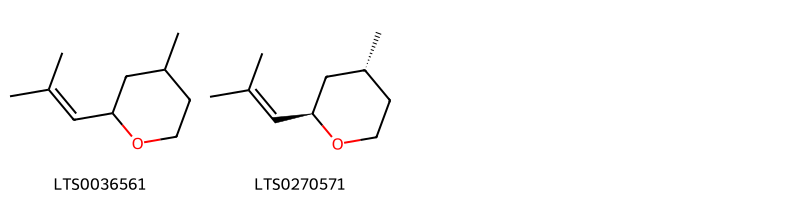{ width=100% }
    <figcaption>Hình ảnh cấu trúc hóa học của 2 hoạt chất thuộc nhóm Oxanes gồm ['rose oxide (LTS0036561)', '(2r,4r)-rose oxide (LTS0270571)'].</figcaption>
</figure>
#### Nhóm Phenol ethers
<figure markdown="span">
    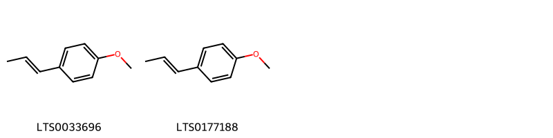{ width=100% }
    <figcaption>Hình ảnh cấu trúc hóa học của 2 hoạt chất thuộc nhóm Phenol ethers gồm ['anethole (LTS0033696)', 'p-propenylanisole (LTS0177188)'].</figcaption>
</figure>
#### Nhóm Phenols
<figure markdown="span">
    { width=100% }
    <figcaption>Hình ảnh cấu trúc hóa học của 1 hoạt chất thuộc nhóm Phenols gồm ['eugenol (LTS0052342)'].</figcaption>
</figure>
#### Nhóm Prenol lipids
<figure markdown="span">
    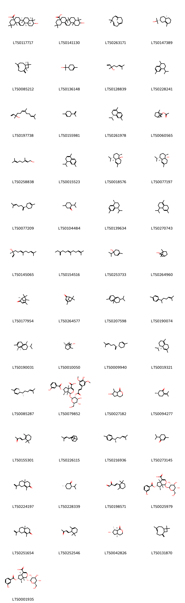{ width=100% }
    <figcaption>Hình ảnh cấu trúc hóa học của 49 hoạt chất thuộc nhóm Prenol lipids gồm ['oleanolic acid (LTS0117717)', 'oleanolic acid (LTS0141130)', 'humulene (LTS0263171)', 'gamma-eudesmol (LTS0147389)', 'caryophyllene (LTS0085212)', 'terpineol (LTS0136148)', 'linalool, (+-)- (LTS0128839)', '(e)-calamene (LTS0228241)', 'nerolidol (LTS0197738)', 'limonene,  (LTS0155981)', '(4s)-4-isopropyl-1,6-dimethyl-3,4-dihydronaphthalene (LTS0261978)', 'bornyl acetate (LTS0060565)', 'geraniol (LTS0258838)', '3,4-dihydrocadalene (LTS0015523)', '(1s,4r,4ar,8ar)-1-isopropyl-4,7-dimethyl-2,3,4,5,6,8a-hexahydro-1h-naphthalen-4a-ol (LTS0018576)', '(1s,4r,4as,8ar)-1-isopropyl-4,7-dimethyl-2,3,4,5,6,8a-hexahydro-1h-naphthalen-4a-ol (LTS0077197)', '(r)-β-bisabolene (LTS0077209)', 'menthone (LTS0104484)', '(1s,4s)-4-isopropyl-1,6-dimethyl-1,2,3,4-tetrahydronaphthalene (LTS0139634)', '4-isopropyl-1,6-dimethyl-2,3,4,4a,7,8-hexahydronaphthalene (LTS0270743)', '(3r,6e)-nerolidol (LTS0145065)', '(6e)-2,6-dimethyl-10-methylidenedodeca-2,6-diene (LTS0154516)', '4-terpineol (LTS0253733)', 'borneol (LTS0264960)', '(1r,5s)-4,6,6-trimethylbicyclo[3.1.1]hept-3-en-2-one (LTS0177954)', 'verbenone (LTS0264577)', 'α-copaene (LTS0207598)', 'curcumene (LTS0190074)', '(1r,2s,7s,8s)-8-isopropyl-1,3-dimethyltricyclo[4.4.0.0²,⁷]dec-3-ene (LTS0190031)', '(2s,4r)-1,7,7-trimethylbicyclo[2.2.1]heptan-2-ol (LTS0010050)', '(-)-β-bisabolene (LTS0009940)', 'delta-cadinene (LTS0019321)', 'zingiberene (LTS0085287)', '(1s,4as,6r,7r,7as)-1-{[(2s,3r,4s,5s,6r)-4,5-dihydroxy-3-{[(2e)-3-(4-hydroxy-3,5-dimethoxyphenyl)prop-2-enoyl]oxy}-6-(hydroxymethyl)oxan-2-yl]oxy}-6-(3-hydroxybenzoyloxy)-7-methyl-1h,4ah,5h,6h,7h,7ah-cyclopenta[c]pyran-4-carboxylic acid (LTS0079852)', 'boonein (LTS0027182)', '(+)-pulegone (LTS0094277)', 'β-ionone (LTS0155301)', 'α-bergamotene (LTS0226115)', '(-)-α-curcumene (LTS0216936)', 'piperitone (LTS0273145)', '(4ar)-1,4a-dimethyl-7-(prop-1-en-2-yl)-3,4,5,6,7,8-hexahydronaphthalen-2-one (LTS0224197)', '(+)-menthone (LTS0228339)', '(3e)-2-oxo-4-(2,6,6-trimethylcyclohex-1-en-1-yl)but-3-enal (LTS0198571)', '(1s,4as,6r,7r,7as)-6-(3-hydroxybenzoyloxy)-7-methyl-1-{[(2s,3r,4s,5s,6r)-3,4,5-trihydroxy-6-(hydroxymethyl)oxan-2-yl]oxy}-1h,4ah,5h,6h,7h,7ah-cyclopenta[c]pyran-4-carboxylic acid (LTS0025979)', '(4ar,7s)-1,4a-dimethyl-7-(prop-1-en-2-yl)-3,4,5,6,7,8-hexahydronaphthalen-2-one (LTS0251654)', 'ionone (LTS0252546)', 'boonein (LTS0042826)', 'caryophyllene (LTS0131870)', '(1r,4ar,6r,7r,7as)-6-(3-hydroxybenzoyloxy)-7-methyl-1-{[(2r,3r,4s,5s,6r)-3,4,5-trihydroxy-6-(hydroxymethyl)oxan-2-yl]oxy}-1h,4ah,5h,6h,7h,7ah-cyclopenta[c]pyran-4-carboxylic acid (LTS0001935)'].</figcaption>
</figure>
#### Nhóm Steroids and steroid derivatives
<figure markdown="span">
    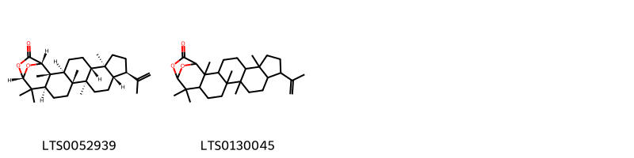{ width=100% }
    <figcaption>Hình ảnh cấu trúc hóa học của 2 hoạt chất thuộc nhóm Steroids and steroid derivatives gồm ['(1s,2r,3s,6r,7s,10r,11s,14r,15r,18r,20s)-2,7,14,15,19,19-hexamethyl-10-(prop-1-en-2-yl)-21,23-dioxahexacyclo[18.2.1.0²,¹⁸.0³,¹⁵.0⁶,¹⁴.0⁷,¹¹]tricosan-22-one (LTS0052939)', '2,7,14,15,19,19-hexamethyl-10-(prop-1-en-2-yl)-21,23-dioxahexacyclo[18.2.1.0²,¹⁸.0³,¹⁵.0⁶,¹⁴.0⁷,¹¹]tricosan-22-one (LTS0130045)'].</figcaption>
</figure>
#### Nhóm Tannins
<figure markdown="span">
    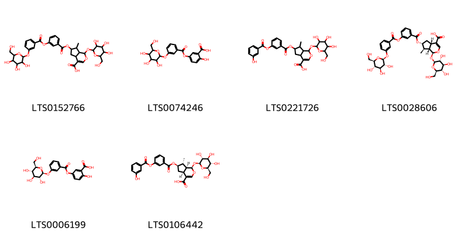{ width=100% }
    <figcaption>Hình ảnh cấu trúc hóa học của 6 hoạt chất thuộc nhóm Tannins gồm ['7-methyl-1-{[3,4,5-trihydroxy-6-(hydroxymethyl)oxan-2-yl]oxy}-6-[3-(3-{[3,4,5-trihydroxy-6-(hydroxymethyl)oxan-2-yl]oxy}benzoyloxy)benzoyloxy]-1h,4ah,5h,6h,7h,7ah-cyclopenta[c]pyran-4-carboxylic acid (LTS0152766)', '2-hydroxy-5-(3-{[3,4,5-trihydroxy-6-(hydroxymethyl)oxan-2-yl]oxy}benzoyloxy)benzoic acid (LTS0074246)', '6-[3-(3-hydroxybenzoyloxy)benzoyloxy]-7-methyl-1-{[3,4,5-trihydroxy-6-(hydroxymethyl)oxan-2-yl]oxy}-1h,4ah,5h,6h,7h,7ah-cyclopenta[c]pyran-4-carboxylic acid (LTS0221726)', '(1s,4as,6r,7r,7as)-7-methyl-1-{[(2s,3r,4s,5s,6r)-3,4,5-trihydroxy-6-(hydroxymethyl)oxan-2-yl]oxy}-6-[3-(3-{[(2s,3r,4s,5s,6r)-3,4,5-trihydroxy-6-(hydroxymethyl)oxan-2-yl]oxy}benzoyloxy)benzoyloxy]-1h,4ah,5h,6h,7h,7ah-cyclopenta[c]pyran-4-carboxylic acid (LTS0028606)', '2-hydroxy-5-(3-{[(2s,3r,4s,5s,6r)-3,4,5-trihydroxy-6-(hydroxymethyl)oxan-2-yl]oxy}benzoyloxy)benzoic acid (LTS0006199)', '(1r,4as,6r,7r,7as)-6-[3-(3-hydroxybenzoyloxy)benzoyloxy]-7-methyl-1-{[(2s,3r,4s,5s,6r)-3,4,5-trihydroxy-6-(hydroxymethyl)oxan-2-yl]oxy}-1h,4ah,5h,6h,7h,7ah-cyclopenta[c]pyran-4-carboxylic acid (LTS0106442)'].</figcaption>
</figure>

---

### Dược dân tộc học

Danh sách các quốc gia có sử dụng *Swertia japonica* trong điều trị các bệnh. 

| Country   | Disease   | Bệnh    |
|:----------|:----------|:--------|
| Japan     | Stomachic | Sững sờ |

---

# Chi Erythraea

??? note "Danh sách các dược liệu thuộc chi"
    
	 - *Erythraea centaurium*
	 - *Erythraea chilensis*
	 - *Erythraea gentaurium*
	 - *Erythraea roxburghii*

---
## Erythraea centaurium
### Thông tin về thực vật

!!! info "Phân loại thực vật của *Centaurium erythraea* từ GIBF:"
    - **Kingdom:** Plantae
    - **Phylum:** Tracheophyta
    - **Order:** Gentianales
    - **Family:** Gentianaceae
    - **Genus:** Centaurium
    - **Species:** *Centaurium erythraea*

 

| Label (VI)   | Label (EN)   | Scientific Name   | Descriptions (VI)   | Descriptions (EN)   | Also Known As (VI)   | Also Known As (EN)   |
|:-------------|:-------------|:------------------|:--------------------|:--------------------|:---------------------|:---------------------|
| N/A          | N/A          | Swertia japonica  | loài thực vật       | species of plant    | ['']                 | ['']                 |

#### Phân bố trên thế giới

**Từ CSDL GIBF** nan, Italy, Australia, Belgium, Estonia, unknown or invalid, Latvia, Canada, Ukraine, Denmark, Netherlands, Lithuania, Belarus, Luxembourg, Spain, Hungary, Albania, Portugal, Algeria, Morocco, United States of America, Sweden, Croatia, Greece, Montenegro, Germany, Brazil, Switzerland, Austria, France, United Kingdom of Great Britain and Northern Ireland, Poland, New Zealand

#### Phân bố tại Việt Nam

**Từ CSDL GIBF**: Không có ghi nhận ở Việt Nam

---
### Thành phần hóa học
        
- Theo cơ sở dữ liệu lotus: Từ loài *Centaurium erythraea* đã phân lập và xác định được Chưa có hoạt chất nào được phân lập. hoạt chất thuộc về các nhóm Không có hoạt chất nào được phân lập. 

Không có hình ảnh nào được tạo ra

---

### Dược dân tộc học

Danh sách các quốc gia có sử dụng *Centaurium erythraea* trong điều trị các bệnh. 

| Country   |   Disease | Bệnh   |
|:----------|----------:|:-------|
| Elsewhere |       nan | Ở đây  |

---

---
## Erythraea chilensis
### Thông tin về thực vật

!!! info "Phân loại thực vật của *N/A* từ GIBF:"
    - **Kingdom:** Plantae
    - **Phylum:** Tracheophyta
    - **Order:** Gentianales
    - **Family:** Gentianaceae
    - **Genus:** Centaurium
    - **Species:** *N/A*

 

| Label (VI)   | Label (EN)   | Scientific Name   | Descriptions (VI)   | Descriptions (EN)   | Also Known As (VI)   | Also Known As (EN)   |
|:-------------|:-------------|:------------------|:--------------------|:--------------------|:---------------------|:---------------------|
| N/A          | N/A          | Swertia japonica  | loài thực vật       | species of plant    | ['']                 | ['']                 |

#### Phân bố trên thế giới

**Từ CSDL GIBF** nan, Australia, Argentina, Israel, Netherlands, Spain, Portugal, United States of America, Uruguay, Chile, Greece, Germany, Switzerland, Austria, Mexico, France, United Kingdom of Great Britain and Northern Ireland, Ecuador, New Zealand

#### Phân bố tại Việt Nam

**Từ CSDL GIBF**: Không có ghi nhận ở Việt Nam

---
### Thành phần hóa học
        
- Theo cơ sở dữ liệu lotus: Từ loài *N/A* đã phân lập và xác định được Chưa có hoạt chất nào được phân lập. hoạt chất thuộc về các nhóm Không có hoạt chất nào được phân lập. 

Không có hình ảnh nào được tạo ra

---

### Dược dân tộc học

Danh sách các quốc gia có sử dụng *N/A* trong điều trị các bệnh. 

| Country       | Disease     | Bệnh               |
|:--------------|:------------|:-------------------|
| Dutch         | Tonic       | (thuộc) trương lực |
| Elsewhere     | Tonic       | (thuộc) trương lực |
| German        | Stimulant   | Chất kích thích    |
| South America | Emmenagogue | Emmenagogue        |

---

---
## Erythraea gentaurium
### Thông tin về thực vật

!!! info "Phân loại thực vật của *N/A* từ GIBF:"
    - **Kingdom:** N/A
    - **Phylum:** N/A
    - **Order:** N/A
    - **Family:** N/A
    - **Genus:** N/A
    - **Species:** *N/A*

 

| Label (VI)   | Label (EN)   | Scientific Name   | Descriptions (VI)   | Descriptions (EN)   | Also Known As (VI)   | Also Known As (EN)   |
|:-------------|:-------------|:------------------|:--------------------|:--------------------|:---------------------|:---------------------|
| N/A          | N/A          | Swertia japonica  | loài thực vật       | species of plant    | ['']                 | ['']                 |

#### Phân bố trên thế giới

**Từ CSDL GIBF** Không có kết quả phù hợp

#### Phân bố tại Việt Nam

**Từ CSDL GIBF**: Không có ghi nhận ở Việt Nam

---
### Thành phần hóa học
        
- Theo cơ sở dữ liệu lotus: Từ loài *N/A* đã phân lập và xác định được Chưa có hoạt chất nào được phân lập. hoạt chất thuộc về các nhóm Không có hoạt chất nào được phân lập. 

Không có hình ảnh nào được tạo ra

---

### Dược dân tộc học

Danh sách các quốc gia có sử dụng *N/A* trong điều trị các bệnh. 

| Country   | Disease   | Bệnh               |
|:----------|:----------|:-------------------|
| Elsewhere | Tonic     | (thuộc) trương lực |

---

---
## Erythraea roxburghii
### Thông tin về thực vật

!!! info "Phân loại thực vật của *Centaurium centaurioides* từ GIBF:"
    - **Kingdom:** Plantae
    - **Phylum:** Tracheophyta
    - **Order:** Gentianales
    - **Family:** Gentianaceae
    - **Genus:** Centaurium
    - **Species:** *Centaurium centaurioides*

 

| Label (VI)   | Label (EN)   | Scientific Name   | Descriptions (VI)   | Descriptions (EN)   | Also Known As (VI)   | Also Known As (EN)   |
|:-------------|:-------------|:------------------|:--------------------|:--------------------|:---------------------|:---------------------|
| N/A          | N/A          | Swertia japonica  | loài thực vật       | species of plant    | ['']                 | ['']                 |

#### Phân bố trên thế giới

**Từ CSDL GIBF** nan, India, Mongolia

#### Phân bố tại Việt Nam

**Từ CSDL GIBF**: Không có ghi nhận ở Việt Nam

---
### Thành phần hóa học
        
- Theo cơ sở dữ liệu lotus: Từ loài *Centaurium centaurioides* đã phân lập và xác định được Chưa có hoạt chất nào được phân lập. hoạt chất thuộc về các nhóm Không có hoạt chất nào được phân lập. 

Không có hình ảnh nào được tạo ra

---

### Dược dân tộc học

Danh sách các quốc gia có sử dụng *Centaurium centaurioides* trong điều trị các bệnh. 

| Country   | Disease          | Bệnh             |
|:----------|:-----------------|:-----------------|
| India     | Stomachic, Tonic | Dạ dày, Thuốc bổ |

---

# Chi Coutoubea

??? note "Danh sách các dược liệu thuộc chi"
    
	 - *Coutoubea apicata*

---
## Coutoubea apicata
### Thông tin về thực vật

!!! info "Phân loại thực vật của *N/A* từ GIBF:"
    - **Kingdom:** Plantae
    - **Phylum:** Tracheophyta
    - **Order:** Gentianales
    - **Family:** Gentianaceae
    - **Genus:** Coutoubea
    - **Species:** *N/A*

 

| Label (VI)   | Label (EN)   | Scientific Name   | Descriptions (VI)   | Descriptions (EN)   | Also Known As (VI)   | Also Known As (EN)   |
|:-------------|:-------------|:------------------|:--------------------|:--------------------|:---------------------|:---------------------|
| N/A          | N/A          | Swertia japonica  | loài thực vật       | species of plant    | ['']                 | ['']                 |

#### Phân bố trên thế giới

**Từ CSDL GIBF** Belize, Suriname, French Guiana, Guadeloupe, Colombia, Brazil, Bolivia (Plurinational State of), Guyana, Panama

#### Phân bố tại Việt Nam

**Từ CSDL GIBF**: Không có ghi nhận ở Việt Nam

---
### Thành phần hóa học
        
- Theo cơ sở dữ liệu lotus: Từ loài *N/A* đã phân lập và xác định được Chưa có hoạt chất nào được phân lập. hoạt chất thuộc về các nhóm Không có hoạt chất nào được phân lập. 

Không có hình ảnh nào được tạo ra

---

### Dược dân tộc học

Danh sách các quốc gia có sử dụng *N/A* trong điều trị các bệnh. 

| Country   | Disease          | Bệnh             |
|:----------|:-----------------|:-----------------|
| Elsewhere | Stomachic, Tonic | Dạ dày, Thuốc bổ |

---

# Chi Eustoma

??? note "Danh sách các dược liệu thuộc chi"
    
	 - *Eustoma exaltatum*

---
## Eustoma exaltatum
### Thông tin về thực vật

!!! info "Phân loại thực vật của *Eustoma exaltatum* từ GIBF:"
    - **Kingdom:** Plantae
    - **Phylum:** Tracheophyta
    - **Order:** Gentianales
    - **Family:** Gentianaceae
    - **Genus:** Eustoma
    - **Species:** *Eustoma exaltatum*

 

| Label (VI)   | Label (EN)   | Scientific Name   | Descriptions (VI)   | Descriptions (EN)   | Also Known As (VI)   | Also Known As (EN)   |
|:-------------|:-------------|:------------------|:--------------------|:--------------------|:---------------------|:---------------------|
| N/A          | N/A          | Eustoma exaltatum | loài thực vật       | species of plant    | ['']                 | ['']                 |

#### Phân bố trên thế giới

**Từ CSDL GIBF** Turks and Caicos Islands, Cuba, United States of America, Cayman Islands, Mexico

#### Phân bố tại Việt Nam

**Từ CSDL GIBF**: Không có ghi nhận ở Việt Nam

---
### Thành phần hóa học
        
- Theo cơ sở dữ liệu lotus: Từ loài *Eustoma exaltatum* đã phân lập và xác định được 9 hoạt chất thuộc về các nhóm Prenol lipids, Organooxygen compounds, Benzopyrans. 

|    | chemicalTaxonomyClassyfireClass   |   smiles_count |
|---:|:----------------------------------|---------------:|
|  0 | Benzopyrans                       |              1 |
|  1 | Organooxygen compounds            |              3 |
|  2 | Prenol lipids                     |              5 |

#### Nhóm Benzopyrans
<figure markdown="span">
    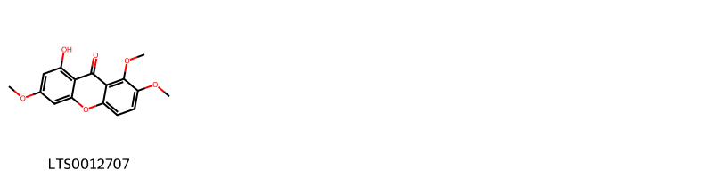{ width=100% }
    <figcaption>Hình ảnh cấu trúc hóa học của 1 hoạt chất thuộc nhóm Benzopyrans gồm ['decussatin (LTS0012707)'].</figcaption>
</figure>
#### Nhóm Organooxygen compounds
<figure markdown="span">
    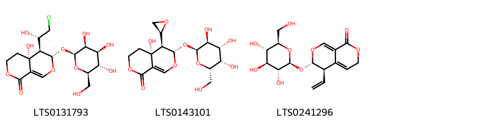{ width=100% }
    <figcaption>Hình ảnh cấu trúc hóa học của 3 hoạt chất thuộc nhóm Organooxygen compounds gồm ['(4ar,5r,6s)-5-[(1s)-2-chloro-1-hydroxyethyl]-4a-hydroxy-6-{[(2s,3s,4s,5s,6r)-3,4,5-trihydroxy-6-(hydroxymethyl)oxan-2-yl]oxy}-3h,4h,5h,6h-pyrano[3,4-c]pyran-1-one (LTS0131793)', '(4ar,5r,6s)-4a-hydroxy-5-[(2s)-oxiran-2-yl]-6-{[(2s,3s,4r,5s,6s)-3,4,5-trihydroxy-6-(hydroxymethyl)oxan-2-yl]oxy}-3h,4h,5h,6h-pyrano[3,4-c]pyran-1-one (LTS0143101)', 'gentiopicroside (LTS0241296)'].</figcaption>
</figure>
#### Nhóm Prenol lipids
<figure markdown="span">
    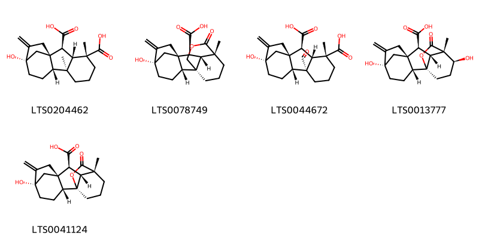{ width=100% }
    <figcaption>Hình ảnh cấu trúc hóa học của 5 hoạt chất thuộc nhóm Prenol lipids gồm ['gibberellin a53 (LTS0204462)', 'gibberellin a44 (LTS0078749)', 'gibberellin a19 (LTS0044672)', 'gibberellin a1 (LTS0013777)', 'gibberellin a20 (LTS0041124)'].</figcaption>
</figure>

---

### Dược dân tộc học

Danh sách các quốc gia có sử dụng *Eustoma exaltatum* trong điều trị các bệnh. 

| Country   | Disease   | Bệnh      |
|:----------|:----------|:----------|
| Bahamas   | Collyrium | Collyrium |

---

# Chi Canscora

??? note "Danh sách các dược liệu thuộc chi"
    
	 - *Canscora decussata*
	 - *Canscora diffusa*

---
## Canscora decussata
### Thông tin về thực vật

!!! info "Phân loại thực vật của *Canscora alata* từ GIBF:"
    - **Kingdom:** Plantae
    - **Phylum:** Tracheophyta
    - **Order:** Gentianales
    - **Family:** Gentianaceae
    - **Genus:** Canscora
    - **Species:** *Canscora alata*

 

| Label (VI)   | Label (EN)   | Scientific Name    | Descriptions (VI)   | Descriptions (EN)   | Also Known As (VI)   | Also Known As (EN)   |
|:-------------|:-------------|:-------------------|:--------------------|:--------------------|:---------------------|:---------------------|
| N/A          | N/A          | Canscora decussata |                     | species of plant    | ['']                 | ['']                 |

#### Phân bố trên thế giới

**Từ CSDL GIBF** nan, Ghana, Sri Lanka, Central African Republic, Gabon, Cambodia, Myanmar, Mozambique, unknown or invalid, Benin, Tanzania, United Republic of, Sierra Leone, Togo, Malawi, Zambia, Mali, Senegal, Nigeria, Sudan, Congo, Democratic Republic of the, Ethiopia, Guinea, Guinea-Bissau, Thailand, Côte d’Ivoire, China, Comoros, Madagascar, Equatorial Guinea, Burundi, India, Burkina Faso, Kenya, Cameroon, Nepal

#### Phân bố tại Việt Nam

**Từ CSDL GIBF**: Không có ghi nhận ở Việt Nam

---
### Thành phần hóa học
        
- Theo cơ sở dữ liệu lotus: Từ loài *Canscora alata* đã phân lập và xác định được Chưa có hoạt chất nào được phân lập. hoạt chất thuộc về các nhóm Không có hoạt chất nào được phân lập. 

Không có hình ảnh nào được tạo ra

---

### Dược dân tộc học

Danh sách các quốc gia có sử dụng *Canscora alata* trong điều trị các bệnh. 

| Country   | Disease                  | Bệnh                                   |
|:----------|:-------------------------|:---------------------------------------|
| Elsewhere | Laxative, Tonic          | Thuốc nhuận tràng, Thuốc bổ            |
| Sudan     | Laxative, Nervine, Tonic | Thuốc nhuận tràng, thần kinh, thuốc bổ |

---

---
## Canscora diffusa
### Thông tin về thực vật

!!! info "Phân loại thực vật của *Canscora diffusa* từ GIBF:"
    - **Kingdom:** Plantae
    - **Phylum:** Tracheophyta
    - **Order:** Gentianales
    - **Family:** Gentianaceae
    - **Genus:** Canscora
    - **Species:** *Canscora diffusa*

 

| Label (VI)   | Label (EN)   | Scientific Name   | Descriptions (VI)   | Descriptions (EN)   | Also Known As (VI)   | Also Known As (EN)   |
|:-------------|:-------------|:------------------|:--------------------|:--------------------|:---------------------|:---------------------|
| N/A          | N/A          | Canscora diffusa  | loài thực vật       | species of plant    | ['']                 | ['']                 |

#### Phân bố trên thế giới

**Từ CSDL GIBF** nan, Australia, Cambodia, Myanmar, Benin, Tanzania, United Republic of, Togo, Zambia, Mali, Senegal, Chinese Taipei, Ethiopia, Guinea, Guinea-Bissau, Thailand, Colombia, India, Burkina Faso, Philippines, Nepal

#### Phân bố tại Việt Nam

**Từ CSDL GIBF**: Không có ghi nhận ở Việt Nam

---
### Thành phần hóa học
        
- Theo cơ sở dữ liệu lotus: Từ loài *Canscora diffusa* đã phân lập và xác định được Chưa có hoạt chất nào được phân lập. hoạt chất thuộc về các nhóm Không có hoạt chất nào được phân lập. 

Không có hình ảnh nào được tạo ra

---

### Dược dân tộc học

Danh sách các quốc gia có sử dụng *Canscora diffusa* trong điều trị các bệnh. 

| Country   | Disease   | Bệnh               |
|:----------|:----------|:-------------------|
| Elsewhere | Tonic     | (thuộc) trương lực |

---

# Chi Exacum

??? note "Danh sách các dược liệu thuộc chi"
    
	 - *Exacum lawii*
	 - *Exacum pedunculatum*
	 - *Exacum tetragonum*

---
## Exacum lawii
### Thông tin về thực vật

!!! info "Phân loại thực vật của *Exacum lawii* từ GIBF:"
    - **Kingdom:** Plantae
    - **Phylum:** Tracheophyta
    - **Order:** Gentianales
    - **Family:** Gentianaceae
    - **Genus:** Exacum
    - **Species:** *Exacum lawii*

 

| Label (VI)   | Label (EN)   | Scientific Name   | Descriptions (VI)   | Descriptions (EN)   | Also Known As (VI)   | Also Known As (EN)   |
|:-------------|:-------------|:------------------|:--------------------|:--------------------|:---------------------|:---------------------|
| N/A          | N/A          | Exacum lawii      | loài thực vật       | species of plant    | ['']                 | ['']                 |

#### Phân bố trên thế giới

**Từ CSDL GIBF** nan, India

#### Phân bố tại Việt Nam

**Từ CSDL GIBF**: Không có ghi nhận ở Việt Nam

---
### Thành phần hóa học
        
- Theo cơ sở dữ liệu lotus: Từ loài *Exacum lawii* đã phân lập và xác định được Chưa có hoạt chất nào được phân lập. hoạt chất thuộc về các nhóm Không có hoạt chất nào được phân lập. 

Không có hình ảnh nào được tạo ra

---

### Dược dân tộc học

Danh sách các quốc gia có sử dụng *Exacum lawii* trong điều trị các bệnh. 

| Country   | Disease   | Bệnh         |
|:----------|:----------|:-------------|
| India     | Laxative  | Nhuận trường |

---

---
## Exacum pedunculatum
### Thông tin về thực vật

!!! info "Phân loại thực vật của *Exacum pedunculatum* từ GIBF:"
    - **Kingdom:** Plantae
    - **Phylum:** Tracheophyta
    - **Order:** Gentianales
    - **Family:** Gentianaceae
    - **Genus:** Exacum
    - **Species:** *Exacum pedunculatum*

 

| Label (VI)   | Label (EN)   | Scientific Name     | Descriptions (VI)   | Descriptions (EN)   | Also Known As (VI)   | Also Known As (EN)   |
|:-------------|:-------------|:--------------------|:--------------------|:--------------------|:---------------------|:---------------------|
| N/A          | N/A          | Exacum pedunculatum | loài thực vật       | species of plant    | ['']                 | ['']                 |

#### Phân bố trên thế giới

**Từ CSDL GIBF** nan, South Africa, Sri Lanka, India, unknown or invalid

#### Phân bố tại Việt Nam

**Từ CSDL GIBF**: Không có ghi nhận ở Việt Nam

---
### Thành phần hóa học
        
- Theo cơ sở dữ liệu lotus: Từ loài *Exacum pedunculatum* đã phân lập và xác định được Chưa có hoạt chất nào được phân lập. hoạt chất thuộc về các nhóm Không có hoạt chất nào được phân lập. 

Không có hình ảnh nào được tạo ra

---

### Dược dân tộc học

Danh sách các quốc gia có sử dụng *Exacum pedunculatum* trong điều trị các bệnh. 

| Country   | Disease          | Bệnh          |
|:----------|:-----------------|:--------------|
| India     | Tonic, Stomachic | Tonic, Dạ dày |

---

---
## Exacum tetragonum
### Thông tin về thực vật

!!! info "Phân loại thực vật của *Exacum tetragonum* từ GIBF:"
    - **Kingdom:** Plantae
    - **Phylum:** Tracheophyta
    - **Order:** Gentianales
    - **Family:** Gentianaceae
    - **Genus:** Exacum
    - **Species:** *Exacum tetragonum*

 

| Label (VI)   | Label (EN)   | Scientific Name   | Descriptions (VI)   | Descriptions (EN)   | Also Known As (VI)   | Also Known As (EN)   |
|:-------------|:-------------|:------------------|:--------------------|:--------------------|:---------------------|:---------------------|
| N/A          | N/A          | Exacum tetragonum | loài thực vật       | species of plant    | ['']                 | ['']                 |

#### Phân bố trên thế giới

**Từ CSDL GIBF** nan, Malaysia, Australia, Thailand, Germany, Cambodia, Lao People’s Democratic Republic, Papua New Guinea, India, Indonesia, unknown or invalid, Philippines, Viet Nam, China, Nepal

#### Phân bố tại Việt Nam

**Từ CSDL GIBF**: Tay Ninh, Lai Chau, Thua Thien-Hue, Son La

---
### Thành phần hóa học
        
- Theo cơ sở dữ liệu lotus: Từ loài *Exacum tetragonum* đã phân lập và xác định được 2 hoạt chất thuộc về các nhóm Prenol lipids. 

|    | chemicalTaxonomyClassyfireClass   |   smiles_count |
|---:|:----------------------------------|---------------:|
|  0 | Prenol lipids                     |              2 |

#### Nhóm Prenol lipids
<figure markdown="span">
    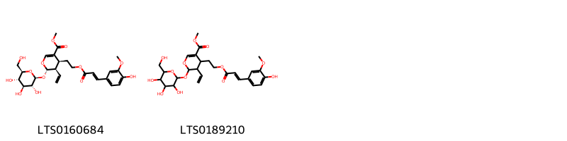{ width=100% }
    <figcaption>Hình ảnh cấu trúc hóa học của 2 hoạt chất thuộc nhóm Prenol lipids gồm ['methyl (4s,5r,6s)-5-ethenyl-4-(2-{[(2e)-3-(4-hydroxy-3-methoxyphenyl)prop-2-enoyl]oxy}ethyl)-6-{[(2s,3r,4s,5s,6r)-3,4,5-trihydroxy-6-(hydroxymethyl)oxan-2-yl]oxy}-5,6-dihydro-4h-pyran-3-carboxylate (LTS0160684)', 'methyl 5-ethenyl-4-(2-{[3-(4-hydroxy-3-methoxyphenyl)prop-2-enoyl]oxy}ethyl)-6-{[3,4,5-trihydroxy-6-(hydroxymethyl)oxan-2-yl]oxy}-5,6-dihydro-4h-pyran-3-carboxylate (LTS0189210)'].</figcaption>
</figure>

---

### Dược dân tộc học

Danh sách các quốc gia có sử dụng *Exacum tetragonum* trong điều trị các bệnh. 

| Country   | Disease          | Bệnh             |
|:----------|:-----------------|:-----------------|
| India     | Stomachic, Tonic | Dạ dày, Thuốc bổ |

---

# Chi Centaurium

??? note "Danh sách các dược liệu thuộc chi"
    
	 - *Centaurium beyrichii*
	 - *Centaurium calycosum*
	 - *Centaurium pulchellum*
	 - *Centaurium umbellatum*

---
## Centaurium beyrichii
### Thông tin về thực vật

!!! info "Phân loại thực vật của *Zeltnera beyrichii* từ GIBF:"
    - **Kingdom:** Plantae
    - **Phylum:** Tracheophyta
    - **Order:** Gentianales
    - **Family:** Gentianaceae
    - **Genus:** Zeltnera
    - **Species:** *Zeltnera beyrichii*

 

| Label (VI)   | Label (EN)   | Scientific Name      | Descriptions (VI)   | Descriptions (EN)   | Also Known As (VI)   | Also Known As (EN)   |
|:-------------|:-------------|:---------------------|:--------------------|:--------------------|:---------------------|:---------------------|
| N/A          | N/A          | Centaurium beyrichii |                     | species of plant    | ['']                 | ['']                 |

#### Phân bố trên thế giới

**Từ CSDL GIBF** nan, United States of America, Mexico

#### Phân bố tại Việt Nam

**Từ CSDL GIBF**: Không có ghi nhận ở Việt Nam

---
### Thành phần hóa học
        
- Theo cơ sở dữ liệu lotus: Từ loài *Zeltnera beyrichii* đã phân lập và xác định được Chưa có hoạt chất nào được phân lập. hoạt chất thuộc về các nhóm Không có hoạt chất nào được phân lập. 

Không có hình ảnh nào được tạo ra

---

### Dược dân tộc học

Danh sách các quốc gia có sử dụng *Zeltnera beyrichii* trong điều trị các bệnh. 

| Country   | Disease   | Bệnh     |
|:----------|:----------|:---------|
| US        | Poison    | Chất độc |

---

---
## Centaurium calycosum
### Thông tin về thực vật

!!! info "Phân loại thực vật của *Zeltnera calycosa* từ GIBF:"
    - **Kingdom:** Plantae
    - **Phylum:** Tracheophyta
    - **Order:** Gentianales
    - **Family:** Gentianaceae
    - **Genus:** Zeltnera
    - **Species:** *Zeltnera calycosa*

 

| Label (VI)   | Label (EN)   | Scientific Name      | Descriptions (VI)   | Descriptions (EN)   | Also Known As (VI)   | Also Known As (EN)   |
|:-------------|:-------------|:---------------------|:--------------------|:--------------------|:---------------------|:---------------------|
| N/A          | N/A          | Centaurium calycosum | loài thực vật       | species of plant    | ['']                 | ['']                 |

#### Phân bố trên thế giới

**Từ CSDL GIBF** United States of America, Mexico

#### Phân bố tại Việt Nam

**Từ CSDL GIBF**: Không có ghi nhận ở Việt Nam

---
### Thành phần hóa học
        
- Theo cơ sở dữ liệu lotus: Từ loài *Zeltnera calycosa* đã phân lập và xác định được Chưa có hoạt chất nào được phân lập. hoạt chất thuộc về các nhóm Không có hoạt chất nào được phân lập. 

Không có hình ảnh nào được tạo ra

---

### Dược dân tộc học

Danh sách các quốc gia có sử dụng *Zeltnera calycosa* trong điều trị các bệnh. 

| Country   | Disease   | Bệnh     |
|:----------|:----------|:---------|
| Mexico    | Poison    | Chất độc |

---

---
## Centaurium pulchellum
### Thông tin về thực vật

!!! info "Phân loại thực vật của *Centaurium pulchellum* từ GIBF:"
    - **Kingdom:** Plantae
    - **Phylum:** Tracheophyta
    - **Order:** Gentianales
    - **Family:** Gentianaceae
    - **Genus:** Centaurium
    - **Species:** *Centaurium pulchellum*

 

| Label (VI)   | Label (EN)   | Scientific Name       | Descriptions (VI)   | Descriptions (EN)   | Also Known As (VI)   | Also Known As (EN)   |
|:-------------|:-------------|:----------------------|:--------------------|:--------------------|:---------------------|:---------------------|
| N/A          | N/A          | Centaurium pulchellum | loài thực vật       | species of plant    | ['']                 | ['']                 |

#### Phân bố trên thế giới

**Từ CSDL GIBF** Italy, Australia, Moldova, Republic of, Slovakia, Belgium, Argentina, Canada, Ukraine, Denmark, Netherlands, Luxembourg, Malta, Chinese Taipei, Spain, Hungary, Portugal, Russian Federation, United States of America, Sweden, Uruguay, Slovenia, Croatia, Greece, Uzbekistan, Czechia, Germany, Brazil, Switzerland, Austria, France, United Kingdom of Great Britain and Northern Ireland

#### Phân bố tại Việt Nam

**Từ CSDL GIBF**: Không có ghi nhận ở Việt Nam

---
### Thành phần hóa học
        
- Theo cơ sở dữ liệu lotus: Từ loài *Centaurium pulchellum* đã phân lập và xác định được 11 hoạt chất thuộc về các nhóm Prenol lipids, Steroids and steroid derivatives, Pyranopyridines, Organooxygen compounds, Benzopyrans. 

|    | chemicalTaxonomyClassyfireClass   |   smiles_count |
|---:|:----------------------------------|---------------:|
|  0 | Benzopyrans                       |              4 |
|  1 | Organooxygen compounds            |              4 |
|  2 | Prenol lipids                     |              1 |
|  3 | Pyranopyridines                   |              1 |
|  4 | Steroids and steroid derivatives  |              1 |

#### Nhóm Benzopyrans
<figure markdown="span">
    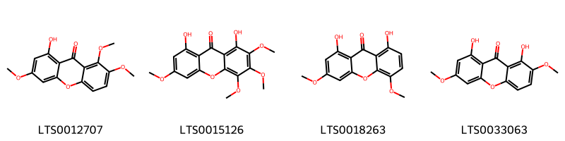{ width=100% }
    <figcaption>Hình ảnh cấu trúc hóa học của 4 hoạt chất thuộc nhóm Benzopyrans gồm ['decussatin (LTS0012707)', '1,8-dihydroxy-2,3,4,6-tetramethoxyxanthen-9-one (LTS0015126)', 'swerchirin (LTS0018263)', 'methylswertianin (LTS0033063)'].</figcaption>
</figure>
#### Nhóm Organooxygen compounds
<figure markdown="span">
    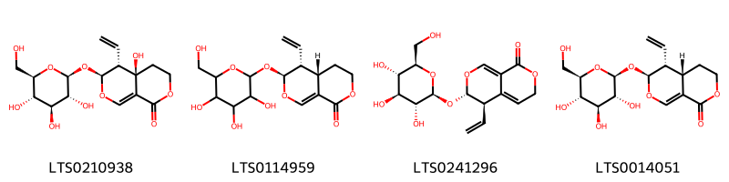{ width=100% }
    <figcaption>Hình ảnh cấu trúc hóa học của 4 hoạt chất thuộc nhóm Organooxygen compounds gồm ['swertiamarin (LTS0210938)', '(4as,5r,6s)-5-ethenyl-6-{[3,4,5-trihydroxy-6-(hydroxymethyl)oxan-2-yl]oxy}-3h,4h,4ah,5h,6h-pyrano[3,4-c]pyran-1-one (LTS0114959)', 'gentiopicroside (LTS0241296)', 'sweroside (LTS0014051)'].</figcaption>
</figure>
#### Nhóm Prenol lipids
<figure markdown="span">
    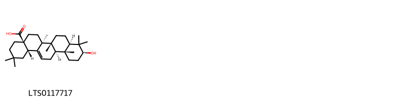{ width=100% }
    <figcaption>Hình ảnh cấu trúc hóa học của 1 hoạt chất thuộc nhóm Prenol lipids gồm ['oleanolic acid (LTS0117717)'].</figcaption>
</figure>
#### Nhóm Pyranopyridines
<figure markdown="span">
    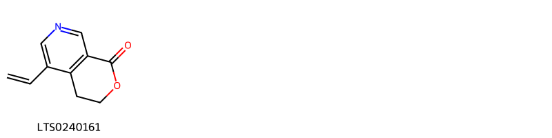{ width=100% }
    <figcaption>Hình ảnh cấu trúc hóa học của 1 hoạt chất thuộc nhóm Pyranopyridines gồm ['gentianine (LTS0240161)'].</figcaption>
</figure>
#### Nhóm Steroids and steroid derivatives
<figure markdown="span">
    { width=100% }
    <figcaption>Hình ảnh cấu trúc hóa học của 1 hoạt chất thuộc nhóm Steroids and steroid derivatives gồm ['stigmast-5-en-3-ol, (3β)- (LTS0204616)'].</figcaption>
</figure>

---

### Dược dân tộc học

Danh sách các quốc gia có sử dụng *Centaurium pulchellum* trong điều trị các bệnh. 

| Country   | Disease   | Bệnh           |
|:----------|:----------|:---------------|
| Egypt     | Diuretic  | Thuốc lợi tiêu |

---

---
## Centaurium umbellatum
### Thông tin về thực vật

!!! info "Phân loại thực vật của *Centaurium erythraea* từ GIBF:"
    - **Kingdom:** Plantae
    - **Phylum:** Tracheophyta
    - **Order:** Gentianales
    - **Family:** Gentianaceae
    - **Genus:** Centaurium
    - **Species:** *Centaurium erythraea*

 

| Label (VI)   | Label (EN)   | Scientific Name       | Descriptions (VI)   | Descriptions (EN)   | Also Known As (VI)   | Also Known As (EN)   |
|:-------------|:-------------|:----------------------|:--------------------|:--------------------|:---------------------|:---------------------|
| N/A          | N/A          | Centaurium umbellatum | loài thực vật       | species of plant    | ['']                 | ['']                 |

#### Phân bố trên thế giới

**Từ CSDL GIBF** Italy, Bulgaria, Estonia, Georgia, Tunisia, Canada, Spain, Morocco, United States of America, Croatia, Greece, Montenegro, Germany, Brazil, Switzerland, Austria, France, Ecuador, Colombia, Poland

#### Phân bố tại Việt Nam

**Từ CSDL GIBF**: Không có ghi nhận ở Việt Nam

---
### Thành phần hóa học
        
- Theo cơ sở dữ liệu lotus: Từ loài *Centaurium erythraea* đã phân lập và xác định được Chưa có hoạt chất nào được phân lập. hoạt chất thuộc về các nhóm Không có hoạt chất nào được phân lập. 

Không có hình ảnh nào được tạo ra

---

### Dược dân tộc học

Danh sách các quốc gia có sử dụng *Centaurium erythraea* trong điều trị các bệnh. 

| Country   | Disease                                                  | Bệnh                                                 |
|:----------|:---------------------------------------------------------|:-----------------------------------------------------|
| Turkey    | Cholagogue, Emmenagogue, Stomachic, Vermifuge, Digestive | Cholagogue, Emmenagogue, Dạ dày, Vermifuge, Tiêu hóa |
| ain       | Tonic                                                    | (thuộc) trương lực                                   |

---

# Chi Frasera

??? note "Danh sách các dược liệu thuộc chi"
    
	 - *Frasera carolinensis*

---
## Frasera carolinensis
### Thông tin về thực vật

!!! info "Phân loại thực vật của *Frasera carolinensis* từ GIBF:"
    - **Kingdom:** Plantae
    - **Phylum:** Tracheophyta
    - **Order:** Gentianales
    - **Family:** Gentianaceae
    - **Genus:** Frasera
    - **Species:** *Frasera carolinensis*

 

| Label (VI)   | Label (EN)   | Scientific Name      | Descriptions (VI)   | Descriptions (EN)   | Also Known As (VI)   | Also Known As (EN)   |
|:-------------|:-------------|:---------------------|:--------------------|:--------------------|:---------------------|:---------------------|
| N/A          | N/A          | Frasera carolinensis | loài thực vật       | species of plant    | ['']                 | ['']                 |

#### Phân bố trên thế giới

**Từ CSDL GIBF** nan, United States of America, Canada

#### Phân bố tại Việt Nam

**Từ CSDL GIBF**: Không có ghi nhận ở Việt Nam

---
### Thành phần hóa học
        
- Theo cơ sở dữ liệu lotus: Từ loài *Frasera carolinensis* đã phân lập và xác định được 2 hoạt chất thuộc về các nhóm Organooxygen compounds. 

|    | chemicalTaxonomyClassyfireClass   |   smiles_count |
|---:|:----------------------------------|---------------:|
|  0 | Organooxygen compounds            |              2 |

#### Nhóm Organooxygen compounds
<figure markdown="span">
    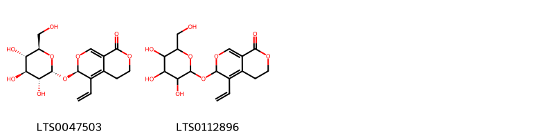{ width=100% }
    <figcaption>Hình ảnh cấu trúc hóa học của 2 hoạt chất thuộc nhóm Organooxygen compounds gồm ['(6r)-5-ethenyl-6-{[(2r,3r,4s,5s,6r)-3,4,5-trihydroxy-6-(hydroxymethyl)oxan-2-yl]oxy}-3h,4h,6h-pyrano[3,4-c]pyran-1-one (LTS0047503)', '5-ethenyl-6-{[3,4,5-trihydroxy-6-(hydroxymethyl)oxan-2-yl]oxy}-3h,4h,6h-pyrano[3,4-c]pyran-1-one (LTS0112896)'].</figcaption>
</figure>

---

### Dược dân tộc học

Danh sách các quốc gia có sử dụng *Frasera carolinensis* trong điều trị các bệnh. 

| Country   | Disease   | Bệnh               |
|:----------|:----------|:-------------------|
| English   | Tonic     | (thuộc) trương lực |
| French    | Stimulant | Chất kích thích    |

---

# Chi Sabatia

??? note "Danh sách các dược liệu thuộc chi"
    
	 - *Sabatia angularis*

---
## Sabatia angularis
### Thông tin về thực vật

!!! info "Phân loại thực vật của *Sabatia angularis* từ GIBF:"
    - **Kingdom:** Plantae
    - **Phylum:** Tracheophyta
    - **Order:** Gentianales
    - **Family:** Gentianaceae
    - **Genus:** Sabatia
    - **Species:** *Sabatia angularis*

 

| Label (VI)   | Label (EN)   | Scientific Name   | Descriptions (VI)   | Descriptions (EN)   | Also Known As (VI)   | Also Known As (EN)   |
|:-------------|:-------------|:------------------|:--------------------|:--------------------|:---------------------|:---------------------|
| N/A          | N/A          | Sabatia angularis | loài thực vật       | species of plant    | ['']                 | ['']                 |

#### Phân bố trên thế giới

**Từ CSDL GIBF** nan, United States of America

#### Phân bố tại Việt Nam

**Từ CSDL GIBF**: Không có ghi nhận ở Việt Nam

---
### Thành phần hóa học
        
- Theo cơ sở dữ liệu lotus: Từ loài *Sabatia angularis* đã phân lập và xác định được Chưa có hoạt chất nào được phân lập. hoạt chất thuộc về các nhóm Không có hoạt chất nào được phân lập. 

Không có hình ảnh nào được tạo ra

---

### Dược dân tộc học

Danh sách các quốc gia có sử dụng *Sabatia angularis* trong điều trị các bệnh. 

| Country   | Disease   | Bệnh               |
|:----------|:----------|:-------------------|
| US        | Tonic     | (thuộc) trương lực |

---

# Chi Gentiana

??? note "Danh sách các dược liệu thuộc chi"
    
	 - *Gentiana adsurgens*
	 - *Gentiana andrewsii*
	 - *Gentiana barbata*
	 - *Gentiana cruciata*
	 - *Gentiana decumbens*
	 - *Gentiana kurroo*
	 - *Gentiana lutea*
	 - *Gentiana olivieri*
	 - *Gentiana rigescens*
	 - *Gentiana scabra*
	 - *Gentiana triflora*
	 - *Gentiana villosa*

---
## Gentiana adsurgens
### Thông tin về thực vật

!!! info "Phân loại thực vật của *Gentiana bicuspidata* từ GIBF:"
    - **Kingdom:** Plantae
    - **Phylum:** Tracheophyta
    - **Order:** Gentianales
    - **Family:** Gentianaceae
    - **Genus:** Gentiana
    - **Species:** *Gentiana bicuspidata*

 

| Label (VI)   | Label (EN)   | Scientific Name   | Descriptions (VI)   | Descriptions (EN)   | Also Known As (VI)   | Also Known As (EN)   |
|:-------------|:-------------|:------------------|:--------------------|:--------------------|:---------------------|:---------------------|
| N/A          | N/A          | Sabatia angularis | loài thực vật       | species of plant    | ['']                 | ['']                 |

#### Phân bố trên thế giới

**Từ CSDL GIBF** nan, United States of America, Mexico

#### Phân bố tại Việt Nam

**Từ CSDL GIBF**: Không có ghi nhận ở Việt Nam

---
### Thành phần hóa học
        
- Theo cơ sở dữ liệu lotus: Từ loài *Gentiana bicuspidata* đã phân lập và xác định được Chưa có hoạt chất nào được phân lập. hoạt chất thuộc về các nhóm Không có hoạt chất nào được phân lập. 

Không có hình ảnh nào được tạo ra

---

### Dược dân tộc học

Danh sách các quốc gia có sử dụng *Gentiana bicuspidata* trong điều trị các bệnh. 

| Country   | Disease              | Bệnh                    |
|:----------|:---------------------|:------------------------|
| Elsewhere | Purgative            | Thuốc xổ                |
| Maya      | Stimulant, Stomachic | Chất Kích Thích, Dạ Dày |

---

---
## Gentiana andrewsii
### Thông tin về thực vật

!!! info "Phân loại thực vật của *Gentiana andrewsii* từ GIBF:"
    - **Kingdom:** Plantae
    - **Phylum:** Tracheophyta
    - **Order:** Gentianales
    - **Family:** Gentianaceae
    - **Genus:** Gentiana
    - **Species:** *Gentiana andrewsii*

 

| Label (VI)   | Label (EN)   | Scientific Name    | Descriptions (VI)   | Descriptions (EN)   | Also Known As (VI)   | Also Known As (EN)                          |
|:-------------|:-------------|:-------------------|:--------------------|:--------------------|:---------------------|:--------------------------------------------|
| N/A          | N/A          | Gentiana andrewsii | loài thực vật       | species of plant    | ['']                 | ['bottle gentian', 'closed bottle gentian'] |

#### Phân bố trên thế giới

**Từ CSDL GIBF** United States of America, Canada

#### Phân bố tại Việt Nam

**Từ CSDL GIBF**: Không có ghi nhận ở Việt Nam

---
### Thành phần hóa học
        
- Theo cơ sở dữ liệu lotus: Từ loài *Gentiana andrewsii* đã phân lập và xác định được 2 hoạt chất thuộc về các nhóm Organooxygen compounds. 

|    | chemicalTaxonomyClassyfireClass   |   smiles_count |
|---:|:----------------------------------|---------------:|
|  0 | Organooxygen compounds            |              2 |

#### Nhóm Organooxygen compounds
<figure markdown="span">
    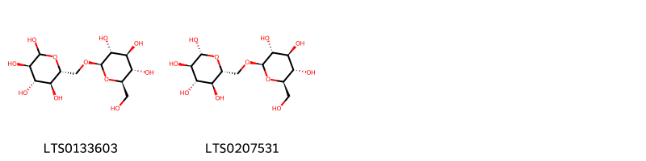{ width=100% }
    <figcaption>Hình ảnh cấu trúc hóa học của 2 hoạt chất thuộc nhóm Organooxygen compounds gồm ['gentobiose (LTS0133603)', 'gentiobiose (LTS0207531)'].</figcaption>
</figure>

---

### Dược dân tộc học

Danh sách các quốc gia có sử dụng *Gentiana andrewsii* trong điều trị các bệnh. 

| Country   | Disease   | Bệnh    |
|:----------|:----------|:--------|
| US        | Apertif   | Apertif |

---

---
## Gentiana barbata
### Thông tin về thực vật

!!! info "Phân loại thực vật của *Gentianopsis barbata* từ GIBF:"
    - **Kingdom:** Plantae
    - **Phylum:** Tracheophyta
    - **Order:** Gentianales
    - **Family:** Gentianaceae
    - **Genus:** Gentianopsis
    - **Species:** *Gentianopsis barbata*

 

| Label (VI)   | Label (EN)   | Scientific Name   | Descriptions (VI)   | Descriptions (EN)   | Also Known As (VI)   | Also Known As (EN)   |
|:-------------|:-------------|:------------------|:--------------------|:--------------------|:---------------------|:---------------------|
| N/A          | N/A          | Gentiana barbata  | loài thực vật       | species of plant    | ['']                 | ['']                 |

#### Phân bố trên thế giới

**Từ CSDL GIBF** nan, Italy, Korea, Republic of, unknown or invalid, Russian Federation, Norway, United States of America, Korea (Democratic People’s Republic of), Kazakhstan, Mongolia, China, Canada

#### Phân bố tại Việt Nam

**Từ CSDL GIBF**: Không có ghi nhận ở Việt Nam

---
### Thành phần hóa học
        
- Theo cơ sở dữ liệu lotus: Từ loài *Gentianopsis barbata* đã phân lập và xác định được Chưa có hoạt chất nào được phân lập. hoạt chất thuộc về các nhóm Không có hoạt chất nào được phân lập. 

Không có hình ảnh nào được tạo ra

---

### Dược dân tộc học

Danh sách các quốc gia có sử dụng *Gentianopsis barbata* trong điều trị các bệnh. 

| Country   | Disease   | Bệnh    |
|:----------|:----------|:--------|
| China     | Stomachic | Sững sờ |

---

---
## Gentiana cruciata
### Thông tin về thực vật

!!! info "Phân loại thực vật của *Gentiana cruciata* từ GIBF:"
    - **Kingdom:** Plantae
    - **Phylum:** Tracheophyta
    - **Order:** Gentianales
    - **Family:** Gentianaceae
    - **Genus:** Gentiana
    - **Species:** *Gentiana cruciata*

 

| Label (VI)   | Label (EN)   | Scientific Name   | Descriptions (VI)   | Descriptions (EN)   | Also Known As (VI)   | Also Known As (EN)   |
|:-------------|:-------------|:------------------|:--------------------|:--------------------|:---------------------|:---------------------|
| N/A          | N/A          | Gentiana cruciata | loài thực vật       | species of plant    | ['']                 | ['']                 |

#### Phân bố trên thế giới

**Từ CSDL GIBF** Ukraine, Netherlands, Belarus, Czechia, Germany, Slovakia, Romania, Estonia, Georgia, Spain, Poland, Hungary, Switzerland, Russian Federation, Austria, France

#### Phân bố tại Việt Nam

**Từ CSDL GIBF**: Không có ghi nhận ở Việt Nam

---
### Thành phần hóa học
        
- Theo cơ sở dữ liệu lotus: Từ loài *Gentiana cruciata* đã phân lập và xác định được 4 hoạt chất thuộc về các nhóm Organooxygen compounds, Benzopyrans, Pyrans, Benzene and substituted derivatives. 

|    | chemicalTaxonomyClassyfireClass     |   smiles_count |
|---:|:------------------------------------|---------------:|
|  0 | Benzene and substituted derivatives |              1 |
|  1 | Benzopyrans                         |              1 |
|  2 | Organooxygen compounds              |              1 |
|  3 | Pyrans                              |              1 |

#### Nhóm Benzene and substituted derivatives
<figure markdown="span">
    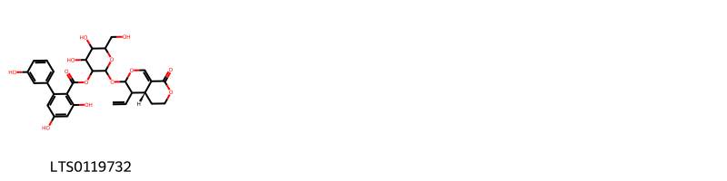{ width=100% }
    <figcaption>Hình ảnh cấu trúc hóa học của 1 hoạt chất thuộc nhóm Benzene and substituted derivatives gồm ["2-{[(4ar)-4-ethenyl-8-oxo-3h,4h,4ah,5h,6h-pyrano[3,4-c]pyran-3-yl]oxy}-4,5-dihydroxy-6-(hydroxymethyl)oxan-3-yl 3,3',5-trihydroxy-[1,1'-biphenyl]-2-carboxylate (LTS0119732)"].</figcaption>
</figure>
#### Nhóm Benzopyrans
<figure markdown="span">
    { width=100% }
    <figcaption>Hình ảnh cấu trúc hóa học của 1 hoạt chất thuộc nhóm Benzopyrans gồm ['mangiferin (LTS0009443)'].</figcaption>
</figure>
#### Nhóm Organooxygen compounds
<figure markdown="span">
    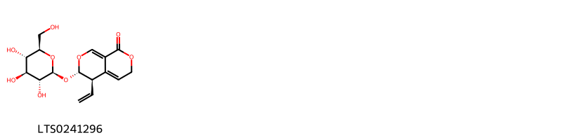{ width=100% }
    <figcaption>Hình ảnh cấu trúc hóa học của 1 hoạt chất thuộc nhóm Organooxygen compounds gồm ['gentiopicroside (LTS0241296)'].</figcaption>
</figure>
#### Nhóm Pyrans
<figure markdown="span">
    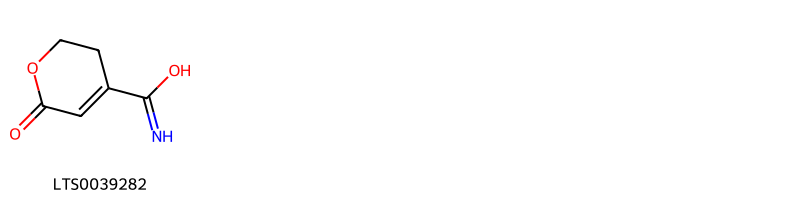{ width=100% }
    <figcaption>Hình ảnh cấu trúc hóa học của 1 hoạt chất thuộc nhóm Pyrans gồm ['2-oxo-5,6-dihydropyran-4-carboximidic acid (LTS0039282)'].</figcaption>
</figure>

---

### Dược dân tộc học

Danh sách các quốc gia có sử dụng *Gentiana cruciata* trong điều trị các bệnh. 

| Country   | Disease          | Bệnh             |
|:----------|:-----------------|:-----------------|
| Elsewhere | Stomachic, Tonic | Dạ dày, Thuốc bổ |

---

---
## Gentiana decumbens
### Thông tin về thực vật

!!! info "Phân loại thực vật của *Gentiana decumbens* từ GIBF:"
    - **Kingdom:** Plantae
    - **Phylum:** Tracheophyta
    - **Order:** Gentianales
    - **Family:** Gentianaceae
    - **Genus:** Gentiana
    - **Species:** *Gentiana decumbens*

 

| Label (VI)   | Label (EN)   | Scientific Name    | Descriptions (VI)   | Descriptions (EN)   | Also Known As (VI)   | Also Known As (EN)   |
|:-------------|:-------------|:-------------------|:--------------------|:--------------------|:---------------------|:---------------------|
| N/A          | N/A          | Gentiana decumbens | loài thực vật       | species of plant    | ['']                 | ['']                 |

#### Phân bố trên thế giới

**Từ CSDL GIBF** Russian Federation, Mongolia

#### Phân bố tại Việt Nam

**Từ CSDL GIBF**: Không có ghi nhận ở Việt Nam

---
### Thành phần hóa học
        
- Theo cơ sở dữ liệu lotus: Từ loài *Gentiana decumbens* đã phân lập và xác định được Chưa có hoạt chất nào được phân lập. hoạt chất thuộc về các nhóm Không có hoạt chất nào được phân lập. 

Không có hình ảnh nào được tạo ra

---

### Dược dân tộc học

Danh sách các quốc gia có sử dụng *Gentiana decumbens* trong điều trị các bệnh. 

| Country   | Disease   | Bệnh    |
|:----------|:----------|:--------|
| India     | Stomachic | Sững sờ |

---

---
## Gentiana kurroo
### Thông tin về thực vật

!!! info "Phân loại thực vật của *Gentiana kurroo* từ GIBF:"
    - **Kingdom:** Plantae
    - **Phylum:** Tracheophyta
    - **Order:** Gentianales
    - **Family:** Gentianaceae
    - **Genus:** Gentiana
    - **Species:** *Gentiana kurroo*

 

| Label (VI)   | Label (EN)   | Scientific Name   | Descriptions (VI)   | Descriptions (EN)   | Also Known As (VI)   | Also Known As (EN)   |
|:-------------|:-------------|:------------------|:--------------------|:--------------------|:---------------------|:---------------------|
| N/A          | N/A          | Gentiana kurroo   | loài thực vật       | species of plant    | ['']                 | ['']                 |

#### Phân bố trên thế giới

**Từ CSDL GIBF** nan, Pakistan, Afghanistan, India, unknown or invalid, United States of America, Nepal

#### Phân bố tại Việt Nam

**Từ CSDL GIBF**: Không có ghi nhận ở Việt Nam

---
### Thành phần hóa học
        
- Theo cơ sở dữ liệu lotus: Từ loài *Gentiana kurroo* đã phân lập và xác định được 5 hoạt chất thuộc về các nhóm Cinnamic acids and derivatives, Prenol lipids, Organooxygen compounds. 

|    | chemicalTaxonomyClassyfireClass   |   smiles_count |
|---:|:----------------------------------|---------------:|
|  0 | Cinnamic acids and derivatives    |              2 |
|  1 | Organooxygen compounds            |              2 |
|  2 | Prenol lipids                     |              1 |

#### Nhóm Cinnamic acids and derivatives
<figure markdown="span">
    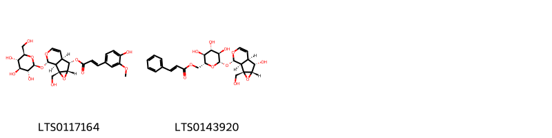{ width=100% }
    <figcaption>Hình ảnh cấu trúc hóa học của 2 hoạt chất thuộc nhóm Cinnamic acids and derivatives gồm ['6-o-feruloylcatalpol (LTS0117164)', '[(2r,3s,4s,5r,6s)-3,4,5-trihydroxy-6-{[(1s,2s,4s,5s,6r,10s)-5-hydroxy-2-(hydroxymethyl)-3,9-dioxatricyclo[4.4.0.0²,⁴]dec-7-en-10-yl]oxy}oxan-2-yl]methyl (2e)-3-phenylprop-2-enoate (LTS0143920)'].</figcaption>
</figure>
#### Nhóm Organooxygen compounds
<figure markdown="span">
    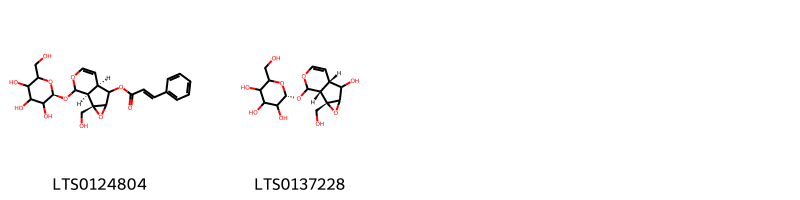{ width=100% }
    <figcaption>Hình ảnh cấu trúc hóa học của 2 hoạt chất thuộc nhóm Organooxygen compounds gồm ['(1s,2s,6r)-2-(hydroxymethyl)-10-{[(2s)-3,4,5-trihydroxy-6-(hydroxymethyl)oxan-2-yl]oxy}-3,9-dioxatricyclo[4.4.0.0²,⁴]dec-7-en-5-yl 3-phenylprop-2-enoate (LTS0124804)', '(2r)-2-{[(1r,2s,6s)-5-hydroxy-2-(hydroxymethyl)-3,9-dioxatricyclo[4.4.0.0²,⁴]dec-7-en-10-yl]oxy}-6-(hydroxymethyl)oxane-3,4,5-triol (LTS0137228)'].</figcaption>
</figure>
#### Nhóm Prenol lipids
<figure markdown="span">
    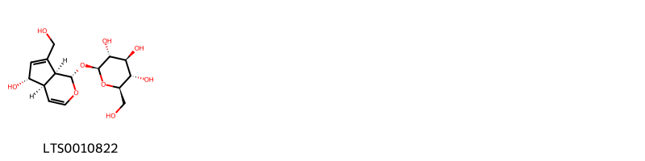{ width=100% }
    <figcaption>Hình ảnh cấu trúc hóa học của 1 hoạt chất thuộc nhóm Prenol lipids gồm ['aucubin (LTS0010822)'].</figcaption>
</figure>

---

### Dược dân tộc học

Danh sách các quốc gia có sử dụng *Gentiana kurroo* trong điều trị các bệnh. 

| Country   | Disease          | Bệnh             |
|:----------|:-----------------|:-----------------|
| India     | Stomachic, Tonic | Dạ dày, Thuốc bổ |

---

---
## Gentiana lutea
### Thông tin về thực vật

!!! info "Phân loại thực vật của *Gentiana lutea* từ GIBF:"
    - **Kingdom:** Plantae
    - **Phylum:** Tracheophyta
    - **Order:** Gentianales
    - **Family:** Gentianaceae
    - **Genus:** Gentiana
    - **Species:** *Gentiana lutea*

 

| Label (VI)   | Label (EN)   | Scientific Name   | Descriptions (VI)   | Descriptions (EN)   | Also Known As (VI)   | Also Known As (EN)   |
|:-------------|:-------------|:------------------|:--------------------|:--------------------|:---------------------|:---------------------|
| N/A          | N/A          | Gentiana lutea    | loài thực vật       | species of plant    | ['']                 | ['Gentiana lutea']   |

#### Phân bố trên thế giới

**Từ CSDL GIBF** nan, Ukraine, Italy, Germany, Belgium, Spain, Switzerland, Austria, France, Slovenia, Croatia

#### Phân bố tại Việt Nam

**Từ CSDL GIBF**: Không có ghi nhận ở Việt Nam

---
### Thành phần hóa học
        
- Theo cơ sở dữ liệu lotus: Từ loài *Gentiana lutea* đã phân lập và xác định được 107 hoạt chất thuộc về các nhóm Flavonoids, Prenol lipids, Steroids and steroid derivatives, Indoles and derivatives, Pyranopyridines, Harmala alkaloids, Pyrans, Benzene and substituted derivatives, Organooxygen compounds, Furanoid lignans, Carboxylic acids and derivatives, Benzopyrans, Pyridines and derivatives. 

|    | chemicalTaxonomyClassyfireClass     |   smiles_count |
|---:|:------------------------------------|---------------:|
|  0 | Benzene and substituted derivatives |              4 |
|  1 | Benzopyrans                         |             27 |
|  2 | Carboxylic acids and derivatives    |              1 |
|  3 | Flavonoids                          |              8 |
|  4 | Furanoid lignans                    |              7 |
|  5 | Harmala alkaloids                   |              3 |
|  6 | Indoles and derivatives             |              1 |
|  7 | Organooxygen compounds              |             16 |
|  8 | Prenol lipids                       |             21 |
|  9 | Pyranopyridines                     |              1 |
| 10 | Pyrans                              |              2 |
| 11 | Pyridines and derivatives           |              1 |
| 12 | Steroids and steroid derivatives    |             15 |

#### Nhóm Benzene and substituted derivatives
<figure markdown="span">
    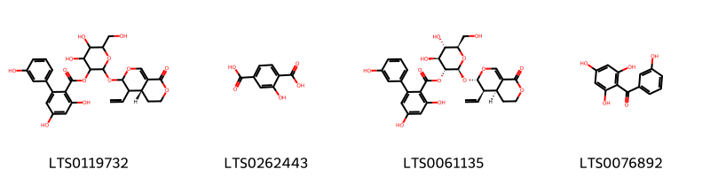{ width=100% }
    <figcaption>Hình ảnh cấu trúc hóa học của 4 hoạt chất thuộc nhóm Benzene and substituted derivatives gồm ["2-{[(4ar)-4-ethenyl-8-oxo-3h,4h,4ah,5h,6h-pyrano[3,4-c]pyran-3-yl]oxy}-4,5-dihydroxy-6-(hydroxymethyl)oxan-3-yl 3,3',5-trihydroxy-[1,1'-biphenyl]-2-carboxylate (LTS0119732)", '2-hydroxybenzene-1,4-dicarboxylic acid (LTS0262443)', 'amarogentin (LTS0061135)', '2-(3-hydroxybenzoyl)benzene-1,3,5-triol (LTS0076892)'].</figcaption>
</figure>
#### Nhóm Benzopyrans
<figure markdown="span">
    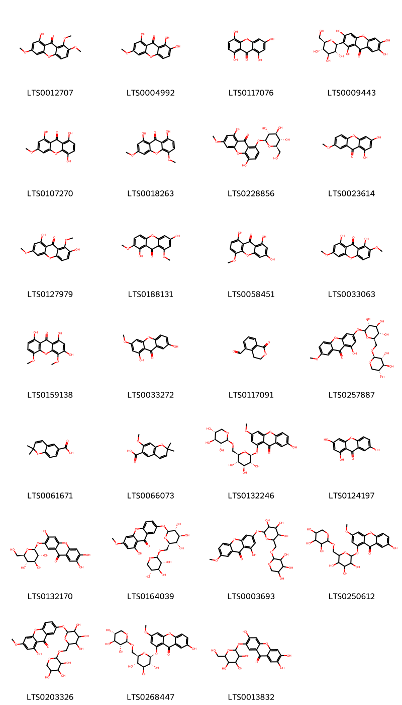{ width=100% }
    <figcaption>Hình ảnh cấu trúc hóa học của 27 hoạt chất thuộc nhóm Benzopyrans gồm ['decussatin (LTS0012707)', 'swertianin (LTS0004992)', '1,3,5,8-tetrahydroxyxanthone (LTS0117076)', 'mangiferin (LTS0009443)', 'bellidifolium (LTS0107270)', 'swerchirin (LTS0018263)', 'swertianolin (LTS0228856)', 'isogentisin (LTS0023614)', 'gentiacaulein (LTS0127979)', '1,6-dihydroxy-2,8-dimethoxyxanthen-9-one (LTS0188131)', '1,3,8-trihydroxy-5-methoxyxanthen-9-one (LTS0058451)', 'methylswertianin (LTS0033063)', '1,3,8-trihydroxy-4,5-dimethoxyxanthen-9-one (LTS0159138)', 'gentisin (LTS0033272)', 'erythrocentaurin (LTS0117091)', '1-hydroxy-7-methoxy-3-{[(2s,3r,4s,5s,6r)-3,4,5-trihydroxy-6-({[(2s,3r,4s,5r)-3,4,5-trihydroxyoxan-2-yl]oxy}methyl)oxan-2-yl]oxy}xanthen-9-one (LTS0257887)', '2,2-dimethylchromene-6-carboxylic acid (LTS0061671)', '7-methoxy-2,2-dimethylchromene-6-carboxylic acid (LTS0066073)', '7-hydroxy-3-methoxy-1-{[(2s,3r,4s,5s,6r)-3,4,5-trihydroxy-6-({[(2s,3r,4s,5r)-3,4,5-trihydroxyoxan-2-yl]oxy}methyl)oxan-2-yl]oxy}xanthen-9-one (LTS0132246)', 'gentisein (LTS0124197)', '2,3,6-trihydroxy-7-{[(2s,3r,4s,5s,6r)-3,4,5-trihydroxy-6-(hydroxymethyl)oxan-2-yl]oxy}xanthen-9-one (LTS0132170)', '1-hydroxy-3-methoxy-7-{[(2s,3r,4s,5s,6r)-3,4,5-trihydroxy-6-({[(2s,3r,4s,5r)-3,4,5-trihydroxyoxan-2-yl]oxy}methyl)oxan-2-yl]oxy}xanthen-9-one (LTS0164039)', '1-hydroxy-7-methoxy-3-[(3,4,5-trihydroxy-6-{[(3,4,5-trihydroxyoxan-2-yl)oxy]methyl}oxan-2-yl)oxy]xanthen-9-one (LTS0003693)', '7-hydroxy-3-methoxy-1-[(3,4,5-trihydroxy-6-{[(3,4,5-trihydroxyoxan-2-yl)oxy]methyl}oxan-2-yl)oxy]xanthen-9-one (LTS0250612)', '1-hydroxy-3-methoxy-7-[(3,4,5-trihydroxy-6-{[(3,4,5-trihydroxyoxan-2-yl)oxy]methyl}oxan-2-yl)oxy]xanthen-9-one (LTS0203326)', '7-hydroxy-3-methoxy-1-{[(2r,3r,4s,5s,6r)-3,4,5-trihydroxy-6-({[(2s,3r,4s,5r)-3,4,5-trihydroxyoxan-2-yl]oxy}methyl)oxan-2-yl]oxy}xanthen-9-one (LTS0268447)', '2,3,6-trihydroxy-7-{[3,4,5-trihydroxy-6-(hydroxymethyl)oxan-2-yl]oxy}xanthen-9-one (LTS0013832)'].</figcaption>
</figure>
#### Nhóm Carboxylic acids and derivatives
<figure markdown="span">
    { width=100% }
    <figcaption>Hình ảnh cấu trúc hóa học của 1 hoạt chất thuộc nhóm Carboxylic acids and derivatives gồm ['(2r,3r,4s,5r,6s)-6-{[(3s,4r,4as)-4-ethenyl-8-oxo-3h,4h,4ah,5h,6h-pyrano[3,4-c]pyran-3-yl]oxy}-4,5-bis(acetyloxy)-2-[(acetyloxy)methyl]oxan-3-yl 2-hydroxy-3-{[(2s,3r,4s,5s,6r)-3,4,5-trihydroxy-6-(hydroxymethyl)oxan-2-yl]oxy}benzoate (LTS0203648)'].</figcaption>
</figure>
#### Nhóm Flavonoids
<figure markdown="span">
    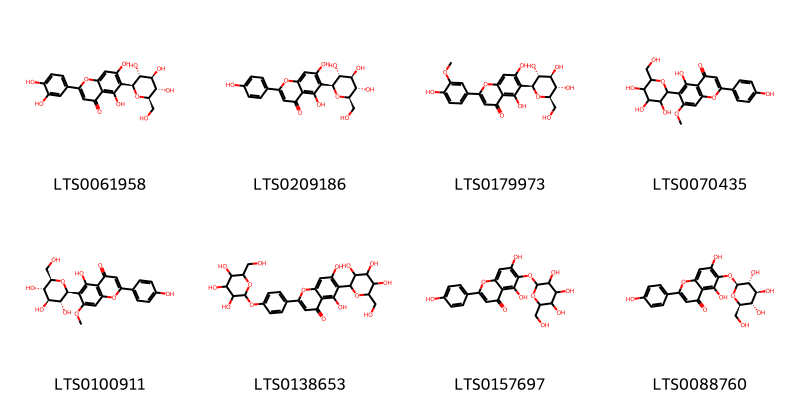{ width=100% }
    <figcaption>Hình ảnh cấu trúc hóa học của 8 hoạt chất thuộc nhóm Flavonoids gồm ['isoorientin (LTS0061958)', 'isovitexin (LTS0209186)', 'isoscoparin (LTS0179973)', '5-hydroxy-2-(4-hydroxyphenyl)-7-methoxy-6-[3,4,5-trihydroxy-6-(hydroxymethyl)oxan-2-yl]chromen-4-one (LTS0070435)', '5-hydroxy-2-(4-hydroxyphenyl)-7-methoxy-6-[(2s,3r,4r,5s,6r)-3,4,5-trihydroxy-6-(hydroxymethyl)oxan-2-yl]chromen-4-one (LTS0100911)', '5,7-dihydroxy-6-[3,4,5-trihydroxy-6-(hydroxymethyl)oxan-2-yl]-2-(4-{[3,4,5-trihydroxy-6-(hydroxymethyl)oxan-2-yl]oxy}phenyl)chromen-4-one (LTS0138653)', '5,7-dihydroxy-2-(4-hydroxyphenyl)-6-{[3,4,5-trihydroxy-6-(hydroxymethyl)oxan-2-yl]oxy}chromen-4-one (LTS0157697)', '5,7-dihydroxy-2-(4-hydroxyphenyl)-6-{[(2s,3r,4s,5s,6r)-3,4,5-trihydroxy-6-(hydroxymethyl)oxan-2-yl]oxy}chromen-4-one (LTS0088760)'].</figcaption>
</figure>
#### Nhóm Furanoid lignans
<figure markdown="span">
    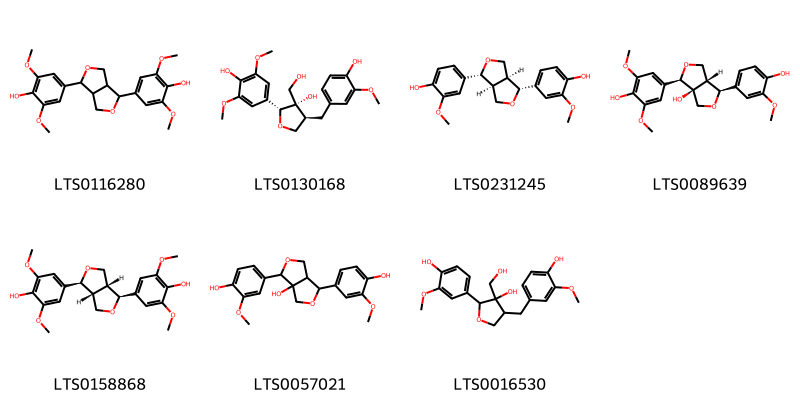{ width=100% }
    <figcaption>Hình ảnh cấu trúc hóa học của 7 hoạt chất thuộc nhóm Furanoid lignans gồm ['syringaresinol (LTS0116280)', '(2r,3s,4s)-2-(4-hydroxy-3,5-dimethoxyphenyl)-4-[(4-hydroxy-3-methoxyphenyl)methyl]-3-(hydroxymethyl)oxolan-3-ol (LTS0130168)', '(-)-pinoresinol (LTS0231245)', '(1s,3as,4r,6ar)-4-(4-hydroxy-3,5-dimethoxyphenyl)-1-(4-hydroxy-3-methoxyphenyl)-tetrahydro-1h-furo[3,4-c]furan-3a-ol (LTS0089639)', '(+)-syringaresinol (LTS0158868)', '1,4-bis(4-hydroxy-3-methoxyphenyl)-tetrahydro-1h-furo[3,4-c]furan-3a-ol (LTS0057021)', '2-(4-hydroxy-3-methoxyphenyl)-4-[(4-hydroxy-3-methoxyphenyl)methyl]-3-(hydroxymethyl)oxolan-3-ol (LTS0016530)'].</figcaption>
</figure>
#### Nhóm Harmala alkaloids
<figure markdown="span">
    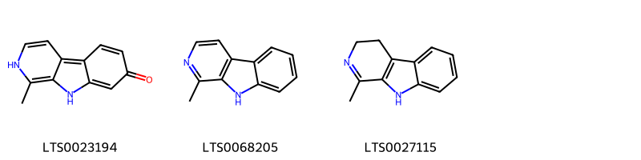{ width=100% }
    <figcaption>Hình ảnh cấu trúc hóa học của 3 hoạt chất thuộc nhóm Harmala alkaloids gồm ['harmol (LTS0023194)', 'harmane (LTS0068205)', '1-methyl-3h,4h,9h-pyrido[3,4-b]indole (LTS0027115)'].</figcaption>
</figure>
#### Nhóm Indoles and derivatives
<figure markdown="span">
    { width=100% }
    <figcaption>Hình ảnh cấu trúc hóa học của 1 hoạt chất thuộc nhóm Indoles and derivatives gồm ['β-carboline (LTS0263207)'].</figcaption>
</figure>
#### Nhóm Organooxygen compounds
<figure markdown="span">
    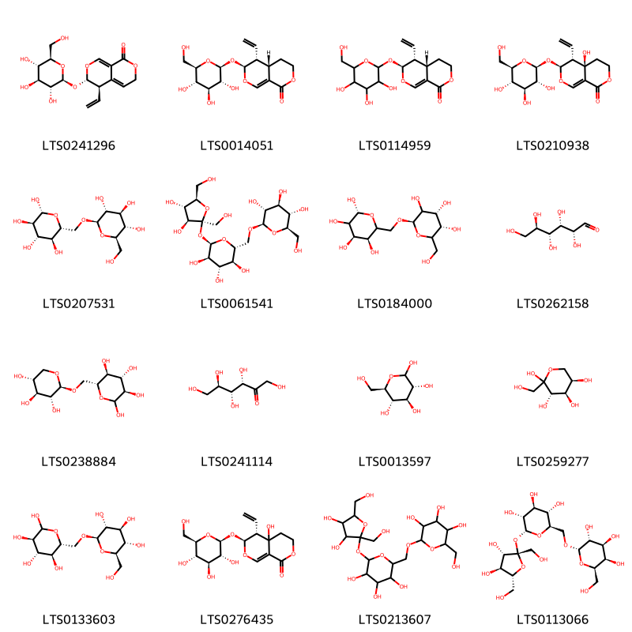{ width=100% }
    <figcaption>Hình ảnh cấu trúc hóa học của 16 hoạt chất thuộc nhóm Organooxygen compounds gồm ['gentiopicroside (LTS0241296)', 'sweroside (LTS0014051)', '(4as,5r,6s)-5-ethenyl-6-{[3,4,5-trihydroxy-6-(hydroxymethyl)oxan-2-yl]oxy}-3h,4h,4ah,5h,6h-pyrano[3,4-c]pyran-1-one (LTS0114959)', 'swertiamarin (LTS0210938)', 'gentiobiose (LTS0207531)', '(2r,3r,4s,5s,6r)-2-{[(2r,3s,4s,5r,6r)-6-{[(2s,3s,4s,5r)-3,4-dihydroxy-2,5-bis(hydroxymethyl)oxolan-2-yl]oxy}-3,4,5-trihydroxyoxan-2-yl]methoxy}-6-(hydroxymethyl)oxane-3,4,5-triol (LTS0061541)', '(2r,4r,5s)-6-({[(2r,4r,5s)-3,4,5-trihydroxy-6-(hydroxymethyl)oxan-2-yl]oxy}methyl)oxane-2,3,4,5-tetrol (LTS0184000)', '(+)-glucose (LTS0262158)', '(3r,4s,5s,6r)-6-({[(2s,3r,4s,5r)-3,4,5-trihydroxyoxan-2-yl]oxy}methyl)oxane-2,3,4,5-tetrol (LTS0238884)', 'keto-d-fructose (LTS0241114)', 'glucose (LTS0013597)', 'd-fructopyranose (LTS0259277)', 'gentobiose (LTS0133603)', '(5r,6s)-5-ethenyl-4a-hydroxy-6-{[(2s,3r,4s,5s,6r)-3,4,5-trihydroxy-6-(hydroxymethyl)oxan-2-yl]oxy}-3h,4h,5h,6h-pyrano[3,4-c]pyran-1-one (LTS0276435)', '2-[(6-{[3,4-dihydroxy-2,5-bis(hydroxymethyl)oxolan-2-yl]oxy}-3,4,5-trihydroxyoxan-2-yl)methoxy]-6-(hydroxymethyl)oxane-3,4,5-triol (LTS0213607)', 'raffinose (LTS0113066)'].</figcaption>
</figure>
#### Nhóm Prenol lipids
<figure markdown="span">
    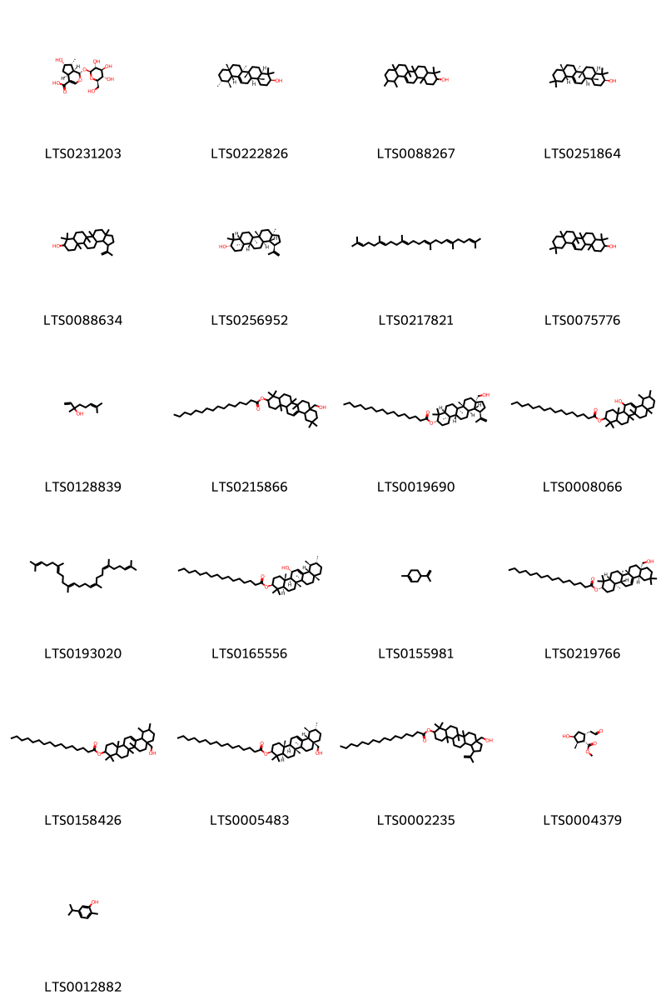{ width=100% }
    <figcaption>Hình ảnh cấu trúc hóa học của 21 hoạt chất thuộc nhóm Prenol lipids gồm ['loganic acid (LTS0231203)', 'amyrin (LTS0222826)', 'α-amyrin (LTS0088267)', 'β-amyrin (LTS0251864)', 'lupeol (LTS0088634)', 'lupeol (LTS0256952)', 'squalene (LTS0217821)', 'β-amyrin (LTS0075776)', 'linalool, (+-)- (LTS0128839)', '8a-(hydroxymethyl)-4,4,6a,6b,11,11,14b-heptamethyl-1,2,3,4a,5,6,7,8,9,10,12,12a,14,14a-tetradecahydropicen-3-yl hexadecanoate (LTS0215866)', '(1r,3as,5ar,5br,7ar,9s,11ar,11br,13ar,13br)-3a-(hydroxymethyl)-5a,5b,8,8,11a-pentamethyl-1-(prop-1-en-2-yl)-hexadecahydrocyclopenta[a]chrysen-9-yl hexadecanoate (LTS0019690)', '14-hydroxy-4,4,6a,6b,8a,11,12,14b-octamethyl-2,3,4a,5,6,7,8,9,10,11,12,12a,14,14a-tetradecahydro-1h-picen-3-yl hexadecanoate (LTS0008066)', '2,6,10,15,19,23-hexamethyltetracosa-2,6,10,14,18,22-hexaene (LTS0193020)', '(3s,4ar,6ar,6bs,8ar,11r,12s,12ar,14r,14ar,14bs)-14-hydroxy-4,4,6a,6b,8a,11,12,14b-octamethyl-2,3,4a,5,6,7,8,9,10,11,12,12a,14,14a-tetradecahydro-1h-picen-3-yl hexadecanoate (LTS0165556)', 'limonene,  (LTS0155981)', '(3s,4ar,6ar,6bs,8as,12as,14ar,14br)-8a-(hydroxymethyl)-4,4,6a,6b,11,11,14b-heptamethyl-1,2,3,4a,5,6,7,8,9,10,12,12a,14,14a-tetradecahydropicen-3-yl hexadecanoate (LTS0219766)', '8a-(hydroxymethyl)-4,4,6a,6b,11,12,14b-heptamethyl-2,3,4a,5,6,7,8,9,10,11,12,12a,14,14a-tetradecahydro-1h-picen-3-yl hexadecanoate (LTS0158426)', '(3s,4ar,6ar,6bs,8as,11r,12s,12as,14ar,14br)-8a-(hydroxymethyl)-4,4,6a,6b,11,12,14b-heptamethyl-2,3,4a,5,6,7,8,9,10,11,12,12a,14,14a-tetradecahydro-1h-picen-3-yl hexadecanoate (LTS0005483)', '3a-(hydroxymethyl)-5a,5b,8,8,11a-pentamethyl-1-(prop-1-en-2-yl)-hexadecahydrocyclopenta[a]chrysen-9-yl hexadecanoate (LTS0002235)', 'methyl (1s,2r,3s,5r)-3-hydroxy-2-methyl-5-(2-oxoethyl)cyclopentane-1-carboxylate (LTS0004379)', 'carvacrol (LTS0012882)'].</figcaption>
</figure>
#### Nhóm Pyranopyridines
<figure markdown="span">
    { width=100% }
    <figcaption>Hình ảnh cấu trúc hóa học của 1 hoạt chất thuộc nhóm Pyranopyridines gồm ['gentianine (LTS0240161)'].</figcaption>
</figure>
#### Nhóm Pyrans
<figure markdown="span">
    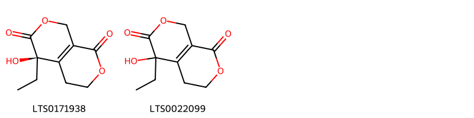{ width=100% }
    <figcaption>Hình ảnh cấu trúc hóa học của 2 hoạt chất thuộc nhóm Pyrans gồm ['(5r)-5-ethyl-5-hydroxy-3h,4h,8h-pyrano[3,4-c]pyran-1,6-dione (LTS0171938)', '5-ethyl-5-hydroxy-3h,4h,8h-pyrano[3,4-c]pyran-1,6-dione (LTS0022099)'].</figcaption>
</figure>
#### Nhóm Pyridines and derivatives
<figure markdown="span">
    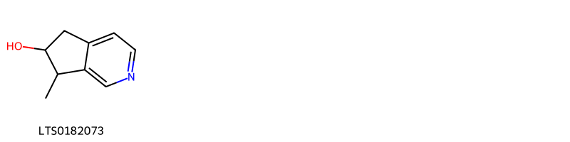{ width=100% }
    <figcaption>Hình ảnh cấu trúc hóa học của 1 hoạt chất thuộc nhóm Pyridines and derivatives gồm ['7-methyl-5h,6h,7h-cyclopenta[c]pyridin-6-ol (LTS0182073)'].</figcaption>
</figure>
#### Nhóm Steroids and steroid derivatives
<figure markdown="span">
    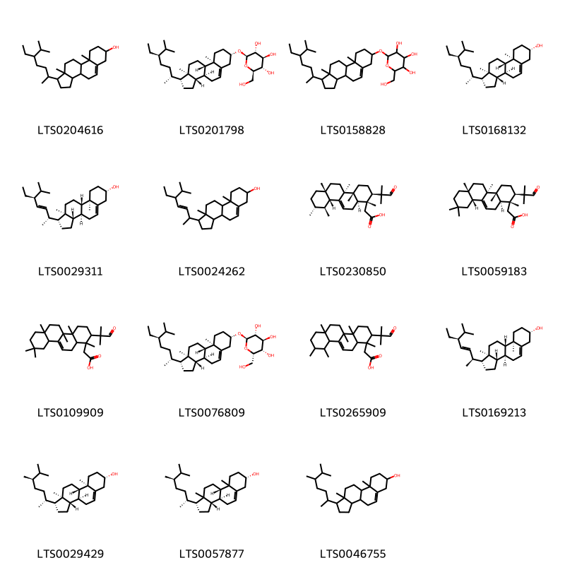{ width=100% }
    <figcaption>Hình ảnh cấu trúc hóa học của 15 hoạt chất thuộc nhóm Steroids and steroid derivatives gồm ['stigmast-5-en-3-ol, (3β)- (LTS0204616)', 'sitogluside (LTS0201798)', '2-{[1-(5-ethyl-6-methylheptan-2-yl)-9a,11a-dimethyl-1h,2h,3h,3ah,3bh,4h,6h,7h,8h,9h,9bh,10h,11h-cyclopenta[a]phenanthren-7-yl]oxy}-6-(hydroxymethyl)oxane-3,4,5-triol (LTS0158828)', 'sitosterol (LTS0168132)', 'phytosterol (LTS0029311)', 'stigmasterol (LTS0024262)', '[(1r,2r,4ar,4bs,6ar,9r,10s,10ar,12ar)-1,4a,4b,6a,9,10-hexamethyl-2-(2-methyl-1-oxopropan-2-yl)-2,3,4,5,6,7,8,9,10,10a,12,12a-dodecahydrochrysen-1-yl]acetic acid (LTS0230850)', '[(1r,2r,4ar,4bs,6ar,10ar,12ar)-1,4a,4b,6a,9,9-hexamethyl-2-(2-methyl-1-oxopropan-2-yl)-3,4,5,6,7,8,10,10a,12,12a-decahydro-2h-chrysen-1-yl]acetic acid (LTS0059183)', '[1,4a,4b,6a,9,9-hexamethyl-2-(2-methyl-1-oxopropan-2-yl)-3,4,5,6,7,8,10,10a,12,12a-decahydro-2h-chrysen-1-yl]acetic acid (LTS0109909)', '(2r,3r,4s,5s,6s)-2-{[(1r,3as,3bs,7s,9ar,9bs,11ar)-1-[(2r,5r)-5-ethyl-6-methylheptan-2-yl]-9a,11a-dimethyl-1h,2h,3h,3ah,3bh,4h,6h,7h,8h,9h,9bh,10h,11h-cyclopenta[a]phenanthren-7-yl]oxy}-6-(hydroxymethyl)oxane-3,4,5-triol (LTS0076809)', '[1,4a,4b,6a,9,10-hexamethyl-2-(2-methyl-1-oxopropan-2-yl)-2,3,4,5,6,7,8,9,10,10a,12,12a-dodecahydrochrysen-1-yl]acetic acid (LTS0265909)', '(1r,3as,3bs,7s,9ar,9bs,11ar)-1-[(2s,3e,5s)-5-ethyl-6-methylhept-3-en-2-yl]-9a,11a-dimethyl-1h,2h,3h,3ah,3bh,4h,6h,7h,8h,9h,9bh,10h,11h-cyclopenta[a]phenanthren-7-ol (LTS0169213)', 'campesterol (LTS0029429)', '(1r,3as,3bs,7s,9bs)-1-[(2r,5r)-5,6-dimethylheptan-2-yl]-9a,11a-dimethyl-1h,2h,3h,3ah,3bh,4h,6h,7h,8h,9h,9bh,10h,11h-cyclopenta[a]phenanthren-7-ol (LTS0057877)', 'campesterol (LTS0046755)'].</figcaption>
</figure>

---

### Dược dân tộc học

Danh sách các quốc gia có sử dụng *Gentiana lutea* trong điều trị các bệnh. 

| Country   | Disease                   | Bệnh                            |
|:----------|:--------------------------|:--------------------------------|
| Elsewhere | Apertif, Tonic, Stimulant | Apertif, Tonic, Chất kích thích |
| India     | Apertif                   | Apertif                         |
| Turkey    | Stomachic, Tonic          | Dạ dày, Thuốc bổ                |
| ain       | Stomachic                 | Sững sờ                         |

---

---
## Gentiana olivieri
### Thông tin về thực vật

!!! info "Phân loại thực vật của *Gentiana olivieri* từ GIBF:"
    - **Kingdom:** Plantae
    - **Phylum:** Tracheophyta
    - **Order:** Gentianales
    - **Family:** Gentianaceae
    - **Genus:** Gentiana
    - **Species:** *Gentiana olivieri*

 

| Label (VI)   | Label (EN)   | Scientific Name   | Descriptions (VI)   | Descriptions (EN)   | Also Known As (VI)   | Also Known As (EN)   |
|:-------------|:-------------|:------------------|:--------------------|:--------------------|:---------------------|:---------------------|
| N/A          | N/A          | Gentiana olivieri | loài thực vật       | species of plant    | ['']                 | ['']                 |

#### Phân bố trên thế giới

**Từ CSDL GIBF** Tajikistan, Pakistan, Belgium, Iran (Islamic Republic of), Iraq, Kyrgyzstan, Afghanistan, Turkmenistan, Türkiye, unknown or invalid, Russian Federation, Timor-Leste, Kazakhstan, China, Uzbekistan

#### Phân bố tại Việt Nam

**Từ CSDL GIBF**: Không có ghi nhận ở Việt Nam

---
### Thành phần hóa học
        
- Theo cơ sở dữ liệu lotus: Từ loài *Gentiana olivieri* đã phân lập và xác định được 24 hoạt chất thuộc về các nhóm Flavonoids, Prenol lipids, Pyranopyridines, Cinnamic acids and derivatives, Aporphines, Organooxygen compounds, Carboxylic acids and derivatives. 

|    | chemicalTaxonomyClassyfireClass   |   smiles_count |
|---:|:----------------------------------|---------------:|
|  0 | Aporphines                        |              1 |
|  1 | Carboxylic acids and derivatives  |              1 |
|  2 | Cinnamic acids and derivatives    |              3 |
|  3 | Flavonoids                        |              2 |
|  4 | Organooxygen compounds            |             10 |
|  5 | Prenol lipids                     |              2 |
|  6 | Pyranopyridines                   |              5 |

#### Nhóm Aporphines
<figure markdown="span">
    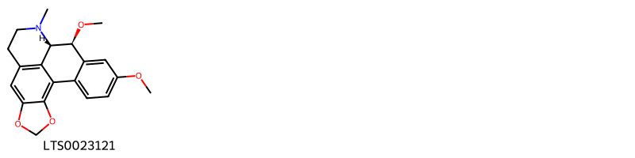{ width=100% }
    <figcaption>Hình ảnh cấu trúc hóa học của 1 hoạt chất thuộc nhóm Aporphines gồm ['(12s,13s)-13,16-dimethoxy-11-methyl-3,5-dioxa-11-azapentacyclo[10.7.1.0²,⁶.0⁸,²⁰.0¹⁴,¹⁹]icosa-1,6,8(20),14,16,18-hexaene (LTS0023121)'].</figcaption>
</figure>
#### Nhóm Carboxylic acids and derivatives
<figure markdown="span">
    { width=100% }
    <figcaption>Hình ảnh cấu trúc hóa học của 1 hoạt chất thuộc nhóm Carboxylic acids and derivatives gồm ['(2r,3r,4s,5r,6s)-6-{[(3s,4r,4as)-4-ethenyl-8-oxo-3h,4h,4ah,5h,6h-pyrano[3,4-c]pyran-3-yl]oxy}-4,5-bis(acetyloxy)-2-[(acetyloxy)methyl]oxan-3-yl 2-hydroxy-3-{[(2s,3r,4s,5s,6r)-3,4,5-trihydroxy-6-(hydroxymethyl)oxan-2-yl]oxy}benzoate (LTS0203648)'].</figcaption>
</figure>
#### Nhóm Cinnamic acids and derivatives
<figure markdown="span">
    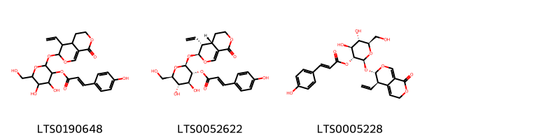{ width=100% }
    <figcaption>Hình ảnh cấu trúc hóa học của 3 hoạt chất thuộc nhóm Cinnamic acids and derivatives gồm ['2-({4-ethenyl-8-oxo-3h,4h,4ah,5h,6h-pyrano[3,4-c]pyran-3-yl}oxy)-4,5-dihydroxy-6-(hydroxymethyl)oxan-3-yl 3-(4-hydroxyphenyl)prop-2-enoate (LTS0190648)', '(2s,3r,4s,5s,6r)-2-{[(3s,4r,4as)-4-ethenyl-8-oxo-3h,4h,4ah,5h,6h-pyrano[3,4-c]pyran-3-yl]oxy}-4,5-dihydroxy-6-(hydroxymethyl)oxan-3-yl (2e)-3-(4-hydroxyphenyl)prop-2-enoate (LTS0052622)', '(2s,3r,4s,5s,6r)-2-{[(3s,4r)-4-ethenyl-8-oxo-3h,4h,6h-pyrano[3,4-c]pyran-3-yl]oxy}-4,5-dihydroxy-6-(hydroxymethyl)oxan-3-yl (2e)-3-(4-hydroxyphenyl)prop-2-enoate (LTS0005228)'].</figcaption>
</figure>
#### Nhóm Flavonoids
<figure markdown="span">
    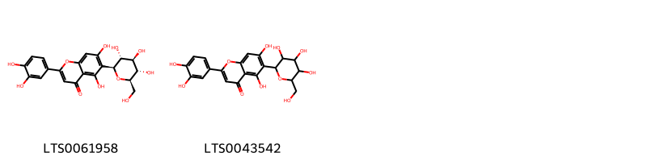{ width=100% }
    <figcaption>Hình ảnh cấu trúc hóa học của 2 hoạt chất thuộc nhóm Flavonoids gồm ['isoorientin (LTS0061958)', 'isoorientin (LTS0043542)'].</figcaption>
</figure>
#### Nhóm Organooxygen compounds
<figure markdown="span">
    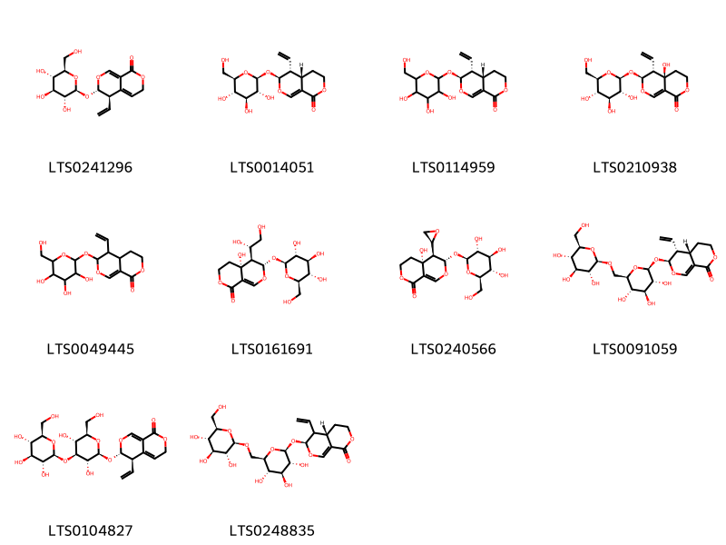{ width=100% }
    <figcaption>Hình ảnh cấu trúc hóa học của 10 hoạt chất thuộc nhóm Organooxygen compounds gồm ['gentiopicroside (LTS0241296)', 'sweroside (LTS0014051)', '(4as,5r,6s)-5-ethenyl-6-{[3,4,5-trihydroxy-6-(hydroxymethyl)oxan-2-yl]oxy}-3h,4h,4ah,5h,6h-pyrano[3,4-c]pyran-1-one (LTS0114959)', 'swertiamarin (LTS0210938)', '5-ethenyl-6-{[3,4,5-trihydroxy-6-(hydroxymethyl)oxan-2-yl]oxy}-3h,4h,4ah,5h,6h-pyrano[3,4-c]pyran-1-one (LTS0049445)', '(4ar,5r,6s)-5-[(1s)-1,2-dihydroxyethyl]-4a-hydroxy-6-{[(2s,3r,4s,5s,6r)-3,4,5-trihydroxy-6-(hydroxymethyl)oxan-2-yl]oxy}-3h,4h,5h,6h-pyrano[3,4-c]pyran-1-one (LTS0161691)', '(4ar,5r,6s)-4a-hydroxy-5-[(2s)-oxiran-2-yl]-6-{[(2s,3r,4s,5s,6r)-3,4,5-trihydroxy-6-(hydroxymethyl)oxan-2-yl]oxy}-3h,4h,5h,6h-pyrano[3,4-c]pyran-1-one (LTS0240566)', '(4as,5r,6s)-5-ethenyl-6-{[(2s,3r,4s,5s,6r)-3,4,5-trihydroxy-6-({[(2r,3r,4s,5s,6r)-3,4,5-trihydroxy-6-(hydroxymethyl)oxan-2-yl]oxy}methyl)oxan-2-yl]oxy}-3h,4h,4ah,5h,6h-pyrano[3,4-c]pyran-1-one (LTS0091059)', '(5r,6s)-6-{[(2s,3r,4s,5r,6r)-3,5-dihydroxy-6-(hydroxymethyl)-4-{[(2s,3r,4s,5s,6r)-3,4,5-trihydroxy-6-(hydroxymethyl)oxan-2-yl]oxy}oxan-2-yl]oxy}-5-ethenyl-3h,5h,6h-pyrano[3,4-c]pyran-1-one (LTS0104827)', '(4as,6s)-5-ethenyl-6-{[(2s,3r,4s,5s,6r)-3,4,5-trihydroxy-6-({[(2r,3r,4s,5s,6r)-3,4,5-trihydroxy-6-(hydroxymethyl)oxan-2-yl]oxy}methyl)oxan-2-yl]oxy}-3h,4h,4ah,5h,6h-pyrano[3,4-c]pyran-1-one (LTS0248835)'].</figcaption>
</figure>
#### Nhóm Prenol lipids
<figure markdown="span">
    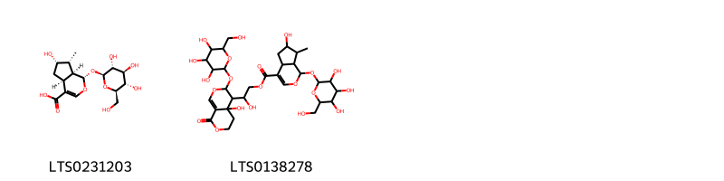{ width=100% }
    <figcaption>Hình ảnh cấu trúc hóa học của 2 hoạt chất thuộc nhóm Prenol lipids gồm ['loganic acid (LTS0231203)', '2-(4a-hydroxy-8-oxo-3-{[3,4,5-trihydroxy-6-(hydroxymethyl)oxan-2-yl]oxy}-3h,4h,5h,6h-pyrano[3,4-c]pyran-4-yl)-2-hydroxyethyl 6-hydroxy-7-methyl-1-{[3,4,5-trihydroxy-6-(hydroxymethyl)oxan-2-yl]oxy}-1h,4ah,5h,6h,7h,7ah-cyclopenta[c]pyran-4-carboxylate (LTS0138278)'].</figcaption>
</figure>
#### Nhóm Pyranopyridines
<figure markdown="span">
    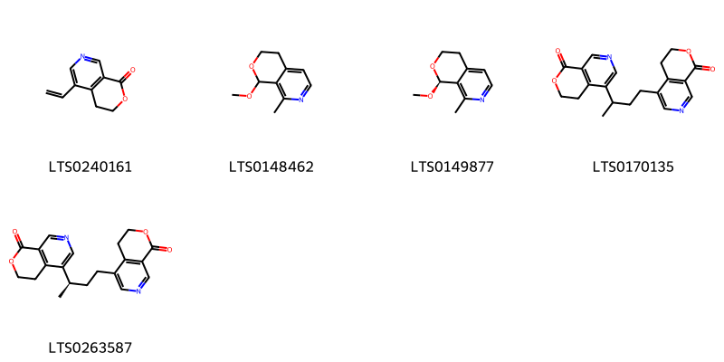{ width=100% }
    <figcaption>Hình ảnh cấu trúc hóa học của 5 hoạt chất thuộc nhóm Pyranopyridines gồm ['gentianine (LTS0240161)', '1-methoxy-8-methyl-1h,3h,4h-pyrano[3,4-c]pyridine (LTS0148462)', '(1s)-1-methoxy-8-methyl-1h,3h,4h-pyrano[3,4-c]pyridine (LTS0149877)', '5-(3-{1-oxo-3h,4h-pyrano[3,4-c]pyridin-5-yl}butyl)-3h,4h-pyrano[3,4-c]pyridin-1-one (LTS0170135)', '5-[(3r)-3-{1-oxo-3h,4h-pyrano[3,4-c]pyridin-5-yl}butyl]-3h,4h-pyrano[3,4-c]pyridin-1-one (LTS0263587)'].</figcaption>
</figure>

---

### Dược dân tộc học

Danh sách các quốc gia có sử dụng *Gentiana olivieri* trong điều trị các bệnh. 

| Country   | Disease   | Bệnh    |
|:----------|:----------|:--------|
| China     | Stomachic | Sững sờ |

---

---
## Gentiana rigescens
### Thông tin về thực vật

!!! info "Phân loại thực vật của *Gentiana rigescens* từ GIBF:"
    - **Kingdom:** Plantae
    - **Phylum:** Tracheophyta
    - **Order:** Gentianales
    - **Family:** Gentianaceae
    - **Genus:** Gentiana
    - **Species:** *Gentiana rigescens*

 

| Label (VI)   | Label (EN)   | Scientific Name    | Descriptions (VI)   | Descriptions (EN)   | Also Known As (VI)   | Also Known As (EN)   |
|:-------------|:-------------|:-------------------|:--------------------|:--------------------|:---------------------|:---------------------|
| N/A          | N/A          | Gentiana rigescens | loài thực vật       | species of plant    | ['']                 | ['']                 |

#### Phân bố trên thế giới

**Từ CSDL GIBF** China

#### Phân bố tại Việt Nam

**Từ CSDL GIBF**: Không có ghi nhận ở Việt Nam

---
### Thành phần hóa học
        
- Theo cơ sở dữ liệu lotus: Từ loài *Gentiana rigescens* đã phân lập và xác định được 32 hoạt chất thuộc về các nhóm Prenol lipids, Steroids and steroid derivatives, Benzene and substituted derivatives, Pyranopyridines. 

|    | chemicalTaxonomyClassyfireClass     |   smiles_count |
|---:|:------------------------------------|---------------:|
|  0 | Benzene and substituted derivatives |             16 |
|  1 | Prenol lipids                       |             12 |
|  2 | Pyranopyridines                     |              3 |
|  3 | Steroids and steroid derivatives    |              1 |

#### Nhóm Benzene and substituted derivatives
<figure markdown="span">
    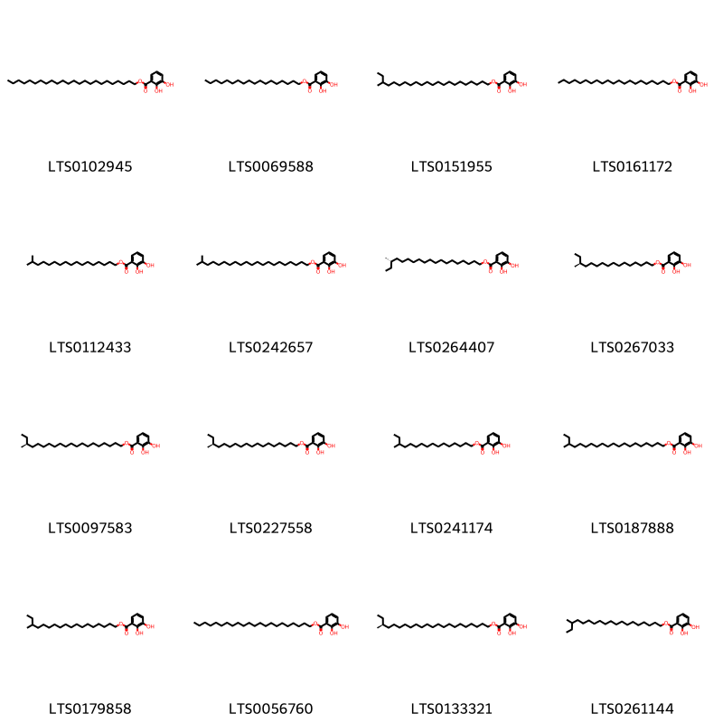{ width=100% }
    <figcaption>Hình ảnh cấu trúc hóa học của 16 hoạt chất thuộc nhóm Benzene and substituted derivatives gồm ['tetracosyl 2,3-dihydroxybenzoate (LTS0102945)', 'octadecyl 2,3-dihydroxybenzoate (LTS0069588)', '20-methyldocosyl 2,3-dihydroxybenzoate (LTS0151955)', 'henicosyl 2,3-dihydroxybenzoate (LTS0161172)', '16-methylheptadecyl 2,3-dihydroxybenzoate (LTS0112433)', '20-methylhenicosyl 2,3-dihydroxybenzoate (LTS0242657)', '(17s)-17-methylnonadecyl 2,3-dihydroxybenzoate (LTS0264407)', '(14s)-14-methylhexadecyl 2,3-dihydroxybenzoate (LTS0267033)', '(18s)-18-methylicosyl 2,3-dihydroxybenzoate (LTS0097583)', '(16s)-16-methyloctadecyl 2,3-dihydroxybenzoate (LTS0227558)', '14-methylhexadecyl 2,3-dihydroxybenzoate (LTS0241174)', '18-methylicosyl 2,3-dihydroxybenzoate (LTS0187888)', '16-methyloctadecyl 2,3-dihydroxybenzoate (LTS0179858)', 'docosyl 2,3-dihydroxybenzoate (LTS0056760)', '(20s)-20-methyldocosyl 2,3-dihydroxybenzoate (LTS0133321)', '17-methylnonadecyl 2,3-dihydroxybenzoate (LTS0261144)'].</figcaption>
</figure>
#### Nhóm Prenol lipids
<figure markdown="span">
    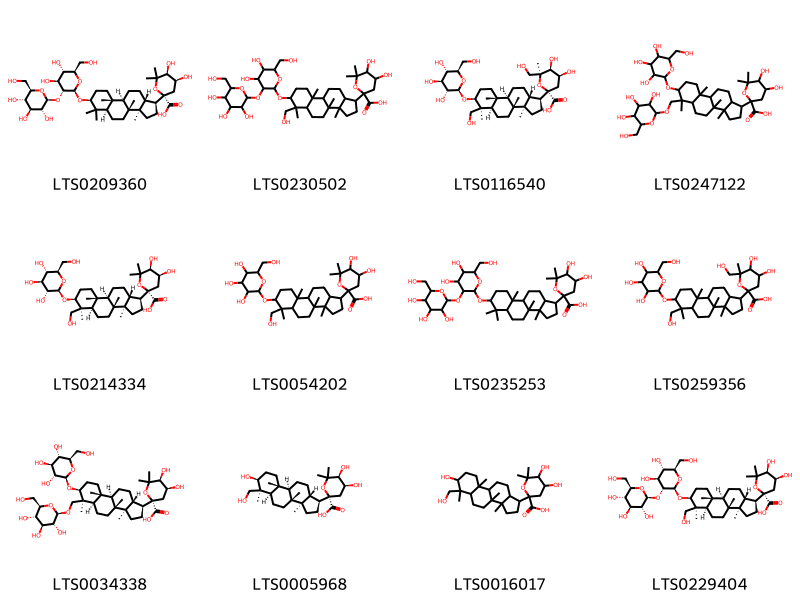{ width=100% }
    <figcaption>Hình ảnh cấu trúc hóa học của 12 hoạt chất thuộc nhóm Prenol lipids gồm ['(2s,4s,5s)-2-[(1s,3ar,3br,5ar,7s,9ar,9br,11ar)-7-{[(2r,3r,4s,5s,6r)-4,5-dihydroxy-6-(hydroxymethyl)-3-{[(2s,3r,4s,5s,6r)-3,4,5-trihydroxy-6-(hydroxymethyl)oxan-2-yl]oxy}oxan-2-yl]oxy}-3a,3b,6,6,9a-pentamethyl-dodecahydro-1h-cyclopenta[a]phenanthren-1-yl]-4,5-dihydroxy-6,6-dimethyloxane-2-carboxylic acid (LTS0209360)', '2-(7-{[4,5-dihydroxy-6-(hydroxymethyl)-3-{[3,4,5-trihydroxy-6-(hydroxymethyl)oxan-2-yl]oxy}oxan-2-yl]oxy}-6-(hydroxymethyl)-3a,3b,6,9a-tetramethyl-dodecahydro-1h-cyclopenta[a]phenanthren-1-yl)-4,5-dihydroxy-6,6-dimethyloxane-2-carboxylic acid (LTS0230502)', '(2s,4s,5s,6s)-2-[(1s,3ar,3br,5ar,6s,7s,9ar,9br,11ar)-6-(hydroxymethyl)-3a,3b,6,9a-tetramethyl-7-{[(2r,3r,4s,5s,6r)-3,4,5-trihydroxy-6-(hydroxymethyl)oxan-2-yl]oxy}-dodecahydro-1h-cyclopenta[a]phenanthren-1-yl]-4,5-dihydroxy-6-(hydroxymethyl)-6-methyloxane-2-carboxylic acid (LTS0116540)', '2-(3a,3b,6,9a-tetramethyl-7-{[3,4,5-trihydroxy-6-(hydroxymethyl)oxan-2-yl]oxy}-6-({[3,4,5-trihydroxy-6-(hydroxymethyl)oxan-2-yl]oxy}methyl)-dodecahydro-1h-cyclopenta[a]phenanthren-1-yl)-4,5-dihydroxy-6,6-dimethyloxane-2-carboxylic acid (LTS0247122)', '(2s,4s,5s)-2-[(1s,3ar,3br,5ar,6s,7s,9ar,9br,11ar)-6-(hydroxymethyl)-3a,3b,6,9a-tetramethyl-7-{[(2r,3r,4s,5s,6r)-3,4,5-trihydroxy-6-(hydroxymethyl)oxan-2-yl]oxy}-dodecahydro-1h-cyclopenta[a]phenanthren-1-yl]-4,5-dihydroxy-6,6-dimethyloxane-2-carboxylic acid (LTS0214334)', '4,5-dihydroxy-2-[6-(hydroxymethyl)-3a,3b,6,9a-tetramethyl-7-{[3,4,5-trihydroxy-6-(hydroxymethyl)oxan-2-yl]oxy}-dodecahydro-1h-cyclopenta[a]phenanthren-1-yl]-6,6-dimethyloxane-2-carboxylic acid (LTS0054202)', '2-(7-{[4,5-dihydroxy-6-(hydroxymethyl)-3-{[3,4,5-trihydroxy-6-(hydroxymethyl)oxan-2-yl]oxy}oxan-2-yl]oxy}-3a,3b,6,6,9a-pentamethyl-dodecahydro-1h-cyclopenta[a]phenanthren-1-yl)-4,5-dihydroxy-6,6-dimethyloxane-2-carboxylic acid (LTS0235253)', '4,5-dihydroxy-6-(hydroxymethyl)-2-[6-(hydroxymethyl)-3a,3b,6,9a-tetramethyl-7-{[3,4,5-trihydroxy-6-(hydroxymethyl)oxan-2-yl]oxy}-dodecahydro-1h-cyclopenta[a]phenanthren-1-yl]-6-methyloxane-2-carboxylic acid (LTS0259356)', '(2s,4s,5s)-2-[(1s,3ar,3br,5ar,6s,7s,9ar,9br,11ar)-3a,3b,6,9a-tetramethyl-7-{[(2r,3r,4s,5s,6r)-3,4,5-trihydroxy-6-(hydroxymethyl)oxan-2-yl]oxy}-6-({[(2r,3r,4s,5s,6r)-3,4,5-trihydroxy-6-(hydroxymethyl)oxan-2-yl]oxy}methyl)-dodecahydro-1h-cyclopenta[a]phenanthren-1-yl]-4,5-dihydroxy-6,6-dimethyloxane-2-carboxylic acid (LTS0034338)', '(2s,4s,5s)-2-[(1s,3ar,3br,5ar,6s,7s,9ar,9br,11ar)-7-hydroxy-6-(hydroxymethyl)-3a,3b,6,9a-tetramethyl-dodecahydro-1h-cyclopenta[a]phenanthren-1-yl]-4,5-dihydroxy-6,6-dimethyloxane-2-carboxylic acid (LTS0005968)', '4,5-dihydroxy-2-[7-hydroxy-6-(hydroxymethyl)-3a,3b,6,9a-tetramethyl-dodecahydro-1h-cyclopenta[a]phenanthren-1-yl]-6,6-dimethyloxane-2-carboxylic acid (LTS0016017)', '(2s,4s,5s)-2-[(1s,3ar,3br,5ar,6s,7s,9ar,9br,11ar)-7-{[(2r,3r,4s,5s,6r)-4,5-dihydroxy-6-(hydroxymethyl)-3-{[(2s,3r,4s,5s,6r)-3,4,5-trihydroxy-6-(hydroxymethyl)oxan-2-yl]oxy}oxan-2-yl]oxy}-6-(hydroxymethyl)-3a,3b,6,9a-tetramethyl-dodecahydro-1h-cyclopenta[a]phenanthren-1-yl]-4,5-dihydroxy-6,6-dimethyloxane-2-carboxylic acid (LTS0229404)'].</figcaption>
</figure>
#### Nhóm Pyranopyridines
<figure markdown="span">
    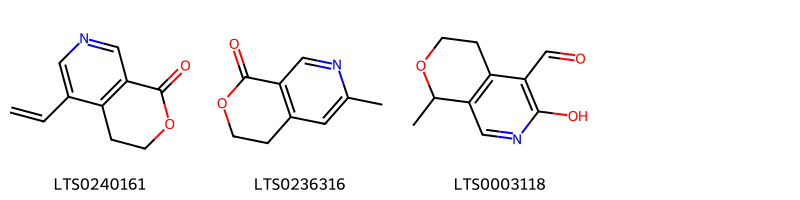{ width=100% }
    <figcaption>Hình ảnh cấu trúc hóa học của 3 hoạt chất thuộc nhóm Pyranopyridines gồm ['gentianine (LTS0240161)', 'gentianidine (LTS0236316)', '6-hydroxy-1-methyl-1h,3h,4h-pyrano[3,4-c]pyridine-5-carbaldehyde (LTS0003118)'].</figcaption>
</figure>
#### Nhóm Steroids and steroid derivatives
<figure markdown="span">
    { width=100% }
    <figcaption>Hình ảnh cấu trúc hóa học của 1 hoạt chất thuộc nhóm Steroids and steroid derivatives gồm ['stigmast-5-en-3-ol, (3β)- (LTS0204616)'].</figcaption>
</figure>

---

### Dược dân tộc học

Danh sách các quốc gia có sử dụng *Gentiana rigescens* trong điều trị các bệnh. 

| Country   | Disease   | Bệnh    |
|:----------|:----------|:--------|
| China     | Apertif   | Apertif |

---

---
## Gentiana scabra
### Thông tin về thực vật

!!! info "Phân loại thực vật của *Gentiana scabra* từ GIBF:"
    - **Kingdom:** Plantae
    - **Phylum:** Tracheophyta
    - **Order:** Gentianales
    - **Family:** Gentianaceae
    - **Genus:** Gentiana
    - **Species:** *Gentiana scabra*

 

| Label (VI)   | Label (EN)   | Scientific Name   | Descriptions (VI)   | Descriptions (EN)   | Also Known As (VI)   | Also Known As (EN)   |
|:-------------|:-------------|:------------------|:--------------------|:--------------------|:---------------------|:---------------------|
| N/A          | N/A          | Gentiana scabra   | loài thực vật       | species of plant    | ['']                 | ['']                 |

#### Phân bố trên thế giới

**Từ CSDL GIBF** Korea, Republic of, Russian Federation, China, Japan

#### Phân bố tại Việt Nam

**Từ CSDL GIBF**: Không có ghi nhận ở Việt Nam

---
### Thành phần hóa học
        
- Theo cơ sở dữ liệu lotus: Từ loài *Gentiana scabra* đã phân lập và xác định được 49 hoạt chất thuộc về các nhóm Fatty Acyls, Prenol lipids, Steroids and steroid derivatives, Indoles and derivatives, Benzene and substituted derivatives, Organooxygen compounds, Carboxylic acids and derivatives. 

|    | chemicalTaxonomyClassyfireClass     |   smiles_count |
|---:|:------------------------------------|---------------:|
|  0 | Benzene and substituted derivatives |              1 |
|  1 | Carboxylic acids and derivatives    |              4 |
|  2 | Fatty Acyls                         |              4 |
|  3 | Indoles and derivatives             |              1 |
|  4 | Organooxygen compounds              |             20 |
|  5 | Prenol lipids                       |             17 |
|  6 | Steroids and steroid derivatives    |              2 |

#### Nhóm Benzene and substituted derivatives
<figure markdown="span">
    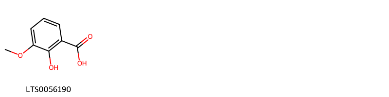{ width=100% }
    <figcaption>Hình ảnh cấu trúc hóa học của 1 hoạt chất thuộc nhóm Benzene and substituted derivatives gồm ['3-methoxysalicyclic acid (LTS0056190)'].</figcaption>
</figure>
#### Nhóm Carboxylic acids and derivatives
<figure markdown="span">
    { width=100% }
    <figcaption>Hình ảnh cấu trúc hóa học của 4 hoạt chất thuộc nhóm Carboxylic acids and derivatives gồm ['(2r,3r,4s,5r,6s)-6-{[(3s,4r,4as)-4-ethenyl-8-oxo-3h,4h,4ah,5h,6h-pyrano[3,4-c]pyran-3-yl]oxy}-4,5-bis(acetyloxy)-2-[(acetyloxy)methyl]oxan-3-yl 2-hydroxy-3-{[(2s,3r,4s,5s,6r)-3,4,5-trihydroxy-6-(hydroxymethyl)oxan-2-yl]oxy}benzoate (LTS0203648)', '4,5-bis(acetyloxy)-2-[(acetyloxy)methyl]-6-({4-ethenyl-8-oxo-3h,4h,4ah,5h,6h-pyrano[3,4-c]pyran-3-yl}oxy)oxan-3-yl 2-hydroxy-3-{[3,4,5-trihydroxy-6-(hydroxymethyl)oxan-2-yl]oxy}benzoate (LTS0208783)', 'rindoside (LTS0112337)', 'scabraside (LTS0187829)'].</figcaption>
</figure>
#### Nhóm Fatty Acyls
<figure markdown="span">
    { width=100% }
    <figcaption>Hình ảnh cấu trúc hóa học của 4 hoạt chất thuộc nhóm Fatty Acyls gồm ['(3r,4s)-3-(hydroxymethyl)-4-[(2r)-1-{[(2r,3r,4s,5s,6r)-3,4,5-trihydroxy-6-(hydroxymethyl)oxan-2-yl]oxy}but-3-en-2-yl]oxan-2-one (LTS0167549)', '3-(hydroxymethyl)-4-(1-{[3,4,5-trihydroxy-6-(hydroxymethyl)oxan-2-yl]oxy}but-3-en-2-yl)oxan-2-one (LTS0140683)', '(3s,4s)-3-(hydroxymethyl)-4-[(2s)-1-{[(2r,3r,4s,5s,6r)-3,4,5-trihydroxy-6-(hydroxymethyl)oxan-2-yl]oxy}but-3-en-2-yl]oxan-2-one (LTS0096320)', '(3s,4s)-3-(hydroxymethyl)-4-[(2r)-1-{[(2r,3r,4s,5s,6r)-3,4,5-trihydroxy-6-(hydroxymethyl)oxan-2-yl]oxy}but-3-en-2-yl]oxan-2-one (LTS0233275)'].</figcaption>
</figure>
#### Nhóm Indoles and derivatives
<figure markdown="span">
    { width=100% }
    <figcaption>Hình ảnh cấu trúc hóa học của 1 hoạt chất thuộc nhóm Indoles and derivatives gồm ['n-[2-(5-methoxy-1h-indol-3-yl)ethyl]ethanimidic acid (LTS0219322)'].</figcaption>
</figure>
#### Nhóm Organooxygen compounds
<figure markdown="span">
    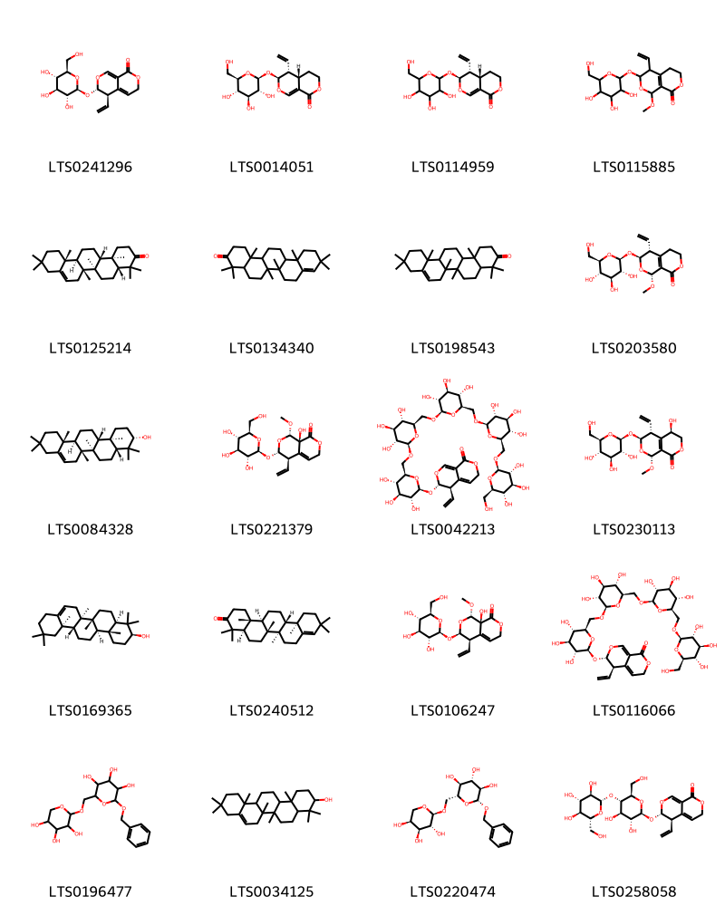{ width=100% }
    <figcaption>Hình ảnh cấu trúc hóa học của 20 hoạt chất thuộc nhóm Organooxygen compounds gồm ['gentiopicroside (LTS0241296)', 'sweroside (LTS0014051)', '(4as,5r,6s)-5-ethenyl-6-{[3,4,5-trihydroxy-6-(hydroxymethyl)oxan-2-yl]oxy}-3h,4h,4ah,5h,6h-pyrano[3,4-c]pyran-1-one (LTS0114959)', '5-ethenyl-8-methoxy-6-{[3,4,5-trihydroxy-6-(hydroxymethyl)oxan-2-yl]oxy}-3h,4h,5h,6h,8h-pyrano[3,4-c]pyran-1-one (LTS0115885)', '(4ar,6ar,6br,12ar,12br,14ar,14br)-4,4,6a,6b,10,10,12a,14b-octamethyl-2,4a,5,6,7,9,11,12,12b,13,14,14a-dodecahydro-1h-picen-3-one (LTS0125214)', '4,4,6a,6b,10,10,12a,14b-octamethyl-2,4a,5,6,7,8,11,12,12b,13,14,14a-dodecahydro-1h-picen-3-one (LTS0134340)', '4,4,6a,6b,10,10,12a,14b-octamethyl-2,4a,5,6,7,9,11,12,12b,13,14,14a-dodecahydro-1h-picen-3-one (LTS0198543)', '(5r,6s,8r)-5-ethenyl-8-methoxy-6-{[(2s,3r,4s,5s,6r)-3,4,5-trihydroxy-6-(hydroxymethyl)oxan-2-yl]oxy}-3h,4h,5h,6h,8h-pyrano[3,4-c]pyran-1-one (LTS0203580)', '(3s,4ar,6ar,6br,12ar,12br,14ar,14br)-4,4,6a,6b,10,10,12a,14b-octamethyl-1,2,3,4a,5,6,7,9,11,12,12b,13,14,14a-tetradecahydropicen-3-ol (LTS0084328)', '(5r,6r,8s,8as)-5-ethenyl-8a-hydroxy-8-methoxy-6-{[(2s,3r,4s,5s,6r)-3,4,5-trihydroxy-6-(hydroxymethyl)oxan-2-yl]oxy}-3h,5h,6h,8h-pyrano[3,4-c]pyran-1-one (LTS0221379)', '(5r,6s)-5-ethenyl-6-{[(2s,3r,4s,5s,6r)-3,4,5-trihydroxy-6-({[(2r,3r,4s,5s,6r)-3,4,5-trihydroxy-6-({[(2r,3r,4s,5s,6r)-3,4,5-trihydroxy-6-({[(2r,3r,4s,5s,6r)-3,4,5-trihydroxy-6-({[(2r,3r,4s,5s,6r)-3,4,5-trihydroxy-6-(hydroxymethyl)oxan-2-yl]oxy}methyl)oxan-2-yl]oxy}methyl)oxan-2-yl]oxy}methyl)oxan-2-yl]oxy}methyl)oxan-2-yl]oxy}-3h,5h,6h-pyrano[3,4-c]pyran-1-one (LTS0042213)', '(4r,5r,6s,8r)-5-ethenyl-4-hydroxy-8-methoxy-6-{[(2s,3r,4s,5s,6r)-3,4,5-trihydroxy-6-(hydroxymethyl)oxan-2-yl]oxy}-3h,4h,5h,6h,8h-pyrano[3,4-c]pyran-1-one (LTS0230113)', '(3s,4ar,6ar,6br,12ar,12br,14ar,14br)-4,4,6a,6b,11,11,12a,14b-octamethyl-1,2,3,4a,5,6,7,9,10,12,12b,13,14,14a-tetradecahydropicen-3-ol (LTS0169365)', '(4ar,6ar,6br,12ar,12br,14ar,14br)-4,4,6a,6b,10,10,12a,14b-octamethyl-2,4a,5,6,7,8,11,12,12b,13,14,14a-dodecahydro-1h-picen-3-one (LTS0240512)', '(5r,6s,8s,8as)-5-ethenyl-8a-hydroxy-8-methoxy-6-{[(2s,3r,4s,5s,6r)-3,4,5-trihydroxy-6-(hydroxymethyl)oxan-2-yl]oxy}-3h,5h,6h,8h-pyrano[3,4-c]pyran-1-one (LTS0106247)', '(5r,6s)-5-ethenyl-6-{[(2s,3r,4s,5s,6r)-3,4,5-trihydroxy-6-({[(2r,3r,4s,5s,6r)-3,4,5-trihydroxy-6-({[(2r,3r,4s,5s,6r)-3,4,5-trihydroxy-6-({[(2r,3r,4s,5s,6r)-3,4,5-trihydroxy-6-(hydroxymethyl)oxan-2-yl]oxy}methyl)oxan-2-yl]oxy}methyl)oxan-2-yl]oxy}methyl)oxan-2-yl]oxy}-3h,5h,6h-pyrano[3,4-c]pyran-1-one (LTS0116066)', '2-(benzyloxy)-6-{[(3,4,5-trihydroxyoxan-2-yl)oxy]methyl}oxane-3,4,5-triol (LTS0196477)', '4,4,6a,6b,10,10,12a,14b-octamethyl-1,2,3,4a,5,6,7,9,11,12,12b,13,14,14a-tetradecahydropicen-3-ol (LTS0034125)', '(2r,3r,4s,5s,6r)-2-(benzyloxy)-6-({[(2s,3r,4s,5s)-3,4,5-trihydroxyoxan-2-yl]oxy}methyl)oxane-3,4,5-triol (LTS0220474)', '(5r,6s)-6-{[(2s,3r,4r,5s,6r)-3,4-dihydroxy-6-(hydroxymethyl)-5-{[(2s,3r,4s,5s,6r)-3,4,5-trihydroxy-6-(hydroxymethyl)oxan-2-yl]oxy}oxan-2-yl]oxy}-5-ethenyl-3h,5h,6h-pyrano[3,4-c]pyran-1-one (LTS0258058)'].</figcaption>
</figure>
#### Nhóm Prenol lipids
<figure markdown="span">
    { width=100% }
    <figcaption>Hình ảnh cấu trúc hóa học của 17 hoạt chất thuộc nhóm Prenol lipids gồm ['loganic acid (LTS0231203)', 'amyrin (LTS0222826)', 'α-amyrin (LTS0088267)', 'lupeol (LTS0088634)', 'lupeol (LTS0256952)', '(5ar,5br,7ar,9s,11ar,11br,13as,13br)-3-isopropyl-5a,5b,8,8,11a,13b-hexamethyl-1h,2h,4h,5h,6h,7h,7ah,9h,10h,11h,11bh,12h,13h,13ah-cyclopenta[a]chrysen-9-ol (LTS0077449)', '(3as,3br,5ar,9ar,9br)-3a,3b,6,6,9a-pentamethyl-1-[(2s)-6-methylhept-5-en-2-yl]-2h,3h,4h,5h,5ah,8h,9h,9bh,10h,11h-cyclopenta[a]phenanthren-7-one (LTS0103147)', '3a,3b,6,6,9a-pentamethyl-1-(6-methylhept-5-en-2-yl)-2h,3h,4h,5h,5ah,8h,9h,9bh,10h,11h-cyclopenta[a]phenanthren-7-one (LTS0185394)', '(3s,4as,6ar,6br,8ar,11r,12s,12ar,12br,14ar,14bs)-4,4,6a,6b,8a,11,12,14b-octamethyl-2,3,4a,5,6,7,8,9,10,11,12,12a,12b,14a-tetradecahydro-1h-picen-3-ol (LTS0017325)', '3-isopropyl-5a,5b,8,8,11a,13b-hexamethyl-1h,2h,4h,5h,6h,7h,7ah,9h,10h,11h,11bh,12h,13h,13ah-cyclopenta[a]chrysen-9-ol (LTS0092006)', '17?,21?-epoxyhopan-3-one (LTS0139683)', '(5ar,5br,7ar,9s,11as,11br,13as,13br)-3-isopropyl-5a,5b,8,8,11a,13b-hexamethyl-1h,2h,4h,5h,6h,7h,7ah,9h,10h,11h,11bh,12h,13h,13ah-cyclopenta[a]chrysen-9-ol (LTS0222793)', '(3as,3br,5ar,9ar,9br)-3a,3b,6,6,9a-pentamethyl-1-[(2r)-6-methylhept-5-en-2-yl]-2h,3h,4h,5h,5ah,8h,9h,9bh,10h,11h-cyclopenta[a]phenanthren-7-one (LTS0012749)', '7-isopropyl-1,2,10,15,19,19-hexamethyl-6-oxahexacyclo[12.8.0.0²,¹¹.0⁵,⁷.0⁵,¹⁰.0¹⁵,²⁰]docosan-18-one (LTS0129230)', '(5ar,5br,7ar,11ar,11br,13as,13br)-3-isopropyl-5a,5b,8,8,11a,13b-hexamethyl-1h,2h,4h,5h,6h,7h,7ah,10h,11h,11bh,12h,13h,13ah-cyclopenta[a]chrysen-9-one (LTS0034298)', '(3as,5ar,9ar,9br)-3a,3b,6,6,9a-pentamethyl-1-[(2s)-6-methylhept-5-en-2-yl]-2h,3h,4h,5h,5ah,8h,9h,9bh,10h,11h-cyclopenta[a]phenanthren-7-one (LTS0075229)', '3-isopropyl-5a,5b,8,8,11a,13b-hexamethyl-1h,2h,4h,5h,6h,7h,7ah,10h,11h,11bh,12h,13h,13ah-cyclopenta[a]chrysen-9-one (LTS0270309)'].</figcaption>
</figure>
#### Nhóm Steroids and steroid derivatives
<figure markdown="span">
    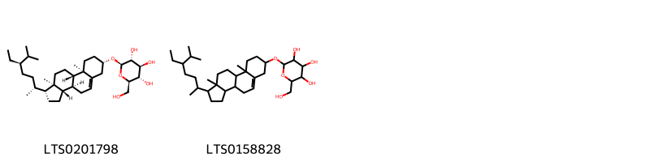{ width=100% }
    <figcaption>Hình ảnh cấu trúc hóa học của 2 hoạt chất thuộc nhóm Steroids and steroid derivatives gồm ['sitogluside (LTS0201798)', '2-{[1-(5-ethyl-6-methylheptan-2-yl)-9a,11a-dimethyl-1h,2h,3h,3ah,3bh,4h,6h,7h,8h,9h,9bh,10h,11h-cyclopenta[a]phenanthren-7-yl]oxy}-6-(hydroxymethyl)oxane-3,4,5-triol (LTS0158828)'].</figcaption>
</figure>

---

### Dược dân tộc học

Danh sách các quốc gia có sử dụng *Gentiana scabra* trong điều trị các bệnh. 

| Country   | Disease                       | Bệnh                       |
|:----------|:------------------------------|:---------------------------|
| China     | Stomachic, Apertif, Vermifuge | Dạ dày, Apertif, Vermifuge |
| Japan     | Stomachic                     | Sững sờ                    |
| Japan*    | Stomachic                     | Sững sờ                    |

---

---
## Gentiana triflora
### Thông tin về thực vật

!!! info "Phân loại thực vật của *Gentiana triflora* từ GIBF:"
    - **Kingdom:** Plantae
    - **Phylum:** Tracheophyta
    - **Order:** Gentianales
    - **Family:** Gentianaceae
    - **Genus:** Gentiana
    - **Species:** *Gentiana triflora*

 

| Label (VI)   | Label (EN)   | Scientific Name   | Descriptions (VI)   | Descriptions (EN)   | Also Known As (VI)   | Also Known As (EN)   |
|:-------------|:-------------|:------------------|:--------------------|:--------------------|:---------------------|:---------------------|
| N/A          | N/A          | Gentiana triflora | loài thực vật       | species of plant    | ['']                 | ['']                 |

#### Phân bố trên thế giới

**Từ CSDL GIBF** nan, Japan, Korea, Republic of, Russian Federation, China

#### Phân bố tại Việt Nam

**Từ CSDL GIBF**: Không có ghi nhận ở Việt Nam

---
### Thành phần hóa học
        
- Theo cơ sở dữ liệu lotus: Từ loài *Gentiana triflora* đã phân lập và xác định được 15 hoạt chất thuộc về các nhóm Flavonoids, Prenol lipids, Organooxygen compounds, Carboxylic acids and derivatives. 

|    | chemicalTaxonomyClassyfireClass   |   smiles_count |
|---:|:----------------------------------|---------------:|
|  0 | Carboxylic acids and derivatives  |              1 |
|  1 | Flavonoids                        |              1 |
|  2 | Organooxygen compounds            |              7 |
|  3 | Prenol lipids                     |              6 |

#### Nhóm Carboxylic acids and derivatives
<figure markdown="span">
    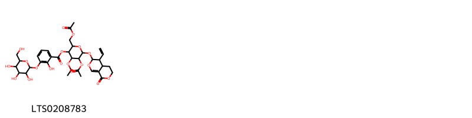{ width=100% }
    <figcaption>Hình ảnh cấu trúc hóa học của 1 hoạt chất thuộc nhóm Carboxylic acids and derivatives gồm ['4,5-bis(acetyloxy)-2-[(acetyloxy)methyl]-6-({4-ethenyl-8-oxo-3h,4h,4ah,5h,6h-pyrano[3,4-c]pyran-3-yl}oxy)oxan-3-yl 2-hydroxy-3-{[3,4,5-trihydroxy-6-(hydroxymethyl)oxan-2-yl]oxy}benzoate (LTS0208783)'].</figcaption>
</figure>
#### Nhóm Flavonoids
<figure markdown="span">
    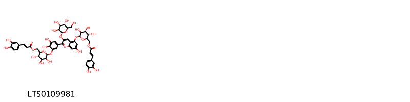{ width=100% }
    <figcaption>Hình ảnh cấu trúc hóa học của 1 hoạt chất thuộc nhóm Flavonoids gồm ['5-{[(2s,4s,5s)-6-({[3-(3,4-dihydroxyphenyl)prop-2-enoyl]oxy}methyl)-3,4,5-trihydroxyoxan-2-yl]oxy}-2-(3-{[(2s,4s,5s)-6-({[3-(3,4-dihydroxyphenyl)prop-2-enoyl]oxy}methyl)-3,4,5-trihydroxyoxan-2-yl]oxy}-4,5-dihydroxyphenyl)-7-hydroxy-3-{[(2s,5s)-3,4,5-trihydroxy-6-(hydroxymethyl)oxan-2-yl]oxy}-1λ⁴-chromen-1-ylium (LTS0109981)'].</figcaption>
</figure>
#### Nhóm Organooxygen compounds
<figure markdown="span">
    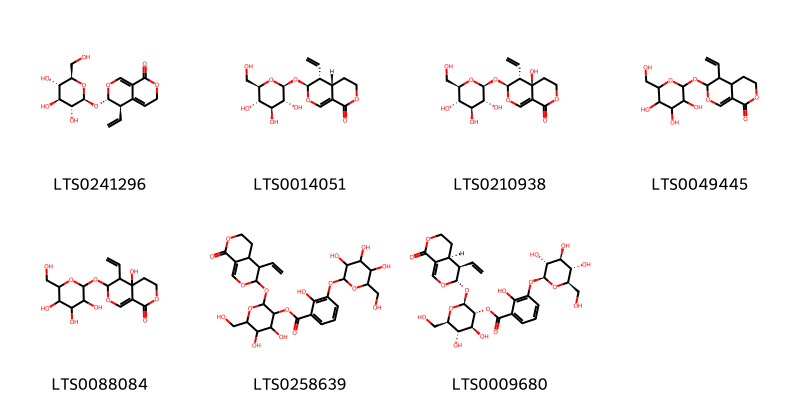{ width=100% }
    <figcaption>Hình ảnh cấu trúc hóa học của 7 hoạt chất thuộc nhóm Organooxygen compounds gồm ['gentiopicroside (LTS0241296)', 'sweroside (LTS0014051)', 'swertiamarin (LTS0210938)', '5-ethenyl-6-{[3,4,5-trihydroxy-6-(hydroxymethyl)oxan-2-yl]oxy}-3h,4h,4ah,5h,6h-pyrano[3,4-c]pyran-1-one (LTS0049445)', '5-ethenyl-4a-hydroxy-6-{[3,4,5-trihydroxy-6-(hydroxymethyl)oxan-2-yl]oxy}-3h,4h,5h,6h-pyrano[3,4-c]pyran-1-one (LTS0088084)', '2-({4-ethenyl-8-oxo-3h,4h,4ah,5h,6h-pyrano[3,4-c]pyran-3-yl}oxy)-4,5-dihydroxy-6-(hydroxymethyl)oxan-3-yl 2-hydroxy-3-{[3,4,5-trihydroxy-6-(hydroxymethyl)oxan-2-yl]oxy}benzoate (LTS0258639)', '(2s,3r,4s,5s,6r)-2-{[(3s,4r,4as)-4-ethenyl-8-oxo-3h,4h,4ah,5h,6h-pyrano[3,4-c]pyran-3-yl]oxy}-4,5-dihydroxy-6-(hydroxymethyl)oxan-3-yl 2-hydroxy-3-{[(2s,3r,4s,5s,6r)-3,4,5-trihydroxy-6-(hydroxymethyl)oxan-2-yl]oxy}benzoate (LTS0009680)'].</figcaption>
</figure>
#### Nhóm Prenol lipids
<figure markdown="span">
    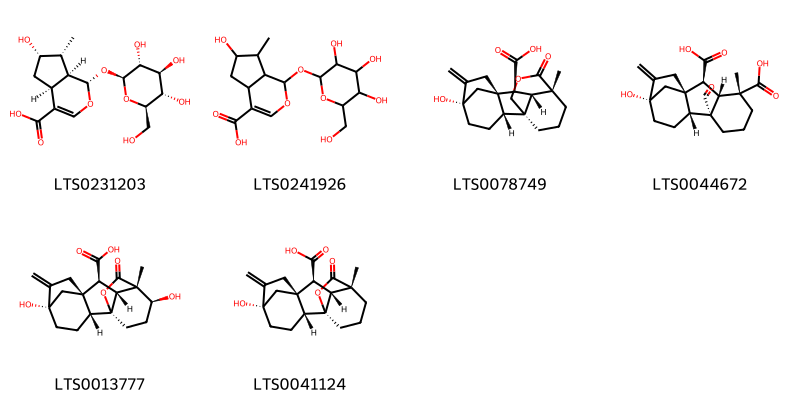{ width=100% }
    <figcaption>Hình ảnh cấu trúc hóa học của 6 hoạt chất thuộc nhóm Prenol lipids gồm ['loganic acid (LTS0231203)', '6-hydroxy-7-methyl-1-{[3,4,5-trihydroxy-6-(hydroxymethyl)oxan-2-yl]oxy}-1h,4ah,5h,6h,7h,7ah-cyclopenta[c]pyran-4-carboxylic acid (LTS0241926)', 'gibberellin a44 (LTS0078749)', 'gibberellin a19 (LTS0044672)', 'gibberellin a1 (LTS0013777)', 'gibberellin a20 (LTS0041124)'].</figcaption>
</figure>

---

### Dược dân tộc học

Danh sách các quốc gia có sử dụng *Gentiana triflora* trong điều trị các bệnh. 

| Country   | Disease   | Bệnh    |
|:----------|:----------|:--------|
| China     | Apertif   | Apertif |
| Elsewhere | Stomachic | Sững sờ |

---

---
## Gentiana villosa
### Thông tin về thực vật

!!! info "Phân loại thực vật của *Gentiana villosa* từ GIBF:"
    - **Kingdom:** Plantae
    - **Phylum:** Tracheophyta
    - **Order:** Gentianales
    - **Family:** Gentianaceae
    - **Genus:** Gentiana
    - **Species:** *Gentiana villosa*

 

| Label (VI)   | Label (EN)   | Scientific Name   | Descriptions (VI)   | Descriptions (EN)   | Also Known As (VI)   | Also Known As (EN)   |
|:-------------|:-------------|:------------------|:--------------------|:--------------------|:---------------------|:---------------------|
| N/A          | N/A          | Gentiana villosa  | loài thực vật       | species of plant    | ['']                 | ['']                 |

#### Phân bố trên thế giới

**Từ CSDL GIBF** nan, United States of America

#### Phân bố tại Việt Nam

**Từ CSDL GIBF**: Không có ghi nhận ở Việt Nam

---
### Thành phần hóa học
        
- Theo cơ sở dữ liệu lotus: Từ loài *Gentiana villosa* đã phân lập và xác định được Chưa có hoạt chất nào được phân lập. hoạt chất thuộc về các nhóm Không có hoạt chất nào được phân lập. 

Không có hình ảnh nào được tạo ra

---

### Dược dân tộc học

Danh sách các quốc gia có sử dụng *Gentiana villosa* trong điều trị các bệnh. 

| Country        | Disease   | Bệnh               |
|:---------------|:----------|:-------------------|
| US             | Nervine   | Thuốc an thần      |
| US(Appalachia) | Tonic     | (thuộc) trương lực |

---

