!!! abstract "Tóm tắt"

    Họ Geraniaceae gồm khoảng 5 chi và 20 loài được một số cộng đồng tại các quốc gia như Turkey, Africa, UK, India(Punjab), Bulgaria, South Africa, Iraq, US(Amerindian), Argentina, US(Appalachia), US(NM), Elsewhere, US, India, Lesotho, ain, Mexico, China sử dụng trong một số trường hợp Chất làm se, Máy cầm máu, Collyrium, Thuốc tràn dịch màng phổi, Chất kích thích, Thuốc bổ, Vulnerary, Chất làm se, Thuốc lợi tiểu, Máy cầm máu, Emmenagogue, Thuốc lợi tiểu, Larvicide, Phương pháp thanh lọc, Thuốc bổ, Oxytoxic, Thuốc lợi tiểu, Thuốc đắp, Chất làm se, Máy cầm máu, Styptic, Có nguồn gốc cam thảo, Thuốc lợi tiểu, Gây ngạt thở, Thuốc lợi tiểu, Vulnerary, Chống tiêu chảy, Dạ dày, Thuốc bổ, Chất làm se, Styptic, Dạ dày, Chống tiêu chảy, Chất làm se, Vulnerary, Chất làm se, Máy cầm máu, Nước hoa, Chất làm se, Chất làm se, Thuốc bổ, Styptic, Phương pháp thanh lọc, Thuốc lợi tiểu, Vulnerary, Thuốc kích thích tình dục.

!!! info "DrDuke"

    James A. Duke sinh năm 1929-2017 là một nhà thực vật học người Mỹ. Đây là một trong những tác giả hàng đầu trong lĩnh vực dược dân tộc học với cuốn *CRC Handbook of Medicinal Herbs* và chính là người xây dựng lên cơ sở dữ liệu về hợp chất tự nhiên và dược dân tộc học tại Bộ nông nghiệp Hoa Kỳ. Các thông tin được đăng tải tại website [Dr. Duke's Phytochemical and Ethnobotanical Databases](https://phytochem.nal.usda.gov/). 
    Trong suốt thập niên 1970, ông lãnh đạo the Plant Taxonomy Laboratory, Plant Genetics and Germplasm Institute of the Agricultural Research Service, U.S. Department of Agriculture.
    Trong tài liệu này, các thông tin về dược dân tộc của các dược liệu được trích dẫn từ tài liệu của James A. Ducke với sự trợ giúp của phần mềm dịch thuật từ tiếng Anh sang tiếng Việt.
   

# Chi Monsonia

??? note "Danh sách các dược liệu thuộc chi"
    
	 - *Monsonia biflora*
	 - *Monsonia brevirostrata*

---
## Monsonia biflora
### Thông tin về thực vật

!!! info "Phân loại thực vật của *Monsonia biflora* từ GIBF:"
    - **Kingdom:** Plantae
    - **Phylum:** Tracheophyta
    - **Order:** Geraniales
    - **Family:** Geraniaceae
    - **Genus:** Monsonia
    - **Species:** *Monsonia biflora*

 

| Label (VI)   | Label (EN)   | Scientific Name   | Descriptions (VI)   | Descriptions (EN)   | Also Known As (VI)   | Also Known As (EN)   |
|:-------------|:-------------|:------------------|:--------------------|:--------------------|:---------------------|:---------------------|
| N/A          | N/A          | Monsonia biflora  | loài thực vật       | species of plant    | ['']                 | ['']                 |

#### Phân bố trên thế giới

**Từ CSDL GIBF** South Africa, Netherlands, Namibia, Chad, Angola, Botswana, Lesotho, Burundi, unknown or invalid, Sweden, Tanzania, United Republic of, Kenya, Zimbabwe, Eswatini, Ethiopia

#### Phân bố tại Việt Nam

**Từ CSDL GIBF**: Không có ghi nhận ở Việt Nam

---
### Thành phần hóa học
        
- Theo cơ sở dữ liệu lotus: Từ loài *Monsonia biflora* đã phân lập và xác định được Chưa có hoạt chất nào được phân lập. hoạt chất thuộc về các nhóm Không có hoạt chất nào được phân lập. 

Không có hình ảnh nào được tạo ra

---

### Dược dân tộc học

Danh sách các quốc gia có sử dụng *Monsonia biflora* trong điều trị các bệnh. 

| Country   | Disease   | Bệnh      |
|:----------|:----------|:----------|
| Lesotho   | Collyrium | Collyrium |

---

---
## Monsonia brevirostrata
### Thông tin về thực vật

!!! info "Phân loại thực vật của *Monsonia brevirostrata* từ GIBF:"
    - **Kingdom:** Plantae
    - **Phylum:** Tracheophyta
    - **Order:** Geraniales
    - **Family:** Geraniaceae
    - **Genus:** Monsonia
    - **Species:** *Monsonia brevirostrata*

 

| Label (VI)   | Label (EN)   | Scientific Name        | Descriptions (VI)   | Descriptions (EN)   | Also Known As (VI)   | Also Known As (EN)   |
|:-------------|:-------------|:-----------------------|:--------------------|:--------------------|:---------------------|:---------------------|
| N/A          | N/A          | Monsonia brevirostrata | loài thực vật       | species of plant    | ['']                 | ['']                 |

#### Phân bố trên thế giới

**Từ CSDL GIBF** nan, South Africa, Netherlands, Belgium, Botswana, Lesotho, unknown or invalid, United Kingdom of Great Britain and Northern Ireland

#### Phân bố tại Việt Nam

**Từ CSDL GIBF**: Không có ghi nhận ở Việt Nam

---
### Thành phần hóa học
        
- Theo cơ sở dữ liệu lotus: Từ loài *Monsonia brevirostrata* đã phân lập và xác định được Chưa có hoạt chất nào được phân lập. hoạt chất thuộc về các nhóm Không có hoạt chất nào được phân lập. 

Không có hình ảnh nào được tạo ra

---

### Dược dân tộc học

Danh sách các quốc gia có sử dụng *Monsonia brevirostrata* trong điều trị các bệnh. 

| Country   | Disease   | Bệnh      |
|:----------|:----------|:----------|
| Lesotho   | Collyrium | Collyrium |

---

# Chi Pelargonium

??? note "Danh sách các dược liệu thuộc chi"
    
	 - *Pelargonium capitatum*
	 - *Pelargonium odoratissimum*
	 - *Pelargonium radula*

---
## Pelargonium capitatum
### Thông tin về thực vật

!!! info "Phân loại thực vật của *Pelargonium capitatum* từ GIBF:"
    - **Kingdom:** Plantae
    - **Phylum:** Tracheophyta
    - **Order:** Geraniales
    - **Family:** Geraniaceae
    - **Genus:** Pelargonium
    - **Species:** *Pelargonium capitatum*

 

| Label (VI)   | Label (EN)   | Scientific Name       | Descriptions (VI)   | Descriptions (EN)   | Also Known As (VI)   | Also Known As (EN)   |
|:-------------|:-------------|:----------------------|:--------------------|:--------------------|:---------------------|:---------------------|
| N/A          | N/A          | Pelargonium capitatum | loài thực vật       | species of plant    | ['']                 | ['']                 |

#### Phân bố trên thế giới

**Từ CSDL GIBF** South Africa, Australia, Spain, United States of America, New Zealand

#### Phân bố tại Việt Nam

**Từ CSDL GIBF**: Không có ghi nhận ở Việt Nam

---
### Thành phần hóa học
        
- Theo cơ sở dữ liệu lotus: Từ loài *Pelargonium capitatum* đã phân lập và xác định được Chưa có hoạt chất nào được phân lập. hoạt chất thuộc về các nhóm Không có hoạt chất nào được phân lập. 

Không có hình ảnh nào được tạo ra

---

### Dược dân tộc học

Danh sách các quốc gia có sử dụng *Pelargonium capitatum* trong điều trị các bệnh. 

| Country      | Disease   | Bệnh     |
|:-------------|:----------|:---------|
| South Africa | Perfume   | Nước hoa |

---

---
## Pelargonium odoratissimum
### Thông tin về thực vật

!!! info "Phân loại thực vật của *Pelargonium odoratissimum* từ GIBF:"
    - **Kingdom:** Plantae
    - **Phylum:** Tracheophyta
    - **Order:** Geraniales
    - **Family:** Geraniaceae
    - **Genus:** Pelargonium
    - **Species:** *Pelargonium odoratissimum*

 

| Label (VI)   | Label (EN)   | Scientific Name           | Descriptions (VI)   | Descriptions (EN)   | Also Known As (VI)   | Also Known As (EN)   |
|:-------------|:-------------|:--------------------------|:--------------------|:--------------------|:---------------------|:---------------------|
| N/A          | N/A          | Pelargonium odoratissimum |                     | species of plant    | ['']                 | ['']                 |

#### Phân bố trên thế giới

**Từ CSDL GIBF** nan, Ecuador, South Africa, Australia, Japan, Germany, Belgium, United Kingdom of Great Britain and Northern Ireland, Colombia, Brazil, Spain, unknown or invalid, India, United States of America, France, Greece, New Zealand, Chile

#### Phân bố tại Việt Nam

**Từ CSDL GIBF**: Không có ghi nhận ở Việt Nam

---
### Thành phần hóa học
        
- Theo cơ sở dữ liệu lotus: Từ loài *Pelargonium odoratissimum* đã phân lập và xác định được 1 hoạt chất thuộc về các nhóm Prenol lipids. 

|    | chemicalTaxonomyClassyfireClass   |   smiles_count |
|---:|:----------------------------------|---------------:|
|  0 | Prenol lipids                     |              1 |

#### Nhóm Prenol lipids
<figure markdown="span">
    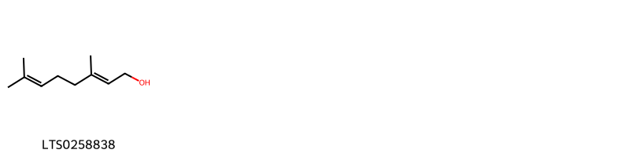{ width=100% }
    <figcaption>Hình ảnh cấu trúc hóa học của 1 hoạt chất thuộc nhóm Prenol lipids gồm ['geraniol (LTS0258838)'].</figcaption>
</figure>

---

### Dược dân tộc học

Danh sách các quốc gia có sử dụng *Pelargonium odoratissimum* trong điều trị các bệnh. 

| Country   | Disease   | Bệnh     |
|:----------|:----------|:---------|
| Africa    | Perfume   | Nước hoa |

---

---
## Pelargonium radula
### Thông tin về thực vật

!!! info "Phân loại thực vật của *Pelargonium radens* từ GIBF:"
    - **Kingdom:** Plantae
    - **Phylum:** Tracheophyta
    - **Order:** Geraniales
    - **Family:** Geraniaceae
    - **Genus:** Pelargonium
    - **Species:** *Pelargonium radens*

 

| Label (VI)   | Label (EN)   | Scientific Name    | Descriptions (VI)   | Descriptions (EN)   | Also Known As (VI)   | Also Known As (EN)   |
|:-------------|:-------------|:-------------------|:--------------------|:--------------------|:---------------------|:---------------------|
| N/A          | N/A          | Pelargonium radula | loài thực vật       | species of plant    | ['']                 | ['']                 |

#### Phân bố trên thế giới

**Từ CSDL GIBF** nan, South Africa, Netherlands, Italy, Réunion, Israel, Japan, Colombia, Brazil, Spain, Portugal, unknown or invalid, Philippines, Poland, France, Kenya, Greece, New Zealand

#### Phân bố tại Việt Nam

**Từ CSDL GIBF**: Không có ghi nhận ở Việt Nam

---
### Thành phần hóa học
        
- Theo cơ sở dữ liệu lotus: Từ loài *Pelargonium radens* đã phân lập và xác định được Chưa có hoạt chất nào được phân lập. hoạt chất thuộc về các nhóm Không có hoạt chất nào được phân lập. 

Không có hình ảnh nào được tạo ra

---

### Dược dân tộc học

Danh sách các quốc gia có sử dụng *Pelargonium radens* trong điều trị các bệnh. 

| Country      | Disease   | Bệnh     |
|:-------------|:----------|:---------|
| South Africa | Perfume   | Nước hoa |

---

# Chi Wendtia

??? note "Danh sách các dược liệu thuộc chi"
    
	 - *Wendtia calycina*

---
## Wendtia calycina
### Thông tin về thực vật

!!! info "Phân loại thực vật của *Wendtia calycina* từ GIBF:"
    - **Kingdom:** Plantae
    - **Phylum:** Tracheophyta
    - **Order:** Geraniales
    - **Family:** Vivianiaceae
    - **Genus:** Wendtia
    - **Species:** *Wendtia calycina*

 

| Label (VI)   | Label (EN)   | Scientific Name    | Descriptions (VI)   | Descriptions (EN)   | Also Known As (VI)   | Also Known As (EN)   |
|:-------------|:-------------|:-------------------|:--------------------|:--------------------|:---------------------|:---------------------|
| N/A          | N/A          | Pelargonium radula | loài thực vật       | species of plant    | ['']                 | ['']                 |

#### Phân bố trên thế giới

**Từ CSDL GIBF** nan, Chile, Argentina

#### Phân bố tại Việt Nam

**Từ CSDL GIBF**: Không có ghi nhận ở Việt Nam

---
### Thành phần hóa học
        
- Theo cơ sở dữ liệu lotus: Từ loài *Wendtia calycina* đã phân lập và xác định được Chưa có hoạt chất nào được phân lập. hoạt chất thuộc về các nhóm Không có hoạt chất nào được phân lập. 

Không có hình ảnh nào được tạo ra

---

### Dược dân tộc học

Danh sách các quốc gia có sử dụng *Wendtia calycina* trong điều trị các bệnh. 

| Country   | Disease     | Bệnh                   |
|:----------|:------------|:-----------------------|
| Argentina | Carminative | Gây ô nhiễm môi trường |

---

# Chi Erodium

??? note "Danh sách các dược liệu thuộc chi"
    
	 - *Erodium cicutarium*
	 - *Erodium moschatum*

---
## Erodium cicutarium
### Thông tin về thực vật

!!! info "Phân loại thực vật của *Erodium cicutarium* từ GIBF:"
    - **Kingdom:** Plantae
    - **Phylum:** Tracheophyta
    - **Order:** Geraniales
    - **Family:** Geraniaceae
    - **Genus:** Erodium
    - **Species:** *Erodium cicutarium*

 

| Label (VI)   | Label (EN)   | Scientific Name    | Descriptions (VI)   | Descriptions (EN)   | Also Known As (VI)   | Also Known As (EN)      |
|:-------------|:-------------|:-------------------|:--------------------|:--------------------|:---------------------|:------------------------|
| N/A          | N/A          | Erodium cicutarium | loài thực vật       | species of plant    | ['']                 | ["Common Stork's-bill"] |

#### Phân bố trên thế giới

**Từ CSDL GIBF** nan, Italy, Argentina, Israel, Canada, Ukraine, Netherlands, Spain, Bolivia (Plurinational State of), Portugal, Russian Federation, United States of America, Chile, Greece, Czechia, Germany, Peru, Mexico, France, Austria, United Kingdom of Great Britain and Northern Ireland, New Zealand

#### Phân bố tại Việt Nam

**Từ CSDL GIBF**: Không có ghi nhận ở Việt Nam

---
### Thành phần hóa học
        
- Theo cơ sở dữ liệu lotus: Từ loài *Erodium cicutarium* đã phân lập và xác định được 24 hoạt chất thuộc về các nhóm Fatty Acyls, Flavonoids, Benzene and substituted derivatives, Tannins, Phenols. 

|    | chemicalTaxonomyClassyfireClass     |   smiles_count |
|---:|:------------------------------------|---------------:|
|  0 | Benzene and substituted derivatives |              5 |
|  1 | Fatty Acyls                         |              1 |
|  2 | Flavonoids                          |              5 |
|  3 | Phenols                             |              1 |
|  4 | Tannins                             |             11 |

#### Nhóm Benzene and substituted derivatives
<figure markdown="span">
    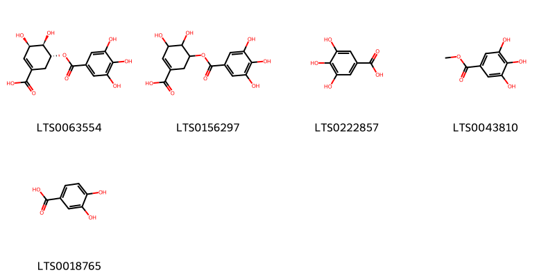{ width=100% }
    <figcaption>Hình ảnh cấu trúc hóa học của 5 hoạt chất thuộc nhóm Benzene and substituted derivatives gồm ['5-galloylshikimic acid (LTS0063554)', '3,4-dihydroxy-5-(3,4,5-trihydroxybenzoyloxy)cyclohex-1-ene-1-carboxylic acid (LTS0156297)', 'galop (LTS0222857)', 'methyl gallate (LTS0043810)', '3,4-dihydroxybenzoic acid (LTS0018765)'].</figcaption>
</figure>
#### Nhóm Fatty Acyls
<figure markdown="span">
    { width=100% }
    <figcaption>Hình ảnh cấu trúc hóa học của 1 hoạt chất thuộc nhóm Fatty Acyls gồm ['2-carboxy-d-arabinitol (LTS0056947)'].</figcaption>
</figure>
#### Nhóm Flavonoids
<figure markdown="span">
    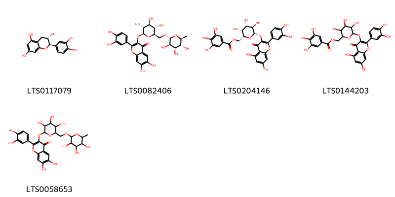{ width=100% }
    <figcaption>Hình ảnh cấu trúc hóa học của 5 hoạt chất thuộc nhóm Flavonoids gồm ['(+)-catechol (LTS0117079)', '2-(3,4-dihydroxyphenyl)-6,7-dihydroxy-3-{[(2s,3r,4s,5s,6r)-3,4,5-trihydroxy-6-({[(2r,3r,4r,5r,6s)-3,4,5-trihydroxy-6-methyloxan-2-yl]oxy}methyl)oxan-2-yl]oxy}chromen-4-one (LTS0082406)', '[(2r,3r,4s,5r,6s)-6-{[2-(3,4-dihydroxyphenyl)-5,7-dihydroxy-4-oxochromen-3-yl]oxy}-3,4,5-trihydroxyoxan-2-yl]methyl 3,4,5-trihydroxybenzoate (LTS0204146)', '(6-{[2-(3,4-dihydroxyphenyl)-5,7-dihydroxy-4-oxochromen-3-yl]oxy}-3,4,5-trihydroxyoxan-2-yl)methyl 3,4,5-trihydroxybenzoate (LTS0144203)', '2-(3,4-dihydroxyphenyl)-6,7-dihydroxy-3-[(3,4,5-trihydroxy-6-{[(3,4,5-trihydroxy-6-methyloxan-2-yl)oxy]methyl}oxan-2-yl)oxy]chromen-4-one (LTS0058653)'].</figcaption>
</figure>
#### Nhóm Phenols
<figure markdown="span">
    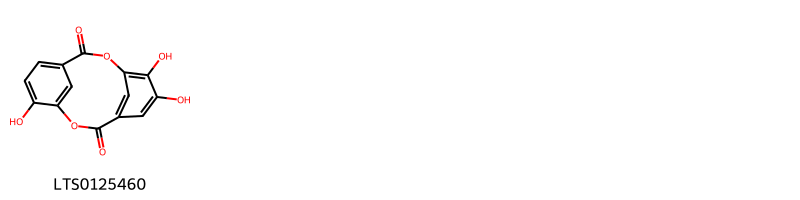{ width=100% }
    <figcaption>Hình ảnh cấu trúc hóa học của 1 hoạt chất thuộc nhóm Phenols gồm ['6,7,14-trihydroxy-2,9-dioxatricyclo[9.3.1.1⁴,⁸]hexadeca-1(14),4(16),5,7,11(15),12-hexaene-3,10-dione (LTS0125460)'].</figcaption>
</figure>
#### Nhóm Tannins
<figure markdown="span">
    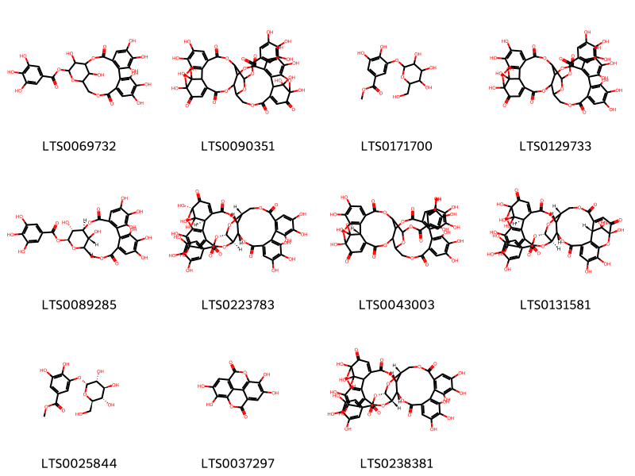{ width=100% }
    <figcaption>Hình ảnh cấu trúc hóa học của 11 hoạt chất thuộc nhóm Tannins gồm ['6,7,8,11,12,13,22,23-octahydroxy-3,16-dioxo-2,17,20-trioxatetracyclo[17.3.1.0⁴,⁹.0¹⁰,¹⁵]tricosa-4(9),5,7,10,12,14-hexaen-21-yl 3,4,5-trihydroxybenzoate (LTS0069732)', '1,13,14,18,18,19,34,35,39,39-decahydroxy-2,5,10,20,23,31-hexaoxo-6,9,24,27,30,40,41-heptaoxanonacyclo[34.3.1.1¹⁵,¹⁹.0⁴,³⁸.0⁷,²⁶.0⁸,²⁹.0¹¹,¹⁶.0¹⁷,²².0³²,³⁷]hentetraconta-3,11(16),12,14,21,32,34,36-octaen-28-yl 3,4,5-trihydroxybenzoate (LTS0090351)', 'methyl 3,4-dihydroxy-5-{[3,4,5-trihydroxy-6-(hydroxymethyl)oxan-2-yl]oxy}benzoate (LTS0171700)', '1,13,14,15,18,19,20,34,35,39,39-undecahydroxy-2,5,10,23,31-pentaoxo-6,9,24,27,30,40-hexaoxaoctacyclo[34.3.1.0⁴,³⁸.0⁷,²⁶.0⁸,²⁹.0¹¹,¹⁶.0¹⁷,²².0³²,³⁷]tetraconta-3,11(16),12,14,17,19,21,32,34,36-decaen-28-yl 3,4,5-trihydroxybenzoate (LTS0129733)', '(1s,19r,21s,22r,23r)-6,7,8,11,12,13,22,23-octahydroxy-3,16-dioxo-2,17,20-trioxatetracyclo[17.3.1.0⁴,⁹.0¹⁰,¹⁵]tricosa-4(9),5,7,10,12,14-hexaen-21-yl 3,4,5-trihydroxybenzoate (LTS0089285)', '(1r,7r,8s,26r,28s,29r,38r)-1,13,14,15,18,19,20,34,35,39,39-undecahydroxy-2,5,10,23,31-pentaoxo-6,9,24,27,30,40-hexaoxaoctacyclo[34.3.1.0⁴,³⁸.0⁷,²⁶.0⁸,²⁹.0¹¹,¹⁶.0¹⁷,²².0³²,³⁷]tetraconta-3,11,13,15,17(22),18,20,32,34,36-decaen-28-yl 3,4,5-trihydroxybenzoate (LTS0223783)', '(1r,38r)-1,13,14,15,18,19,20,34,35,39,39-undecahydroxy-2,5,10,23,31-pentaoxo-6,9,24,27,30,40-hexaoxaoctacyclo[34.3.1.0⁴,³⁸.0⁷,²⁶.0⁸,²⁹.0¹¹,¹⁶.0¹⁷,²².0³²,³⁷]tetraconta-3,11(16),12,14,17,19,21,32,34,36-decaen-28-yl 3,4,5-trihydroxybenzoate (LTS0043003)', '(7r,8s,17r,19r,26r,28s,29r,38r)-1,13,14,18,18,19,34,35,39,39-decahydroxy-2,5,10,20,23,31-hexaoxo-6,9,24,27,30,40,41-heptaoxanonacyclo[34.3.1.1¹⁵,¹⁹.0⁴,³⁸.0⁷,²⁶.0⁸,²⁹.0¹¹,¹⁶.0¹⁷,²².0³²,³⁷]hentetraconta-3,11,13,15,21,32,34,36-octaen-28-yl 3,4,5-trihydroxybenzoate (LTS0131581)', 'methyl 3,4-dihydroxy-5-{[(2r,3r,4s,5s,6r)-3,4,5-trihydroxy-6-(hydroxymethyl)oxan-2-yl]oxy}benzoate (LTS0025844)', 'ellagic acid (LTS0037297)', '(7r,8s,26r,28s,29s)-1,13,14,15,18,19,20,34,35,39,39-undecahydroxy-2,5,10,23,31-pentaoxo-6,9,24,27,30,40-hexaoxaoctacyclo[34.3.1.0⁴,³⁸.0⁷,²⁶.0⁸,²⁹.0¹¹,¹⁶.0¹⁷,²².0³²,³⁷]tetraconta-3,11,13,15,17(22),18,20,32,34,36-decaen-28-yl 3,4,5-trihydroxybenzoate (LTS0238381)'].</figcaption>
</figure>

---

### Dược dân tộc học

Danh sách các quốc gia có sử dụng *Erodium cicutarium* trong điều trị các bệnh. 

| Country   | Disease             | Bệnh                            |
|:----------|:--------------------|:--------------------------------|
| Elsewhere | Oxytoxic            | Oxytoxic                        |
| Iraq      | Hemostat            | Máy cầm máu                     |
| Turkey    | Hemostat            | Máy cầm máu                     |
| US        | Diuretic, Sudorific | Thuốc lợi tiểu, gây ngạt mồ hôi |
| US(NM)    | Emmenagogue         | Emmenagogue                     |
| ain       | Hemostat            | Máy cầm máu                     |

---

---
## Erodium moschatum
### Thông tin về thực vật

!!! info "Phân loại thực vật của *Erodium moschatum* từ GIBF:"
    - **Kingdom:** Plantae
    - **Phylum:** Tracheophyta
    - **Order:** Geraniales
    - **Family:** Geraniaceae
    - **Genus:** Erodium
    - **Species:** *Erodium moschatum*

 

| Label (VI)   | Label (EN)   | Scientific Name   | Descriptions (VI)   | Descriptions (EN)   | Also Known As (VI)   | Also Known As (EN)   |
|:-------------|:-------------|:------------------|:--------------------|:--------------------|:---------------------|:---------------------|
| N/A          | N/A          | Erodium moschatum | loài thực vật       | species of plant    | ['']                 | ['']                 |

#### Phân bố trên thế giới

**Từ CSDL GIBF** nan, Israel, South Africa, Italy, Netherlands, Australia, New Zealand, Spain, Türkiye, Portugal, Switzerland, United States of America, Mexico, France, Greece, United Kingdom of Great Britain and Northern Ireland

#### Phân bố tại Việt Nam

**Từ CSDL GIBF**: Không có ghi nhận ở Việt Nam

---
### Thành phần hóa học
        
- Theo cơ sở dữ liệu lotus: Từ loài *Erodium moschatum* đã phân lập và xác định được 10 hoạt chất thuộc về các nhóm Cinnamic acids and derivatives, Flavonoids, Tannins, Benzene and substituted derivatives. 

|    | chemicalTaxonomyClassyfireClass     |   smiles_count |
|---:|:------------------------------------|---------------:|
|  0 | Benzene and substituted derivatives |              3 |
|  1 | Cinnamic acids and derivatives      |              1 |
|  2 | Flavonoids                          |              2 |
|  3 | Tannins                             |              4 |

#### Nhóm Benzene and substituted derivatives
<figure markdown="span">
    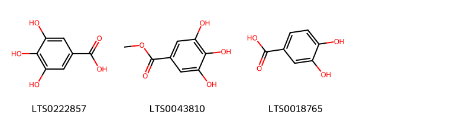{ width=100% }
    <figcaption>Hình ảnh cấu trúc hóa học của 3 hoạt chất thuộc nhóm Benzene and substituted derivatives gồm ['galop (LTS0222857)', 'methyl gallate (LTS0043810)', '3,4-dihydroxybenzoic acid (LTS0018765)'].</figcaption>
</figure>
#### Nhóm Cinnamic acids and derivatives
<figure markdown="span">
    { width=100% }
    <figcaption>Hình ảnh cấu trúc hóa học của 1 hoạt chất thuộc nhóm Cinnamic acids and derivatives gồm ['3,4-dihydroxycinnamic acid (LTS0128050)'].</figcaption>
</figure>
#### Nhóm Flavonoids
<figure markdown="span">
    { width=100% }
    <figcaption>Hình ảnh cấu trúc hóa học của 2 hoạt chất thuộc nhóm Flavonoids gồm ['kaempherol (LTS0155822)', 'quercetin (LTS0004651)'].</figcaption>
</figure>
#### Nhóm Tannins
<figure markdown="span">
    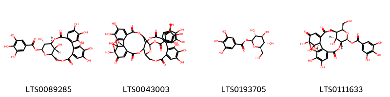{ width=100% }
    <figcaption>Hình ảnh cấu trúc hóa học của 4 hoạt chất thuộc nhóm Tannins gồm ['(1s,19r,21s,22r,23r)-6,7,8,11,12,13,22,23-octahydroxy-3,16-dioxo-2,17,20-trioxatetracyclo[17.3.1.0⁴,⁹.0¹⁰,¹⁵]tricosa-4(9),5,7,10,12,14-hexaen-21-yl 3,4,5-trihydroxybenzoate (LTS0089285)', '(1r,38r)-1,13,14,15,18,19,20,34,35,39,39-undecahydroxy-2,5,10,23,31-pentaoxo-6,9,24,27,30,40-hexaoxaoctacyclo[34.3.1.0⁴,³⁸.0⁷,²⁶.0⁸,²⁹.0¹¹,¹⁶.0¹⁷,²².0³²,³⁷]tetraconta-3,11(16),12,14,17,19,21,32,34,36-decaen-28-yl 3,4,5-trihydroxybenzoate (LTS0043003)', 'β-glucogallin (LTS0193705)', '(1s,7s,9r,18r,19s,21r,22s)-7,8,8,12,13,22-hexahydroxy-21-(hydroxymethyl)-3,6,16-trioxo-2,17,20,23-tetraoxapentacyclo[16.3.1.1⁷,¹¹.0⁴,⁹.0¹⁰,¹⁵]tricosa-4,10,12,14-tetraen-19-yl 3,4,5-trihydroxybenzoate (LTS0111633)'].</figcaption>
</figure>

---

### Dược dân tộc học

Danh sách các quốc gia có sử dụng *Erodium moschatum* trong điều trị các bệnh. 

| Country   | Disease                | Bệnh                             |
|:----------|:-----------------------|:---------------------------------|
| Africa    | Diaphoretic, Stimulant | Thuốc lợi tiểu, thuốc kích thích |

---

# Chi Geranium

??? note "Danh sách các dược liệu thuộc chi"
    
	 - *Geranium carolinianum*
	 - *Geranium columbinum*
	 - *Geranium hernandezii*
	 - *Geranium krameri*
	 - *Geranium lucidum*
	 - *Geranium macrorrhizum*
	 - *Geranium maculatum*
	 - *Geranium mexicanum*
	 - *Geranium nepalense*
	 - *Geranium nepelense?*
	 - *Geranium robertianum*
	 - *Geranium sanguineum*

---
## Geranium carolinianum
### Thông tin về thực vật

!!! info "Phân loại thực vật của *Geranium carolinianum* từ GIBF:"
    - **Kingdom:** Plantae
    - **Phylum:** Tracheophyta
    - **Order:** Geraniales
    - **Family:** Geraniaceae
    - **Genus:** Geranium
    - **Species:** *Geranium carolinianum*

 

| Label (VI)   | Label (EN)   | Scientific Name       | Descriptions (VI)   | Descriptions (EN)   | Also Known As (VI)   | Also Known As (EN)                             |
|:-------------|:-------------|:----------------------|:--------------------|:--------------------|:---------------------|:-----------------------------------------------|
| N/A          | N/A          | Geranium carolinianum | loài thực vật       | species of plant    | ['']                 | ["Carolina crane's-bill", 'Carolina geranium'] |

#### Phân bố trên thế giới

**Từ CSDL GIBF** China, Chinese Taipei, United States of America, Japan

#### Phân bố tại Việt Nam

**Từ CSDL GIBF**: Không có ghi nhận ở Việt Nam

---
### Thành phần hóa học
        
- Theo cơ sở dữ liệu lotus: Từ loài *Geranium carolinianum* đã phân lập và xác định được 10 hoạt chất thuộc về các nhóm Flavonoids, Tannins. 

|    | chemicalTaxonomyClassyfireClass   |   smiles_count |
|---:|:----------------------------------|---------------:|
|  0 | Flavonoids                        |              7 |
|  1 | Tannins                           |              3 |

#### Nhóm Flavonoids
<figure markdown="span">
    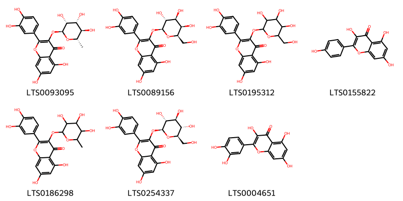{ width=100% }
    <figcaption>Hình ảnh cấu trúc hóa học của 7 hoạt chất thuộc nhóm Flavonoids gồm ['quercitrin (LTS0093095)', 'hyperoside (LTS0089156)', '2-(3,4-dihydroxyphenyl)-5,7-dihydroxy-3-{[3,4,5-trihydroxy-6-(hydroxymethyl)oxan-2-yl]oxy}chromen-4-one (LTS0195312)', 'kaempherol (LTS0155822)', 'quercitrin (LTS0186298)', 'isoquercetin (LTS0254337)', 'quercetin (LTS0004651)'].</figcaption>
</figure>
#### Nhóm Tannins
<figure markdown="span">
    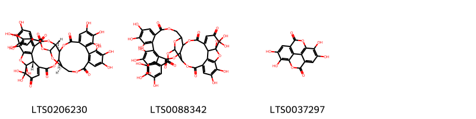{ width=100% }
    <figcaption>Hình ảnh cấu trúc hóa học của 3 hoạt chất thuộc nhóm Tannins gồm ['(1r,8r,9s,27r,29s,30r,39r)-1,2,2,14,15,16,19,20,21,35,36-undecahydroxy-3,6,11,24,32-pentaoxo-7,10,25,28,31,40-hexaoxaoctacyclo[35.2.1.0⁵,³⁹.0⁸,²⁷.0⁹,³⁰.0¹²,¹⁷.0¹⁸,²³.0³³,³⁸]tetraconta-4,12,14,16,18(23),19,21,33,35,37-decaen-29-yl 3,4,5-trihydroxybenzoate (LTS0206230)', '1,2,2,14,15,16,19,20,21,35,36-undecahydroxy-3,6,11,24,32-pentaoxo-7,10,25,28,31,40-hexaoxaoctacyclo[35.2.1.0⁵,³⁹.0⁸,²⁷.0⁹,³⁰.0¹²,¹⁷.0¹⁸,²³.0³³,³⁸]tetraconta-4,12(17),13,15,18,20,22,33,35,37-decaen-29-yl 3,4,5-trihydroxybenzoate (LTS0088342)', 'ellagic acid (LTS0037297)'].</figcaption>
</figure>

---

### Dược dân tộc học

Danh sách các quốc gia có sử dụng *Geranium carolinianum* trong điều trị các bệnh. 

| Country   | Disease                  | Bệnh                    |
|:----------|:-------------------------|:------------------------|
| Elsewhere | Antidiarrheic, Stomachic | Chống tiêu chảy, Dạ dày |

---

---
## Geranium columbinum
### Thông tin về thực vật

!!! info "Phân loại thực vật của *Geranium columbinum* từ GIBF:"
    - **Kingdom:** Plantae
    - **Phylum:** Tracheophyta
    - **Order:** Geraniales
    - **Family:** Geraniaceae
    - **Genus:** Geranium
    - **Species:** *Geranium columbinum*

 

| Label (VI)   | Label (EN)   | Scientific Name     | Descriptions (VI)   | Descriptions (EN)   | Also Known As (VI)   | Also Known As (EN)   |
|:-------------|:-------------|:--------------------|:--------------------|:--------------------|:---------------------|:---------------------|
| N/A          | N/A          | Geranium columbinum | loài thực vật       | species of plant    | ['']                 | ['']                 |

#### Phân bố trên thế giới

**Từ CSDL GIBF** Italy, Slovakia, Belgium, Georgia, Norway, Ukraine, Denmark, Netherlands, Luxembourg, Spain, Hungary, Portugal, Liechtenstein, Russian Federation, Sweden, Slovenia, Croatia, Greece, Czechia, Germany, Romania, Switzerland, Austria, France, United Kingdom of Great Britain and Northern Ireland, Ireland

#### Phân bố tại Việt Nam

**Từ CSDL GIBF**: Không có ghi nhận ở Việt Nam

---
### Thành phần hóa học
        
- Theo cơ sở dữ liệu lotus: Từ loài *Geranium columbinum* đã phân lập và xác định được Chưa có hoạt chất nào được phân lập. hoạt chất thuộc về các nhóm Không có hoạt chất nào được phân lập. 

Không có hình ảnh nào được tạo ra

---

### Dược dân tộc học

Danh sách các quốc gia có sử dụng *Geranium columbinum* trong điều trị các bệnh. 

| Country   | Disease   | Bệnh           |
|:----------|:----------|:---------------|
| ain       | Diuretic  | Thuốc lợi tiêu |

---

---
## Geranium hernandezii
### Thông tin về thực vật

!!! info "Phân loại thực vật của *Geranium hernandesii* từ GIBF:"
    - **Kingdom:** Plantae
    - **Phylum:** Tracheophyta
    - **Order:** Geraniales
    - **Family:** Geraniaceae
    - **Genus:** Geranium
    - **Species:** *Geranium hernandesii*

 

| Label (VI)   | Label (EN)   | Scientific Name     | Descriptions (VI)   | Descriptions (EN)   | Also Known As (VI)   | Also Known As (EN)   |
|:-------------|:-------------|:--------------------|:--------------------|:--------------------|:---------------------|:---------------------|
| N/A          | N/A          | Geranium columbinum | loài thực vật       | species of plant    | ['']                 | ['']                 |

#### Phân bố trên thế giới

**Từ CSDL GIBF** nan, Colombia, Mexico

#### Phân bố tại Việt Nam

**Từ CSDL GIBF**: Không có ghi nhận ở Việt Nam

---
### Thành phần hóa học
        
- Theo cơ sở dữ liệu lotus: Từ loài *Geranium hernandesii* đã phân lập và xác định được Chưa có hoạt chất nào được phân lập. hoạt chất thuộc về các nhóm Không có hoạt chất nào được phân lập. 

Không có hình ảnh nào được tạo ra

---

### Dược dân tộc học

Danh sách các quốc gia có sử dụng *Geranium hernandesii* trong điều trị các bệnh. 

| Country   | Disease             | Bệnh                 |
|:----------|:--------------------|:---------------------|
| Mexico    | Purgative, Diuretic | Luyện thẩm, lợi tiểu |

---

---
## Geranium krameri
### Thông tin về thực vật

!!! info "Phân loại thực vật của *Geranium krameri* từ GIBF:"
    - **Kingdom:** Plantae
    - **Phylum:** Tracheophyta
    - **Order:** Geraniales
    - **Family:** Geraniaceae
    - **Genus:** Geranium
    - **Species:** *Geranium krameri*

 

| Label (VI)   | Label (EN)   | Scientific Name   | Descriptions (VI)   | Descriptions (EN)   | Also Known As (VI)   | Also Known As (EN)   |
|:-------------|:-------------|:------------------|:--------------------|:--------------------|:---------------------|:---------------------|
| N/A          | N/A          | Geranium krameri  | loài thực vật       | species of plant    | ['']                 | ['']                 |

#### Phân bố trên thế giới

**Từ CSDL GIBF** nan, Japan, Korea, Republic of, Korea (Democratic People’s Republic of), Russian Federation, China

#### Phân bố tại Việt Nam

**Từ CSDL GIBF**: Không có ghi nhận ở Việt Nam

---
### Thành phần hóa học
        
- Theo cơ sở dữ liệu lotus: Từ loài *Geranium krameri* đã phân lập và xác định được Chưa có hoạt chất nào được phân lập. hoạt chất thuộc về các nhóm Không có hoạt chất nào được phân lập. 

Không có hình ảnh nào được tạo ra

---

### Dược dân tộc học

Danh sách các quốc gia có sử dụng *Geranium krameri* trong điều trị các bệnh. 

| Country   | Disease                  | Bệnh                    |
|:----------|:-------------------------|:------------------------|
| Elsewhere | Stomachic, Antidiarrheic | Dạ dày, Chống tiêu chảy |

---

---
## Geranium lucidum
### Thông tin về thực vật

!!! info "Phân loại thực vật của *Geranium lucidum* từ GIBF:"
    - **Kingdom:** Plantae
    - **Phylum:** Tracheophyta
    - **Order:** Geraniales
    - **Family:** Geraniaceae
    - **Genus:** Geranium
    - **Species:** *Geranium lucidum*

 

| Label (VI)   | Label (EN)   | Scientific Name   | Descriptions (VI)   | Descriptions (EN)   | Also Known As (VI)   | Also Known As (EN)   |
|:-------------|:-------------|:------------------|:--------------------|:--------------------|:---------------------|:---------------------|
| N/A          | N/A          | Geranium lucidum  | loài thực vật       | species of plant    | ['']                 | ['']                 |

#### Phân bố trên thế giới

**Từ CSDL GIBF** Ukraine, Netherlands, Belgium, Spain, Hungary, Portugal, Algeria, Albania, Switzerland, United States of America, India, Russian Federation, France, Greece, United Kingdom of Great Britain and Northern Ireland, Canada

#### Phân bố tại Việt Nam

**Từ CSDL GIBF**: Không có ghi nhận ở Việt Nam

---
### Thành phần hóa học
        
- Theo cơ sở dữ liệu lotus: Từ loài *Geranium lucidum* đã phân lập và xác định được Chưa có hoạt chất nào được phân lập. hoạt chất thuộc về các nhóm Không có hoạt chất nào được phân lập. 

Không có hình ảnh nào được tạo ra

---

### Dược dân tộc học

Danh sách các quốc gia có sử dụng *Geranium lucidum* trong điều trị các bệnh. 

| Country   | Disease             | Bệnh                       |
|:----------|:--------------------|:---------------------------|
| India     | Diuretic, Vulnerary | Lợi tiểu, dễ bị tổn thương |

---

---
## Geranium macrorrhizum
### Thông tin về thực vật

!!! info "Phân loại thực vật của *Geranium macrorrhizum* từ GIBF:"
    - **Kingdom:** Plantae
    - **Phylum:** Tracheophyta
    - **Order:** Geraniales
    - **Family:** Geraniaceae
    - **Genus:** Geranium
    - **Species:** *Geranium macrorrhizum*

 

| Label (VI)   | Label (EN)   | Scientific Name       | Descriptions (VI)   | Descriptions (EN)   | Also Known As (VI)   | Also Known As (EN)               |
|:-------------|:-------------|:----------------------|:--------------------|:--------------------|:---------------------|:---------------------------------|
| N/A          | N/A          | Geranium macrorrhizum | loài thực vật       | species of plant    | ['']                 | ['cranesbill', 'hardy geranium'] |

#### Phân bố trên thế giới

**Từ CSDL GIBF** Ukraine, Denmark, Netherlands, Italy, Czechia, Germany, Belgium, Poland, Hungary, Switzerland, United States of America, Sweden, Austria, France, Croatia, United Kingdom of Great Britain and Northern Ireland, Canada

#### Phân bố tại Việt Nam

**Từ CSDL GIBF**: Không có ghi nhận ở Việt Nam

---
### Thành phần hóa học
        
- Theo cơ sở dữ liệu lotus: Từ loài *Geranium macrorrhizum* đã phân lập và xác định được 5 hoạt chất thuộc về các nhóm Prenol lipids. 

|    | chemicalTaxonomyClassyfireClass   |   smiles_count |
|---:|:----------------------------------|---------------:|
|  0 | Prenol lipids                     |              5 |

#### Nhóm Prenol lipids
<figure markdown="span">
    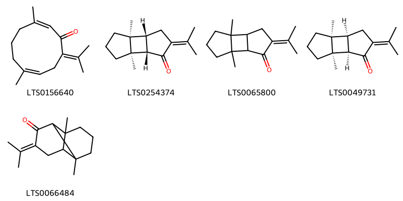{ width=100% }
    <figcaption>Hình ảnh cấu trúc hóa học của 5 hoạt chất thuộc nhóm Prenol lipids gồm ['(2z,7z)-3,7-dimethyl-10-(propan-2-ylidene)cyclodeca-2,7-dien-1-one (LTS0156640)', '(1r,2s,6r,7s)-1,7-dimethyl-4-(propan-2-ylidene)tricyclo[5.3.0.0²,⁶]decan-3-one (LTS0254374)', '1,7-dimethyl-4-(propan-2-ylidene)tricyclo[5.3.0.0²,⁶]decan-3-one (LTS0065800)', '(1r,2r,6s,7s)-1,7-dimethyl-4-(propan-2-ylidene)tricyclo[5.3.0.0²,⁶]decan-3-one (LTS0049731)', '1,7-dimethyl-4-(propan-2-ylidene)tricyclo[4.4.0.0²,⁷]decan-3-one (LTS0066484)'].</figcaption>
</figure>

---

### Dược dân tộc học

Danh sách các quốc gia có sử dụng *Geranium macrorrhizum* trong điều trị các bệnh. 

| Country   | Disease     | Bệnh           |
|:----------|:------------|:---------------|
| Bulgaria  | Aphrodisiac | Thuốc kích dục |

---

---
## Geranium maculatum
### Thông tin về thực vật

!!! info "Phân loại thực vật của *Geranium maculatum* từ GIBF:"
    - **Kingdom:** Plantae
    - **Phylum:** Tracheophyta
    - **Order:** Geraniales
    - **Family:** Geraniaceae
    - **Genus:** Geranium
    - **Species:** *Geranium maculatum*

 

| Label (VI)   | Label (EN)   | Scientific Name    | Descriptions (VI)   | Descriptions (EN)   | Also Known As (VI)   | Also Known As (EN)                                     |
|:-------------|:-------------|:-------------------|:--------------------|:--------------------|:---------------------|:-------------------------------------------------------|
| N/A          | N/A          | Geranium maculatum | loài thực vật       | species of plant    | ['']                 | ['spotted geranium', 'wild geranium', 'wood geranium'] |

#### Phân bố trên thế giới

**Từ CSDL GIBF** United States of America

#### Phân bố tại Việt Nam

**Từ CSDL GIBF**: Không có ghi nhận ở Việt Nam

---
### Thành phần hóa học
        
- Theo cơ sở dữ liệu lotus: Từ loài *Geranium maculatum* đã phân lập và xác định được Chưa có hoạt chất nào được phân lập. hoạt chất thuộc về các nhóm Không có hoạt chất nào được phân lập. 

Không có hình ảnh nào được tạo ra

---

### Dược dân tộc học

Danh sách các quốc gia có sử dụng *Geranium maculatum* trong điều trị các bệnh. 

| Country        | Disease                    | Bệnh                        |
|:---------------|:---------------------------|:----------------------------|
| Elsewhere      | Tonic, Astringent, Styptic | Thuốc bổ, làm se, Styptic   |
| Turkey         | Astringent, Tonic, Styptic | Chất làm se, Tonic, Styptic |
| UK             | Vulnerary                  | Vulnerary                   |
| US             | Diuretic, Poultice         | Thuốc lợi tiểu, thuốc đắp   |
| US(Amerindian) | Astringent, Hemostat       | Chất làm se, Hemostat       |
| US(Appalachia) | Astringent                 | Lam se da                   |

---

---
## Geranium mexicanum
### Thông tin về thực vật

!!! info "Phân loại thực vật của *Geranium mexicanum* từ GIBF:"
    - **Kingdom:** Plantae
    - **Phylum:** Tracheophyta
    - **Order:** Geraniales
    - **Family:** Geraniaceae
    - **Genus:** Geranium
    - **Species:** *Geranium mexicanum*

 

| Label (VI)   | Label (EN)   | Scientific Name    | Descriptions (VI)   | Descriptions (EN)   | Also Known As (VI)   | Also Known As (EN)   |
|:-------------|:-------------|:-------------------|:--------------------|:--------------------|:---------------------|:---------------------|
| N/A          | N/A          | Geranium mexicanum |                     | species of plant    | ['']                 | ['']                 |

#### Phân bố trên thế giới

**Từ CSDL GIBF** nan, Ecuador, Colombia, Guatemala, Bolivia (Plurinational State of), Costa Rica, unknown or invalid, Peru, Mexico, Panama

#### Phân bố tại Việt Nam

**Từ CSDL GIBF**: Không có ghi nhận ở Việt Nam

---
### Thành phần hóa học
        
- Theo cơ sở dữ liệu lotus: Từ loài *Geranium mexicanum* đã phân lập và xác định được Chưa có hoạt chất nào được phân lập. hoạt chất thuộc về các nhóm Không có hoạt chất nào được phân lập. 

Không có hình ảnh nào được tạo ra

---

### Dược dân tộc học

Danh sách các quốc gia có sử dụng *Geranium mexicanum* trong điều trị các bệnh. 

| Country   | Disease          | Bệnh                 |
|:----------|:-----------------|:---------------------|
| Mexico    | Purgative, Tonic | Luyện ngục, Thuốc bổ |

---

---
## Geranium nepalense
### Thông tin về thực vật

!!! info "Phân loại thực vật của *Geranium nepalense* từ GIBF:"
    - **Kingdom:** Plantae
    - **Phylum:** Tracheophyta
    - **Order:** Geraniales
    - **Family:** Geraniaceae
    - **Genus:** Geranium
    - **Species:** *Geranium nepalense*

 

| Label (VI)   | Label (EN)   | Scientific Name    | Descriptions (VI)   | Descriptions (EN)   | Also Known As (VI)   | Also Known As (EN)                          |
|:-------------|:-------------|:-------------------|:--------------------|:--------------------|:---------------------|:--------------------------------------------|
| N/A          | N/A          | Geranium nepalense | loài thực vật       | species of plant    | ['']                 | ['Nepal Geranium', "Nepalese crane's bill"] |

#### Phân bố trên thế giới

**Từ CSDL GIBF** nan, Pakistan, Sri Lanka, Japan, Korea, Republic of, Chinese Taipei, Myanmar, Brazil, Bhutan, India, Mexico, Viet Nam, China, Nepal

#### Phân bố tại Việt Nam

**Từ CSDL GIBF**: Lào Cai

---
### Thành phần hóa học
        
- Theo cơ sở dữ liệu lotus: Từ loài *Geranium nepalense* đã phân lập và xác định được 2 hoạt chất thuộc về các nhóm Furanoid lignans. 

|    | chemicalTaxonomyClassyfireClass   |   smiles_count |
|---:|:----------------------------------|---------------:|
|  0 | Furanoid lignans                  |              2 |

#### Nhóm Furanoid lignans
<figure markdown="span">
    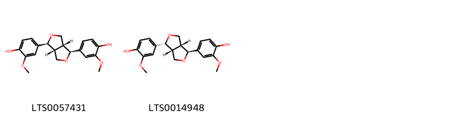{ width=100% }
    <figcaption>Hình ảnh cấu trúc hóa học của 2 hoạt chất thuộc nhóm Furanoid lignans gồm ['pinoresinol (LTS0057431)', '4-[(1s,3ar,4r,6ar)-4-(4-hydroxy-3-methoxyphenyl)-hexahydrofuro[3,4-c]furan-1-yl]-2-methoxyphenol (LTS0014948)'].</figcaption>
</figure>

---

### Dược dân tộc học

Danh sách các quốc gia có sử dụng *Geranium nepalense* trong điều trị các bệnh. 

| Country       | Disease    | Bệnh      |
|:--------------|:-----------|:----------|
| India(Punjab) | Astringent | Lam se da |

---

---
## Geranium nepelense
### Thông tin về thực vật

!!! info "Phân loại thực vật của *Geranium nepalense* từ GIBF:"
    - **Kingdom:** Plantae
    - **Phylum:** Tracheophyta
    - **Order:** Geraniales
    - **Family:** Geraniaceae
    - **Genus:** Geranium
    - **Species:** *Geranium nepalense*

 

| Label (VI)   | Label (EN)   | Scientific Name    | Descriptions (VI)   | Descriptions (EN)   | Also Known As (VI)   | Also Known As (EN)                          |
|:-------------|:-------------|:-------------------|:--------------------|:--------------------|:---------------------|:--------------------------------------------|
| N/A          | N/A          | Geranium nepalense | loài thực vật       | species of plant    | ['']                 | ['Nepal Geranium', "Nepalese crane's bill"] |

#### Phân bố trên thế giới

**Từ CSDL GIBF** nan, Pakistan, Sri Lanka, Japan, Korea, Republic of, Chinese Taipei, Myanmar, Brazil, Bhutan, India, Mexico, Viet Nam, China, Nepal

#### Phân bố tại Việt Nam

**Từ CSDL GIBF**: Lào Cai

---
### Thành phần hóa học
        
- Theo cơ sở dữ liệu lotus: Từ loài *Geranium nepalense* đã phân lập và xác định được Chưa có hoạt chất nào được phân lập. hoạt chất thuộc về các nhóm Không có hoạt chất nào được phân lập. 

Không có hình ảnh nào được tạo ra

---

### Dược dân tộc học

Danh sách các quốc gia có sử dụng *Geranium nepalense* trong điều trị các bệnh. 

| Country   | Disease   | Bệnh           |
|:----------|:----------|:---------------|
| China     | Larvicide | Diệt côn trùng |

---

---
## Geranium robertianum
### Thông tin về thực vật

!!! info "Phân loại thực vật của *Geranium robertianum* từ GIBF:"
    - **Kingdom:** Plantae
    - **Phylum:** Tracheophyta
    - **Order:** Geraniales
    - **Family:** Geraniaceae
    - **Genus:** Geranium
    - **Species:** *Geranium robertianum*

 

| Label (VI)   | Label (EN)   | Scientific Name      | Descriptions (VI)   | Descriptions (EN)   | Also Known As (VI)   | Also Known As (EN)                                                                   |
|:-------------|:-------------|:---------------------|:--------------------|:--------------------|:---------------------|:-------------------------------------------------------------------------------------|
| N/A          | N/A          | Geranium robertianum | loài thực vật       | species of plant    | ['']                 | ['cranesbill', 'bloodwort', 'felonwort', 'fox geranium', 'Herb-Robert', 'red robin'] |

#### Phân bố trên thế giới

**Từ CSDL GIBF** Italy, Australia, Belgium, Israel, Canada, Ukraine, Denmark, Netherlands, Belarus, Chinese Taipei, Spain, Hungary, Portugal, Russian Federation, United States of America, Chile, Germany, Isle of Man, Austria, Dominican Republic, United Kingdom of Great Britain and Northern Ireland, Ireland, Poland, New Zealand

#### Phân bố tại Việt Nam

**Từ CSDL GIBF**: Không có ghi nhận ở Việt Nam

---
### Thành phần hóa học
        
- Theo cơ sở dữ liệu lotus: Từ loài *Geranium robertianum* đã phân lập và xác định được 15 hoạt chất thuộc về các nhóm Cinnamic acids and derivatives, Flavonoids, Tannins, Benzene and substituted derivatives. 

|    | chemicalTaxonomyClassyfireClass     |   smiles_count |
|---:|:------------------------------------|---------------:|
|  0 | Benzene and substituted derivatives |              1 |
|  1 | Cinnamic acids and derivatives      |              2 |
|  2 | Flavonoids                          |             11 |
|  3 | Tannins                             |              1 |

#### Nhóm Benzene and substituted derivatives
<figure markdown="span">
    { width=100% }
    <figcaption>Hình ảnh cấu trúc hóa học của 1 hoạt chất thuộc nhóm Benzene and substituted derivatives gồm ['galop (LTS0222857)'].</figcaption>
</figure>
#### Nhóm Cinnamic acids and derivatives
<figure markdown="span">
    { width=100% }
    <figcaption>Hình ảnh cấu trúc hóa học của 2 hoạt chất thuộc nhóm Cinnamic acids and derivatives gồm ['3,4-dihydroxycinnamic acid (LTS0128050)', 'caffeic acid (LTS0027481)'].</figcaption>
</figure>
#### Nhóm Flavonoids
<figure markdown="span">
    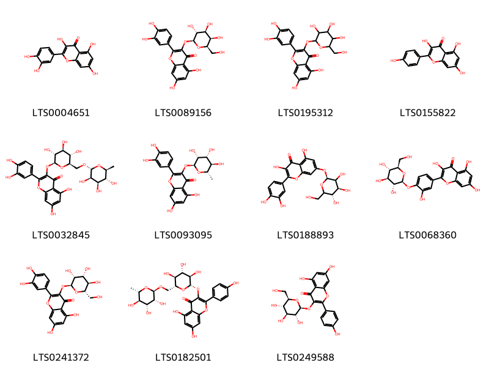{ width=100% }
    <figcaption>Hình ảnh cấu trúc hóa học của 11 hoạt chất thuộc nhóm Flavonoids gồm ['quercetin (LTS0004651)', 'hyperoside (LTS0089156)', '2-(3,4-dihydroxyphenyl)-5,7-dihydroxy-3-{[3,4,5-trihydroxy-6-(hydroxymethyl)oxan-2-yl]oxy}chromen-4-one (LTS0195312)', 'kaempherol (LTS0155822)', '3-rutinosyl quercetin (LTS0032845)', 'quercitrin (LTS0093095)', 'quercimeritrin (LTS0188893)', 'spiraeoside (LTS0068360)', '2-(3,4-dihydroxyphenyl)-5,7-dihydroxy-3-{[(2s,3r,4r,5r,6s)-3,4,5-trihydroxy-6-(hydroxymethyl)oxan-2-yl]oxy}chromen-4-one (LTS0241372)', 'nictoflorin (LTS0182501)', 'astragalin (LTS0249588)'].</figcaption>
</figure>
#### Nhóm Tannins
<figure markdown="span">
    { width=100% }
    <figcaption>Hình ảnh cấu trúc hóa học của 1 hoạt chất thuộc nhóm Tannins gồm ['ellagic acid (LTS0037297)'].</figcaption>
</figure>

---

### Dược dân tộc học

Danh sách các quốc gia có sử dụng *Geranium robertianum* trong điều trị các bệnh. 

| Country   | Disease                                          | Bệnh                                                  |
|:----------|:-------------------------------------------------|:------------------------------------------------------|
| Elsewhere | Astringent, Vulnerary, Astringent                | Chất làm se, Dễ tổn thương, Chất làm se               |
| Turkey    | Tonic, Vulnerary, Astringent, Diuretic, Hemostat | Thuốc bổ, dễ bị tổn thương, làm se, lợi tiểu, cầm máu |
| UK        | Vulnerary                                        | Vulnerary                                             |

---

---
## Geranium sanguineum
### Thông tin về thực vật

!!! info "Phân loại thực vật của *Geranium sanguineum* từ GIBF:"
    - **Kingdom:** Plantae
    - **Phylum:** Tracheophyta
    - **Order:** Geraniales
    - **Family:** Geraniaceae
    - **Genus:** Geranium
    - **Species:** *Geranium sanguineum*

 

| Label (VI)   | Label (EN)   | Scientific Name     | Descriptions (VI)   | Descriptions (EN)   | Also Known As (VI)   | Also Known As (EN)   |
|:-------------|:-------------|:--------------------|:--------------------|:--------------------|:---------------------|:---------------------|
| N/A          | N/A          | Geranium sanguineum | loài thực vật       | species of plant    | ['']                 | ['']                 |

#### Phân bố trên thế giới

**Từ CSDL GIBF** Italy, Slovakia, Belgium, Norway, Canada, Ukraine, Denmark, Netherlands, Spain, Hungary, Russian Federation, United States of America, Sweden, Croatia, Greece, Czechia, Germany, Romania, Switzerland, Austria, France, United Kingdom of Great Britain and Northern Ireland, Ireland

#### Phân bố tại Việt Nam

**Từ CSDL GIBF**: Không có ghi nhận ở Việt Nam

---
### Thành phần hóa học
        
- Theo cơ sở dữ liệu lotus: Từ loài *Geranium sanguineum* đã phân lập và xác định được 14 hoạt chất thuộc về các nhóm Flavonoids, Tannins, Benzene and substituted derivatives. 

|    | chemicalTaxonomyClassyfireClass     |   smiles_count |
|---:|:------------------------------------|---------------:|
|  0 | Benzene and substituted derivatives |              1 |
|  1 | Flavonoids                          |              9 |
|  2 | Tannins                             |              4 |

#### Nhóm Benzene and substituted derivatives
<figure markdown="span">
    { width=100% }
    <figcaption>Hình ảnh cấu trúc hóa học của 1 hoạt chất thuộc nhóm Benzene and substituted derivatives gồm ['galop (LTS0222857)'].</figcaption>
</figure>
#### Nhóm Flavonoids
<figure markdown="span">
    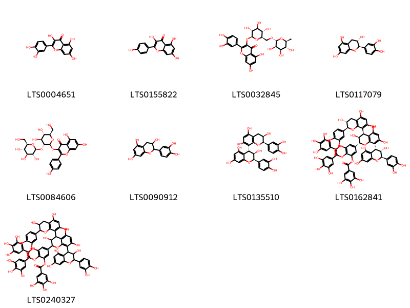{ width=100% }
    <figcaption>Hình ảnh cấu trúc hóa học của 9 hoạt chất thuộc nhóm Flavonoids gồm ['quercetin (LTS0004651)', 'kaempherol (LTS0155822)', '3-rutinosyl quercetin (LTS0032845)', '(+)-catechol (LTS0117079)', 'kaempferol 3-o-sophoroside (LTS0084606)', 'catechol (LTS0090912)', '(2r,3r,4r)-2-(3,4-dihydroxyphenyl)-4-[(2r,3r)-2-(3,4-dihydroxyphenyl)-3,5,7-trihydroxy-3,4-dihydro-2h-1-benzopyran-8-yl]-3,4-dihydro-2h-1-benzopyran-3,5,7-triol (LTS0135510)', '5-[(2r,3s,4s)-8-[(2r,3s,4r)-2-(3,4-dihydroxyphenyl)-3,5,7-trihydroxy-3,4-dihydro-2h-1-benzopyran-4-yl]-4-[(2s,3r)-2-(3,4-dihydroxyphenyl)-3,5,7-trihydroxy-3,4-dihydro-2h-1-benzopyran-8-yl]-3,5,7-trihydroxy-3,4-dihydro-2h-1-benzopyran-2-yl]-2,3-bis(3,4,5-trihydroxybenzoyloxy)phenyl 3,4,5-trihydroxybenzoate (LTS0162841)', '5-{8-[2-(3,4-dihydroxyphenyl)-3,5,7-trihydroxy-3,4-dihydro-2h-1-benzopyran-4-yl]-4-[2-(3,4-dihydroxyphenyl)-3,5,7-trihydroxy-3,4-dihydro-2h-1-benzopyran-8-yl]-3,5,7-trihydroxy-3,4-dihydro-2h-1-benzopyran-2-yl}-2,3-bis(3,4,5-trihydroxybenzoyloxy)phenyl 3,4,5-trihydroxybenzoate (LTS0240327)'].</figcaption>
</figure>
#### Nhóm Tannins
<figure markdown="span">
    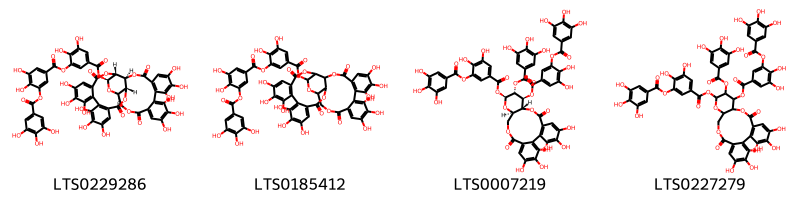{ width=100% }
    <figcaption>Hình ảnh cấu trúc hóa học của 4 hoạt chất thuộc nhóm Tannins gồm ['5-({[(1r,3s,4r,21r,22s)-9,10,11,14,15,16,27,28,29,32,33,34-dodecahydroxy-6,19,24,37-tetraoxo-2,5,20,23,38-pentaoxaheptacyclo[19.18.0.0⁴,²².0⁷,¹².0¹³,¹⁸.0²⁵,³⁰.0³¹,³⁶]nonatriaconta-7,9,11,13(18),14,16,25(30),26,28,31,33,35-dodecaen-3-yl]oxy}carbonyl)-2,3-dihydroxyphenyl 3,4-dihydroxy-5-(3,4,5-trihydroxybenzoyloxy)benzoate (LTS0229286)', '5-[({9,10,11,14,15,16,27,28,29,32,33,34-dodecahydroxy-6,19,24,37-tetraoxo-2,5,20,23,38-pentaoxaheptacyclo[19.18.0.0⁴,²².0⁷,¹².0¹³,¹⁸.0²⁵,³⁰.0³¹,³⁶]nonatriaconta-7(12),8,10,13,15,17,25(30),26,28,31,33,35-dodecaen-3-yl}oxy)carbonyl]-2,3-dihydroxyphenyl 3,4-dihydroxy-5-(3,4,5-trihydroxybenzoyloxy)benzoate (LTS0185412)', '(10r,11s,12r,13s,15r)-11-[3,4-dihydroxy-5-(3,4,5-trihydroxybenzoyloxy)benzoyloxy]-3,4,5,21,22,23-hexahydroxy-8,18-dioxo-12-(3,4,5-trihydroxybenzoyloxy)-9,14,17-trioxatetracyclo[17.4.0.0²,⁷.0¹⁰,¹⁵]tricosa-1(23),2(7),3,5,19,21-hexaen-13-yl 3,4-dihydroxy-5-(3,4,5-trihydroxybenzoyloxy)benzoate (LTS0007219)', '11-[3,4-dihydroxy-5-(3,4,5-trihydroxybenzoyloxy)benzoyloxy]-3,4,5,21,22,23-hexahydroxy-8,18-dioxo-12-(3,4,5-trihydroxybenzoyloxy)-9,14,17-trioxatetracyclo[17.4.0.0²,⁷.0¹⁰,¹⁵]tricosa-1(23),2(7),3,5,19,21-hexaen-13-yl 3,4-dihydroxy-5-(3,4,5-trihydroxybenzoyloxy)benzoate (LTS0227279)'].</figcaption>
</figure>

---

### Dược dân tộc học

Danh sách các quốc gia có sử dụng *Geranium sanguineum* trong điều trị các bệnh. 

| Country   | Disease                       | Bệnh                           |
|:----------|:------------------------------|:-------------------------------|
| Turkey    | Astringent, Hemostat, Styptic | Chất làm se, Hemostat, Styptic |

---

