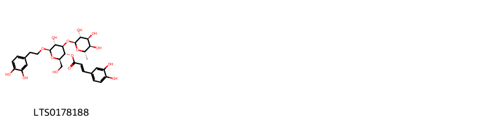
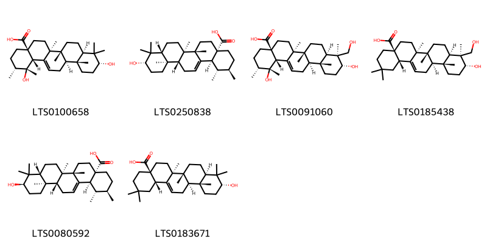

!!! abstract "Tóm tắt"

    Họ Gesneriaceae gồm khoảng 5 chi và 5 loài được một số cộng đồng tại các quốc gia như Elsewhere, Trinidad, Venezuela, Philippines sử dụng trong một số trường hợp Dạ dày, Thuốc diệt nấm, Thuốc diệt cá, Thuốc bổ, Chất làm mềm, Dễ bị tổn thương.

!!! info "DrDuke"

    James A. Duke sinh năm 1929-2017 là một nhà thực vật học người Mỹ. Đây là một trong những tác giả hàng đầu trong lĩnh vực dược dân tộc học với cuốn *CRC Handbook of Medicinal Herbs* và chính là người xây dựng lên cơ sở dữ liệu về hợp chất tự nhiên và dược dân tộc học tại Bộ nông nghiệp Hoa Kỳ. Các thông tin được đăng tải tại website [Dr. Duke's Phytochemical and Ethnobotanical Databases](https://phytochem.nal.usda.gov/). 
    Trong suốt thập niên 1970, ông lãnh đạo the Plant Taxonomy Laboratory, Plant Genetics and Germplasm Institute of the Agricultural Research Service, U.S. Department of Agriculture.
    Trong tài liệu này, các thông tin về dược dân tộc của các dược liệu được trích dẫn từ tài liệu của James A. Ducke với sự trợ giúp của phần mềm dịch thuật từ tiếng Anh sang tiếng Việt.
   

# Chi Cyrtandra

??? note "Danh sách các dược liệu thuộc chi"
    
	 - *Cyrtandra auriculata*

---
## Cyrtandra auriculata
### Thông tin về thực vật

!!! info "Phân loại thực vật của *Cyrtandra auriculata* từ GIBF:"
    - **Kingdom:** Plantae
    - **Phylum:** Tracheophyta
    - **Order:** Lamiales
    - **Family:** Gesneriaceae
    - **Genus:** Cyrtandra
    - **Species:** *Cyrtandra auriculata*

 

| Label (VI)   | Label (EN)   | Scientific Name      | Descriptions (VI)   | Descriptions (EN)   | Also Known As (VI)   | Also Known As (EN)   |
|:-------------|:-------------|:---------------------|:--------------------|:--------------------|:---------------------|:---------------------|
| N/A          | N/A          | Cyrtandra auriculata | loài thực vật       | species of plant    | ['']                 | ['']                 |

#### Phân bố trên thế giới

**Từ CSDL GIBF** nan, Philippines

#### Phân bố tại Việt Nam

**Từ CSDL GIBF**: Không có ghi nhận ở Việt Nam

---
### Thành phần hóa học
        
- Theo cơ sở dữ liệu lotus: Từ loài *Cyrtandra auriculata* đã phân lập và xác định được Chưa có hoạt chất nào được phân lập. hoạt chất thuộc về các nhóm Không có hoạt chất nào được phân lập. 

Không có hình ảnh nào được tạo ra

---

### Dược dân tộc học

Danh sách các quốc gia có sử dụng *Cyrtandra auriculata* trong điều trị các bệnh. 

| Country     | Disease   | Bệnh           |
|:------------|:----------|:---------------|
| Philippines | Fungicide | Thuốc diệt nấm |

---

# Chi Conandron

??? note "Danh sách các dược liệu thuộc chi"
    
	 - *Conandron ramondioides*

---
## Conandron ramondioides
### Thông tin về thực vật

!!! info "Phân loại thực vật của *Conandron ramondioides* từ GIBF:"
    - **Kingdom:** Plantae
    - **Phylum:** Tracheophyta
    - **Order:** Lamiales
    - **Family:** Gesneriaceae
    - **Genus:** Conandron
    - **Species:** *Conandron ramondioides*

 

| Label (VI)   | Label (EN)   | Scientific Name        | Descriptions (VI)   | Descriptions (EN)   | Also Known As (VI)   | Also Known As (EN)        |
|:-------------|:-------------|:-----------------------|:--------------------|:--------------------|:---------------------|:--------------------------|
| N/A          | N/A          | Conandron ramondioides |                     | species of plant    | ['']                 | ['Conandron ramondiodes'] |

#### Phân bố trên thế giới

**Từ CSDL GIBF** nan, Japan, China, Chinese Taipei

#### Phân bố tại Việt Nam

**Từ CSDL GIBF**: Không có ghi nhận ở Việt Nam

---
### Thành phần hóa học
        
- Theo cơ sở dữ liệu lotus: Từ loài *Conandron ramondioides* đã phân lập và xác định được 7 hoạt chất thuộc về các nhóm Prenol lipids, Cinnamic acids and derivatives. 

|    | chemicalTaxonomyClassyfireClass   |   smiles_count |
|---:|:----------------------------------|---------------:|
|  0 | Cinnamic acids and derivatives    |              1 |
|  1 | Prenol lipids                     |              6 |

#### Nhóm Cinnamic acids and derivatives
<figure markdown="span">
    { width=100% }
    <figcaption>Hình ảnh cấu trúc hóa học của 1 hoạt chất thuộc nhóm Cinnamic acids and derivatives gồm ['(2r,3r,4r,5r,6r)-6-[2-(3,4-dihydroxyphenyl)ethoxy]-5-hydroxy-2-(hydroxymethyl)-4-{[(2s,3r,4s,5r,6s)-3,4,5-trihydroxy-6-methyloxan-2-yl]oxy}oxan-3-yl (2e)-3-(3,4-dihydroxyphenyl)prop-2-enoate (LTS0178188)'].</figcaption>
</figure>
#### Nhóm Prenol lipids
<figure markdown="span">
    { width=100% }
    <figcaption>Hình ảnh cấu trúc hóa học của 6 hoạt chất thuộc nhóm Prenol lipids gồm ['(1r,2r,4as,6as,6br,8ar,10r,12ar,12br,14bs)-1,10-dihydroxy-1,2,6a,6b,9,9,12a-heptamethyl-2,3,4,5,6,7,8,8a,10,11,12,12b,13,14b-tetradecahydropicene-4a-carboxylic acid (LTS0100658)', 'ursolic acid (LTS0250838)', 'barbinervic acid (LTS0091060)', 'scutellaric acid (LTS0185438)', '3β-hydroxy-12-ursen-28-ic acid (LTS0080592)', '3-epioleanolic acid (LTS0183671)'].</figcaption>
</figure>

---

### Dược dân tộc học

Danh sách các quốc gia có sử dụng *Conandron ramondioides* trong điều trị các bệnh. 

| Country   | Disease   | Bệnh    |
|:----------|:----------|:--------|
| Elsewhere | Stomachic | Sững sờ |

---

# Chi Gesneria

??? note "Danh sách các dược liệu thuộc chi"
    
	 - *Gesneria allagorphylla*

---
## Gesneria allagorphylla
### Thông tin về thực vật

!!! info "Phân loại thực vật của *Sinningia allagophylla* từ GIBF:"
    - **Kingdom:** Plantae
    - **Phylum:** Tracheophyta
    - **Order:** Lamiales
    - **Family:** Gesneriaceae
    - **Genus:** Sinningia
    - **Species:** *Sinningia allagophylla*

 

| Label (VI)   | Label (EN)   | Scientific Name        | Descriptions (VI)   | Descriptions (EN)   | Also Known As (VI)   | Also Known As (EN)        |
|:-------------|:-------------|:-----------------------|:--------------------|:--------------------|:---------------------|:--------------------------|
| N/A          | N/A          | Conandron ramondioides |                     | species of plant    | ['']                 | ['Conandron ramondiodes'] |

#### Phân bố trên thế giới

**Từ CSDL GIBF** nan, Uruguay, Brazil

#### Phân bố tại Việt Nam

**Từ CSDL GIBF**: Không có ghi nhận ở Việt Nam

---
### Thành phần hóa học
        
- Theo cơ sở dữ liệu lotus: Từ loài *Sinningia allagophylla* đã phân lập và xác định được Chưa có hoạt chất nào được phân lập. hoạt chất thuộc về các nhóm Không có hoạt chất nào được phân lập. 

Không có hình ảnh nào được tạo ra

---

### Dược dân tộc học

Danh sách các quốc gia có sử dụng *Sinningia allagophylla* trong điều trị các bệnh. 

| Country   | Disease          | Bệnh                   |
|:----------|:-----------------|:-----------------------|
| Elsewhere | Tonic, Emollient | Thuốc bổ, chất làm mềm |

---

# Chi Codonanthe

??? note "Danh sách các dược liệu thuộc chi"
    
	 - *Codonanthe crassifolia*

---
## Codonanthe crassifolia
### Thông tin về thực vật

!!! info "Phân loại thực vật của *Codonanthopsis crassifolia* từ GIBF:"
    - **Kingdom:** Plantae
    - **Phylum:** Tracheophyta
    - **Order:** Lamiales
    - **Family:** Gesneriaceae
    - **Genus:** Codonanthopsis
    - **Species:** *Codonanthopsis crassifolia*

 

| Label (VI)   | Label (EN)   | Scientific Name        | Descriptions (VI)   | Descriptions (EN)   | Also Known As (VI)   | Also Known As (EN)   |
|:-------------|:-------------|:-----------------------|:--------------------|:--------------------|:---------------------|:---------------------|
| N/A          | N/A          | Codonanthe crassifolia | loài thực vật       | species of plant    | ['']                 | ['']                 |

#### Phân bố trên thế giới

**Từ CSDL GIBF** Colombia, Suriname, Belize, Nicaragua, Venezuela (Bolivarian Republic of), Brazil, Panama, Peru, French Guiana, Costa Rica, Bolivia (Plurinational State of), Ecuador, Mexico, Belgium, Guyana

#### Phân bố tại Việt Nam

**Từ CSDL GIBF**: Không có ghi nhận ở Việt Nam

---
### Thành phần hóa học
        
- Theo cơ sở dữ liệu lotus: Từ loài *Codonanthopsis crassifolia* đã phân lập và xác định được Chưa có hoạt chất nào được phân lập. hoạt chất thuộc về các nhóm Không có hoạt chất nào được phân lập. 

Không có hình ảnh nào được tạo ra

---

### Dược dân tộc học

Danh sách các quốc gia có sử dụng *Codonanthopsis crassifolia* trong điều trị các bệnh. 

| Country   | Disease   | Bệnh          |
|:----------|:----------|:--------------|
| Elsewhere | Piscicide | Thuốc diệt cá |
| Trinidad  | Piscicide | Thuốc diệt cá |

---

# Chi Gloxinia

??? note "Danh sách các dược liệu thuộc chi"
    
	 - *Gloxinia pallidiflora*

---
## Gloxinia pallidiflora
### Thông tin về thực vật

!!! info "Phân loại thực vật của *Gloxinia perennis* từ GIBF:"
    - **Kingdom:** Plantae
    - **Phylum:** Tracheophyta
    - **Order:** Lamiales
    - **Family:** Gesneriaceae
    - **Genus:** Gloxinia
    - **Species:** *Gloxinia perennis*

 

| Label (VI)   | Label (EN)   | Scientific Name        | Descriptions (VI)   | Descriptions (EN)   | Also Known As (VI)   | Also Known As (EN)   |
|:-------------|:-------------|:-----------------------|:--------------------|:--------------------|:---------------------|:---------------------|
| N/A          | N/A          | Codonanthe crassifolia | loài thực vật       | species of plant    | ['']                 | ['']                 |

#### Phân bố trên thế giới

**Từ CSDL GIBF** Colombia, Peru

#### Phân bố tại Việt Nam

**Từ CSDL GIBF**: Không có ghi nhận ở Việt Nam

---
### Thành phần hóa học
        
- Theo cơ sở dữ liệu lotus: Từ loài *Gloxinia perennis* đã phân lập và xác định được Chưa có hoạt chất nào được phân lập. hoạt chất thuộc về các nhóm Không có hoạt chất nào được phân lập. 

Không có hình ảnh nào được tạo ra

---

### Dược dân tộc học

Danh sách các quốc gia có sử dụng *Gloxinia perennis* trong điều trị các bệnh. 

| Country   | Disease   | Bệnh      |
|:----------|:----------|:----------|
| Venezuela | Vulnerary | Vulnerary |

---

