!!! abstract "Tóm tắt"

    Họ Ginkgoaceae gồm khoảng 1 chi và 1 loài được một số cộng đồng tại các quốc gia như Chinese, Elsewhere, China sử dụng trong một số trường hợp MYMEMORY WARNING: YOU USED ALL AVAILABLE FREE TRANSLATIONS FOR TODAY. NEXT AVAILABLE IN  09 HOURS 50 MINUTES 32 SECONDS VISIT HTTPS://MYMEMORY.TRANSLATED.NET/DOC/USAGELIMITS.PHP TO TRANSLATE MORE.

!!! info "DrDuke"

    James A. Duke sinh năm 1929-2017 là một nhà thực vật học người Mỹ. Đây là một trong những tác giả hàng đầu trong lĩnh vực dược dân tộc học với cuốn *CRC Handbook of Medicinal Herbs* và chính là người xây dựng lên cơ sở dữ liệu về hợp chất tự nhiên và dược dân tộc học tại Bộ nông nghiệp Hoa Kỳ. Các thông tin được đăng tải tại website [Dr. Duke's Phytochemical and Ethnobotanical Databases](https://phytochem.nal.usda.gov/). 
    Trong suốt thập niên 1970, ông lãnh đạo the Plant Taxonomy Laboratory, Plant Genetics and Germplasm Institute of the Agricultural Research Service, U.S. Department of Agriculture.
    Trong tài liệu này, các thông tin về dược dân tộc của các dược liệu được trích dẫn từ tài liệu của James A. Ducke với sự trợ giúp của phần mềm dịch thuật từ tiếng Anh sang tiếng Việt.
   

# Chi Ginkgo

??? note "Danh sách các dược liệu thuộc chi"
    
	 - *Ginkgo biloba*

---
## Ginkgo biloba
### Thông tin về thực vật

!!! info "Phân loại thực vật của *Ginkgo biloba* từ GIBF:"
    - **Kingdom:** Plantae
    - **Phylum:** Tracheophyta
    - **Order:** Ginkgoales
    - **Family:** Ginkgoaceae
    - **Genus:** Ginkgo
    - **Species:** *Ginkgo biloba*

 

| Label (VI)   | Label (EN)   | Scientific Name   | Descriptions (VI)   | Descriptions (EN)      | Also Known As (VI)   | Also Known As (EN)                                                             |
|:-------------|:-------------|:------------------|:--------------------|:-----------------------|:---------------------|:-------------------------------------------------------------------------------|
| N/A          | N/A          | Ginkgo biloba     | loài thực vật       | species of Ginkgo tree | ['Chi Bạch quả']     | ['ginkgo', 'ginkgo plant', 'ginkgo tree', 'maidenhair tree', 'silver apricot'] |

#### Phân bố trên thế giới

**Từ CSDL GIBF** nan, Brazil, Japan, Sweden, Nepal, China, Chile, New Zealand, Spain, Denmark, Netherlands, United States of America, Korea, Republic of, Russian Federation, France, Belgium, Canada, Germany, Austria, Ukraine, South Africa, Australia, India, Switzerland, United Kingdom of Great Britain and Northern Ireland

#### Phân bố tại Việt Nam

**Từ CSDL GIBF**: Không có ghi nhận ở Việt Nam

---
### Thành phần hóa học
        
- Theo cơ sở dữ liệu lotus: Từ loài *Ginkgo biloba* đã phân lập và xác định được 258 hoạt chất thuộc về các nhóm Fatty Acyls, Carboxylic acids and derivatives, Phenols, Organooxygen compounds, Quinolines and derivatives, Tetrapyrroles and derivatives, Cinnamaldehydes, Lignan glycosides, Lactones, Benzene and substituted derivatives, Tropones, Cinnamic acids and derivatives, Steroids and steroid derivatives, Pyridines and derivatives, Furanoid lignans, Saturated hydrocarbons, Benzopyrans, Linear 1,3-diarylpropanoids, Flavonoids, Dibenzylbutane lignans, Phenylpropanoic acids, Prenol lipids, Indoles and derivatives. 

|    | chemicalTaxonomyClassyfireClass     |   smiles_count |
|---:|:------------------------------------|---------------:|
|  0 | Benzene and substituted derivatives |             23 |
|  1 | Benzopyrans                         |              4 |
|  2 | Carboxylic acids and derivatives    |             12 |
|  3 | Cinnamaldehydes                     |              1 |
|  4 | Cinnamic acids and derivatives      |              8 |
|  5 | Dibenzylbutane lignans              |              1 |
|  6 | Fatty Acyls                         |              7 |
|  7 | Flavonoids                          |             94 |
|  8 | Furanoid lignans                    |              3 |
|  9 | Indoles and derivatives             |              1 |
| 10 | Lactones                            |              1 |
| 11 | Lignan glycosides                   |              2 |
| 12 | Linear 1,3-diarylpropanoids         |              1 |
| 13 | Organooxygen compounds              |              5 |
| 14 | Phenols                             |             24 |
| 15 | Phenylpropanoic acids               |              2 |
| 16 | Prenol lipids                       |             49 |
| 17 | Pyridines and derivatives           |              5 |
| 18 | Quinolines and derivatives          |              1 |
| 19 | Saturated hydrocarbons              |              3 |
| 20 | Steroids and steroid derivatives    |              3 |
| 21 | Tetrapyrroles and derivatives       |              6 |
| 22 | Tropones                            |              1 |

#### Nhóm Benzene and substituted derivatives
<figure markdown="span">
    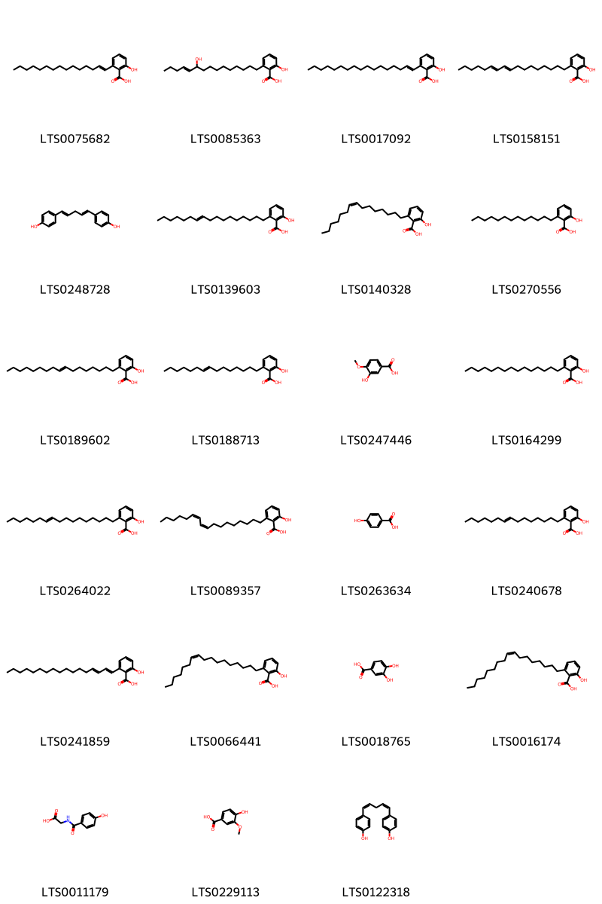{ width=100% }
    <figcaption>Hình ảnh cấu trúc hóa học của 23 hoạt chất thuộc nhóm Benzene and substituted derivatives gồm ['2-hydroxy-6-(pentadec-1-en-1-yl)benzoic acid (LTS0075682)', '2-hydroxy-6-(10-hydroxypentadec-11-en-1-yl)benzoic acid (LTS0085363)', '2-(heptadec-1-en-1-yl)-6-hydroxybenzoic acid (LTS0017092)', '2-(heptadeca-9,11-dien-1-yl)-6-hydroxybenzoic acid (LTS0158151)', '4-[5-(4-hydroxyphenyl)penta-1,4-dien-1-yl]phenol (LTS0248728)', '2-(heptadec-10-en-1-yl)-6-hydroxybenzoic acid (LTS0139603)', 'ginkgoic acid (LTS0140328)', '2-hydroxy-6-tridecylbenzoic acid (LTS0270556)', '2-(heptadec-8-en-1-yl)-6-hydroxybenzoic acid (LTS0189602)', '2-hydroxy-6-(pentadec-8-en-1-yl)benzoic acid (LTS0188713)', 'isovanillic acid (LTS0247446)', '6-pentadecylsalicylic acid (LTS0164299)', '2-[(10e)-heptadec-10-en-1-yl]-6-hydroxybenzoic acid (LTS0264022)', '2-[(9z,11z)-heptadeca-9,11-dien-1-yl]-6-hydroxybenzoic acid (LTS0089357)', 'p-hydroxybenzoic acid (LTS0263634)', 'ginkgolic acid (LTS0240678)', '2-(heptadeca-1,3-dien-1-yl)-6-hydroxybenzoic acid (LTS0241859)', '2-[(10z)-heptadec-10-en-1-yl]-6-hydroxybenzoic acid (LTS0066441)', '3,4-dihydroxybenzoic acid (LTS0018765)', '2-[(8z)-heptadec-8-en-1-yl]-6-hydroxybenzoic acid (LTS0016174)', 'p-hydroxyhippuric acid (LTS0011179)', 'vanillic acid (LTS0229113)', '4-[(1z,4z)-5-(4-hydroxyphenyl)penta-1,4-dien-1-yl]phenol (LTS0122318)'].</figcaption>
</figure>
#### Nhóm Benzopyrans
<figure markdown="span">
    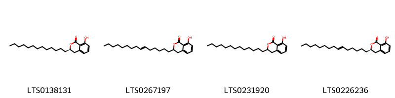{ width=100% }
    <figcaption>Hình ảnh cấu trúc hóa học của 4 hoạt chất thuộc nhóm Benzopyrans gồm ['(3r)-8-hydroxy-3-tridecyl-3,4-dihydro-2-benzopyran-1-one (LTS0138131)', '8-hydroxy-3-(pentadec-6-en-1-yl)-3,4-dihydro-2-benzopyran-1-one (LTS0267197)', '8-hydroxy-3-tridecyl-3,4-dihydro-2-benzopyran-1-one (LTS0231920)', '(3r)-8-hydroxy-3-[(6e)-pentadec-6-en-1-yl]-3,4-dihydro-2-benzopyran-1-one (LTS0226236)'].</figcaption>
</figure>
#### Nhóm Carboxylic acids and derivatives
<figure markdown="span">
    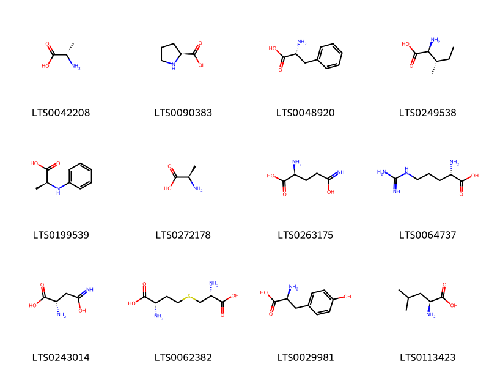{ width=100% }
    <figcaption>Hình ảnh cấu trúc hóa học của 12 hoạt chất thuộc nhóm Carboxylic acids and derivatives gồm ['l-alanine (LTS0042208)', 'l-proline (LTS0090383)', 'd-phenylalanine (LTS0048920)', 'l-isoleucine (LTS0249538)', '(2s)-2-(phenylamino)propanoic acid (LTS0199539)', 'd-alanine (LTS0272178)', 'l glutamine (LTS0263175)', 'l-arginine (LTS0064737)', 'aspartamate (LTS0243014)', 'l-cystathionine (LTS0062382)', 'l-tyrosine (LTS0029981)', 'l-leucine (LTS0113423)'].</figcaption>
</figure>
#### Nhóm Cinnamaldehydes
<figure markdown="span">
    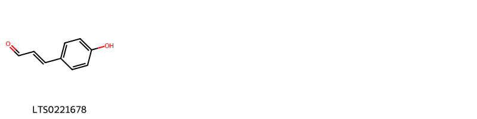{ width=100% }
    <figcaption>Hình ảnh cấu trúc hóa học của 1 hoạt chất thuộc nhóm Cinnamaldehydes gồm ['p-coumaraldehyde (LTS0221678)'].</figcaption>
</figure>
#### Nhóm Cinnamic acids and derivatives
<figure markdown="span">
    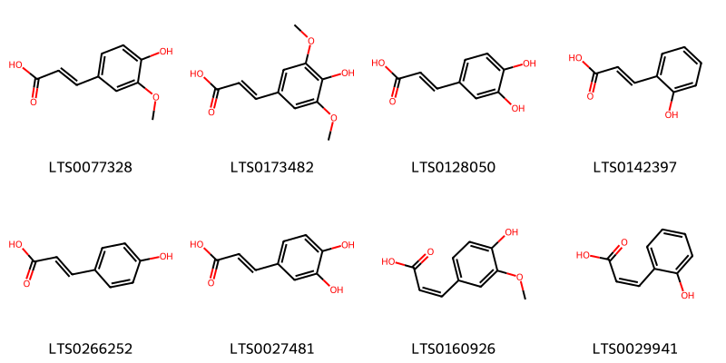{ width=100% }
    <figcaption>Hình ảnh cấu trúc hóa học của 8 hoạt chất thuộc nhóm Cinnamic acids and derivatives gồm ['ferulic acid (LTS0077328)', 'sinapinate (LTS0173482)', '3,4-dihydroxycinnamic acid (LTS0128050)', 'trans-2-hydroxycinnamic acid (LTS0142397)', 'para-coumaric acid (LTS0266252)', 'caffeic acid (LTS0027481)', 'cis-ferulic acid (LTS0160926)', '2-coumarinate (LTS0029941)'].</figcaption>
</figure>
#### Nhóm Dibenzylbutane lignans
<figure markdown="span">
    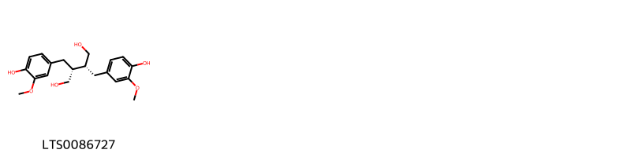{ width=100% }
    <figcaption>Hình ảnh cấu trúc hóa học của 1 hoạt chất thuộc nhóm Dibenzylbutane lignans gồm ['secoisolariciresinol (LTS0086727)'].</figcaption>
</figure>
#### Nhóm Fatty Acyls
<figure markdown="span">
    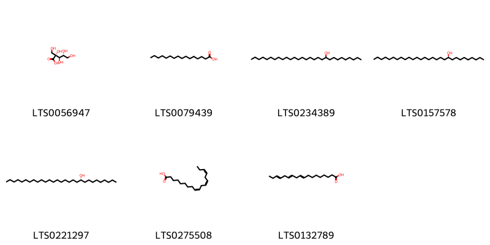{ width=100% }
    <figcaption>Hình ảnh cấu trúc hóa học của 7 hoạt chất thuộc nhóm Fatty Acyls gồm ['2-carboxy-d-arabinitol (LTS0056947)', 'palmitic acid (LTS0079439)', 'nonacosan-10-ol (LTS0234389)', '(s)-nonacosan-10-ol (LTS0157578)', '(r)-nonacosan-10-ol (LTS0221297)', 'α-linolenic acid (LTS0275508)', 'α linolenic acid (LTS0132789)'].</figcaption>
</figure>
#### Nhóm Flavonoids
<figure markdown="span">
    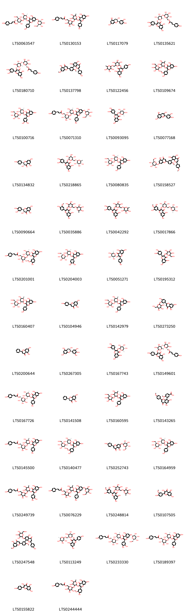{ width=100% }
    <figcaption>Hình ảnh cấu trúc hóa học của 94 hoạt chất thuộc nhóm Flavonoids gồm ['(2r,3s,4s,5r,6s)-6-{[(2s,3s,4r,5r,6s)-4,5-dihydroxy-2-{[5-hydroxy-2-(4-hydroxyphenyl)-4-oxo-7-{[(2s,3r,4s,5s,6r)-3,4,5-trihydroxy-6-(hydroxymethyl)oxan-2-yl]oxy}chromen-3-yl]oxy}-6-methyloxan-3-yl]oxy}-4,5-dihydroxy-2-(hydroxymethyl)oxan-3-yl (2e)-3-(4-hydroxyphenyl)prop-2-enoate (LTS0063547)', '{6-[(2-{[5,7-dihydroxy-2-(4-hydroxyphenyl)-4-oxochromen-3-yl]oxy}-4,5-dihydroxy-6-methyloxan-3-yl)oxy]-3,4,5-trihydroxyoxan-2-yl}methyl 3-(4-hydroxyphenyl)prop-2-enoate (LTS0130153)', '(+)-catechol (LTS0117079)', '[(2r,3s,4s,5r,6s)-6-{[(2s,3r,4s,5r,6r)-6-{[2-(3,4-dihydroxyphenyl)-5,7-dihydroxy-4-oxochromen-3-yl]oxy}-4,5-dihydroxy-2-methyloxan-3-yl]oxy}-3,4,5-trihydroxyoxan-2-yl]methyl (2e)-3-(4-hydroxyphenyl)prop-2-enoate (LTS0135621)', '[(2s,3r,4r,5s,6r)-6-{[(2s,3r,4s,5s,6r)-6-{[2-(3,4-dihydroxyphenyl)-5,7-dihydroxy-4-oxochromen-3-yl]oxy}-4,5-dihydroxy-2-methyloxan-3-yl]oxy}-3,4,5-trihydroxyoxan-2-yl]methyl (2e)-3-(4-hydroxyphenyl)prop-2-enoate (LTS0180710)', 'ginkgetin (LTS0137798)', '5,7-dihydroxy-2-(4-hydroxyphenyl)-3-[(3,4,5-trihydroxy-6-{[(3,4,5-trihydroxy-6-methyloxan-2-yl)oxy]methyl}oxan-2-yl)oxy]chromen-4-one (LTS0122456)', '3-[(4,5-dihydroxy-6-methyl-3-{[3,4,5-trihydroxy-6-(hydroxymethyl)oxan-2-yl]oxy}oxan-2-yl)oxy]-5,7-dihydroxy-2-(4-hydroxy-3-methoxyphenyl)chromen-4-one (LTS0109674)', '3-{[(2s,3s,4r,5r,6s)-4,5-dihydroxy-6-methyl-3-{[(2s,3r,4s,5s,6r)-3,4,5-trihydroxy-6-(hydroxymethyl)oxan-2-yl]oxy}oxan-2-yl]oxy}-2-(3,4-dihydroxyphenyl)-5,7-dihydroxychromen-4-one (LTS0100716)', '[(2r,3s,4s,5r,6s)-6-{[(2s,3s,4r,5r,6s)-4,5-dihydroxy-2-{[5-hydroxy-2-(4-hydroxyphenyl)-4-oxo-7-{[(2s,3r,4s,5s,6r)-3,4,5-trihydroxy-6-(hydroxymethyl)oxan-2-yl]oxy}chromen-3-yl]oxy}-6-methyloxan-3-yl]oxy}-3,4,5-trihydroxyoxan-2-yl]methyl (2e)-3-(4-hydroxyphenyl)prop-2-enoate (LTS0071310)', 'quercitrin (LTS0093095)', 'cyanidin (LTS0077168)', '(+)-dihydrokaempferol (LTS0134832)', '2-(3,4-dihydroxyphenyl)-5,7-dihydroxy-3-{[(2s,3r,4s,5s,6r)-3,4,5-trihydroxy-6-({[(2r,3s,4s,5r,6s)-3,4,5-trihydroxy-6-methyloxan-2-yl]oxy}methyl)oxan-2-yl]oxy}chromen-4-one (LTS0218865)', '3-{[(2s,3s,4r,5r,6s)-4,5-dihydroxy-6-methyl-3-{[(2s,3r,4s,5s,6r)-3,4,5-trihydroxy-6-(hydroxymethyl)oxan-2-yl]oxy}oxan-2-yl]oxy}-5,7-dihydroxy-2-(4-hydroxyphenyl)chromen-4-one (LTS0080835)', '5,7-dihydroxy-8-[5-(5-hydroxy-4-oxo-7-{[(2s,3r,4s,5s,6r)-3,4,5-trihydroxy-6-(hydroxymethyl)oxan-2-yl]oxy}chromen-2-yl)-2-methoxyphenyl]-2-(4-methoxyphenyl)chromen-4-one (LTS0158527)', '(+)-taxifolin (LTS0090664)', '5,7-dihydroxy-2-(4-hydroxy-3-methoxyphenyl)-3-[(3,4,5-trihydroxy-6-{[(3,4,5-trihydroxy-6-methyloxan-2-yl)oxy]methyl}oxan-2-yl)oxy]chromen-4-one (LTS0035886)', 'rutin (LTS0042292)', '2-(3,5-dihydroxy-4-methoxyphenyl)-5,7-dihydroxy-3-{[(2s,3r,4s,5s,6r)-3,4,5-trihydroxy-6-({[(2r,3r,4r,5r,6s)-3,4,5-trihydroxy-6-methyloxan-2-yl]oxy}methyl)oxan-2-yl]oxy}chromen-4-one (LTS0017866)', '[(2r,3s,4s,5r,6s)-6-{[(2s,3s,4r,5r,6s)-2-{[5,7-dihydroxy-2-(4-hydroxy-3-methoxyphenyl)-4-oxochromen-3-yl]oxy}-4,5-dihydroxy-6-methyloxan-3-yl]oxy}-3,4,5-trihydroxyoxan-2-yl]methyl (2e)-3-(4-hydroxyphenyl)prop-2-enoate (LTS0201001)', '3-{[(2s,3s,4s,5r,6s)-4,5-dihydroxy-6-methyl-3-{[(2r,3r,4s,5s,6s)-3,4,5-trihydroxy-6-(hydroxymethyl)oxan-2-yl]oxy}oxan-2-yl]oxy}-2-(3,4-dihydroxyphenyl)-5,7-dihydroxychromen-4-one (LTS0204003)', '5,7-dihydroxy-2-(4-hydroxyphenyl)-3-{[(2r,3r,4r,5r,6s)-3,4,5-trihydroxy-6-methyloxan-2-yl]oxy}chromen-4-one (LTS0051271)', '2-(3,4-dihydroxyphenyl)-5,7-dihydroxy-3-{[3,4,5-trihydroxy-6-(hydroxymethyl)oxan-2-yl]oxy}chromen-4-one (LTS0195312)', '3-{[(2s,3s,4r,5r,6r)-4,5-dihydroxy-6-methyl-3-{[(2s,3r,4s,5s,6r)-3,4,5-trihydroxy-6-(hydroxymethyl)oxan-2-yl]oxy}oxan-2-yl]oxy}-5,7-dihydroxy-2-(4-hydroxyphenyl)chromen-4-one (LTS0160407)', 'chamomile (LTS0104946)', '3-{[(2s,3s,4r,5r,6r)-4,5-dihydroxy-6-methyl-3-{[(2s,3s,4r,5r,6r)-3,4,5-trihydroxy-6-(hydroxymethyl)oxan-2-yl]oxy}oxan-2-yl]oxy}-5,7-dihydroxy-2-(4-hydroxyphenyl)chromen-4-one (LTS0142979)', '5,7-dihydroxy-2-(4-hydroxy-3-{[3,4,5-trihydroxy-6-(hydroxymethyl)oxan-2-yl]oxy}phenyl)chromen-4-one (LTS0273250)', 'chrysin (LTS0200644)', 'gallocatechol (LTS0267305)', '2-(3,4-dihydroxyphenyl)-5,7-dihydroxy-3-{[(2s,3s,4r,5s,6s)-3,4,5-trihydroxy-6-methyloxan-2-yl]oxy}chromen-4-one (LTS0167743)', '[(2s,3r,4r,5s,6r)-6-{[(2r,3s,4r,5s,6s)-6-{[5,7-dihydroxy-2-(4-hydroxyphenyl)-4-oxochromen-3-yl]oxy}-4,5-dihydroxy-2-methyloxan-3-yl]oxy}-3,4,5-trihydroxyoxan-2-yl]methyl (2e)-3-(4-hydroxyphenyl)prop-2-enoate (LTS0149601)', '[(2s,3s,4r,5s,6r)-6-{[(2s,3r,4r,5s,6s)-2-{[5,7-dihydroxy-2-(4-hydroxyphenyl)-4-oxochromen-3-yl]oxy}-4,5-dihydroxy-6-methyloxan-3-yl]oxy}-3,4,5-trihydroxyoxan-2-yl]methyl (2e)-3-(4-hydroxyphenyl)prop-2-enoate (LTS0167726)', 'pinocembrine (LTS0141508)', '3-[(4,5-dihydroxy-6-methyl-3-{[3,4,5-trihydroxy-6-(hydroxymethyl)oxan-2-yl]oxy}oxan-2-yl)oxy]-5,7-dihydroxy-2-(4-hydroxyphenyl)chromen-4-one (LTS0160595)', '3-[5,7-dihydroxy-2-(4-methoxyphenyl)-4-oxochromen-8-yl]-4-methoxybenzoic acid (LTS0143265)', '[(2r,3s,4s,5s,6s)-6-{[(2r,3s,4s,5r,6r)-2-{[5,7-dihydroxy-2-(4-hydroxyphenyl)-4-oxochromen-3-yl]oxy}-4,5-dihydroxy-6-methyloxan-3-yl]oxy}-3,4,5-trihydroxyoxan-2-yl]methyl (2e)-3-(4-hydroxyphenyl)prop-2-enoate (LTS0145500)', '3-{[(2s,3r,4r,5r,6s)-4,5-dihydroxy-6-methyl-3-{[(2s,3r,4s,5s,6r)-3,4,5-trihydroxy-6-(hydroxymethyl)oxan-2-yl]oxy}oxan-2-yl]oxy}-5,7-dihydroxy-2-(4-hydroxy-3-methoxyphenyl)chromen-4-one (LTS0140477)', 'apigenin 7-o-β-glucoside (LTS0252743)', '3-{[(2s,3r,4r,5r,6s)-4,5-dihydroxy-6-methyl-3-{[(2s,3r,4s,5s,6r)-3,4,5-trihydroxy-6-(hydroxymethyl)oxan-2-yl]oxy}oxan-2-yl]oxy}-5,7-dihydroxy-2-(4-hydroxyphenyl)chromen-4-one (LTS0164959)', '{6-[(2-{[2-(3,4-dihydroxyphenyl)-5,7-dihydroxy-4-oxochromen-3-yl]oxy}-4,5-dihydroxy-6-methyloxan-3-yl)oxy]-3,4,5-trihydroxyoxan-2-yl}methyl 3-(4-hydroxyphenyl)prop-2-enoate (LTS0249739)', '{6-[(4,5-dihydroxy-2-{[5-hydroxy-2-(4-hydroxyphenyl)-4-oxo-7-{[3,4,5-trihydroxy-6-(hydroxymethyl)oxan-2-yl]oxy}chromen-3-yl]oxy}-6-methyloxan-3-yl)oxy]-3,4,5-trihydroxyoxan-2-yl}methyl 3-(4-hydroxyphenyl)prop-2-enoate (LTS0076229)', '2-(3,5-dihydroxy-4-methoxyphenyl)-5,7-dihydroxy-3-[(3,4,5-trihydroxy-6-{[(3,4,5-trihydroxy-6-methyloxan-2-yl)oxy]methyl}oxan-2-yl)oxy]chromen-4-one (LTS0248814)', 'isorhamnetin (LTS0107505)', '5-hydroxy-8-[5-(5-hydroxy-7-methoxy-4-oxochromen-2-yl)-2-methoxyphenyl]-2-(4-hydroxyphenyl)-7-{[3,4,5-trihydroxy-6-(hydroxymethyl)oxan-2-yl]oxy}chromen-4-one (LTS0247548)', '5,7-dihydroxy-2-(4-hydroxyphenyl)-3-{[(2s,3r,4s,5s,6s)-3,4,5-trihydroxy-6-({[(2r,3r,4s,5r,6s)-3,4,5-trihydroxy-6-methyloxan-2-yl]oxy}methyl)oxan-2-yl]oxy}chromen-4-one (LTS0113249)', '[(2s,3r,4r,5r,6r)-6-{[(2s,3r,4r,5r,6s)-2-{[2-(3,4-dihydroxyphenyl)-5-hydroxy-4-oxo-7-{[(2r,3r,4r,5s,6s)-3,4,5-trihydroxy-6-(hydroxymethyl)oxan-2-yl]oxy}chromen-3-yl]oxy}-4,5-dihydroxy-6-methyloxan-3-yl]oxy}-3,4,5-trihydroxyoxan-2-yl]methyl (2e)-3-(4-hydroxyphenyl)prop-2-enoate (LTS0233330)', '[(2r,3s,4s,5r,6s)-6-{[(2s,3s,4r,5r,6s)-2-{[5,7-dihydroxy-2-(4-hydroxyphenyl)-4-oxochromen-3-yl]oxy}-4,5-dihydroxy-6-methyloxan-3-yl]oxy}-3,4,5-trihydroxyoxan-2-yl]methyl (2e)-3-(4-hydroxyphenyl)prop-2-enoate (LTS0189397)', 'kaempherol (LTS0155822)', '{6-[(2-{[5,7-dihydroxy-2-(4-hydroxy-3-methoxyphenyl)-4-oxochromen-3-yl]oxy}-4,5-dihydroxy-6-methyloxan-3-yl)oxy]-3,4,5-trihydroxyoxan-2-yl}methyl 3-(4-hydroxyphenyl)prop-2-enoate (LTS0244444)', 'quercitrin (LTS0186298)', 'isoquercetin (LTS0254337)', '[(2r,3s,4s,5r,6s)-6-{[(2s,3s,4r,5r,6s)-2-{[2-(3,4-dihydroxyphenyl)-5,7-dihydroxy-4-oxochromen-3-yl]oxy}-4,5-dihydroxy-6-methyloxan-3-yl]oxy}-3,4,5-trihydroxyoxan-2-yl]methyl (2e)-3-(4-hydroxyphenyl)prop-2-enoate (LTS0258891)', 'narcissin (LTS0177843)', 'trifolin (LTS0267055)', '8-[5-(5,7-dihydroxy-4-oxochromen-2-yl)-2-hydroxyphenyl]-5,7-dihydroxy-2-(4-methoxyphenyl)chromen-4-one (LTS0254320)', '3-{[(2s,3r,4r,5r,6s)-4,5-dihydroxy-6-(hydroxymethyl)-3-{[(2s,3r,4s,5s,6r)-3,4,5-trihydroxy-6-methyloxan-2-yl]oxy}oxan-2-yl]oxy}-5,7-dihydroxy-2-(4-hydroxyphenyl)chromen-4-one (LTS0076636)', '[(2s,3r,4r,5s,6r)-6-{[(2r,3r,4r,5r,6s)-6-{[5,7-dihydroxy-2-(4-hydroxyphenyl)-4-oxochromen-3-yl]oxy}-4,5-dihydroxy-2-methyloxan-3-yl]oxy}-3,4,5-trihydroxyoxan-2-yl]methyl (2e)-3-(4-hydroxyphenyl)prop-2-enoate (LTS0266879)', '3-{[(2s,3s,4r,5r,6s)-4,5-dihydroxy-6-methyl-3-{[(2s,3s,4s,5s,6r)-3,4,5-trihydroxy-6-(hydroxymethyl)oxan-2-yl]oxy}oxan-2-yl]oxy}-2-(3,4-dihydroxyphenyl)-5,7-dihydroxychromen-4-one (LTS0054941)', "luteolin 3'-glucoside (LTS0071552)", '5-hydroxy-2-(4-hydroxy-3-methoxyphenyl)-7-{[(2s,3r,4s,5s,6r)-3,4,5-trihydroxy-6-(hydroxymethyl)oxan-2-yl]oxy}chromen-4-one (LTS0065615)', '8-[2-(5,7-dihydroxy-4-oxochromen-2-yl)-5-methoxyphenyl]-5,7-dihydroxy-2-(4-methoxyphenyl)chromen-4-one (LTS0239647)', '{6-[(6-{[5,7-dihydroxy-2-(4-hydroxyphenyl)-4-oxochromen-3-yl]oxy}-4,5-dihydroxy-2-methyloxan-3-yl)oxy]-3,4,5-trihydroxyoxan-2-yl}methyl 3-(4-hydroxyphenyl)prop-2-enoate (LTS0233305)', 'robinin (LTS0260167)', '5,7-dihydroxy-8-[5-(5-hydroxy-7-methoxy-4-oxo-2,3-dihydro-1-benzopyran-2-yl)-2-methoxyphenyl]-2-(4-methoxyphenyl)chromen-4-one (LTS0071191)', '2-(3,4-dihydroxyphenyl)-5,7-dihydroxy-3-{[(2s,3r,4r,5s,6r)-3,4,5-trihydroxy-6-(hydroxymethyl)oxan-2-yl]oxy}chromen-4-one (LTS0220665)', '2-(3,4-dihydroxyphenyl)-5,7-dihydroxy-3-{[(2s,3r,4r,5r,6s)-3,4,5-trihydroxy-6-(hydroxymethyl)oxan-2-yl]oxy}chromen-4-one (LTS0241372)', '[(2s,3s,4s,5s,6s)-6-{[(2s,3s,4s,5s,6s)-2-{[5,7-dihydroxy-2-(4-hydroxy-3-methoxyphenyl)-4-oxochromen-3-yl]oxy}-4,5-dihydroxy-6-methyloxan-3-yl]oxy}-3,4,5-trihydroxyoxan-2-yl]methyl (2e)-3-(4-hydroxyphenyl)prop-2-enoate (LTS0241725)', 'acacetin (LTS0020151)', 'myricetin (LTS0139858)', 'nictoflorin (LTS0182501)', 'astragalin (LTS0249588)', 'tamarixetin (LTS0258243)', '2-(3,4-dihydroxyphenyl)-5,7-dihydroxy-3-{[(2r,3s,4r,5r,6s)-3,4,5-trihydroxy-6-({[(2s,3s,4s,5s,6r)-3,4,5-trihydroxy-6-methyloxan-2-yl]oxy}methyl)oxan-2-yl]oxy}chromen-4-one (LTS0052429)', 'isoginkgetin (LTS0061203)', '[(2r,3s,4r,5r,6r)-6-{[(2s,3r,4r,5r,6s)-4,5-dihydroxy-2-{[5-hydroxy-2-(4-hydroxyphenyl)-4-oxo-7-{[(2r,3r,4r,5r,6r)-3,4,5-trihydroxy-6-(hydroxymethyl)oxan-2-yl]oxy}chromen-3-yl]oxy}-6-methyloxan-3-yl]oxy}-3,4,5-trihydroxyoxan-2-yl]methyl (2e)-3-(4-hydroxyphenyl)prop-2-enoate (LTS0045030)', '{6-[(2-{[2-(3,4-dihydroxyphenyl)-5-hydroxy-4-oxo-7-{[3,4,5-trihydroxy-6-(hydroxymethyl)oxan-2-yl]oxy}chromen-3-yl]oxy}-4,5-dihydroxy-6-methyloxan-3-yl)oxy]-3,4,5-trihydroxyoxan-2-yl}methyl 3-(4-hydroxyphenyl)prop-2-enoate (LTS0056376)', '5,7-dihydroxy-8-{5-[(2r)-5-hydroxy-7-methoxy-4-oxo-2,3-dihydro-1-benzopyran-2-yl]-2-methoxyphenyl}-2-(4-methoxyphenyl)chromen-4-one (LTS0247502)', 'quercetin (LTS0004651)', '{6-[(6-{[2-(3,4-dihydroxyphenyl)-5,7-dihydroxy-4-oxochromen-3-yl]oxy}-4,5-dihydroxy-2-methyloxan-3-yl)oxy]-3,4,5-trihydroxyoxan-2-yl}methyl 3-(4-hydroxyphenyl)prop-2-enoate (LTS0008993)', 'amentoflavone (LTS0063796)', 'sciadopitysin (LTS0262782)', '5-hydroxy-8-[5-(5-hydroxy-7-methoxy-4-oxochromen-2-yl)-2-methoxyphenyl]-2-(4-hydroxyphenyl)-7-{[(2s,3r,4s,5s,6r)-3,4,5-trihydroxy-6-(hydroxymethyl)oxan-2-yl]oxy}chromen-4-one (LTS0008399)', '[(2r,3r,4r,5r,6r)-6-{[(2s,3r,4s,5r,6r)-2-{[2-(3,4-dihydroxyphenyl)-5,7-dihydroxy-4-oxochromen-3-yl]oxy}-4,5-dihydroxy-6-methyloxan-3-yl]oxy}-3,4,5-trihydroxyoxan-2-yl]methyl (2e)-3-(4-hydroxyphenyl)prop-2-enoate (LTS0014073)', '8-[5-(5,7-dihydroxy-4-oxochromen-2-yl)-2-methoxyphenyl]-5,7-dihydroxy-2-(4-hydroxyphenyl)chromen-4-one (LTS0013591)', 'luteolin (LTS0017052)', '[(2r,3s,4s,5r,6s)-6-{[(2r,3s,4r,5r,6s)-2-{[5,7-dihydroxy-2-(4-hydroxyphenyl)-4-oxochromen-3-yl]oxy}-4,5-dihydroxy-6-methyloxan-3-yl]oxy}-3,4,5-trihydroxyoxan-2-yl]methyl (2e)-3-(4-{[(2s,3r,4s,5s,6s)-3,4,5-trihydroxy-6-(hydroxymethyl)oxan-2-yl]oxy}phenyl)prop-2-enoate (LTS0006932)', '3-rutinosyl quercetin (LTS0032845)', 'catechol (LTS0090912)', '2-(3,5-dihydroxy-4-oxidophenyl)-3,5,7-trihydroxy-1λ⁴-chromen-1-ylium (LTS0276138)', '5,7-dihydroxy-8-[5-(5-hydroxy-4-oxo-7-{[3,4,5-trihydroxy-6-(hydroxymethyl)oxan-2-yl]oxy}chromen-2-yl)-2-methoxyphenyl]-2-(4-methoxyphenyl)chromen-4-one (LTS0235600)', '3-[(4,5-dihydroxy-6-methyl-3-{[3,4,5-trihydroxy-6-(hydroxymethyl)oxan-2-yl]oxy}oxan-2-yl)oxy]-2-(3,4-dihydroxyphenyl)-5,7-dihydroxychromen-4-one (LTS0045911)', 'delphinidin (LTS0036798)', 'ent-epicatechin (LTS0265245)'].</figcaption>
</figure>
#### Nhóm Furanoid lignans
<figure markdown="span">
    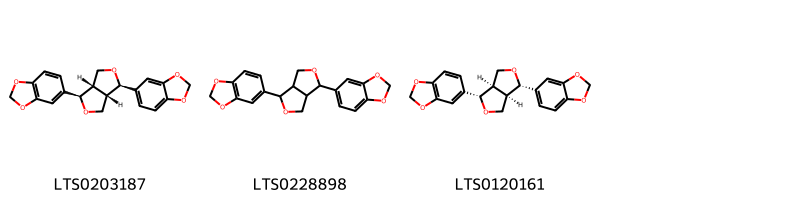{ width=100% }
    <figcaption>Hình ảnh cấu trúc hóa học của 3 hoạt chất thuộc nhóm Furanoid lignans gồm ['(-)-sesamin (LTS0203187)', 'sesamin (LTS0228898)', 'sesamin (LTS0120161)'].</figcaption>
</figure>
#### Nhóm Indoles and derivatives
<figure markdown="span">
    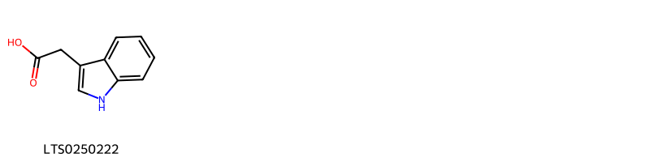{ width=100% }
    <figcaption>Hình ảnh cấu trúc hóa học của 1 hoạt chất thuộc nhóm Indoles and derivatives gồm ['β-indole-3-acetic acid (LTS0250222)'].</figcaption>
</figure>
#### Nhóm Lactones
<figure markdown="span">
    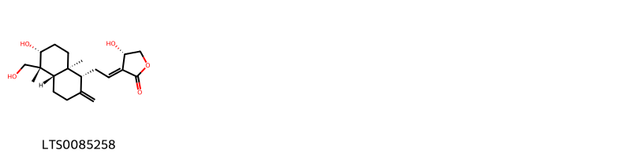{ width=100% }
    <figcaption>Hình ảnh cấu trúc hóa học của 1 hoạt chất thuộc nhóm Lactones gồm ['andrographolide (LTS0085258)'].</figcaption>
</figure>
#### Nhóm Lignan glycosides
<figure markdown="span">
    { width=100% }
    <figcaption>Hình ảnh cấu trúc hóa học của 2 hoạt chất thuộc nhóm Lignan glycosides gồm ['2-{4-[4-(4-hydroxy-3,5-dimethoxyphenyl)-hexahydrofuro[3,4-c]furan-1-yl]-2,6-dimethoxyphenoxy}-6-(hydroxymethyl)oxane-3,4,5-triol (LTS0209275)', '(2s,3r,4s,5s,6r)-2-{4-[(1r,3as,4r,6as)-4-(4-hydroxy-3,5-dimethoxyphenyl)-hexahydrofuro[3,4-c]furan-1-yl]-2,6-dimethoxyphenoxy}-6-(hydroxymethyl)oxane-3,4,5-triol (LTS0010090)'].</figcaption>
</figure>
#### Nhóm Linear 1_3-diarylpropanoids
<figure markdown="span">
    { width=100% }
    <figcaption>Hình ảnh cấu trúc hóa học của Không tìm thấy chú thích hoạt chất thuộc nhóm Linear 1_3-diarylpropanoids gồm Không tìm thấy chú thích.</figcaption>
</figure>
#### Nhóm Organooxygen compounds
<figure markdown="span">
    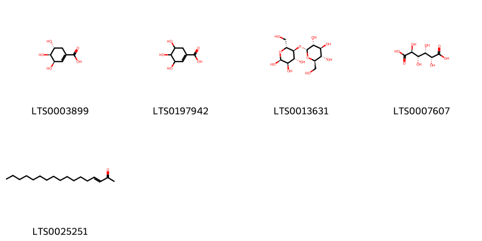{ width=100% }
    <figcaption>Hình ảnh cấu trúc hóa học của 5 hoạt chất thuộc nhóm Organooxygen compounds gồm ['(-)-shikimate (LTS0003899)', 'shikimate (LTS0197942)', 'α-maltose (LTS0013631)', 'saccharic acid (LTS0007607)', 'heptadec-3-en-2-one (LTS0025251)'].</figcaption>
</figure>
#### Nhóm Phenols
<figure markdown="span">
    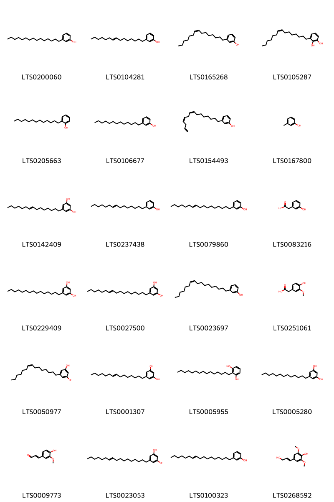{ width=100% }
    <figcaption>Hình ảnh cấu trúc hóa học của 24 hoạt chất thuộc nhóm Phenols gồm ['3-pentadecylphenol (LTS0200060)', 'anacardium occidentale seed oil (LTS0104281)', 'cardanol monoene (LTS0165268)', 'urushiol ii (LTS0105287)', 'phenol, 2-tridecyl- (LTS0205663)', 'phenol, 3-tridecyl- (LTS0106677)', 'cardanol triene (LTS0154493)', 'm-cresol (LTS0167800)', '5-(pentadec-8-en-1-yl)benzene-1,3-diol (LTS0142409)', '(15:1)-cardanol (LTS0237438)', '3-(heptadec-10-en-1-yl)phenol (LTS0079860)', '3-hydroxyphenylacetic acid (LTS0083216)', 'cardol (LTS0229409)', '5-[(10e)-heptadec-10-en-1-yl]benzene-1,3-diol (LTS0027500)', '3-[(10z)-heptadec-10-en-1-yl]phenol (LTS0023697)', 'homovanillic acid (LTS0251061)', 'bilobol (LTS0050977)', 'bilobol (LTS0001307)', '2-pentadecylbenzene-1,3-diol (LTS0005955)', 'grevillol (LTS0005280)', 'coniferaldehyde (LTS0009773)', '5-(heptadec-10-en-1-yl)benzene-1,3-diol (LTS0023053)', '3-[(10e)-heptadec-10-en-1-yl]phenol (LTS0100323)', 'sinapic alcohol (LTS0268592)'].</figcaption>
</figure>
#### Nhóm Phenylpropanoic acids
<figure markdown="span">
    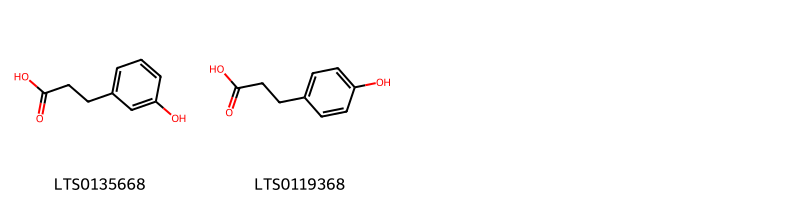{ width=100% }
    <figcaption>Hình ảnh cấu trúc hóa học của 2 hoạt chất thuộc nhóm Phenylpropanoic acids gồm ['3-hydroxyphenylpropionic acid (LTS0135668)', 'hydroxyphenyl propionic acid (LTS0119368)'].</figcaption>
</figure>
#### Nhóm Prenol lipids
<figure markdown="span">
    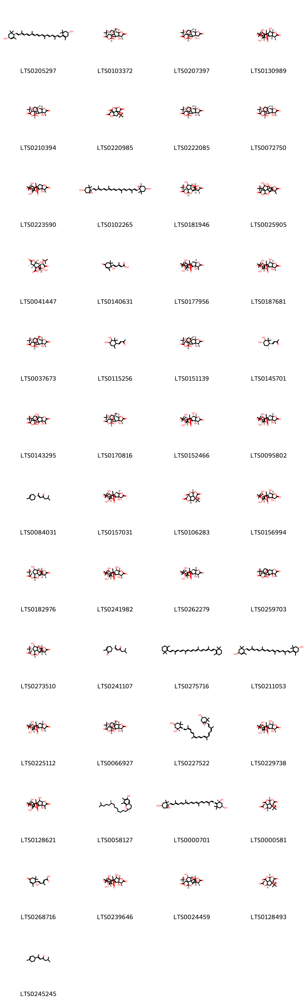{ width=100% }
    <figcaption>Hình ảnh cấu trúc hóa học của 49 hoạt chất thuộc nhóm Prenol lipids gồm ['carotenoid (LTS0205297)', '(1r,3s,6r,7r,8s,10r,11r,12r,13r,16s,17r)-8-tert-butyl-6,12,17-trihydroxy-16-methyl-2,4,14,19-tetraoxahexacyclo[8.7.2.0¹,¹¹.0³,⁷.0⁷,¹¹.0¹³,¹⁷]nonadecane-5,15,18-trione (LTS0103372)', '(1s,3r,6r,7s,8s,10r,11s,13s,16r,17s)-8-tert-butyl-6,17-dihydroxy-16-methyl-2,4,14,19-tetraoxahexacyclo[8.7.2.0¹,¹¹.0³,⁷.0⁷,¹¹.0¹³,¹⁷]nonadecane-5,15,18-trione (LTS0207397)', '(1s,3r,9r,10s,13r,16s,17s)-8-tert-butyl-6,9,12-trihydroxy-16-methyl-2,4,14,19-tetraoxahexacyclo[8.7.2.0¹,¹¹.0³,⁷.0⁷,¹¹.0¹³,¹⁷]nonadecane-5,15,18-trione (LTS0130989)', '(1r,3r,6s,7s,8s,10r,11s,13s,16s,17r)-8-tert-butyl-6,17-dihydroxy-16-methyl-2,4,14,19-tetraoxahexacyclo[8.7.2.0¹,¹¹.0³,⁷.0⁷,¹¹.0¹³,¹⁷]nonadecane-5,15,18-trione (LTS0210394)', '9-tert-butyl-7,9-dihydroxy-3,5,12-trioxatetracyclo[6.6.0.0¹,¹¹.0⁴,⁸]tetradecane-2,6,13-trione (LTS0220985)', '(1r,3r,6r,7s,8s,10s,11s,13s,16s,17r)-8-tert-butyl-6,17-dihydroxy-16-methyl-2,4,14,19-tetraoxahexacyclo[8.7.2.0¹,¹¹.0³,⁷.0⁷,¹¹.0¹³,¹⁷]nonadecane-5,15,18-trione (LTS0222085)', 'ginkgolide-a (LTS0072750)', '8-tert-butyl-6,9,17-trihydroxy-16-methyl-2,4,14,19-tetraoxahexacyclo[8.7.2.0¹,¹¹.0³,⁷.0⁷,¹¹.0¹³,¹⁷]nonadecane-5,15,18-trione (LTS0223590)', 'violaxanthin (LTS0102265)', '(1s,3s,6r,7r,8s,9r,10s,11r,12r,13r,16s,17r)-8-tert-butyl-6,9,12-trihydroxy-16-methyl-2,4,14,19-tetraoxahexacyclo[8.7.2.0¹,¹¹.0³,⁷.0⁷,¹¹.0¹³,¹⁷]nonadecane-5,15,18-trione (LTS0181946)', '8-tert-butyl-6,9,12-trihydroxy-16-methyl-2,4,14,19-tetraoxahexacyclo[8.7.2.0¹,¹¹.0³,⁷.0⁷,¹¹.0¹³,¹⁷]nonadecane-5,15,18-trione (LTS0025905)', '(1s,3s,6r,7r,8s,9s,10s,11r,12s,13s,16s,17r)-6,9,12-trihydroxy-16-methyl-8-(2-methylpropyl)-2,4,14,19-tetraoxahexacyclo[8.7.2.0¹,¹¹.0³,⁷.0⁷,¹¹.0¹³,¹⁷]nonadecane-5,15,18-trione (LTS0041447)', 'abscisic acid,  (LTS0140631)', '(3s,10r,11s,13r,17r)-8-tert-butyl-6,9,17-trihydroxy-16-methyl-2,4,14,19-tetraoxahexacyclo[8.7.2.0¹,¹¹.0³,⁷.0⁷,¹¹.0¹³,¹⁷]nonadecane-5,15,18-trione (LTS0177956)', '(1r,3r,6r,7s,8s,9r,10s,11r,12r,13r,16s,17r)-8-tert-butyl-6,9,12,17-tetrahydroxy-16-methyl-2,4,14,19-tetraoxahexacyclo[8.7.2.0¹,¹¹.0³,⁷.0⁷,¹¹.0¹³,¹⁷]nonadecane-5,15,18-trione (LTS0187681)', 'ginkgolide-b (LTS0037673)', '4-(3,4-dihydroxy-2,2,6-trimethylcyclohexyl)but-3-en-2-one (LTS0115256)', '(1r,3r,6s,8s,10r,11r,13s,16s,17r)-8-tert-butyl-6,17-dihydroxy-16-methyl-2,4,14,19-tetraoxahexacyclo[8.7.2.0¹,¹¹.0³,⁷.0⁷,¹¹.0¹³,¹⁷]nonadecane-5,15,18-trione (LTS0151139)', '(3e)-4-[(1r,3s,4s,6r)-3,4-dihydroxy-2,2,6-trimethylcyclohexyl]but-3-en-2-one (LTS0145701)', '8-tert-butyl-6,12,17-trihydroxy-16-methyl-2,4,14,19-tetraoxahexacyclo[8.7.2.0¹,¹¹.0³,⁷.0⁷,¹¹.0¹³,¹⁷]nonadecane-5,15,18-trione (LTS0143295)', '(1r,3r,6r,7s,8s,10r,11r,12r,13r,16s,17r)-8-tert-butyl-6,12,17-trihydroxy-16-methyl-2,4,14,19-tetraoxahexacyclo[8.7.2.0¹,¹¹.0³,⁷.0⁷,¹¹.0¹³,¹⁷]nonadecane-5,15,18-trione (LTS0170816)', '(1r,3r,6r,7s,8s,9r,10s,11r,12s,13s,16s,17r)-8-tert-butyl-6,9,12,17-tetrahydroxy-16-methyl-2,4,14,19-tetraoxahexacyclo[8.7.2.0¹,¹¹.0³,⁷.0⁷,¹¹.0¹³,¹⁷]nonadecane-5,15,18-trione (LTS0152466)', 'ginkgolide-j (LTS0095802)', '(2e)-6-methyl-2-[(1r)-4-methylcyclohex-3-en-1-yl]hept-2-en-4-one (LTS0084031)', '(1r,3s,6r,7r,8s,9s,10s,11s,13r,16r,17r)-8-tert-butyl-6,9,17-trihydroxy-16-methyl-2,4,14,19-tetraoxahexacyclo[8.7.2.0¹,¹¹.0³,⁷.0⁷,¹¹.0¹³,¹⁷]nonadecane-5,15,18-trione (LTS0157031)', 'bilobalide (LTS0106283)', '(1r,3s,6s,7s,8r,9s,10r,11r,12r,13r,16r,17r)-8-tert-butyl-6,9,12,17-tetrahydroxy-16-methyl-2,4,14,19-tetraoxahexacyclo[8.7.2.0¹,¹¹.0³,⁷.0⁷,¹¹.0¹³,¹⁷]nonadecane-5,15,18-trione (LTS0156994)', '(1s,3r,6r,7s,8s,9r,10s,11r,12r,13r,16s,17r)-8-tert-butyl-6,9,12-trihydroxy-16-methyl-2,4,14,19-tetraoxahexacyclo[8.7.2.0¹,¹¹.0³,⁷.0⁷,¹¹.0¹³,¹⁷]nonadecane-5,15,18-trione (LTS0182976)', '(1r,3r,6s,7s,8s,9r,10s,11r,12r,13s,16s,17s)-8-tert-butyl-6,9,12,17-tetrahydroxy-16-methyl-2,4,14,19-tetraoxahexacyclo[8.7.2.0¹,¹¹.0³,⁷.0⁷,¹¹.0¹³,¹⁷]nonadecane-5,15,18-trione (LTS0241982)', '(1r,3r,6r,7s,8s,9r,10r,11s,13s,16s,17r)-8-tert-butyl-6,9,17-trihydroxy-16-methyl-2,4,14,19-tetraoxahexacyclo[8.7.2.0¹,¹¹.0³,⁷.0⁷,¹¹.0¹³,¹⁷]nonadecane-5,15,18-trione (LTS0262279)', '8-tert-butyl-6,17-dihydroxy-16-methyl-2,4,14,19-tetraoxahexacyclo[8.7.2.0¹,¹¹.0³,⁷.0⁷,¹¹.0¹³,¹⁷]nonadecane-5,15,18-trione (LTS0259703)', '(1s,3r,6r,7s,8s,9r,10s,11r,12r,13r,16s,17s)-8-tert-butyl-6,9,12-trihydroxy-16-methyl-2,4,14,19-tetraoxahexacyclo[8.7.2.0¹,¹¹.0³,⁷.0⁷,¹¹.0¹³,¹⁷]nonadecane-5,15,18-trione (LTS0273510)', '(5s)-2-methyl-5-[(2e)-6-methyl-4-oxohept-2-en-2-yl]cyclohex-2-en-1-one (LTS0241107)', 'β-carotene (LTS0275716)', '(4r)-4-[(1e,3e,5e,7e,9e,11e,13e,15e,17e)-18-[(4r)-4-hydroxy-2,6,6-trimethylcyclohex-1-en-1-yl]-3,7,12,16-tetramethyloctadeca-1,3,5,7,9,11,13,15,17-nonaen-1-yl]-3,5,5-trimethylcyclohex-2-en-1-ol (LTS0211053)', '(1r,3s,6r,7s,8s,9r,10s,11s,13s,16s,17r)-8-tert-butyl-6,9,17-trihydroxy-16-methyl-2,4,14,19-tetraoxahexacyclo[8.7.2.0¹,¹¹.0³,⁷.0⁷,¹¹.0¹³,¹⁷]nonadecane-5,15,18-trione (LTS0225112)', '(1r,3r,6r,8s,10r,11s,12r,13s,16s,17r)-8-tert-butyl-6,12,17-trihydroxy-16-methyl-2,4,14,19-tetraoxahexacyclo[8.7.2.0¹,¹¹.0³,⁷.0⁷,¹¹.0¹³,¹⁷]nonadecane-5,15,18-trione (LTS0066927)', 'neoxanthin (LTS0227522)', 'ginkgolide-c (LTS0229738)', '8-tert-butyl-6,9,12,17-tetrahydroxy-16-methyl-2,4,14,19-tetraoxahexacyclo[8.7.2.0¹,¹¹.0³,⁷.0⁷,¹¹.0¹³,¹⁷]nonadecane-5,15,18-trione (LTS0128621)', 'gamma-tocopherol (LTS0058127)', 'neoxanthin (LTS0000701)', '(1s,4r,7s,8s,9r,11s)-9-tert-butyl-7,9-dihydroxy-3,5,12-trioxatetracyclo[6.6.0.0¹,¹¹.0⁴,⁸]tetradecane-2,6,13-trione (LTS0000581)', '(4e)-5-[(1s)-1-hydroxy-2,6,6-trimethyl-4-oxocyclohex-2-en-1-yl]-3-methylpenta-2,4-dienoic acid (LTS0268716)', '(1r,3r,9r,10s,13s,16s,17r)-8-tert-butyl-6,9,12,17-tetrahydroxy-16-methyl-2,4,14,19-tetraoxahexacyclo[8.7.2.0¹,¹¹.0³,⁷.0⁷,¹¹.0¹³,¹⁷]nonadecane-5,15,18-trione (LTS0239646)', '(3r,6r,8s,9r,10s,12s,13r,16s,17s)-8-tert-butyl-6,9,12-trihydroxy-16-methyl-2,4,14,19-tetraoxahexacyclo[8.7.2.0¹,¹¹.0³,⁷.0⁷,¹¹.0¹³,¹⁷]nonadecane-5,15,18-trione (LTS0024459)', '(1s,4s,8s,9r,11r)-9-tert-butyl-7,9-dihydroxy-3,5,12-trioxatetracyclo[6.6.0.0¹,¹¹.0⁴,⁸]tetradecane-2,6,13-trione (LTS0128493)', '(2e)-6-methyl-2-(4-methylcyclohex-3-en-1-yl)hept-2-en-4-one (LTS0245245)'].</figcaption>
</figure>
#### Nhóm Pyridines and derivatives
<figure markdown="span">
    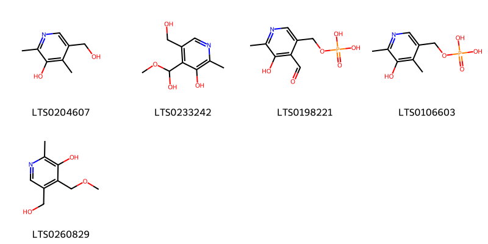{ width=100% }
    <figcaption>Hình ảnh cấu trúc hóa học của 5 hoạt chất thuộc nhóm Pyridines and derivatives gồm ['4-deoxypyridoxine (LTS0204607)', '4-[hydroxy(methoxy)methyl]-5-(hydroxymethyl)-2-methylpyridin-3-ol (LTS0233242)', 'pyridoxal phosphate (LTS0198221)', '(5-hydroxy-4,6-dimethylpyridin-3-yl)methoxyphosphonic acid (LTS0106603)', 'ginkgotoxin (LTS0260829)'].</figcaption>
</figure>
#### Nhóm Quinolines and derivatives
<figure markdown="span">
    { width=100% }
    <figcaption>Hình ảnh cấu trúc hóa học của 1 hoạt chất thuộc nhóm Quinolines and derivatives gồm ['6-hydroxykynurenic acid (LTS0184381)'].</figcaption>
</figure>
#### Nhóm Saturated hydrocarbons
<figure markdown="span">
    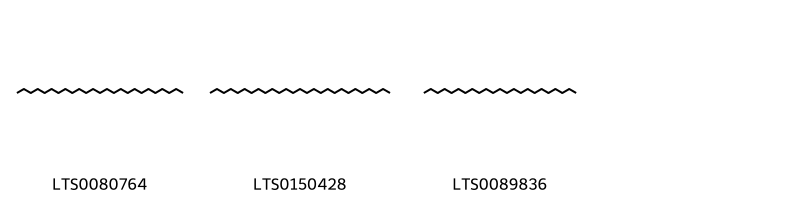{ width=100% }
    <figcaption>Hình ảnh cấu trúc hóa học của 3 hoạt chất thuộc nhóm Saturated hydrocarbons gồm ['pentacosane (LTS0080764)', 'heptacosane (LTS0150428)', 'tricosane (LTS0089836)'].</figcaption>
</figure>
#### Nhóm Steroids and steroid derivatives
<figure markdown="span">
    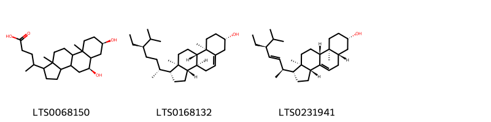{ width=100% }
    <figcaption>Hình ảnh cấu trúc hóa học của 3 hoạt chất thuộc nhóm Steroids and steroid derivatives gồm ['4-[(5s,7r)-5,7-dihydroxy-9a,11a-dimethyl-tetradecahydro-1h-cyclopenta[a]phenanthren-1-yl]pentanoic acid (LTS0068150)', 'sitosterol (LTS0168132)', '(1r,3ar,5as,7s,9as,9br,11ar)-1-[(2s,3e,5s)-5-ethyl-6-methylhept-3-en-2-yl]-9a,11a-dimethyl-1h,2h,3h,3ah,5h,5ah,6h,7h,8h,9h,9bh,10h,11h-cyclopenta[a]phenanthren-7-ol (LTS0231941)'].</figcaption>
</figure>
#### Nhóm Tetrapyrroles and derivatives
<figure markdown="span">
    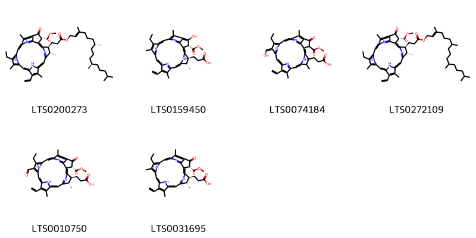{ width=100% }
    <figcaption>Hình ảnh cấu trúc hóa học của 6 hoạt chất thuộc nhóm Tetrapyrroles and derivatives gồm ['methyl (3r,21s,22s)-16-ethenyl-11-ethyl-12,17,21,26-tetramethyl-4-oxo-22-(3-oxo-3-{[(2e,7r,11r)-3,7,11,15-tetramethylhexadec-2-en-1-yl]oxy}propyl)-7,23,24,25-tetraazahexacyclo[18.2.1.1⁵,⁸.1¹⁰,¹³.1¹⁵,¹⁸.0²,⁶]hexacosa-1(23),2(6),5(26),7,9,11,13,15,17,19-decaene-3-carboxylate (LTS0200273)', '3-[(3r,21s,22s)-16-ethenyl-11-ethyl-4-hydroxy-3-(methoxycarbonyl)-12,17,21,26-tetramethyl-7,23,24,25-tetraazahexacyclo[18.2.1.1⁵,⁸.1¹⁰,¹³.1¹⁵,¹⁸.0²,⁶]hexacosa-1,4,6,8(26),9,11,13(25),14,16,18(24),19-undecaen-22-yl]propanoic acid (LTS0159450)', '3-[(12z)-16-ethenyl-11-ethyl-12-(hydroxymethylidene)-3-(methoxycarbonyl)-17,21,26-trimethyl-4-oxo-7,23,24,25-tetraazahexacyclo[18.2.1.1⁵,⁸.1¹⁰,¹³.1¹⁵,¹⁸.0²,⁶]hexacosa-1,5(26),6,8,10,13(25),14,16,18(24),19-decaen-22-yl]propanoic acid (LTS0074184)', 'methyl (3r,21s,22s)-16-ethenyl-11-ethyl-12,17,21,26-tetramethyl-4-oxo-22-(3-oxo-3-{[(2e)-3,7,11,15-tetramethylhexadec-2-en-1-yl]oxy}propyl)-7,23,24,25-tetraazahexacyclo[18.2.1.1⁵,⁸.1¹⁰,¹³.1¹⁵,¹⁸.0²,⁶]hexacosa-1(23),2(6),5(26),7,9,11,13,15,17,19-decaene-3-carboxylate (LTS0272109)', '3-[(3r,21s,22s)-16-ethenyl-11-ethyl-12-formyl-3-(methoxycarbonyl)-17,21,26-trimethyl-4-oxo-7,23,24,25-tetraazahexacyclo[18.2.1.1⁵,⁸.1¹⁰,¹³.1¹⁵,¹⁸.0²,⁶]hexacosa-1(23),2(6),5(26),7,9,11,13,15,17,19-decaen-22-yl]propanoic acid (LTS0010750)', '3-[(3r,21s,22s)-16-ethenyl-11-ethyl-3-(methoxycarbonyl)-12,17,21,26-tetramethyl-4-oxo-7,23,24,25-tetraazahexacyclo[18.2.1.1⁵,⁸.1¹⁰,¹³.1¹⁵,¹⁸.0²,⁶]hexacosa-1(23),2(6),5(26),7,9,11,13,15,17,19-decaen-22-yl]propanoic acid (LTS0031695)'].</figcaption>
</figure>
#### Nhóm Tropones
<figure markdown="span">
    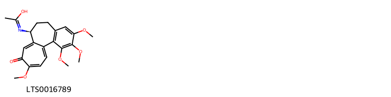{ width=100% }
    <figcaption>Hình ảnh cấu trúc hóa học của 1 hoạt chất thuộc nhóm Tropones gồm ['n-[(10s)-3,4,5,14-tetramethoxy-13-oxotricyclo[9.5.0.0²,⁷]hexadeca-1(16),2(7),3,5,11,14-hexaen-10-yl]ethanimidic acid (LTS0016789)'].</figcaption>
</figure>

---

### Dược dân tộc học

Danh sách các quốc gia có sử dụng *Ginkgo biloba* trong điều trị các bệnh. 

| Country   | Disease                                                                                             | Bệnh                                                                                                                                                                                                |
|:----------|:----------------------------------------------------------------------------------------------------|:----------------------------------------------------------------------------------------------------------------------------------------------------------------------------------------------------|
| China     | Astringent, Cosmetic, Digestive, Intoxicant, Sedative, Vermifuge, Vesicant, Antitussive, Antivinous | MYMEMORY WARNING: YOU USED ALL AVAILABLE FREE TRANSLATIONS FOR TODAY. NEXT AVAILABLE IN  09 HOURS 50 MINUTES 26 SECONDS VISIT HTTPS://MYMEMORY.TRANSLATED.NET/DOC/USAGELIMITS.PHP TO TRANSLATE MORE |
| Chinese   | Expectorant                                                                                         | MYMEMORY WARNING: YOU USED ALL AVAILABLE FREE TRANSLATIONS FOR TODAY. NEXT AVAILABLE IN  09 HOURS 50 MINUTES 23 SECONDS VISIT HTTPS://MYMEMORY.TRANSLATED.NET/DOC/USAGELIMITS.PHP TO TRANSLATE MORE |
| Elsewhere | Antitussive, nan, Expectorant, Tranquilizer, Vermifuge, Sedative, Vasodilator                       | MYMEMORY WARNING: YOU USED ALL AVAILABLE FREE TRANSLATIONS FOR TODAY. NEXT AVAILABLE IN  09 HOURS 50 MINUTES 19 SECONDS VISIT HTTPS://MYMEMORY.TRANSLATED.NET/DOC/USAGELIMITS.PHP TO TRANSLATE MORE |

---

