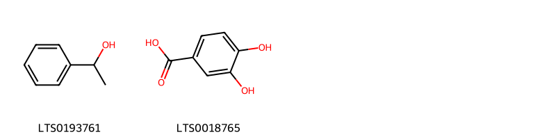
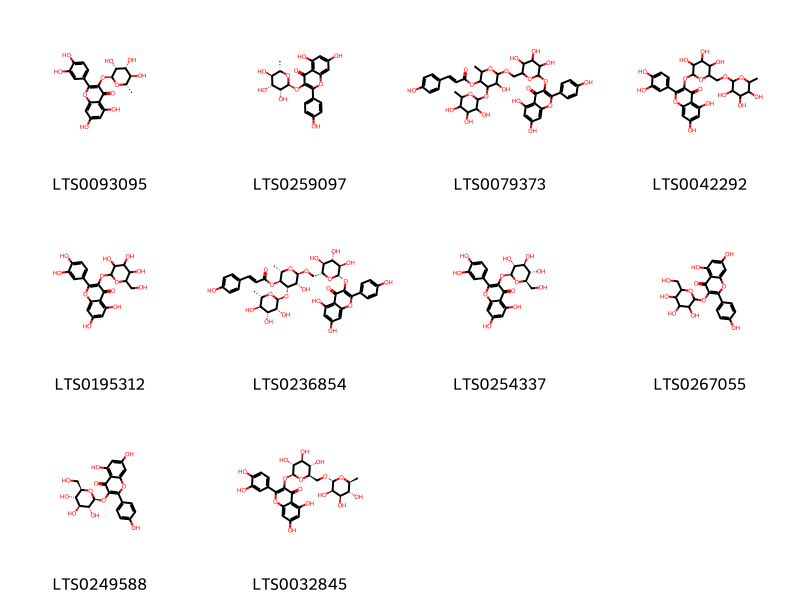
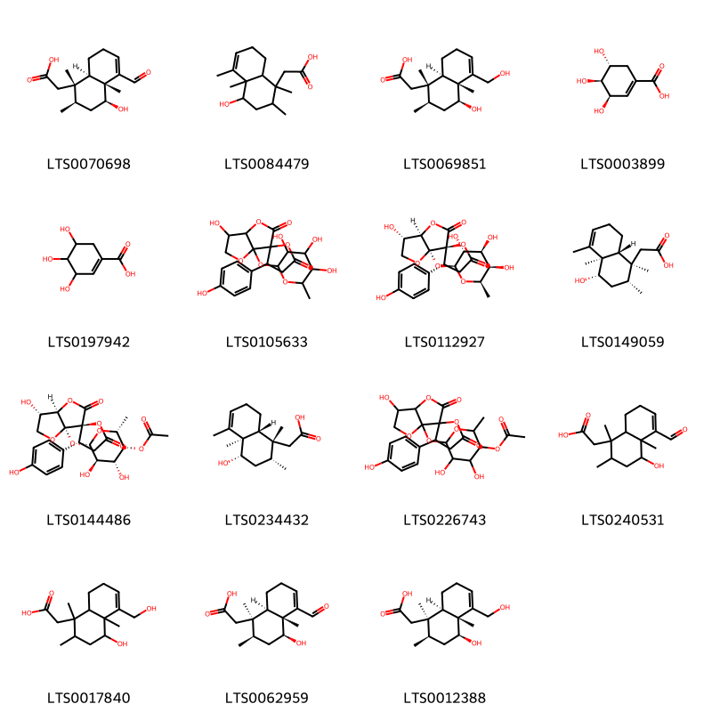
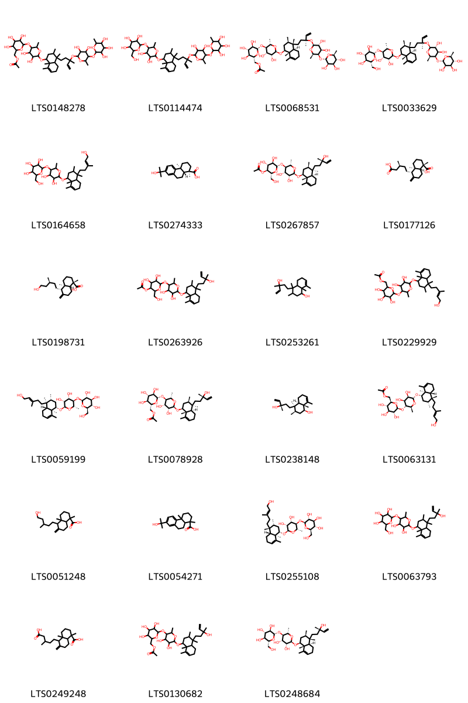

!!! abstract "Tóm tắt"

    Họ Gleicheniaceae gồm khoảng 1 chi và 1 loài được một số cộng đồng tại các quốc gia như Indochina, Elsewhere sử dụng trong một số trường hợp MYMEMORY WARNING: YOU USED ALL AVAILABLE FREE TRANSLATIONS FOR TODAY. NEXT AVAILABLE IN  16 HOURS 58 MINUTES 05 SECONDS VISIT HTTPS://MYMEMORY.TRANSLATED.NET/DOC/USAGELIMITS.PHP TO TRANSLATE MORE.

!!! info "DrDuke"

    James A. Duke sinh năm 1929-2017 là một nhà thực vật học người Mỹ. Đây là một trong những tác giả hàng đầu trong lĩnh vực dược dân tộc học với cuốn *CRC Handbook of Medicinal Herbs* và chính là người xây dựng lên cơ sở dữ liệu về hợp chất tự nhiên và dược dân tộc học tại Bộ nông nghiệp Hoa Kỳ. Các thông tin được đăng tải tại website [Dr. Duke's Phytochemical and Ethnobotanical Databases](https://phytochem.nal.usda.gov/). 
    Trong suốt thập niên 1970, ông lãnh đạo the Plant Taxonomy Laboratory, Plant Genetics and Germplasm Institute of the Agricultural Research Service, U.S. Department of Agriculture.
    Trong tài liệu này, các thông tin về dược dân tộc của các dược liệu được trích dẫn từ tài liệu của James A. Ducke với sự trợ giúp của phần mềm dịch thuật từ tiếng Anh sang tiếng Việt.
   

# Chi Dicranopteris

??? note "Danh sách các dược liệu thuộc chi"
    
	 - *Dicranopteris linearis*

---
## Dicranopteris linearis
### Thông tin về thực vật

!!! info "Phân loại thực vật của *Dicranopteris linearis* từ GIBF:"
    - **Kingdom:** Plantae
    - **Phylum:** Tracheophyta
    - **Order:** Gleicheniales
    - **Family:** Gleicheniaceae
    - **Genus:** Dicranopteris
    - **Species:** *Dicranopteris linearis*

 

| Label (VI)   | Label (EN)   | Scientific Name        | Descriptions (VI)   | Descriptions (EN)   | Also Known As (VI)   | Also Known As (EN)   |
|:-------------|:-------------|:-----------------------|:--------------------|:--------------------|:---------------------|:---------------------|
| N/A          | N/A          | Dicranopteris linearis | loài thực vật       | species of plant    | ['']                 | ['']                 |

#### Phân bố trên thế giới

**Từ CSDL GIBF** Viet Nam, Thailand, Ghana, French Polynesia, Singapore, Rwanda, Australia, Korea, Republic of, Indonesia, Sri Lanka, Malaysia, Guam, Japan, Eswatini, Chinese Taipei, Hong Kong, South Africa, United States of America, Madagascar

#### Phân bố tại Việt Nam

**Từ CSDL GIBF**: Lâm Đồng

---
### Thành phần hóa học
        
- Theo cơ sở dữ liệu lotus: Từ loài *Dicranopteris linearis* đã phân lập và xác định được 50 hoạt chất thuộc về các nhóm Organooxygen compounds, Flavonoids, Prenol lipids, Benzene and substituted derivatives. 

|    | chemicalTaxonomyClassyfireClass     |   smiles_count |
|---:|:------------------------------------|---------------:|
|  0 | Benzene and substituted derivatives |              2 |
|  1 | Flavonoids                          |             10 |
|  2 | Organooxygen compounds              |             15 |
|  3 | Prenol lipids                       |             23 |

#### Nhóm Benzene and substituted derivatives
<figure markdown="span">
    { width=100% }
    <figcaption>Hình ảnh cấu trúc hóa học của 2 hoạt chất thuộc nhóm Benzene and substituted derivatives gồm ['methylphenyl carbinol (LTS0193761)', '3,4-dihydroxybenzoic acid (LTS0018765)'].</figcaption>
</figure>
#### Nhóm Flavonoids
<figure markdown="span">
    { width=100% }
    <figcaption>Hình ảnh cấu trúc hóa học của 10 hoạt chất thuộc nhóm Flavonoids gồm ['quercitrin (LTS0093095)', 'afzelin (LTS0259097)', '6-[(6-{[5,7-dihydroxy-2-(4-hydroxyphenyl)-4-oxochromen-3-yl]oxy}-3,4,5-trihydroxyoxan-2-yl)methoxy]-5-hydroxy-2-methyl-4-[(3,4,5-trihydroxy-6-methyloxan-2-yl)oxy]oxan-3-yl 3-(4-hydroxyphenyl)prop-2-enoate (LTS0079373)', 'rutin (LTS0042292)', '2-(3,4-dihydroxyphenyl)-5,7-dihydroxy-3-{[3,4,5-trihydroxy-6-(hydroxymethyl)oxan-2-yl]oxy}chromen-4-one (LTS0195312)', '(2s,3s,4s,5r,6r)-6-{[(2r,3s,4s,5r,6s)-6-{[5,7-dihydroxy-2-(4-hydroxyphenyl)-4-oxochromen-3-yl]oxy}-3,4,5-trihydroxyoxan-2-yl]methoxy}-5-hydroxy-2-methyl-4-{[(2s,3r,4r,5r,6s)-3,4,5-trihydroxy-6-methyloxan-2-yl]oxy}oxan-3-yl (2e)-3-(4-hydroxyphenyl)prop-2-enoate (LTS0236854)', 'isoquercetin (LTS0254337)', 'trifolin (LTS0267055)', 'astragalin (LTS0249588)', '3-rutinosyl quercetin (LTS0032845)'].</figcaption>
</figure>
#### Nhóm Organooxygen compounds
<figure markdown="span">
    { width=100% }
    <figcaption>Hình ảnh cấu trúc hóa học của 15 hoạt chất thuộc nhóm Organooxygen compounds gồm ['[(1s,2r,4s,4ar,8ar)-5-formyl-4-hydroxy-1,2,4a-trimethyl-2,3,4,7,8,8a-hexahydronaphthalen-1-yl]acetic acid (LTS0070698)', '(4-hydroxy-1,2,4a,5-tetramethyl-2,3,4,7,8,8a-hexahydronaphthalen-1-yl)acetic acid (LTS0084479)', '[(1s,2r,4s,4ar,8ar)-4-hydroxy-5-(hydroxymethyl)-1,2,4a-trimethyl-2,3,4,7,8,8a-hexahydronaphthalen-1-yl]acetic acid (LTS0069851)', '(-)-shikimate (LTS0003899)', 'shikimate (LTS0197942)', "6-hydroxy-3'-(4-hydroxyphenyl)-3a-[(3,4,5-trihydroxy-6-methyloxan-2-yl)oxy]-dihydro-5h-spiro[furo[3,2-b]furan-3,2'-oxolane]-2,5'-dione (LTS0105633)", "(3s,3'r,3ar,6s,6ar)-6-hydroxy-3'-(4-hydroxyphenyl)-3a-{[(2s,3r,4s,5r,6r)-3,4,5-trihydroxy-6-methyloxan-2-yl]oxy}-dihydro-5h-spiro[furo[3,2-b]furan-3,2'-oxolane]-2,5'-dione (LTS0112927)", '[(1s,2r,4s,4ar,8ar)-4-hydroxy-1,2,4a,5-tetramethyl-2,3,4,7,8,8a-hexahydronaphthalen-1-yl]acetic acid (LTS0149059)', "(2r,3r,4r,5r,6s)-6-[(3s,3'r,3ar,6s,6ar)-6-hydroxy-3'-(4-hydroxyphenyl)-dihydro-5h-spiro[furo[3,2-b]furan-3,2'-oxolane]-2,5'-dioneoxy]-4,5-dihydroxy-2-methyloxan-3-yl acetate (LTS0144486)", '[(1r,2r,4s,4ar,8ar)-4-hydroxy-1,2,4a,5-tetramethyl-2,3,4,7,8,8a-hexahydronaphthalen-1-yl]acetic acid (LTS0234432)', "4,5-dihydroxy-6-[6-hydroxy-3'-(4-hydroxyphenyl)-dihydro-5h-spiro[furo[3,2-b]furan-3,2'-oxolane]-2,5'-dioneoxy]-2-methyloxan-3-yl acetate (LTS0226743)", '(5-formyl-4-hydroxy-1,2,4a-trimethyl-2,3,4,7,8,8a-hexahydronaphthalen-1-yl)acetic acid (LTS0240531)', '[4-hydroxy-5-(hydroxymethyl)-1,2,4a-trimethyl-2,3,4,7,8,8a-hexahydronaphthalen-1-yl]acetic acid (LTS0017840)', '[(1r,2r,4s,4ar,8ar)-5-formyl-4-hydroxy-1,2,4a-trimethyl-2,3,4,7,8,8a-hexahydronaphthalen-1-yl]acetic acid (LTS0062959)', '[(1r,2r,4s,4ar,8ar)-4-hydroxy-5-(hydroxymethyl)-1,2,4a-trimethyl-2,3,4,7,8,8a-hexahydronaphthalen-1-yl]acetic acid (LTS0012388)'].</figcaption>
</figure>
#### Nhóm Prenol lipids
<figure markdown="span">
    { width=100% }
    <figcaption>Hình ảnh cấu trúc hóa học của 23 hoạt chất thuộc nhóm Prenol lipids gồm ['(6-{[6-({4-[3-({3,4-dihydroxy-6-methyl-5-[(3,4,5-trihydroxy-6-methyloxan-2-yl)oxy]oxan-2-yl}oxy)-3-methylpent-4-en-1-yl]-3,4,8,8a-tetramethyl-1,2,3,4a,5,6-hexahydronaphthalen-1-yl}oxy)-4,5-dihydroxy-2-methyloxan-3-yl]oxy}-3,4,5-trihydroxyoxan-2-yl)methyl acetate (LTS0148278)', '2-{[6-({4-[3-({3,4-dihydroxy-6-methyl-5-[(3,4,5-trihydroxy-6-methyloxan-2-yl)oxy]oxan-2-yl}oxy)-3-methylpent-4-en-1-yl]-3,4,8,8a-tetramethyl-1,2,3,4a,5,6-hexahydronaphthalen-1-yl}oxy)-4,5-dihydroxy-2-methyloxan-3-yl]oxy}-6-(hydroxymethyl)oxane-3,4,5-triol (LTS0114474)', '[(2r,3s,4s,5r,6s)-6-{[(2s,3r,4s,5r,6r)-6-{[(1s,3r,4s,4ar,8ar)-4-[(3s)-3-{[(2s,3r,4r,5r,6r)-3,4-dihydroxy-6-methyl-5-{[(2s,3r,4r,5r,6s)-3,4,5-trihydroxy-6-methyloxan-2-yl]oxy}oxan-2-yl]oxy}-3-methylpent-4-en-1-yl]-3,4,8,8a-tetramethyl-1,2,3,4a,5,6-hexahydronaphthalen-1-yl]oxy}-4,5-dihydroxy-2-methyloxan-3-yl]oxy}-3,4,5-trihydroxyoxan-2-yl]methyl acetate (LTS0068531)', '(2s,3r,4s,5s,6r)-2-{[(2s,3r,4s,5r,6r)-6-{[(1s,3r,4s,4ar,8ar)-4-[(3s)-3-{[(2s,3r,4r,5r,6r)-3,4-dihydroxy-6-methyl-5-{[(2s,3r,4r,5r,6s)-3,4,5-trihydroxy-6-methyloxan-2-yl]oxy}oxan-2-yl]oxy}-3-methylpent-4-en-1-yl]-3,4,8,8a-tetramethyl-1,2,3,4a,5,6-hexahydronaphthalen-1-yl]oxy}-4,5-dihydroxy-2-methyloxan-3-yl]oxy}-6-(hydroxymethyl)oxane-3,4,5-triol (LTS0033629)', '2-[(4,5-dihydroxy-6-{[4-(5-hydroxy-3-methylpent-3-en-1-yl)-3,4,8,8a-tetramethyl-1,2,3,4a,5,6-hexahydronaphthalen-1-yl]oxy}-2-methyloxan-3-yl)oxy]-6-(hydroxymethyl)oxane-3,4,5-triol (LTS0164658)', '(1r,4as,10ar)-7-(2-hydroxypropan-2-yl)-1,4a-dimethyl-2,3,4,9,10,10a-hexahydrophenanthrene-1-carboxylic acid (LTS0274333)', '(2r,3s,4r,5r,6s)-6-{[(2s,3r,4s,5r,6r)-6-{[(1s,3r,4r,4ar,8ar)-4-[(3s)-3-hydroxy-3-methylpent-4-en-1-yl]-3,4,8,8a-tetramethyl-1,2,3,4a,5,6-hexahydronaphthalen-1-yl]oxy}-4,5-dihydroxy-2-methyloxan-3-yl]oxy}-4,5-dihydroxy-2-(hydroxymethyl)oxan-3-yl acetate (LTS0267857)', '(1s,4ar,5s,8ar)-5-[(3s)-4-carboxy-3-methylbutyl]-1,4a-dimethyl-6-methylidene-hexahydro-2h-naphthalene-1-carboxylic acid (LTS0177126)', '(1s,4ar,5s,8ar)-5-[(3s)-5-hydroxy-3-methylpentyl]-1,4a-dimethyl-6-methylidene-hexahydro-2h-naphthalene-1-carboxylic acid (LTS0198731)', '6-[(4,5-dihydroxy-6-{[4-(3-hydroxy-3-methylpent-4-en-1-yl)-3,4,8,8a-tetramethyl-1,2,3,4a,5,6-hexahydronaphthalen-1-yl]oxy}-2-methyloxan-3-yl)oxy]-4,5-dihydroxy-2-(hydroxymethyl)oxan-3-yl acetate (LTS0263926)', '4-(3-hydroxy-3-methylpent-4-en-1-yl)-3,4,8,8a-tetramethyl-1,2,3,4a,5,6-hexahydronaphthalen-1-ol (LTS0253261)', '{6-[(4,5-dihydroxy-6-{[4-(5-hydroxy-3-methylpent-3-en-1-yl)-3,4,8,8a-tetramethyl-1,2,3,4a,5,6-hexahydronaphthalen-1-yl]oxy}-2-methyloxan-3-yl)oxy]-3,4,5-trihydroxyoxan-2-yl}methyl acetate (LTS0229929)', '(2s,3r,4s,5s,6r)-2-{[(2s,3r,4s,5r,6r)-6-{[(1s,3r,4s,4ar,8ar)-4-[(3e)-5-hydroxy-3-methylpent-3-en-1-yl]-3,4,8,8a-tetramethyl-1,2,3,4a,5,6-hexahydronaphthalen-1-yl]oxy}-4,5-dihydroxy-2-methyloxan-3-yl]oxy}-6-(hydroxymethyl)oxane-3,4,5-triol (LTS0059199)', '[(2r,3s,4s,5r,6s)-6-{[(2s,3r,4s,5r,6r)-6-{[(1s,3r,4r,4ar,8ar)-4-[(3s)-3-hydroxy-3-methylpent-4-en-1-yl]-3,4,8,8a-tetramethyl-1,2,3,4a,5,6-hexahydronaphthalen-1-yl]oxy}-4,5-dihydroxy-2-methyloxan-3-yl]oxy}-3,4,5-trihydroxyoxan-2-yl]methyl acetate (LTS0078928)', '(1s,3r,4r,4ar,8ar)-4-[(3s)-3-hydroxy-3-methylpent-4-en-1-yl]-3,4,8,8a-tetramethyl-1,2,3,4a,5,6-hexahydronaphthalen-1-ol (LTS0238148)', '[(2r,3s,4s,5r,6s)-6-{[(2s,3r,4s,5r,6r)-6-{[(1s,3r,4r,4ar,8ar)-4-[(3e)-5-hydroxy-3-methylpent-3-en-1-yl]-3,4,8,8a-tetramethyl-1,2,3,4a,5,6-hexahydronaphthalen-1-yl]oxy}-4,5-dihydroxy-2-methyloxan-3-yl]oxy}-3,4,5-trihydroxyoxan-2-yl]methyl acetate (LTS0063131)', '5-(5-hydroxy-3-methylpentyl)-1,4a-dimethyl-6-methylidene-hexahydro-2h-naphthalene-1-carboxylic acid (LTS0051248)', '7-(2-hydroxypropan-2-yl)-1,4a-dimethyl-2,3,4,9,10,10a-hexahydrophenanthrene-1-carboxylic acid (LTS0054271)', '(2s,3r,4s,5s,6r)-2-{[(2s,3r,4s,5r,6r)-6-{[(1s,3r,4r,4ar,8ar)-4-[(3e)-5-hydroxy-3-methylpent-3-en-1-yl]-3,4,8,8a-tetramethyl-1,2,3,4a,5,6-hexahydronaphthalen-1-yl]oxy}-4,5-dihydroxy-2-methyloxan-3-yl]oxy}-6-(hydroxymethyl)oxane-3,4,5-triol (LTS0255108)', '2-[(4,5-dihydroxy-6-{[4-(3-hydroxy-3-methylpent-4-en-1-yl)-3,4,8,8a-tetramethyl-1,2,3,4a,5,6-hexahydronaphthalen-1-yl]oxy}-2-methyloxan-3-yl)oxy]-6-(hydroxymethyl)oxane-3,4,5-triol (LTS0063793)', '5-(4-carboxy-3-methylbutyl)-1,4a-dimethyl-6-methylidene-hexahydro-2h-naphthalene-1-carboxylic acid (LTS0249248)', '{6-[(4,5-dihydroxy-6-{[4-(3-hydroxy-3-methylpent-4-en-1-yl)-3,4,8,8a-tetramethyl-1,2,3,4a,5,6-hexahydronaphthalen-1-yl]oxy}-2-methyloxan-3-yl)oxy]-3,4,5-trihydroxyoxan-2-yl}methyl acetate (LTS0130682)', '(2s,3r,4s,5s,6r)-2-{[(2s,3r,4s,5r,6r)-6-{[(1s,3r,4s,4ar,8ar)-4-[(3s)-3-hydroxy-3-methylpent-4-en-1-yl]-3,4,8,8a-tetramethyl-1,2,3,4a,5,6-hexahydronaphthalen-1-yl]oxy}-4,5-dihydroxy-2-methyloxan-3-yl]oxy}-6-(hydroxymethyl)oxane-3,4,5-triol (LTS0248684)'].</figcaption>
</figure>

---

### Dược dân tộc học

Danh sách các quốc gia có sử dụng *Dicranopteris linearis* trong điều trị các bệnh. 

| Country   | Disease   | Bệnh                                                                                                                                                                                                |
|:----------|:----------|:----------------------------------------------------------------------------------------------------------------------------------------------------------------------------------------------------|
| Elsewhere | nan       | MYMEMORY WARNING: YOU USED ALL AVAILABLE FREE TRANSLATIONS FOR TODAY. NEXT AVAILABLE IN  16 HOURS 58 MINUTES 03 SECONDS VISIT HTTPS://MYMEMORY.TRANSLATED.NET/DOC/USAGELIMITS.PHP TO TRANSLATE MORE |
| Indochina | Vermifuge | MYMEMORY WARNING: YOU USED ALL AVAILABLE FREE TRANSLATIONS FOR TODAY. NEXT AVAILABLE IN  16 HOURS 58 MINUTES 00 SECONDS VISIT HTTPS://MYMEMORY.TRANSLATED.NET/DOC/USAGELIMITS.PHP TO TRANSLATE MORE |

---

