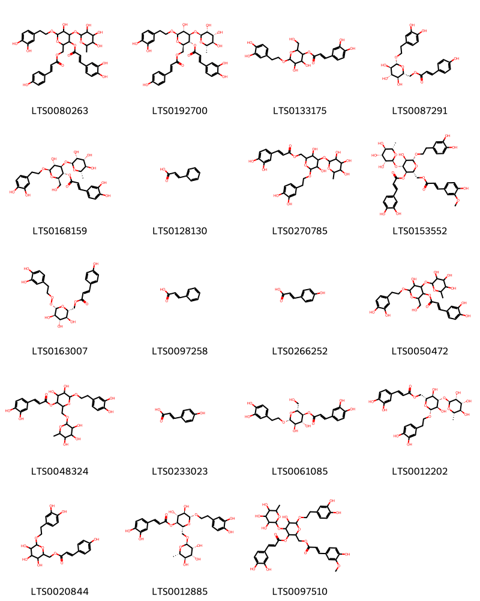
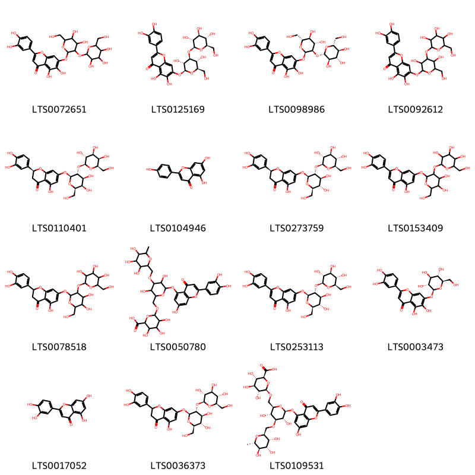
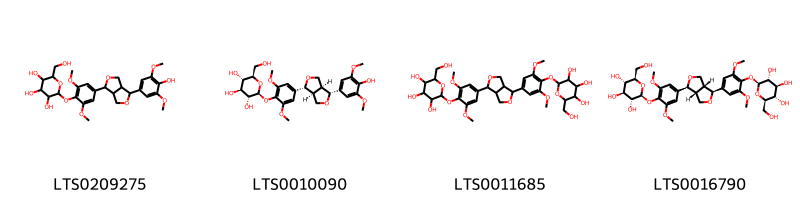
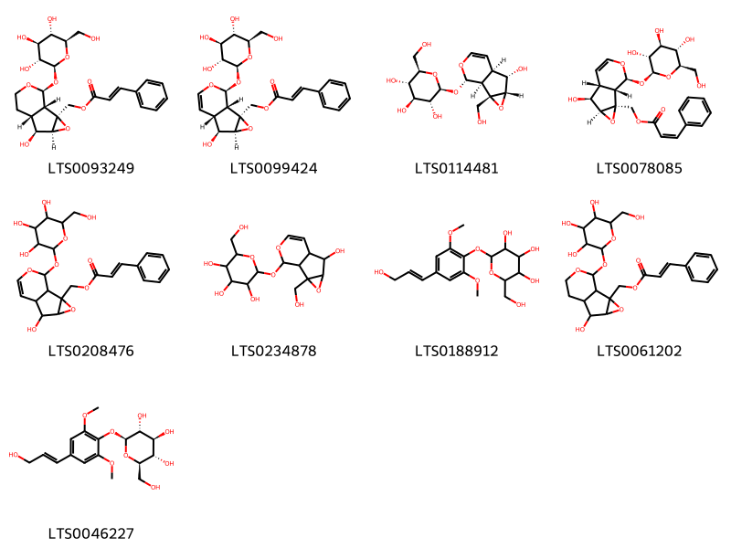
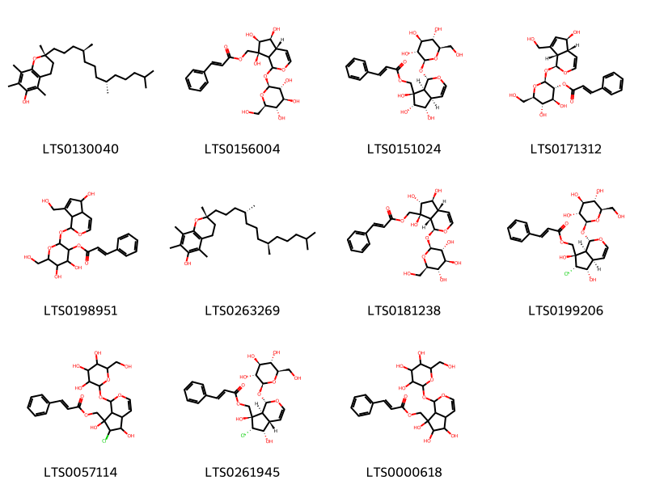

!!! abstract "Tóm tắt"

    Họ Globulariaceae gồm khoảng 1 chi và 3 loài được một số cộng đồng tại các quốc gia như Italian, German, ain, French, anish, Mediterranean, Dutch, Turkey sử dụng trong một số trường hợp MYMEMORY WARNING: YOU USED ALL AVAILABLE FREE TRANSLATIONS FOR TODAY. NEXT AVAILABLE IN  16 HOURS 44 MINUTES 45 SECONDS VISIT HTTPS://MYMEMORY.TRANSLATED.NET/DOC/USAGELIMITS.PHP TO TRANSLATE MORE.

!!! info "DrDuke"

    James A. Duke sinh năm 1929-2017 là một nhà thực vật học người Mỹ. Đây là một trong những tác giả hàng đầu trong lĩnh vực dược dân tộc học với cuốn *CRC Handbook of Medicinal Herbs* và chính là người xây dựng lên cơ sở dữ liệu về hợp chất tự nhiên và dược dân tộc học tại Bộ nông nghiệp Hoa Kỳ. Các thông tin được đăng tải tại website [Dr. Duke's Phytochemical and Ethnobotanical Databases](https://phytochem.nal.usda.gov/). 
    Trong suốt thập niên 1970, ông lãnh đạo the Plant Taxonomy Laboratory, Plant Genetics and Germplasm Institute of the Agricultural Research Service, U.S. Department of Agriculture.
    Trong tài liệu này, các thông tin về dược dân tộc của các dược liệu được trích dẫn từ tài liệu của James A. Ducke với sự trợ giúp của phần mềm dịch thuật từ tiếng Anh sang tiếng Việt.
   

# Chi Globularia

??? note "Danh sách các dược liệu thuộc chi"
    
	 - *Globularia alpinum*
	 - *Globularia alypum*
	 - *Globularia vulgaris*

---
## Globularia alpinum
### Thông tin về thực vật

!!! info "Phân loại thực vật của *Globularia nudicaulis* từ GIBF:"
    - **Kingdom:** Plantae
    - **Phylum:** Tracheophyta
    - **Order:** Lamiales
    - **Family:** Plantaginaceae
    - **Genus:** Globularia
    - **Species:** *Globularia nudicaulis*

 

| Label (VI)   | Label (EN)   | Scientific Name            | Descriptions (VI)   | Descriptions (EN)   | Also Known As (VI)   | Also Known As (EN)   |
|:-------------|:-------------|:---------------------------|:--------------------|:--------------------|:---------------------|:---------------------|
| N/A          | N/A          | Acanthopanax gracilistylus |                     | species of plant    | ['']                 | ['']                 |

#### Phân bố trên thế giới

**Từ CSDL GIBF** nan, Brazil, Réunion, Japan, Portugal, Korea, Republic of, United States of America, Chinese Taipei, China, New Zealand

#### Phân bố tại Việt Nam

**Từ CSDL GIBF**: Không có ghi nhận ở Việt Nam

---
### Thành phần hóa học
        
- Theo cơ sở dữ liệu lotus: Từ loài *Globularia nudicaulis* đã phân lập và xác định được Chưa có hoạt chất nào được phân lập. hoạt chất thuộc về các nhóm Không có hoạt chất nào được phân lập. 

Không có hình ảnh nào được tạo ra

---

### Dược dân tộc học

Danh sách các quốc gia có sử dụng *Globularia nudicaulis* trong điều trị các bệnh. 

| Country   | Disease             | Bệnh                                                                                                                                                                                                |
|:----------|:--------------------|:----------------------------------------------------------------------------------------------------------------------------------------------------------------------------------------------------|
| Turkey    | Diuretic, Purgative | MYMEMORY WARNING: YOU USED ALL AVAILABLE FREE TRANSLATIONS FOR TODAY. NEXT AVAILABLE IN  16 HOURS 44 MINUTES 43 SECONDS VISIT HTTPS://MYMEMORY.TRANSLATED.NET/DOC/USAGELIMITS.PHP TO TRANSLATE MORE |

---

---
## Globularia alypum
### Thông tin về thực vật

!!! info "Phân loại thực vật của *Globularia alypum* từ GIBF:"
    - **Kingdom:** Plantae
    - **Phylum:** Tracheophyta
    - **Order:** Lamiales
    - **Family:** Plantaginaceae
    - **Genus:** Globularia
    - **Species:** *Globularia alypum*

 

| Label (VI)   | Label (EN)   | Scientific Name   | Descriptions (VI)   | Descriptions (EN)   | Also Known As (VI)   | Also Known As (EN)   |
|:-------------|:-------------|:------------------|:--------------------|:--------------------|:---------------------|:---------------------|
| N/A          | N/A          | Globularia alypum | loài thực vật       | species of plant    | ['']                 | ['']                 |

#### Phân bố trên thế giới

**Từ CSDL GIBF** Algeria, Greece, Italy, France, Spain

#### Phân bố tại Việt Nam

**Từ CSDL GIBF**: Không có ghi nhận ở Việt Nam

---
### Thành phần hóa học
        
- Theo cơ sở dữ liệu lotus: Từ loài *Globularia alypum* đã phân lập và xác định được 58 hoạt chất thuộc về các nhóm Flavonoids, Cinnamic acids and derivatives, Organooxygen compounds, Prenol lipids, Lignan glycosides. 

|    | chemicalTaxonomyClassyfireClass   |   smiles_count |
|---:|:----------------------------------|---------------:|
|  0 | Cinnamic acids and derivatives    |             19 |
|  1 | Flavonoids                        |             15 |
|  2 | Lignan glycosides                 |              4 |
|  3 | Organooxygen compounds            |              9 |
|  4 | Prenol lipids                     |             11 |

#### Nhóm Cinnamic acids and derivatives
<figure markdown="span">
    { width=100% }
    <figcaption>Hình ảnh cấu trúc hóa học của 19 hoạt chất thuộc nhóm Cinnamic acids and derivatives gồm ['{6-[2-(3,4-dihydroxyphenyl)ethoxy]-3-{[3-(3,4-dihydroxyphenyl)prop-2-enoyl]oxy}-5-hydroxy-4-[(3,4,5-trihydroxy-6-methyloxan-2-yl)oxy]oxan-2-yl}methyl 3-(4-hydroxyphenyl)prop-2-enoate (LTS0080263)', '[(2r,3r,4r,5r,6r)-6-[2-(3,4-dihydroxyphenyl)ethoxy]-3-{[(2e)-3-(3,4-dihydroxyphenyl)prop-2-enoyl]oxy}-5-hydroxy-4-{[(2s,3r,4r,5r,6s)-3,4,5-trihydroxy-6-methyloxan-2-yl]oxy}oxan-2-yl]methyl (2e)-3-(4-hydroxyphenyl)prop-2-enoate (LTS0192700)', '6-[2-(3,4-dihydroxyphenyl)ethoxy]-4,5-dihydroxy-2-(hydroxymethyl)oxan-3-yl 3-(3,4-dihydroxyphenyl)prop-2-enoate (LTS0133175)', '[(2r,3s,4s,5r,6r)-6-[2-(3,4-dihydroxyphenyl)ethoxy]-3,4,5-trihydroxyoxan-2-yl]methyl (2e)-3-(4-hydroxyphenyl)prop-2-enoate (LTS0087291)', 'verbascoside (LTS0168159)', 'cinnamic acid (LTS0128130)', '{6-[2-(3,4-dihydroxyphenyl)ethoxy]-3,5-dihydroxy-4-[(3,4,5-trihydroxy-6-methyloxan-2-yl)oxy]oxan-2-yl}methyl 3-(3,4-dihydroxyphenyl)prop-2-enoate (LTS0270785)', '[(2r,3r,4r,5r,6r)-6-[2-(3,4-dihydroxyphenyl)ethoxy]-3-{[(2e)-3-(3,4-dihydroxyphenyl)prop-2-enoyl]oxy}-5-hydroxy-4-{[(2s,3r,4r,5r,6s)-3,4,5-trihydroxy-6-methyloxan-2-yl]oxy}oxan-2-yl]methyl (2e)-3-(4-hydroxy-3-methoxyphenyl)prop-2-enoate (LTS0153552)', '[(2r,3s,4s,5r,6s)-6-{[2-(3,4-dihydroxyphenyl)ethyl]peroxy}-3,4,5-trihydroxyoxan-2-yl]methyl (2e)-3-(4-hydroxyphenyl)prop-2-enoate (LTS0163007)', 'phenylacrylic acid (LTS0097258)', 'para-coumaric acid (LTS0266252)', '6-[2-(3,4-dihydroxyphenyl)ethoxy]-5-hydroxy-2-(hydroxymethyl)-4-[(3,4,5-trihydroxy-6-methyloxan-2-yl)oxy]oxan-3-yl 3-(3,4-dihydroxyphenyl)prop-2-enoate (LTS0050472)', '6-[2-(3,4-dihydroxyphenyl)ethoxy]-4,5-dihydroxy-2-{[(3,4,5-trihydroxy-6-methyloxan-2-yl)oxy]methyl}oxan-3-yl 3-(3,4-dihydroxyphenyl)prop-2-enoate (LTS0048324)', 'hydroxycinnamic acid (LTS0233023)', '(2r,3s,4r,5r,6r)-6-[2-(3,4-dihydroxyphenyl)ethoxy]-4,5-dihydroxy-2-(hydroxymethyl)oxan-3-yl (2e)-3-(3,4-dihydroxyphenyl)prop-2-enoate (LTS0061085)', 'isoacteoside (LTS0012202)', '{6-[2-(3,4-dihydroxyphenyl)ethoxy]-3,4,5-trihydroxyoxan-2-yl}methyl 3-(4-hydroxyphenyl)prop-2-enoate (LTS0020844)', 'forsythiaside (LTS0012885)', '{6-[2-(3,4-dihydroxyphenyl)ethoxy]-3-{[3-(3,4-dihydroxyphenyl)prop-2-enoyl]oxy}-5-hydroxy-4-[(3,4,5-trihydroxy-6-methyloxan-2-yl)oxy]oxan-2-yl}methyl 3-(4-hydroxy-3-methoxyphenyl)prop-2-enoate (LTS0097510)'].</figcaption>
</figure>
#### Nhóm Flavonoids
<figure markdown="span">
    { width=100% }
    <figcaption>Hình ảnh cấu trúc hóa học của 15 hoạt chất thuộc nhóm Flavonoids gồm ['7-{[4,5-dihydroxy-6-(hydroxymethyl)-3-{[3,4,5-trihydroxy-6-(hydroxymethyl)oxan-2-yl]oxy}oxan-2-yl]oxy}-2-(3,4-dihydroxyphenyl)-5,6-dihydroxychromen-4-one (LTS0072651)', '7-{[(2s,3r,4s,5r,6r)-3,5-dihydroxy-6-(hydroxymethyl)-4-{[(2s,3r,4s,5s,6r)-3,4,5-trihydroxy-6-(hydroxymethyl)oxan-2-yl]oxy}oxan-2-yl]oxy}-2-(3,4-dihydroxyphenyl)-5,6-dihydroxychromen-4-one (LTS0125169)', '7-{[(2r,3r,4s,5s,6r)-4,5-dihydroxy-6-(hydroxymethyl)-3-{[(2s,3r,4s,5s,6r)-3,4,5-trihydroxy-6-(hydroxymethyl)oxan-2-yl]oxy}oxan-2-yl]oxy}-2-(3,4-dihydroxyphenyl)-5,6-dihydroxychromen-4-one (LTS0098986)', '7-{[3,5-dihydroxy-6-(hydroxymethyl)-4-{[3,4,5-trihydroxy-6-(hydroxymethyl)oxan-2-yl]oxy}oxan-2-yl]oxy}-2-(3,4-dihydroxyphenyl)-5,6-dihydroxychromen-4-one (LTS0092612)', '(2s)-7-{[(2s,3r,4s,5r,6r)-4,5-dihydroxy-6-(hydroxymethyl)-3-{[(2s,3r,4s,5r,6r)-3,4,5-trihydroxy-6-(hydroxymethyl)oxan-2-yl]oxy}oxan-2-yl]oxy}-2-(3,4-dihydroxyphenyl)-5-hydroxy-2,3-dihydro-1-benzopyran-4-one (LTS0110401)', 'chamomile (LTS0104946)', 'eriodictoyl-7-o-sophoroside (LTS0273759)', '7-{[4,5-dihydroxy-6-(hydroxymethyl)-3-{[3,4,5-trihydroxy-6-(hydroxymethyl)oxan-2-yl]oxy}oxan-2-yl]oxy}-2-(3,4-dihydroxyphenyl)-5-hydroxychromen-4-one (LTS0153409)', '7-{[4,5-dihydroxy-6-(hydroxymethyl)-3-{[3,4,5-trihydroxy-6-(hydroxymethyl)oxan-2-yl]oxy}oxan-2-yl]oxy}-2-(3,4-dihydroxyphenyl)-5-hydroxy-2,3-dihydro-1-benzopyran-4-one (LTS0078518)', '6-[(6-{[2-(3,4-dihydroxyphenyl)-7-hydroxy-4-oxochromen-5-yl]oxy}-3,5-dihydroxy-4-[(3,4,5-trihydroxy-6-methyloxan-2-yl)methoxy]oxan-2-yl)methoxy]-3,4,5-trihydroxyoxane-2-carboxylic acid (LTS0050780)', '7-{[(2s,3r,4s,5s,6r)-4,5-dihydroxy-6-(hydroxymethyl)-3-{[(2s,3r,4s,5s,6r)-3,4,5-trihydroxy-6-(hydroxymethyl)oxan-2-yl]oxy}oxan-2-yl]oxy}-2-(3,4-dihydroxyphenyl)-5-hydroxychromen-4-one (LTS0253113)', '2-(3,4-dihydroxyphenyl)-5,6-dihydroxy-7-{[(2s,3r,4s,5s,6r)-3,4,5-trihydroxy-6-(hydroxymethyl)oxan-2-yl]oxy}chromen-4-one (LTS0003473)', 'luteolin (LTS0017052)', '7-{[(2s,3r,4s,5s,6r)-4,5-dihydroxy-6-(hydroxymethyl)-3-{[(2s,3r,4s,5s,6r)-3,4,5-trihydroxy-6-(hydroxymethyl)oxan-2-yl]oxy}oxan-2-yl]oxy}-2-(3,4-dihydroxyphenyl)-5-hydroxy-2,3-dihydro-1-benzopyran-4-one (LTS0036373)', '(2s,3s,4s,5r,6r)-6-{[(2r,3r,4s,5r,6s)-6-{[2-(3,4-dihydroxyphenyl)-7-hydroxy-4-oxochromen-5-yl]oxy}-3,5-dihydroxy-4-{[(2s,3r,4r,5r,6s)-3,4,5-trihydroxy-6-methyloxan-2-yl]methoxy}oxan-2-yl]methoxy}-3,4,5-trihydroxyoxane-2-carboxylic acid (LTS0109531)'].</figcaption>
</figure>
#### Nhóm Lignan glycosides
<figure markdown="span">
    { width=100% }
    <figcaption>Hình ảnh cấu trúc hóa học của 4 hoạt chất thuộc nhóm Lignan glycosides gồm ['2-{4-[4-(4-hydroxy-3,5-dimethoxyphenyl)-hexahydrofuro[3,4-c]furan-1-yl]-2,6-dimethoxyphenoxy}-6-(hydroxymethyl)oxane-3,4,5-triol (LTS0209275)', '(2s,3r,4s,5s,6r)-2-{4-[(1r,3as,4r,6as)-4-(4-hydroxy-3,5-dimethoxyphenyl)-hexahydrofuro[3,4-c]furan-1-yl]-2,6-dimethoxyphenoxy}-6-(hydroxymethyl)oxane-3,4,5-triol (LTS0010090)', '2-{4-[4-(3,5-dimethoxy-4-{[3,4,5-trihydroxy-6-(hydroxymethyl)oxan-2-yl]oxy}phenyl)-hexahydrofuro[3,4-c]furan-1-yl]-2,6-dimethoxyphenoxy}-6-(hydroxymethyl)oxane-3,4,5-triol (LTS0011685)', 'liriodendrin (LTS0016790)'].</figcaption>
</figure>
#### Nhóm Organooxygen compounds
<figure markdown="span">
    { width=100% }
    <figcaption>Hình ảnh cấu trúc hóa học của 9 hoạt chất thuộc nhóm Organooxygen compounds gồm ['[(1s,2s,4s,5s,6r,10s)-5-hydroxy-10-{[(2s,3r,4s,5s,6r)-3,4,5-trihydroxy-6-(hydroxymethyl)oxan-2-yl]oxy}-3,9-dioxatricyclo[4.4.0.0²,⁴]decan-2-yl]methyl (2e)-3-phenylprop-2-enoate (LTS0093249)', '[(1s,2s,4s,5s,6r,10s)-5-hydroxy-10-{[(2s,3r,4s,5s,6r)-3,4,5-trihydroxy-6-(hydroxymethyl)oxan-2-yl]oxy}-3,9-dioxatricyclo[4.4.0.0²,⁴]dec-7-en-2-yl]methyl (2e)-3-phenylprop-2-enoate (LTS0099424)', 'catalpol (LTS0114481)', '[(1s,2s,4s,5s,6r,10s)-5-hydroxy-10-{[(2s,3r,4s,5s,6r)-3,4,5-trihydroxy-6-(hydroxymethyl)oxan-2-yl]oxy}-3,9-dioxatricyclo[4.4.0.0²,⁴]dec-7-en-2-yl]methyl (2z)-3-phenylprop-2-enoate (LTS0078085)', '(5-hydroxy-10-{[3,4,5-trihydroxy-6-(hydroxymethyl)oxan-2-yl]oxy}-3,9-dioxatricyclo[4.4.0.0²,⁴]dec-7-en-2-yl)methyl 3-phenylprop-2-enoate (LTS0208476)', 'catalpol (LTS0234878)', '2-(hydroxymethyl)-6-[4-(3-hydroxyprop-1-en-1-yl)-2,6-dimethoxyphenoxy]oxane-3,4,5-triol (LTS0188912)', '(5-hydroxy-10-{[3,4,5-trihydroxy-6-(hydroxymethyl)oxan-2-yl]oxy}-3,9-dioxatricyclo[4.4.0.0²,⁴]decan-2-yl)methyl 3-phenylprop-2-enoate (LTS0061202)', 'syringin (LTS0046227)'].</figcaption>
</figure>
#### Nhóm Prenol lipids
<figure markdown="span">
    { width=100% }
    <figcaption>Hình ảnh cấu trúc hóa học của 11 hoạt chất thuộc nhóm Prenol lipids gồm ['(2r)-2,5,7,8-tetramethyl-2-[(4s,8s)-4,8,12-trimethyltridecyl]-3,4-dihydro-1-benzopyran-6-ol (LTS0130040)', '[(4ar,5s,6s,7s)-5,6,7-trihydroxy-1-{[(2s,3r,4s,5s,6r)-3,4,5-trihydroxy-6-(hydroxymethyl)oxan-2-yl]oxy}-1h,4ah,5h,6h,7ah-cyclopenta[c]pyran-7-yl]methyl (2e)-3-phenylprop-2-enoate (LTS0156004)', '[(1s,4ar,5s,6s,7r,7as)-5,6,7-trihydroxy-1-{[(2s,3r,4s,5s,6r)-3,4,5-trihydroxy-6-(hydroxymethyl)oxan-2-yl]oxy}-1h,4ah,5h,6h,7ah-cyclopenta[c]pyran-7-yl]methyl (2e)-3-phenylprop-2-enoate (LTS0151024)', '(2s,3r,4s,5s,6r)-2-{[(1s,4ar,5s,7as)-5-hydroxy-7-(hydroxymethyl)-1h,4ah,5h,7ah-cyclopenta[c]pyran-1-yl]oxy}-4,5-dihydroxy-6-(hydroxymethyl)oxan-3-yl (2e)-3-phenylprop-2-enoate (LTS0171312)', '4,5-dihydroxy-2-{[5-hydroxy-7-(hydroxymethyl)-1h,4ah,5h,7ah-cyclopenta[c]pyran-1-yl]oxy}-6-(hydroxymethyl)oxan-3-yl 3-phenylprop-2-enoate (LTS0198951)', 'vitamin e (LTS0263269)', '[(1s,4ar,5s,6r,7s,7as)-5,6,7-trihydroxy-1-{[(2s,3r,4s,5s,6r)-3,4,5-trihydroxy-6-(hydroxymethyl)oxan-2-yl]oxy}-1h,4ah,5h,6h,7ah-cyclopenta[c]pyran-7-yl]methyl (2e)-3-phenylprop-2-enoate (LTS0181238)', '[(1s,4ar,5s,6s,7r,7as)-6-chloro-5,7-dihydroxy-1-{[(2s,3r,4s,5s,6r)-3,4,5-trihydroxy-6-(hydroxymethyl)oxan-2-yl]oxy}-1h,4ah,5h,6h,7ah-cyclopenta[c]pyran-7-yl]methyl (2e)-3-phenylprop-2-enoate (LTS0199206)', '(6-chloro-5,7-dihydroxy-1-{[3,4,5-trihydroxy-6-(hydroxymethyl)oxan-2-yl]oxy}-1h,4ah,5h,6h,7ah-cyclopenta[c]pyran-7-yl)methyl 3-phenylprop-2-enoate (LTS0057114)', '[(1s,4as,5s,6s,7r,7as)-6-chloro-5,7-dihydroxy-1-{[(2s,3r,4s,5s,6r)-3,4,5-trihydroxy-6-(hydroxymethyl)oxan-2-yl]oxy}-1h,4ah,5h,6h,7ah-cyclopenta[c]pyran-7-yl]methyl (2e)-3-phenylprop-2-enoate (LTS0261945)', '(5,6,7-trihydroxy-1-{[3,4,5-trihydroxy-6-(hydroxymethyl)oxan-2-yl]oxy}-1h,4ah,5h,6h,7ah-cyclopenta[c]pyran-7-yl)methyl 3-phenylprop-2-enoate (LTS0000618)'].</figcaption>
</figure>

---

### Dược dân tộc học

Danh sách các quốc gia có sử dụng *Globularia alypum* trong điều trị các bệnh. 

| Country       | Disease                | Bệnh                                                                                                                                                                                                |
|:--------------|:-----------------------|:----------------------------------------------------------------------------------------------------------------------------------------------------------------------------------------------------|
| Mediterranean | Aphrodisiac, Purgative | MYMEMORY WARNING: YOU USED ALL AVAILABLE FREE TRANSLATIONS FOR TODAY. NEXT AVAILABLE IN  16 HOURS 44 MINUTES 27 SECONDS VISIT HTTPS://MYMEMORY.TRANSLATED.NET/DOC/USAGELIMITS.PHP TO TRANSLATE MORE |
| ain           | nan                    | MYMEMORY WARNING: YOU USED ALL AVAILABLE FREE TRANSLATIONS FOR TODAY. NEXT AVAILABLE IN  16 HOURS 44 MINUTES 24 SECONDS VISIT HTTPS://MYMEMORY.TRANSLATED.NET/DOC/USAGELIMITS.PHP TO TRANSLATE MORE |

---

---
## Globularia vulgaris
### Thông tin về thực vật

!!! info "Phân loại thực vật của *Globularia vulgaris* từ GIBF:"
    - **Kingdom:** Plantae
    - **Phylum:** Tracheophyta
    - **Order:** Lamiales
    - **Family:** Plantaginaceae
    - **Genus:** Globularia
    - **Species:** *Globularia vulgaris*

 

| Label (VI)   | Label (EN)   | Scientific Name     | Descriptions (VI)   | Descriptions (EN)   | Also Known As (VI)   | Also Known As (EN)   |
|:-------------|:-------------|:--------------------|:--------------------|:--------------------|:---------------------|:---------------------|
| N/A          | N/A          | Globularia vulgaris | loài thực vật       | species of plant    | ['']                 | ['']                 |

#### Phân bố trên thế giới

**Từ CSDL GIBF** Sweden, France, Spain

#### Phân bố tại Việt Nam

**Từ CSDL GIBF**: Không có ghi nhận ở Việt Nam

---
### Thành phần hóa học
        
- Theo cơ sở dữ liệu lotus: Từ loài *Globularia vulgaris* đã phân lập và xác định được Chưa có hoạt chất nào được phân lập. hoạt chất thuộc về các nhóm Không có hoạt chất nào được phân lập. 

Không có hình ảnh nào được tạo ra

---

### Dược dân tộc học

Danh sách các quốc gia có sử dụng *Globularia vulgaris* trong điều trị các bệnh. 

| Country   | Disease   | Bệnh                                                                                                                                                                                                |
|:----------|:----------|:----------------------------------------------------------------------------------------------------------------------------------------------------------------------------------------------------|
| Dutch     | Laxative  | MYMEMORY WARNING: YOU USED ALL AVAILABLE FREE TRANSLATIONS FOR TODAY. NEXT AVAILABLE IN  16 HOURS 43 MINUTES 53 SECONDS VISIT HTTPS://MYMEMORY.TRANSLATED.NET/DOC/USAGELIMITS.PHP TO TRANSLATE MORE |
| French    | Stomachic | MYMEMORY WARNING: YOU USED ALL AVAILABLE FREE TRANSLATIONS FOR TODAY. NEXT AVAILABLE IN  16 HOURS 43 MINUTES 50 SECONDS VISIT HTTPS://MYMEMORY.TRANSLATED.NET/DOC/USAGELIMITS.PHP TO TRANSLATE MORE |
| German    | Sudorific | MYMEMORY WARNING: YOU USED ALL AVAILABLE FREE TRANSLATIONS FOR TODAY. NEXT AVAILABLE IN  16 HOURS 43 MINUTES 47 SECONDS VISIT HTTPS://MYMEMORY.TRANSLATED.NET/DOC/USAGELIMITS.PHP TO TRANSLATE MORE |
| Italian   | Diuretic  | MYMEMORY WARNING: YOU USED ALL AVAILABLE FREE TRANSLATIONS FOR TODAY. NEXT AVAILABLE IN  16 HOURS 43 MINUTES 45 SECONDS VISIT HTTPS://MYMEMORY.TRANSLATED.NET/DOC/USAGELIMITS.PHP TO TRANSLATE MORE |
| ain       | Purgative | MYMEMORY WARNING: YOU USED ALL AVAILABLE FREE TRANSLATIONS FOR TODAY. NEXT AVAILABLE IN  16 HOURS 43 MINUTES 42 SECONDS VISIT HTTPS://MYMEMORY.TRANSLATED.NET/DOC/USAGELIMITS.PHP TO TRANSLATE MORE |
| anish     | Poison    | MYMEMORY WARNING: YOU USED ALL AVAILABLE FREE TRANSLATIONS FOR TODAY. NEXT AVAILABLE IN  16 HOURS 43 MINUTES 39 SECONDS VISIT HTTPS://MYMEMORY.TRANSLATED.NET/DOC/USAGELIMITS.PHP TO TRANSLATE MORE |

---

