!!! abstract "Tóm tắt"

    Họ Gnetaceae gồm khoảng 1 chi và 2 loài được một số cộng đồng tại các quốc gia như India sử dụng trong một số trường hợp MYMEMORY WARNING: YOU USED ALL AVAILABLE FREE TRANSLATIONS FOR TODAY. NEXT AVAILABLE IN  15 HOURS 15 MINUTES 30 SECONDS VISIT HTTPS://MYMEMORY.TRANSLATED.NET/DOC/USAGELIMITS.PHP TO TRANSLATE MORE.

!!! info "DrDuke"

    James A. Duke sinh năm 1929-2017 là một nhà thực vật học người Mỹ. Đây là một trong những tác giả hàng đầu trong lĩnh vực dược dân tộc học với cuốn *CRC Handbook of Medicinal Herbs* và chính là người xây dựng lên cơ sở dữ liệu về hợp chất tự nhiên và dược dân tộc học tại Bộ nông nghiệp Hoa Kỳ. Các thông tin được đăng tải tại website [Dr. Duke's Phytochemical and Ethnobotanical Databases](https://phytochem.nal.usda.gov/). 
    Trong suốt thập niên 1970, ông lãnh đạo the Plant Taxonomy Laboratory, Plant Genetics and Germplasm Institute of the Agricultural Research Service, U.S. Department of Agriculture.
    Trong tài liệu này, các thông tin về dược dân tộc của các dược liệu được trích dẫn từ tài liệu của James A. Ducke với sự trợ giúp của phần mềm dịch thuật từ tiếng Anh sang tiếng Việt.
   

# Chi Gnetum

??? note "Danh sách các dược liệu thuộc chi"
    
	 - *Gnetum montanum*
	 - *Gnetum scandens*

---
## Gnetum montanum
### Thông tin về thực vật

!!! info "Phân loại thực vật của *Gnetum montanum* từ GIBF:"
    - **Kingdom:** Plantae
    - **Phylum:** Tracheophyta
    - **Order:** Gnetales
    - **Family:** Gnetaceae
    - **Genus:** Gnetum
    - **Species:** *Gnetum montanum*

 

| Label (VI)   | Label (EN)   | Scientific Name   | Descriptions (VI)   | Descriptions (EN)   | Also Known As (VI)   | Also Known As (EN)   |
|:-------------|:-------------|:------------------|:--------------------|:--------------------|:---------------------|:---------------------|
| N/A          | N/A          | Gnetum montanum   | loài thực vật       | species of plant    | ['']                 | ['']                 |

#### Phân bố trên thế giới

**Từ CSDL GIBF** Viet Nam, nan, Chinese Taipei, Antarctica, Thailand, Myanmar, Bhutan, India, Lao People’s Democratic Republic, United States of America, China, Nepal, Hong Kong

#### Phân bố tại Việt Nam

**Từ CSDL GIBF**: Ha Giang, Ha Tinh, Ninh Thuan, Thua Thien-Hue

---
### Thành phần hóa học
        
- Theo cơ sở dữ liệu lotus: Từ loài *Gnetum montanum* đã phân lập và xác định được 60 hoạt chất thuộc về các nhóm Stilbenes, Furanoid lignans, Aporphines, Flavonoids, Isoquinolines and derivatives, 2-arylbenzofuran flavonoids, Prenol lipids, Lignan glycosides, Fatty Acyls, Aryltetralin lignans, Phenols, Tetrahydroisoquinolines, Steroids and steroid derivatives, Benzene and substituted derivatives. 

|    | chemicalTaxonomyClassyfireClass     |   smiles_count |
|---:|:------------------------------------|---------------:|
|  0 |                                     |              2 |
|  1 | 2-arylbenzofuran flavonoids         |              4 |
|  2 | Aporphines                          |              2 |
|  3 | Aryltetralin lignans                |              2 |
|  4 | Benzene and substituted derivatives |              3 |
|  5 | Fatty Acyls                         |              2 |
|  6 | Flavonoids                          |              1 |
|  7 | Furanoid lignans                    |              8 |
|  8 | Isoquinolines and derivatives       |              6 |
|  9 | Lignan glycosides                   |              6 |
| 10 | Phenols                             |              2 |
| 11 | Prenol lipids                       |              1 |
| 12 | Steroids and steroid derivatives    |              4 |
| 13 | Stilbenes                           |             16 |
| 14 | Tetrahydroisoquinolines             |              1 |

#### Nhóm 
<figure markdown="span">
    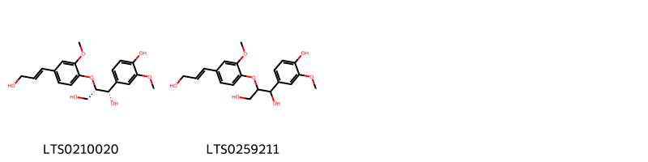{ width=100% }
    <figcaption>Hình ảnh cấu trúc hóa học của 2 hoạt chất thuộc nhóm  gồm ['(1s,2s)-1-(4-hydroxy-3-methoxyphenyl)-2-{4-[(1e)-3-hydroxyprop-1-en-1-yl]-2-methoxyphenoxy}propane-1,3-diol (LTS0210020)', '1-(4-hydroxy-3-methoxyphenyl)-2-[4-(3-hydroxyprop-1-en-1-yl)-2-methoxyphenoxy]propane-1,3-diol (LTS0259211)'].</figcaption>
</figure>
#### Nhóm 2-arylbenzofuran flavonoids
<figure markdown="span">
    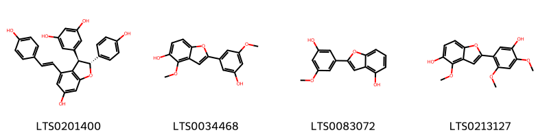{ width=100% }
    <figcaption>Hình ảnh cấu trúc hóa học của 4 hoạt chất thuộc nhóm 2-arylbenzofuran flavonoids gồm ['ε-viniferin (LTS0201400)', '2-(3-hydroxy-5-methoxyphenyl)-4-methoxy-1-benzofuran-5-ol (LTS0034468)', '2-(3-hydroxy-5-methoxyphenyl)-1-benzofuran-4-ol (LTS0083072)', '2-(5-hydroxy-2,4-dimethoxyphenyl)-4-methoxy-1-benzofuran-5-ol (LTS0213127)'].</figcaption>
</figure>
#### Nhóm Aporphines
<figure markdown="span">
    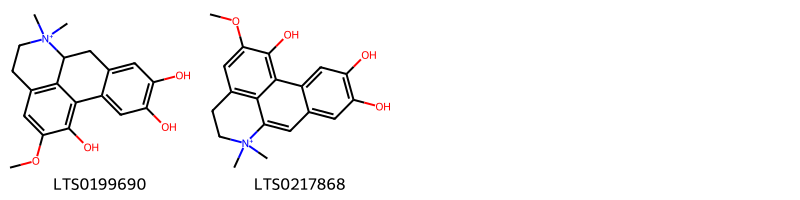{ width=100% }
    <figcaption>Hình ảnh cấu trúc hóa học của 2 hoạt chất thuộc nhóm Aporphines gồm ['4,5,16-trihydroxy-15-methoxy-10,10-dimethyl-10-azatetracyclo[7.7.1.0²,⁷.0¹³,¹⁷]heptadeca-1(16),2,4,6,13(17),14-hexaen-10-ium (LTS0199690)', '4,5,16-trihydroxy-15-methoxy-10,10-dimethyl-10-azatetracyclo[7.7.1.0²,⁷.0¹³,¹⁷]heptadeca-1(17),2(7),3,5,8,13,15-heptaen-10-ium (LTS0217868)'].</figcaption>
</figure>
#### Nhóm Aryltetralin lignans
<figure markdown="span">
    { width=100% }
    <figcaption>Hình ảnh cấu trúc hóa học của 2 hoạt chất thuộc nhóm Aryltetralin lignans gồm ['(+)-isolariciresinol (LTS0164886)', '8-(4-hydroxy-3-methoxyphenyl)-6,7-bis(hydroxymethyl)-3-methoxy-5,6,7,8-tetrahydronaphthalen-2-ol (LTS0008421)'].</figcaption>
</figure>
#### Nhóm Benzene and substituted derivatives
<figure markdown="span">
    { width=100% }
    <figcaption>Hình ảnh cấu trúc hóa học của 3 hoạt chất thuộc nhóm Benzene and substituted derivatives gồm ['4-hydroxyphenylpyruvic acid (LTS0129018)', 'p-hydroxyphenylacetaldehyde (LTS0005926)', 'tyramine (LTS0111335)'].</figcaption>
</figure>
#### Nhóm Fatty Acyls
<figure markdown="span">
    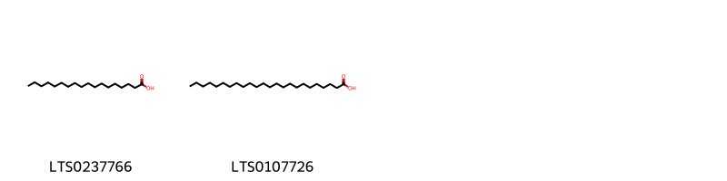{ width=100% }
    <figcaption>Hình ảnh cấu trúc hóa học của 2 hoạt chất thuộc nhóm Fatty Acyls gồm ['stearic acid (LTS0237766)', 'lignoceric acid (LTS0107726)'].</figcaption>
</figure>
#### Nhóm Flavonoids
<figure markdown="span">
    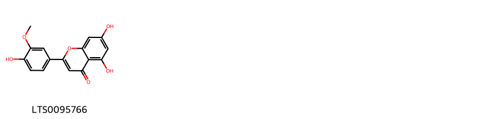{ width=100% }
    <figcaption>Hình ảnh cấu trúc hóa học của 1 hoạt chất thuộc nhóm Flavonoids gồm ['chrysoeriol (LTS0095766)'].</figcaption>
</figure>
#### Nhóm Furanoid lignans
<figure markdown="span">
    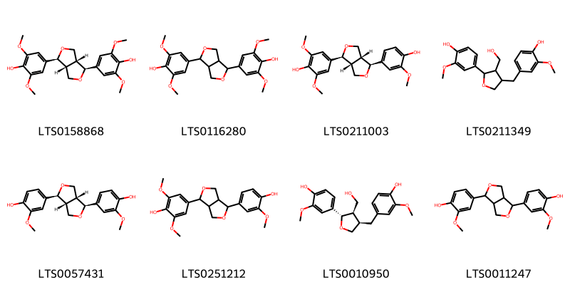{ width=100% }
    <figcaption>Hình ảnh cấu trúc hóa học của 8 hoạt chất thuộc nhóm Furanoid lignans gồm ['(+)-syringaresinol (LTS0158868)', 'syringaresinol (LTS0116280)', '(-)-medioresinol (LTS0211003)', '4-{4-[(4-hydroxy-3-methoxyphenyl)methyl]-3-(hydroxymethyl)oxolan-2-yl}-2-methoxyphenol (LTS0211349)', 'pinoresinol (LTS0057431)', '4-[4-(4-hydroxy-3-methoxyphenyl)-hexahydrofuro[3,4-c]furan-1-yl]-2,6-dimethoxyphenol (LTS0251212)', 'lariciresinol (LTS0010950)', 'pinoresinol (LTS0011247)'].</figcaption>
</figure>
#### Nhóm Isoquinolines and derivatives
<figure markdown="span">
    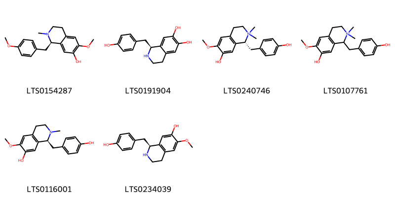{ width=100% }
    <figcaption>Hình ảnh cấu trúc hóa học của 6 hoạt chất thuộc nhóm Isoquinolines and derivatives gồm ['(1r)-6-methoxy-1-[(4-methoxyphenyl)methyl]-2-methyl-3,4-dihydro-1h-isoquinolin-7-ol (LTS0154287)', '(-)-higenamine (LTS0191904)', 'magnocurarine (LTS0240746)', '7-hydroxy-1-[(4-hydroxyphenyl)methyl]-6-methoxy-2,2-dimethyl-3,4-dihydro-1h-isoquinolin-2-ium (LTS0107761)', '(s)-n-methylcoclaurine (LTS0116001)', '(+-)-coclaurine (LTS0234039)'].</figcaption>
</figure>
#### Nhóm Lignan glycosides
<figure markdown="span">
    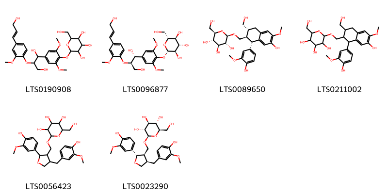{ width=100% }
    <figcaption>Hình ảnh cấu trúc hóa học của 6 hoạt chất thuộc nhóm Lignan glycosides gồm ['2-(4-{1,3-dihydroxy-2-[4-(3-hydroxyprop-1-en-1-yl)-2-methoxyphenoxy]propyl}-2,6-dimethoxyphenoxy)-6-(hydroxymethyl)oxane-3,4,5-triol (LTS0190908)', '(2s,3r,4s,5s,6r)-2-{4-[(1r,2r)-1,3-dihydroxy-2-{4-[(1e)-3-hydroxyprop-1-en-1-yl]-2-methoxyphenoxy}propyl]-2,6-dimethoxyphenoxy}-6-(hydroxymethyl)oxane-3,4,5-triol (LTS0096877)', '(2r,3r,4s,5s,6r)-2-{[(1s,2r,3r)-7-hydroxy-1-(4-hydroxy-3-methoxyphenyl)-3-(hydroxymethyl)-6-methoxy-1,2,3,4-tetrahydronaphthalen-2-yl]methoxy}-6-(hydroxymethyl)oxane-3,4,5-triol (LTS0089650)', '2-{[7-hydroxy-1-(4-hydroxy-3-methoxyphenyl)-3-(hydroxymethyl)-6-methoxy-1,2,3,4-tetrahydronaphthalen-2-yl]methoxy}-6-(hydroxymethyl)oxane-3,4,5-triol (LTS0211002)', '2-{[2-(4-hydroxy-3-methoxyphenyl)-4-[(4-hydroxy-3-methoxyphenyl)methyl]oxolan-3-yl]methoxy}-6-(hydroxymethyl)oxane-3,4,5-triol (LTS0056423)', '(2r,3r,4s,5s,6r)-2-{[(2s,3r,4r)-2-(4-hydroxy-3-methoxyphenyl)-4-[(4-hydroxy-3-methoxyphenyl)methyl]oxolan-3-yl]methoxy}-6-(hydroxymethyl)oxane-3,4,5-triol (LTS0023290)'].</figcaption>
</figure>
#### Nhóm Phenols
<figure markdown="span">
    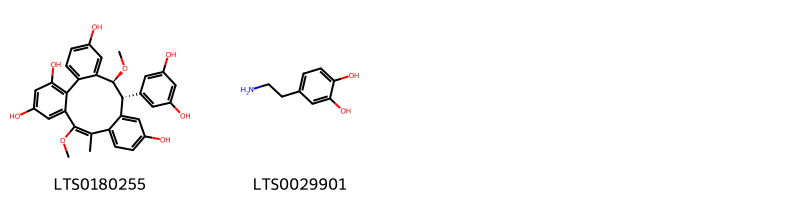{ width=100% }
    <figcaption>Hình ảnh cấu trúc hóa học của 2 hoạt chất thuộc nhóm Phenols gồm ['(8e,16r,17s)-16-(3,5-dihydroxyphenyl)-8,17-dimethoxy-9-methyltetracyclo[16.4.0.0²,⁷.0¹⁰,¹⁵]docosa-1(22),2,4,6,8,10,12,14,18,20-decaene-3,5,13,20-tetrol (LTS0180255)', 'dopamine (LTS0029901)'].</figcaption>
</figure>
#### Nhóm Prenol lipids
<figure markdown="span">
    { width=100% }
    <figcaption>Hình ảnh cấu trúc hóa học của 1 hoạt chất thuộc nhóm Prenol lipids gồm ['ursolic acid (LTS0250838)'].</figcaption>
</figure>
#### Nhóm Steroids and steroid derivatives
<figure markdown="span">
    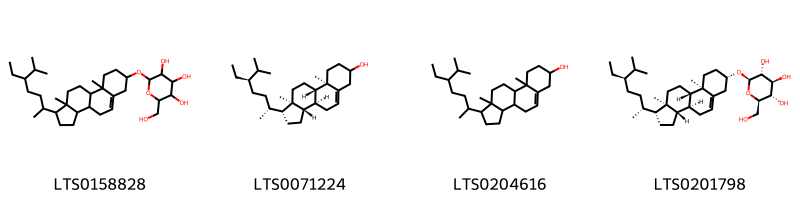{ width=100% }
    <figcaption>Hình ảnh cấu trúc hóa học của 4 hoạt chất thuộc nhóm Steroids and steroid derivatives gồm ['2-{[1-(5-ethyl-6-methylheptan-2-yl)-9a,11a-dimethyl-1h,2h,3h,3ah,3bh,4h,6h,7h,8h,9h,9bh,10h,11h-cyclopenta[a]phenanthren-7-yl]oxy}-6-(hydroxymethyl)oxane-3,4,5-triol (LTS0158828)', 'stigmast-5-en-3-ol (LTS0071224)', 'stigmast-5-en-3-ol, (3β)- (LTS0204616)', 'sitogluside (LTS0201798)'].</figcaption>
</figure>
#### Nhóm Stilbenes
<figure markdown="span">
    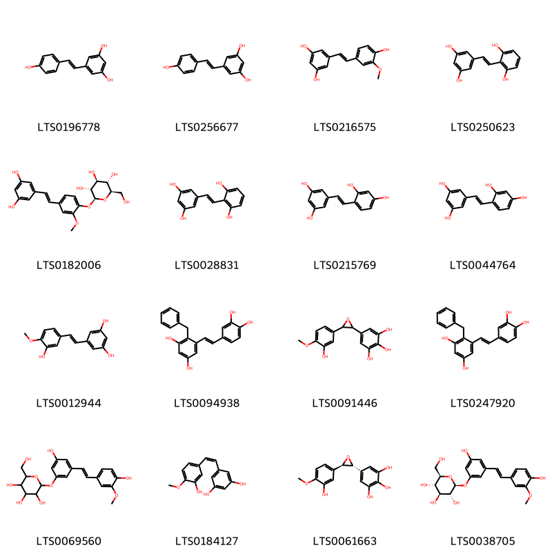{ width=100% }
    <figcaption>Hình ảnh cấu trúc hóa học của 16 hoạt chất thuộc nhóm Stilbenes gồm ['tocilizumab (LTS0196778)', 'resveratrol (LTS0256677)', 'isorhapontigenin (LTS0216575)', '5-[(1e)-2-(2,6-dihydroxyphenyl)ethenyl]benzene-1,3-diol (LTS0250623)', '(2s,3r,4s,5s,6r)-2-{4-[(1e)-2-(3,5-dihydroxyphenyl)ethenyl]-2-methoxyphenoxy}-6-(hydroxymethyl)oxane-3,4,5-triol (LTS0182006)', '5-[2-(2,6-dihydroxyphenyl)ethenyl]benzene-1,3-diol (LTS0028831)', '5-[2-(2,4-dihydroxyphenyl)ethenyl]benzene-1,3-diol (LTS0215769)', '5-[(1e)-2-(2,4-dihydroxyphenyl)ethenyl]benzene-1,3-diol (LTS0044764)', 'rhapontigenin (LTS0012944)', '4-benzyl-5-[2-(3,4-dihydroxyphenyl)ethenyl]benzene-1,3-diol (LTS0094938)', '5-[3-(3-hydroxy-4-methoxyphenyl)oxiran-2-yl]benzene-1,2,3-triol (LTS0091446)', '4-benzyl-5-[(1e)-2-(3,4-dihydroxyphenyl)ethenyl]benzene-1,3-diol (LTS0247920)', '2-{3-hydroxy-5-[2-(4-hydroxy-3-methoxyphenyl)ethenyl]phenoxy}-6-(hydroxymethyl)oxane-3,4,5-triol (LTS0069560)', '5-[(1z)-2-(3-hydroxy-4-methoxyphenyl)ethenyl]benzene-1,3-diol (LTS0184127)', '5-[(2r,3r)-3-(3-hydroxy-4-methoxyphenyl)oxiran-2-yl]benzene-1,2,3-triol (LTS0061663)', 'isorhapontin (LTS0038705)'].</figcaption>
</figure>
#### Nhóm Tetrahydroisoquinolines
<figure markdown="span">
    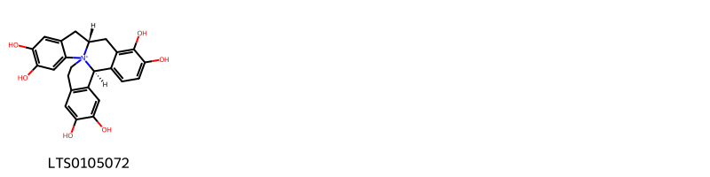{ width=100% }
    <figcaption>Hình ảnh cấu trúc hóa học của 1 hoạt chất thuộc nhóm Tetrahydroisoquinolines gồm ['(9r,17r)-4,5,12,13,20,21-hexahydroxy-1λ⁵-azahexacyclo[15.8.0.0¹,⁹.0²,⁷.0¹¹,¹⁶.0¹⁸,²³]pentacosa-2,4,6,11,13,15,18(23),19,21-nonaen-1-ylium (LTS0105072)'].</figcaption>
</figure>

---

### Dược dân tộc học

Danh sách các quốc gia có sử dụng *Gnetum montanum* trong điều trị các bệnh. 

| Country   | Disease   | Bệnh                                                                                                                                                                                                |
|:----------|:----------|:----------------------------------------------------------------------------------------------------------------------------------------------------------------------------------------------------|
| India     | Piscicide | MYMEMORY WARNING: YOU USED ALL AVAILABLE FREE TRANSLATIONS FOR TODAY. NEXT AVAILABLE IN  15 HOURS 15 MINUTES 26 SECONDS VISIT HTTPS://MYMEMORY.TRANSLATED.NET/DOC/USAGELIMITS.PHP TO TRANSLATE MORE |

---

---
## Gnetum scandens
### Thông tin về thực vật

!!! info "Phân loại thực vật của *N/A* từ GIBF:"
    - **Kingdom:** Plantae
    - **Phylum:** Tracheophyta
    - **Order:** Gnetales
    - **Family:** Gnetaceae
    - **Genus:** Gnetum
    - **Species:** *N/A*

 

| Label (VI)   | Label (EN)   | Scientific Name   | Descriptions (VI)   | Descriptions (EN)   | Also Known As (VI)   | Also Known As (EN)   |
|:-------------|:-------------|:------------------|:--------------------|:--------------------|:---------------------|:---------------------|
| N/A          | N/A          | Gnetum scandens   | loài thực vật       | species of plant    | ['']                 | ['']                 |

#### Phân bố trên thế giới

**Từ CSDL GIBF** Philippines, French Guiana, Cameroon, Gabon, Singapore, Indonesia, Colombia, Malaysia, India, Nigeria, Vanuatu, Panama, Brazil, Peru, China, Chinese Taipei, Hong Kong, Costa Rica, United States of America

#### Phân bố tại Việt Nam

**Từ CSDL GIBF**: Không có ghi nhận ở Việt Nam

---
### Thành phần hóa học
        
- Theo cơ sở dữ liệu lotus: Từ loài *N/A* đã phân lập và xác định được Chưa có hoạt chất nào được phân lập. hoạt chất thuộc về các nhóm Không có hoạt chất nào được phân lập. 

Không có hình ảnh nào được tạo ra

---

### Dược dân tộc học

Danh sách các quốc gia có sử dụng *N/A* trong điều trị các bệnh. 

| Country   | Disease   | Bệnh                                                                                                                                                                                                |
|:----------|:----------|:----------------------------------------------------------------------------------------------------------------------------------------------------------------------------------------------------|
| India     | Piscicide | MYMEMORY WARNING: YOU USED ALL AVAILABLE FREE TRANSLATIONS FOR TODAY. NEXT AVAILABLE IN  15 HOURS 14 MINUTES 46 SECONDS VISIT HTTPS://MYMEMORY.TRANSLATED.NET/DOC/USAGELIMITS.PHP TO TRANSLATE MORE |

---

