!!! abstract "Tóm tắt"

    Họ Grossulariaceae gồm khoảng 2 chi và 7 loài được một số cộng đồng tại các quốc gia như Turkey, UK, Elsewhere, ain, Canada(Kwakiutl), Haiti, China sử dụng trong một số trường hợp Dạ dày, lợi tiểu, nhuận tràng, khai vị, lợi tiểu, chất làm lạnh, hút mồ hôi, tiêu hóa, lợi tiểu, thuốc đắp, làm se, chất làm lạnh, khai vị, thanh lọc, nan, tiêu hóa, lợi tiểu, nhuận tràng.

!!! info "DrDuke"

    James A. Duke sinh năm 1929-2017 là một nhà thực vật học người Mỹ. Đây là một trong những tác giả hàng đầu trong lĩnh vực dược dân tộc học với cuốn *CRC Handbook of Medicinal Herbs* và chính là người xây dựng lên cơ sở dữ liệu về hợp chất tự nhiên và dược dân tộc học tại Bộ nông nghiệp Hoa Kỳ. Các thông tin được đăng tải tại website [Dr. Duke's Phytochemical and Ethnobotanical Databases](https://phytochem.nal.usda.gov/). 
    Trong suốt thập niên 1970, ông lãnh đạo the Plant Taxonomy Laboratory, Plant Genetics and Germplasm Institute of the Agricultural Research Service, U.S. Department of Agriculture.
    Trong tài liệu này, các thông tin về dược dân tộc của các dược liệu được trích dẫn từ tài liệu của James A. Ducke với sự trợ giúp của phần mềm dịch thuật từ tiếng Anh sang tiếng Việt.
   

# Chi Itea

??? note "Danh sách các dược liệu thuộc chi"
    
	 - *Itea chinensis*

---
## Itea chinensis
### Thông tin về thực vật

!!! info "Phân loại thực vật của *Itea chinensis* từ GIBF:"
    - **Kingdom:** Plantae
    - **Phylum:** Tracheophyta
    - **Order:** Saxifragales
    - **Family:** Iteaceae
    - **Genus:** Itea
    - **Species:** *Itea chinensis*

 

| Label (VI)   | Label (EN)   | Scientific Name   | Descriptions (VI)   | Descriptions (EN)   | Also Known As (VI)   | Also Known As (EN)     |
|:-------------|:-------------|:------------------|:--------------------|:--------------------|:---------------------|:-----------------------|
| N/A          | N/A          | Itea chinensis    | loài thực vật       | species of plant    | ['thử thích']        | ['Chinese sweetspire'] |

#### Phân bố trên thế giới

**Từ CSDL GIBF** Hong Kong, Thailand, Chinese Taipei, unknown or invalid, United States of America, Viet Nam, China

#### Phân bố tại Việt Nam

**Từ CSDL GIBF**: Kon Tum, Vinh Phuc, Lam Dong, Ninh Binh, Thua Thien-Hue

---
### Thành phần hóa học
        
- Theo cơ sở dữ liệu lotus: Từ loài *Itea chinensis* đã phân lập và xác định được 4 hoạt chất thuộc về các nhóm Flavonoids. 

|    | chemicalTaxonomyClassyfireClass   |   smiles_count |
|---:|:----------------------------------|---------------:|
|  0 | Flavonoids                        |              4 |

#### Nhóm Flavonoids
<figure markdown="span">
    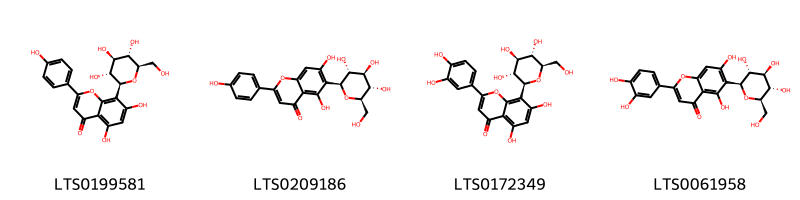{ width=100% }
    <figcaption>Hình ảnh cấu trúc hóa học của 4 hoạt chất thuộc nhóm Flavonoids gồm ['vitexin (LTS0199581)', 'isovitexin (LTS0209186)', 'orientin (LTS0172349)', 'isoorientin (LTS0061958)'].</figcaption>
</figure>

---

### Dược dân tộc học

Danh sách các quốc gia có sử dụng *Itea chinensis* trong điều trị các bệnh. 

| Country   | Disease   | Bệnh    |
|:----------|:----------|:--------|
| China     | Stomachic | Sững sờ |

---

# Chi Ribes

??? note "Danh sách các dược liệu thuộc chi"
    
	 - *Ribes grossularia*
	 - *Ribes lobbii*
	 - *Ribes nigrum*
	 - *Ribes orientale*
	 - *Ribes rubrum*
	 - *Ribes uva-cria*

---
## Ribes grossularia
### Thông tin về thực vật

!!! info "Phân loại thực vật của *N/A* từ GIBF:"
    - **Kingdom:** Plantae
    - **Phylum:** Tracheophyta
    - **Order:** Saxifragales
    - **Family:** Grossulariaceae
    - **Genus:** Ribes
    - **Species:** *N/A*

 

| Label (VI)   | Label (EN)   | Scientific Name   | Descriptions (VI)   | Descriptions (EN)   | Also Known As (VI)   | Also Known As (EN)   |
|:-------------|:-------------|:------------------|:--------------------|:--------------------|:---------------------|:---------------------|
| N/A          | N/A          | Ribes grossularia | loài thực vật       | species of plant    | ['']                 | ['']                 |

#### Phân bố trên thế giới

**Từ CSDL GIBF** Argentina, Russian Federation, United States of America, Mexico, Chile, France, New Zealand, Canada

#### Phân bố tại Việt Nam

**Từ CSDL GIBF**: Không có ghi nhận ở Việt Nam

---
### Thành phần hóa học
        
- Theo cơ sở dữ liệu lotus: Từ loài *N/A* đã phân lập và xác định được 1 hoạt chất thuộc về các nhóm Dihydrofurans. 

|    | chemicalTaxonomyClassyfireClass   |   smiles_count |
|---:|:----------------------------------|---------------:|
|  0 | Dihydrofurans                     |              1 |

#### Nhóm Dihydrofurans
<figure markdown="span">
    { width=100% }
    <figcaption>Hình ảnh cấu trúc hóa học của 1 hoạt chất thuộc nhóm Dihydrofurans gồm ['vitamin c (LTS0022555)'].</figcaption>
</figure>

---

### Dược dân tộc học

Danh sách các quốc gia có sử dụng *N/A* trong điều trị các bệnh. 

| Country   | Disease                          | Bệnh                                |
|:----------|:---------------------------------|:------------------------------------|
| UK        | Astringent, Refrigerant, Apertif | Chất làm se, Chất làm lạnh, Apertif |

---

---
## Ribes lobbii
### Thông tin về thực vật

!!! info "Phân loại thực vật của *Ribes lobbii* từ GIBF:"
    - **Kingdom:** Plantae
    - **Phylum:** Tracheophyta
    - **Order:** Saxifragales
    - **Family:** Grossulariaceae
    - **Genus:** Ribes
    - **Species:** *Ribes lobbii*

 

| Label (VI)   | Label (EN)   | Scientific Name   | Descriptions (VI)   | Descriptions (EN)   | Also Known As (VI)   | Also Known As (EN)   |
|:-------------|:-------------|:------------------|:--------------------|:--------------------|:---------------------|:---------------------|
| N/A          | N/A          | Ribes lobbii      | loài thực vật       | species of plant    | ['']                 | ['']                 |

#### Phân bố trên thế giới

**Từ CSDL GIBF** United States of America, Canada

#### Phân bố tại Việt Nam

**Từ CSDL GIBF**: Không có ghi nhận ở Việt Nam

---
### Thành phần hóa học
        
- Theo cơ sở dữ liệu lotus: Từ loài *Ribes lobbii* đã phân lập và xác định được Chưa có hoạt chất nào được phân lập. hoạt chất thuộc về các nhóm Không có hoạt chất nào được phân lập. 

Không có hình ảnh nào được tạo ra

---

### Dược dân tộc học

Danh sách các quốc gia có sử dụng *Ribes lobbii* trong điều trị các bệnh. 

| Country          | Disease   | Bệnh                     |
|:-----------------|:----------|:-------------------------|
| Canada(Kwakiutl) | Poultice  | thuốc đắp, đắp thuốc cao |

---

---
## Ribes nigrum
### Thông tin về thực vật

!!! info "Phân loại thực vật của *Ribes nigrum* từ GIBF:"
    - **Kingdom:** Plantae
    - **Phylum:** Tracheophyta
    - **Order:** Saxifragales
    - **Family:** Grossulariaceae
    - **Genus:** Ribes
    - **Species:** *Ribes nigrum*

 

| Label (VI)   | Label (EN)   | Scientific Name   | Descriptions (VI)   | Descriptions (EN)   | Also Known As (VI)   | Also Known As (EN)                          |
|:-------------|:-------------|:------------------|:--------------------|:--------------------|:---------------------|:--------------------------------------------|
| N/A          | N/A          | Ribes nigrum      | loài thực vật       | species of plant    | ['']                 | ['cassis', 'black currant', 'blackcurrant'] |

#### Phân bố trên thế giới

**Từ CSDL GIBF** Estonia, Norway, Canada, Ukraine, Denmark, Netherlands, Lithuania, Belarus, Russian Federation, United States of America, Sweden, Montenegro, Czechia, Germany, Switzerland, Austria, United Kingdom of Great Britain and Northern Ireland, China, Poland, Mongolia

#### Phân bố tại Việt Nam

**Từ CSDL GIBF**: Không có ghi nhận ở Việt Nam

---
### Thành phần hóa học
        
- Theo cơ sở dữ liệu lotus: Từ loài *Ribes nigrum* đã phân lập và xác định được 153 hoạt chất thuộc về các nhóm Fatty Acyls, Flavonoids, Prenol lipids, Cinnamic acids and derivatives, Harmala alkaloids, Dibenzylbutane lignans, Lignan lactones, Benzene and substituted derivatives, Dihydrofurans, Organooxygen compounds, Phenols, Tannins, Aryltetralin lignans, Furanoid lignans, Carboxylic acids and derivatives. 

|    | chemicalTaxonomyClassyfireClass     |   smiles_count |
|---:|:------------------------------------|---------------:|
|  0 | Aryltetralin lignans                |              1 |
|  1 | Benzene and substituted derivatives |              6 |
|  2 | Carboxylic acids and derivatives    |              1 |
|  3 | Cinnamic acids and derivatives      |              9 |
|  4 | Dibenzylbutane lignans              |              4 |
|  5 | Dihydrofurans                       |              1 |
|  6 | Fatty Acyls                         |             12 |
|  7 | Flavonoids                          |             83 |
|  8 | Furanoid lignans                    |             12 |
|  9 | Harmala alkaloids                   |              1 |
| 10 | Lignan lactones                     |              1 |
| 11 | Organooxygen compounds              |             19 |
| 12 | Phenols                             |              1 |
| 13 | Prenol lipids                       |              1 |
| 14 | Tannins                             |              1 |

#### Nhóm Aryltetralin lignans
<figure markdown="span">
    { width=100% }
    <figcaption>Hình ảnh cấu trúc hóa học của 1 hoạt chất thuộc nhóm Aryltetralin lignans gồm ['(+)-isolariciresinol (LTS0164886)'].</figcaption>
</figure>
#### Nhóm Benzene and substituted derivatives
<figure markdown="span">
    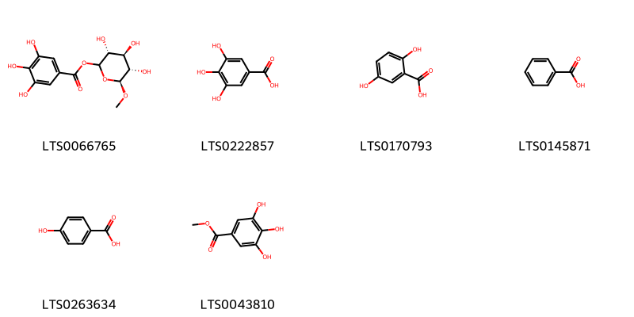{ width=100% }
    <figcaption>Hình ảnh cấu trúc hóa học của 6 hoạt chất thuộc nhóm Benzene and substituted derivatives gồm ['(3r,4s,5s,6s)-3,4,5-trihydroxy-6-methoxyoxan-2-yl 3,4,5-trihydroxybenzoate (LTS0066765)', 'galop (LTS0222857)', '2,5-dihydroxybenzoic acid (LTS0170793)', 'benzoic acid (LTS0145871)', 'p-hydroxybenzoic acid (LTS0263634)', 'methyl gallate (LTS0043810)'].</figcaption>
</figure>
#### Nhóm Carboxylic acids and derivatives
<figure markdown="span">
    { width=100% }
    <figcaption>Hình ảnh cấu trúc hóa học của 1 hoạt chất thuộc nhóm Carboxylic acids and derivatives gồm ['acid, folic (LTS0212965)'].</figcaption>
</figure>
#### Nhóm Cinnamic acids and derivatives
<figure markdown="span">
    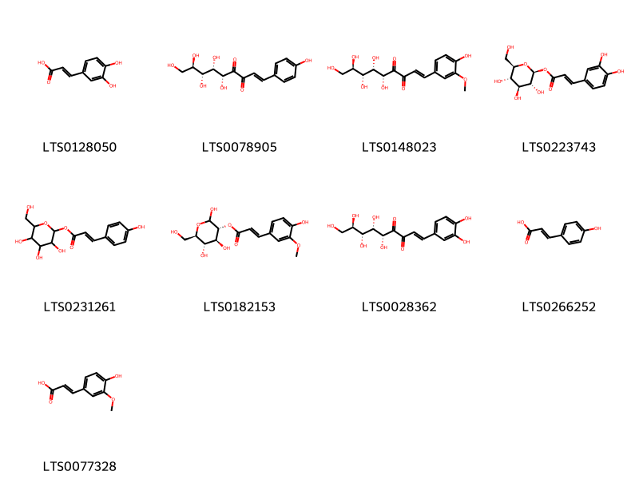{ width=100% }
    <figcaption>Hình ảnh cấu trúc hóa học của 9 hoạt chất thuộc nhóm Cinnamic acids and derivatives gồm ['3,4-dihydroxycinnamic acid (LTS0128050)', '(1e,5r,6s,7r,8r)-5,6,7,8,9-pentahydroxy-1-(4-hydroxyphenyl)non-1-ene-3,4-dione (LTS0078905)', '(1e,5r,6s,7r,8r)-5,6,7,8,9-pentahydroxy-1-(4-hydroxy-3-methoxyphenyl)non-1-ene-3,4-dione (LTS0148023)', '1-caffeoyl-β-d-glucose (LTS0223743)', '3,4,5-trihydroxy-6-(hydroxymethyl)oxan-2-yl (2e)-3-(4-hydroxyphenyl)prop-2-enoate (LTS0231261)', '(3r,4s,5s,6r)-2,4,5-trihydroxy-6-(hydroxymethyl)oxan-3-yl (2e)-3-(4-hydroxy-3-methoxyphenyl)prop-2-enoate (LTS0182153)', '(1e,5r,6s,7r,8r)-1-(3,4-dihydroxyphenyl)-5,6,7,8,9-pentahydroxynon-1-ene-3,4-dione (LTS0028362)', 'para-coumaric acid (LTS0266252)', 'ferulic acid (LTS0077328)'].</figcaption>
</figure>
#### Nhóm Dibenzylbutane lignans
<figure markdown="span">
    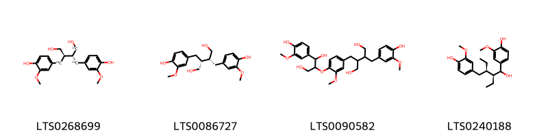{ width=100% }
    <figcaption>Hình ảnh cấu trúc hóa học của 4 hoạt chất thuộc nhóm Dibenzylbutane lignans gồm ['(2s,3r)-2,3-bis[(4-hydroxy-3-methoxyphenyl)(¹³c)methyl](1-¹³c)butane-1,4-diol (LTS0268699)', 'secoisolariciresinol (LTS0086727)', '2-[(4-{[1,3-dihydroxy-1-(4-hydroxy-3-methoxyphenyl)propan-2-yl]oxy}-3-methoxyphenyl)methyl]-3-[(4-hydroxy-3-methoxyphenyl)methyl]butane-1,4-diol (LTS0090582)', '4-[(2s,3r)-2-ethyl-1-hydroxy-3-[(4-hydroxy-3-methoxyphenyl)methyl]pentyl]-2-methoxyphenol (LTS0240188)'].</figcaption>
</figure>
#### Nhóm Dihydrofurans
<figure markdown="span">
    { width=100% }
    <figcaption>Hình ảnh cấu trúc hóa học của 1 hoạt chất thuộc nhóm Dihydrofurans gồm ['vitamin c (LTS0022555)'].</figcaption>
</figure>
#### Nhóm Fatty Acyls
<figure markdown="span">
    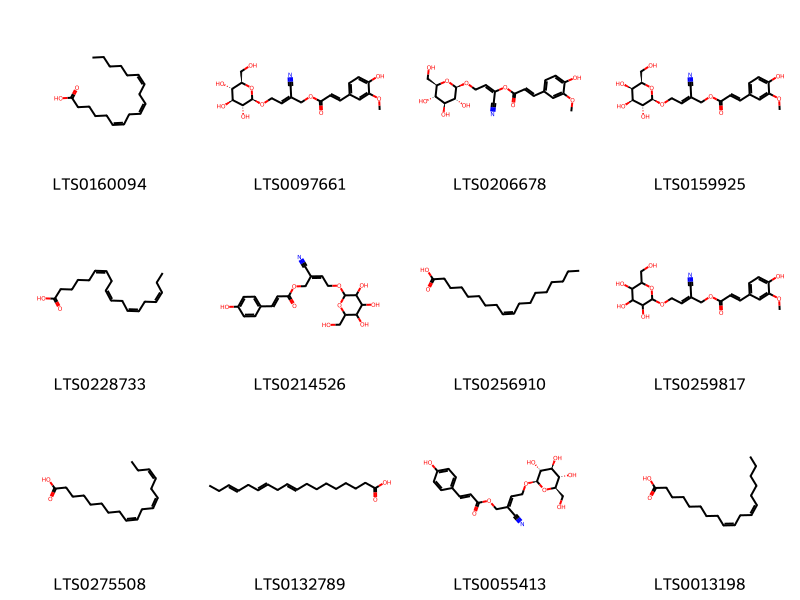{ width=100% }
    <figcaption>Hình ảnh cấu trúc hóa học của 12 hoạt chất thuộc nhóm Fatty Acyls gồm ['gamma-linolenic acid (LTS0160094)', '(2e)-2-cyano-2-(2-{[(2r,3r,4s,5s,6r)-3,4,5-trihydroxy-6-(hydroxymethyl)oxan-2-yl]oxy}ethylidene)ethyl (2e)-3-(4-hydroxy-3-methoxyphenyl)prop-2-enoate (LTS0097661)', '(1e)-1-cyano-3-{[(2r,3r,4s,5s,6r)-3,4,5-trihydroxy-6-(hydroxymethyl)oxan-2-yl]oxy}prop-1-en-1-yl (2e)-3-(4-hydroxy-3-methoxyphenyl)prop-2-enoate (LTS0206678)', '(2e)-2-cyano-2-(2-{[(2r,3r,4s,5r,6r)-3,4,5-trihydroxy-6-(hydroxymethyl)oxan-2-yl]oxy}ethylidene)ethyl (2e)-3-(4-hydroxy-3-methoxyphenyl)prop-2-enoate (LTS0159925)', 'stearidonic acid (LTS0228733)', '2-cyano-2-(2-{[3,4,5-trihydroxy-6-(hydroxymethyl)oxan-2-yl]oxy}ethylidene)ethyl 3-(4-hydroxyphenyl)prop-2-enoate (LTS0214526)', 'oleic acid (LTS0256910)', '2-cyano-2-(2-{[3,4,5-trihydroxy-6-(hydroxymethyl)oxan-2-yl]oxy}ethylidene)ethyl 3-(4-hydroxy-3-methoxyphenyl)prop-2-enoate (LTS0259817)', 'α-linolenic acid (LTS0275508)', 'α linolenic acid (LTS0132789)', '(2e)-2-cyano-2-(2-{[(2r,3r,4s,5s,6r)-3,4,5-trihydroxy-6-(hydroxymethyl)oxan-2-yl]oxy}ethylidene)ethyl (2e)-3-(4-hydroxyphenyl)prop-2-enoate (LTS0055413)', 'linoleic (LTS0013198)'].</figcaption>
</figure>
#### Nhóm Flavonoids
<figure markdown="span">
    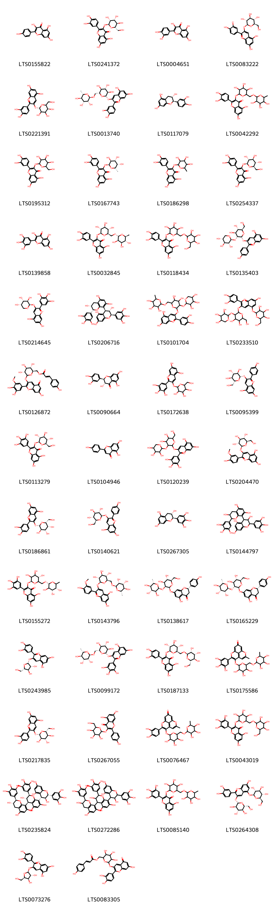{ width=100% }
    <figcaption>Hình ảnh cấu trúc hóa học của 83 hoạt chất thuộc nhóm Flavonoids gồm ['kaempherol (LTS0155822)', '2-(3,4-dihydroxyphenyl)-5,7-dihydroxy-3-{[(2s,3r,4r,5r,6s)-3,4,5-trihydroxy-6-(hydroxymethyl)oxan-2-yl]oxy}chromen-4-one (LTS0241372)', 'quercetin (LTS0004651)', '5,7-dihydroxy-2-(4-hydroxy-3-oxidophenyl)-3-{[(2s,3r,4s,5s,6r)-3,4,5-trihydroxy-6-(hydroxymethyl)oxan-2-yl]oxy}-1λ⁴-chromen-1-ylium (LTS0083222)', 'chrysanthemin (LTS0221391)', '5,7-dihydroxy-2-(4-hydroxy-3-oxidophenyl)-3-{[(2s,3r,4s,5s,6r)-3,4,5-trihydroxy-6-({[(2r,3r,4r,5r,6s)-3,4,5-trihydroxy-6-methyloxan-2-yl]oxy}methyl)oxan-2-yl]oxy}-1λ⁴-chromen-1-ylium (LTS0013740)', '(+)-catechol (LTS0117079)', 'rutin (LTS0042292)', '2-(3,4-dihydroxyphenyl)-5,7-dihydroxy-3-{[3,4,5-trihydroxy-6-(hydroxymethyl)oxan-2-yl]oxy}chromen-4-one (LTS0195312)', '2-(3,4-dihydroxyphenyl)-5,7-dihydroxy-3-{[(2s,3s,4r,5s,6s)-3,4,5-trihydroxy-6-methyloxan-2-yl]oxy}chromen-4-one (LTS0167743)', 'quercitrin (LTS0186298)', 'isoquercetin (LTS0254337)', 'myricetin (LTS0139858)', '3-rutinosyl quercetin (LTS0032845)', '2-(3,4-dihydroxyphenyl)-5,7-dihydroxy-3-{[3,4,5-trihydroxy-6-({[3,4,5-trihydroxy-6-(hydroxymethyl)oxan-2-yl]oxy}methyl)oxan-2-yl]oxy}chromen-4-one (LTS0118434)', '3-{[(2r,3r,4s,5s,6r)-4,5-dihydroxy-6-(hydroxymethyl)-3-{[(2s,3r,4s,5r)-3,4,5-trihydroxyoxan-2-yl]oxy}oxan-2-yl]oxy}-5,7-dihydroxy-2-(4-hydroxyphenyl)-1λ⁴-chromen-1-ylium (LTS0135403)', '5,7-dihydroxy-3-{[(2r,3r,4s,5s)-3,4,5-trihydroxyoxan-2-yl]oxy}-2-(3,4,5-trihydroxyphenyl)-1λ⁴-chromen-1-ylium (LTS0214645)', '(2r,3s,4s)-4-[(2r,3r)-3,5,7-trihydroxy-2-(3,4,5-trihydroxyphenyl)-3,4-dihydro-2h-1-benzopyran-8-yl]-2-(3,4,5-trihydroxyphenyl)-3,4-dihydro-2h-1-benzopyran-3,5,7-triol (LTS0206716)', '3-[(4,5-dihydroxy-6-{[(3,4,5-trihydroxy-6-methyloxan-2-yl)oxy]methyl}-3-[(3,4,5-trihydroxyoxan-2-yl)oxy]oxan-2-yl)oxy]-2-(3,4-dihydroxyphenyl)-5,7-dihydroxy-1λ⁴-chromen-1-ylium (LTS0101704)', '3-{[4,5-dihydroxy-6-(hydroxymethyl)-3-[(3,4,5-trihydroxyoxan-2-yl)oxy]oxan-2-yl]oxy}-2-(3,4-dihydroxyphenyl)-7-hydroxy-5-{[3,4,5-trihydroxy-6-(hydroxymethyl)oxan-2-yl]oxy}-1λ⁴-chromen-1-ylium (LTS0233510)', '[(2r,3s,4s,5r)-6-{[2-(3,4-dihydroxy-5-methoxyphenyl)-7-hydroxy-5-oxochromen-3-yl]oxy}-3,4,5-trihydroxyoxan-2-yl]methyl 3-(4-hydroxyphenyl)prop-2-enoate (LTS0126872)', '(+)-taxifolin (LTS0090664)', '5,7-dihydroxy-3-{[3,4,5-trihydroxy-6-(hydroxymethyl)oxan-2-yl]oxy}-2-(3,4,5-trihydroxyphenyl)-1λ⁴-chromen-1-ylium (LTS0172638)', 'pelargonidin 3-glucoside (LTS0095399)', '5,7-dihydroxy-3-{[(2s,3r,4s,5s,6r)-3,4,5-trihydroxy-6-(hydroxymethyl)oxan-2-yl]oxy}-2-(3,4,5-trihydroxyphenyl)chromen-4-one (LTS0113279)', 'chamomile (LTS0104946)', '3-{[4,5-dihydroxy-6-(hydroxymethyl)-3-[(3,4,5-trihydroxyoxan-2-yl)oxy]oxan-2-yl]oxy}-5,7-dihydroxy-2-(3,4,5-trihydroxyphenyl)-1λ⁴-chromen-1-ylium (LTS0120239)', 'peonidin-3-glucoside (LTS0204470)', 'cyanidin 3-o-β-d-galactoside (LTS0186861)', '5,7-dihydroxy-2-(4-hydroxyphenyl)-3-{[(2r,3s,4r,5r,6s)-3,4,5-trihydroxy-6-(hydroxymethyl)oxan-2-yl]oxy}-1λ⁴-chromen-1-ylium (LTS0140621)', 'gallocatechol (LTS0267305)', '4-[3,5,7-trihydroxy-2-(3,4,5-trihydroxyphenyl)-3,4-dihydro-2h-1-benzopyran-8-yl]-2-(3,4,5-trihydroxyphenyl)-3,4-dihydro-2h-1-benzopyran-3,5,7-triol (LTS0144797)', 'myricetin 3-rutinoside (LTS0155272)', '5,7-dihydroxy-2-(4-hydroxy-3-methoxyphenyl)-3-{[(2s,3r,4s,5s,6r)-3,4,5-trihydroxy-6-({[(2r,3r,4r,5r,6s)-3,4,5-trihydroxy-6-methyloxan-2-yl]oxy}methyl)oxan-2-yl]oxy}-1λ⁴-chromen-1-ylium (LTS0143796)', '(2s)-7-{[(2s,3s,4s,5s,6r)-4,5-dihydroxy-6-(hydroxymethyl)-3-{[(2s,3s,4r,5r,6s)-3,4,5-trihydroxy-6-methyloxan-2-yl]oxy}oxan-2-yl]oxy}-5-hydroxy-2-(4-hydroxyphenyl)-2,3-dihydro-1-benzopyran-4-one (LTS0138617)', 'naringin (LTS0165229)', '3-{[(2r,3r,4r,5s)-3,4-dihydroxy-5-(hydroxymethyl)oxolan-2-yl]oxy}-2-(3,4-dihydroxyphenyl)-5,7-dihydroxy-1λ⁴-chromen-1-ylium (LTS0243985)', 'tulipanin (LTS0099172)', '2-(3,4-dihydroxyphenyl)-5,7-dihydroxy-3-{[(2s,3r,4s,5s,6r)-3,4,5-trihydroxy-6-({[(2r,3r,4r,5r,6s)-3,4,5-trihydroxy-6-(hydroxymethyl)oxan-2-yl]oxy}methyl)oxan-2-yl]oxy}chromen-4-one (LTS0187133)', '7-methyl-4-[(3,4,5-trihydroxy-6-{[(3,4,5-trihydroxy-6-methyloxan-2-yl)oxy]methyl}oxan-2-yl)oxy]-3-(3,4,5-trihydroxyphenyl)-2,8-dioxatricyclo[7.3.1.0⁵,¹³]trideca-1(12),3,5(13),6,9-pentaen-11-one (LTS0175586)', 'cyanidin 3-glucoside (LTS0217835)', 'trifolin (LTS0267055)', '3-(3,4-dihydroxyphenyl)-7-methyl-4-[(3,4,5-trihydroxy-6-{[(3,4,5-trihydroxy-6-methyloxan-2-yl)oxy]methyl}oxan-2-yl)oxy]-2,8-dioxatricyclo[7.3.1.0⁵,¹³]trideca-1(12),3,5(13),6,9-pentaen-11-one (LTS0076467)', '5,7-dihydroxy-3-{[3,4,5-trihydroxy-6-({[3,4,5-trihydroxy-6-(hydroxymethyl)oxan-2-yl]oxy}methyl)oxan-2-yl]oxy}-2-(3,4,5-trihydroxyphenyl)chromen-4-one (LTS0043019)', '(2r,3s,4r)-8-[(2r,3s,4s)-3,5,7-trihydroxy-2-(3,4,5-trihydroxyphenyl)-3,4-dihydro-2h-1-benzopyran-4-yl]-4-[(2r,3s)-3,5,7-trihydroxy-2-(3,4,5-trihydroxyphenyl)-3,4-dihydro-2h-1-benzopyran-8-yl]-2-(3,4,5-trihydroxyphenyl)-3,4-dihydro-2h-1-benzopyran-3,5,7-triol (LTS0235824)', '8-[3,5,7-trihydroxy-2-(3,4,5-trihydroxyphenyl)-3,4-dihydro-2h-1-benzopyran-4-yl]-4-[3,5,7-trihydroxy-2-(3,4,5-trihydroxyphenyl)-3,4-dihydro-2h-1-benzopyran-8-yl]-2-(3,4,5-trihydroxyphenyl)-3,4-dihydro-2h-1-benzopyran-3,5,7-triol (LTS0272286)', '5,7-dihydroxy-3-[(3,4,5-trihydroxy-6-{[(3,4,5-trihydroxy-6-methyloxan-2-yl)oxy]methyl}oxan-2-yl)oxy]-2-(3,4,5-trihydroxyphenyl)chromen-4-one (LTS0085140)', 'cyanin (LTS0264308)', '3-{[(2s,3r,4r,5r)-3,4-dihydroxy-5-(hydroxymethyl)oxolan-2-yl]oxy}-2-(3,4-dihydroxyphenyl)-5,7-dihydroxy-1λ⁴-chromen-1-ylium (LTS0073276)', '(6-{[2-(3,4-dihydroxyphenyl)-7-hydroxy-5-oxochromen-3-yl]oxy}-3,4,5-trihydroxyoxan-2-yl)methyl 3-(4-hydroxyphenyl)prop-2-enoate (LTS0083305)', '3-{[(2s,3r,4s,5s,6r)-4,5-dihydroxy-6-(hydroxymethyl)-3-{[(2s,3r,4s,5r)-3,4,5-trihydroxyoxan-2-yl]oxy}oxan-2-yl]oxy}-5,7-dihydroxy-2-(4-hydroxy-3-oxidophenyl)-1λ⁴-chromen-1-ylium (LTS0228789)', '5-hydroxy-3-{[(2s,3r,4s,5s,6r)-3,4,5-trihydroxy-6-(hydroxymethyl)oxan-2-yl]oxy}-2-(3,4,5-trihydroxyphenyl)chromen-7-one (LTS0073780)', '3-{[(2r,3s,4s,5r)-3,4-dihydroxy-5-(hydroxymethyl)oxolan-2-yl]oxy}-5,7-dihydroxy-2-(4-hydroxyphenyl)-1λ⁴-chromen-1-ylium (LTS0240683)', '5,7-dihydroxy-2-(4-hydroxyphenyl)-3-{[(2r,3r,4s,5r,6r)-3,4,5-trihydroxy-6-(hydroxymethyl)oxan-2-yl]oxy}-1λ⁴-chromen-1-ylium (LTS0230661)', '5-hydroxy-2-(4-hydroxy-3,5-dimethoxyphenyl)-3-{[(2s,3r,4s,5s,6r)-3,4,5-trihydroxy-6-({[(1r,2r,3r,4s,5r)-2,3,4-trihydroxy-5-methylcyclohexyl]oxy}methyl)oxan-2-yl]oxy}chromen-7-one (LTS0232034)', 'malvidin-3-glucoside (LTS0140239)', 'astragalin (LTS0249588)', 'petunidin-3-o-glucoside (LTS0178327)', '5,7-dihydroxy-2-(4-hydroxy-3,5-dimethoxyphenyl)-3-{[(2r,3r,4s,5s)-3,4,5-trihydroxyoxan-2-yl]oxy}-1λ⁴-chromen-1-ylium (LTS0042107)', '5,7-dihydroxy-3-{[3,4,5-trihydroxy-6-(hydroxymethyl)oxan-2-yl]oxy}-2-(3,4,5-trihydroxyphenyl)chromen-4-one (LTS0197005)', '3-(3,4-dihydroxyphenyl)-7-methyl-4-{[3,4,5-trihydroxy-6-(hydroxymethyl)oxan-2-yl]oxy}-2,8-dioxatricyclo[7.3.1.0⁵,¹³]trideca-1(12),3,5(13),6,9-pentaen-11-one (LTS0256314)', 'cyanidin 3-o-sophoroside (LTS0112561)', 'delphinidin 3-glucoside (LTS0010677)', 'epigallocatechin (LTS0052496)', '5,7-dihydroxy-2-(4-hydroxy-3-methoxyphenyl)-3-{[(2s,3r,4s,5r,6r)-3,4,5-trihydroxy-6-(hydroxymethyl)oxan-2-yl]oxy}-1λ⁴-chromen-1-ylium (LTS0013592)', 'petunidin 3-glucoside (LTS0001367)', 'asahina (LTS0068303)', '5,7-dihydroxy-2-(3-hydroxy-5-methoxy-4-oxidophenyl)-3-{[(2s,3r,4s,5s,6r)-3,4,5-trihydroxy-6-(hydroxymethyl)oxan-2-yl]oxy}-1λ⁴-chromen-1-ylium (LTS0002588)', '5,7-dihydroxy-3-{[(2s,3r,4s,5s,6r)-3,4,5-trihydroxy-6-({[(2r,3r,4r,5r,6s)-3,4,5-trihydroxy-6-(hydroxymethyl)oxan-2-yl]oxy}methyl)oxan-2-yl]oxy}-2-(3,4,5-trihydroxyphenyl)chromen-4-one (LTS0262062)', 'naringenin (LTS0031098)', '3-[(4,5-dihydroxy-3-{[3,4,5-trihydroxy-6-(hydroxymethyl)oxan-2-yl]oxy}-6-{[(3,4,5-trihydroxy-6-methyloxan-2-yl)oxy]methyl}oxan-2-yl)oxy]-2-(3,4-dihydroxyphenyl)-5,7-dihydroxy-1λ⁴-chromen-1-ylium (LTS0016654)', 'luteolin (LTS0017052)', '2-(3,5-dihydroxy-4-oxidophenyl)-5,7-dihydroxy-3-{[(2s,3r,4s,5s,6r)-3,4,5-trihydroxy-6-(hydroxymethyl)oxan-2-yl]oxy}-1λ⁴-chromen-1-ylium (LTS0079754)', 'pelargonidin 3-o-rutinoside (LTS0031008)', 'hesperetin (LTS0087195)', '3-{[(2s,3r,4r,5r)-3,4-dihydroxy-5-(hydroxymethyl)oxolan-2-yl]oxy}-5,7-dihydroxy-2-(3,4,5-trihydroxyphenyl)-1λ⁴-chromen-1-ylium (LTS0241371)', '7-methyl-4-{[3,4,5-trihydroxy-6-(hydroxymethyl)oxan-2-yl]oxy}-3-(3,4,5-trihydroxyphenyl)-2,8-dioxatricyclo[7.3.1.0⁵,¹³]trideca-1(12),3,5(13),6,9-pentaen-11-one (LTS0021377)', '2-(3,4-dihydroxy-5-{[(2s,3r,4s,5s,6r)-3,4,5-trihydroxy-6-(hydroxymethyl)oxan-2-yl]oxy}phenyl)-3,5,7-trihydroxychromen-4-one (LTS0270443)', '(2r,3s,4s)-4-[(2r,3s)-3,5,7-trihydroxy-2-(3,4,5-trihydroxyphenyl)-3,4-dihydro-2h-1-benzopyran-8-yl]-2-(3,4,5-trihydroxyphenyl)-3,4-dihydro-2h-1-benzopyran-3,5,7-triol (LTS0116861)', '[(2r,3s,4s,5r,6s)-6-{[2-(3,4-dihydroxyphenyl)-7-hydroxy-5-oxochromen-3-yl]oxy}-3,4,5-trihydroxyoxan-2-yl]methyl 3-(3,4-dihydroxyphenyl)prop-2-enoate (LTS0105542)', 'cyanidin 3-o-rutinoside (LTS0049654)', '2-(3,4-dihydroxy-5-methoxyphenyl)-5,7-dihydroxy-3-{[(2r,3r,4r,5r)-3,4,5-trihydroxyoxan-2-yl]oxy}-1λ⁴-chromen-1-ylium (LTS0050404)', 'ent-epicatechin (LTS0265245)'].</figcaption>
</figure>
#### Nhóm Furanoid lignans
<figure markdown="span">
    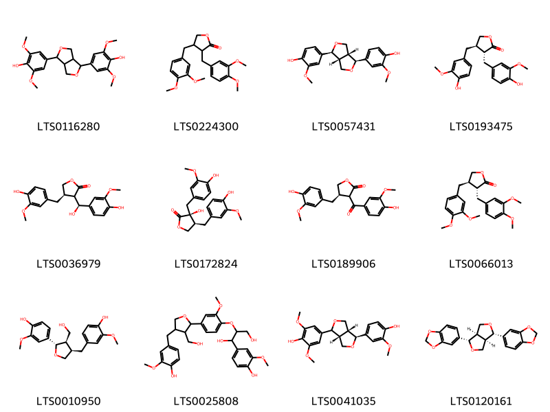{ width=100% }
    <figcaption>Hình ảnh cấu trúc hóa học của 12 hoạt chất thuộc nhóm Furanoid lignans gồm ['syringaresinol (LTS0116280)', '3,4-bis[(3,4-dimethoxyphenyl)methyl]oxolan-2-one (LTS0224300)', 'pinoresinol (LTS0057431)', 'matairesinol (LTS0193475)', '(4r)-3-[(s)-hydroxy(4-hydroxy-3-methoxyphenyl)methyl]-4-[(4-hydroxy-3-methoxyphenyl)methyl]oxolan-2-one (LTS0036979)', 'nortrachelogenin (LTS0172824)', '(4r)-3-(4-hydroxy-3-methoxybenzoyl)-4-[(4-hydroxy-3-methoxyphenyl)methyl]oxolan-2-one (LTS0189906)', 'arctigenin methyl ether (LTS0066013)', 'lariciresinol (LTS0010950)', '1-(4-hydroxy-3-methoxyphenyl)-2-(4-{4-[(4-hydroxy-3-methoxyphenyl)methyl]-3-(hydroxymethyl)oxolan-2-yl}-2-methoxyphenoxy)propane-1,3-diol (LTS0025808)', '4-[(3ar,4s,6ar)-4-(4-hydroxy-3-methoxyphenyl)-hexahydrofuro[3,4-c]furan-1-yl]-2,6-dimethoxyphenol (LTS0041035)', 'sesamin (LTS0120161)'].</figcaption>
</figure>
#### Nhóm Harmala alkaloids
<figure markdown="span">
    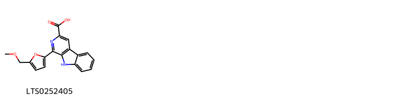{ width=100% }
    <figcaption>Hình ảnh cấu trúc hóa học của 1 hoạt chất thuộc nhóm Harmala alkaloids gồm ['1-[5-(methoxymethyl)furan-2-yl]-9h-pyrido[3,4-b]indole-3-carboxylic acid (LTS0252405)'].</figcaption>
</figure>
#### Nhóm Lignan lactones
<figure markdown="span">
    { width=100% }
    <figcaption>Hình ảnh cấu trúc hóa học của 1 hoạt chất thuộc nhóm Lignan lactones gồm ['(3as,4r,9ar)-6-hydroxy-4-(4-hydroxy-3-methoxyphenyl)-7-methoxy-3h,3ah,4h,9h,9ah-naphtho[2,3-c]furan-1-one (LTS0229877)'].</figcaption>
</figure>
#### Nhóm Organooxygen compounds
<figure markdown="span">
    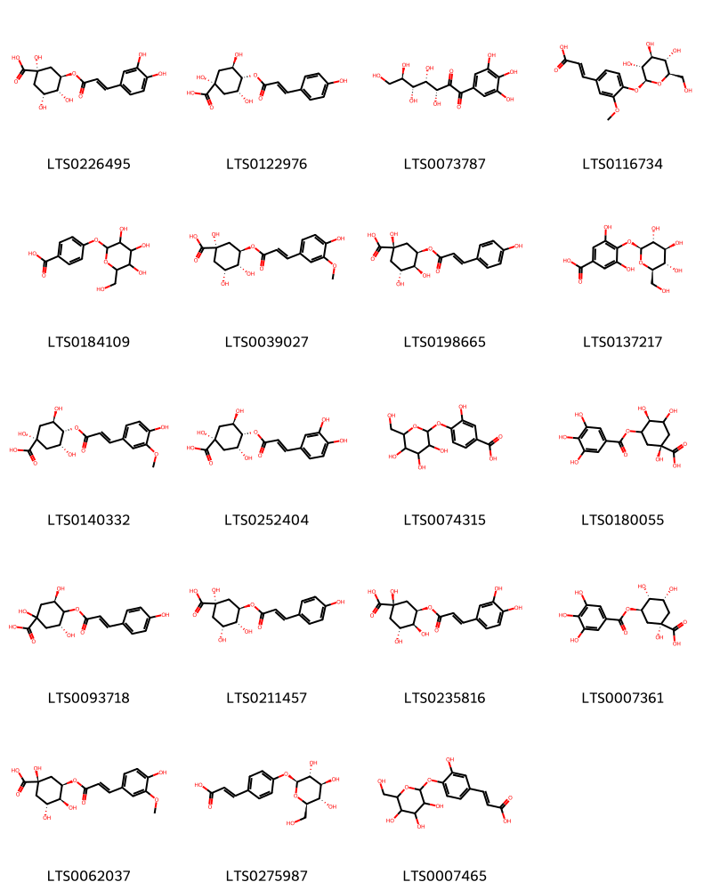{ width=100% }
    <figcaption>Hình ảnh cấu trúc hóa học của 19 hoạt chất thuộc nhóm Organooxygen compounds gồm ['chlorogenic acid (LTS0226495)', '(1s,3r,4s,5r)-1,3,5-trihydroxy-4-{[(2e)-3-(4-hydroxyphenyl)prop-2-enoyl]oxy}cyclohexane-1-carboxylic acid (LTS0122976)', '(3r,4s,5r,6r)-3,4,5,6,7-pentahydroxy-1-(3,4,5-trihydroxyphenyl)heptane-1,2-dione (LTS0073787)', '(2e)-3-(3-methoxy-4-{[(2s,3r,4s,5s,6r)-3,4,5-trihydroxy-6-(hydroxymethyl)oxan-2-yl]oxy}phenyl)prop-2-enoic acid (LTS0116734)', '4-{[3,4,5-trihydroxy-6-(hydroxymethyl)oxan-2-yl]oxy}benzoic acid (LTS0184109)', '3-o-feruloyl-d-quinic acid (LTS0039027)', '(1r,3r,4s,5r)-1,3,4-trihydroxy-5-{[(2e)-3-(4-hydroxyphenyl)prop-2-enoyl]oxy}cyclohexane-1-carboxylic acid (LTS0198665)', '3,5-dihydroxy-4-{[(2s,3r,4s,5s,6r)-3,4,5-trihydroxy-6-(hydroxymethyl)oxan-2-yl]oxy}benzoic acid (LTS0137217)', '4-o-feruloyl-d-quinic acid (LTS0140332)', 'cryptochlorogenic acid (LTS0252404)', '3-hydroxy-4-{[3,4,5-trihydroxy-6-(hydroxymethyl)oxan-2-yl]oxy}benzoic acid (LTS0074315)', '(1r,4s)-1,3,4-trihydroxy-5-(3,4,5-trihydroxybenzoyloxy)cyclohexane-1-carboxylic acid (LTS0180055)', '(3r,5r)-1,3,5-trihydroxy-4-{[(2e)-3-(4-hydroxyphenyl)prop-2-enoyl]oxy}cyclohexane-1-carboxylic acid (LTS0093718)', '(1s,3r,4r,5r)-1,3,4-trihydroxy-5-{[(2e)-3-(4-hydroxyphenyl)prop-2-enoyl]oxy}cyclohexane-1-carboxylic acid (LTS0211457)', 'neochlorogenic acid (LTS0235816)', 'theogallin (LTS0007361)', '3-feruloylquinic acid (LTS0062037)', 'p-coumaric acid glucoside (LTS0275987)', '3-(3-hydroxy-4-{[3,4,5-trihydroxy-6-(hydroxymethyl)oxan-2-yl]oxy}phenyl)prop-2-enoic acid (LTS0007465)'].</figcaption>
</figure>
#### Nhóm Phenols
<figure markdown="span">
    { width=100% }
    <figcaption>Hình ảnh cấu trúc hóa học của 1 hoạt chất thuộc nhóm Phenols gồm ['tyrosol (LTS0132195)'].</figcaption>
</figure>
#### Nhóm Prenol lipids
<figure markdown="span">
    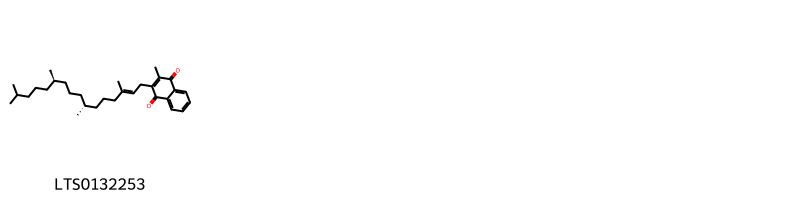{ width=100% }
    <figcaption>Hình ảnh cấu trúc hóa học của 1 hoạt chất thuộc nhóm Prenol lipids gồm ['phytonadione (LTS0132253)'].</figcaption>
</figure>
#### Nhóm Tannins
<figure markdown="span">
    { width=100% }
    <figcaption>Hình ảnh cấu trúc hóa học của 1 hoạt chất thuộc nhóm Tannins gồm ['ellagic acid (LTS0037297)'].</figcaption>
</figure>

---

### Dược dân tộc học

Danh sách các quốc gia có sử dụng *Ribes nigrum* trong điều trị các bệnh. 

| Country   | Disease                                     | Bệnh                                              |
|:----------|:--------------------------------------------|:--------------------------------------------------|
| Elsewhere | Diuretic                                    | Thuốc lợi tiêu                                    |
| Turkey    | Diuretic, Refrigerant, Sudorific, Digestive | Thuốc lợi tiểu, chất làm lạnh, gây ngạt, tiêu hóa |

---

---
## Ribes orientale
### Thông tin về thực vật

!!! info "Phân loại thực vật của *Ribes orientale* từ GIBF:"
    - **Kingdom:** Plantae
    - **Phylum:** Tracheophyta
    - **Order:** Saxifragales
    - **Family:** Grossulariaceae
    - **Genus:** Ribes
    - **Species:** *Ribes orientale*

 

| Label (VI)   | Label (EN)   | Scientific Name   | Descriptions (VI)   | Descriptions (EN)   | Also Known As (VI)   | Also Known As (EN)   |
|:-------------|:-------------|:------------------|:--------------------|:--------------------|:---------------------|:---------------------|
| N/A          | N/A          | Ribes orientale   | loài thực vật       | species of plant    | ['']                 | ['']                 |

#### Phân bố trên thế giới

**Từ CSDL GIBF** Tajikistan, Pakistan, Iran (Islamic Republic of), Georgia, Azerbaijan, Türkiye, Bhutan, India, Russian Federation, Armenia, Lebanon, Peru, China, Greece, Nepal

#### Phân bố tại Việt Nam

**Từ CSDL GIBF**: Không có ghi nhận ở Việt Nam

---
### Thành phần hóa học
        
- Theo cơ sở dữ liệu lotus: Từ loài *Ribes orientale* đã phân lập và xác định được 9 hoạt chất thuộc về các nhóm Fatty Acyls. 

|    | chemicalTaxonomyClassyfireClass   |   smiles_count |
|---:|:----------------------------------|---------------:|
|  0 | Fatty Acyls                       |              9 |

#### Nhóm Fatty Acyls
<figure markdown="span">
    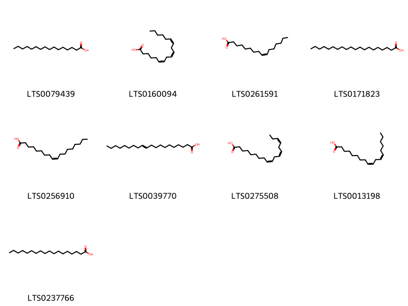{ width=100% }
    <figcaption>Hình ảnh cấu trúc hóa học của 9 hoạt chất thuộc nhóm Fatty Acyls gồm ['palmitic acid (LTS0079439)', 'gamma-linolenic acid (LTS0160094)', 'palmitoleic acid (LTS0261591)', 'arachidic acid (LTS0171823)', 'oleic acid (LTS0256910)', 'icosenoic acid (LTS0039770)', 'α-linolenic acid (LTS0275508)', 'linoleic (LTS0013198)', 'stearic acid (LTS0237766)'].</figcaption>
</figure>

---

### Dược dân tộc học

Danh sách các quốc gia có sử dụng *Ribes orientale* trong điều trị các bệnh. 

| Country   | Disease   | Bệnh     |
|:----------|:----------|:---------|
| Elsewhere | Purgative | Thuốc xổ |

---

---
## Ribes rubrum
### Thông tin về thực vật

!!! info "Phân loại thực vật của *Ribes rubrum* từ GIBF:"
    - **Kingdom:** Plantae
    - **Phylum:** Tracheophyta
    - **Order:** Saxifragales
    - **Family:** Grossulariaceae
    - **Genus:** Ribes
    - **Species:** *Ribes rubrum*

 

| Label (VI)   | Label (EN)   | Scientific Name   | Descriptions (VI)   | Descriptions (EN)   | Also Known As (VI)   | Also Known As (EN)            |
|:-------------|:-------------|:------------------|:--------------------|:--------------------|:---------------------|:------------------------------|
| N/A          | N/A          | Ribes rubrum      | loài thực vật       | species of plant    | ['']                 | ['red currant', 'redcurrant'] |

#### Phân bố trên thế giới

**Từ CSDL GIBF** Netherlands, Czechia, Germany, United Kingdom of Great Britain and Northern Ireland, Belgium, Switzerland, Russian Federation, United States of America, Sweden, Austria, France, Norway, New Zealand

#### Phân bố tại Việt Nam

**Từ CSDL GIBF**: Không có ghi nhận ở Việt Nam

---
### Thành phần hóa học
        
- Theo cơ sở dữ liệu lotus: Từ loài *Ribes rubrum* đã phân lập và xác định được 104 hoạt chất thuộc về các nhóm Fatty Acyls, Flavonoids, Cinnamic acids and derivatives, Dibenzylbutane lignans, Benzene and substituted derivatives, Dihydrofurans, Organooxygen compounds, Tannins, Furanoid lignans, Carboxylic acids and derivatives, Nucleoside and nucleotide analogues. 

|    | chemicalTaxonomyClassyfireClass     |   smiles_count |
|---:|:------------------------------------|---------------:|
|  0 | Benzene and substituted derivatives |              1 |
|  1 | Carboxylic acids and derivatives    |              4 |
|  2 | Cinnamic acids and derivatives      |              7 |
|  3 | Dibenzylbutane lignans              |              2 |
|  4 | Dihydrofurans                       |              1 |
|  5 | Fatty Acyls                         |              2 |
|  6 | Flavonoids                          |             59 |
|  7 | Furanoid lignans                    |              1 |
|  8 | Nucleoside and nucleotide analogues |              4 |
|  9 | Organooxygen compounds              |             21 |
| 10 | Tannins                             |              2 |

#### Nhóm Benzene and substituted derivatives
<figure markdown="span">
    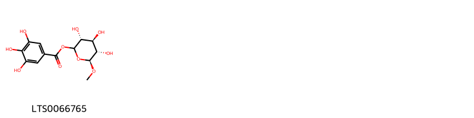{ width=100% }
    <figcaption>Hình ảnh cấu trúc hóa học của 1 hoạt chất thuộc nhóm Benzene and substituted derivatives gồm ['(3r,4s,5s,6s)-3,4,5-trihydroxy-6-methoxyoxan-2-yl 3,4,5-trihydroxybenzoate (LTS0066765)'].</figcaption>
</figure>
#### Nhóm Carboxylic acids and derivatives
<figure markdown="span">
    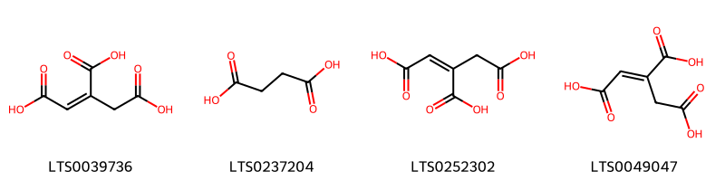{ width=100% }
    <figcaption>Hình ảnh cấu trúc hóa học của 4 hoạt chất thuộc nhóm Carboxylic acids and derivatives gồm ['aconitic acid (LTS0039736)', 'succinic acid (LTS0237204)', 'aconitate (LTS0252302)', 'trans-aconitic acid (LTS0049047)'].</figcaption>
</figure>
#### Nhóm Cinnamic acids and derivatives
<figure markdown="span">
    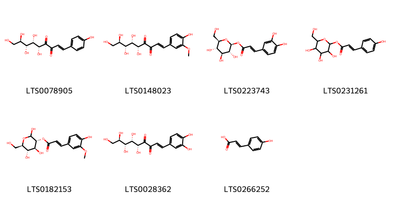{ width=100% }
    <figcaption>Hình ảnh cấu trúc hóa học của 7 hoạt chất thuộc nhóm Cinnamic acids and derivatives gồm ['(1e,5r,6s,7r,8r)-5,6,7,8,9-pentahydroxy-1-(4-hydroxyphenyl)non-1-ene-3,4-dione (LTS0078905)', '(1e,5r,6s,7r,8r)-5,6,7,8,9-pentahydroxy-1-(4-hydroxy-3-methoxyphenyl)non-1-ene-3,4-dione (LTS0148023)', '1-caffeoyl-β-d-glucose (LTS0223743)', '3,4,5-trihydroxy-6-(hydroxymethyl)oxan-2-yl (2e)-3-(4-hydroxyphenyl)prop-2-enoate (LTS0231261)', '(3r,4s,5s,6r)-2,4,5-trihydroxy-6-(hydroxymethyl)oxan-3-yl (2e)-3-(4-hydroxy-3-methoxyphenyl)prop-2-enoate (LTS0182153)', '(1e,5r,6s,7r,8r)-1-(3,4-dihydroxyphenyl)-5,6,7,8,9-pentahydroxynon-1-ene-3,4-dione (LTS0028362)', 'para-coumaric acid (LTS0266252)'].</figcaption>
</figure>
#### Nhóm Dibenzylbutane lignans
<figure markdown="span">
    { width=100% }
    <figcaption>Hình ảnh cấu trúc hóa học của 2 hoạt chất thuộc nhóm Dibenzylbutane lignans gồm ['(2s,3r)-2,3-bis[(4-hydroxy-3-methoxyphenyl)(¹³c)methyl](1-¹³c)butane-1,4-diol (LTS0268699)', 'secoisolariciresinol (LTS0086727)'].</figcaption>
</figure>
#### Nhóm Dihydrofurans
<figure markdown="span">
    { width=100% }
    <figcaption>Hình ảnh cấu trúc hóa học của 1 hoạt chất thuộc nhóm Dihydrofurans gồm ['vitamin c (LTS0022555)'].</figcaption>
</figure>
#### Nhóm Fatty Acyls
<figure markdown="span">
    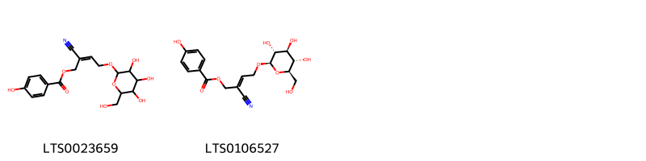{ width=100% }
    <figcaption>Hình ảnh cấu trúc hóa học của 2 hoạt chất thuộc nhóm Fatty Acyls gồm ['2-cyano-2-(2-{[3,4,5-trihydroxy-6-(hydroxymethyl)oxan-2-yl]oxy}ethylidene)ethyl 4-hydroxybenzoate (LTS0023659)', '(2e)-2-cyano-2-(2-{[(2r,3r,4s,5s,6r)-3,4,5-trihydroxy-6-(hydroxymethyl)oxan-2-yl]oxy}ethylidene)ethyl 4-hydroxybenzoate (LTS0106527)'].</figcaption>
</figure>
#### Nhóm Flavonoids
<figure markdown="span">
    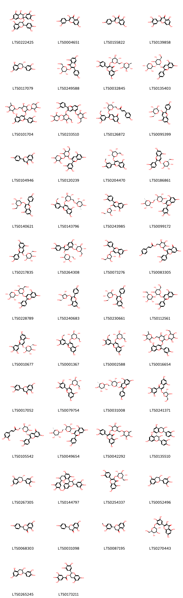{ width=100% }
    <figcaption>Hình ảnh cấu trúc hóa học của 59 hoạt chất thuộc nhóm Flavonoids gồm ['2-{[2-(3,4-dihydroxyphenyl)-5,7-dihydroxy-3,4-dihydro-2h-1-benzopyran-3-yl]oxy}-2-(3,4,5-trihydroxyphenyl)-3,4-dihydro-1-benzopyran-3,4,5,7-tetrol (LTS0222425)', 'quercetin (LTS0004651)', 'kaempherol (LTS0155822)', 'myricetin (LTS0139858)', '(+)-catechol (LTS0117079)', 'astragalin (LTS0249588)', '3-rutinosyl quercetin (LTS0032845)', '3-{[(2r,3r,4s,5s,6r)-4,5-dihydroxy-6-(hydroxymethyl)-3-{[(2s,3r,4s,5r)-3,4,5-trihydroxyoxan-2-yl]oxy}oxan-2-yl]oxy}-5,7-dihydroxy-2-(4-hydroxyphenyl)-1λ⁴-chromen-1-ylium (LTS0135403)', '3-[(4,5-dihydroxy-6-{[(3,4,5-trihydroxy-6-methyloxan-2-yl)oxy]methyl}-3-[(3,4,5-trihydroxyoxan-2-yl)oxy]oxan-2-yl)oxy]-2-(3,4-dihydroxyphenyl)-5,7-dihydroxy-1λ⁴-chromen-1-ylium (LTS0101704)', '3-{[4,5-dihydroxy-6-(hydroxymethyl)-3-[(3,4,5-trihydroxyoxan-2-yl)oxy]oxan-2-yl]oxy}-2-(3,4-dihydroxyphenyl)-7-hydroxy-5-{[3,4,5-trihydroxy-6-(hydroxymethyl)oxan-2-yl]oxy}-1λ⁴-chromen-1-ylium (LTS0233510)', '[(2r,3s,4s,5r)-6-{[2-(3,4-dihydroxy-5-methoxyphenyl)-7-hydroxy-5-oxochromen-3-yl]oxy}-3,4,5-trihydroxyoxan-2-yl]methyl 3-(4-hydroxyphenyl)prop-2-enoate (LTS0126872)', 'pelargonidin 3-glucoside (LTS0095399)', 'chamomile (LTS0104946)', '3-{[4,5-dihydroxy-6-(hydroxymethyl)-3-[(3,4,5-trihydroxyoxan-2-yl)oxy]oxan-2-yl]oxy}-5,7-dihydroxy-2-(3,4,5-trihydroxyphenyl)-1λ⁴-chromen-1-ylium (LTS0120239)', 'peonidin-3-glucoside (LTS0204470)', 'cyanidin 3-o-β-d-galactoside (LTS0186861)', '5,7-dihydroxy-2-(4-hydroxyphenyl)-3-{[(2r,3s,4r,5r,6s)-3,4,5-trihydroxy-6-(hydroxymethyl)oxan-2-yl]oxy}-1λ⁴-chromen-1-ylium (LTS0140621)', '5,7-dihydroxy-2-(4-hydroxy-3-methoxyphenyl)-3-{[(2s,3r,4s,5s,6r)-3,4,5-trihydroxy-6-({[(2r,3r,4r,5r,6s)-3,4,5-trihydroxy-6-methyloxan-2-yl]oxy}methyl)oxan-2-yl]oxy}-1λ⁴-chromen-1-ylium (LTS0143796)', '3-{[(2r,3r,4r,5s)-3,4-dihydroxy-5-(hydroxymethyl)oxolan-2-yl]oxy}-2-(3,4-dihydroxyphenyl)-5,7-dihydroxy-1λ⁴-chromen-1-ylium (LTS0243985)', 'tulipanin (LTS0099172)', 'cyanidin 3-glucoside (LTS0217835)', 'cyanin (LTS0264308)', '3-{[(2s,3r,4r,5r)-3,4-dihydroxy-5-(hydroxymethyl)oxolan-2-yl]oxy}-2-(3,4-dihydroxyphenyl)-5,7-dihydroxy-1λ⁴-chromen-1-ylium (LTS0073276)', '(6-{[2-(3,4-dihydroxyphenyl)-7-hydroxy-5-oxochromen-3-yl]oxy}-3,4,5-trihydroxyoxan-2-yl)methyl 3-(4-hydroxyphenyl)prop-2-enoate (LTS0083305)', '3-{[(2s,3r,4s,5s,6r)-4,5-dihydroxy-6-(hydroxymethyl)-3-{[(2s,3r,4s,5r)-3,4,5-trihydroxyoxan-2-yl]oxy}oxan-2-yl]oxy}-5,7-dihydroxy-2-(4-hydroxy-3-oxidophenyl)-1λ⁴-chromen-1-ylium (LTS0228789)', '3-{[(2r,3s,4s,5r)-3,4-dihydroxy-5-(hydroxymethyl)oxolan-2-yl]oxy}-5,7-dihydroxy-2-(4-hydroxyphenyl)-1λ⁴-chromen-1-ylium (LTS0240683)', '5,7-dihydroxy-2-(4-hydroxyphenyl)-3-{[(2r,3r,4s,5r,6r)-3,4,5-trihydroxy-6-(hydroxymethyl)oxan-2-yl]oxy}-1λ⁴-chromen-1-ylium (LTS0230661)', 'cyanidin 3-o-sophoroside (LTS0112561)', 'delphinidin 3-glucoside (LTS0010677)', 'petunidin 3-glucoside (LTS0001367)', '5,7-dihydroxy-2-(3-hydroxy-5-methoxy-4-oxidophenyl)-3-{[(2s,3r,4s,5s,6r)-3,4,5-trihydroxy-6-(hydroxymethyl)oxan-2-yl]oxy}-1λ⁴-chromen-1-ylium (LTS0002588)', '3-[(4,5-dihydroxy-3-{[3,4,5-trihydroxy-6-(hydroxymethyl)oxan-2-yl]oxy}-6-{[(3,4,5-trihydroxy-6-methyloxan-2-yl)oxy]methyl}oxan-2-yl)oxy]-2-(3,4-dihydroxyphenyl)-5,7-dihydroxy-1λ⁴-chromen-1-ylium (LTS0016654)', 'luteolin (LTS0017052)', '2-(3,5-dihydroxy-4-oxidophenyl)-5,7-dihydroxy-3-{[(2s,3r,4s,5s,6r)-3,4,5-trihydroxy-6-(hydroxymethyl)oxan-2-yl]oxy}-1λ⁴-chromen-1-ylium (LTS0079754)', 'pelargonidin 3-o-rutinoside (LTS0031008)', '3-{[(2s,3r,4r,5r)-3,4-dihydroxy-5-(hydroxymethyl)oxolan-2-yl]oxy}-5,7-dihydroxy-2-(3,4,5-trihydroxyphenyl)-1λ⁴-chromen-1-ylium (LTS0241371)', '[(2r,3s,4s,5r,6s)-6-{[2-(3,4-dihydroxyphenyl)-7-hydroxy-5-oxochromen-3-yl]oxy}-3,4,5-trihydroxyoxan-2-yl]methyl 3-(3,4-dihydroxyphenyl)prop-2-enoate (LTS0105542)', 'cyanidin 3-o-rutinoside (LTS0049654)', 'rutin (LTS0042292)', '(2r,3r,4r)-2-(3,4-dihydroxyphenyl)-4-[(2r,3r)-2-(3,4-dihydroxyphenyl)-3,5,7-trihydroxy-3,4-dihydro-2h-1-benzopyran-8-yl]-3,4-dihydro-2h-1-benzopyran-3,5,7-triol (LTS0135510)', 'gallocatechol (LTS0267305)', '4-[3,5,7-trihydroxy-2-(3,4,5-trihydroxyphenyl)-3,4-dihydro-2h-1-benzopyran-8-yl]-2-(3,4,5-trihydroxyphenyl)-3,4-dihydro-2h-1-benzopyran-3,5,7-triol (LTS0144797)', 'isoquercetin (LTS0254337)', 'epigallocatechin (LTS0052496)', 'asahina (LTS0068303)', 'naringenin (LTS0031098)', 'hesperetin (LTS0087195)', '2-(3,4-dihydroxy-5-{[(2s,3r,4s,5s,6r)-3,4,5-trihydroxy-6-(hydroxymethyl)oxan-2-yl]oxy}phenyl)-3,5,7-trihydroxychromen-4-one (LTS0270443)', 'ent-epicatechin (LTS0265245)', '(-)-epigallocatechin gallate (LTS0173211)', '(2r,3s,4s)-2-(3,4-dihydroxyphenyl)-4-[(2r,3r)-2-(3,4-dihydroxyphenyl)-3,5,7-trihydroxy-3,4-dihydro-2h-1-benzopyran-8-yl]-3,4-dihydro-2h-1-benzopyran-3,5,7-triol (LTS0116257)', '(2r,3s,4s)-2-(3,4-dihydroxyphenyl)-4-[(2r,3r)-2-(3,4-dihydroxyphenyl)-3,5,7-trihydroxy-3,4-dihydro-2h-1-benzopyran-6-yl]-3,4-dihydro-2h-1-benzopyran-3,5,7-triol (LTS0196496)', '(2r,3s,4s)-2-(3,4-dihydroxyphenyl)-4-[(2r,3s)-2-(3,4-dihydroxyphenyl)-3,5,7-trihydroxy-3,4-dihydro-2h-1-benzopyran-8-yl]-3,4-dihydro-2h-1-benzopyran-3,5,7-triol (LTS0151498)', 'epicatechin gallate (LTS0071606)', '(2r,3r)-2-(3,4-dihydroxyphenyl)-8-[(2r,3r)-2-(3,4-dihydroxyphenyl)-3,5,7-trihydroxy-3,4-dihydro-2h-1-benzopyran-4-yl]-4-[(2r,3s)-2-(3,4-dihydroxyphenyl)-3,5,7-trihydroxy-3,4-dihydro-2h-1-benzopyran-8-yl]-3,4-dihydro-2h-1-benzopyran-3,5,7-triol (LTS0059648)', 'procyanidin c1 (LTS0260445)', '(2r,3r,4r)-2-(3,4-dihydroxyphenyl)-4-[(2r,3s)-2-(3,4-dihydroxyphenyl)-3,5,7-trihydroxy-3,4-dihydro-2h-1-benzopyran-8-yl]-3,4-dihydro-2h-1-benzopyran-3,5,7-triol (LTS0066122)', '(2r,3s,4r)-2-(3,4-dihydroxyphenyl)-4-[(2r,3r)-2-(3,4-dihydroxyphenyl)-3,5,7-trihydroxy-3,4-dihydro-2h-1-benzopyran-6-yl]-3,4-dihydro-2h-1-benzopyran-3,5,7-triol (LTS0076760)', 'kaempferol 3-o-rutinoside (LTS0097007)'].</figcaption>
</figure>
#### Nhóm Furanoid lignans
<figure markdown="span">
    { width=100% }
    <figcaption>Hình ảnh cấu trúc hóa học của 1 hoạt chất thuộc nhóm Furanoid lignans gồm ['matairesinol (LTS0193475)'].</figcaption>
</figure>
#### Nhóm Nucleoside and nucleotide analogues
<figure markdown="span">
    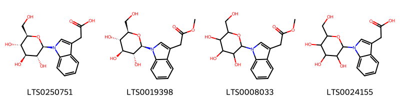{ width=100% }
    <figcaption>Hình ảnh cấu trúc hóa học của 4 hoạt chất thuộc nhóm Nucleoside and nucleotide analogues gồm ['{1-[(2r,3r,4s,5s,6r)-3,4,5-trihydroxy-6-(hydroxymethyl)oxan-2-yl]indol-3-yl}acetic acid (LTS0250751)', 'methyl 2-{1-[(2r,3r,4s,5s,6r)-3,4,5-trihydroxy-6-(hydroxymethyl)oxan-2-yl]indol-3-yl}acetate (LTS0019398)', 'methyl 2-{1-[3,4,5-trihydroxy-6-(hydroxymethyl)oxan-2-yl]indol-3-yl}acetate (LTS0008033)', '{1-[3,4,5-trihydroxy-6-(hydroxymethyl)oxan-2-yl]indol-3-yl}acetic acid (LTS0024155)'].</figcaption>
</figure>
#### Nhóm Organooxygen compounds
<figure markdown="span">
    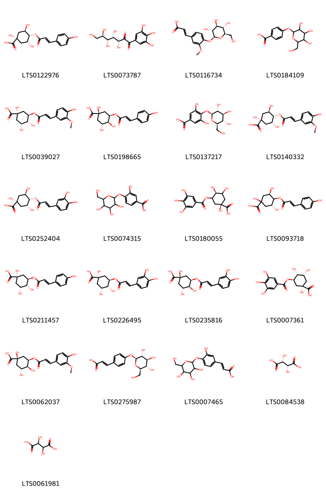{ width=100% }
    <figcaption>Hình ảnh cấu trúc hóa học của 21 hoạt chất thuộc nhóm Organooxygen compounds gồm ['(1s,3r,4s,5r)-1,3,5-trihydroxy-4-{[(2e)-3-(4-hydroxyphenyl)prop-2-enoyl]oxy}cyclohexane-1-carboxylic acid (LTS0122976)', '(3r,4s,5r,6r)-3,4,5,6,7-pentahydroxy-1-(3,4,5-trihydroxyphenyl)heptane-1,2-dione (LTS0073787)', '(2e)-3-(3-methoxy-4-{[(2s,3r,4s,5s,6r)-3,4,5-trihydroxy-6-(hydroxymethyl)oxan-2-yl]oxy}phenyl)prop-2-enoic acid (LTS0116734)', '4-{[3,4,5-trihydroxy-6-(hydroxymethyl)oxan-2-yl]oxy}benzoic acid (LTS0184109)', '3-o-feruloyl-d-quinic acid (LTS0039027)', '(1r,3r,4s,5r)-1,3,4-trihydroxy-5-{[(2e)-3-(4-hydroxyphenyl)prop-2-enoyl]oxy}cyclohexane-1-carboxylic acid (LTS0198665)', '3,5-dihydroxy-4-{[(2s,3r,4s,5s,6r)-3,4,5-trihydroxy-6-(hydroxymethyl)oxan-2-yl]oxy}benzoic acid (LTS0137217)', '4-o-feruloyl-d-quinic acid (LTS0140332)', 'cryptochlorogenic acid (LTS0252404)', '3-hydroxy-4-{[3,4,5-trihydroxy-6-(hydroxymethyl)oxan-2-yl]oxy}benzoic acid (LTS0074315)', '(1r,4s)-1,3,4-trihydroxy-5-(3,4,5-trihydroxybenzoyloxy)cyclohexane-1-carboxylic acid (LTS0180055)', '(3r,5r)-1,3,5-trihydroxy-4-{[(2e)-3-(4-hydroxyphenyl)prop-2-enoyl]oxy}cyclohexane-1-carboxylic acid (LTS0093718)', '(1s,3r,4r,5r)-1,3,4-trihydroxy-5-{[(2e)-3-(4-hydroxyphenyl)prop-2-enoyl]oxy}cyclohexane-1-carboxylic acid (LTS0211457)', 'chlorogenic acid (LTS0226495)', 'neochlorogenic acid (LTS0235816)', 'theogallin (LTS0007361)', '3-feruloylquinic acid (LTS0062037)', 'p-coumaric acid glucoside (LTS0275987)', '3-(3-hydroxy-4-{[3,4,5-trihydroxy-6-(hydroxymethyl)oxan-2-yl]oxy}phenyl)prop-2-enoic acid (LTS0007465)', 'l(+)-tartaric acid (LTS0084538)', '(.+-.)-tartaric acid (LTS0061981)'].</figcaption>
</figure>
#### Nhóm Tannins
<figure markdown="span">
    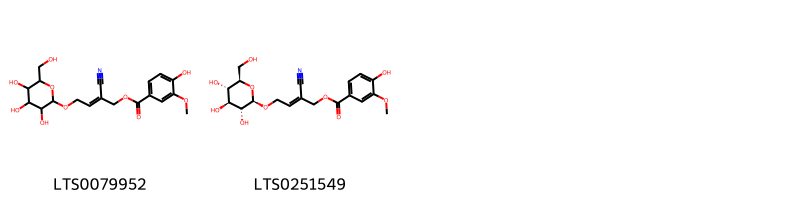{ width=100% }
    <figcaption>Hình ảnh cấu trúc hóa học của 2 hoạt chất thuộc nhóm Tannins gồm ['2-cyano-2-(2-{[3,4,5-trihydroxy-6-(hydroxymethyl)oxan-2-yl]oxy}ethylidene)ethyl 4-hydroxy-3-methoxybenzoate (LTS0079952)', '(2e)-2-cyano-2-(2-{[(2r,3r,4s,5s,6r)-3,4,5-trihydroxy-6-(hydroxymethyl)oxan-2-yl]oxy}ethylidene)ethyl 4-hydroxy-3-methoxybenzoate (LTS0251549)'].</figcaption>
</figure>

---

### Dược dân tộc học

Danh sách các quốc gia có sử dụng *Ribes rubrum* trong điều trị các bệnh. 

| Country   | Disease            | Bệnh                        |
|:----------|:-------------------|:----------------------------|
| Haiti     | Diuretic, Laxative | Thuốc lợi tiểu, nhuận tràng |
| ain       | Apertif            | Apertif                     |

---

---
## Ribes uvacria
### Thông tin về thực vật

!!! info "Phân loại thực vật của *Ribes uva-crispa* từ GIBF:"
    - **Kingdom:** Plantae
    - **Phylum:** Tracheophyta
    - **Order:** Saxifragales
    - **Family:** Grossulariaceae
    - **Genus:** Ribes
    - **Species:** *Ribes uva-crispa*

 

| Label (VI)   | Label (EN)   | Scientific Name   | Descriptions (VI)   | Descriptions (EN)   | Also Known As (VI)   | Also Known As (EN)            |
|:-------------|:-------------|:------------------|:--------------------|:--------------------|:---------------------|:------------------------------|
| N/A          | N/A          | Ribes rubrum      | loài thực vật       | species of plant    | ['']                 | ['red currant', 'redcurrant'] |

#### Phân bố trên thế giới

**Từ CSDL GIBF** Ukraine, Denmark, Netherlands, Lithuania, Czechia, Germany, United Kingdom of Great Britain and Northern Ireland, Belgium, Luxembourg, Spain, Ireland, Switzerland, Sweden, Poland, France, New Zealand, Austria

#### Phân bố tại Việt Nam

**Từ CSDL GIBF**: Không có ghi nhận ở Việt Nam

---
### Thành phần hóa học
        
- Theo cơ sở dữ liệu lotus: Từ loài *Ribes uva-crispa* đã phân lập và xác định được Chưa có hoạt chất nào được phân lập. hoạt chất thuộc về các nhóm Không có hoạt chất nào được phân lập. 

Không có hình ảnh nào được tạo ra

---

### Dược dân tộc học

Danh sách các quốc gia có sử dụng *Ribes uva-crispa* trong điều trị các bệnh. 

| Country   | Disease                            | Bệnh                                 |
|:----------|:-----------------------------------|:-------------------------------------|
| Turkey    | nan, Digestive, Diuretic, Laxative | nan, Tiêu hóa, lợi tiểu, nhuận tràng |

---

