!!! abstract "Tóm tắt"

    Họ Hamamelidaceae gồm khoảng 3 chi và 6 loài được một số cộng đồng tại các quốc gia như Dutch, Japan, Mexico(Chinantec), French, Mexico(Aztec), English, Mexico, China, Danish, anish, Guatemala, Elsewhere, German, Nd, US(Appalachia), US, Italian, Turkey, US(Amerindian) sử dụng trong một số trường hợp QUERY LENGTH LIMIT EXCEEDED. MAX ALLOWED QUERY : 500 CHARS.

!!! info "DrDuke"

    James A. Duke sinh năm 1929-2017 là một nhà thực vật học người Mỹ. Đây là một trong những tác giả hàng đầu trong lĩnh vực dược dân tộc học với cuốn *CRC Handbook of Medicinal Herbs* và chính là người xây dựng lên cơ sở dữ liệu về hợp chất tự nhiên và dược dân tộc học tại Bộ nông nghiệp Hoa Kỳ. Các thông tin được đăng tải tại website [Dr. Duke's Phytochemical and Ethnobotanical Databases](https://phytochem.nal.usda.gov/). 
    Trong suốt thập niên 1970, ông lãnh đạo the Plant Taxonomy Laboratory, Plant Genetics and Germplasm Institute of the Agricultural Research Service, U.S. Department of Agriculture.
    Trong tài liệu này, các thông tin về dược dân tộc của các dược liệu được trích dẫn từ tài liệu của James A. Ducke với sự trợ giúp của phần mềm dịch thuật từ tiếng Anh sang tiếng Việt.
   

# Chi Loropetalum

??? note "Danh sách các dược liệu thuộc chi"
    
	 - *Loropetalum chinense*

---
## Loropetalum chinense
### Thông tin về thực vật

!!! info "Phân loại thực vật của *Loropetalum chinense* từ GIBF:"
    - **Kingdom:** Plantae
    - **Phylum:** Tracheophyta
    - **Order:** Saxifragales
    - **Family:** Hamamelidaceae
    - **Genus:** Loropetalum
    - **Species:** *Loropetalum chinense*

 

| Label (VI)   | Label (EN)   | Scientific Name      | Descriptions (VI)   | Descriptions (EN)   | Also Known As (VI)   | Also Known As (EN)                                       |
|:-------------|:-------------|:---------------------|:--------------------|:--------------------|:---------------------|:---------------------------------------------------------|
| N/A          | N/A          | Loropetalum chinense | loài thực vật       | species of plant    | ['']                 | ['Chinese fringe flower', 'loropetalum', 'strap flower'] |

#### Phân bố trên thế giới

**Từ CSDL GIBF** nan, Chinese Taipei, Thailand, Portugal, South Africa, Japan, New Zealand, Malaysia, Bolivia (Plurinational State of), Indonesia, Germany, Canada, United States of America, China, Singapore, Australia, Hong Kong

#### Phân bố tại Việt Nam

**Từ CSDL GIBF**: Không có ghi nhận ở Việt Nam

---
### Thành phần hóa học
        
- Theo cơ sở dữ liệu lotus: Từ loài *Loropetalum chinense* đã phân lập và xác định được 43 hoạt chất thuộc về các nhóm Tannins, Organooxygen compounds, Flavonoids, Benzene and substituted derivatives. 

|    | chemicalTaxonomyClassyfireClass     |   smiles_count |
|---:|:------------------------------------|---------------:|
|  0 | Benzene and substituted derivatives |              1 |
|  1 | Flavonoids                          |              5 |
|  2 | Organooxygen compounds              |              5 |
|  3 | Tannins                             |             32 |

#### Nhóm Benzene and substituted derivatives
<figure markdown="span">
    { width=100% }
    <figcaption>Hình ảnh cấu trúc hóa học của 1 hoạt chất thuộc nhóm Benzene and substituted derivatives gồm ['galop (LTS0222857)'].</figcaption>
</figure>
#### Nhóm Flavonoids
<figure markdown="span">
    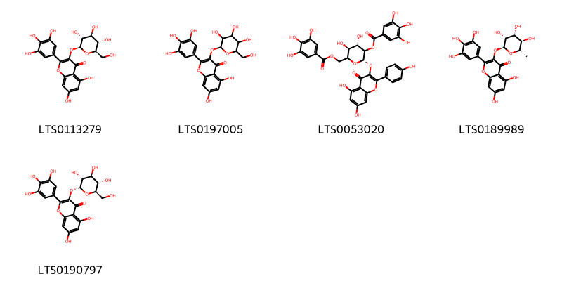{ width=100% }
    <figcaption>Hình ảnh cấu trúc hóa học của 5 hoạt chất thuộc nhóm Flavonoids gồm ['5,7-dihydroxy-3-{[(2s,3r,4s,5s,6r)-3,4,5-trihydroxy-6-(hydroxymethyl)oxan-2-yl]oxy}-2-(3,4,5-trihydroxyphenyl)chromen-4-one (LTS0113279)', '5,7-dihydroxy-3-{[3,4,5-trihydroxy-6-(hydroxymethyl)oxan-2-yl]oxy}-2-(3,4,5-trihydroxyphenyl)chromen-4-one (LTS0197005)', 'loropetalin d (LTS0053020)', 'myricitrin (LTS0189989)', '5,7-dihydroxy-3-{[(2r,3r,4s,5s,6r)-3,4,5-trihydroxy-6-(hydroxymethyl)oxan-2-yl]oxy}-2-(3,4,5-trihydroxyphenyl)chromen-4-one (LTS0190797)'].</figcaption>
</figure>
#### Nhóm Organooxygen compounds
<figure markdown="span">
    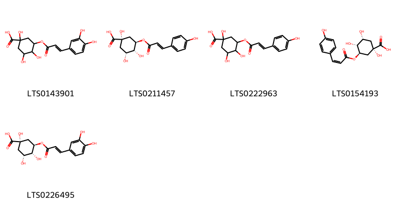{ width=100% }
    <figcaption>Hình ảnh cấu trúc hóa học của 5 hoạt chất thuộc nhóm Organooxygen compounds gồm ['3-{[3-(3,4-dihydroxyphenyl)prop-2-enoyl]oxy}-1,4,5-trihydroxycyclohexane-1-carboxylic acid (LTS0143901)', '(1s,3r,4r,5r)-1,3,4-trihydroxy-5-{[(2e)-3-(4-hydroxyphenyl)prop-2-enoyl]oxy}cyclohexane-1-carboxylic acid (LTS0211457)', '1,3,4-trihydroxy-5-{[3-(4-hydroxyphenyl)prop-2-enoyl]oxy}cyclohexane-1-carboxylic acid (LTS0222963)', '(z)-5-p-coumaroylquinic acid (LTS0154193)', 'chlorogenic acid (LTS0226495)'].</figcaption>
</figure>
#### Nhóm Tannins
<figure markdown="span">
    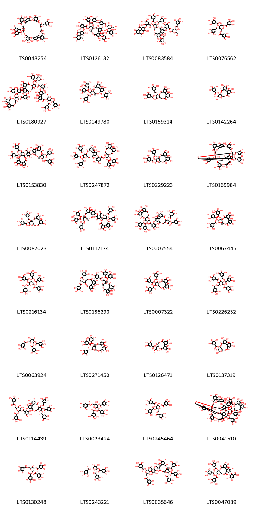{ width=100% }
    <figcaption>Hình ảnh cấu trúc hóa học của 32 hoạt chất thuộc nhóm Tannins gồm ['11-formyl-4,5,6,18,19,20,28,29,30,45,46,47,50,51,57,58,62-heptadecahydroxy-9,15,33,42,54,59-hexaoxo-36,37-bis(3,4,5-trihydroxybenzoyloxy)-2,10,14,26,34,41,55,56,60-nonaoxadecacyclo[36.13.4.4¹³,²³.2²²,²⁵.1³⁵,³⁹.0³,⁸.0¹⁶,²¹.0²⁷,³².0⁴³,⁴⁸.0⁴⁹,⁵³]dohexaconta-1(52),3,5,7,16(21),17,19,22,24,27,29,31,43(48),44,46,49(53),50,57-octadecaen-12-yl 3,4,5-trihydroxybenzoate (LTS0048254)', '(2r,3r,4s,5r,6r)-2,5-dihydroxy-6-(hydroxymethyl)-4-(3,4,5-trihydroxybenzoyloxy)oxan-3-yl 3,4,5-trihydroxy-2-{[(10r,11s,12r,13s,15r)-4,21,22,23-tetrahydroxy-8,18-dioxo-13-[3,4,5-trihydroxy-2-({7,13,14-trihydroxy-3,10-dioxo-2,9-dioxatetracyclo[6.6.2.0⁴,¹⁶.0¹¹,¹⁵]hexadeca-1(15),4(16),5,7,11,13-hexaen-6-yl}oxy)benzoyloxy]-3,11,12-tris(3,4,5-trihydroxybenzoyloxy)-9,14,17-trioxatetracyclo[17.4.0.0²,⁷.0¹⁰,¹⁵]tricosa-1(19),2(7),3,5,20,22-hexaen-5-yl]oxy}benzoate (LTS0126132)', '2,5-dihydroxy-6-(hydroxymethyl)-4-(3,4,5-trihydroxybenzoyloxy)oxan-3-yl 3,4,5-trihydroxy-2-({4,21,22,23-tetrahydroxy-8,18-dioxo-13-[3,4,5-trihydroxy-2-({7,13,14-trihydroxy-3,10-dioxo-2,9-dioxatetracyclo[6.6.2.0⁴,¹⁶.0¹¹,¹⁵]hexadeca-1(15),4(16),5,7,11,13-hexaen-6-yl}oxy)benzoyloxy]-3,11,12-tris(3,4,5-trihydroxybenzoyloxy)-9,14,17-trioxatetracyclo[17.4.0.0²,⁷.0¹⁰,¹⁵]tricosa-1(19),2(7),3,5,20,22-hexaen-5-yl}oxy)benzoate (LTS0083584)', '3-hydroxy-4,5-bis(3,4,5-trihydroxybenzoyloxy)-6-[(3,4,5-trihydroxybenzoyloxy)methyl]oxan-2-yl 3,4,5-trihydroxybenzoate (LTS0076562)', '21-[6-({[3,4,5,21,22,23-hexahydroxy-8,18-dioxo-11,12-bis(3,4,5-trihydroxybenzoyloxy)-9,14,17-trioxatetracyclo[17.4.0.0²,⁷.0¹⁰,¹⁵]tricosa-1(23),2(7),3,5,19,21-hexaen-13-yl]oxy}carbonyl)-2,3,4-trihydroxyphenoxy]-3,4,5,22,23-pentahydroxy-8,18-dioxo-11,12-bis(3,4,5-trihydroxybenzoyloxy)-9,14,17-trioxatetracyclo[17.4.0.0²,⁷.0¹⁰,¹⁵]tricosa-1(23),2(7),3,5,19,21-hexaen-13-yl 2-{[3,4,5,13,22,23-hexahydroxy-8,18-dioxo-11,12-bis(3,4,5-trihydroxybenzoyloxy)-9,14,17-trioxatetracyclo[17.4.0.0²,⁷.0¹⁰,¹⁵]tricosa-1(23),2(7),3,5,19,21-hexaen-21-yl]oxy}-3,4,5-trihydroxybenzoate (LTS0180927)', '3,4,5-trihydroxy-2-{[(10r,11s,12r,13s,15r)-3,4,5,22,23-pentahydroxy-8,18-dioxo-11,12,13-tris(3,4,5-trihydroxybenzoyloxy)-9,14,17-trioxatetracyclo[17.4.0.0²,⁷.0¹⁰,¹⁵]tricosa-1(23),2(7),3,5,19,21-hexaen-21-yl]oxy}benzoic acid (LTS0149780)', '3,4,5,13,21,22,23-heptahydroxy-8,18-dioxo-12-(3,4,5-trihydroxybenzoyloxy)-9,14,17-trioxatetracyclo[17.4.0.0²,⁷.0¹⁰,¹⁵]tricosa-1(23),2(7),3,5,19,21-hexaen-11-yl 3,4,5-trihydroxybenzoate (LTS0159314)', '3,4,5,12,13,21,22,23-octahydroxy-8,18-dioxo-9,14,17-trioxatetracyclo[17.4.0.0²,⁷.0¹⁰,¹⁵]tricosa-1(23),2(7),3,5,19,21-hexaen-11-yl 3,4,5-trihydroxybenzoate (LTS0142264)', '(10r,11s,12r,13s,15r)-3,4,5,21,22,23-hexahydroxy-8,18-dioxo-11,12-bis(3,4,5-trihydroxybenzoyloxy)-9,14,17-trioxatetracyclo[17.4.0.0²,⁷.0¹⁰,¹⁵]tricosa-1(23),2(7),3,5,19,21-hexaen-13-yl 2-{[(10r,11s,12r,13r,15r)-3,4,5,13,22,23-hexahydroxy-8,18-dioxo-11,12-bis(3,4,5-trihydroxybenzoyloxy)-9,14,17-trioxatetracyclo[17.4.0.0²,⁷.0¹⁰,¹⁵]tricosa-1(19),2(7),3,5,20,22-hexaen-21-yl]oxy}-3,4,5-trihydroxybenzoate (LTS0153830)', '3,4,5,21,22,23-hexahydroxy-8,18-dioxo-11,12-bis(3,4,5-trihydroxybenzoyloxy)-9,14,17-trioxatetracyclo[17.4.0.0²,⁷.0¹⁰,¹⁵]tricosa-1(23),2(7),3,5,19,21-hexaen-13-yl 3,4,5-trihydroxy-2-{[3,4,5,22,23-pentahydroxy-8,18-dioxo-11,12,13-tris(3,4,5-trihydroxybenzoyloxy)-9,14,17-trioxatetracyclo[17.4.0.0²,⁷.0¹⁰,¹⁵]tricosa-1(23),2(7),3,5,19,21-hexaen-21-yl]oxy}benzoate (LTS0247872)', '(10r,11s,12r,13r,15r)-3,4,5,13,21,22,23-heptahydroxy-8,18-dioxo-11-(3,4,5-trihydroxybenzoyloxy)-9,14,17-trioxatetracyclo[17.4.0.0²,⁷.0¹⁰,¹⁵]tricosa-1(23),2(7),3,5,19,21-hexaen-12-yl 3,4,5-trihydroxybenzoate (LTS0229223)', '4,5,6,12,20,21,22,30,31,32,47,48,49,52,53,59,60-heptadecahydroxy-9,17,35,44,56,61-hexaoxo-38,64-bis(3,4,5-trihydroxybenzoyloxy)-2,10,13,16,28,36,43,57,58,62-decaoxaundecacyclo[38.13.4.3¹⁴,²⁵.2²⁴,²⁷.1¹¹,¹⁵.1³⁷,⁴¹.0³,⁸.0¹⁸,²³.0²⁹,³⁴.0⁴⁵,⁵⁰.0⁵¹,⁵⁵]tetrahexaconta-1(54),3,5,7,18(23),19,21,24,26,29,31,33,45(50),46,48,51(55),52,59-octadecaen-39-yl 3,4,5-trihydroxybenzoate (LTS0169984)', '(10r,11s,12r,15r)-3,4,5,13,21,22,23-heptahydroxy-8,18-dioxo-11-(3,4,5-trihydroxybenzoyloxy)-9,14,17-trioxatetracyclo[17.4.0.0²,⁷.0¹⁰,¹⁵]tricosa-1(23),2(7),3,5,19,21-hexaen-12-yl 3,4,5-trihydroxybenzoate (LTS0087023)', '(10r,11s,12r,13s,15r)-3,4,5,21,22,23-hexahydroxy-8,18-dioxo-11,12-bis(3,4,5-trihydroxybenzoyloxy)-9,14,17-trioxatetracyclo[17.4.0.0²,⁷.0¹⁰,¹⁵]tricosa-1(23),2(7),3,5,19,21-hexaen-13-yl 3,4,5-trihydroxy-2-{[(10r,11s,12r,13s,15r)-3,4,5,22,23-pentahydroxy-8,18-dioxo-11,12,13-tris(3,4,5-trihydroxybenzoyloxy)-9,14,17-trioxatetracyclo[17.4.0.0²,⁷.0¹⁰,¹⁵]tricosa-1(23),2(7),3,5,19,21-hexaen-21-yl]oxy}benzoate (LTS0117174)', '3,4,5,21,22,23-hexahydroxy-8,18-dioxo-11,12-bis(3,4,5-trihydroxybenzoyloxy)-9,14,17-trioxatetracyclo[17.4.0.0²,⁷.0¹⁰,¹⁵]tricosa-1(23),2(7),3,5,19,21-hexaen-13-yl 2-{[3,4,5,13,22,23-hexahydroxy-8,18-dioxo-11,12-bis(3,4,5-trihydroxybenzoyloxy)-9,14,17-trioxatetracyclo[17.4.0.0²,⁷.0¹⁰,¹⁵]tricosa-1(23),2(7),3,5,19,21-hexaen-21-yl]oxy}-3,4,5-trihydroxybenzoate (LTS0207554)', '(10r,11s,12r,13s,15r)-3,4,5,21,22,23-hexahydroxy-8,18-dioxo-12,13-bis(3,4,5-trihydroxybenzoyloxy)-9,14,17-trioxatetracyclo[17.4.0.0²,⁷.0¹⁰,¹⁵]tricosa-1(23),2(7),3,5,19,21-hexaen-11-yl 3,4,5-trihydroxybenzoate (LTS0067445)', '(2s,3r,4s,5r,6r)-3,4,5-tris(3,4,5-trihydroxybenzoyloxy)-6-[(3,4,5-trihydroxybenzoyloxy)methyl]oxan-2-yl 3,4,5-trihydroxybenzoate (LTS0216134)', '(10r,11s,12r,13s,15r)-3,4,5,21,22,23-hexahydroxy-8,18-dioxo-11,12-bis(3,4,5-trihydroxybenzoyloxy)-9,14,17-trioxatetracyclo[17.4.0.0²,⁷.0¹⁰,¹⁵]tricosa-1(23),2(7),3,5,19,21-hexaen-13-yl 2-{[(11r,12r)-3,4,11,17,18,19-hexahydroxy-8,14-dioxo-12-[(1s,2r)-3-oxo-1,2-bis(3,4,5-trihydroxybenzoyloxy)propyl]-9,13-dioxatricyclo[13.4.0.0²,⁷]nonadeca-1(19),2(7),3,5,15,17-hexaen-5-yl]oxy}-3,4,5-trihydroxybenzoate (LTS0186293)', '3,4,5,21,22,23-hexahydroxy-8,18-dioxo-12,13-bis(3,4,5-trihydroxybenzoyloxy)-9,14,17-trioxatetracyclo[17.4.0.0²,⁷.0¹⁰,¹⁵]tricosa-1(23),2(7),3,5,19,21-hexaen-11-yl 3,4,5-trihydroxybenzoate (LTS0007322)', '3,4,5-tris(3,4,5-trihydroxybenzoyloxy)-6-[(3,4,5-trihydroxybenzoyloxy)methyl]oxan-2-yl 3,4,5-trihydroxybenzoate (LTS0226232)', '4,5-dihydroxy-3-(3,4,5-trihydroxybenzoyloxy)-6-[(3,4,5-trihydroxybenzoyloxy)methyl]oxan-2-yl 3,4,5-trihydroxybenzoate (LTS0063924)', '(10r,11s,12r,15r)-3,4,5,21,22,23-hexahydroxy-8,18-dioxo-12,13-bis(3,4,5-trihydroxybenzoyloxy)-9,14,17-trioxatetracyclo[17.4.0.0²,⁷.0¹⁰,¹⁵]tricosa-1(23),2(7),3,5,19,21-hexaen-11-yl 3,4,5-trihydroxybenzoate (LTS0271450)', '1-{3,4,5,11,17,18,19-heptahydroxy-8,14-dioxo-9,13-dioxatricyclo[13.4.0.0²,⁷]nonadeca-1(15),2,4,6,16,18-hexaen-10-yl}-2-hydroxy-3-oxopropyl 3,4,5-trihydroxybenzoate (LTS0126471)', '(10r,11r,12r,13s,15r)-3,4,5,12,13,21,22,23-octahydroxy-8,18-dioxo-9,14,17-trioxatetracyclo[17.4.0.0²,⁷.0¹⁰,¹⁵]tricosa-1(23),2(7),3,5,19,21-hexaen-11-yl 3,4,5-trihydroxybenzoate (LTS0137319)', '4,5-dihydroxy-2-(3,4,5-trihydroxybenzoyloxy)-6-[(3,4,5-trihydroxybenzoyloxy)methyl]oxan-3-yl 3,4,5-trihydroxy-2-{[3,4,5,22,23-pentahydroxy-8,18-dioxo-11,12,13-tris(3,4,5-trihydroxybenzoyloxy)-9,14,17-trioxatetracyclo[17.4.0.0²,⁷.0¹⁰,¹⁵]tricosa-1(19),2(7),3,5,20,22-hexaen-21-yl]oxy}benzoate (LTS0114439)', '5-hydroxy-3,4-bis(3,4,5-trihydroxybenzoyloxy)-6-[(3,4,5-trihydroxybenzoyloxy)methyl]oxan-2-yl 3,4,5-trihydroxybenzoate (LTS0023424)', '(2s,3r,4r,5r,6r)-3-hydroxy-4,5-bis(3,4,5-trihydroxybenzoyloxy)-6-[(3,4,5-trihydroxybenzoyloxy)methyl]oxan-2-yl 3,4,5-trihydroxybenzoate (LTS0245464)', '3,4,5,13,21,22,23-heptahydroxy-8,18-dioxo-11-(3,4,5-trihydroxybenzoyloxy)-9,14,17-trioxatetracyclo[17.4.0.0²,⁷.0¹⁰,¹⁵]tricosa-1(23),2(7),3,5,19,21-hexaen-12-yl 2-{[4,5,6,12,20,21,22,30,31,32,48,49,52,53,59,60-hexadecahydroxy-9,17,35,44,56,61-hexaoxo-38,39,64-tris(3,4,5-trihydroxybenzoyloxy)-2,10,13,16,28,36,43,57,58,62-decaoxaundecacyclo[38.13.4.3¹⁴,²⁵.2²⁴,²⁷.1¹¹,¹⁵.1³⁷,⁴¹.0³,⁸.0¹⁸,²³.0²⁹,³⁴.0⁴⁵,⁵⁰.0⁵¹,⁵⁵]tetrahexaconta-1(54),3,5,7,18(23),19,21,24,26,29,31,33,45(50),46,48,51(55),52,59-octadecaen-47-yl]oxy}-3,4,5-trihydroxybenzoate (LTS0041510)', '(2s,3r,4s,5r,6r)-5-hydroxy-3,4-bis(3,4,5-trihydroxybenzoyloxy)-6-[(3,4,5-trihydroxybenzoyloxy)methyl]oxan-2-yl 3,4,5-trihydroxybenzoate (LTS0130248)', '(2s,3r,4s,5s,6r)-4,5-dihydroxy-3-(3,4,5-trihydroxybenzoyloxy)-6-[(3,4,5-trihydroxybenzoyloxy)methyl]oxan-2-yl 3,4,5-trihydroxybenzoate (LTS0243221)', '(2s,3r,4s,5s,6r)-4,5-dihydroxy-2-(3,4,5-trihydroxybenzoyloxy)-6-[(3,4,5-trihydroxybenzoyloxy)methyl]oxan-3-yl 3,4,5-trihydroxy-2-{[(10r,11s,12r,13s,15r)-3,4,5,22,23-pentahydroxy-8,18-dioxo-11,12,13-tris(3,4,5-trihydroxybenzoyloxy)-9,14,17-trioxatetracyclo[17.4.0.0²,⁷.0¹⁰,¹⁵]tricosa-1(19),2(7),3,5,20,22-hexaen-21-yl]oxy}benzoate (LTS0035646)', '3,4,5-trihydroxy-2-{[3,4,5,22,23-pentahydroxy-8,18-dioxo-11,12,13-tris(3,4,5-trihydroxybenzoyloxy)-9,14,17-trioxatetracyclo[17.4.0.0²,⁷.0¹⁰,¹⁵]tricosa-1(23),2(7),3,5,19,21-hexaen-21-yl]oxy}benzoic acid (LTS0047089)'].</figcaption>
</figure>

---

### Dược dân tộc học

Danh sách các quốc gia có sử dụng *Loropetalum chinense* trong điều trị các bệnh. 

| Country   | Disease              | Bệnh                                                                                                                                                                                                |
|:----------|:---------------------|:----------------------------------------------------------------------------------------------------------------------------------------------------------------------------------------------------|
| China     | Hemostat, Alexiteric | MYMEMORY WARNING: YOU USED ALL AVAILABLE FREE TRANSLATIONS FOR TODAY. NEXT AVAILABLE IN  09 HOURS 26 MINUTES 57 SECONDS VISIT HTTPS://MYMEMORY.TRANSLATED.NET/DOC/USAGELIMITS.PHP TO TRANSLATE MORE |

---

# Chi Hamamelis

??? note "Danh sách các dược liệu thuộc chi"
    
	 - *Hamamelis japonica*
	 - *Hamamelis virginiana*

---
## Hamamelis japonica
### Thông tin về thực vật

!!! info "Phân loại thực vật của *Hamamelis japonica* từ GIBF:"
    - **Kingdom:** Plantae
    - **Phylum:** Tracheophyta
    - **Order:** Saxifragales
    - **Family:** Hamamelidaceae
    - **Genus:** Hamamelis
    - **Species:** *Hamamelis japonica*

 

| Label (VI)   | Label (EN)   | Scientific Name    | Descriptions (VI)   | Descriptions (EN)   | Also Known As (VI)   | Also Known As (EN)   |
|:-------------|:-------------|:-------------------|:--------------------|:--------------------|:---------------------|:---------------------|
| N/A          | N/A          | Hamamelis japonica | loài thực vật       | species of plant    | ['']                 | ['']                 |

#### Phân bố trên thế giới

**Từ CSDL GIBF** nan, Japan, Latvia, Czechia, Poland, Germany, United States of America, Norway, Belgium, Korea, Republic of

#### Phân bố tại Việt Nam

**Từ CSDL GIBF**: Không có ghi nhận ở Việt Nam

---
### Thành phần hóa học
        
- Theo cơ sở dữ liệu lotus: Từ loài *Hamamelis japonica* đã phân lập và xác định được Chưa có hoạt chất nào được phân lập. hoạt chất thuộc về các nhóm Không có hoạt chất nào được phân lập. 

Không có hình ảnh nào được tạo ra

---

### Dược dân tộc học

Danh sách các quốc gia có sử dụng *Hamamelis japonica* trong điều trị các bệnh. 

| Country   | Disease                                                            | Bệnh                                                                                                                                                                                                |
|:----------|:-------------------------------------------------------------------|:----------------------------------------------------------------------------------------------------------------------------------------------------------------------------------------------------|
| Elsewhere | Astringent, Antidiarrheic                                          | MYMEMORY WARNING: YOU USED ALL AVAILABLE FREE TRANSLATIONS FOR TODAY. NEXT AVAILABLE IN  09 HOURS 26 MINUTES 18 SECONDS VISIT HTTPS://MYMEMORY.TRANSLATED.NET/DOC/USAGELIMITS.PHP TO TRANSLATE MORE |
| Japan     | Antiemetic, Cardiotonic, Diuretic, Diuretic, Stomachic, Hemostatic | MYMEMORY WARNING: YOU USED ALL AVAILABLE FREE TRANSLATIONS FOR TODAY. NEXT AVAILABLE IN  09 HOURS 26 MINUTES 15 SECONDS VISIT HTTPS://MYMEMORY.TRANSLATED.NET/DOC/USAGELIMITS.PHP TO TRANSLATE MORE |

---

---
## Hamamelis virginiana
### Thông tin về thực vật

!!! info "Phân loại thực vật của *Hamamelis virginiana* từ GIBF:"
    - **Kingdom:** Plantae
    - **Phylum:** Tracheophyta
    - **Order:** Saxifragales
    - **Family:** Hamamelidaceae
    - **Genus:** Hamamelis
    - **Species:** *Hamamelis virginiana*

 

| Label (VI)   | Label (EN)   | Scientific Name      | Descriptions (VI)   | Descriptions (EN)   | Also Known As (VI)   | Also Known As (EN)                                            |
|:-------------|:-------------|:---------------------|:--------------------|:--------------------|:---------------------|:--------------------------------------------------------------|
| N/A          | N/A          | Hamamelis virginiana | loài thực vật       | species of plant    | ['']                 | ['American witch-hazel', 'common witch hazel', 'witch-hazel'] |

#### Phân bố trên thế giới

**Từ CSDL GIBF** Canada, United States of America

#### Phân bố tại Việt Nam

**Từ CSDL GIBF**: Không có ghi nhận ở Việt Nam

---
### Thành phần hóa học
        
- Theo cơ sở dữ liệu lotus: Từ loài *Hamamelis virginiana* đã phân lập và xác định được 241 hoạt chất thuộc về các nhóm Organooxygen compounds, Flavonoids, Lactones, Saturated hydrocarbons, Oxolanes, Unsaturated hydrocarbons, Prenol lipids, Carboxylic acids and derivatives, Fatty Acyls, Epoxides, Pyrans, Phenols, Phenol ethers, Cinnamic acids and derivatives, Benzene and substituted derivatives. 

|    | chemicalTaxonomyClassyfireClass     |   smiles_count |
|---:|:------------------------------------|---------------:|
|  0 |                                     |              1 |
|  1 | Benzene and substituted derivatives |             29 |
|  2 | Carboxylic acids and derivatives    |              2 |
|  3 | Cinnamic acids and derivatives      |              2 |
|  4 | Epoxides                            |              1 |
|  5 | Fatty Acyls                         |             40 |
|  6 | Flavonoids                          |             31 |
|  7 | Lactones                            |              2 |
|  8 | Organooxygen compounds              |             22 |
|  9 | Oxolanes                            |              2 |
| 10 | Phenol ethers                       |              2 |
| 11 | Phenols                             |              2 |
| 12 | Prenol lipids                       |             50 |
| 13 | Pyrans                              |              1 |
| 14 | Saturated hydrocarbons              |             42 |
| 15 | Unsaturated hydrocarbons            |              9 |

#### Nhóm 
<figure markdown="span">
    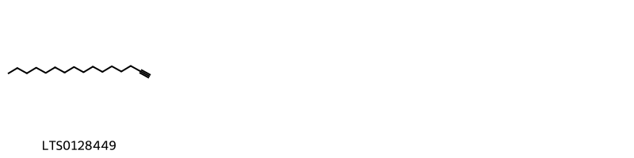{ width=100% }
    <figcaption>Hình ảnh cấu trúc hóa học của 1 hoạt chất thuộc nhóm  gồm ['1-hexadecyne (LTS0128449)'].</figcaption>
</figure>
#### Nhóm Benzene and substituted derivatives
<figure markdown="span">
    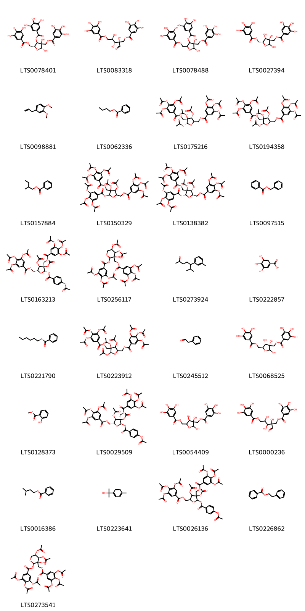{ width=100% }
    <figcaption>Hình ảnh cấu trúc hóa học của 29 hoạt chất thuộc nhóm Benzene and substituted derivatives gồm ['[(2r,3r,4r,5r)-2,3-dihydroxy-4-(3,4,5-trihydroxybenzoyloxy)-5-[(3,4,5-trihydroxybenzoyloxy)methyl]oxolan-3-yl]methyl 3,4,5-trihydroxybenzoate (LTS0078401)', 'hamamelitannin (LTS0083318)', '[2,3-dihydroxy-4-(3,4,5-trihydroxybenzoyloxy)-5-[(3,4,5-trihydroxybenzoyloxy)methyl]oxolan-3-yl]methyl 3,4,5-trihydroxybenzoate (LTS0078488)', '[(3r,4r,5r)-2,3,4-trihydroxy-5-[(3,4,5-trihydroxybenzoyloxy)methyl]oxolan-3-yl]methyl 3,4,5-trihydroxybenzoate (LTS0027394)', 'methyl eugenol (LTS0098881)', 'butyl benzoate (LTS0062336)', '[(2r,3r,4r,5r)-3,4,5-tris(acetyloxy)-4-{[3,4,5-tris(acetyloxy)benzoyloxy]methyl}oxolan-2-yl]methyl 3,4,5-tris(acetyloxy)benzoate (LTS0175216)', '[(2r,3r,4r,5s)-3,4,5-tris(acetyloxy)-4-{[3,4,5-tris(acetyloxy)benzoyloxy]methyl}oxolan-2-yl]methyl 3,4,5-tris(acetyloxy)benzoate (LTS0194358)', '2-methylbutyl benzoate (LTS0157884)', '[3,4-bis(acetyloxy)-5-[3,4,5-tris(acetyloxy)benzoyloxy]-4-{[3,4,5-tris(acetyloxy)benzoyloxy]methyl}oxolan-2-yl]methyl 3,4,5-tris(acetyloxy)benzoate (LTS0150329)', '[(2r,3r,4r,5r)-3,4-bis(acetyloxy)-5-[3,4,5-tris(acetyloxy)benzoyloxy]-4-{[3,4,5-tris(acetyloxy)benzoyloxy]methyl}oxolan-2-yl]methyl 3,4,5-tris(acetyloxy)benzoate (LTS0138382)', 'benzyl benzoate (LTS0097515)', '[(2r,3r,4r,5s)-3,4-bis(acetyloxy)-5-[4-(acetyloxy)benzoyloxy]-4-{[3,4,5-tris(acetyloxy)benzoyloxy]methyl}oxolan-2-yl]methyl 3,4,5-tris(acetyloxy)benzoate (LTS0163213)', '[4,5-bis(acetyloxy)-3-hydroxy-2-[3,4,5-tris(acetyloxy)benzoyloxy]oxan-3-yl]methyl 3,4,5-tris(acetyloxy)benzoate (LTS0256117)', '6-methyl-5-(3-methylphenyl)heptan-2-one (LTS0273924)', 'galop (LTS0222857)', 'hexyl benzoate (LTS0221790)', '[3,4,5-tris(acetyloxy)-4-{[3,4,5-tris(acetyloxy)benzoyloxy]methyl}oxolan-2-yl]methyl 3,4,5-tris(acetyloxy)benzoate (LTS0223912)', 'phenylacetaldehyde (LTS0245512)', '[(3s,4s,5s)-2,3,4-trihydroxy-5-[(3,4,5-trihydroxybenzoyloxy)methyl]oxolan-3-yl]methyl 3,4,5-trihydroxybenzoate (LTS0068525)', 'methyl salicylate (LTS0128373)', '[(2r,3r,4r,5r)-3,4-bis(acetyloxy)-5-[4-(acetyloxy)benzoyloxy]-4-{[3,4,5-tris(acetyloxy)benzoyloxy]methyl}oxolan-2-yl]methyl 3,4,5-tris(acetyloxy)benzoate (LTS0029509)', '{2,3,4-trihydroxy-5-[(3,4,5-trihydroxybenzoyloxy)methyl]oxolan-3-yl}methyl 3,4,5-trihydroxybenzoate (LTS0054409)', '2-[1,2-dihydroxy-3-(3,4,5-trihydroxybenzoyloxy)propyl]-2-hydroxy-3-oxopropyl 3,4,5-trihydroxybenzoate (LTS0000236)', 'isoamylbenzoate (LTS0016386)', 'p-cymen-8-ol (LTS0223641)', '[3,4-bis(acetyloxy)-5-[4-(acetyloxy)benzoyloxy]-4-{[3,4,5-tris(acetyloxy)benzoyloxy]methyl}oxolan-2-yl]methyl 3,4,5-tris(acetyloxy)benzoate (LTS0026136)', 'phenethyl benzoate (LTS0226862)', '[(2r,3r,4r,5r)-4,5-bis(acetyloxy)-3-hydroxy-2-[3,4,5-tris(acetyloxy)benzoyloxy]oxan-3-yl]methyl 3,4,5-tris(acetyloxy)benzoate (LTS0273541)'].</figcaption>
</figure>
#### Nhóm Carboxylic acids and derivatives
<figure markdown="span">
    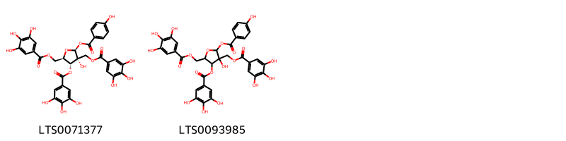{ width=100% }
    <figcaption>Hình ảnh cấu trúc hóa học của 2 hoạt chất thuộc nhóm Carboxylic acids and derivatives gồm ['[(2s,3r,4r,5r)-3-hydroxy-2-(4-hydroxybenzoyloxy)-4-(3,4,5-trihydroxybenzoyloxy)-5-[(3,4,5-trihydroxybenzoyloxy)methyl]oxolan-3-yl]methyl 3,4,5-trihydroxybenzoate (LTS0071377)', '[3-hydroxy-2-(4-hydroxybenzoyloxy)-4-(3,4,5-trihydroxybenzoyloxy)-5-[(3,4,5-trihydroxybenzoyloxy)methyl]oxolan-3-yl]methyl 3,4,5-trihydroxybenzoate (LTS0093985)'].</figcaption>
</figure>
#### Nhóm Cinnamic acids and derivatives
<figure markdown="span">
    { width=100% }
    <figcaption>Hình ảnh cấu trúc hóa học của 2 hoạt chất thuộc nhóm Cinnamic acids and derivatives gồm ['3,4-dihydroxycinnamic acid (LTS0128050)', 'caffeic acid (LTS0027481)'].</figcaption>
</figure>
#### Nhóm Epoxides
<figure markdown="span">
    { width=100% }
    <figcaption>Hình ảnh cấu trúc hóa học của 1 hoạt chất thuộc nhóm Epoxides gồm ['[3-methyl-3-(4-methylpent-3-en-1-yl)oxiran-2-yl]methanol (LTS0182704)'].</figcaption>
</figure>
#### Nhóm Fatty Acyls
<figure markdown="span">
    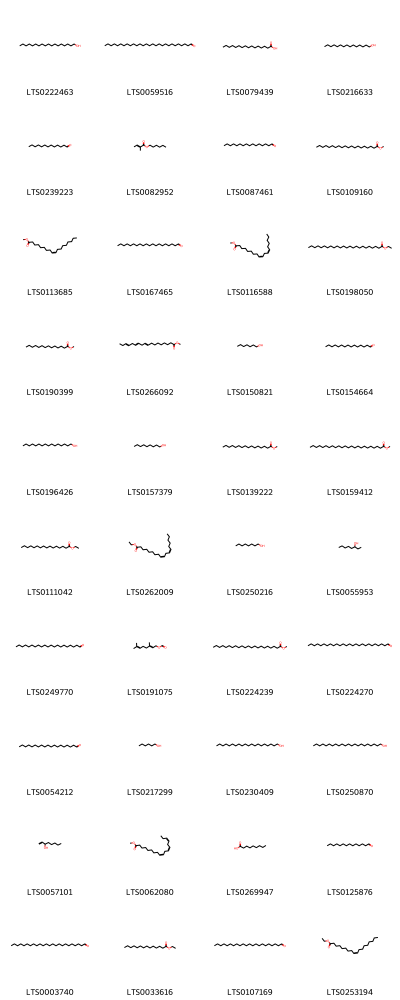{ width=100% }
    <figcaption>Hình ảnh cấu trúc hóa học của 40 hoạt chất thuộc nhóm Fatty Acyls gồm ['stearyl alcohol (LTS0222463)', 'octacosanal (LTS0059516)', 'palmitic acid (LTS0079439)', '1-pentadecanol (LTS0216633)', 'tridecanal (LTS0239223)', 'hexyl (2e)-2-methylbut-2-enoate (LTS0082952)', 'hexadecanal (LTS0087461)', 'methylarachidic acid (LTS0109160)', 'methyl oleate (LTS0113685)', 'eicosanal (LTS0167465)', 'methyl linoleate (LTS0116588)', 'ethyl tetracosanoate (LTS0198050)', 'methyl myristate (LTS0190399)', 'methyl elaidolinolenate (LTS0266092)', 'heptanol (LTS0150821)', 'pentadecanal (LTS0154664)', 'cetyl alcohol (LTS0196426)', 'nonan-1-ol (LTS0157379)', 'methyl palmitate (LTS0139222)', 'methyl tetracosanoate (LTS0159412)', 'ethyl palmitate (LTS0111042)', 'ethyl linoleate (LTS0262009)', 'octanol (LTS0250216)', '3-octanol (LTS0055953)', 'henicosanal (LTS0249770)', 'geranyl formate (LTS0191075)', 'methyl behenate (LTS0224239)', 'hexacosanal (LTS0224270)', 'nonadecanal (LTS0054212)', 'hexanol (LTS0217299)', 'arachidyl alcohol (LTS0230409)', 'docosanol (LTS0250870)', '1-octen-3-ol (LTS0057101)', 'methyl linolenate (LTS0062080)', 'nonanoic acid (LTS0269947)', 'tetradecanal (LTS0125876)', 'lignoceroyl (LTS0003740)', 'ethylmyristate (LTS0033616)', 'behenoyl (LTS0107169)', 'ethyl oleate (LTS0253194)'].</figcaption>
</figure>
#### Nhóm Flavonoids
<figure markdown="span">
    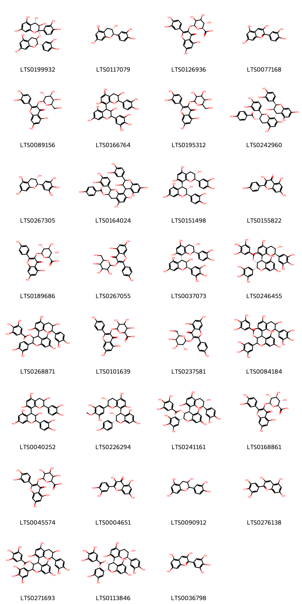{ width=100% }
    <figcaption>Hình ảnh cấu trúc hóa học của 31 hoạt chất thuộc nhóm Flavonoids gồm ['(2r,3r,4s)-2-(3,4-dihydroxyphenyl)-2-{[(2s,3r)-2-(3,4-dihydroxyphenyl)-5,7-dihydroxy-3,4-dihydro-2h-1-benzopyran-3-yl]oxy}-3,4-dihydro-1-benzopyran-3,4,5,7-tetrol (LTS0199932)', '(+)-catechol (LTS0117079)', 'miquelianin (LTS0126936)', 'cyanidin (LTS0077168)', 'hyperoside (LTS0089156)', '4-[2-(3,4-dihydroxyphenyl)-3,5,7-trihydroxy-3,4-dihydro-2h-1-benzopyran-8-yl]-2-(3,4,5-trihydroxyphenyl)-3,4-dihydro-2h-1-benzopyran-3,5,7-triol (LTS0166764)', '2-(3,4-dihydroxyphenyl)-5,7-dihydroxy-3-{[3,4,5-trihydroxy-6-(hydroxymethyl)oxan-2-yl]oxy}chromen-4-one (LTS0195312)', '(2r,3s)-2-(3,4-dihydroxyphenyl)-8-[(2r,3r,4r)-2-(3,4-dihydroxyphenyl)-3,5,7-trihydroxy-3,4-dihydro-2h-1-benzopyran-4-yl]-5,7-dihydroxy-3,4-dihydro-2h-1-benzopyran-3-yl 4-hydroxybenzoate (LTS0242960)', 'gallocatechol (LTS0267305)', '2-(3,4-dihydroxyphenyl)-8-[2-(3,4-dihydroxyphenyl)-3,5,7-trihydroxy-3,4-dihydro-2h-1-benzopyran-4-yl]-5,7-dihydroxy-3,4-dihydro-2h-1-benzopyran-3-yl 4-hydroxybenzoate (LTS0164024)', '(2r,3s,4s)-2-(3,4-dihydroxyphenyl)-4-[(2r,3s)-2-(3,4-dihydroxyphenyl)-3,5,7-trihydroxy-3,4-dihydro-2h-1-benzopyran-8-yl]-3,4-dihydro-2h-1-benzopyran-3,5,7-triol (LTS0151498)', 'kaempherol (LTS0155822)', 'kaempferol 3-o-glucuronide (LTS0189686)', 'trifolin (LTS0267055)', '(2r,3r,4r)-4-[(2r,3s)-2-(3,4-dihydroxyphenyl)-3,5,7-trihydroxy-3,4-dihydro-2h-1-benzopyran-8-yl]-2-(3,4,5-trihydroxyphenyl)-3,4-dihydro-2h-1-benzopyran-3,5,7-triol (LTS0037073)', '(2r,3r,4r)-5,7-dihydroxy-4-[(2r,3s)-3,5,7-trihydroxy-2-(3,4,5-trihydroxyphenyl)-3,4-dihydro-2h-1-benzopyran-8-yl]-2-(3,4,5-trihydroxyphenyl)-3,4-dihydro-2h-1-benzopyran-3-yl 3,4,5-trihydroxybenzoate (LTS0246455)', '2-(3,4-dihydroxyphenyl)-4-[2-(3,4-dihydroxyphenyl)-3,5,7-trihydroxy-3,4-dihydro-2h-1-benzopyran-8-yl]-5,7-dihydroxy-3,4-dihydro-2h-1-benzopyran-3-yl 3,4,5-trihydroxybenzoate (LTS0268871)', '6-{[5,7-dihydroxy-2-(4-hydroxyphenyl)-4-oxochromen-3-yl]oxy}-3,4,5-trihydroxyoxane-2-carboxylic acid (LTS0101639)', 'trifolin (LTS0237581)', '5,7-dihydroxy-4-[3,5,7-trihydroxy-2-(3,4,5-trihydroxyphenyl)-3,4-dihydro-2h-1-benzopyran-8-yl]-2-(3,4,5-trihydroxyphenyl)-3,4-dihydro-2h-1-benzopyran-3-yl 3,4,5-trihydroxybenzoate (LTS0084184)', '2-(3,4-dihydroxyphenyl)-4-[2-(3,4-dihydroxyphenyl)-3,5,7-trihydroxy-3,4-dihydro-2h-1-benzopyran-8-yl]-3,4-dihydro-2h-1-benzopyran-3,5,7-triol (LTS0040252)', '(3r)-2-(3,5-dihydroxy-4-methoxyphenyl)-8-[(2r,3r,4r)-3,5,7-trihydroxy-2-(4-hydroxyphenyl)-3,4-dihydro-2h-1-benzopyran-4-yl]-3,4-dihydro-2h-1-benzopyran-3,5,7-triol (LTS0226294)', '(2r,3r,4r)-4-[(2r,3s)-2-(3,4-dihydroxyphenyl)-3,5,7-trihydroxy-3,4-dihydro-2h-1-benzopyran-8-yl]-5,7-dihydroxy-2-(3,4,5-trihydroxyphenyl)-3,4-dihydro-2h-1-benzopyran-3-yl 3,4,5-trihydroxybenzoate (LTS0241161)', 'querciturone (LTS0168861)', 'miquelianin (LTS0045574)', 'quercetin (LTS0004651)', 'catechol (LTS0090912)', '2-(3,5-dihydroxy-4-oxidophenyl)-3,5,7-trihydroxy-1λ⁴-chromen-1-ylium (LTS0276138)', '4-[2-(3,4-dihydroxyphenyl)-3,5,7-trihydroxy-3,4-dihydro-2h-1-benzopyran-8-yl]-5,7-dihydroxy-2-(3,4,5-trihydroxyphenyl)-3,4-dihydro-2h-1-benzopyran-3-yl 3,4,5-trihydroxybenzoate (LTS0271693)', 'procyanidin b1 3-o-gallate (LTS0113846)', 'delphinidin (LTS0036798)'].</figcaption>
</figure>
#### Nhóm Lactones
<figure markdown="span">
    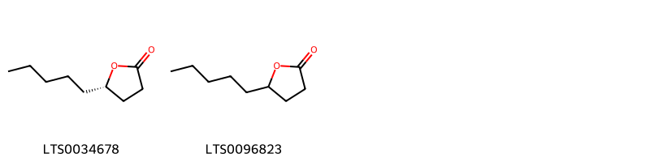{ width=100% }
    <figcaption>Hình ảnh cấu trúc hóa học của 2 hoạt chất thuộc nhóm Lactones gồm ['aldehyde c-18 (LTS0034678)', 'gamma-nonalactone (LTS0096823)'].</figcaption>
</figure>
#### Nhóm Organooxygen compounds
<figure markdown="span">
    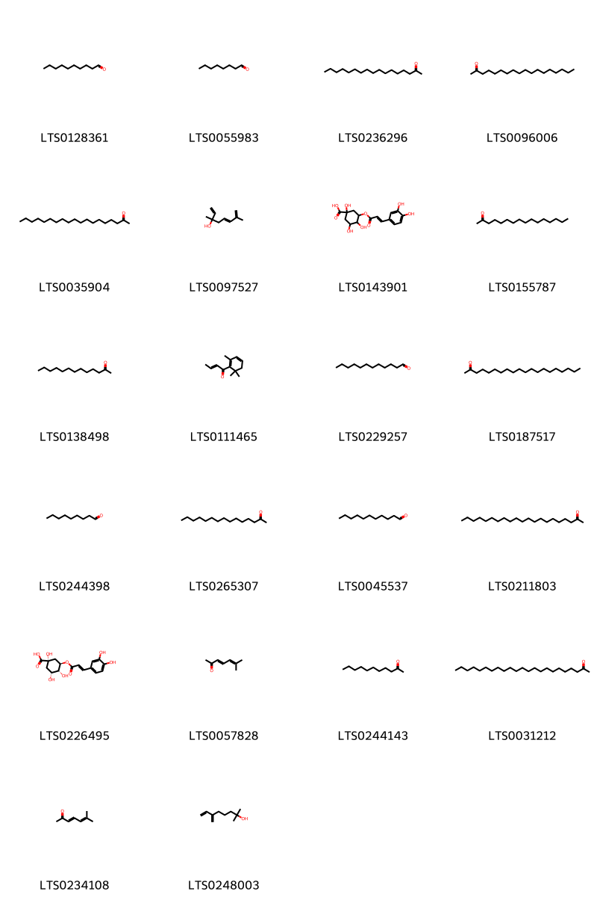{ width=100% }
    <figcaption>Hình ảnh cấu trúc hóa học của 22 hoạt chất thuộc nhóm Organooxygen compounds gồm ['decanal (LTS0128361)', 'octanal (LTS0055983)', '2-heptadecanone (LTS0236296)', 'stearone (LTS0096006)', '2-nonadecanone (LTS0035904)', '(5e)-3,7-dimethylocta-1,5,7-trien-3-ol (LTS0097527)', '3-{[3-(3,4-dihydroxyphenyl)prop-2-enoyl]oxy}-1,4,5-trihydroxycyclohexane-1-carboxylic acid (LTS0143901)', 'hexadecan-2-one (LTS0155787)', '2-tridecanone (LTS0138498)', 'damascenone (LTS0111465)', 'dodecanal (LTS0229257)', 'icosan-2-one (LTS0187517)', 'nonanal (LTS0244398)', '2-pentadecanone (LTS0265307)', 'aldehyde c11 (LTS0045537)', 'henicosan-2-one (LTS0211803)', 'chlorogenic acid (LTS0226495)', 'methylheptadienone (LTS0057828)', 'undecan-2-one (LTS0244143)', 'tricosan-2-one (LTS0031212)', '6-methyl-3,5-heptadien-2-one (LTS0234108)', 'myrcenol (LTS0248003)'].</figcaption>
</figure>
#### Nhóm Oxolanes
<figure markdown="span">
    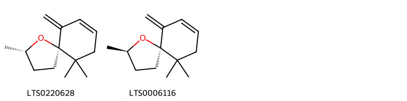{ width=100% }
    <figcaption>Hình ảnh cấu trúc hóa học của 2 hoạt chất thuộc nhóm Oxolanes gồm ['vitispirane b (LTS0220628)', 'vitispirane a (LTS0006116)'].</figcaption>
</figure>
#### Nhóm Phenol ethers
<figure markdown="span">
    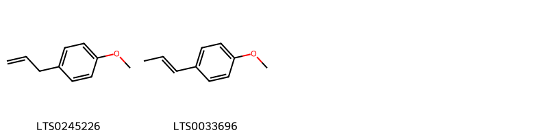{ width=100% }
    <figcaption>Hình ảnh cấu trúc hóa học của 2 hoạt chất thuộc nhóm Phenol ethers gồm ['tarragon (LTS0245226)', 'anethole (LTS0033696)'].</figcaption>
</figure>
#### Nhóm Phenols
<figure markdown="span">
    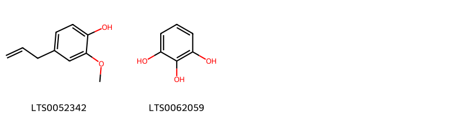{ width=100% }
    <figcaption>Hình ảnh cấu trúc hóa học của 2 hoạt chất thuộc nhóm Phenols gồm ['eugenol (LTS0052342)', 'pyrogallol (LTS0062059)'].</figcaption>
</figure>
#### Nhóm Prenol lipids
<figure markdown="span">
    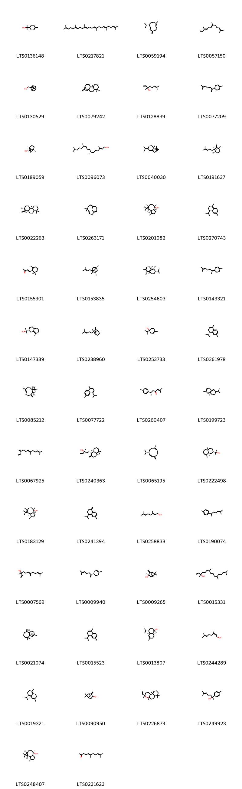{ width=100% }
    <figcaption>Hình ảnh cấu trúc hóa học của 50 hoạt chất thuộc nhóm Prenol lipids gồm ['terpineol (LTS0136148)', 'squalene (LTS0217821)', '(-)-germacrene d (LTS0059194)', 'farnesene (LTS0057150)', 'myrtenol (LTS0130529)', '5,5,9-trimethyl-14-methylidenetetracyclo[11.2.1.0¹,¹⁰.0⁴,⁹]hexadecane (LTS0079242)', 'linalool, (+-)- (LTS0128839)', '(r)-β-bisabolene (LTS0077209)', '(+)-borneol (LTS0189059)', 'phytol (LTS0096073)', '8-isopropyl-1,2-dimethyltetracyclo[4.4.0.0²,⁴.0³,⁷]decane (LTS0040030)', 'β-santalene (LTS0191637)', '(1s,9r,13s)-5,5,9-trimethyl-14-methylidenetetracyclo[11.2.1.0¹,¹⁰.0⁴,⁹]hexadecane (LTS0022263)', 'humulene (LTS0263171)', '(+)-ledol (LTS0201082)', '4-isopropyl-1,6-dimethyl-2,3,4,4a,7,8-hexahydronaphthalene (LTS0270743)', 'β-ionone (LTS0155301)', '(-)-endo-α-bergamotene (LTS0153835)', 'α-ylangene (LTS0254603)', '(z)-γ-bisabolene (LTS0143321)', 'gamma-eudesmol (LTS0147389)', 'β-santalene (LTS0238960)', '4-terpineol (LTS0253733)', '(4s)-4-isopropyl-1,6-dimethyl-3,4-dihydronaphthalene (LTS0261978)', 'caryophyllene (LTS0085212)', 'cadalene (LTS0077722)', 'ar-turmerone (LTS0260407)', '(1s)-8-isopropyl-1,3-dimethyltricyclo[4.4.0.0²,⁷]dec-3-ene (LTS0199723)', 'β-farnesene (LTS0067925)', 'manool (LTS0240363)', '(1z,6z,8s)-8-isopropyl-1-methyl-5-methylidenecyclodeca-1,6-diene (LTS0065195)', 'α-eudesmol (LTS0222498)', 'viridiflorol (LTS0183129)', '4-isopropyl-6-methyl-1-methylidene-3,4-dihydro-2h-naphthalene (LTS0241394)', 'geraniol (LTS0258838)', 'curcumene (LTS0190074)', 'nerolidol isomers (LTS0007569)', '(-)-β-bisabolene (LTS0009940)', '(3r)-6,6-dimethyl-2-methylidenebicyclo[3.1.1]heptan-3-ol (LTS0009265)', 'isophytol (LTS0015331)', '(-)-α-himachalene (LTS0021074)', '3,4-dihydrocadalene (LTS0015523)', 'delta-cadinol (LTS0013807)', 'nerol (LTS0244289)', 'delta-cadinene (LTS0019321)', 'pinocarveol (LTS0090950)', '3-ethenyl-3,4a,7,7,10a-pentamethyl-octahydro-1h-naphtho[2,1-b]pyran (LTS0226873)', '6-methyl-2-(4-methylphenyl)hept-5-en-2-ol (LTS0249923)', '(1ar,4r,7r,7bs)-1,1,4,7-tetramethyl-octahydro-1ah-cyclopropa[e]azulen-4-ol (LTS0248407)', 'geranylacetone (LTS0231623)'].</figcaption>
</figure>
#### Nhóm Pyrans
<figure markdown="span">
    { width=100% }
    <figcaption>Hình ảnh cấu trúc hóa học của 1 hoạt chất thuộc nhóm Pyrans gồm ['nerol oxide (LTS0174383)'].</figcaption>
</figure>
#### Nhóm Saturated hydrocarbons
<figure markdown="span">
    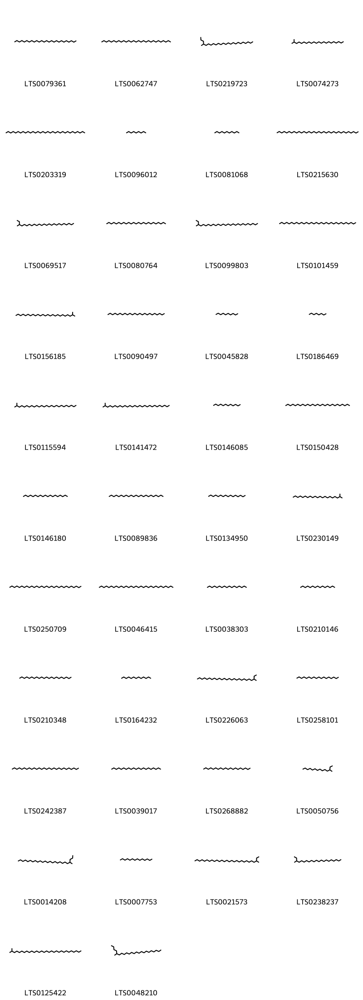{ width=100% }
    <figcaption>Hình ảnh cấu trúc hóa học của 42 hoạt chất thuộc nhóm Saturated hydrocarbons gồm ['hexacosane (LTS0079361)', 'nonacosane (LTS0062747)', '4-methyltetracosane (LTS0219723)', '2-methyldocosane (LTS0074273)', 'tritriacontane (LTS0203319)', 'nonane (LTS0096012)', 'undecane (LTS0081068)', 'tetratriacontane (LTS0215630)', '3-methylpentacosane (LTS0069517)', 'pentacosane (LTS0080764)', '3-methylheptacosane (LTS0099803)', 'dotriacontane (LTS0101459)', '2-methylpentacosane (LTS0156185)', 'tetracosane (LTS0090497)', 'decane (LTS0045828)', 'octane (LTS0186469)', '2-methylhexacosane (LTS0115594)', '2-methyloctacosane (LTS0141472)', 'dodecane (LTS0146085)', 'heptacosane (LTS0150428)', 'nonadecane (LTS0146180)', 'tricosane (LTS0089836)', 'cetane (LTS0134950)', '2-methylhenicosane (LTS0230149)', 'triacontane (LTS0250709)', 'hentriacontane (LTS0046415)', 'heptadecane (LTS0038303)', 'pentadecane (LTS0210146)', 'docosane (LTS0210348)', 'tridecane (LTS0164232)', '3-methylhexacosane (LTS0226063)', 'octadecane (LTS0258101)', 'octacosane (LTS0242387)', 'heneicosane (LTS0039017)', 'eicosane (LTS0268882)', '3-methyltetradecane (LTS0050756)', '4-methylpentacosane (LTS0014208)', 'tetradecane (LTS0007753)', '3-methyloctacosane (LTS0021573)', '3-methylhenicosane (LTS0238237)', '2-methyl-triacotane (LTS0125422)', '5-methyltricosane (LTS0048210)'].</figcaption>
</figure>
#### Nhóm Unsaturated hydrocarbons
<figure markdown="span">
    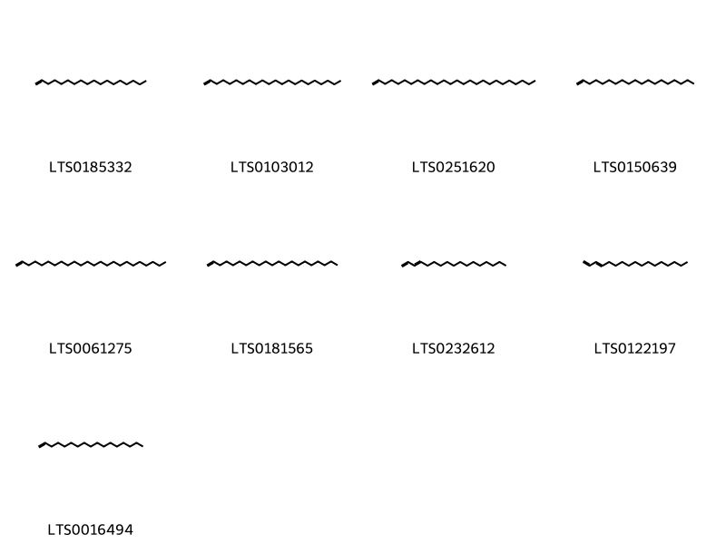{ width=100% }
    <figcaption>Hình ảnh cấu trúc hóa học của 9 hoạt chất thuộc nhóm Unsaturated hydrocarbons gồm ['octadecene (LTS0185332)', '1-docosene (LTS0103012)', '1-hexacosene (LTS0251620)', '1-nonadecene (LTS0150639)', '1-tetracosene (LTS0061275)', '1-heneicosene (LTS0181565)', 'heptadeca-1,3-diene (LTS0232612)', '(3e)-heptadeca-1,3-diene (LTS0122197)', 'heptadecene (LTS0016494)'].</figcaption>
</figure>

---

### Dược dân tộc học

Danh sách các quốc gia có sử dụng *Hamamelis virginiana* trong điều trị các bệnh. 

| Country        | Disease                                                       | Bệnh                                                                                                                                                                                                |
|:---------------|:--------------------------------------------------------------|:----------------------------------------------------------------------------------------------------------------------------------------------------------------------------------------------------|
| China          | Cosmetic                                                      | MYMEMORY WARNING: YOU USED ALL AVAILABLE FREE TRANSLATIONS FOR TODAY. NEXT AVAILABLE IN  09 HOURS 25 MINUTES 49 SECONDS VISIT HTTPS://MYMEMORY.TRANSLATED.NET/DOC/USAGELIMITS.PHP TO TRANSLATE MORE |
| Danish         | Tonic                                                         | MYMEMORY WARNING: YOU USED ALL AVAILABLE FREE TRANSLATIONS FOR TODAY. NEXT AVAILABLE IN  09 HOURS 25 MINUTES 44 SECONDS VISIT HTTPS://MYMEMORY.TRANSLATED.NET/DOC/USAGELIMITS.PHP TO TRANSLATE MORE |
| Dutch          | Sedative                                                      | MYMEMORY WARNING: YOU USED ALL AVAILABLE FREE TRANSLATIONS FOR TODAY. NEXT AVAILABLE IN  09 HOURS 25 MINUTES 38 SECONDS VISIT HTTPS://MYMEMORY.TRANSLATED.NET/DOC/USAGELIMITS.PHP TO TRANSLATE MORE |
| Elsewhere      | Antidiarrheic, Astringent, Astringent, Hemostatic, Astringent | MYMEMORY WARNING: YOU USED ALL AVAILABLE FREE TRANSLATIONS FOR TODAY. NEXT AVAILABLE IN  09 HOURS 25 MINUTES 33 SECONDS VISIT HTTPS://MYMEMORY.TRANSLATED.NET/DOC/USAGELIMITS.PHP TO TRANSLATE MORE |
| French         | Hemostat                                                      | MYMEMORY WARNING: YOU USED ALL AVAILABLE FREE TRANSLATIONS FOR TODAY. NEXT AVAILABLE IN  09 HOURS 25 MINUTES 26 SECONDS VISIT HTTPS://MYMEMORY.TRANSLATED.NET/DOC/USAGELIMITS.PHP TO TRANSLATE MORE |
| German         | Antiseptic                                                    | MYMEMORY WARNING: YOU USED ALL AVAILABLE FREE TRANSLATIONS FOR TODAY. NEXT AVAILABLE IN  09 HOURS 25 MINUTES 21 SECONDS VISIT HTTPS://MYMEMORY.TRANSLATED.NET/DOC/USAGELIMITS.PHP TO TRANSLATE MORE |
| Italian        | Astringent                                                    | MYMEMORY WARNING: YOU USED ALL AVAILABLE FREE TRANSLATIONS FOR TODAY. NEXT AVAILABLE IN  09 HOURS 25 MINUTES 17 SECONDS VISIT HTTPS://MYMEMORY.TRANSLATED.NET/DOC/USAGELIMITS.PHP TO TRANSLATE MORE |
| US(Amerindian) | Poultice                                                      | MYMEMORY WARNING: YOU USED ALL AVAILABLE FREE TRANSLATIONS FOR TODAY. NEXT AVAILABLE IN  09 HOURS 25 MINUTES 14 SECONDS VISIT HTTPS://MYMEMORY.TRANSLATED.NET/DOC/USAGELIMITS.PHP TO TRANSLATE MORE |
| US(Appalachia) | Astringent, Sedative, Tonic                                   | MYMEMORY WARNING: YOU USED ALL AVAILABLE FREE TRANSLATIONS FOR TODAY. NEXT AVAILABLE IN  09 HOURS 25 MINUTES 11 SECONDS VISIT HTTPS://MYMEMORY.TRANSLATED.NET/DOC/USAGELIMITS.PHP TO TRANSLATE MORE |
| anish          | Refrigerant                                                   | MYMEMORY WARNING: YOU USED ALL AVAILABLE FREE TRANSLATIONS FOR TODAY. NEXT AVAILABLE IN  09 HOURS 25 MINUTES 08 SECONDS VISIT HTTPS://MYMEMORY.TRANSLATED.NET/DOC/USAGELIMITS.PHP TO TRANSLATE MORE |

---

# Chi Liquidambar

??? note "Danh sách các dược liệu thuộc chi"
    
	 - *Liquidambar formosana*
	 - *Liquidambar orientalis*
	 - *Liquidambar styraciflua*

---
## Liquidambar formosana
### Thông tin về thực vật

!!! info "Phân loại thực vật của *Liquidambar formosana* từ GIBF:"
    - **Kingdom:** Plantae
    - **Phylum:** Tracheophyta
    - **Order:** Saxifragales
    - **Family:** Altingiaceae
    - **Genus:** Liquidambar
    - **Species:** *Liquidambar formosana*

 

| Label (VI)   | Label (EN)   | Scientific Name       | Descriptions (VI)   | Descriptions (EN)   | Also Known As (VI)   | Also Known As (EN)   |
|:-------------|:-------------|:----------------------|:--------------------|:--------------------|:---------------------|:---------------------|
| N/A          | N/A          | Liquidambar formosana | loài thực vật       | species of plant    | ['']                 | ['Sweet Gum']        |

#### Phân bố trên thế giới

**Từ CSDL GIBF** Viet Nam, Chinese Taipei, Japan, South Africa, Macao, United States of America, China, Madagascar, Australia, Hong Kong

#### Phân bố tại Việt Nam

**Từ CSDL GIBF**: Hà Nội

---
### Thành phần hóa học
        
- Theo cơ sở dữ liệu lotus: Từ loài *Liquidambar formosana* đã phân lập và xác định được 56 hoạt chất thuộc về các nhóm Flavonoids, Tannins, Prenol lipids, Cinnamic acids and derivatives, Benzene and substituted derivatives. 

|    | chemicalTaxonomyClassyfireClass     |   smiles_count |
|---:|:------------------------------------|---------------:|
|  0 | Benzene and substituted derivatives |              3 |
|  1 | Cinnamic acids and derivatives      |              1 |
|  2 | Flavonoids                          |              1 |
|  3 | Prenol lipids                       |             13 |
|  4 | Tannins                             |             37 |

#### Nhóm Benzene and substituted derivatives
<figure markdown="span">
    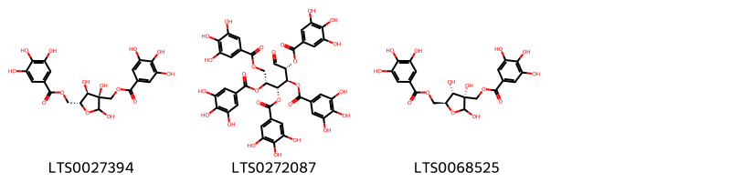{ width=100% }
    <figcaption>Hình ảnh cấu trúc hóa học của 3 hoạt chất thuộc nhóm Benzene and substituted derivatives gồm ['[(3r,4r,5r)-2,3,4-trihydroxy-5-[(3,4,5-trihydroxybenzoyloxy)methyl]oxolan-3-yl]methyl 3,4,5-trihydroxybenzoate (LTS0027394)', '(2r,3s,4r,5r)-1-oxo-2,4,5,6-tetrakis(3,4,5-trihydroxybenzoyloxy)hexan-3-yl 3,4,5-trihydroxybenzoate (LTS0272087)', '[(3s,4s,5s)-2,3,4-trihydroxy-5-[(3,4,5-trihydroxybenzoyloxy)methyl]oxolan-3-yl]methyl 3,4,5-trihydroxybenzoate (LTS0068525)'].</figcaption>
</figure>
#### Nhóm Cinnamic acids and derivatives
<figure markdown="span">
    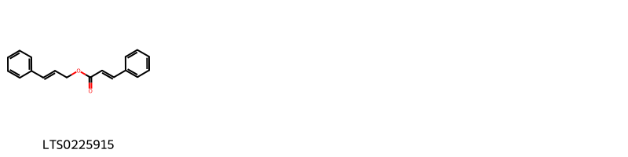{ width=100% }
    <figcaption>Hình ảnh cấu trúc hóa học của 1 hoạt chất thuộc nhóm Cinnamic acids and derivatives gồm ['cinnamyl cinnamate (LTS0225915)'].</figcaption>
</figure>
#### Nhóm Flavonoids
<figure markdown="span">
    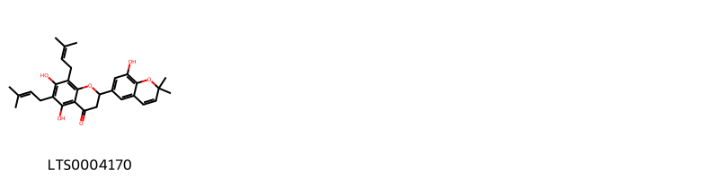{ width=100% }
    <figcaption>Hình ảnh cấu trúc hóa học của 1 hoạt chất thuộc nhóm Flavonoids gồm ['amorinin (LTS0004170)'].</figcaption>
</figure>
#### Nhóm Prenol lipids
<figure markdown="span">
    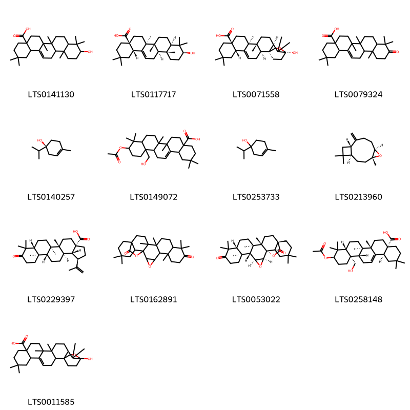{ width=100% }
    <figcaption>Hình ảnh cấu trúc hóa học của 13 hoạt chất thuộc nhóm Prenol lipids gồm ['oleanolic acid (LTS0141130)', 'oleanolic acid (LTS0117717)', '(1s,2s,6s,11s,14s,15r,18r,20s)-20-hydroxy-8,8,14,15,19,19-hexamethyl-21-oxahexacyclo[18.2.2.0¹,¹⁸.0²,¹⁵.0⁵,¹⁴.0⁶,¹¹]tetracos-4-ene-11-carboxylic acid (LTS0071558)', '2,2,6a,6b,9,9,12a-heptamethyl-10-oxo-3,4,5,6,7,8,8a,11,12,12b,13,14b-dodecahydro-1h-picene-4a-carboxylic acid (LTS0079324)', '(+)-4-terpineol (LTS0140257)', '10-(acetyloxy)-12a-(hydroxymethyl)-2,2,6a,6b,9,9-hexamethyl-1,3,4,5,6,7,8,8a,10,11,12,12b,13,14b-tetradecahydropicene-4a-carboxylic acid (LTS0149072)', '4-terpineol (LTS0253733)', 'β-caryophyllene oxide (LTS0213960)', '(1r,3as,5ar,5br,7ar,11ar,11br,13ar,13br)-5a,5b,8,8,11a-pentamethyl-9-oxo-1-(prop-1-en-2-yl)-tetradecahydro-1h-cyclopenta[a]chrysene-3a-carboxylic acid (LTS0229397)', '6,10,10,14,15,21,21-heptamethyl-3,24-dioxaheptacyclo[16.5.2.0¹,¹⁵.0²,⁴.0⁵,¹⁴.0⁶,¹¹.0¹⁸,²³]pentacosane-9,25-dione (LTS0162891)', '(1s,2s,4s,5r,6s,11r,14r,15s,18s,23r)-6,10,10,14,15,21,21-heptamethyl-3,24-dioxaheptacyclo[16.5.2.0¹,¹⁵.0²,⁴.0⁵,¹⁴.0⁶,¹¹.0¹⁸,²³]pentacosane-9,25-dione (LTS0053022)', '(4as,6as,6br,8ar,10r,12as,12bs,14bs)-10-(acetyloxy)-12a-(hydroxymethyl)-2,2,6a,6b,9,9-hexamethyl-1,3,4,5,6,7,8,8a,10,11,12,12b,13,14b-tetradecahydropicene-4a-carboxylic acid (LTS0258148)', '20-hydroxy-8,8,14,15,19,19-hexamethyl-21-oxahexacyclo[18.2.2.0¹,¹⁸.0²,¹⁵.0⁵,¹⁴.0⁶,¹¹]tetracos-4-ene-11-carboxylic acid (LTS0011585)'].</figcaption>
</figure>
#### Nhóm Tannins
<figure markdown="span">
    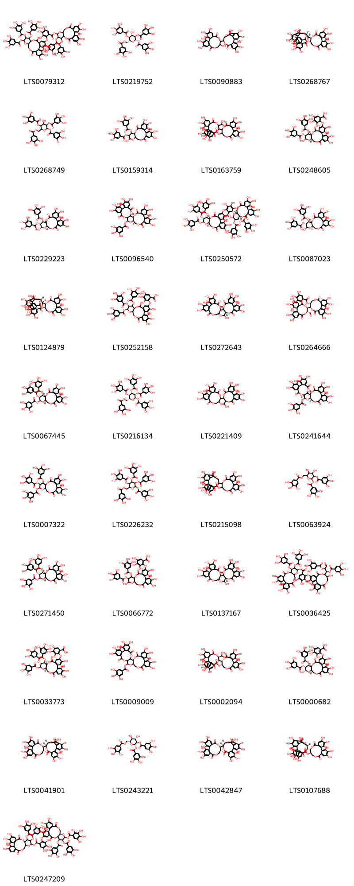{ width=100% }
    <figcaption>Hình ảnh cấu trúc hóa học của 37 hoạt chất thuộc nhóm Tannins gồm ['3,4,5,21,22,23-hexahydroxy-8,18-dioxo-11,12-bis(3,4,5-trihydroxybenzoyloxy)-9,14,17-trioxatetracyclo[17.4.0.0²,⁷.0¹⁰,¹⁵]tricosa-1(23),2(7),3,5,19,21-hexaen-13-yl 3,4,5-trihydroxy-2-{[3,4,21,22,23-pentahydroxy-8,18-dioxo-11,12,13-tris(3,4,5-trihydroxybenzoyloxy)-9,14,17-trioxatetracyclo[17.4.0.0²,⁷.0¹⁰,¹⁵]tricosa-1(23),2(7),3,5,19,21-hexaen-5-yl]oxy}benzoate (LTS0079312)', '(2s,3r,4s,5s,6r)-4-hydroxy-3,5-bis(3,4,5-trihydroxybenzoyloxy)-6-[(3,4,5-trihydroxybenzoyloxy)methyl]oxan-2-yl 3,4,5-trihydroxybenzoate (LTS0219752)', '14-{3,4,5,11,17,18,19-heptahydroxy-8,14-dioxo-9,13-dioxatricyclo[13.4.0.0²,⁷]nonadeca-1(15),2,4,6,16,18-hexaen-10-yl}-2,3,4,7,8,9,19-heptahydroxy-13,16-dioxatetracyclo[13.3.1.0⁵,¹⁸.0⁶,¹¹]nonadeca-1(18),2,4,6,8,10-hexaene-12,17-dione (LTS0090883)', '(11s,12r)-12-[(14r,15s,19s)-2,3,4,7,8,9,19-heptahydroxy-12,17-dioxo-13,16-dioxatetracyclo[13.3.1.0⁵,¹⁸.0⁶,¹¹]nonadeca-1(18),2,4,6,8,10-hexaen-14-yl]-3,4,5,17,18,19-hexahydroxy-8,14-dioxo-9,13-dioxatricyclo[13.4.0.0²,⁷]nonadeca-1(15),2,4,6,16,18-hexaen-11-yl 3,4,5-trihydroxybenzoate (LTS0268767)', '4-hydroxy-3,5-bis(3,4,5-trihydroxybenzoyloxy)-6-[(3,4,5-trihydroxybenzoyloxy)methyl]oxan-2-yl 3,4,5-trihydroxybenzoate (LTS0268749)', '3,4,5,13,21,22,23-heptahydroxy-8,18-dioxo-12-(3,4,5-trihydroxybenzoyloxy)-9,14,17-trioxatetracyclo[17.4.0.0²,⁷.0¹⁰,¹⁵]tricosa-1(23),2(7),3,5,19,21-hexaen-11-yl 3,4,5-trihydroxybenzoate (LTS0159314)', '12-[11-(dihydroxymethyl)-3,4,5,16,17,18-hexahydroxy-8,13-dioxo-9,12-dioxatricyclo[12.4.0.0²,⁷]octadeca-1(14),2,4,6,15,17-hexaen-10-yl]-3,4,5,17,18,19-hexahydroxy-8,14-dioxo-9,13-dioxatricyclo[13.4.0.0²,⁷]nonadeca-1(15),2,4,6,16,18-hexaen-11-yl 3,4,5-trihydroxybenzoate (LTS0163759)', '2-{[(10r,11s,12r,13r,15r)-3,4,13,21,22,23-hexahydroxy-8,18-dioxo-11,12-bis(3,4,5-trihydroxybenzoyloxy)-9,14,17-trioxatetracyclo[17.4.0.0²,⁷.0¹⁰,¹⁵]tricosa-1(23),2(7),3,5,19,21-hexaen-5-yl]oxy}-3,4,5-trihydroxybenzoic acid (LTS0248605)', '(10r,11s,12r,13r,15r)-3,4,5,13,21,22,23-heptahydroxy-8,18-dioxo-11-(3,4,5-trihydroxybenzoyloxy)-9,14,17-trioxatetracyclo[17.4.0.0²,⁷.0¹⁰,¹⁵]tricosa-1(23),2(7),3,5,19,21-hexaen-12-yl 3,4,5-trihydroxybenzoate (LTS0229223)', '(2s,20s,22r)-7,8,9,12,13,14,28,29,30,33,34,35-dodecahydroxy-4,17,25,38-tetraoxo-3,18,21,24,39-pentaoxaheptacyclo[20.17.0.0²,¹⁹.0⁵,¹⁰.0¹¹,¹⁶.0²⁶,³¹.0³²,³⁷]nonatriaconta-5,7,9,11(16),12,14,26,28,30,32(37),33,35-dodecaen-20-yl 3,4,5-trihydroxybenzoate (LTS0096540)', '(10r,11s,12r,13s,15r)-3,4,5,21,22,23-hexahydroxy-8,18-dioxo-11,12-bis(3,4,5-trihydroxybenzoyloxy)-9,14,17-trioxatetracyclo[17.4.0.0²,⁷.0¹⁰,¹⁵]tricosa-1(23),2(7),3,5,19,21-hexaen-13-yl 3,4,5-trihydroxy-2-{[(10r,11s,12r,13s,15r)-3,4,21,22,23-pentahydroxy-8,18-dioxo-11,12,13-tris(3,4,5-trihydroxybenzoyloxy)-9,14,17-trioxatetracyclo[17.4.0.0²,⁷.0¹⁰,¹⁵]tricosa-1(23),2(7),3,5,19,21-hexaen-5-yl]oxy}benzoate (LTS0250572)', '(10r,11s,12r,15r)-3,4,5,13,21,22,23-heptahydroxy-8,18-dioxo-11-(3,4,5-trihydroxybenzoyloxy)-9,14,17-trioxatetracyclo[17.4.0.0²,⁷.0¹⁰,¹⁵]tricosa-1(23),2(7),3,5,19,21-hexaen-12-yl 3,4,5-trihydroxybenzoate (LTS0087023)', '(11r,12r)-12-[(14r,15s,19s)-2,3,4,7,8,9,19-heptahydroxy-12,17-dioxo-13,16-dioxatetracyclo[13.3.1.0⁵,¹⁸.0⁶,¹¹]nonadeca-1(18),2,4,6,8,10-hexaen-14-yl]-3,4,5,17,18,19-hexahydroxy-8,14-dioxo-9,13-dioxatricyclo[13.4.0.0²,⁷]nonadeca-1(15),2,4,6,16,18-hexaen-11-yl 3,4,5-trihydroxybenzoate (LTS0124879)', '3,4,5-trihydroxy-2-{[3,4,21,22,23-pentahydroxy-8,18-dioxo-11,12,13-tris(3,4,5-trihydroxybenzoyloxy)-9,14,17-trioxatetracyclo[17.4.0.0²,⁷.0¹⁰,¹⁵]tricosa-1(23),2(7),3,5,19,21-hexaen-5-yl]oxy}benzoic acid (LTS0252158)', '(1r,2s,19r,20s,22r)-7,8,9,12,13,14,20,28,29,30,33,34,35-tridecahydroxy-3,18,21,24,39-pentaoxaheptacyclo[20.17.0.0²,¹⁹.0⁵,¹⁰.0¹¹,¹⁶.0²⁶,³¹.0³²,³⁷]nonatriaconta-5(10),6,8,11,13,15,26(31),27,29,32,34,36-dodecaene-4,17,25,38-tetrone (LTS0272643)', '(10r,11r)-10-[(10s,11r)-11-formyl-3,4,5,16,17,18-hexahydroxy-8,13-dioxo-9,12-dioxatricyclo[12.4.0.0²,⁷]octadeca-1(18),2(7),3,5,14,16-hexaen-10-yl]-3,4,5,17,18,19-hexahydroxy-8,14-dioxo-9,13-dioxatricyclo[13.4.0.0²,⁷]nonadeca-1(15),2,4,6,16,18-hexaen-11-yl 3,4,5-trihydroxybenzoate (LTS0264666)', '(10r,11s,12r,13s,15r)-3,4,5,21,22,23-hexahydroxy-8,18-dioxo-12,13-bis(3,4,5-trihydroxybenzoyloxy)-9,14,17-trioxatetracyclo[17.4.0.0²,⁷.0¹⁰,¹⁵]tricosa-1(23),2(7),3,5,19,21-hexaen-11-yl 3,4,5-trihydroxybenzoate (LTS0067445)', '(2s,3r,4s,5r,6r)-3,4,5-tris(3,4,5-trihydroxybenzoyloxy)-6-[(3,4,5-trihydroxybenzoyloxy)methyl]oxan-2-yl 3,4,5-trihydroxybenzoate (LTS0216134)', '7,8,9,12,13,14,20,28,29,30,33,34,35-tridecahydroxy-3,18,21,24,39-pentaoxaheptacyclo[20.17.0.0²,¹⁹.0⁵,¹⁰.0¹¹,¹⁶.0²⁶,³¹.0³²,³⁷]nonatriaconta-5(10),6,8,11,13,15,26(31),27,29,32,34,36-dodecaene-4,17,25,38-tetrone (LTS0221409)', 'casuarictin (LTS0241644)', '3,4,5,21,22,23-hexahydroxy-8,18-dioxo-12,13-bis(3,4,5-trihydroxybenzoyloxy)-9,14,17-trioxatetracyclo[17.4.0.0²,⁷.0¹⁰,¹⁵]tricosa-1(23),2(7),3,5,19,21-hexaen-11-yl 3,4,5-trihydroxybenzoate (LTS0007322)', '3,4,5-tris(3,4,5-trihydroxybenzoyloxy)-6-[(3,4,5-trihydroxybenzoyloxy)methyl]oxan-2-yl 3,4,5-trihydroxybenzoate (LTS0226232)', '12-{2,3,4,7,8,9,19-heptahydroxy-12,17-dioxo-13,16-dioxatetracyclo[13.3.1.0⁵,¹⁸.0⁶,¹¹]nonadeca-1(18),2,4,6,8,10-hexaen-14-yl}-3,4,5,17,18,19-hexahydroxy-8,14-dioxo-9,13-dioxatricyclo[13.4.0.0²,⁷]nonadeca-1(15),2,4,6,16,18-hexaen-11-yl 3,4,5-trihydroxybenzoate (LTS0215098)', '4,5-dihydroxy-3-(3,4,5-trihydroxybenzoyloxy)-6-[(3,4,5-trihydroxybenzoyloxy)methyl]oxan-2-yl 3,4,5-trihydroxybenzoate (LTS0063924)', '(10r,11s,12r,15r)-3,4,5,21,22,23-hexahydroxy-8,18-dioxo-12,13-bis(3,4,5-trihydroxybenzoyloxy)-9,14,17-trioxatetracyclo[17.4.0.0²,⁷.0¹⁰,¹⁵]tricosa-1(23),2(7),3,5,19,21-hexaen-11-yl 3,4,5-trihydroxybenzoate (LTS0271450)', '2-{[3,4,13,21,22,23-hexahydroxy-8,18-dioxo-11,12-bis(3,4,5-trihydroxybenzoyloxy)-9,14,17-trioxatetracyclo[17.4.0.0²,⁷.0¹⁰,¹⁵]tricosa-1(23),2(7),3,5,19,21-hexaen-5-yl]oxy}-3,4,5-trihydroxybenzoic acid (LTS0066772)', '(1r,2s,19r,22r)-7,8,9,12,13,14,20,28,29,30,33,34,35-tridecahydroxy-3,18,21,24,39-pentaoxaheptacyclo[20.17.0.0²,¹⁹.0⁵,¹⁰.0¹¹,¹⁶.0²⁶,³¹.0³²,³⁷]nonatriaconta-5(10),6,8,11,13,15,26(31),27,29,32,34,36-dodecaene-4,17,25,38-tetrone (LTS0137167)', '3,4,5,21,22,23-hexahydroxy-8,18-dioxo-11,12-bis(3,4,5-trihydroxybenzoyloxy)-9,14,17-trioxatetracyclo[17.4.0.0²,⁷.0¹⁰,¹⁵]tricosa-1(23),2(7),3,5,19,21-hexaen-13-yl 2-({3,4,11,17,18,19-hexahydroxy-8,14-dioxo-10-[3-oxo-1,2-bis(3,4,5-trihydroxybenzoyloxy)propyl]-9,13-dioxatricyclo[13.4.0.0²,⁷]nonadeca-1(15),2,4,6,16,18-hexaen-5-yl}oxy)-3,4,5-trihydroxybenzoate (LTS0036425)', '3,4,5-trihydroxy-2-{[(10r,11s,12r,13s,15r)-3,4,21,22,23-pentahydroxy-8,18-dioxo-11,12,13-tris(3,4,5-trihydroxybenzoyloxy)-9,14,17-trioxatetracyclo[17.4.0.0²,⁷.0¹⁰,¹⁵]tricosa-1(23),2(7),3,5,19,21-hexaen-5-yl]oxy}benzoic acid (LTS0033773)', '7,8,9,12,13,14,28,29,30,33,34,35-dodecahydroxy-4,17,25,38-tetraoxo-3,18,21,24,39-pentaoxaheptacyclo[20.17.0.0²,¹⁹.0⁵,¹⁰.0¹¹,¹⁶.0²⁶,³¹.0³²,³⁷]nonatriaconta-5,7,9,11(16),12,14,26,28,30,32(37),33,35-dodecaen-20-yl 3,4,5-trihydroxybenzoate (LTS0009009)', '(11r,12r)-12-[(10s,11r)-11-(dihydroxymethyl)-3,4,5,16,17,18-hexahydroxy-8,13-dioxo-9,12-dioxatricyclo[12.4.0.0²,⁷]octadeca-1(14),2,4,6,15,17-hexaen-10-yl]-3,4,5,17,18,19-hexahydroxy-8,14-dioxo-9,13-dioxatricyclo[13.4.0.0²,⁷]nonadeca-1(15),2,4,6,16,18-hexaen-11-yl 3,4,5-trihydroxybenzoate (LTS0002094)', '2-{[(10r,11s,12r,13s,15r)-3,4,13,21,22,23-hexahydroxy-8,18-dioxo-11,12-bis(3,4,5-trihydroxybenzoyloxy)-9,14,17-trioxatetracyclo[17.4.0.0²,⁷.0¹⁰,¹⁵]tricosa-1(23),2(7),3,5,19,21-hexaen-5-yl]oxy}-3,4,5-trihydroxybenzoic acid (LTS0000682)', '(14r,15s,19r)-14-[(10r,11r)-3,4,5,11,17,18,19-heptahydroxy-8,14-dioxo-9,13-dioxatricyclo[13.4.0.0²,⁷]nonadeca-1(15),2,4,6,16,18-hexaen-10-yl]-2,3,4,7,8,9,19-heptahydroxy-13,16-dioxatetracyclo[13.3.1.0⁵,¹⁸.0⁶,¹¹]nonadeca-1(18),2,4,6,8,10-hexaene-12,17-dione (LTS0041901)', '(2s,3r,4s,5s,6r)-4,5-dihydroxy-3-(3,4,5-trihydroxybenzoyloxy)-6-[(3,4,5-trihydroxybenzoyloxy)methyl]oxan-2-yl 3,4,5-trihydroxybenzoate (LTS0243221)', '(14r,15s,19s)-14-[(10r,11r)-3,4,5,11,17,18,19-heptahydroxy-8,14-dioxo-9,13-dioxatricyclo[13.4.0.0²,⁷]nonadeca-1(15),2,4,6,16,18-hexaen-10-yl]-2,3,4,7,8,9,19-heptahydroxy-13,16-dioxatetracyclo[13.3.1.0⁵,¹⁸.0⁶,¹¹]nonadeca-1(18),2,4,6,8,10-hexaene-12,17-dione (LTS0042847)', '(11r,12r)-12-[(15s,19s)-2,3,4,7,8,9,19-heptahydroxy-12,17-dioxo-13,16-dioxatetracyclo[13.3.1.0⁵,¹⁸.0⁶,¹¹]nonadeca-1(18),2,4,6,8,10-hexaen-14-yl]-3,4,5,17,18,19-hexahydroxy-8,14-dioxo-9,13-dioxatricyclo[13.4.0.0²,⁷]nonadeca-1(15),2,4,6,16,18-hexaen-11-yl 3,4,5-trihydroxybenzoate (LTS0107688)', '3,4,5,22,23-pentahydroxy-8,18-dioxo-11,12-bis(3,4,5-trihydroxybenzoyloxy)-9,14,17-trioxatetracyclo[17.4.0.0²,⁷.0¹⁰,¹⁵]tricosa-1(23),2(7),3,5,19,21-hexaen-13-yl 3,4,5-trihydroxy-2-{[3,4,21,22,23-pentahydroxy-8,18-dioxo-13-(2,3,4,5-tetrahydroxybenzoyloxy)-11,12-bis(3,4,5-trihydroxybenzoyloxy)-9,14,17-trioxatetracyclo[17.4.0.0²,⁷.0¹⁰,¹⁵]tricosa-1(19),2(7),3,5,20,22-hexaen-5-yl]oxy}benzoate (LTS0247209)'].</figcaption>
</figure>

---

### Dược dân tộc học

Danh sách các quốc gia có sử dụng *Liquidambar formosana* trong điều trị các bệnh. 

| Country   | Disease                                 | Bệnh                                                                                                                                                                                                |
|:----------|:----------------------------------------|:----------------------------------------------------------------------------------------------------------------------------------------------------------------------------------------------------|
| China     | Deliriant, Hemostat, Poison, Astringent | MYMEMORY WARNING: YOU USED ALL AVAILABLE FREE TRANSLATIONS FOR TODAY. NEXT AVAILABLE IN  09 HOURS 24 MINUTES 22 SECONDS VISIT HTTPS://MYMEMORY.TRANSLATED.NET/DOC/USAGELIMITS.PHP TO TRANSLATE MORE |

---

---
## Liquidambar orientalis
### Thông tin về thực vật

!!! info "Phân loại thực vật của *Liquidambar orientalis* từ GIBF:"
    - **Kingdom:** Plantae
    - **Phylum:** Tracheophyta
    - **Order:** Saxifragales
    - **Family:** Altingiaceae
    - **Genus:** Liquidambar
    - **Species:** *Liquidambar orientalis*

 

| Label (VI)   | Label (EN)   | Scientific Name        | Descriptions (VI)   | Descriptions (EN)   | Also Known As (VI)   | Also Known As (EN)   |
|:-------------|:-------------|:-----------------------|:--------------------|:--------------------|:---------------------|:---------------------|
| N/A          | N/A          | Liquidambar orientalis | loài thực vật       | species of plant    | ['']                 | ['']                 |

#### Phân bố trên thế giới

**Từ CSDL GIBF** nan, unknown or invalid, Denmark, Spain, Germany, Chile, Austria, Australia, Korea, Republic of, Poland, Belgium, Türkiye, United Kingdom of Great Britain and Northern Ireland, Morocco, France, New Zealand, Cyprus, United States of America, Italy, Greece

#### Phân bố tại Việt Nam

**Từ CSDL GIBF**: Không có ghi nhận ở Việt Nam

---
### Thành phần hóa học
        
- Theo cơ sở dữ liệu lotus: Từ loài *Liquidambar orientalis* đã phân lập và xác định được 7 hoạt chất thuộc về các nhóm Prenol lipids, Cinnamic acids and derivatives, Fatty Acyls. 

|    | chemicalTaxonomyClassyfireClass   |   smiles_count |
|---:|:----------------------------------|---------------:|
|  0 | Cinnamic acids and derivatives    |              4 |
|  1 | Fatty Acyls                       |              1 |
|  2 | Prenol lipids                     |              2 |

#### Nhóm Cinnamic acids and derivatives
<figure markdown="span">
    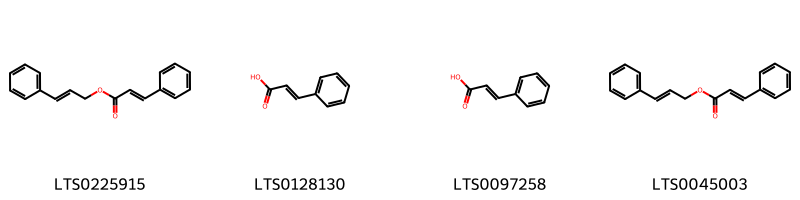{ width=100% }
    <figcaption>Hình ảnh cấu trúc hóa học của 4 hoạt chất thuộc nhóm Cinnamic acids and derivatives gồm ['cinnamyl cinnamate (LTS0225915)', 'cinnamic acid (LTS0128130)', 'phenylacrylic acid (LTS0097258)', '3-phenylprop-2-en-1-yl 3-phenylprop-2-enoate (LTS0045003)'].</figcaption>
</figure>
#### Nhóm Fatty Acyls
<figure markdown="span">
    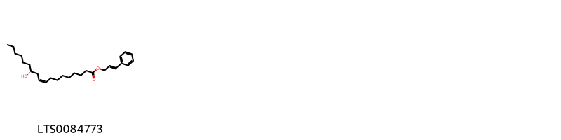{ width=100% }
    <figcaption>Hình ảnh cấu trúc hóa học của 1 hoạt chất thuộc nhóm Fatty Acyls gồm ['3-phenylprop-2-en-1-yl (9z,12r)-12-hydroxyoctadec-9-enoate (LTS0084773)'].</figcaption>
</figure>
#### Nhóm Prenol lipids
<figure markdown="span">
    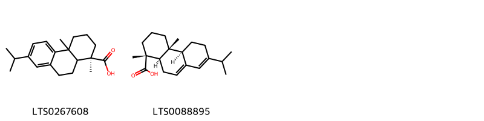{ width=100% }
    <figcaption>Hình ảnh cấu trúc hóa học của 2 hoạt chất thuộc nhóm Prenol lipids gồm ['(1r)-7-isopropyl-1,4a-dimethyl-2,3,4,9,10,10a-hexahydrophenanthrene-1-carboxylic acid (LTS0267608)', 'abietic acid (LTS0088895)'].</figcaption>
</figure>

---

### Dược dân tộc học

Danh sách các quốc gia có sử dụng *Liquidambar orientalis* trong điều trị các bệnh. 

| Country   | Disease                                        | Bệnh                                                                                                                                                                                                |
|:----------|:-----------------------------------------------|:----------------------------------------------------------------------------------------------------------------------------------------------------------------------------------------------------|
| China     | Antiseptic, Expectorant, Stimulant, Antidote   | MYMEMORY WARNING: YOU USED ALL AVAILABLE FREE TRANSLATIONS FOR TODAY. NEXT AVAILABLE IN  09 HOURS 23 MINUTES 50 SECONDS VISIT HTTPS://MYMEMORY.TRANSLATED.NET/DOC/USAGELIMITS.PHP TO TRANSLATE MORE |
| Nd        | Expectorant, Parasiticide, Stimulant, Fumigant | MYMEMORY WARNING: YOU USED ALL AVAILABLE FREE TRANSLATIONS FOR TODAY. NEXT AVAILABLE IN  09 HOURS 23 MINUTES 47 SECONDS VISIT HTTPS://MYMEMORY.TRANSLATED.NET/DOC/USAGELIMITS.PHP TO TRANSLATE MORE |
| Turkey    | Expectorant, Fumigant, Stimulant, Vulnerary    | MYMEMORY WARNING: YOU USED ALL AVAILABLE FREE TRANSLATIONS FOR TODAY. NEXT AVAILABLE IN  09 HOURS 23 MINUTES 44 SECONDS VISIT HTTPS://MYMEMORY.TRANSLATED.NET/DOC/USAGELIMITS.PHP TO TRANSLATE MORE |

---

---
## Liquidambar styraciflua
### Thông tin về thực vật

!!! info "Phân loại thực vật của *Liquidambar styraciflua* từ GIBF:"
    - **Kingdom:** Plantae
    - **Phylum:** Tracheophyta
    - **Order:** Saxifragales
    - **Family:** Altingiaceae
    - **Genus:** Liquidambar
    - **Species:** *Liquidambar styraciflua*

 

| Label (VI)   | Label (EN)   | Scientific Name         | Descriptions (VI)   | Descriptions (EN)   | Also Known As (VI)   | Also Known As (EN)                                                                                                                          |
|:-------------|:-------------|:------------------------|:--------------------|:--------------------|:---------------------|:--------------------------------------------------------------------------------------------------------------------------------------------|
| N/A          | N/A          | Liquidambar styraciflua |                     | tree species        | ['']                 | ['sweetgum', 'alligatorwood', 'redgum', 'American storax', 'American sweetgum', 'bilsted', 'hazel pine', 'satin-walnut', 'star-leaved gum'] |

#### Phân bố trên thế giới

**Từ CSDL GIBF** Switzerland, South Africa, New Zealand, Germany, Canada, United States of America, Guatemala

#### Phân bố tại Việt Nam

**Từ CSDL GIBF**: Không có ghi nhận ở Việt Nam

---
### Thành phần hóa học
        
- Theo cơ sở dữ liệu lotus: Từ loài *Liquidambar styraciflua* đã phân lập và xác định được 71 hoạt chất thuộc về các nhóm Organooxygen compounds, Flavonoids, Unsaturated hydrocarbons, Tannins, Prenol lipids, Anthracenes, Heteroaromatic compounds, Tetrahydrofurans, Benzene and substituted derivatives. 

|    | chemicalTaxonomyClassyfireClass     |   smiles_count |
|---:|:------------------------------------|---------------:|
|  0 | Anthracenes                         |              1 |
|  1 | Benzene and substituted derivatives |              2 |
|  2 | Flavonoids                          |              3 |
|  3 | Heteroaromatic compounds            |              1 |
|  4 | Organooxygen compounds              |              4 |
|  5 | Prenol lipids                       |             55 |
|  6 | Tannins                             |              2 |
|  7 | Tetrahydrofurans                    |              1 |
|  8 | Unsaturated hydrocarbons            |              1 |

#### Nhóm Anthracenes
<figure markdown="span">
    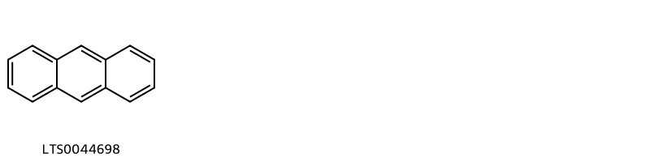{ width=100% }
    <figcaption>Hình ảnh cấu trúc hóa học của 1 hoạt chất thuộc nhóm Anthracenes gồm ['anthracene (LTS0044698)'].</figcaption>
</figure>
#### Nhóm Benzene and substituted derivatives
<figure markdown="span">
    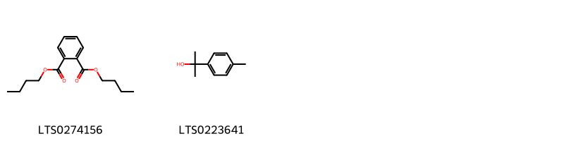{ width=100% }
    <figcaption>Hình ảnh cấu trúc hóa học của 2 hoạt chất thuộc nhóm Benzene and substituted derivatives gồm ['dibutyl-phthalate (LTS0274156)', 'p-cymen-8-ol (LTS0223641)'].</figcaption>
</figure>
#### Nhóm Flavonoids
<figure markdown="span">
    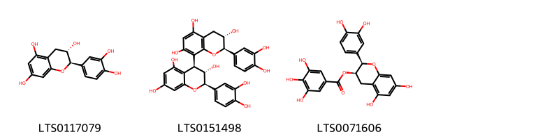{ width=100% }
    <figcaption>Hình ảnh cấu trúc hóa học của 3 hoạt chất thuộc nhóm Flavonoids gồm ['(+)-catechol (LTS0117079)', '(2r,3s,4s)-2-(3,4-dihydroxyphenyl)-4-[(2r,3s)-2-(3,4-dihydroxyphenyl)-3,5,7-trihydroxy-3,4-dihydro-2h-1-benzopyran-8-yl]-3,4-dihydro-2h-1-benzopyran-3,5,7-triol (LTS0151498)', 'epicatechin gallate (LTS0071606)'].</figcaption>
</figure>
#### Nhóm Heteroaromatic compounds
<figure markdown="span">
    { width=100% }
    <figcaption>Hình ảnh cấu trúc hóa học của 1 hoạt chất thuộc nhóm Heteroaromatic compounds gồm ['perillene (LTS0083458)'].</figcaption>
</figure>
#### Nhóm Organooxygen compounds
<figure markdown="span">
    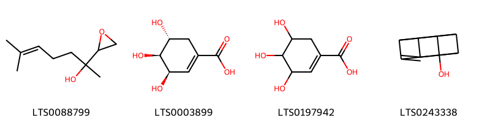{ width=100% }
    <figcaption>Hình ảnh cấu trúc hóa học của 4 hoạt chất thuộc nhóm Organooxygen compounds gồm ['linalool dihydroepoxide (LTS0088799)', '(-)-shikimate (LTS0003899)', 'shikimate (LTS0197942)', '3,4,5,8-tetrahydro-2h-cuban-1-ol (LTS0243338)'].</figcaption>
</figure>
#### Nhóm Prenol lipids
<figure markdown="span">
    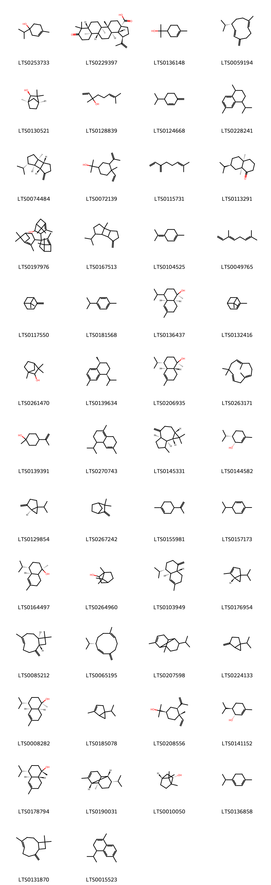{ width=100% }
    <figcaption>Hình ảnh cấu trúc hóa học của 55 hoạt chất thuộc nhóm Prenol lipids gồm ['4-terpineol (LTS0253733)', '(1r,3as,5ar,5br,7ar,11ar,11br,13ar,13br)-5a,5b,8,8,11a-pentamethyl-9-oxo-1-(prop-1-en-2-yl)-tetradecahydro-1h-cyclopenta[a]chrysene-3a-carboxylic acid (LTS0229397)', 'terpineol (LTS0136148)', '(-)-germacrene d (LTS0059194)', '(1r,2r,4s)-1,3,3-trimethylbicyclo[2.2.1]heptan-2-ol (LTS0130521)', 'linalool, (+-)- (LTS0128839)', 'β phellandrene (LTS0124668)', '(e)-calamene (LTS0228241)', 'β-bourbonene (LTS0074484)', '2-[4-ethenyl-4-methyl-3-(prop-1-en-2-yl)cyclohexyl]propan-2-ol (LTS0072139)', 'α-myrcene (LTS0115731)', 'valeranone (LTS0113291)', '4,6,6-trimethyl-3-(2,6,6-trimethyl-3-{2,6,6-trimethylbicyclo[3.1.1]hept-1-en-3-yl}bicyclo[3.1.1]hept-1-en-3-yl)bicyclo[3.1.1]hept-4-en-2-ol (LTS0197976)', 'β-bourbonene (LTS0167513)', 'terpinolene (LTS0104525)', 'trans-β-ocimene (LTS0049765)', 'β-pinene (LTS0117550)', 'cymene (LTS0181568)', '(1r,4ar,8as)-4-isopropyl-1,6-dimethyl-3,4,4a,7,8,8a-hexahydro-2h-naphthalen-1-ol (LTS0136437)', 'α pinene (LTS0132416)', 'fenchol (LTS0261470)', '(1s,4s)-4-isopropyl-1,6-dimethyl-1,2,3,4-tetrahydronaphthalene (LTS0139634)', 'α-cadinol (LTS0206935)', 'humulene (LTS0263171)', 'terpineols (LTS0139391)', '4-isopropyl-1,6-dimethyl-2,3,4,4a,7,8-hexahydronaphthalene (LTS0270743)', '(1as,4ar,7as,7br)-1,1,7-trimethyl-4-methylidene-octahydro-1ah-cyclopropa[e]azulene (LTS0145331)', '(1r,6s)-6-isopropyl-3-methylcyclohex-2-en-1-ol (LTS0144582)', '(5s)-1-isopropyl-4-methylidenebicyclo[3.1.0]hexane (LTS0129854)', 'camphene (LTS0267242)', 'limonene,  (LTS0155981)', 'phellandrene (LTS0157173)', '(1r,4s,4ar)-4-isopropyl-1,6-dimethyl-3,4,4a,7,8,8a-hexahydro-2h-naphthalen-1-ol (LTS0164497)', 'borneol (LTS0264960)', '(+)-gamma-cadinene (LTS0103949)', 'α-thujene (LTS0176954)', 'caryophyllene (LTS0085212)', '(1z,6z,8s)-8-isopropyl-1-methyl-5-methylidenecyclodeca-1,6-diene (LTS0065195)', 'α-copaene (LTS0207598)', 'sabinene (LTS0224133)', 'delta-cadinol (LTS0008282)', 'α-thujene (LTS0185078)', 'elemol (LTS0208556)', '(+)-trans-piperitenol (LTS0141152)', 'α-cadinol (LTS0178794)', '(1r,2s,7s,8s)-8-isopropyl-1,3-dimethyltricyclo[4.4.0.0²,⁷]dec-3-ene (LTS0190031)', '(2s,4r)-1,7,7-trimethylbicyclo[2.2.1]heptan-2-ol (LTS0010050)', 'terpinene (LTS0136858)', 'caryophyllene (LTS0131870)', '3,4-dihydrocadalene (LTS0015523)', 'delta-cadinol (LTS0013807)', '(1s,4r,4ar,8ar)-1-isopropyl-4,7-dimethyl-2,3,4,5,6,8a-hexahydro-1h-naphthalen-4a-ol (LTS0018576)', 'delta-cadinene (LTS0019321)', '4-isopropyl-6-methyl-1-methylidene-3,4,4a,7,8,8a-hexahydro-2h-naphthalene (LTS0111070)', '(-)-β-cubebene (LTS0123697)'].</figcaption>
</figure>
#### Nhóm Tannins
<figure markdown="span">
    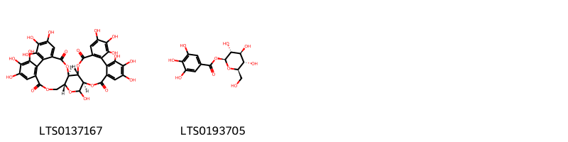{ width=100% }
    <figcaption>Hình ảnh cấu trúc hóa học của 2 hoạt chất thuộc nhóm Tannins gồm ['(1r,2s,19r,22r)-7,8,9,12,13,14,20,28,29,30,33,34,35-tridecahydroxy-3,18,21,24,39-pentaoxaheptacyclo[20.17.0.0²,¹⁹.0⁵,¹⁰.0¹¹,¹⁶.0²⁶,³¹.0³²,³⁷]nonatriaconta-5(10),6,8,11,13,15,26(31),27,29,32,34,36-dodecaene-4,17,25,38-tetrone (LTS0137167)', 'β-glucogallin (LTS0193705)'].</figcaption>
</figure>
#### Nhóm Tetrahydrofurans
<figure markdown="span">
    { width=100% }
    <figcaption>Hình ảnh cấu trúc hóa học của 1 hoạt chất thuộc nhóm Tetrahydrofurans gồm ['2,10,10-trimethyl-6-methylidene-1-oxaspiro[4.5]dec-7-ene (LTS0150186)'].</figcaption>
</figure>
#### Nhóm Unsaturated hydrocarbons
<figure markdown="span">
    { width=100% }
    <figcaption>Hình ảnh cấu trúc hóa học của 1 hoạt chất thuộc nhóm Unsaturated hydrocarbons gồm ['α terpinene (LTS0232891)'].</figcaption>
</figure>

---

### Dược dân tộc học

Danh sách các quốc gia có sử dụng *Liquidambar styraciflua* trong điều trị các bệnh. 

| Country           | Disease                                                                                           | Bệnh                                                                                                                                                                                                |
|:------------------|:--------------------------------------------------------------------------------------------------|:----------------------------------------------------------------------------------------------------------------------------------------------------------------------------------------------------|
| Dutch             | Vulnerary, Stimulant                                                                              | MYMEMORY WARNING: YOU USED ALL AVAILABLE FREE TRANSLATIONS FOR TODAY. NEXT AVAILABLE IN  09 HOURS 23 MINUTES 18 SECONDS VISIT HTTPS://MYMEMORY.TRANSLATED.NET/DOC/USAGELIMITS.PHP TO TRANSLATE MORE |
| Elsewhere         | Expectorant, Antiseptic, Parasiticide                                                             | MYMEMORY WARNING: YOU USED ALL AVAILABLE FREE TRANSLATIONS FOR TODAY. NEXT AVAILABLE IN  09 HOURS 23 MINUTES 15 SECONDS VISIT HTTPS://MYMEMORY.TRANSLATED.NET/DOC/USAGELIMITS.PHP TO TRANSLATE MORE |
| English           | Fumigant                                                                                          | MYMEMORY WARNING: YOU USED ALL AVAILABLE FREE TRANSLATIONS FOR TODAY. NEXT AVAILABLE IN  09 HOURS 23 MINUTES 12 SECONDS VISIT HTTPS://MYMEMORY.TRANSLATED.NET/DOC/USAGELIMITS.PHP TO TRANSLATE MORE |
| German            | Expectorant                                                                                       | MYMEMORY WARNING: YOU USED ALL AVAILABLE FREE TRANSLATIONS FOR TODAY. NEXT AVAILABLE IN  09 HOURS 23 MINUTES 10 SECONDS VISIT HTTPS://MYMEMORY.TRANSLATED.NET/DOC/USAGELIMITS.PHP TO TRANSLATE MORE |
| Guatemala         | Dentifrice                                                                                        | MYMEMORY WARNING: YOU USED ALL AVAILABLE FREE TRANSLATIONS FOR TODAY. NEXT AVAILABLE IN  09 HOURS 23 MINUTES 06 SECONDS VISIT HTTPS://MYMEMORY.TRANSLATED.NET/DOC/USAGELIMITS.PHP TO TRANSLATE MORE |
| Mexico            | Digestive, Diuretic, Sedative, Stomachic, Stimulant, Stimulant, Stomachic, Sudorific, Carminative | MYMEMORY WARNING: YOU USED ALL AVAILABLE FREE TRANSLATIONS FOR TODAY. NEXT AVAILABLE IN  09 HOURS 23 MINUTES 03 SECONDS VISIT HTTPS://MYMEMORY.TRANSLATED.NET/DOC/USAGELIMITS.PHP TO TRANSLATE MORE |
| Mexico(Aztec)     | Soporific                                                                                         | MYMEMORY WARNING: YOU USED ALL AVAILABLE FREE TRANSLATIONS FOR TODAY. NEXT AVAILABLE IN  09 HOURS 23 MINUTES 00 SECONDS VISIT HTTPS://MYMEMORY.TRANSLATED.NET/DOC/USAGELIMITS.PHP TO TRANSLATE MORE |
| Mexico(Chinantec) | Antiseptic                                                                                        | MYMEMORY WARNING: YOU USED ALL AVAILABLE FREE TRANSLATIONS FOR TODAY. NEXT AVAILABLE IN  09 HOURS 22 MINUTES 58 SECONDS VISIT HTTPS://MYMEMORY.TRANSLATED.NET/DOC/USAGELIMITS.PHP TO TRANSLATE MORE |
| Nd                | Antiseptic, Expectorant, Perfume, Stimulant, Fumigant                                             | MYMEMORY WARNING: YOU USED ALL AVAILABLE FREE TRANSLATIONS FOR TODAY. NEXT AVAILABLE IN  09 HOURS 22 MINUTES 55 SECONDS VISIT HTTPS://MYMEMORY.TRANSLATED.NET/DOC/USAGELIMITS.PHP TO TRANSLATE MORE |
| US                | Antiseptic, Expectorant                                                                           | MYMEMORY WARNING: YOU USED ALL AVAILABLE FREE TRANSLATIONS FOR TODAY. NEXT AVAILABLE IN  09 HOURS 22 MINUTES 52 SECONDS VISIT HTTPS://MYMEMORY.TRANSLATED.NET/DOC/USAGELIMITS.PHP TO TRANSLATE MORE |
| US(Appalachia)    | Dentifrice                                                                                        | MYMEMORY WARNING: YOU USED ALL AVAILABLE FREE TRANSLATIONS FOR TODAY. NEXT AVAILABLE IN  09 HOURS 22 MINUTES 49 SECONDS VISIT HTTPS://MYMEMORY.TRANSLATED.NET/DOC/USAGELIMITS.PHP TO TRANSLATE MORE |

---

