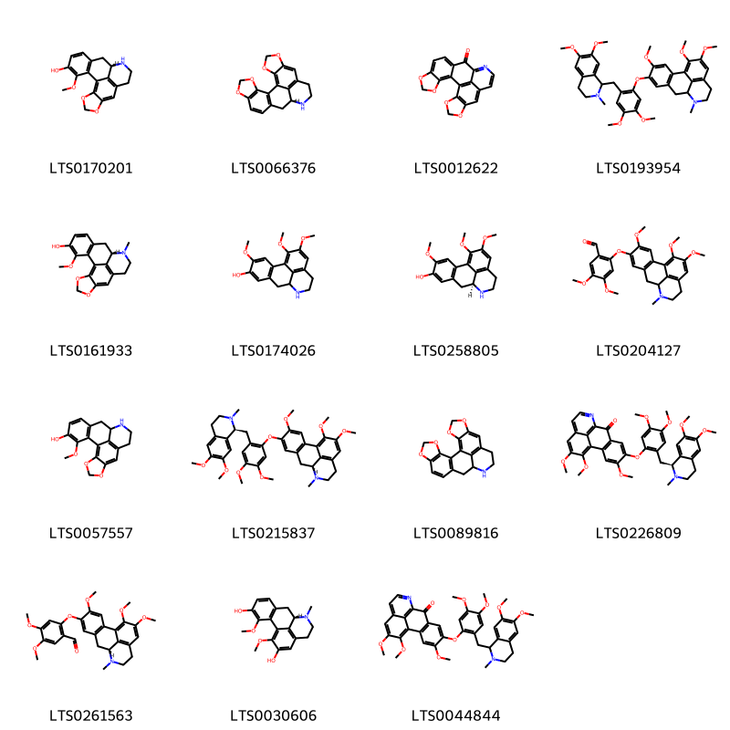
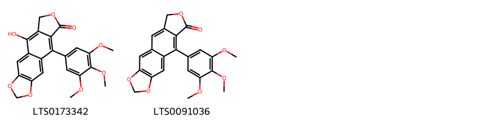
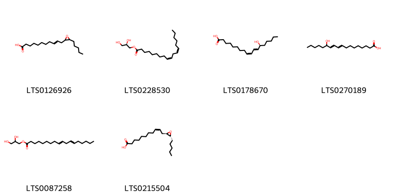
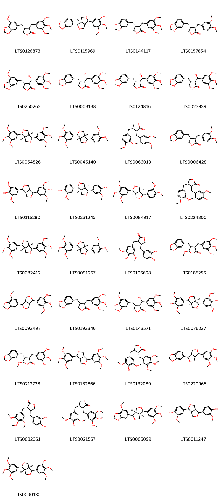
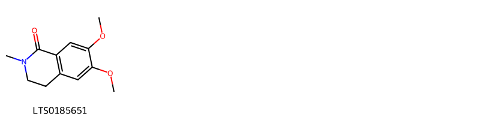
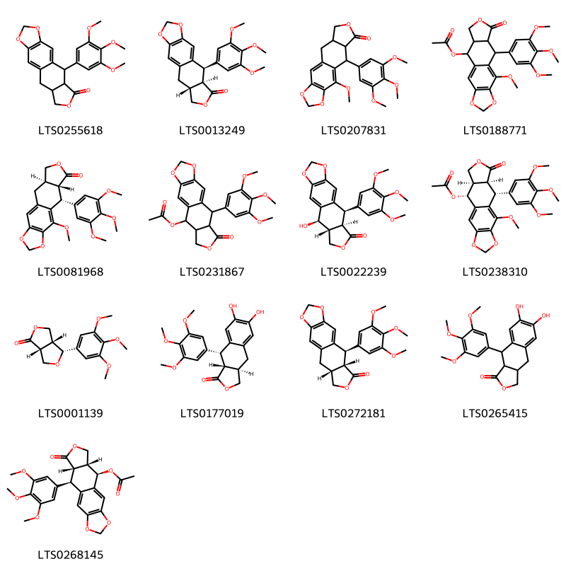
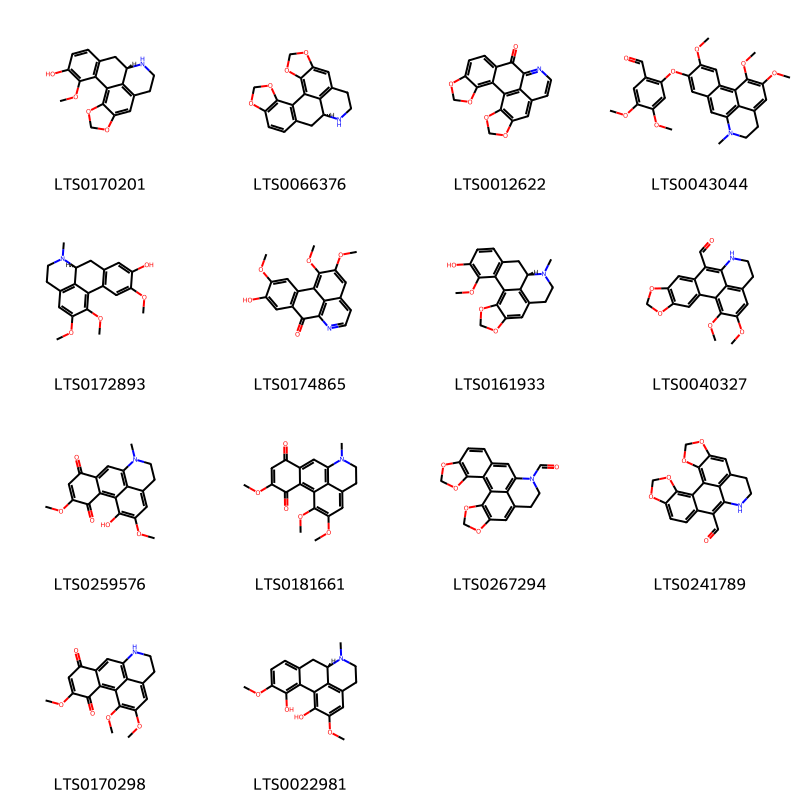
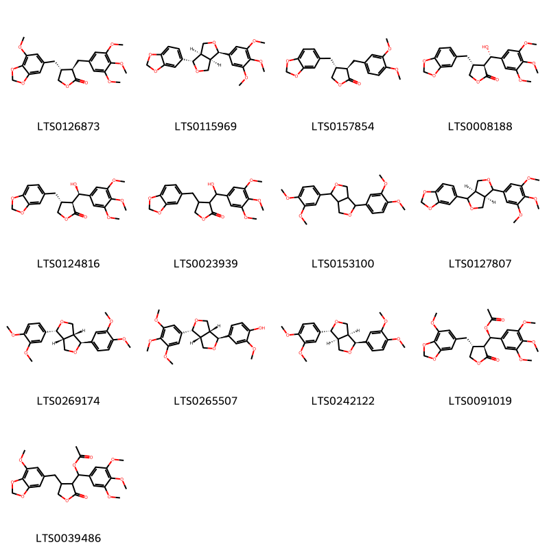
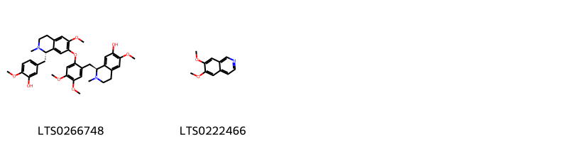
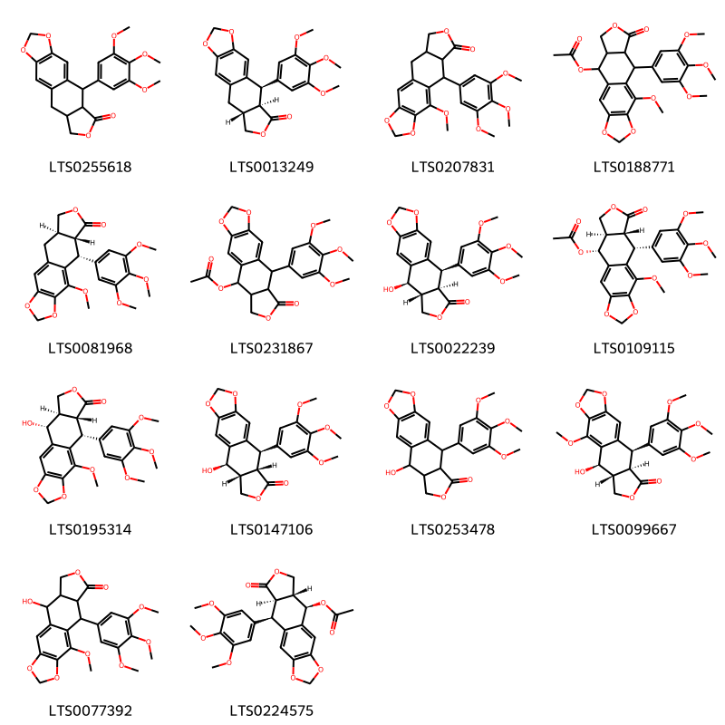

!!! abstract "Tóm tắt"

    Họ Hernandiaceae gồm khoảng 1 chi và 3 loài được một số cộng đồng tại các quốc gia như Moluccas, India, Elsewhere, Java, Samoa, Dominican Republic, Malaya sử dụng trong một số trường hợp MYMEMORY WARNING: YOU USED ALL AVAILABLE FREE TRANSLATIONS FOR TODAY. NEXT AVAILABLE IN  08 HOURS 45 MINUTES 03 SECONDS VISIT HTTPS://MYMEMORY.TRANSLATED.NET/DOC/USAGELIMITS.PHP TO TRANSLATE MORE.

!!! info "DrDuke"

    James A. Duke sinh năm 1929-2017 là một nhà thực vật học người Mỹ. Đây là một trong những tác giả hàng đầu trong lĩnh vực dược dân tộc học với cuốn *CRC Handbook of Medicinal Herbs* và chính là người xây dựng lên cơ sở dữ liệu về hợp chất tự nhiên và dược dân tộc học tại Bộ nông nghiệp Hoa Kỳ. Các thông tin được đăng tải tại website [Dr. Duke's Phytochemical and Ethnobotanical Databases](https://phytochem.nal.usda.gov/). 
    Trong suốt thập niên 1970, ông lãnh đạo the Plant Taxonomy Laboratory, Plant Genetics and Germplasm Institute of the Agricultural Research Service, U.S. Department of Agriculture.
    Trong tài liệu này, các thông tin về dược dân tộc của các dược liệu được trích dẫn từ tài liệu của James A. Ducke với sự trợ giúp của phần mềm dịch thuật từ tiếng Anh sang tiếng Việt.
   

# Chi Hernandia

??? note "Danh sách các dược liệu thuộc chi"
    
	 - *Hernandia ovigera*
	 - *Hernandia peltata*
	 - *Hernandia sonora*

---
## Hernandia ovigera
### Thông tin về thực vật

!!! info "Phân loại thực vật của *Hernandia ovigera* từ GIBF:"
    - **Kingdom:** Plantae
    - **Phylum:** Tracheophyta
    - **Order:** Laurales
    - **Family:** Hernandiaceae
    - **Genus:** Hernandia
    - **Species:** *Hernandia ovigera*

 

| Label (VI)   | Label (EN)   | Scientific Name   | Descriptions (VI)   | Descriptions (EN)   | Also Known As (VI)   | Also Known As (EN)   |
|:-------------|:-------------|:------------------|:--------------------|:--------------------|:---------------------|:---------------------|
| N/A          | N/A          | Hernandia ovigera |                     | species of plant    | ['']                 | ['']                 |

#### Phân bố trên thế giới

**Từ CSDL GIBF** nan, American Samoa, Sri Lanka, Christmas Island, Belgium, Kiribati, Chinese Taipei, Papua New Guinea, United States of America, Chile, Solomon Islands, Brazil, Guam, Pitcairn, Tonga, New Caledonia, French Polynesia, Indonesia, Samoa, Philippines, Malaysia, Northern Mariana Islands

#### Phân bố tại Việt Nam

**Từ CSDL GIBF**: Không có ghi nhận ở Việt Nam

---
### Thành phần hóa học
        
- Theo cơ sở dữ liệu lotus: Từ loài *Hernandia ovigera* đã phân lập và xác định được 71 hoạt chất thuộc về các nhóm Fatty Acyls, Aporphines, Lignan lactones, Arylnaphthalene lignans, Phenols, Furanoid lignans, Isoquinolines and derivatives. 

|    | chemicalTaxonomyClassyfireClass   |   smiles_count |
|---:|:----------------------------------|---------------:|
|  0 | Aporphines                        |             15 |
|  1 | Arylnaphthalene lignans           |              2 |
|  2 | Fatty Acyls                       |              6 |
|  3 | Furanoid lignans                  |             33 |
|  4 | Isoquinolines and derivatives     |              1 |
|  5 | Lignan lactones                   |             13 |
|  6 | Phenols                           |              1 |

#### Nhóm Aporphines
<figure markdown="span">
    { width=100% }
    <figcaption>Hình ảnh cấu trúc hóa học của 15 hoạt chất thuộc nhóm Aporphines gồm ['(12s)-18-methoxy-3,5-dioxa-11-azapentacyclo[10.7.1.0²,⁶.0⁸,²⁰.0¹⁴,¹⁹]icosa-1,6,8(20),14(19),15,17-hexaen-17-ol (LTS0170201)', '(12s)-4,6,19,21-tetraoxa-13-azahexacyclo[10.10.1.0²,¹⁰.0³,⁷.0¹⁶,²³.0¹⁸,²²]tricosa-1(23),2(10),3(7),8,16,18(22)-hexaene (LTS0066376)', 'hernandonine (LTS0012622)', '5-{2-[(6,7-dimethoxy-2-methyl-3,4-dihydro-1h-isoquinolin-1-yl)methyl]-4,5-dimethoxyphenoxy}-4,15,16-trimethoxy-10-methyl-10-azatetracyclo[7.7.1.0²,⁷.0¹³,¹⁷]heptadeca-1(16),2(7),3,5,13(17),14-hexaene (LTS0193954)', '(12s)-18-methoxy-11-methyl-3,5-dioxa-11-azapentacyclo[10.7.1.0²,⁶.0⁸,²⁰.0¹⁴,¹⁹]icosa-1,6,8(20),14(19),15,17-hexaen-17-ol (LTS0161933)', '4,15,16-trimethoxy-10-azatetracyclo[7.7.1.0²,⁷.0¹³,¹⁷]heptadeca-1(17),2(7),3,5,13,15-hexaen-5-ol (LTS0174026)', 'laurotetanine (LTS0258805)', '4,5-dimethoxy-2-({4,15,16-trimethoxy-10-methyl-10-azatetracyclo[7.7.1.0²,⁷.0¹³,¹⁷]heptadeca-1(16),2(7),3,5,13(17),14-hexaen-5-yl}oxy)benzaldehyde (LTS0204127)', '18-methoxy-3,5-dioxa-11-azapentacyclo[10.7.1.0²,⁶.0⁸,²⁰.0¹⁴,¹⁹]icosa-1,6,8(20),14(19),15,17-hexaen-17-ol (LTS0057557)', '(9s)-5-(2-{[(1s)-6,7-dimethoxy-2-methyl-3,4-dihydro-1h-isoquinolin-1-yl]methyl}-4,5-dimethoxyphenoxy)-4,15,16-trimethoxy-10-methyl-10-azatetracyclo[7.7.1.0²,⁷.0¹³,¹⁷]heptadeca-1(16),2(7),3,5,13(17),14-hexaene (LTS0215837)', '4,6,19,21-tetraoxa-13-azahexacyclo[10.10.1.0²,¹⁰.0³,⁷.0¹⁶,²³.0¹⁸,²²]tricosa-1(23),2(10),3(7),8,16,18(22)-hexaene (LTS0089816)', '5-(2-{[(1s)-6,7-dimethoxy-2-methyl-3,4-dihydro-1h-isoquinolin-1-yl]methyl}-4,5-dimethoxyphenoxy)-4,15,16-trimethoxy-10-azatetracyclo[7.7.1.0²,⁷.0¹³,¹⁷]heptadeca-1(16),2(7),3,5,9(17),10,12,14-octaen-8-one (LTS0226809)', '4,5-dimethoxy-2-{[(9r)-4,15,16-trimethoxy-10-methyl-10-azatetracyclo[7.7.1.0²,⁷.0¹³,¹⁷]heptadeca-1(16),2(7),3,5,13(17),14-hexaen-5-yl]oxy}benzaldehyde (LTS0261563)', '(9s)-3,16-dimethoxy-10-methyl-10-azatetracyclo[7.7.1.0²,⁷.0¹³,¹⁷]heptadeca-1(16),2(7),3,5,13(17),14-hexaene-4,15-diol (LTS0030606)', '5-{2-[(6,7-dimethoxy-2-methyl-3,4-dihydro-1h-isoquinolin-1-yl)methyl]-4,5-dimethoxyphenoxy}-4,15,16-trimethoxy-10-azatetracyclo[7.7.1.0²,⁷.0¹³,¹⁷]heptadeca-1(16),2(7),3,5,9(17),10,12,14-octaen-8-one (LTS0044844)'].</figcaption>
</figure>
#### Nhóm Arylnaphthalene lignans
<figure markdown="span">
    { width=100% }
    <figcaption>Hình ảnh cấu trúc hóa học của 2 hoạt chất thuộc nhóm Arylnaphthalene lignans gồm ['16-hydroxy-10-(3,4,5-trimethoxyphenyl)-4,6,13-trioxatetracyclo[7.7.0.0³,⁷.0¹¹,¹⁵]hexadeca-1,3(7),8,10,15-pentaen-12-one (LTS0173342)', '10-(3,4,5-trimethoxyphenyl)-4,6,13-trioxatetracyclo[7.7.0.0³,⁷.0¹¹,¹⁵]hexadeca-1,3(7),8,10,15-pentaen-12-one (LTS0091036)'].</figcaption>
</figure>
#### Nhóm Fatty Acyls
<figure markdown="span">
    { width=100% }
    <figcaption>Hình ảnh cấu trúc hóa học của 6 hoạt chất thuộc nhóm Fatty Acyls gồm ['11-(3-pentyloxiran-2-yl)undec-9-enoic acid (LTS0126926)', '3-linoleoyl-sn-glycerol (LTS0228530)', '13-hode (LTS0178670)', '13-hydroxyoctadeca-9,11-dienoic acid (LTS0270189)', '2,3-dihydroxypropyl octadeca-9,12-dienoate (LTS0087258)', '(9z)-11-[(2r,3r)-3-pentyloxiran-2-yl]undec-9-enoic acid (LTS0215504)'].</figcaption>
</figure>
#### Nhóm Furanoid lignans
<figure markdown="span">
    { width=100% }
    <figcaption>Hình ảnh cấu trúc hóa học của 33 hoạt chất thuộc nhóm Furanoid lignans gồm ['(3r,4r)-4-[(7-methoxy-2h-1,3-benzodioxol-5-yl)methyl]-3-[(3,4,5-trimethoxyphenyl)methyl]oxolan-2-one (LTS0126873)', '5-[(1s,3ar,4r,6ar)-4-(3,4,5-trimethoxyphenyl)-hexahydrofuro[3,4-c]furan-1-yl]-2h-1,3-benzodioxole (LTS0115969)', 'yatein (LTS0144117)', '(-)-bursehernin (LTS0157854)', '(3s,4r)-3-[(s)-hydroxy(3,4,5-trimethoxyphenyl)methyl]-4-[(7-methoxy-2h-1,3-benzodioxol-5-yl)methyl]oxolan-2-one (LTS0250263)', 'podorhizol (LTS0008188)', '(3s,4r)-4-(2h-1,3-benzodioxol-5-ylmethyl)-3-[(r)-hydroxy(3,4,5-trimethoxyphenyl)methyl]oxolan-2-one (LTS0124816)', '4-(2h-1,3-benzodioxol-5-ylmethyl)-3-[hydroxy(3,4,5-trimethoxyphenyl)methyl]oxolan-2-one (LTS0023939)', '(3ar,6ar)-1,4-bis(3,4,5-trimethoxyphenyl)-hexahydrofuro[3,4-c]furan (LTS0054826)', '(1s,3ar,4r,6ar)-1-(3,4-dimethoxyphenyl)-4-(3,4,5-trimethoxyphenyl)-hexahydrofuro[3,4-c]furan (LTS0046140)', 'arctigenin methyl ether (LTS0066013)', '4-(2h-1,3-benzodioxol-5-ylmethyl)-3-[(3,4-dimethoxyphenyl)methyl]oxolan-2-one (LTS0006428)', 'syringaresinol (LTS0116280)', '(-)-pinoresinol (LTS0231245)', '(1r,3as,4s,6as)-1-(3,4-dimethoxyphenyl)-4-(3,4,5-trimethoxyphenyl)-hexahydrofuro[3,4-c]furan (LTS0084917)', '3,4-bis[(3,4-dimethoxyphenyl)methyl]oxolan-2-one (LTS0224300)', '( )-yangabin (LTS0082412)', '(1r,3ar,4s,6ar)-1-(3,4-dimethoxyphenyl)-4-(3,4,5-trimethoxyphenyl)-hexahydrofuro[3,4-c]furan (LTS0091267)', '4-[(3,4-dihydroxyphenyl)methyl]-3-[(3,4,5-trimethoxyphenyl)methyl]oxolan-2-one (LTS0106698)', '4-(2h-1,3-benzodioxol-5-ylmethyl)-5-methoxy-3-[(3,4,5-trimethoxyphenyl)methyl]oxolan-2-one (LTS0185256)', '4-methoxy-6-[4-(3,4,5-trimethoxyphenyl)-hexahydrofuro[3,4-c]furan-1-yl]-2h-1,3-benzodioxole (LTS0092497)', '4-(2h-1,3-benzodioxol-5-ylmethyl)-3-[(3,4,5-trimethoxyphenyl)methyl]oxolan-2-one (LTS0192346)', '3-[hydroxy(3,4,5-trimethoxyphenyl)methyl]-4-[(7-methoxy-2h-1,3-benzodioxol-5-yl)methyl]oxolan-2-one (LTS0143571)', '(-)-syringaresinol (LTS0076227)', '(3r,4r,5r)-4-(2h-1,3-benzodioxol-5-ylmethyl)-5-methoxy-3-[(3,4,5-trimethoxyphenyl)methyl]oxolan-2-one (LTS0212738)', '1,4-bis(3,4,5-trimethoxyphenyl)-hexahydrofuro[3,4-c]furan (LTS0132866)', '(3r,4r)-4-[(4-hydroxy-3,5-dimethoxyphenyl)methyl]-3-[(3,4,5-trimethoxyphenyl)methyl]oxolan-2-one (LTS0132089)', '5-[4-(3,4,5-trimethoxyphenyl)-hexahydrofuro[3,4-c]furan-1-yl]-2h-1,3-benzodioxole (LTS0220965)', '(3r,4r)-4-[(3,4-dihydroxyphenyl)methyl]-3-[(3,4,5-trimethoxyphenyl)methyl]oxolan-2-one (LTS0032361)', '4-[(4-hydroxy-3,5-dimethoxyphenyl)methyl]-3-[(3,4,5-trimethoxyphenyl)methyl]oxolan-2-one (LTS0021567)', '6-[(1r,3ar,4r,6ar)-4-(3,4,5-trimethoxyphenyl)-hexahydrofuro[3,4-c]furan-1-yl]-4-methoxy-2h-1,3-benzodioxole (LTS0005099)', 'pinoresinol (LTS0011247)', '(1r,3ar,4s,6ar)-1,4-bis(3,4,5-trimethoxyphenyl)-hexahydrofuro[3,4-c]furan (LTS0090132)'].</figcaption>
</figure>
#### Nhóm Isoquinolines and derivatives
<figure markdown="span">
    { width=100% }
    <figcaption>Hình ảnh cấu trúc hóa học của 1 hoạt chất thuộc nhóm Isoquinolines and derivatives gồm ['n-methylcorydaldine (LTS0185651)'].</figcaption>
</figure>
#### Nhóm Lignan lactones
<figure markdown="span">
    { width=100% }
    <figcaption>Hình ảnh cấu trúc hóa học của 13 hoạt chất thuộc nhóm Lignan lactones gồm ['10-(3,4,5-trimethoxyphenyl)-4,6,13-trioxatetracyclo[7.7.0.0³,⁷.0¹¹,¹⁵]hexadeca-1,3(7),8-trien-12-one (LTS0255618)', '(-)-deoxypodophyllotoxin (LTS0013249)', '8-methoxy-10-(3,4,5-trimethoxyphenyl)-4,6,13-trioxatetracyclo[7.7.0.0³,⁷.0¹¹,¹⁵]hexadeca-1(9),2,7-trien-12-one (LTS0207831)', '2-methoxy-14-oxo-16-(3,4,5-trimethoxyphenyl)-4,6,13-trioxatetracyclo[7.7.0.0³,⁷.0¹¹,¹⁵]hexadeca-1(9),2,7-trien-10-yl acetate (LTS0188771)', '(10r,11r,15r)-8-methoxy-10-(3,4,5-trimethoxyphenyl)-4,6,13-trioxatetracyclo[7.7.0.0³,⁷.0¹¹,¹⁵]hexadeca-1(9),2,7-trien-12-one (LTS0081968)', '14-oxo-16-(3,4,5-trimethoxyphenyl)-4,6,13-trioxatetracyclo[7.7.0.0³,⁷.0¹¹,¹⁵]hexadeca-1,3(7),8-trien-10-yl acetate (LTS0231867)', 'podofilox (LTS0022239)', '(10r,11r,15s,16r)-2-methoxy-14-oxo-16-(3,4,5-trimethoxyphenyl)-4,6,13-trioxatetracyclo[7.7.0.0³,⁷.0¹¹,¹⁵]hexadeca-1(9),2,7-trien-10-yl acetate (LTS0238310)', '(3ar,4r,6ar)-4-(3,4,5-trimethoxyphenyl)-tetrahydro-3h-furo[3,4-c]furan-1-one (LTS0001139)', '(3ar,9r,9ar)-6,7-dihydroxy-9-(3,4,5-trimethoxyphenyl)-3h,3ah,4h,9h,9ah-naphtho[2,3-c]furan-1-one (LTS0177019)', '(10r,11s,15r)-10-(3,4,5-trimethoxyphenyl)-4,6,13-trioxatetracyclo[7.7.0.0³,⁷.0¹¹,¹⁵]hexadeca-1,3(7),8-trien-12-one (LTS0272181)', '6,7-dihydroxy-9-(3,4,5-trimethoxyphenyl)-3h,3ah,4h,9h,9ah-naphtho[2,3-c]furan-1-one (LTS0265415)', '(10r,11r,15s,16r)-14-oxo-16-(3,4,5-trimethoxyphenyl)-4,6,13-trioxatetracyclo[7.7.0.0³,⁷.0¹¹,¹⁵]hexadeca-1,3(7),8-trien-10-yl acetate (LTS0268145)'].</figcaption>
</figure>
#### Nhóm Phenols
<figure markdown="span">
    { width=100% }
    <figcaption>Hình ảnh cấu trúc hóa học của 1 hoạt chất thuộc nhóm Phenols gồm ['α-hydroquinone (LTS0063684)'].</figcaption>
</figure>

---

### Dược dân tộc học

Danh sách các quốc gia có sử dụng *Hernandia ovigera* trong điều trị các bệnh. 

| Country   | Disease                | Bệnh                                                                                                                                                                                                |
|:----------|:-----------------------|:----------------------------------------------------------------------------------------------------------------------------------------------------------------------------------------------------|
| India     | Antidote, Depilatory   | MYMEMORY WARNING: YOU USED ALL AVAILABLE FREE TRANSLATIONS FOR TODAY. NEXT AVAILABLE IN  08 HOURS 45 MINUTES 01 SECONDS VISIT HTTPS://MYMEMORY.TRANSLATED.NET/DOC/USAGELIMITS.PHP TO TRANSLATE MORE |
| Samoa     | Laxative, Pediculicide | MYMEMORY WARNING: YOU USED ALL AVAILABLE FREE TRANSLATIONS FOR TODAY. NEXT AVAILABLE IN  08 HOURS 44 MINUTES 58 SECONDS VISIT HTTPS://MYMEMORY.TRANSLATED.NET/DOC/USAGELIMITS.PHP TO TRANSLATE MORE |

---

---
## Hernandia peltata
### Thông tin về thực vật

!!! info "Phân loại thực vật của *N/A* từ GIBF:"
    - **Kingdom:** Plantae
    - **Phylum:** Tracheophyta
    - **Order:** Laurales
    - **Family:** Hernandiaceae
    - **Genus:** Hernandia
    - **Species:** *N/A*

 

| Label (VI)   | Label (EN)   | Scientific Name   | Descriptions (VI)   | Descriptions (EN)   | Also Known As (VI)   | Also Known As (EN)   |
|:-------------|:-------------|:------------------|:--------------------|:--------------------|:---------------------|:---------------------|
| N/A          | N/A          | Hernandia peltata |                     |                     | ['']                 | ['']                 |

#### Phân bố trên thế giới

**Từ CSDL GIBF** nan, Palau, Sri Lanka, Micronesia (Federated States of), Australia, Japan, Cook Islands, Christmas Island, Guadeloupe, Cocos (Keeling) Islands, Nicaragua, French Guiana, Puerto Rico, Réunion, Chinese Taipei, Papua New Guinea, United States of America, Solomon Islands, Maldives, Fiji, Marshall Islands, Sao Tome and Principe, United States Minor Outlying Islands, Guam, New Caledonia, Tonga, Dominican Republic, Mayotte, France, Singapore, British Indian Ocean Territory, French Polynesia, Niue, Comoros, Madagascar, Seychelles, Haiti, Costa Rica, Vanuatu, India, Indonesia, Samoa, Philippines, Northern Mariana Islands

#### Phân bố tại Việt Nam

**Từ CSDL GIBF**: Không có ghi nhận ở Việt Nam

---
### Thành phần hóa học
        
- Theo cơ sở dữ liệu lotus: Từ loài *N/A* đã phân lập và xác định được Chưa có hoạt chất nào được phân lập. hoạt chất thuộc về các nhóm Không có hoạt chất nào được phân lập. 

Không có hình ảnh nào được tạo ra

---

### Dược dân tộc học

Danh sách các quốc gia có sử dụng *N/A* trong điều trị các bệnh. 

| Country   | Disease    | Bệnh                                                                                                                                                                                                |
|:----------|:-----------|:----------------------------------------------------------------------------------------------------------------------------------------------------------------------------------------------------|
| Java      | Depilatory | MYMEMORY WARNING: YOU USED ALL AVAILABLE FREE TRANSLATIONS FOR TODAY. NEXT AVAILABLE IN  08 HOURS 44 MINUTES 33 SECONDS VISIT HTTPS://MYMEMORY.TRANSLATED.NET/DOC/USAGELIMITS.PHP TO TRANSLATE MORE |
| Malaya    | Purgative  | MYMEMORY WARNING: YOU USED ALL AVAILABLE FREE TRANSLATIONS FOR TODAY. NEXT AVAILABLE IN  08 HOURS 44 MINUTES 31 SECONDS VISIT HTTPS://MYMEMORY.TRANSLATED.NET/DOC/USAGELIMITS.PHP TO TRANSLATE MORE |
| Moluccas  | Hemostat   | MYMEMORY WARNING: YOU USED ALL AVAILABLE FREE TRANSLATIONS FOR TODAY. NEXT AVAILABLE IN  08 HOURS 44 MINUTES 28 SECONDS VISIT HTTPS://MYMEMORY.TRANSLATED.NET/DOC/USAGELIMITS.PHP TO TRANSLATE MORE |

---

---
## Hernandia sonora
### Thông tin về thực vật

!!! info "Phân loại thực vật của *Hernandia sonora* từ GIBF:"
    - **Kingdom:** Plantae
    - **Phylum:** Tracheophyta
    - **Order:** Laurales
    - **Family:** Hernandiaceae
    - **Genus:** Hernandia
    - **Species:** *Hernandia sonora*

 

| Label (VI)   | Label (EN)   | Scientific Name   | Descriptions (VI)   | Descriptions (EN)   | Also Known As (VI)   | Also Known As (EN)   |
|:-------------|:-------------|:------------------|:--------------------|:--------------------|:---------------------|:---------------------|
| N/A          | N/A          | Hernandia sonora  | loài thực vật       | species of plant    | ['']                 | ['']                 |

#### Phân bố trên thế giới

**Từ CSDL GIBF** nan, Palau, Sri Lanka, American Samoa, Micronesia (Federated States of), Japan, Guadeloupe, Cook Islands, Belgium, Tokelau, unknown or invalid, French Guiana, Puerto Rico, Kiribati, Chinese Taipei, Papua New Guinea, Jamaica, United States of America, Trinidad and Tobago, South Africa, Suriname, Marshall Islands, United States Minor Outlying Islands, Thailand, Saint Vincent and the Grenadines, Martinique, Guam, Brazil, Pitcairn, Tonga, New Caledonia, Cuba, Dominican Republic, France, Peru, Mexico, China, French Polynesia, Syrian Arab Republic, Saint Kitts and Nevis, Seychelles, Montserrat, Vanuatu, Indonesia, Philippines, Northern Mariana Islands

#### Phân bố tại Việt Nam

**Từ CSDL GIBF**: Không có ghi nhận ở Việt Nam

---
### Thành phần hóa học
        
- Theo cơ sở dữ liệu lotus: Từ loài *Hernandia sonora* đã phân lập và xác định được 45 hoạt chất thuộc về các nhóm Aporphines, Lignan lactones, Phenols, Furanoid lignans, Isoquinolines and derivatives. 

|    | chemicalTaxonomyClassyfireClass   |   smiles_count |
|---:|:----------------------------------|---------------:|
|  0 | Aporphines                        |             14 |
|  1 | Furanoid lignans                  |             13 |
|  2 | Isoquinolines and derivatives     |              2 |
|  3 | Lignan lactones                   |             14 |
|  4 | Phenols                           |              1 |

#### Nhóm Aporphines
<figure markdown="span">
    { width=100% }
    <figcaption>Hình ảnh cấu trúc hóa học của 14 hoạt chất thuộc nhóm Aporphines gồm ['(12s)-18-methoxy-3,5-dioxa-11-azapentacyclo[10.7.1.0²,⁶.0⁸,²⁰.0¹⁴,¹⁹]icosa-1,6,8(20),14(19),15,17-hexaen-17-ol (LTS0170201)', '(12s)-4,6,19,21-tetraoxa-13-azahexacyclo[10.10.1.0²,¹⁰.0³,⁷.0¹⁶,²³.0¹⁸,²²]tricosa-1(23),2(10),3(7),8,16,18(22)-hexaene (LTS0066376)', 'hernandonine (LTS0012622)', '4,5-dimethoxy-2-({4,15,16-trimethoxy-10-methyl-10-azatetracyclo[7.7.1.0²,⁷.0¹³,¹⁷]heptadeca-1(17),2(7),3,5,8,13,15-heptaen-5-yl}oxy)benzaldehyde (LTS0043044)', '(9s)-4,15,16-trimethoxy-10-methyl-10-azatetracyclo[7.7.1.0²,⁷.0¹³,¹⁷]heptadeca-1(16),2(7),3,5,13(17),14-hexaen-5-ol (LTS0172893)', 'atheroline (LTS0174865)', '(12s)-18-methoxy-11-methyl-3,5-dioxa-11-azapentacyclo[10.7.1.0²,⁶.0⁸,²⁰.0¹⁴,¹⁹]icosa-1,6,8(20),14(19),15,17-hexaen-17-ol (LTS0161933)', '18,19-dimethoxy-5,7-dioxa-13-azapentacyclo[10.7.1.0²,¹⁰.0⁴,⁸.0¹⁶,²⁰]icosa-1(20),2(10),3,8,11,16,18-heptaene-11-carbaldehyde (LTS0040327)', '16-hydroxy-4,15-dimethoxy-10-methyl-10-azatetracyclo[7.7.1.0²,⁷.0¹³,¹⁷]heptadeca-1(16),2(7),4,8,13(17),14-hexaene-3,6-dione (LTS0259576)', '4,15,16-trimethoxy-10-methyl-10-azatetracyclo[7.7.1.0²,⁷.0¹³,¹⁷]heptadeca-1(16),2(7),4,8,13(17),14-hexaene-3,6-dione (LTS0181661)', '4,6,19,21-tetraoxa-13-azahexacyclo[10.10.1.0²,¹⁰.0³,⁷.0¹⁶,²³.0¹⁸,²²]tricosa-1(23),2(10),3(7),8,11,16,18(22)-heptaene-13-carbaldehyde (LTS0267294)', '4,6,19,21-tetraoxa-13-azahexacyclo[10.10.1.0²,¹⁰.0³,⁷.0¹⁶,²³.0¹⁸,²²]tricosa-1(23),2(10),3(7),8,11,16,18(22)-heptaene-11-carbaldehyde (LTS0241789)', '4,15,16-trimethoxy-10-azatetracyclo[7.7.1.0²,⁷.0¹³,¹⁷]heptadeca-1(16),2(7),4,8,13(17),14-hexaene-3,6-dione (LTS0170298)', '(9s)-4,15-dimethoxy-10-methyl-10-azatetracyclo[7.7.1.0²,⁷.0¹³,¹⁷]heptadeca-1(16),2,4,6,13(17),14-hexaene-3,16-diol (LTS0022981)'].</figcaption>
</figure>
#### Nhóm Furanoid lignans
<figure markdown="span">
    { width=100% }
    <figcaption>Hình ảnh cấu trúc hóa học của 13 hoạt chất thuộc nhóm Furanoid lignans gồm ['(3r,4r)-4-[(7-methoxy-2h-1,3-benzodioxol-5-yl)methyl]-3-[(3,4,5-trimethoxyphenyl)methyl]oxolan-2-one (LTS0126873)', '5-[(1s,3ar,4r,6ar)-4-(3,4,5-trimethoxyphenyl)-hexahydrofuro[3,4-c]furan-1-yl]-2h-1,3-benzodioxole (LTS0115969)', '(-)-bursehernin (LTS0157854)', 'podorhizol (LTS0008188)', '(3s,4r)-4-(2h-1,3-benzodioxol-5-ylmethyl)-3-[(r)-hydroxy(3,4,5-trimethoxyphenyl)methyl]oxolan-2-one (LTS0124816)', '4-(2h-1,3-benzodioxol-5-ylmethyl)-3-[hydroxy(3,4,5-trimethoxyphenyl)methyl]oxolan-2-one (LTS0023939)', '1,4-bis(3,4-dimethoxyphenyl)-hexahydrofuro[3,4-c]furan (LTS0153100)', '5-[(3ar,6ar)-4-(3,4,5-trimethoxyphenyl)-hexahydrofuro[3,4-c]furan-1-yl]-2h-1,3-benzodioxole (LTS0127807)', 'epipinoresinol (LTS0269174)', '4-[(1s,3ar,4r,6ar)-4-(3,4,5-trimethoxyphenyl)-hexahydrofuro[3,4-c]furan-1-yl]-2-methoxyphenol (LTS0265507)', '(1r,3as,4s,6as)-1,4-bis(3,4-dimethoxyphenyl)-hexahydrofuro[3,4-c]furan (LTS0242122)', '(r)-[(3s,4r)-4-[(7-methoxy-2h-1,3-benzodioxol-5-yl)methyl]-2-oxooxolan-3-yl](3,4,5-trimethoxyphenyl)methyl acetate (LTS0091019)', '{4-[(7-methoxy-2h-1,3-benzodioxol-5-yl)methyl]-2-oxooxolan-3-yl}(3,4,5-trimethoxyphenyl)methyl acetate (LTS0039486)'].</figcaption>
</figure>
#### Nhóm Isoquinolines and derivatives
<figure markdown="span">
    { width=100% }
    <figcaption>Hình ảnh cấu trúc hóa học của 2 hoạt chất thuộc nhóm Isoquinolines and derivatives gồm ['(1s)-1-[(2-{[(1s)-1-[(3-hydroxy-4-methoxyphenyl)methyl]-6-methoxy-2-methyl-3,4-dihydro-1h-isoquinolin-7-yl]oxy}-4,5-dimethoxyphenyl)methyl]-6-methoxy-2-methyl-3,4-dihydro-1h-isoquinolin-7-ol (LTS0266748)', '6,7-dimethoxyisoquinoline (LTS0222466)'].</figcaption>
</figure>
#### Nhóm Lignan lactones
<figure markdown="span">
    { width=100% }
    <figcaption>Hình ảnh cấu trúc hóa học của 14 hoạt chất thuộc nhóm Lignan lactones gồm ['10-(3,4,5-trimethoxyphenyl)-4,6,13-trioxatetracyclo[7.7.0.0³,⁷.0¹¹,¹⁵]hexadeca-1,3(7),8-trien-12-one (LTS0255618)', '(-)-deoxypodophyllotoxin (LTS0013249)', '8-methoxy-10-(3,4,5-trimethoxyphenyl)-4,6,13-trioxatetracyclo[7.7.0.0³,⁷.0¹¹,¹⁵]hexadeca-1(9),2,7-trien-12-one (LTS0207831)', '2-methoxy-14-oxo-16-(3,4,5-trimethoxyphenyl)-4,6,13-trioxatetracyclo[7.7.0.0³,⁷.0¹¹,¹⁵]hexadeca-1(9),2,7-trien-10-yl acetate (LTS0188771)', '(10r,11r,15r)-8-methoxy-10-(3,4,5-trimethoxyphenyl)-4,6,13-trioxatetracyclo[7.7.0.0³,⁷.0¹¹,¹⁵]hexadeca-1(9),2,7-trien-12-one (LTS0081968)', '14-oxo-16-(3,4,5-trimethoxyphenyl)-4,6,13-trioxatetracyclo[7.7.0.0³,⁷.0¹¹,¹⁵]hexadeca-1,3(7),8-trien-10-yl acetate (LTS0231867)', 'podofilox (LTS0022239)', '(10r,11r,15r,16r)-2-methoxy-14-oxo-16-(3,4,5-trimethoxyphenyl)-4,6,13-trioxatetracyclo[7.7.0.0³,⁷.0¹¹,¹⁵]hexadeca-1(9),2,7-trien-10-yl acetate (LTS0109115)', '(10r,11r,15r,16r)-16-hydroxy-8-methoxy-10-(3,4,5-trimethoxyphenyl)-4,6,13-trioxatetracyclo[7.7.0.0³,⁷.0¹¹,¹⁵]hexadeca-1(9),2,7-trien-12-one (LTS0195314)', 'epipodophyllotoxins (LTS0147106)', 'podophyllum resin (LTS0253478)', '(10r,11r,15r,16r)-16-hydroxy-2-methoxy-10-(3,4,5-trimethoxyphenyl)-4,6,13-trioxatetracyclo[7.7.0.0³,⁷.0¹¹,¹⁵]hexadeca-1,3(7),8-trien-12-one (LTS0099667)', '16-hydroxy-8-methoxy-10-(3,4,5-trimethoxyphenyl)-4,6,13-trioxatetracyclo[7.7.0.0³,⁷.0¹¹,¹⁵]hexadeca-1(9),2,7-trien-12-one (LTS0077392)', '(10r,11r,15r,16r)-14-oxo-16-(3,4,5-trimethoxyphenyl)-4,6,13-trioxatetracyclo[7.7.0.0³,⁷.0¹¹,¹⁵]hexadeca-1,3(7),8-trien-10-yl acetate (LTS0224575)'].</figcaption>
</figure>
#### Nhóm Phenols
<figure markdown="span">
    { width=100% }
    <figcaption>Hình ảnh cấu trúc hóa học của 1 hoạt chất thuộc nhóm Phenols gồm ['isovanillin (LTS0139192)'].</figcaption>
</figure>

---

### Dược dân tộc học

Danh sách các quốc gia có sử dụng *Hernandia sonora* trong điều trị các bệnh. 

| Country            | Disease    | Bệnh                                                                                                                                                                                                |
|:-------------------|:-----------|:----------------------------------------------------------------------------------------------------------------------------------------------------------------------------------------------------|
| Dominican Republic | Depilatory | MYMEMORY WARNING: YOU USED ALL AVAILABLE FREE TRANSLATIONS FOR TODAY. NEXT AVAILABLE IN  08 HOURS 44 MINUTES 02 SECONDS VISIT HTTPS://MYMEMORY.TRANSLATED.NET/DOC/USAGELIMITS.PHP TO TRANSLATE MORE |
| Elsewhere          | Depilatory | MYMEMORY WARNING: YOU USED ALL AVAILABLE FREE TRANSLATIONS FOR TODAY. NEXT AVAILABLE IN  08 HOURS 44 MINUTES 00 SECONDS VISIT HTTPS://MYMEMORY.TRANSLATED.NET/DOC/USAGELIMITS.PHP TO TRANSLATE MORE |

---

