!!! abstract "Tóm tắt"

    Họ Hippocastanaceae gồm khoảng 1 chi và 4 loài được một số cộng đồng tại các quốc gia như Portuguese, Turkey, English, German, French, Elsewhere, US, Dutch, Mexico, ain, Italian sử dụng trong một số trường hợp Chất kích thích, Chất độc, Thuốc cầm máu, Chất gây nghiện, Thuốc đặt, Thuốc chống tiêu chảy, Thuốc cầm máu, Thần kinh, Chất làm se, Thuốc bổ, Thuốc co mạch, Thuốc giảm đau, Thuốc dễ bị tổn thương.

!!! info "DrDuke"

    James A. Duke sinh năm 1929-2017 là một nhà thực vật học người Mỹ. Đây là một trong những tác giả hàng đầu trong lĩnh vực dược dân tộc học với cuốn *CRC Handbook of Medicinal Herbs* và chính là người xây dựng lên cơ sở dữ liệu về hợp chất tự nhiên và dược dân tộc học tại Bộ nông nghiệp Hoa Kỳ. Các thông tin được đăng tải tại website [Dr. Duke's Phytochemical and Ethnobotanical Databases](https://phytochem.nal.usda.gov/). 
    Trong suốt thập niên 1970, ông lãnh đạo the Plant Taxonomy Laboratory, Plant Genetics and Germplasm Institute of the Agricultural Research Service, U.S. Department of Agriculture.
    Trong tài liệu này, các thông tin về dược dân tộc của các dược liệu được trích dẫn từ tài liệu của James A. Ducke với sự trợ giúp của phần mềm dịch thuật từ tiếng Anh sang tiếng Việt.
   

# Chi Aesculus

??? note "Danh sách các dược liệu thuộc chi"
    
	 - *Aesculus californica*
	 - *Aesculus glabra*
	 - *Aesculus hippocastanum*
	 - *Aesculus turbinata*

---
## Aesculus californica
### Thông tin về thực vật

!!! info "Phân loại thực vật của *Aesculus californica* từ GIBF:"
    - **Kingdom:** Plantae
    - **Phylum:** Tracheophyta
    - **Order:** Sapindales
    - **Family:** Sapindaceae
    - **Genus:** Aesculus
    - **Species:** *Aesculus californica*

 

| Label (VI)   | Label (EN)   | Scientific Name      | Descriptions (VI)   | Descriptions (EN)   | Also Known As (VI)   | Also Known As (EN)                                  |
|:-------------|:-------------|:---------------------|:--------------------|:--------------------|:---------------------|:----------------------------------------------------|
| N/A          | N/A          | Aesculus californica | loài thực vật       | species of plant    | ['']                 | ['California buckeye', 'California horse chestnut'] |

#### Phân bố trên thế giới

**Từ CSDL GIBF** nan, United States of America

#### Phân bố tại Việt Nam

**Từ CSDL GIBF**: Không có ghi nhận ở Việt Nam

---
### Thành phần hóa học
        
- Theo cơ sở dữ liệu lotus: Từ loài *Aesculus californica* đã phân lập và xác định được 17 hoạt chất thuộc về các nhóm Flavonoids, Carboxylic acids and derivatives, Phenols, Organooxygen compounds. 

|    | chemicalTaxonomyClassyfireClass   |   smiles_count |
|---:|:----------------------------------|---------------:|
|  0 | Carboxylic acids and derivatives  |             12 |
|  1 | Flavonoids                        |              2 |
|  2 | Organooxygen compounds            |              2 |
|  3 | Phenols                           |              1 |

#### Nhóm Carboxylic acids and derivatives
<figure markdown="span">
    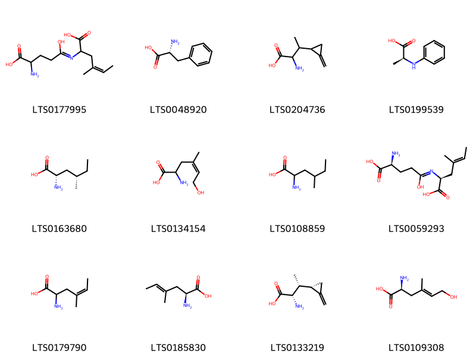{ width=100% }
    <figcaption>Hình ảnh cấu trúc hóa học của 12 hoạt chất thuộc nhóm Carboxylic acids and derivatives gồm ['2-[(4-amino-4-carboxy-1-hydroxybutylidene)amino]-4-methylhex-4-enoic acid (LTS0177995)', 'd-phenylalanine (LTS0048920)', '2-amino-3-(2-methylidenecyclopropyl)butanoic acid (LTS0204736)', '(2s)-2-(phenylamino)propanoic acid (LTS0199539)', '(2s,4s)-2-amino-4-methylhexanoic acid (LTS0163680)', '2-amino-6-hydroxy-4-methylhex-4-enoic acid (LTS0134154)', '2-amino-4-methylhexanoic acid (LTS0108859)', '(2s,4e)-2-{[(4s)-4-amino-4-carboxy-1-hydroxybutylidene]amino}-4-methylhex-4-enoic acid (LTS0059293)', '2-amino-4-methylhex-4-enoic acid (LTS0179790)', '(2s,4e)-2-amino-4-methylhex-4-enoic acid (LTS0185830)', '(2s,3r)-2-amino-3-[(1s)-2-methylidenecyclopropyl]butanoic acid (LTS0133219)', '(2s,4e)-2-amino-6-hydroxy-4-methylhex-4-enoic acid (LTS0109308)'].</figcaption>
</figure>
#### Nhóm Flavonoids
<figure markdown="span">
    { width=100% }
    <figcaption>Hình ảnh cấu trúc hóa học của 2 hoạt chất thuộc nhóm Flavonoids gồm ['catechol (LTS0090912)', 'ent-epicatechin (LTS0265245)'].</figcaption>
</figure>
#### Nhóm Organooxygen compounds
<figure markdown="span">
    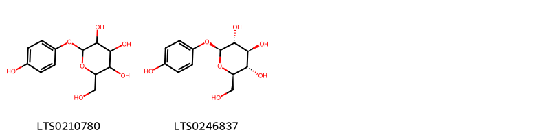{ width=100% }
    <figcaption>Hình ảnh cấu trúc hóa học của 2 hoạt chất thuộc nhóm Organooxygen compounds gồm ['arbutin (LTS0210780)', 'β-arbutin (LTS0246837)'].</figcaption>
</figure>
#### Nhóm Phenols
<figure markdown="span">
    { width=100% }
    <figcaption>Hình ảnh cấu trúc hóa học của 1 hoạt chất thuộc nhóm Phenols gồm ['α-hydroquinone (LTS0063684)'].</figcaption>
</figure>

---

### Dược dân tộc học

Danh sách các quốc gia có sử dụng *Aesculus californica* trong điều trị các bệnh. 

| Country   | Disease   | Bệnh     |
|:----------|:----------|:---------|
| Mexico    | Poison    | Chất độc |

---

---
## Aesculus glabra
### Thông tin về thực vật

!!! info "Phân loại thực vật của *Aesculus glabra* từ GIBF:"
    - **Kingdom:** Plantae
    - **Phylum:** Tracheophyta
    - **Order:** Sapindales
    - **Family:** Sapindaceae
    - **Genus:** Aesculus
    - **Species:** *Aesculus glabra*

 

| Label (VI)   | Label (EN)   | Scientific Name   | Descriptions (VI)   | Descriptions (EN)   | Also Known As (VI)   | Also Known As (EN)                                                                                                                                                                                                                                                   |
|:-------------|:-------------|:------------------|:--------------------|:--------------------|:---------------------|:---------------------------------------------------------------------------------------------------------------------------------------------------------------------------------------------------------------------------------------------------------------------|
| N/A          | N/A          | Aesculus glabra   | loài thực vật       | species of plant    | ['']                 | ['Aesculus pallida', 'Aesculus arguta', 'Aesculus verrucosa', 'Aesculus ochroleuca', 'Aesculus muricata', 'American buckeye', 'fetid buckeye', 'Ohio buckeye', 'Aesculus buckleyi', 'Texas buckeye', 'Aesculus echinata', 'Aesculus rubella', 'Aesculus watsoniana'] |

#### Phân bố trên thế giới

**Từ CSDL GIBF** United States of America, Canada

#### Phân bố tại Việt Nam

**Từ CSDL GIBF**: Không có ghi nhận ở Việt Nam

---
### Thành phần hóa học
        
- Theo cơ sở dữ liệu lotus: Từ loài *Aesculus glabra* đã phân lập và xác định được Chưa có hoạt chất nào được phân lập. hoạt chất thuộc về các nhóm Không có hoạt chất nào được phân lập. 

Không có hình ảnh nào được tạo ra

---

### Dược dân tộc học

Danh sách các quốc gia có sử dụng *Aesculus glabra* trong điều trị các bệnh. 

| Country   | Disease   | Bệnh            |
|:----------|:----------|:----------------|
| French    | Nervine   | Thuốc an thần   |
| German    | Stimulant | Chất kích thích |

---

---
## Aesculus hippocastanum
### Thông tin về thực vật

!!! info "Phân loại thực vật của *Aesculus hippocastanum* từ GIBF:"
    - **Kingdom:** Plantae
    - **Phylum:** Tracheophyta
    - **Order:** Sapindales
    - **Family:** Sapindaceae
    - **Genus:** Aesculus
    - **Species:** *Aesculus hippocastanum*

 

| Label (VI)   | Label (EN)   | Scientific Name        | Descriptions (VI)   | Descriptions (EN)   | Also Known As (VI)   | Also Known As (EN)                                                                                                                                                                                                                                                                    |
|:-------------|:-------------|:-----------------------|:--------------------|:--------------------|:---------------------|:--------------------------------------------------------------------------------------------------------------------------------------------------------------------------------------------------------------------------------------------------------------------------------------|
| N/A          | N/A          | Aesculus hippocastanum | loài thực vật       | species of plant    | ['']                 | ['Aesculus memmingeri', 'Aesculus procera', 'Aesculus septenata', 'Aesculus asplenifolia', 'buckeye', 'common horse chestnut', 'conker tree', 'European horse chestnut', 'European horsechestnut', 'horse chestnut', 'horse chestnut tree', 'horse-chestnut', 'white horse chestnut'] |

#### Phân bố trên thế giới

**Từ CSDL GIBF** Belgium, Norway, Canada, Denmark, Netherlands, Lithuania, Spain, Russian Federation, United States of America, Sweden, Czechia, Germany, Romania, Switzerland, Austria, France, United Kingdom of Great Britain and Northern Ireland, Ireland, Poland, New Zealand

#### Phân bố tại Việt Nam

**Từ CSDL GIBF**: Không có ghi nhận ở Việt Nam

---
### Thành phần hóa học
        
- Theo cơ sở dữ liệu lotus: Từ loài *Aesculus hippocastanum* đã phân lập và xác định được 171 hoạt chất thuộc về các nhóm Fatty Acyls, Flavonoids, Prenol lipids, Steroids and steroid derivatives, Cinnamic acids and derivatives, Benzene and substituted derivatives, Lactones, Organooxygen compounds, Coumarins and derivatives, Carboxylic acids and derivatives. 

|    | chemicalTaxonomyClassyfireClass     |   smiles_count |
|---:|:------------------------------------|---------------:|
|  0 | Benzene and substituted derivatives |              2 |
|  1 | Carboxylic acids and derivatives    |              2 |
|  2 | Cinnamic acids and derivatives      |              1 |
|  3 | Coumarins and derivatives           |              8 |
|  4 | Fatty Acyls                         |             11 |
|  5 | Flavonoids                          |             75 |
|  6 | Lactones                            |              1 |
|  7 | Organooxygen compounds              |              4 |
|  8 | Prenol lipids                       |             56 |
|  9 | Steroids and steroid derivatives    |             10 |

#### Nhóm Benzene and substituted derivatives
<figure markdown="span">
    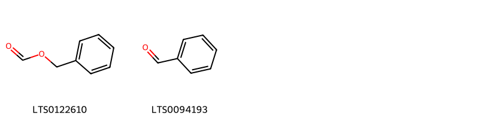{ width=100% }
    <figcaption>Hình ảnh cấu trúc hóa học của 2 hoạt chất thuộc nhóm Benzene and substituted derivatives gồm ['formic acid benzyl ester (LTS0122610)', 'benzaldehyde (LTS0094193)'].</figcaption>
</figure>
#### Nhóm Carboxylic acids and derivatives
<figure markdown="span">
    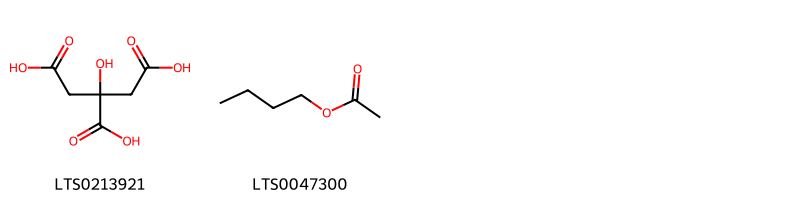{ width=100% }
    <figcaption>Hình ảnh cấu trúc hóa học của 2 hoạt chất thuộc nhóm Carboxylic acids and derivatives gồm ['citric acid (LTS0213921)', 'butyl acetate (LTS0047300)'].</figcaption>
</figure>
#### Nhóm Cinnamic acids and derivatives
<figure markdown="span">
    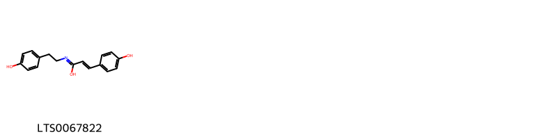{ width=100% }
    <figcaption>Hình ảnh cấu trúc hóa học của 1 hoạt chất thuộc nhóm Cinnamic acids and derivatives gồm ['(2e)-3-(4-hydroxyphenyl)-n-[2-(4-hydroxyphenyl)ethyl]prop-2-enimidic acid (LTS0067822)'].</figcaption>
</figure>
#### Nhóm Coumarins and derivatives
<figure markdown="span">
    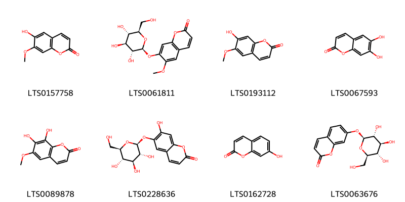{ width=100% }
    <figcaption>Hình ảnh cấu trúc hóa học của 8 hoạt chất thuộc nhóm Coumarins and derivatives gồm ['isoscopoletin (LTS0157758)', 'scopolin (LTS0061811)', 'scopoletin (LTS0193112)', 'esculetin (LTS0067593)', 'fraxetin (LTS0089878)', 'esculin (LTS0228636)', 'umbelliferone (LTS0162728)', 'skimmin (LTS0063676)'].</figcaption>
</figure>
#### Nhóm Fatty Acyls
<figure markdown="span">
    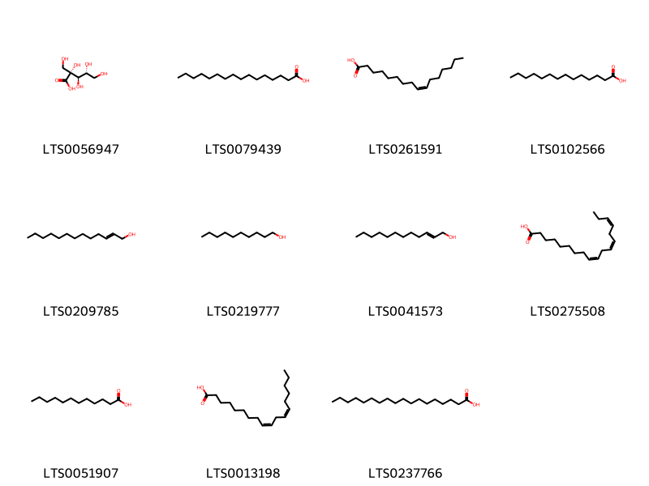{ width=100% }
    <figcaption>Hình ảnh cấu trúc hóa học của 11 hoạt chất thuộc nhóm Fatty Acyls gồm ['2-carboxy-d-arabinitol (LTS0056947)', 'palmitic acid (LTS0079439)', 'palmitoleic acid (LTS0261591)', 'myristic acid (LTS0102566)', 'tridec-2-en-1-ol (LTS0209785)', 'decanol (LTS0219777)', '2-dodecenol (LTS0041573)', 'α-linolenic acid (LTS0275508)', 'lauric acid (LTS0051907)', 'linoleic (LTS0013198)', 'stearic acid (LTS0237766)'].</figcaption>
</figure>
#### Nhóm Flavonoids
<figure markdown="span">
    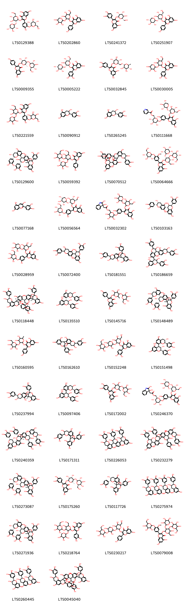{ width=100% }
    <figcaption>Hình ảnh cấu trúc hóa học của 75 hoạt chất thuộc nhóm Flavonoids gồm ['3-{[(2s,3r,4s,5s,6r)-4,5-dihydroxy-6-(hydroxymethyl)-3-{[(2s,3r,4s,5r)-3,4,5-trihydroxyoxan-2-yl]oxy}oxan-2-yl]oxy}-5,7-dihydroxy-2-(4-hydroxy-3-{[(2s,3r,4s,5s,6r)-3,4,5-trihydroxy-6-(hydroxymethyl)oxan-2-yl]oxy}phenyl)chromen-4-one (LTS0129388)', '3-{[4,5-dihydroxy-6-(hydroxymethyl)-3-[(3,4,5-trihydroxyoxan-2-yl)oxy]oxan-2-yl]oxy}-5,7-dihydroxy-2-(4-hydroxyphenyl)chromen-4-one (LTS0202860)', '2-(3,4-dihydroxyphenyl)-5,7-dihydroxy-3-{[(2s,3r,4r,5r,6s)-3,4,5-trihydroxy-6-(hydroxymethyl)oxan-2-yl]oxy}chromen-4-one (LTS0241372)', '3-{[(2s,3r,4s,5s,6r)-4,5-dihydroxy-6-(hydroxymethyl)-3-{[(2s,3r,4s,5r)-3,4,5-trihydroxyoxan-2-yl]oxy}oxan-2-yl]oxy}-5,7-dihydroxy-2-(4-hydroxyphenyl)chromen-4-one (LTS0251907)', 'multiflorin b (LTS0009355)', '3-{[(2s,3r,4s,5s,6r)-4,5-dihydroxy-6-(hydroxymethyl)-3-{[(2s,3r,4s,5r)-3,4,5-trihydroxyoxan-2-yl]oxy}oxan-2-yl]oxy}-2-(3,4-dihydroxyphenyl)-5,7-dihydroxychromen-4-one (LTS0005222)', '3-rutinosyl quercetin (LTS0032845)', '3-{[4,5-dihydroxy-6-(hydroxymethyl)-3-[(3,4,5-trihydroxyoxan-2-yl)oxy]oxan-2-yl]oxy}-2-(3,4-dihydroxyphenyl)-5,7-dihydroxychromen-4-one (LTS0030005)', '3-{[4,5-dihydroxy-6-(hydroxymethyl)-3-[(3,4,5-trihydroxyoxan-2-yl)oxy]oxan-2-yl]oxy}-5,7-dihydroxy-2-(4-hydroxy-3-{[3,4,5-trihydroxy-6-(hydroxymethyl)oxan-2-yl]oxy}phenyl)chromen-4-one (LTS0221559)', 'catechol (LTS0090912)', 'ent-epicatechin (LTS0265245)', '[(2r,3s,4s,5r,6s)-6-[5-(3-{[(2s,3r,4s,5s,6r)-4,5-dihydroxy-6-(hydroxymethyl)-3-{[(2s,3r,4s,5r)-3,4,5-trihydroxyoxan-2-yl]oxy}oxan-2-yl]oxy}-5,7-dihydroxy-4-oxochromen-2-yl)-2-hydroxyphenoxy]-3,4,5-trihydroxyoxan-2-yl]methyl pyridine-3-carboxylate (LTS0111668)', '(1r,5r,6s,7s,13s,21r)-5,13-bis(3,4-dihydroxyphenyl)-7-[(2r,3r)-2-(3,4-dihydroxyphenyl)-3,5,7-trihydroxy-3,4-dihydro-2h-1-benzopyran-8-yl]-4,12,14-trioxapentacyclo[11.7.1.0²,¹¹.0³,⁸.0¹⁵,²⁰]henicosa-2,8,10,15,17,19-hexaene-6,9,17,19,21-pentol (LTS0129600)', '5,7-dihydroxy-3-{[5-hydroxy-6-(hydroxymethyl)-4-{[3,4,5-trihydroxy-6-(hydroxymethyl)oxan-2-yl]oxy}-3-[(3,4,5-trihydroxyoxan-2-yl)oxy]oxan-2-yl]oxy}-2-(4-hydroxyphenyl)chromen-4-one (LTS0059392)', '5,13-bis(3,4-dihydroxyphenyl)-16-[2-(3,4-dihydroxyphenyl)-3,5,7-trihydroxy-3,4-dihydro-2h-1-benzopyran-4-yl]-4,12,14-trioxapentacyclo[11.7.1.0²,¹¹.0³,⁸.0¹⁵,²⁰]henicosa-2,8,10,15(20),16,18-hexaene-6,9,17,19,21-pentol (LTS0070512)', '5,7-dihydroxy-3-{[(2s,3r,4s,5r,6r)-5-hydroxy-6-(hydroxymethyl)-4-{[(2s,3r,4s,5s,6r)-3,4,5-trihydroxy-6-(hydroxymethyl)oxan-2-yl]oxy}-3-{[(2s,3r,4s,5r)-3,4,5-trihydroxyoxan-2-yl]oxy}oxan-2-yl]oxy}-2-(3-methoxy-4-{[(2s,3r,4s,5s,6r)-3,4,5-trihydroxy-6-(hydroxymethyl)oxan-2-yl]oxy}phenyl)chromen-4-one (LTS0064666)', 'cyanidin (LTS0077168)', '3-{[(2s,3r,4s,5s,6r)-4,5-dihydroxy-6-(hydroxymethyl)-3-{[(2s,3r,4s,5r)-3,4,5-trihydroxyoxan-2-yl]oxy}oxan-2-yl]oxy}-5,7-dihydroxy-2-(3-hydroxy-4-{[(2s,3r,4s,5s,6r)-3,4,5-trihydroxy-6-(hydroxymethyl)oxan-2-yl]oxy}phenyl)chromen-4-one (LTS0056564)', '{6-[5-(3-{[4,5-dihydroxy-6-(hydroxymethyl)-3-[(3,4,5-trihydroxyoxan-2-yl)oxy]oxan-2-yl]oxy}-5,7-dihydroxy-4-oxochromen-2-yl)-2-hydroxyphenoxy]-3,4,5-trihydroxyoxan-2-yl}methyl 2-(2,3-dihydroxyindol-3-yl)acetate (LTS0032302)', '(2r,3r,4s)-2-(3,4-dihydroxyphenyl)-4-[(2r,3r)-2-(3,4-dihydroxyphenyl)-3,5,7-trihydroxy-3,4-dihydro-2h-1-benzopyran-6-yl]-3,4-dihydro-2h-1-benzopyran-3,5,7-triol (LTS0103163)', '3-{[4,5-dihydroxy-6-(hydroxymethyl)-3-[(3,4,5-trihydroxyoxan-2-yl)oxy]oxan-2-yl]oxy}-5,7-dihydroxy-2-(3-hydroxy-4-{[3,4,5-trihydroxy-6-(hydroxymethyl)oxan-2-yl]oxy}phenyl)chromen-4-one (LTS0028959)', '2-(3,4-dihydroxyphenyl)-4-[2-(3,4-dihydroxyphenyl)-3,5,7-trihydroxy-3,4-dihydro-2h-1-benzopyran-6-yl]-3,4-dihydro-2h-1-benzopyran-3,5,7-triol (LTS0072400)', '7,13-bis(3,4-dihydroxyphenyl)-8,12,14-trioxapentacyclo[11.7.1.0²,¹¹.0⁴,⁹.0¹⁵,²⁰]henicosa-2,4(9),10,15,17,19-hexaene-3,6,17,19,21-pentol (LTS0181551)', '2-(3,4-dihydroxyphenyl)-6-[2-(3,4-dihydroxyphenyl)-3,5,7-trihydroxy-3,4-dihydro-2h-1-benzopyran-4-yl]-4-[2-(3,4-dihydroxyphenyl)-3,5,7-trihydroxy-3,4-dihydro-2h-1-benzopyran-6-yl]-3,4-dihydro-2h-1-benzopyran-3,5,7-triol (LTS0186659)', '(1r,5r,6r,7r,13s,21r)-7-[(1r,5r,6r,13r,21r)-5,13-bis(3,4-dihydroxyphenyl)-6,9,17,19,21-pentahydroxy-4,12,14-trioxapentacyclo[11.7.1.0²,¹¹.0³,⁸.0¹⁵,²⁰]henicosa-2,8,10,15(20),16,18-hexaen-16-yl]-5,13-bis(3,4-dihydroxyphenyl)-4,12,14-trioxapentacyclo[11.7.1.0²,¹¹.0³,⁸.0¹⁵,²⁰]henicosa-2,8,10,15,17,19-hexaene-6,9,17,19,21-pentol (LTS0118448)', '(2r,3r,4r)-2-(3,4-dihydroxyphenyl)-4-[(2r,3r)-2-(3,4-dihydroxyphenyl)-3,5,7-trihydroxy-3,4-dihydro-2h-1-benzopyran-8-yl]-3,4-dihydro-2h-1-benzopyran-3,5,7-triol (LTS0135510)', '3-[(3,4-dihydroxy-6-methyl-5-{[3,4,5-trihydroxy-6-(hydroxymethyl)oxan-2-yl]oxy}oxan-2-yl)oxy]-5,7-dihydroxy-2-(4-hydroxyphenyl)chromen-4-one (LTS0145716)', '(1r,5r,6r,7r,13s,21r)-5,13-bis(3,4-dihydroxyphenyl)-7-[(2s,3s)-2-(3,4-dihydroxyphenyl)-3,5,7-trihydroxy-3,4-dihydro-2h-1-benzopyran-8-yl]-4,12,14-trioxapentacyclo[11.7.1.0²,¹¹.0³,⁸.0¹⁵,²⁰]henicosa-2,8,10,15,17,19-hexaene-6,9,17,19,21-pentol (LTS0148489)', '3-[(4,5-dihydroxy-6-methyl-3-{[3,4,5-trihydroxy-6-(hydroxymethyl)oxan-2-yl]oxy}oxan-2-yl)oxy]-5,7-dihydroxy-2-(4-hydroxyphenyl)chromen-4-one (LTS0160595)', '7,13-bis(3,4-dihydroxyphenyl)-6,12,14-trioxapentacyclo[11.7.1.0²,¹¹.0⁵,¹⁰.0¹⁵,²⁰]henicosa-2,4,10,15,17,19-hexaene-3,8,17,19,21-pentol (LTS0162610)', '3-({3-[(3,5-dihydroxy-4-{[3,4,5-trihydroxy-6-(hydroxymethyl)oxan-2-yl]oxy}oxan-2-yl)oxy]-4,5-dihydroxy-6-(hydroxymethyl)oxan-2-yl}oxy)-2-(3,4-dihydroxyphenyl)-5,7-dihydroxychromen-4-one (LTS0152248)', '(2r,3s,4s)-2-(3,4-dihydroxyphenyl)-4-[(2r,3s)-2-(3,4-dihydroxyphenyl)-3,5,7-trihydroxy-3,4-dihydro-2h-1-benzopyran-8-yl]-3,4-dihydro-2h-1-benzopyran-3,5,7-triol (LTS0151498)', '(1r,6r,7r,13s,21r)-7,13-bis(3,4-dihydroxyphenyl)-8,12,14-trioxapentacyclo[11.7.1.0²,¹¹.0⁴,⁹.0¹⁵,²⁰]henicosa-2,4(9),10,15,17,19-hexaene-3,6,17,19,21-pentol (LTS0237994)', '(2r,3r)-2-(3,4-dihydroxyphenyl)-4-[(2r,3r)-2-(3,4-dihydroxyphenyl)-3,5,7-trihydroxy-3,4-dihydro-2h-1-benzopyran-8-yl]-3,4-dihydro-2h-1-benzopyran-3,5,7-triol (LTS0097406)', '3-[(3,4-dihydroxy-6-methyl-5-{[3,4,5-trihydroxy-6-(hydroxymethyl)oxan-2-yl]oxy}oxan-2-yl)oxy]-2-(3,4-dihydroxyphenyl)-5,7-dihydroxychromen-4-one (LTS0172002)', '[(2r,3s,4s,5r,6s)-6-[5-(3-{[(2s,3r,4s,5s,6r)-4,5-dihydroxy-6-(hydroxymethyl)-3-{[(2s,3r,4s,5r)-3,4,5-trihydroxyoxan-2-yl]oxy}oxan-2-yl]oxy}-5,7-dihydroxy-4-oxochromen-2-yl)-2-hydroxyphenoxy]-3,4,5-trihydroxyoxan-2-yl]methyl 2-[(3s)-2,3-dihydroxyindol-3-yl]acetate (LTS0246370)', 'cinnamtannin b2 (LTS0240359)', 'procyanidin a1 (LTS0171311)', 'procyanidin c2 (LTS0226053)', '5,13-bis(3,4-dihydroxyphenyl)-16-[2-(3,4-dihydroxyphenyl)-3,5,7-trihydroxy-3,4-dihydro-2h-1-benzopyran-4-yl]-7-[2-(3,4-dihydroxyphenyl)-3,5,7-trihydroxy-3,4-dihydro-2h-1-benzopyran-8-yl]-4,12,14-trioxapentacyclo[11.7.1.0²,¹¹.0³,⁸.0¹⁵,²⁰]henicosa-2,8,10,15(20),16,18-hexaene-6,9,17,19,21-pentol (LTS0232279)', 'cinnamtannin b1 (LTS0273087)', '3-{[(2s,3r,4s,5r,6s)-3,4-dihydroxy-6-methyl-5-{[(2s,3r,4s,5r,6r)-3,4,5-trihydroxy-6-(hydroxymethyl)oxan-2-yl]oxy}oxan-2-yl]oxy}-2-(3,4-dihydroxyphenyl)-5,7-dihydroxychromen-4-one (LTS0175260)', 'proanthocyanidin a2 (LTS0117726)', '(2r,3r,4r)-2-(3,4-dihydroxyphenyl)-8-[(2r,3r,4r)-2-(3,4-dihydroxyphenyl)-3,5,7-trihydroxy-3,4-dihydro-2h-1-benzopyran-4-yl]-4-[(2r,3r,4s)-2-(3,4-dihydroxyphenyl)-4-[(2r,3r)-2-(3,4-dihydroxyphenyl)-3,5,7-trihydroxy-3,4-dihydro-2h-1-benzopyran-8-yl]-3,5,7-trihydroxy-3,4-dihydro-2h-1-benzopyran-8-yl]-3,4-dihydro-2h-1-benzopyran-3,5,7-triol (LTS0275974)', '(1r,5s,6r,7s,13s,21r)-5,13-bis(3,4-dihydroxyphenyl)-7-[(2r,3r)-2-(3,4-dihydroxyphenyl)-3,5,7-trihydroxy-3,4-dihydro-2h-1-benzopyran-8-yl]-4,12,14-trioxapentacyclo[11.7.1.0²,¹¹.0³,⁸.0¹⁵,²⁰]henicosa-2,8,10,15,17,19-hexaene-6,9,17,19,21-pentol (LTS0271936)', '2-(3,4-dihydroxyphenyl)-5,7-dihydroxy-3-{[5-hydroxy-6-(hydroxymethyl)-4-{[3,4,5-trihydroxy-6-(hydroxymethyl)oxan-2-yl]oxy}-3-[(3,4,5-trihydroxyoxan-2-yl)oxy]oxan-2-yl]oxy}chromen-4-one (LTS0218764)', '3-({3-[(3,5-dihydroxy-4-{[3,4,5-trihydroxy-6-(hydroxymethyl)oxan-2-yl]oxy}oxan-2-yl)oxy]-4,5-dihydroxy-6-(hydroxymethyl)oxan-2-yl}oxy)-5,7-dihydroxy-2-(4-hydroxyphenyl)chromen-4-one (LTS0230217)', '5,7-dihydroxy-3-{[5-hydroxy-6-(hydroxymethyl)-4-{[3,4,5-trihydroxy-6-(hydroxymethyl)oxan-2-yl]oxy}-3-[(3,4,5-trihydroxyoxan-2-yl)oxy]oxan-2-yl]oxy}-2-(3-methoxy-4-{[3,4,5-trihydroxy-6-(hydroxymethyl)oxan-2-yl]oxy}phenyl)chromen-4-one (LTS0079008)', 'procyanidin c1 (LTS0260445)', '7-[5,13-bis(3,4-dihydroxyphenyl)-6,9,17,19,21-pentahydroxy-4,12,14-trioxapentacyclo[11.7.1.0²,¹¹.0³,⁸.0¹⁵,²⁰]henicosa-2,8,10,15(20),16,18-hexaen-16-yl]-5,13-bis(3,4-dihydroxyphenyl)-4,12,14-trioxapentacyclo[11.7.1.0²,¹¹.0³,⁸.0¹⁵,²⁰]henicosa-2,8,10,15,17,19-hexaene-6,9,17,19,21-pentol (LTS0045040)', '5,13-bis(3,4-dihydroxyphenyl)-7-[2-(3,4-dihydroxyphenyl)-4-[2-(3,4-dihydroxyphenyl)-3,5,7-trihydroxy-3,4-dihydro-2h-1-benzopyran-8-yl]-3,5,7-trihydroxy-3,4-dihydro-2h-1-benzopyran-8-yl]-4,12,14-trioxapentacyclo[11.7.1.0²,¹¹.0³,⁸.0¹⁵,²⁰]henicosa-2,8,10,15,17,19-hexaene-6,9,17,19,21-pentol (LTS0226552)', '2-(3,4-dihydroxyphenyl)-4-[2-(3,4-dihydroxyphenyl)-3,5,7-trihydroxy-3,4-dihydro-2h-1-benzopyran-8-yl]-3,4-dihydro-2h-1-benzopyran-3,5,7-triol (LTS0040252)', '5,7-dihydroxy-2-(4-hydroxy-3-methoxyphenyl)-3-{[(2s,3r,4s,5r,6r)-5-hydroxy-6-(hydroxymethyl)-4-{[(2s,3r,4s,5s,6r)-3,4,5-trihydroxy-6-(hydroxymethyl)oxan-2-yl]oxy}-3-{[(2s,3r,4s,5r)-3,4,5-trihydroxyoxan-2-yl]oxy}oxan-2-yl]oxy}chromen-4-one (LTS0164253)', '{6-[5-(3-{[4,5-dihydroxy-6-(hydroxymethyl)-3-[(3,4,5-trihydroxyoxan-2-yl)oxy]oxan-2-yl]oxy}-5,7-dihydroxy-4-oxochromen-2-yl)-2-hydroxyphenoxy]-3,4,5-trihydroxyoxan-2-yl}methyl pyridine-3-carboxylate (LTS0167067)', '5,13-bis(3,4-dihydroxyphenyl)-7-[2-(3,4-dihydroxyphenyl)-3,5,7-trihydroxy-3,4-dihydro-2h-1-benzopyran-8-yl]-4,12,14-trioxapentacyclo[11.7.1.0²,¹¹.0³,⁸.0¹⁵,²⁰]henicosa-2,8,10,15,17,19-hexaene-6,9,17,19,21-pentol (LTS0027601)', '3-{[(2s,3s,4s,5s,6r)-4,5-dihydroxy-6-methyl-3-{[(2s,3r,4s,5s,6r)-3,4,5-trihydroxy-6-(hydroxymethyl)oxan-2-yl]oxy}oxan-2-yl]oxy}-2-(3,4-dihydroxyphenyl)-5,7-dihydroxychromen-4-one (LTS0240918)', '5,7-dihydroxy-2-(4-hydroxy-3-methoxyphenyl)-3-{[5-hydroxy-6-(hydroxymethyl)-4-{[3,4,5-trihydroxy-6-(hydroxymethyl)oxan-2-yl]oxy}-3-[(3,4,5-trihydroxyoxan-2-yl)oxy]oxan-2-yl]oxy}chromen-4-one (LTS0166447)', '(2r,3r,4s)-2-(3,4-dihydroxyphenyl)-6-[(2r,3r,4s)-2-(3,4-dihydroxyphenyl)-3,5,7-trihydroxy-3,4-dihydro-2h-1-benzopyran-4-yl]-4-[(2r,3r)-2-(3,4-dihydroxyphenyl)-3,5,7-trihydroxy-3,4-dihydro-2h-1-benzopyran-6-yl]-3,4-dihydro-2h-1-benzopyran-3,5,7-triol (LTS0256268)', '(1r,5r,6r,13r,21r)-5,13-bis(3,4-dihydroxyphenyl)-16-[(2r,3r,4s)-2-(3,4-dihydroxyphenyl)-3,5,7-trihydroxy-3,4-dihydro-2h-1-benzopyran-4-yl]-4,12,14-trioxapentacyclo[11.7.1.0²,¹¹.0³,⁸.0¹⁵,²⁰]henicosa-2,8,10,15(20),16,18-hexaene-6,9,17,19,21-pentol (LTS0128705)', '(2r,3r,4s)-2-(3,4-dihydroxyphenyl)-6-[(2r,3r,4r)-2-(3,4-dihydroxyphenyl)-3,5,7-trihydroxy-3,4-dihydro-2h-1-benzopyran-4-yl]-4-[(2r,3s)-2-(3,4-dihydroxyphenyl)-3,5,7-trihydroxy-3,4-dihydro-2h-1-benzopyran-6-yl]-3,4-dihydro-2h-1-benzopyran-3,5,7-triol (LTS0268522)', '(1s,5s,6r,7s,13r,21r)-5,13-bis(3,4-dihydroxyphenyl)-7-[(2r,3r,4s)-2-(3,4-dihydroxyphenyl)-4-[(2r,3r)-2-(3,4-dihydroxyphenyl)-3,5,7-trihydroxy-3,4-dihydro-2h-1-benzopyran-8-yl]-3,5,7-trihydroxy-3,4-dihydro-2h-1-benzopyran-8-yl]-4,12,14-trioxapentacyclo[11.7.1.0²,¹¹.0³,⁸.0¹⁵,²⁰]henicosa-2,8,10,15,17,19-hexaene-6,9,17,19,21-pentol (LTS0127996)', '(1r,5s,6r,7s,13s,21r)-5,13-bis(3,4-dihydroxyphenyl)-7-[(2r,3r,4s)-2-(3,4-dihydroxyphenyl)-4-[(2r,3r)-2-(3,4-dihydroxyphenyl)-3,5,7-trihydroxy-3,4-dihydro-2h-1-benzopyran-8-yl]-3,5,7-trihydroxy-3,4-dihydro-2h-1-benzopyran-8-yl]-4,12,14-trioxapentacyclo[11.7.1.0²,¹¹.0³,⁸.0¹⁵,²⁰]henicosa-2,8,10,15,17,19-hexaene-6,9,17,19,21-pentol (LTS0052582)', '5,7-dihydroxy-3-{[(2s,3r,4s,5r,6r)-5-hydroxy-6-(hydroxymethyl)-4-{[(2s,3r,4s,5s,6r)-3,4,5-trihydroxy-6-(hydroxymethyl)oxan-2-yl]oxy}-3-{[(2s,3r,4s,5r)-3,4,5-trihydroxyoxan-2-yl]oxy}oxan-2-yl]oxy}-2-(4-hydroxyphenyl)chromen-4-one (LTS0262928)', '3-{[(2s,3s,4s,5s,6r)-4,5-dihydroxy-6-methyl-3-{[(2s,3r,4s,5s,6r)-3,4,5-trihydroxy-6-(hydroxymethyl)oxan-2-yl]oxy}oxan-2-yl]oxy}-5,7-dihydroxy-2-(4-hydroxyphenyl)chromen-4-one (LTS0269722)', '3-{[(2s,3r,4s,5s,6r)-3-{[(2s,3r,4s,5r)-3,5-dihydroxy-4-{[(2s,3r,4s,5s,6r)-3,4,5-trihydroxy-6-(hydroxymethyl)oxan-2-yl]oxy}oxan-2-yl]oxy}-4,5-dihydroxy-6-(hydroxymethyl)oxan-2-yl]oxy}-2-(3,4-dihydroxyphenyl)-5,7-dihydroxychromen-4-one (LTS0015258)', '(1s,7r,8r,21r)-7,13-bis(3,4-dihydroxyphenyl)-6,12,14-trioxapentacyclo[11.7.1.0²,¹¹.0⁵,¹⁰.0¹⁵,²⁰]henicosa-2,4,10,15,17,19-hexaene-3,8,17,19,21-pentol (LTS0011301)', '(7s,19r,26r,27r,31r,32r)-7,19,27-tris(3,4-dihydroxyphenyl)-6,8,18,20,28-pentaoxaoctacyclo[17.11.1.1⁷,¹⁵.0²,¹⁷.0⁵,¹⁶.0⁹,¹⁴.0²¹,³⁰.0²⁴,²⁹]dotriaconta-2,4,9,11,13,16,21,23,29-nonaene-3,11,13,23,26,31,32-heptol (LTS0002503)', '(1r,5s,6r,13s,21r)-5,13-bis(3,4-dihydroxyphenyl)-4,12,14-trioxapentacyclo[11.7.1.0²,¹¹.0³,⁸.0¹⁵,²⁰]henicosa-2,8,10,15,17,19-hexaene-6,9,17,19,21-pentol (LTS0004216)', '(1r,5s,6r,7r,13s,21r)-5,13-bis(3,4-dihydroxyphenyl)-7-[(2r,3s)-2-(3,4-dihydroxyphenyl)-3,5,7-trihydroxy-3,4-dihydro-2h-1-benzopyran-8-yl]-4,12,14-trioxapentacyclo[11.7.1.0²,¹¹.0³,⁸.0¹⁵,²⁰]henicosa-2,8,10,15,17,19-hexaene-6,9,17,19,21-pentol (LTS0109091)', '2-(3,4-dihydroxyphenyl)-5,7-dihydroxy-3-{[(2s,3r,4s,5r,6r)-5-hydroxy-6-(hydroxymethyl)-4-{[(2s,3r,4s,5s,6r)-3,4,5-trihydroxy-6-(hydroxymethyl)oxan-2-yl]oxy}-3-{[(2s,3r,4s,5r)-3,4,5-trihydroxyoxan-2-yl]oxy}oxan-2-yl]oxy}chromen-4-one (LTS0248245)', 'kaempferitrin (LTS0269109)', '(1r,5r,6r,7s,13s,21r)-5,13-bis(3,4-dihydroxyphenyl)-7-[(2r,3r,4s)-2-(3,4-dihydroxyphenyl)-4-[(2r,3r)-2-(3,4-dihydroxyphenyl)-3,5,7-trihydroxy-3,4-dihydro-2h-1-benzopyran-8-yl]-3,5,7-trihydroxy-3,4-dihydro-2h-1-benzopyran-8-yl]-4,12,14-trioxapentacyclo[11.7.1.0²,¹¹.0³,⁸.0¹⁵,²⁰]henicosa-2,8,10,15,17,19-hexaene-6,9,17,19,21-pentol (LTS0086673)', '3-[(4,5-dihydroxy-6-methyl-3-{[3,4,5-trihydroxy-6-(hydroxymethyl)oxan-2-yl]oxy}oxan-2-yl)oxy]-2-(3,4-dihydroxyphenyl)-5,7-dihydroxychromen-4-one (LTS0045911)', '(1r,5r,6r,13r,21r)-5,13-bis(3,4-dihydroxyphenyl)-16-[(2r,3r,4r)-2-(3,4-dihydroxyphenyl)-3,5,7-trihydroxy-3,4-dihydro-2h-1-benzopyran-4-yl]-4,12,14-trioxapentacyclo[11.7.1.0²,¹¹.0³,⁸.0¹⁵,²⁰]henicosa-2,8,10,15(20),16,18-hexaene-6,9,17,19,21-pentol (LTS0264769)', '3-{[(2s,3r,4s,5s,6r)-3-{[(2s,3r,4s,5r)-3,5-dihydroxy-4-{[(2s,3r,4s,5s,6r)-3,4,5-trihydroxy-6-(hydroxymethyl)oxan-2-yl]oxy}oxan-2-yl]oxy}-4,5-dihydroxy-6-(hydroxymethyl)oxan-2-yl]oxy}-5,7-dihydroxy-2-(4-hydroxyphenyl)chromen-4-one (LTS0255414)'].</figcaption>
</figure>
#### Nhóm Lactones
<figure markdown="span">
    { width=100% }
    <figcaption>Hình ảnh cấu trúc hóa học của 1 hoạt chất thuộc nhóm Lactones gồm ['4-butyrolactone (LTS0099429)'].</figcaption>
</figure>
#### Nhóm Organooxygen compounds
<figure markdown="span">
    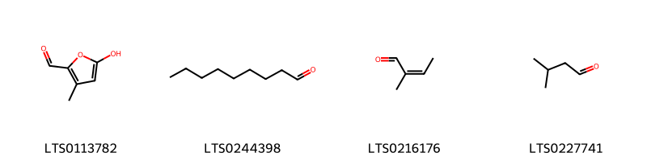{ width=100% }
    <figcaption>Hình ảnh cấu trúc hóa học của 4 hoạt chất thuộc nhóm Organooxygen compounds gồm ['5-hydroxy-3-methylfuran-2-carbaldehyde (LTS0113782)', 'nonanal (LTS0244398)', '2-butenal, 2-methyl- (LTS0216176)', 'isovaleraldehyde (LTS0227741)'].</figcaption>
</figure>
#### Nhóm Prenol lipids
<figure markdown="span">
    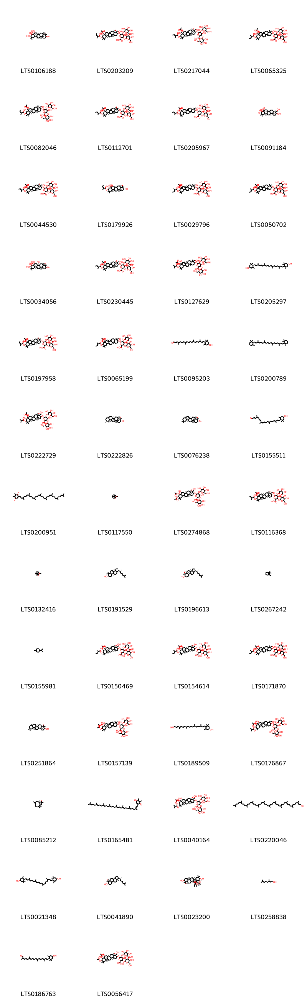{ width=100% }
    <figcaption>Hình ảnh cấu trúc hóa học của 56 hoạt chất thuộc nhóm Prenol lipids gồm ['theasapogenol b (LTS0106188)', 'β-escin (LTS0203209)', 'isoescin ia (LTS0217044)', '6-({8a-[(acetyloxy)methyl]-8,9-dihydroxy-4-(hydroxymethyl)-4,6a,6b,11,11,14b-hexamethyl-10-[(2-methylbut-2-enoyl)oxy]-1,2,3,4a,5,6,7,8,9,10,12,12a,14,14a-tetradecahydropicen-3-yl}oxy)-4-hydroxy-3,5-bis({[3,4,5-trihydroxy-6-(hydroxymethyl)oxan-2-yl]oxy})oxane-2-carboxylic acid (LTS0065325)', 'isoescin ib (LTS0082046)', '(2s,3s,4s,5r,6r)-6-{[(3s,4ar,6ar,6bs,8r,8ar,9r,10r,12as,14ar,14br)-9-(acetyloxy)-8-hydroxy-8a-(hydroxymethyl)-4,4,6a,6b,11,11,14b-heptamethyl-10-{[(2e)-2-methylbut-2-enoyl]oxy}-1,2,3,4a,5,6,7,8,9,10,12,12a,14,14a-tetradecahydropicen-3-yl]oxy}-4-hydroxy-5-{[(2s,3r,4s,5r,6r)-3,4,5-trihydroxy-6-(hydroxymethyl)oxan-2-yl]oxy}-3-{[(2s,3r,4s,5s,6r)-3,4,5-trihydroxy-6-(hydroxymethyl)oxan-2-yl]oxy}oxane-2-carboxylic acid (LTS0112701)', '(2s,3s,4s,5r,6r)-6-{[(4s,6bs,8r,9r)-9-(acetyloxy)-8-hydroxy-4,8a-bis(hydroxymethyl)-4,6a,6b,11,11,14b-hexamethyl-10-{[(2e)-2-methylbut-2-enoyl]oxy}-1,2,3,4a,5,6,7,8,9,10,12,12a,14,14a-tetradecahydropicen-3-yl]oxy}-4-hydroxy-5-{[(2r,3r,4s,5s,6r)-3,4,5-trihydroxy-6-(hydroxymethyl)oxan-2-yl]oxy}-3-{[(2s,3r,4s,5s,6r)-3,4,5-trihydroxy-6-(hydroxymethyl)oxan-2-yl]oxy}oxane-2-carboxylic acid (LTS0205967)', '(3r,4r,4ar,5r,6as,6br,9s,10s,12ar,12br,14br)-4a,9-bis(hydroxymethyl)-2,2,6a,6b,9,12a-hexamethyl-1,3,4,5,6,7,8,8a,10,11,12,12b,13,14b-tetradecahydropicene-3,4,5,10-tetrol (LTS0091184)', '(2s,3s,4s,5r)-6-{[(3s,4s,4ar,6ar,6bs,8r,8ar,9r,10r,12as,14ar,14br)-9-(acetyloxy)-8-hydroxy-4,8a-bis(hydroxymethyl)-4,6a,6b,11,11,14b-hexamethyl-10-{[(2e)-2-methylbut-2-enoyl]oxy}-1,2,3,4a,5,6,7,8,9,10,12,12a,14,14a-tetradecahydropicen-3-yl]oxy}-4-hydroxy-3,5-bis({[(2s,3r,4s,5s,6r)-3,4,5-trihydroxy-6-(hydroxymethyl)oxan-2-yl]oxy})oxane-2-carboxylic acid (LTS0044530)', '(3r,4r,4ar,5r,6as,6br,8ar,10s,12ar,12br,14bs)-4,5,10-trihydroxy-4a-(hydroxymethyl)-2,2,6a,6b,9,9,12a-heptamethyl-1,3,4,5,6,7,8,8a,10,11,12,12b,13,14b-tetradecahydropicen-3-yl (2z)-2-methylbut-2-enoate (LTS0179926)', 'aescin (LTS0029796)', '6-{[9-(acetyloxy)-8-hydroxy-8a-(hydroxymethyl)-4,4,6a,6b,11,11,14b-heptamethyl-10-[(2-methylbut-2-enoyl)oxy]-1,2,3,4a,5,6,7,8,9,10,12,12a,14,14a-tetradecahydropicen-3-yl]oxy}-4-hydroxy-3,5-bis({[3,4,5-trihydroxy-6-(hydroxymethyl)oxan-2-yl]oxy})oxane-2-carboxylic acid (LTS0050702)', '(3r,4r,4as,5s,6r,6as,6br,8ar,10s,12ar,12br,14bs)-4a-(hydroxymethyl)-2,2,6a,6b,9,9,12a-heptamethyl-1,3,4,5,6,7,8,8a,10,11,12,12b,13,14b-tetradecahydropicene-3,4,5,6,10-pentol (LTS0034056)', 'α-escin (LTS0230445)', '6-({8a-[(acetyloxy)methyl]-8,9-dihydroxy-4-(hydroxymethyl)-4,6a,6b,11,11,14b-hexamethyl-10-[(2-methylpropanoyl)oxy]-1,2,3,4a,5,6,7,8,9,10,12,12a,14,14a-tetradecahydropicen-3-yl}oxy)-4-hydroxy-3,5-bis({[3,4,5-trihydroxy-6-(hydroxymethyl)oxan-2-yl]oxy})oxane-2-carboxylic acid (LTS0127629)', 'carotenoid (LTS0205297)', '(2s,3s,4s,5r,6r)-6-{[(3s,4ar,6ar,6bs,8r,8ar,9r,10r,12as,14ar,14br)-9-(acetyloxy)-8-hydroxy-8a-(hydroxymethyl)-4,4,6a,6b,11,11,14b-heptamethyl-10-{[(2z)-2-methylbut-2-enoyl]oxy}-1,2,3,4a,5,6,7,8,9,10,12,12a,14,14a-tetradecahydropicen-3-yl]oxy}-4-hydroxy-5-{[(2s,3r,4s,5r,6r)-3,4,5-trihydroxy-6-(hydroxymethyl)oxan-2-yl]oxy}-3-{[(2s,3r,4s,5s,6r)-3,4,5-trihydroxy-6-(hydroxymethyl)oxan-2-yl]oxy}oxane-2-carboxylic acid (LTS0197958)', '6-{[9-(acetyloxy)-8-hydroxy-4,8a-bis(hydroxymethyl)-4,6a,6b,11,11,14b-hexamethyl-10-[(2-methylbut-2-enoyl)oxy]-1,2,3,4a,5,6,7,8,9,10,12,12a,14,14a-tetradecahydropicen-3-yl]oxy}-4-hydroxy-3-{[3,4,5-trihydroxy-6-(hydroxymethyl)oxan-2-yl]oxy}-5-[(3,4,5-trihydroxyoxan-2-yl)oxy]oxane-2-carboxylic acid (LTS0065199)', '(2e,4e,6e,8e,10e,12e,14e,16e,18e)-19-[(4r)-4-hydroxy-2,6,6-trimethylcyclohex-1-en-1-yl]-4,8,13,17-tetramethylnonadeca-2,4,6,8,10,12,14,16,18-nonaenal (LTS0095203)', '(+)-α-carotene (LTS0200789)', '(2s,3s,4s,5r,6r)-6-{[(3s,4s,4ar,6ar,6bs,8r,8ar,9r,10r,12as,14ar,14br)-8a-[(acetyloxy)methyl]-8,9-dihydroxy-4-(hydroxymethyl)-4,6a,6b,11,11,14b-hexamethyl-10-[(2-methylpropanoyl)oxy]-1,2,3,4a,5,6,7,8,9,10,12,12a,14,14a-tetradecahydropicen-3-yl]oxy}-4-hydroxy-3,5-bis({[(2s,3r,4s,5s,6r)-3,4,5-trihydroxy-6-(hydroxymethyl)oxan-2-yl]oxy})oxane-2-carboxylic acid (LTS0222729)', 'amyrin (LTS0222826)', 'alnulin (LTS0076238)', '(10e,12e,14e,16e,18e)-19-(4-hydroxy-2,6,6-trimethylcyclohex-1-en-1-yl)-4,8,13,17-tetramethylnonadeca-2,4,6,8,10,12,14,16,18-nonaenal (LTS0155511)', '2,3-dimethyl-5-(3,7,11,15,19,23,27,31-octamethyldotriaconta-2,6,10,14,18,22,26,30-octaen-1-yl)cyclohexa-2,5-diene-1,4-dione (LTS0200951)', 'β-pinene (LTS0117550)', '(2s,3s,4s,5r,6r)-6-{[(3s,4s,4ar,6ar,6bs,8r,8ar,9s,10r,12as,14ar,14br)-9,10-bis(acetyloxy)-8-hydroxy-4-(hydroxymethyl)-8a-methoxy-4,6a,6b,11,11,14b-hexamethyl-1,2,3,4a,5,6,7,8,9,10,12,12a,14,14a-tetradecahydropicen-3-yl]oxy}-4-hydroxy-3,5-bis({[(2s,3r,4s,5s,6r)-3,4,5-trihydroxy-6-(hydroxymethyl)oxan-2-yl]oxy})oxane-2-carboxylic acid (LTS0274868)', '(2s,3s,4s,5r,6r)-6-{[(3s,4s,4ar,6ar,6bs,8r,8ar,9r,10r,12as,14ar,14br)-9-(acetyloxy)-8-hydroxy-4,8a-bis(hydroxymethyl)-4,6a,6b,11,11,14b-hexamethyl-10-{[(2e)-2-methylbut-2-enoyl]oxy}-1,2,3,4a,5,6,7,8,9,10,12,12a,14,14a-tetradecahydropicen-3-yl]oxy}-4-hydroxy-3-{[(2s,3r,4s,5s,6r)-3,4,5-trihydroxy-6-(hydroxymethyl)oxan-2-yl]oxy}-5-{[(2s,3r,4s,5r)-3,4,5-trihydroxyoxan-2-yl]oxy}oxane-2-carboxylic acid (LTS0116368)', 'α pinene (LTS0132416)', '(1r,3ar,7s,9ar,11ar)-3a,6,6,9a,11a-pentamethyl-1-[(2r)-6-methylhept-5-en-2-yl]-1h,2h,3h,5h,5ah,7h,8h,9h,9bh,10h,11h-cyclopenta[a]phenanthren-7-ol (LTS0191529)', 'parkeol (LTS0196613)', 'camphene (LTS0267242)', 'limonene,  (LTS0155981)', '(2s,3s,4s,5r,6r)-6-{[(3s,4s,4ar,6ar,6bs,8r,8ar,9r,10r,12as,14ar,14br)-9-(acetyloxy)-8-hydroxy-4,8a-bis(hydroxymethyl)-4,6a,6b,11,11,14b-hexamethyl-10-{[(2r)-2-methylbutanoyl]oxy}-1,2,3,4a,5,6,7,8,9,10,12,12a,14,14a-tetradecahydropicen-3-yl]oxy}-4-hydroxy-3,5-bis({[(2s,3r,4s,5s,6r)-3,4,5-trihydroxy-6-(hydroxymethyl)oxan-2-yl]oxy})oxane-2-carboxylic acid (LTS0150469)', '(2s,3s,4s,5r,6r)-6-{[(3s,4s,4ar,6ar,6bs,8r,8ar,9r,10r,12as,14ar,14br)-9-(acetyloxy)-8-hydroxy-4,8a-bis(hydroxymethyl)-4,6a,6b,11,11,14b-hexamethyl-10-[(2-methylbutanoyl)oxy]-1,2,3,4a,5,6,7,8,9,10,12,12a,14,14a-tetradecahydropicen-3-yl]oxy}-4-hydroxy-3,5-bis({[(2s,3r,4s,5s,6r)-3,4,5-trihydroxy-6-(hydroxymethyl)oxan-2-yl]oxy})oxane-2-carboxylic acid (LTS0154614)', '6-{[9-(acetyloxy)-8-hydroxy-4,8a-bis(hydroxymethyl)-4,6a,6b,11,11,14b-hexamethyl-10-[(2-methylbutanoyl)oxy]-1,2,3,4a,5,6,7,8,9,10,12,12a,14,14a-tetradecahydropicen-3-yl]oxy}-4-hydroxy-3,5-bis({[3,4,5-trihydroxy-6-(hydroxymethyl)oxan-2-yl]oxy})oxane-2-carboxylic acid (LTS0171870)', 'β-amyrin (LTS0251864)', '6-{[9,10-bis(acetyloxy)-8-hydroxy-4-(hydroxymethyl)-8a-methoxy-4,6a,6b,11,11,14b-hexamethyl-1,2,3,4a,5,6,7,8,9,10,12,12a,14,14a-tetradecahydropicen-3-yl]oxy}-4-hydroxy-3,5-bis({[3,4,5-trihydroxy-6-(hydroxymethyl)oxan-2-yl]oxy})oxane-2-carboxylic acid (LTS0157139)', '(1r)-4-[(1e,3e,5e,7e,9e,11e,13e,15e,17e)-19-hydroxy-3,7,12,16-tetramethylnonadeca-1,3,5,7,9,11,13,15,17-nonaen-1-yl]-3,5,5-trimethylcyclohex-3-en-1-ol (LTS0189509)', '6-{[9-(acetyloxy)-8-hydroxy-4,8a-bis(hydroxymethyl)-4,6a,6b,11,11,14b-hexamethyl-10-[(2-methylpropanoyl)oxy]-1,2,3,4a,5,6,7,8,9,10,12,12a,14,14a-tetradecahydropicen-3-yl]oxy}-4-hydroxy-3,5-bis({[3,4,5-trihydroxy-6-(hydroxymethyl)oxan-2-yl]oxy})oxane-2-carboxylic acid (LTS0176867)', 'caryophyllene (LTS0085212)', '2,3-dimethyl-5-[(2e,6e,10e,14e,18e,22e,26e)-3,7,11,15,19,23,27,31-octamethyldotriaconta-2,6,10,14,18,22,26,30-octaen-1-yl]cyclohexa-2,5-diene-1,4-dione (LTS0165481)', 'escin v (LTS0040164)', '3,7,11,15,19,23,27,31,35,39,43,47-dodecamethyloctatetraconta-2,6,10,14,18,22,26,30,34,38,42,46-dodecaen-1-ol (LTS0220046)', '4-[(9e,11e,13e,15e,17e)-18-(4-hydroxy-2,6,6-trimethylcyclohex-1-en-1-yl)-3,7,12,16-tetramethyloctadeca-1,3,5,7,9,11,13,15,17-nonaen-1-yl]-3,5,5-trimethylcyclohex-2-en-1-ol (LTS0021348)', '(3as,5ar,7s,9ar,11as)-3a,6,6,9a,11a-pentamethyl-1-[(2r)-6-methylhept-5-en-2-yl]-1h,2h,3h,5h,5ah,7h,8h,9h,9bh,10h,11h-cyclopenta[a]phenanthren-7-ol (LTS0041890)', '(1s,2r,6s,7s,12r,13r,16s,20r,21r,24s,26r,29r)-1,4,4,10,10,14,14,21,25,25,29-undecamethyl-3,5,9,11-tetraoxaheptacyclo[15.12.0.0²,⁶.0⁷,¹².0⁷,¹⁶.0²⁰,²⁹.0²¹,²⁶]nonacos-17-ene-13,24-diol (LTS0023200)', 'geraniol (LTS0258838)', '(4e,6e,8e,10e,12e,14e,16e)-17-(4-hydroxy-2,6,6-trimethylcyclohex-1-en-1-yl)-2,6,11,15-tetramethylheptadeca-2,4,6,8,10,12,14,16-octaenal (LTS0186763)', 'escin iv (LTS0056417)', '(2s,3s,4s,5r,6r)-6-{[(3s,4s,4ar,6ar,6bs,8r,8ar,9r,10r,12as,14ar,14br)-8a-[(acetyloxy)methyl]-8,9-dihydroxy-4-(hydroxymethyl)-4,6a,6b,11,11,14b-hexamethyl-10-[(2-methylpropanoyl)oxy]-1,2,3,4a,5,6,7,8,9,10,12,12a,14,14a-tetradecahydropicen-3-yl]oxy}-4-hydroxy-3,5-bis({[(2s,3r,4s,5r,6r)-3,4,5-trihydroxy-6-(hydroxymethyl)oxan-2-yl]oxy})oxane-2-carboxylic acid (LTS0118117)', 'β-citraurin (LTS0011056)', 'aescin (LTS0031339)', '(3r,4r,4ar,5s,6r,6as,6br,8ar,10s,12ar,12br,14bs)-5,6,10-trihydroxy-4a-(hydroxymethyl)-2,2,6a,6b,9,9,12a-heptamethyl-4-{[(2z)-2-methylbut-2-enoyl]oxy}-1,3,4,5,6,7,8,8a,10,11,12,12b,13,14b-tetradecahydropicen-3-yl (2e)-2-methylbut-2-enoate (LTS0091605)', '(2e,6e,10e,14e,18e,22e,26e,30e,34e,38e,42e)-3,7,11,15,19,23,27,31,35,39,43,47-dodecamethyloctatetraconta-2,6,10,14,18,22,26,30,34,38,42,46-dodecaen-1-ol (LTS0021615)', 'escin iib (LTS0261931)'].</figcaption>
</figure>
#### Nhóm Steroids and steroid derivatives
<figure markdown="span">
    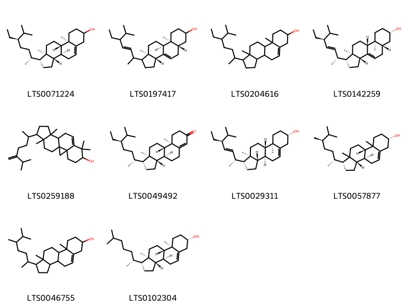{ width=100% }
    <figcaption>Hình ảnh cấu trúc hóa học của 10 hoạt chất thuộc nhóm Steroids and steroid derivatives gồm ['stigmast-5-en-3-ol (LTS0071224)', '(3ar,5as,9as,9bs,11ar)-1-(5-ethyl-6-methylhept-3-en-2-yl)-9a,11a-dimethyl-1h,2h,3h,3ah,5h,5ah,6h,7h,8h,9h,9bh,10h,11h-cyclopenta[a]phenanthren-7-ol (LTS0197417)', 'stigmast-5-en-3-ol, (3β)- (LTS0204616)', 'chondrillasterol (LTS0142259)', '7,7,12,16-tetramethyl-15-(6-methyl-5-methylideneheptan-2-yl)pentacyclo[9.7.0.0¹,³.0³,⁸.0¹²,¹⁶]octadec-8-en-6-ol (LTS0259188)', 'β-sitostenone (LTS0049492)', 'phytosterol (LTS0029311)', '(1r,3as,3bs,7s,9bs)-1-[(2r,5r)-5,6-dimethylheptan-2-yl]-9a,11a-dimethyl-1h,2h,3h,3ah,3bh,4h,6h,7h,8h,9h,9bh,10h,11h-cyclopenta[a]phenanthren-7-ol (LTS0057877)', 'campesterol (LTS0046755)', 'cholesterol (LTS0102304)'].</figcaption>
</figure>

---

### Dược dân tộc học

Danh sách các quốc gia có sử dụng *Aesculus hippocastanum* trong điều trị các bệnh. 

| Country    | Disease         | Bệnh                  |
|:-----------|:----------------|:----------------------|
| Dutch      | Analgesic       | Thuốc đau nhức        |
| Elsewhere  | Hemostatic      | Sự ầm máu             |
| English    | Vasoconstrictor | (thuộc) co mạch       |
| French     | Astringent      | Lam se da             |
| German     | Tonic           | (thuộc) trương lực    |
| Italian    | Vulnerary       | Vulnerary             |
| Mexico     | Poison          | Chất độc              |
| Portuguese | Narcotic        | Thuốc gây ngủ, gây mê |
| Turkey     | Sternutatory    | (thuộc) xương ức      |
| US         | Tonic           | (thuộc) trương lực    |
| ain        | Vasoconstrictor | (thuộc) co mạch       |

---

---
## Aesculus turbinata
### Thông tin về thực vật

!!! info "Phân loại thực vật của *Aesculus turbinata* từ GIBF:"
    - **Kingdom:** Plantae
    - **Phylum:** Tracheophyta
    - **Order:** Sapindales
    - **Family:** Sapindaceae
    - **Genus:** Aesculus
    - **Species:** *Aesculus turbinata*

 

| Label (VI)   | Label (EN)   | Scientific Name    | Descriptions (VI)   | Descriptions (EN)   | Also Known As (VI)   | Also Known As (EN)                                                      |
|:-------------|:-------------|:-------------------|:--------------------|:--------------------|:---------------------|:------------------------------------------------------------------------|
| N/A          | N/A          | Aesculus turbinata | loài thực vật       | species of plant    | ['']                 | ['Aesculus dissimilis', 'Japanese horse chestnut', 'Aesculus japonica'] |

#### Phân bố trên thế giới

**Từ CSDL GIBF** Japan, Belgium, Korea, Republic of, Estonia, Russian Federation, United States of America

#### Phân bố tại Việt Nam

**Từ CSDL GIBF**: Không có ghi nhận ở Việt Nam

---
### Thành phần hóa học
        
- Theo cơ sở dữ liệu lotus: Từ loài *Aesculus turbinata* đã phân lập và xác định được 8 hoạt chất thuộc về các nhóm Prenol lipids, Coumarins and derivatives. 

|    | chemicalTaxonomyClassyfireClass   |   smiles_count |
|---:|:----------------------------------|---------------:|
|  0 | Coumarins and derivatives         |              6 |
|  1 | Prenol lipids                     |              2 |

#### Nhóm Coumarins and derivatives
<figure markdown="span">
    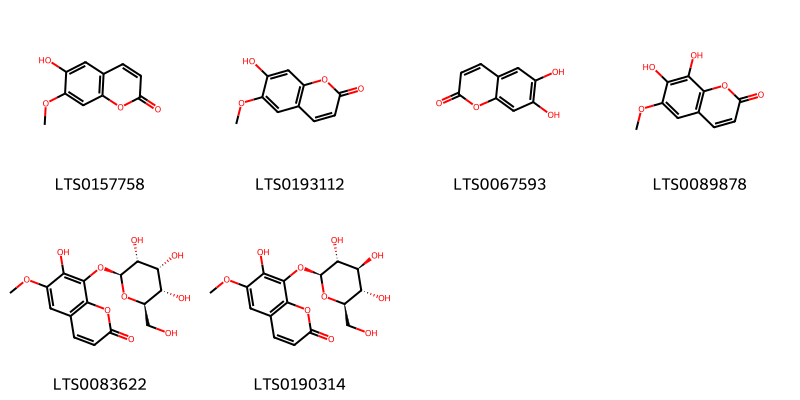{ width=100% }
    <figcaption>Hình ảnh cấu trúc hóa học của 6 hoạt chất thuộc nhóm Coumarins and derivatives gồm ['isoscopoletin (LTS0157758)', 'scopoletin (LTS0193112)', 'esculetin (LTS0067593)', 'fraxetin (LTS0089878)', 'fraxin (LTS0083622)', 'fraxin (LTS0190314)'].</figcaption>
</figure>
#### Nhóm Prenol lipids
<figure markdown="span">
    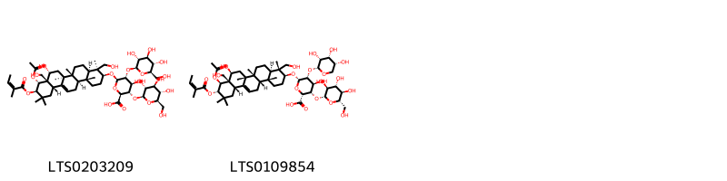{ width=100% }
    <figcaption>Hình ảnh cấu trúc hóa học của 2 hoạt chất thuộc nhóm Prenol lipids gồm ['β-escin (LTS0203209)', '(2r,3s,4s,5r,6s)-6-{[(3s,4r,4ar,6ar,6br,8s,8ar,9s,10s,12as,14as,14br)-9-(acetyloxy)-8-hydroxy-4,8a-bis(hydroxymethyl)-4,6a,6b,11,11,14b-hexamethyl-10-{[(2z)-2-methylbut-2-enoyl]oxy}-1,2,3,4a,5,6,7,8,9,10,12,12a,14,14a-tetradecahydropicen-3-yl]oxy}-4-hydroxy-3-{[(2r,3s,4r,5r,6s)-3,4,5-trihydroxy-6-(hydroxymethyl)oxan-2-yl]oxy}-5-{[(2r,3r,4r,5r)-3,4,5-trihydroxyoxan-2-yl]oxy}oxane-2-carboxylic acid (LTS0109854)'].</figcaption>
</figure>

---

### Dược dân tộc học

Danh sách các quốc gia có sử dụng *Aesculus turbinata* trong điều trị các bệnh. 

| Country   | Disease                   | Bệnh                     |
|:----------|:--------------------------|:-------------------------|
| Elsewhere | Antidiarrheic, Hemostatic | Chống tiêu chảy, cầm máu |

---

