!!! abstract "Tóm tắt"

    Họ Hydrangeaceae gồm khoảng 5 chi và 9 loài được một số cộng đồng tại các quốc gia như German, Elsewhere, China, India, Elsewhere(Amerindian), US, Dutch, Java sử dụng trong một số trường hợp MYMEMORY WARNING: YOU USED ALL AVAILABLE FREE TRANSLATIONS FOR TODAY. NEXT AVAILABLE IN  11 HOURS 21 MINUTES 38 SECONDS VISIT HTTPS://MYMEMORY.TRANSLATED.NET/DOC/USAGELIMITS.PHP TO TRANSLATE MORE.

!!! info "DrDuke"

    James A. Duke sinh năm 1929-2017 là một nhà thực vật học người Mỹ. Đây là một trong những tác giả hàng đầu trong lĩnh vực dược dân tộc học với cuốn *CRC Handbook of Medicinal Herbs* và chính là người xây dựng lên cơ sở dữ liệu về hợp chất tự nhiên và dược dân tộc học tại Bộ nông nghiệp Hoa Kỳ. Các thông tin được đăng tải tại website [Dr. Duke's Phytochemical and Ethnobotanical Databases](https://phytochem.nal.usda.gov/). 
    Trong suốt thập niên 1970, ông lãnh đạo the Plant Taxonomy Laboratory, Plant Genetics and Germplasm Institute of the Agricultural Research Service, U.S. Department of Agriculture.
    Trong tài liệu này, các thông tin về dược dân tộc của các dược liệu được trích dẫn từ tài liệu của James A. Ducke với sự trợ giúp của phần mềm dịch thuật từ tiếng Anh sang tiếng Việt.
   

# Chi Deutzia

??? note "Danh sách các dược liệu thuộc chi"
    
	 - *Deutzia sieboldiana*

---
## Deutzia sieboldiana
### Thông tin về thực vật

!!! info "Phân loại thực vật của *Deutzia scabra* từ GIBF:"
    - **Kingdom:** Plantae
    - **Phylum:** Tracheophyta
    - **Order:** Cornales
    - **Family:** Hydrangeaceae
    - **Genus:** Deutzia
    - **Species:** *Deutzia scabra*

 

| Label (VI)   | Label (EN)   | Scientific Name     | Descriptions (VI)   | Descriptions (EN)   | Also Known As (VI)   | Also Known As (EN)   |
|:-------------|:-------------|:--------------------|:--------------------|:--------------------|:---------------------|:---------------------|
| N/A          | N/A          | Deutzia sieboldiana |                     |                     | ['']                 | ['']                 |

#### Phân bố trên thế giới

**Từ CSDL GIBF** nan, Japan, United States of America, Belgium, Ukraine, unknown or invalid, Germany

#### Phân bố tại Việt Nam

**Từ CSDL GIBF**: Không có ghi nhận ở Việt Nam

---
### Thành phần hóa học
        
- Theo cơ sở dữ liệu lotus: Từ loài *Deutzia scabra* đã phân lập và xác định được Chưa có hoạt chất nào được phân lập. hoạt chất thuộc về các nhóm Không có hoạt chất nào được phân lập. 

Không có hình ảnh nào được tạo ra

---

### Dược dân tộc học

Danh sách các quốc gia có sử dụng *Deutzia scabra* trong điều trị các bệnh. 

| Country   | Disease               | Bệnh                                                                                                                                                                                                |
|:----------|:----------------------|:----------------------------------------------------------------------------------------------------------------------------------------------------------------------------------------------------|
| China     | Refrigerant, Diuretic | MYMEMORY WARNING: YOU USED ALL AVAILABLE FREE TRANSLATIONS FOR TODAY. NEXT AVAILABLE IN  11 HOURS 21 MINUTES 34 SECONDS VISIT HTTPS://MYMEMORY.TRANSLATED.NET/DOC/USAGELIMITS.PHP TO TRANSLATE MORE |

---

# Chi Philadelphus

??? note "Danh sách các dược liệu thuộc chi"
    
	 - *Philadelphus lewisii*

---
## Philadelphus lewisii
### Thông tin về thực vật

!!! info "Phân loại thực vật của *Philadelphus lewisii* từ GIBF:"
    - **Kingdom:** Plantae
    - **Phylum:** Tracheophyta
    - **Order:** Cornales
    - **Family:** Hydrangeaceae
    - **Genus:** Philadelphus
    - **Species:** *Philadelphus lewisii*

 

| Label (VI)   | Label (EN)   | Scientific Name      | Descriptions (VI)   | Descriptions (EN)   | Also Known As (VI)   | Also Known As (EN)                                                                                                                                      |
|:-------------|:-------------|:---------------------|:--------------------|:--------------------|:---------------------|:--------------------------------------------------------------------------------------------------------------------------------------------------------|
| N/A          | N/A          | Philadelphus lewisii | loài thực vật       | species of plant    | ['']                 | ["Gordon's mockorange", 'Indian arrowwood', "Lewis' mock-orange", 'mock-orange', 'syringa', 'wild mockorange', 'Lewis mock-orange', 'wild mock orange'] |

#### Phân bố trên thế giới

**Từ CSDL GIBF** United States of America, Canada

#### Phân bố tại Việt Nam

**Từ CSDL GIBF**: Không có ghi nhận ở Việt Nam

---
### Thành phần hóa học
        
- Theo cơ sở dữ liệu lotus: Từ loài *Philadelphus lewisii* đã phân lập và xác định được 6 hoạt chất thuộc về các nhóm Flavonoids. 

|    | chemicalTaxonomyClassyfireClass   |   smiles_count |
|---:|:----------------------------------|---------------:|
|  0 | Flavonoids                        |              6 |

#### Nhóm Flavonoids
<figure markdown="span">
    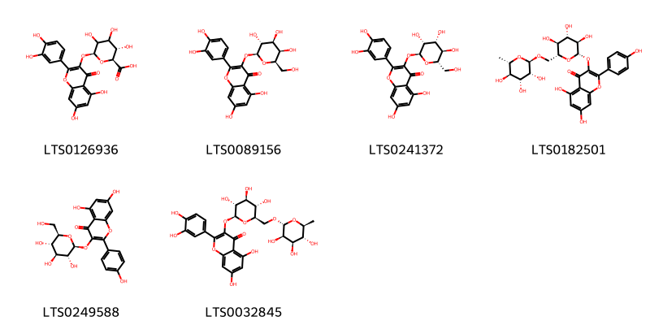{ width=100% }
    <figcaption>Hình ảnh cấu trúc hóa học của 6 hoạt chất thuộc nhóm Flavonoids gồm ['miquelianin (LTS0126936)', 'hyperoside (LTS0089156)', '2-(3,4-dihydroxyphenyl)-5,7-dihydroxy-3-{[(2s,3r,4r,5r,6s)-3,4,5-trihydroxy-6-(hydroxymethyl)oxan-2-yl]oxy}chromen-4-one (LTS0241372)', 'nictoflorin (LTS0182501)', 'astragalin (LTS0249588)', '3-rutinosyl quercetin (LTS0032845)'].</figcaption>
</figure>

---

### Dược dân tộc học

Danh sách các quốc gia có sử dụng *Philadelphus lewisii* trong điều trị các bệnh. 

| Country               | Disease   | Bệnh                                                                                                                                                                                                |
|:----------------------|:----------|:----------------------------------------------------------------------------------------------------------------------------------------------------------------------------------------------------|
| Elsewhere(Amerindian) | Soap      | MYMEMORY WARNING: YOU USED ALL AVAILABLE FREE TRANSLATIONS FOR TODAY. NEXT AVAILABLE IN  11 HOURS 21 MINUTES 09 SECONDS VISIT HTTPS://MYMEMORY.TRANSLATED.NET/DOC/USAGELIMITS.PHP TO TRANSLATE MORE |

---

# Chi Dichroa

??? note "Danh sách các dược liệu thuộc chi"
    
	 - *Dichroa febrifuga*

---
## Dichroa febrifuga
### Thông tin về thực vật

!!! info "Phân loại thực vật của *Hydrangea febrifuga* từ GIBF:"
    - **Kingdom:** Plantae
    - **Phylum:** Tracheophyta
    - **Order:** Cornales
    - **Family:** Hydrangeaceae
    - **Genus:** Hydrangea
    - **Species:** *Hydrangea febrifuga*

 

| Label (VI)   | Label (EN)   | Scientific Name   | Descriptions (VI)   | Descriptions (EN)   | Also Known As (VI)    | Also Known As (EN)   |
|:-------------|:-------------|:------------------|:--------------------|:--------------------|:----------------------|:---------------------|
| N/A          | N/A          | Dichroa febrifuga | loài thực vật       | species of plant    | ['Dichroa febrifuga'] | ['Chinese Quinine']  |

#### Phân bố trên thế giới

**Từ CSDL GIBF** nan, Austria, Viet Nam, United States of America, Norway, Cambodia, Bhutan, Indonesia, Nepal, Malaysia, China, Russian Federation, New Zealand, Myanmar, unknown or invalid, Canada, Thailand, Lao People’s Democratic Republic

#### Phân bố tại Việt Nam

**Từ CSDL GIBF**: Quang Binh, Thua Thien-Hue, Hai Phong, Lao Cai

---
### Thành phần hóa học
        
- Theo cơ sở dữ liệu lotus: Từ loài *Hydrangea febrifuga* đã phân lập và xác định được Chưa có hoạt chất nào được phân lập. hoạt chất thuộc về các nhóm Không có hoạt chất nào được phân lập. 

Không có hình ảnh nào được tạo ra

---

### Dược dân tộc học

Danh sách các quốc gia có sử dụng *Hydrangea febrifuga* trong điều trị các bệnh. 

| Country   | Disease             | Bệnh                                                                                                                                                                                                |
|:----------|:--------------------|:----------------------------------------------------------------------------------------------------------------------------------------------------------------------------------------------------|
| China     | Emetic, nan, Poison | MYMEMORY WARNING: YOU USED ALL AVAILABLE FREE TRANSLATIONS FOR TODAY. NEXT AVAILABLE IN  11 HOURS 20 MINUTES 26 SECONDS VISIT HTTPS://MYMEMORY.TRANSLATED.NET/DOC/USAGELIMITS.PHP TO TRANSLATE MORE |
| Elsewhere | Emetic, nan         | MYMEMORY WARNING: YOU USED ALL AVAILABLE FREE TRANSLATIONS FOR TODAY. NEXT AVAILABLE IN  11 HOURS 20 MINUTES 22 SECONDS VISIT HTTPS://MYMEMORY.TRANSLATED.NET/DOC/USAGELIMITS.PHP TO TRANSLATE MORE |
| India     | Emetic, nan         | MYMEMORY WARNING: YOU USED ALL AVAILABLE FREE TRANSLATIONS FOR TODAY. NEXT AVAILABLE IN  11 HOURS 20 MINUTES 19 SECONDS VISIT HTTPS://MYMEMORY.TRANSLATED.NET/DOC/USAGELIMITS.PHP TO TRANSLATE MORE |
| Java      | Vermifuge           | MYMEMORY WARNING: YOU USED ALL AVAILABLE FREE TRANSLATIONS FOR TODAY. NEXT AVAILABLE IN  11 HOURS 20 MINUTES 16 SECONDS VISIT HTTPS://MYMEMORY.TRANSLATED.NET/DOC/USAGELIMITS.PHP TO TRANSLATE MORE |

---

# Chi Hydrangea

??? note "Danh sách các dược liệu thuộc chi"
    
	 - *Hydrangea arborescens*
	 - *Hydrangea macrophylla*
	 - *Hydrangea paniculata*
	 - *Hydrangea strigosa*
	 - *Hydrangea umbellata*

---
## Hydrangea arborescens
### Thông tin về thực vật

!!! info "Phân loại thực vật của *Hydrangea arborescens* từ GIBF:"
    - **Kingdom:** Plantae
    - **Phylum:** Tracheophyta
    - **Order:** Cornales
    - **Family:** Hydrangeaceae
    - **Genus:** Hydrangea
    - **Species:** *Hydrangea arborescens*

 

| Label (VI)   | Label (EN)   | Scientific Name       | Descriptions (VI)   | Descriptions (EN)   | Also Known As (VI)   | Also Known As (EN)   |
|:-------------|:-------------|:----------------------|:--------------------|:--------------------|:---------------------|:---------------------|
| N/A          | N/A          | Hydrangea arborescens | loài thực vật       | species of plant    | ['']                 | ['']                 |

#### Phân bố trên thế giới

**Từ CSDL GIBF** Belarus, Austria, United States of America

#### Phân bố tại Việt Nam

**Từ CSDL GIBF**: Không có ghi nhận ở Việt Nam

---
### Thành phần hóa học
        
- Theo cơ sở dữ liệu lotus: Từ loài *Hydrangea arborescens* đã phân lập và xác định được 2 hoạt chất thuộc về các nhóm Flavonoids. 

|    | chemicalTaxonomyClassyfireClass   |   smiles_count |
|---:|:----------------------------------|---------------:|
|  0 | Flavonoids                        |              2 |

#### Nhóm Flavonoids
<figure markdown="span">
    { width=100% }
    <figcaption>Hình ảnh cấu trúc hóa học của 2 hoạt chất thuộc nhóm Flavonoids gồm ['quercetin (LTS0004651)', 'kaempherol (LTS0155822)'].</figcaption>
</figure>

---

### Dược dân tộc học

Danh sách các quốc gia có sử dụng *Hydrangea arborescens* trong điều trị các bệnh. 

| Country   | Disease                                                                                  | Bệnh                                                                                                                                                                                                |
|:----------|:-----------------------------------------------------------------------------------------|:----------------------------------------------------------------------------------------------------------------------------------------------------------------------------------------------------|
| Dutch     | Diuretic                                                                                 | MYMEMORY WARNING: YOU USED ALL AVAILABLE FREE TRANSLATIONS FOR TODAY. NEXT AVAILABLE IN  11 HOURS 19 MINUTES 38 SECONDS VISIT HTTPS://MYMEMORY.TRANSLATED.NET/DOC/USAGELIMITS.PHP TO TRANSLATE MORE |
| Elsewhere | nan                                                                                      | MYMEMORY WARNING: YOU USED ALL AVAILABLE FREE TRANSLATIONS FOR TODAY. NEXT AVAILABLE IN  11 HOURS 19 MINUTES 35 SECONDS VISIT HTTPS://MYMEMORY.TRANSLATED.NET/DOC/USAGELIMITS.PHP TO TRANSLATE MORE |
| German    | Purgative                                                                                | MYMEMORY WARNING: YOU USED ALL AVAILABLE FREE TRANSLATIONS FOR TODAY. NEXT AVAILABLE IN  11 HOURS 19 MINUTES 31 SECONDS VISIT HTTPS://MYMEMORY.TRANSLATED.NET/DOC/USAGELIMITS.PHP TO TRANSLATE MORE |
| US        | Diaphoretic, Diuretic, Laxative, Narcotic, Tonic, Diuretic, Sialogogue, Stomachic, Tonic | MYMEMORY WARNING: YOU USED ALL AVAILABLE FREE TRANSLATIONS FOR TODAY. NEXT AVAILABLE IN  11 HOURS 19 MINUTES 28 SECONDS VISIT HTTPS://MYMEMORY.TRANSLATED.NET/DOC/USAGELIMITS.PHP TO TRANSLATE MORE |

---

---
## Hydrangea macrophylla
### Thông tin về thực vật

!!! info "Phân loại thực vật của *Hydrangea macrophylla* từ GIBF:"
    - **Kingdom:** Plantae
    - **Phylum:** Tracheophyta
    - **Order:** Cornales
    - **Family:** Hydrangeaceae
    - **Genus:** Hydrangea
    - **Species:** *Hydrangea macrophylla*

 

| Label (VI)   | Label (EN)   | Scientific Name       | Descriptions (VI)   | Descriptions (EN)   | Also Known As (VI)                                | Also Known As (EN)                                                                                            |
|:-------------|:-------------|:----------------------|:--------------------|:--------------------|:--------------------------------------------------|:--------------------------------------------------------------------------------------------------------------|
| N/A          | N/A          | Hydrangea macrophylla | loài thực vật       | species of plant    | ['Hydrangea macrophylla', 'Tú cầu', 'Cẩm tú cầu'] | ['hortensia', 'bigleaf hydrangea', 'French hydrangea', 'lacecap hydrangea', 'mophead hydrangea', 'penny mac'] |

#### Phân bố trên thế giới

**Từ CSDL GIBF** Brazil, Guatemala, Japan, Sweden, China, Chile, New Zealand, Slovenia, Ecuador, Madagascar, Spain, Denmark, Netherlands, Sri Lanka, Réunion, United States of America, Korea, Republic of, Greece, Costa Rica, Colombia, Hong Kong, Norway, El Salvador, France, Belgium, Georgia, Germany, Panama, Austria, Portugal, Australia, Italy, India, Switzerland, United Kingdom of Great Britain and Northern Ireland, Ireland

#### Phân bố tại Việt Nam

**Từ CSDL GIBF**: Không có ghi nhận ở Việt Nam

---
### Thành phần hóa học
        
- Theo cơ sở dữ liệu lotus: Từ loài *Hydrangea macrophylla* đã phân lập và xác định được 176 hoạt chất thuộc về các nhóm Benzofurans, Fatty Acyls, Benzene and substituted derivatives, Flavonoids, Isobenzofurans, Purine nucleosides, Carboxylic acids and derivatives, Coumarins and derivatives, Cinnamic acids and derivatives, Isocoumarins and derivatives, Phenols, Organooxygen compounds, Diazanaphthalenes, Isocoumarans, Pyrimidine nucleosides, Prenol lipids, Benzopyrans, Stilbenes. 

|    | chemicalTaxonomyClassyfireClass     |   smiles_count |
|---:|:------------------------------------|---------------:|
|  0 | Benzene and substituted derivatives |             10 |
|  1 | Benzofurans                         |              2 |
|  2 | Benzopyrans                         |              4 |
|  3 | Carboxylic acids and derivatives    |              1 |
|  4 | Cinnamic acids and derivatives      |              3 |
|  5 | Coumarins and derivatives           |              4 |
|  6 | Diazanaphthalenes                   |              3 |
|  7 | Fatty Acyls                         |             10 |
|  8 | Flavonoids                          |             12 |
|  9 | Isobenzofurans                      |              2 |
| 10 | Isocoumarans                        |              2 |
| 11 | Isocoumarins and derivatives        |              2 |
| 12 | Organooxygen compounds              |             76 |
| 13 | Phenols                             |              3 |
| 14 | Prenol lipids                       |             32 |
| 15 | Purine nucleosides                  |              2 |
| 16 | Pyrimidine nucleosides              |              2 |
| 17 | Stilbenes                           |              6 |

#### Nhóm Benzene and substituted derivatives
<figure markdown="span">
    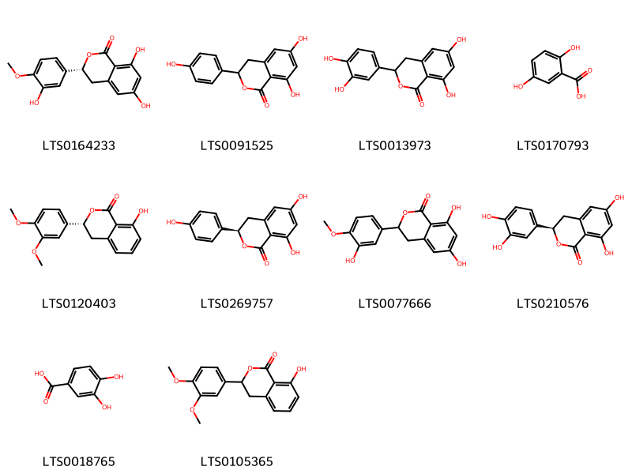{ width=100% }
    <figcaption>Hình ảnh cấu trúc hóa học của 10 hoạt chất thuộc nhóm Benzene and substituted derivatives gồm ['thunberginol e (LTS0164233)', 'thunberginol c (LTS0091525)', 'thunberginol d (LTS0013973)', '2,5-dihydroxybenzoic acid (LTS0170793)', '(3r)-3-(3,4-dimethoxyphenyl)-8-hydroxy-3,4-dihydro-2-benzopyran-1-one (LTS0120403)', '(3r)-6,8-dihydroxy-3-(4-hydroxyphenyl)-3,4-dihydro-2-benzopyran-1-one (LTS0269757)', 'thunberginol e (LTS0077666)', '(3r)-3-(3,4-dihydroxyphenyl)-6,8-dihydroxy-3,4-dihydro-2-benzopyran-1-one (LTS0210576)', '3,4-dihydroxybenzoic acid (LTS0018765)', '3-(3,4-dimethoxyphenyl)-8-hydroxy-3,4-dihydro-2-benzopyran-1-one (LTS0105365)'].</figcaption>
</figure>
#### Nhóm Benzofurans
<figure markdown="span">
    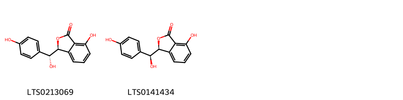{ width=100% }
    <figcaption>Hình ảnh cấu trúc hóa học của 2 hoạt chất thuộc nhóm Benzofurans gồm ['hydramacrophyllol b (LTS0213069)', 'hydramacrophyllol a (LTS0141434)'].</figcaption>
</figure>
#### Nhóm Benzopyrans
<figure markdown="span">
    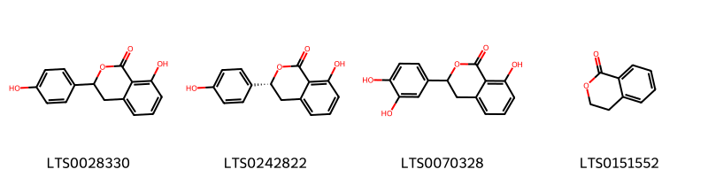{ width=100% }
    <figcaption>Hình ảnh cấu trúc hóa học của 4 hoạt chất thuộc nhóm Benzopyrans gồm ['hydrangenol (LTS0028330)', '(3r)-8-hydroxy-3-(4-hydroxyphenyl)-3,4-dihydro-2-benzopyran-1-one (LTS0242822)', 'thunberginol g (LTS0070328)', '3,4-dihydroisocoumarin (LTS0151552)'].</figcaption>
</figure>
#### Nhóm Carboxylic acids and derivatives
<figure markdown="span">
    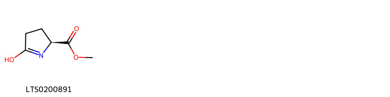{ width=100% }
    <figcaption>Hình ảnh cấu trúc hóa học của 1 hoạt chất thuộc nhóm Carboxylic acids and derivatives gồm ['methyl (2s)-5-hydroxy-3,4-dihydro-2h-pyrrole-2-carboxylate (LTS0200891)'].</figcaption>
</figure>
#### Nhóm Cinnamic acids and derivatives
<figure markdown="span">
    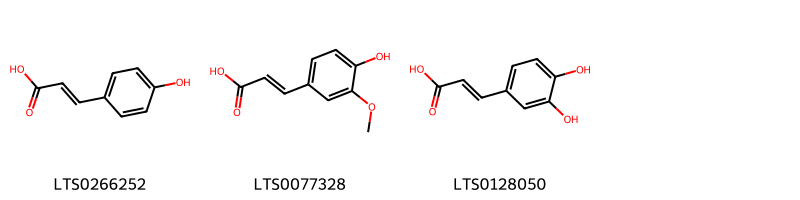{ width=100% }
    <figcaption>Hình ảnh cấu trúc hóa học của 3 hoạt chất thuộc nhóm Cinnamic acids and derivatives gồm ['para-coumaric acid (LTS0266252)', 'ferulic acid (LTS0077328)', '3,4-dihydroxycinnamic acid (LTS0128050)'].</figcaption>
</figure>
#### Nhóm Coumarins and derivatives
<figure markdown="span">
    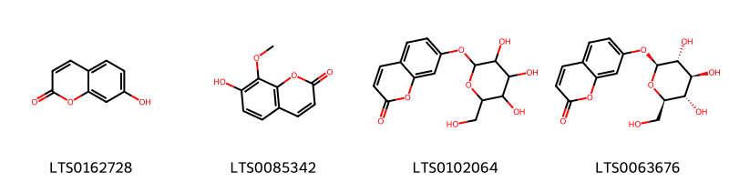{ width=100% }
    <figcaption>Hình ảnh cấu trúc hóa học của 4 hoạt chất thuộc nhóm Coumarins and derivatives gồm ['umbelliferone (LTS0162728)', '7-hydroxy-8-methoxychromen-2-one (LTS0085342)', 'skimmin (LTS0102064)', 'skimmin (LTS0063676)'].</figcaption>
</figure>
#### Nhóm Diazanaphthalenes
<figure markdown="span">
    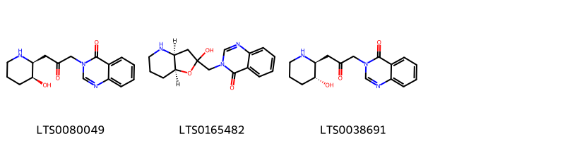{ width=100% }
    <figcaption>Hình ảnh cấu trúc hóa học của 3 hoạt chất thuộc nhóm Diazanaphthalenes gồm ['3-{3-[(2s,3s)-3-hydroxypiperidin-2-yl]-2-oxopropyl}quinazolin-4-one (LTS0080049)', 'isofebrifugine (LTS0165482)', 'febrifugine (LTS0038691)'].</figcaption>
</figure>
#### Nhóm Fatty Acyls
<figure markdown="span">
    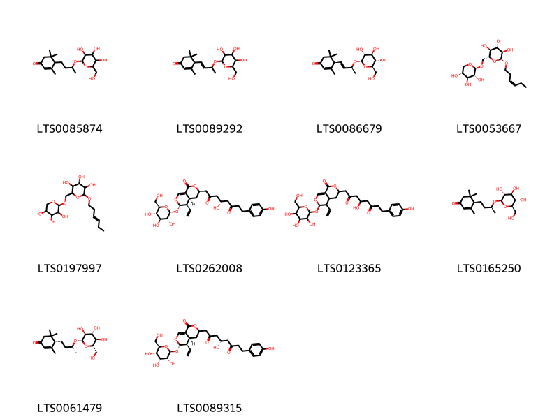{ width=100% }
    <figcaption>Hình ảnh cấu trúc hóa học của 10 hoạt chất thuộc nhóm Fatty Acyls gồm ['3,5,5-trimethyl-4-(3-{[3,4,5-trihydroxy-6-(hydroxymethyl)oxan-2-yl]oxy}butyl)cyclohex-2-en-1-one (LTS0085874)', '3,5,5-trimethyl-4-(3-{[3,4,5-trihydroxy-6-(hydroxymethyl)oxan-2-yl]oxy}but-1-en-1-yl)cyclohex-2-en-1-one (LTS0089292)', '(4r)-3,5,5-trimethyl-4-[(1e,3s)-3-{[(2r,3r,4s,5s,6r)-3,4,5-trihydroxy-6-(hydroxymethyl)oxan-2-yl]oxy}but-1-en-1-yl]cyclohex-2-en-1-one (LTS0086679)', '(2r,3r,4s,5s,6r)-2-[(3z)-hex-3-en-1-yloxy]-6-({[(2s,3r,4s,5r)-3,4,5-trihydroxyoxan-2-yl]oxy}methyl)oxane-3,4,5-triol (LTS0053667)', '2-(hex-3-en-1-yloxy)-6-{[(3,4,5-trihydroxyoxan-2-yl)oxy]methyl}oxane-3,4,5-triol (LTS0197997)', '(4s)-1-[(3r,4as,5r,6s)-5-ethenyl-1-oxo-6-{[(2s,3r,4s,5s,6r)-3,4,5-trihydroxy-6-(hydroxymethyl)oxan-2-yl]oxy}-3h,4h,4ah,5h,6h-pyrano[3,4-c]pyran-3-yl]-4-hydroxy-8-(4-hydroxyphenyl)octane-2,6-dione (LTS0262008)', '1-(5-ethenyl-1-oxo-6-{[3,4,5-trihydroxy-6-(hydroxymethyl)oxan-2-yl]oxy}-3h,4h,4ah,5h,6h-pyrano[3,4-c]pyran-3-yl)-4-hydroxy-8-(4-hydroxyphenyl)octane-2,6-dione (LTS0123365)', '(4r)-3,5,5-trimethyl-4-[(3s)-3-{[(2r,3r,4s,5s,6r)-3,4,5-trihydroxy-6-(hydroxymethyl)oxan-2-yl]oxy}butyl]cyclohex-2-en-1-one (LTS0165250)', '(4s)-3,5,5-trimethyl-4-[(3r)-3-{[(2s,3s,4r,5r,6s)-3,4,5-trihydroxy-6-(hydroxymethyl)oxan-2-yl]oxy}butyl]cyclohex-2-en-1-one (LTS0061479)', '(4s)-1-[(4as,5r,6s)-5-ethenyl-1-oxo-6-{[(2s,3r,4r,5s,6r)-3,4,5-trihydroxy-6-(hydroxymethyl)oxan-2-yl]oxy}-3h,4h,4ah,5h,6h-pyrano[3,4-c]pyran-3-yl]-4-hydroxy-8-(4-hydroxyphenyl)octane-2,6-dione (LTS0089315)'].</figcaption>
</figure>
#### Nhóm Flavonoids
<figure markdown="span">
    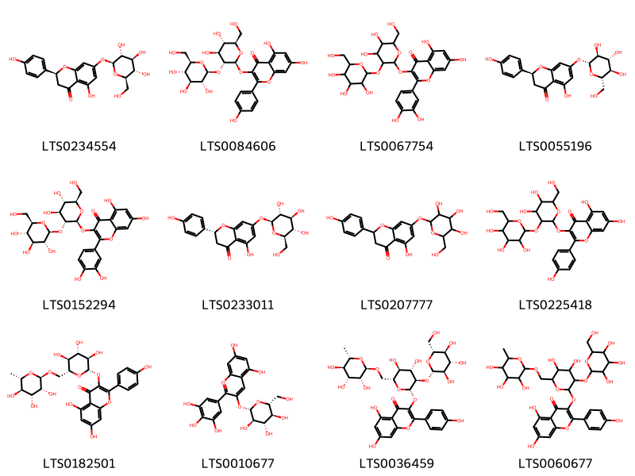{ width=100% }
    <figcaption>Hình ảnh cấu trúc hóa học của 12 hoạt chất thuộc nhóm Flavonoids gồm ['prunin (LTS0234554)', 'kaempferol 3-o-sophoroside (LTS0084606)', '3-{[4,5-dihydroxy-6-(hydroxymethyl)-3-{[3,4,5-trihydroxy-6-(hydroxymethyl)oxan-2-yl]oxy}oxan-2-yl]oxy}-2-(3,4-dihydroxyphenyl)-5,7-dihydroxychromen-4-one (LTS0067754)', '(2s)-5-hydroxy-2-(4-hydroxyphenyl)-7-{[(2r,3s,4r,5r,6s)-3,4,5-trihydroxy-6-(hydroxymethyl)oxan-2-yl]oxy}-2,3-dihydro-1-benzopyran-4-one (LTS0055196)', 'quosp (LTS0152294)', '(2r)-5-hydroxy-2-(4-hydroxyphenyl)-7-{[(2s,3r,4s,5s,6r)-3,4,5-trihydroxy-6-(hydroxymethyl)oxan-2-yl]oxy}-2,3-dihydro-1-benzopyran-4-one (LTS0233011)', '5-hydroxy-2-(4-hydroxyphenyl)-7-{[3,4,5-trihydroxy-6-(hydroxymethyl)oxan-2-yl]oxy}-2,3-dihydro-1-benzopyran-4-one (LTS0207777)', '3-{[4,5-dihydroxy-6-(hydroxymethyl)-3-{[3,4,5-trihydroxy-6-(hydroxymethyl)oxan-2-yl]oxy}oxan-2-yl]oxy}-5,7-dihydroxy-2-(4-hydroxyphenyl)chromen-4-one (LTS0225418)', 'nictoflorin (LTS0182501)', 'delphinidin 3-glucoside (LTS0010677)', '3-{[(2s,3r,4s,5s,6r)-4,5-dihydroxy-3-{[(2s,3r,4s,5s,6r)-3,4,5-trihydroxy-6-(hydroxymethyl)oxan-2-yl]oxy}-6-({[(2r,3r,4r,5r,6s)-3,4,5-trihydroxy-6-methyloxan-2-yl]oxy}methyl)oxan-2-yl]oxy}-5,7-dihydroxy-2-(4-hydroxyphenyl)chromen-4-one (LTS0036459)', '3-[(4,5-dihydroxy-3-{[3,4,5-trihydroxy-6-(hydroxymethyl)oxan-2-yl]oxy}-6-{[(3,4,5-trihydroxy-6-methyloxan-2-yl)oxy]methyl}oxan-2-yl)oxy]-5,7-dihydroxy-2-(4-hydroxyphenyl)chromen-4-one (LTS0060677)'].</figcaption>
</figure>
#### Nhóm Isobenzofurans
<figure markdown="span">
    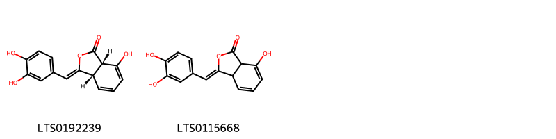{ width=100% }
    <figcaption>Hình ảnh cấu trúc hóa học của 2 hoạt chất thuộc nhóm Isobenzofurans gồm ['(3z,3as,7as)-3-[(3,4-dihydroxyphenyl)methylidene]-7-hydroxy-3a,7a-dihydro-2-benzofuran-1-one (LTS0192239)', '3-[(3,4-dihydroxyphenyl)methylidene]-7-hydroxy-3a,7a-dihydro-2-benzofuran-1-one (LTS0115668)'].</figcaption>
</figure>
#### Nhóm Isocoumarans
<figure markdown="span">
    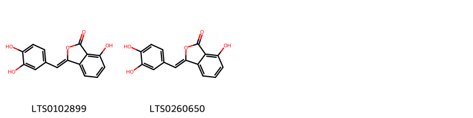{ width=100% }
    <figcaption>Hình ảnh cấu trúc hóa học của 2 hoạt chất thuộc nhóm Isocoumarans gồm ['thunberginol f (LTS0102899)', '3-[(3,4-dihydroxyphenyl)methylidene]-7-hydroxy-2-benzofuran-1-one (LTS0260650)'].</figcaption>
</figure>
#### Nhóm Isocoumarins and derivatives
<figure markdown="span">
    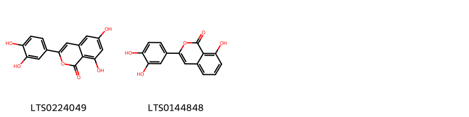{ width=100% }
    <figcaption>Hình ảnh cấu trúc hóa học của 2 hoạt chất thuộc nhóm Isocoumarins and derivatives gồm ['thunberginol b (LTS0224049)', 'thunberginol a (LTS0144848)'].</figcaption>
</figure>
#### Nhóm Organooxygen compounds
<figure markdown="span">
    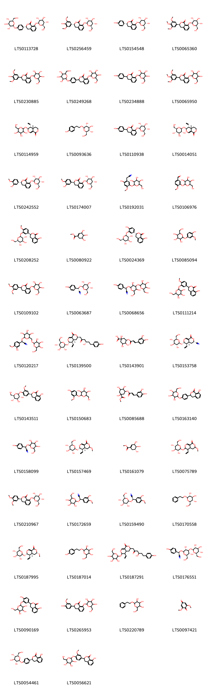{ width=100% }
    <figcaption>Hình ảnh cấu trúc hóa học của 76 hoạt chất thuộc nhóm Organooxygen compounds gồm ['(3r)-8-{[(2s,3r,4s,5s,6r)-3,4,5-trihydroxy-6-(hydroxymethyl)oxan-2-yl]oxy}-3-(4-{[(2s,3r,4s,5s,6r)-3,4,5-trihydroxy-6-(hydroxymethyl)oxan-2-yl]oxy}phenyl)-3,4-dihydro-2-benzopyran-1-one (LTS0113728)', '(3r)-3-(4-hydroxy-3,5-dimethoxyphenyl)-8-{[(2s,3r,4s,5s,6r)-3,4,5-trihydroxy-6-(hydroxymethyl)oxan-2-yl]oxy}-3,4-dihydro-2-benzopyran-1-one (LTS0256459)', '(3r)-3-(4-hydroxyphenyl)-8-{[(2s,3r,4s,5s,6r)-3,4,5-trihydroxy-6-(hydroxymethyl)oxan-2-yl]oxy}-3,4-dihydro-2-benzopyran-1-one (LTS0154548)', '(3s)-8-{[(2s,3r,4s,5s,6r)-3,4,5-trihydroxy-6-(hydroxymethyl)oxan-2-yl]oxy}-3-(3,4,5-trimethoxyphenyl)-3,4-dihydro-2-benzopyran-1-one (LTS0065360)', '3-(4-hydroxy-3,5-dimethoxyphenyl)-8-{[3,4,5-trihydroxy-6-(hydroxymethyl)oxan-2-yl]oxy}-3,4-dihydro-2-benzopyran-1-one (LTS0230885)', '8-{[3,4,5-trihydroxy-6-(hydroxymethyl)oxan-2-yl]oxy}-3-(4-{[3,4,5-trihydroxy-6-(hydroxymethyl)oxan-2-yl]oxy}phenyl)-3,4-dihydro-2-benzopyran-1-one (LTS0249268)', '3-(4-hydroxyphenyl)-8-{[3,4,5-trihydroxy-6-(hydroxymethyl)oxan-2-yl]oxy}-3,4-dihydro-2-benzopyran-1-one (LTS0234888)', '8-{[3,4,5-trihydroxy-6-(hydroxymethyl)oxan-2-yl]oxy}-3-(3,4,5-trimethoxyphenyl)-3,4-dihydro-2-benzopyran-1-one (LTS0065950)', '(4as,5r,6s)-5-ethenyl-6-{[3,4,5-trihydroxy-6-(hydroxymethyl)oxan-2-yl]oxy}-3h,4h,4ah,5h,6h-pyrano[3,4-c]pyran-1-one (LTS0114959)', 'salidroside (LTS0093636)', '3-(4-hydroxyphenyl)-8-{[(2s,3r,4s,5s,6r)-3,4,5-trihydroxy-6-(hydroxymethyl)oxan-2-yl]oxy}-3,4-dihydro-2-benzopyran-1-one (LTS0110938)', 'sweroside (LTS0014051)', '(3r)-3-(3-hydroxy-4-methoxyphenyl)-8-{[(2s,3r,4s,5s,6r)-3,4,5-trihydroxy-6-(hydroxymethyl)oxan-2-yl]oxy}-3,4-dihydro-2-benzopyran-1-one (LTS0242552)', '(3s)-3-(3-hydroxy-4-methoxyphenyl)-8-{[(2s,3r,4s,5s,6r)-3,4,5-trihydroxy-6-(hydroxymethyl)oxan-2-yl]oxy}-3,4-dihydro-2-benzopyran-1-one (LTS0174007)', '2-(2-hydroxy-4-methoxy-5-{[3,4,5-trihydroxy-6-(hydroxymethyl)oxan-2-yl]oxy}phenyl)acetonitrile (LTS0192031)', '4-methoxy-3-{[3,4,5-trihydroxy-6-(hydroxymethyl)oxan-2-yl]oxy}benzaldehyde (LTS0106976)', '(3s)-8-hydroxy-3-(4-methoxy-3-{[(2s,3r,4s,5s,6r)-3,4,5-trihydroxy-6-(hydroxymethyl)oxan-2-yl]oxy}phenyl)-3,4-dihydro-2-benzopyran-1-one (LTS0208252)', 'methyl 3,4,5-trihydroxycyclohex-1-ene-1-carboxylate (LTS0080922)', '(3r)-8-hydroxy-3-(4-hydroxy-3-{[(2s,3r,4s,5s,6r)-3,4,5-trihydroxy-6-(hydroxymethyl)oxan-2-yl]oxy}phenyl)-3,4-dihydro-2-benzopyran-1-one (LTS0024369)', '2-(4-hydroxy-3-methoxyphenoxy)-6-(hydroxymethyl)oxane-3,4,5-triol (LTS0085094)', '3-(3,4-dimethoxyphenyl)-8-{[3,4,5-trihydroxy-6-(hydroxymethyl)oxan-2-yl]oxy}-3,4-dihydro-2-benzopyran-1-one (LTS0109102)', 'dhurrin (LTS0063687)', '2-{[3,5-dihydroxy-6-(hydroxymethyl)-4-{[3,4,5-trihydroxy-6-(hydroxymethyl)oxan-2-yl]oxy}oxan-2-yl]oxy}-2-(4-hydroxyphenyl)acetonitrile (LTS0068656)', '8-hydroxy-3-(4-methoxy-3-{[3,4,5-trihydroxy-6-(hydroxymethyl)oxan-2-yl]oxy}phenyl)-3,4-dihydro-2-benzopyran-1-one (LTS0111214)', '2-(3-hydroxy-4-methoxyphenyl)-2-{[3,4,5-trihydroxy-6-({[3,4,5-trihydroxy-6-(hydroxymethyl)oxan-2-yl]oxy}methyl)oxan-2-yl]oxy}acetonitrile (LTS0120217)', '(3r,4as,5r,6s)-5-ethenyl-3-[(4s)-4-hydroxy-6-(4-hydroxyphenyl)-2-oxohexyl]-6-{[(2s,3r,4s,5s,6r)-3,4,5-trihydroxy-6-(hydroxymethyl)oxan-2-yl]oxy}-3h,4h,4ah,5h,6h-pyrano[3,4-c]pyran-1-one (LTS0139500)', '3-{[3-(3,4-dihydroxyphenyl)prop-2-enoyl]oxy}-1,4,5-trihydroxycyclohexane-1-carboxylic acid (LTS0143901)', '(3s,4as,5r,6s)-5-ethenyl-1-oxo-6-{[(2s,3r,4s,5s,6r)-3,4,5-trihydroxy-6-(hydroxymethyl)oxan-2-yl]oxy}-3h,4h,4ah,5h,6h-pyrano[3,4-c]pyran-3-carbonitrile (LTS0153758)', '(3s)-8-hydroxy-3-(3-methoxy-4-{[(2s,3r,4s,5s,6r)-3,4,5-trihydroxy-6-(hydroxymethyl)oxan-2-yl]oxy}phenyl)-3,4-dihydro-2-benzopyran-1-one (LTS0143511)', '2-(4-hydroxy-2-methoxyphenoxy)-6-(hydroxymethyl)oxane-3,4,5-triol (LTS0150683)', 'methyl 3-{[3-(3,4-dihydroxyphenyl)prop-2-enoyl]oxy}-1,4,5-trihydroxycyclohexane-1-carboxylate (LTS0085688)', '8-hydroxy-3-(4-{[3,4,5-trihydroxy-6-(hydroxymethyl)oxan-2-yl]oxy}phenyl)-3,4-dihydro-2-benzopyran-1-one (LTS0163140)', 'dhurrin (LTS0158099)', '(3r,4as,5r,6s)-5-ethenyl-3-methoxy-6-{[(2s,3r,4s,5s,6r)-3,4,5-trihydroxy-6-(hydroxymethyl)oxan-2-yl]oxy}-3h,4h,4ah,5h,6h-pyrano[3,4-c]pyran-1-one (LTS0157469)', 'methyl (3r,4s,5r)-3,4,5-trihydroxycyclohex-1-ene-1-carboxylate (LTS0161079)', '5-ethenyl-3-methoxy-6-{[(2s,3r,4s,5s,6r)-3,4,5-trihydroxy-6-(hydroxymethyl)oxan-2-yl]oxy}-3h,4h,4ah,5h,6h-pyrano[3,4-c]pyran-1-one (LTS0075789)', '(3s)-3-(3,4-dimethoxyphenyl)-8-{[(2s,3r,4s,5s,6r)-3,4,5-trihydroxy-6-(hydroxymethyl)oxan-2-yl]oxy}-3,4-dihydro-2-benzopyran-1-one (LTS0210967)', '2-(3-hydroxy-4-methoxyphenyl)-2-{[3,4,5-trihydroxy-6-(hydroxymethyl)oxan-2-yl]oxy}acetonitrile (LTS0172659)', '(2r)-2-(3-hydroxy-4-methoxyphenyl)-2-{[(2r,3r,4s,5s,6r)-3,4,5-trihydroxy-6-(hydroxymethyl)oxan-2-yl]oxy}acetonitrile (LTS0159490)', '(2r,3s,4s,5r,6r)-2-(hydroxymethyl)-6-(2-phenylethoxy)oxane-3,4,5-triol (LTS0170558)', '(3s,4as,5r,6s)-5-ethenyl-3-methoxy-6-{[(2s,3r,4s,5s,6r)-3,4,5-trihydroxy-6-(hydroxymethyl)oxan-2-yl]oxy}-3h,4h,4ah,5h,6h-pyrano[3,4-c]pyran-1-one (LTS0187995)', '2-(hydroxymethyl)-6-[2-(4-hydroxyphenyl)ethoxy]oxane-3,4,5-triol (LTS0187014)', '5-ethenyl-3-[4-hydroxy-6-(4-hydroxyphenyl)-2-oxohexyl]-6-{[3,4,5-trihydroxy-6-(hydroxymethyl)oxan-2-yl]oxy}-3h,4h,4ah,5h,6h-pyrano[3,4-c]pyran-1-one (LTS0187291)', '(2r)-2-{[(2r,3r,4s,5r,6r)-3,5-dihydroxy-6-(hydroxymethyl)-4-{[(2s,3r,4s,5s,6r)-3,4,5-trihydroxy-6-(hydroxymethyl)oxan-2-yl]oxy}oxan-2-yl]oxy}-2-(4-hydroxyphenyl)acetonitrile (LTS0176551)', '8-hydroxy-3-(4-hydroxy-3-{[3,4,5-trihydroxy-6-(hydroxymethyl)oxan-2-yl]oxy}phenyl)-3,4-dihydro-2-benzopyran-1-one (LTS0090169)', '3-(4-hydroxy-3-methoxyphenyl)-8-{[3,4,5-trihydroxy-6-(hydroxymethyl)oxan-2-yl]oxy}-3,4-dihydro-2-benzopyran-1-one (LTS0265953)', '2-(hydroxymethyl)-6-(2-phenylethoxy)oxane-3,4,5-triol (LTS0220789)', '2,6-dimethoxy-1,4-benzoquinone (LTS0097421)', '(3s)-8-hydroxy-3-(4-{[(2s,3r,4s,5s,6r)-3,4,5-trihydroxy-6-(hydroxymethyl)oxan-2-yl]oxy}phenyl)-3,4-dihydro-2-benzopyran-1-one (LTS0054461)', '8-hydroxy-3-(3-methoxy-4-{[3,4,5-trihydroxy-6-(hydroxymethyl)oxan-2-yl]oxy}phenyl)-3,4-dihydro-2-benzopyran-1-one (LTS0056621)', '2-(benzyloxy)-6-({[3,4-dihydroxy-4-(hydroxymethyl)oxolan-2-yl]oxy}methyl)oxane-3,4,5-triol (LTS0232027)', 'methyl chlorogenate (LTS0209879)', '(1s,3r,4r,5r)-1,3,4-trihydroxy-5-{[(2e)-3-(4-hydroxyphenyl)prop-2-enoyl]oxy}cyclohexane-1-carboxylic acid (LTS0211457)', '2-(2-hydroxy-4-methoxy-5-{[(2s,3r,4s,5s,6r)-3,4,5-trihydroxy-6-(hydroxymethyl)oxan-2-yl]oxy}phenyl)acetonitrile (LTS0259461)', '(2s,3r,4s,5s,6r)-2-(4-hydroxy-2-methoxyphenoxy)-6-(hydroxymethyl)oxane-3,4,5-triol (LTS0209679)', '1,3,4-trihydroxy-5-{[3-(4-hydroxyphenyl)prop-2-enoyl]oxy}cyclohexane-1-carboxylic acid (LTS0222963)', '(z)-5-p-coumaroylquinic acid (LTS0154193)', '4-methoxy-3-{[(2s,3r,4s,5s,6r)-3,4,5-trihydroxy-6-(hydroxymethyl)oxan-2-yl]oxy}benzaldehyde (LTS0158387)', 'chlorogenic acid (LTS0226495)', '5-ethenyl-1-oxo-6-{[3,4,5-trihydroxy-6-(hydroxymethyl)oxan-2-yl]oxy}-3h,4h,4ah,5h,6h-pyrano[3,4-c]pyran-3-carbonitrile (LTS0212255)', 'neochlorogenic acid (LTS0235816)', '(3r,5r)-4-{[(2e)-3-(3,4-dihydroxyphenyl)prop-2-enoyl]oxy}-1,3,5-trihydroxycyclohexane-1-carboxylic acid (LTS0165819)', '5-ethenyl-3-methoxy-6-{[3,4,5-trihydroxy-6-(hydroxymethyl)oxan-2-yl]oxy}-3h,4h,4ah,5h,6h-pyrano[3,4-c]pyran-1-one (LTS0253286)', '(3r)-8-hydroxy-3-(4-methoxy-3-{[(2s,3r,4s,5s,6r)-3,4,5-trihydroxy-6-(hydroxymethyl)oxan-2-yl]oxy}phenyl)-3,4-dihydro-2-benzopyran-1-one (LTS0184775)', '(3r)-8-hydroxy-3-(4-{[(2s,3r,4s,5s,6r)-3,4,5-trihydroxy-6-(hydroxymethyl)oxan-2-yl]oxy}phenyl)-3,4-dihydro-2-benzopyran-1-one (LTS0246488)', '(3s)-3-(4-{[(2s,3r,4s,5s,6r)-6-({[(2r,3r,4r)-3,4-dihydroxy-4-(hydroxymethyl)oxolan-2-yl]oxy}methyl)-3,4,5-trihydroxyoxan-2-yl]oxy}phenyl)-8-hydroxy-3,4-dihydro-2-benzopyran-1-one (LTS0054734)', '(3r)-8-hydroxy-3-(3-methoxy-4-{[(2s,3r,4s,5s,6r)-3,4,5-trihydroxy-6-(hydroxymethyl)oxan-2-yl]oxy}phenyl)-3,4-dihydro-2-benzopyran-1-one (LTS0010646)', '(3r,4as)-5-ethenyl-3-[(4s)-4-hydroxy-6-(4-hydroxyphenyl)-2-oxohexyl]-6-{[(2s,3r,4s,5s,6r)-3,4,5-trihydroxy-6-(hydroxymethyl)oxan-2-yl]oxy}-3h,4h,4ah,5h,6h-pyrano[3,4-c]pyran-1-one (LTS0263615)', '3-(4-{[6-({[3,4-dihydroxy-4-(hydroxymethyl)oxolan-2-yl]oxy}methyl)-3,4,5-trihydroxyoxan-2-yl]oxy}phenyl)-8-hydroxy-3,4-dihydro-2-benzopyran-1-one (LTS0005493)', '(2r)-2-(3-hydroxy-4-methoxyphenyl)-2-{[(2r,3r,4s,5s,6r)-3,4,5-trihydroxy-6-({[(2r,3r,4s,5s,6r)-3,4,5-trihydroxy-6-(hydroxymethyl)oxan-2-yl]oxy}methyl)oxan-2-yl]oxy}acetonitrile (LTS0013426)', '3-(3-hydroxy-4-methoxyphenyl)-8-{[3,4,5-trihydroxy-6-(hydroxymethyl)oxan-2-yl]oxy}-3,4-dihydro-2-benzopyran-1-one (LTS0027153)', '(3r)-3-(3,4-dimethoxyphenyl)-8-{[(2s,3r,4s,5s,6r)-3,4,5-trihydroxy-6-(hydroxymethyl)oxan-2-yl]oxy}-3,4-dihydro-2-benzopyran-1-one (LTS0136707)', '(3r)-3-(4-{[(2s,3r,4s,5s,6r)-6-({[(2r,3r,4r)-3,4-dihydroxy-4-(hydroxymethyl)oxolan-2-yl]oxy}methyl)-3,4,5-trihydroxyoxan-2-yl]oxy}phenyl)-8-hydroxy-3,4-dihydro-2-benzopyran-1-one (LTS0136423)', '(2s,3r,4s,5s,6r)-2-(4-hydroxy-3-methoxyphenoxy)-6-(hydroxymethyl)oxane-3,4,5-triol (LTS0029144)', '(3s)-3-(4-hydroxy-3-methoxyphenyl)-8-{[(2s,3r,4s,5s,6r)-3,4,5-trihydroxy-6-(hydroxymethyl)oxan-2-yl]oxy}-3,4-dihydro-2-benzopyran-1-one (LTS0046532)', '(2r,3r,4s,5s,6r)-2-(benzyloxy)-6-({[(2r,3r,4r)-3,4-dihydroxy-4-(hydroxymethyl)oxolan-2-yl]oxy}methyl)oxane-3,4,5-triol (LTS0041825)'].</figcaption>
</figure>
#### Nhóm Phenols
<figure markdown="span">
    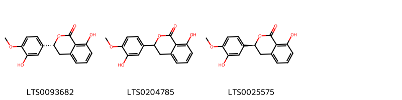{ width=100% }
    <figcaption>Hình ảnh cấu trúc hóa học của 3 hoạt chất thuộc nhóm Phenols gồm ['phyllodulcin (LTS0093682)', '8-hydroxy-3-(3-hydroxy-4-methoxyphenyl)-3,4-dihydro-2-benzopyran-1-one (LTS0204785)', '(3s)-8-hydroxy-3-(3-hydroxy-4-methoxyphenyl)-3,4-dihydro-2-benzopyran-1-one (LTS0025575)'].</figcaption>
</figure>
#### Nhóm Prenol lipids
<figure markdown="span">
    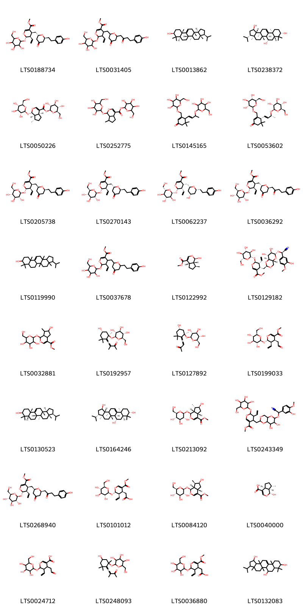{ width=100% }
    <figcaption>Hình ảnh cấu trúc hóa học của 32 hoạt chất thuộc nhóm Prenol lipids gồm ['methyl (4s,5r,6s)-5-ethenyl-4-{[(2s,6s)-6-[2-(4-hydroxyphenyl)ethyl]-4-oxooxan-2-yl]methyl}-6-{[3,4,5-trihydroxy-6-(hydroxymethyl)oxan-2-yl]oxy}-5,6-dihydro-4h-pyran-3-carboxylate (LTS0188734)', 'methyl 5-ethenyl-4-({6-[4-(4-hydroxyphenyl)-2-oxobutyl]-4-oxooxan-2-yl}methyl)-6-{[3,4,5-trihydroxy-6-(hydroxymethyl)oxan-2-yl]oxy}-5,6-dihydro-4h-pyran-3-carboxylate (LTS0031405)', 'isoarborinol (LTS0013862)', '(1r,3s,3as,5as,5bs,6s,7ar,9s,11as,13ar,13bs)-3-isopropyl-3a,5a,8,8,11a,13a-hexamethyl-1h,2h,3h,4h,5h,5bh,6h,7h,7ah,9h,10h,11h,13h,13bh-cyclopenta[a]chrysene-1,6,9-triol (LTS0238372)', '(2s,3r,4s,5s,6r)-3,4,5-trihydroxy-6-(hydroxymethyl)oxan-2-yl (1s,4as,7s,7ar)-7-methyl-1-{[(2s,3r,4s,5s,6r)-3,4,5-trihydroxy-6-(hydroxymethyl)oxan-2-yl]oxy}-1h,4ah,5h,6h,7h,7ah-cyclopenta[c]pyran-4-carboxylate (LTS0050226)', '3,4,5-trihydroxy-6-(hydroxymethyl)oxan-2-yl 7-methyl-1-{[3,4,5-trihydroxy-6-(hydroxymethyl)oxan-2-yl]oxy}-1h,4ah,5h,6h,7h,7ah-cyclopenta[c]pyran-4-carboxylate (LTS0252775)', '5,5-dimethyl-4-(3-{[3,4,5-trihydroxy-6-(hydroxymethyl)oxan-2-yl]oxy}but-1-en-1-yl)-3-({[3,4,5-trihydroxy-6-(hydroxymethyl)oxan-2-yl]oxy}methyl)cyclohex-2-en-1-one (LTS0145165)', '(4r)-5,5-dimethyl-4-[(1e,3r)-3-{[(2r,3r,4s,5s,6r)-3,4,5-trihydroxy-6-(hydroxymethyl)oxan-2-yl]oxy}but-1-en-1-yl]-3-({[(2r,3r,4s,5s,6r)-3,4,5-trihydroxy-6-(hydroxymethyl)oxan-2-yl]oxy}methyl)cyclohex-2-en-1-one (LTS0053602)', 'methyl (4s,5r,6s)-5-ethenyl-4-{[(2r,6s)-6-[2-(4-hydroxyphenyl)ethyl]-4-oxooxan-2-yl]methyl}-6-{[(2s,3r,4s,5s,6r)-3,4,5-trihydroxy-6-(hydroxymethyl)oxan-2-yl]oxy}-5,6-dihydro-4h-pyran-3-carboxylate (LTS0205738)', 'methyl (4s,5r,6s)-5-ethenyl-4-{[(2s,6s)-6-[2-(4-hydroxyphenyl)ethyl]-4-oxooxan-2-yl]methyl}-6-{[(2s,3r,4s,5s,6r)-3,4,5-trihydroxy-6-(hydroxymethyl)oxan-2-yl]oxy}-5,6-dihydro-4h-pyran-3-carboxylate (LTS0270143)', 'methyl (4r,5s,6s)-5-ethenyl-4-{[(2s,4s,6r)-4-hydroxy-6-[2-(4-hydroxyphenyl)ethyl]oxan-2-yl]methyl}-6-{[(2r,3s,4r,5r,6s)-3,4,5-trihydroxy-6-(hydroxymethyl)oxan-2-yl]oxy}-5,6-dihydro-4h-pyran-3-carboxylate (LTS0062237)', 'methyl (4s,5r,6s)-5-ethenyl-4-{[(2s,6s)-6-[4-(4-hydroxyphenyl)-2-oxobutyl]-4-oxooxan-2-yl]methyl}-6-{[(2s,3r,4s,5s,6r)-3,4,5-trihydroxy-6-(hydroxymethyl)oxan-2-yl]oxy}-5,6-dihydro-4h-pyran-3-carboxylate (LTS0036292)', '3-isopropyl-3a,5a,8,8,11a,13a-hexamethyl-1h,2h,3h,4h,5h,5bh,6h,7h,7ah,9h,10h,11h,13h,13bh-cyclopenta[a]chrysen-9-ol (LTS0119990)', 'methyl 5-ethenyl-4-({6-[2-(4-hydroxyphenyl)ethyl]-4-oxooxan-2-yl}methyl)-6-{[3,4,5-trihydroxy-6-(hydroxymethyl)oxan-2-yl]oxy}-5,6-dihydro-4h-pyran-3-carboxylate (LTS0037678)', '7-deoxyloganetin (LTS0122992)', 'methyl (4s,5r,6s)-4-{[(2r,4ar,6r,7r,8r,8as)-6-[(r)-cyano(3-hydroxy-4-methoxyphenyl)methoxy]-7,8-dihydroxy-hexahydro-2h-pyrano[3,2-d][1,3]dioxin-2-yl]methyl}-5-ethenyl-6-{[(2s,3r,4s,5s,6r)-3,4,5-trihydroxy-6-(hydroxymethyl)oxan-2-yl]oxy}-5,6-dihydro-4h-pyran-3-carboxylate (LTS0129182)', 'methyl 6-hydroxy-7-methyl-1-{[3,4,5-trihydroxy-6-(hydroxymethyl)oxan-2-yl]oxy}-1h,4ah,5h,6h,7h,7ah-cyclopenta[c]pyran-4-carboxylate (LTS0032881)', '4-[(4s,6r)-4-hydroxy-2,2,6-trimethyl-6-{[(2s,3r,4s,5s,6r)-3,4,5-trihydroxy-6-(hydroxymethyl)oxan-2-yl]oxy}cyclohexylidene]-3-methylbut-3-en-2-one (LTS0192957)', 'citroside b (LTS0127892)', '(-)-secologanin (LTS0199033)', '(3s,3as,5as,5bs,7as,9s,11as,13ar,13bs)-3-isopropyl-3a,5a,8,8,11a,13a-hexamethyl-1h,2h,3h,4h,5h,5bh,6h,7h,7ah,9h,10h,11h,13h,13bh-cyclopenta[a]chrysen-9-ol (LTS0130523)', '(1r,3s,3as,5as,5bs,6s,7as,9s,11as,13ar,13bs)-3-isopropyl-3a,5a,8,8,11a,13a-hexamethyl-1h,2h,3h,4h,5h,5bh,6h,7h,7ah,9h,10h,11h,13h,13bh-cyclopenta[a]chrysene-1,6,9-triol (LTS0164246)', 'methyl (1s,4as,6s,7s,7as)-6-hydroxy-7-methyl-1-{[(2s,3r,4s,5s,6r)-3,4,5-trihydroxy-6-(hydroxymethyl)oxan-2-yl]oxy}-1h,4ah,5h,6h,7h,7ah-cyclopenta[c]pyran-4-carboxylate (LTS0213092)', 'methyl 4-({6-[cyano(3-hydroxy-4-methoxyphenyl)methoxy]-7,8-dihydroxy-hexahydro-2h-pyrano[3,2-d][1,3]dioxin-2-yl}methyl)-5-ethenyl-6-{[3,4,5-trihydroxy-6-(hydroxymethyl)oxan-2-yl]oxy}-5,6-dihydro-4h-pyran-3-carboxylate (LTS0243349)', 'methyl (4s,5r,6s)-5-ethenyl-4-{[(2r,6s)-6-[4-(4-hydroxyphenyl)-2-oxobutyl]-4-oxooxan-2-yl]methyl}-6-{[(2s,3r,4s,5s,6r)-3,4,5-trihydroxy-6-(hydroxymethyl)oxan-2-yl]oxy}-5,6-dihydro-4h-pyran-3-carboxylate (LTS0268940)', '[(2s,3r,4s)-3-ethenyl-5-(methoxycarbonyl)-2-{[(2s,3r,4s,5s,6r)-3,4,5-trihydroxy-6-(hydroxymethyl)oxan-2-yl]oxy}-3,4-dihydro-2h-pyran-4-yl]acetic acid (LTS0101012)', 'loganin (LTS0084120)', '7-deoxyloganetic acid (LTS0040000)', '5-ethenyl-4-(2-oxoethyl)-6-{[3,4,5-trihydroxy-6-(hydroxymethyl)oxan-2-yl]oxy}-5,6-dihydro-4h-pyran-3-carboxylic acid (LTS0024712)', '4-(4-hydroxy-2,2,6-trimethyl-6-{[3,4,5-trihydroxy-6-(hydroxymethyl)oxan-2-yl]oxy}cyclohexylidene)-3-methylbut-3-en-2-one (LTS0248093)', '[3-ethenyl-5-(methoxycarbonyl)-2-{[3,4,5-trihydroxy-6-(hydroxymethyl)oxan-2-yl]oxy}-3,4-dihydro-2h-pyran-4-yl]acetic acid (LTS0036880)', '3-isopropyl-3a,5a,8,8,11a,13a-hexamethyl-1h,2h,3h,4h,5h,5bh,6h,7h,7ah,9h,10h,11h,13h,13bh-cyclopenta[a]chrysene-1,6,9-triol (LTS0132083)'].</figcaption>
</figure>
#### Nhóm Purine nucleosides
<figure markdown="span">
    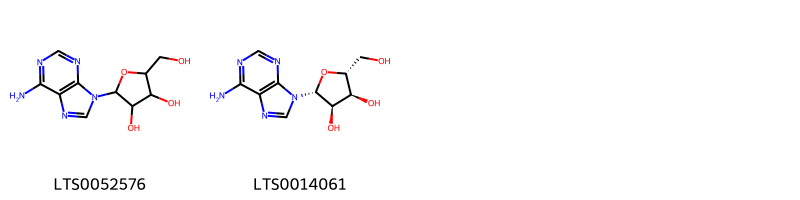{ width=100% }
    <figcaption>Hình ảnh cấu trúc hóa học của 2 hoạt chất thuộc nhóm Purine nucleosides gồm ['adenosine (LTS0052576)', 'adenosine (LTS0014061)'].</figcaption>
</figure>
#### Nhóm Pyrimidine nucleosides
<figure markdown="span">
    { width=100% }
    <figcaption>Hình ảnh cấu trúc hóa học của 2 hoạt chất thuộc nhóm Pyrimidine nucleosides gồm ['thymidine (LTS0162810)', '4-hydroxy-1-[4-hydroxy-5-(hydroxymethyl)oxolan-2-yl]-5-methylpyrimidin-2-one (LTS0253531)'].</figcaption>
</figure>
#### Nhóm Stilbenes
<figure markdown="span">
    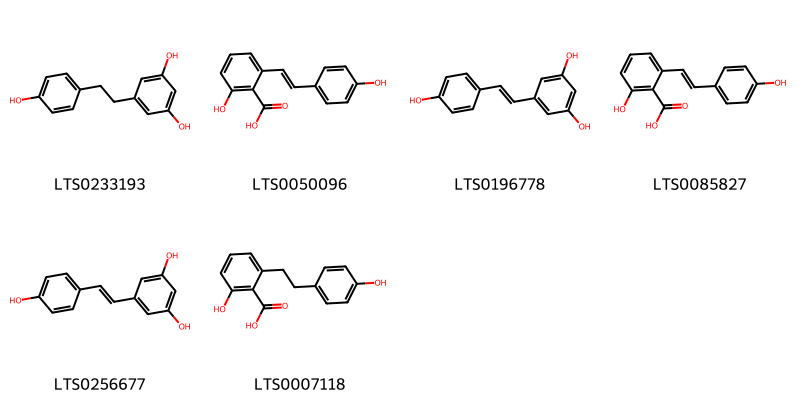{ width=100% }
    <figcaption>Hình ảnh cấu trúc hóa học của 6 hoạt chất thuộc nhóm Stilbenes gồm ['dihydroresveratrol (LTS0233193)', 'hydrangeic acid (LTS0050096)', 'tocilizumab (LTS0196778)', '2-hydroxy-6-[2-(4-hydroxyphenyl)ethenyl]benzoic acid (LTS0085827)', 'resveratrol (LTS0256677)', 'lunularic acid (LTS0007118)'].</figcaption>
</figure>

---

### Dược dân tộc học

Danh sách các quốc gia có sử dụng *Hydrangea macrophylla* trong điều trị các bệnh. 

| Country   | Disease   | Bệnh                                                                                                                                                                                                |
|:----------|:----------|:----------------------------------------------------------------------------------------------------------------------------------------------------------------------------------------------------|
| China     | Diuretic  | MYMEMORY WARNING: YOU USED ALL AVAILABLE FREE TRANSLATIONS FOR TODAY. NEXT AVAILABLE IN  11 HOURS 18 MINUTES 53 SECONDS VISIT HTTPS://MYMEMORY.TRANSLATED.NET/DOC/USAGELIMITS.PHP TO TRANSLATE MORE |
| Elsewhere | nan       | MYMEMORY WARNING: YOU USED ALL AVAILABLE FREE TRANSLATIONS FOR TODAY. NEXT AVAILABLE IN  11 HOURS 18 MINUTES 40 SECONDS VISIT HTTPS://MYMEMORY.TRANSLATED.NET/DOC/USAGELIMITS.PHP TO TRANSLATE MORE |

---

---
## Hydrangea paniculata
### Thông tin về thực vật

!!! info "Phân loại thực vật của *Hydrangea paniculata* từ GIBF:"
    - **Kingdom:** Plantae
    - **Phylum:** Tracheophyta
    - **Order:** Cornales
    - **Family:** Hydrangeaceae
    - **Genus:** Hydrangea
    - **Species:** *Hydrangea paniculata*

 

| Label (VI)   | Label (EN)   | Scientific Name      | Descriptions (VI)   | Descriptions (EN)                                      | Also Known As (VI)   | Also Known As (EN)   |
|:-------------|:-------------|:---------------------|:--------------------|:-------------------------------------------------------|:---------------------|:---------------------|
| N/A          | N/A          | Hydrangea paniculata |                     | species of flowering plant in the family Hydrangeaceae | ['']                 | ['']                 |

#### Phân bố trên thế giới

**Từ CSDL GIBF** Belarus, Austria, United States of America, Japan, Korea, Republic of, Norway, Sweden, Belgium, Chinese Taipei, Ukraine, China, Russian Federation, Kazakhstan, Canada, Germany, Denmark, Netherlands

#### Phân bố tại Việt Nam

**Từ CSDL GIBF**: Không có ghi nhận ở Việt Nam

---
### Thành phần hóa học
        
- Theo cơ sở dữ liệu lotus: Từ loài *Hydrangea paniculata* đã phân lập và xác định được 8 hoạt chất thuộc về các nhóm Organooxygen compounds, Coumarins and derivatives, Flavonoids. 

|    | chemicalTaxonomyClassyfireClass   |   smiles_count |
|---:|:----------------------------------|---------------:|
|  0 | Coumarins and derivatives         |              1 |
|  1 | Flavonoids                        |              5 |
|  2 | Organooxygen compounds            |              2 |

#### Nhóm Coumarins and derivatives
<figure markdown="span">
    { width=100% }
    <figcaption>Hình ảnh cấu trúc hóa học của 1 hoạt chất thuộc nhóm Coumarins and derivatives gồm ['umbelliferone (LTS0162728)'].</figcaption>
</figure>
#### Nhóm Flavonoids
<figure markdown="span">
    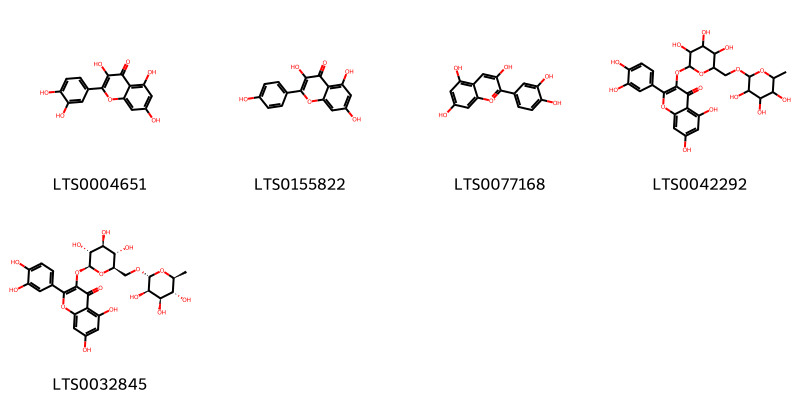{ width=100% }
    <figcaption>Hình ảnh cấu trúc hóa học của 5 hoạt chất thuộc nhóm Flavonoids gồm ['quercetin (LTS0004651)', 'kaempherol (LTS0155822)', 'cyanidin (LTS0077168)', 'rutin (LTS0042292)', '3-rutinosyl quercetin (LTS0032845)'].</figcaption>
</figure>
#### Nhóm Organooxygen compounds
<figure markdown="span">
    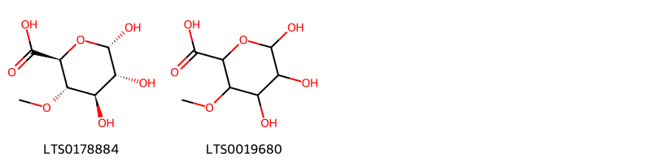{ width=100% }
    <figcaption>Hình ảnh cấu trúc hóa học của 2 hoạt chất thuộc nhóm Organooxygen compounds gồm ['(2s,3s,4r,5r,6s)-4,5,6-trihydroxy-3-methoxyoxane-2-carboxylic acid (LTS0178884)', '4-o-methyl-α-d-glucuronic acid (LTS0019680)'].</figcaption>
</figure>

---

### Dược dân tộc học

Danh sách các quốc gia có sử dụng *Hydrangea paniculata* trong điều trị các bệnh. 

| Country   | Disease   | Bệnh                                                                                                                                                                                                |
|:----------|:----------|:----------------------------------------------------------------------------------------------------------------------------------------------------------------------------------------------------|
| China     | Diuretic  | MYMEMORY WARNING: YOU USED ALL AVAILABLE FREE TRANSLATIONS FOR TODAY. NEXT AVAILABLE IN  11 HOURS 17 MINUTES 43 SECONDS VISIT HTTPS://MYMEMORY.TRANSLATED.NET/DOC/USAGELIMITS.PHP TO TRANSLATE MORE |

---

---
## Hydrangea strigosa
### Thông tin về thực vật

!!! info "Phân loại thực vật của *Hydrangea strigosa* từ GIBF:"
    - **Kingdom:** Plantae
    - **Phylum:** Tracheophyta
    - **Order:** Cornales
    - **Family:** Hydrangeaceae
    - **Genus:** Hydrangea
    - **Species:** *Hydrangea strigosa*

 

| Label (VI)   | Label (EN)   | Scientific Name    | Descriptions (VI)   | Descriptions (EN)                                      | Also Known As (VI)   | Also Known As (EN)   |
|:-------------|:-------------|:-------------------|:--------------------|:-------------------------------------------------------|:---------------------|:---------------------|
| N/A          | N/A          | Hydrangea strigosa |                     | Species of flowering plant in the family Hydrangeaceae | ['']                 | ['']                 |

#### Phân bố trên thế giới

**Từ CSDL GIBF** nan, Viet Nam, Korea, Republic of, Belgium, Chinese Taipei, China

#### Phân bố tại Việt Nam

**Từ CSDL GIBF**: Lâo Cai Prov.

---
### Thành phần hóa học
        
- Theo cơ sở dữ liệu lotus: Từ loài *Hydrangea strigosa* đã phân lập và xác định được Chưa có hoạt chất nào được phân lập. hoạt chất thuộc về các nhóm Không có hoạt chất nào được phân lập. 

Không có hình ảnh nào được tạo ra

---

### Dược dân tộc học

Danh sách các quốc gia có sử dụng *Hydrangea strigosa* trong điều trị các bệnh. 

| Country   | Disease   | Bệnh                                                                                                                                                                                                |
|:----------|:----------|:----------------------------------------------------------------------------------------------------------------------------------------------------------------------------------------------------|
| China     | Diuretic  | MYMEMORY WARNING: YOU USED ALL AVAILABLE FREE TRANSLATIONS FOR TODAY. NEXT AVAILABLE IN  11 HOURS 16 MINUTES 59 SECONDS VISIT HTTPS://MYMEMORY.TRANSLATED.NET/DOC/USAGELIMITS.PHP TO TRANSLATE MORE |

---

---
## Hydrangea umbellata
### Thông tin về thực vật

!!! info "Phân loại thực vật của *N/A* từ GIBF:"
    - **Kingdom:** Plantae
    - **Phylum:** Tracheophyta
    - **Order:** Cornales
    - **Family:** Hydrangeaceae
    - **Genus:** Hydrangea
    - **Species:** *N/A*

 

| Label (VI)   | Label (EN)   | Scientific Name    | Descriptions (VI)   | Descriptions (EN)                                      | Also Known As (VI)   | Also Known As (EN)   |
|:-------------|:-------------|:-------------------|:--------------------|:-------------------------------------------------------|:---------------------|:---------------------|
| N/A          | N/A          | Hydrangea strigosa |                     | Species of flowering plant in the family Hydrangeaceae | ['']                 | ['']                 |

#### Phân bố trên thế giới

**Từ CSDL GIBF** Brazil, Sweden, Nepal, China, Chile, New Zealand, Ecuador, Réunion, United States of America, Costa Rica, Argentina, Hong Kong, Chinese Taipei, Germany, Panama, Austria, Portugal, Australia, India

#### Phân bố tại Việt Nam

**Từ CSDL GIBF**: Không có ghi nhận ở Việt Nam

---
### Thành phần hóa học
        
- Theo cơ sở dữ liệu lotus: Từ loài *N/A* đã phân lập và xác định được Chưa có hoạt chất nào được phân lập. hoạt chất thuộc về các nhóm Không có hoạt chất nào được phân lập. 

Không có hình ảnh nào được tạo ra

---

### Dược dân tộc học

Danh sách các quốc gia có sử dụng *N/A* trong điều trị các bệnh. 

| Country   | Disease   | Bệnh                                                                                                                                                                                                |
|:----------|:----------|:----------------------------------------------------------------------------------------------------------------------------------------------------------------------------------------------------|
| China     | Diuretic  | MYMEMORY WARNING: YOU USED ALL AVAILABLE FREE TRANSLATIONS FOR TODAY. NEXT AVAILABLE IN  11 HOURS 16 MINUTES 09 SECONDS VISIT HTTPS://MYMEMORY.TRANSLATED.NET/DOC/USAGELIMITS.PHP TO TRANSLATE MORE |

---

# Chi Schizophragma

??? note "Danh sách các dược liệu thuộc chi"
    
	 - *Schizophragma integrifolia*

---
## Schizophragma integrifolia
### Thông tin về thực vật

!!! info "Phân loại thực vật của *Hydrangea hydrangeoides* từ GIBF:"
    - **Kingdom:** Plantae
    - **Phylum:** Tracheophyta
    - **Order:** Cornales
    - **Family:** Hydrangeaceae
    - **Genus:** Hydrangea
    - **Species:** *Hydrangea hydrangeoides*

 

| Label (VI)   | Label (EN)   | Scientific Name    | Descriptions (VI)   | Descriptions (EN)                                      | Also Known As (VI)   | Also Known As (EN)   |
|:-------------|:-------------|:-------------------|:--------------------|:-------------------------------------------------------|:---------------------|:---------------------|
| N/A          | N/A          | Hydrangea strigosa |                     | Species of flowering plant in the family Hydrangeaceae | ['']                 | ['']                 |

#### Phân bố trên thế giới

**Từ CSDL GIBF** Viet Nam, United States of America, Belgium, Chinese Taipei, China, New Zealand

#### Phân bố tại Việt Nam

**Từ CSDL GIBF**: Lào Cai, Lao Cai, Thua Thien-Hue

---
### Thành phần hóa học
        
- Theo cơ sở dữ liệu lotus: Từ loài *Hydrangea hydrangeoides* đã phân lập và xác định được Chưa có hoạt chất nào được phân lập. hoạt chất thuộc về các nhóm Không có hoạt chất nào được phân lập. 

Không có hình ảnh nào được tạo ra

---

### Dược dân tộc học

Danh sách các quốc gia có sử dụng *Hydrangea hydrangeoides* trong điều trị các bệnh. 

| Country   | Disease                  | Bệnh                                                                                                                                                                                                |
|:----------|:-------------------------|:----------------------------------------------------------------------------------------------------------------------------------------------------------------------------------------------------|
| China     | Carminative, Refrigerant | MYMEMORY WARNING: YOU USED ALL AVAILABLE FREE TRANSLATIONS FOR TODAY. NEXT AVAILABLE IN  11 HOURS 15 MINUTES 32 SECONDS VISIT HTTPS://MYMEMORY.TRANSLATED.NET/DOC/USAGELIMITS.PHP TO TRANSLATE MORE |

---

