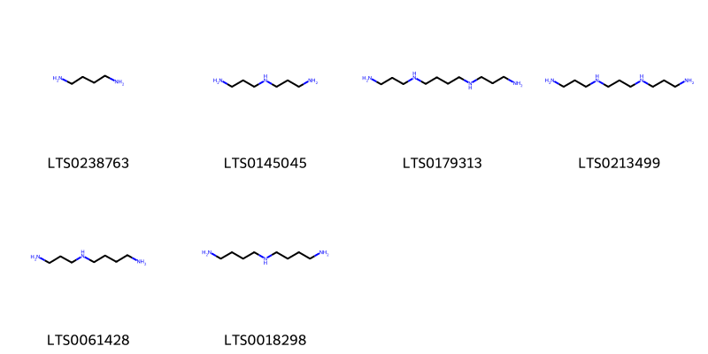
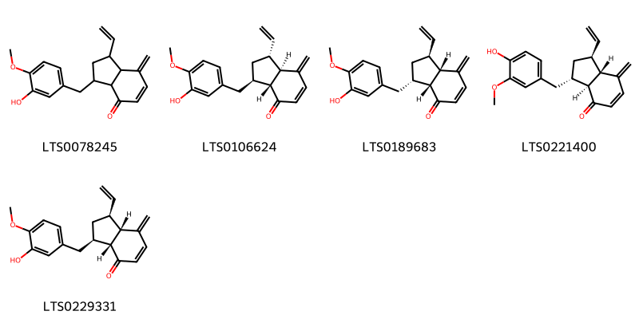

!!! abstract "Tóm tắt"

    Họ Hydrocharitaceae gồm khoảng 4 chi và 4 loài được một số cộng đồng tại các quốc gia như Malaya, India, Elsewhere, China sử dụng trong một số trường hợp MYMEMORY WARNING: YOU USED ALL AVAILABLE FREE TRANSLATIONS FOR TODAY. NEXT AVAILABLE IN  12 HOURS 42 MINUTES 24 SECONDS VISIT HTTPS://MYMEMORY.TRANSLATED.NET/DOC/USAGELIMITS.PHP TO TRANSLATE MORE.

!!! info "DrDuke"

    James A. Duke sinh năm 1929-2017 là một nhà thực vật học người Mỹ. Đây là một trong những tác giả hàng đầu trong lĩnh vực dược dân tộc học với cuốn *CRC Handbook of Medicinal Herbs* và chính là người xây dựng lên cơ sở dữ liệu về hợp chất tự nhiên và dược dân tộc học tại Bộ nông nghiệp Hoa Kỳ. Các thông tin được đăng tải tại website [Dr. Duke's Phytochemical and Ethnobotanical Databases](https://phytochem.nal.usda.gov/). 
    Trong suốt thập niên 1970, ông lãnh đạo the Plant Taxonomy Laboratory, Plant Genetics and Germplasm Institute of the Agricultural Research Service, U.S. Department of Agriculture.
    Trong tài liệu này, các thông tin về dược dân tộc của các dược liệu được trích dẫn từ tài liệu của James A. Ducke với sự trợ giúp của phần mềm dịch thuật từ tiếng Anh sang tiếng Việt.
   

# Chi Hydrocharis

??? note "Danh sách các dược liệu thuộc chi"
    
	 - *Hydrocharis dubia*

---
## Hydrocharis dubia
### Thông tin về thực vật

!!! info "Phân loại thực vật của *Hydrocharis dubia* từ GIBF:"
    - **Kingdom:** Plantae
    - **Phylum:** Tracheophyta
    - **Order:** Alismatales
    - **Family:** Hydrocharitaceae
    - **Genus:** Hydrocharis
    - **Species:** *Hydrocharis dubia*

 

| Label (VI)   | Label (EN)   | Scientific Name   | Descriptions (VI)   | Descriptions (EN)   | Also Known As (VI)   | Also Known As (EN)   |
|:-------------|:-------------|:------------------|:--------------------|:--------------------|:---------------------|:---------------------|
| N/A          | N/A          | Hydrocharis dubia |                     | species of plant    | ['']                 | ['']                 |

#### Phân bố trên thế giới

**Từ CSDL GIBF** nan, Japan, United States of America, Korea, Republic of, Chinese Taipei, China, Russian Federation, Australia, Germany, Thailand

#### Phân bố tại Việt Nam

**Từ CSDL GIBF**: Không có ghi nhận ở Việt Nam

---
### Thành phần hóa học
        
- Theo cơ sở dữ liệu lotus: Từ loài *Hydrocharis dubia* đã phân lập và xác định được Chưa có hoạt chất nào được phân lập. hoạt chất thuộc về các nhóm Không có hoạt chất nào được phân lập. 

Không có hình ảnh nào được tạo ra

---

### Dược dân tộc học

Danh sách các quốc gia có sử dụng *Hydrocharis dubia* trong điều trị các bệnh. 

| Country   | Disease    | Bệnh                                                                                                                                                                                                |
|:----------|:-----------|:----------------------------------------------------------------------------------------------------------------------------------------------------------------------------------------------------|
| India     | Astringent | MYMEMORY WARNING: YOU USED ALL AVAILABLE FREE TRANSLATIONS FOR TODAY. NEXT AVAILABLE IN  12 HOURS 42 MINUTES 21 SECONDS VISIT HTTPS://MYMEMORY.TRANSLATED.NET/DOC/USAGELIMITS.PHP TO TRANSLATE MORE |

---

# Chi Hydrilla

??? note "Danh sách các dược liệu thuộc chi"
    
	 - *Hydrilla verticillata*

---
## Hydrilla verticillata
### Thông tin về thực vật

!!! info "Phân loại thực vật của *Hydrilla verticillata* từ GIBF:"
    - **Kingdom:** Plantae
    - **Phylum:** Tracheophyta
    - **Order:** Alismatales
    - **Family:** Hydrocharitaceae
    - **Genus:** Hydrilla
    - **Species:** *Hydrilla verticillata*

 

| Label (VI)   | Label (EN)   | Scientific Name       | Descriptions (VI)   | Descriptions (EN)   | Also Known As (VI)   | Also Known As (EN)   |
|:-------------|:-------------|:----------------------|:--------------------|:--------------------|:---------------------|:---------------------|
| N/A          | N/A          | Hydrilla verticillata | loài thực vật       | species of plant    | ['']                 | ['']                 |

#### Phân bố trên thế giới

**Từ CSDL GIBF** Guatemala, Barbados, China, Honduras, Thailand, Sri Lanka, United States of America, Indonesia, Costa Rica, Russian Federation, Dominican Republic, Hong Kong, Mexico, Congo, Democratic Republic of the, El Salvador, Belgium, Malaysia, Chinese Taipei, Canada, Germany, Panama, Australia, India, Peru

#### Phân bố tại Việt Nam

**Từ CSDL GIBF**: Không có ghi nhận ở Việt Nam

---
### Thành phần hóa học
        
- Theo cơ sở dữ liệu lotus: Từ loài *Hydrilla verticillata* đã phân lập và xác định được 26 hoạt chất thuộc về các nhóm Carboxylic acids and derivatives, Organonitrogen compounds, Indoles and derivatives. 

|    | chemicalTaxonomyClassyfireClass   |   smiles_count |
|---:|:----------------------------------|---------------:|
|  0 | Carboxylic acids and derivatives  |             19 |
|  1 | Indoles and derivatives           |              1 |
|  2 | Organonitrogen compounds          |              6 |

#### Nhóm Carboxylic acids and derivatives
<figure markdown="span">
    { width=100% }
    <figcaption>Hình ảnh cấu trúc hóa học của 19 hoạt chất thuộc nhóm Carboxylic acids and derivatives gồm ['l-threonine (LTS0184056)', 'l-serine (LTS0106692)', 'l-alanine (LTS0042208)', 'l-lysine (LTS0068734)', 'd-methionine (LTS0108782)', 'l-aspartic acid (LTS0205466)', 'l-proline (LTS0090383)', 'd-phenylalanine (LTS0048920)', 'l-methionine (LTS0196746)', 'l-isoleucine (LTS0249538)', '(2s)-2-(phenylamino)propanoic acid (LTS0199539)', 'l-valine (LTS0231703)', 'd-aspartic acid (LTS0144001)', 'd-alanine (LTS0272178)', 'l-glutamic acid (LTS0037133)', 'l-arginine (LTS0064737)', 'l-tyrosine (LTS0029981)', 'l-leucine (LTS0113423)', 'l-histidine (LTS0094081)'].</figcaption>
</figure>
#### Nhóm Indoles and derivatives
<figure markdown="span">
    { width=100% }
    <figcaption>Hình ảnh cấu trúc hóa học của 1 hoạt chất thuộc nhóm Indoles and derivatives gồm ['l-tryptophan (LTS0263809)'].</figcaption>
</figure>
#### Nhóm Organonitrogen compounds
<figure markdown="span">
    { width=100% }
    <figcaption>Hình ảnh cấu trúc hóa học của 6 hoạt chất thuộc nhóm Organonitrogen compounds gồm ['putrescine (LTS0238763)', 'norspermidine (LTS0145045)', 'spermine (LTS0179313)', 'norspermine (LTS0213499)', 'spermidine (LTS0061428)', 'homospermidine (LTS0018298)'].</figcaption>
</figure>

---

### Dược dân tộc học

Danh sách các quốc gia có sử dụng *Hydrilla verticillata* trong điều trị các bệnh. 

| Country   | Disease     | Bệnh                                                                                                                                                                                                |
|:----------|:------------|:----------------------------------------------------------------------------------------------------------------------------------------------------------------------------------------------------|
| China     | Cicatrizant | MYMEMORY WARNING: YOU USED ALL AVAILABLE FREE TRANSLATIONS FOR TODAY. NEXT AVAILABLE IN  12 HOURS 41 MINUTES 45 SECONDS VISIT HTTPS://MYMEMORY.TRANSLATED.NET/DOC/USAGELIMITS.PHP TO TRANSLATE MORE |

---

# Chi Ottelia

??? note "Danh sách các dược liệu thuộc chi"
    
	 - *Ottelia alismoides*

---
## Ottelia alismoides
### Thông tin về thực vật

!!! info "Phân loại thực vật của *Ottelia alismoides* từ GIBF:"
    - **Kingdom:** Plantae
    - **Phylum:** Tracheophyta
    - **Order:** Alismatales
    - **Family:** Hydrocharitaceae
    - **Genus:** Ottelia
    - **Species:** *Ottelia alismoides*

 

| Label (VI)   | Label (EN)   | Scientific Name    | Descriptions (VI)   | Descriptions (EN)   | Also Known As (VI)   | Also Known As (EN)                 |
|:-------------|:-------------|:-------------------|:--------------------|:--------------------|:---------------------|:-----------------------------------|
| N/A          | N/A          | Ottelia alismoides | loài thực vật       | species of plant    | ['']                 | ['Duck-Lettuce', 'Water Plantain'] |

#### Phân bố trên thế giới

**Từ CSDL GIBF** Sri Lanka, nan, Japan, United States of America, Korea, Republic of, Indonesia, Chinese Taipei, Philippines, China, Australia, Timor-Leste, Myanmar, Italy, India, Nepal, Thailand

#### Phân bố tại Việt Nam

**Từ CSDL GIBF**: Không có ghi nhận ở Việt Nam

---
### Thành phần hóa học
        
- Theo cơ sở dữ liệu lotus: Từ loài *Ottelia alismoides* đã phân lập và xác định được 5 hoạt chất thuộc về các nhóm Prenol lipids. 

|    | chemicalTaxonomyClassyfireClass   |   smiles_count |
|---:|:----------------------------------|---------------:|
|  0 | Prenol lipids                     |              5 |

#### Nhóm Prenol lipids
<figure markdown="span">
    { width=100% }
    <figcaption>Hình ảnh cấu trúc hóa học của 5 hoạt chất thuộc nhóm Prenol lipids gồm ['1-ethenyl-3-[(3-hydroxy-4-methoxyphenyl)methyl]-7-methylidene-2,3,3a,7a-tetrahydro-1h-inden-4-one (LTS0078245)', '(1r,3r,3ar,7ar)-1-ethenyl-3-[(3-hydroxy-4-methoxyphenyl)methyl]-7-methylidene-2,3,3a,7a-tetrahydro-1h-inden-4-one (LTS0106624)', '(1s,3s,3ar,7as)-1-ethenyl-3-[(3-hydroxy-4-methoxyphenyl)methyl]-7-methylidene-2,3,3a,7a-tetrahydro-1h-inden-4-one (LTS0189683)', '(1s,3s,3as,7as)-1-ethenyl-3-[(4-hydroxy-3-methoxyphenyl)methyl]-7-methylidene-2,3,3a,7a-tetrahydro-1h-inden-4-one (LTS0221400)', '(1s,3r,3ar,7as)-1-ethenyl-3-[(3-hydroxy-4-methoxyphenyl)methyl]-7-methylidene-2,3,3a,7a-tetrahydro-1h-inden-4-one (LTS0229331)'].</figcaption>
</figure>

---

### Dược dân tộc học

Danh sách các quốc gia có sử dụng *Ottelia alismoides* trong điều trị các bệnh. 

| Country   | Disease     | Bệnh                                                                                                                                                                                                |
|:----------|:------------|:----------------------------------------------------------------------------------------------------------------------------------------------------------------------------------------------------|
| Elsewhere | Rubefacient | MYMEMORY WARNING: YOU USED ALL AVAILABLE FREE TRANSLATIONS FOR TODAY. NEXT AVAILABLE IN  12 HOURS 41 MINUTES 06 SECONDS VISIT HTTPS://MYMEMORY.TRANSLATED.NET/DOC/USAGELIMITS.PHP TO TRANSLATE MORE |
| India     | Rubefacient | MYMEMORY WARNING: YOU USED ALL AVAILABLE FREE TRANSLATIONS FOR TODAY. NEXT AVAILABLE IN  12 HOURS 41 MINUTES 03 SECONDS VISIT HTTPS://MYMEMORY.TRANSLATED.NET/DOC/USAGELIMITS.PHP TO TRANSLATE MORE |
| Malaya    | Rubefacient | MYMEMORY WARNING: YOU USED ALL AVAILABLE FREE TRANSLATIONS FOR TODAY. NEXT AVAILABLE IN  12 HOURS 41 MINUTES 00 SECONDS VISIT HTTPS://MYMEMORY.TRANSLATED.NET/DOC/USAGELIMITS.PHP TO TRANSLATE MORE |

---

# Chi Vallisneria

??? note "Danh sách các dược liệu thuộc chi"
    
	 - *Vallisneria iralis*

---
## Vallisneria iralis
### Thông tin về thực vật

!!! info "Phân loại thực vật của *N/A* từ GIBF:"
    - **Kingdom:** Plantae
    - **Phylum:** Tracheophyta
    - **Order:** Alismatales
    - **Family:** Hydrocharitaceae
    - **Genus:** Vallisneria
    - **Species:** *N/A*

 

| Label (VI)   | Label (EN)   | Scientific Name    | Descriptions (VI)   | Descriptions (EN)   | Also Known As (VI)   | Also Known As (EN)                 |
|:-------------|:-------------|:-------------------|:--------------------|:--------------------|:---------------------|:-----------------------------------|
| N/A          | N/A          | Ottelia alismoides | loài thực vật       | species of plant    | ['']                 | ['Duck-Lettuce', 'Water Plantain'] |

#### Phân bố trên thế giới

**Từ CSDL GIBF** China, New Zealand, Netherlands, Montenegro, United States of America, Albania, Russian Federation, Colombia, unknown or invalid, United Kingdom of Great Britain and Northern Ireland, Belgium, Chinese Taipei, Malaysia, Canada, Germany, Austria, Portugal, Ukraine, Australia, Italy, Switzerland, France

#### Phân bố tại Việt Nam

**Từ CSDL GIBF**: Không có ghi nhận ở Việt Nam

---
### Thành phần hóa học
        
- Theo cơ sở dữ liệu lotus: Từ loài *N/A* đã phân lập và xác định được Chưa có hoạt chất nào được phân lập. hoạt chất thuộc về các nhóm Không có hoạt chất nào được phân lập. 

Không có hình ảnh nào được tạo ra

---

### Dược dân tộc học

Danh sách các quốc gia có sử dụng *N/A* trong điều trị các bệnh. 

| Country   | Disease                           | Bệnh                                                                                                                                                                                                |
|:----------|:----------------------------------|:----------------------------------------------------------------------------------------------------------------------------------------------------------------------------------------------------|
| China     | Apertif                           | MYMEMORY WARNING: YOU USED ALL AVAILABLE FREE TRANSLATIONS FOR TODAY. NEXT AVAILABLE IN  12 HOURS 40 MINUTES 20 SECONDS VISIT HTTPS://MYMEMORY.TRANSLATED.NET/DOC/USAGELIMITS.PHP TO TRANSLATE MORE |
| Elsewhere | Refrigerant, Stomachic, Demulcent | MYMEMORY WARNING: YOU USED ALL AVAILABLE FREE TRANSLATIONS FOR TODAY. NEXT AVAILABLE IN  12 HOURS 40 MINUTES 13 SECONDS VISIT HTTPS://MYMEMORY.TRANSLATED.NET/DOC/USAGELIMITS.PHP TO TRANSLATE MORE |

---

