!!! abstract "Tóm tắt"

    Họ Illiciaceae gồm khoảng 1 chi và 4 loài được một số cộng đồng tại các quốc gia như Elsewhere, Japan, India, Mexico, China, Turkey, Malaya sử dụng trong một số trường hợp MYMEMORY WARNING: YOU USED ALL AVAILABLE FREE TRANSLATIONS FOR TODAY. NEXT AVAILABLE IN  09 HOURS 09 MINUTES 40 SECONDS VISIT HTTPS://MYMEMORY.TRANSLATED.NET/DOC/USAGELIMITS.PHP TO TRANSLATE MORE.

!!! info "DrDuke"

    James A. Duke sinh năm 1929-2017 là một nhà thực vật học người Mỹ. Đây là một trong những tác giả hàng đầu trong lĩnh vực dược dân tộc học với cuốn *CRC Handbook of Medicinal Herbs* và chính là người xây dựng lên cơ sở dữ liệu về hợp chất tự nhiên và dược dân tộc học tại Bộ nông nghiệp Hoa Kỳ. Các thông tin được đăng tải tại website [Dr. Duke's Phytochemical and Ethnobotanical Databases](https://phytochem.nal.usda.gov/). 
    Trong suốt thập niên 1970, ông lãnh đạo the Plant Taxonomy Laboratory, Plant Genetics and Germplasm Institute of the Agricultural Research Service, U.S. Department of Agriculture.
    Trong tài liệu này, các thông tin về dược dân tộc của các dược liệu được trích dẫn từ tài liệu của James A. Ducke với sự trợ giúp của phần mềm dịch thuật từ tiếng Anh sang tiếng Việt.
   

# Chi Illicium

??? note "Danh sách các dược liệu thuộc chi"
    
	 - *Illicium anisatum*
	 - *Illicium floridanum*
	 - *Illicium griffithii*
	 - *Illicium verum*

---
## Illicium anisatum
### Thông tin về thực vật

!!! info "Phân loại thực vật của *Illicium anisatum* từ GIBF:"
    - **Kingdom:** Plantae
    - **Phylum:** Tracheophyta
    - **Order:** Austrobaileyales
    - **Family:** Schisandraceae
    - **Genus:** Illicium
    - **Species:** *Illicium anisatum*

 

| Label (VI)   | Label (EN)   | Scientific Name   | Descriptions (VI)   | Descriptions (EN)   | Also Known As (VI)   | Also Known As (EN)                            |
|:-------------|:-------------|:------------------|:--------------------|:--------------------|:---------------------|:----------------------------------------------|
| N/A          | N/A          | Illicium anisatum | loài thực vật       | species of plant    | ['']                 | ['Illicium japonicum', 'Japanese star anise'] |

#### Phân bố trên thế giới

**Từ CSDL GIBF** New Zealand, Japan, Chinese Taipei

#### Phân bố tại Việt Nam

**Từ CSDL GIBF**: Không có ghi nhận ở Việt Nam

---
### Thành phần hóa học
        
- Theo cơ sở dữ liệu lotus: Từ loài *Illicium anisatum* đã phân lập và xác định được 80 hoạt chất thuộc về các nhóm Vinylogous esters, Organooxygen compounds, Flavonoids, Lactones, Benzofurans, Oxepanes, Prenol lipids, Dioxolanes, Phenols, Benzodioxoles, Phenol ethers. 

|    | chemicalTaxonomyClassyfireClass   |   smiles_count |
|---:|:----------------------------------|---------------:|
|  0 | Benzodioxoles                     |              3 |
|  1 | Benzofurans                       |              6 |
|  2 | Dioxolanes                        |              2 |
|  3 | Flavonoids                        |             15 |
|  4 | Lactones                          |             15 |
|  5 | Organooxygen compounds            |             13 |
|  6 | Oxepanes                          |              3 |
|  7 | Phenol ethers                     |              2 |
|  8 | Phenols                           |              4 |
|  9 | Prenol lipids                     |             15 |
| 10 | Vinylogous esters                 |              2 |

#### Nhóm Benzodioxoles
<figure markdown="span">
    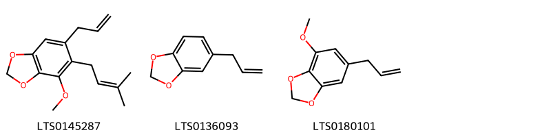{ width=100% }
    <figcaption>Hình ảnh cấu trúc hóa học của 3 hoạt chất thuộc nhóm Benzodioxoles gồm ['4-methoxy-5-(3-methylbut-2-en-1-yl)-6-(prop-2-en-1-yl)-2h-1,3-benzodioxole (LTS0145287)', 'sassafras (LTS0136093)', 'myristicin (LTS0180101)'].</figcaption>
</figure>
#### Nhóm Benzofurans
<figure markdown="span">
    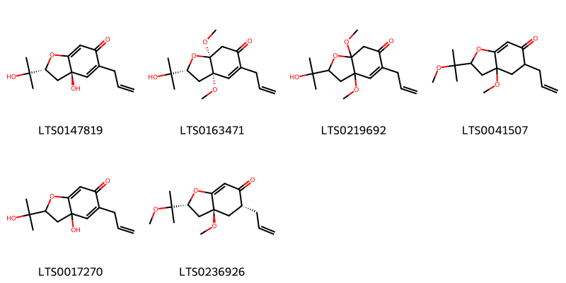{ width=100% }
    <figcaption>Hình ảnh cấu trúc hóa học của 6 hoạt chất thuộc nhóm Benzofurans gồm ['(2r,3ar)-3a-hydroxy-2-(2-hydroxypropan-2-yl)-5-(prop-2-en-1-yl)-2,3-dihydro-1-benzofuran-6-one (LTS0147819)', '(2r,3as,7as)-2-(2-hydroxypropan-2-yl)-3a,7a-dimethoxy-5-(prop-2-en-1-yl)-3,7-dihydro-2h-1-benzofuran-6-one (LTS0163471)', '2-(2-hydroxypropan-2-yl)-3a,7a-dimethoxy-5-(prop-2-en-1-yl)-3,7-dihydro-2h-1-benzofuran-6-one (LTS0219692)', '3a-methoxy-2-(2-methoxypropan-2-yl)-5-(prop-2-en-1-yl)-2,3,4,5-tetrahydro-1-benzofuran-6-one (LTS0041507)', '3a-hydroxy-2-(2-hydroxypropan-2-yl)-5-(prop-2-en-1-yl)-2,3-dihydro-1-benzofuran-6-one (LTS0017270)', '(2r,3as,5r)-3a-methoxy-2-(2-methoxypropan-2-yl)-5-(prop-2-en-1-yl)-2,3,4,5-tetrahydro-1-benzofuran-6-one (LTS0236926)'].</figcaption>
</figure>
#### Nhóm Dioxolanes
<figure markdown="span">
    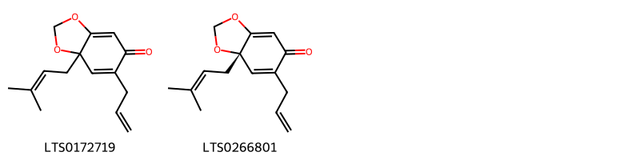{ width=100% }
    <figcaption>Hình ảnh cấu trúc hóa học của 2 hoạt chất thuộc nhóm Dioxolanes gồm ['7a-(3-methylbut-2-en-1-yl)-6-(prop-2-en-1-yl)-2h-1,3-benzodioxol-5-one (LTS0172719)', '(7as)-7a-(3-methylbut-2-en-1-yl)-6-(prop-2-en-1-yl)-2h-1,3-benzodioxol-5-one (LTS0266801)'].</figcaption>
</figure>
#### Nhóm Flavonoids
<figure markdown="span">
    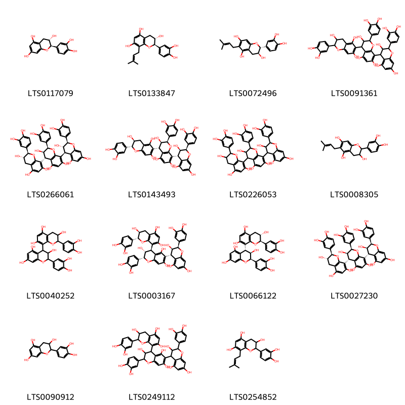{ width=100% }
    <figcaption>Hình ảnh cấu trúc hóa học của 15 hoạt chất thuộc nhóm Flavonoids gồm ['(+)-catechol (LTS0117079)', '8-prenylcatechin (LTS0133847)', '6-prenylcatechin (LTS0072496)', 'arecatannin b1 (LTS0091361)', '(2r,3r,4s)-2-(3,4-dihydroxyphenyl)-8-[(2r,3s,4s)-2-(3,4-dihydroxyphenyl)-3,5,7-trihydroxy-3,4-dihydro-2h-1-benzopyran-4-yl]-4-[(2r,3s)-2-(3,4-dihydroxyphenyl)-3,5,7-trihydroxy-3,4-dihydro-2h-1-benzopyran-8-yl]-3,4-dihydro-2h-1-benzopyran-3,5,7-triol (LTS0266061)', 'arecatannin b1 (LTS0143493)', 'procyanidin c2 (LTS0226053)', '2-(3,4-dihydroxyphenyl)-6-(3-methylbut-2-en-1-yl)-3,4-dihydro-2h-1-benzopyran-3,5,7-triol (LTS0008305)', '2-(3,4-dihydroxyphenyl)-4-[2-(3,4-dihydroxyphenyl)-3,5,7-trihydroxy-3,4-dihydro-2h-1-benzopyran-8-yl]-3,4-dihydro-2h-1-benzopyran-3,5,7-triol (LTS0040252)', '(2r,3r,4r)-2-(3,4-dihydroxyphenyl)-6-[(2r,3r,4s)-2-(3,4-dihydroxyphenyl)-3,5,7-trihydroxy-3,4-dihydro-2h-1-benzopyran-4-yl]-4-[(2r,3s)-2-(3,4-dihydroxyphenyl)-3,5,7-trihydroxy-3,4-dihydro-2h-1-benzopyran-8-yl]-3,4-dihydro-2h-1-benzopyran-3,5,7-triol (LTS0003167)', '(2r,3r,4r)-2-(3,4-dihydroxyphenyl)-4-[(2r,3s)-2-(3,4-dihydroxyphenyl)-3,5,7-trihydroxy-3,4-dihydro-2h-1-benzopyran-8-yl]-3,4-dihydro-2h-1-benzopyran-3,5,7-triol (LTS0066122)', '(2r,3r,4s)-2-(3,4-dihydroxyphenyl)-8-[(2r,3r,4r)-2-(3,4-dihydroxyphenyl)-3,5,7-trihydroxy-3,4-dihydro-2h-1-benzopyran-4-yl]-4-[(2r,3s)-2-(3,4-dihydroxyphenyl)-3,5,7-trihydroxy-3,4-dihydro-2h-1-benzopyran-8-yl]-3,4-dihydro-2h-1-benzopyran-3,5,7-triol (LTS0027230)', 'catechol (LTS0090912)', '2-(3,4-dihydroxyphenyl)-6-[2-(3,4-dihydroxyphenyl)-3,5,7-trihydroxy-3,4-dihydro-2h-1-benzopyran-4-yl]-4-[2-(3,4-dihydroxyphenyl)-3,5,7-trihydroxy-3,4-dihydro-2h-1-benzopyran-8-yl]-3,4-dihydro-2h-1-benzopyran-3,5,7-triol (LTS0249112)', '2-(3,4-dihydroxyphenyl)-8-(3-methylbut-2-en-1-yl)-3,4-dihydro-2h-1-benzopyran-3,5,7-triol (LTS0254852)'].</figcaption>
</figure>
#### Nhóm Lactones
<figure markdown="span">
    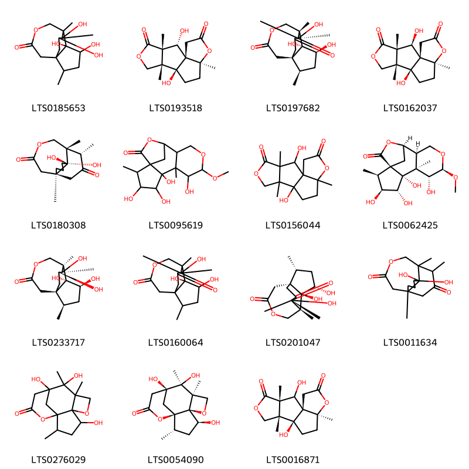{ width=100% }
    <figcaption>Hình ảnh cấu trúc hóa học của 15 hoạt chất thuộc nhóm Lactones gồm ['4,5,12,13-tetrahydroxy-2,6,13-trimethyl-8-oxatricyclo[4.4.3.0¹,⁵]tridecan-9-one (LTS0185653)', '(1s,2r,3s,7s,8s,11s)-2,8-dihydroxy-3,7,11-trimethyl-5,12-dioxatetracyclo[6.6.0.0¹,¹¹.0³,⁷]tetradecane-4,13-dione (LTS0193518)', '(1r,2r,4s,5r,6r,13r)-4,5,13-trihydroxy-2,6,13-trimethyl-8-oxatricyclo[4.4.3.0¹,⁵]tridecane-9,12-dione (LTS0197682)', '(1s,2s,3s,7s,8s,11s)-2,8-dihydroxy-3,7,11-trimethyl-5,12-dioxatetracyclo[6.6.0.0¹,¹¹.0³,⁷]tetradecane-4,13-dione (LTS0162037)', '(1r,2r,4s,5r,6s,13s)-4,5-dihydroxy-2,6,13-trimethyl-8-oxatricyclo[4.4.3.0¹,⁵]tridecane-9,12-dione (LTS0180308)', '3,4,5,7-tetrahydroxy-8-methoxy-2,6-dimethyl-9,13-dioxatetracyclo[10.2.1.0¹,⁵.0⁶,¹¹]pentadecan-14-one (LTS0095619)', '2,8-dihydroxy-3,7,11-trimethyl-5,12-dioxatetracyclo[6.6.0.0¹,¹¹.0³,⁷]tetradecane-4,13-dione (LTS0156044)', '(1r,2s,3s,4r,5s,6s,7r,8r,11r,12r)-3,4,5,7-tetrahydroxy-8-methoxy-2,6-dimethyl-9,13-dioxatetracyclo[10.2.1.0¹,⁵.0⁶,¹¹]pentadecan-14-one (LTS0062425)', '(1r,2r,4s,5r,6r,12r,13r)-4,5,12,13-tetrahydroxy-2,6,13-trimethyl-8-oxatricyclo[4.4.3.0¹,⁵]tridecan-9-one (LTS0233717)', '4,5,13-trihydroxy-2,6,13-trimethyl-8-oxatricyclo[4.4.3.0¹,⁵]tridecane-9,12-dione (LTS0160064)', '(1r,2r,4s,5r,6s,13r)-4,5,13-trihydroxy-2,6,13-trimethyl-8-oxatricyclo[4.4.3.0¹,⁵]tridecane-9,12-dione (LTS0201047)', '4,5-dihydroxy-2,6,13-trimethyl-8-oxatricyclo[4.4.3.0¹,⁵]tridecane-9,12-dione (LTS0011634)', '4,9,10-trihydroxy-2,8,9-trimethyl-6,13-dioxatetracyclo[8.3.1.0¹,⁵.0⁵,⁸]tetradecan-12-one (LTS0276029)', '(1r,2s,4s,5s,8r,9s,10s)-4,9,10-trihydroxy-2,8,9-trimethyl-6,13-dioxatetracyclo[8.3.1.0¹,⁵.0⁵,⁸]tetradecan-12-one (LTS0054090)', '(1s,3s,7s,8s,11s)-2,8-dihydroxy-3,7,11-trimethyl-5,12-dioxatetracyclo[6.6.0.0¹,¹¹.0³,⁷]tetradecane-4,13-dione (LTS0016871)'].</figcaption>
</figure>
#### Nhóm Organooxygen compounds
<figure markdown="span">
    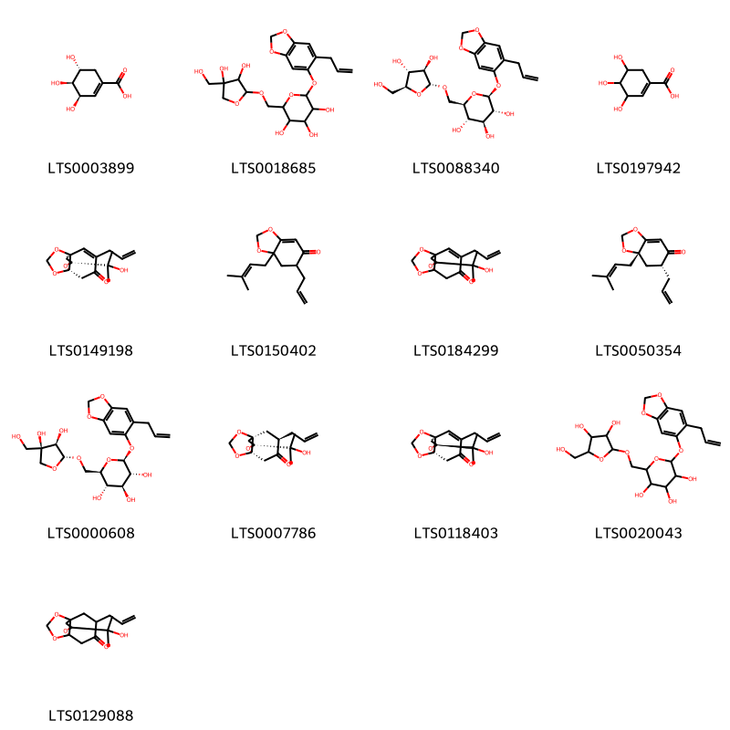{ width=100% }
    <figcaption>Hình ảnh cấu trúc hóa học của 13 hoạt chất thuộc nhóm Organooxygen compounds gồm ['(-)-shikimate (LTS0003899)', '2-({[3,4-dihydroxy-4-(hydroxymethyl)oxolan-2-yl]oxy}methyl)-6-{[6-(prop-2-en-1-yl)-2h-1,3-benzodioxol-5-yl]oxy}oxane-3,4,5-triol (LTS0018685)', '(2r,3s,4s,5r,6s)-2-({[(2r,3r,4r,5s)-3,4-dihydroxy-5-(hydroxymethyl)oxolan-2-yl]oxy}methyl)-6-{[6-(prop-2-en-1-yl)-2h-1,3-benzodioxol-5-yl]oxy}oxane-3,4,5-triol (LTS0088340)', 'shikimate (LTS0197942)', '(1r,6s,11r)-11-(2-hydroxypropan-2-yl)-4-(prop-2-en-1-yl)-7,9,10-trioxatricyclo[4.3.3.0¹,⁶]dodec-4-en-3-one (LTS0149198)', '7a-(3-methylbut-2-en-1-yl)-6-(prop-2-en-1-yl)-6,7-dihydro-2h-1,3-benzodioxol-5-one (LTS0150402)', '11-(2-hydroxypropan-2-yl)-4-(prop-2-en-1-yl)-7,9,10-trioxatricyclo[4.3.3.0¹,⁶]dodec-4-en-3-one (LTS0184299)', '(6r,7as)-7a-(3-methylbut-2-en-1-yl)-6-(prop-2-en-1-yl)-6,7-dihydro-2h-1,3-benzodioxol-5-one (LTS0050354)', '(2r,3s,4s,5r,6s)-2-({[(2r,3r,4r)-3,4-dihydroxy-4-(hydroxymethyl)oxolan-2-yl]oxy}methyl)-6-{[6-(prop-2-en-1-yl)-2h-1,3-benzodioxol-5-yl]oxy}oxane-3,4,5-triol (LTS0000608)', '(1r,4r,6r,11r)-11-(2-hydroxypropan-2-yl)-4-(prop-2-en-1-yl)-7,9,10-trioxatricyclo[4.3.3.0¹,⁶]dodecan-3-one (LTS0007786)', '(1r,6s,11s)-11-(2-hydroxypropan-2-yl)-4-(prop-2-en-1-yl)-7,9,10-trioxatricyclo[4.3.3.0¹,⁶]dodec-4-en-3-one (LTS0118403)', '2-({[3,4-dihydroxy-5-(hydroxymethyl)oxolan-2-yl]oxy}methyl)-6-{[6-(prop-2-en-1-yl)-2h-1,3-benzodioxol-5-yl]oxy}oxane-3,4,5-triol (LTS0020043)', '11-(2-hydroxypropan-2-yl)-4-(prop-2-en-1-yl)-7,9,10-trioxatricyclo[4.3.3.0¹,⁶]dodecan-3-one (LTS0129088)'].</figcaption>
</figure>
#### Nhóm Oxepanes
<figure markdown="span">
    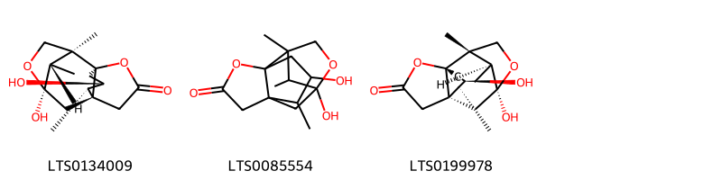{ width=100% }
    <figcaption>Hình ảnh cấu trúc hóa học của 3 hoạt chất thuộc nhóm Oxepanes gồm ['(1s,2s,5r,7r,12r,13s,14s)-5,12-dihydroxy-2,13,14-trimethyl-4,10-dioxatetracyclo[5.3.3.1²,⁵.0¹,⁷]tetradecan-9-one (LTS0134009)', '5,12-dihydroxy-2,13,14-trimethyl-4,10-dioxatetracyclo[5.3.3.1²,⁵.0¹,⁷]tetradecan-9-one (LTS0085554)', '(1s,2s,5s,7r,12r,13s,14s)-5,12-dihydroxy-2,13,14-trimethyl-4,10-dioxatetracyclo[5.3.3.1²,⁵.0¹,⁷]tetradecan-9-one (LTS0199978)'].</figcaption>
</figure>
#### Nhóm Phenol ethers
<figure markdown="span">
    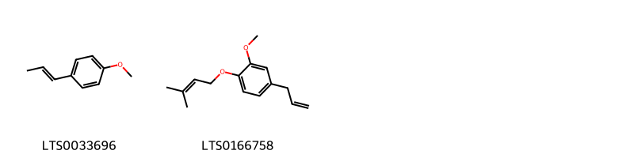{ width=100% }
    <figcaption>Hình ảnh cấu trúc hóa học của 2 hoạt chất thuộc nhóm Phenol ethers gồm ['anethole (LTS0033696)', '2-methoxy-1-[(3-methylbut-2-en-1-yl)oxy]-4-(prop-2-en-1-yl)benzene (LTS0166758)'].</figcaption>
</figure>
#### Nhóm Phenols
<figure markdown="span">
    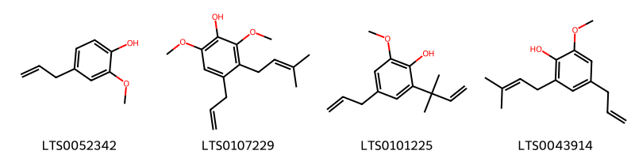{ width=100% }
    <figcaption>Hình ảnh cấu trúc hóa học của 4 hoạt chất thuộc nhóm Phenols gồm ['eugenol (LTS0052342)', '2,6-dimethoxy-3-(3-methylbut-2-en-1-yl)-4-(prop-2-en-1-yl)phenol (LTS0107229)', '2-methoxy-6-(2-methylbut-3-en-2-yl)-4-(prop-2-en-1-yl)phenol (LTS0101225)', '2-methoxy-6-(3-methylbut-2-en-1-yl)-4-(prop-2-en-1-yl)phenol (LTS0043914)'].</figcaption>
</figure>
#### Nhóm Prenol lipids
<figure markdown="span">
    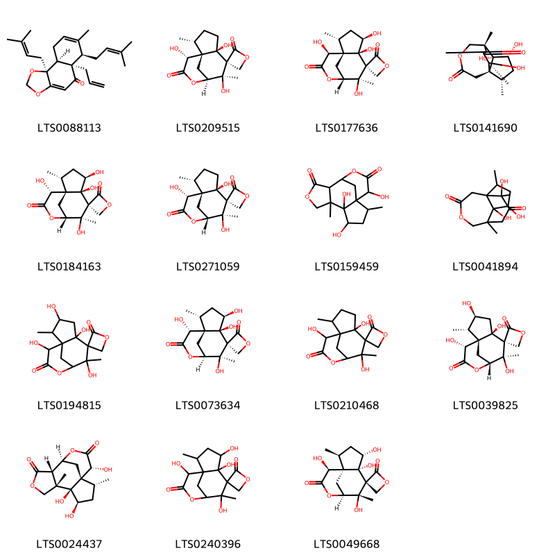{ width=100% }
    <figcaption>Hình ảnh cấu trúc hóa học của 15 hoạt chất thuộc nhóm Prenol lipids gồm ['(5ar,6r,9as,9bs)-7-methyl-6,9b-bis(3-methylbut-2-en-1-yl)-5a-(prop-2-en-1-yl)-2h,6h,9h,9ah-naphtho[1,2-d][1,3]dioxol-5-one (LTS0088113)', "(1's,2'r,3r,5'r,7'r,8's,11'r)-5',7',11'-trihydroxy-2',7'-dimethyl-9'-oxaspiro[oxetane-3,6'-tricyclo[6.3.1.0¹,⁵]dodecane]-4,10'-dione (LTS0209515)", "(1's,2'r,3s,4'r,5'r,7'r,8'r,11's)-4',5',7',11'-tetrahydroxy-2',7'-dimethyl-9'-oxaspiro[oxetane-3,6'-tricyclo[6.3.1.0¹,⁵]dodecane]-4,10'-dione (LTS0177636)", '(1s,2s,4r,5s,6r,11s)-4,5,11-trihydroxy-2,6,11-trimethyl-8-oxatricyclo[4.4.3.0¹,⁵]tridecane-9,12-dione (LTS0141690)', 'anisatin (LTS0184163)', "(1's,2'r,3r,5'r,7'r,8'r,11'r)-5',7',11'-trihydroxy-2',7'-dimethyl-9'-oxaspiro[oxetane-3,6'-tricyclo[6.3.1.0¹,⁵]dodecane]-4,10'-dione (LTS0271059)", '4,5,14-trihydroxy-2,6-dimethyl-8,12-dioxatetracyclo[9.3.1.0¹,⁵.0⁶,¹⁰]pentadecane-9,13-dione (LTS0159459)', '4,5,11-trihydroxy-2,6,11-trimethyl-8-oxatricyclo[4.4.3.0¹,⁵]tridecane-9,12-dione (LTS0041894)', "3',5',7',11'-tetrahydroxy-2',7'-dimethyl-9'-oxaspiro[oxetane-3,6'-tricyclo[6.3.1.0¹,⁵]dodecane]-4,10'-dione (LTS0194815)", "(1's,2'r,3s,4'r,5'r,7'r,8's,11'r)-4',5',7',11'-tetrahydroxy-2',7'-dimethyl-9'-oxaspiro[oxetane-3,6'-tricyclo[6.3.1.0¹,⁵]dodecane]-4,10'-dione (LTS0073634)", "5',7',11'-trihydroxy-2',7'-dimethyl-9'-oxaspiro[oxetane-3,6'-tricyclo[6.3.1.0¹,⁵]dodecane]-4,10'-dione (LTS0210468)", "(1's,2's,3r,3's,5'r,7'r,8'r,11'r)-3',5',7',11'-tetrahydroxy-2',7'-dimethyl-9'-oxaspiro[oxetane-3,6'-tricyclo[6.3.1.0¹,⁵]dodecane]-4,10'-dione (LTS0039825)", '(1s,2r,4r,5s,6s,10s,11s,14r)-4,5,14-trihydroxy-2,6-dimethyl-8,12-dioxatetracyclo[9.3.1.0¹,⁵.0⁶,¹⁰]pentadecane-9,13-dione (LTS0024437)', "4',5',7',11'-tetrahydroxy-2',7'-dimethyl-9'-oxaspiro[oxetane-3,6'-tricyclo[6.3.1.0¹,⁵]dodecane]-4,10'-dione (LTS0240396)", "(1'r,2's,3r,4's,5's,7's,8's,11's)-4',5',7',11'-tetrahydroxy-2',7'-dimethyl-9'-oxaspiro[oxetane-3,6'-tricyclo[6.3.1.0¹,⁵]dodecane]-4,10'-dione (LTS0049668)"].</figcaption>
</figure>
#### Nhóm Vinylogous esters
<figure markdown="span">
    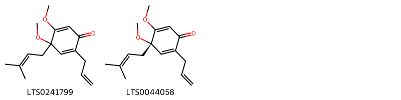{ width=100% }
    <figcaption>Hình ảnh cấu trúc hóa học của 2 hoạt chất thuộc nhóm Vinylogous esters gồm ['4,5-dimethoxy-4-(3-methylbut-2-en-1-yl)-2-(prop-2-en-1-yl)cyclohexa-2,5-dien-1-one (LTS0241799)', '(4s)-4,5-dimethoxy-4-(3-methylbut-2-en-1-yl)-2-(prop-2-en-1-yl)cyclohexa-2,5-dien-1-one (LTS0044058)'].</figcaption>
</figure>

---

### Dược dân tộc học

Danh sách các quốc gia có sử dụng *Illicium anisatum* trong điều trị các bệnh. 

| Country   | Disease                           | Bệnh                                                                                                                                                                                                |
|:----------|:----------------------------------|:----------------------------------------------------------------------------------------------------------------------------------------------------------------------------------------------------|
| China     | Carminative, Stimulant, Piscicide | MYMEMORY WARNING: YOU USED ALL AVAILABLE FREE TRANSLATIONS FOR TODAY. NEXT AVAILABLE IN  09 HOURS 09 MINUTES 38 SECONDS VISIT HTTPS://MYMEMORY.TRANSLATED.NET/DOC/USAGELIMITS.PHP TO TRANSLATE MORE |
| Japan     | Poison                            | MYMEMORY WARNING: YOU USED ALL AVAILABLE FREE TRANSLATIONS FOR TODAY. NEXT AVAILABLE IN  09 HOURS 09 MINUTES 36 SECONDS VISIT HTTPS://MYMEMORY.TRANSLATED.NET/DOC/USAGELIMITS.PHP TO TRANSLATE MORE |
| Mexico    | Carminative                       | MYMEMORY WARNING: YOU USED ALL AVAILABLE FREE TRANSLATIONS FOR TODAY. NEXT AVAILABLE IN  09 HOURS 09 MINUTES 34 SECONDS VISIT HTTPS://MYMEMORY.TRANSLATED.NET/DOC/USAGELIMITS.PHP TO TRANSLATE MORE |

---

---
## Illicium floridanum
### Thông tin về thực vật

!!! info "Phân loại thực vật của *Illicium floridanum* từ GIBF:"
    - **Kingdom:** Plantae
    - **Phylum:** Tracheophyta
    - **Order:** Austrobaileyales
    - **Family:** Schisandraceae
    - **Genus:** Illicium
    - **Species:** *Illicium floridanum*

 

| Label (VI)   | Label (EN)   | Scientific Name     | Descriptions (VI)   | Descriptions (EN)   | Also Known As (VI)   | Also Known As (EN)   |
|:-------------|:-------------|:--------------------|:--------------------|:--------------------|:---------------------|:---------------------|
| N/A          | N/A          | Illicium floridanum | loài thực vật       | species of plant    | ['']                 | ['']                 |

#### Phân bố trên thế giới

**Từ CSDL GIBF** nan, United States of America

#### Phân bố tại Việt Nam

**Từ CSDL GIBF**: Không có ghi nhận ở Việt Nam

---
### Thành phần hóa học
        
- Theo cơ sở dữ liệu lotus: Từ loài *Illicium floridanum* đã phân lập và xác định được 41 hoạt chất thuộc về các nhóm Furanoid lignans, Lactones, Oxepanes, Prenol lipids, Benzene and substituted derivatives. 

|    | chemicalTaxonomyClassyfireClass     |   smiles_count |
|---:|:------------------------------------|---------------:|
|  0 | Benzene and substituted derivatives |              4 |
|  1 | Furanoid lignans                    |              3 |
|  2 | Lactones                            |             11 |
|  3 | Oxepanes                            |              6 |
|  4 | Prenol lipids                       |             17 |

#### Nhóm Benzene and substituted derivatives
<figure markdown="span">
    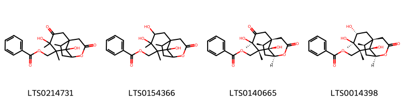{ width=100% }
    <figcaption>Hình ảnh cấu trúc hóa học của 4 hoạt chất thuộc nhóm Benzene and substituted derivatives gồm ['{4,6-dihydroxy-4,5,11-trimethyl-3,9-dioxo-8-oxatricyclo[5.3.2.0¹,⁶]dodecan-5-yl}methyl benzoate (LTS0214731)', '{3,4,6-trihydroxy-4,5,11-trimethyl-9-oxo-8-oxatricyclo[5.3.2.0¹,⁶]dodecan-5-yl}methyl benzoate (LTS0154366)', '[(1r,4r,5s,6r,7s,11r)-4,6-dihydroxy-4,5,11-trimethyl-3,9-dioxo-8-oxatricyclo[5.3.2.0¹,⁶]dodecan-5-yl]methyl benzoate (LTS0140665)', '[(1r,3r,4r,5r,6r,7s,11r)-3,4,6-trihydroxy-4,5,11-trimethyl-9-oxo-8-oxatricyclo[5.3.2.0¹,⁶]dodecan-5-yl]methyl benzoate (LTS0014398)'].</figcaption>
</figure>
#### Nhóm Furanoid lignans
<figure markdown="span">
    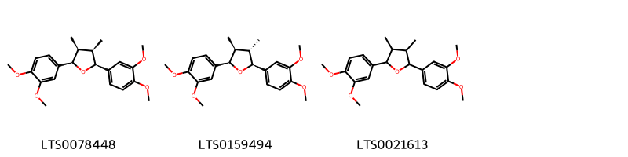{ width=100% }
    <figcaption>Hình ảnh cấu trúc hóa học của 3 hoạt chất thuộc nhóm Furanoid lignans gồm ['(2r,3s,4r,5s)-2,5-bis(3,4-dimethoxyphenyl)-3,4-dimethyloxolane (LTS0078448)', '(+)-veraguensin (LTS0159494)', '2,5-bis(3,4-dimethoxyphenyl)-3,4-dimethyloxolane (LTS0021613)'].</figcaption>
</figure>
#### Nhóm Lactones
<figure markdown="span">
    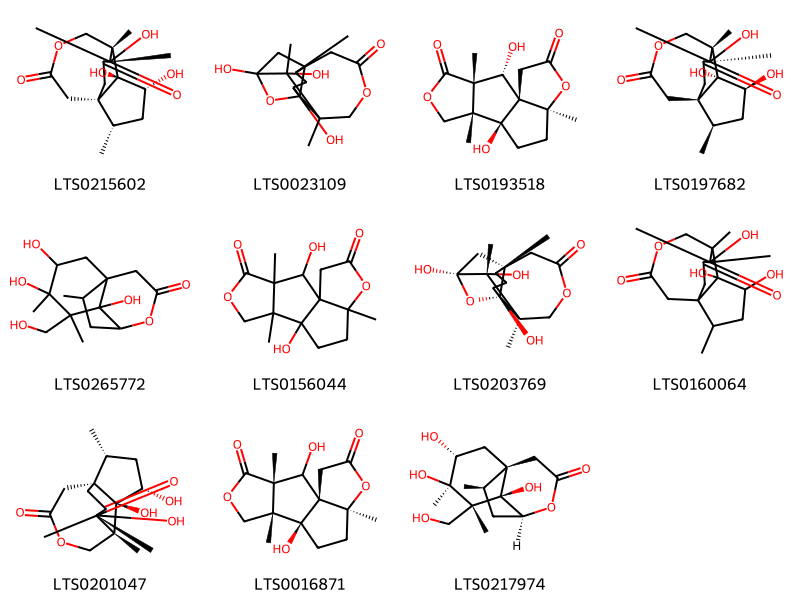{ width=100% }
    <figcaption>Hình ảnh cấu trúc hóa học của 11 hoạt chất thuộc nhóm Lactones gồm ['(1s,2s,4r,5s,6r,13s)-4,5,13-trihydroxy-2,6,13-trimethyl-8-oxatricyclo[4.4.3.0¹,⁵]tridecane-9,12-dione (LTS0215602)', '7,8,11-trihydroxy-6,7,13-trimethyl-4,9-dioxatetracyclo[6.5.1.0¹,¹⁰.0⁶,¹⁰]tetradecan-3-one (LTS0023109)', '(1s,2r,3s,7s,8s,11s)-2,8-dihydroxy-3,7,11-trimethyl-5,12-dioxatetracyclo[6.6.0.0¹,¹¹.0³,⁷]tetradecane-4,13-dione (LTS0193518)', '(1r,2r,4s,5r,6r,13r)-4,5,13-trihydroxy-2,6,13-trimethyl-8-oxatricyclo[4.4.3.0¹,⁵]tridecane-9,12-dione (LTS0197682)', '3,4,6-trihydroxy-5-(hydroxymethyl)-4,5,11-trimethyl-8-oxatricyclo[5.3.2.0¹,⁶]dodecan-9-one (LTS0265772)', '2,8-dihydroxy-3,7,11-trimethyl-5,12-dioxatetracyclo[6.6.0.0¹,¹¹.0³,⁷]tetradecane-4,13-dione (LTS0156044)', '(1r,6r,7r,8s,10r,11s,13r)-7,8,11-trihydroxy-6,7,13-trimethyl-4,9-dioxatetracyclo[6.5.1.0¹,¹⁰.0⁶,¹⁰]tetradecan-3-one (LTS0203769)', '4,5,13-trihydroxy-2,6,13-trimethyl-8-oxatricyclo[4.4.3.0¹,⁵]tridecane-9,12-dione (LTS0160064)', '(1r,2r,4s,5r,6s,13r)-4,5,13-trihydroxy-2,6,13-trimethyl-8-oxatricyclo[4.4.3.0¹,⁵]tridecane-9,12-dione (LTS0201047)', '(1s,3s,7s,8s,11s)-2,8-dihydroxy-3,7,11-trimethyl-5,12-dioxatetracyclo[6.6.0.0¹,¹¹.0³,⁷]tetradecane-4,13-dione (LTS0016871)', '(1r,3r,4r,5r,6r,7s,11r)-3,4,6-trihydroxy-5-(hydroxymethyl)-4,5,11-trimethyl-8-oxatricyclo[5.3.2.0¹,⁶]dodecan-9-one (LTS0217974)'].</figcaption>
</figure>
#### Nhóm Oxepanes
<figure markdown="span">
    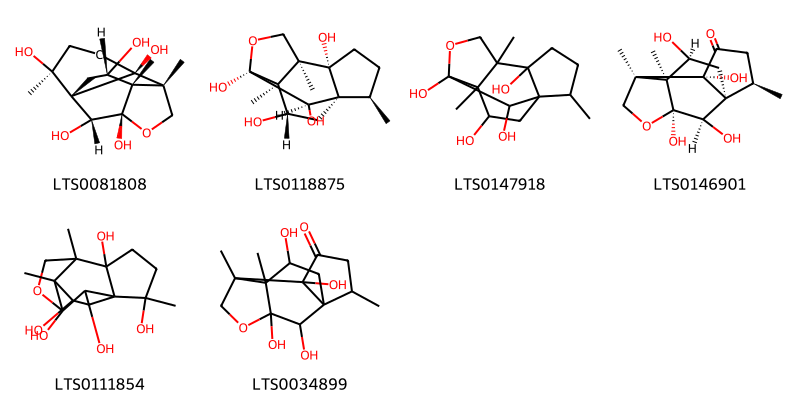{ width=100% }
    <figcaption>Hình ảnh cấu trúc hóa học của 6 hoạt chất thuộc nhóm Oxepanes gồm ['(1r,2s,5s,6s,9s,10s,11s,13r)-2,6,10-trimethyl-8-oxatetracyclo[7.3.1.0¹,⁵.0⁶,¹⁰]tridecane-2,5,9,11,13-pentol (LTS0081808)', '(1s,2r,5s,6s,9s,10s,11s,13r)-2,6,10-trimethyl-8-oxatetracyclo[7.3.1.0¹,⁵.0⁶,¹⁰]tridecane-5,9,11,13-tetrol (LTS0118875)', '2,6,10-trimethyl-8-oxatetracyclo[7.3.1.0¹,⁵.0⁶,¹⁰]tridecane-5,9,11,13-tetrol (LTS0147918)', '(1s,2r,5s,6s,9s,10s,11s,13r)-5,9,11,13-tetrahydroxy-2,6,10-trimethyl-8-oxatetracyclo[7.3.1.0¹,⁵.0⁶,¹⁰]tridecan-4-one (LTS0146901)', '2,6,10-trimethyl-8-oxatetracyclo[7.3.1.0¹,⁵.0⁶,¹⁰]tridecane-2,5,9,11,13-pentol (LTS0111854)', '5,9,11,13-tetrahydroxy-2,6,10-trimethyl-8-oxatetracyclo[7.3.1.0¹,⁵.0⁶,¹⁰]tridecan-4-one (LTS0034899)'].</figcaption>
</figure>
#### Nhóm Prenol lipids
<figure markdown="span">
    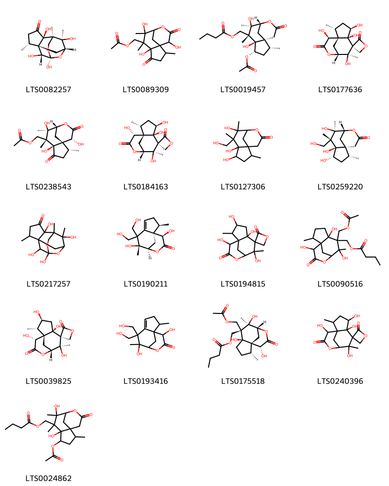{ width=100% }
    <figcaption>Hình ảnh cấu trúc hóa học của 17 hoạt chất thuộc nhóm Prenol lipids gồm ['(1r,2r,5r,6s,8r,10r,13r,14r)-2,10,13,14-tetrahydroxy-1,5,13-trimethyl-9,11-dioxatetracyclo[6.4.1.1⁶,¹⁰.0²,⁶]tetradecan-3-one (LTS0082257)', '{5,7,11-trihydroxy-2,6,7-trimethyl-4,10-dioxo-9-oxatricyclo[6.3.1.0¹,⁵]dodecan-6-yl}methyl acetate (LTS0089309)', '[(1r,2r,4s,5r,6r,7r,8r)-4-(acetyloxy)-5,7-dihydroxy-2,6,7-trimethyl-10-oxo-9-oxatricyclo[6.3.1.0¹,⁵]dodecan-6-yl]methyl butanoate (LTS0019457)', "(1's,2'r,3s,4'r,5'r,7'r,8'r,11's)-4',5',7',11'-tetrahydroxy-2',7'-dimethyl-9'-oxaspiro[oxetane-3,6'-tricyclo[6.3.1.0¹,⁵]dodecane]-4,10'-dione (LTS0177636)", '[(1s,2r,5r,6r,7r,8r,11r)-5,7,11-trihydroxy-2,6,7-trimethyl-4,10-dioxo-9-oxatricyclo[6.3.1.0¹,⁵]dodecan-6-yl]methyl acetate (LTS0238543)', 'anisatin (LTS0184163)', '4,5,7-trihydroxy-6-(hydroxymethyl)-2,6,7-trimethyl-9-oxatricyclo[6.3.1.0¹,⁵]dodecan-10-one (LTS0127306)', '(1r,2r,4s,5r,6r,7r,8r)-4,5,7-trihydroxy-6-(hydroxymethyl)-2,6,7-trimethyl-9-oxatricyclo[6.3.1.0¹,⁵]dodecan-10-one (LTS0259220)', '2,10,13,14-tetrahydroxy-1,5,13-trimethyl-9,11-dioxatetracyclo[6.4.1.1⁶,¹⁰.0²,⁶]tetradecan-3-one (LTS0217257)', '(1r,2r,7r,8r,11r)-7,11-dihydroxy-6,6-bis(hydroxymethyl)-2,7-dimethyl-9-oxatricyclo[6.3.1.0¹,⁵]dodec-4-en-10-one (LTS0190211)', "3',5',7',11'-tetrahydroxy-2',7'-dimethyl-9'-oxaspiro[oxetane-3,6'-tricyclo[6.3.1.0¹,⁵]dodecane]-4,10'-dione (LTS0194815)", '{6-[(acetyloxy)methyl]-5,7,11-trihydroxy-2,7-dimethyl-10-oxo-9-oxatricyclo[6.3.1.0¹,⁵]dodecan-6-yl}methyl butanoate (LTS0090516)', "(1's,2's,3r,3's,5'r,7'r,8'r,11'r)-3',5',7',11'-tetrahydroxy-2',7'-dimethyl-9'-oxaspiro[oxetane-3,6'-tricyclo[6.3.1.0¹,⁵]dodecane]-4,10'-dione (LTS0039825)", '7,11-dihydroxy-6,6-bis(hydroxymethyl)-2,7-dimethyl-9-oxatricyclo[6.3.1.0¹,⁵]dodec-4-en-10-one (LTS0193416)', '[(1s,2r,5r,6r,7r,8r,11r)-6-[(acetyloxy)methyl]-5,7,11-trihydroxy-2,7-dimethyl-10-oxo-9-oxatricyclo[6.3.1.0¹,⁵]dodecan-6-yl]methyl butanoate (LTS0175518)', "4',5',7',11'-tetrahydroxy-2',7'-dimethyl-9'-oxaspiro[oxetane-3,6'-tricyclo[6.3.1.0¹,⁵]dodecane]-4,10'-dione (LTS0240396)", '[4-(acetyloxy)-5,7-dihydroxy-2,6,7-trimethyl-10-oxo-9-oxatricyclo[6.3.1.0¹,⁵]dodecan-6-yl]methyl butanoate (LTS0024862)'].</figcaption>
</figure>

---

### Dược dân tộc học

Danh sách các quốc gia có sử dụng *Illicium floridanum* trong điều trị các bệnh. 

| Country   | Disease   | Bệnh                                                                                                                                                                                                |
|:----------|:----------|:----------------------------------------------------------------------------------------------------------------------------------------------------------------------------------------------------|
| Mexico    | Poison    | MYMEMORY WARNING: YOU USED ALL AVAILABLE FREE TRANSLATIONS FOR TODAY. NEXT AVAILABLE IN  09 HOURS 09 MINUTES 08 SECONDS VISIT HTTPS://MYMEMORY.TRANSLATED.NET/DOC/USAGELIMITS.PHP TO TRANSLATE MORE |

---

---
## Illicium griffithii
### Thông tin về thực vật

!!! info "Phân loại thực vật của *Illicium griffithii* từ GIBF:"
    - **Kingdom:** Plantae
    - **Phylum:** Tracheophyta
    - **Order:** Austrobaileyales
    - **Family:** Schisandraceae
    - **Genus:** Illicium
    - **Species:** *Illicium griffithii*

 

| Label (VI)   | Label (EN)   | Scientific Name     | Descriptions (VI)   | Descriptions (EN)   | Also Known As (VI)   | Also Known As (EN)   |
|:-------------|:-------------|:--------------------|:--------------------|:--------------------|:---------------------|:---------------------|
| N/A          | N/A          | Illicium griffithii |                     | species of plant    | ['']                 | ['']                 |

#### Phân bố trên thế giới

**Từ CSDL GIBF** Viet Nam, nan, unknown or invalid, Bhutan, Myanmar, Malaysia, India, Bangladesh, China, Singapore, Korea, Republic of, Cambodia

#### Phân bố tại Việt Nam

**Từ CSDL GIBF**: Lâm Đồng, Quang Binh

---
### Thành phần hóa học
        
- Theo cơ sở dữ liệu lotus: Từ loài *Illicium griffithii* đã phân lập và xác định được Chưa có hoạt chất nào được phân lập. hoạt chất thuộc về các nhóm Không có hoạt chất nào được phân lập. 

Không có hình ảnh nào được tạo ra

---

### Dược dân tộc học

Danh sách các quốc gia có sử dụng *Illicium griffithii* trong điều trị các bệnh. 

| Country   | Disease                         | Bệnh                                                                                                                                                                                                |
|:----------|:--------------------------------|:----------------------------------------------------------------------------------------------------------------------------------------------------------------------------------------------------|
| India     | Astringent, Poison, Carminative | MYMEMORY WARNING: YOU USED ALL AVAILABLE FREE TRANSLATIONS FOR TODAY. NEXT AVAILABLE IN  09 HOURS 08 MINUTES 39 SECONDS VISIT HTTPS://MYMEMORY.TRANSLATED.NET/DOC/USAGELIMITS.PHP TO TRANSLATE MORE |

---

---
## Illicium verum
### Thông tin về thực vật

!!! info "Phân loại thực vật của *Illicium verum* từ GIBF:"
    - **Kingdom:** Plantae
    - **Phylum:** Tracheophyta
    - **Order:** Austrobaileyales
    - **Family:** Schisandraceae
    - **Genus:** Illicium
    - **Species:** *Illicium verum*

 

| Label (VI)   | Label (EN)   | Scientific Name   | Descriptions (VI)   | Descriptions (EN)   | Also Known As (VI)   | Also Known As (EN)                                   |
|:-------------|:-------------|:------------------|:--------------------|:--------------------|:---------------------|:-----------------------------------------------------|
| N/A          | N/A          | Illicium verum    | loài thực vật       | species of plant    | ['']                 | ['Star anise', 'Chinese star anise', 'star aniseed'] |

#### Phân bố trên thế giới

**Từ CSDL GIBF** Viet Nam, nan, Colombia, United Kingdom of Great Britain and Northern Ireland, unknown or invalid, Japan, Portugal, France, Peru, Germany, Lao People’s Democratic Republic, United States of America, China, Hong Kong, Chinese Taipei

#### Phân bố tại Việt Nam

**Từ CSDL GIBF**: Không có ghi nhận ở Việt Nam

---
### Thành phần hóa học
        
- Theo cơ sở dữ liệu lotus: Từ loài *Illicium verum* đã phân lập và xác định được 140 hoạt chất thuộc về các nhóm Stilbenes, Furanoid lignans, Oxepanes, Phenol esters, Phenols, Cinnamic acids and derivatives, Organooxygen compounds, Unsaturated hydrocarbons, Fluorenes, Fatty Acyls, Cinnamaldehydes, Flavonoids, Benzofurans, Benzimidazoles, Cinnamyl alcohols, Prenol lipids, Dioxolanes, Coumarans, Heteroaromatic compounds, Benzodioxoles, Phenol ethers, Steroids and steroid derivatives, Benzene and substituted derivatives. 

|    | chemicalTaxonomyClassyfireClass     |   smiles_count |
|---:|:------------------------------------|---------------:|
|  0 | Benzene and substituted derivatives |             26 |
|  1 | Benzimidazoles                      |              1 |
|  2 | Benzodioxoles                       |              3 |
|  3 | Benzofurans                         |              1 |
|  4 | Cinnamaldehydes                     |              5 |
|  5 | Cinnamic acids and derivatives      |              8 |
|  6 | Cinnamyl alcohols                   |              4 |
|  7 | Coumarans                           |              1 |
|  8 | Dioxolanes                          |              4 |
|  9 | Fatty Acyls                         |              1 |
| 10 | Flavonoids                          |              3 |
| 11 | Fluorenes                           |              1 |
| 12 | Furanoid lignans                    |              2 |
| 13 | Heteroaromatic compounds            |              1 |
| 14 | Organooxygen compounds              |              3 |
| 15 | Oxepanes                            |              2 |
| 16 | Phenol esters                       |              1 |
| 17 | Phenol ethers                       |             14 |
| 18 | Phenols                             |              7 |
| 19 | Prenol lipids                       |             47 |
| 20 | Steroids and steroid derivatives    |              1 |
| 21 | Stilbenes                           |              2 |
| 22 | Unsaturated hydrocarbons            |              1 |

#### Nhóm Benzene and substituted derivatives
<figure markdown="span">
    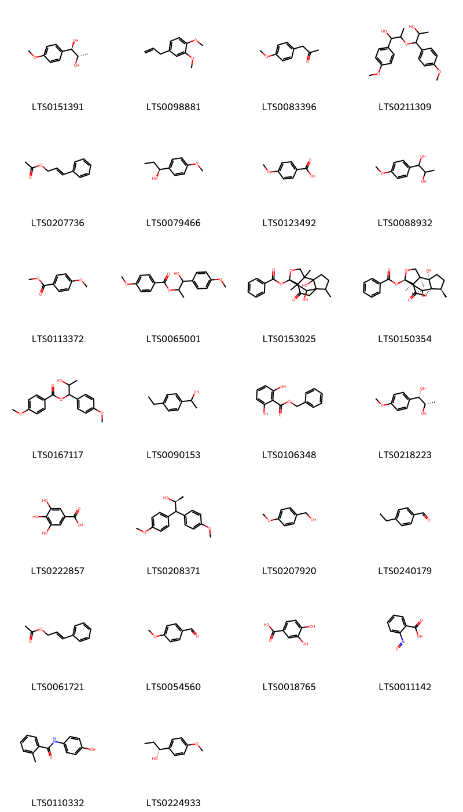{ width=100% }
    <figcaption>Hình ảnh cấu trúc hóa học của 26 hoạt chất thuộc nhóm Benzene and substituted derivatives gồm ['(1r,2s)-1-(4-methoxyphenyl)propane-1,2-diol (LTS0151391)', 'methyl eugenol (LTS0098881)', 'p-anisyl methyl ketone (LTS0083396)', '2-[2-hydroxy-1-(4-methoxyphenyl)propoxy]-1-(4-methoxyphenyl)propan-1-ol (LTS0211309)', 'cinnamyl acetate (LTS0207736)', '(1s)-1-(4-methoxyphenyl)propan-1-ol (LTS0079466)', 'p-anisic acid (LTS0123492)', '1-(4-methoxyphenyl)propane-1,2-diol (LTS0088932)', 'methyl anisate (LTS0113372)', '1-hydroxy-1-(4-methoxyphenyl)propan-2-yl 4-methoxybenzoate (LTS0065001)', '5,13-dihydroxy-2,6,10-trimethyl-11-oxo-8-oxatetracyclo[7.3.1.0¹,⁵.0⁶,¹⁰]tridecan-9-yl benzoate (LTS0153025)', '(1s,2r,5s,6s,9s,10s,13r)-5,13-dihydroxy-2,6,10-trimethyl-11-oxo-8-oxatetracyclo[7.3.1.0¹,⁵.0⁶,¹⁰]tridecan-9-yl benzoate (LTS0150354)', '2-hydroxy-1-(4-methoxyphenyl)propyl 4-methoxybenzoate (LTS0167117)', '1-(4-ethylphenyl)ethanol (LTS0090153)', 'benzyl 2,6-dihydroxybenzoate (LTS0106348)', '(1s,2s)-1-(4-methoxyphenyl)propane-1,2-diol (LTS0218223)', 'galop (LTS0222857)', '(2s)-1,1-bis(4-methoxyphenyl)propan-2-ol (LTS0208371)', 'anise alcohol (LTS0207920)', '4-ethylbenzaldehyde (LTS0240179)', '3-phenyl-2-propenyl acetate (LTS0061721)', 'anisaldehyde (LTS0054560)', '3,4-dihydroxybenzoic acid (LTS0018765)', '2-nitrosobenzoic acid (LTS0011142)', 'n-(4-hydroxyphenyl)-2-methylbenzamide (LTS0110332)', '(1r)-1-(4-methoxyphenyl)propan-1-ol (LTS0224933)'].</figcaption>
</figure>
#### Nhóm Benzimidazoles
<figure markdown="span">
    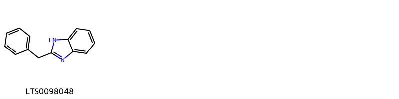{ width=100% }
    <figcaption>Hình ảnh cấu trúc hóa học của 1 hoạt chất thuộc nhóm Benzimidazoles gồm ['bendazole (LTS0098048)'].</figcaption>
</figure>
#### Nhóm Benzodioxoles
<figure markdown="span">
    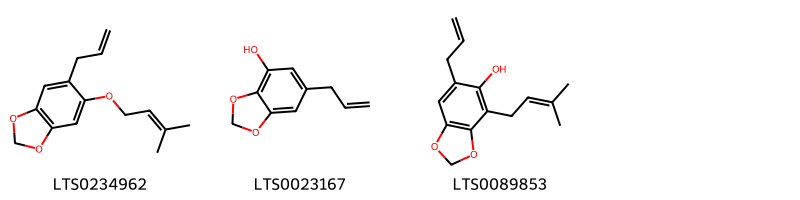{ width=100% }
    <figcaption>Hình ảnh cấu trúc hóa học của 3 hoạt chất thuộc nhóm Benzodioxoles gồm ['5-[(3-methylbut-2-en-1-yl)oxy]-6-(prop-2-en-1-yl)-2h-1,3-benzodioxole (LTS0234962)', '6-(prop-2-en-1-yl)-2h-1,3-benzodioxol-4-ol (LTS0023167)', '4-(3-methylbut-2-en-1-yl)-6-(prop-2-en-1-yl)-2h-1,3-benzodioxol-5-ol (LTS0089853)'].</figcaption>
</figure>
#### Nhóm Benzofurans
<figure markdown="span">
    { width=100% }
    <figcaption>Hình ảnh cấu trúc hóa học của 1 hoạt chất thuộc nhóm Benzofurans gồm ["7-hydroxy-6-isopropyl-3',3'-dimethyl-2-oxospiro[1-benzofuran-3,1'-cyclohexane]-2',4-dicarbaldehyde (LTS0255026)"].</figcaption>
</figure>
#### Nhóm Cinnamaldehydes
<figure markdown="span">
    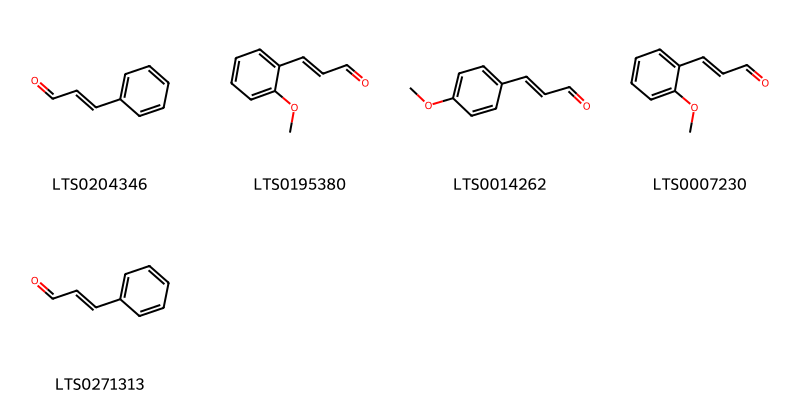{ width=100% }
    <figcaption>Hình ảnh cấu trúc hóa học của 5 hoạt chất thuộc nhóm Cinnamaldehydes gồm ['3-phenyl-2-propenal (LTS0204346)', '2-methoxycinnamaldehyde (LTS0195380)', '3-(4-methoxyphenyl)-2-propenal (LTS0014262)', '3-(2-methoxyphenyl)prop-2-enal (LTS0007230)', 'cinnamal (LTS0271313)'].</figcaption>
</figure>
#### Nhóm Cinnamic acids and derivatives
<figure markdown="span">
    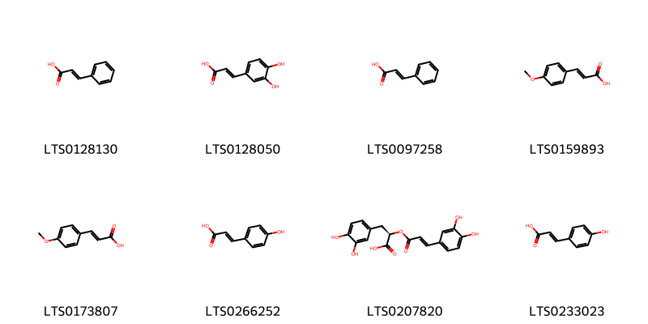{ width=100% }
    <figcaption>Hình ảnh cấu trúc hóa học của 8 hoạt chất thuộc nhóm Cinnamic acids and derivatives gồm ['cinnamic acid (LTS0128130)', '3,4-dihydroxycinnamic acid (LTS0128050)', 'phenylacrylic acid (LTS0097258)', 'p-methoxy-cinnamic acid (LTS0159893)', '4-methoxycinnamic acid (LTS0173807)', 'para-coumaric acid (LTS0266252)', 'rosemary acid (LTS0207820)', 'hydroxycinnamic acid (LTS0233023)'].</figcaption>
</figure>
#### Nhóm Cinnamyl alcohols
<figure markdown="span">
    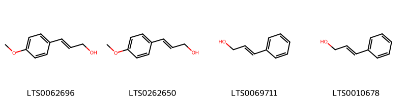{ width=100% }
    <figcaption>Hình ảnh cấu trúc hóa học của 4 hoạt chất thuộc nhóm Cinnamyl alcohols gồm ['(2e)-3-(4-methoxyphenyl)prop-2-en-1-ol (LTS0062696)', '3-(4-methoxyphenyl)prop-2-en-1-ol (LTS0262650)', '3-phenyl-2-propen-1-ol (LTS0069711)', 'cinnamyl alcohol (LTS0010678)'].</figcaption>
</figure>
#### Nhóm Coumarans
<figure markdown="span">
    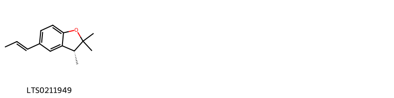{ width=100% }
    <figcaption>Hình ảnh cấu trúc hóa học của 1 hoạt chất thuộc nhóm Coumarans gồm ['(3r)-2,2,3-trimethyl-5-[(1e)-prop-1-en-1-yl]-3h-1-benzofuran (LTS0211949)'].</figcaption>
</figure>
#### Nhóm Dioxolanes
<figure markdown="span">
    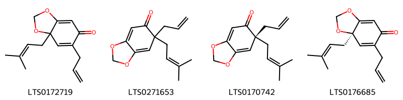{ width=100% }
    <figcaption>Hình ảnh cấu trúc hóa học của 4 hoạt chất thuộc nhóm Dioxolanes gồm ['7a-(3-methylbut-2-en-1-yl)-6-(prop-2-en-1-yl)-2h-1,3-benzodioxol-5-one (LTS0172719)', '6-(3-methylbut-2-en-1-yl)-6-(prop-2-en-1-yl)-2h-1,3-benzodioxol-5-one (LTS0271653)', '(6r)-6-(3-methylbut-2-en-1-yl)-6-(prop-2-en-1-yl)-2h-1,3-benzodioxol-5-one (LTS0170742)', '(7ar)-7a-(3-methylbut-2-en-1-yl)-6-(prop-2-en-1-yl)-2h-1,3-benzodioxol-5-one (LTS0176685)'].</figcaption>
</figure>
#### Nhóm Fatty Acyls
<figure markdown="span">
    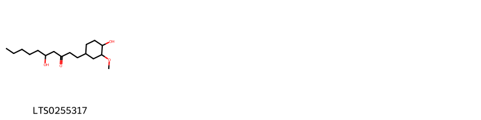{ width=100% }
    <figcaption>Hình ảnh cấu trúc hóa học của 1 hoạt chất thuộc nhóm Fatty Acyls gồm ['5-hydroxy-1-(4-hydroxy-3-methoxycyclohexyl)decan-3-one (LTS0255317)'].</figcaption>
</figure>
#### Nhóm Flavonoids
<figure markdown="span">
    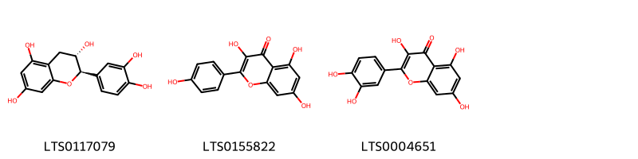{ width=100% }
    <figcaption>Hình ảnh cấu trúc hóa học của 3 hoạt chất thuộc nhóm Flavonoids gồm ['(+)-catechol (LTS0117079)', 'kaempherol (LTS0155822)', 'quercetin (LTS0004651)'].</figcaption>
</figure>
#### Nhóm Fluorenes
<figure markdown="span">
    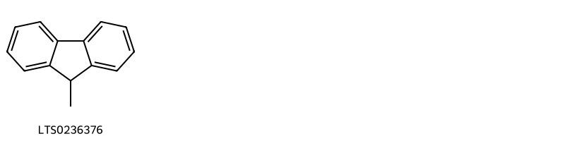{ width=100% }
    <figcaption>Hình ảnh cấu trúc hóa học của 1 hoạt chất thuộc nhóm Fluorenes gồm ['9-methylfluorene (LTS0236376)'].</figcaption>
</figure>
#### Nhóm Furanoid lignans
<figure markdown="span">
    { width=100% }
    <figcaption>Hình ảnh cấu trúc hóa học của 2 hoạt chất thuộc nhóm Furanoid lignans gồm ['3,4-divanillyltetrahydrofuran (LTS0075117)', '4-{[(3s,4s)-4-[(4-hydroxy-3-methoxyphenyl)methyl]oxolan-3-yl]methyl}-2-methoxyphenol (LTS0253583)'].</figcaption>
</figure>
#### Nhóm Heteroaromatic compounds
<figure markdown="span">
    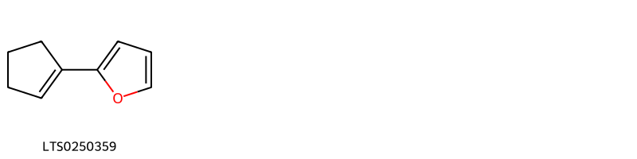{ width=100% }
    <figcaption>Hình ảnh cấu trúc hóa học của 1 hoạt chất thuộc nhóm Heteroaromatic compounds gồm ['2-(cyclopent-1-en-1-yl)furan (LTS0250359)'].</figcaption>
</figure>
#### Nhóm Organooxygen compounds
<figure markdown="span">
    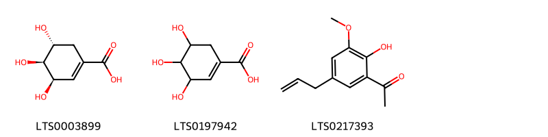{ width=100% }
    <figcaption>Hình ảnh cấu trúc hóa học của 3 hoạt chất thuộc nhóm Organooxygen compounds gồm ['(-)-shikimate (LTS0003899)', 'shikimate (LTS0197942)', '1-[2-hydroxy-3-methoxy-5-(prop-2-en-1-yl)phenyl]ethanone (LTS0217393)'].</figcaption>
</figure>
#### Nhóm Oxepanes
<figure markdown="span">
    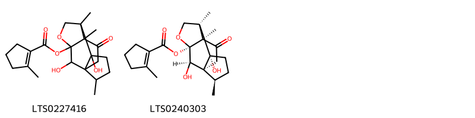{ width=100% }
    <figcaption>Hình ảnh cấu trúc hóa học của 2 hoạt chất thuộc nhóm Oxepanes gồm ['5,13-dihydroxy-2,6,10-trimethyl-11-oxo-8-oxatetracyclo[7.3.1.0¹,⁵.0⁶,¹⁰]tridecan-9-yl 2-methylcyclopent-1-ene-1-carboxylate (LTS0227416)', '(1s,2r,5s,6s,9r,10s,13r)-5,13-dihydroxy-2,6,10-trimethyl-11-oxo-8-oxatetracyclo[7.3.1.0¹,⁵.0⁶,¹⁰]tridecan-9-yl 2-methylcyclopent-1-ene-1-carboxylate (LTS0240303)'].</figcaption>
</figure>
#### Nhóm Phenol esters
<figure markdown="span">
    { width=100% }
    <figcaption>Hình ảnh cấu trúc hóa học của 1 hoạt chất thuộc nhóm Phenol esters gồm ['eugenyl acetate (LTS0165886)'].</figcaption>
</figure>
#### Nhóm Phenol ethers
<figure markdown="span">
    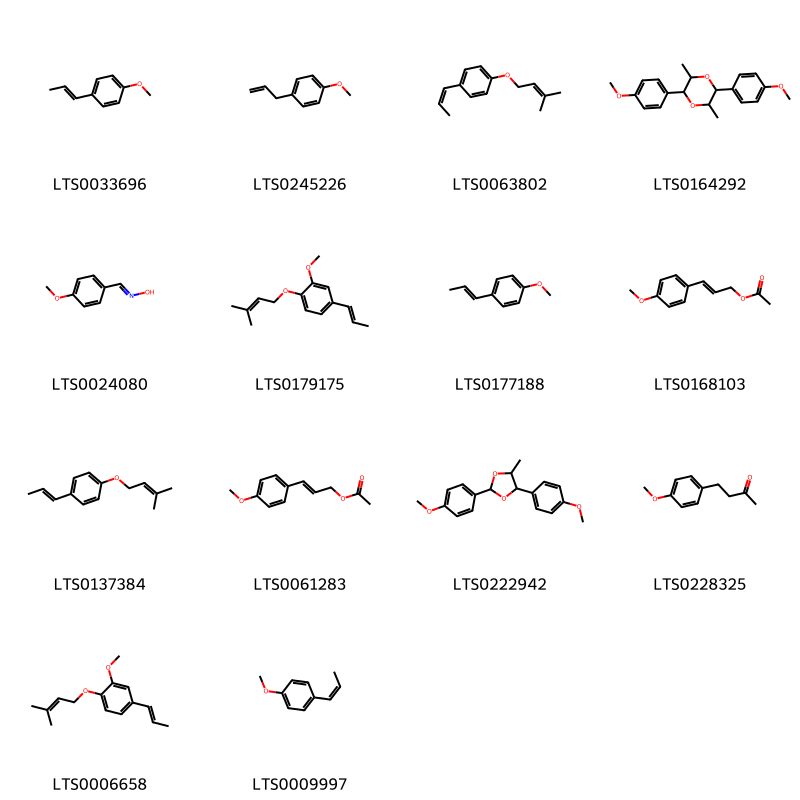{ width=100% }
    <figcaption>Hình ảnh cấu trúc hóa học của 14 hoạt chất thuộc nhóm Phenol ethers gồm ['anethole (LTS0033696)', 'tarragon (LTS0245226)', '1-[(3-methylbut-2-en-1-yl)oxy]-4-[(1z)-prop-1-en-1-yl]benzene (LTS0063802)', '2,5-bis(4-methoxyphenyl)-3,6-dimethyl-1,4-dioxane (LTS0164292)', 'n-[(4-methoxyphenyl)methylidene]hydroxylamine (LTS0024080)', '2-methoxy-1-[(3-methylbut-2-en-1-yl)oxy]-4-[(1e)-prop-1-en-1-yl]benzene (LTS0179175)', 'p-propenylanisole (LTS0177188)', '3-(4-methoxyphenyl)prop-2-en-1-yl acetate (LTS0168103)', '1-[(3-methylbut-2-en-1-yl)oxy]-4-(prop-1-en-1-yl)benzene (LTS0137384)', '(2e)-3-(4-methoxyphenyl)prop-2-en-1-yl acetate (LTS0061283)', '2,4-bis(4-methoxyphenyl)-5-methyl-1,3-dioxolane (LTS0222942)', 'anisylacetone (LTS0228325)', '2-methoxy-1-[(3-methylbut-2-en-1-yl)oxy]-4-(prop-1-en-1-yl)benzene (LTS0006658)', '(e)-anethole (LTS0009997)'].</figcaption>
</figure>
#### Nhóm Phenols
<figure markdown="span">
    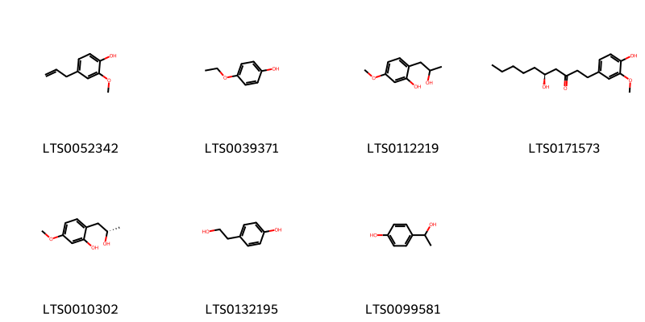{ width=100% }
    <figcaption>Hình ảnh cấu trúc hóa học của 7 hoạt chất thuộc nhóm Phenols gồm ['eugenol (LTS0052342)', '4-ethoxyphenol (LTS0039371)', '2-(2-hydroxypropyl)-5-methoxyphenol (LTS0112219)', 'gingerol (LTS0171573)', '2-[(2s)-2-hydroxypropyl]-5-methoxyphenol (LTS0010302)', 'tyrosol (LTS0132195)', "1-(4'-hydroxyphenyl)ethanol (LTS0099581)"].</figcaption>
</figure>
#### Nhóm Prenol lipids
<figure markdown="span">
    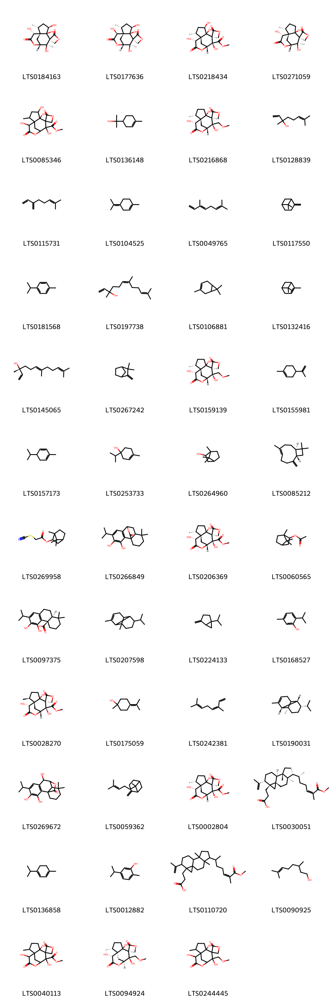{ width=100% }
    <figcaption>Hình ảnh cấu trúc hóa học của 47 hoạt chất thuộc nhóm Prenol lipids gồm ['anisatin (LTS0184163)', "(1's,2'r,3s,4'r,5'r,7'r,8'r,11's)-4',5',7',11'-tetrahydroxy-2',7'-dimethyl-9'-oxaspiro[oxetane-3,6'-tricyclo[6.3.1.0¹,⁵]dodecane]-4,10'-dione (LTS0177636)", "methyl (1's,2'r,3r,4'r,5'r,7'r,8'r,11'r)-4',5',7',11'-tetrahydroxy-2'-methyl-4,10'-dioxo-9'-oxaspiro[oxetane-3,6'-tricyclo[6.3.1.0¹,⁵]dodecane]-7'-carboxylate (LTS0218434)", "(1's,2'r,3r,5'r,7'r,8'r,11'r)-5',7',11'-trihydroxy-2',7'-dimethyl-9'-oxaspiro[oxetane-3,6'-tricyclo[6.3.1.0¹,⁵]dodecane]-4,10'-dione (LTS0271059)", "methyl 4',5',7',11'-tetrahydroxy-2'-methyl-4,10'-dioxo-9'-oxaspiro[oxetane-3,6'-tricyclo[6.3.1.0¹,⁵]dodecane]-7'-carboxylate (LTS0085346)", 'terpineol (LTS0136148)', "(1's,2'r,3r,5'r,7's,8'r,11'r)-5',7',11'-trihydroxy-7'-(methoxymethyl)-2'-methyl-9'-oxaspiro[oxetane-3,6'-tricyclo[6.3.1.0¹,⁵]dodecane]-4,10'-dione (LTS0216868)", 'linalool, (+-)- (LTS0128839)', 'α-myrcene (LTS0115731)', 'terpinolene (LTS0104525)', 'trans-β-ocimene (LTS0049765)', 'β-pinene (LTS0117550)', 'cymene (LTS0181568)', 'nerolidol (LTS0197738)', 'monoterpenes (LTS0106881)', 'α pinene (LTS0132416)', '(3r,6e)-nerolidol (LTS0145065)', 'camphene (LTS0267242)', "(1's,2'r,3r,7's,8'r,11'r)-5',7',11'-trihydroxy-7'-(methoxymethyl)-2'-methyl-9'-oxaspiro[oxetane-3,6'-tricyclo[6.3.1.0¹,⁵]dodecane]-4,10'-dione (LTS0159139)", 'limonene,  (LTS0155981)', 'phellandrene (LTS0157173)', '4-terpineol (LTS0253733)', 'borneol (LTS0264960)', 'caryophyllene (LTS0085212)', 'thanite (LTS0269958)', '3,4-dihydroxy-5-isopropyl-11,11-dimethyl-16-oxatetracyclo[6.6.2.0¹,¹⁰.0²,⁷]hexadeca-2(7),3,5-trien-15-one (LTS0266849)', "methyl (1's,2'r,3r,5'r,7'r,8'r,11'r)-5',7',11'-trihydroxy-2'-methyl-4,10'-dioxo-9'-oxaspiro[oxetane-3,6'-tricyclo[6.3.1.0¹,⁵]dodecane]-7'-carboxylate (LTS0206369)", 'bornyl acetate (LTS0060565)', 'carnosic acid (LTS0097375)', 'α-copaene (LTS0207598)', 'sabinene (LTS0224133)', 'thymol (LTS0168527)', "methyl (1's,2's,3r,5'r,7'r,8'r,11'r)-5',7',11'-trihydroxy-2'-methyl-4,10'-dioxo-9'-oxaspiro[oxetane-3,6'-tricyclo[6.3.1.0¹,⁵]dodecane]-7'-carboxylate (LTS0028270)", 'γ-terpineol (LTS0175059)', 'β-ocimene (LTS0242381)', '(1r,2s,7s,8s)-8-isopropyl-1,3-dimethyltricyclo[4.4.0.0²,⁷]dec-3-ene (LTS0190031)', '3,4,8-trihydroxy-5-isopropyl-11,11-dimethyl-16-oxatetracyclo[7.5.2.0¹,¹⁰.0²,⁷]hexadeca-2(7),3,5-trien-15-one (LTS0269672)', '6-methyl-2-methylidene-6-(4-methylpent-3-en-1-yl)bicyclo[3.1.1]heptane (LTS0059362)', "methyl (1's,2'r,3r,7'r,8'r,11'r)-5',7',11'-trihydroxy-2'-methyl-4,10'-dioxo-9'-oxaspiro[oxetane-3,6'-tricyclo[6.3.1.0¹,⁵]dodecane]-7'-carboxylate (LTS0002804)", '3-[(1s,4r,5r,8s,9s,12s,13r)-5-[(2r,5z)-7-methoxy-6-methyl-7-oxohept-5-en-2-yl]-4,8-dimethyl-12-(prop-1-en-2-yl)tetracyclo[7.5.0.0¹,¹³.0⁴,⁸]tetradecan-13-yl]propanoic acid (LTS0030051)', 'terpinene (LTS0136858)', 'carvacrol (LTS0012882)', '3-[5-(7-methoxy-6-methyl-7-oxohept-5-en-2-yl)-4,8-dimethyl-12-(prop-1-en-2-yl)tetracyclo[7.5.0.0¹,¹³.0⁴,⁸]tetradecan-13-yl]propanoic acid (LTS0110720)', 'citronellol, (+-)- (LTS0090925)', "methyl 5',7',11'-trihydroxy-2'-methyl-4,10'-dioxo-9'-oxaspiro[oxetane-3,6'-tricyclo[6.3.1.0¹,⁵]dodecane]-7'-carboxylate (LTS0040113)", "(1'r,2'r,3r,5'r,7's,8's,11'r)-5',7',11'-trihydroxy-7'-(methoxymethyl)-2'-methyl-9'-oxaspiro[oxetane-3,6'-tricyclo[6.3.1.0¹,⁵]dodecane]-4,10'-dione (LTS0094924)", "5',7',11'-trihydroxy-7'-(methoxymethyl)-2'-methyl-9'-oxaspiro[oxetane-3,6'-tricyclo[6.3.1.0¹,⁵]dodecane]-4,10'-dione (LTS0244445)"].</figcaption>
</figure>
#### Nhóm Steroids and steroid derivatives
<figure markdown="span">
    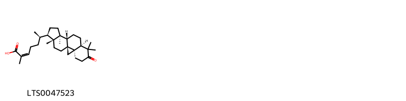{ width=100% }
    <figcaption>Hình ảnh cấu trúc hóa học của 1 hoạt chất thuộc nhóm Steroids and steroid derivatives gồm ['(2z,6r)-2-methyl-6-[(1s,3r,8r,11s,12s,15r,16r)-7,7,12,16-tetramethyl-6-oxopentacyclo[9.7.0.0¹,³.0³,⁸.0¹²,¹⁶]octadecan-15-yl]hept-2-enoic acid (LTS0047523)'].</figcaption>
</figure>
#### Nhóm Stilbenes
<figure markdown="span">
    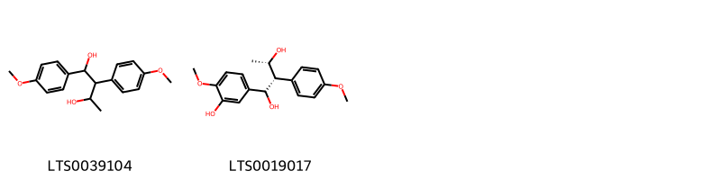{ width=100% }
    <figcaption>Hình ảnh cấu trúc hóa học của 2 hoạt chất thuộc nhóm Stilbenes gồm ['1,2-bis(4-methoxyphenyl)butane-1,3-diol (LTS0039104)', '(2s,3s)-1-(3-hydroxy-4-methoxyphenyl)-2-(4-methoxyphenyl)butane-1,3-diol (LTS0019017)'].</figcaption>
</figure>
#### Nhóm Unsaturated hydrocarbons
<figure markdown="span">
    { width=100% }
    <figcaption>Hình ảnh cấu trúc hóa học của 1 hoạt chất thuộc nhóm Unsaturated hydrocarbons gồm ['α terpinene (LTS0232891)'].</figcaption>
</figure>

---

### Dược dân tộc học

Danh sách các quốc gia có sử dụng *Illicium verum* trong điều trị các bệnh. 

| Country   | Disease                                                                                         | Bệnh                                                                                                                                                                                                |
|:----------|:------------------------------------------------------------------------------------------------|:----------------------------------------------------------------------------------------------------------------------------------------------------------------------------------------------------|
| China     | Carminative, Stimulant, Diuretic, Laxative                                                      | MYMEMORY WARNING: YOU USED ALL AVAILABLE FREE TRANSLATIONS FOR TODAY. NEXT AVAILABLE IN  09 HOURS 08 MINUTES 21 SECONDS VISIT HTTPS://MYMEMORY.TRANSLATED.NET/DOC/USAGELIMITS.PHP TO TRANSLATE MORE |
| Elsewhere | Carminative, Diuretic, Pediculicide, Stimulant, Stomachic, Antiseptic, Carminative, Expectorant | MYMEMORY WARNING: YOU USED ALL AVAILABLE FREE TRANSLATIONS FOR TODAY. NEXT AVAILABLE IN  09 HOURS 08 MINUTES 19 SECONDS VISIT HTTPS://MYMEMORY.TRANSLATED.NET/DOC/USAGELIMITS.PHP TO TRANSLATE MORE |
| Malaya    | Emmenagogue                                                                                     | MYMEMORY WARNING: YOU USED ALL AVAILABLE FREE TRANSLATIONS FOR TODAY. NEXT AVAILABLE IN  09 HOURS 08 MINUTES 17 SECONDS VISIT HTTPS://MYMEMORY.TRANSLATED.NET/DOC/USAGELIMITS.PHP TO TRANSLATE MORE |
| Turkey    | Carminative, Diuretic, Expectorant, Stimulant, Stomachic                                        | MYMEMORY WARNING: YOU USED ALL AVAILABLE FREE TRANSLATIONS FOR TODAY. NEXT AVAILABLE IN  09 HOURS 08 MINUTES 15 SECONDS VISIT HTTPS://MYMEMORY.TRANSLATED.NET/DOC/USAGELIMITS.PHP TO TRANSLATE MORE |

---

