!!! abstract "Tóm tắt"

    Họ Iridaceae gồm khoảng 9 chi và 19 loài được một số cộng đồng tại các quốc gia như Chinese, Japan*, Mexico, Japan, Nepal, Philippines, China, South America, North America, Iraq, Java, Madagascar, Turkey, Egypt, US(Appalachia), ain, Elsewhere, US(Amerindian), Colombia, Lesotho sử dụng trong một số trường hợp QUERY LENGTH LIMIT EXCEEDED. MAX ALLOWED QUERY : 500 CHARS MYMEMORY WARNING: YOU USED ALL AVAILABLE FREE TRANSLATIONS FOR TODAY. NEXT AVAILABLE IN  12 HOURS 34 MINUTES 25 SECONDS VISIT HTTPS://MYMEMORY.TRANSLATED.NET/DOC/USAGELIMITS.PHP TO TRANSLATE MORE.

!!! info "DrDuke"

    James A. Duke sinh năm 1929-2017 là một nhà thực vật học người Mỹ. Đây là một trong những tác giả hàng đầu trong lĩnh vực dược dân tộc học với cuốn *CRC Handbook of Medicinal Herbs* và chính là người xây dựng lên cơ sở dữ liệu về hợp chất tự nhiên và dược dân tộc học tại Bộ nông nghiệp Hoa Kỳ. Các thông tin được đăng tải tại website [Dr. Duke's Phytochemical and Ethnobotanical Databases](https://phytochem.nal.usda.gov/). 
    Trong suốt thập niên 1970, ông lãnh đạo the Plant Taxonomy Laboratory, Plant Genetics and Germplasm Institute of the Agricultural Research Service, U.S. Department of Agriculture.
    Trong tài liệu này, các thông tin về dược dân tộc của các dược liệu được trích dẫn từ tài liệu của James A. Ducke với sự trợ giúp của phần mềm dịch thuật từ tiếng Anh sang tiếng Việt.
   

# Chi Eleutherine

??? note "Danh sách các dược liệu thuộc chi"
    
	 - *Eleutherine americana*
	 - *Eleutherine palmifolia*

---
## Eleutherine americana
### Thông tin về thực vật

!!! info "Phân loại thực vật của *Eleutherine bulbosa* từ GIBF:"
    - **Kingdom:** Plantae
    - **Phylum:** Tracheophyta
    - **Order:** Asparagales
    - **Family:** Iridaceae
    - **Genus:** Eleutherine
    - **Species:** *Eleutherine bulbosa*

 

| Label (VI)   | Label (EN)   | Scientific Name       | Descriptions (VI)   | Descriptions (EN)   | Also Known As (VI)   | Also Known As (EN)   |
|:-------------|:-------------|:----------------------|:--------------------|:--------------------|:---------------------|:---------------------|
| N/A          | N/A          | Eleutherine americana |                     |                     | ['']                 | ['']                 |

#### Phân bố trên thế giới

**Từ CSDL GIBF** United States of America, China

#### Phân bố tại Việt Nam

**Từ CSDL GIBF**: Không có ghi nhận ở Việt Nam

---
### Thành phần hóa học
        
- Theo cơ sở dữ liệu lotus: Từ loài *Eleutherine bulbosa* đã phân lập và xác định được Chưa có hoạt chất nào được phân lập. hoạt chất thuộc về các nhóm Không có hoạt chất nào được phân lập. 

Không có hình ảnh nào được tạo ra

---

### Dược dân tộc học

Danh sách các quốc gia có sử dụng *Eleutherine bulbosa* trong điều trị các bệnh. 

| Country   | Disease                     | Bệnh                                                                                                                                                                                                |
|:----------|:----------------------------|:----------------------------------------------------------------------------------------------------------------------------------------------------------------------------------------------------|
| Java      | Diuretic, Emetic, Purgative | MYMEMORY WARNING: YOU USED ALL AVAILABLE FREE TRANSLATIONS FOR TODAY. NEXT AVAILABLE IN  12 HOURS 34 MINUTES 22 SECONDS VISIT HTTPS://MYMEMORY.TRANSLATED.NET/DOC/USAGELIMITS.PHP TO TRANSLATE MORE |

---

---
## Eleutherine palmifolia
### Thông tin về thực vật

!!! info "Phân loại thực vật của *Sisyrinchium palmifolium* từ GIBF:"
    - **Kingdom:** Plantae
    - **Phylum:** Tracheophyta
    - **Order:** Asparagales
    - **Family:** Iridaceae
    - **Genus:** Sisyrinchium
    - **Species:** *Sisyrinchium palmifolium*

 

| Label (VI)   | Label (EN)   | Scientific Name        | Descriptions (VI)   | Descriptions (EN)   | Also Known As (VI)   | Also Known As (EN)   |
|:-------------|:-------------|:-----------------------|:--------------------|:--------------------|:---------------------|:---------------------|
| N/A          | N/A          | Eleutherine palmifolia | loài thực vật       | species of plant    | ['']                 | ['']                 |

#### Phân bố trên thế giới

**Từ CSDL GIBF** nan, Indonesia, Philippines, Timor-Leste, unknown or invalid

#### Phân bố tại Việt Nam

**Từ CSDL GIBF**: Không có ghi nhận ở Việt Nam

---
### Thành phần hóa học
        
- Theo cơ sở dữ liệu lotus: Từ loài *Sisyrinchium palmifolium* đã phân lập và xác định được Chưa có hoạt chất nào được phân lập. hoạt chất thuộc về các nhóm Không có hoạt chất nào được phân lập. 

Không có hình ảnh nào được tạo ra

---

### Dược dân tộc học

Danh sách các quốc gia có sử dụng *Sisyrinchium palmifolium* trong điều trị các bệnh. 

| Country     | Disease   | Bệnh                                                                                                                                                                                                |
|:------------|:----------|:----------------------------------------------------------------------------------------------------------------------------------------------------------------------------------------------------|
| Philippines | Antidote  | MYMEMORY WARNING: YOU USED ALL AVAILABLE FREE TRANSLATIONS FOR TODAY. NEXT AVAILABLE IN  12 HOURS 34 MINUTES 03 SECONDS VISIT HTTPS://MYMEMORY.TRANSLATED.NET/DOC/USAGELIMITS.PHP TO TRANSLATE MORE |

---

# Chi Geissorhiza

??? note "Danh sách các dược liệu thuộc chi"
    
	 - *Geissorhiza bojeri*

---
## Geissorhiza bojeri
### Thông tin về thực vật

!!! info "Phân loại thực vật của *Gladiolus bojeri* từ GIBF:"
    - **Kingdom:** Plantae
    - **Phylum:** Tracheophyta
    - **Order:** Asparagales
    - **Family:** Iridaceae
    - **Genus:** Gladiolus
    - **Species:** *Gladiolus bojeri*

 

| Label (VI)   | Label (EN)   | Scientific Name    | Descriptions (VI)   | Descriptions (EN)   | Also Known As (VI)   | Also Known As (EN)   |
|:-------------|:-------------|:-------------------|:--------------------|:--------------------|:---------------------|:---------------------|
| N/A          | N/A          | Geissorhiza bojeri | loài thực vật       | species of plant    | ['']                 | ['']                 |

#### Phân bố trên thế giới

**Từ CSDL GIBF** nan, Indonesia, Philippines, Timor-Leste, unknown or invalid

#### Phân bố tại Việt Nam

**Từ CSDL GIBF**: Không có ghi nhận ở Việt Nam

---
### Thành phần hóa học
        
- Theo cơ sở dữ liệu lotus: Từ loài *Gladiolus bojeri* đã phân lập và xác định được Chưa có hoạt chất nào được phân lập. hoạt chất thuộc về các nhóm Không có hoạt chất nào được phân lập. 

Không có hình ảnh nào được tạo ra

---

### Dược dân tộc học

Danh sách các quốc gia có sử dụng *Gladiolus bojeri* trong điều trị các bệnh. 

| Country    | Disease              | Bệnh                                                                                                                                                                                                |
|:-----------|:---------------------|:----------------------------------------------------------------------------------------------------------------------------------------------------------------------------------------------------|
| Madagascar | Digestive, Stomachic | MYMEMORY WARNING: YOU USED ALL AVAILABLE FREE TRANSLATIONS FOR TODAY. NEXT AVAILABLE IN  12 HOURS 33 MINUTES 45 SECONDS VISIT HTTPS://MYMEMORY.TRANSLATED.NET/DOC/USAGELIMITS.PHP TO TRANSLATE MORE |

---

# Chi Belamcanda

??? note "Danh sách các dược liệu thuộc chi"
    
	 - *Belamcanda chinensis*

---
## Belamcanda chinensis
### Thông tin về thực vật

!!! info "Phân loại thực vật của *Iris domestica* từ GIBF:"
    - **Kingdom:** Plantae
    - **Phylum:** Tracheophyta
    - **Order:** Asparagales
    - **Family:** Iridaceae
    - **Genus:** Iris
    - **Species:** *Iris domestica*

 

| Label (VI)   | Label (EN)   | Scientific Name      | Descriptions (VI)   | Descriptions (EN)   | Also Known As (VI)   | Also Known As (EN)   |
|:-------------|:-------------|:---------------------|:--------------------|:--------------------|:---------------------|:---------------------|
| N/A          | N/A          | Belamcanda chinensis | loài thực vật       | species of plant    | ['']                 | ['']                 |

#### Phân bố trên thế giới

**Từ CSDL GIBF** nan, Sri Lanka, Brazil, Singapore, United States of America, Japan, Korea, Republic of, Norway, Papua New Guinea, Belgium, Chinese Taipei, Cook Islands, China, Australia, New Zealand, Argentina, Germany

#### Phân bố tại Việt Nam

**Từ CSDL GIBF**: Không có ghi nhận ở Việt Nam

---
### Thành phần hóa học
        
- Theo cơ sở dữ liệu lotus: Từ loài *Iris domestica* đã phân lập và xác định được Chưa có hoạt chất nào được phân lập. hoạt chất thuộc về các nhóm Không có hoạt chất nào được phân lập. 

Không có hình ảnh nào được tạo ra

---

### Dược dân tộc học

Danh sách các quốc gia có sử dụng *Iris domestica* trong điều trị các bệnh. 

| Country   | Disease                                                                                                                                            | Bệnh                                                                                                                                                                                                |
|:----------|:---------------------------------------------------------------------------------------------------------------------------------------------------|:----------------------------------------------------------------------------------------------------------------------------------------------------------------------------------------------------|
| China     | Alexiteric, Carminative, Diuretic, Expectorant, Expectorant, Poison, Poison, Purgative, Purgative, Stomachic, Tonic, Tonic, Stimulant, Antitussive | MYMEMORY WARNING: YOU USED ALL AVAILABLE FREE TRANSLATIONS FOR TODAY. NEXT AVAILABLE IN  12 HOURS 33 MINUTES 04 SECONDS VISIT HTTPS://MYMEMORY.TRANSLATED.NET/DOC/USAGELIMITS.PHP TO TRANSLATE MORE |
| Chinese   | Purgative, Tonic                                                                                                                                   | MYMEMORY WARNING: YOU USED ALL AVAILABLE FREE TRANSLATIONS FOR TODAY. NEXT AVAILABLE IN  12 HOURS 32 MINUTES 58 SECONDS VISIT HTTPS://MYMEMORY.TRANSLATED.NET/DOC/USAGELIMITS.PHP TO TRANSLATE MORE |
| Elsewhere | Antiphlogistic, Antitussive                                                                                                                        | MYMEMORY WARNING: YOU USED ALL AVAILABLE FREE TRANSLATIONS FOR TODAY. NEXT AVAILABLE IN  12 HOURS 32 MINUTES 53 SECONDS VISIT HTTPS://MYMEMORY.TRANSLATED.NET/DOC/USAGELIMITS.PHP TO TRANSLATE MORE |
| Nepal     | Purgative, Purgative                                                                                                                               | MYMEMORY WARNING: YOU USED ALL AVAILABLE FREE TRANSLATIONS FOR TODAY. NEXT AVAILABLE IN  12 HOURS 32 MINUTES 48 SECONDS VISIT HTTPS://MYMEMORY.TRANSLATED.NET/DOC/USAGELIMITS.PHP TO TRANSLATE MORE |

---

# Chi Sisyrinchium

??? note "Danh sách các dược liệu thuộc chi"
    
	 - *Sisyrinchium scabrum*

---
## Sisyrinchium scabrum
### Thông tin về thực vật

!!! info "Phân loại thực vật của *Sisyrinchium scabrum* từ GIBF:"
    - **Kingdom:** Plantae
    - **Phylum:** Tracheophyta
    - **Order:** Asparagales
    - **Family:** Iridaceae
    - **Genus:** Sisyrinchium
    - **Species:** *Sisyrinchium scabrum*

 

| Label (VI)   | Label (EN)   | Scientific Name      | Descriptions (VI)   | Descriptions (EN)   | Also Known As (VI)   | Also Known As (EN)   |
|:-------------|:-------------|:---------------------|:--------------------|:--------------------|:---------------------|:---------------------|
| N/A          | N/A          | Sisyrinchium scabrum | loài thực vật       | species of plant    | ['']                 | ['']                 |

#### Phân bố trên thế giới

**Từ CSDL GIBF** Mexico, United States of America, Brazil

#### Phân bố tại Việt Nam

**Từ CSDL GIBF**: Không có ghi nhận ở Việt Nam

---
### Thành phần hóa học
        
- Theo cơ sở dữ liệu lotus: Từ loài *Sisyrinchium scabrum* đã phân lập và xác định được Chưa có hoạt chất nào được phân lập. hoạt chất thuộc về các nhóm Không có hoạt chất nào được phân lập. 

Không có hình ảnh nào được tạo ra

---

### Dược dân tộc học

Danh sách các quốc gia có sử dụng *Sisyrinchium scabrum* trong điều trị các bệnh. 

| Country   | Disease   | Bệnh                                                                                                                                                                                                |
|:----------|:----------|:----------------------------------------------------------------------------------------------------------------------------------------------------------------------------------------------------|
| Mexico    | Poison    | MYMEMORY WARNING: YOU USED ALL AVAILABLE FREE TRANSLATIONS FOR TODAY. NEXT AVAILABLE IN  12 HOURS 32 MINUTES 22 SECONDS VISIT HTTPS://MYMEMORY.TRANSLATED.NET/DOC/USAGELIMITS.PHP TO TRANSLATE MORE |

---

# Chi Crocus

??? note "Danh sách các dược liệu thuộc chi"
    
	 - *Crocus sativus*

---
## Crocus sativus
### Thông tin về thực vật

!!! info "Phân loại thực vật của *Crocus sativus* từ GIBF:"
    - **Kingdom:** Plantae
    - **Phylum:** Tracheophyta
    - **Order:** Asparagales
    - **Family:** Iridaceae
    - **Genus:** Crocus
    - **Species:** *Crocus sativus*

 

| Label (VI)   | Label (EN)   | Scientific Name   | Descriptions (VI)   | Descriptions (EN)   | Also Known As (VI)   | Also Known As (EN)                                    |
|:-------------|:-------------|:------------------|:--------------------|:--------------------|:---------------------|:------------------------------------------------------|
| N/A          | N/A          | Crocus sativus    |                     | species of plant    | ['Crocus sativus']   | ['autumn crocus', 'saffron crocus', 'saffron flower'] |

#### Phân bố trên thế giới

**Từ CSDL GIBF** Morocco, United States of America, Czechia, Greece, Iran (Islamic Republic of), Slovakia, Pakistan, Italy, Switzerland, Türkiye, India, Germany, France, Spain, Netherlands

#### Phân bố tại Việt Nam

**Từ CSDL GIBF**: Không có ghi nhận ở Việt Nam

---
### Thành phần hóa học
        
- Theo cơ sở dữ liệu lotus: Từ loài *Crocus sativus* đã phân lập và xác định được 175 hoạt chất thuộc về các nhóm Fatty Acyls, Lactones, Benzene and substituted derivatives, Organic oxides, Flavonoids, Purine nucleosides, Diazines, Cinnamic acids and derivatives, Steroids and steroid derivatives, Pyridines and derivatives, Furopyrans, Phenols, Organooxygen compounds, Hydroxy acids and derivatives, Prenol lipids, Harmala alkaloids. 

|    | chemicalTaxonomyClassyfireClass     |   smiles_count |
|---:|:------------------------------------|---------------:|
|  0 | Benzene and substituted derivatives |              8 |
|  1 | Cinnamic acids and derivatives      |              2 |
|  2 | Diazines                            |              2 |
|  3 | Fatty Acyls                         |              7 |
|  4 | Flavonoids                          |             29 |
|  5 | Furopyrans                          |              2 |
|  6 | Harmala alkaloids                   |              6 |
|  7 | Hydroxy acids and derivatives       |              4 |
|  8 | Lactones                            |              1 |
|  9 | Organic oxides                      |              1 |
| 10 | Organooxygen compounds              |             56 |
| 11 | Phenols                             |              1 |
| 12 | Prenol lipids                       |             49 |
| 13 | Purine nucleosides                  |              3 |
| 14 | Pyridines and derivatives           |              2 |
| 15 | Steroids and steroid derivatives    |              1 |

#### Nhóm Benzene and substituted derivatives
<figure markdown="span">
    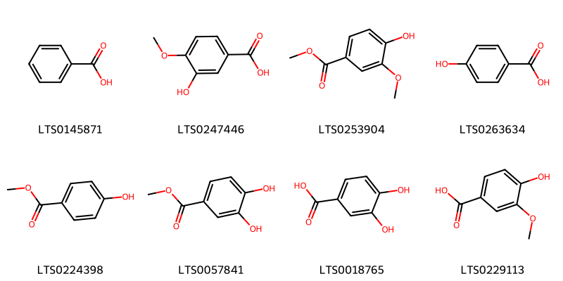{ width=100% }
    <figcaption>Hình ảnh cấu trúc hóa học của 8 hoạt chất thuộc nhóm Benzene and substituted derivatives gồm ['benzoic acid (LTS0145871)', 'isovanillic acid (LTS0247446)', 'vanillate (LTS0253904)', 'p-hydroxybenzoic acid (LTS0263634)', 'paraben (LTS0224398)', 'methyl 3,4-dihydroxybenzoate (LTS0057841)', '3,4-dihydroxybenzoic acid (LTS0018765)', 'vanillic acid (LTS0229113)'].</figcaption>
</figure>
#### Nhóm Cinnamic acids and derivatives
<figure markdown="span">
    { width=100% }
    <figcaption>Hình ảnh cấu trúc hóa học của 2 hoạt chất thuộc nhóm Cinnamic acids and derivatives gồm ['para-coumaric acid (LTS0266252)', 'hydroxycinnamic acid (LTS0233023)'].</figcaption>
</figure>
#### Nhóm Diazines
<figure markdown="span">
    { width=100% }
    <figcaption>Hình ảnh cấu trúc hóa học của 2 hoạt chất thuộc nhóm Diazines gồm ['5-methylpyrimidine-2,4-dione (LTS0084111)', 'pirod (LTS0008205)'].</figcaption>
</figure>
#### Nhóm Fatty Acyls
<figure markdown="span">
    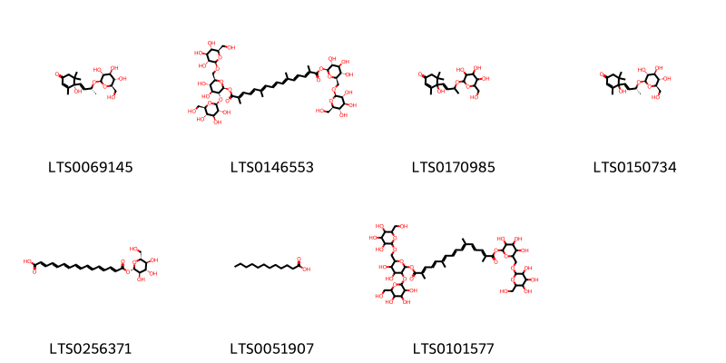{ width=100% }
    <figcaption>Hình ảnh cấu trúc hóa học của 7 hoạt chất thuộc nhóm Fatty Acyls gồm ['(4s)-4-hydroxy-3,5,5-trimethyl-4-[(1e,3r)-3-{[(2r,3r,4s,5s,6r)-3,4,5-trihydroxy-6-(hydroxymethyl)oxan-2-yl]oxy}but-1-en-1-yl]cyclohex-2-en-1-one (LTS0069145)', '(2s,3r,4s,5s,6r)-4,5-dihydroxy-3-{[(2s,3r,4s,5s,6r)-3,4,5-trihydroxy-6-(hydroxymethyl)oxan-2-yl]oxy}-6-({[(2r,3r,4s,5s,6r)-3,4,5-trihydroxy-6-(hydroxymethyl)oxan-2-yl]oxy}methyl)oxan-2-yl (2s,3r,4s,5s,6r)-3,4,5-trihydroxy-6-({[(2r,3r,4s,5s,6r)-3,4,5-trihydroxy-6-(hydroxymethyl)oxan-2-yl]oxy}methyl)oxan-2-yl (2e,4e,6e,8e,10e,12e,14e)-2,6,11,15-tetramethylhexadeca-2,4,6,8,10,12,14-heptaenedioate (LTS0146553)', '4-hydroxy-3,5,5-trimethyl-4-(3-{[3,4,5-trihydroxy-6-(hydroxymethyl)oxan-2-yl]oxy}but-1-en-1-yl)cyclohex-2-en-1-one (LTS0170985)', '4-hydroxy-3,5,5-trimethyl-4-[(1e,3r)-3-{[(2r,3r,4s,5s,6r)-3,4,5-trihydroxy-6-(hydroxymethyl)oxan-2-yl]oxy}but-1-en-1-yl]cyclohex-2-en-1-one (LTS0150734)', '(2e,4e,6e,8e,10e,12e,14e)-16-oxo-16-{[(2s,3r,4s,5s,6r)-3,4,5-trihydroxy-6-(hydroxymethyl)oxan-2-yl]oxy}hexadeca-2,4,6,8,10,12,14-heptaenoic acid (LTS0256371)', 'lauric acid (LTS0051907)', '4,5-dihydroxy-3-{[3,4,5-trihydroxy-6-(hydroxymethyl)oxan-2-yl]oxy}-6-({[3,4,5-trihydroxy-6-(hydroxymethyl)oxan-2-yl]oxy}methyl)oxan-2-yl 3,4,5-trihydroxy-6-({[3,4,5-trihydroxy-6-(hydroxymethyl)oxan-2-yl]oxy}methyl)oxan-2-yl (8e,10e,12e,14e)-2,6,11,15-tetramethylhexadeca-2,4,6,8,10,12,14-heptaenedioate (LTS0101577)'].</figcaption>
</figure>
#### Nhóm Flavonoids
<figure markdown="span">
    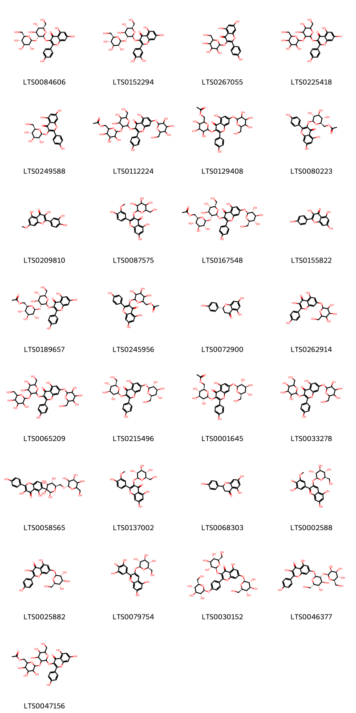{ width=100% }
    <figcaption>Hình ảnh cấu trúc hóa học của 29 hoạt chất thuộc nhóm Flavonoids gồm ['kaempferol 3-o-sophoroside (LTS0084606)', 'quosp (LTS0152294)', 'trifolin (LTS0267055)', '3-{[4,5-dihydroxy-6-(hydroxymethyl)-3-{[3,4,5-trihydroxy-6-(hydroxymethyl)oxan-2-yl]oxy}oxan-2-yl]oxy}-5,7-dihydroxy-2-(4-hydroxyphenyl)chromen-4-one (LTS0225418)', 'astragalin (LTS0249588)', '{6-[(4,5-dihydroxy-2-{[5-hydroxy-2-(4-hydroxyphenyl)-4-oxo-7-{[3,4,5-trihydroxy-6-(hydroxymethyl)oxan-2-yl]oxy}chromen-3-yl]oxy}-6-(hydroxymethyl)oxan-3-yl)oxy]-3,4,5-trihydroxyoxan-2-yl}methyl acetate (LTS0112224)', '(3,4,5-trihydroxy-6-{[5-hydroxy-2-(4-hydroxyphenyl)-4-oxo-7-{[3,4,5-trihydroxy-6-(hydroxymethyl)oxan-2-yl]oxy}chromen-3-yl]oxy}oxan-2-yl)methyl acetate (LTS0129408)', '[(2r,3s,4s,5r,6s)-6-{[5,7-dihydroxy-2-(4-hydroxyphenyl)-4-oxochromen-3-yl]oxy}-3,4,5-trihydroxyoxan-2-yl]methyl acetate (LTS0080223)', 'rhamnetin (LTS0209810)', 'isorhamnetin 3-galactoside (LTS0087575)', '[(2r,3s,4s,5r,6s)-6-{[(2s,3r,4s,5s,6r)-4,5-dihydroxy-2-{[5-hydroxy-2-(4-hydroxyphenyl)-4-oxo-7-{[(2s,3r,4s,5s,6r)-3,4,5-trihydroxy-6-(hydroxymethyl)oxan-2-yl]oxy}chromen-3-yl]oxy}-6-(hydroxymethyl)oxan-3-yl]oxy}-3,4,5-trihydroxyoxan-2-yl]methyl acetate (LTS0167548)', 'kaempherol (LTS0155822)', '[(2r,3s,4s,5r,6s)-6-{[(2s,3r,4s,5s,6r)-2-{[5,7-dihydroxy-2-(4-hydroxyphenyl)-4-oxochromen-3-yl]oxy}-4,5-dihydroxy-6-(hydroxymethyl)oxan-3-yl]oxy}-3,4,5-trihydroxyoxan-2-yl]methyl acetate (LTS0189657)', '(6-{[5,7-dihydroxy-2-(4-hydroxyphenyl)-4-oxochromen-3-yl]oxy}-3,4,5-trihydroxyoxan-2-yl)methyl acetate (LTS0245956)', '(-)-naringenin (LTS0072900)', '3,5-dihydroxy-2-(4-hydroxyphenyl)-7-{[3,4,5-trihydroxy-6-(hydroxymethyl)oxan-2-yl]oxy}chromen-4-one (LTS0262914)', '3-{[4,5-dihydroxy-6-(hydroxymethyl)-3-{[3,4,5-trihydroxy-6-(hydroxymethyl)oxan-2-yl]oxy}oxan-2-yl]oxy}-5-hydroxy-2-(4-hydroxyphenyl)-7-{[3,4,5-trihydroxy-6-(hydroxymethyl)oxan-2-yl]oxy}chromen-4-one (LTS0065209)', '5-hydroxy-2-(4-hydroxyphenyl)-3,7-bis({[(2s,3r,4s,5s,6r)-3,4,5-trihydroxy-6-(hydroxymethyl)oxan-2-yl]oxy})chromen-4-one (LTS0215496)', '[(2r,3s,4s,5r,6s)-3,4,5-trihydroxy-6-{[5-hydroxy-2-(4-hydroxyphenyl)-4-oxo-7-{[(2s,3r,4s,5s,6r)-3,4,5-trihydroxy-6-(hydroxymethyl)oxan-2-yl]oxy}chromen-3-yl]oxy}oxan-2-yl]methyl acetate (LTS0001645)', '5-hydroxy-2-(4-hydroxyphenyl)-3,7-bis({[3,4,5-trihydroxy-6-(hydroxymethyl)oxan-2-yl]oxy})chromen-4-one (LTS0033278)', '3,5,7-trihydroxy-2-(4-hydroxyphenyl)-6-[(2r,3s,4s,5s,6r)-2,3,4,5-tetrahydroxy-6-({[(2s,4s)-3,4,5-trihydroxy-6-(hydroxymethyl)oxan-2-yl]oxy}methyl)oxan-3-yl]chromen-4-one (LTS0058565)', 'isorhamnetin 3-o-glucoside (LTS0137002)', 'asahina (LTS0068303)', '5,7-dihydroxy-2-(3-hydroxy-5-methoxy-4-oxidophenyl)-3-{[(2s,3r,4s,5s,6r)-3,4,5-trihydroxy-6-(hydroxymethyl)oxan-2-yl]oxy}-1λ⁴-chromen-1-ylium (LTS0002588)', 'kaempferol 7-o-glucoside (LTS0025882)', '2-(3,5-dihydroxy-4-oxidophenyl)-5,7-dihydroxy-3-{[(2s,3r,4s,5s,6r)-3,4,5-trihydroxy-6-(hydroxymethyl)oxan-2-yl]oxy}-1λ⁴-chromen-1-ylium (LTS0079754)', '5-hydroxy-3,7-bis({[(2s,3r,4s,5s,6r)-3,4,5-trihydroxy-6-(hydroxymethyl)oxan-2-yl]oxy})-2-(4-{[(2s,3r,4s,5s,6r)-3,4,5-trihydroxy-6-(hydroxymethyl)oxan-2-yl]oxy}phenyl)chromen-4-one (LTS0030152)', '7-{[(2s,3r,4s,5s,6s)-4,5-dihydroxy-6-(hydroxymethyl)-3-{[(2s,3s,4s,5s,6r)-3,4,5-trihydroxy-6-(hydroxymethyl)oxan-2-yl]oxy}oxan-2-yl]oxy}-3,5-dihydroxy-2-(4-hydroxyphenyl)chromen-4-one (LTS0046377)', '{6-[(2-{[5,7-dihydroxy-2-(4-hydroxyphenyl)-4-oxochromen-3-yl]oxy}-4,5-dihydroxy-6-(hydroxymethyl)oxan-3-yl)oxy]-3,4,5-trihydroxyoxan-2-yl}methyl acetate (LTS0047156)'].</figcaption>
</figure>
#### Nhóm Furopyrans
<figure markdown="span">
    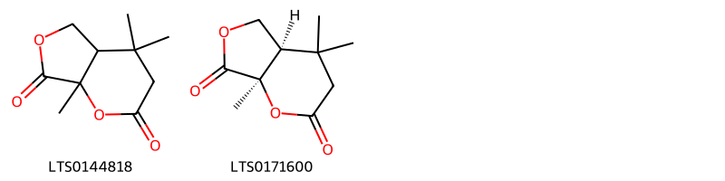{ width=100% }
    <figcaption>Hình ảnh cấu trúc hóa học của 2 hoạt chất thuộc nhóm Furopyrans gồm ['4,4,7a-trimethyl-dihydro-3h-furo[3,4-b]pyran-2,7-dione (LTS0144818)', '(4ar,7ar)-4,4,7a-trimethyl-dihydro-3h-furo[3,4-b]pyran-2,7-dione (LTS0171600)'].</figcaption>
</figure>
#### Nhóm Harmala alkaloids
<figure markdown="span">
    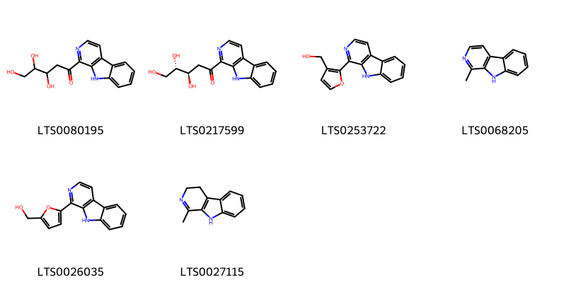{ width=100% }
    <figcaption>Hình ảnh cấu trúc hóa học của 6 hoạt chất thuộc nhóm Harmala alkaloids gồm ['3,4,5-trihydroxy-1-{9h-pyrido[3,4-b]indol-1-yl}pentan-1-one (LTS0080195)', '(3r,4s)-3,4,5-trihydroxy-1-{9h-pyrido[3,4-b]indol-1-yl}pentan-1-one (LTS0217599)', '(2-{9h-pyrido[3,4-b]indol-1-yl}furan-3-yl)methanol (LTS0253722)', 'harmane (LTS0068205)', 'perlolyrine (LTS0026035)', '1-methyl-3h,4h,9h-pyrido[3,4-b]indole (LTS0027115)'].</figcaption>
</figure>
#### Nhóm Hydroxy acids and derivatives
<figure markdown="span">
    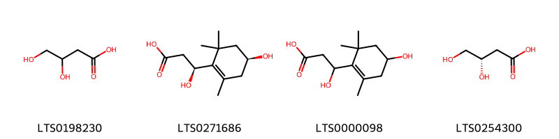{ width=100% }
    <figcaption>Hình ảnh cấu trúc hóa học của 4 hoạt chất thuộc nhóm Hydroxy acids and derivatives gồm ['3,4-dihydroxybutanoic acid (LTS0198230)', '(3s)-3-hydroxy-3-[(4s)-4-hydroxy-2,6,6-trimethylcyclohex-1-en-1-yl]propanoic acid (LTS0271686)', '3-hydroxy-3-(4-hydroxy-2,6,6-trimethylcyclohex-1-en-1-yl)propanoic acid (LTS0000098)', '(s)-3,4-dihydroxybutyric acid (LTS0254300)'].</figcaption>
</figure>
#### Nhóm Lactones
<figure markdown="span">
    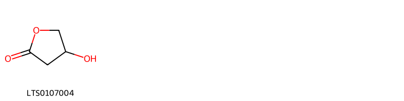{ width=100% }
    <figcaption>Hình ảnh cấu trúc hóa học của 1 hoạt chất thuộc nhóm Lactones gồm ['3-hydroxybutyrolactone (LTS0107004)'].</figcaption>
</figure>
#### Nhóm Organic oxides
<figure markdown="span">
    { width=100% }
    <figcaption>Hình ảnh cấu trúc hóa học của 1 hoạt chất thuộc nhóm Organic oxides gồm ['safranal (LTS0094098)'].</figcaption>
</figure>
#### Nhóm Organooxygen compounds
<figure markdown="span">
    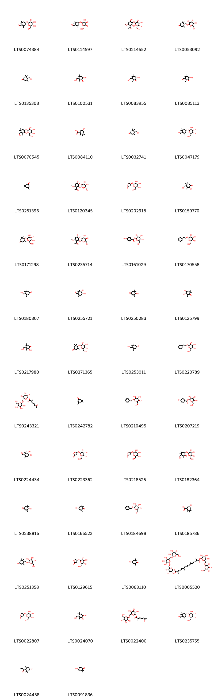{ width=100% }
    <figcaption>Hình ảnh cấu trúc hóa học của 56 hoạt chất thuộc nhóm Organooxygen compounds gồm ['picrocrocin (LTS0074384)', '(4r)-2,6,6-trimethyl-4-{[(2r,3r,4s,5r,6r)-3,4,5-trihydroxy-6-(hydroxymethyl)oxan-2-yl]oxy}cyclohex-1-ene-1-carbaldehyde (LTS0114597)', '1-(2,4-dihydroxy-6-methoxy-3-{[3,4,5-trihydroxy-6-(hydroxymethyl)oxan-2-yl]oxy}phenyl)ethanone (LTS0214652)', '3,5,5-trimethyl-4-({[3,4,5-trihydroxy-6-(hydroxymethyl)oxan-2-yl]oxy}methyl)cyclohex-2-en-1-one (LTS0053092)', '4-(hydroxymethyl)-3,5,5-trimethylcyclohex-2-en-1-one (LTS0135308)', '6-hydroxy-3-(hydroxymethyl)-2,4,4-trimethylcyclohex-2-en-1-one (LTS0100531)', '(6s)-6-hydroxy-3-(hydroxymethyl)-2,4,4-trimethylcyclohex-2-en-1-one (LTS0083955)', '4-hydroxy-2,6,6-trimethyl-3-oxocyclohexa-1,4-diene-1-carbaldehyde (LTS0085113)', '3-(hydroxymethyl)-2,4,4-trimethyl-6-{[3,4,5-trihydroxy-6-(hydroxymethyl)oxan-2-yl]oxy}cyclohexa-2,5-dien-1-one (LTS0070545)', '5-hydroxy-2,3,3-trimethylcyclohex-1-ene-1-carboxylic acid (LTS0084110)', '(4s)-4-(hydroxymethyl)-3,5,5-trimethylcyclohex-2-en-1-one (LTS0032741)', '2,6,6-trimethyl-4-{[3,4,5-trihydroxy-6-(hydroxymethyl)oxan-2-yl]oxy}cyclohex-1-ene-1-carbaldehyde (LTS0047179)', 'β-isophorone (LTS0251396)', '1-(4-hydroxy-2-methoxy-6-{[(2r,3s,4r,5r,6s)-3,4,5-trihydroxy-6-(hydroxymethyl)oxan-2-yl]oxy}phenyl)ethanone (LTS0120345)', '(4s)-4-{[(2r,3r,4s,5s,6r)-3,4,5-trihydroxy-6-(hydroxymethyl)oxan-2-yl]oxy}oxolan-2-one (LTS0202918)', '(2s)-2-hydroxy-4-(hydroxymethyl)-3,5,5-trimethylcyclohex-3-en-1-one (LTS0159770)', '3,5,5-trimethyl-4-{[3,4,5-trihydroxy-6-(hydroxymethyl)oxan-2-yl]oxy}cyclohex-2-en-1-one (LTS0171298)', '1-(4-hydroxy-2-methoxy-6-{[3,4,5-trihydroxy-6-(hydroxymethyl)oxan-2-yl]oxy}phenyl)ethanone (LTS0235714)', '(2s,3r,4s,5s,6r)-3,4,5-trihydroxy-6-(hydroxymethyl)oxan-2-yl 4-hydroxybenzoate (LTS0161029)', '(2r,3s,4s,5r,6r)-2-(hydroxymethyl)-6-(2-phenylethoxy)oxane-3,4,5-triol (LTS0170558)', '4-(hydroxymethyl)-3,5,5-trimethylcyclohex-3-en-1-ol (LTS0180307)', '(4r,5s)-4,5-dihydroxy-2,6,6-trimethylcyclohex-1-ene-1-carbaldehyde (LTS0255721)', '4-hydroxy-3,5,5-trimethylcyclohex-2-en-1-one (LTS0250283)', '2-hydroxy-3,5,5-trimethylcyclohex-2-ene-1,4-dione (LTS0125799)', '2-hydroxy-4-(hydroxymethyl)-3,5,5-trimethylcyclohex-3-en-1-one (LTS0217980)', '(4r)-3,5,5-trimethyl-4-{[(2r,3r,4s,5s,6r)-3,4,5-trihydroxy-6-(hydroxymethyl)oxan-2-yl]oxy}cyclohex-2-en-1-one (LTS0271365)', '(1s)-4-(hydroxymethyl)-3,5,5-trimethylcyclohex-3-en-1-ol (LTS0253011)', '2-(hydroxymethyl)-6-(2-phenylethoxy)oxane-3,4,5-triol (LTS0220789)', '(2s,3r,4s,5s,6r)-3,4,5-trihydroxy-6-({[(2r,3r,4s,5s,6r)-3,4,5-trihydroxy-6-(hydroxymethyl)oxan-2-yl]oxy}methyl)oxan-2-yl (2e,4e)-2-methyl-6-oxohepta-2,4-dienoate (LTS0243321)', 'isophorone (LTS0242782)', 'benzyl glucopyranoside (LTS0210495)', '3,4,5-trihydroxy-6-(hydroxymethyl)oxan-2-yl 4-hydroxybenzoate (LTS0207219)', '(4r,5r)-4,5-dihydroxy-2,6,6-trimethylcyclohex-1-ene-1-carbaldehyde (LTS0224434)', '(4r)-4-{[(2r,3r,4s,5s,6r)-3,4,5-trihydroxy-6-(hydroxymethyl)oxan-2-yl]oxy}oxolan-2-one (LTS0223362)', '4-{[3,4,5-trihydroxy-6-(hydroxymethyl)oxan-2-yl]oxy}oxolan-2-one (LTS0218526)', '3-(hydroxymethyl)-2,4,4-trimethyl-6-{[(2s,3r,4s,5s,6r)-3,4,5-trihydroxy-6-(hydroxymethyl)oxan-2-yl]oxy}cyclohexa-2,5-dien-1-one (LTS0182364)', '(4s)-4-hydroxy-3,5,5-trimethylcyclohex-2-en-1-one (LTS0238816)', '4-hydroxy-2,6,6-trimethylcyclohex-2-en-1-one (LTS0166522)', 'benzyl β-d-glucoside (LTS0184698)', '(5r)-5-hydroxy-2,3,3-trimethylcyclohex-1-ene-1-carboxylic acid (LTS0185786)', '(4s)-3,5,5-trimethyl-4-({[(2r,3r,4s,5s,6r)-3,4,5-trihydroxy-6-(hydroxymethyl)oxan-2-yl]oxy}methyl)cyclohex-2-en-1-one (LTS0251358)', '4-{[(2r,3r,4s,5s,6r)-3,4,5-trihydroxy-6-(hydroxymethyl)oxan-2-yl]oxy}oxolan-2-one (LTS0129615)', '(4s)-4-hydroxy-2,6,6-trimethylcyclohex-2-en-1-one (LTS0063110)', '(2s,3r,4s,5s,6r)-3,4,5-trihydroxy-6-({[(2r,3r,4s,5s,6r)-3,4,5-trihydroxy-6-(hydroxymethyl)oxan-2-yl]oxy}methyl)oxan-2-yl (2s,3r,4s,5s,6r)-3,4,5-trihydroxy-6-({[(2r,3r,4s,5s,6r)-3,4,5-trihydroxy-6-({[(2r,3r,4s,5s,6r)-3,4,5-trihydroxy-6-(hydroxymethyl)oxan-2-yl]oxy}methyl)oxan-2-yl]oxy}methyl)oxan-2-yl (2e,4e,6e,8e,10e,12e,14e)-2,6,11,15-tetramethylhexadeca-2,4,6,8,10,12,14-heptaenedioate (LTS0005520)', '(4s)-4-{[(2s,3s,4r,5r,6s)-3,4,5-trihydroxy-6-(hydroxymethyl)oxan-2-yl]oxy}oxolan-2-one (LTS0022807)', '6-hydroxy-3-(hydroxymethyl)-2,4,4-trimethylcyclohexa-2,5-dien-1-one (LTS0024070)', '3,4,5-trihydroxy-6-({[3,4,5-trihydroxy-6-(hydroxymethyl)oxan-2-yl]oxy}methyl)oxan-2-yl 2-methyl-6-oxohepta-2,4-dienoate (LTS0022400)', '(4s)-2,6,6-trimethyl-4-{[(2r,3r,4s,5s,6r)-3,4,5-trihydroxy-6-(hydroxymethyl)oxan-2-yl]oxy}cyclohex-1-ene-1-carbaldehyde (LTS0235755)', '1-[(4s)-4-hydroxy-2,6,6-trimethylcyclohex-1-en-1-yl]propan-1-one (LTS0024458)', '(4s)-4-hydroxy-4,6,6-trimethylcyclohex-2-en-1-one (LTS0091836)', '4,5-dihydroxy-2,6,6-trimethylcyclohex-1-ene-1-carbaldehyde (LTS0257649)', '1-(2,4-dihydroxy-6-methoxy-3-{[(2r,3s,4r,5r,6s)-3,4,5-trihydroxy-6-(hydroxymethyl)oxan-2-yl]oxy}phenyl)ethanone (LTS0038556)', '1-(4-hydroxy-2,6,6-trimethylcyclohex-1-en-1-yl)propan-1-one (LTS0051300)', '5-methoxyfuran-2-carbaldehyde (LTS0259435)', '(4r)-4-hydroxy-3,5,5-trimethylcyclohex-2-en-1-one (LTS0047868)', '(4s)-3,5,5-trimethyl-4-{[(2r,3r,4s,5s,6r)-3,4,5-trihydroxy-6-(hydroxymethyl)oxan-2-yl]oxy}cyclohex-2-en-1-one (LTS0255155)'].</figcaption>
</figure>
#### Nhóm Phenols
<figure markdown="span">
    { width=100% }
    <figcaption>Hình ảnh cấu trúc hóa học của 1 hoạt chất thuộc nhóm Phenols gồm ['tyrosol (LTS0132195)'].</figcaption>
</figure>
#### Nhóm Prenol lipids
<figure markdown="span">
    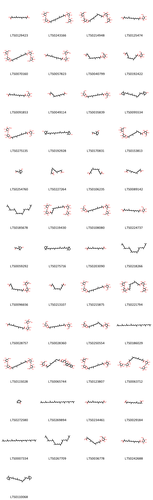{ width=100% }
    <figcaption>Hình ảnh cấu trúc hóa học của 49 hoạt chất thuộc nhóm Prenol lipids gồm ['crocetin (LTS0129423)', 'crocin (LTS0243166)', 'bis[3,4,5-trihydroxy-6-({[3,4,5-trihydroxy-6-(hydroxymethyl)oxan-2-yl]oxy}methyl)oxan-2-yl] (8e,10e,12e,14e)-2,6,11,15-tetramethylhexadeca-2,4,6,8,10,12,14-heptaenedioate (LTS0214948)', '1-methyl (2s,3r,4s,5s,6r)-3,4,5-trihydroxy-6-(hydroxymethyl)oxan-2-yl (2e,4e,6e,8e,10e,12e,14e)-2,6,11,15-tetramethylhexadeca-2,4,6,8,10,12,14-heptaenedioate (LTS0125474)', 'bis[(2s,3r,4s,5s,6r)-3,4,5-trihydroxy-6-({[(2r,3s,4s,5s,6r)-3,4,5-trihydroxy-6-(hydroxymethyl)oxan-2-yl]oxy}methyl)oxan-2-yl] (2e,4e,6e,8e,10e,12e,14e)-2,6,11,15-tetramethylhexadeca-2,4,6,8,10,12,14-heptaenedioate (LTS0070160)', 'β-d-gentiobiosyl crocetin (LTS0057823)', '(8e,10e,12e,14e)-2,6,11,15-tetramethyl-16-oxo-16-{[3,4,5-trihydroxy-6-(hydroxymethyl)oxan-2-yl]oxy}hexadeca-2,4,6,8,10,12,14-heptaenoic acid (LTS0040799)', '1-methyl 3,4,5-trihydroxy-6-(hydroxymethyl)oxan-2-yl 2,6,11,15-tetramethylhexadeca-2,4,6,8,10,12,14-heptaenedioate (LTS0192422)', '(2e,4e,6e,8e,10e,12e,14e)-2,6,11,15-tetramethyl-16-oxo-16-{[(2s,3s,4s,5s,6s)-3,4,5-trihydroxy-6-(hydroxymethyl)oxan-2-yl]oxy}hexadeca-2,4,6,8,10,12,14-heptaenoic acid (LTS0091853)', '(8e,10e,12e,14e)-2,6,11,15-tetramethylhexadeca-2,4,6,8,10,12,14-heptaenedioic acid (LTS0049114)', '(2s,3r,4s,5s,6r)-3,4,5-trihydroxy-6-(hydroxymethyl)oxan-2-yl (3r,4s,5s,6r)-3,4,5-trihydroxy-6-(hydroxymethyl)oxan-2-yl (2e,4e,6e,8e,10e,12e,14e)-2,6,11,15-tetramethylhexadeca-2,4,6,8,10,12,14-heptaenedioate (LTS0035839)', '4-[(9e,11e,13e,15e,17e)-18-(4-hydroxy-2,6,6-trimethylcyclohex-1-en-1-yl)-3,7,12,16-tetramethyloctadeca-1,3,5,7,9,11,13,15,17-nonaen-1-yl]-3,5,5-trimethylcyclohex-3-en-1-ol (LTS0095534)', '(2s,3r,4s,5s,6r)-3,4,5-trihydroxy-6-(hydroxymethyl)oxan-2-yl (2r,3s,4r,5r,6s)-3,4,5-trihydroxy-6-({[(2s,3s,4r,5r,6s)-3,4,5-trihydroxy-6-(hydroxymethyl)oxan-2-yl]oxy}methyl)oxan-2-yl (2e,4e,6e,8e,10e,12e,14e)-2,6,11,15-tetramethylhexadeca-2,4,6,8,10,12,14-heptaenedioate (LTS0275135)', 'zeaxanthin (LTS0192928)', '4-(3-hydroxy-2,6,6-trimethylcyclohex-1-en-1-yl)but-3-en-2-one (LTS0170831)', '3,4,5-trihydroxy-6-(hydroxymethyl)oxan-2-yl 3,4,5-trihydroxy-6-({[3,4,5-trihydroxy-6-(hydroxymethyl)oxan-2-yl]oxy}methyl)oxan-2-yl (8e,10e,12e,14e)-2,6,11,15-tetramethylhexadeca-2,4,6,8,10,12,14-heptaenedioate (LTS0153813)', '(3e)-4-[(3s)-3-hydroxy-2,6,6-trimethylcyclohex-1-en-1-yl]but-3-en-2-one (LTS0254760)', 'crocetin (LTS0227264)', '16-methoxy-2,6,11,15-tetramethyl-16-oxohexadeca-2,4,6,8,10,12,14-heptaenoic acid (LTS0106235)', '(2z,4e,6z,8e,10e,12e,14z)-2,6,11,15-tetramethylhexadeca-2,4,6,8,10,12,14-heptaenedioic acid (LTS0089142)', 'phytoene (LTS0185678)', 'bis[(2s,3r,4s,5s,6r)-3,4,5-trihydroxy-6-({[(2r,3r,4s,5s,6r)-3,4,5-trihydroxy-6-(hydroxymethyl)oxan-2-yl]oxy}methyl)oxan-2-yl] (2z,4e,6z,8e,10e,12e,14e)-2,6,11,15-tetramethylhexadeca-2,4,6,8,10,12,14-heptaenedioate (LTS0119430)', '(2s,3r,4s,5s,6r)-3,4,5-trihydroxy-6-(hydroxymethyl)oxan-2-yl (2s,4s,6r)-3,4,5-trihydroxy-6-({[(2r,3r,4s,5s,6r)-3,4,5-trihydroxy-6-(hydroxymethyl)oxan-2-yl]oxy}methyl)oxan-2-yl (2e,4e,6e,8e,10e,12e,14e)-2,6,11,15-tetramethylhexadeca-2,4,6,8,10,12,14-heptaenedioate (LTS0108080)', 'β-d-glucosyl crocetin (LTS0224737)', '(3e)-4-(4-hydroxy-2,6,6-trimethylcyclohex-1-en-1-yl)but-3-en-2-one (LTS0059292)', 'β-carotene (LTS0275716)', '(2e,4e,6e,8e,10e,12e,14e)-16-methoxy-2,6,11,15-tetramethyl-16-oxohexadeca-2,4,6,8,10,12,14-heptaenoic acid (LTS0203090)', 'zeta-carotene (LTS0218266)', '(8e,10e,12e,14e)-2,6,11,15-tetramethyl-16-oxo-16-{[3,4,5-trihydroxy-6-({[3,4,5-trihydroxy-6-(hydroxymethyl)oxan-2-yl]oxy}methyl)oxan-2-yl]oxy}hexadeca-2,4,6,8,10,12,14-heptaenoic acid (LTS0096656)', '1,16-dimethyl 2,6,11,15-tetramethylhexadeca-2,4,6,8,10,12,14-heptaenedioate (LTS0213107)', 'tricrocin (LTS0215875)', 'bis[3,4,5-trihydroxy-6-({[3,4,5-trihydroxy-6-(hydroxymethyl)oxan-2-yl]oxy}methyl)oxan-2-yl] 2,6,11,15-tetramethylhexadeca-2,4,6,8,10,12,14-heptaenedioate (LTS0221794)', '(2e,4e,6e,8e,10e,12e,14e)-2,6,11,15-tetramethyl-16-oxo-16-{[(2s,3r,4s,5s,6r)-3,4,5-trihydroxy-6-({[(2s,3s,4r,5r,6s)-3,4,5-trihydroxy-6-(hydroxymethyl)oxan-2-yl]oxy}methyl)oxan-2-yl]oxy}hexadeca-2,4,6,8,10,12,14-heptaenoic acid (LTS0028757)', 'dicrocin (LTS0028360)', 'bis[3,4,5-trihydroxy-6-(hydroxymethyl)oxan-2-yl] (8e,10e,12e,14e)-2,6,11,15-tetramethylhexadeca-2,4,6,8,10,12,14-heptaenedioate (LTS0250554)', 'phytoene (LTS0186029)', 'bis[(3r,4s,5s,6r)-3,4,5-trihydroxy-6-({[(2r,3r,4s,5s,6r)-3,4,5-trihydroxy-6-(hydroxymethyl)oxan-2-yl]oxy}methyl)oxan-2-yl] (2e,4e,6e,8e,10e,12e,14e)-2,6,11,15-tetramethylhexadeca-2,4,6,8,10,12,14-heptaenedioate (LTS0115028)', '3,4,5-trihydroxy-6-(hydroxymethyl)oxan-2-yl (2z,4e,6e,8e,10e,12z,14e)-2,6,11-trimethyl-15-({2-[3,4,5-trihydroxy-6-(1,3,6,7-tetrahydroxy-9-oxoxanthen-2-yl)oxan-2-yl]acetyl}oxy)hexadeca-2,4,6,8,10,12,14-heptaenoate (LTS0065744)', '3,4,5-trihydroxy-6-(hydroxymethyl)oxan-2-yl (6s)-3,4,5-trihydroxy-6-({[3,4,5-trihydroxy-6-(hydroxymethyl)oxan-2-yl]oxy}methyl)oxan-2-yl (2e,4e,6e,8e,10e,12e,14e)-2,6,11,15-tetramethylhexadeca-2,4,6,8,10,12,14-heptaenedioate (LTS0123807)', 'bis[(2s,3r,4s,5s,6r)-3,4,5-trihydroxy-6-({[(2r,3r,4s,5s,6r)-3,4,5-trihydroxy-6-(hydroxymethyl)oxan-2-yl]oxy}methyl)oxan-2-yl] (2e,4e,6z,8e,10e,12e,14e)-2,6,11,15-tetramethylhexadeca-2,4,6,8,10,12,14-heptaenedioate (LTS0063712)', 'eucarvone (LTS0272580)', 'all-trans-phytofluene (LTS0269894)', 'crocetin dimethyl ester (LTS0234461)', '(2z,4e,6e,8e,10e,12e,14e)-2,6,11,15-tetramethylhexadeca-2,4,6,8,10,12,14-heptaenedioic acid (LTS0029184)', 'zeta-carotene (LTS0007334)', 'phytofluene (LTS0267709)', '1-methyl 3,4,5-trihydroxy-6-(hydroxymethyl)oxan-2-yl (2z,4e,6e,8e,10z,12e,14e)-2,6,11,15-tetramethylhexadeca-2,4,6,8,10,12,14-heptaenedioate (LTS0036778)', '1-methyl (2s,3s,4s,5s,6s)-3,4,5-trihydroxy-6-(hydroxymethyl)oxan-2-yl (2e,4e,6e,8e,10e,12e,14e)-2,6,11,15-tetramethylhexadeca-2,4,6,8,10,12,14-heptaenedioate (LTS0242688)', '1,3,3-trimethyl-2-[(9e,11e,13e,15e,17e)-3,7,12,16-tetramethyl-18-(2,6,6-trimethylcyclohex-1-en-1-yl)octadeca-1,3,5,7,9,11,13,15,17-nonaen-1-yl]cyclohex-1-ene (LTS0110068)'].</figcaption>
</figure>
#### Nhóm Purine nucleosides
<figure markdown="span">
    { width=100% }
    <figcaption>Hình ảnh cấu trúc hóa học của 3 hoạt chất thuộc nhóm Purine nucleosides gồm ['(2r,3s,4r,5s)-2-(6-aminopurin-9-yl)-5-(hydroxymethyl)oxolane-3,4-diol (LTS0178532)', 'adenosine (LTS0052576)', 'adenosine (LTS0014061)'].</figcaption>
</figure>
#### Nhóm Pyridines and derivatives
<figure markdown="span">
    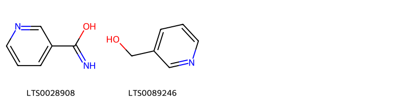{ width=100% }
    <figcaption>Hình ảnh cấu trúc hóa học của 2 hoạt chất thuộc nhóm Pyridines and derivatives gồm ['vitamin b>3< (LTS0028908)', 'pyridin-3-ylmethanol (LTS0089246)'].</figcaption>
</figure>
#### Nhóm Steroids and steroid derivatives
<figure markdown="span">
    { width=100% }
    <figcaption>Hình ảnh cấu trúc hóa học của 1 hoạt chất thuộc nhóm Steroids and steroid derivatives gồm ['phytosterol (LTS0029311)'].</figcaption>
</figure>

---

### Dược dân tộc học

Danh sách các quốc gia có sử dụng *Crocus sativus* trong điều trị các bệnh. 

| Country   | Disease                                                                                                                                                                                 | Bệnh                                                                                                                                                                                                |
|:----------|:----------------------------------------------------------------------------------------------------------------------------------------------------------------------------------------|:----------------------------------------------------------------------------------------------------------------------------------------------------------------------------------------------------|
| China     | Carminative, Stimulant                                                                                                                                                                  | MYMEMORY WARNING: YOU USED ALL AVAILABLE FREE TRANSLATIONS FOR TODAY. NEXT AVAILABLE IN  12 HOURS 31 MINUTES 51 SECONDS VISIT HTTPS://MYMEMORY.TRANSLATED.NET/DOC/USAGELIMITS.PHP TO TRANSLATE MORE |
| Elsewhere | Abortifacient, Abortifacient, Diaphoretic, Diaphoretic, Emmenagogue, Emmenagogue, Narcotic, Poison, Poison, Stimulant, Stimulant, Stomachic, Stomachic, Narcotic, Sedative, Expectorant | MYMEMORY WARNING: YOU USED ALL AVAILABLE FREE TRANSLATIONS FOR TODAY. NEXT AVAILABLE IN  12 HOURS 31 MINUTES 43 SECONDS VISIT HTTPS://MYMEMORY.TRANSLATED.NET/DOC/USAGELIMITS.PHP TO TRANSLATE MORE |
| Japan     | Emmenagogue, Sedative                                                                                                                                                                   | MYMEMORY WARNING: YOU USED ALL AVAILABLE FREE TRANSLATIONS FOR TODAY. NEXT AVAILABLE IN  12 HOURS 31 MINUTES 39 SECONDS VISIT HTTPS://MYMEMORY.TRANSLATED.NET/DOC/USAGELIMITS.PHP TO TRANSLATE MORE |
| Japan*    | Sedative                                                                                                                                                                                | MYMEMORY WARNING: YOU USED ALL AVAILABLE FREE TRANSLATIONS FOR TODAY. NEXT AVAILABLE IN  12 HOURS 31 MINUTES 33 SECONDS VISIT HTTPS://MYMEMORY.TRANSLATED.NET/DOC/USAGELIMITS.PHP TO TRANSLATE MORE |
| Java      | Emmenagogue                                                                                                                                                                             | MYMEMORY WARNING: YOU USED ALL AVAILABLE FREE TRANSLATIONS FOR TODAY. NEXT AVAILABLE IN  12 HOURS 31 MINUTES 29 SECONDS VISIT HTTPS://MYMEMORY.TRANSLATED.NET/DOC/USAGELIMITS.PHP TO TRANSLATE MORE |
| Turkey    | Aphrodisiac, Cardiotonic, Carminative, Emmenagogue, Narcotic, Nervine, Poison, Stimulant, Sudorific, Antiseptic                                                                         | MYMEMORY WARNING: YOU USED ALL AVAILABLE FREE TRANSLATIONS FOR TODAY. NEXT AVAILABLE IN  12 HOURS 31 MINUTES 23 SECONDS VISIT HTTPS://MYMEMORY.TRANSLATED.NET/DOC/USAGELIMITS.PHP TO TRANSLATE MORE |
| ain       | Cardiotonic                                                                                                                                                                             | MYMEMORY WARNING: YOU USED ALL AVAILABLE FREE TRANSLATIONS FOR TODAY. NEXT AVAILABLE IN  12 HOURS 31 MINUTES 19 SECONDS VISIT HTTPS://MYMEMORY.TRANSLATED.NET/DOC/USAGELIMITS.PHP TO TRANSLATE MORE |

---

# Chi Ferraria

??? note "Danh sách các dược liệu thuộc chi"
    
	 - *Ferraria purgans*

---
## Ferraria purgans
### Thông tin về thực vật

!!! info "Phân loại thực vật của *Trimezia juncifolia* từ GIBF:"
    - **Kingdom:** Plantae
    - **Phylum:** Tracheophyta
    - **Order:** Asparagales
    - **Family:** Iridaceae
    - **Genus:** Trimezia
    - **Species:** *Trimezia juncifolia*

 

| Label (VI)   | Label (EN)   | Scientific Name   | Descriptions (VI)   | Descriptions (EN)   | Also Known As (VI)   | Also Known As (EN)                                    |
|:-------------|:-------------|:------------------|:--------------------|:--------------------|:---------------------|:------------------------------------------------------|
| N/A          | N/A          | Crocus sativus    |                     | species of plant    | ['Crocus sativus']   | ['autumn crocus', 'saffron crocus', 'saffron flower'] |

#### Phân bố trên thế giới

**Từ CSDL GIBF** Brazil

#### Phân bố tại Việt Nam

**Từ CSDL GIBF**: Không có ghi nhận ở Việt Nam

---
### Thành phần hóa học
        
- Theo cơ sở dữ liệu lotus: Từ loài *Trimezia juncifolia* đã phân lập và xác định được Chưa có hoạt chất nào được phân lập. hoạt chất thuộc về các nhóm Không có hoạt chất nào được phân lập. 

Không có hình ảnh nào được tạo ra

---

### Dược dân tộc học

Danh sách các quốc gia có sử dụng *Trimezia juncifolia* trong điều trị các bệnh. 

| Country       | Disease                       | Bệnh                                                                                                                                                                                                |
|:--------------|:------------------------------|:----------------------------------------------------------------------------------------------------------------------------------------------------------------------------------------------------|
| South America | Emmenagogue, Purgative, Tonic | MYMEMORY WARNING: YOU USED ALL AVAILABLE FREE TRANSLATIONS FOR TODAY. NEXT AVAILABLE IN  12 HOURS 30 MINUTES 37 SECONDS VISIT HTTPS://MYMEMORY.TRANSLATED.NET/DOC/USAGELIMITS.PHP TO TRANSLATE MORE |

---

# Chi Homeria

??? note "Danh sách các dược liệu thuộc chi"
    
	 - *Homeria pallida*

---
## Homeria pallida
### Thông tin về thực vật

!!! info "Phân loại thực vật của *Moraea pallida* từ GIBF:"
    - **Kingdom:** Plantae
    - **Phylum:** Tracheophyta
    - **Order:** Asparagales
    - **Family:** Iridaceae
    - **Genus:** Moraea
    - **Species:** *Moraea pallida*

 

| Label (VI)   | Label (EN)   | Scientific Name   | Descriptions (VI)   | Descriptions (EN)   | Also Known As (VI)   | Also Known As (EN)   |
|:-------------|:-------------|:------------------|:--------------------|:--------------------|:---------------------|:---------------------|
| N/A          | N/A          | Homeria pallida   | loài thực vật       | species of plant    | ['']                 | ['']                 |

#### Phân bố trên thế giới

**Từ CSDL GIBF** nan, South Africa

#### Phân bố tại Việt Nam

**Từ CSDL GIBF**: Không có ghi nhận ở Việt Nam

---
### Thành phần hóa học
        
- Theo cơ sở dữ liệu lotus: Từ loài *Moraea pallida* đã phân lập và xác định được Chưa có hoạt chất nào được phân lập. hoạt chất thuộc về các nhóm Không có hoạt chất nào được phân lập. 

Không có hình ảnh nào được tạo ra

---

### Dược dân tộc học

Danh sách các quốc gia có sử dụng *Moraea pallida* trong điều trị các bệnh. 

| Country   | Disease   | Bệnh                                                                                                                                                                                                |
|:----------|:----------|:----------------------------------------------------------------------------------------------------------------------------------------------------------------------------------------------------|
| Lesotho   | Poison    | MYMEMORY WARNING: YOU USED ALL AVAILABLE FREE TRANSLATIONS FOR TODAY. NEXT AVAILABLE IN  12 HOURS 30 MINUTES 07 SECONDS VISIT HTTPS://MYMEMORY.TRANSLATED.NET/DOC/USAGELIMITS.PHP TO TRANSLATE MORE |

---

# Chi Trimezia

??? note "Danh sách các dược liệu thuộc chi"
    
	 - *Trimezia lurida*

---
## Trimezia lurida
### Thông tin về thực vật

!!! info "Phân loại thực vật của *Trimezia martinicensis* từ GIBF:"
    - **Kingdom:** Plantae
    - **Phylum:** Tracheophyta
    - **Order:** Asparagales
    - **Family:** Iridaceae
    - **Genus:** Trimezia
    - **Species:** *Trimezia martinicensis*

 

| Label (VI)   | Label (EN)   | Scientific Name   | Descriptions (VI)   | Descriptions (EN)   | Also Known As (VI)   | Also Known As (EN)   |
|:-------------|:-------------|:------------------|:--------------------|:--------------------|:---------------------|:---------------------|
| N/A          | N/A          | Trimezia lurida   |                     | species of plant    | ['']                 | ['']                 |

#### Phân bố trên thế giới

**Từ CSDL GIBF** nan, Brazil

#### Phân bố tại Việt Nam

**Từ CSDL GIBF**: Không có ghi nhận ở Việt Nam

---
### Thành phần hóa học
        
- Theo cơ sở dữ liệu lotus: Từ loài *Trimezia martinicensis* đã phân lập và xác định được Chưa có hoạt chất nào được phân lập. hoạt chất thuộc về các nhóm Không có hoạt chất nào được phân lập. 

Không có hình ảnh nào được tạo ra

---

### Dược dân tộc học

Danh sách các quốc gia có sử dụng *Trimezia martinicensis* trong điều trị các bệnh. 

| Country   | Disease   | Bệnh                                                                                                                                                                                                |
|:----------|:----------|:----------------------------------------------------------------------------------------------------------------------------------------------------------------------------------------------------|
| Colombia  | Laxative  | MYMEMORY WARNING: YOU USED ALL AVAILABLE FREE TRANSLATIONS FOR TODAY. NEXT AVAILABLE IN  12 HOURS 29 MINUTES 36 SECONDS VISIT HTTPS://MYMEMORY.TRANSLATED.NET/DOC/USAGELIMITS.PHP TO TRANSLATE MORE |

---

# Chi Iris

??? note "Danh sách các dược liệu thuộc chi"
    
	 - *Iris decora*
	 - *Iris ensata*
	 - *Iris florentina*
	 - *Iris foetidissima*
	 - *Iris germanica*
	 - *Iris pallasii*
	 - *Iris pallida*
	 - *Iris pseudoacorus*
	 - *Iris sibirica*
	 - *Iris tectorum*
	 - *Iris versicolor*

---
## Iris decora
### Thông tin về thực vật

!!! info "Phân loại thực vật của *Iris decora* từ GIBF:"
    - **Kingdom:** Plantae
    - **Phylum:** Tracheophyta
    - **Order:** Asparagales
    - **Family:** Iridaceae
    - **Genus:** Iris
    - **Species:** *Iris decora*

 

| Label (VI)   | Label (EN)   | Scientific Name   | Descriptions (VI)   | Descriptions (EN)   | Also Known As (VI)   | Also Known As (EN)   |
|:-------------|:-------------|:------------------|:--------------------|:--------------------|:---------------------|:---------------------|
| N/A          | N/A          | Iris decora       |                     | species of plant    | ['']                 | ['']                 |

#### Phân bố trên thế giới

**Từ CSDL GIBF** nan, Bhutan, Nepal, Pakistan, China, Myanmar, India

#### Phân bố tại Việt Nam

**Từ CSDL GIBF**: Không có ghi nhận ở Việt Nam

---
### Thành phần hóa học
        
- Theo cơ sở dữ liệu lotus: Từ loài *Iris decora* đã phân lập và xác định được 2 hoạt chất thuộc về các nhóm Isoflavonoids. 

|    | chemicalTaxonomyClassyfireClass   |   smiles_count |
|---:|:----------------------------------|---------------:|
|  0 | Isoflavonoids                     |              2 |

#### Nhóm Isoflavonoids
<figure markdown="span">
    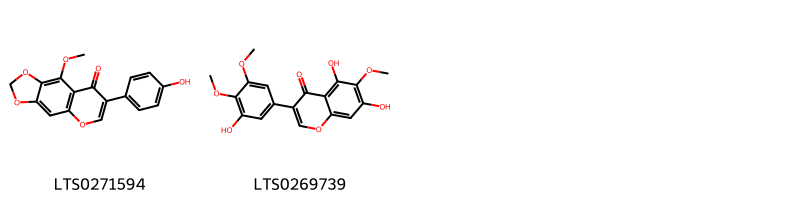{ width=100% }
    <figcaption>Hình ảnh cấu trúc hóa học của 2 hoạt chất thuộc nhóm Isoflavonoids gồm ['irisolone (LTS0271594)', 'irigenin (LTS0269739)'].</figcaption>
</figure>

---

### Dược dân tộc học

Danh sách các quốc gia có sử dụng *Iris decora* trong điều trị các bệnh. 

| Country   | Disease            | Bệnh                                                                                                                                                                                                |
|:----------|:-------------------|:----------------------------------------------------------------------------------------------------------------------------------------------------------------------------------------------------|
| Nepal     | Diuretic, Diuretic | MYMEMORY WARNING: YOU USED ALL AVAILABLE FREE TRANSLATIONS FOR TODAY. NEXT AVAILABLE IN  12 HOURS 29 MINUTES 14 SECONDS VISIT HTTPS://MYMEMORY.TRANSLATED.NET/DOC/USAGELIMITS.PHP TO TRANSLATE MORE |

---

---
## Iris ensata
### Thông tin về thực vật

!!! info "Phân loại thực vật của *Iris ensata* từ GIBF:"
    - **Kingdom:** Plantae
    - **Phylum:** Tracheophyta
    - **Order:** Asparagales
    - **Family:** Iridaceae
    - **Genus:** Iris
    - **Species:** *Iris ensata*

 

| Label (VI)   | Label (EN)   | Scientific Name   | Descriptions (VI)   | Descriptions (EN)   | Also Known As (VI)            | Also Known As (EN)   |
|:-------------|:-------------|:------------------|:--------------------|:--------------------|:------------------------------|:---------------------|
| N/A          | N/A          | Iris ensata       | loài thực vật       | species of plant    | ['Diên vĩ Nhật Bản', 'Ayame'] | ['Japanese iris']    |

#### Phân bố trên thế giới

**Từ CSDL GIBF** nan, United States of America, Japan, Korea, Republic of, Belgium, China, Russian Federation, Kazakhstan, Canada, France, Ireland, Netherlands

#### Phân bố tại Việt Nam

**Từ CSDL GIBF**: Không có ghi nhận ở Việt Nam

---
### Thành phần hóa học
        
- Theo cơ sở dữ liệu lotus: Từ loài *Iris ensata* đã phân lập và xác định được 17 hoạt chất thuộc về các nhóm Benzene and substituted derivatives, Cinnamic acids and derivatives, Benzopyrans, Flavonoids. 

|    | chemicalTaxonomyClassyfireClass     |   smiles_count |
|---:|:------------------------------------|---------------:|
|  0 | Benzene and substituted derivatives |              2 |
|  1 | Benzopyrans                         |              5 |
|  2 | Cinnamic acids and derivatives      |              4 |
|  3 | Flavonoids                          |              6 |

#### Nhóm Benzene and substituted derivatives
<figure markdown="span">
    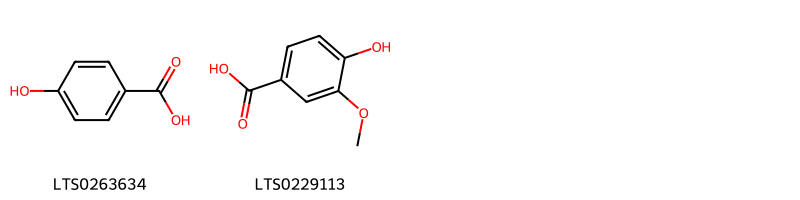{ width=100% }
    <figcaption>Hình ảnh cấu trúc hóa học của 2 hoạt chất thuộc nhóm Benzene and substituted derivatives gồm ['p-hydroxybenzoic acid (LTS0263634)', 'vanillic acid (LTS0229113)'].</figcaption>
</figure>
#### Nhóm Benzopyrans
<figure markdown="span">
    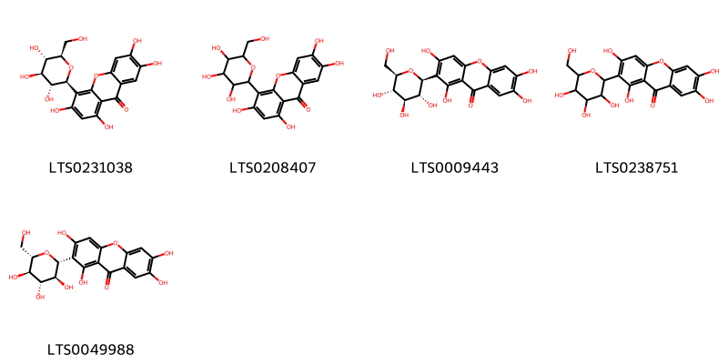{ width=100% }
    <figcaption>Hình ảnh cấu trúc hóa học của 5 hoạt chất thuộc nhóm Benzopyrans gồm ['isomangiferin (LTS0231038)', '1,3,6,7-tetrahydroxy-4-[3,4,5-trihydroxy-6-(hydroxymethyl)oxan-2-yl]xanthen-9-one (LTS0208407)', 'mangiferin (LTS0009443)', 'mangiferin (LTS0238751)', '1,3,6,7-tetrahydroxy-2-[(2r,3s,4s,5r,6s)-3,4,5-trihydroxy-6-(hydroxymethyl)oxan-2-yl]xanthen-9-one (LTS0049988)'].</figcaption>
</figure>
#### Nhóm Cinnamic acids and derivatives
<figure markdown="span">
    { width=100% }
    <figcaption>Hình ảnh cấu trúc hóa học của 4 hoạt chất thuộc nhóm Cinnamic acids and derivatives gồm ['ferulic acid (LTS0077328)', 'para-coumaric acid (LTS0266252)', 'hydroxycinnamic acid (LTS0233023)', 'ferulic acid (LTS0273002)'].</figcaption>
</figure>
#### Nhóm Flavonoids
<figure markdown="span">
    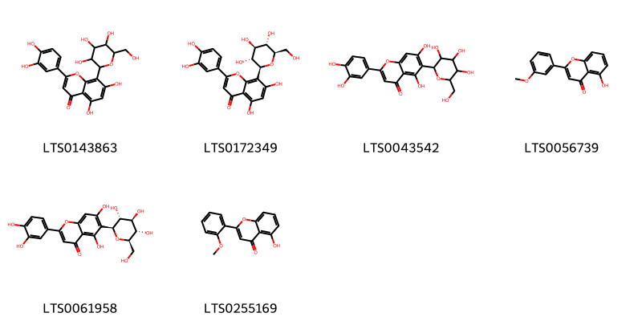{ width=100% }
    <figcaption>Hình ảnh cấu trúc hóa học của 6 hoạt chất thuộc nhóm Flavonoids gồm ['orientin (LTS0143863)', 'orientin (LTS0172349)', 'isoorientin (LTS0043542)', '5-hydroxy-2-(3-methoxyphenyl)chromen-4-one (LTS0056739)', 'isoorientin (LTS0061958)', '5-hydroxy-2-(2-methoxyphenyl)chromen-4-one (LTS0255169)'].</figcaption>
</figure>

---

### Dược dân tộc học

Danh sách các quốc gia có sử dụng *Iris ensata* trong điều trị các bệnh. 

| Country   | Disease                                | Bệnh                                                                                                                                                                                                |
|:----------|:---------------------------------------|:----------------------------------------------------------------------------------------------------------------------------------------------------------------------------------------------------|
| China     | Antidote, Apertif, Diuretic, Vermifuge | MYMEMORY WARNING: YOU USED ALL AVAILABLE FREE TRANSLATIONS FOR TODAY. NEXT AVAILABLE IN  12 HOURS 28 MINUTES 38 SECONDS VISIT HTTPS://MYMEMORY.TRANSLATED.NET/DOC/USAGELIMITS.PHP TO TRANSLATE MORE |

---

---
## Iris florentina
### Thông tin về thực vật

!!! info "Phân loại thực vật của *Iris florentina* từ GIBF:"
    - **Kingdom:** Plantae
    - **Phylum:** Tracheophyta
    - **Order:** Asparagales
    - **Family:** Iridaceae
    - **Genus:** Iris
    - **Species:** *Iris florentina*

 

| Label (VI)   | Label (EN)   | Scientific Name   | Descriptions (VI)   | Descriptions (EN)                                                                                                                                                                                                                                          | Also Known As (VI)   | Also Known As (EN)   |
|:-------------|:-------------|:------------------|:--------------------|:-----------------------------------------------------------------------------------------------------------------------------------------------------------------------------------------------------------------------------------------------------------|:---------------------|:---------------------|
| N/A          | N/A          | Iris florentina   | loài thực vật       | species of plant - Stem apically 2-flowered, often with a short branch bearing a third flower. Pure white flowers, with light veins greenish-yellow to the hafts of both the falls and standards. Elongated elliptical standards; elongated-cuneate falls. | ['']                 | ['']                 |

#### Phân bố trên thế giới

**Từ CSDL GIBF** Guatemala, Malta, Chile, New Zealand, Türkiye, Ecuador, Spain, United States of America, Greece, Colombia, Croatia, Cyprus, Morocco, Mexico, Gibraltar, France, Canada, Syrian Arab Republic, Lebanon, Austria, Portugal, South Africa, Australia, Italy, Switzerland, Peru, United Kingdom of Great Britain and Northern Ireland

#### Phân bố tại Việt Nam

**Từ CSDL GIBF**: Không có ghi nhận ở Việt Nam

---
### Thành phần hóa học
        
- Theo cơ sở dữ liệu lotus: Từ loài *Iris florentina* đã phân lập và xác định được 36 hoạt chất thuộc về các nhóm Benzene and substituted derivatives, Flavonoids, Cinnamic acids and derivatives, Organooxygen compounds, Isoflavonoids, Prenol lipids, Benzopyrans. 

|    | chemicalTaxonomyClassyfireClass     |   smiles_count |
|---:|:------------------------------------|---------------:|
|  0 | Benzene and substituted derivatives |              3 |
|  1 | Benzopyrans                         |              9 |
|  2 | Cinnamic acids and derivatives      |              1 |
|  3 | Flavonoids                          |              7 |
|  4 | Isoflavonoids                       |              9 |
|  5 | Organooxygen compounds              |              2 |
|  6 | Prenol lipids                       |              5 |

#### Nhóm Benzene and substituted derivatives
<figure markdown="span">
    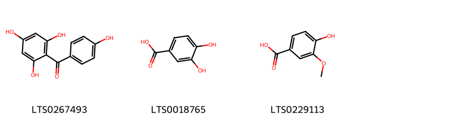{ width=100% }
    <figcaption>Hình ảnh cấu trúc hóa học của 3 hoạt chất thuộc nhóm Benzene and substituted derivatives gồm ['2-(4-hydroxybenzoyl)benzene-1,3,5-triol (LTS0267493)', '3,4-dihydroxybenzoic acid (LTS0018765)', 'vanillic acid (LTS0229113)'].</figcaption>
</figure>
#### Nhóm Benzopyrans
<figure markdown="span">
    { width=100% }
    <figcaption>Hình ảnh cấu trúc hóa học của 9 hoạt chất thuộc nhóm Benzopyrans gồm ['isomangiferin (LTS0231038)', '1,3,6,7-tetrahydroxy-4-[3,4,5-trihydroxy-6-(hydroxymethyl)oxan-2-yl]xanthen-9-one (LTS0208407)', '1,3,6-trihydroxy-7-methoxy-4-[(2s,3r,4r,5s,6r)-3,4,5-trihydroxy-6-(hydroxymethyl)oxan-2-yl]xanthen-9-one (LTS0190511)', '1,3,6-trihydroxy-7-methoxy-4-[3,4,5-trihydroxy-6-(hydroxymethyl)oxan-2-yl]xanthen-9-one (LTS0201697)', 'irisxanthone (LTS0178745)', '1,3,6-trihydroxy-7-methoxy-2-[3,4,5-trihydroxy-6-(hydroxymethyl)oxan-2-yl]xanthen-9-one (LTS0061399)', '1,3,6-trihydroxy-7-methoxy-2-[(2s,3r,4r,5s,6r)-3,4,5-trihydroxy-6-(hydroxymethyl)oxan-2-yl]xanthen-9-one (LTS0040617)', 'mangiferin (LTS0009443)', 'mangiferin (LTS0238751)'].</figcaption>
</figure>
#### Nhóm Cinnamic acids and derivatives
<figure markdown="span">
    { width=100% }
    <figcaption>Hình ảnh cấu trúc hóa học của 1 hoạt chất thuộc nhóm Cinnamic acids and derivatives gồm ['sinapinate (LTS0173482)'].</figcaption>
</figure>
#### Nhóm Flavonoids
<figure markdown="span">
    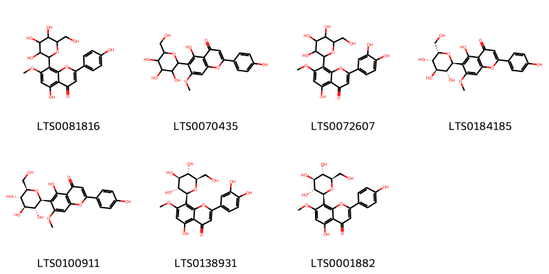{ width=100% }
    <figcaption>Hình ảnh cấu trúc hóa học của 7 hoạt chất thuộc nhóm Flavonoids gồm ['5-hydroxy-2-(4-hydroxyphenyl)-7-methoxy-8-[3,4,5-trihydroxy-6-(hydroxymethyl)oxan-2-yl]chromen-4-one (LTS0081816)', '5-hydroxy-2-(4-hydroxyphenyl)-7-methoxy-6-[3,4,5-trihydroxy-6-(hydroxymethyl)oxan-2-yl]chromen-4-one (LTS0070435)', '2-(3,4-dihydroxyphenyl)-5-hydroxy-7-methoxy-8-[3,4,5-trihydroxy-6-(hydroxymethyl)oxan-2-yl]chromen-4-one (LTS0072607)', '5-hydroxy-2-(4-hydroxyphenyl)-7-methoxy-6-[(2s,3r,4r,5s,6s)-3,4,5-trihydroxy-6-(hydroxymethyl)oxan-2-yl]chromen-4-one (LTS0184185)', '5-hydroxy-2-(4-hydroxyphenyl)-7-methoxy-6-[(2s,3r,4r,5s,6r)-3,4,5-trihydroxy-6-(hydroxymethyl)oxan-2-yl]chromen-4-one (LTS0100911)', '2-(3,4-dihydroxyphenyl)-5-hydroxy-7-methoxy-8-[(2s,3r,4r,5s,6r)-3,4,5-trihydroxy-6-(hydroxymethyl)oxan-2-yl]chromen-4-one (LTS0138931)', '5-hydroxy-2-(4-hydroxyphenyl)-7-methoxy-8-[(2s,3r,4r,5s,6r)-3,4,5-trihydroxy-6-(hydroxymethyl)oxan-2-yl]chromen-4-one (LTS0001882)'].</figcaption>
</figure>
#### Nhóm Isoflavonoids
<figure markdown="span">
    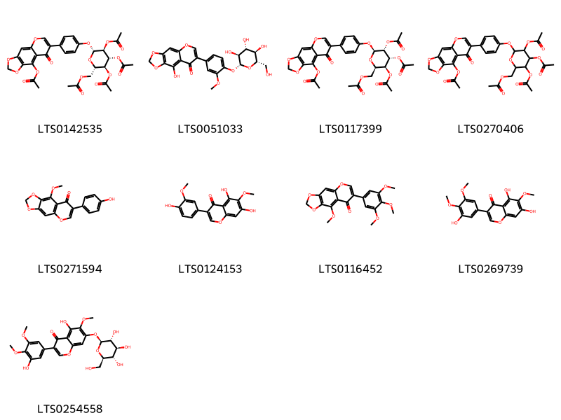{ width=100% }
    <figcaption>Hình ảnh cấu trúc hóa học của 9 hoạt chất thuộc nhóm Isoflavonoids gồm ['[(2s,3s,4r,5s,6r)-3,4,5-tris(acetyloxy)-6-{4-[9-(acetyloxy)-8-oxo-2h-[1,3]dioxolo[4,5-g]chromen-7-yl]phenoxy}oxan-2-yl]methyl acetate (LTS0142535)', '9-hydroxy-7-(3-methoxy-4-{[(2r,3s,4r,5r,6s)-3,4,5-trihydroxy-6-(hydroxymethyl)oxan-2-yl]oxy}phenyl)-2h-[1,3]dioxolo[4,5-g]chromen-8-one (LTS0051033)', '[(2r,3s,4r,5r,6s)-3,4,5-tris(acetyloxy)-6-{4-[9-(acetyloxy)-8-oxo-2h-[1,3]dioxolo[4,5-g]chromen-7-yl]phenoxy}oxan-2-yl]methyl acetate (LTS0117399)', '[3,4,5-tris(acetyloxy)-6-{4-[9-(acetyloxy)-8-oxo-2h-[1,3]dioxolo[4,5-g]chromen-7-yl]phenoxy}oxan-2-yl]methyl acetate (LTS0270406)', 'irisolone (LTS0271594)', 'iristectorigenin b (LTS0124153)', 'irisflorentin (LTS0116452)', 'irigenin (LTS0269739)', 'iridin (LTS0254558)'].</figcaption>
</figure>
#### Nhóm Organooxygen compounds
<figure markdown="span">
    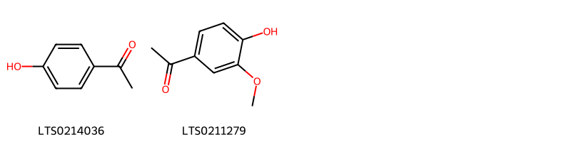{ width=100% }
    <figcaption>Hình ảnh cấu trúc hóa học của 2 hoạt chất thuộc nhóm Organooxygen compounds gồm ['hydroxyacetophenone (LTS0214036)', 'apocynin (LTS0211279)'].</figcaption>
</figure>
#### Nhóm Prenol lipids
<figure markdown="span">
    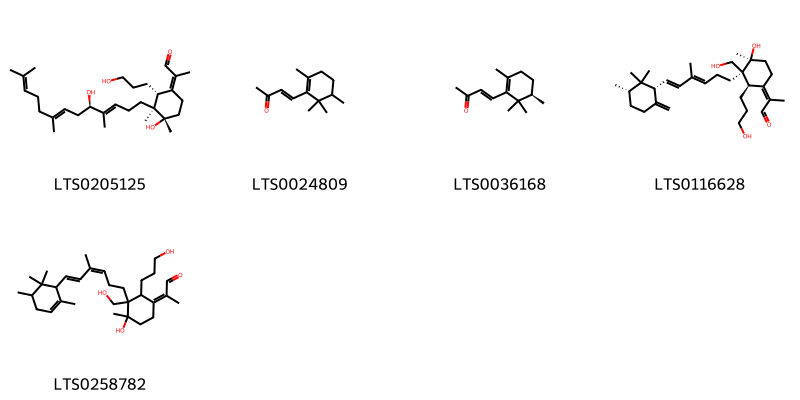{ width=100% }
    <figcaption>Hình ảnh cấu trúc hóa học của 5 hoạt chất thuộc nhóm Prenol lipids gồm ['2-[(1z,2r,3s,4s)-4-hydroxy-3-[(3e,5r,7e)-5-hydroxy-4,8,12-trimethyltrideca-3,7,11-trien-1-yl]-2-(3-hydroxypropyl)-3,4-dimethylcyclohexylidene]propanal (LTS0205125)', 'β-irone (LTS0024809)', '(+)-β-irone (LTS0036168)', '2-[(1z,2r,3s,4s)-4-hydroxy-3-(hydroxymethyl)-2-(3-hydroxypropyl)-4-methyl-3-[(3e,5e)-4-methyl-6-[(1r,3s)-2,2,3-trimethyl-6-methylidenecyclohexyl]hexa-3,5-dien-1-yl]cyclohexylidene]propanal (LTS0116628)', '2-[(1z)-4-hydroxy-3-(hydroxymethyl)-2-(3-hydroxypropyl)-4-methyl-3-[(3z,5e)-4-methyl-6-(2,5,6,6-tetramethylcyclohex-2-en-1-yl)hexa-3,5-dien-1-yl]cyclohexylidene]propanal (LTS0258782)'].</figcaption>
</figure>

---

### Dược dân tộc học

Danh sách các quốc gia có sử dụng *Iris florentina* trong điều trị các bệnh. 

| Country   | Disease                                                                | Bệnh                                                                                                                                                                                                |
|:----------|:-----------------------------------------------------------------------|:----------------------------------------------------------------------------------------------------------------------------------------------------------------------------------------------------|
| Elsewhere | Stomachic                                                              | MYMEMORY WARNING: YOU USED ALL AVAILABLE FREE TRANSLATIONS FOR TODAY. NEXT AVAILABLE IN  12 HOURS 27 MINUTES 52 SECONDS VISIT HTTPS://MYMEMORY.TRANSLATED.NET/DOC/USAGELIMITS.PHP TO TRANSLATE MORE |
| Turkey    | Cholagogue, Emetic, Expectorant, Laxative, Perfume, Cosmetic, Diuretic | MYMEMORY WARNING: YOU USED ALL AVAILABLE FREE TRANSLATIONS FOR TODAY. NEXT AVAILABLE IN  12 HOURS 27 MINUTES 49 SECONDS VISIT HTTPS://MYMEMORY.TRANSLATED.NET/DOC/USAGELIMITS.PHP TO TRANSLATE MORE |

---

---
## Iris foetidissima
### Thông tin về thực vật

!!! info "Phân loại thực vật của *Iris foetidissima* từ GIBF:"
    - **Kingdom:** Plantae
    - **Phylum:** Tracheophyta
    - **Order:** Asparagales
    - **Family:** Iridaceae
    - **Genus:** Iris
    - **Species:** *Iris foetidissima*

 

| Label (VI)   | Label (EN)   | Scientific Name   | Descriptions (VI)   | Descriptions (EN)   | Also Known As (VI)   | Also Known As (EN)   |
|:-------------|:-------------|:------------------|:--------------------|:--------------------|:---------------------|:---------------------|
| N/A          | N/A          | Iris foetidissima | loài thực vật       | species of plant    | ['']                 | ['']                 |

#### Phân bố trên thế giới

**Từ CSDL GIBF** nan, United States of America, Portugal, United Kingdom of Great Britain and Northern Ireland, Belgium, Australia, New Zealand, Italy, Switzerland, Canada, France, Spain, Netherlands

#### Phân bố tại Việt Nam

**Từ CSDL GIBF**: Không có ghi nhận ở Việt Nam

---
### Thành phần hóa học
        
- Theo cơ sở dữ liệu lotus: Từ loài *Iris foetidissima* đã phân lập và xác định được 13 hoạt chất thuộc về các nhóm Prenol lipids, Organooxygen compounds, Isoflavonoids. 

|    | chemicalTaxonomyClassyfireClass   |   smiles_count |
|---:|:----------------------------------|---------------:|
|  0 | Isoflavonoids                     |              2 |
|  1 | Organooxygen compounds            |              2 |
|  2 | Prenol lipids                     |              9 |

#### Nhóm Isoflavonoids
<figure markdown="span">
    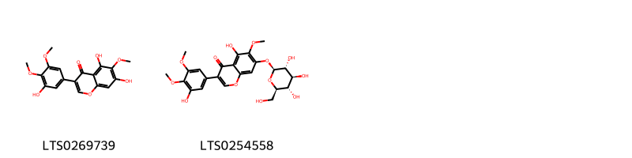{ width=100% }
    <figcaption>Hình ảnh cấu trúc hóa học của 2 hoạt chất thuộc nhóm Isoflavonoids gồm ['irigenin (LTS0269739)', 'iridin (LTS0254558)'].</figcaption>
</figure>
#### Nhóm Organooxygen compounds
<figure markdown="span">
    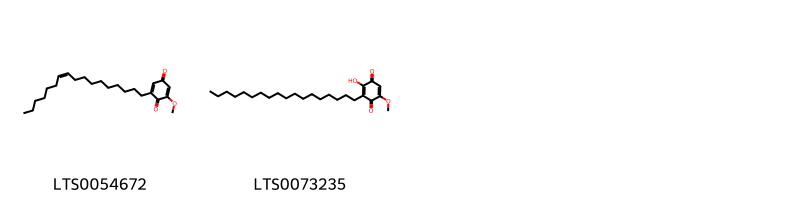{ width=100% }
    <figcaption>Hình ảnh cấu trúc hóa học của 2 hoạt chất thuộc nhóm Organooxygen compounds gồm ['irisquinone (LTS0054672)', '2-hydroxy-5-methoxy-3-octadecylcyclohexa-2,5-diene-1,4-dione (LTS0073235)'].</figcaption>
</figure>
#### Nhóm Prenol lipids
<figure markdown="span">
    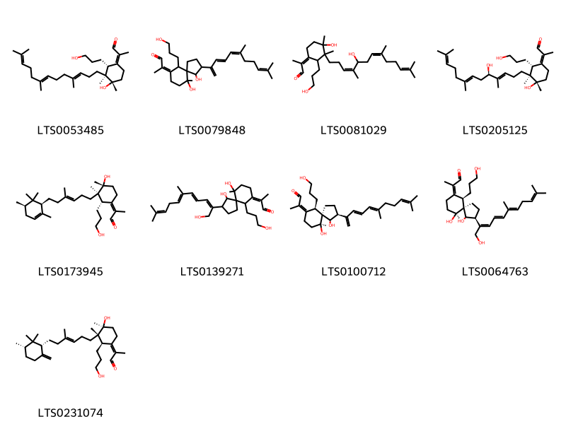{ width=100% }
    <figcaption>Hình ảnh cấu trúc hóa học của 9 hoạt chất thuộc nhóm Prenol lipids gồm ['2-[(1z,2r,3s,4s)-4-hydroxy-2-(3-hydroxypropyl)-3,4-dimethyl-3-[(3e,7e)-4,8,12-trimethyltrideca-3,7,11-trien-1-yl]cyclohexylidene]propanal (LTS0053485)', '2-[2-(6,10-dimethylundeca-1,3,5,9-tetraen-2-yl)-1,10-dihydroxy-6-(3-hydroxypropyl)-10-methylspiro[4.5]decan-7-ylidene]propanal (LTS0079848)', '2-[4-hydroxy-3-(5-hydroxy-4,8,12-trimethyltrideca-3,7,11-trien-1-yl)-2-(3-hydroxypropyl)-3,4-dimethylcyclohexylidene]propanal (LTS0081029)', '2-[(1z,2r,3s,4s)-4-hydroxy-3-[(3e,5r,7e)-5-hydroxy-4,8,12-trimethyltrideca-3,7,11-trien-1-yl]-2-(3-hydroxypropyl)-3,4-dimethylcyclohexylidene]propanal (LTS0205125)', '2-[(1z,2s,3r,4r)-4-hydroxy-2-(3-hydroxypropyl)-3,4-dimethyl-3-[(3e)-4-methyl-6-[(1s,5r)-2,5,6,6-tetramethylcyclohex-2-en-1-yl]hex-3-en-1-yl]cyclohexylidene]propanal (LTS0173945)', '2-[1,10-dihydroxy-2-(1-hydroxy-6,10-dimethylundeca-2,4,6,9-tetraen-2-yl)-6-(3-hydroxypropyl)-10-methylspiro[4.5]decan-7-ylidene]propanal (LTS0139271)', '2-[(1r,2s,5s,6r,7z,10s)-2-[(3e,5e)-6,10-dimethylundeca-1,3,5,9-tetraen-2-yl]-1,10-dihydroxy-6-(3-hydroxypropyl)-10-methylspiro[4.5]decan-7-ylidene]propanal (LTS0100712)', '2-[(1r,2s,5s,6r,7z,10s)-1,10-dihydroxy-2-[(2e,4e,6e)-1-hydroxy-6,10-dimethylundeca-2,4,6,9-tetraen-2-yl]-6-(3-hydroxypropyl)-10-methylspiro[4.5]decan-7-ylidene]propanal (LTS0064763)', '2-[(1z,2r,3s,4s)-4-hydroxy-2-(3-hydroxypropyl)-3,4-dimethyl-3-[(3e)-4-methyl-6-[(1r,3s)-2,2,3-trimethyl-6-methylidenecyclohexyl]hex-3-en-1-yl]cyclohexylidene]propanal (LTS0231074)'].</figcaption>
</figure>

---

### Dược dân tộc học

Danh sách các quốc gia có sử dụng *Iris foetidissima* trong điều trị các bệnh. 

| Country   | Disease                                  | Bệnh                                                                                                                                                                                                |
|:----------|:-----------------------------------------|:----------------------------------------------------------------------------------------------------------------------------------------------------------------------------------------------------|
| Elsewhere | Cathartic, Purgative                     | MYMEMORY WARNING: YOU USED ALL AVAILABLE FREE TRANSLATIONS FOR TODAY. NEXT AVAILABLE IN  12 HOURS 27 MINUTES 18 SECONDS VISIT HTTPS://MYMEMORY.TRANSLATED.NET/DOC/USAGELIMITS.PHP TO TRANSLATE MORE |
| Turkey    | Emmenagogue, Laxative, Apertif, Diuretic | MYMEMORY WARNING: YOU USED ALL AVAILABLE FREE TRANSLATIONS FOR TODAY. NEXT AVAILABLE IN  12 HOURS 27 MINUTES 15 SECONDS VISIT HTTPS://MYMEMORY.TRANSLATED.NET/DOC/USAGELIMITS.PHP TO TRANSLATE MORE |
| ain       | Diuretic                                 | MYMEMORY WARNING: YOU USED ALL AVAILABLE FREE TRANSLATIONS FOR TODAY. NEXT AVAILABLE IN  12 HOURS 27 MINUTES 09 SECONDS VISIT HTTPS://MYMEMORY.TRANSLATED.NET/DOC/USAGELIMITS.PHP TO TRANSLATE MORE |

---

---
## Iris germanica
### Thông tin về thực vật

!!! info "Phân loại thực vật của *Iris germanica* từ GIBF:"
    - **Kingdom:** Plantae
    - **Phylum:** Tracheophyta
    - **Order:** Asparagales
    - **Family:** Iridaceae
    - **Genus:** Iris
    - **Species:** *Iris germanica*

 

| Label (VI)   | Label (EN)   | Scientific Name   | Descriptions (VI)   | Descriptions (EN)   | Also Known As (VI)   | Also Known As (EN)                                                         |
|:-------------|:-------------|:------------------|:--------------------|:--------------------|:---------------------|:---------------------------------------------------------------------------|
| N/A          | N/A          | Iris germanica    | loài thực vật       | hybrid of plant     | ['']                 | ['Iris croatica', 'Iris germanica', 'bearded iris', 'German bearded iris'] |

#### Phân bố trên thế giới

**Từ CSDL GIBF** nan, Czechia, Sweden, Israel, Slovenia, Spain, Netherlands, Bolivia (Plurinational State of), Poland, Denmark, United States of America, Greece, Armenia, Croatia, France, Belgium, Palestine, State of, Georgia, Serbia, Canada, Germany, Austria, Hungary, Portugal, Slovakia, Ukraine, Australia, South Africa, Italy, Switzerland, India, United Kingdom of Great Britain and Northern Ireland

#### Phân bố tại Việt Nam

**Từ CSDL GIBF**: Không có ghi nhận ở Việt Nam

---
### Thành phần hóa học
        
- Theo cơ sở dữ liệu lotus: Từ loài *Iris germanica* đã phân lập và xác định được 173 hoạt chất thuộc về các nhóm Fatty Acyls, Heteroaromatic compounds, Benzene and substituted derivatives, Organic oxides, Flavonoids, Cinnamic acids and derivatives, Steroids and steroid derivatives, Organooxygen compounds, Isoflavonoids, Prenol lipids, Benzopyrans. 

|    | chemicalTaxonomyClassyfireClass     |   smiles_count |
|---:|:------------------------------------|---------------:|
|  0 | Benzene and substituted derivatives |              3 |
|  1 | Benzopyrans                         |              9 |
|  2 | Cinnamic acids and derivatives      |              1 |
|  3 | Fatty Acyls                         |              1 |
|  4 | Flavonoids                          |              9 |
|  5 | Heteroaromatic compounds            |              4 |
|  6 | Isoflavonoids                       |             51 |
|  7 | Organic oxides                      |              6 |
|  8 | Organooxygen compounds              |             21 |
|  9 | Prenol lipids                       |             66 |
| 10 | Steroids and steroid derivatives    |              2 |

#### Nhóm Benzene and substituted derivatives
<figure markdown="span">
    { width=100% }
    <figcaption>Hình ảnh cấu trúc hóa học của 3 hoạt chất thuộc nhóm Benzene and substituted derivatives gồm ['2-(4-hydroxybenzoyl)benzene-1,3,5-triol (LTS0267493)', '3,4-dihydroxybenzoic acid (LTS0018765)', 'vanillic acid (LTS0229113)'].</figcaption>
</figure>
#### Nhóm Benzopyrans
<figure markdown="span">
    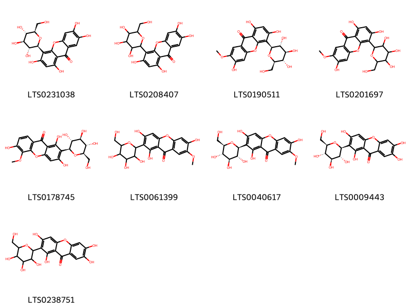{ width=100% }
    <figcaption>Hình ảnh cấu trúc hóa học của 9 hoạt chất thuộc nhóm Benzopyrans gồm ['isomangiferin (LTS0231038)', '1,3,6,7-tetrahydroxy-4-[3,4,5-trihydroxy-6-(hydroxymethyl)oxan-2-yl]xanthen-9-one (LTS0208407)', '1,3,6-trihydroxy-7-methoxy-4-[(2s,3r,4r,5s,6r)-3,4,5-trihydroxy-6-(hydroxymethyl)oxan-2-yl]xanthen-9-one (LTS0190511)', '1,3,6-trihydroxy-7-methoxy-4-[3,4,5-trihydroxy-6-(hydroxymethyl)oxan-2-yl]xanthen-9-one (LTS0201697)', 'irisxanthone (LTS0178745)', '1,3,6-trihydroxy-7-methoxy-2-[3,4,5-trihydroxy-6-(hydroxymethyl)oxan-2-yl]xanthen-9-one (LTS0061399)', '1,3,6-trihydroxy-7-methoxy-2-[(2s,3r,4r,5s,6r)-3,4,5-trihydroxy-6-(hydroxymethyl)oxan-2-yl]xanthen-9-one (LTS0040617)', 'mangiferin (LTS0009443)', 'mangiferin (LTS0238751)'].</figcaption>
</figure>
#### Nhóm Cinnamic acids and derivatives
<figure markdown="span">
    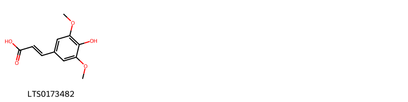{ width=100% }
    <figcaption>Hình ảnh cấu trúc hóa học của 1 hoạt chất thuộc nhóm Cinnamic acids and derivatives gồm ['sinapinate (LTS0173482)'].</figcaption>
</figure>
#### Nhóm Fatty Acyls
<figure markdown="span">
    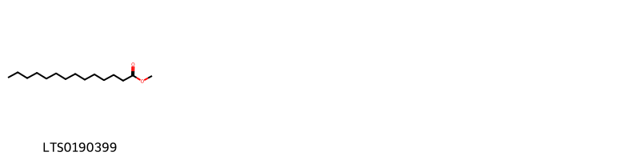{ width=100% }
    <figcaption>Hình ảnh cấu trúc hóa học của 1 hoạt chất thuộc nhóm Fatty Acyls gồm ['methyl myristate (LTS0190399)'].</figcaption>
</figure>
#### Nhóm Flavonoids
<figure markdown="span">
    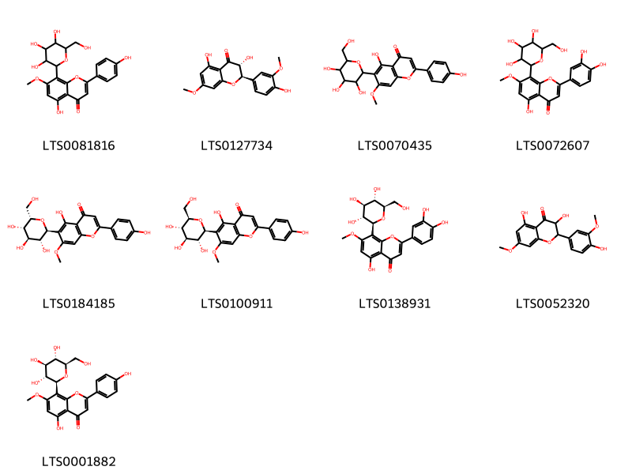{ width=100% }
    <figcaption>Hình ảnh cấu trúc hóa học của 9 hoạt chất thuộc nhóm Flavonoids gồm ['5-hydroxy-2-(4-hydroxyphenyl)-7-methoxy-8-[3,4,5-trihydroxy-6-(hydroxymethyl)oxan-2-yl]chromen-4-one (LTS0081816)', '(2r,3r)-3,5-dihydroxy-2-(4-hydroxy-3-methoxyphenyl)-7-methoxy-2,3-dihydro-1-benzopyran-4-one (LTS0127734)', '5-hydroxy-2-(4-hydroxyphenyl)-7-methoxy-6-[3,4,5-trihydroxy-6-(hydroxymethyl)oxan-2-yl]chromen-4-one (LTS0070435)', '2-(3,4-dihydroxyphenyl)-5-hydroxy-7-methoxy-8-[3,4,5-trihydroxy-6-(hydroxymethyl)oxan-2-yl]chromen-4-one (LTS0072607)', '5-hydroxy-2-(4-hydroxyphenyl)-7-methoxy-6-[(2s,3r,4r,5s,6s)-3,4,5-trihydroxy-6-(hydroxymethyl)oxan-2-yl]chromen-4-one (LTS0184185)', '5-hydroxy-2-(4-hydroxyphenyl)-7-methoxy-6-[(2s,3r,4r,5s,6r)-3,4,5-trihydroxy-6-(hydroxymethyl)oxan-2-yl]chromen-4-one (LTS0100911)', '2-(3,4-dihydroxyphenyl)-5-hydroxy-7-methoxy-8-[(2s,3r,4r,5s,6r)-3,4,5-trihydroxy-6-(hydroxymethyl)oxan-2-yl]chromen-4-one (LTS0138931)', '3,5-dihydroxy-2-(4-hydroxy-3-methoxyphenyl)-7-methoxy-2,3-dihydro-1-benzopyran-4-one (LTS0052320)', '5-hydroxy-2-(4-hydroxyphenyl)-7-methoxy-8-[(2s,3r,4r,5s,6r)-3,4,5-trihydroxy-6-(hydroxymethyl)oxan-2-yl]chromen-4-one (LTS0001882)'].</figcaption>
</figure>
#### Nhóm Heteroaromatic compounds
<figure markdown="span">
    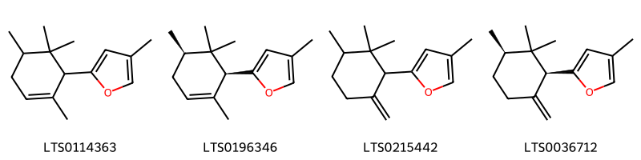{ width=100% }
    <figcaption>Hình ảnh cấu trúc hóa học của 4 hoạt chất thuộc nhóm Heteroaromatic compounds gồm ['4-methyl-2-(2,5,6,6-tetramethylcyclohex-2-en-1-yl)furan (LTS0114363)', '4-methyl-2-[(1s,5r)-2,5,6,6-tetramethylcyclohex-2-en-1-yl]furan (LTS0196346)', '4-methyl-2-(2,2,3-trimethyl-6-methylidenecyclohexyl)furan (LTS0215442)', '4-methyl-2-[(1s,3r)-2,2,3-trimethyl-6-methylidenecyclohexyl]furan (LTS0036712)'].</figcaption>
</figure>
#### Nhóm Isoflavonoids
<figure markdown="span">
    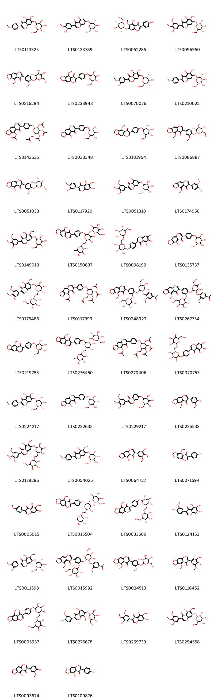{ width=100% }
    <figcaption>Hình ảnh cấu trúc hóa học của 51 hoạt chất thuộc nhóm Isoflavonoids gồm ['5-hydroxy-6-methoxy-3-(4-methoxyphenyl)-7-{[3,4,5-trihydroxy-6-(hydroxymethyl)oxan-2-yl]oxy}chromen-4-one (LTS0113325)', '5-hydroxy-3-(3-hydroxy-4-methoxyphenyl)-7-{[(2s,3r,4s,5s,6r)-3,4,5-trihydroxy-6-(hydroxymethyl)oxan-2-yl]oxy}chromen-4-one (LTS0133789)', 'tectoridin (LTS0052285)', '5-hydroxy-6-methoxy-7-{[(2s,3r,4s,5s,6r)-3,4,5-trihydroxy-6-(hydroxymethyl)oxan-2-yl]oxy}-3-(3,4,5-trimethoxyphenyl)chromen-4-one (LTS0096950)', '9-methoxy-7-(3-methoxy-4-{[3,4,5-trihydroxy-6-(hydroxymethyl)oxan-2-yl]oxy}phenyl)-2h-[1,3]dioxolo[4,5-g]chromen-8-one (LTS0216284)', '9-methoxy-7-(4-{[3,4,5-trihydroxy-6-(hydroxymethyl)oxan-2-yl]oxy}phenyl)-2h-[1,3]dioxolo[4,5-g]chromen-8-one (LTS0238943)', '5-hydroxy-3-(3-hydroxy-4-methoxyphenyl)-6-methoxy-7-{[(2s,3r,4s,5s,6r)-3,4,5-trihydroxy-6-(hydroxymethyl)oxan-2-yl]oxy}chromen-4-one (LTS0070076)', '5-hydroxy-6-methoxy-3-(4-methoxyphenyl)-7-{[(2s,3r,4s,5s,6r)-3,4,5-trihydroxy-6-(hydroxymethyl)oxan-2-yl]oxy}chromen-4-one (LTS0210022)', '[(2s,3s,4r,5s,6r)-3,4,5-tris(acetyloxy)-6-{4-[9-(acetyloxy)-8-oxo-2h-[1,3]dioxolo[4,5-g]chromen-7-yl]phenoxy}oxan-2-yl]methyl acetate (LTS0142535)', '9-hydroxy-7-(4-{[(2s,3r,4s,5s,6r)-3,4,5-trihydroxy-6-(hydroxymethyl)oxan-2-yl]oxy}phenyl)-2h-[1,3]dioxolo[4,5-g]chromen-8-one (LTS0033348)', '9-methoxy-7-(4-{[(2s,3r,4s,5s,6r)-3,4,5-trihydroxy-6-(hydroxymethyl)oxan-2-yl]oxy}phenyl)-2h-[1,3]dioxolo[4,5-g]chromen-8-one (LTS0181954)', '9-methoxy-7-(3-methoxy-4-{[(2s,3r,4s,5s,6r)-3,4,5-trihydroxy-6-(hydroxymethyl)oxan-2-yl]oxy}phenyl)-2h-[1,3]dioxolo[4,5-g]chromen-8-one (LTS0086887)', '9-hydroxy-7-(3-methoxy-4-{[(2r,3s,4r,5r,6s)-3,4,5-trihydroxy-6-(hydroxymethyl)oxan-2-yl]oxy}phenyl)-2h-[1,3]dioxolo[4,5-g]chromen-8-one (LTS0051033)', 'iristectorigenin a (LTS0117920)', '5-hydroxy-3-(3-hydroxy-4,5-dimethoxyphenyl)-7-{[(2r,3s,4r,5r,6s)-3,4,5-trihydroxy-6-(hydroxymethyl)oxan-2-yl]oxy}chromen-4-one (LTS0051318)', 'iriskumaonin methyl ether (LTS0174950)', 'iridin (LTS0149013)', '7-{4-[(4,5-dihydroxy-3-{[3,4,5-trihydroxy-6-(hydroxymethyl)oxan-2-yl]oxy}-6-{[(3,4,5-trihydroxy-6-methyloxan-2-yl)oxy]methyl}oxan-2-yl)oxy]phenyl}-9-methoxy-2h-[1,3]dioxolo[4,5-g]chromen-8-one (LTS0150837)', '5,6,7-trihydroxy-3-(4-{[(2s,3r,4s,5s,6r)-3,4,5-trihydroxy-6-({[(2r,3r,4s,5s,6r)-3,4,5-trihydroxy-6-(hydroxymethyl)oxan-2-yl]oxy}methyl)oxan-2-yl]oxy}phenyl)chromen-4-one (LTS0098199)', '9-hydroxy-7-(4-{[3,4,5-trihydroxy-6-(hydroxymethyl)oxan-2-yl]oxy}phenyl)-2h-[1,3]dioxolo[4,5-g]chromen-8-one (LTS0135737)', '5-hydroxy-3-(3-hydroxy-4,5-dimethoxyphenyl)-6-methoxy-7-{[(2s,3r,4s,5s,6r)-3,4,5-trihydroxy-6-({[(2r,3r,4s,5s,6r)-3,4,5-trihydroxy-6-(hydroxymethyl)oxan-2-yl]oxy}methyl)oxan-2-yl]oxy}chromen-4-one (LTS0175486)', '[(2r,3s,4r,5r,6s)-3,4,5-tris(acetyloxy)-6-{4-[9-(acetyloxy)-8-oxo-2h-[1,3]dioxolo[4,5-g]chromen-7-yl]phenoxy}oxan-2-yl]methyl acetate (LTS0117399)', '7-(4-{[(2s,3r,4s,5s,6r)-3-(4-acetyl-2-methoxyphenoxy)-4,5-dihydroxy-6-(hydroxymethyl)oxan-2-yl]oxy}-3-{[(2s,3r,4s,5s,6r)-3,4,5-trihydroxy-6-(hydroxymethyl)oxan-2-yl]oxy}phenyl)-9-methoxy-2h-[1,3]dioxolo[4,5-g]chromen-8-one (LTS0248923)', '7-(4-{[3-(4-acetyl-2-methoxyphenoxy)-4,5-dihydroxy-6-(hydroxymethyl)oxan-2-yl]oxy}-3-{[3,4,5-trihydroxy-6-(hydroxymethyl)oxan-2-yl]oxy}phenyl)-9-methoxy-2h-[1,3]dioxolo[4,5-g]chromen-8-one (LTS0267754)', '9-methoxy-7-(4-{[(2s,3s,4s,5s,6r)-3,4,5-trihydroxy-6-(hydroxymethyl)oxan-2-yl]oxy}phenyl)-2h-[1,3]dioxolo[4,5-g]chromen-8-one (LTS0219753)', '7-(4-{[(2s,3r,4s,5s,6r)-4,5-dihydroxy-3-{[(2s,3r,4s,5s,6s)-3,4,5-trihydroxy-6-(hydroxymethyl)oxan-2-yl]oxy}-6-({[(2r,3s,4r,5r,6r)-3,4,5-trihydroxy-6-methyloxan-2-yl]oxy}methyl)oxan-2-yl]oxy}phenyl)-9-methoxy-2h-[1,3]dioxolo[4,5-g]chromen-8-one (LTS0276450)', '[3,4,5-tris(acetyloxy)-6-{4-[9-(acetyloxy)-8-oxo-2h-[1,3]dioxolo[4,5-g]chromen-7-yl]phenoxy}oxan-2-yl]methyl acetate (LTS0270406)', '5,6,7-trihydroxy-3-(4-{[3,4,5-trihydroxy-6-({[3,4,5-trihydroxy-6-(hydroxymethyl)oxan-2-yl]oxy}methyl)oxan-2-yl]oxy}phenyl)chromen-4-one (LTS0070757)', '5-hydroxy-6-methoxy-3-(4-methoxyphenyl)-7-{[(2r,3r,4s,5s,6r)-3,4,5-trihydroxy-6-(hydroxymethyl)oxan-2-yl]oxy}chromen-4-one (LTS0224217)', '9-hydroxy-7-(4-{[(2r,3s,4r,5r,6s)-3,4,5-trihydroxy-6-(hydroxymethyl)oxan-2-yl]oxy}phenyl)-2h-[1,3]dioxolo[4,5-g]chromen-8-one (LTS0232635)', '3-(3-hydroxy-4,5-dimethoxyphenyl)-7-{[3,4,5-trihydroxy-6-(hydroxymethyl)oxan-2-yl]oxy}chromen-4-one (LTS0229217)', 'iriskashmirianin (LTS0235533)', '5-hydroxy-3-(3-hydroxy-4,5-dimethoxyphenyl)-6-methoxy-7-{[3,4,5-trihydroxy-6-({[3,4,5-trihydroxy-6-(hydroxymethyl)oxan-2-yl]oxy}methyl)oxan-2-yl]oxy}chromen-4-one (LTS0179286)', '5-hydroxy-6-methoxy-3-(4-methoxyphenyl)-7-{[(2r,3s,4r,5r,6s)-3,4,5-trihydroxy-6-(hydroxymethyl)oxan-2-yl]oxy}chromen-4-one (LTS0054025)', '9-hydroxy-7-(3-hydroxy-4,5-dimethoxyphenyl)-2h-[1,3]dioxolo[4,5-g]chromen-8-one (LTS0064727)', 'irisolone (LTS0271594)', 'irisolidone (LTS0005015)', '7-(4-{[(2r,3s,4r,5r,6s)-4,5-dihydroxy-3-{[(2r,3s,4r,5r,6s)-3,4,5-trihydroxy-6-(hydroxymethyl)oxan-2-yl]oxy}-6-({[(2r,3r,4r,5r,6s)-3,4,5-trihydroxy-6-methyloxan-2-yl]oxy}methyl)oxan-2-yl]oxy}phenyl)-9-methoxy-2h-[1,3]dioxolo[4,5-g]chromen-8-one (LTS0015504)', '9-methoxy-7-(4-{[(2s,3r,4s,5s,6r)-3,4,5-trihydroxy-6-({[(2r,3r,4s,5s,6r)-3,4,5-trihydroxy-6-(hydroxymethyl)oxan-2-yl]oxy}methyl)oxan-2-yl]oxy}phenyl)-2h-[1,3]dioxolo[4,5-g]chromen-8-one (LTS0033509)', 'iristectorigenin b (LTS0124153)', '5-hydroxy-3-(3-hydroxy-4-methoxyphenyl)-6-methoxy-7-{[(2r,3r,4s,5s,6r)-3,4,5-trihydroxy-6-(hydroxymethyl)oxan-2-yl]oxy}chromen-4-one (LTS0011598)', '7-(4-{[(2s,3s,4s,5s,6r)-3-(4-acetyl-2-methoxyphenoxy)-4,5-dihydroxy-6-(hydroxymethyl)oxan-2-yl]oxy}-3-{[(2s,3r,4s,5s,6r)-3,4,5-trihydroxy-6-(hydroxymethyl)oxan-2-yl]oxy}phenyl)-9-methoxy-2h-[1,3]dioxolo[4,5-g]chromen-8-one (LTS0015992)', '9-methoxy-7-(3-methoxy-4-{[(2s,3s,4s,5s,6r)-3,4,5-trihydroxy-6-(hydroxymethyl)oxan-2-yl]oxy}phenyl)-2h-[1,3]dioxolo[4,5-g]chromen-8-one (LTS0024513)', 'irisflorentin (LTS0116452)', '9-methoxy-7-(4-{[3,4,5-trihydroxy-6-({[3,4,5-trihydroxy-6-(hydroxymethyl)oxan-2-yl]oxy}methyl)oxan-2-yl]oxy}phenyl)-2h-[1,3]dioxolo[4,5-g]chromen-8-one (LTS0005937)', 'homotectoridin (LTS0275678)', 'irigenin (LTS0269739)', 'iridin (LTS0254558)', '9-hydroxy-7-(4-hydroxy-3-methoxyphenyl)-2h-[1,3]dioxolo[4,5-g]chromen-8-one (LTS0093674)', 'irilone (LTS0109876)', '3-(3-hydroxy-4,5-dimethoxyphenyl)-7-{[(2s,3r,4s,5s,6r)-3,4,5-trihydroxy-6-(hydroxymethyl)oxan-2-yl]oxy}chromen-4-one (LTS0048785)'].</figcaption>
</figure>
#### Nhóm Organic oxides
<figure markdown="span">
    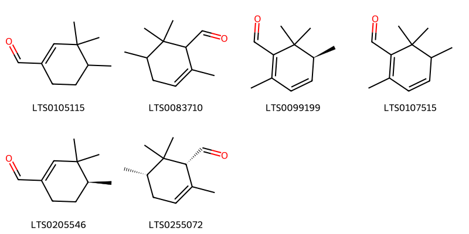{ width=100% }
    <figcaption>Hình ảnh cấu trúc hóa học của 6 hoạt chất thuộc nhóm Organic oxides gồm ['3,3,4-trimethylcyclohex-1-ene-1-carbaldehyde (LTS0105115)', '2,5,6,6-tetramethylcyclohex-2-ene-1-carbaldehyde (LTS0083710)', '(5s)-2,5,6,6-tetramethylcyclohexa-1,3-diene-1-carbaldehyde (LTS0099199)', '2,5,6,6-tetramethylcyclohexa-1,3-diene-1-carbaldehyde (LTS0107515)', '(4s)-3,3,4-trimethylcyclohex-1-ene-1-carbaldehyde (LTS0205546)', '(1r,5s)-2,5,6,6-tetramethylcyclohex-2-ene-1-carbaldehyde (LTS0255072)'].</figcaption>
</figure>
#### Nhóm Organooxygen compounds
<figure markdown="span">
    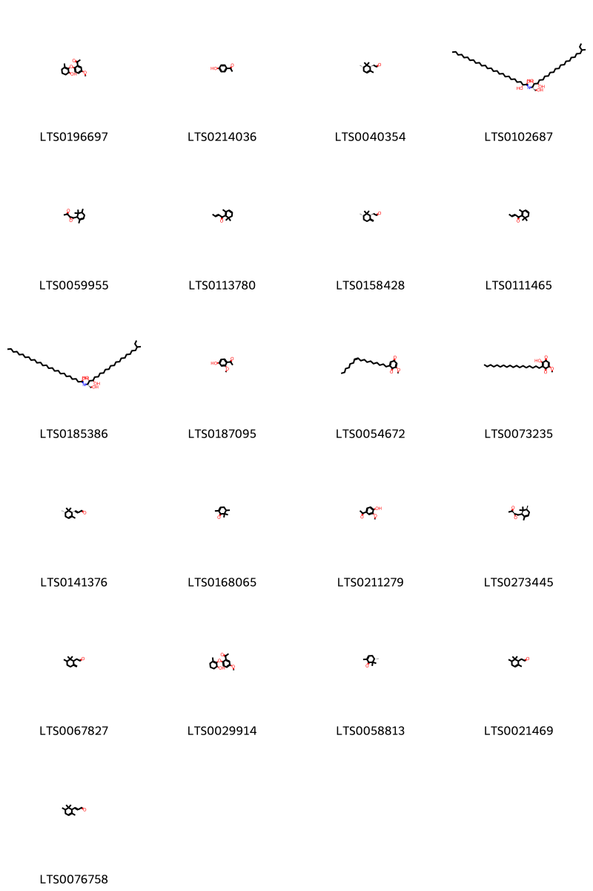{ width=100% }
    <figcaption>Hình ảnh cấu trúc hóa học của 21 hoạt chất thuộc nhóm Organooxygen compounds gồm ['1-{2-[(6-hydroxy-2-methylcyclohex-1-en-1-yl)oxy]-5-methoxyphenyl}ethanone (LTS0196697)', 'hydroxyacetophenone (LTS0214036)', '2-[(1r,5s)-2,5,6,6-tetramethylcyclohex-2-en-1-yl]acetaldehyde (LTS0040354)', '(2r)-2-hydroxy-n-[(2s,3s,4r)-1,3,4-trihydroxy-21-methyltricosan-2-yl]hexacosanimidic acid (LTS0102687)', '1-[3-(2,5,6,6-tetramethylcyclohex-2-en-1-yl)oxiran-2-yl]ethanone (LTS0059955)', '1-(2,6,6-trimethylcyclohexa-1,3-dien-1-yl)but-2-en-1-one (LTS0113780)', '2-[(1r,3s)-2,2,3-trimethyl-6-methylidenecyclohexyl]acetaldehyde (LTS0158428)', 'damascenone (LTS0111465)', 'n-[(2s,3s,4r)-1,3,4-trihydroxy-21-methyltricosan-2-yl]hexacosanimidic acid (LTS0185386)', '1-(4-hydroxy-2-methoxyphenyl)ethanone (LTS0187095)', 'irisquinone (LTS0054672)', '2-hydroxy-5-methoxy-3-octadecylcyclohexa-2,5-diene-1,4-dione (LTS0073235)', '(2e)-3-[(1r,5s)-2,5,6,6-tetramethylcyclohex-2-en-1-yl]prop-2-enal (LTS0141376)', '2,5,6,6-tetramethylcyclohex-2-en-1-one (LTS0168065)', 'apocynin (LTS0211279)', '1-[(2r,3s)-3-[(1r,5s)-2,5,6,6-tetramethylcyclohex-2-en-1-yl]oxiran-2-yl]ethanone (LTS0273445)', '2-(2,2,3-trimethyl-6-methylidenecyclohexyl)acetaldehyde (LTS0067827)', '1-(2-{[(6s)-6-hydroxy-2-methylcyclohex-1-en-1-yl]oxy}-5-methoxyphenyl)ethanone (LTS0029914)', '(5s)-2,5,6,6-tetramethylcyclohex-2-en-1-one (LTS0058813)', '2-(2,5,6,6-tetramethylcyclohex-2-en-1-yl)acetaldehyde (LTS0021469)', '3-(2,5,6,6-tetramethylcyclohex-2-en-1-yl)prop-2-enal (LTS0076758)'].</figcaption>
</figure>
#### Nhóm Prenol lipids
<figure markdown="span">
    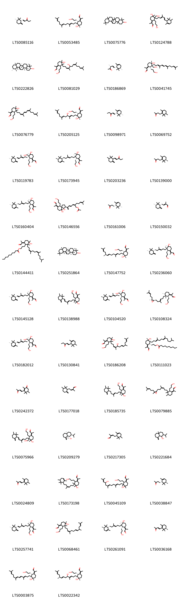{ width=100% }
    <figcaption>Hình ảnh cấu trúc hóa học của 66 hoạt chất thuộc nhóm Prenol lipids gồm ['(1e)-1-[(1r,3s)-2,2,3-trimethyl-6-methylidenecyclohexyl]pent-1-en-3-one (LTS0085116)', '2-[(1z,2r,3s,4s)-4-hydroxy-2-(3-hydroxypropyl)-3,4-dimethyl-3-[(3e,7e)-4,8,12-trimethyltrideca-3,7,11-trien-1-yl]cyclohexylidene]propanal (LTS0053485)', 'β-amyrin (LTS0075776)', '2-[4-hydroxy-3-(hydroxymethyl)-2-(3-hydroxypropyl)-4-methyl-3-[4-methyl-6-(2,5,6,6-tetramethylcyclohex-2-en-1-yl)hexa-3,5-dien-1-yl]cyclohexylidene]propanal (LTS0124788)', 'amyrin (LTS0222826)', '2-[4-hydroxy-3-(5-hydroxy-4,8,12-trimethyltrideca-3,7,11-trien-1-yl)-2-(3-hydroxypropyl)-3,4-dimethylcyclohexylidene]propanal (LTS0081029)', '(3r,4e)-3-methyl-5-[(1r,5s)-2,5,6,6-tetramethylcyclohex-2-en-1-yl]pent-4-en-2-one (LTS0186869)', '2-[(1z,2r,3s,4s)-4-hydroxy-3-(hydroxymethyl)-2-(3-hydroxypropyl)-4-methyl-3-[(3e,5e,7e)-4,8,12-trimethyltrideca-3,5,7,11-tetraen-1-yl]cyclohexylidene]propanal (LTS0041745)', '2-[4-hydroxy-2-(3-hydroxypropyl)-3,4-dimethyl-3-(4,8,12-trimethyltrideca-3,5,7,11-tetraen-1-yl)cyclohexylidene]propanal (LTS0076779)', '2-[(1z,2r,3s,4s)-4-hydroxy-3-[(3e,5r,7e)-5-hydroxy-4,8,12-trimethyltrideca-3,7,11-trien-1-yl]-2-(3-hydroxypropyl)-3,4-dimethylcyclohexylidene]propanal (LTS0205125)', '(1e)-1-[(1r,5s)-2,5,6,6-tetramethylcyclohex-2-en-1-yl]pent-1-en-3-one (LTS0098971)', '4-(2,5,6,6-tetramethylcyclohex-1-en-1-yl)butan-2-one (LTS0069752)', '2-[(1e,2r,3s,4s)-4-hydroxy-3-(hydroxymethyl)-2-(3-hydroxypropyl)-4-methyl-3-[(3e,5e)-4-methyl-6-[(1r,3s)-2,2,3-trimethyl-6-methylidenecyclohexyl]hexa-3,5-dien-1-yl]cyclohexylidene]propanal (LTS0119783)', '2-[(1z,2s,3r,4r)-4-hydroxy-2-(3-hydroxypropyl)-3,4-dimethyl-3-[(3e)-4-methyl-6-[(1s,5r)-2,5,6,6-tetramethylcyclohex-2-en-1-yl]hex-3-en-1-yl]cyclohexylidene]propanal (LTS0173945)', '1-(2,2,3-trimethyl-6-methylidenecyclohexyl)pent-1-en-3-one (LTS0203236)', '4-[(5r)-2,5,6,6-tetramethylcyclohex-1-en-1-yl]butan-2-one (LTS0139000)', '2-[(1z,2r,3s,4s)-4-hydroxy-2-(3-hydroxypropyl)-3,4-dimethyl-3-[(3e)-4-methyl-6-[(1r,5s)-2,5,6,6-tetramethylcyclohex-2-en-1-yl]hex-3-en-1-yl]cyclohexylidene]propanal (LTS0160404)', '6-[1,6-dihydroxy-10-(3-hydroxypropyl)-6-methyl-9-(1-oxopropan-2-ylidene)spiro[4.5]decan-2-yl]-2-(4-methylpent-3-en-1-yl)hepta-2,4,6-trien-1-yl acetate (LTS0146556)', '4-[(1r,5s)-2,5,6,6-tetramethylcyclohex-2-en-1-yl]butan-2-one (LTS0161006)', '(2e)-2-methyl-4-[(1r,3s)-2,2,3-trimethyl-6-methylidenecyclohexyl]but-2-enal (LTS0150032)', '3-[3-hydroxy-2,3-dimethyl-6-(1-oxopropan-2-ylidene)-2-(4,8,12-trimethyltrideca-3,7-dien-1-yl)cyclohexyl]propyl decanoate (LTS0144411)', 'β-amyrin (LTS0251864)', '2-[(1z,2r,3s,4s)-4-hydroxy-2-(3-hydroxypropyl)-3,4-dimethyl-3-[(3e,7e,9s)-4,9,12-trimethyltrideca-3,7,11-trien-1-yl]cyclohexylidene]propanal (LTS0147752)', '2-[(1e,2r,3s,4s)-4-hydroxy-2-(3-hydroxypropyl)-3,4-dimethyl-3-[(3e)-4-methyl-6-[(1r,3s)-2,2,3-trimethyl-6-methylidenecyclohexyl]hex-3-en-1-yl]cyclohexylidene]propanal (LTS0236060)', '2-[(1e,2r,3s,4s)-4-hydroxy-2-(3-hydroxypropyl)-3,4-dimethyl-3-[(3e,5e)-4-methyl-6-[(1r,3s)-2,2,3-trimethyl-6-methylidenecyclohexyl]hexa-3,5-dien-1-yl]cyclohexylidene]propanal (LTS0145128)', '2-[4-hydroxy-2-(3-hydroxypropyl)-3,4-dimethyl-3-[4-methyl-6-(2,2,3-trimethyl-6-methylidenecyclohexyl)hexa-3,5-dien-1-yl]cyclohexylidene]propanal (LTS0138988)', '2-[(1e,2r,3s,4s)-4-hydroxy-3-(hydroxymethyl)-2-(3-hydroxypropyl)-4-methyl-3-[(3e,5e)-4-methyl-6-[(1r,5r)-2,5,6,6-tetramethylcyclohex-2-en-1-yl]hexa-3,5-dien-1-yl]cyclohexylidene]propanal (LTS0104520)', '2-[(1z,2s,3r,4r)-2-(3-hydroxypropyl)-3,4-dimethyl-3-[(3e)-4-methyl-6-[(2r,3s)-3-methyl-3-(4-methylpent-3-en-1-yl)oxiran-2-yl]hex-3-en-1-yl]cyclohexylidene]propanal (LTS0108324)', '2-[(1e,2r,3s,4s)-4-hydroxy-3-(hydroxymethyl)-2-(3-hydroxypropyl)-4-methyl-3-[(3e,5e)-4-methyl-6-[(1r,5s)-2,5,6,6-tetramethylcyclohex-2-en-1-yl]hexa-3,5-dien-1-yl]cyclohexylidene]propanal (LTS0182012)', '1-(2,5,6,6-tetramethylcyclohex-2-en-1-yl)pent-1-en-3-one (LTS0130841)', '2-[4-hydroxy-3-(5-hydroxy-4,9,12-trimethyltrideca-3,7,11-trien-1-yl)-2-(3-hydroxypropyl)-3,4-dimethylcyclohexylidene]propanal (LTS0186208)', '3-[(1r,2s,3s,6z)-3-hydroxy-2,3-dimethyl-6-(1-oxopropan-2-ylidene)-2-[(3e,7e)-4,8,12-trimethyltrideca-3,7-dien-1-yl]cyclohexyl]propyl decanoate (LTS0111023)', '2,4,4,5-tetramethyl-3-(3-oxobut-1-en-1-yl)cyclohex-2-en-1-one (LTS0242372)', '2-methyl-4-(2,2,3-trimethyl-6-methylidenecyclohexyl)but-2-enal (LTS0177018)', '2-[4-hydroxy-2-(3-hydroxypropyl)-3,4-dimethyl-3-[4-methyl-6-(2,2,3-trimethyl-6-methylidenecyclohexyl)hex-3-en-1-yl]cyclohexylidene]propanal (LTS0185735)', '2-[2-(3-hydroxypropyl)-3,4-dimethyl-3-{4-methyl-6-[3-methyl-3-(4-methylpent-3-en-1-yl)oxiran-2-yl]hex-3-en-1-yl}cyclohexylidene]propanal (LTS0079885)', '2-[4-hydroxy-3-(hydroxymethyl)-2-(3-hydroxypropyl)-4-methyl-3-[4-methyl-6-(2,2,3-trimethyl-6-methylidenecyclohexyl)hexa-3,5-dien-1-yl]cyclohexylidene]propanal (LTS0075966)', '(1s,2s,4as,8as)-2-isopropyl-4a-methyl-8-methylidene-octahydronaphthalen-1-ol (LTS0209279)', '2-methyl-4-(2,5,6,6-tetramethylcyclohex-2-en-1-yl)but-2-enal (LTS0217305)', '2-isopropyl-4a-methyl-8-methylidene-octahydronaphthalen-1-ol (LTS0221684)', 'β-irone (LTS0024809)', '2-[4-hydroxy-2-(3-hydroxypropyl)-3,4-dimethyl-3-[4-methyl-6-(2,5,6,6-tetramethylcyclohex-2-en-1-yl)hex-3-en-1-yl]cyclohexylidene]propanal (LTS0173198)', '2-[(1z)-4-hydroxy-3-[(3e,7e)-10-hydroxy-4,8,12-trimethyltrideca-3,7,11-trien-1-yl]-2-(3-hydroxypropyl)-3,4-dimethylcyclohexylidene]propanal (LTS0045109)', '4-[(1r,5r)-2,5,6,6-tetramethylcyclohex-2-en-1-yl]butan-2-one (LTS0038847)', '2-[(1z,2r,3s,4s)-4-hydroxy-2-(3-hydroxypropyl)-3,4-dimethyl-3-[(3e,5e)-4-methyl-6-[(1r,3s)-2,2,3-trimethyl-6-methylidenecyclohexyl]hexa-3,5-dien-1-yl]cyclohexylidene]propanal (LTS0257741)', '2-[4-hydroxy-2-(3-hydroxypropyl)-3,4-dimethyl-3-(4,9,12-trimethyltrideca-3,7,11-trien-1-yl)cyclohexylidene]propanal (LTS0068461)', '2-[(1z,2s,3r,4s)-4-hydroxy-2-(3-hydroxypropyl)-3,4-dimethyl-3-[(3e)-4-methyl-6-[(1r,5r)-2,5,6,6-tetramethylcyclohex-2-en-1-yl]hex-3-en-1-yl]cyclohexylidene]propanal (LTS0261091)', '(+)-β-irone (LTS0036168)', '2-[(1z,2r,3s,4s)-4-hydroxy-2-(3-hydroxypropyl)-3,4-dimethyl-3-[(3e,5e,7e)-4,8,12-trimethyltrideca-3,5,7,11-tetraen-1-yl]cyclohexylidene]propanal (LTS0003875)', '2-[(1z,2r,3s,4s)-4-hydroxy-3-[(3e,5r,7e,9s)-5-hydroxy-4,9,12-trimethyltrideca-3,7,11-trien-1-yl]-2-(3-hydroxypropyl)-3,4-dimethylcyclohexylidene]propanal (LTS0022342)', '2-[(1z,2s,3r,4r)-4-hydroxy-3-[(3e,7e,10r)-10-hydroxy-4,8,12-trimethyltrideca-3,7,11-trien-1-yl]-2-(3-hydroxypropyl)-3,4-dimethylcyclohexylidene]propanal (LTS0058008)', '(2e)-2-methyl-4-[(1r,5s)-2,5,6,6-tetramethylcyclohex-2-en-1-yl]but-2-enal (LTS0009170)', '3-methyl-5-(2,5,6,6-tetramethylcyclohex-2-en-1-yl)pent-4-en-2-one (LTS0011867)', '2-[(1z,2s,3r,4r)-2-(3-hydroxypropyl)-3,4-dimethyl-3-[(3e)-4-methyl-6-[(2s,3r)-3-methyl-3-(4-methylpent-3-en-1-yl)oxiran-2-yl]hex-3-en-1-yl]cyclohexylidene]propanal (LTS0002629)', '(2z,4e)-6-[(1r,2s,5s,6s,9z,10r)-1,6-dihydroxy-10-(3-hydroxypropyl)-6-methyl-9-(1-oxopropan-2-ylidene)spiro[4.5]decan-2-yl]-2-(4-methylpent-3-en-1-yl)hepta-2,4,6-trien-1-yl acetate (LTS0021346)', '2-[4-hydroxy-3-(hydroxymethyl)-2-(3-hydroxypropyl)-4-methyl-3-(4,8,12-trimethyltrideca-3,5,7,11-tetraen-1-yl)cyclohexylidene]propanal (LTS0003345)', 'α-amyrin (LTS0088267)', '4-(2,5,6,6-tetramethylcyclohex-2-en-1-yl)butan-2-one (LTS0031411)', '2-[(1z,2r,3s,4s)-4-hydroxy-2-(3-hydroxypropyl)-3,4-dimethyl-3-[(3e)-4-methyl-6-[(1r,3s)-2,2,3-trimethyl-6-methylidenecyclohexyl]hex-3-en-1-yl]cyclohexylidene]propanal (LTS0231074)', '2-[(1z,2r,3s,4s)-4-hydroxy-3-(hydroxymethyl)-2-(3-hydroxypropyl)-4-methyl-3-[(3e,5e)-4-methyl-6-[(1r,3s)-2,2,3-trimethyl-6-methylidenecyclohexyl]hexa-3,5-dien-1-yl]cyclohexylidene]propanal (LTS0116628)', '2-[(1z)-4-hydroxy-3-(hydroxymethyl)-2-(3-hydroxypropyl)-4-methyl-3-[(3z,5e)-4-methyl-6-(2,5,6,6-tetramethylcyclohex-2-en-1-yl)hexa-3,5-dien-1-yl]cyclohexylidene]propanal (LTS0258782)', '(3e,7e)-1-[(1s,2s,5z,6r)-2-hydroxy-6-(3-hydroxypropyl)-1,2-dimethyl-5-(1-oxopropan-2-ylidene)cyclohexyl]-4,8,12-trimethyltrideca-3,7,11-trien-5-yl acetate (LTS0051322)', '2-[(1z,2s,3s,4s)-4-hydroxy-2-(3-hydroxypropyl)-3,4-dimethyl-3-[(3e)-4-methyl-6-[(1s,3s)-2,2,3-trimethyl-6-methylidenecyclohexyl]hex-3-en-1-yl]cyclohexylidene]propanal (LTS0022287)', '(5r)-2,4,4,5-tetramethyl-3-[(1e)-3-oxobut-1-en-1-yl]cyclohex-2-en-1-one (LTS0017967)', '2-[4-hydroxy-3-(10-hydroxy-4,8,12-trimethyltrideca-3,7,11-trien-1-yl)-2-(3-hydroxypropyl)-3,4-dimethylcyclohexylidene]propanal (LTS0050168)', '(2z,4e)-6-[(1r,2r,5s,6s,9z,10r)-1,6-dihydroxy-10-(3-hydroxypropyl)-6-methyl-9-(1-oxopropan-2-ylidene)spiro[4.5]decan-2-yl]-2-(4-methylpent-3-en-1-yl)hepta-2,4,6-trien-1-yl acetate (LTS0047562)'].</figcaption>
</figure>
#### Nhóm Steroids and steroid derivatives
<figure markdown="span">
    { width=100% }
    <figcaption>Hình ảnh cấu trúc hóa học của 2 hoạt chất thuộc nhóm Steroids and steroid derivatives gồm ['stigmast-5-en-3-ol (LTS0071224)', 'stigmast-5-en-3-ol, (3β)- (LTS0204616)'].</figcaption>
</figure>

---

### Dược dân tộc học

Danh sách các quốc gia có sử dụng *Iris germanica* trong điều trị các bệnh. 

| Country   | Disease                                                                             | Bệnh                                                                                                                                                                                                |
|:----------|:------------------------------------------------------------------------------------|:----------------------------------------------------------------------------------------------------------------------------------------------------------------------------------------------------|
| Egypt     | Antidote, Cathartic, Cholagogue, Emetic                                             | MYMEMORY WARNING: YOU USED ALL AVAILABLE FREE TRANSLATIONS FOR TODAY. NEXT AVAILABLE IN  12 HOURS 26 MINUTES 24 SECONDS VISIT HTTPS://MYMEMORY.TRANSLATED.NET/DOC/USAGELIMITS.PHP TO TRANSLATE MORE |
| Elsewhere | Cathartic, Diuretic, Diuretic, Stimulant, Stomachic, Expectorant, Cathartic, Emetic | MYMEMORY WARNING: YOU USED ALL AVAILABLE FREE TRANSLATIONS FOR TODAY. NEXT AVAILABLE IN  12 HOURS 26 MINUTES 20 SECONDS VISIT HTTPS://MYMEMORY.TRANSLATED.NET/DOC/USAGELIMITS.PHP TO TRANSLATE MORE |
| Turkey    | Cosmetic, Diuretic, Expectorant, Laxative, Cholagogue                               | MYMEMORY WARNING: YOU USED ALL AVAILABLE FREE TRANSLATIONS FOR TODAY. NEXT AVAILABLE IN  12 HOURS 26 MINUTES 15 SECONDS VISIT HTTPS://MYMEMORY.TRANSLATED.NET/DOC/USAGELIMITS.PHP TO TRANSLATE MORE |
| ain       | Purgative                                                                           | MYMEMORY WARNING: YOU USED ALL AVAILABLE FREE TRANSLATIONS FOR TODAY. NEXT AVAILABLE IN  12 HOURS 26 MINUTES 11 SECONDS VISIT HTTPS://MYMEMORY.TRANSLATED.NET/DOC/USAGELIMITS.PHP TO TRANSLATE MORE |

---

---
## Iris pallasii
### Thông tin về thực vật

!!! info "Phân loại thực vật của *Iris pallasii* từ GIBF:"
    - **Kingdom:** Plantae
    - **Phylum:** Tracheophyta
    - **Order:** Asparagales
    - **Family:** Iridaceae
    - **Genus:** Iris
    - **Species:** *Iris pallasii*

 

| Label (VI)   | Label (EN)   | Scientific Name   | Descriptions (VI)   | Descriptions (EN)   | Also Known As (VI)   | Also Known As (EN)   |
|:-------------|:-------------|:------------------|:--------------------|:--------------------|:---------------------|:---------------------|
| N/A          | N/A          | Iris pallasii     | loài thực vật       | species of plant    | ['']                 | ['']                 |

#### Phân bố trên thế giới

**Từ CSDL GIBF** nan, Japan, Mongolia, China, Russian Federation, Kazakhstan, unknown or invalid

#### Phân bố tại Việt Nam

**Từ CSDL GIBF**: Không có ghi nhận ở Việt Nam

---
### Thành phần hóa học
        
- Theo cơ sở dữ liệu lotus: Từ loài *Iris pallasii* đã phân lập và xác định được 14 hoạt chất thuộc về các nhóm Benzene and substituted derivatives, Organooxygen compounds, Coumarans, Phenols. 

|    | chemicalTaxonomyClassyfireClass     |   smiles_count |
|---:|:------------------------------------|---------------:|
|  0 | Benzene and substituted derivatives |              2 |
|  1 | Coumarans                           |              3 |
|  2 | Organooxygen compounds              |              3 |
|  3 | Phenols                             |              6 |

#### Nhóm Benzene and substituted derivatives
<figure markdown="span">
    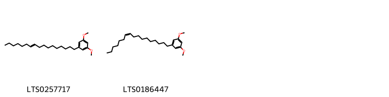{ width=100% }
    <figcaption>Hình ảnh cấu trúc hóa học của 2 hoạt chất thuộc nhóm Benzene and substituted derivatives gồm ['1-(heptadec-10-en-1-yl)-3,5-dimethoxybenzene (LTS0257717)', '1-[(10z)-heptadec-10-en-1-yl]-3,5-dimethoxybenzene (LTS0186447)'].</figcaption>
</figure>
#### Nhóm Coumarans
<figure markdown="span">
    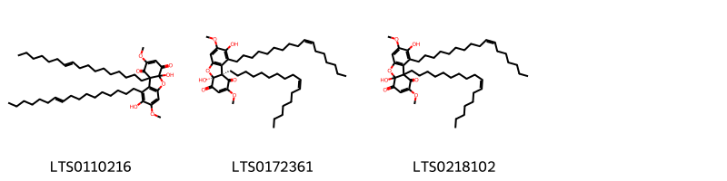{ width=100% }
    <figcaption>Hình ảnh cấu trúc hóa học của 3 hoạt chất thuộc nhóm Coumarans gồm ['2,13-bis(heptadec-10-en-1-yl)-7,12-dihydroxy-4,11-dimethoxy-8-oxatricyclo[7.4.0.0²,⁷]trideca-1(9),4,10,12-tetraene-3,6-dione (LTS0110216)', '(2s,7s)-2,13-bis[(10z)-heptadec-10-en-1-yl]-7,12-dihydroxy-4,11-dimethoxy-8-oxatricyclo[7.4.0.0²,⁷]trideca-1(9),4,10,12-tetraene-3,6-dione (LTS0172361)', '2,13-bis[(10z)-heptadec-10-en-1-yl]-7,12-dihydroxy-4,11-dimethoxy-8-oxatricyclo[7.4.0.0²,⁷]trideca-1(9),4,10,12-tetraene-3,6-dione (LTS0218102)'].</figcaption>
</figure>
#### Nhóm Organooxygen compounds
<figure markdown="span">
    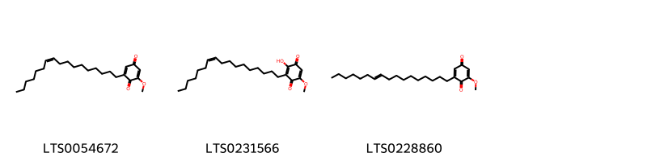{ width=100% }
    <figcaption>Hình ảnh cấu trúc hóa học của 3 hoạt chất thuộc nhóm Organooxygen compounds gồm ['irisquinone (LTS0054672)', '3-[(10z)-heptadec-10-en-1-yl]-2-hydroxy-5-methoxycyclohexa-2,5-diene-1,4-dione (LTS0231566)', '2-(heptadec-10-en-1-yl)-6-methoxycyclohexa-2,5-diene-1,4-dione (LTS0228860)'].</figcaption>
</figure>
#### Nhóm Phenols
<figure markdown="span">
    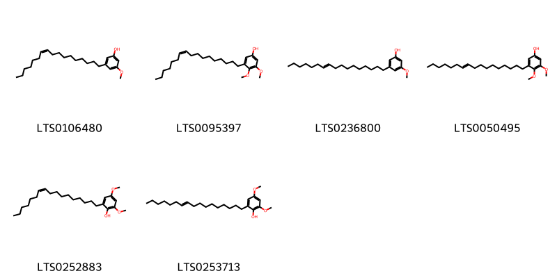{ width=100% }
    <figcaption>Hình ảnh cấu trúc hóa học của 6 hoạt chất thuộc nhóm Phenols gồm ['3-[(10z)-heptadec-10-en-1-yl]-5-methoxyphenol (LTS0106480)', '3-[(10z)-heptadec-10-en-1-yl]-4,5-dimethoxyphenol (LTS0095397)', '3-(heptadec-10-en-1-yl)-5-methoxyphenol (LTS0236800)', '3-(heptadec-10-en-1-yl)-4,5-dimethoxyphenol (LTS0050495)', '2-[(10z)-heptadec-10-en-1-yl]-4,6-dimethoxyphenol (LTS0252883)', '2-(heptadec-10-en-1-yl)-4,6-dimethoxyphenol (LTS0253713)'].</figcaption>
</figure>

---

### Dược dân tộc học

Danh sách các quốc gia có sử dụng *Iris pallasii* trong điều trị các bệnh. 

| Country   | Disease    | Bệnh                                                                                                                                                                                                |
|:----------|:-----------|:----------------------------------------------------------------------------------------------------------------------------------------------------------------------------------------------------|
| Elsewhere | Hemostatic | MYMEMORY WARNING: YOU USED ALL AVAILABLE FREE TRANSLATIONS FOR TODAY. NEXT AVAILABLE IN  12 HOURS 25 MINUTES 35 SECONDS VISIT HTTPS://MYMEMORY.TRANSLATED.NET/DOC/USAGELIMITS.PHP TO TRANSLATE MORE |

---

---
## Iris pallida
### Thông tin về thực vật

!!! info "Phân loại thực vật của *Iris pallida* từ GIBF:"
    - **Kingdom:** Plantae
    - **Phylum:** Tracheophyta
    - **Order:** Asparagales
    - **Family:** Iridaceae
    - **Genus:** Iris
    - **Species:** *Iris pallida*

 

| Label (VI)   | Label (EN)   | Scientific Name   | Descriptions (VI)   | Descriptions (EN)   | Also Known As (VI)   | Also Known As (EN)   |
|:-------------|:-------------|:------------------|:--------------------|:--------------------|:---------------------|:---------------------|
| N/A          | N/A          | Iris pallida      | loài thực vật       | species of plant    | ['']                 | ['']                 |

#### Phân bố trên thế giới

**Từ CSDL GIBF** Sweden, Slovenia, Spain, Montenegro, United States of America, Romania, Albania, Colombia, Croatia, France, Belgium, North Macedonia, Canada, Germany, Bosnia and Herzegovina, Austria, Portugal, Ukraine, Italy, Switzerland, United Kingdom of Great Britain and Northern Ireland

#### Phân bố tại Việt Nam

**Từ CSDL GIBF**: Không có ghi nhận ở Việt Nam

---
### Thành phần hóa học
        
- Theo cơ sở dữ liệu lotus: Từ loài *Iris pallida* đã phân lập và xác định được 31 hoạt chất thuộc về các nhóm Benzene and substituted derivatives, Steroids and steroid derivatives, Organooxygen compounds, Isoflavonoids, Prenol lipids, Benzopyrans. 

|    | chemicalTaxonomyClassyfireClass     |   smiles_count |
|---:|:------------------------------------|---------------:|
|  0 | Benzene and substituted derivatives |              1 |
|  1 | Benzopyrans                         |              1 |
|  2 | Isoflavonoids                       |              3 |
|  3 | Organooxygen compounds              |              2 |
|  4 | Prenol lipids                       |             18 |
|  5 | Steroids and steroid derivatives    |              6 |

#### Nhóm Benzene and substituted derivatives
<figure markdown="span">
    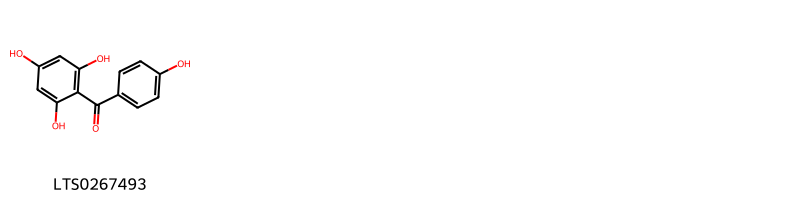{ width=100% }
    <figcaption>Hình ảnh cấu trúc hóa học của 1 hoạt chất thuộc nhóm Benzene and substituted derivatives gồm ['2-(4-hydroxybenzoyl)benzene-1,3,5-triol (LTS0267493)'].</figcaption>
</figure>
#### Nhóm Benzopyrans
<figure markdown="span">
    { width=100% }
    <figcaption>Hình ảnh cấu trúc hóa học của 1 hoạt chất thuộc nhóm Benzopyrans gồm ['mangiferin (LTS0009443)'].</figcaption>
</figure>
#### Nhóm Isoflavonoids
<figure markdown="span">
    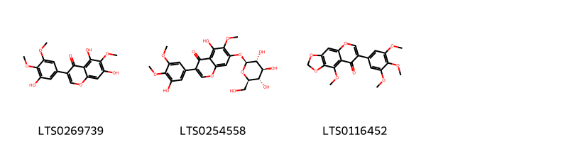{ width=100% }
    <figcaption>Hình ảnh cấu trúc hóa học của 3 hoạt chất thuộc nhóm Isoflavonoids gồm ['irigenin (LTS0269739)', 'iridin (LTS0254558)', 'irisflorentin (LTS0116452)'].</figcaption>
</figure>
#### Nhóm Organooxygen compounds
<figure markdown="span">
    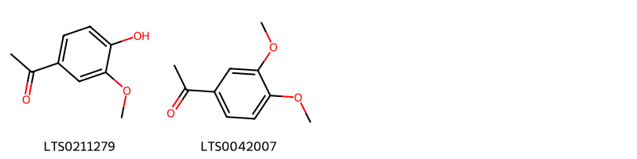{ width=100% }
    <figcaption>Hình ảnh cấu trúc hóa học của 2 hoạt chất thuộc nhóm Organooxygen compounds gồm ['apocynin (LTS0211279)', '1-(3,4-dimethoxyphenyl)ethanone (LTS0042007)'].</figcaption>
</figure>
#### Nhóm Prenol lipids
<figure markdown="span">
    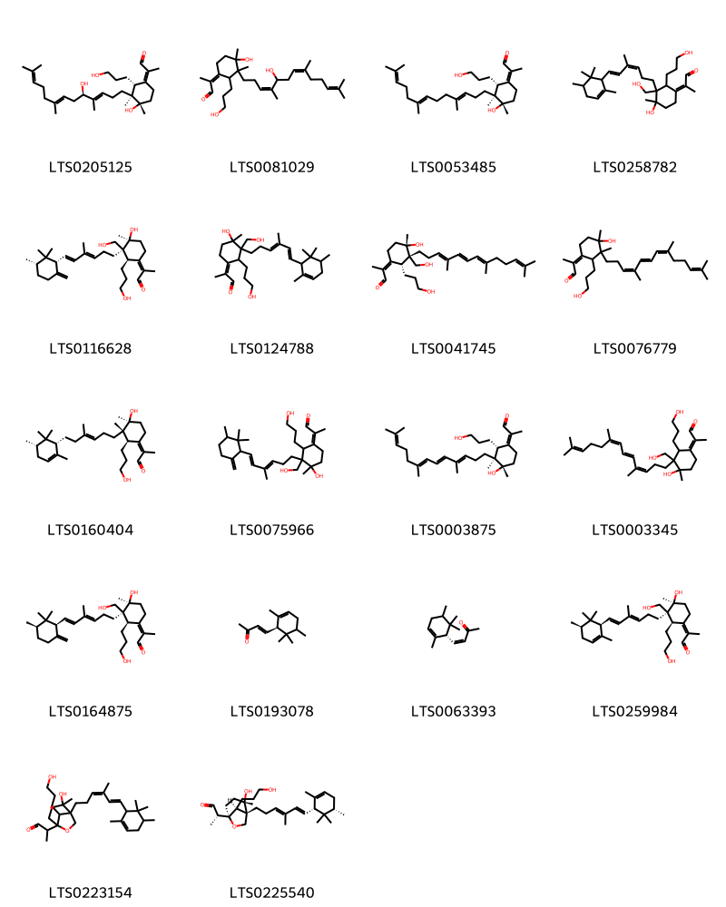{ width=100% }
    <figcaption>Hình ảnh cấu trúc hóa học của 18 hoạt chất thuộc nhóm Prenol lipids gồm ['2-[(1z,2r,3s,4s)-4-hydroxy-3-[(3e,5r,7e)-5-hydroxy-4,8,12-trimethyltrideca-3,7,11-trien-1-yl]-2-(3-hydroxypropyl)-3,4-dimethylcyclohexylidene]propanal (LTS0205125)', '2-[4-hydroxy-3-(5-hydroxy-4,8,12-trimethyltrideca-3,7,11-trien-1-yl)-2-(3-hydroxypropyl)-3,4-dimethylcyclohexylidene]propanal (LTS0081029)', '2-[(1z,2r,3s,4s)-4-hydroxy-2-(3-hydroxypropyl)-3,4-dimethyl-3-[(3e,7e)-4,8,12-trimethyltrideca-3,7,11-trien-1-yl]cyclohexylidene]propanal (LTS0053485)', '2-[(1z)-4-hydroxy-3-(hydroxymethyl)-2-(3-hydroxypropyl)-4-methyl-3-[(3z,5e)-4-methyl-6-(2,5,6,6-tetramethylcyclohex-2-en-1-yl)hexa-3,5-dien-1-yl]cyclohexylidene]propanal (LTS0258782)', '2-[(1z,2r,3s,4s)-4-hydroxy-3-(hydroxymethyl)-2-(3-hydroxypropyl)-4-methyl-3-[(3e,5e)-4-methyl-6-[(1r,3s)-2,2,3-trimethyl-6-methylidenecyclohexyl]hexa-3,5-dien-1-yl]cyclohexylidene]propanal (LTS0116628)', '2-[4-hydroxy-3-(hydroxymethyl)-2-(3-hydroxypropyl)-4-methyl-3-[4-methyl-6-(2,5,6,6-tetramethylcyclohex-2-en-1-yl)hexa-3,5-dien-1-yl]cyclohexylidene]propanal (LTS0124788)', '2-[(1z,2r,3s,4s)-4-hydroxy-3-(hydroxymethyl)-2-(3-hydroxypropyl)-4-methyl-3-[(3e,5e,7e)-4,8,12-trimethyltrideca-3,5,7,11-tetraen-1-yl]cyclohexylidene]propanal (LTS0041745)', '2-[4-hydroxy-2-(3-hydroxypropyl)-3,4-dimethyl-3-(4,8,12-trimethyltrideca-3,5,7,11-tetraen-1-yl)cyclohexylidene]propanal (LTS0076779)', '2-[(1z,2r,3s,4s)-4-hydroxy-2-(3-hydroxypropyl)-3,4-dimethyl-3-[(3e)-4-methyl-6-[(1r,5s)-2,5,6,6-tetramethylcyclohex-2-en-1-yl]hex-3-en-1-yl]cyclohexylidene]propanal (LTS0160404)', '2-[4-hydroxy-3-(hydroxymethyl)-2-(3-hydroxypropyl)-4-methyl-3-[4-methyl-6-(2,2,3-trimethyl-6-methylidenecyclohexyl)hexa-3,5-dien-1-yl]cyclohexylidene]propanal (LTS0075966)', '2-[(1z,2r,3s,4s)-4-hydroxy-2-(3-hydroxypropyl)-3,4-dimethyl-3-[(3e,5e,7e)-4,8,12-trimethyltrideca-3,5,7,11-tetraen-1-yl]cyclohexylidene]propanal (LTS0003875)', '2-[4-hydroxy-3-(hydroxymethyl)-2-(3-hydroxypropyl)-4-methyl-3-(4,8,12-trimethyltrideca-3,5,7,11-tetraen-1-yl)cyclohexylidene]propanal (LTS0003345)', '2-[(1z,2r,3s,4s)-4-hydroxy-3-(hydroxymethyl)-2-(3-hydroxypropyl)-4-methyl-3-[(3e,5e)-4-methyl-6-[(1s,3r)-2,2,3-trimethyl-6-methylidenecyclohexyl]hexa-3,5-dien-1-yl]cyclohexylidene]propanal (LTS0164875)', '(3e)-4-[(1s)-2,5,6,6-tetramethylcyclohex-2-en-1-yl]but-3-en-2-one (LTS0193078)', '(z)-α-irone (LTS0063393)', '2-[(1z,2r,3s,4s)-4-hydroxy-3-(hydroxymethyl)-2-(3-hydroxypropyl)-4-methyl-3-[(3e,5e)-4-methyl-6-[(1s,5r)-2,5,6,6-tetramethylcyclohex-2-en-1-yl]hexa-3,5-dien-1-yl]cyclohexylidene]propanal (LTS0259984)', '2-[2-hydroxy-8-(3-hydroxypropyl)-2-methyl-1-[4-methyl-6-(2,5,6,6-tetramethylcyclohex-2-en-1-yl)hexa-3,5-dien-1-yl]-6-oxabicyclo[3.2.1]octan-5-yl]propanal (LTS0223154)', '(2s)-2-[(1s,2s,5r,8s)-2-hydroxy-8-(3-hydroxypropyl)-2-methyl-1-[(3e,5e)-4-methyl-6-[(1r,5s)-2,5,6,6-tetramethylcyclohex-2-en-1-yl]hexa-3,5-dien-1-yl]-6-oxabicyclo[3.2.1]octan-5-yl]propanal (LTS0225540)'].</figcaption>
</figure>
#### Nhóm Steroids and steroid derivatives
<figure markdown="span">
    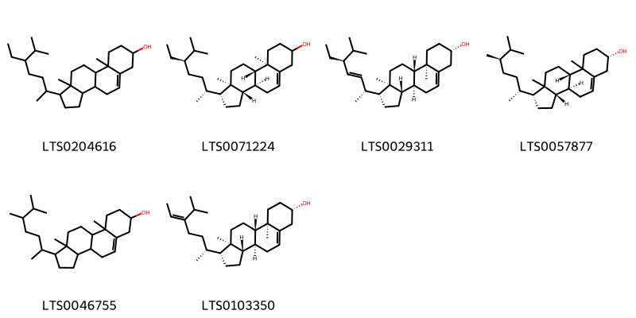{ width=100% }
    <figcaption>Hình ảnh cấu trúc hóa học của 6 hoạt chất thuộc nhóm Steroids and steroid derivatives gồm ['stigmast-5-en-3-ol, (3β)- (LTS0204616)', 'stigmast-5-en-3-ol (LTS0071224)', 'phytosterol (LTS0029311)', '(1r,3as,3bs,7s,9bs)-1-[(2r,5r)-5,6-dimethylheptan-2-yl]-9a,11a-dimethyl-1h,2h,3h,3ah,3bh,4h,6h,7h,8h,9h,9bh,10h,11h-cyclopenta[a]phenanthren-7-ol (LTS0057877)', 'campesterol (LTS0046755)', 'avenasterol (LTS0103350)'].</figcaption>
</figure>

---

### Dược dân tộc học

Danh sách các quốc gia có sử dụng *Iris pallida* trong điều trị các bệnh. 

| Country   | Disease                                               | Bệnh                                                                                                                                                                                                |
|:----------|:------------------------------------------------------|:----------------------------------------------------------------------------------------------------------------------------------------------------------------------------------------------------|
| Elsewhere | Stomachic                                             | MYMEMORY WARNING: YOU USED ALL AVAILABLE FREE TRANSLATIONS FOR TODAY. NEXT AVAILABLE IN  12 HOURS 24 MINUTES 54 SECONDS VISIT HTTPS://MYMEMORY.TRANSLATED.NET/DOC/USAGELIMITS.PHP TO TRANSLATE MORE |
| Iraq      | Dentifrice                                            | MYMEMORY WARNING: YOU USED ALL AVAILABLE FREE TRANSLATIONS FOR TODAY. NEXT AVAILABLE IN  12 HOURS 24 MINUTES 48 SECONDS VISIT HTTPS://MYMEMORY.TRANSLATED.NET/DOC/USAGELIMITS.PHP TO TRANSLATE MORE |
| Turkey    | Cholagogue, Expectorant, Laxative, Diuretic, Cosmetic | MYMEMORY WARNING: YOU USED ALL AVAILABLE FREE TRANSLATIONS FOR TODAY. NEXT AVAILABLE IN  12 HOURS 24 MINUTES 42 SECONDS VISIT HTTPS://MYMEMORY.TRANSLATED.NET/DOC/USAGELIMITS.PHP TO TRANSLATE MORE |

---

---
## Iris pseudoacorus
### Thông tin về thực vật

!!! info "Phân loại thực vật của *Iris pseudacorus* từ GIBF:"
    - **Kingdom:** Plantae
    - **Phylum:** Tracheophyta
    - **Order:** Asparagales
    - **Family:** Iridaceae
    - **Genus:** Iris
    - **Species:** *Iris pseudacorus*

 

| Label (VI)   | Label (EN)   | Scientific Name   | Descriptions (VI)   | Descriptions (EN)   | Also Known As (VI)   | Also Known As (EN)   |
|:-------------|:-------------|:------------------|:--------------------|:--------------------|:---------------------|:---------------------|
| N/A          | N/A          | Iris pallida      | loài thực vật       | species of plant    | ['']                 | ['']                 |

#### Phân bố trên thế giới

**Từ CSDL GIBF** Czechia, Sweden, New Zealand, Uruguay, Spain, Netherlands, Denmark, Poland, United States of America, Russian Federation, Argentina, United Kingdom of Great Britain and Northern Ireland, Belgium, Canada, Germany, Austria, Hungary, Portugal, South Africa, Australia, Switzerland, France, Ireland

#### Phân bố tại Việt Nam

**Từ CSDL GIBF**: Không có ghi nhận ở Việt Nam

---
### Thành phần hóa học
        
- Theo cơ sở dữ liệu lotus: Từ loài *Iris pseudacorus* đã phân lập và xác định được Chưa có hoạt chất nào được phân lập. hoạt chất thuộc về các nhóm Không có hoạt chất nào được phân lập. 

Không có hình ảnh nào được tạo ra

---

### Dược dân tộc học

Danh sách các quốc gia có sử dụng *Iris pseudacorus* trong điều trị các bệnh. 

| Country   | Disease                                                                                       | Bệnh                                                                                                                                                                                                |
|:----------|:----------------------------------------------------------------------------------------------|:----------------------------------------------------------------------------------------------------------------------------------------------------------------------------------------------------|
| Turkey    | Astringent, Carminative, Diuretic, Emetic, Laxative, Refrigerant, Vermifuge, Stomachic, Tonic | MYMEMORY WARNING: YOU USED ALL AVAILABLE FREE TRANSLATIONS FOR TODAY. NEXT AVAILABLE IN  12 HOURS 24 MINUTES 01 SECONDS VISIT HTTPS://MYMEMORY.TRANSLATED.NET/DOC/USAGELIMITS.PHP TO TRANSLATE MORE |
| ain       | Emetic                                                                                        | MYMEMORY WARNING: YOU USED ALL AVAILABLE FREE TRANSLATIONS FOR TODAY. NEXT AVAILABLE IN  12 HOURS 23 MINUTES 58 SECONDS VISIT HTTPS://MYMEMORY.TRANSLATED.NET/DOC/USAGELIMITS.PHP TO TRANSLATE MORE |

---

---
## Iris sibirica
### Thông tin về thực vật

!!! info "Phân loại thực vật của *Iris sibirica* từ GIBF:"
    - **Kingdom:** Plantae
    - **Phylum:** Tracheophyta
    - **Order:** Asparagales
    - **Family:** Iridaceae
    - **Genus:** Iris
    - **Species:** *Iris sibirica*

 

| Label (VI)   | Label (EN)   | Scientific Name   | Descriptions (VI)   | Descriptions (EN)   | Also Known As (VI)   | Also Known As (EN)   |
|:-------------|:-------------|:------------------|:--------------------|:--------------------|:---------------------|:---------------------|
| N/A          | N/A          | Iris sibirica     | loài thực vật       | species of plant    | ['']                 | ['']                 |

#### Phân bố trên thế giới

**Từ CSDL GIBF** nan, Czechia, Sweden, Slovenia, Poland, Denmark, Romania, Russian Federation, Croatia, Lithuania, Belarus, Norway, United Kingdom of Great Britain and Northern Ireland, Belgium, Germany, Austria, Hungary, Ukraine, Slovakia, Italy, Switzerland, France

#### Phân bố tại Việt Nam

**Từ CSDL GIBF**: Không có ghi nhận ở Việt Nam

---
### Thành phần hóa học
        
- Theo cơ sở dữ liệu lotus: Từ loài *Iris sibirica* đã phân lập và xác định được 36 hoạt chất thuộc về các nhóm Fatty Acyls, Carboxylic acids and derivatives, Phenols, Organooxygen compounds, Isoflavonoids, Prenol lipids. 

|    | chemicalTaxonomyClassyfireClass   |   smiles_count |
|---:|:----------------------------------|---------------:|
|  0 | Carboxylic acids and derivatives  |              2 |
|  1 | Fatty Acyls                       |              1 |
|  2 | Isoflavonoids                     |              2 |
|  3 | Organooxygen compounds            |              9 |
|  4 | Phenols                           |             10 |
|  5 | Prenol lipids                     |             12 |

#### Nhóm Carboxylic acids and derivatives
<figure markdown="span">
    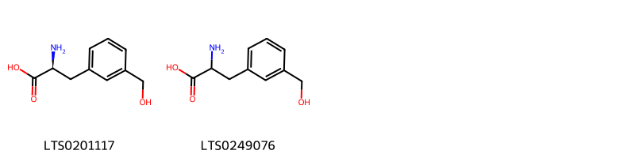{ width=100% }
    <figcaption>Hình ảnh cấu trúc hóa học của 2 hoạt chất thuộc nhóm Carboxylic acids and derivatives gồm ['(2s)-2-amino-3-[3-(hydroxymethyl)phenyl]propanoic acid (LTS0201117)', '2-amino-3-[3-(hydroxymethyl)phenyl]propanoic acid (LTS0249076)'].</figcaption>
</figure>
#### Nhóm Fatty Acyls
<figure markdown="span">
    { width=100% }
    <figcaption>Hình ảnh cấu trúc hóa học của 1 hoạt chất thuộc nhóm Fatty Acyls gồm ['2-carboxy-d-arabinitol (LTS0056947)'].</figcaption>
</figure>
#### Nhóm Isoflavonoids
<figure markdown="span">
    { width=100% }
    <figcaption>Hình ảnh cấu trúc hóa học của 2 hoạt chất thuộc nhóm Isoflavonoids gồm ['irigenin (LTS0269739)', 'iridin (LTS0254558)'].</figcaption>
</figure>
#### Nhóm Organooxygen compounds
<figure markdown="span">
    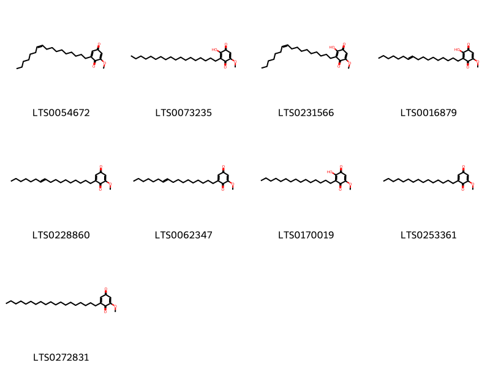{ width=100% }
    <figcaption>Hình ảnh cấu trúc hóa học của 9 hoạt chất thuộc nhóm Organooxygen compounds gồm ['irisquinone (LTS0054672)', '2-hydroxy-5-methoxy-3-octadecylcyclohexa-2,5-diene-1,4-dione (LTS0073235)', '3-[(10z)-heptadec-10-en-1-yl]-2-hydroxy-5-methoxycyclohexa-2,5-diene-1,4-dione (LTS0231566)', '3-(heptadec-10-en-1-yl)-2-hydroxy-5-methoxycyclohexa-2,5-diene-1,4-dione (LTS0016879)', '2-(heptadec-10-en-1-yl)-6-methoxycyclohexa-2,5-diene-1,4-dione (LTS0228860)', '2-[(10e)-heptadec-10-en-1-yl]-6-methoxycyclohexa-2,5-diene-1,4-dione (LTS0062347)', '2-hydroxy-5-methoxy-3-pentadecylcyclohexa-2,5-diene-1,4-dione (LTS0170019)', '2-methoxy-6-pentadecylcyclohexa-2,5-diene-1,4-dione (LTS0253361)', '2-methoxy-6-nonadecylcyclohexa-2,5-diene-1,4-dione (LTS0272831)'].</figcaption>
</figure>
#### Nhóm Phenols
<figure markdown="span">
    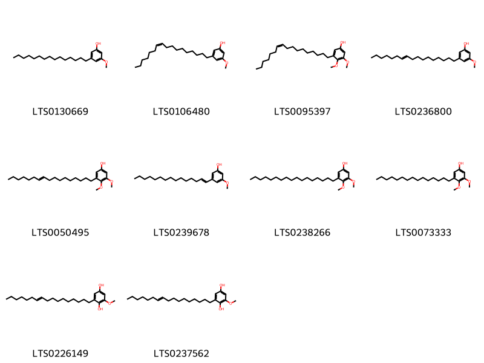{ width=100% }
    <figcaption>Hình ảnh cấu trúc hóa học của 10 hoạt chất thuộc nhóm Phenols gồm ['3-methoxy-5-pentadecylphenol (LTS0130669)', '3-[(10z)-heptadec-10-en-1-yl]-5-methoxyphenol (LTS0106480)', '3-[(10z)-heptadec-10-en-1-yl]-4,5-dimethoxyphenol (LTS0095397)', '3-(heptadec-10-en-1-yl)-5-methoxyphenol (LTS0236800)', '3-(heptadec-10-en-1-yl)-4,5-dimethoxyphenol (LTS0050495)', '3-methoxy-5-(pentadec-1-en-1-yl)phenol (LTS0239678)', '3-heptadecyl-4,5-dimethoxyphenol (LTS0238266)', '3,4-dimethoxy-5-pentadecylphenol (LTS0073333)', '2-[(10e)-heptadec-10-en-1-yl]-6-methoxybenzene-1,4-diol (LTS0226149)', '2-(heptadec-10-en-1-yl)-6-methoxybenzene-1,4-diol (LTS0237562)'].</figcaption>
</figure>
#### Nhóm Prenol lipids
<figure markdown="span">
    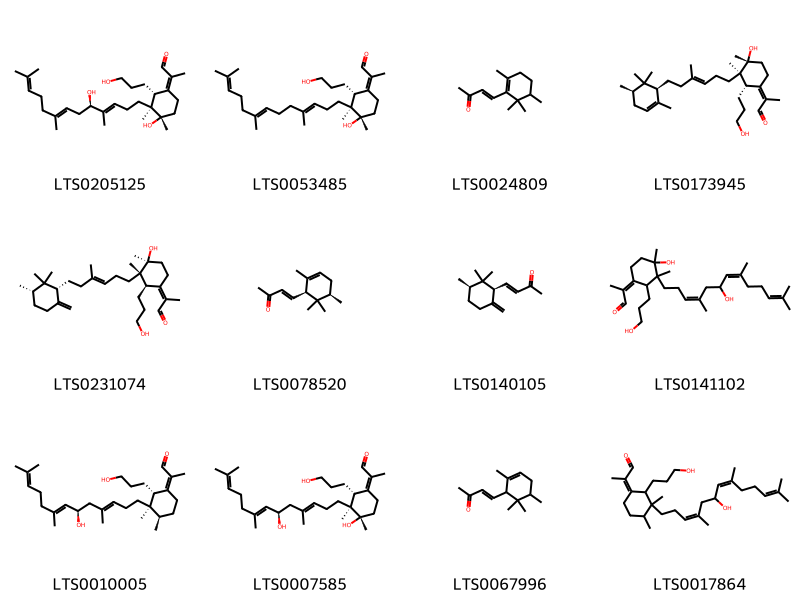{ width=100% }
    <figcaption>Hình ảnh cấu trúc hóa học của 12 hoạt chất thuộc nhóm Prenol lipids gồm ['2-[(1z,2r,3s,4s)-4-hydroxy-3-[(3e,5r,7e)-5-hydroxy-4,8,12-trimethyltrideca-3,7,11-trien-1-yl]-2-(3-hydroxypropyl)-3,4-dimethylcyclohexylidene]propanal (LTS0205125)', '2-[(1z,2r,3s,4s)-4-hydroxy-2-(3-hydroxypropyl)-3,4-dimethyl-3-[(3e,7e)-4,8,12-trimethyltrideca-3,7,11-trien-1-yl]cyclohexylidene]propanal (LTS0053485)', 'β-irone (LTS0024809)', '2-[(1z,2s,3r,4r)-4-hydroxy-2-(3-hydroxypropyl)-3,4-dimethyl-3-[(3e)-4-methyl-6-[(1s,5r)-2,5,6,6-tetramethylcyclohex-2-en-1-yl]hex-3-en-1-yl]cyclohexylidene]propanal (LTS0173945)', '2-[(1z,2r,3s,4s)-4-hydroxy-2-(3-hydroxypropyl)-3,4-dimethyl-3-[(3e)-4-methyl-6-[(1r,3s)-2,2,3-trimethyl-6-methylidenecyclohexyl]hex-3-en-1-yl]cyclohexylidene]propanal (LTS0231074)', 'cis-(+)-α-irone (LTS0078520)', 'γ-irone (LTS0140105)', '2-[4-hydroxy-3-(6-hydroxy-4,8,12-trimethyltrideca-3,7,11-trien-1-yl)-2-(3-hydroxypropyl)-3,4-dimethylcyclohexylidene]propanal (LTS0141102)', '2-[(1z,2s,3r,4r)-3-[(3e,6r,7e)-6-hydroxy-4,8,12-trimethyltrideca-3,7,11-trien-1-yl]-2-(3-hydroxypropyl)-3,4-dimethylcyclohexylidene]propanal (LTS0010005)', '2-[(1z,2r,3s,4s)-4-hydroxy-3-[(3e,6r,7e)-6-hydroxy-4,8,12-trimethyltrideca-3,7,11-trien-1-yl]-2-(3-hydroxypropyl)-3,4-dimethylcyclohexylidene]propanal (LTS0007585)', 'α-iron (LTS0067996)', '2-[3-(6-hydroxy-4,8,12-trimethyltrideca-3,7,11-trien-1-yl)-2-(3-hydroxypropyl)-3,4-dimethylcyclohexylidene]propanal (LTS0017864)'].</figcaption>
</figure>

---

### Dược dân tộc học

Danh sách các quốc gia có sử dụng *Iris sibirica* trong điều trị các bệnh. 

| Country   | Disease     | Bệnh                                                                                                                                                                                                |
|:----------|:------------|:----------------------------------------------------------------------------------------------------------------------------------------------------------------------------------------------------|
| China     | Expectorant | MYMEMORY WARNING: YOU USED ALL AVAILABLE FREE TRANSLATIONS FOR TODAY. NEXT AVAILABLE IN  12 HOURS 23 MINUTES 21 SECONDS VISIT HTTPS://MYMEMORY.TRANSLATED.NET/DOC/USAGELIMITS.PHP TO TRANSLATE MORE |

---

---
## Iris tectorum
### Thông tin về thực vật

!!! info "Phân loại thực vật của *Iris tectorum* từ GIBF:"
    - **Kingdom:** Plantae
    - **Phylum:** Tracheophyta
    - **Order:** Asparagales
    - **Family:** Iridaceae
    - **Genus:** Iris
    - **Species:** *Iris tectorum*

 

| Label (VI)   | Label (EN)   | Scientific Name   | Descriptions (VI)   | Descriptions (EN)   | Also Known As (VI)   | Also Known As (EN)   |
|:-------------|:-------------|:------------------|:--------------------|:--------------------|:---------------------|:---------------------|
| N/A          | N/A          | Iris tectorum     | loài thực vật       | species of plant    | ['']                 | ['']                 |

#### Phân bố trên thế giới

**Từ CSDL GIBF** nan, United States of America, Japan, Korea, Republic of, Bhutan, Belgium, Chinese Taipei, China, Australia, South Africa, Italy, India

#### Phân bố tại Việt Nam

**Từ CSDL GIBF**: Không có ghi nhận ở Việt Nam

---
### Thành phần hóa học
        
- Theo cơ sở dữ liệu lotus: Từ loài *Iris tectorum* đã phân lập và xác định được 69 hoạt chất thuộc về các nhóm Fatty Acyls, Flavonoids, Steroids and steroid derivatives, Isoflavonoids, Prenol lipids. 

|    | chemicalTaxonomyClassyfireClass   |   smiles_count |
|---:|:----------------------------------|---------------:|
|  0 | Fatty Acyls                       |              1 |
|  1 | Flavonoids                        |              1 |
|  2 | Isoflavonoids                     |              6 |
|  3 | Prenol lipids                     |             59 |
|  4 | Steroids and steroid derivatives  |              2 |

#### Nhóm Fatty Acyls
<figure markdown="span">
    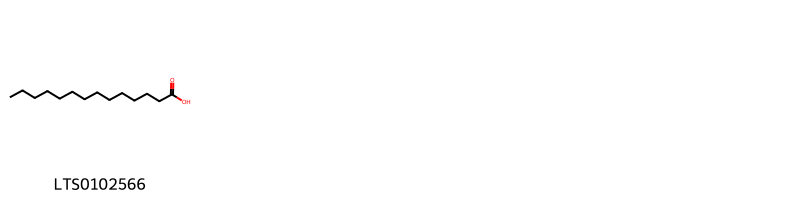{ width=100% }
    <figcaption>Hình ảnh cấu trúc hóa học của 1 hoạt chất thuộc nhóm Fatty Acyls gồm ['myristic acid (LTS0102566)'].</figcaption>
</figure>
#### Nhóm Flavonoids
<figure markdown="span">
    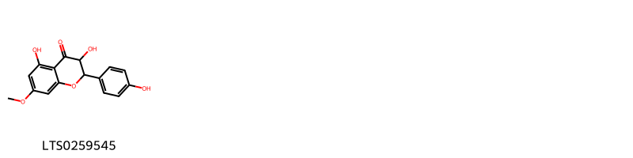{ width=100% }
    <figcaption>Hình ảnh cấu trúc hóa học của 1 hoạt chất thuộc nhóm Flavonoids gồm ['3,5-dihydroxy-2-(4-hydroxyphenyl)-7-methoxy-2,3-dihydro-1-benzopyran-4-one (LTS0259545)'].</figcaption>
</figure>
#### Nhóm Isoflavonoids
<figure markdown="span">
    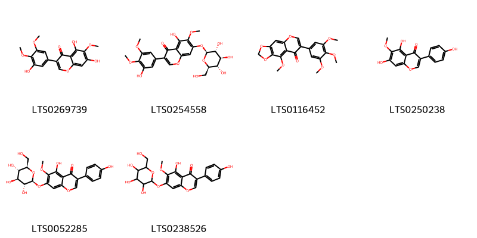{ width=100% }
    <figcaption>Hình ảnh cấu trúc hóa học của 6 hoạt chất thuộc nhóm Isoflavonoids gồm ['irigenin (LTS0269739)', 'iridin (LTS0254558)', 'irisflorentin (LTS0116452)', 'tectorigenin (LTS0250238)', 'tectoridin (LTS0052285)', '5-hydroxy-3-(4-hydroxyphenyl)-6-methoxy-7-{[3,4,5-trihydroxy-6-(hydroxymethyl)oxan-2-yl]oxy}chromen-4-one (LTS0238526)'].</figcaption>
</figure>
#### Nhóm Prenol lipids
<figure markdown="span">
    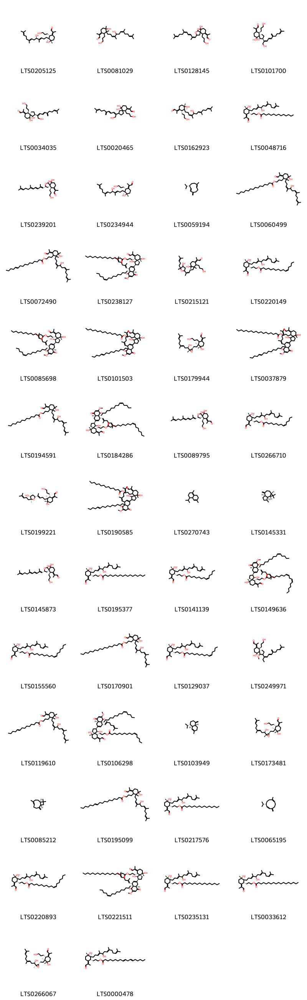{ width=100% }
    <figcaption>Hình ảnh cấu trúc hóa học của 59 hoạt chất thuộc nhóm Prenol lipids gồm ['2-[(1z,2r,3s,4s)-4-hydroxy-3-[(3e,5r,7e)-5-hydroxy-4,8,12-trimethyltrideca-3,7,11-trien-1-yl]-2-(3-hydroxypropyl)-3,4-dimethylcyclohexylidene]propanal (LTS0205125)', '2-[4-hydroxy-3-(5-hydroxy-4,8,12-trimethyltrideca-3,7,11-trien-1-yl)-2-(3-hydroxypropyl)-3,4-dimethylcyclohexylidene]propanal (LTS0081029)', '2-[1,10-dihydroxy-6-(3-hydroxypropyl)-10-methyl-3-(2,6,10-trimethylundeca-1,3,5,9-tetraen-1-yl)-2-oxaspiro[4.5]decan-7-ylidene]propanal (LTS0128145)', '2-[(1r,2s,5s,6r,7z,10s)-1,10-dihydroxy-2-[(2e,4e)-1-hydroxy-10-methyl-6-methylideneundeca-2,4,9-trien-2-yl]-6-(3-hydroxypropyl)-10-methylspiro[4.5]decan-7-ylidene]propanal (LTS0101700)', '2-[(1r,2s,5s,6r,7e,10s)-1,10-dihydroxy-2-[(2z,4e)-1-hydroxy-10-methyl-6-methylideneundeca-2,4,9-trien-2-yl]-6-(3-hydroxypropyl)-10-methylspiro[4.5]decan-7-ylidene]propanal (LTS0034035)', '2-[1,10-dihydroxy-2-(1-hydroxy-10-methyl-6-methylideneundeca-2,4,9-trien-2-yl)-6-(3-hydroxypropyl)-10-methylspiro[4.5]decan-7-ylidene]propanal (LTS0020465)', '2-[(1e,2r,3s,4s)-4-hydroxy-3-[(3z,7e)-5-hydroxy-4,8,12-trimethyltrideca-3,7,11-trien-1-yl]-2-(3-hydroxypropyl)-3,4-dimethylcyclohexylidene]propanal (LTS0162923)', '3-[(1r,2s,3s,6z)-3-hydroxy-2-[(3e,5r,7e)-5-hydroxy-4,8,12-trimethyltrideca-3,7,11-trien-1-yl]-2,3-dimethyl-6-(1-oxopropan-2-ylidene)cyclohexyl]propyl tetradecanoate (LTS0048716)', '2-[(1r,3r,5r,6r,7z,10s)-1,10-dihydroxy-6-(3-hydroxypropyl)-10-methyl-3-[(1e,3e,5e)-2,6,10-trimethylundeca-1,3,5,9-tetraen-1-yl]-2-oxaspiro[4.5]decan-7-ylidene]propanal (LTS0239201)', '2-[(1e,2r,3s,4s)-4-hydroxy-3-[(3e,5r,7e)-5-hydroxy-4,8,12-trimethyltrideca-3,7,11-trien-1-yl]-2-(3-hydroxypropyl)-3,4-dimethylcyclohexylidene]propanal (LTS0234944)', '(-)-germacrene d (LTS0059194)', '3-[3-hydroxy-2-(5-hydroxy-4,8,12-trimethyltrideca-3,7,11-trien-1-yl)-2,3-dimethyl-6-(1-oxopropan-2-ylidene)cyclohexyl]propyl hexadecanoate (LTS0060499)', '3-[3-hydroxy-2-(5-hydroxy-4,8,12-trimethyltrideca-3,7,11-trien-1-yl)-2,3-dimethyl-6-(1-oxopropan-2-ylidene)cyclohexyl]propyl hexadec-11-enoate (LTS0072490)', '3-[(1r,2s,5s,6r,7z,10s)-2-[(4r,4as,8ar)-4-[(1e)-2,6-dimethylhepta-1,5-dien-1-yl]-6-methoxy-5,8-dioxo-4a-[(10z)-pentadec-10-en-1-yl]-4,8a-dihydro-1h-naphthalen-2-yl]-1,10-dihydroxy-10-methyl-7-(1-oxopropan-2-ylidene)spiro[4.5]decan-6-yl]propyl hexadecanoate (LTS0238127)', '2-(4-hydroxy-3-{4-[4-hydroxy-5-methyl-5-(4-methylpent-3-en-1-yl)oxolan-2-yl]pent-3-en-1-yl}-2-(3-hydroxypropyl)-3,4-dimethylcyclohexylidene)propanal (LTS0215121)', '3-[(1r,2s,3s,6z)-3-hydroxy-2-[(3e,5r,7e)-5-hydroxy-4,8,12-trimethyltrideca-3,7,11-trien-1-yl]-2,3-dimethyl-6-(1-oxopropan-2-ylidene)cyclohexyl]propyl (11z)-hexadec-11-enoate (LTS0220149)', '3-[(1r,2s,5s,6r,7z,10s)-2-[(4r,4as,8ar)-4-[(1e)-2,6-dimethylhepta-1,5-dien-1-yl]-6-methoxy-5,8-dioxo-4a-[(10z)-pentadec-10-en-1-yl]-4,8a-dihydro-1h-naphthalen-2-yl]-1,10-dihydroxy-10-methyl-7-(1-oxopropan-2-ylidene)spiro[4.5]decan-6-yl]propyl tetradecanoate (LTS0085698)', '3-{2-[4-(2,6-dimethylhepta-1,5-dien-1-yl)-6-methoxy-5,8-dioxo-4a-(pentadec-10-en-1-yl)-4,8a-dihydro-1h-naphthalen-2-yl]-1,10-dihydroxy-10-methyl-7-(1-oxopropan-2-ylidene)spiro[4.5]decan-6-yl}propyl hexadecanoate (LTS0101503)', '2-[(1z,3s,4s)-4-hydroxy-3-{2-[(2r,3r)-3-[(1r,3e)-1-hydroxy-4,8-dimethylnona-3,7-dien-1-yl]-3-methyloxiran-2-yl]ethyl}-2-(3-hydroxypropyl)-3,4-dimethylcyclohexylidene]propanal (LTS0179944)', '3-{2-[4-(2,6-dimethylhepta-1,5-dien-1-yl)-6-methoxy-5,8-dioxo-4a-(pentadec-10-en-1-yl)-4,8a-dihydro-1h-naphthalen-2-yl]-1,10-dihydroxy-10-methyl-7-(1-oxopropan-2-ylidene)spiro[4.5]decan-6-yl}propyl octadecanoate (LTS0037879)', '3-[3-hydroxy-2-(5-hydroxy-4,8,12-trimethyltrideca-3,7,11-trien-1-yl)-2,3-dimethyl-6-(1-oxopropan-2-ylidene)cyclohexyl]propyl tetradecanoate (LTS0194591)', '3-[(1r,2s,5s,6r,7z,10s)-2-[(4r,4as,8ar)-4-[(1e)-2,6-dimethylhepta-1,5-dien-1-yl]-6-methoxy-5,8-dioxo-4a-[(10z)-pentadec-10-en-1-yl]-4,8a-dihydro-1h-naphthalen-2-yl]-1,10-dihydroxy-10-methyl-7-(1-oxopropan-2-ylidene)spiro[4.5]decan-6-yl]propyl (11z)-octadec-11-enoate (LTS0184286)', '2-[(1r,3r,5r,6r,7e,10s)-1,10-dihydroxy-6-(3-hydroxypropyl)-10-methyl-3-[(1e,3e,5e)-2,6,10-trimethylundeca-1,3,5,9-tetraen-1-yl]-2-oxaspiro[4.5]decan-7-ylidene]propanal (LTS0089795)', '3-[(1r,2s,3s,6e)-3-hydroxy-2-[(3e,7e)-5-hydroxy-4,8,12-trimethyltrideca-3,7,11-trien-1-yl]-2,3-dimethyl-6-(1-oxopropan-2-ylidene)cyclohexyl]propyl (9z)-tetradec-9-enoate (LTS0266710)', '2-[(1z,2r,3s,4s)-4-hydroxy-3-[(3e)-4-[(2r,4r,5s)-4-hydroxy-5-methyl-5-(4-methylpent-3-en-1-yl)oxolan-2-yl]pent-3-en-1-yl]-2-(3-hydroxypropyl)-3,4-dimethylcyclohexylidene]propanal (LTS0199221)', '3-{2-[4-(2,6-dimethylhepta-1,5-dien-1-yl)-6-methoxy-5,8-dioxo-4a-(pentadec-10-en-1-yl)-4,8a-dihydro-1h-naphthalen-2-yl]-1,10-dihydroxy-10-methyl-7-(1-oxopropan-2-ylidene)spiro[4.5]decan-6-yl}propyl tetradecanoate (LTS0190585)', '4-isopropyl-1,6-dimethyl-2,3,4,4a,7,8-hexahydronaphthalene (LTS0270743)', '(1as,4ar,7as,7br)-1,1,7-trimethyl-4-methylidene-octahydro-1ah-cyclopropa[e]azulene (LTS0145331)', '2-[(3r,5r,6r,7e,10s)-1,10-dihydroxy-6-(3-hydroxypropyl)-10-methyl-3-[(1e,3e,5e)-2,6,10-trimethylundeca-1,3,5,9-tetraen-1-yl]-2-oxaspiro[4.5]decan-7-ylidene]propanal (LTS0145873)', '3-[(1r,2s,3s,6e)-3-hydroxy-2-[(3e,7e)-5-hydroxy-4,8,12-trimethyltrideca-3,7,11-trien-1-yl]-2,3-dimethyl-6-(1-oxopropan-2-ylidene)cyclohexyl]propyl octadecanoate (LTS0195377)', '3-[(1r,2s,3s,6z)-3-hydroxy-2-[(3e,5r,7e)-5-hydroxy-4,8,12-trimethyltrideca-3,7,11-trien-1-yl]-2,3-dimethyl-6-(1-oxopropan-2-ylidene)cyclohexyl]propyl (9z)-tetradec-9-enoate (LTS0141139)', '3-[(1r,2s,5s,6r,7z,10s)-2-[(4r,4as,8ar)-4-[(1e)-2,6-dimethylhepta-1,5-dien-1-yl]-6-methoxy-5,8-dioxo-4a-[(10z)-pentadec-10-en-1-yl]-4,8a-dihydro-1h-naphthalen-2-yl]-1,10-dihydroxy-10-methyl-7-(1-oxopropan-2-ylidene)spiro[4.5]decan-6-yl]propyl (9z,12z)-octadeca-9,12-dienoate (LTS0149636)', '3-[(1r,2s,3s,6e)-3-hydroxy-2-[(3e,7e)-5-hydroxy-4,8,12-trimethyltrideca-3,7,11-trien-1-yl]-2,3-dimethyl-6-(1-oxopropan-2-ylidene)cyclohexyl]propyl (11z)-octadec-11-enoate (LTS0155560)', '3-[3-hydroxy-2-(5-hydroxy-4,8,12-trimethyltrideca-3,7,11-trien-1-yl)-2,3-dimethyl-6-(1-oxopropan-2-ylidene)cyclohexyl]propyl octadecanoate (LTS0170901)', '3-[(1r,2s,3s,6e)-3-hydroxy-2-[(3e,7e)-5-hydroxy-4,8,12-trimethyltrideca-3,7,11-trien-1-yl]-2,3-dimethyl-6-(1-oxopropan-2-ylidene)cyclohexyl]propyl (11z)-hexadec-11-enoate (LTS0129037)', '2-[(5s,6r,7e,10s)-10-hydroxy-6-(3-hydroxypropyl)-1-methoxy-10-methyl-2-[(3z,5e)-11-methyl-7-methylidenedodeca-3,5,10-trien-3-yl]spiro[4.5]decan-7-ylidene]propanal (LTS0249971)', '3-[3-hydroxy-2-(5-hydroxy-4,8,12-trimethyltrideca-3,7,11-trien-1-yl)-2,3-dimethyl-6-(1-oxopropan-2-ylidene)cyclohexyl]propyl tetradec-9-enoate (LTS0119610)', '3-[(1r,2s,5s,6r,7z,10s)-2-[(4r,4as,8ar)-4-[(1e)-2,6-dimethylhepta-1,5-dien-1-yl]-6-methoxy-5,8-dioxo-4a-[(10z)-pentadec-10-en-1-yl]-4,8a-dihydro-1h-naphthalen-2-yl]-1,10-dihydroxy-10-methyl-7-(1-oxopropan-2-ylidene)spiro[4.5]decan-6-yl]propyl (11z)-hexadec-11-enoate (LTS0106298)', '(+)-gamma-cadinene (LTS0103949)', '2-[(1z,2r,3s,4s)-4-hydroxy-3-{2-[(2r,3r)-3-[(1r,3e)-1-hydroxy-4,8-dimethylnona-3,7-dien-1-yl]-3-methyloxiran-2-yl]ethyl}-2-(3-hydroxypropyl)-3,4-dimethylcyclohexylidene]propanal (LTS0173481)', 'caryophyllene (LTS0085212)', '3-[3-hydroxy-2-(5-hydroxy-4,8,12-trimethyltrideca-3,7,11-trien-1-yl)-2,3-dimethyl-6-(1-oxopropan-2-ylidene)cyclohexyl]propyl octadec-11-enoate (LTS0195099)', '3-[(1r,2s,3s,6z)-3-hydroxy-2-[(3e,5r,7e)-5-hydroxy-4,8,12-trimethyltrideca-3,7,11-trien-1-yl]-2,3-dimethyl-6-(1-oxopropan-2-ylidene)cyclohexyl]propyl hexadecanoate (LTS0217576)', '(1z,6z,8s)-8-isopropyl-1-methyl-5-methylidenecyclodeca-1,6-diene (LTS0065195)', '3-[(1r,2s,3s,6z)-3-hydroxy-2-[(3e,5r,7e)-5-hydroxy-4,8,12-trimethyltrideca-3,7,11-trien-1-yl]-2,3-dimethyl-6-(1-oxopropan-2-ylidene)cyclohexyl]propyl (11z)-octadec-11-enoate (LTS0220893)', '3-[(1r,2s,5s,6r,7z,10s)-2-[(4r,4as,8ar)-4-[(1e)-2,6-dimethylhepta-1,5-dien-1-yl]-6-methoxy-5,8-dioxo-4a-[(10z)-pentadec-10-en-1-yl]-4,8a-dihydro-1h-naphthalen-2-yl]-1,10-dihydroxy-10-methyl-7-(1-oxopropan-2-ylidene)spiro[4.5]decan-6-yl]propyl octadecanoate (LTS0221511)', '3-[(1r,2s,3s,6e)-3-hydroxy-2-[(3e,7e)-5-hydroxy-4,8,12-trimethyltrideca-3,7,11-trien-1-yl]-2,3-dimethyl-6-(1-oxopropan-2-ylidene)cyclohexyl]propyl hexadecanoate (LTS0235131)', '3-[(1r,2s,3s,6z)-3-hydroxy-2-[(3e,5r,7e)-5-hydroxy-4,8,12-trimethyltrideca-3,7,11-trien-1-yl]-2,3-dimethyl-6-(1-oxopropan-2-ylidene)cyclohexyl]propyl octadecanoate (LTS0033612)', '2-[(1z,2r,3s,4s)-4-hydroxy-3-{2-[(2s,3s)-3-[(1r,3e)-1-hydroxy-4,8-dimethylnona-3,7-dien-1-yl]-3-methyloxiran-2-yl]ethyl}-2-(3-hydroxypropyl)-3,4-dimethylcyclohexylidene]propanal (LTS0266067)', '3-[(1r,2s,3s,6e)-3-hydroxy-2-[(3e,7e)-5-hydroxy-4,8,12-trimethyltrideca-3,7,11-trien-1-yl]-2,3-dimethyl-6-(1-oxopropan-2-ylidene)cyclohexyl]propyl (9e,12e)-octadeca-9,12-dienoate (LTS0000478)', '2-[(1r,2s,5s,6r,7e,10s)-1,10-dihydroxy-2-[(2e,4e)-1-hydroxy-10-methyl-6-methylideneundeca-2,4,9-trien-2-yl]-6-(3-hydroxypropyl)-10-methylspiro[4.5]decan-7-ylidene]propanal (LTS0060657)', '2-(4-hydroxy-3-{2-[3-(1-hydroxy-4,8-dimethylnona-3,7-dien-1-yl)-3-methyloxiran-2-yl]ethyl}-2-(3-hydroxypropyl)-3,4-dimethylcyclohexylidene)propanal (LTS0019513)', '2-[(1s,2s,5s,6r,7z,10s)-1,10-dihydroxy-2-[(2e,4e)-1-hydroxy-10-methyl-6-methylideneundeca-2,4,9-trien-2-yl]-6-(3-hydroxypropyl)-10-methylspiro[4.5]decan-7-ylidene]propanal (LTS0012960)', 'delta-cadinene (LTS0019321)', '3-[(1r,2s,5s,6r,7z,10s)-2-[(4r,4as,8ar)-4-[(1e)-2,6-dimethylhepta-1,5-dien-1-yl]-6-methoxy-5,8-dioxo-4a-[(10z)-pentadec-10-en-1-yl]-4,8a-dihydro-1h-naphthalen-2-yl]-1,10-dihydroxy-10-methyl-7-(1-oxopropan-2-ylidene)spiro[4.5]decan-6-yl]propyl (9z)-tetradec-9-enoate (LTS0081492)', '3-[(1r,2s,5s,6r,7z,10s)-2-[(4r,4as,8ar)-4-[(1e)-2,6-dimethylhepta-1,5-dien-1-yl]-6-methoxy-5,8-dioxo-4a-[(10z)-pentadec-10-en-1-yl]-4,8a-dihydro-1h-naphthalen-2-yl]-1,10-dihydroxy-10-methyl-7-(1-oxopropan-2-ylidene)spiro[4.5]decan-6-yl]propyl (13z)-octadec-13-enoate (LTS0111322)', '4-isopropyl-6-methyl-1-methylidene-3,4,4a,7,8,8a-hexahydro-2h-naphthalene (LTS0111070)', '2-[(1s,3r,5r,6r,7e,10s)-1,10-dihydroxy-6-(3-hydroxypropyl)-10-methyl-3-[(1e,3e,5e)-2,6,10-trimethylundeca-1,3,5,9-tetraen-1-yl]-2-oxaspiro[4.5]decan-7-ylidene]propanal (LTS0121412)', '3-{2-[4-(2,6-dimethylhepta-1,5-dien-1-yl)-6-methoxy-5,8-dioxo-4a-(pentadec-10-en-1-yl)-4,8a-dihydro-1h-naphthalen-2-yl]-1,10-dihydroxy-10-methyl-7-(1-oxopropan-2-ylidene)spiro[4.5]decan-6-yl}propyl tetradec-9-enoate (LTS0018973)'].</figcaption>
</figure>
#### Nhóm Steroids and steroid derivatives
<figure markdown="span">
    { width=100% }
    <figcaption>Hình ảnh cấu trúc hóa học của 2 hoạt chất thuộc nhóm Steroids and steroid derivatives gồm ['stigmast-5-en-3-ol, (3β)- (LTS0204616)', 'sitogluside (LTS0201798)'].</figcaption>
</figure>

---

### Dược dân tộc học

Danh sách các quốc gia có sử dụng *Iris tectorum* trong điều trị các bệnh. 

| Country   | Disease           | Bệnh                                                                                                                                                                                                |
|:----------|:------------------|:----------------------------------------------------------------------------------------------------------------------------------------------------------------------------------------------------|
| Elsewhere | Purgative, Emetic | MYMEMORY WARNING: YOU USED ALL AVAILABLE FREE TRANSLATIONS FOR TODAY. NEXT AVAILABLE IN  12 HOURS 22 MINUTES 38 SECONDS VISIT HTTPS://MYMEMORY.TRANSLATED.NET/DOC/USAGELIMITS.PHP TO TRANSLATE MORE |

---

---
## Iris versicolor
### Thông tin về thực vật

!!! info "Phân loại thực vật của *Iris versicolor* từ GIBF:"
    - **Kingdom:** Plantae
    - **Phylum:** Tracheophyta
    - **Order:** Asparagales
    - **Family:** Iridaceae
    - **Genus:** Iris
    - **Species:** *Iris versicolor*

 

| Label (VI)   | Label (EN)   | Scientific Name   | Descriptions (VI)   | Descriptions (EN)   | Also Known As (VI)   | Also Known As (EN)   |
|:-------------|:-------------|:------------------|:--------------------|:--------------------|:---------------------|:---------------------|
| N/A          | N/A          | Iris versicolor   | loài thực vật       | species of plant    | ['']                 | ['blue flag iris']   |

#### Phân bố trên thế giới

**Từ CSDL GIBF** United Kingdom of Great Britain and Northern Ireland, United States of America, Canada

#### Phân bố tại Việt Nam

**Từ CSDL GIBF**: Không có ghi nhận ở Việt Nam

---
### Thành phần hóa học
        
- Theo cơ sở dữ liệu lotus: Từ loài *Iris versicolor* đã phân lập và xác định được 16 hoạt chất thuộc về các nhóm Prenol lipids, Steroids and steroid derivatives. 

|    | chemicalTaxonomyClassyfireClass   |   smiles_count |
|---:|:----------------------------------|---------------:|
|  0 | Prenol lipids                     |             11 |
|  1 | Steroids and steroid derivatives  |              5 |

#### Nhóm Prenol lipids
<figure markdown="span">
    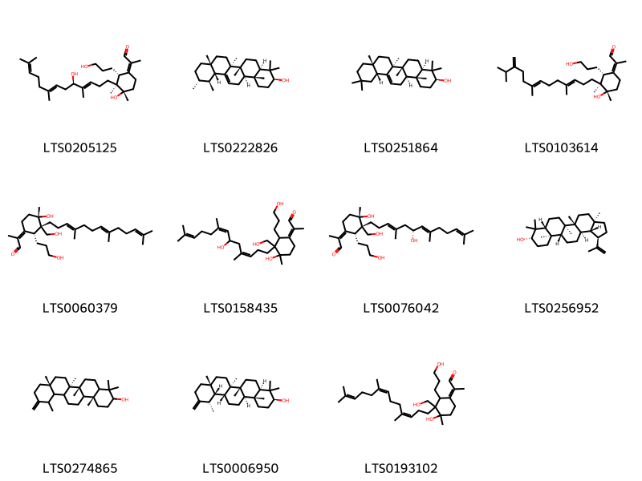{ width=100% }
    <figcaption>Hình ảnh cấu trúc hóa học của 11 hoạt chất thuộc nhóm Prenol lipids gồm ['2-[(1z,2r,3s,4s)-4-hydroxy-3-[(3e,5r,7e)-5-hydroxy-4,8,12-trimethyltrideca-3,7,11-trien-1-yl]-2-(3-hydroxypropyl)-3,4-dimethylcyclohexylidene]propanal (LTS0205125)', 'amyrin (LTS0222826)', 'β-amyrin (LTS0251864)', 'iriversical (LTS0103614)', '2-[(1z,2r,3s,4s)-4-hydroxy-3-(hydroxymethyl)-2-(3-hydroxypropyl)-4-methyl-3-[(3e,7e)-4,8,12-trimethyltrideca-3,7,11-trien-1-yl]cyclohexylidene]propanal (LTS0060379)', '2-[4-hydroxy-3-(6-hydroxy-4,8,12-trimethyltrideca-3,7,11-trien-1-yl)-3-(hydroxymethyl)-2-(3-hydroxypropyl)-4-methylcyclohexylidene]propanal (LTS0158435)', '2-[(1z,2r,3s,4s)-4-hydroxy-3-[(3e,6r,7e)-6-hydroxy-4,8,12-trimethyltrideca-3,7,11-trien-1-yl]-3-(hydroxymethyl)-2-(3-hydroxypropyl)-4-methylcyclohexylidene]propanal (LTS0076042)', 'lupeol (LTS0256952)', '(6ar,6br,8ar,14br)-4,4,6a,6b,8a,12,14b-heptamethyl-11-methylidene-hexadecahydropicen-3-ol (LTS0274865)', 'taraxasterol (LTS0006950)', '2-[4-hydroxy-3-(hydroxymethyl)-2-(3-hydroxypropyl)-4-methyl-3-(4,8,12-trimethyltrideca-3,7,11-trien-1-yl)cyclohexylidene]propanal (LTS0193102)'].</figcaption>
</figure>
#### Nhóm Steroids and steroid derivatives
<figure markdown="span">
    { width=100% }
    <figcaption>Hình ảnh cấu trúc hóa học của 5 hoạt chất thuộc nhóm Steroids and steroid derivatives gồm ['stigmast-5-en-3-ol, (3β)- (LTS0204616)', 'stigmast-5-en-3-ol (LTS0071224)', 'phytosterol (LTS0029311)', '(1r,3as,3bs,7s,9bs)-1-[(2r,5r)-5,6-dimethylheptan-2-yl]-9a,11a-dimethyl-1h,2h,3h,3ah,3bh,4h,6h,7h,8h,9h,9bh,10h,11h-cyclopenta[a]phenanthren-7-ol (LTS0057877)', 'campesterol (LTS0046755)'].</figcaption>
</figure>

---

### Dược dân tộc học

Danh sách các quốc gia có sử dụng *Iris versicolor* trong điều trị các bệnh. 

| Country        | Disease                       | Bệnh                                                                                                                                                                                                |
|:---------------|:------------------------------|:----------------------------------------------------------------------------------------------------------------------------------------------------------------------------------------------------|
| Elsewhere      | Diuretic                      | MYMEMORY WARNING: YOU USED ALL AVAILABLE FREE TRANSLATIONS FOR TODAY. NEXT AVAILABLE IN  12 HOURS 21 MINUTES 58 SECONDS VISIT HTTPS://MYMEMORY.TRANSLATED.NET/DOC/USAGELIMITS.PHP TO TRANSLATE MORE |
| North America  | Diuretic, Emetic, Cathartic   | MYMEMORY WARNING: YOU USED ALL AVAILABLE FREE TRANSLATIONS FOR TODAY. NEXT AVAILABLE IN  12 HOURS 21 MINUTES 47 SECONDS VISIT HTTPS://MYMEMORY.TRANSLATED.NET/DOC/USAGELIMITS.PHP TO TRANSLATE MORE |
| Turkey         | Diuretic, Stimulant, Laxative | MYMEMORY WARNING: YOU USED ALL AVAILABLE FREE TRANSLATIONS FOR TODAY. NEXT AVAILABLE IN  12 HOURS 21 MINUTES 41 SECONDS VISIT HTTPS://MYMEMORY.TRANSLATED.NET/DOC/USAGELIMITS.PHP TO TRANSLATE MORE |
| US(Amerindian) | Cathartic, Emetic             | MYMEMORY WARNING: YOU USED ALL AVAILABLE FREE TRANSLATIONS FOR TODAY. NEXT AVAILABLE IN  12 HOURS 21 MINUTES 37 SECONDS VISIT HTTPS://MYMEMORY.TRANSLATED.NET/DOC/USAGELIMITS.PHP TO TRANSLATE MORE |
| US(Appalachia) | Poultice                      | MYMEMORY WARNING: YOU USED ALL AVAILABLE FREE TRANSLATIONS FOR TODAY. NEXT AVAILABLE IN  12 HOURS 21 MINUTES 32 SECONDS VISIT HTTPS://MYMEMORY.TRANSLATED.NET/DOC/USAGELIMITS.PHP TO TRANSLATE MORE |

---

