!!! abstract "Tóm tắt"

    Họ Juglandaceae gồm khoảng 5 chi và 16 loài được một số cộng đồng tại các quốc gia như US(Appalachia), Mexico, ain, Elsewhere, China, Dominican Republic, Iraq, India, Cuba, US, Turkey sử dụng trong một số trường hợp QUERY LENGTH LIMIT EXCEEDED. MAX ALLOWED QUERY : 500 CHARS.

!!! info "DrDuke"

    James A. Duke sinh năm 1929-2017 là một nhà thực vật học người Mỹ. Đây là một trong những tác giả hàng đầu trong lĩnh vực dược dân tộc học với cuốn *CRC Handbook of Medicinal Herbs* và chính là người xây dựng lên cơ sở dữ liệu về hợp chất tự nhiên và dược dân tộc học tại Bộ nông nghiệp Hoa Kỳ. Các thông tin được đăng tải tại website [Dr. Duke's Phytochemical and Ethnobotanical Databases](https://phytochem.nal.usda.gov/). 
    Trong suốt thập niên 1970, ông lãnh đạo the Plant Taxonomy Laboratory, Plant Genetics and Germplasm Institute of the Agricultural Research Service, U.S. Department of Agriculture.
    Trong tài liệu này, các thông tin về dược dân tộc của các dược liệu được trích dẫn từ tài liệu của James A. Ducke với sự trợ giúp của phần mềm dịch thuật từ tiếng Anh sang tiếng Việt.
   

# Chi Juglans

??? note "Danh sách các dược liệu thuộc chi"
    
	 - *Juglans ailanthifolia*
	 - *Juglans cinerea*
	 - *Juglans insularis*
	 - *Juglans jamaicensis*
	 - *Juglans major*
	 - *Juglans mandshurica*
	 - *Juglans nigra*
	 - *Juglans pyriformis*
	 - *Juglans regia*
	 - *Juglans sieboldiana*

---
## Juglans ailanthifolia
### Thông tin về thực vật

!!! info "Phân loại thực vật của *Juglans ailantifolia* từ GIBF:"
    - **Kingdom:** Plantae
    - **Phylum:** Tracheophyta
    - **Order:** Fagales
    - **Family:** Juglandaceae
    - **Genus:** Juglans
    - **Species:** *Juglans ailantifolia*

 

| Label (VI)   | Label (EN)   | Scientific Name       | Descriptions (VI)   | Descriptions (EN)   | Also Known As (VI)   | Also Known As (EN)   |
|:-------------|:-------------|:----------------------|:--------------------|:--------------------|:---------------------|:---------------------|
| N/A          | N/A          | Juglans ailanthifolia |                     |                     | ['']                 | ['']                 |

#### Phân bố trên thế giới

**Từ CSDL GIBF** United States of America, Japan, Estonia, Sweden, Latvia, Finland, Belgium, Armenia, Australia, Russian Federation, New Zealand, Italy, Georgia, Switzerland, Ukraine, Canada, Germany, Netherlands

#### Phân bố tại Việt Nam

**Từ CSDL GIBF**: Không có ghi nhận ở Việt Nam

---
### Thành phần hóa học
        
- Theo cơ sở dữ liệu lotus: Từ loài *Juglans ailantifolia* đã phân lập và xác định được 3 hoạt chất thuộc về các nhóm Tannins, Naphthalenes. 

|    | chemicalTaxonomyClassyfireClass   |   smiles_count |
|---:|:----------------------------------|---------------:|
|  0 | Naphthalenes                      |              1 |
|  1 | Tannins                           |              2 |

#### Nhóm Naphthalenes
<figure markdown="span">
    { width=100% }
    <figcaption>Hình ảnh cấu trúc hóa học của 1 hoạt chất thuộc nhóm Naphthalenes gồm ['walnut extract (LTS0110862)'].</figcaption>
</figure>
#### Nhóm Tannins
<figure markdown="span">
    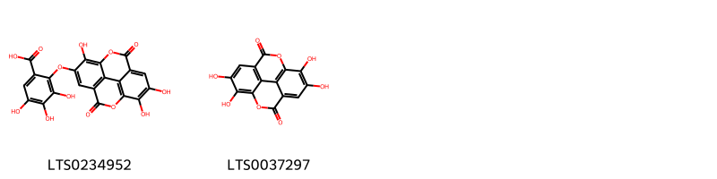{ width=100% }
    <figcaption>Hình ảnh cấu trúc hóa học của 2 hoạt chất thuộc nhóm Tannins gồm ['3,4,5-trihydroxy-2-({7,13,14-trihydroxy-3,10-dioxo-2,9-dioxatetracyclo[6.6.2.0⁴,¹⁶.0¹¹,¹⁵]hexadeca-1(15),4(16),5,7,11,13-hexaen-6-yl}oxy)benzoic acid (LTS0234952)', 'ellagic acid (LTS0037297)'].</figcaption>
</figure>

---

### Dược dân tộc học

Danh sách các quốc gia có sử dụng *Juglans ailantifolia* trong điều trị các bệnh. 

| Country   | Disease            | Bệnh                                                                                                                                                                                                |
|:----------|:-------------------|:----------------------------------------------------------------------------------------------------------------------------------------------------------------------------------------------------|
| Elsewhere | Antitussive, Tonic | MYMEMORY WARNING: YOU USED ALL AVAILABLE FREE TRANSLATIONS FOR TODAY. NEXT AVAILABLE IN  06 HOURS 04 MINUTES 24 SECONDS VISIT HTTPS://MYMEMORY.TRANSLATED.NET/DOC/USAGELIMITS.PHP TO TRANSLATE MORE |

---

---
## Juglans cinerea
### Thông tin về thực vật

!!! info "Phân loại thực vật của *Juglans cinerea* từ GIBF:"
    - **Kingdom:** Plantae
    - **Phylum:** Tracheophyta
    - **Order:** Fagales
    - **Family:** Juglandaceae
    - **Genus:** Juglans
    - **Species:** *Juglans cinerea*

 

| Label (VI)   | Label (EN)   | Scientific Name   | Descriptions (VI)   | Descriptions (EN)   | Also Known As (VI)   | Also Known As (EN)                 |
|:-------------|:-------------|:------------------|:--------------------|:--------------------|:---------------------|:-----------------------------------|
| N/A          | N/A          | Juglans cinerea   | loài thực vật       | species of plant    | ['']                 | ['White walnut', 'Butternut Tree'] |

#### Phân bố trên thế giới

**Từ CSDL GIBF** Sweden, United States of America, Canada

#### Phân bố tại Việt Nam

**Từ CSDL GIBF**: Không có ghi nhận ở Việt Nam

---
### Thành phần hóa học
        
- Theo cơ sở dữ liệu lotus: Từ loài *Juglans cinerea* đã phân lập và xác định được 6 hoạt chất thuộc về các nhóm Cinnamic acids and derivatives, Benzene and substituted derivatives. 

|    | chemicalTaxonomyClassyfireClass     |   smiles_count |
|---:|:------------------------------------|---------------:|
|  0 | Benzene and substituted derivatives |              5 |
|  1 | Cinnamic acids and derivatives      |              1 |

#### Nhóm Benzene and substituted derivatives
<figure markdown="span">
    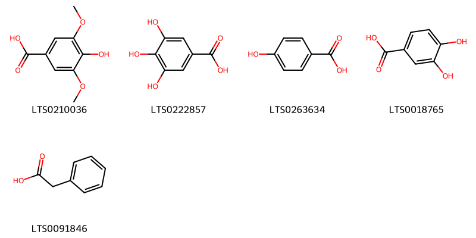{ width=100% }
    <figcaption>Hình ảnh cấu trúc hóa học của 5 hoạt chất thuộc nhóm Benzene and substituted derivatives gồm ['syringic acid (LTS0210036)', 'galop (LTS0222857)', 'p-hydroxybenzoic acid (LTS0263634)', '3,4-dihydroxybenzoic acid (LTS0018765)', 'ω-phenylacetic acid (LTS0091846)'].</figcaption>
</figure>
#### Nhóm Cinnamic acids and derivatives
<figure markdown="span">
    { width=100% }
    <figcaption>Hình ảnh cấu trúc hóa học của 1 hoạt chất thuộc nhóm Cinnamic acids and derivatives gồm ['3,4-dihydroxycinnamic acid (LTS0128050)'].</figcaption>
</figure>

---

### Dược dân tộc học

Danh sách các quốc gia có sử dụng *Juglans cinerea* trong điều trị các bệnh. 

| Country   | Disease                               | Bệnh                                                                                                                                                                                                |
|:----------|:--------------------------------------|:----------------------------------------------------------------------------------------------------------------------------------------------------------------------------------------------------|
| Turkey    | Laxative, Stimulant, Vermifuge, Tonic | MYMEMORY WARNING: YOU USED ALL AVAILABLE FREE TRANSLATIONS FOR TODAY. NEXT AVAILABLE IN  06 HOURS 03 MINUTES 53 SECONDS VISIT HTTPS://MYMEMORY.TRANSLATED.NET/DOC/USAGELIMITS.PHP TO TRANSLATE MORE |

---

---
## Juglans insularis
### Thông tin về thực vật

!!! info "Phân loại thực vật của *Juglans jamaicensis* từ GIBF:"
    - **Kingdom:** Plantae
    - **Phylum:** Tracheophyta
    - **Order:** Fagales
    - **Family:** Juglandaceae
    - **Genus:** Juglans
    - **Species:** *Juglans jamaicensis*

 

| Label (VI)   | Label (EN)   | Scientific Name   | Descriptions (VI)   | Descriptions (EN)   | Also Known As (VI)   | Also Known As (EN)   |
|:-------------|:-------------|:------------------|:--------------------|:--------------------|:---------------------|:---------------------|
| N/A          | N/A          | Juglans insularis |                     | species of plant    | ['']                 | ['']                 |

#### Phân bố trên thế giới

**Từ CSDL GIBF** Puerto Rico, nan, Cuba, Jamaica

#### Phân bố tại Việt Nam

**Từ CSDL GIBF**: Không có ghi nhận ở Việt Nam

---
### Thành phần hóa học
        
- Theo cơ sở dữ liệu lotus: Từ loài *Juglans jamaicensis* đã phân lập và xác định được Chưa có hoạt chất nào được phân lập. hoạt chất thuộc về các nhóm Không có hoạt chất nào được phân lập. 

Không có hình ảnh nào được tạo ra

---

### Dược dân tộc học

Danh sách các quốc gia có sử dụng *Juglans jamaicensis* trong điều trị các bệnh. 

| Country   | Disease    | Bệnh                                                                                                                                                                                                |
|:----------|:-----------|:----------------------------------------------------------------------------------------------------------------------------------------------------------------------------------------------------|
| Cuba      | Astringent | MYMEMORY WARNING: YOU USED ALL AVAILABLE FREE TRANSLATIONS FOR TODAY. NEXT AVAILABLE IN  06 HOURS 03 MINUTES 18 SECONDS VISIT HTTPS://MYMEMORY.TRANSLATED.NET/DOC/USAGELIMITS.PHP TO TRANSLATE MORE |

---

---
## Juglans jamaicensis
### Thông tin về thực vật

!!! info "Phân loại thực vật của *Juglans jamaicensis* từ GIBF:"
    - **Kingdom:** Plantae
    - **Phylum:** Tracheophyta
    - **Order:** Fagales
    - **Family:** Juglandaceae
    - **Genus:** Juglans
    - **Species:** *Juglans jamaicensis*

 

| Label (VI)   | Label (EN)   | Scientific Name     | Descriptions (VI)   | Descriptions (EN)   | Also Known As (VI)   | Also Known As (EN)   |
|:-------------|:-------------|:--------------------|:--------------------|:--------------------|:---------------------|:---------------------|
| N/A          | N/A          | Juglans jamaicensis |                     | species of plant    | ['']                 | ['']                 |

#### Phân bố trên thế giới

**Từ CSDL GIBF** nan, Dominica, Austria, Mexico, Jamaica, Haiti, Dominican Republic, Cuba, unknown or invalid, Panama, Belize, Puerto Rico

#### Phân bố tại Việt Nam

**Từ CSDL GIBF**: Không có ghi nhận ở Việt Nam

---
### Thành phần hóa học
        
- Theo cơ sở dữ liệu lotus: Từ loài *Juglans jamaicensis* đã phân lập và xác định được Chưa có hoạt chất nào được phân lập. hoạt chất thuộc về các nhóm Không có hoạt chất nào được phân lập. 

Không có hình ảnh nào được tạo ra

---

### Dược dân tộc học

Danh sách các quốc gia có sử dụng *Juglans jamaicensis* trong điều trị các bệnh. 

| Country            | Disease                | Bệnh                                                                                                                                                                                                |
|:-------------------|:-----------------------|:----------------------------------------------------------------------------------------------------------------------------------------------------------------------------------------------------|
| Dominican Republic | Diaphoretic, Purgative | MYMEMORY WARNING: YOU USED ALL AVAILABLE FREE TRANSLATIONS FOR TODAY. NEXT AVAILABLE IN  06 HOURS 02 MINUTES 58 SECONDS VISIT HTTPS://MYMEMORY.TRANSLATED.NET/DOC/USAGELIMITS.PHP TO TRANSLATE MORE |

---

---
## Juglans major
### Thông tin về thực vật

!!! info "Phân loại thực vật của *Juglans major* từ GIBF:"
    - **Kingdom:** Plantae
    - **Phylum:** Tracheophyta
    - **Order:** Fagales
    - **Family:** Juglandaceae
    - **Genus:** Juglans
    - **Species:** *Juglans major*

 

| Label (VI)   | Label (EN)   | Scientific Name   | Descriptions (VI)   | Descriptions (EN)   | Also Known As (VI)   | Also Known As (EN)                 |
|:-------------|:-------------|:------------------|:--------------------|:--------------------|:---------------------|:-----------------------------------|
| N/A          | N/A          | Juglans major     | loài thực vật       | species of plant    | ['']                 | ['black walnut', 'Arizona walnut'] |

#### Phân bố trên thế giới

**Từ CSDL GIBF** Mexico, United States of America

#### Phân bố tại Việt Nam

**Từ CSDL GIBF**: Không có ghi nhận ở Việt Nam

---
### Thành phần hóa học
        
- Theo cơ sở dữ liệu lotus: Từ loài *Juglans major* đã phân lập và xác định được Chưa có hoạt chất nào được phân lập. hoạt chất thuộc về các nhóm Không có hoạt chất nào được phân lập. 

Không có hình ảnh nào được tạo ra

---

### Dược dân tộc học

Danh sách các quốc gia có sử dụng *Juglans major* trong điều trị các bệnh. 

| Country   | Disease   | Bệnh                                                                                                                                                                                                |
|:----------|:----------|:----------------------------------------------------------------------------------------------------------------------------------------------------------------------------------------------------|
| Mexico    | Tonic     | MYMEMORY WARNING: YOU USED ALL AVAILABLE FREE TRANSLATIONS FOR TODAY. NEXT AVAILABLE IN  06 HOURS 02 MINUTES 33 SECONDS VISIT HTTPS://MYMEMORY.TRANSLATED.NET/DOC/USAGELIMITS.PHP TO TRANSLATE MORE |

---

---
## Juglans mandshurica
### Thông tin về thực vật

!!! info "Phân loại thực vật của *Juglans mandshurica* từ GIBF:"
    - **Kingdom:** Plantae
    - **Phylum:** Tracheophyta
    - **Order:** Fagales
    - **Family:** Juglandaceae
    - **Genus:** Juglans
    - **Species:** *Juglans mandshurica*

 

| Label (VI)   | Label (EN)   | Scientific Name     | Descriptions (VI)   | Descriptions (EN)   | Also Known As (VI)   | Also Known As (EN)                            |
|:-------------|:-------------|:--------------------|:--------------------|:--------------------|:---------------------|:----------------------------------------------|
| N/A          | N/A          | Juglans mandshurica | loài thực vật       | species of plant    | ['']                 | ['Juglans mandschurica', 'Manchurian walnut'] |

#### Phân bố trên thế giới

**Từ CSDL GIBF** Belarus, Korea, Republic of, Sweden, Belgium, Chinese Taipei, Ukraine, China, Russian Federation, Finland, Canada, Lithuania

#### Phân bố tại Việt Nam

**Từ CSDL GIBF**: Không có ghi nhận ở Việt Nam

---
### Thành phần hóa học
        
- Theo cơ sở dữ liệu lotus: Từ loài *Juglans mandshurica* đã phân lập và xác định được 95 hoạt chất thuộc về các nhóm Fatty Acyls, Benzene and substituted derivatives, Quinolines and derivatives, Phenanthrenes and derivatives, Flavonoids, Sphingolipids, Tannins, Naphthopyrans, Naphthalenes, Anthracenes, Lignan glycosides, Organooxygen compounds, Tetralins, Prenol lipids, Diarylheptanoids. 

|    | chemicalTaxonomyClassyfireClass     |   smiles_count |
|---:|:------------------------------------|---------------:|
|  0 | Anthracenes                         |              3 |
|  1 | Benzene and substituted derivatives |              3 |
|  2 | Diarylheptanoids                    |              7 |
|  3 | Fatty Acyls                         |              4 |
|  4 | Flavonoids                          |             16 |
|  5 | Lignan glycosides                   |              2 |
|  6 | Naphthalenes                        |              2 |
|  7 | Naphthopyrans                       |              1 |
|  8 | Organooxygen compounds              |             32 |
|  9 | Phenanthrenes and derivatives       |              1 |
| 10 | Prenol lipids                       |              1 |
| 11 | Quinolines and derivatives          |              1 |
| 12 | Sphingolipids                       |              2 |
| 13 | Tannins                             |              8 |
| 14 | Tetralins                           |             12 |

#### Nhóm Anthracenes
<figure markdown="span">
    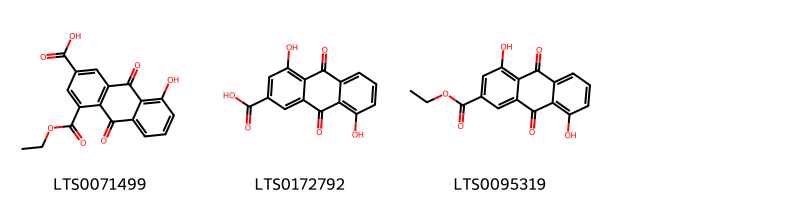{ width=100% }
    <figcaption>Hình ảnh cấu trúc hóa học của 3 hoạt chất thuộc nhóm Anthracenes gồm ['4-(ethoxycarbonyl)-8-hydroxy-9,10-dioxoanthracene-2-carboxylic acid (LTS0071499)', '4,8-dihydroxy-9,10-dioxoanthracene-2-carboxylic acid (LTS0172792)', 'ethyl 4,8-dihydroxy-9,10-dioxoanthracene-2-carboxylate (LTS0095319)'].</figcaption>
</figure>
#### Nhóm Benzene and substituted derivatives
<figure markdown="span">
    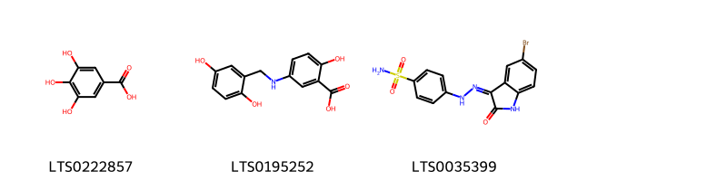{ width=100% }
    <figcaption>Hình ảnh cấu trúc hóa học của 3 hoạt chất thuộc nhóm Benzene and substituted derivatives gồm ['galop (LTS0222857)', 'lavendustin c (LTS0195252)', '4-[2-(5-bromo-2-oxo-1h-indol-3-ylidene)hydrazin-1-yl]benzenesulfonamide (LTS0035399)'].</figcaption>
</figure>
#### Nhóm Diarylheptanoids
<figure markdown="span">
    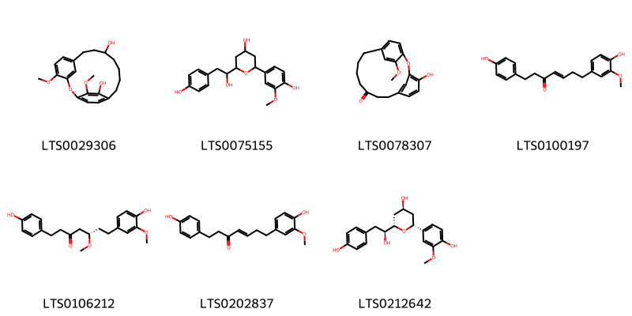{ width=100% }
    <figcaption>Hình ảnh cấu trúc hóa học của 7 hoạt chất thuộc nhóm Diarylheptanoids gồm ['4,17-dimethoxy-2-oxatricyclo[13.2.2.1³,⁷]icosa-1(18),3(20),4,6,15(19),16-hexaene-10,16-diol (LTS0029306)', '2-[1-hydroxy-2-(4-hydroxyphenyl)ethyl]-6-(4-hydroxy-3-methoxyphenyl)oxan-4-ol (LTS0075155)', '4-hydroxy-18-methoxy-2-oxatricyclo[13.2.2.1³,⁷]icosa-1(17),3(20),4,6,15,18-hexaen-10-one (LTS0078307)', '7-(4-hydroxy-3-methoxyphenyl)-1-(4-hydroxyphenyl)hept-4-en-3-one (LTS0100197)', '(5s)-7-(4-hydroxy-3-methoxyphenyl)-1-(4-hydroxyphenyl)-5-methoxyheptan-3-one (LTS0106212)', '(4e)-7-(4-hydroxy-3-methoxyphenyl)-1-(4-hydroxyphenyl)hept-4-en-3-one (LTS0202837)', '(2s,4s,6r)-2-[(1s)-1-hydroxy-2-(4-hydroxyphenyl)ethyl]-6-(4-hydroxy-3-methoxyphenyl)oxan-4-ol (LTS0212642)'].</figcaption>
</figure>
#### Nhóm Fatty Acyls
<figure markdown="span">
    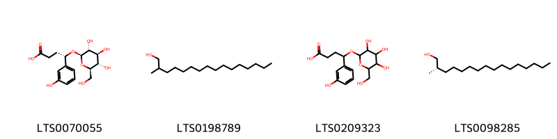{ width=100% }
    <figcaption>Hình ảnh cấu trúc hóa học của 4 hoạt chất thuộc nhóm Fatty Acyls gồm ['(4s)-4-(3-hydroxyphenyl)-4-{[(2r,3r,4s,5s,6r)-3,4,5-trihydroxy-6-(hydroxymethyl)oxan-2-yl]oxy}butanoic acid (LTS0070055)', '2-methylhexadecan-1-ol (LTS0198789)', '4-(3-hydroxyphenyl)-4-{[3,4,5-trihydroxy-6-(hydroxymethyl)oxan-2-yl]oxy}butanoic acid (LTS0209323)', '(2s)-2-methylhexadecan-1-ol (LTS0098285)'].</figcaption>
</figure>
#### Nhóm Flavonoids
<figure markdown="span">
    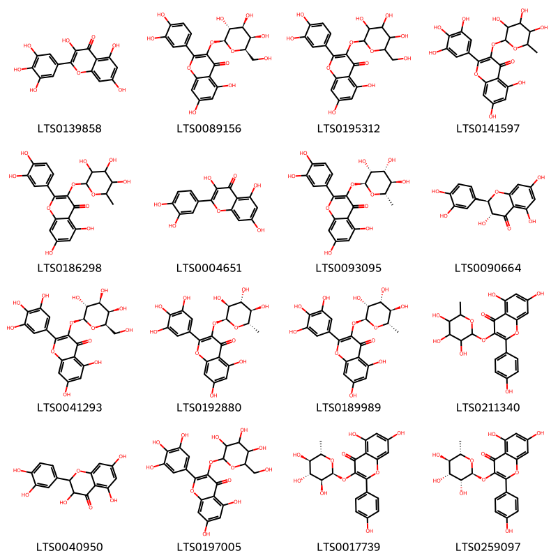{ width=100% }
    <figcaption>Hình ảnh cấu trúc hóa học của 16 hoạt chất thuộc nhóm Flavonoids gồm ['myricetin (LTS0139858)', 'hyperoside (LTS0089156)', '2-(3,4-dihydroxyphenyl)-5,7-dihydroxy-3-{[3,4,5-trihydroxy-6-(hydroxymethyl)oxan-2-yl]oxy}chromen-4-one (LTS0195312)', 'myricitrin (LTS0141597)', 'quercitrin (LTS0186298)', 'quercetin (LTS0004651)', 'quercitrin (LTS0093095)', '(+)-taxifolin (LTS0090664)', '5,7-dihydroxy-3-{[(2s,3r,4s,5r,6r)-3,4,5-trihydroxy-6-(hydroxymethyl)oxan-2-yl]oxy}-2-(3,4,5-trihydroxyphenyl)chromen-4-one (LTS0041293)', '5,7-dihydroxy-3-{[(2s,3s,4r,5r,6s)-3,4,5-trihydroxy-6-methyloxan-2-yl]oxy}-2-(3,4,5-trihydroxyphenyl)chromen-4-one (LTS0192880)', 'myricitrin (LTS0189989)', '5,7-dihydroxy-2-(4-hydroxyphenyl)-3-[(3,4,5-trihydroxy-6-methyloxan-2-yl)oxy]chromen-4-one (LTS0211340)', '2,3-dihydroquercetin (LTS0040950)', '5,7-dihydroxy-3-{[3,4,5-trihydroxy-6-(hydroxymethyl)oxan-2-yl]oxy}-2-(3,4,5-trihydroxyphenyl)chromen-4-one (LTS0197005)', '5,7-dihydroxy-2-(4-hydroxyphenyl)-3-{[(2s,3s,4r,5r,6s)-3,4,5-trihydroxy-6-methyloxan-2-yl]oxy}chromen-4-one (LTS0017739)', 'afzelin (LTS0259097)'].</figcaption>
</figure>
#### Nhóm Lignan glycosides
<figure markdown="span">
    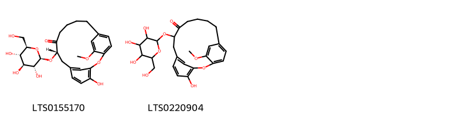{ width=100% }
    <figcaption>Hình ảnh cấu trúc hóa học của 2 hoạt chất thuộc nhóm Lignan glycosides gồm ['(9s)-4-hydroxy-18-methoxy-9-{[(2s,3r,4s,5s,6r)-3,4,5-trihydroxy-6-(hydroxymethyl)oxan-2-yl]oxy}-2-oxatricyclo[13.2.2.1³,⁷]icosa-1(17),3(20),4,6,15,18-hexaen-10-one (LTS0155170)', '4-hydroxy-18-methoxy-9-{[3,4,5-trihydroxy-6-(hydroxymethyl)oxan-2-yl]oxy}-2-oxatricyclo[13.2.2.1³,⁷]icosa-1(17),3(20),4,6,15,18-hexaen-10-one (LTS0220904)'].</figcaption>
</figure>
#### Nhóm Naphthalenes
<figure markdown="span">
    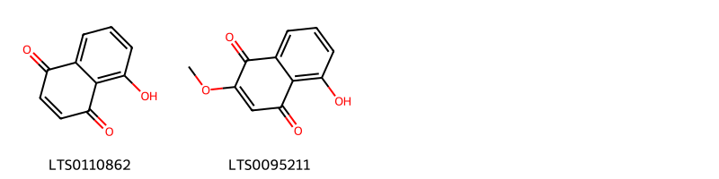{ width=100% }
    <figcaption>Hình ảnh cấu trúc hóa học của 2 hoạt chất thuộc nhóm Naphthalenes gồm ['walnut extract (LTS0110862)', '5-hydroxy-2-methoxynaphthalene-1,4-dione (LTS0095211)'].</figcaption>
</figure>
#### Nhóm Naphthopyrans
<figure markdown="span">
    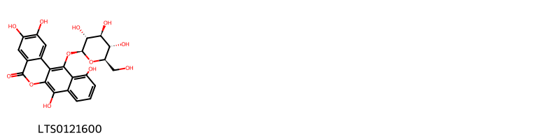{ width=100% }
    <figcaption>Hình ảnh cấu trúc hóa học của 1 hoạt chất thuộc nhóm Naphthopyrans gồm ['2,3,7,11-tetrahydroxy-12-{[(2s,3r,4s,5s,6r)-3,4,5-trihydroxy-6-(hydroxymethyl)oxan-2-yl]oxy}-6-oxatetraphen-5-one (LTS0121600)'].</figcaption>
</figure>
#### Nhóm Organooxygen compounds
<figure markdown="span">
    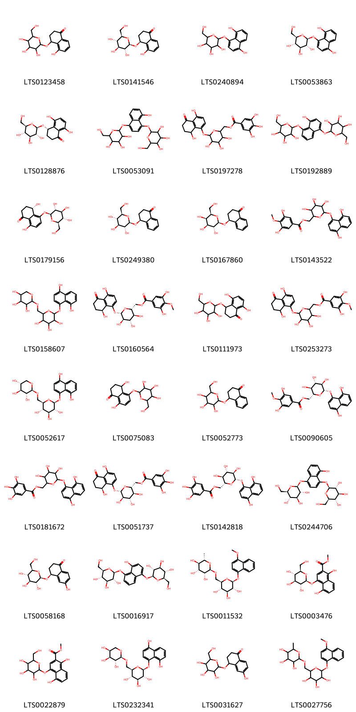{ width=100% }
    <figcaption>Hình ảnh cấu trúc hóa học của 32 hoạt chất thuộc nhóm Organooxygen compounds gồm ['5-hydroxy-4-{[3,4,5-trihydroxy-6-(hydroxymethyl)oxan-2-yl]oxy}-3,4-dihydro-2h-naphthalen-1-one (LTS0123458)', '(4s)-5-hydroxy-4-{[(2r,3r,4s,5s,6r)-3,4,5-trihydroxy-6-(hydroxymethyl)oxan-2-yl]oxy}-3,4-dihydro-2h-naphthalen-1-one (LTS0141546)', '2-[(4,8-dihydroxynaphthalen-1-yl)oxy]-6-(hydroxymethyl)oxane-3,4,5-triol (LTS0240894)', '(2s,3r,4s,5s,6r)-2-[(4,8-dihydroxynaphthalen-1-yl)oxy]-6-(hydroxymethyl)oxane-3,4,5-triol (LTS0053863)', '(4s)-5,8-dihydroxy-4-{[(2r,3r,4s,5s,6r)-3,4,5-trihydroxy-6-(hydroxymethyl)oxan-2-yl]oxy}-3,4-dihydro-2h-naphthalen-1-one (LTS0128876)', '2-[(5-hydroxy-4-{[3,4,5-trihydroxy-6-(hydroxymethyl)oxan-2-yl]oxy}naphthalen-1-yl)oxy]-6-(hydroxymethyl)oxane-3,4,5-triol (LTS0053091)', '{6-[(4,8-dihydroxy-5-oxo-7,8-dihydro-6h-naphthalen-1-yl)oxy]-3,4,5-trihydroxyoxan-2-yl}methyl 3,4,5-trihydroxybenzoate (LTS0197278)', '2-[(4-hydroxy-5-{[3,4,5-trihydroxy-6-(hydroxymethyl)oxan-2-yl]oxy}naphthalen-1-yl)oxy]-6-(hydroxymethyl)oxane-3,4,5-triol (LTS0192889)', '(4s)-4,8-dihydroxy-5-{[(2s,3r,4s,5s,6r)-3,4,5-trihydroxy-6-(hydroxymethyl)oxan-2-yl]oxy}-3,4-dihydro-2h-naphthalen-1-one (LTS0179156)', '(4s)-4-{[(2r,3r,4s,5s,6r)-3,4,5-trihydroxy-6-(hydroxymethyl)oxan-2-yl]oxy}-3,4-dihydro-2h-naphthalen-1-one (LTS0249380)', '(4s)-4-{[(2r,3r,4s,5r,6r)-3,4,5-trihydroxy-6-(hydroxymethyl)oxan-2-yl]oxy}-3,4-dihydro-2h-naphthalen-1-one (LTS0167860)', '{6-[(4,8-dihydroxynaphthalen-1-yl)oxy]-3,4,5-trihydroxyoxan-2-yl}methyl 3,5-dihydroxy-4-methoxybenzoate (LTS0143522)', '2-[(4,8-dihydroxynaphthalen-1-yl)oxy]-6-{[(3,4,5-trihydroxyoxan-2-yl)oxy]methyl}oxane-3,4,5-triol (LTS0158607)', '[(2r,3s,4s,5r,6s)-6-{[(8s)-4,8-dihydroxy-5-oxo-7,8-dihydro-6h-naphthalen-1-yl]oxy}-3,4,5-trihydroxyoxan-2-yl]methyl 3,5-dihydroxy-4-methoxybenzoate (LTS0160564)', '5,8-dihydroxy-4-{[3,4,5-trihydroxy-6-(hydroxymethyl)oxan-2-yl]oxy}-3,4-dihydro-2h-naphthalen-1-one (LTS0111973)', '{6-[(4,8-dihydroxy-5-oxo-7,8-dihydro-6h-naphthalen-1-yl)oxy]-3,4,5-trihydroxyoxan-2-yl}methyl 3,5-dihydroxy-4-methoxybenzoate (LTS0253273)', '(2s,3r,4s,5s,6r)-2-[(4,8-dihydroxynaphthalen-1-yl)oxy]-6-({[(2s,3r,4s,5r)-3,4,5-trihydroxyoxan-2-yl]oxy}methyl)oxane-3,4,5-triol (LTS0052617)', '4,8-dihydroxy-5-{[3,4,5-trihydroxy-6-(hydroxymethyl)oxan-2-yl]oxy}-3,4-dihydro-2h-naphthalen-1-one (LTS0075083)', '4-{[3,4,5-trihydroxy-6-(hydroxymethyl)oxan-2-yl]oxy}-3,4-dihydro-2h-naphthalen-1-one (LTS0052773)', '[(2r,3s,4s,5r,6s)-6-[(4,8-dihydroxynaphthalen-1-yl)oxy]-3,4,5-trihydroxyoxan-2-yl]methyl 3,5-dihydroxy-4-methoxybenzoate (LTS0090605)', '{6-[(4,8-dihydroxynaphthalen-1-yl)oxy]-3,4,5-trihydroxyoxan-2-yl}methyl 3,4,5-trihydroxybenzoate (LTS0181672)', '[(2r,3s,4s,5r,6s)-6-{[(8s)-4,8-dihydroxy-5-oxo-7,8-dihydro-6h-naphthalen-1-yl]oxy}-3,4,5-trihydroxyoxan-2-yl]methyl 3,4,5-trihydroxybenzoate (LTS0051737)', '[(2r,3s,4s,5r,6s)-6-[(4,8-dihydroxynaphthalen-1-yl)oxy]-3,4,5-trihydroxyoxan-2-yl]methyl 3,4,5-trihydroxybenzoate (LTS0142818)', '(2s,3r,4s,5s,6r)-2-[(5-hydroxy-4-{[(2s,3r,4s,5s,6r)-3,4,5-trihydroxy-6-(hydroxymethyl)oxan-2-yl]oxy}naphthalen-1-yl)oxy]-6-(hydroxymethyl)oxane-3,4,5-triol (LTS0244706)', '(4s)-6-hydroxy-4-{[(2r,3r,4s,5s,6r)-3,4,5-trihydroxy-6-(hydroxymethyl)oxan-2-yl]oxy}-3,4-dihydro-2h-naphthalen-1-one (LTS0058168)', '(2s,3r,4s,5s,6r)-2-[(4-hydroxy-5-{[(2s,3r,4s,5s,6r)-3,4,5-trihydroxy-6-(hydroxymethyl)oxan-2-yl]oxy}naphthalen-1-yl)oxy]-6-(hydroxymethyl)oxane-3,4,5-triol (LTS0016917)', '(2s,3r,4s,5s,6r)-2-[(4-methoxynaphthalen-1-yl)oxy]-6-({[(2r,3r,4r,5r,6s)-3,4,5-trihydroxy-6-methyloxan-2-yl]oxy}methyl)oxane-3,4,5-triol (LTS0011532)', 'methyl 1,5-dihydroxy-4-{[(2s,3r,4s,5s,6r)-3,4,5-trihydroxy-6-(hydroxymethyl)oxan-2-yl]oxy}naphthalene-2-carboxylate (LTS0003476)', 'methyl 1,5-dihydroxy-4-{[3,4,5-trihydroxy-6-(hydroxymethyl)oxan-2-yl]oxy}naphthalene-2-carboxylate (LTS0022879)', '(2s,3r,4s,5s,6r)-2-[(4,8-dihydroxynaphthalen-1-yl)oxy]-6-({[(2s,3r,4s,5s)-3,4,5-trihydroxyoxan-2-yl]oxy}methyl)oxane-3,4,5-triol (LTS0232341)', '6-hydroxy-4-{[3,4,5-trihydroxy-6-(hydroxymethyl)oxan-2-yl]oxy}-3,4-dihydro-2h-naphthalen-1-one (LTS0031627)', '2-[(4-methoxynaphthalen-1-yl)oxy]-6-{[(3,4,5-trihydroxy-6-methyloxan-2-yl)oxy]methyl}oxane-3,4,5-triol (LTS0027756)'].</figcaption>
</figure>
#### Nhóm Phenanthrenes and derivatives
<figure markdown="span">
    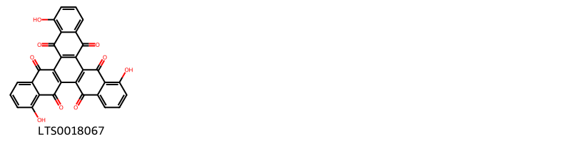{ width=100% }
    <figcaption>Hình ảnh cấu trúc hóa học của 1 hoạt chất thuộc nhóm Phenanthrenes and derivatives gồm ['5,15,25-trihydroxyheptacyclo[20.8.0.0²,¹¹.0⁴,⁹.0¹²,²¹.0¹⁴,¹⁹.0²⁴,²⁹]triaconta-1(22),2(11),4,6,8,12(21),14,16,18,24,26,28-dodecaene-3,10,13,20,23,30-hexone (LTS0018067)'].</figcaption>
</figure>
#### Nhóm Prenol lipids
<figure markdown="span">
    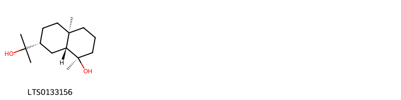{ width=100% }
    <figcaption>Hình ảnh cấu trúc hóa học của 1 hoạt chất thuộc nhóm Prenol lipids gồm ['proximadiol (LTS0133156)'].</figcaption>
</figure>
#### Nhóm Quinolines and derivatives
<figure markdown="span">
    { width=100% }
    <figcaption>Hình ảnh cấu trúc hóa học của 1 hoạt chất thuộc nhóm Quinolines and derivatives gồm ['(2e)-3-(1h-1,3-benzodiazol-2-yl)-1-(6-chloro-2-hydroxy-4-phenylquinolin-3-yl)prop-2-en-1-one (LTS0134094)'].</figcaption>
</figure>
#### Nhóm Sphingolipids
<figure markdown="span">
    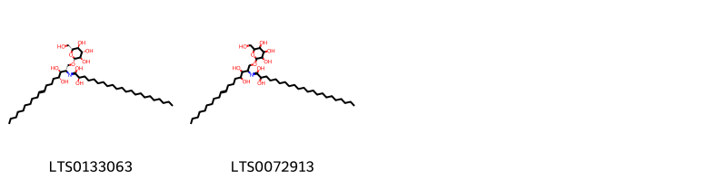{ width=100% }
    <figcaption>Hình ảnh cấu trúc hóa học của 2 hoạt chất thuộc nhóm Sphingolipids gồm ['(2r)-n-[(2s,3s,4r,8e)-3,4-dihydroxy-1-{[(2r,3r,4s,5s,6r)-3,4,5-trihydroxy-6-(hydroxymethyl)oxan-2-yl]oxy}octadec-8-en-2-yl]-2-hydroxydocosanimidic acid (LTS0133063)', 'n-(3,4-dihydroxy-1-{[3,4,5-trihydroxy-6-(hydroxymethyl)oxan-2-yl]oxy}octadec-8-en-2-yl)-2-hydroxydocosanimidic acid (LTS0072913)'].</figcaption>
</figure>
#### Nhóm Tannins
<figure markdown="span">
    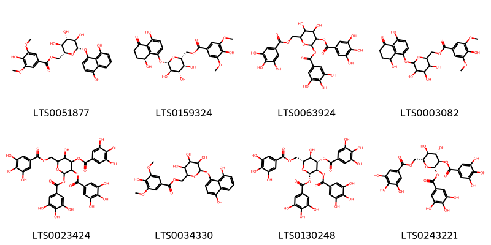{ width=100% }
    <figcaption>Hình ảnh cấu trúc hóa học của 8 hoạt chất thuộc nhóm Tannins gồm ['[(2r,3s,4s,5r,6s)-6-[(4,8-dihydroxynaphthalen-1-yl)oxy]-3,4,5-trihydroxyoxan-2-yl]methyl 4-hydroxy-3,5-dimethoxybenzoate (LTS0051877)', '[(2r,3s,4s,5r,6s)-6-{[(8s)-4,8-dihydroxy-5-oxo-7,8-dihydro-6h-naphthalen-1-yl]oxy}-3,4,5-trihydroxyoxan-2-yl]methyl 4-hydroxy-3,5-dimethoxybenzoate (LTS0159324)', '4,5-dihydroxy-3-(3,4,5-trihydroxybenzoyloxy)-6-[(3,4,5-trihydroxybenzoyloxy)methyl]oxan-2-yl 3,4,5-trihydroxybenzoate (LTS0063924)', '{6-[(4,8-dihydroxy-5-oxo-7,8-dihydro-6h-naphthalen-1-yl)oxy]-3,4,5-trihydroxyoxan-2-yl}methyl 4-hydroxy-3,5-dimethoxybenzoate (LTS0003082)', '5-hydroxy-3,4-bis(3,4,5-trihydroxybenzoyloxy)-6-[(3,4,5-trihydroxybenzoyloxy)methyl]oxan-2-yl 3,4,5-trihydroxybenzoate (LTS0023424)', '{6-[(4,8-dihydroxynaphthalen-1-yl)oxy]-3,4,5-trihydroxyoxan-2-yl}methyl 4-hydroxy-3,5-dimethoxybenzoate (LTS0034330)', '(2s,3r,4s,5r,6r)-5-hydroxy-3,4-bis(3,4,5-trihydroxybenzoyloxy)-6-[(3,4,5-trihydroxybenzoyloxy)methyl]oxan-2-yl 3,4,5-trihydroxybenzoate (LTS0130248)', '(2s,3r,4s,5s,6r)-4,5-dihydroxy-3-(3,4,5-trihydroxybenzoyloxy)-6-[(3,4,5-trihydroxybenzoyloxy)methyl]oxan-2-yl 3,4,5-trihydroxybenzoate (LTS0243221)'].</figcaption>
</figure>
#### Nhóm Tetralins
<figure markdown="span">
    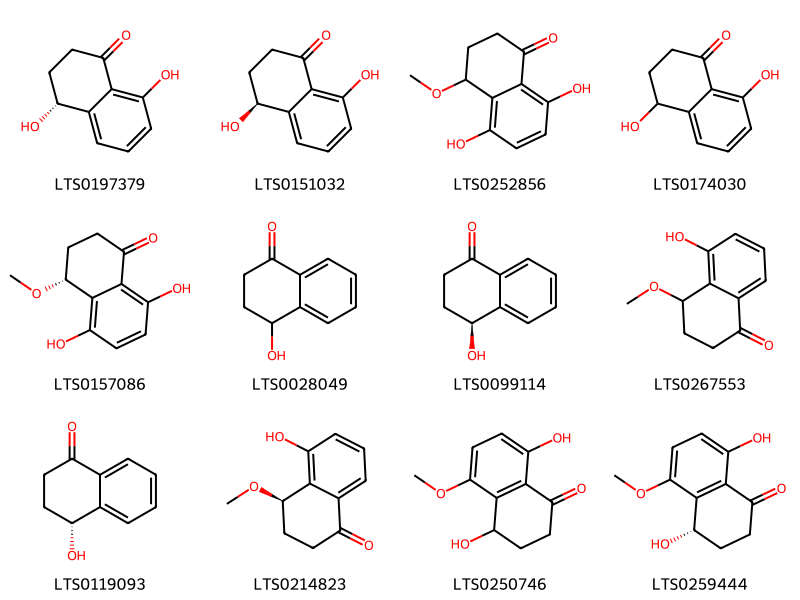{ width=100% }
    <figcaption>Hình ảnh cấu trúc hóa học của 12 hoạt chất thuộc nhóm Tetralins gồm ['(4r)-4,8-dihydroxy-3,4-dihydro-2h-naphthalen-1-one (LTS0197379)', '(4s)-4,8-dihydroxy-3,4-dihydro-2h-naphthalen-1-one (LTS0151032)', '5,8-dihydroxy-4-methoxy-3,4-dihydro-2h-naphthalen-1-one (LTS0252856)', '4,8-dihydroxy-3,4-dihydro-2h-naphthalen-1-one (LTS0174030)', '(4r)-5,8-dihydroxy-4-methoxy-3,4-dihydro-2h-naphthalen-1-one (LTS0157086)', '4-hydroxy-3,4-dihydro-2h-naphthalen-1-one (LTS0028049)', '(4s)-4-hydroxy-3,4-dihydro-2h-naphthalen-1-one (LTS0099114)', '5-hydroxy-4-methoxy-3,4-dihydro-2h-naphthalen-1-one (LTS0267553)', '(4r)-4-hydroxy-3,4-dihydro-2h-naphthalen-1-one (LTS0119093)', '(4r)-5-hydroxy-4-methoxy-3,4-dihydro-2h-naphthalen-1-one (LTS0214823)', '4,8-dihydroxy-5-methoxy-3,4-dihydro-2h-naphthalen-1-one (LTS0250746)', '(4s)-4,8-dihydroxy-5-methoxy-3,4-dihydro-2h-naphthalen-1-one (LTS0259444)'].</figcaption>
</figure>

---

### Dược dân tộc học

Danh sách các quốc gia có sử dụng *Juglans mandshurica* trong điều trị các bệnh. 

| Country   | Disease        | Bệnh                                                                                                                                                                                                |
|:----------|:---------------|:----------------------------------------------------------------------------------------------------------------------------------------------------------------------------------------------------|
| Elsewhere | Antiphlogistic | MYMEMORY WARNING: YOU USED ALL AVAILABLE FREE TRANSLATIONS FOR TODAY. NEXT AVAILABLE IN  06 HOURS 02 MINUTES 01 SECONDS VISIT HTTPS://MYMEMORY.TRANSLATED.NET/DOC/USAGELIMITS.PHP TO TRANSLATE MORE |

---

---
## Juglans nigra
### Thông tin về thực vật

!!! info "Phân loại thực vật của *Juglans nigra* từ GIBF:"
    - **Kingdom:** Plantae
    - **Phylum:** Tracheophyta
    - **Order:** Fagales
    - **Family:** Juglandaceae
    - **Genus:** Juglans
    - **Species:** *Juglans nigra*

 

| Label (VI)   | Label (EN)   | Scientific Name   | Descriptions (VI)   | Descriptions (EN)   | Also Known As (VI)   | Also Known As (EN)                                                |
|:-------------|:-------------|:------------------|:--------------------|:--------------------|:---------------------|:------------------------------------------------------------------|
| N/A          | N/A          | Juglans nigra     | loài thực vật       | species of plant    | ['']                 | ['black walnut', 'American black walnut', 'eastern black walnut'] |

#### Phân bố trên thế giới

**Từ CSDL GIBF** Austria, Hungary, United States of America, Portugal, Belgium, Australia, Luxembourg, Canada, Germany

#### Phân bố tại Việt Nam

**Từ CSDL GIBF**: Không có ghi nhận ở Việt Nam

---
### Thành phần hóa học
        
- Theo cơ sở dữ liệu lotus: Từ loài *Juglans nigra* đã phân lập và xác định được 64 hoạt chất thuộc về các nhóm Fatty Acyls, Benzene and substituted derivatives, Thiols, Unsaturated hydrocarbons, Flavonoids, Carboxylic acids and derivatives, Cinnamic acids and derivatives, Naphthalenes, Phenols, Organooxygen compounds, Prenol lipids, Saturated hydrocarbons. 

|    | chemicalTaxonomyClassyfireClass     |   smiles_count |
|---:|:------------------------------------|---------------:|
|  0 | Benzene and substituted derivatives |             13 |
|  1 | Carboxylic acids and derivatives    |              1 |
|  2 | Cinnamic acids and derivatives      |              2 |
|  3 | Fatty Acyls                         |              7 |
|  4 | Flavonoids                          |              3 |
|  5 | Naphthalenes                        |             12 |
|  6 | Organooxygen compounds              |              9 |
|  7 | Phenols                             |              1 |
|  8 | Prenol lipids                       |              7 |
|  9 | Saturated hydrocarbons              |              7 |
| 10 | Thiols                              |              1 |
| 11 | Unsaturated hydrocarbons            |              1 |

#### Nhóm Benzene and substituted derivatives
<figure markdown="span">
    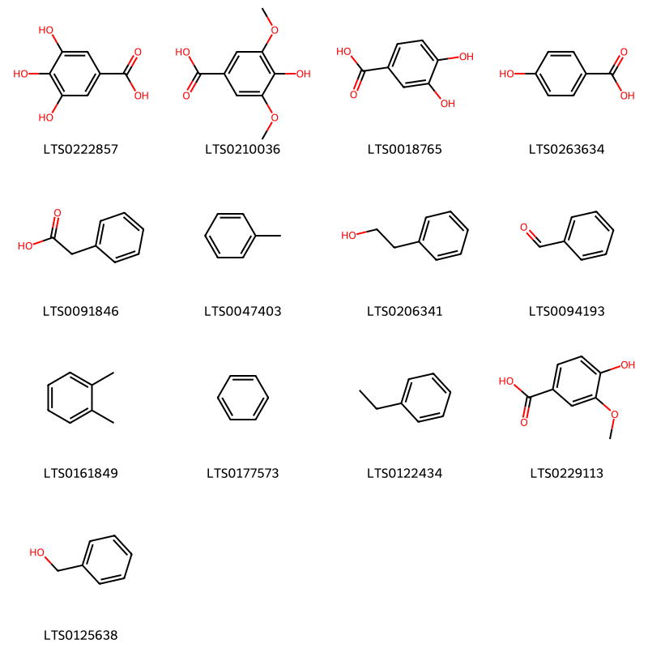{ width=100% }
    <figcaption>Hình ảnh cấu trúc hóa học của 13 hoạt chất thuộc nhóm Benzene and substituted derivatives gồm ['galop (LTS0222857)', 'syringic acid (LTS0210036)', '3,4-dihydroxybenzoic acid (LTS0018765)', 'p-hydroxybenzoic acid (LTS0263634)', 'ω-phenylacetic acid (LTS0091846)', 'toluene (LTS0047403)', '2-phenyl-ethanol (LTS0206341)', 'benzaldehyde (LTS0094193)', 'ortho-xylene (LTS0161849)', 'benzene (LTS0177573)', 'ethylbenzene (LTS0122434)', 'vanillic acid (LTS0229113)', 'benzyl alcohol (LTS0125638)'].</figcaption>
</figure>
#### Nhóm Carboxylic acids and derivatives
<figure markdown="span">
    { width=100% }
    <figcaption>Hình ảnh cấu trúc hóa học của 1 hoạt chất thuộc nhóm Carboxylic acids and derivatives gồm ['butyl acetate (LTS0047300)'].</figcaption>
</figure>
#### Nhóm Cinnamic acids and derivatives
<figure markdown="span">
    { width=100% }
    <figcaption>Hình ảnh cấu trúc hóa học của 2 hoạt chất thuộc nhóm Cinnamic acids and derivatives gồm ['3,4-dihydroxycinnamic acid (LTS0128050)', 'ferulic acid (LTS0077328)'].</figcaption>
</figure>
#### Nhóm Fatty Acyls
<figure markdown="span">
    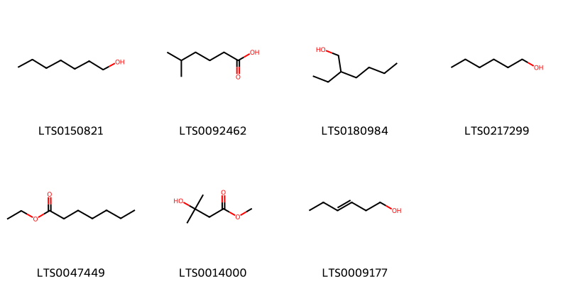{ width=100% }
    <figcaption>Hình ảnh cấu trúc hóa học của 7 hoạt chất thuộc nhóm Fatty Acyls gồm ['heptanol (LTS0150821)', '5-methylhexanoic acid (LTS0092462)', '2-ethylhexanol (LTS0180984)', 'hexanol (LTS0217299)', 'wine oil (LTS0047449)', 'methyl 3-hydroxy-3-methylbutanoate (LTS0014000)', '3-hexenol (LTS0009177)'].</figcaption>
</figure>
#### Nhóm Flavonoids
<figure markdown="span">
    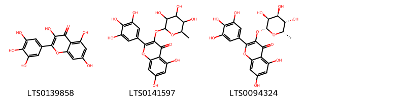{ width=100% }
    <figcaption>Hình ảnh cấu trúc hóa học của 3 hoạt chất thuộc nhóm Flavonoids gồm ['myricetin (LTS0139858)', 'myricitrin (LTS0141597)', '5,7-dihydroxy-3-{[(2r,3s,4s,5s,6s)-3,4,5-trihydroxy-6-methyloxan-2-yl]oxy}-2-(3,4,5-trihydroxyphenyl)chromen-4-one (LTS0094324)'].</figcaption>
</figure>
#### Nhóm Naphthalenes
<figure markdown="span">
    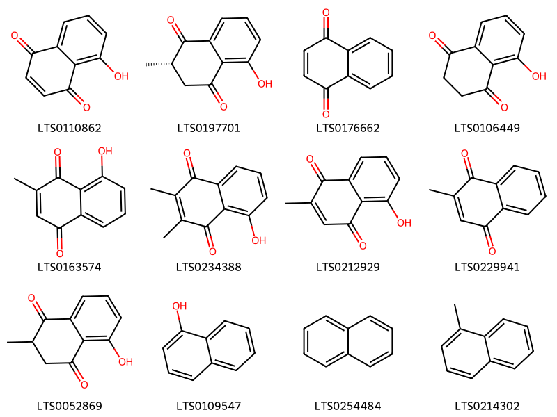{ width=100% }
    <figcaption>Hình ảnh cấu trúc hóa học của 12 hoạt chất thuộc nhóm Naphthalenes gồm ['walnut extract (LTS0110862)', '(2s)-5-hydroxy-2-methyl-2,3-dihydronaphthalene-1,4-dione (LTS0197701)', 'naphthoquinone (LTS0176662)', '5-hydroxy-2,3-dihydronaphthalene-1,4-dione (LTS0106449)', '8-hydroxy-2-methylnaphthalene-1,4-dione (LTS0163574)', '5-hydroxy-2,3-dimethylnaphthalene-1,4-dione (LTS0234388)', 'plumbagin (LTS0212929)', 'menadione (LTS0229941)', '5-hydroxy-2-methyl-2,3-dihydronaphthalene-1,4-dione (LTS0052869)', 'naphthol (LTS0109547)', 'naphthalene (LTS0254484)', '1-methylnaphthalene (LTS0214302)'].</figcaption>
</figure>
#### Nhóm Organooxygen compounds
<figure markdown="span">
    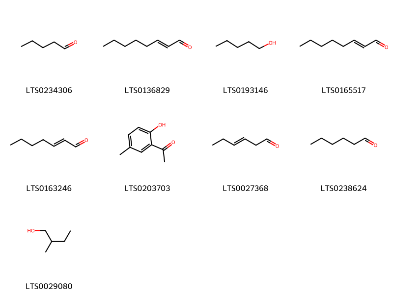{ width=100% }
    <figcaption>Hình ảnh cấu trúc hóa học của 9 hoạt chất thuộc nhóm Organooxygen compounds gồm ['pentanal (LTS0234306)', '(e)-2-octenal (LTS0136829)', 'amyl alcohol (LTS0193146)', '2-octenal (LTS0165517)', '2-heptenal (LTS0163246)', '2-acetyl-4-methylphenol (LTS0203703)', '3-hexenal (LTS0027368)', 'hexanal (LTS0238624)', '2-methyl-1-butanol (LTS0029080)'].</figcaption>
</figure>
#### Nhóm Phenols
<figure markdown="span">
    { width=100% }
    <figcaption>Hình ảnh cấu trúc hóa học của 1 hoạt chất thuộc nhóm Phenols gồm ['4-methoxysalicylaldehyde (LTS0030238)'].</figcaption>
</figure>
#### Nhóm Prenol lipids
<figure markdown="span">
    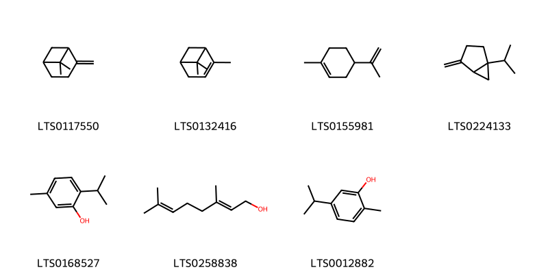{ width=100% }
    <figcaption>Hình ảnh cấu trúc hóa học của 7 hoạt chất thuộc nhóm Prenol lipids gồm ['β-pinene (LTS0117550)', 'α pinene (LTS0132416)', 'limonene,  (LTS0155981)', 'sabinene (LTS0224133)', 'thymol (LTS0168527)', 'geraniol (LTS0258838)', 'carvacrol (LTS0012882)'].</figcaption>
</figure>
#### Nhóm Saturated hydrocarbons
<figure markdown="span">
    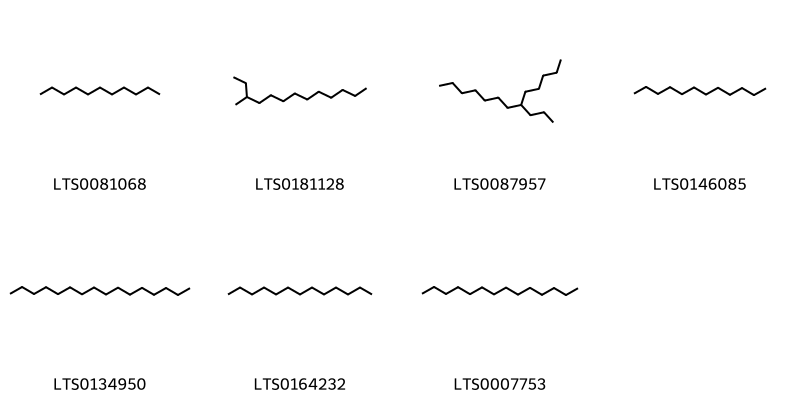{ width=100% }
    <figcaption>Hình ảnh cấu trúc hóa học của 7 hoạt chất thuộc nhóm Saturated hydrocarbons gồm ['undecane (LTS0081068)', '3-methyltridecane (LTS0181128)', '6-propyltridecane (LTS0087957)', 'dodecane (LTS0146085)', 'cetane (LTS0134950)', 'tridecane (LTS0164232)', 'tetradecane (LTS0007753)'].</figcaption>
</figure>
#### Nhóm Thiols
<figure markdown="span">
    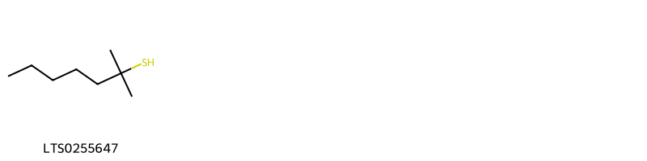{ width=100% }
    <figcaption>Hình ảnh cấu trúc hóa học của 1 hoạt chất thuộc nhóm Thiols gồm ['2-methyl-2-heptanethiol (LTS0255647)'].</figcaption>
</figure>
#### Nhóm Unsaturated hydrocarbons
<figure markdown="span">
    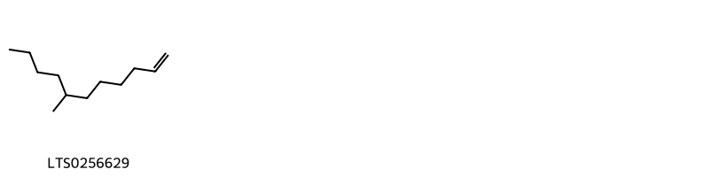{ width=100% }
    <figcaption>Hình ảnh cấu trúc hóa học của 1 hoạt chất thuộc nhóm Unsaturated hydrocarbons gồm ['7-methylundec-1-ene (LTS0256629)'].</figcaption>
</figure>

---

### Dược dân tộc học

Danh sách các quốc gia có sử dụng *Juglans nigra* trong điều trị các bệnh. 

| Country   | Disease                | Bệnh                                                                                                                                                                                                |
|:----------|:-----------------------|:----------------------------------------------------------------------------------------------------------------------------------------------------------------------------------------------------|
| US        | Insecticide, Vermifuge | MYMEMORY WARNING: YOU USED ALL AVAILABLE FREE TRANSLATIONS FOR TODAY. NEXT AVAILABLE IN  06 HOURS 01 MINUTES 26 SECONDS VISIT HTTPS://MYMEMORY.TRANSLATED.NET/DOC/USAGELIMITS.PHP TO TRANSLATE MORE |

---

---
## Juglans pyriformis
### Thông tin về thực vật

!!! info "Phân loại thực vật của *Juglans pyriformis* từ GIBF:"
    - **Kingdom:** Plantae
    - **Phylum:** Tracheophyta
    - **Order:** Fagales
    - **Family:** Juglandaceae
    - **Genus:** Juglans
    - **Species:** *Juglans pyriformis*

 

| Label (VI)   | Label (EN)   | Scientific Name    | Descriptions (VI)   | Descriptions (EN)   | Also Known As (VI)   | Also Known As (EN)   |
|:-------------|:-------------|:-------------------|:--------------------|:--------------------|:---------------------|:---------------------|
| N/A          | N/A          | Juglans pyriformis | loài thực vật       | species of plant    | ['']                 | ['']                 |

#### Phân bố trên thế giới

**Từ CSDL GIBF** nan, Mexico, Guatemala, El Salvador, France, Puerto Rico

#### Phân bố tại Việt Nam

**Từ CSDL GIBF**: Không có ghi nhận ở Việt Nam

---
### Thành phần hóa học
        
- Theo cơ sở dữ liệu lotus: Từ loài *Juglans pyriformis* đã phân lập và xác định được Chưa có hoạt chất nào được phân lập. hoạt chất thuộc về các nhóm Không có hoạt chất nào được phân lập. 

Không có hình ảnh nào được tạo ra

---

### Dược dân tộc học

Danh sách các quốc gia có sử dụng *Juglans pyriformis* trong điều trị các bệnh. 

| Country   | Disease              | Bệnh                                                                                                                                                                                                |
|:----------|:---------------------|:----------------------------------------------------------------------------------------------------------------------------------------------------------------------------------------------------|
| Mexico    | Piscicide, Piscicide | MYMEMORY WARNING: YOU USED ALL AVAILABLE FREE TRANSLATIONS FOR TODAY. NEXT AVAILABLE IN  06 HOURS 00 MINUTES 40 SECONDS VISIT HTTPS://MYMEMORY.TRANSLATED.NET/DOC/USAGELIMITS.PHP TO TRANSLATE MORE |

---

---
## Juglans regia
### Thông tin về thực vật

!!! info "Phân loại thực vật của *Juglans regia* từ GIBF:"
    - **Kingdom:** Plantae
    - **Phylum:** Tracheophyta
    - **Order:** Fagales
    - **Family:** Juglandaceae
    - **Genus:** Juglans
    - **Species:** *Juglans regia*

 

| Label (VI)   | Label (EN)   | Scientific Name   | Descriptions (VI)   | Descriptions (EN)   | Also Known As (VI)   | Also Known As (EN)                                                                  |
|:-------------|:-------------|:------------------|:--------------------|:--------------------|:---------------------|:------------------------------------------------------------------------------------|
| N/A          | N/A          | Juglans regia     | loài thực vật       | species of plant    | ['']                 | ['Walnut', 'Juglans fallax', 'common walnut', 'Old World Walnut', 'Persian Walnut'] |

#### Phân bố trên thế giới

**Từ CSDL GIBF** Czechia, Sweden, China, Slovenia, Ecuador, Spain, Denmark, Poland, Netherlands, United States of America, Iran (Islamic Republic of), Russian Federation, Norway, France, Belgium, Germany, Moldova, Republic of, Austria, Hungary, Portugal, Ukraine, Australia, Italy, Switzerland, India, Bulgaria, United Kingdom of Great Britain and Northern Ireland

#### Phân bố tại Việt Nam

**Từ CSDL GIBF**: Không có ghi nhận ở Việt Nam

---
### Thành phần hóa học
        
- Theo cơ sở dữ liệu lotus: Từ loài *Juglans regia* đã phân lập và xác định được 228 hoạt chất thuộc về các nhóm Fatty Acyls, Unsaturated hydrocarbons, Carboxylic acids and derivatives, Naphthalenes, Phenols, Imidazopyrimidines, Organooxygen compounds, Benzene and substituted derivatives, Purine nucleosides, Tannins, Cinnamic acids and derivatives, Steroids and steroid derivatives, Tetralins, Furanoid lignans, Harmala alkaloids, Dioxolopyrans, Flavonoids, Dibenzylbutane lignans, Benzodioxoles, Prenol lipids, Diarylheptanoids, Indoles and derivatives. 

|    | chemicalTaxonomyClassyfireClass     |   smiles_count |
|---:|:------------------------------------|---------------:|
|  0 | Benzene and substituted derivatives |              5 |
|  1 | Benzodioxoles                       |              1 |
|  2 | Carboxylic acids and derivatives    |              1 |
|  3 | Cinnamic acids and derivatives      |              7 |
|  4 | Diarylheptanoids                    |              7 |
|  5 | Dibenzylbutane lignans              |              2 |
|  6 | Dioxolopyrans                       |              2 |
|  7 | Fatty Acyls                         |              5 |
|  8 | Flavonoids                          |             19 |
|  9 | Furanoid lignans                    |              3 |
| 10 | Harmala alkaloids                   |              2 |
| 11 | Imidazopyrimidines                  |              1 |
| 12 | Indoles and derivatives             |              2 |
| 13 | Naphthalenes                        |             11 |
| 14 | Organooxygen compounds              |              6 |
| 15 | Phenols                             |              1 |
| 16 | Prenol lipids                       |             80 |
| 17 | Purine nucleosides                  |              2 |
| 18 | Steroids and steroid derivatives    |              5 |
| 19 | Tannins                             |             56 |
| 20 | Tetralins                           |              9 |
| 21 | Unsaturated hydrocarbons            |              1 |

#### Nhóm Benzene and substituted derivatives
<figure markdown="span">
    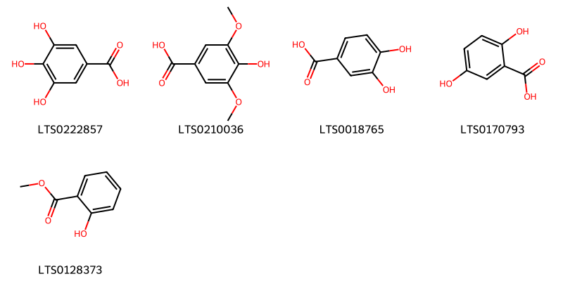{ width=100% }
    <figcaption>Hình ảnh cấu trúc hóa học của 5 hoạt chất thuộc nhóm Benzene and substituted derivatives gồm ['galop (LTS0222857)', 'syringic acid (LTS0210036)', '3,4-dihydroxybenzoic acid (LTS0018765)', '2,5-dihydroxybenzoic acid (LTS0170793)', 'methyl salicylate (LTS0128373)'].</figcaption>
</figure>
#### Nhóm Benzodioxoles
<figure markdown="span">
    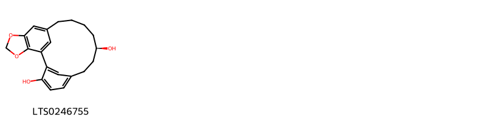{ width=100% }
    <figcaption>Hình ảnh cấu trúc hóa học của 1 hoạt chất thuộc nhóm Benzodioxoles gồm ['(9r)-17,19-dioxatetracyclo[12.6.1.1²,⁶.0¹⁶,²⁰]docosa-1(21),2(22),3,5,14,16(20)-hexaene-3,9-diol (LTS0246755)'].</figcaption>
</figure>
#### Nhóm Carboxylic acids and derivatives
<figure markdown="span">
    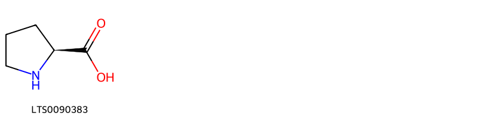{ width=100% }
    <figcaption>Hình ảnh cấu trúc hóa học của 1 hoạt chất thuộc nhóm Carboxylic acids and derivatives gồm ['l-proline (LTS0090383)'].</figcaption>
</figure>
#### Nhóm Cinnamic acids and derivatives
<figure markdown="span">
    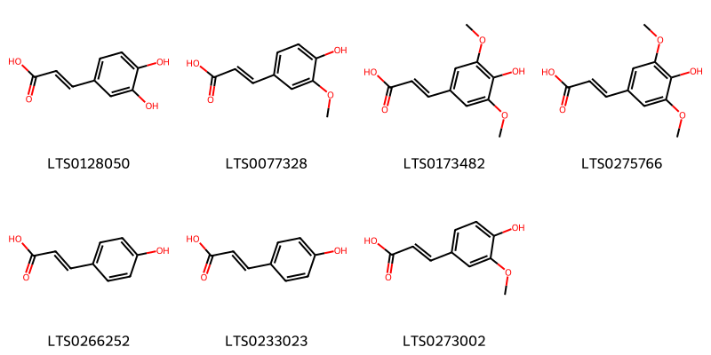{ width=100% }
    <figcaption>Hình ảnh cấu trúc hóa học của 7 hoạt chất thuộc nhóm Cinnamic acids and derivatives gồm ['3,4-dihydroxycinnamic acid (LTS0128050)', 'ferulic acid (LTS0077328)', 'sinapinate (LTS0173482)', 'sinapoyl alcohol (LTS0275766)', 'para-coumaric acid (LTS0266252)', 'hydroxycinnamic acid (LTS0233023)', 'ferulic acid (LTS0273002)'].</figcaption>
</figure>
#### Nhóm Diarylheptanoids
<figure markdown="span">
    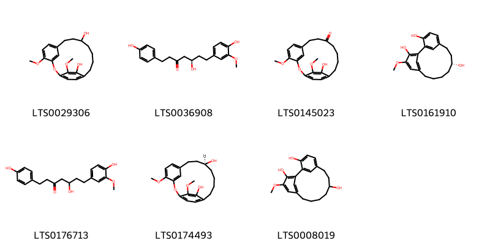{ width=100% }
    <figcaption>Hình ảnh cấu trúc hóa học của 7 hoạt chất thuộc nhóm Diarylheptanoids gồm ['4,17-dimethoxy-2-oxatricyclo[13.2.2.1³,⁷]icosa-1(18),3(20),4,6,15(19),16-hexaene-10,16-diol (LTS0029306)', '(5r)-5-hydroxy-7-(4-hydroxy-3-methoxyphenyl)-1-(4-hydroxyphenyl)heptan-3-one (LTS0036908)', 'juglanin a (LTS0145023)', '(9r)-16-methoxytricyclo[12.3.1.1²,⁶]nonadeca-1(17),2(19),3,5,14(18),15-hexaene-3,9,17-triol (LTS0161910)', '5-hydroxy-7-(4-hydroxy-3-methoxyphenyl)-1-(4-hydroxyphenyl)heptan-3-one (LTS0176713)', '(10s)-4,17-dimethoxy-2-oxatricyclo[13.2.2.1³,⁷]icosa-1(18),3(20),4,6,15(19),16-hexaene-10,16-diol (LTS0174493)', '16-methoxytricyclo[12.3.1.1²,⁶]nonadeca-1(17),2(19),3,5,14(18),15-hexaene-3,9,17-triol (LTS0008019)'].</figcaption>
</figure>
#### Nhóm Dibenzylbutane lignans
<figure markdown="span">
    { width=100% }
    <figcaption>Hình ảnh cấu trúc hóa học của 2 hoạt chất thuộc nhóm Dibenzylbutane lignans gồm ['(2s,3r)-2,3-bis[(4-hydroxy-3-methoxyphenyl)(¹³c)methyl](1-¹³c)butane-1,4-diol (LTS0268699)', 'secoisolariciresinol (LTS0086727)'].</figcaption>
</figure>
#### Nhóm Dioxolopyrans
<figure markdown="span">
    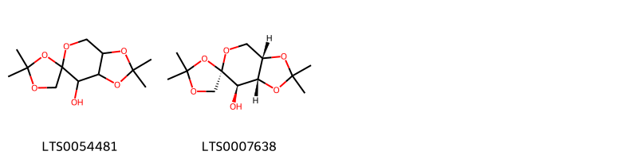{ width=100% }
    <figcaption>Hình ảnh cấu trúc hóa học của 2 hoạt chất thuộc nhóm Dioxolopyrans gồm ["2,2,5',5'-tetramethyl-tetrahydrospiro[[1,3]dioxolo[4,5-c]pyran-6,2'-[1,4]dioxolan]-7-ol (LTS0054481)", "(3as,6r,7r,7ar)-2,2,5',5'-tetramethyl-tetrahydrospiro[[1,3]dioxolo[4,5-c]pyran-6,2'-[1,4]dioxolan]-7-ol (LTS0007638)"].</figcaption>
</figure>
#### Nhóm Fatty Acyls
<figure markdown="span">
    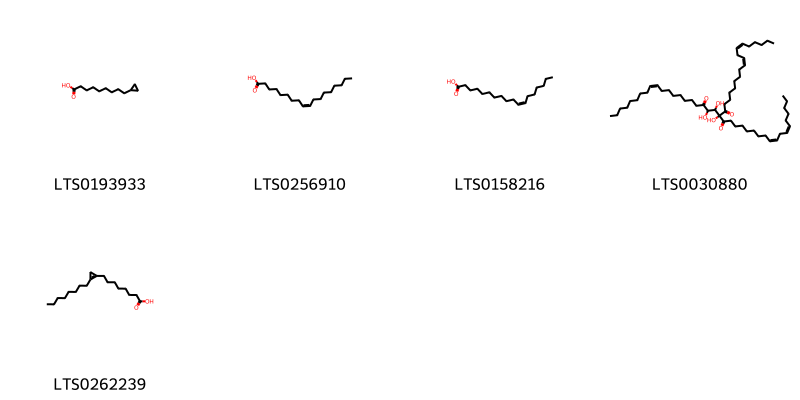{ width=100% }
    <figcaption>Hình ảnh cấu trúc hóa học của 5 hoạt chất thuộc nhóm Fatty Acyls gồm ['9-cyclopropylnonanoic acid (LTS0193933)', 'oleic acid (LTS0256910)', 'cis-vaccenic acid (LTS0158216)', '(6z,9z,30z)-19,20,21-trihydroxy-19-[(9z,12z)-octadeca-9,12-dienoyl]nonatriaconta-6,9,30-triene-18,22-dione (LTS0030880)', 'sterculic acid (LTS0262239)'].</figcaption>
</figure>
#### Nhóm Flavonoids
<figure markdown="span">
    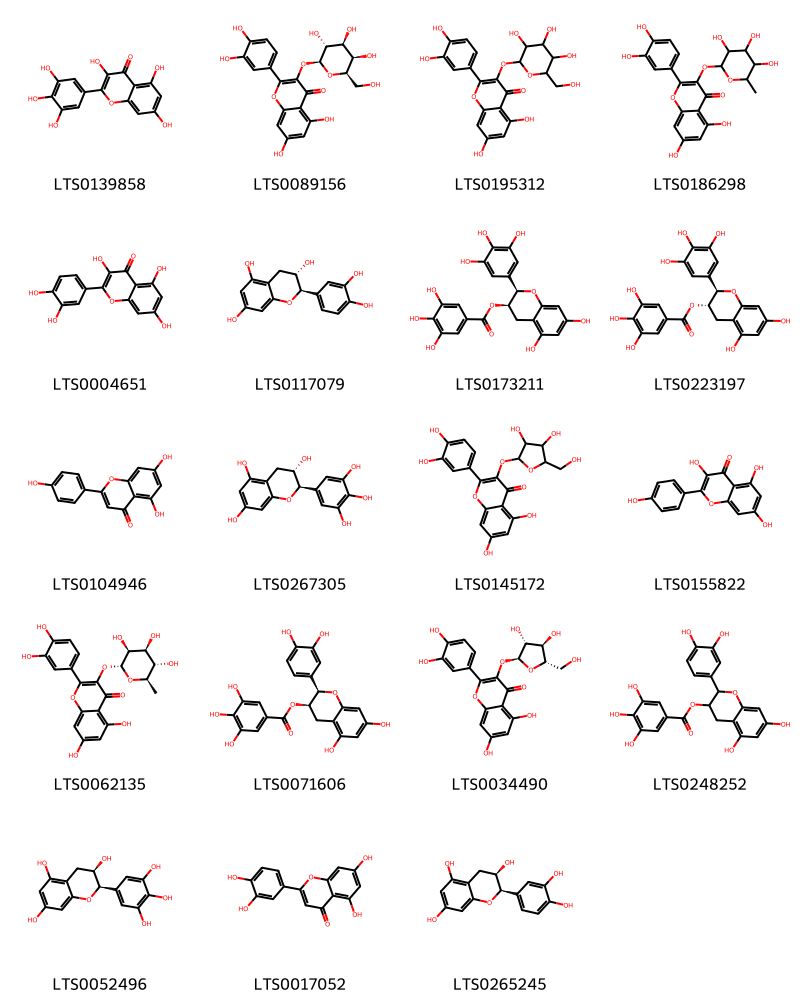{ width=100% }
    <figcaption>Hình ảnh cấu trúc hóa học của 19 hoạt chất thuộc nhóm Flavonoids gồm ['myricetin (LTS0139858)', 'hyperoside (LTS0089156)', '2-(3,4-dihydroxyphenyl)-5,7-dihydroxy-3-{[3,4,5-trihydroxy-6-(hydroxymethyl)oxan-2-yl]oxy}chromen-4-one (LTS0195312)', 'quercitrin (LTS0186298)', 'quercetin (LTS0004651)', '(+)-catechol (LTS0117079)', '(-)-epigallocatechin gallate (LTS0173211)', 'gallocatechin 3-o-gallate (LTS0223197)', 'chamomile (LTS0104946)', 'gallocatechol (LTS0267305)', '3-{[3,4-dihydroxy-5-(hydroxymethyl)oxolan-2-yl]oxy}-2-(3,4-dihydroxyphenyl)-5,7-dihydroxychromen-4-one (LTS0145172)', 'kaempherol (LTS0155822)', '2-(3,4-dihydroxyphenyl)-5,7-dihydroxy-3-{[(2r,3s,4s,5s,6r)-3,4,5-trihydroxy-6-methyloxan-2-yl]oxy}chromen-4-one (LTS0062135)', 'epicatechin gallate (LTS0071606)', 'avicularin (LTS0034490)', '2-(3,4-dihydroxyphenyl)-5,7-dihydroxy-3,4-dihydro-2h-1-benzopyran-3-yl 3,4,5-trihydroxybenzoate (LTS0248252)', 'epigallocatechin (LTS0052496)', 'luteolin (LTS0017052)', 'ent-epicatechin (LTS0265245)'].</figcaption>
</figure>
#### Nhóm Furanoid lignans
<figure markdown="span">
    { width=100% }
    <figcaption>Hình ảnh cấu trúc hóa học của 3 hoạt chất thuộc nhóm Furanoid lignans gồm ['pinoresinol (LTS0057431)', 'matairesinol (LTS0193475)', 'lariciresinol (LTS0010950)'].</figcaption>
</figure>
#### Nhóm Harmala alkaloids
<figure markdown="span">
    { width=100% }
    <figcaption>Hình ảnh cấu trúc hóa học của 2 hoạt chất thuộc nhóm Harmala alkaloids gồm ['harmane (LTS0068205)', '1-methyl-3h,4h,9h-pyrido[3,4-b]indole (LTS0027115)'].</figcaption>
</figure>
#### Nhóm Imidazopyrimidines
<figure markdown="span">
    { width=100% }
    <figcaption>Hình ảnh cấu trúc hóa học của 1 hoạt chất thuộc nhóm Imidazopyrimidines gồm ['leucon (LTS0114351)'].</figcaption>
</figure>
#### Nhóm Indoles and derivatives
<figure markdown="span">
    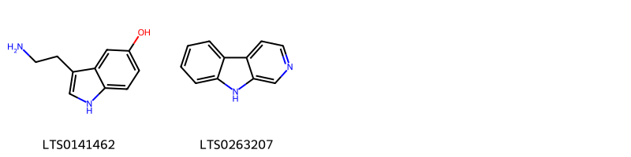{ width=100% }
    <figcaption>Hình ảnh cấu trúc hóa học của 2 hoạt chất thuộc nhóm Indoles and derivatives gồm ['serotonin (LTS0141462)', 'β-carboline (LTS0263207)'].</figcaption>
</figure>
#### Nhóm Naphthalenes
<figure markdown="span">
    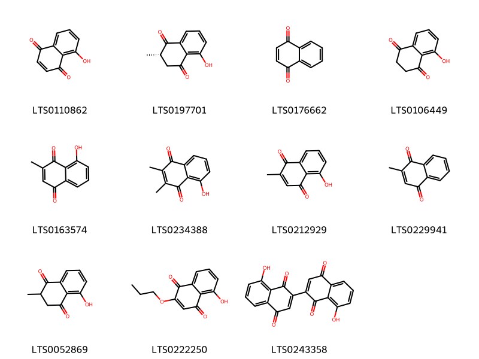{ width=100% }
    <figcaption>Hình ảnh cấu trúc hóa học của 11 hoạt chất thuộc nhóm Naphthalenes gồm ['walnut extract (LTS0110862)', '(2s)-5-hydroxy-2-methyl-2,3-dihydronaphthalene-1,4-dione (LTS0197701)', 'naphthoquinone (LTS0176662)', '5-hydroxy-2,3-dihydronaphthalene-1,4-dione (LTS0106449)', '8-hydroxy-2-methylnaphthalene-1,4-dione (LTS0163574)', '5-hydroxy-2,3-dimethylnaphthalene-1,4-dione (LTS0234388)', 'plumbagin (LTS0212929)', 'menadione (LTS0229941)', '5-hydroxy-2-methyl-2,3-dihydronaphthalene-1,4-dione (LTS0052869)', '5-hydroxy-2-propoxynaphthalene-1,4-dione (LTS0222250)', "8,8'-dihydroxy-[2,2'-binaphthalene]-1,1',4,4'-tetrone (LTS0243358)"].</figcaption>
</figure>
#### Nhóm Organooxygen compounds
<figure markdown="span">
    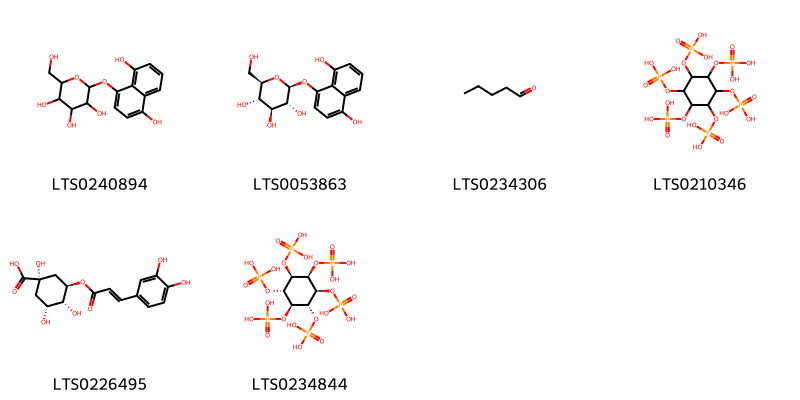{ width=100% }
    <figcaption>Hình ảnh cấu trúc hóa học của 6 hoạt chất thuộc nhóm Organooxygen compounds gồm ['2-[(4,8-dihydroxynaphthalen-1-yl)oxy]-6-(hydroxymethyl)oxane-3,4,5-triol (LTS0240894)', '(2s,3r,4s,5s,6r)-2-[(4,8-dihydroxynaphthalen-1-yl)oxy]-6-(hydroxymethyl)oxane-3,4,5-triol (LTS0053863)', 'pentanal (LTS0234306)', 'phytic acid (LTS0210346)', 'chlorogenic acid (LTS0226495)', '[(1r,2r,3s,4r,5s,6s)-2,3,4,5,6-pentakis(phosphonooxy)cyclohexyl]oxyphosphonic acid (LTS0234844)'].</figcaption>
</figure>
#### Nhóm Phenols
<figure markdown="span">
    { width=100% }
    <figcaption>Hình ảnh cấu trúc hóa học của 1 hoạt chất thuộc nhóm Phenols gồm ['syringaldehyde (LTS0201406)'].</figcaption>
</figure>
#### Nhóm Prenol lipids
<figure markdown="span">
    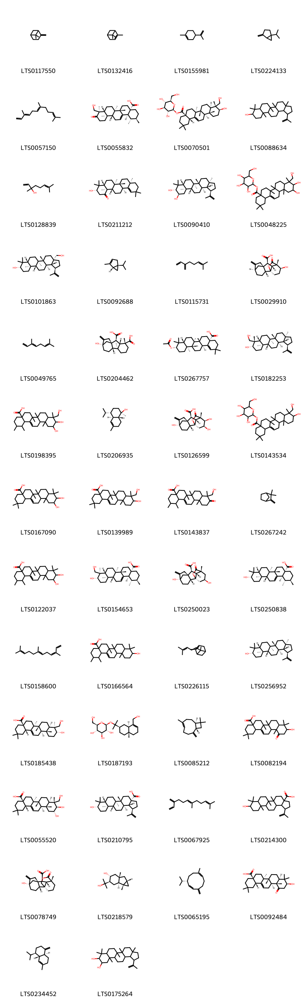{ width=100% }
    <figcaption>Hình ảnh cấu trúc hóa học của 80 hoạt chất thuộc nhóm Prenol lipids gồm ['β-pinene (LTS0117550)', 'α pinene (LTS0132416)', 'limonene,  (LTS0155981)', 'sabinene (LTS0224133)', 'farnesene (LTS0057150)', '(1s,2r,4as,6as,6br,8ar,9r,12ar,12br,14bs)-9-(hydroxymethyl)-1,2,6a,6b,9,12a-hexamethyl-10-oxo-1,2,3,4,5,6,7,8,8a,11,12,12b,13,14b-tetradecahydropicene-4a-carboxylic acid (LTS0055832)', '(2s,3r,4s,5s,6r)-3,4,5-trihydroxy-6-(hydroxymethyl)oxan-2-yl (4as,6as,6br,8ar,9r,10s,12ar,12br,14bs)-10-hydroxy-9-(hydroxymethyl)-2,2,6a,6b,9,12a-hexamethyl-1,3,4,5,6,7,8,8a,10,11,12,12b,13,14b-tetradecahydropicene-4a-carboxylate (LTS0070501)', 'lupeol (LTS0088634)', 'linalool, (+-)- (LTS0128839)', '(3s,4as,6ar,6br,8ar,12bs,14as,14br)-3-hydroxy-4,4,6a,6b,8a,11,11,14b-octamethyl-3,4a,5,6,7,8,9,10,12b,13,14,14a-dodecahydro-2h-picen-1-one (LTS0211212)', '(1r,3ar,5ar,5br,7ar,9r,10r,11ar,11br,13ar,13br)-3a,5a,5b,8,8,11a-hexamethyl-1-(prop-1-en-2-yl)-hexadecahydrocyclopenta[a]chrysene-9,10-diol (LTS0090410)', '3,4,5-trihydroxy-6-(hydroxymethyl)oxan-2-yl 10,11-dihydroxy-9-(hydroxymethyl)-2,2,6a,6b,9,12a-hexamethyl-1,3,4,5,6,7,8,8a,10,11,12,12b,13,14b-tetradecahydropicene-4a-carboxylate (LTS0048225)', 'betulin (LTS0101863)', '(-)-α-thujene (LTS0092688)', 'α-myrcene (LTS0115731)', 'gibberellin a4 (LTS0029910)', 'trans-β-ocimene (LTS0049765)', 'gibberellin a53 (LTS0204462)', '(4as,6ar,6br,8ar,10s,12ar,12br,14as)-10-(acetyloxy)-2,2,6a,6b,9,9,12a-heptamethyl-3,4,5,6,7,8,8a,10,11,12,12b,13,14,14a-tetradecahydropicene-4a-carboxylic acid (LTS0267757)', '(1r,3ar,5ar,5br,7ar,8s,9s,11ar,11br,13ar,13br)-8-(hydroxymethyl)-3a,5a,5b,8,11a-pentamethyl-1-(prop-1-en-2-yl)-hexadecahydrocyclopenta[a]chrysen-9-ol (LTS0182253)', 'asiatic acid (LTS0198395)', 'α-cadinol (LTS0206935)', 'gibberellin a8 (LTS0126599)', '3,4,5-trihydroxy-6-(hydroxymethyl)oxan-2-yl 10-hydroxy-9-(hydroxymethyl)-2,2,6a,6b,9,12a-hexamethyl-1,3,4,5,6,7,8,8a,10,11,12,12b,13,14b-tetradecahydropicene-4a-carboxylate (LTS0143534)', '10,11-dihydroxy-2,2,6a,6b,9,9,12a-heptamethyl-1,3,4,5,6,7,8,8a,10,11,12,12b,13,14b-tetradecahydropicene-4a-carboxylic acid (LTS0167090)', '10-hydroxy-9-(hydroxymethyl)-2,2,6a,6b,9,12a-hexamethyl-1,3,4,5,6,7,8,8a,10,11,12,12b,13,14b-tetradecahydropicene-4a-carboxylic acid (LTS0139989)', '9-(hydroxymethyl)-1,2,6a,6b,9,12a-hexamethyl-10-oxo-1,2,3,4,5,6,7,8,8a,11,12,12b,13,14b-tetradecahydropicene-4a-carboxylic acid (LTS0143837)', 'camphene (LTS0267242)', '10,11-dihydroxy-1,2,6a,6b,9,9,12a-heptamethyl-2,3,4,5,6,7,8,8a,10,11,12,12b,13,14b-tetradecahydro-1h-picene-4a-carboxylic acid (LTS0122037)', '23-hydroxyursolic acid (LTS0154653)', 'gibberellin a29 (LTS0250023)', 'ursolic acid (LTS0250838)', '(z,e)-α-farnesene (LTS0158600)', '10-hydroxy-1,2,6a,6b,9,9,12a-heptamethyl-2,3,4,5,6,7,8,8a,10,11,12,12b,13,14b-tetradecahydro-1h-picene-4a-carboxylic acid (LTS0166564)', 'α-bergamotene (LTS0226115)', 'lupeol (LTS0256952)', 'scutellaric acid (LTS0185438)', '(2s,3r,4s,5s,6r)-2-({2-[(2r,4ar,8ar)-8-(hydroxymethyl)-4a-methyl-2,3,4,5,6,8a-hexahydro-1h-naphthalen-2-yl]propan-2-yl}oxy)-6-(hydroxymethyl)oxane-3,4,5-triol (LTS0187193)', 'caryophyllene (LTS0085212)', '10-hydroxy-2,2,6a,6b,9,9,12a-heptamethyl-12-oxo-3,4,5,6,7,8,8a,10,11,12b,13,14b-dodecahydro-1h-picene-4a-carboxylic acid (LTS0082194)', 'arjunolic acid (LTS0055520)', 'betulinic acid (LTS0210795)', 'β-farnesene (LTS0067925)', '9-hydroxy-5a,5b,8,8,11a-pentamethyl-1-(prop-1-en-2-yl)-hexadecahydrocyclopenta[a]chrysene-3a-carboxylic acid (LTS0214300)', 'gibberellin a44 (LTS0078749)', '(1as,1bs,3r,4r,5as,6as)-3-(2-hydroxypropan-2-yl)-1a,5a-dimethyl-octahydrocyclopropa[a]inden-4-ol (LTS0218579)', '(1z,6z,8s)-8-isopropyl-1-methyl-5-methylidenecyclodeca-1,6-diene (LTS0065195)', 'virgatic acid (LTS0092484)', 'gamma-cadinene (LTS0234452)', '3a,5a,5b,8,8,11a-hexamethyl-1-(prop-1-en-2-yl)-hexadecahydrocyclopenta[a]chrysene-9,10-diol (LTS0175264)', 'guaiol (LTS0240901)', 'corosolic acid (LTS0231285)', 'oleanolic acid (LTS0141130)', '(2s,3r,4s,5s,6r)-3,4,5-trihydroxy-6-(hydroxymethyl)oxan-2-yl (1s,2r,4as,6as,6br,8ar,9r,10r,11r,12ar,12br,14bs)-10,11-dihydroxy-9-(hydroxymethyl)-1,2,6a,6b,9,12a-hexamethyl-2,3,4,5,6,7,8,8a,10,11,12,12b,13,14b-tetradecahydro-1h-picene-4a-carboxylate (LTS0176769)', 'gibberellin a19 (LTS0044672)', 'γ-tocotrienol (LTS0240143)', '(1as,1bs,3s,5as,6as)-3-(2-hydroxypropan-2-yl)-1a,5a-dimethyl-hexahydro-1h-cyclopropa[a]inden-4-one (LTS0047159)', '10,11-dihydroxy-9-(hydroxymethyl)-2,2,6a,6b,9,12a-hexamethyl-1,3,4,5,6,7,8,8a,10,11,12,12b,13,14b-tetradecahydropicene-4a-carboxylic acid (LTS0258848)', '(1s,3s,4as,6ar,6br,8ar,12bs,14as,14br)-4,4,6a,6b,8a,11,11,14b-octamethyl-1,2,3,4a,5,6,7,8,9,10,12b,13,14,14a-tetradecahydropicene-1,3-diol (LTS0186167)', '10-(acetyloxy)-2,2,6a,6b,9,9,12a-heptamethyl-3,4,5,6,7,8,8a,10,11,12,12b,13,14,14a-tetradecahydropicene-4a-carboxylic acid (LTS0015607)', '10-hydroxy-9-(hydroxymethyl)-1,2,6a,6b,9,12a-hexamethyl-2,3,4,5,6,7,8,8a,10,11,12,12b,13,14b-tetradecahydro-1h-picene-4a-carboxylic acid (LTS0009002)', 'gamma-curcumene (LTS0009599)', '(1as,1bs,3r,4s,5as,6as)-3-(2-hydroxypropan-2-yl)-1a,5a-dimethyl-octahydrocyclopropa[a]inden-4-ol (LTS0129347)', 'maslinic acid (LTS0109701)', 'gamma-muurolene (LTS0052920)', '(4as,6as,6br,8as,9r,10s,12ar,12bs,14bs)-10-hydroxy-9-(hydroxymethyl)-2,2,6a,6b,9,12a-hexamethyl-12-oxo-3,4,5,6,7,8,8a,10,11,12b,13,14b-dodecahydro-1h-picene-4a-carboxylic acid (LTS0006614)', '(2r)-2,5,8-trimethyl-2-(4,8,12-trimethyltridecyl)-3,4-dihydro-1-benzopyran-6-ol (LTS0030802)', 'α-muurolene (LTS0022607)', '10-hydroxy-9-(hydroxymethyl)-2,2,6a,6b,9,12a-hexamethyl-12-oxo-3,4,5,6,7,8,8a,10,11,12b,13,14b-dodecahydro-1h-picene-4a-carboxylic acid (LTS0014260)', '8-(hydroxymethyl)-3a,5a,5b,8,11a-pentamethyl-1-(prop-1-en-2-yl)-hexadecahydrocyclopenta[a]chrysen-9-ol (LTS0016748)', 'gibberellin a1 (LTS0013777)', '3,4,5-trihydroxy-6-(hydroxymethyl)oxan-2-yl 10,11-dihydroxy-9-(hydroxymethyl)-1,2,6a,6b,9,12a-hexamethyl-2,3,4,5,6,7,8,8a,10,11,12,12b,13,14b-tetradecahydro-1h-picene-4a-carboxylate (LTS0030527)', 'α-cubebene (LTS0083688)', 'delta-cadinene (LTS0019321)', 'gibberellin a20 (LTS0041124)', '(-)-β-cubebene (LTS0123697)', '(2e,6e)-3,7,11,11-tetramethylbicyclo[8.1.0]undeca-2,6-diene (LTS0225278)', '(1s,2r,4as,6as,6br,8ar,9r,10s,11r,12ar,12br,14bs)-10,11-dihydroxy-9-(hydroxymethyl)-1,2,6a,6b,9,12a-hexamethyl-2,3,4,5,6,7,8,8a,10,11,12,12b,13,14b-tetradecahydro-1h-picene-4a-carboxylic acid (LTS0242132)', '(2s,3r,4s,5s,6r)-3,4,5-trihydroxy-6-(hydroxymethyl)oxan-2-yl (4as,6as,6br,8ar,9r,10r,11r,12ar,12br,14bs)-10,11-dihydroxy-9-(hydroxymethyl)-2,2,6a,6b,9,12a-hexamethyl-1,3,4,5,6,7,8,8a,10,11,12,12b,13,14b-tetradecahydropicene-4a-carboxylate (LTS0117563)', 'oleanolic acid (LTS0117717)'].</figcaption>
</figure>
#### Nhóm Purine nucleosides
<figure markdown="span">
    { width=100% }
    <figcaption>Hình ảnh cấu trúc hóa học của 2 hoạt chất thuộc nhóm Purine nucleosides gồm ['adenosine (LTS0052576)', 'adenosine (LTS0014061)'].</figcaption>
</figure>
#### Nhóm Steroids and steroid derivatives
<figure markdown="span">
    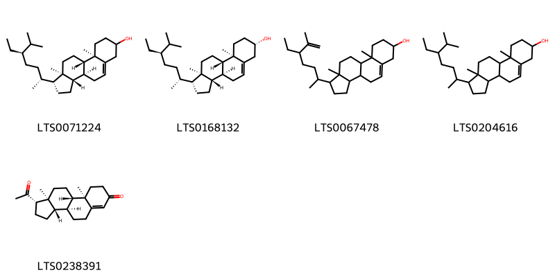{ width=100% }
    <figcaption>Hình ảnh cấu trúc hóa học của 5 hoạt chất thuộc nhóm Steroids and steroid derivatives gồm ['stigmast-5-en-3-ol (LTS0071224)', 'sitosterol (LTS0168132)', '1-(5-ethyl-6-methylhept-6-en-2-yl)-9a,11a-dimethyl-1h,2h,3h,3ah,3bh,4h,6h,7h,8h,9h,9bh,10h,11h-cyclopenta[a]phenanthren-7-ol (LTS0067478)', 'stigmast-5-en-3-ol, (3β)- (LTS0204616)', 'progesterone (LTS0238391)'].</figcaption>
</figure>
#### Nhóm Tannins
<figure markdown="span">
    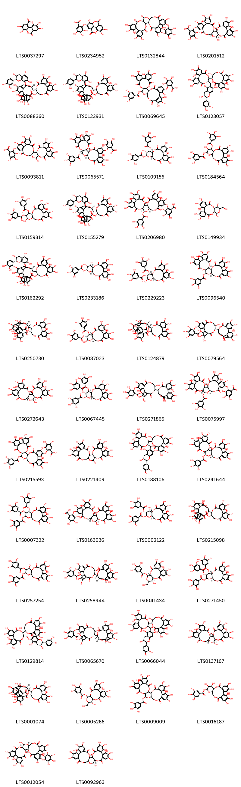{ width=100% }
    <figcaption>Hình ảnh cấu trúc hóa học của 56 hoạt chất thuộc nhóm Tannins gồm ['ellagic acid (LTS0037297)', '3,4,5-trihydroxy-2-({7,13,14-trihydroxy-3,10-dioxo-2,9-dioxatetracyclo[6.6.2.0⁴,¹⁶.0¹¹,¹⁵]hexadeca-1(15),4(16),5,7,11,13-hexaen-6-yl}oxy)benzoic acid (LTS0234952)', '6,7,8,15,16,17,21,29,35,36,37,40,41,42-tetradecahydroxy-2,12,19,25,28,31,46-heptaoxanonacyclo[25.20.0.0⁴,⁹.0¹⁰,²³.0¹¹,²⁰.0¹³,¹⁸.0³⁰,⁴⁷.0³³,³⁸.0³⁹,⁴⁴]heptatetraconta-4(9),5,7,10,13,15,17,20,22,33(38),34,36,39,41,43-pentadecaene-3,24,32,45-tetrone (LTS0132844)', '2-{[(1r,2s,19r,20s,22r)-7,8,9,12,13,14,20,29,30,33,34,35-dodecahydroxy-4,17,25,38-tetraoxo-3,18,21,24,39-pentaoxaheptacyclo[20.17.0.0²,¹⁹.0⁵,¹⁰.0¹¹,¹⁶.0²⁶,³¹.0³²,³⁷]nonatriaconta-5,7,9,11(16),12,14,26(31),27,29,32(37),33,35-dodecaen-28-yl]oxy}-3,4,5-trihydroxybenzoic acid (LTS0201512)', '(11s,12r)-12-[(14r,15s,19r)-19-[(2r,3s)-2-(3,4-dihydroxyphenyl)-3,5,7-trihydroxy-3,4-dihydro-2h-1-benzopyran-8-yl]-2,3,4,7,8,9-hexahydroxy-12,17-dioxo-13,16-dioxatetracyclo[13.3.1.0⁵,¹⁸.0⁶,¹¹]nonadeca-1(18),2,4,6,8,10-hexaen-14-yl]-3,4,5,17,18,19-hexahydroxy-8,14-dioxo-9,13-dioxatricyclo[13.4.0.0²,⁷]nonadeca-1(15),2,4,6,16,18-hexaen-11-yl 3,4,5-trihydroxybenzoate (LTS0088360)', '12-{19-[2-(3,4-dihydroxyphenyl)-3,5,7-trihydroxy-3,4-dihydro-2h-1-benzopyran-8-yl]-2,3,4,7,8,9-hexahydroxy-12,17-dioxo-13,16-dioxatetracyclo[13.3.1.0⁵,¹⁸.0⁶,¹¹]nonadeca-1(18),2,4,6,8,10-hexaen-14-yl}-3,4,5,17,18,19-hexahydroxy-8,14-dioxo-9,13-dioxatricyclo[13.4.0.0²,⁷]nonadeca-1(15),2,4,6,16,18-hexaen-11-yl 3,4,5-trihydroxybenzoate (LTS0122931)', '3,4,5-trihydroxy-2-{[3,5,16,17,18,21,22,23,36,37,38-undecahydroxy-8,13,26,34-tetraoxo-29-(3,4,5-trihydroxybenzoyloxy)-9,12,27,30,33-pentaoxaheptacyclo[33.3.1.0²,⁷.0¹⁰,³¹.0¹¹,²⁸.0¹⁴,¹⁹.0²⁰,²⁵]nonatriaconta-1(38),2(7),3,5,14,16,18,20(25),21,23,35(39),36-dodecaen-4-yl]oxy}benzoic acid (LTS0069645)', '(10r,11r)-10-[(10r,11s)-11-[(s)-[(2r,3s)-2-(3,4-dihydroxyphenyl)-3,5,7-trihydroxy-3,4-dihydro-2h-1-benzopyran-6-yl](hydroxy)methyl]-3,4,5,16,17,18-hexahydroxy-8,13-dioxo-9,12-dioxatricyclo[12.4.0.0²,⁷]octadeca-1(14),2,4,6,15,17-hexaen-10-yl]-3,4,5,11,17,18,19-heptahydroxy-9,13-dioxatricyclo[13.4.0.0²,⁷]nonadeca-1(15),2,4,6,16,18-hexaene-8,14-dione (LTS0123057)', '2-({7,8,9,12,13,14,20,29,30,33,34,35-dodecahydroxy-4,17,25,38-tetraoxo-3,18,21,24,39-pentaoxaheptacyclo[20.17.0.0²,¹⁹.0⁵,¹⁰.0¹¹,¹⁶.0²⁶,³¹.0³²,³⁷]nonatriaconta-5(10),6,8,11,13,15,26(31),27,29,32(37),33,35-dodecaen-28-yl}oxy)-3,4,5-trihydroxybenzoic acid (LTS0093811)', '3,4,5-trihydroxy-2-{[(1r,2s,19r,20s,22r)-7,8,9,12,13,14,28,29,30,33,35-undecahydroxy-4,17,25,38-tetraoxo-20-(3,4,5-trihydroxybenzoyloxy)-3,18,21,24,39-pentaoxaheptacyclo[20.17.0.0²,¹⁹.0⁵,¹⁰.0¹¹,¹⁶.0²⁶,³¹.0³²,³⁷]nonatriaconta-5,7,9,11(16),12,14,26,28,30,32(37),33,35-dodecaen-34-yl]oxy}benzoic acid (LTS0065571)', '(10r,11r,12r,13s,15r)-3,4,5,12,21,22,23-heptahydroxy-8,18-dioxo-13-(3,4,5-trihydroxybenzoyloxy)-9,14,17-trioxatetracyclo[17.4.0.0²,⁷.0¹⁰,¹⁵]tricosa-1(23),2(7),3,5,19,21-hexaen-11-yl 3,4,5-trihydroxybenzoate (LTS0109156)', '3,4,5,12,21,22,23-heptahydroxy-8,18-dioxo-13-(3,4,5-trihydroxybenzoyloxy)-9,14,17-trioxatetracyclo[17.4.0.0²,⁷.0¹⁰,¹⁵]tricosa-1(23),2(7),3,5,19,21-hexaen-11-yl 3,4,5-trihydroxybenzoate (LTS0184564)', '3,4,5,13,21,22,23-heptahydroxy-8,18-dioxo-12-(3,4,5-trihydroxybenzoyloxy)-9,14,17-trioxatetracyclo[17.4.0.0²,⁷.0¹⁰,¹⁵]tricosa-1(23),2(7),3,5,19,21-hexaen-11-yl 3,4,5-trihydroxybenzoate (LTS0159314)', '(11r,12r)-12-[(15s,19s)-19-[2-(3,4-dihydroxyphenyl)-3,5,7-trihydroxy-3,4-dihydro-2h-1-benzopyran-8-yl]-2,3,4,7,8,9-hexahydroxy-12,17-dioxo-13,16-dioxatetracyclo[13.3.1.0⁵,¹⁸.0⁶,¹¹]nonadeca-1(18),2,4,6,8,10-hexaen-14-yl]-3,4,5,17,18,19-hexahydroxy-8,14-dioxo-9,13-dioxatricyclo[13.4.0.0²,⁷]nonadeca-1(15),2,4,6,16,18-hexaen-11-yl 3,4,5-trihydroxybenzoate (LTS0155279)', '3,4,5-trihydroxy-2-{[(1s,2r,19s,20s,22r)-7,8,9,12,13,14,29,30,33,34,35-undecahydroxy-4,17,25,38-tetraoxo-20-(3,4,5-trihydroxybenzoyloxy)-3,18,21,24,39-pentaoxaheptacyclo[20.17.0.0²,¹⁹.0⁵,¹⁰.0¹¹,¹⁶.0²⁶,³¹.0³²,³⁷]nonatriaconta-5,7,9,11(16),12,14,26,28,30,32(37),33,35-dodecaen-28-yl]oxy}benzoic acid (LTS0206980)', '3,4,5,11,14,20,21,22-octahydroxy-13-(hydroxymethyl)-9,12,16-trioxatetracyclo[16.4.0.0²,⁷.0¹⁰,¹⁵]docosa-1(22),2(7),3,5,18,20-hexaene-8,17-dione (LTS0149934)', '(11r,12r)-12-[(14r,15s,19r)-19-[(2r,3s)-2-(3,4-dihydroxyphenyl)-3,5,7-trihydroxy-3,4-dihydro-2h-1-benzopyran-8-yl]-2,3,4,7,8,9-hexahydroxy-12,17-dioxo-13,16-dioxatetracyclo[13.3.1.0⁵,¹⁸.0⁶,¹¹]nonadeca-1(18),2,4,6,8,10-hexaen-14-yl]-3,4,5,17,18,19-hexahydroxy-8,14-dioxo-9,13-dioxatricyclo[13.4.0.0²,⁷]nonadeca-1(15),2,4,6,16,18-hexaen-11-yl 3,4,5-trihydroxybenzoate (LTS0162292)', '(10s,11r,12r,13s,15r)-3,4,5,11,12,21,22,23-octahydroxy-8,18-dioxo-9,14,17-trioxatetracyclo[17.4.0.0²,⁷.0¹⁰,¹⁵]tricosa-1(23),2(7),3,5,19,21-hexaen-13-yl 3,4,5-trihydroxybenzoate (LTS0233186)', '(10r,11s,12r,13r,15r)-3,4,5,13,21,22,23-heptahydroxy-8,18-dioxo-11-(3,4,5-trihydroxybenzoyloxy)-9,14,17-trioxatetracyclo[17.4.0.0²,⁷.0¹⁰,¹⁵]tricosa-1(23),2(7),3,5,19,21-hexaen-12-yl 3,4,5-trihydroxybenzoate (LTS0229223)', '(2s,20s,22r)-7,8,9,12,13,14,28,29,30,33,34,35-dodecahydroxy-4,17,25,38-tetraoxo-3,18,21,24,39-pentaoxaheptacyclo[20.17.0.0²,¹⁹.0⁵,¹⁰.0¹¹,¹⁶.0²⁶,³¹.0³²,³⁷]nonatriaconta-5,7,9,11(16),12,14,26,28,30,32(37),33,35-dodecaen-20-yl 3,4,5-trihydroxybenzoate (LTS0096540)', '(11s,12r)-12-[(14r,15s,19r)-2,3,4,7,8,9,19-heptahydroxy-12,17-dioxo-13,16-dioxatetracyclo[13.3.1.0⁵,¹⁸.0⁶,¹¹]nonadeca-1(18),2,4,6,8,10-hexaen-14-yl]-3,4,5,17,18,19-hexahydroxy-8,14-dioxo-9,13-dioxatricyclo[13.4.0.0²,⁷]nonadeca-1(15),2,4,6,16,18-hexaen-11-yl 3,4,5-trihydroxybenzoate (LTS0250730)', '(10r,11s,12r,15r)-3,4,5,13,21,22,23-heptahydroxy-8,18-dioxo-11-(3,4,5-trihydroxybenzoyloxy)-9,14,17-trioxatetracyclo[17.4.0.0²,⁷.0¹⁰,¹⁵]tricosa-1(23),2(7),3,5,19,21-hexaen-12-yl 3,4,5-trihydroxybenzoate (LTS0087023)', '(11r,12r)-12-[(14r,15s,19s)-2,3,4,7,8,9,19-heptahydroxy-12,17-dioxo-13,16-dioxatetracyclo[13.3.1.0⁵,¹⁸.0⁶,¹¹]nonadeca-1(18),2,4,6,8,10-hexaen-14-yl]-3,4,5,17,18,19-hexahydroxy-8,14-dioxo-9,13-dioxatricyclo[13.4.0.0²,⁷]nonadeca-1(15),2,4,6,16,18-hexaen-11-yl 3,4,5-trihydroxybenzoate (LTS0124879)', '(19r,20r)-20-{2,3,4,7,8,9,19-heptahydroxy-12,17-dioxo-13,16-dioxatetracyclo[13.3.1.0⁵,¹⁸.0⁶,¹¹]nonadeca-1(18),2,4,6,8,10-hexaen-14-yl}-7,8,9,13,19,25,26,27-octahydroxy-3,11,17,21-tetraoxapentacyclo[13.13.0.0²,¹².0⁵,¹⁰.0²³,²⁸]octacosa-1(15),2(12),5(10),6,8,13,23(28),24,26-nonaene-4,16,22-trione (LTS0079564)', '(1r,2s,19r,20s,22r)-7,8,9,12,13,14,20,28,29,30,33,34,35-tridecahydroxy-3,18,21,24,39-pentaoxaheptacyclo[20.17.0.0²,¹⁹.0⁵,¹⁰.0¹¹,¹⁶.0²⁶,³¹.0³²,³⁷]nonatriaconta-5(10),6,8,11,13,15,26(31),27,29,32,34,36-dodecaene-4,17,25,38-tetrone (LTS0272643)', '(10r,11s,12r,13s,15r)-3,4,5,21,22,23-hexahydroxy-8,18-dioxo-12,13-bis(3,4,5-trihydroxybenzoyloxy)-9,14,17-trioxatetracyclo[17.4.0.0²,⁷.0¹⁰,¹⁵]tricosa-1(23),2(7),3,5,19,21-hexaen-11-yl 3,4,5-trihydroxybenzoate (LTS0067445)', '20-{2,3,4,7,8,9,19-heptahydroxy-12,17-dioxo-13,16-dioxatetracyclo[13.3.1.0⁵,¹⁸.0⁶,¹¹]nonadeca-1(18),2,4,6,8,10-hexaen-14-yl}-7,8,9,13,19,25,26,27-octahydroxy-3,11,17,21-tetraoxapentacyclo[13.13.0.0²,¹².0⁵,¹⁰.0²³,²⁸]octacosa-1(15),2(12),5(10),6,8,13,23(28),24,26-nonaene-4,16,22-trione (LTS0271865)', '3,4,5-trihydroxy-2-{[(1r,2s,19r,20s,22r)-7,8,9,12,13,14,29,30,33,34,35-undecahydroxy-4,17,25,38-tetraoxo-20-(3,4,5-trihydroxybenzoyloxy)-3,18,21,24,39-pentaoxaheptacyclo[20.17.0.0²,¹⁹.0⁵,¹⁰.0¹¹,¹⁶.0²⁶,³¹.0³²,³⁷]nonatriaconta-5,7,9,11(16),12,14,26,28,30,32(37),33,35-dodecaen-28-yl]oxy}benzoic acid (LTS0075997)', '3,4,5-trihydroxy-2-{[7,8,9,12,13,14,28,29,30,33,35-undecahydroxy-4,17,25,38-tetraoxo-20-(3,4,5-trihydroxybenzoyloxy)-3,18,21,24,39-pentaoxaheptacyclo[20.17.0.0²,¹⁹.0⁵,¹⁰.0¹¹,¹⁶.0²⁶,³¹.0³²,³⁷]nonatriaconta-5,7,9,11(16),12,14,26,28,30,32(37),33,35-dodecaen-34-yl]oxy}benzoic acid (LTS0215593)', '7,8,9,12,13,14,20,28,29,30,33,34,35-tridecahydroxy-3,18,21,24,39-pentaoxaheptacyclo[20.17.0.0²,¹⁹.0⁵,¹⁰.0¹¹,¹⁶.0²⁶,³¹.0³²,³⁷]nonatriaconta-5(10),6,8,11,13,15,26(31),27,29,32,34,36-dodecaene-4,17,25,38-tetrone (LTS0221409)', '(10r,11r)-10-[(10r,11r)-11-[(s)-[(2r,3s)-2-(3,4-dihydroxyphenyl)-3,5,7-trihydroxy-3,4-dihydro-2h-1-benzopyran-6-yl](hydroxy)methyl]-3,4,5,16,17,18-hexahydroxy-8,13-dioxo-9,12-dioxatricyclo[12.4.0.0²,⁷]octadeca-1(14),2,4,6,15,17-hexaen-10-yl]-3,4,5,11,17,18,19-heptahydroxy-9,13-dioxatricyclo[13.4.0.0²,⁷]nonadeca-1(15),2,4,6,16,18-hexaene-8,14-dione (LTS0188106)', 'casuarictin (LTS0241644)', '3,4,5,21,22,23-hexahydroxy-8,18-dioxo-12,13-bis(3,4,5-trihydroxybenzoyloxy)-9,14,17-trioxatetracyclo[17.4.0.0²,⁷.0¹⁰,¹⁵]tricosa-1(23),2(7),3,5,19,21-hexaen-11-yl 3,4,5-trihydroxybenzoate (LTS0007322)', '2-{[(1r,2s,19r,22r)-7,8,9,12,13,14,20,29,30,33,34,35-dodecahydroxy-4,17,25,38-tetraoxo-3,18,21,24,39-pentaoxaheptacyclo[20.17.0.0²,¹⁹.0⁵,¹⁰.0¹¹,¹⁶.0²⁶,³¹.0³²,³⁷]nonatriaconta-5,7,9,11(16),12,14,26(31),27,29,32(37),33,35-dodecaen-28-yl]oxy}-3,4,5-trihydroxybenzoic acid (LTS0163036)', '(10s,11s,12r,13s,15r)-3,4,5,11,21,22,23-heptahydroxy-8,18-dioxo-13-(3,4,5-trihydroxybenzoyloxy)-9,14,17-trioxatetracyclo[17.4.0.0²,⁷.0¹⁰,¹⁵]tricosa-1(23),2(7),3,5,19,21-hexaen-12-yl 3,4,5-trihydroxybenzoate (LTS0002122)', '12-{2,3,4,7,8,9,19-heptahydroxy-12,17-dioxo-13,16-dioxatetracyclo[13.3.1.0⁵,¹⁸.0⁶,¹¹]nonadeca-1(18),2,4,6,8,10-hexaen-14-yl}-3,4,5,17,18,19-hexahydroxy-8,14-dioxo-9,13-dioxatricyclo[13.4.0.0²,⁷]nonadeca-1(15),2,4,6,16,18-hexaen-11-yl 3,4,5-trihydroxybenzoate (LTS0215098)', '3,4,5,11,21,22,23-heptahydroxy-8,18-dioxo-13-(3,4,5-trihydroxybenzoyloxy)-9,14,17-trioxatetracyclo[17.4.0.0²,⁷.0¹⁰,¹⁵]tricosa-1(23),2(7),3,5,19,21-hexaen-12-yl 3,4,5-trihydroxybenzoate (LTS0257254)', '(19r,20r)-20-[(14r,15r,19r)-2,3,4,7,8,9,19-heptahydroxy-12,17-dioxo-13,16-dioxatetracyclo[13.3.1.0⁵,¹⁸.0⁶,¹¹]nonadeca-1(18),2,4,6,8,10-hexaen-14-yl]-7,8,9,13,19,25,26,27-octahydroxy-3,11,17,21-tetraoxapentacyclo[13.13.0.0²,¹².0⁵,¹⁰.0²³,²⁸]octacosa-1(15),2(12),5(10),6,8,13,23(28),24,26-nonaene-4,16,22-trione (LTS0258944)', '(10r,11s,13r,14r,15s)-3,4,5,14,20,21,22-heptahydroxy-13-(hydroxymethyl)-8,17-dioxo-9,12,16-trioxatetracyclo[16.4.0.0²,⁷.0¹⁰,¹⁵]docosa-1(22),2(7),3,5,18,20-hexaen-11-yl 3,4,5-trihydroxybenzoate (LTS0041434)', '(10r,11s,12r,15r)-3,4,5,21,22,23-hexahydroxy-8,18-dioxo-12,13-bis(3,4,5-trihydroxybenzoyloxy)-9,14,17-trioxatetracyclo[17.4.0.0²,⁷.0¹⁰,¹⁵]tricosa-1(23),2(7),3,5,19,21-hexaen-11-yl 3,4,5-trihydroxybenzoate (LTS0271450)', '(10r,11r)-10-[(10r,11s)-11-({[(2r,3s)-2-(3,4-dihydroxyphenyl)-3,5,7-trihydroxy-3,4-dihydro-2h-1-benzopyran-6-yl]oxy}methyl)-3,4,5,16,17,18-hexahydroxy-8,13-dioxo-9,12-dioxatricyclo[12.4.0.0²,⁷]octadeca-1(14),2,4,6,15,17-hexaen-10-yl]-3,4,5,11,17,18,19-heptahydroxy-9,13-dioxatricyclo[13.4.0.0²,⁷]nonadeca-1(15),2,4,6,16,18-hexaene-8,14-dione (LTS0129814)', '(19r,20r)-20-[(14r,15s,19r)-2,3,4,7,8,9,19-heptahydroxy-12,17-dioxo-13,16-dioxatetracyclo[13.3.1.0⁵,¹⁸.0⁶,¹¹]nonadeca-1(18),2,4,6,8,10-hexaen-14-yl]-7,8,9,13,19,25,26,27-octahydroxy-3,11,17,21-tetraoxapentacyclo[13.13.0.0²,¹².0⁵,¹⁰.0²³,²⁸]octacosa-1(15),2(12),5(10),6,8,13,23(28),24,26-nonaene-4,16,22-trione (LTS0065670)', '10-(11-{[2-(3,4-dihydroxyphenyl)-3,5,7-trihydroxy-3,4-dihydro-2h-1-benzopyran-6-yl](hydroxy)methyl}-3,4,5,16,17,18-hexahydroxy-8,13-dioxo-9,12-dioxatricyclo[12.4.0.0²,⁷]octadeca-1(14),2,4,6,15,17-hexaen-10-yl)-3,4,5,11,17,18,19-heptahydroxy-9,13-dioxatricyclo[13.4.0.0²,⁷]nonadeca-1(15),2,4,6,16,18-hexaene-8,14-dione (LTS0066044)', '(1r,2s,19r,22r)-7,8,9,12,13,14,20,28,29,30,33,34,35-tridecahydroxy-3,18,21,24,39-pentaoxaheptacyclo[20.17.0.0²,¹⁹.0⁵,¹⁰.0¹¹,¹⁶.0²⁶,³¹.0³²,³⁷]nonatriaconta-5(10),6,8,11,13,15,26(31),27,29,32,34,36-dodecaene-4,17,25,38-tetrone (LTS0137167)', '(11s,12r)-12-[(14r,15r,19r)-2,3,4,7,8,9,19-heptahydroxy-12,17-dioxo-13,16-dioxatetracyclo[13.3.1.0⁵,¹⁸.0⁶,¹¹]nonadeca-1(18),2,4,6,8,10-hexaen-14-yl]-3,4,5,17,18,19-hexahydroxy-8,14-dioxo-9,13-dioxatricyclo[13.4.0.0²,⁷]nonadeca-1(15),2,4,6,16,18-hexaen-11-yl 3,4,5-trihydroxybenzoate (LTS0001074)', '3,4,5,14,20,21,22-heptahydroxy-13-(hydroxymethyl)-8,17-dioxo-9,12,16-trioxatetracyclo[16.4.0.0²,⁷.0¹⁰,¹⁵]docosa-1(22),2(7),3,5,18,20-hexaen-11-yl 3,4,5-trihydroxybenzoate (LTS0005266)', '7,8,9,12,13,14,28,29,30,33,34,35-dodecahydroxy-4,17,25,38-tetraoxo-3,18,21,24,39-pentaoxaheptacyclo[20.17.0.0²,¹⁹.0⁵,¹⁰.0¹¹,¹⁶.0²⁶,³¹.0³²,³⁷]nonatriaconta-5,7,9,11(16),12,14,26,28,30,32(37),33,35-dodecaen-20-yl 3,4,5-trihydroxybenzoate (LTS0009009)', '3,4,5,11,12,21,22,23-octahydroxy-8,18-dioxo-9,14,17-trioxatetracyclo[17.4.0.0²,⁷.0¹⁰,¹⁵]tricosa-1(23),2(7),3,5,19,21-hexaen-13-yl 3,4,5-trihydroxybenzoate (LTS0016187)', '(1r,27r,29r,30r,47s)-6,7,8,15,16,17,21,29,35,36,37,40,41,42-tetradecahydroxy-2,12,19,25,28,31,46-heptaoxanonacyclo[25.20.0.0⁴,⁹.0¹⁰,²³.0¹¹,²⁰.0¹³,¹⁸.0³⁰,⁴⁷.0³³,³⁸.0³⁹,⁴⁴]heptatetraconta-4(9),5,7,10,13,15,17,20,22,33,35,37,39(44),40,42-pentadecaene-3,24,32,45-tetrone (LTS0012054)', '(1r,2s,19r,20r,22r)-7,8,9,12,13,14,20,28,29,30,33,34,35-tridecahydroxy-3,18,21,24,39-pentaoxaheptacyclo[20.17.0.0²,¹⁹.0⁵,¹⁰.0¹¹,¹⁶.0²⁶,³¹.0³²,³⁷]nonatriaconta-5(10),6,8,11,13,15,26(31),27,29,32,34,36-dodecaene-4,17,25,38-tetrone (LTS0092963)', '3,4,5-trihydroxy-2-({7,8,9,12,13,14,29,30,33,34,35-undecahydroxy-4,17,25,38-tetraoxo-3,18,21,24,39-pentaoxaheptacyclo[20.17.0.0²,¹⁹.0⁵,¹⁰.0¹¹,¹⁶.0²⁶,³¹.0³²,³⁷]nonatriaconta-5(10),6,8,11,13,15,26(31),27,29,32(37),33,35-dodecaen-28-yl}oxy)benzoic acid (LTS0012208)', '3,4,5-trihydroxy-2-{[(1r,2s,18r,19s,21r)-7,8,9,12,13,14,28,29,32,33,34-undecahydroxy-4,24,37-trioxo-19-(3,4,5-trihydroxybenzoyloxy)-3,17,20,23,38-pentaoxaheptacyclo[19.17.0.0²,¹⁸.0⁵,¹⁰.0¹¹,¹⁶.0²⁵,³⁰.0³¹,³⁶]octatriaconta-5,7,9,11(16),12,14,25,27,29,31(36),32,34-dodecaen-27-yl]oxy}benzoic acid (LTS0250632)', '(10r,11r,13r,14r,15s)-3,4,5,11,14,20,21,22-octahydroxy-13-(hydroxymethyl)-9,12,16-trioxatetracyclo[16.4.0.0²,⁷.0¹⁰,¹⁵]docosa-1(18),2,4,6,19,21-hexaene-8,17-dione (LTS0033259)', '3,4,5-trihydroxy-2-{[7,8,9,12,13,14,29,30,33,34,35-undecahydroxy-4,17,25,38-tetraoxo-20-(3,4,5-trihydroxybenzoyloxy)-3,18,21,24,39-pentaoxaheptacyclo[20.17.0.0²,¹⁹.0⁵,¹⁰.0¹¹,¹⁶.0²⁶,³¹.0³²,³⁷]nonatriaconta-5,7,9,11(16),12,14,26,28,30,32(37),33,35-dodecaen-28-yl]oxy}benzoic acid (LTS0247959)', '(11r,12r)-12-[(15s,19s)-2,3,4,7,8,9,19-heptahydroxy-12,17-dioxo-13,16-dioxatetracyclo[13.3.1.0⁵,¹⁸.0⁶,¹¹]nonadeca-1(18),2,4,6,8,10-hexaen-14-yl]-3,4,5,17,18,19-hexahydroxy-8,14-dioxo-9,13-dioxatricyclo[13.4.0.0²,⁷]nonadeca-1(15),2,4,6,16,18-hexaen-11-yl 3,4,5-trihydroxybenzoate (LTS0107688)', '3,4,5-trihydroxy-2-{[(1r,2r,19s,22r)-7,8,9,12,13,14,29,30,33,34,35-undecahydroxy-4,17,25,38-tetraoxo-3,18,21,24,39-pentaoxaheptacyclo[20.17.0.0²,¹⁹.0⁵,¹⁰.0¹¹,¹⁶.0²⁶,³¹.0³²,³⁷]nonatriaconta-5(10),6,8,11,13,15,26(31),27,29,32(37),33,35-dodecaen-28-yl]oxy}benzoic acid (LTS0247194)'].</figcaption>
</figure>
#### Nhóm Tetralins
<figure markdown="span">
    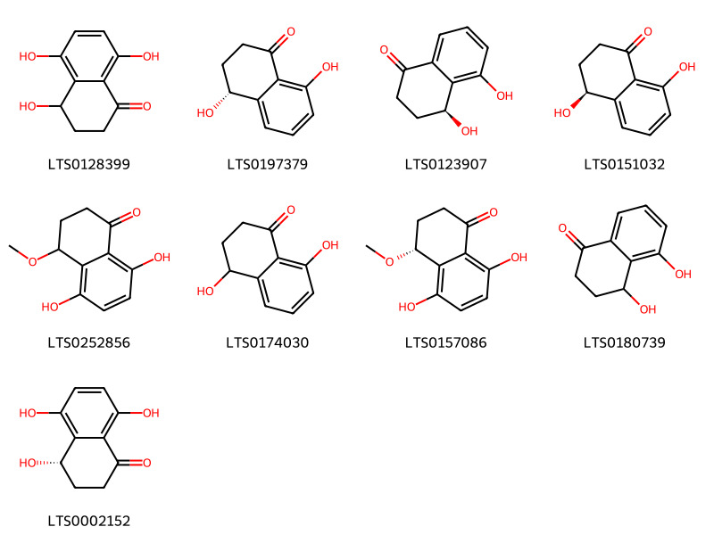{ width=100% }
    <figcaption>Hình ảnh cấu trúc hóa học của 9 hoạt chất thuộc nhóm Tetralins gồm ['4,5,8-trihydroxy-3,4-dihydro-2h-naphthalen-1-one (LTS0128399)', '(4r)-4,8-dihydroxy-3,4-dihydro-2h-naphthalen-1-one (LTS0197379)', '(4s)-4,5-dihydroxy-3,4-dihydro-2h-naphthalen-1-one (LTS0123907)', '(4s)-4,8-dihydroxy-3,4-dihydro-2h-naphthalen-1-one (LTS0151032)', '5,8-dihydroxy-4-methoxy-3,4-dihydro-2h-naphthalen-1-one (LTS0252856)', '4,8-dihydroxy-3,4-dihydro-2h-naphthalen-1-one (LTS0174030)', '(4r)-5,8-dihydroxy-4-methoxy-3,4-dihydro-2h-naphthalen-1-one (LTS0157086)', '4,5-dihydroxy-3,4-dihydro-2h-naphthalen-1-one (LTS0180739)', '(4s)-4,5,8-trihydroxy-3,4-dihydro-2h-naphthalen-1-one (LTS0002152)'].</figcaption>
</figure>
#### Nhóm Unsaturated hydrocarbons
<figure markdown="span">
    { width=100% }
    <figcaption>Hình ảnh cấu trúc hóa học của 1 hoạt chất thuộc nhóm Unsaturated hydrocarbons gồm ['α terpinene (LTS0232891)'].</figcaption>
</figure>

---

### Dược dân tộc học

Danh sách các quốc gia có sử dụng *Juglans regia* trong điều trị các bệnh. 

| Country   | Disease                                                                          | Bệnh                                                                                                                                                                                                |
|:----------|:---------------------------------------------------------------------------------|:----------------------------------------------------------------------------------------------------------------------------------------------------------------------------------------------------|
| China     | Diuretic, Laxative, Laxative, Stimulant, Tonic, Vermifuge, Vermifuge, Astringent | MYMEMORY WARNING: YOU USED ALL AVAILABLE FREE TRANSLATIONS FOR TODAY. NEXT AVAILABLE IN  06 HOURS 00 MINUTES 15 SECONDS VISIT HTTPS://MYMEMORY.TRANSLATED.NET/DOC/USAGELIMITS.PHP TO TRANSLATE MORE |
| Elsewhere | Astringent, nan, Vermifuge, Vermicide                                            | MYMEMORY WARNING: YOU USED ALL AVAILABLE FREE TRANSLATIONS FOR TODAY. NEXT AVAILABLE IN  06 HOURS 00 MINUTES 11 SECONDS VISIT HTTPS://MYMEMORY.TRANSLATED.NET/DOC/USAGELIMITS.PHP TO TRANSLATE MORE |
| India     | Insecticide, Dentifrice                                                          | MYMEMORY WARNING: YOU USED ALL AVAILABLE FREE TRANSLATIONS FOR TODAY. NEXT AVAILABLE IN  06 HOURS 00 MINUTES 06 SECONDS VISIT HTTPS://MYMEMORY.TRANSLATED.NET/DOC/USAGELIMITS.PHP TO TRANSLATE MORE |
| Iraq      | Vermifuge                                                                        | MYMEMORY WARNING: YOU USED ALL AVAILABLE FREE TRANSLATIONS FOR TODAY. NEXT AVAILABLE IN  06 HOURS 00 MINUTES 03 SECONDS VISIT HTTPS://MYMEMORY.TRANSLATED.NET/DOC/USAGELIMITS.PHP TO TRANSLATE MORE |
| Turkey    | Astringent, Cholagogue, Digestive, Hemostat, Laxative, Tonic, Vermifuge          | MYMEMORY WARNING: YOU USED ALL AVAILABLE FREE TRANSLATIONS FOR TODAY. NEXT AVAILABLE IN  05 HOURS 59 MINUTES 59 SECONDS VISIT HTTPS://MYMEMORY.TRANSLATED.NET/DOC/USAGELIMITS.PHP TO TRANSLATE MORE |
| ain       | Vermifuge                                                                        | MYMEMORY WARNING: YOU USED ALL AVAILABLE FREE TRANSLATIONS FOR TODAY. NEXT AVAILABLE IN  05 HOURS 59 MINUTES 55 SECONDS VISIT HTTPS://MYMEMORY.TRANSLATED.NET/DOC/USAGELIMITS.PHP TO TRANSLATE MORE |

---

---
## Juglans sieboldiana
### Thông tin về thực vật

!!! info "Phân loại thực vật của *Juglans mandshurica* từ GIBF:"
    - **Kingdom:** Plantae
    - **Phylum:** Tracheophyta
    - **Order:** Fagales
    - **Family:** Juglandaceae
    - **Genus:** Juglans
    - **Species:** *Juglans mandshurica*

 

| Label (VI)   | Label (EN)   | Scientific Name     | Descriptions (VI)   | Descriptions (EN)   | Also Known As (VI)   | Also Known As (EN)   |
|:-------------|:-------------|:--------------------|:--------------------|:--------------------|:---------------------|:---------------------|
| N/A          | N/A          | Juglans sieboldiana | loài thực vật       | species of plant    | ['']                 | ['']                 |

#### Phân bố trên thế giới

**Từ CSDL GIBF** nan, United States of America, Japan, El Salvador, Belgium, Nepal, China, New Zealand, unknown or invalid, Canada, Germany, France, Poland

#### Phân bố tại Việt Nam

**Từ CSDL GIBF**: Không có ghi nhận ở Việt Nam

---
### Thành phần hóa học
        
- Theo cơ sở dữ liệu lotus: Từ loài *Juglans mandshurica* đã phân lập và xác định được Chưa có hoạt chất nào được phân lập. hoạt chất thuộc về các nhóm Không có hoạt chất nào được phân lập. 

Không có hình ảnh nào được tạo ra

---

### Dược dân tộc học

Danh sách các quốc gia có sử dụng *Juglans mandshurica* trong điều trị các bệnh. 

| Country   | Disease                                    | Bệnh                                                                                                                                                                                                |
|:----------|:-------------------------------------------|:----------------------------------------------------------------------------------------------------------------------------------------------------------------------------------------------------|
| China     | Astringent, Diuretic, Vermifuge, Stimulant | MYMEMORY WARNING: YOU USED ALL AVAILABLE FREE TRANSLATIONS FOR TODAY. NEXT AVAILABLE IN  05 HOURS 58 MINUTES 56 SECONDS VISIT HTTPS://MYMEMORY.TRANSLATED.NET/DOC/USAGELIMITS.PHP TO TRANSLATE MORE |

---

# Chi Platycarya

??? note "Danh sách các dược liệu thuộc chi"
    
	 - *Platycarya strobilacea*

---
## Platycarya strobilacea
### Thông tin về thực vật

!!! info "Phân loại thực vật của *Platycarya strobilacea* từ GIBF:"
    - **Kingdom:** Plantae
    - **Phylum:** Tracheophyta
    - **Order:** Fagales
    - **Family:** Juglandaceae
    - **Genus:** Platycarya
    - **Species:** *Platycarya strobilacea*

 

| Label (VI)   | Label (EN)   | Scientific Name        | Descriptions (VI)   | Descriptions (EN)   | Also Known As (VI)   | Also Known As (EN)   |
|:-------------|:-------------|:-----------------------|:--------------------|:--------------------|:---------------------|:---------------------|
| N/A          | N/A          | Platycarya strobilacea | loài thực vật       | species of plant    | ['hóa hương']        | ['']                 |

#### Phân bố trên thế giới

**Từ CSDL GIBF** Japan, United States of America, Korea, Republic of, Chinese Taipei, China, France

#### Phân bố tại Việt Nam

**Từ CSDL GIBF**: Không có ghi nhận ở Việt Nam

---
### Thành phần hóa học
        
- Theo cơ sở dữ liệu lotus: Từ loài *Platycarya strobilacea* đã phân lập và xác định được 102 hoạt chất thuộc về các nhóm Fatty Acyls, Depsides and depsidones, Benzene and substituted derivatives, Flavonoids, Tannins, Coumarins and derivatives, Phenols, Hydroxy acids and derivatives, Organooxygen compounds, Furanoid lignans, Prenol lipids, Diarylheptanoids. 

|    | chemicalTaxonomyClassyfireClass     |   smiles_count |
|---:|:------------------------------------|---------------:|
|  0 | Benzene and substituted derivatives |              3 |
|  1 | Coumarins and derivatives           |              1 |
|  2 | Depsides and depsidones             |              2 |
|  3 | Diarylheptanoids                    |              3 |
|  4 | Fatty Acyls                         |              2 |
|  5 | Flavonoids                          |             14 |
|  6 | Furanoid lignans                    |              2 |
|  7 | Hydroxy acids and derivatives       |              1 |
|  8 | Organooxygen compounds              |              4 |
|  9 | Phenols                             |              5 |
| 10 | Prenol lipids                       |              8 |
| 11 | Tannins                             |             56 |

#### Nhóm Benzene and substituted derivatives
<figure markdown="span">
    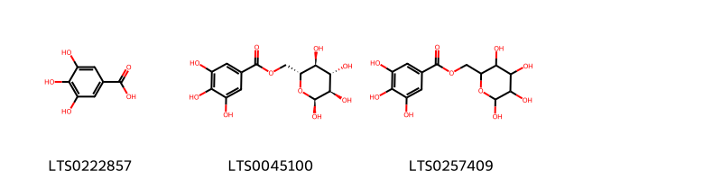{ width=100% }
    <figcaption>Hình ảnh cấu trúc hóa học của 3 hoạt chất thuộc nhóm Benzene and substituted derivatives gồm ['galop (LTS0222857)', '[(2r,3s,4s,5r,6s)-3,4,5,6-tetrahydroxyoxan-2-yl]methyl 3,4,5-trihydroxybenzoate (LTS0045100)', '(3,4,5,6-tetrahydroxyoxan-2-yl)methyl 3,4,5-trihydroxybenzoate (LTS0257409)'].</figcaption>
</figure>
#### Nhóm Coumarins and derivatives
<figure markdown="span">
    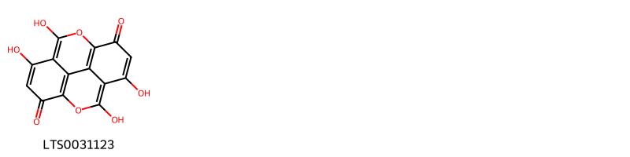{ width=100% }
    <figcaption>Hình ảnh cấu trúc hóa học của 1 hoạt chất thuộc nhóm Coumarins and derivatives gồm ['ellagic acid (LTS0031123)'].</figcaption>
</figure>
#### Nhóm Depsides and depsidones
<figure markdown="span">
    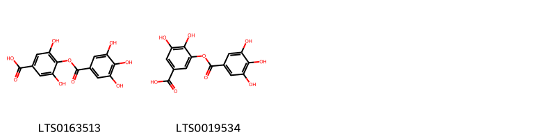{ width=100% }
    <figcaption>Hình ảnh cấu trúc hóa học của 2 hoạt chất thuộc nhóm Depsides and depsidones gồm ['3,5-dihydroxy-4-(3,4,5-trihydroxybenzoyloxy)benzoic acid (LTS0163513)', 'digallic acid (LTS0019534)'].</figcaption>
</figure>
#### Nhóm Diarylheptanoids
<figure markdown="span">
    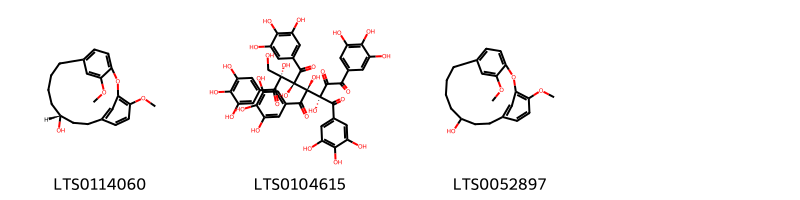{ width=100% }
    <figcaption>Hình ảnh cấu trúc hóa học của 3 hoạt chất thuộc nhóm Diarylheptanoids gồm ['(10r)-4,18-dimethoxy-2-oxatricyclo[13.2.2.1³,⁷]icosa-1(17),3(20),4,6,15,18-hexaen-10-ol (LTS0114060)', '(3s,4s,5r,6r)-3,4,5,6-tetrahydroxy-6-(hydroxymethyl)-3,4,5-tris(3,4,5-trihydroxybenzoyl)-1,7-bis(3,4,5-trihydroxyphenyl)heptane-1,2,7-trione (LTS0104615)', '4,18-dimethoxy-2-oxatricyclo[13.2.2.1³,⁷]icosa-1(17),3(20),4,6,15,18-hexaen-10-ol (LTS0052897)'].</figcaption>
</figure>
#### Nhóm Fatty Acyls
<figure markdown="span">
    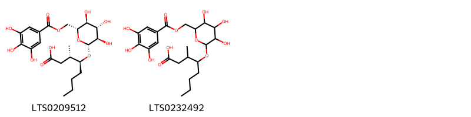{ width=100% }
    <figcaption>Hình ảnh cấu trúc hóa học của 2 hoạt chất thuộc nhóm Fatty Acyls gồm ['(3s,4s)-3-methyl-4-{[(2r,3r,4s,5s,6r)-3,4,5-trihydroxy-6-[(3,4,5-trihydroxybenzoyloxy)methyl]oxan-2-yl]oxy}octanoic acid (LTS0209512)', '3-methyl-4-({3,4,5-trihydroxy-6-[(3,4,5-trihydroxybenzoyloxy)methyl]oxan-2-yl}oxy)octanoic acid (LTS0232492)'].</figcaption>
</figure>
#### Nhóm Flavonoids
<figure markdown="span">
    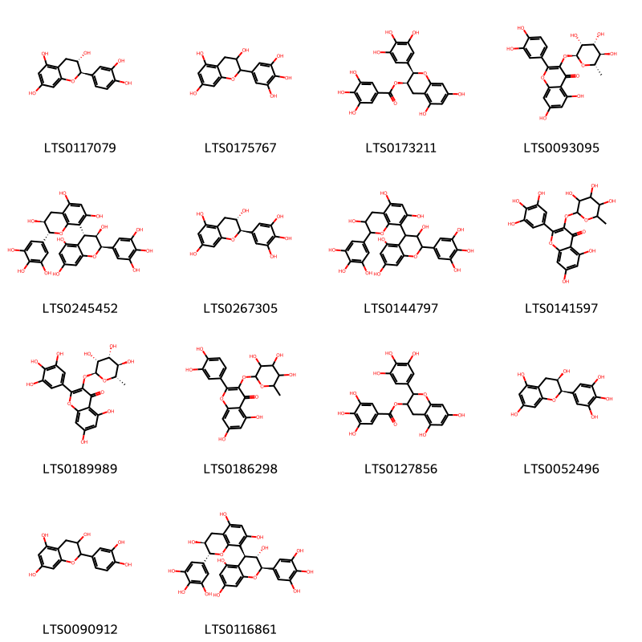{ width=100% }
    <figcaption>Hình ảnh cấu trúc hóa học của 14 hoạt chất thuộc nhóm Flavonoids gồm ['(+)-catechol (LTS0117079)', 'epigallocatechin (LTS0175767)', '(-)-epigallocatechin gallate (LTS0173211)', 'quercitrin (LTS0093095)', '(2r,3r,4r)-4-[(2r,3s)-3,5,7-trihydroxy-2-(3,4,5-trihydroxyphenyl)-3,4-dihydro-2h-1-benzopyran-8-yl]-2-(3,4,5-trihydroxyphenyl)-3,4-dihydro-2h-1-benzopyran-3,5,7-triol (LTS0245452)', 'gallocatechol (LTS0267305)', '4-[3,5,7-trihydroxy-2-(3,4,5-trihydroxyphenyl)-3,4-dihydro-2h-1-benzopyran-8-yl]-2-(3,4,5-trihydroxyphenyl)-3,4-dihydro-2h-1-benzopyran-3,5,7-triol (LTS0144797)', 'myricitrin (LTS0141597)', 'myricitrin (LTS0189989)', 'quercitrin (LTS0186298)', '5,7-dihydroxy-2-(3,4,5-trihydroxyphenyl)-3,4-dihydro-2h-1-benzopyran-3-yl 3,4,5-trihydroxybenzoate (LTS0127856)', 'epigallocatechin (LTS0052496)', 'catechol (LTS0090912)', '(2r,3s,4s)-4-[(2r,3s)-3,5,7-trihydroxy-2-(3,4,5-trihydroxyphenyl)-3,4-dihydro-2h-1-benzopyran-8-yl]-2-(3,4,5-trihydroxyphenyl)-3,4-dihydro-2h-1-benzopyran-3,5,7-triol (LTS0116861)'].</figcaption>
</figure>
#### Nhóm Furanoid lignans
<figure markdown="span">
    { width=100% }
    <figcaption>Hình ảnh cấu trúc hóa học của 2 hoạt chất thuộc nhóm Furanoid lignans gồm ['syringaresinol (LTS0116280)', '(-)-syringaresinol (LTS0076227)'].</figcaption>
</figure>
#### Nhóm Hydroxy acids and derivatives
<figure markdown="span">
    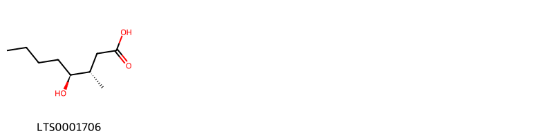{ width=100% }
    <figcaption>Hình ảnh cấu trúc hóa học của 1 hoạt chất thuộc nhóm Hydroxy acids and derivatives gồm ['(3s,4s)-4-hydroxy-3-methyloctanoic acid (LTS0001706)'].</figcaption>
</figure>
#### Nhóm Organooxygen compounds
<figure markdown="span">
    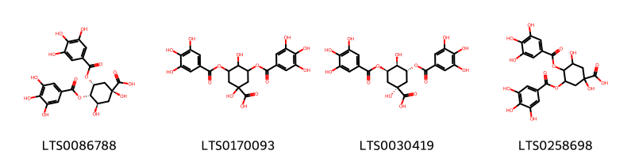{ width=100% }
    <figcaption>Hình ảnh cấu trúc hóa học của 4 hoạt chất thuộc nhóm Organooxygen compounds gồm ['(1s,3r,4s,5r)-1,3-dihydroxy-4,5-bis(3,4,5-trihydroxybenzoyloxy)cyclohexane-1-carboxylic acid (LTS0086788)', '1,4-dihydroxy-3,5-bis(3,4,5-trihydroxybenzoyloxy)cyclohexane-1-carboxylic acid (LTS0170093)', '(1r,3r,4r,5r)-1,4-dihydroxy-3,5-bis(3,4,5-trihydroxybenzoyloxy)cyclohexane-1-carboxylic acid (LTS0030419)', '1,3-dihydroxy-4,5-bis(3,4,5-trihydroxybenzoyloxy)cyclohexane-1-carboxylic acid (LTS0258698)'].</figcaption>
</figure>
#### Nhóm Phenols
<figure markdown="span">
    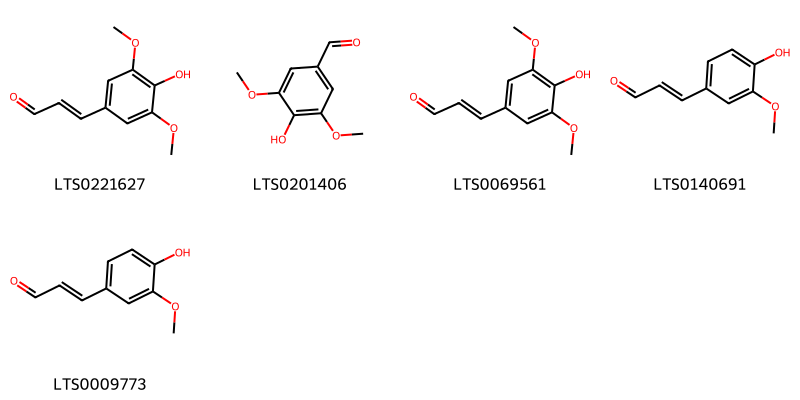{ width=100% }
    <figcaption>Hình ảnh cấu trúc hóa học của 5 hoạt chất thuộc nhóm Phenols gồm ['sinapyl aldehyde (LTS0221627)', 'syringaldehyde (LTS0201406)', 'sinapaldehyde (LTS0069561)', 'coniferyl aldehyde (LTS0140691)', 'coniferaldehyde (LTS0009773)'].</figcaption>
</figure>
#### Nhóm Prenol lipids
<figure markdown="span">
    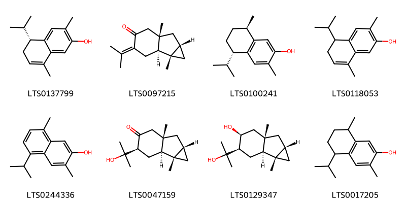{ width=100% }
    <figcaption>Hình ảnh cấu trúc hóa học của 8 hoạt chất thuộc nhóm Prenol lipids gồm ['(5r)-5-isopropyl-3,8-dimethyl-5,6-dihydronaphthalen-2-ol (LTS0137799)', '(1as,1bs,5as,6as)-1a,5a-dimethyl-3-(propan-2-ylidene)-hexahydrocyclopropa[a]inden-4-one (LTS0097215)', '(5s,8r)-5-isopropyl-3,8-dimethyl-5,6,7,8-tetrahydronaphthalen-2-ol (LTS0100241)', '5-isopropyl-3,8-dimethyl-5,6-dihydronaphthalen-2-ol (LTS0118053)', '7-hydroxycadalene (LTS0244336)', '(1as,1bs,3s,5as,6as)-3-(2-hydroxypropan-2-yl)-1a,5a-dimethyl-hexahydro-1h-cyclopropa[a]inden-4-one (LTS0047159)', '(1as,1bs,3r,4s,5as,6as)-3-(2-hydroxypropan-2-yl)-1a,5a-dimethyl-octahydrocyclopropa[a]inden-4-ol (LTS0129347)', '5-isopropyl-3,8-dimethyl-5,6,7,8-tetrahydronaphthalen-2-ol (LTS0017205)'].</figcaption>
</figure>
#### Nhóm Tannins
<figure markdown="span">
    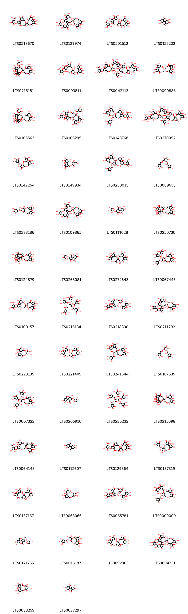{ width=100% }
    <figcaption>Hình ảnh cấu trúc hóa học của 56 hoạt chất thuộc nhóm Tannins gồm ['2-({7,8,9,12,13,14,20,28,30,33,34,35-dodecahydroxy-4,17,25,38-tetraoxo-3,18,21,24,39-pentaoxaheptacyclo[20.17.0.0²,¹⁹.0⁵,¹⁰.0¹¹,¹⁶.0²⁶,³¹.0³²,³⁷]nonatriaconta-5(10),6,8,11,13,15,26,28,30,32(37),33,35-dodecaen-29-yl}oxy)-3,4,5-trihydroxybenzoic acid (LTS0218670)', '14-{3,4,5,11,17,18,19-heptahydroxy-8,14-dioxo-9,13-dioxatricyclo[13.4.0.0²,⁷]nonadeca-1(15),2,4,6,16,18-hexaen-10-yl}-2,3,4,7,8,9-hexahydroxy-19-[3,5,7-trihydroxy-2-(3,4,5-trihydroxyphenyl)-3,4-dihydro-2h-1-benzopyran-8-yl]-13,16-dioxatetracyclo[13.3.1.0⁵,¹⁸.0⁶,¹¹]nonadeca-1(18),2,4,6,8,10-hexaene-12,17-dione (LTS0129974)', '2-{[(1r,2s,19r,20s,22r)-7,8,9,12,13,14,20,29,30,33,34,35-dodecahydroxy-4,17,25,38-tetraoxo-3,18,21,24,39-pentaoxaheptacyclo[20.17.0.0²,¹⁹.0⁵,¹⁰.0¹¹,¹⁶.0²⁶,³¹.0³²,³⁷]nonatriaconta-5,7,9,11(16),12,14,26(31),27,29,32(37),33,35-dodecaen-28-yl]oxy}-3,4,5-trihydroxybenzoic acid (LTS0201512)', '6,7,13-trihydroxy-14-methoxy-2,9-dioxatetracyclo[6.6.2.0⁴,¹⁶.0¹¹,¹⁵]hexadeca-1(15),4,6,8(16),11,13-hexaene-3,10-dione (LTS0125222)', '(11s,12r)-12-[(14r,15s,19s)-2,3,4,7,8,9-hexahydroxy-12,17-dioxo-19-[(2s,3r,4r,5s)-2,3,4,5-tetrahydroxyoxan-2-yl]-13,16-dioxatetracyclo[13.3.1.0⁵,¹⁸.0⁶,¹¹]nonadeca-1(18),2,4,6,8,10-hexaen-14-yl]-3,4,5,17,18,19-hexahydroxy-8,14-dioxo-9,13-dioxatricyclo[13.4.0.0²,⁷]nonadeca-1(15),2,4,6,16,18-hexaen-11-yl 3,4,5-trihydroxybenzoate (LTS0216151)', '2-({7,8,9,12,13,14,20,29,30,33,34,35-dodecahydroxy-4,17,25,38-tetraoxo-3,18,21,24,39-pentaoxaheptacyclo[20.17.0.0²,¹⁹.0⁵,¹⁰.0¹¹,¹⁶.0²⁶,³¹.0³²,³⁷]nonatriaconta-5(10),6,8,11,13,15,26(31),27,29,32(37),33,35-dodecaen-28-yl}oxy)-3,4,5-trihydroxybenzoic acid (LTS0093811)', '2-({20-[2-({7,8,9,12,13,14,20,29,30,33,34,35-dodecahydroxy-4,17,25,38-tetraoxo-3,18,21,24,39-pentaoxaheptacyclo[20.17.0.0²,¹⁹.0⁵,¹⁰.0¹¹,¹⁶.0²⁶,³¹.0³²,³⁷]nonatriaconta-5(10),6,8,11,13,15,26(31),27,29,32(37),33,35-dodecaen-28-yl}oxy)-3,4,5-trihydroxybenzoyloxy]-7,8,9,12,13,14,28,30,33,34,35-undecahydroxy-4,17,25,38-tetraoxo-3,18,21,24,39-pentaoxaheptacyclo[20.17.0.0²,¹⁹.0⁵,¹⁰.0¹¹,¹⁶.0²⁶,³¹.0³²,³⁷]nonatriaconta-5(10),6,8,11,13,15,26,28,30,32(37),33,35-dodecaen-29-yl}oxy)-3,4,5-trihydroxybenzoic acid (LTS0042113)', '14-{3,4,5,11,17,18,19-heptahydroxy-8,14-dioxo-9,13-dioxatricyclo[13.4.0.0²,⁷]nonadeca-1(15),2,4,6,16,18-hexaen-10-yl}-2,3,4,7,8,9,19-heptahydroxy-13,16-dioxatetracyclo[13.3.1.0⁵,¹⁸.0⁶,¹¹]nonadeca-1(18),2,4,6,8,10-hexaene-12,17-dione (LTS0090883)', '12-[2,3,4,7,8,9-hexahydroxy-12,17-dioxo-19-(2,3,4,5-tetrahydroxyoxan-2-yl)-13,16-dioxatetracyclo[13.3.1.0⁵,¹⁸.0⁶,¹¹]nonadeca-1(18),2,4,6,8,10-hexaen-14-yl]-3,4,5,17,18,19-hexahydroxy-8,14-dioxo-9,13-dioxatricyclo[13.4.0.0²,⁷]nonadeca-1(15),2,4,6,16,18-hexaen-11-yl 3,4,5-trihydroxybenzoate (LTS0105563)', '(1r,28r,30s,31r,48s)-6,7,8,16,17,18,22,36,37,38,41,42,43-tridecahydroxy-3,13,25,33,46-pentaoxo-2,12,20,26,29,32,47-heptaoxanonacyclo[26.20.0.0⁴,⁹.0¹⁰,²⁴.0¹¹,²¹.0¹⁴,¹⁹.0³¹,⁴⁸.0³⁴,³⁹.0⁴⁰,⁴⁵]octatetraconta-4(9),5,7,10,14,16,18,21,23,34(39),35,37,40,42,44-pentadecaen-30-yl 3,4,5-trihydroxybenzoate (LTS0105295)', '3,4,5-trihydroxy-2-{[7,8,9,12,13,14,28,30,33,34,35-undecahydroxy-4,17,25,38-tetraoxo-20-(3,4,5-trihydroxybenzoyloxy)-3,18,21,24,39-pentaoxaheptacyclo[20.17.0.0²,¹⁹.0⁵,¹⁰.0¹¹,¹⁶.0²⁶,³¹.0³²,³⁷]nonatriaconta-5,7,9,11(16),12,14,26,28,30,32(37),33,35-dodecaen-29-yl]oxy}benzoic acid (LTS0143768)', '2-{[(1r,2s,19r,20s,22r)-20-(2-{[(1r,2s,19r,20r,22r)-7,8,9,12,13,14,20,29,30,33,34,35-dodecahydroxy-4,17,25,38-tetraoxo-3,18,21,24,39-pentaoxaheptacyclo[20.17.0.0²,¹⁹.0⁵,¹⁰.0¹¹,¹⁶.0²⁶,³¹.0³²,³⁷]nonatriaconta-5,7,9,11(16),12,14,26(31),27,29,32(37),33,35-dodecaen-28-yl]oxy}-3,4,5-trihydroxybenzoyloxy)-7,8,9,12,13,14,28,30,33,34,35-undecahydroxy-4,17,25,38-tetraoxo-3,18,21,24,39-pentaoxaheptacyclo[20.17.0.0²,¹⁹.0⁵,¹⁰.0¹¹,¹⁶.0²⁶,³¹.0³²,³⁷]nonatriaconta-5,7,9,11(16),12,14,26,28,30,32(37),33,35-dodecaen-29-yl]oxy}-3,4,5-trihydroxybenzoic acid (LTS0270052)', '3,4,5,12,13,21,22,23-octahydroxy-8,18-dioxo-9,14,17-trioxatetracyclo[17.4.0.0²,⁷.0¹⁰,¹⁵]tricosa-1(23),2(7),3,5,19,21-hexaen-11-yl 3,4,5-trihydroxybenzoate (LTS0142264)', '3,4,5,11,14,20,21,22-octahydroxy-13-(hydroxymethyl)-9,12,16-trioxatetracyclo[16.4.0.0²,⁷.0¹⁰,¹⁵]docosa-1(22),2(7),3,5,18,20-hexaene-8,17-dione (LTS0149934)', '3,4,5-trihydroxy-2-{[(1r,2s,19r,20s,22r)-7,8,9,12,13,14,28,30,33,34,35-undecahydroxy-4,17,25,38-tetraoxo-20-(3,4,5-trihydroxybenzoyloxy)-3,18,21,24,39-pentaoxaheptacyclo[20.17.0.0²,¹⁹.0⁵,¹⁰.0¹¹,¹⁶.0²⁶,³¹.0³²,³⁷]nonatriaconta-5,7,9,11(16),12,14,26,28,30,32(37),33,35-dodecaen-29-yl]oxy}benzoic acid (LTS0230013)', '3,4,5-trihydroxy-6-[(3,4,5-trihydroxybenzoyloxy)methyl]oxan-2-yl 3,4,5-trihydroxybenzoate (LTS0089653)', '(10s,11r,12r,13s,15r)-3,4,5,11,12,21,22,23-octahydroxy-8,18-dioxo-9,14,17-trioxatetracyclo[17.4.0.0²,⁷.0¹⁰,¹⁵]tricosa-1(23),2(7),3,5,19,21-hexaen-13-yl 3,4,5-trihydroxybenzoate (LTS0233186)', '19-[2-(3,4-dihydroxyphenyl)-3,5,7-trihydroxy-3,4-dihydro-2h-1-benzopyran-8-yl]-14-{3,4,5,11,17,18,19-heptahydroxy-8,14-dioxo-9,13-dioxatricyclo[13.4.0.0²,⁷]nonadeca-1(15),2,4,6,16,18-hexaen-10-yl}-2,3,4,7,8,9-hexahydroxy-13,16-dioxatetracyclo[13.3.1.0⁵,¹⁸.0⁶,¹¹]nonadeca-1(18),2,4,6,8,10-hexaene-12,17-dione (LTS0109865)', '6,7,14-trihydroxy-13-{[(2s,3r,4s,5r)-3,4,5-trihydroxyoxan-2-yl]oxy}-2,9-dioxatetracyclo[6.6.2.0⁴,¹⁶.0¹¹,¹⁵]hexadeca-1(15),4,6,8(16),11,13-hexaene-3,10-dione (LTS0111028)', '(11s,12r)-12-[(14r,15s,19r)-2,3,4,7,8,9,19-heptahydroxy-12,17-dioxo-13,16-dioxatetracyclo[13.3.1.0⁵,¹⁸.0⁶,¹¹]nonadeca-1(18),2,4,6,8,10-hexaen-14-yl]-3,4,5,17,18,19-hexahydroxy-8,14-dioxo-9,13-dioxatricyclo[13.4.0.0²,⁷]nonadeca-1(15),2,4,6,16,18-hexaen-11-yl 3,4,5-trihydroxybenzoate (LTS0250730)', '(11r,12r)-12-[(14r,15s,19s)-2,3,4,7,8,9,19-heptahydroxy-12,17-dioxo-13,16-dioxatetracyclo[13.3.1.0⁵,¹⁸.0⁶,¹¹]nonadeca-1(18),2,4,6,8,10-hexaen-14-yl]-3,4,5,17,18,19-hexahydroxy-8,14-dioxo-9,13-dioxatricyclo[13.4.0.0²,⁷]nonadeca-1(15),2,4,6,16,18-hexaen-11-yl 3,4,5-trihydroxybenzoate (LTS0124879)', '6,7,14-trihydroxy-13-[(3,4,5-trihydroxyoxan-2-yl)oxy]-2,9-dioxatetracyclo[6.6.2.0⁴,¹⁶.0¹¹,¹⁵]hexadeca-1(15),4,6,8(16),11,13-hexaene-3,10-dione (LTS0265081)', '(1r,2s,19r,20s,22r)-7,8,9,12,13,14,20,28,29,30,33,34,35-tridecahydroxy-3,18,21,24,39-pentaoxaheptacyclo[20.17.0.0²,¹⁹.0⁵,¹⁰.0¹¹,¹⁶.0²⁶,³¹.0³²,³⁷]nonatriaconta-5(10),6,8,11,13,15,26(31),27,29,32,34,36-dodecaene-4,17,25,38-tetrone (LTS0272643)', '(10r,11s,12r,13s,15r)-3,4,5,21,22,23-hexahydroxy-8,18-dioxo-12,13-bis(3,4,5-trihydroxybenzoyloxy)-9,14,17-trioxatetracyclo[17.4.0.0²,⁷.0¹⁰,¹⁵]tricosa-1(23),2(7),3,5,19,21-hexaen-11-yl 3,4,5-trihydroxybenzoate (LTS0067445)', '2-[(12-{2,3,4,7,8,9,19-heptahydroxy-12,17-dioxo-13,16-dioxatetracyclo[13.3.1.0⁵,¹⁸.0⁶,¹¹]nonadeca-1(18),2,4,6,8,10-hexaen-14-yl}-3,5,11,17,18,19-hexahydroxy-8,14-dioxo-9,13-dioxatricyclo[13.4.0.0²,⁷]nonadeca-1(15),2,4,6,16,18-hexaen-4-yl)oxy]-3,4,5-trihydroxybenzoic acid (LTS0100157)', '(2s,3r,4s,5r,6r)-3,4,5-tris(3,4,5-trihydroxybenzoyloxy)-6-[(3,4,5-trihydroxybenzoyloxy)methyl]oxan-2-yl 3,4,5-trihydroxybenzoate (LTS0216134)', '6,7,8,16,17,18,22,30,36,37,38,41,42,43-tetradecahydroxy-2,12,20,26,29,32,47-heptaoxanonacyclo[26.20.0.0⁴,⁹.0¹⁰,²⁴.0¹¹,²¹.0¹⁴,¹⁹.0³¹,⁴⁸.0³⁴,³⁹.0⁴⁰,⁴⁵]octatetraconta-4(9),5,7,10(24),11(21),14(19),15,17,22,34,36,38,40(45),41,43-pentadecaene-3,13,25,33,46-pentone (LTS0218390)', '(14r,15s,19r)-19-[(2r,3s)-2-(3,4-dihydroxyphenyl)-3,5,7-trihydroxy-3,4-dihydro-2h-1-benzopyran-8-yl]-14-[(10r,11r)-3,4,5,11,17,18,19-heptahydroxy-8,14-dioxo-9,13-dioxatricyclo[13.4.0.0²,⁷]nonadeca-1(15),2,4,6,16,18-hexaen-10-yl]-2,3,4,7,8,9-hexahydroxy-13,16-dioxatetracyclo[13.3.1.0⁵,¹⁸.0⁶,¹¹]nonadeca-1(18),2,4,6,8,10-hexaene-12,17-dione (LTS0211292)', '3,4,5,11,12,13,21,22,23-nonahydroxy-9,14,17-trioxatetracyclo[17.4.0.0²,⁷.0¹⁰,¹⁵]tricosa-1(19),2,4,6,20,22-hexaene-8,18-dione (LTS0223135)', '7,8,9,12,13,14,20,28,29,30,33,34,35-tridecahydroxy-3,18,21,24,39-pentaoxaheptacyclo[20.17.0.0²,¹⁹.0⁵,¹⁰.0¹¹,¹⁶.0²⁶,³¹.0³²,³⁷]nonatriaconta-5(10),6,8,11,13,15,26(31),27,29,32,34,36-dodecaene-4,17,25,38-tetrone (LTS0221409)', 'casuarictin (LTS0241644)', '(2s,3r,4s,5s,6r)-3,4,5-trihydroxy-6-[(3,4,5-trihydroxybenzoyloxy)methyl]oxan-2-yl 3,4,5-trihydroxybenzoate (LTS0167635)', '3,4,5,21,22,23-hexahydroxy-8,18-dioxo-12,13-bis(3,4,5-trihydroxybenzoyloxy)-9,14,17-trioxatetracyclo[17.4.0.0²,⁷.0¹⁰,¹⁵]tricosa-1(23),2(7),3,5,19,21-hexaen-11-yl 3,4,5-trihydroxybenzoate (LTS0007322)', '6,14-dihydroxy-7-methoxy-13-[(3,4,5-trihydroxyoxan-2-yl)oxy]-2,9-dioxatetracyclo[6.6.2.0⁴,¹⁶.0¹¹,¹⁵]hexadeca-1(15),4,6,8(16),11,13-hexaene-3,10-dione (LTS0205916)', '3,4,5-tris(3,4,5-trihydroxybenzoyloxy)-6-[(3,4,5-trihydroxybenzoyloxy)methyl]oxan-2-yl 3,4,5-trihydroxybenzoate (LTS0226232)', '12-{2,3,4,7,8,9,19-heptahydroxy-12,17-dioxo-13,16-dioxatetracyclo[13.3.1.0⁵,¹⁸.0⁶,¹¹]nonadeca-1(18),2,4,6,8,10-hexaen-14-yl}-3,4,5,17,18,19-hexahydroxy-8,14-dioxo-9,13-dioxatricyclo[13.4.0.0²,⁷]nonadeca-1(15),2,4,6,16,18-hexaen-11-yl 3,4,5-trihydroxybenzoate (LTS0215098)', '2-{[(11r,12r)-12-[(14r,15s,19r)-2,3,4,7,8,9,19-heptahydroxy-12,17-dioxo-13,16-dioxatetracyclo[13.3.1.0⁵,¹⁸.0⁶,¹¹]nonadeca-1(18),2,4,6,8,10-hexaen-14-yl]-3,5,11,17,18,19-hexahydroxy-8,14-dioxo-9,13-dioxatricyclo[13.4.0.0²,⁷]nonadeca-1(15),2,4,6,16,18-hexaen-4-yl]oxy}-3,4,5-trihydroxybenzoic acid (LTS0064143)', '6,13-dihydroxy-7,14-dimethoxy-2,9-dioxatetracyclo[6.6.2.0⁴,¹⁶.0¹¹,¹⁵]hexadeca-1(15),4,6,8(16),11,13-hexaene-3,10-dione (LTS0112607)', '2-{[(1r,2s,19r,20s,22r)-7,8,9,12,13,14,20,28,30,33,34,35-dodecahydroxy-4,17,25,38-tetraoxo-3,18,21,24,39-pentaoxaheptacyclo[20.17.0.0²,¹⁹.0⁵,¹⁰.0¹¹,¹⁶.0²⁶,³¹.0³²,³⁷]nonatriaconta-5,7,9,11(16),12,14,26,28,30,32(37),33,35-dodecaen-29-yl]oxy}-3,4,5-trihydroxybenzoic acid (LTS0129364)', '(10r,11r,12r,13s,15r)-3,4,5,12,13,21,22,23-octahydroxy-8,18-dioxo-9,14,17-trioxatetracyclo[17.4.0.0²,⁷.0¹⁰,¹⁵]tricosa-1(23),2(7),3,5,19,21-hexaen-11-yl 3,4,5-trihydroxybenzoate (LTS0137319)', '(1r,2s,19r,22r)-7,8,9,12,13,14,20,28,29,30,33,34,35-tridecahydroxy-3,18,21,24,39-pentaoxaheptacyclo[20.17.0.0²,¹⁹.0⁵,¹⁰.0¹¹,¹⁶.0²⁶,³¹.0³²,³⁷]nonatriaconta-5(10),6,8,11,13,15,26(31),27,29,32,34,36-dodecaene-4,17,25,38-tetrone (LTS0137167)', '(10s,11r,12r,13r,15r)-3,4,5,11,12,13,21,22,23-nonahydroxy-9,14,17-trioxatetracyclo[17.4.0.0²,⁷.0¹⁰,¹⁵]tricosa-1(19),2,4,6,20,22-hexaene-8,18-dione (LTS0063066)', '(1r,28r,30s,31r,48s)-6,7,8,16,17,18,22,30,36,37,38,41,42,43-tetradecahydroxy-2,12,20,26,29,32,47-heptaoxanonacyclo[26.20.0.0⁴,⁹.0¹⁰,²⁴.0¹¹,²¹.0¹⁴,¹⁹.0³¹,⁴⁸.0³⁴,³⁹.0⁴⁰,⁴⁵]octatetraconta-4(9),5,7,10(24),11(21),14(19),15,17,22,34(39),35,37,40,42,44-pentadecaene-3,13,25,33,46-pentone (LTS0065781)', '7,8,9,12,13,14,28,29,30,33,34,35-dodecahydroxy-4,17,25,38-tetraoxo-3,18,21,24,39-pentaoxaheptacyclo[20.17.0.0²,¹⁹.0⁵,¹⁰.0¹¹,¹⁶.0²⁶,³¹.0³²,³⁷]nonatriaconta-5,7,9,11(16),12,14,26,28,30,32(37),33,35-dodecaen-20-yl 3,4,5-trihydroxybenzoate (LTS0009009)', '6-hydroxy-7,14-dimethoxy-13-{[(2s,3r,4s,5r)-3,4,5-trihydroxyoxan-2-yl]oxy}-2,9-dioxatetracyclo[6.6.2.0⁴,¹⁶.0¹¹,¹⁵]hexadeca-1(15),4,6,8(16),11,13-hexaene-3,10-dione (LTS0121766)', '3,4,5,11,12,21,22,23-octahydroxy-8,18-dioxo-9,14,17-trioxatetracyclo[17.4.0.0²,⁷.0¹⁰,¹⁵]tricosa-1(23),2(7),3,5,19,21-hexaen-13-yl 3,4,5-trihydroxybenzoate (LTS0016187)', '(1r,2s,19r,20r,22r)-7,8,9,12,13,14,20,28,29,30,33,34,35-tridecahydroxy-3,18,21,24,39-pentaoxaheptacyclo[20.17.0.0²,¹⁹.0⁵,¹⁰.0¹¹,¹⁶.0²⁶,³¹.0³²,³⁷]nonatriaconta-5(10),6,8,11,13,15,26(31),27,29,32,34,36-dodecaene-4,17,25,38-tetrone (LTS0092963)', '(14r,15s,19r)-14-[(10r,11r)-3,4,5,11,17,18,19-heptahydroxy-8,14-dioxo-9,13-dioxatricyclo[13.4.0.0²,⁷]nonadeca-1(15),2,4,6,16,18-hexaen-10-yl]-2,3,4,7,8,9-hexahydroxy-19-[(2r,3s)-3,5,7-trihydroxy-2-(3,4,5-trihydroxyphenyl)-3,4-dihydro-2h-1-benzopyran-8-yl]-13,16-dioxatetracyclo[13.3.1.0⁵,¹⁸.0⁶,¹¹]nonadeca-1(18),2,4,6,8,10-hexaene-12,17-dione (LTS0094731)', '(10r,11r,13r,14r,15s)-3,4,5,11,14,20,21,22-octahydroxy-13-(hydroxymethyl)-9,12,16-trioxatetracyclo[16.4.0.0²,⁷.0¹⁰,¹⁵]docosa-1(18),2,4,6,19,21-hexaene-8,17-dione (LTS0033259)', 'ellagic acid (LTS0037297)', '(14r,15s,19r)-14-[(10r,11r)-3,4,5,11,17,18,19-heptahydroxy-8,14-dioxo-9,13-dioxatricyclo[13.4.0.0²,⁷]nonadeca-1(15),2,4,6,16,18-hexaen-10-yl]-2,3,4,7,8,9,19-heptahydroxy-13,16-dioxatetracyclo[13.3.1.0⁵,¹⁸.0⁶,¹¹]nonadeca-1(18),2,4,6,8,10-hexaene-12,17-dione (LTS0041901)', '6,7,8,16,17,18,22,36,37,38,41,42,43-tridecahydroxy-3,13,25,33,46-pentaoxo-2,12,20,26,29,32,47-heptaoxanonacyclo[26.20.0.0⁴,⁹.0¹⁰,²⁴.0¹¹,²¹.0¹⁴,¹⁹.0³¹,⁴⁸.0³⁴,³⁹.0⁴⁰,⁴⁵]octatetraconta-4(9),5,7,10,14,16,18,21,23,34(39),35,37,40,42,44-pentadecaen-30-yl 3,4,5-trihydroxybenzoate (LTS0108824)', '6,14-dihydroxy-7-methoxy-13-{[(2s,3r,4s,5r)-3,4,5-trihydroxyoxan-2-yl]oxy}-2,9-dioxatetracyclo[6.6.2.0⁴,¹⁶.0¹¹,¹⁵]hexadeca-1(15),4,6,8(16),11,13-hexaene-3,10-dione (LTS0048017)', '(14r,15s,19s)-14-[(10r,11r)-3,4,5,11,17,18,19-heptahydroxy-8,14-dioxo-9,13-dioxatricyclo[13.4.0.0²,⁷]nonadeca-1(15),2,4,6,16,18-hexaen-10-yl]-2,3,4,7,8,9,19-heptahydroxy-13,16-dioxatetracyclo[13.3.1.0⁵,¹⁸.0⁶,¹¹]nonadeca-1(18),2,4,6,8,10-hexaene-12,17-dione (LTS0042847)', '(11r,12r)-12-[(15s,19s)-2,3,4,7,8,9,19-heptahydroxy-12,17-dioxo-13,16-dioxatetracyclo[13.3.1.0⁵,¹⁸.0⁶,¹¹]nonadeca-1(18),2,4,6,8,10-hexaen-14-yl]-3,4,5,17,18,19-hexahydroxy-8,14-dioxo-9,13-dioxatricyclo[13.4.0.0²,⁷]nonadeca-1(15),2,4,6,16,18-hexaen-11-yl 3,4,5-trihydroxybenzoate (LTS0107688)', '6-hydroxy-7,14-dimethoxy-13-[(3,4,5-trihydroxyoxan-2-yl)oxy]-2,9-dioxatetracyclo[6.6.2.0⁴,¹⁶.0¹¹,¹⁵]hexadeca-1(15),4,6,8(16),11,13-hexaene-3,10-dione (LTS0042546)'].</figcaption>
</figure>

---

### Dược dân tộc học

Danh sách các quốc gia có sử dụng *Platycarya strobilacea* trong điều trị các bệnh. 

| Country   | Disease   | Bệnh                                                                                                                                                                                                |
|:----------|:----------|:----------------------------------------------------------------------------------------------------------------------------------------------------------------------------------------------------|
| China     | Perfume   | MYMEMORY WARNING: YOU USED ALL AVAILABLE FREE TRANSLATIONS FOR TODAY. NEXT AVAILABLE IN  05 HOURS 58 MINUTES 31 SECONDS VISIT HTTPS://MYMEMORY.TRANSLATED.NET/DOC/USAGELIMITS.PHP TO TRANSLATE MORE |

---

# Chi Pterocarya

??? note "Danh sách các dược liệu thuộc chi"
    
	 - *Pterocarya stenoptera*

---
## Pterocarya stenoptera
### Thông tin về thực vật

!!! info "Phân loại thực vật của *Pterocarya stenoptera* từ GIBF:"
    - **Kingdom:** Plantae
    - **Phylum:** Tracheophyta
    - **Order:** Fagales
    - **Family:** Juglandaceae
    - **Genus:** Pterocarya
    - **Species:** *Pterocarya stenoptera*

 

| Label (VI)   | Label (EN)   | Scientific Name       | Descriptions (VI)   | Descriptions (EN)   | Also Known As (VI)   | Also Known As (EN)   |
|:-------------|:-------------|:----------------------|:--------------------|:--------------------|:---------------------|:---------------------|
| N/A          | N/A          | Pterocarya stenoptera | loài thực vật       | species of plant    | ['']                 | ['Chinese Wingnut']  |

#### Phân bố trên thế giới

**Từ CSDL GIBF** Viet Nam, United States of America, Japan, Korea, Republic of, Belgium, Chinese Taipei, Ukraine, China, South Africa, New Zealand, Korea (Democratic People’s Republic of), Germany, Poland

#### Phân bố tại Việt Nam

**Từ CSDL GIBF**: Phú Thọ

---
### Thành phần hóa học
        
- Theo cơ sở dữ liệu lotus: Từ loài *Pterocarya stenoptera* đã phân lập và xác định được 2 hoạt chất thuộc về các nhóm Tannins. 

|    | chemicalTaxonomyClassyfireClass   |   smiles_count |
|---:|:----------------------------------|---------------:|
|  0 | Tannins                           |              2 |

#### Nhóm Tannins
<figure markdown="span">
    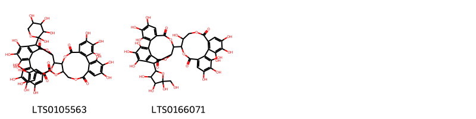{ width=100% }
    <figcaption>Hình ảnh cấu trúc hóa học của 2 hoạt chất thuộc nhóm Tannins gồm ['12-[2,3,4,7,8,9-hexahydroxy-12,17-dioxo-19-(2,3,4,5-tetrahydroxyoxan-2-yl)-13,16-dioxatetracyclo[13.3.1.0⁵,¹⁸.0⁶,¹¹]nonadeca-1(18),2,4,6,8,10-hexaen-14-yl]-3,4,5,17,18,19-hexahydroxy-8,14-dioxo-9,13-dioxatricyclo[13.4.0.0²,⁷]nonadeca-1(15),2,4,6,16,18-hexaen-11-yl 3,4,5-trihydroxybenzoate (LTS0105563)', '14-{3,4,5,11,17,18,19-heptahydroxy-8,14-dioxo-9,13-dioxatricyclo[13.4.0.0²,⁷]nonadeca-1(15),2,4,6,16,18-hexaen-10-yl}-2,3,4,7,8,9-hexahydroxy-19-[3,4,5-trihydroxy-5-(hydroxymethyl)oxolan-2-yl]-13,16-dioxatetracyclo[13.3.1.0⁵,¹⁸.0⁶,¹¹]nonadeca-1(18),2,4,6,8,10-hexaene-12,17-dione (LTS0166071)'].</figcaption>
</figure>

---

### Dược dân tộc học

Danh sách các quốc gia có sử dụng *Pterocarya stenoptera* trong điều trị các bệnh. 

| Country   | Disease                            | Bệnh                                                                                                                                                                                                |
|:----------|:-----------------------------------|:----------------------------------------------------------------------------------------------------------------------------------------------------------------------------------------------------|
| China     | Carminative, Astringent, Vermifuge | MYMEMORY WARNING: YOU USED ALL AVAILABLE FREE TRANSLATIONS FOR TODAY. NEXT AVAILABLE IN  05 HOURS 57 MINUTES 49 SECONDS VISIT HTTPS://MYMEMORY.TRANSLATED.NET/DOC/USAGELIMITS.PHP TO TRANSLATE MORE |

---

# Chi Engelhardtia

??? note "Danh sách các dược liệu thuộc chi"
    
	 - *Engelhardtia icata*
	 - *Engelhardtia polystachya*

---
## Engelhardtia icata
### Thông tin về thực vật

!!! info "Phân loại thực vật của *N/A* từ GIBF:"
    - **Kingdom:** N/A
    - **Phylum:** N/A
    - **Order:** N/A
    - **Family:** N/A
    - **Genus:** N/A
    - **Species:** *N/A*

 

| Label (VI)   | Label (EN)   | Scientific Name       | Descriptions (VI)   | Descriptions (EN)   | Also Known As (VI)   | Also Known As (EN)   |
|:-------------|:-------------|:----------------------|:--------------------|:--------------------|:---------------------|:---------------------|
| N/A          | N/A          | Pterocarya stenoptera | loài thực vật       | species of plant    | ['']                 | ['Chinese Wingnut']  |

#### Phân bố trên thế giới

**Từ CSDL GIBF** Không có kết quả phù hợp

#### Phân bố tại Việt Nam

**Từ CSDL GIBF**: Không có ghi nhận ở Việt Nam

---
### Thành phần hóa học
        
- Theo cơ sở dữ liệu lotus: Từ loài *N/A* đã phân lập và xác định được Chưa có hoạt chất nào được phân lập. hoạt chất thuộc về các nhóm Không có hoạt chất nào được phân lập. 

Không có hình ảnh nào được tạo ra

---

### Dược dân tộc học

Danh sách các quốc gia có sử dụng *N/A* trong điều trị các bệnh. 

| Country   | Disease             | Bệnh                                                                                                                                                                                                |
|:----------|:--------------------|:----------------------------------------------------------------------------------------------------------------------------------------------------------------------------------------------------|
| India     | Piscicide, Fumigant | MYMEMORY WARNING: YOU USED ALL AVAILABLE FREE TRANSLATIONS FOR TODAY. NEXT AVAILABLE IN  05 HOURS 57 MINUTES 25 SECONDS VISIT HTTPS://MYMEMORY.TRANSLATED.NET/DOC/USAGELIMITS.PHP TO TRANSLATE MORE |

---

---
## Engelhardtia polystachya
### Thông tin về thực vật

!!! info "Phân loại thực vật của *Engelhardtia roxburghiana* từ GIBF:"
    - **Kingdom:** Plantae
    - **Phylum:** Tracheophyta
    - **Order:** Fagales
    - **Family:** Juglandaceae
    - **Genus:** Engelhardtia
    - **Species:** *Engelhardtia roxburghiana*

 

| Label (VI)   | Label (EN)   | Scientific Name       | Descriptions (VI)   | Descriptions (EN)   | Also Known As (VI)   | Also Known As (EN)   |
|:-------------|:-------------|:----------------------|:--------------------|:--------------------|:---------------------|:---------------------|
| N/A          | N/A          | Pterocarya stenoptera | loài thực vật       | species of plant    | ['']                 | ['Chinese Wingnut']  |

#### Phân bố trên thế giới

**Từ CSDL GIBF** Không có kết quả phù hợp

#### Phân bố tại Việt Nam

**Từ CSDL GIBF**: Không có ghi nhận ở Việt Nam

---
### Thành phần hóa học
        
- Theo cơ sở dữ liệu lotus: Từ loài *Engelhardtia roxburghiana* đã phân lập và xác định được Chưa có hoạt chất nào được phân lập. hoạt chất thuộc về các nhóm Không có hoạt chất nào được phân lập. 

Không có hình ảnh nào được tạo ra

---

### Dược dân tộc học

Danh sách các quốc gia có sử dụng *Engelhardtia roxburghiana* trong điều trị các bệnh. 

| Country   | Disease   | Bệnh                                                                                                                                                                                                |
|:----------|:----------|:----------------------------------------------------------------------------------------------------------------------------------------------------------------------------------------------------|
| Elsewhere | Piscicide | MYMEMORY WARNING: YOU USED ALL AVAILABLE FREE TRANSLATIONS FOR TODAY. NEXT AVAILABLE IN  05 HOURS 57 MINUTES 07 SECONDS VISIT HTTPS://MYMEMORY.TRANSLATED.NET/DOC/USAGELIMITS.PHP TO TRANSLATE MORE |
| India     | Piscicide | MYMEMORY WARNING: YOU USED ALL AVAILABLE FREE TRANSLATIONS FOR TODAY. NEXT AVAILABLE IN  05 HOURS 57 MINUTES 03 SECONDS VISIT HTTPS://MYMEMORY.TRANSLATED.NET/DOC/USAGELIMITS.PHP TO TRANSLATE MORE |

---

# Chi Carya

??? note "Danh sách các dược liệu thuộc chi"
    
	 - *Carya illinoensis*
	 - *Carya ovata*

---
## Carya illinoensis
### Thông tin về thực vật

!!! info "Phân loại thực vật của *Carya illinoensis* từ GIBF:"
    - **Kingdom:** Plantae
    - **Phylum:** Tracheophyta
    - **Order:** Fagales
    - **Family:** Juglandaceae
    - **Genus:** Carya
    - **Species:** *Carya illinoensis*

 

| Label (VI)   | Label (EN)   | Scientific Name       | Descriptions (VI)   | Descriptions (EN)   | Also Known As (VI)   | Also Known As (EN)   |
|:-------------|:-------------|:----------------------|:--------------------|:--------------------|:---------------------|:---------------------|
| N/A          | N/A          | Pterocarya stenoptera | loài thực vật       | species of plant    | ['']                 | ['Chinese Wingnut']  |

#### Phân bố trên thế giới

**Từ CSDL GIBF** nan, Mexico, Brazil, United States of America, Japan, China, Australia, New Zealand, United Kingdom of Great Britain and Northern Ireland, Spain

#### Phân bố tại Việt Nam

**Từ CSDL GIBF**: Không có ghi nhận ở Việt Nam

---
### Thành phần hóa học
        
- Theo cơ sở dữ liệu lotus: Từ loài *Carya illinoensis* đã phân lập và xác định được Chưa có hoạt chất nào được phân lập. hoạt chất thuộc về các nhóm Không có hoạt chất nào được phân lập. 

Không có hình ảnh nào được tạo ra

---

### Dược dân tộc học

Danh sách các quốc gia có sử dụng *Carya illinoensis* trong điều trị các bệnh. 

| Country   | Disease    | Bệnh                                                                                                                                                                                                |
|:----------|:-----------|:----------------------------------------------------------------------------------------------------------------------------------------------------------------------------------------------------|
| Mexico    | Astringent | MYMEMORY WARNING: YOU USED ALL AVAILABLE FREE TRANSLATIONS FOR TODAY. NEXT AVAILABLE IN  05 HOURS 56 MINUTES 37 SECONDS VISIT HTTPS://MYMEMORY.TRANSLATED.NET/DOC/USAGELIMITS.PHP TO TRANSLATE MORE |

---

---
## Carya ovata
### Thông tin về thực vật

!!! info "Phân loại thực vật của *Carya ovata* từ GIBF:"
    - **Kingdom:** Plantae
    - **Phylum:** Tracheophyta
    - **Order:** Fagales
    - **Family:** Juglandaceae
    - **Genus:** Carya
    - **Species:** *Carya ovata*

 

| Label (VI)   | Label (EN)   | Scientific Name   | Descriptions (VI)   | Descriptions (EN)   | Also Known As (VI)   | Also Known As (EN)                     |
|:-------------|:-------------|:------------------|:--------------------|:--------------------|:---------------------|:---------------------------------------|
| N/A          | N/A          | Carya ovata       | loài thực vật       | species of plant    | ['']                 | ['shagbark hickory', 'upland hickory'] |

#### Phân bố trên thế giới

**Từ CSDL GIBF** Mexico, United States of America, Canada

#### Phân bố tại Việt Nam

**Từ CSDL GIBF**: Không có ghi nhận ở Việt Nam

---
### Thành phần hóa học
        
- Theo cơ sở dữ liệu lotus: Từ loài *Carya ovata* đã phân lập và xác định được 8 hoạt chất thuộc về các nhóm Cinnamic acids and derivatives, Benzene and substituted derivatives. 

|    | chemicalTaxonomyClassyfireClass     |   smiles_count |
|---:|:------------------------------------|---------------:|
|  0 | Benzene and substituted derivatives |              6 |
|  1 | Cinnamic acids and derivatives      |              2 |

#### Nhóm Benzene and substituted derivatives
<figure markdown="span">
    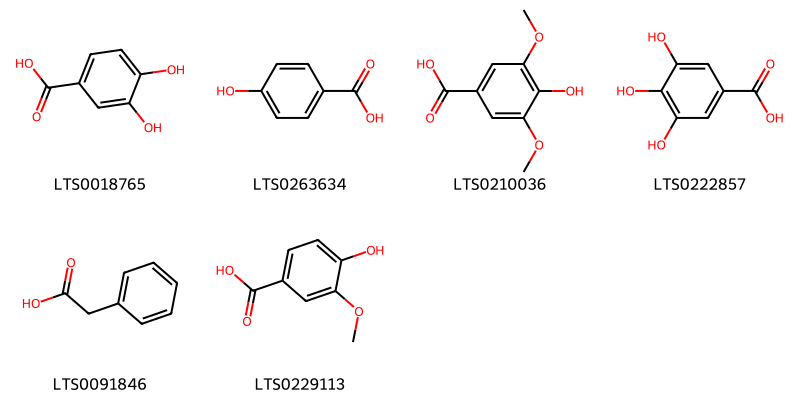{ width=100% }
    <figcaption>Hình ảnh cấu trúc hóa học của 6 hoạt chất thuộc nhóm Benzene and substituted derivatives gồm ['3,4-dihydroxybenzoic acid (LTS0018765)', 'p-hydroxybenzoic acid (LTS0263634)', 'syringic acid (LTS0210036)', 'galop (LTS0222857)', 'ω-phenylacetic acid (LTS0091846)', 'vanillic acid (LTS0229113)'].</figcaption>
</figure>
#### Nhóm Cinnamic acids and derivatives
<figure markdown="span">
    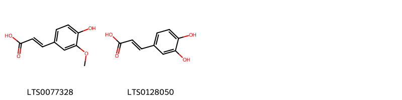{ width=100% }
    <figcaption>Hình ảnh cấu trúc hóa học của 2 hoạt chất thuộc nhóm Cinnamic acids and derivatives gồm ['ferulic acid (LTS0077328)', '3,4-dihydroxycinnamic acid (LTS0128050)'].</figcaption>
</figure>

---

### Dược dân tộc học

Danh sách các quốc gia có sử dụng *Carya ovata* trong điều trị các bệnh. 

| Country        | Disease    | Bệnh                                                                                                                                                                                                |
|:---------------|:-----------|:----------------------------------------------------------------------------------------------------------------------------------------------------------------------------------------------------|
| US(Appalachia) | Intoxicant | MYMEMORY WARNING: YOU USED ALL AVAILABLE FREE TRANSLATIONS FOR TODAY. NEXT AVAILABLE IN  05 HOURS 56 MINUTES 15 SECONDS VISIT HTTPS://MYMEMORY.TRANSLATED.NET/DOC/USAGELIMITS.PHP TO TRANSLATE MORE |

---

