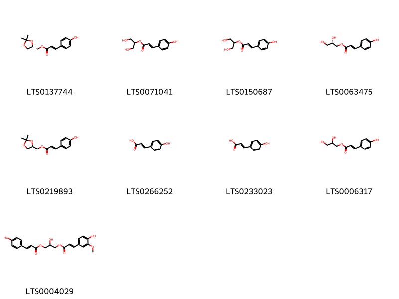
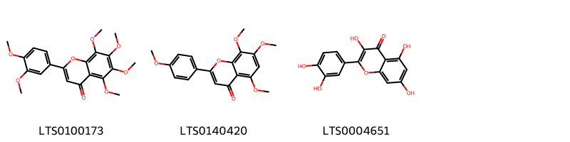
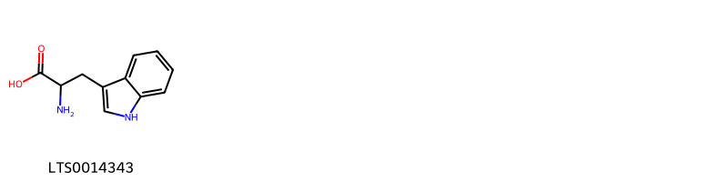
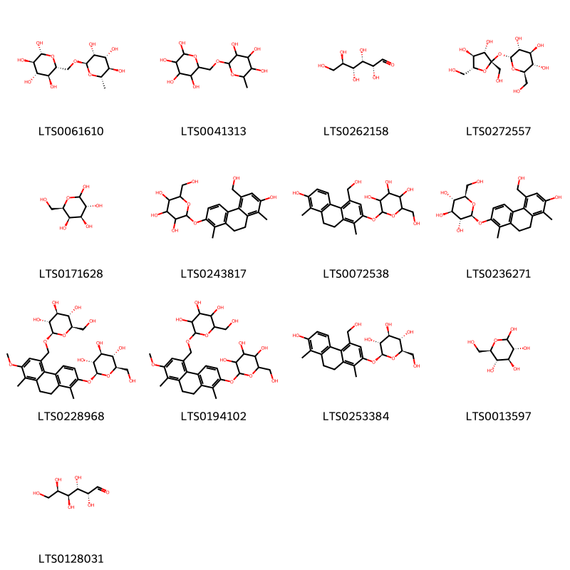
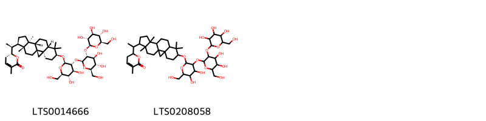
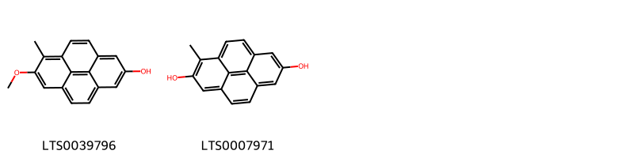
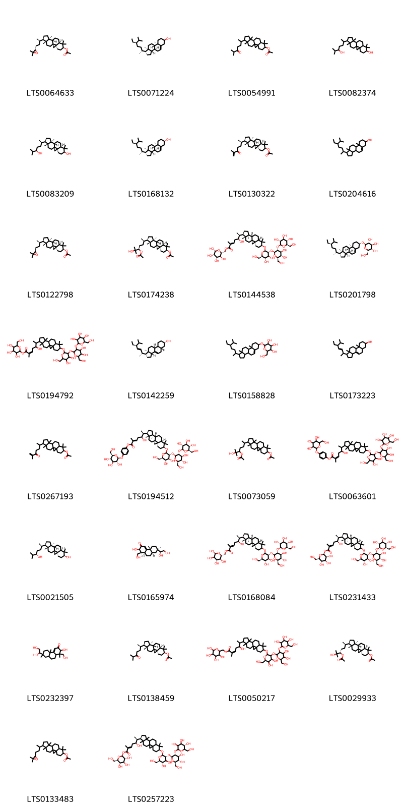

!!! abstract "Tóm tắt"

    Họ Juncaceae gồm khoảng 1 chi và 4 loài được một số cộng đồng tại các quốc gia như Turkey, Elsewhere, Europe, Iraq, China, Egypt sử dụng trong một số trường hợp Thuốc chống đông máu, Không rõ ràng, Thuốc lợi tiểu, Thuốc lợi tiểu, Thuốc lợi tiểu, Thuốc lợi tiểu, Thần kinh, Thuốc an thần, Chất độc, Thuốc lợi tiểu, Thuốc tan sỏi, Không rõ ràng, Thuốc lợi tiểu.

!!! info "DrDuke"

    James A. Duke sinh năm 1929-2017 là một nhà thực vật học người Mỹ. Đây là một trong những tác giả hàng đầu trong lĩnh vực dược dân tộc học với cuốn *CRC Handbook of Medicinal Herbs* và chính là người xây dựng lên cơ sở dữ liệu về hợp chất tự nhiên và dược dân tộc học tại Bộ nông nghiệp Hoa Kỳ. Các thông tin được đăng tải tại website [Dr. Duke's Phytochemical and Ethnobotanical Databases](https://phytochem.nal.usda.gov/). 
    Trong suốt thập niên 1970, ông lãnh đạo the Plant Taxonomy Laboratory, Plant Genetics and Germplasm Institute of the Agricultural Research Service, U.S. Department of Agriculture.
    Trong tài liệu này, các thông tin về dược dân tộc của các dược liệu được trích dẫn từ tài liệu của James A. Ducke với sự trợ giúp của phần mềm dịch thuật từ tiếng Anh sang tiếng Việt.
   

# Chi Juncus

??? note "Danh sách các dược liệu thuộc chi"
    
	 - *Juncus arabicus*
	 - *Juncus effusus*
	 - *Juncus inflexus*
	 - *Juncus maritimus*

---
## Juncus arabicus
### Thông tin về thực vật

!!! info "Phân loại thực vật của *Juncus rigidus* từ GIBF:"
    - **Kingdom:** Plantae
    - **Phylum:** Tracheophyta
    - **Order:** Poales
    - **Family:** Juncaceae
    - **Genus:** Juncus
    - **Species:** *Juncus rigidus*

 

| Label (VI)   | Label (EN)   | Scientific Name   | Descriptions (VI)   | Descriptions (EN)   | Also Known As (VI)   | Also Known As (EN)   |
|:-------------|:-------------|:------------------|:--------------------|:--------------------|:---------------------|:---------------------|
| N/A          | N/A          | Juncus arabicus   | loài thực vật       | species of plant    | ['']                 | ['']                 |

#### Phân bố trên thế giới

**Từ CSDL GIBF** nan, South Africa, Syrian Arab Republic, Cyprus, Namibia, Egypt, Palestine, State of, unknown or invalid, Israel, Saudi Arabia

#### Phân bố tại Việt Nam

**Từ CSDL GIBF**: Không có ghi nhận ở Việt Nam

---
### Thành phần hóa học
        
- Theo cơ sở dữ liệu lotus: Từ loài *Juncus rigidus* đã phân lập và xác định được Chưa có hoạt chất nào được phân lập. hoạt chất thuộc về các nhóm Không có hoạt chất nào được phân lập. 

Không có hình ảnh nào được tạo ra

---

### Dược dân tộc học

Danh sách các quốc gia có sử dụng *Juncus rigidus* trong điều trị các bệnh. 

| Country   | Disease   | Bệnh           |
|:----------|:----------|:---------------|
| Egypt     | Diuretic  | Thuốc lợi tiêu |

---

---
## Juncus effusus
### Thông tin về thực vật

!!! info "Phân loại thực vật của *Juncus effusus* từ GIBF:"
    - **Kingdom:** Plantae
    - **Phylum:** Tracheophyta
    - **Order:** Poales
    - **Family:** Juncaceae
    - **Genus:** Juncus
    - **Species:** *Juncus effusus*

 

| Label (VI)   | Label (EN)   | Scientific Name   | Descriptions (VI)   | Descriptions (EN)   | Also Known As (VI)   | Also Known As (EN)   |
|:-------------|:-------------|:------------------|:--------------------|:--------------------|:---------------------|:---------------------|
| N/A          | N/A          | Juncus effusus    | loài thực vật       | species of plant    | ['']                 | ['']                 |

#### Phân bố trên thế giới

**Từ CSDL GIBF** Italy, Australia, Argentina, Norway, Canada, Ukraine, Denmark, Netherlands, Luxembourg, Spain, Portugal, Russian Federation, United States of America, Sweden, Chile, South Africa, Germany, Switzerland, Austria, France, United Kingdom of Great Britain and Northern Ireland, New Zealand

#### Phân bố tại Việt Nam

**Từ CSDL GIBF**: Không có ghi nhận ở Việt Nam

---
### Thành phần hóa học
        
- Theo cơ sở dữ liệu lotus: Từ loài *Juncus effusus* đã phân lập và xác định được 109 hoạt chất thuộc về các nhóm Pyrenes, Flavonoids, Indoles and derivatives, Steroids and steroid derivatives, Prenol lipids, Phenanthrenes and derivatives, Cinnamic acids and derivatives, Benzoxepines, Benzene and substituted derivatives, Organooxygen compounds, Carboxylic acids and derivatives. 

|    | chemicalTaxonomyClassyfireClass     |   smiles_count |
|---:|:------------------------------------|---------------:|
|  0 | Benzene and substituted derivatives |              1 |
|  1 | Benzoxepines                        |              1 |
|  2 | Carboxylic acids and derivatives    |              7 |
|  3 | Cinnamic acids and derivatives      |              9 |
|  4 | Flavonoids                          |              3 |
|  5 | Indoles and derivatives             |              1 |
|  6 | Organooxygen compounds              |             13 |
|  7 | Phenanthrenes and derivatives       |             40 |
|  8 | Prenol lipids                       |              2 |
|  9 | Pyrenes                             |              2 |
| 10 | Steroids and steroid derivatives    |             30 |

#### Nhóm Benzene and substituted derivatives
<figure markdown="span">
    { width=100% }
    <figcaption>Hình ảnh cấu trúc hóa học của 1 hoạt chất thuộc nhóm Benzene and substituted derivatives gồm ['vanillic acid (LTS0229113)'].</figcaption>
</figure>
#### Nhóm Benzoxepines
<figure markdown="span">
    { width=100% }
    <figcaption>Hình ảnh cấu trúc hóa học của 1 hoạt chất thuộc nhóm Benzoxepines gồm ['15-ethenyl-7,14-dimethyl-2-oxatricyclo[9.4.0.0³,⁸]pentadeca-1(11),3,5,7,12,14-hexaene-6,13-diol (LTS0039206)'].</figcaption>
</figure>
#### Nhóm Carboxylic acids and derivatives
<figure markdown="span">
    { width=100% }
    <figcaption>Hình ảnh cấu trúc hóa học của 7 hoạt chất thuộc nhóm Carboxylic acids and derivatives gồm ['l-serine (LTS0106692)', 'methionin (LTS0055972)', 'β alanine (LTS0209241)', 'l-glutamic acid (LTS0037133)', 'l-arginine (LTS0064737)', 'valin (LTS0254747)', 'alanine (LTS0117512)'].</figcaption>
</figure>
#### Nhóm Cinnamic acids and derivatives
<figure markdown="span">
    { width=100% }
    <figcaption>Hình ảnh cấu trúc hóa học của 9 hoạt chất thuộc nhóm Cinnamic acids and derivatives gồm ['[(4s)-2,2-dimethyl-1,3-dioxolan-4-yl]methyl (2e)-3-(4-hydroxyphenyl)prop-2-enoate (LTS0137744)', '1,3-dihydroxypropan-2-yl 3-(4-hydroxyphenyl)prop-2-enoate (LTS0071041)', '1,3-dihydroxypropan-2-yl (2e)-3-(4-hydroxyphenyl)prop-2-enoate (LTS0150687)', '(2s)-2,3-dihydroxypropyl (2e)-3-(4-hydroxyphenyl)prop-2-enoate (LTS0063475)', '(2,2-dimethyl-1,3-dioxolan-4-yl)methyl 3-(4-hydroxyphenyl)prop-2-enoate (LTS0219893)', 'para-coumaric acid (LTS0266252)', 'hydroxycinnamic acid (LTS0233023)', '2,3-dihydroxypropyl 3-(4-hydroxyphenyl)prop-2-enoate (LTS0006317)', '2-hydroxy-3-{[(2e)-3-(4-hydroxy-3-methoxyphenyl)prop-2-enoyl]oxy}propyl (2e)-3-(4-hydroxyphenyl)prop-2-enoate (LTS0004029)'].</figcaption>
</figure>
#### Nhóm Flavonoids
<figure markdown="span">
    { width=100% }
    <figcaption>Hình ảnh cấu trúc hóa học của 3 hoạt chất thuộc nhóm Flavonoids gồm ['nobiletin (LTS0100173)', '6-demethoxytangeretin (LTS0140420)', 'quercetin (LTS0004651)'].</figcaption>
</figure>
#### Nhóm Indoles and derivatives
<figure markdown="span">
    { width=100% }
    <figcaption>Hình ảnh cấu trúc hóa học của 1 hoạt chất thuộc nhóm Indoles and derivatives gồm ['optimax (LTS0014343)'].</figcaption>
</figure>
#### Nhóm Organooxygen compounds
<figure markdown="span">
    { width=100% }
    <figcaption>Hình ảnh cấu trúc hóa học của 13 hoạt chất thuộc nhóm Organooxygen compounds gồm ['rutinose (LTS0061610)', 'rutinose (LTS0041313)', '(+)-glucose (LTS0262158)', 'sucrose (LTS0272557)', 'galactose (LTS0171628)', '2-{[7-hydroxy-5-(hydroxymethyl)-1,8-dimethyl-9,10-dihydrophenanthren-2-yl]oxy}-6-(hydroxymethyl)oxane-3,4,5-triol (LTS0243817)', '2-{[7-hydroxy-4-(hydroxymethyl)-1,8-dimethyl-9,10-dihydrophenanthren-2-yl]oxy}-6-(hydroxymethyl)oxane-3,4,5-triol (LTS0072538)', '(2s,3r,4s,5s,6r)-2-{[7-hydroxy-5-(hydroxymethyl)-1,8-dimethyl-9,10-dihydrophenanthren-2-yl]oxy}-6-(hydroxymethyl)oxane-3,4,5-triol (LTS0236271)', '(2r,3s,4s,5r,6r)-2-(hydroxymethyl)-6-[(2-methoxy-1,8-dimethyl-7-{[(2s,3r,4s,5s,6r)-3,4,5-trihydroxy-6-(hydroxymethyl)oxan-2-yl]oxy}-9,10-dihydrophenanthren-4-yl)methoxy]oxane-3,4,5-triol (LTS0228968)', '2-(hydroxymethyl)-6-[(2-methoxy-1,8-dimethyl-7-{[3,4,5-trihydroxy-6-(hydroxymethyl)oxan-2-yl]oxy}-9,10-dihydrophenanthren-4-yl)methoxy]oxane-3,4,5-triol (LTS0194102)', '(2s,3r,4s,5s,6r)-2-{[7-hydroxy-4-(hydroxymethyl)-1,8-dimethyl-9,10-dihydrophenanthren-2-yl]oxy}-6-(hydroxymethyl)oxane-3,4,5-triol (LTS0253384)', 'glucose (LTS0013597)', 'aldehydo-d-galactose (LTS0128031)'].</figcaption>
</figure>
#### Nhóm Phenanthrenes and derivatives
<figure markdown="span">
    { width=100% }
    <figcaption>Hình ảnh cấu trúc hóa học của 40 hoạt chất thuộc nhóm Phenanthrenes and derivatives gồm ['juncusol (LTS0130836)', '4-(hydroxymethyl)-1,8-dimethyl-9,10-dihydrophenanthrene-2,7-diol (LTS0080640)', '5-ethenyl-7-(hydroxymethyl)-1-methyl-9,10-dihydrophenanthren-2-ol (LTS0075146)', '4-ethenyl-1,8-dimethyl-9,10-dihydrophenanthrene-2,7-diol (LTS0155703)', '7-hydroxy-2-methoxy-1,8-dimethyl-9,10-dihydrophenanthrene-4-carbaldehyde (LTS0101476)', '5-ethenyl-7-methoxy-1,8-dimethyl-9,10-dihydrophenanthren-2-ol (LTS0116881)', '1,7-dimethyl-9,10-dihydrophenanthrene-2,6-diol (LTS0118622)', '5-[(1s)-1-hydroxyethyl]-1,7-dimethyl-9,10-dihydrophenanthrene-2,6-diol (LTS0188902)', '1-(2,6-dihydroxy-3,5-dimethyl-9,10-dihydrophenanthren-1-yl)ethanone (LTS0115469)', '5-(hydroxymethyl)-1-methylphenanthrene-2,7-diol (LTS0158391)', '4,8-dimethyl-1h,2h,6h,7h-phenanthro[3,4-b]furan-1,2,9-triol (LTS0171379)', '2,7-dihydroxy-3,8-dimethyl-9,10-dihydrophenanthrene-4-carbaldehyde (LTS0162786)', '2-[(2,7-dihydroxy-1,8-dimethyl-9,10-dihydrophenanthren-4-yl)methoxy]-6-(hydroxymethyl)oxane-3,4,5-triol (LTS0151981)', '5-ethenyl-1-methyl-9,10-dihydrophenanthrene-2,7-diol (LTS0238842)', '5-ethenyl-1-methylphenanthrene-2,7-diol (LTS0146387)', '4-ethenyl-7-methoxy-3,8-dimethyl-9,10-dihydrophenanthren-1-ol (LTS0179767)', '(1s,2s)-4,8-dimethyl-1h,2h,6h,7h-phenanthro[3,4-b]furan-1,2,9-triol (LTS0108755)', '5-(1-methoxyethyl)-1,7-dimethyl-9,10-dihydrophenanthrene-2,6-diol (LTS0179050)', '1-(3,7-dihydroxy-2,8-dimethyl-9,10-dihydrophenanthren-4-yl)ethanone (LTS0162717)', '5-ethenyl-6-(hydroxymethyl)-1-methyl-9,10-dihydrophenanthren-2-ol (LTS0121862)', '5-(hydroxymethyl)-7-methoxy-1,8-dimethyl-9,10-dihydrophenanthren-2-ol (LTS0079384)', '4-[(1s)-1-hydroxyethyl]-1,8-dimethyl-9,10-dihydrophenanthrene-2,7-diol (LTS0044386)', '2-[(7-hydroxy-2-methoxy-1,8-dimethyl-9,10-dihydrophenanthren-4-yl)methoxy]-6-(hydroxymethyl)oxane-3,4,5-triol (LTS0271790)', '2,7-dihydroxy-8-methylphenanthrene-4-carbaldehyde (LTS0261605)', '5-(1-hydroxyethyl)-1,7-dimethyl-9,10-dihydrophenanthrene-2,6-diol (LTS0215142)', '1-(3,7-dihydroxy-8-methyl-9,10-dihydrophenanthren-4-yl)ethanone (LTS0266949)', '5-ethenyl-1,7-dimethyl-9,10-dihydrophenanthrene-2,3-diol (LTS0212795)', '4-ethenyl-3,8-dimethyl-9,10-dihydrophenanthrene-1,7-diol (LTS0229707)', '5-(hydroxymethyl)-1,7-dimethyl-9,10-dihydrophenanthren-2-ol (LTS0240658)', '4-ethenyl-7-hydroxy-8-methyl-9,10-dihydrophenanthrene-2-carboxylic acid (LTS0035941)', '4-(1-hydroxyethyl)-1,8-dimethyl-9,10-dihydrophenanthrene-2,7-diol (LTS0239746)', '7-ethenyl-1,6-dimethyl-9,10-dihydrophenanthren-2-ol (LTS0229736)', '(2r,3r,4s,5s,6r)-2-[(2,7-dihydroxy-1,8-dimethyl-9,10-dihydrophenanthren-4-yl)methoxy]-6-(hydroxymethyl)oxane-3,4,5-triol (LTS0262551)', '5-ethenyl-1,7-dimethyl-9,10-dihydrophenanthrene-2,6-diol (LTS0000747)', '5-ethenyl-1,6-dimethylphenanthrene-2,7-diol (LTS0008340)', '4-(1-hydroxyethyl)-2,8-dimethyl-9,10-dihydrophenanthrene-1,7-diol (LTS0015536)', '5-[(1r)-1-methoxyethyl]-1,7-dimethyl-9,10-dihydrophenanthrene-2,6-diol (LTS0026172)', '4-[(1s)-1-hydroxyethyl]-2,8-dimethyl-9,10-dihydrophenanthrene-1,7-diol (LTS0049969)', '4-ethenyl-7-hydroxy-8-methyl-9,10-dihydrophenanthrene-1-carboxylic acid (LTS0129083)', '(2r,3r,4s,5s,6r)-2-[(7-hydroxy-2-methoxy-1,8-dimethyl-9,10-dihydrophenanthren-4-yl)methoxy]-6-(hydroxymethyl)oxane-3,4,5-triol (LTS0266327)'].</figcaption>
</figure>
#### Nhóm Prenol lipids
<figure markdown="span">
    { width=100% }
    <figcaption>Hình ảnh cấu trúc hóa học của 2 hoạt chất thuộc nhóm Prenol lipids gồm ['(6r)-6-[(1s)-1-[(1s,3r,6s,8s,11s,12s,15r,16r)-6-{[(2r,3r,4s,5s,6r)-3-{[(2s,3r,4s,5s,6r)-4,5-dihydroxy-6-(hydroxymethyl)-3-{[(2s,3r,4s,5s,6r)-3,4,5-trihydroxy-6-(hydroxymethyl)oxan-2-yl]oxy}oxan-2-yl]oxy}-4,5-dihydroxy-6-(hydroxymethyl)oxan-2-yl]oxy}-7,7,12,16-tetramethylpentacyclo[9.7.0.0¹,³.0³,⁸.0¹²,¹⁶]octadecan-15-yl]ethyl]-3-methyl-5,6-dihydropyran-2-one (LTS0014666)', '6-(1-{6-[(3-{[4,5-dihydroxy-6-(hydroxymethyl)-3-{[3,4,5-trihydroxy-6-(hydroxymethyl)oxan-2-yl]oxy}oxan-2-yl]oxy}-4,5-dihydroxy-6-(hydroxymethyl)oxan-2-yl)oxy]-7,7,12,16-tetramethylpentacyclo[9.7.0.0¹,³.0³,⁸.0¹²,¹⁶]octadecan-15-yl}ethyl)-3-methyl-5,6-dihydropyran-2-one (LTS0208058)'].</figcaption>
</figure>
#### Nhóm Pyrenes
<figure markdown="span">
    { width=100% }
    <figcaption>Hình ảnh cấu trúc hóa học của 2 hoạt chất thuộc nhóm Pyrenes gồm ['7-methoxy-6-methylpyren-2-ol (LTS0039796)', '1-methylpyrene-2,7-diol (LTS0007971)'].</figcaption>
</figure>
#### Nhóm Steroids and steroid derivatives
<figure markdown="span">
    { width=100% }
    <figcaption>Hình ảnh cấu trúc hóa học của 30 hoạt chất thuộc nhóm Steroids and steroid derivatives gồm ['(1s,3r,6s,8r,11s,12s,15r,16r)-15-[(2r)-4-[(2s)-3,3-dimethyloxiran-2-yl]butan-2-yl]-7,7,12,16-tetramethylpentacyclo[9.7.0.0¹,³.0³,⁸.0¹²,¹⁶]octadecan-6-yl acetate (LTS0064633)', 'stigmast-5-en-3-ol (LTS0071224)', '7,7,12,16-tetramethyl-15-(6-methyl-5-oxoheptan-2-yl)pentacyclo[9.7.0.0¹,³.0³,⁸.0¹²,¹⁶]octadecan-6-yl acetate (LTS0054991)', '15-(5-hydroxy-6-methylheptan-2-yl)-7,7,12,16-tetramethylpentacyclo[9.7.0.0¹,³.0³,⁸.0¹²,¹⁶]octadecan-6-ol (LTS0082374)', '(1s,3r,6s,8r,11s,12s,15r,16r)-15-[(2r,5r)-5-hydroxy-6-methylheptan-2-yl]-7,7,12,16-tetramethylpentacyclo[9.7.0.0¹,³.0³,⁸.0¹²,¹⁶]octadecan-6-ol (LTS0083209)', 'sitosterol (LTS0168132)', '(1s,3r,6s,8r,11s,12s,15r,16r)-7,7,12,16-tetramethyl-15-[(2r)-6-methyl-5-oxohept-6-en-2-yl]pentacyclo[9.7.0.0¹,³.0³,⁸.0¹²,¹⁶]octadecan-6-yl acetate (LTS0130322)', 'stigmast-5-en-3-ol, (3β)- (LTS0204616)', '(1s,3r,6s,8r,11s,12s,15r,16r)-15-[(2r)-4-[(2r)-3,3-dimethyloxiran-2-yl]butan-2-yl]-7,7,12,16-tetramethylpentacyclo[9.7.0.0¹,³.0³,⁸.0¹²,¹⁶]octadecan-6-yl acetate (LTS0122798)', '(3r,6r)-6-[(1s,3r,6s,8r,11s,12s,15r,16r)-6-(acetyloxy)-7,7,12,16-tetramethylpentacyclo[9.7.0.0¹,³.0³,⁸.0¹²,¹⁶]octadecan-15-yl]-2-hydroxy-2-methylheptan-3-yl acetate (LTS0174238)', '[(2r,3s,4s,5r,6r)-3,4,5,6-tetrahydroxyoxan-2-yl]methyl (2e,5s,6s)-6-[(1s,3r,6s,8s,11s,12s,15r,16r)-6-{[(2r,3r,4s,5s,6r)-3-{[(2s,3r,4s,5s,6r)-4,5-dihydroxy-6-(hydroxymethyl)-3-{[(2s,3r,4s,5s,6r)-3,4,5-trihydroxy-6-(hydroxymethyl)oxan-2-yl]oxy}oxan-2-yl]oxy}-4,5-dihydroxy-6-(hydroxymethyl)oxan-2-yl]oxy}-7,7,12,16-tetramethylpentacyclo[9.7.0.0¹,³.0³,⁸.0¹²,¹⁶]octadecan-15-yl]-5-hydroxy-2-methylhept-2-enoate (LTS0144538)', 'sitogluside (LTS0201798)', '3,4,5-trihydroxy-6-(hydroxymethyl)oxan-2-yl 6-{6-[(3-{[4,5-dihydroxy-6-(hydroxymethyl)-3-{[3,4,5-trihydroxy-6-(hydroxymethyl)oxan-2-yl]oxy}oxan-2-yl]oxy}-4,5-dihydroxy-6-(hydroxymethyl)oxan-2-yl)oxy]-7,7,12,16-tetramethylpentacyclo[9.7.0.0¹,³.0³,⁸.0¹²,¹⁶]octadecan-15-yl}-5-hydroxy-2-methylhept-2-enoate (LTS0194792)', 'chondrillasterol (LTS0142259)', '2-{[1-(5-ethyl-6-methylheptan-2-yl)-9a,11a-dimethyl-1h,2h,3h,3ah,3bh,4h,6h,7h,8h,9h,9bh,10h,11h-cyclopenta[a]phenanthren-7-yl]oxy}-6-(hydroxymethyl)oxane-3,4,5-triol (LTS0158828)', '1-(5-ethyl-6-methylhept-3-en-2-yl)-9a,11a-dimethyl-1h,2h,3h,3ah,5h,5ah,6h,7h,8h,9h,9bh,10h,11h-cyclopenta[a]phenanthren-7-ol (LTS0173223)', '7,7,12,16-tetramethyl-15-(6-methyl-5-oxohept-6-en-2-yl)pentacyclo[9.7.0.0¹,³.0³,⁸.0¹²,¹⁶]octadecan-6-yl acetate (LTS0267193)', '4-{[(2s,3r,4s,5s,6r)-3,4,5-trihydroxy-6-(hydroxymethyl)oxan-2-yl]oxy}phenyl (2e,5s,6s)-6-[(1s,3r,6s,8r,11s,12s,15r,16r)-6-{[(2r,3r,4s,5s,6r)-3-{[(2s,3r,4s,5s,6r)-4,5-dihydroxy-6-(hydroxymethyl)-3-{[(2s,3r,4s,5s,6r)-3,4,5-trihydroxy-6-(hydroxymethyl)oxan-2-yl]oxy}oxan-2-yl]oxy}-4,5-dihydroxy-6-(hydroxymethyl)oxan-2-yl]oxy}-7,7,12,16-tetramethylpentacyclo[9.7.0.0¹,³.0³,⁸.0¹²,¹⁶]octadecan-15-yl]-5-hydroxy-2-methylhept-2-enoate (LTS0194512)', '6-[6-(acetyloxy)-7,7,12,16-tetramethylpentacyclo[9.7.0.0¹,³.0³,⁸.0¹²,¹⁶]octadecan-15-yl]-2-hydroxy-2-methylheptan-3-yl acetate (LTS0073059)', '4-{[3,4,5-trihydroxy-6-(hydroxymethyl)oxan-2-yl]oxy}phenyl 6-{6-[(3-{[4,5-dihydroxy-6-(hydroxymethyl)-3-{[3,4,5-trihydroxy-6-(hydroxymethyl)oxan-2-yl]oxy}oxan-2-yl]oxy}-4,5-dihydroxy-6-(hydroxymethyl)oxan-2-yl)oxy]-7,7,12,16-tetramethylpentacyclo[9.7.0.0¹,³.0³,⁸.0¹²,¹⁶]octadecan-15-yl}-5-hydroxy-2-methylhept-2-enoate (LTS0063601)', '(1s,3r,6s,8r,11s,12s,15r,16r)-15-[(2r,5s)-5-hydroxy-6-methylheptan-2-yl]-7,7,12,16-tetramethylpentacyclo[9.7.0.0¹,³.0³,⁸.0¹²,¹⁶]octadecan-6-ol (LTS0021505)', '(1s,2r,4br,7r,8ar,10ar)-7-[(1s)-1,2-dihydroxyethyl]-2-hydroxy-1-(hydroxymethyl)-1,4b,7-trimethyl-2,5,6,8,8a,9,10,10a-octahydrophenanthren-3-one (LTS0165974)', '[(2r,3s,4s,5r,6s)-3,4,5,6-tetrahydroxyoxan-2-yl]methyl (2e,5s,6s)-6-[(1s,3r,6s,8s,11s,12s,15r,16r)-6-{[(2r,3r,4s,5s,6r)-3-{[(2s,3r,4s,5s,6r)-4,5-dihydroxy-6-(hydroxymethyl)-3-{[(2s,3r,4s,5s,6r)-3,4,5-trihydroxy-6-(hydroxymethyl)oxan-2-yl]oxy}oxan-2-yl]oxy}-4,5-dihydroxy-6-(hydroxymethyl)oxan-2-yl]oxy}-7,7,12,16-tetramethylpentacyclo[9.7.0.0¹,³.0³,⁸.0¹²,¹⁶]octadecan-15-yl]-5-hydroxy-2-methylhept-2-enoate (LTS0168084)', '(2s,3r,4s,5s,6r)-3,4,5-trihydroxy-6-(hydroxymethyl)oxan-2-yl (2e,5s,6s)-6-[(1s,3r,6s,8s,11s,12s,15r,16r)-6-{[(2r,3r,4s,5s,6r)-3-{[(2s,3r,4s,5s,6r)-4,5-dihydroxy-6-(hydroxymethyl)-3-{[(2s,3r,4s,5s,6r)-3,4,5-trihydroxy-6-(hydroxymethyl)oxan-2-yl]oxy}oxan-2-yl]oxy}-4,5-dihydroxy-6-(hydroxymethyl)oxan-2-yl]oxy}-7,7,12,16-tetramethylpentacyclo[9.7.0.0¹,³.0³,⁸.0¹²,¹⁶]octadecan-15-yl]-5-hydroxy-2-methylhept-2-enoate (LTS0231433)', '7-(1,2-dihydroxyethyl)-2-hydroxy-1-(hydroxymethyl)-1,4b,7-trimethyl-2,5,6,8,8a,9,10,10a-octahydrophenanthren-3-one (LTS0232397)', '(1s,3r,6s,8r,11s,12s,15r,16r)-7,7,12,16-tetramethyl-15-[(2r)-6-methyl-5-oxoheptan-2-yl]pentacyclo[9.7.0.0¹,³.0³,⁸.0¹²,¹⁶]octadecan-6-yl acetate (LTS0138459)', '(3,4,5,6-tetrahydroxyoxan-2-yl)methyl 6-{6-[(3-{[4,5-dihydroxy-6-(hydroxymethyl)-3-{[3,4,5-trihydroxy-6-(hydroxymethyl)oxan-2-yl]oxy}oxan-2-yl]oxy}-4,5-dihydroxy-6-(hydroxymethyl)oxan-2-yl)oxy]-7,7,12,16-tetramethylpentacyclo[9.7.0.0¹,³.0³,⁸.0¹²,¹⁶]octadecan-15-yl}-5-hydroxy-2-methylhept-2-enoate (LTS0050217)', '(3s,6r)-6-[(1s,3r,6s,8r,11s,12s,15r,16r)-6-(acetyloxy)-7,7,12,16-tetramethylpentacyclo[9.7.0.0¹,³.0³,⁸.0¹²,¹⁶]octadecan-15-yl]-2-hydroxy-2-methylheptan-3-yl acetate (LTS0029933)', '15-[4-(3,3-dimethyloxiran-2-yl)butan-2-yl]-7,7,12,16-tetramethylpentacyclo[9.7.0.0¹,³.0³,⁸.0¹²,¹⁶]octadecan-6-yl acetate (LTS0133483)', '(2s,3r,4s,5s,6r)-3,4,5-trihydroxy-6-(hydroxymethyl)oxan-2-yl (2e,5s,6s)-6-[(6s,15r)-6-{[(2r,3r,5s,6r)-3-{[(2s,3r,4s,5s,6r)-4,5-dihydroxy-6-(hydroxymethyl)-3-{[(5s)-3,4,5-trihydroxy-6-(hydroxymethyl)oxan-2-yl]oxy}oxan-2-yl]oxy}-4,5-dihydroxy-6-(hydroxymethyl)oxan-2-yl]oxy}-7,7,12,16-tetramethylpentacyclo[9.7.0.0¹,³.0³,⁸.0¹²,¹⁶]octadecan-15-yl]-5-hydroxy-2-methylhept-2-enoate (LTS0257223)'].</figcaption>
</figure>

---

### Dược dân tộc học

Danh sách các quốc gia có sử dụng *Juncus effusus* trong điều trị các bệnh. 

| Country   | Disease                                                                               | Bệnh                                                                                                                          |
|:----------|:--------------------------------------------------------------------------------------|:------------------------------------------------------------------------------------------------------------------------------|
| China     | Antiphlogistic, Discutient, Diuretic, Diuretic, Diuretic, Diuretic, Nervine, Sedative | Thuốc chống đông máu, Không rõ ràng, Thuốc lợi tiểu, Thuốc lợi tiểu, Thuốc lợi tiểu, Thuốc lợi tiểu, Thần kinh, Thuốc an thần |
| Elsewhere | Discutient                                                                            | Discutient                                                                                                                    |
| Turkey    | Diuretic, Litholytic                                                                  | Lợi tiểu, tán sỏi                                                                                                             |

---

---
## Juncus inflexus
### Thông tin về thực vật

!!! info "Phân loại thực vật của *Juncus inflexus* từ GIBF:"
    - **Kingdom:** Plantae
    - **Phylum:** Tracheophyta
    - **Order:** Poales
    - **Family:** Juncaceae
    - **Genus:** Juncus
    - **Species:** *Juncus inflexus*

 

| Label (VI)   | Label (EN)   | Scientific Name   | Descriptions (VI)   | Descriptions (EN)   | Also Known As (VI)   | Also Known As (EN)                    |
|:-------------|:-------------|:------------------|:--------------------|:--------------------|:---------------------|:--------------------------------------|
| N/A          | N/A          | Juncus inflexus   | loài thực vật       | species of plant    | ['']                 | ['Hard Rush', 'European meadow rush'] |

#### Phân bố trên thế giới

**Từ CSDL GIBF** nan, Italy, Ukraine, Denmark, Netherlands, Luxembourg, Spain, Hungary, Russian Federation, Czechia, Germany, Switzerland, Austria, France, United Kingdom of Great Britain and Northern Ireland, Ireland, Serbia, Poland, New Zealand

#### Phân bố tại Việt Nam

**Từ CSDL GIBF**: Không có ghi nhận ở Việt Nam

---
### Thành phần hóa học
        
- Theo cơ sở dữ liệu lotus: Từ loài *Juncus inflexus* đã phân lập và xác định được Chưa có hoạt chất nào được phân lập. hoạt chất thuộc về các nhóm Không có hoạt chất nào được phân lập. 

Không có hình ảnh nào được tạo ra

---

### Dược dân tộc học

Danh sách các quốc gia có sử dụng *Juncus inflexus* trong điều trị các bệnh. 

| Country   | Disease   | Bệnh     |
|:----------|:----------|:---------|
| Elsewhere | Poison    | Chất độc |
| Europe    | Poison    | Chất độc |

---

---
## Juncus maritimus
### Thông tin về thực vật

!!! info "Phân loại thực vật của *Juncus maritimus* từ GIBF:"
    - **Kingdom:** Plantae
    - **Phylum:** Tracheophyta
    - **Order:** Poales
    - **Family:** Juncaceae
    - **Genus:** Juncus
    - **Species:** *Juncus maritimus*

 

| Label (VI)   | Label (EN)   | Scientific Name   | Descriptions (VI)   | Descriptions (EN)   | Also Known As (VI)   | Also Known As (EN)   |
|:-------------|:-------------|:------------------|:--------------------|:--------------------|:---------------------|:---------------------|
| N/A          | N/A          | Juncus maritimus  | loài thực vật       | species of plant    | ['']                 | ['a Rush']           |

#### Phân bố trên thế giới

**Từ CSDL GIBF** Italy, Belgium, Israel, Ukraine, Denmark, Netherlands, Spain, Portugal, Algeria, Russian Federation, Sweden, Slovenia, Croatia, Germany, Austria, France, United Kingdom of Great Britain and Northern Ireland, Ireland, Poland

#### Phân bố tại Việt Nam

**Từ CSDL GIBF**: Không có ghi nhận ở Việt Nam

---
### Thành phần hóa học
        
- Theo cơ sở dữ liệu lotus: Từ loài *Juncus maritimus* đã phân lập và xác định được 1 hoạt chất thuộc về các nhóm Organooxygen compounds. 

|    | chemicalTaxonomyClassyfireClass   |   smiles_count |
|---:|:----------------------------------|---------------:|
|  0 | Organooxygen compounds            |              1 |

#### Nhóm Organooxygen compounds
<figure markdown="span">
    { width=100% }
    <figcaption>Hình ảnh cấu trúc hóa học của 1 hoạt chất thuộc nhóm Organooxygen compounds gồm ['sucrose (LTS0272557)'].</figcaption>
</figure>

---

### Dược dân tộc học

Danh sách các quốc gia có sử dụng *Juncus maritimus* trong điều trị các bệnh. 

| Country   | Disease    | Bệnh       |
|:----------|:-----------|:-----------|
| Iraq      | Discutient | Discutient |

---

